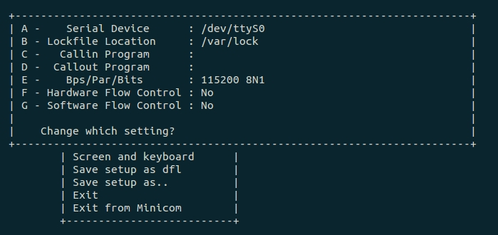

# ___2013 - 05 - 16（交叉编译工具）___
# 在Ubuntu中使用minicom / kermit
  - 安装：$ sudo apt-get install minicom
  - 配置：# minicom -s
  - 选择Serial port setup
  - 注意ttyS0中S为大写！

  
  - 一般需要关闭软/硬流控
  - 输出串口内容到文件：
    ```c
    Ctrl+A Ctrl+L → Capture on/off.....L
    ```
  - 将当前用户加入到dialout组（/dev/tty* 的用户组）
    ```c
    $ sudo vi /etc/group
    dialout:x:20:leondgarse
    ```
  - Kermit保存log到文件：
    ```c
    > log session
    ```
# arm-linux-gcc安装及配置
  - 如将其解压至/opt目录下，对于非root用户：
    ```c
    $ vi ~/.bashrc 在底部添加export PATH=$PATH:/opt/arm-linux-4.4.3/bin
    修改完后运行$ source .bachrc
    ```
  - 对于root用户:
    ```c
    # gedit /etc/environment 在引号内末尾添加 :/opt/arm-linux-4.4.3/bin
    修改完后运行# source /etc/environment
    ```
  - 运行$ arm-linux-gcc -v 可查看是否修改成功
# Linux下dnw(dnw2.c)使用(s5pv210)：
  - 设定目标板USB启动，使用usb命令查看目标vid &amp; pid(04e8:1234)，打开串口工具(minicom)
  - 编辑dnw2.c(或使用xdnw)，填入对应vid &amp; pid以及文件下载地址并重新编译
    ```c
    (该步骤分两次完成，x210_usb.bin ---> d0200010, u-boot.bin ----> 23e00000)
    gcc dnw2.c -o dnw2 -lusb
    ```
    通过串口工具将u-boot写入闪存
  - <usb.h> not found ----> sudo apt-get install libusb-dev
  - usb*** 未定义的引用 ----> 编译时加条件 -lusb
# qemu调试arm汇编代码：
  - 汇编代码段：
    ```c
    $ arm-linux-as  -g  -o  do_sub.o  do_sub.s
    ```
    链接目标文件成可执行文件，这里我们采用默认的链接选项链接程序
    ```c
    $ arm-linux-ld  -o  do_sub  do_sub.o
    ```
    使用qemu执行程序，并等待arm-linux-gdb连接
    ```c
    $ qemu-arm  -g  1234  do_sub
    ```
    使用arm-linux-gdb 调试程序
    ```c
    $ arm-linux-gdb   do_sub
    ```
    启动gdb后在gdb命令行敲入target命令
    ```c
    target  remote  localhost:1234
    ```
    连接成功后可以调试程序了，可以使用list看代码，s单步执行，info r看寄存器等
