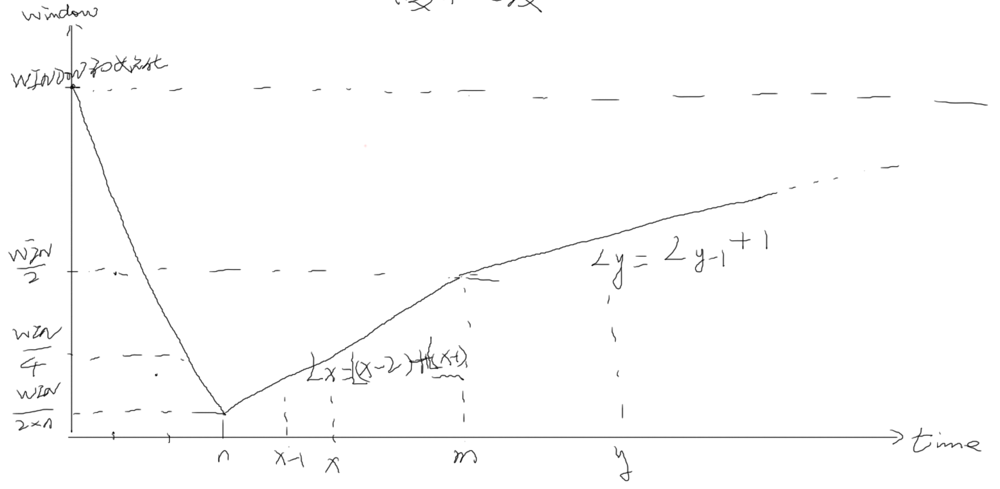
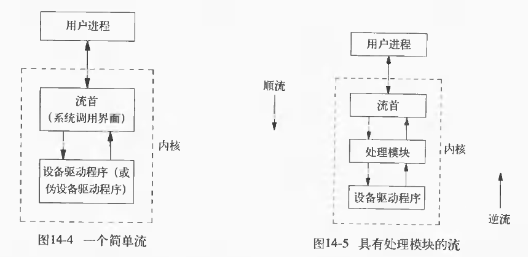

- 2013 - 06 - 17（网络编程）
***

# <span style="color:#ff0000;">TCP UDP basic
  - 1).        Internet的最早雏形：ARPAnet
    ```python
    TCP协议分成两个不同的协议：
            用来检查网络传输中差错的传输控制协议TCP
            专门负责对不同网络进行互联的互联网协议IP
 
    ```
    2).        网络采用分而治之的方法设计，以分层的形式有机组合在一起，每层向上层提供服务，
    ```python
            对上层做透明传输，同时使用下层提供的服务
 
    ```
    3).        网络体系结构即指网络的层次结构和每层所使用的协议的集合
    ```python
    两类非常重要的体系结构：OSI与TCP/IP
 
    OSI开放系统互联模型：高层（应用层、表示层、会话层）
                    低层（传输层、网络层、数据链路层、物理层）
 
    TCP/IP协议族的体系结构：
            应用层（Telnet、FTP、HTTP、DNS、SMTP等）【用户进程】
            传输层（TCP、UDP和SCTP）【内核进程】数据所要交给的进程或线程
            网络层（IP、ICMP、IGMP和IPsec）【内核进程】机器与机器之间连接
            网络接口和物理层（以太网、令牌环网、FDDI、WIFI、3G等）屏蔽硬件差异
    ARP：地址解析，IP地址 -> MAC地址，PARP：逆向解析，MAC地址 -> IP地址
 
    ```
    4).        TCP/IP协议下的数据包（截图）
    ```python
    Ethernet header        IP header        TCP header        App. header        User data        Ethernet trailer
            14        |20        20                                |4(硬件产生)
                    |        46 ~ 1500                                |
 
            MTU(max transfer unit)最大传输单元，以太网中为1500
            mss(max segment setion)用户净荷数据，用户所发数据最大为多少
 
            14字节以太网头：6字节(48位)目标MAC地址，6字节源MAC地址，2字节以太网
                    类型(IPV4\ARP\PARP)
 
            20字节IP头：
                    【1字节(4位版本号、4位IHL(Internet Herder Length))，
                            1字节服务类型(TOS)，2字节总长度】；
                    【2字节碎片身份标识、2字节(3位IP标志(X/D/M)，13位碎片偏移量)】；
                    【1字节TTL(每过一个路由器-1，为0时丢弃该包)、1字节Protocol，
                            2字节头部验证】；
                    4字节源IP地址，4字节目的IP地址，4字节IP可选项
 
            20字节TCP头：
                    【2字节源端口号，2字节目标端口号】；
                    4字节序列号(报文段序号)，TCP连接中传送的字节流中的每一个字节都按顺序
                            编号，首部中的序号字段值值得是本报文段所发送的数据的第一个字节的序号；
                    4字节确认号，是期望收到对方下一个报文段的第一个数据字节的序号，即当确
                            认号=N，则表明，到序号N-1为止所有数据都已正确接收；
                    1字节(4位)数据偏移，指出TCP报文段的数据起始处距离TCP报文段的起始处
                            有多远，它实际上指出的是TCP报文段的首部长度。注意：数据偏移的单位
                            是32位(4字节)，因此数据偏移的最大值是15*4 = 60，这也是TCP首部长
                            度的最大值(即选项长度不能超过40字节)；
                    4位保留位，应置为0；
                    8位TCP标志(C/E/U/A/P/R/S/F)，CWR、ECE
                            紧急URG，置1通知系统此报文段有紧急数据
                            确认ACK，置1有效，TCP规定，在建立连接后所有传送的报文段都必须把
                                    ACK置1
                            推送PSH，在一端的应用进程希望在键入一个命令后立即就能够收到对方的
                                    响应，此时，可以将PSH置为1
                            复位RST，置1时表明TCP连接中出现严重错误，必须释放连接，然后再重
                                    新建立
                            同步SYN，在连接建立时用来同步序号，当SYN = 1，ACK = 0时表明这是
                                    一个连接请求报文，若对方统一建立连接，则在相应报文中使SYN =
                                     1，ACK = 1
                            终止FIN，用来释放一个连接，置1时表明此报文段的发送方数据已发送完
                                    成，并要求释放连接
                    2字节数据窗口大小，窗口指的是发送本报文段的一方的接收窗口，窗口值告诉
                            对方：从本报文首部中的确认号算起，接收方允许对方发送的数据量。总之，
                            窗口值作为接收方让发送方设置其发送窗口的依据，窗口值是经常在变动着
                            的。（如Window == 1000，每次发送1000字节数据，发送完成后，会发
                            送确认包，接收方回复Ack，即4字节的确认号，如Ack == 1000，确认Ack
                            之前的数据已正确接收则说明接收完0～999字节的数据，希望发送方从
                            1000字节处继续发送，这是TCP可靠传输的确认重发机制）
                            （简单策略：        拥塞时，数据窗口Window急剧减小，缓慢恢复。
                             I). 当网络发生数据重传时，数据窗口Window减半；
                             II). 窗口恢复：若数据发送成功，在(Window/2)以下时，当前窗口大小会直
                                    接加到下一次去；当恢复到(Window/2)时，每成功一次加1）（截图）
    ```

  
    ```python
    UDP头部有两个字段：数据字段和首部字段
 
    ```
    5).        TCP（传输控制协议）是一种面向链接的传输层协议，它能提供高可靠性通信，适用情        况：
    ```python
             I).        对传输质量要求较高，以及传输大量数据的通信
             II).        在需要可靠数据传输的场合，通常使用TCP协议
            III).        即时通讯软件的用户登录账户管理相关的功能，通常使用TCP协议
 
    UDP（用户数据报协议）是不可靠的无连接的协议，在数据发送前，因为不需要进行连
            接，所以可以进行高效率的数据传输，适用情况：
             I).        发送小尺寸数据（如IP地址查询）
             II).        在接收到数据，给出应答较困难的网络中（如无线网络）
            III).        适合与广播/组播式通信中
            IV). 即时通讯软件与网络流媒体等
 
    SCTP点到点的多路传输（多链路、多主机），TCP的增强
 
    ```
    6).        STREAMS(流)是系统V提供的一种构造内核设备驱动程序和网络协议包的一种通用方法
    ```python
            注意不要与标准I/O的流(streams)相混淆。
    流在用户进程和设备驱动程序之间提供了一条全双工通路，流无需与实际硬件设备直接
            会话，流也可以用来构造伪设备驱动程序。
    在流首之下可以压入任意数量的处理模块，类似与后进先出的栈(截图)。
    ```

  
***

# <span style="color:#ff0000;">TCP/IP网络编程
  - TCP/IP网络编程
  - 1).        Socket（套接字）：
    ```python
            由于TCP/IP协议被集成到操作系统的内核中，引入了新型的I/O操作，是一个由内
                    核提供的，独立于具体协议的网络编程接口，是自重特殊的文件描述符，在OSI
                    模型中，主要位于会话层与传输层之间，目前主要使用的是BSD Socket
            Socket类型：
                    字节流套接字（SOCK_STREAM）：有序、可靠、双向的面向连接字节流
                    数据报套接字（SOCK_DGRAM）：长度固定的、无连接的不可靠报文传递
                    SOCK_SEQPACKET：长度固定、有序、可靠的面向连接报文传递
                    原始套接字（SOCK_RAW）：IP协议的数据包接口，应用程序负责构造自己的
                            协议首部，需超级用户权限，因为传输协议(TCP和UDP等)被绕过了
 
    ```
    2).        IP地址
    ```python
            表示形式：常用点分形式，如202.38.64.10，最后都会转换成一个32位的无符号整
                    数
            IP地址分类:
                    A: 0        0.0.0.0        ~        126.255.255.255        (127为主机回环地址)
                    B: 10        128.0.0.1        ~        191.255.255.255        (企业内网)
                    C: 110        192.0.0.1        ~        223.255.255.255        (个人使用，192.x.x.x/10.0.0.0局域网)
                    D: 1110        224.0.0.1        ~        239.255.255.255        (使用UDP协议，多播/组播，                                                                                        x.x.x.255广播，255.255.255.255全网广播)
            IPV6：
                    128位，16进制表示
 
    ```
    3).        端口号：
    ```python
            用来区分一台主机接收到的数据包应该转交给哪个进程来处理
            TCP与UDP端口号独立
            端口号一般由IANA（Internet Assigned Numbers Authority）管理
 
            保留的端口：1 ~ 1023(1 -> tcpmux, 7 -> echo, 21 -> ftp, 23 -> telnet)
            ？注册的端口：1024 ～ 5000(系统分配的端口)
            ？动态或私有端口：5001 ～ 65535(自己分配的端口)
 
    ```
    4).        字节序：
    ```python
            大端序：数字最高位存放在低字节，若用字符型指针强制转换到整数[4321]地址，
                    则cp[0]指向4，cp[3]指向1，小端序则正相反
            网络传输的数据必须按网络字节序(NBO)，即大端字节序
            在大部分的PC机（主要是X86架构）上，
                    当将数据送入Socket前，需转化成网络字节序（NBO），即大端序
                    当从Socket取出数据后，需转化成主机字节序（HBO），即小端序
            字节转化函数：（大于一个字节的数据）
                     #include <arpa/inet.h>
                    uint32_t htonl(uint32_t hostlong);
                    uint16_t htons(uint16_t hostshort);
                            //主机字节序到网络字节序，long/short
                    uint32_t ntohl(uint32_t netlong);
                    uint16_t ntohs(uint16_t netshort);
                            //网络字节序到主机字节序，long/short
 
    ```
    5).        IP地址的转换：
    ```python
            #include <sys/socket.h>
            #include <netinet/in.h>
            #include <arpa/inet.h>
            int inet_aton(const char *cp, struct in_addr *inp);
                    //将cp所指的字符串转换成32位的网络字节序二进制值
            in_addr_t inet_addr(const char *cp);
                    //功能同上，返回转换后的地址值，内部包含字节序转换，
                            不能正确转换255.255.255.255，推荐使用inet_pton()
            char *inet_ntoa(struct in_addr in);
                    //将32为的网络字节序二进制地址值转换为点分十进制的字符串
 
            #include <arpa/inet.h>
            int inet_pton(int af, const char *src, void *dst);
                    //将IPV4/IPV6的地址转换为二进制(binary)的格式，
                    成功返回1，地址信息错误返回0，af不是有效地址族返回-1
                            af值为AF_INET/AF_INET6
            const char *inet_ntop(int af, const void *src, char *dst, socklen_t size);
    ```
    <br />
***

# <span style="color:#ff0000;">网络编程相关API
  - 6). 网络编程相关API
    ```python
    #include <sys/types.h>     /* See NOTES */
    #include <sys/socket.h>
    int socket(int domain, int type, int protocol);
    /****        创建套接字，成功返回新的socked文件描述符，失败返回-1
            domain(域)地址族：AF_INET(IPv4因特网域)AF_INET6(IPv6因特网域)
                            AF_UNIX(UNIX域)
            type套接字类型SOCK_STREAM/SOCK_DGRAM/
                            SOCK_RAW/SOCK_SEQPACKET
            protocol参数通常置为0，表示按给定的域和套接字类型选择默认协议
                    如在AF_INET通信域中SOCK_STREAMS默认协议是TCP(传输控制协议)，
                    SOCK_DGRAM默认协议是UDP(用户数据报协议)
    ****/
    int getsockopt(int sockfd, int level, int optname, void *optval, socklen_t *optlen);
    int setsockopt(int sockfd, int level, int optname, const void *optval, socklen_t optlen);
    /****        设置套接字选项，成功返回0，失败返回-1
            level：SOL_SOCKET(应用层，通用套接字选项)
                    IPPROTO_IP(网络层，IP选项)
                    IPPROTO_TCP(传输层，TCP选项)
            SOL_SOCKET optname:
                    SO_BROADCAST        允许发送广播
                    SO_KEEPALVE        保活连接，每两小时连接一次，保证连接存在
                                    //心跳检测：网络连接时每个一段时间检测一下连接是否还在
                    SO_RCVBUF        接收缓冲区大小
                    SO_SNDBUF        发送缓冲区大小
                    SO_RCVTIMEO        接收超时
                    SO_SNDTIMEO        发送超时
                    SO_REUSEADDR        允许重用本地地址和端口
            IPPROTO_IP optname:
                    IP_ADD_MEMBERSHIP        增加组播属性
                    IP_MULTICAST_LOOP        本地接收多播
            eg:        //编辑套接字属性，使其可以快速重用，包括地址和端口
                    int reu = 1;
                    setsockopt(fd, SOL_SOCKET, SO_REUSEADDR, &amp;reu, sizeof(SO_REUSEADDR));
    ****/
 
    int bind(int sockfd, const struct sockaddr *addr, socklen_t addrlen);
    /****        绑定地址和端口号，返回值0或-1
            sockfd套接字文件描述符，由socket()调用返回
            struct sockaddr {                //通用地址结构，用_in/_un协议地址结构代替
                    sa_family_t sa_family;        //地址族，AF/PF_xxx
                    char sa_data[14];        //14字节协议地址
            };
            struct sockaddr_in{        //internet地址协议结构，bind()使用时显示转换类型
                    u_short sin_familly;        //protocol family，地址族，AF_inet，2 bytes
                    u_short sin_port;        //port number，端口，2 bytes
                    struct in_addr sin_addr;        //IP address(32-bits)，IPV4地址，4 bytes
                    char sin_zero[8];        //8 bytes unused，作为填充，一定要清0
                                    //包含于<linux/in.h>
            };
            struct in_addr{                //IPV4地址结构
                    in_addr_t s_addr;        //u32 network address，服务器端可为
                                    //INADDR_ANY，则连接任意匹配端口号的IP地址
            };
            addrlen地址结构的长度
            eg: 
                    struct sockaddr_in myaddr;
                    memset(&amp;myaddr, 0, sizeof(myaddr));
 
                    myaddr.sin_family = PF_INET;
                    myaddr.sin_port = htons(8888);
                    myaddr.sin_addr.s_addr = inet_addr("192.168.7.117");
 
                    if (bind(sockfd, (struct sockaddr *)(&amp;myaddr), sizeof(myaddr)) < 0)
                    err_exit("bin error");
    ****/
 
    int connect(int sockfd, const struct sockaddr *addr, socklen_t addrlen);
    /****        与服务器建立连接，客户端使用的系统调用，成功返回0，失败返回-1
                    服务器端调用accept()函数接受请求，以三次握手建立连接
            eg:        struct sockaddr_in cli;
                    socklen_t addrlen;
                    bzero(cli, sizeof(cli));
                    addrlen = sizeof(cli);
    ****/
 
    int listen(int sockfd, int backlog);
    /****        监听，服务器端使用，返回0或-1，调用完成后，socket变为监听socket
            baklog指定正在等待连接的最大队列长度，具体的上线依赖与每个协议的
                    实现，ARM中上限为14，它的作用在于处理可能同时出现的几个连接
                    请求，内核中存在两个链表（正在连接链表，已建立连接链表），其中
                    正在连接链表最大长度等于backlog+3，已建立连接链表数量不计算其中
    ****/
 
    int accept(int sockfd, struct sockaddr *addr, socklen_t *addrlen);
    /****        接收TCP/IP连接，服务器端使用，若没有连接，使服务器阻塞
                    返回建立好连接的套接字或-1，
            sockfd接收客户连接的socket，即listening socket
            addr接收外来连接的地址信息，如果不关心，可置为NULL
            addrlen接收连接的sockaddr_in结构体的长度
    ****/
    ```
    ```python
    接收数据：
    ssize_t recv(int sockfd, void *buf, size_t len, int flags);
    /****        返回以字节计数的消息长度，若无可用消息返回0，出错返回-1
                    flags：MSG_OOB如果协议支持，接收带外数据，如用作控制的紧急数据
                            MSG_PEEK返回报文内容，而不真正取走报文
                            MSG_TRUNC即使报文被截断，要求返回的是报文的实际长度
                            MSG_WAITALL等待直到所有的数据可用
                            MSG_DONTWAIT允许非阻塞操作（等价于使用O_NONBLOCK）
            使用SOCK_STREAM套接字时，并不能保证在一次recv中会读取整个字符串，
                    所以需要重复调用直到返回0
            eg：
                    while ((n = recv(sockfd, buf, BUFSIZ, 0)) > 0)
                            if (write(STDOUT_FILENO, buf, n) != n)
                                    err_ret("recv error");
    ****/
    ssize_t read(int fd, void *buf, size_t count);
    ssize_t recvfrom(int sockfd, void *buf, size_t len, int flags, struct sockaddr *src_addr, socklen_t *addrlen);
            //通常用于无连接套接字，否则等同于recv，src_rcv由接收到数据时，内核自动填充
    ```
    ```python
    发送数据：
    ssize_t send(int sockfd, const void *buf, size_t len, int flags);
            //成功则返回发送的字节数，出错返回-1
            三个参数与write含义一致，
            flags：MSG_DONTROUTE勿将数据路由出本地网络
                    MSG_DONTWAIT允许非阻塞操作（等价于使用O_NONBLOCK）
                    MSG_EOR如果协议支持，此为记录结束
                    MSG_OOB如果协议支持，发送带外数据
    ssize_t write(int fd, const void *buf, size_t count);
    ssize_t sendto(int sockfd, const void *buf, size_t len, int flags,
            const struct sockaddr *dest_addr, socklen_t addrlen);
            //对于面向连接的套接字，目标地址是忽略的，因为目标地址蕴含在连接中，对
                    于无连接的套接字，不能使用send
    #include <sys/socket.h>
    int shutdown(int sockfd, int how);
            //关闭全双工连接的一部分功能，或是使一个套接字处于不活动状态，无论引
                    用它的文件描述符数目有多少
                    how: SHUT_RD/SHUT_WR/SHUT_RDWR
    int close(int fd);
            //关闭双向通讯，只有在最后一个活动引用被关闭时才释放网络端点
 
    #include <unistd.h>
    int fsync(int fd);
            //刷新缓冲
 
    #include <sys/socket.h>
    int getsockname(int sockfd, struct sockaddr *addr, socklen_t *addrlen);
            //获得绑定到一个套接字的地址，addrlen为一个指向整数的指针，该整数指定
                    缓冲区addr的大小，返回时该整数会被设置成返回地址的大小
    int getpeername(int sockfd, struct sockaddr *addr, socklen_t *addrlen);
            //如果套接字已经和对方连接上，调用getpeername获取对方的地址
    ```
  - 7).        三次握手连接：
    ```python
            客户端 -> 服务器 SYN K
            服务器 -> 客户端 ACK K+1, SYN J
            客户端 -> 服务器 ACK J+1
 
    四次握手断开连接：
            客户端 -> 服务器 FIN m
            服务器 -> 客户端 ACK m+1
            服务器 -> 客户端 FIN n
            客户端 -> 服务器 ACK n+1
            各自内核释放Socket对应文件描述符所占用的内存资源
    ```
  - 8).        UDP编程
    ```python
            尽力传输，无连接
                    建立socket：套接字类型使用SOCK_DGRAM，表示UDP连接
                    初始化sockaddr_in的变量
                    绑定：不用等待连接，不用置为监听状态
                    阻塞等待接收数据
    ```
  - 9).        带外数据
    ```python
            带外数据是一些通信协议锁支持的可选特征，即使传输队列已经有数据，带外数据
                    先行传输。TCP支持带外数据，UDP不支持。TCP将带外数据称为“紧急数据”，
                    且仅支持一个字节的紧急数据，？如果带MSG_OBB标志传输字节超过一个时，
                    最后一个字节被看作紧急数据字节。如果安排发生套接字信号，当接收到紧急
                    数据时，发送信号SIGURG
    ```
  - 10).多路复用：
    ```python
    在Linux中阻塞是一种常态，轮询方式是一种非常态
    阻塞与非阻塞的区别不在于select监听上，而是在读写的时候
    常用阻塞函数：读阻塞read/recv/recvfrom、写阻塞write/send、accept/connect
                    UDP不用等待确认，没有实际的缓冲区，所以sendto函数永远不会阻塞
    eg：//使用fcntl函数实现非阻塞
            int fcntl(int fd, int cmd, long, arg);
            int flag;
            flag = fcntl(sockfd, F_GETFL, 0);
            flag |= O_NONBLOCK;
            fcntl(sockfd, F_SETFL, flag);
 
    #include <sys/select.h>
    int select(int nfds, fd_set *readfds, fd_set *writefds,
                            fd_set *exceptfds, struct timeval *timeout);
            //返回准备就绪的文件描述符数量，超时返回0，出错返回-1
            参数nfds = maxfd + 1, 
                    struct timeval {
                            long  tv_sec;     /* seconds */
                            long  tv_usec;    /* microseconds */
                    };
            timeout == NULL永远等待，若被信号中断，则返回-1，并设置EINTR
            timeout->tv_sec == 0 &amp;&amp; timeout->tv_usec == 0 完全不等待
            timeout->tv_sec ！= 0 || timeout->tv_usec！= 0 等待指定秒数
            Linux中会将时间值重置为上次计时的剩余时间
                    FD_ZERO(fd_set *fdset)        从fdset中清除所有的文件描述符
                    FD_SET(int fd, fd_set *fdset)        将fd加入到fdset
                    FD_CLR(int fd, fd_set *fdset)        将fd从fdset里面清除
                    FD_ISSET(int fd, fd_set *fdset)        判断fd是否在fdset中
            fd_set是一个一维数组，其长度为系统支持的最大文件描述符数量
                    （FD_SETSIZE，1024），FD_SET将文件描述符对应的位填充为1，在select之
                    前是监控的文件描述符集合，在select之后将是有数据的文件描述符集合
            eg：
                    fd_set rset;
                    int maxfd = -1;
 
                    FD_ZERO(&amp;rset);
                    FD_SET(0, &amp;rset);                //监控标准输入1
                    FD_SET(fd, &amp;rset);        //监控fd
                    maxfd = maxfd > fd ? maxfd : fd;
 
                    select(maxfd + 1, &amp;rset, NULL, NULL, NULL)；
                    if (FD_ISSET(0, &amp;rset)) {        //标准输入有数据
                            ；
                    }
                    if (FD_ISSET(fd, &amp;rset)) {        //fd有数据
                            ；
                    }
    ```
  - 11). ping命令
  - 12). 网络超时检测
    ```python
             I).        设置socket的属性SO_RCTIMEO
                    eg: 
                            struct timeval tv = {5, 0};
                            setsockopt(sockfd, SOL_SOCKET, SO_RCVTIMEO, &amp;tv, sizeof(tv));
                            recv( ... );
             II).        select函数检测
            III).        设置定时器，捕捉SIGALRM信号
    ```
  - 13). 带外数据
    ```python
            带外数据是属于TCP编程，TCP没有真正意义上的“带外数据”，是由“紧急模式”的方
                    式来传，带外数据一次只能发一个字节，若有多个，则最后一个视为紧急数据
            发送:         buf[1] = 's';
                            sockfd = connect( ... );
                            send(sockfd, buf, 1, MSG_OOB);
                            fsync(sockfd);
            接收:        recv( ... , MSG_OOB);
            当带外数据到达时，
                     I).        程序会收到一个SIGURG信号，安装信号处理句柄，在信号处理句柄函数里
                            面去接收带外数据；
                     II).        从select中退出，处理方法：可以将带外数据的fd加入到select()的异常集
                            合
            应用场合：
                     I).        TCP协议自身，当接收方缓冲区满时，接收方会通过紧急数据方式告知对方
                            不再发送数据
                     II).        安防监控行业，带质量控制的UDP音视频传输：USIP(microsoft)，
                                    RTP/RTSP(应用层，底层TCP/UDP，加带外数据)
            【ffmepg(RTP/RTSP server, h.264编解码), live555项目中集成RTP/RTSP】
    ```
  - 14). 广播
    ```python
            同时发送给局域网内所有主机，只有用户数据报(使用UDP协议)套接字才能广播。
    //
    ```
  - 15). 组播
    ```python
            //只有加入某个
    ```
