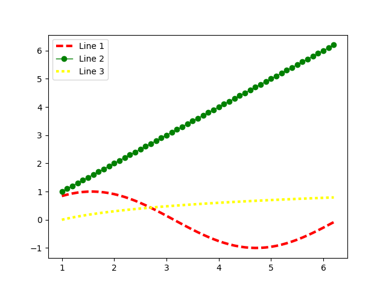
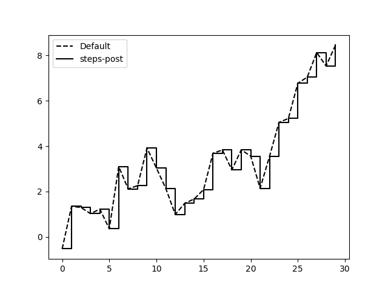
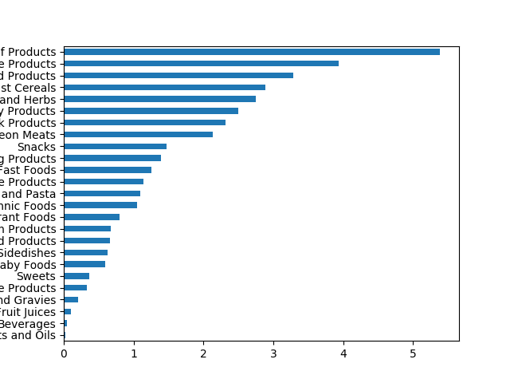
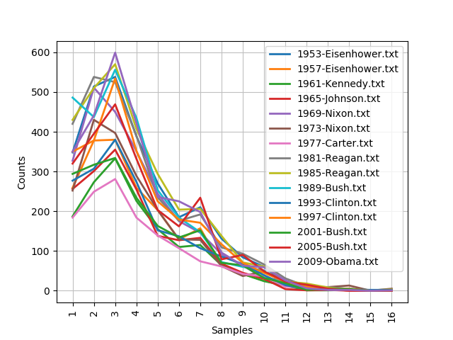

# ___2017 - 03 - 09 Python 数据分析___

# 目录
  <!-- TOC depthFrom:1 depthTo:6 withLinks:1 updateOnSave:1 orderedList:0 -->

  - [___2017 - 03 - 09 Python 数据分析___](#2017-03-09-python-数据分析)
  - [目录](#目录)
  - [Q & A](#q-a)
  - [python扩展库 numpy & pandas & matplotlib & ipython & scipy & Biopython简介](#python扩展库-numpy-pandas-matplotlib-ipython-scipy-biopython简介)
  - [ipython](#ipython)
  	- [shell命令和别名](#shell命令和别名)
  	- [? 用于显示信息 & 搜索命名空间](#-用于显示信息-搜索命名空间)
  	- [魔术命令](#魔术命令)
  	- [%run命令](#run命令)
  	- [Qt的富GUI控制台 jupyter qtconsole](#qt的富gui控制台-jupyter-qtconsole)
  	- [matplotlib集成与pylab模式](#matplotlib集成与pylab模式)
  	- [输入和输出变量](#输入和输出变量)
  	- [记录输入和输出](#记录输入和输出)
  	- [调试器的其他使用场景](#调试器的其他使用场景)
  	- [%time & %timeit 测试代码的执行时间](#time-timeit-测试代码的执行时间)
  	- [基本性能分析：%prun和%run -p](#基本性能分析prun和run-p)
  	- [逐行分析函数性能 %lprun](#逐行分析函数性能-lprun)
  	- [ipython 键盘快捷键](#ipython-键盘快捷键)
  	- [IPython HTML Notebook](#ipython-html-notebook)
  	- [IPython 提高代码开发效率的几点提示](#ipython-提高代码开发效率的几点提示)
  	- [IPython 个性化和配置](#ipython-个性化和配置)
  - [NumPy 基本数据结构 (ndarray & random & 视图 & 索引 & take & put & reshape & ravel & flatten & resize & 轴变换transpose & swapaxes)](#numpy-基本数据结构-ndarray-random-视图-索引-take-put-reshape-ravel-flatten-resize-轴变换transpose-swapaxes)
  	- [ndarray：一种多维数组对象 (dtype & shape & array & zeros & ones & eye & diag & empty & arange & astype & linspace)](#ndarray一种多维数组对象-dtype-shape-array-zeros-ones-eye-diag-empty-arange-astype-linspace)
  	- [random模块 （random_sample & rand & randint & uniform & normal & randn & permutation & shuffle & choice)](#random模块-randomsample-rand-randint-uniform-normal-randn-permutation-shuffle-choice)
  	- [数组的视图](#数组的视图)
  	- [高维数组索引](#高维数组索引)
  	- [布尔型索引](#布尔型索引)
  	- [花式索引](#花式索引)
  	- [take & put 花式索引的等价函数](#take-put-花式索引的等价函数)
  	- [重新排列 (reshape & ravel & flatten)](#重新排列-reshape-ravel-flatten)
  	- [resize改变数组大小](#resize改变数组大小)
  	- [数组转置和轴对换 (transpose & T & dot计算内积)](#数组转置和轴对换-transpose-t-dot计算内积)
  	- [高维数组轴变换 (swapaxes)](#高维数组轴变换-swapaxes)
  - [Numpy 数组方法 (ufunc & meshgrid & where & 数学方法 & any & all & sort & unique & concatention & vstack & split & fromfunction & 文件 & 线性代数 & fft & 随机数)](#numpy-数组方法-ufunc-meshgrid-where-数学方法-any-all-sort-unique-concatention-vstack-split-fromfunction-文件-线性代数-fft-随机数)
  	- [通用函数 ufunc (一元 sqt & exp & modf & 二元 add & maximum)](#通用函数-ufunc-一元-sqt-exp-modf-二元-add-maximum)
  	- [np.meshgrid 函数](#npmeshgrid-函数)
  	- [将条件逻辑表述为数组运算 (where)](#将条件逻辑表述为数组运算-where)
  	- [数学和统计方法 (sum & mean & std & var & add & sin & power & sign & cumsum & cumprod & diff)](#数学和统计方法-sum-mean-std-var-add-sin-power-sign-cumsum-cumprod-diff)
  	- [用于布尔型数组的方法 (any & all & alltrue & allclose)](#用于布尔型数组的方法-any-all-alltrue-allclose)
  	- [排序 (sort & sort_values & sort_index )](#排序-sort-sortvalues-sortindex-)
  	- [唯一化以及其他的集合逻辑 (unique & in1d)](#唯一化以及其他的集合逻辑-unique-in1d)
  	- [数组合并与拆分concatentaion & vstack & row_stack & hstack & column_stack & split & hsplit & vsplit & dsplit](#数组合并与拆分concatentaion-vstack-rowstack-hstack-columnstack-split-hsplit-vsplit-dsplit)
  	- [fromfunction在每个坐标点上执行function](#fromfunction在每个坐标点上执行function)
  	- [save & load 存取二进制格式文件](#save-load-存取二进制格式文件)
  	- [savetxt & loadtxt 存取文本文件](#savetxt-loadtxt-存取文本文件)
  	- [线性代数 (dot & linalg & inv & qr & var & det & eig & svd)](#线性代数-dot-linalg-inv-qr-var-det-eig-svd)
  	- [傅立叶变换 fft](#傅立叶变换-fft)
  	- [示例：随机漫步 (randint & where & cumsum & abs & any & argmax)](#示例随机漫步-randint-where-cumsum-abs-any-argmax)
  - [pandas 一维数组对象Series](#pandas-一维数组对象series)
  	- [Series的创建](#series的创建)
  	- [Series的基本运算](#series的基本运算)
  	- [Series与Python字典](#series与python字典)
  	- [Series的数据对齐](#series的数据对齐)
  	- [Series的name属性](#series的name属性)
  - [pandas 表格数据结构DataFrame & Index对象 & 矢量化的字符串函数 & Panel](#pandas-表格数据结构dataframe-index对象-矢量化的字符串函数-panel)
  	- [创建 （zip & index & columns & 嵌套字典 & Series）](#创建-zip-index-columns-嵌套字典-series)
  	- [创建使用日期做index的DataFrame (pd.date_range)](#创建使用日期做index的dataframe-pddaterange)
  	- [数据查看 （index & columns & values & describe & ix & 切片）](#数据查看-index-columns-values-describe-ix-切片)
  	- [数据修改 (set_value)](#数据修改-setvalue)
  	- [数据删除 （del & drop）](#数据删除-del-drop)
  	- [DataFrame的 index & columns 的name属性](#dataframe的-index-columns-的name属性)
  	- [Index 索引对象](#index-索引对象)
  	- [pandas 矢量化的字符串函数 (contains & get & findall & extract)](#pandas-矢量化的字符串函数-contains-get-findall-extract)
  	- [面板数据Panel (三维版的DataFrame)](#面板数据panel-三维版的dataframe)
  - [Series & DataFrame 基本通用功能 (reindex & 索引 & ix & 算数运算 & 函数映射apply & 值计数 & 数据对齐 & 排序 & loc & at & iloc & iat)](#series-dataframe-基本通用功能-reindex-索引-ix-算数运算-函数映射apply-值计数-数据对齐-排序-loc-at-iloc-iat)
  	- [reindex 重新索引 (插值method & ix)](#reindex-重新索引-插值method-ix)
  	- [索引、选取和过滤 (切片 & head & tail & 索引ix & is_unique)](#索引选取和过滤-切片-head-tail-索引ix-isunique)
  	- [汇总和计算描述统计 (ufunc & sum & idmax & describe & 相关系数与协方差)](#汇总和计算描述统计-ufunc-sum-idmax-describe-相关系数与协方差)
  	- [函数映射 (apply & applymap)](#函数映射-apply-applymap)
  	- [唯一值、值计数以及成员资格 (unique & value_counts & isin & apply(pd.value_counts))](#唯一值值计数以及成员资格-unique-valuecounts-isin-applypdvaluecounts)
  	- [数据对齐和处理缺失数据 (isnull & notnull & dropna & fillna & DataFrame和Series之间的运算)](#数据对齐和处理缺失数据-isnull-notnull-dropna-fillna-dataframe和series之间的运算)
  	- [排序 (sort_index & order & by)](#排序-sortindex-order-by)
  	- [排名（ranking）](#排名ranking)
  	- [整数索引 与 loc & at & iloc & iat方法](#整数索引-与-loc-at-iloc-iat方法)
  - [Series & DataFrame 层次化索引 (MultiIndex & swaplevel & sortlevel & 根据级别汇总统计 & set_index & reset_index & stack & unstack & pivot)](#series-dataframe-层次化索引-multiindex-swaplevel-sortlevel-根据级别汇总统计-setindex-resetindex-stack-unstack-pivot)
  	- [层次化索引与MultiIndex](#层次化索引与multiindex)
  	- [重排分级顺序 swaplevel](#重排分级顺序-swaplevel)
  	- [数据排序 sortlevel](#数据排序-sortlevel)
  	- [根据级别汇总统计](#根据级别汇总统计)
  	- [使用DataFrame的列作为索引 (set_index & reset_index)](#使用dataframe的列作为索引-setindex-resetindex)
  	- [stack & unstack 旋转层次化索引的轴，转换Series & DataFrame](#stack-unstack-旋转层次化索引的轴转换series-dataframe)
  	- [stack & unstack操作中的缺失值](#stack-unstack操作中的缺失值)
  	- [DataFrame进行unstack操作](#dataframe进行unstack操作)
  	- [pivot转换方法，使用原有数据创建新的DataFrame](#pivot转换方法使用原有数据创建新的dataframe)
  - [数据存取 （文本文档 & 二进制文件 & HDF5 & Excel & SQL数据库 & MongoDB）](#数据存取-文本文档-二进制文件-hdf5-excel-sql数据库-mongodb)
  	- [pandas读写表格型文件 read_csv & read_table & 缺失值处理 & 逐块读取 & from_csv](#pandas读写表格型文件-readcsv-readtable-缺失值处理-逐块读取-fromcsv)
  	- [手工处理分隔符格式 csv.reader & csv.writer](#手工处理分隔符格式-csvreader-csvwriter)
  	- [二进制文本文件读写 (pickle & save & load)](#二进制文本文件读写-pickle-save-load)
  	- [HDF5格式 (HDFStore)](#hdf5格式-hdfstore)
  	- [读取 (read_excel & to_excel & ExcelFile类)](#读取-readexcel-toexcel-excelfile类)
  	- [SQL数据库 (sqlite3 & read_sql)](#sql数据库-sqlite3-readsql)
  	- [存取MongoDB中的数据](#存取mongodb中的数据)
  - [网络相关数据处理 (json & urllib & request & html & xml)](#网络相关数据处理-json-urllib-request-html-xml)
  	- [json库读取JSON数据](#json库读取json数据)
  	- [Python获取网络数据 (urllib & requests)](#python获取网络数据-urllib-requests)
  	- [lxml.html解析html文件 (Yahoo财经数据处理成DataFrame)](#lxmlhtml解析html文件-yahoo财经数据处理成dataframe)
  	- [lxml.objectify解析XML (地铁资料数据处理成DataFrame)](#lxmlobjectify解析xml-地铁资料数据处理成dataframe)
  - [数据合并 (merge & join & concat & combine_first)](#数据合并-merge-join-concat-combinefirst)
  	- [merge 根据指定的列名 & 索引合并DataFrame重名数据项](#merge-根据指定的列名-索引合并dataframe重名数据项)
  	- [join DataFrame索引上的合并](#join-dataframe索引上的合并)
  	- [concat Series & DataFrame 横轴或纵轴上的数据堆叠](#concat-series-dataframe-横轴或纵轴上的数据堆叠)
  	- [DataFrame分别使用 join & merge & concat](#dataframe分别使用-join-merge-concat)
  	- [combine_first 使用另一个数据集的数据，填补NA值](#combinefirst-使用另一个数据集的数据填补na值)
  - [数据整理 (duplicated & drop_duplicates & map & replace & rename & cut & qcut & 过滤异常值 & 随机采样 & get_dummies)](#数据整理-duplicated-dropduplicates-map-replace-rename-cut-qcut-过滤异常值-随机采样-getdummies)
  	- [duplicated & drop_duplicates 处理重复数据](#duplicated-dropduplicates-处理重复数据)
  	- [map映射](#map映射)
  	- [replace替换](#replace替换)
  	- [Index.map & rename重命名轴索引](#indexmap-rename重命名轴索引)
  	- [cut & qcut离散化和面元划分](#cut-qcut离散化和面元划分)
  	- [数组运算过滤 & 变换异常值](#数组运算过滤-变换异常值)
  	- [通过permutation & randint随机数排列和随机采样](#通过permutation-randint随机数排列和随机采样)
  	- [get_dummies 计算指标&哑变量](#getdummies-计算指标哑变量)
  	- [get_dummies 计算电影数据的各标签分布](#getdummies-计算电影数据的各标签分布)
  - [matplotlib 绘图](#matplotlib-绘图)
  	- [pyplot & pylab](#pyplot-pylab)
  	- [绘图对象Figure & 子图Subplot](#绘图对象figure-子图subplot)
  	- [subplots方法](#subplots方法)
  	- [Figure的subplots_adjust方法修改间距](#figure的subplotsadjust方法修改间距)
  	- [颜色 color & 线型 linestyle(ls) & 标记 marker & 线宽 linewidth & 标签 label](#颜色-color-线型-linestylels-标记-marker-线宽-linewidth-标签-label)
  	- [刻度 set_xticks & set_xtickslabels & 标题 set_title & set_xlabel & 范围 set_xlim & 图例 legend](#刻度-setxticks-setxtickslabels-标题-settitle-setxlabel-范围-setxlim-图例-legend)
  	- [drawstyle 选项修改线型图中，非实际数据点的插值方式，默认是按线性方式插值](#drawstyle-选项修改线型图中非实际数据点的插值方式默认是按线性方式插值)
  	- [axes指定绘图区域](#axes指定绘图区域)
  	- [注释text & arrow & annotate](#注释text-arrow-annotate)
  	- [图形绘制 add_patch](#图形绘制-addpatch)
  	- [将图表保存到文件 savefig](#将图表保存到文件-savefig)
  	- [matplotlib全局配置 rc方法](#matplotlib全局配置-rc方法)
  - [pandas 绘图](#pandas-绘图)
  	- [Series & DataFrame的plot方法直接绘图](#series-dataframe的plot方法直接绘图)
  	- [Series 绘图选项](#series-绘图选项)
  	- [DataFrame 的专有绘图选项](#dataframe-的专有绘图选项)
  	- [ax选项](#ax选项)
  	- [柱状图 bar & barh](#柱状图-bar-barh)
  	- [直方图 hist & 密度图 kde](#直方图-hist-密度图-kde)
  	- [散布图 scatter](#散布图-scatter)
  - [Python图形化工具生态系统](#python图形化工具生态系统)
  - [GroupBy数据聚合与分组运算(groupby & aggregate & transform & apply & cut & qcut & pivot_table & crosstab)](#groupby数据聚合与分组运算groupby-aggregate-transform-apply-cut-qcut-pivottable-crosstab)
  	- [GroupBy技术](#groupby技术)
  		- [GroupBy对象](#groupby对象)
  		- [Series分组](#series分组)
  		- [DataFrame](#dataframe)
  		- [GroupBy的size方法](#groupby的size方法)
  		- [对GroupBy对象进行迭代](#对groupby对象进行迭代)
  		- [将groupby的数据转换为字典](#将groupby的数据转换为字典)
  		- [通过字典或Series进行分组](#通过字典或series进行分组)
  		- [通过函数进行分组](#通过函数进行分组)
  		- [level 根据索引级别分组](#level-根据索引级别分组)
  	- [GroupBy的方法聚合数据](#groupby的方法聚合数据)
  	- [aggregate & agg 聚合，将多个函数应用于多个列，只接受能够将一维数组简化为标量值的函数](#aggregate-agg-聚合将多个函数应用于多个列只接受能够将一维数组简化为标量值的函数)
  	- [transform聚合，将一个函数应用到各个分组，接受的函数只能产生两种结果，一个可以广播的标量值(np.mean)，或是一个相同大小的结果数组](#transform聚合将一个函数应用到各个分组接受的函数只能产生两种结果一个可以广播的标量值npmean或是一个相同大小的结果数组)
  	- [apply聚合，最一般化的GroupBy方法，传入的函数只需返回一个pandas对象或标量值即可](#apply聚合最一般化的groupby方法传入的函数只需返回一个pandas对象或标量值即可)
  	- [cut & qcut 桶 bucket & 分位数 quantile 分析](#cut-qcut-桶-bucket-分位数-quantile-分析)
  	- [groupby的“拆分－应用－合并”范式应用](#groupby的拆分应用合并范式应用)
  	- [透视表pivot table (pivot_table & margins & aggfunc & fill_value)](#透视表pivot-table-pivottable-margins-aggfunc-fillvalue)
  	- [交叉表（cross-tabulation，简称crosstab）是一种用于计算分组频率的特殊透视表](#交叉表cross-tabulation简称crosstab是一种用于计算分组频率的特殊透视表)
  - [日期和时间数据类型及工具 (datetiem & timedelta & strftime & strptime & parse & date_range & shift & rollforward & rollback & 时区 & 时期period & resample重采样 & 移动窗口函数)](#日期和时间数据类型及工具-datetiem-timedelta-strftime-strptime-parse-daterange-shift-rollforward-rollback-时区-时期period-resample重采样-移动窗口函数)
  	- [datetime.now 当前时间 year & month & day & date & time 属性](#datetimenow-当前时间-year-month-day-date-time-属性)
  	- [datetime.timedelta表示两个datetime对象之间的时间差](#datetimetimedelta表示两个datetime对象之间的时间差)
  	- [str & strftime & strptime & datetime格式定义](#str-strftime-strptime-datetime格式定义)
  	- [dateutil包中的parser.parse方法可以解析任何格式的字符串](#dateutil包中的parserparse方法可以解析任何格式的字符串)
  	- [使用datetime的时间序列](#使用datetime的时间序列)
  	- [date_range生成日期范围](#daterange生成日期范围)
  	- [shift & rollforward & rollback 移动 Series & DataFrame沿时间轴将数据前移或后移](#shift-rollforward-rollback-移动-series-dataframe沿时间轴将数据前移或后移)
  	- [时区处理 (pytz库 & common_timezones & timezone & tz_localize & tz_convert)](#时区处理-pytz库-commontimezones-timezone-tzlocalize-tzconvert)
  	- [时期period及其算术运算 (period & asfreq & 季度 & to_period & to_timestamp & PeriodIndex)](#时期period及其算术运算-period-asfreq-季度-toperiod-totimestamp-periodindex)
  	- [resample & groupby重采样 (降采样 & OHLC重采样 & 升采样和插值)](#resample-groupby重采样-降采样-ohlc重采样-升采样和插值)
  	- [移动窗口函数 (rolling_mean & rolling_std & ewma & rolling_corr & rolling_apply)](#移动窗口函数-rollingmean-rollingstd-ewma-rollingcorr-rollingapply)
  	- [性能和内存使用方面的注意事项](#性能和内存使用方面的注意事项)
  - [NumPy内部机理与其他类 (issubdtype & mro & 排列顺序C & Fortran & broadcasting广播 & np.newaxis & dtype & matrix & memmap & Cython)](#numpy内部机理与其他类-issubdtype-mro-排列顺序c-fortran-broadcasting广播-npnewaxis-dtype-matrix-memmap-cython)
  	- [ndarray对象的内部机理](#ndarray对象的内部机理)
  	- [NumPy数据类型体系 (issubdtype & mro)](#numpy数据类型体系-issubdtype-mro)
  	- [数组的排列顺序 C & Fortran](#数组的排列顺序-c-fortran)
  	- [broadcasting广播 & np.newaxis属性添加新轴](#broadcasting广播-npnewaxis属性添加新轴)
  	- [结构化和记录式数组 (dtype)](#结构化和记录式数组-dtype)
  	- [NumPy的matrix类](#numpy的matrix类)
  	- [内存映像文件 memmap](#内存映像文件-memmap)
  	- [其他加速方法 Cython & f2py & C](#其他加速方法-cython-f2py-c)
  - [Numpy其他方法 (r_ & c_ & tile & repeat & reduce & accumulate & outer & reduceat & fromoyfunc & vectorize & argsort & lexsort & searchsorted & digitize)](#numpy其他方法-r-c-tile-repeat-reduce-accumulate-outer-reduceat-fromoyfunc-vectorize-argsort-lexsort-searchsorted-digitize)
  	- [r_ & c_ 堆叠辅助类](#r-c-堆叠辅助类)
  	- [tile & repeat 元素的重复操作](#tile-repeat-元素的重复操作)
  	- [ufunc实例方法 reduce & accumulate & outer & reduceat](#ufunc实例方法-reduce-accumulate-outer-reduceat)
  	- [frompyfunc & vectorize 自定义ufunc](#frompyfunc-vectorize-自定义ufunc)
  	- [argsort & lexsort 间接排序](#argsort-lexsort-间接排序)
  	- [searchsorted 在有序数组中查找元素 (searchsorte & digitize)](#searchsorted-在有序数组中查找元素-searchsorte-digitize)
  - [美国农业部（USDA）食品数据库JSON版解析](#美国农业部usda食品数据库json版解析)
  	- [可执行代码](#可执行代码)
  	- [代码分析](#代码分析)
  - [Yahooc财经数据分析 (DataFrame & finance)](#yahooc财经数据分析-dataframe-finance)
  	- [matplotlib.finance 获取雅虎财经数据 & 数据整理 (datetime) & merge合并](#matplotlibfinance-获取雅虎财经数据-数据整理-datetime-merge合并)
  	- [数据统计分析](#数据统计分析)
  - [Basemap 绘制地图：图形化显示海地地震危机数据](#basemap-绘制地图图形化显示海地地震危机数据)
  	- [可执行代码](#可执行代码)
  	- [代码分析](#代码分析)
  - [自然语言工具包NLTK语料库](#自然语言工具包nltk语料库)
  	- [计算Hamlet中的单词使用](#计算hamlet中的单词使用)
  	- [就职演说语料库](#就职演说语料库)
  - [2012联邦选举委员会数据库](#2012联邦选举委员会数据库)
  - [python GUI的基本框架 (wx)](#python-gui的基本框架-wx)
  	- [hello world](#hello-world)
  	- [组件](#组件)
  	- [事件处理机制(Event Handling)](#事件处理机制event-handling)
  	- [组件介绍 (按钮 & 菜单 & 文本 & 列表 & 单选 & 复选框)](#组件介绍-按钮-菜单-文本-列表-单选-复选框)
  	- [布局管理](#布局管理)
  	- [其他GUI库](#其他gui库)
  		- [PyQt](#pyqt)
  		- [Tkinter](#tkinter)
  		- [PyGTK](#pygtk)

  <!-- /TOC -->
***
nonzero / where / choose

# Q & A
  - GitHub上的数据文件及相关资料 http://github.com/pydata/pydata-book
  - JSON JavaScript Object Notation 一种常用的Web数据格式
  - XML（Extensible Markup Language） 一种常见的支持分层、嵌套数据以及元数据的结构化数据格式
  - append(other, ignore_index=False, verify_integrity=False) Append rows of `other` to the end of this frame, returning a new object. Columns not in this frame are added as new columns.
  - at_time(time, asof=False) Select values at particular time of day (e.g. 9:30AM)
  - between_time(start_time, end_time, include_start=True, include_end=True) Select values between particular times of the day (e.g., 9:00-9:30 AM)
  - asof(where, subset=None) The last row without any NaN is taken (or the last row without NaN considering only the subset of columns in the case of a DataFrame)
  - Q: TypeError: cannot use a string pattern on a bytes-like object
    ```python
    import urllib.request
    import re
    dStr = urllib.request.urlopen('https://hk.finance.yahoo.com/q/cp?s=%5EIXIC').read()
    m = re.findall('<tr><td class="yfnc_tabledata1"><b>(.*?)</b></td><td class="yfnc_tabledata1">(.*?)</td>.*?<b>(.*?)</b>.*?</tr>', dStr)

    return _compile(pattern, flags).findall(string)
    TypeError: cannot use a string pattern on a bytes-like object

    ```
    A: 传递给findall()之前使用 dStr = dStr.decode() 或 dStr = dStr.strip().decode('utf-8') 解码
    ```python
    在python3中urllib.read()返回bytes对象而非str，语句功能是将dStr转换成str
    对于二进制编码的字符串，输出时是以b开头的
    ```
  - Q: Basemap Error
    ```python
    x, y = m(cat_data.LONGITUDE, cat_data.LATITUDE)
    SystemError: <class 'RuntimeError'> returned a result with an error set
    ```
    A: 新版本中Basemap.quiver不再接受Series参数
    ```python
    type(cat_data.LONGITUDE)
    Out[6]: pandas.core.series.Series
    type(cat_data.LONGITUDE.values)
    Out[7]: numpy.ndarray<br />
    可使用x, y = m(cat_data.LONGITUDE.values, cat_data.LATITUDE.values)
    ```
  - Q: 命令行执行wx程序时，第二次运行报错
    ```python
    wx._core.PyNoAppError: The wx.App object must be created first!
    ```
    A: 运行前执行del app
  - Q：apply returns more result than expect
    ```
    eg: more labels when applying plot()
    ```
    A：当前apply的实现会在首行/列执行两次
    ```
    In the current implementation apply calls func twice on the first column/row
    to decide whether it can take a fast or slow code path.
    This can lead to unexpected behavior if func has side-effects,
    as they will take effect twice for the first column/row.
    ```
***

# python扩展库 numpy & pandas & matplotlib & ipython & scipy & Biopython简介
  - 基于Python的软件生态圈，开源，主要为数学、科学和工程服务
  - 介绍
    ```python
    NumPy | numpy.org | N-dimensional array for numerical computation
    SciPy | scipy.org | Collection of numerical algorithms and toolboxes, including signal processing and optimization
    MatPlotLib | matplotlib.org | Plotting library for Python                 
    Pandas | pandas.pydata.org | Powerful Python data analysis toolkit        
    Seaborn | stanford.edu/~mwaskom/software/seaborn/ | Statistical data visualization
    Bokeh | bokeh.pydata.org | Interactive web visualization library
    SciKit-Learn | scikit-learn.org/stable | Python modules for machine learning and data mining
    NLTK | nltk.org | Natural language toolkit
    Notebook | jupyter.org | Web-based interactive computational environment combines code execution, rich text, mathematics, plots and rich media
    R essentials | conda.pydata.org/docs/r-with-conda.html | R with 80+ of the most used R packages for data science "conda install -c r r-essentials"
    scikit-learn        数据挖掘 / 机器学习，模型和参数估计的方法，cross-validate是及其学习里面估计参数的重要方法
    seaborn         画统计图
    TeansorFlow        Google出的deep learning的python包
    一般建模分析 / 数据准备 / 训练(参数估计) / 模型检验和比较
    pipeline        将python数据标准化以及训练和模型检验打包成一个流程
    ```
  - SciPy中的数据结构，Python原有数据结构的变化
    ```python
    ndarray(N维数组)
    Series(变长字典)
    DataFrame(数据框)
    ```
  - 命名惯例：
    ```python
    import numpy as np
    import pandas as pd
    import matplotlib.pyplot as plt
    import pylab as pl
    import scipy as sp<br />
    from pandas import Series, DataFrame
    ```
  - NumPy
    ```python
    NumPy（Numerical Python的简称）是Python科学计算的基础包，为Python提供快速的数组处理能力，作为在算法之间传递数据的容器
            快速高效的多维数组对象ndarray
            用于对数组执行元素级计算以及直接对数组执行数学运算的ufunc函数
            用于读写硬盘上基于数组的数据集的工具
            线性代数运算、傅里叶变换，以及随机数生成
            用于将C、C++、Fortran代码集成到Python的工具
    对于数值型数据，NumPy数组在存储和处理数据时要比内置的Python数据结构高效得多
    由低级语言（比如C和Fortran）编写的库可以直接操作NumPy数组中的数据，无需进行任何数据复制工作
    ```
  - pandas
    ```python
    基于 SciPy 和 NumPy
    强大的可扩展数据操作与分析的Python库
    高效处理大数据集的切片等功能
    提供优化库功能读写多种文件格式,如CSV、HDF5

    pandas提供能够快速便捷地处理结构化数据的大量数据结构和函数
    用得最多的pandas对象是DataFrame，它是一个面向列（column-oriented）的二维表结构，且含有行标和列标
    ```
  - matplotlib
    ```python
    matplotlib是最流行的用于绘制数据图表的Python库
    基于NumPy
    二维绘图库,简单快速地生成曲线图、直方图和散点图等形式的图
    常用的pyplot是一个简单提供类似MATLAB接口的模块
    ```
  - IPython
    ```python
    IPython是Python科学计算标准工具集的组成部分，它将其他所有的东西联系到了一起
    是一个增强的Python shell，为交互式和探索式计算提供了一个强健而高效的环境，主要用于交互式数据处理和利用matplotlib对数据进行可视化处理
    ```
  - SciPy
    ```python
    Python中科学计算程序的核心包
    有效计算numpy矩阵,让NumPy和SciPy协同工作
    致力于科学计算中常见问题的各个工具箱,其不同子模块有不同的应用,如插值、积分、优化和图像处理等

    SciPy是一组专门解决科学计算中各种标准问题域的包的集合，主要包括：
    scipy.integrate：数值积分例程和微分方程求解器
    scipy.linalg：扩展了由numpy.linalg提供的线性代数例程和矩阵分解功能
    scipy.optimize：函数优化器（最小化器）以及根查找算法
    scipy.signal：信号处理工具
    scipy.sparse：稀疏矩阵和稀疏线性系统求解器
    scipy.special：SPECFUN（这是一个实现了许多常用数学函数（如伽玛函数）的Fortran库）的包装器
    scipy.stats：标准连续和离散概率分布（如密度函数、采样器、连续分布函数等）、各种统计检验方法，以及更好的描述统计法
    scipy.weave：利用内联C++代码加速数组计算的工具
    NumPy跟SciPy的有机结合完全可以替代MATLAB的计算功能（包括其插件工具箱）
    ```
  - 其他包
    - Biopython计划，一个使用Python开发计算分子生物学工具的国际社团，将生物信息学文件分析成Python可利用的数据结构，处理常用的在线生物信息学数据库代码，提供常用生物信息程序的界面
    - Beautiful Soup包 查找和解析HTML
    - Mrjob 用于在Amazon网络服务上启动MapReduce作业
    - Vote Smart 智能投票项目是一个美国政治数据的数据源，用户能通过REST API获取他们的数据，Sunlight实验室发布了一个资料齐全的Python接口来使用该API
    - Python-Twitter 是一个提供访问Twitter数据接口的模块
    - Universal Feed Parser 是Python中最常用的RSS程序库
    - Yahoo! PlaceFinder API 对给定的地址返回该地址对应的纬度与经度
***

# ipython
  - Tab键自动完成
  - 以下划线开头的方法和属性，需要先输入一个下划线，然后通过tab自动补全
  - %paste可以承载剪贴板中的一切文本，并在shell中以整体形式执行
  - %cpaste在最终执行之前可以先检查一遍
## shell命令和别名
  - IPython可以直接执行shell命令、更改目录、将命令的执行结果保存在Python对象（列表或字符串）中等
  - 以感叹号（!）开头的命令行表示其后的所有内容需要在系统shell中执行，或将shell命令的控制台输出存放到变量中
    ```python
    ip_info = !ifconfig | grep "inet addr"
    ip_info[0].strip()
    ```
    在使用！时，IPython还允许使用当前环境中定义的Python值，只需在变量名前面加上 $
    ```python
    In [12]: foo = 'test*'
    In [13]: !ls $foo
    ```
## ? 用于显示信息 & 搜索命名空间
  - 在变量的前面或后面加上一个问号（?），可以将有关该对象的一些通用信息显示出来
  - 函数或实例方法docstring会显示出来
  - 使用??将显示出该函数的源代码（如果可能的话）
  - ?还可以用于使用通配符搜索IPython命名空间
    ```python
    In [116]: b = []
    In [117]: b?
    Type:    list
    String form: []
    Length:   0
    Docstring:
    list() -> new empty list
    list(iterable) -> new list initialized from iterable's items<br />
    In [130]: np.random.*rand*?
    np.random.mtrand
    np.random.rand
    np.random.randint
    np.random.randn
    np.random.random
    np.random.random_integers
    np.random.random_sample
    ```
## 魔术命令
  - 以百分号%为前缀，类似运行于IPython系统中的命令行程序
  - 大都有一些“命令行选项”，使用？即可查看其选项
    ```python
    %automagic： 魔术命令默认是可以不带百分号使用的，只要没有定义与其同名的变量即可，可以通过%automagic打开或关闭
    %quickref：显示python的快速参考
    %magic：查看IPython系统中所有特殊命令的文档
    %debug：从最新的异常跟踪的底部进入交互式调试器，执行u / d在frame之间切换
    %hist：命令的输入历史
    %pdb：在异常发生后自动进入调试器
    %paste：执行粘贴板中的oython命令
    %cpaste：手工粘贴python代码模式
    %reset：删除interactive命名空间中的全部变量/名称
    %page OBJECT：通过分页器打印输出OBJECT
    %run script.py：执行一个python脚本
    %prun statement：通过cProfile执行statement
    %time statement：报告statement执行时间
    %timeit statement：多次执行statement，并计算系统平均执行时间
    %who / %who_ls / %whos：显示interactive命名空间中定义的变量 / 信息级别 / 冗余度可变[ ??? ]
    %xdel variable：删除variable，并尝试清除其在ipython中对象上的一切引用
    %bookmark：创建目录书签，以在cd命令时使用，会自动持久化
            In [14]: %bookmark db /home/leondgarse/practice_code/python/data_analysis/pydata-book/
            In [15]: cd db
    ```
## %run命令
  - 执行python脚本，之后该文件中所定义的全部变量（还有各种import、函数和全局变量）就可以在当前IPython shell中访问 In [139]:
    ```python
    %run 4.2.2_plot.py
    ```
  - -d 选项：执行代码文件之前打开调试器
    ```python
    b 设置断点
    s 单步执行
    c 继续执行到下一个断点
    n 执行下一行
    a(rgs) 显示当前函数参数
    l 显示代码
    w(here) 当前位置的完整栈跟踪
    ```
  - 如果%run某段脚本或执行某条语句时发生了异常，IPython默认会输出整个调用栈跟踪（traceback），其中还会附上调用栈各点附近的几行代码作为上下文参考
## Qt的富GUI控制台 jupyter qtconsole
  - $ jupyter qtconsole        # 在界面直接绘图的ipython终端
    ```python
    import matplotlib.pyplot as plt
    img = plt.imread('sweetslove_by_dezhimself.jpg')
    plt.imshow(img)
    plt.show()
    ```
## matplotlib集成与pylab模式
  - $ ipython --pylab
    ```python
    NumPy和matplotlib的大部分功能会被引入到最顶层的interactive命名空间以产生一个交互式的计算环境
    将IPython配置为使用所指定的matplotlib GUI后端（Tk、wxPython、PyQt、Mac OS X native、GTK）
    Pylab模式还会向IPython引入一大堆模块和函数以提供一种更接近于MATLAB的界面
    ```
    ```python
    img = plt.imread('sweetslove_by_dezhimself.jpg')
    plt.imshow(img)
    ```
## 输入和输出变量
  - IPython会将输入（输入的那些文本）和输出（返回的对象）的引用保存在一些特殊变量中
  - 最近的两个输出结果分别保存在_（一个下划线）和__（两个下划线）变量中：
    ```python
    In [10]: 2 ** 27
    Out[10]: 134217728

    In [11]: _
    Out[11]: 134217728
    ```
  - 输入的文本被保存在名为_iX的变量中，其中X是输入行的行号
  - 每个输入变量都有一个对应的输出变量_X，如在输入完第27行后，就会产生两个新变量_27（输出变量）和_i27（输入变量）
    ```python
    In [26]: foo = 'bar'

    In [27]: foo
    Out[27]: 'bar'

    In [28]: _i27
    Out[28]: u'foo'

    In [29]: _27
    Out[29]: 'bar'

    ```
    由于输入变量是字符串，因此可以用Python的exec关键字重新执行：
    ```python
    In [30]: exec(_i18)
    ```
## 记录输入和输出
  - %logstart： 记录IPython整个控制台会话，包括输入和输出
  - %logoff、%logon、%logstate以及%logstop
## 调试器的其他使用场景
  - 使用set_trace这个特别的函数（以pdb.set_trace命名），下面这两个方法可能会在你的日常工作中派上用场，也可以直接将其添加到IPython配置中：
    ```python
    def set_trace():
        from IPython.core.debugger import Pdb
        Pdb(color_scheme='Linux').set_trace(sys._getframe().f_back)

    def debug(f, *args, ** kwargs):
        from IPython.core.debugger import Pdb
        pdb = Pdb(color_scheme='Linux')
        return pdb.runcall(f, *args, ** kwargs)
    ```
  - 第一个函数（set_trace）非常简单，可以将其放在代码中任何希望停下来查看一番的地方（比如发生异常的地方）：
    ```python
    In [7]: run ch03/ipython_bug.py
    > /home/wesm/book_scripts/ch03/ipython_bug.py(16)calling_things()
         15       set_trace()
    ---> 16       throws_an_exception()
         17
    ```
    按下c（或continue）仍然会使代码恢复执行，不受任何影响
  - 另外那个debug函数能够直接在任意函数上使用调试器，如下函数：
    ```python
    def f(x, y, z=1):
        tmp = x + y
        return tmp / z
    ```
    现在想对其进行单步调试，f的正常使用方式应该类似于f(1,2,z=3)，为了能够单步进入f，将f作为第一个参数传给debug，后面按顺序再跟上各个需要传给f的关键字参数：
    ```python
    In [6]: debug(f, 1, 2, z=3)
    > <ipython-input>(2)f()
          1 def f(x, y, z):
    ----> 2     tmp = x + y
          3     return tmp / z
    ipdb>
    ```
## %time & %timeit 测试代码的执行时间
  - %time一次执行一条语句，然后报告总体执行时间(Wall time)
    ```python
    In [42]: strings = ['foo', 'foobar', 'baz', 'qux', 'python', 'Guido Van Rossum'] * 100000
    In [45]: %time method1 = [x for x in strings if x.startswith('foo')]
    CPU times: user 104 ms, sys: 0 ns, total: 104 ms
    Wall time: 101 ms

    In [46]: %time method2 = [x for x in strings if x[:3] == 'foo']
    CPU times: user 80 ms, sys: 0 ns, total: 80 ms
    Wall time: 82.2 ms
    ```
  - %timeit 自动多次执行一条语句，以产生一个平均执行时间
    ```python
    In [47]: %timeit method1 = [x for x in strings if x.startswith('foo')]
    10 loops, best of 3: 96.8 ms per loop

    In [48]: %timeit method2 = [x for x in strings if x[:3] == 'foo']
    10 loops, best of 3: 76.2 ms per loop
    ```
## 基本性能分析：%prun和%run -p
  - 主要的Python性能分析工具是cProfile模块，它不是专为IPython设计的，cProfile在执行一个程序或代码块时，会记录各函数所耗费的时间
    ```python
    $ python3 -m cProfile -s cumulative 4.1.7_merge.py        # -s 指定排序方式
         326332 function calls (319503 primitive calls) in 3.303 seconds
      Ordered by: cumulative time
      ncalls tottime percall cumtime percall filename:lineno(function)
      479/1  0.016  0.000  3.303  3.303 {built-in method builtins.exec}
        1  0.000  0.000  3.303  3.303 4.1.7_merge.py:3(<module>)

    cumtime列：各函数所耗费的总时间
    ```
  - %prun命令和带-p选项的%run
    ```python
    %prun：格式跟cProfile差不多，但分析的是Python语句
    In [53]: %prun -l 3 -s cumulative np.sin(np.arange(0, 2*np.pi, 0.0001))
         4 function calls in 0.002 seconds<br />
      Ordered by: cumulative time
      List reduced from 4 to 3 due to restriction <3><br />
      ncalls tottime percall cumtime percall filename:lineno(function)
        1  0.000  0.000  0.002  0.002 {built-in method builtins.exec}
        1  0.002  0.002  0.002  0.002 <string>:1(<module>)
        1  0.000  0.000  0.000  0.000 {built-in method numpy.core.multiarray.arange}<br />
    %run -p命令执行效果与在命令行中调用类似
    In [57]: %run -p -s cumulative 4.1.7_merge.py
    ```
## 逐行分析函数性能 %lprun
  - 可以使用一个叫做line_profiler的小型库（可以通过PyPI或随便一种包管理工具获取），其中有一个新的魔术函数%lprun，它可以对一个或多个函数进行逐行性能分析
  - 可以修改IPython配置（参考IPython文件）以启用这个扩展，代码如下所示：
    ```python
    # A list of dotted module names of IPython extensions to load.
    c.TerminalIPythonApp.extensions = ['line_profiler']
    ```
  - line_profiler可以通过编程的方式使用（请参阅完整文档），但其最强大的一面却是在IPython中的交互式使用
  - 假设你有一个prof_mod模块，其中有一些用于NumPy数组计算的代码，如下所示：
    ```python
    from numpy.random import randn

    def add_and_sum(x, y):
        added = x + y
        summed = added.sum(axis=1)
        return summed

    def call_function():
        x = randn(1000, 1000)
        y = randn(1000, 1000)
        return add_and_sum(x, y)
    ```
    如果我们想了解add_and_sum函数的性能，%prun会给出如下所示的结果：
    ```python
    In [569]: %run prof_mod

    In [570]: x = randn(3000, 3000)
    In [571]: y = randn(3000, 3000)
    In [572]: %prun add_and_sum(x, y)
            4 function calls in 0.049 seconds
    Ordered by: internal time
    ncalls  tottime  percall  cumtime  percall filename:lineno(function)
         1  0.036   0.036  0.046  0.046 prof_mod.py:3(add_and_sum)
         1  0.009   0.009  0.009  0.009 {method 'sum' of 'numpy.ndarray' objects}
         1  0.003   0.003  0.049  0.049 <string>:1(<module>)
         1  0.000   0.000  0.000  0.000 {method 'disable' of '_lsprof.Profiler' objects}
    ```
    这个结果并不能说明什么问题
  - 启用line_profiler这个IPython扩展之后，就会出现一个新的魔术命令%lprun，用法上唯一的区别就是：必须为%lprun指明想要测试哪个或哪些函数
  - %lprun的通用语法为：
    ```python
    %lprun -f func1 -f func2 statement_to_profile
    ```
    在本例中，我们想要测试的是add_and_sum，于是执行：
    ```python
    In [573]: %lprun -f add_and_sum add_and_sum(x, y)
    Timer unit: 1e-06 s
    File: book_scripts/prof_mod.py
    Function: add_and_sum at line 3
    Total time: 0.045936 s
    Line #      Hits         Time  Per Hit   % Time  Line Contents
    ==============================================================
         3                                           def add_and_sum(x, y):
         4      1           36510  36510.0     79.5      added = x + y
         5      1            9425   9425.0     20.5      summed = added.sum(axis=1)
         6      1               1      1.0      0.0      return summed
    ```
    这个结果就容易理解多了
  - 通常，用%prun（cProfile）做“宏观的”性能分析，而用%lprun（line_profiler）做“微观的”性能分析
## ipython 键盘快捷键

  
## IPython HTML Notebook
  - IPython Notebook有一种基于JSON的文档格式.ipynb，使你可以轻松分享代码、输出结果以及图片等内容
  - 目前在各种Python研讨会上，一种流行的演示手段就是使用IPython Notebook，然后再将.ipynb文件发布到网上以供所有人查阅
  - IPython Notebook应用程序是一个运行于命令行上的轻量级服务器进程。执行下面这条命令即可启动：
    ```python
    $ jupyter notebook
    [I 19:51:00.143 NotebookApp] Serving notebooks from local directory: /home/leondgarse/practice_code/python/data_processing
    [I 19:51:00.143 NotebookApp] 0 active kernels
    [I 19:51:00.143 NotebookApp] The Jupyter Notebook is running at: http://localhost:8888/?token=b556a416f4e6763e3acb3fdbf5a221ddeae925d71567e65b
    [I 19:51:00.143 NotebookApp] Use Control-C to stop this server and shut down all kernels (twice to skip confirmation).
    ```
    在大多数平台上，Web浏览器会自动打开Notebook的仪表板（dashboard）
  - 由于我们是在一个Web浏览器中使用Notebook的，因此该服务器进程可以运行于任何地方。你甚至可以连接到那些运行在云服务（如Amazon EC2）上的Notebook
  - 直到写作本书时为止，一个新的名为NotebookCloud（http://notebookcloud.appspot.com）的项目已经诞生了，它可以轻松地在Amazon EC2上启动记事本
## IPython 提高代码开发效率的几点提示
  - 保留有意义的对象和数据，如果希望该模块是可引入的，也可以将这些代码放在if __name__=='__main__':块中
  - 扁平结构要比嵌套结构好，编写函数和类时应尽量注意低耦合和模块化，这样可以使它们更易于测试（如果你编写单元测试的话）、调试和交互式使用
  - 无惧大文件，维护更大的（具有高内聚度的）模块会更实用也更具有Python特点，在解决完问题之后，有时将大文件拆分成小文件会更好
  - 重新加载模块依赖项
    ```python
    在Python中，当输入import some_lib时，some_lib中的代码就会被执行，且其中所有的变量、函数和引入项都会被保存在一个新建的some_lib模块命名空间中
    下次你再输入import some_lib时，就会得到这个模块命名空间的一个引用
    这对于IPython的交互式代码开发模式就会有一个问题，比如，用%run执行的某段脚本中牵扯到了某个刚刚做了修改的模块

    假设我们有一个test_script.py文件，其中有下列代码：
            import some_lib

            x = 5
            y = [1, 2, 3, 4]
            result = some_lib.get_answer(x, y)
    如果在执行了%run test_script.py之后又对some_lib.py进行了修改，下次再执行%run test_script.py时将仍然会使用老版的some_lib
    为了解决这个问题，有两个办法可用，第一个办法是使用Python内置的reload函数，将test_script.py修改成下面这个样子：
            import some_lib
            reload(some_lib)

            x = 5
            y = [1, 2, 3, 4]
            result = some_lib.get_answer(x, y)
    保证每次执行test_script.py时都能用上最新版的some_lib了，显然，当依赖变得更强时，就需要在很多地方插入很多的reload
    IPython还提供了一个特殊的dreload函数（非魔术函数）来解决模块的“深度”（递归）重加载
    如果执行import some_lib之后再输入dreload(some_lib)，则它会尝试重新加载some_lib及其所有的依赖项
    如果还是不行，重启IPython
    ```
  - 让自定义的类对IPython更加友好
    ```python
    IPython会获取__repr__方法返回的字符串（具体办法是output=repr(obj)），并将其显示到控制台上，因此可以为类添加一个简单的__repr__方法以得到一个更有意义的输出形式：
    In [61]: class Message:
      ...:   def __init__(self, msg):
      ...:     self.msg = msg
      ...:   def __repr__(self):
      ...:     return 'Message: %s' % self.msg
      ...:   <br />
    In [62]: x = Message("I have a secret")<br />
    In [63]: x
    Out[63]: Message: I have a secret
    ```
## IPython 个性化和配置
  - IPython shell在外观（如颜色、提示符、行间距等）和行为方面的大部分内容都是可以进行配置的
  - 配置选项定义在 ipython_config.py 文件中，默认IPython配置文件位于：
    ```python
    ~/.ipython/profile_default

    ```
    $ ipython profile list        # 列出当前所有的配置文件
  - $ ipython profile create secret_project         # 创建新的配置文件
  - $ $ ipython --profile=secret         # 使用新建的配置文件
  - 添加执行语句
    ```python
    ## lines of code to run at IPython startup.
    c.InteractiveShellApp.exec_lines = [
        'import numpy as np',
        'import pandas as pd',
        'import matplotlib.pyplot as plt',
        'import pylab as pl',

        'from pandas import Series, DataFrame'
    ]
    ```
***

# NumPy 基本数据结构 (ndarray & random & 视图 & 索引 & take & put & reshape & ravel & flatten & resize & 轴变换transpose & swapaxes)
## ndarray：一种多维数组对象 (dtype & shape & array & zeros & ones & eye & diag & empty & arange & astype & linspace)
  - NumPy最重要的一个特点就是其N维数组对象（即ndarray），该对象是一个快速而灵活的大数据集容器
  - 其中的所有元素必须是相同类型的
  - 矢量化（vectorization）：大小相等的数组之间的任何算术运算都会将运算应用到元素级，数组与标量的算术运算也会将那个标量值传播到各个元素
  - 每个数组都有一个shape（一个表示各维度大小的元组）和一个dtype（一个用于说明数组数据类型的对象）
  - dtype（数据类型）是一个特殊的对象，它含有ndarray将一块内存解释为特定数据类型所需的信息
  - dtype是NumPy如此强大和灵活的原因之一，多数情况下，它们直接映射到相应的机器表示，数值型dtype的命名方式相同：一个类型名（如float或int），后面跟一个用于表示各元素位长的数字
  - shape 用于返回数组的大小
  - array函数，它接受一切序列型的对象（包括其他数组），然后产生一个新的含有传入数据的NumPy数组
    ```python
    a = np.array(range(1, 10)).reshape(3, 3)        # 创建3*3的矩阵
    a.dtype
    Out[28]: dtype('int64')

    a.shape
    Out[29]: (3, 3)
    ```
    zeros和ones分别可以创建指定长度或形状的全0或全1数组
    ```python
    a = np.ones((3, 4))         # 创建 3x4 的矩阵，值初始化为1，zeros()创建初始值为0的数组
    ```
    eye / identity创建一个NxN单位矩阵，对角线为1，其余为0
    ```python
    np.eye(3)
    ```
    empty可以创建一个没有任何具体值的数组
    ```python
    np.empty((2, 3, 3))
    ```
    diag 创建一个对角矩阵，可以指定对角线上的值
    ```python
    np.diag((1, 2, 3))
    Out[39]:
    array([[1, 0, 0],
           [0, 2, 0],
           [0, 0, 3]])
    ```
    arange是Python内置函数range的数组版
    ```python
    np.arange(0, 2*np.pi, 0.1)        # numpy的arange方法支持小数
    ```
  - astype方法转换dtype：
    ```python
    l = list('12345')
    a = np.array(l)
    a.dtype
    Out[42]: dtype('<U1')

    a.astype(np.int32)
    Out[43]: array([1, 2, 3, 4, 5], dtype=int32)

    a.astype(float).dtype
    Out[46]: dtype('float64')
    ```
    创建时指定使用的dtype：
    ```python
    b = np.array(l, dtype = np.float64)
    b.dtype
    Out[50]: dtype('float64')
    ```
  - help(numpy.linspace)
    ```python
    linspace(start, stop, num=50, endpoint=True, retstep=False, dtype=None)
    Return evenly spaced numbers over a specified interval.

    Returns `num` evenly spaced samples, calculated over the
    interval [`start`, `stop`].<br />
    numpy.linspace(1, 49, 25, dtype=int)
    array([ 1, 3, 5, 7, 9, 11, 13, 15, 17, 19, 21, 23, 25, 27, 29, 31, 33,
        35, 37, 39, 41, 43, 45, 47, 49])
    ```
## random模块 （random_sample & rand & randint & uniform & normal & randn & permutation & shuffle & choice)
  - 对Python内置的random进行了补充，增加了一些用于高效生成多种概率分布的样本值的函数
  - random_sample / random / rand 返回[0.0, 1.0)区间内的随机数，可以指定形状
    ```
    random 是 random_sample 的别名
    rand 是 random_sample 的另一个版本，参数可以不使用元组
    ```
    ```python
    5 * np.random.random_sample((3, 2)) - 5
    Out[210]:
    array([[-4.20421995, -4.40482212],
           [-3.25372951, -1.78117074],
           [-4.1065046 , -2.47237069]])

    random.rand(2, 1)
    Out[213]:
    array([[ 0.54152849],
           [ 0.05451213]])
    ```
  - randint 返回随机整数值
    ```python
    randint(low, high=None, size=None, dtype='l')        # 范围(low, high]，大小为 size

    np.random.randint(2, size = 10)        # 当只有一个值时，作为最大值
    Out[355]: array([0, 0, 1, 1, 0, 1, 1, 0, 1, 0])

    np.random.randint(5, 10, size = (2, 4))        # size指定二维数组
    Out[360]:
    array([ [8, 6, 5, 7],
        [6, 7, 6, 5] ])
    ```
  - uniform 指定范围内的随机浮点数
    ```python
    np.random.uniform(-1, 0, [2, 3])
    Out[225]:
    array([[-0.92226819, -0.67579738, -0.15171841],
           [-0.83750923, -0.9686544 , -0.63621465]])
    ```
  - normal 得到一个标准正态(高斯)分布的样本数组：
    ```python
    samples = np.random.normal(size=(4, 4))
    ```
  - randn 返回一个符合正态分布(平均值0，标准差1)的随机取值列表
    ```python
    2.5 * np.random.randn(2, 4) + 3        # 2 *4的随机数列表
    ```
  - permutation 产生一组随机排列的序列
    ```python
    np.random.permutation(10)        # arange(x)内随机排序
    Out[343]: array([1, 3, 0, 7, 5, 6, 9, 8, 2, 4])

    np.random.permutation([1, 4, 9, 12, 15])        # 指定的序列随机排序
    Out[345]: array([ 1, 15, 4, 12, 9])

    arr = np.arange(9).reshape((3, 3))
    np.random.permutation(arr)        # 二维数组只在行上随机排序
    Out[351]:
    array([ [6, 7, 8],
        [0, 1, 2],
        [3, 4, 5] ])

    p.random.permutation(np.arange(9)).reshape(3, 3)
    Out[352]:
    array([ [1, 2, 0],
        [3, 7, 8],
        [5, 6, 4] ])
    ```
  - shuffle 在数组上随机排序
    ```python
    p = ["Python", "is", "powerful", "simple", "and so on..."]
    np.random.shuffle(p)
    p
    Out[213]: ['powerful', 'Python', 'simple', 'and so on...', 'is']
    ```
  - choice 随机选取序列中的一组值
    ```python
    choice(a, size=None, replace=True, p=None)
    size指定输出形状
    p指定每一个值的概率，总和需要等于1

    np.random.choice(5, (3, 3), p=[0.1, 0.2, 0.1, 0.1, 0.5])
    Out[59]:
    array([ [2, 3, 1],
        [4, 1, 1],
        [4, 4, 4] ])
    ```
## 数组的视图
  - 跟列表最重要的区别在于，数组切片是原始数组的视图，这意味着数据不会被复制，视图上的任何修改都会直接反映到源数组上
    ```python
    arr = np.arange(1, 10)
    arr_sl = arr[3:5]
    arr_sl[:] = 0
    arr
    Out[9]: array([1, 2, 3, 0, 0, 6, 7, 8, 9])

    这样可以避免大量数据的复制
    如果需要显示的复制，可以使用copy方法： arr_sl2 = arr[3:5].copy()
    ```
## 高维数组索引
  - 对于高维数组，各索引位置上的元素是一个低维数组，因此可以对各个元素递归访问：
    ```python
    arr2 = np.arange(1, 13).reshape((3, 4))
    arr2[0][2]
    Out[20]: 3

    arr2[0, 2]
    Out[21]: 3
    ```
  - 高维数组可以在一个或多个轴上进行切片 / 索引
    ```python
    arr3 = np.arange(1, 13).reshape((3, 4))
    arr3[:2, 1:]        # 先沿0轴切片，再沿1轴切片
    Out[26]:
    array([ [2, 3, 4],
        [6, 7, 8] ])

    arr3[1, :2]
    Out[38]: array([5, 6])

    arr3[:, :2]
    Out[39]:
    array([ [ 1, 2],
        [ 5, 6],
        [ 9, 10] ])
    ```
  - 二维数组生成列数组
    ```python
    # 一个数字索引产生的是一个一维数组
    arr3[:, 0]
    Out[189]: array([1, 5, 9])

    # 选取所有轴，列上使用切片索引
    arr3[:, :1]
    Out[190]:
    array([ [1],
        [5],
        [9] ])
    ```
## 布尔型索引
  - 使用布尔值组成的数组，选取其他数组中的行 / 列
  - 布尔型数组的长度必须跟被索引的轴长度一致
  - 可以将布尔型数组跟切片、整数（或整数序列）混合使用
    ```python
    In [40]: cha = np.array(list('hello'))
    In [43]: data = np.arange(1, 26).reshape(5, 5)

    In [45]: data[cha == 'l']
    Out[45]:
    array([ [11, 12, 13, 14, 15],
        [16, 17, 18, 19, 20] ])

    In [52]: data[:2, cha != 'l']
    Out[52]:
    array([ [ 1, 2, 5],
        [ 6, 7, 10] ])
    ```
  - 使用&（和）、|（或）之类的布尔算术运算符，组合应用多个布尔条件
    ```python
    In [53]: mask = (cha == 'h') | (cha == 'o')
    In [54]: data[mask]
    Out[54]:
    array([ [ 1, 2, 3, 4, 5],
        [21, 22, 23, 24, 25] ])
    ```
  - 通过布尔型索引选取数组中的数据，将总是创建数据的副本，即使返回一模一样的数组也是如此
    ```python
    In [33]: dt = data[cha == 'l']
    In [35]: dt[:] = 0
    In [36]: dt
    Out[36]:
    array([ [0, 0, 0, 0, 0],
        [0, 0, 0, 0, 0] ])

    In [37]: data
    Out[37]:
    array([ [ 1, 2, 3, 4, 5],
        [ 6, 7, 8, 9, 10],
        [11, 12, 13, 14, 15],
        [16, 17, 18, 19, 20],
        [21, 22, 23, 24, 25] ])
    ```
  - 通过布尔型数组设置值是一种经常用到的手段,将data中的所有负值都设置为0:
    ```python
    In [51]: data = np.random.randn(7, 4)
    In [54]: data[data < 0] = 0
    ```
## 花式索引
  - 指利用整数数组进行索引
  - 花式索引跟切片不一样，它总是将数据复制到新数组中
  - 传入一个用于指定顺序的整数列表或ndarray,以特定顺序选取行子集
    ```python
    In [74]: data = np.arange(25).reshape(5, 5)
    In [75]: data[ [0, 4, 2] ]
    Out[75]:
    array([ [ 0, 1, 2, 3, 4],
        [20, 21, 22, 23, 24],
        [10, 11, 12, 13, 14] ])
    ```
  - 使用负数索引将会从末尾开始选取行
    ```python
    In [78]: data[ [0, -5, 0] ]
    Out[78]:
    array([ [0, 1, 2, 3, 4],
        [0, 1, 2, 3, 4],
        [0, 1, 2, 3, 4] ])
    ```
  - 一次传入多个索引数组,返回的是一个一维数组，其中的元素对应各个索引元组
    ```python
    In [80]: data[ [1, 4, 3], [0, 3, 2] ]
    Out[80]: array([ 5, 23, 17])
    最终选出的是元素(1, 0) (4, 3) (3, 2)
    ```
  - 矩形区域的形式,选取矩阵的行列子集
    ```python
    In [81]: data[ [1, 4, 3]][:, [0, 3, 2] ]
    Out[81]:
    array([ [ 5, 8, 7],
        [20, 23, 22],
        [15, 18, 17] ])
    ```
  - 另外一个办法是使用np.ix_函数，它可以将两个一维整数数组转换为一个用于选取方形区域的索引器
    ```python
    In [82]: data[np.ix_([1, 4, 3], [0, 3, 2])]
    Out[82]:
    array([ [ 5, 8, 7],
        [20, 23, 22],
        [15, 18, 17] ])
    ```
## take & put 花式索引的等价函数
  - 专门用于获取和设置单个轴向上的选区，直到编写本书时为止，take和put函数的性能通常要比花式索引好得多(已修正？)
    ```python
    arr = np.arange(10) * 100
    inds = [7, 1, 2, 6]

    arr.take(inds)
    Out[68]: array([700, 100, 200, 600])

    arr.put(inds, 42)
    arr[inds]
    Out[73]: array([42, 42, 42, 42])

    arr.put(inds, [40, 41, 42, 43])
    arr
    Out[75]: array([ 0, 41, 42, 300, 400, 500, 43, 40, 800, 900])
    ```
  - axis用于在其他轴上使用take
    ```python
    arrd = arr.reshape(2, 5)
    arrd
    Out[77]:
    array([ [ 0, 41, 42, 300, 400],
        [500, 43, 40, 800, 900] ])

    inds = [2, 0, 2, 1]
    arrd.take(inds)
    Out[79]: array([42, 0, 42, 41])

    arrd.take(inds, axis = 1)
    Out[80]:
    array([ [ 42,  0, 42, 41],
        [ 40, 500, 40, 43] ])
    ```
  - put不接受axis参数，它只会在数组的扁平化版本（一维，C顺序）上进行索引(这一点今后应该是会有所改善的)
## 重新排列 (reshape & ravel & flatten)
  - reshape重新排列
    ```python
    np.arange(8).reshape((2, 4))
    Out[474]:
    array([ [0, 1, 2, 3],
        [4, 5, 6, 7] ])
    ```
  - 作为参数的形状的其中一维可以是－1，表示该维度的大小由数据本身推断而来
    ```python
    np.random.randn(8, 2).reshape(4, -1)
    Out[478]:
    array([ [ 1.0145524 , 0.01896892, -2.1152739 , 1.30429964],
        [ 0.67861432, -0.47111913, 0.1382097 , 0.37572375],
        [ 0.96009437, 0.60651991, 0.48834527, 0.87227712],
        [ 0.5721235 , -0.64745798, 0.62888362, 0.58579363] ])
    ```
  - 散开raveling / 扁平化flattening
    ```python
    与reshape将一维数组转换为多维数组的运算过程相反的运算
    如果没有必要，ravel不会产生源数据的副本
    arr = np.arange(15).reshape((5, 3))
    arr.ravel()
    Out[480]: array([ 0, 1, 2, 3, 4, 5, 6, 7, 8, 9, 10, 11, 12, 13, 14])

    flatten方法的行为类似于ravel，只不过它总是返回数据的副本
    arr.flatten()
    Out[481]: array([ 0, 1, 2, 3, 4, 5, 6, 7, 8, 9, 10, 11, 12, 13, 14])
    ```
## resize改变数组大小
  - 将原数组重新排列成一维，可以扩大 / 缩小数组长度
  - resize不能用在由np.arange创建的数组上, refcheck=False指定不检查是否还有其他引用或视图
    ```python
    arr = np.array(np.arange(15).tolist())
    arr.resize(4, 5)
    arr
    Out[141]:
    array([ [ 0, 1, 2, 3, 4],
        [ 5, 6, 7, 8, 9],
        [10, 11, 12, 13, 14],
        [ 0, 0, 0, 0, 0] ])

    arr.resize(2, 3, refcheck=False)        # 第二次使用需要指定refcheck=False
    arr
    Out[149]:
    array([ [0, 1, 2],
        [3, 4, 5] ])

    arr = np.array(np.arange(15).reshape(3, 5).T.tolist())
    arr.resize(6, 3, refcheck=False)
    arr.T
    Out[187]:
    array([ [ 0, 1, 2, 3, 4, 0],
        [ 5, 6, 7, 8, 9, 0],
        [10, 11, 12, 13, 14, 0] ])
    ```
## 数组转置和轴对换 (transpose & T & dot计算内积)
  - 转置（transpose）是重塑的一种特殊形式，它返回的是源数据的视图（不会进行任何复制操作）
    ```python
    data = np.arange(12).reshape(3, 4)
    data.transpose()
    Out[90]:
    array([ [ 0, 4, 8],
        [ 1, 5, 9],
        [ 2, 6, 10],
        [ 3, 7, 11] ])

    In [92]: data.transpose()[:] = 0
    In [93]: data
    Out[93]:
    array([ [0, 0, 0, 0],
        [0, 0, 0, 0],
        [0, 0, 0, 0] ])
    ```
  - 数组不仅有transpose方法，还有一个特殊的T属性
    ```python
    In [91]: data.T
    Out[91]:
    array([ [ 0, 4, 8],
        [ 1, 5, 9],
        [ 2, 6, 10],
        [ 3, 7, 11] ])
    ```
  - np.dot计算矩阵内积XTX
    ```python
    In [95]: data = np.arange(12).reshape(3, 4)
    In [96]: np.dot(data, data.T)
    Out[96]:
    array([ [ 14, 38, 62],
        [ 38, 126, 214],
        [ 62, 214, 366] ])
    ```
## 高维数组轴变换 (swapaxes)
  - 对于高维数组，transpose需要得到一个由轴编号组成的元组才能对这些轴进行转置
    ```python
    In [100]: arr = np.arange(12).reshape(2, 2, 3)
    In [101]: arr
    Out[101]:
    array([ [ [ 0, 1, 2],
        [ 3, 4, 5] ],

        [ [ 6, 7, 8],
        [ 9, 10, 11] ] ])

    In [103]: arr.transpose(1, 0, 2)
    Out[103]:
    array([ [ [ 0, 1, 2],
        [ 6, 7, 8] ],

        [ [ 3, 4, 5],
        [ 9, 10, 11] ] ])
    ```
  - 简单的高维数组转置可以使用.T，它其实就是进行轴对换而已
    ```python
    In [102]: arr.T
    Out[102]:
    array([ [ [ 0, 6],
        [ 3, 9] ],

        [ [ 1, 7],
        [ 4, 10] ],

        [ [ 2, 8],
        [ 5, 11] ] ])
    ```
  - swapaxes方法，它需要接受一对轴编号
    ```python
    In [105]: arr.swapaxes(1, 2)
    Out[105]:
    array([ [ [ 0, 3],
        [ 1, 4],
        [ 2, 5] ],

        [ [ 6, 9],
        [ 7, 10],
        [ 8, 11] ] ])
    ```
***

# Numpy 数组方法 (ufunc & meshgrid & where & 数学方法 & any & all & sort & unique & concatention & vstack & split & fromfunction & 文件 & 线性代数 & fft & 随机数)
## 通用函数 ufunc (一元 sqt & exp & modf & 二元 add & maximum)
  - ufunc(universal function)是一种能对ndarray中的数据执行元素级运算的函数，可以看作简单函数的矢量化包装器
  - NumPy内置的许多ufunc函数都是在C语言级别实现的,计算速度非常快
  - 矢量化：NumPy数组可以将许多种数据处理任务表述为简洁的数组表达式（否则需要编写循环），用数组表达式代替循环的做法，通常被称为矢量化
  - 一般来说，矢量化数组运算要比等价的纯Python方式快上一两个数量级（甚至更多），尤其是各种数值计算
  - 查看帮助信息：
    ```python
    help(numpy.ufunc)
    np.info(numpy.sin)
    ```
  - 一元（unary）ufunc
    ```python
    arr = np.arange(10)
    np.sqrt(arr)
    Out[107]:
    array([ 0.    , 1.    , 1.41421356, 1.73205081, 2.    ,
        2.23606798, 2.44948974, 2.64575131, 2.82842712, 3.    ])

    np.exp(arr)        # 自然对数
    Out[108]:
    array([ 1.00000000e+00,  2.71828183e+00,  7.38905610e+00,
         2.00855369e+01,  5.45981500e+01,  1.48413159e+02,
         4.03428793e+02,  1.09663316e+03,  2.98095799e+03,
         8.10308393e+03])
    ```
  - ufunc还可以返回多个数组，modf是Python内置函数divmod的矢量化版本，用于浮点数数组的小数和整数部分
    ```python
    arr = np.random.randn(8) * 5
    np.modf(arr)
    Out[118]:
    (array([-0.38118338, 0.39868922, 0.01417604, -0.75050765, 0.94605456,
         0.15511871, 0.96235234, -0.02172338]),
     array([-0., 6., 3., -1., 8., 8., 4., -5.]))
    ```
  - 二元（binary）ufunc
    ```python
    np.add(np.arange(1, 5), np.arange(2, 6))
    Out[13]: array([3, 5, 7, 9])

    x = np.random.randn(8)
    y = np.random.randn(8)
    np.maximum(x, y)
    Out[114]:
    array([ 0.35735776, 0.40592974, 1.41476104, -0.26213824, -0.22590334,
        0.4549781 , 1.82463044, -0.4841161 ])
    ```
## np.meshgrid 函数
  - np.meshgrid函数接受两个一维数组，并产生两个二维矩阵（对应于两个数组中所有的(x,y)对）
  - 在一组值（网格型）上计算函数sqrt(x^2+y^2)
    ```python
    import matplotlib.pyplot as plt
    points = np.arange(-5, 6)
    xs, ys = np.meshgrid(points, points)
    z = np.sqrt(xs ** 2 + ys ** 2)
    plt.imshow(z, cmap = plt.cm.Blues)
    plt.colorbar()
    plt.title('Image plot of $\sqrt{x^2 + y^2}$ for a grid of values')
    ```
## 将条件逻辑表述为数组运算 (where)
  - numpy.where函数是三元表达式x if condition else y的矢量化版本
  - 在数据分析工作中，where通常用于根据另一个数组而产生一个新的数组
  - 根据布尔数组 cond 中的值选取两个值数组 xarr 和 yarr 的值，当cond中的值为True时，选取xarr的值，否则从yarr中选取
    ```python
    纯python实现
    result = [(x if c else y)
            for x, y, c in zip(xarr, yarr, cond)]
    若使用np.where
    result = np.where(cond, xarr, yarr)
    ```
  - np.where的第二个和第三个参数不必是数组，它们都可以是标量值
  - 假设有一个由随机数据组成的矩阵，希望将所有正值替换为2，将所有负值替换为-2
    ```python
    arr = np.random.randn(4, 4)
    np.where(arr > 0, 2, -2)
    np.where(arr > 0, 2, arr) # 只将正值设置为2
    ```
  - 嵌套的where表达式：
    ```python
    np.where(cond1 & cond2, 0,        # if cond1 and cond2 --> 0
          np.where(cond1, 1,        # elif cond1 --> 1
               np.where(cond2, 2, 3)))        # elif cond2 --> 2, else --> 3
    ```
## 数学和统计方法 (sum & mean & std & var & add & sin & power & sign & cumsum & cumprod & diff)
  - 可以通过数组上的一组数学函数对整个数组或某个轴向的数据进行统计计算
  - 基本数学计算 + / * / >
    ```python
    a = numpy.array([(1, 2, 3), (4, 5, 6), (7, 8, 9)])        # 创建3*3的矩阵
    a * a        # 矩阵相乘
    array([ [ 1, 4, 9],
        [16, 25, 36],
        [49, 64, 81] ])
    a + 3        # 与数字相加
    array([ [ 4, 5, 6],
        [ 7, 8, 9],
        [10, 11, 12] ])
    a + a        # 矩阵相加
    array([ [ 2, 4, 6],
        [ 8, 10, 12],
        [14, 16, 18] ])
    a > 5        # 矩阵与数值比较
    array([ [False, False, False],
        [False, False, True],
        [ True, True, True] ], dtype=bool)
    ```
  - sum / mean / 标准差std / 方差var 等聚合计算（aggregation，通常叫做约简（reduction））既可以当做数组的实例方法调用，也可以当做顶级NumPy函数使用
    ```python
    arr = np.random.randn(5, 4)
    arr.mean()
    np.mean(arr)
    ```
  - mean和sum这类的函数可以接受一个axis参数（用于计算该轴向上的统计值），最终结果是一个少一维的数组
    ```python
    arr.sum()        # 不指定坐标轴时，默认使用全部数据
    arr.sum(0)        # arr.sum(axis=0) 计算纵轴上的和
    arr.sum(1)        # arr.sum(axis=1) 计算横轴上的和
    arr.sum(-1)       # axis=-1 指定最后一个坐标轴
    ```
  - 其他方法 add / sin / power / sign
    ```python
    numpy.add(arr, arr)        # 两个矩阵相加
    numpy.sin(arr)        # 每个元素计算sin值
    numpy.power(arr, 2).sum()        # 计算每个元素的平方，然后求和
    np.sign(np.random.randn(5))        # Out[226]: array([ 1., 1., -1., -1., 1.])，提取序列中元素的符号
    ```
  - cumsum和cumprod之类的方法则不聚合，而是产生一个由中间结果组成的数组
    ```python
    cumsum累积和 / cumprod累积积
    arr = np.arange(9).reshape(3, 3)
    arr.cumsum(0)
    Out[31]:
    array([ [ 0, 1, 2],
        [ 3, 5, 7],
        [ 9, 12, 15] ])
    arr.cumprod(1)
    Out[32]:
    array([ [ 0,  0,  0],
        [ 3, 12, 60],
        [ 6, 42, 336] ])
    ```
  - diff 序列中的每一个元素与下一个元素相比的差值：
    ```python
    diff(a, n=1, axis=-1)
        Calculate the n-th discrete difference along given axis.
        n : The number of times values are differenced.

    x = np.array([1, 2, 3, 7, 0])
    np.diff(x)        # 计算一次
    array([ 1, 1, 4, -7])
    np.diff(x, n = 2)        # 计算两次
    array([ 0,  3, -11])
    np.diff(x, n = 3)        # 计算三次
    array([ 3, -14])

    x = np.array([ [1, 3, 6, 10], [0, 5, 6, 8] ])
    np.diff(x)
    array([ [2, 3, 4],
        [5, 1, 2] ])
    np.diff(x, axis=0)        # 二维指定坐标轴
    array([ [-1, 2, 0, -2] ])
    ```
## 用于布尔型数组的方法 (any & all & alltrue & allclose)
  - 布尔值会被强制转换为1（True）和0（False），因此sum可以被用来对布尔型数组中的True值计数
    ```python
    arr = np.random.randn(100)
    (arr > 0).sum()        # 正值的数量
    Out[35]: 55
    ```
  - any用于测试数组中是否存在一个或多个True
  - all则检查数组中所有值是否都是True
    ```python
    bools = np.array([False, False, True, False])
    bools.any()
    Out[37]: True

    bools.all()
    Out[38]: False
    ```
  - alltrue / allclose
    ```python
    alltrue 接受一个布尔型数组参数，判断是否全为True
    allclose 接受两个数组参数，判断两个数组在一定容忍度内是否相等
    np.allclose([1e10,1e-7], [1.00001e10,1e-8])
    Out[600]: False

    np.allclose([1e10,1e-8], [1.00001e10,1e-9])
    Out[601]: True

    np.allclose([1e10,1e-8], [1.0001e10,1e-9])
    Out[602]: False

    np.allclose([1.0, np.nan], [1.0, np.nan])
    Out[603]: False

    np.allclose([1.0, np.nan], [1.0, np.nan], equal_nan=True)
    Out[604]: True
    ```
## 排序 (sort & sort_values & sort_index )
  - 顶级方法np.sort返回的是数组的已排序副本，而就地排序则会修改数组本身
  - 跟Python内置的列表类型一样，NumPy数组也可以通过sort方法就地排序
    ```python
    arr = np.random.randn(8)
    arr.sort()
    ```
  - 多维数组可以在任何一个轴向上进行排序，只需将轴编号传给sort即可
    ```python
    arr = np.random.randn(5, 3)
    arr.sort(0)
    ```
  - 计算数组分位数
    ```python
    对数组进行排序，然后选取特定位置的值
    large_arr = randn(1000)
    large_arr.sort()
    large_arr[int(0.05 * len(large_arr))]        # 5%分位数
    Out[54]: -1.5836855225757709
    ```
  - sort_values / sort_index 排序，sort方法不推荐使用
    ```python
    sort_values(self, by, axis=0, ascending=True, inplace=False, kind='quicksort', na_position='last')
      Sort by the values along either axis

    sort_index(self, axis=0, level=None, ascending=True, inplace=False, kind='quicksort', na_position='last', sort_remaining=True, by=None)
      Sort object by labels (along an axis)

    ascending = False 使用降序排列
    by 参数指定用于排序的属性名
    sort_index 提供更多的选项，默认使用index排列
    ```
## 唯一化以及其他的集合逻辑 (unique & in1d)
  - NumPy提供了一些针对一维ndarray的基本集合运算
  - np.unique 用于找出数组中的唯一值并返回已排序的结果
    ```python
    arr = np.array(list('hello'))
    np.unique(arr)
    Out[56]:
    array(['e', 'h', 'l', 'o'],
       dtype='<U1')

    纯Python代码实现
    sorted(set(arr))
    Out[59]: ['e', 'h', 'l', 'o']
    ```
  - np.in1d用于测试一个数组中的值在另一个数组中的成员资格，返回一个布尔型数组
    ```python
    values = np.array([6, 0, 0, 3, 2, 5, 6])
    np.in1d(values, [2, 3, 6])
    Out[61]: array([ True, False, False, True, True, False, True], dtype=bool)
    ```
## 数组合并与拆分concatentaion & vstack & row_stack & hstack & column_stack & split & hsplit & vsplit & dsplit
  - numpy.concatenate可以按指定轴将一个由数组组成的序列连接到一起
    ```python
    arr1 = np.arange(1, 7).reshape(2, 3)
    arr2 = np.arange(7, 13).reshape(2, 3)
    np.concatenate([arr1, arr2], axis=1)
    Out[12]:
    array([ [ 1, 2, 3, 7, 8, 9],
        [ 4, 5, 6, 10, 11, 12] ])
    ```
  - vstack / row_stack / hstack / column_stack 面向行axis=0 / 列axis = 1的方式堆叠数组
    ```python
    np.vstack([arr1, arr2])        # np.row_stack([arr1, arr2])
    Out[14]:
    array([ [ 1, 2, 3],
        [ 4, 5, 6],
        [ 7, 8, 9],
        [10, 11, 12] ])

    np.hstack([arr1, arr2])        # np.column_stack([arr1, arr2])
    Out[15]:
    array([ [ 1, 2, 3, 7, 8, 9],
        [ 4, 5, 6, 10, 11, 12] ])
    a = np.array((1,2,3))
    b = np.array((2,3,4))
    np.column_stack((a,b))
      array([ [1, 2],
          [2, 3],
          [3, 4] ])
    ```
  - column_stack在转换一维数组时，会先将其转换为二维列向量
    ```python
    np.column_stack([np.array((1,2,3)), np.array((4, 5, 6))])
    Out[26]:
    array([ [1, 4],
        [2, 5],
        [3, 6] ])

    np.hstack([np.array((1,2,3)), np.array((4, 5, 6))])
    Out[27]: array([1, 2, 3, 4, 5, 6])

    这在增加一列标识列时很方便
    arr = np.arange(6).reshape(3, 2)
    arr2 = [1] * arr.shape[0]
    np.column_stack([arr, arr2])
    Out[32]:
    array([ [0, 1, 1],
        [2, 3, 1],
        [4, 5, 1] ])
    ```
  - split / hsplit / vsplit / dsplit 用于将一个数组沿指定轴拆分为多个数组
    ```python
    x = np.arange(9.0)
    np.split(x, 3)
    Out[38]: [array([ 0., 1., 2.]), array([ 3., 4., 5.]), array([ 6., 7., 8.])]

    x = np.arange(8.0)
    np.split(x, [3, 5, 10])
    Out[41]:
    [array([ 0., 1., 2.]),
     array([ 3., 4.]),
     array([ 5., 6., 7.]),
     array([], dtype=float64)]
    ```
## fromfunction在每个坐标点上执行function
  - fromfunction(function, shape, ** kwargs)
    ```python
    创建array，通过在每个坐标点上执行function
    ```
    参数function:
    ```python
    如果坐标形式是(x, y, z)，function的形式也需要是func(x, y, z)
    func得到的参数是一个array，每个参数代表一个坐标轴上坐标的递增变化
    如果shape = (2, 2)，则参数依次得到的值是(0, 0), (0, 1), (1, 0), (1, 1)
    ```
    参数shape :
    ```python
    int型的元组，定义输出array的形状，以及function得到的参数形式
    ```
    参数dtype :
    ```python
    数据类型，可选，默认是float
    ```
    ```python
    def func(x, y):
      print('x =\n', x)
      print('y =\n', y)
      return x + y

    numpy.fromfunction(func, (2, 2))
    x =
     [ [ 0. 0.]
     [ 1. 1.] ]
    y =
     [ [ 0. 1.]
     [ 0. 1.] ]
    Out[27]:
    array([ [ 0., 1.],
        [ 1., 2.] ])
    ```
    ```python
    numpy.fromfunction(lambda i, j: i + j, (3, 3), dtype=int)
    Out[28]:
    array([ [0, 1, 2],
        [1, 2, 3],
        [2, 3, 4] ])
    ```
    ```python
    numpy.fromfunction(lambda i, j: (i+1) * (j+1), (9, 9), dtype = int)        # 创建乘法表
    Out[29]:
    array([ [ 1, 2, 3, 4, 5, 6, 7, 8, 9],
        [ 2, 4, 6, 8, 10, 12, 14, 16, 18],
        [ 3, 6, 9, 12, 15, 18, 21, 24, 27],
        [ 4, 8, 12, 16, 20, 24, 28, 32, 36],
        [ 5, 10, 15, 20, 25, 30, 35, 40, 45],
        [ 6, 12, 18, 24, 30, 36, 42, 48, 54],
        [ 7, 14, 21, 28, 35, 42, 49, 56, 63],
        [ 8, 16, 24, 32, 40, 48, 56, 64, 72],
        [ 9, 18, 27, 36, 45, 54, 63, 72, 81] ])
    ```
## save & load 存取二进制格式文件
  - np.save和np.load是读写磁盘数组数据的两个主要函数
  - 默认情况下，数组是以未压缩的原始二进制格式保存在扩展名为.npy的文件中的
    ```python
    np.save('some_array', arr)
    np.load('some_array.npy')
    Out[69]:
    array(['e', 'h', 'l', 'o'],
       dtype='<U1')
    ```
  - np.savez可以将多个数组保存到一个压缩文件中，将数组以关键字参数的形式传入即可
    ```python
    np.savez('array_archive', a=arr, b=arr)
    ```
    加载.npz文件时，会得到一个类似字典的对象，该对象会对各个数组进行延迟加载
    ```python
    arch = np.load('array_archive.npz')
    arch['b']
    Out[77]:
    array(['e', 'h', 'l', 'o'],
       dtype='<U1')

    type(arch)
    Out[72]: numpy.lib.npyio.NpzFile

    arch.items()
    Out[75]:
    [('a', array(['e', 'h', 'l', 'o'],
        dtype='<U1')), ('b', array(['e', 'h', 'l', 'o'],
        dtype='<U1'))]

    arch.keys()
    Out[76]: ['a', 'b']
    ```
## savetxt & loadtxt 存取文本文件
  - np.loadtxt或更为专门化的np.genfromtxt将数据加载到普通的NumPy数组中
  - 这些函数都有许多选项可供使用：指定各种分隔符、针对特定列的转换器函数、需要跳过的行数等
  - <br />
  - 加载逗号分隔的csv文件，字段可以转化为数字：
    ```python
    arr = np.loadtxt('float.csv', delimiter=',')
    ```
    np.savetxt 将数组写到以某种分隔符隔开的文本文件中
  - genfromtxt跟loadtxt差不多，只不过它面向的是结构化数组和缺失数据处理
## 线性代数 (dot & linalg & inv & qr & var & det & eig & svd)
  - NumPy提供了一个用于矩阵乘法的dot函数（既是一个数组方法也是numpy命名空间中的一个函数）
    ```python
    x = np.arange(6).reshape(2, 3)
    y = np.arange(9).reshape(3, 3)
    np.dot(x, y)
    Out[89]:
    array([ [15, 18, 21],
        [42, 54, 66] ])
    ```
    高维数组
    ```python
    a = np.arange(3*4*5*6).reshape((3,4,5,6))
    b = np.arange(3*4*5*6)[::-1].reshape((5,4,6,3))
    np.dot(a, b)[2,3,2,1,2,2]
    Out[117]: 499128

    sum(a[2,3,2,:] * b[1,2,:,2])
    Out[118]: 499128
    ```
  - **numpy.linalg** 中有一组标准的矩阵分解运算以及诸如求逆和行列式之类的东西，它们跟MATLAB和R等语言所使用的是相同的行业标准级Fortran库，如BLAS / LAPACK / Intel MKL
    ```python
    from numpy import linalg as LA
    ```
  - **inv** 计算方阵的逆，det 行列式的秩
    ```python
    x = randn(5, 5)
    xm = x.T.dot(x)
    LA.inv(xm)
    ```
  - **qr** 计算QR分解
    ```python
    xm.dot(inv(xm))
    q, r = LA.qr(xm)
    ```
  - **eig** 计算特征向量与特征值，对于矩阵A，满足Av = λv，其中λ是特征值，v是特征向量
    ```python
    d = np.diag((1, 2, 3))
    w, v = LA.eig(d)
    w
    Out[216]: array([ 1.,  2.,  3.])

    v
    Out[217]:
    array([[ 1.,  0.,  0.],
           [ 0.,  1.,  0.],
           [ 0.,  0.,  1.]])

    其中 w 是矩阵的特征值，v 是矩阵的特征向量，即满足 dot(d, v) == w * v
    (dot(d, v) == w * v).all()
    Out[219]: True

    对于单个值，满足
    [dot(d[:,:], v[:,i]) == w[i] * v[:,i] for i in range(d.shape[0])]
    ```
  - **svd** 计算矩阵的奇异值分解，将矩阵 Data 分解成三个矩阵 U、Σ 和 VT
    ```
    Data(m * n) = U(m * m) * Σ(m * n) * VT(n * n)

    svd(a, full_matrices=1, compute_uv=1)
    参数 full_matrices，bool, optional
        If True (default), u and v have the shapes M * M and N * N
        If False, the shapes are M * K and K * N, where K = min(M, N)
    参数 compute_uv : bool, optional，指定是否计算 u 和 v，默认True
    返回值 u, s, v，其中 s 表示奇异值，是一个只包含对角元素矩阵的行向量，降序排列
    分解结果 a == np.dot(u, np.dot(diag(s), v))
    ```
    ```python
    a = np.random.randn(9, 6) + 1j*np.random.randn(9, 6)
    U, s, V = np.linalg.svd(a, full_matrices=True)
    U.shape, V.shape, s.shape
    Out[585]: ((9, 9), (6, 6), (6,))

    S = np.zeros((9, 6), dtype=complex)
    S[:6, :6] = np.diag(s)
    np.allclose(a, np.dot(U, np.dot(S, V)))
    Out[586]: True
    # full_matrices=False
    U, s, V = np.linalg.svd(a, full_matrices=False)
    U.shape, V.shape, s.shape
    Out[587]: ((9, 6), (6, 6), (6,))

    S = np.diag(s)
    np.allclose(a, np.dot(U, np.dot(S, V)))
    Out[588]: True
    ```
  - scipy.linalg
    ```python
    扩展了由numpy.linalg提供的线性代数例程和矩阵分解功能

    from scipy import linalg
    arr = numpy.array(([1, 2], [3, 4]))        # 创建二维数组
    linalg.det(arr)        # Compute the determinant of a matrix 计算矩阵行列式，1*4 - 2*3 = -2
    -2.0
    ```
## 傅立叶变换 fft
  - numpy的fft模块，scipy也有类似方法
    ```python
    la = np.ones(500)
    la[100:300] = -1
    f = np.fft.fft(la)        # f = sp.fft(la)
    plt.plot(f)
    ```
## 示例：随机漫步 (randint & where & cumsum & abs & any & argmax)
  - 随机漫步：从0开始，步长1和－1出现的概率相等
  - 纯python实现
    ```python
    pos = 0
    walk = []
    walk.append(pos)
    steps = 1000

    for i in range(steps):
      step = 1 if randint(0, 2) else -1
      pos += step
      walk.append(pos)
    plt.plot(walk)
    ```
  - numpy实现
    ```python
    steps = 1000
    draws = np.random.randint(0, 2, size=steps)
    step = np.where(draws > 0, 1, -1)
    walk = step.cumsum()

    walk.max()        # 计算最大值
    (np.abs(walk) >= 10).argmax()        # 计算首次出现大于10的位置，argmax返回数组第一个最大值的索引 (True）
    ```
  - 一次模拟多个随机漫步
    ```python
    walks = 5000
    draws = np.random.randint(0, 2, size=(walks, steps))        # 生成二维数组
    steps = np.where(draws > 0, 1, -1)
    walks = steps.cumsum(1)
    walks.max()        # 计算极值
    walks.min()
    hints30 = (np.abs(walks) >= 30).any(1)        # 布尔数组筛选是否有大于30的值
    crossing_times = (np.abs(walks[hints30]) >= 30).argmax(1)        # 各一维数组中首次出现大于30的值的位置
    crossing_times.shape
    crossing_times.mean()
    ```
***

# pandas 一维数组对象Series
  - 类似一维数组的对象，由数据和索引组成，使用类似字典
  - Series的字符串表现形式为：索引在左边，值在右边
  - 可以通过Series 的values和index属性获取其数组表示形式和索引对象
## Series的创建
  - 自动创建索引，也可以指定index，index数量需要与值的数量相同
    ```python
    a = Series(arange(6))
    a.values
    Out[13]: array([0, 1, 2, 3, 4, 5])

    a.index
    Out[14]: RangeIndex(start=0, stop=6, step=1)
    ```
  - 创建带指定索引的Series
    ```python
    a = Series([1, 2.0, 'a'], index = [1, 2, 3])
    a
    Out[82]:
    1  1
    2  2
    3  a
    dtype: object
    ```
## Series的基本运算
  - 与普通NumPy数组相比，可以通过索引的方式选取Series中的单个或一组值
  - NumPy数组运算都会保留索引和值之间的链接
    ```python
    b = Series(arange(6), index=list('abcdef'))
    b['a']
    Out[33]: 0

    np.exp(b)['a']        # 计算元素的自然对数
    Out[36]: 1.0

    (b * 2)['b']
    Out[88]: 2
    ```
  - Series的索引可以通过赋值的方式就地修改
    ```python
    In [90]: b.index = list('hello ')
    ```
  - min / max / argmin / argmax 最小值 / 最大值 / 最小值的索引值 / 最大值的索引值
## Series与Python字典
  - 如果数据被存放在一个Python字典中，也可以直接通过这个字典来创建Series
  - 可以用在许多原本需要字典参数的函数中
    ```python
    data = dict(zip(list('abcdef'), range(6)))
    data
    Out[45]: {'a': 0, 'b': 1, 'c': 2, 'd': 3, 'e': 4, 'f': 5}

    ds = Series(data)
    'f' in b
    Out[37]: True
    ```
  - 传入字典时，也可以指定新的索引，相匹配的值会被找出来并放到相应的位置上，没有对应的结果就为NaN
    ```python
    ind = list('data')
    ds = Series(data, index=ind)
    ds
    Out[52]:
    d  3.0
    a  0.0
    t  NaN
    a  0.0
    dtype: float64
    ```
  - pandas的isnull和notnull函数可用于检测缺失数据
    ```python
    pd.isnull(ds)
    pd.notnull(ds)
    ```
    Series也有类似的实例方法
    ```python
    ds.isnull()
    Out[56]:
    d  False
    a  False
    t   True
    a  False
    dtype: bool
    ```
## Series的数据对齐
  - 对于许多应用而言，Series最重要的一个功能是：它在算术运算中会自动对齐不同索引的数据
    ```python
    ds2 = Series({i : randn() for i in list('abcd')})
    ds2
    Out[102]:
    a  1.580103
    b  1.957518
    c  2.342100
    d  -1.303779
    dtype: float64

    ds + ds2        # 取两个Series相同index的值相加，不同index的值置为NaN
    Out[103]:
    a  1.580103
    a  1.580103
    b     NaN
    c     NaN
    d  1.696221
    t     NaN
    dtype: float64
    ```
## Series的name属性
  - Series对象本身及其索引均有一个name属性，该属性跟pandas其他的关键功能关系非常密切
    ```python
    ds.name = 'data'
    ds.index.name = 'volume'
    ds
    Out[61]:
    volume
    d  3.0
    a  0.0
    t  NaN
    a  0.0
    Name: data, dtype: float64
    ```
***

# pandas 表格数据结构DataFrame & Index对象 & 矢量化的字符串函数 & Panel
  - 一个表格型的数据结构，含有一组有序的列(类似于index)
  - DataFrame既有行索引也有列索引，可看成共享同一个index的Series集合
  - 层次化索引的表格型结构：虽然DataFrame是以二维结构保存数据的，但仍然可以将其表示为更高维度的数据
  - 对于DataFrame df，查看列数据可以使用df.name / df['name']，但创建新列 / 删除列只能使用 df['name']这种方式
## 创建 （zip & index & columns & 嵌套字典 & Series）
  - 使用zip创建DataFrame [ ??? ]
  - 使用字典数据创建
    ```python
    结果DataFrame会自动加上索引，且全部列会被有序排列
    data = {'name':['Wangdachui','Linling','Niuyun'], 'pay':[4000,5000,6000]}        # 用于创建DataFrame的列元素数目应相同
    pd.DataFrame(data)
    Out[109]:
         name  pay
    0 Wangdachui 4000
    1   Linling 5000
    2   Niuyun 6000
    ```
  - 可以通过index指定索引
  - 如果指定了列序列columns，则DataFrame的列就会按照指定顺序进行排列
  - 如果传入的列在数据中找不到，就会产生NA值
    ```python
    f = DataFrame(data, columns=['name', 'pay', 'year'])
    f
    Out[111]:
         name  pay year
    0 Wangdachui 4000 NaN
    1   Linling 5000 NaN
    2   Niuyun 6000 NaN
    ```
  - 嵌套字典
    ```python
    pop = {'Nevada': {2001: 2.4, 2002: 2.9}, 'Ohio': {2000: 1.5, 2001: 1.7, 2002: 3.6}}
    将它传给DataFrame，它就会被解释为：外层字典的键作为列，内层键则作为行索引

    df2 = DataFrame(pop)
    df2
    Out[134]:
       Nevada Ohio
    2000   NaN  1.5
    2001   2.4  1.7
    2002   2.9  3.6

    对该结果进行转置：
    df2.T
    Out[135]:
        2000 2001 2002
    Nevada  NaN  2.4  2.9
    Ohio   1.5  1.7  3.6
    ```
  - 由Series组成的字典
    ```python
    pd = {'Ohio' : df2['Ohio'][:-1], 'Nevada' : df2['Nevada'][:2]}
    DataFrame(pd)
    Out[140]:
       Nevada Ohio
    2000   NaN  1.5
    2001   2.4  1.7
    ```
  - 结合matplotlab绘图：
    ```python
    x = np.arange(0, 2*np.pi, 0.1)
    y1 = np.sin(x)
    y2 = np.cos(x)
    t = pd.DataFrame({'sin':y1, 'cos':y2, 'sin+cos':y1+y2}, index = x)
    t.plot()
    Out[168]: <matplotlib.axes._subplots.AxesSubplot at 0x7fa65dd2e5f8>        # pandas绘图
    plt.show()
    ```
## 创建使用日期做index的DataFrame (pd.date_range)
  - 使用日期作为index
    ```python
    dates = pd.date_range('20170508', periods=7)
    DataFrame(np.arange(1, 8), index=dates, columns=['value'])
    Out[372]:
          value
    2017-05-08   1
    2017-05-09   2
    2017-05-10   3
    2017-05-11   4
    2017-05-12   5
    2017-05-13   6
    2017-05-14   7
    ```
  - 创建两行四列的DataFrame
    ```python
    DataFrame(np.array([list(range(1, 8)), list('abcdefg')]), index = pd.date_range('20170303', periods = 2), columns = list('ABCDEFG'))
    Out[373]:
          A B C D E F G
    2017-03-03 1 2 3 4 5 6 7
    2017-03-04 a b c d e f g
    ```
  - 随机生成的二维数组，创建DataFrame
    ```python
    DataFrame(np.random.randn(7,3),index=dates,columns = list('ABC'))
    ```
## 数据查看 （index & columns & values & describe & ix & 切片）
  - index / columns / values / describe 属性
    ```python
    type(df)
    <class 'pandas.core.frame.DataFrame'>
    df.index
    df.columns
    df.values        # 以二维ndarray的形式返回DataFrame中的数据
    df.describe        # Generate various summary statistics, excluding NaN values.
    ```
  - 通过类似字典标记的方式或属性的方式，可以将DataFrame的列获取为一个Series
    ```python
    f['name']
    0  Wangdachui
    1    Linling
    2    Niuyun
    Name: name, dtype: object

    f.pay
    0  4000
    1  5000
    2  6000

    f.index
    RangeIndex(start=0, stop=3, step=1)
    list(f.index)
    [0, 1, 2]
    ```
  - 通过位置或名称的方式获取行，比如用索引字段ix
    ```python
    f.ix[2]
    name  Niuyun
    pay    6000
    Name: 2, dtype: object
    ```
  - 切片方式：
    ```python
    不支持选取不连续的两行
    不支持对于列的切片选取 df['open':'close']

    df[:5]
    df[-5:]
    df[3:5]
    df['open']
    df.open
    df[3:5]['open']
    df[u'2017-02-09':u'2017-02-16']
    df[df.index[1]:df.index[5]]        # 不同于df[1:5]，这种方法是包含尾节点的
    ```
## 数据修改 (set_value)
  - 列可以通过赋值的方式进行修改，可以赋上一个标量值
    ```python
    f.name = 'admin'
    f
    Out[207]:
      name  pay
    0 admin 4000
    1 admin 5000
    2 admin 6000
    ```
    或一组值
    ```python
    f['year'] = np.arange(3)
    f['high'] = f.pay >= 5000
    f
    Out[228]:
      name  pay year  high
    0 admin 4000   0 False
    1 admin 5000   1  True
    2 admin 6000   2  True
    ```
  - 如果赋值的是一个Series，就会精确匹配DataFrame的索引，所有的空位都将被填上缺失值
    ```python
    val = Series([-1.2, -1.5, -1.7], index = [1, 2, 3])
    f['base'] = val
    f
    Out[231]:
      name  pay year  high base
    0 admin 4000   0 False  NaN
    1 admin 5000   1  True -1.2
    2 admin 6000   2  True -1.5
    ```
  - Series方法set_value改变单个值：
    ```python
    f.name.set_value(2, 'root')        # 不能直接使用 f['name'][2] = 'root'
    f
    Out[209]:
      name  pay
    0 admin 4000
    1 admin 5000
    2  root 6000
    ```
  - 在空的DataFrame上添加新记录:
    ```python
    直接创建空的DataFrame添加会报错
    df = DataFrame(columns=list('abc'))
    df.ix[0] = [1, 2, 3]  # ValueError: cannot set by positional indexing with enlargement
    可以创建时添加一行数据
    df = DataFrame(np.ones([1, 3]), columns=list('abc'))
    df.ix[1] = [1, 2 ,3]
    ```
  - 创建新列时的问题 [ ??? ]：
    ```python
    data = {'name':['Wangdachui','Linling','Niuyun'], 'pay':[4000,5000,6000]}
    f = pandas.DataFrame(data)
    f.year = np.arange(3)
    f.year        # 使用 f['year'] 将报错
    Out[332]: array([0, 1, 2])

    f.columns        # f 中并没有year这一列
    Out[344]: Index(['name', 'pay'], dtype='object')

    f['year'] = np.arange(3)        # 只能使用索引方式
    f.columns
    Out[353]: Index(['name', 'pay', 'year'], dtype='object')

    f.year = 3        # 此时不能通过这种方法修改
    f['month'] = np.arange(4, 7)
    f.month = 7        # 没有通过.方法创建的列可以修改
    f
    Out[360]:
         name  pay year month
    0 Wangdachui 4000   0   7
    1   Linling 5000   1   7
    2   Niuyun 6000   2   7
    ```
## 数据删除 （del & drop）
  - 关键字del用于删除列
    ```python
    del f['year']        # 不能是 del f.year
    f.columns
    Out[131]: Index(['name', 'pay', 'base', 'high'], dtype='object')
    ```
  - drop方法
    ```python
    drop方法默认操作副本，返回的是一个在指定轴上删除了指定值的新对象
    默认删除index指定的行
    t = f.drop(1)
    t.index
    Out[405]: Int64Index([0, 2], dtype='int64')

    通过axis指定删除列：
    f['year'] = pd.date_range('20170508', periods=3)
    t = f.drop('pay', axis=1)
    t.columns
    Out[411]: Index(['name', 'year'], dtype='object')
    ```
  - 删除单个元素[ ??? ]：
    ```python
    f.pay.drop(1)        # 或使用del f.pay[1]
    Out[275]:
    0  4000
    2  6000
    Name: pay, dtype: int64

    f.pay        # drop函数默认操作副本，返回drop后的数据，原数据不变
    Out[276]:
    0  4000
    1  5000
    2  6000
    Name: pay, dtype: int64

    f.pay.drop(1, inplace=True)        # 通过指定inplace=True在原数据上操作
    f.pay
    Out[278]:
    0  4000
    2  6000
    Name: pay, dtype: int64

    f        # 但显示的DataFrame中的值没有更新 [ ??? ]
    Out[287]:
      name  pay  high base
    0 admin 4000 False  NaN
    1 admin 5000  True -1.2
    2 admin 6000  True -1.5

    f.pay = f.pay        # 可以将操作后的Series重新赋值给DataFrame
    f.pay = f.pay.drop(2)
    f
    Out[300]:
      name   pay  high base
    0 admin 4000.0 False  NaN
    1 admin   NaN  True -1.2
    2 admin   NaN  True -1.5
    ```
## DataFrame的 index & columns 的name属性
  - 指定索引 / 列名称
    ```python
    pop = {'Nevada': {2001: 2.4, 2002: 2.9}, 'Ohio': {2000: 1.5, 2001: 1.7, 2002: 3.6}}
    df2 = DataFrame(pop)
    df2.index.name = 'year'
    df2.columns.name = 'state'
    In [145]: df2
    Out[145]:
    state Nevada Ohio
    year        
    2000   NaN  1.5
    2001   2.4  1.7
    2002   2.9  3.6
    ```
## Index 索引对象
  - pandas的索引对象负责管理轴标签和其他元数据，构建Series或DataFrame时，所用到的任何数组或其他序列的标签都会被转换成一个Index
  - Index对象是不可修改的（immutable），不可修改性非常重要，因为这样才能使Index对象在多个数据结构之间安全共享
    ```python
    ind = pd.Index(np.arange(3))
    df2.index = ind
    df2
    Out[153]:
    state Nevada Ohio
    0     NaN  1.5
    1     2.4  1.7
    2     2.9  3.6
    ```
  - 每个索引都有一些方法和属性，它们可用于设置逻辑并回答有关该索引所包含的数据的常见问题
    ```python
    df2.index is ind
    Out[154]: True

    3 in df2.index
    Out[163]: False

    df2.index.append(pd.Index(np.arange(2, 4)))
    Out[164]: Int64Index([0, 1, 2, 2, 3], dtype='int64')

    df2.index.append(pd.Index(np.arange(2, 4))).difference(ind)
    Out[165]: Int64Index([3], dtype='int64')
    ```
  - Index甚至可以被继承从而实现特别的轴索引功能
    ```python
    pandas库中内置的Index类
    Int64Index         针对整数的特殊Index
    MultiIndex         层次化索引对象，表示单个轴上的多层索引
    DatatimeIndex         存储纳秒级时间戳
    PeriodIndex        针对时间间隔Period数据的特殊Index
    ```
  - take / slice_indexer / slice_locs
## pandas 矢量化的字符串函数 (contains & get & findall & extract)
  - 通过Series.map，所有字符串和正则表达式方法都能被应用于（传入lambda表达式或其他函数）各个值，但是如果存在NA就会报错
  - Series的str属性有一些能够跳过NA值的字符串操作方法 help(Series.str)
  - str.contains 返回是否包含子串
    ```python
    data = {'Dave': 'dave@google.com', 'Steve': 'steve@gmail.com', 'Rob': 'rob@gmail.com', 'Wes': np.nan}
    data = Series(data)
    data.str.contains('gmail')
    Out[536]:
    Dave   False
    Rob    True
    Steve   True
    Wes    NaN
    dtype: object
    ```
  - str.get / 索引 获取元素
    ```python
    data.str.get(1)        # 参数只能取一个整数
    Out[551]:
    Dave    a
    Rob    o
    Steve   t
    Wes   NaN
    dtype: object

    data.str[:5]
    Out[554]:
    Dave   dave@
    Rob   rob@g
    Steve  steve
    Wes    NaN
    dtype: object
    ```
  - findall 查找匹配字符串
    ```python
    可以使用正则表达式，还可以加上任意re选项（如IGNORECASE）
    pattern = '([A-Z0-9._%+-]+)@([a-m0-9.-]+)\\.([A-Z]{2,4})'
    data.str.findall(pattern, flags=re.IGNORECASE)
    Out[565]:
    Dave            []
    Rob    [(rob, gmail, com)]
    Steve  [(steve, gmail, com)]
    Wes            NaN
    dtype: object
    ```
  - extract 根据分组结果生成DataFrame
    ```python
    expand : bool, 当前默认False，以后会改为True
        * If True, return DataFrame.
        * If False, return Series/Index/DataFrame

    data.str.extract(pattern, flags=re.IGNORECASE, expand=True)
    Out[548]:
          0    1  2
    Dave  dave google com
    Rob   rob  gmail com
    Steve steve  gmail com
    Wes   NaN   NaN NaN
    ```
## 面板数据Panel (三维版的DataFrame)
  - 三维版的DataFrame，Panel中的每一项（类似于DataFrame的列）都是一个DataFrame
  - 基于ix的标签索引被推广到了三个维度
  - to_frame / to_panel方法用于转换Panel / DataFrame
***

# Series & DataFrame 基本通用功能 (reindex & 索引 & ix & 算数运算 & 函数映射apply & 值计数 & 数据对齐 & 排序 & loc & at & iloc & iat)
## reindex 重新索引 (插值method & ix)
  - 其作用是根据新索引进行重排，并创建一个适应新索引的新对象
  - 如果某个索引值当前不存在，就引入缺失值
    ```python
    obj = Series(randn(4), index = list('dbac'))
    obj.reindex(list('abcde'))
    Out[382]:
    a  -0.446403
    b  0.040327
    c  -2.048808
    d  -0.144099
    e     NaN
    dtype: float64
    ```
  - 对于缺失的值，可以使用fill_value指定填充的值
    ```python
    obj.reindex(['a', 'b', 'c', 'd', 'e'], fill_value=0)
    ```
    或使用method选项
    ```python
    ffill / pad 前向填充值
    bfill / backfill 后向填充值
    obj3 = Series(['blue', 'purple', 'yellow'], index=[0, 2, 4])
    obj3.reindex(range(6), method='ffill')
    Out[385]:
    0   blue
    1   blue
    2  purple
    3  purple
    4  yellow
    5  yellow
    dtype: object
    ```
  - 对于DataFrame，reindex可以修改（行）索引、列，或两个都修改
  - 如果仅传入一个序列，则会重新索引行，插值只能按行应用
    ```python
    frame = DataFrame(np.arange(9).reshape((3, 3)), index=['a', 'c', 'd'], columns=['Ohio', 'Texas', 'California'])
    frame.reindex(list('abcd'))
    Out[391]:
      Ohio Texas California
    a  0.0  1.0     2.0
    b  NaN  NaN     NaN
    c  3.0  4.0     5.0
    d  6.0  7.0     8.0

    ```
    使用columns关键字即可重新索引列
    ```python
    states = ['Texas', 'Utah', 'California']
    frame.reindex(index=list('abcd'), method='ffill', columns=states)
    Out[394]:
      Texas Utah California
    a   1  NaN      2
    b   1  NaN      2
    c   4  NaN      5
    d   7  NaN      8
    ```
  - 利用ix的标签索引功能，重新索引任务可以变得更简洁
    ```python
    frame.ix[list('acd'), states]
    Out[397]:
      Texas Utah California
    a   1  NaN      2
    c   4  NaN      5
    d   7  NaN      8
    ```
## 索引、选取和过滤 (切片 & head & tail & 索引ix & is_unique)
  - get_value / set_value 方法根据行列标签选取 / 设置值
  - Series索引（obj[...]）的工作方式类似于NumPy数组的索引，只不过Series的索引值可以是index，也可以是序号
    ```python
    obj = Series(np.arange(4.), index=list('abcd'))
    obj[ ['b', 'c'] ]
    Out[424]:
    b  1.0
    c  2.0
    dtype: float64

    obj[obj < 2]
    Out[425]:
    a  0.0
    b  1.0
    dtype: float64
    ```
  - 利用标签的切片运算与普通的Python切片运算不同，其末端是包含的
    ```python
    obj['b':'c']
    Out[418]:
    b  1.0
    c  2.0
    dtype: float64

    obj[1:3]
    Out[419]:
    b  1.0
    c  2.0
    dtype: float64
    ```
  - 对DataFrame进行索引 / 筛选
    ```python
    data = DataFrame(np.arange(16).reshape((4, 4)), index=['Ohio', 'Colorado', 'Utah', 'New York'], columns=['one', 'two', 'three', 'four'])
    data
    Out[454]:
         one two three four
    Ohio    0  1   2   3
    Colorado  4  5   6   7
    Utah    8  9   10  11
    New York  12  13   14  15

    data[data['three'] > 5]
    Out[455]:
         one two three four
    Colorado  4  5   6   7
    Utah    8  9   10  11
    New York  12  13   14  15

    data[:2]
    Out[456]:
         one two three four
    Ohio    0  1   2   3
    Colorado  4  5   6   7

    data[data < 5] = 0
    data
    Out[458]:
         one two three four
    Ohio    0  0   0   0
    Colorado  0  5   6   7
    Utah    8  9   10  11
    New York  12  13   14  15
    ```
  - head / tail方法：
    ```python
    接受一个int参数
    df.head(5)
    df.tail(5)
    ```
  - 索引字段ix
    ```python
    可以通过NumPy式的标记法以及轴标签从DataFrame中选取行和列的子集
    obj.ix[val]        选取一行或多行
    obj.ix[:, val]        选取单列或多列
    obj.ix[val1, val2]        同时选取行列

    data.ix[['Ohio', 'Colorado'], :3]
    Out[460]:
         one two three
    Ohio    0  0   0
    Colorado  0  5   6
    ```
  - 带有重复值的轴索引
    ```python
    轴标签index并不要求唯一，索引的is_unique属性可以返回值是否唯一
    obj = Series(range(5), index=list('aabbc'))
    obj
    Out[67]:
    a  0
    a  1
    b  2
    b  3
    c  4
    dtype: int64

    obj.index.is_unique
    Out[69]: False
    ```
## 汇总和计算描述统计 (ufunc & sum & idmax & describe & 相关系数与协方差)
  - NumPy的ufuncs（元素级数组方法）可用于操作pandas对象
    ```python
    df = DataFrame([ [1.4, np.nan], [7.1, -4.5],
          [np.nan, np.nan], [0.75, -1.3] ],
          index=list('abcd'), columns=['one', 'two'])

    df
    Out[176]:
      one two
    a 1.40 NaN
    b 7.10 -4.5
    c  NaN NaN
    d 0.75 -1.3

    np.abs(df)
    ```
  - pandas对象拥有一组常用的数学和统计方法，大部分都属于约简和汇总统计，用于从Series中提取单个值（如sum或mean）或从DataFrame的行或列中提取一个Series
  - 跟对应的NumPy数组方法相比，都是基于没有缺失数据的假设而构建的
    ```python
    约简方法： df.sum(axis=1)
    间接统计方法： df.idxmax()         # idxmin / idxmax 返回达到最小值 / 最大值的索引
    累计型方法：df.cumsum()
    ```
  - 约简方法的常用选项
    ```python
    axis         约简的轴，DataFrame行用0，列用1
    skipna        排除缺失值，默认为True，自动排除NA值，除非整个切片（这里指的是行或列）都是NA
    level        如果轴是层次化索引的(MultiIndex)，则根据level分组约简
    ```
  - describe方法，用于一次性产生多个汇总统计
    ```python
    df.describe()

    对于非数值型数据，describe会产生另外一种汇总统计
    obj = Series(['a', 'a', 'b', 'c'] * 4)
    obj.describe()
    Out[76]:
    count   16
    unique   3
    top    a
    freq    8
    dtype: object
    ```
  - 相关系数与协方差
    ```python
    Series的corr方法用于计算两个Series中重叠的、非NA的、按索引对齐的值的相关系数，与此类似，cov用于计算协方差
    DataFrame的corr和cov方法将以DataFrame的形式返回完整的相关系数或协方差矩阵
    利用DataFrame的corrwith方法，可以计算其列或行跟另一个Series或DataFrame之间的相关系数
    传入一个Series将会返回一个相关系数值Series（针对各列进行计算）
    传入一个DataFrame则会计算按列名配对的相关系数
    ```
## 函数映射 (apply & applymap)
  - DataFrame的apply方法，用于将函数应用到由各列或行所形成的一维数组上
    ```python
    apply(self, func, axis=0, broadcast=False, raw=False, reduce=None, args=(), **kwds)

    f = lambda x: x.max() - x.min()
    df.apply(f, axis=1)
    ```
    许多最为常见的数组统计功能都被实现成DataFrame的方法（如sum和mean），因此无需使用apply方法
    ```python
    df.sum(axis=0)
    ```
  - 除标量值外，传递给apply的函数还可以返回由多个值组成的Series
    ```python
    def f(x):
        return Series([x.min(), x.max()], index=['min', 'max'])

    df.apply(f)
    df.apply(f, axis=1).T
    Out[46]:
           a    b   c     d
    min  1.4 -4.5 NaN -1.30
    max  1.4  7.1 NaN  0.75
    ```
  - 元素级的Python函数也是可以用的
    ```python
    使用applymap得到frame中各个浮点值的格式化字符串
    format = lambda x: '%.2f' % x
    df.applymap(format)
    ```
  - 参数 raw : boolean, default False
    - False，将每一行 / 列转化为 Series
    - True，将每一行 / 列转化为 ndarray
  - 参数 args : tuple，指定传递给函数的其他参数，如果只有一个，指定args=(xx,)
    ```python
    f = lambda x, a : x + a
    df.apply(f, raw=True, args=(3,))
    Out[54]:
         one  two
    a   4.40  NaN
    b  10.10 -1.5
    c    NaN  NaN
    d   3.75  1.7
    ```
## 唯一值、值计数以及成员资格 (unique & value_counts & isin & apply(pd.value_counts))
  - unique 可以得到Series中的唯一值数组
    ```python
    obj = Series(['c', 'a', 'd', 'a', 'a', 'b', 'b', 'c', 'c'])
    obj.unique()
    Out[79]: array(['c', 'a', 'd', 'b'], dtype=object)
    ```
  - value_counts 用于计算一个Series中各值出现的频率
    ```python
    obj.value_counts()
    Out[80]:
    c  3
    a  3
    b  2
    d  1
    dtype: int64

    为了便于查看，结果Series是按值频率降序排列的
    value_counts还是一个顶级pandas方法，可用于任何数组或序列
    pd.value_counts(obj.values, sort=False)
    ```
  - isin 用于判断矢量化集合的成员资格，可用于选取Series中或DataFrame列中数据的子集
    ```python
    mask = obj.isin(['b', 'c'])
    obj[mask]
    Out[83]:
    0  c
    5  b
    6  b
    7  c
    8  c
    dtype: object
    ```
  - 将pandas.value_counts传给DataFrame的apply函数，得到DataFrame中多个相关列的一张柱状图
    ```python
    data = DataFrame({'Qu1': [1, 3, 4, 3, 4], 'Qu2': [2, 3, 1, 2, 3], 'Qu3': [1, 5, 2, 4, 4]})
    data
    Out[85]:
      Qu1 Qu2 Qu3
    0  1  2  1
    1  3  3  5
    2  4  1  2
    3  3  2  4
    4  4  3  4

    data.apply(pd.value_counts).fillna(0)
    Out[87]:
      Qu1 Qu2 Qu3
    1 1.0 1.0 1.0
    2 0.0 2.0 1.0
    3 2.0 2.0 0.0
    4 2.0 0.0 2.0
    5 0.0 0.0 1.0
    ```
## 数据对齐和处理缺失数据 (isnull & notnull & dropna & fillna & DataFrame和Series之间的运算)
  - pandas对象上的所有描述统计都排除了缺失数据
  - isnull / notnull 返回是否是空值
    ```python
    Python内置的None值也会被当做NA处理

    string_data = Series(['aardvark', 'artichoke', np.nan, None])
    string_data.isnull()
    Out[91]:
    0  False
    1  False
    2   True
    3   True
    dtype: bool
    ```
  - Series.dropna 滤除缺失数据
    ```python
    对于一个Series，dropna返回一个仅含非空数据和索引值的Series
    string_data.dropna()        # string_data[string_data.notnull()] 返回类似的结果
    Out[92]:
    0   aardvark
    1  artichoke
    dtype: object
    ```
  - DataFrame.dropna 滤除缺失数据
    ```python
    对于DataFrame对象，dropna默认丢弃任何含有缺失值的行
    dropna(axis=0, how='any', thresh=None, subset=None, inplace=False)

      how : {'any', 'all'} all将只丢弃全为NA的那些行，any丢弃任何含有NA的行
      axis : {0 or 'index', 1 or 'columns'} 指定丢弃行 / 列
      thresh : int, default None 保留包含n个非NA值的行
      subset : array-like
      inplace : boolean, default False，置为True时在原数据上修改，返回None
    ```
  - fillna填补缺失数据
    ```python
    fillna默认会返回新对象，但也可以指定inplace=True对现有对象进行就地修改

    可以指定替换为常数值
    data = Series([1., np.nan, 3.5, np.nan, 7])
    data.fillna(data.mean())        # 替换为平均值

    df = DataFrame(np.random.randn(6, 3))
    df.ix[2:, 1] = np.nan; df.ix[4:, 2] = np.nan
    df.fillna(0)

    若是通过一个字典调用fillna，就可以实现对不同的列填充不同的值
    df.fillna({1: 0.5, 3: -1})        # 列名1的替换为0.5，列名3的替换为-1

    对reindex有效的那些插值方法也可用于fillna
    df.fillna(method='ffill', limit=2)
    ```
  - 在算术方法中填充值
    ```python
    在对不同索引的对象进行算术运算时，当一个对象中某个轴标签在另一个对象中找不到时填充一个特殊值
    add / sub / mul / div 算数方法以及reindex重新索引时，都可以指定一个填充值

    df1 = DataFrame(np.arange(12.).reshape((3, 4)), columns=list('abcd'))
    df2 = DataFrame(np.arange(20.).reshape((4, 5)), columns=list('abcde'))
    df1.add(df2, fill_value=0)        # df1中不存在的值会填入0
    Out[7]:
       a   b   c   d   e
    0  0.0  2.0  4.0  6.0  4.0
    1  9.0 11.0 13.0 15.0  9.0
    2 18.0 20.0 22.0 24.0 14.0
    3 15.0 16.0 17.0 18.0 19.0
    ```
  - DataFrame和Series之间的运算
    ```python
    默认情况下，DataFrame和Series之间的算术运算会将Series的索引匹配到DataFrame的列，然后沿着行一直向下广播

    如果某个索引值在DataFrame的列或Series的索引中找不到，则参与运算的两个对象就会被重新索引以形成并集
    frame = DataFrame(np.arange(12.).reshape((4, 3)), columns=list('bde'), index=['Utah', 'Ohio', 'Texas', 'Oregon'])
    series2 = Series(range(3), index=['b', 'e', 'f'])
    frame + series2
    Out[16]:
         b  d   e  f
    Utah  0.0 NaN  3.0 NaN
    Ohio  3.0 NaN  6.0 NaN
    Texas  6.0 NaN  9.0 NaN
    Oregon 9.0 NaN 12.0 NaN

    如果希望匹配行且在列上广播，则必须使用算术运算方法，并指定轴号
    series3 = frame['d']
    frame + series3
    Out[20]:
        Ohio Oregon Texas Utah  b  d  e
    Utah   NaN   NaN  NaN  NaN NaN NaN NaN
    Ohio   NaN   NaN  NaN  NaN NaN NaN NaN
    Texas  NaN   NaN  NaN  NaN NaN NaN NaN
    Oregon  NaN   NaN  NaN  NaN NaN NaN NaN

    frame.sub(series3, axis=0)
    Out[22]:
         b  d  e
    Utah  -1.0 0.0 1.0
    Ohio  -1.0 0.0 1.0
    Texas -1.0 0.0 1.0
    Oregon -1.0 0.0 1.0
    ```
## 排序 (sort_index & order & by)
  - sort_index方法，对行或列索引进行排序，返回一个已排序的新对象
    ```python
    frame = DataFrame(np.arange(8).reshape((2, 4)), index=['three', 'one'], columns=['d', 'a', 'b', 'c'])
    frame.sort_index()        # index排序
    ```
    数据默认是按升序排序的，但可以通过 ascending=False 降序排序
    ```python
    frame.sort_index(axis=1, ascending=False)        # column排序
    ```
  - Series上按值进行排序，可使用其order方法，任何缺失值默认都会被放到Series的末尾
    ```python
    obj = Series([4, np.nan, 7, np.nan, -3, 2])
    obj.order
    ```
    DataFrame上，通过by选项指定根据一个或多个列中的值进行排序
    ```python
    frame = DataFrame({'b': [4, 7, -3, 2], 'a': [0, 1, 0, 1]})
    frame.sort_index(by=['a', 'b'])
    ```
## 排名（ranking）
  - 跟排序关系密切，且它会增设一个排名值，Series中排名是值在排序后的序号
  - 可以根据某种规则破坏平级关系，默认情况下，rank是通过“为各组分配一个平均排名”的方式破坏平级关系
    ```python
    obj = Series([7, -5, 7, 4, 2, 0, 4])
    obj.rank()
    Out[58]:
    0  6.5
    1  1.0
    2  6.5
    3  4.5
    4  3.0
    5  2.0
    6  4.5
    dtype: float64
    ```
  - 可以根据值在原数据中出现的顺序给出排名
    ```python
    obj.rank(method='first')
    ```
  - 可以按降序进行排名
    ```python
    obj.rank(ascending=False, method='max')
    Out[61]:
    0  2.0
    1  7.0
    2  2.0
    3  4.0
    4  5.0
    5  6.0
    6  4.0
    ```
  - DataFrame可以通过axis参数指定在行或列上计算排名
    ```python
    frame = DataFrame(np.arange(12).reshape(3, 4), columns=list('abcd'))
    frame.rank(axis=1)
    ```
## 整数索引 与 loc & at & iloc & iat方法
  - 为了保持良好的一致性，如果轴索引含有索引器，那么根据整数进行数据选取的操作将总是面向标签的，这包括用ix进行切片
    ```python
    ser = Series([0, 1, 1], index = [0, 1, 2])
    ser
    Out[160]:
    0  0
    1  1
    2  1
    dtype: int64

    ser[:1]
    Out[161]:
    0  0
    dtype: int64

    ser.ix[:1]        # 面向标签的索引包括尾节点
    Out[162]:
    0  0
    1  1
    dtype: int64
    ```
  - loc / at 方法：
    ```python
    loc方法使用字符串类型参数，选取 连续 / 不连续的 行/ 列
    at方法使用字符串类型参数，选取某一坐标点的数据
    loc选取的范围包括开始与结束的位置

    df.loc['2017-02-15':'2017-02-17',]
    df.loc[df.index[1],'high']
    df.loc[df.index[1]:df.index[5],'open':'high']
    df.loc[ [df.index[1],df.index[5]],['open', 'high'] ]        # 选取1，5两行中的'open', 'high'列
    df.loc[df.index[1]:df.index[5], :df.columns[2]]

    df.at[df.index[1], 'open']
    ```
  - iloc / iat方法：
    ```python
    loc / at的int方法
    iloc方法选取的范围包括开始的位置，不包括结尾的位置

    df.iloc[1:5, 0:2]
    df.iloc[1:5, [0, 2， 3]]
    df.iloc[ [1, 5], [0, 2] ]

    df.iat[1, 2]
    ```
***

# Series & DataFrame 层次化索引 (MultiIndex & swaplevel & sortlevel & 根据级别汇总统计 & set_index & reset_index & stack & unstack & pivot)
## 层次化索引与MultiIndex
  - 层次化索引在数据重塑和基于分组的操作（如透视表生成）中扮演着重要的角色
  - 层次化索引（hierarchical indexing）能在一个轴上拥有多个（两个以上）索引级别
    ```python
    dates = pd.date_range('20170508', periods=3)
    dates = dates.append(dates)
    items = list('abc') * 2
    items.sort()
    cont = np.arange(6)

    ds = Series(cont, index = [items, dates])
    ds.index.names = ['date', 'item']        # 层次化索引的MultiIndex类使用names
    ds
    Out[117]:
    date item
    a 2017-05-08  0
      2017-05-09  1
    b 2017-05-10  2
      2017-05-08  3
    c 2017-05-09  4
      2017-05-10  5
    dtype: int64

    ds.index
    Out[118]:
    MultiIndex(levels=[ ['a', 'b', 'c'], [2017-05-08 00:00:00, 2017-05-09 00:00:00, 2017-05-10 00:00:00] ],
          labels=[ [0, 0, 1, 1, 2, 2], [0, 1, 2, 0, 1, 2] ])
    ```
  - 基本数据索引
    ```python
    data['b']
    data[ ['b', 'a'] ]
    data['b' : 'c']
    ds['b', '2017-05-10']
    ds[:, '2017-05-10']
    ```
  - DataFrame每条轴都可以有分层索引
    ```python
    frame = DataFrame(np.arange(12).reshape((4, 3)),
       ...: index=[ ['a', 'a', 'b', 'b'], [1, 2, 1, 2] ],
       ...: columns=[ ['Ohio', 'Ohio', 'Colorado'], ['Green', 'Red', 'Green'] ])
    ```
  - MultiIndex
    ```python
    可以单独创建MultiIndex然后复用
    MultiIndex的名称选项是names

    创建层次化索引的Series
    multi_index =pd.MultiIndex.from_arrays([dates, items], names=['date', 'item'])
    ds = Series(cont, index=multi_index)

    上面那个DataFrame中的（分级的）列可以这样创建：
    pd.MultiIndex.from_arrays([ ['Ohio', 'Ohio', 'Colorado'], ['Green', 'Red', 'Green'] ], names=['state', 'color'])
    ```
## 重排分级顺序 swaplevel
  - 接受两个级别编号或名称，并返回一个互换了级别的新对象
    ```python
    frame.swaplevel(0, 1)
    Out[141]:
       Ohio   Colorado
      Green Red  Green
    1 a   0  1    2
    2 a   3  4    5
    1 b   6  7    8
    2 b   9 10    11
    ```
## 数据排序 sortlevel
  - 根据单个级别中的值对数据进行排序（稳定的）
  - 交换级别swaplevel时，常常也会用到sortlevel，这样最终结果就是有序的了
    ```python
    frame.sortlevel(1)
    frame.swaplevel(0, 1).sortlevel(0)
    Out[145]:
       Ohio   Colorado
      Green Red  Green
    1 a   0  1    2
     b   6  7    8
    2 a   3  4    5
     b   9 10    11
    ```
## 根据级别汇总统计
  - 许多对DataFrame和Series的描述和汇总统计都有一个level选项，它用于指定在某条轴上求和的级别
    ```python
    frame.sum(level=1)
    Out[146]:
      Ohio   Colorado
     Green Red  Green
    1   6  8    10
    2  12 14    16

    这其实是利用了pandas的groupby功能
    ```
## 使用DataFrame的列作为索引 (set_index & reset_index)
  - DataFrame的set_index函数会将其一个或多个列转换为行索引，并创建一个新的DataFrame
    ```python
    frame = DataFrame({'a': range(7), 'b': range(7, 0, -1),
       ...: 'c': ['one', 'one', 'one', 'two', 'two', 'two', 'two'],
       ...: 'd': [0, 1, 2, 0, 1, 2, 3]})
    frame2 = frame.set_index(['c', 'd'])
    ```
  - 默认情况下，那些列会从DataFrame中移除，但也可以指定drop=False将其保留下来
    ```python
    frame.set_index(['c', 'd'], drop=False)
    ```
  - reset_index的功能跟set_index刚好相反，层次化索引的级别会被转移到列里面
    ```python
    frame2.reset_index()
    ```
## stack & unstack 旋转层次化索引的轴，转换Series & DataFrame
  - stack：将数据的列“旋转”为行，将DataFrame压缩成Series
  - unstack：将数据的行“旋转”为列，将层次化结构的Series扩展成DataFrame
  - stack方法 将DataFrame列转换为行，得到一个Series
    ```python
    data = DataFrame(np.arange(6).reshape((2, 3)), index=pd.Index(list('ab'), name='state'), columns=pd.Index(list('xyz'), name='number'))
    data
    Out[43]:
    number x y z
    state     
    a    0 1 2
    b    3 4 5

    data.stack()
    Out[44]:
    state number
    a   x     0
        y     1
        z     2
    b   x     3
        y     4
        z     5
    dtype: int64
    ```
  - unstack方法 将层次化索引的Series重排为一个DataFrame
    ```python
    r = data.stack()
    r.unstack()
    Out[11]:
    number x y z
    state     
    a    0 1 2
    b    3 4 5
    ```
  - stack / unstack 默认操作的是最内层，传入分层级别的编号或名称即可对其他级别进行unstack操作
    ```python
    r.unstack()        # --> r.unstack(1) / r.unstack('number')
    r.unstack(0)        # --> r.unstack('state')
    Out[12]:
    state  a b
    number   
    x    0 3
    y    1 4
    z    2 5
    ```
## stack & unstack操作中的缺失值
  - unstack操作，当不是所有的级别值都能在各分组中找到时，可能会引入缺失数据
    ```python
    s1 = Series([0, 1, 2, 3], index=list('abcd'))
    s2 = Series([4, 5, 6], index=list('cde'))
    data2 = pd.concat([s1, s2], keys=['one', 'two'])
    data2
    Out[18]:
    one a  0
       b  1
       c  2
       d  3
    two c  4
       d  5
       e  6
    dtype: int64

    data2.unstack()
    Out[19]:
        a  b  c  d  e
    one 0.0 1.0 2.0 3.0 NaN
    two NaN NaN 4.0 5.0 6.0
    ```
  - stack默认会滤除缺失数据，因此该运算是可逆的
    ```python
    data2.unstack().stack()
    Out[20]:
    one a  0.0
       b  1.0
       c  2.0
       d  3.0
    two c  4.0
       d  5.0
       e  6.0
    dtype: float64

    使用data2.unstack().stack(dropna=False)，将保留缺失值
    ```
## DataFrame进行unstack操作
  - 作为旋转轴的级别将会成为结果中的最低级别
  - 对于层次化索引的DataFrame，可以交换索引轴的位置
    ```python
    df = DataFrame({'left': r, 'right': r + 5}, columns=pd.Index(['left', 'right'], name='side'))
    df
    Out[24]:
    side     left right
    state number       
    a   x     0   5
       y     1   6
       z     2   7
    b   x     3   8
       y     4   9
       z     5   10

    df.unstack('state')        # 使用行索引的'state'作为旋转轴，将成为列名的内侧
    Out[25]:
    side  left  right  
    state   a b   a  b
    number         
    x     0 3   5  8
    y     1 4   6  9
    z     2 5   7 10

    df.unstack('state').stack('side')        # 将原先的列名旋转到行索引，并作为内侧索引
    Out[26]:
    state     a  b
    number side    
    x   left  0  3
        right 5  8
    y   left  1  4
        right 6  9
    z   left  2  5
        right 7 10
    ```
## pivot转换方法，使用原有数据创建新的DataFrame
  - pivot(self, index=None, columns=None, values=None)
    ```python
    前两个参数值分别用作行和列索引的列名，最后一个参数值则是用于填充DataFrame的数据列的列名

    dates = pd.date_range('20170508', periods=3)
    dates = dates.append(dates)
    items = list('abc') * 2
    items.sort()
    cont = np.arange(6)
    df = DataFrame({'date':dates, 'item':items, 'cont':cont, 'cont2':cont*2})
    df
    Out[122]:
      cont cont2    date item
    0   0   0 2017-05-08  a
    1   1   2 2017-05-09  a
    2   2   4 2017-05-10  a
    3   3   6 2017-05-08  b
    4   4   8 2017-05-09  b
    5   5   10 2017-05-10  b

    df.pivot('date', 'item', 'cont')        # date列做索引，item列做列名，cont列做填充值
    Out[123]:
    item     a  b  c
    date           
    2017-05-08 0.0 3.0 NaN
    2017-05-09 1.0 NaN 4.0
    2017-05-10 NaN 2.0 5.0

    df.pivot('date', 'item')        # 不指定value时，将使用所有值创建层次化索引
    Out[124]:
          cont  cont2  
    item     a b   a  b
    date            
    2017-05-08  0 3   0  6
    2017-05-09  1 4   2  8
    2017-05-10  2 5   4 10
    ```
  - set_index创建层次化索引，再用unstack重塑也可以实现
    ```python
    df.set_index(['date', 'item']).unstack('item')
    Out[126]:
          cont     
    item     a  b  c
    date           
    2017-05-08 0.0 3.0 NaN
    2017-05-09 1.0 NaN 4.0
    2017-05-10 NaN 2.0 5.0
    ```
***

# 数据存取 （文本文档 & 二进制文件 & HDF5 & Excel & SQL数据库 & MongoDB）
## pandas读写表格型文件 read_csv & read_table & 缺失值处理 & 逐块读取 & from_csv
  - csv 逗号分离值 comma separated values
  - pandas提供了一些用于将表格型数据读取为DataFrame对象的函数
    ```python
    read_csv        从文件 / URL / 文件型对象加载逗号分隔的csv文件
    read_table        从文件 / URL / 文件型对象加载制表符分隔的tsv文件
    read_fwf        读取没有分隔符的定宽列格式数据
    read_clipboard        读取剪贴板中的数据
    ```
  - 函数选项分类
    ```python
    索引：将一个或多个列当做返回的DataFrame处理，以及是否从文件、用户获取列名。
    类型推断和数据转换：包括用户定义值的转换、缺失值标记列表等。
    日期解析：包括组合功能，比如将分散在多个列中的日期时间信息组合成结果中的单个列。
    迭代：支持对大文件进行逐块迭代。
    不规整数据问题：跳过一些行、页脚、注释或其他一些不重要的东西
    ```
  - read_csv / read_tables函数常用参数
    ```python
    path        表示文件系统的位置 / URL / 文件型对象的字符串
    header        用作列名的行号，默认为0，没有标题行应设置为None
    sep / delimiter        指定作为分隔符的字符序列或正则表达式
    index_col        用作索引的列编号或列名
    names        用于结果的列名列表，结合header=None
    skiprows        需要忽略的行数或行号列表
    na_values        指定作为缺失值处理的字符串列表
    parse_dates        尝试将数据解析为日期
    nrows        需要读取的行数
    chunksize        用于迭代时文件块的大小
    ```
  - read_csv / read_table读取文本文件
    ```python
    df = pd.read_csv('ch06/ex1.csv')        # 默认使用第一行作为标题行
    pd.read_table('ch06/ex1.csv', sep=',')        # 指定分隔符
    pd.read_csv('ch06/ex2.csv', header=None)        # 如果文件没有标题行，指定自动分配标题
    pd.read_csv('ch06/ex2.csv', names=list('abcd')+['message'], index_col='message')        # 指定标题名，以及作为index使用的列
    pd.read_csv('ch06/csv_mindex.csv', index_col=['key1', 'key2'])        # 指定两个列作为层次化索引
    pd.read_table('ch06/ex3.txt', sep='\s+')        # 分隔符是数量不等的空格，使用正则表达式指定多个空格
    pd.read_csv('ch06/ex4.csv', skiprows=[0, 2, 3])        # 指定跳过 0, 2, 3 行
    ```
  - na_values 缺失值处理：
    ```python
    缺失数据经常是要么没有（空字符串），要么用某个标记值表示
    默认情况下，pandas会用一组经常出现的标记值进行识别，如NA、-1.#IND以及NULL等
    pd.read_csv('ch06/ex5.csv', na_values=['foo'])        # 指定其他作为缺失值处理的字符串
    sentinels = {'something':['two'], 'message':['foo']}
    pd.read_csv('ch06/ex5.csv', na_values=sentinels)        # 使用字典，为不同的列指定不同的缺失值字符串
    ```
  - chunksize 逐块读取文本文件
    ```python
    pd.read_csv('ch06/ex6.csv', nrows=5)        # 指定读取前5行

    # 要逐块读取文件，需要设置chunksize（行数）
    chunker = pd.read_csv('ch06/ex6.csv', chunksize=1000)        # 根据chunksize对文件进行逐块迭代
    # 迭代处理ex6.csv，将值计数聚合到"key"列中
    tot = Series([])
    tot = Series([])
    for piece in chunker:
      tot = tot.add(piece['key'].value_counts(), fill_value=0)
    tot = tot.sort_values(ascending=False)

    TextParser还有一个get_chunk方法，可以读取任意大小的块
    ```
  - to_csv 将数据写出到文本格式
    ```python
    data.to_csv('ch06/out.csv')        # 将DataFrame输出到csv文件中
    data.to_csv(sys.stdout, sep='|')        # 写入到stdout，使用|作为分隔符

    缺失值在输出结果中会被表示为空字符串
    data.to_csv(sys.stdout, na_rep='NULL')        # 指定缺失值标记
    data.to_csv(sys.stdout, index=False, header=False)        # 写入时禁用 行列标签
    data.to_csv(sys.stdout, index=False, cols=['a', 'b', 'c'])        # 指定写入的列
    ```
  - from_csv
    ```python
    pd.DataFrame.from_csv(path) 等同于 pd.read_csv(path, index_col=0, parse_dates=True)
    更适用于DataFrame / Series使用日期的数据

    dates = pd.date_range('1/1/2000', periods=7)
    ts = Series(np.arange(7), index=dates)
    ts.to_csv('ch06/tseries.csv')
    Series.from_csv('ch06/tseries.csv')
    ```
## 手工处理分隔符格式 csv.reader & csv.writer
  - 对于任何单字符分隔符文件，可以直接使用Python内置的csv模块，将任意已打开的文件或文件型的对象传给csv.reader
    ```python
    import csv
    f = open('ch06/ex7.csv')
    reader = csv.reader(f)
    # 为了使数据格式合乎要求，需要对其做一些整理工作
    lines = list(csv.reader(open('ch06/ex7.csv')))
    header, values = lines[0], lines[1:]
    data_dict = {h: v for h, v in zip(header, zip(*values))}
    ```
  - CSV文件的形式有很多，通过定义csv.Dialect的一个子类即可定义出新格式（如专门的分隔符、字符串引用约定、行结束符等）：
    ```python
    class my_dialect(csv.Dialect):
      lineterminator = '\n'
      delimiter = ';'
      quotechar = '"'

    reader = csv.reader(f, diaect=my_dialect)
    ```
  - csv.writer用于手工输出分隔符文件
    ```python
    接受一个已打开且可写的文件对象以及跟csv.reader相同的那些语支和格式化选项：
    with open('mydata.csv', 'w') as f:
    writer = csv.writer(f, dialect=my_dialect)
    writer.writerow(('one', 'two', 'three'))
    writer.writerow(('1', '2', '3'))
    writer.writerow(('4', '5', '6'))
    writer.writerow(('7', '8', '9'))
    ```
## 二进制文本文件读写 (pickle & save & load)
  - 实现数据的二进制格式存储最简单的办法之一是使用Python内置的pickle序列化
  - pickle存储方式默认是二进制方式，python3中与文件交互需要指定'wb' / 'rb'
  - pandas对象都有一个用于将数据以pickle形式保存到磁盘上的save方法
    ```python
    frame = pd.read_csv('ch06/ex1.csv')
    frame.save('ch06/frame_pickle')
    ```
  - pandas.load将数据读回到Python
    ```python
    pd.load('ch06/frame_pickle')
    pickle仅建议用于短期存储格式。其原因是很难保证该格式永远是稳定的
    ```
## HDF5格式 (HDFStore)
  - HDF5（hierarchical data format） 层次型数据格式
    ```python
    很多工具都能实现高效读写磁盘上以二进制格式存储的科学数据
    HDF5是其中一个流行的工业级库，它是一个C库，带有许多语言的接口，如Java、Python和MATLAB等
    每个HDF5文件都含有一个文件系统式的节点结构，它能够存储多个数据集并支持元数据
    与其他简单格式相比，HDF5支持多种压缩器的即时压缩，还能更高效地存储重复模式数据
    对于那些非常大的无法直接放入内存的数据集，HDF5就是不错的选择，因为它可以高效地分块读写
    ```
  - 由于许多数据分析问题都是IO密集型（而不是CPU密集型），利用HDF5这样的工具能显著提升应用程序的效率
  - HDF5不是数据库，它最适合用作“一次写多次读”的数据集，虽然数据可以在任何时候被添加到文件中，但如果同时发生多个写操作，文件就可能会被破坏
  - Python中的HDF5库有两个接口 PyTables 和 h5py，各自采取了不同的问题解决方式
    ```python
    h5py提供了一种直接而高级的HDF5API访问接口
    PyTables则抽象了HDF5的许多细节以提供多种灵活的数据容器、表索引、查询功能以及对核外计算技术（out-of-core computation）的某些支持
    ```
  - pandas有一个最小化的类似于字典的HDFStore类，它通过PyTables存储pandas对象
    ```python
    store = pd.HDFStore('mydata.h5')
    store['obj1'] = frame
    store['obj1_col'] = frame['a']
    store
    Out[82]:
    <class 'pandas.io.pytables.HDFStore'>
    File path: mydata.h5
    /obj1        frame    (shape->[3,5])
    /obj1_col      series    (shape->[3])
    ```
  - HDF5文件中的对象可以通过与字典一样的方式进行获取
    ```python
    store['obj1']
    Out[83]:
      a  b  c  d message
    0 1  2  3  4  hello
    1 5  6  7  8  world
    2 9 10 11 12   foo
    ```
## 读取 (read_excel & to_excel & ExcelFile类)
  - read_excel / to_excel
    ```python
    d = pd.read_excel('foo.xls')
    d.to_excel('foo.xls')

    d = pd.read_excel('foo.xls')
    d
      number name python math
    0  1001  xm   77  87
    1  1002  xh   88  82
    2  1003  wh   99  91
    s = d.python + d.math
    d['sum_score'] = s
    d
      number name python math sum_score
    0  1001  xm   77  87    164
    1  1002  xh   88  82    170
    2  1003  wh   99  91    190
    d.to_excel('foo.xls')
    ```
  - pandas的ExcelFile类支持读取存储在Excel 2003（或更高版本）中的表格型数据
    ```python
    # 通过传入一个xls或xlsx文件的路径即可创建一个ExcelFile实例
    xls_file = pd.ExcelFile('ch06/ex1.xlsx')
    xls_file.sheet_names
    Out[89]: ['Sheet1']

    # 存放在某个工作表中的数据可以通过parse读取到DataFrame中
    xls_file.parse('Sheet1')
    Out[92]:
      a  b  c  d message
    0 1  2  3  4  hello
    1 5  6  7  8  world
    2 9 10 11 12   foo
    ```
## SQL数据库 (sqlite3 & read_sql)
  - 将数据从SQL加载到DataFrame
    ```python
    # 通过sqlite3创建一个嵌入式的SQLite数据库
    import sqlite3
    query = """
      CREATE TABLE test
      (a VARCHAR(20), b VARCHAR(20),
      c REAL,        d INTEGER
      );"""
    con = sqlite3.connect(':memory:')
    con.execute(query)
    con.commit()

    # 插入几行数据
    data = [('Atlanta', 'Georgia', 1.25, 6),
      ('Tallahassee', 'Florida', 2.6, 3),
      ('Sacramento', 'California', 1.7, 5)]
      stmt = "INSERT INTO test VALUES(?, ?, ?, ?)"
    con.executemany(stmt, data)
    con.commit()

    # 从表中选取数据
    # 大部分Python SQL驱动器(PyODBC / psycopg2 / MySQLdb / pymssql等)都会返回一个元组列表
    cursor = con.execute('select * from test')
    rows = cursor.fetchall()
    rows
    Out[32]:
    [('Atlanta', 'Georgia', 1.25, 6),
     ('Tallahassee', 'Florida', 2.6, 3),
     ('Sacramento', 'California', 1.7, 5)]

    # 列名位于游标的description属性中
    cursor.description
    Out[33]:
    (('a', None, None, None, None, None, None),
     ('b', None, None, None, None, None, None),
     ('c', None, None, None, None, None, None),
     ('d', None, None, None, None, None, None))

    # 将这个元组列表传给DataFrame的构造器
    DataFrame(rows, columns=list(zip(*cursor.description))[0])        # python3中zip返回的对象不能直接使用索引
    ```
  - pandas有一个可以简化该过程的read_sql函数（位于pandas.io.sql模块），只需传入select语句和连接对象即可
    ```python
    import pandas.io.sql as sql
    sql.read_sql('select * from test', con)        # python3中使用read_sql替代read_frame
    ```
## 存取MongoDB中的数据
  - NoSQL数据库有许多不同的形式
    ```python
    有些是简单的字典式键值对存储（如BerkeleyDB和Tokyo Cabinet）
    另一些则是基于文档的（其中的基本单元是字典型的对象）
    ```
  - MongoDB（http://mongodb.org），可以先在自己的电脑上启动一个MongoDB实例，然后用pymongo（MongoDB的官方驱动器）通过默认端口进行连接：
    ```python
    import pymongo
    con = pymongo.Connection('localhost', port=27017)
    ```
    存储在MongoDB中的文档被组织在数据库的集合（collection）
  - MongoDB服务器的每个运行实例可以有多个数据库，而每个数据库又可以有多个集合
  - 假设要保存之前通过Twitter API获取的数据，首先，可以访问tweets集合（暂时还是空的）：
    ```python
    tweets = con.db.tweets
    ```
    然后，将那组tweet加载进来并通过tweets.save（用于将Python字典写入MongoDB）逐个存入集合中：
    ```python
    import requests, json
    url = 'http://search.twitter.com/search.json?q=python%20pandas'
    data = json.loads(requests.get(url).text)

    for tweet in data['results']:
      tweets.save(tweet)
    ```
    现在，如果想从该集合中取出自己发的tweet（如果有的话），可以用下面的代码对集合进行查询：
    ```python
    cursor = tweets.find({'from_user': 'wesmckinn'})
    ```
    返回的游标是一个迭代器，它可以为每个文档产生一个字典，可以将其转换为一个DataFrame，还可以只获取各tweet的部分字段：
    ```python
    tweet_fields = ['created_at', 'from_user', 'id', 'text']
    result = DataFrame(list(cursor), columns=tweet_fields)
    ```
***

# 网络相关数据处理 (json & urllib & request & html & xml)
## json库读取JSON数据
  - JSON（JavaScript Object Notation的简称）已经成为通过HTTP请求在Web浏览器和其他应用程序之间发送数据的标准格式之一，是一种比表格型文本格式（如CSV）灵活得多的数据格式
  - JSON非常接近于有效的Python代码，基本类型有对象（字典）、数组（列表）、字符串、数值、布尔值以及null，对象中所有的键都必须是字符串
  - 许多Python库都可以读写JSON数据
    ```python
    obj = """
    {"name": "Wes",
     "places_lived": ["United States", "Spain", "Germany"],
     "pet": null,
     "siblings": [{"name": "Scott", "age": 25, "pet": "Zuko"},
             {"name": "Katie", "age": 33, "pet": "Cisco"}]
    }
    """
    ```
  - 通过json.loads即可将JSON字符串转换成Python形式
    ```python
    import json
    result = json.loads(obj)
    json.dumps则将Python对象转换成JSON格式：
    asjson = json.dumps(result)
    ```
  - 将JSON对象转换为DataFrame或其他便于分析的数据结构
    ```python
    可以向DataFrame构造器传入一组JSON对象，并选取数据字段的子集
    siblings = DataFrame(result['siblings'], columns=['name', 'age'])
    siblings
    Out[63]:
      name age
    0 Scott  25
    1 Katie  33
    ```
## Python获取网络数据 (urllib & requests)
  - 抓取网页,解析网页内容
    ```python
    urllib / urllib2 (Python 3中被urllib.request代替)
    httplib / httplib2 (Python 3中被http.client代替)
    ```
  - python3中相关函数
    ```python
    打开 urllib.request.urlopen('URL')
    读取 r.read(), r.readline(), r.readlines()等方法
    关闭 r.close()

    import urllib.request
    r = urllib.request.urlopen('http://www.baidu.com/').read()        # python3中使用urllib.request.urlopen
    with urllib.request.urlopen('http://www.baidu.com') as url:        # 或使用 with 语句，使用完后自动关闭
    ...   r = url.read()
    ...
    r
    ```
  - requests包使用Web API
    ```python
    许多网站都有一些通过JSON或其他格式提供数据的公共API
    一个简单易用的办法（推荐）是requests包（http://docs.python-requests.org）

    发送一个HTTP GET请求，在Twitter上搜索"python pandas"
    import requests
    import json
    url = 'https://api.twitter.com/1.1/search/tweets.json?q=python%20pandas&result_type=recent'
    resp = requests.get(url)
    resp
    Out[947]: <Response [200]>        # 成功返回200，当前使用返回了400

    # Response对象的text属性含有GET请求的内容
    data = json.loads(resp.text)
    data.keys()        # Out[950]: [... u'results',...]

    # 响应结果中的results字段含有一组tweet，每条tweet被表示为一个Python字典
    # 用一个列表定义出感兴趣的tweet字段，然后将results列表传给DataFrame
    tweet_fields = ['created_at', 'from_user', 'id', 'text']
    tweets = DataFrame(data['results'], columns=tweet_fields)
    tweets.ix[7]
    ```
## lxml.html解析html文件 (Yahoo财经数据处理成DataFrame)
  - lxml (http://lxml.de)是一个读写HTML和XML格式数据的库，能够高效且可靠地解析大文件
  - 解析网络获取的yahoo财经数据
    ```python
    # 通过urllib.request.urlopen获取网络数据
    import pandas as pd
    from lxml.html import parse
    from urllib.request import urlopen

    parsed = parse(urlopen('http://finance.yahoo.com/q/op?s=AAPL+Options'))
    doc = parsed.getroot()

    # HTML中的链接是a标签,通过该标签得到该文档中所有的URL链接
    links = doc.findall('.//a')
    links[15:20]

    # links中是表示HTML元素的对象，使用各对象的get方法得到URL和text_content方法得到显示文本
    lnk = links[28]
    lnk.get('href')        # Out[9]: '/quote/NFLX?p=NFLX'
    lnk.text_content()

    # 获取文档中的全部URL
    urls = [lnk.get('href') for lnk in doc.findall('.//a')]        # Out[10]: 'NFLX'
    urls[-10:]

    # 从文档中获取表格数据
    tables = doc.findall('.//table')

    calls = tables[1]        # 看涨数据表格
    puts = tables[2]        # 看跌数据表格

    # 每个表格都有一个标题行，然后才是数据行
    rows = calls.findall('.//tr')

    # 获取每个单元格内的文本
    def _unpack(row, kind='td'):
      elts = row.findall('.//%s' % kind)
      return [val.text_content() for val in elts]

    # th单元格对应标题行
    _unpack(rows[0], kind='th')
    Out[41]:
    ['Strike',
     'Contract Name',
     'Last Price',
     'Bid',
     'Ask',
     'Change',
     '% Change',
     'Volume',
     'Open Interest',
     'Implied Volatility']

    # td单元格对应数据行
    _unpack(rows[1], kind='td')
    Out[42]:
    ['2.50',
     'AAPL170519C00002500',
     '153.15',
     '151.95',
     '154.40',
     '8.45',
     '5.84%',
     '4',
     '0',
     '3,003.13%']

    # 由于数值型数据仍然是字符串格式，pandas的TextParser类可用于自动类型转换，将部分列转换为浮点数格式
    # read_csv和其他解析函数其实在内部都用到了它
    from pandas.io.parsers import TextParser

    def parse_options_data(table):
      rows = table.findall('.//tr')
      header = _unpack(rows[0], kind='th')
      data = [_unpack(r) for r in rows[1:]]
      return TextParser(data, names=header).get_chunk()

    # 得到最终的DataFrame
    call_data = parse_options_data(calls)
    put_data = parse_options_data(puts)
    call_data[:5]
    Out[48]:
      Strike    Contract Name Last Price   Bid   Ask Change % Change \
    0   2.5 AAPL170519C00002500   153.15 151.95 154.40  8.45  5.84%  
    1   5.0 AAPL170519C00005000   150.65 149.45 151.65  0.00  0.00%  
    2   7.5 AAPL170519C00007500   148.05 146.95 149.30  0.00  0.00%  
    3  10.0 AAPL170519C00010000   143.53 145.65 146.60  0.00  0.00%  
    4  20.0 AAPL170519C00020000   133.52 135.65 136.60  0.00  0.00%  

     Volume Open Interest Implied Volatility
    0   4       0     3,003.13%
    1   4       0     2,071.88%
    2   3       0     1,817.19%
    3   10       0     1,334.38%
    4   10       0      975.00%
    ```
## lxml.objectify解析XML (地铁资料数据处理成DataFrame)
  - XML（Extensible Markup Language）是一种常见的支持分层、嵌套数据以及元数据的结构化数据格式
  - 解析MNR地铁xml数据
    ```python
    # lxml.objectify解析XML文件
    from lxml import objectify
    path = 'ch06/mta_perf/Performance_MNR.xml'

    parsed = objectify.parse(open(path))

    # 通过getroot得到该XML文件的根节点的引用
    root = parsed.getroot()

    # 排除的标签
    data = []
    skip_fields = ['PARENT_SEQ', 'INDICATOR_SEQ', 'DESIRED_CHANGE', 'DECIMAL_PLACES']

    # root.INDICATOR返回一个用于产生各个<INDICATOR>XML元素的生成器
    for elt in root.INDICATOR:
      el_data = {}
      for child in elt.getchildren():
        if child.tag in skip_fields:
          continue
        el_data[child.tag] = child.pyval
        data.append(el_data)

    # 将这组字典转换为一个DataFrame
    perf = DataFrame(data)
    ```
***

# 数据合并 (merge & join & concat & combine_first)
  - merge(left, right, how='inner', on=None, left_on=None, right_on=None, left_index=False, right_index=False, sort=False, suffixes=('_x', '_y'), copy=True, indicator=False) __
  - join(self, other, on=None, how='left', lsuffix='', rsuffix='', sort=False)
  - concat(objs, axis=0, join='outer', join_axes=None, ignore_index=False, keys=None, levels=None, names=None, verify_integrity=False, copy=True)
## merge 根据指定的列名 & 索引合并DataFrame重名数据项
  - merge做的是"inner"连接，结果中的键默认是交集inner，其他方式还有"left"、"right"以及"outer"
  - outer外连接求取的是键的并集，组合了左连接和右连接的效果
  - 在进行列－列连接时，DataFrame对象中的索引会被丢弃
  - merge(left, right, how='inner', on=None, left_on=None, right_on=None, left_index=False, right_index=False, sort=False, suffixes=('_x', '_y'), copy=True, indicator=False) __
    ```python
    left / right : 参与合并的左侧 / 右侧DataFrame
    how : {'left', 'right', 'outer', 'inner'}, default 'inner'
    on : 用于连接的列名，必须存在于左右两个DataFrame中，不指定时使用重叠的列名
    left_on / right_on : 左侧 / 右侧DataFrame用于连接的列
    left_index / right_index : boolean, 默认False，将左侧 / 右侧的index作为连接键
    sort : boolean, 默认False，根据连接键对合并后数据排序
    suffixes : 重复列名的后缀，默认是('_x', '_y')
    copy : boolean, 默认True，某些情况下置为False避免复制数据
    indicator : boolean or string, default False
    ```
  - 不指定合并的列名，merge会将重叠列的列名当做键
    ```python
    df1 = DataFrame({'key': ['b', 'b', 'a', 'c', 'a', 'a', 'b'], 'data1': range(7)})
    df2 = DataFrame({'key': ['a', 'b', 'd'], 'data2': range(3)})
    pd.merge(df1, df2)
    Out[4]:
      data1 key data2
    0   0  b   1
    1   1  b   1
    2   6  b   1
    3   2  a   0
    4   4  a   0
    5   5  a   0
    ```
  - on 指定用来合并的列名
    ```python
    pd.merge(df1, df2, on='key')
    ```
  - left_on / right_on 指定不同的列名
    ```python
    df3 = DataFrame({'lkey': ['b', 'b', 'a', 'c', 'a', 'a', 'b'], 'data1': range(7)})
    df4 = DataFrame({'rkey': ['a', 'b', 'd'], 'data2': range(3)})
    pd.merge(df3, df4, left_on='lkey', right_on='rkey')
    Out[8]:
      data1 lkey data2 rkey
    0   0  b   1  b
    1   1  b   1  b
    2   6  b   1  b
    3   2  a   0  a
    4   4  a   0  a
    5   5  a   0  a
    ```
  - outer 外连接
    ```python
    pd.merge(df1, df2, how='outer')
    Out[9]:
      data1 key data2
    0  0.0  b  1.0
    1  1.0  b  1.0
    2  6.0  b  1.0
    3  2.0  a  0.0
    4  4.0  a  0.0
    5  5.0  a  0.0
    6  3.0  c  NaN
    7  NaN  d  2.0
    ```
  - 多对多的合并操作，产生的是行的笛卡尔积
    ```python
    df1 = DataFrame({'key': ['b', 'b', 'a', 'c', 'a', 'b'], 'data1': range(6)})
    df2 = DataFrame({'key': ['a', 'b', 'a', 'b', 'd'], 'data2': range(5)})
    pd.merge(df1, df2, on='key', how='left')
    Out[12]:
      data1 key data2
    0    0  b  1.0
    1    0  b  3.0
    2    1  b  1.0
    3    1  b  3.0
    4    2  a  0.0
    5    2  a  2.0
    6    3  c  NaN
    7    4  a  0.0
    8    4  a  2.0
    9    5  b  1.0
    10   5  b  3.0
    ```
  - on 指定一个由列名组成的列表，根据多个键进行合并
    ```python
    可以这样来理解：多个键形成一系列元组，并将其当做单个连接键
    left = DataFrame({'key1': ['foo', 'foo', 'bar'], 'key2': ['one', 'two', 'one'], 'lval': [1, 2, 3]})
    right = DataFrame({'key1': ['foo', 'foo', 'bar', 'bar'], 'key2': ['one', 'one', 'one', 'two'], 'rval': [4, 5, 6, 7]})
    pd.merge(left, right, on=['key1', 'key2'], how='outer')
    Out[15]:
     key1 key2 lval rval
    0 foo one  1.0  4.0
    1 foo one  1.0  5.0
    2 foo two  2.0  NaN
    3 bar one  3.0  6.0
    4 bar two  NaN  7.0
    ```
  - suffixes选项处理重复列名
    ```python
    指定附加到左右两个DataFrame对象的重叠列名上的字符串
    pd.merge(left, right, on='key1').columns
    Out[17]: Index(['key1', 'key2_x', 'lval', 'key2_y', 'rval'], dtype='object')

    pd.merge(left, right, on='key1', suffixes=('_left', '_right')).columns
    Out[18]: Index(['key1', 'key2_left', 'lval', 'key2_right', 'rval'], dtype='object')
    ```
  - left_index / right_index 索引上的合并
    ```python
    left_index=True或right_index=True（或两个都传）以说明索引应该被用作连接键

    left1 = DataFrame({'key': ['a', 'b', 'a', 'a', 'b', 'c'], 'value': range(6)})
    right1 = DataFrame({'group_val': [3.5, 7]}, index=['a', 'b'])
    pd.merge(left1, right1, left_on='key', right_index=True, how='outer')
    Out[22]:
     key value group_val
    0  a   0    3.5
    2  a   2    3.5
    3  a   3    3.5
    1  b   1    7.0
    4  b   4    7.0
    5  c   5    NaN
    ```
  - 层次化索引的数据
    ```python
    以列表的形式指明用作合并键的多个列，注意对重复索引值的处理
    lefth = DataFrame({'key1': list('bbbaa'), 'key2': [2000, 2001, 2002, 2001, 2002], 'data': np.arange(5.)})
    ighth = DataFrame(np.arange(12).reshape(6, 2), index = [list('aabbbb'), [2001, 2000, 2000, 2000, 2001, 2002]], columns=['e1', 'e2'])
    pd.merge(lefth, righth, left_on = ['key1', 'key2'], right_index=True, how='outer')
    Out[26]:
      data key1 key2  e1  e2
    0  0.0  b 2000  4.0  5.0
    0  0.0  b 2000  6.0  7.0
    1  1.0  b 2001  8.0  9.0
    2  2.0  b 2002 10.0 11.0
    3  3.0  a 2001  0.0  1.0
    4  4.0  a 2002  NaN  NaN
    4  NaN  a 2000  2.0  3.0
    ```
## join DataFrame索引上的合并
  - 可用于合并多个带有相同或相似索引的DataFrame对象，而不管它们之间有没有重叠的列，DataFrame的join方法是在连接键上做左连接
  - join(self, other, on=None, how='left', lsuffix='', rsuffix='', sort=False)
  - 使用索引合并
    ```python
    caller = pd.DataFrame({'key': ['K0', 'K1', 'K2', 'K3', 'K4', 'K5'], 'A': ['A0', 'A1', 'A2', 'A3', 'A4', 'A5']})
    other = pd.DataFrame({'key': ['K0', 'K1', 'K2'], 'B': ['B0', 'B1', 'B2']})
    caller.join(other, lsuffix='_caller', rsuffix='_other')        # 列名有重复时，必须指定lsuffix / rsuffix
    Out[60]:
      A key_caller  B key_other
    0 A0     K0  B0    K0
    1 A1     K1  B1    K1
    2 A2     K2  B2    K2
    3 A3     K3 NaN    NaN
    4 A4     K4 NaN    NaN
    5 A5     K5 NaN    NaN
    ```
  - set_index 使用'key'列合并
    ```python
    other.set_index('key').join(caller.set_index('key'))
    Out[63]:
       B  A
    key    
    K0  B0 A0
    K1  B1 A1
    K2  B2 A2
    ```
  - on选项指定调用者用于合并的列
    ```python
    DataFrame.join合并时使用other的index，但on选项可以指定调用者用于合并的列
    caller.join(other.set_index('key'), on='key')
    Out[65]:
      A key  B
    0 A0 K0  B0
    1 A1 K1  B1
    2 A2 K2  B2
    3 A3 K3 NaN
    4 A4 K4 NaN
    5 A5 K5 NaN
    ```
  - 当other指定成一个DataFrame列表时，on / lsuffix / rsuffix不起作用
    ```python
    other2 = pd.DataFrame({'key2': ['K0', 'K1', 'K2'], 'B2': ['B0', 'B1', 'B2']})
    caller.columns=['A', 'key_caller']
    caller.join([other, other2])
    ```
## concat Series & DataFrame 横轴或纵轴上的数据堆叠
  - 这种数据合并运算也被称作连接concatenation \ 绑定binding \ 堆叠stacking
  - concat(objs, axis=0, join='outer', join_axes=None, ignore_index=False, keys=None, levels=None, names=None, verify_integrity=False, copy=True)
  - 数据堆叠，不论有没有重复列
    ```python
    s1 = Series([10, 11], index=list('ab'))
    s2 = Series([22, 23, 24], index=list('bfg'))
    s3 = Series([35, 36], index=list('fg'))
    pd.concat([s1, s2, s3])
    Out[98]:
    a  10
    b  11
    b  22
    f  23
    g  24
    f  35
    g  36
    dtype: int64
    ```
  - axis 指定合并轴
    ```python
    pd.concat([s1, s2, s3], axis=1)
    Out[99]:
       0   1   2
    a 10.0  NaN  NaN
    b 11.0 22.0  NaN
    f  NaN 23.0 35.0
    g  NaN 24.0 36.0
    ```
  - join 指定合并方式，默认是outer
    ```python
    s4 = pd.concat([s1 * 4, s3 + 10])
    pd.concat([s1, s4], axis=1, join='inner')
    Out[107]:
      0  1
    a 10 40
    b 11 44
    ```
  - join_axes 指定要在其他轴上使用的索引
    ```python
    没有的索引值为NaN
    pd.concat([s1, s4], axis=1, join_axes=[ ['a', 'c', 'b', 'e'] ])
    Out[108]:
       0   1
    a 10.0 40.0
    c  NaN  NaN
    b 11.0 44.0
    e  NaN  NaN
    ```
  - ignore_index=True 忽略原有的索引
    ```python
    pd.concat([s1, s2, s3], ignore_index=True).index        # 丢弃原索引，重新改为0, 1, 2, ...
    Out[142]: RangeIndex(start=0, stop=7, step=1)

    pd.concat([s1, s2, s3], axis=1, ignore_index=True).index        # axis=1时，不再影响index，而影响columns
    Out[143]: Index(['a', 'b', 'f', 'g'], dtype='object')
    ```
  - keys 指定最外层的索引，创建层次化索引的结果
    ```python
    r = pd.concat([s1, s1, s3], keys=['one', 'two', 'three'])
    r
    Out[110]:
    one  a  10
        b  11
    two  a  10
        b  11
    three f  35
        g  36
    dtype: int64

    r.unstack()        # 将Series扩展成DataFrame
    Out[153]:
         a   b   f   g
    one  10.0 11.0  NaN  NaN
    two  10.0 11.0  NaN  NaN
    three  NaN  NaN 35.0 36.0
    ```
  - 如果沿着axis=1对Series进行合并，则keys就会成为DataFrame的列头
    ```python
    pd.concat([s1, s1, s3], axis = 1, keys=['one', 'two', 'three'])
    Out[156]:
      one  two three
    a 10.0 10.0  NaN
    b 11.0 11.0  NaN
    f  NaN  NaN  35.0
    g  NaN  NaN  36.0
    ```
  - 使用字典参数，字典的键会被当做keys选项的值
    ```python
    pd.concat({'one':s1, 'two':s1, 'three':s3})
    pd.concat({'one':s1, 'two':s1, 'three':s3}, axis=1)
    ```
  - names 创建层次化索引时，各层索引的名称
    ```python
    pd.concat({'one':s1, 'two':s1, 'three':s3}, names=['k1', 'k2'])
    Out[176]:
    k1   k2
    one  a   10
        b   11
    three f   35
        g   36
    two  a   10
        b   11
    dtype: int64
    ```
## DataFrame分别使用 join & merge & concat
  - df1 / df2
    ```python
    df1 = DataFrame(np.arange(6).reshape(3, 2), index=['a', 'b', 'c'], columns=['one', 'two'])
    df2 = DataFrame(5 + np.arange(4).reshape(2, 2), index=['a', 'c'], columns=['three', 'four'])

    df1
    Out[160]:
      one two
    a  0  1
    b  2  3
    c  4  5

    df2
    Out[161]:
      three four
    a   5   6
    c   7   8
    ```
  - join 索引上合并
    ```python
    df1.join(df2)
    Out[166]:
      one two three four
    a  0  1  5.0  6.0
    b  2  3  NaN  NaN
    c  4  5  7.0  8.0
    ```
  - merge 指定使用索引合并
    ```python
    pd.merge(df1, df2)        # MergeError: No common columns to perform merge on
    pd.merge(df1, df2, left_index=True, right_index=True, how='outer')        # 类似join索引上的合并
    Out[168]:
      one two three four
    a  0  1  5.0  6.0
    b  2  3  NaN  NaN
    c  4  5  7.0  8.0
    ```
  - concat
    ```python
    pd.concat([df1, df2])        # 堆叠，不论有没有重叠列
    Out[641]:
      four one three two
    a  NaN 0.0  NaN 1.0
    b  NaN 2.0  NaN 3.0
    c  NaN 4.0  NaN 5.0
    a  6.0 NaN  5.0 NaN
    c  8.0 NaN  7.0 NaN

    pd.concat([df1, df2], axis=1)        # 类似join索引上的合并
    Out[169]:
      one two three four
    a  0  1  5.0  6.0
    b  2  3  NaN  NaN
    c  4  5  7.0  8.0

    pd.concat({'level1': df1, 'level2': df2}, axis=1)        # 指定分层次列名
    Out[170]:
     level1   level2   
       one two three four
    a   0  1  5.0 6.0
    b   2  3  NaN NaN
    c   4  5  7.0 8.0

    pd.concat({'level1': df1, 'level2': df2}, axis=1, ignore_index=True)        # ignore_index = True将丢弃所有层次化索引
    Out[171]:
      0 1  2  3
    a 0 1 5.0 6.0
    b 2 3 NaN NaN
    c 4 5 7.0 8.0
    ```
## combine_first 使用另一个数据集的数据，填补NA值
  - 存在NA值的 a / b
    ```python
    a = Series([np.nan, 2.5, np.nan, 3.5, 4.5, np.nan], index=list('fedcba'))
    b = Series(np.arange(len(a), dtype=np.float64), index=list('fedcba'))
    b[-1] = np.nan

    a
    Out[197]:
    f  NaN
    e  2.5
    d  NaN
    c  3.5
    b  4.5
    a  NaN
    dtype: float64

    b
    Out[198]:
    f  0.0
    e  1.0
    d  2.0
    c  3.0
    b  4.0
    a  NaN
    dtype: float64
    ```
  - where / isnull / notnull方法填补NA值
    ```python
    np.where(pd.isnull(a), b, a)
    Out[199]: array([ 0. , 2.5, 2. , 3.5, 4.5, nan])

    a.where(pd.notnull(a), b)
    Out[206]:
    f  0.0
    e  2.5
    d  2.0
    c  3.5
    b  4.5
    a  NaN
    dtype: float64
    ```
  - combin_first方法使用b中的值填补a中的NA值
    ```python
    a.combine_first(b)
    Out[201]:
    f  0.0
    e  2.5
    d  2.0
    c  3.5
    b  4.5
    a  NaN
    dtype: float64

    b[:12].combine_first(a[2:])
    Out[202]:
    a  NaN
    b  4.0
    c  3.0
    d  2.0
    e  1.0
    f  0.0
    dtype: float64
    ```
***

# 数据整理 (duplicated & drop_duplicates & map & replace & rename & cut & qcut & 过滤异常值 & 随机采样 & get_dummies)
## duplicated & drop_duplicates 处理重复数据
  - DataFrame的duplicated方法返回一个布尔型Series，表示各行是否是重复行
    ```python
    data = DataFrame({'k1': ['one'] * 3 + ['two'] * 4, 'k2': [1, 1, 2, 3, 3, 4, 4]})
    data.duplicated().values
    Out[177]: array([False, True, False, False, True, False, True], dtype=bool)
    ```
  - duplicated 用于选取非重复行
    ```python
    data[data.duplicated() == False]
    Out[187]:
      k1 k2
    0 one  1
    2 one  2
    3 two  3
    5 two  4
    ```
  - drop_duplicates，用于返回一个移除了重复行的Data-Frame
    ```python
    data.drop_duplicates()
    Out[188]:
      k1 k2
    0 one  1
    2 one  2
    3 two  3
    5 two  4
    ```
  - 指定部分列进行重复项判断
    ```python
    data['v1'] = range(7)
    data.drop_duplicates('k1')        # 只根据 k1 列判断
    Out[191]:
      k1 k2 v1
    0 one  1  0
    3 two  3  3
    ```
  - keep选项指定保留方式
    ```python
    {'first', 'last', False} 默认'first'，分别指定保留第一个值 / 最后一个值 / 全部丢弃
    data.drop_duplicates(['k1', 'k2'], keep='last')
    Out[195]:
      k1 k2 v1
    1 one  1  1
    2 one  2  2
    4 two  3  4
    6 two  4  6
    ```
## map映射
  - map是一种实现元素级转换以及其他数据清理工作的便捷方式
  - Series的map方法可以接受一个函数或含有映射关系的字典型对象
    ```python
    data = DataFrame({'char': list('abcABC'), 'height':np.arange(-6, 0)})
    data
    Out[201]:
     char height
    0  a   -6
    1  b   -5
    2  c   -4
    3  A   -3
    4  B   -2
    5  C   -1

    data_map = dict(zip(list('abc'), [97, 98, 99]))
    data_map
    Out[203]: {'a': 97, 'b': 98, 'c': 99}

    data['weight'] = data['char'].map(str.lower).map(data_map)
    data
    Out[205]:
     char height weight
    0  a   -6   97
    1  b   -5   98
    2  c   -4   99
    3  A   -3   97
    4  B   -2   98
    5  C   -1   99
    ```
  - 使用lambda完成
    ```python
    data['weight'] = data['char'].map(lambda x : data_map[x.lower()])
    ```
## replace替换
  - 用其他数据替换原数据集中的值
    ```python
    data = Series([1., -999., 2., -999., -1000., 3.])
    data.replace(-999, np.nan)
    Out[223]:
    0    1.0
    1    NaN
    2    2.0
    3    NaN
    4  -1000.0
    5    3.0
    dtype: float64
    ```
  - 将一组值替换为一个值
    ```python
    data.replace([-999, -1000], np.nan)
    ```
  - 将一组值替换为另一组值
    ```python
    data.replace([-999, -1000], [np.nan, 0])
    ```
  - 使用字典替换
    ```python
    data.replace({-999: np.nan, -1000: 0})
    ```
## Index.map & rename重命名轴索引
  - 轴标签也可以通过函数或映射进行转换，从而得到一个新对象
  - pd.Index.map方法修改轴索引
    ```python
    data = DataFrame(np.arange(12).reshape((3, 4)), index=['Ohio', 'Colorado', 'New York'], columns=list('abcd'))
    data.index.map(str.upper)
    Out[229]: array(['OHIO', 'COLORADO', 'NEW YORK'], dtype=object)
    data.index = data.index.map(str.upper)        # 将其赋值给index
    ```
  - rename 重命名轴标签
    ```python
    rename返回新数据集，inplace=True 指定修改原数据
    接受函数或字典，修改行 / 列标签
    data.rename(index=str.title, columns=str.upper)
    Out[234]:
         A B  C  D
    Ohio   0 1  2  3
    Colorado 4 5  6  7
    New York 8 9 10 11
    ```
  - 结合字典型对象实现对部分轴标签的更新
    ```python
    data.rename(index={'OHIO': 'INDIANA'}, columns=dict(zip(list('abc'), list('xyz'))))
    x y  z  d
    INDIANA  0 1  2  3
    COLORADO 4 5  6  7
    NEW YORK 8 9 10 11
    ```
  - Series可以单独修改name属性的值，并返回新对象
    ```python
    s = pd.Series([1, 2, 3], name='hh')
    s.rename('gg')
    Out[252]:
    0  1
    1  2
    2  3
    Name: gg, dtype: int64
    ```
  - Series的rename可以修改值
    ```python
    s.rename(lambda x: x ** 2)
    Out[256]:
    0  1
    1  2
    4  3
    Name: hh, dtype: int64

    s.rename({1: 3, 2: 5})
    Out[257]:
    0  1
    3  2
    5  3
    Name: hh, dtype: int64
    ```
## cut & qcut离散化和面元划分
  - 将连续数据离散化或拆分为“面元”(bin)
    ```python
    ages = [20, 22, 25, 27, 21, 23, 37, 31, 61, 45, 41, 32]
    bins = [18, 25, 35, 60, 100]

    根据bIns将age拆分成四个区间组
    cats = pd.cut(ages, bins)
    cats
    Out[261]: '''
    [(18, 25], (18, 25], (18, 25], (25, 35], (18, 25], ..., (25, 35], (60, 100], (35, 60], (35, 60], (25, 35]]
    Length: 12
    Categories (4, object): [(18, 25] < (25, 35] < (35, 60] < (60, 100]]'''
    ```
  - pandas返回的是一个特殊的Categorical对象
    ```python
    categories属性表示不同分类
    codes属性表示各数据的分组

    cats.categories
    Out[263]: Index(['(18, 25]', '(25, 35]', '(35, 60]', '(60, 100]'], dtype='object')

    cats.codes
    Out[265]: array([0, 0, 0, 1, 0, 0, 2, 1, 3, 2, 2, 1], dtype=int8)

    pd.value_counts(cats)
    Out[312]: '''
    (18, 25]   5
    (35, 60]   3
    (25, 35]   3
    (60, 100]  1
    dtype: int64'''

    cats[1]
    Out[262]: '(18, 25]'

    np.array(ages)[cats.codes == 2]
    Out[290]: array([37, 45, 41])
    ```
  - right = False指定区间包括左节点，不包括右节点
    ```python
    pd.cut(ages, [18, 26, 36, 61, 100], right=False)
    ```
  - labels选项设置分组名称
    ```python
    labels = False 重新编号0, 1, 2, ...

    group_names = ['Youth', 'YoungAdult', 'MiddleAged', 'Senior']
    pd.cut(ages, bins, labels=group_names)
    Out[295]:
    [Youth, Youth, Youth, YoungAdult, Youth, ..., YoungAdult, Senior, MiddleAged, MiddleAged, YoungAdult]
    Length: 12
    Categories (4, object): [Youth < YoungAdult < MiddleAged < Senior]
    ```
  - 可以指定划分的数量，而不是一组边界
    ```python
    data = np.random.rand(20)
    pd.cut(data, 4, precision=2).categories
    Out[300]: Index(['(0.027, 0.27]', '(0.27, 0.51]', '(0.51, 0.75]', '(0.75, 1]'], dtype='object')
    ```
  - qcut 基于样本分为点划分
    ```python
    pd.qcut(range(5), 4)        # 按4分位点切割
    Out[302]: '''
    [ [0, 1], [0, 1], (1, 2], (2, 3], (3, 4]]
    Categories (4, object): [[0, 1] < (1, 2] < (2, 3] < (3, 4] ]'''

    pd.qcut(range(5), 3, labels=["good","medium","bad"])
    Out[303]:
    [good, good, medium, bad, bad]
    Categories (3, object): [good < medium < bad]

    pd.qcut(range(5), 4, labels=False)
    Out[304]: array([0, 0, 1, 2, 3])
    ```
  - qcut自定义的分位数（0到1之间的数值，包含端点）
    ```python
    pd.qcut(range(11), [0, 0.1, 0.5, 0.9, 1.]).categories
    Out[322]: Index(['[0, 1]', '(1, 5]', '(5, 9]', '(9, 10]'], dtype='object')
    ```
  - 当 cut / qcut 指定划分的数量时
    ```python
    cut得到的分组区间长度基本相等
    qcut得到的分组各区间中的元素数量基本相等

    data = np.random.rand(20)
    pd.value_counts(pd.cut(data, 4, precision=2))
    Out[370]: '''
    (0.018, 0.26]  8
    (0.75, 0.99]   6
    (0.26, 0.51]   4
    (0.51, 0.75]   2
    dtype: int64'''

    pd.value_counts(pd.qcut(data, 4, precision=2))
    Out[369]: '''
    (0.76, 0.99]   5
    (0.35, 0.76]   5
    (0.11, 0.35]   5
    [0.019, 0.11]  5
    dtype: int64'''
    ```
## 数组运算过滤 & 变换异常值
  - 随机数据
    ```python
    np.random.seed(12345)
    data = DataFrame(np.random.randn(1000, 4))
    data.describe()
    Out[325]:
             0      1      2      3
    count 1000.000000 1000.000000 1000.000000 1000.000000
    mean   -0.067684   0.067924   0.025598  -0.002298
    std    0.998035   0.992106   1.006835   0.996794
    min   -3.428254  -3.548824  -3.184377  -3.745356
    25%   -0.774890  -0.591841  -0.641675  -0.644144
    50%   -0.116401   0.101143   0.002073  -0.013611
    75%    0.616366   0.780282   0.680391   0.654328
    max    3.366626   2.653656   3.260383   3.927528

    ```
    找出某列中绝对值大小超过3的值
    ```python
    col = data[3]
    col[np.abs(col) > 3]
    Out[327]:
    97   3.927528
    305  -3.399312
    400  -3.745356
    Name: 3, dtype: float64

    ```
    选出全部含有“超过3或－3的值”的行
    ```python
    data[(np.abs(data) > 3).any(1)]        # 生成沿行判断的Series，选取data值
    将超出(-3, 3)的值限制在区间内
    data[(np.abs(data) > 3).any(1)] = np.sign(data) * 3
    ```
## 通过permutation & randint随机数排列和随机采样
  - 通过需要排列的轴的长度调用permutation，可产生一个表示新顺序的整数数组
    ```python
    df = DataFrame(np.arange(5 * 4).reshape(5, 4), columns=list('abcd'))
    sampler = np.random.permutation(len(df))
    df.take(sampler[:3])
    Out[368]:
      a  b  c  d
    4 16 17 18 19
    0  0  1  2  3
    3 12 13 14 15
    ```
  - 通过np.random.randint得到一组随机整数
    ```python
    bag = Series([5, 7, -1, 6, 4], index = list('abcde'))
    sampler = np.random.randint(0, len(bag), size=10)
    bag.take(sampler)
    Out[377]:
    e  4
    a  5
    b  7
    d  6
    c  -1
    e  4
    c  -1
    c  -1
    b  7
    a  5
    dtype: int64
    ```
## get_dummies 计算指标&哑变量
  - 一种常用于统计建模或机器学习的转换方式：将分类变量(categorical variable)转换为“哑变量矩阵”(dummy matrix)或“指标矩阵”(indicator matrix)
  - get_dummies函数用于生成指标矩阵 (dummy/indicator variables)
    ```python
    get_dummies(data, prefix=None, prefix_sep='_', dummy_na=False, columns=None, sparse=False, drop_first=False)
    Convert categorical variable into dummy/indicator variables

    s1 = ['a', 'b', np.nan]
    pd.get_dummies(s1)
    Out[388]:
      a b
    0 1 0
    1 0 1
    2 0 0
    ```
  - dummy_na指定保留NA值信息
    ```python
    pd.get_dummies(s1, dummy_na=True)
    Out[389]:
      a b NaN
    0 1 0  0
    1 0 1  0
    2 0 0  1
    ```
  - prefix 添加不同列的前缀
    ```python
    df = pd.DataFrame({'A': list('aba'), 'B': list('bac'), 'C': [1, 2, 3]})
    pd.get_dummies(df, prefix=['col1', 'col2'])
    Out[392]:
      C col1_a col1_b col2_a col2_b col2_c
    0 1    1    0    0    1    0
    1 2    0    1    1    0    0
    2 3    1    0    0    0    1
    ```
  - drop_first=True 丢弃第一个数据
    ```python
    pd.get_dummies(pd.Series(list('abcaa')), drop_first=True)
    Out[395]:
      b c
    0 0 0
    1 1 0
    2 0 1
    3 0 0
    4 0 0
    ```
  - get_dummies与pd.qcut结合
    ```python
    pd.get_dummies(pd.qcut(range(11), [0, 0.1, 0.5, 0.9, 1.]))
    Out[454]: '''
      [0, 1] (1, 5] (5, 9] (9, 10]
    0    1    0    0    0
    1    1    0    0    0
    2    0    1    0    0
    3    0    1    0    0
    4    0    1    0    0
    5    0    1    0    0
    6    0    0    1    0
    7    0    0    1    0
    8    0    0    1    0
    9    0    0    1    0
    10    0    0    0    1'''
    ```
## get_dummies 计算电影数据的各标签分布
  ```python
  mnames = ['movie_id', 'title', 'genres']
  movies = pd.read_table('ch02/movielens/movies.dat', sep='::', header=None, names=mnames)
  movies[:3]
  Out[400]:
    movie_id          title            genres
  0     1     Toy Story (1995)  Animation|Children's|Comedy
  1     2      Jumanji (1995) Adventure|Children's|Fantasy
  2     3 Grumpier Old Men (1995)        Comedy|Romance

  set(movies.genres[1].split('|'))        # set中的值是唯一的
  Out[407]: {'Adventure', "Children''s", 'Fantasy'}

  genre_iter = (set(x.split('|')) for x in movies.genres)
  genres = sorted(set.union(*genre_iter))
  genres[:3]
  Out[419]: ['Action', 'Adventure', 'Animation']

  # 创建一个全零DataFrame开始构建指标DataFrame
  dummies = DataFrame(np.zeros((len(movies), len(genres))), columns=genres)

  # 迭代每一部电影并将dummies各行的项设置为1
  for i, gen in enumerate(movies.genres):        # enumerate为每一项加上标号
     ...:   dummies.ix[i, gen.split('|')] = 1

  demo = dummies[:3]
  demo[demo.columns[(demo == 1).any()]]
  Out[449]:
    Adventure Animation Children's Comedy Fantasy Romance
  0    0.0    1.0     1.0   1.0   0.0   0.0
  1    1.0    0.0     1.0   0.0   1.0   0.0
  2    0.0    0.0     0.0   1.0   0.0   1.0

  # 将其与movies合并起来
  movies_windic = movies.join(dummies.add_prefix('Genre_'))
  movies_windic.ix[0]
  Out[451]:
  movie_id                    1
  title              Toy Story (1995)
  genres        Animation|Children's|Comedy
  Genre_Action                  0
  Genre_Adventure                0
  Genre_Animation                1
  Genre_Children's                1
  Genre_Comedy                  1
  Genre_Crime                  0
  Genre_Documentary               0
  Genre_Drama                  0
  Genre_Fantasy                 0
  Genre_Film-Noir                0
  Genre_Horror                  0
  Genre_Musical                 0
  Genre_Mystery                 0
  Genre_Romance                 0
  Genre_Sci-Fi                  0
  Genre_Thriller                 0
  Genre_War                   0
  Genre_Western                 0
  Name: 0, dtype: object
  ```
***

# matplotlib 绘图
## pyplot & pylab
  - 主要用于二维绘图，画图质量高，方便快捷的绘图模块
    ```python
    绘图API： pyplot模块
    集成库： pylab模块(包含NumPy和pyplot中的常用函数)
    ```
  - 使用Pylab模式的IPython：ipython --pylab
  - 如果没有指定 --ptlab模式，使用plt.show()显示图片
  - plt.plot() 方法可以接受n组参数，每组参数包含x轴 + y轴 + 可选的字符串类型的属性参数，其中x轴参数与y轴参数数量相同
  - pyplot绘图
    ```python
    x = np.arange(0, 2*np.pi, 0.1)
    sin_y = np.sin(x)
    plt.plot(x, sin_y)

    cos_y = np.cos(x)
    plt.plot(x, cos_y)        # sin 与 cos函数的折线图会同时显示

    # 也可以直接传递两组坐标
    plt.plot(x, np.sin(x), 'o', x, np.cos(x), 'o')
    ```
  - pylab绘图
    ```python
    import pylab as pl
    x = np.linspace(-np.pi, np.pi, 60)
    pl.plot(x, np.sin(x))
    ```
## 绘图对象Figure & 子图Subplot
  - Figure对象
    ```python
    matplotlib的图像都位于Figure对象中，使用plt.figure创建一个新的Figure
    fig = plt.figure()        # 弹出一个空窗口

    figsize选项，用于确保当图片保存到磁盘时具有一定的大小和纵横比
    matplotlib中的Figure还支持一种MATLAB式的编号架构（例如plt.figure(2)）
    通过plt.gcf()即可得到当前Figure的引用

    创建指定大小的图形
    plt.figure(dpi = 200)
    ```
  - Subplot
    ```python
    不能通过空Figure绘图，必须用add_subplot创建一个或多个subplot
    plt.subplot()方法，其中第一个数字指定行数，第二个数字指定列数，第三个数字选定子图，此时可以使用plot()方法绘制指定该子图
    ax1 = fig.add_subplot(2, 2, 1)        # 图像是2×2的，且当前选中的是4个subplot中的第一个（编号从1开始）
    创建其他的subplot，逗号可以省略
    ax2 = fig.add_subplot(222)

    此时绘图命令会在最后一个用过的subplot（如果没有则创建一个）上进行绘制
    plt.plot([1.5,3.5,-2,1.6])

    重新调用subplot方法选定子图
    plt.subplot(223)
    plt.plot(np.random.randn(50).cumsum(), 'k--')        # "k--"是线型选项，指定绘制黑色虚线图

    由fig.add_subplot所返回的对象是AxesSubplot对象，直接调用它们的实例方法就可以在里面画图
    _ = ax1.hist(randn(100), bins=20, color='k', alpha=0.3)
    plt.subplot(224).scatter(np.arange(30), np.arange(30) + 3 * randn(30))
    ```

  
## subplots方法
  - plt.subplots
    ```python
    plt.subplots可以创建一个新的Figure，并返回一个含有已创建的subplot对象的NumPy数组
    fig, axes = plt.subplots(2, 3)

    axes.shape
    Out[22]: (2, 3)
    axes[0, 1].scatter(np.arange(30), np.arange(30) + 3 * randn(30))        # axes编号从0开始
    ```
  - plt.subplots选项
    ```python
    nrows / ncols        subplotd的行 / 列数
    sharex / sharey 所有的subplot使用相同的 X / Y 轴，调节xlim / ylim会影响所有subplot
    subplot_kw        用于创建各subplot的关键字字典
    **fig_kw        创建figure时的其他关键字，如plt.subplots(2, 2, figsize=(8, 6))
    ```
## Figure的subplots_adjust方法修改间距
  - 默认情况下，matplotlib会在subplot外围留下一定的边距，并在subplot之间留下一定的间距
  - wspace和hspace用于控制宽度和高度的百分比
    ```python
    fig, axes = plt.subplots(2, 2, sharex=True, sharey=True)
    for i in range(2):
      for j in range(2):
        axes[i, j].hist(randn(500), bins=50, color='k', alpha=0.5)
    plt.subplots_adjust(wspace=0, hspace=0)        # 将间距收缩到了0
    ```

  
## 颜色 color & 线型 linestyle(ls) & 标记 marker & 线宽 linewidth & 标签 label
  - matplotlib的plot函数接受一组X和Y坐标，还可以接受一个表示颜色和线型的字符串缩写
    ```python
    ax.plot(x, y, 'g--')
    ```
    也可以使用color / linestyle(ls) / marker 属性指定
  - 缩写线型参数
    ```python
    颜色 color ： g(green) / b(blue) / r(red) / c(cyan) / m(magenta) / y(yellow) / k(black) / w(white)
    线型 linestyle ：-(solid 实线) / --(dashed 虚线) / -.(dash_dot虚线加点) / :(dotted点) / None / '' / ' ' (draw nothing)
    标记 marker ：o(circle 圆点) / v(triangle_down三角) / s(square方形) / p(pentagon 五边形) / *(star 星形) / h(hexagon六角形) / +(plus加号) / D(diamond菱形)
    ```
  - 要使用其他任意颜色则可以通过指定其RGB值的形式使用（例如，'#CECECE'）
    ```python
    ax.plot(x, y, linestyle='--', color='#CECECE')
    ```
  - marker 线型图上的标记，以强调实际的数据点
    ```python
    plt.plot(randn(30).cumsum(), 'ko--')
    plot(randn(30).cumsum(), color='k', linestyle='dashed', marker='o')
    ```
  - 线宽 linewidth / 标签 label
    ```python
    label 用于显示图列
    x = np.arange(1, 2 * np.pi, 0.1)
    plt.plot(x, np.sin(x), color = 'red', linestyle = '--', linewidth = 3, label = 'Line 1')
    plt.plot(x, x, color = 'green', marker = 'o', linewidth = 1, label = 'Line 2')
    plt.plot(x, np.log10(x), color = 'yellow', ls = ':', linewidth = 3, label = 'Line 3')
    plt.legend(loc = 'upper left')
    ```

  
## 刻度 set_xticks & set_xtickslabels & 标题 set_title & set_xlabel & 范围 set_xlim & 图例 legend
  - pyplot接口的设计目的就是交互式使用，如xlim / xticks / xticklabels / xlabel / title方法，分别控制图表的范围 / 刻度位置 / 刻度标签 / 轴名称 / 图标题
  - 使用方式有以下两种：
    ```python
    调用时不带参数，则返回当前的参数值，plt.xlim()返回当前的X轴绘图范围
    调用时带参数，则设置参数值，plt.xlim([0,10])会将X轴的范围设置为0到1
    ```
  - 所有这些方法都是对当前或最近创建的AxesSubplot起作用的
  - 它们各自对应subplot对象上的两个方法，以xlim为例，就是ax.get_xlim和ax.set_xlim
  - 相关方法
    ```python
    set_xticks / set_yticks 指定将刻度放在数据范围中的哪些位置，默认情况下，这些位置也就是刻度标签
    set_xticklabels / set_yticklabels 可以将任何其他的值用作标签
    set_xlabel / set_ylabel 为X / Y轴设置名称
    set_title 设置标题
    set_xlim / set_ylim 限定X / Y轴的显示范围
    legend 添加图例，标识图表元素，如线型对应的标签 ax.legend() / plt.legend()
            从图例中去除一个或多个元素，不传入label或传入label='_nolegend_'即可
    ```
  - 示例
    ```python
    fig = plt.figure()
    ax = fig.add_subplot(1, 1, 1)

    # 在添加subplot的时候传入label参数
    ax.plot(randn(1000).cumsum(), 'b', label='one')
    ax.plot(randn(1000).cumsum(), 'r--', label='two')
    ax.plot(randn(1000).cumsum(), 'y.', label='three')

    ticks = ax.set_xticks([0, 250, 500, 750, 1000])
    labels = ax.set_xticklabels(['one', 'two', 'three', 'four', 'five'], rotation=30, fontsize='small')

    ax.set_title('My first matplotlib plot')
    ax.set_xlabel('Stages')

    ax.set_xlim(200, 700)
    ax.set_ylim(-10, 30)

    ax.legend(loc='best')        # loc指定要将图例放在哪
    ```

  
## drawstyle 选项修改线型图中，非实际数据点的插值方式，默认是按线性方式插值
  ```python
  data = randn(30).cumsum()
  plt.plot(data, 'k--', label='Default')
  plt.plot(data, 'k-', drawstyle='steps-post', label='steps-post')
  plt.legend(loc='best')        # 图例
  ```
  
## axes指定绘图区域
  - 划定X / Y轴范围绘图
    ```python
    axes(rect, facecolor='w')`` where *rect* = [left, bottom, width,
       height] in normalized (0, 1) units. *facecolor* is the background
       color for the axis, default white
    ```
    ```python
    x = np.arange(1, 2 * np.pi, 0.1)
    plt.axes([.1,.1,0.8,0.8])
    plt.plot(x, np.sin(x), 'r-')
    plt.axes([.3,.15,0.4,0.4], facecolor = 'r')
    plt.plot(x, np.cos(x), 'y+')
    ```
## 注释text & arrow & annotate
  - 通过text、arrow和annotate等函数进行添加注释
  - text可以将文本绘制在图表的指定坐标(x,y)，还可以加上一些自定义格式
    ```python
    ax.text(200, 10, 'Hello world!', family='monospace', fontsize=10)
    ax.text(800, 15, 'hello', bbox=dict(facecolor='red', alpha=0.5))
    ```
## 图形绘制 add_patch
  - matplotlib有一些表示常见图形的对象，这些对象被称为块patch
  - 其中有些可以在matplotlib.pyplot中找到 (Rectangle / Circle)，但完整集合位于matplotlib.patches
  - 要在图表中添加一个图形，需要创建一个块对象shp，然后通过ax.add_patch(shp)将其添加到subplot中
  ```python
  fig = plt.figure()
  ax = fig.add_subplot(1, 1, 1)
  rect = plt.Rectangle((0.2, 0.75), 0.4, 0.15, color='k', alpha=0.3)
  circ = plt.Circle((0.7, 0.2), 0.15, color='b', alpha=0.3)
  pgon = plt.Polygon([ [0.15, 0.15], [0.35, 0.4], [0.2, 0.6] ], color='g', alpha=0.5)
  ax.add_patch(rect)
  ax.add_patch(circ)
  ax.add_patch(pgon)
  ```
  
  ```python
  # 绘制国旗
  def star(coord, size, rotate, tangleNum = 5):
      arr = np.arange(tangleNum) * (tangleNum-1) * np.pi / tangleNum
      x = np.sin(arr + rotate) * size + coord[0]
      y = np.cos(arr + rotate) * size + coord[1]
      return plt.Polygon(list(zip(x, y)), fc='yellow', ec='yellow')

  fig = plt.figure(figsize=(6, 4))
  ax = fig.add_subplot(1, 1, 1)
  ax.add_patch(plt.Rectangle([0, 0], 0.9, 0.6, facecolor='r', edgecolor='r'))
  plt.axis('scaled')
  ax.set_axis_off()
  ax.add_patch(star([0.15, 0.45], 0.09, 0))
  ax.add_patch(star([0.3, 0.54], 0.03, 0.3))
  ax.add_patch(star([0.36, 0.48], 0.03, 0.9))
  ax.add_patch(star([0.36, 0.39], 0.03, 0))
  ax.add_patch(star([0.3, 0.33], 0.03, 0.3))
  ```
## 将图表保存到文件 savefig
  - plt.savefig将当前图表保存到文件,该方法相当于Figure对象的实例方法savefig
    ```python
    plt.savefig('figpath.svg')        # 将图表保存为SVG文件

    文件类型是通过文件扩展名推断出来的
    dpi 控制“每英寸点数”分辨率
    bbox_inches 可以剪除当前图表周围的空白部分

    plt.savefig('figpath.png', dpi=400, bbox_inches='tight')        # 保存一张带有最小白边且分辨率为400DPI的PNG图片
    ```
  - savefig并非一定要写入磁盘，也可以写入任何文件型的对象
    ```python
    from io import BytesIO
    sio = BytesIO()
    plt.savefig(sio, format='png')
    plot_data = sio.getvalue()

    这对在Web上提供动态生成的图片是很实用的
    ```
## matplotlib全局配置 rc方法
  - 几乎所有默认行为都能通过一组全局参数进行自定义，管理图像大小、subplot边距、配色方案、字体大小、网格类型等
  - 改变matplotlib配置系统可以通过Python的rc方法
  - rc的第一个参数是希望自定义的对象，如'figure'、'axes'、'xtick'、'ytick'、'grid'、'legend'等，其后可以跟上一系列的关键字参数
    ```python
    plt.rc('figure', figsize=(10, 10))        # 将全局的图像默认大小设置为10×10

    可以将这些选项写成一个字典：
    font_options = {'family' : 'monospace',
            'weight' : 'bold',
            'size'  : 'small'}
    plt.rc('font', **font_options)

    ```
    要了解全部的自定义选项，请查阅matplotlib的配置文件matplotlibrc(位于matplotlib/mpl-data目录中)
***

# pandas 绘图
## Series & DataFrame的plot方法直接绘图
  - y = 4 * pi * x + e^(-5 * x)
    ```python
    x = np.linspace(0, 1)
    y = np.sin(4 * np.pi * x) + np.exp(-5 * x)
    t = pd.DataFrame(y, index = x)
    t.plot()
    ```
## Series 绘图选项
  - Series对象的索引会被传给matplotlib，并用以绘制X轴，可以通过use_index=False禁用该功能
    ```python
    s = Series(np.random.randn(10).cumsum(), index=np.arange(0, 100, 10))
    s.plot()
    ```
    X轴的刻度和界限可以通过xticks和xlim选项进行调节，Y轴就用yticks和ylim
  - Series.plot选项
    ```python
    label        用于图例的标签
    ax        用于绘制的subplot对象，默认使用当前对象
    style        风格字符串('ko--')
    alpha        填充透明度(0-1)
    kind        图表类型 线型图line / 柱状图bar / 水平柱状图barth / 概率分布图kde / 散点图scatter
    logy        在y轴上使用对数标尺
    use_index        将对象的索引用作刻度标尺
    rot        旋转刻度标尺(0-360)
    xticks / yticks        用作X / Y轴刻度的值
    xlim / ylim        X / Y轴的界限
    xlabel / ylabel        X / Y轴名称
    grid        显示轴网格线，默认打开
    ```
## DataFrame 的专有绘图选项
  - DataFrame的plot方法会在一个subplot中为各列绘制一条线，并自动创建图例
  - DataFrame专有选项
    ```python
    subplots        将各个DataFrame绘制到单独的subplot中
    sharex / sharey        指定共用同一个X/ Y轴
    figsize                表示图像大小的元组
    title                图像标题字符串
    legend                添加图例，默认为True
    sort_columns        以字母表顺序绘制各列，默认使用当前顺序
    ```
## ax选项
  - pandas的大部分绘图方法都有一个可选的ax参数，它可以是一个matplotlib的subplot对象。这使你能够在网格布局中更为灵活地处理subplot的位置
    ```python
    fig = plt.figure()
    ax = fig.add_subplot(1, 1, 1)
    Series(np.sin(np.arange(0, np.pi, 0.1))).plot(ax = ax, style = 'k--')
    ```
## 柱状图 bar & barh
  - kind='bar'（垂直柱状图）或kind='barh'（水平柱状图）即可生成柱状图，Series和DataFrame的索引将会被用作X（bar）或Y（barh）刻度
    ```python
    fig, axes = plt.subplots(2, 2)
    data = Series(np.random.rand(16), index=list('abcdefghijklmnop'))
    data.plot(ax = axes[0, 0], kind = 'bar', color = 'k', alpha = 0.7)
    data.plot(ax = axes[1, 0], kind = 'barh', color = 'k', alpha = 0.7)
    ```
  - 柱状图有一个非常不错的用法：利用value_counts图形化显示Series中各值的出现频率，比如s.value_counts ().plot(kind='bar')
  - 对于DataFrame，柱状图会将每一行的值分为一组
    ```python
    df = DataFrame(np.random.rand(6, 4), index=arange(6), columns=pd.Index(list('ABCD'), name='Genus'))
    df.plot(kind='bar')
    df.plot(ax = axes[0, 1], kind = 'bar', stacked = True, alpha = 0.5)        # 生成堆积柱状图
    df_p = df.div(df.sum(1).astype(float), axis=0)                # 规格化，使得各行的和为1
    df_p.plot(kind='barh', stacked=True)
    df_p.plot(ax = axes[1, 1], kind='barh', stacked=True)
    ```

  
## 直方图 hist & 密度图 kde
  - 直方图（histogram）是一种可以对值频率进行离散化显示的柱状图
  - Series的hist / kind = 'hist'方法用于生成直方图
  - 密度图也被称作KDE（Kernel Density Estimate，核密度估计）
  - 是通过计算“可能会产生观测数据的连续概率分布的估计”而产生的，一般的过程是将该分布近似为一组核（即诸如正态（高斯）分布之类的较为简单的分布）
  - 调用plot时加上kind='kde'即可生成一张密度图(标准混合正态分布KDE)
  - 这两种图表常常会被画在一起。直方图以规格化形式给出（以便给出面元化密度），然后再在其上绘制核密度估计
    ```python
    comp1 = np.random.normal(0, 1, size=200)
    comp2 = np.random.normal(10, 2, size=200)
    values = Series(np.concatenate([comp1, comp2]))
    values.plot(kind = 'hist', bins = 100, alpha = 0.3, color = 'k', normed = True)        # 或使用values.hist(bins=100, alpha=0.3, color='k', normed=True)
    values.plot(kind = 'kde', style = 'k--')
    ```

  
## 散布图 scatter
  - 散布图（scatter plot）是观察两个一维数据序列之间的关系的有效手段
    ```python
    s指定数据点的大小
    plt.axes(facecolor = 'black')
    plt.scatter(randn(100), randn(100), marker='*', s = 50, c='w')
    plt.axis('scaled')
    ```
  - 散布图矩阵（scatter plot matrix）pandas提供了一个能从DataFrame创建散布图矩阵的scatter_matrix函数，支持在对角线上放置各变量的直方图或密度图
    ```python
    x = np.arange(0, 2*np.pi, 0.1)
    df = DataFrame({'sin' : np.sin(x), 'cos': np.cos(x), 'sin + cos':np.sin(x)+np.cos(x)}, index = x)
    pd.scatter_matrix(df, diagonal='kde', alpha=0.3, c='k')
    ```
    
***

# Python图形化工具生态系统
  - matplotlib可以为Web应用创建漂亮的图表，但这通常需要耗费大量的精力，因为它原本是为印刷而设计的
  - matplotlib用于创建出版质量图表的桌面绘图包（主要是2D方面）
  - d3.js（http://d3js.org/）之类的工具为Web应用构建交互式图像
  - mplot3d用于3D图形
  - basemap用于地图和投影

  - Python领域中还有许多其他的图形化库和应用程序：PyQwt、Veusz、gnuplot-py、biggles等
  - 大部分库都在向基于Web的技术发展，并逐渐远离桌面图形技术
  - Chaco
    ```python
    Chaco（http://code.enthought.com/chaco/）是由Enthought开发的一个绘图工具包，它既可以绘制静态图又可以生成交互式图形
    它非常适合用复杂的图形化方式表达数据的内部关系
    跟matplotlib相比，Chaco对交互的支持要好得多，而且渲染速度很快
    如果要创建交互式的GUI应用程序，它确实是个不错的选择
    ```
  - mayavi
    ```python
    mayavi项目（由Prabhu Ramachandran、Gal Varoquaux等人开发）是一个基于开源C++图形库VTK的3D图形工具包
    跟matplotlib一样，mayavi也能集成到IPython以实现交互式使用
    通过鼠标和键盘操作，图形可以被平移、旋转、缩放
    ```
  - 图形化工具的未来
    ```python
    基于Web技术（比如JavaScript）的图形化是必然的发展趋势
    许多基于Flash或JavaScript的静态或交互式图形化工具已经出现了很多年，而且类似的新工具包（如d3.js及其分支项目）一直都在不断涌现
    相比之下，非Web式的图形化开发工作在近几年中减慢了许多，Python以及其他数据分析和统计计算环境（如R）都是如此
    开发方向就变成了实现数据分析和准备工具（如pandas）与Web浏览器之间更为紧密的集成
    ```
***

# GroupBy数据聚合与分组运算(groupby & aggregate & transform & apply & cut & qcut & pivot_table & crosstab)
## GroupBy技术
  - groupby(self, by=None, axis=0, level=None, as_index=True, sort=True, group_keys=True, squeeze=False, ** kwargs)
  - 用于表示分组运算的术语"split-apply-combine"（拆分－应用－合并）
    ```python
    pandas对象中的数据根据所提供的一个或多个键被拆分（split）为多组，拆分操作是在对象的特定轴上执行的
    拆分所用的键只要长度合适即可
    然后，将一个函数应用（apply）到各个分组并产生一个新值
    最后，所有这些函数的执行结果会被合并（combine）到最终的结果对象中
    ```
### GroupBy对象
  - groupby返回一个GroupBy对象，实际上还没有进行任何计算，只含有一些分组相关数据
    ```python
    grouped = df['d1'].groupby(df['k1'])
    type(grouped)
    Out[156]: pandas.core.groupby.SeriesGroupBy
    ```
    调用实际的函数引用将计算结果
### Series分组
  - Series数据根据分组键进行聚合，产生了一个新的Series，其索引为分组键中的唯一值
  - 指定index / level = 0根据index分组
    ```python
    dup_s = Series(np.arange(6), index=list('abc')*2)
    grouped = dup_s.groupby(dup_s.index)        # 或使用 grouped = dup_s.groupby(level=0)
    grouped.mean()
    Out[114]:
    a  1.5
    b  2.5
    c  3.5
    dtype: float64
    ```
  - 指定任意长度合适的序列分组
    ```python
    dup_s.groupby(list('aaabbb')).mean()
    Out[115]:
    a  1
    b  4
    dtype: int64
    ```
### DataFrame
  - 指定一列数据执行groupby操作
    ```python
    df = DataFrame({'k1':list('aabba'), 'k2':list('ototo'), 'd1':arange(5), 'd2':arange(5, 10)})
    df
    Out[154]:
      d1 d2 k1 k2
    0  0  5 a o
    1  1  6 a t
    2  2  7 b o
    3  3  8 b t
    4  4  9 a o

    grouped.mean()
    Out[157]:
    k1
    a  1.666667
    b  2.500000
    Name: d1, dtype: float64
    ```
  - 一次传入多个数组，得到的Series具有一个层次化索引
    ```python
    means = df['d1'].groupby([df['k1'], df['k2']]).mean()
    means
    Out[161]:
    k1 k2
    a  o   2
      t   1
    b  o   2
      t   3
    Name: d1, dtype: int64

    means.unstack()
    Out[162]:
    k2 o t
    k1   
    a  2 1
    b  2 3
    ```
  - 分组键可以指定任何长度适当的数组
    ```python
    location = ['CH', 'AM', 'AM', 'CH', 'CH']
    date = pd.date_range('20170527', periods=2)
    date = date.append([date, date]).delete(1)
    date
    Out[196]:
    DatetimeIndex(['2017-05-27', '2017-05-27', '2017-05-28', '2017-05-27', '2017-05-28'],
           dtype='datetime64[ns]', freq=None)

    df['d1'].groupby([date, location]).mean()
    Out[197]:
    2017-05-27 AM  1.0
          CH  1.5
    2017-05-28 AM  2.0
          CH  4.0
    Name: d1, dtype: float64
    ```
  - 默认情况下，所有数值列都会被聚合，非数值列会被排除，分组键中的任何缺失值都会被排除
    ```python
    df.groupby('k1').mean()
    Out[200]:
         d1    d2
    k1          
    a  1.666667 6.666667
    b  2.500000 7.500000

    df.groupby(['k1', 'k2'])['d1'].mean()
    Out[205]:
    k1 k2
    a  o   2
      t   1
    b  o   2
      t   3
    Name: d1, dtype: int64
    ```
### GroupBy的size方法
  - 返回一个含有分组大小的Series
    ```python
    df.groupby(['k1', 'k2']).size()
    Out[203]:
    k1 k2
    a  o   2
      t   1
    b  o   1
      t   1
    dtype: int64
    ```
### 对GroupBy对象进行迭代
  - GroupBy对象支持迭代，可以产生一组二元元组（由分组名和数据块组成）
    ```python
    for name, group in df.groupby('k1'):
      print(name)
      print(group)

    a        # name1
      d1 d2 k1 k2        # group value 1
    0  0  5 a o
    1  1  6 a t
    4  4  9 a o
    b        # name2
      d1 d2 k1 k2        # group value 1
    2  2  7 b o
    3  3  8 b t
    ```
  - 对于多个分组键的情况，元组的第一个元素将会是由键值组成的元组
    ```python
    for (k1, k2), group in df.groupby(['k1', 'k2']):
       ...:   print(k1, k2)
       ...:   print(group)
       ...:   
    a o
      d1 d2 k1 k2
    0  0  5 a o
    4  4  9 a o
    a t
      d1 d2 k1 k2
    1  1  6 a t
    b o
      d1 d2 k1 k2
    2  2  7 b o
    b t
      d1 d2 k1 k2
    3  3  8 b t
    ```
### 将groupby的数据转换为字典
  - GroupBy对象的数据可以直接转换为字典
    ```python
    pieces = dict(list(df.groupby('k1')))
    pieces['b']
    Out[223]:
      d1 d2 k1 k2
    2  2  7 b o
    3  3  8 b t
    ```
  - axis=1 按列分组
    ```python
    df.dtypes
    Out[224]:
    d1   int64
    d2   int64
    k1  object
    k2  object
    dtype: object

    grouped = df.groupby(df.dtypes, axis=1)
    dict(list(grouped))
    Out[226]:
    {dtype('int64'):  d1 d2
     0  0  5
     1  1  6
     2  2  7
     3  3  8
     4  4  9, dtype('O'):  k1 k2
     0 a o
     1 a t
     2 b o
     3 b t
     4 a o}
    ```
### 通过字典或Series进行分组
  - 根据列名进行映射分组
    ```python
    people = DataFrame(arange(25).reshape(5, 5), columns=list('abcde'),
    index=['Joe', 'Steve', 'Wes', 'Jim', 'Travis'])
    people.ix[2:3, ['b', 'c']] = np.nan
    people
    Out[245]:
         a   b   c  d  e
    Joe   0  1.0  2.0  3  4
    Steve  5  6.0  7.0  8  9
    Wes   10  NaN  NaN 13 14
    Jim   15 16.0 17.0 18 19
    Travis 20 21.0 22.0 23 24

    mapping = {'a': 'red', 'b': 'red', 'c': 'blue', 'd': 'blue', 'e': 'red', 'f' : 'orange'}
    by_column = people.groupby(mapping, axis=1)
    by_column.sum()
    Out[248]:
        blue  red
    Joe   5.0  5.0
    Steve  15.0 20.0
    Wes   13.0 24.0
    Jim   35.0 50.0
    Travis 45.0 65.0
    ```
  - Series同样可以用于映射分组
    ```python
    如果用Series作为分组键，则pandas会检查Series以确保其索引跟分组轴是对齐的
    map_series = Series(mapping)
    map_series
    Out[250]:
    a    red
    b    red
    c   blue
    d   blue
    e    red
    f  orange
    dtype: object

    people.groupby(map_series, axis=1).count()
    Out[251]:
        blue red
    Joe    2  3
    Steve   2  3
    Wes    1  2
    Jim    2  3
    Travis   2  3
    ```
### 通过函数进行分组
  - 任何被当做分组键的函数都会在各个索引值上被调用一次，其返回值就会被用作分组名称
  - 根据列名的长度分组
    ```python
    people.groupby(len).sum()
    Out[252]:
      a   b   c  d  e
    3 25 17.0 19.0 34 37
    5  5  6.0  7.0  8  9
    6 20 21.0 22.0 23 24
    ```
    <br />
  - 使用函数分组最终也是将列名转换为数组，因此可以跟数组、列表、字典、Series混合使用
    ```python
    key_list = ['one', 'one', 'one', 'two', 'two']
    people.groupby([len, key_list]).min()
    Out[254]:
        a   b   c  d  e
    3 one  0  1.0  2.0  3  4
     two 15 16.0 17.0 18 19
    5 one  5  6.0  7.0  8  9
    6 two 20 21.0 22.0 23 24
    ```
### level 根据索引级别分组
  - 层次化索引数据集最方便的地方就在于它能够根据索引级别进行聚合
    ```python
    columns = pd.MultiIndex.from_arrays([ ['US', 'US', 'US', 'CH', 'CH'], [1, 3, 5, 1, 3] ], names=['cty', 'tenor'])
    hier_df = DataFrame(np.random.randn(4, 5), columns=columns)
    hier_df
    Out[257]:
    cty     US              CH     
    tenor     1     3     5     1     3
    0   0.285534 0.185744 0.225680 -0.245709 1.777794
    1   -0.248907 -1.478108 1.042353 -1.644520 -0.056219
    2   0.439085 0.725831 -2.221460 -1.653315 0.390173
    3   0.729302 0.481434 -0.502532 -0.639669 0.550810

    hier_df.groupby(level='cty', axis=1).count()
    Out[258]:
    cty CH US
    0   2  3
    1   2  3
    2   2  3
    3   2  3
    ```
## GroupBy的方法聚合数据
  - 聚合，指的是任何能够从数组产生标量值的数据转换过程，如mean、count、min以及sum等
  - 许多常见的聚合运算都有就地计算数据集统计信息的优化实现
  - 经过优化的GroupBy的方法
    ```python
    count                分组中的非NA值数量
    sum                非NA值的和
    mean                非NA值的平均值
    median                非NA值的算术中位数
    std / var        无偏(分母为n-1)标准差 / 方差
    min / max        非NA值的最小值 / 最大值
    prod                非NA值的积
    first / last        第一个和最后一个非NA值
    ```
  - 可以调用分组对象上已经定义好的任何方法
    ```python
    quantile计算Series或DataFrame列的样本分位数
    quantile并没有明确地实现于GroupBy，但它是一个Series方法，所以可以用于GroupBy对象

    df = DataFrame({'k1':list('aabba'), 'k2':list('ototo'), 'd1':arange(5), 'd2':arange(5, 10)})
    grouped = df.groupby('k1')
    grouped['d1'].quantile(0.9)
    Out[263]:
    k1
    a  3.4
    b  2.9
    Name: d1, dtype: float64

    GroupBy会高效地对Series进行切片，然后对各片调用piece.quantile(0.9)，最后将这些结果组装成最终结果
    ```
## aggregate & agg 聚合，将多个函数应用于多个列，只接受能够将一维数组简化为标量值的函数
  - aggregate或agg方法，调用自定义的聚合函数
    ```python
    def peak_to_peak(arr):
       ...:   return arr.max() - arr.min()
       ...:

    grouped.agg(peak_to_peak)
    Out[265]:
      d1 d2
    k1    
    a  4  4
    b  1  1

    自定义聚合函数要比表9-1中那些经过优化的函数慢得多。这是因为在构造中间分组数据块时存在非常大的开销（函数调用、数据重排等）
    ```
  ```python
  # 使用一个有关餐馆小费的数据集
  tips = pd.read_csv('ch08/tips.csv')
  # 添加“小费占总额百分比”的列
  tips['tip_pct'] = tips['tip'] / tips['total_bill']
  tips[:3]
  Out[277]:
    total_bill  tip   sex smoker day  time size  tip_pct
  0    16.99 1.01 Female   No Sun Dinner   2 0.059447
  1    10.34 1.66  Male   No Sun Dinner   3 0.160542
  2    21.01 3.50  Male   No Sun Dinner   3 0.166587

  grouped = tips.groupby(['sex', 'smoker'])
  grouped_pct = grouped['tip_pct']
  grouped_pct.agg('mean')        # 或使用grouped_pct.agg(mean) / grouped_pct.mean()
  Out[280]:
  sex   smoker
  Female No    0.156921
      Yes    0.182150
  Male  No    0.160669
      Yes    0.152771
  Name: tip_pct, dtype: float64

  # 传入一组函数或函数名，得到的DataFrame的列就会以相应的函数命名
  grouped_pct.agg(['mean', std, peak_to_peak])
  Out[281]:
            mean    std peak_to_peak
  sex  smoker                 
  Female No   0.156921 0.036421   0.195876
      Yes   0.182150 0.071595   0.360233
  Male  No   0.160669 0.041849   0.220186
      Yes   0.152771 0.090588   0.674707

  # 传入一个由(name,function)元组组成的列表，元组的第一个元素就会被用作列名
  grouped_pct.agg([('foo', mean), ('bar', np.std)])
  Out[282]:
            foo    bar
  sex  smoker          
  Female No   0.156921 0.036421
      Yes   0.182150 0.071595
  Male  No   0.160669 0.041849
      Yes   0.152771 0.090588

  # 定义一组应用于全部列的函数
  functions = ['count', 'mean', 'max']
  grouped['tip_pct', 'total_bill'].agg(functions)
  Out[284]:
         tip_pct           total_bill         
          count   mean    max   count    mean  max
  sex  smoker                             
  Female No     54 0.156921 0.252672     54 18.105185 35.83
      Yes     33 0.182150 0.416667     33 17.977879 44.30
  Male  No     97 0.160669 0.291990     97 19.791237 48.33
      Yes     60 0.152771 0.710345     60 22.284500 50.81

  # 也可以传入带有自定义名称的元组列表
  ftuples = [('Durchschnitt', 'mean'), ('Abweichung', np.var)]
  grouped['tip_pct', 'total_bill'].agg(ftuples)

  # 向agg传入一个从列名映射到函数的字典，对不同的列应用不同的函数
  grouped.agg({'tip_pct' : ['min', 'max', 'mean', 'std'], 'size' : 'sum'})
  Out[288]:
          tip_pct                size
            min    max   mean    std sum
  sex  smoker                       
  Female No   0.056797 0.252672 0.156921 0.036421 140
      Yes   0.056433 0.416667 0.182150 0.071595  74
  Male  No   0.071804 0.291990 0.160669 0.041849 263
      Yes   0.035638 0.710345 0.152771 0.090588 150

  as_index=False / reset_index重新索引
  tips.groupby(['sex', 'smoker'], as_index=False).mean()
  或
  tips.groupby(['sex', 'smoker']).mean().reset_index()
  Out[290]:
     sex smoker total_bill    tip   size  tip_pct
  0 Female   No  18.105185 2.773519 2.592593 0.156921
  1 Female  Yes  17.977879 2.931515 2.242424 0.182150
  2  Male   No  19.791237 3.113402 2.711340 0.160669
  3  Male  Yes  22.284500 3.051167 2.500000 0.152771
  ```
## transform聚合，将一个函数应用到各个分组，接受的函数只能产生两种结果，一个可以广播的标量值(np.mean)，或是一个相同大小的结果数组
  - transform会将一个函数应用到各个分组，然后将结果放置到适当的位置上，如果各分组产生的是一个标量值，则该值就会被广播出去
    ```python
    df = DataFrame(arange(25).reshape(5, 5), columns=list('abcde'), index=list('ABCDE'))
    key = ['one', 'one', 'one', 'two', 'two']
    df.groupby(key).mean()
    Out[318]:
        a   b   c   d   e
    one  5.0  6.0  7.0  8.0  9.0
    two 17.5 18.5 19.5 20.5 21.5

    df.groupby(key).transform(np.mean)
    Out[319]:
       a   b   c   d   e
    A  5.0  6.0  7.0  8.0  9.0
    B  5.0  6.0  7.0  8.0  9.0
    C  5.0  6.0  7.0  8.0  9.0
    D 17.5 18.5 19.5 20.5 21.5
    E 17.5 18.5 19.5 20.5 21.5
    ```
  - 使用transform从各组中减去平均值
    ```python
    def demean(arr):
      return arr - arr.mean()

    demeaned = df.groupby(key).transform(demean)
    demeaned
    Out[325]:
       a  b  c  d  e
    A -5.0 -5.0 -5.0 -5.0 -5.0
    B 0.0 0.0 0.0 0.0 0.0
    C 5.0 5.0 5.0 5.0 5.0
    D -2.5 -2.5 -2.5 -2.5 -2.5
    E 2.5 2.5 2.5 2.5 2.5

    demeaned.groupby(key).mean()
    Out[326]:
        a  b  c  d  e
    one 0.0 0.0 0.0 0.0 0.0
    two 0.0 0.0 0.0 0.0 0.0
    ```
## apply聚合，最一般化的GroupBy方法，传入的函数只需返回一个pandas对象或标量值即可
  - apply会将待处理的对象拆分成多个片段，然后对各片段调用传入的函数，最后尝试将各片段组合到一起
  ```python
  # 使用一个有关餐馆小费的数据集
  tips = pd.read_csv('ch08/tips.csv')
  # 添加“小费占总额百分比”的列
  tips['tip_pct'] = tips['tip'] / tips['total_bill']

  # 函数返回指定列column前n个最大值的行
  def top(df, n=3, column='tip_pct'):
    return df.sort_values(by=column, ascending=False)[:n]

  top(tips, n = 3)
  Out[337]:
     total_bill  tip   sex smoker day  time size  tip_pct
  172    7.25 5.15  Male  Yes Sun Dinner   2 0.710345
  178    9.60 4.00 Female  Yes Sun Dinner   2 0.416667
  67     3.07 1.00 Female  Yes Sat Dinner   1 0.325733

  # top函数在DataFrame的各个片段上调用，然后结果由pandas.concat组装到一起，并以分组名称进行了标记
  # 最终结果就有了一个层次化索引，其内层索引值来自原DataFrame
  tips.groupby('smoker').apply(top)
  Out[338]:
        total_bill  tip   sex smoker  day  time size  tip_pct
  smoker                                  
  No   232    11.61 3.39  Male   No  Sat Dinner   2 0.291990
      149    7.51 2.00  Male   No Thur  Lunch   2 0.266312
      51    10.29 2.60 Female   No  Sun Dinner   2 0.252672
  Yes  172    7.25 5.15  Male  Yes  Sun Dinner   2 0.710345
      178    9.60 4.00 Female  Yes  Sun Dinner   2 0.416667
      67     3.07 1.00 Female  Yes  Sat Dinner   1 0.325733

  # 如果传给apply的函数能够接受其他参数或关键字，则可以将这些内容放在函数名后面一并传入
  tips.groupby(['smoker', 'sex']).apply(top, n = 1, column = 'total_bill')
  Out[339]:
            total_bill  tip   sex smoker day  time size \
  smoker sex                                
  No   Female 238    35.83  4.67 Female   No Sat Dinner   3  
      Male  212    48.33  9.00  Male   No Sat Dinner   4  
  Yes  Female 102    44.30  2.50 Female  Yes Sat Dinner   3  
      Male  170    50.81 10.00  Male  Yes Sat Dinner   3  

            tip_pct
  smoker sex          
  No   Female 238 0.130338
      Male  212 0.186220
  Yes  Female 102 0.056433
      Male  170 0.196812
  ```
  - 在GroupBy中，当调用诸如describe之类的方法时
    ```python
    result = tips.groupby('smoker')['tip_pct'].describe()

    实际上只是应用了下面两条代码
    f = lambda x: x.describe()
    tips.groupby('smoker')['tip_pct'].apply(f)
    ```
  - group_keys=False 禁止分组键
    ```python
    分组键会跟原始对象的索引共同构成结果对象中的层次化索引，将group_keys=False传入groupby即可禁止该效果
    tips.groupby('smoker', group_keys=False).apply(top)
    Out[345]:
       total_bill  tip   sex smoker  day  time size  tip_pct
    232    11.61 3.39  Male   No  Sat Dinner   2 0.291990
    149    7.51 2.00  Male   No Thur  Lunch   2 0.266312
    51    10.29 2.60 Female   No  Sun Dinner   2 0.252672
    172    7.25 5.15  Male  Yes  Sun Dinner   2 0.710345
    178    9.60 4.00 Female  Yes  Sun Dinner   2 0.416667
    67     3.07 1.00 Female  Yes  Sat Dinner   1 0.325733
    ```
## cut & qcut 桶 bucket & 分位数 quantile 分析
  - cut / qcut 根据指定面元或样本分位数将数据拆分成多块，与groupby结合实现对数据集的桶或分位数分析
  - 利用cut将数据装入长度相等的桶中
    ```python
    frame = DataFrame({'data1': np.random.randn(1000), 'data2': np.random.randn(1000)})
    factor = pd.cut(frame.data1, 4)
    factor.size
    Out[350]: 1000

    factor[:5]
    Out[351]: '''
    0   (-0.143, 1.464]
    1   (1.464, 3.0707]
    2   (-0.143, 1.464]
    3  (-1.749, -0.143]
    4   (-0.143, 1.464]
    Name: data1, dtype: category
    Categories (4, object): [(-3.363, -1.749] < (-1.749, -0.143] < (-0.143, 1.464] < (1.464, 3.0707]]'''
    ```
  - 由cut返回的Factor对象可直接用于groupby
    ```python
    def get_stats(group):
      return {'min': group.min(), 'max': group.max(), 'count': group.count(), 'mean': group.mean()}

    grouped = frame.data2.groupby(factor)
    grouped.apply(get_stats).unstack()
    Out[355]: '''
             count    max   mean    min
    data1                        
    (-3.363, -1.749]  54.0 2.299818 0.113286 -2.480099
    (-1.749, -0.143] 421.0 2.523717 -0.021659 -3.437774
    (-0.143, 1.464]  464.0 3.278764 0.035994 -3.724589
    (1.464, 3.0707]  61.0 1.856449 -0.111442 -2.798758'''
    ```
  - qcut根据样本分位数得到大小相等的桶
    ```python
    grouping = pd.qcut(frame.data1, 4)
    grouped = frame.data2.groupby(grouping)
    grouped.apply(get_stats).unstack()
    Out[360]: '''
              count    max   mean    min
    data1                         
    [-3.356, -0.714]  250.0 2.523717 -0.081115 -3.437774
    (-0.714, -0.0797] 250.0 2.137940 0.073402 -2.641509
    (-0.0797, 0.584]  250.0 3.278764 0.023543 -3.724589
    (0.584, 3.0707]  250.0 2.467868 0.011779 -2.808301'''
    ```
## groupby的“拆分－应用－合并”范式应用
  ```python
  # 用特定于分组的值填充缺失值
  states = ['Ohio', 'New York', 'Vermont', 'Florida', 'Oregon', 'Nevada', 'California', 'Idaho']
  group_key = ['East'] * 4 + ['West'] * 4
  data = Series(arange(5, 13), index=states)
  data[ ['Vermont', 'Nevada', 'Idaho'] ] = np.nan

  fill_mean = lambda g : g.fillna(g.mean())        # 使用分组平均值填充NA值
  data.groupby(group_key).apply(fill_mean)
  Out[405]:
  Ohio      5.000000
  New York    6.000000
  Vermont    6.333333
  Florida    8.000000
  Oregon     9.000000
  Nevada    10.000000
  California  11.000000
  Idaho     10.000000
  dtype: float64

  fill_values = {'East' : 0.5, 'West' : -1}
  fill_func = lambda g : g.fillna(fill_values[g.name])        # 使用预定以的各组的值填充
  data.groupby(group_key).apply(fill_func)
  Out[409]:
  Ohio      5.0
  New York    6.0
  Vermont    0.5
  Florida    8.0
  Oregon     9.0
  Nevada    -1.0
  California  11.0
  Idaho     -1.0
  dtype: float64
  ```
  ```python
  # 随机采样和排列
  # 红桃（Hearts）、黑桃（Spades）、梅花（Clubs）、方片（Diamonds）
  suits = ['H', 'S', 'C', 'D']
  base_names = ['A'] + list(range(2, 11)) + ['J', 'Q', 'K']
  cards = []
  for suit in suits:
      cards.extend(str(cv) + suit for cv in base_names)

  # 构造一副扑克牌的牌名与牌面值的Series数据
  card_val = (list(range(1, 11)) + [10] * 3) * 4
  deck = Series(card_val, index=cards)
  deck[:3]
  Out[419]:
  AH  1
  2H  2
  3H  3
  dtype: int64

  # 随机抽牌
  def draw(deck, n = 5):
    return deck.take(np.random.permutation(len(deck))[:n])

  draw(deck)
  Out[424]:
  7D   7
  2S   2
  QD  10
  JD  10
  KD  10
  dtype: int64

  # 根据四种花色分组，每种花色随机抽取两张
  deck.groupby(lambda idx : idx[-1]).apply(draw, n=2)        # 花色是每张牌的最后一个字符
  Out[429]:
  C 4C   4
    AC   1
  D 8D   8
    AD   1
  H KH  10
    JH  10
  S 2S   2
    JS  10
  dtype: int64

  # 也可指定group_keys=False，不使用花色作为索引
  deck.groupby(lambda idx : idx[-1], group_keys=False).apply(draw, n=2)
  Out[430]:
  10C  10
  KC   10
  7D   7
  10D  10
  6H   6
  KH   10
  QS   10
  4S   4
  dtype: int64
  ```
## 透视表pivot table (pivot_table & margins & aggfunc & fill_value)
  - 透视表pivot table是各种电子表格程序和其他数据分析软件中一种常见的数据汇总工具，根据一个或多个键对数据进行聚合，并根据行和列上的分组键将数据分配到各个矩形区域中
  - DataFrame有一个pivot_table方法，此外还有一个顶级的pandas.pivot_table函数
    ```python
    pivot_table(data, values=None, index=None, columns=None, aggfunc='mean', fill_value=None, margins=False, dropna=True, margins_name='All')
    ```
  - pivot_table默认使用平均值聚合分组数据
    ```python
    # 使用一个有关餐馆小费的数据集
    tips = pd.read_csv('ch08/tips.csv')
    # 添加“小费占总额百分比”的列
    tips['tip_pct'] = tips['tip'] / tips['total_bill']

    # tips.groupby(['sex', 'smoker']).mean()也可以实现
    tips.pivot_table(index=['sex', 'smoker'])
    Out[441]:
              size    tip  tip_pct total_bill
    sex  smoker                     
    Female No   2.592593 2.773519 0.156921  18.105185
        Yes   2.242424 2.931515 0.182150  17.977879
    Male  No   2.711340 3.113402 0.160669  19.791237
        Yes   2.500000 3.051167 0.152771  22.284500
    ```
  - 指定用于聚合的列，index指定用作索引的列，columns指定用于列索引的列
    ```python
    tips.pivot_table(['tip_pct', 'size'], index=['sex', 'day'],         columns='smoker')
    Out[444]:
           tip_pct        size     
    smoker       No    Yes    No    Yes
    sex  day                     
    Female Fri  0.165296 0.209129 2.500000 2.000000
        Sat  0.147993 0.163817 2.307692 2.200000
        Sun  0.165710 0.237075 3.071429 2.500000
        Thur 0.155971 0.163073 2.480000 2.428571
    Male  Fri  0.138005 0.144730 2.000000 2.125000
        Sat  0.162132 0.139067 2.656250 2.629630
        Sun  0.158291 0.173964 2.883721 2.600000
        Thur 0.165706 0.164417 2.500000 2.300000
    ```
  - margins=True 添加分项小计
    ```python
    除能为groupby提供便利之外，pivot_table还可以添加分项小计（也叫做margins）
    将会添加标签为All的行和列，其值对应于单个等级中所有数据的分组统计，默认是平均数

    tips.pivot_table(['tip_pct', 'size'], index=['sex', 'day'],                 columns='smoker', margins=True)
    Out[453]:
           tip_pct             size          
    smoker       No    Yes    All    No    Yes    All
    sex  day                               
    Female Fri  0.165296 0.209129 0.199388 2.500000 2.000000 2.111111
        Sat  0.147993 0.163817 0.156470 2.307692 2.200000 2.250000
        Sun  0.165710 0.237075 0.181569 3.071429 2.500000 2.944444
        Thur 0.155971 0.163073 0.157525 2.480000 2.428571 2.468750
    Male  Fri  0.138005 0.144730 0.143385 2.000000 2.125000 2.100000
        Sat  0.162132 0.139067 0.151577 2.656250 2.629630 2.644068
        Sun  0.158291 0.173964 0.162344 2.883721 2.600000 2.810345
        Thur 0.165706 0.164417 0.165276 2.500000 2.300000 2.433333
    All     0.159328 0.163196 0.160803 2.668874 2.408602 2.569672
    ```
  - aggfunc 指定其他聚合函数
    ```python
    使用count或len可以得到有关分组大小的交叉表
    tips.pivot_table(['tip_pct', 'size'], index=['sex', 'day'], columns='smoker', aggfunc=len, margins=True)
    Out[455]:
          tip_pct        size       
    smoker      No  Yes  All   No  Yes  All
    sex  day                     
    Female Fri   2.0  7.0  9.0  2.0  7.0  9.0
        Sat   13.0 15.0  28.0  13.0 15.0  28.0
        Sun   14.0  4.0  18.0  14.0  4.0  18.0
        Thur  25.0  7.0  32.0  25.0  7.0  32.0
    Male  Fri   2.0  8.0  10.0  2.0  8.0  10.0
        Sat   32.0 27.0  59.0  32.0 27.0  59.0
        Sun   43.0 15.0  58.0  43.0 15.0  58.0
        Thur  20.0 10.0  30.0  20.0 10.0  30.0
    All      151.0 93.0 244.0 151.0 93.0 244.0
    ```
  - fill_value 指定NA值的填充值
    ```python
    tips.pivot_table('size', index=['time', 'sex', 'smoker'], columns='day', aggfunc='sum', fill_value=0)
    Out[456]:
    day          Fri Sat Sun Thur
    time  sex  smoker           
    Dinner Female No    2  30  43   2
           Yes    8  33  10   0
        Male  No    4  85 124   0
           Yes   12  71  39   0
    Lunch Female No    3  0  0  60
           Yes    6  0  0  17
        Male  No    0  0  0  50
           Yes    5  0  0  23
    ```
## 交叉表（cross-tabulation，简称crosstab）是一种用于计算分组频率的特殊透视表
  - 创建交叉表
    ```python
    crosstab(index, columns, values=None, rownames=None, colnames=None, aggfunc=None, margins=False, dropna=True, normalize=False)
    前两个参数指定用于索引 / 列名的 数组 / Serie / 数组列表

    pd.crosstab([tips.time, tips.day], tips.smoker, margins=True)
    Out[463]:
    smoker    No Yes All
    time  day        
    Dinner Fri   3  9  12
        Sat  45  42  87
        Sun  57  19  76
        Thur  1  0  1
    Lunch Fri   1  6  7
        Thur  44  17  61
    All     151  93 244
    ```
***

# 日期和时间数据类型及工具 (datetiem & timedelta & strftime & strptime & parse & date_range & shift & rollforward & rollback & 时区 & 时期period & resample重采样 & 移动窗口函数)
  - Python标准库包含用于日期（date）和时间（time）数据的数据类型，主要会用到datetime、time以及calendar模块
  - datetime以毫秒形式存储日期和时间
## datetime.now 当前时间 year & month & day & date & time 属性
  - datetime.now 返回当前时间
    ```python
    from datetime import datetime
    datetime.now()
    Out[2]: datetime.datetime(2017, 5, 28, 13, 19, 13, 298662)

    now.year, now.month, now.day
    Out[5]: (2017, 5, 28)

    now.date()
    Out[6]: datetime.date(2017, 5, 28)

    now.time()
    Out[7]: datetime.time(13, 19, 25, 6116)
    ```
## datetime.timedelta表示两个datetime对象之间的时间差
  - timedelta对象
    ```python
    dl = datetime(2017, 5, 28) - datetime(2017, 3, 9, 8, 15)
    dl
    Out[21]: datetime.timedelta(79, 56700)

    dl.days
    Out[22]: 79

    dl.seconds
    Out[23]: 56700
    ```
  - 可以给datetime对象加上 / 减去一个或多个timedelta，这样会产生一个新对象
    ```python
    from datetime import timedelta
    start = datetime(2017, 3, 9)
    start + timedelta(12)
    Out[26]: datetime.datetime(2017, 3, 21, 0, 0)
    ```
## str & strftime & strptime & datetime格式定义
  - str或strftime方法（传入一个格式化字符串），datetime对象和pandas的Timestamp对象（稍后就会介绍）可以被格式化为字符串
    ```python
    str(now)
    Out[33]: '2017-05-28 13:19:25.006116'

    now.strftime('%Y / %m / %d')
    Out[38]: '2017 / 05 / 28'
    ```
  - datetime.strptime用于解析已知格式的日期字符串
    ```python
    value = '2017-05-28'
    datetime.strptime(value, '%Y-%m-%d')
    Out[41]: datetime.datetime(2017, 5, 28, 0, 0)

    datestrs = ['20170309', '20170528']
    [datetime.strptime(x, '%Y%m%d') for x in datestrs]
    Out[47]: [datetime.datetime(2017, 3, 9, 0, 0), datetime.datetime(2017, 5, 28, 0, 0)]
    ```
  - datetime格式定义
    |  str  |               means               |
    | ------- | ------------------------------------------------------------- |
    | %Y / %y | 4位 / 2位的年                         |
    | %m / %d | 2位的月 / 日                         |
    | %H / %I | 24 / 12 小时制的时                      |
    | %M / %S | 分 / 秒                            |
    | %w   | 整数表示的星期几，0表示星期天                 |
    | %U / %W | 每年的第几周[0,53]，星期天 / 星期一作为每周的第一天      |
    | %z   | 时区偏移量，如果时区是naive(没有人为调整，如夏令时)，则返回空 |
    | %F   | %Y-%m-%d 简写形式                       |
    | %D   | %m/%d/%y 简写形式                       |
    | %a / %A | 当前环境星期几的简写 / 全称                  |
    | %b / %B | 当前环境月份的简写 / 全称                   |
    | %c   | 完整的日期和时间，'%x %A %X'                 |
    | %p   | 当前环境的AM / PM                       |
    | %x / %X | 当前环境的日期 / 时间                     |
  - datetime格式使用
    ```python
    now.strftime('%w %U %W %z %a %A %b %B')
    Out[65]: '0 22 21 日 星期日 5月 五月'

    now.strftime('%c %p')
    Out[66]: '2017年05月28日 星期日 13时19分25秒 下午'

    now.strftime('%x %X')
    Out[67]: '2017年05月28日 13时19分25秒'
    ```
## dateutil包中的parser.parse方法可以解析任何格式的字符串
  - 使用
    ```python
    from dateutil.parser import parse
    parse('Jan 31, 1997 10:45 PM')
    Out[43]: datetime.datetime(1997, 1, 31, 22, 45)
    ```
  - dayfirst=True 指定日期在月份前面
    ```python
    parse('6/12/2011')
    Out[44]: datetime.datetime(2011, 6, 12, 0, 0)

    parse('6/12/2011', dayfirst=True)
    Out[45]: datetime.datetime(2011, 12, 6, 0, 0)
    ```
  - pandas的to_datetime方法用于处理成组的日期，支持多种不同格式
    ```python
    datestrs = ['20170309', '05/28/2017']
    pd.to_datetime(datestrs)
    Out[49]: DatetimeIndex(['2017-03-09', '2017-05-28'], dtype='datetime64[ns]', freq=None)
    ```
  - 缺失值会被处理成NaT(not a time)
    ```python
    pd.to_datetime(datestrs + [None])
    Out[50]: DatetimeIndex(['2017-03-09', '2017-05-28', 'NaT'], dtype='datetime64[ns]', freq=None)
    ```
## 使用datetime的时间序列
  - pandas最基本的时间序列类型就是以时间戳为索引的Series
    ```python
    ts = Series(np.arange(100), index=pd.date_range(datetime.now(), periods=100))
    ```
    这些datetime对象实际上是被放在一个DatetimeIndex中的
    ```python
    ts.index[:2]
    Out[74]: DatetimeIndex(['2017-05-28 14:53:44.052718', '2017-05-29 14:53:44.052718'], dtype='datetime64[ns]', freq='D')

    type(ts.index)
    Out[75]: pandas.tseries.index.DatetimeIndex
    ```
  - pandas用NumPy的datetime64数据类型以纳秒形式存储时间戳
    ```python
    ts.index.dtype_str
    Out[81]: 'datetime64[ns]'
    ```
  - DatetimeIndex中的各个标量值是pandas的Timestamp对象
    ```python
    type(ts.index[0])
    Out[82]: pandas.tslib.Timestamp

    TimeStamp可以随时自动转换为datetime对象，它还可以存储频率信息，且知道如何执行时区转换以及其他操作
    ```
  - 索引时，传入可以解析为日期的字符串即可
    ```python
    ts['20170530']
    Out[84]:
    2017-05-30 14:43:43.750331  2
    Freq: D, dtype: int64
    ```
  - 传入年 / 年月即可选取切片
    ```python
    ts['2017-5']        # 年月之间需要有分隔符
    Out[92]:
    2017-05-28 14:53:44.052718  0
    2017-05-29 14:53:44.052718  1
    2017-05-30 14:53:44.052718  2
    2017-05-31 14:53:44.052718  3
    Freq: D, dtype: int64

    ts[datetime(2017, 9, 1) : '1/1/2020']
    Out[94]:
    2017-09-01 14:53:44.052718  96
    2017-09-02 14:53:44.052718  97
    2017-09-03 14:53:44.052718  98
    2017-09-04 14:53:44.052718  99
    Freq: D, dtype: int64

    ts.truncate(after='9/1/2017', before='8/30/2017')
    Out[97]:
    2017-08-30 14:53:44.052718  94
    2017-08-31 14:53:44.052718  95
    Freq: D, dtype: int64
    ```
## date_range生成日期范围
  - date_range(start=None, end=None, periods=None, freq='D', tz=None, normalize=False, name=None, closed=None, ** kwargs)
  - 可以指定起始 / 结束 / 时间长度中的两个
    ```python
    pd.date_range('20170528', '2017/05/30')        # 默认包含两端的时间
    Out[133]: DatetimeIndex(['2017-05-28', '2017-05-29', '2017-05-30'], dtype='datetime64[ns]', freq='D')

    pd.date_range('20170528', periods=3)
    Out[134]: DatetimeIndex(['2017-05-28', '2017-05-29', '2017-05-30'], dtype='datetime64[ns]', freq='D')

    pd.date_range(end = '20170528', periods=3)
    Out[135]: DatetimeIndex(['2017-05-26', '2017-05-27', '2017-05-28'], dtype='datetime64[ns]', freq='D')
    ```
  - 时间序列的基础频率
    |       str        |               means               |
    | ------------------------------ | --------------------------------------------------------------- |
    | M / D / H / T或min / S / L或ms | 指定按月 / 天 / 时 / 分 / 秒 / 毫秒产生             |
    | B / BM / BMS          | 指定工作日 / 每月最后一个工作日 / 每月第一个工作日       |
    | W-MON             | 指定星期几开始算起                       |
    | WON-1MON            | 指定每月第n个星期几 Week Of Month                |
    | Q-JAN / BQ-FEB         | 按指定月份结束的财年，每季度最后一个月的最后一个日历日 / 工作日 |
    | QS-JAN / BQS-FEB        | 按指定月份结束的财年，每季度最后一个月的第一个日历日 / 工作日  |
    | A-JAN / BA-FEB         | 每年指定月份的最后一个日历日 / 工作日              |
    | AS-JAN / BAS-FEB        | 每年指定月份的第一个日历日 / 工作日               |
  - freq指定频率，默认情况下，date_range会产生按天计算的时间点
    ```python
    pd.date_range('1/1/2017', '5/1/2017', freq='M')
    Out[156]: DatetimeIndex(['2017-01-31', '2017-02-28', '2017-03-31', '2017-04-30'], dtype='datetime64[ns]', freq='M')

    pd.date_range('5/28/2017', '5/30/2017', freq='B')
    Out[157]: DatetimeIndex(['2017-05-29', '2017-05-30'], dtype='datetime64[ns]', freq='B')

    pd.date_range('1/1/2017', '5/1/2017', freq='BM')
    Out[158]: DatetimeIndex(['2017-01-31', '2017-02-28', '2017-03-31', '2017-04-28'], dtype='datetime64[ns]', freq='BM')

    pd.date_range('1/1/2017', '5/1/2017', freq='WOM-3FRI')        # 每月第3个星期五
    Out[159]: DatetimeIndex(['2017-01-20', '2017-02-17', '2017-03-17', '2017-04-21'], dtype='datetime64[ns]', freq='WOM-3FRI')

    1h30min 指定时间频率
    pd.date_range(datetime.now(), periods=3, freq='1h30min')
    Out[185]:
    DatetimeIndex(['2017-05-28 16:02:06.541658', '2017-05-28 17:32:06.541658',
            '2017-05-28 19:02:06.541658'],
           dtype='datetime64[ns]', freq='90T')

    Hour / Minute类生成小时 / 分钟频率
    pd.date_range(datetime.now(), periods=3, freq=Hour(2)+Minute(30))
    Out[186]:
    DatetimeIndex(['2017-05-28 16:02:10.830954', '2017-05-28 18:32:10.830954',
            '2017-05-28 21:02:10.830954'],
           dtype='datetime64[ns]', freq='150T')
    ```
  - normalize=True将时间规范化成0, 0
    ```python
    date_range默认会保留起始和结束时间戳的时间信息(如果有的话)
    pd.date_range('5/28/2017 05:28', '5/30/2017')[1].time()
    Out[173]: datetime.time(5, 28)

    pd.date_range('5/28/2017 05:28', '5/30/2017', normalize=True)[0].time()
    Out[175]: datetime.time(0, 0)
    ```
## shift & rollforward & rollback 移动 Series & DataFrame沿时间轴将数据前移或后移
  - shift通常用于计算一个时间序列或多个时间序列（如DataFrame的列）中的百分比变化
    ```python
    ts / ts.shift(1) - 1
    ```
  - 索引不变，数据移动，将产生NA值
    ```python
    ts = Series(np.arange(3), index=pd.date_range(datetime.now(), periods=3, freq = 'M'))
    ts
    Out[200]:
    2017-05-31 16:17:15.668397  0
    2017-06-30 16:17:15.668397  1
    2017-07-31 16:17:15.668397  2
    Freq: M, dtype: int64

    ts.shift(1)
    Out[201]:
    2017-05-31 16:17:15.668397  NaN
    2017-06-30 16:17:15.668397  0.0
    2017-07-31 16:17:15.668397  1.0
    Freq: M, dtype: float64

    ts.shift(-1)
    Out[202]:
    2017-05-31 16:17:15.668397  1.0
    2017-06-30 16:17:15.668397  2.0
    2017-07-31 16:17:15.668397  NaN
    Freq: M, dtype: float64
    ```
  - 如果频率已知，可以对时间戳进行位移，而不是对数据进行简单位移
    ```python
    ts.shift(2, freq='M')
    Out[203]:
    2017-07-31 16:17:15.668397  0
    2017-08-31 16:17:15.668397  1
    2017-09-30 16:17:15.668397  2
    Freq: M, dtype: int64
    ```
  - 还可以使用其他频率
    ```python
    ts.shift(-2, freq='3D')        # 频率是3天，每个时间向前移动3 * 2天
    Out[207]:
    2017-05-25 16:17:15.668397  0
    2017-06-24 16:17:15.668397  1
    2017-07-25 16:17:15.668397  2
    dtype: int64
    ```
  - pandas的日期偏移量还可以用在datetime或Timestamp对象上
    ```python
    now = datetime.now()
    now
    Out[234]: datetime.datetime(2017, 5, 28, 13, 19, 25, 6116)

    now + 3 * Day()
    Out[218]: Timestamp('2017-05-31 13:19:25.006116')
    ```
  - 如果加的是锚点偏移量(如MonthEnd)，第一次增量会将原日期向前滚动到符合频率规则的下一个日期
    ```python
    now + MonthEnd()
    Out[219]: Timestamp('2017-05-31 13:19:25.006116')

    now + MonthEnd(2)
    Out[220]: Timestamp('2017-06-30 13:19:25.006116')
    ```
  - 锚点偏移量的rollforward / rollback方法，显式地将日期向前 / 向后滚动
    ```python
    offset = MonthEnd()
    offset.rollforward(now)
    Out[222]: Timestamp('2017-05-31 13:19:25.006116')

    offset.rollback(now)
    Out[223]: Timestamp('2017-04-30 13:19:25.006116')
    ```
  - 结合groupby使用，分组当月数据
    ```python
    ts = Series(np.arange(20), index=pd.date_range(datetime.now(), periods=20, freq = '4d'))
    offset = MonthEnd()
    ts.groupby(offset.rollforward).mean()
    Out[227]:
    2017-05-31 16:29:46.231903   0.0
    2017-06-30 16:29:46.231903   4.5
    2017-07-31 16:29:46.231903  12.5
    2017-08-31 16:29:46.231903  18.0
    dtype: float64
    ```
## 时区处理 (pytz库 & common_timezones & timezone & tz_localize & tz_convert)
  - 在Python中，时区信息来自第三方库pytz，它使Python可以使用Olson数据库，也叫时区信息数据库，以创始人David Olson命名译注6，汇编了世界时区信息，这对历史数据非常重要
    ```python
    common_timezones / timezone方法
    import pytz

    pytz.common_timezones[-5:]
    Out[237]: ['US/Eastern', 'US/Hawaii', 'US/Mountain', 'US/Pacific', 'UTC']

    pytz.timezone('US/Eastern')
    Out[247]: <DstTzInfo 'US/Eastern' LMT-1 day, 19:04:00 STD>
    ```
  - 默认情况下，pandas中的时间序列是单纯的（naive）时区，其索引的tz字段为None
    ```python
    ts = Series(np.arange(5), index=pd.date_range('3/10/2017', periods=5))
    print(ts.index.tz)
    None
    ```
  - tz='UTC' 在生成日期范围时指定时区
    ```python
    pd.date_range(datetime.now(), periods=3, freq='D', tz='UTC')
    Out[270]:
    DatetimeIndex(['2017-05-28 16:54:27.701826+00:00',
            '2017-05-29 16:54:27.701826+00:00',
            '2017-05-30 16:54:27.701826+00:00'],
           dtype='datetime64[ns, UTC]', freq='D')
    ```
  - tz_localize方法，从ative本地化为时区型time zone-aware
    ```python
    ts_utc = ts.tz_localize('UTC')
    ts_utc.index.tz
    Out[281]: <UTC>
    对单纯时间戳的本地化操作还会检查夏令时转变期附近容易混淆或不存在的时间
    ```
  - tz_convert方法，转换已有时区
    ```python
    ts_utc
    Out[282]:
    2017-03-10 00:00:00+00:00  0
    2017-03-11 00:00:00+00:00  1
    2017-03-12 00:00:00+00:00  2
    2017-03-13 00:00:00+00:00  3
    2017-03-14 00:00:00+00:00  4
    Freq: D, dtype: int64

    # 跨越了美国东部时区的夏令时转变期
    ts_utc.tz_convert('US/Eastern')
    Out[283]:
    2017-03-09 19:00:00-05:00  0
    2017-03-10 19:00:00-05:00  1
    2017-03-11 19:00:00-05:00  2
    2017-03-12 20:00:00-04:00  3
    2017-03-13 20:00:00-04:00  4
    Freq: D, dtype: int64
    ```
  - 保存了时区信息的Timestamp对象
    ```python
    tz_localize / tz_convert同样使用于Timestamp对象
    Timestamp对象在内部保存了一个UTC时间戳值(自UNIX纪元1970年1月1日算起的纳秒数),这个UTC值在时区转换过程中不会发生变化
    stamp_utc = pd.Timestamp('2017-03-12 04:00', tz = 'UTC')

    stamp_utc.value
    Out[293]: 1489291200000000000

    stamp_utc.tz_convert('US/Eastern').value
    Out[294]: 1489291200000000000
    ```
  - 如果两个时间序列的时区不同，在将它们合并到一起时，最终结果就会是UTC
    ```python
    由于时间戳其实是以UTC存储的，所以这是一个很简单的运算，并不需要发生任何转换
    ts = Series(np.arange(10), index=pd.date_range(datetime.now(), periods=10))
    ts1 = ts[:7].tz_localize('Europe/London')
    ts2 = ts1[2:].tz_convert('Europe/Moscow')
    result = ts1 + ts2
    result.index.tz
    Out[301]: <UTC>
    ```
## 时期period及其算术运算 (period & asfreq & 季度 & to_period & to_timestamp & PeriodIndex)
  - 时期period表示的是时间区间，比如数日、数月、数季、数年
    ```python
    p = pd.Period(2007, freq='A-DEC')        # 2007整年的时间
    p
    Out[311]: Period('2007', 'A-DEC')
    ```
  - 加 / 减整数根据其频率进行位移
    ```python
    p + 5
    Out[312]: Period('2012', 'A-DEC')
    ```
  - 如果两个Period对象拥有相同的频率，则它们的差就是它们之间的单位数量
    ```python
    pd.Period('2014', freq='A-DEC') - p
    Out[313]: 7
    ```
  - PeriodIndex类保存了一组Period，可以用作轴索引
    ```python
    rng = pd.period_range('1/1/2000', '6/30/2000', freq='M')
    Series(np.random.randn(6), index=rng)
    ```
  - PeriodIndex类的构造函数允许直接使用一组字符串
    ```python
    values = ['2001Q3', '2002Q2', '2003Q1']
    index = pd.PeriodIndex(values, freq='Q-DEC')
    ```
  - asfreq方法，转换Period / PeriodIndex对象的频率
    ```python
    p.asfreq('M', how='start')
    Out[315]: Period('2007-01', 'M')

    p.asfreq('M', how='end')
    Out[316]: Period('2007-12', 'M')
    ```
  - 在将高频率转换为低频率时，超时期（superperiod）是由子时期（subperiod）所属的位置决定的
    ```python
    例如，在A-JUN频率中，月份“2007年8月”实际上是属于周期“2008年”的
    p = pd.Period('2007-08', 'M')
    p.asfreq('A-JUN')
    Out[318]: Period('2008', 'A-JUN')
    ```
  - 按季度计算的时期频率
    ```python
    许多季度型数据都会涉及“财年末”的概念，通常是一年12个月中某月的最后一个日历日或工作日
    pandas支持12种可能的季度型频率，即Q-JAN到Q-DEC
    p = pd.Period('2012Q4', freq='Q-JAN')

    在以1月结束的财年中，2012Q4是从11月到1月
    p.asfreq('D', 'start')
    Out[321]: Period('2011-11-01', 'D')

    p.asfreq('D', 'end')
    Out[322]: Period('2012-01-31', 'D')

    获取该季度倒数第二个工作日下午4点的时间戳
    p4pm = (p.asfreq('B', 'e') - 1).asfreq('T', 's') + 16 * 60
    p4pm.to_timestamp()
    Out[324]: Timestamp('2012-01-30 16:00:00')

    period_range可用于生成季度型范围，同样可以执行算术运算
    rng = pd.period_range('2011Q3', '2012Q4', freq='Q-JAN')
    ts = Series(np.arange(len(rng)), index=rng)
    new_rng = (rng.asfreq('B', 'e') - 1).asfreq('T', 's') + 16 * 60
    ts.index = new_rng.to_timestamp()
    ```
  - to_period将Timestamp转换为Period
    ```python
    to_period方法，将由时间戳索引的Series / DataFrame对象转换为以时期索引

    转换时，可以指定不同的频率，结果中允许存在重复值
    ts = Series(np.arange(3), index=pd.date_range(datetime.now(), periods=3))
    pts = ts.to_period('M')
    ts
    Out[334]:
    2017-05-28 17:36:04.884063  0
    2017-05-29 17:36:04.884063  1
    2017-05-30 17:36:04.884063  2
    Freq: D, dtype: int64

    pts
    Out[335]:
    2017-05  0
    2017-05  1
    2017-05  2
    Freq: M, dtype: int64
    ```
    <br />
  - to_timestamp方法，转换为时间戳
    ```python
    pts.to_timestamp(how='end')
    Out[345]:
    2017-05-31  0        
    2017-05-31  1
    2017-05-31  2
    dtype: int64
    ```
  - 通过数组创建PeriodIndex
    ```python
    yearl = list(np.arange(2007, 2018))*4
    quarterl = list(np.arange(1, 5)) * 11
    indexp = pd.PeriodIndex(year = yearl, quarter = quarterl, freq = 'Q-DEC')
    data = DataFrame({'year':yearl, 'quater':quarterl, 'data':np.random.randn(44)}, index = indexp)
    data[:5]
    Out[373]:
          data quater year
    2007Q1 2.784637    1 2007
    2008Q2 -1.270725    2 2008
    2009Q3 0.337346    3 2009
    2010Q4 0.061349    4 2010
    2011Q1 -1.573411    1 2011
    ```
## resample & groupby重采样 (降采样 & OHLC重采样 & 升采样和插值)
  - 重采样(resampling)指的是将时间序列从一个频率转换到另一个频率的处理过程
  - 将高频率数据聚合到低频率称为降采样(downsampling)
  - 而将低频率数据转换到高频率则称为升采样(upsampling)
  - 通过groupby进行重采样
    ```python
    根据月份或星期几进行分组，只需传入一个能够访问时间序列的索引上的这些字段的函数即可
    rng = pd.date_range(datetime.now(), periods=100, freq='D')
    ts = Series(np.arange(len(rng)), index=rng)
    ts.groupby(lambda x : x.month).mean()
    Out[377]:
    5   1.5
    6   18.5
    7   49.0
    8   80.0
    9  97.5
    dtype: float64
    ```
  - resample是一个灵活高效的方法，可用于处理非常大的时间序列
    ```python
    resample(rule, how=None, axis=0, fill_method=None, closed=None, label=None, convention='start', kind=None, loffset=None, limit=None, base=0, on=None, level=None)

    ts.resample('M').mean()
    Out[378]:
    2017-05-31   1.5
    2017-06-30  18.5
    2017-07-31  49.0
    2017-08-31  80.0
    2017-09-30  97.5
    Freq: M, dtype: float64

    ts.resample('M', kind='period').mean()
    Out[379]:
    2017-05   1.5
    2017-06  18.5
    2017-07  49.0
    2017-08  80.0
    2017-09  97.5
    Freq: M, dtype: float64
    ```
  - 降采样
    ```python
    将数据聚合到规整的低频率是一件非常普通的时间序列处理任务
    待聚合的数据不必拥有固定的频率，期望的频率会自动定义聚合的面元边界，这些面元用于将时间序列拆分为多个片段
    rng = pd.date_range(datetime.now(), periods=12, freq='T', normalize=True)
    ts = Series(np.arange(12), index=rng)

    通过求和的方式将这些数据聚合到“5分钟”块中
    ts.resample('5min').sum()
    Out[397]:
    2017-05-28 00:00:00  10
    2017-05-28 00:05:00  35
    2017-05-28 00:10:00  21
    Freq: 5T, dtype: int64
    ```
  - closed='right'让区间以右边界闭合，默认左边界包含
    ```python
    ts.resample('5min', closed='right').sum()
    Out[400]:
    2017-05-27 23:55:00   0
    2017-05-28 00:00:00  15
    2017-05-28 00:05:00  40
    2017-05-28 00:10:00  11
    Freq: 5T, dtype: int64
    ```
  - label='right'指定使用右边界命名，默认左边界
    ```python
    ts.resample('5min', closed='right', label='right').sum()
    Out[403]:
    2017-05-28 00:00:00   0
    2017-05-28 00:05:00  15
    2017-05-28 00:10:00  40
    2017-05-28 00:15:00  11
    Freq: 5T, dtype: int64
    ```
  - loffset='-1s' 设置边界的偏移量，调用结果对象的shift方法也可以实现
    ```python
    ts.resample('5min', loffset='-1s').sum()
    Out[404]:
    2017-05-27 23:59:59  10
    2017-05-28 00:04:59  35
    2017-05-28 00:09:59  21
    Freq: 5T, dtype: int64
    ```
  - OHLC重采样
    ```python
    金融领域中的一种时间序列聚合方式，即计算各面元的四个值 (开盘open / 收盘close / 最高high / 最低low)
    ts.resample('5min').ohlc()
    Out[406]:
               open high low close
    2017-05-28 00:00:00   0   4  0   4
    2017-05-28 00:05:00   5   9  5   9
    2017-05-28 00:10:00  10  11  10   11
    ```
  - 升采样和插值
    ```python
    在将数据从低频率转换到高频率时，就不需要聚合，但默认会引入NA值
    缺失值的处理方法同样可以使用ffill / bfill等方法
    index = pd.date_range(datetime.now(), periods=9, freq='T', normalize=True)
    series = pd.Series(range(9), index=index)
    series.resample('30S').asfreq()[0:5] #select first 5 rows
    Out[446]:
    2017-05-28 00:00:00  0.0
    2017-05-28 00:00:30  NaN
    2017-05-28 00:01:00  1.0
    2017-05-28 00:01:30  NaN
    2017-05-28 00:02:00  2.0
    Freq: 30S, dtype: float64

    series.resample('30S').bfill()[0:5]
    Out[448]:
    2017-05-28 00:00:00  0
    2017-05-28 00:00:30  1
    2017-05-28 00:01:00  1
    2017-05-28 00:01:30  2
    2017-05-28 00:02:00  2
    Freq: 30S, dtype: int64
    ```
## 移动窗口函数 (rolling_mean & rolling_std & ewma & rolling_corr & rolling_apply)
  - 在移动窗口（可以带有指数衰减权数）上计算的各种统计函数也是一类常见于时间序列的数组变换，移动窗口函数（moving window function）
  - 其中还包括那些窗口不定长的函数（如指数加权移动平均），跟其他统计函数一样，移动窗口函数也会自动排除缺失值
  - rolling_mean / rolling_std
    ```python
    f(arg, window, min_periods=None, freq=None, center=False, ** kwargs)
    ```
  - 要计算扩展窗口平均（expanding window mean），可以将扩展窗口看做一个特殊的窗口，其长度与时间序列一样，但只需一期（或多期）即可计算一个值：
    ```python
    # 通过rolling_mean定义扩展平均
    In [561]: expanding_mean = lambda x: rolling_mean(x, len(x), min_periods=1)

    对DataFrame调用rolling_mean（以及与之类似的函数）会将转换应用到所有的列上
    ```
  - 指数加权函数ewma
    ```python
    另一种使用固定大小窗口及相等权数观测值的办法是，定义一个衰减因子（decay factor）常量，以便使近期的观测值拥有更大的权数
    用数学术语来讲，如果mat是时间t的移动平均结果，x是时间序列，结果中的各个值可用mat =a*mat-1+(a -1)*x-t进行计算，其中a为衰减因子
    衰减因子的定义方式有很多，比较流行的是使用时间间隔（span），它可以使结果兼容于窗口大小等于时间间隔的简单移动窗口（simple moving window）函数

    由于指数加权统计会赋予近期的观测值更大的权数，因此相对于等权统计，它能“适应”更快的变化
    ewma(arg, com=None, span=None, halflife=None, alpha=None, min_periods=0, freq=None, adjust=True, how=None, ignore_na=False)
      Exponentially-weighted moving average
    ```
  - 二元移动窗口函数rolling_corr
    ```python
    有些统计运算（如相关系数和协方差）需要在两个时间序列上执行
    例如，金融分析师常常对某只股票对某个参考指数（如标准普尔500指数）的相关系数感兴趣
    可以通过计算百分数变化并使用rolling_corr的方式得到该结果
    rolling_corr(arg1, arg2=None, window=None, pairwise=None, ** kwargs)
      Moving sample correlation
    ```
  - 用户定义的移动窗口函数rolling_apply
    ```python
    rolling_apply函数能够在移动窗口上应用自己设计的数组函数
    唯一要求的就是：该函数要能从数组的各个片段中产生单个值（即约简）
    比如说，当我们用rolling_quantile计算样本分位数时，可能对样本中特定值的百分等级感兴趣
    rolling_apply(arg, window, func, min_periods=None, freq=None, center=False, args=(), kwargs={})
      Generic moving function application
    ```
## 性能和内存使用方面的注意事项
  - Timestamp和Period都是以64位整数表示的（即NumPy的datetime64数据类型）
  - pandas会尽量在多个时间序列之间共享索引，所以创建现有时间序列的视图不会占用更多内存
  - 低频率索引（日以上）会被存放在一个中心缓存中，所以任何固定频率的索引都是该日期缓存的视图
  - 所以，如果有一个很大的低频率时间序列，索引所占用的内存空间将不会很大
  - 性能方面，pandas对数据对齐（两个不同索引的ts1+ts2的幕后工作）和重采样运算进行了高度优化
***

# NumPy内部机理与其他类 (issubdtype & mro & 排列顺序C & Fortran & broadcasting广播 & np.newaxis & dtype & matrix & memmap & Cython)
## ndarray对象的内部机理
  - NumPy的ndarray提供了一种将同质数据块解释为多维数组对象的方式
  - 数据类型（dtype）决定了数据的解释方式，比如浮点数、整数、布尔值等
  - ndarray强大的部分原因是所有数组对象都是数据块的一个跨度视图strided view
  - 虽然NumPy用户很少会对数组的跨度信息感兴趣，但它们却是构建非复制式数组视图的重要因素
  - ndarray内部由以下内容组成：
    ```python
    一个指向数组（一个系统内存块）的指针
    数据类型或dtype
    一个表示数组形状shape的元组
      np.ones((10, 5)).shape
      Out[466]: (10, 5)
    一个跨度元组stride，其中的整数指的是为了前进到当前维度下一个元素需要“跨过”的字节数
      np.ones((3, 4, 5), dtype=np.float64).strides
      Out[467]: (160, 40, 8)
    ```
## NumPy数据类型体系 (issubdtype & mro)
  - dtype都有一个超类（比如np.integer和np.floating），它们可以跟np.issubdtype函数结合使用
    ```python
    ints = np.ones(10, dtype=np.uint16)
    floats = np.ones(10, dtype=np.float32)

    np.issubdtype(ints.dtype, np.integer)
    Out[470]: True

    np.issubdtype(floats.dtype, np.floating)
    Out[471]: True
    ```
  - 调用dtype的mro方法即可查看其所有的父类
    ```python
    np.float64.mro()
    Out[472]:
    [numpy.float64,
     numpy.floating,
     numpy.inexact,
     numpy.number,
     numpy.generic,
     float,
     object]
    ```
    
## 数组的排列顺序 C & Fortran
  - 默认情况下，NumPy数组是按行优先顺序创建的
  - 在空间方面，这就意味着，对于一个二维数组，每行中的数据项是被存放在相邻内存位置上的
  - 另一种顺序是列优先顺序，它意味着每列中的数据项是被存放在相邻内存位置上的
  - 由于一些历史原因，行和列优先顺序又分别称为C和Fortran顺序
  - 像reshape和reval这样的函数，都可以接受一个表示数组数据存放顺序的order参数
    ```python
    arr = np.arange(12).reshape((3, 4))
    arr
    Out[2]:
    array([ [ 0, 1, 2, 3],
        [ 4, 5, 6, 7],
        [ 8, 9, 10, 11] ])

    arr.ravel()
    Out[3]: array([ 0, 1, 2, 3, 4, 5, 6, 7, 8, 9, 10, 11])

    arr.ravel('F')
    Out[4]: array([ 0, 4, 8, 1, 5, 9, 2, 6, 10, 3, 7, 11])
    ```
  - 通过ndarray的flags属性即可查看这些信息
    ```python
    arr_c = np.ones((1000, 1000), order='C')
    arr_c.flags
    Out[253]:
     C_CONTIGUOUS : True
     F_CONTIGUOUS : False
     OWNDATA : True
     WRITEABLE : True
     ALIGNED : True
     UPDATEIFCOPY : False

    arr_f = np.ones((1000, 1000), order='F')
    arr_f.flags.f_contiguous
    Out[256]: True
    ```
  - 理论上说，arr_c会比arr_f快，因为arr_c的行在内存中是连续的
    ```python
    %timeit arr_c.sum(1)
    100 loops, best of 3: 1.93 ms per loop

    %timeit arr_f.sum(1)
    100 loops, best of 3: 2.13 ms per loop
    ```
  - 在构造数组的视图时，其结果不一定是连续的
    ```python
    arr_c[:50].flags.contiguous
    Out[260]: True

    arr_c[:, :50].flags
    Out[261]:
     C_CONTIGUOUS : False
     F_CONTIGUOUS : False
     OWNDATA : False
     WRITEABLE : True
     ALIGNED : True
     UPDATEIFCOPY : False
    ```
## broadcasting广播 & np.newaxis属性添加新轴
  - 广播broadcasting 指的是不同形状的数组之间的算术运算的执行方式
    ```python
    arr = np.arange(5)
    arr * 4
    Out[91]: array([ 0, 4, 8, 12, 16])
    ```
  - 广播的原则
    ```python
    如果两个数组的后缘维度(trailing dimension，从末尾开始算起的维度)的轴长度相符，或其中一方的长度为1，则认为它们是广播兼容的
    广播会在缺失或长度为1的维度上进行
    ```
  - 一维数组在0轴上广播，对数组的每一列进行距平化处理
    ```python
    arr = np.arange(12).reshape(4, 3)
    arr
    Out[97]:
    array([ [ 0, 1, 2],
        [ 3, 4, 5],
        [ 6, 7, 8],
        [ 9, 10, 11] ])

    arr.mean(0)
    Out[98]: array([ 4.5, 5.5, 6.5])

    arr - arr.mean(0)
    Out[100]:
    array([ [-4.5, -4.5, -4.5],
        [-1.5, -1.5, -1.5],
        [ 1.5, 1.5, 1.5],
        [ 4.5, 4.5, 4.5] ])
    ```
  - 要在1轴上广播，一维数组的形状需满足(4, 1)
    ```python
    arr - arr.mean(1).reshape(4, 1)
    Out[103]:
    array([ [-1., 0., 1.],
        [-1., 0., 1.],
        [-1., 0., 1.],
        [-1., 0., 1.] ])
    ```
  - np.newaxis属性添加新轴
    ```python
    对于高维数组其他轴上的广播，通常需要添加新轴
    reshape可以实现这一功能，NumPy数组提供了一种通过索引机制插入轴的特殊语法np.newaxis

    arr = np.zeros((4, 4))
    arr_3d = arr[:, np.newaxis, :]        # 等同于arr.reshape(4, 1, 4)
    arr_3d.shape
    Out[110]: (4, 1, 4)

    arr = np.arange(3)
    arr_1d = arr[:, np.newaxis]
    arr_1d
    Out[113]:
    array([ [0],
        [1],
        [2] ])

    arr_1d[np.newaxis, :].shape
    Out[117]: (1, 3, 1)
    ```
  - 三维数组，对轴2进行距平化
    ```python
    arr = np.arange(3 * 4 * 5).reshape(3, 4, -1)
    demeaned = arr - arr.mean(2)[:, :, np.newaxis]
    demeaned[:, :, 2]
    Out[127]:
    array([ [ 0., 0., 0., 0.],
        [ 0., 0., 0., 0.],
        [ 0., 0., 0., 0.] ])
    ```
  - 通过广播设置数组的值
    ```python
    算术运算所遵循的广播原则同样也适用于通过索引机制设置数组值的操作
    arr = np.zeros((4, 3))
    arr[:] = 5        # 全部设置一个标量值

    col = np.array([1.28, -0.42, 0.44, 1.6])
    arr[:] = col[:, np.newaxis]        # 每一列设置为一个一维数组的值
    arr[:2] = [ [-1.37], [0.509] ]        # 前两行的每一列设置为一个一维数组的值
    arr
    Out[133]:
    array([ [-1.37 , -1.37 , -1.37 ],
        [ 0.509, 0.509, 0.509],
        [ 0.44 , 0.44 , 0.44 ],
        [ 1.6 , 1.6 , 1.6 ] ])
    ```
## 结构化和记录式数组 (dtype)
  - 结构化数组是一种特殊的ndarray，其中的各个元素可以被看做C语言中的结构体struct或SQL表中带有多个命名字段的行
  - 定义结构化dtype最典型的办法是元组列表，各元组的格式为(field_name,field_data_type)
    ```python
    dtype = [('x', np.float64), ('y', np.int32)]
    sarr = np.array([(1.5, -6), (np.pi, np.pi)], dtype=dtype)
    sarr
    Out[69]:
    array([(1.5, -6), (3.141592653589793, 3)],
       dtype=[('x', '<f8'), ('y', '<i4')])
    ```
  - 可以通过dtype的名称访问元素
    ```python
    sarr.dtype.names
    Out[75]: ('x', 'y')

    sarr[0]
    Out[76]: (1.5, -6)

    sarr[1]['y']
    Out[77]: 3
    ```
  - 在定义结构化dtype时，可以再设置一个形状（可以是一个整数，也可以是一个元组）
    ```python
    dtype = [('x', np.int64, 3), ('y', np.int32)]
    arr = np.zeros(4, dtype=dtype)
    arr['y'] = arange(4)
    arr['x'] = arange(12).reshape(4, 3)
    arr
    Out[92]:
    array([([0, 1, 2], 0), ([3, 4, 5], 1), ([6, 7, 8], 2), ([9, 10, 11], 3)],
       dtype=[('x', '<i8', (3,)), ('y', '<i4')])
    arr[ arr['y'][2] ]
    Out[93]: ([6, 7, 8], 2)
    ```
  - 嵌套dtype
    ```python
    dtype = [('x', [('a', 'f8'), ('b', 'f4')]), ('y', np.int32)]
    data = np.array([((1, 2), 5), ((3, 4), 6)], dtype=dtype)
    data['x']['a']
    Out[125]: array([ 1., 3.])
    ```
## NumPy的matrix类
  - NumPy的线性代数语法往往比较繁琐，其中一个原因是，矩阵操作需要用到numpy.dot，再加上NumPy的索引语义也不同，所以有时不那么容易将代码移植到Python
  - 不建议用numpy.matrix替代正规的ndarray，因为它们的应用面较窄
  - 对于个别带有大量线性代数运算的函数，可以将函数参数转换为matrix类型，然后在返回之前用np.asarray（不会复制任何数据）将其转换回正规的ndarray
  - NumPy提供了一个matrix类，其索引行为更像MATLAB：单行或列会以二维形式返回，且使用星号 * 的乘法直接就是矩阵乘法
    ```python
    xm = np.matrix(np.arange(12).reshape(3, 4))        # np.mat(np.arange(12).reshape(3, 4))
    xm
    Out[214]:
    matrix([ [ 0, 1, 2, 3],
        [ 4, 5, 6, 7],
        [ 8, 9, 10, 11] ])

    ym = xm[:, 0]
    ym
    Out[216]:
    matrix([ [0],
        [4],
        [8] ])

    ym.T * xm
    Out[219]: matrix([ [ 80, 92, 104, 116] ])

    xm[1]
    Out[220]: matrix([ [4, 5, 6, 7] ])

    xm * xm[1].T
    Out[222]:
    matrix([ [ 38],
        [126],
        [214] ])
    ```
  - getA / getA1 / getI 返回矩阵的值(ndarray) / 矩阵的一维值 / 矩阵的逆
    ```python
    m = np.mat(np.arange(6).reshape(2, 3))
    m.getA()
    Out[120]:
    array([ [0, 1, 2],
        [3, 4, 5] ])

    m.getA1()
    Out[121]: array([0, 1, 2, 3, 4, 5])

    m.getI()
    Out[127]:
    matrix([ [-0.77777778, 0.27777778],
        [-0.11111111, 0.11111111],
        [ 0.55555556, -0.05555556] ])
    ```
  - matrix还有一个特殊的属性I，其功能是返回矩阵的逆
    ```python
    randMat = mat(random.rand(4,4))
    randMat * randMat.I        # 输出1的对角矩阵eye(4)，实际计算中与误差(处理？)
    ```
## 内存映像文件 memmap
  - 内存映像文件是一种将磁盘上的非常大的二进制数据文件当做内存中的数组进行处理的方式
  - NumPy实现了一个类似于ndarray的memmap对象，它允许将大文件分成小段进行读写，而不是一次性将整个数组读入内存
  - memmap也拥有跟普通数组一样的方法，因此，基本上只要是能用于ndarray的算法就也能用于memmap
  - 只要某个内存映像超出了作用域，它就会被垃圾回收器回收，之前对其所做的任何修改都会被写入磁盘
  - 使用函数np.memmap并传入一个文件路径、数据类型、形状以及文件模式，即可创建一个新的memmap
    ```python
    mmap = np.memmap('mymmap', dtype='float64', mode='w+', shape=(10000, 10000))
    ```
    对memmap切片将会返回磁盘上的数据的视图
    ```python
    section = mmap[:5]
    ```
    如果将数据赋值给这些视图：数据会先被缓存在内存中（就像是Python的文件对象），调用flush即可将其写入磁盘
    ```python
    section[:] = np.random.randn(5, 10000)
    mmap.flush()
    del mmap
    ```
    当打开一个已经存在的内存映像时，仍然需要指明数据类型和形状，因为磁盘上的那个文件只是一块二进制数据而已，没有任何元数据
    ```python
    mmap = np.memmap('mymmap', dtype='float64', shape=(10000, 10000))
    ```
## 其他加速方法 Cython & f2py & C
  - Cython项目（http://cython.org）已经受到了许多Python程序员的认可，用它实现的代码运行速度很快（可能需要与C或C++库交互，但无需编写纯粹的C代码）
  - 可以将Cython看成是带有静态类型并能嵌入C函数的Python
  - Cython函数用于对一个一维数组的所有元素求和：
    ```python
    from numpy cimport ndarray, float64_t

    def sum_elements(ndarray[float64_t] arr):
      cdef Py_ssize_t i, n = len(arr)
      cdef float64_t result = 0

      for i in range(n):
        result += arr[i]

      return result
    ```
  - Cython处理这段代码时，先将其翻译为C代码，然后编译这些C代码并创建一个Python扩展
  - Cython是一种诱人的高性能计算方式，因为编写Cython代码只比编写纯Python代码多花一点时间而已，而且还能跟NumPy紧密结合
  - 一般的工作流程是：得到能在Python中运行的算法，然后再将其翻译为Cython（只需添加类型定义并完成一些其他必要的工作即可）
  - 其他有关NumPy的高性能代码编写手段还有f2py（FORTRAN 77和90的包装器生成器）以及利用纯C语言编写Python扩展
***

# Numpy其他方法 (r_ & c_ & tile & repeat & reduce & accumulate & outer & reduceat & fromoyfunc & vectorize & argsort & lexsort & searchsorted & digitize)
## r_ & c_ 堆叠辅助类
  - NumPy命名空间中有两个特殊的对象r_和c_，它们可以使数组的堆叠操作更为简洁
    ```python
    arr = np.arange(6)
    arr1 = arr.reshape((3, 2))
    arr2 = randn(3, 2)
    np.r_[arr1, arr2]
    Out[45]:
    array([ [ 0.    , 1.    ],
        [ 2.    , 3.    ],
        [ 4.    , 5.    ],
        [ 1.33020816, 0.62361834],
        [-0.64404207, 1.77412026],
        [-0.67598444, -0.2551553 ] ])

    np.c_[np.r_[arr1, arr2], arr]
    Out[46]:
    array([ [ 0.    , 1.    , 0.    ],
        [ 2.    , 3.    , 1.    ],
        [ 4.    , 5.    , 2.    ],
        [ 1.33020816, 0.62361834, 3.    ],
        [-0.64404207, 1.77412026, 4.    ],
        [-0.67598444, -0.2551553 , 5.    ] ])
    ```
  - c_ 用于构建一维列向量
    ```python
    np.c_[0.5, 1].T
    Out[62]:
    array([[ 0.5],
           [ 1. ]])

    np.c_[np.arange(3)]
    Out[63]:
    array([[0],
           [1],
           [2]])
    ```
  - 还可以将切片翻译为数组
    ```python
    np.c_[1:6, -10:-5]
    Out[47]:
    array([ [ 1, -10],
        [ 2, -9],
        [ 3, -8],
        [ 4, -7],
        [ 5, -6] ])
    ```
## tile & repeat 元素的重复操作
  - 对数组进行重复以产生更大数组的工具主要是repeat和tile这两个函数
  - repeat会将数组中的各个元素重复一定次数，从而产生一个更大的数组
    ```python
    arr = np.arange(3)
    arr.repeat(3)
    Out[49]: array([0, 0, 0, 1, 1, 1, 2, 2, 2])
    ```
  - 传入的是一组整数，则各元素就可以重复不同的次数
    ```python
    arr.repeat([2, 3, 4])
    Out[51]: array([0, 0, 1, 1, 1, 2, 2, 2, 2])
    ```
  - 对于多维数组，如果没有设置轴向，则数组会被扁平化
    ```python
    arr = np.arange(4).reshape(2, 2)
    arr.repeat(2)
    Out[58]: array([0, 0, 1, 1, 2, 2, 3, 3])
    ```
  - 可以让它们的元素沿指定轴重复
    ```python
    arr.repeat(2, 0)
    Out[59]:
    array([ [0, 1],
        [0, 1],
        [2, 3],
        [2, 3] ])

    arr.repeat([2, 3], 1)
    Out[60]:
    array([ [0, 0, 1, 1, 1],
        [2, 2, 3, 3, 3] ])
    ```
  - tile的功能是沿指定轴向堆叠数组的副本
    ```python
    np.tile(arr, 2)
    Out[62]:
    array([ [0, 1, 0, 1],
        [2, 3, 2, 3] ])
    ```
  - 元组表示沿两个轴复制
    ```python
    In [65]: np.tile(arr, (2, 3))
    Out[65]:
    array([ [0, 1, 0, 1, 0, 1],
        [2, 3, 2, 3, 2, 3],
        [0, 1, 0, 1, 0, 1],
        [2, 3, 2, 3, 2, 3] ])
    ```
## ufunc实例方法 reduce & accumulate & outer & reduceat
  - NumPy的各个二元ufunc都有一些用于执行特定矢量化运算的特殊方法
  - reduce接受一个数组参数，并通过一系列的二元运算在指定轴向上对其值进行聚合
    ```python
    np.add.reduce对数组中各个元素进行求和
    arr = np.arange(10)
    np.add.reduce(arr)        # arr.sum()
    Out[135]: 45

    arr = randn(5, 5)
    arr[::2].sort(1)
    arr[:, :-1] < arr[:, 1:]        # 比较(0, -1)列与(1, )列的大小

    # 取每一行逻辑与的结果，类似all方法 (arr[:, :-1] < arr[:, 1:]).all(axis=1)
    np.logical_and.reduce(arr[:, :-1] < arr[:, 1:], axis=1)
    Out[142]: array([ True, False, True, False, True], dtype=bool)
    ```
  - ufunc的accumulate方法，产生一个跟原数组大小相同的中间累计值数组
    ```python
    np.add.accumulate([2, 3, 8])        # 累加
    Out[1]: array([ 2, 5, 13])

    arr = np.arange(1, 10).reshape(3, 3)[::2, ::2]
    arr
    Out[10]:
    array([ [1, 3],
        [7, 9] ])

    np.multiply.accumulate(arr)        # 累乘
    Out[11]:
    array([ [ 1, 3],
        [ 7, 27] ])

    np.multiply.accumulate(arr, axis=1)
    Out[12]:
    array([ [ 1, 3],
        [ 7, 63] ])
    ```
  - outer用于计算两个数组的叉积，输出结果的维度是两个输入数据维度的组合
    ```python
    arr = np.arange(3).repeat([1, 2, 2])
    np.multiply.outer(arr, np.arange(5))
    Out[16]:
    array([ [0, 0, 0, 0, 0],
        [0, 1, 2, 3, 4],
        [0, 1, 2, 3, 4],
        [0, 2, 4, 6, 8],
        [0, 2, 4, 6, 8] ])

    result = np.subtract.outer(randn(3, 4), randn(5))
    result.shape
    Out[18]: (3, 4, 5)
    ```
  - reduceat用于计算局部约简，对数据各切片进行聚合的groupby运算
    ```python
    其灵活性不如pandas的groupby功能，但在适当的情况下运算会非常快
    接受一组用于指示如何对值进行拆分和聚合的面元边界
    arr = np.arange(10)
    np.add.reduceat(arr, [0, 5, 8])        # 在[0:5) [5:8) [8:)上执行的约简
    Out[20]: array([10, 18, 17])

    arr = np.multiply.outer(np.arange(4), np.arange(5))        # axis参数指定轴
    np.add.reduceat(arr, [0, 2, 4], axis=1)
    Out[24]:
    array([ [ 0, 0, 0],
        [ 1, 5, 4],
        [ 2, 10, 8],
        [ 3, 15, 12] ])
    ```
## frompyfunc & vectorize 自定义ufunc
  - 这两个函数提供了一种创建ufunc型函数的手段，但在计算每个元素时都要执行一次Python函数调用，比NumPy自带的基于C的ufunc慢很多
  - numpy.frompyfunc接受一个Python函数以及两个分别表示输入输出参数数量的整数
    ```python
    实现元素级加法
    def add_elements(x, y):
      return x + y
    add_them = np.frompyfunc(add_elements, 2, 1)
    add_them(np.arange(8), np.arange(8))
    Out[44]: array([0, 2, 4, 6, 8, 10, 12, 14], dtype=object)

    用frompyfunc创建的函数总是返回Python对象数组
    ```
  - numpy.vectorize在类型推断方面要更智能一些
    ```python
    add_them = np.vectorize(add_elements, otypes=[np.float64])
    add_them(np.arange(8), np.arange(8))
    Out[46]: array([ 0.,  2.,  4.,  6.,  8., 10., 12., 14.])
    ```
## argsort & lexsort 间接排序
  - argsort 根据指定的一个或多个键，得到一个由整数组成的索引数组(索引器)，其中的索引值指明数据在新顺序下的位置
    ```python
    values = np.array([5, 0, 1, 3, 2])
    indexer = values.argsort()
    indexer
    Out[3]: array([1, 2, 4, 3, 0])

    values[indexer]
    Out[4]: array([0, 1, 2, 3, 5])
    ```
  - argsort 根据数组的某一行对其进行排序
    ```python
    arr = np.array(np.arange(15).tolist())
    # resize不能用在由np.arange创建的数组上, refcheck=False指定不检查是否还有其他引用或视图
    arr.resize(4, 5, refcheck=False)
    arr[3] = values
    arr[:, arr[3].argsort()]
    Out[47]:
    array([ [ 1, 2, 4, 3, 0],
        [ 6, 7, 9, 8, 5],
        [11, 12, 14, 13, 10],
        [ 0, 1, 2, 3, 5] ])
    ```
  - lexsort可以一次性对多个键数组执行间接排序
    ```python
    键的应用顺序是从最后一个传入的算起的
    first_name = np.array(['Bob', 'Jane', 'Steve', 'Bill', 'Barbara'])
    last_name = np.array(['Jones', 'Arnold', 'Arnold', 'Jones', 'Walters'])
    sorter = np.lexsort((first_name, last_name))
    list(zip(last_name[sorter], first_name[sorter]))
    Out[70]:
    [('Arnold', 'Jane'),
     ('Arnold', 'Steve'),
     ('Jones', 'Bill'),
     ('Jones', 'Bob'),
     ('Walters', 'Barbara')]
    ```
  - 排序算法
    ```python
    稳定的(stable)排序算法会保持等价元素的相对位置
        kind 工作空间     最坏的情况 稳定性 速度
    0 quicksort  0   O(n^2)  N 1
    1 mergesort n/2 O(n log n)  Y 2
    2  heapsort  0 O(n log n)  N 3

    values = np.array(['2:first', '2:second', '1:first', '1:second', '1:third'])
    key = np.array([2, 2, 1, 1, 1])
    indexer = key.argsort(kind='mergesort')        # 默认排序算法是quicksort
    values.take(indexer)
    ```
## searchsorted 在有序数组中查找元素 (searchsorte & digitize)
  - searchsorted是一个在有序数组上执行二分查找的数组方法
  - 将新值插入到返回的位置可以维持数组的有序性
    ```python
    arr = np.array([0, 1, 7, 12, 15])

    arr.searchsorted(9)
    Out[88]: 3

    arr.searchsorted([0, 8, 11, 16])
    Out[89]: array([0, 3, 3, 5])

    side='right' 指定返回相等值组的右侧索引，默认左侧
    arr.searchsorted([0, 1], side='right')
    Out[92]: array([1, 2])
    ```
  - searchsorted按照面元拆分数据
    ```python
    data = np.floor(np.random.uniform(0, 10000, size=5000))
    bins = np.array([0, 100, 1000, 5000, 10000])
    labels = bins.searchsorted(data)
    labels[:10]
    Out[121]: array([4, 3, 4, 3, 4, 3, 3, 1, 2, 4])

    # groupby拆分数据
    Series(data).groupby(labels).mean()
    Out[122]:
    1   47.054545
    2   556.868251
    3  3018.392117
    4  7505.793847
    dtype: float64
    ```
  - NumPy的digitize函数也可用于计算这种面元编号
    ```python
    np.digitize(data, bins)
    Out[124]: array([4, 3, 4, ..., 4, 3, 3])

    Series(data).groupby(np.digitize(data, bins)).count()
    Out[125]:
    1   55
    2   463
    3  1979
    4  2503
    dtype: int64
    ```
***

# 美国农业部（USDA）食品数据库JSON版解析
## 可执行代码
  ```python
  import json

  # 加载json数据
  db = json.load(open('ch07/foods-2011-10-03.json'))

  # info数据集，抽取一部分字段，将字典列表转换为DataFrame
  # 名称、分类、编号以及制造商
  info_keys = ['description', 'group', 'id', 'manufacturer']
  info = DataFrame(db, columns=info_keys)

  # nutrients数据集，各食物的营养成分列表
  nutrients = []
  for rec in db:
    fnuts = DataFrame(rec['nutrients'])        # 各食物营养成分转换为一个DataFrame
    fnuts['id'] = rec['id']        # 添加表示编号的列
    nutrients.append(fnuts)        # 将该DataFrame添加到列表中

  # concat将所有食物的营养成分合并成一个表
  nutrients = pd.concat(nutrients, ignore_index=True)

  # 检查并去除重复项
  nutrients = nutrients.drop_duplicates()

  # 重命名两个DataFrame对象中重名的列 group / description
  col_mapping = {'description' : 'food', 'group' : 'fgroup'}
  info = info.rename(columns=col_mapping, copy=False)

  col_mapping = {'description' : 'nutrient', 'group' : 'nutgroup'}
  nutrients = nutrients.rename(columns=col_mapping, copy=False)

  # 将into与nutrients两个DataFrame merge合并
  ndata = pd.merge(nutrients, info, on='id', how='outer')

  # 根据食物分类和营养类型绘制一张中位值图
  result = ndata.groupby(['nutrient', 'fgroup'])['value'].quantile(0.5)
  result['Zinc, Zn'].order().plot(kind='barh')

  # 统计各营养成分最为丰富的食物
  by_nutrient = ndata.groupby(['nutgroup', 'nutrient'])
  get_maximum = lambda x: x.xs(x.value.idxmax())
  get_minimum = lambda x: x.xs(x.value.idxmin())
  max_foods = by_nutrient.apply(get_maximum)[ ['value', 'food'] ]
  max_foods.food = max_foods.food.str[:50]        # 缩短food的长度
  max_foods.ix['Amino Acids']['food']
  ```
## 代码分析
  ```python
  import json

  # 加载json数据
  db = json.load(open('ch07/foods-2011-10-03.json'))
  len(db)
  Out[570]: 6636

  # db中的每个条目都是一个含有某种食物全部数据的字典
  # 带有若干标识性属性以及两个有关营养成分和分量的列表
  db[0].keys()
  Out[572]: dict_keys(['id', 'description', 'tags', 'manufacturer', 'group', 'portions', 'nutrients'])

  # nutrients字段是一个字典列表，其中的每个字典对应一种营养成分
  db[0]['nutrients'][0].keys()
  Out[583]: dict_keys(['value', 'units', 'description', 'group'])

  db[0]['nutrients'][0]
  Out[574]:
  {'description': 'Protein',
   'group': 'Composition',
   'units': 'g',
   'value': 25.18}

  nutrients = DataFrame(db[0]['nutrients'])
  nutrients[:3]
  Out[578]:
            description    group units value
  0           Protein Composition   g 25.18
  1      Total lipid (fat) Composition   g 29.20
  2 Carbohydrate, by difference Composition   g  3.06

  # info数据集，抽取一部分字段，将字典列表转换为DataFrame
  # 名称、分类、编号以及制造商
  info_keys = ['description', 'group', 'id', 'manufacturer']
  info = DataFrame(db, columns=info_keys)
  info[:3]
  Out[587]:
      description          group  id manufacturer
  0 Cheese, caraway Dairy and Egg Products 1008       
  1 Cheese, cheddar Dairy and Egg Products 1009       
  2   Cheese, edam Dairy and Egg Products 1018

  # value_counts查看食物类别的分布情况
  pd.value_counts(info.group)[:5]
  Out[594]:
  Vegetables and Vegetable Products  812
  Beef Products            618
  Baked Products            496
  Breakfast Cereals          403
  Fast Foods              365
  Name: group, dtype: int64

  # nutrients数据集，各食物的营养成分列表
  nutrients = []
  for rec in db:
    fnuts = DataFrame(rec['nutrients'])        # 各食物营养成分转换为一个DataFrame
    fnuts['id'] = rec['id']        # 添加表示编号的列
    nutrients.append(fnuts)        # 将该DataFrame添加到列表中

  nutrients[1][:3]        # 序号1的前三种营养成分
  Out[599]:
                description    group  units   value  id
  0                Protein Composition    g  24.900 1009
  1           Total lipid (fat) Composition    g  33.140 1009
  2      Carbohydrate, by difference Composition    g   1.280 1009

  # concat将所有食物的营养成分合并成一个表
  nutrients = pd.concat(nutrients, ignore_index=True)
  nutrients[:3]
  Out[605]:
            description    group units value  id
  0           Protein Composition   g 25.18 1008
  1      Total lipid (fat) Composition   g 29.20 1008
  2 Carbohydrate, by difference Composition   g  3.06 1008

  # 数据中含有重复项
  nutrients[nutrients.description == 'Protein'][:3]
  Out[606]:
    description    group units value  id
  0    Protein Composition   g 25.18 1008
  54   Protein Composition   g 25.18 1008
  108   Protein Composition   g 25.18 1008

  # 检查并去除重复项
  nutrients.duplicated().sum()
  Out[607]: 14179

  nutrients = nutrients.drop_duplicates()
  nutrients[nutrients.description == 'Protein'][:3]
  Out[609]:
    description    group units value  id
  0    Protein Composition   g 25.18 1008
  162   Protein Composition   g 24.90 1009
  400   Protein Composition   g 24.99 1018
  ```
  ```python
  # 重命名两个DataFrame对象中重名的列 group / description
  col_mapping = {'description' : 'food', 'group' : 'fgroup'}
  info = info.rename(columns=col_mapping, copy=False)
  info[:3]
  Out[613]:
         food         fgroup  id manufacturer
  0 Cheese, caraway Dairy and Egg Products 1008       
  1 Cheese, cheddar Dairy and Egg Products 1009       
  2   Cheese, edam Dairy and Egg Products 1018       

  col_mapping = {'description' : 'nutrient', 'group' : 'nutgroup'}
  nutrients = nutrients.rename(columns=col_mapping, copy=False)
  nutrients[:3]
  Out[617]:
             nutrient   nutgroup units value  id
  0           Protein Composition   g 25.18 1008
  1      Total lipid (fat) Composition   g 29.20 1008
  2 Carbohydrate, by difference Composition   g  3.06 1008

  # 将into与nutrients两个DataFrame merge合并
  ndata = pd.merge(nutrients, info, on='id', how='outer')
  len(ndata)
  Out[622]: 375176

  ndata.columns
  Out[623]:
  Index(['nutrient', 'nutgroup', 'units', 'value', 'id', 'food', 'fgroup',
      'manufacturer'],
     dtype='object')

  ndata.ix[30000]
  Out[625]:
  nutrient                    Glycine
  nutgroup                  Amino Acids
  units                        g
  value                       0.04
  id                        6158
  food      Soup, tomato bisque, canned, condensed
  fgroup           Soups, Sauces, and Gravies
  manufacturer                     
  Name: 30000, dtype: object
  ```
  ```python
  # 根据食物分类和营养类型绘制一张中位值图
  result = ndata.groupby(['nutrient', 'fgroup'])['value'].quantile(0.5)
  result['Zinc, Zn'].order().plot(kind='barh')
  ```

  
  ```python
  # 统计各营养成分最为丰富的食物
  by_nutrient = ndata.groupby(['nutgroup', 'nutrient'])
  get_maximum = lambda x: x.xs(x.value.idxmax())
  get_minimum = lambda x: x.xs(x.value.idxmin())
  max_foods = by_nutrient.apply(get_maximum)[ ['value', 'food'] ]
  max_foods.food = max_foods.food.str[:50]        # 缩短food的长度
  max_foods.ix['Amino Acids']['food']
  Out[634]:
  nutrient
  Alanine              Gelatins, dry powder, unsweetened
  Arginine                Seeds, sesame flour, low-fat
  Aspartic acid                  Soy protein isolate
  Cystine        Seeds, cottonseed flour, low fat (glandless)
  Glutamic acid                  Soy protein isolate
  Glycine              Gelatins, dry powder, unsweetened
  Histidine        Whale, beluga, meat, dried (Alaska Native)
  Hydroxyproline  KENTUCKY FRIED CHICKEN, Fried Chicken, ORIGINA...
  Isoleucine    Soy protein isolate, PROTEIN TECHNOLOGIES INTE...
  Leucine      Soy protein isolate, PROTEIN TECHNOLOGIES INTE...
  Lysine      Seal, bearded (Oogruk), meat, dried Alaska Na...
  Methionine          Fish, cod, Atlantic, dried and salted
  Phenylalanine   Soy protein isolate, PROTEIN TECHNOLOGIES INTE...
  Proline              Gelatins, dry powder, unsweetened
  Serine      Soy protein isolate, PROTEIN TECHNOLOGIES INTE...
  Threonine     Soy protein isolate, PROTEIN TECHNOLOGIES INTE...
  Tryptophan     Sea lion, Steller, meat with fat (Alaska Native)
  Tyrosine     Soy protein isolate, PROTEIN TECHNOLOGIES INTE...
  Valine      Soy protein isolate, PROTEIN TECHNOLOGIES INTE...
  Name: food, dtype: object
  ```
***

# Yahooc财经数据分析 (DataFrame & finance)
## matplotlib.finance 获取雅虎财经数据 & 数据整理 (datetime) & merge合并
  ```python
  #!/usr/bin/python3

  from matplotlib.finance import quotes_historical_yahoo_ochl        # _ochl(ax, opens, closes, highs, low), _ohlc(ax, opens, highs, lows, closes)
  import urllib.request
  import re
  import pandas as pd
  import datetime

  # 获取公司信息表
  dStr = urllib.request.urlopen('https://hk.finance.yahoo.com/q/cp?s=%5EIXIC').read()
  dStr = dStr.strip().decode('utf-8')
  m = re.findall('<tr><td class="yfnc_tabledata1"><b>(.*?)</b></td><td class="yfnc_tabledata1">(.*?)</td>.*?<b>(.*?)</b>.*?</tr>', dStr)

  if m:
    fields = ['code', 'name', 'lasttride']
    p = pd.DataFrame(m, columns = fields)
  else:
    print('not match')

  print(p)

  # 获取ABCO公司股票信息
  today = datetime.date.today()        # datetime.date(2017, 3, 2)
  start = (today.year, today.month-1, today.day)        # (2017, 2, 2)
  quotes_1 = quotes_historical_yahoo_ochl('ABCO', start, today)        # 得到一个月的数据

  fields = ['date','open','close','high','low','volume']        # 用于显示的列名

  list_date = []
  for i in range(len(quotes_1)):
    x = datetime.date.fromordinal(int(quotes_1[i][0]))
    y = datetime.date.strftime(x, '%Y-%m-%d')        # 将数据中的时间列中的每一项整理成年月日的形式
    list_date.append(y)

  df1 = pd.DataFrame(quotes_1, index = list_date, columns = fields)        # DataFrame中添加index为整理后的时间
  df1 = df1.drop(['date', 'open', 'close', 'high', 'low'], axis = 1)        # 删除原数据中的时间列
  df1['code'] = 'ABCO'

  # 获取AAAP公司股票信息
  quotes_2 = quotes_historical_yahoo_ochl('AAAP', start, today)
  list_date = []
  for i in range(len(quotes_2)):
    x = datetime.date.fromordinal(int(quotes_2[i][0]))
    y = datetime.date.strftime(x, '%Y-%m-%d')
    list_date.append(y)

  df2 = pd.DataFrame(quotes_2, index = list_date, columns = fields)
  df2 = df2.drop(['date', 'open', 'close', 'high', 'low'], axis = 1)
  df2['code'] = 'AAAP'

  print(df1)
  print(df2)

  # 根据两个列表中的相同字段，合并项目
  q = pd.concat([df1, df2])

  print(pd.merge(p, q, on = 'code').drop(['lasttride'], axis = 1))
  ```
## 数据统计分析
  ```python
  # 计算某一个坐标轴上的平均值：
  df1.mean(axis = 1)        # df.mean(axis='columns')
  df1.mean(axis=0)        # df.mean(axis='index')
  # df1.mean(axis='index').open
  df.mean(axis='index')[1]

  # 开盘价大于41的日期：
  df1[df1.open>41].index

  # 开盘价大于收盘价的天数：
  df1[df1.close > df1.open]
  len(df[df1.close > df1.open])

  # 每天收盘价相对于昨天的涨跌：
  np.diff(df1.close)
  s = np.sign(np.diff(df1.close))
  s[np.where(s == 1.)].size         # len(s[np.where(s == 1.)]) 统计上涨的天数

  # 排序（默认升序）：
  df1.sort_values(by='open')
  df1.sort_values(by='close')[-3:]        # 收盘价最高的3天
  df1.sort_values(by='close')[-3:].open
  df1.sort_values(by='close', ascending=False)[:3]        # 降序排列

  df1.sort_index(ascending=False)        # sort_index使用index降序排列

  # 相同数值统计：
  df1['open'].value_counts()

  # 统计每个月的开盘天数
  import time
  l = []
  for i in range(0, len(df1)):
    temp = time.strptime(df1.index[i], "%Y-%m-%d")
    l.append(temp.tm_mon)
  print(l)

  df3 = df1.copy()
  df3['month'] = l
  df3['month'].value_counts()        # Out: [ [2  17], [3   2] ]

  # groupby分组统计 count / sum / mean / min / max / ...
  df3.groupby('month')
  df3.groupby('month').count()        # 统计每个月的开盘天数
  df3.groupby('month').sum().volume        # 按照月份统计成交量

  # 为避免重复计算可以先取出用于统计的数据列美然后进行计算：
  g = df3.groupby('month').volume
  g.sum()
  ```
***

# Basemap 绘制地图：图形化显示海地地震危机数据
## 可执行代码
  ```python
  # 海地地震数据
  data = pd.read_csv('ch08/Haiti.csv')

  # 清除错误位置信息并移除缺失分类信息
  data = data[(data.LATITUDE > 18) & (data.LATITUDE < 20) &(data.LONGITUDE > -75) & (data.LONGITUDE < -70) & data.CATEGORY.notnull()]

  # 拆分各个分类
  def to_cat_list(catstr):
    stripped = (x.strip() for x in catstr.split(','))
    return [x for x in stripped if x]

  # 获取所有分类的列表
  def get_all_categories(cat_series):
    cat_sets = (set(to_cat_list(x)) for x in cat_series)
    return sorted(set.union(*cat_sets))

  # 将各个分类信息拆分为编码和英语名称
  def get_english(cat):
    code, names = cat.split('.')
    if '|' in names:
      names = names.split(' | ')[1]
    return code, names.strip()

  # 将编码跟名称映射起来
  all_cats = get_all_categories(data.CATEGORY)
  english_mapping = dict(get_english(x) for x in all_cats)

  # 拆分code.cat
  def get_code(seq):
    return [x.split('.')[0] for x in seq if x]

  # 根据编码创建每一个列别与条目的全零矩阵
  all_codes = get_code(all_cats)
  code_index = pd.Index(np.unique(all_codes))
  dummy_frame = DataFrame(np.zeros((len(data), len(code_index))), index=data.index, columns=code_index)

  # 将各行中适当的项设置为1，然后再与data进行连接
  for row, cat in zip(data.index, data.CATEGORY):
    codes = get_code(to_cat_list(cat))
    dummy_frame.ix[row, codes] = 1
  data = data.join(dummy_frame.add_prefix('category_'))

  # basemap工具集绘制出一张黑白海地地图
  from mpl_toolkits.basemap import Basemap

  def basic_haiti_map(ax=None, lllat=17.25, urlat=20.25, lllon=-75, urlon=-71):
    # 创建极球面投影的Basemap实例
    m = Basemap(ax=ax, projection='stere',
          lon_0=(urlon + lllon) / 2,
          lat_0=(urlat + lllat) / 2,
          llcrnrlat=lllat, urcrnrlat=urlat,
          llcrnrlon=lllon, urcrnrlon=urlon,
          resolution='f')
    # 绘制海岸线、州界、国界以及地图边界
    m.drawcoastlines()
    m.drawstates()
    m.drawcountries()
    return m

  # 通过Basemap的plot方法绘制点
  fig, axes = plt.subplots(nrows=2, ncols=2, figsize=(12, 10))
  fig.subplots_adjust(hspace=0.05, wspace=0.05)
  to_plot = ['2a', '1', '3c', '7a']
  lllat=17.25; urlat=20.25; lllon=-75; urlon=-71

  for code, ax in zip(to_plot, axes.flat):
    m = basic_haiti_map(ax, lllat=lllat, urlat=urlat, lllon=lllon, urlon=urlon)
    cat_data = data[data['category_%s' % code] == 1]
    # 计算地图的投影坐标。
    x, y = m(cat_data.LONGITUDE.values, cat_data.LATITUDE.values)
    m.plot(x, y, 'k.', alpha=0.5)
    ax.set_title('%s: %s' % (code, english_mapping[code]))

  # 叠加太子港(72..33°W 18.55°N)街道地图，绘制食物短缺情况
  lllat=18.4; urlat=18.7; lllon=-72.5; urlon=-72.1
  fig, axes = plt.subplots(nrows=1, ncols=1, figsize=(12, 10))
  fig.subplots_adjust(hspace=0.05, wspace=0.05)
  code_to_play = '2a'

  m = basic_haiti_map(axes, lllat=lllat, urlat=urlat, lllon=lllon, urlon=urlon)

  shapefile_path = 'ch08/PortAuPrince_Roads/PortAuPrince_Roads'
  m.readshapefile(shapefile_path, 'roads')

  cat_data = data[data['category_%s' % code_to_play] == 1]
  x, y = m(cat_data.LONGITUDE.values, cat_data.LATITUDE.values)
  m.plot(x, y, 'k.', alpha=0.5)
  ax.set_title('%s: %s' % (code_to_play, english_mapping[code_to_play]))
  ```
## 代码分析
  - basemap工具集（http://matplotlib.github.com/basemap，matplotlib的一个插件）能够用Python在地图上绘制2D数据
  - basemap提供了许多不同的地球投影以及一种将地球上的经纬度坐标投影转换为二维matplotlib图的方式
  ```python
  # Ushahidi是一家非营利软件公司，人们可以通过短信向其提供有关自然灾害和地缘政治事件的信息，这些数据集会被发布在他们的网站上以供分析和图形化
  data = pd.read_csv('ch08/Haiti.csv')

  # 每一行表示一条从某人的手机上发送的紧急或其他问题的报告，每条报告都有一个时间戳和位置
  data[ ['INCIDENT DATE', 'DESCRIPTION', 'LATITUDE', 'LONGITUDE'] ][:3]
  Out[55]:
     INCIDENT DATE                    DESCRIPTION \                LATITUDE  LONGITUDE
  0 05/07/2010 17:26 Birthing Clinic in Jacmel #Haiti urgently need...          18.233333 -72.533333
  1 28/06/2010 23:06 Please help food-aid.org deliver more food to ...          50.226029  5.729886
  2 24/06/2010 16:21 i feel so bad for you i know i am supposed to ...          22.278381 114.174287

  # CATEGORY字段含有一组以逗号分隔的代码，这些代码表示消息的类型
  data['CATEGORY'][:3]
  Out[56]:
  0     1. Urgences | Emergency, 3. Public Health,
  1  1. Urgences | Emergency, 2. Urgences logistiqu...
  2  2. Urgences logistiques | Vital Lines, 8. Autr...
  Name: CATEGORY, dtype: object

  # CATEGORY有缺失数据
  data.count()
  Out[69]:
  Serial      3593
  INCIDENT TITLE  3593
  INCIDENT DATE   3593
  LOCATION     3592
  DESCRIPTION    3593
  CATEGORY     3587
  LATITUDE     3593
  LONGITUDE     3593
  APPROVED     3593
  VERIFIED     3593
  dtype: int64

  # 调用describe还能发现数据中存在一些异常的地理位置
  data.describe()
  Out[64]:
        Serial   LATITUDE  LONGITUDE
  count 3593.000000 3593.000000 3593.000000
  mean  2080.277484  18.611495  -72.322680
  std  1171.100360   0.738572   3.650776
  min    4.000000  18.041313  -74.452757
  25%  1074.000000  18.524070  -72.417500
  50%  2163.000000  18.539269  -72.335000
  75%  3088.000000  18.561820  -72.293570
  max  4052.000000  50.226029  114.17428

  # 清除错误位置信息并移除缺失分类信息
  data = data[(data.LATITUDE > 18) & (data.LATITUDE < 20) &(data.LONGITUDE > -75) & (data.LONGITUDE < -70) & data.CATEGORY.notnull()]

  # 各个分类字段中可能含有多个分类，各个分类信息不仅有一个编码，还有一个英文名称（可能还有一个法语名称），因此需要对数据做一些规整化处理
  # 拆分各个分类
  def to_cat_list(catstr):
    stripped = (x.strip() for x in catstr.split(','))
    return [x for x in stripped if x]

  # 获取所有分类的列表
  def get_all_categories(cat_series):
    cat_sets = (set(to_cat_list(x)) for x in cat_series)
    return sorted(set.union(*cat_sets))

  # 将各个分类信息拆分为编码和英语名称
  def get_english(cat):
    code, names = cat.split('.')
    if '|' in names:
      names = names.split(' | ')[1]
    return code, names.strip()

  # 将编码跟名称映射起来
  all_cats = get_all_categories(data.CATEGORY)
  english_mapping = dict(get_english(x) for x in all_cats)
  english_mapping['5e']
  Out[80]: 'Communication lines down'

  # 拆分code.cat
  def get_code(seq):
    return [x.split('.')[0] for x in seq if x]

  # 根据编码创建每一个列别与条目的全零矩阵
  all_codes = get_code(all_cats)
  code_index = pd.Index(np.unique(all_codes))
  dummy_frame = DataFrame(np.zeros((len(data), len(code_index))), index=data.index, columns=code_index)

  # 将各行中适当的项设置为1，然后再与data进行连接
  for row, cat in zip(data.index, data.CATEGORY):
    codes = get_code(to_cat_list(cat))
    dummy_frame.ix[row, codes] = 1
  data = data.join(dummy_frame.add_prefix('category_'))

  # 选取前3行category_不为0的列 [更高效的方法？]
  cat_columns = dummy_frame.add_prefix('category_').columns
  pick_columns_3 = cat_columns[(data[:3][cat_columns] != 0).any()].append(pd.Index(['INCIDENT DATE', 'CATEGORY']))
  data[:3][pick_columns_3]
  Out[50]:
    category_1 category_3 category_5e   INCIDENT DATE         CATEGORY
  0     1.0     1.0     0.0 05/07/2010 17:26          1. Urgences | Emergency, 3. Public Health,  
  4     1.0     0.0     0.0 18/05/2010 16:26          1. Urgences | Emergency,
  5     0.0     0.0     1.0 26/04/2010 13:14          5e. Communication lines down,

  # drop_na选取前3行category_不为0的列
  data[:3][data[:3][data.columns[ [2, 5] ].append(data.columns[10:])] != 0].dropna(how='all', axis=1)

  # Basemap绘制一张黑白海地地图
  from mpl_toolkits.basemap import Basemap

  def basic_haiti_map(ax=None, lllat=17.25, urlat=20.25, lllon=-75, urlon=-71):
    # 创建极球面投影的Basemap实例
    m = Basemap(ax=ax, projection='stere',
          lon_0=(urlon + lllon) / 2,
          lat_0=(urlat + lllat) / 2,
          llcrnrlat=lllat, urcrnrlat=urlat,
          llcrnrlon=lllon, urcrnrlon=urlon,
          resolution='f')
    # 绘制海岸线、州界、国界以及地图边界
    m.drawcoastlines()
    m.drawstates()
    m.drawcountries()
    return m

  # 对于每一个分类，在数据集中找到了对应的坐标，并在适当的subplot中绘制一个Basemap，转换坐标，然后通过Basemap的plot方法绘制点
  fig, axes = plt.subplots(nrows=2, ncols=2, figsize=(12, 10))
  fig.subplots_adjust(hspace=0.05, wspace=0.05)
  to_plot = ['2a', '1', '3c', '7a']
  lllat=17.25; urlat=20.25; lllon=-75; urlon=-71

  for code, ax in zip(to_plot, axes.flat):
    m = basic_haiti_map(ax, lllat=lllat, urlat=urlat, lllon=lllon, urlon=urlon)
    cat_data = data[data['category_%s' % code] == 1]
    # 计算地图的投影坐标
    x, y = m(cat_data.LONGITUDE.values, cat_data.LATITUDE.values)
    m.plot(x, y, 'k.', alpha=0.5)
    ax.set_title('%s: %s' % (code, english_mapping[code]))
  ```

  
  ```python
  从图中可以看出，大部分数据都集中在人口最稠密的城市太子港
  Basemap对象有一个非常方便的readshapefile方法，可以叠加来自shapefile的地图数据

  # 调整显示的经纬度边界，绘制一张反映食物短缺情况的图片
  lllat=18.4; urlat=18.7; lllon=-72.5; urlon=-72.1
  fig, axes = plt.subplots(nrows=1, ncols=1, figsize=(12, 10))
  fig.subplots_adjust(hspace=0.05, wspace=0.05)
  code_to_play = '2a'

  m = basic_haiti_map(axes, lllat=lllat, urlat=urlat, lllon=lllon, urlon=urlon)

  # readshapefile 叠加太子港(72..33°W 18.55°N)街道地图
  shapefile_path = 'ch08/PortAuPrince_Roads/PortAuPrince_Roads'
  m.readshapefile(shapefile_path, 'roads')

  cat_data = data[data['category_%s' % code_to_play] == 1]
  x, y = m(cat_data.LONGITUDE.values, cat_data.LATITUDE.values)
  m.plot(x, y, 'k.', alpha=0.5)
  ax.set_title('%s: %s' % (code_to_play, english_mapping[code_to_play]))
  ```

  
***

# 自然语言工具包NLTK语料库
  - 古腾堡语料库 / 布朗语料库 / 路透社语料库 / 网络和聊天文本 / ...
  - 需要先执行nltk.download()下载某一个或多个包,若下载失败,可以在官网(http://www.nltk.org/nltk_data/)单独下载后放到本地python目录的nltk_data\corpora下
    ```python
    import nltk
    from nltk.corpus import gutenberg
    nltk.download()
    showing info https://raw.githubusercontent.com/nltk/nltk_data/gh-pages/index.xml
    True
    print(gutenberg.fileids())
    ['austen-emma.txt', 'austen-persuasion.txt', ... ]
    texts = gutenberg.words('shakespeare-macbeth.txt')
    print(texts)
    ['[', 'The', 'Tragedie', 'of', 'Macbeth', 'by', ...]
    ```
## 计算Hamlet中的单词使用
  ```python
  from nltk.corpus import gutenberg
  allwords = gutenberg.words('shakespeare-hamlet.txt')
  len(allwords)        # 单词总数
          37360

  len(set(allwords))        # 不重复的单词数量
  5447

  allwords.count('Hamlet')        # 'Hamlet'出现的次数
  99

  A = set(allwords)
  longwords = [w for w in A if len(w) > 12]        # 所有长度大于12的单词
  print(sorted(longwords))
  ```
  - 使用NLTK中的统计函数：
    ```python
    class FreqDist(collections.Counter)
     | A frequency distribution for the outcomes of an experiment. A
     | frequency distribution records the number of times each outcome of
     | an experiment has occurred. For example, a frequency distribution
     | could be used to record the frequency of each word type in a
     | document. Formally, a frequency distribution can be defined as a
     | function mapping from each sample to the number of times that
     | sample occurred as an outcome.
     |
     | Frequency distributions are generally constructed by running a
     | number of experiments, and incrementing the count for a sample
     | every time it is an outcome of an experiment.

    from nltk.probability import *
    fd2 = FreqDist([sx.lower() for sx in allwords if sx.isalpha()])        # 不区分大小写统计单词频率
    print(fd2.B())        # 不重复单词数量，与len(fd2)相同
    4699
    print(fd2.N())        # 所有单词数量
    30266
    fd2.tabulate(20)        # 前20个频率最高的单词
     the and  to  of  i you  a  my  it  in that ham  is not his this with your but for
     993 863 685 610 574 527 511 502 419 400 377 337 328 300 285 276 254 253 249 245
    fd2.plot(20)
    fd2.plot(20, cumulative = True)        # 绘制累积图
    ```
## 就职演说语料库
  - 统计语料库中的数据出现 'freedom' 的概率
    ```python
    from nltk.corpus import inaugural
    fd3 = FreqDist([s for s in inaugural.words()])
    print(fd3.freq('freedom'))
    0.0011939479191683535
    ```
  - 统计语料库中的数据出现的单词长度变化
    ```python
    from nltk.probability import ConditionalFreqDist
    cfd = ConditionalFreqDist((fileid, len(w)) for fileid in inaugural.fileids() for w in inaugural.words(fileid) if fileid > '1950')
    cfd.items()
    cfd.plot()
    ```

  
***

# 2012联邦选举委员会数据库
  ```python
  # 2012年美国总统大选的数据集
  fec = pd.read_csv('ch09/P00000001-ALL.csv')

  # 通过unique，可以获取全部的候选人名单
  unique_cands = fec.cand_nm.unique()

  # 根据候选人姓名添加一组党派信息
  parties = {'Bachmann, Michelle': 'Republican',
        'Cain, Herman': 'Republican',
        'Gingrich, Newt': 'Republican',
        'Huntsman, Jon': 'Republican',
        'Johnson, Gary Earl': 'Republican',
        'McCotter, Thaddeus G': 'Republican',
        'Obama, Barack': 'Democrat',
        'Paul, Ron': 'Republican',
        'Pawlenty, Timothy': 'Republican',
        'Perry, Rick': 'Republican',
        "Roemer, Charles E. 'Buddy' III": 'Republican',
        'Romney, Mitt': 'Republican',
        'Santorum, Rick': 'Republican'}
  fec['party'] = fec.cand_nm.map(parties)
  fec['party'].value_counts()

  # 该数据既包括赞助也包括退款(负的出资额)
  # 简化分析过程，限定该数据集只能有正的出资额
  fec = fec[fec.contb_receipt_amt > 0]

  # 针对Barack Obama和Mitt Romney的子集
  fec_mrbo = fec[fec.cand_nm.isin(['Obama, Barack', 'Romney, Mitt'])]

  # 根据职业和雇主统计赞助信息
  # 将一些职业信息映射到另一个，合并相同数据
  occ_mapping = {
    'INFORMATION REQUESTED PER BEST EFFORTS' : 'NOT PROVIDED',
    'INFORMATION REQUESTED' : 'NOT PROVIDED',
    'INFORMATION REQUESTED (BEST EFFORTS)' : 'NOT PROVIDED',
    'C.E.O.': 'CEO'
  }
  f = lambda x: occ_mapping.get(x, x)        # dict.get允许没有映射关系的返回原值
  fec.contbr_occupation = fec.contbr_occupation.map(f)

  # 雇主信息也进行同样的处理
  emp_mapping = {
    'INFORMATION REQUESTED PER BEST EFFORTS' : 'NOT PROVIDED',
    'INFORMATION REQUESTED' : 'NOT PROVIDED',
    'SELF' : 'SELF-EMPLOYED',
    'SELF EMPLOYED' : 'SELF-EMPLOYED',
  }
  f = lambda x: emp_mapping.get(x, x)
  fec.contbr_employer = fec.contbr_employer.map(f)

  # 通过pivot_table根据党派和职业对数据进行聚合
  by_occupation = fec.pivot_table('contb_receipt_amt', index='contbr_occupation', columns='party', aggfunc='sum')

  # 过滤掉总出资额不足200万美元的数据
  over_2mm = by_occupation[by_occupation.sum(1) > 2000000]

  # 绘制柱状图
  over_2mm.plot(kind='barh')
  ```
  
  ```python
  # 统计对Obama和Romney总出资额最高的职业和企业
  def get_top_amounts(group, key, n=5):
    totals = group.groupby(key)['contb_receipt_amt'].sum()
    # 根据key对totals进行降序排列
    return totals.sort_values(ascending=False)[:n]

  # 然后根据职业和雇主进行聚合
  grouped = fec_mrbo.groupby('cand_nm')
  grouped.apply(get_top_amounts, 'contbr_occupation', n=7)
  grouped.apply(get_top_amounts, 'contbr_employer', n=10)

  # 对出资额分组
  # 利用cut函数根据出资额的大小将数据离散化到多个面元中
  bins = np.array([0, 1, 10, 100, 1000, 10000, 100000, 1000000, 10000000])
  labels = pd.cut(fec_mrbo.contb_receipt_amt, bins)

  # 根据候选人姓名以及面元标签对数据进行分组
  grouped = fec_mrbo.groupby(['cand_nm', labels])

  # 对出资额求和并在面元内规格化，以便图形化显示赞助额度的比例
  bucket_sums = grouped.contb_receipt_amt.sum().unstack(0)
  normed_sums = bucket_sums.div(bucket_sums.sum(axis=1), axis=0)

  # 排除了两个最大的面元，因为这些不是由个人捐赠的
  normed_sums[:-2].plot(kind='barh', stacked=True)
  ```

  
***

# python GUI的基本框架 (wx)
## hello world
  ```python
  import wx
  app = wx.App()
  frame = wx.Frame(None, title = 'Hello, worlds!')
  frame.Show(True)
  app.MainLoop()
  ```
  ```python
  import wx
  class MyApp(wx.App):
    def OnInit(self):
        frame = wx.Frame(None, title = 'Hello worlds!')
        frame.Show()
        return True

  if __name__ == '__main__':
    app = MyApp()
    app.MainLoop()
  ```
## 组件
  - 组件容器(Containers) 用于容纳其它组件：wx.Panel等
  - 动态组件(Dynamic Widgets) 可以被用户编辑：wx.Button、wx.TextCtrl、wx.ListBox等
  - 静态组件(Static Widgets) 显示信息用,不能被用户编辑：wx.StaticBitmap、wx.StaticText、wx.StaticLine等
  - 其它组件：wx.ToolBar、wx.MenuBar、wx.StatusBar
  ```python
  import wx

  class Frame1(wx.Frame):
    def __init__(self,superior):
      wx.Frame.__init__(self, parent = superior, title = "Example", pos = (100, 200), size = (200, 100))
      panel = wx.Panel(self)
      text1= wx.TextCtrl(panel, value = "Hello, World!", size = (200,100))

  if __name__ == '__main__':
    app =wx.App()
    frame = Frame1(None)
    frame.Show(True)
    app.MainLoop()
  ```
## 事件处理机制(Event Handling)
  - GUI程序工作的基本机制之一
  - 事件：如移动鼠标,按下鼠标左键、单击按钮等，可以由用户操作触发产生,也可以在程序中创建对象产生
  - wxPython程序将特定类型的事件关联到特定的一块代码(方法),当该类型的事件产生时,相关代码将响应事件被自动执行
  - 如当产生鼠标移动事件时,OnMove()方法将被自动调用
    ```python
    import wx

    class Frame1(wx.Frame):
      def __init__(self,superior):
        wx.Frame.__init__(self, parent = superior, title = "Example", pos = (100, 200), size = (200, 100))
        self.panel = wx.Panel(self)
        self.panel.Bind(wx.EVT_LEFT_UP, self.OnClick)
      def OnClick(self, event):
        posm = event.GetPosition()
        wx.StaticText(parent = self.panel, label = 'Hello worlds!', pos = (posm.x, posm.y))

    if __name__ == '__main__':
      app =wx.App()
      frame = Frame1(None)
      frame.Show(True)
      app.MainLoop()
    ```
## 组件介绍 (按钮 & 菜单 & 文本 & 列表 & 单选 & 复选框)
  - 按钮 (Button及其家族)
    ```python
    功能:接受用户的点击事件,触发相应的操作
    常用按钮:
            wx.Button:文本按钮
            wx.BitmapButton:位图按钮
            wx.ToggleButton:开关按钮
    绑定处理按钮点击的事件
    ```
  - 菜单(Menu及其组件)
    ```python
    菜单栏 / 菜单 / 菜单项命令
    wxPython用于创建菜单的类:
            wx.MenuBar
            wx.Menu
            wx.MenuItem
    菜单事件
            wx.EVT_MENU
    #绑定事件处理器
    self.Bind(wx.EVT_MENU,self.OnClickBigger,biggerItem)
    self.Bind(wx.EVT_MENU,self.OnClickQuit,id=wx.ID_EXIT)
    ...
    #事件处理器
    def OnClickBigger(self,e):
    pass
    def OnClickQuit(self,e):
    self.Close()
    ```
  - 静态文本(StaticText)和文本框(TextCtrl)
    ```python
    文本框用于接收用户在框内输入的信息,或显示由程序提供的信息
    静态文本框(标签):
            类:wx.StaticText
    文本框:
            类:wx.TextCtrl
            常用形式:单行,多行,富文本框
    ```
  - 列表(ListCtrl)
    ```python
    列表用于显示多个条目并且可供用户选择
    列表能够以下面四种不同模式建造:
            wx.LC_ICON(图标)
            wx.LC_SMALL_ICON(小图标)
            wx.LC_LIST(列表)
            wx.LC_REPORT (报告)
    ```
  - 单选(RadioBox)与复选框(CheckBox)
    ```python
    复选框用于从一组可选项中,同时选中多个选项
    对应的,单选框用于从一组互斥的选项中,选取其一
    ```
## 布局管理
  - 绝对定位 - 每个窗口组件被创建时可以显式地指定它的位置和大小
    ```python
    缺点:定位不灵活
    调整大小困难
    受设备、操作系统甚至字体影响
    ```
    灵活布局的解决方案 - sizer
    ```python
    每个sizer有自己的定位策略
    开发者只需要选择合适策略的sizer将窗口组件放入,并且指定好需求即可
    ```
  - sizer
    ```python
    sizer本身不是一个容器或一个窗口组件。它只是一个屏幕布局的算法
    sizer允许嵌套
    wxPython常用的sizer
            wx.BoxSizer：横向或纵向排列
            wx.FlexGridSizer：行高 / 列宽由本行 / 列中最大的组件决定
            wx.GridSizer：所有组件大小一致,固定一个方向,在另外一个方向生长
            wx.GridBagSizer
            wx.StaticBoxSizer
    使用sizer的步骤
            创建自动调用尺寸的容器,例如panel
            创建sizer
            创建子窗口(窗体组件)
            使用sizer的Add()方法将每个子窗口添加给sizer
            调用容器的SetSizer(sizer)方法
    ```
    ```python
    import wx

    class Frame1(wx.Frame):
      def __init__(self,superior):
            wx.Frame.__init__(self, parent = superior, title = "Hello World in wxPython")
            panel = wx.Panel(self)
            sizer = wx.BoxSizer(wx.VERTICAL)
            self.text1= wx.TextCtrl(panel, value = "Hello, World!", size = (200,180), style = wx.TE_MULTILINE)
            sizer.Add(self.text1, 0, wx.ALIGN_TOP | wx.EXPAND)
            button = wx.Button(panel, label = "Click Me")
            sizer.Add(button)
            panel.SetSizerAndFit(sizer)
            panel.Layout()
            self.Bind(wx.EVT_BUTTON,self.OnClick,button)
      def OnClick(self, text):
            self.text1.AppendText("\nHello, World!")

    if __name__ == '__main__':
      app =wx.App()
      frame = Frame1(None)
      frame.Show(True)
      app.MainLoop()
    ```
## 其他GUI库
### PyQt
  - 是Python语言的GUI编程解决方案之一
  - 提供了GPL与商业协议两种授权方式,可以免费地用于自由软件的开发
  - 跨平台:可以运行于Microsoft Windows、Mac OS X、Linux以及其它类Unix平台上
  - PyQT的优缺点
    ```python
    优点
    文档比其他GUI库丰富
    与Qt、C++开发经验互通
    可使用大多数为Qt开发的组件
    有方便的周边工具支持PyQt, 如QtDesigner,Eric4

    缺点
    要注意避免内存泄露
    运行时庞大
    需要学习一些C++知识
    ```
  ```python
  import sys
  from PyQt4.QtGui import *
  class TestWidget(QWidget):
    def __init__(self):
      QWidget.__init__(self, windowTitle=u"A Simple Example for PyQt.")
      self.outputArea=QTextBrowser(self)
      self.helloButton=QPushButton(self.trUtf8("Click Me"), self)
      self.setLayout(QVBoxLayout())
      self.layout().addWidget(self.outputArea)
      self.layout().addWidget(self.helloButton)
      self.helloButton.clicked.connect(self.sayHello)
    def sayHello(self):
      self.outputArea.append(self.trUtf8("Hello, World!"))
  app=QApplication(sys.argv)
  testWidget=TestWidget()
  testWidget.show()
  sys.exit(app.exec_())
  ```
### Tkinter
  - Tkinter绑定了 Python 的 Tk GUI 工具集 ,通过内嵌在Python 解释器内部的 Tcl 解释器实现
  - Tkinter 的调用转换成 Tcl 命令,然后交给 Tcl 解释器进行解释,实现 Python 的 GUI 界面
  - Tkinter的优缺点
    ```python
    优点
    历史最悠久, 是Python 事实上的标准 GUI
    Python 中使用 Tk GUI 工具集的标准接口,已包括在标准的Python Windows 安装中
    著名的 IDLE 用 Tkinter 实现 GUI
    创建的 GUI 简单,学起来和用起来也简单

    缺点
    性能不太好,执行速度慢
    ```
  ```python
  # Filename: Tkinterdemo.py
  import Tkinter
  class Tkdemo(object):
    def __init__(self):
      self.root=Tkinter.Tk()
      self.txt=Tkinter.Text(self.root,width=30,height=10)
      self.txt.pack()
      self.button=Tkinter.Button(self.root,text='Hello', command=self.sayhello)
      self.button.pack()
    def sayhello(self):
      self.txt.insert(Tkinter.INSERT,"Hello, World!\n")
  d=Tkdemo()
  d.root.mainloop()
  ```
### PyGTK
  - PyGTK是一套 GTK+ GUI 库的Python封装
  - pyGTK为创建桌面程序提供了一套综合的图形元素和其它使用的编程工具
  - PyGTK是基于LGPL协议的免费软件
  - 许多 Gnome 下的著名应用程序的 GUI 都是使用 PyGTK 实现的,比如 BitTorrent , GIMP 和 Gedit 都有可选的实现
  - PyGTK的优缺点
    ```python
    优点
    底层的GTK+提供了各式的可视元素和功能
    能开发在GNOME桌面系统运行的功能完整的软件

    缺点
    在Windows平台表现不太好
    ```
***
