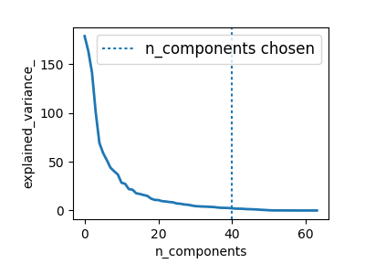
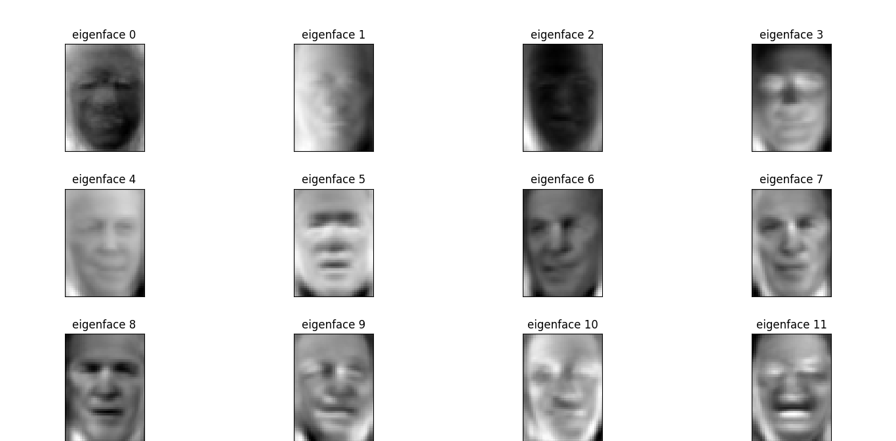

# ___2017 - 07 - 25 scikit-learn___
***

# 目录
  <!-- TOC depthFrom:1 depthTo:6 withLinks:1 updateOnSave:1 orderedList:0 -->

  - [___2017 - 07 - 25 scikit-learn___](#2017-07-25-scikit-learn)
  - [目录](#目录)
  - [scikit-learn 介绍](#scikit-learn-介绍)
  	- [基本概念](#基本概念)
  	- [sklearn 载入数据集 Loading an example dataset](#sklearn-载入数据集-loading-an-example-dataset)
  	- [sklearn学习和预测一般流程 Learning and predicting](#sklearn学习和预测一般流程-learning-and-predicting)
  	- [模型存储 Model persistence](#模型存储-model-persistence)
  	- [sklearn 数据类型约定规则 Conventions](#sklearn-数据类型约定规则-conventions)
  	- [模型参数修改 Refitting and updating parameters](#模型参数修改-refitting-and-updating-parameters)
  	- [多组标签的数据学习 Multiclass 与 multilabel fitting](#多组标签的数据学习-multiclass-与-multilabel-fitting)
  	- [sklearn 中的评价尺度与 metrics 模块](#sklearn-中的评价尺度与-metrics-模块)
  	- [标准化或规格化](#标准化或规格化)
  - [sklearn 库中的算法举例](#sklearn-库中的算法举例)
  	- [逻辑回归](#逻辑回归)
  	- [朴素贝叶斯](#朴素贝叶斯)
  	- [k-最近邻 KNN](#k-最近邻-knn)
  	- [决策树 分类和回归树 CART](#决策树-分类和回归树-cart)
  	- [支持向量机 SVM](#支持向量机-svm)
  	- [根据数据以及问题类型选取合适的估计模型](#根据数据以及问题类型选取合适的估计模型)
  - [sklearn 中的监督学习算法](#sklearn-中的监督学习算法)
  	- [分类算法 KNN](#分类算法-knn)
  	- [维数灾难 The curse of dimensionality](#维数灾难-the-curse-of-dimensionality)
  	- [线型回归模型 Linear regression model](#线型回归模型-linear-regression-model)
  	- [岭回归 Ridge 缩减 shrinkage 与过拟合](#岭回归-ridge-缩减-shrinkage-与过拟合)
  	- [Lasso 缩减与稀疏 Sparsity 降低模型复杂度](#lasso-缩减与稀疏-sparsity-降低模型复杂度)
  	- [Logistic 回归与sigmoid函数，回归算法用于分类](#logistic-回归与sigmoid函数回归算法用于分类)
  	- [支持向量机 SVM Support vector machines](#支持向量机-svm-support-vector-machines)
  - [交叉验证与模型参数选择](#交叉验证与模型参数选择)
  	- [score 方法与交叉验证 cross-validated scores](#score-方法与交叉验证-cross-validated-scores)
  	- [sklearn 库中的交叉验证生成器使用 Cross-validation generators](#sklearn-库中的交叉验证生成器使用-cross-validation-generators)
  	- [sklearn 库中的交叉验证生成器类别](#sklearn-库中的交叉验证生成器类别)
  	- [网格搜索 Grid-search 寻找模型的最佳参数](#网格搜索-grid-search-寻找模型的最佳参数)
  	- [自动使用交叉验证选择参数的估计模型 Cross-validated estimators](#自动使用交叉验证选择参数的估计模型-cross-validated-estimators)
  	- [特征选取 和 特征工程](#特征选取-和-特征工程)
  - [sklearn 中的无监督学习算法](#sklearn-中的无监督学习算法)
  	- [聚类 Clustering 将数据分成离散的组](#聚类-clustering-将数据分成离散的组)
  	- [矢量量化 VQ vector quantization 数据压缩](#矢量量化-vq-vector-quantization-数据压缩)
  	- [层次聚类 Hierarchical clustering Ward](#层次聚类-hierarchical-clustering-ward)
  	- [聚类用于特征合并 Feature agglomeration](#聚类用于特征合并-feature-agglomeration)
  	- [降维分解 Decompositions PCA ICA](#降维分解-decompositions-pca-ica)
  - [Pipelining 组合多个估计模型](#pipelining-组合多个估计模型)
  - [综合使用示例](#综合使用示例)
  	- [特征脸 eigenfaces 用于人脸识别 KFold-PCA-SVC-GridSearchCV-plot](#特征脸-eigenfaces-用于人脸识别-kfold-pca-svc-gridsearchcv-plot)
  	- [20个新闻组数据集 20 newsgroups dataset 文本分析](#20个新闻组数据集-20-newsgroups-dataset-文本分析)
  - [其他相关教程链接](#其他相关教程链接)
  	- [Where to from here by scikit-learn tutorials](#where-to-from-here-by-scikit-learn-tutorials)
  	- [Q&A communities with Machine Learning practitioners](#qa-communities-with-machine-learning-practitioners)
  	- [External Tutorials](#external-tutorials)
  	- [Videos](#videos)

  <!-- /TOC -->
***

# scikit-learn 介绍
## 基本概念
  - 机器学习解决的问题包含建立预测模型，根据观测值分类，或是在未分类数据上学习潜在模式
  - scikit-learn 是 Python 的一个开源机器学习模块，建立在 NumPy，SciPy和 matplotlib 模块之上
  - scikit-learn 处理的数据集是二维的，其中行向量表示多个采样值 **samples axis**，列向量表示特征值 **features axis**
  - **训练集与测试集**
    - 模型在训练集上学习数据的模式，并在测试集上验证模型效果
    - 在实验任何机器学习算法时，应避免使用训练模型的数据来测试预测结果，这无法反应模型在新数据上的预测效果
  - **监督学习算法 supervised learning** 一般用于学习两个数据集之间的关系，**观测集X** 与 **目标集 Y**，预测结果通常称为 **target** 或 **labels**，通常情况下，Y是一个一维向量
    - **分类算法** 从已分类的数据中学习预测未分类数据的模式，预测的目标值是离散的，即将观测值划分成有限多个目标值，分类算法中的目标值y是一个数字或字符串组成的向量
    - **回归算法** 预测的目标值是连续的
  - **无监督学习算法 unsupervised learning** 通常用于未分类的数据
    - **聚类算法 clustering** 用于将相似的数据分组
    - **密度估计 density estimation** 进一步分析数据的分布 distribution
    - 无监督学习也可用于 数据降维，如将高维数据将到二维或三维空间，方便数据可视化 visualization
  - scikit-learn 中所有的监督学习算法都实现了 **fit(X, y)** 方法用于模型训练，以及 **predict(X)** 方法用于预测未分组(unlabeled)数据 X 的标签值(labels) Y
  - 除了分类和回归问题，Scikit-Learn还有海量的更复杂的算法，包括了聚类，以及建立混合算法的实现技术，如 **Bagging 和 Boosting**
## sklearn 载入数据集 Loading an example dataset
  - scikit-learn 内包含了常用的机器学习数据集，比如做分类的 iris 和 digit 数据集，用于回归的经典数据集 Boston house prices
  - **鸢尾花 iris 数据集**，是一类多重变量分析的数据集，通过花瓣petal 与 萼片sepal 的长宽，划分鸢尾花的三个种类 山鸢尾Setosa / 杂色鸢尾Versicolour / 维吉尼亚鸢尾Virginica
    ```python
    from sklearn import datasets
    iris = datasets.load_iris()
    ```
  - scikit-learn 载入的数据集是以类似于 **字典的形式** 存放的，该对象中包含了所有有关该数据的数据信息 (甚至还有参考文献)
  - **数据值统一存放在.data的成员中**，是一个 (n_samples, n_features)二维数据，iris数据中每个实例有4维特征，分别为：sepal length、sepal width、petal length和petal width
    ```python
    type(iris.data)
    Out[34]: numpy.ndarray

    iris.data.shape
    Out[35]: (150, 4)

    iris.data[:3]
    Out[36]:
    array([[ 5.1,  3.5,  1.4,  0.2],
           [ 4.9,  3. ,  1.4,  0.2],
           [ 4.7,  3.2,  1.3,  0.2]])
    ```
  - 对于监督学习，比如分类问题，**数据对应的分类结果存在.target成员中**
    ```python
    np.unique(iris.target)
    Out[37]: array([0, 1, 2])

    iris.target[45:55]
    Out[46]: array([0, 0, 0, 0, 0, 1, 1, 1, 1, 1])
    ```
  - 如果数据集的形式不是(n_samples, n_features)，需要进行 **预处理**
    ```python
    # digits 数据集的原始数据 image 是 1797 x 8 x 8 的形式
    digits = datasets.load_digits()
    digits.data.shape
    Out[12]: (1797, 64)

    digits.images.shape
    Out[13]: (1797, 8, 8)
    # 转化为 1797 * 64 的数据集
    data = digits.images.reshape(digits.images.shape[0], -1)
    data.shape
    Out[15]: (1797, 64)
    ```
## sklearn学习和预测一般流程 Learning and predicting
  - scikit-learn 实现的主要API就是各种估计模型，提供了各种机器学习算法的接口，每个算法的调用就像一个黑箱，只需要根据自己的需求，设置相应的参数
  - 模型的所有 **参数** 都可以在初始化时指定，或者通过相应的属性修改
  - scikit-learn 每个模型都提供一个 **fit(X, Y)** 接口函数，可以接受一个二维数据集参数，用于 **模型训练**，模型通过 fit() 函数估计出的参数在模型的属性中以下划线 `_` 结尾
    ```python
    estimator.fit(data)
    estimator.estimated_param_
    ```
  - 模型预测使用 **predict(T)** 函数
  - **示例** digits手写数字数据集 与 支持向量机SVM
    ```python
    # 调用最常用的支撑向量分类机（SVC）
    from sklearn import svm
    # 不使用默认参数，使用用户自己给定的参数
    clf = svm.SVC(gamma=0.001, C=100.)
    clf.gamma
    Out[48]: 0.001

    # 分类器的具体信息和参数
    clf
    Out[49]:
    SVC(C=100.0, cache_size=200, class_weight=None, coef0=0.0,
      decision_function_shape=None, degree=3, gamma=0.001, kernel='rbf',
      max_iter=-1, probability=False, random_state=None, shrinking=True,
      tol=0.001, verbose=False)
    ```
    分类器的学习和预测可以分别利用 **fit(X,Y)** 和 **predict(T)** 来实现
    ```python
    # 将digit数据划分为训练集和测试集，前n-1个实例为训练集，最后一个为测试集
    from sklearn import datasets
    from sklearn import svm
    clf = svm.SVC(gamma=0.001, C=100.)
    digits = datasets.load_digits()
    # 模型训练
    clf.fit(digits.data[:-1], digits.target[:-1])
    # 模型训练后的参数
    clf.classes_
    Out[65]: array([0, 1, 2, 3, 4, 5, 6, 7, 8, 9])

    # 预测结果，使用列向量
    clf.predict(digits.data[-1:])
    # Out[66]: array([8])
    # 真实结果
    digits.target[-1]
    # Out[67]: 8

    # 绘制digits图形
    import matplotlib.pyplot as plt
    plt.figure(1, figsize=(3, 3))
    plt.imshow(digits.images[-1], cmap=plt.cm.gray_r, interpolation='nearest')
    ```
    

  - **transform / fit_transform 方法** 在数据转化 / 分解等模型中通常使用 **fit 方法** 训练模型，**transform 方法** 转化数据，**fit_transform 方法** 是合并 fit 与 transform 的方法
## 模型存储 Model persistence
  - 可以使用python内置的二进制存储模块 **pickle 存储模型**
  - 对于scikit，可以使用 **joblib (joblib.dump & joblib.load)**，在大数据集上更有效，但只能存储到文件中，随后可以在其他程序中使用存储的模型
    ```python
    from sklearn.externals import joblib
    # 存储
    joblib.dump(clf, 'foo.pkl')
    # Out[30]: ['foo.pkl']

    # 加载
    clf2 = joblib.load('foo.pkl')
    clf2.predict(digits.data[-1:])
    # Out[32]: array([8])
    ```
## sklearn 数据类型约定规则 Conventions
  - 除非专门指定，输入数据被转化为float64类型
    ```python
    import numpy as np
    from sklearn import random_projection

    rng = np.random.RandomState(0)
    x = rng.rand(10, 2000)
    x = np.array(x, dtype='float32')
    x.dtype
    # Out[38]: dtype('float32')

    # cast to float64 by fit_transform(x)
    transformer = random_projection.GaussianRandomProjection()
    x_new = transformer.fit_transform(x)
    x_new.dtype
    # Out[41]: dtype('float64')
    ```
  - 回归的目标预测值会转化成float64，分类的目标值类型不变
    ```python
    from sklearn import datasets
    from sklearn.svm import SVC
    iris = datasets.load_iris()
    clf = SVC()
    # iris.target is an integer array, predict() returns an integer array
    clf.fit(iris.data, iris.target)
    list(clf.predict(iris.data[:3]))
    Out[47]: [0, 0, 0]

    # iris.target_names was for fitting, predict() returns a string array
    clf.fit(iris.data, iris.target_names[iris.target])
    list(clf.predict(iris.data[:3]))
    Out[49]: ['setosa', 'setosa', 'setosa']
    ```
## 模型参数修改 Refitting and updating parameters
  - 模型的高级参数 (Hyper-parameters) 在创建后可以通过 **sklearn.pipeline.Pipeline.set_params** 方法修改，通过调用 **fit()** 覆盖之前的参数
    ```python
    import numpy as np
    from sklearn.svm import SVC
    rng = np.random.RandomState(0)
    X = rng.rand(100, 10)
    y = rng.binomial(1, 0.5, 100)
    X_test = rng.rand(5, 10)

    # default kernel is first changed to linear after the estimator has been constructed via SVC()
    clf = SVC()
    clf.set_params(kernel='linear').fit(X, y)
    Out[12]:
    SVC(C=1.0, cache_size=200, class_weight=None, coef0=0.0,
      decision_function_shape=None, degree=3, gamma='auto', kernel='linear',
      max_iter=-1, probability=False, random_state=None, shrinking=True,
      tol=0.001, verbose=False)

    clf.predict(X_test)
    Out[13]: array([1, 0, 1, 1, 0])

    # changed kernel to rbf to refit the estimator
    clf.set_params(kernel='rbf').fit(X, y)
    Out[14]:
    SVC(C=1.0, cache_size=200, class_weight=None, coef0=0.0,
      decision_function_shape=None, degree=3, gamma='auto', kernel='rbf',
      max_iter=-1, probability=False, random_state=None, shrinking=True,
      tol=0.001, verbose=False)

    clf.predict(X_test)
    Out[15]: array([0, 0, 0, 1, 0])
    ```
## 多组标签的数据学习 Multiclass 与 multilabel fitting
  - 当使用 [multiclass classifiers](http://scikit-learn.org/stable/modules/classes.html#module-sklearn.multiclass) 时训练与预测的结果取决于目标值的形式
    ```python
    from sklearn.svm import SVC
    from sklearn.multiclass import OneVsRestClassifier
    from sklearn.preprocessing import LabelBinarizer

    # 一维目标值
    X = [[1, 2], [2, 4], [4, 5], [3, 2], [3, 1]]
    y = [0, 0, 1, 1, 2]
    classif = OneVsRestClassifier(estimator=SVC(random_state=0))
    classif.fit(X, y).predict(X)
    Out[23]: array([0, 0, 1, 1, 2])

    # 二维二进制目标值
    y = LabelBinarizer().fit_transform(y)
    y
    Out[25]:
    array([[1, 0, 0],
           [1, 0, 0],
           [0, 1, 0],
           [0, 1, 0],
           [0, 0, 1]])

    classif.fit(X, y).predict(X)
    Out[26]:
    array([[1, 0, 0],
           [1, 0, 0],
           [0, 1, 0],
           [0, 0, 0],
           [0, 0, 0]])
    ```
  - 当使用多组标签 **multiple labels** 时，预测结果中可能有全0值，表示不符合任何一个标签，或者多个1值，表示符合多个分组
    ```python
    from sklearn.preprocessing import MultiLabelBinarizer
    y = [[0, 1], [0, 2], [1, 3], [0, 2, 3], [2, 4]]
    y = MultiLabelBinarizer().fit_transform(y)
    y
    Out[31]:
    array([[1, 1, 0, 0, 0],
           [1, 0, 1, 0, 0],
           [0, 1, 0, 1, 0],
           [1, 0, 1, 1, 0],
           [0, 0, 1, 0, 1]])

    classif.fit(X, y).predict(X)
    Out[32]:
    array([[1, 1, 0, 0, 0],
           [1, 0, 1, 0, 0],
           [0, 1, 0, 1, 0],
           [1, 0, 1, 0, 0],
           [1, 0, 1, 0, 0]])
    ```
## sklearn 中的评价尺度与 metrics 模块
  - metrics 模块提供更详细的结果性能分析
  - 在sklearn中包含四种评价尺度
    - explained_variance_score()
    - mean_absolute_error()
    - mean_squared_error()
    - r2_score()
  - 均方差 mean-squared-error
    ```python
    MSE(y, yp) = 1 / N * Σ(1, N)(y - yp)^2
    ```
  - 平均绝对值误差 mean_absolute_error
    ```python
    MAE(y, yp) = 1 / N * Σ(1, N)|y - yp|
    ```
  - 可释方差得分 explained_variance_score
    ```python
    EVS(y, yp) = 1 - var(y - yp) / var(y)
    ```
    最大值是1，表示模型的拟合程度最好，值越小则效果越差
  - 中值绝对误差 Median absolute error
    ```python
    MedAE(y, yp) = median(|y1 - yp1|, ... , |yN - ypN|)
    ```
    适应含有离群点的数据集
  - R2 决定系数（拟合优度）
    ```python
    R2(y, yp) = 1 - Σ(1, N)(y - yp)^2 / Σ(1, N)(y - mean(y))^2
    ```
    表征回归方程在多大程度上解释了因变量的变化，或者说方程对观测值的拟合程度
  - **参数 multioutput**
    - 用来指定在多目标回归问题中，若干单个目标变量的损失或得分以什么样的方式被平均起来
    - 默认值 **uniform_average**，将所有预测目标值的损失以等权重的方式平均起来
    - 指定一个 **shape 为（n_oupputs,）的ndarray**，那么数组内的数将被视为是对每个输出预测损失（或得分）的加权值，最终的损失按照指定的加权方式来计算
    - 指定为 **raw_values**，那么所有的回归目标的预测损失或预测得分都会被单独返回一个shape是（n_output）的数组中
## 标准化或规格化
  - 大多数的梯度方法（几乎所有的机器学习算法都基于此）对于数据的缩放很敏感，因此在运行算法之前，应该进行 **标准化或规格化**
  - 标准化包括替换所有特征的名义值，让它们每一个的值在0和1之间
  - 规格化包括数据的预处理，使得每个特征的值有0和1的离差
  - 示例
    ```python
    # 数据获取
    import numpy as np
    import urllib.request
    # url with dataset
    url = "http://archive.ics.uci.edu/ml/machine-learning-databases/pima-indians-diabetes/pima-indians-diabetes.data"
    # download the file
    raw_data = urllib.request.urlopen(url)
    # load the CSV file as a numpy matrix
    dataset = np.loadtxt(raw_data, delimiter=",")
    # separate the data from the target attributes
    x = dataset[:,:-1]
    y = dataset[:,-1]

    # 标准化与规格化
    from sklearn import preprocessing
    # normalize the data attributes
    normalized_x = preprocessing.normalize(x)
    # standardize the data attributes
    standardized_x = preprocessing.scale(x)
    ```
    运行结果
    ```python
    x[1]
    Out[6]: array([ 1., 85., 66., 29., 0., 26.6, 0.351, 31. ])

    normalized_x[1]
    Out[7]:
    array([ 0.008424, 0.71604034, 0.55598426, 0.24429612,
            0., 0.22407851, 0.00295683, 0.26114412])

    standardized_x[1]
    Out[8]:
    array([-0.84488505, -1.12339636, -0.16054575, 0.53090156,
           -0.69289057, -0.68442195, -0.36506078, -0.19067191])

    y[1]
    Out[9]: 0.0
    ```
***

# sklearn 库中的算法举例
## 逻辑回归
  - 大多数情况下被用来解决分类问题（二元分类），但多类的分类（所谓的一对多方法）也适用，优点是对于每一个输出的对象都有一个对应类别的概率
    ```python
    from sklearn import metrics
    from sklearn.linear_model import LogisticRegression
    model = LogisticRegression()
    model.fit(x, y)
    Out[27]:
    LogisticRegression(C=1.0, class_weight=None, dual=False, fit_intercept=True,
              intercept_scaling=1, max_iter=100, multi_class='ovr', n_jobs=1,
              penalty='l2', random_state=None, solver='liblinear', tol=0.0001,
              verbose=0, warm_start=False)

    # make predictions
    expected = y
    predicted = model.predict(x)
    # summarize the fit of the model
    print(metrics.classification_report(expected, predicted))
                 precision    recall  f1-score   support

            0.0       0.79      0.90      0.84       500
            1.0       0.74      0.55      0.63       268

    avg / total       0.77      0.77      0.77       768

    metrics.confusion_matrix(expected, predicted)
    Out[33]:
    array([[448,  52],
           [121, 147]])
    ```
## 朴素贝叶斯
  - 主要任务是恢复训练样本的数据分布密度，这个方法通常在多类的分类问题上表现的很好
    ```python
    from sklearn import metrics
    from sklearn.naive_bayes import GaussianNB
    model = GaussianNB()
    model.fit(x, y)
    Out[36]: GaussianNB(priors=None)

    # make predictions
    expected = y
    predicted = model.predict(x)
    # summarize the fit of the model
    print(metrics.classification_report(expected, predicted))
                 precision    recall  f1-score   support

            0.0       0.80      0.84      0.82       500
            1.0       0.68      0.62      0.64       268

    avg / total       0.76      0.76      0.76       768

    metrics.confusion_matrix(expected, predicted)
    Out[40]:
    array([[421,  79],
           [103, 165]])
    ```
## k-最近邻 KNN
  - 通常用于一个更复杂分类算法的一部分，例如，可以用它的估计值做为一个对象的特征，有时候，一个简单的kNN算法在良好选择的特征上会有很出色的表现，当参数（主要是metrics）被设置得当，这个算法在回归问题中通常表现出最好的质量
    ```python
    from sklearn import metrics
    from sklearn.neighbors import KNeighborsClassifier
    # fit a k-nearest neighbor model to the data
    model = KNeighborsClassifier()
    model.fit(x, y)
    Out[43]:
    KNeighborsClassifier(algorithm='auto', leaf_size=30, metric='minkowski',
               metric_params=None, n_jobs=1, n_neighbors=5, p=2,
               weights='uniform')

    # make predictions
    expected = y
    predicted = model.predict(x)
    # summarize the fit of the model
    print(metrics.classification_report(expected, predicted))
                 precision    recall  f1-score   support

            0.0       0.83      0.88      0.85       500
            1.0       0.75      0.65      0.70       268

    avg / total       0.80      0.80      0.80       768

    metrics.confusion_matrix(expected, predicted)
    Out[46]:
    array([[442,  58],
           [ 93, 175]])
    ```
## 决策树 分类和回归树 CART
  - 适用的分类问题中对象有可分类的特征，且被用于回归和分类，决策树很适用于多类分类
    ```python
    from sklearn import metrics
    from sklearn.tree import DecisionTreeClassifier
    # fit a CART model to the data
    model = DecisionTreeClassifier()
    model.fit(x, y)
    Out[49]:
    DecisionTreeClassifier(class_weight=None, criterion='gini', max_depth=None,
                max_features=None, max_leaf_nodes=None,
                min_impurity_split=1e-07, min_samples_leaf=1,
                min_samples_split=2, min_weight_fraction_leaf=0.0,
                presort=False, random_state=None, splitter='best')

    # make predictions
    expected = y
    predicted = model.predict(x)
    # summarize the fit of the model
    print(metrics.classification_report(expected, predicted))
                 precision    recall  f1-score   support

            0.0       1.00      1.00      1.00       500
            1.0       1.00      1.00      1.00       268

    avg / total       1.00      1.00      1.00       768

    metrics.confusion_matrix(expected, predicted)
    Out[52]:
    array([[500,   0],
           [  0, 268]])
    ```
## 支持向量机 SVM
  - 是最流行的机器学习算法之一，主要用于分类问题，同样也用于逻辑回归，SVM在一对多方法的帮助下可以实现多类分类
    ```python
    from sklearn import metrics
    from sklearn.svm import SVC
    # fit a SVM model to the data
    model = SVC()
    model.fit(x, y)
    Out[54]:
    SVC(C=1.0, cache_size=200, class_weight=None, coef0=0.0,
      decision_function_shape=None, degree=3, gamma='auto', kernel='rbf',
      max_iter=-1, probability=False, random_state=None, shrinking=True,
      tol=0.001, verbose=False)

    # make predictions
    expected = y
    predicted = model.predict(x)
    # summarize the fit of the model
    print(metrics.classification_report(expected, predicted))
                   precision    recall  f1-score   support

            0.0       1.00      1.00      1.00       500
            1.0       1.00      1.00      1.00       268

    avg / total       1.00      1.00      1.00       768

    metrics.confusion_matrix(expected, predicted)
    Out[56]:
    array([[500,   0],
           [  0, 268]])
    ```
## 根据数据以及问题类型选取合适的估计模型
  - [Choosing the right estimator](http://scikit-learn.org/stable/tutorial/machine_learning_map/index.html)

  
***

# sklearn 中的监督学习算法
## 分类算法 KNN
  - [KNN](http://scikit-learn.org/stable/modules/neighbors.html#neighbors) k-Nearest neighbors classifier k-近邻，是最简单的分类算法
  - 对于新的预测数据，在已分类数据的训练集中寻找距离最近的数据，将其对应的分类标签作为新数据的预测分类
  - iris 数据集上的 KNN 示例
    ```python
    import numpy as np
    from sklearn import datasets

    iris = datasets.load_iris()
    iris_X = iris.data
    iris_y = iris.target

    # Split iris data in train and test data randomly
    np.random.seed(0)
    indices = np.random.permutation(len(iris_X))
    iris_X_train = iris_X[indices[:-10]]
    iris_y_train = iris_y[indices[:-10]]
    iris_X_test  = iris_X[indices[-10:]]
    iris_y_test  = iris_y[indices[-10:]]

    # Create and fit a nearest-neighbor classifier
    from sklearn.neighbors import KNeighborsClassifier
    knn = KNeighborsClassifier()
    knn.fit(iris_X_train, iris_y_train)
    knn.predict(iris_X_test)
    # Out[32]: array([1, 2, 1, 0, 0, 0, 2, 1, 2, 0])

    iris_y_test
    # Out[33]: array([1, 1, 1, 0, 0, 0, 2, 1, 2, 0])
    ```
## 维数灾难 The curse of dimensionality
  - 当维数增大时，**高维空间数据会变得更稀疏**
    - 维数 p=1 时，N 个样本数据间的平均距离是 1 / N
    - 维数 p=2 时，N 个样本数据间的平均距离是 (1 / N) ^ (1 / 2)，即需要 N ^ 2 个点才能维持距离为 1 / N
    - 维数 p=p 时，N 个样本数据间的平均距离是 (1 / N) ^ (1 / p)，即需要 N ^ p 个点才能维持距离为 1 / N
  - 在以距离作为预测依据的机器学习算法(如 KNN)中，当维数增大时，空间数据会变得更稀疏，各个分组间的界限会变小，算法预测的效率会降低
## 线型回归模型 Linear regression model
  - **diabetes 糖尿病数据集** 包含442个病人的10个生理特征数据 (age, sex, weight, blood pressure)，以及一年后的病情指标
    ```python
    diabetes = datasets.load_diabetes()
    diabetes.data.shape
    Out[35]: (442, 10)

    diabetes_X_train = diabetes.data[:-20]
    diabetes_X_test  = diabetes.data[-20:]
    diabetes_y_train = diabetes.target[:-20]
    diabetes_y_test  = diabetes.target[-20:]
    ```
  - 线型回归模型 Linear models，将数据集拟合成一个一阶模型，使得预测的总方差最小
    ```python
    y = Xβ + ε
    其中
        X: 数据集
        y: 目标向量
        β: 预测系数
        ε: 观测噪声
    ```
  - 使用示例
    ```python
    from sklearn import linear_model
    regr = linear_model.LinearRegression()
    regr.fit(diabetes_X_train, diabetes_y_train)
    # Out[42]: LinearRegression(copy_X=True, fit_intercept=True, n_jobs=1, normalize=False)

    # 线型回归模型的预测系数
    print(regr.coef_)

    # 预测错误均方差
    np.mean((regr.predict(diabetes_X_test) - diabetes_y_test) ** 2)
    # Out[46]: 2004.5676026898223

    # Explained variance score: 1表示完美拟合，0表示没有线型关系
    regr.score(diabetes_X_test, diabetes_y_test)
    # Out[50]: 0.58507530226905713
    ```
## 岭回归 Ridge 缩减 shrinkage 与过拟合
  - 如果数据集中的观测值过少，会使模型预测中产生较大的方差，即模型之间的差异会变大
    ```python
    X = np.c_[ .5, 1].T
    y = [.5, 1]
    test = np.c_[ 0, 2].T
    regr = linear_model.LinearRegression()

    import matplotlib.pyplot as plt
    plt.figure()

    np.random.seed(0)
    for _ in range(6):
        # 随机添加噪声
        this_X = .1 * np.random.normal(size=(2, 1)) + X
        regr.fit(this_X, y)
        plt.plot(test, regr.predict(test))
        plt.scatter(this_X, y, s=3)
    ```
    
  - **岭回归 Ridge** 在高维数据中的一种解决方法是 **将一部分回归系数 β 缩减到0**，减少了模型的复杂度，但同时增大了模型偏差
    ```python
    # 使用岭回归 Ridge 模型
    regr = linear_model.Ridge(alpha=.1)
    plt.figure()

    np.random.seed(0)
    for _ in range(6):
        this_X = .1*np.random.normal(size=(2, 1)) + X
        regr.fit(this_X, y)
        plt.plot(test, regr.predict(test))
        plt.scatter(this_X, y, s=3)
    ```
    
  - **权衡偏差与方差 bias/variance tradeoff** 岭回归模型中的 alpha 参数增大，会导致更大的偏差与更小的方差，调整 alpha 参数可以使得模型的效果最好
    ```python
    # 调整alpha值，在 diabetes 数据集上测试模型拟合效果
    alphas = np.logspace(-4, -1, 6)
    from __future__ import print_function
    [regr.set_params(alpha=alpha
               ).fit(diabetes_X_train, diabetes_y_train,
               ).score(diabetes_X_test, diabetes_y_test) for alpha in alphas]
    Out[77]:
    [0.58511106838835292, 0.58520730154446765,
     0.58546775406984908, 0.58555120365039159,
     0.58307170855541623, 0.57058999437280111]
    ```
  - **过拟合 overfitting** 模型过拟合，对新数据的预测效果变差
  - **正则化 regularization** 岭回归中引入的偏差称为正则化 regularization，降低模型的过拟合
## Lasso 缩减与稀疏 Sparsity 降低模型复杂度
  - **Lasso 缩减** least absolute shrinkage and selection operator，只选取与预测目标关联度高的特征，而将不重要的特征系数缩减到0，lasso estimate 具有 shrinkage 和 selection 两种功能
  - 岭回归会减小数据集中不重要特征的系数，但不会缩减到0，lasso缩减会将某些系数缩减到0，即特征选择 selection
  - 减小问题的复杂度，防止过拟合，是一种 **稀疏方法 sparse method**
  - 稀疏 Sparsity 可以看作是奥卡姆剃刀原则的应用
    ```
    Occam’s razor: prefer simpler models
    ```
  - lasso 回归示例
    ```python
    # 使用 lasso 回归模型
    regr = linear_model.Lasso()
    scores = [regr.set_params(alpha=alpha
               ).fit(diabetes_X_train, diabetes_y_train
               ).score(diabetes_X_test, diabetes_y_test)
            for alpha in alphas]
    best_alpha = alphas[scores.index(max(scores))]
    best_alpha
    # Out[86]: 0.025118864315095794

    regr.alpha = best_alpha
    regr.fit(diabetes_X_train, diabetes_y_train)
    # 某些系数缩减到了0
    regr.coef_
    Out[88]:
    array([   0.        , -212.43764548,  517.19478111,  313.77959962,
           -160.8303982 ,   -0.        , -187.19554705,   69.38229038,
            508.66011217,   71.84239008])
    ```
  - **不同的算法可以用于解决同样的数学问题**
    - scikit-learn 中的 **Lasso 对象** 使用坐标下降的方法 coordinate descent method 解决 lasso 回归问题，这在大数据集上很有效
    - scikit-learn 中同样提供了 **LassoLars 对象**，使用 **LARS 算法** ((Least Angle Regression 最小角回归)，在估计的权重向量非常稀疏，如观测值很少的数据集中很有效
## Logistic 回归与sigmoid函数，回归算法用于分类
  - 在分类预测中，线型回归模型通常并不适用，因为模型会给远离决策边界的数据更大的权重
  - **sigmoid or logistic** 将线型回归模型的结果转化成分类结果，类似与阶跃函数
    ```
    sigmoid(z) = 1 / (1 + e^(-z))
    ```
  - iris数据集上 Logistic 回归用于分类示例
    ```python
    logistic = linear_model.LogisticRegression(C=1e5)
    logistic.fit(iris_X_train, iris_y_train)
    Out[90]:
    LogisticRegression(C=100000.0, class_weight=None, dual=False,
              fit_intercept=True, intercept_scaling=1, max_iter=100,
              multi_class='ovr', n_jobs=1, penalty='l2', random_state=None,
              solver='liblinear', tol=0.0001, verbose=0, warm_start=False)

    logistic.predict(iris_X_test)
    Out[91]: array([1, 2, 1, 0, 0, 0, 2, 1, 2, 0])

    iris_y_test
    Out[92]: array([1, 1, 1, 0, 0, 0, 2, 1, 2, 0])
    ```
  - Logistic 回归中的 **缩减 shrinkage 与稀疏 sparsity**
    - **参数 C**，默认1.0，指定数据正则化的程度，值越小正则化越低
    - **参数 penalty**，默认'l2'，指定惩罚的基准 the norm used in the penalization，'l2'指定缩减 Shrinkage，'l1'指定稀疏 Sparsity
## 支持向量机 SVM Support vector machines
  - SVM 包含 **回归模型 SVR** Support Vector Regression，以及 **分类模型 SVC** Support Vector Classification
  - **SVM 线性模型** SVM 模型试图找到一组样本值，来建立两个分组间的分隔超平面，使得该组样本值与分隔超平面的间隔最大，正则化程度通过 **参数 C** 设定
    - C 值越小，正则化程度高，使用分隔超平面附近更多或全部的点来计算间隔
    - C 值越大，正则化程度低，使用分隔超平面最近的点来计算间隔
    - [Plot different SVM classifiers in the iris dataset](http://scikit-learn.org/stable/auto_examples/svm/plot_iris.html#sphx-glr-auto-examples-svm-plot-iris-py)
  - iris数据集上 SVM 示例
    ```python
    from sklearn import svm
    svc = svm.SVC(kernel='linear')
    svc.fit(iris_X_train, iris_y_train)
    Out[96]:
    SVC(C=1.0, cache_size=200, class_weight=None, coef0=0.0,
      decision_function_shape=None, degree=3, gamma='auto', kernel='linear',
      max_iter=-1, probability=False, random_state=None, shrinking=True,
      tol=0.001, verbose=False)

    svc.predict(iris_X_test)
    Out[97]: array([1, 2, 1, 0, 0, 0, 2, 1, 2, 0])
    ```
  - **核函数 kernels**，数据集的特征并不总是线性可分的，可以使用 **核技巧 kernel trick** 在特征空间上应用一个决策函数 decision function，将数据映射到另一个特征空间，通常会将 **低维特征空间映射到高维空间**
  - 示例 [SVM-Kernels](http://scikit-learn.org/stable/auto_examples/svm/plot_svm_kernels.html)
    ```python
    # Linear kernel
    svc = svm.SVC(kernel='linear')
    # Polynomial kernel
    svc = svm.SVC(kernel='poly', degree=3)
    # RBF kernel (Radial Basis Function)
    svc = svm.SVC(kernel='rbf')
    ```
    
  - 其他链接
    - [plot iris exercise](http://scikit-learn.org/stable/_downloads/plot_iris_exercise.py)
    - [Libsvm GUI]( http://scikit-learn.org/stable/auto_examples/applications/svm_gui.html#sphx-glr-auto-examples-applications-svm-gui-py)
***

# 交叉验证与模型参数选择
## score 方法与交叉验证 cross-validated scores
  - 每个模型都有一个 **score()方法** 用于评估模型在新数据上的预测质量，值越大模型估计越好
    ```python
    from sklearn import datasets, svm
    digits = datasets.load_digits()
    X_digits = digits.data
    y_digits = digits.target
    svc = svm.SVC(C=1, kernel='linear')
    svc.fit(X_digits[:-100], y_digits[:-100]).score(X_digits[-100:], y_digits[-100:])
    Out[12]: 0.97999999999999998
    ```
  - **kfold 交叉验证** 将数据的特征与目标划分成连续的k个部分 fold，其中 K-1 个子集作为训练数据，另一个作为测试数据，可以更好的估计模型效果
    ```python
    X_fold = np.split(X_digits, 3)
    y_fold = np.split(y_digits, 3)
    scores = lsit()
    scores = list()
    for k in range(3):
        # We use 'list' to copy, in order to 'pop' later on
        X_train = list(X_fold)
        X_test = X_train.pop(k)
        X_train = np.concatenate(X_train)
        y_train = list(y_fold)
        y_test = y_train.pop(k)
        y_train = np.concatenate(y_train)
        scores.append(svc.fit(X_train, y_train).score(X_test, y_test))
    scores
    Out[22]: [0.93489148580968284, 0.95659432387312182, 0.93989983305509184]
    ```
## sklearn 库中的交叉验证生成器使用 Cross-validation generators
  - 对于流行的交叉验证策略，scikit-learn 中有几个类可以用于生成训练集 / 测试集的索引列表
  - **split 方法** 接受一个待划分的数据集，产生(yields 返回)一个训练 / 测试数据索引的列表生成器
    ```python
    from sklearn.model_selection import KFold, cross_val_score
    X = ["a", "a", "b", "c", "c", "c"]
    k_fold = KFold(n_splits=3)
    for train_indice, test_indices in k_fold.split(X):
        print('Train: %s | test: %s' % (train_indices, test_indices))
    Out[]
    Train: [2 3 4 5] | Test [0 1]
    Train: [0 1 4 5] | Test [2 3]
    Train: [0 1 2 3] | Test [4 5]

    # The cross-validation can then be performed easily:
    [svc.fit(X_digits[test], y_digits[test]).score(X_digits[train], y_digits[train])
    for test, train in k_fold.split(X_digits)]
    Out[38]: [0.93489148580968284, 0.95659432387312182, 0.93989983305509184]
    ```
  - **cross_val_score 方法** 计算交叉验证的得分 cross-validation score，参数指定一个 **估计模型**，**交叉验证生成器** 与 **待验证数据集**，cross_val_score 方法会自动使用每个训练数据集训练模型，在测试集上测试并返回得分 score
    ```python
    cross_val_score(estimator, X, y=None, groups=None, scoring=None,
        cv=None, n_jobs=1, verbose=0, fit_params=None,
        pre_dispatch='2*n_jobs')
    ```
    **参数 n_jobs** -1 表示使用当前计算机上的所有 CPU
    ```python
    cross_val_score(svc, X_digits, y_digits, cv=k_fold, n_jobs=-1)
    Out[39]: array([ 0.93489149,  0.95659432,  0.93989983])
    ```

    **参数 scoring** 默认计算独立的得分 individual scores，可以指定其他可以选择的方法，模块 metrics 中获取更多 scoring 方法
    ```python
    cross_val_score(svc, X_digits, y_digits, cv=k_fold, scoring='precision_macro')
    Out[40]: array([ 0.93969761,  0.95911415,  0.94041254])
    ```
## sklearn 库中的交叉验证生成器类别
  - **KFold (n_splits, shuffle, random_state)** 将数据集划分成 K 个子集 folds，其中 K-1 个子集作为训练数据，另一个作为测试数据
  - **StratifiedKFold (n_splits, shuffle, random_state)** 类似于 KFold，但在每个子集中尽量包含每一个分类
    ```python
    from sklearn.model_selection import StratifiedKFold
    sk_fold = StratifiedKFold(n_splits=2)
    # 参数必须有目标分类
    for train_indice, test_indices in sk_fold.split(X, [1, 1, 2, 3, 3, 2]):
        print('Train: %s | test: %s' % (train_indices, test_indices))

    Out[]
    Train: [0 1 2 3] | test: [0 2 3]
    Train: [0 1 2 3] | test: [1 4 5]
    ```
  - **GroupKFold (n_splits)** 可以指定一个groups参数，相同分组的数据不会分在同一个子集中
    ```python
    from sklearn.model_selection import GroupKFold
    gk_fold = GroupKFold(n_splits=3)
    # 参数指定 groups
    for train_indice, test_indices in gk_fold.split(X, groups=[1, 1, 2, 3, 3, 2]):
        print('Train: %s | test: %s' % (train_indices, test_indices))

    Out[]
    Train: [0 1 2 3] | test: [3 4]
    Train: [0 1 2 3] | test: [2 5]
    Train: [0 1 2 3] | test: [0 1]
    ```
  - **ShuffleSplit (n_splits, test_size, train_size, random_state)** 随机产生训练 / 测试集索引
  - **StratifiedShuffleSplit** 类似于 ShuffleSplit，但在每个子集中尽量包含每一个分类
  - **GroupShuffleSplit** 可以指定一个groups参数，相同分组的数据不会分在同一个子集中
  - **LeaveOneGroupOut ()** 根据goups参数提供的分组划分数据
    ```python
    from sklearn.model_selection import LeaveOneGroupOut
    X = np.array([[1, 2], [3, 4], [5, 6], [7, 8]])
    y = np.array([1, 2, 1, 2])
    groups = np.array([1, 1, 2, 2])
    logo = LeaveOneGroupOut()
    logo.get_n_splits(X, y, groups)
    # Out[98]: 2

    for tr, te in logo.split(X, y, groups):
        print('TRAIN: ', tr, 'TEST: ', te)

    Out[]
    TRAIN:  [2 3] TEST:  [0 1]
    TRAIN:  [0 1] TEST:  [2 3]
    ```
  - **LeavePGroupsOut (n_groups)** 测试集中包含 P 个分组，n_groups参数指定p，groups参数指定分组
    ```python
    from sklearn.model_selection import LeavePGroupsOut
    lpgo = LeavePGroupsOut(n_groups=2)
    lpgo.get_n_splits(X, y, groups)
    # Out[103]: 1
    # goups中的分组类别数量必须大于n_groups
    for tr, te in lpgo.split(X, y, [1, 1, 2, 3]):
         print('TRAIN: ', tr, 'TEST: ', te)
    Out[]
    TRAIN:  [3] TEST:  [0 1 2]
    TRAIN:  [2] TEST:  [0 1 3]
    TRAIN:  [0 1] TEST:  [2 3]
    ```
  - **LeaveOneOut ()** 测试集使用一个样本值，对于大数据集效率很低
    ```python
    from sklearn.model_selection import LeaveOneOut
    loo = LeaveOneOut()
    loo.get_n_splits(X)
    # Out[110]: 4

    for tr, te in loo.split(X, y, groups):
        print('TRAIN: ', tr, 'TEST: ', te)

    Out[]
    TRAIN:  [1 2 3] TEST:  [0]
    TRAIN:  [0 2 3] TEST:  [1]
    TRAIN:  [0 1 3] TEST:  [2]
    TRAIN:  [0 1 2] TEST:  [3]
    ```
  - **LeavePOut (p)** 测试集使用 p 个样本值，对于大数据集效率很低
  - **PredefinedSplit** 通过参数 test_fold 指定预定义的划分方式，不使用原数据集划分数据
    ```python
    from sklearn.model_selection import PredefinedSplit
    test_fold = [0, 1, -1, 1]
    ps = PredefinedSplit(test_fold)
    ps.get_n_splits()
    # Out[115]: 2

    for tr, te in ps.split():
        print('TRAIN: ', tr, 'TEST: ', te)

    Out[]
    TRAIN:  [1 2 3] TEST:  [0]
    TRAIN:  [0 2] TEST:  [1 3]
    ```
  - **使用示例**
    - [Cross-validation on Digits Dataset Exercise]( http://scikit-learn.org/stable/auto_examples/exercises/plot_cv_digits.html#sphx-glr-auto-examples-exercises-plot-cv-digits-py)
## 网格搜索 Grid-search 寻找模型的最佳参数
  - 在编写高效的算法的过程中最难的步骤之一就是正确参数的选择
  - scikit-learn 提供的对象，在指定的数据集与估计模型上，通过 **参数 param_grid** 指定估计模型某个参数的一组数据，寻找使得交叉验证得分 cross-validation score 最大的参数值
  - **fit / predict 方法** 同样用于参数搜索的模型适配与预测
  - **best_score_ / best_estimator_ / cv_results_** 分别表示 最佳得分 / 最佳参数 / 搜索结果
    ```python
    from sklearn.model_selection import GridSearchCV, cross_val_score
    # 生成10个随机数，作为svc的参数C
    Cs = np.logspace(-6, -1, 10)
    # 通过 param_grid 将 svc 的参数 C 指定成一个列表
    clf = GridSearchCV(estimator=svc, param_grid=dict(C=Cs), n_jobs=-1)
    clf.fit(X_digits[:1000], y_digits[:1000])
    # 最佳结果
    clf.best_score_
    # Out[124]: 0.92500000000000004

    # 最佳参数 C
    clf.best_estimator_.C
    # Out[125]: 0.0077426368268112772

    # cv_results_ 中保存了更详细的搜索结果
    clf.cv_results_

    # 可以将结果转化为 DataFrame，用于分析
    df_cvr = pd.DataFrame(clf.cv_results_)
    df_cvr.shape
    # Out[128]: (10, 17)

    # 在测试集上的预测结果，可能没有训练集上的效果好
    clf.score(X_digits[1000:], y_digits[1000:])
    # Out[129]: 0.94353826850690092
    ```
  - 随机地从既定的范围内选取一个参数有时候更为高效，估计在这个参数下算法的质量，然后选出最好的
    ```python
    import numpy as np
    from scipy.stats import uniform as sp_rand
    from sklearn.linear_model import Ridge
    from sklearn.grid_search import RandomizedSearchCV
    # prepare a uniform distribution to sample for the alpha parameter
    param_grid = {'alpha': sp_rand()}
    # create and fit a ridge regression model, testing random alpha values
    model = Ridge()
    rsearch = RandomizedSearchCV(estimator=model, param_distributions=param_grid, n_iter=100)
    rsearch.fit(x, y)

    # summarize the results of the random parameter search
    rsearch.best_score_
    Out[8]: 0.27961752547790575

    rsearch.best_estimator_.alpha
    Out[9]: 0.99827013993379388
    ```
  - GridSearchCV 默认使用 3-fold (KFold, k = 3) 交叉验证，在分类任务中会自动使用 stratified 3-fold
  - **嵌套的交叉验证**
    ```python
    cross_val_score(clf, X_digits, y_digits)
    Out[127]: array([ 0.93853821,  0.96327212,  0.94463087])
    ```
    两个交叉验证的循环并行运行，GridSearchCV 用交叉验证获得最佳参数，cross_val_score 检验模型的预测效果，可以很好的估计出模型在新数据上的表现
## 自动使用交叉验证选择参数的估计模型 Cross-validated estimators
  - 交叉验证选择参数的实现可以是基于算法的，因此对于一些估计模型，scikit-learn 提供了可以自动根据交叉验证选择参数的版本，通常是 **以 CV 结尾的**
    ```python
    from sklearn import linear_model, datasets
    lasso = linear_model.LassoCV()
    diabetes = datasets.load_diabetes()
    lasso.fit(diabetes.data, diabetes.target)
    # 模型自动选择参数
    lasso.alpha_
    Out[134]: 0.012291895087486173
    ```
  - 使用示例
    - [Cross-validation: evaluating estimator performance](http://scikit-learn.org/stable/modules/cross_validation.html#cross-validation)
    - [Cross-validation on diabetes Dataset Exercise](http://scikit-learn.org/stable/auto_examples/exercises/plot_cv_diabetes.html#sphx-glr-auto-examples-exercises-plot-cv-diabetes-py)
## 特征选取 和 特征工程
  - **特征工程** 解决的一个问题最重要的是恰当选取特征、甚至创造特征的能力
  - 特征工程是一个相当有创造性的过程，有时候更多的是靠直觉和专业的知识，但对于特征的选取，已经有很多的算法可供直接使用，如 **树算法计算特征的信息量**
    ```python
    from sklearn import metrics
    from sklearn.ensemble import ExtraTreesClassifier
    model = ExtraTreesClassifier()
    model.fit(x, y)
    Out[15]:
    ExtraTreesClassifier(bootstrap=False, class_weight=None, criterion='gini',
               max_depth=None, max_features='auto', max_leaf_nodes=None,
               min_impurity_split=1e-07, min_samples_leaf=1,
               min_samples_split=2, min_weight_fraction_leaf=0.0,
               n_estimators=10, n_jobs=1, oob_score=False, random_state=None,
               verbose=0, warm_start=False)
    # display the relative importance of each attribute
    model.feature_importances_
    Out[16]:
    array([ 0.10275952,  0.25440925,  0.09016066,  0.07965089,
            0.0757741 , 0.13128523,  0.11951687,  0.14644348])
    ```
  - 其他所有的方法都是基于对 **特征子集的高效搜索**，从而找到最好的子集，意味着演化了的模型在这个子集上有最好的质量，**递归特征消除算法**（RFE）是这些搜索算法的其中之一
    ```python
    from sklearn.feature_selection import RFE
    from sklearn.linear_model import LogisticRegression
    model = LogisticRegression()
    # create the RFE model and select 3 attributes
    rfe = RFE(model, 3)
    rfe = rfe.fit(x, y)
    # summarize the selection of the attributes
    rfe.support_
    Out[20]: array([ True, False, False, False, False,  True,  True, False], dtype=bool)

    rfe.ranking_
    Out[21]: array([1, 2, 3, 5, 6, 1, 1, 4])
    ```
***

# sklearn 中的无监督学习算法
## 聚类 Clustering 将数据分成离散的组
  - 聚类的结果不能保证完全恢复原数据的分类，首先合适的聚类数目很难确定，算法对初始化的参数也很敏感
  - The algorithm is sensitive to initialization, and can fall into local minima, although scikit-learn employs several tricks to mitigate this issue
  - K-means 最简单的聚类算法
    ```python
    from sklearn import cluster, datasets
    iris = datasets.load_iris()
    X_iris = iris.data
    y_iris = iris.target
    k_means = cluster.KMeans(n_clusters=3)
    k_means.fit(X_iris)
    k_means.labels_[::10]
    # Out[144]: array([0, 0, 0, 0, 0, 1, 1, 1, 1, 1, 2, 2, 2, 2, 2], dtype=int32)

    y_iris[::10]
    # Out[145]: array([0, 0, 0, 0, 0, 1, 1, 1, 1, 1, 2, 2, 2, 2, 2])
    ```
## 矢量量化 VQ vector quantization 数据压缩
  - 一种数据压缩技术，指从N维实空间RN到RN中L个离散矢量的映射，也可称为分组量化，将若干个标量数据组构成一个矢量，然后在矢量空间给以整体量化，从而压缩了数据而不损失多少信息，标量量化是矢量量化在维数为1时的特例
  - 聚类可以看作选取一小部分样本来压缩整体的信息，即矢量量化 VQ
    ```python
    # 聚类用于图像处理
    # 不同的 python 版本中，face 可能位于不同的库中
    import scipy as sp
    try:
      face = sp.face(gray=True)
    except AttributeError:
      from scipy import misc
      face = misc.face(gray=True)

    X = face.reshape((-1, 1))
    k_means = cluster.KMeans(n_clusters=5, n_init=1)
    k_means.fit(X)
    values = k_means.cluster_centers_.squeeze()
    labels = k_means.labels_
    face_compressed = np.choose(labels, values)
    face_compressed.shape = face.shape
    ```
  - VQ 示例
    - [Vector Quantization Example]( http://scikit-learn.org/stable/auto_examples/cluster/plot_face_compress.html)
## 层次聚类 Hierarchical clustering Ward
  - **层次聚类 Hierarchical clustering** 是层次化的聚类，得出来的结构是一棵树
    - **Agglomerative 自底向上的方法**，一开始所有的样本值属于单独的的分类，随后根据相关程度合并分类，直到最后只剩下一个类别，完成一棵树的构造，当样本较少，分类数目大时，计算会比 k-means 更有效
    - **Divisive 自顶向下的方法**，初始所有的样本位于同一类，随着分级将数据迭代划分成更多分类，通常在分类数目不多时考虑这种方法，如 **二分k均值**（bisecting Ｋ-means）算法
  - **Connectivity-constrained clustering** Agglomerative 算法中可以根据一个连接图 connectivity graph 来指定哪些样本可以划分成同一类，通常会使用一个稀疏矩阵作为连接图，如用于图片处理
    ```python
    import matplotlib.pyplot as plt
    from sklearn.feature_extraction.image import grid_to_graph
    from sklearn.cluster import AgglomerativeClustering

    # Generate data
    try:  # SciPy >= 0.16 have face in misc
        from scipy.misc import face
        face = face(gray=True)
    except ImportError:
        face = sp.face(gray=True)

    # Resize it to 10% of the original size to speed up the processing
    face = sp.misc.imresize(face, 0.10) / 255.
    X = np.reshape(face, (-1, 1))

    # Define the structure A of the data. Pixels connected to their neighbors.
    # * 表示解包，将一个元组解开成单独的元素
    connectivity = grid_to_graph(*face.shape)
    ```
## 聚类用于特征合并 Feature agglomeration
  - 在样本值与特征值相比数量不足时，**稀疏方法** 可以用于减小 **维数灾难** 的影响，另一种方法是 **合并相似的特征**，这可以通过在特征值轴向上使用聚类实现，即 **在转置的数据集上聚类**
    ```python
    # 使用手写数字数据集
    digits = datasets.load_digits()
    images = digits.images
    # 将 images 数据转化为二维
    X = np.reshape(images, (len(images), -1))
    # * 表示解包，将一个元组解开成单独的元素
    connectivity = grid_to_graph(*images[0].shape)
    agglo = cluster.FeatureAgglomeration(connectivity=connectivity, n_clusters=32)
    agglo.fit(X)

    # transform / inverse_transform 方法
    X_reduced = agglo.transform(X)
    X_approx = agglo.inverse_transform(X_reduced)
    images_approx = np.reshape(X_approx, images.shape)
    ```
    **transform / inverse_transform 方法** 有些估计模型提供的方法，可以用于减小数据集的维度
## 降维分解 Decompositions PCA ICA
  - **成分与负荷系数 Components and loadings** 将多元数据集 X 上重构数据，分解成 **负荷 L loadings** 与 **成分 C components** 的乘积
    ```python
    X = L C
    ```
    不同的标准用于选择保留的成分
  - **主成分分析 Principal component analysis PCA** 可以从数据中识别其主要特征，它是通过沿着数据最大方差方向 **旋转坐标轴** 来实现的
    - 选择方差最大的方向作为第一条坐标轴，数据的最大方差给出了数据的最重要的信息
    - 后续坐标轴来自于数据差异性次大的方向，且与前面的坐标轴正交
    - 通过数据集的协方差矩阵及其特征值分析，就可以求得这些主成分的值
    ```python
    # Create a signal with only 2 useful dimensions
    x1 = np.random.normal(size=100)
    x2 = np.random.normal(size=100)
    x3 = x1 + x2
    # c_ 横向堆叠数据，相当于添加新的特征
    X = np.c_[x1, x2, x3]
    X.shape
    # Out[189]: (100, 3)

    from sklearn import decomposition
    pca = decomposition.PCA()
    pca.fit(X)
    # Out[192]:
    # PCA(copy=True, iterated_power='auto', n_components=None, random_state=None,
    #   svd_solver='auto', tol=0.0, whiten=False)

    pca.explained_variance_
    # Out[193]: array([  2.98366402e+00,   8.26456186e-01,   1.18807933e-32])

    # 数据降维，结果显示，只有前两个特征有用
    pca.n_components = 2
    X_reduced = pca.fit_transform(X)
    X_reduced.shape
    # Out[196]: (100, 2)
    ```
  - **PCA 使用示例**
    - [Principal components analysis (PCA)](http://scikit-learn.org/stable/auto_examples/decomposition/plot_pca_3d.html)
  - **独立成分分析 Independent Component Analysis ICA** 选择使得负荷 loadings 包含最大程度独立信息的成分，可以用于恢复非高斯独立的信息 non-Gaussian independent signals
    ```python
    # Generate sample data
    import numpy as np
    from scipy import signal
    time = np.linspace(0, 10, 2000)
    # Signal 1 : sinusoidal signal
    s1 = np.sin(2 * time)
    # Signal 2 : square signal
    s2 = np.sign(np.sin(3 * time))
    # Signal 3: saw tooth signal
    s3 = signal.sawtooth(2 * np.pi * time)

    S = np.c_[s1, s2, s3]
    # Add noise
    S += 0.2 * np.random.normal(size=S.shape)
    # Standardize data
    S /= S.std(axis=0)
    S.shape
    # Out[199]: (2000, 3)

    # Mix data
    # Mixing matrix
    A = np.array([[1, 1, 1], [0.5, 2, 1], [1.5, 1, 2]])
    # Generate observations
    X = np.dot(S, A.T)
    # Compute ICA
    ica = decomposition.FastICA()
    # Get the estimated sources
    S_ = ica.fit_transform(X)
    A_ = ica.mixing_.T
    # 分析 X 与 S_ * A_ 是否相近
    np.allclose(X,  np.dot(S_, A_) + ica.mean_)
    # Out[205]: True
    ```
  - **ICA 使用示例**
    - [Blind source separation using FastICA](http://scikit-learn.org/stable/auto_examples/decomposition/plot_ica_blind_source_separation.html)
***

# Pipelining 组合多个估计模型
  - 有些估计模型可以用于转化数据，有些用于预测变量，通过 **pipeline** 可以将多个模型组合在一起
    ```python
    import numpy as np
    import matplotlib.pyplot as plt

    from sklearn import linear_model, decomposition, datasets
    from sklearn.pipeline import Pipeline
    from sklearn.model_selection import GridSearchCV

    logistic = linear_model.LogisticRegression()

    pca = decomposition.PCA()
    pipe = Pipeline(steps=[('pca', pca), ('logistic', logistic)])

    digits = datasets.load_digits()
    X_digits = digits.data
    y_digits = digits.target

    # Plot the PCA spectrum
    pca.fit(X_digits)

    # 绘制 64 个特征的 变化情况
    plt.figure(1, figsize=(4, 3))
    plt.clf()
    plt.axes([.2, .2, .7, .7])
    plt.plot(pca.explained_variance_, linewidth=2)
    plt.axis('tight')
    plt.xlabel('n_components')
    plt.ylabel('explained_variance_')

    # 网格搜索的参数，PCA 的 n_components 与 logistic 的 C
    n_components = [20, 40, 64]
    Cs = np.logspace(-4, 4, 3)

    # Parameters of pipelines can be set using ‘__’ separated parameter names:
    estimator = GridSearchCV(pipe,
                  dict(pca__n_components=n_components, logistic__C=Cs))
    estimator.fit(X_digits, y_digits)
    # 选定最好的主成分数目，并在图上绘制
    plt.axvline(estimator.best_estimator_.named_steps['pca'].n_components,
            linestyle=':', label='n_components chosen')
    plt.legend(prop=dict(size=12))
    plt.show()
    ```
    
***

# 综合使用示例
## 特征脸 eigenfaces 用于人脸识别 KFold-PCA-SVC-GridSearchCV-plot
  - 使用的数据集是一个预处理好的 LFW Labeled Faces in the Wild 户外脸部检测数据库 [lfw-funneled (233MB)](http://vis-www.cs.umass.edu/lfw/lfw-funneled.tgz)
  - **主要步骤**
    - lfw 载入数据
    - KFold 划分训练 / 测试集
    - PCA 特征值分析
    - SVC 估计模型
    - GridSearchCV 选取模型最佳参数
    - predict 预测
    - 数据可视化
  ```python
  """
  ===================================================
  Faces recognition example using eigenfaces and SVMs
  ===================================================

  The dataset used in this example is a preprocessed excerpt of the
  "Labeled Faces in the Wild", aka LFW_:

    http://vis-www.cs.umass.edu/lfw/lfw-funneled.tgz (233MB)

  .. _LFW: http://vis-www.cs.umass.edu/lfw/

  Expected results for the top 5 most represented people in the dataset:

  ================== ============ ======= ========== =======
                     precision    recall  f1-score   support
  ================== ============ ======= ========== =======
       Ariel Sharon       0.67      0.92      0.77        13
       Colin Powell       0.75      0.78      0.76        60
    Donald Rumsfeld       0.78      0.67      0.72        27
      George W Bush       0.86      0.86      0.86       146
  Gerhard Schroeder       0.76      0.76      0.76        25
        Hugo Chavez       0.67      0.67      0.67        15
         Tony Blair       0.81      0.69      0.75        36

        avg / total       0.80      0.80      0.80       322
  ================== ============ ======= ========== =======

  """
  from __future__ import print_function

  from time import time
  import logging
  import matplotlib.pyplot as plt

  from sklearn.model_selection import train_test_split
  from sklearn.model_selection import GridSearchCV
  from sklearn.datasets import fetch_lfw_people
  from sklearn.metrics import classification_report
  from sklearn.metrics import confusion_matrix
  from sklearn.decomposition import PCA
  from sklearn.svm import SVC


  print(__doc__)

  # Display progress logs on stdout
  logging.basicConfig(level=logging.INFO, format='%(asctime)s %(message)s')


  # #############################################################################
  # Download the data, if not already on disk and load it as numpy arrays

  lfw_people = fetch_lfw_people(min_faces_per_person=70, resize=0.4)

  # introspect the images arrays to find the shapes (for plotting)
  n_samples, h, w = lfw_people.images.shape

  # for machine learning we use the 2 data directly (as relative pixel
  # positions info is ignored by this model)
  X = lfw_people.data
  n_features = X.shape[1]

  # the label to predict is the id of the person
  y = lfw_people.target
  target_names = lfw_people.target_names
  n_classes = target_names.shape[0]

  print("Total dataset size:")
  print("n_samples: %d" % n_samples)
  print("n_features: %d" % n_features)
  print("n_classes: %d" % n_classes)


  # #############################################################################
  # Split into a training set and a test set using a stratified k fold

  # split into a training and testing set
  X_train, X_test, y_train, y_test = train_test_split(
      X, y, test_size=0.25, random_state=42)


  # #############################################################################
  # Compute a PCA (eigenfaces) on the face dataset (treated as unlabeled
  # dataset): unsupervised feature extraction / dimensionality reduction
  n_components = 150

  print("Extracting the top %d eigenfaces from %d faces"
        % (n_components, X_train.shape[0]))
  t0 = time()
  pca = PCA(n_components=n_components, svd_solver='randomized',
            whiten=True).fit(X_train)
  print("done in %0.3fs" % (time() - t0))

  eigenfaces = pca.components_.reshape((n_components, h, w))

  print("Projecting the input data on the eigenfaces orthonormal basis")
  t0 = time()
  X_train_pca = pca.transform(X_train)
  X_test_pca = pca.transform(X_test)
  print("done in %0.3fs" % (time() - t0))


  # #############################################################################
  # Train a SVM classification model

  print("Fitting the classifier to the training set")
  t0 = time()
  param_grid = {'C': [1e3, 5e3, 1e4, 5e4, 1e5],
                'gamma': [0.0001, 0.0005, 0.001, 0.005, 0.01, 0.1], }
  clf = GridSearchCV(SVC(kernel='rbf', class_weight='balanced'), param_grid)
  clf = clf.fit(X_train_pca, y_train)
  print("done in %0.3fs" % (time() - t0))
  print("Best estimator found by grid search:")
  print(clf.best_estimator_)


  # #############################################################################
  # Quantitative evaluation of the model quality on the test set

  print("Predicting people's names on the test set")
  t0 = time()
  y_pred = clf.predict(X_test_pca)
  print("done in %0.3fs" % (time() - t0))

  print(classification_report(y_test, y_pred, target_names=target_names))
  print(confusion_matrix(y_test, y_pred, labels=range(n_classes)))


  # #############################################################################
  # Qualitative evaluation of the predictions using matplotlib

  def plot_gallery(images, titles, h, w, n_row=3, n_col=4):
      """Helper function to plot a gallery of portraits"""
      plt.figure(figsize=(1.8 * n_col, 2.4 * n_row))
      plt.subplots_adjust(bottom=0, left=.01, right=.99, top=.90, hspace=.35)
      for i in range(n_row * n_col):
          plt.subplot(n_row, n_col, i + 1)
          plt.imshow(images[i].reshape((h, w)), cmap=plt.cm.gray)
          plt.title(titles[i], size=12)
          plt.xticks(())
          plt.yticks(())


  # plot the result of the prediction on a portion of the test set

  def title(y_pred, y_test, target_names, i):
      pred_name = target_names[y_pred[i]].rsplit(' ', 1)[-1]
      true_name = target_names[y_test[i]].rsplit(' ', 1)[-1]
      return 'predicted: %s\ntrue:      %s' % (pred_name, true_name)

  prediction_titles = [title(y_pred, y_test, target_names, i)
                       for i in range(y_pred.shape[0])]

  plot_gallery(X_test, prediction_titles, h, w)

  # plot the gallery of the most significative eigenfaces

  eigenface_titles = ["eigenface %d" % i for i in range(eigenfaces.shape[0])]
  plot_gallery(eigenfaces, eigenface_titles, h, w)

  plt.show()
  ```
  运行结果
  ```python
  Total dataset size:
  n_samples: 1288
  n_features: 1850
  n_classes: 7
  Extracting the top 150 eigenfaces from 966 faces
  done in 0.247s
  Projecting the input data on the eigenfaces orthonormal basis
  done in 0.043s
  Fitting the classifier to the training set
  done in 23.998s
  Best estimator found by grid search:
  SVC(C=1000.0, cache_size=200, class_weight='balanced', coef0=0.0,
    decision_function_shape=None, degree=3, gamma=0.005, kernel='rbf',
    max_iter=-1, probability=False, random_state=None, shrinking=True,
    tol=0.001, verbose=False)
  Predicting people's names on the test set
  done in 0.102s
                     precision    recall  f1-score   support

       Ariel Sharon       1.00      0.69      0.82        13
       Colin Powell       0.89      0.92      0.90        60
    Donald Rumsfeld       0.92      0.81      0.86        27
      George W Bush       0.87      1.00      0.93       146
  Gerhard Schroeder       0.94      0.64      0.76        25
        Hugo Chavez       1.00      0.73      0.85        15
         Tony Blair       0.91      0.81      0.85        36

        avg / total       0.90      0.89      0.89       322

  [[  9   2   0   1   0   0   1]
   [  0  55   0   4   0   0   1]
   [  0   2  22   3   0   0   0]
   [  0   0   0 146   0   0   0]
   [  0   0   1   7  16   0   1]
   [  0   2   0   2   0  11   0]
   [  0   1   1   4   1   0  29]]
  ```
  

  
## 20个新闻组数据集 20 newsgroups dataset 文本分析
  - 该数据集包含大约 20,000 新闻组文档，平均分布在20个不同的新闻组，主要用于文本分析的机器学习算法实验，如文本分类与文本聚类
  - **主要步骤**
    - 加载文件内容与分类
    - 提取特征向量
    - 训练线性模型用于分类
    - 网格搜索查找特征提取与分类器的最佳参数
  - **加载数据集** 可以通过 **sklearn.datasets.load_files** 加载从网站获取的数据集，或使用 scikit-learn 内置的方法 **sklearn.datasets.fetch_20newsgroups**
    ```python
    # 使用20个分类中的 4 个作为练习
    categories = ['alt.atheism', 'soc.religion.christian',
                 'comp.graphics', 'sci.med']
    # 加载指定的对应类别
    from sklearn.datasets import fetch_20newsgroups
    twenty_train = fetch_20newsgroups(subset='train',
       categories=categories, shuffle=True, random_state=42)

    # 返回值类型是 bunch，可以通过字典形式访问，或当作对象使用
    type(twenty_train)
    # Out[19]: sklearn.datasets.base.Bunch
    type(twenty_train.data)
    # Out[16]: list
    len(twenty_train.data)
    # Out[17]: 2257
    len(twenty_train.filenames)
    # Out[18]: 2257
    twenty_train.target.shape
    # Out[20]: (2257,)

    # target_names 存储 target 中对应 id 的名称
    twenty_train.target_names
    # Out[30]: ['alt.atheism', 'comp.graphics', 'sci.med', 'soc.religion.christian']
    # 将 target 中的 id 转化为字符串名称
    [ twenty_train.target_names[t] for t in twenty_train.target[:10] ]

    # 第一份文档的前三项数据
    print('\n'.join(twenty_train.data[0].split('\n')[:3]))
    From: sd345@city.ac.uk (Michael Collier)
    Subject: Converting images to HP LaserJet III?
    Nntp-Posting-Host: hampton
    ```
  - **从文本数据中提取特征** 将文本内容转化为数字表示的特征向量
    - **Bag of words**
      - 将训练集文本中所有单词编号，如使用字典
      - 对文本中每个单词的频数存放在数据集 X(i, j) 中，其中 i 是文档编号，j 是单词编号
      - 当单词数量很多时，存储将占用很大的空间
      - X 中大部分值将是0，因此是一个高维稀疏矩阵 high-dimensional sparse datasets，可以只保存其中的非零值以节省空间
      - scipy.sparse 矩阵模型可以用于保存这种数据，scikit-learn 提供了对这种数据结构的支持
    - **标记化与停用词过滤** tokenizing and filtering of stopwords，文本的预处理过程，可以使用scikit-learn的功能完成创建 **特征字典以及将文本转化为特征向量**
    - **sklearn.feature_extraction.text.CountVectorizer** 支持计数N元模型 N-grams of words 或连续的字符，模型完成特征的矢量化，创建一个包含特征索引的字典，其中单词索引与频数相关
    ```python
    from sklearn.feature_extraction.text import CountVectorizer
    count_vect = CountVectorizer()
    X_train_counts = count_vect.fit_transform(twenty_train.data)
    type(X_train_counts)
    # Out[44]: scipy.sparse.csr.csr_matrix

    X_train_counts.shape
    # Out[45]: (2257, 35788)

    # 查找对应单词的索引
    count_vect.vocabulary_.get(u'algorithm')
    # Out[49]: 4690
    ```
  - **文本数据处理 TF-IDF** 将频数转化为频率 from occurrences to frequencies
    - **词频 TF Term Frequencies** 某一个给定的词语在该文件中出现的次数，相对于更短的文本，同一个单词在长文本中的 **频数** 更高，因此可以用每个单词的频数除以文本中的单词总数，将其转化为 **频率**，这些新的特征称为 **词频**，能更好地反应单词的重要程度
    - **词频 - 逆向文件频率 TF-IDF Term Frequency times Inverse Document Frequency**
      - 一种统计方法，用以评估一字词对于一个文件集或一个语料库中的其中一份文件的重要程度
      - **主要思想**：如果某个词或短语在一篇文章中出现的频率TF高，并且在其他文章中很少出现，则认为此词或者短语具有很好的类别区分能力，适合用来分类
      - 字词的重要性随着它在文件中出现的次数成正比增加，但同时会随着它在语料库中出现的频率成反比下降
      - TF-IDF 加权的各种形式常被 **搜索引擎** 应用，作为文件与用户查询之间相关程度的度量或评级
      - **sklearn.feature_extraction.text.TfidfTransformer** 用于实现 TF / TF-IDF 转化
    ```python
    from sklearn.feature_extraction.text import TfidfTransformer
    # 模型适配，TF
    tf_transformer = TfidfTransformer(use_idf=False).fit(X_train_counts)
    # 数据转化
    X_train_tf = tf_transformer.transform(X_train_counts)

    # TF-IDF 数据转化
    tfidf_transformer = TfidfTransformer()
    # 使用 fit_transform 方法，合并 fit 与 transform 步骤
    X_train_tfidf = tfidf_transformer.fit_transform(X_train_counts)

    X_train_tfidf.shape
    # Out[57]: (2257, 35788)
    ```
  - **模型训练 Training a classifier** 预测未分类的数据
    - **朴素贝叶斯模型 naïve Bayes classifier** scikit-learn 实现了多种不同版本的朴素贝叶斯分类器，其中更适合用于单词计数的是 **multinomial** 版本
    - 在预测新的文本时，需要先进行 **特征提取**，由于转化模型已经在训练集上适配过，因此只需要在新文本上使用 **transform** 方法
    ```python
    from sklearn.naive_bayes import MultinomialNB
    clf = MultinomialNB().fit(X_train_tfidf, twenty_train.target)

    docs_new = ['God is love', 'OpenGL on the GPU is fast']
    X_new_counts = count_vect.transform(docs_new)
    X_new_tfidf = tfidf_transformer.transform(X_new_counts)
    predicted = clf.predict(X_new_tfidf)
    for doc, category in zip(docs_new, predicted):
       print('%r => %s' % (doc, twenty_train.target_names[category]))

    # Out[]
    'God is love' => soc.religion.christian
    'OpenGL on the GPU is fast' => comp.graphics
    ```
  - **创建 pipeline** 将 矢量化 -> 转化 -> 分类器模型训练 合并
    - Pipeline 中的名称 vect / tfidf / clf (classifier) 可以随意指定，在网格搜索 grid search 中会使用到
    ```python
    from sklearn.pipeline import Pipeline
    text_clf = Pipeline([('vect', CountVectorizer()),
                        ('tfidf', TfidfTransformer()),
                        ('clf', MultinomialNB()),
    ])

    text_clf.fit(twenty_train.data, twenty_train.target)
    # 预测时使用原始文本数据
    predicted = text_clf.predict(docs_new)
    [ (doc, twenty_train.target_names[cate]) for doc, cate in zip(docs_new, predicted) ]
    Out[79]:
    [('God is love', 'soc.religion.christian'),
     ('OpenGL on the GPU is fast', 'comp.graphics')]
    ```
  - **测试集上评估模型效果**
    - 计算测试集上预测的准确率 = 正确预测的数量 / 总数
      ```python
      import numpy as np
      twenty_test = fetch_20newsgroups(subset='test',
         categories=categories, shuffle=True, random_state=42)
      docs_test = twenty_test.data
      predicted = text_clf.predict(docs_test)
      np.mean(predicted == twenty_test.target)
      Out[81]: 0.83488681757656458
      ```
    - **Pipeline 中的分类器改为支持向量机** 使用朴素贝叶斯模型准确率在 83.4%，一般线性支持向量机 linear support vector machine 在文本分类上会有更好地表现，但运行速度更慢
      ```python
      from sklearn.linear_model import SGDClassifier
      text_clf = Pipeline([('vect', CountVectorizer()),
                ('tfidf', TfidfTransformer()),
                ('clf', SGDClassifier(loss='hinge', penalty='l2',
                          alpha=1e-3, random_state=42, n_iter=5)),
      ])
      text_clf.fit(twenty_train.data, twenty_train.target)
      predicted = text_clf.predict(docs_test)
      np.mean(predicted == twenty_test.target)
      Out[83]: 0.9127829560585885
      ```
    - scikit-learn.metrics 可以提供更详细的结果性能分析
      ```python
      from sklearn import metrics
      print(metrics.classification_report(twenty_test.target,
              predicted, target_names=twenty_test.target_names))
      # Out[]
                              precision    recall  f1-score   support

                 alt.atheism       0.95      0.81      0.87       319
               comp.graphics       0.88      0.97      0.92       389
                     sci.med       0.94      0.90      0.92       396
      soc.religion.christian       0.90      0.95      0.93       398

                 avg / total       0.92      0.91      0.91      1502

      metrics.confusion_matrix(twenty_test.target, predicted)
      # 结果显示，对于 1 类，更容易被错分成 4 类
      Out[85]:
      array([[258,  11,  15,  35],
             [  4, 379,   3,   3],
             [  5,  33, 355,   3],
             [  5,  10,   4, 379]])
      ```
  - **网格搜索调整参数 Parameter tuning using grid search**
    - 对于模型中用到的参数，可以完全搜索 exhaustive search 找到最佳值
      - CountVectorizer 中的 ngram_range，指定使用单词或更大的元组
      - TfidfTransformer 中的 use_idf，指定是否启用 IDF
      - MultinomialNB 中的 alpha，指定平滑度 Additive smoothing
      - SGDClassifier 中的 alpha，指定正则化常数
      - SGDClassifier 中的 loss，指定损失函数 loss function
      - SGDClassifier 中的 penalty，指定惩罚级别
    ```python
    from sklearn.model_selection import GridSearchCV
    # 指定搜索的参数列表
    parameters = {'vect__ngram_range': [(1, 1), (1, 2)],
                  'tfidf__use_idf': (True, False),
                  'clf__alpha': (1e-2, 1e-3),
    }
    # 指定使用的 CPU 数量，-1使用所有的
    gs_clf = GridSearchCV(text_clf, parameters, n_jobs=-1)

    # fit 方法在训练集上寻找最佳参数，使用较小的数据集加快速度
    gs_clf = gs_clf.fit(twenty_train.data[:400], twenty_train.target[:400])

    # GridSearchCV.fit 的结果是一个分类器，可以使用 predict 方法预测
    twenty_train.target_names[gs_clf.predict(['God is love'])[0]]
    # Out[92]: 'soc.religion.christian'

    # best_score_ 是模型的最佳参数下的得分 score
    gs_clf.best_score_
    # Out[93]: 0.90000000000000002

    # best_params_ 是模型的最佳参数
    for param_name in sorted(parameters.keys()):
        print("%s: %r" % (param_name, gs_clf.best_params_[param_name]))
    # Out[]
    # clf__alpha: 0.001
    # tfidf__use_idf: True
    # vect__ngram_range: (1, 1)

    # cv_results_ 中保存了更详细的搜索结果
    gs_clf.cv_results_

    # 可以将结果转化为 DataFrame，用于分析
    df_cvr = pd.DataFrame(gs_clf.cv_results_)
    df_cvr.shape
    # Out[102]: (8, 19)
    ```
***

# 其他相关教程链接
## Where to from here by scikit-learn tutorials
  - Try playing around with the analyzer and token normalisation under [CountVectorizer](http://scikit-learn.org/stable/modules/generated/sklearn.feature_extraction.text.CountVectorizer.html#sklearn.feature_extraction.text.CountVectorizer)
  - If you don’t have labels, try using [Clustering](http://scikit-learn.org/stable/auto_examples/text/document_clustering.html#sphx-glr-auto-examples-text-document-clustering-py) on your problem
  - If you have multiple labels per document, e.g categories, have a look at the [Multiclass and multilabel section](http://scikit-learn.org/stable/modules/multiclass.html#multiclass)
  - Try using [Truncated SVD](http://scikit-learn.org/stable/modules/decomposition.html#lsa) for [latent semantic analysis](https://en.wikipedia.org/wiki/Latent_semantic_analysis)
  - Have a look at using [Out-of-core Classification](http://scikit-learn.org/stable/auto_examples/applications/plot_out_of_core_classification.html#sphx-glr-auto-examples-applications-plot-out-of-core-classification-py) to learn from data that would not fit into the computer main memory
  - Have a look at the [Hashing Vectorizer](http://scikit-learn.org/stable/modules/feature_extraction.html#hashing-vectorizer) as a memory efficient alternative to [CountVectorizer](http://scikit-learn.org/stable/modules/generated/sklearn.feature_extraction.text.CountVectorizer.html#sklearn.feature_extraction.text.CountVectorizer)
## Q&A communities with Machine Learning practitioners
  - [Quora.com:	Quora has a topic for Machine Learning related questions that also features some interesting discussion](https://www.quora.com/topic/Machine-Learning)
  - [Stack Exchange: The Stack Exchange family of sites hosts multiple subdomains for Machine Learning questions](https://meta.stackexchange.com/questions/130524/which-stack-exchange-website-for-machine-learning-and-computational-algorithms)
## External Tutorials
  - [Scipy Lecture Notes](http://www.scipy-lectures.org/)
  - [Visualizing the stock market structure](http://scikit-learn.org/stable/auto_examples/applications/plot_stock_market.html#stock-market)
  - [An excellent free online course for Machine Learning taught by Professor Andrew Ng of Stanford](https://www.coursera.org/learn/machine-learning)
  - [Another excellent free online course that takes a more general approach to Artificial Intelligence](https://www.udacity.com/course/intro-to-artificial-intelligence--cs271)
  - [Machine learning for Neuro-Imaging in Python](http://nilearn.github.io/)
  - [Tutorial for astronomy data processing with scikit-learn](https://github.com/astroML/sklearn_tutorial)
## Videos
  - [External Resources, Videos and Talks](http://scikit-learn.org/stable/presentations.html#videos)
***
