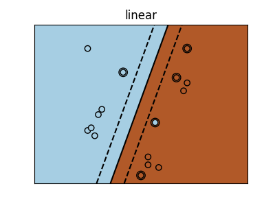
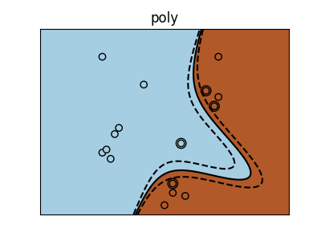
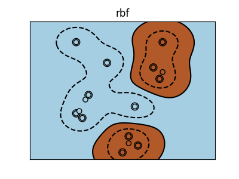

# ___2017 - 07 - 25 scikit-learn___
***

# 目录
  <!-- TOC depthFrom:1 depthTo:6 withLinks:1 updateOnSave:1 orderedList:0 -->

  - [___2017 - 07 - 25 scikit-learn___](#2017-07-25-scikit-learn)
  - [目录](#目录)
  	- [scikit-learn 介绍](#scikit-learn-介绍)
  	- [sklearn 约定规则](#sklearn-约定规则)
  	- [scikit-learn 载入数据集](#scikit-learn-载入数据集)
  	- [scikit-learn学习和预测一般流程](#scikit-learn学习和预测一般流程)
  	- [数据预处理](#数据预处理)
  	- [sklearn库中的算法](#sklearn库中的算法)
  	- [优化算法的参数](#优化算法的参数)
  	- [监督学习算法](#监督学习算法)

<!-- /TOC -->
***

## scikit-learn 介绍
  - scikit-learn是Python的一个开源机器学习模块，建立在NumPy，SciPy和matplotlib模块之上
## sklearn 约定规则
  - 除非专门指定，输入数据被转化为float64类型
    ```python
    import numpy as np
    from sklearn import random_projection

    rng = np.random.RandomState(0)
    x = rng.rand(10, 2000)
    x = np.array(x, dtype='float32')
    x.dtype
    # Out[38]: dtype('float32')

    # cast to float64 by fit_transform(x)
    transformer = random_projection.GaussianRandomProjection()
    x_new = transformer.fit_transform(x)
    x_new.dtype
    # Out[41]: dtype('float64')
    ```
  - 回归的目标预测值会转化成float64，分类的目标值类型不变
    ```python
    from sklearn import datasets
    from sklearn.svm import SVC
    iris = datasets.load_iris()
    clf = SVC()
    # iris.target is an integer array, predict() returns an integer array
    clf.fit(iris.data, iris.target)
    list(clf.predict(iris.data[:3]))
    Out[47]: [0, 0, 0]

    # iris.target_names was for fitting, predict() returns a string array
    clf.fit(iris.data, iris.target_names[iris.target])
    list(clf.predict(iris.data[:3]))
    Out[49]: ['setosa', 'setosa', 'setosa']
    ```
  - 模型的高级参数 (Hyper-parameters) 在创建后可以通过 **sklearn.pipeline.Pipeline.set_params** 方法修改，通过调用 **fit()** 覆盖之前的参数
    ```python
    import numpy as np
    from sklearn.svm import SVC
    rng = np.random.RandomState(0)
    X = rng.rand(100, 10)
    y = rng.binomial(1, 0.5, 100)
    X_test = rng.rand(5, 10)

    # default kernel is first changed to linear after the estimator has been constructed via SVC()
    clf = SVC()
    clf.set_params(kernel='linear').fit(X, y)
    Out[12]:
    SVC(C=1.0, cache_size=200, class_weight=None, coef0=0.0,
      decision_function_shape=None, degree=3, gamma='auto', kernel='linear',
      max_iter=-1, probability=False, random_state=None, shrinking=True,
      tol=0.001, verbose=False)

    clf.predict(X_test)
    Out[13]: array([1, 0, 1, 1, 0])

    # changed kernel to rbf to refit the estimator
    clf.set_params(kernel='rbf').fit(X, y)
    Out[14]:
    SVC(C=1.0, cache_size=200, class_weight=None, coef0=0.0,
      decision_function_shape=None, degree=3, gamma='auto', kernel='rbf',
      max_iter=-1, probability=False, random_state=None, shrinking=True,
      tol=0.001, verbose=False)

    clf.predict(X_test)
    Out[15]: array([0, 0, 0, 1, 0])
    ```
  - Multiclass 与 multilabel fitting
    - 当使用 [multiclass classifiers](http://scikit-learn.org/stable/modules/classes.html#module-sklearn.multiclass) 时训练与预测的结果取决于目标值的形式
      ```python
      from sklearn.svm import SVC
      from sklearn.multiclass import OneVsRestClassifier
      from sklearn.preprocessing import LabelBinarizer

      # 一维目标值
      X = [[1, 2], [2, 4], [4, 5], [3, 2], [3, 1]]
      y = [0, 0, 1, 1, 2]
      classif = OneVsRestClassifier(estimator=SVC(random_state=0))
      classif.fit(X, y).predict(X)
      Out[23]: array([0, 0, 1, 1, 2])

      # 二维二进制目标值
      y = LabelBinarizer().fit_transform(y)
      y
      Out[25]:
      array([[1, 0, 0],
             [1, 0, 0],
             [0, 1, 0],
             [0, 1, 0],
             [0, 0, 1]])

      classif.fit(X, y).predict(X)
      Out[26]:
      array([[1, 0, 0],
             [1, 0, 0],
             [0, 1, 0],
             [0, 0, 0],
             [0, 0, 0]])
      ```
    - 当使用多组标签 **multiple labels** 时，预测结果中可能有全0值，表示不符合任何一个标签，或者多个1值，表示符合多个分组
      ```python
      from sklearn.preprocessing import MultiLabelBinarizer
      y = [[0, 1], [0, 2], [1, 3], [0, 2, 3], [2, 4]]
      y = MultiLabelBinarizer().fit_transform(y)
      y
      Out[31]:
      array([[1, 1, 0, 0, 0],
             [1, 0, 1, 0, 0],
             [0, 1, 0, 1, 0],
             [1, 0, 1, 1, 0],
             [0, 0, 1, 0, 1]])

      classif.fit(X, y).predict(X)
      Out[32]:
      array([[1, 1, 0, 0, 0],
             [1, 0, 1, 0, 0],
             [0, 1, 0, 1, 0],
             [1, 0, 1, 0, 0],
             [1, 0, 1, 0, 0]])
      ```
## scikit-learn 载入数据集
  - scikit-learn 处理的数据集是二维的，其中行向量表示多个采样值 **samples axis**，列向量表示特征值 **features axis**
  - scikit-learn 内包含了常用的机器学习数据集，比如做分类的 iris 和 digit 数据集，用于回归的经典数据集 Boston house prices
  - scikit-learn 载入的数据集是以类似于 **字典的形式** 存放的，该对象中包含了所有有关该数据的数据信息 (甚至还有参考文献)
  - **鸢尾花 iris 数据集**，是一类多重变量分析的数据集，通过花瓣petal 与 萼片sepal 的长宽，划分鸢尾花的三个种类 山鸢尾Setosa / 杂色鸢尾Versicolour / 维吉尼亚鸢尾Virginica
    ```python
    from sklearn import datasets
    iris = datasets.load_iris()
    ```
  - **数据值统一存放在.data的成员中**，iris数据中每个实例有4维特征，分别为：sepal length、sepal width、petal length和petal width
    ```python
    type(iris.data)
    Out[34]: numpy.ndarray

    iris.data.shape
    Out[35]: (150, 4)

    iris.data[:3]
    Out[36]:
    array([[ 5.1,  3.5,  1.4,  0.2],
           [ 4.9,  3. ,  1.4,  0.2],
           [ 4.7,  3.2,  1.3,  0.2]])
    ```
  - 对于监督学习，比如分类问题，**数据对应的分类结果存在.target成员中**
    ```python
    np.unique(iris.target)
    Out[37]: array([0, 1, 2])

    iris.target[45:55]
    Out[46]: array([0, 0, 0, 0, 0, 1, 1, 1, 1, 1])
    ```
  - 如果数据集的形式不是(n_samples, n_features)，需要进行 **预处理**
    ```python
    # digits 数据集的 image 数据是 1797 x 8 x 8 的形式
    digits = datasets.load_digits()
    digits.data.shape
    Out[12]: (1797, 64)

    digits.images.shape
    Out[13]: (1797, 8, 8)
    # 转化为 1797 * 64 的数据集
    data = digits.images.reshape(digits.images.shape[0], -1)
    data.shape
    Out[15]: (1797, 64)
    ```
## scikit-learn学习和预测一般流程
  - scikit-learn 实现的主要API就是各种估计模型，提供了各种机器学习算法的接口，每个算法的调用就像一个黑箱，只需要根据自己的需求，设置相应的参数
  - 模型的所有 **参数** 都可以在初始化时指定，或者通过相应的属性修改
  - scikit-learn 每个模型都提供一个 **fit(X, Y)** 接口函数，可以接受一个二维数据集参数，用于 **模型训练**，模型通过 fit() 函数估计出的参数在模型的属性中以下划线 `_` 结尾
    ```python
    estimator.fit(data)
    estimator.estimated_param_
    ```
  - 模型预测使用 **predict(T)** 函数
  - **示例** digits手写数字数据集 与 支持向量机SVM
    ```python
    # 调用最常用的支撑向量分类机（SVC）
    from sklearn import svm
    # 不使用默认参数，使用用户自己给定的参数
    clf = svm.SVC(gamma=0.001, C=100.)
    clf.gamma
    Out[48]: 0.001

    # 分类器的具体信息和参数
    clf
    Out[49]:
    SVC(C=100.0, cache_size=200, class_weight=None, coef0=0.0,
      decision_function_shape=None, degree=3, gamma=0.001, kernel='rbf',
      max_iter=-1, probability=False, random_state=None, shrinking=True,
      tol=0.001, verbose=False)
    ```
    分类器的学习和预测可以分别利用 **fit(X,Y)** 和 **predict(T)** 来实现
    ```python
    # 将digit数据划分为训练集和测试集，前n-1个实例为训练集，最后一个为测试集
    from sklearn import datasets
    from sklearn import svm
    clf = svm.SVC(gamma=0.001, C=100.)
    digits = datasets.load_digits()
    # 模型训练
    clf.fit(digits.data[:-1], digits.target[:-1])
    # 模型训练后的参数
    clf.classes_
    Out[65]: array([0, 1, 2, 3, 4, 5, 6, 7, 8, 9])

    # 预测结果，使用列向量
    clf.predict(digits.data[-1:])
    # Out[66]: array([8])
    # 真实结果
    digits.target[-1]
    # Out[67]: 8

    # 绘制digits图形
    import matplotlib.pyplot as plt
    plt.figure(1, figsize=(3, 3))
    plt.imshow(digits.images[-1], cmap=plt.cm.gray_r, interpolation='nearest')
    ```
    
  - 模型存储
    - 可以使用pickle存储模型
    - 对于scikit，可以使用joblib，在大数据集上更有效，但只能存储到文件中，随后可以在其他程序中使用存储的模型
    ```python
    from sklearn.externals import joblib
    joblib.dump(clf, 'foo.pkl')
    # Out[30]: ['foo.pkl']

    clf2 = joblib.load('foo.pkl')
    clf2.predict(digits.data[-1:])
    # Out[32]: array([8])
    ```
## 数据预处理
  - 大多数的梯度方法（几乎所有的机器学习算法都基于此）对于数据的缩放很敏感，因此在运行算法之前，应该进行 **标准化或规格化**
    - 标准化包括替换所有特征的名义值，让它们每一个的值在0和1之间
    - 规格化包括数据的预处理，使得每个特征的值有0和1的离差
    ```python
    # 数据获取
    import numpy as np
    import urllib.request
    # url with dataset
    url = "http://archive.ics.uci.edu/ml/machine-learning-databases/pima-indians-diabetes/pima-indians-diabetes.data"
    # download the file
    raw_data = urllib.request.urlopen(url)
    # load the CSV file as a numpy matrix
    dataset = np.loadtxt(raw_data, delimiter=",")
    # separate the data from the target attributes
    x = dataset[:,:-1]
    y = dataset[:,-1]

    # 标准化与规格化
    from sklearn import preprocessing
    # normalize the data attributes
    normalized_x = preprocessing.normalize(x)
    # standardize the data attributes
    standardized_x = preprocessing.scale(x)
    ```
    运行结果
    ```python
    x[1]
    Out[6]: array([ 1., 85., 66., 29., 0., 26.6, 0.351, 31. ])

    normalized_x[1]
    Out[7]:
    array([ 0.008424, 0.71604034, 0.55598426, 0.24429612,
            0., 0.22407851, 0.00295683, 0.26114412])

    standardized_x[1]
    Out[8]:
    array([-0.84488505, -1.12339636, -0.16054575, 0.53090156,
           -0.69289057, -0.68442195, -0.36506078, -0.19067191])

    y[1]
    Out[9]: 0.0
    ```
  - **特征选取和特征工程** 解决一个问题最重要的是恰当选取特征、甚至创造特征的能力，特征工程是一个相当有创造性的过程，有时候更多的是靠直觉和专业的知识，但对于特征的选取，已经有很多的算法可供直接使用，如树算法就可以计算特征的信息量
    ```python
    from sklearn import metrics
    from sklearn.ensemble import ExtraTreesClassifier
    model = ExtraTreesClassifier()
    model.fit(x, y)
    Out[15]:
    ExtraTreesClassifier(bootstrap=False, class_weight=None, criterion='gini',
               max_depth=None, max_features='auto', max_leaf_nodes=None,
               min_impurity_split=1e-07, min_samples_leaf=1,
               min_samples_split=2, min_weight_fraction_leaf=0.0,
               n_estimators=10, n_jobs=1, oob_score=False, random_state=None,
               verbose=0, warm_start=False)
    # display the relative importance of each attribute
    model.feature_importances_
    Out[16]:
    array([ 0.10275952,  0.25440925,  0.09016066,  0.07965089,
            0.0757741 , 0.13128523,  0.11951687,  0.14644348])
    ```
  - 其他所有的方法都是基于对 **特征子集的高效搜索**，从而找到最好的子集，意味着演化了的模型在这个子集上有最好的质量，**递归特征消除算法**（RFE）是这些搜索算法的其中之一
    ```python
    from sklearn.feature_selection import RFE
    from sklearn.linear_model import LogisticRegression
    model = LogisticRegression()
    # create the RFE model and select 3 attributes
    rfe = RFE(model, 3)
    rfe = rfe.fit(x, y)
    # summarize the selection of the attributes
    rfe.support_
    Out[20]: array([ True, False, False, False, False,  True,  True, False], dtype=bool)

    rfe.ranking_
    Out[21]: array([1, 2, 3, 5, 6, 1, 1, 4])
    ```
## sklearn 库中的算法
  - 除了分类和回归问题，Scikit-Learn还有海量的更复杂的算法，包括了聚类，以及建立混合算法的实现技术，如 Bagging 和 Boosting
  - **逻辑回归** 大多数情况下被用来解决分类问题（二元分类），但多类的分类（所谓的一对多方法）也适用，优点是对于每一个输出的对象都有一个对应类别的概率
    ```python
    from sklearn import metrics
    from sklearn.linear_model import LogisticRegression
    model = LogisticRegression()
    model.fit(x, y)
    Out[27]:
    LogisticRegression(C=1.0, class_weight=None, dual=False, fit_intercept=True,
              intercept_scaling=1, max_iter=100, multi_class='ovr', n_jobs=1,
              penalty='l2', random_state=None, solver='liblinear', tol=0.0001,
              verbose=0, warm_start=False)

    # make predictions
    expected = y
    predicted = model.predict(x)
    # summarize the fit of the model
    print(metrics.classification_report(expected, predicted))
                 precision    recall  f1-score   support

            0.0       0.79      0.90      0.84       500
            1.0       0.74      0.55      0.63       268

    avg / total       0.77      0.77      0.77       768

    metrics.confusion_matrix(expected, predicted)
    Out[33]:
    array([[448,  52],
           [121, 147]])
    ```
  - **朴素贝叶斯** 主要任务是恢复训练样本的数据分布密度，这个方法通常在多类的分类问题上表现的很好
    ```python
    from sklearn import metrics
    from sklearn.naive_bayes import GaussianNB
    model = GaussianNB()
    model.fit(x, y)
    Out[36]: GaussianNB(priors=None)

    # make predictions
    expected = y
    predicted = model.predict(x)
    # summarize the fit of the model
    print(metrics.classification_report(expected, predicted))
                 precision    recall  f1-score   support

            0.0       0.80      0.84      0.82       500
            1.0       0.68      0.62      0.64       268

    avg / total       0.76      0.76      0.76       768

    metrics.confusion_matrix(expected, predicted)
    Out[40]:
    array([[421,  79],
           [103, 165]])
    ```
  - **k-最近邻 KNN** 通常用于一个更复杂分类算法的一部分，例如，可以用它的估计值做为一个对象的特征，有时候，一个简单的kNN算法在良好选择的特征上会有很出色的表现，当参数（主要是metrics）被设置得当，这个算法在回归问题中通常表现出最好的质量
    ```python
    from sklearn import metrics
    from sklearn.neighbors import KNeighborsClassifier
    # fit a k-nearest neighbor model to the data
    model = KNeighborsClassifier()
    model.fit(x, y)
    Out[43]:
    KNeighborsClassifier(algorithm='auto', leaf_size=30, metric='minkowski',
               metric_params=None, n_jobs=1, n_neighbors=5, p=2,
               weights='uniform')

    # make predictions
    expected = y
    predicted = model.predict(x)
    # summarize the fit of the model
    print(metrics.classification_report(expected, predicted))
                 precision    recall  f1-score   support

            0.0       0.83      0.88      0.85       500
            1.0       0.75      0.65      0.70       268

    avg / total       0.80      0.80      0.80       768

    metrics.confusion_matrix(expected, predicted)
    Out[46]:
    array([[442,  58],
           [ 93, 175]])
    ```
  - **决策树 分类和回归树（CART）** 适用的分类问题中对象有可分类的特征，且被用于回归和分类，决策树很适用于多类分类
    ```python
    from sklearn import metrics
    from sklearn.tree import DecisionTreeClassifier
    # fit a CART model to the data
    model = DecisionTreeClassifier()
    model.fit(x, y)
    Out[49]:
    DecisionTreeClassifier(class_weight=None, criterion='gini', max_depth=None,
                max_features=None, max_leaf_nodes=None,
                min_impurity_split=1e-07, min_samples_leaf=1,
                min_samples_split=2, min_weight_fraction_leaf=0.0,
                presort=False, random_state=None, splitter='best')

    # make predictions
    expected = y
    predicted = model.predict(x)
    # summarize the fit of the model
    print(metrics.classification_report(expected, predicted))
                 precision    recall  f1-score   support

            0.0       1.00      1.00      1.00       500
            1.0       1.00      1.00      1.00       268

    avg / total       1.00      1.00      1.00       768

    metrics.confusion_matrix(expected, predicted)
    Out[52]:
    array([[500,   0],
           [  0, 268]])
    ```
  - **支持向量机 SVM** 是最流行的机器学习算法之一，主要用于分类问题，同样也用于逻辑回归，SVM在一对多方法的帮助下可以实现多类分类
    ```python
    from sklearn import metrics
    from sklearn.svm import SVC
    # fit a SVM model to the data
    model = SVC()
    model.fit(x, y)
    Out[54]:
    SVC(C=1.0, cache_size=200, class_weight=None, coef0=0.0,
      decision_function_shape=None, degree=3, gamma='auto', kernel='rbf',
      max_iter=-1, probability=False, random_state=None, shrinking=True,
      tol=0.001, verbose=False)

    # make predictions
    expected = y
    predicted = model.predict(x)
    # summarize the fit of the model
    print(metrics.classification_report(expected, predicted))
                   precision    recall  f1-score   support

            0.0       1.00      1.00      1.00       500
            1.0       1.00      1.00      1.00       268

    avg / total       1.00      1.00      1.00       768

    metrics.confusion_matrix(expected, predicted)
    Out[56]:
    array([[500,   0],
           [  0, 268]])
    ```
## 优化算法的参数
  - 在编写高效的算法的过程中最难的步骤之一就是正确参数的选择，Scikit-Learn提供了很多函数来帮助解决这个问题
    ```python
    # 规则化参数的选择，在其中不少数值被相继搜索了
    import numpy as np
    from sklearn.linear_model import Ridge
    # This module will be removed in 0.20
    from sklearn.grid_search import GridSearchCV
    # prepare a range of alpha values to test
    alphas = np.array([1, 0.1, 0.01, 0.001, 0.0001, 0])
    # create and fit a ridge regression model, testing each alpha
    model = Ridge()
    grid = GridSearchCV(estimator=model, param_grid=dict(alpha=alphas))
    grid.fit(x, y)
    Out[66]:
    GridSearchCV(cv=None, error_score='raise',
           estimator=Ridge(alpha=1.0, copy_X=True, fit_intercept=True, max_iter=None,
       normalize=False, random_state=None, solver='auto', tol=0.001),
           fit_params={}, iid=True, n_jobs=1,
           param_grid={'alpha': array([  1.00000e+00,   1.00000e-01,   1.00000e-02,   1.00000e-03,
             1.00000e-04,   0.00000e+00])},
           pre_dispatch='2*n_jobs', refit=True, scoring=None, verbose=0)

    # summarize the results of the grid search
    grid.best_score_
    Out[68]: 0.27961755931297216

    grid.best_estimator_.alpha
    Out[69]: 1.0
    ```
  - 随机地从既定的范围内选取一个参数有时候更为高效，估计在这个参数下算法的质量，然后选出最好的
    ```python
    import numpy as np
    from scipy.stats import uniform as sp_rand
    from sklearn.linear_model import Ridge
    from sklearn.grid_search import RandomizedSearchCV
    # prepare a uniform distribution to sample for the alpha parameter
    param_grid = {'alpha': sp_rand()}
    # create and fit a ridge regression model, testing random alpha values
    model = Ridge()
    rsearch = RandomizedSearchCV(estimator=model, param_distributions=param_grid, n_iter=100)
    rsearch.fit(x, y)
    Out[7]:
    RandomizedSearchCV(cv=None, error_score='raise',
              estimator=Ridge(alpha=1.0, copy_X=True, fit_intercept=True, max_iter=None,
       normalize=False, random_state=None, solver='auto', tol=0.001),
              fit_params={}, iid=True, n_iter=100, n_jobs=1,
              param_distributions={'alpha': <scipy.stats._distn_infrastructure.rv_frozen object at 0x7f3aff8469e8>},
              pre_dispatch='2*n_jobs', random_state=None, refit=True,
              scoring=None, verbose=0)

    # summarize the results of the random parameter search
    rsearch.best_score_
    Out[8]: 0.27961752547790575

    rsearch.best_estimator_.alpha
    Out[9]: 0.99827013993379388
    ```
## sklearn 中的评价尺度
  - 在sklearn中包含四种评价尺度
    - explained_variance_score()
    - mean_absolute_error()
    - mean_squared_error()
    - r2_score()
  - 均方差 mean-squared-error
    ```python
    MSE(y, yp) = 1 / N * Σ(1, N)(y - yp)^2
    ```
  - 平均绝对值误差 mean_absolute_error
    ```python
    MAE(y, yp) = 1 / N * Σ(1, N)|y - yp|
    ```
  - 可释方差得分 explained_variance_score
    ```python
    EVS(y, yp) = 1 - var(y - yp) / var(y)
    ```
    最大值是1，表示模型的拟合程度最好，值越小则效果越差
  - 中值绝对误差 Median absolute error
    ```python
    MedAE(y, yp) = median(|y1 - yp1|, ... , |yN - ypN|)
    ```
    适应含有离群点的数据集
  - R2 决定系数（拟合优度）
    ```python
    R2(y, yp) = 1 - Σ(1, N)(y - yp)^2 / Σ(1, N)(y - mean(y))^2
    ```
    表征回归方程在多大程度上解释了因变量的变化，或者说方程对观测值的拟合程度
  - **参数 multioutput**
    - 用来指定在多目标回归问题中，若干单个目标变量的损失或得分以什么样的方式被平均起来
    - 默认值 **uniform_average**，将所有预测目标值的损失以等权重的方式平均起来
    - 指定一个 **shape 为（n_oupputs,）的ndarray**，那么数组内的数将被视为是对每个输出预测损失（或得分）的加权值，最终的损失按照指定的加权方式来计算
    - 指定为 **raw_values**，那么所有的回归目标的预测损失或预测得分都会被单独返回一个shape是（n_output）的数组中
***

# sklearn 中的监督学习算法
## 基本概念
  - **监督学习算法** 一般用于学习两个数据集之间的关系，**观测集X** 与 **目标集 Y**，预测结果通常称为 **target** 或 **labels**，通常情况下，Y是一个一维向量
  - scikit-learn 中所有的监督学习算法都实现了 **fit(X, y)** 方法用于模型训练，以及 **predict(X)** 方法用于预测未分组(unlabeled)数据 X 的标签值(labels) Y
  - **分类算法** 预测的目标值是离散的，即将观测值划分成有限多个目标值，分类算法中的目标值y是一个数字或字符串组成的向量
  - **回归算法** 预测的目标值是连续的
  - **训练集与测试集** 在实验任何机器学习算法时，应避免使用训练模型的数据来测试预测结果，这无法反应模型在新数据上的预测效果
## 分类算法 KNN
  - [KNN](http://scikit-learn.org/stable/modules/neighbors.html#neighbors) k-Nearest neighbors classifier k-近邻，是最简单的分类算法
  - 对于新的预测数据，在已分类数据的训练集中寻找距离最近的数据，将其对应的分类标签作为新数据的预测分类
  - iris 数据集上的 KNN 示例
    ```python
    import numpy as np
    from sklearn import datasets

    iris = datasets.load_iris()
    iris_X = iris.data
    iris_y = iris.target

    # Split iris data in train and test data randomly
    np.random.seed(0)
    indices = np.random.permutation(len(iris_X))
    iris_X_train = iris_X[indices[:-10]]
    iris_y_train = iris_y[indices[:-10]]
    iris_X_test  = iris_X[indices[-10:]]
    iris_y_test  = iris_y[indices[-10:]]

    # Create and fit a nearest-neighbor classifier
    from sklearn.neighbors import KNeighborsClassifier
    knn = KNeighborsClassifier()
    knn.fit(iris_X_train, iris_y_train)
    knn.predict(iris_X_test)
    # Out[32]: array([1, 2, 1, 0, 0, 0, 2, 1, 2, 0])

    iris_y_test
    # Out[33]: array([1, 1, 1, 0, 0, 0, 2, 1, 2, 0])
    ```
## 维数灾难 The curse of dimensionality
  - 当维数增大时，**高维空间数据会变得更稀疏**
    - 维数 p=1 时，N 个样本数据间的平均距离是 1 / N
    - 维数 p=2 时，N 个样本数据间的平均距离是 (1 / N) ^ (1 / 2)，即需要 N ^ 2 个点才能维持距离为 1 / N
    - 维数 p=p 时，N 个样本数据间的平均距离是 (1 / N) ^ (1 / p)，即需要 N ^ p 个点才能维持距离为 1 / N
  - 在以距离作为预测依据的机器学习算法(如 KNN)中，当维数增大时，空间数据会变得更稀疏，各个分组间的界限会变小，算法预测的效率会降低
## 线型回归模型 Linear regression model
  - **diabetes 糖尿病数据集** 包含442个病人的10个生理特征数据 (age, sex, weight, blood pressure)，以及一年后的病情指标
    ```python
    diabetes = datasets.load_diabetes()
    diabetes.data.shape
    Out[35]: (442, 10)

    diabetes_X_train = diabetes.data[:-20]
    diabetes_X_test  = diabetes.data[-20:]
    diabetes_y_train = diabetes.target[:-20]
    diabetes_y_test  = diabetes.target[-20:]
    ```
  - 线型回归模型 Linear models，将数据集拟合成一个一阶模型，使得预测的总方差最小
    ```python
    y = Xβ + ε
    其中
        X: 数据集
        y: 目标向量
        β: 预测系数
        ε: 观测噪声
    ```
  - 使用示例
    ```python
    from sklearn import linear_model
    regr = linear_model.LinearRegression()
    regr.fit(diabetes_X_train, diabetes_y_train)
    # Out[42]: LinearRegression(copy_X=True, fit_intercept=True, n_jobs=1, normalize=False)

    # 线型回归模型的预测系数
    print(regr.coef_)

    # 预测错误均方差
    np.mean((regr.predict(diabetes_X_test) - diabetes_y_test) ** 2)
    # Out[46]: 2004.5676026898223

    # Explained variance score: 1表示完美拟合，0表示没有线型关系
    regr.score(diabetes_X_test, diabetes_y_test)
    # Out[50]: 0.58507530226905713
    ```
## 岭回归 Ridge 缩减 shrinkage 与过拟合
  - 如果数据集中的观测值过少，会使模型预测中产生较大的方差，即模型之间的差异会变大
    ```python
    X = np.c_[ .5, 1].T
    y = [.5, 1]
    test = np.c_[ 0, 2].T
    regr = linear_model.LinearRegression()

    import matplotlib.pyplot as plt
    plt.figure()

    np.random.seed(0)
    for _ in range(6):
        # 随机添加噪声
        this_X = .1 * np.random.normal(size=(2, 1)) + X
        regr.fit(this_X, y)
        plt.plot(test, regr.predict(test))
        plt.scatter(this_X, y, s=3)
    ```
    
  - **岭回归 Ridge** 在高维数据中的一种解决方法是 **将一部分回归系数 β 缩减到0**，减少了模型的复杂度，但同时增大了模型偏差
    ```python
    # 使用岭回归 Ridge 模型
    regr = linear_model.Ridge(alpha=.1)
    plt.figure()

    np.random.seed(0)
    for _ in range(6):
        this_X = .1*np.random.normal(size=(2, 1)) + X
        regr.fit(this_X, y)
        plt.plot(test, regr.predict(test))
        plt.scatter(this_X, y, s=3)
    ```
    
  - **权衡偏差与方差 bias/variance tradeoff** 岭回归模型中的 alpha 参数增大，会导致更大的偏差与更小的方差，调整 alpha 参数可以使得模型的效果最好
    ```python
    # 调整alpha值，在 diabetes 数据集上测试模型拟合效果
    alphas = np.logspace(-4, -1, 6)
    from __future__ import print_function
    [regr.set_params(alpha=alpha
               ).fit(diabetes_X_train, diabetes_y_train,
               ).score(diabetes_X_test, diabetes_y_test) for alpha in alphas]
    Out[77]:
    [0.58511106838835292, 0.58520730154446765,
     0.58546775406984908, 0.58555120365039159,
     0.58307170855541623, 0.57058999437280111]
    ```
  - **过拟合 overfitting** 模型过拟合，对新数据的预测效果变差
  - **正则化 regularization** 岭回归中引入的偏差称为正则化 regularization，降低模型的过拟合
## Lasso 缩减与稀疏 Sparsity 降低模型复杂度
  - **Lasso 缩减** least absolute shrinkage and selection operator，只选取与预测目标关联度高的特征，而将不重要的特征系数缩减到0，lasso estimate 具有 shrinkage 和 selection 两种功能
  - 岭回归会减小数据集中不重要特征的系数，但不会缩减到0，lasso缩减会将某些系数缩减到0，即特征选择 selection
  - 减小问题的复杂度，防止过拟合，是一种 **稀疏方法 sparse method**
  - 稀疏 Sparsity 可以看作是奥卡姆剃刀原则的应用
    ```
    Occam’s razor: prefer simpler models
    ```
  - lasso 回归示例
    ```python
    # 使用 lasso 回归模型
    regr = linear_model.Lasso()
    scores = [regr.set_params(alpha=alpha
               ).fit(diabetes_X_train, diabetes_y_train
               ).score(diabetes_X_test, diabetes_y_test)
            for alpha in alphas]
    best_alpha = alphas[scores.index(max(scores))]
    best_alpha
    # Out[86]: 0.025118864315095794

    regr.alpha = best_alpha
    regr.fit(diabetes_X_train, diabetes_y_train)
    # 某些系数缩减到了0
    regr.coef_
    Out[88]:
    array([   0.        , -212.43764548,  517.19478111,  313.77959962,
           -160.8303982 ,   -0.        , -187.19554705,   69.38229038,
            508.66011217,   71.84239008])
    ```
  - **不同的算法可以用于解决同样的数学问题**
    - scikit-learn 中的 **Lasso 对象** 使用坐标下降的方法 coordinate descent method 解决 lasso 回归问题，这在大数据集上很有效
    - scikit-learn 中同样提供了 **LassoLars 对象**，使用 **LARS 算法** ((Least Angle Regression 最小角回归)，在估计的权重向量非常稀疏，如观测值很少的数据集中很有效
## Logistic 回归与sigmoid函数，回归算法用于分类
  - 在分类预测中，线型回归模型通常并不适用，因为模型会给远离决策边界的数据更大的权重
  - **sigmoid or logistic** 将线型回归模型的结果转化成分类结果，类似与阶跃函数
    ```
    sigmoid(z) = 1 / (1 + e^(-z))
    ```
  - iris数据集上 Logistic 回归用于分类示例
    ```python
    logistic = linear_model.LogisticRegression(C=1e5)
    logistic.fit(iris_X_train, iris_y_train)
    Out[90]:
    LogisticRegression(C=100000.0, class_weight=None, dual=False,
              fit_intercept=True, intercept_scaling=1, max_iter=100,
              multi_class='ovr', n_jobs=1, penalty='l2', random_state=None,
              solver='liblinear', tol=0.0001, verbose=0, warm_start=False)

    logistic.predict(iris_X_test)
    Out[91]: array([1, 2, 1, 0, 0, 0, 2, 1, 2, 0])

    iris_y_test
    Out[92]: array([1, 1, 1, 0, 0, 0, 2, 1, 2, 0])
    ```
  - Logistic 回归中的 **缩减 shrinkage 与稀疏 sparsity**
    - **参数 C**，默认1.0，指定数据正则化的程度，值越小正则化越低
    - **参数 penalty**，默认'l2'，指定惩罚的基准 the norm used in the penalization，'l2'指定缩减 Shrinkage，'l1'指定稀疏 Sparsity
## 支持向量机 SVM Support vector machines
  - SVM 包含 **回归模型 SVR** Support Vector Regression，以及 **分类模型 SVC** Support Vector Classification
  - **SVM 线性模型** SVM 模型试图找到一组样本值，来建立两个分组间的分隔超平面，使得该组样本值与分隔超平面的间隔最大，正则化程度通过 **参数 C** 设定
    - C 值越小，正则化程度高，使用分隔超平面附近更多或全部的点来计算间隔
    - C 值越大，正则化程度低，使用分隔超平面最近的点来计算间隔
    - [Plot different SVM classifiers in the iris dataset](http://scikit-learn.org/stable/auto_examples/svm/plot_iris.html#sphx-glr-auto-examples-svm-plot-iris-py)
  - iris数据集上 SVM 示例
    ```python
    from sklearn import svm
    svc = svm.SVC(kernel='linear')
    svc.fit(iris_X_train, iris_y_train)
    Out[96]:
    SVC(C=1.0, cache_size=200, class_weight=None, coef0=0.0,
      decision_function_shape=None, degree=3, gamma='auto', kernel='linear',
      max_iter=-1, probability=False, random_state=None, shrinking=True,
      tol=0.001, verbose=False)

    svc.predict(iris_X_test)
    Out[97]: array([1, 2, 1, 0, 0, 0, 2, 1, 2, 0])
    ```
  - **核函数 kernels**，数据集的特征并不总是线性可分的，可以使用 **核技巧 kernel trick** 在特征空间上应用一个决策函数 decision function，将数据映射到另一个特征空间，通常会将 **低维特征空间映射到高维空间**
  - 示例 [SVM-Kernels](http://scikit-learn.org/stable/auto_examples/svm/plot_svm_kernels.html)
    ```python
    # Linear kernel
    svc = svm.SVC(kernel='linear')
    # Polynomial kernel
    svc = svm.SVC(kernel='poly', degree=3)
    # RBF kernel (Radial Basis Function)
    svc = svm.SVC(kernel='rbf')
    ```
    
    
    
  - 其他链接
    - [plot iris exercise](http://scikit-learn.org/stable/_downloads/plot_iris_exercise.py)
    - [Libsvm GUI]( http://scikit-learn.org/stable/auto_examples/applications/svm_gui.html#sphx-glr-auto-examples-applications-svm-gui-py)
