# ___Dainty Factory 美味工厂___
# 目录
  <!-- TOC depthFrom:1 depthTo:6 withLinks:1 updateOnSave:1 orderedList:0 -->

  - [___Dainty Factory 美味工厂___](#dainty-factory-美味工厂)
  - [目录](#目录)
  - [BBC风味药膳枸杞鸡汤 - 相宜宜](#bbc风味药膳枸杞鸡汤-相宜宜)
  - [Pancakes 英式煎饼 - xdcandy](#pancakes-英式煎饼-xdcandy)
  - [一口番茄 - 苏里慈](#一口番茄-苏里慈)
  - [一步一步包馄饨 - 海草](#一步一步包馄饨-海草)
  - [今日の晩御飯 可乐饼 - 蜂蜜甜甜圈](#今日晩御飯-可乐饼-蜂蜜甜甜圈)
  - [健康方便的芒果冰淇淋 - 可可酱](#健康方便的芒果冰淇淋-可可酱)
  - [厚蛋烧 - 小木](#厚蛋烧-小木)
  - [双皮奶 - lplinkin](#双皮奶-lplinkin)
  - [增肥圣品-芝心薯球 - 瞑王殿下Esther](#增肥圣品-芝心薯球-瞑王殿下esther)
  - [大复活-复活节的茶叶蛋 - 芥小末](#大复活-复活节的茶叶蛋-芥小末)
  - [奶酪番茄烩白菜 - 老少女熊](#奶酪番茄烩白菜-老少女熊)
  - [奶香牡丹花 - 魏夫人](#奶香牡丹花-魏夫人)
  - [家常豆腐 - yunchun](#家常豆腐-yunchun)
  - [小宇宙的爆发-会下蛋的公鸡 - 芥小末](#小宇宙的爆发-会下蛋的公鸡-芥小末)
  - [彼此取暖-山药腔骨汤 - 大肉朵](#彼此取暖-山药腔骨汤-大肉朵)
  - [怡红快绿 - 苏默然](#怡红快绿-苏默然)
  - [我们的目标是-吃不胖 - 瞑王殿下Esther](#我们的目标是-吃不胖-瞑王殿下esther)
  - [挑食中的意面 - 忐忑被你冷落](#挑食中的意面-忐忑被你冷落)
  - [摩卡 - Sammi](#摩卡-sammi)
  - [有待完善的肉脯 - 常小扣](#有待完善的肉脯-常小扣)
  - [木须肉 - 天使小熊](#木须肉-天使小熊)
  - [极致的可乐鸡翅 - Senyo_赵小胆](#极致的可乐鸡翅-senyo赵小胆)
  - [桑葚果酱 - 可可酱](#桑葚果酱-可可酱)
  - [樱桃果酱 - 4CM](#樱桃果酱-4cm)
  - [波伦亚意面酱 - seule](#波伦亚意面酱-seule)
  - [第一次做的牛排 - misty725](#第一次做的牛排-misty725)
  - [独门利器-饭扫光 - 小杠](#独门利器-饭扫光-小杠)
  - [璃玻碎 - 芥小末](#璃玻碎-芥小末)
  - [珍珠丸子 - newmay](#珍珠丸子-newmay)
  - [番茄焖排骨 - 大大飞小小厨](#番茄焖排骨-大大飞小小厨)
  - [碧玉菜包饭 - Lemon-ya](#碧玉菜包饭-lemon-ya)
  - [米饭的情书 - 芥小末](#米饭的情书-芥小末)
  - [粉墨 - 芥小末](#粉墨-芥小末)
  - [糖醋锅包肉](#糖醋锅包肉)
  - [紫薯米饭 - 未来李夫人](#紫薯米饭-未来李夫人)
  - [红糖锅盔的夙愿-红糖小煎饼 - 小杠](#红糖锅盔的夙愿-红糖小煎饼-小杠)
  - [自制版蜂蜜柚子茶 - 大竹仔](#自制版蜂蜜柚子茶-大竹仔)
  - [苹果茶 - Sammi](#苹果茶-sammi)
  - [茶泡饭 - xm](#茶泡饭-xm)
  - [草莓蛋奶布丁 - 130小白](#草莓蛋奶布丁-130小白)
  - [草莓酱 - xm](#草莓酱-xm)
  - [菠菜力量大-姜汁菠菜 - 大肉朵](#菠菜力量大-姜汁菠菜-大肉朵)
  - [蒜蓉争气虾 - seule](#蒜蓉争气虾-seule)
  - [蒸个馒头 - 常小扣](#蒸个馒头-常小扣)
  - [蒸馒头-自家出产无添加 - Joe_lilith](#蒸馒头-自家出产无添加-joelilith)
  - [虾仁什锦蛋包饭 - 小木](#虾仁什锦蛋包饭-小木)
  - [蛋蛋蛋饼 - sariel.c.c](#蛋蛋蛋饼-sarielcc)
  - [蛋黄酱-美乃滋 - Lynn](#蛋黄酱-美乃滋-lynn)
  - [西红柿炒鸡蛋 - yunchun](#西红柿炒鸡蛋-yunchun)
  - [说再见的时候，请别挥手-燃烧的猪五花 - 芥小末](#说再见的时候请别挥手-燃烧的猪五花-芥小末)
  - [躁动的小笼包 - 芥小末](#躁动的小笼包-芥小末)
  - [辣味豆腐火腿串 - kangdo](#辣味豆腐火腿串-kangdo)
  - [辣的隐秘的土豆丝饼 - 常小扣](#辣的隐秘的土豆丝饼-常小扣)
  - [迷你蛋卷卷 - M喵](#迷你蛋卷卷-m喵)
  - [酸辣土豆卷饼 - 老少女熊](#酸辣土豆卷饼-老少女熊)
  - [金香玉-青椒炒玉米 - 大肉朵](#金香玉-青椒炒玉米-大肉朵)
  - [青椒鸡蛋圈 - chloé](#青椒鸡蛋圈-chlo)
  - [香辣鸡柳 - う清颜づ](#香辣鸡柳-清颜)
  - [鱼香肉丝 - 空竹](#鱼香肉丝-空竹)
  - [鸡汁汆青笋丝 - 海草](#鸡汁汆青笋丝-海草)
  - [鸡肉达人-我爱吃鸡 - 芥小末](#鸡肉达人-我爱吃鸡-芥小末)
  - [女王很闲-鸡蛋三明治 - 芥小末](#女王很闲-鸡蛋三明治-芥小末)
  - [麻辣水煮肉片 - sunnydidi4](#麻辣水煮肉片-sunnydidi4)
  - [黄玫瑰馒头 - 魏夫人](#黄玫瑰馒头-魏夫人)
  - [黄瓜花生和鸡丁的故事 - Cris](#黄瓜花生和鸡丁的故事-cris)

  <!-- /TOC -->
***
# BBC风味药膳枸杞鸡汤 - 相宜宜
  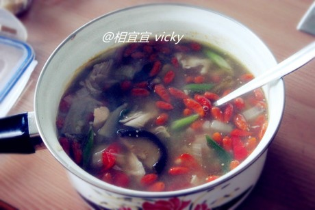
  ```md
  不是标题党啊.真的是跟BBC学的菜哦~最近看了BBC4的一套纪录片“GROW YOUR OWN DRUG”“私房菜”~一个植物学家讲各种日常植物的妙用~~嘿嘿~还蛮有意思的~
  有期讲增强免疫力的枸杞.就做了这个汤~对付风寒感冒~应该蛮有效~
  卖相一般哈~不过味道么还真的蛮好喝的~喝完一路暖到胃啊~~
  ```
  - **材料**
    - 鸡肉（我用的鸡腿*2.煮好了好把骨头剔掉~）
    - 一把枸杞小半碗
    - 香菇10个.洋葱半个.小红椒一个（不要太辣的那种啊~）.葱两根（不是小香葱.中等就行了）.姜一小块.
    - 以上是两人份哦亲！
    - 调料：盐
  - **做法90分钟**
    - 香菇泡发.切条.枸杞洗净泡水.
    - 洋葱切一下.不用太碎.姜切片.葱切段.红椒切段.
    - 然后全都放进锅里加水放火上~
    - 烧开之后小火煮一个小时就OK啦~关火前10分钟放入枸杞一起煮！
    - 上桌前加点葱段姜片提味可以滴~~！
***
# Pancakes 英式煎饼 - xdcandy
  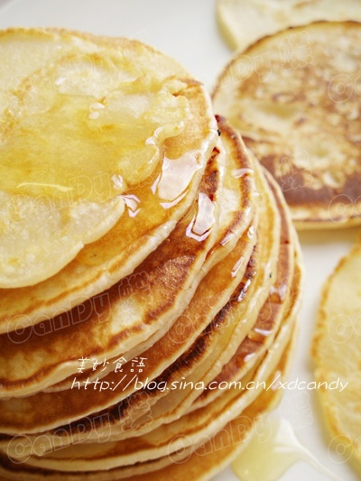

  

  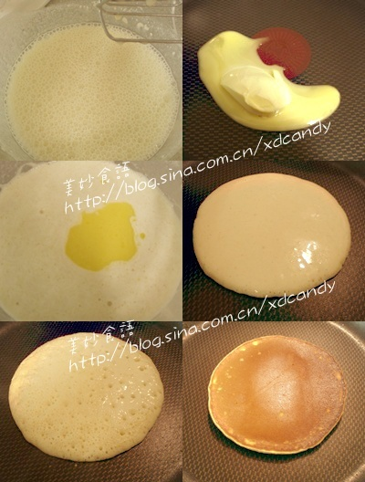
  ```md
  Pancakes 顾名思义就是‘用锅子煎的蛋糕’很简单的一款面食，英国人通常淋点蜂蜜用来当早餐。味道很清淡，吃完也不会有负担
  ```
  - **原材料**
    - Self-rising flour （自发面粉）： 100g
    - 鸡蛋：2个
    - 脱脂鲜奶：100g
    - 糖：30g
    - Butter （黄油）：1大匙
    - 炼乳： 2大匙
  - **做法**
    - 面粉过筛，加牛奶稍微搅拌
    - 打入鸡蛋，用电动打蛋器打至其粗泡
    - 分别加入炼奶和糖，搅拌均匀
    - 热锅溶化黄油，加入面糊中
    - 再次用打蛋器搅拌均匀
    - 干锅，到一小勺入锅中小火慢煎
    - 表面开始破洞的时候，小心翻面
    - 稍微煎一下就起锅装盘
  - **Candy小贴士**
    - 黄油一定要溶化再加入到面糊中，溶化后的黄油，乳清的香味才会释放出来
    - 面糊要稍微浓稠一点，煎的饼才有厚度，口感才好
    - 小火慢煎，翻面后不要久煎，否则面饼吃起来就会过干了
***
# 一口番茄 - 苏里慈
  
  ```md
  在寝室随手做的……做好了放桌上边上网边吃，一口一个……
  ```
  - **材料**
    - 六个番茄
    - 一杯酸奶
    - 半根黄瓜（建议换成苹果、梨什么的，因为百度百科说黄瓜配番茄会破坏营养）
  - **做法10分钟**
    - 把番茄全部对半切，去芯；
    - 把黄瓜(换)切成粒；
    - 把黄瓜粒撒在番茄里，浇上酸奶。
***
# 一步一步包馄饨 - 海草
  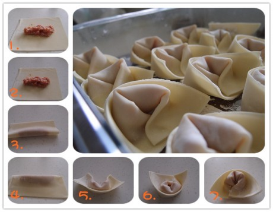
  ```md
  四川称抄手，而外地称馄饨。不过我以为两者还是有些不同的。比如包的方法。
  抄手是对角折叠，折出来是三角形再捏成小船型；而馄饨是对边折叠，折出来是长方形再捏成元宝形。我习惯的方法是对边折叠，所以就叫馄饨吧。
  江浙一带，馄饨分大小，大馄饨像饺子馅一样多种多样，什么荠菜香菇肉馅之类的，小馄饨则有纯肉馅，那种薄薄的皮一裹一捏，像个小金鱼一样。
  煮好了撒点紫菜虾皮榨菜粒香菜碎，兑上半碗汤，真鲜~~
  我做的是纯肉馅的，是四川大多数抄手的馅料，包的方法有时馄饨的式样，呵呵，算个混搭馄饨吧。
  ```
  - **材料**
    - 主料：馄饨皮、绞肉
    - 辅料：青菜叶
    - 佐料：1、拌馅：盐、姜粉、鸡油
    - 佐料：2、汤料（这按自己喜欢啦，我喜欢这个，有点像紫荆那家自然鲜小面的味道）：生抽、小米辣、青尖椒、花椒油
  - **做法60分钟**
    - 1、绞肉加入适量的盐、姜粉和少许的水调匀，顺一个方向搅动上劲。因为今天的绞肉买得太瘦了，所以加入了一些鸡油一起搅拌增加嫩滑的口感。（水千万记得逐渐加入，总量不超过绞肉的一半。例如300g绞肉就加入不超过150ml的水）
    - 2、用如图的步骤包好就对啦。第2步图片所示是在要封口的那个边蘸上了一排清水帮助粘合。第4步图片所示也是在长方形的右上角蘸了点清水帮助下一步的粘合。剩下就是凹造型的工作啦，然后包好的馄饨放在撒了生粉（防粘底）的盘子里放好，待煮。
    - 3、坐一锅水，烧开，搅动水旋转，然后放入包好的馄饨，水再开之后放入青菜叶，再开之后就可以关火了，比煮饺子时间短。
    - 4、碗里倒入生抽和花椒油、放入小米辣和尖椒碎、喜欢葱花的也可以加入，然后舀一勺煮馄饨的水兑均匀，再舀出馄饨和青菜，就可以开吃啦。
***
# 今日の晩御飯 可乐饼 - 蜂蜜甜甜圈
  
  ```md
  最近总是有人对我们说“こんにちは”。呵呵，受这句话的影响，突然想做日本料理了。
  不过我好像没有会做的日本料理，除了隐约记得多年前看到过的一种叫可乐饼的东西，于是回忆了一下，又发挥了一下，晚饭就做好了~
  另外，小花是刚刚买的，不晓得怎么弄的掉了一小朵呵呵，用来装饰啦~
  ```
  - **材料**
    - 土豆，洋葱，牛肉馅，盐，油，面粉，鸡蛋，面包屑，黑胡椒
  - **做法60分钟**
    - 土豆煮或蒸软，弄成泥
    - 洋葱切丁，热锅+油，加入洋葱丁和牛肉馅炒香，+盐+黑胡椒调味
    - 土豆泥，炒好的洋葱丁和牛肉混合好，在用盐和胡椒调味
    - 弄成饼，裹面，在粘上蛋液，在裹面包屑，炸一下就好啦
***
# 健康方便的芒果冰淇淋 - 可可酱
  
  ```md
  就是纯粹想自己做做看冰淇淋而已
  结果还是太心急 应该再多冰一会
  都化了= =
  ```
  - **材料**
    - 芒果 牛奶 糖
  - **做法240分钟**
    - 芒果果肉打碎 放进牛奶 加上糖搅拌均匀 放进冰箱冷冻几个小时
    - 每隔一个小时 或者半个小时拿出来搅拌一下
    - 等看差不多成型了 就可以拿冰激凌勺子挖出来吃啦！
    - 一般四个小时还是需要的
***
# 厚蛋烧 - 小木
  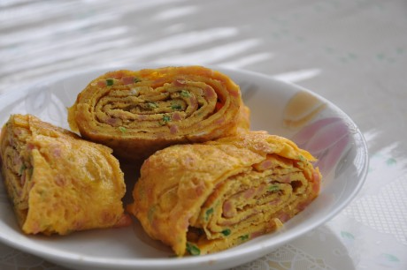
  ```md
  多年之前看过一篇短短的字，讲述一个少女为心爱之人做一餐的故事。她用手里不多的材料，给亲爱之人做了一餐。
  她说了很多话，我现在只记得一句——如果有一只鸡蛋，就做煎蛋；如果有两只，就做白水煮蛋；如果有三只，就做鸡蛋汤；如果有四只，就做厚蛋烧。
  多年之后，当我突然回想起这话，在网上搜索关于厚蛋烧的故事却总是无果。不免有些丧气，我便做了一次厚蛋烧，给我自己，在别了我爱的人之后。
  ```
  - **材料**
    - 鸡蛋四个，火腿，葱，盐
  - **做法**
    - 火腿和葱切碎备用。
    - 鸡蛋打散，把切碎的火腿和洋葱拌进去，再撒一点点盐。
    - 倒入一部分混合好的蛋液（四颗鸡蛋分四次倒入），晃晃锅使其均匀铺满锅底。等待它凝结到70%的状态，就卷起来，把蛋卷推到锅的左侧（不拿出来） 继续倒入蛋液，晃晃锅，使这次的蛋液沾到上次的蛋卷底部。又等它凝结到70%的状态，就卷起来，把蛋卷推到锅的左侧（不拿出来）又该倒一点点底油了。然后继续上一步…… 一直重复到用光所有蛋液
    - 出锅，切成小段即可
***
# 双皮奶 - lplinkin
  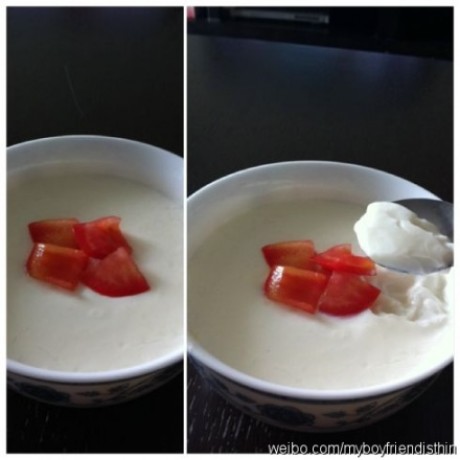
  ```md
  一直都很喜欢吃双皮奶，今天在家没事准备好了材料自己做了一次，没想到一次成功。
  吃了自己做的双皮奶才知道以前在外面买的双皮奶肯定加了很多的添加剂，远没有自己做的那么奶香四溢。
  ```
  - **材料**
    - 伊利纯牛奶1盒（250克）
    - 蛋白2个（我用的是那种特小的绿皮鸡蛋 所以用了两个， 普通鸡蛋估计一个就够了哦）
    - 白糖2汤勺
    - 小番茄
  - **做法50分钟**
    - 牛奶倒入锅中煮热，但不能煮开。（放在蒸锅上蒸热也可）
    - 拿一只大碗，放入二只蛋清二勺糖，搅匀至糖溶解即可
    - 已形成奶皮的牛奶放置室温后，用筷子把奶皮刺破，再将牛奶慢慢倒入装有蛋清的大碗，搅拌均匀。将奶皮留在牛奶碗底。
    - 将蛋奶混合液沿碗边缓缓倒回留有奶皮的碗，奶皮会浮起来（没浮起来也没关系）。
    - 最后将牛奶盖上保鲜膜入蒸锅，水开后蒸15分钟左右，关火再焖5分钟即可
***
# 增肥圣品-芝心薯球 - 瞑王殿下Esther
  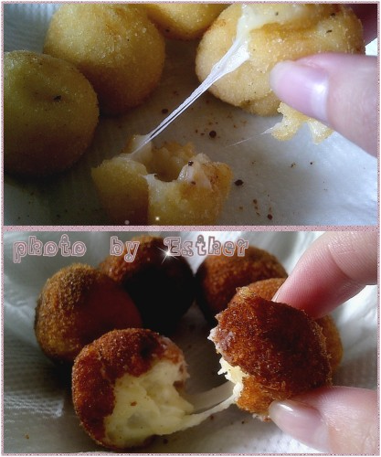
  ```md
  hey~guys~
  好久不见了呢!
  最近忙着实习忙着复习没时间上来
  也没时间做菜
  今天弄了一天
  顺便推出新品
  火候什么的...都得自己掌握啊...
  不能亲信他人啊!!!!!!
  给自己在减肥期做了一道增肥圣品真是对不起自己...T T
  ```
  - **材料**
    - 土豆*3
    - 糯米粉*2勺
    - 面包糠 一碗
    - 马苏里拉芝士
    - 油(这个比伤)
    - 盐 半小勺
    - 胡椒粉少许
    - 奶粉 (最好是婴儿奶粉,比较香,我家也有,不过没拆过,就用了奶奶喝的安怡...放了奶粉勺3勺还不是特别有奶香)
  - **做法80分钟**
    - 土豆去皮洗净切成小块,加入少许水,盖上盖放入微波炉高火5分钟 (土豆买老土豆,比较容易软)
    - 用勺子碾烂(不是很烂的话,继续微波炉转)
    - 土豆泥中加入适量的盐、胡椒粉以及奶粉、糯米粉用手揉成软硬合适的面团
    - 将和好的土豆面团等分成均匀大小的团
    - 马苏里拉芝士切成大小合适的块
    - 取一块面团捏成扁圆形，放上一块马苏里拉芝士，包起搓圆
    - 将土豆球放入面包糠中均匀的滚上一层面包糠 (如果沾不上,先在饮用水中过一下,再滚面包糠)
    - 以此类推,包完所有的团子
    - 锅中倒油
    - 油温热后下入团子小火炸制至颜色变深捞出沥干油即可
  - **PS**
    - 【图片中,上面的是用小火,下面的是用大火,其实都一样】
    - 【但是据我经验,最好用中火...小火太慢,里面的芝士融化然后高温之后,很容易从土豆面皮爆发出来,就像火山喷发】
    - 【大火的话,外面表皮很快变深,里面的部分芝士还没有融化,没有拉丝表现,但是放一会儿会好一点,所以还是用中火比较好,另外,一次不要放太多球进去,放个五六个差不多了,这样也容易照顾】
    - 【我亲信了我爸的话...开了小火,然后好几个都破掉了,然后从油锅里拿出来的时候还是膨胀的,过一会儿就像麻球一样瘪掉了...还是大火做出来的外表比较硬,但是不是焦】
    - 总而言之...火候这种东西...大家还是要自己摸索的!!!!!!!!
***
# 大复活-复活节的茶叶蛋 - 芥小末
  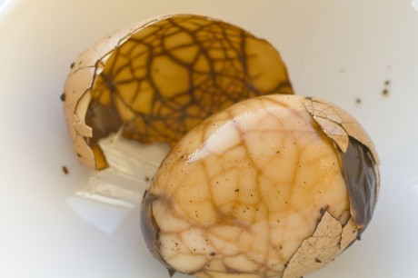
  ```md
  最近没有食欲。彻夜失眠。吃饭和睡觉变成一件艰难的事。
  又开始飞快地瘦下去。和窗外慢慢消融的积雪一样。日日消瘦。
  彼得堡漫长的冬天终于要过去了。
  4月4日。复活节。今年没有小兔子送我彩蛋。但我想你了。想家了。
  在每个人的心里。
  总有些食物的意义超越其本身。
  有时候是母亲亲手熬制的一碗白粥。
  有时候是大年三十带着家人指纹的团子。
  它们在人心里住久了就成了仙。离我们远起来。于是让人这般惦念。
  董桥在《如石》这样写：“他还记得他四十几年前她悄悄做给他的点心，清香如梦……”我爱极这句。这位老先生是真正懂得食物的真意呀！
  一种吃食的味道虽有微妙差别。但总是万变不离其宗。
  但它之于每个人的意思却是各有各的不同。
  对我而言能带给我幸福感的食物是麦虾。妈妈做的青团子。外婆做的带鱼等等。
  然而鸡蛋。却是随时随地的美味。
  它没有个性。不用标榜沉重意义。
  于是我若是冷了。饿了。想家了。没食欲了。都会做鸡蛋。因为它那能带给人幸福感。
  ```
  - **材料**
    - 鸡蛋。八角。桂皮。辣椒。花椒。盐。糖。茶包。
  - **做法45分钟**
    - 鸡蛋洗净放入锅中煮熟。
    - 煮熟后将其一一打破。留下裂纹。
    - 换一锅水。加盐加茶包加香料。和糖。大火煮开。小火炖30分钟。
    - 起锅。OK.
  ```md
  不想怀念到哭泣。宁愿厌倦到终老。
  谁怀念。谁妄想。都已经不再重要。
  如果你看到。
  请留步。等我说完保重。
  ```
***
# 奶酪番茄烩白菜 - 老少女熊
  
  ```md
  这个菜是利用冰箱里剩余的材料瞎做的，却意外地很好吃很成功。浓郁的奶酪味真是很治愈的。
  做出各种令人惊喜的菜来，其实多半是在无米之炊的压力下，急中生智而来。
  也希望能达到“方便的食材，信手拈来”的境界，无奈现在只是一个“每天绞尽脑汁到底吃什么才好啊”的家伙。而且图片也拍的不好看，所以就上一张每天所画的菜单好了。
  ```
  - **材料**
    - 番茄一个，卷心菜数片
    - 早餐奶酪1-2片（喜清淡者用1片，喜浓郁者用2片，也可以用其它更高级的奶酪，我这个是临时充数的）
  - **做法10分钟**
    - 先按常规做法炒白菜，可不放任何调料，炒到白菜亮晶晶滴；
    - 番茄切块，小火在锅里熬，加酱油、醋、糖、番茄酱和1片早餐奶酪；
    - 熬到大部分食材都化了，然后放白菜进去中火翻炒，直到白菜变软；
    - 第2片奶酪片也在炒白菜之后放，融化一半的样子就出锅。吃的时候，白菜上还挂着半凝固状的奶酪，配上番茄的酸甜，真有吃意大利料理的欣慰啊~
***
# 奶香牡丹花 - 魏夫人
  
  ```md
  继上一次的玫瑰馒头 、这次是牡丹花、看着复杂、做法很简单滴、话不多说、看不懂的同学加扣扣：1186970629 图解给大家 嘻嘻嘻
  ```
  - **材料**
    - 面粉 500克 牛奶 250克 泡打粉 6克 糖 50克 酵母 5克
    - （克数自己定，这个克数我做了7个、）
  - **做法**
    - 面粉加入糖，酵母，泡打粉拌匀，倒入牛奶揉成面团。
    - 面团揉光醒发半小时。
    - 搓成条，下成小剂子，擀成带花边的薄皮。
    - 将面皮一切两半，用手捏成花瓣形。
    - 6片花瓣粘在一起做成第一层花瓣。
    - 5片花瓣粘在一起做成第二层花瓣。
    - 取一小块面团在细网上压出花蕊。
    - 将花蕊放到花心，牡丹花就做好了。
    - 放入蒸笼蒸熟即可。
***
# 家常豆腐 - yunchun
  
  ```md
  门口的菜场有一卖豆腐的（不是豆腐西施啦。。。），每天下午五点多的时候就会开着三轮摩托拉来一很大筲箕的豆腐和一大铝盆的豆花。
  贩子就住在附近的乡下，到了菜场豆腐和豆花都还是热乎乎的。贩子的豆腐是胆水豆腐。
  别家的豆腐都是方方正正的一块块的，只有他家的豆腐因为就是在筲箕里压豆腐的，所以去买的时候，你可以指着你想要买的部分让他拿小刀现场给你切下来。
  ```
  - **材料**
    - 豆腐一块
    - 盐，豆瓣酱，酱油，小葱
  - **做法10分钟**
    - 将豆腐切成2厘米见方的块，放入加了少许盐的沸水中汆一下，去除豆腥味，滤出待用。
    - 炒锅烧热，放油，放入豆瓣酱炒一下。
    - 下豆腐进去，可以稍微加点开水，加盐。
    - 待汤汁快要收干的时候，加酱油上点色。最后放上小葱。
***
# 小宇宙的爆发-会下蛋的公鸡 - 芥小末
  
  ```md
  昨天晚上和小七同学彻底做了一个了断。突然觉得如释重负。
  那么长久以来的不安和焦虑都在说出再也不见之后一扫而空。
  每个谎言如果不能善始善终那么最好不要轻易的开始。
  很多年以前。对身边的事物抱有强烈的好奇心直到渐渐知道真相往往不尽人意。
  于是渐渐缓和抛弃从前言语犀利的自己。
  内心一直心存感恩。对于所拥有的一切。
  爱我的人也是我爱的人。
  早起做海鲜粥给自己。内心欢喜。
  这样清淡的日子极为稀有。
  在我和我在一起的二十年多的时光里。
  我所能记得的也只是寥寥无几。
  一年中的四个月。我在国内。剩下八个月在彼得堡。
  这是这一年的生活模式。并且将持续此后的若干年直到确定自己有能力离开校园。
  继续的一个原因是不知道自己有没有足够的能力去完成一项工作。
  所以读书的目的也只是为了充实自己。
  虽然这样的态度让人很失望。
  时常在房间里摆弄一些绿色植物并且认为他们的生命繁盛是对自己悉心照料的回报。
  植物异于其他常物的一点是它们不会在任何时候发出任何声响打扰到你。即使在你想念热闹场景时候。
  每天能够听到母亲的唠叨。即使是在电话里。
  在最好的院校学习自己喜欢的专业。即使完成这学业后并不想工作。
  做自己喜欢的食物。即使耗费很多时间和精力。
  但这都是快乐的事。
  甜甜圈给我发来邮件。是她在希腊的照片。我静静地看。
  静静地羡慕。内心的渴望变成一种圆弧。像微笑一样。
  渐渐成长到一个不能够撒娇的年龄。
  我知道。让人为之兴奋喜悦的事情会越来越少。
  所以快乐才会显得弥足珍贵。
  如果我想去旅行。你们谁会和我一同上路。。。
  ```
  - **材料**
    - 鸡胸肉。鸡蛋。甜面酱。蚝油。生抽。糖。盐。伏特加。胡椒粉。辣椒。生姜。大蒜。洋葱。
  - **做法60分钟**
    - 鸡蛋洗净煮熟。剥去外壳待用。
    - 鸡胸肉用刀片成3片薄片。3片要连在一起。我也不晓得怎么形容。反正就是要摊开来就是一大片。
    - 调酱。把甜面酱。蚝油。伏特加。生抽。糖。盐。胡椒粉。倒入一个碗里拌匀。再把生姜大蒜洋葱辣椒切碎拌进去。
    - 把这调好的酱抹在肉片上。两面都抹匀。腌制15分钟。
    - 15分钟后把辣椒等剔除。（别扔。下面有用）把肉片摊开放在干净的案板上。放一个鸡蛋在肉片上。再用肉片裹起来。裹好后用线扎紧。
    - 煮锅里倒入刚才调的酱。再加点水加点糖和蚝油。煮开。煮汤的时候我们来煎一下刚才扎好的那一坨东西。哈哈。锅里油烧热。过一遍油。表面的鸡肉颜色发白就好了。目的是锁住水分。防止鸡肉变得太老。
    - 把煎过的鸡肉放进煮锅里煮。大火10分钟。小火10分钟。再大火收下汁。
    - 装盘就好了。。哈哈。其实这道菜是昨晚上和甜甜圈聊QQ的时候突然想到的。我怕我忘记了就赶紧今天做了。哭。太着急还烫了手。不过。真的很不错呢。耶耶。。芥小末出品。。
  哈哈。很形象哦。会下蛋的公鸡。。。
***
# 彼此取暖-山药腔骨汤 - 大肉朵
  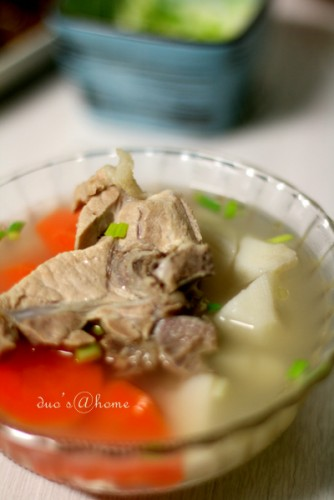
  ```md
  在北方，十月末到十一月上旬是最难熬的一段时间。因为天气一下子冷了下来，但却没有供暖。
  晚饭时间，能喝到热热的汤就是一件美美的事。
  ```
  - **材料**
    - 山药。胡萝卜。枸杞。姜片。腔骨。盐。
  - **做法**
    - 腔骨飞水后重新入沙锅，加入姜片，枸杞，加入温水大火煮开后，小火继续。
    - 煮骨头汤的时候，可以同时处理山药，胡萝卜。分别去皮后洗净切成滚刀块备用。
    - 四十分钟后，加入胡萝卜，山药同煮。
    - 四十分钟后，按个人口味调入盐。盛入容器后撒小香葱提香。
  - **P.S.**
    - 处理山药去皮的时候，要注意在流动水下去皮，这样就会减少它本身的粘液尽量避免让皮肤发痒了。（注意不要让粘液碰到手背，碰到一样是会痒地。）
    - 切成块状的山药可放入清水中浸泡，以免山药氧化后变黑。
***
# 怡红快绿 - 苏默然
  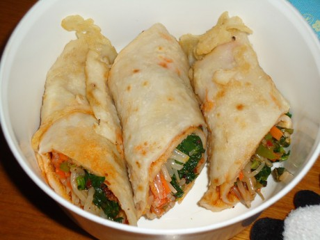
  ```md
  怡红快绿 原是红楼梦里的 为附庸风雅 起了这么个名字 只是东西做得有些糙了 实在担不起红楼菜的雅
  大家在试吃的时候倒是配合 5大只卷饼被吃得精光 想来应该是口味不错 哈哈 心情刹那间转好！
  ```
  - **材料**
    - 面粉300g左右 鸡蛋一只 冷水适量 盐适量
    - 豆芽 菠菜 胡萝卜
    - 牛肉酱 老干妈
  - **做法30分钟**
    - **饼皮**
      - 面粉300g左右 鸡蛋一只 冷水适量 盐适量
      - 将面粉置于大盆内 打入鸡蛋 搅拌一下 再慢慢地往面粉里加水 每次加一点点 然后拌匀 如此反复 知道看不到面团为止 最后一次加水稍多一点 让面充分与水混合 形成面液 注意：不要调制得很厚 否则面皮也会摊不出来~！
      - 开火 放上平底锅 不沾锅是最好 要是没有的话 普通的平底锅大火烧热 倒入一点点冷油滑锅 将油倒出以后 再往锅里倒一点点油 倒入适量面液 快速转动锅子 使得面液在锅内形成一个圆 转小火慢慢烘制 待一面微黄后翻过去烘另一面 一直到面皮不再是白色为止 盛起晾凉备用 然后你就自己再去做面皮咯~！
    - **内馅儿**
      - 我选用的是豆芽 菠菜 胡萝卜
      - 豆芽和胡萝卜加适量盐大火炒熟 放在一边 菠菜洗净用开水焯一下 晾凉以后挤干水分 用糖和少量醋腌制10分钟 少量的意思就是刚好涂抹在菠菜表面即可
    - **酱**
      - 个人推荐那种甜辣口味的牛肉酱 老干妈也不错 都值得一试~！
    - **卷饼**
      - 其实很简单 一张面皮平铺 先用勺子外侧抹上薄薄的一层酱 然后依次放入豆芽 胡萝卜和腌制过的菠菜 要是喜欢肉食的也可以加入火腿肠丝或者肉丝之类的 卷起来就好啦~！
***
# 我们的目标是-吃不胖 - 瞑王殿下Esther
  
  ```md
  嘴馋想吃薯片又怕胖肿么办！
  自制！！！！！！
  非油炸更健康！
  第一次做。。。有些有点焦了。。。
  除了有点苦...其它还是不错的！！！
  ```
  - **材料**
    - 土豆
    - 盐
  - **做法30分钟**
    - 土豆洗净剥皮,切薄片
    - 放入清水中五分钟,去除掉点淀粉
    - 蒸熟之后,晾干 (我建议用厨房用纸吸干,或者是平铺在什么大盘子大篓子里,放到通风处吹吹干,级的反面)
    - 平铺在盘子里,微波
    - 每家的微波功能和火候不一样,我看到网上是说什么微波一分钟反面再一分钟就可以了...拉到= = 我用我家微波炉的爆米花功能
    - 三分钟开门翻个面,直到变脆为止
    - 放到深碗中撒上盐,然后盖个盖子抖一抖,让盐均匀到薯片上
  ```md
  总之!!!
  火候掌握很重要!!!
  另外土豆切薄片也很重要!!!!!
  在另外,薄片如果晾的很干可能微波时间就不需要很长
  我在蒸熟之后没多久就放进微波炉
  可能带有太多水分了...
  ```
***
# 挑食中的意面 - 忐忑被你冷落
  
  ```md
  首先承认 我是第一次弄这种面。弄成这样子不知道算成功还是失败。
  好吧好吧 总结一下经验 下次会更好的。
  ```
  - **材料**
    - 意大利面一小把。番茄酱 植物油 盐。调味品可是自己随意搭配吧。
    - 猪肉 洋葱 大蒜 西红柿。全部切丁
  - **做法17分钟**
    - 先煮面条 锅中的水烧开后 加入一勺盐、一勺橄榄油 下入一小把量的意大利面  不要着急用筷子搅拌 让面条自然的散落 待面条根部软化后 用筷子轻轻翻转几下即可
    - 待面条大约7-8成熟的时候 捞出  用凉水冲一下 之后沥干水分 淋入适量的橄榄油  用筷子拌匀  备用
    - 利用煮面的时间来做酱汁 锅中加入一勺量的橄榄油  将切丁的洋葱和大蒜 下油锅爆香 用中火慢慢炒至洋葱开始变色 然后放入切好的肉末
    - 变色后 再加入切成小块的西红柿 加入适量的盐 白糖调味  炒至西红柿变软  加入3-4勺量的番茄酱 加入半小碗水 小火慢慢煮开
    - 直道汤色变红 西红柿软烂后 再次根据自己的口味 加入白糖 适量黑胡椒 盐 调味即可
    - 再可以将火转的稍微大一点 把面条倒进去 快速的用筷子拌匀  这样更加入味。
    - 倒入盘子中。完成
***
# 摩卡 - Sammi
  
  ```md
  午后一杯, 简单方便, 情调足矣~
  ```
  - **材料**
    - 速溶纯咖啡, 巧克力酱,牛奶, 砂糖
  - **做法**
    - 杯子倒入牛奶,加巧克力酱搅匀, 速溶咖啡冲好加糖倒入杯中,搅拌
    - 牛奶用打泡器打好铺在咖啡上面
    - 淋上巧克力酱
***
# 有待完善的肉脯 - 常小扣
  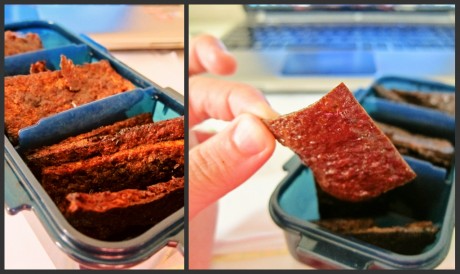
  ```md
  为什么要在一对due还没有搞定的时候下厨房呢?
   这就是吃货的爱啊...

  但是还是有小遗憾的
   烤盘有些小,擀面杖无法完全擀薄...(下次果断换大的)
  ```
  - **材料**
    - 牛肉馅
    - 糖
    - 老抽
    - 胡椒粉
    - 料酒
  - **做法120分钟**
    - 所有的材料混合在一起.
    - 为什么要加水呢?很干的话搅拌起来非常疲惫...
    - 搅拌到肉出丝
    - 烤盘铺好锡箔纸 放上搅拌好的肉馅 铺上一层保鲜膜 擀薄
    - 烤箱390华氏度 25min 中间注意看一下 不要糊了
***
# 木须肉 - 天使小熊
  
  ```md
  木须肉~其实也就是鸡蛋炒肉
  一直没有考证为啥鸡蛋叫木须~反正很多地方就是这么叫，跟着叫也就是了
  求学北京七年，
  从刚入学第一次吃到时候的恶心……
  到后来有事没事就点木须肉盖饭
  虽不是最爱的菜，但却是让我在异国时时想念的一种味道
  ```
  - **材料**
    - 鸡蛋两个，黄瓜，里脊肉，黑木耳
    - 蒜2-3瓣（可能其他地方做法不太一样……不过这个是我们食堂的标配=。=有时候会加一点黄花菜~不过在国外没有也就算了）
    - 盐，味精，淀粉，料酒
  - **做法15分钟**
    - 黑木耳泡开，洗一洗，把蒂给剪了，然后把大朵的稍微剪小一点
    - 里脊肉用刀背拍松，切片，用少许料酒和盐拌一下~然后抓上干淀粉
    - 黄瓜切片
    - 鸡蛋打成蛋液
    - 蒜拍一下
    - ————————————————————————————————
    - 起油锅~里脊肉下锅热油里滑几下~不用太熟~变色就可以起锅待用
    - 鸡蛋下锅~翻炒，切记略略凝结就可以起锅~不用等全部结成一块一块
    - 蒜下锅，出香味，下黄瓜片，黑木耳，鸡蛋，里脊
    - 炒一两分钟左右~
    - 下少许水~然后盐，味精，水淀粉勾薄薄的芡
    - 出锅~
***
# 极致的可乐鸡翅 - Senyo_赵小胆
  
  ```md
  首先感谢可口可乐公司提供的可口可乐，其次感谢菜市场提供的六根稚嫩小鸡翅，
  再次感谢豆友提供的方法（http://www.douban.com/group/topic/5313947/）最后感谢老爸的倾情品尝！！！~\(≧▽≦)/~
  这个也是按照厂子里留传很多的方法做的
   只要可乐和鸡翅啊 其他什么都不要的
   我其实是不喝汽水的
   做这个的时候 说实话真的下了我一跳...
   可乐倒进去的瞬间...吓到我了...我看着可乐在里面沸腾 感觉就像是在做化学实验...想着这样子的东西做出来吃真的不会被毒死么...
   之后我就更加坚定不会喝汽水啦 哈哈
   做好后我没吃 我妹妹说很很好吃的...结果全被她吃了
  大家还是少喝点汽水的吧 哈哈
  ```
  - **材料**
    - 可乐、鸡翅
  - **做法**
    - 洗好后在鸡翅上划上几个口 方便入味吧
    - 锅热后不用油了 直接干鸡翅放进去干炒
    - 等鸡翅变得有点金黄后 倒入可乐 能刚淹没鸡翅就可以了
    - 就这样等可乐煮干后就可以了
    - 如果这时鸡翅里还有点血水 放进微波炉里叮及分钟吧
***
# 桑葚果酱 - 可可酱
  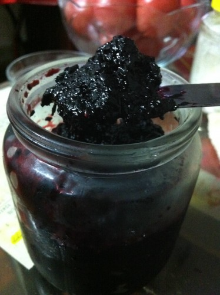
  ```md
  现在的果酱真心不敢吃，只有甜味，不知道有多少真实果肉的存在。
   之前就做过草莓酱，觉得还不错，前不久又看电视学了些做草莓酱的小技巧。
   这次就做做桑葚果酱试试吧。
  ```
  - **材料**
    - 桑葚
    - 糖（最好是冰糖）这次做没有用冰糖 所以不粘
    - 柠檬汁
  - **做法120分钟**
    - 桑葚切碎 或者搅拌机弄成块 泥 都可以。草莓的话只要切块就好了，煮煮就烂了。但是桑葚好像煮不烂。
    - 用糖腌渍几个小时，一个小时也可以吧。事先腌渍是为了缩短煮的时间。桑葚倒是无所谓，但是草莓酱的话就要保持颜色好看了。
    - 倒入锅中煮，不停搅拌，加入适量柠檬汁，一方面调味，一方面缩短煮的时间保持色泽。
    - 收汁，煮到你觉得差不多粘了就可以了。
    - 找个干净的玻璃瓶放进冰箱就可以随时享用啦。
***
# 樱桃果酱 - 4CM
  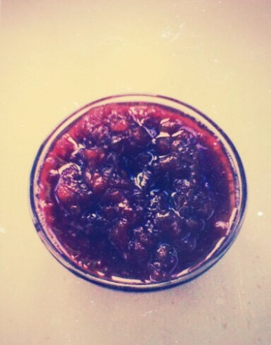
  ```md
  樱桃的季节快过了，所以买了很多，太多了吃不完，这个东西又不能放太久，所以就想着做果酱了。
  ```
  - **材料**
    - 樱桃
    - 白糖
  - **做法**
    - 樱桃洗净，放入锅中，加水，开火煮。
    - 樱桃煮到软烂后，将樱桃核选出来，继续煮。
    - 加入白糖，一边煮一边搅拌，直到水分基本蒸发，变得粘稠就可以了。
    - 温馨提示：因为樱桃本身就带酸，所以我没有加柠檬汁，如果喜欢酸的话也可以适当加点^ ^……
***
# 波伦亚意面酱 - seule
  
  ```md
  一说到意面酱，人们第一个想到的必定是“波伦亚意面酱”，就是Bologna地方使用牛肉糜与蕃茄烹制的特色酱料，非常受人欢迎。
  这种酱料要出味，讲究的是小火慢炖。以前我都是炖整个下午，这次为了赶着吃，只炖了2个多小时，不过用了新买的搪瓷铸铁锅，所以效果也很好

  它的做法最初是我跟一位热爱厨艺的邻居学的，但做时我还是会参考一下贝太厨房的意餐菜谱书。
  今天为了做它，还特意差遣LG去邻居家采摘新鲜的香芹（parsley）呢。
  通常我会一次性做很多，吃不完的分份冻起来，以后懒得做饭时拿出来加热，一样好吃

  另外使用的蕃茄是要求去皮的，不过为了省事，大家都是买现成的去皮蕃茄罐头
  ```
  - **材料**（2人份）
    - 300克牛肉糜
    - 1只中等大小洋葱
    - 1、2瓣蒜
    - 2个中等大小去皮蕃茄罐头，或者6至8只蕃茄，略烫一下去皮再切1公分见方块儿
    - 3、4根西芹
    - 1根胡萝卜（可选，看个人喜好）
    - 2大勺牙膏管包装的蕃茄酱（目的是为了让酱料颜色红艳）
    - 一小把香芹
    - 2大调羹意大利香草（Italian Seasoning）
    - 一块牛肉汤料，如果是大盒装的，一大调羹就好，怕不够咸的，可适量加盐
    - 小半杯开水，如果有牛肉高汤，就把牛肉汤料+开水组合换成等量高汤
    - 3大调羹橄榄油
  - **做法150分钟**
    - 洋葱、蒜去皮切碎
    - 西芹洗净去大叶，胡萝卜去皮（也可不去，随意），一起剁碎
    - 香芹洗净切碎
    - 起锅热橄榄油，放入牛肉糜炒散，拢到锅的一边，在空出来的地方放洋葱蒜碎，炒香，再把两者炒匀。如果像我一样用冻过的牛肉糜，会出不少水，没关系，一样炒匀
    - 加入去皮蕃茄（连汁）、西芹碎、胡萝卜碎、香芹碎、意大利香草和蕃茄酱，拌匀，加入汤料块和开水，中大火烧开，再转小火盖盖慢炖
    - 时不时开盖搅一搅，很快就会满室飘香了，如果时间不够，炖一个来小时其实也够了，有耐心的，就炖3小时吧，味道极好
    - 这种酱一般是用来配Spaghetti，就是照片中的中细长意面条，但其实用哪种类型的通心粉都成，最好是煮到al dente，就是吃上去还有点儿劲道那样，配上美味的波伦亚酱料，好好享用吧
***
# 第一次做的牛排 - misty725
  
  ```md
  第一次做哦。。虽然材料不齐，有点山寨，但是很好吃哦。。。
  ```
  - **材料**
    - 牛排一块
    - 黑胡椒、红酒
    - 土豆、西红柿、鸡蛋、生菜
    - 糖、盐、鸡精、淀粉
  - **做法**
    - 抹上黑胡椒，少许盐腌制5~10分钟
    - 倒入红酒，没过牛排，腌制20分钟（因为红酒喝完了，我用上海石库的黄酒代替的）
    - 放入黄油（我用色拉油代替的。。好山寨啊。。。），黄油融化后放入牛排煎。等一面有点金黄，翻面再煎（我煎的是全熟的，应为妹妹不吃生的东西）
    - **配菜**
      - 生菜垫底
      - 煎个荷包蛋
      - 放入油，把土豆炸至金黄
      - 包西红柿切片，翻入一个大钵子里，放入糖，用筷子凉拌一下。
    - 把煎好的牛排放在生菜和荷包蛋上
    - 酱汁：锅里倒入油烧热，把腌牛排的酱汁（红酒）倒入锅中，再加入淀粉调好的芡汁。起锅，洒在牛排和土豆上。
    - 把拌好的西红柿装盘
***
# 独门利器-饭扫光 - 小杠
  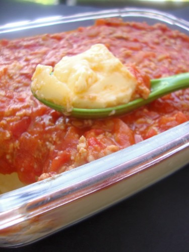
  ```md
  蒸蛋和米饭混合在一起有一种说不出的快感。
   蛋已经嫩到可以悄悄溜进米饭的任何缝隙，配上番茄和肉香。
   各种食材混合到一口。
   一个字，爽！！
   其实做菜食材越少，越能吃出食物原本独有的口感和香味。
  ```
  - **材料**
    - 鸡蛋，番茄，肉粒，淀粉，水
  - **做法40分钟**
    - 鸡蛋打散，加水，加盐，继续搅匀（有条件的话过滤一遍，没有也无妨哈，过滤后很嫩滑）
    - 容器上铺一层保鲜膜，扎几个小孔帮助透气
    - 大火烧开一锅水，将蛋液放上，转小火15-20分钟（期间注意观察，晃动容器，蒸蛋中间有微微震动感为好，有蜂窝出现就过于老了噢）
    - 蒸蛋出锅备用
    - 番茄切成小块状备用
    - 用少许干淀粉和少许盐稍微将肉粒抓散
    - 烧油，下肉，待肉变色，下番茄，稍后番茄会出水。
    - 继续烧煮，带番茄融化收汁加适量盐即可。
    - 浇上蒸蛋，上菜。
***
# 璃玻碎 - 芥小末
  
  ```md
  那么多天。累了那么多天。
  谢谢甜甜圈。谢谢小川。谢谢小猫。谢谢Tin Tin。谢谢在我难过的时候陪在我身边的人。
  中午起床的时候发现外面竟然阳光灿烂。大片的雪花在阳光里飘来飘去。好看得有点矫情。
  一个人的生活。一个人吃饭。上学。去超市。去地铁站。买面包。
  一个人在市场和人讨价还价。一个人坐公交车。一个人在кафе吃双人份的巧克力蛋糕。
  一个人在A店买文具。一个人去银行。
  睡觉的时候半夜醒来。空气里尽是凉凉的味道。
  其实我知道。没有了他。也还拥有那么多。
  只是。还有什么能像他一样。给我巨大的希望和绝望。
  我在做玻璃碎果冻。我喜欢吃果冻。心碎了还是要继续吃下去。
  有些东西能改变。有些东西这辈子都改变不了。
  秉性如此。
  ```
  - **材料**
    - 明胶。炼乳。果冻。
  - **做法20分钟**
    - 将超市买来的果冻切成小块。堆入容器中。
    - 在一个单独的碗中。加入明胶（忘记多少分量了）。2杯冷水。
    - 明胶开花后再加入一杯半杯开水溶解。
    - 溶解后再添加的炼乳。搅拌均匀。晾凉。
    - 把4淋在果冻碎里。放冰箱里一晚。至凝结。
    - 凝结厚脱模切块。OK
***
# 珍珠丸子 - newmay
  
  ```md
  呃。。。实在是没啥好说的，做法挺简单的，口感也不错。
  ```
  - **材料**
    - 糯米（用量我没概念，根据经验吧）
    - 肉末（从冰箱里拿出来的，妈妈平时装成一小袋一小袋的）
    - 盐，味精，姜末，鸡蛋一个，淀粉，油，胡椒粉，料酒
  - **做法**
    - 先泡糯米，还是要多泡一会，我泡了四个小时感觉还是有点硬，不过也还好。
    - 肉末里加调料，上面的八种。。然后朝一个方向搅匀。
    - 把泡好的糯米沥干水分，用手挤出圆形肉丸，放在糯米上轻滚几下，均匀的沾上糯米，整齐的摆在盘子里。
    - 烧水，等水开后放上盘子去蒸，20分钟即可。
***
# 番茄焖排骨 - 大大飞小小厨
  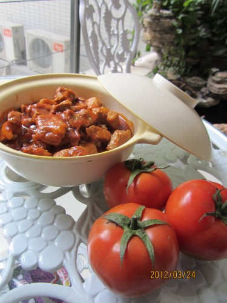
  ```md
  大家想起番茄的话，会怎样烹煮呢？
  大学三年，我想吃得最多的蔬果就是番茄了，说真的，番茄我真的有点吃腻了。
  番茄炒蛋，薯仔番茄煮香肠，番茄汤，糖拌番茄，等等等等，
  但是要数我的最爱，还是这个，番茄焖排骨。如果你试过，你也会爱上这到酸酸甜甜的菜的。
  ```
  - **材料**
    - 中等大小番茄4个，排骨4条，酱油4大勺，红糖约两大勺，生油一大勺，白醋2大勺，水1碗。
    - 分量：5人份。
  - **做法30分钟**
    - 排骨洗干净砍成小块，每块大约长2到3厘米。番茄切好，每个番茄大约可切成8块到10块左右。
    - 锅里放入生油，烧红。倒入切好的排骨爆炒30秒左右。
    - 倒入一碗水和切好的番茄，焖5分钟。
    - 水滚后倒入酱油，红糖，继续焖10到15分钟，直至锅里剩下一碗多一点的汁左右。
    - 转小火，倒入白醋，翻拌均匀，再次滚后即可关火上碟。
  - **大大飞小建议**
    - 排骨我会选用冰鲜的排骨，因为我觉得口感会比新鲜的排骨要嫩滑一点，一般市场的冰鲜档都会有得卖。
    - 白醋不宜过早得放，不让白醋会挥发，没有醋的酸味。
    - 水不用放太多，因为番茄会出水。一般以没有没过排骨为准。
***
# 碧玉菜包饭 - Lemon-ya
  
  ```md
  这个口感灰常滴清新，爽口，还很脆~
  ```
  - **材料**
    - 炒饭：米饭，玉米粒，胡萝卜粒，青椒粒，虾仁，培根粒
    - 外面是生菜
  - **做法15分钟**
    - 把生菜叶过水。过水的时候在水里加点盐
    - 把炒好的什锦炒饭用过完水的生菜叶包起来
  - **PS**
    - 注意：玉米最好用水果玉米。吃起来甜甜的有点清香。
    - 另外。其实用大白菜的叶子更好。过水之后更透明~可以看见炒饭五颜六色的内容~
    - 最后包好饭以后。在上面点上辣椒酱或者沙拉酱或者沙茶酱都OK~
***
# 米饭的情书 - 芥小末
  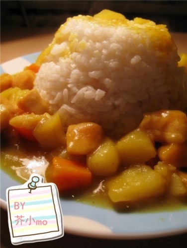
  ```md
  转学了。s去了美国。
  我又一次搬家。。。搬到一个黑毛子聚集地。。。
  不久前车窗被砸烂了。。。GPS被偷了。车载播放器被撬了。。。
  袁腾飞说了。苏联是世界上最邪恶。最野蛮的。毫不利人。专门利己的国家。
  我举双手双脚赞同。
  NND害我花了3000多装个车窗。3000多装个播放器。
  我可以再鄙视你一把吗。。俄罗斯。。。
  其实有点懒了。。。冬天了。。不想动了。。。
  今天回家的时候发现个小路。路边的小树林美得无法无天的。
  想呆着不走了。。。路过小超市的时候发现味道特别好的咖喱。。。
  于是我做了一个现在想起来都很乳酸的决定。。。
  我搬空了那个超市的调料架。。。
  QUEEN说。我晚上要吃咖喱鸡饭。。。
  小情调一下。。照个小照片什么的。。。
  另。。今天飞行员小朋友送我一口超级好用的锅。还有一个超级好看的硅胶烤盘。。。么么。亲个。
  ```
  - **材料**
    - 洋葱。胡萝卜。大蒜。土豆。鸡肉。咖喱粉。椰浆。淀粉。盐。植物油。酒。
  - **做法30分钟**
    - 鸡肉什么的都给我切小丁。洋葱切成丝。。
    - 把小鸡丁拌上淀粉还有咖喱粉。盐。酒。腌制一下。。大蒜拍扁。
    - 炒锅烧热。倒入植物油。把腌好的鸡丁大火炒至变色。起锅。记住要沥干油哦。。。
    - 然后嘞。沥干的油再倒回锅里。。。大蒜和洋葱放进锅里炒出香味。再加入切好丁的土豆还有胡萝卜。炒到土豆的边边有点透明的时候加入椰浆和少许清水。还有盐和一小部分的咖喱。
    - 等水分收到原先的一半差不多的时候再加一次清水。煮开后加入炒过的鸡丁。再倒入多多的咖喱粉。。。大概是第一次加的两倍多点的样子。哈哈。。。等烧得收汁的时候就好了。。。相信我哈。。。这个时候的土豆豆绝对是软软烂烂的啦。。。
    - 盛一碗米饭。淋一勺咖喱。。。不行了不行了。。。什么狗屁减肥计划。。。都给我见鬼去吧。。。
  ```md
  有童鞋问。。为什么要先炒一边鸡肉嘞。。。因为鸡肉纤维好多水分的说。炒一遍容易锁住水分。。。煮的时候就不会干干的老老的。还小小颗啦。哈哈。。。
  再次感慨下。。。。飞行员小朋友的送的锅不是一般的好用。。。话说一个法国牌子。。去超市看了下。要1600多的样子。。。我会加倍努力的。。。
  ```
***
# 粉墨 - 芥小末
  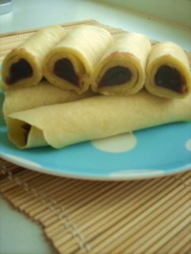
  ```md
  睿睿。
  我不得不告诉你。白玫瑰死掉了。
  我也只能说。在我想起给它浇水的时候它已经没能等到这一杯新鲜的水养分。
  它结束在某个凌晨或者某个日出时分。
  瞬间死掉也或许是经历了挣扎的痛楚。
  你始终都相信它们有生命并且能够感知到疼痛。
  就像从前我对你说很多话。
  我们以为彼此了解到后来的很不愉快。
  都是因为太过仓促。没有足够的耐心来等待。
  我不知道对你说什么好。
  那个时候。我整夜的失眠。
  就读你的字。
  那个时候还有米奇和南以及夭子。
  总觉得时光走的太迅速。
  2009年的6月1日。我们坐在元祖吃抹茶红豆卷。
  你看。这样就又碌碌的过了一年。
  相信那个人。你始终懂得。
  只是时间久了。我们忘记了。
  我想告诉你。
  我很好。甚至更好。
  一盘刚刚做好的法式红豆卷。给你。
  她们很甜。
  我帮你吃了。
  另。亲爱的。儿童节快乐。这是我们大龄儿童的节日。
  ```
  - **材料**
    - 鸡蛋2个。细砂糖20克(可以少放或加些蜂蜜)。盐。低筋面粉3大勺。牛奶小半杯。熔化的黄油10克。豆沙适量。
  - **做法30分钟**
    - 鸡蛋2个。盐2克。细砂糖20克。低筋面粉70克。牛奶180毫升。熔化的黄油10克。将这些材料一起放入干净的容器中。混合均匀成面糊。
    - 平底锅抹一层薄油。开小火。倒入适量面糊。然后转动锅子摊成一张圆形薄饼。煎至一面上色后翻面。另一面也煎至上色。就可以取出装盘了。
    - 将豆沙放到煎饼上。卷起来。用没有用完的面糊封边。放锅内干煎2分钟。ok
***
# 糖醋锅包肉
  
  ```md
  东北菜系列之一  糖醋锅包肉 纯东北味
  ```
  - **材料**
    - 猪里脊肉半斤【三口之家】
    - 精盐、姜、葱、香菜、味精、白糖、米错、粉面子【水淀粉】、料酒、油【一般是色拉油，但是小狼我觉得还是豆油好些】
  - **做法30分钟**
    - 将猪里脊肉改刀成7厘米长、5厘米宽、0.2厘米厚的大片。切得肉千万别切厚了，要不 炸出来的肉会很硬，嚼不动
    - 将切好的里脊肉放到大点的碗里，用精盐、料酒拌匀码味，用水淀粉调成稠糊
    - 用白糖、醋、味精、淀粉勾芡成汁。【如果有条件可以加点鲜汤，有的人做锅包肉会在勾芡的时候放入酱油，但是小狼我觉得放入酱油就不好吃了，依个人口味而定】
    - 将姜和葱切成丝，姜丝大概5克左右，葱丝20克左右，香菜且不切成丝都可以，大概10克左右，小狼我喜欢吃香菜，一般都是放4根整的香菜
    - 把油烧至8分熟，然后将码好味的肉片与稠糊拌匀，一定要拌匀，炸出来的肉才香脆，再一片片展开，逐一下入锅中，炸至见金黄色时，捞出，，敲掉水淀粉碎渣，逐一炸好好，再将全部的里脊肉放入烧好油的锅里，炸制外酥里嫩时捞出，沥油。锅内留少许油，洘锅
    - 把姜丝、葱丝放入锅内炒香，然后将炸好里脊肉放入锅内，把勾芡好的汁倒入锅内，翻拌起锅后装盘，如果功夫可以最好把肉和汁颠勺，然后撒上香菜即可
  - **PS**
    - 由于东北地区是多民族，光黑龙江省就有48个民族，菜种繁多，东北的地方菜主要讲究咸、鲜、酸、甜、辣。主要是咸鲜为主，酸甜为辅，辣次之，又由于“闯关东”时期，大量的外系菜谱介入，从此东北菜融合了南方的炖、煮等南方的菜系精华，形成了现在的“关外口味”
    - 小狼我是东北人，最喜欢吃这道菜。糖醋锅包肉是东北的地方菜主菜之一，是饭店必点菜之一。糖醋锅包肉讲究酸甜口，主要是酸为主，甜为辅，小狼我推荐配料中的醋，最好是米醋，而且浓度在30度左右的，不要对水，切忌不能用老陈醋。勾芡的时候，自己可以先尝尝味道，作出来的菜菜符合自己的口味，不过小狼还是推荐最好是酸一点，口感好一些
***
# 紫薯米饭 - 未来李夫人
  
  ```md
  紫薯饭香香甜甜的，颜色看上去也很诱人，这个是我用微波炉煮出来的，用电饭锅煮出来颜色更均匀，也更好吃哦~
  这是我最爱的一款饭啦~值得试试哦
  ```
  - **材料**
    - 紫薯，米饭。
    - 一斤米饭放2个红薯就可以了。
  - **做法**
    - 红薯洗干净，去皮，切成丁状。
    - 把米洗干净（淘米水是很好的美容品哦~可以留着做完饭之后洗手）
    - 把红薯混进米饭中，加水，红薯一定要混合均匀哦。加水量和平时煮米饭差不多，适量多加一点点。
    - 接下来就是煮啦（备注：微波炉转30分钟）电饭锅正常煮就OK.
***
# 红糖锅盔的夙愿-红糖小煎饼 - 小杠
  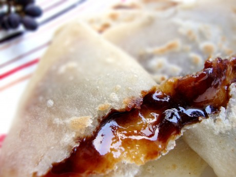
  ```md
  闲来无事，无比思念红糖锅盔，懒于出去寻找，做个红糖小煎饼代替。
  爆浆是个多么美好的词，抱起烫嘴的危险，也要一试爆浆的快感。哈哈。
  ```
  - **材料**
    - 红糖，面粉，开水，冷水
  - **做法90分钟**
    - 面粉，加入适量开水，拌至雪花状，再加入少量冷水。
    - 揉成稍软的面团，至少饧20-30分钟。
    - 取出面团，搓条，切剂子，用擀面杖擀或用手按压成很薄的面皮。
    - 面皮中间放入红糖，封口，捏紧，压扁。
    - 锅中放少量油，下锅煎，煎至两面金黄成熟即可。
    - 好好体验爆浆的快感吧！！
***
# 自制版蜂蜜柚子茶 - 大竹仔
  
  ```md
  最近郁闷的脸上过敏 折腾了一个寒假 眼看着就要开学了 却还不见好。。。
   心情真是不能用郁闷两个字来表达 又疼又痒的
   才深刻认识到 什么都没有健康来的重要
   打发时间，分散注意力
   来干点事吧~~
  ```
  - **材料**
    - 柚子 冰糖 蜂蜜
  - **做法**
    - 柚子洗干净，剥皮，用热水泡5-6分钟
    - 去掉柚子的白瓤，尽量全部去掉，否则会带苦味
    - 柚子皮切丝，放碗中加热水，微波炉转2分钟
    - 过一遍凉水，捞出沥干水分备用
    - 把柚子捣碎
    - ！！接下去的步骤全程小火！边煮边用勺子搅拌
    - 拿一小锅，少许冰糖化开（视个人口味啦~）
    - 放柚子皮，熬至透明状（视情况加水，防止糊掉，但是只加一点点，一点点哦~！！）
    - 放大半的柚子肉下锅，煮5-10分钟，再加剩下的柚子肉继续煮
    - 直到果汁基本干透，熬成果酱状就可以了~~
    - 煮好之后，等它稍微冷却一点再加蜂蜜（太热的话会破坏蜂蜜的营养成分）
    - 装瓶，等完全冷却之后，放冰箱冷藏就可以啦~
    - 建议放一个星期~再拿出来喝~比较入味，另外尽快喝完咯~~保证新鲜嘛~哈哈
***
# 苹果茶 - Sammi
  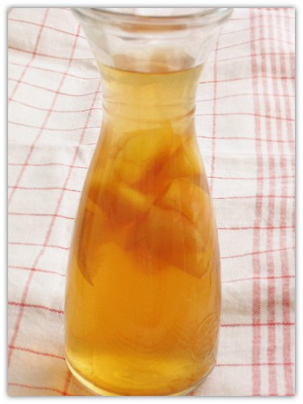
  ```md
  放凉后冷藏味道更好哈, 喜欢蜂蜜的也可把方糖换成蜂蜜~
  肉桂粉加不加都可以的哈
  ```
  - **材料**
    - 苹果1个
    - 红茶1小包
    - 水适量
    - 方糖 适量
    - 肉桂粉适量
  - **做法**
    - 苹果切小块, 放入锅中,加水,放适量肉桂粉(可不加), 大火, 煮开后加入红茶包转小火煮1~2分钟,关火盖盖子闷1~2分钟后取出红茶包
    - 放几块方糖即可.
***
# 茶泡饭 - xm
  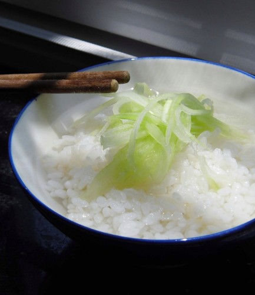
  ```md
  一般还要放海苔 梅子 鲣鱼 芝麻之类的
   我觉得因为食物缺乏而传下来的茶泡饭 应该单吃也行的  味道很清淡  很饱肚子的 不过记得不要吞
  ```
  - **材料**
    - 绿茶 米饭
  - **做法**
    - 泡绿茶，把米饭播散放到碗里，倒入热茶。
***
# 草莓蛋奶布丁 - 130小白
  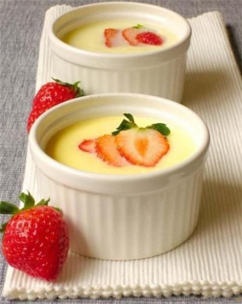
  - **材料**
    - 全脂牛奶300ML
    - 鸡蛋3个
    - 白糖30克
    - 草莓三个
  - **做法**
    - 鸡蛋内加白糖，打散备用。草莓洗净切片备用。
    - 牛奶倒入蛋液中，倒入时用筷子充分搅匀，
    - 搅好的牛奶鸡蛋液过滤两次， 水下锅，（锅盖留一条小缝）水开后蒸15分钟，关火后焖2分钟后开盖，放入草莓片即可
***
# 草莓酱 - xm
  
  ```md
  草莓要过季啦，做点配吐司馒头。
   要尽快吃掉哦。
  ```
  - **材料**
    - 草莓 白糖 柠檬汁
  - **做法**
    - 草莓冲洗干净，淡盐水泡10多分钟。再冲干净，去蒂，破开，放砂糖，盖保鲜膜冰箱放一晚。
    - 将出水的草莓一起放入锅中，开中火煮沸，转小火煮，用工具把草莓分成小块，撇浮沫，慢慢煮10分钟，挤入半个柠檬汁。
    - 煮的比较浓稠，可以关火。
    - 瓶子要用开水烫过，擦干水，放入果酱，关紧盖子，凉了后可放冰箱。
    - 要尽快吃掉哦。
***
# 菠菜力量大-姜汁菠菜 - 大肉朵
  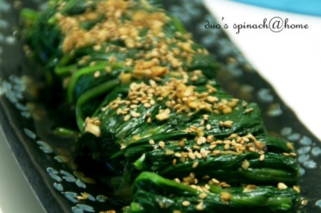
  ```md
  只要一提起菠菜，就会想起那个吃了菠菜就强壮的大力水手来。
  在我的小时候，妈妈总是做一道菜：把菠菜用水煮过后蘸酱吃。简单而又健康营养。
  长大后，离开家人。看见菠菜还是会想起妈妈的做法。一个人在大连时，经常也做来吃吃。来京后，反而吃得少了。
  换了个城市，换种做法，换个心情。
  ［照片是以前拍的，大家将就着看吧。呵呵。］
  ```
  - **材料**
    - 菠菜。醋。姜。盐。鸡精。糖。芝麻。
  - **做法10分钟**
    - 菠菜摘洗干净后，用开水焯熟过凉后，用清水浸泡一段时间。（焯水时可放少许油和盐，这样会使绿叶菜更绿）
    - 将姜切成姜蓉，而后倒入醋（我用的是姜汁香醋），适量盐、鸡精、糖、少许白开水调匀。
    - 把泡过的菠菜攥干，用刀切成5cm的长段码在盘中。把调好的汁倒在菠菜上。
    - 撒上熟芝麻即可。
***
# 蒜蓉争气虾 - seule
  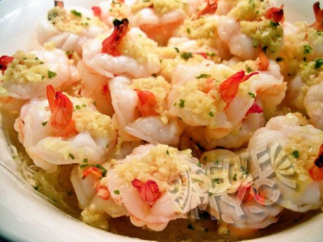
  ```md
  其实就是“蒸虾”，名字起得别致点儿纯粹是为了吸引眼球
  这菜最初是网上学的，但按自己的口味作了点修改，是LG的最爱菜之一
  ```
  - **材料**
    - 30几只去壳大虾
    - 100克绿豆粉丝
    - 大半头蒜
    - 盐、糖、干罗勒碎、干辣椒碎、油、开水
  - **做法30分钟**
    - 粉丝用凉水泡软，拿剪刀剪短些，铺在汤碗里
    - 蒜去皮弄成蒜蓉
    - 虾去壳去泥线（我买的是已经整好的冰冻大虾，就是尾巴上的壳的自己去），用刀把虲背弓起来的地方切断，把虲尾从肚子那切断的地方翻出来（见照片）
    - 用小锅热油炒香蒜蓉，加盐、糖、罗勒碎和辣椒碎，再加小半杯开水，煮开离火
    - 先把蒜蓉汁浇一些在粉丝上，再开始平铺大虾，铺好一层，用小调羹在每个虾背上放一小勺蒜蓉汁，直到全部铺完、浇完
    - 锅里烧水，水开时上蒸笼蒸蒜蓉虾，大火大概8、9分钟。我用的是电蒸笼，一共设了14分钟，刚刚好
    - 吃时为了好味，最好拌一下，让粉丝多进些味和汁
***
# 蒸个馒头 - 常小扣
  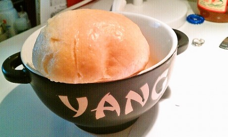
  ```md
  馒头是个神奇的东西.
   好吃的话,不吃别的,光是馒头本身就非常饱足.
   不好吃的话,一口也不想吃,就算是吃,也要配着各种重口味咸菜.
  来美帝后没吃过馒头,超市里的冷冻馒头怎么也提不起兴致.
   索性自己蒸了算了.
  ```
  - **材料**
    - 面粉
    - 酵母
    - 苏打
  - **做法180分钟**
    - 酵母温水溶解 不要太烫的 有点点温暖就好
    - 面粉+冷水+酵母 和面成光滑面团
    - 发面一个小时
    - 揉搓面团 加入合适的苏打 具体量我也没个把握...凭心情,凭感觉...
    - 然后分成馒头坯子
    - 二次发面到体积成两倍
    - 大火蒸馒头 期间用筷子戳一下 大概半个小时就可以了
***
# 蒸馒头-自家出产无添加 - Joe_lilith
  
  ```md
  前一段电视里老放毒馒头染色馒头，母后奶奶就哭着喊着让俺研究馒头...她开口了，小的只能尽力了~
  于是就开始拼子老命折腾...
  方子的量不算大，小刀切大概做了30个不到
  现在的天气也很适合发酵~
  ```
  - **材料**
    - 面粉500克加250克(左右）牛奶5克白糖，2克盐，8克酵母，2克苏打，5克色拉油
  - **做法200分钟**
    - 面粉500克加250克(左右）牛奶5克白糖，2克盐，8克酵母，2克苏打，5克色拉油
    - 搅拌成面团
    - 发酵至2倍大（一定要两倍大哟）
    - 擀成薄片（如果家里有压面机的也可以用，会更漂亮）
    - 从一边向另一边卷起来
    - 卷好了
    - 切成一段，一段的
    - 上笼
    - 醒30分钟（这里是一个概词，主要以形状稍大为标准）
    - 蒸15分钟　
***
# 虾仁什锦蛋包饭 - 小木
  
  ```md
  蛋包饭营养又健康，家里再有剩米饭了就不用只吃炒米了。
   o(╯□╰)o

  如有雷同纯属巧合。
  ```
  - **材料**
    - 剩米饭一小碗
    - 豌豆，玉米粒，肉松，虾仁10个左右，鸡蛋三个，胡萝卜丁和黄瓜丁
    - （除了鸡蛋和米饭是必要产品，其他的随便换都没关系，就是不加也没有问题）
  - **做法**
    - 虾仁洗干净去掉虾线（去虾线就看自己了，有点麻烦，我是觉得那个东西黑乎乎的看着好恶心，就毅然决然的给剔出来了），切成丁，用少量的盐和白胡椒粉腌一下。
    - 豌豆放在热水里淖一下。
    - 给锅里倒油，把除了虾仁和米饭以外的其他食材都丢进去炒一下，然后是虾仁（虾仁很好熟，变白了就ok了），接着是米饭，再撒些番茄酱，乘出来备用。
    - 把那三个鸡蛋打散之后倒进平底锅里，摊成蛋饼，把饭放在蛋饼的一次，然后把蛋饼给和上，把饭包住。蛋包饭出锅。
  - **tipis**
    - 包在蛋包饭里的饭不能太多，不然包不住。而且蛋饼不能熟透了，熟透了就没办法封口了。
***
# 蛋蛋蛋饼 - sariel.c.c
  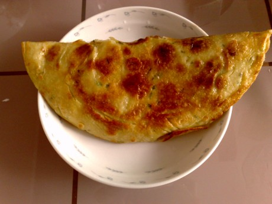
  ```md
  难得做一次。。。居然挺好的。。。满足感❤膨胀
  ```
  - **材料**
    - 面粉一坨
    - 鸡蛋俩
    - 葱  当然还可以加韭菜
    - 盐 胡椒
    - 酱(这个不定 eg：番茄酱 韩国大酱 色拉 海鲜酱。。。)
  - **做法25分钟**
    - 拌面粉应该都会吧
    - 我喜欢多加点水 这样鸡蛋饼会变得软软的
    - 加一个蛋、葱末、盐、黑胡椒粉搅拌均匀
    - 平底锅一个（红太郎手里的那个）
    - 加油 煎成底面凝固（不要太熟）
    - 翻！这是个技术活 ps：你可以拿个碗 先平移到碗里 在用碗翻
    - 打个鸡蛋在上面 用勺平铺一下 加一撮盐（要用手 不然不均匀）
    - 接下来等颜色差不多了 就搞定了
    - 最后对折一下 我的早饭啊。。。完成了。。。
  - **PS**
    - 在做煎饼的时候要控制好火候，过太热会造成煎饼外面糊了，里面的面糊还没干，锅太凉不好熟而且万一由再多一点，油会渗到饼里，一咬一嘴油，油腻腻的，影响口感；2面饼尽量摊得薄一点，这样比较好熟，如果饼厚了要多煎一会儿，保证里面的面糊也熟透了再出锅
***
# 蛋黄酱-美乃滋 - Lynn
  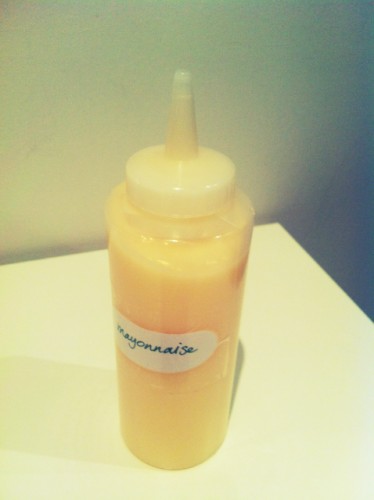
  ```md
  室友说想买美乃滋，我想象以前在餐馆打工的时候做过呀。所以就自己做了
   好像在这里没有看到这个的方子，就放上啦。其实超级简单的。也蛮神奇哟。
   虽然肥的很。
  ```
  - **材料**
    - 植物油（植物油就是食用油，但是最好不要是花生油，用些味道淡的油。） 250ml
    - 细糖粉（细糖粉就是绵白糖） 30g
    - 生蛋黄1个，白醋30ml， 盐5g
  - **做法**
    - 生蛋黄加糖加盐打发，打到体积增大颜色变浅为止。
    - 加入少量油，注意一定要少量，继续打。会发现刚加入的时候油稀释了蛋黄，但是打一阵时间之后又浓厚起来
    - 再加入一点油，打到融合
    - 这样打了一阵之后会发现打得好很吃力了，就加5ml白醋
    - 白醋加入后会稀释了整个混合物，并且还会变白(我觉得这里最神奇了)
    - 然后继续打，加油，再打
    - 后面加油可以慢慢多一些
    - 如果很硬很吃力就加醋
    - 这样所有油醋用完，就搞定啦~
***
# 西红柿炒鸡蛋 - yunchun
  
  ```md
  才发现自己所在的城市，在网络上又有了个新的称呼：西红市。
  呵呵。好吧，晚上就吃个西红柿炒鸡蛋。
  西红柿是本地产的，小孩拳头大小，皮薄，汁有点多。
  吃完就用剩下的汤汁用拌饭来。
  嗯，实践勤俭节约干革命的精神不浪费粮食。
  ```
  - **材料**
    - 西红柿4个/鸡蛋2个
    - 料酒 盐 葱花
  - **做法10分钟**
    - 西红柿入沸水滚那么一下，好剥皮。去皮后的西红柿切块。
    - 鸡蛋打成蛋液。蛋液里加入料酒和盐。尽量打散。
    - 起一油锅，油多放点。油热后加入蛋液，用铲子转着炒。稍等就加入西红柿，加入盐，等到汤汁煮沸就可以出锅了。
    - 起锅，撒点葱花在上面。
***
# 说再见的时候，请别挥手-燃烧的猪五花 - 芥小末
  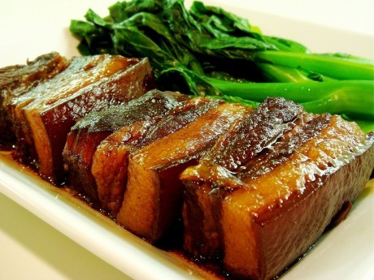
  ```md
  我可以说这是燃烧的猪五花吗。
  避免被某人说我木有吃过猪肉。。。汗。。。
  ………………………………………………………………………………我是华丽丽的分割线……………………………………………………………………………………
  我开始有个不好的习惯。
  每次说拜拜都习惯性的挥手。
  当然。这没什么不好。
  只是听的那个人。在千里之外。
  我在电话里说着拜拜。
  我们话还没有说完。
  夏天就要结束了。
  关于选择。我们轻而易举或举步维艰。
  无论什么情形。恍惚间就是一辈子的抉择了。
  而。时间长得容得下太多变数。
  于是我们都还有机会。
  一眨眼。
  又一年了。
  晚间的时候。和泰山去倒垃圾。
  回来的时候拉着他的手。还有5天呢。
  还有5天我们就再也不见了。
  我想起一年前的那个夜晚。我这样拉着seven的手。
  心里明明是想要欢喜的。却偏偏流下眼泪来。
  其实有的时候透彻地明白反而不是一件值得欣喜的事。
  泰山说。小佳佳。这是我们在彼得堡的最后一个星期一了呢。
  那我能说什么呢。我可以说。我们还有好多好多的星期一吗。
  在seven那里。我尚且没有资格这般。何况是他。
  我这般女子。想来是不该妄想温暖的。
  回到家的时候。s在聊天。和她匈牙利的男朋友在聊天。
  然后我想出去走走。去到陌生的地方。
  只是出走以及走出。无关其他。
  好几日夜夜看着天亮起来。
  仿佛赶着上学时候的钟声。宣告一切又回复。
  光阴消耗尽。好景将会转眼内停顿。
  这个凌晨。我终于让自己在窗台吹了两小时冷风。
  于是放任。放肆。歌唱。欢快。
  若假期永未结束。
  也不会感到难得。
  呼吸过一口空气。
  那可以一世一世嬉戏嬉戏嬉戏。
  那天长地久的永远永远永远。
  ```
  - **材料**
    - 猪五花。八角。香叶。葱。生姜。黄酒。酱油。盐。糖（家里没有黄酒就用伏特加代替了。。没有糖了。就用了蜂蜜。）
    - 油菜。
  - **做法120分钟**
    - 肉要洗净。切大块（小块烧到最后都是碎肉了）。滚水焯一下。去血水。再洗干净。
    - 葱切成段。姜块拍烂。放锅里。放肉。放酒。腌几分钟。
    - 然后加冷水。没过肉肉就好。反正要多就是了。
    - 大火煮开。可能还会有血沫沫。要撇掉。不然很脏脏很恶心。大火煮10分钟左右转成小火。
    - 小火慢炖1个小时（注意不要烧干了。哈知道水要多加了吧？）。加酱油。如果不喜欢太多酱油可以加些盐。转中火炖半个小时 。
    - 看到水炖得差不多了。加糖。加多多的。红烧肉诶。就是要甜甜的啊。一边尝味道。调整咸甜。估计下水收干后的味道。
    - 加糖后大火收汁。要注意不要把肉翻碎了。不要糊锅哦。。。
    - 油菜洗净焯熟。摆好。再摆上肉肉。ok。馋猫们。。可以开动了
***
# 躁动的小笼包 - 芥小末
  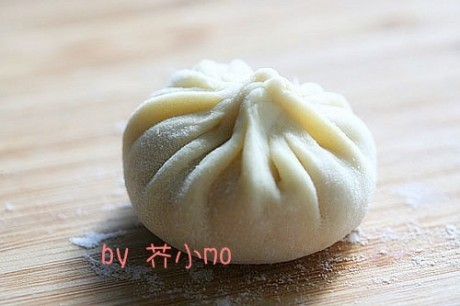
  ```md
  最近很忙。妈妈给我一只翡翠镯子。
  说是seven的妈妈给的。
  我傻傻地套着。想起这一年。
  我们吵架又和好。我们生气。冷战又嬉笑眉开。
  最后还是走到了不可挽回的结局。
  那我是谁呢。亲爱的seven。
  因为我想要求与被要求。得到与给予。这些都是外物不能左右的。
  而介入我们内心的。应该是强大而温和的感情。
  心里自觉甘愿。
  因为清楚知道自己的身份。
  身份带来的安全感强大而温暖。这是坚定的意识。
  年少的时候。说过很多结果不如过程重要的话。
  很多时候。并不说真话。
  我不认识你。所以不需要对你以诚相待。
  好奇心有陌生的身份做掩护。相识单纯。交往清淡并彼此互不相扰。
  因为你吸过的二手烟永远不会被我拾起。所以你所谓的那些过眼云烟就只能演给自己看。
  你并不了解我的真实身份。
  那么我就能够跳一只舞。只为你。
  这个身份。是一朵云烟在旋转。
  旋转尽头。
  只有一首歌。
  你不唱给我听。
  于是我自己哼
  ```
  - **材料**
    - 猪肉。香菇。肉冻。鸡蛋。盐。面粉。
  - **做法120分钟**
    - 面粉加上适量温水和成面团。揉好了饧一会再揉一会。
    - 猪肉剁成泥。加入香菇。香菇别切太小颗。自我感觉香菇大些有嚼头。把混好香菇的肉泥打上一个鸡蛋。拌上盐。调好。
    - 把醒好的面等分成小剂子。擀成中间厚周围薄的皮。裹上肉馅。加上一小块肉冻。嘿嘿。包完了就上锅蒸吧。。。
    - 记得用凉水。大火烧开转中火。20分钟就好了。。
  ```md
  话说。这小笼包真不怎么好看。将就着把。。。。好吃就行。哈哈。。。
  ```
***
# 辣味豆腐火腿串 - kangdo
  
  ```md
  甜辣味，浓郁且香脆。
  ```
  - **材料**
    - 主料：豆腐 300g  脆皮肠 4根（热狗也可） 花生 适量（打碎）
    - 串烧酱汁：茄汁 1勺
    - 韩国辣椒酱 2勺
    - 糖稀 1勺
    - 白糖 1勺
    - 料酒 1勺（清酒也可）
  - **做法20分钟**
    - 豆腐切成薄片 热锅煎 （煎成金黄色豆腐才不容易烂）
    - 脆皮肠热锅煎成金黄色 （火太大会爆开）
    - 把煎好的肠用煎好的豆腐卷起来再用竹签串起来（参考照片）
    - 把材料“串烧酱汁”混在小火煮开即可（煮过的酱汁更加浓郁）
    - 把串烧酱汁均匀的涂抹串好的豆腐跟肠
    - 最后把涂好酱的串摆到碟子上在串上面撒上花生沫，这道菜就完成了。
***
# 辣的隐秘的土豆丝饼 - 常小扣
  
  ```md
  还有两天就放春假了 提前庆祝一下
  学习各种忙 厂子虽然常来但是每天守着单一的便当也木有什么好拿得出手的更新~
  Anyway 我还活着
  我还在吃
  ```
  - **材料**
    - 土豆小的三个
    - 鸡蛋两枚
    - 面粉
  - **做法30分钟**
    - 土豆切丝 一定要细哦 不行的话就擦丝
    - 鸡蛋打散 加入土豆丝 适量加入水和面粉
    - 然后加入盐 鸡精 胡椒粉 搅拌均匀
    - 然后 加一些红油 会让土豆丝有辣的很隐秘但是很有余香的感觉~
    - 锅倒油 加热后 转小火 一定是小火
    - 然后倒入面糊 用铲子压扁 然后等上三两分钟 底面基本定型后就可以翻面了
    - 翻面的时候要小心 否则会碎~~ 当然不在意卖相的童鞋就随意啦
    - 如此反复几次后两面金黄时出锅
    - 趁热吃是最好不过的 外酥里嫩 感觉有点辣 但是仔细去追踪的时候辣味又飘得很远啦
***
# 迷你蛋卷卷 - M喵
  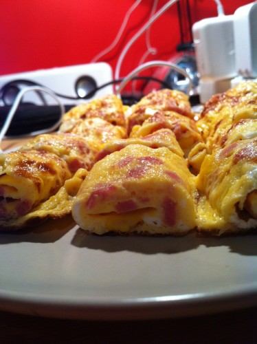
  ```md
  作为早饭很不错不是麽。
  而且很方便。
  ```
  - **材料**
    - 火腿切小丁
    - 鸡蛋3-4个
    - 牛奶
    - 玉米粒
    - 盐一些
  - **做法**
    - 鸡蛋打匀
    - 倒入一点点牛奶
    - 可选择性放入一点点淀粉。（最好是先用水把淀粉搅拌下)
    - 然后再拌入火腿和玉米
    - 搅拌呀搅拌。放入少许盐。
    - 注意, 牛奶和淀粉的量控制在使得你的蛋液是保持粘性的状态就好，不要太稀。
    - 剩下的其实很简单了
    - 就是用平底锅铺饼。
    - 锅底薄薄抹一层油.
    - 均匀地倒入蛋液。（主要是要让火腿和玉米平均分布)
    - 小火等待大概2分钟吧。
    - 待蛋饼80%凝固的时候就差不多是时候把它从锅边开始卷起了（像墨西哥鸡肉卷那样....好吧 我馋了 =V=)
    - 我用了4个鸡蛋铺了3个饼。
    - 最后呢,切一下咯。
    - 喜欢甜面酱的可以涂一些。很不错的
***
# 酸辣土豆卷饼 - 老少女熊
  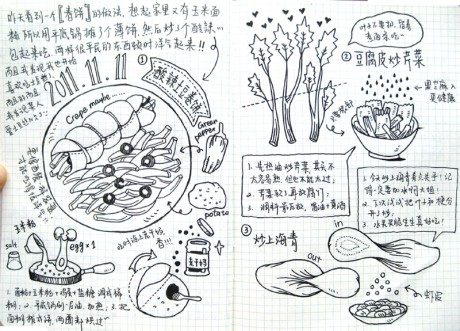
  ```md
  有时候会特别特别想吃味道很平民的食物，印象中这样的食物就是炒土豆丝啦。
  从小吃到大，但因为太过普通却很少做。
  今天记忆中的味蕾终于抗议啦，正好又是很多个“1”的光棍节，那么就来做做看很多个“1”的炒土豆丝。
  昨天偶尔看到一个春饼的做法，于是临时决定简陋地做个摊饼，卷上土豆丝。
  两种很平民的食物加在一起，竟然顿时就隆重起来。
  “我在吃酸辣口味还加蒜的可丽饼哦！”
  ```
  - **材料**
    - 土豆丝：土豆一个切成丝（泡不泡水都可以），青椒一个切成丝或圈圈，因为要卷饼可以不要姜，但必须有不可缺席的蒜；
    - 摊饼：面粉或玉米面粉，鸡蛋一个
  - **做法10分钟**
    - 热油丢土豆丝下去炒，用酱油、糖、醋、花椒粉调味，加点水小火焖一小会儿，然后青椒和蒜粒丢下去大火翻炒即可；
    - 面粉加鸡蛋、盐、糖、白胡椒粉和水调成稀糊状，这个我是自己试的，调到没有颗粒可以慢慢流动就行了，不能冒充专业的啦；
    - 平底锅刷上油，加热到有点点温度了（用手放在锅子上空感受），将面糊均匀地摊平在锅上，一面焖到可以轻易铲起来，再焖另一面；
    - 饼可以涂上老干妈或黄豆酱什么的，卷上土豆丝，还可以用刀切成数份；我是像图上那样，和卷完饼剩下的土豆丝盛在一个大盘子里，是不是感觉更隆重了呢？平民食物也可以有奢华的心情去吃它。
***
# 金香玉-青椒炒玉米 - 大肉朵
  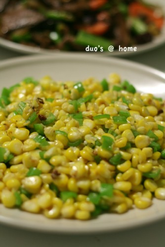
  ```md
  一个川妹子来家吃晚饭，交给我的一道简单的四川家常菜。
  适合玉米控。无论是甜玉米还是糯玉米。
  ```
  - **材料**
    - 新鲜玉米。花椒。青椒。
  - **做法**
    - 新鲜玉米脱粒后洗净控干水备用。青椒切小丁。
    - 锅热入油，放入几粒花椒炒香，而后倒入玉米粒翻炒。
    - 调入盐，炒熟后加入青椒丁翻炒两下关火。
    - 出锅装盘。
  - **p.s.**
    - 此道菜最好用新鲜玉米来做，无论甜还是糯，都美味。但问题是，甜的玉米不好脱粒。我用的是甜的，所有有的玉米粒最后只剩半粒了，很浪费。不过，颜色到是比糯的要美得多。
***
# 青椒鸡蛋圈 - chloé
  
  ```md
  青椒圈有大小 呵呵~味道还是很不错的
  ```
  - **材料**
    - 圆青椒一只（尽量形状规则一些）
    - 鸡蛋两个
    - 胡萝卜 土豆 配菜若干随意选择  这主要是一道蛋料理
    - 胡椒粉 盐 料酒
    - 想做的西式一点可以选奶酪 黄油 可惜今天我家冰箱空了
  - **做法20分钟**
    - 土豆煮熟 切丁或切丝备用
    - 烧水 放盐 把青椒切断去籽 放入水中汆一下；胡萝卜切丁 一样汆水
    - 鸡蛋打散 加盐加料酒调味 加胡椒或者别的调味料 放入胡萝卜丁搅散
    - 平底锅一枚 加热加油 放入青椒圈 火稍大 在青椒圈里加入一些蛋液打底（尽量不要漏出，所以火不能太小） 打完底 在蛋液上层没凝固的时候将火调小 防止焦掉
    - 打完底就可以加入土豆 松松的堆在青椒圈里 在土豆上浇上蛋液 这样鸡蛋就充满了空隙和整个青椒圈
    - 在锅子周围加入水 防止焦掉 盖上锅盖 也使水蒸气充满整个锅子 相当于在蒸鸡蛋
  ```md
  我的其实失败了
   我原本的设想是 一只只的青椒圈 结果蛋液漏出来了 TAT 于是将错就错 干脆浇了旁边一圈蛋液 盛了一盘刚刚好
  第六步要重复好几次 直到鸡蛋完全变熟 然后出锅 完成了 颜色很漂亮~自己做的 也不知道叫什么

  青椒鸡蛋圈就好了
  ```
***
# 香辣鸡柳 - う清颜づ
  
  ```md
  我爱吃鸡肉~无聊瞎鼓捣~
  ```
  - **材料**
    - 鸡脯肉一块儿，青红椒，干红辣椒。
  - **做法30分钟**
    - 鸡脯肉切丝，入碗中放入豆瓣酱，酱油，干红辣椒，少许生粉拌匀腌制一个小时。最好在加上一个蛋清可以使肉质更嫩滑~
    - 青红椒切丝，胡萝卜切薄片。
    - 热锅放油，下入鸡丝煸炒变色。
    - 加入青红椒和胡萝卜大火炒几分钟，加入调味料，翻炒关火盛出。
    - 鸡肉易老，所以要快火急炒，少许几分钟就够了。加入一点生粉，炒出来的鸡肉比较滑嫩，不老。
***
# 鱼香肉丝 - 空竹
  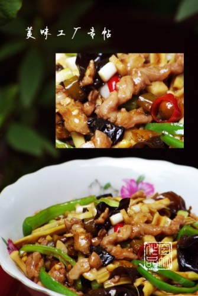
  ```md
  鱼香味是什么味型？
  可能没有几个人能够说得上来。简单说就是用烧鱼的调料来制作，成菜后后一种类似家常鱼肉的味型。
  这是川菜中极其草根的做法，我走遍南北（还有台湾没去）吃了几十年，每一家酒店、每一个家庭制作的鱼香肉丝是各有各的高招。
  空竹同学暂且低调介绍一下自己的做法。

  鱼香味型占据统帅地位的却是植物乳酸菌，它来自巴蜀人家泡菜坛里的泡椒和泡姜，
  姐弟俩领衔糖醋兄妹纠集姜葱蒜众喽罗们合纵连横，组成了战无不胜、攻无不克浓烈的奇异味感军团。
  鱼香肉丝的由来据说就是应急之作，拿了做鱼的调料做其他菜。川人做鱼的风格就用泡椒、泡姜、糖、醋、姜、葱、蒜。
  当然更为重要的还有各种调料之间的比例问题，基本平衡，不走极端，才能尽享鱼香的美味。
  ```
  - **材料**
    - 猪里脊（切丝）100克
    - 鲜笋（切丝）100克，黑木耳（撕碎）10余朵
    - 青椒（切丝）泡红辣椒（切鱼眼睛状）30克，泡姜（切颗粒）10克
    - 菜籽油、精盐、酱油、姜米、蒜米、葱花、淀粉、鲜汤、香醋、白糖适量
  - **做法20分钟**
    - 肉丝加精盐、料酒、淀粉腌制10分钟。
    - 将鲜笋、黑木耳、青椒略加盐在鲜汤中炒至半熟。
    - 肉丝下油锅炒至散籽发白捞出。
    - 锅内留油，将泡椒、泡姜、姜米、蒜米炒出香味，下肉丝翻炒上色，再加入鲜笋、黑木耳、青椒翻匀起锅。
    - 锅内下油微量，将香醋、白糖、淀粉、鲜汤调成的芡汁入锅，起大泡倒入肉丝、鲜笋、黑木耳、青椒和葱花，簸转装盘成菜。
***
# 鸡汁汆青笋丝 - 海草
  
  ```md
  用熬的乌鸡汤汆烫蔬菜，可以不用油炒菜，蔬菜也很香。
  ```
  - **材料**
    - 主料：青笋丝
    - 辅料：乌鸡汤
    - 调料：盐、葱
  - **做法10分钟**
    - 青笋去皮洗净切丝备用，葱少许切葱花。
    - 乌鸡炖好的原汤舀出两大汤勺，大约400ml，倒入炒锅中，开大火烧开并收汁一半，到200ml左右。
    - 乌鸡汤汁浓缩好后改中火，下青笋丝，汆烫至熟撒盐撒葱花炒匀即可装盘。这个汆烫的长短视个人喜好而定。短则1、2分钟，长可3、5分钟即可。
***
# 鸡肉达人-我爱吃鸡 - 芥小末
  
  ```md
  小猫说。你大概是狐狸。对鸡这样执着。
  我说吃鸡肉我永远吃不够。
  就好像爱情。不是太饱。就是太饿。不是赔尽。便是全赢。
  其实我不光爱吃鸡。我还爱吃鱼。爱吃虾。爱吃螃蟹。反正。所有的海鲜我都爱。
  只是。这边海鲜真稀缺。
  小猫吃我做的鸡。说。千万要活下去。活不下去也要死得慢一点。
  我说。为什么。
  她笑。因为可以长久地蹭你的饭。
  ```
  - **材料**
    - 半杯红糖。3汤匙海鲜酱。3汤匙米酒醋。3汤匙番茄酱。2汤匙酱油。半杯水。3-4汤匙淀粉。1磅鸡胸肉。1汤匙橄榄油。香油1大勺。酒。葱。生姜。辣椒。大蒜。
  - **做法20分钟**
    - 把红糖。海鲜酱。米醋。番茄酱。酱油。水。混合在一起。
    - 把鸡肉切成小块。揉入淀粉。倒入酒。拌匀。
    - 在大煎锅中倒入少许橄榄油。把鸡肉煎至金黄。取出放盘。
    - 锅中再倒入麻油。加葱姜蒜辣椒。爆香。加步骤一中的混合物。煮沸。
    - 把鸡肉倒入锅中。加水。再煮沸。到酱汁粘稠。再洒上辣椒和葱花。
    - 装盘。OK。
***
# 女王很闲-鸡蛋三明治 - 芥小末
  
  ```md
  泰山说女王。我饿。。。
  话说。有那么一天。我在厨房从早上6点呆到晚上10点。我是说。一直哦。。。
  然后泰山和小猫就开始给我取了那么一个外号。女王。
  女王放假了。女王很闲。女王今天睡到3点钟。女王睡眼朦胧地被泰山拖到厨房命令做饭。
  好吧。一到厨房我就清醒了。没刷牙没洗脸。蓬头垢面地立刻开动。。
  锵锵锵锵。三明治登场。
  ```
  - **材料**
    - 鸡蛋3个。吐司4片。火腿4片。起司2片。盐。胡椒粉。
  - **做法10分钟**
    - 吐司的边边全切掉。硬硬的不好吃。（不要扔哦。撕碎了做沙拉也很好吃的。）
    - 两片火腿加一片起司。再加上吐司。
    - 鸡蛋打散。加上盐。胡椒。拌匀。
    - 三明治沾上鸡蛋液放入锅里煎。。。两面金黄就好了。。。
    - 切块摆盘。嘿嘿。
***
# 麻辣水煮肉片 - sunnydidi4
  
  ```md
  请原谅我把筷头的肉片虚化了
  ```
  - **材料**
    - 里脊肉2块
    - 粉丝2团
    - 卷心菜5片
    - 莴笋1个
    - 淀粉2茶勺,盐1茶勺,料酒1茶勺,蛋清一个
    - 油,满多的!
    - 香料:花椒,桂皮,八角,辣椒,葱姜蒜,郫县豆瓣酱,浓汤宝一个
  - **做法50分钟**
    - 里脊肉切薄片
    - 在切好的里脊肉片里面加”淀粉2茶勺,盐1茶勺,料酒1茶勺,蛋清一个”,按摩2分钟,放半小时.(半小时正好做下面的事情)
    - 卷心菜切片,莴笋切块,姜切片,蒜切泥,粉丝过下水
    - 油锅先放入桂皮,八角和1/3的花椒and辣椒,爆香油,过滤出油备用
    - 取适量的4里的油,煸1/2的姜and蒜,煸好炒卷心菜和莴笋,炒好乘在大的容器里,并铺上粉丝
    - 取适量的4里的油,煸郫县豆瓣酱,出红油了,放入1/3的花椒and辣椒炒香,加如开水和一个浓汤包,放入里脊肉并划开煮熟
    - 把6浇在准备好的5上,基本上大功告成了
    - 把剩下的油,炒香剩下的1/3花椒and辣椒,淋在7上!
    - ok了,就快快吃吧!
***
# 黄玫瑰馒头 - 魏夫人
  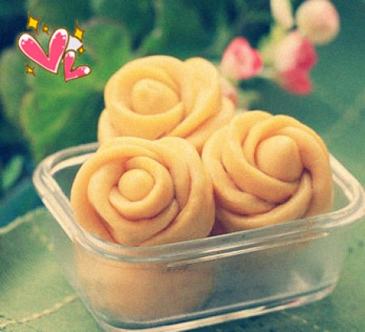
  ```md
  偶然一次发现了馒头怎么做成玫瑰的样子。很漂亮吧。如果感兴趣的朋友可以加我QQ、因为我说不明白- - 、可以图解给你
  QQ：1186970629
  ```
  - **材料**
    - 面粉、南瓜泥、温水、酵母
  - **做法**
    - 将酵母用温水完全融化，倒入煮熟冷怯的南瓜泥，将酵母南瓜泥倒入面粉中，用手将面团和到三光(面光，手光，盆光)；
    - 将面团放在盆中，盖上一块湿布，放温暖处自然饧发3-5小时左右，现在是冬天，大概3-5个小时需要的，也可以晚上和面，第二天早上起来，面一般就醒好，可以用来整型包包子做花卷之类了。另外一个快速1小时发面的方法，看下面注意事项部分。
    - 将发酵到1.5倍大的面团取出，在案板上撒上干面粉，将面团揉搓，排空气体；
    - 将面团先分成每个50克左右的中等面团，再取一个50个的面团用手搓成10CM左右的长条，切成6个小剂子，其中一个小剂子切的分量稍微少点，搓成橄榄状，用来做花心；
    - 将其余5个小剂子按扁，擀成厚约0.3CM，直径6-7CM的圆片，圆片的边最好擀的薄点，将5片面片如图叠加；
    - 用一根筷子在面片中央垂直压出一条中心线，然后将橄榄状面团放在最底下的面片上，用手开始包裹着橄榄状面团往上卷，一直卷到卷光，然后用手指往中心掐入左右旋转拧断，收口朝下放即可；
    - 将做好的玫瑰花馒头生胚码在蒸笼里，保持一定的间距，盖上盖子，再次醒上10-15分钟，然后将蒸笼放蒸架上开大火蒸10分钟，关火焖几分钟即可；
  ```md
  融化酵母的水不要太多，因为还要放南瓜泥；
  南瓜泥加入面粉中的时候要一点一点加，一下如果全部倒入的话有可能会过湿，如果过湿的话，可以再加点干面粉调节；
  一般做包子馒头，面团要发酵两倍大体积，但是做这道玫瑰花，只需要发到1。5倍大小即可，这样后期蒸出来的型不至于过分的喧软膨胀变形；
  蒸笼布、纱布、粽叶、玉米叶、都可以用来垫馒头，我是直接在蒸笼上抹了一层油来防粘。
  如何快速发面:
      取一大锅子，里面装上半锅子50度左右的热水(略烫手)，放上一个蒸架子，
      将面团放在一个大碗里，将大碗放在蒸架上，再盖上盖子，
      1个小时左右，面就发好了，大概是原来体积的1。5倍大。
      想要2倍体积大小的话，再多发个半个小时即可。这个方法很适合冬天。
  馒头在蒸之前必须再次静置10-15分钟，这样蒸出来的馒头比较喧，蒸的时候保持大火，中途不要开盖子，蒸好后先焖5分钟再开锅。
  ```
***
# 黄瓜花生和鸡丁的故事 - Cris
  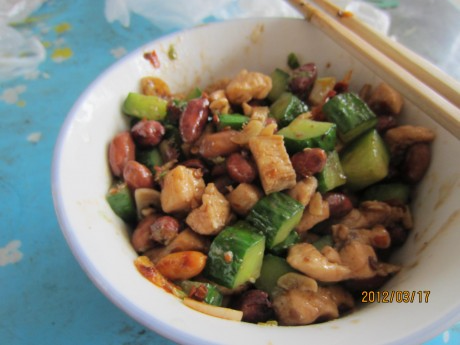
  ```md
  听人说黄瓜和花生生来就相克，一起吃就会伤元气？行不行还得自己尝试一番了，忍不住美食的诱惑，自己一个人闲来无事，下厨解闷
  ```
  - **材料**
    - 鸡脯肉一块、调料（盐，白糖、鸡精、香油、食用淀粉）、葱、姜、大蒜、黄瓜一根、花生少许、豆瓣酱
  - **做法30分钟**
    - 将花生用清水洗净，然后，放在一个通风好的地方晾干，然后把黄瓜切成丁
    - 等待晾干的时间可以将鸡脯肉切成肉丁，均匀点，然后，加入盐，白糖，鸡精，干淀粉，最后来点香油（少许哦！）搅拌好，让他腌制15分钟左右
    - 看会电视，休息，休息一下！花生快晾干时，先把葱，姜，大蒜都切好,
    - 开工，先把花生给炒出来，记得火不要太大，捞出，将鸡脯肉放入，待其变色后，捞出
    - 重新倒油，五成热时，加入切好的葱，姜，大蒜以及一大勺豆瓣酱，之后以次加入鸡丁、花生、黄瓜，翻炒，加入食盐，最后倒入点薄芡汁
    - 大功告成！挺下饭的，别吃太多哦
***
