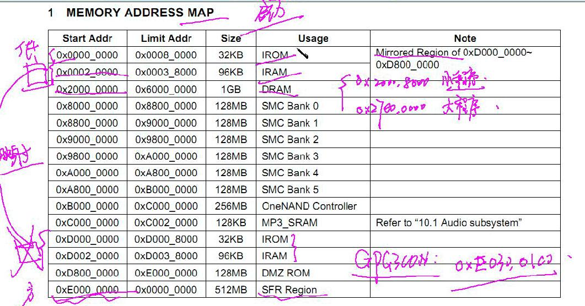
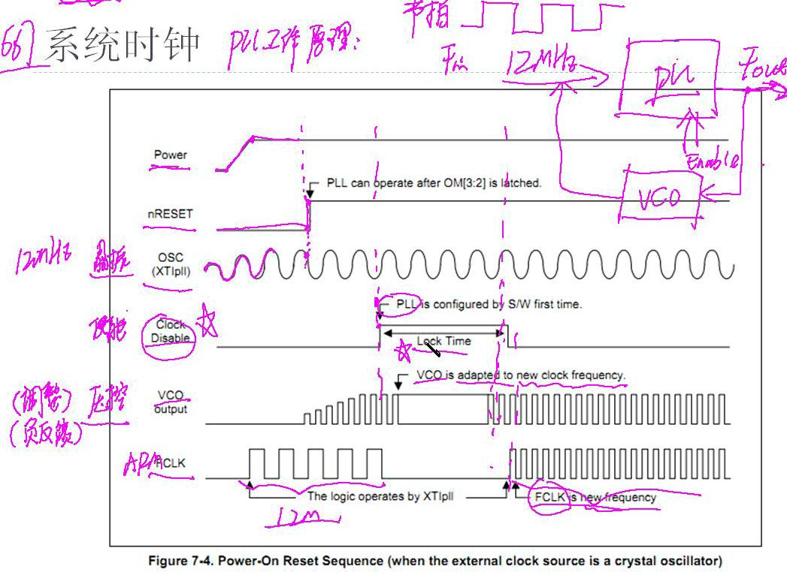
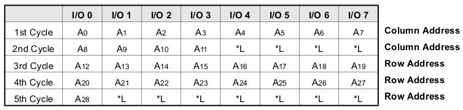
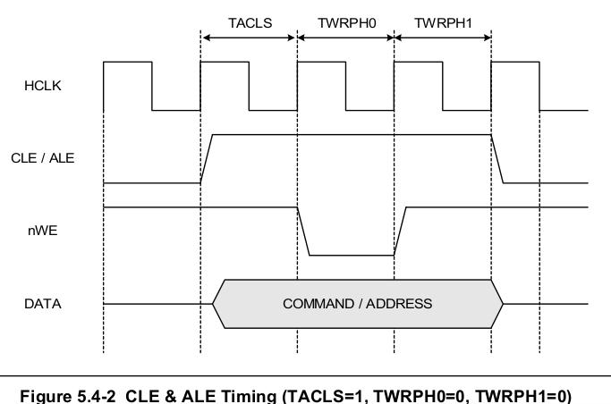
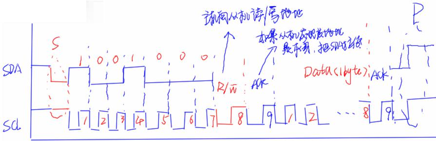
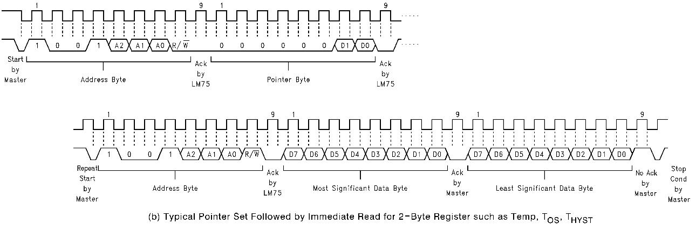

# ___2013 - 07 - 22 ARM硬件平台接口开发___
***

# 目录
<!-- TOC depthFrom:1 depthTo:6 withLinks:1 updateOnSave:1 orderedList:0 -->

- [___2013 - 07 - 22 ARM硬件平台接口开发___](#2013-07-22-arm硬件平台接口开发)
- [目录](#目录)
- [内存地址映射](#内存地址映射)
- [GPIO 接口(操作 GPIO 引脚)](#gpio-接口操作-gpio-引脚)
- [系统时钟](#系统时钟)
	- [时钟控制逻辑给整个芯片提供4种时钟](#时钟控制逻辑给整个芯片提供4种时钟)
	- [S5PC100 系统时钟管理](#s5pc100-系统时钟管理)
	- [PLL 工作原理](#pll-工作原理)
	- [系统时钟常用寄存器](#系统时钟常用寄存器)
	- [编写驱动系统时钟流程](#编写驱动系统时钟流程)
	- [示例](#示例)
- [中断控制器](#中断控制器)
	- [S5PC100 的中断控制器](#s5pc100-的中断控制器)
	- [GPH 0~3 CON对应引脚的中断唤醒方式](#gph-03-con对应引脚的中断唤醒方式)
	- [中断功能常用寄存器](#中断功能常用寄存器)
	- [编写中断处理程序流程(使用 KEY_1 点亮 LED 灯)](#编写中断处理程序流程使用-key1-点亮-led-灯)
- [UART 通用异步收发器，串行通信接口 Universal Asynchronous Receiver and Transmitter](#uart-通用异步收发器串行通信接口-universal-asynchronous-receiver-and-transmitter)
	- [介绍](#介绍)
	- [UART 常用寄存器(n = 0~3)](#uart-常用寄存器n-03)
	- [COM1 串口](#com1-串口)
	- [编写驱动 UART 程序流程](#编写驱动-uart-程序流程)
	- [UART 乱码](#uart-乱码)
- [PWM 定时器](#pwm-定时器)
	- [介绍](#介绍)
	- [PWM 常用寄存器](#pwm-常用寄存器)
	- [编写驱动 PWM timer1 流程](#编写驱动-pwm-timer1-流程)
- [Nand Flash 控制器](#nand-flash-控制器)
	- [介绍](#介绍)
	- [Nand Flash 内部结构](#nand-flash-内部结构)
	- [NF 控制器常用寄存器](#nf-控制器常用寄存器)
	- [编写 nand 驱动程序流程](#编写-nand-驱动程序流程)
- [ADC 模数转换器 Analog Digital Converter](#adc-模数转换器-analog-digital-converter)
	- [介绍](#介绍)
	- [ADC 常用寄存器](#adc-常用寄存器)
	- [编写驱动 ADC 程序流程](#编写驱动-adc-程序流程)
- [I2C 接口控制器](#i2c-接口控制器)
	- [介绍](#介绍)
	- [ACK 信号可能不产生的情况](#ack-信号可能不产生的情况)
	- [I2C 常用寄存器(n = 0/1)](#i2c-常用寄存器n-01)
	- [LM75 温度传感器](#lm75-温度传感器)
	- [编写驱动 I2 C程序流程](#编写驱动-i2-c程序流程)

<!-- /TOC -->
***

# 内存地址映射
  
***

# GPIO 接口(操作 GPIO 引脚)
  - S5PC100通过GPA-GPL分组管理不同的引脚
  - GPxCON用于选择引脚功能，4个bit对应一个pin功能，配置该引脚的读/写状态等
  - GPxDAT用于读/写引脚数据，1个bit对应一个pin功能，0/1
***

# 系统时钟
## 时钟控制逻辑给整个芯片提供4种时钟
  - FCLK 为锁相环出来的最高频率
  - ARMCLK 用于CPU核
  - HCLK 用于AHB总线设备(CPU核、存储器控制、中断控制源、LCD控制器、DMA和USB主机模块等)
  - PCLK用于APB总线设备 (WATCHDOG)

  
## S5PC100 系统时钟管理
  ```c
  D0_BUS：ARMCLK/HCLK0/PCLH0 <---- APLL
  D1_BUS：                         /HCLK1/PCLK1 <---- MPLL
  D2_BUS：                         /HCLK2/PCLK2 <---- EPLL、HPLL(低功率音频模块)
  ```
## PLL 工作原理
  - 不同的外围设备需要不同的工作频率
  - 设置系统时钟(倍频与分频)：PLL(锁相环)进行倍频与分频设置
  - PLL使能信号
  - PLL工作时间：LOCKTIME
  - PLL倍频参数
  - PLL分频参数
    - D0：ARMCLK:HCLK0:PCLK0 = 1:4:8
    - D1：MPLLCLK:PCLK1 = 1:4
## 系统时钟常用寄存器
  - A/M/E/H PLL_MASK：设置Lock Time的长度(16位)
    ```c
    MASKTIME = 0xE10(12MHz下设定锁定时间为300us)
    ```
  - A/M/E/H PLL_CON：倍频参数 / 使能信号(31位设定使能(置1))，设定锁相环输出频率
    ```c
    SDIV[2:0] / PDIV[13:8] / MDIV[25:16](默认值将产生400MHz的时钟频率)
        FOUT = MDIV * FIN / (PDIV * 2 ^ SDIV)
    ```
  - CLK_SRC0~3(main 0)：选择作为输入/输出时钟源，设定为输出CLK_SRC = 0x1111
    ```c
    CLK_SRC0：[0/4/8/12] ----> A/M/E/H PLL_SEL，0为输入，1为输出(FOUT.A/M/E/H PLL)
    ```
  - CLK_DIV0~4(main 0(D0域), 1(D1域))：至少要设定一个，设置ARMCLK/HCLK/PCLK三者的比例
    ```c
    用法见例程 (CLK_DIV0_VAL: [0]1[4:6]0[8:10]3[12:14]1[16:18]1 ----> 1 : 4 : 8
              CLK_DIV1_VAL: [0]1[4:6]1[8:10]1[12:14]1[16:18]1 ----> 1 : 4)
    ```
## 编写驱动系统时钟流程
  - 设置锁定时间
  - 设置分频比例关系
  - 使能PLL信号，设置倍频参数
  - 选择时钟源输出
  - 在设定好时钟源之后，还要设定等待200us以让所有时钟稳定输出
## 示例
  ```java
  .equ CLK_DIV0_VAL, ((1<<0) | (0<<4) | (3<<8) | (1<<12) | (1<<16))
          @ DOUT.APLL = MOUT_APLL/2, DOUT.ARM = DOUT.APLL, MOUT_APLL = 1332MHz
          @ ARMCLK = DOUT.APLL
          @ HCLK = DOUT.ARM/4
          @ PCLK = HCLK/2, ARMCLK:HCLK0:PCLK0 = 1:4:8 = 666 : 166.5 : 83.25
  .equ CLK_DIV0_VAL, ((1<<0) | (1<<4) | (1<<8) | (1<<12) | (1<<16))
          @ DOUT.MPLL = MOUT.AMPLL/2, MOUT_AMPLL = MOUT_MPLL
          @ DOUT.MPLL2 = MOUT.AMPLL/2
          @ DOUT.D1_BUS = MOUT.AMPLL/2
          @ PCLK = DOUT.D1_BUS/2, PCLK : MOUT_MPLL = 1 : 4 = 267MHz : 66.75MHz
  .equ APLL_VAL, ((0<<0) | (4<<8) | (444<<16) | (1<<31))        @ APLL = 1332MHz
  .equ MPLL_VAL, ((1<<0) | (2<<8) | ( 89<<16) | (1<<31))        @ MPLL = 267MHz
  .equ EPLL_VAL, ((3<<0) | (3<<8) | (135<<16) | (1<<31))        @ EPLL = 67.5MHz
  .equ HPLL_VAL, ((3<<0) | (6<<8) | ( 96<<16) | (1<<31))        @ HPLL = 54MHz
  @              S            P        M        ENABLE

  .global clock init
  clock_init:
  @ set Lock Time
          ldr ro, =0xe0100000        @ APLL_MASK
          ldr r1, =0xe10
          str r1, [r0]
          ...                @ M/E/H PLL_MASK
  @ set clock divider
          ldr r0, =0xe0100300        @ CLK_DIV0
          ldr r1, =CLK_DIV0_VAL
          str r1, [r0]

          ldr r0, =0xe0100304        @ CLK_DIV1
          ldr r1, =CLK_DIV0_VAL
          str r1, [r0]
  @ set PLL CON
          ldr r0, =0xe0100100        @ APLL_CON
          ldr r1, = APLL_VAL        @ APLL = 1332MHz
          str r1, [r0]
          ...        @ MPLL = 267, EPLL = 67.5, HPLL = 54
  @ set source clock
          ldr r0, =0xe0100200
          ldr r1, =0x1111
          str r1, [r0]

  @ wait at least 200us to stablize all clock
          mov r1, #0x10000
  1:
          subs r1, r1, #1
          bne 1b                @ 1b中1为跳转到的标签名，b(back)表示向后查找该标签

          mov pc, lr        @ return
  ```
***

# 中断控制器
## S5PC100 的中断控制器
  - S5PC100 通过3个 VIC, 3个TZIC管理着94个有效中断源，(3(VIC) * 32 = 96，其中三位保留)
  - VIC2监控多媒体、音频、安全等方面的中断源
  - VIC1监控ARM、电源、存储、连接、空间等中断源
  - VIC0监控系统(如外部中断0~31)、DMA、时钟信号方面的中断源
  - TZIC用于FIQ中断源
## GPH 0~3 CON对应引脚的中断唤醒方式
  - 设定为0010，分别对应WAKEUP_INT[n]
  - WKUP_INT 0_7/8_15/16_23/24_31 \_CON中断唤醒控制寄存器
    - 每3位(占4位)控制一个引脚，设定WAKUP_INT[n]的中断唤醒方式
    - 000(Low level)/001(High level)/010(Faling edge triggered)
  - WKUP_INT 0_7/8_15/16_23/24_31 \_MASK中断唤醒使能寄存器，使能对应的WAKEUP_INT[n](置0)
  - WKUP_INT 0_7/8_15/16_23/24_31 \_PEND中断唤醒挂起寄存器(用于清中断)
    - 对应位置1清除对应WAKUP_INT[n]中断
    - 当如此做时，必须向所有的VICA 0~2 ADDRESS寄存器写入0
## 中断功能常用寄存器
  - VIC 0~3 INTENABLE中断使能寄存器，使能对应位的VIC中的中断源(置1，默认全0)
  - VIC 0~3 INTENCLEAR清除对应VIC 0~3 INTENABLE中的位，一般可使用PEND来代替
  - VIC 0~3 ADDRESS中断向量地址寄存器(当前)，保存当前属于活动状态的ISR地址
    - 当前存在活动中断时，可以对该寄存器进行读操作
    - 写操作只能在ISR程序结束时进行，任意值都将清除当前中断
  - VIC 0~3 VECTADDR 0~31 中断向量地址寄存器
## 编写中断处理程序流程(使用 KEY_1 点亮 LED 灯)
  - 设置K1(EINT1/GPH0_1)引脚功能(中断输入)
    ```c
    GPH0CON[7:4] = 0010，WKUP_INT[1]
    ```
  - 设置K1(EINT1/GPH0_1)触发方式(下降沿)
    ```c
    WKUP_INT0_7_CON[6:4] = 010，Falling edgetriggered
    ```
  - 中断初始化
    ```c
    WKUP_INT0_7_MASK[1] &amp;= ~(0x1<<1);        //中断唤醒使能
    VIC0INTENABLE[1] |= (0x1<<1);                //中断使能
    VIC0VECTADDR1 = (unsigned long)int_key1;        //设定该中断ISR程序入口地址

    CPSR[7] = 0;        //软件使能IRQ中断
    ```
  - 启动代码(Reset)，建立异常向量表，关闭看门狗，系统时钟初始化，堆栈设置(至少两个IRQ_stack/system_stack)，main函数入口
    ```c
    eg1:@disable watch dog
        ldr r0, =0xea200000
        ldr r1, =0x0
        str r1, [r0]
    @ clock init
        bl clock_init
    @setup stack
        msr cpsr_c, #0xd2        @IRQ stack
        ldr sp, =0x2007fc00
        msr cpsr_c, #0xdf        @system stack
        ldr sp, =0x20080000

        msr cpsr_c, #0x5f        @enable IRQ
        bl main

    eg2:HandleIRQ:
        stmfd sp!, {r0-r12, lr}
        bl do_irq
        ldmfd sp!, {r0-r12, pc}^
        subs pc, lr, #4
    ```
    ```c
    main函数：点亮LED灯
    ```
  - IRQ产生
    - 保护现场
    - 调用ISR
      ```c
      ((void (* )(void))VIC0ADDRESS)();
              //强制将VIC0ADDRESS(保存ISR:int_key1)转换为函数指针

      LED亮
      VIC0ADDRESS = 0  //清除中断
      WKUP_INT0_7_PEND[1] = (0x1<<1);
      ```
    - 恢复现场
    - 调整返回地址
***

# UART 通用异步收发器，串行通信接口 Universal Asynchronous Receiver and Transmitter
## 介绍
  - 提供 4 个独立的异步串行通信端口，皆可工作于 **DMA 模式** 与 **中断模式**
  - 可以使用外部时钟提高传输速率，每个单元包含一个 **64 字节的 FIFO** 支持 **红外发送与接收**
  - UART 间使用 **全双工** 的方式传输数据，最简单的方式只有3根线，**TxD** 用于发送 / **RxD** 用于接收 / **Gnd** 双方参考电平
  - 每一个 UART 包括一个 **波特率发生器** / **发送器** / **接收器** / **控制单元**
  - 使用串口需要设置 **波特率** / **数据位** / **奇偶校验位** / **数据流控制** / **停止位**
  - 发送 / 接收的数据帧包括
    - 1位起始位
    - 5 - 8位数据位
    - 1位可选的校验位
    - 1 – 2位停止位，由 ULCONn 寄存器设置
  - 波特率发生器使用 D1 域 PCLK(66.75MHz)
  - 发送器可采用两种模式寄存器，**FIFO模式** / **非FIFO模式**
    - **FIFO模式** 下使用64位缓冲寄存器
    - **非FIFO模式** 下使用1个字节的Holding register
    - 相同的每次只能传送一个字节的数据量，对应的接收器要采用同样的模式
## UART 常用寄存器(n = 0~3)
  - ULCONn 线控寄存器，设置传输格式
    - [6] 是否使用红外模式(置1激活)
    - [5:3] 奇偶校验模式
    - [2] 停止位使用位数(0/1 : 1/2位停止位)
    - [1:0] 数据位长度(00 ~11 : 5~8位数据位长度)
    ```c
    设置 8N1 的传输格式 ----> 0x03
    ```
  - UCONn 模式控制寄存器时钟选择
    - [11:10](x0为PCLK)
    - Tx中断方式[9] / Rx中断方式[8] (0脉冲，1电平)
    - 发送模式[3:2] / 接收模式[1:0] (01中断方式)
    ```c
    0x305 表示使用PCLX，中断方式为电平方式，接收/发送模式为中断或轮询方式
    ```
  - UFCONn UART FIFO 控制寄存器 / UMCONn UART MODEM 控制寄存器(低8位使用)，写入 0x0 关闭
  - UTRSTATn 发送 / 接收状态检测寄存器，表明数据是否发送完毕，是否接收到数据
    - [2]位，当发送缓冲寄存器中没有数据，且发送移位寄存器为空时为1
    - [1]位，当发送缓冲寄存器为空时为1，使用FIFO时不使用此位
    - [0]位，当接收缓冲寄存器中有有效数据时为1，使用FIFO时不使用此位
  - UTXHn / URXHn 发送 / 接收缓冲寄存器(低8位用来传送数据)
    - UTXH0自动将写入的数据传送出去
    - URXH0自动接收数据
    - 换行符使用/r/n
  - UBRDIVn 波特率分频寄存器(低16位)
    - 当时钟源为PCLK时，该值必须是大于0的
    - 当该值为0时，UART波特率不受UDIVSLOT影响
  - UDIVSLOTn 分频分位寄存器(低16位)，与UBRDIVn共同决定波特率，该寄存器主要用于设定小数部分
    ```c
    DIV_VAL = (PCLK/(BPS * 16)) - 1, 其中的BPS = UBRDIVn + UDIVSLOTn/16
            = (66750000 / (115200 * 16)) - 1 = 35.2
            --> UBRDIVn = 35 = 0x23, UDIVSLOTn = 0.2 = 3/16
    ```                          
  - UINTPn UART中断挂起寄存器：包含产生的中断信息
  - UINTSPn UART中断源挂起寄存器：包含产生的中断信息，该信息是忽略中断屏蔽位的信息
  - UINTMn UART中断屏蔽位，置0屏蔽该中断，对应的中断：VIC1[42:45]
## COM1 串口
  - R/T XD0N ----> R/T D0 ----> GPA0_ 0/1
  - GPA0CON[3:0]= 0010(UART_0_RxD), GPA0CON[7:4]= 0010(UART_0_TXD)
## 编写驱动 UART 程序流程
  - 系统时钟初始化
  - 初始化UART
    - 设置GPA0_0/1引脚功能
      ```c
      GPA0CON[3:0]= 0010(UART_0_RxD), GPA0CON[7:4]= 0010(UART_0_TXD)
      ```
    - 串口设置：波特率/数据位/奇偶校验位/数据流控制/停止位
      ```c
      (ULCON0 = 0x03/UCON0 = 0x305/UBRDIV0 = 0x23/UDIVSLOT0 = 0x3)
      ```
  - 发送数据：检测UTRSTAT0[2]状态，可用时向UTXH0写入数据
  - 接收数据：将测UTRSTAT0[0]状态，有数据时读取URXH0中数据
## UART 乱码
  - 硬件
    - 串口线(连接、型号，示波器、万用表检查连线)
    - 电源电平过低
    - 晶振导致的波特率不匹配，使用标准的晶振
  - 软件
    - 是否开了多个串口终端
    - 系统时钟初始化错误
    - UART协议设置(8N1)有问题
    - 波特率计算没有除尽，有余数，传输过程中时间误差积累
***

# PWM 定时器
## 介绍
  - S5PC100有5个32位寄存器
    - 定时器 0 / 1 / 2 有 PWM 功能，即可以通过定时器来控制引脚周期性的高 / 低 / 电平变化
    - 定时器 3 / 4 为内部定时器，没有输出引脚
  - 定时器部件的时钟源为 APB-PCLK
    - 首先通过两个8位的预分频器降低频率，定时器0/1共用第一个预分频器，定时器2/3/4共用第二个预分频器
    - 预分频器的输出将进入第二级分频器，输出5种频率的时钟：2/4/8/16分频，每个定时器的工作时钟可以从这几种频率中选择
## PWM 常用寄存器
  - TCFG0 一级预分频值
    - [7:0]预分频器0的值(Timer 0/1)
    - [15:8]预分频器1的值(Timer 2/3/4)
    - 取值范围 (1~255)
  - TCFG1 二级5路开关分频值
    - [3:0] / [7:4] / [11:8] / [15:12] / [19:16] --> Timer 0/1/2/3/4 分频值
    - 0000 = 1/1, 0001 = 1/2, 0010 = 1/4, 0011 = 1/8, 0100 = 1/16, 0101 = PWM_TCLK
  - TCFG0 / TCFG1定义减1计数器中减1动作的间隔时长
    ```c
    Timer Input Clock Frequency = PCLK / ( {prescaler value + 1} ) / {divider value}
                    = 66.75MHZ / 250 / 8
                    = 33.375KHZ
                    = 0.03ms
    ```
  - TCON 定时器控制寄存器
    - [3:0] / [11:8] / [15:12] / [19:16] / [22:20] --> Timer 0/1/2/3/4 控制域
    - [0] Timer0 计数开始(置1开始)
    - [1] Timer0 手动更新(置1更新TCNTB0, TCMPB0)，一般在启动时置1装载初值，随后置为0
    - [2] Timer0 置1输出电平反转使能，置0关闭
    - [3] Timer0 PWM工作模式，置1自动装载模式(产生连续脉冲)，置0单脉冲模式(单个脉冲信号)
    ```c
    TIMER.TCON = (TIMER.TCON &amp; ~(0xf<<8)) | (0xf<<8);  //Timer1
                  TIMER.TCON &amp;= ~(0x1<<9);        
    ```
  - TCNTBn 计数缓冲寄存器(32位可用)，脉冲周期长度
    - 每个定时器都有一个32位减1计数器，其初始值由定时计数寄存器 TCNTBn 设定
    - 当计数值到达0时会向CPU发送一个中断(电平中断)，同时自动重新载入 TCNTBn 中的值，并重新开始计数
  - TCMPBn 比较缓冲寄存器：设置PWM中的高电平
    - PWM 功能使用 TCMPBn 寄存器的值，当减1计数器中的值等于 TCMPBn 中的值时，电平逻辑值反转
    - TCNTBn 以及 TCMPBn 寄存器中的值允许在一个计数周期内进行更改，但直到当前计数周期结束时该值才有作用
  - TINT_CSTAT 定时器中断控制与状态寄存器
    - [4:0]位 ----> Timer4~0中断使能(置1使能)
    - [9:5]位 ----> Timer4~0中断状态位，写1清除对应中断：VIC0[21:25]
## 编写驱动 PWM timer1 流程
  - 设置 GPD1 / PWMTOUT1 引脚功能
    ```c
    GPDCON[7:4] = 0010 ----> TOUT_1
    ```
  - 初始化 pwm timer1
    - 一级预分频值
      ```c
      TIMER.TCFG0 = (TIMER.TCFG0 &amp; ~(0xff<<0)) | (0xf9<<0);
      ```
    - 二级5路开关分频值
      ```c
      TIMER.TCFG1 = (TIMER.TCFG1 &amp; ~(0xf<<4)) | (0x3<<4);
      ```
    - 计数值TCNTB1
    - 比较值TCMPB1
    - 启动定时器
***

# Nand Flash 控制器
## 介绍
  - 由于硬件启动时 SRAM 只能拷贝 NandFlash 中16KB的数据到内存中，所以当需要执行更大的代码时，使用 **Nand控制器** 来读取更多的数据
  - s5pc100 启动代码从外部 NandFlash 芯片执行
    - 启动代码将 NandFlash 中的内容拷贝到DRAM中
    - ECC(硬件)用来检查NandFlash数据的有效性
    - 数据拷贝完成后，主程序在DRAM中执行
  - 拷贝数据到内存中，小数据量放在0x20008000处，大数据量放在0x27e00000处
## Nand Flash 内部结构
  - 1个Nand Flash器件由2048块组成，每一块由64页组成，每一页由(2048 + 64)B组成
    - 其中的2048B代表main区，用于正常存放数据
    - 64B代表spare区(OOB区)，存放EOC校验码
  - Nand Flash的每一页由2112列组成，每一列占8位，Spare区的64列地址为2018 ~ 2111 [ ??? ]
  - 读写 Nand Flash 以页为单位，擦除 Nand Flash 以块为单位
  - nand 容量：256MB * 8Bit，地址用28位二进制表示
  - nand 寻址
    - 读数据时以页为单位(2048 B)，发5次地址，每次只能发送8位地址
      - A0~A11：列地址(页内地址)，发送2次
      - A12~A28：行地址(页地址)，发送3次
      
    - 擦除数据时以块为单位，此时只需发送3次行地址即可完成
  - Nand Flash 引脚信息
    - I/O 0～7数据 输入/输出
    - CLE/AL E命令/地址 传输，控制当前使用的是 命令/地址 寄存器
    - ~CE片选信号
    - ~RE读使能 / ~WE写使能 / ~Wp写保护
  - Nand Flash 控制器与 Nand Flash 通信使用地址总线复用，而不是专用的GPIO控制引脚，但片选信号要用来实现CPU与Nand Flash握手
  - Nand Flash命令
    ```c
    读数据：0x00 + 0x30
    复位：0xff
    块擦除：0x60 + 0xD0
    ```
## NF 控制器常用寄存器
  - NFCONF 配置寄存器：选择时钟，设置时序时间(D0域HCLK，666.5MHz)
    - [30] 位选择系统时钟，系统时钟频率大于66MHz时置为0，否则为1
    - [6:4] (TWRPH1 持续时间) / [10:8] (TWRPH0 持续时间) / [14:12] (CLE & ALE持续时间) 设置时序时间
      ```c
      持续时间 = HCLK * (相应位上的值(0 ~ 7) + 1)
      ```
      ```c
      NFCONF &= ~((0x7<<4)|(0x7<<8)|(0x7<<12)|(0x1<<30));
                  NFCONF |= ((0x7<<4)|(0x7<<8)|(0x7<<12));
      ```
      
  - NFCONT 控制寄存器
    - [0] 位使能Nand控制器(置1使能)，
    - [1] 位片选使能(置0使能，置1取消，常用于取消 Nand Flash 芯片)
  - NFCMMD 命令寄存器：只能发送8位命令(低8位)
    - 0xFF 复位 nand flash
    - 读取数据命令：0x00 + 0x30
    - 发出地址准备命令：0x00 ---> 3个列地址 ----> 2个行地址
  - NFADDR 地址寄存器：只能发送8位命令(低8位)
  - NFDATA 数据寄存器：只能发送8位命令(低8位)
  - NFSTAT 状态寄存器：[31:28]繁忙0/等待1(可读写，不使用，用[0]位)，[0]位繁忙0/等待1(只读)
## 编写 nand 驱动程序流程
  - 初始化
    - 设置GPK0_ 2/3 引脚功能
      ```c
      GPK0CON[11:8] = 0011(NFCSn[0]) / GPK0CON[15:12] = 0011(NFCSn[1])
      ```
    - 选择时钟, 设置时序时间：NFCONF
    - 使能nand控制器：NFCONT[0]置1
    - 使能nandflash：NFCONT[1]置0
    - nandflash复位：发出复位命令0xFF(写入NFCMMD)
    - 取消nandflash：NFCONT[1]置1
  - 定义ddr_start(内存起始地址), nand_start(nand起始地址), len(数据长度)
    ```c
    unsigned long ddr_start = 0x27e00000;
    unsigned long nand_start = 0x0;
    int len = 0x40000;        //256KB
    ```
  - 使能nandflash：NFCONT[1]置0
  - 将内存起始地址转化为unsigned char * 型，一次读入8个字节，方便写入
    ```c
    unsigned char * buf = (unsigned char * )ddr_start;
    ```
  - 从nandflash读取数据到内存
    ```c
    for (i = nand_start; i < (nand_start+len); i += 2048) {  // 页（2048 or 2048 + 64？）
        nand_cmd(0x00);  // 发出地址准备命令
        nand_send_addr(i);  // 连续发出5次地址,列地址 / 行地址
        // --> 具体实现
            unsigned long page = addr / 2048;
            unsigned long column = addr & (2048-1);

            nand_addr(column & 0xff);
            nand_addr((column >> 8) & 0xff);

            nand_addr(page & 0xff);
            nand_addr((page >> 8) & 0xff);
            nand_addr((page >> 16) & 0xff);
        // End
        nand_cmd(0x30);  //发出数据准备命令
        while ((NFSTAT & 0x1)==0);  // 检测nandflash状态

        for (j = 0; j < 2048; j++) {  // 页内
            * buf++ = NFDATA;  // 从nandflash拷贝数据到内存，一次8个字节
        }
    }
    ```
  - 取消nandflash：NFCONT[1]置1
***

# ADC 模数转换器 Analog Digital Converter
## 介绍
  - 将模拟信号转换为数字信号
  - 常见分类：积分型 / 逐次比较型(主要) / 并行比较型 / 串行比较型
  - AD转化工作原理：采样 / 量化 / 编码
  - 编码位数(n，12位)，Vmax = 3.3V / Vmin = 0V
  - 转化公式
    ```c
    采样值 = (2^n / 电压差) * 采样电压
    采样电压(mV) = (采样值 * 3.3 * 1000) / 0xfff
    ```
  - ADC(10/12 位，CMOS)有10个模拟信号输入通道，并将其转化为10/12 为数字信号
  - A/D转化是采用片上的采样-保持功能实现的
  - ADC 的 AIN[9] (XP) AIN[8] (XM) AIN[7] (YP) AIN[6] (YM) 可用于触摸屏的坐标转化，此时其中的XM/YM接地，AIN[5:0] 用于普通的AD转化
  - A/D转化时间
    ```c
    // 当 PCLK 频率是66MHz，预分频值是65时
    A/D converter freq. = 66MHz/(65+1) = 1MHz        //该值需要小于PCLK/5
    Conversion time = 1/(1MHz / 5cycles) = 1/200kHz = 5 us        //循环比较5次？
    ```
## ADC 常用寄存器
  - ADCCON ADC控制寄存器：启动，预分频值，状态位
    - [16] RES，编码位数，1/0 ----> 12/10 位A/D转化结果输出
    - [15] 只读位，A/D转化结束时置1
    - [14] A/D转化预分频值使能(置1使能)
    - [13:6] 预分频值(5~255)，置为最大0xff
    - [2] 待机模式选择(置1激活，用于触摸屏)
    - [1] READ_START启动使能(置1)
    - [0] ENABLE_START使能，[1]位置1时该位无效，不操作该位
    ```c
    ADC.ADCCON = ( 1<<16 | 1<<14 | 0xff<<6 | 0<<2 | 1<<1 );
    // 12位转换精度，AD转换预分频使能，分频值为255，正常操作模式，ADC读操作开始下次采样
    ```
  - ADCDAT0 ADC转化结果寄存器：低12位保存普通通道ADC转化结果
  - ADCDAT1转化结果寄存器：用于保存触摸屏结果
  - ADCMUX ADC多路复用寄存器：选择作为输入的频道，0000 ~ 0101 --> AINT 0 ~ 5
## 编写驱动 ADC 程序流程
  - 系统时钟初始化
  - 初始化ADC：
    - ADC输入功能选择：ADCMUX
    - 启动，预分频值，状态位：ADCCON
    - 读ADC转化数据：检测ADCCON[15]，转化结束时，读取ADCDAT0低12位
***

# I2C 接口控制器
## 介绍
  - 两线式串行扩展总线，用于连接微控制器及其外围设备，使用两根双向信号线来传递数据
    ```c
    SCL(Serial Clock Line) / SDA(Serial Data Address)
    ```
  - I2C 总线工作流程
    - 当 I2C 总线可用时 SDA 与 SCL 应被置为高电平
    - 当 SCL 上保持高电平时，SDA 上的下降沿视为开始条件
    - I2C总线置为忙碌状态，并产生一个SCL信号
    - SDA上的上升沿为结束条件，释放I2C总线
  - 开始 / 结束条件总是由主机产生的，在第一帧数据中将包含7位地址位，决定进行通信的从机地址，以及1位读(1)/写(0)信号
  - SDA 线上每次最多传送8位数据，但在传输过程中不会限制传送的字节数，每一个字节后面必须跟随1位的ACK
  - 数据传送时总是优先发送MSB最高有效位(most-significant bit)开始传送
  - 主机访问从机
    ```c
    开始条件 + 7位地址 + 读/写信号 + 8位数据位 + ACK + P结束位
    ```
  - 在发送模式下
    - 一次数据发送完成后，I2C总线会等待数据转移寄存器(I2CDS)接收到新数据
    - 在这之前，SCL会保持在低电平，并在新数据写入后恢复为高电平
    - S5pc100 以中断的方式判定数据是否传送完成，并在接收到对应中断请求后，开始向I2CDS写入新的数据
  - 在接收模式下，会以同样的方式等待接收到的数据被取走
  
## ACK 信号可能不产生的情况
  - 当从机不能响应主机发出的从机地址时，不会发出ACK信号
  - 如果从机在传输数据过程中，不能完整接收数据，可能也不会发出ACK信号
  - 主机在接收到最后一个字节之后可能也不会发出ACK信号
## I2C 常用寄存器(n = 0/1)
  - I2CCONn I2C控制寄存器：使能ACK，选择时钟，使能传输方式
    - [7] ACK使能标志位 (置1使能)
    - [6] 位时钟源预分频器选择位，(选择低速，置1)
      - 置 1，I2CCLK = fPCLK/512
      - 置 0，I2CCLK = fPCLK/16
    - [5] 中断方式使能(置1使能)，该位为0时，[4]位的值是不确定的
    - [4] 中断挂起状态，只能置0清除操作
      - 当读取为0表示没有中断被挂起
      - 1表示中断被挂起
      - 有中断时表示数据传输完成
    - [3:0] I2C总线传送时钟预分频器：置为0xf
      ```c
      Tx clock = I2CCLK/(I2CCON[3:0]+1)
      ```
    - 示例
      ```c
      I2C0.I2CCON0 = 0xef;  //使能ACK信号，预分频：512，使能中断Rx/Tx
      I2C0.I2CCON0 = 0x2f;  //关闭ACK信号，预分频：16，使能中断Rx/Tx
      ```
  - I2CSTATn I2C状态寄存器：传输模式选择，开始/结束 条件设置，使能数据输出，ACK信号能否被接收
    - [7:6] 模式选择
      - [00] 从机接收
      - [01] 从机发送
      - [10] 主机接收
      - [11] 主机发送
    - [5] 开始 / 结束条件
      - 当读取时：[0]不忙碌 [1]忙碌
      - 当写入时：[0]产生停止信号 [1]产生开始信号
    - [4] 使能数据输出(置1)
    - [0] I2C最后接收位状态标志
      - 0 = 最后接收位是0(ACK被接收)
      - 1 = 最后接收位是1(ACK不被接收)
    - 示例
      - 主机初始化为发送模式：0xf0
      - 主机初始化为接收模式：0xb0
      - 主机结束：0x90
  - I2CADDn 多主机I2C总线地址寄存器(低8位)，从机地址设置(不使用)
  - I2CDSn I2C数据转移寄存器(低8位)(数据手册中I2CDS0标记为了I2CDS1)
    - 开始信号产生后，I2CDS中的数据自动被传输
    - 即每次向I2CDSn中写入数据后，产生一个开始信号 (I2C0.I2CCON0 = 0xef) 将该数据发送出去
## LM75 温度传感器
  - 地址：0x90(1001000)
  - 指示寄存器(pointer register)，其中的低2位用于选择将要被读取或写入的寄存器：00表示温度寄存器
  - 温度寄存器
    - [15:8]温度值高位，整数部分
    - [7]温度值低位，小数部分
  - 温度数据需要分两次读取(每次8字节)，精度0.5（待完善）
  - 其 I2C_SDA0 对应引脚为GPD3，I2C_SCL0对应引脚为GPD4，中断输入引脚EINT12
    ```c
    GPD.GPDCON &= ~((0X0f<<12)|(0x0f<<16));
    GPD.GPDCON |= ((2<<12) | (2<<16));  // 设置GPD3、GPD4引脚分别为 I2C0_SDA、I2C0_SCL
    ```
  - 时序图：地址信息 + 读/写 信号，Ack
    - 配置Lm75，Ack
    - 重新发送地址，Ack
    - 接收数据，Ack(指定下一步是否继续取数据)
    - 接收下一个数据，Ack(指定接收数据结束)
    
## 编写驱动 I2 C程序流程
  - 设置GPD[3, 4]引脚功能
    ```c
    GPDCON[15:12] = 0010(I2C0_SDA)
    GPDCON[19:16] = 0010(I2C0_SCL)
    ```
  - 第一阶段
    - 装载LM75地址: 0x90
    - 设置主机发送模式, 使能数据输出, ACK能被接收,设置开始条件
    - 使能ACK, 选择时钟, 使能传输方式, 设置时钟
    - 检测I2C是否发送完成
    - 配置LM75为温度模式
  - 第二阶段
    - 装载LM75地址: 0x90
    - 设置主机接收模式, 使能数据输出, ACK能被接收,设置开始条件
    - 使能ACK, 选择时钟, 使能传输方式, 设置时钟
    - 检测I2C
    - 使能ACK, 接收第一字节数据(温度整数部分)
    - 关闭ACK, 接收第二字节数据(温度小数部分)
***
