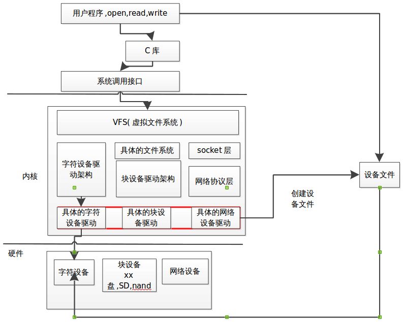
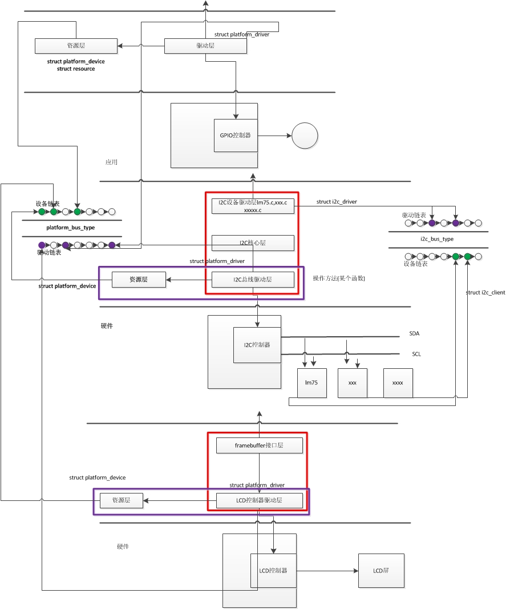

# ___2013 - 07 - 26 ARM 驱动开发理论基础___
***

# 出错记录
  - Q: 在定义设备名称数组时不要使用dev_name，因其已经在include/linux/device.h:463中使用，会造成定义冲突
    ```c
    static char *dev_name[4] = {"led1", "led2", "led3", "led4"}        //错误方式
    ```
  - Q: 内核中的使用for循环的延时函数不起作用（？）
***

# 系统结构
## 嵌入式 Linux 用户空间与内核空间
  - 一个软件系统可以分为：应用程序 / 库 / 操作系统(内核) / 驱动程序
  - 在Linux系统中
    - 用户程序运行于 **用户空间**，拥有MMU的系统能够限制应用程序的权限，这可以避免应用程序的错误使得整个系统的崩溃
    - 驱动程序运行于 **内核空间**，其错误可能导致整个系统的崩溃
  - **用户空间**
    - 应用程序 (open/read/write)
    - 标准C库
    - 系统调用函数 (文件I/O，进程/线程，网络编程)(SWI指令)
  - **内核空间**
    - 系统调用
    - VFS
    - 具体文件系统(磁盘文件系统、块设备文件系统)
    - 硬件驱动 (字符设备、块设备(x盘/SD/nand)、网络设备)(设备文件，一切设备皆文件)
  - **VFS**：给用户提供统一的接口，方便用户程序的开发管理具体的文件系统，以及系统中的其他模块
  - **内核**
    - 协调管理各个功能模块(VFS，内存管理，进程管理/进程调度，网络管理，
    - 提供各种服务
  - **设备管理**
    - 以设备驱动的方式管理各个设备
    - 字符设备驱动架构 --> 具体的字符设备驱动
    - 块设备驱动架构 --> 具体的块设备驱动
    - socket层 / 网络设备层 --> 具体的网络设备驱动

  
## linux内核七大子系统
  - 系统调用：实现用户空间和内核空间的交互
  - 进程管理：管理进程的创建，销毁和调度
  - 内存管理：管理物理内存，虚拟内存的使用
  - 网络协议栈
  - VFS虚拟文件系统：屏蔽底层文件系统之间的差别，让用户在文  件的操作时候，无需关注具体的文件系统类别和磁盘介质信息。
  - 平台相关（arch目录）
  - 设备驱动
## 地址映射
  - **MU** 将内存中物理地址映射到用户虚拟空间
  - **ioremap** 将寄存器物理地址映射为虚拟地址(因为用户程序不能直接访问寄存器)
    ```c
    gpg3con =ioremap(0xE03001C0, 8);
    gpg3dat =gpg3con+1;
    ```
    使用完后需要通过iounmap来释放
  - 使用 readl/writel readb/writeb 来读 / 写寄存器
    ```c
    static void __iomem *led_base = NULL;
    static volatile unsigned long GPG3CON 0x0;
    static volatile unsigned long GPG3DAT 0x4;

    led_base = ioremap(0xE03001C0, 8);

    val = readl(led_base + GPG3CON);
    writel(val, led_base+ GPG3DAT);
    ```
  - **静态映射的虚拟地址**
    ```c
    // 所有的管脚定义都定义在 arch/arm/mach-s5pc100/include/mach/gpio.h 中
    //申请GPIO管脚，参数1：申请的管脚，参数2：管脚名称
    int gpio_equest(unsigned fpio, const char *label);

    //释放，如果是在open函数中申请，则应对应在release函数中释放
    void gpio_free(unsigned gpio);

    //设置某个管脚为输入功能
    int gpio_direction_input(unsigned gpio);

    //设置某个管脚为输出功能,并且输出为某个值
    int gpio_direction_output(unsigned gpio, int value);

    //获取管脚的值
    static inline int gpio_get_value(unsigned gpio)

    //设置管脚的值
    static inline void gpio_set_value(unsigned gpio, int value)

    //获取管脚所对应的中断号(GPIOs不会产生任何中断，该函数无效)
    static inline int gpio_to_irq(int gpio)
    ```
  - **将数据拷贝到用户空间**
    ```c
    copy_to_user
    ```
  - **获取用户空间的数据**
    ```c
    // 成功返回0，如果失败则返回大于0的值(剩下的没有拷贝成功的字节数)
    copy_from_user
    ```
***

# 嵌入式Linux环境搭建
  - tftp 协议用于下载内核映像，每次更新需要重新下载
  - NFS 协议，用于挂载文件系统，两边是同步的
  - 内核参数配置
    ```c
    console=ttySAC0,115200  // 表示输出结果通过串口显示
    console=tty0,115200 // 表示输出结果通过LCD屏显示
    ```
  - dm9000中MAC地址更改
    ```c
    // /arch/arm/plat-samsung下dev-dm9000.c文件中，更改
    struct dm9000_plat_data s5pc100_dm9000_platdata结构体
    ```
***

# 设备驱动程序概述
  - 一切设备皆文件
  - 文件类型(7种)
  - 字符设备与块设备都是以文件的形式来操作
  - 字符设备与块设备
    - **块设备** 的介质必须是存储介质，支持随机访问(对指定地址的访问)，系统调用操作lseek()是不可缺少的操作
    - **字符设备** 的介质一般都是传输介质，一般只支持顺序访问
    - 一般只是把成块输入 / 输出并且打算在上面建立普通文件系统的设备才称为块设备
  - 所有的设备文件创建出来后都在 /dev 目录下面
  - dev 目录下设备文件属性
    ```c
    crw-rw---- 1 root dialout 4, 64 7月 29 13:48 ttyS0
    类型/权限          主/次设备号           设备名称
    ```
  - **设备号**
    - **主设备号** 用来标识某一类设备，标识设备对应的驱动程序
    - **次设备号** 由内核使用，用于确定设备文件所指的设备
  - 与应用程序不同，驱动程序从不主动执行，而是根据应用程序的要求进行初始化，根据应用程序的要求进行读写
***

# 向系统(内核)中添加代码
## 直接编译进内核镜像
  - 缺点：导致内核镜像很大，相对来说，系统启动会相对慢一些在开发过程中，需要每次都编译内核，浪费时间
### 将驱动添加到内核中，由系统启动的时候把驱动装好
  - 放入/driver中相应目录下(/driver/leds)
  - 修改该目录下的Makefile，在其中添加相应驱动的对应平台编译语句
    ```python
    eg: obj-$(CONFIG_LEDS_S5PC100)        += led-drv.o
    ```
  - 修改该目录下的Kconfig文件，在图形化菜单上做一个菜单项
    ```c
    config LEDS_S5PC100  //表示一个菜单项，与前面的CONFIG_LEDS_S5PC100对应
            tristate "LED Support for S5pc100"
                // 在图形化菜单上显示的名称
                // tristate表示三态<>：y编译进内核 / m编译进模块 / n取消
                // boll 表示二态[]
            depende on LED_CLASS  //依赖，不确定可以不写或使用大类的依赖，否则看不到添加的驱动
            select        ... //选择，如果选择该项，则会同时选择select中的项目
            help
                    ...   //帮助文档
    ```
    IV). 在图形化菜单上选择相关的选项
    ```python
    make menuconfig
    ```
### 将资源放到内核中，由系统统一管理
    ```python
        I). 放入/arch/arm/plat-samsung，该资源文件不是以内核模块的方式，所以应屏蔽其中的相应代码(初始化/退出)
    ```
    II). 修改该目录下的Makefile，添加相应语句
    ```python
    eg: obj-$(CONFIG_S3C_DEV_LED)  += dev-led.o
    ```
    III). 修改该目录下的Kconfig文件，添加相应语句
    ```python
    eg: config S3C_DEV_LED
            bool         //此处没有名称，不可以通过图形界面进行选择
            help
                    this is led device resource
    ```
    IV). 到/arch/arm/mach-s5pc100/Kconfig文件中，在config MACH_SMDKC100标签下添加相应语句
    ```python
    eg: config MACH_SMDKC100
            ...
            select S3C_DEV_LED                //添加的语句
    ```
    V). 到arch/arm/mach-s5pc100/mach-smdkc100.c文件中，在
    ```python
    static struct platform_device *smdkc100_devices[] __initdata = { ... }结构体中添加相应代码
    eg: static struct platform_device *smdkc100_devices[] __initdata = {
            ...
            &amp;s5pc_device_led,                //新添加的代码
        };
    ```
### 编译内核：make zImage
  - 出现错误：arch/arm/mach-s5pc100/mach-smdkc100.c:169: error: 's5pc_device_led'
    ```python
    undeclared here (not in a function)
    ```
    解决方法(参照)：在arch/arm/plat-samsung/include/plat/devs.h中添加如下代码
    ```python
    extern struct platform_device s5pc_device_led;
    ```
    重新编译，出现错误：arch/arm/plat-samsung/dev-led.c:6:21: error: s5pc-led.h:
    ```python
    No such file or directory
    ```
    解决方法：将s5pc-led.h头文件拷贝到arch/arm/plat-samsung/include/plat目录下修改dev-led.c文件，将
    ```python
    #include"s5pc-led.h" 改为 ----> #include<plat/s5pc-led.h>
    ```
## <span style="color:#ff8000;">方法2：采用内核模块的形式
  - 内核模块就是一个可以在系统启动后加入系统的代码
  - 特点：可以动态加载到内核，加入内核后，与内核其他部分一样
### <span style="color:#00ff00;">&lt;1&gt; 构成：
    ```python
    ```
    I). 头文件
    ```python
    #include <linux/init.h>        //加载模块时需要使用的大量函数和符号定义
    #include <linux/module.h>        //模块加载函数和模块释放函数的宏定义
    ```
    II). 模块加载函数(初始化工作，在终端上执行insmod xxx.ko时，执行此函数)
    ```python
    static int __init hello_init(void){ return 0; }
            //初始化函数应该声明为static
            //int：必需
            //__init：对函数的属性定义，指定此函数在链接的时候会被链接到init段，在装载
            //                之后，模块装载器就会将初始化函数扔掉，以释放内存，可不加
            //void：必需
    ...
    module_init(hello_init);
    ```
    III). 模块卸载函数(与加载模块相反的工作，执行rmmod hello时，执行此函数)
    ```python
    static void __exit hello_exit(void)
    { ... }
            //对应同加载函数
    ...
    module_exit(hello_exit);
    ```
    IV). 模块许可声明(GPL:表示有发布软件的自由)
    ```python
    MODULE_LICENSE("GPL");
    ```
### <span style="color:#00ff00;">&lt;2&gt; 模块参数传递(当模块需要完成多种功能时，可通过参数传递来决定使用哪种功能)：
  - modul_param(a, int, S_IRUSER);
  - modul_param(str, charp, S_IRUSER); //ARM中用charp表示char *
    ```python
                     //参数：(要传值的参数, 参数类型, 权限)
    ```
    module_param_array(name, type, nump, perm);  //指定数组型模块参数，
    ```python
            // nump数组元素个数指针，其数值由加载模块时给定的数组值个数确定
            // perm值不为0时在/sys/module/[module name]/parameters下生成对应参数名的文件，
                其权限为perm，此时会占用内存空间，如果没有动态修改的需求，则可将权限指定为0

    ```
    内核支持的模块参数类型：
    ```python
    bool / invbool / charp / int / long / short / uint / ulong / ushort
    ```
### <span style="color:#00ff00;">&lt;3&gt; 模块间的通信(模块导出符号)
  - int add_int(int a, int b) { ... }
  - int sub_int(int a, int b) { ... }
  - ...
  - EXPORT_SYMBOL(add_int);        //将函数名导出到内核符号表中
  - EXPORT_SYMBOL(sub_int);
### <span style="color:#00ff00;">&lt;4&gt; 制作者信息等：
  - MODULE_AUTHOR("jason");
  - MODULE_DESCRIPTION("this is simple driver module");
  - MODULE_VERSION("V0.1");
### <span style="color:#00ff00;">&lt;5&gt; 编译：
  - 准备一个内核，至少编译过一次，且该内核与开发板所用内核一致
  - Makefile：KERNELDIR ={Linux内核目录路径}
    ```python
    cp hello.ko {NFS挂载文件系统目录路径/驱动路径}
    ```
    在多文件模块编译中，注意在其他文件使用的符号(函数)不能使用static限定符
  - 多文件模块编译时，Makefile中生成的目标名不能有对应的 .c 文件
  - 编译完成后生成一个xxx.ko文件
  - Makefile分析：
  - NAME = hello_mod
  - feq ($(KERNELRELEASE),)
    ```python
        KERNELDIR = /home/leondgarse/source_code/linux-2.6.35.7
    PWD = $(shell pwd)
    ```
    modules:
    ```python
    $(MAKE) -C $(KERNELDIR) M=$(PWD) modules
    ```
    modules_install:
    ```python
    $(MAKE) -C $(KERNELDIR) M=$(PWD) modules_install
            #INSTALL_MOD_PATH=/opt/filesystem/        #指定路径
    ```
    clean:
    ```python
    rm -rf $(NAME) *.o *.ko .tmp_versions *.mod.c modules.order Module.symvers .*.cmd
    ```
    else
    ```python
    obj-m := $(NAME).o
    #obj-m := test.o
    #test-objs = $(NAME).o        #用于将多个.o编译成一个.ko文件
    ```
    endif
  - /***执行 $(MAKE) -C $(KERNELDIR) M=$(PWD)时，-C选项进入内核源码目录，
    ```python
    读取其中的Makefile 从中得到信息对KERNELRELEASE赋值等根据M=$(PWD)进入模块所在目录，
    并再一次执行Makefile此时KERNELRELEASE不再为空，执行obj-m := $(NAME).o 这里指明了模块源码中个文件的依赖关系，
    以及要生成的目标模块名，正式编译模块。
    使用PRINT_INC = $(PWD)/../inc
            EXTRA_CFLAGS += -I $(PRINT_INC)指明在编译模块时需要添加目录(*.h文件)
    ```
    ***/
### <span style="color:#00ff00;">&lt;6&gt; 加载(手动)：
  - insmod xxx.ko [param=1]        //加载内核模块，此时会运行一次该模块的初始化函数过程：分配一个主设备号，注册字符设备到内核哈希表中
  - rmmod xxx.ko        //卸载模块，此时执行一次该模块的卸载函数
  - lsmod        //查看当前系统中动态加载的模块
    ```python
    //若出现如下错误：rmmod: chdir(/lib/modules): No such file or directory
    //        解决：mkdir lib/modules
    //若出现如下错误：rmmod: chdir(2.6.35.5): No such file or directory
    //        解决：mkdir lib/modules/2.6.35.5
    ```
    dmesg        //打印或控制内核的环形缓冲区，在成功导入一个模块后，会有相应信息
    ```python
    //使用dmesg | tail 查看/var/log/message文件的最后几行信息
    ```
    cat /proc/devices        //查看当前系统中设备文件的设备号与设备名称
  - mknod /dev/chdev {设备类型c(字符设备)} {major} {minor/0}
    ```python
    /***与普通文件相比，设备文件在磁盘上只占一个索引节点，而没有任何用于存放数据的记录块与之相关联，
            在这种情况下就用索引节点中的记录块映像表数组(i_block[])中的第一个元素，即i_block[0]来记载目标设备的设备号，
            不同于普通文件可以通过系统调用open()(指定O_CREAT)来创建，因为设备文件的创建需要一个参数来传递设备号，
            设备文件的创建需要另一个系统调用mknod()
    ***/
    ```
    modprob比较高级的模块加载卸载命令，自动模块之间的依赖性问题
    ```python
    -l 列出使用module_install编译的模块列表
    -r 移除模块
    /***每当使用modprobe加载模块时，它会到默认的路径/lib/modules/内核版本信息/modules.dep找这个文件。modules.dep的获取方法：
            <1> 到内核源码根目录：cd /opt/kernel
            <2> 执行make modules        //将内核中选“M”的配置项涉及的代码编译成模块
            <3> 执行make modules_install INSTALL_MOD_PATH={path}安装内核模块
            <4> 安装以后的结果会在{path}下生成lib目录
            <5> 将lib下所有的内容全盘拷贝到/opt/rootfs/lib/下(其中包含modules.dep)
    ***/
    ```
    modinfo用于查询模块的相关信息
### <span style="color:#00ff00;">&lt;7&gt; 在加载模块后文件系统的变化：
  - /proc/modules发生变化：cat modules | grep hello*显示信息
    ```python
    hello_mod 735          0          -        Live      0xbf000000
    模块名            使用的内存 引用计数 分隔符 活跃状态 加载到内核中的地址
    ```
    /proc/devices文件没有变化，因为加载的模块不是一个设备
  - /sys/module下增加一个hello_mod目录包含一些层次结构组织的内核模块属性信息，以及内核模块参数文件
***

# <span style="color:#ff0000;">6). Linux内核常用函数： &nbsp; &nbsp; &nbsp; &nbsp; &nbsp; &nbsp; &nbsp; &nbsp;
    ```python
    内核中有个全局变量jiffies（内核定时器），这个变量在每次时钟中断时都要递增，可以用作基本
            的计时手段
    使用全局项current(<linux/sched.h> struct task_struct指针)来获得的当前进程(系统调用的调用者)
            信息：printk(KERN_INFO "The process is \"%s\" (pid %i)\n", current->comm, current->pid)

    内核打印函数printk：
            printk(KERN_INFO, "%s():%d(): this is hello module!\n",
                            __func__, __LINE__);
                    //普通信息#define        KERN_INFO        "<6>"        /* informational*/
                    //警告信息#define        KERN_WARNING        "<4>"        /* warning conditions*/
                    //错误信息#define        KERN_ERR        "<3>"        /* error conditions*/
    显示当前控制台的日志级别(KERN_ERR / KERN_INFO / ...)：/# cat /proc/sys/kernel/printk
            7                4                1                4
            控制台日志级别 / 默认的消息日志级别 / 最低的控制台日志级别 / 默认的控制台日志级别
    修改当前日志级别：echo 4 > /proc/sys/kernel/printk
            或在bootload传递参数bootargs中给定debug(级别10) / quiet(级别4) / loglevel=number

    内核分配内存空间函数kmalloc：
            led_dev=kmalloc(sizeof(struct led_device), GFP_KERNEL);
                    //其中的第二个参数
                            GFP_KERNEL如果分配不成功，则会休眠，建议休眠
                            GFP_ATOMIC如果分配不成功，则不会休眠
            对应的内存释放函数：kfree();

    出错处理：IS_ERR判断，PTR_ERR取出出错原因
            eg: led_dev->led_class=class_create(THIS_MODULE, "led_class");
                    if (IS_ERR(led_dev->led_class)) {
                            printk(KERN_ERR "create class failed!\n");
                            ret = PTR_ERR(led_dev->led_class);  //取出错误原因
                            goto output_err2;
                    }

    gpio访问指令：
            int gpio_is_valid(int number);                        //测试gpio端口是否合法
            int gpio_request(unsigned gpio, const char *label);        //申请某个gpio端口
            void gpio_free(unsigned gpio);                        //释放gpio口

            int gpio_direction_input(unsigned gpio);                //配置gpio的使用方向为输入
            int gpio_direction_output(unsigned gpio, int value);        //配置gpio为输出，同时输出value
            int s3c_gpio_setpull(unsigned int pin, s3c_gpio_pull_t pull);//配置gpio管脚的内部上下拉电阻

            int gpio_get_value(unsigned gpio);                        //获得gpio引脚的值
            void gpio_set_value(unsigned gpio, int value);                //设置gpio引脚的值(对于输出)
            int gpio_to_irq(unsigned gpio);                        //将gpio当作中断口使用

    用户空间与内核空间数据访问指令：
            unsigned long copy_from_user(void *to, const void *from, unsigned long n);
                    //数据从用户空间到内核空间，成功返回0，失败返回没有拷贝的字节数
            unsigned long copy_to_user(void *to, const void *from, unsigned long n);
                    //数据从内核空间到用户空间，成功返回0，失败返回没有拷贝的字节数

            int get_user(data, ptr); / int put_user(data, ptr);
                    //data字节/半字/字/双字类型的内核变量，pt用户空间内存指针，成功返回0
            int access_ok(int type, const void *addr, unsigned long size);
                    //用户空间内存可访问性验证，会在copy_xxx中调用，type为VERIFY_READ /
                             VERIFY_WRITE，addr待验证的用户内存地址，size待验证的用户内存长度
                            返回非0代表用户内存可访问，返回0表示存取有问题
    ```
    <br />
***

# <span style="color:#ff0000;">7). 字符设备驱动框架：
    ```python
    字符设备是能够像字节流一样被访问的设备，对字符设备的读写是以字节为单位的，其驱动程序
            中实现了open/close/read/write等系统调用；比较而言，块设备上的数据以块的形式存放，
            其数据具有一定的格式，但对用户而言，这两类设备的访问没有差别。

    重要结构体：
            <1>struct cdev {                        //表示一个字符设备
                    struct kobject kobj;
                    struct module *owner;
                    const struct file_operations *ops;        //操作方法，用来操作硬件
                    struct list_head list;
                    dev_t dev;                        //设备号，32位无符号整形，其中高12位为主设备号，低20
                                            //位为次设备号
                    unsigned int count; };
                    //任何一个字符设备在系统中对应一个cdev结构体
                            使用老的方法，是在注册此字符设备(register_chrdev)的时候创建的，创建以后被注
                                    册到系统的一个哈希表中；
                            使用新的方法，则需要由驱动人员在入口函数中，创建cdev结构体

            <2>struct file_operation {                //操作方法
                    struct module *owner;        //模块拥有者 THIS_MODULE
                    ssize_t (*read) (struct file *, char __user *, size_t, loff_t *);
                    ssize_t (*write) (struct file *, const char __user *, size_t, loff_t *);
                    int (*open) (struct inode *, struct file *);
                    int (*release) (struct inode *, struct file *);//进行与open函数相反的任务，如果open函数
                                    //中有需要释放的资源，如中断等，则需要定义release函数来进行相应处理，
                                    //在最后一次关闭操作时关闭设备
                    ... };
                    //任何一类设备都对应一套操作方法，在写驱动的时候，由驱动开发人员自己来创建
                            file_operation结构体变量

            <3>struct inode {
                    ...
                    dev_t i_rdev;                //设备号，与cdev中的设备号对应
                    union {...
                            struct cdev *i_cdev;        //如果设备是字符设备文件，指向字符设备驱动程序，当
                                            //sys_open根据i_rdev找到在内核cdev数组中找到对应的cdev时，将该
                                                    cdev指针赋值给i_cdev，用于缓存
                    …}
                    const struct file_operations *i_fop;        //操作方法，i_fop = &amp;def_chr_fops，使用的是系统
                                                    默认的操作方法，而不是cdev中的操作方法
                    ... };
                    //任何一个文件或者目录都会对应一个inode结构体，在创建设备文件时就会创建一个
                            inode结构体，当执行完insmod，即加载完驱动后，使用mknod创建设备文件，此时
                            系统会创建一个inode结构体
                    从inode结构体得到主次设备号：
                            unsigned int iminor(struct inode *inode);
                            unsigned int imajor(struct inode *inode);

            <4>struct file {
                    ...
                    unsigned int f_flags;        //文件被打开时传递的标志
                    loff_t f_pos;        //文件读写的位置
                    const struct file_operations *f_op;        //可以在该文件上执行的所有操作的方法
                    void *private_data;        //文件私有数据
                    ... };
                    /***文件被打开一次就会创建一个file结构体，在打开文件的时候，就创建了file结构体，
                            file结构体也是内核来创建的，在关闭文件时释放结构体内存

                            通过file结构体获取其对应的inode结构体：file->f_path.dentry->d_inode
                                    得到次设备号：iminor(file->f_path.dentry->d_inode);

                            fd = open("/dev/xxx"); 设备文件初始化过程分析：
                                      I). 调用sys_open
                                     II). 创建一个struct file结构体，并返回fd
                                     III). 根据文件名找到struct inode，file -> f_op = inode -> i_fop，指向系统默认的
                                            字符设备操作方法
                                     IV). 执行file -> f_op -> open(默认的字符设备open方法chrdev_open)
                                     V). 在chrdev_open中根据major找到cdev
                                     VI). file -> f_op = cdev -> ops
                                    VII). file -> f_op -> open(驱动人员定义的open函数)
                            write(fd, ... )过程分析：
                                     I). 调用sys_write
                                     II). 根据fd找到file结构体
                                    III). file -> f_op -> write( ... )
                    ***/

    dev_t设备号的几个方法：
            #define MINORBITS        20
            #define MAJOR(dev)        ((unsigned int) ((dev) >> MINORBITS))        //分离出主设备号
            #define MINOR(dev)        ((unsigned int) ((dev) &amp; MINORMASK))        //分离出次设备号        
            #define MKDEV(ma,mi)        (((ma) << MINORBITS) | (mi))        //主设备号与次设备号组成设备号
    cdev结构体的几个方法：
            struct cdev *cdev_alloc(void)
                    //分配一个cdev结构体
            void cdev_init(struct cdev *cdev, const struct file_operations *fops)
                    //初始化一个cdev结构体，分配内存空间，初始化list / kobj，ops = fops
            int cdev_add(struct cdev *p, dev_t dev, unsigned count)
                    //向内核中注册一个字符设备，失败返回负值
            void cdev_del(struct cdev *p)
                    //从系统中移除一个cdev

    编写字符设备驱动流程：
            <1>构建一个struct cdev结构体
                    eg:        struct led_device {
                                    dev_t devno;
                                    unsigned int led_major;
                                    struct cdev *led_cdev;
                                    struct class *led_class;        //设备类
                                    struct device *led_device[4];//具体的设备，此处有4个
                                    int led_val;
                            };

            <2>构建一个struct file_operations
                    #include <linux/fs.h>
                    ...
                    struct file_operations led_fops = {
                            .owner = THIS_MODULE,
                            .open = led_open,
                            ...
                    }
            <3>实现操作方法(file_operation结构体中的操作方法，如open/write等)
                    其中若有多个次设备号，在open函数中可以使用inode参数获得次设备号
                            minor = iminor(inode);
                    在write/read中可以使用file参数获得次设备号
                            minor = iminor(file->f_path.dentry->d_inode);

            <4>注册(申请设备号，注册操作方法，在模块加载函数中进行注册)
                     I). 老方式的静态注册方式 ，驱动人员自己指定设备号(老的方式不能实现次设备号的分配
                            ，每注册一个设备都要独占一个主设备号)：                                
                        实现模块加载函数，并申请主设备号，注册字符设备
                            register_chrdev(100, "chrdev_module",&amp;chrdev_fops);
                                    //返回值，正确分配返回0，否则返回非0值
                                    /***内部实现：
                                            __register_chrdev(major, 0, 256, name, fops);
                                            struct cdev *cdev;
                                            //申请主设备号，其中的256为占用的次设备号，表示全部占用
                                             __register_chrdev_region(major, baseminor, count, name);

                                            cdev = cdev_alloc();
                                            cdev->owner = fops->owner;
                                            cdev->ops = fops;      //设置操作方法

                                            //注册字符设备
                                            cdev_add(cdev, MKDEV(cd->major, baseminor), count);
                                    ***/

                        实现模块卸载函数，与注册函数相反的功能
                            unregister_chrdev(100, "chrdev_module");

                     II). 老方式的动态注册方式，系统自动分配主设备号
                        注册：chrdev_major=register_chrdev(0,"chrdev_module",&amp;chrdev_fops);
                            //自动分配未占用的设备号并返回，出错返回小于0的值
                        注销：unregister_chrdev(chrdev_major,"chrdev_module");

                    III). 新方式的写驱动流程，需自己构建cdev结构体，可分配次设备号
                        实现模块加载函数
                            a.申请主设备号，注册字符设备
                                静态的：
                                    devno = MKDEV(chrdev_major, 0);
                                    register_chrdev_region(dev_t from, 4, const char * name)
                                            //申请主设备号，出错返回负值，其中的4为申请的设备个数
                                                    其中name会出现在/proc/devices和sysfs中
                                                    __register_chrdev_region(MAJOR(n), MINOR(n),);
                                动态的：
                                    alloc_chrdev_region(&amp;devno, 0, 4, "chrdev");
                                            //申请主设备号，出错返回负值，其中的4为申请的设备个数
                                    chrdev_major = MAJOR(devno);
                                    缺点：由于分配的主设备号不能保持始终一致，所以无法预先创建设备节点

                            b.构建struct cdev结构体
                                    chrdev_cdev = cdev_alloc();
                                    cdev_init(chrdev_cdev, &amp;chrdev_fops);
                                    cdev_add(chrdev_cdev, devno, 4);
                                            //其中的4为申请的设备个数，与注册主设备号时对应
                        实现模块卸载函数
                            unregister_chrdev_region(MKDEV(chrdev_major, 0),1);
                            cdev_del(chrdev_cdev);

            <5>创建设备文件
                    手动创建
                            cat /proc/devices 查看申请的主设备号
                            mknod /dev/xxx c major minor
                    动态创建
                            要求文件系统中添加mdev或udev的机制(已添加)：Busybox添加支持mdev(x86中为
                                    udev)
                            /etc/fstab文件中添加sysfs和proc支持
                            /etc/init.d/rcS文件中添：
                                    /bin/mount -a
                                    echo /sbin/mdev > /proc/sys/kernel/hotplug
                                    mdev – s

                            在驱动中需要实现自动创建设备文件的函数
                                struct class *class_create(struct module *owner, const char *name);
                                    //创建一个设备类，返回一个设备类(struct class *)
                                            eg: led_dev->led_class = class_create(THIS_MODULE, "led_class");
                                    对应的销毁函数class_destroy(struct class *cls);
                                struct device *device_create(struct class *cls, struct device *parent, dev_t devt,
                                                    void *drvdata, const char * fmt,...);
                                    //创建一个设备，返回一个设备(struct device *)
                                            eg: led_dev->led_device = device_create(led_dev->led_class,NULL,
                                                                    led_dev->devno,NULL,"led");
                                    对应的销毁函数device_destroy(struct class *cls, dev_t devt);
                                    若有多个设备，则应分别创建/销毁：
                                        eg: for (i = 0; i < 4; i++) {
                                            led_dev->led_device[i] =
                                                device_create(led_dev->led_class, NULL,
                                                    MKDEV(led_dev->led_major, i), NULL, devname[i]);
                                            //出错处理
                                            }

            <6>实现操作硬件的方法
                    寄存器地址映射(ioremap/iounmap)、readl/writel、静态地址映射
                            eg:        GPG3CON = ioremap(0xE03001C0, 8);
                                    GPG3DAT = GPG3CON + 1;
    ```
***

# <span style="color:#ff0000;">8). 中断机制：
    ```python
    系统中的中断编程：
             I). 中断注册：request_irq
                    request_irq(unsigned ine irq, irq_handler handler, unsigned long flags, char *name,
                                            void *dev);
                            //参数1：中断号，使用系统预定义的宏
                                    16号以下中断使用IRQ_ENT(x)(arch/arm/plat-s5p/include/plat/irqs.h)
                                    16号以上中断使用对应的宏(IRQ_UART0)
                                                    (arch/arm/math-s5pc100/include/mach/irq.h)
                            //参数2：中断服务程序typedef irqreturn_t (*irq_handler_t) (int irq, void *dev_id);
                            //参数3：中断触发方式，使用系统预定义的宏(include/linux/interrupt.h)
                                    IRQF_TRIGGER_NONE未确定中断方式
                                    IRQF_TRIGGER_RISING上升沿(外部中断) / IRQF_TRIGGER_FALLING下降沿
                            //参数4：中断名称
                            //参数5：传递给中断服务程序的参数
                            eg: static irqreturn_t buttons_irq(int irq, void *dev_id)
                                    {
                                            char *str = (char*) dev_id;
                                            printk( ... );        //处理中断
                                            return IRQ_HANDLER;
                                    }
                                    ...
                                    ret = request_irq(IRQ_EINT(1), buttons_irq, IRQ_TRIGGER_FALLING, "K1", "a");
                                    if (ret != 0) {
                                            printk( ... ); ret = -EINVAL; goto output_err4;
                                    }

             II). 实现中断服务程序：
                    typedef irqreturn_t (*irq_handler_t) (int irq, void *dev_id);
                    /***返回值，成功返回0，失败返回非0值(>0 / < 0)
                            enum irqreturn {
                                    IRQ_NONE,
                                    IRQ_HANDLED,
                                    IRQ_WAKE_THREAD,
                            };
                            typedef enum irqreturn irqreturn_t;                        

                    eg:        irqreturn_t buttons_irq(int irq,void *dev_id)
                            {
                                    /*处理中断*/
                                    return         IRQ_HANDLED;        //如果处理成功则返回IRQ_HANDLED
                                    return         IRQ_NONE;                //如果中断处理失败,则返回IRQ_NONE        
                            }

            III). 释放中断：
                    free_irq(unsigned ine irq, void *dev);

    Linux中断处理程序结构：
            Linux系统中，中断处理程序分解为两个半部：顶半部 / 底半部
                    顶半部：完成尽可能少的比较紧急的功能，往往只是简单的读取寄存器中的中断状态并清
                            除中断标志后就进行“登记中断”的工作，也就是将底半部处理程序挂到该设备的底半部
                            执行队列中去，该过程不可中断。
                    底半部：完成中断事件的绝大多数任务，该部分任务不是非常紧急，并且相对比较耗时，
                            该部分可以被新的中断打断。

            中断底半部的实现机制：tasklet / 工作队列 / 软中断
                    当中断处理程序需要较长时间时应使用分离的底半部机制
            <1>tasklet:
                    DECLARE_TASKLET( taskletname, tasklet_func, data);
                    /***tasklet*定义*，taskletname待定义的名称，tasklet_func处理函数，data待传入处理
                            函数的参数
                            或定义tasklet_struct结构体，然后使用tasklet_init进行初始化(参照已有函数)

                            struct tasklet_struct { ...
                                    void (*func)(unsigned long);
                                    unsigned long data;
                            };
                    ***/
                    void tasklet_func(unsigned long data);
                            //tasklet处理函数
                    void tasklet_schedule(struct tasklet_struct *taskletname);
                            //tasklet调度，在中断处理函数(顶半部)中调用tasklet_schedule()函数
                            //可通过data(eg: (*((int *)(taskletname.data)))++ )传递参数

                    使用注意：tasklet它还是工作在中断上下文(tasklet(pid = 0))，这个函数仍要符合中断处
                            理函数的一些编程要求，如不能使用 休眠/阻塞 函数

            <2>工作队列：
                    工作队列(work queue)是Linux kernel中将工作推后执行的一种机制，将其交由一个内核
                            线程去执行，因此工作队列的优势就在于它允许重新调度甚至睡眠
                    工作队列函数运行在进程上下文中，因此可以使用休眠，但无法访问其他任何进程的地址
                            空间
                    重要数据结构与方法<linux/workqueue.h>：
                    /**** p1 工作 ****/
                        struct work_struct {
                            atomic_long_t data;         // 记录工作状态和指向工作者线程的指针，arm系统中
                                    -->typedef atomic_t atomic_long_t;-->typedef struct{int counter;} atomic_t;
                            struct list_head entry;// 工作数据链成员
                            work_func_t func;         // 工作处理函数,由用户实现
                        };

                        typedef void (*work_func_t)(struct work_struct *work);
                            //工作函数原型
                        struct delayed_work {
                            struct work_struct work; // 工作结构体
                            struct timer_list timer; // 推后执行的定时器
                        }; // 处理延迟执行的工作的结构体

                        INIT_WORK(struct work_struct *work, work_func_t func);
                            //初始化工作队列并指定工作队列处理函数
                        INIT_DELAYED_WORK(struct delayed_work *work, work_func_t func);
                            //初始化延迟工作队列并指定工作队列处理函数

                        int schedule_work(struct work_struct *work);
                            //顶半部调度工作，实际调用queue_work()把工作处理函数提交给缺省的工作队
                                    列和工作者线程(内核线程， pid = 4)，默认情况下，每个CPU均有一个类型
                                    为events的工作者线程，当电泳schedule_work函数时，这个工作者线程会
                                    被唤醒去执行工作链表上的所有工作，如果负载过重，执行效率就会变低
                        int schedule_delayed_work(struct delayed_work *work, unsigned long delay);
                            //调度延迟工作，并指定延迟时间(同内核定时器延迟处理，使用jiffies时间)
                            //对于延时工作，如果在delay时间内登记多次工作，则延时时间被重置，只有最
                            //后一次登记有效

                        void flush_scheduled_work(void);
                            //刷新缺省工作队列，此函数会一直等待，直到队列中的所有工作都被执行完成
                        int cancel_delayed_work(struct delayed_work *work);
                            //取消缺省工作队列中处于等待状态的延迟工作
                        int cancel_work_sync(struct work_struct *work);
                            //取消缺省工作队列中处于等待状态的工作，如果工作处理函数已经开始执行，
                                    该函数会阻塞直到工作处理函数完成

                    /**** p2 工作队列 ****/
                        struct workqueue_struct {
                            ...
                            struct list_head list;
                            Top
                            const char *name;
                            ...
                        };        //工作队列数据类型定义

                        struct workqueue_struct *create_workqueue(const char *name);
                            //创建新的工作队列和相应的工作者线程，name用于该内核线程的命名
                        int queue_work(struct workqueue_struct *wq, struct work_struct *work);
                            //调度工作，类似于schedule_work()函数，将工作work提交给工作队列wq
                        int queue_delayed_work(struct workqueue_struct *wq, struct work_struct *work,
                                    unsigned long delay);
                            //调度工作，并指定延迟时间，使用内核定时器timer->expires = jiffies + delay;

                        void flush_workqueue(struct workqueue_struct *wq);
                            //刷新工作队列wq，此函数会一直等待，直到队列中的所有工作都被执行完成
                        void destroy_workqueue(struct workqueue_struct *wq);
                            //销毁指定工作队列wq

            <3>软中断：
                    tasklet也是基于软中断来实现，但tasklet不能运行在多个CPU上，软中断对应的处理函
                            数可运行在多个CPU上
                    设计注意事项：软中断的实现次序修改内核代码，静态编译，不能模块加载
                            软中断对应的处理函数必须具备可重入性，不访问全局变量，或访问全局变量时注意
                                    互斥访问
    ```
    <br />
***

# <span style="color:#ff0000;">9). 阻塞机制：
    ```python
    被阻塞的进程会进入休眠态，进程休眠过程：
            改变进程状态：void set_current_state(int new_state);
            保存进程到等待队列：add_waite_queue，等待队列由编程人员自己创建
            调度，让出CPU资源：schedule()

    Linux与实时操作系统UcOS对比：
            Linux采用优先级与时间片轮转的方式(时间片大约是10~800ms，轮转实现多任务)，UcOS中只
                    采用优先级方式，由编程人员自己调度程序(只是选择调度时机，而不能调度指定的程序)

    驱动程序中添加阻塞机制常用接口：
             <1> 等待队列头：wait_queue_head_t
                    struct __wait_queue_head {                //表示一个等待队列头
                            spinlock_t lock;                //锁
                            struct list_head task_list;        //链表
                    };
                    typedef struct __wait_queue_head wait_queue_head_t;

            <2> 队列节点：
                    struct __wait_queue {                //表示一个链表节点
                            unsigned int flags;
                    #define WQ_FLAG_EXCLUSIVE        0x01
                            void *private;        //指向当前进程(current)
                            wait_queue_func_t func;        //唤醒函数
                            struct list_head task_list;
                    };

            <3> 定义初始化：
                    #define DECLARE_WAIT_QUEUE_HEAD(name) \
                            wait_queue_head_t name = __WAIT_QUEUE_HEAD_INITIALIZER(name)
                            ---> {         .lock = __SPIN_LOCK_UNLOCK(name, lock),
                                            .task_list = {&amp;(name).task_list, &amp;(name).task_list} }
                            //用来声明初始化一个等待队列头
                     #define DECLARE_WAITQUEUE(name, tsk)         \
                            wait_queue_t name = __WAITQUEUE_INITIALIZER(name, tsk)
                            ---> { .private = tsk, .func = dafault_wake_function, .task_list = {NULL, NULL} }
                            //定义和初始化等待队列，一般情况下tsk = current
            <4> 添加移除
                    add_wait_queue(wait_queue_head_t *q, wait_queue_t *wait);
                    remove_wait_queue(wait_queue_head_t *q, wait_queue_t *wait);
                            //将等待队列wait从q指向的等待队列链表中 添加/删除
            <5> 进入休眠状态常用函数：
                    wait_event(queue,condition);
                            //contition为真时立即返回，否则进入TASK_UNINTERRUPTIBLE类型的睡眠状态，并
                                    挂在queue指定的等待队列上
                    wait_event_interruptible(queue,condition);
                            //contition为假时进入TASK_INTURRUTIBLE类型的睡眠状态
                    wait_event_killable(queue,condition);
                            //contition为假时进入TASK_KILLABLE类型的睡眠状态
                    wait_event_timeout(queue,condition,timeout);
                    wait_event_interruptible_timeout(queue,condition,timeout);
                            //超时等待，其时间值以jifies表示，当阻塞时间超过timeout后立即返回
            <6> 唤醒常用函数(唤醒后进入就绪状态)：
                    wake_up(wait_queue_head_t *queue);
                            //用于唤醒wait_event / wait_event_timeout，唤醒等待在给定queue上的所有进程
                    wake_up_interruptible(wait_queue_head_t *queue);
                            //用于唤醒wait_event_interruptible/wait_event_interruptible_timeout
            <7> 在等待队列中睡眠：
                    sleep_on(wait_queue_head_t *q)
                            //让进程进入不可中断的睡眠，并将它放入等待队列
                    interruptible_sleep_on(wait_queue_head_t *q);
                            //让进程进入不可中断的睡眠，并将它放入等待队列

    等待队列的使用方法1：
             I). 定义和初始化等待队列头与等待队列，并将等待队列添加到等待队列数据链中
             II). 将要休眠的进程添加到等待队列头所在的数据链中：
                    add_wait_queue(&amp;rwq, &amp;wait);        //进程没有休眠
            III). 改变进程状态：
                    调用set_current_state(state_value)函数
                    调用set_task_state(task, state_value)函数
                    直接采用current->state = TASK_INTERRUPTIBLE，类似于赋值语句
            IV). 通过schedule() / schedule_timeout(5*HZ)调用放弃CPU，让进程进入真正的休眠，调度其
                    它进程执行                        
             V). 进程被唤醒，判断是哪个原因引起的(设备可用的唤醒(中断) / 接收到了信号引起的唤醒)：
                    if (signal_pending(current)) {//返回非0，表示接收到了信号，否则为设备可用引起的唤醒
                            printk(recieved signal);
                            set_current_stat(TASK_RUNNING);
                            remove_wait_queue(&amp;rwq, &amp;wait);
                            return -ERESTARTSYS; }
            V I). 设置当前进程状态为运行态：
                    set_current_stat(TASK_RUNNING);
            VII).将等待队列移出等待队列头指向的数据链表：
                    remove_wait_queue(&amp;rwq, &amp;wait);
            VIII).此时数据可用，读取硬件设备，copy_to_user上报数据到用户空间

    等待队列的使用方法2(使用方法1封装的函数)：
             I). 定义一个等待队列头：
                    wait_queue_head_t wq;
             II). 初始化等待队列头：
                    init_waitqueue_head(&amp;wq);
                            //或使用系统接口函数 DECLARE_WAIT_QUEUE_HEAD(name)实现以上两步
            III). 在适当的地方实现阻塞：
                    wait_event_interruptible(wq, condition);(在read函数中实现)
                            //参数1：wq等待队列头，此处为值传递，而非指针，
                            //参数2：condition是任意一个布尔表达式，结束等待的条件，一般在被唤醒之后将
                                            condition条件置为假
                            //被唤醒后应将condition置为假，以使中断可重入
            IV). 在适当的地方实现唤醒(一般在中断服务程序中实现)：
                    将wait_event宏中的condition条件置为真
                    wake_up_interruptible(&amp;wq);(在中断处理函数中实现)

             V). 当在用户程序中指定O_NONBLOCK时(file->f_flags |= O_RDWR | O_NONBLOCK)，由此可
                    定义非阻塞的方式：
                    if (button->key_val == 0 &amp;&amp; (file->f_flags &amp; O_NONBLOCK)) {
                            return 0; }
    ```
    <br />
***

# <span style="color:#ff0000;">10). 异步通知机制：
    ```python
    用户程序编程流程：
             I). 注册信号：signal
             II). 实现信号处理函数
            III). 设置信号的拥有者为本进程：
                    int fcntl(int fd, int cmd, ... /* arg */);
                    eg: fcntl(fd, F_SETOWN, getpid());        //filep->f_owner->pid = getpid();
            IV). 设置为异步 通知的模式
                    eg: flags = fcntl(fd, F_GETFL);        //flags = filp->f_flags
                            flgs |= FASYNC;
                            fcntl(fd, F_SETFL, flags);        //此函数会调用到驱动中的xxx_fasync

    内核中sys_fcntl的实现( 其中的 “---->” 表示函数跳转)(来自Linux2.6.22.6)：
            sys_fcntl(unsigned int fd, unsigned int cmd, unsigned long arg)
                      /*通过fd找到file结构体*/
                      filp = fget(fd);

              ---->do_fcntl(fd, cmd, arg, filp) {
                      switch (cmd) {
                      ...
                      case F_SETOWN:                //设置信号的拥有者为本进程
                            err = f_setown(filp, arg, 1);
                            ---> f_setown(filp, arg, 1) {
                                    ...
                                    ...
                                    filp->f_owner.pid = get_pid(pid);
                                }
                            break;        
                    ...
                    case F_GETFL:                //获取当前状态标志
                            err = filp->f_flags;
                            break;
                    ...
                      case F_SETFL:                        //设置当前状态标志
                            err = setfl(fd, filp, arg);
                            ---->setfl(fd, filp, arg) {
                                    ...
                                    if (((arg ^ filp->f_flags) &amp; FASYNC) &amp;&amp; filp->f_op &amp;&amp;
                                            filp->f_op->fasync) {        //此处表明驱动中需定义fasync方法
                                        error = filp->f_op->fasync(fd, filp, (arg &amp; FASYNC) != 0);
                                        if (error < 0)
                                            goto out;
                                        if (error > 0)
                                            error = 0;
                                    }
                                }
                            break;
                    }
                    return err;
                  }

    驱动编程流程：
             I). 定义一个struct fasync_struct结构体，用来 维护/实现 异步通知机制：
                    struct fasync_struct {
                            int        magic;
                            int        fa_fd;
                            struct        fasync_struct        *fa_next; /* singly linked list */
                            struct        file                 *fa_file;        /*file结构体*/
                    };

             II). 实现xxx_fasync的功能函数
                    int (*fasync) (int, struct file *, int);
            III). 设置struct fasync_struct结构体中的成员
                    int fasync_helper(int fd, struct file * filp, int on, struct fasync_struct **fapp);
                    eg: static int buttons_fasync(int fd, struct file * file, int on)
                        {
                            /*设置fasync_struct结构体*/
                            return fasync_helper(fd, file,on, &amp;s5p_buttons_fasync);
                        }

            IV). 发信号
                    void kill_fasync(struct fasync_struct **fp, int sig, int band);
                    //        参数1：用于异步通知的结构体
                            参数2：信号，SIGIO(设备IO信号)
                            参数3：状态标志，POLLIN(表示有数据可读) / POLLOUT(表示有空间可写)
    ```
    <br />
***

# <span style="color:#ff0000;">11). POLL机制：
    ```python
    用户编程流程：
             I). 定义一个struct pollfd：
                    struct pollfd {
                            int  fd;     /* file descriptor */
                            short events;   /* requested events */
                            short revents;  /* returned events */
                    };

                    eg: struct pollfd fds;
             II). 设置struct pollfd
                    fd =open("/dev/buttons",O_RDWR|O_NONBLOCK);
                    fds.fd = fd;
                    fds.events = POLLIN;
            III). 调用poll进行查询
                    #include <poll.h>
                    int poll(struct pollfd *fds, nfds_t nfds, int timeout);
                            //poll阻塞机制，功能类似select，等待fd中的一个准备好进行I/O读写，
                                    nfds要查询fd的数量，timeout超时时间，单位是毫秒
                    eg: ret = poll(&amp;fds, 1, 3000);
                            if (ret > 0) {                        //正值，有事件或错误发生的fd
                                    if (read(fd, &amp;key, 4) != 4)
                                            err_exit("read error");
                                    printf("key = &amp;d\n", key);
                            } else if (ret == 0) {        //0超时
                                    printf("time out\n");
                            } else {                //-1出错，并设置errno
                                    printf("error\n");
                            }

     内核中sys_poll的实现( 其中的 “---->” 表示函数跳转)(来自Linux2.6.22.6，在新版本中已改变)：
            long sys_poll(struct pollfd __user *ufds, unsigned int nfds,
                    long timeout_msecs)
                    //将以毫秒为单位的时间转换为以jiffies时间为单位的时间(以内核时间片为单位，由
                            timer4来完成定时)
            ---->do_sys_poll(struct pollfd __user *ufds, unsigned int nfds,
                            struct timespec *end_time)
                {        ...
                    poll_initwait(&amp;table);
                    fdcount = do_poll(nfds, head, &amp;table, end_time);
                    ---->do_poll(unsigned int nfds, struct poll_list *list,
                                              struct poll_wqueues *wait, struct timespec *end_time)
                        {        ...
                            for (;;) {
                                    /*改变进程状态*/
                                    set_current_state(TASK_INTERRUPTIBLE);
                                    ...
                                    /*调用驱动中断的xxx_poll，在xxx_poll中判断是否有键值，如果有，则
                                     *返回>0，否则返回<0的值，在XXX_POLL函数中需要将进程挂入等待
                                     *队列
                                     */
                                    if (do_pollfd(pfd, pt)) {
                                            if (file->f_op &amp;&amp; file->f_op->poll)//此处表明驱动中需实现poll方法
                                            mask = file->f_op->poll(file, pwait);
                                            count++;
                                            pt = NULL;
                                    }
                                    ...
                                    /*条件成立，则退出死循环*/
                                    if (count || !*timeout || signal_pending(current))
                                            break;
                                    ...
                                    *timeout -= __timeout;
                                    ...
                                    /*让出CPU资源，进程就休眠了，定时休眠*/
                                    __timeout = schedule_timeout(__timeout);                                  
                            }
                        }
                    poll_freewait(&amp;table);
                }

    linux内核poll底层实现过程：
            应用程序调用select或者poll，他们的底层驱动的实现最终都会调用poll

            select系统调用过程：
                    应用程序调用select，最终调用sys_select

                    sys_select首先遍历所有监听设备对应的驱动程序的poll函数，根据各个驱动的poll函数的返回
                            值决定ret.驱动poll返回0表示设备不可用，如果返回非0表示设备可用，把当前主进程添加
                            到各个驱动程序对应的等待队列头所在的睡眠队列中。

                    sys_select判断设备是否可用，如果不可用，再判断是否是超时，如果没有超时，再判断主进
                            程是否接收到信号。

                    设备不可用，也没有超时，也没有接受到信号，主进程最终调用poll_schedule_timeout完成真
                            正的休眠。

                    唤醒的方式：超时唤醒，接受到信号唤醒，数据可用的唤醒（驱动的中断处理函数中）

                    如果是设备可用了，主进程将被唤醒，   poll_schedule_timeout函数返回，再次遍历驱动的poll
                            函数，肯定有一个驱动的poll返回非0值，那么ret++,最终返回用户空间，用户的select函数
                            就返回。

            底层驱动的poll要实现的内容：
                    调用poll_wait将当前进程添加到驱动定义的等待队列头中
                    判断设备是否可用，如果可用，返回非0，否则返回0

            对驱动的poll的理解要结合sys_select函数的实现，两者结合才是一个进程在内核休眠的整体实现

    驱动编程流程：
             I). 定义一个等待队列头
             II). 初始化等待队列头
            III). 实现xxx_poll的功能：
                    unsigned int (*poll) (struct file *, struct poll_table_struct *);
                    查看是否有事件,
                    将进程挂入等待队列,但是不休眠
                    eg: static unsigned int buttons_poll(struct file * file, poll_table *wait)
                        {
                            /*将进程加入等待队列头,没必要阻塞*/
                            poll_wait(file,&amp;buttons_wq,wait);
                            /*查看是否有事件*/
                            if(buttons_dev->key_val)
                                    return POLLIN;        //有数据可读
                            else
                                    return 0;
                        }
            IV). 在中断服务程序中实现唤醒
    ```
    <br />
***

# <span style="color:#ff0000;">12). 并发和竞态：
    ```python
    中断屏蔽：
            单CPU情况下避免竞态的一种简单方法，在进入临界资源之前屏蔽中断，退出后恢复中断，
                    一般情况下，CPU都具备屏蔽中断和打开中断的功能(CPSR / 中断控制器)，可以保证正
                    在执行的内核路径不会被中断程序抢占，可以防止某些竞态条件的发生
            操作系统的很多机制都靠中断来完成，所以中断屏蔽是十分危险的，有可能造成数据丢失，
                    甚至系统崩溃，因此屏蔽中断后，当前的内核代码执行路径应尽快执行完临界区代码
            中断控制操作<linux/irqglags.h>：
                    local_irq_enable(); / local_irq_disable();
                            //宏定义，打开 / 关闭中断，两者必须成对使用
                    local_irq_save(unsigned long flags); / local_irq_restore(unsigned long flags);
                            //宏定义，打开 / 关闭中断，同时保存 / 恢复中断状态
                    local_bh_enable(); / local_bh_disable()
                            //宏定义，打开 / 关闭中断底半部

    原子操作：
            驱动程序中对临界资源保护，该操作觉不会在执行完毕之前被任何其他任务打断，原子操作
                    依赖底层CPU的原子操作来实现，即与CPU架构密切相关
            整型原子操作：
                    void atomic_set(atomic_t *v, int i);        //设置原子变量的值为i
                    atomic_t v = ATOMIC_INIT(0);                //定义原子变量v并初始化为0
                    atomic_read(atomic_t *v);                        //返回原子变量的值

                    void atomic_ add / sub / inc / dec (int i, atomic_t *v);
                            //原子变量增加 / 减少 i / 1
                    int atomic_ inc / dec / sub _and_test(atomic_t *v);
                            //操作并测试是否为0，为0返回true，使用对应的atomic_xxx_return函数
                    int atomic_ inc / dec _return(atomic_t *v);
                            //对原子变量进行自增/自减操作，并返回新的值
                    int atomic_ add / sub _return(int i, atomic_t *v);
                            //对原子变量进行加/减操作，并返回新的值
                            //其他增/减操作函数都通过调用这两个函数实现

            位原子操作：
                    void set_bit(nr, void *addr);
                            //设置addr地址的第nr位，所谓设置位即将位写为1
                    void clear_bit(nr, void *addr);
                            //清除addr地址的第nr位，所谓清除位即将位写为0
                    void change_bit(nr, void *addr);
                            //对addr地址的第nr位进行反置
                    test_bit(nr, void *addr);
                            //返回addr地址的第nr位。
                    int test_and_set_bit(nr, void *addr);
                    int test_and_clear_bit(nr, void *addr);
                    int test_and_change_bit(nr, void *addr);
                            //测试并操作位

    自旋锁：
            spinlock_t spin;        //定义自旋锁
            spin_lock_init(lock);        //初始化自旋锁
            spin_lock(lock)        //该宏用于获得自旋锁lock，如果能立即获得锁则返回，否则将自旋
                                    直到该自旋锁的保持者释放
            spin_trylock(lock)        //该宏尝试获得自旋锁lock，如果能立即获得则返回真，否则返回假
            spin_unlock(lock)        //该宏释放自旋锁lock，与spin_trylock / spin_lock配对使用

            一般使用方式：
                    spinlock_t lock;
                    spin_lock_init(&amp;lock);
                    spin_lock(&amp;lock);//获取自旋锁,包含临界区
                            ...//临界区
                    spin_unlock(&amp;lock);//解锁

    信号量：
            使用与自旋锁类似，但当获取不到信号量时进程不会自旋，而是进入休眠状态
            struct semaphore sem;                //定义信号量
            sema_init(struct semaphore *sem, int val);        //初始化信号量并设置sem为val

            void down(struct semaphore *sem)
                    //获取信号量，可能导致睡眠，不能在中断上下文中使用该函数
            int down_interruptible(sturct semaphore *sem);
                    //获取信号量，如果信号量不可用进程将被设置为TASK_INTERRUPTIBLE类型的睡眠状态
                    //该函数返回值来区分正常返回还是被信号中断返回，如果返回值为0代表获取信号量正
                            常返回，返回非0值代表被信号打断
            int down_killable(sturct semaphore *sem);
                    //获取信号量，如果信号不可用，进程将被设置为TAKS_KILLABLE类型的睡眠状态
            int down_trylock(sturct semaphore *sem)
                    //该函数尝试获取信号量sem，如果能够获得立即获得，它就获得信号量并返回，否则，
                            返回非0值，它不会导致调用者睡眠，可以在中断上下文中使用

            void up(sturct semaphore *sem);
                    //该函数释放信号量sem，实质上是把sem的值加1，如果sem的值为非正数，表明有任
                            务等待该信号量，因此需要唤醒等待者


    void __iomem *ioremap(unsigned long phys_addr, size_t size);
            /***I/O内存映射函数，在内核中访问I/O内存之前，将设备所处的物理地址映射到内核虚拟地
                            址，该内核虚拟地址可以用来存取特定的物理地址范围，
                    ioremap()函数类似于vmalloc()功能，也需要建立新的页表，但是它不进行vmalloc()中所
                            执行的内存分配行为。
            ***/
    void iounmap(void __iomem * io_addr);
            // 释放由ioremap()映射的I/O内存
    ```
***

# <span style="color:#ff0000;">13). Linux内核定时器：
    ```python
    jiffies：无符号的整型数，系统启动时jiffies = 0，每经过一个内核时间片，CPU产生一次调度，查
            看内核定时器链表，执行其中到达超时时间的任务，并将其从中移除，jiffies + 1(由此，32位的
            服务器每半年至一年需重启一次，来重置jiffies，64位机则不需要)。
    ARM中HZ = 100，代表每秒产生100次时钟中断，即jiffies每秒增加HZ次
    Tick：发生一次始终中断的时间，1tick = 1 / HZ = 10ms

    linux内核定时器，定时最小时间为一个CPU时间片，若需要其他时间，在驱动中可以使用
            mdelay(unsigned long) / udelay(unsigned long) / ndelay(unsigned long)，但两者是有区别的：
                    xdelay()的方式为忙等待，会使调用的进程处于暂停状态；
                    内核定时器的方式，调用进程设置延时时间后继续运行，在到达超时时间时，CPU执行处
                            理函数。
            在内核中,最好不要直接使用mdelay()函数，这将无谓地耗费CPU资源，应该使用下列函数
                    (这些函数会使得调用进程睡眠由函数参数指定的时间):
                    void msleep(unsigned int); / unsigned long msleep_interruptible(unsigned int);
                    void ssleep(unsigned int seconds);

            对于精度要求不高的延时，可以直接比较当前的jiffies和目标jiffies，直到未来的jiffies达
                    到目标jiffies。
                    unsigned long time_before(unsigned long source, unsigned long target);
                    unsigned long time_after(unsigned long target, unsigned long source);
            睡眠延时：在等待的时间到来之前进程处于睡眠状态，CPU资源可以被释放供其它进程使用。
                    signed long schedule_timeout(signed long timeout);
                            //参数timeout: 需要睡眠的jiffies计数值，用HZ来计算
                            //返回非0表示超时时间到达返回，返回0表示进入可打断睡眠时被打断返回
                            //在调用schedule_timeout 前应该修改进程状态。

    内核定时器链表：
            struct timer_list {
                    struct list_head entry;
                    unsigned long expires;        //超时时间，超时时候的jiffies值
                    void (*function)(unsigned long);        //时间处理函数
                    unsigned long data;                //处理函数的参数
                    ...
            };

    驱动编程流程：
              I). 定义并初始化
                    方法1：静态定义并初始化:
                            struct timer_list TIMER_INITIALIZER(_function, _expires, _data);
                                    //初始化结构体的同时给指定测成员赋值
                    方法2：动态定义初始化：
                            定义一个内核定时器：struct timer_list buttons_timer;
                            初始化定时器：#define init_timer(timer) init_timer_key((timer), NULL, NULL)
                                            //未对expires与function成员初始化
                    方法3：使用系统预定义的函数：
                            初始化并注册内核定时器：setup_timer(timer, fn, data);
                                    /***#define setup_timer(timer, fn, data)\
                                            setup_timer_key((timer), NULL, NULL, (fn), (data))

                                        static inline void setup_timer_key(struct timer_list * timer,
                                            const char *name, struct lock_class_key *key,
                                            void (*function)(unsigned long), unsigned long data) { ... }
                                    ***/
             II). 注册内核定时器，加入到内核定时器链表：void add_timer(struct timer_list *timer);
                    定时器激活后只会执行一次，执行后从内核中移除
                eg:         init_timer(&amp;buttons_time);
                    buttons_time.expires = 0;        //初始时间为0，首先执行一次处理函数，之后通过
                                            //mod_timer进行调整，此时需注意由于初始化是在open/init函数
                                            //中进行的，定时处理函数中使用到的值很可能未经初始化
                    buttons_time.function = buttons_time_func;
                    add_timer(&amp;buttons_time);
             III). 实现时间处理函数static void buttons_time_func(unsigned long data);
             IV). 重载，用于实现定时器多次使用：
                    int mod_timer(struct timer_list *timer, unsigned long expires)
                            // 相当于        my_timer.expires = jiffies + 2*HZ;         //重新设定时间,在两秒后再执行
                                    add_timer(&amp;my_timer);                 //再次激活定时器
                              但mod_timer()为原子操作
                            // 如果在超时前调用该函数，超时时间会更新为新的超时时间
                    eg: mod_timer(&amp;buttons_time,jiffies+1);                //重启定时器延迟10ms(一个CPU时间片)
                        mod_timer(&amp;buttons_time,jiffies+5*HZ; //5秒
             V). 注销定时器：int del_timer(struct timer_list *timer)                //删除还没超时的定时器
    ```
***

# <span style="color:#ff0000;">14). mmap内存映射：
    ```python
    mmap设备操作对应mmap系统调用，mmap系统调用过程:
             I). 在进程的虚拟内存空间查找一块VMA
             II). 对这块VMA进行映射
            III). 如果设备驱动程序或文件系统的file_operations定义了mmap操作，则调用它将这个VMA
                    插入到进程VMA链表中。

    VMA(虚拟内存区)：
            虚拟内存区(VMA)是Linux内核用来管理一个进程的地址空间的特殊区域的内核数据结构，一个
                    VMA代表一个进程的虚拟内存的一个同质区域，即一个有相同许可标志和被相同对象支持
                    的连续虚拟地址范围。
            一个进程的内存区在/proc/[进程id]/maps描述：
                    start-end：该内存区的开始和结束地址(进程虚拟地址)
                    perm：该内存区的保护位(p: 私有 s: 共享)
                    offset：该内存区对应在文件中的偏移位置
                    major / minor：该内存区映射的文件所在设备主次设备号
                    inode：该内存区映射文件的inode号
                    image：该内存区映射文件的文件名(含完整路径)

            重要结构体：
                    struct vm_area_struct {                        // <linux/mm_types.h>
                            struct mm_struct *vm_mm;         // 所处的地址空间
                            unsigned long vm_start;         // 虚拟内存区起始地址
                            unsigned long vm_end;                 // 虚拟内存区结束地址
                            pgprot_t vm_page_prot;         // 访问权限
                            unsigned long vm_flags;         // 虚拟内存区域标志
                                    /***VM_IO标志该内存区域为内存映射的I/O内存区域，阻止系统将该区域包含在进程
                                                    的存放转存(core dump)中
                                            VM_RESERVED标志该内存区域不能被换出
                                    ***/
                            ...
                            struct vm_operations_struct *vm_ops; //操作VMA的函数集指针
                            unsigned long vm_pgoff;         // 偏移(页帧号)
                            ...
                    };

                    struct vm_operations_struct {                // <linux/mm.h>
                            void (*open)(struct vm_area_struct *area); // 打开vma时被执行的函数
                            void (*close)(struct vm_area_struct *area); // 关闭vma时被执行的函数
                            ...
                    };
                            /***当用户进行mmap()系统调用后，尽管VMA在设备驱动文件操作结构体的mmap()设备
                                    操作被调用前就已经产生，内核不会调用VMA的open()函数，通常需要在驱动的
                                    mmap()设备操作中显式调用vma->vm_ops->open()
                            ***/

    设备驱动中的mmap操作：
            该操作将用户空间的一段地址关联到设备内存上，当用户读写这段用户空间地址时，实际上是在访
                    问设备。mmap操作的任务就是建立虚拟地址到物理地址的页表。大多数驱动程序都不需要提
                    供设备内存到用户空间的映射能力，对于串口等面向流的设备而言，实现这种映射毫无意义
            设备驱动中建立页表的方法：
                    使用remap_pfn_range()函数一次建立所有页表 / 使用nopage()每次为VMA建立一个页表

            int (*mmap)(struct file *filp, struct vm_area_struct *area);
                    // 驱动中的mmap函数原型，filp: 文件指针，area: 待映射的进程vma指针
            int remap_pfn_range(struct vm_area_struct *vma, unsigned long addr, unsigned long pfn,
                                    unsigned size, pgprot_t prot);
                    /***vma虚拟内存区域指针，addr虚拟内存起始地址
                            pfn要映射的物理地址所在页帧号，可以通过物理地址>>PAGE_SHIFT得到
                            size待映射的内存区域的大小，protvma的保护属性

                            eg: remap_pfn_range(vma, vma->vm->start, 0xE0200000>>12,
                                            vma->vm_end - vma->vm_start, vma->vm_page_prot);
                    ***/

    用户应用层的mmap：
            void *mmap(void *start,size_t length,int prot,int flags,int fd,off_t offsize);
            /***start指向欲映射内存起始地址，设为 NULL代表系统自动选定地址，映射成功后返回该地址
                    length代表将文件中多大的部分映射到内存，否则返回MAP_FAILED(-1)
                    prot映射区域的保护方式，可以为以下几种方式的组合：
                            PROT_EXEC 映射区域可被执行 / PROT_READ 映射区域可被读取
                            PROT_WRITE 映射区域可被写入 / PROT_NONE 映射区域不能存取
                    flags影响映射区域的各种特性，在调用mmap()时必须要指定MAP_SHARED / MAP_PRIVATE
                            MAP_FIXED如果参数start所指的地址无法成功建立映射时，则放弃映射，不做修正
                            MAP_SHARE对映射区域的写入数据会复制回文件内，且允许其他映射该文件的进程共享
                            MAP_PRIVATE对映射区域的写入操作会产生一个映射文件的复制，即私人的“写入时复制”
                                    (copy on write)对此区域作的任何修改都不会写回原来的文件内容
                            MAP_ANONYMOUS建立匿名映射，忽略参数fd，且映射区域无法和其他进程共享
                            MAP_DENYWRITE只允许对映射区域的写入操作，其他对文件直接写入的操作将会被拒绝
                            MAP_LOCKED 将映射区域锁定住，这表示该区域不会被置换(swap)
                    fd要映射到内存中的文件描述符，如果使用匿名内存映射时，即flags中设置了
                            MAP_ANONYMOUS，fd设为-1，有些系统不支持匿名内存映射，则可以使用fopen打开
                            /dev/zero文件，然后对该文件进行映射，可以同样达到匿名内存映射的效果；
                    offset文件映射的偏移量，通常设置为0，代表从文件最前方开始对应，offset必须是
                            PAGE_SIZE的整数倍

                    eg: mmap(0, 0x1000, PROT_READ|PROT_WRITE, MAP_SHARED, fd, 0);
            ***/
            int munmap(void *addr, size_t length);
                    // 解除映射
    ```
    <br />
***

# <span style="color:#ff0000;">15). 设备-总线-驱动模型：
    ```python
    设备总线驱动模型是以对象的思想来实现的，在系统中由sysfs来表现
    每个设备都会对应一个驱动，每个驱动可对应多个设备

    总线：实现设备链表与驱动链表之间的匹配，系统中有多条总线，同一硬件的设备描述与设备驱
            动需要挂载在同一条总线上
    虚拟总线：在系统中只有一条虚拟总线，也就是platform_bus_type(平台总线)，主要用来将设备资
            源与设备驱动相分离，并实现设备资源与设备驱动的匹配
    实际总线：硬件上实际存在几根线，用于传输数据，因此会在系统中抽象出一个对象
            (i2c/spi/usb/...)

    系统中提供的重要结构体：
            <1>总线：
                struct bus_type {                        //用来表示一个总线
                    const char *name;                //名字
                    ...
                    int (*match)(struct );                //匹配函数，实现总线上的驱动与设备的匹配
                    ...
                    int (*probe)(struct device *dev);        //检测函数，此函数如果实现了，则在驱动与设备
                                            //匹配成功之后，会调用此函数，但由于一般会在驱动中实现该检测
                                            //函数，所以此处一般只是简单的调用驱动中的probe函数【如果低
                                            //层重载了该方法，则使用重载的方法，否则使用通用的方法】
                    ...
                };

            <2>设备：
                struct device {                                //表示一个设备
                    ...
                    struct device_private *p;
                    ...
                    struict device_type;
                    struct bus_type *bus;                //该设备所属总线
                    struct device_driver *driver;        //该设备对应的驱动
                    void *platform_data;
                    ...
                };

            <3>驱动：
                struct device_driver {                //表示一个设备驱动
                    const char *name;                //驱动的名称
                    struct bus_type *bus;                //该驱动所属总线
                    ...
                    int (*probe)(struct device *dev);        //检测函数，在此函数中一般是实现对设备的初始
                                            //化，在驱动与设备匹配成功的时候，会调用此函数
                    ...
                }

    设备总线驱动模型的操作函数：
            int bus_register(struct bus_type *bus)
                    //注册总线
            void bus_unregister(struct bus_type *bus)
                    //注销总线
            int driver_register(struct device_driver *drv)
                    //注册驱动，在注册驱动的时候，会将驱动添加到总线的驱动链表，同时会搜索总线设备链
                    //        表，每搜索一个设备，都会调用总线里的match函数，实现匹配
            void driver_unregister(struct device_driver *drv)
                    //注销驱动
            int device_register(struct device *dev)
                    //注册设备，在注册设备的时候，会将设备添加到总线的设备链表，同时会搜索总线驱动链
                    //        表，每搜索一个驱动，都会调用总线里的match函数，实现匹配
            void device_unregister(struct device *dev)
                    //注销设备
    ```
    <br />
***

# <span style="color:#ff0000;">16). 平台总线(平台设备驱动模型/机制，虚拟总线)：
    ```python
    platform总线用于挂载Soc系统中集成的独立外设控制器、挂接在Soc内存空间的外设等，比如
            s5pv210上集成的控制器(lcd,watchdog,rtc等)，platform所描述的资源有一个共同点，即在
            cpu的总线上直接取址。相应的设备称为paltform_device，相应的驱动称为platform_driver，
            但它们并不是与字符设备、块设备、网络设备并列的概念，而只是Linux系统提供的一种附加手
            段。
    目的：使得设备被挂接在一个总线上，符合Linux2.6的设备模型；
        隔离BSP和驱动，在BSP中定义platform设备和设备使用的资源，设备的具体配置信息，而在
            驱动中，只需要通过API获取资源和数据，做到了板相关代码与驱动代码的分离，增强驱
            动的可移植性和可扩展性，减少驱动开发时间，节省产品开发周期
    采用了一种分离的思想，将与平台相关的设备驱动部分分离出来(io物理地址/大小、中断号/中
            断处理函数/触发方式/名称/...)，借助于总线驱动模型来实现

        设备资源(IO/IRQ资源) <---- 获取资源(平台总线) ----> 设备驱动(ioremap/request-irq)

    工作机制：首先内核已经事先定义好了一个虚拟总线platform(平台总线)，由其维护两条链表
            dev(struct platform_dev) /        drv(struct platform_drv)，前者每一个节点存放硬件信息，后者存放
            驱动软件信息，//。。。。。。。。。。。。。。。。

    采用面向对象的思想，虚拟出一条总线(平台总线)

    系统提供的重要结构体：
            <1>平台总线结构体：
                struct bus_type platform_bus_type = {        //定义了一条虚拟的平台总线
                    .name        = "platform",
                    .dev_attrs        = platform_dev_attrs,
                    .match        = platform_match,
                    .uevent        = platform_uevent,
                    .pm        = &amp;platform_dev_pm_ops,
                };

                /*匹配函数,匹配原理*/
                static int platform_match(struct device *dev, struct device_driver *drv) {
                    struct platform_device *pdev = to_platform_device(dev);
                    struct platform_driver *pdrv = to_platform_driver(drv);

                    /* match against the id table first */
                    if (pdrv->id_table)                //如果驱动中实现了id_table则按id匹配
                            return platform_match_id(pdrv->id_table, pdev) != NULL;
                                    while (id->name[0]) {
                                            if (strcmp(pdev->name, id->name) == 0) {//由此处可知，还是按名字来匹配
                                                    pdev->id_entry = id;                
                                                    return id;
                                            }
                                            id++;
                                    }

                    /* fall-back to driver name match */
                    return (strcmp(pdev->name, drv->name) == 0);          //设备与驱动的名字进行匹配
                }

                /*设备id结构体*/
                struct platform_device_id *id_table;
                struct platform_device_id {
                    char name[PLATFORM_NAME_SIZE];
                    kernel_ulong_t driver_data
                            __attribute__((aligned(sizeof(kernel_ulong_t))));
                };

            <2>平台驱动结构体：
                struct platform_driver {                        //表示一个平台驱动
                    int (*probe)(struct platform_device *);        //在驱动跟设备匹配成功之后,会调用此函数
                    int (*remove)(struct platform_device *);        //进行与probe函数相反的功能
                    ...
                    struct device_driver driver;                //设备驱动
                    const struct platform_device_id *id_table;        //用来记录此平台驱动能适应的开发板平台
                };

            <3>平台设备结构体：
                struct platform_device {                        //表示一个平台设备
                    const char        * name;                        //名字
                    int id;
                    struct device        dev;                //设备结构体
                    u32 num_resources;                        //资源的数量
                    struct resource        * resource;                //资源
                    ...
                };

    每一个模型都会有一个核心文件，对于平台设备驱动机制来说。它的核心文件就是plat_form.c
            在plat_form.c文件中，定义了一条平台总线，内核启动时即注册好了一条平台总线：
                    start_kernel                        //内核启动时的第一个c语言入口函数
                    ---->rest_init
                            ---->kernel_thread(kernel_init, NULL, CLONE_FS | CLONE_SIGHAND);
                                    kernel_init                //内核线程函数
                                    ---->do_basic_setup           //init/main.c
                                            ---->driver_init
                                                    ---->platform_bus_init
                                                            /*注册平台总线*/
                                                            ---->bus_register(&amp;platform_bus_type);

    在plat_form.c文件中提供了一些接口函数：
            int platform_driver_register(struct platform_driver *drv)
                    //注册平台驱动
                            drv->driver.bus = &amp;platform_bus_type;
                            driver_register(&amp;drv->driver);
            void platform_driver_unregister(struct platform_driver *drv)
                    //注销平台驱动
            int platform_device_register(struct platform_device *pdev)
                    //注册平台设备
            void platform_device_unregister(struct platform_device *pdev)
                    //注销平台设备
            int platform_get_irq(struct platform_device *dev, unsigned int num)
                    //获取中断资源
            struct resource *platform_get_resource(struct platform_device *dev,unsigned int type,
                                            unsigned int num)
                    //获取资源，成功返回一个struct resource *，失败返回NULL
                    //        参数2：资源类型IORESOURCE_MEM / IORESOURCE_IRQ
                    //        参数3：要获取的资源编号，从0开始，该编号是指在同类资源中的编号

    平台总线设备驱动程序编写：
            资源层最重要的值是：resource结构体中的 start 与 end 成员所表示的 起/止 地址
                            platform_device结构体中的 name 成员用于驱动中match函数的匹配
            <1>资源层的编写(以模块格式编写，若是直接放入内核中，则将模块的代码关闭，只构建以下
                    两个结构体即可)：
                 I). 常见的有两类资源：IO内存资源/IRQ资源
                    struct resource {
                            resource_size_t start;
                            resource_size_t end;
                            const char *name;
                            unsigned long flags;        //flags:#define IORESOURCE_MEM                0x00000200
                                                      #define IORESOURCE_IRQ        0x00000400
                                    /***当flags为IORESOURCE_MEM时，start与end分别表示资源占据的内存
                                            起始地址和结束地址
                                        当flags为IORESOURCE_IRQ时，start与end分别表示使用的中断号的
                                            开始值和结束值，如果只使用了一个中断号，开始值和结束值相同
                                    ***/
                            struct resource *parent, *sibling, *child;
                    }
                    /***对于LED驱动来说，只需要构建一个资源：
                            struct resource led_resource[] = {
                                    [0] = {
                                            .start = 0xE03001C0,
                                            .end = 0xE03001C0 + 8 - 1,        //可以多，不可以少
                                            .flags = IORESOURCE_MEM,
                                    },
                            };
                        对于I2C资源，需构建两个资源：
                            static struct resource s3c_i2c_recource[] = {
                                    [0] = {
                                            .start = S3C_PA_IIC,                 //0xEC10_0000
                                            .end  = S3C_PA_IIC + SZ_4K - 1,        
                                            .flags = IORESOURCE_MEM,
                                    },
                                    [1] = {
                                            .start = IRQ_IIC,
                                            .end  = IRQ_IIC,
                                            .flags = IORESOURCE_IRQ,
                                    },
                            };        //使用platform_get_resource获得资源时，两个资源的编号都是0，但类型不同
                    ***/

                 II). 构建平台设备结构体:
                    I2C的平台设备结构体如下构建方法：
                            struct platform_device s3c_device_i2c0 = {
                                    .name = "s3c2410-i2c",
                            #ifdef CONFIG S3C DEV I2C1
                                    .id = 0,
                            #else
                                    .id = -1,
                            #endif
                                    .num_resources         = ARRAY_SIZE(s3c_i2c_resource),
                                    .resource         = s3c_i2c_resource,
                            };
                    参照写出LED的平台设备结构的构建：
                            struct platform_device fs_device_led={
                                    .name        ="s5pc-led",
                                    .id        =-1,
                                    .num_resources        =ARRAY_SIZE(led_resource),
                                    .resource         =led_resource,
                            };

                III). 注册int platform_device_register(struct platform_device *pdev)
                IV). 注销void platform_device_unregister(struct platform_device *pdev)
                    //注：若是直接放入内核中，则不需要以上两步

            <2> 驱动层的编写：
                 I). 构建一个设备结构体：
                    eg: struct fsled_device{
                            struct cdev                *led_cdev;
                            struct device        *led_device;
                            struct class         *led_class;
                            dev_t                devno;
                            void __iomem         *led_base;
                            int                 led_val;
                        };
                 II). 构建struct platform_driver结构体：
                    eg: struct platform_driver s5pc_led_driver={
                            .probe         =s5pc_led_probe,
                            .remove        =s5pc_led_remove,
                            .driver        ={
                                    .name        ="s5pc-led",
                                    .owner = THIS_MODULE,
                            },
                        };

                III). 注册：int platform_driver_register(struct platform_driver *drv)
                    注销：void platform_driver_unregister(struct platform_driver *drv)
                IV). 实现probe函数int (*probe)(struct platform_device *)
                    获取设备结构体中的资源：
                            eg: struct resource *res=platform_get_resource(pdev, IORESOURCE_MEM, 0);
                    映射:
                            eg: s5pc_led_dev->led_base =ioremap(res->start, res->end - res->start + 1);
                    初始化设备，并给用户提供接口

                 V). 实现remove函数int (*remove)(struct platform_device *)
                    //以probe/remove函数实现原来init/open/exit函数的功能，而在init函数中进行
                        platform_driver的注册，在exit函数中进行platform_driver的注销
    ```

  
  - <br />
