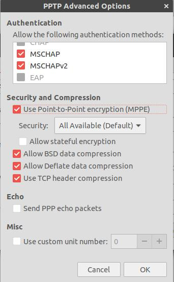
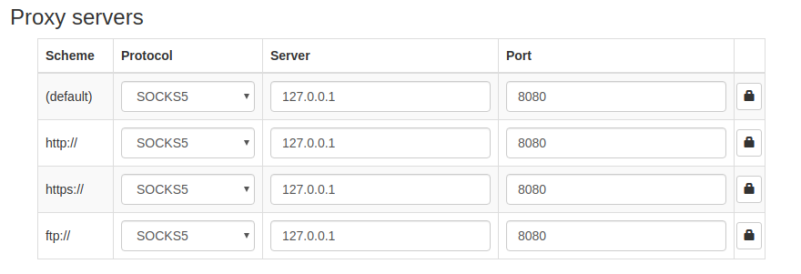
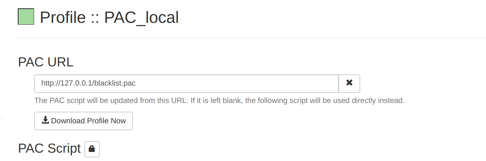

# ___2013-05-12 Ubuntu 使用与 shell 命令___
***

## 目录
  <!-- TOC depthFrom:1 depthTo:6 withLinks:1 updateOnSave:1 orderedList:0 -->

  - [___2013-05-12 Ubuntu 使用与 shell 命令___](#2013-05-12-ubuntu-使用与-shell-命令)
  	- [目录](#目录)
  - [参数](#参数)
  	- [Q / A](#q-a)
  	- [apt-get](#apt-get)
  	- [echo](#echo)
  	- [ls](#ls)
  	- [ps](#ps)
  	- [df / du / dd](#df-du-dd)
  	- [date](#date)
  	- [head / tail](#head-tail)
  	- [gcc](#gcc)
  	- [chroot](#chroot)
  - [配置](#配置)
  	- [Q / A](#q-a)
  	- [环境变量](#环境变量)
  	- [SSH](#ssh)
  	- [SSH Q / A](#ssh-q-a)
  	- [samba 配置](#samba-配置)
  	- [samba Q / A](#samba-q-a)
  	- [TFTP](#tftp)
  	- [NFS](#nfs)
  	- [Checking conflict IP](#checking-conflict-ip)
  	- [Service running on server](#service-running-on-server)
  	- [Ubuntu 中开机打开小键盘](#ubuntu-中开机打开小键盘)
  	- [Ubuntu 下汇编方法](#ubuntu-下汇编方法)
  	- [注销用户](#注销用户)
  	- [恢复/克隆的系统中用户文件(图片/文档等)未出现在【位置】列表中，且图标是默认文件夹图标](#恢复克隆的系统中用户文件图片文档等未出现在位置列表中且图标是默认文件夹图标)
  	- [ubuntu 12.04 开机自动挂载 windows 分区](#ubuntu-1204-开机自动挂载-windows-分区)
  	- [swap](#swap)
  	- [Apache](#apache)
  	- [IBus 中文输入法](#ibus-中文输入法)
  	- [触控板右键](#触控板右键)
  	- [grub](#grub)
  	- [坏块检测 badblocks](#坏块检测-badblocks)
  	- [NTFS disk mount error](#ntfs-disk-mount-error)
  	- [挂载与格式化](#挂载与格式化)
  	- [gsettings schema](#gsettings-schema)
  	- [发行版本信息](#发行版本信息)
  	- [journal](#journal)
  	- [unzip 中文乱码](#unzip-中文乱码)
  	- [docker 不使用 sudo 执行](#docker-不使用-sudo-执行)
  	- [nohup](#nohup)
  	- [静态 IP](#静态-ip)
  	- [更改登录界面](#更改登录界面)
    - [Ubuntu configure vpn](#ubuntu-configure-vpn)
  	- [Shadow socket 代理](#shadow-socket-代理)
  	- [每次开机时弹出 System problem report detected](#每次开机时弹出-system-problem-report-detected)
  	- [Nvidia](#nvidia)
  	- [tmux](#tmux)
  	- [制表符](#制表符)
  - [软件](#软件)
  	- [自动更新无法下载 adobe flashplayer](#自动更新无法下载-adobe-flashplayer)
  	- [wireshark 配置](#wireshark-配置)
  	- [png 图片形式文档转文字](#png-图片形式文档转文字)
  	- [compiz](#compiz)
  	- [VLC 显示中文字幕](#vlc-显示中文字幕)
  	- [Minicom](#minicom)
  	- [gedit 中文乱码](#gedit-中文乱码)
  	- [安装 emerald](#安装-emerald)
  	- [Install new cursor theme](#install-new-cursor-theme)
  	- [Conky](#conky)
  	- [Install SKY](#install-sky)
  	- [7z compress & extract](#7z-compress-extract)
  	- [evolution](#evolution)
  	- [Stardict](#stardict)
  	- [Cairo Dock](#cairo-dock)
  	- [Virtual box](#virtual-box)
  	- [Chrome](#chrome)
  	- [Numix FlatRemix 主题](#numix-flatremix-主题)
  	- [Shutter](#shutter)
  	- [gnome tweak tool](#gnome-tweak-tool)
  	- [多线程下载 mwget axel aria2](#多线程下载-mwget-axel-aria2)
  	- [Linux 百度云](#linux-百度云)
  	- [mplayer 视频流](#mplayer-视频流)
  	- [scrcpy](#scrcpy)
  	- [md5sum sha256sum](#md5sum-sha256sum)
  - [系统备份恢复](#系统备份恢复)
  	- [acloner 从 squashfs 备份恢复系统](#acloner-从-squashfs-备份恢复系统)
  	- [Ubuntu 系统的一种备份还原方法](#ubuntu-系统的一种备份还原方法)
  	- [UCloner](#ucloner)
  	- [Configure New System](#configure-new-system)
  - [制作 ISO 文件](#制作-iso-文件)

  <!-- /TOC -->
***

# 参数
## Q / A
  - root 不能删除 ldlinux.sys 文件
    ```shell
    $ sudo rm /cdrom/boot/ -rf
    rm: cannot remove '/cdrom/boot/extlinux/ldlinux.sys': Operation not permitted
    ```
    The immutable flag is set on that file. Use the
    ```shell
    lsattr ldlinux.sys
    ```
    command and look for the 'i' flag. If this is the case, use
    ```shell
    chattr -i ldlinux.sys
    ```
    to remove it
  - 编写 wxPython 程序时，总是报以下错误
    ```shell
    Gtk-Message: Failed to load module “canberra-gtk-module”
    ```
    解决办法
    ```shell
    apt-get install .*canberra.*gtk.*
    ```
## apt-get
  - **Q / A**
    ```c
    Q: The following packages have been kept back
    A: sudo apt-get -u dist-upgrade
    ```
  - **常用命令**
    - `apt-get --purge remove ...` 完全删除
    - `apt-get -f install` 修复依赖关系
    - `apt-get install -d foobar` 只下载不安装
    - `apt list --installed` 列出已安装的包
    - `apt search --names-only '^python'` 只匹配包名，默认在详细信息中匹配
  - 清理已卸载包配置文件
    ```sh
    apt list | grep -i residual-config
    aptitude -F %p search '~c' | sudo xargs dpkg -P
    ```
  - `The following signatures couldn't be verified because the public key is not available: NO_PUBKEY EB3E94ADBE1229CF`
    ```sh
    sudo apt-key adv --keyserver keyserver.ubuntu.com --recv-keys EB3E94ADBE1229CF
    ```
  - 404 error while apt-get install libssl-dev
    ```c
    check if
            $ sudo apt-get update
    meet any error like: Failed to fetch http://ppa.launchpad.net/ 404 Not Found

    remove that ppa from update-manager:
            $ /usr/bin/python3 /usr/bin/software-properties-gtk

    or remove it from /etc/apt/sources.list or /etc/apt/sources.list.d
    ```
  - Error sudo: add-apt-repository: command not found
    ```c
    To fix this error, you have to install the software-properties-common:
    $ sudo apt-get install software-properties-common
    This is all. Now your command for adding PPAs works like a charm.
    If you want to find out how I have fixed this error by myself, without external / Google help, read further.
    I have search with apt-file for the add-apt-repository and found out in which package is the command located.
    Apt file searches for files, inside packages and tells you in what package the file you had searched is located.
    It is not installed by default, so you need to do this:
    $ sudo apt-get install apt-file && apt-file update
    This is how you use apt-file for fishing files inside packages:
    $ apt-file search add-apt-repository
    python-software-properties: /usr/bin/add-apt-repository
    python-software-properties: /usr/share/man/man1/add-apt-repository.1.gz
    So, indeed, it is in the python-software-properties package.
    ```
  - If you prefer to use the command line or if there is no graphical installer available you can use this command as an administrator:
    ```c
    apt install teamviewer_11.0.xxxxx_i386.deb
    Older systems (Ubuntu 14.04, Debian 7 and below)
    Run this command:
    dpkg -i teamviewer_11.0.xxxxx_i386.deb
    In case dpkg indicates missing dependencies, complete the installation by executing the following command:
    apt-get install -f
    ```
  - **Error while `apt update`: packages have unmet dependencies**
    ```shell
    The following packages have unmet dependencies:
      libglx-mesa0 : Depends: libglapi-mesa (= 18.0.0~rc5-1ubuntu1) but 18.0.5-0ubuntu0~18.04.1 is installed
    ```
    **Install by `sudo dpkg -i --force-overwrite`**
    ```shell
    sudo dpkg -i --force-overwrite /var/cache/apt/archives/libglapi-mesa_18.0.5-0ubuntu0~18.04.1_amd64.deb
    sudo apt-get -f install
    ```
    **Error again**
    ```md
    dpkg: error processing archive /var/cache/apt/archives/libglx-mesa0_18.0.5-0ubuntu0~18.04.1_amd64.deb (--unpack):
     trying to overwrite '/usr/lib/x86_64-linux-gnu/libGLX_indirect.so.0', which is also in package nvidia-396 396.26-0ubuntu1
    Errors were encountered while processing:
     /var/cache/apt/archives/libglx-mesa0_18.0.5-0ubuntu0~18.04.1_amd64.deb
    ```
    **Install by overwrite again**
    ```shell
    sudo dpkg -i --force-overwrite /var/cache/apt/archives/libglx-mesa0_18.0.5-0ubuntu0~18.04.1_amd64.deb
    sudo apt-get -f install
    sudo apt autoremove

    dpkg: error processing archive /var/cache/apt/archives/nvidia-396_396.37-0ubuntu1_amd64.deb (--unpack):
    ```
  - 指定不更新某些包
    ```sh
    sudo apt-mark hold pkg1 [pkg2 ...]
    # 取消
    sudo apt-mark unhold pkg1 [pkg2 ...]
    ```
## echo
  - `echo $?` 打印终止状态
  - echo -n 'hello' 指定不换行
  - `echo "✨ 🍰 ✨"`
  - `echo -e 'hello\n'` 启用 `\` 转义字符
## ls
  - **-1** 每一项单独一行显示
  - **-d** 只列出目录，不显示目录中的内容
  - **-t** 时间顺序排序
  - **-r** 反序排列
  - **-S** 按照文件大小由到小排序
  - **--time-style** 指定时间格式 iso / full-iso / long-iso / local / +FORMAT
## ps
  - -a 显示有其他用户所拥有的进程的状态，
  - -x 显示没有控制终端的进程状态，
  - -j 显示与作业有关的信息：会话ID、进程组ID、控制终端以及终端进程组ID
  - ps aux 与 ps -aux 是不同的命令， ps -aux 将试图打印用户名为“x”的进程，如果该用户不存在则执行ps aux命令，并输出一条警告信息，ps -axj等是同样的结果
## df / du / dd
  - df命令用于查看一级文件夹大小、使用比例、档案系统及其挂入点：
    ```bash
    $ df -h  # -h表示 Human-readable 输出
    ```
  - du命令用于查询文件或文件夹的磁盘使用空间
    ```bash
    $ du -hd1  # -d1表示深度为1，若直接使用不带参数的du命令，将会循环列出所有文件和文件夹所使用的空间
    $ du -h --max-depth=1
    ```
  - 硬盘互刻
    ```bash
    df  # 查看当前系统躲在硬盘设备节点
    ls /dev/sd*  # 列出当前主机内所有硬盘
    dd if=/dev/sdb of=/dev/sda  # 将sdb硬盘内容复制到sda
    ```
  - 在已有分区上创建回环设备
    ```bash
    dd if=/dev/zero of=/dev/vdc bs=1024 count=0 seek=15000000
    mkfs.ext4 /dev/vdc
    mount /dev/vdc /media/cdrom0/
    ```
    - if=/dev/zero 表示空输入，即自动填充0
    - of= /srv/swift-disk 表示输出到指定文件
    - bs=1024 表示同时设置读入 / 输出的块大小（字节），即每次读入 / 输出1024字节的数据块
    - count=0 表示拷贝 0 个块，块大小由 bs 指定
    - seek=15000000 从输出文件开头跳过 15000000 个块后再开始复制
    - 命令的结果是创建了一个 15000000*1024 字节大小的文件（约15GB）
## cp / mv
  - `cp foo{,.bak}` 复制添加后缀
  - `mv {,_pre}foo` 添加前缀
## date
  - 格式化输出
    ```bash
    date "+%F %T %N %Z"
    2017-11-09 17:28:00 888225034 CST
    ```
  - 将日期转换为星期：
    ```c
    date -d "Jan 1 2000" +%A
    ```
  - 转换时区
    ```bash
    date -d "09:00 CET" +'%T %Z'
    16:00:00 CST
    ```
## head / tail
  - 显示文件中间几行内容:
    ```c
    cat -n hug-tool.txt | head -n 10 | tail -n +5
    cat -n hug-tool.txt | sed -n '5,10p'
    ```
## gcc
  - 查看gcc版本号：gcc --version
  - 显示 gcc 当前搜索库文件的路径
    ```shell
    gcc -print-search-dirs
    /opt/toolchains/crosstools-mips-gcc-4.6-linux-3.4-uclibc-0.9.32-binutils-2.21/usr/bin/mips-unknown-linux-uclibc-gcc -print-search-dirs
    ```
  - 使用 /etc/ld.so.conf 文档，将用到的库所在文档目录添加到此文档中，然后使用ldconfig命令刷新缓存
    ```shell
    export LD_LIBRARY_PATH=$LD_LIBRARY_PATH:/usr/local/arm/2.95.3/arm-linux-lib
    export PATH=/usr/local/samba/bin/:/usr/local/samba/sbin/:$PATH
    ```
## chroot
  - 切换根目录，并使用该目录下的文件 / 命令，需要有完整的命令与库支持
    ```shell
    chroot /media/cdrom0 ls /home
    chroot /media/cdrom0 update-grub
    ```
## history
  - 清空 history
    ```sh
    echo "" > ~/.bash_history && history -c
    ```
***

# 配置
## Q / A
  - 使用 PS1=user$: 命令临时更改显示的命令提示符
    ```c
    PS1='[\u@\h: $PWD]# '
    ```
    ubuntu不能man pthread库函数：
    ```c
    sudo apt-get install manpages-posix-dev
    ```
  - 禁用PrintScreen截屏
    ```shell
    系统设置 ---> 键盘 ----> 快捷键 ----> 截图
    ```
  - 通过 DNS 来读取 Wikipedia 的词条
    ```shell
    dig +short txt <keyword>.wp.dg.cx
    ```
  - Windows下拷贝ubuntu镜像到u盘，会造成文件名被截短，在安装过程中提示md5验证失败

    - 解决： 将镜像文件在ubuntu下挂载后复制到u盘
  - mtd 设备
    ```shell
    cd /run/user/1000/gvfs/mtp:host=%5Busb%3A003%2C003%5D/
    alias Myphone='cd /run/user/*/gvfs/* && PRINTF_CYAN `pwd -P` && ls'
    ```
  - JPEG error
    - Not a JPEG file: starts with 0x89 0x50
    - The file is actually a PNG with the wrong file extension. "0x89 0x50" is how a PNG file starts. Rename it to png
  - useradd -p 指定的密码无效
    - 此时 /etc/shadow 中的密码是明文，需要通过 passwd / chpasswd 修改
      ```bash
      useradd -p 'pass' test
      echo 'test:pass' | chpasswd
      ```
  - Q: No space left on device issue in ipython
    ```sh
    inotify_add_watch("/home/leondgarse/.config/ibus/bus/78662965650b42b69556e5096cb9459c-unix-0") failed: "No space left on device"
    ```
    A: 用户定义的文件 inode 数量达到上限
    ```sh
    sudo sysctl fs.inotify.max_user_watches
    # fs.inotify.max_user_watches = 8192
    ```
    可以调整上限值
    ```sh
    echo fs.inotify.max_user_watches=65536 | sudo tee -a /etc/sysctl.conf && sudo sysctl -p
    ```
    ```sh
    ENOSPC -
    "The user limit on the total number of inotify watches was reached or the kernel failed to allocate a needed resource."

    There is one inotify watch per folder, so too many folders being watched is the problem. Since the error message is talking about a user limit, this probably can be tweaked somewhere.
    ```
  - Q: tar 解压时报错 `/usr/bin/gzip: 1: ELF: not found`
    ```sh
    /usr/bin/gzip: 1: ELF: not found
    /usr/bin/gzip: 3: : not found
    /usr/bin/gzip: 4: Syntax error: "(" unexpected
    ```
    A: 修改 gzip
    ```sh
    echo -en '\x10' | sudo dd of=/usr/bin/gzip count=1 bs=1 conv=notrunc seek=$((0x189))
    ```
## 环境变量
  - 修改：sudo vi /etc/environment添加，或者vi ~/.bashrc添加
    ```c
    source /etc/environment 是配置生效
    ```
  - 误操作环境变量文件/etc/environment，会造成无法登录的状况，ubuntu13.04下字符界面使用
    ```c
    命令：/usr/bin/sudo /usr/bin/vi /etc/environment
    ```
  - `sudo` 与 `root` 使用的环境变量是不同的
    ```sh
    $ cat /etc/environment
    # PATH=/usr/local/sbin:/usr/local/bin:/usr/sbin:/usr/bin:/sbin:/bin:/snap/bin:/aaa

    $ sudo su -c 'echo $PATH'
    # PATH=/usr/local/sbin:/usr/local/bin:/usr/sbin:/usr/bin:/sbin:/bin:/snap/bin:/aaa

    $ sudo sh -c 'echo $PATH'
    # /usr/local/sbin:/usr/local/bin:/usr/sbin:/usr/bin:/sbin:/bin:/snap/bin
    ```
    其中 `sudo` 的环境变量路径来自 `/etc/sudoers`
    ```sh
    Defaults    secure_path="/usr/local/sbin:/usr/local/bin:/usr/sbin:/usr/bin:/sbin:/bin:/snap/bin"
    ```
## SSH
  - Ubuntu使用SSH访问远程Linux服务器
    ```shell
    $ ssh leondgarse@192.168.7.11
    ```
  - ssh配置文件
    ```shell
    man ssh_config
    ```
  - ssh key fingerprint
    ```shell
    $ ssh-keygen -lf ~/.ssh/id_rsa.pub
    其中
    -l means "list" instead of create a new key
    -f means "filename"
    ```
    With newer versions of ssh-keygen, run
    ```shell
    ssh-keygen -E md5 -lf <fileName>
    ```
    if you want the same format as old ssh-keygen -lf also works on known_hosts and authorized_keys files
  - **ssh-add -l** is very similar but lists the fingerprints of keys added to your agent
  - ssh Escape character
    - **~?** 显示所有命令
    - **~.** 退出SSH连接
    - **~~** 输入~
  - Save ssh output to a local file
    ```shell
    ssh user@host | tee -a logfile
    ```
  - SSH 使用代理连接
    ```shell
    # Install Corkscrew
    sudo apt-get install corkscrew

    # Add ProxyCommand to your SSH config file $HOME/.ssh/config
    Host *
    ProxyCommand corkscrew http-proxy.example.com 8080 %h %p

    # example
    ssh username@ip -p port
    scp -P port -r ./test username@ip:/home/test/    
    ```
    或者参照 man ssh_config 使用 nc 命令
    ```shell
    # vi ~/.ssh/config
    # ProxyCommand
    HOST 192.0.2.0:
        ProxyCommand /usr/bin/nc -X connect -x 192.0.2.0:8080 %h %p
    ```
  - 将本地输出重定向到 SSH 远程文件
    ```sh
    echo "Hello world" | ssh tdtest@192.168.0.83 "sh -c 'cat > foo'"
    ssh tdtest@192.168.0.83 "cat foo"
    # Hello world
    ```
## SSH Q / A
  - Q: ssh: connect to host 135.251.168.141 port 22: Connection refused
    ```shell
    apt-get install openssh-server
    ```
  - Q: 解决ssh的 **Write failed: Broken pipe** 问题
    - 用 ssh 命令连接服务器之后，如果一段时间不操作，再次进入 Terminal 时会有一段时间没有响应，然后就出现错误提示
      ```c
      Write failed: Broken pipe
      ```
      只能重新用 ssh 命令进行连接
    - 方法一 如果您有多台服务器，不想在每台服务器上设置，只需在客户端的 ~/.ssh/ 文件夹中添加 config 文件，并添加下面的配置：
      ```shell
      ServerAliveInterval 60
      ```
    - 方法二 如果您有多个人管理服务器，不想在每个客户端进行设置，只需在服务器的 /etc/ssh/sshd_config 中添加如下的配置：
      ```shell
      ClientAliveInterval 60
      ```
    - 方法三 如果您只想让当前的 ssh 保持连接，可以使用以下的命令：
      ```shell
      $ ssh -o ServerAliveInterval=60 user@sshserver
      ```
    - If you use tmux + ssh, you can use the following configuration file to make all the ssh session keep alive:
      ```shell
      $ cat ~/.ssh/config
      Host *
      ServerAliveInterval 60
      ```
  - Q: ssh-add :Could not open a connection to your authentication agent
    - 执行ssh-add /path/to/xxx.pem出现错误
      ```shell
      Could not open a connection to your authentication agent
      ```
    - 执行如下命令
      ```shell
      ssh-agent bash
      ```
  - Q: no matching key exchange method found. Their offer: diffie-hellman-group1-sha1
    - possible solution
      ```
      The problem isn't the cipher as much as the key exchange.
      Newer open ssh dropped support (by default) for "insecure" key exchanges (SHA1) which are all that are supported by older ios/etc. gear.
      I've been updating code on boxes where possible to eliminate this issue but it's really an easy fix.
      In /etc/ssh/ssh_config:
      Host *
      GSSAPIAuthentication yes
      KexAlgorithms +diffie-hellman-group1-sha1

      That will add the old kex to your ssh (outbound) and should work ok.
      ```
  - Q: no matching host key type found. Their offer: ssh-dss
    - possible solution
      ```c
      The recent openssh version deprecated DSA keys by default.
      You should pursuit your GIT provider to add some reasonable host key. Relying only on DSA is not a good idea.
      As a workaround, you need to tell your ssh client that you want to accept DSA host keys, as described in the official documentation for legacy usage.
      You have few possibilities, but I recommend to add these lines into your ~/.ssh/config file:
      Host your-host
        HostkeyAlgorithms +ssh-dss
      ```
## samba 配置
  - **samba 安装**
    ```shell
    $ sudo apt-get install samba samba-common smbclient
    ```
  - **创建 Samba 配置文件**
    ```shell
    $ sudo vim /etc/samba/smb.conf

    # 在 smb.conf 最后添加
    [username_workspace]
    comment = username_workspace
    path = /home/username/workspace
    create mask = 0755
    directory mask = 0755
    available = yes
    browseable = yes
    public = yes
    writable = yes
    valid user = username
    force user = username
    force group = username
    ```
  - **重启 samba 服务器**
    ```shell
    $ sudo /etc/init.d/smbd reload (修改过 smb.conf 的话要执行一次)
    $ sudo /etc/init.d/smbd restart
    ```
    Or
    ```shell
    $ /etc/rc.d/init.d/smb reload
    $ /etc/rc.d/init.d/smb restart
    ```
  - **查看目标服务器所有的共享目录**
    ```shell
    $ smbclient -L 192.168.7.11 -U leondgarse%123456
    ```
  - **将目标服务器的共享目录挂载到/media/samba目录下**
    ```shell
    # uid / gid 为本地用户的 uid / gid
    # mfsymlinks 指定客户端可以使用 ln 创建软链接
    $ sudo mount -t cifs -o uid=1000,gid=1000,file_mode=0777,dir_mode=0777,mfsymlinks,username=leondgarse,password=123456 //192.168.7.11/leondgarse /media/samba/
    ```
  - **开机自动启动samba服务**
    ```shell
    $ sudo vi /etc/init/samba.conf

    # 添加一行
    start on (local-filesystems and net-device-up)
    ```
  - **关闭**
    ```shell
    $ sudo sed -i 's/start on/# &/' /etc/init/smbd.conf
    ```
## samba Q / A
  - **Q: session setup failed: NT_STATUS_LOGON_FAILURE**
    ```shell
    $ smbclient -L 135.252.28.161 -U test%123456
    WARNING: The "syslog" option is deprecated
    session setup failed: NT_STATUS_LOGON_FAILURE
    ```
    A: 执行 smbclient 命令的用户 ID 没有成为 samba 服务的用户，需要在服务器端添加
    ```shell
    $ smbpasswd -a test
    New SMB password:
    Retype new SMB password:
    Added user test.
    ```
  - **Q: Error NT_STATUS_HOST_UNREACHABLE**
    ```shell
    WARNING: The "syslog" option is deprecated
    Connection to 135.252.28.162 failed (Error NT_STATUS_HOST_UNREACHABLE)  
    ```
    A: 需要在防火墙规则里允许 samba 端口，smbd 为 clinet 提供资源访问 tcp 139 445
    ```shell
    $ vi /etc/sysconfig/iptables
    # Add
    -A INPUT -m state --state NEW -m tcp -p tcp --dport 139 -j ACCEPT

    # 重启 iptables
    $ service iptables restart
    ```
  - **Q: 配置 Samba 账户与系统密码同步，支持用户直接修改自己的登录密码**
    ```shell
    # 系统密码与 samba 密码是分开设置的
    $ passwd test
    $ smbpasswd -a test
    ```
    A: 利用 PAM 同步更改 samba 密码
    ```shell
    $ vi /etc/pam.d/system-auth
    # Add after
    # password    requisite     pam_cracklib.so try_first_pass retry=3 type=
    password    required      pam_smbpass.so nullok use_authtok try_first_pass
    ```
    使用 **passwd** 命令可以同步更改 samba 密码
  - **Q: Ubuntu 下使用 mount 挂载 Samba 目录没有写权限**
    ```shell
    #             用户  组
    -rw-r--r--  1 1066 leondgarse 9402 3月   7 12:19 foo
    ```
    A: 添加对应的 samba 用户，同时在 mount 时，指定 uid / gid
    ```shell
    sudo smbpasswd -a test

    # uid / gid 为本地用户的 uid / gid
    $ sudo mount -t cifs -o uid=1000,gid=1000,file_mode=0777,dir_mode=0777,username=leondgarse,password=123456 //192.168.7.11/leondgarse /media/samba/
    ```
## TFTP
  - tftp / tftpd 设置TFTP 服务
    ```c
    sudo apt-get install tftp tftpd
    sudo apt-get install openbsd-inetd

    sudo mkdir /tftpboot
    sudo chmod 777 /tftpboot -R

    sudo vi /etc/inetd.conf
    在里面填入如下一行:
    tftp dgram udp wait nobody /usr/sbin/tcpd /usr/sbin/in.tftpd /tftpboot

    新建 /etc/default/tftpd-hpa
    #Defaults for tftpd-hpa
    RUN_DAEMON="yes"
    OPTIONS="-l -s /tftpboot"

    $ sudo /etc/init.d/openbsd-inetd reload
    $ sudo /etc/init.d/openbsd-inetd restart
    ```
  - tftp-hpa / tftpd-hpa 设置TFTP 服务
    ```c
    查看源中tftp相关的应用：
    apt-cache search tftpd

    安装tftp-hpa tftpd-hpa:
    sudo apt-get install tftpd-hpa tftp-hpa

    查看tftp服务状态
    sudo service tftpd-hpa status
    或
    netstat -a | grep tftp	# 没有输出

    默认的配置文件：
    /etc/default/tftpd-hpa

    默认tftp根路径：
    /srv/tftp

    配置：
    sudo cp /etc/default/tftpd-hpa /etc/default/tftpd-hpa.ORIGINAL	# 备份
    sudo vi /etc/default/tftpd-hpa
    配置项
        TFTP_OPTIONS="--secure --create"	# 支持创建新文件
        TFTP_DIRECTORY="/tftpboot"	# 修改根路径

    修改根目录权限
    sudo chown -R tftp /tftpboot

    重启服务
    sudo service tftpd-hpa restart

    上传 / 下载
    tftp 127.0.0.1 -c put foo
    tftp 127.0.0.1 -c get foo
    ```
  - tftp中put 命令Access Violation错误：Error code 2: Access violation
    ```c
    tftp服务器缺少必要的身份验证，要上传文件，必须是服务器中已存在同名的文件，且该文件权限允许被覆盖
    首先在服务中创建一个与要上传的文件同名的文件，并更改权限为777
    $ touch a
    $ chmod 777 a
    ```
  - 上传二进制文件时错误 Check data fail, upload failed
    ```c
    linux下tftp默认格式是ascii，尝试指定mode 为 binary
        tftp -m binary 127.0.0.1 -c put foo
    ```
## NFS
  - 安装 NFS server
    ```shell
    sudo apt-get install nfs-kernel-server
    ```
  - 添加目标系统的根文件系统映射目
    ```shell
    sudo vi /etc/exports
    # 添加
    /opt/NFS/ *(subtree_check,rw,no_root_squash,async)
    ```
  - 重启服务
    ```shell
    sudo /etc/init.d/nfs-kernel-server restart
    sudo exportfs -a
    ```
  - 挂载测试
    ```shell
    sudo mount 127.0.0.1:/opt/NFS /media/cdrom0/ -t nfs
    ```
## Checking conflict IP
  - $ sudo apt-get install arp-scan
  - $ sudo arp-scan -I eth0 -l | grep 192.168.1.42
    ```c
    192.168.1.42 d4:eb:9a:f2:11:a1 (Unknown)
    192.168.1.42 f4:23:a4:38:b5:76 (Unknown) (DUP: 2)
    ```
## Service running on server
  - Use nmap tool to know which ports are open in that server. nmap is a port scanner. Since it may be possible that ssh server is running on a different port. nmap will give you a list of ports which are open.
    ```c
    $ nmap myserver
    ```
    Now you can check which server is running on a given port. Suppose in the output of nmap, port 2424 is open. Now you can which server is running on 2424 by using nc(netcat) tool.
    ```c
    $ nc -v -nn myserver portno
    ```
    Suppose the output of 2424 port is:
    ```c
    myserver 2424 open
    SSH-2.0-OpenSSH_5.5p1 Debian-4ubuntu5
    ```
    This means ssh is running on 2424.
## Ubuntu 中开机打开小键盘
  - 解决方法
    ```c
    $ sudo apt-get install numlockx
    $ sudo vi /etc/lightdm/lightdm.conf
    末尾添加 greeter-setup-script=/usr/bin/numlockx on

    For Ubuntu Gnome and Xubuntu XFCE (GDM)：
    $ sudo apt-get install numlockx
    $ sudo gedit /etc/gdm/Init/Default

    末尾添加：
    if [ -x /usr/bin/numlockx ]; then
            /usr/bin/numlockx on
    fi
    ```
## Ubuntu 下汇编方法
  - as / objdump
    ```shell
    $ vi hello.s
    $ as -o hello.o hello.s
    $ ld -s -o hello hello.o
    $ ./hello
    ```
  - 反汇编
    ```shell
    $ objdump -D hello
    ```
## 注销用户
  - kill / pkill / pgrep
    ```c
    $ killall gnome-session                // 结束gnome-session进程
    $ pkill -KILL -u {username}        // 给用户名为{username}的进程发送-KILL信号
    $ pgrep -u {username} -l        // 查找当前进程中用户名为{username}的进程，并列出进程pid与名称
    $ pkill -kill -t pts/1                // 注销指定的远程终端
    ```
## 恢复/克隆的系统中用户文件(图片/文档等)未出现在【位置】列表中，且图标是默认文件夹图标
  - 创建软连接
    ```shell
    mkdir Music Documents Downloads Pictures Videos

    ln -fs /media/D/Users/edgerw/* ~/

    ln -s /media/leondgarse/Grandfile_Seag/Downloads/ ~/
    ln -s /media/leondgarse/Grandfile_Seag/Documents/ ~/
    ln -s /media/leondgarse/Grandfile_Seag/Music/ ~/
    ln -s /media/leondgarse/Grandfile_Seag/Pictures/ ~/
    ln -s /media/leondgarse/Videos_Seag/ ~/Videos
    ```
  - xdg-user-dirs-gtk-update
    ```c
    $ xdg-user-dirs-gtk-update         //xdg-user-dirs用于在不同的语言下自动创建一些经常用到的目录

    若不成功，则可尝试修改语言为英文，再改回中文：
    export LANG=en_US
    xdg-user-dirs-gtk-update
    export LANG=zh_CN.UTF-8
    xdg-user-dirs-gtk-update

    如果在执行xdg-user-dirs-gtk-update命令时选择了不再提示，可执行一下命令恢复：
    echo zh_CN > ~/.config/user-dirs.locale
    ```
  - 迁移用户文件夹
    ```c
    vi ~/.config/user-dirs.dirs 填入相应路径
    创建目标路径软连接到用户目录
    ```
## ubuntu 12.04 开机自动挂载 windows 分区
  - 查看UUID # blkid
    ```c
    /dev/sda1: UUID="064CE4C44CE4AF9B" TYPE="ntfs"
    /dev/sda2: UUID="46D07D1ED07D1601" TYPE="ntfs"
    /dev/sda5: UUID="0bc1ef30-260c-4746-88c4-fd6c245882ea" TYPE="swap"
    /dev/sda6: UUID="53bc0a32-b32e-4f85-ad58-e3dbd9a3df41" TYPE="ext4"
    /dev/sda7: UUID="2fc00def-79d7-421e-92f1-e33e46e74c66" TYPE="ext4"
    ```
  - 查看分区 # fdisk -l
    ```c
    Disk /dev/sda: 112.8 GB, 112774965760 bytes
    255 heads, 63 sectors/track, 13710 cylinders, total 220263605 sectors
    Units = 扇区 of 1 * 512 = 512 bytes
    Sector size (logical/physical): 512 bytes / 512 bytes
    I/O size (minimum/optimal): 512 bytes / 512 bytes
    Disk identifier: 0xd10cd10c

      设备 启动   起点     终点   块数  Id 系统
    /dev/sda1  *    2048  46139391  23068672  7 HPFS/NTFS/exFAT
    /dev/sda2    46139392  119539711  36700160  7 HPFS/NTFS/exFAT
    /dev/sda3    119541758  220262399  50360321  5 扩展
    /dev/sda5    119541760  123539805   1999023  82 Linux 交换 / Solaris
    /dev/sda6    123541504  181200895  28829696  83 Linux
    /dev/sda7    181202944  220262399  19529728  83 Linux

    Partition table entries are not in disk order
    ```
  - 创建挂载点
    ```c
    在/media下创建C,D,E三个目录，命令如下：
    $ sudo mkdir /media/C
    $ sudo mkdir /media/D
    $ sudo mkdir /media/E
    ```
  - 编辑/etc/fstab文件
    ```c
    # vi /etc/fstab

    在这个文件中加入如下信息
    # These is used for auto mount Windows disks on boot up.
    UUID=064CE4C44CE4AF9B /media/C ntfs defaults,codepage=936,iocharset=gb2312 0 0
    UUID=46D07D1ED07D1601 /media/D ntfs defaults,codepage=936,iocharset=gb2312 0 0
    UUID=629AFA8D9AFA5D4B /media/E ntfs defaults,codepage=936,iocharset=gb2312 0 0
    ```
## swap
  - How do I add a swap file?
    ```
    Note: btrfs does not support swap files at the moment. See man swapon. and btrfs Faq
    Create the Swap File:
    We will create a 1 GiB file (/mnt/1GiB.swap) to use as swap:
    sudo fallocate -l 1g /mnt/1GiB.swap
    fallocate size suffixes: g = Giga, m = Mega, etc. (See man fallocate).
    If fallocate fails or it not available, you can use dd:
    sudo dd if=/dev/zero of=/mnt/1GiB.swap bs=1024 count=1048576
    We need to set the swap file permissions to 600 to prevent other users from being able to read potentially sensitive information from the swap file.
    sudo chmod 600 /mnt/1GiB.swap
    Format the file as swap:
    sudo mkswap /mnt/1GiB.swap
    Enable use of Swap File
    sudo swapon /mnt/1GiB.swap
    The additional swap is now available and verified with: cat /proc/swaps
    Enable Swap File at Bootup
    Add the swap file details to /etc/fstab so it will be available at bootup:
    echo '/mnt/1GiB.swap swap swap defaults 0 0' | sudo tee -a /etc/fstab
    Example of making a swap file
    This is an example of making and using a swap file on a computer with no swap partition.
    $ sudo fallocate -l 1g /mnt/1GiB.swap
    $ sudo chmod 600 /mnt/1GiB.swap
    $ sudo mkswap /mnt/1GiB.swap
    Setting up swapspace version 1, size = 1048576 kB
    $ sudo swapon /mnt/1GiB.swap
    $ cat /proc/swaps
    Filename                                Type            Size    Used    Priority
    /home/swapfile                          file            1048576 1048576 -1
    $ echo '/mnt/4GiB.swap swap swap defaults 0 0' | sudo tee -a /etc/fstab
    $ reboot
    $ free -h
                  total        used        free      shared  buff/cache   available
    Mem:            15G        9.3G        454M        4.0G        5.8G        1.9G
    Swap:          1.0G        1.0G          0B
    Disable and Remove a Swap File
    Disable the swap file from the running system and the delete it:
    sudo swapoff /mnt/1Gib.swap
    sudo rm /mnt/1Gib.swap
    Remove the swap file details from fstab:
    gksudo gedit /etc/fstab
    Removing the swap file line
    /mnt/1GiB.swap swap swap defaults 0 0
    ```
  - What is swappiness and how do I change it?
    ```
    The swappiness parameter controls the tendency of the kernel to move processes out of physical memory and onto the swap disk. Because disks are much slower than RAM, this can lead to slower response times for system and applications if processes are too aggressively moved out of memory.
    swappiness can have a value of between 0 and 100
    swappiness=0 tells the kernel to avoid swapping processes out of physical memory for as long as possible
    swappiness=100 tells the kernel to aggressively swap processes out of physical memory and move them to swap cache
    The default setting in Ubuntu is swappiness=60. Reducing the default value of swappiness will probably improve overall performance for a typical Ubuntu desktop installation. A value of swappiness=10 is recommended, but feel free to experiment. Note: Ubuntu server installations have different performance requirements to desktop systems, and the default value of 60 is likely more suitable.
    To check the swappiness value
    cat /proc/sys/vm/swappiness
    To change the swappiness value A temporary change (lost on reboot) with a swappiness value of 10 can be made with
    sudo sysctl vm.swappiness=10
    To make a change permanent, edit the configuration file with your favorite editor:
    gksudo gedit /etc/sysctl.conf
    Search for vm.swappiness and change its value as desired. If vm.swappiness does not exist, add it to the end of the file like so:
    vm.swappiness=10
    Save the file and reboot.
    What is the priority of swap containers?
    The Linux kernel assigns priorities to all swap containers. To see the priorities that the Linux Kernel assigns to all the swap containers use this command.
    cat /proc/swaps
    Priorities can be changed by using the swapon command or defined in /etc/fstab. Consult the manual page of swapon for more info
    man swapon
    Should I reinstall with more swap?
    Definitely not. With the 2.6 kernel, "a swap file is just as fast as a swap partition."(Wikipedia:Paging, LKML).
    Why is my swap not being used?
    My swap is not being used! When I issue the free command, it shows something like this:
    tom@tom:~$ free
                 total       used       free     shared    buffers     cached
    Mem:        515980     448664      67316          0      17872     246348
    -/+ buffers/cache:     184444     331536
    Swap:       674688          0     674688
    Note: This regards mainly swap on hard disk partitions, but it could help anyway. In these examples /dev/hda8 is considered as swap.
    Swap may not be needed
    Start many memory consuming applications (e.g. Gimp, web browsers, LibreOffice etc) and then issue the free command again. Is swap being used now?
    Ubuntu Desktop uses Swap to Hibernate (PC off, no power needed, program states saved). If Hibernation is important to you, have more swap space than ram + swap overflow.
    Is there a swap partition at all?
    Use this command to see all partitions
    sudo fdisk -l
    You should be able to see something like this in the output
    /dev/hda8            4787        4870      674698+  82  Linux swap / Solaris
    If not, you either need to create a swapfile or create a swap partition. To create a swap partition you can
    boot from your Ubuntu install CD, create a swap partition out of the free space on your hard disk and then interrupt your installation.
    use Cfdisk.
    Enabling a swap partition
    In case you do have a swap partition, there are several ways of enabling it.
    Use the following command
    cat /etc/fstab
    Ensure that there is a line link below. This enables swap on boot.
    /dev/hda8       none            swap    sw              0       0
    Then disable all swap, recreate it, then re-enable it with the following commands.
    sudo swapoff -a
    sudo /sbin/mkswap /dev/hda8
    sudo swapon -a
    Empty Swap
    Even if you have lots of RAM and even if you have a low swappiness value, it is possible that your computer swaps. This can hurt the multitasking performance of your desktop system.
    You can use the following script to get the swap manually back into RAM:
    Place the script e.g. /usr/local/sbin:
    gksudo gedit /usr/local/sbin/swap2ram.sh
    Copy-paste the script into the file:
    #!/bin/sh

    mem=$(LC_ALL=C free  | awk '/Mem:/ {print $4}')
    swap=$(LC_ALL=C free | awk '/Swap:/ {print $3}')

    if [ $mem -lt $swap ]; then
        echo "ERROR: not enough RAM to write swap back, nothing done" >&2
        exit 1
    fi

    swapoff -a &&
    swapon -a
    Save and close gedit
    Make the script executable:
    sudo chmod +x /usr/local/sbin/swap2ram.sh
    Execute:
    sudo /usr/local/sbin/swap2ram.sh
    ```
## Apache
  ```shell
  # 安装
  sudo apt-get install apache2

  # Apache 配置文件
  /etc/apache2/apache2.conf

  # HTML 文件默认路径
  /var/www/html/
  ```
## IBus 中文输入法
  - Install IBus
    ```shell
    # 中文
    sudo apt-get install ibus ibus-libpinyin

    # 日本語
    sudo apt-get install ibus-anthy
    ```
  - 配置
    - language Support -> Keyboard input method system -> IBus
    - Setting -> Region & Language -> Add -> Chinese -> Chinese (Intelligent Pinyin)
    - Setting -> Region & Language -> Options -> Allow different sources for each window
    - Setting -> Region & Language -> Anthy Options --> General --> Input Method --> Hiragana
  - 系统输入法选择为 IBus 时会自动清除选中的文本，如果是英文输入法就没有这个问题
    - 终端中 ibus-setup
    - 勾掉 在应用窗口中启用内嵌编辑模式(Embed preedit text in application window)
  - `ibus-setup` 报错 `No module named 'gi'``
    ```shell
    Traceback (most recent call last):
      File "/usr/share/ibus/setup/main.py", line 34, in <module>
        from gi import require_version as gi_require_version
    ModuleNotFoundError: No module named 'gi'
    ```
    sudo vi /usr/bin/ibus-setup
    ```shell
    - exec python3 /usr/share/ibus/setup/main.py $@
    + exec python2 /usr/share/ibus/setup/main.py $@
    ```
    sudo vi /usr/lib/ibus/ibus-setup-anthy
    ```shell
    - exec python3 /usr/share/ibus-anthy/setup/main.py $@
    + exec python2 /usr/share/ibus-anthy/setup/main.py $@
    ```
  - `ibus-setup` 报错 `Non-ASCII character '\xf0'`
    ```shell
      File "/usr/share/ibus/setup/main.py", line 285
    SyntaxError: Non-ASCII character '\xf0' in file /usr/share/ibus/setup/main.py on line 285, but no encoding declared
    ```
    修改 /usr/share/ibus/setup/main.py, line 285 中的表情符号为任意字母
  - `ibus-setup-anthy` 报错 `chr() arg not in range(256)``
    ```sh
    sudo vi /usr/share/ibus-anthy/setup/_config.py
    - SYMBOL_CHAR = chr(0x3042)
    + SYMBOL_CHAR = unichr(0x3042)
    ```
  - **Build ibus-pinyin from source**
    ```sh
    sudo apt remove ibus-pinyin
    sudo apt install gnome-common libpyzy-dev

    git clone https://github.com/ibus/ibus-pinyin.git
    cd ibus-pinyin/
    ./autogen.sh
    make
    sudo make install
    ```
## 触控板右键
  - gnome-tweak-tool
  - Keyboard & Mouse -> Mouse Click Emulation
## grub
  - grub配置文件 /etc/default/grub 与 /etc/grub.d 目录下的对应文件，如修改分辨率、等待时间等可通过修改 /etc/default/grub 实现
  - 修改grub背景图片：
    ```c
    sudo cp xxx.jpg /boot/grub/back.jpg
    sudo update-grub 重启即可
    ```
  - 更改 grub 背景主题
    ```c
    将下载的主题文件解压到/boot/grub/themes文件夹中（没有的自己创建）
    然后修改/etc/default/grub
    加入：GRUB_THEME="/boot/grub/themes/******/theme.txt"（主题名自己设置）
    然后sudo grub-update
    ```
  - [Github vinceliuice/grub2-themes](https://github.com.cnpmjs.org/vinceliuice/grub2-themes.git)
  - grub rescue
    ```shell
    # 查找 boot 目录
    grub rescue > ls  # 查看当前磁盘信息
    grub rescue > ls (hd0,msdos2)/boot  # boot 没有单独分区
    grub rescue > ls (hd0,msdos2)/grub  # boot 单独分区

    # 临时将 grub 的两部分关联起来
    grub rescue > set root=(hd0,msdos2)
    grub rescue > set prefix=(hd0,msdos2)/boot/grub   # boot 没有单独分区
    grub rescue > set prefix=(hd0,msdos2)/grub   # boot 单独分区
    grub rescue > insmod normal
    grub rescue > normal

    # 进入正常的 grub 模式，进入系统
    $ sudo update-grub
    $ sudo grub-install /dev/sda3
    $ sudo grub-install /dev/sda
    ```
  - grub-install 错误 /usr/lib/grub/i386-pc doesnt exist
    ```shell
    grub-install: error: /usr/lib/grub/i386-pc/modinfo.sh doesnt exist. Please specify --target or --directory.
    ```
    安装 grub-pc
    ```shell
    sudo apt-get install grub-pc
    ```
## 坏块检测 badblocks
  - badblocks
    - **-s** 在检查时显示进度
    - **-v** 执行时显示详细的信息
    ```shell
    badblocks -sv /dev/sdb
    ```
  - **fsck 使用 badblocks 的信息**，badblocks 只会在日志文件中标记出坏道的信息，但若希望在检测磁盘时也能跳过这些坏块不检测，可以使用 **fsck 的 -l 参数**
    ```shell
    fsck.ext3 -l /tmp/hda-badblock-list.final /dev/hda1
    ```
  - **在创建文件系统前检测坏道**，badblocks 可以随 e2fsck 和 mke2fs 的 -c 删除一起运行（对ext3文件系统也一样），在创建文件系统前就先检测坏道信息
    ```shell
    # -c 在创建文件系统前检查坏道的硬盘
    mkfs.ext3 -c /dev/hda1
    ```
  - 扫描完成后，如果损坏区块被发现了，通过 e2fsck 命令使用“bad-blocks.txt”，强迫操作系统不使用这些损坏的区块存储数据
    ```shell
    sudo e2fsck -l /tmp/bad-blocks.txt /dev/sdb
    ```
    在运行e2fsck命令前，请保证设备没有被挂载
## NTFS disk mount error
  - Linux 挂载 Windows 磁盘后处于只读状态
    ```shell
    The disk contains an unclean file system (0, 0).
    Metadata kept in Windows cache, refused to mount.
    Falling back to read-only mount because the NTFS partition is in an
    unsafe state. Please resume and shutdown Windows fully (no hibernation
    or fast restarting.)
    ```
  - 原因是 Windows 启用了 fast restart，关机后处于休眠 hibernation 状态，磁盘处于只读状态
  - 可以重启 Windows 避免进入休眠状态
  - 停用休眠模式
    ```shell
    # Windows 中
    control panel -> system security -> administrative tools -> system configuration -> tools
    command prompt and launch it and type this : -> "powercfg /h off"
    ```
    检查
    ```shell
    Hardware and Sound -> Power Options -> System Setting -> Choose what the power buttons do
    The box "Turn on fast startup" should either be disabled or missing.
    ```
## 挂载与格式化
  - **挂载 ISO 文件**
    ```shell
    sudo mount -o loop /media/leondgarse/GrandFiles_Seag/Operating_Systems/cn_windows_7_ultimate_with_sp1.iso /media/cdrom0/
    ```
  - **挂载 squashfs**
    ```shell
    sudo mount -o loop /media/leondgarse/GrandFiles_Seag/Operating_Systems/squashfs_backup/2017-01-19_201732.squashfs /media/cdrom0/
    ```
  - **格式化为 FAT32** `-I` 选项指定整个盘，`NTFS` 格式使用 `mkfs.ntfs`
    ```shell
    sudo mkfs.vfat -F 32 -I /dev/sdc
    ```
  - **mkisofs** 制作 iso 文件
    ```shell
    mkisofs -r -o file.iso your_folder_name/
    ```
  - 取消挂载 umount 时出现的 "Device is busy"
    - fuser 可以显示出当前哪个程序在使用磁盘上的某个文件、挂载点、甚至网络端口，并给出程序进程的详细信息
      ```sh
      # 查看占用的进程
      fuser -m /dev/sdc
      /dev/sdc:             3293c  9704c

      # 查看具体的命令
      ps aux | grep 3293
      ps aux | grep 9704
      cat /proc/<pid>/cmdline
      ```
    - **参数**
      - **-m** / **-c** 参数显示所有使用指定文件系统的进程，后面可以跟挂载点，或是dev设备，-v 参数给出详细的输出
      - **-k** 参数自动把霸占着 /media/USB/ 的程序杀死
      - **-i** 参数，这样每杀死一个程序前，都会询问
      ```sh
      fuser -mv -ik /tmp
      ```
    - 执行延迟卸载，延迟卸载（lazy unmount）会立即卸载目录树里的文件系统，等到设备不再繁忙时才清理所有相关资源
      ```shell
      umount -vl /mnt/mymount/     
      ```
## gsettings schema
  ```shell
  gsettings list-schemas
  gsettings list-keys  org.gnome.desktop.input-sources
  gsettings get org.gnome.desktop.input-sources sources

  ibus list-engine | grep -A 5 Cinese
  gsettings set org.gnome.desktop.input-sources sources "[('ibus', 'libpinyin')]"
  ```
## 发行版本信息
  - `uname -a`
  - **查看文件方式**
    ```shell
    $ cat /proc/version
    # Linux version 4.15.0-30-generic (buildd@lgw01-amd64-060) (gcc version 7.3.0 (Ubuntu 7.3.0-16ubuntu3)) #32-Ubuntu SMP Thu Jul 26 17:42:43 UTC 2018

    $ cat /etc/issue
    # Ubuntu 18.04.1 LTS \n \l

    $ ls /etc/*-release -l
    # -rw-r--r-- 1 root root 105 七月 24 03:40 /etc/lsb-release
    # lrwxrwxrwx 1 root root  21 七月 24 03:42 /etc/os-release -> ../usr/lib/os-release

    $ cat /etc/os-release
    # NAME="Ubuntu"
    # VERSION="18.04.1 LTS (Bionic Beaver)"
    # ID=ubuntu
    # ID_LIKE=debian
    # PRETTY_NAME="Ubuntu 18.04.1 LTS"
    # VERSION_ID="18.04"
    # HOME_URL="https://www.ubuntu.com/"
    # SUPPORT_URL="https://help.ubuntu.com/"
    # BUG_REPORT_URL="https://bugs.launchpad.net/ubuntu/"
    # PRIVACY_POLICY_URL="https://www.ubuntu.com/legal/terms-and-policies/privacy-policy"
    # VERSION_CODENAME=bionic
    # UBUNTU_CODENAME=bionic
    ```
  - **lsb_release**
    ```shell
    $ lsb_release -a
    # No LSB modules are available.
    # Distributor ID:	Ubuntu
    # Description:	Ubuntu 18.04.1 LTS
    # Release:	18.04
    # Codename:	bionic
    ```
  - **dmesg**
    ```shell
    $ dmesg | grep "Linux version"
    [    0.000000] Linux version 4.15.0-30-generic (buildd@lgw01-amd64-060) (gcc version 7.3.0 (Ubuntu 7.3.0-16ubuntu3)) #32-Ubuntu SMP Thu Jul 26 17:42:43 UTC 2018 (Ubuntu 4.15.0-30.32-generic 4.15.18)
    ```
  - **apt-cache**
    ```shell
    $ apt-cache policy vim
    # vim:
    #   Installed: 2:8.0.1453-1ubuntu1
    #   Candidate: 2:8.0.1453-1ubuntu1
    #   Version table:
    #  *** 2:8.0.1453-1ubuntu1 500
    #         500 http://cn.archive.ubuntu.com/ubuntu bionic/main amd64 Packages
    #         100 /var/lib/dpkg/status

    $ apt-cache policy gnome
    # gnome:
    #   Installed: (none)
    #   Candidate: 1:3.22+9
    #   Version table:
    #      1:3.22+9 500
    #         500 http://cn.archive.ubuntu.com/ubuntu bionic/universe amd64 Packages

    $ apt-cache policy gcc
    # gcc:
    #   Installed: 4:7.3.0-3ubuntu2
    #   Candidate: 4:7.3.0-3ubuntu2
    #   Version table:
    #  *** 4:7.3.0-3ubuntu2 500
    #         500 http://cn.archive.ubuntu.com/ubuntu bionic/main amd64 Packages
    #         100 /var/lib/dpkg/status
    ```
## journal
  - Log 位置 `/var/log/journal`
  - Log 磁盘使用情况
    ```shell
    $ journalctl --disk-usage
    Archived and active journals take up 128.0M in the file system.
    ```
  - 删除 Log 到指定大小
    ```shell
    $ journalctl --vacuum-size=128M
    Vacuuming done, freed 0B of archived journals from /var/log/journal/f79f87246e1e43b58dc9d94640cc2f26.
    ```
  - 验证 Log 工作正常
    ```shell
    $ journalctl --verify
    PASS: /var/log/journal/f79f87246e1e43b58dc9d94640cc2f26/user-1000.journal
    PASS: /var/log/journal/f79f87246e1e43b58dc9d94640cc2f26/user-1000@2677c2c78a4049d0a50ac24990177f85-000000000001e7d4-0005730372a49376.journal
    PASS: /var/log/journal/f79f87246e1e43b58dc9d94640cc2f26/system.journal
    ```
  - 限制系统中 Log 大小
    ```shell
    $ vi /etc/systemd/journald.conf
    - #SystemMaxUse=
    + SystemMaxUse=128M
    ```
    或者限制单个文件大小与文件数量
    ```shell
    $ vi /etc/systemd/journald.conf
    - #SystemMaxFileSize=
    - #SystemMaxFiles=100
    + SystemMaxFileSize=12M
    + SystemMaxFiles=10
    ```
  - 重启服务
    ```shell
    $ sudo systemctl status systemd-journald.service
    $ sudo systemctl restart systemd-journald.service
    ```
## unzip 中文乱码
  - **-O** 指定字符编码
  - **-d** 指定输出目录
    ```sh
    unzip -O CP936 foo.zip -d foo
    ```
  - 在环境变量中指定 unzip 参数，总是以指定的字符集显示和解压文件
    ```sh
    # vi /etc/environment
    UNZIP="-O CP936"
    ZIPINFO="-O CP936"
    ```
## docker 不使用 sudo 执行
  - 添加 docker group
    ```sh
    sudo groupadd docker
    ```
  - 将用户加入 docker group
    ```sh
    sudo gpasswd -a ${USER} docker
    ```
  - 重启 docker 服务
    ```sh
    sudo service docker restart
    ```
  - 切换当前会话到新 group 或者重启 X 会话
    ```sh
    newgrp - docker
    ```
## nohup
  - 当用户注销或者网络断开时，终端会收到 HUP（hangup）信号从而关闭其所有子进程
  - **nohup** 让提交的命令忽略 hangup 信号，标准输出和标准错误缺省会被重定向到 nohup.out 文件中
  - 一般可在结尾加上 `&` 将命令同时放入后台运行，也可用 `>filename 2>&1` 来更改缺省的重定向文件名
    ```sh
    nohup ./server_flask.py -l 0 -f app.log >> app.log 2>&1 &
    ```
## 静态 IP
  - 18.04 中不再使用 `/etc/network/interfaces` 文件
  - 18.04 中通过 `setting` 配置的 IP 地址保存在 `/etc/NetworkManager/system-connections/Wired\ connection\ 1` 文件中
    ```sh
    [ipv4]
    address1=192.168.0.209/24,192.168.0.1
    dns=192.168.0.1;
    dns-search=
    method=manual
    ```
    通过修改该文件修改 IP 地址
  - 修改文件中的 IP 后，通过 `ip` 命令更新，并重启 `NetworkManager`
    ```sh
    sudo sed -i 's#^address1=192.168.*#address1=192.168.0.207/24,192.168.0.1#' Wired\ connection\ 1
    sudo ip addr flush dev enp7s0
    sudo service network-manager restart
    ```
  - `ip` 命令查看
    ```py
    ip addr
    ip addr show dev enp7s0
    ```
  - 通过 `netplan` 修改，`/etc/netplan/01-network-manager-all.yaml` 使用 yaml 格式保存当前的网络配置
    ```sh
    $ sudo cat 01-network-manager-all.yaml
    # Let NetworkManager manage all devices on this system
    network:
      version: 2
      renderer: NetworkManager
      ethernets:
        enp7s0:
          addresses:
            - 192.168.0.207/24
          gateway4: 192.168.0.1
          nameservers:
            addresses: [192.168.0.1]
    ```
    apply 生效，并通过 ip 命令查看
    ```sh
    sudo netplan apply
    ip add show dev enp7s0
    ```
## 更改登录界面
  - [18.04] 可以将背景图放到 `/usr/share/backgrounds/`
  - [18.04] 修改 `/etc/alternatives/gdm3.css`
    ```sh
    # sudo vi /etc/alternatives/gdm3.css
    #找到默认的这个部分
    #lockDialogGroup {
      background: #2c001e url(resource:///org/gnome/shell/theme/noise-texture.png);
      background-repeat: repeat;
    }
    #改为
    #lockDialogGroup {
      background: #2c001e url(file:///usr/share/backgrounds/lock_back.jpg);
      background-repeat: no-repeat;
      background-size: cover;
      background-position: center;
    }
    ```
  - [20.04] [Github PRATAP-KUMAR/focalgdm3](https://github.com.cnpmjs.org/PRATAP-KUMAR/focalgdm3.git)
    ```sh
    gti clone https://github.com/PRATAP-KUMAR/focalgdm3.git
    cd focalgdm3
    sudo ./focalgdm3 /absolute/path/to/Image
    ```
## Ubuntu configure vpn
  - Settings -> Network -> VPN -> Add
  - Identity -> Advanced
  - Choose Use Point-to-Point encryption (MPPE)

  
## Shadow socket 代理
  - 安装 shadowsocks 客户端
    ```sh
    # apt 安装的版本低，不支持 aes-256-gcm 等加密方式
    # sudo apt install shadowsocks

    # 使用 pip 安装 3.0.0 版本
    pip install https://github.com/shadowsocks/shadowsocks/archive/master.zip -U
    export PATH=$PATH:$HOME/.local/bin
    sslocal --version
    # Shadowsocks 3.0.0
    ```
  - [免费上网账号](https://free-ss.site/) 获取 Address / Port / Password
  - 启动 sslocal 本地映射
    ```sh
    sslocal -s [Address] -p [Port] -k [Password] -l [Local port] -t [Timeout] -m aes-256-cfb
    ```
  - Chrome 安装 [Proxy SwitchyOmega](https://chrome.google.com/webstore/detail/proxy-switchyomega/padekgcemlokbadohgkifijomclgjgif)
  - 配置代理

    
  - 命令行测试
    ```sh
    sudo apt install proxychains

    # sudo vi /etc/proxychains.conf
    [ProxyList]
    socks5  127.0.0.1 8080

    # curl 测试
    proxychains curl www.google.com
    ```
  - **privoxy** 将 http 请求转发到 socks5 端口，配置全局代理，不使用 http 代理可不配置
    ```sh
    sudo apt install privoxy

    # 添加 socks5 转发规则
    sudo vi /etc/privoxy/config
    # 1389         forward-socks5t   /               127.0.0.1:8080 .

    # 跳过本地地址
    # 1400         forward         192.168.*.*/     .
    # 1401         forward            10.*.*.*/     .
    # 1402         forward           127.*.*.*/     .
    ```
    privoxy 默认使用端口 `8118`，发送到该端口的 `http` / `https` 请求转发到指定的 `sockes5` 端口
    ```sh
    # /etc/privoxy/config
    781 listen-address  127.0.0.1:8118
    782 listen-address  [::1]:8118
    ```
    启动 privoxy 服务，配置 http / https 代理，可以通过 `Settings` -> `Network` -> `Network Proxy` -> `Manual` 配置系统全局代理
    ```sh
    sudo service privoxy start
    export http_proxy='http://localhost:8118'
    export https_proxy='https://localhost:8118'

    # 测试
    curl www.google.com
    ```
    privoxy 如果指定了 127 以外的 listen-address，由于在 networks 初始化完之前启动，开机启动会失败，配置 supervisor
    ```sh
    $ sudo update-rc.d privoxy disable
    $ cat /etc/supervisor/conf.d/privoxy.conf
    [program:privoxy]
    command=service privoxy restart
    autorestart = false
    autostart = true
    startsecs = 5    
    user = root
    stdout_logfile_maxbytes = 20MB  
    stdout_logfile_backups = 20    
    stdout_logfile = /var/log/privoxy.log
    ```
  - **PAC 代理** [Github leondgarse/SSS_PAC](https://github.com/leondgarse/SSS_PAC)
    ```sh
    # 通过 Apache2 配置 SwitchyOmega 使用本地文件，PAC URL: http://127.0.0.1/blacklist.pac
    sudo apt install apache2
    sudo ln -s $HOME/workspace/SSS_PAC/blacklist.pac /var/www/html/blacklist.pac
    ```
    
  - **squid** 本地端口转发，默认端口 `3128`
    ```sh
    sudo apt install squid
    sudo vi /etc/squid/squid.conf
    # 1193 acl localnet src 192.168.0.0/16         # RFC 1918 local private network (LAN)
    # 1408 http_access allow localhost
    # + 1409 http_access allow localnet  # Add this before http_access deny all
    # 1412 http_access deny all
    # 1907 # Squid normally listens to port 3128
    # 1908 http_port 3128

    sudo service squid restart

    # log
    sudo cat /var/log/squid/access.log
    ```
## clash
  - [Github Dreamacro/clash](https://github.com/Dreamacro/clash)
    - 安装 github 开源版本 `go install github.com/Dreamacro/clash@latest`
    - 或下载预编译的 premium 版本 [Github Dreamacro/clash premium](https://github.com/Dreamacro/clash/releases/tag/premium)
  - 配置文件 [Github alanbobs999/TopFreeProxies](https://github.com/alanbobs999/TopFreeProxies)
    ```sh
    clash # Run to download ~/.config/clash/Country.mmdb

    # curl https://sspool.herokuapp.com/clash/config > ~/.config/clash/config.yaml
    curl https://raw.githubusercontent.com/alanbobs999/TopFreeProxies/master/Eternity.yml > ~/.config/clash/config.yaml

    clash
    ```
  - 配置界面 使用 https 访问 [clash settings](https://clash.razord.top/#/settings)
  - supervisor
    ```sh
    $ cat /etc/supervisor/conf.d/clash.conf
    [program:clash]
    command=/home/leondgarse/local_bin/clash-linux-amd64 -d /home/leondgarse/.config/clash/
    autorestart = true
    autostart = true
    startsecs = 5    
    startretries = 3
    user = leondgarse
    stdout_logfile_maxbytes = 20MB  
    stdout_logfile_backups = 20    
    stdout_logfile = /var/log/clash.log
    ```
## Github 访问
  - 通过 [IP Address Lookup](https://www.ipaddress.com/ip-lookup) 获取 `github.global.ssl.fastly.net` / `github.com` IP 地址
  - 修改 `/etc/hosts` 添加地址映射
    ```sh
    $ sudo vi /etc/hosts
    199.232.69.194 github.global.ssl.fastly.net
    140.82.112.3 github.com
    ```
  - [Github fhefh2015/Fast-GitHub](https://github.com/fhefh2015/Fast-GitHub)
## 每次开机时弹出 System problem report detected
  - Ubuntu 有一个内建的实用程序叫做 **Apport**, 当一个程序崩溃时，可以进行通知
  - **crash 文件** 生成的错误报告，删除后避免每次重启都弹出提示
    ```sh
    ls /var/crash/*
    sudo rm /var/crash/*
    ```
  - **Approt 配置文件** `/etc/default/apport`，将 `enabled=1` 修改为 `0` 可以禁止 `approt` 服务
## Nvidia
  - 配置文件 `/etc/X11/xorg.conf`
  - Fan speed
    ```sh
    sudo nvidia-xconfig --enable-all-gpus
    sudo nvidia-xconfig --cool-bits=4
    sudo nvidia-xconfig -a --cool-bits=28
    sudo reboot

    #
    sudo nvidia-settings -a '[gpu:0]/GPUFanControlState=1' -a '[fan:0]/GPUTargetFanSpeed=99'
    sudo nvidia-settings -a '[gpu:0]/GPUFanControlState=0'
    ```
    ```sh
    racadm get System.ThermalSettings

    racadm get System.PCIESlotLFM.2

    racadm set System.PCIESlotLFM.<x>.LFMMode 2
    ```
## tmux
  - **快捷键** `<prefix + ?>`
  - **保存 log**
    ```
    `<prefix + [> / Mouse wheel` copy-mode --> `<shift V>` select --> `<Enter>` ─┐____┌─ `<prefix + ]>` paste text
                                                                 `Mouse select` ─┘    └─ `<prefix + <shift>L>` save to file
    ```
  - **tpm** Tmux Plugin Manager
    ```sh
    $ git clone https://github.com/tmux-plugins/tpm ~/.tmux/plugins/tpm
    ```
    Modify `~/.tmux.conf`
    ```sh
    $ vi ~/.tmux.conf
    # List of plugins
    set -g @plugin 'tmux-plugins/tpm'
    set -g @plugin 'tmux-plugins/tmux-sensible'

    # Other examples:
    # set -g @plugin 'github_username/plugin_name'
    # set -g @plugin 'git@github.com/user/plugin'
    # set -g @plugin 'git@bitbucket.com/user/plugin'

    # Initialize TMUX plugin manager (keep this line at the very bottom of tmux.conf)
    run -b '~/.tmux/plugins/tpm/tpm'
    ```
    ```sh
    tmux source ~/.tmux.conf
    ```
  - **关机保存 / 恢复会话** [Install tmux-resurrect](https://github.com/tmux-plugins/tmux-resurrect)
    ```sh
    $ vi ~/.tmux.conf
    set -g @plugin 'tmux-plugins/tmux-resurrect'
    ```
    Hit `prefix + <shift> I`  in `tmux` session to install plugins
    ```sh
    TMUX environment reloaded.
    Done, press ENTER to continue.
    ```
    Default Key bindings
    ```sh
    `<prefix + Ctrl-s>` - save
    `<prefix + Ctrl-r>` - restore
    ```
    alias, `tmux attach` --> `restore tmux session` + `tmux attach` --> `tmux`
    ```sh
    alias Tmux="tmux attach || if [[ -e $HOME/.tmux/resurrect/last ]]; then tmux new-session -d; tmux run-shell $HOME/.tmux/plugins/tmux-resurrect/scripts/restore.sh; tmux attach; else tmux; fi"
    ```
## 特殊符号
  - [Unicode Character Table](https://unicode-table.com)
  - **制表符**
    ```sh
    ┌─┬─┐ ┏━┳━┓ ─ | ━ ┃
    ├─┼─┤ ┣━╋━┫
    └─┴─┘ ┗━┻━┛
    ```
  - **上横线** `lattin capital letter a with Macron - Ā`
    - 使用 `字母` + [组合用上横线 Combining Overline](https://unicode-table.com/cn/0305/)，如 `M̅`
    ```sh
    A̅ M̅ C̅ D̅ E̅ F̅ G̅ H̅ I̅ J̅ K̅ L̅ M̅ N̅ O̅ P̅ Q̅ R̅ S̅ T̅ U̅ V̅ W̅ X̅ Y̅ Z̅
    a̅ b̅ c̅ d̅ e̅ f̅ g̅ h̅ i̅ j̅ k̅ l̅ m̅ n̅ o̅ p̅ q̅ r̅ s̅ t̅ u̅ v̅ w̅ x̅ y̅ z̅
    ```
## adb
  - **Q: no permissions (user in plugdev group; are your udev rules wrong?)**
    ```sh
    $ adb devices
    # List of devices attached
    # 1234567890	no permissions (user in plugdev group; are your udev rules wrong?); see [http://developer.android.com/tools/device.html]
    ```
    A: install adb from Ubuntu package. This gives you a community-maintained default set of udev rules for all Android devices
    ```sh
    $ sudo apt install adb
    ```
## beep
  ```sh
  echo -ne '\007'
  echo -ne '\a'
  printf "\007"
  Ctrl + g
  echo -n ctrl+v ctrl+g

  tput bel
  speaker-test -t sine -f 1000 -l 1
  paplay /usr/share/sounds/gnome/default/alerts/bark.ogg

  # beep NOT working
  sudo apt install beep
  sudo modprobe pcspkr -vvv
  beep
  beep -f 500 -l 700
  beep -f 480 -l 400
  beep -f 470 -l 250
  beep -f 530 -l 300 -D 100
  beep -f 500 -l 300 -D 100
  beep -f 500 -l 300
  beep -f 400 -l 600
  beep -f 300 -l 500
  beep -f 350 -l 700
  beep -f 250 -l 600
  ```
## crontab
  - **格式**
    ```sh
    m    h    dom  mon  dow   command
    *    *    *    *    *
    -    -    -    -    -
    |    |    |    |    |
    |    |    |    |    +----- day of week (0 - 7) (Sunday=0 or 7) OR sun,mon,tue,wed,thu,fri,sat
    |    |    |    +---------- month (1 - 12) OR jan,feb,mar,apr ...
    |    |    +--------------- day of month (1 - 31)
    |    +-------------------- hour (0 - 23)
    +------------------------- minute (0 - 59)
    ```
    - **\*** 表示该字段的任意时间
    - **,** 表示列表，如 `dow` 使用 `MON,WED,FRI` 表示 `周一、周三和周五`
    - **-** 表示范围，如 `h` 使用 `6-23` 表示 `6:00 - 24:00`，`8,21-23` 表示 `8:00, 21:00-24:00`
    - **/** 表示每一定时间间隔，如 `m` 使用 `*/10`，表示 `每小时内，每隔 10 分钟`
  - crontab 的环境变量 `PATH` 中只有 `/usr/bin:/bin`，因此在执行其他路径的命令，需要指定路径
    ```sh
    */10 6-23 * * * PATH=/opt/anaconda3/bin:$HOME/local_bin:$PATH PYTHONPATH=/opt/anaconda3/lib:$PYTHONPATH xxxx
    ```
## 关闭 Mouse battery low 通知
  - [Disable "Mouse battery low" spam notification on Ubuntu](https://wrgms.com/disable-mouse-battery-low-spam-notification/)
  ```sh
  wget -O - https://gist.githubusercontent.com/guiambros/166039459a8579638b57f7d135505ab1/raw/733b8dd3ac3280bb76f48ba3dc04655df6d69025/silent-mouse.sh | bash
  ```
## ulimit 打开文件数量
  ```sh
  $ vi /etc/security/limits.conf
  * soft nofile 10240
  * hard nofile 10240
  ```
## 修改 ls 时权限777的文件夹背景颜色
  ```sh
  $ dircolors --print-database > ~/.dircolors
  $ vi ~/.dircolors
  DIR 01;34 # directory
  ...
  - OTHER_WRITABLE 34;42 # dir that is other-writable (o+w) and not sticky
  + OTHER_WRITABLE 01;34 # dir that is other-writable (o+w) and not sticky
  ```
  bash 中会自动读取该文件 `test -r ~/.dircolors && eval "$(dircolors -b ~/.dircolors)" || eval "$(dircolors -b)"`
***

# 软件
## 自动更新无法下载 adobe flashplayer
  - sudo dpkg --configure -a
  - mv /路径/install_flash_player_11_linux.i386/libflashplayer.so ~/.mozilla/plugins/
## wireshark 配置
  - 初始安装完没有权限抓包，对此，运行命令：
    ```c
    sudo dpkg-reconfigure wireshark-common
    选yes创建wireshark用户组
    把需要运行wireshark的用户加入到wireshark用户组：
    sudo usermod -a -G wireshark $USER
    之后重新以该用户身份登录即可
    ```
  - Couldn’t run /usr/sbin/dumpcap in child process: Permission denied
    ```c
    $ sudo vi /etc/group
    将用户加入wireshark组
    ```
## png 图片形式文档转文字
  - 安装软件：
    ```c
    gocr、tesseract-ocr、libtiff-tools
    安装 tesseract 中文语言包 tesseract-ocr-chi-sim
    ```
  - tif文件转文字tif-->text，直接使用tesseract命令即可，如：
    ```c
    tesseract a.tif a.txt -l chi_sim
    其中tif图片文件可由shutter截图得到
    ```
## compiz
  - 如果因为compiz配置出现问题导致桌面不能显示，可进入/usr/bin目录下执行./ccsm
  - 或尝试在用户目录下分别进入.cache、.config、.gconf/apps下删除对应compiz项
    ```c
    rm .cache/compizconfig-1/ .config/compiz-1/ .compiz/ -rf
    ```
## VLC 显示中文字幕
  - 首先启动VLC，按Ctrl+P,
  - 左下角的显示设置 选 全部，依次点开 ：
    ```c
    视频－字幕／OSD－文本渲染器 右侧的字体栏中，选择一个中文字体
    /usr/share/fonts/truetype/wqy/wqy-zenhei.ttc
    ```
    接着点开：
    ```c
    输入／编码－其它编码器－字幕 右侧的 字幕文本编码 选 GB18030
    ```
    然后 把 自动检测 UTF－8 字幕 格式化字幕 前面的勾去掉
  - 保存
## Minicom
  - minicom 无法保存配置
    ```shell
    cd
    ls -a                # 查看是否有 .minirc.dfl 文件
    rm .minirc.dfl
    ```
  - 将当前用户加入到dialout组（/dev/tty* 的用户组）
    ```c
    $ sudo vi /etc/group
    dialout:x:20:leondgarse
    ```
## gedit 中文乱码
  - 打开终端输入：
    ```c
    gsettings set org.gnome.gedit.preferences.encodings auto-detected "['GB18030', 'GB2312', 'GBK', 'UTF-8', 'BIG5', 'CURRENT', 'UTF-16']"
    gsettings set org.gnome.gedit.preferences.encodings shown-in-menu "['GB18030', 'GB2312', 'GBK', 'UTF-8', 'BIG5', 'CURRENT', 'UTF-16']"
    ```
## 安装 emerald
  - sudo add-apt-repository ppa:noobslab/themes
  - sudo apt-get update
  - sudo apt-get install emerald
## Install new cursor theme
  - 0- Download the cursor theme.
  - 1- Locate the file ThemeName.tar.gz downloaded. It's probably in your Downloads folder.
  - 2- Right click on it and left click on "extract here". You will see the folder ThemeName.
  - 3- Move the theme folder to ~/.icons/. Open a terminal and you can use the following command line.
    ```c
    Quote: mv Downloads/ThemeName ~/.icons/
    < ON GNOME 3.x and UNITY >
    ```
  - 4- To update the cursor theme and cursor size: Search for and install Dconf Editor in Software Center.
  - 5- Use next Command, changing theme's name and the current cursor size to your custom cursor size xx.
    ```c
    Could also use 24, 32, 40, 48, 56 or 64 pixels.

    Quote: gsettings set org.gnome.desktop.interface cursor-theme ThemeName &amp;&amp; gsettings set org.gnome.desktop.interface cursor-size xx

    If you wish choose the cursor theme and cursor size, using the Dconf editor graphic interface (GUI),
    then launch it, an go org-->gnome-->desktop-->interface.
    ```
  - 6- Finally, create or edit the ~/.Xresources file using next command:
    ```c
    Quote: gedit ~/.Xresources
    Add the following two lines. Change ThemeName and xx to match size defined in previous step:
    Quote:
    Xcursor.theme: ThemeName
    Xcursor.size: xx
    ```
  - 7- Save, close and reboot.
## Conky
  - Ubuntu 14.04安装Conky Manager
    ```c
    sudo add-apt-repository ppa:teejee2008/ppa
    sudo apt-get update
    sudo apt-get install conky-manager
    ```
  - 卸载该软件：
    ```c
    sudo apt-get remove conky-manager
    去除PPA：
    sudo apt-get install ppa-purge
    sudo ppa-purge ppa:teejee2008/ppa
    ```
## Install SKY
  - Setup TEL.RED repository
    ```c
    $ sudo add-apt-repository 'deb http://repos.tel.red/ubuntu stable non-free'
    ```
    Update repositories metadata
    ```c
    $ sudo apt-get update
    ```
    Install 'sky' application package
    ```c
    $ sudo apt-get install -y sky
    ```
  - If 'Sky 2.0' was installed earlier via tel.red repo, to keep your system clean, issue following command to erase deprecated tel.red repository entry:
    ```c
    $ sudo sed -i '/deb https\?:\/\/.*\btel.red\b/d' /etc/apt/sources.list

    1. Ensure APT works with HTTPS and CA certificates are installed
    $ sudo apt-get install apt-transport-https ca-certificates

    2. Add TEL.RED Debian repository:
    * Ubuntu 16.04 xenial
    sudo sh -c 'echo deb https://tel.red/repos/ubuntu xenial non-free > /etc/apt/sources.list.d/telred.list'

    3. Download and register TEL.RED software signing public key
    $ sudo apt-key adv --keyserver hkp://keyserver.ubuntu.com:80 \
      --recv-keys 9454C19A66B920C83DDF696E07C8CCAFCE49F8C5

    4. Refresh apt repository metadata
    $ sudo apt-get update

    5. Install sky
    $ sudo apt-get install -y sky
    ```
## 7z compress & extract
  - 解压缩7z文件
    ```c
    sudo apt install p7zip-full
    7za x phpMyAdmin-3.3.8.1-all-languages.7z -r -o./
    参数含义：
    x  代表解压缩文件，并且是按原始目录树解压（还有个参数 e 也是解压缩文件，但其会将所有文件都解压到根下）
    -r 表示递归解压缩所有的子文件夹
    -o 是指定解压到的目录，-o后是没有空格的
    ```
  - 压缩文件 / 文件夹
    ```shell
    7za a -t7z -r Mytest.7z /opt/phpMyAdmin-3.3.8.1-all-languages/*
    ```
  - 参数
    - a  代表添加文件／文件夹到压缩包
    - -t 是指定压缩类型，这里定为7z，可不指定，因为 7za 默认压缩类型就是 7z
    - -r 表示递归所有的子文件夹
    - 7za 不仅仅支持 .7z 压缩格式，还支持 .tar .bz2 等压缩类型的，用 -t 指定即可
## evolution
  - 相关文件夹
    ```shell
    du -hd1 .local/share/evolution/
    du -hd1 .config/evolution/
    du -hd1 .cache/evolution/
    ```
  - 删除
    ```shell
    rm -rf .local/share/evolution/ .config/evolution/ .cache/evolution/
    ```
  - EWS 邮箱插件
    ```shell
    sudo apt-get install evolution-ews
    ```
  - 163 邮箱配置客户端时，密码使用的是授权码，不是登陆密码
## Stardict
  - **Install in 20.04**
    - [librarian0](https://packages.ubuntu.com/bionic/amd64/librarian0/download)
    - [rarian-compat](https://packages.ubuntu.com/bionic/amd64/rarian-compat/download)
    - [stardict-common](https://packages.ubuntu.com/bionic/all/stardict-common/download)
    - [stardict-gnome](https://packages.ubuntu.com/bionic/amd64/stardict-gnome/download)
    - [stardict](https://packages.ubuntu.com/bionic/all/stardict/download)
    ```sh
    sudo dpkg -i librarian0_0.8.1-6build1_amd64.deb
    sudo dpkg -i rarian-compat_0.8.1-6build1_amd64.deb
    sudo dpkg -i stardict-common_3.0.1-9.4_all.deb
    sudo dpkg -i stardict-gnome_3.0.1-9.4_amd64.deb
    sudo dpkg -i stardict_3.0.1-9.4_all.deb
    sudo apt --fix-broken install
    ```
  - Dictionary directory
    ```shell
    /usr/share/stardict/dic
    ```
## Cairo Dock
  - 图标大小
    - Configure -> Advanced Mode -> Icons -> Icons size
## Virtual box
  - Driver error starting  vm
    - Disable **Security boot** in UEFI
    - Reinstall dkms
      ```shell
      sudo apt-get remove virtualbox-dkms
      sudo apt-get install virtualbox-dkms

      sudo dpkg-reconfigure virtualbox-dkms
      sudo modprobe vboxdrv
      ```
  - Kernel driver not installed (rc=-1908)
    ```sh
    The VirtualBox Linux kernel driver is either not loaded or not set up correctly. Please reinstall virtualbox-dkms package and load the kernel module by executing 'modprobe vboxdrv' as root.
    ```
    Install newest virtualbox from [Download VirtualBox for Linux Hosts](https://www.virtualbox.org/wiki/Linux_Downloads)
    ```sh
    echo 'deb [arch=amd64] https://download.virtualbox.org/virtualbox/debian focal contrib' | sudo tee /etc/apt/sources.list.d/virtualbox.list
    wget -q https://www.virtualbox.org/download/oracle_vbox_2016.asc -O- | sudo apt-key add -
    wget -q https://www.virtualbox.org/download/oracle_vbox.asc -O- | sudo apt-key add -

    sudo apt-get update
    sudo apt-get install virtualbox-6.1
    ```
## Chrome
  - google-chrome --enable-webgl --ignore-gpu-blacklist
  - **Install**
    ```shell
    # Setup key with:
    wget -q -O - https://dl-ssl.google.com/linux/linux_signing_key.pub | sudo apt-key add -
    # Setup repository with:
    sudo echo "deb [arch=amd64] http://dl.google.com/linux/chrome/deb/ stable main" >> /etc/apt/sources.list.d/google-chrome.list
    # Install
    sudo apt-get update
    sudo apt-get install google-chrome-stable
    ```
  - **Q: Enter password to unlock your login keyring**
    ```shell
    The login keyring did not get unlocked when you logged into your computer.
    ```
    A: Keyring for Chrome is not unlocked when set auto-login as no password. Set default keyring for chrome
    ```shell
    Passwords and Keys -> File -> New -> Password Keyring
    New Keyring Name: [Unprotected] -> Set password as empty
    Right click on the new keyring -> Set as default    
    ```
  - **Q: Chrome 不能保存密码**
    ```sh
    A: 删除 `Login Data`
    $ cd ~/.config/google-chrome/Default  # Profile
    $ rm Login\ Data*
    ```
## Numix FlatRemix 主题
  - Set Themes / Cursor / Icons / Shell theme using **gnome-tweak-tool**
  - **Numix**
    ```shell
    sudo add-apt-repository ppa:numix/ppa
    sudo apt-get install numix-...
    ```
  - **Flat Remix**
    ```shell
    sudo add-apt-repository ppa:daniruiz/flat-remix
    sudo apt-get install flat-remix flat-remix-gnome
    ```
## Shutter
  - **Install**
    ```sh
    sudo add-apt-repository -y ppa:linuxuprising/shutter
    sudo apt install shutter
    ```
  - [Quick Fix The “Edit” Option Disabled in Shutter in Ubuntu 18.04](http://ubuntuhandbook.org/index.php/2018/04/fix-edit-option-disabled-shutter-ubuntu-18-04/)
  - [libgoocanvas-common](https://launchpad.net/ubuntu/+archive/primary/+files/libgoocanvas-common_1.0.0-1_all.deb)
  - [libgoocanvas3](https://launchpad.net/ubuntu/+archive/primary/+files/libgoocanvas3_1.0.0-1_amd64.deb)
  - [libgoo-canvas-perl](https://launchpad.net/ubuntu/+archive/primary/+files/libgoo-canvas-perl_0.06-2ubuntu3_amd64.deb)
  - Install by dpkg
    ```shell
    wget https://launchpad.net/ubuntu/+archive/primary/+files/libgoocanvas-common_1.0.0-1_all.deb
    wget https://launchpad.net/ubuntu/+archive/primary/+files/libgoocanvas3_1.0.0-1_amd64.deb
    wget https://launchpad.net/ubuntu/+archive/primary/+files/libgoo-canvas-perl_0.06-2ubuntu3_amd64.deb

    sudo dpkg -i libgoocanvas-common_1.0.0-1_all.deb
    sudo apt install --fix-broken

    sudo dpkg -i libgoocanvas3_1.0.0-1_amd64.deb
    sudo apt install --fix-broken

    sudo dpkg -i libgoo-canvas-perl_0.06-2ubuntu3_amd64.deb
    sudo apt install --fix-broken
    ```
  - shutter applet indicator
    ```shell
    sudo apt install libappindicator-dev
    sudo cpan -i Gtk2::AppIndicator
    ```
## gnome tweak tool
  - **Enable `Shell theme` in Gnome Tweak Tool in Ubuntu** `Apperance` -> `Shell`
    - 打开浏览器 [GNOME Shell Extensions](https://extensions.gnome.org)
    - 安装 **browser extension**，浏览器中点击 `click here to install browser extension`
    - 刷新网页，如果提示 `native host connector is not detected`，安装 **chrome-gnome-shell**
      ```shell
      sudo apt install chrome-gnome-shell
      ```
    - [User Themes - GNOME Shell Extensions](https://extensions.gnome.org/extension/19/user-themes/)
    - 点击切换按钮，安装 `Gnome Shell extension`
    - 重新打开 `gnome-tweak-tool` -> `Apperance` -> `Shell`
  - **隐藏桌面图标**
    - `Extensions` -> `Desktop icons`
  - **隐藏系统顶栏 top bar**
    - 安装 `GNOME Shell Extensions` 后，打开 [Hide Top Bar - GNOME Shell Extensions](https://extensions.gnome.org/extension/545/hide-top-bar/)
    - 点击切换按钮，安装 `Hide Top Bar`
    - 打开 `gnome-tweak-tool` -> `Extensions` -> `Hide top bar`
    - 配置 `Sensitivity` 指定是否鼠标接近屏幕顶部时显示顶栏
    - 配置 `Keyboard shortcuts` 指定快捷键
    - 配置 `Intellihide` 指定何时隐藏顶栏
  - **隐藏侧边栏的磁盘图标**
    - 安装 [dash-to-dock](https://extensions.gnome.org/extension/307/dash-to-dock/)
    - 打开 `gnome-tweak-tool` -> `Extensions` -> `Dash to dock` 配置
    - Lanchers -> 关闭 `Show mounted volumes and devices`
    - 打开 `Intelligent autohide`
    - 打开 `Panel mode: extend to the screen edge`
    - 关闭系统 dock: `sudo mv /usr/share/gnome-shell/extensions/ubuntu-dock@ubuntu.com{,.bak}`
  - **[proxy-switcher](https://extensions.gnome.org/extension/771/proxy-switcher/)**
  - **[Control Blur Effect On Lock Screen](https://extensions.gnome.org/extension/2935/control-blur-effect-on-lock-screen/)**
## 多线程下载 mwget axel aria2
  - **mwget**
    ```sh
    wget http://jaist.dl.sourceforge.net/project/kmphpfm/mwget/0.1/mwget_0.1.0.orig.tar.bz2
    mv mwget_0.1.0.orig.tar.bz2 ~/local_bin/
    cd ~/local_bin/
    tar xvf mwget_0.1.0.orig.tar.bz2
    cd mwget_0.1.0.orig/
    ./configure
    make
    sudo make install
    mwget -n 10 http://[url]
    ```
  - **axel**
    ```sh
    sudo apt install axel
    axel -an http://[url]
    ```
  - **aria2** [aria2c doc](https://aria2.github.io/manual/en/html/aria2c.html)
    ```sh
    sudo apt install aria2
    ```
    **配置文件 ~/local_bin/aria2.conf** [配置Aria2](https://blog.icehoney.me/posts/2015-01-31-Aria2-download)
    ```sh
    #允许rpc
    enable-rpc=true
    #允许所有来源, web界面跨域权限需要
    rpc-allow-origin-all=true
    #允许外部访问，false的话只监听本地端口
    rpc-listen-all=true
    #最大同时下载数(任务数), 路由建议值: 3
    max-concurrent-downloads=20
    #断点续传
    continue=true
    # input-file=/etc/aria2/aria2.session
    # save-session=/etc/aria2/aria2.session
    #同服务器连接数
    max-connection-per-server=5
    #最小文件分片大小, 下载线程数上限取决于能分出多少片, 对于小文件重要
    min-split-size=10M
    #单文件最大线程数, 路由建议值: 5
    split=10
    #下载速度限制
    max-overall-download-limit=0
    #单文件速度限制
    max-download-limit=0
    #上传速度限制
    max-overall-upload-limit=0
    #单文件速度限制
    max-upload-limit=0
    #文件保存路径, 默认为当前启动位置，不能使用 ~ / $HOME
    dir=/home/leondgarse/Downloads
    #文件预分配, 能有效降低文件碎片, 提高磁盘性能. 缺点是预分配时间较长
    #所需时间 none < falloc ? trunc << prealloc, falloc和trunc需要文件系统和内核支持
    file-allocation=prealloc
    ```
    **RPC 方式启动，`-D` 指定后台运行，启动后监听端口的链接**
    ```sh
    aria2c --conf-path=~/local_bin/aria2.conf
    aria2c --conf-path=~/local_bin/aria2.conf -D
    ```
    **其他下载方式**
    ```sh
    # Download from WEB
    $ aria2c http://example.org/mylinux.iso

    # Download from 2 sources
    $ aria2c http://a/f.iso ftp://b/f.iso

    # Download using 2 connections per host
    $ aria2c -x2 http://a/f.iso

    # BitTorrent
    $ aria2c http://example.org/mylinux.torrent

    # BitTorrent Magnet URI
    $ aria2c 'magnet:?xt=urn:btih:248D0A1CD08284299DE78D5C1ED359BB46717D8C'

    # Metalink
    $ aria2c http://example.org/mylinux.metalink

    # Download URIs found in text file
    $ aria2c -i uris.txt
    ```
## Linux 百度云
  - [Github 百度网盘 Python 客户端](https://github.com/houtianze/bypy.git)
  - [Gtihub 百度网盘客户端 Go语言编写](https://github.com/iikira/BaiduPCS-Go.git)
  - [Gtihub BaiduExporter Firfox / Chrome 插件发送下载链接到 aira2](https://github.com/acgotaku/BaiduExporter.git)
  - **BaiduExporter + aria2 方式下载百度云链接** 需要配置好 `aria2` 并启动，监听端口下载链接
    - **Firefox** [baidu-pan-exporter 插件](https://addons.mozilla.org/en-US/firefox/addon/baidu-pan-exporter/?src=search)
    - **Chrome** 可以 clone 源码，通过 Chrome -> `chrome://extensions/` -> `Load unpacked` -> 选择 `chrome/release` 文件夹
    - 安装插件后在浏览器中选择百度云文件后，会出现 `导出下载` 按钮，可以选择使用 `ARIA2 RPC` / `文本导出` / `设置`
  - **去除 html 绑定** `vi ~/.config/mimeapps.list` -> `text/html=microsoft-edge.desktop`
## mplayer 视频流
  ```sh
  mplayer -tv driver=v4l2:width=352:height=288:device=/dev/video0 tv://
  mplayer -tv device=/dev/video0 tv://
  ```
## scrcpy
  - [Github scrcpy](https://github.com/Genymobile/scrcpy)
  - **snap 安装** 运行报错 `X Error:  BadWindow`
    ```sh
    snap insall scrcpy

    ''' Q
    adb server version (41) doesnt match this client (39)
    '''
    ''' A
    指定 adb 路径
    export ADB=$HOME/Android/Sdk/platform-tools/adb
    '''
    ```
  - [手动编译安装](https://github.com/Genymobile/scrcpy/blob/master/BUILD.md)
    - 下载 [Prebuilt server](https://github.com/Genymobile/scrcpy/blob/master/BUILD.md#prebuilt-server)
    ```sh
    meson x --buildtype release --strip -Db_lto=true -Dprebuilt_server=/path/to/scrcpy-server
    ninja -Cx
    sudo ninja -Cx install
    ```
    ```sh
    ''' Q
    libsdl2-dev : Depends: libpulse-dev but it is not going to be installed
    '''
    ''' A
    使用 aptitude 安装，第一个选项 n，使用第二个选项降级其他软件包
    sudo aptitude install libsdl2-dev
    '''
    ```
  - **参数**
    ```sh
    scrcpy --turn-screen-off --push-target /storage/emulated/0/Download
    # --turn-screen-off 启动时关闭手机屏幕
    # --push-target 拖拽传输文件时，手机上的存放路径

    alias Scrcpy='nohup scrcpy --turn-screen-off --push-target /storage/emulated/0/Download &'
    ```
  - **快捷键**
    | Action         | Shortcut             |
    | -------------- | -------------------- |
    | 切换全屏模式   | `Ctrl`+`f`           |
    | POWER          | `Ctrl`+`p`           |
    | HOME           | `Ctrl`+`h`，鼠标中键 |
    | BACK           | `Ctrl`+`b`，鼠标右键 |
    | SWITCH         | `Ctrl`+`s`           |
    | MENU           | `Ctrl`+`m`           |
    | 点亮屏幕       | `Ctrl`+`p`，鼠标右键 |
    | 音量升高       | `Ctrl`+`↑`           |
    | 音量降低       | `Ctrl`+`↓`           |
    | 关闭手机屏幕   | `Ctrl`+`o`           |
    | 旋转           | `Ctrl`+`r`           |
    | 手机复制到电脑 | `Ctrl`+`c`           |
    | 电脑粘贴到手机 | `Ctrl`+`v`           |
    | 电脑复制到手机 | `Ctrl`+`Shift`+`v`   |
## n2n 内网穿透
  - [Github ntop/n2n](https://github.com/ntop/n2n)
  - [N2N 中心节点](http://www.supernode.ml/)
  ```sh
  $ sudo dpkg -i n2n_3.0.0-1038_amd64.deb
  $ sudo edge -a 172.3.0.101 -c n2n -k test -Efr -l n2n.lucktu.com:10090
  ```
  ```sh
  $ sudo vi /etc/supervisor/conf.d/n2n_edge.conf
  [program:n2n_edge]
  command=/usr/sbin/edge -a 172.3.0.101 -c n2n -k test -Efr -l n2n.lucktu.com:10090
  autorestart = true
  autostart = true
  startsecs = 5    
  startretries = 3
  user = root
  stdout_logfile_maxbytes = 20MB  
  stdout_logfile_backups = 20    
  stdout_logfile = /var/log/n2n_edge.log

  $ sudo service supervisor restart
  $ sudo supervisorctl status
  $ sudo supervisorctl restart n2n_edge
  ```
## md5sum sha256sum
  - 查看文件 MD5 / SHA256 值
    ```sh
    md5sum foo
    ls -1 ./* | xargs -I {} md5sum {} >> goo

    sha256sum foo
    ```
  - `-c` 从文件中读取 MD5 / SHA256 值并校验
    ```sh
    md5sum -c goo
    sha256sum -c goo
    ```
***

# 系统备份恢复
## acloner 从 squashfs 备份恢复系统
  - [acloner](acloner.sh)
## Ubuntu 系统的一种备份还原方法
  - 备份：
    ```shell
    备份已安装软件包列表
        sudo dpkg --get-selections > package.selections
        sed -i '/^fonts/d' package.selections
        sed -i '/^gir/d' package.selections
        sed -i '/^gnome/d' package.selections
        sed -i '/^lib/d' package.selections
        sed -i '/^linux/d' package.selections
        sed -i '/^x11/d' package.selections
        sed -i '/^xserver/d' package.selections
    备份Home下的用户文件夹，如果Home放在额外的分区則不需要
    备份软件源列表，将/etc/apt/文件夹下的sources.list拷贝出来保存即可
    ```
  - 还原：
    ```shell
    复制备份的Sources.list文件到新系统的/etc/apt/目录，覆盖原文件，并替换（Ctrl+H）文档中的intrepid为jaunty，
    然后更新软件源sudo apt-get update。
    重新下载安装之前系统中的软件（如果你安装的软件数量比较多，可能会花费较长时间）
      sudo dpkg --set-selections < package.selections && apt-get dselect-upgrade
    最后将备份的主文件夹（/home/用户名）粘贴并覆盖现有主文件夹
    ```
  - rsync
    ```shell
    # ucloner_cmd.py, functions.py
    sudo rsync -av / --exclude-from=/home/sevendays19/local_bin/rsync_execlude_file /media/sevendays19/75fc86d3-cca4-40bf-86bd-3acebba610c2/

    # make_system_dirs
    cd /media/sevendays19/75fc86d3-cca4-40bf-86bd-3acebba610c2/
    sudo mkdir /proc /sys /tmp /mnt /media /media/cdrom0

    # generate_fstab
    sudo cp /etc/fstab etc/
    vi etc/fstab
    sudo touch etc/mtab

    # change_host_name
    sudo vi etc/hostname
    sudo vi etc/hosts

    # fix_resume
    cd ~/UCloner-10.10.2-beta1/program/sh/
    sudo ./fix_resume.sh /media/sevendays19/75fc86d3-cca4-40bf-86bd-3acebba610c2/ /dev/sdb3

    # install_grub2
    sudo ./install_grub.sh /media/sevendays19/75fc86d3-cca4-40bf-86bd-3acebba610c2/ /dev/sdb
    ```
## UCloner
  - sudo apt-get install gksu python-gtk2 zenity python-vte python-glade2
  - **Clone**
    ```python
    # 开始复制系统文件
    cmd = 'rsync -av --exclude-from=%s / %s'%(exclusionListFile, target_dir)
    ret = os.system( cmd )

    def finish_clone_restore( target_dir ):
    # 创建系统目录
    for each in ( '/proc', '/sys', '/tmp', '/mnt', '/media', '/media/cdrom0' ):
    tmp = commands.getstatusoutput( 'chmod 1777 %s/tmp' %target_root )
    # 生成 fstab
    ret = functions.generate_fstab( target_dir+'/etc/fstab', mp_cfg, swappart )
    # 生成 mtab
    tmp = commands.getstatusoutput( 'touch ' + target_dir+'/etc/mtab' )
    # 修复休眠功能
    ret = functions.fix_resume( target_dir, swappart )
        tmp = commands.getstatusoutput( './sh/fix_resume.sh %s %s' %(target_dir, swap_part) )
    # 更改主机名
    f = file(target_dir+'/etc/hostname', 'w')
    f.write(newHostname)
    aaa = aaa.replace( ' '+oldHostname, ' '+newHostname )
    f = file(target_dir+'/etc/hosts', 'w')
    f.write(aaa)
    # 安装 grub2
    cmd = './sh/install_grub.sh %s %s' %(target_dir, grub_dev)
    ```
    ```shell
    umount /dev/sdb2
    umount /dev/sdb3
    mkfs.ext4 /dev/sdb2
    mkfs.ext4 /dev/sdb3

    mount /dev/sdb2 /media/cdrom0/
    rsync -av --exclude-from=excludes / /media/cdrom0/

    cd /media/cdrom0/
    mkdir proc sys tmp mnt media media/cdrom0
    chmod 1777 tmp

    sudo blkid /dev/sda2 -s UUID --output value
    cp /etc/fstab etc/fstab
    vi etc/fstab

    touch etc/mtab

    vi etc/hostname
    vi etc/hosts

    grub-install /dev/sda3
    grub-install /dev/sda
    grub-install --boot-directory=/media/cdrom0/boot /dev/sda

    update-grub
    update-grub -o /media/cdrom0/boot/grub/grub.cfg
    ```
  - **Restore**
    ```shell
    sudo mount /media/leondgarse/GrandFiles_Seag/Operating_Systems/squashfs_backup/2018-04-08_225717.squashfs /cdrom/ -o loop
    ```
  - **Backup**
    ```python
    cmd = 'mksquashfs /  %s -no-duplicates -ef %s -e %s '%(backup_to, exclusionListFile, backup_to)
    # 添加被排除的系统目录
    tmpdir = functions.new_path( '/tmp/ucloner_tmp' )
    for each in ( '/proc', '/sys', '/tmp', '/mnt', '/media' ):
        tmp = commands.getstatusoutput( 'mkdir -p %s'%(tmpdir+each) )
    tmp = commands.getstatusoutput( 'chmod 1777 %s/tmp' %tmpdir )
    cmd = 'mksquashfs %s %s -no-duplicates '%(tmpdir, backup_to)
    ```
    ```shell
    sudo mksquashfs / /media/leondgarse/New\ Volume/foo.squashfs -no-duplicates -ef rsync_excludes_file_list -e /media/leondgarse/New\ Volume/foo.squashfs

    mkdir /tmp/temp_system_dir
    cd /tmp/temp_system_dir
    mkdir proc sys tmp mnt media media/cdrom0
    chmod 1777 tmp
    mksquashfs /tmp/temp_system_dir/ /media/leondgarse/New\ Volume/foo.squashfs -no-duplicates

    sudo mount /media/leondgarse/New\ Volume/foo.squashfs /media/cdrom0/
    ```
## Configure New System
  - **Common commands**
    ```shell
    source ~/.bashrc
    sudo update-grub

    sudo mkdir /media/DATA /media/cdrom0
    sudo vi /etc/fstab
    # UUID=666621D86621A9AF /media/DATA ntfs defaults,codepage=936,iocharset=gb2312 0 0

    sudo mount -a    
    ```
  - **Link user files**
    ```shell
    cd
    rm Music/ Downloads/ Documents/ Pictures/ Videos/ -rf
    ln -s /media/DATA/Users/leondgarse/Downloads/ ~/
    ln -s /media/DATA/Users/leondgarse/Documents/ ~/
    ln -s /media/DATA/Users/leondgarse/Music/ ~/
    ln -s /media/DATA/Users/leondgarse/Pictures/ ~/
    ln -s /media/DATA/Users/leondgarse/Videos ~/
    export LANG=zh_CN.UTF-8
    xdg-user-dirs-gtk-update
    export LANG=en_US.UTF-8
    xdg-user-dirs-gtk-update
    ```
  - **Other sources**
    ```shell
    sudo apt-get install curl

    # Atom
    curl -L https://packagecloud.io/AtomEditor/atom/gpgkey | sudo apt-key add -
    sudo sh -c 'echo "deb [arch=amd64] https://packagecloud.io/AtomEditor/atom/any/ any main" > /etc/apt/sources.list.d/atom.list'

    # Chrome
    wget -O - https://dl-ssl.google.com/linux/linux_signing_key.pub | sudo apt-key add -
    sudo sh -c 'echo "deb [arch=amd64] http://dl.google.com/linux/chrome/deb/ stable main" > /etc/apt/sources.list.d/google-chrome.list'

    # Teamviewer
    wget -O - https://download.teamviewer.com/download/linux/signature/TeamViewer2017.asc | sudo apt-key add -
    sudo sh -c 'echo "deb [arch=amd64] http://linux.teamviewer.com/deb stable main" > /etc/apt/sources.list.d/teamviewer.list'
    sudo sh -c 'echo "deb [arch=amd64] http://linux.teamviewer.com/deb preview main" >> /etc/apt/sources.list.d/teamviewer.list'
    # Numix
    sudo add-apt-repository ppa:numix/ppa
    # flat-remix
    sudo add-apt-repository ppa:daniruiz/flat-remix

    # Shutter
    sudo add-apt-repository -y ppa:linuxuprising/shutter

    # Update
    sudo apt-get update
    ```
  - **Install packages**
    ```shell
    sudo apt-get update
    sudo apt-get upgrade

    sudo apt-get install git atom ssh vim python3-pip
    sudo ln -s /usr/bin/pip3 /usr/bin/pip
    sudo ln -s /usr/bin/python3 /usr/bin/python

    sudo apt-get install \
    apache2 aptitude aria2 audacious axel cairo-dock calibre chrome-gnome-shell cmake cscope curl docker.io easystroke expect filezilla flat-remix flat-remix-gnome gconf2 gnome-tweak-tool golang-go google-chrome-stable \
    iptux ibus-pinyin intltool java-common libssl-dev locate minicom mp3info mysql-client mysql-common mysql-server net-tools nfs-common nfs-kernel-server \
    p7zip-full pidgin privoxy proxychains rename rsync samba seahorse shutter supervisor synaptic teamviewer telnet testdisk tftp tftpd tmux tree \
    unrar unzip virtualbox virtualbox-ext-pack virtualbox-guest-additions-iso vlc wget wireshark zip

    # snap install shutter

    sudo apt-get install \
    evolution gksu openjdk-9-jdk r-base r-recommended python-gtk2 python-vte python-glade2 numix-gtk-theme numix-icon-theme numix-blue-gtk-theme numix-icon-theme-circle

    snap install skype --classic

    pip install https://github.com/shadowsocks/shadowsocks/archive/master.zip -U
    ```
  - **Anaconda**
    ```shell
    mv ~/Downloads/Anaconda3-5.1.0-Linux-x86_64.sh ./
    chmod a+x Anaconda3-5.1.0-Linux-x86_64.sh
    sudo mkdir /opt/anaconda3
    sudo chown ${USER}:${USER} /opt/anaconda3/ -R

    # 指定安装位置为 /opt/anaconda3
    ./Anaconda3-5.1.0-Linux-x86_64.sh -u

    conda update --all
    conda clean --all

    conda install tensorflow-gpu tensorboard pytorch jupyter ipython -c conda-forge
    pip install mxnet-cu102
    ```
  - **Copy other files**
    ```shell
    virtualbox-dkms

    cp Atom_notebook/ ~/ -rf
    cp Calibre\ Library/ local_bin/ practice_code/ Wallpapers/ ~/ -rf
    cp .atom/ .bashrc .easystroke/ .gitconfig* .icons/ .mozilla/ .ssh/ .themes .thunderbird/ .tmux .tmux.conf .vimrc .vim ~/ -rf
    cp .local/share/audacious/ .local/share/icons/ ~/.local/share/ -rf
    mkdir ~/.ipython/profile_default/ -p && cp .ipython/profile_default/ipython_* ~/.ipython/profile_default/

    cd .config
    cp cairo-dock/ audacious/ Atom/ google-chrome/ ~/.config/ -rf

    cd && cp workspace/ Ubuntu_share/ ~/ -rf
    cp go Android ~/ -rf
    cp .keras .kaggle ~/ -rf

    sudo mount /media/DATA/Operating_Systems/squashfs_backup/xxx.squashfs /media/cdrom0/
    cd /media/cdrom0/usr/share/themes/
    sudo cp Qogir* Sweet* /usr/share/themes/ -r
    sudo cp /media/cdrom0/usr/share/stardict/dic/* /usr/share/stardict/dic/ -r

    sudo cp ~/Wallpapers/167557-1.png /boot/grub/back.png
    ```
  - **Other applications**
    - [netease cloud music](https://music.163.com/#/download) -> 下载全部客户端 -> Linux 版
    - osdlyrics
    - [tixati](https://download2.tixati.com/download/linux.html)
    - [WPS](https://www.wps.cn/product/wpslinux)
  - **Other settings**
    - Tweaks -> Apperance / Desktop / Keyboard & Mouse / Startup Applications / Top Bar
    - Settings -> Network -> VPN
    - Stardict dict path: /usr/share/stardict/dic
    - 中文输入法 IBus
    - samba 配置
    - /etc/group 中用户添加到 dialout wireshark 组
    - grub 配置背景图片 /boot/grub/back.png，grub 等待时间 /etc/default/grub
    - shutter edit
***

# 制作 ISO 文件
  ```sh
  # ubuntu-14.04.4-server-i386.iso 服务器版 制作过程
  unzip lub.zip

  ./lub  -b
  apt-get install lupin-casper
  mkdir /home/jxg
  mkdir /home/jxg/mnt
  mount -o loop /home/uftp/ubuntu-14.04.4-server-i386.iso /home/jxg/mnt/
  mkdir /home/jxg/livecd
  rsync  --exclude= /home/jxg/mnt/install/filesystem.squashfs -a /home/jxg/mnt/ /home/jxg/livecd/
  cp /home/root/backup2016.05.03.squashfs /home/jxg/livecd/install/filesystem.squashfs
  dpkg -l | grep ii | awk '{print $2,$3}' > /home/jxg/livecd/casper/filesystem.manifest
  dpkg -l | grep ii | awk '{print $2,$3}' > /home/jxg/livecd/install/filesystem.manifest
  cd ../jxg/livecd/
  ls
  rm md5sum.txt
  find -type f -print0 | sudo xargs -0 md5sum | grep -v ./isolinux/ | grep -v ./md5sum.txt | sudo tee md5sum.txt
  apt-get install mkisofs
  mkisofs -D -r -V "$IMAGE_NAME" -cache-inodes -J -l -b isolinux/isolinux.bin -c isolinux/boot.cat -no-emul-boot -boot-load-size 4 -boot-info-table -o ../ubuntu-jxg-test.iso .

  mkisofs -D -r -V "ubuntu-16.04.2-server-amd64.iso" -cache-inodes -J -l -b isolinux/isolinux.bin -c isolinux/boot.cat -no-emul-boot -boot-load-size 4 -boot-info-table -o "../RDCloudInstallOS.iso" .
  ```
  ```sh
  mkisofs -D -r -V "ubuntu-18.04-desktop-x86_64.iso" -cache-inodes -J -l -b isolinux/isolinux.bin -c isolinux/boot.cat -no-emul-boot -boot-load-size 4 -boot-info-table -allow-limited-size -o "../test.iso" .
  ```
