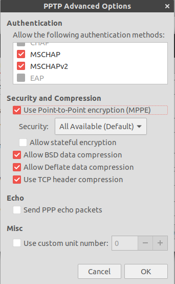

# ___2013-05-12 Ubuntu使用与shell命令___
***

Gtk-Message: Failed to load module “canberra-gtk-module”

编写wxPython程序时，总是报以下错误：

Gtk-Message: Failed to load module “canberra-gtk-module”

解决办法：apt-get install .*canberra.*gtk.*

# 目录
  <!-- TOC depthFrom:1 depthTo:6 withLinks:1 updateOnSave:1 orderedList:0 -->

  - [___2013-05-12 Ubuntu使用与shell命令___](#2013-05-12-ubuntu使用与shell命令)
  - [目录](#目录)
  - [参数](#参数)
  	- [Q / A](#q-a)
  	- [apt-get](#apt-get)
  	- [echo](#echo)
  	- [ps](#ps)
  	- [df / du / dd](#df-du-dd)
  	- [date](#date)
  	- [head / tail](#head-tail)
  	- [gcc](#gcc)
  - [配置](#配置)
  	- [Q / A](#q-a)
  	- [grub 配置文件](#grub-配置文件)
  	- [环境变量](#环境变量)
  	- [SSH](#ssh)
  	- [SSH Q / A](#ssh-q-a)
  	- [samba 配置](#samba-配置)
  	- [samba Q / A](#samba-q-a)
  	- [TFTP](#tftp)
  	- [NFS](#nfs)
  	- [Checking conflict IP](#checking-conflict-ip)
  	- [Service running on server](#service-running-on-server)
  	- [Ubuntu 中开机打开小键盘](#ubuntu-中开机打开小键盘)
  	- [Ubuntu 下汇编方法](#ubuntu-下汇编方法)
  	- [注销用户](#注销用户)
  	- [恢复/克隆的系统中用户文件(图片/文档等)未出现在【位置】列表中，且图标是默认文件夹图标](#恢复克隆的系统中用户文件图片文档等未出现在位置列表中且图标是默认文件夹图标)
  	- [Ubuntu 系统的一种备份还原方法](#ubuntu-系统的一种备份还原方法)
  	- [ubuntu 12.04 开机自动挂载 windows 分区](#ubuntu-1204-开机自动挂载-windows-分区)
  	- [swap](#swap)
  	- [Apache](#apache)
  	- [IBus 中文输入法](#ibus-中文输入法)
  	- [触控板右键](#触控板右键)
  	- [Ubuntu configure vpn](#ubuntu-configure-vpn)
  	- [grub rescue](#grub-rescue)
  	- [坏块检测 badblocks](#坏块检测-badblocks)
  - [软件](#软件)
  	- [自动更新无法下载 adobe flashplayer](#自动更新无法下载-adobe-flashplayer)
  	- [wireshark 配置](#wireshark-配置)
  	- [png 图片形式文档转文字](#png-图片形式文档转文字)
  	- [compiz](#compiz)
  	- [VLC 显示中文字幕](#vlc-显示中文字幕)
  	- [minicom 无法保存配置](#minicom-无法保存配置)
  	- [gedit 中文乱码](#gedit-中文乱码)
  	- [安装 emerald](#安装-emerald)
  	- [Install new cursor theme](#install-new-cursor-theme)
  	- [Conky](#conky)
  	- [Install SKY](#install-sky)
  	- [7z compress & extract](#7z-compress-extract)
  	- [evolution](#evolution)
  	- [Stardict](#stardict)
  	- [Cairo Dock](#cairo-dock)
  	- [UCloner](#ucloner)
  	- [Virtual box](#virtual-box)
  	- [Chrome](#chrome)
  	- [Numix](#numix)
  - [系统备份恢复](#系统备份恢复)
  	- [从 squashfs 恢复系统](#从-squashfs-恢复系统)
  - [Configure New System](#configure-new-system)

  <!-- /TOC -->
***

# 参数
## Q / A
  - 查看gcc版本号：gcc --version
  - 查看linux内核版本号：uname -a
  - exit 35     # 添加一个 exit 退出命令
  - 比较两个排序后的文件内容 comm
  - **dirname** 获取文件夹名，**basename** 获取文件名，**pwd** 获取当前文件夹名
  - mp3info查找音频文件，并删除比特率大于320的
    ```shell
    mp3info -x -p "%r#%f\n" *.mp3 | grep 320 | cut -d '#' -f 2- | sed 's/ /\\ /g' | xargs rm {} \;
    ```
  - 挂载ISO文件
    ```shell
    sudo mount -o loop /media/leondgarse/GrandFiles_Seag/Operating_Systems/cn_windows_7_ultimate_with_sp1.iso /media/cdrom0/
    ```
  - 挂载squashfs
    ```shell
    sudo mount -o loop /media/leondgarse/GrandFiles_Seag/Operating_Systems/squashfs_backup/2017-01-19_201732.squashfs /media/cdrom0/
    ```
  - 格式化为FAT32，-I选项指定整个盘，NTFS格式使用mkfs.ntfs
    ```shell
    sudo mkfs.vfat -F 32 -I /dev/sdc
    ```
  - mkisofs 制作 iso 文件
    ```shell
    mkisofs -r -o file.iso your_folder_name/
    ```
  - root 不能删除 ldlinux.sys 文件
    ```shell
    $ sudo rm /cdrom/boot/ -rf
    rm: cannot remove '/cdrom/boot/extlinux/ldlinux.sys': Operation not permitted
    ```
    The immutable flag is set on that file. Use the
    ```shell
    lsattr ldlinux.sys
    ```
    command and look for the 'i' flag. If this is the case, use
    ```shell
    chattr -i ldlinux.sys
    ```
    to remove it
## apt-get
  - apt-get --purge remove ...... （完全删除）
  - apt-get -f install        （修复依赖关系）
  - apt-get install -d foobar （只下载不安装）
    ```c
    Q: The following packages have been kept back
    A: sudo apt-get -u dist-upgrade
    ```
    ```c
    Q: Unable to lock directory /var/lib/apt/lists/
    A: sudo rm /var/lib/apt/lists/lock
    ```
  - 404 error while apt-get install libssl-dev
    ```c
    check if
            $ sudo apt-get update
    meet any error like: Failed to fetch http://ppa.launchpad.net/ 404 Not Found

    remove that ppa from update-manager:
            $ /usr/bin/python3 /usr/bin/software-properties-gtk

    or remove it from /etc/apt/sources.list or /etc/apt/sources.list.d
    ```
  - Error sudo: add-apt-repository: command not found
    ```c
    To fix this error, you have to install the software-properties-common:
    $ sudo apt-get install software-properties-common
    This is all. Now your command for adding PPAs works like a charm.
    If you want to find out how I have fixed this error by myself, without external / Google help, read further.
    I have search with apt-file for the add-apt-repository and found out in which package is the command located.
    Apt file searches for files, inside packages and tells you in what package the file you had searched is located.
    It is not installed by default, so you need to do this:
    $ sudo apt-get install apt-file &amp;&amp; apt-file update
    This is how you use apt-file for fishing files inside packages:
    $ apt-file search add-apt-repository<br />        python-software-properties: /usr/bin/add-apt-repository<br />        python-software-properties: /usr/share/man/man1/add-apt-repository.1.gz
    So, indeed, it is in the python-software-properties package.
    ```
  - If you prefer to use the command line or if there is no graphical installer available you can use this command as an administrator:
    ```c
    apt install teamviewer_11.0.xxxxx_i386.deb
    Older systems (Ubuntu 14.04, Debian 7 and below)
    Run this command:
    dpkg -i teamviewer_11.0.xxxxx_i386.deb
    In case dpkg indicates missing dependencies, complete the installation by executing the following command:
    apt-get install -f
    ```
## echo
  - echo $? 打印终止状态
    ```
    exit(1)表示发生错误后退出程序， exit(0)表示正常退出。
    ```
## ls
  - 参数
    - **-1** 每一项单独一行显示
    - **-d** 只列出目录，不显示目录中的内容
    - **-t** 时间顺序排序
    - **-r** 反序排列
## ps
  - -a 显示有其他用户所拥有的进程的状态，
  - -x 显示没有控制终端的进程状态，
  - -j 显示与作业有关的信息：会话ID、进程组ID、控制终端以及终端进程组ID
  - ps aux 与 ps -aux 是不同的命令， ps -aux 将试图打印用户名为“x”的进程，如果该用户不存在则执行ps aux命令，并输出一条警告信息，ps -axj等是同样的结果
## df / du / dd
  - df命令用于查看一级文件夹大小、使用比例、档案系统及其挂入点：
    ```bash
    $ df -h  # -h表示 Human-readable 输出
    ```
  - du命令用于查询文件或文件夹的磁盘使用空间
    ```bash
    $ du -hd1  # -d1表示深度为1，若直接使用不带参数的du命令，将会循环列出所有文件和文件夹所使用的空间
    $ du -h --max-depth=1
    ```
  - 硬盘互刻
    ```bash
    df  # 查看当前系统躲在硬盘设备节点
    ls /dev/sd*  # 列出当前主机内所有硬盘
    dd if=/dev/sdb of=/dev/sda  # 将sdb硬盘内容复制到sda
    ```
  - 在已有分区上创建回环设备
    ```bash
    dd if=/dev/zero of=/dev/vdc bs=1024 count=0 seek=15000000
    mkfs.ext4 /dev/vdc
    mount /dev/vdc /media/cdrom0/
    ```
    - if=/dev/zero 表示空输入，即自动填充0
    - of= /srv/swift-disk 表示输出到指定文件
    - bs=1024 表示同时设置读入 / 输出的块大小（字节），即每次读入 / 输出1024字节的数据块
    - count=0 表示拷贝 0 个块，块大小由 bs 指定
    - seek=15000000 从输出文件开头跳过 15000000 个块后再开始复制
    - 命令的结果是创建了一个 15000000*1024 字节大小的文件（约15GB）
## date
  - 格式化输出
    ```bash
    date "+%F %T %N %Z"
    2017-11-09 17:28:00 888225034 CST
    ```
  - 将日期转换为星期：
    ```c
    date -d "Jan 1 2000" +%A
    ```
  - 转换时区
    ```bash
    date -d "09:00 CET" +'%T %Z'
    16:00:00 CST
    ```
## head / tail
  - 显示文件中间几行内容:
    ```c
    cat -n hug-tool.txt | head -n 10 | tail -n +5
    cat -n hug-tool.txt | sed -n '5,10p'
    ```
## gcc
  - 显示 gcc 当前搜索库文件的路径
    ```shell
    gcc -print-search-dirs
    /opt/toolchains/crosstools-mips-gcc-4.6-linux-3.4-uclibc-0.9.32-binutils-2.21/usr/bin/mips-unknown-linux-uclibc-gcc -print-search-dirs
    ```
  - 使用 /etc/ld.so.conf 文档，将用到的库所在文档目录添加到此文档中，然后使用ldconfig命令刷新缓存
    ```shell
    export LD_LIBRARY_PATH=$LD_LIBRARY_PATH:/usr/local/arm/2.95.3/arm-linux-lib
    export PATH=/usr/local/samba/bin/:/usr/local/samba/sbin/:$PATH
    ```
## chroot
  - 切换根目录，并使用该目录下的文件 / 命令，需要有完整的命令与库支持
    ```shell
    chroot /media/cdrom0 ls /home
    chroot /media/cdrom0 update-grub
    ```
***

# 配置
## Q / A
  - 使用 PS1=user$: 命令临时更改显示的命令提示符
    ```c
    PS1='[\u@\h: $PWD]# '

    ```
    ubuntu不能man pthread库函数：
    ```c
    sudo apt-get install manpages-posix-dev
    ```
  - 发行版本信息
    ```shell
    $ cat /proc/version
    ```
  - 禁用PrintScreen截屏
    ```shell
    系统设置 ---> 键盘 ----> 快捷键 ----> 截图
    ```
  - 通过 DNS 来读取 Wikipedia 的词条
    ```shell
    dig +short txt <keyword>.wp.dg.cx
    ```
  - Windows下拷贝ubuntu镜像到u盘，会造成文件名被截短，在安装过程中提示md5验证失败
    - 解决： 将镜像文件在ubuntu下挂载后复制到u盘
  - mtd 设备
    ```shell
    cd /run/user/1000/gvfs/mtp:host=%5Busb%3A003%2C003%5D/
    alias Myphone='cd /run/user/*/gvfs/* && PRINTF_CYAN `pwd -P` && ls'
    ```
  - JPEG error
    - Not a JPEG file: starts with 0x89 0x50
    - The file is actually a PNG with the wrong file extension. "0x89 0x50" is how a PNG file starts. Rename it to png
  - useradd -p 指定的密码无效
    - 此时 /etc/shadow 中的密码是明文，需要通过 passwd / chpasswd 修改
      ```bash
      useradd -p 'pass' test
      echo 'test:pass' | chpasswd
      ```
  - 取消挂载 umount 时出现的 “Device is busy”
    - fuser 可以显示出当前哪个程序在使用磁盘上的某个文件、挂载点、甚至网络端口，并给出程序进程的详细信息
    - fuser -mv /tmp
      - **-m** 参数显示所有使用指定文件系统的进程，后面可以跟挂载点，或是dev设备，-v 参数给出详细的输出
      - **-k** 参数自动把霸占着 /media/USB/ 的程序杀死
      - **-i** 参数，这样每杀死一个程序前，都会询问
      - fuser -mv -ik /tmp
    - 执行延迟卸载，延迟卸载（lazy unmount）会立即卸载目录树里的文件系统，等到设备不再繁忙时才清理所有相关资源
      ```shell
      umount -vl /mnt/mymount/     
      ```
## grub 配置文件
  - grub配置文件/etc/default/grub与/etc/grub.d目录下的对应文件，如修改分辨率、等待时间等可通过修改/etc/default/grub实现
  - 修改grub背景图片：
    ```c
    sudo cp xxx.jpg /boot/grub/back.jpg
    sudo update-grub重启即可
    ```
  - 更改grub背景主题：
    ```c
    将下载的主题文件解压到/boot/grub/themes文件夹中（没有的自己创建）
    然后修改/etc/default/grub
    加入：GRUB_THEME="/boot/grub/themes/******/theme.txt"（主题名自己设置）
    然后sudo grub-update
    ```
## 环境变量
  - 修改：sudo vi /etc/environment添加，或者vi ~/.bashrc添加
    ```c
    source /etc/environment 是配置生效
    ```
  - 误操作环境变量文件/etc/environment，会造成无法登录的状况，ubuntu13.04下字符界面使用
    ```c
    命令：/usr/bin/sudo /usr/bin/vi /etc/environment
    ```
## SSH
  - Ubuntu使用SSH访问远程Linux服务器
    ```shell
    $ ssh leondgarse@192.168.7.11
    ```
  - ssh配置文件
    ```shell
    man ssh_config
    ```
  - ssh key fingerprint
    ```shell
    $ ssh-keygen -lf ~/.ssh/id_rsa.pub
    其中
    -l means "list" instead of create a new key
    -f means "filename"
    ```
    With newer versions of ssh-keygen, run
    ```shell
    ssh-keygen -E md5 -lf <fileName>
    ```
    if you want the same format as old ssh-keygen -lf also works on known_hosts and authorized_keys files
  - **ssh-add -l** is very similar but lists the fingerprints of keys added to your agent
  - ssh Escape character
    - **~?** 显示所有命令
    - **~.** 退出SSH连接
    - **~~** 输入~
  - Save ssh output to a local file
    ```shell
    ssh user@host | tee -a logfile
    ```
  - SSH 使用代理连接
    ```shell
    # Install Corkscrew
    sudo apt-get install corkscrew

    # Add ProxyCommand to your SSH config file $HOME/.ssh/config
    Host *
    ProxyCommand corkscrew http-proxy.example.com 8080 %h %p

    # example
    ssh username@ip -p port
    scp -P port -r ./test username@ip:/home/test/    
    ```
    或者参照 man ssh_config 使用 nc 命令
    ```shell
    # vi ~/.ssh/config
    # ProxyCommand
    HOST 192.0.2.0:
        ProxyCommand /usr/bin/nc -X connect -x 192.0.2.0:8080 %h %p
    ```
## SSH Q / A
  - Q: ssh: connect to host 135.251.168.141 port 22: Connection refused
    ```shell
    apt-get install openssh-server
    ```
  - Q: 解决ssh的 **Write failed: Broken pipe** 问题
    - 用 ssh 命令连接服务器之后，如果一段时间不操作，再次进入 Terminal 时会有一段时间没有响应，然后就出现错误提示
      ```c
      Write failed: Broken pipe
      ```
      只能重新用 ssh 命令进行连接
    - 方法一 如果您有多台服务器，不想在每台服务器上设置，只需在客户端的 ~/.ssh/ 文件夹中添加 config 文件，并添加下面的配置：
      ```shell
      ServerAliveInterval 60
      ```
    - 方法二 如果您有多个人管理服务器，不想在每个客户端进行设置，只需在服务器的 /etc/ssh/sshd_config 中添加如下的配置：
      ```shell
      ClientAliveInterval 60
      ```
    - 方法三 如果您只想让当前的 ssh 保持连接，可以使用以下的命令：
      ```shell
      $ ssh -o ServerAliveInterval=60 user@sshserver
      ```
    - If you use tmux + ssh, you can use the following configuration file to make all the ssh session keep alive:
      ```shell
      $ cat ~/.ssh/config
      Host *
      ServerAliveInterval 60
      ```
  - Q: ssh-add :Could not open a connection to your authentication agent
    - 执行ssh-add /path/to/xxx.pem出现错误
      ```shell
      Could not open a connection to your authentication agent
      ```
    - 执行如下命令
      ```shell
      ssh-agent bash
      ```
  - Q: no matching key exchange method found. Their offer: diffie-hellman-group1-sha1
    - possible solution
      ```
      The problem isn't the cipher as much as the key exchange.
      Newer open ssh dropped support (by default) for "insecure" key exchanges (SHA1) which are all that are supported by older ios/etc. gear.
      I've been updating code on boxes where possible to eliminate this issue but it's really an easy fix.
      In /etc/ssh/ssh_config:
      Host *
      GSSAPIAuthentication yes
      KexAlgorithms +diffie-hellman-group1-sha1

      That will add the old kex to your ssh (outbound) and should work ok.
      ```
  - Q: no matching host key type found. Their offer: ssh-dss
    - possible solution
      ```c
      The recent openssh version deprecated DSA keys by default.
      You should pursuit your GIT provider to add some reasonable host key. Relying only on DSA is not a good idea.
      As a workaround, you need to tell your ssh client that you want to accept DSA host keys, as described in the official documentation for legacy usage.
      You have few possibilities, but I recommend to add these lines into your ~/.ssh/config file:
      Host your-host
        HostkeyAlgorithms +ssh-dss
      ```
## samba 配置
  - **samba 安装**
    ```shell
    $ sudo apt-get install samba smbfs samba-common smbclient
    ```
  - **创建 Samba 配置文件**
    ```shell
    $ sudo vim /etc/samba/smb.conf

    # 在 smb.conf 最后添加
    [username]
    path = /home/username
    available = yes
    browseable = yes
    public = yes
    writable = yes
    ```
  - **重启 samba 服务器**
    ```shell
    $ sudo /etc/init.d/smbd reload (修改过 smb.conf 的话要执行一次)
    $ sudo /etc/init.d/smbd restart
    ```
    Or
    ```shell
    $ /etc/rc.d/init.d/smb reload
    $ /etc/rc.d/init.d/smb restart
    ```
  - **查看目标服务器所有的共享目录**
    ```shell
    $ smbclient -L 192.168.7.11 -U leondgarse%123456
    ```
  - **将目标服务器的共享目录挂载到/media/samba目录下**
    ```shell
    # uid / gid 为本地用户的 uid / gid
    $ sudo mount -t cifs -o uid=1000,gid=1000,file_mode=0777,dir_mode=0777,username=leondgarse,password=123456 //192.168.7.11/leondgarse /media/samba/
    ```
  - **开机自动启动samba服务**
    ```shell
    $ sudo vi /etc/init/samba.conf

    # 添加一行
    start on (local-filesystems and net-device-up)
    ```
  - **关闭**
    ```shell
    $ sudo sed -i 's/start on/# &/' /etc/init/smbd.conf
    ```
## samba Q / A
  - **Q: session setup failed: NT_STATUS_LOGON_FAILURE**
    ```shell
    $ smbclient -L 135.252.28.161 -U test%123456
    WARNING: The "syslog" option is deprecated
    session setup failed: NT_STATUS_LOGON_FAILURE
    ```
    A: 执行 smbclient 命令的用户 ID 没有成为 samba 服务的用户，需要在服务器端添加
    ```shell
    $ smbpasswd -a test
    New SMB password:
    Retype new SMB password:
    Added user test.
    ```
  - **Q: Error NT_STATUS_HOST_UNREACHABLE**
    ```shell
    WARNING: The "syslog" option is deprecated
    Connection to 135.252.28.162 failed (Error NT_STATUS_HOST_UNREACHABLE)  
    ```
    A: 需要在防火墙规则里允许 samba 端口，smbd 为 clinet 提供资源访问 tcp 139 445
    ```shell
    $ vi /etc/sysconfig/iptables
    # Add
    -A INPUT -m state --state NEW -m tcp -p tcp --dport 139 -j ACCEPT

    # 重启 iptables
    $ service iptables restart
    ```
  - **Q: 配置 Samba 账户与系统密码同步，支持用户直接修改自己的登录密码**
    ```shell
    # 系统密码与 samba 密码是分开设置的
    $ passwd test
    $ smbpasswd -a test
    ```
    A: 利用 PAM 同步更改 samba 密码
    ```shell
    $ vi /etc/pam.d/system-auth
    # Add after
    # password    requisite     pam_cracklib.so try_first_pass retry=3 type=
    password    required      pam_smbpass.so nullok use_authtok try_first_pass
    ```
    使用 **passwd** 命令可以同步更改 samba 密码
  - **Q: Ubuntu 下使用 mount 挂载 Samba 目录没有写权限**
    ```shell
    #             用户  组
    -rw-r--r--  1 1066 leondgarse 9402 3月   7 12:19 foo
    ```
    A: 在 mount 时，指定 uid / gid
    ```shell
    # uid / gid 为本地用户的 uid / gid
    $ sudo mount -t cifs -o uid=1000,gid=1000,file_mode=0777,dir_mode=0777,username=leondgarse,password=123456 //192.168.7.11/leondgarse /media/samba/
    ```
## TFTP
  - tftp / tftpd 设置TFTP 服务
    ```c
    sudo apt-get install tftp tftpd
    sudo apt-get install openbsd-inetd

    sudo mkdir /tftpboot
    sudo chmod 777 /tftpboot -R

    sudo vi /etc/inetd.conf
    在里面填入如下一行:
    tftp dgram udp wait nobody /usr/sbin/tcpd /usr/sbin/in.tftpd /tftpboot

    新建 /etc/default/tftpd-hpa
    #Defaults for tftpd-hpa
    RUN_DAEMON="yes"
    OPTIONS="-l -s /tftpboot"

    $ sudo /etc/init.d/openbsd-inetd reload
    $ sudo /etc/init.d/openbsd-inetd restart
    ```
  - tftp-hpa / tftpd-hpa 设置TFTP 服务
    ```c
    查看源中tftp相关的应用：
    apt-cache search tftpd

    安装tftp-hpa tftpd-hpa:
    sudo apt-get install tftpd-hpa tftp-hpa

    查看tftp服务状态
    sudo service tftpd-hpa status
    或
    netstat -a | grep tftp	# 没有输出

    默认的配置文件：
    /etc/default/tftpd-hpa

    默认tftp根路径：
    /srv/tftp

    配置：
    sudo cp /etc/default/tftpd-hpa /etc/default/tftpd-hpa.ORIGINAL	# 备份
    sudo vi /etc/default/tftpd-hpa
    配置项
        TFTP_OPTIONS="--secure --create"	# 支持创建新文件
        TFTP_DIRECTORY="/tftpboot"	# 修改根路径

    修改根目录权限
    sudo chown -R tftp /tftpboot

    重启服务
    sudo service tftpd-hpa restart

    上传 / 下载
    tftp 127.0.0.1 -c put foo
    tftp 127.0.0.1 -c get foo
    ```
  - tftp中put 命令Access Violation错误：Error code 2: Access violation
    ```c
    tftp服务器缺少必要的身份验证，要上传文件，必须是服务器中已存在同名的文件，且该文件权限允许被覆盖
    首先在服务中创建一个与要上传的文件同名的文件，并更改权限为777
    $ touch a
    $ chmod 777 a
    ```
  - 上传二进制文件时错误 Check data fail, upload failed
    ```c
    linux下tftp默认格式是ascii，尝试指定mode 为 binary
        tftp -m binary 127.0.0.1 -c put foo
    ```
## NFS
  - 安装 NFS server
    ```shell
    sudo apt-get install nfs-kernel-server
    ```
  - 添加目标系统的根文件系统映射目
    ```shell
    sudo vi /etc/exports
    # 添加
    /opt/rootfs/ *(subtree_check,rw,no_root_squash,async)
    ```
  - 重启服务
    ```shell
    sudo /etc/init.d/nfs-kernel-server restart
    sudo exportfs -a
    ```
  - 挂载测试
    ```shell
    sudo mount 127.0.0.1:/opt/rootfs /media/cdrom0/ -t nfs
    ```
## Checking conflict IP
  - $ sudo apt-get install arp-scan
  - $ arp-scan -I eth0 -l | grep 192.168.1.42
    ```c
    192.168.1.42 d4:eb:9a:f2:11:a1 (Unknown)
    192.168.1.42 f4:23:a4:38:b5:76 (Unknown) (DUP: 2)
    ```
## Service running on server
  - Use nmap tool to know which ports are open in that server. nmap is a port scanner. Since it may be possible that ssh server is running on a different port. nmap will give you a list of ports which are open.
    ```c
    $ nmap myserver
    ```
    Now you can check which server is running on a given port. Suppose in the output of nmap, port 2424 is open. Now you can which server is running on 2424 by using nc(netcat) tool.
    ```c
    $ nc -v -nn myserver portno
    ```
    Suppose the output of 2424 port is:
    ```c
    myserver 2424 open
    SSH-2.0-OpenSSH_5.5p1 Debian-4ubuntu5
    ```
    This means ssh is running on 2424.
## Ubuntu 中开机打开小键盘
  - 解决方法
    ```c
    $ sudo apt-get install numlockx
    $ sudo vi /etc/lightdm/lightdm.conf
    末尾添加 greeter-setup-script=/usr/bin/numlockx on

    For Ubuntu Gnome and Xubuntu XFCE (GDM)：
    $ sudo apt-get install numlockx
    $ sudo gedit /etc/gdm/Init/Default

    末尾添加：
    if [ -x /usr/bin/numlockx ]; then
            /usr/bin/numlockx on
    fi
    ```
## Ubuntu 下汇编方法
  - as / objdump
    ```shell
    $ vi hello.s
    $ as -o hello.o hello.s
    $ ld -s -o hello hello.o
    $ ./hello
    ```
  - 反汇编
    ```shell
    $ objdump -D hello
    ```
## 注销用户
  - kill / pkill / pgrep
    ```c
    $ killall gnome-session                // 结束gnome-session进程
    $ pkill -KILL -u {username}        // 给用户名为{username}的进程发送-KILL信号
    $ pgrep -u {username} -l        // 查找当前进程中用户名为{username}的进程，并列出进程pid与名称
    $ pkill -kill -t pts/1                // 注销指定的远程终端
    ```
## 恢复/克隆的系统中用户文件(图片/文档等)未出现在【位置】列表中，且图标是默认文件夹图标
  - 创建软连接
    ```shell
    ln -fs /media/D/Users/edgerw/* ~/

    ln -s /media/leondgarse/GrandFiles_Seag/Downloads/ ~/
    ln -s /media/leondgarse/GrandFiles_Seag/Documents/ ~/
    ln -s /media/leondgarse/GrandFiles_Seag/Music/ ~/
    ln -s /media/leondgarse/GrandFiles_Seag/Pictures/ ~/
    ln -s /media/leondgarse/Videos_Seag/ ~/Videos
    ```
  - xdg-user-dirs-gtk-update
    ```c
    $ xdg-user-dirs-gtk-update         //xdg-user-dirs用于在不同的语言下自动创建一些经常用到的目录

    若不成功，则可尝试修改语言为英文，再改回中文：
    export LANG=en_US
    xdg-user-dirs-gtk-update
    export LANG=zh_CN1
    xdg-user-dirs-gtk-update

    如果在执行xdg-user-dirs-gtk-update命令时选择了不再提示，可执行一下命令恢复：
    echo zh_CN > ~/.config/user-dirs.locale
    ```
  - 迁移用户文件夹
    ```c
    vi ~/.config/user-dirs.dirs 填入相应路径
    创建目标路径软连接到用户目录
    ```
## Ubuntu 系统的一种备份还原方法
  - 备份：
    ```c
    备份已安装软件包列表
        sudo dpkg --get-selections > package.selections
    备份Home下的用户文件夹，如果Home放在额外的分区則不需要
    备份软件源列表，将/etc/apt/文件夹下的sources.list拷贝出来保存即可
    ```
  - 还原：
    ```c
    复制备份的Sources.list文件到新系统的/etc/apt/目录，覆盖原文件，并替换（Ctrl+H）文档中的intrepid为jaunty，
    然后更新软件源sudo apt-get update。
    重新下载安装之前系统中的软件（如果你安装的软件数量比较多，可能会花费较长时间）
      sudo dpkg --set-selections < /home/user/package.selections && apt-get dselect-upgrade
    最后将备份的主文件夹（/home/用户名）粘贴并覆盖现有主文件夹
    ```
  - rsync
    ```shell
    # ucloner_cmd.py, functions.py
    sudo rsync -av / --exclude-from=/home/sevendays19/local_bin/rsync_execlude_file /media/sevendays19/75fc86d3-cca4-40bf-86bd-3acebba610c2/

    # make_system_dirs
    cd /media/sevendays19/75fc86d3-cca4-40bf-86bd-3acebba610c2/
    sudo mkdir /proc /sys /tmp /mnt /media /media/cdrom0

    # generate_fstab
    sudo cp /etc/fstab etc/
    vi etc/fstab
    sudo touch etc/mtab

    # change_host_name
    sudo vi etc/hostname
    sudo vi etc/hosts

    # fix_resume
    cd ~/UCloner-10.10.2-beta1/program/sh/
    sudo ./fix_resume.sh /media/sevendays19/75fc86d3-cca4-40bf-86bd-3acebba610c2/ /dev/sdb3

    # install_grub2
    sudo ./install_grub.sh /media/sevendays19/75fc86d3-cca4-40bf-86bd-3acebba610c2/ /dev/sdb
    ```
## ubuntu 12.04 开机自动挂载 windows 分区
  - 查看UUID # blkid
    ```c
    /dev/sda1: UUID="064CE4C44CE4AF9B" TYPE="ntfs"
    /dev/sda2: UUID="46D07D1ED07D1601" TYPE="ntfs"
    /dev/sda5: UUID="0bc1ef30-260c-4746-88c4-fd6c245882ea" TYPE="swap"
    /dev/sda6: UUID="53bc0a32-b32e-4f85-ad58-e3dbd9a3df41" TYPE="ext4"
    /dev/sda7: UUID="2fc00def-79d7-421e-92f1-e33e46e74c66" TYPE="ext4"
    ```
  - 查看分区 # fdisk -l
    ```c
    Disk /dev/sda: 112.8 GB, 112774965760 bytes
    255 heads, 63 sectors/track, 13710 cylinders, total 220263605 sectors
    Units = 扇区 of 1 * 512 = 512 bytes
    Sector size (logical/physical): 512 bytes / 512 bytes
    I/O size (minimum/optimal): 512 bytes / 512 bytes
    Disk identifier: 0xd10cd10c

      设备 启动   起点     终点   块数  Id 系统
    /dev/sda1  *    2048  46139391  23068672  7 HPFS/NTFS/exFAT
    /dev/sda2    46139392  119539711  36700160  7 HPFS/NTFS/exFAT
    /dev/sda3    119541758  220262399  50360321  5 扩展
    /dev/sda5    119541760  123539805   1999023  82 Linux 交换 / Solaris
    /dev/sda6    123541504  181200895  28829696  83 Linux
    /dev/sda7    181202944  220262399  19529728  83 Linux

    Partition table entries are not in disk order
    ```
  - 创建挂载点
    ```c
    在/media下创建C,D,E三个目录，命令如下：
    $ sudo mkdir /media/C
    $ sudo mkdir /media/D
    $ sudo mkdir /media/E
    ```
  - 编辑/etc/fstab文件
    ```c
    # vi /etc/fstab

    在这个文件中加入如下信息
    # These is used for auto mount Windows disks on boot up.
    UUID=064CE4C44CE4AF9B /media/C ntfs defaults,codepage=936,iocharset=gb2312 0 0
    UUID=46D07D1ED07D1601 /media/D ntfs defaults,codepage=936,iocharset=gb2312 0 0
    UUID=629AFA8D9AFA5D4B /media/E ntfs defaults,codepage=936,iocharset=gb2312 0 0
    ```
## swap
  - How do I add a swap file?
    ```
    Note: btrfs does not support swap files at the moment. See man swapon. and btrfs Faq
    Create the Swap File:
    We will create a 1 GiB file (/mnt/1GiB.swap) to use as swap:
    sudo fallocate -l 1g /mnt/1GiB.swap
    fallocate size suffixes: g = Giga, m = Mega, etc. (See man fallocate).
    If fallocate fails or it not available, you can use dd:
    sudo dd if=/dev/zero of=/mnt/1GiB.swap bs=1024 count=1048576
    We need to set the swap file permissions to 600 to prevent other users from being able to read potentially sensitive information from the swap file.
    sudo chmod 600 /mnt/1GiB.swap
    Format the file as swap:
    sudo mkswap /mnt/1GiB.swap
    Enable use of Swap File
    sudo swapon /mnt/1GiB.swap
    The additional swap is now available and verified with: cat /proc/swaps
    Enable Swap File at Bootup
    Add the swap file details to /etc/fstab so it will be available at bootup:
    echo '/mnt/1GiB.swap swap swap defaults 0 0' | sudo tee -a /etc/fstab
    Example of making a swap file
    This is an example of making and using a swap file on a computer with no swap partition.
    $ sudo fallocate -l 1g /mnt/1GiB.swap
    $ sudo chmod 600 /mnt/1GiB.swap
    $ sudo mkswap /mnt/1GiB.swap
    Setting up swapspace version 1, size = 1048576 kB
    $ sudo swapon /mnt/1GiB.swap
    $ cat /proc/swaps
    Filename                                Type            Size    Used    Priority
    /home/swapfile                          file            1048576 1048576 -1
    $ echo '/mnt/4GiB.swap swap swap defaults 0 0' | sudo tee -a /etc/fstab
    $ reboot
    $ free -h
                  total        used        free      shared  buff/cache   available
    Mem:            15G        9.3G        454M        4.0G        5.8G        1.9G
    Swap:          1.0G        1.0G          0B
    Disable and Remove a Swap File
    Disable the swap file from the running system and the delete it:
    sudo swapoff /mnt/1Gib.swap
    sudo rm /mnt/1Gib.swap
    Remove the swap file details from fstab:
    gksudo gedit /etc/fstab
    Removing the swap file line
    /mnt/1GiB.swap swap swap defaults 0 0
    ```
  - What is swappiness and how do I change it?
    ```
    The swappiness parameter controls the tendency of the kernel to move processes out of physical memory and onto the swap disk. Because disks are much slower than RAM, this can lead to slower response times for system and applications if processes are too aggressively moved out of memory.
    swappiness can have a value of between 0 and 100
    swappiness=0 tells the kernel to avoid swapping processes out of physical memory for as long as possible
    swappiness=100 tells the kernel to aggressively swap processes out of physical memory and move them to swap cache
    The default setting in Ubuntu is swappiness=60. Reducing the default value of swappiness will probably improve overall performance for a typical Ubuntu desktop installation. A value of swappiness=10 is recommended, but feel free to experiment. Note: Ubuntu server installations have different performance requirements to desktop systems, and the default value of 60 is likely more suitable.
    To check the swappiness value
    cat /proc/sys/vm/swappiness
    To change the swappiness value A temporary change (lost on reboot) with a swappiness value of 10 can be made with
    sudo sysctl vm.swappiness=10
    To make a change permanent, edit the configuration file with your favorite editor:
    gksudo gedit /etc/sysctl.conf
    Search for vm.swappiness and change its value as desired. If vm.swappiness does not exist, add it to the end of the file like so:
    vm.swappiness=10
    Save the file and reboot.
    What is the priority of swap containers?
    The Linux kernel assigns priorities to all swap containers. To see the priorities that the Linux Kernel assigns to all the swap containers use this command.
    cat /proc/swaps
    Priorities can be changed by using the swapon command or defined in /etc/fstab. Consult the manual page of swapon for more info
    man swapon
    Should I reinstall with more swap?
    Definitely not. With the 2.6 kernel, "a swap file is just as fast as a swap partition."(Wikipedia:Paging, LKML).
    Why is my swap not being used?
    My swap is not being used! When I issue the free command, it shows something like this:
    tom@tom:~$ free
                 total       used       free     shared    buffers     cached
    Mem:        515980     448664      67316          0      17872     246348
    -/+ buffers/cache:     184444     331536
    Swap:       674688          0     674688
    Note: This regards mainly swap on hard disk partitions, but it could help anyway. In these examples /dev/hda8 is considered as swap.
    Swap may not be needed
    Start many memory consuming applications (e.g. Gimp, web browsers, LibreOffice etc) and then issue the free command again. Is swap being used now?
    Ubuntu Desktop uses Swap to Hibernate (PC off, no power needed, program states saved). If Hibernation is important to you, have more swap space than ram + swap overflow.
    Is there a swap partition at all?
    Use this command to see all partitions
    sudo fdisk -l
    You should be able to see something like this in the output
    /dev/hda8            4787        4870      674698+  82  Linux swap / Solaris
    If not, you either need to create a swapfile or create a swap partition. To create a swap partition you can
    boot from your Ubuntu install CD, create a swap partition out of the free space on your hard disk and then interrupt your installation.
    use Cfdisk.
    Enabling a swap partition
    In case you do have a swap partition, there are several ways of enabling it.
    Use the following command
    cat /etc/fstab
    Ensure that there is a line link below. This enables swap on boot.
    /dev/hda8       none            swap    sw              0       0
    Then disable all swap, recreate it, then re-enable it with the following commands.
    sudo swapoff -a
    sudo /sbin/mkswap /dev/hda8
    sudo swapon -a
    Empty Swap
    Even if you have lots of RAM and even if you have a low swappiness value, it is possible that your computer swaps. This can hurt the multitasking performance of your desktop system.
    You can use the following script to get the swap manually back into RAM:
    Place the script e.g. /usr/local/sbin:
    gksudo gedit /usr/local/sbin/swap2ram.sh
    Copy-paste the script into the file:
    #!/bin/sh

    mem=$(LC_ALL=C free  | awk '/Mem:/ {print $4}')
    swap=$(LC_ALL=C free | awk '/Swap:/ {print $3}')

    if [ $mem -lt $swap ]; then
        echo "ERROR: not enough RAM to write swap back, nothing done" >&2
        exit 1
    fi

    swapoff -a &&
    swapon -a
    Save and close gedit
    Make the script executable:
    sudo chmod +x /usr/local/sbin/swap2ram.sh
    Execute:
    sudo /usr/local/sbin/swap2ram.sh
    ```
## Apache
  ```shell
  # 安装
  sudo apt-get install apache2

  # Apache 配置文件
  /etc/apache2/apache2.conf

  # HTML 文件默认路径
  /var/www/html/
  ```
## IBus 中文输入法
  - Install IBus
    ```shell
    sudo apt-get install ibus ibus-pinyin
    ```
  - language Support -> Keyboard input method system -> IBus
  - Setting -> Region & Language -> Add -> Chinese -> Chinese (Intelligent Pinyin)
  - 系统输入法选择为 IBus 时会自动清除选中的文本，如果是英文输入法就没有这个问题
    - 终端中 ibus-setup
    - 勾掉 在应用窗口中启用内嵌编辑模式(Embed preedit text in application window)
## 触控板右键
  - gnome-tweak-tool
  - Keyboard & Mouse -> Mouse Click Emulation
## Ubuntu configure vpn
  - Settings -> Network -> VPN -> Add
  - Identity -> Advanced
  - Choose Use Point-to-Point encryption (MPPE)

    
## grub
  - grub rescue
    ```shell
    # 查找 boot 目录
    grub rescue > ls  # 查看当前磁盘信息
    grub rescue > ls (hd0,msdos2)/boot  # boot 没有单独分区
    grub rescue > ls (hd0,msdos2)/grub  # boot 单独分区

    # 临时将 grub 的两部分关联起来
    grub rescue > set root=(hd0,msdos2)
    grub rescue > set prefix=(hd0,msdos2)/boot/grub   # boot 没有单独分区
    grub rescue > set prefix=(hd0,msdos2)/grub   # boot 单独分区
    grub rescue > insmod normal
    grub rescue > normal

    # 进入正常的 grub 模式，进入系统
    $ sudo update-grub
    $ sudo grub-install /dev/sda3
    $ sudo grub-install /dev/sda
    ```
  - grub-install 错误 /usr/lib/grub/i386-pc doesnt exist
    ```shell
    grub-install: error: /usr/lib/grub/i386-pc/modinfo.sh doesnt exist. Please specify --target or --directory.
    ```
    安装 grub-pc
    ```shell
    sudo apt-get isntall grub-pc
    ```
## 坏块检测 badblocks
  - badblocks
    - **-s** 在检查时显示进度
    - **-v** 执行时显示详细的信息
    ```shell
    badblocks -sv /dev/sdb
    ```
  - **fsck 使用 badblocks 的信息**，badblocks 只会在日志文件中标记出坏道的信息，但若希望在检测磁盘时也能跳过这些坏块不检测，可以使用 **fsck 的 -l 参数**
    ```shell
    fsck.ext3 -l /tmp/hda-badblock-list.final /dev/hda1
    ```
  - **在创建文件系统前检测坏道**，badblocks 可以随 e2fsck 和 mke2fs 的 -c 删除一起运行（对ext3文件系统也一样），在创建文件系统前就先检测坏道信息
    ```shell
    # -c 在创建文件系统前检查坏道的硬盘
    mkfs.ext3 -c /dev/hda1
    ```
  - 扫描完成后，如果损坏区块被发现了，通过 e2fsck 命令使用“bad-blocks.txt”，强迫操作系统不使用这些损坏的区块存储数据
    ```shell
    sudo e2fsck -l /tmp/bad-blocks.txt /dev/sdb
    ```
    在运行e2fsck命令前，请保证设备没有被挂载
## NTFS disk mount error
    ```shell
    The disk contains an unclean file system (0, 0).
    Metadata kept in Windows cache, refused to mount.
    Falling back to read-only mount because the NTFS partition is in an
    unsafe state. Please resume and shutdown Windows fully (no hibernation
    or fast restarting.)
    ```
    The solution is so simple :
    ```shell
    here is where NTFS-3G project come to help us:

    On computers which can be dual-booted into Windows or Linux, Windows has to be fully shut down before booting into Linux, otherwise the NTFS file systems on internal disks may be left in an inconsistent state and changes made by Linux may be ignored by Windows.

    So, Windows may not be left in hibernation when starting Linux, in order to avoid inconsistencies. Moreover, the fast restart feature available on recent Windows systems has to be disabled. This can be achieved by issuing as an Administrator the Windows command which disables both hibernation and fast restarting.

    Double-booting Linux and Windows 8

    When Windows 8 is restarted using its fast restarting feature, part of the metadata of all mounted partitions are restored to the state they were at the previous closing down. As a consequence, changes made on Linux may be lost. This can happen on any partition of an internal disk when leaving Windows 8 by selecting Shut down or Hibernate. Leaving Windows 8 by selecting Restart is apparently safe.

    To avoid any loss of data, be sure the fast restarting of Windows 8 is disabled. This can be achieved by issuing as an administrator the command :

    or follow this step :

    Settings
     > control panel
     > system security
     > administrative tools
     > system configuration
     > tools
     > command prompt and launch it and type this :

        powercfg /h off

    You can check the current settings on :

    Control Panel
        > Hardware and Sound
        > Power Options
        > System Setting
        > Choose what the power buttons do

    The box "Turn on fast startup" should either be disabled or missing.
    ```
***

# 软件
## 自动更新无法下载 adobe flashplayer
  - sudo dpkg --configure -a
  - mv /路径/install_flash_player_11_linux.i386/libflashplayer.so ~/.mozilla/plugins/
## wireshark 配置
  - 初始安装完没有权限抓包，对此，运行命令：
    ```c
    sudo dpkg-reconfigure wireshark-common
    选yes创建wireshark用户组
    把需要运行wireshark的用户加入到wireshark用户组：
    sudo usermod -a -G wireshark $USER
    之后重新以该用户身份登录即可
    ```
  - Couldn’t run /usr/sbin/dumpcap in child process: Permission denied
    ```c
    $ sudo vi /etc/group
    将用户加入wireshark组
    ```
## png 图片形式文档转文字
  - 安装软件：
    ```c
    gocr、tesseract-ocr、libtiff-tools
    安装tesseract中文语言包tesseract-ocr-chi-sim
    ```
  - tif文件转文字tif-->text，直接使用tesseract命令即可，如：
    ```c
    tesseract a.tif a.txt -l chi_sim
    其中tif图片文件可由shutter截图得到
    ```
## compiz
  - 如果因为compiz配置出现问题导致桌面不能显示，可进入/usr/bin目录下执行./ccsm
  - 或尝试在用户目录下分别进入.cache、.config、.gconf/apps下删除对应compiz项
    ```c
    rm .cache/compizconfig-1/ .config/compiz-1/ .compiz/ -rf
    ```
## VLC 显示中文字幕
  - 首先启动VLC，按Ctrl+P,
  - 左下角的显示设置 选 全部，依次点开 ：
    ```c
    视频－字幕／OSD－文本渲染器 右侧的字体栏中，选择一个中文字体
    /usr/share/fonts/truetype/wqy/wqy-zenhei.ttc
    ```
    接着点开：
    ```c
    输入／编码－其它编码器－字幕 右侧的 字幕文本编码 选 GB18030
    ```
    然后 把 自动检测 UTF－8 字幕 格式化字幕 前面的勾去掉
  - 保存
## Minicom
  - minicom 无法保存配置
    ```shell
    cd
    ls -a                # 查看是否有 .minirc.dfl 文件
    rm .minirc.dfl
    ```
  - 将当前用户加入到dialout组（/dev/tty* 的用户组）
    ```c
    $ sudo vi /etc/group
    dialout:x:20:leondgarse
    ```
## gedit 中文乱码
  - 打开终端输入：
    ```c
    gsettings set org.gnome.gedit.preferences.encodings auto-detected "['GB18030', 'GB2312', 'GBK', 'UTF-8', 'BIG5', 'CURRENT', 'UTF-16']"
    gsettings set org.gnome.gedit.preferences.encodings shown-in-menu "['GB18030', 'GB2312', 'GBK', 'UTF-8', 'BIG5', 'CURRENT', 'UTF-16']"
    ```
## 安装 emerald
  - sudo add-apt-repository ppa:noobslab/themes
  - sudo apt-get update
  - sudo apt-get install emerald
## Install new cursor theme
  - 0- Download the cursor theme.
  - 1- Locate the file ThemeName.tar.gz downloaded. It's probably in your Downloads folder.
  - 2- Right click on it and left click on "extract here". You will see the folder ThemeName.
  - 3- Move the theme folder to ~/.icons/. Open a terminal and you can use the following command line.
    ```c
    Quote: mv Downloads/ThemeName ~/.icons/
    < ON GNOME 3.x and UNITY >
    ```
  - 4- To update the cursor theme and cursor size: Search for and install Dconf Editor in Software Center.
  - 5- Use next Command, changing theme's name and the current cursor size to your custom cursor size xx.
    ```c
    Could also use 24, 32, 40, 48, 56 or 64 pixels.

    Quote: gsettings set org.gnome.desktop.interface cursor-theme ThemeName &amp;&amp; gsettings set org.gnome.desktop.interface cursor-size xx

    If you wish choose the cursor theme and cursor size, using the Dconf editor graphic interface (GUI),
    then launch it, an go org-->gnome-->desktop-->interface.
    ```
  - 6- Finally, create or edit the ~/.Xresources file using next command:
    ```c
    Quote: gedit ~/.Xresources
    Add the following two lines. Change ThemeName and xx to match size defined in previous step:
    Quote:
    Xcursor.theme: ThemeName
    Xcursor.size: xx
    ```
  - 7- Save, close and reboot.
## Conky
  - Ubuntu 14.04安装Conky Manager
    ```c
    sudo add-apt-repository ppa:teejee2008/ppa
    sudo apt-get update
    sudo apt-get install conky-manager
    ```
  - 卸载该软件：
    ```c
    sudo apt-get remove conky-manager
    去除PPA：
    sudo apt-get install ppa-purge
    sudo ppa-purge ppa:teejee2008/ppa
    ```
## Install SKY
  - Setup TEL.RED repository
    ```c
    $ sudo add-apt-repository 'deb http://repos.tel.red/ubuntu stable non-free'
    ```
    Update repositories metadata
    ```c
    $ sudo apt-get update
    ```
    Install 'sky' application package
    ```c
    $ sudo apt-get install -y sky
    ```
  - If 'Sky 2.0' was installed earlier via tel.red repo, to keep your system clean, issue following command to erase deprecated tel.red repository entry:
    ```c
    $ sudo sed -i '/deb https\?:\/\/.*\btel.red\b/d' /etc/apt/sources.list

    1. Ensure APT works with HTTPS and CA certificates are installed
    $ sudo apt-get install apt-transport-https ca-certificates

    2. Add TEL.RED Debian repository:
    * Ubuntu 16.04 xenial
    sudo sh -c 'echo deb https://tel.red/repos/ubuntu xenial non-free > /etc/apt/sources.list.d/telred.list'

    3. Download and register TEL.RED software signing public key
    $ sudo apt-key adv --keyserver hkp://keyserver.ubuntu.com:80 \
      --recv-keys 9454C19A66B920C83DDF696E07C8CCAFCE49F8C5

    4. Refresh apt repository metadata
    $ sudo apt-get update

    5. Install sky
    $ sudo apt-get install -y sky
    ```
## 7z compress & extract
  - 解压缩7z文件
    ```c
    7za x phpMyAdmin-3.3.8.1-all-languages.7z -r -o./
    参数含义：
    x  代表解压缩文件，并且是按原始目录树解压（还有个参数 e 也是解压缩文件，但其会将所有文件都解压到根下）
    -r 表示递归解压缩所有的子文件夹
    -o 是指定解压到的目录，-o后是没有空格的
    ```
  - 压缩文件 / 文件夹
    ```shell
    7za a -t7z -r Mytest.7z /opt/phpMyAdmin-3.3.8.1-all-languages/*
    ```
  - 参数
    - a  代表添加文件／文件夹到压缩包
    - -t 是指定压缩类型，这里定为7z，可不指定，因为 7za 默认压缩类型就是 7z
    - -r 表示递归所有的子文件夹
    - 7za 不仅仅支持 .7z 压缩格式，还支持 .tar .bz2 等压缩类型的，用 -t 指定即可
## evolution
  - 相关文件夹
    ```shell
    du -hd1 .local/share/evolution/
    du -hd1 .config/evolution/
    du -hd1 .cache/evolution/
    ```
  - 删除
    ```shell
    rm -rf .local/share/evolution/ .config/evolution/ .cache/evolution/
    ```
  - EWS 邮箱插件
    ```shell
    sudo apt-get install evolution-ews
    ```
  - 163 邮箱配置客户端时，密码使用的是授权码，不是登陆密码
## Stardict
  - Dictionary directory
    ```shell
    /usr/share/stardict/dic
    ```
## Cairo Dock
  - 图标大小
    - Configure -> Advanced Mode -> Icons -> Icons size
## UCloner
  - sudo apt-get install gksu python-gtk2 zenity python-vte python-glade2
  - **Clone**
    ```python
    # 开始复制系统文件
    cmd = 'rsync -av --exclude-from=%s / %s'%(exclusionListFile, target_dir)
    ret = os.system( cmd )

    def finish_clone_restore( target_dir ):
    # 创建系统目录
    for each in ( '/proc', '/sys', '/tmp', '/mnt', '/media', '/media/cdrom0' ):
    tmp = commands.getstatusoutput( 'chmod 1777 %s/tmp' %target_root )
    # 生成 fstab
    ret = functions.generate_fstab( target_dir+'/etc/fstab', mp_cfg, swappart )
    # 生成 mtab
    tmp = commands.getstatusoutput( 'touch ' + target_dir+'/etc/mtab' )
    # 修复休眠功能
    ret = functions.fix_resume( target_dir, swappart )
        tmp = commands.getstatusoutput( './sh/fix_resume.sh %s %s' %(target_dir, swap_part) )
    # 更改主机名
    f = file(target_dir+'/etc/hostname', 'w')
    f.write(newHostname)
    aaa = aaa.replace( ' '+oldHostname, ' '+newHostname )
    f = file(target_dir+'/etc/hosts', 'w')
    f.write(aaa)
    # 安装 grub2
    cmd = './sh/install_grub.sh %s %s' %(target_dir, grub_dev)
    ```
    ```shell
    umount /dev/sdb2
    umount /dev/sdb3
    mkfs.ext4 /dev/sdb2
    mkfs.ext4 /dev/sdb3

    mount /dev/sdb2 /media/cdrom0/
    rsync -av --exclude-from=excludes / /media/cdrom0/

    cd /media/cdrom0/
    mkdir proc sys tmp mnt media media/cdrom0
    chmod 1777 tmp

    sudo blkid /dev/sda2 -s UUID --output value
    cp /etc/fstab etc/fstab
    vi etc/fstab

    touch etc/mtab

    vi etc/hostname
    vi etc/hosts

    grub-install /dev/sda3
    grub-install /dev/sda
    grub-install --boot-directory=/media/cdrom0/boot /dev/sda

    update-grub
    update-grub -o /media/cdrom0/boot/grub/grub.cfg
    ```
  - **Restore**
    ```shell
    sudo mount /media/leondgarse/GrandFiles_Seag/Operating_Systems/squashfs_backup/2018-04-08_225717.squashfs /cdrom/ -o loop
    ```
  - **Backup**
    ```python
    cmd = 'mksquashfs /  %s -no-duplicates -ef %s -e %s '%(backup_to, exclusionListFile, backup_to)
    # 添加被排除的系统目录
    tmpdir = functions.new_path( '/tmp/ucloner_tmp' )
    for each in ( '/proc', '/sys', '/tmp', '/mnt', '/media' ):
        tmp = commands.getstatusoutput( 'mkdir -p %s'%(tmpdir+each) )
    tmp = commands.getstatusoutput( 'chmod 1777 %s/tmp' %tmpdir )
    cmd = 'mksquashfs %s %s -no-duplicates '%(tmpdir, backup_to)
    ```
    ```shell
    sudo mksquashfs / /media/leondgarse/New\ Volume/foo.squashfs -no-duplicates -ef rsync_excludes_file_list -e /media/leondgarse/New\ Volume/foo.squashfs

    mkdir /tmp/temp_system_dir
    cd /tmp/temp_system_dir
    mkdir proc sys tmp mnt media media/cdrom0
    chmod 1777 tmp
    mksquashfs /tmp/temp_system_dir/ /media/leondgarse/New\ Volume/foo.squashfs -no-duplicates

    sudo mount /media/leondgarse/New\ Volume/foo.squashfs /media/cdrom0/
    ```
## Virtual box
  - Driver error starting  vm
    - Disable **Security boot** in UEFI
    - Reinstall dkms
      ```shell
      sudo apt-get remove virtualbox-dkms
      sudo apt-get install virtualbox-dkms
      ```
## Chrome
  - google-chrome --enable-webgl --ignore-gpu-blacklist
  - **Install**
    ```shell
    # Setup key with:
    wget -q -O - https://dl-ssl.google.com/linux/linux_signing_key.pub | sudo apt-key add -
    # Setup repository with:
    sudo echo "deb [arch=amd64] http://dl.google.com/linux/chrome/deb/ stable main" >> /etc/apt/sources.list.d/google-chrome.list
    # Install
    sudo apt-get update
    sudo apt-get install google-chrome-stable
    ```
  - **Q: Enter password to unlock your login keyring**
    ```shell
    The login keyring did not get unlocked when you logged into your computer.
    ```
    A: Keyring for Chrome is not unlocked when set auto-login as no password. Set default keyring for chrome
    ```shell
    Passwords and Keys -> File -> New -> Password Keyring
    New Keyring Name: [Unprotected] -> Set password as empty
    Right click on the new keyring -> Set as default    
    ```
## Numix
  ```shell
  sudo add-apt-repository ppa:numix/ppa
  sudo apt-get install numix-...

  # Set icon / theme as Numix using gnome-tweak-tool
  ```
***

# 系统备份恢复
## 从 squashfs 备份 / 恢复系统
  ```shell
  #!/bin/bash

  DIST_ROOT_MOUNT_POINT='/tmp/mount_point_for_dist_root'
  DIST_HOME_MOUNT_POINT=$DIST_ROOT_MOUNT_POINT'/home'
  EXCLUDE_FILE='./rsync_excludes_file_list'
  SYS_PATH_EXCLUDED='proc sys tmp mnt media media/cdrom0'

  if [ $# -ge 5 ]; then
      # Restore mode
      echo "Restore from a squashfs file."
      WORK_MODE="RESTORE"
      SOURCE_SQUASH_PATH=$1
      DIST_ROOT_PATH=$2
      DIST_HOME_PATH=$3
      DIST_SWAP_PATH=$4
      HOST_NAME=$5
      SOURCE_SYSTEM_PATH='/tmp/mount_point_for_source_squash'

      echo "SOURCE_SQUASH_PATH = $SOURCE_SQUASH_PATH"
      echo "DIST_ROOT_PATH = $DIST_ROOT_PATH"
      echo "DIST_HOME_PATH = $DIST_HOME_PATH"
      echo "DIST_SWAP_PATH = $DIST_SWAP_PATH"
      echo "HOST_NAME = $HOST_NAME"
  elif [ $# -eq 4 ]; then
      # Clone mode
      echo "Clone current system."
      WORK_MODE="CLONE"
      DIST_ROOT_PATH=$1
      DIST_HOME_PATH=$2
      DIST_SWAP_PATH=$3
      HOST_NAME=$4
      SOURCE_SYSTEM_PATH='/'

      echo "DIST_ROOT_PATH = $DIST_ROOT_PATH"
      echo "DIST_HOME_PATH = $DIST_HOME_PATH"
      echo "DIST_SWAP_PATH = $DIST_SWAP_PATH"
      echo "HOST_NAME = $HOST_NAME"
  elif [ $# -eq 1 ]; then
      # Backup mode
      echo "Backup current system to a squashfs file."
      WORK_MODE="BACKUP"
      SQUASHFS_BACKUP_TO=$1
      TEMP_SYSTEM_DIR='/tmp/temp_system_dir'

      echo "SQUASHFS_BACKUP_TO = $SQUASHFS_BACKUP_TO"
  else
  	echo "Restore Usage: $0 <source squash path> <dist root path> <dist home path> <dist swap path> <host name>"
      echo "Clone   Usage: $0 <dist root path> <dist home path> <dist swap path> <host name>"
      echo "Backup  Usage: $0 <squashfs file backup to>"
  	exit
  fi

  # Function to generate exclude file list
  function generate_exclude_list {
      printf "
  /home
  /opt
  /proc
  /sys
  /tmp
  /mnt
  /media
  /boot/grub
  /etc/fstab
  /etc/mtab
  /etc/blkid.tab
  /etc/udev/rules.d/70-persistent-net.rules
  /host
  /lost+found
  /home/lost+found
  /root/.gvfs
  `ls -1 /home/*/.gvfs 2>/dev/null`
  `ls -1 /lib/modules/\`uname -r\`/volatile/ 2>/dev/null`
  `ls -1 /var/cache/apt/archives/partial/ 2>/dev/null`
  `find /run/user/* -maxdepth 1 -name gvfs 2>/dev/null`
  " > $EXCLUDE_FILE

      # This may contain special characters for printf
      ls -1 /var/cache/apt/archives/*.deb 2>/dev/null >> $EXCLUDE_FILE
  }

  function clean_resource_and_exit {
      echo $1
      umount $DIST_HOME_MOUNT_POINT 2>/dev/null
      umount $DIST_ROOT_MOUNT_POINT 2>/dev/null
      rm $DIST_HOME_MOUNT_POINT $DIST_ROOT_MOUNT_POINT -rf

      if [ $WORK_MODE = "RESTORE" ]; then
          umount $SOURCE_SYSTEM_PATH 2>/dev/null
          # rm $SOURCE_SYSTEM_PATH -rf
      fi

      rm $EXCLUDE_FILE -rf

      exit
  }

  function chroot_command {
      mount --bind /proc $1/proc
      mount --bind /dev $1/dev
      mount --bind /sys $1/sys
      chroot $*
      umount $1/proc
      umount $1/dev
      umount $1/sys
  }

  # generate_exclude_list
  # exit

  # Check if it's run by root
  USER_NAME=`whoami`
  echo "USER_NAME = $USER_NAME"
  if [ $USER_NAME != "root" ]; then
      echo "Should be run as root!"
      exit
  fi

  if [ $WORK_MODE != "BACKUP" ]; then
      # Clone and Restore mode
      # Format disks
      umount $DIST_HOME_PATH
      umount $DIST_ROOT_PATH

      echo y | mkfs.ext4 $DIST_ROOT_PATH && \
      echo y | mkfs.ext4 $DIST_HOME_PATH && \
      mkswap $DIST_SWAP_PATH

      if [ $? -ne 0 ]; then
          echo "mkfs error"
          exit
      fi

      # Mount dist disks
      mkdir -p $DIST_ROOT_MOUNT_POINT && \
      mount $DIST_ROOT_PATH $DIST_ROOT_MOUNT_POINT && \
      mkdir -p $DIST_HOME_MOUNT_POINT && \
      mount $DIST_HOME_PATH $DIST_HOME_MOUNT_POINT

      if [ $? -ne 0 ]; then clean_resource_and_exit "mount dist disks error"; fi

      if [ $WORK_MODE = "RESTORE" ]; then
          # It's Restore mode, mount source fs
          mkdir -p $SOURCE_SYSTEM_PATH && \
          mount "$SOURCE_SQUASH_PATH" $SOURCE_SYSTEM_PATH -o loop

          if [ $? -ne 0 ]; then clean_resource_and_exit "mount source squashfs error"; fi
      fi

      # rsync, need an exclude file list
      # generate_exclude_list
      # exit
      # rsync -av --exclude-from=$EXCLUDE_FILE $SOURCE_SYSTEM_PATH/ $DIST_ROOT_MOUNT_POINT
      rsync -av \
          --exclude "/lost+found" \
          --exclude "/*/lost+found" \
          --exclude "/lib/modules/*/volatile/*" \
          $SOURCE_SYSTEM_PATH/ $DIST_ROOT_MOUNT_POINT
      if [ $? -ne 0 ]; then clean_resource_and_exit "rsync error"; fi

      # Create excluded system path
      cd $DIST_ROOT_MOUNT_POINT && \
      mkdir -p $SYS_PATH_EXCLUDED && \
      chmod 1777 tmp

      if [ $? -ne 0 ]; then clean_resource_and_exit "mkdir error"; fi

      # Create fstab and mtab
      DIST_ROOT_UUID=`blkid $DIST_ROOT_PATH -s UUID -o value`
      DIST_HOME_UUID=`blkid $DIST_HOME_PATH -s UUID -o value`
      DIST_SWAP_UUID=`blkid $DIST_SWAP_PATH -s UUID -o value`

      mkdir -p etc
      printf "
      # /etc/fstab: static file system information.
      #
      # Use 'blkid -o value -s UUID' to print the universally unique identifier
      # for a device; this may be used with UUID= as a more robust way to name
      # devices that works even if disks are added and removed. See fstab(5).
      #
      # <file system> <mount point>   <type>  <options>       <dump>  <pass>
      proc            /proc           proc    nodev,noexec,nosuid 0       0
      #/dev/sda3
      UUID=$DIST_ROOT_UUID      /      ext4      errors=remount-ro      0      1
      #/dev/sda5
      UUID=$DIST_HOME_UUID      /home      ext4      defaults      0      2
      #/dev/sda6
      UUID=$DIST_SWAP_UUID       none            swap    sw              0       0
      " > etc/fstab && \
      touch etc/mtab

      if [ $? -ne 0 ]; then clean_resource_and_exit "Create fstab error"; fi

      # Update hostname
      OLD_HOSTNAME=`cat etc/hostname`
      echo $HOST_NAME > etc/hostname && \
      sed -i 's/^127.0.1.1\s*'$OLD_HOSTNAME'/127.0.1.1\t'$HOST_NAME'/' etc/hosts

      if [ $? -ne 0 ]; then clean_resource_and_exit "Update hostname error"; fi

      # Install grub, grub-install may fail here
      # [???]
      # chroot [???]
      # grub-install --boot-directory=$DIST_ROOT_MOUNT_POINT/boot $DIST_ROOT_PATH && \
      # update-grub -o $DIST_ROOT_MOUNT_POINT/boot/grub/grub.cfg
      grub-install --boot-directory=$DIST_ROOT_MOUNT_POINT/boot ${DIST_ROOT_PATH:0:-1} && \
      chroot_command $DIST_ROOT_MOUNT_POINT update-grub

      if [ $? -ne 0 ]; then clean_resource_and_exit "Install grub error"; fi

      cd -
      clean_resource_and_exit "Done!"
  else
      # Backup mode
      generate_exclude_list
      mksquashfs / "$SQUASHFS_BACKUP_TO" -no-duplicates -ef $EXCLUDE_FILE -e "$SQUASHFS_BACKUP_TO"
      if [ $? -ne 0 ]; then echo "mksquashfs error"; exit; fi

      mkdir -p $TEMP_SYSTEM_DIR && \
      cd $TEMP_SYSTEM_DIR && \
      mkdir -p $SYS_PATH_EXCLUDED && \
      chmod 1777 tmp
      if [ $? -ne 0 ]; then echo "make system dirs error"; exit; fi

      mksquashfs $TEMP_SYSTEM_DIR "$SQUASHFS_BACKUP_TO" -no-duplicates
      if [ $? -ne 0 ]; then echo "mksquashfs error"; exit; fi

      cd -
      rm $TEMP_SYSTEM_DIR -rf
  fi
  ```
***

# Configure New System
  - **Common commands**
    ```shell
    source ~/.bashrc
    sudo update-grub

    sudo mkdir /media/DATA
    sudo vi /etc/fstab
    sudo mount -a
    ```
  - **Link user files**
    ```shell
    rm Music/ Downloads/ Documents/ Pictures/ Videos/ -rf
    ln -s /media/DATA/Users/leondgarse/Downloads/ ~/
    ln -s /media/DATA/Users/leondgarse/Documents/ ~/
    ln -s /media/DATA/Users/leondgarse/Music/ ~/
    ln -s /media/DATA/Users/leondgarse/Pictures/ ~/
    ln -s /media/DATA/Users/leondgarse/Videos ~/
    export LANG=zh_CN.UTF-8
    xdg-user-dirs-gtk-update
    export LANG=en_US.UTF-8
    xdg-user-dirs-gtk-update
    ```
  - **Install packages**
    ```shell
    sudo apt-get update
    sudo apt-get upgrade

    sudo apt-get install \
    audacious cairo-dock calibre cscope curl easystroke evolution expect filezilla git gksu gnome-tweak-tool\
    iptux ibus-pinyin java-common minicom mp3info mysql-client mysql-common mysql-server nfs-common numix-gtk-theme numix-icon-theme numix-blue-gtk-theme\
    openjdk-9-jdk pidgin python-gtk2 python-vte python-glade2 r-base r-recommended rename rsync samba seahorse shutter stardict synaptic telnet testdisk tftp tftpd tmux tree \
    # unrar unzip virtualbox vlc vnc4server wget wireshark zip
    ```
  - **Atom**
    ```shell
    sudo dpkg -i atom-amd64.deb
    sudo apt-get --fix-broken install
    ```
  - **Anaconda**
    ```shell
    mv ~/Downloads/Anaconda3-5.1.0-Linux-x86_64.sh ./
    chmod a+x Anaconda3-5.1.0-Linux-x86_64.sh
    ./Anaconda3-5.1.0-Linux-x86_64.sh
    sudo chown leondgarse:leondgarse anaconda3/ -R
    conda update --all
    conda clean --all
    ```
  - **Copy other files**
    ```shell
    virtualbox-dkms

    cp  Atom_notebook/ Calibre\ Library/ local_bin/ practice_code/ UCloner-10.10.2-beta1/ Wallpapers/ ~/ -rf
    cp .atom/ .bashrc .gitconfig* .icons/ .mozilla/ .ssh/ .tmux.conf .vimrc .vim ~/ -rf
    cp .local/share/audacious/ ~/.local/share/ -rf
    cp ~/.ipython/profile_default/ipython_* ~/.ipython/profile_default/

    cd .config
    cp cairo-dock/ audacious/ Atom/ ~/.config/ -rf

    sudo cp /opt/hadoop-2.7.2/ /opt/ -r
    cd && cp CSF/ AONT/  ~/ -rf
    ```
  - **Other applications**
    - netease cloud music
    - teamviewer
    - osdlyrics
***
