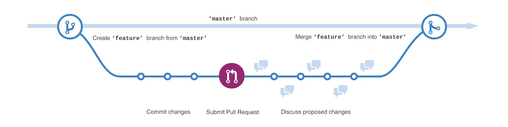
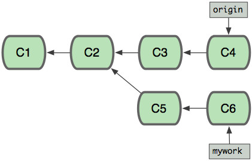

# ___2017 - 01 - 12 git___
***
```shell
git cherry -v 查看commit但没有push的改动
git log master ^origin/master 查看本地有但远程没有的commit
git remote -v 查看远程库地址
git show <commit-hashId> filename 显示某次提交的某个内容的修改信息
git log -p <filename> 查看某个文件的修改历史
git log -p -2 查看最近2次的更新内容
git reset HEAD 撤销 add 没有 commit 文件
git reset --soft HEAD^ 撤销 commit 没有 push 文件
git commit --allow-empty -m "trigger ci"

git config --global https.proxy http://127.0.0.1:8118
git config --global https.proxy https://127.0.0.1:8118
git config --global http.proxy 'socks5://127.0.0.1:8080'
git config --global https.proxy 'socks5://127.0.0.1:8080'

git config --global --unset http.proxy
git config --global --unset https.proxy
```
```sh
git clone <git path> --depth 10
cd <cloned path>
git pull --depth 50
git pull --unshallow
```
```sh
git reset --hard 6e230a9
git pull upstream master --rebase
git push --force
```
```sh
git tag -a v1.0.10 -m 'v1.0.10'
git push origin v1.0.10
```
# 目录
  <!-- TOC depthFrom:1 depthTo:6 withLinks:1 updateOnSave:1 orderedList:0 -->

  - [___2017 - 01 - 12 git___](#2017-01-12-git)
  - [目录](#目录)
  - [集中式版本控制系统：](#集中式版本控制系统)
  - [分支管理策略](#分支管理策略)
  - [多人协作的工作模式](#多人协作的工作模式)
  - [搭建git服务器](#搭建git服务器)
  - [git命令 管理修改 / 撤销 / 提交](#git命令-管理修改-撤销-提交)
  - [git命令 远程库](#git命令-远程库)
  - [git命令 branch](#git命令-branch)
  		- [origin & mywork](#origin-mywork)
  		- [git merge](#git-merge)
  		- [git rebase](#git-rebase)
  - [git命令 标签](#git命令-标签)
  - [git忽略特殊文件](#git忽略特殊文件)
  - [git命令别名 alias / 配置文件](#git命令别名-alias-配置文件)

  <!-- /TOC -->
***

# Q / A
  - 清理
    ```shell
    # 清掉所有 tracked 文件改动
    git reset --hard

    # 清掉所有 untracked 文件，也就是新增的哪些文件
    git clean -df
    ```
  - git clone --recursive 下载子模块失败
    ```shell
    git submodule update --init --recursive
    ```

# 集中式版本控制系统：
  ```
  CVS是最早的开源而且免费的集中式版本控制系统，SVN修正了CVS的一些稳定性问题，是目前用得最多的集中式版本库控制系统。
  版本库是集中存放在中央服务器，必须联网才能工作(commit)
  历史库存在于中央仓库，每次对比与提交代码都必须连接到中央仓库才能进行
  ```
  分布式版本控制系统：
  ```
  没有“中央服务器”，每个人的电脑上都是一个完整的版本库，工作的时候不需要联网，把各自的修改推送给对方，就可以互相看到对方的修改
  在实际使用分布式版本控制系统的时候，通常也有一台充当“中央服务器”的电脑，但这个服务器的作用仅仅是用来方便“交换”大家的修改
  本地仓库包含代码库还有历史库，在本地的环境开发就可以记录历史
  ```
  版本库：
  ```
  版本库里面的所有文件都可以被Git管理起来，每个文件的修改，删除，Git都能跟踪，以便任何时刻都可以追踪历史，或者将文件还原
  创建版本库后生成.git文件夹，其中最重要的就是stage(暂存区)，还有Git为我们自动创建了第一个分支master,以及指向master的一个指针HEAD
  ```
  工作区（Working Directory）
  ```
  当前能看到的目录
  ```
***

# 分支管理策略

  - 分支策略：master主分支应该是非常稳定的，开发或者bug修复需要通过新的分支进行，稳定后合并到master分支
  - 切换到新分支时，将HEAD指针指向新的分支，向HEAD提交的改动将会提交到新的分支上
  - 合并分支时有时会出现Fast-forward信息，Git提示这次合并是“快进模式”，也就是直接把master指向dev的当前提交
  - 在”Fast forward”模式模式下，删除分支后，会丢掉分支信息，merge 使用带参数 –no-ff来禁用”Fast forward”模式
  - 当从远程库克隆时候，实际上Git自动把本地的master分支和远程的master分支对应起来，并且远程库的默认名称是origin
  - branch off a new branch --> edit new branch --> pull request --> merge code --> delete branch (from github website)

  
***

# 多人协作的工作模式
  - 首先，可以试图用git push origin branch-name推送自己的修改；
  - 如果推送失败，则因为远程分支比你的本地更新，需要先用git pull试图合并；
  - 如果合并有冲突，则解决冲突，并在本地提交；
  - 没有冲突或者解决掉冲突后，再用git push origin branch-name推送就能成功
  - 如果git pull提示“no tracking information”，则说明本地分支和远程分支的链接关系没有创建，用git branch --set-upstream-to=origin/BN BN 设定
***

# 搭建git服务器
  - 安装git：
    ```
    $ sudo apt-get install git
    ```
  - 创建一个git用户，用来运行git服务：
    ```
    $ sudo adduser git
    ```
  - 创建证书登录：
    ```
    收集所有需要登录的用户的公钥，就是他们自己的id_rsa.pub文件，把所有公钥导入到/home/git/.ssh/authorized_keys文件里，一行一个
    ```
  - 初始化Git仓库：
    ```
    先选定一个目录作为Git仓库，假定是/srv/sample.git，在/srv目录下输入命令：
    $ sudo git init --bare sample.git

    Git就会创建一个裸仓库，裸仓库没有工作区，因为服务器上的Git仓库纯粹是为了共享，所以不让用户直接登录到服务器上去改工作区
    服务器上的Git仓库通常都以.git结尾
    把owner改为git：
    $ sudo chown -R git:git sample.git
    ```
  - 禁用shell登录：
    ```
    出于安全考虑，第二步创建的git用户不允许登录shell，这可以通过编辑/etc/passwd文件完成。找到类似下面的一行：
    git:x:1001:1001:,,,:/home/git:/bin/bash

    改为：
    git:x:1001:1001:,,,:/home/git:/usr/bin/git-shell

    这样，git用户可以正常通过ssh使用git，但无法登录shell，因为我们为git用户指定的git-shell每次一登录就自动退出。
    ```
  - 克隆远程仓库：
    ```
    现在，可以通过git clone命令克隆远程仓库了，在各自的电脑上运行：
    $ git clone git@server:/srv/sample.git
    Cloning into 'sample'...
    warning: You appear to have cloned an empty repository.
    ```
  - 管理公钥：
    ```
    如果团队很小，把每个人的公钥收集起来放到服务器的/home/git/.ssh/authorized_keys文件里就是可行的
    如果团队有几百号人，就没法这么玩了，这时，可以用Gitosis来管理公钥。
    这里我们不介绍怎么玩Gitosis了，几百号人的团队基本都在500强了，相信找个高水平的Linux管理员问题不大。
    ```
  - 管理权限：
    ```
    每个人是否有读写权限会精确到每个分支甚至每个目录下
    Git是为Linux源代码托管而开发的，所以Git也继承了开源社区的精神，不支持权限控制
    不过，因为Git支持钩子（hook），所以，可以在服务器端编写一系列脚本来控制提交等操作，达到权限控制的目的
    Gitolite就是这个工具
    这里我们也不介绍Gitolite了，不要把有限的生命浪费到权限斗争中。
    ```
***

# git命令 管理修改 / 撤销 / 提交
  - git config  –global 参数，表示这台机器上所有的Git仓库都使用这个配置，如果不加，则只针对当前的仓库起作用
  - git config --global color.ui true 使用颜色显示git命令输出
  - git config --global alias.st status 命令别名
  - git init 将目录变成git可以管理的仓库，生成 .git 文件夹
  - git add foo 将文件 / 修改添加到暂存区里面
  - git add . 将所有改动添加到暂存区
  - git add -p foo select hunks interactively [ ??? ]

  - git rm foo 将文件删除
    ```
    .git
    ├── index
    ├── objects
    │   ├── fd
    │   │   └── c9a78cc8b27d510c132521986edc7a098f6a42
    ```
    ```
    usage: git add [<options>] [--] <pathspec>...

      -n, --dry-run     dry run
      -v, --verbose     be verbose

      -i, --interactive   interactive picking
      -p, --patch      select hunks interactively
      -e, --edit      edit current diff and apply
      -f, --force      allow adding otherwise ignored files
      -u, --update     update tracked files
      -N, --intent-to-add  record only the fact that the path will be added later
      -A, --all       add changes from all tracked and untracked files
      --ignore-removal   ignore paths removed in the working tree (same as --no-all)
      --refresh       don't add, only refresh the index
      --ignore-errors    just skip files which cannot be added because of errors
      --ignore-missing   check if - even missing - files are ignored in dry run
    ```
  - git commit -m "foo fiest commit" 将文件 / 修改提交到仓库
  - git commit --amend -m "foo & bar" 修改上一次提交的注释
  - git commit -m "foo fiest commit" -a 自动提交改动以及删除的文件，而不会影响 **Untracked files**
    ```
    .git
    ├── logs
    │   ├── HEAD
    │   └── refs
    │     └── heads
    │       └── master
    ├── objects
    │   ├── 25
    │   │   └── 9ae93092a5510147ed38054a6d16fad7132257
    │   ├── 2b
    │   │   └── af22685734f15a4811d4d4fc83e710dc17fe1b
    │   ├── fd
    │   │   └── c9a78cc8b27d510c132521986edc7a098f6a42
    └── refs
      ├── heads
      │   └── master
      └── tags
    ```
  - git status 查看是否还有文件未提交
    ```
    $ touch bar
    $ git status
    On branch master
    Untracked files:
     (use "git add <file>..." to include in what will be committed)

            bar

    nothing added to commit but untracked files present (use "git add" to track)
    ```
    ```
    $ git add bar
    $ git status
    On branch master
    Changes to be committed:
     (use "git reset HEAD <file>..." to unstage)

            new file:  bar
    ```
    ```
    $ vi foo
    $ git status
    On branch master
    Changes not staged for commit:
     (use "git add <file>..." to update what will be committed)
     (use "git checkout -- <file>..." to discard changes in working directory)

            modified:  foo
    ```
  - git diff foo 查看文件改动
  - git diff HEAD -- foo
  - git diff 99b9bce -- foo 查看文件与指定版本中的区别
    ```
    diff --git a/foo b/foo
    index fdc9a78..f1a5981 100644
    --- a/foo
    +++ b/foo
    @@ -1 +1,2 @@
     foooo
    +foo
    ```
  - git log 查看历史记录
  - git log -3 显示最近3次的记录
  - git log -2 -p foo 查看文件改动历史
  - git blame foo 查看
  - git log --pretty=oneline 一行显示一次版本改动
  - git log --graph 图形显示合并等情况
  - git log --abbrev-commit 使用短写的版本号
  - git log --graph --pretty=oneline --abbrev-commit
    ```
    commit 259ae93092a5510147ed38054a6d16fad7132257
    Author: leondgarse <leondgarse@gmail.com>
    Date:  Thu Jan 12 19:58:18 2017 +0800

      foo fiest commit
    ```
  - git reflog 查看包括 commit / reset / merge / checkout 的历史记录，回退版本后查找之前最新的版本号
    ```
    259ae93 HEAD@{0}: reset: moving to HEAD~1
    99b4fe7 HEAD@{1}: reset: moving to HEAD^
    99b9bce HEAD@{2}: commit: foo third commit
    99b4fe7 HEAD@{3}: commit: foo second commit
    259ae93 HEAD@{4}: commit (initial): foo fiest commit
    ```
  - git reset --hard HEAD^ 回退到上一个版本
  - git reset --hard HEAD~5 回退到前面第5个版本
  - git reset --hard 99b9bce 回退到指定版本号
  - git reset --keep 99b9bce 保留本地改动，只重置 HEAD
  - git reset 99b9bce^ 撤销没有 push 的 commit
    ```
    usage: git reset [--mixed | --soft | --hard | --merge | --keep] [-q] [<commit>]
      or: git reset [-q] <tree-ish> [--] <paths>...
      or: git reset --patch [<tree-ish>] [--] [<paths>...]

      -q, --quiet      be quiet, only report errors
      --mixed        reset HEAD and index
      --soft        reset only HEAD
      --hard        reset HEAD, index and working tree
      --merge        reset HEAD, index and working tree
      --keep        reset HEAD but keep local changes
      -p, --patch      select hunks interactively
      -N, --intent-to-add  record only the fact that removed paths will be added later
    ```
    ```
    git reset --soft HEAD 回退时不重置缓存区和工作区
    git reset --mixed HEAD 回退时重置缓存区, 默认选项
    git reset --hard HEAD 回退时重置缓存区和工作区

    git reset 不指定HEAD, 用来清空缓存区的修改
    git reset filename 清空缓存区指定文件的修改
    git reset --hard 不指定HEAD, 用来清空工作区和缓存区的修改
    git reset --hard filename 清空工作区和缓存区指定文件的修改
    ```
  - git checkout HEAD -- foo 撤销文件改动，不指定branch则撤销到暂存区中的状态，即最近一次add的状态，reset用于清空暂存区
    ```
    usage: git checkout [<options>] <branch>
      or: git checkout [<options>] [<branch>] -- <file>...
    ```
    ```
    如果没有 -- 的话，那么命令就变成切换分支了
    但如果file不是分支名，而是文件名，命令的效果仍然是撤销修改。
    ```
  - git revert a7bb86011ff7c96abccf2bb9afdbb2504e486aea 撤销指定的changeset
***

# git命令 远程库
  - git remote add origin https://github.com/leondgarse/testgit.git 创建新的远程origin库，本地代码与远程库关联起来
  - git remote add upstream https://github.com/leondgarse/testgit.git 创建新的远程库upstream
  - git push origin master 把本地库的内容推送到远程
  - git push -u origin master 第一次推送使用 -u 参数
    ```
    第一次推送master分支时，加上了 –u参数:
            Git把本地的master分支内容推送的远程新的master分支
            把本地的master分支和远程的master分支关联起来
    在以后的推送或者拉取时就可以简化命令
    ```
    ```
    usage: git push [<options>] [<repository> [<refspec>...]]

      -v, --verbose     be more verbose
      -q, --quiet      be more quiet
      --repo <repository>  repository
      --all         push all refs
      --mirror       mirror all refs
      --delete       delete refs
      --tags        push tags (can't be used with --all or --mirror)
      -n, --dry-run     dry run
      --porcelain      machine-readable output
      -f, --force      force updates
      --force-with-lease[=<refname>:<expect>]
                 require old value of ref to be at this value
      --recurse-submodules[=<check|on-demand|no>]
                 control recursive pushing of submodules
      --thin        use thin pack
      --receive-pack <receive-pack>
                 receive pack program
      --exec <receive-pack>
                 receive pack program
      -u, --set-upstream  set upstream for git pull/status
      --progress      force progress reporting
      --prune        prune locally removed refs
      --no-verify      bypass pre-push hook
      --follow-tags     push missing but relevant tags
      --signed[=<yes|no|if-asked>]
                 GPG sign the push
      --atomic       request atomic transaction on remote side
    ```
  - git clone https://github.com/leondgarse/testgit.git 克隆远程库到本地
  - git clone git@github.com:leondgarse/testgit.git 使用ssh
    ```
    usage: git clone [<options>] [--] <repo> [<dir>]

      -v, --verbose     be more verbose
      -q, --quiet      be more quiet
      --progress      force progress reporting
      -n, --no-checkout   don't create a checkout
      --bare        create a bare repository
      --mirror       create a mirror repository (implies bare)
      -l, --local      to clone from a local repository
      --no-hardlinks    don't use local hardlinks, always copy
      -s, --shared     setup as shared repository
      --recursive      initialize submodules in the clone
      --recurse-submodules initialize submodules in the clone
      --template <template-directory>
                 directory from which templates will be used
      --reference <repo>  reference repository
      --dissociate     use --reference only while cloning
      -o, --origin <name>  use <name> instead of 'origin' to track upstream
      -b, --branch <branch>
                 checkout <branch> instead of the remote's HEAD
      -u, --upload-pack <path>
                 path to git-upload-pack on the remote
      --depth <depth>    create a shallow clone of that depth
      --single-branch    clone only one branch, HEAD or --branch
      --separate-git-dir <gitdir>
                 separate git dir from working tree
      -c, --config <key=value>
                 set config inside the new repository
    ```
  - git remote 查看远程库的信息
  - git remote -v 查看远程库的详细信息
  - git remote show origin 查看远程库详细信息，与本地分支对应关系等
    ```
    $ git remote
    origin

    $ git remote -v
    origin        https://github.com/leondgarse/testgit.git (fetch)
    origin        https://github.com/leondgarse/testgit.git (push)
    ```
  - git fetch upstream 将远程库upstream中的代码拿到本地，但不会合并代码，通常可以指定fork的原始代码库为upstream，并使用fetch来合并自己的代码
    ```
    $ Git fetch origin master 首先从远程的origin的master主分支下载最新的版本到origin/master分支上
    $ git log -p master..origin/master 然后比较本地的master分支和origin/master分支的差别
    $ git merge origin/master 最后进行合并  
    ```
    ```
    $ git fetch origin master:tmp
    $ git diff tmp
    $ git merge tmp
    从远程获取最新的版本到本地的test分支上，之后再进行比较合并
    ```
  - git pull <remote> <branch> 将当前分支最新的提交从远程库拿到本地，并合并代码，相当于fetch + merge
  - 第一次pull需要指定本地dev分支与远程origin/dev分支的链接：
    ```
    $ git checkout junior
    Switched to branch 'junior'
    $ git branch
    * junior
     master

    $ git pull
    From https://github.com/leondgarse/testgit
     * [new branch]   junior   -> origin/junior
    There is no tracking information for the current branch.
    Please specify which branch you want to merge with.
    See git-pull(1) for details.

      git pull <remote> <branch>

    If you wish to set tracking information for this branch you can do so with:

      git branch --set-upstream-to=origin/<branch> junior

    $ git branch --set-upstream-to=origin/junior junior
    Branch junior set up to track remote branch junior from origin.
    或使用
    $ git branch --set-upstream-to=origin/junior
    ```
***

# git命令 branch
  - git branch 查看当前分支
  - git branch -av 查看local & remote 的所有分支，以及最新的改动
  - git branch dev 创建分支dev
  - git branch -d dev 删除分支
  - git branch -D dev 强制删除分支
  - git branch -dr evolution/senior 上出远程库分支
  - git branch --set-upstream-to=origin/junior junior 将分支与远程库分支建立链接

  - git checkout dev 切换到dev分支
  - git checkout -b dev2 创建并切换到dev2分支
  - git checkout -b dev origin/dev 将远程库的dev分支拿到本地
  - git checkout --track origin/senior 使用远程库的分支创建本地分支
    ```
    usage: git branch [<options>] [-r | -a] [--merged | --no-merged]
      or: git branch [<options>] [-l] [-f] <branch-name> [<start-point>]
      or: git branch [<options>] [-r] (-d | -D) <branch-name>...
      or: git branch [<options>] (-m | -M) [<old-branch>] <new-branch>
      or: git branch [<options>] [-r | -a] [--points-at]

    Generic options
      -v, --verbose     show hash and subject, give twice for upstream branch
      -q, --quiet      suppress informational messages
      -t, --track      set up tracking mode (see git-pull(1))
      --set-upstream    change upstream info
      -u, --set-upstream-to <upstream>
                 change the upstream info
      --unset-upstream   Unset the upstream info
      --color[=<when>]   use colored output
      -r, --remotes     act on remote-tracking branches
      --contains <commit>  print only branches that contain the commit
      --abbrev[=<n>]    use <n> digits to display SHA-1s

    Specific git-branch actions:
      -a, --all       list both remote-tracking and local branches
      -d, --delete     delete fully merged branch
      -D          delete branch (even if not merged)
      -m, --move      move/rename a branch and its reflog
      -M          move/rename a branch, even if target exists
      --list        list branch names
      -l, --create-reflog  create the branch's reflog
      --edit-description  edit the description for the branch
      -f, --force      force creation, move/rename, deletion
      --merged <commit>   print only branches that are merged
      --no-merged <commit> print only branches that are not merged
      --column[=<style>]  list branches in columns
      --sort <key>     field name to sort on
      --points-at <object> print only branches of the object
    ```
  - git merge dev2 在master或其他分支上执行，将dev2分支上的改动合并到该分支
  - git merge --no-ff -m "merge with no-ff" dev2 不使用fast-forward模式，创建一个新的commit，可以从分支历史上看出分支信息
    ```
    $ git merge junior
    Updating 99b9bce..9b7cb66
    Fast-forward
     foo | 1 +
     1 file changed, 1 insertion(+)
    ```
  - git merge 冲突
  - git mergetool 使用定义好的mergetool解决冲突
  - git mergetool --tool-help 当前支持的所有mergetool
  - git mergetool --tool=vimdiff 使用vimdiff作为mergetool
  - 当前分支有未提交代码：
    ```
    $ git status
    On branch master
    Your branch is up-to-date with 'origin/master'.
    Changes not staged for commit:
     (use "git add <file>..." to update what will be committed)
     (use "git checkout -- <file>..." to discard changes in working directory)

            modified:  bar

    no changes added to commit (use "git add" and/or "git commit -a")

    $ git merge junior
    Updating 99b9bce..4d7eb4f
    error: Your local changes to the following files would be overwritten by merge:
            bar
    Please, commit your changes or stash them before you can merge.
    Aborting
    ```
  - 两个库已提交的代码有冲突：
    ```
    $ git add -A
    $ git commit -m "bar modify on master"
    [master c2c2141] bar modify on master
     1 file changed, 1 insertion(+)

    $ git merge junior
    Auto-merging bar
    CONFLICT (content): Merge conflict in bar
    Automatic merge failed; fix conflicts and then commit the result.

    $ git status
    On branch master
    Your branch is ahead of 'origin/master' by 1 commit.
     (use "git push" to publish your local commits)
    You have unmerged paths.
     (fix conflicts and run "git commit")

    Unmerged paths:
     (use "git add <file>..." to mark resolution)

            both modified:  bar

    $ cat bar
    <<<<<<< HEAD
    baaaar
    =======
    barrrrrrr
    >>>>junior

    编辑保留需要到版本，git add后重新merge，并commit
    $ vi bar
    $ git merge junior
    error: merge is not possible because you have unmerged files.
    hint: Fix them up in the work tree, and then use 'git add/rm <file>'
    hint: as appropriate to mark resolution and make a commit.
    fatal: Exiting because of an unresolved conflict.

    $ git add bar
    $ git merge junior
    fatal: You have not concluded your merge (MERGE_HEAD exists).
    Please, commit your changes before you merge.

    $ git commit
    ```
  - git stash 保存工作现场
  - git stash list 查看保存的工作现场
  - git stash apply 恢复之前保存的工作现场，恢复后stash内容不删除
  - git stash apply stash@{0} 指定恢复到哪个stash
  - git stash drop 删除之前保存的工作现场
  - git stash pop 恢复的同时删除stash内容
    ```
    $ vi foo
    $ git status
    On branch master
    Changes not staged for commit:
     (use "git add <file>..." to update what will be committed)
     (use "git checkout -- <file>..." to discard changes in working directory)

            modified:  foo

    no changes added to commit (use "git add" and/or "git commit -a")

    $ git stash
    Saved working directory and index state WIP on master: bf7d4ab Merge branch 'junior'
    HEAD is now at bf7d4ab Merge branch 'junior'
    $ git status
    On branch master
    nothing to commit, working directory clean
    ```
  - git rebase <branch> Rebase your current HEAD onto <branch>
  - git rebase --abort Abort a rebase
  - git rebase --continue Continue a rebase after resolving conflicts
  - rebase 与 merge都是用于合并两个分支的，区别在于：
    ```
    merge 将分支合并后，相当于一次新的merge commit，从log中会有merge的记录
    rebase 把当前分支里的每个commit取消掉，并且把它们临时保存为补丁(patch)，放到".git/rebase"目录，
            然后把当前分支更新 为最新的目标 (origin)分支
            最后把保存的这些补丁应用到"mywork"分支上
    ```
### origin & mywork

  
### git merge

  
### git rebase

  
***

# git命令 标签
  - git tag v1.0 在当前commit版本上创建标签v1.0
  - git tag 查看当前的标签
  - git tag v0.9 99b9bce 对指定版本创建标签
  - git tag -a v0.8 -m "version 0.8" 99b4fe7 对指定版本创建带说明的标签
  - git show v1.0 查看标签信息

  - git tag -d v1.0 删除标签
    ```
    $ git tag -a v0.8 -m "version 0.8" 99b4fe7
    $ git tag
    v0.8
    v0.9
    v1.0

    $ git show v0.8
    tag v0.8
    Tagger: leondgarse <leondgarse@aol.com>
    Date:  Sat Jan 14 21:08:49 2017 +0800

    version 0.8

    commit 99b4fe727acb652aee09f020408fa48f4ab8741c
    Author: leondgarse <leondgarse@gmail.com>
    Date:  Thu Jan 12 20:13:00 2017 +0800

      foo second commit

    diff --git a/bar b/bar
    ...
    ```
  - git push origin v0.8 将本地标签推送到远程库
  - git push origin --tags 将本地所有标签推送到远程库
  - 删除远程库标签：
  - git tag -d v1.0 首先本地删除
  - git push origin :refs/tags/v1.0 删除远程库标签
***

# git忽略特殊文件
  - 在git工作区根目录下创建文件.gitignore，然后将要忽略的文件名填进去，git会自动忽略这些文件，不会进行提交等
  - 可以从 https://github.com/github/gitignore 寻找各种不同项目下可以使用的gitignore文件
  - git add -f App.class 将忽略的文件强制添加到git库
  - git check-ignore -v App.class 检查是哪一条规则忽略了改文件
***

# git命令别名 alias / 配置文件
  - git每个库的配置文件位于 .git/config 中
  - 当前用户的篇日志文件位于 ~/.gitconfig
  - git config --global alias.st status
  - git config --global alias.co checkout
  - git config --global alias.ci commit
  - git config --global alias.br branch
  - git config --global alias.last 'log -1'

  - git config --global alias.lg "log --color --graph --pretty=format:'%Cred%h%Creset -%C(yellow)%d%Creset %s %Cgreen(%cr) %C(bold blue)<%an>%Creset' --abbrev-commit"
***

# git 免密码
## 使用 ssh key
  - 在 github / gitlab 添加 ssh public key
  - 本地添加 ssh private key
  - 使用 ssh 方式 Clone 代码
    ```shell
    git clone git@192.168.136.136:edu-dev/FaceCard.git
    ```
## 使用 http cache
  - 配置使用 credential helper
    ```shell
    git config --global credential.helper cache
    ```
  - 默认超时时间是 15 分钟
    ```shell
    # 修改为 1 小时
    git config --global credential.helper 'cache --timeout=3600'
    ```
***
