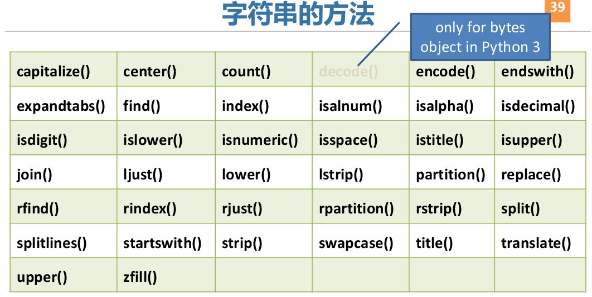

# ___2017 - 02 - 06 Python Basic___
***

# 目录
  <!-- TOC depthFrom:1 depthTo:6 withLinks:1 updateOnSave:1 orderedList:0 -->

  - [___2017 - 02 - 06 Python Basic___](#2017-02-06-python-basic)
  - [目录](#目录)
  - [Q / A](#q-a)
  - [Python2 to Python3](#python2-to-python3)
  - [python程序的执行方式](#python程序的执行方式)
  - [print格式化输出](#print格式化输出)
  - [数据类型 / 运算符](#数据类型-运算符)
  	- [数字常量](#数字常量)
  	- [布尔常量 True / False](#布尔常量-true-false)
  	- [字符串常量](#字符串常量)
  	- [算数运算符](#算数运算符)
  	- [比较运算符 / 逻辑运算符](#比较运算符-逻辑运算符)
  - [if / for / while](#if-for-while)
  - [函数](#函数)
  	- [定义](#定义)
  	- [Python中函数的参数形式](#python中函数的参数形式)
  	- [python内建函数](#python内建函数)
  	- [global](#global)
  	- [默认参数值](#默认参数值)
  	- [指定关键参数](#指定关键参数)
  	- [docstrings 文档字符串](#docstrings-文档字符串)
  	- [在函数中接收元组和列表](#在函数中接收元组和列表)
  	- [在函数中接收字典参数](#在函数中接收字典参数)
  	- [函数返回多个参数 (元组 / 字典)](#函数返回多个参数-元组-字典)
  	- [传递函数 （函数作为参数传递）](#传递函数-函数作为参数传递)
  	- [内嵌函数](#内嵌函数)
  - [模块](#模块)
  	- [sys模块](#sys模块)
  	- [字节编译的.pyc文件](#字节编译的pyc文件)
  	- [from ... import ...](#from-import-)
  	- [模块名称 \_\_name\_\_](#模块名称-name)
  	- [dir](#dir)
  - [数据结构](#数据结构)
  	- [序列 (切片 / 索引 / in / not in / 转换工厂函数 / 内建函数)](#序列-切片-索引-in-not-in-转换工厂函数-内建函数)
  	- [列表 list](#列表-list)
  		- [列表方法](#列表方法)
  		- [示例](#示例)
  		- [列表复制](#列表复制)
  		- [列表解析 / 列表生成器](#列表解析-列表生成器)
  		- [map / filter](#map-filter)
  	- [sorted / min的key参数](#sorted-min的key参数)
  	- [元组 tuple](#元组-tuple)
  		- [元组操作](#元组操作)
  		- [元组的作用](#元组的作用)
  	- [字典 dict](#字典-dict)
  		- [创建字典](#创建字典)
  		- [索引 / 删除 / 遍历](#索引-删除-遍历)
  		- [字典的格式化字符串](#字典的格式化字符串)
  		- [字典的方法](#字典的方法)
  	- [字典值排序](#字典值排序)
  	- [集合 set](#集合-set)
  		- [集合比较](#集合比较)
  		- [集合关系运算](#集合关系运算)
  		- [集合的方法](#集合的方法)
  - [字符串](#字符串)
  	- [字符串对象方法](#字符串对象方法)
  	- [字符串方法 （图片）](#字符串方法-图片)
  	- [示例](#示例)
  	- [模块 / 字符串示例程序](#模块-字符串示例程序)
  - [正则表达式 re模块](#正则表达式-re模块)
  - [面向对象的编程](#面向对象的编程)
  	- [类](#类)
  	- [继承](#继承)
  - [文件](#文件)
  	- [open() / close()](#open-close)
  	- [读文件](#读文件)
  	- [写文件](#写文件)
  - [二进制储存器](#二进制储存器)
  - [异常](#异常)
  - [Python标准库 (sys / os)](#python标准库-sys-os)
  	- [sys模块](#sys模块)
  	- [os模块](#os模块)
  - [其他语句 lambda / exec / eval / assert / repr / enumerate / format](#其他语句-lambda-exec-eval-assert-repr-enumerate-format)
  	- [lambda形式，匿名函数](#lambda形式匿名函数)
  	- [exec和eval语句，执行语句 / 表达式](#exec和eval语句执行语句-表达式)
  	- [assert语句，断言](#assert语句断言)
  	- [repr函数，规范字符串表示](#repr函数规范字符串表示)
  	- [range 函数，列表生成器](#range-函数列表生成器)
  	- [enumerate 带指数的列表](#enumerate-带指数的列表)
  	- [format 格式化](#format-格式化)
  	- [Iterables / Generators / Yield](#iterables-generators-yield)
  - [python 执行 shell 命令](#python-执行-shell-命令)
  	- [os 模块](#os-模块)
  	- [subprocess 模块](#subprocess-模块)
  - [argparse 解析参数](#argparse-解析参数)
  	- [脚本中 argparse 典型格式](#脚本中-argparse-典型格式)
  	- [ArgumentParser 初始化参数](#argumentparser-初始化参数)
  	- [add_argument 位置参数与可选参数](#addargument-位置参数与可选参数)
  	- [add_argument 参数行为 action](#addargument-参数行为-action)
  	- [add_argument 参数类型 type](#addargument-参数类型-type)
  	- [add_argument 参数个数 nargs](#addargument-参数个数-nargs)
  	- [add_argument_group 参数组](#addargumentgroup-参数组)

  <!-- /TOC -->
***

# Q / A
  - Python参考教程
    ```python
    (1) Magnus Lie Hetland,Beginning Python: from Novice to Professional, 2nd edition, Apress.（第二版中译版名为《Python基础教程》）
    (2) Wesley Chun, Core Python Applications Programming, Prentice Hall.（第二版中译版名为《Python核心编程》）
    (3) SciPy科学计算：http://www.scipy.org/
    (4) Wes McKinney, Python for Data Analysis. 东南大学出版社. （英文影印本，中译版名为《利用Python进行数据分析》）
    ```
  - 基本
    - $ python -V # 显示版本
    - $ python3
    - help(str) 显示str帮助信息
    - help('print') print帮助信息
    - print('Area is'， length * width) # 输出会在is后面自动添加空格 Area is 10
    - python中没有 ++ / -- 运算符
    - 获取变量类型： type() / isinstance(var, type)
    - python下载模块： easy_install-3.6 wx
  - Q： IndentationError: unexpected indent
    ```python
    $ python hello.py
    File "hello.py", line 18
     print('Value is', i) # Error! Notice a single space at the start of the line
    ^
    IndentationError: unexpected indent
    ```
    A： 检查行首是否有多余的空格，Python中行首的空白是重要的，在逻辑行首的空白(空格和制表符)用来决定逻辑行的缩进层次，从而用来决定语句的分组
  - Q: Encoding error while reading a file
    ```python
    UnicodeDecodeError: 'utf-8' codec can't decode byte 0xae in position 199: invalid start byte
    ```
    A: 非'utf-8'编码的字符报错，可以捕获 / 忽略该错误
    ```python
    f = open(path + 'foo', errors='ignore')
    ```
***

# Python2 to Python3
  - Python3 中不再支持 **raw_input**，使用 **input**
  - Python2 中 **print** 不需要加()，python3 中需要使用print( ... )
    ```python
    print 'Hello World!'
         ^
    SyntaxError: Missing parentheses in call to 'print'
    ```
    python3 中使用
    ```python
    print('Hello World!')
    ```
  - Python3 print 语法 **end = ' '**
    ```python
    $ python2 hello.py
    File "hello.py", line 5
    print(5, end = ' ') # assign end character as ' ', instead of '\n'
        ^
    SyntaxError: invalid syntax
    ```
    Python2 不支持该语法，使用 Python3 运行
    ```python
    python3 hello.py
    ```
  - Python2 中的 **commands** 模块
    ```python
    ImportError: No module named 'commands'
    ```
    在 Python3 中不再使用 commands，而改用 subprocess 模块，使用 subprocess 替换 commands
  - Python2 中的 **file** 类
    ```python
    name 'file' is not defined    
    ```
    Python3 中不再使用 file 类，使用 open 打开文件
  - Python2 中 **dict** 的键值类型
    ```python
    TypeError: 'dict_keys' object does not support indexing
    ```
    Python3 中改变了dict.keys，返回的是 **dict_keys 对象**，支持 **iterable** 但不支持 **indexable**，可以将其明确的转化成 list
    ```python
    list(dict.keys)
    list(dict.values)
    ```
  - Python2 中的 **xrange**
    ```python
    NameError: name 'xrange' is not defined
    ```
    xrange() was renamed to **range()** in Python 3
***

# python程序的执行方式
  - python能够轻松的集成C,C++,Fortran代码（Cython项目），可以同时用于研究和原型的构建以及生产系统的构建
  - 因为python是一种解释型语言，运行速度比编译型数据慢
  - 由于python有一个全局解释器锁（GIL）,防止解释器同时执行多条python字节码，所以python不适用于高并发、多线程的应用程序
  - Cython项目可以集成OpenMP（一个用于并行计算的C框架）以实现并行处理循环进而大幅度提高数值算法的速度
  - 交互式命令行
    ```python
    $ python3
    print("hello world")
    hello world
    ```
  - 文件
    ```python
    $ cat hello.py
    #!/usr/bin/python3
    #Filename: hello.py

    print('Hello World!')

    $ python3 hello.py
    Hello world

    $chmod a+x hello.py
    $ ./hello.py
    Hello world
    ```
  - 首行 #!/usr/bin/python3
    ```python
    Python至少应当有第一行那样的特殊形式的注释，它被称作组织行，源文件的头两个字符是#!，后面跟着一个程序
    这行告诉Linux/Unix系统当执行程序时，应该运行哪个解释器
    ```
***

# print格式化输出
  - print 原型 print(* objects, sep=' ', end='\n', file=sys.stdout, flush=False)
    ```python
    sys.stdout.write('Hello World')        # 直接使用sys.stdout.write输出
    sys.stdout.flush()        # 刷新缓冲区
    ```
  - print格式化输出：
    ```python
    print('%s' %('example'))
    e = 'example'
    print('%(e)s' %vars())
    example

    strHello = "the length of (%s) is %d" %('Hello World',len('Hello World'))
    print(strHello)
    the length of (Hello World) is 11

    print(x, end="") # python3中结尾不使用换行符
    ```
  - 整数的进制：
    ```python
    %x：hex 十六进制
    %d：dec 十进制
    %o：oct 八进制

    nHex = 0x20
    print("nHex = %x, nDec = %d, nOct = %o" %(nHex, nHex, nHex))
    nHex = 20, nDec = 32, nOct = 40
    ```
  - 格式化输出浮点数
    ```python
    输出10位宽度，3位精度，左对齐
    import math
    print("PI = %-10.3f%-10.3f" %(math.pi, math.pi))
    PI = 3.142   3.142
    ```
  - 格式化输出字符串
    ```python
    输出10位宽度，4位精度，左 / 右对齐
    print('%-10.4s%*.*s' % ('hello', 10, 4, 'world'))
    hell      worl
    ```
***

# 数据类型 / 运算符
  - del 删除 一个变量/名称
  - i = 5 # 不需要声明或定义数据类型
  - print(i+1)
## 数字常量
  - 整数： 2
    ```python
    type(3)
    <class 'int'>
    ```
    长整数： 大一些的整数，python3中不再有长整型
  - 浮点数： 3.23和52.3E-4，E标记表示10的幂，52.3E-4表示52.3 * 10 -4
    ```python
    type(1.)
    <class 'float'>
    ```
  - 复数： (-5+4j)和(2.3-4.6j)，real / imag 方法分别得到实部与虚部，conjugate得到共轭复数
    ```python
    type(-5+4j)
    <class 'complex'>
    x.real
    2.4
    x.imag
    5.6
    x.conjugate()
    (2.4-5.6j)
    ```
## 布尔常量 True / False
  - 仅有2个值:True、False
    ```python
    type(True)
    <class 'bool'>
    x = True
    int(x)
    1
    ```
## 字符串常量
  - 可以使用 ' ' 或 " "
  - 使用 ''' ''' 或 """ """ ： 可以指定多行的字符串，或使用 '' / ""
  - 转义符 / 续行符： \
  - Python中没有专门的char数据类型
    ```python
    type("a")
    <class 'str'>
    type('a')
    <class 'str'>
    ```
  - 自然字符串： 字符串加上前缀r或R，不需要如转义符那样的特别处理的字符串，如路径名等
    ```python
    print(r"Newlines are indicated by \n")
    要用自然字符串处理正则表达式，否则会需要使用很多的反斜杠，如后向引用符可以写成 '\\1' 或 r'\1'
    ```
  - Unicode字符串： 前缀u或U
    ```python
    print(u"This is a Unicode string.")
    ```
  - 二进制编码：前缀b
## 算数运算符
  - + 加可用于字符串 / 列表 / 元组： 'a' + 'b' = 'ab'
  - * 乘可用于字符串 / 列表 / 元组： 'a' *3 = 'aaa'
  - ** 幂运算： 3 ** 4 = 81
    ```python
    幂运算优先级高于负号-， -3 ** 2 = -9，应使用(-3) ** 2
    ```
    // 商的整数部分： 4 // 3.0 = 1.0
## 比较运算符 / 逻辑运算符
  - 比较运算符可以连接
    ```python
    3 < 4 < 7 # same as (2 < 4) &amp;&amp; (4 < 7)
    True
    3 < 4 < 2
    False
    ```
  - 逻辑运算符：
    ```python
    not / and / or / is / is not
    x, y = 1, 2
    not(x is y)
    True
    (x < 3) or (y > 3)
    True
    ```
***

# if / for / while
  - if示例：
    ```python
    #!/usr/bin/python
    # Filename: if.py
    number = 23
    guess = int(input('Enter an integer : '))        # 显示字符串并获得输入，然后转化为int型
    if guess == number:        # 不使用{}，缩进指定程序块
      print('Congratulations, you guessed it.')
      print("(but you do not win any prizes!)")
    elif guess < number:
      print('No, it is a little higher than that') # Another block
    else:
      print('No, it is a little lower than that')
    print('Done')
    ```
  - 三目： min = x if x<y else y
    ```python
    x, y = 1, 2
    min = x if x < y else y
    min
    1
    ```
    实现异或运算
    ```python
    xor = lambda a, b: False if (a and b) or (not a and not b) else True
    xor(1 ,2)
    Out[87]: False

    xor(0, 0)
    Out[88]: False

    xor(1, 0)
    Out[89]: True
    ```
  - while示例：
    ```python
    #!/usr/bin/python
    # Filename: while.py
    running = True                # True / False
    while running:
      ...
    else:        # while可以有一个else选项，正常结束循环执行else语句，break结束循环将不执行else语句
      ...
    ```
  - for示例：
    ```python
    可迭代对象，string / list / tuple / dictionary / file

    #!/usr/bin/python
    # Filename: for.py
    for i in range(1, 5):        # or for i in [1, 2, 3 ,4 ]
      print(i)
    else:
      print('The for loop is over')
    ```
  - break / continue：
    ```python
    如果从for或while循环中终止 ,任何对应的循环else块将不执行
    ```
***

# 函数
## 定义
  - 关键字def，使用缩进指定代码块
    ```python
    def maximum(x, y):
      if x > y:
        return x
      else:
        return y

    print maximum(2, 3)
    ```
## Python中函数的参数形式
  - 位置或关键字参数
  - 仅位置的参数
  - 可变长位置参数：列表list / 元组tuple，形参中使用*
  - 可变长关键字参数：字典dict，形参中使用**
  - (参数可以设定默认值)
## python内建函数
  - 如abs / min / sum，不需要import：
    ```python
    dir(__builtins__) # 查看支持的内建函数
    ```
  - 其他数学math库的函数，如floor，需要import math：
    ```python
    round(4.5)
    4
    round(4.6)
    5
    floor(4.5)
    Traceback (most recent call last):
     File "<stdin>", line 1, in <module>
    NameError: name 'floor' is not defined
    import math
    math.floor(4.6)
    4
    math.floor(-35.4)
    -36
    ```
## global
  - 外部定义的变量可以在函数内部访问，若要修改，则会自动创建同名局部变量，可使用global / nonlocal 关键字声明为全局变量
  - global 表明变量是在外面的块定义的
    ```python
    def func():
      global x
      print('x is', x)
      x = 2
      print('Changed local x to', x)

    x = 50
    func()
    print('Value of x is', x)
    ```
## 默认参数值
  - 有默认值的形参只能位于参数列表后面
    ```python
    def say(message, times = 1):        # 形参列表中使用= 指定默认值
      print(message * times)

    say('hello')
    say('world', 5)
    ```
## 指定关键参数
  - 实参调用时，可以指定为某些参数赋值
  - 关键字参数后面只能是关键字参数
    ```python
    def func(a, b=5, c=10):
      print 'a is', a, 'and b is', b, 'and c is', c

    func(3, 7)
    func(25, c=24)
    func(c=50, a=100)
    ```
## docstrings 文档字符串
  - 函数的第一个逻辑行的字符串是这个函数的 文档字符串 ，DocStrings也适用于模块和类
  - 文档字符串的惯例是一个多行字符串，首行以大写字母开始，句号结尾，第二行是空行，从第三行开始是详细的描述
  - 使用__doc__调用函数的文档字符串属性
    ```python
    def func():
      '''Prints the maximum of two numbers.

      The two values must be integers.'''

    print printMax.__doc__
    ```
  - help()会抓取函数的__doc__属性，然后展示
  - 可以在程序中调用如： help(func)
## 在函数中接收元组和列表
  - * 前缀，所有多余的函数参数都会作为一个元组存储在args中
  - 用于函数获取可变数量的参数
    ```python
    def powersum(power, *args):
      total = 0
      for i in args:
          total += pow(i, power)
      return total

    powersum(2, 3, 4)
    25
    powersum(2, 10)
    100
    ```
## 在函数中接收字典参数
  - 可变长关键字参数
  - ** 前缀，多余的参数则会被认为是一个字典的键/值对
    ```python
    def func(args1, *argst, **argsd):
      print(args1)
      print(argst)
      print(argsd)

    func('Hello,', 'Wangdachui', 'Niuyun', 'Linling', a1=1, a2=2, a3=3)
    Hello,
    ('Wangdachui', 'Niuyun', 'Linling')
    {'a1': 1, 'a2': 2, 'a3': 3}
    ```
## 函数返回多个参数 (元组 / 字典)
  - 返回元组
    ```python
    def func():
      return 1, 2, 3

    a, b, c = func()
    a, b, c
    Out[275]: (1, 2, 3)
    ```
  - 返回字典
    ```python
    def f():
      a = 5
      b = 6
      c = 7
      return {'a' : a, 'b' : b, 'c' : c}
    r = f()
    r
    Out[288]: {'a': 5, 'b': 6, 'c': 7}
    ```
  - * 可用于将函数返回的元组值解包
    ```python
    fa = lambda : (1, 3)
    fb = lambda a, b : a + b
    fb(* fa())
    ```
## 传递函数 （函数作为参数传递）
  - 传递函数
    ```python
    def addMe2Me(x):
      return (x+x)

    def self(f, y):
      print(f(y))

    self(addMe2Me, 2.2)
    4.4
    ```
## 内嵌函数
  - 内嵌函数
    ```python
    def FuncX(x):
      def FuncY(y):
          return x*y
      return FuncY # --> NOT FuncY()

    i = FuncX(3)
    i(5)
    Out[278]: 15

    FuncX(3)(5)
    Out[279]: 15
    ```
***

# 模块
  - 模块是一个包含函数和变量的文件，以.py为扩展名结尾
  - 当一个模块被第一次输入的时候,这个模块的主块将被运行
  - import sys 导入模块
  - import..as语法：取模块别名，可以使用更短的模块名称，还能够通过简单地改变一行就切换到另一个模块
    ```python
    import 1 as p
    # import 2 as p
    ```
## sys模块
  - sys模块包含了与Python解释器和它的环境有关的函数
  - 当Python执行import sys语句的时候会在sys.path变量中所列目录中寻找sys.py模块，随后执行这个模块主块中的语句，然后这个模块将能够使用
  - 初始化过程仅在第一次 输入模块的时候进行
  - sys.argv变量是一个字符串的列表，包含了命令行参数
  - sys.path包含输入模块的目录名列表，第一个字符串是空的，表示当前目录也是sys.path的一部分
    ```python
    for i in sys.argv:
      print(i)
    print('\n\nPYTHONPATH = ', sys.path, '\n')
    ```
## 字节编译的.pyc文件
  - 导入模块时，pyc文件会快得多，因为一部分输入模块所需的处理已经完成了
  - 字节编译的文件是与平台无关的
## from ... import ...
  - from sys import argv 直接输入argv变量到程序中(使用时可省略sys.)
  - from sys import * 输入所有sys模块使用的名字
  - 如使用了 import pandas as pd，再导入pandas.DataFrame时，应使用：
    ```python
    from pandas import DataFrame
    而不是
    from pd imprt DataFrame
    ```
  - 应该避免使用from..import而使用import语句，因为这样可以使程序更加易读，也可以避免名称的冲突
## 模块名称 \_\_name\_\_
  - 每个Python模块都有它的__name__
  - 被用户单独运行的模块是'__main__'
    ```python
    $ cat using_name.py
    #!/usr/bin/python
    #Filename: using_name.py

    if __name__ == '__main__':
      print('This program is running by itself, __name__ =', __name__)
    else:
      print('This program is imported from other module, __name__ =', __name__)

    $ python3 using_name.py
    This program is running by itself, __name__ = __main__

    $ python
    Python 2.7.12 (default, Nov 19 2016, 06:48:10)
    [GCC 5.4.0 20160609] on linux2
    Type "help", "copyright", "credits" or "license" for more information.
    import using_name
    ('This program is imported from other module, __name__ =', 'using_name')
    ```
## dir
  - dir函数来列出模块定义的标识符，包括函数、类和变量
    ```python
    print(dir())        # 当前模块的符号列表
    print(dir(sys))        # sys模块的符号列表

    $ python3
    Python 3.5.2 (default, Nov 17 2016, 17:05:23)
    [GCC 5.4.0 20160609] on linux
    Type "help", "copyright", "credits" or "license" for more information.
    dir()
    ['__builtins__', '__doc__', '__loader__', '__name__', '__package__', '__spec__']
    a=5
    dir()
    ['__builtins__', '__doc__', '__loader__', '__name__', '__package__', '__spec__', 'a']
    del a
    dir()
    ['__builtins__', '__doc__', '__loader__', '__name__', '__package__', '__spec__']
    >>>
    ```
***

# 数据结构
  - Python中内建的数据结构：列表 / 元组 / 字典 / 集合
    ```python
    type([1, 2])
    <class 'list'>

    type((1, 2))
    <class 'tuple'>

    type({1:1, 2:2})
    <class 'dict'>

    type({1, 2, 3, 4, 2, 3, 1})        # 集合中元素是惟一的
    <class 'set'>
    ```
## 序列 (切片 / 索引 / in / not in / 转换工厂函数 / 内建函数)
  - 列表、元组和字符串都是序列
  - 切片 / 索引
    ```python
    序列的两个主要特点是索引操作符和切片操作符
    索引操作符可以从序列中抓取一个特定项目
    切片操作符能够获取序列的一个切片，即一部分序列
    切片操作返回的序列从开始位置开始，在结束位置之前结束，即包括开始位置，不包括结束位置
    ```
  - 索引
    ```python
    shoplist = ['apple', 'mango', 'carrot', 'banana']

    shoplist[0]                # 第0个元素
    Out[381]: 'apple'
    shoplist[-1]        # 最后一个元素
    Out[382]: 'banana'
    shoplist[-2]        # 倒数第二的元素
    Out[383]: 'carrot'
    ```
  - list上的切片操作，包括开始的节点，不包括结束的节点
    ```python
    shoplist[1:3]        # 元素1, 2
    Out[387]: ['mango', 'carrot']
    shoplist[2:]        # 编号2以后的元素，包括2
    Out[388]: ['carrot', 'banana']
    shoplist[1:-1]        # 编号1到最后一个元素，包括1，不包括最后一个
    Out[389]: ['mango', 'carrot']
    shoplist[:]        # 所有元素
    Out[390]: ['apple', 'mango', 'carrot', 'banana']
    ```
  - ::设定步长step
    ```python
    shoplist[::-1]        # 逆序
    Out[391]: ['banana', 'carrot', 'mango', 'apple']
    shoplist[::2]        # 步长为2，选取0, 2, 4, ...
    Out[392]: ['apple', 'carrot']
    shoplist[:-3:-1]    # 等价于 shoplist[::-1][:2]
    Out[393]: ['banana', 'carrot']
    ```
  - string类型的切片操作
    ```python
    name = 'swaroop'
    print('characters 1 to 3 is', name[1:3])
    characters 1 to 3 is wa
    ```
  - 序列类型运算符
    ```python
    x in s 判断s是否包含x
    x not in s
    s + t
    s * n, n * s
    s[i]
    s[i:j]
    s[i:j:k]
    ```
  - 序列类型转换工厂函数
    ```python
    list()
    str()
    basestring()
    tuple()

    str(['hello', 'world'])
    "['hello', 'world']"
    list('hello, world')
    ['h', 'e', 'l', 'l', 'o', ',', ' ', 'w', 'o', 'r', 'l', 'd']
    tuple('hello, world')
    ('h', 'e', 'l', 'l', 'o', ',', ' ', 'w', 'o', 'r', 'l', 'd')
    ```
  - 序列类型可用内建函数
    ```python
    enumerate() 返回一个元组(i, value)，给参数的每一项加上索引
    len() 序列成员数量，len(member)
    max() / min() 返回序列中最大/最小值，max(member) / min(member)
    reversed() 转置，返回一个列表生成器，list(reversed(member))
    sorted() 排序，返回一个新的列表，不修改原序列sorted(member)
    sum() 返回序列成员(int)总和，sum(member)
    zip() 压缩组合，建立两个序列间的对应关系，可用于生成dict，返回一个列表生成器 a=[1, 2, 3, 4], b=[5, 6], list(zip(a, b)) --> [(1, 5), (2, 6)]
    ```
## 列表 list
  - 处理一组有序项目的数据结构，包括在方括号中
    ```python
    list = [1, 2, 3]
    dir(list)
    ```
    可以添加、删除或是搜索列表中的项目，是可变的数据类型，可以包含不同类型的数据
    ```python
    bList = [1,2,'a',3.5]
    pList = [(1, 'a'), (2, 'b'), [3, 4, 'c']]
    ```
    列表之间可以执行 = / > / < / == / + / *
### 列表方法
  - 头插入： insert(index, object) index之前插入元素
  - 尾插入： append(object)
  - 遍历： for str in list: ...
  - 索引：[n]，可使用如 -1 指定末尾的元素
  - 索引号：L.index(value, [start, [stop]]) -> integer -- return first index of value 从start开始第一个出现value的位置
  - 删除：L.remove(value) -> None -- remove first occurrence of value 删除第一个出现的value
  - 排序： L.sort(key=None, reverse=False) -> None 可指定排序使用的方法，如key=len，指定reverse = True降序
  - 转置：L.reverse() -- reverse *IN PLACE* 修改原列表
  - 成员计数：L.count(value) -> integer -- return number of occurrences of value 返回成员数量
  - 弹出：L.pop([index]) -> item -- remove and return item at index (default last) 返回并删除元素
  - 扩展：L.extend(iterable) -> None -- extend list by appending elements from the iterable 将容器中的元素添加到列表结尾，类似于使用 +=
### 示例
  - len / in / append / sort / del
    ```python
    #!/usr/bin/python

    shoplist = ['apple', 'mango', 'carrot', 'banana']
    print('len =', len(shoplist))
    print('list =', end=' ')
    for item in shoplist:
      print(item, end=' ')
    print()

    shoplist.append('rice')
    print("shoplist = ", shoplist)

    shoplist.sort()
    print("shoplist = ", shoplist)

    del shoplist[0]
    print("shoplist = ", shoplist)

    new_list = ['meat', shoplist]
    print("new_list = ", new_list, ", len = ", len(new_list))        # --> new_list = ['meat', ['banana', 'carrot', 'mango', 'rice']] , len = 2
    print(“new_list elements: ”new_list[1], new_list[1][2])        # --> ['banana', 'carrot', 'mango', 'rice'] mango
    ```
  - 基本运算
    ```python
    x = (1, 2, 3)
    y = (4, 5, 6)
    z = x + y
    z
    (1, 2, 3, 4, 5, 6)
    z = 3 * x
    z
    (1, 2, 3, 1, 2, 3, 1, 2, 3)
    ```
  - extend / append
    ```python
    week = ['Monday', 'Tuesday', 'Wednesday', 'Thursday', 'Friday']
    weekend = ['Saturday', 'Sunday']
    week.extend(weekend)        # extend将元素附加在列表后
    week
    ['Monday', 'Tuesday', 'Wednesday', 'Thursday', 'Friday', 'Saturday', 'Sunday']
    week.append(weekend)        # append将列表附加在列表后
    week
    ['Monday', 'Tuesday', 'Wednesday', 'Thursday', 'Friday', 'Saturday', 'Sunday', ['Saturday', 'Sunday']]
    ```
### 列表复制
  - 当创建一个对象并给它赋一个变量的时候，仅仅是创建一个原对象的引用
    ```python
    shoplist = ['apple', 'mango', 'carrot', 'banana']
    mylist = shoplist        # mylist is just another name pointing to the same object!
    del shoplist[0]
    shoplist
    ['mango', 'carrot', 'banana']
    mylist
    ['mango', 'carrot', 'banana']

    mylist = shoplist[:]        # make a copy by doing a full slice
    shoplist.pop(0)
    'mango'
    shoplist
    ['carrot', 'banana']
    mylist
    ['mango', 'carrot', 'banana']
    ```
### 列表解析 / 列表生成器
  - 动态创建列表，从一个已有的列表导出一个新的列表
  - 列表生成器只能遍历一次
    ```python
    [ expression for expr in sequence1
    for expr2 in sequence2 ...
    for exprN in sequenceN
    if condition ]
    ```
    对于符合条件codition的元素，使用expression计算后创建列表
    ```python
    listone = [2, 3, 4]
    listtwo = [2*i for i in listone if i > 2]        # 原列表中所有大于2的数都是原来的2倍
    ```
  - 列表解析，返回一个列表，使用[]：
    ```python
    [i+1 for i in range(10) if i%2 == 0]
    [1, 2, 5, 6, 9, 10]
    ```
  - 返回字典
    ```python
    data = [1, 2, 3, 4]
    {'%s' % ii: ii for ii in data}
    ```
  - 列表生成器，返回一个生成器，使用()：
    ```python
    (i+1 for i in range(10) if i % 2 == 0)
    <generator object <genexpr> at 0x7f173064f1a8>        # 返回一个列表生成器，python3中的range()函数的返回值也是一个生成器
    for i in (i+1 for i in range(10) if i % 2 == 0):
        print(i, end=' ')

    # [Out]
    1 2 5 6 9 10
    ```
### map / filter
  - map: 根据功能函数一一代入列表中参数
    ```python
    list(map(lambda x : x % 2, range(10)))
    [0, 1, 0, 1, 0, 1, 0, 1, 0, 1]
    ```
  - filter: 过滤器，根据功能函数过滤列表
    ```python
    list(filter(lambda x : x % 2, range(10)))
    [1, 3, 5, 7, 9]
    ```
## sorted / min的key参数
  - 用于指定比较的依据
  ```python
  l = [[2, 1], [1, 3], [3, 2]]
  sorted(l, key = lambda x : x[1])
  Out[164]: [[2, 1], [3, 2], [1, 3]]

  sorted(l, key = lambda x : x[1], reverse=True)  # 逆序
  Out[165]: [[1, 3], [3, 2], [2, 1]]

  min(l, key = lambda x : x[1])
  Out[166]: [2, 1]
  ```
## 元组 tuple
  - 元组与列表类似，但元素不可修改
  - 通过圆括号中用逗号分割的项目定义，括号可以省略
    ```python
    t1 = (1, 2, 3, 4, 5)
    t1
    (1, 2, 3, 4, 5)
    t2 = 1 , 2, 3, 4, 5
    t2
    (1, 2, 3, 4, 5)
    ```
  - 空的元组： 由一对空的圆括号组成
    ```python
    myempty = ()
    ```
    单个元素的元组： 必须在第一个项目后跟一个逗号，Python才能区分元组和表达式中一个带圆括号的对象
    ```python
    singleton = (2 , )
    ```
### 元组操作
  - 可以使用 += / * = / 切片方法：
    ```python
    t1 = (1, 2, 3, 4, 5)
    t1 *= 2
    t1
    (1, 2, 3, 4, 5, 1, 2, 3, 4, 5)
    t1 += (6, )
    t1
    (1, 2, 3, 4, 5, 1, 2, 3, 4, 5, 6)
    ```
  - 元组的插入操作：
    ```python
    元组没有定义insert方法，使用：
    t1 = (1, 2, 3, 4, 5)
    t1 = t1[:2] + (6,) + t1[2:]
    t1
    (1, 2, 6, 3, 4, 5)
    ```
  - 元组的排序操作：
    ```python
    元组没有定义自己的sort()函数，对元组排序可使用：
    t = (1, 3, 4, 2, 5)
    sorted(t)
    [1, 2, 3, 4, 5]
    t
    (1, 3, 4, 2, 5)
    t = tuple(sorted(t))
    t
    (1, 2, 3, 4, 5) # 创建了新的元组
    ```
### 元组的作用
  - 在映射类型中作为键使用
  - 作为函数的可变长度形参
  - 作为很多内建函数的返回值
  - 元组与打印语句
    ```python
    print语句可以使用跟着 % 符号的项目元组的字符串，让输出满足某种特定的格式
    %s 表示字符串或 %d 表示整数，元组必须按照相同的顺序来对应

    age = 22
    name = 'Swoooop'

    print('%s is %d years old' % (name, age)) # 不使用逗号,分隔
    print('Ya! %s is playing python.' % name)
    ```
  - print 打印单个元组内容，应使用 ',' 分隔
    ```python
    tt = (1, 2, 3)
    print('tt = %s' % tt)
    # [Out]: TypeError: not all arguments converted during string formatting

    print('tt = %s' % (tt))
    # [Out]: TypeError: not all arguments converted during string formatting

    print('tt = %s' % (tt,))
    # [Out]: tt = (1, 2, 3)

    print('tt = %s' % str(tt))
    # [Out]: tt = (1, 2, 3)
    ```
  - 元组可以位于左值 (多元赋值)：
    ```python
    x = 1
    y = 2
    x, y = y, x
    x, y
    (2, 1)

    (x, y) = (3, 4)
    x
    3
    y
    4
    ```
  - 用于for循环中：
    ```python
    l = list("hello")
    for (i, j) in enumerate(l): # (i, j)的括号可以省略
    ...   print("%d: %s" %(i, j))
    ...
    0: h
    1: e
    2: l
    3: l
    4: o
    ```
## 字典 dict
  - 键值对的方式存储数据，键必须是唯一的
  - 只能使用不可变的对象(比如字符串)来作为字典的键
  - 键/值对用冒号分割，而各个对用逗号分割，所有这些都包括在花括号中
  - 字典中的键/值对是没有顺序的
  - 字典是dict类的实例/对象
### 创建字典
  - 直接创建：
    ```python
    aInfo = {'Wangdachui': 3000, 'Niuyun':2000, 'Linling':4500, 'Tianqi':8000}
    aInfo
    # {'Wangdachui': 3000, 'Niuyun': 2000, 'Linling': 4500, 'Tianqi': 8000}

    from numpy.random import randn
    data = { i : randn() for i in range(1, 7) }        # range(1, 7) 作为index，值为randn()产生的随机数
    ```
  - 使用dict()方法：
    ```python
    info = [('Wangdachui',3000), ('Niuyun',2000), ('Linling',4500), ('Tianqi',8000)]
    bInfo = dict(info)
    bInfo
    # {'Wangdachui': 3000, 'Niuyun': 2000, 'Linling': 4500, 'Tianqi': 8000}

    cInfo = dict([('Wangdachui',3000), ('Niuyun',2000), ('Linling',4500), ('Tianqi',8000)])
    cInfo
    # {'Wangdachui': 3000, 'Niuyun': 2000, 'Linling': 4500, 'Tianqi': 8000}

    dInfo = dict(Wangdachui=3000, Niuyun=2000, Linling=4500, Tianqi=8000)
    dInfo
    # {'Wangdachui': 3000, 'Niuyun': 2000, 'Linling': 4500, 'Tianqi': 8000}
    ```
  - fromkeys()方法提供默认值，默认是None：
    ```python
    fromkeys(iterable, value=None, /)
    aDict = {}.fromkeys(('Wangdachui', 'Niuyun', 'Linling', 'Tianqi'),3000)
    aDict
    # {'Wangdachui': 3000, 'Niuyun': 3000, 'Linling': 3000, 'Tianqi': 3000}
    ```
  - 使用zip()：
    ```python
    a = tuple('hello')
    a
    # ('h', 'e', 'l', 'l', 'o')
    b = range(5)
    b
    # range(0, 5)

    dict(zip(a, b))
    # {'h': 0, 'e': 1, 'l': 3, 'o': 4}

    dict(zip(tuple('hello'), range(6)))
    # {'h': 0, 'e': 1, 'l': 3, 'o': 4}
    ```
  - for循环：
    ```python
    lf = [('AXP', 'American Express Company', '86.40'), ('BA', 'The Boeing Company', '122.64'),]
    d = {}
    for data in lf:
        d[data[0]] = data[2]

    d
    # {'AXP': '86.40', 'BA': '122.64'}
    ```
### 索引 / 删除 / 遍历
  - 示例：
    ```python
    #!/usr/bin/python

    ab = {
        'Swaroop' : 'swaroopch@byteofpython.info',
        'Larry' : 'larry@wall.org',
        'Matsumoto' : 'matz@ruby-lang.org',
        'Spammer' : 'spammer@hotmail.com'
    }
    print("Swaroop's address is %s" %ab['Swaroop'])

    ab['Guido'] = 'guido@python.org'
    del ab['Spammer']
    print('There are %d contacts in the address book' %len(ab))

    for name, address in ab.items():
      print('Contact %s at %s' %(name, address))

    # for eachkey in ab.keys():
    # for eachvalue in ab.values():
    # for each in ab.items():

    if 'Guido' in ab:        # python3中不能使用 has_key 方法
      print("Guido's address is %s" %ab['Guido'])
    ```
### 字典的格式化字符串
  - print中使用元组形式：
    ```python
    info = dict(zip(tuple('hello'), range(6)))
    info
    {'h': 0, 'e': 1, 'l': 3, 'o': 4}

    for key in info.keys():
    ...   print('char = %s, value = %d' %(key, info[key]))
    ...
    char = h, value = 0
    char = e, value = 1
    char = l, value = 3
    char = o, value = 4
    ```
  - %(key)格式说明符 % 字典对象名
    ```python
    'char h has value %(h)s.' %info
    'char h has value 0.'
    ```
  - 格式化字符串模板：
    ```python
    template = '''
    ... Welcome to python.
    ... h has value %(h)s.
    ... e has value %(e)s.
    ... '''
    print(template %info)

    Welcome to python.
    h has value 0.
    e has value 1.
    ```
### 字典的方法
  - items方法：返回一个元组的列表，其中每个元组都包含一对项目，即键与对应的值
  - fromkeys()方法提供默认值，默认是None：
    ```python
    fromkeys(iterable, value=None, /)
    ```
  - keys() 返回字典所有键
    ```python
    info.keys()
    dict_keys(['h', 'e', 'l', 'o'])
    list(info.keys())
    ['h', 'e', 'l', 'o']
    ```
  - values() 返回字典所有值
    ```python
    info.values()
    dict_values([0, 1, 3, 4])
    ```
  - get() 通过键查找值：
    ```python
    D.get(k[,d]) -> D[k] if k in D, else d. d defaults to None

    对于不存在的键，使用 info['a']将返回错误：
    info['a']
    Traceback (most recent call last):
     File "<stdin>", line 1, in <module>
    KeyError: 'a'

    可使用get()方法，返回None：
    info.get('a')
    print(info.get('a'))
    None

    或指定不存在时get()的返回值：
    info.get('a', 4)
    4
    ```
  - update() 根据另一个列表更新列表，原先存在的键更新为新的值，不存在的键创建新的键值对：
    ```python
    info
    {'h': 0, 'e': 1, 'l': 3, 'o': 4}
    info2 = dict(zip(list('aloha'), range(5,10)))
    info2
    {'a': 9, 'l': 6, 'o': 7, 'h': 8}
    info.update(info2)
    info
    {'h': 8, 'e': 1, 'l': 6, 'o': 7, 'a': 9}
    ```
  - clear() 删除字典，将影响引用该字典的变量
    ```python
    info
    {'h': 8, 'e': 1, 'l': 6, 'o': 7, 'a': 9}
    info3 = info
    info3
    {'h': 8, 'e': 1, 'l': 6, 'o': 7, 'a': 9}
    info.clear()
    info3
    {}
    ```
  - copy() 复制字典，将生成一个新的字典
    ```python
    d = dict(zip(list('hello'), range(1, 6)))
    d1 = d.copy()
    id(d1)
    140077439899616
    id(d)
    140077439899904

    d
    {'h': 4, 'e': 2, 'l': 2, 'o': 3, 'a': 5}
    d1
    {'h': 4, 'e': 2, 'l': 2, 'o': 3, 'a': 5}
    d.popitem()
    ('a', 5)
    d
    {'h': 4, 'e': 2, 'l': 2, 'o': 3}
    d1
    {'h': 4, 'e': 2, 'l': 2, 'o': 3, 'a': 5}
    ```
  - setdefault()：D.setdefault(k[,d]) -> D.get(k,d), also set D[k]=d if k not in D，键k存在时返回对应值，键k不存在时，添加并设置值为d
  - pop() 若键存在，返回对应值并删除，不存在抛出异常KeyError
  - popitem() 弹出键值对，[从末尾？？]字典为空时抛出异常KeyError
## 字典值排序
  ```python
  dd = {1:3, 4:4, 3:2}
  dd  # dict 默认会按照 key 排序
  Out[113]: {1: 3, 3: 2, 4: 4}
  [(ks, dd[ks]) for ks in sorted(dd, key=lambda k : dd[k])]
  Out[116]: [(3, 2), (1, 3), (4, 4)]

  min(dd, key=lambda x : x[1])
  Out[120]: (3, 2)
  ```
## 集合 set
  - 集合中的元素不重复
    ```python
    s1 = set('hello')
    s1
    {'o', 'l', 'e', 'h'}

    l = [1, 2, 3, 4, 5, 5, 3, 1]
    l = list(set(l))
    l
    [1, 2, 3, 4, 5]
    ```
  - 可变集合(set) / 不可变集合(frozenset)
    ```python
    s2 = frozenset('hello')
    s2
    frozenset({'o', 'l', 'e', 'h'})
    type(s2)
    <class 'frozenset'>
    ```
### 集合比较
  - 比较运算符
    ```python
    in / not in：∈，集合是否包含元素
    == / !=：= / ≠，集合是否相同，frozenset / set只要元素相同则相等
    < / <=：⊂ / ⊆，集合是否是另一个集合的子集
    > / >=：⊃ / ⊇，集合是否包含另一个集合
    ```
    ```python
    s1 = set('sunrise')
    s2 = set('sunset')
    'u' in s2
    True
    s1 == s2
    False
    set('sun') < s2
    True
    ```
### 集合关系运算
  - 关系运算符
    ```python
    &amp; / &amp;=：∩，交集
    | / |=：∪，并集
    - / -=：差集
    ^ / ^=：Δ，对称差
    ```
    ```python
    s1 = set('sunrise')
    s2 = set('sunset')
    s1 &amp; s2
    {'s', 'u', 'e', 'n'}
    s1 | s2
    {'e', 'u', 'i', 'r', 'n', 's', 't'}
    s1 - s2
    {'r', 'i'}
    s1 ^ s2
    {'i', 'r', 't'}
    (s1 - (s1 &amp; s2)) | (s2 - (s1 &amp; s2))
    {'r', 'i', 't'}
    ```
### 集合的方法
  - 面向可变 / 不可变集合的方法
    ```python
    issubset(t)
    issuperset(t)
    union(t)
    intersection(t)
    difference(t)
    symmetric_difference(t)
    copy()
    ```
  - 面向可变集合的方法
    ```python
    update(t)
    intersection_update(t)
    difference_update(t)
    symmetric_difference_update(t)
    add(obj)
    remove(obj)        # 若元素不存在，抛出异常KeyError
    discard(obj)        # 若元素不存在，不做处理
    pop()
    clear()
    ```
***

# 字符串
  - 字符串是str类的对象
  - help(str)查看帮助信息
  - python3中不再使用cmp()函数
  - 可使用序列方法 / += / * =
## 字符串对象方法
  - lower / upper 转换为小写 / 大写
  - endswith / startswith 判断是否以某个后缀结尾 / 前缀开头
  - replace 用另一个子串替换指定子串
  - split拆分
    ```python
    val = 'a,b, guido'
    val.split(',')
    Out[463]: ['a', 'b', ' guido']
    ```
  - strip / rstrip / lstrip修剪空白符
    ```python
    pieces = [x.strip() for x in val.split(',')]
    pieces
    Out[468]: ['a', 'b', 'guido']
    ```
  - join连接
    ```python
    '::'.join(pieces)
    Out[469]: 'a::b::guido'
    ```
  - in / index / find / rfind查找
    ```python
    'guido' in val
    Out[470]: True

    # 如果找不到字符串，index将会引发一个异常
    val.index(',')
    Out[472]: 1

    val.find(':')
    Out[473]: -1
    ```
  - count返回指定子串的次数
    ```python
    val.count(',')
    Out[474]: 2
    ```
## 字符串方法 （图片）

  
## 示例
  - startswith / in / find / join / split
    ```python
    #!/usr/bin/python

    name = 'Swaroop'

    if name.startswith('Swa'):
      print('ya, the string starts with "Swa"')

    if 'a' in name:
      print('Yes, it contains the string "a"')

    if name.find('war') != -1:
      print('Yes, it contains the string "war"')

    delimiter = '_*_'
    mylist = ['Brazil', 'Russia', 'India', 'China']
    print(delimiter.join(mylist))        # --> Brazil_*_Russia_*_India_*_China

    str = 'acdhdca'
    if (str == ''.join(reversed(str))):        # 判断回文字符串
      print('Yes')
    else:
      print('No')

    aStr = 'What do you think of this saying "No pain, No gain"?'
    tempStr = aStr.split('\"')[1]        # split返回分割后的字符串列表，此时 tempStr = No pain, No gain
    ```
## 二进制与常规字符串转化
  - 将字符串转化为二进制编码
    ```python
    aa = "hello"
    aa.encode("ascii")
    # Out[29]: b'hello'
    ```
  - 将二进制编码转化为字符串
    ```python
    bb = b"hello"
    bb.decode("ascii")
    # Out[34]: 'hello'

    # str 转化
    str(bb)
    # Out[35]: "b'hello'"

    str(bb)[2:-1]
    Out[36]: 'hello'
    ```
## 模块 / 字符串示例程序
  - 将指定的文件备份到指定目录下，创建日期为名的文件夹，文件以时间+注释命名
    ```python
    #!/usr/bin/python
    #Filename: backup_ver1.py

    import os
    import time

    # Source file list to be backed up
    source = ['./using_*', './if.py']

    # Target directory stroring backup files
    target_dir = './'

    # backup directory name using date value
    today = target_dir + time.strftime('%Y%m%d')
    # backup file name using time value
    now = time.strftime('%H%M%S')

    # user comment used in file name
    comment = input('Enter a comment -->')

    if len(comment) == 0:
      target = today + os.sep + now + '.tar.gz' # os.sep representing '/' in Linux
    else:
      target = today + os.sep + now + \
          comment.replace(' ', '_') + '.tar.gz'

    if not os.path.exists(today):
      os.mkdir(today)

    tar_command = "tar -cvzf %s %s" %(target, " ".join(source))

    print("tar command = ", tar_command)

    if os.system(tar_command) == 0:
      print('Succesful backup to ', target)
    else:
      print('Failed to backup')
    ```
***

# 正则表达式 re模块
  - Python内置的re模块负责对字符串应用正则表达式
    ```python
    import re
    ```
    re模块的函数可以分为三个大类：模式匹配、替换以及拆分
  - re.split 拆分
    ```python
    text = "foo  bar\t baz \tqux"
    re.split('\s+', text)
    Out[481]: ['foo', 'bar', 'baz', 'qux']
    ```
  - re.compile 编译regex
    ```python
    调用re方法时，正则表达式会先被编译，然后再在对象上调用其方法
    对许多字符串应用同一条正则表达式时，应先通过re.compile创建regex对象
    re.IGNORECASE的作用是使正则表达式对大小写不敏感
    text = 'Dave dave@google.com\nSteve steve@gmail.com\nRob rob@gmail.com\nRyan ryan@yahoo.com\n'        # 邮件列表
    pattern = r'[A-Z0-9._%+-]+@[A-Z0-9.-]+\.[A-Z]{2,4}'        # 匹配邮件地址的正则表达式
    regex = re.compile(pattern, flags=re.IGNORECASE)        # 编译正则表达式
    ```
  - findall / finditer 返回匹配regex的所有模式
    ```python
    regex.findall(text)
    Out[491]: ['dave@google.com', 'steve@gmail.com', 'rob@gmail.com', 'ryan@yahoo.com']
    ```
  - search 返回第一个匹配项
    ```python
    m = regex.search(text)
    m
    Out[493]: <_sre.SRE_Match object; span=(5, 20), match='dave@google.com'>

    text[m.start():m.end()]
    Out[497]: 'dave@google.com'
    ```
  - match 只从字符串首部开始查找，不匹配返回None
    ```python
    print(regex.match(text))
    None
    ```
  - sub / subn 将匹配到的模式替换为指定字符串，并返回所得到的新字符串
    ```python
    regex.sub('REDACTED', text)
    Out[505]: 'Dave REDACTED\nSteve REDACTED\nRob REDACTED\nRyan REDACTED\n'
    ```
  - match / groups / groupdict 分组
    ```python
    对于带有()分组的正则表达式，匹配后的字符串会带有分组信息
    pattern = r'([A-Z0-9._%+-]+)@([A-Z0-9.-]+)\.([A-Z]{2,4})'
    regex = re.compile(pattern, flags=re.IGNORECASE)
    m = regex.match('wesm@bright.net')
    m.groups()
    Out[512]: ('wesm', 'bright', 'net')
    ```
  - 对于带有分组功能的模式，findall会返回一个元组列表
    ```python
    regex.findall(text)
    Out[516]:
    [('dave', 'google', 'com'),
     ('steve', 'gmail', 'com'),
     ('rob', 'gmail', 'com'),
     ('ryan', 'yahoo', 'com')]
    ```
  - sub可以通过诸如\1、\2之类的特殊符号访问各匹配项中的分组
    ```python
    # 此处:不是表示对应关系
    print(regex.sub(r'\tUsername: \1,\tDomain: \2,\tSuffix: \3', text))
    Dave         Username: dave,        Domain: google,        Suffix: com
    Steve         Username: steve,        Domain: gmail,        Suffix: com
    Rob         Username: rob,        Domain: gmail,        Suffix: com
    Ryan         Username: ryan,        Domain: yahoo,        Suffix: com
    ```
  - 更复杂的正则表达式可以实现更多功能
    ```python
    # 为各个匹配分组加上一个名称，得到一个带有分组名称的字典
    regex = re.compile(r"""(?P<username>[A-Z0-9._%+-]+)@(?P<domain>[A-Z0-9.-]+)\.(?P<suffix>[A-Z]{2,4})""", flags=re.IGNORECASE|re.VERBOSE)
    m = regex.match('wesm@bright.net')
    m.groupdict()
    Out[528]: {'domain': 'bright', 'suffix': 'net', 'username': 'wesm'}
    ```
***

# 面向对象的编程
## 类
  - 定义
    ```python
    #!/usr/bin/python
    class Person:
      pass        # pass语句表示一个空白块
    p = Person()
    print p        # --> <__main__.Person object at 0x7feb4d4ebb70>
    ```
  - self
    ```python
    类的方法与普通的函数只有一个特别的区别，它们必须有一个额外的第一个参数名称，但是在调用这个方法时，不为这个参数赋值，Python会提供这个值
    这个特别的变量指对象本身，按照惯例它的名称是self

    对于类MyClass和实例MyObject，当调用这个对象的方法MyObject.method(arg1, arg2)时，会由Python自动转为MyClass.method(MyObject, arg1, arg2)
    ```
  - python一些特殊的方法
    ```python
    __init__(self,...) 这个方法在新建对象恰好要被返回使用之前被调用，用来做一些对象初始化
    __del__(self) 恰好在对象要被删除之前调用
    __str__(self) 在我们对对象使用print语句或是使用str()的时候调用
    __lt__(self,other) 当使用 小于 运算符(<)的时候调用。类似地,对于所有的运算符 (+,>等等)都有特殊的方法
    __getitem__(self,key) 使用x[key]索引操作符的时候调用
    __len__(self) 对序列对象使用内建的len()函数的时候调用
    ```
  - Python的访问控制符：
    ```python
    Python中所有的类成员(包括数据成员)都是public公共的，所有的方法都是有效的
    以双下划线前缀的数据成员名称，比如__privatevar，Python的名称管理体系会有效地把它作为私有变量
            __var属性会被__classname_var替换,将防止父类与子类中的同名冲突
    这样就有一个惯例，如果某个变量只想在类或对象中使用，就应该以单下划线前缀，而其他的名称都将作为公共的，可以被其他类/对象使用 (与双下划线前缀不同)
            在属性名前使用一个单下划线字符,防止模块的属性用“from mymodule import *”来加载
    ```
  - 定义示例
    ```python
    class Person:
      '''Represents a person.'''
      population = 0
      def __init__(self, name):
        '''Initializes the person's data.'''
        self.name = name
        print('(Initializing %s)' % self.name)
        # When this person is created, he/she
        # adds to the population
        Person.population += 1
      def __del__(self):
        '''I am dying.'''
        print('%s says bye.' % self.name)
        Person.population -= 1
        if Person.population == 0:
          print('I am the last one.')
        else:
          print('There are still %d people left.' % Person.population)
      def sayHi(self):
        '''Greeting by the person.
        Really, that's all it does.'''
        print('Hi, my name is %s.' % self.name)
      def howMany(self):
        '''Prints the current population.'''
        if Person.population == 1:
          print('I am the only person here.')
        else:
          print('We have %d persons here.' % Person.population)
    ```
## 继承
  - 基本类的名称作为一个元组跟在定义类时的类名称之后
  - Python总是首先查找对应类型的方法，然后到基本类中逐个查找
  - 多重继承：在继承元组中列了一个以上的类
  - 继承示例
    ```python
    #!/usr/bin/python
    class SchoolMember:
        '''Represents any school member.'''
        def __init__(self, name, age):
            self.name = name
            self.age = age
            print('Initialized SchoolMember: %s' % self.name)
        def tell(self):
            '''Tell my details.'''
            print('Name: %s, Age: %s' % (self.name, self.age))

    class Teacher(SchoolMember):
        '''Represents a teacher.'''
        def __init__(self, name, age, salary):
            SchoolMember.__init__(self, name, age)
            self.salary = salary
            print('Initialized Teacher: %s' % self.name)
        def tell(self):
            SchoolMember.tell(self)
            print('Salary: %d' % self.salary)

    class MathTeacher(Teacher):
        '''Represents a math teacher.'''
        def __init__(self, name, age, salary):
            super(MathTeacher, self).__init__(name, age, salary)
            self.area = 'Math'
            print('Initialized Math Teacher: %s' % self.name)
        def tell(self):
            SchoolMember.tell(self)
            print('Salary: %d, Area: %s' % (self.salary, self.area))
    ```
    **运行结果**
    ```py
    mm = MathTeacher('aa', 25, 10000)
    # Initialized SchoolMember: aa
    # Initialized Teacher: aa
    # Initialized Math Teacher: aa

    mm.tell()
    # Name: aa, Age: 25
    # Salary: 10000, Area: Math
    ```
***

# 文件
  - 打开文件：python2使用file()，python3使用open()，python3中不再使用file类
  - 读写文件：read、readline或write方法，对文件的读写能力依赖于打开文件时指定的模式
  - 关闭文件：close方法来告诉Python完成了对文件的使用，文件写入后如果不关闭则文件内容会存在于缓冲区中

  - f.read() / f.write() / f.readline() / f.readlines() / f.writelines()        # readline()返回一行字符串，readlines()返回包含所有行的字符串列表
  - f.seek() / f.tell()        # seek(offset, whence=0)指定文件指针偏移
## open() / close()
  - file_obj = open(filename, mode='r', buffering=-1)
    ```python
    mode为可选参数,默认值为r
    buffering也为可选参数,默认值为-1(0代表不缓冲,1或大于1的值表示缓冲一行或指定缓冲区大小)

    f1 = open(r'~/foo')
    f2 = open(r'd:\outfile.txt', 'w')
    f3 = open('frecord.csv', 'ab', 0)
    ```
## 读文件
  - list / in
    ```python
    f = open('Blowing_in_the_wind.lrc', 'r')
    >>> lines = list(f)
    for l in lines:
    ...   print(l)
    ...

    f = open('Blowing_in_the_wind.lrc', 'r')
    for l in f:
    ...   print(l)
    ...
    ```
  - read / tell
    ```python
    f = open('foo', 'r')
    p1 = f.read(5)        # read可以指定读取的字符串大小
    f.tell()
    5
    p2 = f.read()
    f.tell()
    13
    print(p1)
    hello
    print(p2)
    , world.
    f.close()
    ```
  - readlines
    ```python
    f = open('foo', 'r')
    print(f.readlines())
    ['hello, world.\n', 'hello, world.\n', 'hello, world.\n', 'hello, world.\n']
    f.seek(0)
    0
    print(f.readline())
    hello, world.
    f.close()
    ```
## 写文件
  - write
    ```python
    f = open(r'foo', 'w')
    f.write('hello, world.')
    13
    f.close()
    ```
  - 示例：
    ```python
    #!/usr/bin/python3

    poem = '''Programming is fun
    When the work is done
    if you wanna make your work also fun:
      use Python!
    '''

    f = open('foo', 'w') # open for writing
    f.write(poem)
    f.close()

    f = open('foo') # read mode is assummed bu default
    while True:
      line = f.readline()
      if len(line) == 0:
        break
      print(line, end = '')
    f.close()
    ```
***

# 二进制储存器
  - Python提供一个标准的模块，称为pickle，可以在一个文件中储存任何Python对象，之后可以把它完整无缺地取出来，称为持久地储存对象
  - python3不再使用cPickle模块
  - pickle存储方式默认是二进制方式，python3中与文件交互需要指定'wb' / 'rb'
    ```python
    #!/usr/bin/python3
    import pickle as p

    shoplistfile = 'foo'
    shoplist = ['apple', 'mango', 'carrot']

    f = open(shoplistfile, 'wb')
    p.dump(shoplist, f) # dump the object to a file
    f.close()

    del shoplist
    f = open(shoplistfile, 'rb')
    storedlist = p.load(f) # Read back from the storage
    print(storedlist)
    ```
***

# 异常
  - **try..except** 语句来处理异常，通常的语句放在 **try** 块中，错误处理语句放在 **except** 块中
  - **else** 没有异常发生的时候 else 块将被执行
  - **finally** 异常发生或不发生都会执行 finally 块
  - **raise** 抛出异常
  - **builtins** 更多系统预定义异常在模块 `builtins`，python 默认已导入 `from builtins import *`
    ```python
    # 查看其他 Error
    import buildins
    builtins.ImportError
    # Out[4]: ImportError

    builtins.IOError
    # Out[5]: OSError
    ```
  - **try / except / else**
    ```python
    #!/usr/bin/python3
    import sys

    try:
        s = input('Enter something --> ')
    except EOFError as e:
        print('\n WHy did you do an EOF on me? error = %s' % (e))
        sys.exit()
    except KeyboardInterrupt as e:
        print('\n Key board interrupt, error = %s' % (str(e)))
    except:
        print('\n Some error occured!')
    else:
        print('Done')
    ```
    ```shell
    $ python3 try_except.py
    Enter something --> <Ctrl + d>
     WHy did you do an EOF on me? error =

    $ python3 try_except.py
    Enter something --> hiya!
    Done
    ```
  - **finally** 异常触发程序退出时，finally 从句仍然被执行
    ```python
    #!/usr/bin/python3
    import time

    try:
      f = open('foo')
      while True:
        line = f.readline()
        if len(line) == 0:
          break
        time.sleep(2)
        print(line, end = '')
    finally:
      f.close()
      print('closed the file')
    ```
    ```shell
    $ python3 finally.py
    ^Cclosed the file
    Traceback (most recent call last):
     File "finally.py", line 11, in <module>
      time.sleep(2)
    KeyboardInterrupt
    ```
  - **自定义异常** 继承自 Error 或 Exception 类，在模块 `builtins` 中
    ```python
    #!/usr/bin/python3

    class ShortInputException(Exception):
        '''A user-defined exception class.'''
        def __init__(self, length, atleast):
            Exception.__init__(self)
            self.length = length
            self.atleast = atleast

    try:
        s= input('Enter somthing --> ')
        if len(s) < 3:
            raise ShortInputException(len(s), 3)
    except EOFError:
        print('\nWhy did you do an EOF on me?')
    except ShortInputException as x:        # python2中使用except ShortInputException, x:
        print('ShortInputException: The input was of length %d, \
          was expecting at least %d' %(x.length, x.atleast))
    else:
        print('No exception was raised.')
    ```
***

# Python标准库 (sys / os)
## sys模块
  - sys模块包含系统对应的功能，如sys.argv列表包含命令行参数
    ```python
    import sys
    sys.version
    # '3.5.2 (default, Nov 17 2016, 17:05:23) \n[GCC 5.4.0 20160609]'
    sys.version_info
    # sys.version_info(major=3, minor=5, micro=2, releaselevel='final', serial=0)
    ```
## os模块
  - 包含普遍的操作系统功能，用于编写与平台无关的代码，如使用os.sep可以取代操作系统特定的路径分割符
    ```python
    os.name字符串指示你正在使用的平台。比如对于Windows,它是'nt',而对于Linux/Unix用户,它是'posix'
    os.getcwd()函数得到当前工作目录,即当前Python脚本工作的目录路径
    os.getenv()和os.putenv()函数分别用来读取和设置环境变量
    os.listdir()返回指定目录下的所有文件和目录名
    os.remove()函数用来删除一个文件
    os.system()函数用来运行shell命令
    os.linesep字符串给出当前平台使用的行终止符。例如,Windows使用'\r\n',Linux使用'\n'而Mac使用'\r'。
    os.path.split()函数返回一个路径的目录名和文件名
            os.path.split('/home/swaroop/byte/code/poem.txt')
            ('/home/swaroop/byte/code', 'poem.txt')
    os.path.isfile()和os.path.isdir()函数分别检验给出的路径是一个文件还是目录。类似地,os.path.exists()函数用来检验给出的路径是否真地存在

    os.rename(current_file_name, new_file_name) #文件重命名
    os.remove(file_name) #删除文件
    os.mkdir(newdir) #创建目录
    os.chdir(newdir) #改变目录
    os.getcwd() #获得当前路径
    os.rmdir(dirname) #删除目录
    ```
***

# 其他语句 lambda / exec / eval / assert / repr / enumerate / format
## lambda形式，匿名函数
  - lambda语句被用来创建新的函数对象，并且在运行时返回它们
  - lambda需要一个参数，后面仅跟单个表达式作为函数体，而表达式的值被这个新建的函数返回
    ```python
    f = lambda x, y: x+y
    f(2, 3)
    5
    ```
  - lambda作为函数返回值
    ```python
    #!/usr/bin/python3

    def make_repeater(n):
      return lambda s: s*n

    twice = make_repeater(2)

    print(twice('word'));
    print(twice(5))
    ```
    ```shell
    $ python3 lambda.py
    wordword
    10
    ```
## exec和eval语句，执行语句 / 表达式
  - exec语句用来执行储存在字符串或文件中的Python语句
    ```python
    exec 'print "Hello World"'
    Hello World
    ```
  - eval语句用来计算存储在字符串中的有效Python表达式
    ```python
    eval('2*3')
    ```
## assert语句，断言
  - assert语句用来声明某个条件是真的，并且在它非真的时候引发一个错误AssertionError
    ```python
    $ python3
    Python 3.5.2 (default, Nov 17 2016, 17:05:23)
    [GCC 5.4.0 20160609] on linux
    Type "help", "copyright", "credits" or "license" for more information.
    mylist=['item']
    assert len(mylist) >= 1
    mylist.pop()
    'item'
    assert len(mylist) >= 1
    Traceback (most recent call last):
     File "<stdin>", line 1, in <module>
    AssertionError
    ```
## repr函数，规范字符串表示
  - repr函数用来取得对象的规范字符串表示，python3去除``，全部改用repr()
  - 在大多数时候有eval(repr(object)) == object
  - 用来获取对象的可打印的表示形式，可以通过定义类的__repr__方法来控制对象在被repr函数调用的时候返回的内容
    ```python
    i = []
    i.append('item')
    repr(i)
    "['item']"
    i.append('item')
    repr(i)
    "['item', 'item']"
    ```
## range 函数，列表生成器
  - 包含起始，不包含结尾
  - python3中不再使用xrange
  - 返回一个列表生成器
    ```python
    range (start, end, step=1)
    range (start, end)
    range (end)        # 起始是0
    ```
    ```python
    for i in range(5, 30, 5):
    ...   print(i, end=' ')
    ...
    5 10 15 20 25
    sum(range(5, 30, 5))
    75
    ```
## enumerate 带指数的列表
  - enumerate(iterable[, start]) -> iterator for index, value of iterable
  - 返回一个元组，给参数的每一项加上指数(0, seq[0]), (1, seq[1]), (2, seq[2]), ...
    ```python
    aList = list('hello')
    for i, v in enumerate(aList):
      print(i, ' : ', v)

    0 : h
    1 : e
    2 : l
    3 : l
    4 : o
    ```
    ```python
    some_list = ['foo', 'bar', 'baz']
    mapping = dict((v, i) for i, v in enumerate(some_list))
    mapping
    Out[267]: {'bar': 1, 'baz': 2, 'foo': 0}
    ```
## format 格式化
  - 生成格式化字符串
    ```python
    format(value, format_spec='', /)

    "{0} {1} love of a {2}".format("for", "the", "princess")
    'for the love of a princess'
    "{a} {b} love of a {c}".format(a="for", b="the", c="princess")
    'for the love of a princess'
    ```
## Iterables / Generators / Yield
  - yield is a keyword that is used like return, except the function will return a generator.
  [What does the “yield” keyword do in Python](https://stackoverflow.com/questions/231767/what-does-the-yield-keyword-do-in-python/231855#231855)
***

# python 执行 shell 命令
## os 模块
  - 头文件
    ```python
    import os
    ```
  - **os.system** 返回执行状态，输出结果到标准输出，用于执行不需要返回结果的操作
    ```python
    os.system('echo 1')
    # 1
    # Out[2]: 0
    ```
  - **os.popen** 返回执行结果，通过管道的方式，返回一个file-like的对象，里面的内容是脚本输出的内容
    ```python
    pp = os.popen('echo 1')
    pp.read()
    # Out[8]: '1\n'

    # 重新调用，使用 readlines 读取
    pp.readlines()
    # Out[13]: ['1\n']
    ```
## subprocess 模块
  - 头文件
    ```python
    import subprocess
    ```
  - **subprocess.getoutput** 返回执行结果
    ```python
    subprocess.getoutput('echo 1')
    # Out[19]: '1'
    ```
  - **subprocess.getstatusoutput** 返回执行状态与结果
    ```python
    subprocess.getstatusoutput('echo 1')
    # Out[20]: (0, '1')
    ```
  - **subprocess.Popen** 在子进程中执行一个命令
    ```python
    p = subprocess.Popen('echo 1', stdout=subprocess.PIPE, shell=True)

    # 返回执行结果与错误代码
    p.communicate()
    # Out[26]: (b'1\n', None)

    # 返回执行状态
    p.wait()
    # Out[27]: 0
    ```
***

# argparse 解析参数
## 脚本中 argparse 典型格式
  ```python
  import argparse
  import sys

  def foo(arg1, arg2):
      print("arg1 = %s, arg2 = %s" % (arg1, arg2))

  def parse_arguments(args):
    parser = argparse.ArgumentParser()
    parser.add_argument("arg1")
    parser.add_argument("arg2")

    return parser.parse_args(args)

  if __name__ == "__main__":
      args = parse_arguments(sys.argv[1:])
      foo(args.arg1, args.arg2)
  ```
  ```shell
  $ python arg_parse.py -h
  usage: arg_parse.py [-h] arg1 arg2

  positional arguments:
    arg1
    arg2

  optional arguments:
    -h, --help  show this help message and exit

  $ python arg_parse.py foo goo
  arg1 = foo, arg2 = goo
  ```
## ArgumentParser 初始化参数
  - **prog / usage / description / epilog** ArgumentParser 初始化参数
    ```python
    import argparse

    parser = argparse.ArgumentParser(
        prog="This function",
        usage="%(prog)s [options]",
        description="descript the function",
        epilog="Message after help message")

    print(parser.prog)
    # 'This function'
    print(parser.usage)
    # '%(prog)s [options]'
    print(parser.description)
    # 'descript the function'
    print(parser.epilog)
    # 'Message after help message'
    parser.print_help()
    # usage: This function [options]

    # descript the function

    # optional arguments:
    #   -h, --help  show this help message and exit

    # Message after help message
    ```
  - **formatter_class** 字符串格式化方式
    - **argparse.ArgumentDefaultsHelpFormatter** help 信息中添加打印默认值
    - **argparse.HelpFormatter** 默认的格式化方式
    - **argparse.MetavarTypeHelpFormatter** help 信息中显示的是参数类型
    - **argparse.RawDescriptionHelpFormatter** description 部分按照指定格式显示
    - **argparse.RawTextHelpFormatter**
    ```python
    # formatter_class=argparse.ArgumentDefaultsHelpFormatter
    parser = argparse.ArgumentParser(
        formatter_class=argparse.ArgumentDefaultsHelpFormatter,
        description=(
            "First line.\n"
            "Second line."
        )
    )
    parser.print_help()
    # usage: ipython [-h]

    # First line. Second line.
    #
    # optional arguments:
    #   -h, --help  show this help message and exit
    ```
    ```python
    # formatter_class=argparse.RawDescriptionHelpFormatter
    parser = argparse.ArgumentParser(
      formatter_class=argparse.RawDescriptionHelpFormatter,
      description=(
          "First line.\n"
          "Second line."
      )
    )
    parser.print_help()
    # usage: ipython [-h]
    #
    # First line.
    # Second line.
    #
    # optional arguments:
    #   -h, --help  show this help message and exit
    ```
## add_argument 位置参数与可选参数
  - **位置参数 Positional argument** 为必须的参数，按照参数位置指定，不能单独指定
  - **可选参数 Optional argument** 使用 `-` / `--` 指定
  - **required=True** 将可选参数变为必须参数
  ```python
  parser = argparse.ArgumentParser()
  parser.add_argument("foo", help="Positional argument")
  parser.add_argument("--goo", help="Optional argument 1")
  parser.add_argument("-j", help="Optional argument 2")
  parser.add_argument("-k", "--koo", help="Optional argument 3")

  parser.print_help()
  # usage: ipython [-h] [--goo GOO] [-j J] [-k KOO] foo
  #
  # positional arguments:
  #   foo                Positional argument
  #
  # optional arguments:
  #   -h, --help         show this help message and exit
  #   --goo GOO          Optional argument 1
  #   -j J               Optional argument 2
  #   -k KOO, --koo KOO  Optional argument 3

  parser.parse_args(["these", "--goo", "are", "-j", "the", "-k", "args"])
  # Out[146]: Namespace(foo='these', goo='are', j='the', koo='args')

  parser.parse_args("this --goo is -jan --koo=arg".split())
  # Out[157]: Namespace(foo='this', goo='is', j='an', koo='arg')

  parser.parse_args("this --g is -jan --ko=arg".split())
  # Out[159]: Namespace(foo='this', goo='is', j='an', koo='arg')
  ```
## add_argument 参数行为 action
  - **store** 默认操作，存储这个参数值
  - **store_const** 存储 const 指定的值
  - **store_false** / **store_true** 分别对应存储 True 和 False 值
  - **append** 保存为列表格式，将每个参数的值添加到这个列表
  - **append_const** 保存为列表，但是值必须是 const 指定参数的值
  ```python
  parser = argparse.ArgumentParser()
  parser.add_argument("--foo", action='store_const', const=42, help="store_const")
  parser.add_argument("--goo", action='store_false', help="store_false")
  parser.add_argument("--joo", action='store_true', help="store_true")
  parser.add_argument("--koo", action='append', help="append")
  parser.add_argument("--loo", action='append_const', const=72, help="append_const int")
  parser.add_argument("--moo", action='append_const', const='abc', help="append_const str")

  parser.parse_args('--foo --goo --joo --koo 32 --koo 52 --koo 62 --loo --loo --moo'.split())
  # Out[17]: Namespace(foo=42, goo=False, joo=True, koo=['32', '52', '62'], loo=[72, 72], moo=['abc'])
  ```
## add_argument 参数类型 type
  - **string** 默认参数类型
  - **FileType** 文件参数，可以指定文件 读写 等
  - **choices** 提供参数范围，如果提供的参数值不在这个范围之内会报错
  ```python
  parser = argparse.ArgumentParser()
  parser.add_argument("--foo", type=int)
  parser.add_argument("--goo", type=str)
  parser.add_argument("--joo", type=float)
  parser.parse_args("--foo 32 --goo 32 --joo 32".split())
  # Out[25]: Namespace(foo=32, goo='32', joo=32.0)
  ```
  ```python
  parser = argparse.ArgumentParser()
  parser.add_argument("--out", type=argparse.FileType('w'))
  parser.add_argument("--str", type=int, choices=range(5, 10))
  parser.parse_args("--out foo --str 8".split())
  # Out[28]: Namespace(out=<_io.TextIOWrapper name='foo' mode='w' encoding='UTF-8'>, str=8)
  ```
## add_argument 参数个数 nargs
  - **整数 N** N 个从命令行中获取的参数将会组成一个列表
  - **?** 从命令行参数中获取一个值
  - **\*** 支持多个参数值
  - **+** 一个或多个参数
  ```python
  parser = argparse.ArgumentParser()
  parser.add_argument('infile', nargs='?', type=argparse.FileType('r'), default=sys.stdin)
  parser.add_argument('outfile', nargs='?', type=argparse.FileType('w'), default=sys.stdout)

  parser.add_argument('--foo', type=int, nargs=2)
  parser.add_argument('--goo', nargs='*')
  parser.add_argument('--joo', type=str, nargs='+')

  parser.parse_args('foo foo --foo 1 2 --goo a b cd e --joo fgh i'.split())
  # Out[23]: Namespace(
  #     infile=<_io.TextIOWrapper name='foo' mode='r' encoding='UTF-8'>,
  #     outfile=<_io.TextIOWrapper name='foo' mode='w' encoding='UTF-8'>,
  #     foo=[1, 2], goo=['a', 'b', 'cd', 'e'], joo=['fgh', 'i'])
  ```
## add_argument_group 参数组
  ```python
  parser = argparse.ArgumentParser(description="Argparse practice")

  group_1 = parser.add_argument_group("Required arguments")
  group_1.add_argument("--foo", type=int, required=True, help="foo int")
  group_1.add_argument("--goo", type=float, required=True, help="goo float")

  group_2 = parser.add_argument_group("List arguments")
  group_2.add_argument("--joo", type=int, nargs="+", choices=range(0, 5), help="joo (0, 5) int list")
  group_2.add_argument("--koo", type=str, nargs="+", help="koo string list")
  ```
  运行结果
  ```python
  In [37]: parser.print_help()
  usage: ipython [-h] --foo FOO --goo GOO [--joo {0,1,2,3,4} [{0,1,2,3,4} ...]]
                 [--koo KOO [KOO ...]]

  Argparse practice

  optional arguments:
    -h, --help            show this help message and exit

  Required arguments:
    --foo FOO             foo int
    --goo GOO             goo float

  List arguments:
    --joo {0,1,2,3,4} [{0,1,2,3,4} ...]
                          joo (0, 100) int list
    --koo KOO [KOO ...]   koo string list

  In [38]: parser.parse_args("--foo 32 --goo 0.2 --joo 1 2 3 --koo a b cd".split())
  Out[38]: Namespace(foo=32, goo=0.2, joo=[1, 2, 3], koo=['a', 'b', 'cd'])
  ```
***

# logging
  - **初始化设置**
    ```python
    import logging
    logging.basicConfig(level=logging.DEBUG)

    logging.debug('This message should appear on the console')
    logging.info('So should this')
    logging.warning('And this, too')

    # 输出到文件，需要新的执行环境
    logging.basicConfig(filename='./foo', level=logging.DEBUG)
    ```
  - **log 级别**
    ```python
    logging.getLevelName(10)
    # Out[13]: 'DEBUG'
    ```
    | NOTSET | DEBUG | INFO | WARN | ERROR | CRITICAL | FATAL |
    | ------ | ----- | ---- | ---- | ----- | -------- | ----- |
    | 0      | 10    | 20   | 30   | 40    | 50       | 50    |
  - **使用 logger**
    ```python
    import logging

    # basicConfig 添加 stdout 到 root 的 handlers
    logging.basicConfig()
    ll = logging.getLogger()
    logger.handlers
    # Out[7]: [<logging.StreamHandler at 0x7f212f9f6d90>]

    ll.level
    # Out[4]: 30

    ll.setLevel(logging.DEBUG)
    # Out[6]: 10

    ll.debug('aaa')
    ll.info('bbb')
    ll.warning('ccc')
    ll.error('ddd')
    ```
  - **Handler** 输出到文件或其他 stream
    ```python
    # 指定文件
    fh = logging.FileHandler("app.log")
    fh.setLevel(logging.INFO)

    # 指定标准错误
    sth = logging.StreamHandler(sys.stderr)
    sth.setLevel(logging.ERROR)

    # app 中添加 handler
    ll.addHandler(fh)
    ll.addHandler(sth)

    # 查看
    ll.handlers
    # Out[6]:
    # [<logging.StreamHandler at 0x7f212f9f6d90>,
    #  <logging.FileHandler at 0x7f212fa03ad0>,
    #  <logging.StreamHandler at 0x7f212d658550>]

    # 删除
    ll.removeHandler(ll.handlers[0])
    ll.removeHandler(ll.handlers[1])
    ll.handlers
    # Out[10]: [<logging.FileHandler at 0x7f212fa03ad0>]
    ```
***
