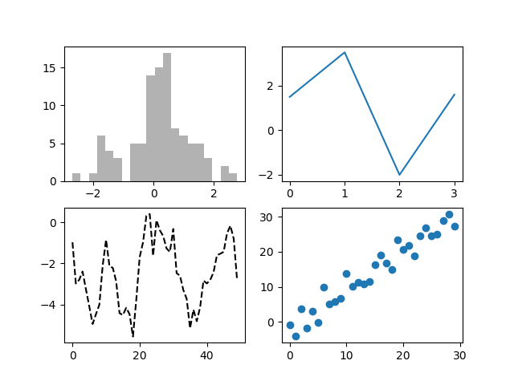
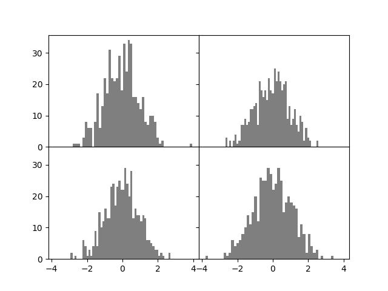
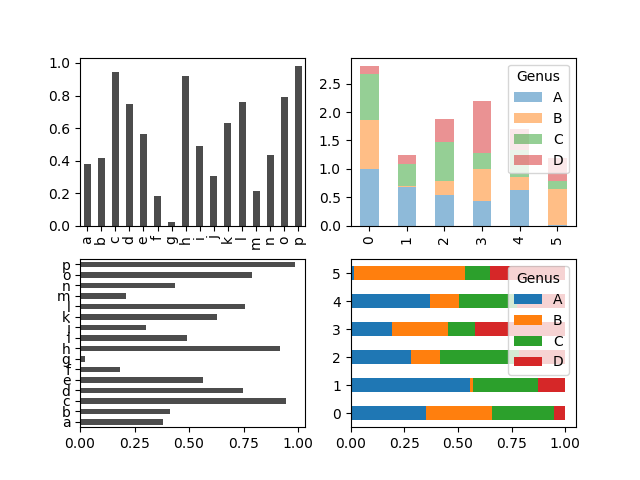
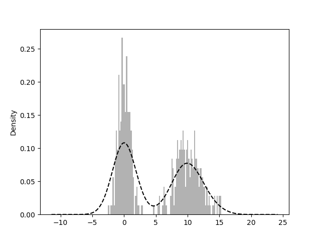
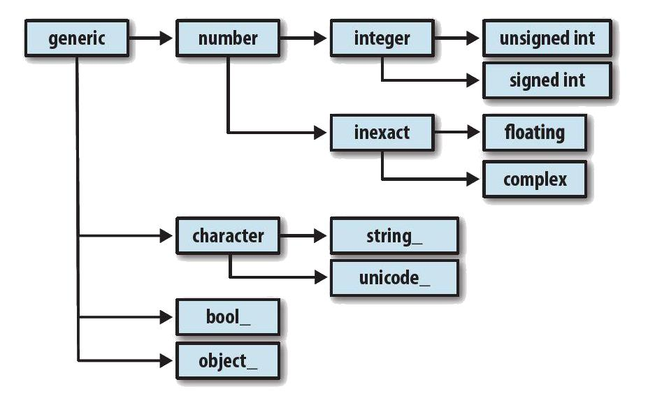

# ___2017 - 04 - 09 Python 数据分析 2___

# 目录
  <!-- TOC depthFrom:1 depthTo:6 withLinks:1 updateOnSave:1 orderedList:0 -->

  - [___2017 - 04 - 09 Python 数据分析___](#2017-04-09-python-数据分析)
  - [目录](#目录)
  - [matplotlib 绘图](#matplotlib-绘图)
  	- [pyplot / pylab](#pyplot-pylab)
  	- [绘图对象Figure / 子图Subplot](#绘图对象figure-子图subplot)
  	- [subplots方法](#subplots方法)
  	- [Figure的subplots_adjust方法修改间距](#figure的subplotsadjust方法修改间距)
  	- [颜色 color / 线型 linestyle(ls) / 标记 marker / 线宽 linewidth / 标签 label](#颜色-color-线型-linestylels-标记-marker-线宽-linewidth-标签-label)
  	- [刻度 set_xticks / set_xtickslabels / 标题 set_title / set_xlabel / 范围 set_xlim / 图例 legend](#刻度-setxticks-setxtickslabels-标题-settitle-setxlabel-范围-setxlim-图例-legend)
  	- [drawstyle 选项修改线型图中，非实际数据点的插值方式，默认是按线性方式插值](#drawstyle-选项修改线型图中非实际数据点的插值方式默认是按线性方式插值)
  	- [axes指定绘图区域](#axes指定绘图区域)
  	- [注释text / arrow / annotate](#注释text-arrow-annotate)
  	- [图形绘制 add_patch](#图形绘制-addpatch)
  	- [将图表保存到文件 savefig](#将图表保存到文件-savefig)
  	- [matplotlib全局配置 rc方法](#matplotlib全局配置-rc方法)
  - [pandas 绘图](#pandas-绘图)
  	- [Series / DataFrame的plot方法直接绘图](#series-dataframe的plot方法直接绘图)
  	- [Series 绘图选项](#series-绘图选项)
  	- [DataFrame 的专有绘图选项](#dataframe-的专有绘图选项)
  	- [ax选项](#ax选项)
  	- [柱状图 bar / barh](#柱状图-bar-barh)
  	- [直方图 hist / 密度图 kde](#直方图-hist-密度图-kde)
  	- [散布图 scatter](#散布图-scatter)
  - [Python图形化工具生态系统](#python图形化工具生态系统)
  - [GroupBy数据聚合与分组运算(groupby / aggregate / transform / apply / cut / qcut / pivot_table / crosstab)](#groupby数据聚合与分组运算groupby-aggregate-transform-apply-cut-qcut-pivottable-crosstab)
  	- [GroupBy技术](#groupby技术)
  		- [GroupBy对象](#groupby对象)
  		- [Series分组](#series分组)
  		- [DataFrame](#dataframe)
  		- [GroupBy的size方法](#groupby的size方法)
  		- [对GroupBy对象进行迭代](#对groupby对象进行迭代)
  		- [将groupby的数据转换为字典](#将groupby的数据转换为字典)
  		- [通过字典或Series进行分组](#通过字典或series进行分组)
  		- [通过函数进行分组](#通过函数进行分组)
  		- [level 根据索引级别分组](#level-根据索引级别分组)
  	- [GroupBy的方法聚合数据](#groupby的方法聚合数据)
  	- [aggregate / agg 聚合，将多个函数应用于多个列，只接受能够将一维数组简化为标量值的函数](#aggregate-agg-聚合将多个函数应用于多个列只接受能够将一维数组简化为标量值的函数)
  	- [transform聚合，将一个函数应用到各个分组，接受的函数只能产生两种结果，一个可以广播的标量值(np.mean)，或是一个相同大小的结果数组](#transform聚合将一个函数应用到各个分组接受的函数只能产生两种结果一个可以广播的标量值npmean或是一个相同大小的结果数组)
  	- [apply聚合，最一般化的GroupBy方法，传入的函数只需返回一个pandas对象或标量值即可](#apply聚合最一般化的groupby方法传入的函数只需返回一个pandas对象或标量值即可)
  	- [cut / qcut 桶 bucket / 分位数 quantile 分析](#cut-qcut-桶-bucket-分位数-quantile-分析)
  	- [groupby的“拆分－应用－合并”范式应用](#groupby的拆分应用合并范式应用)
  	- [透视表pivot table (pivot_table / margins / aggfunc / fill_value)](#透视表pivot-table-pivottable-margins-aggfunc-fillvalue)
  	- [交叉表（cross-tabulation，简称crosstab）是一种用于计算分组频率的特殊透视表](#交叉表cross-tabulation简称crosstab是一种用于计算分组频率的特殊透视表)
  - [日期和时间数据类型及工具 (datetiem / timedelta / strftime / strptime / parse / date_range / shift / rollforward / rollback / 时区 / 时期period / resample重采样 / 移动窗口函数)](#日期和时间数据类型及工具-datetiem-timedelta-strftime-strptime-parse-daterange-shift-rollforward-rollback-时区-时期period-resample重采样-移动窗口函数)
  	- [datetime.now 当前时间 year / month / day / date / time 属性](#datetimenow-当前时间-year-month-day-date-time-属性)
  	- [datetime.timedelta表示两个datetime对象之间的时间差](#datetimetimedelta表示两个datetime对象之间的时间差)
  	- [str / strftime / strptime / datetime格式定义](#str-strftime-strptime-datetime格式定义)
  	- [dateutil包中的parser.parse方法可以解析任何格式的字符串](#dateutil包中的parserparse方法可以解析任何格式的字符串)
  	- [使用datetime的时间序列](#使用datetime的时间序列)
  	- [date_range生成日期范围](#daterange生成日期范围)
  	- [shift / rollforward / rollback 移动 Series / DataFrame沿时间轴将数据前移或后移](#shift-rollforward-rollback-移动-series-dataframe沿时间轴将数据前移或后移)
  	- [时区处理 (pytz库 / common_timezones / timezone / tz_localize / tz_convert)](#时区处理-pytz库-commontimezones-timezone-tzlocalize-tzconvert)
  	- [时期period及其算术运算 (period / asfreq / 季度 / to_period / to_timestamp / PeriodIndex)](#时期period及其算术运算-period-asfreq-季度-toperiod-totimestamp-periodindex)
  	- [resample / groupby重采样 (降采样 / OHLC重采样 / 升采样和插值)](#resample-groupby重采样-降采样-ohlc重采样-升采样和插值)
  	- [移动窗口函数 (rolling_mean / rolling_std / ewma / rolling_corr / rolling_apply)](#移动窗口函数-rollingmean-rollingstd-ewma-rollingcorr-rollingapply)
  	- [性能和内存使用方面的注意事项](#性能和内存使用方面的注意事项)
  - [NumPy内部机理与其他类 (issubdtype / mro / 排列顺序C / Fortran / broadcasting广播 / np.newaxis / dtype / matrix / memmap / Cython)](#numpy内部机理与其他类-issubdtype-mro-排列顺序c-fortran-broadcasting广播-npnewaxis-dtype-matrix-memmap-cython)
  	- [ndarray对象的内部机理](#ndarray对象的内部机理)
  	- [NumPy数据类型体系 (issubdtype / mro)](#numpy数据类型体系-issubdtype-mro)
  	- [数组的排列顺序 C / Fortran](#数组的排列顺序-c-fortran)
  	- [broadcasting广播 / np.newaxis属性添加新轴](#broadcasting广播-npnewaxis属性添加新轴)
  	- [结构化和记录式数组 (dtype)](#结构化和记录式数组-dtype)
  	- [NumPy的matrix类](#numpy的matrix类)
  	- [内存映像文件 memmap](#内存映像文件-memmap)
  	- [其他加速方法 Cython / f2py / C](#其他加速方法-cython-f2py-c)
  - [Numpy其他方法 (r_ / c_ / tile / repeat / reduce / accumulate / outer / reduceat / fromoyfunc / vectorize / argsort / lexsort / searchsorted / digitize)](#numpy其他方法-r-c-tile-repeat-reduce-accumulate-outer-reduceat-fromoyfunc-vectorize-argsort-lexsort-searchsorted-digitize)
  	- [r_ / c_ 堆叠辅助类](#r-c-堆叠辅助类)
  	- [tile / repeat 元素的重复操作](#tile-repeat-元素的重复操作)
  	- [ufunc实例方法 reduce / accumulate / outer / reduceat](#ufunc实例方法-reduce-accumulate-outer-reduceat)
  	- [frompyfunc / vectorize 自定义ufunc](#frompyfunc-vectorize-自定义ufunc)
  	- [argsort / lexsort 间接排序](#argsort-lexsort-间接排序)
  	- [searchsorted 在有序数组中查找元素 (searchsorte / digitize)](#searchsorted-在有序数组中查找元素-searchsorte-digitize)
  - [美国农业部（USDA）食品数据库JSON版解析](#美国农业部usda食品数据库json版解析)
  	- [可执行代码](#可执行代码)
  	- [代码分析](#代码分析)
  - [Yahooc财经数据分析 (DataFrame / finance)](#yahooc财经数据分析-dataframe-finance)
  	- [matplotlib.finance 获取雅虎财经数据 / 数据整理 (datetime) / merge合并](#matplotlibfinance-获取雅虎财经数据-数据整理-datetime-merge合并)
  	- [数据统计分析](#数据统计分析)
  - [Basemap 绘制地图：图形化显示海地地震危机数据](#basemap-绘制地图图形化显示海地地震危机数据)
  	- [可执行代码](#可执行代码)
  	- [代码分析](#代码分析)
  - [自然语言工具包NLTK语料库](#自然语言工具包nltk语料库)
  	- [计算Hamlet中的单词使用](#计算hamlet中的单词使用)
  	- [就职演说语料库](#就职演说语料库)
  - [2012联邦选举委员会数据库](#2012联邦选举委员会数据库)
  - [python GUI的基本框架 (wx)](#python-gui的基本框架-wx)
  	- [hello world](#hello-world)
  	- [组件](#组件)
  	- [事件处理机制(Event Handling)](#事件处理机制event-handling)
  	- [组件介绍 (按钮 / 菜单 / 文本 / 列表 / 单选 / 复选框)](#组件介绍-按钮-菜单-文本-列表-单选-复选框)
  	- [布局管理](#布局管理)
  	- [其他GUI库](#其他gui库)
  		- [PyQt](#pyqt)
  		- [Tkinter](#tkinter)
  		- [PyGTK](#pygtk)

  <!-- /TOC -->
***

# matplotlib 绘图
## pyplot / pylab
  - 主要用于二维绘图，画图质量高，方便快捷的绘图模块
    ```python
    绘图API： pyplot模块
    集成库： pylab模块(包含NumPy和pyplot中的常用函数)
    ```
  - 使用Pylab模式的IPython：ipython --pylab
  - 如果没有指定 --ptlab模式，使用plt.show()显示图片
  - plt.plot() 方法可以接受n组参数，每组参数包含x轴 + y轴 + 可选的字符串类型的属性参数，其中x轴参数与y轴参数数量相同
  - pyplot绘图
    ```python
    x = np.arange(0, 2*np.pi, 0.1)
    sin_y = np.sin(x)
    plt.plot(x, sin_y)

    cos_y = np.cos(x)
    plt.plot(x, cos_y)        # sin 与 cos函数的折线图会同时显示

    # 也可以直接传递两组坐标
    plt.plot(x, np.sin(x), 'o', x, np.cos(x), 'o')
    ```
  - pylab绘图
    ```python
    import pylab as pl
    x = np.linspace(-np.pi, np.pi, 60)
    pl.plot(x, np.sin(x))
    ```
## 绘图对象Figure / 子图Subplot
  - Figure对象
    ```python
    matplotlib的图像都位于Figure对象中，使用plt.figure创建一个新的Figure
    fig = plt.figure()        # 弹出一个空窗口

    figsize选项，用于确保当图片保存到磁盘时具有一定的大小和纵横比
    matplotlib中的Figure还支持一种MATLAB式的编号架构（例如plt.figure(2)）
    通过plt.gcf()即可得到当前Figure的引用

    创建指定大小的图形
    plt.figure(dpi = 200)
    ```
  - Subplot
    ```python
    不能通过空Figure绘图，必须用add_subplot创建一个或多个subplot
    plt.subplot()方法，其中第一个数字指定行数，第二个数字指定列数，第三个数字选定子图，此时可以使用plot()方法绘制指定该子图
    ax1 = fig.add_subplot(2, 2, 1)        # 图像是2×2的，且当前选中的是4个subplot中的第一个（编号从1开始）
    创建其他的subplot，逗号可以省略
    ax2 = fig.add_subplot(222)

    此时绘图命令会在最后一个用过的subplot（如果没有则创建一个）上进行绘制
    plt.plot([1.5,3.5,-2,1.6])

    重新调用subplot方法选定子图
    plt.subplot(223)
    plt.plot(np.random.randn(50).cumsum(), 'k--')        # "k--"是线型选项，指定绘制黑色虚线图

    由fig.add_subplot所返回的对象是AxesSubplot对象，直接调用它们的实例方法就可以在里面画图
    _ = ax1.hist(randn(100), bins=20, color='k', alpha=0.3)
    plt.subplot(224).scatter(np.arange(30), np.arange(30) + 3 * randn(30))
    ```

  
## subplots方法
  - plt.subplots
    ```python
    plt.subplots可以创建一个新的Figure，并返回一个含有已创建的subplot对象的NumPy数组
    fig, axes = plt.subplots(2, 3)

    axes.shape
    Out[22]: (2, 3)
    axes[0, 1].scatter(np.arange(30), np.arange(30) + 3 * randn(30))        # axes编号从0开始
    ```
  - plt.subplots选项
    ```python
    nrows / ncols        subplotd的行 / 列数
    sharex / sharey 所有的subplot使用相同的 X / Y 轴，调节xlim / ylim会影响所有subplot
    subplot_kw        用于创建各subplot的关键字字典
    **fig_kw        创建figure时的其他关键字，如plt.subplots(2, 2, figsize=(8, 6))
    ```
## Figure的subplots_adjust方法修改间距
  - 默认情况下，matplotlib会在subplot外围留下一定的边距，并在subplot之间留下一定的间距
  - wspace和hspace用于控制宽度和高度的百分比
    ```python
    fig, axes = plt.subplots(2, 2, sharex=True, sharey=True)
    for i in range(2):
      for j in range(2):
        axes[i, j].hist(randn(500), bins=50, color='k', alpha=0.5)
    plt.subplots_adjust(wspace=0, hspace=0)        # 将间距收缩到了0
    ```

  
## 颜色 color / 线型 linestyle(ls) / 标记 marker / 线宽 linewidth / 标签 label
  - matplotlib的plot函数接受一组X和Y坐标，还可以接受一个表示颜色和线型的字符串缩写
    ```python
    ax.plot(x, y, 'g--')
    ```
    也可以使用color / linestyle(ls) / marker 属性指定
  - 缩写线型参数
    ```python
    颜色 color ： g(green) / b(blue) / r(red) / c(cyan) / m(magenta) / y(yellow) / k(black) / w(white)
    线型 linestyle ：-(solid 实线) / --(dashed 虚线) / -.(dash_dot虚线加点) / :(dotted点) / None / '' / ' ' (draw nothing)
    标记 marker ：o(circle 圆点) / v(triangle_down三角) / s(square方形) / p(pentagon 五边形) / *(star 星形) / h(hexagon六角形) / +(plus加号) / D(diamond菱形)
    ```
  - 要使用其他任意颜色则可以通过指定其RGB值的形式使用（例如，'#CECECE'）
    ```python
    ax.plot(x, y, linestyle='--', color='#CECECE')
    ```
  - marker 线型图上的标记，以强调实际的数据点
    ```python
    plt.plot(randn(30).cumsum(), 'ko--')
    plot(randn(30).cumsum(), color='k', linestyle='dashed', marker='o')
    ```
  - 线宽 linewidth / 标签 label
    ```python
    label 用于显示图列
    x = np.arange(1, 2 * np.pi, 0.1)
    plt.plot(x, np.sin(x), color = 'red', linestyle = '--', linewidth = 3, label = 'Line 1')
    plt.plot(x, x, color = 'green', marker = 'o', linewidth = 1, label = 'Line 2')
    plt.plot(x, np.log10(x), color = 'yellow', ls = ':', linewidth = 3, label = 'Line 3')
    plt.legend(loc = 'upper left')
    ```

  
## 刻度 set_xticks / set_xtickslabels / 标题 set_title / set_xlabel / 范围 set_xlim / 图例 legend
  - pyplot接口的设计目的就是交互式使用，如xlim / xticks / xticklabels / xlabel / title方法，分别控制图表的范围 / 刻度位置 / 刻度标签 / 轴名称 / 图标题
  - 使用方式有以下两种：
    ```python
    调用时不带参数，则返回当前的参数值，plt.xlim()返回当前的X轴绘图范围
    调用时带参数，则设置参数值，plt.xlim([0,10])会将X轴的范围设置为0到1
    ```
  - 所有这些方法都是对当前或最近创建的AxesSubplot起作用的
  - 它们各自对应subplot对象上的两个方法，以xlim为例，就是ax.get_xlim和ax.set_xlim
  - 相关方法
    ```python
    set_xticks / set_yticks 指定将刻度放在数据范围中的哪些位置，默认情况下，这些位置也就是刻度标签
    set_xticklabels / set_yticklabels 可以将任何其他的值用作标签
    set_xlabel / set_ylabel 为X / Y轴设置名称
    set_title 设置标题
    set_xlim / set_ylim 限定X / Y轴的显示范围
    legend 添加图例，标识图表元素，如线型对应的标签 ax.legend() / plt.legend()
            从图例中去除一个或多个元素，不传入label或传入label='_nolegend_'即可
    ```
  - 示例
    ```python
    fig = plt.figure()
    ax = fig.add_subplot(1, 1, 1)

    # 在添加subplot的时候传入label参数
    ax.plot(randn(1000).cumsum(), 'b', label='one')
    ax.plot(randn(1000).cumsum(), 'r--', label='two')
    ax.plot(randn(1000).cumsum(), 'y.', label='three')

    ticks = ax.set_xticks([0, 250, 500, 750, 1000])
    labels = ax.set_xticklabels(['one', 'two', 'three', 'four', 'five'], rotation=30, fontsize='small')

    ax.set_title('My first matplotlib plot')
    ax.set_xlabel('Stages')

    ax.set_xlim(200, 700)
    ax.set_ylim(-10, 30)

    ax.legend(loc='best')        # loc指定要将图例放在哪
    ```

  
## drawstyle 选项修改线型图中，非实际数据点的插值方式，默认是按线性方式插值
  ```python
  data = randn(30).cumsum()
  plt.plot(data, 'k--', label='Default')
  plt.plot(data, 'k-', drawstyle='steps-post', label='steps-post')
  plt.legend(loc='best')        # 图例
  ```
  
## axes指定绘图区域
  - 划定X / Y轴范围绘图
    ```python
    axes(rect, facecolor='w')`` where *rect* = [left, bottom, width,
       height] in normalized (0, 1) units. *facecolor* is the background
       color for the axis, default white
    ```
    ```python
    x = np.arange(1, 2 * np.pi, 0.1)
    plt.axes([.1,.1,0.8,0.8])
    plt.plot(x, np.sin(x), 'r-')
    plt.axes([.3,.15,0.4,0.4], facecolor = 'r')
    plt.plot(x, np.cos(x), 'y+')
    ```
## 注释text / arrow / annotate
  - 通过text、arrow和annotate等函数进行添加注释
  - text可以将文本绘制在图表的指定坐标(x,y)，还可以加上一些自定义格式
    ```python
    ax.text(200, 10, 'Hello world!', family='monospace', fontsize=10)
    ax.text(800, 15, 'hello', bbox=dict(facecolor='red', alpha=0.5))
    ```
## 图形绘制 add_patch
  - matplotlib有一些表示常见图形的对象，这些对象被称为块patch
  - 其中有些可以在matplotlib.pyplot中找到 (Rectangle / Circle)，但完整集合位于matplotlib.patches
  - 要在图表中添加一个图形，需要创建一个块对象shp，然后通过ax.add_patch(shp)将其添加到subplot中
  ```python
  fig = plt.figure()
  ax = fig.add_subplot(1, 1, 1)
  rect = plt.Rectangle((0.2, 0.75), 0.4, 0.15, color='k', alpha=0.3)
  circ = plt.Circle((0.7, 0.2), 0.15, color='b', alpha=0.3)
  pgon = plt.Polygon([ [0.15, 0.15], [0.35, 0.4], [0.2, 0.6] ], color='g', alpha=0.5)
  ax.add_patch(rect)
  ax.add_patch(circ)
  ax.add_patch(pgon)
  ```
  
  ```python
  # 绘制国旗
  def star(coord, size, rotate, tangleNum = 5):
      arr = np.arange(tangleNum) * (tangleNum-1) * np.pi / tangleNum
      x = np.sin(arr + rotate) * size + coord[0]
      y = np.cos(arr + rotate) * size + coord[1]
      return plt.Polygon(list(zip(x, y)), fc='yellow', ec='yellow')

  fig = plt.figure(figsize=(6, 4))
  ax = fig.add_subplot(1, 1, 1)
  ax.add_patch(plt.Rectangle([0, 0], 0.9, 0.6, facecolor='r', edgecolor='r'))
  plt.axis('scaled')
  ax.set_axis_off()
  ax.add_patch(star([0.15, 0.45], 0.09, 0))
  ax.add_patch(star([0.3, 0.54], 0.03, 0.3))
  ax.add_patch(star([0.36, 0.48], 0.03, 0.9))
  ax.add_patch(star([0.36, 0.39], 0.03, 0))
  ax.add_patch(star([0.3, 0.33], 0.03, 0.3))
  ```
## 将图表保存到文件 savefig
  - plt.savefig将当前图表保存到文件,该方法相当于Figure对象的实例方法savefig
    ```python
    plt.savefig('figpath.svg')        # 将图表保存为SVG文件

    文件类型是通过文件扩展名推断出来的
    dpi 控制“每英寸点数”分辨率
    bbox_inches 可以剪除当前图表周围的空白部分

    plt.savefig('figpath.png', dpi=400, bbox_inches='tight')        # 保存一张带有最小白边且分辨率为400DPI的PNG图片
    ```
  - savefig并非一定要写入磁盘，也可以写入任何文件型的对象
    ```python
    from io import BytesIO
    sio = BytesIO()
    plt.savefig(sio, format='png')
    plot_data = sio.getvalue()

    这对在Web上提供动态生成的图片是很实用的
    ```
## matplotlib全局配置 rc方法
  - 几乎所有默认行为都能通过一组全局参数进行自定义，管理图像大小、subplot边距、配色方案、字体大小、网格类型等
  - 改变matplotlib配置系统可以通过Python的rc方法
  - rc的第一个参数是希望自定义的对象，如'figure'、'axes'、'xtick'、'ytick'、'grid'、'legend'等，其后可以跟上一系列的关键字参数
    ```python
    plt.rc('figure', figsize=(10, 10))        # 将全局的图像默认大小设置为10×10

    可以将这些选项写成一个字典：
    font_options = {'family' : 'monospace',
            'weight' : 'bold',
            'size'  : 'small'}
    plt.rc('font', **font_options)

    ```
    要了解全部的自定义选项，请查阅matplotlib的配置文件matplotlibrc(位于matplotlib/mpl-data目录中)
***

# pandas 绘图
## Series / DataFrame的plot方法直接绘图
  - y = 4 * pi * x + e^(-5 * x)
    ```python
    x = np.linspace(0, 1)
    y = np.sin(4 * np.pi * x) + np.exp(-5 * x)
    t = pd.DataFrame(y, index = x)
    t.plot()
    ```
## Series 绘图选项
  - Series对象的索引会被传给matplotlib，并用以绘制X轴，可以通过use_index=False禁用该功能
    ```python
    s = Series(np.random.randn(10).cumsum(), index=np.arange(0, 100, 10))
    s.plot()
    ```
    X轴的刻度和界限可以通过xticks和xlim选项进行调节，Y轴就用yticks和ylim
  - Series.plot选项
    ```python
    label        用于图例的标签
    ax        用于绘制的subplot对象，默认使用当前对象
    style        风格字符串('ko--')
    alpha        填充透明度(0-1)
    kind        图表类型 线型图line / 柱状图bar / 水平柱状图barth / 概率分布图kde / 散点图scatter
    logy        在y轴上使用对数标尺
    use_index        将对象的索引用作刻度标尺
    rot        旋转刻度标尺(0-360)
    xticks / yticks        用作X / Y轴刻度的值
    xlim / ylim        X / Y轴的界限
    xlabel / ylabel        X / Y轴名称
    grid        显示轴网格线，默认打开
    ```
## DataFrame 的专有绘图选项
  - DataFrame的plot方法会在一个subplot中为各列绘制一条线，并自动创建图例
  - DataFrame专有选项
    ```python
    subplots        将各个DataFrame绘制到单独的subplot中
    sharex / sharey        指定共用同一个X/ Y轴
    figsize                表示图像大小的元组
    title                图像标题字符串
    legend                添加图例，默认为True
    sort_columns        以字母表顺序绘制各列，默认使用当前顺序
    ```
## ax选项
  - pandas的大部分绘图方法都有一个可选的ax参数，它可以是一个matplotlib的subplot对象。这使你能够在网格布局中更为灵活地处理subplot的位置
    ```python
    fig = plt.figure()
    ax = fig.add_subplot(1, 1, 1)
    Series(np.sin(np.arange(0, np.pi, 0.1))).plot(ax = ax, style = 'k--')
    ```
## 柱状图 bar / barh
  - kind='bar'（垂直柱状图）或kind='barh'（水平柱状图）即可生成柱状图，Series和DataFrame的索引将会被用作X（bar）或Y（barh）刻度
    ```python
    fig, axes = plt.subplots(2, 2)
    data = Series(np.random.rand(16), index=list('abcdefghijklmnop'))
    data.plot(ax = axes[0, 0], kind = 'bar', color = 'k', alpha = 0.7)
    data.plot(ax = axes[1, 0], kind = 'barh', color = 'k', alpha = 0.7)
    ```
  - 柱状图有一个非常不错的用法：利用value_counts图形化显示Series中各值的出现频率，比如s.value_counts ().plot(kind='bar')
  - 对于DataFrame，柱状图会将每一行的值分为一组
    ```python
    df = DataFrame(np.random.rand(6, 4), index=arange(6), columns=pd.Index(list('ABCD'), name='Genus'))
    df.plot(kind='bar')
    df.plot(ax = axes[0, 1], kind = 'bar', stacked = True, alpha = 0.5)        # 生成堆积柱状图
    df_p = df.div(df.sum(1).astype(float), axis=0)                # 规格化，使得各行的和为1
    df_p.plot(kind='barh', stacked=True)
    df_p.plot(ax = axes[1, 1], kind='barh', stacked=True)
    ```

  
## 直方图 hist / 密度图 kde
  - 直方图（histogram）是一种可以对值频率进行离散化显示的柱状图
  - Series的hist / kind = 'hist'方法用于生成直方图
  - 密度图也被称作KDE（Kernel Density Estimate，核密度估计）
  - 是通过计算“可能会产生观测数据的连续概率分布的估计”而产生的，一般的过程是将该分布近似为一组核（即诸如正态（高斯）分布之类的较为简单的分布）
  - 调用plot时加上kind='kde'即可生成一张密度图(标准混合正态分布KDE)
  - 这两种图表常常会被画在一起。直方图以规格化形式给出（以便给出面元化密度），然后再在其上绘制核密度估计
    ```python
    comp1 = np.random.normal(0, 1, size=200)
    comp2 = np.random.normal(10, 2, size=200)
    values = Series(np.concatenate([comp1, comp2]))
    values.plot(kind = 'hist', bins = 100, alpha = 0.3, color = 'k', normed = True)        # 或使用values.hist(bins=100, alpha=0.3, color='k', normed=True)
    values.plot(kind = 'kde', style = 'k--')
    ```

  
## 散布图 scatter
  - 散布图（scatter plot）是观察两个一维数据序列之间的关系的有效手段
    ```python
    s指定数据点的大小
    plt.axes(facecolor = 'black')
    plt.scatter(randn(100), randn(100), marker='*', s = 50, c='w')
    plt.axis('scaled')
    ```
  - 散布图矩阵（scatter plot matrix）pandas提供了一个能从DataFrame创建散布图矩阵的scatter_matrix函数，支持在对角线上放置各变量的直方图或密度图
    ```python
    x = np.arange(0, 2*np.pi, 0.1)
    df = DataFrame({'sin' : np.sin(x), 'cos': np.cos(x), 'sin + cos':np.sin(x)+np.cos(x)}, index = x)
    pd.scatter_matrix(df, diagonal='kde', alpha=0.3, c='k')
    ```
    
***

# Python图形化工具生态系统
  - matplotlib可以为Web应用创建漂亮的图表，但这通常需要耗费大量的精力，因为它原本是为印刷而设计的
  - matplotlib用于创建出版质量图表的桌面绘图包（主要是2D方面）
  - d3.js（http://d3js.org/）之类的工具为Web应用构建交互式图像
  - mplot3d用于3D图形
  - basemap用于地图和投影

  - Python领域中还有许多其他的图形化库和应用程序：PyQwt、Veusz、gnuplot-py、biggles等
  - 大部分库都在向基于Web的技术发展，并逐渐远离桌面图形技术
  - Chaco
    ```python
    Chaco（http://code.enthought.com/chaco/）是由Enthought开发的一个绘图工具包，它既可以绘制静态图又可以生成交互式图形
    它非常适合用复杂的图形化方式表达数据的内部关系
    跟matplotlib相比，Chaco对交互的支持要好得多，而且渲染速度很快
    如果要创建交互式的GUI应用程序，它确实是个不错的选择
    ```
  - mayavi
    ```python
    mayavi项目（由Prabhu Ramachandran、Gal Varoquaux等人开发）是一个基于开源C++图形库VTK的3D图形工具包
    跟matplotlib一样，mayavi也能集成到IPython以实现交互式使用
    通过鼠标和键盘操作，图形可以被平移、旋转、缩放
    ```
  - 图形化工具的未来
    ```python
    基于Web技术（比如JavaScript）的图形化是必然的发展趋势
    许多基于Flash或JavaScript的静态或交互式图形化工具已经出现了很多年，而且类似的新工具包（如d3.js及其分支项目）一直都在不断涌现
    相比之下，非Web式的图形化开发工作在近几年中减慢了许多，Python以及其他数据分析和统计计算环境（如R）都是如此
    开发方向就变成了实现数据分析和准备工具（如pandas）与Web浏览器之间更为紧密的集成
    ```
***

# GroupBy数据聚合与分组运算(groupby / aggregate / transform / apply / cut / qcut / pivot_table / crosstab)
## GroupBy技术
  - groupby(self, by=None, axis=0, level=None, as_index=True, sort=True, group_keys=True, squeeze=False, ** kwargs)
  - 用于表示分组运算的术语"split-apply-combine"（拆分－应用－合并）
    ```python
    pandas对象中的数据根据所提供的一个或多个键被拆分（split）为多组，拆分操作是在对象的特定轴上执行的
    拆分所用的键只要长度合适即可
    然后，将一个函数应用（apply）到各个分组并产生一个新值
    最后，所有这些函数的执行结果会被合并（combine）到最终的结果对象中
    ```
### GroupBy对象
  - groupby返回一个GroupBy对象，实际上还没有进行任何计算，只含有一些分组相关数据
    ```python
    grouped = df['d1'].groupby(df['k1'])
    type(grouped)
    Out[156]: pandas.core.groupby.SeriesGroupBy
    ```
    调用实际的函数引用将计算结果
### Series分组
  - Series数据根据分组键进行聚合，产生了一个新的Series，其索引为分组键中的唯一值
  - 指定index / level = 0根据index分组
    ```python
    dup_s = Series(np.arange(6), index=list('abc')*2)
    grouped = dup_s.groupby(dup_s.index)        # 或使用 grouped = dup_s.groupby(level=0)
    grouped.mean()
    Out[114]:
    a  1.5
    b  2.5
    c  3.5
    dtype: float64
    ```
  - 指定任意长度合适的序列分组
    ```python
    dup_s.groupby(list('aaabbb')).mean()
    Out[115]:
    a  1
    b  4
    dtype: int64
    ```
### DataFrame
  - 指定一列数据执行groupby操作
    ```python
    df = DataFrame({'k1':list('aabba'), 'k2':list('ototo'), 'd1':arange(5), 'd2':arange(5, 10)})
    df
    Out[154]:
      d1 d2 k1 k2
    0  0  5 a o
    1  1  6 a t
    2  2  7 b o
    3  3  8 b t
    4  4  9 a o
    
    grouped = df.groupby(df.k1)
    grouped.mean()
    Out[157]:
    k1
    a  1.666667
    b  2.500000
    Name: d1, dtype: float64
    ```
  - 一次传入多个数组，得到的Series具有一个层次化索引
    ```python
    means = df['d1'].groupby([df['k1'], df['k2']]).mean()
    means
    Out[161]:
    k1 k2
    a  o   2
      t   1
    b  o   2
      t   3
    Name: d1, dtype: int64

    means.unstack()
    Out[162]:
    k2 o t
    k1   
    a  2 1
    b  2 3
    ```
  - 分组键可以指定任何长度适当的数组
    ```python
    location = ['CH', 'AM', 'AM', 'CH', 'CH']
    date = pd.date_range('20170527', periods=2)
    date = date.append([date, date]).delete(1)
    date
    Out[196]:
    DatetimeIndex(['2017-05-27', '2017-05-27', '2017-05-28', '2017-05-27', '2017-05-28'],
           dtype='datetime64[ns]', freq=None)

    df['d1'].groupby([date, location]).mean()
    Out[197]:
    2017-05-27 AM  1.0
          CH  1.5
    2017-05-28 AM  2.0
          CH  4.0
    Name: d1, dtype: float64
    ```
  - 默认情况下，所有数值列都会被聚合，非数值列会被排除，分组键中的任何缺失值都会被排除
    ```python
    df.groupby('k1').mean()
    Out[200]:
         d1    d2
    k1          
    a  1.666667 6.666667
    b  2.500000 7.500000

    df.groupby(['k1', 'k2'])['d1'].mean()
    Out[205]:
    k1 k2
    a  o   2
      t   1
    b  o   2
      t   3
    Name: d1, dtype: int64
    ```
### GroupBy的size方法
  - 返回一个含有分组大小的Series
    ```python
    df.groupby(['k1', 'k2']).size()
    Out[203]:
    k1 k2
    a  o   2
      t   1
    b  o   1
      t   1
    dtype: int64
    ```
### 对GroupBy对象进行迭代
  - GroupBy对象支持迭代，可以产生一组二元元组（由分组名和数据块组成）
    ```python
    for name, group in df.groupby('k1'):
      print(name)
      print(group)

    a        # name1
      d1 d2 k1 k2        # group value 1
    0  0  5 a o
    1  1  6 a t
    4  4  9 a o
    b        # name2
      d1 d2 k1 k2        # group value 1
    2  2  7 b o
    3  3  8 b t
    ```
  - 对于多个分组键的情况，元组的第一个元素将会是由键值组成的元组
    ```python
    for (k1, k2), group in df.groupby(['k1', 'k2']):
       ...:   print(k1, k2)
       ...:   print(group)
       ...:   
    a o
      d1 d2 k1 k2
    0  0  5 a o
    4  4  9 a o
    a t
      d1 d2 k1 k2
    1  1  6 a t
    b o
      d1 d2 k1 k2
    2  2  7 b o
    b t
      d1 d2 k1 k2
    3  3  8 b t
    ```
### 将groupby的数据转换为字典
  - GroupBy对象的数据可以直接转换为字典
    ```python
    pieces = dict(list(df.groupby('k1')))
    pieces['b']
    Out[223]:
      d1 d2 k1 k2
    2  2  7 b o
    3  3  8 b t
    ```
  - axis=1 按列分组
    ```python
    df.dtypes
    Out[224]:
    d1   int64
    d2   int64
    k1  object
    k2  object
    dtype: object

    grouped = df.groupby(df.dtypes, axis=1)
    dict(list(grouped))
    Out[226]:
    {dtype('int64'):  d1 d2
     0  0  5
     1  1  6
     2  2  7
     3  3  8
     4  4  9, dtype('O'):  k1 k2
     0 a o
     1 a t
     2 b o
     3 b t
     4 a o}
    ```
### 通过字典或Series进行分组
  - 根据列名进行映射分组
    ```python
    people = DataFrame(arange(25).reshape(5, 5), columns=list('abcde'),
    index=['Joe', 'Steve', 'Wes', 'Jim', 'Travis'])
    people.ix[2:3, ['b', 'c']] = np.nan
    people
    Out[245]:
         a   b   c  d  e
    Joe   0  1.0  2.0  3  4
    Steve  5  6.0  7.0  8  9
    Wes   10  NaN  NaN 13 14
    Jim   15 16.0 17.0 18 19
    Travis 20 21.0 22.0 23 24

    mapping = {'a': 'red', 'b': 'red', 'c': 'blue', 'd': 'blue', 'e': 'red', 'f' : 'orange'}
    by_column = people.groupby(mapping, axis=1)
    by_column.sum()
    Out[248]:
        blue  red
    Joe   5.0  5.0
    Steve  15.0 20.0
    Wes   13.0 24.0
    Jim   35.0 50.0
    Travis 45.0 65.0
    ```
  - Series同样可以用于映射分组
    ```python
    如果用Series作为分组键，则pandas会检查Series以确保其索引跟分组轴是对齐的
    map_series = Series(mapping)
    map_series
    Out[250]:
    a    red
    b    red
    c   blue
    d   blue
    e    red
    f  orange
    dtype: object

    people.groupby(map_series, axis=1).count()
    Out[251]:
        blue red
    Joe    2  3
    Steve   2  3
    Wes    1  2
    Jim    2  3
    Travis   2  3
    ```
### 通过函数进行分组
  - 任何被当做分组键的函数都会在各个索引值上被调用一次，其返回值就会被用作分组名称
  - 根据列名的长度分组
    ```python
    people.groupby(len).sum()
    Out[252]:
      a   b   c  d  e
    3 25 17.0 19.0 34 37
    5  5  6.0  7.0  8  9
    6 20 21.0 22.0 23 24
    ```
    <br />
  - 使用函数分组最终也是将列名转换为数组，因此可以跟数组、列表、字典、Series混合使用
    ```python
    key_list = ['one', 'one', 'one', 'two', 'two']
    people.groupby([len, key_list]).min()
    Out[254]:
        a   b   c  d  e
    3 one  0  1.0  2.0  3  4
     two 15 16.0 17.0 18 19
    5 one  5  6.0  7.0  8  9
    6 two 20 21.0 22.0 23 24
    ```
### level 根据索引级别分组
  - 层次化索引数据集最方便的地方就在于它能够根据索引级别进行聚合
    ```python
    columns = pd.MultiIndex.from_arrays([ ['US', 'US', 'US', 'CH', 'CH'], [1, 3, 5, 1, 3] ], names=['cty', 'tenor'])
    hier_df = DataFrame(np.random.randn(4, 5), columns=columns)
    hier_df
    Out[257]:
    cty     US              CH     
    tenor     1     3     5     1     3
    0   0.285534 0.185744 0.225680 -0.245709 1.777794
    1   -0.248907 -1.478108 1.042353 -1.644520 -0.056219
    2   0.439085 0.725831 -2.221460 -1.653315 0.390173
    3   0.729302 0.481434 -0.502532 -0.639669 0.550810

    hier_df.groupby(level='cty', axis=1).count()
    Out[258]:
    cty CH US
    0   2  3
    1   2  3
    2   2  3
    3   2  3
    ```
## GroupBy的方法聚合数据
  - 聚合，指的是任何能够从数组产生标量值的数据转换过程，如mean、count、min以及sum等
  - 许多常见的聚合运算都有就地计算数据集统计信息的优化实现
  - 经过优化的GroupBy的方法
    ```python
    count                分组中的非NA值数量
    sum                非NA值的和
    mean                非NA值的平均值
    median                非NA值的算术中位数
    std / var        无偏(分母为n-1)标准差 / 方差
    min / max        非NA值的最小值 / 最大值
    prod                非NA值的积
    first / last        第一个和最后一个非NA值
    ```
  - 可以调用分组对象上已经定义好的任何方法
    ```python
    quantile计算Series或DataFrame列的样本分位数
    quantile并没有明确地实现于GroupBy，但它是一个Series方法，所以可以用于GroupBy对象

    df = DataFrame({'k1':list('aabba'), 'k2':list('ototo'), 'd1':arange(5), 'd2':arange(5, 10)})
    grouped = df.groupby('k1')
    grouped['d1'].quantile(0.9)
    Out[263]:
    k1
    a  3.4
    b  2.9
    Name: d1, dtype: float64

    GroupBy会高效地对Series进行切片，然后对各片调用piece.quantile(0.9)，最后将这些结果组装成最终结果
    ```
## aggregate / agg 聚合，将多个函数应用于多个列，只接受能够将一维数组简化为标量值的函数
  - aggregate或agg方法，调用自定义的聚合函数
    ```python
    def peak_to_peak(arr):
       ...:   return arr.max() - arr.min()
       ...:

    grouped.agg(peak_to_peak)
    Out[265]:
      d1 d2
    k1    
    a  4  4
    b  1  1

    自定义聚合函数要比表9-1中那些经过优化的函数慢得多。这是因为在构造中间分组数据块时存在非常大的开销（函数调用、数据重排等）
    ```
  ```python
  # 使用一个有关餐馆小费的数据集
  tips = pd.read_csv('practice_data/tips.csv')
  # 添加“小费占总额百分比”的列
  tips['tip_pct'] = tips['tip'] / tips['total_bill']
  tips[:3]
  Out[277]:
    total_bill  tip   sex smoker day  time size  tip_pct
  0    16.99 1.01 Female   No Sun Dinner   2 0.059447
  1    10.34 1.66  Male   No Sun Dinner   3 0.160542
  2    21.01 3.50  Male   No Sun Dinner   3 0.166587

  grouped = tips.groupby(['sex', 'smoker'])
  grouped_pct = grouped['tip_pct']
  grouped_pct.agg('mean')        # 或使用grouped_pct.agg(mean) / grouped_pct.mean()
  Out[280]:
  sex   smoker
  Female No    0.156921
      Yes    0.182150
  Male  No    0.160669
      Yes    0.152771
  Name: tip_pct, dtype: float64

  # 传入一组函数或函数名，得到的DataFrame的列就会以相应的函数命名
  grouped_pct.agg(['mean', std, peak_to_peak])
  Out[281]:
            mean    std peak_to_peak
  sex  smoker                 
  Female No   0.156921 0.036421   0.195876
      Yes   0.182150 0.071595   0.360233
  Male  No   0.160669 0.041849   0.220186
      Yes   0.152771 0.090588   0.674707

  # 传入一个由(name,function)元组组成的列表，元组的第一个元素就会被用作列名
  grouped_pct.agg([('foo', mean), ('bar', np.std)])
  Out[282]:
            foo    bar
  sex  smoker          
  Female No   0.156921 0.036421
      Yes   0.182150 0.071595
  Male  No   0.160669 0.041849
      Yes   0.152771 0.090588

  # 定义一组应用于全部列的函数
  functions = ['count', 'mean', 'max']
  grouped['tip_pct', 'total_bill'].agg(functions)
  Out[284]:
         tip_pct           total_bill         
          count   mean    max   count    mean  max
  sex  smoker                             
  Female No     54 0.156921 0.252672     54 18.105185 35.83
      Yes     33 0.182150 0.416667     33 17.977879 44.30
  Male  No     97 0.160669 0.291990     97 19.791237 48.33
      Yes     60 0.152771 0.710345     60 22.284500 50.81

  # 也可以传入带有自定义名称的元组列表
  ftuples = [('Durchschnitt', 'mean'), ('Abweichung', np.var)]
  grouped['tip_pct', 'total_bill'].agg(ftuples)

  # 向agg传入一个从列名映射到函数的字典，对不同的列应用不同的函数
  grouped.agg({'tip_pct' : ['min', 'max', 'mean', 'std'], 'size' : 'sum'})
  Out[288]:
          tip_pct                size
            min    max   mean    std sum
  sex  smoker                       
  Female No   0.056797 0.252672 0.156921 0.036421 140
      Yes   0.056433 0.416667 0.182150 0.071595  74
  Male  No   0.071804 0.291990 0.160669 0.041849 263
      Yes   0.035638 0.710345 0.152771 0.090588 150

  as_index=False / reset_index重新索引
  tips.groupby(['sex', 'smoker'], as_index=False).mean()
  或
  tips.groupby(['sex', 'smoker']).mean().reset_index()
  Out[290]:
     sex smoker total_bill    tip   size  tip_pct
  0 Female   No  18.105185 2.773519 2.592593 0.156921
  1 Female  Yes  17.977879 2.931515 2.242424 0.182150
  2  Male   No  19.791237 3.113402 2.711340 0.160669
  3  Male  Yes  22.284500 3.051167 2.500000 0.152771
  ```
## transform聚合，将一个函数应用到各个分组，接受的函数只能产生两种结果，一个可以广播的标量值(np.mean)，或是一个相同大小的结果数组
  - transform会将一个函数应用到各个分组，然后将结果放置到适当的位置上，如果各分组产生的是一个标量值，则该值就会被广播出去
    ```python
    df = DataFrame(arange(25).reshape(5, 5), columns=list('abcde'), index=list('ABCDE'))
    key = ['one', 'one', 'one', 'two', 'two']
    df.groupby(key).mean()
    Out[318]:
        a   b   c   d   e
    one  5.0  6.0  7.0  8.0  9.0
    two 17.5 18.5 19.5 20.5 21.5

    df.groupby(key).transform(np.mean)
    Out[319]:
       a   b   c   d   e
    A  5.0  6.0  7.0  8.0  9.0
    B  5.0  6.0  7.0  8.0  9.0
    C  5.0  6.0  7.0  8.0  9.0
    D 17.5 18.5 19.5 20.5 21.5
    E 17.5 18.5 19.5 20.5 21.5
    ```
  - 使用transform从各组中减去平均值
    ```python
    def demean(arr):
      return arr - arr.mean()

    demeaned = df.groupby(key).transform(demean)
    demeaned
    Out[325]:
       a  b  c  d  e
    A -5.0 -5.0 -5.0 -5.0 -5.0
    B 0.0 0.0 0.0 0.0 0.0
    C 5.0 5.0 5.0 5.0 5.0
    D -2.5 -2.5 -2.5 -2.5 -2.5
    E 2.5 2.5 2.5 2.5 2.5

    demeaned.groupby(key).mean()
    Out[326]:
        a  b  c  d  e
    one 0.0 0.0 0.0 0.0 0.0
    two 0.0 0.0 0.0 0.0 0.0
    ```
## apply聚合，最一般化的GroupBy方法，传入的函数只需返回一个pandas对象或标量值即可
  - apply会将待处理的对象拆分成多个片段，然后对各片段调用传入的函数，最后尝试将各片段组合到一起
  ```python
  # 使用一个有关餐馆小费的数据集
  tips = pd.read_csv('practice_data/tips.csv')
  # 添加“小费占总额百分比”的列
  tips['tip_pct'] = tips['tip'] / tips['total_bill']

  # 函数返回指定列column前n个最大值的行
  def top(df, n=3, column='tip_pct'):
    return df.sort_values(by=column, ascending=False)[:n]

  top(tips, n = 3)
  Out[337]:
     total_bill  tip   sex smoker day  time size  tip_pct
  172    7.25 5.15  Male  Yes Sun Dinner   2 0.710345
  178    9.60 4.00 Female  Yes Sun Dinner   2 0.416667
  67     3.07 1.00 Female  Yes Sat Dinner   1 0.325733

  # top函数在DataFrame的各个片段上调用，然后结果由pandas.concat组装到一起，并以分组名称进行了标记
  # 最终结果就有了一个层次化索引，其内层索引值来自原DataFrame
  tips.groupby('smoker').apply(top)
  Out[338]:
        total_bill  tip   sex smoker  day  time size  tip_pct
  smoker                                  
  No   232    11.61 3.39  Male   No  Sat Dinner   2 0.291990
      149    7.51 2.00  Male   No Thur  Lunch   2 0.266312
      51    10.29 2.60 Female   No  Sun Dinner   2 0.252672
  Yes  172    7.25 5.15  Male  Yes  Sun Dinner   2 0.710345
      178    9.60 4.00 Female  Yes  Sun Dinner   2 0.416667
      67     3.07 1.00 Female  Yes  Sat Dinner   1 0.325733

  # 如果传给apply的函数能够接受其他参数或关键字，则可以将这些内容放在函数名后面一并传入
  tips.groupby(['smoker', 'sex']).apply(top, n = 1, column = 'total_bill')
  Out[339]:
            total_bill  tip   sex smoker day  time size \
  smoker sex                                
  No   Female 238    35.83  4.67 Female   No Sat Dinner   3  
      Male  212    48.33  9.00  Male   No Sat Dinner   4  
  Yes  Female 102    44.30  2.50 Female  Yes Sat Dinner   3  
      Male  170    50.81 10.00  Male  Yes Sat Dinner   3  

            tip_pct
  smoker sex          
  No   Female 238 0.130338
      Male  212 0.186220
  Yes  Female 102 0.056433
      Male  170 0.196812
  ```
  - 在GroupBy中，当调用诸如describe之类的方法时
    ```python
    result = tips.groupby('smoker')['tip_pct'].describe()

    实际上只是应用了下面两条代码
    f = lambda x: x.describe()
    tips.groupby('smoker')['tip_pct'].apply(f)
    ```
  - group_keys=False 禁止分组键
    ```python
    分组键会跟原始对象的索引共同构成结果对象中的层次化索引，将group_keys=False传入groupby即可禁止该效果
    tips.groupby('smoker', group_keys=False).apply(top)
    Out[345]:
       total_bill  tip   sex smoker  day  time size  tip_pct
    232    11.61 3.39  Male   No  Sat Dinner   2 0.291990
    149    7.51 2.00  Male   No Thur  Lunch   2 0.266312
    51    10.29 2.60 Female   No  Sun Dinner   2 0.252672
    172    7.25 5.15  Male  Yes  Sun Dinner   2 0.710345
    178    9.60 4.00 Female  Yes  Sun Dinner   2 0.416667
    67     3.07 1.00 Female  Yes  Sat Dinner   1 0.325733
    ```
## cut / qcut 桶 bucket / 分位数 quantile 分析
  - cut / qcut 根据指定面元或样本分位数将数据拆分成多块，与groupby结合实现对数据集的桶或分位数分析
  - 利用cut将数据装入长度相等的桶中
    ```python
    frame = DataFrame({'data1': np.random.randn(1000), 'data2': np.random.randn(1000)})
    factor = pd.cut(frame.data1, 4)
    factor.size
    Out[350]: 1000

    factor[:5]
    Out[351]: '''
    0   (-0.143, 1.464]
    1   (1.464, 3.0707]
    2   (-0.143, 1.464]
    3  (-1.749, -0.143]
    4   (-0.143, 1.464]
    Name: data1, dtype: category
    Categories (4, object): [(-3.363, -1.749] < (-1.749, -0.143] < (-0.143, 1.464] < (1.464, 3.0707]]'''
    ```
  - 由cut返回的Factor对象可直接用于groupby
    ```python
    def get_stats(group):
      return {'min': group.min(), 'max': group.max(), 'count': group.count(), 'mean': group.mean()}

    grouped = frame.data2.groupby(factor)
    grouped.apply(get_stats).unstack()
    Out[355]: '''
             count    max   mean    min
    data1                        
    (-3.363, -1.749]  54.0 2.299818 0.113286 -2.480099
    (-1.749, -0.143] 421.0 2.523717 -0.021659 -3.437774
    (-0.143, 1.464]  464.0 3.278764 0.035994 -3.724589
    (1.464, 3.0707]  61.0 1.856449 -0.111442 -2.798758'''
    ```
  - qcut根据样本分位数得到大小相等的桶
    ```python
    grouping = pd.qcut(frame.data1, 4)
    grouped = frame.data2.groupby(grouping)
    grouped.apply(get_stats).unstack()
    Out[360]: '''
              count    max   mean    min
    data1                         
    [-3.356, -0.714]  250.0 2.523717 -0.081115 -3.437774
    (-0.714, -0.0797] 250.0 2.137940 0.073402 -2.641509
    (-0.0797, 0.584]  250.0 3.278764 0.023543 -3.724589
    (0.584, 3.0707]  250.0 2.467868 0.011779 -2.808301'''
    ```
## groupby的“拆分－应用－合并”范式应用
  ```python
  # 用特定于分组的值填充缺失值
  states = ['Ohio', 'New York', 'Vermont', 'Florida', 'Oregon', 'Nevada', 'California', 'Idaho']
  group_key = ['East'] * 4 + ['West'] * 4
  data = Series(arange(5, 13), index=states)
  data[ ['Vermont', 'Nevada', 'Idaho'] ] = np.nan

  fill_mean = lambda g : g.fillna(g.mean())        # 使用分组平均值填充NA值
  data.groupby(group_key).apply(fill_mean)
  Out[405]:
  Ohio      5.000000
  New York    6.000000
  Vermont    6.333333
  Florida    8.000000
  Oregon     9.000000
  Nevada    10.000000
  California  11.000000
  Idaho     10.000000
  dtype: float64

  fill_values = {'East' : 0.5, 'West' : -1}
  fill_func = lambda g : g.fillna(fill_values[g.name])        # 使用预定以的各组的值填充
  data.groupby(group_key).apply(fill_func)
  Out[409]:
  Ohio      5.0
  New York    6.0
  Vermont    0.5
  Florida    8.0
  Oregon     9.0
  Nevada    -1.0
  California  11.0
  Idaho     -1.0
  dtype: float64
  ```
  ```python
  # 随机采样和排列
  # 红桃（Hearts）、黑桃（Spades）、梅花（Clubs）、方片（Diamonds）
  suits = ['H', 'S', 'C', 'D']
  base_names = ['A'] + list(range(2, 11)) + ['J', 'Q', 'K']
  cards = []
  for suit in suits:
      cards.extend(str(cv) + suit for cv in base_names)

  # 构造一副扑克牌的牌名与牌面值的Series数据
  card_val = (list(range(1, 11)) + [10] * 3) * 4
  deck = Series(card_val, index=cards)
  deck[:3]
  Out[419]:
  AH  1
  2H  2
  3H  3
  dtype: int64

  # 随机抽牌
  def draw(deck, n = 5):
    return deck.take(np.random.permutation(len(deck))[:n])

  draw(deck)
  Out[424]:
  7D   7
  2S   2
  QD  10
  JD  10
  KD  10
  dtype: int64

  # 根据四种花色分组，每种花色随机抽取两张
  deck.groupby(lambda idx : idx[-1]).apply(draw, n=2)        # 花色是每张牌的最后一个字符
  Out[429]:
  C 4C   4
    AC   1
  D 8D   8
    AD   1
  H KH  10
    JH  10
  S 2S   2
    JS  10
  dtype: int64

  # 也可指定group_keys=False，不使用花色作为索引
  deck.groupby(lambda idx : idx[-1], group_keys=False).apply(draw, n=2)
  Out[430]:
  10C  10
  KC   10
  7D   7
  10D  10
  6H   6
  KH   10
  QS   10
  4S   4
  dtype: int64
  ```
## 透视表pivot table (pivot_table / margins / aggfunc / fill_value)
  - 透视表pivot table是各种电子表格程序和其他数据分析软件中一种常见的数据汇总工具，根据一个或多个键对数据进行聚合，并根据行和列上的分组键将数据分配到各个矩形区域中
  - DataFrame有一个pivot_table方法，此外还有一个顶级的pandas.pivot_table函数
    ```python
    pivot_table(data, values=None, index=None, columns=None, aggfunc='mean', fill_value=None, margins=False, dropna=True, margins_name='All')
    ```
  - pivot_table默认使用平均值聚合分组数据
    ```python
    # 使用一个有关餐馆小费的数据集
    tips = pd.read_csv('practice_data/tips.csv')
    # 添加“小费占总额百分比”的列
    tips['tip_pct'] = tips['tip'] / tips['total_bill']

    # tips.groupby(['sex', 'smoker']).mean()也可以实现
    tips.pivot_table(index=['sex', 'smoker'])
    Out[441]:
              size    tip  tip_pct total_bill
    sex  smoker                     
    Female No   2.592593 2.773519 0.156921  18.105185
        Yes   2.242424 2.931515 0.182150  17.977879
    Male  No   2.711340 3.113402 0.160669  19.791237
        Yes   2.500000 3.051167 0.152771  22.284500
    ```
  - 指定用于聚合的列，index指定用作索引的列，columns指定用于列索引的列
    ```python
    tips.pivot_table(['tip_pct', 'size'], index=['sex', 'day'],         columns='smoker')
    Out[444]:
           tip_pct        size     
    smoker       No    Yes    No    Yes
    sex  day                     
    Female Fri  0.165296 0.209129 2.500000 2.000000
        Sat  0.147993 0.163817 2.307692 2.200000
        Sun  0.165710 0.237075 3.071429 2.500000
        Thur 0.155971 0.163073 2.480000 2.428571
    Male  Fri  0.138005 0.144730 2.000000 2.125000
        Sat  0.162132 0.139067 2.656250 2.629630
        Sun  0.158291 0.173964 2.883721 2.600000
        Thur 0.165706 0.164417 2.500000 2.300000
    ```
  - margins=True 添加分项小计
    ```python
    除能为groupby提供便利之外，pivot_table还可以添加分项小计（也叫做margins）
    将会添加标签为All的行和列，其值对应于单个等级中所有数据的分组统计，默认是平均数

    tips.pivot_table(['tip_pct', 'size'], index=['sex', 'day'],                 columns='smoker', margins=True)
    Out[453]:
           tip_pct             size          
    smoker       No    Yes    All    No    Yes    All
    sex  day                               
    Female Fri  0.165296 0.209129 0.199388 2.500000 2.000000 2.111111
        Sat  0.147993 0.163817 0.156470 2.307692 2.200000 2.250000
        Sun  0.165710 0.237075 0.181569 3.071429 2.500000 2.944444
        Thur 0.155971 0.163073 0.157525 2.480000 2.428571 2.468750
    Male  Fri  0.138005 0.144730 0.143385 2.000000 2.125000 2.100000
        Sat  0.162132 0.139067 0.151577 2.656250 2.629630 2.644068
        Sun  0.158291 0.173964 0.162344 2.883721 2.600000 2.810345
        Thur 0.165706 0.164417 0.165276 2.500000 2.300000 2.433333
    All     0.159328 0.163196 0.160803 2.668874 2.408602 2.569672
    ```
  - aggfunc 指定其他聚合函数
    ```python
    使用count或len可以得到有关分组大小的交叉表
    tips.pivot_table(['tip_pct', 'size'], index=['sex', 'day'], columns='smoker', aggfunc=len, margins=True)
    Out[455]:
          tip_pct        size       
    smoker      No  Yes  All   No  Yes  All
    sex  day                     
    Female Fri   2.0  7.0  9.0  2.0  7.0  9.0
        Sat   13.0 15.0  28.0  13.0 15.0  28.0
        Sun   14.0  4.0  18.0  14.0  4.0  18.0
        Thur  25.0  7.0  32.0  25.0  7.0  32.0
    Male  Fri   2.0  8.0  10.0  2.0  8.0  10.0
        Sat   32.0 27.0  59.0  32.0 27.0  59.0
        Sun   43.0 15.0  58.0  43.0 15.0  58.0
        Thur  20.0 10.0  30.0  20.0 10.0  30.0
    All      151.0 93.0 244.0 151.0 93.0 244.0
    ```
  - fill_value 指定NA值的填充值
    ```python
    tips.pivot_table('size', index=['time', 'sex', 'smoker'], columns='day', aggfunc='sum', fill_value=0)
    Out[456]:
    day          Fri Sat Sun Thur
    time  sex  smoker           
    Dinner Female No    2  30  43   2
           Yes    8  33  10   0
        Male  No    4  85 124   0
           Yes   12  71  39   0
    Lunch Female No    3  0  0  60
           Yes    6  0  0  17
        Male  No    0  0  0  50
           Yes    5  0  0  23
    ```
## 交叉表（cross-tabulation，简称crosstab）是一种用于计算分组频率的特殊透视表
  - 创建交叉表
    ```python
    crosstab(index, columns, values=None, rownames=None, colnames=None, aggfunc=None, margins=False, dropna=True, normalize=False)
    前两个参数指定用于索引 / 列名的 数组 / Serie / 数组列表

    pd.crosstab([tips.time, tips.day], tips.smoker, margins=True)
    Out[463]:
    smoker    No Yes All
    time  day        
    Dinner Fri   3  9  12
        Sat  45  42  87
        Sun  57  19  76
        Thur  1  0  1
    Lunch Fri   1  6  7
        Thur  44  17  61
    All     151  93 244
    ```
***

# 日期和时间数据类型及工具 (datetiem / timedelta / strftime / strptime / parse / date_range / shift / rollforward / rollback / 时区 / 时期period / resample重采样 / 移动窗口函数)
  - Python标准库包含用于日期（date）和时间（time）数据的数据类型，主要会用到datetime、time以及calendar模块
  - datetime以毫秒形式存储日期和时间
## datetime.now 当前时间 year / month / day / date / time 属性
  - datetime.now 返回当前时间
    ```python
    from datetime import datetime
    datetime.now()
    Out[2]: datetime.datetime(2017, 5, 28, 13, 19, 13, 298662)

    now.year, now.month, now.day
    Out[5]: (2017, 5, 28)

    now.date()
    Out[6]: datetime.date(2017, 5, 28)

    now.time()
    Out[7]: datetime.time(13, 19, 25, 6116)
    ```
## datetime.timedelta表示两个datetime对象之间的时间差
  - timedelta对象
    ```python
    dl = datetime(2017, 5, 28) - datetime(2017, 3, 9, 8, 15)
    dl
    Out[21]: datetime.timedelta(79, 56700)

    dl.days
    Out[22]: 79

    dl.seconds
    Out[23]: 56700
    ```
  - 可以给datetime对象加上 / 减去一个或多个timedelta，这样会产生一个新对象
    ```python
    from datetime import timedelta
    start = datetime(2017, 3, 9)
    start + timedelta(12)
    Out[26]: datetime.datetime(2017, 3, 21, 0, 0)
    ```
## str / strftime / strptime / datetime格式定义
  - str或strftime方法（传入一个格式化字符串），datetime对象和pandas的Timestamp对象（稍后就会介绍）可以被格式化为字符串
    ```python
    str(now)
    Out[33]: '2017-05-28 13:19:25.006116'

    now.strftime('%Y / %m / %d')
    Out[38]: '2017 / 05 / 28'
    ```
  - datetime.strptime用于解析已知格式的日期字符串
    ```python
    value = '2017-05-28'
    datetime.strptime(value, '%Y-%m-%d')
    Out[41]: datetime.datetime(2017, 5, 28, 0, 0)

    datestrs = ['20170309', '20170528']
    [datetime.strptime(x, '%Y%m%d') for x in datestrs]
    Out[47]: [datetime.datetime(2017, 3, 9, 0, 0), datetime.datetime(2017, 5, 28, 0, 0)]
    ```
  - datetime格式定义
    |  str  |               means               |
    | ------- | ------------------------------------------------------------- |
    | %Y / %y | 4位 / 2位的年                         |
    | %m / %d | 2位的月 / 日                         |
    | %H / %I | 24 / 12 小时制的时                      |
    | %M / %S | 分 / 秒                            |
    | %w   | 整数表示的星期几，0表示星期天                 |
    | %U / %W | 每年的第几周[0,53]，星期天 / 星期一作为每周的第一天      |
    | %z   | 时区偏移量，如果时区是naive(没有人为调整，如夏令时)，则返回空 |
    | %F   | %Y-%m-%d 简写形式                       |
    | %D   | %m/%d/%y 简写形式                       |
    | %a / %A | 当前环境星期几的简写 / 全称                  |
    | %b / %B | 当前环境月份的简写 / 全称                   |
    | %c   | 完整的日期和时间，'%x %A %X'                 |
    | %p   | 当前环境的AM / PM                       |
    | %x / %X | 当前环境的日期 / 时间                     |
  - datetime格式使用
    ```python
    now.strftime('%w %U %W %z %a %A %b %B')
    Out[65]: '0 22 21 日 星期日 5月 五月'

    now.strftime('%c %p')
    Out[66]: '2017年05月28日 星期日 13时19分25秒 下午'

    now.strftime('%x %X')
    Out[67]: '2017年05月28日 13时19分25秒'
    ```
## dateutil包中的parser.parse方法可以解析任何格式的字符串
  - 使用
    ```python
    from dateutil.parser import parse
    parse('Jan 31, 1997 10:45 PM')
    Out[43]: datetime.datetime(1997, 1, 31, 22, 45)
    ```
  - dayfirst=True 指定日期在月份前面
    ```python
    parse('6/12/2011')
    Out[44]: datetime.datetime(2011, 6, 12, 0, 0)

    parse('6/12/2011', dayfirst=True)
    Out[45]: datetime.datetime(2011, 12, 6, 0, 0)
    ```
  - pandas的to_datetime方法用于处理成组的日期，支持多种不同格式
    ```python
    datestrs = ['20170309', '05/28/2017']
    pd.to_datetime(datestrs)
    Out[49]: DatetimeIndex(['2017-03-09', '2017-05-28'], dtype='datetime64[ns]', freq=None)
    ```
  - 缺失值会被处理成NaT(not a time)
    ```python
    pd.to_datetime(datestrs + [None])
    Out[50]: DatetimeIndex(['2017-03-09', '2017-05-28', 'NaT'], dtype='datetime64[ns]', freq=None)
    ```
## 使用datetime的时间序列
  - pandas最基本的时间序列类型就是以时间戳为索引的Series
    ```python
    ts = Series(np.arange(100), index=pd.date_range(datetime.now(), periods=100))
    ```
    这些datetime对象实际上是被放在一个DatetimeIndex中的
    ```python
    ts.index[:2]
    Out[74]: DatetimeIndex(['2017-05-28 14:53:44.052718', '2017-05-29 14:53:44.052718'], dtype='datetime64[ns]', freq='D')

    type(ts.index)
    Out[75]: pandas.tseries.index.DatetimeIndex
    ```
  - pandas用NumPy的datetime64数据类型以纳秒形式存储时间戳
    ```python
    ts.index.dtype_str
    Out[81]: 'datetime64[ns]'
    ```
  - DatetimeIndex中的各个标量值是pandas的Timestamp对象
    ```python
    type(ts.index[0])
    Out[82]: pandas.tslib.Timestamp

    TimeStamp可以随时自动转换为datetime对象，它还可以存储频率信息，且知道如何执行时区转换以及其他操作
    ```
  - 索引时，传入可以解析为日期的字符串即可
    ```python
    ts['20170530']
    Out[84]:
    2017-05-30 14:43:43.750331  2
    Freq: D, dtype: int64
    ```
  - 传入年 / 年月即可选取切片
    ```python
    ts['2017-5']        # 年月之间需要有分隔符
    Out[92]:
    2017-05-28 14:53:44.052718  0
    2017-05-29 14:53:44.052718  1
    2017-05-30 14:53:44.052718  2
    2017-05-31 14:53:44.052718  3
    Freq: D, dtype: int64

    ts[datetime(2017, 9, 1) : '1/1/2020']
    Out[94]:
    2017-09-01 14:53:44.052718  96
    2017-09-02 14:53:44.052718  97
    2017-09-03 14:53:44.052718  98
    2017-09-04 14:53:44.052718  99
    Freq: D, dtype: int64

    ts.truncate(after='9/1/2017', before='8/30/2017')
    Out[97]:
    2017-08-30 14:53:44.052718  94
    2017-08-31 14:53:44.052718  95
    Freq: D, dtype: int64
    ```
## date_range生成日期范围
  - date_range(start=None, end=None, periods=None, freq='D', tz=None, normalize=False, name=None, closed=None, ** kwargs)
  - 可以指定起始 / 结束 / 时间长度中的两个
    ```python
    pd.date_range('20170528', '2017/05/30')        # 默认包含两端的时间
    Out[133]: DatetimeIndex(['2017-05-28', '2017-05-29', '2017-05-30'], dtype='datetime64[ns]', freq='D')

    pd.date_range('20170528', periods=3)
    Out[134]: DatetimeIndex(['2017-05-28', '2017-05-29', '2017-05-30'], dtype='datetime64[ns]', freq='D')

    pd.date_range(end = '20170528', periods=3)
    Out[135]: DatetimeIndex(['2017-05-26', '2017-05-27', '2017-05-28'], dtype='datetime64[ns]', freq='D')
    ```
  - 时间序列的基础频率
    |       str        |               means               |
    | ------------------------------ | --------------------------------------------------------------- |
    | M / D / H / T或min / S / L或ms | 指定按月 / 天 / 时 / 分 / 秒 / 毫秒产生             |
    | B / BM / BMS          | 指定工作日 / 每月最后一个工作日 / 每月第一个工作日       |
    | W-MON             | 指定星期几开始算起                       |
    | WON-1MON            | 指定每月第n个星期几 Week Of Month                |
    | Q-JAN / BQ-FEB         | 按指定月份结束的财年，每季度最后一个月的最后一个日历日 / 工作日 |
    | QS-JAN / BQS-FEB        | 按指定月份结束的财年，每季度最后一个月的第一个日历日 / 工作日  |
    | A-JAN / BA-FEB         | 每年指定月份的最后一个日历日 / 工作日              |
    | AS-JAN / BAS-FEB        | 每年指定月份的第一个日历日 / 工作日               |
  - freq指定频率，默认情况下，date_range会产生按天计算的时间点
    ```python
    pd.date_range('1/1/2017', '5/1/2017', freq='M')
    Out[156]: DatetimeIndex(['2017-01-31', '2017-02-28', '2017-03-31', '2017-04-30'], dtype='datetime64[ns]', freq='M')

    pd.date_range('5/28/2017', '5/30/2017', freq='B')
    Out[157]: DatetimeIndex(['2017-05-29', '2017-05-30'], dtype='datetime64[ns]', freq='B')

    pd.date_range('1/1/2017', '5/1/2017', freq='BM')
    Out[158]: DatetimeIndex(['2017-01-31', '2017-02-28', '2017-03-31', '2017-04-28'], dtype='datetime64[ns]', freq='BM')

    pd.date_range('1/1/2017', '5/1/2017', freq='WOM-3FRI')        # 每月第3个星期五
    Out[159]: DatetimeIndex(['2017-01-20', '2017-02-17', '2017-03-17', '2017-04-21'], dtype='datetime64[ns]', freq='WOM-3FRI')

    1h30min 指定时间频率
    pd.date_range(datetime.now(), periods=3, freq='1h30min')
    Out[185]:
    DatetimeIndex(['2017-05-28 16:02:06.541658', '2017-05-28 17:32:06.541658',
            '2017-05-28 19:02:06.541658'],
           dtype='datetime64[ns]', freq='90T')

    Hour / Minute类生成小时 / 分钟频率
    pd.date_range(datetime.now(), periods=3, freq=Hour(2)+Minute(30))
    Out[186]:
    DatetimeIndex(['2017-05-28 16:02:10.830954', '2017-05-28 18:32:10.830954',
            '2017-05-28 21:02:10.830954'],
           dtype='datetime64[ns]', freq='150T')
    ```
  - normalize=True将时间规范化成0, 0
    ```python
    date_range默认会保留起始和结束时间戳的时间信息(如果有的话)
    pd.date_range('5/28/2017 05:28', '5/30/2017')[1].time()
    Out[173]: datetime.time(5, 28)

    pd.date_range('5/28/2017 05:28', '5/30/2017', normalize=True)[0].time()
    Out[175]: datetime.time(0, 0)
    ```
## shift / rollforward / rollback 移动 Series / DataFrame沿时间轴将数据前移或后移
  - shift通常用于计算一个时间序列或多个时间序列（如DataFrame的列）中的百分比变化
    ```python
    ts / ts.shift(1) - 1
    ```
  - 索引不变，数据移动，将产生NA值
    ```python
    ts = Series(np.arange(3), index=pd.date_range(datetime.now(), periods=3, freq = 'M'))
    ts
    Out[200]:
    2017-05-31 16:17:15.668397  0
    2017-06-30 16:17:15.668397  1
    2017-07-31 16:17:15.668397  2
    Freq: M, dtype: int64

    ts.shift(1)
    Out[201]:
    2017-05-31 16:17:15.668397  NaN
    2017-06-30 16:17:15.668397  0.0
    2017-07-31 16:17:15.668397  1.0
    Freq: M, dtype: float64

    ts.shift(-1)
    Out[202]:
    2017-05-31 16:17:15.668397  1.0
    2017-06-30 16:17:15.668397  2.0
    2017-07-31 16:17:15.668397  NaN
    Freq: M, dtype: float64
    ```
  - 如果频率已知，可以对时间戳进行位移，而不是对数据进行简单位移
    ```python
    ts.shift(2, freq='M')
    Out[203]:
    2017-07-31 16:17:15.668397  0
    2017-08-31 16:17:15.668397  1
    2017-09-30 16:17:15.668397  2
    Freq: M, dtype: int64
    ```
  - 还可以使用其他频率
    ```python
    ts.shift(-2, freq='3D')        # 频率是3天，每个时间向前移动3 * 2天
    Out[207]:
    2017-05-25 16:17:15.668397  0
    2017-06-24 16:17:15.668397  1
    2017-07-25 16:17:15.668397  2
    dtype: int64
    ```
  - pandas的日期偏移量还可以用在datetime或Timestamp对象上
    ```python
    now = datetime.now()
    now
    Out[234]: datetime.datetime(2017, 5, 28, 13, 19, 25, 6116)

    now + 3 * Day()
    Out[218]: Timestamp('2017-05-31 13:19:25.006116')
    ```
  - 如果加的是锚点偏移量(如MonthEnd)，第一次增量会将原日期向前滚动到符合频率规则的下一个日期
    ```python
    now + MonthEnd()
    Out[219]: Timestamp('2017-05-31 13:19:25.006116')

    now + MonthEnd(2)
    Out[220]: Timestamp('2017-06-30 13:19:25.006116')
    ```
  - 锚点偏移量的rollforward / rollback方法，显式地将日期向前 / 向后滚动
    ```python
    offset = MonthEnd()
    offset.rollforward(now)
    Out[222]: Timestamp('2017-05-31 13:19:25.006116')

    offset.rollback(now)
    Out[223]: Timestamp('2017-04-30 13:19:25.006116')
    ```
  - 结合groupby使用，分组当月数据
    ```python
    ts = Series(np.arange(20), index=pd.date_range(datetime.now(), periods=20, freq = '4d'))
    offset = MonthEnd()
    ts.groupby(offset.rollforward).mean()
    Out[227]:
    2017-05-31 16:29:46.231903   0.0
    2017-06-30 16:29:46.231903   4.5
    2017-07-31 16:29:46.231903  12.5
    2017-08-31 16:29:46.231903  18.0
    dtype: float64
    ```
## 时区处理 (pytz库 / common_timezones / timezone / tz_localize / tz_convert)
  - 在Python中，时区信息来自第三方库pytz，它使Python可以使用Olson数据库，也叫时区信息数据库，以创始人David Olson命名译注6，汇编了世界时区信息，这对历史数据非常重要
    ```python
    common_timezones / timezone方法
    import pytz

    pytz.common_timezones[-5:]
    Out[237]: ['US/Eastern', 'US/Hawaii', 'US/Mountain', 'US/Pacific', 'UTC']

    pytz.timezone('US/Eastern')
    Out[247]: <DstTzInfo 'US/Eastern' LMT-1 day, 19:04:00 STD>
    ```
  - 默认情况下，pandas中的时间序列是单纯的（naive）时区，其索引的tz字段为None
    ```python
    ts = Series(np.arange(5), index=pd.date_range('3/10/2017', periods=5))
    print(ts.index.tz)
    None
    ```
  - tz='UTC' 在生成日期范围时指定时区
    ```python
    pd.date_range(datetime.now(), periods=3, freq='D', tz='UTC')
    Out[270]:
    DatetimeIndex(['2017-05-28 16:54:27.701826+00:00',
            '2017-05-29 16:54:27.701826+00:00',
            '2017-05-30 16:54:27.701826+00:00'],
           dtype='datetime64[ns, UTC]', freq='D')
    ```
  - tz_localize方法，从ative本地化为时区型time zone-aware
    ```python
    ts_utc = ts.tz_localize('UTC')
    ts_utc.index.tz
    Out[281]: <UTC>
    对单纯时间戳的本地化操作还会检查夏令时转变期附近容易混淆或不存在的时间
    ```
  - tz_convert方法，转换已有时区
    ```python
    ts_utc
    Out[282]:
    2017-03-10 00:00:00+00:00  0
    2017-03-11 00:00:00+00:00  1
    2017-03-12 00:00:00+00:00  2
    2017-03-13 00:00:00+00:00  3
    2017-03-14 00:00:00+00:00  4
    Freq: D, dtype: int64

    # 跨越了美国东部时区的夏令时转变期
    ts_utc.tz_convert('US/Eastern')
    Out[283]:
    2017-03-09 19:00:00-05:00  0
    2017-03-10 19:00:00-05:00  1
    2017-03-11 19:00:00-05:00  2
    2017-03-12 20:00:00-04:00  3
    2017-03-13 20:00:00-04:00  4
    Freq: D, dtype: int64
    ```
  - 保存了时区信息的Timestamp对象
    ```python
    tz_localize / tz_convert同样使用于Timestamp对象
    Timestamp对象在内部保存了一个UTC时间戳值(自UNIX纪元1970年1月1日算起的纳秒数),这个UTC值在时区转换过程中不会发生变化
    stamp_utc = pd.Timestamp('2017-03-12 04:00', tz = 'UTC')

    stamp_utc.value
    Out[293]: 1489291200000000000

    stamp_utc.tz_convert('US/Eastern').value
    Out[294]: 1489291200000000000
    ```
  - 如果两个时间序列的时区不同，在将它们合并到一起时，最终结果就会是UTC
    ```python
    由于时间戳其实是以UTC存储的，所以这是一个很简单的运算，并不需要发生任何转换
    ts = Series(np.arange(10), index=pd.date_range(datetime.now(), periods=10))
    ts1 = ts[:7].tz_localize('Europe/London')
    ts2 = ts1[2:].tz_convert('Europe/Moscow')
    result = ts1 + ts2
    result.index.tz
    Out[301]: <UTC>
    ```
## 时期period及其算术运算 (period / asfreq / 季度 / to_period / to_timestamp / PeriodIndex)
  - 时期period表示的是时间区间，比如数日、数月、数季、数年
    ```python
    p = pd.Period(2007, freq='A-DEC')        # 2007整年的时间
    p
    Out[311]: Period('2007', 'A-DEC')
    ```
  - 加 / 减整数根据其频率进行位移
    ```python
    p + 5
    Out[312]: Period('2012', 'A-DEC')
    ```
  - 如果两个Period对象拥有相同的频率，则它们的差就是它们之间的单位数量
    ```python
    pd.Period('2014', freq='A-DEC') - p
    Out[313]: 7
    ```
  - PeriodIndex类保存了一组Period，可以用作轴索引
    ```python
    rng = pd.period_range('1/1/2000', '6/30/2000', freq='M')
    Series(np.random.randn(6), index=rng)
    ```
  - PeriodIndex类的构造函数允许直接使用一组字符串
    ```python
    values = ['2001Q3', '2002Q2', '2003Q1']
    index = pd.PeriodIndex(values, freq='Q-DEC')
    ```
  - asfreq方法，转换Period / PeriodIndex对象的频率
    ```python
    p.asfreq('M', how='start')
    Out[315]: Period('2007-01', 'M')

    p.asfreq('M', how='end')
    Out[316]: Period('2007-12', 'M')
    ```
  - 在将高频率转换为低频率时，超时期（superperiod）是由子时期（subperiod）所属的位置决定的
    ```python
    例如，在A-JUN频率中，月份“2007年8月”实际上是属于周期“2008年”的
    p = pd.Period('2007-08', 'M')
    p.asfreq('A-JUN')
    Out[318]: Period('2008', 'A-JUN')
    ```
  - 按季度计算的时期频率
    ```python
    许多季度型数据都会涉及“财年末”的概念，通常是一年12个月中某月的最后一个日历日或工作日
    pandas支持12种可能的季度型频率，即Q-JAN到Q-DEC
    p = pd.Period('2012Q4', freq='Q-JAN')

    在以1月结束的财年中，2012Q4是从11月到1月
    p.asfreq('D', 'start')
    Out[321]: Period('2011-11-01', 'D')

    p.asfreq('D', 'end')
    Out[322]: Period('2012-01-31', 'D')

    获取该季度倒数第二个工作日下午4点的时间戳
    p4pm = (p.asfreq('B', 'e') - 1).asfreq('T', 's') + 16 * 60
    p4pm.to_timestamp()
    Out[324]: Timestamp('2012-01-30 16:00:00')

    period_range可用于生成季度型范围，同样可以执行算术运算
    rng = pd.period_range('2011Q3', '2012Q4', freq='Q-JAN')
    ts = Series(np.arange(len(rng)), index=rng)
    new_rng = (rng.asfreq('B', 'e') - 1).asfreq('T', 's') + 16 * 60
    ts.index = new_rng.to_timestamp()
    ```
  - to_period将Timestamp转换为Period
    ```python
    to_period方法，将由时间戳索引的Series / DataFrame对象转换为以时期索引

    转换时，可以指定不同的频率，结果中允许存在重复值
    ts = Series(np.arange(3), index=pd.date_range(datetime.now(), periods=3))
    pts = ts.to_period('M')
    ts
    Out[334]:
    2017-05-28 17:36:04.884063  0
    2017-05-29 17:36:04.884063  1
    2017-05-30 17:36:04.884063  2
    Freq: D, dtype: int64

    pts
    Out[335]:
    2017-05  0
    2017-05  1
    2017-05  2
    Freq: M, dtype: int64
    ```
    <br />
  - to_timestamp方法，转换为时间戳
    ```python
    pts.to_timestamp(how='end')
    Out[345]:
    2017-05-31  0        
    2017-05-31  1
    2017-05-31  2
    dtype: int64
    ```
  - 通过数组创建PeriodIndex
    ```python
    yearl = list(np.arange(2007, 2018))*4
    quarterl = list(np.arange(1, 5)) * 11
    indexp = pd.PeriodIndex(year = yearl, quarter = quarterl, freq = 'Q-DEC')
    data = DataFrame({'year':yearl, 'quater':quarterl, 'data':np.random.randn(44)}, index = indexp)
    data[:5]
    Out[373]:
          data quater year
    2007Q1 2.784637    1 2007
    2008Q2 -1.270725    2 2008
    2009Q3 0.337346    3 2009
    2010Q4 0.061349    4 2010
    2011Q1 -1.573411    1 2011
    ```
## resample / groupby重采样 (降采样 / OHLC重采样 / 升采样和插值)
  - 重采样(resampling)指的是将时间序列从一个频率转换到另一个频率的处理过程
  - 将高频率数据聚合到低频率称为降采样(downsampling)
  - 而将低频率数据转换到高频率则称为升采样(upsampling)
  - 通过groupby进行重采样
    ```python
    根据月份或星期几进行分组，只需传入一个能够访问时间序列的索引上的这些字段的函数即可
    rng = pd.date_range(datetime.now(), periods=100, freq='D')
    ts = Series(np.arange(len(rng)), index=rng)
    ts.groupby(lambda x : x.month).mean()
    Out[377]:
    5   1.5
    6   18.5
    7   49.0
    8   80.0
    9  97.5
    dtype: float64
    ```
  - resample是一个灵活高效的方法，可用于处理非常大的时间序列
    ```python
    resample(rule, how=None, axis=0, fill_method=None, closed=None, label=None, convention='start', kind=None, loffset=None, limit=None, base=0, on=None, level=None)

    ts.resample('M').mean()
    Out[378]:
    2017-05-31   1.5
    2017-06-30  18.5
    2017-07-31  49.0
    2017-08-31  80.0
    2017-09-30  97.5
    Freq: M, dtype: float64

    ts.resample('M', kind='period').mean()
    Out[379]:
    2017-05   1.5
    2017-06  18.5
    2017-07  49.0
    2017-08  80.0
    2017-09  97.5
    Freq: M, dtype: float64
    ```
  - 降采样
    ```python
    将数据聚合到规整的低频率是一件非常普通的时间序列处理任务
    待聚合的数据不必拥有固定的频率，期望的频率会自动定义聚合的面元边界，这些面元用于将时间序列拆分为多个片段
    rng = pd.date_range(datetime.now(), periods=12, freq='T', normalize=True)
    ts = Series(np.arange(12), index=rng)

    通过求和的方式将这些数据聚合到“5分钟”块中
    ts.resample('5min').sum()
    Out[397]:
    2017-05-28 00:00:00  10
    2017-05-28 00:05:00  35
    2017-05-28 00:10:00  21
    Freq: 5T, dtype: int64
    ```
  - closed='right'让区间以右边界闭合，默认左边界包含
    ```python
    ts.resample('5min', closed='right').sum()
    Out[400]:
    2017-05-27 23:55:00   0
    2017-05-28 00:00:00  15
    2017-05-28 00:05:00  40
    2017-05-28 00:10:00  11
    Freq: 5T, dtype: int64
    ```
  - label='right'指定使用右边界命名，默认左边界
    ```python
    ts.resample('5min', closed='right', label='right').sum()
    Out[403]:
    2017-05-28 00:00:00   0
    2017-05-28 00:05:00  15
    2017-05-28 00:10:00  40
    2017-05-28 00:15:00  11
    Freq: 5T, dtype: int64
    ```
  - loffset='-1s' 设置边界的偏移量，调用结果对象的shift方法也可以实现
    ```python
    ts.resample('5min', loffset='-1s').sum()
    Out[404]:
    2017-05-27 23:59:59  10
    2017-05-28 00:04:59  35
    2017-05-28 00:09:59  21
    Freq: 5T, dtype: int64
    ```
  - OHLC重采样
    ```python
    金融领域中的一种时间序列聚合方式，即计算各面元的四个值 (开盘open / 收盘close / 最高high / 最低low)
    ts.resample('5min').ohlc()
    Out[406]:
               open high low close
    2017-05-28 00:00:00   0   4  0   4
    2017-05-28 00:05:00   5   9  5   9
    2017-05-28 00:10:00  10  11  10   11
    ```
  - 升采样和插值
    ```python
    在将数据从低频率转换到高频率时，就不需要聚合，但默认会引入NA值
    缺失值的处理方法同样可以使用ffill / bfill等方法
    index = pd.date_range(datetime.now(), periods=9, freq='T', normalize=True)
    series = pd.Series(range(9), index=index)
    series.resample('30S').asfreq()[0:5] #select first 5 rows
    Out[446]:
    2017-05-28 00:00:00  0.0
    2017-05-28 00:00:30  NaN
    2017-05-28 00:01:00  1.0
    2017-05-28 00:01:30  NaN
    2017-05-28 00:02:00  2.0
    Freq: 30S, dtype: float64

    series.resample('30S').bfill()[0:5]
    Out[448]:
    2017-05-28 00:00:00  0
    2017-05-28 00:00:30  1
    2017-05-28 00:01:00  1
    2017-05-28 00:01:30  2
    2017-05-28 00:02:00  2
    Freq: 30S, dtype: int64
    ```
## 移动窗口函数 (rolling_mean / rolling_std / ewma / rolling_corr / rolling_apply)
  - 在移动窗口（可以带有指数衰减权数）上计算的各种统计函数也是一类常见于时间序列的数组变换，移动窗口函数（moving window function）
  - 其中还包括那些窗口不定长的函数（如指数加权移动平均），跟其他统计函数一样，移动窗口函数也会自动排除缺失值
  - rolling_mean / rolling_std
    ```python
    f(arg, window, min_periods=None, freq=None, center=False, ** kwargs)
    ```
  - 要计算扩展窗口平均（expanding window mean），可以将扩展窗口看做一个特殊的窗口，其长度与时间序列一样，但只需一期（或多期）即可计算一个值：
    ```python
    # 通过rolling_mean定义扩展平均
    In [561]: expanding_mean = lambda x: rolling_mean(x, len(x), min_periods=1)

    对DataFrame调用rolling_mean（以及与之类似的函数）会将转换应用到所有的列上
    ```
  - 指数加权函数ewma
    ```python
    另一种使用固定大小窗口及相等权数观测值的办法是，定义一个衰减因子（decay factor）常量，以便使近期的观测值拥有更大的权数
    用数学术语来讲，如果mat是时间t的移动平均结果，x是时间序列，结果中的各个值可用mat =a*mat-1+(a -1)*x-t进行计算，其中a为衰减因子
    衰减因子的定义方式有很多，比较流行的是使用时间间隔（span），它可以使结果兼容于窗口大小等于时间间隔的简单移动窗口（simple moving window）函数

    由于指数加权统计会赋予近期的观测值更大的权数，因此相对于等权统计，它能“适应”更快的变化
    ewma(arg, com=None, span=None, halflife=None, alpha=None, min_periods=0, freq=None, adjust=True, how=None, ignore_na=False)
      Exponentially-weighted moving average
    ```
  - 二元移动窗口函数rolling_corr
    ```python
    有些统计运算（如相关系数和协方差）需要在两个时间序列上执行
    例如，金融分析师常常对某只股票对某个参考指数（如标准普尔500指数）的相关系数感兴趣
    可以通过计算百分数变化并使用rolling_corr的方式得到该结果
    rolling_corr(arg1, arg2=None, window=None, pairwise=None, ** kwargs)
      Moving sample correlation
    ```
  - 用户定义的移动窗口函数rolling_apply
    ```python
    rolling_apply函数能够在移动窗口上应用自己设计的数组函数
    唯一要求的就是：该函数要能从数组的各个片段中产生单个值（即约简）
    比如说，当我们用rolling_quantile计算样本分位数时，可能对样本中特定值的百分等级感兴趣
    rolling_apply(arg, window, func, min_periods=None, freq=None, center=False, args=(), kwargs={})
      Generic moving function application
    ```
## 性能和内存使用方面的注意事项
  - Timestamp和Period都是以64位整数表示的（即NumPy的datetime64数据类型）
  - pandas会尽量在多个时间序列之间共享索引，所以创建现有时间序列的视图不会占用更多内存
  - 低频率索引（日以上）会被存放在一个中心缓存中，所以任何固定频率的索引都是该日期缓存的视图
  - 所以，如果有一个很大的低频率时间序列，索引所占用的内存空间将不会很大
  - 性能方面，pandas对数据对齐（两个不同索引的ts1+ts2的幕后工作）和重采样运算进行了高度优化
***

# NumPy内部机理与其他类 (issubdtype / mro / 排列顺序C / Fortran / broadcasting广播 / np.newaxis / dtype / matrix / memmap / Cython)
## ndarray对象的内部机理
  - NumPy的ndarray提供了一种将同质数据块解释为多维数组对象的方式
  - 数据类型（dtype）决定了数据的解释方式，比如浮点数、整数、布尔值等
  - ndarray强大的部分原因是所有数组对象都是数据块的一个跨度视图strided view
  - 虽然NumPy用户很少会对数组的跨度信息感兴趣，但它们却是构建非复制式数组视图的重要因素
  - ndarray内部由以下内容组成：
    ```python
    一个指向数组（一个系统内存块）的指针
    数据类型或dtype
    一个表示数组形状shape的元组
      np.ones((10, 5)).shape
      Out[466]: (10, 5)
    一个跨度元组stride，其中的整数指的是为了前进到当前维度下一个元素需要“跨过”的字节数
      np.ones((3, 4, 5), dtype=np.float64).strides
      Out[467]: (160, 40, 8)
    ```
## NumPy数据类型体系 (issubdtype / mro)
  - dtype都有一个超类（比如np.integer和np.floating），它们可以跟np.issubdtype函数结合使用
    ```python
    ints = np.ones(10, dtype=np.uint16)
    floats = np.ones(10, dtype=np.float32)

    np.issubdtype(ints.dtype, np.integer)
    Out[470]: True

    np.issubdtype(floats.dtype, np.floating)
    Out[471]: True
    ```
  - 调用dtype的mro方法即可查看其所有的父类
    ```python
    np.float64.mro()
    Out[472]:
    [numpy.float64,
     numpy.floating,
     numpy.inexact,
     numpy.number,
     numpy.generic,
     float,
     object]
    ```
    
## 数组的排列顺序 C / Fortran
  - 默认情况下，NumPy数组是按行优先顺序创建的
  - 在空间方面，这就意味着，对于一个二维数组，每行中的数据项是被存放在相邻内存位置上的
  - 另一种顺序是列优先顺序，它意味着每列中的数据项是被存放在相邻内存位置上的
  - 由于一些历史原因，行和列优先顺序又分别称为C和Fortran顺序
  - 像reshape和reval这样的函数，都可以接受一个表示数组数据存放顺序的order参数
    ```python
    arr = np.arange(12).reshape((3, 4))
    arr
    Out[2]:
    array([ [ 0, 1, 2, 3],
        [ 4, 5, 6, 7],
        [ 8, 9, 10, 11] ])

    arr.ravel()
    Out[3]: array([ 0, 1, 2, 3, 4, 5, 6, 7, 8, 9, 10, 11])

    arr.ravel('F')
    Out[4]: array([ 0, 4, 8, 1, 5, 9, 2, 6, 10, 3, 7, 11])
    ```
  - 通过ndarray的flags属性即可查看这些信息
    ```python
    arr_c = np.ones((1000, 1000), order='C')
    arr_c.flags
    Out[253]:
     C_CONTIGUOUS : True
     F_CONTIGUOUS : False
     OWNDATA : True
     WRITEABLE : True
     ALIGNED : True
     UPDATEIFCOPY : False

    arr_f = np.ones((1000, 1000), order='F')
    arr_f.flags.f_contiguous
    Out[256]: True
    ```
  - 理论上说，arr_c会比arr_f快，因为arr_c的行在内存中是连续的
    ```python
    %timeit arr_c.sum(1)
    100 loops, best of 3: 1.93 ms per loop

    %timeit arr_f.sum(1)
    100 loops, best of 3: 2.13 ms per loop
    ```
  - 在构造数组的视图时，其结果不一定是连续的
    ```python
    arr_c[:50].flags.contiguous
    Out[260]: True

    arr_c[:, :50].flags
    Out[261]:
     C_CONTIGUOUS : False
     F_CONTIGUOUS : False
     OWNDATA : False
     WRITEABLE : True
     ALIGNED : True
     UPDATEIFCOPY : False
    ```
## broadcasting广播 / np.newaxis属性添加新轴
  - 广播broadcasting 指的是不同形状的数组之间的算术运算的执行方式
    ```python
    arr = np.arange(5)
    arr * 4
    Out[91]: array([ 0, 4, 8, 12, 16])
    ```
  - 广播的原则
    ```python
    如果两个数组的后缘维度(trailing dimension，从末尾开始算起的维度)的轴长度相符，或其中一方的长度为1，则认为它们是广播兼容的
    广播会在缺失或长度为1的维度上进行
    ```
  - 一维数组在0轴上广播，对数组的每一列进行距平化处理
    ```python
    arr = np.arange(12).reshape(4, 3)
    arr
    Out[97]:
    array([ [ 0, 1, 2],
        [ 3, 4, 5],
        [ 6, 7, 8],
        [ 9, 10, 11] ])

    arr.mean(0)
    Out[98]: array([ 4.5, 5.5, 6.5])

    arr - arr.mean(0)
    Out[100]:
    array([ [-4.5, -4.5, -4.5],
        [-1.5, -1.5, -1.5],
        [ 1.5, 1.5, 1.5],
        [ 4.5, 4.5, 4.5] ])
    ```
  - 要在1轴上广播，一维数组的形状需满足(4, 1)
    ```python
    arr - arr.mean(1).reshape(4, 1)
    Out[103]:
    array([ [-1., 0., 1.],
        [-1., 0., 1.],
        [-1., 0., 1.],
        [-1., 0., 1.] ])
    ```
  - np.newaxis属性添加新轴
    ```python
    对于高维数组其他轴上的广播，通常需要添加新轴
    reshape可以实现这一功能，NumPy数组提供了一种通过索引机制插入轴的特殊语法np.newaxis

    arr = np.zeros((4, 4))
    arr_3d = arr[:, np.newaxis, :]        # 等同于arr.reshape(4, 1, 4)
    arr_3d.shape
    Out[110]: (4, 1, 4)

    arr = np.arange(3)
    arr_1d = arr[:, np.newaxis]
    arr_1d
    Out[113]:
    array([ [0],
        [1],
        [2] ])

    arr_1d[np.newaxis, :].shape
    Out[117]: (1, 3, 1)
    ```
  - 三维数组，对轴2进行距平化
    ```python
    arr = np.arange(3 * 4 * 5).reshape(3, 4, -1)
    demeaned = arr - arr.mean(2)[:, :, np.newaxis]
    demeaned[:, :, 2]
    Out[127]:
    array([ [ 0., 0., 0., 0.],
        [ 0., 0., 0., 0.],
        [ 0., 0., 0., 0.] ])
    ```
  - 通过广播设置数组的值
    ```python
    算术运算所遵循的广播原则同样也适用于通过索引机制设置数组值的操作
    arr = np.zeros((4, 3))
    arr[:] = 5        # 全部设置一个标量值

    col = np.array([1.28, -0.42, 0.44, 1.6])
    arr[:] = col[:, np.newaxis]        # 每一列设置为一个一维数组的值
    arr[:2] = [ [-1.37], [0.509] ]        # 前两行的每一列设置为一个一维数组的值
    arr
    Out[133]:
    array([ [-1.37 , -1.37 , -1.37 ],
        [ 0.509, 0.509, 0.509],
        [ 0.44 , 0.44 , 0.44 ],
        [ 1.6 , 1.6 , 1.6 ] ])
    ```
## 结构化和记录式数组 (dtype)
  - 结构化数组是一种特殊的ndarray，其中的各个元素可以被看做C语言中的结构体struct或SQL表中带有多个命名字段的行
  - 定义结构化dtype最典型的办法是元组列表，各元组的格式为(field_name,field_data_type)
    ```python
    dtype = [('x', np.float64), ('y', np.int32)]
    sarr = np.array([(1.5, -6), (np.pi, np.pi)], dtype=dtype)
    sarr
    Out[69]:
    array([(1.5, -6), (3.141592653589793, 3)],
       dtype=[('x', '<f8'), ('y', '<i4')])
    ```
  - 可以通过dtype的名称访问元素
    ```python
    sarr.dtype.names
    Out[75]: ('x', 'y')

    sarr[0]
    Out[76]: (1.5, -6)

    sarr[1]['y']
    Out[77]: 3
    ```
  - 在定义结构化dtype时，可以再设置一个形状（可以是一个整数，也可以是一个元组）
    ```python
    dtype = [('x', np.int64, 3), ('y', np.int32)]
    arr = np.zeros(4, dtype=dtype)
    arr['y'] = arange(4)
    arr['x'] = arange(12).reshape(4, 3)
    arr
    Out[92]:
    array([([0, 1, 2], 0), ([3, 4, 5], 1), ([6, 7, 8], 2), ([9, 10, 11], 3)],
       dtype=[('x', '<i8', (3,)), ('y', '<i4')])
    arr[ arr['y'][2] ]
    Out[93]: ([6, 7, 8], 2)
    ```
  - 嵌套dtype
    ```python
    dtype = [('x', [('a', 'f8'), ('b', 'f4')]), ('y', np.int32)]
    data = np.array([((1, 2), 5), ((3, 4), 6)], dtype=dtype)
    data['x']['a']
    Out[125]: array([ 1., 3.])
    ```
## NumPy的matrix类
  - NumPy的线性代数语法往往比较繁琐，其中一个原因是，矩阵操作需要用到numpy.dot，再加上NumPy的索引语义也不同，所以有时不那么容易将代码移植到Python
  - 不建议用numpy.matrix替代正规的ndarray，因为它们的应用面较窄
  - 对于个别带有大量线性代数运算的函数，可以将函数参数转换为matrix类型，然后在返回之前用np.asarray（不会复制任何数据）将其转换回正规的ndarray
  - NumPy提供了一个matrix类，其索引行为更像MATLAB：单行或列会以二维形式返回，且使用星号 * 的乘法直接就是矩阵乘法
    ```python
    xm = np.matrix(np.arange(12).reshape(3, 4))        # np.mat(np.arange(12).reshape(3, 4))
    xm
    Out[214]:
    matrix([ [ 0, 1, 2, 3],
        [ 4, 5, 6, 7],
        [ 8, 9, 10, 11] ])

    ym = xm[:, 0]
    ym
    Out[216]:
    matrix([ [0],
        [4],
        [8] ])

    ym.T * xm
    Out[219]: matrix([ [ 80, 92, 104, 116] ])

    xm[1]
    Out[220]: matrix([ [4, 5, 6, 7] ])

    xm * xm[1].T
    Out[222]:
    matrix([ [ 38],
        [126],
        [214] ])
    ```
  - getA / getA1 / getI 返回矩阵的值(ndarray) / 矩阵的一维值 / 矩阵的逆
    ```python
    m = np.mat(np.arange(6).reshape(2, 3))
    m.getA()
    Out[120]:
    array([ [0, 1, 2],
        [3, 4, 5] ])

    m.getA1()
    Out[121]: array([0, 1, 2, 3, 4, 5])

    m.getI()
    Out[127]:
    matrix([ [-0.77777778, 0.27777778],
        [-0.11111111, 0.11111111],
        [ 0.55555556, -0.05555556] ])
    ```
  - matrix还有一个特殊的属性I，其功能是返回矩阵的逆
    ```python
    randMat = mat(random.rand(4,4))
    randMat * randMat.I        # 输出1的对角矩阵eye(4)，实际计算中与误差(处理？)
    ```
## 内存映像文件 memmap
  - 内存映像文件是一种将磁盘上的非常大的二进制数据文件当做内存中的数组进行处理的方式
  - NumPy实现了一个类似于ndarray的memmap对象，它允许将大文件分成小段进行读写，而不是一次性将整个数组读入内存
  - memmap也拥有跟普通数组一样的方法，因此，基本上只要是能用于ndarray的算法就也能用于memmap
  - 只要某个内存映像超出了作用域，它就会被垃圾回收器回收，之前对其所做的任何修改都会被写入磁盘
  - 使用函数np.memmap并传入一个文件路径、数据类型、形状以及文件模式，即可创建一个新的memmap
    ```python
    mmap = np.memmap('mymmap', dtype='float64', mode='w+', shape=(10000, 10000))
    ```
    对memmap切片将会返回磁盘上的数据的视图
    ```python
    section = mmap[:5]
    ```
    如果将数据赋值给这些视图：数据会先被缓存在内存中（就像是Python的文件对象），调用flush即可将其写入磁盘
    ```python
    section[:] = np.random.randn(5, 10000)
    mmap.flush()
    del mmap
    ```
    当打开一个已经存在的内存映像时，仍然需要指明数据类型和形状，因为磁盘上的那个文件只是一块二进制数据而已，没有任何元数据
    ```python
    mmap = np.memmap('mymmap', dtype='float64', shape=(10000, 10000))
    ```
## 其他加速方法 Cython / f2py / C
  - Cython项目（http://cython.org）已经受到了许多Python程序员的认可，用它实现的代码运行速度很快（可能需要与C或C++库交互，但无需编写纯粹的C代码）
  - 可以将Cython看成是带有静态类型并能嵌入C函数的Python
  - Cython函数用于对一个一维数组的所有元素求和：
    ```python
    from numpy cimport ndarray, float64_t

    def sum_elements(ndarray[float64_t] arr):
      cdef Py_ssize_t i, n = len(arr)
      cdef float64_t result = 0

      for i in range(n):
        result += arr[i]

      return result
    ```
  - Cython处理这段代码时，先将其翻译为C代码，然后编译这些C代码并创建一个Python扩展
  - Cython是一种诱人的高性能计算方式，因为编写Cython代码只比编写纯Python代码多花一点时间而已，而且还能跟NumPy紧密结合
  - 一般的工作流程是：得到能在Python中运行的算法，然后再将其翻译为Cython（只需添加类型定义并完成一些其他必要的工作即可）
  - 其他有关NumPy的高性能代码编写手段还有f2py（FORTRAN 77和90的包装器生成器）以及利用纯C语言编写Python扩展
***

# Numpy其他方法 (r_ / c_ / tile / repeat / reduce / accumulate / outer / reduceat / fromoyfunc / vectorize / argsort / lexsort / searchsorted / digitize)
## r_ / c_ 堆叠辅助类
  - NumPy命名空间中有两个特殊的对象r_和c_，它们可以使数组的堆叠操作更为简洁
    ```python
    arr = np.arange(6)
    arr1 = arr.reshape((3, 2))
    arr2 = randn(3, 2)
    np.r_[arr1, arr2]
    Out[45]:
    array([ [ 0.    , 1.    ],
        [ 2.    , 3.    ],
        [ 4.    , 5.    ],
        [ 1.33020816, 0.62361834],
        [-0.64404207, 1.77412026],
        [-0.67598444, -0.2551553 ] ])

    np.c_[np.r_[arr1, arr2], arr]
    Out[46]:
    array([ [ 0.    , 1.    , 0.    ],
        [ 2.    , 3.    , 1.    ],
        [ 4.    , 5.    , 2.    ],
        [ 1.33020816, 0.62361834, 3.    ],
        [-0.64404207, 1.77412026, 4.    ],
        [-0.67598444, -0.2551553 , 5.    ] ])
    ```
  - 还可以将切片翻译为数组
    ```python
    np.c_[1:6, -10:-5]
    Out[47]:
    array([ [ 1, -10],
        [ 2, -9],
        [ 3, -8],
        [ 4, -7],
        [ 5, -6] ])
    ```
## tile / repeat 元素的重复操作
  - 对数组进行重复以产生更大数组的工具主要是repeat和tile这两个函数
  - repeat会将数组中的各个元素重复一定次数，从而产生一个更大的数组
    ```python
    arr = np.arange(3)
    arr.repeat(3)
    Out[49]: array([0, 0, 0, 1, 1, 1, 2, 2, 2])
    ```
  - 传入的是一组整数，则各元素就可以重复不同的次数
    ```python
    arr.repeat([2, 3, 4])
    Out[51]: array([0, 0, 1, 1, 1, 2, 2, 2, 2])
    ```
  - 对于多维数组，如果没有设置轴向，则数组会被扁平化
    ```python
    arr = np.arange(4).reshape(2, 2)
    arr.repeat(2)
    Out[58]: array([0, 0, 1, 1, 2, 2, 3, 3])
    ```
  - 可以让它们的元素沿指定轴重复
    ```python
    arr.repeat(2, 0)
    Out[59]:
    array([ [0, 1],
        [0, 1],
        [2, 3],
        [2, 3] ])

    arr.repeat([2, 3], 1)
    Out[60]:
    array([ [0, 0, 1, 1, 1],
        [2, 2, 3, 3, 3] ])
    ```
  - tile的功能是沿指定轴向堆叠数组的副本
    ```python
    np.tile(arr, 2)
    Out[62]:
    array([ [0, 1, 0, 1],
        [2, 3, 2, 3] ])
    ```
  - 元组表示沿两个轴复制
    ```python
    In [65]: np.tile(arr, (2, 3))
    Out[65]:
    array([ [0, 1, 0, 1, 0, 1],
        [2, 3, 2, 3, 2, 3],
        [0, 1, 0, 1, 0, 1],
        [2, 3, 2, 3, 2, 3] ])
    ```
## ufunc实例方法 reduce / accumulate / outer / reduceat
  - NumPy的各个二元ufunc都有一些用于执行特定矢量化运算的特殊方法
  - reduce接受一个数组参数，并通过一系列的二元运算在指定轴向上对其值进行聚合
    ```python
    np.add.reduce对数组中各个元素进行求和
    arr = np.arange(10)
    np.add.reduce(arr)        # arr.sum()
    Out[135]: 45

    arr = randn(5, 5)
    arr[::2].sort(1)
    arr[:, :-1] < arr[:, 1:]        # 比较(0, -1)列与(1, )列的大小

    # 取每一行逻辑与的结果，类似all方法 (arr[:, :-1] < arr[:, 1:]).all(axis=1)
    np.logical_and.reduce(arr[:, :-1] < arr[:, 1:], axis=1)
    Out[142]: array([ True, False, True, False, True], dtype=bool)
    ```
  - ufunc的accumulate方法，产生一个跟原数组大小相同的中间累计值数组
    ```python
    np.add.accumulate([2, 3, 8])        # 累加
    Out[1]: array([ 2, 5, 13])

    arr = np.arange(1, 10).reshape(3, 3)[::2, ::2]
    arr
    Out[10]:
    array([ [1, 3],
        [7, 9] ])

    np.multiply.accumulate(arr)        # 累乘
    Out[11]:
    array([ [ 1, 3],
        [ 7, 27] ])

    np.multiply.accumulate(arr, axis=1)
    Out[12]:
    array([ [ 1, 3],
        [ 7, 63] ])
    ```
  - outer用于计算两个数组的叉积，输出结果的维度是两个输入数据维度的组合
    ```python
    arr = np.arange(3).repeat([1, 2, 2])
    np.multiply.outer(arr, np.arange(5))
    Out[16]:
    array([ [0, 0, 0, 0, 0],
        [0, 1, 2, 3, 4],
        [0, 1, 2, 3, 4],
        [0, 2, 4, 6, 8],
        [0, 2, 4, 6, 8] ])

    result = np.subtract.outer(randn(3, 4), randn(5))
    result.shape
    Out[18]: (3, 4, 5)
    ```
  - reduceat用于计算局部约简，对数据各切片进行聚合的groupby运算
    ```python
    其灵活性不如pandas的groupby功能，但在适当的情况下运算会非常快
    接受一组用于指示如何对值进行拆分和聚合的面元边界
    arr = np.arange(10)
    np.add.reduceat(arr, [0, 5, 8])        # 在[0:5) [5:8) [8:)上执行的约简
    Out[20]: array([10, 18, 17])

    arr = np.multiply.outer(np.arange(4), np.arange(5))        # axis参数指定轴
    np.add.reduceat(arr, [0, 2, 4], axis=1)
    Out[24]:
    array([ [ 0, 0, 0],
        [ 1, 5, 4],
        [ 2, 10, 8],
        [ 3, 15, 12] ])
    ```
## frompyfunc / vectorize 自定义ufunc
  - 这两个函数提供了一种创建ufunc型函数的手段，但在计算每个元素时都要执行一次Python函数调用，比NumPy自带的基于C的ufunc慢很多
  - numpy.frompyfunc接受一个Python函数以及两个分别表示输入输出参数数量的整数
    ```python
    实现元素级加法
    def add_elements(x, y):
      return x + y
    add_them = np.frompyfunc(add_elements, 2, 1)
    add_them(np.arange(8), np.arange(8))
    Out[44]: array([0, 2, 4, 6, 8, 10, 12, 14], dtype=object)

    用frompyfunc创建的函数总是返回Python对象数组
    ```
  - numpy.vectorize在类型推断方面要更智能一些
    ```python
    add_them = np.vectorize(add_elements, otypes=[np.float64])
    add_them(np.arange(8), np.arange(8))
    Out[46]: array([ 0.,  2.,  4.,  6.,  8., 10., 12., 14.])
    ```
## argsort / lexsort 间接排序
  - argsort 根据指定的一个或多个键，得到一个由整数组成的索引数组(索引器)，其中的索引值指明数据在新顺序下的位置
    ```python
    values = np.array([5, 0, 1, 3, 2])
    indexer = values.argsort()
    indexer
    Out[3]: array([1, 2, 4, 3, 0])

    values[indexer]
    Out[4]: array([0, 1, 2, 3, 5])
    ```
  - argsort 根据数组的某一行对其进行排序
    ```python
    arr = np.array(np.arange(15).tolist())
    # resize不能用在由np.arange创建的数组上, refcheck=False指定不检查是否还有其他引用或视图
    arr.resize(4, 5, refcheck=False)
    arr[3] = values
    arr[:, arr[3].argsort()]
    Out[47]:
    array([ [ 1, 2, 4, 3, 0],
        [ 6, 7, 9, 8, 5],
        [11, 12, 14, 13, 10],
        [ 0, 1, 2, 3, 5] ])
    ```
  - lexsort可以一次性对多个键数组执行间接排序
    ```python
    键的应用顺序是从最后一个传入的算起的
    first_name = np.array(['Bob', 'Jane', 'Steve', 'Bill', 'Barbara'])
    last_name = np.array(['Jones', 'Arnold', 'Arnold', 'Jones', 'Walters'])
    sorter = np.lexsort((first_name, last_name))
    list(zip(last_name[sorter], first_name[sorter]))
    Out[70]:
    [('Arnold', 'Jane'),
     ('Arnold', 'Steve'),
     ('Jones', 'Bill'),
     ('Jones', 'Bob'),
     ('Walters', 'Barbara')]
    ```
  - 排序算法
    ```python
    稳定的(stable)排序算法会保持等价元素的相对位置
        kind 工作空间     最坏的情况 稳定性 速度
    0 quicksort  0   O(n^2)  N 1
    1 mergesort n/2 O(n log n)  Y 2
    2  heapsort  0 O(n log n)  N 3

    values = np.array(['2:first', '2:second', '1:first', '1:second', '1:third'])
    key = np.array([2, 2, 1, 1, 1])
    indexer = key.argsort(kind='mergesort')        # 默认排序算法是quicksort
    values.take(indexer)
    ```
## searchsorted 在有序数组中查找元素 (searchsorte / digitize)
  - searchsorted是一个在有序数组上执行二分查找的数组方法
  - 将新值插入到返回的位置可以维持数组的有序性
    ```python
    arr = np.array([0, 1, 7, 12, 15])

    arr.searchsorted(9)
    Out[88]: 3

    arr.searchsorted([0, 8, 11, 16])
    Out[89]: array([0, 3, 3, 5])

    side='right' 指定返回相等值组的右侧索引，默认左侧
    arr.searchsorted([0, 1], side='right')
    Out[92]: array([1, 2])
    ```
  - searchsorted按照面元拆分数据
    ```python
    data = np.floor(np.random.uniform(0, 10000, size=5000))
    bins = np.array([0, 100, 1000, 5000, 10000])
    labels = bins.searchsorted(data)
    labels[:10]
    Out[121]: array([4, 3, 4, 3, 4, 3, 3, 1, 2, 4])

    # groupby拆分数据
    Series(data).groupby(labels).mean()
    Out[122]:
    1   47.054545
    2   556.868251
    3  3018.392117
    4  7505.793847
    dtype: float64
    ```
  - NumPy的digitize函数也可用于计算这种面元编号
    ```python
    np.digitize(data, bins)
    Out[124]: array([4, 3, 4, ..., 4, 3, 3])

    Series(data).groupby(np.digitize(data, bins)).count()
    Out[125]:
    1   55
    2   463
    3  1979
    4  2503
    dtype: int64
    ```
***

# 美国农业部（USDA）食品数据库JSON版解析
## 可执行代码
  ```python
  import json

  # 加载json数据
  db = json.load(open('practice_data/foods-2011-10-03.json'))

  # info数据集，抽取一部分字段，将字典列表转换为DataFrame
  # 名称、分类、编号以及制造商
  info_keys = ['description', 'group', 'id', 'manufacturer']
  info = DataFrame(db, columns=info_keys)

  # nutrients数据集，各食物的营养成分列表
  nutrients = []
  for rec in db:
    fnuts = DataFrame(rec['nutrients'])        # 各食物营养成分转换为一个DataFrame
    fnuts['id'] = rec['id']        # 添加表示编号的列
    nutrients.append(fnuts)        # 将该DataFrame添加到列表中

  # concat将所有食物的营养成分合并成一个表
  nutrients = pd.concat(nutrients, ignore_index=True)

  # 检查并去除重复项
  nutrients = nutrients.drop_duplicates()

  # 重命名两个DataFrame对象中重名的列 group / description
  col_mapping = {'description' : 'food', 'group' : 'fgroup'}
  info = info.rename(columns=col_mapping, copy=False)

  col_mapping = {'description' : 'nutrient', 'group' : 'nutgroup'}
  nutrients = nutrients.rename(columns=col_mapping, copy=False)

  # 将into与nutrients两个DataFrame merge合并
  ndata = pd.merge(nutrients, info, on='id', how='outer')

  # 根据食物分类和营养类型绘制一张中位值图
  result = ndata.groupby(['nutrient', 'fgroup'])['value'].quantile(0.5)
  result['Zinc, Zn'].order().plot(kind='barh')

  # 统计各营养成分最为丰富的食物
  by_nutrient = ndata.groupby(['nutgroup', 'nutrient'])
  get_maximum = lambda x: x.xs(x.value.idxmax())
  get_minimum = lambda x: x.xs(x.value.idxmin())
  max_foods = by_nutrient.apply(get_maximum)[ ['value', 'food'] ]
  max_foods.food = max_foods.food.str[:50]        # 缩短food的长度
  max_foods.ix['Amino Acids']['food']
  ```
## 代码分析
  ```python
  import json

  # 加载json数据
  db = json.load(open('practice_data/foods-2011-10-03.json'))
  len(db)
  Out[570]: 6636

  # db中的每个条目都是一个含有某种食物全部数据的字典
  # 带有若干标识性属性以及两个有关营养成分和分量的列表
  db[0].keys()
  Out[572]: dict_keys(['id', 'description', 'tags', 'manufacturer', 'group', 'portions', 'nutrients'])

  # nutrients字段是一个字典列表，其中的每个字典对应一种营养成分
  db[0]['nutrients'][0].keys()
  Out[583]: dict_keys(['value', 'units', 'description', 'group'])

  db[0]['nutrients'][0]
  Out[574]:
  {'description': 'Protein',
   'group': 'Composition',
   'units': 'g',
   'value': 25.18}

  nutrients = DataFrame(db[0]['nutrients'])
  nutrients[:3]
  Out[578]:
            description    group units value
  0           Protein Composition   g 25.18
  1      Total lipid (fat) Composition   g 29.20
  2 Carbohydrate, by difference Composition   g  3.06

  # info数据集，抽取一部分字段，将字典列表转换为DataFrame
  # 名称、分类、编号以及制造商
  info_keys = ['description', 'group', 'id', 'manufacturer']
  info = DataFrame(db, columns=info_keys)
  info[:3]
  Out[587]:
      description          group  id manufacturer
  0 Cheese, caraway Dairy and Egg Products 1008       
  1 Cheese, cheddar Dairy and Egg Products 1009       
  2   Cheese, edam Dairy and Egg Products 1018

  # value_counts查看食物类别的分布情况
  pd.value_counts(info.group)[:5]
  Out[594]:
  Vegetables and Vegetable Products  812
  Beef Products            618
  Baked Products            496
  Breakfast Cereals          403
  Fast Foods              365
  Name: group, dtype: int64

  # nutrients数据集，各食物的营养成分列表
  nutrients = []
  for rec in db:
    fnuts = DataFrame(rec['nutrients'])        # 各食物营养成分转换为一个DataFrame
    fnuts['id'] = rec['id']        # 添加表示编号的列
    nutrients.append(fnuts)        # 将该DataFrame添加到列表中

  nutrients[1][:3]        # 序号1的前三种营养成分
  Out[599]:
                description    group  units   value  id
  0                Protein Composition    g  24.900 1009
  1           Total lipid (fat) Composition    g  33.140 1009
  2      Carbohydrate, by difference Composition    g   1.280 1009

  # concat将所有食物的营养成分合并成一个表
  nutrients = pd.concat(nutrients, ignore_index=True)
  nutrients[:3]
  Out[605]:
            description    group units value  id
  0           Protein Composition   g 25.18 1008
  1      Total lipid (fat) Composition   g 29.20 1008
  2 Carbohydrate, by difference Composition   g  3.06 1008

  # 数据中含有重复项
  nutrients[nutrients.description == 'Protein'][:3]
  Out[606]:
    description    group units value  id
  0    Protein Composition   g 25.18 1008
  54   Protein Composition   g 25.18 1008
  108   Protein Composition   g 25.18 1008

  # 检查并去除重复项
  nutrients.duplicated().sum()
  Out[607]: 14179

  nutrients = nutrients.drop_duplicates()
  nutrients[nutrients.description == 'Protein'][:3]
  Out[609]:
    description    group units value  id
  0    Protein Composition   g 25.18 1008
  162   Protein Composition   g 24.90 1009
  400   Protein Composition   g 24.99 1018
  ```
  ```python
  # 重命名两个DataFrame对象中重名的列 group / description
  col_mapping = {'description' : 'food', 'group' : 'fgroup'}
  info = info.rename(columns=col_mapping, copy=False)
  info[:3]
  Out[613]:
         food         fgroup  id manufacturer
  0 Cheese, caraway Dairy and Egg Products 1008       
  1 Cheese, cheddar Dairy and Egg Products 1009       
  2   Cheese, edam Dairy and Egg Products 1018       

  col_mapping = {'description' : 'nutrient', 'group' : 'nutgroup'}
  nutrients = nutrients.rename(columns=col_mapping, copy=False)
  nutrients[:3]
  Out[617]:
             nutrient   nutgroup units value  id
  0           Protein Composition   g 25.18 1008
  1      Total lipid (fat) Composition   g 29.20 1008
  2 Carbohydrate, by difference Composition   g  3.06 1008

  # 将into与nutrients两个DataFrame merge合并
  ndata = pd.merge(nutrients, info, on='id', how='outer')
  len(ndata)
  Out[622]: 375176

  ndata.columns
  Out[623]:
  Index(['nutrient', 'nutgroup', 'units', 'value', 'id', 'food', 'fgroup',
      'manufacturer'],
     dtype='object')

  ndata.ix[30000]
  Out[625]:
  nutrient                    Glycine
  nutgroup                  Amino Acids
  units                        g
  value                       0.04
  id                        6158
  food      Soup, tomato bisque, canned, condensed
  fgroup           Soups, Sauces, and Gravies
  manufacturer                     
  Name: 30000, dtype: object
  ```
  ```python
  # 根据食物分类和营养类型绘制一张中位值图
  result = ndata.groupby(['nutrient', 'fgroup'])['value'].quantile(0.5)
  result['Zinc, Zn'].order().plot(kind='barh')
  ```

  
  ```python
  # 统计各营养成分最为丰富的食物
  by_nutrient = ndata.groupby(['nutgroup', 'nutrient'])
  get_maximum = lambda x: x.xs(x.value.idxmax())
  get_minimum = lambda x: x.xs(x.value.idxmin())
  max_foods = by_nutrient.apply(get_maximum)[ ['value', 'food'] ]
  max_foods.food = max_foods.food.str[:50]        # 缩短food的长度
  max_foods.ix['Amino Acids']['food']
  Out[634]:
  nutrient
  Alanine              Gelatins, dry powder, unsweetened
  Arginine                Seeds, sesame flour, low-fat
  Aspartic acid                  Soy protein isolate
  Cystine        Seeds, cottonseed flour, low fat (glandless)
  Glutamic acid                  Soy protein isolate
  Glycine              Gelatins, dry powder, unsweetened
  Histidine        Whale, beluga, meat, dried (Alaska Native)
  Hydroxyproline  KENTUCKY FRIED CHICKEN, Fried Chicken, ORIGINA...
  Isoleucine    Soy protein isolate, PROTEIN TECHNOLOGIES INTE...
  Leucine      Soy protein isolate, PROTEIN TECHNOLOGIES INTE...
  Lysine      Seal, bearded (Oogruk), meat, dried Alaska Na...
  Methionine          Fish, cod, Atlantic, dried and salted
  Phenylalanine   Soy protein isolate, PROTEIN TECHNOLOGIES INTE...
  Proline              Gelatins, dry powder, unsweetened
  Serine      Soy protein isolate, PROTEIN TECHNOLOGIES INTE...
  Threonine     Soy protein isolate, PROTEIN TECHNOLOGIES INTE...
  Tryptophan     Sea lion, Steller, meat with fat (Alaska Native)
  Tyrosine     Soy protein isolate, PROTEIN TECHNOLOGIES INTE...
  Valine      Soy protein isolate, PROTEIN TECHNOLOGIES INTE...
  Name: food, dtype: object
  ```
***

# Yahooc财经数据分析 (DataFrame / finance)
## matplotlib.finance 获取雅虎财经数据 / 数据整理 (datetime) / merge合并
  ```python
  #!/usr/bin/python3

  from matplotlib.finance import quotes_historical_yahoo_ochl        # _ochl(ax, opens, closes, highs, low), _ohlc(ax, opens, highs, lows, closes)
  import urllib.request
  import re
  import pandas as pd
  import datetime

  # 获取公司信息表
  dStr = urllib.request.urlopen('https://hk.finance.yahoo.com/q/cp?s=%5EIXIC').read()
  dStr = dStr.strip().decode('utf-8')
  m = re.findall('<tr><td class="yfnc_tabledata1"><b>(.*?)</b></td><td class="yfnc_tabledata1">(.*?)</td>.*?<b>(.*?)</b>.*?</tr>', dStr)

  if m:
    fields = ['code', 'name', 'lasttride']
    p = pd.DataFrame(m, columns = fields)
  else:
    print('not match')

  print(p)

  # 获取ABCO公司股票信息
  today = datetime.date.today()        # datetime.date(2017, 3, 2)
  start = (today.year, today.month-1, today.day)        # (2017, 2, 2)
  quotes_1 = quotes_historical_yahoo_ochl('ABCO', start, today)        # 得到一个月的数据

  fields = ['date','open','close','high','low','volume']        # 用于显示的列名

  list_date = []
  for i in range(len(quotes_1)):
    x = datetime.date.fromordinal(int(quotes_1[i][0]))
    y = datetime.date.strftime(x, '%Y-%m-%d')        # 将数据中的时间列中的每一项整理成年月日的形式
    list_date.append(y)

  df1 = pd.DataFrame(quotes_1, index = list_date, columns = fields)        # DataFrame中添加index为整理后的时间
  df1 = df1.drop(['date', 'open', 'close', 'high', 'low'], axis = 1)        # 删除原数据中的时间列
  df1['code'] = 'ABCO'

  # 获取AAAP公司股票信息
  quotes_2 = quotes_historical_yahoo_ochl('AAAP', start, today)
  list_date = []
  for i in range(len(quotes_2)):
    x = datetime.date.fromordinal(int(quotes_2[i][0]))
    y = datetime.date.strftime(x, '%Y-%m-%d')
    list_date.append(y)

  df2 = pd.DataFrame(quotes_2, index = list_date, columns = fields)
  df2 = df2.drop(['date', 'open', 'close', 'high', 'low'], axis = 1)
  df2['code'] = 'AAAP'

  print(df1)
  print(df2)

  # 根据两个列表中的相同字段，合并项目
  q = pd.concat([df1, df2])

  print(pd.merge(p, q, on = 'code').drop(['lasttride'], axis = 1))
  ```
## 数据统计分析
  ```python
  # 计算某一个坐标轴上的平均值：
  df1.mean(axis = 1)        # df.mean(axis='columns')
  df1.mean(axis=0)        # df.mean(axis='index')
  # df1.mean(axis='index').open
  df.mean(axis='index')[1]

  # 开盘价大于41的日期：
  df1[df1.open>41].index

  # 开盘价大于收盘价的天数：
  df1[df1.close > df1.open]
  len(df[df1.close > df1.open])

  # 每天收盘价相对于昨天的涨跌：
  np.diff(df1.close)
  s = np.sign(np.diff(df1.close))
  s[np.where(s == 1.)].size         # len(s[np.where(s == 1.)]) 统计上涨的天数

  # 排序（默认升序）：
  df1.sort_values(by='open')
  df1.sort_values(by='close')[-3:]        # 收盘价最高的3天
  df1.sort_values(by='close')[-3:].open
  df1.sort_values(by='close', ascending=False)[:3]        # 降序排列

  df1.sort_index(ascending=False)        # sort_index使用index降序排列

  # 相同数值统计：
  df1['open'].value_counts()

  # 统计每个月的开盘天数
  import time
  l = []
  for i in range(0, len(df1)):
    temp = time.strptime(df1.index[i], "%Y-%m-%d")
    l.append(temp.tm_mon)
  print(l)

  df3 = df1.copy()
  df3['month'] = l
  df3['month'].value_counts()        # Out: [ [2  17], [3   2] ]

  # groupby分组统计 count / sum / mean / min / max / ...
  df3.groupby('month')
  df3.groupby('month').count()        # 统计每个月的开盘天数
  df3.groupby('month').sum().volume        # 按照月份统计成交量

  # 为避免重复计算可以先取出用于统计的数据列美然后进行计算：
  g = df3.groupby('month').volume
  g.sum()
  ```
***

# Basemap 绘制地图：图形化显示海地地震危机数据
## 可执行代码
  ```python
  # 海地地震数据
  data = pd.read_csv('practice_data/Haiti.csv')

  # 清除错误位置信息并移除缺失分类信息
  data = data[(data.LATITUDE > 18) & (data.LATITUDE < 20) &(data.LONGITUDE > -75) & (data.LONGITUDE < -70) & data.CATEGORY.notnull()]

  # 拆分各个分类
  def to_cat_list(catstr):
    stripped = (x.strip() for x in catstr.split(','))
    return [x for x in stripped if x]

  # 获取所有分类的列表
  def get_all_categories(cat_series):
    cat_sets = (set(to_cat_list(x)) for x in cat_series)
    return sorted(set.union(*cat_sets))

  # 将各个分类信息拆分为编码和英语名称
  def get_english(cat):
    code, names = cat.split('.')
    if '|' in names:
      names = names.split(' | ')[1]
    return code, names.strip()

  # 将编码跟名称映射起来
  all_cats = get_all_categories(data.CATEGORY)
  english_mapping = dict(get_english(x) for x in all_cats)

  # 拆分code.cat
  def get_code(seq):
    return [x.split('.')[0] for x in seq if x]

  # 根据编码创建每一个列别与条目的全零矩阵
  all_codes = get_code(all_cats)
  code_index = pd.Index(np.unique(all_codes))
  dummy_frame = DataFrame(np.zeros((len(data), len(code_index))), index=data.index, columns=code_index)

  # 将各行中适当的项设置为1，然后再与data进行连接
  for row, cat in zip(data.index, data.CATEGORY):
    codes = get_code(to_cat_list(cat))
    dummy_frame.ix[row, codes] = 1
  data = data.join(dummy_frame.add_prefix('category_'))

  # basemap工具集绘制出一张黑白海地地图
  from mpl_toolkits.basemap import Basemap

  def basic_haiti_map(ax=None, lllat=17.25, urlat=20.25, lllon=-75, urlon=-71):
    # 创建极球面投影的Basemap实例
    m = Basemap(ax=ax, projection='stere',
          lon_0=(urlon + lllon) / 2,
          lat_0=(urlat + lllat) / 2,
          llcrnrlat=lllat, urcrnrlat=urlat,
          llcrnrlon=lllon, urcrnrlon=urlon,
          resolution='f')
    # 绘制海岸线、州界、国界以及地图边界
    m.drawcoastlines()
    m.drawstates()
    m.drawcountries()
    return m

  # 通过Basemap的plot方法绘制点
  fig, axes = plt.subplots(nrows=2, ncols=2, figsize=(12, 10))
  fig.subplots_adjust(hspace=0.05, wspace=0.05)
  to_plot = ['2a', '1', '3c', '7a']
  lllat=17.25; urlat=20.25; lllon=-75; urlon=-71

  for code, ax in zip(to_plot, axes.flat):
    m = basic_haiti_map(ax, lllat=lllat, urlat=urlat, lllon=lllon, urlon=urlon)
    cat_data = data[data['category_%s' % code] == 1]
    # 计算地图的投影坐标。
    x, y = m(cat_data.LONGITUDE.values, cat_data.LATITUDE.values)
    m.plot(x, y, 'k.', alpha=0.5)
    ax.set_title('%s: %s' % (code, english_mapping[code]))

  # 叠加太子港(72..33°W 18.55°N)街道地图，绘制食物短缺情况
  lllat=18.4; urlat=18.7; lllon=-72.5; urlon=-72.1
  fig, axes = plt.subplots(nrows=1, ncols=1, figsize=(12, 10))
  fig.subplots_adjust(hspace=0.05, wspace=0.05)
  code_to_play = '2a'

  m = basic_haiti_map(axes, lllat=lllat, urlat=urlat, lllon=lllon, urlon=urlon)

  shapefile_path = 'practice_data/PortAuPrince_Roads/PortAuPrince_Roads'
  m.readshapefile(shapefile_path, 'roads')

  cat_data = data[data['category_%s' % code_to_play] == 1]
  x, y = m(cat_data.LONGITUDE.values, cat_data.LATITUDE.values)
  m.plot(x, y, 'k.', alpha=0.5)
  ax.set_title('%s: %s' % (code_to_play, english_mapping[code_to_play]))
  ```
## 代码分析
  - basemap工具集（http://matplotlib.github.com/basemap，matplotlib的一个插件）能够用Python在地图上绘制2D数据
  - basemap提供了许多不同的地球投影以及一种将地球上的经纬度坐标投影转换为二维matplotlib图的方式
  ```python
  # Ushahidi是一家非营利软件公司，人们可以通过短信向其提供有关自然灾害和地缘政治事件的信息，这些数据集会被发布在他们的网站上以供分析和图形化
  data = pd.read_csv('practice_data/Haiti.csv')

  # 每一行表示一条从某人的手机上发送的紧急或其他问题的报告，每条报告都有一个时间戳和位置
  data[ ['INCIDENT DATE', 'DESCRIPTION', 'LATITUDE', 'LONGITUDE'] ][:3]
  Out[55]:
     INCIDENT DATE                    DESCRIPTION \                LATITUDE  LONGITUDE
  0 05/07/2010 17:26 Birthing Clinic in Jacmel #Haiti urgently need...          18.233333 -72.533333
  1 28/06/2010 23:06 Please help food-aid.org deliver more food to ...          50.226029  5.729886
  2 24/06/2010 16:21 i feel so bad for you i know i am supposed to ...          22.278381 114.174287

  # CATEGORY字段含有一组以逗号分隔的代码，这些代码表示消息的类型
  data['CATEGORY'][:3]
  Out[56]:
  0     1. Urgences | Emergency, 3. Public Health,
  1  1. Urgences | Emergency, 2. Urgences logistiqu...
  2  2. Urgences logistiques | Vital Lines, 8. Autr...
  Name: CATEGORY, dtype: object

  # CATEGORY有缺失数据
  data.count()
  Out[69]:
  Serial      3593
  INCIDENT TITLE  3593
  INCIDENT DATE   3593
  LOCATION     3592
  DESCRIPTION    3593
  CATEGORY     3587
  LATITUDE     3593
  LONGITUDE     3593
  APPROVED     3593
  VERIFIED     3593
  dtype: int64

  # 调用describe还能发现数据中存在一些异常的地理位置
  data.describe()
  Out[64]:
        Serial   LATITUDE  LONGITUDE
  count 3593.000000 3593.000000 3593.000000
  mean  2080.277484  18.611495  -72.322680
  std  1171.100360   0.738572   3.650776
  min    4.000000  18.041313  -74.452757
  25%  1074.000000  18.524070  -72.417500
  50%  2163.000000  18.539269  -72.335000
  75%  3088.000000  18.561820  -72.293570
  max  4052.000000  50.226029  114.17428

  # 清除错误位置信息并移除缺失分类信息
  data = data[(data.LATITUDE > 18) & (data.LATITUDE < 20) &(data.LONGITUDE > -75) & (data.LONGITUDE < -70) & data.CATEGORY.notnull()]

  # 各个分类字段中可能含有多个分类，各个分类信息不仅有一个编码，还有一个英文名称（可能还有一个法语名称），因此需要对数据做一些规整化处理
  # 拆分各个分类
  def to_cat_list(catstr):
    stripped = (x.strip() for x in catstr.split(','))
    return [x for x in stripped if x]

  # 获取所有分类的列表
  def get_all_categories(cat_series):
    cat_sets = (set(to_cat_list(x)) for x in cat_series)
    return sorted(set.union(*cat_sets))

  # 将各个分类信息拆分为编码和英语名称
  def get_english(cat):
    code, names = cat.split('.')
    if '|' in names:
      names = names.split(' | ')[1]
    return code, names.strip()

  # 将编码跟名称映射起来
  all_cats = get_all_categories(data.CATEGORY)
  english_mapping = dict(get_english(x) for x in all_cats)
  english_mapping['5e']
  Out[80]: 'Communication lines down'

  # 拆分code.cat
  def get_code(seq):
    return [x.split('.')[0] for x in seq if x]

  # 根据编码创建每一个列别与条目的全零矩阵
  all_codes = get_code(all_cats)
  code_index = pd.Index(np.unique(all_codes))
  dummy_frame = DataFrame(np.zeros((len(data), len(code_index))), index=data.index, columns=code_index)

  # 将各行中适当的项设置为1，然后再与data进行连接
  for row, cat in zip(data.index, data.CATEGORY):
    codes = get_code(to_cat_list(cat))
    dummy_frame.ix[row, codes] = 1
  data = data.join(dummy_frame.add_prefix('category_'))

  # 选取前3行category_不为0的列 [更高效的方法？]
  cat_columns = dummy_frame.add_prefix('category_').columns
  pick_columns_3 = cat_columns[(data[:3][cat_columns] != 0).any()].append(pd.Index(['INCIDENT DATE', 'CATEGORY']))
  data[:3][pick_columns_3]
  Out[50]:
    category_1 category_3 category_5e   INCIDENT DATE         CATEGORY
  0     1.0     1.0     0.0 05/07/2010 17:26          1. Urgences | Emergency, 3. Public Health,  
  4     1.0     0.0     0.0 18/05/2010 16:26          1. Urgences | Emergency,
  5     0.0     0.0     1.0 26/04/2010 13:14          5e. Communication lines down,

  # drop_na选取前3行category_不为0的列
  data[:3][data[:3][data.columns[ [2, 5] ].append(data.columns[10:])] != 0].dropna(how='all', axis=1)

  # Basemap绘制一张黑白海地地图
  from mpl_toolkits.basemap import Basemap

  def basic_haiti_map(ax=None, lllat=17.25, urlat=20.25, lllon=-75, urlon=-71):
    # 创建极球面投影的Basemap实例
    m = Basemap(ax=ax, projection='stere',
          lon_0=(urlon + lllon) / 2,
          lat_0=(urlat + lllat) / 2,
          llcrnrlat=lllat, urcrnrlat=urlat,
          llcrnrlon=lllon, urcrnrlon=urlon,
          resolution='f')
    # 绘制海岸线、州界、国界以及地图边界
    m.drawcoastlines()
    m.drawstates()
    m.drawcountries()
    return m

  # 对于每一个分类，在数据集中找到了对应的坐标，并在适当的subplot中绘制一个Basemap，转换坐标，然后通过Basemap的plot方法绘制点
  fig, axes = plt.subplots(nrows=2, ncols=2, figsize=(12, 10))
  fig.subplots_adjust(hspace=0.05, wspace=0.05)
  to_plot = ['2a', '1', '3c', '7a']
  lllat=17.25; urlat=20.25; lllon=-75; urlon=-71

  for code, ax in zip(to_plot, axes.flat):
    m = basic_haiti_map(ax, lllat=lllat, urlat=urlat, lllon=lllon, urlon=urlon)
    cat_data = data[data['category_%s' % code] == 1]
    # 计算地图的投影坐标
    x, y = m(cat_data.LONGITUDE.values, cat_data.LATITUDE.values)
    m.plot(x, y, 'k.', alpha=0.5)
    ax.set_title('%s: %s' % (code, english_mapping[code]))
  ```

  
  ```python
  从图中可以看出，大部分数据都集中在人口最稠密的城市太子港
  Basemap对象有一个非常方便的readshapefile方法，可以叠加来自shapefile的地图数据

  # 调整显示的经纬度边界，绘制一张反映食物短缺情况的图片
  lllat=18.4; urlat=18.7; lllon=-72.5; urlon=-72.1
  fig, axes = plt.subplots(nrows=1, ncols=1, figsize=(12, 10))
  fig.subplots_adjust(hspace=0.05, wspace=0.05)
  code_to_play = '2a'

  m = basic_haiti_map(axes, lllat=lllat, urlat=urlat, lllon=lllon, urlon=urlon)

  # readshapefile 叠加太子港(72..33°W 18.55°N)街道地图
  shapefile_path = 'practice_data/PortAuPrince_Roads/PortAuPrince_Roads'
  m.readshapefile(shapefile_path, 'roads')

  cat_data = data[data['category_%s' % code_to_play] == 1]
  x, y = m(cat_data.LONGITUDE.values, cat_data.LATITUDE.values)
  m.plot(x, y, 'k.', alpha=0.5)
  ax.set_title('%s: %s' % (code_to_play, english_mapping[code_to_play]))
  ```

  
***

# 自然语言工具包NLTK语料库
  - 古腾堡语料库 / 布朗语料库 / 路透社语料库 / 网络和聊天文本 / ...
  - 需要先执行nltk.download()下载某一个或多个包,若下载失败,可以在官网(http://www.nltk.org/nltk_data/)单独下载后放到本地python目录的nltk_data\corpora下
    ```python
    import nltk
    from nltk.corpus import gutenberg
    nltk.download()
    showing info https://raw.githubusercontent.com/nltk/nltk_data/gh-pages/index.xml
    True
    print(gutenberg.fileids())
    ['austen-emma.txt', 'austen-persuasion.txt', ... ]
    texts = gutenberg.words('shakespeare-macbeth.txt')
    print(texts)
    ['[', 'The', 'Tragedie', 'of', 'Macbeth', 'by', ...]
    ```
## 计算Hamlet中的单词使用
  ```python
  from nltk.corpus import gutenberg
  allwords = gutenberg.words('shakespeare-hamlet.txt')
  len(allwords)        # 单词总数
          37360

  len(set(allwords))        # 不重复的单词数量
  5447

  allwords.count('Hamlet')        # 'Hamlet'出现的次数
  99

  A = set(allwords)
  longwords = [w for w in A if len(w) > 12]        # 所有长度大于12的单词
  print(sorted(longwords))
  ```
  - 使用NLTK中的统计函数：
    ```python
    class FreqDist(collections.Counter)
     | A frequency distribution for the outcomes of an experiment. A
     | frequency distribution records the number of times each outcome of
     | an experiment has occurred. For example, a frequency distribution
     | could be used to record the frequency of each word type in a
     | document. Formally, a frequency distribution can be defined as a
     | function mapping from each sample to the number of times that
     | sample occurred as an outcome.
     |
     | Frequency distributions are generally constructed by running a
     | number of experiments, and incrementing the count for a sample
     | every time it is an outcome of an experiment.

    from nltk.probability import *
    fd2 = FreqDist([sx.lower() for sx in allwords if sx.isalpha()])        # 不区分大小写统计单词频率
    print(fd2.B())        # 不重复单词数量，与len(fd2)相同
    4699
    print(fd2.N())        # 所有单词数量
    30266
    fd2.tabulate(20)        # 前20个频率最高的单词
     the and  to  of  i you  a  my  it  in that ham  is not his this with your but for
     993 863 685 610 574 527 511 502 419 400 377 337 328 300 285 276 254 253 249 245
    fd2.plot(20)
    fd2.plot(20, cumulative = True)        # 绘制累积图
    ```
## 就职演说语料库
  - 统计语料库中的数据出现 'freedom' 的概率
    ```python
    from nltk.corpus import inaugural
    fd3 = FreqDist([s for s in inaugural.words()])
    print(fd3.freq('freedom'))
    0.0011939479191683535
    ```
  - 统计语料库中的数据出现的单词长度变化
    ```python
    from nltk.probability import ConditionalFreqDist
    cfd = ConditionalFreqDist((fileid, len(w)) for fileid in inaugural.fileids() for w in inaugural.words(fileid) if fileid > '1950')
    cfd.items()
    cfd.plot()
    ```

  
***

# 2012联邦选举委员会数据库
  ```python
  # 2012年美国总统大选的数据集
  fec = pd.read_csv('practice_data/P00000001-ALL.csv')

  # 通过unique，可以获取全部的候选人名单
  unique_cands = fec.cand_nm.unique()

  # 根据候选人姓名添加一组党派信息
  parties = {'Bachmann, Michelle': 'Republican',
        'Cain, Herman': 'Republican',
        'Gingrich, Newt': 'Republican',
        'Huntsman, Jon': 'Republican',
        'Johnson, Gary Earl': 'Republican',
        'McCotter, Thaddeus G': 'Republican',
        'Obama, Barack': 'Democrat',
        'Paul, Ron': 'Republican',
        'Pawlenty, Timothy': 'Republican',
        'Perry, Rick': 'Republican',
        "Roemer, Charles E. 'Buddy' III": 'Republican',
        'Romney, Mitt': 'Republican',
        'Santorum, Rick': 'Republican'}
  fec['party'] = fec.cand_nm.map(parties)
  fec['party'].value_counts()

  # 该数据既包括赞助也包括退款(负的出资额)
  # 简化分析过程，限定该数据集只能有正的出资额
  fec = fec[fec.contb_receipt_amt > 0]

  # 针对Barack Obama和Mitt Romney的子集
  fec_mrbo = fec[fec.cand_nm.isin(['Obama, Barack', 'Romney, Mitt'])]

  # 根据职业和雇主统计赞助信息
  # 将一些职业信息映射到另一个，合并相同数据
  occ_mapping = {
    'INFORMATION REQUESTED PER BEST EFFORTS' : 'NOT PROVIDED',
    'INFORMATION REQUESTED' : 'NOT PROVIDED',
    'INFORMATION REQUESTED (BEST EFFORTS)' : 'NOT PROVIDED',
    'C.E.O.': 'CEO'
  }
  f = lambda x: occ_mapping.get(x, x)        # dict.get允许没有映射关系的返回原值
  fec.contbr_occupation = fec.contbr_occupation.map(f)

  # 雇主信息也进行同样的处理
  emp_mapping = {
    'INFORMATION REQUESTED PER BEST EFFORTS' : 'NOT PROVIDED',
    'INFORMATION REQUESTED' : 'NOT PROVIDED',
    'SELF' : 'SELF-EMPLOYED',
    'SELF EMPLOYED' : 'SELF-EMPLOYED',
  }
  f = lambda x: emp_mapping.get(x, x)
  fec.contbr_employer = fec.contbr_employer.map(f)

  # 通过pivot_table根据党派和职业对数据进行聚合
  by_occupation = fec.pivot_table('contb_receipt_amt', index='contbr_occupation', columns='party', aggfunc='sum')

  # 过滤掉总出资额不足200万美元的数据
  over_2mm = by_occupation[by_occupation.sum(1) > 2000000]

  # 绘制柱状图
  over_2mm.plot(kind='barh')
  ```
  
  ```python
  # 统计对Obama和Romney总出资额最高的职业和企业
  def get_top_amounts(group, key, n=5):
    totals = group.groupby(key)['contb_receipt_amt'].sum()
    # 根据key对totals进行降序排列
    return totals.sort_values(ascending=False)[:n]

  # 然后根据职业和雇主进行聚合
  grouped = fec_mrbo.groupby('cand_nm')
  grouped.apply(get_top_amounts, 'contbr_occupation', n=7)
  grouped.apply(get_top_amounts, 'contbr_employer', n=10)

  # 对出资额分组
  # 利用cut函数根据出资额的大小将数据离散化到多个面元中
  bins = np.array([0, 1, 10, 100, 1000, 10000, 100000, 1000000, 10000000])
  labels = pd.cut(fec_mrbo.contb_receipt_amt, bins)

  # 根据候选人姓名以及面元标签对数据进行分组
  grouped = fec_mrbo.groupby(['cand_nm', labels])

  # 对出资额求和并在面元内规格化，以便图形化显示赞助额度的比例
  bucket_sums = grouped.contb_receipt_amt.sum().unstack(0)
  normed_sums = bucket_sums.div(bucket_sums.sum(axis=1), axis=0)

  # 排除了两个最大的面元，因为这些不是由个人捐赠的
  normed_sums[:-2].plot(kind='barh', stacked=True)
  ```

  
***

# python GUI的基本框架 (wx)
## hello world
  ```python
  import wx
  app = wx.App()
  frame = wx.Frame(None, title = 'Hello, worlds!')
  frame.Show(True)
  app.MainLoop()
  ```
  ```python
  import wx
  class MyApp(wx.App):
    def OnInit(self):
        frame = wx.Frame(None, title = 'Hello worlds!')
        frame.Show()
        return True

  if __name__ == '__main__':
    app = MyApp()
    app.MainLoop()
  ```
## 组件
  - 组件容器(Containers) 用于容纳其它组件：wx.Panel等
  - 动态组件(Dynamic Widgets) 可以被用户编辑：wx.Button、wx.TextCtrl、wx.ListBox等
  - 静态组件(Static Widgets) 显示信息用,不能被用户编辑：wx.StaticBitmap、wx.StaticText、wx.StaticLine等
  - 其它组件：wx.ToolBar、wx.MenuBar、wx.StatusBar
  ```python
  import wx

  class Frame1(wx.Frame):
    def __init__(self,superior):
      wx.Frame.__init__(self, parent = superior, title = "Example", pos = (100, 200), size = (200, 100))
      panel = wx.Panel(self)
      text1= wx.TextCtrl(panel, value = "Hello, World!", size = (200,100))

  if __name__ == '__main__':
    app =wx.App()
    frame = Frame1(None)
    frame.Show(True)
    app.MainLoop()
  ```
## 事件处理机制(Event Handling)
  - GUI程序工作的基本机制之一
  - 事件：如移动鼠标,按下鼠标左键、单击按钮等，可以由用户操作触发产生,也可以在程序中创建对象产生
  - wxPython程序将特定类型的事件关联到特定的一块代码(方法),当该类型的事件产生时,相关代码将响应事件被自动执行
  - 如当产生鼠标移动事件时,OnMove()方法将被自动调用
    ```python
    import wx

    class Frame1(wx.Frame):
      def __init__(self,superior):
        wx.Frame.__init__(self, parent = superior, title = "Example", pos = (100, 200), size = (200, 100))
        self.panel = wx.Panel(self)
        self.panel.Bind(wx.EVT_LEFT_UP, self.OnClick)
      def OnClick(self, event):
        posm = event.GetPosition()
        wx.StaticText(parent = self.panel, label = 'Hello worlds!', pos = (posm.x, posm.y))

    if __name__ == '__main__':
      app =wx.App()
      frame = Frame1(None)
      frame.Show(True)
      app.MainLoop()
    ```
## 组件介绍 (按钮 / 菜单 / 文本 / 列表 / 单选 / 复选框)
  - 按钮 (Button及其家族)
    ```python
    功能:接受用户的点击事件,触发相应的操作
    常用按钮:
            wx.Button:文本按钮
            wx.BitmapButton:位图按钮
            wx.ToggleButton:开关按钮
    绑定处理按钮点击的事件
    ```
  - 菜单(Menu及其组件)
    ```python
    菜单栏 / 菜单 / 菜单项命令
    wxPython用于创建菜单的类:
            wx.MenuBar
            wx.Menu
            wx.MenuItem
    菜单事件
            wx.EVT_MENU
    #绑定事件处理器
    self.Bind(wx.EVT_MENU,self.OnClickBigger,biggerItem)
    self.Bind(wx.EVT_MENU,self.OnClickQuit,id=wx.ID_EXIT)
    ...
    #事件处理器
    def OnClickBigger(self,e):
    pass
    def OnClickQuit(self,e):
    self.Close()
    ```
  - 静态文本(StaticText)和文本框(TextCtrl)
    ```python
    文本框用于接收用户在框内输入的信息,或显示由程序提供的信息
    静态文本框(标签):
            类:wx.StaticText
    文本框:
            类:wx.TextCtrl
            常用形式:单行,多行,富文本框
    ```
  - 列表(ListCtrl)
    ```python
    列表用于显示多个条目并且可供用户选择
    列表能够以下面四种不同模式建造:
            wx.LC_ICON(图标)
            wx.LC_SMALL_ICON(小图标)
            wx.LC_LIST(列表)
            wx.LC_REPORT (报告)
    ```
  - 单选(RadioBox)与复选框(CheckBox)
    ```python
    复选框用于从一组可选项中,同时选中多个选项
    对应的,单选框用于从一组互斥的选项中,选取其一
    ```
## 布局管理
  - 绝对定位 - 每个窗口组件被创建时可以显式地指定它的位置和大小
    ```python
    缺点:定位不灵活
    调整大小困难
    受设备、操作系统甚至字体影响
    ```
    灵活布局的解决方案 - sizer
    ```python
    每个sizer有自己的定位策略
    开发者只需要选择合适策略的sizer将窗口组件放入,并且指定好需求即可
    ```
  - sizer
    ```python
    sizer本身不是一个容器或一个窗口组件。它只是一个屏幕布局的算法
    sizer允许嵌套
    wxPython常用的sizer
            wx.BoxSizer：横向或纵向排列
            wx.FlexGridSizer：行高 / 列宽由本行 / 列中最大的组件决定
            wx.GridSizer：所有组件大小一致,固定一个方向,在另外一个方向生长
            wx.GridBagSizer
            wx.StaticBoxSizer
    使用sizer的步骤
            创建自动调用尺寸的容器,例如panel
            创建sizer
            创建子窗口(窗体组件)
            使用sizer的Add()方法将每个子窗口添加给sizer
            调用容器的SetSizer(sizer)方法
    ```
    ```python
    import wx

    class Frame1(wx.Frame):
      def __init__(self,superior):
            wx.Frame.__init__(self, parent = superior, title = "Hello World in wxPython")
            panel = wx.Panel(self)
            sizer = wx.BoxSizer(wx.VERTICAL)
            self.text1= wx.TextCtrl(panel, value = "Hello, World!", size = (200,180), style = wx.TE_MULTILINE)
            sizer.Add(self.text1, 0, wx.ALIGN_TOP | wx.EXPAND)
            button = wx.Button(panel, label = "Click Me")
            sizer.Add(button)
            panel.SetSizerAndFit(sizer)
            panel.Layout()
            self.Bind(wx.EVT_BUTTON,self.OnClick,button)
      def OnClick(self, text):
            self.text1.AppendText("\nHello, World!")

    if __name__ == '__main__':
      app =wx.App()
      frame = Frame1(None)
      frame.Show(True)
      app.MainLoop()
    ```
## 其他GUI库
### PyQt
  - 是Python语言的GUI编程解决方案之一
  - 提供了GPL与商业协议两种授权方式,可以免费地用于自由软件的开发
  - 跨平台:可以运行于Microsoft Windows、Mac OS X、Linux以及其它类Unix平台上
  - PyQT的优缺点
    ```python
    优点
    文档比其他GUI库丰富
    与Qt、C++开发经验互通
    可使用大多数为Qt开发的组件
    有方便的周边工具支持PyQt, 如QtDesigner,Eric4

    缺点
    要注意避免内存泄露
    运行时庞大
    需要学习一些C++知识
    ```
  ```python
  import sys
  from PyQt4.QtGui import *
  class TestWidget(QWidget):
    def __init__(self):
      QWidget.__init__(self, windowTitle=u"A Simple Example for PyQt.")
      self.outputArea=QTextBrowser(self)
      self.helloButton=QPushButton(self.trUtf8("Click Me"), self)
      self.setLayout(QVBoxLayout())
      self.layout().addWidget(self.outputArea)
      self.layout().addWidget(self.helloButton)
      self.helloButton.clicked.connect(self.sayHello)
    def sayHello(self):
      self.outputArea.append(self.trUtf8("Hello, World!"))
  app=QApplication(sys.argv)
  testWidget=TestWidget()
  testWidget.show()
  sys.exit(app.exec_())
  ```
### Tkinter
  - Tkinter绑定了 Python 的 Tk GUI 工具集 ,通过内嵌在Python 解释器内部的 Tcl 解释器实现
  - Tkinter 的调用转换成 Tcl 命令,然后交给 Tcl 解释器进行解释,实现 Python 的 GUI 界面
  - Tkinter的优缺点
    ```python
    优点
    历史最悠久, 是Python 事实上的标准 GUI
    Python 中使用 Tk GUI 工具集的标准接口,已包括在标准的Python Windows 安装中
    著名的 IDLE 用 Tkinter 实现 GUI
    创建的 GUI 简单,学起来和用起来也简单

    缺点
    性能不太好,执行速度慢
    ```
  ```python
  # Filename: Tkinterdemo.py
  import Tkinter
  class Tkdemo(object):
    def __init__(self):
      self.root=Tkinter.Tk()
      self.txt=Tkinter.Text(self.root,width=30,height=10)
      self.txt.pack()
      self.button=Tkinter.Button(self.root,text='Hello', command=self.sayhello)
      self.button.pack()
    def sayhello(self):
      self.txt.insert(Tkinter.INSERT,"Hello, World!\n")
  d=Tkdemo()
  d.root.mainloop()
  ```
### PyGTK
  - PyGTK是一套 GTK+ GUI 库的Python封装
  - pyGTK为创建桌面程序提供了一套综合的图形元素和其它使用的编程工具
  - PyGTK是基于LGPL协议的免费软件
  - 许多 Gnome 下的著名应用程序的 GUI 都是使用 PyGTK 实现的,比如 BitTorrent , GIMP 和 Gedit 都有可选的实现
  - PyGTK的优缺点
    ```python
    优点
    底层的GTK+提供了各式的可视元素和功能
    能开发在GNOME桌面系统运行的功能完整的软件

    缺点
    在Windows平台表现不太好
    ```
***
