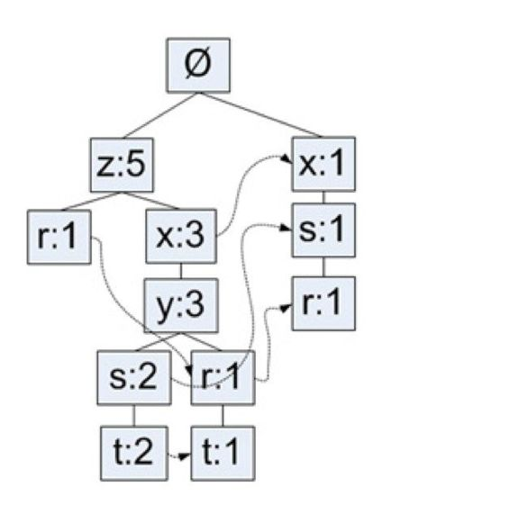
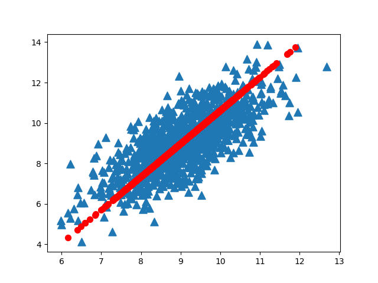
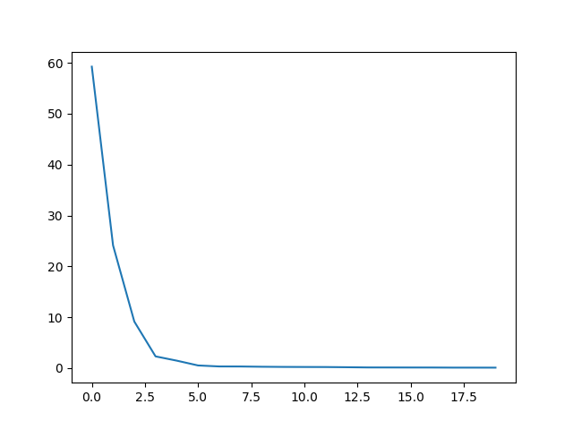
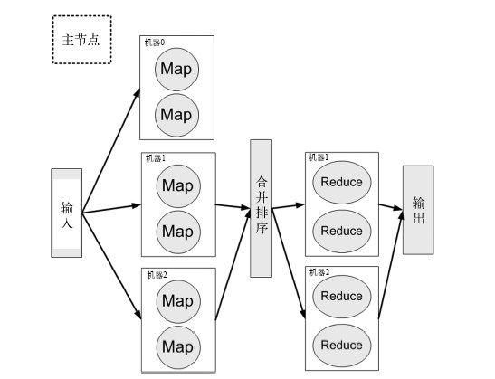

# ___2017 - 06 - 28 机器学习 (无监督学习 / 降维 / MapReduce)___
***

# 目录
  <!-- TOC depthFrom:1 depthTo:6 withLinks:1 updateOnSave:1 orderedList:0 -->

  - [___2017 - 06 - 28 机器学习 (无监督学习 / 降维 / MapReduce)___](#2017-06-28-机器学习-无监督学习-降维-mapreduce)
  - [目录](#目录)
  - [利用 Ｋ-means 聚类算法对未标注数据分组](#利用-means-聚类算法对未标注数据分组)
  	- [聚类与K-means](#聚类与k-means)
  	- [python实现 K-means 算法](#python实现-k-means-算法)
  	- [提高聚类性能 后处理 / 二分k均值算法](#提高聚类性能-后处理-二分k均值算法)
  	- [python实现 二分k均值 算法](#python实现-二分k均值-算法)
  	- [一个地图上两点的距离计算公式](#一个地图上两点的距离计算公式)
  	- [scipy.cluster.vq 中的 whiten / kmeans / vq 方法](#scipyclustervq-中的-whiten-kmeans-vq-方法)
  	- [scipy 库中的 kmeans 用于学生成绩分析与数据分组示例](#scipy-库中的-kmeans-用于学生成绩分析与数据分组示例)
  - [使用先验知识 Apriori 算法进行关联分析](#使用先验知识-apriori-算法进行关联分析)
  	- [关联分析](#关联分析)
  	- [Apriori原理](#apriori原理)
  	- [python实现 Apriori 算法发现频繁集](#python实现-apriori-算法发现频繁集)
  	- [python实现从频繁项集中挖掘关联规则](#python实现从频繁项集中挖掘关联规则)
  	- [发现毒蘑菇的相似特征](#发现毒蘑菇的相似特征)
  	- [Apriori 算法计算一组数据到目标值的最佳组合](#apriori-算法计算一组数据到目标值的最佳组合)
  - [使用 FP-growth 算法来高效发现频繁项集](#使用-fp-growth-算法来高效发现频繁项集)
  	- [FP-growth 算法](#fp-growth-算法)
  	- [FP树：用于编码数据集的有效方式](#fp树用于编码数据集的有效方式)
  	- [python实现构建FP树](#python实现构建fp树)
  	- [条件模式基与从FP树中挖掘频繁项集](#条件模式基与从fp树中挖掘频繁项集)
  	- [python实现查找条件模式基](#python实现查找条件模式基)
  	- [python实现从FP树中挖掘频繁项](#python实现从fp树中挖掘频繁项)
  	- [完整的 FP-growth 算法与 Apriori 算法对比](#完整的-fp-growth-算法与-apriori-算法对比)
  	- [从新闻网站点击流中挖掘频繁项集](#从新闻网站点击流中挖掘频繁项集)
  - [利用主成分分析 PCA 来简化数据](#利用主成分分析-pca-来简化数据)
  	- [降维](#降维)
  	- [主成分分析 PCA](#主成分分析-pca)
  	- [python实现 PCA 变换](#python实现-pca-变换)
  	- [利用PCA对半导体制造数据降维](#利用pca对半导体制造数据降维)
  - [利用奇异值分解 SVD 简化数据](#利用奇异值分解-svd-简化数据)
  	- [SVD的应用](#svd的应用)
  	- [矩阵分解](#矩阵分解)
  	- [利用Python进行 SVD 结果分析](#利用python进行-svd-结果分析)
  	- [基于协同过滤的推荐引擎](#基于协同过滤的推荐引擎)
  	- [相似度计算](#相似度计算)
  	- [python实现相似度计算](#python实现相似度计算)
  	- [餐馆菜品推荐系统](#餐馆菜品推荐系统)
  	- [基于SVD的图像压缩](#基于svd的图像压缩)
  - [大数据与MapReduce分布式计算框架](#大数据与mapreduce分布式计算框架)
  	- [MapReduce 分布式计算框架](#mapreduce-分布式计算框架)
  	- [python实现分布式计算均值和方差的 mapper / reducer](#python实现分布式计算均值和方差的-mapper-reducer)
  	- [Hadoop 安装与本地运行](#hadoop-安装与本地运行)
  	- [托管的hadoop集群亚马逊云服务 AWS 上的可用服务](#托管的hadoop集群亚马逊云服务-aws-上的可用服务)
  	- [在 Amazon EMR 上运行 Hadoop 作业](#在-amazon-emr-上运行-hadoop-作业)
  	- [MapReduce上的机器学习](#mapreduce上的机器学习)
  	- [使用 mrjob 自动化 MapReduce 作业流](#使用-mrjob-自动化-mapreduce-作业流)
  	- [python实现 mrjob 分布式计算均值方差](#python实现-mrjob-分布式计算均值方差)
  	- [python实现SVM的 Pegasos 算法](#python实现svm的-pegasos-算法)
  	- [python实现mrjob版本的 SVM Pegasos 算法](#python实现mrjob版本的-svm-pegasos-算法)

  <!-- /TOC -->
***

# 利用 Ｋ-means 聚类算法对未标注数据分组
## 聚类与K-means
  无监督学习是指事先不知道要寻找的内容，即没有目标变量
  - **聚类Clustering** 是一种无监督的学习 unsupervised classification，将相似的对象归到同一个 **簇cluster** 中，聚类方法几乎可以应用于所有对象，簇内的对象越相似，聚类的效果越好
  - **簇识别 cluster identification** 给出聚类结果的含义，聚类与分类的最大不同在于，分类的目标事先已知，而聚类分析的类别没有预先定义，其产生的结果与分类相同
  - **聚类分析** 试图将相似对象归入同一簇，将不相似对象归到不同簇，所选择的相似度计算方法，取决于具体应用
  - **k-均值聚类 K-means**，可以发现给定数据集的 **k** 个不同的簇，簇个数k是用户指定的，每一个簇通过其 **质心** centroid，即簇中所有点的 **均值** 来描述
  - **k均值算法的工作流程**
    - 首先，随机确定k个初始点作为质心
    - 然后将数据集中的每个点分配到一个簇中，即为每个点找距其最近的质心，并将其分配给该质心所对应的簇
    - 每个簇的质心更新为该簇所有点的平均值
    - 数据集上k均值算法的性能会受到所选距离计算方法的影响
  - **优点**：容易实现
  - **缺点**：可能收敛到局部最小值，在大规模数据集上收敛较慢
  - **适用数据类型**：数值型数据
## python实现 K-means 算法
  ```python
  # 距离计算方法，计算单个向量与质心的欧式距离，返回距离最小的质心编号
  def groupByDist(va, centr, func=np.argmin):
      dist = sqrt(((va - centr) ** 2).sum(axis=-1))
      return func(dist)

  # 随机生成一个包含 k 个质心的集合，输入参数 dataSet 要求是 np.array
  def randCent(dataSet, k):
      minds = dataSet.min(axis=0)
      maxds = dataSet.max(axis=0)
      return minds + (maxds - minds) * rand(k, dataSet.shape[1])

  # k均值聚类算法
  def kMeans(dataSet, k, groupFunc=groupByDist, createCent=randCent):
      ''' 参数 (数据集, 簇的数目, 分组依据, 初始质心的创建函数) '''
      df = pd.DataFrame(dataSet)
      centroids = createCent(df.values, k)

      dfGroup = pd.Series(index=df.index ).fillna(0)
      dfGroupBak = pd.Series(index=df.index).fillna(-1)
      # (计算质心 - 分配 - 重新计算) 反复迭代，结束条件是所有分组没有改变
      while (dfGroupBak != dfGroup).any():
          dfGroupBak = dfGroup.copy()
          # dfGroup = np.array( [groupFunc(row, centroids) for row in df.values] )
          # 当前质心下的分组结果，使用apply方法返回Series，保留子数据集的索引信息
          dfGroup = df.apply(groupFunc, axis=1, raw=True, args=(centroids, ))
          # 数据集分组，对应的质心更新为数据子集的平均值
          grouped = df.groupby(dfGroup)
          centroids = grouped.apply(mean, axis=0).values
          # 有几率发生，会返回小于指定数量 k 的簇，重新创建centroids
          if centroids.shape[0] != k:
              print('It Happens! Restart the work...')
              centroids = createCent(df.values, k)
              dfGroupBak = pd.Series(index=df.index).fillna(-1)
      return centroids, dfGroup
  ```
  运行结果
  ```python
  df = pd.read_table('Ch10/testSet.txt', header=None)
  r, _ = kMeans(df, 4)

  # 绘制图形
  plt.scatter(df.values[:, 0], df.values[:, 1], s = 10)
  plt.scatter(r[:, 0], r[:, 1], c='r', marker='D', s = 30)
  r
  Out[299]:
  array([[ 2.65077367, -2.79019029],
         [-2.46154315,  2.78737555],
         [ 2.6265299 ,  3.10868015],
         [-3.53973889, -2.89384326]])
  ```
  
## 提高聚类性能 后处理 / 二分k均值算法
  - k均值聚类中簇的数目 k 需要用户预先定义，在指定的k值下，k均值算法收敛到了局部最小值，而非全局最小值，如所有质心可能聚集在数据集的中心点，质心可能位于两个子集的中点
  - **误差平方和 SSE** (Sum of Squared Error)，一种用于度量聚类效果的指标，取数据子集与对应质心距离的平方和
    - SSE值越小表示数据点越接近于它们的质心，聚类效果也越好
    - 因为对误差取了平方，因此更加重视那些远离中心的点
    - 一种肯定可以降低SSE值的方法是 **增加簇的个数**，但这违背了聚类的目标，聚类的目标是在保持簇数目不变的情况下提高簇的质量
  - 簇划分完成后的处理，一种方法是 **将具有最大SSE值的簇划分成两个簇**，为了保持簇总数不变，可以将某两个簇进行合并
    - **合并最近的质心**，计算所有质心之间的距离，然后合并距离最近的两个点
    - **合并两个使得SSE增幅最小的质心**，合并两个簇然后计算总SSE值，直到找到合并最佳的两个簇
  - 为克服k均值算法收敛于局部最小值的问题，可以使用 **二分k均值**（bisecting Ｋ-means）的算法
    - 首先将所有点作为一个簇
    - 然后将该簇一分为二
    - 之后选择其中一个簇继续进行划分，选择哪一个簇进行划分取决于对其划分是否可以最大程度降低SSE的值
    - 不断重复基于SSE的划分过程，直到得到用户指定的簇数目为止
    - 另一种做法是选择SSE最大的簇进行划分，直到簇数目达到用户指定的数目为止
## python实现 二分k均值 算法
  ```python
  # 计算给定数据集 df 在分组信息 g 与质心 ce 的距离
  errorCount = lambda df, ce, g: ((df.values - ce[g]) ** 2).sum(axis=-1)

  # 二分K均值聚类算法
  def biKmeans(dataSet, k, groupFunc=groupByDist):
      df = pd.DataFrame(dataSet)
      centr, gp = kMeans(df, 1)

      # 每次循环增加一个质心
      while centr.shape[0] < k:
          # 未划分时的距离集合
          errorBeforeSplit = errorCount(df, centr, gp)
          maxErrorDeclined = -1
          # 每个子集上尝试划分为两个组
          # df.groupby(gp).apply(kMeans, 2, groupByDist) 会丢失子集索引 [???]
          for i, subDf in df.groupby(gp):
              sub_c, sub_g = kMeans(subDf, 2, groupFunc=groupByDist)
              # 划分后子集上的距离总和
              errorSplitSub = errorCount(subDf, sub_c, sub_g).sum()
              errorBeforeSplitSub = errorBeforeSplit[subDf.index].sum()
              # print(i, errorSplitSub, errorBeforeSplitSub)
              # 比较选取缩减最多的划分方式
              if (errorBeforeSplitSub - errorSplitSub) > maxErrorDeclined:
                  maxErrorDeclined = errorBeforeSplitSub - errorSplitSub
                  t = [i, sub_c, sub_g]
          it, sub_ct, sub_gt = t
          # 更新分组信息，sub_gt 中编号为1的组指定为新组，编号指定指定为当前最大值
          gp[np.nonzero(sub_gt)[0]] = centr.shape[0]
          # 更新质心，sub_ct 中编号为1的质心添加到 centr 的末尾
          centr[it] = sub_ct[0]
          centr = np.vstack([centr, sub_ct[1]])
          # print(it, sub_ct, c)
      return centr, gp
  ```
  运行结果
  ```python
  df = pd.read_table('Ch10/testSet2.txt', header=None)
  c, g = biKmeans(df, 3)
  c
  Out[505]:
  array([[-2.94737575,  3.3263781 ],
         [-0.45965615, -2.7782156 ],
         [ 2.93386365,  3.12782785]])

  # 绘制图形，连续运行50次
  fg = plt.figure(figsize=(5, 6))
  fg.add_subplot(2, 1, 1)
  plt.scatter(df.values[:, 0], df.values[:, 1], s = 10)
  plt.title('biKmeans')
  for i in range(50):
      c, g = biKmeans(df, 3)
      plt.scatter(c[:, 0], c[:, 1], c='r', marker='D', s = 30, alpha = 0.5)
  # 对比 kMeans
  fg.add_subplot(2, 1, 2)
  plt.scatter(df.values[:, 0], df.values[:, 1], s = 10)
  plt.title('kMeans')
  for i in range(50):
      c, g = kMeans(df, 3)
      plt.scatter(c[:, 0], c[:, 1], c='r', marker='D', s = 30, alpha = 0.5)
  ```
  
## 一个地图上两点的距离计算公式
  ```python
  # 球面距离计算，返回距离单位为英里，(A的经纬度, B的经纬度)
  def distSLC(vecA, vecB):
      a = sin(vecA[0,1]*pi/180) * sin(vecB[0,1]*pi/180)
      b = cos(vecA[0,1]*pi/180) * cos(vecB[0,1]*pi/180) * cos(pi * (vecB[0,0]-vecA[0,0]) /180)
      return arccos(a + b)*6371.0
  ```
## scipy.cluster.vq 中的 whiten / kmeans / vq 方法
  - **whiten** 规范化特征值，根据每一列数据的标准偏差调整每一个值，最好在执行 kmeans 之前执行 whiten
    - whiten(obs, check_finite=True)
      ```
      obs : ndarray
      check_finite : bool, optional, Default: True 指定是否检查输入数据
        指定为False时可以提高性能，但输入数据中如果含有 NA / inf 时可能会有问题
      ```
    - 示例
      ```python
      from scipy.cluster.vq import whiten

      arr = np.arange(1, 7).reshape(2, 3)
      whiten(arr)
      Out[51]:
      array([[ 0.66666667,  1.33333333,  2.        ],
             [ 2.66666667,  3.33333333,  4.        ]])

      arr / whiten(arr)
      Out[52]:
      array([ 1.5,  1.5,  1.5],
             [ 1.5,  1.5,  1.5]])

      arr.var(0)
      Out[53]: array([ 2.25,  2.25,  2.25])
      ```
  - **kmeans** 在数据集 obs 上调用 kmeans 算法，生成 k 个簇，距离算法使用每一项数据与对应质心的间隔，在调用 kmeans 之前最好先调用 whiten
    - kmeans(obs, k_or_guess, iter=20, thresh=1e-05, check_finite=True)
      ```
      k_or_guess : int or ndarray 指定返回的簇数量 k，或指定形状的初始簇
      iter : int, optional 执行 kmeans算法的次数
      thresh : float, optional 距离改变小于阈值 thresh 时，退出 kmeans 算法
      返回值 a code book mapping centroids to codes and vice versa
      ```
    - 示例
      ```python
      from scipy.cluster.vq import whiten, kmeans
      arr = np.arange(1, 9).reshape(-1, 2)
      wa = whiten(arr)
      kmeans(wa, 2)
      Out[107]:
      (array([[ 2.68328157,  3.13049517],
          [ 0.89442719,  1.34164079]]), 0.63245553203367577)

      book = np.array((wa[0], wa[2]))
      kmeans(wa, book)
      Out[109]:
      (array([[ 0.89442719,  1.34164079],
              [ 2.68328157,  3.13049517]]), 0.63245553203367577)
      ```
  - **vq** 根据簇数据集 code_book 将每个数据项 obs 划分到距离最近的簇，obs中的数据要求是标准化的，即调用过 whiten 函数
    - vq(obs, code_book, check_finite=True)
      ```
      code_book : ndarray 使用 k-means 算法生成的簇集合
      返回值 (数据分组信息 code, 数据与对应簇的距离 dist)
      ```
    - 示例
      ```python
      from scipy.cluster.vq import whiten, kmeans, vq

      arr = np.arange(1, 9).reshape(-1, 2)
      wa = whiten(arr)
      c, _ = kmeans(wa, 2)
      vq(wa, c)
      Out[119]:
      (array([0, 0, 1, 1], dtype=int32),
      array([ 0.63245553,  0.63245553,  0.63245553,  0.63245553]))

      g, d = vq(wa, c)
      plt.scatter(wa[g == 0, 0], wa[g == 0, 1], marker='v', c='b')
      plt.scatter(wa[g == 1, 0], wa[g == 1, 1], marker='v', c='m')
      plt.scatter(c[:, 0], c[:, 1], marker='D', s = 20, c='r')
      ```
## scipy 库中的 kmeans 用于学生成绩分析与数据分组示例
  ```python
  # 学生成绩分析
  from scipy.cluster.vq import whiten, kmeans, vq
  list1 = [88.0, 64.0, 96.0, 85.0]
  list2 = [92.0, 99.0, 95.0, 94.0]
  list3 = [91.0, 87.0, 99.0, 95.0]
  list4 = [78.0, 99.0, 97.0, 81.0]
  list5 = [88.0, 78.0, 98.0, 84.0]
  list6 = [100.0, 95.0, 100.0, 92.0]
  data = np.vstack((list1, list2, list3, list4, list5, list6))

  whitened = whiten(data)
  centroids, _ = kmeans(whitened, 2)
  result, _ = vq(whitened, centroids)
  result
  Out[145]: array([1, 0, 0, 1, 1, 0], dtype=int32)
  ```
  ```python
  # 数据分组
  df = pd.read_table('Ch10/testSet2.txt', header=None)
  dfw = whiten(df)
  c, _ = kmeans(dfw, 3)

  plt.scatter(dfw[:, 0], dfw[:, 1], s = 10)
  plt.scatter(c[:, 0], c[:, 1], c='r', marker='D', s = 30)
  c
  Out[157]:
  array([[-0.17669456, -0.93425855],
         [ 1.12779466,  1.05182619],
         [-1.13298879,  1.11859468]])
  ```
***

# 使用先验知识 Apriori 算法进行关联分析
## 关联分析
  - 从大规模数据集中寻找物品间的隐含关系被称作 **关联分析** (association analysis) 或者 **关联规则学习** (association rule learning)
  - **频繁项集或关联规则** 关联分析在大规模数据集中寻找的关系可以有两种形式
    - **频繁项集** frequent item sets 是经常出现在一块的物品的集合
    - **关联规则** association rules 暗示两种物品之间可能存在很强的关系，每条关联规则意味着元素项之间的 **if --> then** 关系
  - **支持度和可信度** 是用来量化关联分析是否成功的方法
  - **项集的支持度** (support) 被定义为数据集包含该项集的记录比例，如在5条交易记录中有3条包含{a，b}，因此{a，b}的支持度为3/5，支持度是针对项集来说的，因此可以定义一个最小支持度，而只 **保留满足最小支持度的项集**
  - **可信度或置信度** (confidence) 是针对一条诸如{a} ➞ {b}的关联规则来定义的，这条规则的可信度被定义 **支持度({a, b}) / 支持度({a})**
  - **优点**：易编码实现
  - **缺点**：在大数据集上可能较慢
  - **适用数据类型**：数值型或者标称型数据
## Apriori原理
  - 关联分析需要遍历所有的特征组合，需要的计算非常大，Apriori原理用于减少可能感兴趣的项集
  - **Apriori原理**
    - 如果某个项集是频繁的，那么它的所有子集也是频繁的
    - 也就是说，如果一个项集是非频繁集，那么它的所有超集也是非频繁的
    - 同样对于关联规则，如果一条规则不满足最小可信度要求，那么它所有的子集也不满足
  - Apriori原理用于减少可能的频繁相集 / 关联规则
    ```
    四个特征组成的所有项集
    {a} {b} {c} {d}
    {a, b} {a, c} {a, d} {b, c} {b, d} {c, d}
    {a, b, c} {a, b, d} {a, c, d} {b, c, d}
    {a, b, c, d}

    如果 {c, d} 是非频繁集，则 {a, c, d} {b, c, d} {a, b, c, d} 都是非频繁集
    如果 P{a, b, c} --> H{d} 是 低可信度，那么
        {a, b} --> {c, d}, {a, c} --> {b, d}, {b, c} --> {a, d}
        {a} --> {b, c, d}, {b} --> {a, c, d}, {c} --> {a, b, d}
        都是低可信度
    ```
    其中
    ```
    项集的支持度 support({a, b}) = 包含 {a, b} 的记录数量 / 所有记录的数量
    关联规则的可信度 P{a} --> H{b, c} = support({a, b, c}) / support({a})
    ```
## python实现 Apriori 算法发现频繁集
  - 步骤
    - 首先创建只含单个特征的项集列表
    - 筛选满足最小支持度的项集
    - 创建元素数加 1 的项集
    - 项集列表不为空，则重复 筛选 --> 创建 过程
  ```python
  # 计算单个项集的支持度
  supportRateCalc = lambda df, row : (df[list(row)] == 1).all(axis=1).value_counts().get(True, default=0) / df.shape[0]
  # 计算一组项集的支持度
  rateSupportList = lambda df, l : pd.Series({row : supportRateCalc(df, row) for row in l})

  # 返回一组项集中元素的组合，每个项集中元素数量加 1
  # [{a, b}, {a, c}, {b, c}] --> [{a, b, c}]
  def levelupSupportList(l):
      ll = []
      for i, li in enumerate(l):
          for lj in l[i+1:]:
              # 只有最后一个元素不同的两组组合成新的项集
              if list(li)[:-1] == list(lj)[:-1]:
                  ll.append(li | lj)
      return ll

  # Apriori 算法发现频繁集 (list / array数据集, 最小支持度)
  def apriori(dataSet, minSupport = 0.5):
      # 值计数，每条记录中只保留唯一值
      df = pd.DataFrame([set(x) for x in dataSet])
      dfv = df.apply(pd.value_counts, axis=1).fillna(0)
      # 高效版本
      # dfv = data2ValidDummies(dataSet, minSupport * len(dataSet))

      # 构建单个值的项集列表，frozenset 转化的序列可以作为索引
      l = [frozenset([x]) for x in dfv.columns]
      r = []
      rRate = pd.Series()
      while l != []:
          # 当前项集的可信度列表
          listRate = rateSupportList(dfv, l)
          # 包含过滤前的支持度的 Series，返回用于计算可信度
          rRate = rRate.append(listRate)
          # 根据要求的最小支持度过滤
          l = listRate[listRate >= minSupport].index.tolist()
          r += l
          # 项集更新，元素数加 1
          l = levelupSupportList(l)
      return r, rRate
  ```
  运行结果
  ```python
  lll = [[1, 3, 4], [2, 3, 5], [1, 2, 3, 5], [2, 5]]
  r, rr = apriori(lll)
  r
  Out[342]:
  [frozenset({1.0}),
   frozenset({2.0}),
   frozenset({3.0}),
   frozenset({5.0}),
   frozenset({1.0, 3.0}),
   frozenset({2.0, 3.0}),
   frozenset({2.0, 5.0}),
   frozenset({3.0, 5.0}),
   frozenset({2.0, 3.0, 5.0})]

  # 包含 r 每一项可能的子集的支持度
  rr
  Out[343]:
  (1.0)              0.50
  (2.0)              0.75
  (3.0)              0.75
  (4.0)              0.25
  (5.0)              0.75
  (1.0, 2.0)         0.25
  (1.0, 3.0)         0.50
  (1.0, 5.0)         0.25
  (2.0, 3.0)         0.50
  (2.0, 5.0)         0.75
  (3.0, 5.0)         0.50
  (2.0, 3.0, 5.0)    0.50
  dtype: float64
  ```
  数据集转化以及 levelupSupportList 函数的其他实现
  ```python
  # 根据 minSupport，将数据集有效部分转化为哑变量矩阵，避免使用 value_counts
  def data2ValidDummies(dataSet, minCount = 5):
      # 值计数
      dataVc = {}
      for line in dataSet:
          for item in set(line):
              dataVc[item] = dataVc.get(item, 0) + 1
      # 数据整理，过滤掉小于minSupport的数据值，之后可以转换为 DataFrame
      dataValid = sorted([k for k in dataVc if dataVc[k] >= minCount])
      dataDummie = pd.DataFrame([[1 if item in line else 0 for item in dataValid] for line in dataSet], columns=dataValid)

      return dataDummie
  # levelupSupportList一个lambda表达式的实现
  levelupSupportList = lambda l : [li | lj for i, li in enumerate(l) for lj in l[i+1:] if list(li)[:-1] == list(lj)[:-1]]
  ```
## python实现从频繁项集中挖掘关联规则
  - 通过在高可信度规则的 H 列表上构建超集，遍历每一条频繁项集所有可能的规则
  ```python
  # 从频繁项集中挖掘关联规则
  def generateRules(supportList, supportRate, minConf=0.7):
      p2hRules = []
      # 遍历每一个项集
      for l in supportList:
          if len(l) < 2:
              continue
          # 项集中的单个元素列表
          lh = [frozenset([x]) for x in l]
          while lh != [] and len(lh[0]) < len(l):
              # 规则 P --> H 的可信度 support(P | H) / support(P)
              p2hRate = supportRate[l] / supportRate[[l - h for h in lh ]]
              # 根据最小可信度过滤出 H，丢弃低可信度的规则
              hHighRate = [l - p for p in p2hRate[p2hRate >= minConf].index]
              p2hRules += [[l - h, h, p2hRate[l-h]] for h in hHighRate]
              # H 中元素树加 1
              lh = levelupSupportList(hHighRate)
      return pd.DataFrame(p2hRules, columns=['if', 'then', 'rate'])
  ```
  运行结果
  ```python
  generateRules(r, rr)
  Out[855]:
             if   then  rate
  0       (1.0)  (3.0)   1.0
  1       (5.0)  (2.0)   1.0
  2       (2.0)  (5.0)   1.0
  3  (3.0, 5.0)  (2.0)   1.0
  4  (2.0, 3.0)  (5.0)   1.0
  ```
## 发现毒蘑菇的相似特征
  - 有时并不想寻找所有频繁项集，只对包含某个特定元素项的项集感兴趣
  - UCI的机器学习数据集合中有一个关于肋形蘑菇的23种特征的数据集，每一个特征都包含一个标称数据值
  - 第一个特征表示有毒或者可食用，如果某样本有毒，则值为2，如果可食用，则值为1
  - 下一个特征是蘑菇伞的形状，有六种可能的值，分别用整数 3 - 8 来表示
  - 为了找到毒蘑菇中存在的公共特征，可以运行Apriori算法来寻找包含特征值为2的频繁项集
  ```python
  df = pd.read_table('Ch11/mushroom.dat', delimiter=' ', header=None)
  r, rr = apriori(df.values, 0.3)

  searchSupportList = lambda r, rr, length, sub: rr[[x for x in r if (len(x) in np.array(length)) and x.issuperset(sub)]]

  # 在长度为2的频繁项集上，查找包含特征值为2的频繁项集
  searchSupportList(r, rr, 2, [2])
  Out[295]:
  (2.0, 23.0)    0.338749
  (2.0, 28.0)    0.419498
  (2.0, 34.0)    0.494338
  (2.0, 36.0)    0.370261
  (2.0, 39.0)    0.482521
  (2.0, 53.0)    0.319055
  (2.0, 59.0)    0.448055
  (2.0, 63.0)    0.418513
  (2.0, 67.0)    0.338749
  (2.0, 76.0)    0.332841
  (2.0, 85.0)    0.517971
  (2.0, 86.0)    0.494338
  (2.0, 90.0)    0.452979
  (2.0, 93.0)    0.387986
  dtype: float64

  ru = generateRules(r, rr, minConf=1)
  ru[ru.then == frozenset([2, 85])]
  Out[310]:
                                    if         then  rate
  452                     (28.0, 53.0)  (2.0, 85.0)   1.0
  1654              (34.0, 28.0, 53.0)  (2.0, 85.0)   1.0
  1714              (90.0, 28.0, 39.0)  (2.0, 85.0)   1.0
  1719              (90.0, 28.0, 53.0)  (2.0, 85.0)   1.0
  3594        (34.0, 28.0, 53.0, 39.0)  (2.0, 85.0)   1.0
  3666        (34.0, 28.0, 90.0, 39.0)  (2.0, 85.0)   1.0
  3672        (34.0, 90.0, 28.0, 53.0)  (2.0, 85.0)   1.0
  3743        (90.0, 28.0, 86.0, 39.0)  (2.0, 85.0)   1.0
  5402  (34.0, 39.0, 53.0, 90.0, 28.0)  (2.0, 85.0)   1.0
  5496  (34.0, 39.0, 86.0, 90.0, 28.0)  (2.0, 85.0)   1.0
  ```
## Apriori 算法计算一组数据到目标值的最佳组合
  - 计算一组发票到目标值的最佳组合
  ```python
  # 只有最后一个元素不同的两组组合成新的元素
  levelupList = lambda l : [li | lj for i, li in enumerate(l) for lj in l[i+1:] if list(li)[:-1] == list(lj)[:-1]]

  # [发票集合, 目标值, 排除的发票集合, 是否优先使用最大值, 返回的结果数量]
  def invoiceCalc(inhands, target, exep=None, max_first=True, num=3):
      # 重复值添加一个小数部分
      inhands.sort()
      step = 0.001
      for i in range(len(inhands) - 1) :
          if inhands[i] == inhands[i+1]:
              inhands[i] += step
              step += 0.001
          else:
              step = 0.001

      # 去除 exep 中的部分
      if exep != None:
          # 转化成 set 时会多出小数部分，保留3位
          inhands = {float('%.3f' % x) for x in inhands}
          inhands = inhands - set(exep)

      # target 过大 / 过小，直接返回结果
      inhands = list(inhands)
      if inhands == []:
          print('Nothing left.')
          return None
      if target <= min(inhands) or len(inhands) < 2:
          print(min(inhands), '\t', min(inhands))
          return {frozenset([min(inhands)]) : min(inhands)}
      if target > sum(inhands) - min(inhands):
          print(tuple(inhands), '\t', sum(inhands))
          return {frozenset(inhands) : sum(inhands)}

      # 是否首先使用 inhands 的最大值
      if max_first == True:
          max_inhands = max(inhands)
          target -= max_inhands
          inhands.remove(max_inhands)

      # 创建单个元素的列表
      inhands = [frozenset([x]) for x in inhands]
      r = {}
      while inhands != []:
          # 列表中元素求和
          inhandsVal = {row : sum(list(row)) for row in inhands}
          r.update(inhandsVal)
          # 选取总和小于 target 的元素，组合构建元素数加 1 的新列表
          inhands = [x for x in inhandsVal if inhandsVal[x] < target]
          inhands = levelupList(inhands)

      # 过滤，只选取满足大于 target 部分最小的 num 个
      r_valid = filter(lambda x : x[1] > target, r.items())
      r_sorted = sorted(r_valid, key=lambda x : x[1])
      r = dict(r_sorted[:num])

      # 如果指定了首先使用最大值，将最大值添加到结果中
      if max_first == True:
          r = {x | frozenset([max_inhands]) : y + max_inhands for x, y in r.items()}
      for x, y in r.items():
          print(tuple(x), '\t', y)
      return r
  ```
  运行结果
  ```python
  l = [146, 86, 74, 146, 128, 280, 70, 136, 89.68, 128, 96, 86, 146, 146, 57, 552, 41.4, 13.85]
  r = invoiceCalc(l, 600)
  Out[450]:
  (552, 41.4, 13.85) 	 607.25
  (552, 57) 	 609
  (552, 70) 	 622

  r = invoiceCalc(l, 600, exep=[552.0, 41.4, 13.85])
  Out[455]:
  (128.0, 57.0, 136.0, 280.0) 	 601.0
  (128.001, 57.0, 136.0, 280.0) 	 601.001
  (136.0, 89.68, 96.0, 280.0) 	 601.68

  r = invoiceCalc(l, 600, exep=[552.0, 41.4, 13.85, 128.0, 57.0, 136.0, 280.0])
  Out[456]:
  (128.001, 96.0, 70.0, 74.0, 146.003, 86.0) 	 600.004
  (128.001, 96.0, 70.0, 74.0, 146.003, 86.001) 	 600.005
  (74.0, 146.001, 146.0, 146.003, 89.68) 	 601.684

  r = invoiceCalc(l, 600, exep=[552.0, 41.4, 13.85, 128.0, 57.0, 136.0, 280.0, 96.0, 128.001, 70.0, 74.0, 146.003, 86.0])
  Out[457]:
  (146.0, 146.002, 146.001, 86.001, 89.68) 	 613.684
  ```
***

# 使用 FP-growth 算法来高效发现频繁项集
## FP-growth 算法
  - **FP-growth 算法**，基于Apriori构建，将数据集存储在一个特定的称作 **FP树** 的结构中，之后只根据FP树发现频繁项集，该算法只需要对数据库进行两次遍历，通常性能要好于 Apriori 算法
  - **FP-growth 算法** 能更为高效地发现频繁项集，但不能用于发现关联规则
  - FP-growth算法发现频繁项集的基本过程
    - 从数据集构建FP树
    - 从FP树中挖掘频繁项集
  - **优点**：一般要快于Apriori
  - **缺点**：实现比较困难，在某些数据集上性能会下降
  - **适用数据类型**：标称型数据
## FP树：用于编码数据集的有效方式
  - **FP树** FP代表频繁模式 Frequent Pattern，一棵FP树看上去与计算机科学中的其他树结构类似，其中存储了每个元素项的出现 **频率**，数据集中的每一项会以 **路径** 的方式存储在树中
    - 存在相似元素的集合会共享树的一部分，只有当集合之间完全不同时，树才会分叉
    - 树节点上给出集合中的单个元素及其在序列中的出现次数
    - 路径给出该序列的出现次数
  - **生成 FP树 的流程**
    - 扫描原始数据集，对所有元素项的出现次数进行计数，根据 **最小支持度** 过滤掉不频繁项，剩余的频繁项 **根据频度排序**
    - 第二遍扫描中只考虑那些频繁元素，根据数据集每一项中元素的出现顺序，构建 **FP树中的路径**
  - **示例**
    - 原始数据集中的元素过滤并排序
      ```md
      | 事务ID |     事务中的元素项     | 过滤及重排序后的事务 |
      | ------ | ---------------------- | -------------------- |
      | 001    | r, z, h, j, p          | z, r                 |
      | 002    | z, y, x, w, v, u, t, s | z, x, y, s, t        |
      | 003    | z                      | z                    |
      | 004    | r, x, n, o, s          | x, s, r              |
      | 005    | y, r, x, z, q, t, p    | z, x, y, r, t        |
      | 006    | y, z, x, e, q, s, t, m | z, x, y, s, t        |
      ```
    - 构建FP树中的路径

      
## python实现构建FP树
  ```python
  # 复用 Apriori 算法中的转换函数，转换为只包含 0 / 1 的矩阵，表示某个值是否存在
  # 数据集中的元素采用频度排序
  def data2ValidDummies2(dataSet, minCount = 5):
      # 值计数
      dataVc = {}
      for line in dataSet:
          for item in set(line):
              dataVc[item] = dataVc.get(item, 0) + 1
      # 数据整理，过滤掉小于 minCount 的数据值，之后可以转换为 DataFrame
      dataValid = [k for k in dataVc if dataVc[k] >= minCount]
      # 频繁项根据频度排序
      dataValid = sorted(dataValid, key = lambda k : dataVc[k], reverse=True)
      dataDummie = pd.DataFrame([[1 if item in line else 0 for item in dataValid] for line in dataSet], columns=dataValid)

      return dataDummie

  # 从整理后的数据集构建 FP树
  def data2FPtree(dfDummie):
      # 过滤掉全0项
      dfDummie = dfDummie[dfDummie.any(axis=1)]
      # 数据集为空
      if dfDummie.empty:
          return None
      # 数据集只剩最后一列数据，返回列名与对应的频度总和，子树为 None
      if dfDummie.shape[1] == 0:
          return {dfDummie.columns[0] : [dfDummie.sum(), None]}
      # 路径的第一个节点，对应排序后的数据集每一排中第一个不为0的元素
      dfMaxCol = (dfDummie.values != 0).argmax(axis=1)
      # 根据路径的第一个节点位置划分数据集
      grouped = dfDummie.groupby(dfMaxCol, axis=0)
      FPtree = {}
      for i, g in grouped:
          # 取出路径的第一个节点，在数据子集上递归创建 子FP树
          FPtreeSub = data2FPtree(g.iloc[:, i+1:])
          # 节点对应的数据为 [频度值, 子FP树]
          FPtree[dfDummie.columns[i]] = [g.iloc[:, i].sum(), FPtreeSub]

      return FPtree
  ```
  运行结果
  ```python
  l = [['r', 'z', 'h', 'j', 'p'],
       ['z', 'y', 'x', 'w', 'v', 'u', 't', 's'],
       ['z'],
       ['r', 'x', 'n', 'o', 's'],
       ['y', 'r', 'x', 'z', 'q', 't', 'p'],
       ['y', 'z', 'x', 'e', 'q', 's', 't', 'm']]

  dfl = data2ValidDummies2(l, 3)
  # 生成的 FP树 中，相同频度的元素排序位置会有不同，使用时并不需要重排
  dfl = dfl[list('zxysrt')]
  fpt = data2FPtree(dfl)
  fpt
  Out[54]:
  {'x': [1, {'s': [1, {'r': [1, None]}]}],
   'z': [5,
    {'r': [1, None],
     'x': [3,
      {'y': [3,
        {'r': [1, {'t': [1, None]}],
         's': [2, {'t': [2, None]}]}]}]}]}
   ```
## 条件模式基与从FP树中挖掘频繁项集
  - **从FP树中挖掘频繁项集**，思路与Apriori算法大致类似，首先从单元素项集合开始，然后在此基础上逐步构建更大的集合，这里将利用FP树来实现，不再需要原始数据集
  - **前缀路径** (prefix path)，是介于所查找元素项与树根节点之间的所有内容
    ```
    符号 r 的前缀路径是 {x,s} {z,x,y} {z}
    ```
  - **条件模式基** (conditional pattern base) 是以所查找元素项为结尾的路径集合，即 **前缀路径** 的集合，每一条前缀路径都与该 **路径上所查找元素的数量** 相关联
    ```md
    | 频繁项 |            前缀路径            |
    | ------ | ------------------------------ |
    | z      | {} 5                           |
    | r      | {x, s} 1, {z, x, y} 1, {z}1    |
    | x      | {z} 3, {}1                     |
    | y      | {z, x} 3                       |
    | s      | {z, x, y} 2, {x} 1             |
    | t      | {z, x, y, s} 2, {z, x, y, r} 1 |
    ```
  - **从FP树中挖掘频繁项集过程**
    - 对于每一个频繁元素项，获得其对应的 **条件模式基** 对应的 **条件FP树**
    - 在每一个条件FP树递归调用挖掘函数，并 **过滤掉非频繁项**，直到条件FP树为空
## python实现查找条件模式基
  ```python
  # 从FP树中查找指定元素项的条件FP树
  # 返回 [指定元素的计数值, 条件FP树, 条件FP树中包含的所有元素项]
  def findPrefixFPtree(FPtree, keyWord):
      count = 0
      FPtreeSub = {}
      newKeys = set()

      for k in FPtree:
          # 单层FP树中只有一个对应的 keyWord，增加计数值
          if k == keyWord:
              count += FPtree[k][0]
              continue
          # 如果存在子树，在子树中继续查找
          if FPtree[k][1] != None:
              rr, ff, kk = findPrefixFPtree(FPtree[k][1], keyWord)
              # 子树中包含 keyWord 值，整合结果
              if rr != 0:
                  count += rr
                  FPtreeSub[k] = [rr, ff]
                  newKeys |= set(kk) | set([k])
      # 空集返回 None
      if FPtreeSub == {}:
          FPtreeSub = None
      return count, FPtreeSub, newKeys
  ```
  运行结果
  ```python
  c, t, k = findPrefixFPtree(fpt, 'r')
  # 所包含的keyWord计数值
  c
  Out[64]: 3
  # 对应的条件FP树
  t
  Out[65]:
    {'x': [1, {'s': [1, None]}],
     'z': [2, {'x': [1, {'y': [1, None]}]}]}
  # 条件FP树中包含的元素
  k
  Out[66]: {'s', 'x', 'y', 'z'}
  ```
## python实现从FP树中挖掘频繁项
  ```python
  # 从FP树中挖掘频繁项，[FP树, FP树中的所有元素集合, 最小计数值]
  def mineFPtree(FPtree, keySet, minCount = 5):
      freqList = []
      # 从单个元素项开始查找
      for v in keySet:
          count, FPtreeSub, newKeys = findPrefixFPtree(FPtree, v)
          # 保留满足最小计数值的元素，count可用于统计每一个频繁项集的计数
          if count >= minCount:
              freqList += [[v]]
              # 如果条件FP树不为空，递归调用挖掘函数，并整合结果
              if FPtreeSub != None:
                  rr = mineFPtree(FPtreeSub, newKeys, minCount)
                  freqList += [[v] + x for x in rr]
      return freqList
  ```
  运行结果
  ```python
  mineFPtree(fpt, dfl.columns, minCount=3)
  Out[68]:
  [['z'],
   ['x'],
   ['x', 'z'],
   ['y'],
   ['y', 'x'],
   ['y', 'x', 'z'],
   ['y', 'z'],
   ['s'],
   ['s', 'x'],
   ['r'],
   ['t'],
   ['t', 'y'],
   ['t', 'y', 'x'],
   ['t', 'y', 'x', 'z'],
   ['t', 'y', 'z'],
   ['t', 'z'],
   ['t', 'x'],
   ['t', 'x', 'z']]
  ```
## 完整的 FP-growth 算法与 Apriori 算法对比
  - 完整的 FP-growth 算法
    ```python
    # 完整的 FP-growth 算法
    def data2FreqListByFPtree(dataSet, minCount):
        dfl = data2ValidDummies2(dataSet, minCount)
        fpt = data2FPtree(dfl)
        return mineFPtree(fpt, dfl.columns, minCount)
    ```
  - 与 Apriori 算法对比
    ```python
    # FP-growth 算法
    lll = [[1, 3, 4], [2, 3, 5], [1, 2, 3, 5], [2, 5]]
    data2FreqListByFPtree(lll, 0.5 * len(lll))
    Out[71]: [[3], [2], [2, 3], [5], [5, 2], [5, 2, 3], [5, 3], [1], [1, 3]]

    # Apriori 算法
    r, rr = apriori(lll, 0.5)
    r
    Out[74]:
    [frozenset({1.0}),
     frozenset({2.0}),
     frozenset({3.0}),
     frozenset({5.0}),
     frozenset({1.0, 3.0}),
     frozenset({2.0, 3.0}),
     frozenset({2.0, 5.0}),
     frozenset({3.0, 5.0}),
     frozenset({2.0, 3.0, 5.0})]

    # 执行效率对比
    %timeit data2FreqListByFPtree(lll, 0.5 * len(lll))
    100 loops, best of 3: 9.16 ms per loop
    # Apriori 使用高效版本
    %timeit r, rr = apriori(lll, 0.5)
    100 loops, best of 3: 16.2 ms per loop
    ```
## 从新闻网站点击流中挖掘频繁项集
  - 数据集的每一行包含某个用户浏览过的新闻报道，一些用户只看过一篇报道，而有些用户看过2498篇报道
  - 用户和报道被编码成整数，所以查看频繁项集很难得到更多的东西，但是该数据对于展示 FP-growth 算法的速度十分有效
  ```python
  # 数据量大，不能直接使用pd.read_table()方法
  l = open('Ch12/kosarak.dat').readlines()
  ll = [[int(item) for item in line.strip().split()] for line in l]

  # 被10万或者更多的人浏览过的新闻报道或报道集合
  data2FreqListByFPtree(ll, 100000)
  Out[84]: [[6], [3], [3, 6], [11], [11, 3], [11, 3, 6], [11, 6], [1], [1, 6]]

  # 与 Apriori 算法对比
  %timeit data2FreqListByFPtree(ll, 50000)
  1 loop, best of 3: 6.93 s per loop
  # Apriori 使用高效版本
  %timeit r, rr = apriori(ll, 50000 / len(ll))
  1 loop, best of 3: 20.6 s per loop
  ```
***

# 利用主成分分析 PCA 来简化数据
## 降维
  - **降维** 往往作为预处理步骤，在数据应用到其他算法之前清洗数据
    - 目标是对输入的数目进行削减，使得数据变得更易使用
    - 往往能够去除数据中的噪声，使得其他机器学习任务更加精确
    - 可以降低很多算法的计算开销，提高机器学习方法的性能，并使得结果易懂
    - 很多技术可以用于数据降维，独立成分分析、因子分析和主成分分析比较流行
  - **主成分分析** Principal Component Analysis，PCA
    - 数据从原来的坐标系转换到了新的坐标系
    - 新坐标系的选择，第一个新坐标轴选择的是原始数据中方差最大的方向，第二个新坐标轴的选择和第一个坐标轴正交且具有最大方差的方向
    - 该过程一直重复，重复次数为原始数据中特征的数目
    - 大部分方差都包含在最前面的几个新坐标轴中，因此可以忽略余下的坐标轴，即对数据进行了降维处理
  - **因子分析** Factor Analysis
    - 假设在观察数据的生成中有一些观察不到的隐变量（latent variable）
    - 假设观察数据是这些隐变量和某些噪声的线性组合
    - 隐变量的数据可能比观察数据的数目少，通过找到隐变量就可以实现数据的降维
    - 因子分析已经应用于社会科学、金融和其他领域中
  - **独立成分分析** Independent Component Analysis，ICA
    - ICA假设数据是从N个数据源生成的，这一点和因子分析有些类似
    - 假设数据为多个数据源的混合观察结果，这些数据源之间在统计上是相互独立的，而在PCA中只假设数据是不相关的
    - 同因子分析一样，如果数据源的数目少于观察数据的数目，则可以实现降维过程
## 主成分分析 PCA
  - **PCA** 可以从数据中识别其主要特征，它是通过沿着数据最大方差方向 **旋转坐标轴** 来实现的
    - 选择方差最大的方向作为第一条坐标轴，数据的最大方差给出了数据的最重要的信息
    - 后续坐标轴来自于数据差异性次大的方向，且与前面的坐标轴正交
    - 通过数据集的协方差矩阵及其特征值分析，就可以求得这些主成分的值
  - **特征值分析** 是线性代数中的一个领域，能够通过数据的一般格式来揭示数据的真实结构
    ```
    对于矩阵A，有等式 Av = λv，其中 v 是特征向量， λ 是特征值
    ```
    numpy.linalg.eig()方法用于求解 **特征向量** 和 **特征值**
    ```python
    d = np.diag((1, 2, 3))
    w, v = np.linalg.eig(d)
    w
    Out[216]: array([ 1.,  2.,  3.])

    v
    Out[217]:
    array([[ 1.,  0.,  0.],
           [ 0.,  1.,  0.],
           [ 0.,  0.,  1.]])

    其中 w 是矩阵的特征值，v 是矩阵的特征向量，即满足 np.dot(d, v) == w * v
    ```
  - 得到 **协方差矩阵的特征向量** 之后
    - 可以保留最大的N个值，这些特征向量给出了N个最重要特征的真实结构，构成对数据进行转换的矩阵
    - 通过将数据乘上这N个特征向量可以将它 **转换到新的空间**
  - **优点**：降低数据的复杂性，识别最重要的多个特征。
  - **缺点**：不一定需要，且可能损失有用信息。
  - **适用数据类型**：数值型数据
## python实现 PCA 变换
  ```python
  from numpy import linalg as LA
  # PCA 将数据转换成前N个主成分，(数据集, 返回的特征数量)
  # 返回 (降维之后的数据集, 被重构后的原始数据集)
  def pca(dataSet, topNfeat=999):
      # 去除平均值
      meanVals = dataSet.mean(axis=0) # (m * n)
      meanRemoved = dataSet - meanVals
      # 计算协方差矩阵
      covSet = np.cov(meanRemoved, rowvar=False)
      # 计算协方差矩阵的特征值和特征向量
      eigVals, eigVects = LA.eig(covSet)  # (1, n), (n * n)
      # 将特征值从大到小排序
      eigValInd = np.argsort(eigVals)[::-1]
      # 保留最上面的N个特征向量
      redEigVects = eigVects[:, eigValInd[:topNfeat]]  # (n, topNfeat)
      # 将数据转换到上述N个特征向量构建的新空间中
      lowdDs = np.dot(meanRemoved, redEigVects)  # (m, topNfeat)
      # 坐标轴变换，重构原始数据用于调试
      reconSet = np.dot(lowdDs, redEigVects.T) + meanVals  # (m, n)
      return lowdDs, reconSet
  ```
  运行结果
  ```python
  df = pd.read_table('Ch13/testSet.txt', header=None)
  # 其中 l 是降维之后的数据集, r 是被重构后的原始数据集
  l, r = pca(df.values, 1)

  plt.scatter(df.iloc[:, 0], df.iloc[:, 1], marker='^', s=90)
  plt.scatter(r[:, 0], r[:, 1], marker='o', s=50, c='red')
  ```
  
  - 原始数据集及第一主成分，只需要保留一维信息即可，因为另一维信息只是对分类缺乏贡献的噪声数据
## 利用PCA对半导体制造数据降维
  - 数据集包含590个特征，且存在很多的缺失值，使用平均值来代替缺失值，并对这些特征进行降维处理
  - **确认所需特征和可以去除特征的数目**，PCA会给出数据中所包含的信息量
    - **数据** data 指的是接受的原始材料，其中可能包含噪声和不相关信息
    - **信息** information 是指数据中的相关部分
    - 这些并非只是抽象概念，可以 **定量地计算数据中所包含的信息并决定保留的比例**
  ```python
  # 分析数据集，计算主成份数目
  df = pd.read_table('Ch13/secom.data', delimiter=' ', header=None)
  df.shape
  Out[448]: (1567, 590)
  # 数据集每一行中都含有缺失值
  df.dropna().shape
  Out[449]: (0, 590)
  # 使用平均值填充缺失数据，并计算数据集的特征值
  dff = df.fillna(df.mean())
  dataSet = dff.values
  meanVals = dataSet.mean(axis=0)
  meanRemoved = dataSet - meanVals
  covSet = np.cov(meanRemoved, rowvar=False)
  eigVals, eigVects = LA.eig(covSet)
  # real 取实数部分
  eigVals = eigVals.real
  # 特称值中最前面15个值的数量级大于10^5，之后的值变得非常小
  eigVals[:12]
  Out[451]:
  array([ 53415197.85687519,  21746671.9046592 ,   8248376.61529074,
           2073880.85929397,   1315404.3877583 ,    467693.55734419,
            290863.55541772,    283668.60065106,    237155.82977109,
            208513.83582176,    196098.84856314,    186856.54901859])

  eigVals[-12:]
  Out[452]:
  array([ 0.,  0.,  0.,  0.,  0.,  0.,  0.,  0.,  0.,  0.,  0.,  0.])
  # 其中20%的特征值都是0，意味着这些特征都是其他特征的副本
  evc = pd.value_counts(eigVals == 0)
  evc
  Out[456]:
  False    474
  True     116
  dtype: int64

  evc[True] / evc.sum()
  Out[461]: 0.19661016949152543
  # 计算各特征值方差占总方差的百分比，可以看出，大部分方差都包含在前面的几个主成分中
  er = eigVals / eigVals.sum() * 100
  plt.plot(er[:20])
  er[:5]
  Out[496]:
  array([ 59.25405798,  24.12381887,   9.15001359,   2.30057852,   1.45919235])

  # 累积方差百分比，前六个主成分覆盖了数据 96.8% 的方差，前20个主成分覆盖了99.3%的方差
  er[:6].cumsum()[-1]
  Out[521]: 96.806478837517218
  er[:20].cumsum()[-1]
  Out[522]: 99.272357736267921

  # 约简数据，所需要的主成分数目无法精确知道，必须通过在实验中取不同的值来确定
  # 有效的主成分数目则取决于数据集和具体应用
  l, r = pca(dff.values, 6)
  l.shape
  Out[526]: (1567, 6)
  ```
  
***

# 利用奇异值分解 SVD 简化数据
## SVD的应用
  - **SVD** (Singular Value Decomposition) 是矩阵分解的一种类型，而矩阵分解是将数据矩阵分解为多个独立部分的过程
  - 利用SVD实现，能够用小得多的数据集来表示原始数据集，这实际上是去除了噪声和冗余信息，因此可以把SVD看成是 **从有噪声的数据中抽取相关特征**
  - **隐性语义索引**，最早的SVD应用之一就是信息检索
    - 利用SVD的方法为隐性语义索引 (Latent Semantic Indexing，LSI) 或隐性语义分析 (Latent Semantic Analysis，LSA)
    - 在LSI中，一个矩阵是由文档和词语组成的，当在该矩阵上应用SVD时，就会构建出多个奇异值
    - 这些奇异值代表了文档中的概念或主题，这一特点可以用于更高效的文档搜索
  - **推荐系统**，SVD的另一个应用就是推荐系统
    - 简单版本的推荐系统能够计算项或者人之间的相似度
    - 更先进的方法则先利用SVD从数据中构建一个主题空间，然后再在该空间下计算其相似度
  - **优点**：简化数据，去除噪声，提高算法的结果
  - **缺点**：数据的转换可能难以理解
  - **适用数据类型**：数值型数据
## 矩阵分解
  - 在很多情况下，数据中的一小段携带了数据集中的大部分信息，其他信息则要么是噪声，要么就是毫不相关的信息
  - 在线性代数中有很多矩阵分解技术，矩阵分解可以将原始矩阵表示成新的易于处理的形式，这种新形式是 **两个或多个矩阵的乘积**，不同的矩阵分解技术具有不同的性质
  - 最常见的一种矩阵分解技术就是 **SVD**
    - SVD将原始的数据集矩阵 Data 分解成三个矩阵 **U、Σ 和 VT**
    - 如果原始矩阵 Data 是 m 行 n 列，那么 U、Σ 和 VT 就分别是 **m 行 m 列、m 行 n 列和 n 行 n 列**
    ```
    Data(m * n) = U(m * m) * Σ(m * n) * VT(n * n)
    ```
  - **矩阵Σ**
    - 该矩阵只有对角元素，这些对角元素称为 **奇异值** (Singular Value)，它们对应了原始数据集矩阵 Data 的奇异值
    - 另一个惯例就是，**Σ 的对角元素是从大到小排列的**
  - **奇异值和特征值** 是有关系的，这里的奇异值就是矩阵 Data * Data.T 特征值的平方根
  - 在科学和工程中，一直存在这样一个普遍事实：**在某个奇异值的数目之后，其他的奇异值都置为0**，意味着数据集中仅有r个重要特征，而其余特征则都是噪声或冗余特征
## 利用Python进行 SVD 结果分析
  - numpy.linalg.svd 用于计算矩阵的SVD分解
    ```python
    from numpy import linalg as LA
    d = [[1, 1], [7, 7]]
    U, Sigma, VT = LA.svd(d)
    U
    Out[538]:
    array([[-0.14142136, -0.98994949],
           [-0.98994949,  0.14142136]])

    # 矩阵Sigma是以行向量返回的，节省空间
    Sigma
    Out[539]: array([  1.00000000e+01,   2.82797782e-16])

    VT
    Out[540]:
    array([[-0.70710678, -0.70710678],
           [ 0.70710678, -0.70710678]])

    np.allclose(d, np.dot(U, np.dot(np.diag(Sigma), VT)))
    Out[597]: True
    ```
  - 在一个数据集上的 SVD 结果分析
    ```python
    l = [[1, 1, 1, 0, 0],
         [2, 2, 2, 0, 0],
         [1, 1, 1, 0, 0],
         [5, 5, 5, 0, 0],
         [1, 1, 0, 2, 2],
         [0, 0, 0, 3, 3],
         [0, 0, 0, 1, 1]]
    us, ss, vs = LA.svd(l)
    ss
    Out[545]:
    array([  9.72140007e+00,   5.29397912e+00,   6.84226362e-01,
             1.28778660e-15,   8.33719667e-17])
    ```
    前3个数值比其他的值大了很多，因此可以将最后两个值去掉，原始数据集就可以用如下结果来近似
    ```
    Data(m * n) ~= U(m * 3) * Σ(3 * 3) * VT(3 * n)
    ```
    重构原始矩阵的近似矩阵
    ```python
    sig3 = np.diag(ss[:3])
    ds = us[:, :3] * mat(sig3) * vs[:3, :]
    np.allclose(l, ds)
    Out[613]: True

    formatDataSet = lambda d, f : [[float(f % i) for i in l] for l in d]
    formatDataSet(ds.A, '%f')
    Out[624]:
    [[1.0, 1.0, 1.0, -0.0, -0.0],
     [2.0, 2.0, 2.0, 0.0, 0.0],
     [1.0, 1.0, 1.0, -0.0, -0.0],
     [5.0, 5.0, 5.0, 0.0, 0.0],
     [1.0, 1.0, -0.0, 2.0, 2.0],
     [0.0, 0.0, -0.0, 3.0, 3.0],
     [0.0, 0.0, -0.0, 1.0, 1.0]]
    ```
    已经通过三个矩阵对原始矩阵进行了近似，此时可以用一个小很多的矩阵来表示一个大矩阵，有很多应用可以通过SVD来提升性能
  - **确定要保留的奇异值的数目** 有很多启发式的策略
    - 典型的做法是 **保留矩阵中90%的能量信息**，为了计算总能量信息，将所有的奇异值求其平方和，于是可以将奇异值的平方和累加到总值的90%为止
    - 另一个策略是，当矩阵上有上万的奇异值时，那么就 **保留前面的2000或3000个**，在通常情况下，使用者往往都对数据有足够的了解，从而能够做出类似的假设
## 基于协同过滤的推荐引擎
  - **协同过滤** (collaborative filtering)
    - 通过将用户和其他用户的数据进行对比来实现推荐
    - 并不关心物品的描述属性，而是 **利用用户对它们的意见来计算相似度**
    - 当知道了两个用户或两个物品之间的相似度，就可以 **利用已有的数据来预测未知的用户喜好**
  - **基于物品 item-based 的相似度 / 基于用户 user-based 的相似度**
    - 行对应用户 - 列对应物品的数据集中，行与行之间比较的是 **基于用户的相似度**，列与列之间比较的则是 **基于物品的相似度**
    - 使用哪一种相似度取决于 **用户或物品的数目**，对于大部分产品导向的推荐引擎而言，用户的数量往往大于物品的数量，即购买商品的用户数会多于出售的商品种类
  - **推荐引擎的评价**，可以使用的交叉测试的方法，将某些已知的评分值去掉，然后对它们进行预测，最后计算预测值和真实值之间的差异
  - 通常用于推荐引擎评价的指标使用 **最小均方根误差** (Root Mean Squared Error，RMSE)，首先计算均方误差的平均值然后取其平方根，如果评级在 [1, 5]这个范围内，RMSE为 1.0 就意味着预测值和用户给出的真实评价相差了 1
## 相似度计算
  - 两个类别间的相似度，可以使用 **类别间的距离** 计算，欧氏距离 / 皮尔逊相关系数 / 余弦相似度
  - 将 **相似度值** 定义在 **0~1** 之间，并且物品越相似，它们的相似度值也就越大
  - **欧氏距离**，对于以下类别
    ```md
    | N \ C |  A  |  B  |  C  |  D  |  E  |
    | ----- | --- | --- | --- | --- | --- |
    | 1     | 2   | 0   | 0   | 4   | 4   |
    | 2     | 5   | 5   | 5   | 3   | 3   |
    | 3     | 2   | 4   | 2   | 1   | 2   |
    ```
    类别 D E 的欧氏距离
    ```
    sqrt((4 - 4) ** 2 + (3 - 3) ** 2 + (1 - 2) ** 2) = 1.0
    ```
    类别 A E 的欧氏距离
    ```
    sqrt((2 - 4) ** 2 + (5 - 3) ** 2 + (2 - 2) ** 2) = 2.8284271247461903
    ```
    从距离来看，类别 D E 更为相似
    ```
    相似度 = 1 / (1 + 距离)
    当距离为0时，相似度为 1.0
    当距离非常大时，相似度趋近于 0
    ```
  - **皮尔逊相关系数** Pearson correlation
    - 度量的是两个向量之间的相似度，相对于欧氏距离，该方法对用户评级的量级并不敏感
    - numpy.corrcoef 用于计算两个向量的相关系数，返回值在 [-1, 1]之间
    - 计算皮尔逊相关系数并把其取值范围归一化到 [0, 1] 之间
      ```
      0.5 + 0.5 * corrcoef(A, B)[0, 1]  # 取 第0行 第1列 的值
      ```
  - **余弦相似度** cosine similarity
    - 计算的是两个向量夹角的余弦值
    - 如果夹角为90度，则相似度为0，如果两个向量的方向相同，则相似度为1.0
    - 计算两个向量 A 和 B 夹角的余弦相似度
      ```
      cos θ = (A * B) / (||A|| * ||B||) # 返回值范围 [-1, 1]
      其中 ||A|| 表示向量A的2范数 ||A|| = sqrt(2 ** 2 + 5 ** 2 + 2 ** 2)
      numpy.linalg.norm() 用于计算范数
      ```
    - 计算余弦相似度值也需要将它归一化到 [0, 1] 之间
## python实现相似度计算
  ```python
  # 欧氏距离
  ecludSim = lambda aa, ba : 1 / (1 + LA.norm(aa - ba))
  # 皮尔逊相关系数 perasSim()函数会检查是否存在3个或更多的点。如果不存在，该函数返回1.0，这是因为此时两个向量完全相关
  pearsSim = lambda aa, ba : 0.5 + 0.5 * corrcoef(aa, ba, rowvar=0)[0, 1] if len(aa) >= 3 else 1.0
  # 余弦相似度
  cosSim = lambda aa, ba : 0.5 + 0.5 * np.dot(aa, ba) / (LA.norm(aa) * LA.norm(ba))
  ```
  运行结果
  ```python
  la = np.array(l)
  ecludSim(la[:, 0], la[:, 4])
  Out[678]: 0.13367660240019172

  pearsSim(la[:, 0], la[:, 4])
  Out[679]: 0.23768619407595815

  cosSim(la[:, 0], la[:, 4])
  Out[680]: 0.54724555912615336
  ```
## 餐馆菜品推荐系统
  - 首先构建一个基本的推荐引擎，寻找用户没有尝过的菜品，然后通过SVD来减少特征空间并提高推荐的效果
  - 推荐未尝过的菜品，给定一个用户，系统会为此用户返回 N 个最好的推荐菜
    ```python
    # 计算用户对物品的预测评分值 (数据集, 用户编号, 物品编号, 相似度计算方法)
    def standEst(dataSet, user, item, simMethod):
        ratedItem = np.nonzero(dataSet[user])[0]
        simList = []
        # 遍历用户已评分的物品，并计算其他用户对目标物品的评分与这些物品的相似度
        for row in ratedItem:
            # 目标物品 与 遍历中物品 都有评分的用户
            bothNonzeroLine = np.logical_and(dataSet[:, item] != 0, dataSet[:, row] != 0)
            if bothNonzeroLine.any() == False:
                similarity = 0
            else:
                # 指定相似度方法计算两列数据的相似度值，范围[0, 1]
                similarity = simMethod(dataSet[bothNonzeroLine, item], dataSet[bothNonzeroLine, row])
            simList += [similarity]
        # 返回目标物品预测值 = 用户已评分的物品 * 目标物品与该物品的相似度值
        return np.dot(simList, dataSet[user, ratedItem]) / sum(simList) if sum(simList) != 0 else 0

    # 基于物品相似度的推荐引擎 (数据集, 用户编号, 返回数量, 相似度计算方法, 评分预测方法)
    def recommend(dataSet, user, N=3, simMethod=cosSim, estMethod=standEst):
        dataSet = np.array(dataSet)
        # 寻找用户没有评分的菜，即在用户 - 物品数据集中的 0 值
        unratedItems = np.nonzero(dataSet[user] == 0)[0]
        if len(unratedItems) == 0:
            print('You rated everything!')
            return None
        # 在用户没有评分的所有物品中，对每个物品预计一个可能的评分数
        rating = {}
        for item in unratedItems:
            rating[item] = estMethod(dataSet, user, item, simMethod)
        # 对未评分物品的预测评分从高到低进行排序，返回前 N 个物品
        return sorted(rating.items(), key=lambda x : x[1], reverse = True)[:N]
    ```
    运行结果
    ```python
    ll = [[4, 4, 0, 2, 2],
          [4, 0, 0, 3, 3],
          [4, 0, 0, 1, 1],
          [1, 1, 1, 2, 0],
          [2, 2, 2, 0, 0],
          [1, 1, 1, 0, 0],
          [5, 5, 5, 0, 0]]
    recommend(ll, 2, simMethod=ecludSim)
    Out[761]: [(2, 3.0), (1, 2.8266504712098603)]

    recommend(ll, 2, simMethod=pearsSim)
    Out[762]: [(2, 2.5), (1, 2.0)]

    recommend(ll, 2, simMethod=cosSim)
    Out[763]: [(2, 2.5), (1, 2.0243290220056256)]
    ```
  - 利用 SVD 的评分预测方法，提高推荐效果
    ```python
    # 计算达到信息量的 90% 所需要的奇异值数量
    chooseInfo90p = lambda ss : ((ss ** 2).cumsum() / (ss ** 2).sum() > 0.9).argmax()
    # 利用 SVD 转换数据集的评分预测方法，预测计算方式类似 standEst
    def svdEst(dataSet, user, item, simMethod):
        us, ss, vs = LA.svd(dataSet)
        validNum = chooseInfo90p(ss) + 2
        sigMat = np.mat(np.diag(ss[:validNum]))
        # 转换数据集，降低维度，(m, n) --> (validNum, n)
        xformedDS = (np.dot(dataSet.T, us[:, :validNum]) * sigMat.I).T.A
        # 使用转换后的数据集预测评分值
        ratedItem = np.nonzero(dataSet[user])[0]
        simList = []
        for row in ratedItem:
            similarity = simMethod(xformedDS[:, item], xformedDS[:, row])
            simList += [similarity]
        return np.dot(simList, dataSet[user, ratedItem]) / sum(simList) if sum(simList) != 0 else 0
    ```
    运行结果
    ```python
    lll = [[0, 0, 0, 0, 0, 4, 0, 0, 0, 0, 5],
           [0, 0, 0, 3, 0, 4, 0, 0, 0, 0, 3],
           [0, 0, 0, 0, 4, 0, 0, 1, 0, 4, 0],
           [3, 3, 4, 0, 0, 0, 0, 2, 2, 0, 0],
           [5, 4, 5, 0, 0, 0, 0, 5, 5, 0, 0],
           [0, 0, 0, 0, 5, 0, 1, 0, 0, 5, 0],
           [4, 3, 4, 0, 0, 0, 0, 5, 5, 0, 1],
           [0, 0, 0, 4, 0, 4, 0, 0, 0, 0, 4],
           [0, 0, 0, 2, 0, 2, 5, 0, 0, 1, 2],
           [0, 0, 0, 0, 5, 0, 0, 0, 0, 4, 0],
           [1, 0, 0, 0, 0, 0, 0, 1, 2, 0, 0]]

    recommend(lll, 1, estMethod=svdEst, simMethod=cosSim)
    Out[869]: [(4, 3.3447149384692278), (7, 3.3294020724526976), (9, 3.3281008763900686)]

    recommend(lll, 1, estMethod=svdEst, simMethod=pearsSim)
    Out[870]: [(4, 3.3469521867021736), (9, 3.3353796573274703), (6, 3.307193027813037)]

    recommend(lll, 1, estMethod=svdEst, simMethod=ecludSim)
    Out[871]: [(4, 3.3286756747000448), (9, 3.3247038080937825), (7, 3.3224884985810186)]
    ```
## 基于SVD的图像压缩
  - 将SVD应用于图像压缩，通过可视化的方式，可以很容易看到SVD对数据近似的效果
  ```python
  # (输入文件, 输出文件, 保留的奇异值数目, 界定0/1的阈值)
  def imgCompress(input, output='./foo', numSV=3, thresh=0.8):
      lines = open(input, 'r').readlines()
      li = [[int(item) for item in line.strip()] for line in lines]

      us, ss, vs = LA.svd(li)
      sigRecon = np.diag(ss[:numSV])
      recon = (us[:, :numSV] * mat(sigRecon) * vs[:numSV, :]).A
      lli = [[1 if item > thresh else 0 for item in line] for line in recon]

      fr = open(output, 'w')
      for line in lli:
          for item in line:
              fr.write(str(item))
          fr.write('\n')
      fr.close()
      return lli
  ```
  运行结果
  ```python
  # 使用 2 个奇异值重构，将 32 * 32 的图像压缩成 32 * 2 + 32 * 2 + 2
  r = imgCompress('Ch14/0_5.txt', 'Ch14/foo', 2)
  ```
***

# 大数据与MapReduce分布式计算框架
## MapReduce 分布式计算框架
  - **MapReduce** 是一个软件框架，可以在大量节点组成的集群上运行，将单个计算作业分配给多台计算机执行，可以使用多台机器缩短运行时间，常见的例子是日常统计数字的汇总
  - **MapReduce 的工作流程**
    - **主节点** 控制 MapReduce 的作业流程，MapReduce 的作业可以分成 **map 任务和 reduce 任务**
    - **map 阶段**，单个作业被分成很多小份，输入数据也被切片分发到每个节点，各个节点只在本地数据上做运算，对应的运算代码称为 mapper
    - **中间的 sort / combine 阶段**，每个 mapper 的输出通过某种方式组合 (一般还会做排序)，排序后的结果再被分成小份分发到各个节点进行下一步处理工作
    - **reduce 阶段**，第二步的处理阶段，对应的运行代码被称为 reducer，reducer 的输出就是程序的最终执行结果，不同类型的作业可能需要不同数目的reducer
    - 在 **一个标准的map-reduce流程** 中，作业的输入即mapper的输入，mapper的输出也称为中间值，中间值经过排序、组合等操作会转为reducer的输入，而reducer的输出即为作业的输出
  - 在任何时候，**mapper 各自之间不通信，reducer 各自之间不通信**
    - reducer 会接收 mapper 生成的数据，mapper和 reducer 传输的数据形式为 **key / value 对**
    - 每个节点只处理自己的事务，且在本地分配的数据集上运算
  - MapReduce 的整个编配工作由 **主节点** (masternode) 控制
    - 主节点 **控制整个 MapReduce 作业编配**，包括每份数据存放的节点位置，以及 map、sort 和 reduce 等阶段的时序控制等
    - 主节点还要包含 **容错机制**，一般地，每份 mapper 的输入数据会同时分发到多个节点形成多份副本，用于事务的失效处理
    - **每个节点都必须与主节点通信**，表明自己工作正常，如果某节点失效或者工作异常，主节点将重启该节点或者将该节点移出可用机器池

    
  - MapReduce可以在多台机器上运行很多程序，但这些程序需要做一些修改
  - **优点**：使得程序以并行方式执行，可在短时间内完成大量工作
  - **缺点**：算法必须经过重写，需要对系统工程有一定的理解
  - **适用数据类型**：数值型和标称型数据
## python实现分布式计算均值和方差的 mapper / reducer
  - 分布式均值和方差计算的 **mapper**，一个好的习惯是 **向标准错误输出发送报告**，如果某作业10分钟内没有报告输出，则将被Hadoop中止
    ```
    cat mrMeanMapper.py
    ```
    ```python
    #!/usr/bin/python3
    import sys
    import numpy as np

    def read_input(file):
        for line in file:
            yield line.rstrip()
    # 读取输入内容，并转化为浮点数
    input = read_input(sys.stdin)
    input = [float(line) for line in input]
    numInputs = len(input)

    # print 输出均值与方差，用于 reducer 计算全局的均值和方差
    print('%d\t%f\t%f' % (numInputs, np.mean(input), np.mean(np.power(input, 2))))
    # 向标准错误输出发送报告
    print("report: still alive", file=sys.stderr)
    ```
    运行结果
    ```python
    cat machinelearninginaction/Ch15/inputFile.txt | python3 mrMeanMapper.py
    100	0.509570	0.344439
    report: still alive
    ```
  - 分布式计算均值和方差的 **reducer**，mapper接受原始的输入并产生中间值传递给reducer，很多mapper是并行执行的，reducer将这些mapper的输出合并成一个值
    ```
    cat mrMeanReducer.py
    ```
    ```python
    #!/usr/bin/python3

    import sys
    import numpy as np

    def read_input(file):
        for line in file:
            yield line.rstrip()

    input = read_input(sys.stdin)
    mapperOut = np.array([[float(item) for item in line.split('\t')] for line in input])

    # 合并成全局的均值和方差
    cumN = mapperOut[:, 0].sum()
    cumVal = (mapperOut[:, 0] * mapperOut[:, 1]).sum()
    cumSq = (mapperOut[:, 0] * mapperOut[:, 2]).sum()

    cumMean = cumVal / cumN
    # 方差和 Σ((ai - m)^2) = Σ(ai^2) - 2 * Σ(ai * m) + Σ(m^2), i=[1, n]
    cumVar = (cumSq - 2 * cumVal * cumMean + cumN * cumMean * cumMean) / cumN

    print('%d\t%f\t%f' % (cumN, cumMean, cumVar))
    print("report: still alive", file=sys.stderr)
    ```
    运行结果
    ```python
    cat machinelearninginaction/Ch15/inputFile.txt | python3 mrMeanMapper.py | python3 mrMeanReducer.py
    report: still alive
    100	0.509570	0.084777
    report: still alive

    dfv = np.array([float(line.rstrip()) for line in open('Ch15/inputFile.txt', 'r').readlines()])
    dfv.shape[0], dfv.mean(), dfv.var()
    Out[37]: (100, 0.5095696999999999, 0.084778033921269993)
    ```
## Hadoop 安装与本地运行
  - Hadoop是一个开源的Java项目，为运行MapReduce作业提供了大量所需的功能，除了分布式计算之外，Hadoop自带分布式文件系统 HDFS
  - Hadoop可以运行Java之外的其他语言编写的分布式程序，并在 **Hadoop流** 中运行，Hadoop流很像Linux系统中的管道 (符号|)，将一个命令的输出作为另一个命令的输入
    ```
    cat foo.in | python mapper.py | sort | python reducer.py > foo.out
    ```
  - Apache handoop 版本衍化，目前为止，Apache Hadoop版本分为两代
    - **第一代 Hadoop** 称为Hadoop 1.0，包含三个大版本，分别是0.20.x，0.21.x和0.22.x，其中，0.20.x最后演化成1.0.x，变成了稳定版，0.21.x和0.22.x则包含 NameNode HA 等新的重大特性
    - **第二代 Hadoop** 称为Hadoop 2.0，包含两个版本，分别是0.23.x和2.x，它们完全不同于Hadoop 1.0，是一套全新的架构，均包含 **HDFS Federation** 和 **YARN** 两个系统，相比于0.23.x，2.x增加了 NameNode HA和 Wire-compatibility 两个重大特性
  - hadoop 安装
    - [hadoop download](http://mirror.cogentco.com/pub/apache/hadoop/common/)
    - [hadoop getting started](http://hadoop.apache.org/docs/stable/#Getting+Started)
    - Q: hadoop安装完成后错误
      ```python
      $ hadoop version
      /usr/bin/hadoop: line 350: /usr/lib/jvm/java-6-sun/bin/java: No such file or directory
      /usr/bin/hadoop: line 434: /usr/lib/jvm/java-6-sun/bin/java: No such file or directory
      ```
      A:
      ```python
      # java 当前使用的java版本
      update-alternatives --display
      # 设置hadoop配置文件等路径
      hadoop-setup-conf.sh
      # 修改配置文件
      sudo vi /etc/hadoop/hadoop-env.sh
      # 配置文件中将JAVA_HOME路径指向正确的jvm路径
      export JAVA_HOME=/usr/lib/jvm/java-1.8.0-openjdk-amd64
      ```
  - 在本地机器上运行 Hadoop 作业
    ```shell
    # 将文件复制到HDFS
    hadoop fs -copyFromLocal machinelearninginaction/Ch15/inputFile.txt mrmean-i
    # 启动任务，jar文件的路径根据hadoop版本会有不同
    hadoop jar $HADOOP_HOME/share/hadoop/tools/lib/hadoop-streaming-2.7.2.jar -input mrmean-i -output mrmean-o -mapper "python3 mrMeanMapper.py" -reducer "python3 mrMeanReducer.py"
    # 观察结果
    hadoop fs -cat mrmean-o/part-00000
    # 下载结果
    hadoop fs -copyToLocal mrmean-o/part-00000
    ```
    - Q: Java Runtime error - core-site.xml not found
      ```python
      $ hadoop fs -copyFromLocal ...
      Exception in thread "main" java.lang.RuntimeException: core-site.xml not found
      ```
      A:
      ```python
      Check if have proper permission to access the file $HADOOP_HOME/etc/hadoop/core-site.xml
      export HADOOP_CONF_DIR=$HADOOP_HOME/etc/hadoop
      ```
## 托管的hadoop集群亚马逊云服务 AWS 上的可用服务
  - 主要用到三种服务：
    - EC2 弹性计算云，弹性服务器 / 多种操作系统 / 负载均衡 / 安全防护
    - S3 简单存储服务，简单键值存储服务 / 桶 / 最大文件5TB / 按存储量付费
    - EMR 弹性MapReduce，云端 hadoop / 支持多种接口 / 集群配置简单 / 支持多种语言
  - **S3 简单存储服务** Simple Storage Service，用于在网络上存储数据，需要与其他 AWS 产品配合使用
  - **EC2 弹性计算云** Elastic Compute Cloud，是使用服务器镜像的一项服务
    - 它是很多AWS系统的核心，通过配置该服务器可以运行大多数的操作系统
    - 它使得服务器可以以镜像的方式在几分钟内启动，用户可以创建、存储和共享这些镜像
    - EC2中 `弹性` 的由来是该服务能够迅速便捷地根据需求增加服务的数量
  - **EMR 弹性 MapReduce** Elastic MapReduce，是 AWS 的 MapReduce 实现
    - 搭建于稍旧版本的 Hadoop 之上，Amazon 希望保持一个稳定的版本，因此做了些修改，没有使用最新的 Hadoop
    - 它提供了一个很好的 GUI，并简化了 Hadoop 任务的启动方式
    - 用户不需要因为集群琐碎的配置而多花心思，如 Hadoop 系统的文件导入或 Hadoop 机器的参数修改
    - 在 EMR 上，用户可以运行 Java 作业或 Hadoop 流作业
## 在 Amazon EMR 上运行 Hadoop 作业
  - [注册aws账号](https://aws.amazon.com/) 需要注册S3、EC2和EMR三项服务
  - 注册了所需的Amazon服务之后，**登录AWS控制台并点击 `S3` 选项卡**，将文件上传，以便AWS能找到提供的文件
    - 创建一个新的 `源数据桶 bucket` (可以将bucket看做是一个驱动器)，如rustbucket，bucket的名字是唯一的，所有用户均可使用
    - 创建两个文件夹 `mrMeanCode` 和 `mrMeanInput`，将用Python编写的 MapReduce 代码上传到 `mrMeanCode`，另一个目录 `mrMeanInput` 用于存放 Hadoop 作业的输入
    - 在已创建的bucket中 (如rustbucket) 上传文件 inputFile.txt 到 mrMeanInput 目录
    - 将文件 `mrMeanMapper.py` 和 `mrMeanReducer.py` 上传到 mrMeanCode 目录
    - 这样就完成了全部所需文件的上传，也做好了在多台机器上启动第一个Hadoop作业的准备
  - **点击 `Elastic MapReduce` 选项卡**，创建hadoop作业流
    - 点击 `创建新作业流` (Create New Job Flow) 按钮，并将作业流命名为 `mrMean007`
    - 选择 `运行自己的应用程序` (Run Your Own Application) 按钮并点击 `继续` (Continue) 进入到下一步
    - 设定Hadoop的输入参数，如果这些参数设置错误，作业将会执行失败，在 `指定参数` (Specify Parameters) 页面的对应字段上指定参数
      ```
      Input Location*：<your bucket name>/mrMeanInput/inputFile.txt
      Output Location*：<your bucket name>/mrMean007Log
      Mapper*："python s3n:// <your bucket name>/mrMeanCode/mrMeanMapper.py"
      Reducer*："python s3n:// <your bucket name>/mrMeanCode/mrMeanReducer.py"
      ```
    - 可以将 `其他参数` (Extra Args) 字段留空，该字段的作用是指定一些其他参数，如reducer的数量，点击 `继续` (Continue)
  - **设定 EC2 的服务器镜像**，这里将设定用于存储数据的服务器数量，默认值是2
    - 可以按需要改变EC2服务器镜像的类型
    - 可以申请一个大内存高运算能力的机器 (当然也花费更多)，实际上，大的作业经常在大的服务器镜像上运行，点击 `继续` (Continue)
  - **`高级选项` (Advanced Options) 页面**，可以设定有关调试的一些选项
    - 务必打开日志选项，在 `亚马逊S3日志路径` (Amazon S3 Log Path) 里添加 s3n://<your bucket name>/mrMean007DebugLog，设定调试文件的存放位置
    - 只有注册SimpleDB才能开启Hadoop调试服务，它是Amazon的访问非关系数据库的简单工具
    - 当一个Hadoop作业失败，会有一些失败信息写入上述目录，可以用来分析在哪里出了问题，点击 `继续` (Continue)
    - 如果想检查代码的运行环境，登录服务器再查看是个很好的办法
  - 关键的设置已经完成，可以在接下来的引导页面使用默认的设定
    - 一直点 `下一步` (Next) 到 `查看` (Review) 页面，检查一下所有的配置是否正确
    - 点击底部的 `创建作业流` (Create Job Flow) 按钮，新任务就创建好了，在下一个页面点击 `关闭` (Close) 按钮将返回EMR控制台
  - 当作业运行的时候，可以在 **控制台** 看到其运行状态
    - 新建的任务将在开始运行几分钟之后完成，可以通过点击控制台顶端的 `S3` 选项卡来观察S3的输出
    - 选中S3控制台后，点击之前创建的 `bucket` (rustbucket)，在这个bucket里可以看到一个 `mrMean007Log` 目录，双击打开该目录，可以看到一个文件 `part-00000`，该文件就是 **reducer的输出**，双击下载该文件到本地机器上，用文本编辑器打开该文件
      ```
      100     0.509570    0.344439
      ```
  - **查找问题**，如果结果不正确
    - 退回到 `EMR` 选项卡，点击 `已经完成的任务` (Completed Job)，可以看到 `调试` (Debug) 按钮，点击该按钮将打开 `调试窗口`，可以访问不同的日志文件
    - 点击 `控制器` (Controller) 超链接，可以看到Hadoop命令和Hadoop版本号
## MapReduce上的机器学习
  - 在10台机器上使用MapReduce并不能等价于当前机器10倍的处理能力，在MapReduce代码编写合理的情况下，可能会近似达到这样的性能，但不是每个程序都可以直接提速的，map和reduce函数需要正确编写才行
  - 很多机器学习算法不能直接用在MapReduce框架上，大多数常用机器学习算法都有对应的 MapReduce 实现
  - [Apache 的 Mahout 项目主页](http://mahout.apache.org/) 介绍了更多机器学习方法的MapReduce实现
  - **简单贝叶斯** 属于为数不多的可以很自然地使用MapReduce的算法
    - 在MapReduce中计算加法非常容易，而简单贝叶斯正需要统计在某个类别下某特征的概率
    - 可以将每个指定类别下的计算作业交由单个的mapper处理，然后使用reducer来将结果加和
  - **K-近邻算法**
    - 该算法首先试图在数据集上找到相似向量，即便数据集很小，这个步骤也将花费大量的时间，在海量数据下，它将极大地影响日常商业周期的运转
    - 一个提速的办法是构建树来存储数据，利用树形结构来缩小搜索范围，该方法在特征数小于10的情况下效果很好
    - 高维数据下 (如文本、图像和视频) 流行的近邻查找方法是 **局部敏感哈希算法**
  - **支持向量机 SVM** Platt SMO 算法在MapReduce框架下难以实现
    - 有一些其他SVM的实现使用 **随机梯度下降算法** 求解，如Pegasos算法
    - 还有一个近似的SVM算法 **最邻近支持向量机** proximal SVM，求解更快并且易于在MapReduce框架下实现
  - **奇异值分解**
    - Lanczos算法是一个有效的求解近似特征值的算法，该算法可以应用在一系列MapReduce作业上，从而有效地找到大矩阵的奇异值
    - 另外，该算法还可以应用于主成分分析
  - **K-均值聚类** 一个流行的分布式聚类方法叫做 **canopy聚类**，可以先调用canopy聚类法取得初始的 k 个簇，然后再运行k-均值聚类方法
## 使用 mrjob 自动化 MapReduce 作业流
  - 大数据集上的算法大多是迭代的，有一些框架可以将 MapReduce 作业流自动化
    - Cascading和Oozie，但它们不支持在Amazon的EMR上执行
    - Pig为文本处理提供高级编程语言，可以将文本处理命令转换成Hadoop的MapReduce作业，可以在EMR上执行，也可以使用Python脚本，但需要额外学习一种脚本语言
    - mrjob可以在Python中运行MapReduce作业，也可以在EMR上运行Hadoop流
  - 使用mrjob在Hadoop集群上运行MapReduce作业
    - 不需要上传数据到S3，也不需要担心命令输入是否正确，所有这些都由mrjob后台完成
    - 可以添加一些命令行参数来指定本作业在EMR上的服务器类型和数目
    - 可以在单机上进行测试
    - 可以添加一条在本地的Hadoop集群上执行作业的命令
    - mrjob中的mapper和reducer可以写在同一个脚本中
  - 安装mrjob
    ```
    pip install mrjob
    ```
  - 单机执行mrjob作业
    ```
    % python mrMean.py < inputFile.txt > myOut.txt
    ```
  - 在EMR上运行任务
    ```
    % python mrMean.py -r emr < inputFile.txt > myOut.txt
    ```
  - **调试mrjob** 比调试一个简单的Python脚本困难得多
    - 确保已经安装了所有所需的部件：boto、simplejson和可选的PyYAML
    - 可以在~/.mrjob.conf文件中设定一些参数，确定它们是正确的
    - 在将作业放在EMR上运行之前，尽可能在本地多做调试
    - 检查base_temp_dir目录，它在~/.mrjob.conf中设定，其中可以看到作业的输入和输出，它将对程序的调试非常有帮助
    - 一次只运行一个步骤
## python实现 mrjob 分布式计算均值方差
  - 为了使用mrjob库，需要创建一个新的 **MRJob 继承类**，其中可以指定mapper和reducer的方法
  - 输入文本首先分发给很多mappers来计算中间值，**mapper 类似于for循环**，在每行输入上执行同样的步骤
  - **mapper_final方法** 用于在收到所有的输入之后进行某些处理，最后把这些值作为 **中间值通过yield语句传出去**
  - 中间值再通过 **reducer** 进行处理，计算出全局的输出结果
    - **reducer的输入存放在迭代器对象里** (yield生成的是迭代器对象)，为了能读取所有的输入，需要使用类似for循环的迭代器
    - 如果reducer之后不是输出最终结果而是执行另一个mapper，那么输出中的 key / value 需要考虑符合mapper的输入
  - **steps()方法** 定义了执行的步骤
    - 为 **MRStep类** 指定mapper和reducer的名称，如果未给出，将默认调用mapper和reducer方法
    - 执行顺序不必完全遵从于 map-reduce 的模式，也可以是 map-reduce-reduce-reduce，或者 map-reduce-map-reduce-map-reduce
  - **中间值以key/value对的形式传递**
    - **中间值的value要求是可以json迭代的**，如需要将np.array转换成list (tolist方法)
    - 如果想传出去多个中间值，可以将它们打包成一个列表
    - 中间值在map阶段之后会按照key来排序，Hadoop提供了更改排序方法的选项，但默认的排序方法足以应付大多数的常见应用
    - 拥有相同key的中间值将发送给同一个reducer，因此需要考虑key的设计，使得在sort阶段后相似的值能够收集在一起，如指定所有的mapper使用相同的key，所有的中间值将在同一个reducer中处理
  - **mapper / mapper_final / reducer 之间的共享状态**
    - **mapper / mapper_final之间可以共享状态**，即mapper中改变类中定义的变量 (self.xxx)，mapper_final可以访问到
    - **mapper / mapper_final 和 reducer 之间不能共享状态**，因为Python脚本在map和reduce阶段中间没有保持活动，相当于mapper与reducer处于不同的类中，各自改变类中的变量，互不可见，如果需要在mapper和reducer之间进行任何通信，**只能通过key / value对**
    - **每次map-reduce迭代不能访问上一次迭代的中间值**，即相当于每次都重新初始化类中的变量，**只能通过key / value对** 将中间结果传递给下一次迭代过程
  ```
  cat mrMean.py
  ```
  ```python
  #!/usr/bin/python3
  from mrjob.job import MRJob, MRStep
  import numpy as np

  class MRMean(MRJob):
      def __init__(self, *args, **kwargs):
          MRJob.__init__(self, *args, **kwargs)
          self.inCount = 0
          self.inSum = 0
          self.inSqSum = 0
      # 接收输入数据流，每次处理一行数据
      def map(self, key, val):
          inVal = float(val)
          self.inCount += 1
          self.inSum += inVal
          self.inSqSum += inVal * inVal
      # 所有输入到达后，计算均值与方差和，yield将中间值传出
      def map_final(self):
          inMean = self.inSum / self.inCount
          inSq = self.inSqSum / self.inCount
          yield (1, [self.inCount, inMean, inSq])
      # 汇总mapper产生的中间值
      def reduce(self, key, packedResults):
          cumN, cumVal, cumSq = 0, 0, 0
          for item in packedResults:
              cumN += item[0]
              cumVal += item[0] * item[1]
              cumSq += item[0] * item[2]
          cumMean = cumVal / cumN
          # 方差和 Σ((ai - m)^2) = Σ(ai^2) - 2 * Σ(ai * m) + Σ(m^2), i=[1, n]
          cumVar = (cumSq - 2 * cumVal * cumMean + cumN * cumMean * cumMean) / cumN
          # reducer的输出结果也需要是键值对
          yield (key, [cumN, cumMean, cumVar])

      def steps(self):
          return([MRStep(mapper = self.map, mapper_final = self.map_final, reducer = self.reduce)])

  if __name__ == '__main__':
      MRMean.run()
  ```
  运行结果
  ```python
  # 单独运行mapper
  python3 mrMean.py --mapper < machinelearninginaction/Ch15/inputFile.txt
  1	[100, 0.5095697, 0.34443931307936]

  # 运行整个程序
  python3 mrMean.py < machinelearninginaction/Ch15/inputFile.txt
  %run mrMean.py < machinelearninginaction/Ch15/inputFile.txt
  ...
  1	[100, 0.5095697, 0.08477803392127012]
  ...

  # 将结果输出到文件
  python3 mrMean.py < machinelearninginaction/Ch15/inputFile.txt > foo.out

  # 在 EMR 上运行，设定环境变量 AWS_ACCESS_KEY_ID 和 AWS_SECRET_ACCESS_KEY
  python3 mrMean.py -r emr < machinelearninginaction/Ch15/inputFile.txt > foo.out
  ```
## python实现SVM的 Pegasos 算法
  - SMO算法一次优化两个支持向量，并在整个数据集上迭代，在需要注意的值上停止，该算法不容易并行化
  - **原始估计梯度求解器 Pegasos** (Primal Estimated sub-GrAdient Solver)，可以很容易地写成MapReduce的形式，是SMO算法的一个替代品，该算法使用某种形式的 **随机梯度下降方法** 来解决SVM所定义的优化问题，所需的迭代次数取决于用户所期望的精确度而不是数据集的大小
  - **Pegasos算法工作流程**
    - 从训练集中随机挑选一些样本点添加到待处理列表中
    - 按序判断每个样本点是否被正确分类，如果是则忽略，如果不是则将其加入到待更新集合
    - 处理完毕后，权重向量按照这些错分的样本进行更新
    - 整个算法循环执行
  ```python
  # Pegasos算法，(数据集, 标签集, 权重调整幅度大小, 迭代次数, 每次选取的待处理列表大小)
  def batchPegasos(dataSet, labelSet, lam, interNum, sampleNum):
      m, n = dataSet.shape
      w = np.zeros(n)
      for t in range(1, interNum + 1):
          sampleSet = np.random.permutation(np.arange(m))[:sampleNum]
          predict = np.dot(dataSet[sampleSet], w)
          ss = sampleSet[predict * labelSet[sampleSet] < 1 ]
          wDelta = np.dot(labelSet[ss], dataSet[ss])
          eta = 1.0 / (lam * t)
          w = (1.0 - 1 / t) * w + (eta / sampleNum) * wDelta

      return w
  ```
  运行结果
  ```python
  df = pd.read_table('Ch15/testSet.txt', header=None)
  w = batchPegasos(df.values[:, :-1], df.values[:, -1], 2, 50, 100)
  w
  # Out[120]: array([ 0.43073224, -0.11692356])

  grouped = df.groupby(df.iloc[:, -1])
  scatterFunc = lambda x : plt.scatter(x.iloc[:, 0], x.iloc[:, 1], label = x.iloc[0, -1])
  grouped.agg(scatterFunc) # apply while create tree labels [ ??? ]

  x = np.array([df.iloc[:, 0].min(), df.iloc[:, 0].max()])
  y = -w[0] * x / w[1]
  plt.plot(x, y, label='Iterations 50')

  w2 = batchPegasos(df.values[:, :-1], df.values[:, -1], 2, 2, 100)
  y2 = -w2[0] * x / w2[1]
  plt.plot(x, y2, '--', label='Iterations 2')
  plt.ylim([df.iloc[:, 1].min(), df.iloc[:, 1].max()])

  plt.legend(loc='best')
  ```
  
## python实现mrjob版本的 SVM Pegasos 算法
  - 将该算法划分成map阶段和reduce阶段，确认哪些可以并行，哪些不能并行
  - Pegasos算法大量的时间花费在内积计算上，**内积运算** 可以并行，但 **创建新的权重变量w** 是不能并行的，因此可以将算法改写为MapReduce作业
  - **Configure_options()方法** 用于建立一些对应命令行输入的变量，包括类型，默认值等
  - 多次迭代运行时，mapper需要能够正确读取reducer输出的数据，需要特别注意输入和输出格式的对应
  - 相同 key 值的数据会分给同一个mapper，同时一个mapper可以接受多个不同 key 值的数据
  ```python
  #!/usr/bin/python3
  from mrjob.job import MRJob, MRStep
  import pickle
  import numpy as np

  class MRsvm(MRJob):
      def __init__(self, *args, **kwargs):
          MRJob.__init__(self, *args, **kwargs)
          # 每个mapper / reducer都有完整的数据集，多个mapper并行运算的是每次迭代的内积运算
          self.dataConst = pickle.load(open('/home/sevendays19/practice_code/python_machine_learning/foo.pickle', 'rb'))
          self.mapperNum = 5  # 单机测试并没有运行5个mapper
          self.lam = 2.0
          self.t = 0  # 本次的迭代计数
          self.w = 0  # 本次的权重值
          self.x = [] # 本次的待处理列表
      # 命令行参数，-h 可以查看
      def configure_options(self):
          MRJob.configure_options(self)
          self.add_passthrough_option(
              '--iterations', dest='iterations', default=50, type='int',
              help='T: number of iterations to run')
          self.add_passthrough_option(
              '--sampleSize', dest='sampleSize', default=100, type='int',
              help='k: number of data points in a batch')

      def mapper(self, key, val):
          if False: yield
          if key == None:
              # first run
              pass
          else:
              # w, t, x，单个mapper可以接受多个key值的数据
              if val[0] == 'w':
                  self.w = val[1]
              if val[0] == 't':
                  self.t = val[1]
              if val[0] == 'x':
                  self.x += val[1]

      def mapper_final(self):
          if self.w == 0:
              # first run
              yield (None, None)
          else:
              self.x = np.array(self.x)
              dataSet = self.dataConst[:, :-1]
              labelSet = self.dataConst[:, -1]
              predict = np.dot(dataSet[self.x], self.w)
              ss = self.x[predict * labelSet[self.x] < 1]
              wDelta = np.dot(labelSet[ss], dataSet[ss])

              # 计算出 wDelta 作为中间值，每次的t / w传递给reducer
              # 使用相同的key值，将结果汇总到同一个reducer
              yield (1, ['t', self.t])
              yield (1, ['w', self.w])
              yield (1, ['d', list(wDelta)])

      def reducer(self, key, packedResults):
          if key == None:
              # first run
              ww = [0] * (self.dataConst.shape[1] - 1)
              tt = 0
          else:
              # t, w, wDelta, 汇总每个mapper产生的wDelta
              wDelta = []
              for val in packedResults:
                  if val[0] == 't':
                      tt = val[1]
                  elif val[0] == 'w':
                      ww = np.array(val[1])
                  elif val[0] == 'd':
                      wDelta.append(val[1])
              wDelta = np.sum(wDelta, axis=0)
              eta = 1.0 / (self.lam * tt)
              ww = (1.0 - 1 / tt) * ww + (eta / self.options.sampleSize) * wDelta

          # print(tt, ww)
          # 随机采样，并划分为 mapperNum 个，每次的t / w传递给下一次迭代
          aa = np.arange(self.dataConst.shape[0])
          sampleSet = np.random.permutation(aa)
          se = int(self.options.sampleSize / self.mapperNum)
          for mn in range(1, self.mapperNum + 1):
              yield (mn, ['w', list(ww)])
              # 最后一次迭代只输出 w 作为最终结果
              if tt < self.options.iterations:
                  yield (mn, ['t', int(tt + 1)])
                  yield (mn, ['x', sampleSet[(mn-1)*se : mn*se].tolist()])
      # steps中指定迭代次数
      def steps(self):
          return ([MRStep(mapper = self.mapper,
                  reducer = self.reducer,
                  mapper_final = self.mapper_final)] *
                  (self.options.iterations + 1))

  if __name__ == '__main__':
      MRsvm.run()
  ```
  运行结果
  ```python
  # 生成二进制数据集
  import pickle
  df = pd.read_table('machinelearninginaction/Ch15/testSet.txt', header=None)
  f = open('foo.pickle', 'wb')
  pickle.dump(df.values, f)
  f.close()

  # MRJob需要一个输入，该函数不使用
  echo 'foo' | python3 mrSVM.py
  %run mrSVM.py | mrSVM.py
  1	["w", [0.43380009250000007, -0.1204489874]]
  2	["w", [0.43380009250000007, -0.1204489874]]
  3	["w", [0.43380009250000007, -0.1204489874]]
  4	["w", [0.43380009250000007, -0.1204489874]]
  5	["w", [0.43380009250000007, -0.1204489874]]

  # 查看选项信息
  python3 mrSVM.py -h

  # 命令行中指定迭代次数
  echo 'foo' | python3 mrSVM.py --iterations=2
  ```
***
