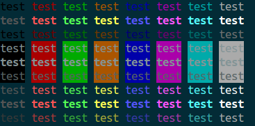

# ___2018 - 03 - 16 Python Modules___
***

# 目录
  <!-- TOC depthFrom:1 depthTo:6 withLinks:1 updateOnSave:1 orderedList:0 -->

  - [___2018 - 03 - 16 Python Modules___](#2018-03-16-python-modules)
  - [目录](#目录)
  - [python 执行 shell 命令](#python-执行-shell-命令)
  	- [os 模块](#os-模块)
  	- [subprocess 模块](#subprocess-模块)
  - [argparse 解析参数](#argparse-解析参数)
  	- [argparse 典型格式](#argparse-典型格式)
  	- [parse known args 跳过不能识别的参数](#parse-known-args-跳过不能识别的参数)
  	- [ArgumentParser 初始化参数](#argumentparser-初始化参数)
  	- [add argument 位置参数与可选参数](#add-argument-位置参数与可选参数)
  	- [add argument 参数行为 action](#add-argument-参数行为-action)
  	- [add argument 参数类型 type](#add-argument-参数类型-type)
  	- [add argument 参数个数 nargs](#add-argument-参数个数-nargs)
  	- [add argument group 参数组](#add-argument-group-参数组)
  	- [register 注册参数解析方法](#register-注册参数解析方法)
  	- [根据文件大小合并多个文件夹](#根据文件大小合并多个文件夹)
  - [logging](#logging)
  - [zipfile](#zipfile)
  	- [解压缩](#解压缩)
  	- [下载 zip 文件并解压到指定目录](#下载-zip-文件并解压到指定目录)
  - [多线程 multiprocessing threading joblib](#多线程-multiprocessing-threading-joblib)
  	- [multiprocessing](#multiprocessing)
  	- [threading](#threading)
  	- [多线程下载](#多线程下载)
  	- [joblib](#joblib)
  	- [线程锁](#线程锁)
  - [ThreadPoolExecutor 线程池 ProcessPoolExecutor 进程池](#threadpoolexecutor-线程池-processpoolexecutor-进程池)
  - [xml 解析](#xml-解析)
  	- [xml 文本](#xml-文本)
  	- [minidom](#minidom)
  	- [lxml](#lxml)
  	- [ElementTree](#elementtree)
  - [crontab](#crontab)
  	- [安装](#安装)
  	- [添加 crontab 任务](#添加-crontab-任务)
  	- [删除 crontab 任务](#删除-crontab-任务)
  - [Color print](#color-print)
  - [排列组合](#排列组合)
  - [Icecream](#icecream)
  - [Typing 类型标注](#typing-类型标注)
  - [Python and cpp](#python-and-cpp)
  	- [Cython and pypy](#cython-and-pypy)
  	- [cpp calling python](#cpp-calling-python)
  	- [cpp calling python with module](#cpp-calling-python-with-module)

  <!-- /TOC -->
***

# python 执行 shell 命令
## os 模块
  - 导入
    ```python
    import os
    ```
  - **os.system** 返回执行状态，输出结果到标准输出，用于执行不需要返回结果的操作
    ```python
    os.system('echo 1')
    # 1
    # Out[2]: 0
    ```
  - **os.popen** 返回执行结果，通过管道的方式，返回一个file-like的对象，里面的内容是脚本输出的内容
    ```python
    pp = os.popen('echo 1')
    pp.read()
    # Out[8]: '1\n'

    # 重新调用，使用 readlines 读取
    pp.readlines()
    # Out[13]: ['1\n']
    ```
## subprocess 模块
  - 导入
    ```python
    import subprocess
    ```
  - **subprocess.getoutput** 返回执行结果
    ```python
    subprocess.getoutput('echo 1')
    # Out[19]: '1'
    ```
  - **subprocess.getstatusoutput** 返回执行状态与结果
    ```python
    subprocess.getstatusoutput('echo 1')
    # Out[20]: (0, '1')
    ```
  - **subprocess.Popen** 在子进程中执行一个命令
    ```python
    p = subprocess.Popen('echo 1', stdout=subprocess.PIPE, shell=True)

    # 返回执行结果与错误代码
    p.communicate()
    # Out[26]: (b'1\n', None)

    # 返回执行状态
    p.wait()
    # Out[27]: 0
    ```
***

# argparse 解析参数
## argparse 典型格式
  - **parse_arguments 在脚本中典型格式**
    ```python
    import argparse

    def foo(arg1, arg2):
        print("arg1 = %s, arg2 = %s" % (arg1, arg2))

    def parse_arguments():
        parser = argparse.ArgumentParser()
        parser.add_argument("arg1")
        parser.add_argument("arg2")

        return parser.parse_args()

    if __name__ == "__main__":
        args = parse_arguments()
        foo(args.arg1, args.arg2)
    ```
    **运行结果**
    ```shell
    $ python arg_parse.py -h
    usage: arg_parse.py [-h] arg1 arg2

    positional arguments:
      arg1
      arg2

    optional arguments:
      -h, --help  show this help message and exit

    $ python arg_parse.py foo goo
    arg1 = foo, arg2 = goo
    ```
  - **指定解析其他参数列表** 默认使用 `sys.argv[1:]` 用于解析，也可以指定其他参数列表用于解析
    ```py
    import argparse
    import sys
    parser = argparse.ArgumentParser()

    parser.add_argument("--pylab", action='store_true')
    parser.add_argument("--foo")

    print(sys.argv[1:])
    # ['--pylab']
    print(parser.parse_args(sys.argv[1:]))
    # Namespace(foo=None, pylab=True)

    print(parser.parse_args('--foo goo'.split(' ')))
    # Namespace(foo='goo', pylab=False)
    ```
## parse known args 跳过不能识别的参数
  - **parse_arguments** 解析参数列表时，如果列表包含没有添加的参数会报错 `unrecognized arguments`
    ```py
    # error: unrecognized arguments: --goo
    parser.parse_args(['--goo'])
    ```
  - **parse_known_args** 同时返回成功解析的参数与未识别的参数，而不是报错
    ```py
    FLAGS, unparsed = parser.parse_known_args(['--goo'])
    print(FLAGS, unparsed)
    # Namespace(foo=None, pylab=False) ['--goo']
    ```
## ArgumentParser 初始化参数
  - **prog / usage / description / epilog** ArgumentParser 初始化参数
    ```python
    import argparse

    parser = argparse.ArgumentParser(
        prog="This function",
        usage="%(prog)s [options]",
        description="descript the function",
        epilog="Message after help message")

    print(parser.prog)
    # 'This function'
    print(parser.usage)
    # '%(prog)s [options]'
    print(parser.description)
    # 'descript the function'
    print(parser.epilog)
    # 'Message after help message'
    parser.print_help()
    # usage: This function [options]

    # descript the function

    # optional arguments:
    #   -h, --help  show this help message and exit

    # Message after help message
    ```
  - **formatter_class** 字符串格式化方式
    - **argparse.ArgumentDefaultsHelpFormatter** help 信息中添加打印默认值
    - **argparse.HelpFormatter** 默认的格式化方式
    - **argparse.MetavarTypeHelpFormatter** help 信息中显示的是参数类型
    - **argparse.RawDescriptionHelpFormatter** description 部分按照指定格式显示
    - **argparse.RawTextHelpFormatter**
    ```python
    # formatter_class=argparse.ArgumentDefaultsHelpFormatter
    parser = argparse.ArgumentParser(
        formatter_class=argparse.ArgumentDefaultsHelpFormatter,
        description=(
            "First line.\n"
            "Second line."
        )
    )
    parser.print_help()
    # usage: ipython [-h]

    # First line. Second line.
    #
    # optional arguments:
    #   -h, --help  show this help message and exit
    ```
    ```python
    # formatter_class=argparse.RawDescriptionHelpFormatter
    parser = argparse.ArgumentParser(
      formatter_class=argparse.RawDescriptionHelpFormatter,
      description=(
          "First line.\n"
          "Second line."
      )
    )
    parser.print_help()
    # usage: ipython [-h]
    #
    # First line.
    # Second line.
    #
    # optional arguments:
    #   -h, --help  show this help message and exit
    ```
## add argument 位置参数与可选参数
  - **位置参数 Positional argument** 为必须的参数，按照参数位置指定，不能单独指定
  - **可选参数 Optional argument** 使用 `-` / `--` 指定
  - **required=True** 将可选参数变为必须参数
  ```python
  parser = argparse.ArgumentParser()
  parser.add_argument("foo", help="Positional argument")
  parser.add_argument("--goo", help="Optional argument 1")
  parser.add_argument("-j", help="Optional argument 2")
  parser.add_argument("-k", "--koo", help="Optional argument 3")

  parser.print_help()
  # usage: ipython [-h] [--goo GOO] [-j J] [-k KOO] foo
  #
  # positional arguments:
  #   foo                Positional argument
  #
  # optional arguments:
  #   -h, --help         show this help message and exit
  #   --goo GOO          Optional argument 1
  #   -j J               Optional argument 2
  #   -k KOO, --koo KOO  Optional argument 3

  parser.parse_args(["these", "--goo", "are", "-j", "the", "-k", "args"])
  # Out[146]: Namespace(foo='these', goo='are', j='the', koo='args')

  parser.parse_args("this --goo is -jan --koo=arg".split())
  # Out[157]: Namespace(foo='this', goo='is', j='an', koo='arg')

  parser.parse_args("this --g is -jan --ko=arg".split())
  # Out[159]: Namespace(foo='this', goo='is', j='an', koo='arg')
  ```
## add argument 参数行为 action
  - **store** 默认操作，存储这个参数值
  - **store_const** 存储 const 指定的值
  - **store_false** / **store_true** 分别对应存储 True 和 False 值
  - **append** 保存为列表格式，将每个参数的值添加到这个列表
  - **append_const** 保存为列表，但是值必须是 const 指定参数的值
  ```python
  parser = argparse.ArgumentParser()
  parser.add_argument("--foo", action='store_const', const=42, help="store_const")
  parser.add_argument("--goo", action='store_false', help="store_false")
  parser.add_argument("--joo", action='store_true', help="store_true")
  parser.add_argument("--koo", action='append', help="append")
  parser.add_argument("--loo", action='append_const', const=72, help="append_const int")
  parser.add_argument("--moo", action='append_const', const='abc', help="append_const str")

  parser.parse_args('--foo --goo --joo --koo 32 --koo 52 --koo 62 --loo --loo --moo'.split())
  # Out[17]: Namespace(foo=42, goo=False, joo=True, koo=['32', '52', '62'], loo=[72, 72], moo=['abc'])
  ```
## add argument 参数类型 type
  - **string** 默认参数类型
  - **FileType** 文件参数，可以指定文件 读写 等
  - **choices** 提供参数范围，如果提供的参数值不在这个范围之内会报错
  ```python
  parser = argparse.ArgumentParser()
  parser.add_argument("--foo", type=int)
  parser.add_argument("--goo", type=str)
  parser.add_argument("--joo", type=float)
  parser.parse_args("--foo 32 --goo 32 --joo 32".split())
  # Out[25]: Namespace(foo=32, goo='32', joo=32.0)
  ```
  ```python
  parser = argparse.ArgumentParser()
  parser.add_argument("--out", type=argparse.FileType('w'))
  parser.add_argument("--str", type=int, choices=range(5, 10))
  parser.parse_args("--out foo --str 8".split())
  # Out[28]: Namespace(out=<_io.TextIOWrapper name='foo' mode='w' encoding='UTF-8'>, str=8)
  ```
## add argument 参数个数 nargs
  - **整数 N** N 个从命令行中获取的参数将会组成一个列表
  - **?** 从命令行参数中获取一个值
  - **\*** 支持多个参数值
  - **+** 一个或多个参数
  ```python
  parser = argparse.ArgumentParser()
  parser.add_argument('infile', nargs='?', type=argparse.FileType('r'), default=sys.stdin)
  parser.add_argument('outfile', nargs='?', type=argparse.FileType('w'), default=sys.stdout)

  parser.add_argument('--foo', type=int, nargs=2)
  parser.add_argument('--goo', nargs='*')
  parser.add_argument('--joo', type=str, nargs='+')

  parser.parse_args('foo foo --foo 1 2 --goo a b cd e --joo fgh i'.split())
  # Out[23]: Namespace(
  #     infile=<_io.TextIOWrapper name='foo' mode='r' encoding='UTF-8'>,
  #     outfile=<_io.TextIOWrapper name='foo' mode='w' encoding='UTF-8'>,
  #     foo=[1, 2], goo=['a', 'b', 'cd', 'e'], joo=['fgh', 'i'])
  ```
## add argument group 参数组
  ```python
  parser = argparse.ArgumentParser(description="Argparse practice")

  group_1 = parser.add_argument_group("Required arguments")
  group_1.add_argument("--foo", type=int, required=True, help="foo int")
  group_1.add_argument("--goo", type=float, required=True, help="goo float")

  group_2 = parser.add_argument_group("List arguments")
  group_2.add_argument("--joo", type=int, nargs="+", choices=range(0, 5), help="joo (0, 5) int list")
  group_2.add_argument("--koo", type=str, nargs="+", help="koo string list")
  ```
  运行结果
  ```python
  In [37]: parser.print_help()
  usage: ipython [-h] --foo FOO --goo GOO [--joo {0,1,2,3,4} [{0,1,2,3,4} ...]]
                 [--koo KOO [KOO ...]]

  Argparse practice

  optional arguments:
    -h, --help            show this help message and exit

  Required arguments:
    --foo FOO             foo int
    --goo GOO             goo float

  List arguments:
    --joo {0,1,2,3,4} [{0,1,2,3,4} ...]
                          joo (0, 100) int list
    --koo KOO [KOO ...]   koo string list

  In [38]: parser.parse_args("--foo 32 --goo 0.2 --joo 1 2 3 --koo a b cd".split())
  Out[38]: Namespace(foo=32, goo=0.2, joo=[1, 2, 3], koo=['a', 'b', 'cd'])
  ```
## register 注册参数解析方法
  - 默认的 `bool` 类型参数只要有值就会是 `True`
    ```py
    parser = argparse.ArgumentParser()
    parser.add_argument("--foo", type=bool)
    print(parser.parse_args('--foo False'.split(' ')))
    # Namespace(foo=True)
    print(parser.parse_args('--foo '.split(' ')))
    # Namespace(foo=False)
    ```
    可以使用 `parser.register` 注册新的 `"bool"` 类型参数解析方法
    ```py
    parser.register("type", "bool", lambda v: v.lower() == "true")
    parser.add_argument("--goo", type="bool")
    print(parser.parse_args('--foo False --goo False'.split(' ')))
    # Namespace(foo=True, goo=False)
    ```
## 根据文件大小合并多个文件夹
  - [merge_folder_by_size.py](merge_folder_by_size.py)
***

# logging
  - **初始化设置**
    ```python
    import logging
    logging.basicConfig(level=logging.DEBUG)

    logging.debug('This message should appear on the console')
    logging.info('So should this')
    logging.warning('And this, too')

    # 输出到文件，需要新的执行环境
    logging.basicConfig(filename='./foo', level=logging.DEBUG)
    ```
    Python 3.8 添加 `force` 关键字参数，当设为 `True` 时，关联到根日志记录器的任何现有处理程序都将在执行由其他参数所指定的配置之前被移除并关闭
  - **log 级别**
    ```python
    logging.getLevelName(10)
    # Out[13]: 'DEBUG'
    ```
    | NOTSET | DEBUG | INFO | WARN | ERROR | CRITICAL | FATAL |
    | ------ | ----- | ---- | ---- | ----- | -------- | ----- |
    | 0      | 10    | 20   | 30   | 40    | 50       | 50    |
  - **使用 logger**
    ```python
    import logging

    # basicConfig 添加 stdout 到 root 的 handlers
    logging.basicConfig()
    ll = logging.getLogger()
    ll.handlers
    # Out[7]: [<logging.StreamHandler at 0x7f212f9f6d90>]

    ll.level
    # Out[4]: 30

    ll.setLevel(logging.DEBUG)
    # Out[6]: 10

    ll.debug('aaa')
    ll.info('bbb')
    ll.warning('ccc')
    ll.error('ddd')
    ```
  - **Handler** 输出到文件或其他 stream
    ```python
    # 指定文件
    fh = logging.FileHandler("app.log")
    fh.setLevel(logging.INFO)

    # 指定标准错误
    sth = logging.StreamHandler(sys.stderr)
    sth.setLevel(logging.ERROR)

    # app 中添加 handler
    ll.addHandler(fh)
    ll.addHandler(sth)

    # 查看
    ll.handlers
    # Out[6]:
    # [<logging.StreamHandler at 0x7f212f9f6d90>,
    #  <logging.FileHandler at 0x7f212fa03ad0>,
    #  <logging.StreamHandler at 0x7f212d658550>]

    # 删除
    ll.removeHandler(ll.handlers[0])
    ll.removeHandler(ll.handlers[1])
    ll.handlers
    # Out[10]: [<logging.FileHandler at 0x7f212fa03ad0>]
    ```
***

# zipfile
## 解压缩
  ```py
  import zipfile

  fn = 'spa-eng.zip'
  ff = zipfile.ZipFile(fn, 'r')
  print(ff.namelist())  # ['_about.txt', 'spa.txt']

  # 解压文件，默认解压到当前文件夹下
  f.extractall(fn[0:-4])
  ```
## 下载 zip 文件并解压到指定目录
  ```py
  def get_zip_file(origin, file_path=None, extract=True):
      import requests
      import zipfile
      import io
      import os

      fname = os.path.basename(origin)
      if file_path:
          fname = os.path.join(file_path, fname)
      else:
          fname = os.path.join(os.environ['HOME'], '.keras/datasets', fname)

      if not os.path.exists(fname):
          resp = requests.get(origin)
          # ff = zipfile.ZipFile(io.BytesIO(resp.content), 'r')
          open(fname, 'wb').write(resp.content)

      if extract:
          ff = zipfile.ZipFile(fname, 'r')
          ff.extractall(fname[0:-4])

      return os.path.abspath(fname)

  path_to_zip = get_zip_file('http://www.manythings.org/anki/spa-eng.zip')
  ```
***

# 多线程 multiprocessing threading joblib
## multiprocessing
  - [multiprocessing — Process-based “threading” interface](https://docs.python.org/2/library/multiprocessing.html)
  - **multiprocessing.Pool** 进程池
    ```py
    from multiprocessing import Pool

    def addd(args):
        x = args[0]
        y = args[1]
        return np.add(x, y)

    p = Pool(5)
    print(p.map(addd, [(1, 2), (2, 3), (3, 4)]))
    # [3, 5, 7]
    ```
  - **multiprocessing.Process** 进程
    ```py
    from multiprocessing import Process, Value, Array

    def f(n, a):
        n.value = 3.1415927
        for i in range(len(a)):
            a[i] = -a[i]

    num = Value('d', 0.0)
    arr = Array('i', range(10))

    p = Process(target=f, args=(num, arr))
    p.start()
    p.join()

    print(num.value, arr[:])
    # 3.1415927 [0, -1, -2, -3, -4, -5, -6, -7, -8, -9]
    ```
## threading
  - **threading**
    ```py
    from threading import Thread

    def foo(aa):
        print('aa = {}'.format(aa))

    Thread(target=foo, args=((1, 2), )).start()
    # aa = (1, 2)
    ```
## 多线程下载
  - **threading**
    ```py
    from threading import Thread
    from urllib.request import urlretrieve

    class Downloader(Thread):
        def __init__(self, file_url, save_path):
            super(Downloader, self).__init__()
            self.file_url = file_url
            self.save_path = save_path

        def run(self):
            urlretrieve(self.file_url, self.save_path)

    Downloader("https://upload.wikimedia.org/wikipedia/commons/d/d7/Green_Sea_Turtle_grazing_seagrass.jpg", './foo.jpg').start()
    Downloader("https://upload.wikimedia.org/wikipedia/commons/0/0a/The_Great_Wave_off_Kanagawa.jpg", './goo.jpg').start()
    ```
  - **multiprocessing.Pool**
    ```py
    from urllib.request import urlretrieve

    def image_downloader(aa):
        return urlretrieve(aa[1], aa[0])

    def multi_download(download_dict, thread_num=50):
        import time
        from multiprocessing import Pool

        dd = list(download_dict.items())
        pp = Pool(thread_num)
        print("Images need to download: {}".format(len(dd)))
        for ii in range(0, len(dd), thread_num):
            start = time.time()
            print('Downloading images {} - {}'.format(ii, ii + thread_num), end=', ')
            tt = dd[ii: ii + thread_num]
            pp.map(image_downloader, tt)
            print ('Time taken for downloading {} images: {:.2f} sec'.format(thread_num, time.time() - start))
    ```
  - **threading 与 tf.train.Coordinator 多线程协同**
    ```py
    def multi_download(download_dict, thread_num=50):
        import time
        import threading
        from urllib.request import urlretrieve
        import tensorflow as tf

        dd = list(download_dict.items())
        coord = tf.train.Coordinator()
        for ii in range(0, len(dd), thread_num):
            start = time.time()
            print('Downloading images {} - {}'.format(ii, ii + thread_num))
            tt = dd[ii: ii + thread_num]
            threads = [threading.Thread(target=urlretrieve, args=(iuu, imm)) for imm, iuu in tt]
            for itt in threads:
                itt.start()

            coord.join(threads)
            print ('Time taken for downloading {} images: {:.2f} sec\n'.format(thread_num, time.time() - start))
    ```
## joblib
  ```py
  def task(aa):
      print(aa)

  def joblib_loop():
      Parallel(n_jobs=4)(delayed(task)(i) for i in range(20))
  ```
## 线程锁
  - **全局解释器锁 GIL** Global Interpreter Lock，全局解释器锁。为了解决多线程之间数据完整性和状态同步的问题，设计为在任意时刻只有一个线程在解释器 (CPU) 中运行
  - **可重入锁 RLock** 可重复可递归调用的锁，在外层使用锁之后，在内层仍然可以使用，并且不发生死锁，当一个线程拥有一个锁的使用权后，再次获取锁的使用权时，不会阻塞，会立马得到使用权
  - **不可重入锁 Lock** 不可递归调用，递归调用就发生死锁
  - 可重入锁 RLock 内部维护着一个 **Lock** 和一个 **counter** 变量，counter 记录 acquire 的次数，直到一个线程所有的 acquire 都被 release，其他的线程才能获得资源
  - thead 的不可重入锁
    ```py
    import thread
    lock = thread.allocate_lock()

    lock.acquire()
    ...
    lock.release()
    ```
  - theading 的不可重入锁
    ```py
    import threading
    lock = threading.Lock()

    lock.acquire()
    ...
    lock.release()
    ```
  - threading 的可重入锁 RLock
    ```py
    import threading
    lock = threading.RLock()

    lock.acquire()
    ...
    lock.release()
    ```
***

# ThreadPoolExecutor 线程池 ProcessPoolExecutor 进程池
  - 标准库提供了 `concurrent.futures` 模块，提供了 `ThreadPoolExecutor` 和 `ProcessPoolExecutor` 两个类，实现了对 threading 和 multiprocessing 的进一步抽象
    ```py
    class ThreadPoolExecutor(concurrent.futures._base.Executor)
    __init__(self, max_workers=None, thread_name_prefix='', initializer=None, initargs=())

    class ProcessPoolExecutor(concurrent.futures._base.Executor)
    __init__(self, max_workers=None, mp_context=None, initializer=None, initargs=())
    ```
    - **max_workers** 指定最多同时运行的任务数
  - 在提交任务的时候，可以使用 `submit` / `map`，主要区别在于 `map` 可以保证输出的顺序, `submit` 输出的顺序是乱的
  - **submit 使用示例** 提交的任务立即返回，不阻塞，返回值是 `concurrent.futures._base.Future` 类型
    - **running** 方法判定某个任务是否正在运行
    - **done** 方法判定某个任务是否完成
    - **cancel** 方法用于取消某个任务,该任务没有放入线程池中才能取消成功
    - **result** 方法可以获取任务的执行结果
    ```py
    from concurrent.futures import ThreadPoolExecutor
    import time

    # 参数times用来模拟网络请求的时间
    def sleepy_print(times, aa):
        time.sleep(times)
        print("sleep {}s finished".format(times), aa)
        return times

    # 通过submit函数提交执行的函数到线程池中，submit函数立即返回，不阻塞
    executor = ThreadPoolExecutor(max_workers=2)
    task1 = executor.submit(sleepy_print, 3, 1)
    task2 = executor.submit(sleepy_print, 2, 2)

    print(task1.done())
    # False
    print(task2.cancel())
    # False
    time.sleep(4)
    # sleep 2s finished 2
    # sleep 3s finished 1

    print(task1.done())
    # True
    print(task1.result())
    # 3
    ```
  - **as_completed** 是一个生成器，阻塞的方式等待 submit 的任务完成
    ```py
    from concurrent.futures import ThreadPoolExecutor, as_completed

    executor = ThreadPoolExecutor(max_workers=2)
    tims = [3, 2, 4]
    all_task = [executor.submit(sleepy_print, ii) for ii in tims]

    for future in as_completed(all_task):
        data = future.result()
        print("in main: sleep {}s success".format(data))

    # sleep 2s finished
    # in main: sleep 2s success
    # sleep 3s finished
    # in main: sleep 3s success
    # sleep 4s finished
    # in main: sleep 4s success
    ```
  - **map 使用示例** 将序列中的每个元素都执行同一个函数，输出顺序和序列中元素的顺序相同
    ```py
    map(self, fn, *iterables, timeout=None, chunksize=1)
    ```
    ```py
    tims = [3, 2, 4]
    with ThreadPoolExecutor(max_workers=2) as executor:
        rets = executor.map(sleepy_print, tims, timeout=1)

    for ii in rets:
        print("ii = %d" % ii)
    # sleep 2s finished
    # sleep 3s finished
    # sleep 4s finished
    # ii = 3
    # ii = 2
    # ii = 4
    ```
  - **timeout** 指定的超时时间只在调用到返回结果生成器的 `__next__` 方法时才会生效，在以上调用时并不会超时
    ```py
    from concurrent import futures

    tims = [3, 2, 4]
    with ThreadPoolExecutor(max_workers=2) as executor:
        rets = executor.map(sleepy_print, tims, timeout=1)

        try:
            for ii in rets:
                print("ii = %d" % ii)
        except futures._base.TimeoutError:
            print("TIMEOUT")
    # TIMEOUT
    # sleep 2s finished
    # sleep 3s finished
    ```
    ```py
    from concurrent.futures import ThreadPoolExecutor, ProcessPoolExecutor
    from concurrent import futures

    tims = [3, 2, 4]
    with ProcessPoolExecutor(max_workers=2) as executor:
        try:
            for future in executor.map(sleepy_print, tims, timeout=1):
                print(future.result(timeout=1))
        except futures._base.TimeoutError:
            print("This took to long, stop all...")
            for pid, process in executor._processes.items():
                process.terminate()
            executor.shutdown()
    # This took to long, stop all...
    ```
  - **wait** 让主线程阻塞，直到满足设定的要求
    ```py
    wait(fs, timeout=None, return_when='ALL_COMPLETED')
    ```
    ```py
    from concurrent.futures import ThreadPoolExecutor, wait, ALL_COMPLETED, FIRST_COMPLETED

    executor = ThreadPoolExecutor(max_workers=2)
    tims = [3, 2, 4]
    all_task = [executor.submit(sleepy_print, (ii)) for ii in tims]
    wait(all_task, return_when=ALL_COMPLETED)
    print("ALL DONE!")
    # sleep 2s finished
    # sleep 3s finished
    # sleep 4s finished
    # ALL DONE!
    ```
***

# xml 解析
## xml 文本
  ```py
  xx = '''<?xml version="1.0"?>
  <data>
      <country name="Liechtenstein">
          <rank updated="yes">2</rank>
          <year>2008</year>
          <gdppc>141100</gdppc>
          <neighbor name="Austria" direction="E"/>
          <neighbor name="Switzerland" direction="W"/>
      </country>
      <country name="Singapore">
          <rank updated="yes">5</rank>
          <year>2011</year>
          <gdppc>59900</gdppc>
          <neighbor name="Malaysia" direction="N"/>
      </country>
      <country name="Panama">
          <rank updated="yes">69</rank>
          <year>2011</year>
          <gdppc>13600</gdppc>
          <neighbor name="Costa Rica" direction="W"/>
          <neighbor name="Colombia" direction="E"/>
      </country>
  </data>
  '''

  with open('./foo.xml', 'w') as ff:
      ff.write(xx)
  ```
## minidom
  ```py
  from xml.dom import minidom

  domobj = minidom.parse("./foo.xml")
  elementobj = domobj.documentElement
  subElementObj = elementobj.getElementsByTagName('country')

  tt = subElementObj[0]
  tt.childNodes[0].data
  ```
## lxml
  - **lxml.etree**
    ```py
    from lxml import etree
    tree = etree.parse("./foo.xml")
    root = tree.getroot()

    def node_text(node):
       result = node.text.strip() if node.text else ''
       for child in node:
           child_text = node_text(child)
           if child_text:
               result = result + ' %s' % child_text if result else child_text
       return result

    def node_text(node):
        result = ""
        for text in node.itertext():
            result = result + text
        return result

    for article in root:
        print("Tag name",article.tag)
        for field in article:
            if field.tag == 'country':
                print(field.tag,":",node_text(field))
            else:
                print(field.tag,":",field.text)
            print("")

    tree.write('./foo.xml', encoding='utf-8')
    ```
## ElementTree
  - [The ElementTree XML API](https://docs.python.org/3/library/xml.etree.elementtree.html)
  - **xml.etree.ElementTree** 模块在应对恶意结构数据时并不安全 [XML vulnerabilities](https://docs.python.org/3/library/xml.html#xml-vulnerabilities)
  - **Element 类型** 是一种灵活的容器对象，用于在内存中存储结构化数据，具有以下属性
    - **tag** 标签名，表示数据种类，string 类型
    - **attrib** 属性，表示该数据附加的属性，dictionary 类型
    - **text** 文本内容，string 类型
    - **tail** 文本内容，表示 element 闭合之后的文本，string 类型
    - **child elements** 子元素
    ```xml
    <tag attrib_name="attrib_value">
      text
      <child_element_1>
        child_element_text
      </child_element_1>
      child_element_tail
    </tag>
    ```
  - **import**
    ```py
    import xml.etree.ElementTree as ET
    ```
  - **ET.parse** 解析文件，返回 `ElementTree`
    ```py
    tree = ET.parse("foo.xml")
    root = tree.getroot()
    ```
  - **ET.fromstring / ET.tostring** 解析字符串并返回根节点的 `Element` / 将 `Element` 解析成字符串
    ```py
    xx = open("foo.xml").read()
    root = ET.fromstring(xx)
    ET.tostring(root)
    ```
  - **ElementTree 类**
    ```py
    tree = ET.ElementTree(file="foo.xml")
    root = tree.getroot()

    tree = ET.ElementTree()
    root = tree.parse('foo.xml')
    ```
  - **ET.dump** 打印 ElementTree / Element 结构
    ```py
    ET.dump(tree)
    ET.dump(root[0])
    ```
  - **Element 属性** tag / attrib / text / tail，子元素可以通过下标方式访问
    ```py
    print(root.tag) # data
    print(root.attrib)  # {}

    for child in root:
        print(child.tag, child.attrib)
    # country {'name': 'Liechtenstein'}
    # country {'name': 'Singapore'}
    # country {'name': 'Panama'}

    print(root[0][1].text)  # 2008
    ```
    递归遍历
    ```py
    def print_tree(root, rank=0):
        for tt in root:
            print('  ' * rank, tt.tag, ':', tt.attrib)
            print_tree(tt, rank=rank+1)

    print_tree(root)
    ```
  - **Element 遍历方法** find / findall / findtext / iter / iterfind / itertext / text / get
    - **iter** 遍历当前元素与所有子元素下的指定标签
    - **findall** 查找当前元素下的指定标签
    - **find** 查找当前元素下指定标签的第一个匹配
    - **text** 获取当前标签的文本内容
    - **tail** 获取当前标签的结尾文本内容
    - **get** 获取属性
    ```py
    # iter
    for neighbor in root.iter("neighbor"):
        print(neighbor.tag, ":", neighbor.attrib)
    ```
    ```py
    # findall / find
    for country in root.findall('country'):
        rank = country.find('rank').text
        name = country.get('name')
        print(name, rank)
    ```
    ```py
    # itertext 遍历所有文本
    print(''.join(list(root.itertext())))

    # text / tail 遍历所有文本
    def print_text_tail(root, rank=0):
        if root.text:
            print('  ' * rank + ':'.join([root.tag, root.text]))
        for tt in root:
            print_text_tail(tt, rank + 1)
        if root.tail:
            print('  ' * rank + ':'.join([root.tag, root.tail]))
    ```
  - **Element.get / Element.set** 获取 / 修改 xml 属性
    ```py
    # 将所有的rank值加1,并添加属性updated为yes
    for rank in root.iter("rank"):
        new_rank = int(rank.text) + 1
        rank.text = str(new_rank) # string
        rank.set("updated", "yes")
    ```
  - **Element.remove** 删除子元素
    ```py
    # remove all countries with a rank higher than 50
    for country in root.iter("country"):
        rank = int(country.find("rank").text)
        if rank > 50:
            root.remove(country)
    ```
  - **Element.append** / **Element.extend** / **Element.insert** 附加 / 扩展 / 插入 添加新元素
    ```py
    a = ET.Element('a', {'name': 'a'}, foo='goo')
    b = ET.Element('b')
    c = ET.Element('c')
    d = ET.Element('d')
    e = ET.Element('e')

    a.append(b)
    a.extend([c, d])
    a.insert(2, e)
    ET.dump(a)
    # <a foo="goo" name="a"><b /><c /><e /><d /></a>
    ```
  - **ET.SubElement** 创建新的子元素，实际会调用 `append`
    ```py
    a = ET.Element('a')
    b = ET.SubElement(a, 'b')
    c = ET.SubElement(a, 'c')
    d = ET.SubElement(c, 'd')

    ET.dump(a)
    # <a><b /><c><d /></c></a>
    ```
  - **text / tail 添加格式化字符** `ET.SubElement` 等方法添加新元素时没有添加缩进与换行的格式，可以通过 text / tail 添加
    ```py
    def add_sub_element(root, tag, rank, text=None, space_width=2):
        if rank < 1:
            print("Rank should be greater than 1")
            return

        spaces = ' ' * space_width
        if len(root) != 0:
            root[-1].tail = '\n' + spaces * rank
        else:
            if root.text == None:
                root.text = '\n' + spaces * rank
            else:
                root.text += spaces

        ee = ET.SubElement(root, tag)
        ee.tail = '\n' + spaces * (rank - 1)
        ee.text = '\n' + spaces * rank

        if text:
            ee.text = ee.text + '  ' + text + ee.text

        return ee
    ```
    ```py
    a = ET.Element('a')
    b = add_sub_element(a, 'b', 1)
    c = add_sub_element(a, 'c', 1)
    d = add_sub_element(c, 'd', 2)
    e = add_sub_element(b, 'e', 2, text='foo')
    ET.dump(a)
    # <a>
    #   <b>
    #     <e>
    #       foo
    #     </e>
    #   </b>
    #   <c>
    #     <d>
    #     </d>
    #   </c>
    # </a>
    ```
  - **ElementTree.write** 将 `ElementTree` 写入到文件，`Element` 可以使用 `ET.ElementTree()` 创建出 `ElementTree`
    ```py
    tree.write("note.xml", encoding="utf-8", xml_declaration=True)

    a = ET.Element('aa', name='aa')
    b = add_sub_element(a, 'bb', rank=1, text='boo')
    b.set('name', 'bb')
    c = add_sub_element(b, 'cc', rank=2, text='coo')
    d = add_sub_element(a, 'dd', rank=1, text='doo')

    tree = ET.ElementTree(a)
    tree.write("foo.xml", encoding="utf-8", xml_declaration=True)
    ```
    ```py
    ! cat foo.xml
    # <?xml version='1.0' encoding='utf-8'?>
    # <aa name="aa">
    #   <bb name="bb">
    #     boo
    #     <cc>
    #       coo
    #     </cc>
    #   </bb>
    #   <dd>
    #     doo
    #   </dd>
    # </aa>
    ```
  - **xml.dom.minidom.writexml** 指定格式保存 xml 文件
    ```py
    writexml(writer, indent='', addindent='', newl='', encoding=None)
    ```
    - **indent** 指定整体的缩进
    - **addindent** 指定子元素的缩进
    - **newl** 指定换行符
    ```py
    from xml.dom import minidom

    a = ET.Element('a')
    a.text = 'aoo'
    a.set('name', 'aa')
    b = ET.SubElement(a, 'b')
    b.set('name', 'bb')
    c = ET.SubElement(a, 'c')
    d = ET.SubElement(c, 'd')
    d.text = 'doo'

    ET.dump(a)
    # <a name="aa">aoo<b name="bb" /><c><d>doo</d></c></a>

    def save_xml(root, file_name, addindent='  ', newl='\n', encoding='utf-8'):
        xx = ET.tostring(root)
        dom = minidom.parseString(xx)
        with open(file_name, 'w') as ff:
            dom.writexml(ff, '', addindent, newl, encoding)

    save_xml(a, 'foo.xml')
    ```
    ```py
    ! cat foo.xml
    # <?xml version="1.0" encoding="utf-8"?>
    # <a name="aa">
    #   aoo
    #   <b name="bb"/>
    #   <c>
    #     <d>doo</d>
    #   </c>
    # </a>
    ```
***

# crontab
## 安装
  - [python-crontab](https://pypi.org/project/python-crontab/)
    ```sh
    pip install python-crontab
    ```
## 添加 crontab 任务
  ```py
  from crontab import CronTab

  # 读取当前用户的 crontab 文件
  my_user_cron = CronTab(user=True)

  # 创建新的任务
  job = my_user_cron.new(command='echo 1 >> /home/leondgarse/foo', comment='ECHO')
  job.setall('* * * * *')

  print("job.comment = %s, job.command = %s" % (job.comment, job.command))
  print("job.is_enabled() = %s" % (job.is_enabled()))
  print("job.is_valid() = %s" % (job.is_valid()))

  # 写入文件
  my_user_cron.write_to_user(user=True)
  ```
## 删除 crontab 任务
  ```py
  from crontab import CronTab

  # 读取当前用户的 crontab 文件
  my_user_cron = CronTab(user=True)
  print(my_user_cron.lines)

  # remove_all 删除，可以指定 comment 或 command
  my_user_cron.remove_all(comment="ECHO")
  print(my_user_cron.lines)

  # my_user_cron.remove 删除
  my_user_cron = CronTab(user=True)
  my_user_cron.new(command='echo 1 >> /home/leondgarse/goo', comment='ECHO').setall('* * * * *')

  iter = my_user_cron.find_comment('ECHO')
  for ii in iter:
      if 'foo' in ii.command:
          my_user_cron.remove(ii)
  print(my_user_cron.lines)

  # 写入文件
  my_user_cron.write_to_user(user=True)
  ```
***

# Color print
  | 字体色 | 背景色 | 颜色描述 |
  | ------ | ------ | -------- |
  | 30     | 40     | 黑色     |
  | 31     | 41     | 红色     |
  | 32     | 42     | 绿色     |
  | 33     | 43     | 黃色     |
  | 34     | 44     | 蓝色     |
  | 35     | 45     | 紫红色   |
  | 36     | 46     | 青蓝色   |
  | 37     | 47     | 白色     |

  | 显示方式 | 效果         |
  | -------- | ------------ |
  | 0        | 终端默认设置 |
  | 1        | 高亮显示     |
  | 2        | 变暗显示     |
  | 3        | 斜体         |
  | 4        | 使用下划线   |
  | 5        | 闪烁         |
  | 7        | 反白显示     |
  | 8        | 不可见       |

  ```py
  "\033[0m" # 默认字体正常显示
  "\033[32;0m" # 红色字体
  "\033[0;31;46m" # 红色字体，青色背景色
  "\033[1;32;40m" # 高亮，绿色字体，黑色背景色

  _ = [print('\033[%d;%dmtest\033[0m' % (aa, cc), end=' ' if '7' not in str(cc) else '\n') for aa in [0, 1, 2] for cc in range(30, 38)]
  _ = [print('\033[%d;%dmtest\033[0m' % (aa, cc), end=' ' if '7' not in str(cc) else '\n') for aa in [0, 1, 2] for cc in range(40, 48)]
  _ = [print('\033[%d;%dmtest\033[0m' % (aa, cc), end=' ' if '7' not in str(cc) else '\n') for aa in [0, 1, 2] for cc in range(90, 98)]
  ```
  
  ```py
  front_colors = {
      "black": "\033[30m",
      "red": "\033[31m",
      "green": "\033[32m",
      "orange": "\033[33m",
      "blue": "\033[34m",
      "purple": "\033[35m",
      "cyan": "\033[36m",
      "white": "\033[37m",
      "gray": "\033[90m",
      "coral": "\033[91m",
      "grass": "\033[92m",
      "yellow": "\033[93m",
      "orchid": "\033[94m",
      "pink": "\033[95m",
      "turquoise": "\033[96m",
      "pale": "\033[97m",
  }

  back_colors = {
      "black": "\033[40m",
      "red": "\033[41m",
      "green": "\033[42m",
      "orange": "\033[43m",
      "blue": "\033[44m",
      "purple": "\033[45m",
      "cyan": "\033[46m",
      "white": "\033[47m",
      "none": "\033[48m",
  }

  attributes = {
      "normal": "\033[0m",
      "bold": "\033[1m",
      "dim": "\033[2m",
      "italic": "\033[3m",
      "underline": "\033[4m",
      "blink": "\033[5m",
      "reverse": "\033[7m",
      "concealed": "\033[8m",
  }

  for att in ['normal', 'bold', 'dim']:
      att_v = attributes[att]
      for kk, vv in front_colors.items():
          print(att_v + vv + kk + "\033[0m", end=' ')
      print()

  def print_colorize(string, fc="white", bc="none", att=["normal"]):
      fc = front_colors.get(fc, front_colors["white"])
      bc = back_colors.get(bc, back_colors["none"])
      att = "".join([attributes.get(ii, attributes["normal"]) for ii in att])
      str = att + fc + bc + string + "\033[0m"
      print(str)

  print_colorize('aaa', bc='red', fc='black', att=['bold', 'italic'])
  ```
  ```py
  from termcolor import colored
  colored('Hello, World!', 'red', 'on_grey', ['bold', 'blink'])
  # Out[46]: '\x1b[5m\x1b[1m\x1b[40m\x1b[31mHello, World!\x1b[0m'

  print(colored('Hello, World!', 'red', 'on_grey', ['bold', 'blink']))

  from termcolor import colored, cprint
  cprint('Hello, World!', 'green', 'on_red', attrs=['bold'])
  ```
***

# 排列组合
  - **组合 Combinations `C(n, m) = n! / (m! * (n - m)!)`**
    ```py
    import itertools
    print(list(itertools.combinations(range(3), 2)))
    # [(0, 1), (0, 2), (1, 2)]
    print(list(itertools.combinations_with_replacement(range(3), 2)))
    # [(0, 0), (0, 1), (0, 2), (1, 1), (1, 2), (2, 2)]
    ```
  - **排列 Permutations / Arrangement `A(n, m) = n! / (n - m)!`**
    ```py
    print(list(itertools.permutations(range(3), 2)))
    # [(0, 1), (0, 2), (1, 0), (1, 2), (2, 0), (2, 1)]
    print(list(itertools.permutations(range(3), 3)))
    # [(0, 1, 2), (0, 2, 1), (1, 0, 2), (1, 2, 0), (2, 0, 1), (2, 1, 0)]
    ```
  - **笛卡尔乘积 Cartesian product**
    ```py
    aa = [0, 1]
    print(list(itertools.product(aa, aa, aa)))
    # [(0, 0, 0), (0, 0, 1), (0, 1, 0), (0, 1, 1), (1, 0, 0), (1, 0, 1), (1, 1, 0), (1, 1, 1)]

    print([[ii, jj, kk] for kk in aa for jj in aa for ii in aa])
    # [[0, 0, 0], [1, 0, 0], [0, 1, 0], [1, 1, 0], [0, 0, 1], [1, 0, 1], [0, 1, 1], [1, 1, 1]]

    print(np.stack(np.meshgrid(aa, aa, aa), axis=-1).reshape(-1, 3).tolist())
    # [[0, 0, 0], [0, 0, 1], [1, 0, 0], [1, 0, 1], [0, 1, 0], [0, 1, 1], [1, 1, 0], [1, 1, 1]]
    ```
  - **Python 3.8 math.perm 与 math.comb**
    ```py
    print(f'{math.perm(10, 3) = }') # 排列
    # math.perm(10, 3) = 720
    print(f'{math.comb(10, 3) = }') # 组合
    # math.comb(10, 3) = 120
    ```
***

# Icecream
  - [Github gruns/icecream](https://github.com/gruns/icecream)
  ```py
  from icecream import ic
  ic.lineWrapWidth = 128 # Default 70

  aa, bb, cc, dd = 'hello', 123, [1, 2, 3], np.arange(4)
  ic(aa, bb, cc, dd.shape)
  # ic| aa: 'hello', bb: 123, cc: [1, 2, 3], dd.shape: (4,)

  ic.configureOutput(includeContext=True)
  ic(aa, bb, cc, dd.shape)
  # ic| <ipython-input-78-c5b16bc2c7c5>:1 in <module>- aa: 'hello', bb: 123, cc: [1, 2, 3], dd.shape: (4,)
  ```
***

# Typing 类型标注
  - [typing --- 类型标注支持](https://docs.python.org/zh-cn/3.8/library/typing.html)
  - [Mypy: Optional Static Typing for Python](https://github.com/python/mypy)
  - **格式**
    - 传入参数通过 **参数名:类型** 的形式声明参数的类型
    - 返回结果通过 **->结果类型** 的形式声明结果的类型
    ```py
    def greeting(name: str) -> str:
        return 'Hello ' + name
    ```
  - **类型别名** 通过将类型分配给别名来定义，可用于简化复杂类型签名
    ```py
    from typing import List
    Vector = List[float]

    def scale(scalar: float, vector: Vector) -> Vector:
        return [scalar * num for num in vector]

    # typechecks; a list of floats qualifies as a Vector.
    new_vector = scale(2.0, [1.0, -4.2, 5.4])
    ```
  - **常用类型**
    - 基本类型 `int / long / float / bool / str` - 整型 / 长整型 / 浮点型 / 布尔型 / 字符串类型
    - 泛型 `List / Tuple / Dict / Set` - 列表 / 元组 / 字典 / 集合
    - `Iterable / Mapping / Callable / Generics`
    - 任意类型 `Any`
***

# Python and cpp
## Cython and pypy
  - **Install**
    ```sh
    # Cython
    pip install cython

    # pypy3
    sudo apt install pypy3
    conda create -c conda-forge  -n pypy pypy3
    conda activate pypy
    pypy3 -m pip install glob2 pandas tqdm scikit-image scikit-learn ipython
    ```
  - **test_pypy.py**
    ```py
    import time

    def test_loop():
        start_time = time.time()
        total = 0
        for i in range(1, 10000):
            for j in range(1, 10000):
                total += i + j
        end_time = time.time()
        print(f"Result: {total}, Time took: {end_time-start_time:.2f}s")

    if __name__ == "__main__":
        test_loop()
    ```
  - **Test results**
    ```sh
    python test_pypy.py
    # Result: 999800010000, Time took: 5.97s

    cython test_pypy.py -3 --embed
    g++ test_pypy.c `pkg-config --cflags --libs python3-embed`
    ./a.out
    # Result: 999800010000, Time took: 5.80s

    pypy3 test_pypy.py
    # Result: 999800010000, Time took: 0.14s
    ```
  - **test_loop.cpp**
    ```cpp
    #include <iostream>
    #include <sys/time.h>

    static inline uint64_t getTimeInUs() {
        uint64_t time;
        struct timeval tv;
        gettimeofday(&tv, nullptr);
        time = static_cast<uint64_t>(tv.tv_sec) * 1e6 + tv.tv_usec;
        return time;
    }

    int main() {
        unsigned long start_time = getTimeInUs();
        long total = 0;
        for (int ii = 1; ii < 10000; ii++) {
            for (int jj = 1; jj < 10000; jj++) {
                total += ii + jj;
            }
        }
        unsigned long end_time = getTimeInUs();
        double off_time = (end_time - start_time) / 1e6;
        std::printf("Result: %ld, Time took: %.2fs\n", total, off_time);
    }
    ```
    ```sh
    g++ test_loop.cpp -o test_loop && ./test_loop
    # Result: 999800010000, Time took: 0.18s
    ```
## cpp calling python
  ```py
  #define PY_SSIZE_T_CLEAN
  #include <Python.h>

  int main(int argc, char *argv[]) {
      (void)argc;
      wchar_t *program = Py_DecodeLocale(argv[1], NULL);
      if (program == NULL) {
          fprintf(stderr, "Fatal error: cannot decode argv[1]\n");
          exit(1);
      }
      Py_SetProgramName(program);
      Py_Initialize();
      PyRun_SimpleString(argv[1]);
      if (Py_FinalizeEx() < 0) {
          exit(120);
      }
      PyMem_RawFree(program);
      return 0;
  }
  ```
  ```sh
  g++ basic_print.cpp `pkg-config --cflags --libs python3-embed` && ./a.out 'print("hello cython")'
  # hello cython
  ```
## cpp calling python with module
  **greating_module.py**
  ```py
  def greating_function(a):
      print("hello python")
      return a + 1
  ```
  **test_greating_module.cpp**
  ```cpp
  #include <Python.h>
  // #include "track.h"

  int great_function_from_python(int a) {
      int res;
      PyObject *pModule,*pFunc;
      PyObject *pArgs, *pValue;

      PyRun_SimpleString("import sys");
      PyRun_SimpleString("sys.path.append('./')");//若python文件在c++工程下

      /* import */
      PyRun_SimpleString("import sys");
      pModule = PyImport_ImportModule("greating_module");
      if (!pModule) {
          printf("Can not open python file!\n");
          return -1;
      }

      /* great_module.great_function */
      pFunc = PyObject_GetAttrString(pModule, "greating_function");

      /* build args */
      pArgs = PyTuple_New(1);
      PyTuple_SET_ITEM(pArgs,0, PyLong_FromLong(a));

      /* call */
      pValue = PyObject_CallObject(pFunc, pArgs);

      res = PyLong_AsLong(pValue);
      return res;
  }

  int main(int argc, char *argv[]) {
      Py_Initialize();
      printf("%d\n",great_function_from_python(2));
      Py_Finalize();
  }
  ```
  ```sh
  g++ test_greating_module.cpp `pkg-config --cflags --libs python3-embed` && ./a.out
  # hello python
  # 3
  ```
***
