# ___2018 - 04 - 19 Tensorflow 实战 Google 深度学习框架___
***

# 目录
  <!-- TOC depthFrom:1 depthTo:6 withLinks:1 updateOnSave:1 orderedList:0 -->

  - [___2018 - 04 - 19 Tensorflow 实战 Google 深度学习框架___](#2018-04-19-tensorflow-实战-google-深度学习框架)
  - [目录](#目录)
  - [TensorFlow 环境搭建](#tensorflow-环境搭建)
  	- [Protocol Buffer](#protocol-buffer)
  	- [Bazel](#bazel)
  	- [通过 docker 安装 tensorflow](#通过-docker-安装-tensorflow)
  	- [pip 安装](#pip-安装)
  	- [启用 GPU 支持](#启用-gpu-支持)
  	- [Hello World](#hello-world)
  - [基本概念](#基本概念)
  	- [张量 Tensor](#张量-tensor)
  	- [计算图 Graph](#计算图-graph)
  	- [会话 Session](#会话-session)
  	- [占位符 placeholders](#占位符-placeholders)
  	- [变量 Variables](#变量-variables)
  	- [Tensorflow playground](#tensorflow-playground)
  - [通用函数](#通用函数)
  	- [tf.matmul tf.tensordot 矩阵乘法](#tfmatmul-tftensordot-矩阵乘法)
  	- [tf.clip_by_value 将一个张量中的数值限制在一个范围之内](#tfclipbyvalue-将一个张量中的数值限制在一个范围之内)
  	- [tf.greater tf.equal 返回两个张量的比较结果](#tfgreater-tfequal-返回两个张量的比较结果)
  	- [tf.where 条件筛选](#tfwhere-条件筛选)
  	- [tf.control_dependencies tf.group 组合训练](#tfcontroldependencies-tfgroup-组合训练)
  	- [tf.expand_dims 增加一个维度](#tfexpanddims-增加一个维度)
  	- [tf.slice 截取一个切片](#tfslice-截取一个切片)
  	- [tf.transpose 转置](#tftranspose-转置)
  	- [tf.contrib.seq2seq.sequence_loss 列表损失函数](#tfcontribseq2seqsequenceloss-列表损失函数)
  - [三层线性神经网络](#三层线性神经网络)
  	- [神经网络分层结构](#神经网络分层结构)
  	- [前向传播算法 Forward propagation 输出结果](#前向传播算法-forward-propagation-输出结果)
  	- [损失函数 loss function 评估当前模型的预测结果与目标值的距离](#损失函数-loss-function-评估当前模型的预测结果与目标值的距离)
  	- [反向传播算法 Back propagation 更新神经网络参数的取值](#反向传播算法-back-propagation-更新神经网络参数的取值)
  - [深度学习与深层神经网络](#深度学习与深层神经网络)
  	- [激活函数 activation function 实现非线性化](#激活函数-activation-function-实现非线性化)
  	- [多层网络解决异或运算 exclusive or](#多层网络解决异或运算-exclusive-or)
  	- [softmax 回归与 交叉熵 cross-entropy](#softmax-回归与-交叉熵-cross-entropy)
  	- [梯度下降算法 Gradient decent](#梯度下降算法-gradient-decent)
  	- [指数衰减学习率 exponential decay learning rate](#指数衰减学习率-exponential-decay-learning-rate)
  	- [过拟合 与 L1 L2 正则化缩减](#过拟合-与-l1-l2-正则化缩减)
  	- [滑动平均模型 exponantial moving average](#滑动平均模型-exponantial-moving-average)
  	- [命名空间 tf.variable_scope 与变量获取 tf.get_variable](#命名空间-tfvariablescope-与变量获取-tfgetvariable)
  - [应用示例](#应用示例)
  	- [自定义损失函数预测商品销量计算盈利](#自定义损失函数预测商品销量计算盈利)
  	- [计算一个 5 层神经网络带 L2 正则化的损失函数的网络模型](#计算一个-5-层神经网络带-l2-正则化的损失函数的网络模型)
  	- [MNIST Softmax Regression](#mnist-softmax-regression)
  	- [MNIST 使用 滑动平均模型 与 指数衰减学习率 与 L2 正则化](#mnist-使用-滑动平均模型-与-指数衰减学习率-与-l2-正则化)
  - [模型持久化](#模型持久化)
  	- [模型持久化 tf.train.Saver 类](#模型持久化-tftrainsaver-类)
  	- [tf.train.Saver 类使用变量名字典 加载 变量的滑动平均值](#tftrainsaver-类使用变量名字典-加载-变量的滑动平均值)
  	- [convert_variables_to_constants 函数 将计算图中的变量及其取值转化为常量](#convertvariablestoconstants-函数-将计算图中的变量及其取值转化为常量)
  	- [meta 文件 与 元图 MetaGraph](#meta-文件-与-元图-metagraph)
  	- [tf.train.NewCheckpointReader 加载模型文件](#tftrainnewcheckpointreader-加载模型文件)
  - [MNIST 最佳实践样例](#mnist-最佳实践样例)
  	- [优化方向](#优化方向)
  	- [前向传播过程 mnist_inference.py](#前向传播过程-mnistinferencepy)
  	- [训练过程 mnist_train.py](#训练过程-mnisttrainpy)
  	- [测试过程 mnist_eval.py](#测试过程-mnistevalpy)
  	- [运行结果](#运行结果)
  - [卷积神经网络 Convolutional Neural Network CNN](#卷积神经网络-convolutional-neural-network-cnn)
  	- [图像识别问题经典数据集](#图像识别问题经典数据集)
  	- [卷积神经网络简介](#卷积神经网络简介)
  	- [卷积层 Convolution](#卷积层-convolution)
  	- [池化层 Pooling](#池化层-pooling)
  	- [TensorFlow-Slim 工具](#tensorflow-slim-工具)
  	- [卷积神经网络经典架构](#卷积神经网络经典架构)
  	- [LeNet-5 模型](#lenet-5-模型)
  	- [python 实现 LeNet-5 模型](#python-实现-lenet-5-模型)
  	- [Inception-v3 模型](#inception-v3-模型)
  - [卷积神经网络迁移学习](#卷积神经网络迁移学习)
  	- [迁移学习 Transfer Learning](#迁移学习-transfer-learning)
  	- [> TensorFlow 实现迁移学习](#-tensorflow-实现迁移学习)
  - [图像数据处理](#图像数据处理)
  	- [图像读取 与 编解码](#图像读取-与-编解码)
  	- [图像大小调整](#图像大小调整)
  	- [图像翻转](#图像翻转)
  	- [图像色彩调整](#图像色彩调整)
  	- [标注框](#标注框)
  	- [综合使用示例](#综合使用示例)
  - [多线程输入数据处理框架](#多线程输入数据处理框架)
  	- [TFRecord 输入数据格式](#tfrecord-输入数据格式)
  	- [python 将 mnist 数据转化为 TFRecord 格式](#python-将-mnist-数据转化为-tfrecord-格式)
  	- [队列类 FIFOQueue RandomShuffleQueue](#队列类-fifoqueue-randomshufflequeue)
  	- [多线程协同类 Coordinator QueueRunner](#多线程协同类-coordinator-queuerunner)
  	- [输入文件队列 match_filenames_once string_input_producer](#输入文件队列-matchfilenamesonce-stringinputproducer)
  	- [组合训练数据 batch shuffle_batch shuffle_batch_join](#组合训练数据-batch-shufflebatch-shufflebatchjoin)
  	- [Python 实现 TFRecord 数据读取与 Batching](#python-实现-tfrecord-数据读取与-batching)
  - [循环神经网络 recurrent neural network RNN](#循环神经网络-recurrent-neural-network-rnn)
  	- [循环神经网络简介](#循环神经网络简介)
  	- [单层全连接神经网络循环体](#单层全连接神经网络循环体)
  	- [长短时记忆网络 long short-term memory LSTM](#长短时记忆网络-long-short-term-memory-lstm)
  	- [循环神经网络的dropout](#循环神经网络的dropout)
  	- [TensorFlow 中的 LSTM 结构](#tensorflow-中的-lstm-结构)
  	- [双向循环神经网络 和 深层循环神经网络](#双向循环神经网络-和-深层循环神经网络)
  	- [LSTM MNIST](#lstm-mnist)
  	- [PTB Penn Treebank Dataset 文本数据集](#ptb-penn-treebank-dataset-文本数据集)
  	- [> LSTM RNN PTB 自然语言处理 NLP](#-lstm-rnn-ptb-自然语言处理-nlp)
  - [预测 sin 函数时间序列](#预测-sin-函数时间序列)
  	- [生成测试数据](#生成测试数据)
  	- [预定义的全连接线性模型 tf.estimator.LinearRegressor 预测](#预定义的全连接线性模型-tfestimatorlinearregressor-预测)
  	- [自定义的全连接神经网络模型预测](#自定义的全连接神经网络模型预测)
  	- [LSTM model with estimator 预测](#lstm-model-with-estimator-预测)
  	- [Traditional way implementing LSTM model 预测](#traditional-way-implementing-lstm-model-预测)
  - [> TensorBoard 可视化](#-tensorboard-可视化)

  <!-- /TOC -->
***

# TensorFlow 环境搭建
## Protocol Buffer
  - Protocot Buffer 是谷歌开发的处理结构化数据的工具，是 TensorFlow 系统中使用到的重要工具，TensorFlow 中的数据基本都是通过 Protocol Buffer 来组织的
  - **序列化** 将结构化的数据变成数据流的格式，简单地说就是变为一个字符串。如何将结构化的数据序列化，并从序列化之后的数据流中还原出原来的结构化数据，统称为 **处理结构化数据**
  - 除 Protocol Buffer 之外， **XML** 和 **JSON** 是两种比较常用的结构化数据处理工具
  - Protocol Buffer 格式的数据和 XML 或者 JSON 格式的数据有比较大的区别
    - Protocol Buffer 序列化之后得到的数据不是可读的字符串，而是二进制流
    - XML 或 JSON 格式的数据信息都包含在了序列化之后的数据中，不需要任何其他信息就能还原序列化之后的数据
    - 使用 Protocol Buffer 时需要先定义数据的格式 **schema**，还原一个序列化之后的数据将需要使用到这个定义好的数据格式
  - Protocol Buffer 定义数据格式的文件一般保存在 **.proto文件** 中，每一个message代表了一类结构化的数据
  - **message** 里面定义了每一个属性的类型和名字，Protocol Buffer里属性的类型可以是像布尔型、整数型、实数型、字符型这样的基本类型，也可以是另外一个message
  - **message** 中的属性
    - **required 必须的** 所有这个message的实例都需要有这个属性
    - **optional 可选的** 这个属性的取值可以为空
    - **repeated 可重复的** 这个属性的取值可以是一个列表
## Bazel
  - Bazel 是从谷歌开源的自动化构建工具，相比传统的Makefile、Ant或者Maven，Bazel在速度、可伸缩性、灵活性以及对不同程序语言和平台的支持上都要更加出色
  - **安装**
    ```shell
    echo "deb [arch=amd64] http://storage.googleapis.com/bazel-apt stable jdk1.8" | sudo tee /etc/apt/sources.list.d/bazel.list
    curl https://bazel.build/bazel-release.pub.gpg | sudo apt-key add -
    sudo apt-get update && sudo apt-get install bazel  |
    ```
  - **项目空间 workspace** 是Bazel的一个基本概念
    - 一个项目空间可以简单地理解为一个文件夹
    - 在这个文件夹中包含了编译一个软件所需要的源代码以及输出编译结果的 **软连接 symbolic link** 地址
    - 一个项目空间内可以只包含一个应用（比如TensorFlow），一个项目空间也可以包含多个应用
  - **WORKSPACE 文件** 定义了项目空间对外部资源的依赖关系，空文件表示没有外部依赖
  - **BUILD 文件** 定义需要编译的目标
    - BUILD文件采用一种类似于Python的语法来指定每一个编译目标的输入、输出以及编译方式
    - 与 Makefile 这种比较开放式的编译工具不同，Bazel的编译方式是事先定义好的
  - Bazel 对 Python 支持的编译方式
    - **py_binary** 将 Python 程序编译为可执行文件
    - **py_test** 编译 Python 测试程序
    - **py_library** 将 Python 程序编译成库函数供其他 py_binary 或 py_test 调用
  - **示例**
    - **WORKSPACE** 空文件
    - **hello_lib.py**
      ```python
      def print_hello_world():
          print("hello world")
      ```
    - **hello_main.py**
      ```python
      import hello_lib

      hello_lib.print_hello_world()
      ```
    - **BUILD** 定义两个编译目标
      ```python
      py_library (                  # 编译目标
          name = "hello_lib",       # 目标名称
          srcs = ["hello_lib.py",]  # 编译需要的源代码
      )

      py_binary (
              name = "hello_main",
              srcs = ["hello_main.py"],
              deps = [":hello_lib",] # 编译的依赖关系
      )
      ```
    - **编译**
      ```shell
      bazel build hello_main
      # or
      bazel build :hello_main
      ```
    - 编译完生成目标的软链接
      ```shell
      bazel-bin  bazel-genfiles  bazel-hello_bazel  bazel-out  bazel-testlogs  BUILD  hello_lib.py  hello_main.py  WORKSPACE
      ```
      - **bazel-bin** 目录下存放了编译产生的二进制文件以及运行该二进制文件所需要的所有依赖关系
      - 实际的编译结果文件保存到 **~/.cache/bazel 目录**，可以通过 **output_user_root** 或者 **output_base** 参数来改变
    - **执行** 在当前目录下运行
      ```shell
      bazel-bin/hello_main
      # [Output] hello world
      ```
## 通过 docker 安装 tensorflow
  - [tensorflow dockerhub](https://hub.docker.com/r/tensorflow/tensorflow/)
  - Start CPU only container
    ```shell
    docker run -it -p 8888:8888 tensorflow/tensorflow
    ```
  - Start GPU (CUDA) container. Install [nvidia-docker](https://github.com/NVIDIA/nvidia-docker) and run
    ```shell
    nvidia-docker run -it -p 8888:8888 tensorflow/tensorflow:latest-gpu
    ```
  - Docker Pull Command
    ```shell
    docker pull tensorflow/tensorflow
    ```
  - Go to your browser on http://localhost:8888/
  - [才云科技镜像 0.12.0](cargo.caicloud.io/tensorflow/tensorflow:0.12.0)
  - 启动命令，第一次会自动下载镜像
    ```shell
    sudo docker run --name=tensorflow -it -p 8888:8888 -p 6006:6006 cargo.caicloud.io/tensorflow/tensorflow:0.12.0
    # GPU version
    sudo nvidia-docker run --name=tensorflow-gpu -it -p 8888:8888 -p 6006:6006 cargo.caicloud.io/tensorflow/tensorflow:0.12.0-gpu
    ```
    - **-p 8888:8888** 将容器内运行的 **Jupyter 服务** 映射到本地机器 [Jupyter notebook](http://localhost:8888)
    - **-p 6006:6006** 将容器内运行的 **TensorFlow 可视化工具 TensorBoard** 映射到本地机器 [Tensor Board](http://localhost:6006/)
  - 修改 docker 中 Jupyter Notebook 密码
    ```shell
    # 登录 docker shell
    sudo docker ps
    # [Output] 6574b9090e4d        cargo.caicloud.io/tensorflow/tensorflow:0.12.0   tensorflow
    sudo docker exec -it 6574b9090e4d /bin/bash
    # or
    sudo docker exec -it `sudo docker ps | grep tensorflow | cut -d ' ' -f 1` /bin/bash

    # ipython in docker
    ipython
    In [7]: from notebook.auth import passwd
    In [9]: passwd()
    # or
    In [8]: passwd('[Your password]')
    # [Output] 'sha1:...'

    # docker shell
    vi ~/.jupyter/jupyter_notebook_config.py
    # Add
    c.NotebookApp.password = u'sha1:...'
    ```
  - 从 docker image 中取出数据集
    ```shell
    # docker shell, 安装 ssh
    yum install
    ```
  - 其他 docker 命令
    ```shell
    # 系统 shell 中重启容器
    sudo docker restart tensorflow

    sudo docker stop tensorflow
    sudo docker rm tensorflow

    sudo docker volume create --driver local --name hello --opt type=none --opt device=/opt/NFS --opt o=uid=root,gid=root --opt o=bind
    sudo docker run --name=tensorflow -it -p 8888:8888 -p 6006:6006 -v hello:/Downloads cargo.caicloud.io/tensorflow/tensorflow:0.12.0

    sudo docker volume ls
    sudo docker volume rm hello

    sudo docker image ls
    sudo docker image rm c8a8409297f2
    sudo docker rm `sudo docker image rm c8a8409297f2 2>&1 | cut -d' ' -f 21`
    COUNT=0; while [ $COUNT -lt 10 ]; do COUNT=$((COUNT+1)); sudo docker rm `sudo docker image rm da86e6ba6ca1 2>&1 | cut -d' ' -f 21`; done
    ```
## pip 安装
  - [Installing TensorFlow from Sources](https://www.tensorflow.org/install/install_sources)
  - [Installing TensorFlow on Ubuntu](https://www.tensorflow.org/install/install_linux)
  - Install newest ternsorflow version in anaconda
    ```shell
    # pip
    pip install tensorflow
    pip install tensorflow-gpu
    pip install tensorflowonspark

    # conda
    conda install -c conda-forge tensorflow  # to install
    conda upgrade -c conda-forge tensorflow  # to upgrade
    ```
    ```python
    # Newest version including new APIs like
    # tf.feature_column <-- 1.2.0
    # tf.estimator.LinearRegressor  <-- 1.3.0
    tf.__version__
    Out[24]: '1.3.0'
    ```
  - Anaconda update
    ```shell
    conda update -n base conda
    conda update anaconda # update anaconda only
    conda update --all  # update all anaconda related packages
    conda clean --all # clean temporary fills
    ```
## 启用 GPU 支持
  - [NVIDIA/nvidia-docker](https://github.com/NVIDIA/nvidia-docker) 用于安装启用 GPU 的 docker
    ```shell
    curl -s -L https://nvidia.github.io/nvidia-docker/gpgkey | sudo apt-key add -
    distribution=$(. /etc/os-release;echo $ID$VERSION_ID)
    curl -s -L https://nvidia.github.io/nvidia-docker/$distribution/nvidia-docker.list | sudo tee /etc/apt/sources.list.d/nvidia-docker.list
    sudo apt-get update
    sudo apt-get install -y nvidia-docker2
    nvidia-docker -v
    ```
  - [Install CUDA Accelerate for Anaconda Python](https://www.scivision.co/install-cuda-accelerate-for-anaconda-python/)
    ```shell
    conda install accelerate
    # The following NEW packages will be INSTALLED:
    # accelerate:             2.3.1-np111py36_0           anaconda   
    # accelerate_cudalib:     2.0-0                       anaconda
    # cudatoolkit:            8.0-3                       anaconda   
    # cudnn:                  6.0.21-cuda8.0_0            anaconda   
    ```
  - **安装开启 GPU 支持的 TensorFlow**
    ```shell
    pip install --upgrade tensorflow-gpu
    ```
  - **检查 Nvidia GPU 与 驱动**
    ```shell
    # 查看是否有支持的 GPU 以及驱动版本
    nvidia-smi
    # NVIDIA-SMI 396.26                 Driver Version: 396.26

    # 如需要，可以安装 nvidia 驱动
    sudo apt-get install nvidia-396 nvidia-settings
    ```
  - **安装 CUDA Toolkit**
    - 通过 [CUDA Toolkit](https://developer.nvidia.com/cuda-toolkit) 可以单独下载需要的 CUDA 版本
    - 安装完可能有驱动更新，需要重启
    ```shell
    # Ubuntu 默认安装 CUDA 9.1，在 tendorflow 1.8 版本中不适用
    sudo apt install nvidia-cuda-toolkit

    # Ubuntu 17.10
    sudo apt-key adv --fetch-keys http://developer.download.nvidia.com/compute/cuda/repos/ubuntu1710/x86_64/7fa2af80.pub
    echo "deb https://developer.download.nvidia.com/compute/cuda/repos/ubuntu1710/x86_64 /" | sudo tee /etc/apt/sources.list.d/cuda.list

    # Ubuntu 16.04
    sudo apt-key adv --fetch-keys http://developer.download.nvidia.com/compute/cuda/repos/ubuntu1604/x86_64/7fa2af80.pub
    echo "deb https://developer.download.nvidia.com/compute/cuda/repos/ubuntu1604/x86_64 /" | sudo tee /etc/apt/sources.list.d/cuda.list

    sudo apt update

    # Tensorflow 1.8.0 要求 cuda 版本 9.0，对应的包位于 ubuntu 16.04 中
    sudo apt -o Dpkg::Options::="--force-overwrite" install cuda-9-0 cuda-drivers
    ```
  - **安装对应版本的 cuDNN** NVIDIA CUDA Deep Neural Network library
    - [NVIDIA cuDNN](https://developer.nvidia.com/cudnn) 注册并下载对应 CUDA 版本的 cuDNN 包 **cuDNN v7.1.4 Library for Linux**
    ```shell
    tar xvf cudnn-9.0-linux-x64-v7.1.tgz
    cd cuda/
    sudo cp include/cudnn.h /usr/local/cuda/include
    sudo cp lib64/libcudnn* /usr/local/cuda/lib64
    ```
  - **安装 libcupti**
    ```shell
    sudo apt-get install libcupti-dev
    ```
  - **设置 LD_LIBRARY_PATH 和 CUDA_HOME 环境变量**
    ```shell
    export LD_LIBRARY_PATH="$LD_LIBRARY_PATH:/usr/local/cuda/extras/CUPTI/lib64"
    export LD_LIBRARY_PATH="$LD_LIBRARY_PATH:/usr/local/cuda/lib64"
    export PATH="/usr/local/cuda/bin:$PATH"
    export CUDA_HOME=/usr/local/cuda
    ```
  - **python 测试**
    ```python
    from tensorflow.python.client import device_lib
    print(device_lib.list_local_devices())

    sess = tf.InteractiveSession()
    with tf.device('/gpu:0'):
      a = tf.constant([1.0, 2.0, 3.0, 4.0, 5.0, 6.0], shape=[2, 3], name='a')
      b = tf.constant([1.0, 2.0, 3.0, 4.0, 5.0, 6.0], shape=[3, 2], name='b')
    c = tf.matmul(a, b)
    print(c.eval())
    ```
    运行结果
    ```python
    [name: "/device:CPU:0"
     device_type: "CPU"
     memory_limit: 268435456
     locality {
     }
     incarnation: 9258498914959607259, name: "/device:GPU:0"
     device_type: "GPU"
     memory_limit: 1624113152
     locality {
       bus_id: 1
       links {
       }
     }
     incarnation: 5470481726497112191
     physical_device_desc: "device: 0, name: GeForce MX150, pci bus id: 0000:01:00.0, compute capability: 6.1"]

    [[22. 28.]
     [49. 64.]]
    ```
## Hello World
  ```python
  import tensorflow as tf
  hello = tf.constant('Hello TensorFlow')
  sess = tf.Session()
  sess.run(hello)
  Out[5]: b'Hello TensorFlow'
  ```
  ```python
  a = tf.constant(10)
  b = tf.constant(32)
  sess.run(a+b)
  Out[9]: 42
  ```
***

# 基本概念
## 张量 Tensor
  - TensorFlow 数据模型，包含一个任意维度的数组，tensor 的 **秩 rank** 表示数组的维度
    ```python
    3 # a rank 0 tensor; this is a scalar with shape []
    [1., 2., 3.] # a rank 1 tensor; this is a vector with shape [3]
    [[1., 2., 3.], [4., 5., 6.]] # a rank 2 tensor; a matrix with shape [2, 3]
    [[[1., 2., 3.]], [[7., 8., 9.]]] # a rank 3 tensor with shape [2, 1, 3]
    ```
  - 所有的数据都通过张量的形式来表示，从功能的角度上看，张量可以被简单理解为多维数组
    - 张量在 TensorFlow 中的实现并不是直接采用数组的形式，它只是对 TensorFlow 中运算结果的引用
    - 在张量中并没有真正保存数字，它保存的是如何得到这些数字的计算过程
  - 张量中主要保存了三个属性
    ```python
    a = tf.constant([1.0, 2.0], name='a')
    b = tf.constant([1.0, 2.0], name='b')
    result = tf.add(a, b, name='add')
    result
    Out[47]: <tf.Tensor 'add_6:0' shape=(2,) dtype=float32>
    ```
    - **名称 name** **node:src_output**，其中 node 为节点的名称，src_output 表示当前张量来自节点的第几个输出，0 表示第一个输出
    - **维度 shape**
    - **类型 type** 每一个张量会有一个唯一的类型，参与运算的所有张量类型不匹配时会报错
      ```python
      c = tf.constant([1, 2], name='c')
      result = c + b
      # [Out] ValueError: Tensor conversion requested dtype int32 for Tensor with dtype float32: 'Tensor("d:0", shape=(2,), dtype=float32)'
      # Define type as tf.fload32
      c = tf.constant([1, 2], name='c', dtype=tf.float32)
      ```
## 计算图 Graph
  - TensorFlow 是一个通过图的形式来表述计算的编程系统，TensorFlow 程序中的所有计算都会被表达为计算图上的节点
  - TensorFlow 计算模型，TensorFlow 的程序一般由两部分组成
    - 创建计算图 Building the computational graph
    - 运行计算图 Running the computational graph
  - **计算图 Computational Graph** 由一系列 TensorFlow 操作作为节点组成的图，每个节点使用零个或多个 tensor 作为 **输入**，并产生一个 tensor 作为 **输出**，如 **constant** 没有输入，产生一个内部存储的值
    ```python
    a = tf.constant(3.0, dtype=tf.float32)
    b = tf.constant(4.0)  # also tf.float32 implicitly

    # 作为print参数输出时，并不会输出内部值，只有在运行时才会计算输出
    print(a, b)
    Tensor("Const:0", shape=(), dtype=float32) Tensor("Const_1:0", shape=(), dtype=float32)
    ```
  - 系统会自动维护一个默认的计算图，通过 **tf.get_default_graph** 函数可以获取当前默认的计算图
  - **a.graph** 可以查看张量所属的计算图，如果没有特意指定，等于当前默认的计算图
    ```python
    a = tf.constant([1.0, 2.0], name='a')
    b = tf.constant([1.0, 2.0], name='b')
    result = a + b
    a.graph is tf.get_default_graph()
    Out[5]: True
    ```
  - **tf.Graph** 函数来生成新的计算图,不同计算图上的张量和运算都不会共享
    ```python
    # g1 中将 v 初始化为 0
    g1 = tf.Graph()
    with g1.as_default():
        v = tf.get_variable('v', initializer=tf.zeros([1]))

    # g2 中将 v 初始化为 1
    g2 = tf.Graph()
    with g2.as_default():
        v = tf.get_variable('v', initializer=tf.ones([1]))

    # g1 中 v 值为 0
    with tf.Session(graph=g1) as sess:
        tf.initialize_all_variables().run()
        with tf.variable_scope("", reuse=True):
            print(sess.run(tf.get_variable('v')))
    # [Out] [0.]

    # g2 中 v 值为 1
    with tf.Session(graph=g2) as sess:
        tf.global_variables_initializer.run()
        with tf.variable_scope("", reuse=True):
            print(sess.run(tf.get_variable('v')))
    # [Out] [1.]
    ```
  - **tf.Graph.device** 函数来指定运行计算的设备
    ```python
    with g.device('/gpu:0'):
        result = a + b
        print(sess.run(result))
    # [Out] [2. 4.]
    ```
  - **collection 集合** 管理计算图不同类别的资源
    - 通过 **tf.add_to_collection** 函数可以将资源加入一个或多个集合中
    - 通过 **tf.get_collection** 获取一个集合里面的所有资源
  - TensorFlow 中维护的集合列表
    - **tf.GraphKeys.GLOBAL_VARIABLES** 所有变量
    - **tf.GraphKeys.TRAINABLE_VARIABLES** 可学习的变量（一般指神经网络中的参数）
    - **tf.GraphKeys.SUMMARIES** 日志生成相关的张量，用于 TensorFlow 计算可视化
    - **tf.GraphKeys.QUEUE_RUNNERS** 处理输入的QueueRunner
    - **tf.GraphKeys.MOVING_AVERAGE_VARIABLES** 所有计算了滑动平均值的变量
## 会话 Session
  - TensorFlow 运行模型，可使用 **run** 方法运行创建好的图
  - 当所有计算完成之后需要关闭会话来帮助系统回收资源，否则就可能出现资源泄漏的问题
    ```python
    ''' sess.close '''
    sess = tf.Session()
    sess.run(result)
    sess.close()

    ''' with '''
    with tf.Session() as sess：
        sess.run(result)
    ```
  - **tf.Tensor.eval** 如果没有特殊指定，运算会自动加入默认的计算图中，但默认的会话需要手动指定，当默认的会话被指定之后可以通过 **tf.Tensor.eval** 来计算一个张量的取值
    ```python
    with tf.Session() as sess:
        with sess.as_default():
            print(result.eval())
    # [Out] [2. 4.]
    ```
  - **tf.InteractiveSession** 在交互式环境下直接构建默认会话的函数，自动将生成的会话注册为默认会话
    ```python
    # 可以省去将产生的会话注册为默认会话的过程
    sess = tf.InteractiveSession()
    result.eval()
    Out[60]: array([2., 4.], dtype=float32)

    sess.close()
    ```
  - **ConfigProto** 配置需要生成的会话，可以配置类似 **并行的线程数** / **GPU 分配策略** / **运算超时时间** 等参数
    - **allow_soft_placement** 布尔型参数，默认值为 False，为 True 的时候，在以下任意一个条件成立的时候，GPU上的运算可以放到CPU上进行，当某些运算无法被当前GPU支持时，可以自动调整到 CPU 上，而不是报错
      - 运算无法在 GPU 上执行
      - 没有 GPU 资源（比如运算被指定在第二个 GPU 上运行，但是机器只有一个 GPU）
      - 运算输入包含对CPU计算结果的引用
    - **log_device_placement** 布尔型参数，为 True 时日志中将会记录每个节点被安排在了哪个设备上以方便调试，在生产环境中将这个参数设置为 False 可以减少日志量
    ```python
    config = tf.ConfigProto(allow_soft_placement=True, log_device_placement=True)
    sess = tf.Session(config=config)
    ```
## 占位符 placeholders
  - **占位符 placeholders** 可以在运行时指定的参数，用于提供输入数据
  - 在定义 placeholder 时，这个位置上的数据类型是需要指定的，数据的维度信息可以根据提供的数据推导得出，所以不一定要给出
    ```python
    a = tf.placeholder(tf.float32)
    b = tf.placeholder(tf.float32)
    adder_node = a + b

    # Dict values to initialize a / b
    sess = tf.Session()
    sess.run(adder_node, {a: [1, 2], b: [2, 3]})
    Out[130]: array([3., 5.], dtype=float32)
    ```
## 变量 Variables
  - **变量 tf.Variable** 向图中添加可训练的参数，包含初值与类型
  - 变量的初值可以是 **常量 tf.constant** / **随机数 tf.random_normal** / **其他变量**
  - 调用 **tf.Variable** 不会初始化变量，变量的值在被使用之前，需要调用变量初始化函数 **ww.initializer** / **ww.initialized_value** / **tf.global_variables_initializer**
    ```python
    # 定义交互式会话
    sess = tf.InteractiveSession()
    # 定义变量
    ww = tf.Variable(tf.constant([2, 3], dtype=tf.float32))
    # 运行会话
    sess.run(ww.initialized_value())
    Out[31]: array([2., 3.], dtype=float32)
    ```
  - **TensorFlow 常量声明方法**
    - **tf.zeros** 产生全0的数组
    - **tf.ones** 产生全1的数组
    - **tf.fill** 产生一个全部为给定数字的数组
    - **tf.constant** 产生一个给定值的常量
    ```python
    ff = tf.fill([2, 3], 9)
    sess.run(ff)
    Out[10]:
    array([[9, 9, 9],
           [9, 9, 9]], dtype=int32)
    ```
  - **TensorFlow 随机数生成函数**
    - **tf.random_normal** 正态分布
    - **tf.truncated_normal** 正态分布，但如果随机出来的值偏离平均值超过2个标准差，那么这个数将会被重新随机
    - **tf.random_uniform** 均匀分布
    - **tf.random_gamma** Gamma 分布
    ```python
    # 均值为 2，标准差为 2 正态随机分布的 2 * 3 数组
    rr = tf.random_normal([2, 3], mean=2, stddev=2)
    sess.run(rr)
    Out[8]:
    array([[ 0.48397958,  5.52174   ,  0.3912573 ],
           [ 4.4237976 , -0.6381433 ,  2.838407  ]], dtype=float32)
    ```
  - **ww.initializer 方法初始化变量** 需要先调用 sess.run(ww.initializer)，再调用 sess.run(ww)
    ```python
    ww = tf.Variable([2.0, 3.0], dtype=tf.float32)
    bb = tf.Variable([1.0, 2.0], dtype=tf.float32)
    yy = ww + bb

    sess.run(ww.initializer)
    sess.run(bb.initializer)

    sess.run(ww)
    Out[69]: array([2., 3.], dtype=float32)
    sess.run(bb)
    Out[70]: array([1., 2.], dtype=float32)
    sess.run(yy)
    Out[71]: array([3., 5.], dtype=float32)
    ```
  - **ww.initialized_value() 方法初始化变量** 可以直接调用 sess.run(ww.initialized_value())
    ```python
    ww = tf.Variable([2.0, 3.0], dtype=tf.float32)
    bb = tf.Variable(ww.initialized_value() * 2)
    sess.run(bb.initialized_value())
    Out[84]: array([4., 6.], dtype=float32)

    sess.run(ww.initialized_value())
    Out[85]: array([2., 3.], dtype=float32)
    ```
  - **tf.global_variables_initializer() 方法初始化所有变量** 创建 **子图 sub-graph**，并调用 **sess.run** 运行子图完成变量初始化
    ```python
    W = tf.Variable([.3], dtype=tf.float32)
    b = tf.Variable([-.3], dtype=tf.float32)  # b = -0.3
    x = tf.placeholder(tf.float32)

    # linear model
    linear_model = W * x + b
    init = tf.global_variables_initializer()
    sess.run(init)

    sess.run(b)
    Out[111]: array([-0.3], dtype=float32)
    sess.run(linear_model, {x:[1, 2, 3, 4]})
    Out[112]: array([0.        , 0.3       , 0.6       , 0.90000004], dtype=float32)
    ```
  - **tf.assign() 调整变量值** 变量值可以通过 **tf.assign** 等函数修改
    ```python
    # W = -1, b = 1 is the ideal value for this model
    fixW = tf.assign(W, [-1.])
    fixb = tf.assign(b, [1.])
    sess.run([fixW, fixb])
    Out[124]: [array([-1.], dtype=float32), array([ 1.], dtype=float32)]

    sess.run(linear_model, {x:[1, 2, 3, 4]})
    Out[126]: array([ 0., -1., -2., -3.], dtype=float32)
    ```
  - **tf.global_variables() 方法获取当前计算图上所有变量** 有助于持久化整个计算图的运行状态
  - **tf.trainable_variables() 方法获取当前计算图上所有需要优化的参数** 声明变量时参数 trainable=True(默认为 True) 时加入 GraphKeys.TRAINABLE_VARIABLES
  - **global** 与 **local** variables
    - **tf.global_variables_initializer** 等同于 `tf.variables_initializer(tf.global_variables())`，返回初始化 global 变量的操作
    - **tf.local_variables_initializer** 等同于 `tf.variables_initializer(tf.local_variables())`，返回初始化 local 变量的操作
    - **tf.global_variables** 返回 global 变量，`tf.GraphKeys.GLOBAL_VARIABLES` 集合上的所有变量
    - **tf.local_variables** 返回 local 变量，进程相关的变量，临时或内部值，通常不会 saved / restored 到 checkpoint
    - **variables_initializer(var_list, name='init')** 返回一个变量列表的初始化操作
## 迭代 epoch iteration batchsize
  - **batchsize** 批大小，一般每次训练在训练集中取 batchsize 个样本训练
  - **iteration** 迭代次数，每次代表使用 batchsize 个样本训练一次
  - **epoch** 一个 epoch 代表使用训练集中全部样本训练一次，指定 epoch 与 batchsize 大小也可以确定出迭代次数
    ```python
    iteration_steps = data_size / bachsize * epoch_num
    ```
## Tensorflow playground
  - [Tensorflow playground](http://playground.tensorflow.org)
  - 一个小格子代表神经网络中的一个节点，而边代表节点之间的连接
  - 每一条边代表了神经网络中的一个参数，边上的颜色体现了这个参数的取值，颜色越深时表示这个参数取值的绝对值越大，当边的颜色接近白色时，这个参数的取值接近于0
  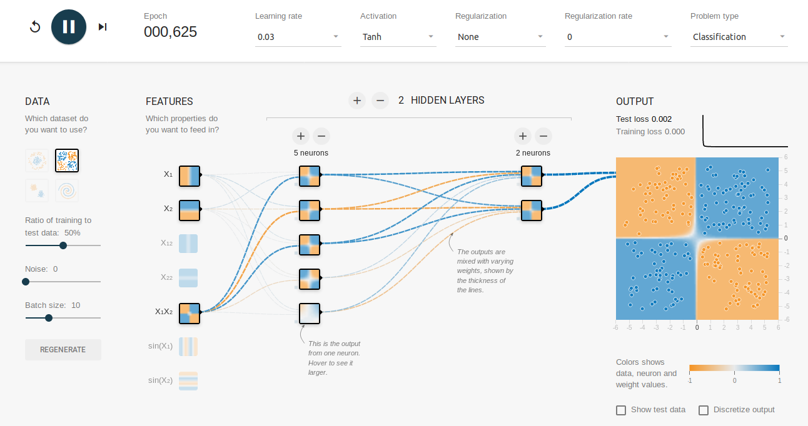
***

# 通用函数
## tf.matmul tf.tensordot 矩阵乘法
  - **tf.matmul / @ / tf.tensordot / np.tensordot** 矩阵乘法
    ```python
    tensordot(a, b, axes, name=None)
    ```
    - **tf.matmul** 不支持不同秩 ranks 的两个矩阵相乘
    - **tf.tensordot** 需要指定矩阵乘法的轴
    - **@ 运算符** 矩阵乘法运算，根据运算数类型不同，调用 tf.matmul / np.matmul
    ```python
    sess = tf.InteractiveSession()
    # dtype 不能是 int64
    ll = np.arange(24, dtype=np.int32).reshape([3, 2, 4])
    ww = np.arange(20, dtype=np.int32).reshape([4, 5])

    # 使用 tf.matmul 将报错
    tf.matmul(ll, ww)
    # ValueError: Shape must be rank 2 but is rank 3 for 'MatMul_7' (op: 'MatMul') with input shapes: [3,2,4], [4,5].

    # 可以使用 tf.tensordot / np.tensordot
    tf.tensordot(ll, ww, axes=(-1, 0)).eval().shape
    # Out[57]: (3, 2, 5)
    ```
    ```python
    # @ 运算符，如果是 numpy 定义的操作数，将调用 np.matmul
    (ll @ ww).shape
    # Out[65]: (3, 2, 5)

    # @ 运算符，只要有一个是 tensorflow 定义的操作数，将调用 tf.matmul
    ll = tf.reshape(list(range(24)), [3, 2, 4])
    ww = tf.reshape(list(range(20)), [4, 5])

    # 调用 tf.matmul，报错
    ll @ ww
    # ValueError: Shape must be rank 2 but is rank 3 for 'matmul' (op: 'MatMul') with input shapes: [3,2,4], [4,5]

    ll = tf.reshape(ll, [-1, 4])
    tf.shape(ll @ ww).eval()
    # Out[74]: array([6, 5], dtype=int32)
    ```
## tf.clip_by_value 将一个张量中的数值限制在一个范围之内
  - **tf.clip_by_value** 函数将一个张量中的数值限制在一个范围之内
    ```python
    sess = tf.InteractiveSession()
    tt = tf.constant([[1, 2, 3], [4, 5, 6]], dtype=tf.float32)
    tf.clip_by_value(tt, 2.5, 4.5).eval()
    Out[9]:
    array([[2.5, 2.5, 3. ],
           [4. , 4.5, 4.5]], dtype=float32)
    ```
## tf.greater tf.equal 返回两个张量的比较结果
  - **tf.greater** 返回两个张量的比较结果
    ```python
    sess = tf.InteractiveSession()
    v1 = tf.constant([1, 2, 3, 4])
    v2 = tf.constant([4, 3, 2, 1])
    tf.greater(v1, v2).eval()
    Out[37]: array([False, False,  True,  True])
    ```
## tf.where 条件筛选
  - **tf.where** 类似 np.where 的功能，在条件满足时取第一个值，否则取第二个值
    ```python
    sess = tf.InteractiveSession()
    v1 = tf.constant([1, 2, 3, 4])
    v2 = tf.constant([4, 3, 2, 1])
    tf.where(tf.greater(v1, v2), v1, v2).eval()
    Out[42]: array([4, 3, 3, 4], dtype=int32)
    ```
## tf.control_dependencies tf.group 组合训练
  - **tf.control_dependencies** / **tf.group**
    - 在训练神经网络模型时，每过一遍数据既需要通过反向传播来更新神经网络中的参数，又要更新每一个参数的滑动平均值
    - 为了一次完成多个操作，TensorFlow 提供了 **tf.control_dependencies** / **tf.group**
      ```python
      train_op = tf.group(train_step, variables_averages_op)
      ```
      ```python
      with tf.control_dependencies([train_step, variables_averages_op]):
          train_op = tf.no_op(name='train')
      ```
## tf.expand_dims 增加一个维度
  - **tf.expand_dims** 增加一个维度
    ```python
    tf.expand_dims(input, axis=None, name=None, dim=None)
    ```
    示例
    ```python
    tt = np.arange(12).reshape(3, 4)
    tt.shape
    Out[57]: (3, 4)

    sess = tf.InteractiveSession()
    tf.expand_dims(tt, 0).eval().shape
    Out[59]: (1, 3, 4)

    tf.shape(tf.expand_dims(tt, 1)).eval()
    Out[60]: array([3, 1, 4], dtype=int32)

    tf.expand_dims(tt, -1)
    Out[61]: <tf.Tensor 'ExpandDims_10:0' shape=(3, 4, 1) dtype=int64>
    ```
## tf.slice 截取一个切片
  - **tf.slice** 截取一个切片
    ```python
    tf.slice(input_, begin, size, name=None)
    ```
    - `foo[3:7, :-2]` 相当于 `tf.slice(foo, [3, 0], [4, foo.get_shape()[1]-2])`
    - **begin** 指定截取起始的位置
    - **size** 指定切片大小
    ```python
    bb = [1, 0, 0]
    ss = [1, 1, 3]
    t = tf.constant([[[1, 1, 1], [2, 2, 2]],
                     [[3, 3, 3], [4, 4, 4]],
                     [[5, 5, 5], [6, 6, 6]]])
    tf.slice(t, bb, ss).eval()
    # Out[58]: array([[[3, 3, 3]]], dtype=int32)
    t.eval()[bb[0]:bb[0]+ss[0], bb[1]:bb[1]+ss[1], bb[2]:bb[2]+ss[2]]
    # Out[59]: array([[[3, 3, 3]]], dtype=int32)

    tf.slice(t, [1, 0, 0], [1, 2, 3]).eval()
    # Out[61]: array([[[3, 3, 3],
    #         [4, 4, 4]]], dtype=int32)

    tf.slice(t, [1, 0, 0], [2, 1, 3]).eval()
    # Out[62]:
    # array([[[3, 3, 3]],
    #         [[5, 5, 5]]], dtype=int32)
    ```
## tf.transpose 转置
  - **tf.transpose** 转置
    ```python
    tf.transpose(a, perm=None, name='transpose', conjugate=False)
    ```
    - **perm** 指定交换轴
    - **conjugate** 返回虚数矩阵的转置矩阵，等同于 `tf.conj(tf.transpose(input))`
    ```python
    sess = tf.InteractiveSession()
    x = tf.constant([[1, 2, 3], [4, 5, 6]])
    tf.transpose(x)
    # Out[24]:
    # array([[1, 4], [2, 5], [3, 6]], dtype=int32)

    # perm 指定交换轴
    tf.transpose(x, perm=[0, 1]).eval()
    # Out[27]:
    # array([[1, 2, 3], [4, 5, 6]], dtype=int32)

    # conjugate=True 返回虚数矩阵的转置矩阵
    x = tf.constant([[1 + 1j, 2 + 2j, 3 + 3j], [4 + 4j, 5 + 5j, 6 + 6j]])
    tf.transpose(x, conjugate=True).eval()
    # Out[30]:
    # array([[1.-1.j, 4.-4.j],
    #       [2.-2.j, 5.-5.j],
    #       [3.-3.j, 6.-6.j]])

    # 在高维 dim > 2 矩阵中使用 perm
    x = tf.constant([[[ 1,  2,  3], [ 4,  5,  6]],
                     [[ 7,  8,  9], [10, 11, 12]]])
    tf.transpose(x, perm=[0, 2, 1]).eval()
    # Out[34]:
    # array([[[ 1,  4], [ 2,  5], [ 3,  6]],
    #        [[ 7, 10], [ 8, 11], [ 9, 12]]], dtype=int32)
    ```
## tf.contrib.seq2seq.sequence_loss 列表损失函数
  - Tensorflow 0.9 to 1.0.1 is a big jump [tensorflow/RELEASE.md](https://github.com/tensorflow/tensorflow/blob/master/RELEASE.md)
    - **tf.nn.seq2seq.sequence_loss_by_example** to **tf.contrib.legacy_seq2seq.sequence_loss_by_example**
    - **tf.nn.rnn_cell.** to **tf.contrib.rnn.**
    - **tf.nn.rnn_cell.MultiRNNCell** to **tf.contrib.rnn.MultiRNNCell**
  ```python
  A = tf.constant([[0.1, 0.2, 0.3, 0.4], [0.2, 0.1, 0.4, 0.3], [0.4, 0.3, 0.2, 0.1], [0.3, 0.2, 0.1, 0.4], [0.1, 0.4, 0.3, 0.2]], dtype=tf.float32)
  B = tf.constant([1, 2, 1, 3, 3], dtype=tf.int32)
  w_1 = tf.constant(value=[1, 1, 1, 1, 1], dtype=tf.float32)
  w_2 = tf.constant(value=[1, 2, 3, 4, 5], dtype=tf.float32)

  sess = tf.InteractiveSession()
  tf.contrib.legacy_seq2seq.sequence_loss_by_example([A], [B], [w_1]).eval()
  # Out[37]:
  # array([1.4425356, 1.2425356, 1.3425356, 1.2425356, 1.4425356], dtype=float32)

  tf.contrib.seq2seq.sequence_loss(tf.expand_dims(A, 0), tf.expand_dims(B, 0), tf.expand_dims(w_1, 0)).eval()
  # Out[38]: 1.3425356

  tf.contrib.seq2seq.sequence_loss(tf.expand_dims(A, 0), tf.expand_dims(B, 0), tf.expand_dims(w_1, 0), average_across_timesteps=False).eval()
  # Out[154]:
  # array([1.4425356, 1.2425356, 1.3425356, 1.2425356, 1.4425356], dtype=float32)
  ```
***

# 三层线性神经网络
## 神经网络分层结构
  - 目前主流的神经网络都是 **分层结构**
    - 第一层 **输入层** 代表特征向量中每一个特征的取值，同一层的节点不会相互连接，而且每一层只和下一层连接
    - 中间层 **隐藏层** 一般一个神经网络的隐藏层越多，这个神经网络越“深”，深度学习中的深度和神经网络的层数也是密切相关的
    - 最后一层 **输出层** 得到计算的结果，通过输出值和一个事先设定的阈值，就可以得到最后的分类结果，一般可以认为当输出值离阈值越远时得到的答案越可靠
  - 一个最简单的神经元结构的输出就是 **所有输入的加权和**，而不同输入的权重就是神经元的参数，神经网络的优化过程就是优化神经元中参数取值的过程
  - **全连接神经网络** 是因为相邻两层之间任意两个节点之间都有连接，区别于 **卷积层** / **LSTM 结构**
  - **训练神经网络的过程** 一般分为三个步骤
    - 定义 **神经网络的结构** 和 **前向传播的输出结果**
    - 定义 **损失函数** 以及选择 **反向传播优化的算法**
    - 生成 **会话 session** 并且在训练数据上反复运行反向传播优化算法

  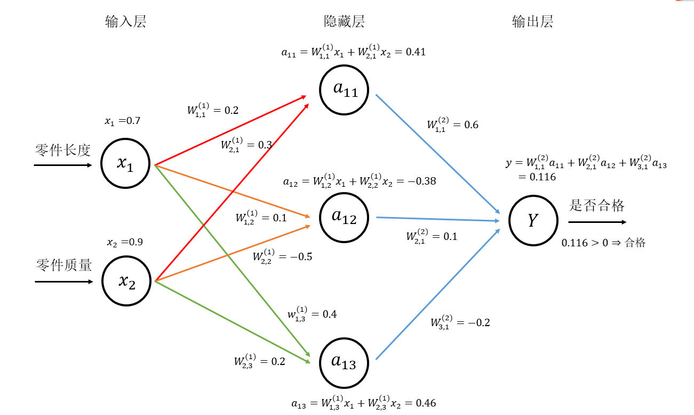
## 前向传播算法 Forward propagation 输出结果
  ```python
  ''' Forward propagation
  输入层 有两个输入
  隐藏层 有三个节点
  输出层 有一个输出
  '''
  train_X = [[0.7, 0.9], [0.1, 0.4], [0.5, 0.8], [0.2, 0.3]]
  # Notice train_y is shape of [4, 1]
  train_y = [[0 if x1+x2 < 0.6 else 1] for x1, x2 in train_X]  # [[1], [0], [1], [0]]

  X = tf.placeholder(tf.float32, name='input')
  w1 = tf.Variable(tf.random_normal([2, 3], stddev=1))
  w2 = tf.Variable(tf.random_normal([3, 1], stddev=1))
  b = tf.Variable(tf.constant([.0, .0, .0]))

  a = tf.matmul(X, w1) + b
  linear_model = tf.matmul(a, w2)

  sess = tf.Session()
  init = tf.global_variables_initializer()
  sess.run(init)
  sess.run(linear_model, feed_dict={X: train_X})
  Out[6]:
  array([[-1.8375354 ],
         [-0.14922595],
         [-1.2469425 ],
         [-0.5071239 ]], dtype=float32)

  # Close session: sess.close()
  # Run again: sess = tf.Session(); sess.run(init); sess.run(linear_model, feed_dict={X:[[0.7, 0.9]]})
  ```
## 损失函数 loss function 评估当前模型的预测结果与目标值的距离
  ```python
  ''' standard loss model '''
  # Target
  y = tf.placeholder(tf.float32)
  # predict values' distance to target values
  squared_deltas = tf.square(linear_model - y)
  # Sum up total Loss
  loss = tf.reduce_sum(squared_deltas)
  sess.run(loss, {X: train_X, y: train_y})
  Out[11]: 13.379801
  ```
## 反向传播算法 Back propagation 更新神经网络参数的取值
  - 在每次迭代的开始，首先需要选取一小部分训练数据，这一小部分数据叫做一个 **batch**
  - 然后，这个batch的样例会通过 **前向传播算法** 得到神经网络模型的预测结果
  - 因为训练数据都是有正确答案标注的，所以可以计算出当前神经网络模型的预测答案与正确答案之间的差距
  - 最后，基于这预测值和真实值之间的差距，反向传播算法会相应更新神经网络参数的取值，使得在这个batch上神经网络模型的预测结果和真实答案更加接近
  - **优化器 optimizers** 用于缓慢改变变量的值，使得 **损失函数 loss function** 最小
  - **梯度下降算法 gradient descent** 沿损失函数梯度下降最大的方向调整参数，**tf.gradients 方法** 用于计算模型的导数，**tf.train.GradientDescentOptimizer 方法** 用于自动完成参数选取
  ```python
  ''' Back propagation '''
  optimizer = tf.train.GradientDescentOptimizer(0.01)
  train = optimizer.minimize(loss)
  for i in range(1000):
      sess.run(train, {X: train_X, y: train_y})
  # Trained w1, w2, b
  sess.run([w1, w2, b])
  Out[5]:
  [array([[-0.15459022, -0.58988345,  0.45714408],
          [ 0.2202878 , -0.4982153 ,  1.3863227 ]], dtype=float32),
   array([[ 1.6989982 ],
          [-0.3714918 ],
          [ 0.78323066]], dtype=float32),
   array([-0.28499216, -0.04386206,  0.11725496], dtype=float32)]

  # Loss after trained
  sess.run(loss, {X: train_X, y: train_y})
  Out[16]: 0.03600077

  # Predict value on train data
  sess.run(linear_model, feed_dict={X: train_X})
  Out[17]:
  array([[ 1.0957603 ],
        [ 0.0844568 ],
        [ 0.86833656],
        [-0.04860568]], dtype=float32)

  # Re-init: sess.run(init); sess.run([w1, w2, b])
  ```
***

# 深度学习与深层神经网络
## 激活函数 activation function 实现非线性化
  - **深度学习** 一类通过 **多层** **非线性** 变换对高复杂性数据建模算法的合集，**深层神经网络** 是实现多层非线性变换最常用的一种方法
  - **激活函数** 将每一个神经网络中节点的输出通过一个非线性函数，将整个神经网络模型转化为非线性的
  - **感知机** 先将输入进行加权和，然后再通过激活函数最后得到输出，这个结构就是一个没有隐藏层的神经网络，可以简单地理解为单层的神经网络

    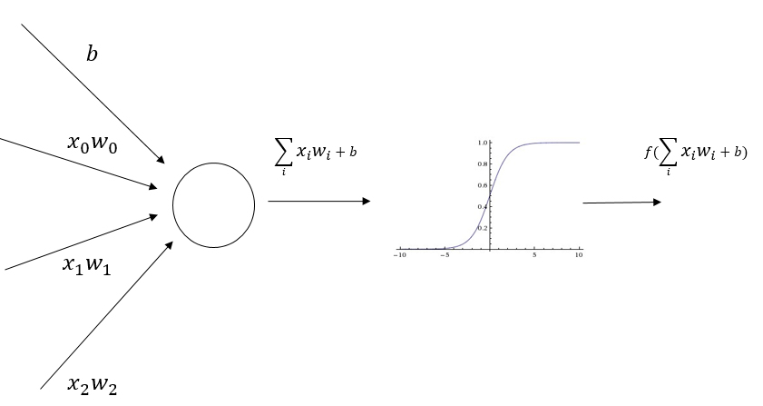
  - **在线性模型中无法处理非线性数据**

    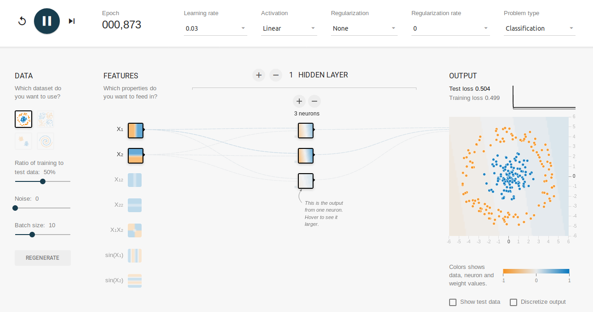

    通过加入 **激活函数 Tanh** 将线性模型转化为非线性模型

    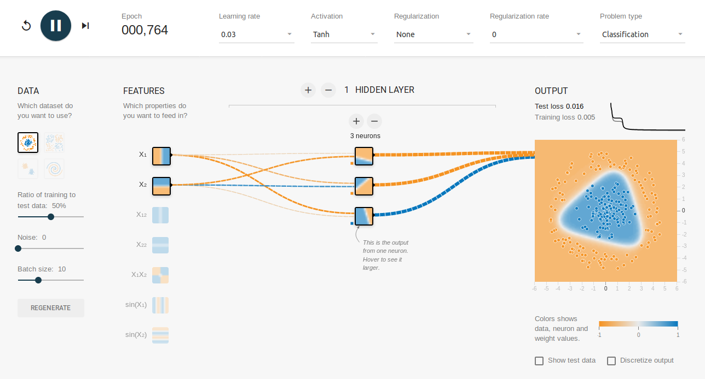
  - **常用的激活函数** 目前 TensorFlow 提供了 7 种不同的非线性激活函数，**tf.nn.relu** / **tf.sigmoid** / **tf.tanh** 是其中比较常用的几个

    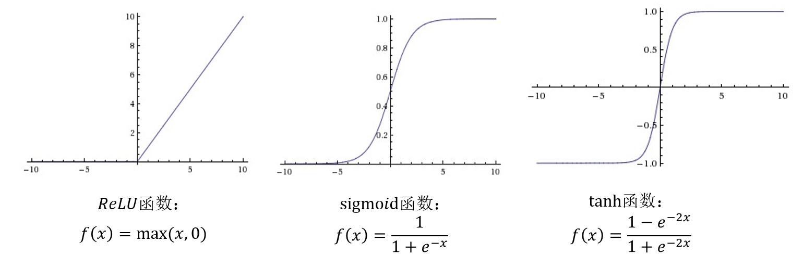
  - **前向传播算法中使用激活函数**
    ```python
    a = tf.nn.relu(tf.matmul(X, w1) + b)
    relu_model = tf.nn.relu(tf.matmul(a, w2))
    ```
## 多层网络解决异或运算 exclusive or
  - **单层感知机模型** 无法解决异或数据集的分类问题，如果两个输入的符号相同则输出为0，否则输出为1

    

    当加入隐藏层之后，异或问题就可以得到很好地解决

    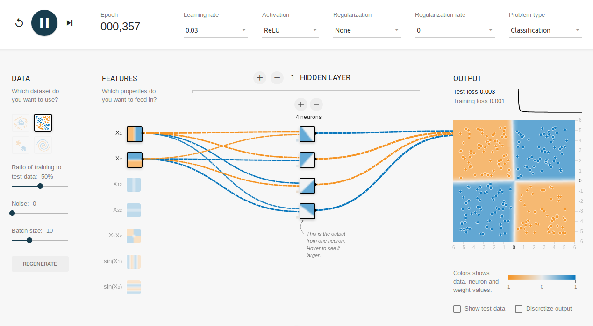
  - 隐藏层的四个节点中可以被认为代表了从输入特征中抽取的更高维的特征，比如第一个节点可以大致代表两个输入的逻辑与操作的结果，深层神经网络实际上有 **组合特征提取的功能**，对于解决不易提取特征向量的问题（比如 **图片识别** / **语音识别**）有很大帮助
## softmax 回归与 交叉熵 cross-entropy
  - 通过神经网络解决 **多分类问题** 最常用的方法是设置 n 个输出节点，其中n为类别的个，即 **n 维的哑变量矩阵 dummy variables**
  - **Softmax 回归** 将神经网络的输出变成一个概率分布，通过交叉熵 **Cross-entropy** 来计算预测的概率分布和目标的概率分布之间的距离

    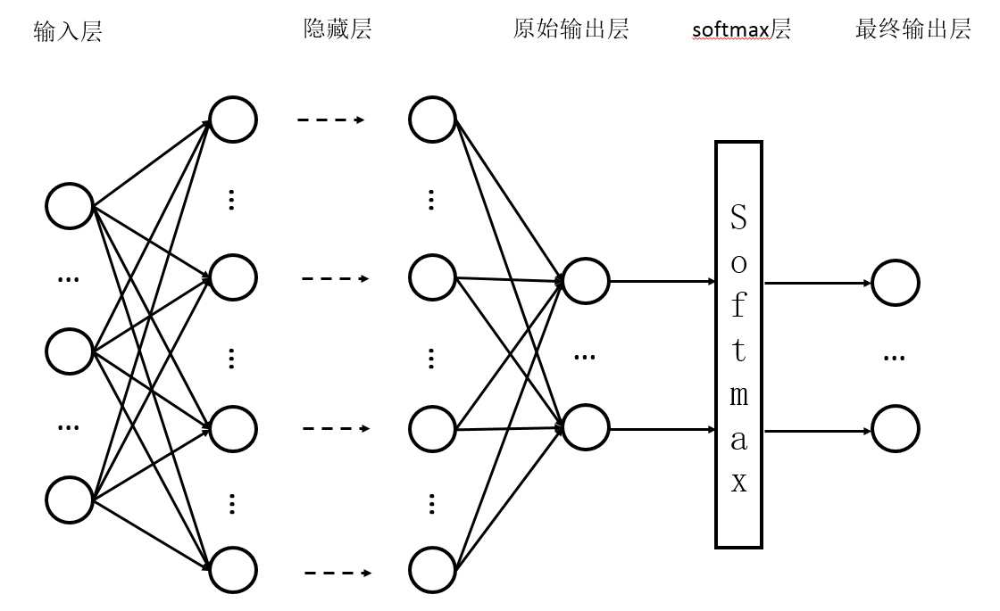

  - **Softmax Regression**，在分类问题中给出所属类别的概率，首先收集属于某一类别的证据 evidence，随后将其转化为概率
    ```shell
    # i is the index of each class, j is the index of each input data
    evidence(i) = Σ(j) (W(i, j) * x(j)) + b(i)
    # convert evidence into probabilities of our input being in each class
    y = softmax(evidence)
    # softmax is exponentiating its inputs and then normalizing them
    softmax(x) = normalize(exp(x)) = exp(x) / Σ(j) exp(x)
    # Consequently, in a more compactly way
    y = softmax(W x + b)
    ```
  - **python 实现 Softmax 回归**
    ```python
    softmax = lambda x : np.exp(x) / np.sum(np.exp(x), axis=0)

    softmax(np.arange(5))
    Out[82]: array([0.01165623, 0.03168492, 0.08612854, 0.23412166, 0.63640865])
    ```
    ```python
    # Convert a two-dimension array to softmax prob on their own line
    def softmax_prob(prob_array):
        e_prob_array = np.exp(np.array(prob_array))
        if np.all(prob_array == -np.inf):
            return e_prob_array
        else:
            return np.divide(e_prob_array, np.sum(e_prob_array, 1).reshape(-1, 1))

    # Test run
    tt = np.arange(5)
    softmax_prob(np.vstack([tt, tt]))
    Out[27]:
    array([[0.01165623, 0.03168492, 0.08612854, 0.23412166, 0.63640865],
           [0.01165623, 0.03168492, 0.08612854, 0.23412166, 0.63640865]])
    ```
  - **交叉熵 Cross-entropy** 评估模型的预测结果与目标值的差距，刻画了两个概率分布之间的距离，是分类问题中使用比较广的一种损失函数，目标使该值尽量小
    ```python
    # 其中y'表示预测值，y表示目标值
    H(y_, y) = -Σ(i)(y_(i) * log (y(i)))
    ```
    实现
    ```python
    # reduction_indices=[1] 指定在列轴上求和，随后 tf.reduce_mean 计算所有样本的平均值
    cross_entropy = tf.reduce_mean(-tf.reduce_sum(y_ * tf.log(y), reduction_indices=[1]))
    ```
    使用更稳定的内建版本 **softmax_cross_entropy_with_logits_v2**
    ```python
    cross_entropy = tf.reduce_mean(tf.nn.softmax_cross_entropy_with_logits_v2(labels=y_, logits=y))
    ```
  - **tf.nn.sparse_softmax_cross_entropy_with_logits** 在只有一个正确答案的分类问题中，来进一步加速计算过程
    ```python
    cross_entropy = tf.nn.sparse_softmax_cross_entropy_with_logits(logits=y, labels=tf.argmax(y_, 1))
    ```
  - 解决 **回归问题** 的神经网络一般只有一个输出节点，这个节点的输出值就是预测值，最常用的损失函数是 **均方误差 MSE，mean squared error**
    ```python
    MSE(y, y_) = Σ(i)(y - y_) ** 2 / n
    其中y代表了神经网络的输出答案，y_代表了标准答案
    ```
    **python 实现**
    ```python
    mse = tf.reduce_mean(tf.square(y_ - y))
    ```
## 梯度下降算法 Gradient decent
  - **梯度下降算法** 主要用于优化单个参数的取值，而 **反向传播算法** 给出了一个高效的方式在所有参数上使用梯度下降算法，从而使神经网络模型在训练数据上的损失函数尽可能小
  - **梯度下降算法** 会迭代式更新参数，不断沿着梯度的反方向让参数朝着总损失更小的方向更新，对于参数 w 与损失函数 Loss(w)，其梯度
    ```shell
    grad(w) = δ Loss(w) / δ w
    ```
  - **学习率 learning rate** 定义每次参数更新的幅度，根据参数的梯度和学习率，每次参数更新的公式为
    ```shell
    w(n+1) = w(n) - r * grad(w(n))
    ```
  - **梯度下降算法** 在偏导为 0 时可能只能得到 **局部最优解**，并不能保证达到 **全局最优解**，只有当损失函数为凸函数时，梯度下降算法才能保证达到全局最优解

    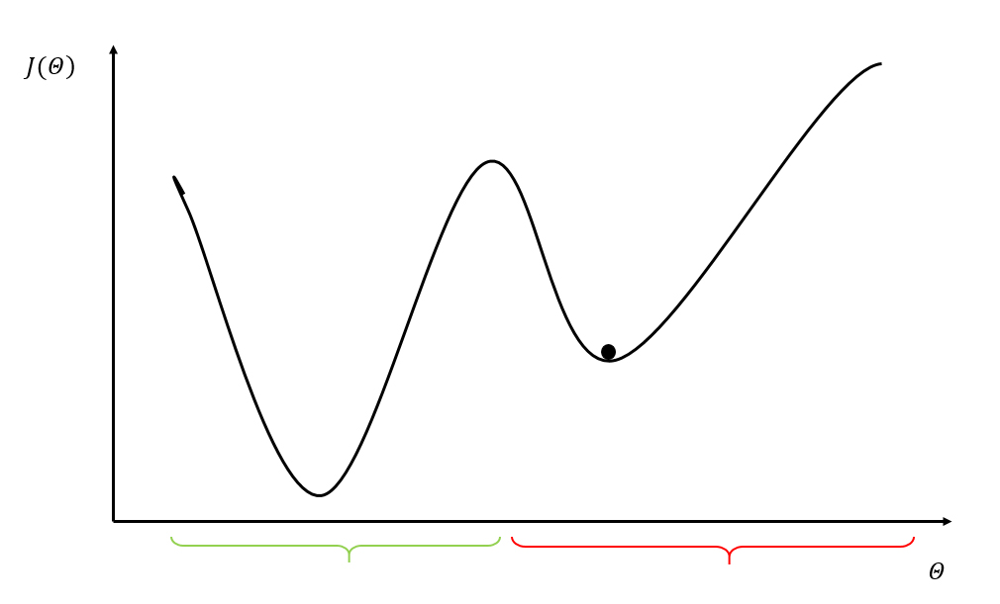
  - **随机梯度下降的算法stochastic gradient descent**
    - **梯度下降算法** 在每次更新回归系数时都需要遍历整个数据集，在数据集变大时，该方法的计算复杂度就会很高
    - **随机梯度下降的算法** 在每一轮迭代中，随机优化某一条训练数据上的损失函数
    - 使用随机梯度下降优化得到的神经网络甚至可能无法达到局部最优
  - **batch** 为了综合梯度下降算法和随机梯度下降算法的优缺点，可以每次计算一小部分训练数据的损失函数，这一小部分数据被称之为一个 batch
## 指数衰减学习率 exponential decay learning rate
  - 学习率决定参数每次更新的幅度
    - 如果幅度过大，那么可能导致参数在极优值的两侧来回移动
    - 如果幅度过小，虽然能保证收敛性，但会大大降低优化速度
  - **tf.train.exponential_decay 指数衰减学习率** 可以先使用较大的学习率来快速得到一个比较优的解，然后随着迭代的继续逐步减小学习率，使得模型在训练后期更加稳定
    ```shell
    decayed_learning_rate = learning_rate * decay_rate ^ (global_step / decaysteps)
    ```
    函数定义
    ```python
    exponential_decay(learning_rate, global_step, decay_steps, decay_rate, staircase=False, name=None)
    ```
  - **staircase** 的值被设置为 True 时
    - global_step / decay_steps 会被转化成整数 使得学习率成为一个阶梯函数 staircase function
    - 在这样的设置下，**decay_steps** 一般等于 **总样本数 / batch size**， 通常代表了完整的使用一遍训练数据所需要的迭代轮数
    - 这种设置的常用场景是每完整地过完一遍训练数据，学习率就减小一次，这可以使得训练数据集中的所有数据对模型训练有相等的作用
  - **示例**
    ```python
    TRAIN_STEPS = 100
    global_step = tf.Variable(0)
    LEARNING_RATE = tf.train.exponential_decay(0.1, global_step, 1, 0.96, staircase=True)

    x = tf.Variable(tf.constant(5, dtype=tf.float32), name='x')
    y = tf.square(x)
    train_op = tf.train.GradientDescentOptimizer(LEARNING_RATE).minimize(y, global_step=global_step)

    LEARNING_RATE_list = []
    x_list = []
    with tf.Session() as sess:
        init = tf.global_variables_initializer()
        sess.run(init)
        for ii in range(TRAIN_STEPS):
            sess.run(train_op)
            LEARNING_RATE_list.append(sess.run(LEARNING_RATE))
            x_list.append(sess.run(x))

    # plot
    fig, axes = plt.subplots(2, 1)
    axes[0].plot(x_list)
    axes[0].set_title('x')
    axes[1].plot(LEARNING_RATE_list, drawstyle='steps-post')
    axes[1].set_title('learning rate')
    ```
    
## 过拟合 与 L1 L2 正则化缩减
  - **过拟合** 只优化交叉熵的模型可以更好地拟合训练数据（交叉熵损失更小），但是却不能很好地挖掘数据中潜在的规律来判断未知的测试数据，所以在测试数据上的正确率低
  - 为了避免过拟合问题，一个常用的方法是 **正则化 regularization**
  - **正则化** 就是在损失函数 **Loss(w)** 中加入刻画模型复杂程度的指标 **R(w)**，在参数优化时优化正则化的损失函数
    ```shell
    # Loss(w) 损失函数
    # R(w) 模型复杂程度
    # λ 模型复杂损失在总损失中的比例
    Loss(w) + λ * R(w)
    ```
  - **模型复杂度 R(w)** 一般来说只由权重 w 决定，tensorflow 提供两种正则化方法 **L1 正则化 / L2 正则化**，基本的思想都是希望通过限制权重的大小，使得模型不能任意拟合训练数据中的随机噪音
  - **tf.contrib.layers.l1_regularizer L1 正则化** (Lasso 缩减) 会将某些参数缩减到 0，使参数变得更稀疏，可以达到类似特征选取的功能
    ```shell
    R(w) = Σ|w(i)|
    ```
  - **tf.contrib.layers.l2_regularizer L2 正则化** (Ridge regression) 参数不会缩减到 0，公式可导，对含有 L2 正则化损失函数的优化要更加简洁
    ```shell
    R(w) = Σ|w(i) ^ 2|
    ```
  - **tf.contrib.layers.l1_l2_regularizer 同时使用 L1 和 L2 正则化**
    ```shell
    R(w) = Σ(a * w(i) ^ 2 + (1 - a) * |w(i)|)
    ```
  - **示例**
    ```python
    weights = tf.constant([[1.0, -2.0], [-3.0, 4.0]])

    # L1: out = np.sum(np.abs(sess.run(weights))) * 0.5
    sess.run(tf.contrib.layers.l1_regularizer(.5)(weights))
    Out[24]: 5.0

    # L2: out = np.sum(sess.run(weights) ** 2) / 2 * 0.5
    sess.run(tf.contrib.layers.l2_regularizer(.5)(weights))
    Out[34]: 7.5
    ```
## 滑动平均模型 exponantial moving average
  - **滑动平均模型** 可以使模型在测试数据上更健壮 robust 在采用随机梯度下降算法训练神经网络时，使用滑动平均模型在很多应用中都可以在一定程度提高最终模型在测试数据上的表现
  - **tf.train.ExponentialMovingAverage 滑动平均模型**
    - **参数 decay 衰减率** 控制模型更新的速度，ExponentialMovingAverage 对每一个变量会维护一个 **影子变量 shadow variable**，初始值是相应变量的初始值，每次变量更新时影子变量的值会相应更新
      ```shell
      shadow_variable = decay * shadow_variable + (1 - decay) * variable
      ```
      decay 越大模型越趋于稳定，实际应用中，decay 一般会设成非常接近1的数
    - **参数 num_updates** 动态设置 decay 的大小，使得模型在训练前期可以更新得更快，每次使用的衰减率更新为
      ```shell
      # 0.1 - 1
      min (decay, (1 + num_updates) / (10 + num_updates))
      ```
  - **示例**
    ```python
    # v1 = 0, num_updates = 0, decay = 0.99
    v1 = tf.Variable(0, dtype=tf.float32)
    step = tf.Variable(0, trainable=False)
    ema = tf.train.ExponentialMovingAverage(0.99, step)
    maintain_averages_op = ema.apply([v1])

    with tf.Session() as sess:
        init_op = tf.global_variables_initializer()
        sess.run(init_op)
        # v1, ema.average(v1) = [0., 0.]
        print(sess.run([v1, ema.average(v1)]))

        # v1 = 5
        sess.run(tf.assign(v1, 5))
        sess.run(maintain_averages_op)
        # decay = min(0.99, (1 + 0) / (10 + 0)) = 0.1
        # ema = 0.1 * 0 + (1 - 0.1) * 5 = 4.5
        print(sess.run([v1, ema.average(v1)]))

        # step = 10000, v1 = 10
        sess.run(tf.assign(step, 10000))
        sess.run(tf.assign(v1, 10))
        sess.run(maintain_averages_op)
        # decay = min(0.99, (1 + 10000) / (10 + 10000)) = 0.99
        # ema = 0.99 * 4.5 + (1 - 0.99) * 10 = 4.555
        print(sess.run([v1, ema.average(v1)]))

        # ema = 0.99 * 4.555 + (1 - 0.99) * 10 = 4.60945
        sess.run(maintain_averages_op)
        print(sess.run([v1, ema.average(v1)]))
    ```
    Output
    ```python
    [0.0, 0.0]
    [5.0, 4.5]
    [10.0, 4.555]
    [10.0, 4.60945]
    ```
## 命名空间 tf.variable_scope 与变量获取 tf.get_variable
  - TensorFlow 提供了 **通过变量名称来创建或者获取一个变量** 的机制，在不同的函数中可以直接通过变量的名字来使用变量，而不需要将变量通过参数的形式传递，当神经网络结构更加复杂时，将大大提高程序的可读性
  - TensorFlow 中通过变量名称获取变量的机制主要是通过 **tf.get_variable** 和 **tf.variable_scope** 函数实现的
  - **tf.get_variable** 函数来创建或者获取变量，用于创建变量时，与 tf.Variable 的功能是基本等价的
    ```python
    # tf.get_variable 创建变量
    v= tf.get_variable('v', shape=[1], initializer=tf.constant_initializer(1.0))
    # tf.Variable 创建变量
    v = tf.Variable(tf.constant(1.0, shape=[1], name='v'))
    ```
  - **initializer 函数** 与 tf.Variable 中用的函数大部分是一一对应的
    - tf.constant_initializer
    - tf.random_normal_initializer
    - tf.truncated_normal_initializer
    - tf.random_uniform_initializer
    - tf.uniform_unit_scaling_initializer
    - tf.zeros_initializer
    - tf.ones_initialize
  - tf.get_variable 与 tf.Variable 最大的区别在于 **指定变量名称** 的参数
    - 对于 tf.Variable，变量名称是一个可选的参数，通过 name="v" 的形式给出
    - 对于 tf.get_variable 函数，变量名称是一个必填的参数，tf.get_variable 会根据这个名字去创建或者获取变量
  - **tf.variable_scope** 通过 tf.get_variable 直接创建一个同名的变量将报错，需要通过 **tf.variable_scope** 生成一个上下文管理器，并明确指定 **reuse=True** 表示在这个上下文管理器中，tf.get_variable 将直接获取已经生成的变量
    ```python
    ''' 创建一个变量，再次运行将报错 '''
    v= tf.get_variable('v', shape=[1], initializer=tf.constant_initializer(1.0))

    ''' tf.variable_scope 生成一个上下文管理器，将可以在这个命名空间中创建新的变量 '''
    ''' 再次运行将报错 '''
    with tf.variable_scope('foo'):
        v= tf.get_variable('v', shape=[1], initializer=tf.constant_initializer(1.0))

    ''' 制定上下文管理器的 reuse=True 将用于获取已有的变量 '''
    with tf.variable_scope('foo', reuse=True):
        v= tf.get_variable('v', shape=[1], initializer=tf.constant_initializer(1.0))

    ''' 在 reuse=True 时如果尝试创建新的变量将报错 '''
    with tf.variable_scope('foo', reuse=True):
        v= tf.get_variable('v1', shape=[1], initializer=tf.constant_initializer(1.0))
    ```
  - **tf.variable_scope** 在命名空间内创建的变量名称都会带上这个命名空间名作为前缀
    ```python
    ''' 命名空间外创建变量 '''
    v = tf.Variable(tf.constant(1.0, shape=[1], name='v'))
    print(v.name)
    # [Out]: 'Variable_16:0'

    ''' 命名空间内创建的变量将带上命名空间的前缀 '''
    with tf.variable_scope('foo1'):
        with tf.variable_scope('foo2'):
            v= tf.get_variable('v', shape=[1], initializer=tf.constant_initializer(1.0))
            print(v.name)
    # [Out]: foo1/foo2/v:0

    ''' 在其他命名空间中可以通过指定前缀获取对应命名空间的变量 '''
    with tf.variable_scope('', reuse=True):
        v = tf.get_variable('foo1/foo2/v', shape=[1])
        print(v.name)
    # [Out]: foo1/foo2/v:0
    ```
***

# 应用示例
## 自定义损失函数预测商品销量计算盈利
  - 自定义损失函数，在预测商品数量 多 / 少 时利润的损失是不同的
    ```python
    Loss(y, y_) = Σ(i)f(y, y_)

    f(x, y) = {'x > y': a(x - y), 'x <= y': b(x - y)}
    其中 a = 10, b = 1
    ```
    **python 实现**
    ```python
    loss = tf.reduce_mean(tf.where(tf.grater(y, y_), (y - y_) * a, (y - y_) * b))
    ```
    由于损失函数中定义的预测少比预测多损失更多，因此训练出的 w1 略大于 1
  ```python
  from numpy.random import RandomState
  import tensorflow as tf
  import matplotlib.pyplot as plt

  # Two input, one output
  X = tf.placeholder(tf.float32, [None, 2], name='Input-X')
  y_ = tf.placeholder(tf.float32, [None, 1], name='Input-y')

  w1 = tf.Variable(tf.random_normal([2, 1], stddev=1, seed=1))
  y = tf.matmul(X, w1)

  loss_less = 10
  loss_more = 1
  # Choose different loss weight if predicted more / less
  loss = tf.reduce_mean(tf.where(tf.greater(y, y_), (y-y_) * loss_more, (y_-y) * loss_less))
  # Define train steps
  optimizer = tf.train.AdamOptimizer(0.001)
  train_step = optimizer.minimize(loss)

  # Generate train / test data
  rdm = RandomState(1)
  data_size = 128
  train_X = rdm.rand(data_size, 2)
  # Target with a random -0.05 - 0.05 noise
  train_y = np.array([ [mm + nn + rdm.rand()/10.0 - 0.05] for mm, nn in train_X ])

  # Train model
  with tf.Session() as sess:
      STEPS = 5000
      batch_size = 8
      w1_collection = []

      init = tf.global_variables_initializer()
      sess.run(init)
      for ii in range(STEPS):
          batch = np.random.permutation(data_size)[:batch_size]
          sess.run(train_step, feed_dict={X: train_X[batch], y_:train_y[batch]})
          w1_collection.append(sess.run(w1))

  w1_collection = np.array(w1_collection)
  print('w1 = %s' % w1_collection[-1])  # w1 = [[1.0193471], [1.0428091]]

  # plot w1
  fig, axes = plt.subplots(2, 1)
  for ind in range(w1_collection.shape[1]):
      axes[ind].plot(w1_collection[:, ind, 0])
      axes[ind].set_title('w1[%d]' % ind)
  ```
  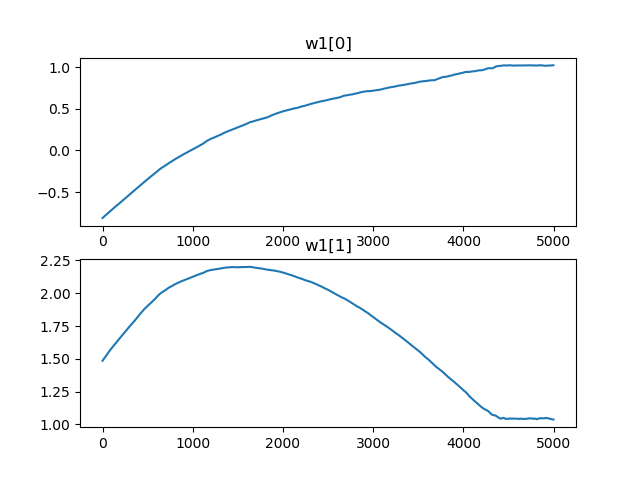
## 计算一个 5 层神经网络带 L2 正则化的损失函数的网络模型
  ```python
  import tensorflow as tf
  import matplotlib.pyplot as plt
  import numpy as np
  import pandas as pd

  ''' Generate random test data, labels and then noised data '''
  TRAINING_STEPS = 4000

  np.random.seed(0)
  x1 = np.random.uniform(-1, 1, size=150)
  x2 = np.random.uniform(0, 2, size=150)
  label = np.array([ 0 if i ** 2 + j ** 2 <= 1 else 1 for i, j in zip(x1, x2) ])

  x1 = np.random.normal(x1, 0.1)
  x2 = np.random.normal(x2, 0.1)
  df = pd.DataFrame({'x1':x1, 'x2': x2, 'y': label})

  # plot original data
  fig, axes = plt.subplots(3, 1)
  grouped = df.groupby(df.iloc[:, -1])
  scatterFunc = lambda x : plt.scatter(x.iloc[:, 0], x.iloc[:, 1], label = x.iloc[0, 2])
  for ind in range(1, 4):
      plt.subplot(3, 1, ind)
      grouped.agg(scatterFunc)

  ''' Define a 5-layer network model '''
  def get_weight(shape, lambda1):
      ww = tf.Variable(tf.random_normal(shape), dtype=tf.float32)
      tf.add_to_collection('losses', tf.contrib.layers.l2_regularizer(lambda1)(ww))
      return ww

  graph1 = tf.Graph()
  with graph1.as_default():
      x = tf.placeholder(tf.float32, shape=(None, 2))
      y_ = tf.placeholder(tf.float32, shape=(None, 1))

      # Nodes number for every layer
      layer_dimensions = [2, 10, 5, 3, 1]
      in_dimension = layer_dimensions[0]
      cur_layer = x
      for ll in layer_dimensions[1:]:
          out_dimension = ll
          weight = get_weight([in_dimension, out_dimension], lambda1 = 0.003)
          bias = tf.Variable(tf.constant(0.1, shape=[out_dimension]))
          cur_layer = tf.nn.relu(tf.matmul(cur_layer, weight) + bias)
          in_dimension = out_dimension

      y = cur_layer

      # Loss function, normal one and l2 regularized one
      mse_loss = tf.reduce_sum(tf.pow(y_ - y, 2)) / df.shape[0]
      tf.add_to_collection('losses', mse_loss)
      loss = tf.add_n(tf.get_collection('losses'))

  ''' Train model using mse_loss that without regularization '''
  with tf.Session(graph=graph1) as sess:
      train_op = tf.train.AdamOptimizer(0.001).minimize(mse_loss)
      init = tf.global_variables_initializer()
      sess.run(init)
      for i in range(TRAINING_STEPS):
          sess.run(train_op, feed_dict={x: df.values[:, :2], y_: df.values[:, -1:]})
          if i % 2000 == 0:
              print("After %d steps, mse_loss: %f" % (i,sess.run(mse_loss, feed_dict={x: df.values[:, :2], y_: df.values[:, -1:]})))

      xx, yy = np.mgrid[-1.2:1.2:.01, -0.2:2.2:.01]
      grid = np.c_[xx.ravel(), yy.ravel()]
      probs = sess.run(y, feed_dict={x:grid})
      probs = probs.reshape(xx.shape)

  # Plot
  plt.subplot(3, 1, 2)
  plt.contour(xx, yy, probs, levels=[.5], cmap="Greys", vmin=0, vmax=.1)

  ''' Train model using loss that regularized '''
  with tf.Session(graph=graph1) as sess:
      train_op = tf.train.AdamOptimizer(0.001).minimize(loss)
      init = tf.global_variables_initializer()
      sess.run(init)
      for i in range(TRAINING_STEPS):
          sess.run(train_op, feed_dict={x: df.values[:, :2], y_: df.values[:, -1:]})
          if i % 2000 == 0:
              print("After %d steps, loss: %f" % (i,sess.run(mse_loss, feed_dict={x: df.values[:, :2], y_: df.values[:, -1:]})))

      xx, yy = np.mgrid[-1.2:1.2:.01, -0.2:2.2:.01]
      grid = np.c_[xx.ravel(), yy.ravel()]
      probs = sess.run(y, feed_dict={x:grid})
      probs = probs.reshape(xx.shape)

  # Plot
  plt.subplot(3, 1, 3)
  plt.contour(xx, yy, probs, levels=[.5], cmap="Greys", vmin=0, vmax=.1)

  fig.show()
  ```
  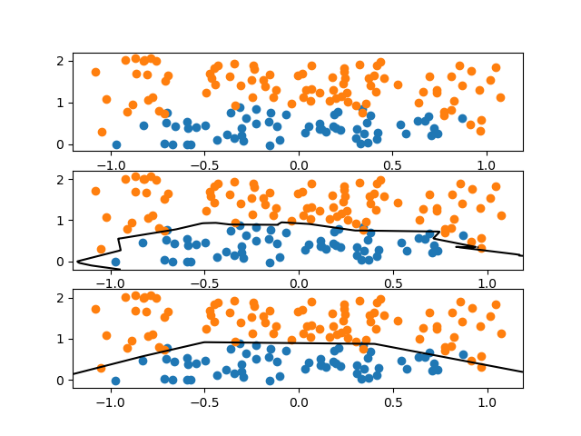
  - **Q: 在 ipython 中再次运行时报错 Placeholder[dtype=DT_FLOAT, shape=[?,1]**
    ```python
    在第二次运行时
        train_op = tf.train.AdamOptimizer(0.001).minimize(loss)
        sess.run(train_op, feed_dict={x: df.values[:, :2], y_: df.values[:, -1:]})
    报错
        InvalidArgumentError (see above for traceback): You must feed a value for placeholder tensor 'Placeholder_1' with dtype float and shape [?,1]
	       [[Node: Placeholder_1 = Placeholder[dtype=DT_FLOAT, shape=[?,1], _device="/job:localhost/replica:0/task:0/device:CPU:0"]()]]
    ```
    A: 原因可能是因为第一次添加到 collection 中的 losses 在第二次运行时也获取到了，没有初始化，每次在运行时创建新的 Graph
    ```python
    # Create new graph
    graph1 = tf.Graph()
    with graph1.as_default():
        [ Define graph contains ]
    # Use new graph as default one when creating session
    with tf.Session(graph=graph1):
        [Session contains]
    ```
## MNIST Softmax Regression
  - [mnist_softmax.py](https://github.com/tensorflow/tensorflow/blob/r1.3/tensorflow/examples/tutorials/mnist/mnist_softmax.py)
  - **MNIST 手写数字数据集**，每组数据包含两部分，手写图像数据 x 与对应的标签 y，每个图像包含 28x28 像素，所有数据划分成三部分
  	- 训练数据集 training data，55,000 组数据，mnist.train
  	- 测试数据集 test data，10,000 组数据，mnist.test
  	- 验证数据集 validation data，5,000 组数据，mnist.validation
  	```python
    import tensorflow as tf
  	# Load MNIST Data
  	from tensorflow.examples.tutorials.mnist import input_data
  	mnist = input_data.read_data_sets('MNIST_data', one_hot=True)
  	mnist.train.images.shape
  	# Out[3]: (55000, 784)	# 28 * 28 = 784
  	mnist.train.labels.shape
  	# Out[4]: (55000, 10)	# one-hot vectors，只在对应的数字处为1
  	mnist.train.labels[0]
  	# Out[5]: array([ 0.,  0.,  0.,  0.,  0.,  0.,  0.,  1.,  0.,  0.])
  	```
  - **实现回归模型** Implementing the Regression
    ```python
    # 特征值，None 指定数组的长度任意
    x = tf.placeholder(tf.float32, [None, 784])
    # 目标值
    y_ = tf.placeholder(tf.float32, [None, 10])
    # weights 和 biases，初始化成全0值
    W = tf.Variable(tf.zeros([784, 10]))
    b = tf.Variable(tf.zeros([10]))
    # 定义线性模型
    y = tf.nn.softmax(tf.matmul(x, W) + b)
    # 损失函数
    cross_entropy = tf.reduce_mean(tf.nn.softmax_cross_entropy_with_logits_v2(labels=y_, logits=y))
    ```
  - **模型训练 Training** 选择优化算法 optimization algorithm，改变变量值，使损失函数最小
    ```python
    # 使用梯度下降算法，使交叉熵最小，学习率为0.5
    train_step = tf.train.GradientDescentOptimizer(0.5).minimize(cross_entropy)
    # 创建会话，并运行计算图
    sess = tf.InteractiveSession()
    tf.global_variables_initializer().run()
    for _ in range(1000):
        batch_xs, batch_ys = mnist.train.next_batch(100)
        sess.run(train_step, feed_dict={x: batch_xs, y_: batch_ys})
    ```
  - **模型评估 Evaluating Model**
    ```python
    # tf.argmax 给出指定轴上最大元素的位置，此处 tf.argmax(y,1) 即模型的预测数值结果
    correct_prediction = tf.equal(tf.argmax(y,1), tf.argmax(y_,1))
    # 将 correct_prediction 的布尔型结果转化为float，并计算出正确率
    accuracy = tf.reduce_mean(tf.cast(correct_prediction, tf.float32))
    print(sess.run(accuracy, feed_dict={x: mnist.test.images, y_: mnist.test.labels}))
    # Out: 0.9077
    ```
    正确率90.77%，使用该简单模型的效果并不好
## MNIST 使用 滑动平均模型 与 指数衰减学习率 与 L2 正则化
  ```python
  import tensorflow as tf
  from tensorflow.examples.tutorials.mnist import input_data

  LAYER1_NODE = 500
  MOVING_AVERAGE_DECAY = 0.99
  REGULARIZATION_RATE = 0.0001
  LEARNING_RATE_BASE = 0.8
  LEARNING_RATE_DECAY = 0.99
  TRAINING_STEPS = 10000
  BATCH_SIZE = 100

  ''' Two layers, ReLU activation function in the first layer '''
  inference_across_layers = lambda x, w1, b1, w2, b2: \
          tf.matmul(tf.nn.relu(tf.matmul(x, w1) + b1), w2) + b2

  def train(mnist):
      INPUT_NODE = mnist.train.images.shape[1]
      OUTPUT_NODE = mnist.train.labels.shape[1]

      x = tf.placeholder(tf.float32, [None, 784])
      y_ = tf.placeholder(tf.float32, [None, 10])
      weights1 = tf.Variable(tf.truncated_normal([INPUT_NODE, LAYER1_NODE], stddev = 0.1))
      biases1 = tf.Variable(tf.constant(0.1, shape=[LAYER1_NODE]))
      weights2 = tf.Variable(tf.truncated_normal([LAYER1_NODE, OUTPUT_NODE], stddev = 0.1))
      biases2 = tf.Variable(tf.constant(0.1, shape=[OUTPUT_NODE]))

      y = inference_across_layers(x, weights1, biases1, weights2, biases2)

      ''' Exponential moving average to prevent over-fit '''
      global_step = tf.Variable(0, trainable=False)
      variable_averages = tf.train.ExponentialMovingAverage(MOVING_AVERAGE_DECAY, global_step)
      # tf.trainable_variables returns all the trainable variables
      variable_averages_op = variable_averages.apply(tf.trainable_variables())
      average_y = inference_across_layers(x,
                      variable_averages.average(weights1),
                      variable_averages.average(biases1),
                      variable_averages.average(weights2),
                      variable_averages.average(biases2)
                      )

      ''' Loss '''
      cross_entropy = tf.nn.sparse_softmax_cross_entropy_with_logits(logits=y, labels=tf.argmax(y_, 1))
      cross_entropy = tf.reduce_mean(cross_entropy)
      # L2 regularization loss
      regularizer = tf.contrib.layers.l2_regularizer(REGULARIZATION_RATE)
      regularization = regularizer(weights1) + regularizer(weights2)
      loss = cross_entropy + regularization

      ''' Train step with exponential decay learning rate '''
      learning_rate = tf.train.exponential_decay(LEARNING_RATE_BASE, global_step,
                          mnist.train.num_examples / BATCH_SIZE, LEARNING_RATE_DECAY)
      train_step = tf.train.GradientDescentOptimizer(learning_rate).minimize(loss, global_step=global_step)

      ''' Group up train_step and variables_averages_op '''
      with tf.control_dependencies([train_step, variable_averages_op]):
          train_op = tf.no_op(name='train')

      ''' Calculate accuracy '''
      correct_prediction = tf.equal(tf.argmax(average_y, 1), tf.argmax(y_, 1))
      accuracy = tf.reduce_mean(tf.cast(correct_prediction, tf.float32))

      ''' Initialize session and start training '''
      with tf.Session() as sess:
          tf.global_variables_initializer().run()
          # Validate feed and test feed
          validate_feed = {x: mnist.validation.images, y_: mnist.validation.labels}
          test_feed = {x: mnist.test.images, y_: mnist.test.labels}

          for i in range(TRAINING_STEPS):
              if i % 1000 == 0:
                  # Validate training per 1000 steps
                  validate_accuracy = sess.run(accuracy, feed_dict=validate_feed)
                  print("Steps = %d, validate accuracy using average model = %g" % (i, validate_accuracy))

              # Generate a test batch
              xs, ys = mnist.train.next_batch(BATCH_SIZE)
              sess.run(train_op, feed_dict={x: xs, y_: ys})

          ''' Finale test accuracy '''
          test_accuracy = sess.run(accuracy, feed_dict=test_feed)
          print("Steps = %d, test accuracy using average model = %g" % (i, test_accuracy))

  def main(argv=None):
      mnist = input_data.read_data_sets('MNIST_data', one_hot=True)
      train(mnist)

  if __name__ == '__main__':
      # Tensorflow provided main function, will call the real main() function
      tf.app.run()
  ```
  **运行结果**
  ```python
  Steps = 0, validate accuracy using average model = 0.1292
  Steps = 1000, validate accuracy using average model = 0.9768
  Steps = 2000, validate accuracy using average model = 0.982
  Steps = 3000, validate accuracy using average model = 0.9834
  Steps = 4000, validate accuracy using average model = 0.983
  Steps = 5000, validate accuracy using average model = 0.9838
  Steps = 6000, validate accuracy using average model = 0.9834
  Steps = 7000, validate accuracy using average model = 0.9838
  Steps = 8000, validate accuracy using average model = 0.9852
  Steps = 9000, validate accuracy using average model = 0.984
  Steps = 9999, test accuracy using average model = 0.984
  ```
  从第 4000 轮开始，模型在验证数据集上的表现开始波动，这说明模型已经接近极小值了，所以迭代也就可以结束了
***

# 模型持久化
## 模型持久化 tf.train.Saver 类
  - **tf.train.Saver 类 save 方法保存 TensorFlow 计算图**，TensorFlow 会将计算图的结构和图上参数取值分开保存
    ```python
    v1 = tf.Variable(tf.constant(1.0, shape=[1]), name = 'v1')
    v2 = tf.Variable(tf.constant(2.0, shape=[1]), name = 'v2')
    result = v1 + v2

    init_op = tf.global_variables_initializer()
    saver = tf.train.Saver()
    with tf.Session() as sess:
        sess.run(init_op)
        saver.save(sess, './test_model')
    ```
    **最终生成四个文件** 新版本不再生成 ckpt 文件
    ```shell
    checkpoint   # 目录下所有的模型文件列表
    test_model.data-00000-of-00001 # TensorFlow 每一个变量的取值
    test_model.index
    test_model.meta  # TensorFlow 计算图的结构
    ```
  - **tf.train.Saver 类 restore 方法加载模型**
    ```python
    # 重新定义变量
    v1 = tf.Variable(tf.constant(1.0, shape=[1]), name = 'v1')
    v2 = tf.Variable(tf.constant(2.0, shape=[1]), name = 'v2')
    result = v1 + v2
    saver = tf.train.Saver()
    with tf.Session() as sess:
        saver.restore(sess, './test_model')
        print(sess.run(result))
    ```
    或使用 **meta 文件直接加载已经持久化的图**， 并使用 get_tensor_by_name([Tensor name]) 获取变量
    ```python
    saver = tf.train.import_meta_graph('./test_model.meta')
    sess = tf.InteractiveSession()
    saver.restore(sess, './test_model')

    ''' 使用变量名获取将报错 '''
    ''' The name 'v1' refers to an Operation, not a Tensor. Tensor names must be of the form "<op_name>:<output_index>" '''
    sess.run(tf.get_default_graph().get_tensor_by_name('v1'))

    ''' 应使用 get_tensor_by_name([Tensor name]) 获取变量: <op_name>:<output_index> '''
    sess.run(tf.get_default_graph().get_tensor_by_name('v1:0'))
    Out[5]: array([1.], dtype=float32)

    sess.run(tf.get_default_graph().get_tensor_by_name('add:0'))
    Out[8]: array([3.], dtype=float32)
    ```
  - **变量名列表** 声明 tf.train.Saver 类时可以提供一个 **列表** 来指定需要保存或者加载的变量
    ```python
    # 创建一个只加载 v1 的 Saver
    v1 = tf.Variable(tf.constant(1.0, shape=[1]), name = 'v1')
    saver = tf.train.Saver([v1])

    sess = tf.InteractiveSession()
    saver.restore(sess, './test_model')
    sess.run(v1)
    Out[6]: array([1.], dtype=float32)
    ```
  - **变量名字典** 声明 tf.train.Saver 类时可以提供一个 **字典** 在加载时给变量重命名，将模型保存时的变量名和需要加载的变量联系起来
    ```python
    v1 = tf.Variable(tf.constant(1.0, shape=[1]), name = 'other-v1')
    v2 = tf.Variable(tf.constant(1.0, shape=[1]), name = 'other-v2')
    result = v1 + v2
    sess = tf.InteractiveSession()

    ''' 以下将报错: NotFoundError (see above for traceback): Key other-v1 not found in checkpoint '''
    saver = tf.train.Saver()
    saver.restore(sess, './test_model')

    ''' 应使用字典值重命名创建 Saver '''
    saver = tf.train.Saver({'v1': v1, 'v2': v2})
    saver.restore(sess, './test_model')
    sess.run(result)
    Out[10]: array([3.], dtype=float32)
    ```
  - **tf.train.get_checkpoint_state 函数** 获取文件夹下的持久化模型状态
    ```python
    tf.train.get_checkpoint_state('./')
    Out[6]:
    model_checkpoint_path: "./test_model"
    all_model_checkpoint_paths: "./test_model"

    ckpt.model_checkpoint_path
    Out[7]: './test_model'
    ```
## tf.train.Saver 类使用变量名字典 加载 变量的滑动平均值
  - **变量名字典** 的主要目的之一是方便使用 **变量的滑动平均值**，在加载模型时直接将影子变量映射到变量自身，使用训练好的模型时就不需要再调用函数来获取变量的滑动平均值了
  - **保存滑动平均模型**
    ```python
    ''' 保存滑动平均模型 '''
    v = tf.Variable(0, dtype=tf.float32, name = 'v')
    ema = tf.train.ExponentialMovingAverage(0.99)
    maintain_average_op = ema.apply([v])  # Or maintain_average_op = ema.apply(tf.global_variables())
    for vv in tf.global_variables():
        print(vv.name)
    # [Out]: v:0
    # [Out]: v/ExponentialMovingAverage:0

    saver = tf.train.Saver()
    sess = tf.InteractiveSession()
    sess.run(tf.global_variables_initializer())
    sess.run(tf.assign(v, 10))
    sess.run(maintain_average_op)
    saver.save(sess, './ema_test_model')
    sess.run([v, ema.average(v)])
    Out[5]: [10.0, 0.099999905]
    ```
  - **使用字典加载变量的滑动平均值**
    ```python
    ''' 加载 v 的滑动平均值到 v '''
    v = tf.Variable(0, dtype=tf.float32, name = 'v')
    sess = tf.InteractiveSession()
    saver = tf.train.Saver({'v/ExponentialMovingAverage': v})
    saver.restore(sess, './ema_test_model')
    sess.run(v)
    Out[6]: 0.099999905
    ```
  - **滑动平均模型的 variables_to_restore 方法生成字典**
    ```python
    v = tf.Variable(0, dtype=tf.float32, name = 'v')
    ema = tf.train.ExponentialMovingAverage(0.99)
    ema.variables_to_restore()
    # Out[3]: {'v/ExponentialMovingAverage': <tf.Variable 'v:0' shape=() dtype=float32_ref>}

    saver = tf.train.Saver(ema.variables_to_restore())
    sess = tf.InteractiveSession()
    saver.restore(sess, './ema_test_model')
    sess.run(v)
    Out[7]: 0.099999905
    ```
## convert_variables_to_constants 函数 将计算图中的变量及其取值转化为常量
  - **tf.train.Saver 类** 会保存运行TensorFlow程序所需要的全部信息，有时并不需要某些信息，而且将变量取值和计算图结构分成不同的文件存储有时候也不方便
  - **convert_variables_to_constants 函数** 可以将计算图中的变量及其取值通过常量的方式保存，将整个 TensorFlow 计算图可以统一存放在一个文件中
  - **保存**
    ```python
    from tensorflow.python.framework import graph_util

    v1 = tf.Variable(tf.constant(1.0, shape=[1]), name="v1")
    v2 = tf.Variable(tf.constant(2.0, shape=[1]), name="v2")
    result = v1 + v2
    init_op = tf.global_variables_initializer()
    sess = tf.InteractiveSession()
    sess.run(init_op)

    ''' 导出当前计算图的 GraphDef 部分，只需要这一部分就可以完成从输入层到输出层的计算过程 '''
    graph_def = tf.get_default_graph().as_graph_def()

    '''
    将图中的变量及其取值转化为常量，同时将图中不必要的节点去掉
    最后一个参数 ['add'] 给出了需要保存的节点名称
    这里给出的是计算节点的名称，所以没有后面的 :0
    '''
    output_graph_def = graph_util.convert_variables_to_constants(sess, graph_def, ['add'])

    ''' 将导出的模型存入文件'''
    with tf.gfile.GFile("./combined_model.pb", "wb") as f:
        f.write(output_graph_def.SerializeToString())
    ```
  - **加载并计算结果** 当只需要得到计算图中某个节点的取值时，这提供了一个更加方便的方法
    ```python
    from tensorflow.python.platform import gfile
    sess = tf.InteractiveSession()

    ''' 读取保存的模型文件，并将文件解析成对应的GraphDef Protocol Buffer '''
    with gfile.FastGFile('./combined_model.pb', 'rb') as f:
        graph_def = tf.GraphDef()
        graph_def.ParseFromString(f.read())

    '''
    将 graph_def 中保存的图加载到当前的图中
    在加载的时候给出的是张量的名称: return_elements=['add:0']
    在保存的时候给出的是计算节点的名称: 'add'
    '''
    result = tf.import_graph_def(graph_def, return_elements=['add:0'])
    sess.run(result)
    Out[5]: [array([3.], dtype=float32)]
    ```
## meta 文件 与 元图 MetaGraph
  - **元图 MetaGraph** 是由 MetaGraphDef Protocol Buffer 定义的，记录计算图中节点的信息以及运行计算图中节点所需要的元数据，**.meta** 文件保存的就是元图的数据
  - **export_meta_graph 函数** 以 json 格式导出 MetaGraphDef Protocol Buffer
    ```python
    # 导出 json 格式的 MetaGraphDef Protocol Buffer 数据
    v1 = tf.Variable(tf.constant(1.0, shape=[1]), name = 'v1')
    v2 = tf.Variable(tf.constant(2.0, shape=[1]), name = 'v2')
    result = v1 + v2
    saver = tf.train.Saver()
    jf = saver.export_meta_graph('test_meta.json', as_text=True)
    ```
  - **json 文件中主要包含了以下的信息**
    - **meta_info_def 属性**
    - **graph_def 属性**
    - **saver_def 属性**
    - **collection_def 属性**
    ```python
    ''' Type 类型 '''
    type(jf)
    Out[46]: tensorflow.core.protobuf.meta_graph_pb2.MetaGraphDef

    type(jf.meta_info_def)
    Out[47]: tensorflow.core.protobuf.meta_graph_pb2.MetaInfoDef

    type(jf.graph_def)
    Out[48]: tensorflow.core.framework.graph_pb2.GraphDef

    type(jf.saver_def)
    Out[49]: tensorflow.core.protobuf.saver_pb2.SaverDef

    type(jf.collection_def)
    Out[50]: google.protobuf.pyext._message.MessageMapContainer
    ```
  - **meta_info_def 属性** 记录了 TensorFlow 计算图中的元数据以及 TensorFlow 程序中所有使用到的运算方法的信息，通过 MetaInfoDef 定义
    ```python
    ''' 查看取值 '''
    jf.meta_info_def.stripped_op_list.op[0].name
    Out[57]: 'Add'

    [ii.name for ii in jf.meta_info_def.stripped_op_list.op[0].input_arg]
    Out[84]: ['x', 'y']
    ```
  - **graph_def 属性** 记录了 TensorFlow 计算图上的节点信息，通过 GraphDef Protocol Buffer 定义，包含了一个 NodeDef 类型的列表，meta_info_def 属性中包含了所有运算的具体信息，graph_def 属性只关注运算的连接结构
    ```python
    ''' 查看取值 '''
    jf.graph_def.node[1].name
    Out[118]: 'v1'

    jf.graph_def.node[1].op
    Out[124]: 'VariableV2'

    [tt.input for tt in jf.graph_def.node if tt.name=='save/SaveV2']
    Out[119]: [['save/Const', 'save/SaveV2/tensor_names', 'save/SaveV2/shape_and_slices', 'v1', 'v2']]
    ```
  - **saver_def 属性** 记录了持久化模型时需要用到的一些参数，比如保存到文件的文件名 / 保存操作和加载操作的名称 / 保存频率 / 清理历史记录等，类型为 SaverDef
    ```python
    ''' 查看取值 '''
    jf.saver_def
    Out[129]:
    filename_tensor_name: "save/Const:0"
    save_tensor_name: "save/control_dependency:0"
    restore_op_name: "save/restore_all"
    max_to_keep: 5
    keep_checkpoint_every_n_hours: 10000.0
    version: V2

    jf.saver_def.restore_op_name
    Out[130]: 'save/restore_all'

    # 对应 graph_def 中的信息
    [tt for tt in jf.graph_def.node if tt.name=='save/restore_all']
    Out[131]:
    [name: "save/restore_all"
     op: "NoOp"
     input: "^save/Assign"
     input: "^save/Assign_1"]
    ```
  - **collection_def 属性** 记录 TensorFlow 的计算图 tf.Graph 中维护的不同集合，集合内容为 CollectionDef Protocol Buffer
    ```python
    ''' 查看取值 '''
    jf.collection_def.get("trainable_variables")
    Out[132]:
    bytes_list {
      value: "\n\004v1:0\022\tv1/Assign\032\tv1/read:02\007Const:0"
      value: "\n\004v2:0\022\tv2/Assign\032\tv2/read:02\tConst_1:0"
    }

    jf.collection_def.get("variables")
    Out[133]:
    bytes_list {
      value: "\n\004v1:0\022\tv1/Assign\032\tv1/read:02\007Const:0"
      value: "\n\004v2:0\022\tv2/Assign\032\tv2/read:02\tConst_1:0"
    }
    ```
## tf.train.NewCheckpointReader 加载模型文件
  - **tf.train.NewCheckpointReader 类** 用于加载模型文件，查看保存的变量信息，使用的名称参数是 **Saver.save() 的返回值** 或 **tf.train.latest_checkpoint([PATH]) 的返回值**
    ```python
    tf.train.latest_checkpoint('./')
    Out[5]: './ema_test_model'
    ```
  - **加载模型文件**
    ```python
    reader = tf.train.NewCheckpointReader('test_model')
    type(reader)
    Out[11]: tensorflow.python.pywrap_tensorflow_internal.CheckpointReader

    reader.get_variable_to_shape_map()
    Out[12]: {'v2_1': [1], 'v2': [1], 'v1': [1], 'v1_1': [1]}

    reader.get_tensor('v1')
    Out[13]: array([1.], dtype=float32)
    ```
***

# MNIST 最佳实践样例
## 优化方向
  - 如果计算前向传播的函数需要将所有变量都传入，当神经网络的结构变得更加复杂、参数更多时，程序可读性会变得非常差
  - 在训练的过程中需要每隔一段时间保存一次模型训练的中间结果，防止训练过程中间中断
  - 将训练和测试分成两个独立的程序，使得每一个组件更加灵活，训练神经网络的程序可以持续输出训练好的模型，而测试程序可以每隔一段时间检验最新模型的正确率
## 前向传播过程 mnist_inference.py
  ```python
  import tensorflow as tf

  INPUT_NODE = 784
  LAYER1_NODE = 500
  OUTPUT_NODE = 10

  def get_weight_variable(shape, regularizer):
      weights = tf.get_variable('weights', shape, initializer=tf.truncated_normal_initializer(stddev=0.1))
      if regularizer != None:
          # 添加变量的正则化损失
          tf.add_to_collection('losses', regularizer(weights))
      return weights

  ''' 神经网络的前向传播过程 '''
  def inference(input_tensor, regularizer):
      # 声明第一层神经网络
      with tf.variable_scope('layer1'):
          weights = get_weight_variable([INPUT_NODE, LAYER1_NODE], regularizer)
          biases = tf.get_variable('biases', [LAYER1_NODE], initializer=tf.constant_initializer(0.0))
          layer1 = tf.nn.relu(tf.matmul(input_tensor, weights) + biases)
      # 声明第二层神经网络
      with tf.variable_scope('layer2'):
          weights = get_weight_variable([LAYER1_NODE, OUTPUT_NODE], regularizer)
          biases = tf.get_variable('biases', [OUTPUT_NODE], initializer=tf.constant_initializer(0.0))
          # 这一层如果使用 tf.nn.relu 会使正确率很低 [ ??? ]
          layer2 = tf.matmul(layer1, weights) + biases

      return layer2
  ```
## 训练过程 mnist_train.py
  ```python
  import os
  import tensorflow as tf
  from tensorflow.examples.tutorials.mnist import input_data
  import mnist_inference

  REGULARIZATION_RATE = 0.0001
  MOVING_AVERAGE_DECAY = 0.99
  LEARNING_RATE_BASE = 0.8
  LEARNING_RATE_DECAY = 0.99
  TRAINING_STEPS = 10000
  BATCH_SIZE = 100
  MODEL_SAVE_PATH = './mnist_model_check_point'
  MODEL_NAME = 'mnist_model'

  def train(mnist):
      x = tf.placeholder(tf.float32, [None, mnist_inference.INPUT_NODE], name = 'x-input')
      y_ = tf.placeholder(tf.float32, [None, mnist_inference.OUTPUT_NODE], name = 'y-input')

      regularizer = tf.contrib.layers.l2_regularizer(REGULARIZATION_RATE)
      y = mnist_inference.inference(x, regularizer)
      global_step = tf.Variable(0, trainable=False)

      # 滑动平均值
      variable_average = tf.train.ExponentialMovingAverage(MOVING_AVERAGE_DECAY, global_step)
      variable_average_op = variable_average.apply(tf.trainable_variables())

      # 损失函数 Loss
      cross_entropy = tf.nn.sparse_softmax_cross_entropy_with_logits(logits=y, labels=tf.argmax(y_, 1))
      cross_entropy_mean = tf.reduce_mean(cross_entropy)
      loss = cross_entropy_mean + tf.add_n(tf.get_collection('losses'))

      # 指数衰减学习率
      learning_rate = tf.train.exponential_decay(LEARNING_RATE_BASE, global_step,
                          mnist.train.num_examples / BATCH_SIZE, LEARNING_RATE_DECAY)
      train_step = tf.train.GradientDescentOptimizer(learning_rate).minimize(loss, global_step=global_step)

      # 合并参数训练与滑动平均操作
      with tf.control_dependencies([train_step, variable_average_op]):
          train_op = tf.no_op(name='train')

      # 持久化
      saver = tf.train.Saver()
      with tf.Session() as sess:
          tf.global_variables_initializer().run()
          for i in range(TRAINING_STEPS):
              xs, ys = mnist.train.next_batch(BATCH_SIZE)
              _, loss_value, step = sess.run([train_op, loss, global_step], feed_dict={x: xs, y_: ys})

              # 每 1000 轮保存一下模型
              if i % 1000 == 0:
                  print("Trained step = %d, training loss = %g" % (i, loss_value))
                  # 指定 global_step 参数，可以在模型文件名末尾加上训练轮数
                  saver.save(sess, os.path.join(MODEL_SAVE_PATH, MODEL_NAME), global_step=global_step)

  def main(argv=None):
      mnist = input_data.read_data_sets('../MNIST_data', one_hot=True)
      train(mnist)

  if __name__ == '__main__':
      tf.app.run()
  ```
## 测试过程 mnist_eval.py
  ```python
  import os
  import tensorflow as tf
  from tensorflow.examples.tutorials.mnist import input_data
  import mnist_inference
  import mnist_train
  import time

  # 每 10 s 在最新的模型上验证结果
  EVAL_INTERVAL_SECS = 10

  def evaluate(mnist):
      x = tf.placeholder(tf.float32, [None, mnist_inference.INPUT_NODE], name = 'x-input')
      y_ = tf.placeholder(tf.float32, [None, mnist_inference.OUTPUT_NODE], name = 'y-input')
      validate_feed = {x: mnist.validation.images, y_: mnist.validation.labels}

      # 测试过程不关注正则化损失
      y = mnist_inference.inference(x, None)

      # 计算正确率
      correct_prediction = tf.equal(tf.argmax(y, 1), tf.argmax(y_, 1))
      accuracy = tf.reduce_mean(tf.cast(correct_prediction, tf.float32))

      # 滑动平均模型，生成 Saver 用的字典
      variable_average = tf.train.ExponentialMovingAverage(mnist_train.MOVING_AVERAGE_DECAY)
      variables_to_restore = variable_average.variables_to_restore()
      saver = tf.train.Saver(variables_to_restore)

      while True:
          with tf.Session() as sess:
              ckpt = tf.train.get_checkpoint_state(mnist_train.MODEL_SAVE_PATH)
              if ckpt and ckpt.model_checkpoint_path:
                  saver.restore(sess, ckpt.model_checkpoint_path)
                  # 通过文件名得到模型保存时迭代的轮数
                  global_step = ckpt.model_checkpoint_path.split('/')[-1].split('-')[-1]
                  accuracy_score = sess.run(accuracy, feed_dict=validate_feed)
                  print("Trained step = %s, accuracy = %g" % (global_step, accuracy_score))
              else:
                  print('Checkpoint file not found')
                  return
          time.sleep(EVAL_INTERVAL_SECS)

  def main(argv=None):
      mnist = input_data.read_data_sets('../MNIST_data', one_hot=True)
      evaluate(mnist)

  if __name__ == '__main__':
      tf.app.run()
  ```
## 运行结果
  - **python mnist_train.py**
    ```python
    Trained step = 0, training loss = 3.78577
    Trained step = 1000, training loss = 0.215368
    Trained step = 2000, training loss = 0.183227
    Trained step = 3000, training loss = 0.159941
    Trained step = 4000, training loss = 0.129185
    Trained step = 5000, training loss = 0.116907
    Trained step = 6000, training loss = 0.106102
    Trained step = 7000, training loss = 0.0913323
    Trained step = 8000, training loss = 0.0794384
    Trained step = 9000, training loss = 0.073836
    ```
  - **python mnist_eval.py**
    ```python
    Trained step = 1, accuracy = 0.1152
    Trained step = 1001, accuracy = 0.9792
    Trained step = 2001, accuracy = 0.9806
    Trained step = 3001, accuracy = 0.9832
    Trained step = 4001, accuracy = 0.983
    Trained step = 5001, accuracy = 0.9836
    Trained step = 6001, accuracy = 0.9846
    Trained step = 7001, accuracy = 0.9864
    Trained step = 8001, accuracy = 0.9848
    Trained step = 9001, accuracy = 0.9852
    ```
***

# 卷积神经网络 Convolutional Neural Network CNN
## 图像识别问题经典数据集
  - **Cifar 数据集** 分为 Cifar-10 和 Cifar-100 ，它们都是图像词典项目 Visual Dictionary 中 800 万张图片的一个子集，Cifar 数据集中的图片为 32×32 的彩色图片，Cifar-10 问题收集了来自 10 个不同种类的 60000 张图片
  - **ImageNet** 是一个基于 **WordNet** 的大型图像数据库，将近 1500 万图片被关联到了 WordNet 的大约 20000 个名词同义词集上，目前每一个与 ImageNet 相关的 WordNet 同义词集都代表了现实世界中的一个实体，可以被认为是分类问题中的一个类别，在ImageNet的图片中，一张图片中可能出现多个同义词集所代表的实体
## 卷积神经网络简介
  - 使用全连接神经网络处理图像的最大问题在于全连接层的参数太多，卷积神经网络就可以 **有效地减少神经网络中参数个数**
  - **卷积神经网络** 的前几层中，每一层的节点都被组织成一个三维矩阵，卷积神经网络中前几层中每一个节点只和上一层中部分的节点相连
    - **输入层** 是整个神经网络的输入，在处理图像的卷积神经网络中，一般代表了一张图片的像素矩阵
    - **卷积层 Convolution** 将神经网络中的每一小块进行更加深入地分析从而得到抽象程度更高的特征，卷积层每一个节点的输入只是上一层神经网络的一小块，这个小块常用的大小有 3×3 或者 5×5，一般来说，通过卷积层处理过的节点矩阵会变得更深
    - **池化层 Pooling** 可以缩小矩阵的大小，进一步缩小最后全连接层中节点的个数，从而达到减少整个神经网络中参数的目的，可以认为是将一张分辨率较高的图片转化为分辨率较低的图片
    - **全连接层** 在经过多轮卷积层和池化层的处理之后，卷积神经网络的最后一般会是由 1 到 2 个全连接层来给出最后的分类结果
    - **Softmax 层** 主要用于分类问题，得到当前样例属于不同种类的概率分布情况

    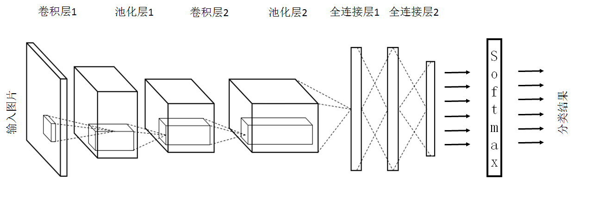
## 卷积层 Convolution
  - **单位节点矩阵** 指的是一个长和宽都为1，但深度不限的节点矩阵
  - **过滤器 filter** 将当前层神经网络上的一个 **子节点矩阵** 转化为下一层神经网络上的一个 **单位节点矩阵**，常用的过滤器尺寸有 3×3 或 5×5

    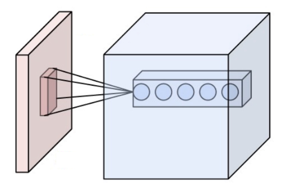
  - 过滤器的 **尺寸** 指的是一个过滤器输入节点矩阵的大小，而 **深度** 指的是输出单位节点矩阵的深度
  - 卷积层的参数个数和图片的大小无关，它只和过滤器的尺寸 / 深度以及当前层节点矩阵的深度有关，这使得卷积神经网络可以很好地扩展到更大的图像数据上
  - **卷积层前向传播过程** 将一个 2×2×3 的节点矩阵变化为一个 1×1×5 的单位节点矩阵，总共需要 2×2×3×5+5=65 个参数，其中 +5 为偏置项参数的个数

    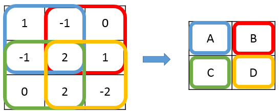

    可以在当前层矩阵的边界上加入 **全0填充 zero-padding**，使得卷积层前向传播结果矩阵的大小和当前层矩阵保持一致，避免尺寸的变化

    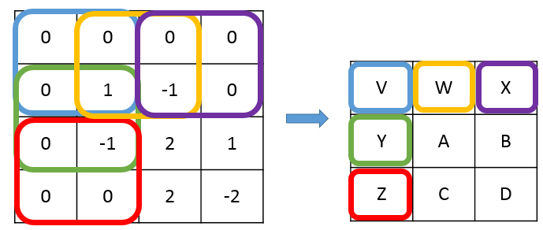

    还可以通过设置过滤器移动的步长来调整结果矩阵的大小，当移动步长为2且使用全0填充时，卷积层前向传播的过程

    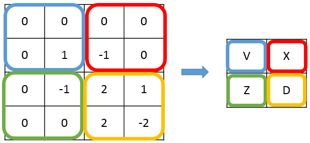
  - 在卷积神经网络中，**每一个卷积层中使用的过滤器中的参数都是一样的**，从直观上理解，共享过滤器的参数可以使得图像上的内容不受位置的影响
  - **tf.nn.conv2d 函数** 实现卷积层前向传播算法，根据 4 维 `input` 与 `filter` tensors，计算 2 维卷积
    ```python
    conv2d(input, filter, strides, padding, use_cudnn_on_gpu=True, data_format='NHWC', dilations=[1, 1, 1, 1], name=None)
    ```
    - **input** 设置输入张量的维度 `[batch, in_height, in_width, in_channels]`
    - **filter / kernel** 设置过滤器张量 `[filter_height, filter_width, in_channels, out_channels]`
    - **strides** 设置步长张量 `[1, stride, stride, 1]`, 要求 `strides[0] = strides[3] = 1`
    - **padding** `string` 类型，指定填充方式，`"SAME(zero-padding)", "VALID(none)"`
    - This op performs the following:
      - Flattens the filter to a 2-D matrix with shape `[filter_height * filter_width * in_channels, output_channels]`
      - Extracts image patches from the input tensor to form a *virtual* tensor of shape `[batch, out_height, out_width, filter_height * filter_width * in_channels]`
      - For each patch, right-multiplies the filter matrix and the image patch vector
  - **tf.nn.bias_add 函数** 给每一个节点加上偏置项
    ```python
    # Adds `bias` to `value`
    bias_add(value, bias, data_format=None, name=None)
    ```
  - **示例**
    ```python
    '''
    定义过滤器的权重向量
    过滤器尺寸: 5 x 5
    当前层节点矩阵深度: 3
    过滤器深度: 16
    '''
    filter_weight = tf.get_variable('weights', [5, 5, 3, 16], initializer=tf.truncated_normal_initializer(stddev=0.1))
    '''
    定义过滤器的偏置向量，大小等于过滤器的深度: 16
    '''
    biases = tf.get_variable('biases', [16], initializer=tf.constant_initializer(0.1))
    ''' tf.nn.conv2d 定义前向传播过程 '''
    input = tf.placeholder(tf.float32, [1, None, None, 3])
    conv = tf.nn.conv2d(input, filter_weight, strides=[1, 1, 1, 1], padding='SAME')
    ''' 添加偏置项 '''
    bias = tf.nn.bias_add(conv, biases)
    ''' 将计算结果通过 ReLU 激活函数去线性化 '''
    actived_conv = tf.nn.relu(bias)
    ```
## 池化层 Pooling
  - **池化层** 可以非常有效地缩小矩阵的尺寸，从而减少最后全连接层中的参数，既可以加快计算速度也有防止过拟合问题的作用
  - **池化层前向传播的过程** 也是通过移动一个类似过滤器的结构完成的，采用更加简单的最大值或者平均值运算，使用最大值操作的池化层被称之为 **最大池化层 max pooling**，使用平均值操作的池化层被称之为 **平均池化层 average pooling**
  - 卷积层使用的过滤器是横跨整个深度的，而池化层使用的过滤器只影响一个深度上的节点，所以池化层的过滤器除了在长和宽两个维度移动之外，还需要在深度这个维度移动
  - **池化层的过滤器** 需要设定 **过滤器的尺寸** / **是否使用全0填充** **过滤器移动的步长** 等，在实际应用中使用得最多的池化层过滤器尺寸为 [1,2,2,1] 或者 [1,3,3,1]
  - **tf.nn.max_pool 函数** 定义最大池化层的前向传播过程
    ```python
    max_pool(value, ksize, strides, padding, data_format='NHWC', name=None)
    ```
    - **value** A 4-D `Tensor` of the format specified by `data_format`
    - **ksize** 设置过滤器张量，包含四个元素的一维整数张量
    - **strides** 设置步长张量，包含四个元素的一维整数张量
    - **padding** `string` 类型，指定填充方式，`"SAME(zero-padding)", "VALID(none)"`
  - **tf.nn.avg_pool 函数** 实现平均池化层
  - **示例**
    ```python
    ''' 定义最大池化层 '''
    pool = tf.nn.max_pool(actived_conv, ksize=[1, 3, 3, 1], strides=[1, 2, 2, 1], padding='SAME')

    ''' 测试 '''
    tt = np.arange(48).reshape([-1, 4, 4, 3])
    sess = tf.InteractiveSession()
    tf.global_variables_initializer().run()
    tt.shape
    Out[28]: (1, 4, 4, 3)

    sess.run(actived_conv, feed_dict={input: tt}).shape
    Out[29]: (1, 4, 4, 16)

    sess.run(pool, feed_dict={input: tt}).shape
    Out[30]: (1, 2, 2, 16)
    ```
## TensorFlow-Slim 工具
  - **TensorFlow-Slim** 工具可以更加简洁地实现一个卷积神经网络
    ```python
    import tensorflow.contrib.slim as slim
    ```
  - **slim.conv2d** 添加一个卷积层，默认的激活函数 **relu**
    ```python
    # Adds an N-D convolution followed by an optional batch_norm layer
    # convolution(输入节点矩阵, 当前卷积层过滤器的深度, 过滤器的尺寸, ...)
    # kernel_size: 可以是一个数字，为过滤器的所有维度上指定为相同的数字
    convolution(inputs, num_outputs, kernel_size, stride=1, padding='SAME', ...)
    ```
    ```python
    input_x = tf.placeholder(tf.float32, [None, 28, 28, 1])

    # Tradition tensorflow API
    with tf.variable_scope('scope_name'):
        weights = tf.get_variable("weight", [3, 3, 1, 32])
        biases = tf.get_variable("bias", [32])
        conv = tf.nn.conv2d(input_x, weights, strides=[1, 1, 1, 1], padding='SAME')
        conv_relu = tf.nn.relu(tf.nn.bias_add(conv, biases))

    # slim.conv2d
    net = slim.conv2d(input_x, num_outputs=32, kernel_size=[3, 3], stride=1, padding='VALID')
    # Or
    net = slim.conv2d(input_x, 32, 3)
    ```
  - **slim.max_pool2d** 添加一个最大池化层
    ```python
    # Adds a 2D Max Pooling op
    # inputs: A 4-D tensor of shape `[batch_size, height, width, channels]`
    # kernel_size: A list of length 2: [kernel_height, kernel_width]. Can be an int if both values are the same.
    max_pool2d(inputs, kernel_size, stride=2, padding='VALID', data_format='NHWC', outputs_collections=None, scope=None)
    ```
    ```python
    # Tradition tensorflow API
    with tf.variable_scope('scope_name'):
        pool = tf.nn.max_pool(conv_relu, ksize=[1, 3, 3, 1], strides=[1, 2, 2, 1], padding='SAME')

    # slim.avg_pool2d
    net = slim.avg_pool2d(net, kernel_size=3, stride=2)
    ```
  - **slim.fully_connected** 添加一个全连接层，默认的激活函数 **relu**
    ```python
    fully_connected(inputs, num_outputs,
            activation_fn=<function relu at 0x7fce8ed61378>,
            normalizer_fn=None, normalizer_params=None,
            weights_initializer=<function variance_scaling_initializer.<locals>._initializer at 0x7fce59d6fea0>,
            weights_regularizer=None,
            biases_initializer=<tensorflow.python.ops.init_ops.Zeros object at 0x7fce59d72a90>,
            biases_regularizer=None,
            reuse=None,
            variables_collections=None,
            outputs_collections=None,
            trainable=True,
            scope=None)
    ```
    ```python
    net = slim.fully_connected(net, num_outputs=2, activation_fn=None, biases_initializer=tf.zeros_initializer(), scope='fc')
    ```
  - **slim.dropout** 添加一层 dropout
    ```python
    dropout(inputs, keep_prob=0.5, noise_shape=None, is_training=True, outputs_collections=None, scope=None, seed=None)
    ```
    ```python
    net = slim.dropout(net, 0.5, scope='dropout')
    ```
  - **slim.lrn** 添加一个 lrn 层，在 alexnet 中使用
    ```python
    lrn(input, depth_radius=5, bias=1, alpha=1, beta=0.5, name=None)
    ```
  - **slim.arg_scope** 设置指定列表中函数的默认参数取值
      ```python
      # Stores the default arguments for the given set of list_ops.
      # list_ops_or_scope: List or tuple of operations to set argument scope for.
      # list_ops_or_scope could also be a dict, in this case, kwargs must be empty.
      # *kwargs: keyword=value that will define the defaults for each op in list_ops
      arg_scope(list_ops_or_scope, **kwargs)
      ```
      ```python
      # define list_ops_or_scope as a list
      with slim.arg_scope([slim.conv2d, slim.max_pool2d, slim.avg_pool2d], stride=1, padding='SAME'):
          # define slim operations

      # define list_ops_or_scope as a dict [ ??? ]
      with slim.arg_scope({slim.conv2d: {'stride': 1, 'padding': 'SAME'}, slim.fully_connected: {'activation_fn': None}}):
          # define slim operations
      ```
## 卷积神经网络经典架构
  - 用于图片分类问题的卷积神经网络经典架构
    ```java
    输入层 -> (卷积层 * k -> [池化层]) * m -> 全连接层 * n -> 输出层
    ```
    - 大部分卷积神经网络中一般最多连续使用三层 **卷积层**
    - 有些卷积神经网络中没有 **池化层**，池化层虽然可以起到减少参数防止过拟合问题，但是在部分论文中也发现可以直接通过调整卷积层步长来完成
    - 在多轮卷积层和池化层之后，卷神经网络在输出之前一般会经过 1~2 个 **全连接层**
    - 2012 年 ImageNet ILSVRC 图像分类挑战的第一名 **AlexNet 模型** / 2013 年 ILSVRC 第一名 **ZF Net 模型** / 2014 年第二名 **VGGNet 模型** 的架构都满足该经典架构
  - VGGNet 论文 Very Deep Convolutional Networks for Large-Scale Image Recognition 中作者尝试过的不同卷积神经网络架构

    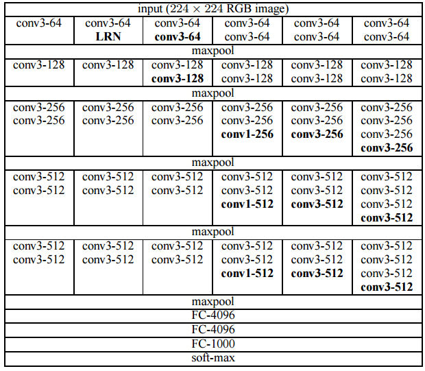

    - 其中 **conv*** 表示卷积层，**maxpool** 表示池化层，**FC-*** 表示全连接层，**soft-max** 为softmax 结构
    - **convX-Y** 表示过滤器的边长为 X，深度为 Y，conv3-64 表示过滤器的长和宽都为 3，深度为 64
    - **过滤器边长** 一般为 3 或者 1，一般卷积层的过滤器边长不会超过 5
    - **过滤器的深度** 大部分卷积神经网络都采用 **逐层递增** 的方式，每经过一次池化层之后，卷积层过滤器的深度会乘以 2，不同的模型会选择使用不同的具体数字
    - **卷积层的步长** 一般为 1，有些模型中也会使用 2，或者 3 作为步长
    - **池化层** 的配置相对简单，用的最多的是 **最大池化层**
    - **池化层的过滤器边长** 一般为 2 或者 3，**步长** 也一般为 2 或者 3
## LeNet-5 模型
  - **LeNet-5 模型** 是 Yann LeCun 教授于 1998 年在论文 Gradient-based learning applied to document recognition 中提出的，是第一个成功应用于数字识别问题的卷积神经网络，LeNet-5 模型可以达到大约 99.2% 的正确率
  - **LeNet-5 模型** 无法很好地处理类似 ImageNet 这样比较大的图像数据集，总共有 7 层结构

    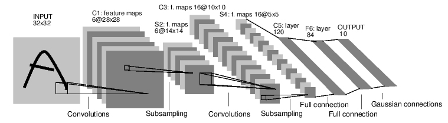
  - **第一层 卷积层**
    - 输入是原始的图像像素，输入层大小为 32×32×1
    - 过滤器尺寸为 5×5，深度为 6，不使用全 0 填充，步长为 1
    - 输出尺寸为 32-5+1=28，深度为 6
    - 参数总共有 5×5×1×6+6=156 个，其中 6 个为偏置项参数
    - 因为下一层的节点矩阵有 28×28×6=4704 个节点，每个节点和 5×5=25 个当前层节点相连，所以本层卷积层总共有 4704×（25+1）=122304 个连接
  - **第二层 池化层**
    - 输入为第一层的输出，大小为 28×28×6
    - 过滤器大小为 2×2，长和宽的步长均为 2
    - 输出矩阵大小为 14×14×6
  - **第三层 卷积层**
    - 输入矩阵大小为 14×14×6
    - 过滤器大小为 5×5，深度为16，不使用全 0 填充，步长为 1
    - 输出矩阵大小为 10×10×16
    - 按照标准的卷积层，本层应该有 5×5×6×16+16=2416 个参数，10×10×16×(25+1)=41600 个连接
  - **第四层 池化层**
    - 输入矩阵大小为 10×10×16
    - 过滤器大小为 2×2，步长为 2
    - 输出矩阵大小为 5×5×16
  - **第五层 全连接层**
    - 输入矩阵大小为 5×5×16
    - 在 LeNet-5 模型的论文中将这一层称为卷积层，但是因为过滤器的大小就是 5×5，所以和全连接层没有区别
    - 输出节点个数为 120
    - 参数总共有5×5×16×120+120=48120个
  - **第六层 全连接层**
    - 输入节点个数为 120 个
    - 输出节点个数为 84 个
    - 参数总共为 120×84+84=10164 个
  - **第七层 全连接层**
    - 输入节点个数为 84 个
    - 输出节点个数为 10 个
    - 参数总共为 84×10+10=850 个
## python 实现 LeNet-5 模型
  - **LeNet5_inference.py** 定义前向传播过程，实现卷积网络
    ```python
    import tensorflow as tf

    INPUT_NODE = 784
    OUTPUT_NODE = 10

    IMAGE_SIZE = 28
    NUM_CHANNELS = 1
    NUM_LABELS = 10

    CONV1_DEEP = 32
    CONV1_SIZE = 5

    CONV2_DEEP = 64
    CONV2_SIZE = 5

    FC_SIZE = 512

    def inference(input_tensor, train, regularizer):
        with tf.variable_scope('layer1-conv1'):
            conv1_weights = tf.get_variable(
                "weight", [CONV1_SIZE, CONV1_SIZE, NUM_CHANNELS, CONV1_DEEP],
                initializer=tf.truncated_normal_initializer(stddev=0.1))
            conv1_biases = tf.get_variable("bias", [CONV1_DEEP], initializer=tf.constant_initializer(0.0))
            conv1 = tf.nn.conv2d(input_tensor, conv1_weights, strides=[1, 1, 1, 1], padding='SAME')
            relu1 = tf.nn.relu(tf.nn.bias_add(conv1, conv1_biases))

        with tf.name_scope("layer2-pool1"):
            pool1 = tf.nn.max_pool(relu1, ksize = [1,2,2,1],strides=[1,2,2,1],padding="SAME")

        with tf.variable_scope("layer3-conv2"):
            conv2_weights = tf.get_variable(
                "weight", [CONV2_SIZE, CONV2_SIZE, CONV1_DEEP, CONV2_DEEP],
                initializer=tf.truncated_normal_initializer(stddev=0.1))
            conv2_biases = tf.get_variable("bias", [CONV2_DEEP], initializer=tf.constant_initializer(0.0))
            conv2 = tf.nn.conv2d(pool1, conv2_weights, strides=[1, 1, 1, 1], padding='SAME')
            relu2 = tf.nn.relu(tf.nn.bias_add(conv2, conv2_biases))

        with tf.name_scope("layer4-pool2"):
            pool2 = tf.nn.max_pool(relu2, ksize=[1, 2, 2, 1], strides=[1, 2, 2, 1], padding='SAME')
            pool_shape = pool2.get_shape().as_list()
            nodes = pool_shape[1] * pool_shape[2] * pool_shape[3]
            reshaped = tf.reshape(pool2, [pool_shape[0], nodes])

        with tf.variable_scope('layer5-fc1'):
            fc1_weights = tf.get_variable("weight", [nodes, FC_SIZE],
                                          initializer=tf.truncated_normal_initializer(stddev=0.1))
            if regularizer != None: tf.add_to_collection('losses', regularizer(fc1_weights))
            fc1_biases = tf.get_variable("bias", [FC_SIZE], initializer=tf.constant_initializer(0.1))

            fc1 = tf.nn.relu(tf.matmul(reshaped, fc1_weights) + fc1_biases)
            if train: fc1 = tf.nn.dropout(fc1, 0.5)

        with tf.variable_scope('layer6-fc2'):
            fc2_weights = tf.get_variable("weight", [FC_SIZE, NUM_LABELS],
                                          initializer=tf.truncated_normal_initializer(stddev=0.1))
            if regularizer != None: tf.add_to_collection('losses', regularizer(fc2_weights))
            fc2_biases = tf.get_variable("bias", [NUM_LABELS], initializer=tf.constant_initializer(0.1))
            logit = tf.matmul(fc1, fc2_weights) + fc2_biases

        return logit
    ```
  - **LeNet5_train.py** 模型训练，与全连接网络类似，只需要调整 **输入张量的维度**，以及 **学习率**
    ```python
    import tensorflow as tf
    from tensorflow.examples.tutorials.mnist import input_data
    import LeNet5_inference
    import os
    import numpy as np

    REGULARIZATION_RATE = 0.0001
    MOVING_AVERAGE_DECAY = 0.99
    LEARNING_RATE_BASE = 0.01 # 需要使用更小的学习率
    LEARNING_RATE_DECAY = 0.99
    TRAINING_STEPS = 10000
    BATCH_SIZE = 100
    MODEL_SAVE_PATH = './mnist_model_check_point'
    MODEL_NAME = 'mnist_model'

    def train(mnist):
        # 定义输入为 4 维矩阵的 placeholder
        x = tf.placeholder(tf.float32, [
                BATCH_SIZE,
                LeNet5_inference.IMAGE_SIZE,
                LeNet5_inference.IMAGE_SIZE,
                LeNet5_inference.NUM_CHANNELS],
            name='x-input')
        y_ = tf.placeholder(tf.float32, [None, LeNet5_inference.OUTPUT_NODE], name='y-input')

        regularizer = tf.contrib.layers.l2_regularizer(REGULARIZATION_RATE)
        y = LeNet5_inference.inference(x, False, regularizer)
        global_step = tf.Variable(0, trainable=False)

        # 滑动平均值
        variable_averages = tf.train.ExponentialMovingAverage(MOVING_AVERAGE_DECAY, global_step)
        variables_averages_op = variable_averages.apply(tf.trainable_variables())

        # 损失函数 Loss
        cross_entropy = tf.nn.sparse_softmax_cross_entropy_with_logits(logits=y, labels=tf.argmax(y_, 1))
        cross_entropy_mean = tf.reduce_mean(cross_entropy)
        loss = cross_entropy_mean + tf.add_n(tf.get_collection('losses'))

        # 指数衰减学习率
        learning_rate = tf.train.exponential_decay( LEARNING_RATE_BASE, global_step,
                            mnist.train.num_examples / BATCH_SIZE, LEARNING_RATE_DECAY,
                            staircase=True)

        # 合并参数训练与滑动平均操作
        train_step = tf.train.GradientDescentOptimizer(learning_rate).minimize(loss, global_step=global_step)
        with tf.control_dependencies([train_step, variables_averages_op]):
            train_op = tf.no_op(name='train')

        # 持久化
        saver = tf.train.Saver()
        with tf.Session() as sess:
            tf.global_variables_initializer().run()
            for i in range(TRAINING_STEPS):
                xs, ys = mnist.train.next_batch(BATCH_SIZE)

                reshaped_xs = np.reshape(xs, (
                    BATCH_SIZE,
                    LeNet5_inference.IMAGE_SIZE,
                    LeNet5_inference.IMAGE_SIZE,
                    LeNet5_inference.NUM_CHANNELS))
                _, loss_value, step = sess.run([train_op, loss, global_step], feed_dict={x: reshaped_xs, y_: ys})

                if i % 500 == 0:
                    print("After %d training step(s), loss on training batch is %g." % (step, loss_value))
                    # 指定 global_step 参数，可以在模型文件名末尾加上训练轮数
                    saver.save(sess, os.path.join(MODEL_SAVE_PATH, MODEL_NAME), global_step=global_step)

    def main(argv=None):
        mnist = input_data.read_data_sets('../MNIST_data', one_hot=True)
        train(mnist)

    if __name__ == '__main__':
        main()
    ```
  - **LeNet5_eval.py** 测试过程，与全连接网络类似，需要调整 **输入张量的维度**
    ```python
    import os
    import tensorflow as tf
    from tensorflow.examples.tutorials.mnist import input_data
    import LeNet5_inference
    import LeNet5_train
    import time
    import numpy as np

    EVAL_INTERVAL_SECS = 10

    def evaluate(mnist):
        # 定义输入为 4 维矩阵的 placeholder
        x = tf.placeholder(tf.float32, [
                LeNet5_train.BATCH_SIZE,
                LeNet5_inference.IMAGE_SIZE,
                LeNet5_inference.IMAGE_SIZE,
                LeNet5_inference.NUM_CHANNELS],
            name='x-input')
        y_ = tf.placeholder(tf.float32, [None, LeNet5_inference.OUTPUT_NODE], name='y-input')

        # 测试过程不关注正则化损失
        y = LeNet5_inference.inference(x, False, None)

        # 计算正确率
        correct_prediction = tf.equal(tf.argmax(y, 1), tf.argmax(y_, 1))
        accuracy = tf.reduce_mean(tf.cast(correct_prediction, tf.float32))

        # 滑动平均模型，生成 Saver 用的字典
        variable_average = tf.train.ExponentialMovingAverage(LeNet5_train.MOVING_AVERAGE_DECAY)
        variables_to_restore = variable_average.variables_to_restore()
        saver = tf.train.Saver(variables_to_restore)

        validate_batch_num = int(mnist.validation.images.shape[0] / LeNet5_train.BATCH_SIZE)
        while True:
            with tf.Session() as sess:
                ckpt = tf.train.get_checkpoint_state(LeNet5_train.MODEL_SAVE_PATH)
                if ckpt and ckpt.model_checkpoint_path:
                    saver.restore(sess, ckpt.model_checkpoint_path)
                    # 通过文件名得到模型保存时迭代的轮数
                    global_step = ckpt.model_checkpoint_path.split('/')[-1].split('-')[-1]

                    accuracy_list = []
                    for _ in range(validate_batch_num):
                        xs, ys = mnist.validation.next_batch(LeNet5_train.BATCH_SIZE)
                        reshaped_xs = np.reshape(xs, (
                            LeNet5_train.BATCH_SIZE,
                            LeNet5_inference.IMAGE_SIZE,
                            LeNet5_inference.IMAGE_SIZE,
                            LeNet5_inference.NUM_CHANNELS))
                        validate_feed = {x: reshaped_xs, y_: ys}

                        accuracy_score = sess.run(accuracy, feed_dict={x: reshaped_xs, y_: ys})
                        accuracy_list.append(accuracy_score)
                    print("Trained step = %s, accuracy = %g" % (global_step, np.mean(accuracy_list)))
                else:
                    print('Checkpoint file not found')
                    return
            time.sleep(EVAL_INTERVAL_SECS)

    def main(argv=None):
        mnist = input_data.read_data_sets('../MNIST_data', one_hot=True)
        evaluate(mnist)

    if __name__ == '__main__':
        tf.app.run()
    ```
  - **运行结果**
    ```python
    $ python mnist_train.py
    After 1 training step(s), loss on training batch is 6.2325.
    After 501 training step(s), loss on training batch is 0.874738.
    After 1001 training step(s), loss on training batch is 0.690196.
    After 1501 training step(s), loss on training batch is 0.700495.
    After 2001 training step(s), loss on training batch is 0.660965.
    After 2501 training step(s), loss on training batch is 0.64701.
    After 3001 training step(s), loss on training batch is 0.700834.
    After 3501 training step(s), loss on training batch is 0.679096.

    $ python mnist_eval.py
    Trained step = 1, accuracy = 0.0796
    Trained step = 501, accuracy = 0.9472
    Trained step = 1001, accuracy = 0.9624
    Trained step = 1501, accuracy = 0.969
    Trained step = 2001, accuracy = 0.9736
    Trained step = 2501, accuracy = 0.9764
    Trained step = 3001, accuracy = 0.9778
    Trained step = 3501, accuracy = 0.9792
    Trained step = 4001, accuracy = 0.979
    Trained step = 4501, accuracy = 0.9822
    Trained step = 5001, accuracy = 0.9816
    Trained step = 5501, accuracy = 0.9828
    Trained step = 6001, accuracy = 0.9826
    Trained step = 6501, accuracy = 0.984
    Trained step = 7001, accuracy = 0.985
    Trained step = 7501, accuracy = 0.9856
    Trained step = 8001, accuracy = 0.985
    Trained step = 8501, accuracy = 0.9868
    Trained step = 9001, accuracy = 0.9862
    Trained step = 9501, accuracy = 0.9876
    ```
## Inception-v3 模型
  - 在 LeNet-5 模型中，不同卷积层通过串联的方式连接在一起，而 Inception-v3 模型中的 Inception 结构是将 **不同的卷积层通过并联的方式** 结合在一起，同时使用所有不同尺寸的过滤器，然后再将得到的矩阵 **在深度维度上** 拼接起来

    
  - **Inception-v3 模型架构图** Inception-v3 模型总共有46层，由 11 个 Inception 模块组成，共有 96 个卷积层

    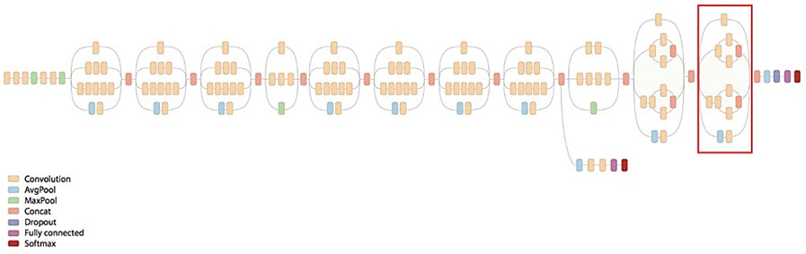

  - **python 实现一个 Inception 模块** (红色方框中的)
    ```python
    import tensorflow.contrib.slim as slim
    input_x = tf.placeholder(tf.float32, [None, 28, 28, 1])

    with slim.arg_scope([slim.conv2d, slim.max_pool2d, slim.avg_pool2d], stride=1, padding='SAME'):
        # 假设输入图片经过之前的神经网络前向传播的结果保存在变量 net 中
        net = input_x
        # Inception 模块量命名空间
        with tf.variable_scope('Mixed_7c'):
            # Inception 模块中第一条路径的命名空间
            with tf.variable_scope('Branch_0'):
                # 定义一个过滤器边长为 1，深度为 320 的卷积层
                branch_0 = slim.conv2d(net, 320, 1, scope='Conv2d_0a_1x1')

            # Inception 模块中第二条路径，这条计算路径上的结构本身也是一个 Inception 结构
            with tf.variable_scope('Branch_1'):
                branch_1 = slim.conv2d(net, 384, 1, scope='Conv2d_0a_1x1')
                branch_1 = tf.concat([
                    # 此处2层卷积层的输入都是 branch_1 而不是 net
                    slim.conv2d(branch_1, 384, [1, 3], scope='Conv2d_0b_1x3'),
                    slim.conv2d(branch_1, 384, [3, 1], scope='Conv2d_0c_3x1')], 3)

            # Inception 模块中第三条路径，是一个 Inception 结构
            with tf.variable_scope('Branch_2'):
                branch_2 = slim.conv2d(net, 448, 1, scope='Conv2d_0a_1x1')
                branch_2 = slim.conv2d(branch_2, 384, 3, scope='Conv2d_0b_3x3')
                branch_2 = tf.concat([
                    slim.conv2d(branch_2, 384, [1, 3], scope='Conv2d_0c_1x3'),
                    slim.conv2d(branch_2, 384, [3, 1], scope='Conv2d_0d_3x1')], 3)

            # Inception 模块中第四条路径
            with tf.variable_scope('Branch_3'):
                branch_3 = slim.avg_pool2d(net, 3, scope='AvgPool_0a_3x3')
                branch_3 = slim.conv2d(branch_3, 192, 1, scope='Conv2d_0b_1x1')

            # 当前 Inception 模块的最后输出是由上面四个计算结果拼接得到的
            net = tf.concat([branch_0, branch_1, branch_2, branch_3], 3)
    ```
***

# 卷积神经网络迁移学习
## 迁移学习 Transfer Learning
  - **迁移学习** 将一个问题上训练好的模型通过简单的调整使其适用于一个新的问题
  - 一般来说，在数据量足够的情况下，迁移学习的效果不如完全重新训练，但是迁移学习所需要的训练时间和训练样本数要远远小于训练完整的模型
  - 根据论文 **DeCAF: A Deep Convolutional Activation Feature for Generic Visual Recognition** 中的结论，可以保留训练好的 **Inception-v3 模型** 中所有卷积层的参数，只是替换最后一层全连接层，在最后这一层全连接层之前的网络层称之为 **瓶颈层 bottleneck**
  - 在训练好的 Inception-v3 模型中，将 **瓶颈层的输出** 再通过一个 **单层的全连接层神经网络** 可以很好地区分1000种类别的图像，可以认为 **瓶颈层输出的节点向量** 可以被作为任何图像的一个 **更加精简且表达能力更强的特征向量**，在新数据集上，可以直接利用这个训练好的神经网络对图像进行 **特征提取**
## > TensorFlow 实现迁移学习
  - [训练好的 inception_dec_2015 模型](https://storage.googleapis.com/download.tensorflow.org/models/inception_dec_2015.zip)
  - [flower photos 数据集](http://download.tensorflow.org/example_images/flower_photos.tgz)
    - 解压之后的文件夹包含了5个子文件夹，每一个子文件夹的名称为一种花的名称，平均每一种花有734张图片
  ```python
  import glob
  import os.path
  import random
  import numpy as np
  import tensorflow as tf
  from tensorflow.python.platform import gfile

  # #### 1. 模型和样本路径的设置
  BOTTLENECK_TENSOR_SIZE = 2048
  BOTTLENECK_TENSOR_NAME = 'pool_3/_reshape:0'
  JPEG_DATA_TENSOR_NAME = 'DecodeJpeg/contents:0'

  MODEL_DIR = '/home/leondgarse/workspace/Deep_Learning_with_TensorFlow/datasets/inception_dec_2015'
  MODEL_FILE= 'tensorflow_inception_graph.pb'

  CACHE_DIR = '../../datasets/bottleneck'
  INPUT_DATA = '/home/leondgarse/workspace/Deep_Learning_with_TensorFlow/datasets/flower_photos'

  VALIDATION_PERCENTAGE = 10
  TEST_PERCENTAGE = 10

  # #### 2. 神经网络参数的设置
  LEARNING_RATE = 0.01
  STEPS = 4000
  BATCH = 100

  # #### 3. 把样本中所有的图片列表并按训练、验证、测试数据分开
  def create_image_lists(testing_percentage, validation_percentage):

      result = {}
      sub_dirs = [x[0] for x in os.walk(INPUT_DATA)]
      is_root_dir = True
      for sub_dir in sub_dirs:
          if is_root_dir:
              is_root_dir = False
              continue

          extensions = ['jpg', 'jpeg', 'JPG', 'JPEG']

          file_list = []
          dir_name = os.path.basename(sub_dir)
          for extension in extensions:
              file_glob = os.path.join(INPUT_DATA, dir_name, '*.' + extension)
              file_list.extend(glob.glob(file_glob))
          if not file_list: continue

          label_name = dir_name.lower()

          # 初始化
          training_images = []
          testing_images = []
          validation_images = []
          for file_name in file_list:
              base_name = os.path.basename(file_name)

              # 随机划分数据
              chance = np.random.randint(100)
              if chance < validation_percentage:
                  validation_images.append(base_name)
              elif chance < (testing_percentage + validation_percentage):
                  testing_images.append(base_name)
              else:
                  training_images.append(base_name)

          result[label_name] = {
              'dir': dir_name,
              'training': training_images,
              'testing': testing_images,
              'validation': validation_images,
              }
      return result

  # #### 4. 定义函数通过类别名称、所属数据集和图片编号获取一张图片的地址
  def get_image_path(image_lists, image_dir, label_name, index, category):
      label_lists = image_lists[label_name]
      category_list = label_lists[category]
      mod_index = index % len(category_list)
      base_name = category_list[mod_index]
      sub_dir = label_lists['dir']
      full_path = os.path.join(image_dir, sub_dir, base_name)
      return full_path

  # #### 5. 定义函数获取Inception-v3模型处理之后的特征向量的文件地址
  def get_bottleneck_path(image_lists, label_name, index, category):
      return get_image_path(image_lists, CACHE_DIR, label_name, index, category) + '.txt'

  # #### 6. 定义函数使用加载的训练好的Inception-v3模型处理一张图片，得到这个图片的特征向量
  def run_bottleneck_on_image(sess, image_data, image_data_tensor, bottleneck_tensor):

      bottleneck_values = sess.run(bottleneck_tensor, {image_data_tensor: image_data})

      bottleneck_values = np.squeeze(bottleneck_values)
      return bottleneck_values

  # #### 7. 定义函数会先试图寻找已经计算且保存下来的特征向量，如果找不到则先计算这个特征向量，然后保存到文件
  def get_or_create_bottleneck(sess, image_lists, label_name, index, category, jpeg_data_tensor, bottleneck_tensor):
      label_lists = image_lists[label_name]
      sub_dir = label_lists['dir']
      sub_dir_path = os.path.join(CACHE_DIR, sub_dir)
      if not os.path.exists(sub_dir_path): os.makedirs(sub_dir_path)
      bottleneck_path = get_bottleneck_path(image_lists, label_name, index, category)
      if not os.path.exists(bottleneck_path):

          image_path = get_image_path(image_lists, INPUT_DATA, label_name, index, category)

          image_data = gfile.FastGFile(image_path, 'rb').read()

          bottleneck_values = run_bottleneck_on_image(sess, image_data, jpeg_data_tensor, bottleneck_tensor)

          bottleneck_string = ','.join(str(x) for x in bottleneck_values)
          with open(bottleneck_path, 'w') as bottleneck_file:
              bottleneck_file.write(bottleneck_string)
      else:

          with open(bottleneck_path, 'r') as bottleneck_file:
              bottleneck_string = bottleneck_file.read()
          bottleneck_values = [float(x) for x in bottleneck_string.split(',')]

      return bottleneck_values

  # #### 8. 这个函数随机获取一个batch的图片作为训练数据
  def get_random_cached_bottlenecks(sess, n_classes, image_lists, how_many, category, jpeg_data_tensor, bottleneck_tensor):
      bottlenecks = []
      ground_truths = []
      for _ in range(how_many):
          label_index = random.randrange(n_classes)
          label_name = list(image_lists.keys())[label_index]
          image_index = random.randrange(65536)
          bottleneck = get_or_create_bottleneck(
              sess, image_lists, label_name, image_index, category, jpeg_data_tensor, bottleneck_tensor)
          ground_truth = np.zeros(n_classes, dtype=np.float32)
          ground_truth[label_index] = 1.0
          bottlenecks.append(bottleneck)
          ground_truths.append(ground_truth)

      return bottlenecks, ground_truths

  # #### 9. 这个函数获取全部的测试数据，并计算正确率
  def get_test_bottlenecks(sess, image_lists, n_classes, jpeg_data_tensor, bottleneck_tensor):
      bottlenecks = []
      ground_truths = []
      label_name_list = list(image_lists.keys())
      for label_index, label_name in enumerate(label_name_list):
          category = 'testing'
          for index, unused_base_name in enumerate(image_lists[label_name][category]):
              bottleneck = get_or_create_bottleneck(sess, image_lists, label_name, index, category,jpeg_data_tensor, bottleneck_tensor)
              ground_truth = np.zeros(n_classes, dtype=np.float32)
              ground_truth[label_index] = 1.0
              bottlenecks.append(bottleneck)
              ground_truths.append(ground_truth)
      return bottlenecks, ground_truths

  # #### 10. 定义主函数
  def main():
      image_lists = create_image_lists(TEST_PERCENTAGE, VALIDATION_PERCENTAGE)
      n_classes = len(image_lists.keys())

      # 读取已经训练好的Inception-v3模型。
      with gfile.FastGFile(os.path.join(MODEL_DIR, MODEL_FILE), 'rb') as f:
          graph_def = tf.GraphDef()
          graph_def.ParseFromString(f.read())
      bottleneck_tensor, jpeg_data_tensor = tf.import_graph_def(
          graph_def, return_elements=[BOTTLENECK_TENSOR_NAME, JPEG_DATA_TENSOR_NAME])

      # 定义新的神经网络输入
      bottleneck_input = tf.placeholder(tf.float32, [None, BOTTLENECK_TENSOR_SIZE], name='BottleneckInputPlaceholder')
      ground_truth_input = tf.placeholder(tf.float32, [None, n_classes], name='GroundTruthInput')

      # 定义一层全链接层
      with tf.name_scope('final_training_ops'):
          weights = tf.Variable(tf.truncated_normal([BOTTLENECK_TENSOR_SIZE, n_classes], stddev=0.001))
          biases = tf.Variable(tf.zeros([n_classes]))
          logits = tf.matmul(bottleneck_input, weights) + biases
          final_tensor = tf.nn.softmax(logits)

      # 定义交叉熵损失函数。
      cross_entropy = tf.nn.softmax_cross_entropy_with_logits_v2(logits=logits, labels=ground_truth_input)
      cross_entropy_mean = tf.reduce_mean(cross_entropy)
      train_step = tf.train.GradientDescentOptimizer(LEARNING_RATE).minimize(cross_entropy_mean)

      # 计算正确率。
      with tf.name_scope('evaluation'):
          correct_prediction = tf.equal(tf.argmax(final_tensor, 1), tf.argmax(ground_truth_input, 1))
          evaluation_step = tf.reduce_mean(tf.cast(correct_prediction, tf.float32))

      with tf.Session() as sess:
          init = tf.global_variables_initializer()
          sess.run(init)
          # 训练过程。
          for i in range(STEPS):

              train_bottlenecks, train_ground_truth = get_random_cached_bottlenecks(
                  sess, n_classes, image_lists, BATCH, 'training', jpeg_data_tensor, bottleneck_tensor)
              sess.run(train_step, feed_dict={bottleneck_input: train_bottlenecks, ground_truth_input: train_ground_truth})

              if i % 100 == 0 or i + 1 == STEPS:
                  validation_bottlenecks, validation_ground_truth = get_random_cached_bottlenecks(
                      sess, n_classes, image_lists, BATCH, 'validation', jpeg_data_tensor, bottleneck_tensor)
                  validation_accuracy = sess.run(evaluation_step, feed_dict={
                      bottleneck_input: validation_bottlenecks, ground_truth_input: validation_ground_truth})
                  print('Step %d: Validation accuracy on random sampled %d examples = %.1f%%' %
                      (i, BATCH, validation_accuracy * 100))

          # 在最后的测试数据上测试正确率。
          test_bottlenecks, test_ground_truth = get_test_bottlenecks(
              sess, image_lists, n_classes, jpeg_data_tensor, bottleneck_tensor)
          test_accuracy = sess.run(evaluation_step, feed_dict={
              bottleneck_input: test_bottlenecks, ground_truth_input: test_ground_truth})
          print('Final test accuracy = %.1f%%' % (test_accuracy * 100))

  if __name__ == '__main__':
      main()
  ```
  ```python
  $ python inception_3_move.py
  Step 0: Validation accuracy on random sampled 100 examples = 27.0%
  Step 100: Validation accuracy on random sampled 100 examples = 85.0%
  Step 200: Validation accuracy on random sampled 100 examples = 90.0%
  Step 300: Validation accuracy on random sampled 100 examples = 94.0%
  ...
  Step 3000: Validation accuracy on random sampled 100 examples = 92.0%
  Step 3999: Validation accuracy on random sampled 100 examples = 97.0%
  Final test accuracy = 91.1%
  ```
***

# 图像数据处理
  - TFRecord 文件中的数据都是通过 tf.train.Example Protocol Buffer 的格式存储的
## 图像读取 与 编解码
  - **tf.image.decode_jpeg** / **tf.image.encode_jpeg** 图片读取 / 显示 / 保存
    ```python
    import skimage
    import skimage.data

    skimage.io.imsave('./coffee.jpg', skimage.data.coffee())

    ''' 读取 '''
    image_raw_data = tf.gfile.FastGFile('./coffee.jpg', 'rb').read()
    sess = tf.InteractiveSession()
    img_data = tf.image.decode_jpeg(image_raw_data)
    img_data.eval().shape
    # Out[1]: (400, 600, 3)

    ''' 显示 '''
    plt.imshow(img_data.eval())

    ''' 保存 '''
    # encode_jpeg 需要的图片数据类型为 uint8
    encoding_image = tf.image.encode_jpeg(img_data)

    with tf.gfile.GFile('out.jpg', 'wb') as f:
        f.write(encoding_image.eval())
    ```
  - **tf.image.convert_image_dtype** 数据类型转化，一般转化方法需要图片数据类型为 float
    ```python
    img_data_2 = tf.image.convert_image_dtype(img_data, dtype=tf.float32)
    ```
  - **tf.image.decode_image** 图片解码
    ```python
    # decode_image 解码
    image_array = tf.image.decode_image(image_raw_data).eval()

    # is_jpeg 判断图片格式，选择 jpg / png
    if tf.image.is_jpeg(image_raw_data).eval():
        image_array = tf.image.decode_jpeg(image_raw_data).eval()
    else:
        image_array = tf.image.decode_jpeg(image_raw_data).eval()
    ```
    ```python
    def tf_imread(image_path):
        with tf.Session() as sess:
            image_raw_data = tf.gfile.FastGFile(image_path, 'rb').read()
            image_array = tf.image.decode_image(image_raw_data)
            return image_array.eval()
    ```
## 图像大小调整
  - 神经网络输入节点的个数是固定的，在将图像的像素作为输入提供给神经网络之前，需要先将图像的大小统一
  - **tf.image.resize_images** 调整图片大小
    ```python
    resized = tf.image.resize_images(img_data_2, [300, 300], method=0)
    resized.get_shape()
    # Out[18]: TensorShape([Dimension(300), Dimension(300), Dimension(None)])
    plt.imshow(resized.eval())
    ```
    - **method 参数** 取值与相对应的图像大小调整算法
      - **0** 双线性插值法 Bilinear interpolation
      - **1** 最近邻居法 Nearest neighbor interpolation
      - **2** 双三次插值法 Bicubic interpolation
      - **3** 面积插值法 Area interpolation
  - **tf.image.resize_image_with_crop_or_pad** 裁剪与填充
    ```python
    # 裁剪到目标大小
    cropped = tf.image.resize_image_with_crop_or_pad(img_data_2, 200, 200)
    plt.imshow(cropped.eval())

    # 填充到目标大小
    padded = tf.image.resize_image_with_crop_or_pad(img_data_2, 1000, 1000)
    plt.imshow(padded.eval())
    ```
  - **tf.image.central_crop** 通过比例调整图像大小
    ```python
    central_cropped = tf.image.central_crop(img_data_2, 0.5)
    plt.imshow(central_cropped.eval())
    ```
  - **tf.image.crop_to_bounding_box / pad_to_bounding_box** 将图片 裁剪 / 填充 到指定的像素位置 bounding_box
    ```python
    crop_to_bounding_box(image, offset_height, offset_width, target_height, target_width)
    pad_to_bounding_box(image, offset_height, offset_width, target_height, target_width)
    ```
    - **左上角位置** `offset_height, offset_width`
    - **右下角位置** `offset_height + target_height, offset_width + target_width`
    ```python
    cropped_2 = tf.image.crop_to_bounding_box(img_data_2, 100, 150, 100, 200)
    plt.imshow(cropped_2.eval())

    padded = tf.image.pad_to_bounding_box(img_data_2, 50, 100, 500, 800)
    plt.imshow(padded.eval())
    ```
  - **tf.image.crop_and_resize** 将一组图片裁剪并调整到指定大小
    ```python
    crop_and_resize(image, boxes, box_ind, crop_size, method='bilinear', extrapolation_value=0, name=None)
    ```
    - **image** 4-D 张量 `[batch, image_height, image_width, depth]`
    - **boxes** 2-D 张量 `[num_boxes, 4]`，其中每一个坐标是一个标准化后的坐标 normalized coordinates `[y1, x1, y2, x2]`
    - **box_ind** 1-D 张量 `[num_boxes]`，int32 类型值，取值在 `[0, batch)`
    - **crop_size** 2-D 张量 `size = [crop_height, crop_width]`，调整后图片大小
    - **method** 可选参数，目前只支持 `"bilinear"`
    ```python
    cropped_3 = tf.image.crop_and_resize([img_data_2], [[0.2, 0.5, 0.5, 1]], [0], [160, 160])
    plt.imshow(cropped_3.eval()[0])
    ```
## 图像翻转
  - 在训练图像识别的神经网络模型时，可以随机地翻转训练图像，这样训练得到的模型可以识别不同角度的实体
  - **tf.image.flip_up_down** 将图像上下翻转
  - **tf.image.flip_left_right** 将图像左右翻转
  - **tf.image.transpose_image** 将图像沿对角线翻转
  - **tf.image.random_flip_left_right** 以一定概率上下翻转图像
  - **tf.image.random_flip_up_down** 以一定概率左右翻转图像
  ```python
  # 将图像上下翻转
  flipped = tf.image.flip_up_down(img_data_2)
  plt.imshow(flipped.eval())

  # 将图像左右翻转
  flipped = tf.image.flip_left_right(img_data_2)
  plt.imshow(flipped.eval())

  # 将图像沿对角线翻转
  flipped = tf.image.transpose_image(img_data_2)
  plt.imshow(flipped.eval())

  # 以一定概率上下翻转图像
  flipped = tf.image.random_flip_left_right(img_data_2)
  plt.imshow(flipped.eval())

  # 以一定概率左右翻转图像
  flipped = tf.image.random_flip_up_down(img_data_2)
  plt.imshow(flipped.eval())
  ```
## 图像色彩调整
  - 在训练神经网络模型时，可以随机调整训练图像的色彩属性，从而使得训练得到的模型尽可能小地受到无关因素的影响
  - **tf.image.adjust_brightness / tf.image.random_brightness** 亮度
    ```python
    adjusted = tf.image.adjust_brightness(img_data_2, -0.5)
    plt.imshow(adjusted.eval())

    adjusted = tf.image.random_brightness(img_data_2, 0.5)
    plt.imshow(adjusted.eval())
    ```
  - **tf.image.adjust_contrast / tf.image.random_contrast** 对比度
    ```python
    adjusted = tf.image.adjust_contrast(img_data_2, -5)
    plt.imshow(adjusted.eval())

    adjusted = tf.image.random_contrast(img_data_2, 0, 5)
    plt.imshow(adjusted.eval())
    ```
  - **tf.image.adjust_hue / tf.image.random_hue** 色相
    ```python
    adjusted = tf.image.adjust_hue(img_data_2, 0.1)
    plt.imshow(adjusted.eval())
    adjusted = tf.image.random_hue(img_data_2, 0.5)
    plt.imshow(adjusted.eval())
    ```
  - **tf.image.adjust_saturation / tf.image.random_saturation** 饱和度
    ```python
    adjusted = tf.image.adjust_saturation(img_data_2, -5)
    plt.imshow(adjusted.eval())
    adjusted = tf.image.random_saturation(img_data_2, 0, 5)
    plt.imshow(adjusted.eval())
    ```
  - **tf.image.per_image_standardization** 图像标准化，将图像上的亮度均值变为0，方差变为1
    ```python
    adjusted = tf.image.per_image_standardization(img_data_2)
    plt.imshow(adjusted.eval())
    ```
## 标注框
  - **tf.image.draw_bounding_boxes** 在一组图像中加入标注框
    ```python
    resized = tf.image.resize_images(img_data_2, [300, 300], method=1)

    batched = tf.expand_dims(resized, 0)
    bounding_box = tf.constant([[[0.05, 0.05, 0.9, 0.7], [0.35, 0.47, 0.5, 0.56]]])
    result = tf.image.draw_bounding_boxes(batched, bounding_box)
    result.eval().shape
    # Out[19]: (1, 300, 300, 3)

    plt.imshow(result.eval()[0])
    ```
  - **tf.image.sample_distorted_bounding_box** 随机截取图像，并保留图片的有效信息
    - 返回值 **(begin, size, bboxes)**
    - **begin** 1-D 张量 `[offset_height, offset_width, 0]` 可用于 `tf.slice`
    - **size** 1-D 张量 `[target_height, target_width, -1]` 可用于 `tf.slice`
    - **bboxes** 3-D 张量 `[1, 1, 4]`，包含可用于 `tf.image.draw_bounding_boxes` 的 bounding box
    ```python
    # 通过 bounding_box 指定图像的有效信息部分
    bounding_box = tf.constant([0.05, 0.05, 0.9, 0.7], dtype=tf.float32, shape=[1, 1, 4])
    begin, size, bbox_for_draw = tf.image.sample_distorted_bounding_box(
            tf.shape(resized),
            bounding_boxes=bounding_box,
            min_object_covered=0.1)
    begin.eval()
    # Out[26]: array([140, 161,   0], dtype=int32)

    size.eval()
    # Out[27]: array([140, 179,  -1], dtype=int32)

    bbox_for_draw.eval()
    # Out[28]: array([[[0.22666667, 0.3       , 0.75      , 0.81333333]]], dtype=float32)

    # begin, size 截取图像
    distorted_image = tf.slice(resized, begin, size)
    plt.imshow(distorted_image.eval())

    # bounding box 截取图像
    batched = tf.expand_dims(tf.image.convert_image_dtype(resized, tf.float32), 0)
    image_with_box = tf.image.draw_bounding_boxes(batched, bbox_for_draw)
    plt.imshow(image_with_box.eval()[0])
    ```
## 综合使用示例
  ```python
  import tensorflow as tf
  import numpy as np
  import matplotlib.pyplot as plt

  def distort_color(image, color_ordering=0):
      if color_ordering == 0:
          image = tf.image.random_brightness(image, max_delta=32./255.)
          image = tf.image.random_saturation(image, lower=0.5, upper=1.5)
          image = tf.image.random_hue(image, max_delta=0.2)
          image = tf.image.random_contrast(image, lower=0.5, upper=1.5)
      else:
          image = tf.image.random_saturation(image, lower=0.5, upper=1.5)
          image = tf.image.random_brightness(image, max_delta=32./255.)
          image = tf.image.random_contrast(image, lower=0.5, upper=1.5)
          image = tf.image.random_hue(image, max_delta=0.2)

      return tf.clip_by_value(image, 0.0, 1.0)

  def preprocess_for_train(image, height, width, bbox):
      # 查看是否存在标注框
      if bbox is None:
          bbox = tf.constant([0.0, 0.0, 1.0, 1.0], dtype=tf.float32, shape=[1, 1, 4])
      if image.dtype != tf.float32:
          image = tf.image.convert_image_dtype(image, dtype=tf.float32)

      # 随机的截取图片中一个块
      bbox_begin, bbox_size, _ = tf.image.sample_distorted_bounding_box(
          tf.shape(image), bounding_boxes=bbox)
      bbox_begin, bbox_size, _ = tf.image.sample_distorted_bounding_box(
          tf.shape(image), bounding_boxes=bbox)
      distorted_image = tf.slice(image, bbox_begin, bbox_size)

      # 将随机截取的图片调整为神经网络输入层的大小
      distorted_image = tf.image.resize_images(distorted_image, [height, width], method=np.random.randint(4))
      distorted_image = tf.image.random_flip_left_right(distorted_image)
      distorted_image = distort_color(distorted_image, np.random.randint(2))
      return distorted_image

  image_raw_data = tf.gfile.FastGFile("./coffee.jpg", "rb").read()
  with tf.Session() as sess:
      img_data = tf.image.decode_jpeg(image_raw_data)
      boxes = tf.constant([[[0.05, 0.05, 0.9, 0.7], [0.35, 0.47, 0.5, 0.56]]])
      for i in range(9):
          result = preprocess_for_train(img_data, 299, 299, boxes)
          plt.imshow(result.eval())
          plt.show()
  ```
***

# 多线程输入数据处理框架
## TFRecord 输入数据格式
  - **TFRecord** TensorFlow 提供的一种统一的数据存储格式，通过 **tf.train.Example** Protocol Buffer 的格式存储
  - **tf.train.Example** 中包含了一个从属性名称到取值的字典
    - **属性名称** 为一个字符串
    - **属性的取值** 可以为字符串 BytesList / 实数列表 FloatList / 整数列表 Int64List
    ```python
    # An empty TFRecord
    example = tf.train.Example()
    ```
  - **tf.train.FloatList** / **tf.train.Int64List** / **tf.train.BytesList** 分别指定 实数 / 整数 / 字符串类型的数据，用于定义 Example 类的 feature
    ```python
    features = tf.train.Features(feature={
        'val': tf.train.Feature(float_list=tf.train.FloatList(value=np.random.randn(4))),
        'labels': tf.train.Feature(int64_list=tf.train.Int64List(value=[1])),
        'name': tf.train.Feature(bytes_list=tf.train.BytesList(value=[b'aa']))
    })

    example = tf.train.Example(features=features)
    ```
  - **tf.FixedLenFeature** / **tf.VarLenFeature** 定义 固定长度 / 可变长度 的 feature，用于解析读取到的 Example 类
    ```python
    # Configuration for parsing a fixed-length input feature
    tf.FixedLenFeature([], tf.int64)

    # Configuration for parsing a variable-length input feature
    tf.VarLenFeature(tf.float32)
    ```
  - **tf.python_io.TFRecordWriter 类** 将 TFRecord 写入文件
    ```python
    filename = "Records/foo.tfrecords"
    writer = tf.python_io.TFRecordWriter(filename)
    writer.write(example.SerializeToString())

    # 关闭 writer 后，将缓存写入到文件
    writer.close()
    ```
  - **tf.TFRecordReader 类** 从文件中读取 TFRecord 记录
    ```python
    reader = tf.TFRecordReader()
    filename_queue = tf.train.string_input_producer(["Records/foo.tfrecords"])
    _, serialized_example = reader.read(filename_queue)
    ```
  - **tf.data.TFRecordDataset 类** 从文件中读取 TFRecord 记录
    ```python
    def parse_example_record(example):
        print(example)
        features = {
            'val': tf.VarLenFeature(tf.float32),
            'labels': tf.VarLenFeature(tf.int64),
            'name': tf.VarLenFeature(tf.string)
        }
        parsed_features = tf.parse_single_example(example, features)

        return parsed_features

    dataset = tf.data.TFRecordDataset(['Records/foo.tfrecords'])
    dataset = dataset.map(parse_test)
    dataset = dataset.batch(1)

    iterator = dataset.make_one_shot_iterator()
    feature_dict =  iterator.get_next()

    sess = tf.InteractiveSession()
    curr_dict = sess.run(feature_dict)
    ```
    运行结果
    ```python
    curr_dict
    Out[48]:
    {'labels': SparseTensorValue(indices=array([[0, 0]]), values=array([1]), dense_shape=array([1, 1])),
     'name': SparseTensorValue(indices=array([[0, 0]]), values=array([b'aa'], dtype=object), dense_shape=array([1, 1])),
     'val': SparseTensorValue(indices=array([[0, 0],
            [0, 1],
            [0, 2],
            [0, 3]]), values=array([ 0.252722  , -0.2585403 ,  1.2365634 ,  0.84592867], dtype=float32), dense_shape=array([1, 4]))}

    curr_dict['name'].values
    Out[49]: array([b'aa'], dtype=object)
    ```
## python 将 mnist 数据转化为 TFRecord 格式
  ```python
  ''' 读取 mnist 数据，转化为 TFRecord 格式，并保存到文件 '''
  import tensorflow as tf
  from tensorflow.examples.tutorials.mnist import input_data
  import numpy as np

  def _int64_feature(value):
      return tf.train.Feature(int64_list=tf.train.Int64List(value=[value]))

  def _bytes_feature(value):
      return tf.train.Feature(bytes_list=tf.train.BytesList(value=[value]))

  # 读取 mnist 数据
  mnist = input_data.read_data_sets("./MNIST_data", dtype=tf.uint8, one_hot=True)
  images = mnist.train.images
  labels = mnist.train.labels
  pixels = images.shape[1]
  num_examples = mnist.train.num_examples

  # 输出 TFRecord 文件的地址
  filename = "Records/output.tfrecords"
  writer = tf.python_io.TFRecordWriter(filename)
  for index in range(num_examples):
      image_raw = images[index].tostring()

      example = tf.train.Example(features=tf.train.Features(feature={
          'pixels': _int64_feature(pixels),
          'label': _int64_feature(np.argmax(labels[index])),
          'image_raw': _bytes_feature(image_raw)
      }))
      writer.write(example.SerializeToString())
  writer.close()
  ```
  ```python
  ''' 读取文件，并转化为 TFRecord 格式 '''
  reader = tf.TFRecordReader()
  filename_queue = tf.train.string_input_producer(["Records/output.tfrecords"])
  _, serialized_example = reader.read(filename_queue)

  # 解析读取的样例
  features = tf.parse_single_example(
      serialized_example,
      features={
          'image_raw':tf.FixedLenFeature([],tf.string),
          'pixels':tf.FixedLenFeature([],tf.int64),
          'label':tf.FixedLenFeature([],tf.int64)
      })

  images = tf.decode_raw(features['image_raw'],tf.uint8)
  labels = tf.cast(features['label'],tf.int32)
  pixels = tf.cast(features['pixels'],tf.int32)

  sess = tf.Session()

  # 启动多线程处理输入数据
  coord = tf.train.Coordinator()
  threads = tf.train.start_queue_runners(sess=sess,coord=coord)

  for i in range(10):
      image, label, pixel = sess.run([images, labels, pixels])
      print('iamges shape = %s, label = %d, pixel = %d' % (image.shape, label, pixel))
  ```
## 队列类 FIFOQueue RandomShuffleQueue
  - TensorFlow 中的 **队列** 不仅是一种数据结构，也是 **多线程输入数据处理框架的基础**，多个线程可以同时向一个队列中写元素，或者同时读取一个队列中的元素
  - **队列** 和变量类似，都是计算图上有状态的节点，修改队列状态的操作主要有
    - **enqueue** 入队
    - **enqueueMany** 入队多个
    - **dequeue** 出队
  - 队列类 **tf.FIFOQueue** 是一个先进先出队列，**tf.RandomShuffleQueue** 会将队列中的元素打乱
    ```python
    # 先进先出队列，指定队列中最多可以保存两个元素，并指定类型为整数
    q = tf.FIFOQueue(2, tf.int32)
    init = q.enqueue_many(([0, 10], ))

    # dequeue 函数将队列中的第一个元素出队列
    x = q.dequeue()
    y = x + 1
    # enqueue 函数将加 1 后的值加入队列
    q_inc = q.enqueue([y])

    sess = tf.InteractiveSession()
    init.run()
    for _ in range(5):
        v, _ = sess.run([x, q_inc])
        print('v = %d' % v)

    v = 0
    v = 10
    v = 1
    v = 11
    v = 2
    ```
## 多线程协同类 Coordinator QueueRunner
  - **threading 包** 用于启动多线程
  - **tf.Coordinator** 用于协同多个线程一起停止
    - 提供了 **should_stop** / **request_stop** / **join** 三个函数
    - 在启动线程之前，需要先声明一个 **tf.Coordinator 类**，并将这个类传入每一个创建的线程中
    - 启动的线程需要一直查询 tf.Coordinator 类中提供的 **should_stop** 函数，当这个函数的返回值为 **True** 时，则当前线程也需要退出
    - 每一个启动的线程都可以通过调用 **request_stop** 函数来通知其他线程退出，使所有其他线程同时终止
    ```python
    import numpy as np
    import threading
    import time

    def MyLoop(coord, worker_id):
        while not coord.should_stop():
            if np.random.rand() < 0.1:
                print("Stoping from id: %d" % worker_id)
                coord.request_stop()
            else:
                print("Working on id: %d" % worker_id)
                time.sleep(1)

    # 声明一个 tf.train.Coordinator 类来协同多个线程
    coord = tf.train.Coordinator()
    # 声明创建 5 个线程
    threads = [ threading.Thread(target=MyLoop, args=(coord, i)) for i in range(5) ]

    # 启动所有的线程
    for t in threads:
        t.start()

    # 等待所有线程退出
    coord.join(threads)

    # [Out]
    Working on id: 0
    Working on id: 1
    Working on id: 2
    Stoping from id: 3
    ```
  - **tf.QueueRunner** 主要用于启动多个线程来操作同一个队列，启动的这些线程可以通过 **tf.Coordinator 类** 来统一管理
    - **tf.train.add_queue_runner** 将一个 `QueueRunner` 加入到计算图中的一个集合中，默认集合 **tf.GraphKeys.QUEUE_RUNNERS**
      ```python
      add_queue_runner(qr, collection='queue_runners')
      ```
    - **tf.train.start_queue_runners** 运行计算图上的所有 `queue runners`，返回所有线程的列表
      ```python
      start_queue_runners(sess=None, coord=None, daemon=True, start=True, collection='queue_runners')
      ```
    ```python
    # 先进先出的队列，队列中最多100个元素，类型为实数
    queue = tf.FIFOQueue(100,"float")
    # 定义队列的入队操作
    enqueue_op = queue.enqueue([tf.random_normal([1])])
    # 创建多个线程运行队列的入队操作，启动 5 个线程，每个线程中运行的是 enqueue_op 操作
    qr = tf.train.QueueRunner(queue, [enqueue_op] * 5)

    # 加入 TensorFlow 计算图，没有指定集合则加入默认集合 tf.GraphKeys.QUEUE_RUNNERS
    tf.train.add_queue_runner(qr)
    # 定义出队操作
    out_tensor = queue.dequeue()

    with tf.Session() as sess:
        coord = tf.train.Coordinator()
        # 调用 tf.train.start_queue_runners 启动所有线程，默认启动 tf.GraphKeys.QUEUE_RUNNERS 集合中所有的 QueueRunner
        threads = tf.train.start_queue_runners(sess=sess, coord=coord)

        # 获取队列中的取值
        for _ in range(3): print(sess.run(out_tensor)[0])
        # tf.train.Coordinator 停止所有线程
        coord.request_stop()
        coord.join(threads)

    # [Out]
    -0.5423946
    0.3165861
    1.0915769
    ```
## 输入文件队列 match_filenames_once string_input_producer
  - 当训练数据量较大时，可以将数据分成多个 TFRecord 文件来提高处理效率
  - **tf.train.match_filenames_once** 获取符合一个正则表达式的所有文件
    ```python
    tt = '*.py'
    ff = tf.train.match_filenames_once(tt)

    with tf.Session() as sess:
        # [ ??? ] 使用 tf.global_variables_initializer 会报错 Attempting to use uninitialized value matching_filenames_1
        init = tf.local_variables_initializer()
        sess.run(init)
        print(sess.run(ff))
    ```
  - **tf.train.string_input_producer** 将一个文件名列表转化为一个输入队列，将队列中的文件均匀地分给不同的线程，当所有文件都被处理完后，将文件列表中的文件全部重新加入队列
    ```python
    string_input_producer(string_tensor, num_epochs=None, shuffle=True, seed=None, capacity=32, shared_name=None, name=None, cancel_op=None)
    ```
    - **shuffle** 参数，随机打乱文件列表中文件出队的顺序
    - **num_epochs** 参数，文件列表循环的轮数，超出后会报 **OutOfRange** 的错误，测试数据集上设置为 1
    ```python
    dd = tf.train.string_input_producer(ff, shuffle=False)
    ```
## 组合训练数据 batch shuffle_batch shuffle_batch_join
  - 将多个输入样例组织成一个 **batch** 提供给神经网络的输入层可以提高模型训练的效率
  - **tf.train.batch** 生成一个队列，将单个的样例组织成 batch 的形式输出，提供了并行化处理输入数据的方法
    - 队列的 **入队操作** 是生成单个样例的方法
    - **出队** 得到的是一个 batch 的样例
    ```python
    batch(tensors, batch_size, num_threads=1, capacity=32, enqueue_many=False, shapes=None, dynamic_pad=False, allow_smaller_final_batch=False, shared_name=None, name=None)
    ```
  - **tf.train.shuffle_batch** 生成一个队列，随机打乱样例顺序
    ```python
    shuffle_batch(tensors, batch_size, capacity, min_after_dequeue, num_threads=1, seed=None, enqueue_many=False, shapes=None, allow_smaller_final_batch=False, shared_name=None, name=None)
    ```
    - **min_after_dequeue** 参数，限制出队时队列中元素的最少个数，保证随机打乱顺序的作用，此时 capacity 也应该相应调整来满足性能需求
  - **tf.train.shuffle_batch_join** 从输入文件队列中获取不同的文件分配给不同的线程
    ```python
    shuffle_batch_join(tensors_list, batch_size, capacity, min_after_dequeue, seed=None, enqueue_many=False, shapes=None, allow_smaller_final_batch=False, shared_name=None, name=None)
    ```
  - **tf.train.shuffle_batch** 和 **tf.train.shuffle_batch_join** 都可以完成 **多线程并行的方式** 进行数据预处理
    - **tf.train.shuffle_batch** 不同线程会读取同一个文件，当一个文件中的样例比较相似时，神经网络的训练效果可能会受到影响
    - **tf.train.shuffle_batch_join** 不同线程会读取不同文件，当读取数据的线程数比总文件数还大时，多个线程可能会读取同一个文件中相近部分的数据，并导致过多的硬盘寻址
## Python 实现 TFRecord 数据读取与 Batching
  
  ```python
  ''' 生成文件存储样例数据 '''
  def _int64_feature(value):
      return tf.train.Feature(int64_list=tf.train.Int64List(value=[value]))

  num_shards = 2
  instances_per_shard = 2
  for i in range(num_shards):
      filename = ('Records/data.tfrecords-%.5d-of-%.5d' % (i, num_shards))
      writer = tf.python_io.TFRecordWriter(filename)
      for j in range(instances_per_shard):
          example = tf.train.Example(features=tf.train.Features(feature={
              'i': _int64_feature(i),
              'j': _int64_feature(j)}))
          writer.write(example.SerializeToString())
      writer.close()

  ''' 读取文件 '''
  files = tf.train.match_filenames_once("Records/data.tfrecords-*")
  filename_queue = tf.train.string_input_producer(files, shuffle=False)
  reader = tf.TFRecordReader()
  _, serialized_example = reader.read(filename_queue)
  features = tf.parse_single_example(
        serialized_example,
        features={
            'i': tf.FixedLenFeature([], tf.int64),
            'j': tf.FixedLenFeature([], tf.int64),
        })

  with tf.Session() as sess:
      tf.local_variables_initializer().run()
      print('File list = %s' % (sess.run(files)))

      coord = tf.train.Coordinator()
      threads = tf.train.start_queue_runners(sess=sess, coord=coord)
      for i in range(6):
          print('i = %d, feature = %s' % (i, sess.run([features['i'], features['j']])))

      coord.request_stop()
      coord.join(threads)

  ''' 组合训练数据 Batching '''
  # batch
  example, label = features['i'], features['j']
  batch_size = 2
  capacity = 1000 + 3 * batch_size
  example_batch, label_batch = tf.train.batch([example, label], batch_size=batch_size, capacity=capacity)

  with tf.Session() as sess:
      tf.local_variables_initializer().run()
      coord = tf.train.Coordinator()
      threads = tf.train.start_queue_runners(sess=sess, coord=coord)
      # batch
      for i in range(3):
          cur_example_batch, cur_label_batch = sess.run([example_batch, label_batch])
          print('i = %d, cur_example_batch = %s, cur_label_batch = %s'
                  % (i, cur_example_batch, cur_label_batch))
      coord.request_stop()
      coord.join(threads)

  ''' 组合训练数据 Shuffle Batching '''
  # shuffle_batch
  example, label = features['i'], features['j']
  batch_size = 2
  min_after_dequeue = 1000
  capacity = min_after_dequeue + 3 * batch_size
  example_batch_s, label_batch_s = tf.train.shuffle_batch([example, label], batch_size=batch_size, capacity=capacity, min_after_dequeue=min_after_dequeue)

  with tf.Session() as sess:
      tf.local_variables_initializer().run()
      coord = tf.train.Coordinator()
      threads = tf.train.start_queue_runners(sess=sess, coord=coord)
      # shuffle_batch
      for i in range(3):
          cur_example_batch_s, cur_label_batch_s = sess.run([example_batch_s, label_batch_s])
          print('i = %d, cur_example_batch_s = %s, cur_label_batch_s = %s'
                  % (i, cur_example_batch_s, cur_label_batch_s))
      coord.request_stop()
      coord.join(threads)
  ```
  **运行结果**
  ```python  
  # tfrecords 文件列表
  File list = [b'Records/data.tfrecords-00000-of-00002'
   b'Records/data.tfrecords-00001-of-00002']

  # tfrecords 文件内容
  i = 0, feature = [0, 0]
  i = 1, feature = [0, 1]
  i = 2, feature = [1, 0]
  i = 3, feature = [1, 1]
  i = 4, feature = [0, 0]
  i = 5, feature = [0, 1]

  # Batching
  i = 0, cur_example_batch = [0 1], cur_label_batch = [0 0]
  i = 1, cur_example_batch = [0 1], cur_label_batch = [0 1]
  i = 2, cur_example_batch = [0 0], cur_label_batch = [0 1]

  # shuffle_batch
  i = 0, cur_example_batch_s = [1 0], cur_label_batch_s = [0 1]
  i = 1, cur_example_batch_s = [1 0], cur_label_batch_s = [1 0]
  i = 2, cur_example_batch_s = [0 1], cur_label_batch_s = [1 0]
  ```
***

# 循环神经网络 recurrent neural network RNN
## 循环神经网络简介
  - **循环神经网络 recurrent neural network, RNN** 源自于 1982 年由 Saratha Sathasivam 提出的 **霍普菲尔德网络**，在语音识别、语言模型、机器翻译以及时序分析等问题上被广泛地应用
  - **循环神经网络** 的主要用途是 **处理和预测序列数据**，循环神经网络的来源就是为了 **刻画一个序列当前的输出与之前信息的关系**，循环神经网络会记忆之前的信息，并利用之前的信息影响后面结点的输出
  - 循环神经网络会对于每一个时刻的 **输入** 结合当前模型的 **状态** 给出一个 **输出**，**循环神经网络的隐藏层** 之间的结点是有连接的，隐藏层的输入不仅包括输入层的输出，还包括上一时刻隐藏层的输出
    
    - 对于每一个时刻会有一个 **输入 Xt**，根据循环神经网络 **当前的状态 At** 提供一个 **输出 ht**
    - 循环神经网络 **当前的状态 At** 是根据 **上一时刻的状态 At-1** 和 **当前的输入 Xt** 共同决定的
  - 循环神经网络要求每一个时刻都有一个输入，但是不一定每个时刻都需要有输出
  - **循环体** 循环神经网络可以看做是同一神经网络结构在时间序列上被复制多次的结果，这个被复制多次的结构被称之为 **循环体**，如何设计循环体的网络结构是循环神经网络解决实际问题的关键，循环体网络结构中的参数在不同时刻是共享的
  - **隐藏层** 循环神经网络中的状态是通过一个向量来表示的，这个向量的维度也称为循环神经网络 **隐藏层** 的大小
  - **输入** 有两部分，一部分为上一时刻的状态，另一部分为当前时刻的输入样本
    - 对于 **时间序列数据** ，每一时刻的输入样例可以是当前时刻的数值
    - 对于 **语言模型**，输入样例可以是当前单词对应的单词向量 word embedding
  - 理论上循环神经网络可以支持任意长度的序列，然而在实际中，如果序列过长会导致优化时出现 **梯度消散问题 the vanishing gradient problem**，所以一般会规定一个最大长度，当序列长度超过规定长度之后会对序列进行截断
## 单层全连接神经网络循环体
  - **单层全连接神经网络作为循环体的循环神经网络结构**

    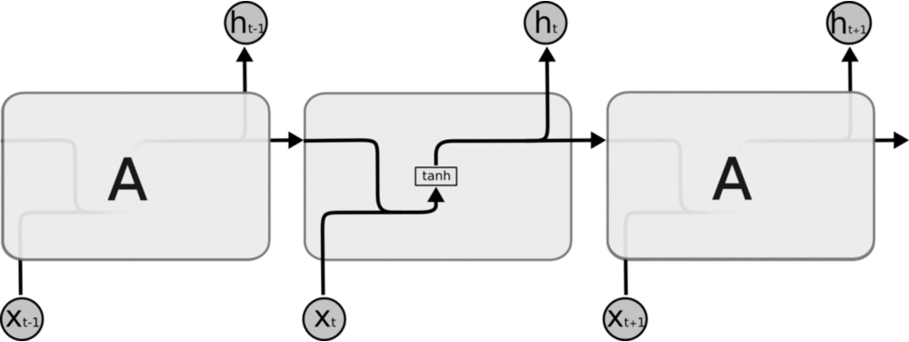
    - 输入向量的维度为 x，状态向量维度为 h，循环体的全连接层神经网络的 **输入大小为 h+x**
    - 输出为当前时刻的状态，于是 **输出层的节点个数为h**
    - 循环体中的 **参数个数为（h+x）×h+h个**
    - 为了将当前时刻的状态转化为最终的输出，循环神经网络还需要另外一个全连接神经网络来完成这个过程
  - python 实现
    ```python
    x = [1, 2]
    state = [0.0, 0.0]

    # 输入部分的权重
    w_cell_state = np.array([[0.1, 0.2], [0.3, 0.4]])
    w_cell_input = np.array([[0.5, 0.5]])
    b_cell = np.array([0.1, -0.1])

    # 用于输出的全连接层参数
    w_output = np.array([[1.0], [2.0]])
    b_output = 0.1

    # 按照时间顺序执行循环神经网络的前向传播过程
    for i in range(len(x)):
        # 计算循环体中的全连接层神经网络
        before_activation = np.dot(state, w_cell_state) + x[i] * w_cell_input + b_cell
        state = np.tanh(before_activation)
        # 根据当前时刻状态计算最终输出
        final_output = np.dot(state, w_output) + b_output
        print('before_activation = %s, state = %s, final_output = %s' % (before_activation, state, final_output))

    # [Out]
    # before_activation = [[ 0.24109344 -0.07470799]], state = [[ 0.23652828 -0.07456931]], final_output = [[0.18738966]]
    # before_activation = [[1.10128204 0.91747793]], state = [[0.80095906 0.72470211]], final_output = [[2.35036327]]
    ```
## 长短时记忆网络 long short-term memory LSTM
  - **LSTM 结构** 是由 Sepp Hochreiter 和 Jürgen Schmidhuber 于1997年提出的，循环神经网络被成功应用的关键就是 LSTM，在很多的任务上，采用 LSTM 结构的循环神经网络比标准的循环神经网络表现更好
  - 循环神经网络工作的关键点就是使用历史的信息来帮助当前的决策，在有些问题中，模型仅仅需要短期内的信息来执行当前的任务，但同样也会有一些上下文场景更加复杂的情况，仅仅根据短期依赖就无法很好的解决这种问题
  - **LSTM 结构** 与单一tanh循环体结构不同，LSTM 是一种拥有三个 **门结构** 的特殊网络结构

    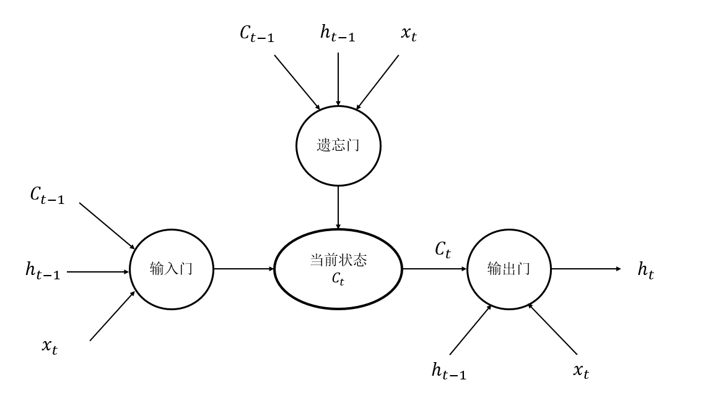
  - **门结构 gate** 使用一个 **sigmoid神经网络** 和一个 **按位乘法操作**，制丢弃或者增加信息，从而实现遗忘或记忆的功能
    - sigmoid 神经网络层会输出一个0到1之间的数值，描述当前输入有多少信息量可以通过这个结构
    - sigmoid 神经网络层 **输出为 1** 时，全部信息都可以通过
    - sigmoid 神经网络层 **输出为 0** 时，任何信息都无法通过
    - 一个 LSTM 单元有三个门，**遗忘门 forget gate** / **输入门 input gate** / **输出门 output gate**
    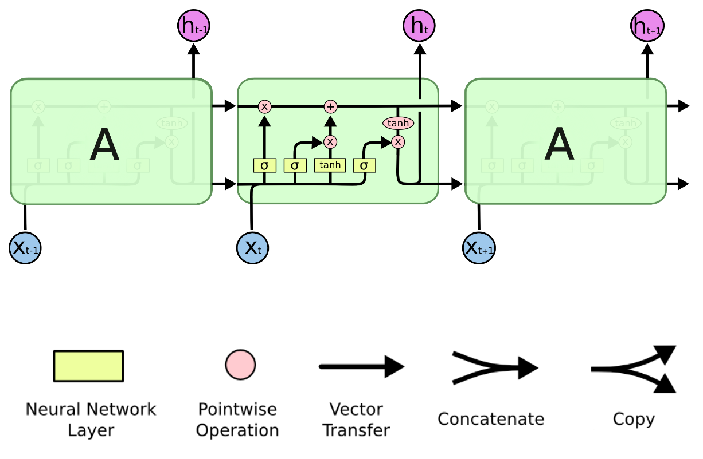
  - **单元状态 cell state** 将信息从上一个单元传递到下一个单元，和其他部分只有很少的线性的相互作用

    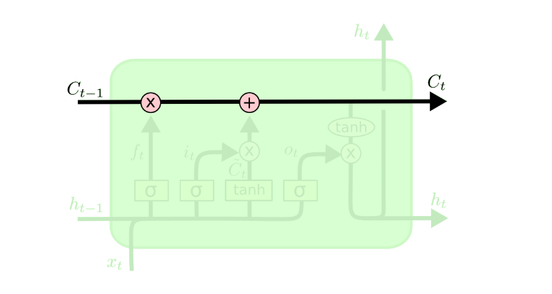
  - **遗忘门 forget gate** 控制上一单元状态被遗忘的程度，是以 **上一单元的输出 ht−1** 和 **本单元的输入 xt** 为输入的sigmoid函数，为 **Ct−1** 中的每一项产生一个在 [0,1] 内的值，决定哪一部分记忆需要被遗忘

    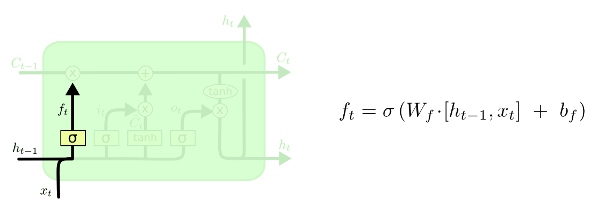
  - **输入门 input gate** 控制新信息被加入的多少，**tanh 函数** 产生一个 **新的候选向量 Ct~**，输入门为 Ct~ 中的每一项产生一个在 [0,1] 内的值，控制新信息被加入的多少

    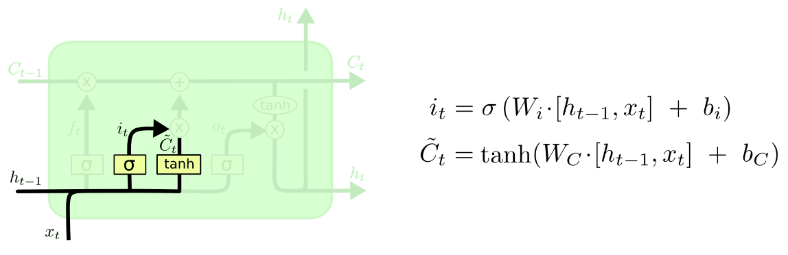
  - **更新本记忆单元的单元状态 Ct** 根据 **遗忘门的输出 ft** / **输入门的输出 it**，更新本记忆单元的单元状态 Ct
    ```python
    Ct = ft ∗ C[t-1] + it ∗ Ct~
    ```
  - **输出门 output gate** 控制当前的单元状态有多少被过滤掉，先将单元状态激活，输出门为其中每一项产生一个在[0,1]内的值，控制单元状态被过滤的程度

    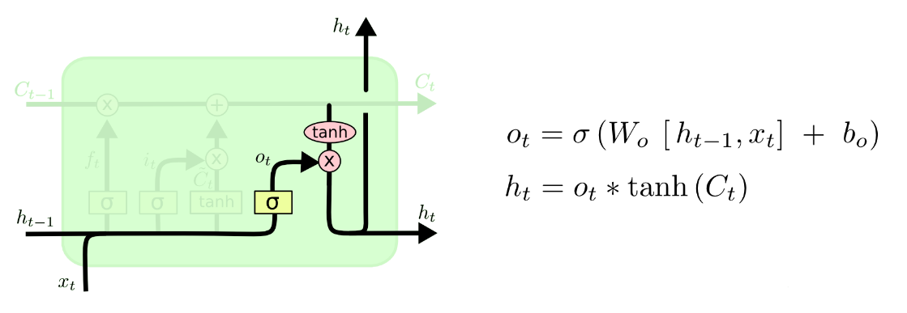
## 循环神经网络的dropout
  - 循环神经网络一般只在 **不同层循环体结构之间** 使用 dropout，而不在同一层的循环体结构之间使用
    - 从时刻 t-1 传递到时刻 t 时，循环神经网络不会进行状态的 dropout
    - 在同一个时刻 t 中，不同层循环体之间会使用 dropout
## TensorFlow 中的 LSTM 结构
  - **tf.contrib.rnn.BasicLSTMCell** / **tf.contrib.rnn.LSTMCell** 定义 LSTM 基本单元
  - **tf.contrib.rnn.MultiRNNCell** 实现深层循环神经网络的前向传播过程
  - **tf.nn.static_rnn** / **tf.contrib.rnn.static_rnn** static rnn
  - **tf.nn.dynamic_rnn** dynamic rnn
  - **tf.nn.rnn_cell.DropoutWrapper** 实现 dropout 功能
  - **python 定义一个 LSTM 的前向传播过程**
    ```python
    from tensorflow.contrib import rnn

    NUM_LAYERS = 3
    HIDDEN_SIZE = 8

    ''' 定义 lstm cell 结构 '''
    def unit_lstm():
        lstm_cell = rnn.BasicLSTMCell(num_units=HIDDEN_SIZE)
        # Optional dropout, in some cases dropout not working well.
        lstm_cell = rnn.DropoutWrapper(cell=lstm_cell, input_keep_prob=1.0, output_keep_prob=0.5)
        return lstm_cell

    def mlstm_inference(batch_size, X):
        ''' 定义 multi lstm layers 结构 '''
        # MultiRNNCell for multi layers LSTM
        mlstm_cell = rnn.MultiRNNCell([unit_lstm() for _ in range(NUM_LAYERS)])
        # If there is no initial_state, you must give a dtype.
        # outputs, _ = tf.nn.dynamic_rnn(mlstm_cell, inputs=X, dtype=tf.float32)
        # or use self defined initial state
        init_state = mlstm_cell.zero_state(batch_size, dtype=tf.float32)
        outputs, state = tf.nn.dynamic_rnn(mlstm_cell, inputs=X, initial_state=init_state)

        ''' 设置全连接层，返回预测值 '''
        # shape of outputs = (BATCH_SIZE, X.shape[1], HIDDEN_SIZE)
        h_state = outputs[:, -1, :]  # or h_state = state[-1][1]
        W = tf.Variable(tf.truncated_normal([HIDDEN_SIZE, 1], stddev=0.1), dtype=tf.float32)
        bias = tf.Variable(tf.constant(0.1, shape=[1]), dtype=tf.float32)
        prediction = tf.matmul(h_state, W) + bias

        return predection
    ```
## 双向循环神经网络 和 深层循环神经网络
  - **双向循环神经网络 bidirectional RNN** 当前时刻的输出不仅和之前的状态有关系，也和之后的状态相关，双向循环神经网络解决这类问题

    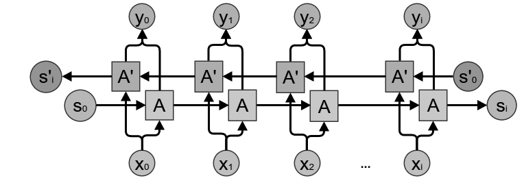
  - **双向循环神经网络** 的主体结构就是两个单向循环神经网络的结合，在每一个时刻t，输入会同时提供给这两个方向相反的循环神经网络，而输出则是由这两个单向循环神经网络共同决定
  - **深层循环神经网络 deepRNN** 将每一个时刻上的循环体重复多次，增强模型的表达能力，**tf.contrib.rnn.MultiRNNCell** 类来实现深层循环神经网络的前向传播过程

    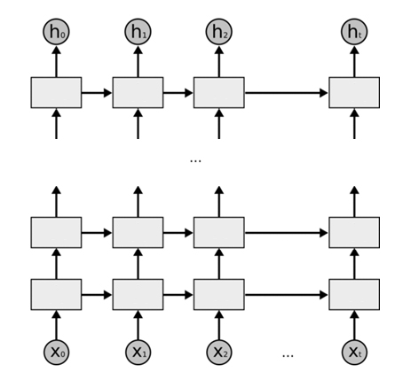
## LSTM MNIST
  ```python
  ''' 导入包和数据 '''
  import tensorflow as tf
  import numpy as np
  import matplotlib.pyplot as plt
  from tensorflow.contrib import rnn
  from tensorflow.examples.tutorials.mnist import input_data

  ''' 模型超参数 '''
  # 每个隐含层的节点数
  HIDDEN_SIZE = 64
  # LSTM layer 的层数
  NUM_LAYERS = 3
  # 最后输出分类类别数量，如果是回归预测的话应该是 1
  CLASS_NUM = 10
  # 训练数据的 batch_size
  BATCH_SIZE = 128
  LEARNING_RATE = 1e-3
  TRAINING_STEPS = 200

  ''' 定义 LSTM 单元模型 '''
  def unit_lstm(output_keep_prob):
      # 定义一层 LSTM_cell，只需要说明 hidden_size, 它会自动匹配输入的 X 的维度
      lstm_cell = rnn.BasicLSTMCell(num_units=HIDDEN_SIZE, forget_bias=1.0, state_is_tuple=True)
      # 添加 dropout layer, 一般只设置 output_keep_prob
      lstm_cell_dropout = rnn.DropoutWrapper(cell=lstm_cell, input_keep_prob=1.0, output_keep_prob=output_keep_prob)
      return lstm_cell_dropout

  ''' 定义 placeholder 参数 '''
  output_keep_prob = tf.placeholder(tf.float32)
  # 采用占位符的方式，可以在训练和测试的时候用不同的 batch_size
  batch_size = tf.placeholder(tf.int32, [])
  _X = tf.placeholder(tf.float32, [None, 784])
  y  =tf.placeholder(tf.float32, [None, CLASS_NUM])
  # 把 784 个点的字符信息还原成 28 * 28 的图片
  X = tf.reshape(_X, [-1, 28, 28])

  ''' 定义 LSTM 前向传播过程 inference '''
  # 调用 MultiRNNCell 来实现多层 LSTM
  mlstm_cell = rnn.MultiRNNCell([unit_lstm(output_keep_prob) for _ in range(NUM_LAYERS)], state_is_tuple=True)
  # 用全零来初始化 state
  init_state = mlstm_cell.zero_state(batch_size, dtype=tf.float32)
  outputs, state = tf.nn.dynamic_rnn(mlstm_cell, inputs=X, initial_state=init_state, time_major=False)

  ''' 设置全连接层，输出预测值 '''
  h_state = outputs[:, -1, :]  # 或者 h_state = state[-1][1]
  W = tf.Variable(tf.truncated_normal([HIDDEN_SIZE, CLASS_NUM], stddev=0.1), dtype=tf.float32)
  bias = tf.Variable(tf.constant(0.1, shape=[CLASS_NUM]), dtype=tf.float32)
  y_pre = tf.nn.softmax(tf.matmul(h_state, W) + bias)

  ''' 设置 loss function 和 优化器'''
  # 损失和评估函数
  cross_entropy = -tf.reduce_mean(y * tf.log(y_pre))
  train_op = tf.train.AdamOptimizer(LEARNING_RATE).minimize(cross_entropy)
  correct_prediction = tf.equal(tf.argmax(y_pre, 1), tf.argmax(y, 1))
  accuracy = tf.reduce_mean(tf.cast(correct_prediction, 'float'))

  ''' 加载数据 '''
  mnist = input_data.read_data_sets('./MNIST_data', one_hot=True)

  ''' 模型训练 '''
  sess = tf.Session()
  with sess.as_default():
      sess.run(tf.global_variables_initializer())
      for i in range(TRAINING_STEPS):
          xs, ys = mnist.train.next_batch(BATCH_SIZE)
          if i % 100 == 0:
              train_accuracy = sess.run(accuracy, feed_dict={_X: xs, y: ys, output_keep_prob: 1.0, batch_size: BATCH_SIZE})
              # 已经迭代完成的 epoch 数: mnist.train.epochs_completed
              print("Iter%d, step %d, training accuracy %g" % ( mnist.train.epochs_completed, (i+1), train_accuracy))
          sess.run(train_op, feed_dict={_X: xs, y: ys, output_keep_prob: 0.5, batch_size: BATCH_SIZE})

  ''' 测试数据集验证 '''
  with sess.as_default():
      images = mnist.test.images
      labels = mnist.test.labels
      print("test accuracy %g" % sess.run(accuracy, feed_dict={
          _X: images, y: labels, output_keep_prob: 1.0, batch_size:mnist.test.images.shape[0]}))

  ''' 图形化显示模型分类过程 '''
  current_y = mnist.train.labels[5]
  current_x = mnist.train.images[5]
  print('current_y = %s' % (current_y))

  # 把模型里面相关变量算出来
  with sess.as_default():
      current_outputs, h_W, h_bias, current_y_pre = sess.run([outputs, W, bias, y_pre], feed_dict={_X: [current_x], y: [current_y], output_keep_prob: 1.0, batch_size: 1})
  print('current_outputs.shape = %s, h_W.shape = %s, h_bias.shape = %s, predict = %d' % (current_outputs.shape, h_W.shape, h_bias.shape, current_y_pre.argmax()))

  # 识别的过程
  softmax = lambda x : np.exp(x) / np.sum(np.exp(x), axis=0)
  current_outputs = current_outputs[0]
  bar_index = range(CLASS_NUM)
  for i in range(current_outputs.shape[0]):
      plt.subplot(7, 4, i+1)
      pro = softmax(np.matmul(current_outputs[i, :], h_W) + h_bias)
      plt.bar(bar_index, pro, width=0.2 , align='center')
      plt.axis('off')
  ```
  运行结果
  ```python
  Iter0, step 1, training accuracy 0.0625
  Iter0, step 101, training accuracy 0.75
  test accuracy 0.8588
  current_y = [0. 0. 0. 0. 0. 0. 0. 0. 0. 1.]
  current_outputs.shape = (1, 28, 64), h_W.shape = (64, 10), h_bias.shape = (10,), predict = 9
  ```
  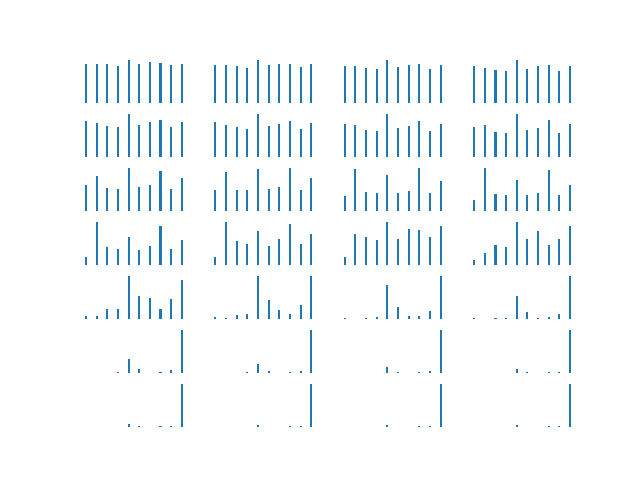
  - 在上面的图中，每一行显示了 4 个图，共有 7 行，表示了一行一行读取过程中，模型对字符的识别
  - 在只看到前面的几行像素时，模型根本认不出来是什么字符，随着看到的像素越来越多，最后就基本确定了字符
## PTB Penn Treebank Dataset 文本数据集
  - Tensorflow 读取 ptb 数据模块 [ ??? ]
    ```shell
    git clone https://github.com/tensorflow/models
    export PYTHONPATH="$PYTHONPATH:$HOME/workspace/models"
    export PYTHONPATH="$PYTHONPATH:$HOME/workspace/models/tutorials/rnn/ptb"
    ```
  - PTB 数据读取
    ```python
    from tutorials.rnn.ptb import reader
    train_data, valid_data, test_data, _ = reader.ptb_raw_data('./datasets/PTB_data/')
    len(train_data)
    # Out[70]: 929589

    train_data[:10]
    # Out[71]: [9970, 9971, 9972, 9974, 9975, 9976, 9980, 9981, 9982, 9983]

    result = reader.ptb_producer(train_data, 4, 5)
    with tf.Session() as sess:
        coord = tf.train.Coordinator()
        threads = tf.train.start_queue_runners(sess=sess, coord=coord)
        for i in range(3):
            x, y = sess.run(result)
            print('x%d = %s\ny%d = %s\n' % (i, x, i, y))
        coord.request_stop()
        coord.join(threads)
    ```
  - 运行结果
    ```python
    x0 = [[9970 9971 9972 9974 9975]
     [ 332 7147  328 1452 8595]
     [1969    0   98   89 2254]
     [   3    3    2   14   24]]
    y0 = [[9971 9972 9974 9975 9976]
     [7147  328 1452 8595   59]
     [   0   98   89 2254    0]
     [   3    2   14   24  198]]

    x1 = [[9976 9980 9981 9982 9983]
     [  59 1569  105 2231    1]
     [   0  312 1641    4 1063]
     [ 198  150 2262   10    0]]
    y1 = [[9980 9981 9982 9983 9984]
     [1569  105 2231    1  895]
     [ 312 1641    4 1063    8]
     [ 150 2262   10    0  507]]

    x2 = [[9984 9986 9987 9988 9989]
     [ 895    1 5574    4  618]
     [   8  713    0  264  820]
     [ 507   74 2619    0    1]]
    y2 = [[9986 9987 9988 9989 9991]
     [   1 5574    4  618    2]
     [ 713    0  264  820    2]
     [  74 2619    0    1    8]]
    ```
## > LSTM RNN PTB 自然语言处理 NLP
  - 自然语言处理 natural language processing，NLP
  ```python
  import numpy as np
  import tensorflow as tf
  from tutorials.rnn.ptb import reader

  DATA_PATH = "/home/leondgarse/workspace/Deep_Learning_with_TensorFlow/datasets/PTB_data"
  HIDDEN_SIZE = 200
  NUM_LAYERS = 2
  VOCAB_SIZE = 10000

  LEARNING_RATE = 1.0
  TRAIN_BATCH_SIZE = 20
  TRAIN_NUM_STEP = 35

  EVAL_BATCH_SIZE = 1
  EVAL_NUM_STEP = 1
  NUM_EPOCH = 2
  KEEP_PROB = 0.5
  MAX_GRAD_NORM = 5

  class PTBModel(object):
      def __init__(self, is_training, batch_size, num_steps):

          self.batch_size = batch_size
          self.num_steps = num_steps

          # 定义输入层
          self.input_data = tf.placeholder(tf.int32, [batch_size, num_steps])
          self.targets = tf.placeholder(tf.int32, [batch_size, num_steps])

          # 定义使用LSTM结构及训练时使用dropout
          lstm_cell = tf.nn.rnn_cell.BasicLSTMCell(HIDDEN_SIZE)
          if is_training:
              lstm_cell = tf.nn.rnn_cell.DropoutWrapper(lstm_cell, output_keep_prob=KEEP_PROB)
          cell = tf.nn.rnn_cell.MultiRNNCell([lstm_cell]*NUM_LAYERS)

          # 初始化最初的状态
          self.initial_state = cell.zero_state(batch_size, tf.float32)
          embedding = tf.get_variable("embedding", [VOCAB_SIZE, HIDDEN_SIZE])

          # 将原本单词ID转为单词向量
          inputs = tf.nn.embedding_lookup(embedding, self.input_data)

          if is_training:
              inputs = tf.nn.dropout(inputs, KEEP_PROB)

          # 定义输出列表
          outputs = []
          state = self.initial_state
          with tf.variable_scope("RNN"):
              for time_step in range(num_steps):
                  if time_step > 0: tf.get_variable_scope().reuse_variables()
                  # shape of cell_output = (batch_size, HIDDEN_SIZE)
                  cell_output, state = cell(inputs[:, time_step, :], state)
                  outputs.append(cell_output)
          # shape of outputs = (num_steps, batch_size, HIDDEN_SIZE)
          # transpose to shape = (batch_size, num_steps, HIDDEN_SIZE) [ How to avoid ??? ]
          outputs = tf.transpose(outputs, (1, 0, 2))
          weight = tf.get_variable("weight", [HIDDEN_SIZE, VOCAB_SIZE])
          bias = tf.get_variable("bias", [VOCAB_SIZE])
          logits = tf.tensordot(outputs, weight, axes=(-1, 0)) + bias

          # 定义交叉熵损失函数和平均损失
          self.loss = tf.contrib.seq2seq.sequence_loss(
              logits,
              self.targets,
              tf.ones([batch_size, num_steps], dtype=tf.float32))
          # self.cost = self.loss * num_steps
          self.final_state = state

          # 只在训练模型时定义反向传播操作
          if not is_training: return
          trainable_variables = tf.trainable_variables()

          # 控制梯度大小，定义优化方法和训练步骤
          grads, _ = tf.clip_by_global_norm(tf.gradients(self.loss * num_steps, trainable_variables), MAX_GRAD_NORM)
          optimizer = tf.train.GradientDescentOptimizer(LEARNING_RATE)
          self.train_op = optimizer.apply_gradients(zip(grads, trainable_variables))

  def run_epoch(session, model, data, train_op, output_log, epoch_size):
      loss_list = []
      state = session.run(model.initial_state)

      # 训练一个epoch。
      for step in range(epoch_size):
          x, y = session.run(data)
          loss, state, _ = session.run([model.loss, model.final_state, train_op],
                                          {model.input_data: x, model.targets: y, model.initial_state: state})
          loss_list.append(loss)

          if output_log and step % 100 == 0:
              print("After %d steps, perplexity is %.3f" % (step, np.exp(np.mean(loss_list))))
      return np.exp(np.mean(loss_list))

  def main():
      train_data, valid_data, test_data, _ = reader.ptb_raw_data(DATA_PATH)

      # 计算一个epoch需要训练的次数
      train_data_len = len(train_data)
      train_batch_len = train_data_len // TRAIN_BATCH_SIZE
      train_epoch_size = (train_batch_len - 1) // TRAIN_NUM_STEP

      valid_data_len = len(valid_data)
      valid_batch_len = valid_data_len // EVAL_BATCH_SIZE
      valid_epoch_size = (valid_batch_len - 1) // EVAL_NUM_STEP

      test_data_len = len(test_data)
      test_batch_len = test_data_len // EVAL_BATCH_SIZE
      test_epoch_size = (test_batch_len - 1) // EVAL_NUM_STEP

      initializer = tf.random_uniform_initializer(-0.05, 0.05)
      with tf.variable_scope("language_model", reuse=None, initializer=initializer):
          train_model = PTBModel(True, TRAIN_BATCH_SIZE, TRAIN_NUM_STEP)

      with tf.variable_scope("language_model", reuse=True, initializer=initializer):
          eval_model = PTBModel(False, EVAL_BATCH_SIZE, EVAL_NUM_STEP)

      # 训练模型。
      with tf.Session() as session:
          tf.global_variables_initializer().run()

          train_queue = reader.ptb_producer(train_data, train_model.batch_size, train_model.num_steps)
          eval_queue = reader.ptb_producer(valid_data, eval_model.batch_size, eval_model.num_steps)
          test_queue = reader.ptb_producer(test_data, eval_model.batch_size, eval_model.num_steps)

          coord = tf.train.Coordinator()
          threads = tf.train.start_queue_runners(sess=session, coord=coord)

          for i in range(NUM_EPOCH):
              print("In iteration: %d" % (i + 1))
              run_epoch(session, train_model, train_queue, train_model.train_op, True, train_epoch_size)

              valid_perplexity = run_epoch(session, eval_model, eval_queue, tf.no_op(), False, valid_epoch_size)
              print("Epoch: %d Validation Perplexity: %.3f" % (i + 1, valid_perplexity))

          test_perplexity = run_epoch(session, eval_model, test_queue, tf.no_op(), False, test_epoch_size)
          print("Test Perplexity: %.3f" % test_perplexity)

          coord.request_stop()
          coord.join(threads)

  if __name__ == "__main__":
      main()
  ```
  运行结果
  ```python
  $ python lstm_ptb.py
  In iteration: 1
  After 0 steps, perplexity is 9947.316
  After 100 steps, perplexity is 1349.034
  After 200 steps, perplexity is 1010.319
  After 300 steps, perplexity is 861.657
  After 400 steps, perplexity is 762.057
  ...
  After 1300 steps, perplexity is 439.256
  Epoch: 1 Validation Perplexity: 254.868
  In iteration: 2
  After 0 steps, perplexity is 388.371
  After 100 steps, perplexity is 264.993
  ...
  After 1300 steps, perplexity is 245.631
  Epoch: 2 Validation Perplexity: 200.677
  Test Perplexity: 194.740
  ```
***

# 预测 sin 函数时间序列
## 生成测试数据
  ```python
  TIME_STEPS = 10
  TRAINING_EXAMPLES = 10000
  TESTING_EXAMPLES = 1000
  SAMPLE_GAP = 0.01

  def plot_test_result(prediction, real_y, title):
      plt.plot(prediction)
      plt.plot(real_y)
      plt.legend(['prediction', 'real y'])
      plt.title(title)

  def generate_data(seq):
      x = []
      y = []
      # x 为长度为 10 的序列
      # y 为 x 后面的一个数据
      for i in range(len(seq) - TIME_STEPS - 1):
          x.append(seq[i: i + TIME_STEPS])
          y.append(seq[i + TIME_STEPS])
      return np.array(x, dtype=np.float32), np.array(y, dtype=np.float32)

  train_end = TRAINING_EXAMPLES * SAMPLE_GAP
  test_end = (TRAINING_EXAMPLES + TESTING_EXAMPLES) * SAMPLE_GAP

  # 在不同区间根据 sin 函数生成 训练 / 测试数据
  seq_train = np.sin(np.linspace(0, train_end, num=TRAINING_EXAMPLES))
  train_x, train_y = generate_data(seq_train)

  seq_test = np.sin(np.linspace(train_end, test_end, num=TESTING_EXAMPLES))
  test_x, test_y = generate_data(seq_test)

  train_x.shape, train_y.shape, test_x.shape, test_y.shape
  # Out[10]: ((9989, 10), (9989,), (989, 10), (989,))
  ```
## 预定义的全连接线性模型 tf.estimator.LinearRegressor 预测
  ```python
  BATCH_SIZE = 32
  TRAINING_STEPS = 1000

  # 定义线性模型
  feature_columns = [tf.feature_column.numeric_column("x", shape=[10])]
  estimator_linear = tf.estimator.LinearRegressor(feature_columns=feature_columns)

  # 训练 / 评估 / 测试 的输入功能
  train_input_fn = tf.estimator.inputs.numpy_input_fn({'x': train_x}, train_y, batch_size=BATCH_SIZE, num_epochs=None, shuffle=True)
  eval_input_fn = tf.estimator.inputs.numpy_input_fn({'x': test_x}, test_y, batch_size=BATCH_SIZE, num_epochs=100, shuffle=True)
  predict_input_fn = tf.estimator.inputs.numpy_input_fn({"x": test_x}, num_epochs=1, shuffle=False)

  # 模型训练
  estimator_linear.train(input_fn=train_input_fn, steps=TRAINING_STEPS)
  # INFO:tensorflow:Saving checkpoints for 1000 into /tmp/tmpy62bau9c/model.ckpt.
  # INFO:tensorflow:Loss for final step: 0.006338477.

  # 模型评估
  estimator_linear.evaluate(eval_input_fn)
  # {'average_loss': 0.00023348766, 'loss': 0.007470699, 'global_step': 1000}

  # 图形化预测值
  pp = estimator_linear.predict(input_fn=predict_input_fn)
  tt = [ii['predictions'][0] for ii in pp]
  plot_test_result(tt, test_y, 'LinearRegressor')
  ```
  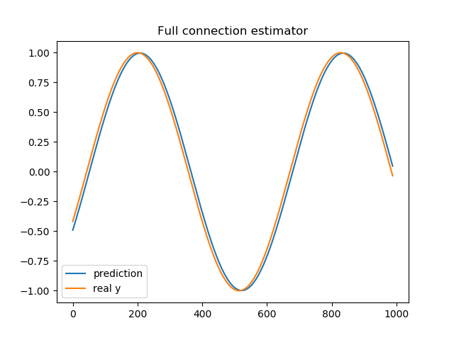
## 自定义的全连接神经网络模型预测
  ```python
  # 定义适用于 estimator 的单层全连接线性神经网络
  def fc_model(features, labels, mode):
      W = tf.get_variable('W', [10, 1], dtype=tf.float32)
      b = tf.get_variable('b', [1], dtype=tf.float32)
      y = tf.matmul(features['x'], W) + b
      # slim define
      # y = slim.fully_connected(features['x'], num_outputs=1, activation_fn=None)

      # Compute predictions.
      if mode == tf.estimator.ModeKeys.PREDICT:
          predictions = {
              'predictions': y,
          }
          return tf.estimator.EstimatorSpec(mode, predictions=predictions)

      loss = tf.losses.mean_squared_error(labels, y[:, 0])
      global_step = tf.train.get_global_step()
      optimizer = tf.train.GradientDescentOptimizer(0.01)
      train = tf.group(optimizer.minimize(loss), tf.assign_add(global_step, 1))

      return tf.estimator.EstimatorSpec(mode=mode, predictions=y, loss=loss, train_op=train)

  # 定义模型
  # 训练 / 评估 / 测试 步骤与预定以模型相同
  estimator_fc = tf.estimator.Estimator(model_fn=fc_model)
  estimator_fc.train(input_fn=train_input_fn, steps=TRAINING_STEPS)
  # INFO:tensorflow:Loss for final step: 0.0055611567.

  estimator_fc.evaluate(eval_input_fn)
  # Out[28]: {'loss': 0.0053806403, 'global_step': 1000}

  pp = estimator_fc.predict(input_fn=predict_input_fn)
  tt = [ii['predictions'][0] for ii in pp]
  plot_test_result(tt, test_y, 'Full connection estimator')
  ```
  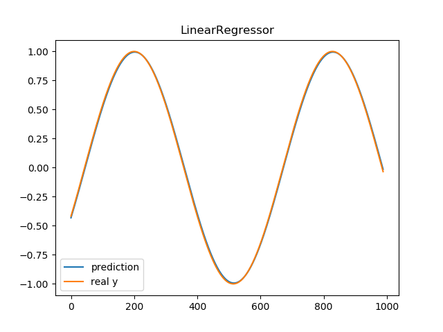
## LSTM model with estimator 预测
  ```python
  from tensorflow.contrib import rnn

  HIDDEN_SIZE = 30
  NUM_LAYERS = 2
  BATCH_SIZE = 32
  TRAINING_STEPS = 1000

  def unit_lstm():
      lstm_cell = rnn.BasicLSTMCell(num_units=HIDDEN_SIZE)
      # Dont using dropout here, Dropout will increase loss here. [ ??? ]
      # lstm_cell = rnn.DropoutWrapper(cell=lstm_cell, input_keep_prob=1.0, output_keep_prob=0.5)
      return lstm_cell

  def lstm_model(features, labels, mode):
      xs = features['x']
      # xs.shape.ndims is same as len(xs.shape)
      if xs.shape.ndims == 2: xs = tf.expand_dims(xs, axis=1)

      mlstm_cell = rnn.MultiRNNCell([unit_lstm() for _ in range(NUM_LAYERS)])
      outputs, _ = tf.nn.dynamic_rnn(mlstm_cell, inputs=xs, dtype=tf.float32)

      # Shape of outputs = (32, 1, 30)
      output = outputs[:, -1, :]
      weight = tf.get_variable("weight", [HIDDEN_SIZE, 1])
      bias = tf.get_variable("bias", [1])
      prediction = tf.matmul(output, weight) + bias

      if mode == tf.estimator.ModeKeys.PREDICT:
          predictions = {
              'predictions': prediction,
          }
          return tf.estimator.EstimatorSpec(mode, predictions=predictions)

      if labels.shape.ndims == 1: labels = tf.expand_dims(labels, axis=-1)
      loss = tf.losses.mean_squared_error(labels, prediction)
      train_op = tf.contrib.layers.optimize_loss(loss, tf.train.get_global_step(),
      optimizer='Adagrad', learning_rate=0.1) # 0.1 works better than 0.01 here.

      return tf.estimator.EstimatorSpec(mode=mode, predictions=prediction, loss=loss, train_op=train_op)

  estimator_lstm = tf.estimator.Estimator(model_fn=lstm_model)
  estimator_lstm.train(input_fn=train_input_fn, steps=TRAINING_STEPS)
  # INFO:tensorflow:Loss for final step: 0.0009022613

  estimator_lstm.evaluate(eval_input_fn)
  # Out[20]: {'loss': 0.0010767069, 'global_step': 1000}

  pp = estimator_lstm.predict(input_fn=predict_input_fn)
  tt = [ii['predictions'][0] for ii in pp]
  plot_test_result(tt, test_y, 'LSTM estimator')
  ```
  
## Traditional way implementing LSTM model 预测
  ```python
  from tensorflow.contrib import rnn

  HIDDEN_SIZE = 30
  NUM_LAYERS = 2
  BATCH_SIZE = 32
  TRAINING_STEPS = 1000

  ''' 定义 lstm cell 结构 '''
  def unit_lstm():
      lstm_cell = rnn.BasicLSTMCell(num_units=HIDDEN_SIZE)
      # Optional dropout, in some cases dropout not working well.
      # lstm_cell = rnn.DropoutWrapper(cell=lstm_cell, input_keep_prob=1.0, output_keep_prob=0.5)
      return lstm_cell

  def mlstm_inference(batch_size, X):
      ''' 定义 multi lstm layers 结构 '''
      # MultiRNNCell for multi layers LSTM
      mlstm_cell = rnn.MultiRNNCell([unit_lstm() for _ in range(NUM_LAYERS)])
      # If there is no initial_state, you must give a dtype.
      # outputs, _ = tf.nn.dynamic_rnn(mlstm_cell, inputs=X, dtype=tf.float32)
      # or use self defined initial state
      init_state = mlstm_cell.zero_state(batch_size, dtype=tf.float32)
      outputs, state = tf.nn.dynamic_rnn(mlstm_cell, inputs=X, initial_state=init_state)

      ''' 设置全连接层，返回预测值 '''
      # shape of outputs = (BATCH_SIZE, X.shape[1], HIDDEN_SIZE)
      # h_state = outputs[:, -1, :]  # or h_state = state[-1][1]
      h_state = outputs[:, -1, :]  # or h_state = state[-1][1]
      W = tf.Variable(tf.truncated_normal([HIDDEN_SIZE, 1], stddev=0.1), dtype=tf.float32)
      bias = tf.Variable(tf.constant(0.1, shape=[1]), dtype=tf.float32)
      y_pre = tf.matmul(h_state, W) + bias

      return y_pre

  _X = tf.placeholder(tf.float32, [None, 10])
  _y = tf.placeholder(tf.float32, [None])
  # X must have rank at least 3
  X = tf.expand_dims(_X, 1)
  y = tf.expand_dims(_y, 1)
  batch_size = tf.placeholder(tf.int32, [])

  y_pre = mlstm_inference(batch_size, X)

  loss = tf.losses.mean_squared_error(y, y_pre)
  optimizer = tf.train.GradientDescentOptimizer(0.1)
  train_op = optimizer.minimize(loss)

  data_size = train_x.shape[0]  
  sess = tf.InteractiveSession()
  init = tf.global_variables_initializer()
  sess.run(init)

  for i in range(TRAINING_STEPS):
      batch = np.random.permutation(data_size)[:BATCH_SIZE]
      xs = train_x[batch]
      ys = train_y[batch]
      if i % 100 == 0:
          print('step = %d, loss = %s' %(i, sess.run(loss, feed_dict={_X: train_x, _y: train_y, batch_size: data_size})))
      sess.run(train_op, feed_dict={_X: xs, _y: ys, batch_size: BATCH_SIZE})
      # step = 990, loss = 0.0029966352

  sess.run(loss, feed_dict={_X: test_x, _y: test_y, batch_size: test_x.shape[0]})
  # Out[9]: 0.0031799008
  tt = sess.run(y_pre, feed_dict={_X: test_x, batch_size: test_x.shape[0]})
  plot_test_result(tt, test_y, 'LSTM tradition')
  ```
  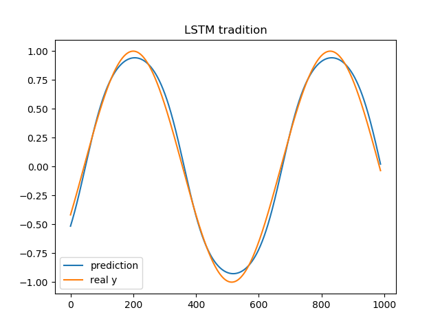
***

# > TensorBoard 可视化
  - **TensorBoard** 可以有效地展示 TensorFlow 在运行过程中的计算图、各种指标随着时间的变化趋势以及训练中使用到的图像等信息
  - TensorBoard 会自动读取最新的 **TensorFlow 日志文件**，并呈现当前TensorFlow程序运行的最新状态
  ```python
  import tensorflow as tf
  # 定义一个简单的计算图，实现向量加法的操作。
  input1 = tf.constant([1.0, 2.0, 3.0], name="input1")
  input2 = tf.Variable(tf.random_uniform([3]), name="input2")
  output = tf.add_n([input1, input2], name="add")
  # 生成一个写日志的writer，并将当前的TensorFlow计算图写入日志。TensorFlow提供了多
  # 种写日志文件的API，在9.3节中将详细介绍。
  writer = tf.train.SummaryWriter("/path/to/log", tf.get_default_graph())
  writer.close()
  ```
