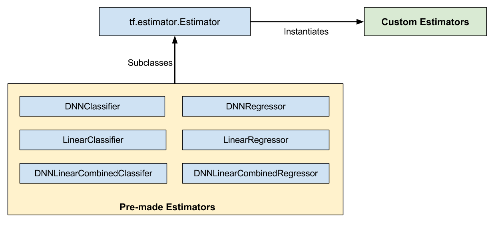
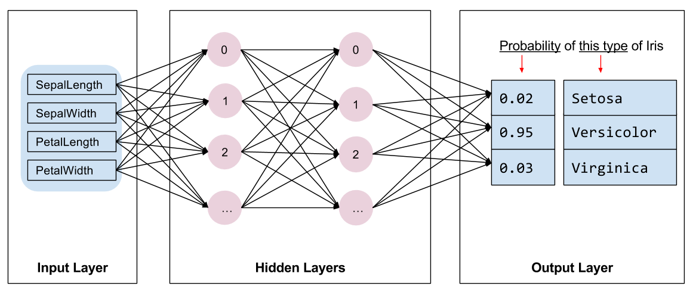
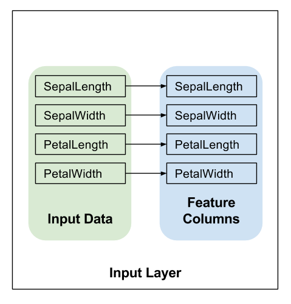
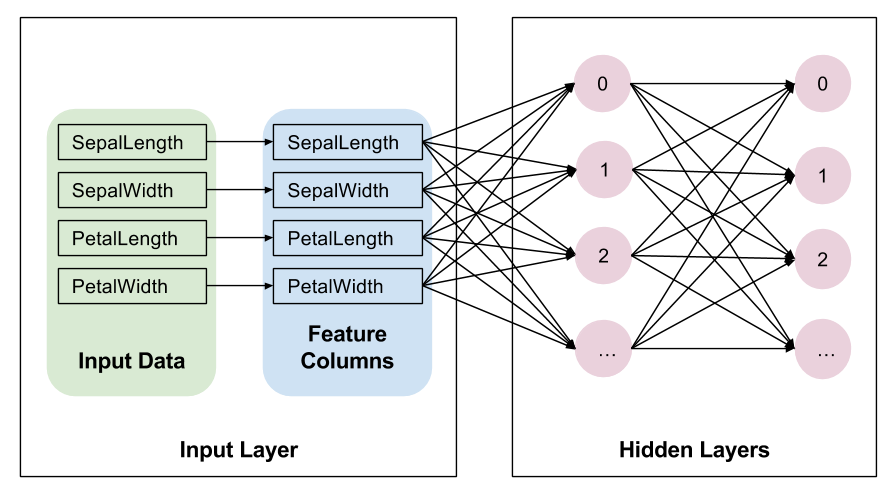
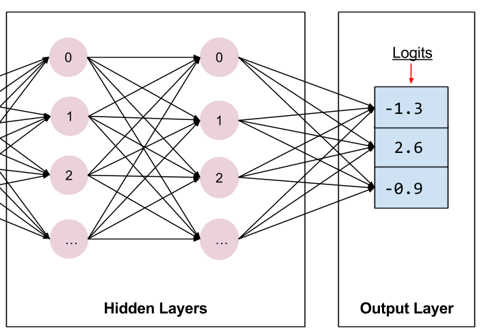
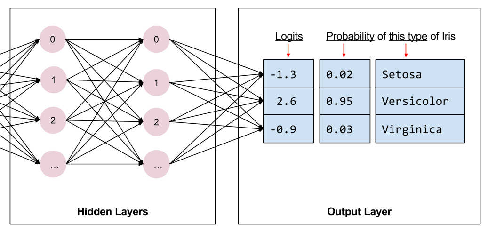

TensorFlow 1.8 programming
[Tensorflow Get Started](https://www.tensorflow.org/get_started)


# Get Started with Eager Execution
## High-level Tensorflow APIs
  There many TensorFlow APIs available, but we recommend starting with these high-level TensorFlow concepts:
  - Enable an **eager** execution development environment
  - Import data with the **Datasets** API
  - Build models and layers with TensorFlow's **Keras** API

  Eager execution makes TensorFlow evaluate operations immediately, returning concrete values instead of creating a computational graph that is executed later
  ```python
  import os
  import matplotlib.pyplot as plt

  import tensorflow as tf
  import tensorflow.contrib.eager as tfe

  tf.enable_eager_execution()

  print("TensorFlow version: {}".format(tf.VERSION))
  print("Eager execution: {}".format(tf.executing_eagerly()))
  ```
  Download the training dataset file using the tf.keras.utils.get_file function. This returns the file path of the downloaded file.
  ```python
  train_dataset_url = "http://download.tensorflow.org/data/iris_training.csv"

  train_dataset_fp = tf.keras.utils.get_file(fname=os.path.basename(train_dataset_url),
                                             origin=train_dataset_url)

  print("Local copy of the dataset file: {}".format(train_dataset_fp))
  ```
  Parse the dataset
  Since our dataset is a CSV-formatted text file, we'll parse the feature and label values into a format our Python model can use. Each line—or row—in the file is passed to the parse_csv function which grabs the first four feature fields and combines them into a single tensor. Then, the last field is parsed as the label. The function returns both the features and label tensors:
  ```python
  def parse_csv(line):
    example_defaults = [[0.], [0.], [0.], [0.], [0]]  # sets field types
    parsed_line = tf.decode_csv(line, example_defaults)
    # First 4 fields are features, combine into single tensor
    features = tf.reshape(parsed_line[:-1], shape=(4,))
    # Last field is the label
    label = tf.reshape(parsed_line[-1], shape=())
    return features, label
  ```
  Create the training tf.data.Dataset

  TensorFlow's Dataset API handles many common cases for feeding data into a model. This is a high-level API for reading data and transforming it into a form used for training. See the Datasets Quick Start guide for more information.

  This program uses tf.data.TextLineDataset to load a CSV-formatted text file and is parsed with our parse_csv function. A tf.data.Dataset represents an input pipeline as a collection of elements and a series of transformations that act on those elements. Transformation methods are chained together or called sequentially—just make sure to keep a reference to the returned Dataset object.

  Training works best if the examples are in random order. Use tf.data.Dataset.shuffle to randomize entries, setting buffer_size to a value larger than the number of examples (120 in this case). To train the model faster, the dataset's batch size is set to 32 examples to train at once.
  ```python
  train_dataset = tf.data.TextLineDataset(train_dataset_fp)
  train_dataset = train_dataset.skip(1)             # skip the first header row
  train_dataset = train_dataset.map(parse_csv)      # parse each row
  train_dataset = train_dataset.shuffle(buffer_size=1000)  # randomize
  train_dataset = train_dataset.batch(32)

  # View a single example entry from a batch
  features, label = iter(train_dataset).next()
  print("example features:", features[0])
  print("example label:", label[0])
  ```
  The TensorFlow tf.keras API is the preferred way to create models and layers. This makes it easy to build models and experiment while Keras handles the complexity of connecting everything together. See the Keras documentation for details.

  The tf.keras.Sequential model is a linear stack of layers. Its constructor takes a list of layer instances, in this case, two Dense layers with 10 nodes each, and an output layer with 3 nodes representing our label predictions. The first layer's input_shape parameter corresponds to the amount of features from the dataset, and is required.
  ```python
  model = tf.keras.Sequential([
    tf.keras.layers.Dense(10, activation="relu", input_shape=(4,)),  # input shape required
    tf.keras.layers.Dense(10, activation="relu"),
    tf.keras.layers.Dense(3)
  ])
  ```
  Both training and evaluation stages need to calculate the model's loss. This measures how off a model's predictions are from the desired label, in other words, how bad the model is performing. We want to minimize, or optimize, this value.

  Our model will calculate its loss using the tf.losses.sparse_softmax_cross_entropy function which takes the model's prediction and the desired label. The returned loss value is progressively larger as the prediction gets worse.

  The grad function uses the loss function and the tf.GradientTape to record operations that compute the gradients used to optimize our model. For more examples of this, see the eager execution guide.
  ```python
  def loss(model, x, y):
    y_ = model(x)
    return tf.losses.sparse_softmax_cross_entropy(labels=y, logits=y_)


  def grad(model, inputs, targets):
    with tf.GradientTape() as tape:
      loss_value = loss(model, inputs, targets)
    return tape.gradient(loss_value, model.variables)
  ```
  TensorFlow has many optimization algorithms available for training. This model uses the tf.train.GradientDescentOptimizer that implements the stochastic gradient descent (SGD) algorithm. The learning_rate sets the step size to take for each iteration down the hill. This is a hyperparameter that you'll commonly adjust to achieve better results.
  ```python
  optimizer = tf.train.GradientDescentOptimizer(learning_rate=0.01)
  ```
  
  Training loop
  ```python
  ## Note: Rerunning this cell uses the same model variables

  # keep results for plotting
  train_loss_results = []
  train_accuracy_results = []

  num_epochs = 201

  for epoch in range(num_epochs):
    epoch_loss_avg = tfe.metrics.Mean()
    epoch_accuracy = tfe.metrics.Accuracy()

    # Training loop - using batches of 32
    for x, y in train_dataset:
      # Optimize the model
      grads = grad(model, x, y)
      optimizer.apply_gradients(zip(grads, model.variables),
                                global_step=tf.train.get_or_create_global_step())

      # Track progress
      epoch_loss_avg(loss(model, x, y))  # add current batch loss
      # compare predicted label to actual label
      epoch_accuracy(tf.argmax(model(x), axis=1, output_type=tf.int32), y)

    # end epoch
    train_loss_results.append(epoch_loss_avg.result())
    train_accuracy_results.append(epoch_accuracy.result())

    if epoch % 50 == 0:
      print("Epoch {:03d}: Loss: {:.3f}, Accuracy: {:.3%}".format(epoch,
                                                                  epoch_loss_avg.result(),
                                                                  epoch_accuracy.result()))
  ```
  Visualize the loss function over time
  ```python
  fig, axes = plt.subplots(2, sharex=True, figsize=(12, 8))
  fig.suptitle('Training Metrics')

  axes[0].set_ylabel("Loss", fontsize=14)
  axes[0].plot(train_loss_results)

  axes[1].set_ylabel("Accuracy", fontsize=14)
  axes[1].set_xlabel("Epoch", fontsize=14)
  axes[1].plot(train_accuracy_results)

  plt.show()
  ```
  Setup the test dataset

  Evaluating the model is similar to training the model. The biggest difference is the examples come from a separate test set rather than the training set. To fairly assess a model's effectiveness, the examples used to evaluate a model must be different from the examples used to train the model.

  The setup for the test Dataset is similar to the setup for training Dataset. Download the CSV text file and parse that values, then give it a little shuffle:
  ```python
  test_url = "http://download.tensorflow.org/data/iris_test.csv"

  test_fp = tf.keras.utils.get_file(fname=os.path.basename(test_url),
                                    origin=test_url)

  test_dataset = tf.data.TextLineDataset(test_fp)
  test_dataset = test_dataset.skip(1)             # skip header row
  test_dataset = test_dataset.map(parse_csv)      # parse each row with the funcition created earlier
  test_dataset = test_dataset.shuffle(1000)       # randomize
  test_dataset = test_dataset.batch(32)           # use the same batch size as the training set
  ```
  Evaluate the model on the test dataset

  Unlike the training stage, the model only evaluates a single epoch of the test data. In the following code cell, we iterate over each example in the test set and compare the model's prediction against the actual label. This is used to measure the model's accuracy across the entire test set.
  ```python
  test_accuracy = tfe.metrics.Accuracy()

  for (x, y) in test_dataset:
    prediction = tf.argmax(model(x), axis=1, output_type=tf.int32)
    test_accuracy(prediction, y)

  print("Test set accuracy: {:.3%}".format(test_accuracy.result()))
  ```
  Use the trained model to make predictions
  ```python
  class_ids = ["Iris setosa", "Iris versicolor", "Iris virginica"]

  predict_dataset = tf.convert_to_tensor([
      [5.1, 3.3, 1.7, 0.5,],
      [5.9, 3.0, 4.2, 1.5,],
      [6.9, 3.1, 5.4, 2.1]
  ])

  predictions = model(predict_dataset)

  for i, logits in enumerate(predictions):
    class_idx = tf.argmax(logits).numpy()
    name = class_ids[class_idx]
    print("Example {} prediction: {}".format(i, name))
  ```
## TensorFlow programs structure
  - Import and parse the data sets
  - Select the type of model
  - Train the model
  - Evaluate the model's effectiveness
  - Use the trained model to make predictions
## Estimator
  The general outline of premade_estimator.py--and many other TensorFlow programs--is as follows:

      Import and parse the data sets.
      Create feature columns to describe the data.
      Select the type of model
      Train the model.
      Evaluate the model's effectiveness.
      Let the trained model make predictions.

  As you start writing TensorFlow programs, we strongly recommend focusing on the following two high-level APIs:

      Estimators
      Datasets

  The Iris program requires the data from the following two .csv files:

      http://download.tensorflow.org/data/iris_training.csv, which contains the training set.
      http://download.tensorflow.org/data/iris_test.csv, which contains the the test set.
  ```python
  TRAIN_URL = "http://download.tensorflow.org/data/iris_training.csv"
  TEST_URL = "http://download.tensorflow.org/data/iris_test.csv"

  CSV_COLUMN_NAMES = ['SepalLength', 'SepalWidth',
                      'PetalLength', 'PetalWidth', 'Species']

  def load_data(label_name='Species'):
      """Parses the csv file in TRAIN_URL and TEST_URL."""

      # Create a local copy of the training set.
      train_path = tf.keras.utils.get_file(fname=TRAIN_URL.split('/')[-1],
                                           origin=TRAIN_URL)
      # train_path now holds the pathname: ~/.keras/datasets/iris_training.csv

      # Parse the local CSV file.
      train = pd.read_csv(filepath_or_buffer=train_path,
                          names=CSV_COLUMN_NAMES,  # list of column names
                          header=0  # ignore the first row of the CSV file.
                         )
      # train now holds a pandas DataFrame, which is data structure
      # analogous to a table.

      # 1. Assign the DataFrame's labels (the right-most column) to train_label.
      # 2. Delete (pop) the labels from the DataFrame.
      # 3. Assign the remainder of the DataFrame to train_features
      train_features, train_label = train, train.pop(label_name)

      # Apply the preceding logic to the test set.
      test_path = tf.keras.utils.get_file(TEST_URL.split('/')[-1], TEST_URL)
      test = pd.read_csv(test_path, names=CSV_COLUMN_NAMES, header=0)
      test_features, test_label = test, test.pop(label_name)

      # Return four DataFrames.
      return (train_features, train_label), (test_features, test_label)

  (train_x, train_y), (test_x, test_y) = load_data()
  ```
  From a code perspective, you build a list of feature_column objects by calling functions from the tf.feature_column module. Each object describes an input to the model. To tell the model to interpret data as a floating-point value, call tf.feature_column.numeric_column.
  ```python
  # Feature columns describe how to use the input.
  my_feature_columns = []
  for key in train_x.keys():
      my_feature_columns.append(tf.feature_column.numeric_column(key=key))
  ```
  To implement a neural network, the premade_estimators.py program uses a pre-made Estimator named tf.estimator.DNNClassifier. This Estimator builds a neural network that classifies examples. The following call instantiates DNNClassifier:
  ```python
  # Build 2 hidden layer DNN with 10, 10 units respectively.
  classifier = tf.estimator.DNNClassifier(
      feature_columns=my_feature_columns,
      # Two hidden layers of 10 nodes each.
      hidden_units=[10, 10],
      # The model must choose between 3 classes.
      n_classes=3)
  ```
  The ideal number of hidden layers and neurons depends on the problem and the data set. Like many aspects of machine learning, picking the ideal shape of the neural network requires some mixture of knowledge and experimentation. As a rule of thumb, increasing the number of hidden layers and neurons typically creates a more powerful model, which requires more data to train effectively.

  The n_classes parameter specifies the number of possible values that the neural network can predict. Since the Iris problem classifies 3 Iris species, we set n_classes to 3.

  The constructor for tf.Estimator.DNNClassifier takes an optional argument named optimizer, which our sample code chose not to specify. The optimizer controls how the model will train. As you develop more expertise in machine learning, optimizers and learning rate will become very important.

  Train the model
  ```python
  def train_input_fn(features, labels, batch_size):
      """An input function for training"""
      # Convert the inputs to a Dataset.
      dataset = tf.data.Dataset.from_tensor_slices((dict(features), labels))

      # Shuffle, repeat, and batch the examples.
      dataset = dataset.shuffle(1000).repeat().batch(batch_size)

      # Return the dataset.
      return dataset

  classifier.train(
      input_fn=lambda:train_input_fn(train_x, train_y, 100),
      steps=1000)
  ```
  The train_input_fn function relies on the Dataset API. This is a high-level TensorFlow API for reading data and transforming it into a form that the train method requires.
  ```python
  dataset = tf.data.Dataset.from_tensor_slices((dict(train_x), train_y))
  ```

  The tf.dataset class provides many useful functions for preparing examples for training.
  ```python
  dataset = dataset.shuffle(buffer_size=1000).repeat(count=None).batch(100)
  dataset.make_one_shot_iterator().get_next()
  ```
  Training works best if the training examples are in random order. To randomize the examples, call tf.data.Dataset.shuffle. Setting the buffer_size to a value larger than the number of examples (120) ensures that the data will be well shuffled.

  During training, the train method typically processes the examples multiple times. Calling the tf.data.Dataset.repeat method without any arguments ensures that the train method has an infinite supply of (now shuffled) training set examples.


  Evaluate the model
  ```python
  def eval_input_fn(features, labels, batch_size):
      """An input function for evaluation or prediction"""
      features=dict(features)
      if labels is None:
          # No labels, use only features.
          inputs = features
      else:
          inputs = (features, labels)

      # Convert the inputs to a Dataset.
      dataset = tf.data.Dataset.from_tensor_slices(inputs)

      # Batch the examples
      assert batch_size is not None, "batch_size must not be None"
      dataset = dataset.batch(batch_size)

      # Return the dataset.
      return dataset

  # Evaluate the model.
  eval_result = classifier.evaluate(
      input_fn=lambda:eval_input_fn(test_x, test_y, 100))

  print('\nTest set accuracy: {accuracy:0.3f}\n'.format(**eval_result))
  # Test set accuracy: 0.967
  ```
  The biggest difference is that classifier.evaluate must get its examples from the test set rather than the training set. In other words, to fairly assess a model's effectiveness, the examples used to evaluate a model must be different from the examples used to train the model.

  In brief, eval_input_fn does the following when called by classifier.evaluate:

      Converts the features and labels from the test set to a tf.dataset object.
      Creates a batch of test set examples. (There's no need to shuffle or repeat the test set examples.)
      Returns that batch of test set examples to classifier.evaluate.

  Predicting
  ```python
  predict_x = {
          'SepalLength': [5.1, 5.9, 6.9],
          'SepalWidth': [3.3, 3.0, 3.1],
          'PetalLength': [1.7, 4.2, 5.4],
          'PetalWidth': [0.5, 1.5, 2.1],
      }

  predictions = classifier.predict(
      input_fn=lambda:eval_input_fn(predict_x,
                                    labels=None,
                                    batch_size=100))
  ```
  When doing predictions, we're not passing labels to eval_input_fn
  ```python
  SPECIES = ['Setosa', 'Versicolor', 'Virginica']
  expected = ['Setosa', 'Versicolor', 'Virginica']
  template = ('\nPrediction is "{}" ({:.1f}%), expected "{}"')

  for pred_dict, expec in zip(predictions, expected):
      class_id = pred_dict['class_ids'][0]
      probability = pred_dict['probabilities'][class_id]

      print(template.format(SPECIES[class_id],
                            100 * probability, expec))
  ```
  Out
  ```python
  Prediction is "Setosa" (99.8%), expected "Setosa"
  Prediction is "Versicolor" (99.8%), expected "Versicolor"
  Prediction is "Virginica" (96.0%), expected "Virginica"
  ```
## Checkpoints
  TensorFlow provides two model formats:

      checkpoints, which is a format dependent on the code that created the model.
      SavedModel, which is a format independent of the code that created the model.

  To specify the top-level directory in which the Estimator stores its information, assign a value to the optional model_dir argument of any Estimator's constructor.
  ```python
  classifier = tf.estimator.DNNClassifier(
      feature_columns=my_feature_columns,
      hidden_units=[10, 10],
      n_classes=3,
      model_dir='models/iris')

  classifier.train(
      input_fn=lambda:train_input_fn(train_x, train_y, 100),
      steps=200)
  ```
  As suggested by the following diagrams, the first call to train adds checkpoints and other files to the model_dir directory:
  
  ```python
  print(classifier.model_dir)
  # models/iris

  ls models/iris/ -1
  # checkpoint
  # events.out.tfevents.1530185992.HP-Pavilion-Laptop-15
  # graph.pbtxt
  # model.ckpt-1000.data-00000-of-00001
  # model.ckpt-1000.index
  # model.ckpt-1000.meta
  # model.ckpt-1.data-00000-of-00001
  # model.ckpt-1.index
  # model.ckpt-1.meta
  ```
  Estimator created checkpoints at steps 1 (the start of training) and 200 (the end of training).

  Checkpointing Frequency

  By default, the Estimator saves checkpoints in the model_dir according to the following schedule:

      Writes a checkpoint every 10 minutes (600 seconds).
      Writes a checkpoint when the train method starts (first iteration) and completes (final iteration).
      Retains only the 5 most recent checkpoints in the directory.

  You may alter the default schedule by taking the following steps:

      Create a RunConfig object that defines the desired schedule.
      When instantiating the Estimator, pass that RunConfig object to the Estimator's config argument.
  ```python
  my_checkpointing_config = tf.estimator.RunConfig(
      save_checkpoints_secs = 20*60,  # Save checkpoints every 20 minutes.
      keep_checkpoint_max = 10,       # Retain the 10 most recent checkpoints.
  )

  classifier = tf.estimator.DNNClassifier(
      feature_columns=my_feature_columns,
      hidden_units=[10, 10],
      n_classes=3,
      model_dir='models/iris',
      config=my_checkpointing_config)
  ```

  Restoring your model
  The first time you call an Estimator's train method, TensorFlow saves a checkpoint to the model_dir. Each subsequent call to the Estimator's train, evaluate, or predict method causes the following:

      The Estimator builds the model's graph by running the model_fn(). (For details on the model_fn(), see Creating Custom Estimators.)
      The Estimator initializes the weights of the new model from the data stored in the most recent checkpoint.

  In other words, as the following illustration suggests, once checkpoints exist, TensorFlow rebuilds the model each time you call train(), evaluate(), or predict().

  

  Avoiding a bad restoration

  Restoring a model's state from a checkpoint only works if the model and checkpoint are compatible. For example, suppose you trained a DNNClassifier Estimator containing two hidden layers, each having 10 nodes:
  ```python
  classifier = tf.estimator.DNNClassifier(
      feature_columns=feature_columns,
      hidden_units=[10, 10],
      n_classes=3,
      model_dir='models/iris')

  classifier.train(
      input_fn=lambda:train_input_fn(train_x, train_y, batch_size=100),
          steps=200)
  ```
  After training (and, therefore, after creating checkpoints in models/iris), imagine that you changed the number of neurons in each hidden layer from 10 to 20 and then attempted to retrain the model:
  ```python
  classifier2 = tf.estimator.DNNClassifier(
      feature_columns=my_feature_columns,
      hidden_units=[20, 20],  # Change the number of neurons in the model.
      n_classes=3,
      model_dir='models/iris')

  classifier.train(
      input_fn=lambda:train_input_fn(train_x, train_y, batch_size=100),
          steps=200)
  ```
  Since the state in the checkpoint is incompatible with the model described in classifier2, retraining fails with the following error:
  ```python
  ...
  InvalidArgumentError (see above for traceback): tensor_name =
  dnn/hiddenlayer_1/bias/t_0/Adagrad; shape in shape_and_slice spec [10]
  does not match the shape stored in checkpoint: [20]
  ```
  To run experiments in which you train and compare slightly different versions of a model, save a copy of the code that created each model_dir, possibly by creating a separate git branch for each version. This separation will keep your checkpoints recoverable.
***

# Feature Columns
To create feature columns, call functions from the tf.feature_column module
Most functions return either a Categorical-Column or a Dense-Column object, except bucketized_column, which inherits from both classes:
## Numeric column
  Although tf.numeric_column provides optional arguments, calling tf.numeric_column without any arguments, as follows, is a fine way to specify a numerical value with the default data type (tf.float32) as input to your model:
  ```python
  # Defaults to a tf.float32 scalar.
  numeric_feature_column = tf.feature_column.numeric_column(key="SepalLength")
  ```
  To specify a non-default numerical data type, use the dtype argument. For example:
  ```python
  # Represent a tf.float64 scalar.
  numeric_feature_column = tf.feature_column.numeric_column(key="SepalLength",
                                                            dtype=tf.float64)
  ```
  By default, a numeric column creates a single value (scalar). Use the shape argument to specify another shape. For example:
  ```python
  # Represent a 10-element vector in which each cell contains a tf.float32.
  vector_feature_column = tf.feature_column.numeric_column(key="Bowling",
                                                           shape=10)

  # Represent a 10x5 matrix in which each cell contains a tf.float32.
  matrix_feature_column = tf.feature_column.numeric_column(key="MyMatrix",
                                                           shape=[10,5])
  ```
## Bucketized column
  Often, you don't want to feed a number directly into the model, but instead split its value into different categories based on numerical ranges. To do so, create a bucketized column. For example, consider raw data that represents the year a house was built. Instead of representing that year as a scalar numeric column, we could split the year into the following four buckets:
  Dividing year data into four buckets.
  
  The model will represent the buckets as follows:

  | Date Range         | Represented as... |
  | ------------------ | ----------------- |
  | < 1960             | [1, 0, 0, 0]      |
  | >= 1960 but < 1980 | [0, 1, 0, 0]      |
  | >= 1980 but < 2000 | [0, 0, 1, 0]      |
  | > 2000             | [0, 0, 0, 1]      |

  ```python
  # First, convert the raw input to a numeric column.
  numeric_feature_column = tf.feature_column.numeric_column("Year")

  # Then, bucketize the numeric column on the years 1960, 1980, and 2000.
  bucketized_feature_column = tf.feature_column.bucketized_column(
      source_column = numeric_feature_column,
      boundaries = [1960, 1980, 2000])
  ```
## Categorical identity column
  Categorical identity columns can be seen as a special case of bucketized columns. In traditional bucketized columns, each bucket represents a range of values (for example, from 1960 to 1979). In a categorical identity column, each bucket represents a single, unique integer. For example, let's say you want to represent the integer range [0, 4). That is, you want to represent the integers 0, 1, 2, or 3. In this case, the categorical identity mapping looks like this:
  
  ```python
  # Create categorical output for an integer feature named "my_feature_b",
  # The values of my_feature_b must be >= 0 and < num_buckets
  identity_feature_column = tf.feature_column.categorical_column_with_identity(
      key='my_feature_b',
      num_buckets=4) # Values [0, 4)

  # In order for the preceding call to work, the input_fn() must return
  # a dictionary containing 'my_feature_b' as a key. Furthermore, the values
  # assigned to 'my_feature_b' must belong to the set [0, 4).
  def input_fn():
      ...
      return ({ 'my_feature_a':[7, 9, 5, 2], 'my_feature_b':[3, 1, 2, 2] },
              [Label_values])
  ```
## Categorical vocabulary column
  We cannot input strings directly to a model. Instead, we must first map strings to numeric or categorical values. Categorical vocabulary columns provide a good way to represent strings as a one-hot vector. For example:
  
  As you can see, categorical vocabulary columns are kind of an enum version of categorical identity columns. TensorFlow provides two different functions to create categorical vocabulary columns:

      tf.feature_column.categorical_column_with_vocabulary_list
      tf.feature_column.categorical_column_with_vocabulary_file
  categorical_column_with_vocabulary_list maps each string to an integer based on an explicit vocabulary list. For example:
  ```python
  # Given input "feature_name_from_input_fn" which is a string,
  # create a categorical feature by mapping the input to one of
  # the elements in the vocabulary list.
  vocabulary_feature_column =
      tf.feature_column.categorical_column_with_vocabulary_list(
          key=feature_name_from_input_fn,
          vocabulary_list=["kitchenware", "electronics", "sports"])
  ```
  The preceding function is pretty straightforward, but it has a significant drawback. Namely, there's way too much typing when the vocabulary list is long. For these cases, call tf.feature_column.categorical_column_with_vocabulary_file instead, which lets you place the vocabulary words in a separate file. For example:

  ```python
  # Given input "feature_name_from_input_fn" which is a string,
  # create a categorical feature to our model by mapping the input to one of
  # the elements in the vocabulary file
  vocabulary_feature_column =
      tf.feature_column.categorical_column_with_vocabulary_file(
          key=feature_name_from_input_fn,
          vocabulary_file="product_class.txt",
          vocabulary_size=3)
  ```
  product_class.txt should contain one line for each vocabulary element. In our case:
  ```python
  kitchenware
  electronics
  sports
  ```
## Hashed Column
  So far, we've worked with a naively small number of categories. For example, our product_class example has only 3 categories. Often though, the number of categories can be so big that it's not possible to have individual categories for each vocabulary word or integer because that would consume too much memory. For these cases, we can instead turn the question around and ask, "How many categories am I willing to have for my input?" In fact, the tf.feature_column.categorical_column_with_hash_bucket function enables you to specify the number of categories. For this type of feature column the model calculates a hash value of the input, then puts it into one of the hash_bucket_size categories using the modulo operator, as in the following pseudocode:
  ```python
  # pseudocode
  feature_id = hash(raw_feature) % hash_buckets_size
  ```
  The code to create the feature_column might look something like this:
  ```python
  hashed_feature_column =
      tf.feature_column.categorical_column_with_hash_bucket(
          key = "some_feature",
          hash_buckets_size = 100) # The number of categories
  ```
  At this point, you might rightfully think: "This is crazy!" After all, we are forcing the different input values to a smaller set of categories. This means that two probably unrelated inputs will be mapped to the same category, and consequently mean the same thing to the neural network. The following figure illustrates this dilemma, showing that kitchenware and sports both get assigned to category (hash bucket) 12:
  Representing data with hash buckets.
  
  As with many counterintuitive phenomena in machine learning, it turns out that hashing often works well in practice. That's because hash categories provide the model with some separation. The model can use additional features to further separate kitchenware from sports.
  ## Crossed column
## Crossed column
  Combining features into a single feature, better known as feature crosses, enables the model to learn separate weights for each combination of features.
  For the solution, we used a combination of the bucketized_column we looked at earlier, with the tf.feature_column.crossed_column function.
  ```python
  def make_dataset(latitude, longitude, labels):
      assert latitude.shape == longitude.shape == labels.shape

      features = {'latitude': latitude.flatten(),
                  'longitude': longitude.flatten()}
      labels=labels.flatten()

      return tf.data.Dataset.from_tensor_slices((features, labels))


  # Bucketize the latitude and longitude usig the `edges`
  latitude_bucket_fc = tf.feature_column.bucketized_column(
      tf.feature_column.numeric_column('latitude'),
      list(atlanta.latitude.edges))

  longitude_bucket_fc = tf.feature_column.bucketized_column(
      tf.feature_column.numeric_column('longitude'),
      list(atlanta.longitude.edges))

  # Cross the bucketized columns, using 5000 hash bins.
  crossed_lat_lon_fc = tf.feature_column.crossed_column(
      [latitude_bucket_fc, longitude_bucket_fc], 5000)

  fc = [
      latitude_bucket_fc,
      longitude_bucket_fc,
      crossed_lat_lon_fc]

  # Build and train the Estimator.
  est = tf.estimator.LinearRegressor(fc, ...)
  ```
  You may create a feature cross from either of the following:

      Feature names; that is, names from the dict returned from input_fn.
      Any categorical column, except categorical_column_with_hash_bucket (since crossed_column hashes the input).

  When the feature columns latitude_bucket_fc and longitude_bucket_fc are crossed, TensorFlow will create (latitude_fc, longitude_fc) pairs for each example. This would produce a full grid of possibilities as follows:
  ```python
   (0,0),  (0,1)...  (0,99)
   (1,0),  (1,1)...  (1,99)
     ...     ...       ...
  (99,0), (99,1)...(99, 99)
  ```
  Except that a full grid would only be tractable for inputs with limited vocabularies. Instead of building this, potentially huge, table of inputs, the crossed_column only builds the number requested by the hash_bucket_size argument. The feature column assigns an example to a index by running a hash function on the tuple of inputs, followed by a modulo operation with hash_bucket_size.

  As discussed earlier, performing the hash and modulo function limits the number of categories, but can cause category collisions; that is, multiple (latitude, longitude) feature crosses will end up in the same hash bucket. In practice though, performing feature crosses still adds significant value to the learning capability of your models.

  Somewhat counterintuitively, when creating feature crosses, you typically still should include the original (uncrossed) features in your model (as in the preceding code snippet). The independent latitude and longitude features help the model distinguish between examples where a hash collision has occurred in the crossed feature.
## Indicator columns
  Indicator columns and embedding columns never work on features directly, but instead take categorical columns as input.

  When using an indicator column, we're telling TensorFlow to do exactly what we've seen in our categorical product_class example. That is, an indicator column treats each category as an element in a one-hot vector

  Here's how you create an indicator column by calling tf.feature_column.indicator_column:
  ```python
  categorical_column = ... # Create any type of categorical column.

  # Represent the categorical column as an indicator column.
  indicator_column = tf.feature_column.indicator_column(categorical_column)
  ```
## embedding columns
  Now, suppose instead of having just three possible classes, we have a million. Or maybe a billion. For a number of reasons, as the number of categories grow large, it becomes infeasible to train a neural network using indicator columns.

  We can use an embedding column to overcome this limitation. Instead of representing the data as a one-hot vector of many dimensions, an embedding column represents that data as a lower-dimensional, ordinary vector in which each cell can contain any number, not just 0 or 1. By permitting a richer palette of numbers for every cell, an embedding column contains far fewer cells than an indicator column.

  Let's look at an example comparing indicator and embedding columns. Suppose our input examples consist of different words from a limited palette of only 81 words. Further suppose that the data set provides the following input words in 4 separate examples:

      "dog"
      "spoon"
      "scissors"
      "guitar"

  In that case, the following figure illustrates the processing path for embedding columns or indicator columns.
  
  An embedding column stores categorical data in a lower-dimensional vector than an indicator column. (We just placed random numbers into the embedding vectors; training determines the actual numbers.)

  When an example is processed, one of the categorical_column_with... functions maps the example string to a numerical categorical value. For example, a function maps "spoon" to [32]. (The 32 comes from our imagination—the actual values depend on the mapping function.) You may then represent these numerical categorical values in either of the following two ways:

      As an indicator column. A function converts each numeric categorical value into an 81-element vector (because our palette consists of 81 words), placing a 1 in the index of the categorical value (0, 32, 79, 80) and a 0 in all the other positions.

      As an embedding column. A function uses the numerical categorical values (0, 32, 79, 80) as indices to a lookup table. Each slot in that lookup table contains a 3-element vector.

  How do the values in the embeddings vectors magically get assigned? Actually, the assignments happen during training. That is, the model learns the best way to map your input numeric categorical values to the embeddings vector value in order to solve your problem. Embedding columns increase your model's capabilities, since an embeddings vector learns new relationships between categories from the training data.

  Why is the embedding vector size 3 in our example? Well, the following "formula" provides a general rule of thumb about the number of embedding dimensions:
  ```python
  embedding_dimensions =  number_of_categories**0.25
  ```
  That is, the embedding vector dimension should be the 4th root of the number of categories. Since our vocabulary size in this example is 81, the recommended number of dimensions is 3:
  ```python
  3 =  81**0.25
  ```
  Note that this is just a general guideline; you can set the number of embedding dimensions as you please.

  Call tf.feature_column.embedding_column to create an embedding_column as suggested by the following snippet:
  ```python
  categorical_column = ... # Create any categorical column

  # Represent the categorical column as an embedding column.
  # This means creating a one-hot vector with one element for each category.
  embedding_column = tf.feature_column.embedding_column(
      categorical_column=categorical_column,
      dimension=dimension_of_embedding_vector)
  ```
  Embeddings is a significant topic within machine learning. This information was just to get you started using them as feature columns.
## Passing feature columns to Estimators
  As the following list indicates, not all Estimators permit all types of feature_columns argument(s):

      LinearClassifier and LinearRegressor: Accept all types of feature column.
      DNNClassifier and DNNRegressor: Only accept dense columns. Other column types must be wrapped in either an indicator_column or embedding_column.
      DNNLinearCombinedClassifier and DNNLinearCombinedRegressor:
          The linear_feature_columns argument accepts any feature column type.
          The dnn_feature_columns argument only accepts dense columns.
***

# Datasets
The tf.data module contains a collection of classes that allows you to easily load data, manipulate it, and pipe it into your model
## Basic input
  Slices

  The function starts by using the tf.data.Dataset.from_tensor_slices function to create a tf.data.Dataset representing slices of the array. The array is sliced across the first dimension. For example, an array containing the mnist training data has a shape of (60000, 28, 28). Passing this to from_tensor_slices returns a Dataset object containing 60000 slices, each one a 28x28 image.

  The code that returns this Dataset is as follows:
  ```python
  train, test = tf.keras.datasets.mnist.load_data()
  mnist_x, mnist_y = train

  mnist_ds = tf.data.Dataset.from_tensor_slices(mnist_x)
  print(mnist_ds)
  ```
  This will print the following line, showing the shapes and types of the items in the dataset. Note that a Dataset does not know how many items it contains.
  ```python
  <TensorSliceDataset shapes: (28,28), types: tf.uint8>
  ```
  The Dataset above represents a simple collection of arrays, but datasets are much more powerful than this. A Dataset can transparently handle any nested combination of dictionaries or tuples (or namedtuple ).


  Manipulation

  Currently the Dataset would iterate over the data once, in a fixed order, and only produce a single element at a time. It needs further processing before it can be used for training. Fortunately, the tf.data.Dataset class provides methods to better prepare the data for training. The next line of the input function takes advantage of several of these methods:
  ```python
  # Shuffle, repeat, and batch the examples.
  dataset = dataset.shuffle(1000).repeat().batch(batch_size)
  ```
  The shuffle method uses a fixed-size buffer to shuffle the items as they pass through. In this case the buffer_size is greater than the number of examples in the Dataset, ensuring that the data is completely shuffled (The Iris data set only contains 150 examples).

  The repeat method restarts the Dataset when it reaches the end. To limit the number of epochs, set the count argument.

  The batch method collects a number of examples and stacks them, to create batches. This adds a dimension to their shape. The new dimension is added as the first dimension. The following code uses the batch method on the MNIST Dataset, from earlier. This results in a Dataset containing 3D arrays representing stacks of (28,28) images:
  ```python
  print(mnist_ds.batch(100))

  <BatchDataset
    shapes: (?, 28, 28),
    types: tf.uint8>
  ```
  Note that the dataset has an unknown batch size because the last batch will have fewer elements.


  Return

  At this point the Dataset contains (features_dict, labels) pairs. This is the format expected by the train and evaluate methods, so the input_fn returns the dataset.

  The labels can/should be omitted when using the predict method.
## Reading a CSV File
  The most common real-world use case for the Dataset class is to stream data from files on disk. The tf.data module includes a variety of file readers. Let's see how parsing the Iris dataset from the csv file looks using a Dataset.

  Build the Dataset

  We start by building a TextLineDataset object to read the file one line at a time. Then, we call the skip method to skip over the first line of the file, which contains a header, not an example:
  ```python
  ds = tf.data.TextLineDataset(train_path).skip(1)
  ```

  Build a csv line parser

  We will start by building a function to parse a single line using the tf.decode_csv function, and some simple python code:
  We must parse each of the lines in the dataset in order to generate the necessary (features, label) pairs. The following `_parse_line` function calls tf.decode_csv to parse a single line into its features and the label. Since Estimators require that features be represented as a dictionary, we rely on Python's built-in dict and zip functions to build that dictionary. The feature names are the keys of that dictionary. We then call the dictionary's pop method to remove the label field from the features dictionary:
  ```python
  # Metadata describing the text columns
  COLUMNS = ['SepalLength', 'SepalWidth',
             'PetalLength', 'PetalWidth',
             'label']
  FIELD_DEFAULTS = [[0.0], [0.0], [0.0], [0.0], [0]]
  def _parse_line(line):
      # Decode the line into its fields
      fields = tf.decode_csv(line, FIELD_DEFAULTS)

      # Pack the result into a dictionary
      features = dict(zip(COLUMNS,fields))

      # Separate the label from the features
      label = features.pop('label')

      return features, label
  ```
  Parse the lines

  Datasets have many methods for manipulating the data while it is being piped to a model. The most heavily-used method is map, which applies a transformation to each element of the Dataset.

  The map method takes a map_func argument that describes how each item in the Dataset should be transformed.
  
  The map method applies the `map_func` to transform each item in the Dataset.

  So to parse the lines as they are streamed out of the csv file, we pass our `_parse_line` function to the map method:
  ```python
  ds = ds.map(_parse_line)
  print(ds)

  <MapDataset
  shapes: (
      {SepalLength: (), PetalWidth: (), ...},
      ()),
  types: (
      {SepalLength: tf.float32, PetalWidth: tf.float32, ...},
      tf.int32)>
  ```
  Now instead of simple scalar strings, the dataset contains (features, label) pairs.

  the remainder of the iris_data.csv_input_fn function is identical to iris_data.train_input_fn which was covered in the in the Basic input section.


  Try it out

  This function can be used as a replacement for iris_data.train_input_fn. It can be used to feed an estimator as follows:
  ```python
  train_path, test_path = iris_data.maybe_download()

  # All the inputs are numeric
  feature_columns = [
      tf.feature_column.numeric_column(name)
      for name in iris_data.CSV_COLUMN_NAMES[:-1]]

  # Build the estimator
  est = tf.estimator.LinearClassifier(feature_columns,
                                      n_classes=3)
  # Train the estimator
  batch_size = 100
  est.train(
      steps=1000,
      input_fn=lambda : iris_data.csv_input_fn(train_path, batch_size))
  ```
  Estimators expect an input_fn to take no arguments. To work around this restriction, we use lambda to capture the arguments and provide the expected interface.
***

# Creating Custom Estimators
## Pre-made vs. custom

  As the following figure shows, pre-made Estimators are subclasses of the tf.estimator.Estimator base class, while custom Estimators are an instance of tf.estimator.Estimator:
  

  A model function (or model_fn) implements the ML algorithm. The only difference between working with pre-made Estimators and custom Estimators is:

      With pre-made Estimators, someone already wrote the model function for you.
      With custom Estimators, you must write the model function.

  Your model function could implement a wide range of algorithms, defining all sorts of hidden layers and metrics. Like input functions, all model functions must accept a standard group of input parameters and return a standard group of output values. Just as input functions can leverage the Dataset API, model functions can leverage the Layers API and the Metrics API.

  Let's see how to solve the Iris problem with a custom Estimator. A quick reminder--here's the organization of the Iris model that we're trying to mimic:
  
## Write a model function

  The model function we'll use has the following call signature:
  ```python
  def my_model_fn(
     features, # This is batch_features from input_fn
     labels,   # This is batch_labels from input_fn
     mode,     # An instance of tf.estimator.ModeKeys
     params):  # Additional configuration
  ```
  The first two arguments are the batches of features and labels returned from the input function; that is, features and labels are the handles to the data your model will use. The mode argument indicates whether the caller is requesting training, predicting, or evaluation.

  The caller may pass params to an Estimator's constructor. Any params passed to the constructor are in turn passed on to the model_fn

  To implement a typical model function, you must do the following:

      Define the model.
      Specify additional calculations for each of the three different modes:
          Predict
          Evaluate
          Train
## Define the model

  The basic deep neural network model must define the following three sections:

      An input layer
      One or more hidden layers
      An output layer

  Define the input layer

  The first line of the model_fn calls tf.feature_column.input_layer to convert the feature dictionary and feature_columns into input for your model, as follows:

      # Use `input_layer` to apply the feature columns.
      net = tf.feature_column.input_layer(features, params['feature_columns'])

  The preceding line applies the transformations defined by your feature columns, creating the model's input layer.
  

  Hidden Layers

  If you are creating a deep neural network, you must define one or more hidden layers. The Layers API provides a rich set of functions to define all types of hidden layers, including convolutional, pooling, and dropout layers. For Iris, we're simply going to call tf.layers.dense to create hidden layers, with dimensions defined by params['hidden_layers']. In a dense layer each node is connected to every node in the preceding layer. Here's the relevant code:
  ```python
  # Build the hidden layers, sized according to the 'hidden_units' param.
  for units in params['hidden_units']:
      net = tf.layers.dense(net, units=units, activation=tf.nn.relu)
  ```
      The units parameter defines the number of output neurons in a given layer.
      The activation parameter defines the activation function — Relu in this case.
      Note that tf.layers.dense provides many additional capabilities, including the ability to set a multitude of regularization parameters

  

  Output Layer

  We'll define the output layer by calling tf.layers.dense yet again, this time without an activation function:
  ```python
  # Compute logits (1 per class).
  logits = tf.layers.dense(net, params['n_classes'], activation=None)
  ```
  Here, net signifies the final hidden layer. Therefore, the full set of layers is now connected as follows:

  

  When defining an output layer, the units parameter specifies the number of outputs. So, by setting units to params['n_classes'], the model produces one output value per class. Each element of the output vector will contain the score, or "logit", calculated for the associated class of Iris: Setosa, Versicolor, or Virginica, respectively.

  Later on, these logits will be transformed into probabilities by the tf.nn.softmax function.
## Implement training, evaluation, and prediction
  As the following table shows, when someone calls train, evaluate, or predict, the Estimator framework invokes your model function with the mode parameter set as follows:

  | Estimator method | Estimator Mode   |
  | ---------------- | ---------------- |
  | train()          | ModeKeys.TRAIN   |
  | evaluate()       | ModeKeys.EVAL    |
  | predict()        | ModeKeys.PREDICT |

  For example, suppose you instantiate a custom Estimator to generate an object named classifier. Then, you make the following call:
  ```python
  classifier = tf.estimator.Estimator(...)
  classifier.train(input_fn=lambda: my_input_fn(FILE_TRAIN, True, 500))
  ```
  The Estimator framework then calls your model function with mode set to ModeKeys.TRAIN.

  Your model function must provide code to handle all three of the mode values. For each mode value, your code must return an instance of tf.estimator.EstimatorSpec, which contains the information the caller requires. Let's examine each mode.

  Predict

  When the Estimator's predict method is called, the model_fn receives mode = ModeKeys.PREDICT. In this case, the model function must return a tf.estimator.EstimatorSpec containing the prediction.

  The model must have been trained prior to making a prediction. The trained model is stored on disk in the model_dir directory established when you instantiated the Estimator.

  The code to generate the prediction for this model looks as follows:
  ```python
  # Compute predictions.
  predicted_classes = tf.argmax(logits, 1)
  if mode == tf.estimator.ModeKeys.PREDICT:
      predictions = {
          'class_ids': predicted_classes[:, tf.newaxis],
          'probabilities': tf.nn.softmax(logits),
          'logits': logits,
      }
      return tf.estimator.EstimatorSpec(mode, predictions=predictions)
  ```
  The prediction dictionary contains everything that your model returns when run in prediction mode.

  The predictions holds the following three key/value pairs:

      class_ids holds the class id (0, 1, or 2) representing the model's prediction of the most likely species for this example.
      probabilities holds the three probabilities (in this example, 0.02, 0.95, and 0.03)
      logit holds the raw logit values (in this example, -1.3, 2.6, and -0.9)

  We return that dictionary to the caller via the predictions parameter of the tf.estimator.EstimatorSpec. The Estimator's predict method will yield these dictionaries.

  

  Calculate the loss

  For both training and evaluation we need to calculate the model's loss. This is the objective that will be optimized.

  We can calculate the loss by calling tf.losses.sparse_softmax_cross_entropy. The value returned by this function will be lowest, approximately 0, probability of the correct class (at index label) is near 1.0. The loss value returned is progressively larger as the probability of the correct class decreases.

  This function returns the average over the whole batch.
  ```python
  # Compute loss.
  loss = tf.losses.sparse_softmax_cross_entropy(labels=labels, logits=logits)
  ```

  Evaluate

  When the Estimator's evaluate method is called, the model_fn receives mode = ModeKeys.EVAL. In this case, the model function must return a tf.estimator.EstimatorSpec containing the model's loss and optionally one or more metrics.

  Although returning metrics is optional, most custom Estimators do return at least one metric. TensorFlow provides a Metrics module tf.metrics to calculate common metrics. For brevity's sake, we'll only return accuracy. The tf.metrics.accuracy function compares our predictions against the true values, that is, against the labels provided by the input function. The tf.metrics.accuracy function requires the labels and predictions to have the same shape. Here's the call to tf.metrics.accuracy:
  ```python
  # Compute evaluation metrics.
  accuracy = tf.metrics.accuracy(labels=labels,
                                 predictions=predicted_classes,
                                 name='acc_op')
  ```
  The EstimatorSpec returned for evaluation typically contains the following information:

      loss, which is the model's loss
      eval_metric_ops, which is an optional dictionary of metrics.

  So, we'll create a dictionary containing our sole metric. If we had calculated other metrics, we would have added them as additional key/value pairs to that same dictionary. Then, we'll pass that dictionary in the eval_metric_ops argument of tf.estimator.EstimatorSpec. Here's the code:
  ```python
  metrics = {'accuracy': accuracy}
  tf.summary.scalar('accuracy', accuracy[1])

  if mode == tf.estimator.ModeKeys.EVAL:
      return tf.estimator.EstimatorSpec(
          mode, loss=loss, eval_metric_ops=metrics)
  ```
  The tf.summary.scalar will make accuracy available to TensorBoard in both TRAIN and EVAL modes. (More on this later).


  Train

  When the Estimator's train method is called, the model_fn is called with mode = ModeKeys.TRAIN. In this case, the model function must return an EstimatorSpec that contains the loss and a training operation.

  Building the training operation will require an optimizer. We will use tf.train.AdagradOptimizer because we're mimicking the DNNClassifier, which also uses Adagrad by default. The tf.train package provides many other optimizers—feel free to experiment with them.

  Here is the code that builds the optimizer:
  ```python
  optimizer = tf.train.AdagradOptimizer(learning_rate=0.1)
  ```
  Next, we build the training operation using the optimizer's minimize method on the loss we calculated earlier.

  The minimize method also takes a global_step parameter. TensorFlow uses this parameter to count the number of training steps that have been processed (to know when to end a training run). Furthermore, the global_step is essential for TensorBoard graphs to work correctly. Simply call tf.train.get_global_step and pass the result to the global_step argument of minimize.

  Here's the code to train the model:
  ```python
  train_op = optimizer.minimize(loss, global_step=tf.train.get_global_step())
  ```
  The EstimatorSpec returned for training must have the following fields set:

      loss, which contains the value of the loss function.
      train_op, which executes a training step.

  Here's our code to call EstimatorSpec:
  ```python
  return tf.estimator.EstimatorSpec(mode, loss=loss, train_op=train_op)
  ```
  The model function is now complete.
## The custom Estimator

  Instantiate the custom Estimator through the Estimator base class as follows:
  ```python
  # Build 2 hidden layer DNN with 10, 10 units respectively.
  classifier = tf.estimator.Estimator(
      model_fn=my_model,
      params={
          'feature_columns': my_feature_columns,
          # Two hidden layers of 10 nodes each.
          'hidden_units': [10, 10],
          # The model must choose between 3 classes.
          'n_classes': 3,
      })
  ```
  Here the params dictionary serves the same purpose as the key-word arguments of DNNClassifier; that is, the params dictionary lets you configure your Estimator without modifying the code in the model_fn.

  The rest of the code to train, evaluate, and generate predictions using our Estimator is the same as in the Premade Estimators chapter. For example, the following line will train the model:
  ```python
  # Train the Model.
  classifier.train(
      input_fn=lambda:iris_data.train_input_fn(train_x, train_y, args.batch_size),
      steps=args.train_steps)
  ```
## TensorBoard

  You can view training results for your custom Estimator in TensorBoard. To see this reporting, start TensorBoard from your command line as follows:
  ```python
  # Replace PATH with the actual path passed as model_dir
  tensorboard --logdir=PATH
  ```
  Then, open TensorBoard by browsing to: http://localhost:6006

  All the pre-made Estimators automatically log a lot of information to TensorBoard. With custom Estimators, however, TensorBoard only provides one default log (a graph of the loss) plus the information you explicitly tell TensorBoard to log. For the custom Estimator you just created, TensorBoard generates the following:

  IMAGES
## python 实现
  ```python
  def my_model(features, labels, mode, params):
      """DNN with three hidden layers, and dropout of 0.1 probability."""
      # Create three fully connected layers each layer having a dropout
      # probability of 0.1.
      net = tf.feature_column.input_layer(features, params['feature_columns'])
      for units in params['hidden_units']:
          net = tf.layers.dense(net, units=units, activation=tf.nn.relu)

      # Compute logits (1 per class).
      logits = tf.layers.dense(net, params['n_classes'], activation=None)

      # Compute predictions.
      predicted_classes = tf.argmax(logits, 1)
      if mode == tf.estimator.ModeKeys.PREDICT:
          predictions = {
              'class_ids': predicted_classes[:, tf.newaxis],
              'probabilities': tf.nn.softmax(logits),
              'logits': logits,
          }
          return tf.estimator.EstimatorSpec(mode, predictions=predictions)

      # Compute loss.
      loss = tf.losses.sparse_softmax_cross_entropy(labels=labels, logits=logits)

      # Compute evaluation metrics.
      accuracy = tf.metrics.accuracy(labels=labels,
                                     predictions=predicted_classes,
                                     name='acc_op')
      metrics = {'accuracy': accuracy}
      tf.summary.scalar('accuracy', accuracy[1])

      if mode == tf.estimator.ModeKeys.EVAL:
          return tf.estimator.EstimatorSpec(
              mode, loss=loss, eval_metric_ops=metrics)

      # Create training op.
      assert mode == tf.estimator.ModeKeys.TRAIN

      optimizer = tf.train.AdagradOptimizer(learning_rate=0.1)
      train_op = optimizer.minimize(loss, global_step=tf.train.get_global_step())
      return tf.estimator.EstimatorSpec(mode, loss=loss, train_op=train_op)

  # Build 2 hidden layer DNN with 10, 10 units respectively.
  classifier = tf.estimator.Estimator(
      model_fn=my_model,
      params={
          'feature_columns': my_feature_columns,
          # Two hidden layers of 10 nodes each.
          'hidden_units': [10, 10],
          # The model must choose between 3 classes.
          'n_classes': 3,
      })
  ```
***
