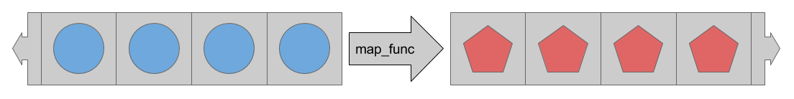

TensorFlow 1.8 programming


# Get started
## TensorFlow 程序结构
  - Import and parse the data sets
  - Create feature columns to describe the data
  - Select the type of model
  - Train the model
  - Evaluate the model's effectiveness
  - Use the trained model to make predictions
## High-level Tensorflow APIs
  - [Tensorflow Get Started](https://www.tensorflow.org/get_started)
  - **TensorFlow Core / High-level API**
    - **TensorFlow Core** 最底层API，提供对程序运行的完全控制，其他上层接口基于 TensorFlow Core
    - 上层接口的调用更易用且一致，如 **tf.estimator** 用于管理数据集 / 模型 / 训练以及评估
  - **high-level TensorFlow concepts**
    - **eager** 执行环境，直接返回操作结果 [Eager Execution](https://www.tensorflow.org/programmers_guide/eager)
    - **Datasets API** 导入数据 input pipelines [datasets Importing Data](https://www.tensorflow.org/programmers_guide/datasets)
    - **Keras API** 构建模型与层级结构 [Estimators](https://www.tensorflow.org/programmers_guide/estimators)
    - **Estimators** 模型训练 / 评估 / 预测 / 导入导出 的高层封装 [Getting started with the Keras Sequential model](https://keras.io/getting-started/sequential-model-guide/)
  - **Eager execution** 直接返回操作结果，而不用构建计算图 computational graph
    - 更直观地交互式接口，方便模型调试
    - 使用 Python control flow 代替 graph control flow，简化动态模型的使用
    - Eager 环境下不能使用 Estimator
  - **Dataset tf.data API** 构建导入数据的 input pipelines，更方便地处理大量数据 / 多种数据格式 / 复杂的数据转化
    - **tf.data.Dataset** 表示一个输入元素的序列，包含数据集合与一系列转化操作
      - **Dataset.from_tensor_slices** 创建一个包含一个或多个 tf.Tensor 类的 dataset
      - **Dataset.batch** 将一个或多个 dataset 转化为一个 dataset
    - **tf.data.Iterator** 从 dataset 提取数据，**Iterator.get_next** 用于获得 dataset 的下一个元素
  - **Estimators tf.estimator.Estimator** 简化机器学习的架构，提供模型训练 / 评估 / 预测 / 导入导出 的高层封装
    - 可以使用封装好的模型 pre-made Estimators 或者自定义模型 custom Estimators
    - Eager 环境下不能使用 Estimator
    - tf.contrib.learn.Estimator is deprecated
    - Estimators 提供更安全的模型训练过程，包括构建计算图 / 变量初始化 / 启动队列 / 异常处理 / 创建 checkpoint / TensorBoard 报告
## Eager execution environment and Keras layers API
  - **tf.enable_eager_execution** 初始化 **Eager** 执行环境
    ```python
    import os
    import matplotlib.pyplot as plt
    import tensorflow as tf
    import tensorflow.contrib.eager as tfe

    tf.enable_eager_execution()

    print("TensorFlow version: {}".format(tf.VERSION))
    # TensorFlow version: 1.8.0
    print("Eager execution: {}".format(tf.executing_eagerly()))
    # Eager execution: True
    ```
  - **tf.keras.utils.get_file** 下载数据集，返回下载到本地的文件路径
    ```python
    # Iris dataset
    train_dataset_url = "http://download.tensorflow.org/data/iris_training.csv"
    train_dataset_fp = tf.keras.utils.get_file(fname=os.path.basename(train_dataset_url), origin=train_dataset_url)

    print("Local copy of the dataset file: {}".format(train_dataset_fp))
    # Local copy of the dataset file: /home/leondgarse/.keras/datasets/iris_training.csv
    ```
  - **tf.decode_csv** 解析 csv 文件，获取特征与标签 feature and label
    ```python
    def parse_csv(line):
        example_defaults = [[0.], [0.], [0.], [0.], [0]]  # sets field types
        parsed_line = tf.decode_csv(line, example_defaults)
        # First 4 fields are features, combine into single tensor
        features = tf.reshape(parsed_line[:-1], shape=(4,))
        # Last field is the label
        label = tf.reshape(parsed_line[-1], shape=())
        return features, label
    ```
  - **tf.data.TextLineDataset** 加载 CSV 格式文件，创建 tf.data.Dataset
    ```python
    train_dataset = tf.data.TextLineDataset(train_dataset_fp)
    train_dataset = train_dataset.skip(1)             # skip the first header row
    train_dataset = train_dataset.map(parse_csv)      # parse each row
    train_dataset = train_dataset.shuffle(buffer_size=1000)  # randomize
    train_dataset = train_dataset.batch(32)

    # View a single example entry from a batch
    features, label = iter(train_dataset).next()
    print("example features:", features[0])
    # example features: tf.Tensor([4.8 3.  1.4 0.3], shape=(4,), dtype=float32)
    print("example label:", label[0])
    # example label: tf.Tensor(0, shape=(), dtype=int32)
    ```
  - **tf.keras API** 创建模型以及层级结构，输入 4 个节点，包含两个隐藏层，输出 3 个节点
    - **tf.keras.layers.Dense** 添加一个全连接层
    - **tf.keras.Sequential** 线性叠加各个层
    ```python
    model = tf.keras.Sequential([
        tf.keras.layers.Dense(10, activation="relu", input_shape=(4,)),  # input shape required
        tf.keras.layers.Dense(10, activation="relu"),
        tf.keras.layers.Dense(3)
        ])
    ```
  - **损失函数 loss function** 与 **优化程序 optimizer**
    - **tf.losses.sparse_softmax_cross_entropy** 计算模型预测与目标值的损失
    - **tf.GradientTape** 记录模型优化过程中的梯度运算
    - **tf.train.GradientDescentOptimizer** 实现 stochastic gradient descent (SGD) 算法
    ```python
    def loss(model, x, y):
        y_ = model(x)
        return tf.losses.sparse_softmax_cross_entropy(labels=y, logits=y_)

    def grad(model, inputs, targets):
        with tf.GradientTape() as tape:
            loss_value = loss(model, inputs, targets)
        return tape.gradient(loss_value, model.variables)

    optimizer = tf.train.GradientDescentOptimizer(learning_rate=0.01)
    ```
  - **模型训练 Training loop**
    ```python
    ## Note: Rerunning this cell uses the same model variables

    # keep results for plotting
    train_loss_results = []
    train_accuracy_results = []

    num_epochs = 201

    for epoch in range(num_epochs):
        epoch_loss_avg = tfe.metrics.Mean()
        epoch_accuracy = tfe.metrics.Accuracy()

        # Training loop - using batches of 32
        for x, y in train_dataset:
            # Optimize the model
            grads = grad(model, x, y)
            optimizer.apply_gradients(zip(grads, model.variables),
                                      global_step=tf.train.get_or_create_global_step())

            # Track progress
            epoch_loss_avg(loss(model, x, y))  # add current batch loss
            # compare predicted label to actual label
            epoch_accuracy(tf.argmax(model(x), axis=1, output_type=tf.int32), y)

        # end epoch
        train_loss_results.append(epoch_loss_avg.result())
        train_accuracy_results.append(epoch_accuracy.result())

        if epoch % 50 == 0:
            print("Epoch {:03d}: Loss: {:.3f}, Accuracy: {:.3%}".format(
                epoch,
                epoch_loss_avg.result(),
                epoch_accuracy.result()))

    # [Out]
    # Epoch 000: Loss: 1.833, Accuracy: 30.000%
    # Epoch 050: Loss: 0.394, Accuracy: 90.833%
    # Epoch 100: Loss: 0.239, Accuracy: 97.500%
    # Epoch 150: Loss: 0.161, Accuracy: 96.667%
    # Epoch 200: Loss: 0.121, Accuracy: 98.333%
    ```
  - **图形化显示模型损失变化 Visualize the loss function over time**
    ```python
    fig, axes = plt.subplots(2, sharex=True, figsize=(12, 8))
    fig.suptitle('Training Metrics')

    axes[0].set_ylabel("Loss", fontsize=14)
    axes[0].plot(train_loss_results)

    axes[1].set_ylabel("Accuracy", fontsize=14)
    axes[1].set_xlabel("Epoch", fontsize=14)
    axes[1].plot(train_accuracy_results)

    plt.show()
    ```
    
  - **模型评估 Evaluate the model on the test dataset**
    - **tf.keras.utils.get_file** / **tf.data.TextLineDataset** 加载测试数据集
    - **tfe.metrics.Accuracy** 计算正确率
    ```python
    test_url = "http://download.tensorflow.org/data/iris_test.csv"
    test_fp = tf.keras.utils.get_file(fname=os.path.basename(test_url), origin=test_url)

    test_dataset = tf.data.TextLineDataset(test_fp)
    test_dataset = test_dataset.skip(1)             # skip header row
    test_dataset = test_dataset.map(parse_csv)      # parse each row with the funcition created earlier
    test_dataset = test_dataset.shuffle(1000)       # randomize
    test_dataset = test_dataset.batch(32)           # use the same batch size as the training set

    test_accuracy = tfe.metrics.Accuracy()

    for (x, y) in test_dataset:
        prediction = tf.argmax(model(x), axis=1, output_type=tf.int32)
        test_accuracy(prediction, y)

    print("Test set accuracy: {:.3%}".format(test_accuracy.result()))
    # Test set accuracy: 96.667%
    ```
  - **模型预测 Use the trained model to make predictions**
    ```python
    class_ids = ["Iris setosa", "Iris versicolor", "Iris virginica"]

    predict_dataset = tf.convert_to_tensor([
        [5.1, 3.3, 1.7, 0.5,],
        [5.9, 3.0, 4.2, 1.5,],
        [6.9, 3.1, 5.4, 2.1]
    ])

    predictions = model(predict_dataset)

    for i, logits in enumerate(predictions):
        class_idx = tf.argmax(logits).numpy()
        name = class_ids[class_idx]
        print("Example {} prediction: {}".format(i, name))
    ```
    Out
    ```python
    Example 0 prediction: Iris setosa
    Example 1 prediction: Iris versicolor
    Example 2 prediction: Iris virginica
    ```
## Estimator pre-made DNN model
  - **tf.keras.utils.get_file** / **pd.read_csv** 加载数据集
    ```python
    TRAIN_URL = "http://download.tensorflow.org/data/iris_training.csv"
    TEST_URL = "http://download.tensorflow.org/data/iris_test.csv"

    CSV_COLUMN_NAMES = ['SepalLength', 'SepalWidth',
                        'PetalLength', 'PetalWidth', 'Species']

    def load_data(label_name='Species'):
        """Parses the csv file in TRAIN_URL and TEST_URL."""
        # Create a local copy of the training set.
        train_path = tf.keras.utils.get_file(fname=TRAIN_URL.split('/')[-1], origin=TRAIN_URL)
        # Parse the local CSV file.
        train = pd.read_csv(filepath_or_buffer=train_path,
                            names=CSV_COLUMN_NAMES,  # list of column names
                            header=0  # ignore the first row of the CSV file.
                           )

        # 1. Assign the DataFrame's labels (the right-most column) to train_label.
        # 2. Delete (pop) the labels from the DataFrame.
        # 3. Assign the remainder of the DataFrame to train_features
        train_features, train_label = train, train.pop(label_name)

        # Apply the preceding logic to the test set.
        test_path = tf.keras.utils.get_file(TEST_URL.split('/')[-1], TEST_URL)
        test = pd.read_csv(test_path, names=CSV_COLUMN_NAMES, header=0)
        test_features, test_label = test, test.pop(label_name)

        # Return four DataFrames.
        return (train_features, train_label), (test_features, test_label)

    (train_x, train_y), (test_x, test_y) = load_data()

    train_x.columns
    # Out[17]: Index(['SepalLength', 'SepalWidth', 'PetalLength', 'PetalWidth'], dtype='object')
    train_y.name
    # Out[19]: 'Species'
    ```
  - **tf.feature_column.numeric_column** 创建数字类型特征列表，模型的输入功能
    ```python
    # Feature columns describe how to use the input.
    my_feature_columns = []
    for key in train_x.keys():
        my_feature_columns.append(tf.feature_column.numeric_column(key=key))
    ```
  - **tf.estimator.DNNClassifier** 预定义的 DNN 神经网络模型
    - 增加隐藏层与神经元数量通常可以提高模型效果，同时需要更多的训练数据
    - tf.Estimator.DNNClassifier 可以指定可选参数 optimizer，控制模型训练过程
    ```python
    # Build 2 hidden layer DNN with 10, 10 units respectively.
    classifier = tf.estimator.DNNClassifier(
        feature_columns=my_feature_columns,
        # Two hidden layers of 10 nodes each.
        hidden_units=[10, 10],
        # The model must choose between 3 classes.
        n_classes=3)
    ```
  - **Estimator.train** 模型训练
    ```python
    def train_input_fn(features, labels, batch_size):
        """An input function for training"""
        # Convert the inputs to a Dataset.
        dataset = tf.data.Dataset.from_tensor_slices((dict(features), labels))

        # Shuffle, repeat, and batch the examples.
        dataset = dataset.shuffle(1000).repeat().batch(batch_size)

        # Return the dataset.
        return dataset

    classifier.train(
        input_fn=lambda:train_input_fn(train_x, train_y, 100),
        steps=1000)
    # [Out]
    # INFO:tensorflow:Saving checkpoints for 1 into /tmp/tmpqfn_6jut/model.ckpt.
    # INFO:tensorflow:loss = 225.84201, step = 0
    # INFO:tensorflow:loss = 13.055806, step = 100 (0.272 sec)
    # INFO:tensorflow:global_step/sec: 363.078
    # ...
    # INFO:tensorflow:loss = 5.2205944, step = 900 (0.260 sec)
    # INFO:tensorflow:Saving checkpoints for 1000 into /tmp/tmpqfn_6jut/model.ckpt.
    # INFO:tensorflow:Loss for final step: 7.6925917.
    ```
  - **Estimator.evaluate** 模型评估
    ```python
    def eval_input_fn(features, labels, batch_size):
        """An input function for evaluation or prediction"""
        features=dict(features)
        if labels is None:
            # No labels, use only features.
            inputs = features
        else:
            inputs = (features, labels)

        # Convert the inputs to a Dataset.
        dataset = tf.data.Dataset.from_tensor_slices(inputs)

        # Batch the examples
        assert batch_size is not None, "batch_size must not be None"
        dataset = dataset.batch(batch_size)

        # Return the dataset.
        return dataset

    # Evaluate the model.
    eval_result = classifier.evaluate(
        input_fn=lambda:eval_input_fn(test_x, test_y, 100))
    # [Out]
    # INFO:tensorflow:Restoring parameters from /tmp/tmpqfn_6jut/model.ckpt-1000
    # INFO:tensorflow:Saving dict for global step 1000: accuracy = 0.96666664, average_loss = 0.059205256, global_step = 1000, loss = 1.7761577

    print('\nTest set accuracy: {accuracy:0.3f}\n'.format(**eval_result))
    # Test set accuracy: 0.967
    ```
  - **Estimator.predict** 模型预测
    ```python
    predict_x = {
            'SepalLength': [5.1, 5.9, 6.9],
            'SepalWidth': [3.3, 3.0, 3.1],
            'PetalLength': [1.7, 4.2, 5.4],
            'PetalWidth': [0.5, 1.5, 2.1],
        }

    # When doing predictions, we're not passing labels to eval_input_fn
    predictions = classifier.predict(
        input_fn=lambda:eval_input_fn(predict_x,
                                      labels=None,
                                      batch_size=100))

    SPECIES = ['Setosa', 'Versicolor', 'Virginica']
    expected = ['Setosa', 'Versicolor', 'Virginica']
    template = ('\nPrediction is "{}" ({:.1f}%), expected "{}"')

    for pred_dict, expec in zip(predictions, expected):
        class_id = pred_dict['class_ids'][0]
        probability = pred_dict['probabilities'][class_id]

        print(template.format(SPECIES[class_id], 100 * probability, expec))
    ```
    Out
    ```python
    Prediction is "Setosa" (99.8%), expected "Setosa"
    Prediction is "Versicolor" (99.8%), expected "Versicolor"
    Prediction is "Virginica" (96.0%), expected "Virginica"
    ```
***

# Estimator Checkpoints
## Estimator 保存模型
  - TensorFlow 支持两种模型格式
    - **checkpoints** 依赖于创建模型的代码
    - **SavedModel** 不依赖创建模型的代码
  - **model_dir 参数** 指定 Estimator 存储模型数据的地址
    ```python
    classifier = tf.estimator.DNNClassifier(
        feature_columns=my_feature_columns,
        hidden_units=[10, 10],
        n_classes=3,
        model_dir='models/iris')

    classifier.train(
        input_fn=lambda:train_input_fn(train_x, train_y, 100),
        steps=200)
    ```
  - 初次调用 **train** 时，保存 checkpoints 与其他文件
    
    ```python
    print(classifier.model_dir)
    # models/iris

    ls models/iris/ -1
    # checkpoint
    # graph.pbtxt
    # model.ckpt-1.data-00000-of-00001
    # model.ckpt-1.index
    # model.ckpt-1.meta
    # model.ckpt-200.data-00000-of-00001
    # model.ckpt-200.index
    # model.ckpt-200.meta
    ```
    Estimator 创建了 **训练开始 step 1** 与 **训练结束 step 200** 的 checkpoints 文件
## 模型保存频率 Checkpointing Frequency
  - **模型存储的默认规则**
    - train 方法 **开始** 和 **结束** 时各保存一次
    - 每 **10** 分钟保存一次 checkpoint
    - model_dir 中保留最近的 **5** 个 checkpoints 文件
  - **自定义存储规则**
    - 创建 RunConfig 类定义需要的规则
    - Estimator 的 **config 参数** 指定成自定义的规则
    ```python
    my_checkpointing_config = tf.estimator.RunConfig(
        save_checkpoints_secs = 20*60,  # Save checkpoints every 20 minutes.
        keep_checkpoint_max = 10,       # Retain the 10 most recent checkpoints.
    )

    classifier = tf.estimator.DNNClassifier(
        feature_columns=my_feature_columns,
        hidden_units=[10, 10],
        n_classes=3,
        model_dir='models/iris',
        config=my_checkpointing_config)
    ```
## 模型恢复 Restore
  - 初次调用模型的 train 方法创建 checkpoints 后，再调用模型的 train / evaluate / predict 方法将
    - Estimator 首先调用模型的 model_fn() 创建 graph
    - 使用最新的 checkpoint 中存储的数据初始化模型参数
    - 即如果 checkpoints 存在，调用 train / evaluate / predict 时，将首先重建模型
  
## Avoiding a bad restoration
  - 从 checkpoint 重建模型状态，只适用于模型结构不变的情况，模型参数改变时将报错
    ```python
    '''  trained a DNNClassifier Estimator containing two hidden layers, each having 10 nodes '''
    classifier = tf.estimator.DNNClassifier(
        feature_columns=my_feature_columns,
        hidden_units=[10, 10],
        n_classes=3,
        model_dir='models/iris')

    classifier.train(
        input_fn=lambda:train_input_fn(train_x, train_y, batch_size=100),
            steps=200)

    ''' change the number of neurons in each hidden layer from 10 to 20 and then attempted to retrain the model '''
    classifier2 = tf.estimator.DNNClassifier(
        feature_columns=my_feature_columns,
        hidden_units=[20, 20],  # Change the number of neurons in the model.
        n_classes=3,
        model_dir='models/iris')

    classifier2.train(
        input_fn=lambda:train_input_fn(train_x, train_y, batch_size=100),
            steps=200)
    ```
    **error**
    ```python
    ...
    InvalidArgumentError (see above for traceback): tensor_name = dnn/hiddenlayer_0/bias;
    shape in shape_and_slice spec [20]
    does not match the shape stored in checkpoint: [10]
    ```
***

# Feature Columns
## tf.feature_column 模块
  - **tf.feature_column** 创建特征列 feature columns，用于模型的输入功能
    ```python
    price = numeric_column('price')
    columns = [price, ...]
    features = tf.parse_example(..., features=make_parse_example_spec(columns))
    dense_tensor = input_layer(features, columns)

    # or
    bucketized_price = bucketized_column(price, boundaries=[...])
    columns = [bucketized_price, ...]
    features = tf.parse_example(..., features=make_parse_example_spec(columns))
    linear_prediction = linear_model(features, columns)
    ```
  - 多数方法返回 **Categorical-Column 分类列** 或 **Dense-Column 密集列**，除了 **bucketized_column** 继承自这两个类
  - 输入给 `tf.feature_column.input_layer` 时，需要将 categorical column 转化为 dense column，可以使用 **embedding_column** / **indicator_column** 转化
## Numeric column 数值列
  - **tf.feature_column.numeric_column** 创建 Numeric column，默认输入参数类型是 tf.float32，维度为 1
    ```python
    numeric_column(key, shape=(1,), default_value=None, dtype=tf.float32, normalizer_fn=None)
    ```
    ```python
    # Defaults to a tf.float32 scalar.
    numeric_feature_column = tf.feature_column.numeric_column(key="SepalLength")
    ```
  - **dtype 参数** 指定其他数据类型
    ```python
    # Represent a tf.float64 scalar.
    numeric_feature_column = tf.feature_column.numeric_column(key="SepalLength", dtype=tf.float64)
    ```
  - **shape 参数** 指定其他数据维度
    ```python
    # Represent a 10-element vector in which each cell contains a tf.float32.
    vector_feature_column = tf.feature_column.numeric_column(key="Bowling", shape=10)

    # Represent a 10x5 matrix in which each cell contains a tf.float32.
    matrix_feature_column = tf.feature_column.numeric_column(key="MyMatrix", shape=[10,5])
    ```
  - **normalizer_fn 参数** 指定数据转换，如数据 normalization
    ```python
    price = {'price': np.array([4, dtype=np.float32]).reshape(-1, 1)}
    column = [tf.feature_column.numeric_column('price', normalizer_fn=lambda x: (x - 3.0) / 4.2)]
    tensor = tf.feature_column.input_layer(price, column)
    sess = tf.InteractiveSession()
    tensor.eval()
    # Out[36]: array([[-0.71428573], [-0.4761905 ], [-0.23809525], [ 0.        ]], dtype=float32)
    ```
## Bucketized column 分桶列
  - **Bucketized** 将数值范围划分成不同的类别，每一个作为一个 bucket
    ```python
    bucketized_column(source_column, boundaries)
    ```
  - 按照年代划分成 4 个 bucket

    

    **bucket 数据**

    | Date Range         | Represented as |
    | ------------------ | -------------- |
    | < 1960             | [1, 0, 0, 0]   |
    | >= 1960 but < 1980 | [0, 1, 0, 0]   |
    | >= 1980 but < 2000 | [0, 0, 1, 0]   |
    | > 2000             | [0, 0, 0, 1]   |
    **python 示例**
    ```python
    years = {'years': [1999,2013,1987,2005]}
    years_fc = tf.feature_column.numeric_column('years')
    column = tf.feature_column.bucketized_column(
          source_column = years_fc,
          boundaries = [1990, 2000, 2010])
    column.name
    # Out[8]: 'years_bucketized'

    tensor = tf.feature_column.input_layer(years, [column])
    sess = tf.InteractiveSession()
    tensor.eval()
    # Out[9]:
    # array([[0., 1., 0., 0.],
    #        [0., 0., 0., 1.],
    #        [1., 0., 0., 0.],
    #        [0., 0., 1., 0.]], dtype=float32)
    ```
## Categorical identity column 分类识别列
  - Categorical identity columns 可以作为 bucketized columns 的特殊形式，每一个桶只代表一个单独的数据
    ```python
    # The values of 'key' feature must be >= 0 and < num_buckets
    categorical_column_with_identity(key, num_buckets, default_value=None)
    ```
  - 对于整数列表 [0, 4)，即需要表示 0, 1, 2, 3，Categorical identity columns 的表示形式

    

    **python 示例**
    ```python
    pets = {'pets': [2, 3, 0, 1]}  # cat 0，dog 1，rabbit 2，pig 3

    column = tf.feature_column.categorical_column_with_identity(
        key='pets',
        num_buckets=4) # Values [0, 4)

    indicator = tf.feature_column.indicator_column(column)
    tensor = tf.feature_column.input_layer(pets, [indicator])
    sess = tf.InteractiveSession()
    tensor.eval()
    # Out[13]:
    # array([[0., 0., 1., 0.],
    #        [0., 0., 0., 1.],
    #        [1., 0., 0., 0.],
    #        [0., 1., 0., 0.]], dtype=float32)
    ```
## Categorical vocabulary column 分类词汇列
  - Categorical vocabulary columns 将字符串转化为 one-hot 向量，类似于 enum 形式的 categorical identity columns

    
  - **tf.feature_column.categorical_column_with_vocabulary_list** 将一个单词列表转为为 column
    ```python
    # output will have shape [n, len(vocabulary_list)+num_oov_buckets]
    categorical_column_with_vocabulary_list(key, vocabulary_list, dtype=None, default_value=-1, num_oov_buckets=0)
    ```
    - **default_value 参数** 不在单词列表中单词的返回值，默认 -1，不能同时指定正数的 num_oov_buckets
    - **num_oov_buckets 参数** 不在单词列表中值的个数，返回 `[len(vocabulary_list), len(vocabulary_list)+num_oov_buckets)` 中的一个值
    ```python
    vocabulary_a = {'vocabulary_a': ["kitchenware", "electronics", "sports", "keyboards"]}

    column = tf.feature_column.categorical_column_with_vocabulary_list(
        key='vocabulary_a',
        vocabulary_list=["kitchenware", "electronics", "sports"],
        dtype=tf.string,
        default_value=-1,
        num_oov_buckets=3)

    indicator = tf.feature_column.indicator_column(column)
    tensor = tf.feature_column.input_layer(vocabulary_a, [indicator])
    sess = tf.InteractiveSession()
    # FailedPreconditionError: Table not initialized.
    tf.tables_initializer().run()
    tensor.shape.as_list()
    # Out[15]: [4, 6]
    tensor.eval()
    # Out[16]:
    # array([[1., 0., 0., 0., 0., 0.],
    #        [0., 1., 0., 0., 0., 0.],
    #        [0., 0., 1., 0., 0., 0.],
    #        [0., 0., 0., 0., 1., 0.]], dtype=float32)  # keyboards
    ```
  - **tf.feature_column.categorical_column_with_vocabulary_file** 将一个文件中的单词转化为 column
    ```python
    categorical_column_with_vocabulary_file(key, vocabulary_file, vocabulary_size=None, num_oov_buckets=0, default_value=None, dtype=tf.string)
    ```
    - **vocabulary_size 参数** 获取文件中单词列表的数量，不大于单词列表中的单词数量
    ```python
    vocabulary_a = {'vocabulary_a': ["kitchenware", "electronics", "sports", "keyboards"]}

    fc_path = 'product_class.txt'
    ff = open(fc_path, 'w')
    for ii in vocabulary_a['vocabulary_a']:
        ff.write(ii + '\n')
    ff.close()

    # out-of-vocabulary buckets will be all zero
    column=tf.feature_column.categorical_column_with_vocabulary_file(
            key="vocabulary_a",
            vocabulary_file=fc_path,
            vocabulary_size=3,
            num_oov_buckets=0)

    indicator = tf.feature_column.indicator_column(column)
    tensor = tf.feature_column.input_layer(pets, [indicator])
    sess = tf.InteractiveSession()
    # FailedPreconditionError: Table not initialized.
    tf.tables_initializer().run()
    tensor.shape.as_list()
    # Out[44]: [4, 3]
    tensor.eval()
    # Out[45]:
    # array([[1., 0., 0.],
    #        [0., 1., 0.],
    #        [0., 0., 1.],
    #        [0., 0., 0.]], dtype=float32)  # all zero
    ```
## Hashed column 哈希列
  - Hashed Column 在类别很多时，将输入转化为哈希值作为类别，限定输入的类别数量，减少内存消耗
    ```python
    categorical_column_with_hash_bucket(key, hash_bucket_size, dtype=tf.string)
    ```
    **计算哈希值**
    ```python
    # pseudocode
    feature_id = hash(raw_feature) % hash_buckets_size
    ```
    **python 示例**
    ```python
    colors = {'colors': ['green','red','blue','yellow','pink','blue','red','indigo']}  

    column = tf.feature_column.categorical_column_with_hash_bucket(
            key='colors',
            hash_bucket_size=5, # The number of categories
        )

    indicator = tf.feature_column.indicator_column(column)
    tensor = tf.feature_column.input_layer(colors, [indicator])
    sess = tf.InteractiveSession()
    tensor.eval()
    # Out[3]:
    # array([[0., 0., 0., 0., 1.],
    #        [1., 0., 0., 0., 0.],
    #        [1., 0., 0., 0., 0.],
    #        [0., 1., 0., 0., 0.],
    #        [0., 1., 0., 0., 0.],
    #        [1., 0., 0., 0., 0.],
    #        [1., 0., 0., 0., 0.],
    #        [0., 1., 0., 0., 0.]], dtype=float32)
    ```
  - Hashed Column 可能将不相关的输入划分到同一类别，不过很多时候 tensorflow 还是能够利用其他的特征列把它们区分开

    
## Crossed column 交叉列
  - feature crosses 把多个特征合并成为一个特征，通常称为 **feature crosses**，比如把 经度 longitude / 维度 latitude 两个特征合并为 地理位置特征 location
    ```python
    crossed_column(keys, hash_bucket_size, hash_key=None)
    ```
    **python 示例**
    ```python
    featrues = {
            'longtitude': [19,61,30,9,45],
            'latitude': [45,40,72,81,24]
        }

    longtitude = tf.feature_column.numeric_column('longtitude')
    latitude = tf.feature_column.numeric_column('latitude')

    latitude_bucket_fc = tf.feature_column.bucketized_column(latitude, [33,66])
    longitude_bucket_fc  = tf.feature_column.bucketized_column(longtitude,[33,66])

    crossed_lat_lon_fc = tf.feature_column.crossed_column([latitude_bucket_fc, longitude_bucket_fc], 12)

    indicator = tf.feature_column.indicator_column(crossed_lat_lon_fc)
    tensor = tf.feature_column.input_layer(featrues, [indicator])
    sess = tf.InteractiveSession()
    tensor.eval()
    # Out[6]:
    # array([[0., 0., 0., 0., 0., 0., 0., 0., 0., 0., 0., 1.],
    #        [0., 0., 0., 0., 0., 0., 0., 0., 0., 1., 0., 0.],
    #        [0., 0., 1., 0., 0., 0., 0., 0., 0., 0., 0., 0.],
    #        [0., 0., 1., 0., 0., 0., 0., 0., 0., 0., 0., 0.],
    #        [0., 0., 0., 0., 0., 1., 0., 0., 0., 0., 0., 0.]], dtype=float32)

    tf.feature_column.input_layer(featrues, latitude_bucket_fc).eval()
    # Out[14]:
    # array([[0., 1., 0.],
    #        [0., 1., 0.],
    #        [0., 0., 1.],
    #        [0., 0., 1.],
    #        [1., 0., 0.]], dtype=float32)

    tf.feature_column.input_layer(featrues, longitude_bucket_fc).eval()
    # Out[15]:
    # array([[1., 0., 0.],
    #        [0., 1., 0.],
    #        [1., 0., 0.],
    #        [1., 0., 0.],
    #        [0., 1., 0.]], dtype=float32)
    ```
  - 在创建 feature crosses 时，通常还会保留原始 uncrossed 特征
## Indicator columns 指示列
  - Indicator columns 不直接操作数据，使用 categorical columns 作为输入，转化为 input_layer 方法接受的 one-hot 特征列
    ```python
    indicator_column(categorical_column)
    ```
    - Used to wrap any `categorical_column_*` (e.g., to feed to DNN)
    - Use `embedding_column` if the inputs are sparse
    ```python
    name_c = tf.feature_column.categorical_column_with_vocabulary_list('name', ['bob', 'george', 'wanda'])
    name = tf.feature_column.indicator_column(name_c)
    columns = [name]
    dense_tensor_1 = tf.feature_column.input_layer({'name': ['bob']}, columns)
    dense_tensor_2 = tf.feature_column.input_layer({'name': ['bob', 'bob']}, columns)
    dense_tensor_3 = tf.feature_column.input_layer({'name': ['bob', 'wanda']}, columns)
    dense_tensor_4 = tf.feature_column.input_layer({'name': ['bob', 'aaa']}, columns)

    sess = tf.InteractiveSession()
    tf.tables_initializer().run()
    print(dense_tensor_1.eval())
    # Out[5]: array([[1., 0., 0.]], dtype=float32)

    print(dense_tensor_2.eval())
    # Out[6]: array([[1., 0., 0.], [1., 0., 0.]], dtype=float32)

    print(dense_tensor_3.eval())
    # Out[7]: array([[1., 0., 0.], [0., 0., 1.]], dtype=float32)

    print(dense_tensor_4.eval())
    # Out[8]: array([[1., 0., 0.], [0., 0., 0.]], dtype=float32)
    ```
## embedding columns 嵌入列
  - 在类别数量变多，或者处理稀疏矩阵时，indicator columns 会变得很大
  - embedding column 不再限定每个元素必须是 0 或 1，而可以是任何数字，从而使用更少的元素数表现数据
    ```python
    # Inputs must be a `_CategoricalColumn` created by any of the `categorical_column_*` function
    embedding_column(categorical_column, dimension,
                    combiner='mean', initializer=None,
                    ckpt_to_load_from=None, tensor_name_in_ckpt=None,
                    max_norm=None, trainable=True)
    ```
  - **embedding columns** 与 **indicator columns** 的映射过程，embedding column 可以使用更低维度的向量表示数据，假设输入包含 81 个单词向量，对于 4 个单词的输入
    ```python
    "dog"
    "spoon"
    "scissors"
    "guitar"
    ```
    **embedding columns** 与 **indicator columns** 的映射过程

    
    - 处理数据时，首先通过 `categorical_column_with...` 方法将 string 映射成为数字，`["dog", "spoon", "scissors", "guitar"] --> [0, 32, 79, 80]`
    - indicator column 将每个数字转化为 81 个元素的向量，只在对应的数字处为1
    - embedding column 将数字映射为 3 个元素的向量
  - embeddings vectors 的数值是在 **训练时分配** 的，以更有利于解决问题
  - **embedding 维度** 通常 embedding 向量的维度数量是根据类别数量分配的，如 81 个类别对应 `81 ** 0.25 = 3`
    ```python
    embedding_dimensions =  number_of_categories**0.25
    ```
  - **python 示例**
    ```python
    features = {'items': ["dog", "spoon", "scissors", "guitar", "screen"]}

    pets_f_c = tf.feature_column.categorical_column_with_vocabulary_list(
        'items',
        ["dog", "spoon", "scissors", "guitar"],
        dtype=tf.string,
        default_value=-1)

    column = tf.feature_column.embedding_column(
        categorical_column=pets_f_c,
        dimension=3)
    tensor = tf.feature_column.input_layer(features, [column])

    sess = tf.InteractiveSession()
    tf.global_variables_initializer().run()
    tf.tables_initializer().run()
    tensor.eval()
    # Out[17]:
    # array([[-0.1428304 , -0.6151378 ,  0.87506115],
    #        [ 0.4937725 ,  1.0007112 , -0.1445001 ],
    #        [ 0.0717921 ,  0.6795558 ,  0.32704228],
    #        [ 0.16342635, -0.60739034,  0.01697639],
    #        [ 0.        ,  0.        ,  0.        ]], dtype=float32)
    ```
  - **using `embedding_column` with `DNNClassifier`**
    ```python
    video_id = categorical_column_with_identity(
        key='video_id', num_buckets=1000000, default_value=0)
    columns = [embedding_column(video_id, 9),...]

    estimator = tf.estimator.DNNClassifier(feature_columns=columns, ...)

    label_column = ...
    def input_fn():
      features = tf.parse_example(
          ..., features=make_parse_example_spec(columns + [label_column]))
      labels = features.pop(label_column.name)
      return features, labels

    estimator.train(input_fn=input_fn, steps=100)
    ```
  - **using `embedding_column` with model_fn**
    ```python
    def model_fn(features, ...):
      video_id = categorical_column_with_identity(
          key='video_id', num_buckets=1000000, default_value=0)
      columns = [embedding_column(video_id, 9),...]
      dense_tensor = input_layer(features, columns)
      # Form DNN layers, calculate loss, and return EstimatorSpec.
      ...
    ```
## Weighted categorical column 权重分类列
  - Weighted categorical column 可以为每个分类设置权重
    ```python
    weighted_categorical_column(categorical_column, weight_feature_key, dtype=tf.float32)
    ```
  - **python 示例**
    ```python
    features = {'color': [['R'], ['A'], ['G'], ['B'],['R']],
                'weight': [[1.0], [5.0], [4.0], [8.0],[3.0]]}

    color_f_c = tf.feature_column.categorical_column_with_vocabulary_list(
        'color', ['R', 'G', 'B','A'], dtype=tf.string, default_value=-1
    )

    column = tf.feature_column.weighted_categorical_column(color_f_c, 'weight')

    indicator = tf.feature_column.indicator_column(column)
    tensor = tf.feature_column.input_layer(features, [indicator])
    sess = tf.InteractiveSession()
    tf.tables_initializer().run()
    tensor.eval()
    # Out[24]:
    # array([[1., 0., 0., 0.],
    #        [0., 0., 0., 5.],
    #        [0., 4., 0., 0.],
    #        [0., 0., 8., 0.],
    #        [3., 0., 0., 0.]], dtype=float32)
    ```
## Passing feature columns to Estimators
  - Tensorflow 提供了多个 Estimators，但不是每种 Estimators 都能够接收所有类型的特征列 feature column
    - **线性分类器 linearClassifier** 和 **线性回归器 linearRegressor**，接收 **所有类型特征列**
    - **深度神经网络分类器 DNNClassifier** 和 **深度神经网络回归器 DNNRegressor**，仅接收 **密集特征列 dense column**，其他类型特征列必须用 **指示列 indicatorColumn** 或 **嵌入列 embedingColumn** 进行包裹
    - **线性神经网络合成分类器 linearDNNCombinedClassifier** 和 **线性神经网络合成回归器 linearDNNCombinedRegressor**
      - **linear_feature_columns** 参数接收 **所有类型特征列**
      - **dnn_feature_columns** 只接收 **密度特征列 dense column**
## Linear model 线性模型
  - 对所有特征进行线性加权操作
    ```python
    linear_model(features, feature_columns, units=1, sparse_combiner='sum', weight_collections=None, trainable=True, cols_to_vars=None)
    ```
  - **python 示例**
    ```python
    def get_linear_model_bias():
        with tf.variable_scope('linear_model', reuse=True):
            return tf.get_variable('bias_weights')

    def get_linear_model_column_var(column):
        return tf.get_collection(tf.GraphKeys.GLOBAL_VARIABLES,
                                 'linear_model/' + column.name)[0]

    featrues = {
            'price': [[1.0], [5.0], [10.0]],
            'color': [['R'], ['G'], ['B']]
        }

    price_column = tf.feature_column.numeric_column('price')
    color_column = tf.feature_column.categorical_column_with_vocabulary_list('color', ['R', 'G', 'B'])
    prediction = tf.feature_column.linear_model(featrues, [price_column, color_column])

    bias = get_linear_model_bias()
    price_var = get_linear_model_column_var(price_column)
    color_var = get_linear_model_column_var(color_column)

    with tf.Session() as sess:
        sess.run(tf.global_variables_initializer())
        sess.run(tf.tables_initializer())

        sess.run(bias.assign([7.0]))
        sess.run(price_var.assign([[10.0]]))
        sess.run(color_var.assign([[2.0], [2.0], [2.0]]))

        predication_result = sess.run([prediction])

        print(prediction)
        print(predication_result)
    # [Out]
    # Tensor("linear_model/weighted_sum:0", shape=(3, 1), dtype=float32)
    # [array([[ 19.], [ 59.], [109.]], dtype=float32)]
    ```
## tf.make_parse_example_spec 输入转化为字典
  - **make_parse_example_spec** 将输入 feature_columns 转化为字典 dictionary
    ```python
    make_parse_example_spec(feature_columns)
    ```
    The returned dictionary can be used as arg 'features' in `tf.parse_example`
    ```python
    # Define features and transformations
    feature_a = categorical_column_with_vocabulary_file(...)
    feature_b = numeric_column(...)
    feature_c_bucketized = bucketized_column(numeric_column("feature_c"), ...)
    feature_a_x_feature_c = crossed_column(
        columns=["feature_a", feature_c_bucketized], ...)

    feature_columns = set(
        [feature_b, feature_c_bucketized, feature_a_x_feature_c])
    features = tf.parse_example(
        serialized=serialized_examples,
        features=make_parse_example_spec(feature_columns))
    ```
    For the above example, make_parse_example_spec would return the dict:
    ```python
    {
        "feature_a": parsing_ops.VarLenFeature(tf.string),
        "feature_b": parsing_ops.FixedLenFeature([1], dtype=tf.float32),
        "feature_c": parsing_ops.FixedLenFeature([1], dtype=tf.float32)
    }
    ```
***

# Datasets
## Basic input
  - **tf.data.Dataset.from_tensor_slices** 创建给定数据的切片 Slices，根据数据集的第一维度切片，代表了输入数据的一个样例
    ```python
    train, test = tf.keras.datasets.mnist.load_data()
    mnist_x, mnist_y = train
    mnist_x.shape
    # Out[14]: (60000, 28, 28)

    mnist_ds = tf.data.Dataset.from_tensor_slices((mnist_x, mnist_y))
    print(mnist_ds)
    # [Out] <TensorSliceDataset shapes: ((28, 28), ()), types: (tf.uint8, tf.uint8)>
    ```
  - **shuffle** / **repeat** / **batch** 操作 Manipulation
    - **shuffle(buffer_size, seed=None, reshuffle_each_iteration=None)** buffer_size 通常大于 Dataset 中样列数量，保证充分打乱顺序
    - **repeat(count=None)** count 指定数据及重复次数，None / -1 表示不限制
    - **batch(batch_size)** 创建一个输入样例的 batch
    ```python
    # Shuffle, repeat, and batch the examples.
    dataset = mnist_ds.shuffle(1000).repeat().batch(200)
    dataset.output_shapes
    # Out[22]:
    # (TensorShape([Dimension(None), Dimension(28), Dimension(28)]),
    #  TensorShape([Dimension(None)]))
    ```
    输出的第一维度是未知的，因为最后一个 batch 可能包含更少的元素
  - **dataset.make_one_shot_iterator** 遍历 dataset
    ```python
    sess = tf.InteractiveSession()
    train_xs, train_ys = sess.run(dataset.make_one_shot_iterator().get_next())
    train_xs.shape
    # Out[55]: (200, 28, 28)
    train_ys.shape
    # Out[56]: (200,)
    train_ys[:5]
    # Out[57]: array([8, 6, 5, 8, 3], dtype=uint8)
    ```
## Reading a CSV File
  - **tf.data.TextLineDataset 类** 读取文本文件，**skip** 方法指定跳过文件的几行
    ```python
    TRAIN_URL = "http://download.tensorflow.org/data/iris_training.csv"
    train_path = tf.keras.utils.get_file(fname=TRAIN_URL.split('/')[-1], origin=TRAIN_URL)

    ds = tf.data.TextLineDataset(train_path).skip(1)
    ```
  - **tf.decode_csv** 解析单行 csv 格式字符串
    ```python
    decode_csv(records, record_defaults, field_delim=',', use_quote_delim=True, name=None, na_value='')
    ```
    ```python
    elem = tf.decode_csv('1, 2, 3, 4, 5', [[0.0], [0.0], [0.0], [0.0], [0]])
    with tf.Session() as sess:
        print(sess.run(elem))
    # [1.0, 2.0, 3.0, 4.0, 5]
    ```
  - **dataset.map** 在 dataset 的每一个元素上应用一个转化函数

    
    ```python
    # Metadata describing the text columns
    COLUMNS = ['SepalLength', 'SepalWidth',
               'PetalLength', 'PetalWidth',
               'label']
    FIELD_DEFAULTS = [[0.0], [0.0], [0.0], [0.0], [0]]
    def _parse_line(line):
        # Decode the line into its fields
        fields = tf.decode_csv(line, FIELD_DEFAULTS)

        # Pack the result into a dictionary
        features = dict(zip(COLUMNS,fields))

        # Separate the label from the features
        label = features.pop('label')

        return features, label

    ds = ds.map(_parse_line)
    print(ds)
    # <MapDataset
    # shapes: (
    #     {SepalLength: (), PetalWidth: (), ...},
    #     ()),
    # types: (
    #     {SepalLength: tf.float32, PetalWidth: tf.float32, ...},
    #     tf.int32)>
    ```
  - **feed an estimator** estimator 的 input_fn 要求函数的参数为空
    ```python
    def csv_input_fn(csv_path, batch_size):
        # Create a dataset containing the text lines.
        dataset = tf.data.TextLineDataset(csv_path).skip(1)

        # Parse each line.
        dataset = dataset.map(_parse_line)

        # Shuffle, repeat, and batch the examples.
        return dataset.shuffle(1000).repeat().batch(batch_size)

    # All the inputs are numeric
    feature_columns = [tf.feature_column.numeric_column(name) for name in COLUMNS[:-1]]

    # Build the estimator
    est = tf.estimator.LinearClassifier(feature_columns, n_classes=3)
    # Train the estimator
    batch_size = 100
    est.train( steps=1000, input_fn=lambda : csv_input_fn(train_path, batch_size))
    # INFO:tensorflow:Saving checkpoints for 1 into /tmp/tmpphrfnjdp/model.ckpt.
    # INFO:tensorflow:loss = 109.86123, step = 0
    # INFO:tensorflow:global_step/sec: 127.682
    # ...
    # INFO:tensorflow:Saving checkpoints for 1000 into /tmp/tmpphrfnjdp/model.ckpt.
    # INFO:tensorflow:Loss for final step: 8.794706.
    ```
***

# Creating Custom Estimators
## Pre-made vs. custom

  As the following figure shows, pre-made Estimators are subclasses of the tf.estimator.Estimator base class, while custom Estimators are an instance of tf.estimator.Estimator:
  

  A model function (or model_fn) implements the ML algorithm. The only difference between working with pre-made Estimators and custom Estimators is:

      With pre-made Estimators, someone already wrote the model function for you.
      With custom Estimators, you must write the model function.

  Your model function could implement a wide range of algorithms, defining all sorts of hidden layers and metrics. Like input functions, all model functions must accept a standard group of input parameters and return a standard group of output values. Just as input functions can leverage the Dataset API, model functions can leverage the Layers API and the Metrics API.

  Let's see how to solve the Iris problem with a custom Estimator. A quick reminder--here's the organization of the Iris model that we're trying to mimic:
  
## Write a model function

  The model function we'll use has the following call signature:
  ```python
  def my_model_fn(
     features, # This is batch_features from input_fn
     labels,   # This is batch_labels from input_fn
     mode,     # An instance of tf.estimator.ModeKeys
     params):  # Additional configuration
  ```
  The first two arguments are the batches of features and labels returned from the input function; that is, features and labels are the handles to the data your model will use. The mode argument indicates whether the caller is requesting training, predicting, or evaluation.

  The caller may pass params to an Estimator's constructor. Any params passed to the constructor are in turn passed on to the model_fn

  To implement a typical model function, you must do the following:

      Define the model.
      Specify additional calculations for each of the three different modes:
          Predict
          Evaluate
          Train
## Define the model

  The basic deep neural network model must define the following three sections:

      An input layer
      One or more hidden layers
      An output layer

  Define the input layer

  The first line of the model_fn calls tf.feature_column.input_layer to convert the feature dictionary and feature_columns into input for your model, as follows:

      # Use `input_layer` to apply the feature columns.
      net = tf.feature_column.input_layer(features, params['feature_columns'])

  The preceding line applies the transformations defined by your feature columns, creating the model's input layer.
  

  Hidden Layers

  If you are creating a deep neural network, you must define one or more hidden layers. The Layers API provides a rich set of functions to define all types of hidden layers, including convolutional, pooling, and dropout layers. For Iris, we're simply going to call tf.layers.dense to create hidden layers, with dimensions defined by params['hidden_layers']. In a dense layer each node is connected to every node in the preceding layer. Here's the relevant code:
  ```python
  # Build the hidden layers, sized according to the 'hidden_units' param.
  for units in params['hidden_units']:
      net = tf.layers.dense(net, units=units, activation=tf.nn.relu)
  ```
      The units parameter defines the number of output neurons in a given layer.
      The activation parameter defines the activation function — Relu in this case.
      Note that tf.layers.dense provides many additional capabilities, including the ability to set a multitude of regularization parameters

  

  Output Layer

  We'll define the output layer by calling tf.layers.dense yet again, this time without an activation function:
  ```python
  # Compute logits (1 per class).
  logits = tf.layers.dense(net, params['n_classes'], activation=None)
  ```
  Here, net signifies the final hidden layer. Therefore, the full set of layers is now connected as follows:

  

  When defining an output layer, the units parameter specifies the number of outputs. So, by setting units to params['n_classes'], the model produces one output value per class. Each element of the output vector will contain the score, or "logit", calculated for the associated class of Iris: Setosa, Versicolor, or Virginica, respectively.

  Later on, these logits will be transformed into probabilities by the tf.nn.softmax function.
## Implement training, evaluation, and prediction
  As the following table shows, when someone calls train, evaluate, or predict, the Estimator framework invokes your model function with the mode parameter set as follows:

  | Estimator method | Estimator Mode   |
  | ---------------- | ---------------- |
  | train()          | ModeKeys.TRAIN   |
  | evaluate()       | ModeKeys.EVAL    |
  | predict()        | ModeKeys.PREDICT |

  For example, suppose you instantiate a custom Estimator to generate an object named classifier. Then, you make the following call:
  ```python
  classifier = tf.estimator.Estimator(...)
  classifier.train(input_fn=lambda: my_input_fn(FILE_TRAIN, True, 500))
  ```
  The Estimator framework then calls your model function with mode set to ModeKeys.TRAIN.

  Your model function must provide code to handle all three of the mode values. For each mode value, your code must return an instance of tf.estimator.EstimatorSpec, which contains the information the caller requires. Let's examine each mode.

  Predict

  When the Estimator's predict method is called, the model_fn receives mode = ModeKeys.PREDICT. In this case, the model function must return a tf.estimator.EstimatorSpec containing the prediction.

  The model must have been trained prior to making a prediction. The trained model is stored on disk in the model_dir directory established when you instantiated the Estimator.

  The code to generate the prediction for this model looks as follows:
  ```python
  # Compute predictions.
  predicted_classes = tf.argmax(logits, 1)
  if mode == tf.estimator.ModeKeys.PREDICT:
      predictions = {
          'class_ids': predicted_classes[:, tf.newaxis],
          'probabilities': tf.nn.softmax(logits),
          'logits': logits,
      }
      return tf.estimator.EstimatorSpec(mode, predictions=predictions)
  ```
  The prediction dictionary contains everything that your model returns when run in prediction mode.

  The predictions holds the following three key/value pairs:

      class_ids holds the class id (0, 1, or 2) representing the model's prediction of the most likely species for this example.
      probabilities holds the three probabilities (in this example, 0.02, 0.95, and 0.03)
      logit holds the raw logit values (in this example, -1.3, 2.6, and -0.9)

  We return that dictionary to the caller via the predictions parameter of the tf.estimator.EstimatorSpec. The Estimator's predict method will yield these dictionaries.

  

  Calculate the loss

  For both training and evaluation we need to calculate the model's loss. This is the objective that will be optimized.

  We can calculate the loss by calling tf.losses.sparse_softmax_cross_entropy. The value returned by this function will be lowest, approximately 0, probability of the correct class (at index label) is near 1.0. The loss value returned is progressively larger as the probability of the correct class decreases.

  This function returns the average over the whole batch.
  ```python
  # Compute loss.
  loss = tf.losses.sparse_softmax_cross_entropy(labels=labels, logits=logits)
  ```

  Evaluate

  When the Estimator's evaluate method is called, the model_fn receives mode = ModeKeys.EVAL. In this case, the model function must return a tf.estimator.EstimatorSpec containing the model's loss and optionally one or more metrics.

  Although returning metrics is optional, most custom Estimators do return at least one metric. TensorFlow provides a Metrics module tf.metrics to calculate common metrics. For brevity's sake, we'll only return accuracy. The tf.metrics.accuracy function compares our predictions against the true values, that is, against the labels provided by the input function. The tf.metrics.accuracy function requires the labels and predictions to have the same shape. Here's the call to tf.metrics.accuracy:
  ```python
  # Compute evaluation metrics.
  accuracy = tf.metrics.accuracy(labels=labels,
                                 predictions=predicted_classes,
                                 name='acc_op')
  ```
  The EstimatorSpec returned for evaluation typically contains the following information:

      loss, which is the model's loss
      eval_metric_ops, which is an optional dictionary of metrics.

  So, we'll create a dictionary containing our sole metric. If we had calculated other metrics, we would have added them as additional key/value pairs to that same dictionary. Then, we'll pass that dictionary in the eval_metric_ops argument of tf.estimator.EstimatorSpec. Here's the code:
  ```python
  metrics = {'accuracy': accuracy}
  tf.summary.scalar('accuracy', accuracy[1])

  if mode == tf.estimator.ModeKeys.EVAL:
      return tf.estimator.EstimatorSpec(
          mode, loss=loss, eval_metric_ops=metrics)
  ```
  The tf.summary.scalar will make accuracy available to TensorBoard in both TRAIN and EVAL modes. (More on this later).


  Train

  When the Estimator's train method is called, the model_fn is called with mode = ModeKeys.TRAIN. In this case, the model function must return an EstimatorSpec that contains the loss and a training operation.

  Building the training operation will require an optimizer. We will use tf.train.AdagradOptimizer because we're mimicking the DNNClassifier, which also uses Adagrad by default. The tf.train package provides many other optimizers—feel free to experiment with them.

  Here is the code that builds the optimizer:
  ```python
  optimizer = tf.train.AdagradOptimizer(learning_rate=0.1)
  ```
  Next, we build the training operation using the optimizer's minimize method on the loss we calculated earlier.

  The minimize method also takes a global_step parameter. TensorFlow uses this parameter to count the number of training steps that have been processed (to know when to end a training run). Furthermore, the global_step is essential for TensorBoard graphs to work correctly. Simply call tf.train.get_global_step and pass the result to the global_step argument of minimize.

  Here's the code to train the model:
  ```python
  train_op = optimizer.minimize(loss, global_step=tf.train.get_global_step())
  ```
  The EstimatorSpec returned for training must have the following fields set:

      loss, which contains the value of the loss function.
      train_op, which executes a training step.

  Here's our code to call EstimatorSpec:
  ```python
  return tf.estimator.EstimatorSpec(mode, loss=loss, train_op=train_op)
  ```
  The model function is now complete.
## The custom Estimator

  Instantiate the custom Estimator through the Estimator base class as follows:
  ```python
  # Build 2 hidden layer DNN with 10, 10 units respectively.
  classifier = tf.estimator.Estimator(
      model_fn=my_model,
      params={
          'feature_columns': my_feature_columns,
          # Two hidden layers of 10 nodes each.
          'hidden_units': [10, 10],
          # The model must choose between 3 classes.
          'n_classes': 3,
      })
  ```
  Here the params dictionary serves the same purpose as the key-word arguments of DNNClassifier; that is, the params dictionary lets you configure your Estimator without modifying the code in the model_fn.

  The rest of the code to train, evaluate, and generate predictions using our Estimator is the same as in the Premade Estimators chapter. For example, the following line will train the model:
  ```python
  # Train the Model.
  classifier.train(
      input_fn=lambda:iris_data.train_input_fn(train_x, train_y, args.batch_size),
      steps=args.train_steps)
  ```
## TensorBoard

  You can view training results for your custom Estimator in TensorBoard. To see this reporting, start TensorBoard from your command line as follows:
  ```python
  # Replace PATH with the actual path passed as model_dir
  tensorboard --logdir=PATH
  ```
  Then, open TensorBoard by browsing to: http://localhost:6006

  All the pre-made Estimators automatically log a lot of information to TensorBoard. With custom Estimators, however, TensorBoard only provides one default log (a graph of the loss) plus the information you explicitly tell TensorBoard to log. For the custom Estimator you just created, TensorBoard generates the following:

  IMAGES
## python 实现
  ```python
  def my_model(features, labels, mode, params):
      """DNN with three hidden layers, and dropout of 0.1 probability."""
      # Create three fully connected layers each layer having a dropout
      # probability of 0.1.
      net = tf.feature_column.input_layer(features, params['feature_columns'])
      for units in params['hidden_units']:
          net = tf.layers.dense(net, units=units, activation=tf.nn.relu)

      # Compute logits (1 per class).
      logits = tf.layers.dense(net, params['n_classes'], activation=None)

      # Compute predictions.
      predicted_classes = tf.argmax(logits, 1)
      if mode == tf.estimator.ModeKeys.PREDICT:
          predictions = {
              'class_ids': predicted_classes[:, tf.newaxis],
              'probabilities': tf.nn.softmax(logits),
              'logits': logits,
          }
          return tf.estimator.EstimatorSpec(mode, predictions=predictions)

      # Compute loss.
      loss = tf.losses.sparse_softmax_cross_entropy(labels=labels, logits=logits)

      # Compute evaluation metrics.
      accuracy = tf.metrics.accuracy(labels=labels,
                                     predictions=predicted_classes,
                                     name='acc_op')
      metrics = {'accuracy': accuracy}
      tf.summary.scalar('accuracy', accuracy[1])

      if mode == tf.estimator.ModeKeys.EVAL:
          return tf.estimator.EstimatorSpec(
              mode, loss=loss, eval_metric_ops=metrics)

      # Create training op.
      assert mode == tf.estimator.ModeKeys.TRAIN

      optimizer = tf.train.AdagradOptimizer(learning_rate=0.1)
      train_op = optimizer.minimize(loss, global_step=tf.train.get_global_step())
      return tf.estimator.EstimatorSpec(mode, loss=loss, train_op=train_op)

  # Build 2 hidden layer DNN with 10, 10 units respectively.
  classifier = tf.estimator.Estimator(
      model_fn=my_model,
      params={
          'feature_columns': my_feature_columns,
          # Two hidden layers of 10 nodes each.
          'hidden_units': [10, 10],
          # The model must choose between 3 classes.
          'n_classes': 3,
      })
  ```
***
