# ___2018 - 06 - 26 Python Data Visualization___
***

# 目录
  <!-- TOC depthFrom:1 depthTo:6 withLinks:1 updateOnSave:1 orderedList:0 -->

  - [___2018 - 06 -26 Python Data Visualization___](#2018-06-26-python-data-visualization)
  - [目录](#目录)
  - [Python 数据可视化](#python-数据可视化)
  - [mplot3d](#mplot3d)
  	- [3D surface solid color](#3d-surface-solid-color)
  	- [3D surface color map](#3d-surface-color-map)
  - [matplotlib](#matplotlib)
  	- [polar](#polar)
  	- [radar](#radar)
  - [pyecharts](#pyecharts)
  	- [Install](#install)
  	- [Start](#start)
  	- [图形绘制过程](#图形绘制过程)
  	- [参数配置](#参数配置)
  	- [bar 柱状图](#bar-柱状图)
  	- [Gauge 仪表盘](#gauge-仪表盘)
  	- [GeoLines 地理坐标系线图](#geolines-地理坐标系线图)
  	- [Graph 关系图](#graph-关系图)
  	- [Line 折线/面积图](#line-折线面积图)
  	- [liquid](#liquid-水滴图)
  	- [Pie 饼图](#pie-饼图)
  	- [Polar 极坐标系](#polar-极坐标系)
  	- [Radar 雷达图](#radar-雷达图)
  	- [WordCloud 词云图](#wordcloud-词云图)
  	- [多次显示图表](#多次显示图表)
  	- [Grid 并行显示多张图](#grid-并行显示多张图)
  	- [Overlap 不同图表叠加在一张图上](#overlap-不同图表叠加在一张图上)
  	- [Page 同一网页按顺序展示多图](#page-同一网页按顺序展示多图)
  	- [Timeline 提供时间线轮播多张图](#timeline-提供时间线轮播多张图)
  	- [pyecharts-snapshot](#pyecharts-snapshot)
  	- [主题](#主题)

  <!-- /TOC -->
***

# Python 数据可视化
  - [Seaborn Example gallery](http://seaborn.pydata.org/examples/index.html)
  - [pyecharts](http://pyecharts.org/#/zh-cn/prepare)
  - [d3 Data-Driven Documents](https://d3js.org/)
  - [d3 Force-Directed Tree II](https://bl.ocks.org/mbostock/9a8124ccde3a4e9625bc413b48f14b30)
  - [mplot3d tutorial](https://matplotlib.org/mpl_toolkits/mplot3d/tutorial.html)
***

# mplot3d
## 3D surface solid color
  ```python
  '''
  3D surface (solid color)
  Demonstrates a very basic plot of a 3D surface using a solid color.
  '''

  from mpl_toolkits.mplot3d import Axes3D
  import matplotlib.pyplot as plt
  import numpy as np

  fig = plt.figure()
  ax = fig.add_subplot(111, projection='3d')

  # Make data
  u = np.linspace(0, 2 * np.pi, 100)
  v = np.linspace(0, np.pi, 100)
  x = 10 * np.outer(np.cos(u), np.sin(v))
  y = 10 * np.outer(np.sin(u), np.sin(v))
  z = 10 * np.outer(np.ones(np.size(u)), np.cos(v))

  # Plot the surface
  ax.plot_surface(x, y, z, color='b')
  plt.show()
  ```
  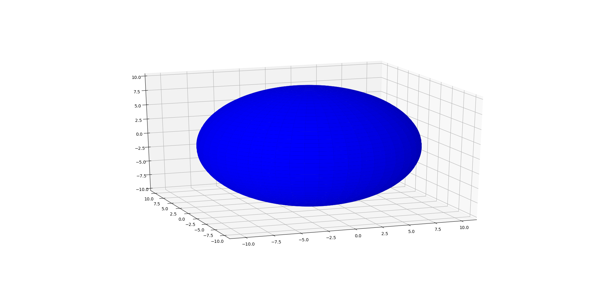
## 3D surface color map
  ```python
  '''
  3D surface (color map)
  Demonstrates plotting a 3D surface colored with the coolwarm color map.
  The surface is made opaque by using antialiased=False.

  Also demonstrates using the LinearLocator and custom formatting for the
  z axis tick labels.
  '''

  from mpl_toolkits.mplot3d import Axes3D
  import matplotlib.pyplot as plt
  from matplotlib import cm
  from matplotlib.ticker import LinearLocator, FormatStrFormatter
  import numpy as np

  fig = plt.figure()
  ax = fig.gca(projection='3d')

  # Make data.
  X = np.arange(-5, 5, 0.25)
  Y = np.arange(-5, 5, 0.25)
  X, Y = np.meshgrid(X, Y)
  R = np.sqrt(X**2 + Y**2)
  Z = np.sin(R)

  # Plot the surface.
  surf = ax.plot_surface(X, Y, Z, cmap=cm.coolwarm,
                         linewidth=0, antialiased=False)

  # Customize the z axis.
  ax.set_zlim(-1.01, 1.01)
  ax.zaxis.set_major_locator(LinearLocator(10))
  ax.zaxis.set_major_formatter(FormatStrFormatter('%.02f'))

  # Add a color bar which maps values to colors.
  fig.colorbar(surf, shrink=0.5, aspect=5)
  plt.show()
  ```
  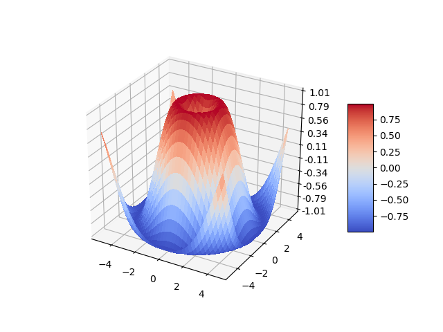
***

# matplotlib
## polar
  ```python
  import numpy as np
  import matplotlib.pyplot as plt
  fig = plt.figure()

  # 划分极坐标下的角度，将一个圆周划分为 6 份，对应 6 个数据
  angles_1 = np.linspace(0, 2 * np.pi, 6)
  ax_1 = fig.add_subplot(121, polar=True)
  ax_1.plot(angles_1, np.arange(1, 7), 'o-')

  # 其他划分方式
  angles_2 = np.linspace(0, 4 * np.pi, 6, endpoint=False)
  ax_2 = fig.add_subplot(122, polar=True)
  ax_2.plot(angles_2, np.arange(1, 7), 'o-')
  ```
  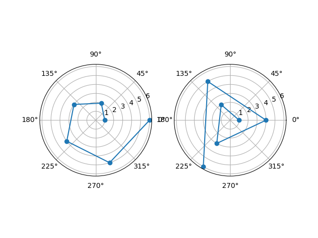
## radar
  ```python
  labels = np.array(['aa','bb','cc','dd','ee','ff'])
  data = np.array([1, 4, 3, 6, 4, 8])
  angles = np.linspace(0, 2*np.pi, data.shape[0], endpoint=False)

  # 闭合
  data = np.hstack([data, data[0]])
  angles = np.hstack([angles, angles[0]])

  plt.polar(angles, data, 'ro-', linewidth=2)
  # 标签
  plt.thetagrids(angles * 180 / np.pi, labels)
  # 填充
  plt.fill(angles, data, facecolor='b', alpha=0.25)

  plt.title('radar')
  plt.ylim(0, 10)
  plt.grid(True)
  plt.show()
  ```
  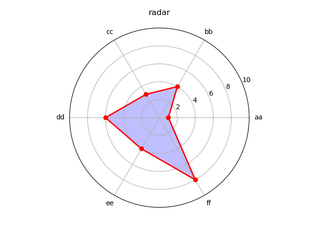
***

# pyecharts
## Install
  - [自定义地图](http://pyecharts.org/#/zh-cn/customize_map)
  - [pyecharts-snapshot](https://github.com/pyecharts/pyecharts-snapshot)
  ```shell
  pip install pyecharts

  # pyecharts-snapshot 将结果保存成图片
  pip install pyecharts-snapshot
  # 依赖 phantomjs
  sudo apt install phantomjs

  # 主题
  pip install echarts-themes-pypkg

  # 地图
  pip install echarts-countries-pypkg
  pip install echarts-china-provinces-pypkg
  ```
## Start
  ```python
  from pyecharts import Bar
  bar = Bar('The diagram', 'The sub title')
  # help(Bar)
  bar.add("服装",
          ["衬衫", "羊毛衫", "雪纺衫", "裤子", "高跟鞋", "袜子"],
          [5, 20, 36, 10, 75, 90],
          is_more_utils=True)
  # bar.print_echarts_options()
  bar.render()
  ```
  
## 图形绘制过程
  - 基本上所有的图表类型都是这样绘制的
    - `chart_name = Type()` 初始化具体类型图表
    - `add()` 添加图表的数据和设置各种配置项，数据一般为长度一致的两个列表
    - `render()` 默认将会在根目录下生成一个 **render.html** 的文件，支持 path 参数，设置文件保存位置 html / svg / jpeg / png / pdf / gif
  - 如果数据是字典或者是带元组的字典，可利用 `cast()` 方法转换
  - 如果想要提供更多实用工具按钮，可在 `add()` 中设置 `is_more_utils` 为 `True`
  - 使用 `Pandas` & `Numpy` 时，整数类型请确保为 int，而不是 numpy.int32
  - 转换数据序列，将带字典和元组类型的序列转换为 k_lst,v_lst 两个列表
  - 元组列表
    ```python
    [(A1, B1), (A2, B2), (A3, B3), (A4, B4)] --> k_lst[ A[i1, i2...] ], v_lst[ B[i1, i2...] ]
    ```
  - 字典列表
    ```python
    [{A1: B1}, {A2: B2}, {A3: B3}, {A4: B4}] --> k_lst[ A[i1, i2...] ], v_lst[ B[i1, i2...] ]
    ```
  - 字典
    ```python
    {A1: B1, A2: B2, A3: B3, A4: B4} -- > k_lst[ A[i1, i2...] ], v_lst[ B[i1, i2...] ]
    ```
## 参数配置
  - `print_echarts_options()` 打印输出图表的所有配置项
  - **图表类初始化所接受的参数**
    - **title** -> str 主标题文本，支持 \n 换行，默认为 ""
    - **subtitle** -> str 副标题文本，支持 \n 换行，默认为 ""
    - **width** -> int 画布宽度，默认为 800（px）
    - **height** -> int 画布高度，默认为 400（px）
    - **background_color** -> str 画布背景颜色，默认为 '#fff'
    - **page_title** -> str 指定生成的 html 文件中 `<title>` 标签的值。默认为'Echarts'
  - **通用配置项**，均在 add() 中设置
    - **is_stack** -> bool 数据堆叠，同个类目轴上系列配置相同的 stack 值可以堆叠放置
    - **xyAxis** 平面直角坐标系中的 x、y 轴。(Line、Bar、Scatter、EffectScatter、Kline)
      - is_convert -> bool 是否交换 x 轴与 y 轴
      - is_xaxis_show -> bool 是否显示 x 轴
      - is_yaxis_show -> bool 是否显示 y 轴
    - **dataZoom** dataZoom 组件 用于区域缩放，从而能自由关注细节的数据信息，或者概览数据整体，或者去除离群点的影响。(Line、Bar、Scatter、EffectScatter、Kline、Boxplot)
    - **legend** 图例组件。图例组件展现了不同系列的标记(symbol)，颜色和名字。可以通过点击图例控制哪些系列不显示
      - is_legend_show -> bool 是否显示顶端图例，默认为 True
    - **label** 图形上的文本标签，可用于说明图形的一些数据信息，比如值，名称等
      - is_label_show -> bool 是否正常显示标签，默认不显示。标签即各点的数据项信息
      - is_random 可随机打乱图例颜色列表
    - **lineStyle** 带线图形的线的风格选项(Line、Polar、Radar、Graph、Parallel)
      - line_width -> int 线的宽度，默认为 1
      - line_type -> str 线的类型，有'solid', 'dashed', 'dotted'可选。默认为'solid'
      - line_color -> str 线的颜色
    - **grid3D** 3D笛卡尔坐标系组配置项，适用于 3D 图形。（Bar3D, Line3D, Scatter3D)
    - **axis3D** 3D 笛卡尔坐标系 X，Y，Z 轴配置项，适用于 3D 图形。（Bar3D, Line3D, Scatter3D)
    - **visualMap** 是视觉映射组件，用于进行『视觉编码』，也就是将数据映射到视觉元素（视觉通道）
      - is_visualmap -> bool 是否使用视觉映射组件
    - **markLine & markPoint** 图形标记组件，用于标记指定的特殊数据，有标记线和标记点两种。（Bar、Line、Kline）
      - mark_point_symbol -> str 标记点图形，，默认为'pin'，有'circle', 'rect', 'roundRect', 'triangle', 'diamond', 'pin', 'arrow'可选
      - mark_point_symbolsize -> int 标记点图形大小，默认为 50
      - mark_point_textcolor -> str 标记点字体颜色，默认为'#fff'
    - **tooltip** 提示框组件，用于移动或点击鼠标时弹出数据内容
    - **toolbox** 右侧实用工具箱
      - is_toolbox_show -> bool 指定是否显示右侧实用工具箱，默认为 True
      - is_more_utils -> bool 指定是否提供更多的实用工具按钮。默认只提供『数据视图』和『下载』按钮
  - **图表详细**
    - **Bar** 柱状图/条形图
    - **Bar3D** 3D 柱状图
    - **Boxplot** 箱形图
    - **EffectScatter** 带有涟漪特效动画的散点图
    - **Funnel** 漏斗图
    - **Gauge** 仪表盘
    - **Geo** 地理坐标系
    - **GeoLines** 地理坐标系线图
    - **Graph** 关系图
    - **HeatMap** 热力图
    - **Kline/Candlestick** K线图
    - **Line** 折线/面积图
    - **Line3D** 3D 折线图
    - **Liquid** 水球图
    - **Map** 地图
    - **Parallel** 平行坐标系
    - **Pie** 饼图
    - **Polar** 极坐标系
    - **Radar** 雷达图
    - **Sankey** 桑基图
    - **Scatter** 散点图
    - **Scatter3D** 3D 散点图
    - **ThemeRiver** 主题河流图
    - **TreeMap** 矩形树图
    - **WordCloud** 词云图
## bar 柱状图
  ```python
  from pyecharts import Bar

  attr = ["{}月".format(i) for i in range(1, 13)]
  v1 = [2.0, 4.9, 7.0, 23.2, 25.6, 76.7, 135.6, 162.2, 32.6, 20.0, 6.4, 3.3]
  v2 = [2.6, 5.9, 9.0, 26.4, 28.7, 70.7, 175.6, 182.2, 48.7, 18.8, 6.0, 2.3]
  bar = Bar("柱状图示例")
  bar.add("蒸发量", attr, v1, mark_line=["average"], mark_point=["max", "min"], is_stack=True)
  bar.add("降水量", attr, v2, mark_line=["average"], mark_point=["max", "min"], is_stack=True, is_convert=True)
  bar.render()
  ```
  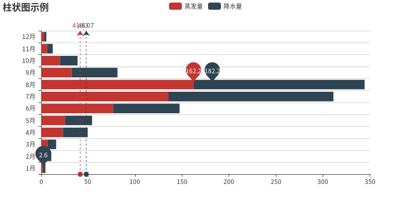
## Gauge 仪表盘
  ```python
  from pyecharts import Gauge
  gauge = Gauge("仪表盘示例")
  gauge.add("业务指标", "完成率", 166.66, angle_range=[180, 0],
            scale_range=[0, 200], is_legend_show=False)
  gauge.render()
  ```
  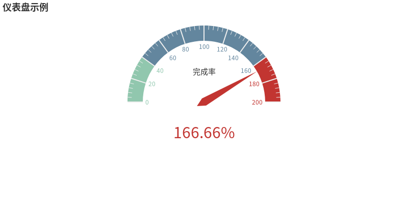
## GeoLines 地理坐标系线图
  ```python
  from pyecharts import GeoLines, Style

  # 默认配置
  style = Style(
      title_top="#fff",
      title_pos = "center",
      width=1200,
      height=600,
      background_color="#404a59"
  )

  # 添加其他效果
  style_geo = style.add(
      is_label_show=True,
      line_curve=0.2,
      line_opacity=0.6,
      legend_text_color="#eee",
      legend_pos="right",
      geo_effect_symbol="plane",
      geo_effect_symbolsize=15,
      label_color=['#a6c84c', '#ffa022', '#46bee9'],
      label_pos="right",
      label_formatter="{b}",
      label_text_color="#eee",
  )

  # 展示的航线数据
  data_guangzhou = [
      ["广州", "上海", 10],
      ["广州", "北京", 20],
      ["广州", "南京", 30],
      ["广州", "重庆", 40],
      ["广州", "兰州", 50],
      ["广州", "杭州", 60],
  ]

  data_beijing = [
      ["北京", "上海", 15],
      ["北京", "广州", 25],
      ["北京", "南京", 35],
      ["北京", "重庆", 45],
      ["北京", "兰州", 55],
      ["北京", "杭州", 65]
  ]

  geolines = GeoLines("GeoLines 示例", **style.init_style)
  # 从广州出发 : 10
  geolines.add("从广州出发", data_guangzhou, tooltip_formatter="{a} : {c}", **style_geo)
  geolines.add("从北京出发", data_beijing, tooltip_formatter="{a} : {c}", **style_geo)
  geolines.render()
  ```
  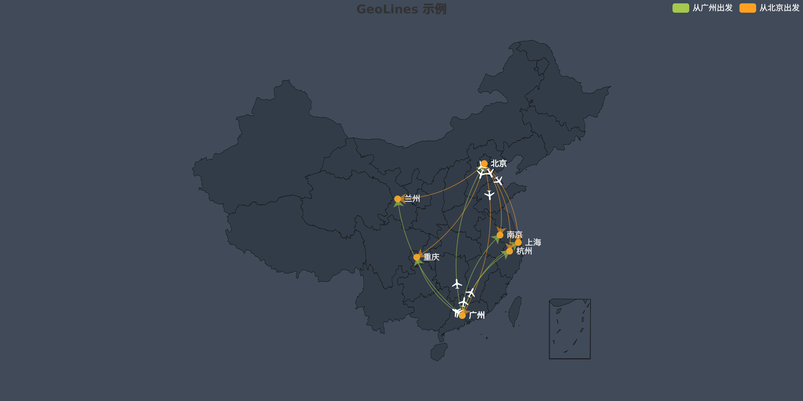
## Graph 关系图
  ```python
  from pyecharts import Graph

  nodes = [{"name": "结点1", "symbolSize": 10},
           {"name": "结点2", "symbolSize": 20},
           {"name": "结点3", "symbolSize": 30},
           {"name": "结点4", "symbolSize": 40},
           {"name": "结点5", "symbolSize": 50},
           {"name": "结点6", "symbolSize": 40},
           {"name": "结点7", "symbolSize": 30},
           {"name": "结点8", "symbolSize": 20}]
  links = []
  for i in nodes:
      for j in nodes:
          links.append({"source": i.get('name'), "target": j.get('name')})
  graph = Graph("关系图-环形布局示例")
  graph.add("", nodes, links, is_label_show=True,
            graph_repulsion=8000, graph_layout='circular',
            label_text_color=None)
  graph.render()
  ```
  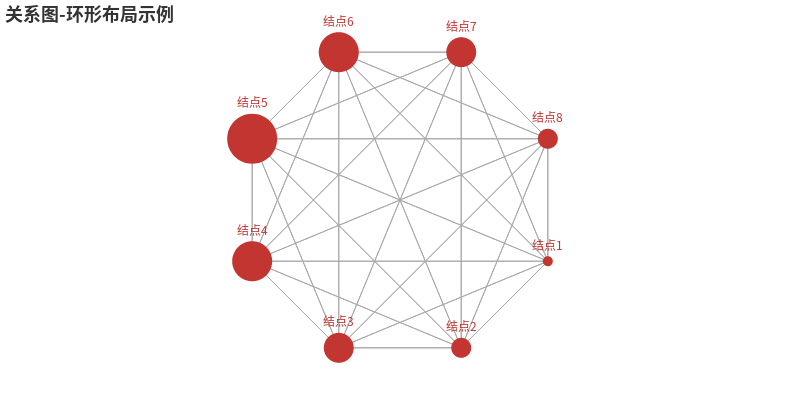
## Line 折线/面积图
  ```python
  from pyecharts import Line

  attr = ["衬衫", "羊毛衫", "雪纺衫", "裤子", "高跟鞋", "袜子"]
  v1 = [5, 20, 36, 10, 10, 100]
  v2 = [55, 60, 16, 20, 15, 80]
  v3 = [10, 60, 20, 45, 80, 30]

  line = Line("折线图示例")
  # Normal with mark
  line.add("商家 A", attr, v1, mark_point=["average", "max", "min"],
           mark_point_symbol='diamond', mark_point_textcolor='#40ff27')
  # Smooth line with mark
  line.add("商家 B", attr, v2, is_smooth=True,
             mark_point=["average", {
                 "coord": ["袜子", 80], "name": "这是我想要的第二个标记点"}])
  # Step
  line.add("商家 C", attr, v3, is_step=True, is_label_show=True)
  # area
  line.add("商家 A-area", attr, v1, is_fill=True, area_color='#000', area_opacity=0.3)
  line.render()
  ```
  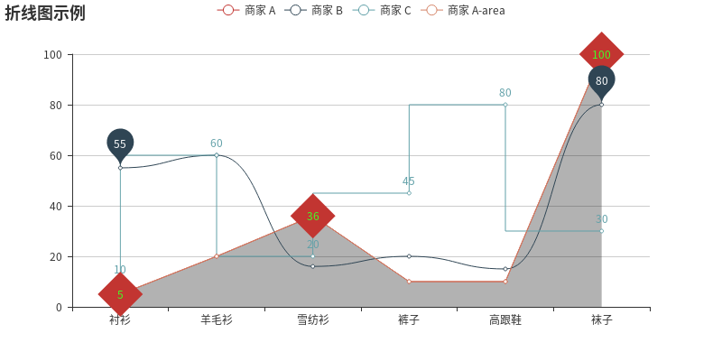
## liquid 水滴图
  ```python
  from pyecharts import Liquid

  shape = ("path://M367.855,428.202c-3.674-1.385-7.452-1.966-11.146-1"
           ".794c0.659-2.922,0.844-5.85,0.58-8.719 c-0.937-10.407-7."
           "663-19.864-18.063-23.834c-10.697-4.043-22.298-1.168-29.9"
           "02,6.403c3.015,0.026,6.074,0.594,9.035,1.728 c13.626,5."
           "151,20.465,20.379,15.32,34.004c-1.905,5.02-5.177,9.115-9"
           ".22,12.05c-6.951,4.992-16.19,6.536-24.777,3.271 c-13.625"
           "-5.137-20.471-20.371-15.32-34.004c0.673-1.768,1.523-3.423"
           ",2.526-4.992h-0.014c0,0,0,0,0,0.014 c4.386-6.853,8.145-14"
           ".279,11.146-22.187c23.294-61.505-7.689-130.278-69.215-153"
           ".579c-61.532-23.293-130.279,7.69-153.579,69.202 c-6.371,"
           "16.785-8.679,34.097-7.426,50.901c0.026,0.554,0.079,1.121,"
           "0.132,1.688c4.973,57.107,41.767,109.148,98.945,130.793 c58."
           "162,22.008,121.303,6.529,162.839-34.465c7.103-6.893,17.826"
           "-9.444,27.679-5.719c11.858,4.491,18.565,16.6,16.719,28.643 "
           "c4.438-3.126,8.033-7.564,10.117-13.045C389.751,449.992,"
           "382.411,433.709,367.855,428.202z")
  liquid = Liquid("水球图示例", width=1000, height=600)
  liquid.add("Liquid", [0.6, 0.5, 0.4, 0.3],
             shape=shape, is_liquid_outline_show=False)
  liquid.render()
  ```
  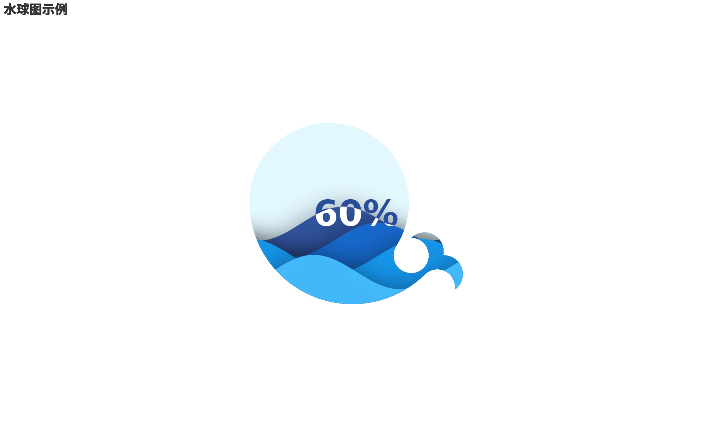
## Pie 饼图
  ```python
  from pyecharts import Pie

  attr = ["衬衫", "羊毛衫", "雪纺衫", "裤子", "高跟鞋", "袜子"]
  v1 = [11, 12, 13, 10, 10, 10]
  v2 = [19, 21, 32, 20, 20, 33]
  pie = Pie("饼图-玫瑰图示例", title_pos='center', width=900)
  pie.add("商品A", attr, v1, center=[25, 50], is_random=True,
          radius=[30, 75], rosetype='radius')
  pie.add("商品B", attr, v2, center=[75, 50], is_random=True,
          radius=[30, 75], rosetype='area',
          is_legend_show=False, is_label_show=True)
  pie.render()
  ```
  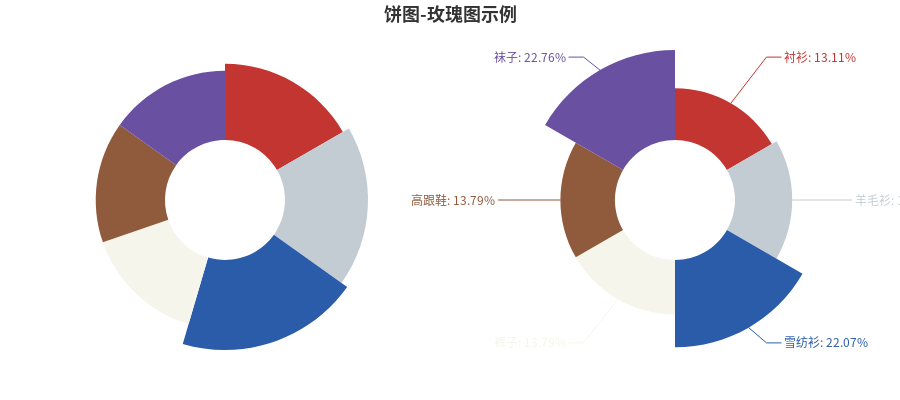
## Polar 极坐标系
  ```python
  from pyecharts import Polar

  radius = ['周一', '周二', '周三', '周四', '周五', '周六', '周日']
  polar = Polar("极坐标系-堆叠柱状图示例", width=1200, height=600)
  polar.add("A", [1, 2, 3, 4, 3, 5, 1], radius_data=radius,
            type='barRadius', is_stack=True)
  polar.add("B", [2, 4, 6, 1, 2, 3, 1], radius_data=radius,
            type='barRadius', is_stack=True)
  polar.add("C", [1, 2, 3, 4, 1, 2, 5], radius_data=radius,
            type='barRadius', is_stack=True)
  polar.render()
  ```
  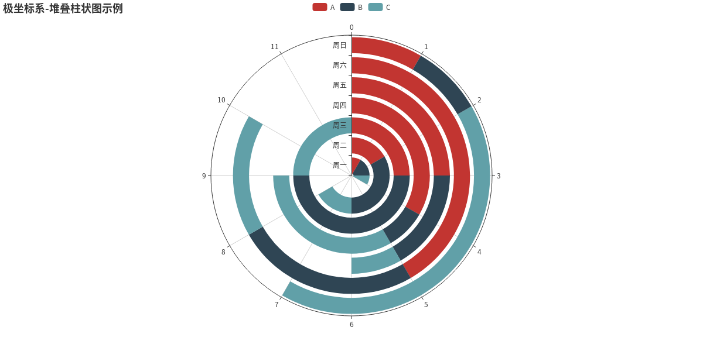
  ```python
  from pyecharts import Polar

  radius = ['周一', '周二', '周三', '周四', '周五', '周六', '周日']
  polar = Polar("极坐标系-堆叠柱状图示例", width=1200, height=600)
  polar.add("", [1, 2, 3, 4, 3, 5, 1], radius_data=radius,
            type='barAngle', is_stack=True)
  polar.add("", [2, 4, 6, 1, 2, 3, 1], radius_data=radius,
            type='barAngle', is_stack=True)
  polar.add("", [1, 2, 3, 4, 1, 2, 5], radius_data=radius,
            type='barAngle', is_stack=True)
  polar.render()
  ```
  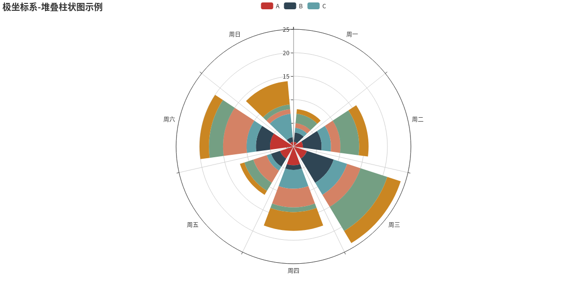
## Radar 雷达图
  ```python
  from pyecharts import Radar

  schema = [
      ("销售", 6500), ("管理", 16000), ("信息技术", 30000),
      ("客服", 38000), ("研发", 52000), ("市场", 25000)
  ]
  v1 = [[4300, 10000, 28000, 35000, 50000, 19000]]
  v2 = [[5000, 14000, 28000, 31000, 42000, 21000]]
  radar = Radar()
  radar.config(schema)
  # radar.config(shape='circle')
  radar.add("预算分配", v1, item_color="#f9713c", is_splitline=True, is_axisline_show=True)
  radar.add("实际开销", v2, item_color="#4e79a7", label_color=["#4e79a7"], is_area_show=False)
  radar.render()
  ```
  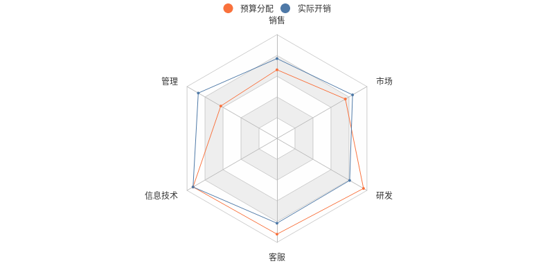
## WordCloud 词云图
  ```python
  from pyecharts import WordCloud

  name = [
      'Sam S Club', 'Macys', 'Amy Schumer', 'Jurassic World', 'Charter Communications',
      'Chick Fil A', 'Planet Fitness', 'Pitch Perfect', 'Express', 'Home', 'Johnny Depp',
      'Lena Dunham', 'Lewis Hamilton', 'KXAN', 'Mary Ellen Mark', 'Farrah Abraham',
      'Rita Ora', 'Serena Williams', 'NCAA baseball tournament', 'Point Break']
  value = [
      10000, 6181, 4386, 4055, 2467, 2244, 1898, 1484, 1112,
      965, 847, 582, 555, 550, 462, 366, 360, 282, 273, 265]
  wordcloud = WordCloud(width=1300, height=620)
  wordcloud.add("", name, value, word_size_range=[20, 100])
  wordcloud.render()
  ```
  
## 多次显示图表
  - 从 v0.4.0+ 开始，pyecharts 重构了渲染的内部逻辑，改善效率
  - 可以使用同一个引擎对象，减少了部分重复操作，速度有所提高
  ```python
  from pyecharts import Bar, Line
  from pyecharts.engine import create_default_environment

  bar = Bar("我的第一个图表", "这里是副标题")
  bar.add("服装", ["衬衫", "羊毛衫", "雪纺衫", "裤子", "高跟鞋", "袜子"], [5, 20, 36, 10, 75, 90])

  line = Line("我的第一个图表", "这里是副标题")
  line.add("服装", ["衬衫", "羊毛衫", "雪纺衫", "裤子", "高跟鞋", "袜子"], [5, 20, 36, 10, 75, 90])

  env = create_default_environment("html")
  # 为渲染创建一个默认配置环境
  # create_default_environment(filet_ype)
  # file_type: 'html', 'svg', 'png', 'jpeg', 'gif' or 'pdf'

  env.render_chart_to_file(bar, path='bar.html')
  env.render_chart_to_file(line, path='line.html')
  ```
## Grid 并行显示多张图
  - Grid 类的使用
    - 引入 `Grid` 类，`from pyecharts import Grid`
    - 实例化 Grid 类，`grid = Grid()` ，可指定 `page_title`, `width`, `height`, `jhost` 参数
    - 使用 `add()` 向 `grid` 中添加图
      - 至少需要设置一个 `grid_top`, `grid_bottom`, `grid_left`, `grid_right` 四个参数中的一个
      - `grid_width` 和 `grid_height` 一般不用设置，默认即可
    - 使用 `render()` 渲染生成 .html 文件
  - `Overlap` 类可放入 `Grid` 类中，不过有个前提，`Overlap` 不可为多 x 轴或者多 y 轴，否则会出现坐标轴索引混乱问题
  - Grid 类中其他方法
    - `render_embed()`：在 Flask&Django 中可以使用该方法渲染
    - `show_config()`：打印输出所有配置项
    - `chart`：chart 属性返回图形实例
  - **上下** grid_top / grid_bottom
    ```python
    from pyecharts import Bar, Line, Grid

    attr = ["衬衫", "羊毛衫", "雪纺衫", "裤子", "高跟鞋", "袜子"]
    v1 = [5, 20, 36, 10, 75, 90]
    v2 = [10, 25, 8, 60, 20, 80]
    bar = Bar("柱状图示例", height=720)
    bar.add("商家A", attr, v1, is_stack=True)
    bar.add("商家B", attr, v2, is_stack=True)
    line = Line("折线图示例", title_top="50%")
    attr = ["周一", "周二", "周三", "周四", "周五", "周六", "周日"]
    line.add(
        "最高气温",
        attr,
        [11, 11, 15, 13, 12, 13, 10],
        mark_point=["max", "min"],
        mark_line=["average"],
    )
    line.add(
        "最低气温",
        attr,
        [1, -2, 2, 5, 3, 2, 0],
        mark_point=["max", "min"],
        mark_line=["average"],
        legend_top="50%",
    )

    grid = Grid()
    grid.add(bar, grid_bottom="60%")
    grid.add(line, grid_top="60%")
    grid.render()
    ```
    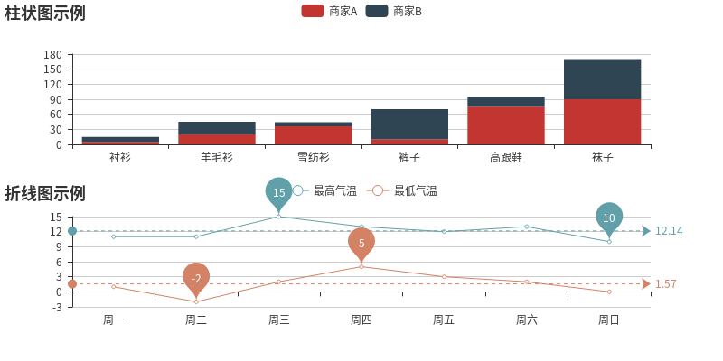
  - **左右** grid_left / grid_right
    ```python
    from pyecharts import Line, Pie, Grid

    line = Line("折线图示例", width=1200)
    attr = ["周一", "周二", "周三", "周四", "周五", "周六", "周日"]
    line.add(
        "最高气温",
        attr,
        [11, 11, 15, 13, 12, 13, 10],
        mark_point=["max", "min"],
        mark_line=["average"],
    )
    line.add(
        "最低气温",
        attr,
        [1, -2, 2, 5, 3, 2, 0],
        mark_point=["max", "min"],
        mark_line=["average"],
        legend_pos="20%",
    )
    attr = ["衬衫", "羊毛衫", "雪纺衫", "裤子", "高跟鞋", "袜子"]
    v1 = [11, 12, 13, 10, 10, 10]
    pie = Pie("饼图示例", title_pos="55%")
    pie.add(
        "",
        attr,
        v1,
        radius=[45, 65],
        center=[65, 50],
        legend_pos="80%",
        legend_orient="vertical",
    )

    grid = Grid()
    grid.add(line, grid_right="55%")
    grid.add(pie, grid_left="60%")
    grid.render()
    ```
    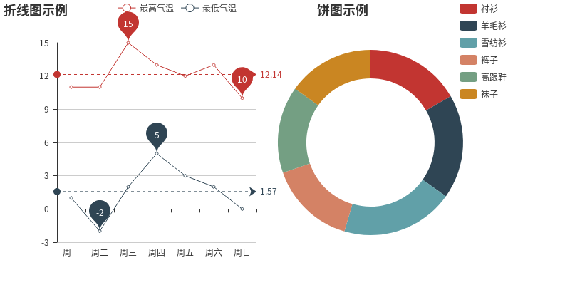
## Overlap 不同图表叠加在一张图上
  - Overlap 类的使用
    - 引入 `Overlap` 类，`from pyecharts import Overlap`
    - 实例化 `Overlap` 类，`overlap = Overlap()`  ，可指定 `page_title`, `width`, `height`, `jhost` 参数
    - 使用 `add()` 向 `overlap` 中添加图
    - 使用 `render()` 渲染生成 .html 文件
  ```python
  from pyecharts import Line, Bar, Overlap

  attr = ["{}月".format(i) for i in range(1, 13)]
  v1 = [2.0, 4.9, 7.0, 23.2, 25.6, 76.7, 135.6, 162.2, 32.6, 20.0, 6.4, 3.3]
  v2 = [2.6, 5.9, 9.0, 26.4, 28.7, 70.7, 175.6, 182.2, 48.7, 18.8, 6.0, 2.3]
  v3 = [2.0, 2.2, 3.3, 4.5, 6.3, 10.2, 20.3, 23.4, 23.0, 16.5, 12.0, 6.2]

  bar = Bar(width=1200, height=600)
  bar.add("蒸发量", attr, v1)
  bar.add("降水量", attr, v2, yaxis_formatter=" ml",
          yaxis_interval=50, yaxis_max=250)

  line = Line()
  line.add("平均温度", attr, v3, yaxis_formatter=" °C", yaxis_interval=5)

  overlap = Overlap()
  # 默认不新增 x y 轴，并且 x y 轴的索引都为 0
  overlap.add(bar)
  # 新增一个 y 轴，此时 y 轴的数量为 2，第二个 y 轴的索引为 1（索引从 0 开始），所以设置 yaxis_index = 1
  # 由于使用的是同一个 x 轴，所以 x 轴部分不用做出改变
  overlap.add(line, yaxis_index=1, is_add_yaxis=True)
  overlap.render()
  ```
  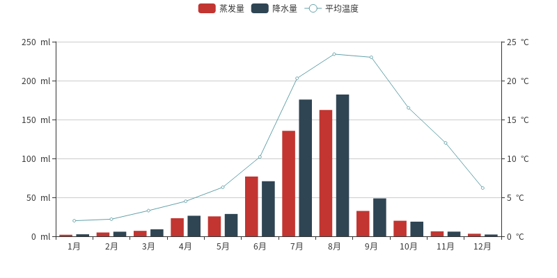
## Page 同一网页按顺序展示多图
  - Page 类的使用
    - 引入 `Page` 类，`from pyecharts import Page`
    - 实例化 `Page` 类，`page = Page()`  ，可指定 `page_title`, `jhost` 参数。
    - 使用 `add()` 向 `page` 中添加图，可以是单个图实例，也可以是一个图实例列表。
    - 使用 `render()` 渲染生成 .html 文件
  - Page 类中其他方法
    - `render_embed()`：在 Flask&Django 中可以使用该方法渲染
    - `show_config()`：打印输出所有配置项
    - `chart`：chart 属性返回图形实例
  ```python
  from pyecharts import Bar, Scatter3D
  from pyecharts import Page

  page = Page()         # step 1

  # bar
  attr = ["衬衫", "羊毛衫", "雪纺衫", "裤子", "高跟鞋", "袜子"]
  v1 = [5, 20, 36, 10, 75, 90]
  v2 = [10, 25, 8, 60, 20, 80]
  bar = Bar("柱状图数据堆叠示例")
  bar.add("商家A", attr, v1, is_stack=True)
  bar.add("商家B", attr, v2, is_stack=True)
  page.add(bar)         # step 2

  # scatter3D
  import random
  data = [
      [random.randint(0, 100),
      random.randint(0, 100),
      random.randint(0, 100)] for _ in range(80)
  ]
  range_color = [
      '#313695', '#4575b4', '#74add1', '#abd9e9', '#e0f3f8', '#ffffbf',
      '#fee090', '#fdae61', '#f46d43', '#d73027', '#a50026']
  scatter3D = Scatter3D("3D 散点图示例", width=1200, height=600)
  scatter3D.add("", data, is_visualmap=True, visual_range_color=range_color)
  page.add(scatter3D)  # step 2

  page.render()
  ```
  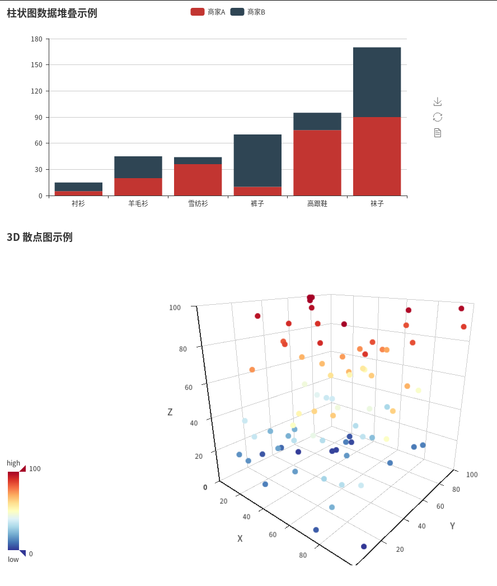
## Timeline 提供时间线轮播多张图
  - Timeline 类的使用
    - 引入 `Timeline` 类，`from pyecharts import Timeline`
    - 实例化 `Timeline` 类
    - 使用 `add()` 向 `timeline` 中添加图。如 `add(bar, '2013')` 接受两个参数，第一个为图实例，第二个为时间线的 ”时间点“
    - 使用 `render()` 渲染生成 .html 文件
  ```python
  from pyecharts import Pie, Timeline

  attr = ["衬衫", "羊毛衫", "雪纺衫", "裤子", "高跟鞋", "袜子"]
  pie_1 = Pie("2012 年销量比例", "数据纯属虚构")
  pie_1.add("秋季", attr, [randint(10, 100) for _ in range(6)],
            is_label_show=True, radius=[30, 55], rosetype='radius')

  pie_2 = Pie("2013 年销量比例", "数据纯属虚构")
  pie_2.add("秋季", attr, [randint(10, 100) for _ in range(6)],
            is_label_show=True, radius=[30, 55], rosetype='radius')

  pie_3 = Pie("2014 年销量比例", "数据纯属虚构")
  pie_3.add("秋季", attr, [randint(10, 100) for _ in range(6)],
            is_label_show=True, radius=[30, 55], rosetype='radius')

  pie_4 = Pie("2015 年销量比例", "数据纯属虚构")
  pie_4.add("秋季", attr, [randint(10, 100) for _ in range(6)],
            is_label_show=True, radius=[30, 55], rosetype='radius')

  pie_5 = Pie("2016 年销量比例", "数据纯属虚构")
  pie_5.add("秋季", attr, [randint(10, 100) for _ in range(6)],
            is_label_show=True, radius=[30, 55], rosetype='radius')

  timeline = Timeline(is_auto_play=True, timeline_bottom=0)
  timeline.add(pie_1, '2012 年')
  timeline.add(pie_2, '2013 年')
  timeline.add(pie_3, '2014 年')
  timeline.add(pie_4, '2015 年')
  timeline.add(pie_5, '2016 年')
  timeline.render()
  ```
  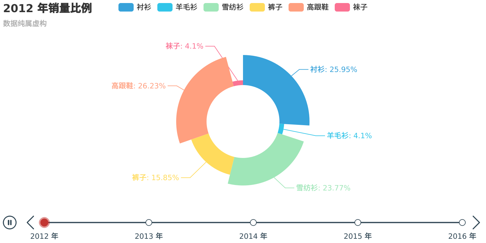
## pyecharts-snapshot
  - 使用 pyecharts-snapshot 直接将图片保存为 png, pdf, gif 格式的文件
    - 安装 phantomjs `$ npm install -g phantomjs-prebuilt`
    - 安装 pyecharts-snapshot `$ pip install pyecharts-snapshot`
    - 调用 `render` 方法 `bar.render(path='snapshot.png')`
  - 文件结尾可以为 svg / jpeg / png / pdf / gif
  - svg 文件需要在初始化 bar 的时候设置 `renderer='svg'`
## 主题
  - pyecharts 自带 **dark** 主题
  - echarts-themes-pypkg 提供了 **vintage** / **macarons** / **infographic** / **shine** / **roma** 主题
  ```python
  import random
  from pyecharts import Bar

  X_AXIS = ["衬衫", "羊毛衫", "雪纺衫", "裤子", "高跟鞋", "袜子"]
  bar = Bar("The diagram", "The subtitle")
  bar.add("商家A", X_AXIS, [random.randint(10, 100) for _ in range(6)])
  bar.add("商家B", X_AXIS, [random.randint(10, 100) for _ in range(6)])
  bar.add("商家C", X_AXIS, [random.randint(10, 100) for _ in range(6)])
  bar.add("商家D", X_AXIS, [random.randint(10, 100) for _ in range(6)])

  themes = ["dark", "vintage", "macarons", "infographic", "shine", "roma"]
  for theme in themes:
      bar.use_theme(theme)
      bar.render(path=theme + '.png')

  # plot show
  import matplotlib.pyplot as plt
  fig = plt.figure()
  for indx, theme in enumerate(themes):
      ax = fig.add_subplot(2, 3, indx + 1)
      ax.imshow(plt.imread('./%s.png' % theme))
      ax.set_title(theme)
      ax.set_axis_off()
  ```
  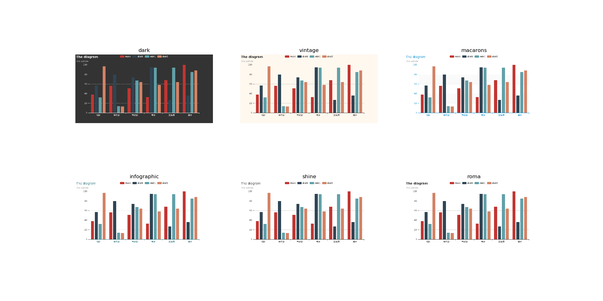
***
