# ___2018 - 07 - 04 课程推荐___
***

# 用户画像
## 可视化
  - **Series barh**
    ```python
    import json

    ff = open('user_test_data.json', 'r')
    json.load(ff)

    rr = json.load(open('user_test_data.json', 'r'))
    json.dump(rr, open('goo.json', 'w'), indent=2)

    rr['professional_score'][0]['modules']
    tt = {ii['name']: ii['score'] for ii in rr['professional_score'][0]['modules']}
    ss = Series(tt)
    ss.plot(kind='barh')
    ```
    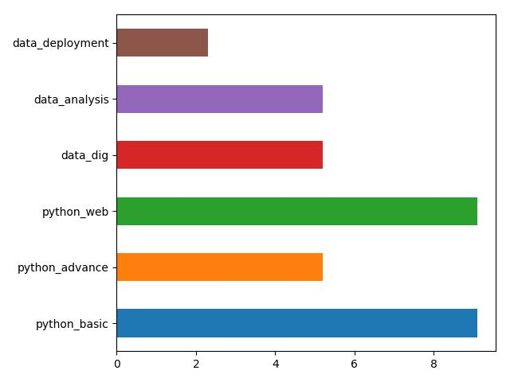
  - **pyecharts Radar**
    ```python
    from pyecharts import Radar

    schema = []
    for kk in ss.index:
        schema.append((kk, 10))

    radar = Radar()
    radar.config(schema)
    radar.add("python", [ss.values], line_width=2)
    radar.render()
    ```
    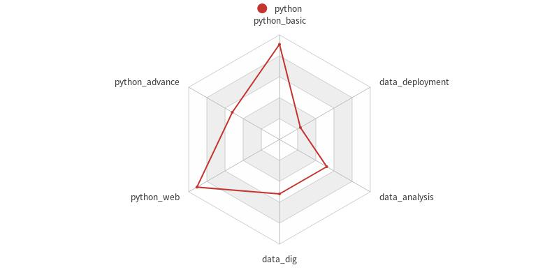
  - **pyecharts** Timeline 所有图的维度是一样的
    ```python
    ''' Timeline NOT working '''
    from pyecharts import Radar, Timeline

    with open('user_test_data.json', 'r') as ff:
        rr = json.load(ff)

    timeline = Timeline(timeline_bottom=0)
    sub_class = rr['professional_score']
    for kk in sub_class:
        tt = {ii['name']: ii['score'] for ii in kk['modules']}
        schema = list(zip(tt.keys(), [10] * len(tt)))
        print(schema)
        radar = Radar()
        radar.config(c_schema=schema)
        radar.add(kk['name'], [list(tt.values())], line_width=2)
        timeline.add(radar, kk['name'])

    timeline.render()
    ```
  - **matplotlib**
    ```python
    import json

    def plot_radar_ax_polar(ax, labels, data, title=None, ylim=(1, 10)):
        # labels = np.array(['aa','bb','cc','dd','ee','ff'])
        # data = np.array([1, 4, 3, 6, 4, 8])
        angles = np.linspace(0, 2*np.pi, len(data), endpoint=False)

        # 闭合
        data = np.hstack([data, data[0]])
        angles = np.hstack([angles, angles[0]])

        ax.plot(angles, data, 'ro-', linewidth=2)
        ax.set_thetagrids(angles * 180 / np.pi, labels)
        ax.fill(angles, data, facecolor='b', alpha=0.25)
        if title:
            ax.set_title(title)
        ax.set_ylim((ylim))
        ax.grid(True)

    with open('user_test_data.json', 'r') as ff:
        rr = json.load(ff)

    sub_class = rr['professional_score']
    fig = plt.figure()
    plot_column_num = int(len(sub_class) / 2) + int(len(sub_class) % 2)
    for indx, kk in enumerate(sub_class):
        ax = fig.add_subplot(2, plot_column_num, indx+1, polar=True)
        tt = {ii['name']: ii['score'] for ii in kk['modules']}
        plot_radar_ax_polar(ax, list(tt.keys()), list(tt.values()), title=kk['name'])
    ```
    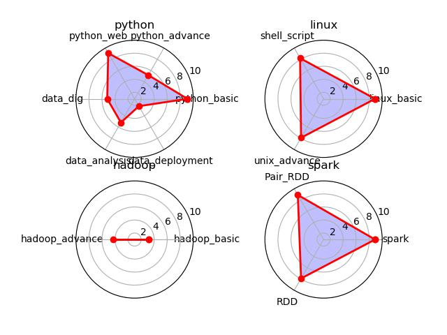
## 课程推荐 过滤分数
  ```python
  import json

  with open('user_test_data.json', 'r') as ff:
    rr = json.load(ff)

  tt = [ii['moudles'] for ii in rr['profesional_score']]
  aa = []
  for ii in tt:
      aa.extend(ii)
  dd = DataFrame(aa)

  bb = dd[dd.score < 5.0]

  threshold = 5.0
  result = {}
  for ii in rr['profesional_score']:
      module_need_to_learn = []
      for tt in ii['moudles']:
          if tt['score'] <= 5.0:
              module_need_to_learn.append(tt['code'])
      result[ii['code']] = module_need_to_learn
  ```
## Flask
  - [course_recomm_flask.py](course_recomm_flask.py)
  ```shell
  $ python course_recomm_flask.py
   * Running on http://0.0.0.0:7777/ (Press CTRL+C to quit)
  ```
  ```python
  # 使用默认值
  requests.get("http://127.0.0.1:7777/course_recomm").json()
  # Out[103]: {'00001': ['00003'], '00007': ['00010', '00011']}

  # 指定 score_json
  requests.get("http://127.0.0.1:7777/course_recomm", params={"score_json": json.dumps(rr)}).json()
  # Out[104]: {'00001': ['00003'], '00007': ['00010', '00011']}

  # 指定存储 json 结构的文件 score_file
  requests.get("http://127.0.0.1:7777/course_recomm", params={"score_file": "./user_test_data.json"}).json()
  # Out[105]: {'00001': ['00003'], '00007': ['00010', '00011']}

  # 指定其他阈值
  requests.get("http://127.0.0.1:7777/course_recomm", params={"score_threshold": 5.0, "score_json": json.dumps(rr)}).json()
  # Out[107]: {'00001': ['00003'], '00007': ['00010', '00011']}

  # 同时指定 score_json / score_file 时，使用 **score_json**
  requests.get("http://127.0.0.1:7777/course_recomm", params={"score_json": json.dumps(rr), "score_file": "./user_test_data.json"}).json()
  # Out[109]: {'00001': ['00003'], '00007': ['00010', '00011']}
  ```
## Neo4j
  ```js
  MATCH (n) DETACH DELETE n

  CREATE (ee:Person {name: "用户1", age: "19"})

  CREATE (ee_ch: Character {name: "Character"}),
    (ee_ps: Profesional_score {name: "Profesional_score"}),
    (ee_ls: Leader_ship {name: "Leader_ship"}),
    (ee_bg: Background {name: "Background"}),
    (ee_tg: Target {name: "Target"}),
    (ee_fa: Factor {name: "Factor"})
  CREATE (ee)-[:MAINTAIN {dimension: "Character"}]->(ee_ch),
    (ee)-[:MAINTAIN {dimension: "Profesional_score"}]->(ee_ps),
    (ee)-[:MAINTAIN {dimension: "Leader_ship"}]->(ee_ls),
    (ee)-[:MAINTAIN {dimension: "Background"}]->(ee_bg),
    (ee)-[:MAINTAIN {dimension: "Target"}]->(ee_tg),
    (ee)-[:MAINTAIN {dimension: "Factor"}]->(ee_fa)

  CREATE (ee_ca_red: ca_Red {name: "Red", score: 3}),
    (ee_ca_green: ca_Green {name: "Green", score: 3}),
    (ee_ca_yellow: ca_Yellow {name: "Yellow", score: 3})
  CREATE (ee_ch)-[:character {in: "Red"}]->(ee_ca_red),
    (ee_ch)-[:character {in: "Green"}]->(ee_ca_green),
    (ee_ch)-[:character {in: "Yellow"}]->(ee_ca_yellow)

  CREATE (ee_ps_python: ps_Python {name: "Python", python_basic: 9.1, data_analysis: 9.2, data_deployment: 9.5}),
    (ee_ps_linux: ps_Linux {name: "Linux", linux_basic: 8.9, shell_script: 8.2, unix_advance: 7.9}),
    (ee_ps_hadoop: ps_Hadoop {name: "Hadoop", hadoop: 3.2}),
    (ee_ps_spark: ps_Spark {name: "Spark", spark: 5.4})
  CREATE (ee_ps)-[:profesional_score {in: "Python"}]->(ee_ps_python),
    (ee_ps)-[:profesional_score {in: "Linux"}]->(ee_ps_linux),
    (ee_ps)-[:profesional_score {in: "Hadoop"}]->(ee_ps_hadoop),
    (ee_ps)-[:profesional_score {in: "Spark"}]->(ee_ps_spark)

  CREATE (ee_ls_level1: ls_level1 {name: "Lavel1", score: 4}),
    (ee_ls_level2: ls_level2 {name: "Lavel2", score: 4})
  CREATE (ee_ls)-[:leader_ship {in: "Level1"}]->(ee_ls_level1),
    (ee_ls)-[:leader_ship {in: "Level2"}]->(ee_ls_level2)

  CREATE (ee_bg_profession: bg_Profession {name: "Profession", university: "university"}),
    (ee_bg_work: bg_Work {name: "Work"})
  CREATE (ee_bg_work_p1:bg_Work {name: "Period 1", comapny: "HPE", from: "2018", to: "2018"}),
    (ee_bg_work_p2:bg_Work {name: "Period 2", comapny: "HPE", from: "2018", to: "2018"}),
    (ee_bg_work)-[:Work_Detail {name: "Period 1"}]->(ee_bg_work_p1),
    (ee_bg_work)-[:Work_Detail {name: "Period 2"}]->(ee_bg_work_p2)
  CREATE (ee_bg)-[:Background {in: "Profession"}]->(ee_bg_profession),
    (ee_bg)-[:Background {in: "Work"}]->(ee_bg_work)

  CREATE (ee_tg_city: tg_city {name: "City", city: "Qingdao"}),
    (ee_tg_salary: tg_salary {name: "Salary", target: 5000}),
    (ee_tg_area: tg_area {name: "Area", area: "AI"})
  CREATE (ee_tg)-[:target {in: "City"}]->(ee_tg_city),
    (ee_tg)-[:target {in: "Salary"}]->(ee_tg_salary),
    (ee_tg)-[:target {in: "Area"}]->(ee_tg_area)

  CREATE (ee_fa_level1: fa_level1 {name: "Lavel1", score: 4}),
    (ee_fa_level2: fa_level2 {name: "Lavel2", score: 4})
  CREATE (ee_fa)-[:factor {in: "Level1"}]->(ee_fa_level1),
    (ee_fa)-[:factor {in: "Level2"}]->(ee_fa_level2)
  ```
  ```js
  MATCH (n) RETURN n
  ```
  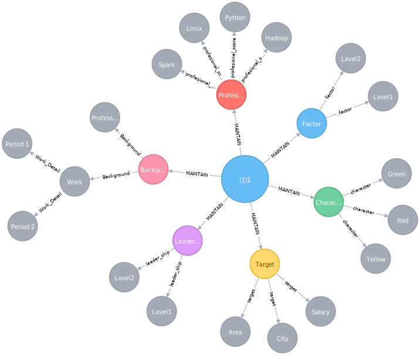
***

# 技能评定
## Pluralsight 技能评定
  - **Iris 智能评定系统**
    - **功能** 评估技能等级，并提供学习路径推荐，制定个性化的个人成长规划
    - 使用改进的贝叶斯网络算法，技能评估过程中根据题目难度 / 当前得分等更新评估分数，使用 TF-IDF 词频文本映射推荐学习内容
    - **技能评定算法** 在传统 **项目反应理论 (Item Response Theory, IRT)** 基础上，添加 **贝叶斯估计算法**，并基于全部用户的测评数据，提供更精确的等级评分
    - **改进的 Glicko 评分系统** 基于特定的题目为用户划定分数时，分数的增长或下降根据当前分数的 **可信程度** 调整幅度不同
    - **自适应评估** 算法应用 **马尔可夫链蒙特卡罗 (Markov Chain Monte Carlo)** 方法评估不同用户的技能水平，根据评估进度提供不同等级的测评题目，知道达到一个确定的分数础上实现的改进算法
    - **潜在因素** 综合考虑答题过程中的多种因素，如答题速度 / 连续答对或答错等，提高算法收敛速度
  - **Python 技能评定** [Unlimited Online Developer, IT and Cyber Security Training | Pluralsight](https://www.pluralsight.com/)

    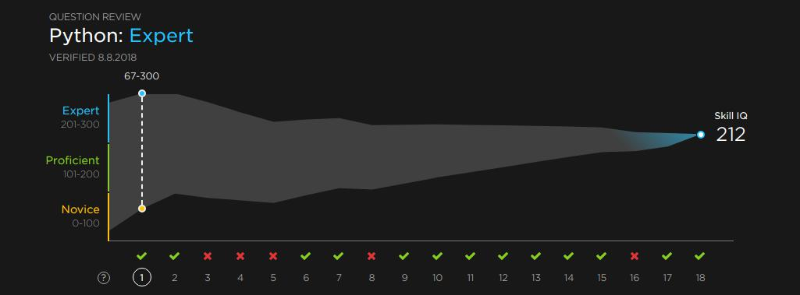

    ```python
    mmin = np.array([20, 67, 100, 91, 85, 79, 97, 112, 109, 122, 135, 146, 157, 168, 180, 190, 192, 202, 212])
    mmax = np.array([280, 300, 300, 281, 259, 239, 243, 246, 231, 232, 233, 232, 231, 230, 228, 226, 216, 214, 212])

    mmin_c = [np.nan] + [vv - mmin[ii] for ii, vv in enumerate(mmin[1:])]
    mmax_c = [np.nan] + [vv - mmax[ii] for ii, vv in enumerate(mmax[1:])]
    mgap = mmax - mmin
    mave = (mmax + mmin) / 2
    mave_c = [np.nan] + [vv - mave[ii] for ii, vv in enumerate(mave[1:])]

    mtitle = ['min', 'max', 'min_change', 'max_change', 'min_max_gap', 'ave', 'ave_change']
    mdf = DataFrame(dict(zip(mtitle, [mmin, mmax, mmin_c, mmax_c, mgap, mave, mave_c])))
    ```
  - **数据分析** 根据 最小值 / 最大值 之间的 **gap** 更新 **平均值 ave**

    | Result | min | max | min_change | max_change | min_max_gap | ave   | ave_change |
    | ------ | --- | --- | ---------- | ---------- | ----------- | ----- | ---------- |
    | 0      | 20  | 280 | nn         | nn         | 260         | 150   | nn         |
    | +      | 67  | 300 | +47        | +20        | 233         | 183.5 | +33.5 ~ 41 |
    | +      | 100 | 300 | +33        | 0          | 200         | 200   | +16.5 ~ 27 |
    | -      | 91  | 281 | -9         | -19        | 190         | 186   | -14        |
    | -      | 85  | 259 | -6         | -22        | 174         | 172   | -14        |
    | -      | 79  | 239 | -6         | -20        | 160         | 159   | -13        |
    | +      | 97  | 243 | +18        | +4         | 146         | 170   | +11        |
    | +      | 112 | 246 | +15        | +3         | 134         | 179   | +9         |
    | -      | 109 | 231 | -3         | -15        | 122         | 170   | -9         |
    | +      | 122 | 232 | +13        | +1         | 110         | 177   | +7         |
    | +      | 135 | 233 | +13        | +1         | 98          | 184   | +7         |
    | +      | 146 | 232 | +11        | -1         | 86          | 189   | +5         |
    | +      | 157 | 231 | +11        | -1         | 74          | 194   | +5         |
    | +      | 168 | 230 | +11        | -1         | 62          | 199   | +5         |
    | +      | 180 | 228 | +12        | -2         | 48          | 204   | +5         |
    | +      | 190 | 226 | +10        | -2         | 36          | 208   | +4         |
    | -      | 192 | 216 | +2         | -10        | 24          | 204   | -4         |
    | +      | 202 | 214 | +10        | -2         | 12          | 208   | +4         |
    | +      | 212 | 212 | +10        | -2         | 0           | 212   | 0          |

  - **数据分析** gap 的最小值 / 最大值 与 ave 调整幅度

    | min_true | max_true | min_edge | max_edge | ave_step | step_guess        |
    | -------- | -------- | -------- | -------- | -------- | ----------------- |
    | 62       | 98       | 50       | 100      | 5        | 4 + 1             |
    | 110      | 122      | 100      | 125      | 7        | 4 + 2 + 1         |
    | 134      | 146      | 125      | 150      | 9        | 4 + 2 + 3         |
    | 160      | 160      | 150      |          | 11       | 4 + 2 + 5         |
    | 174      | 174      |          | 175      | 13       | 4 + 2 + 7         |
    | 190      | 200      | 175      | 200      | 14       | 4 + 2 + 8         |
    | 233      | 233      |          |          | 16.5~27  | 4 + 2 + 8 + 2~13  |
    | 260      | 260      |          |          | 33.5~41  | 4 + 2 + 8 + 19~27 |
## Python 实现
  ```python
  # 题库数据 csv 文件示例
  id,category,level,score,scope
  1,string,1,5,python
  3,string,2,5,python
  8,io,1,5,python
  15,io,3,5,python
  16,module,1,5,python
  32,object,4,5,python
  ```
  ```python
  import json
  import numpy as np
  import pandas as pd
  import matplotlib.pyplot as plt

  class user_ability_level_test:
      def __init__(self, question_db='./ability_level_test.csv', detail_rate=1.0, data_scope=None):
          column_names = ['id', 'category', 'level', 'score', 'scope']
          self.data_base_org = pd.read_csv(question_db, names=column_names, skiprows=[0])
          self.data_base = self.data_base_org
          self.y_label_base = ['Novice', 'Proficient', 'Expert', 'Excellent', 'Fantastic']

          self.ave = lambda: np.average([self.min_score, self.max_score])
          self.gap = lambda: self.max_score - self.min_score

          self.init_user_data(detail_rate=detail_rate, data_scope=data_scope)

      def init_user_data(self, min_score=20, max_score=None, detail_rate=None, data_scope=None):
          if detail_rate != None:
              self.detail_rate = detail_rate

          if data_scope != None:
              self.data_base = self.data_base_org[self.data_base_org['scope'] == data_scope]
              if self.data_base.empty == True:
                  print("Data is empty in this scope: %s, using the whole set" % (data_scope))
                  self.data_base = self.data_base_org
          self.max_level = self.data_base.level.max()

          self.min_score = min_score
          self.max_score = max_score if max_score != None else self.max_level * 100 - self.min_score

          self.min_score_record = np.array([], dtype=np.int32)
          self.max_score_record = np.array([], dtype=np.int32)
          self.ave_score_record = np.array([], dtype=np.float32)
          self.gap_score_record = np.array([], dtype=np.float32)

          self.update_user_record_data()

          self.question_record = np.array([], dtype=np.int32)
          self.answer_record = np.array([], dtype=np.bool)

      def start_test(self, test_input=None, save_fig_path=None, detail_rate=None, data_scope=None):
          self.init_user_data(detail_rate=detail_rate, data_scope=data_scope)
          self.user_level_test_loop(test_input)

          return self.plot_user_record(save_path=save_fig_path)

      def user_level_test_loop(self, test_input=None):
          while self.min_score < self.max_score:
              question = self.get_next_question()
              if question == None:
                  break

              if test_input == None:
                  answer = self.get_answer(question)
              else:
                  answer = self.get_answer_test(question, test_input)

              self.update_user_score(answer)
              print()

      def plot_user_record(self, save_path=None, face_color='#1F1F1F', fill_color='#4A4A4A', figsize=(12.25, 3.5), font_color='w'):
          fig = plt.figure(facecolor=face_color, edgecolor=face_color, figsize=figsize, dpi=100)
          fig.set_tight_layout(True)
          ax = fig.add_subplot(1, 1, 1, facecolor=face_color)
          ax.grid(False)

          ax.spines['right'].set_color('none')
          ax.spines['top'].set_color('none')
          ax.spines['bottom'].set_color(fill_color)
          ax.spines['left'].set_color(fill_color)

          x = np.arange(len(self.question_record) + 1)
          x_label = ['?'] + ['True\n%d' %(kk + 1) if ii == True else 'False\n%d' %(kk + 1) for kk, ii in enumerate(self.answer_record)]
          ax.set_xlim([x.min(), x.max() + 2])
          ax.set_xticks(x)
          ax.set_xticklabels(x_label, color=font_color, rotation=0)

          y = np.arange(self.max_level + 1) * 100
          y_label_base = (self.y_label_base * 10)[:self.max_level]
          y_label = ['%s\n%d-%d' %(ss, ii*100+1, (ii+1)*100) for ii, ss in enumerate(y_label_base)]
          ax.set_ylim([0, y.max() + 1])
          ax.set_yticks(y)
          ax.set_yticklabels(y_label, color=font_color, fontdict={'verticalalignment': 'bottom'})

          ax.fill_between(x, self.max_score_record, self.min_score_record, color=fill_color)
          # ax.plot([x.min(), x.max()], [self.min_score, self.max_score], 'b--')
          ax.scatter(x.max(), self.min_score, color='b', marker='o')
          ann_x = x.max() + 0.5
          # Pick the middle value between ylim and min_score - 20
          ann_y = np.median(list(ax.get_ylim()) + [self.min_score - 20])
          ax.annotate(xy=(ann_x, ann_y), s='Skill IQ\n  {}'.format(self.min_score), color=font_color, fontsize=15)

          title_level = self.y_label_base[np.min([int(self.min_score / 100), self.max_level - 1])]
          ax.set_title('{}: {}\n'.format(self.data_base['scope'][0].title(), title_level), fontsize=25, loc='left', color=font_color)

          if save_path != None:
              fig.savefig(save_path, bbox_inches='tight', dpi=100, facecolor=face_color)

          return fig

      def update_user_score(self, answer):
          ave_step = self.get_ave_step(answer)

          continue_true = self.answer_record[::-1].argmin() if self.answer_record.min() == False else len(self.answer_record)
          continue_false = self.answer_record[::-1].argmax() if self.answer_record.max() == True else len(self.answer_record)
          continue_true = np.max([0, continue_true - 1])
          continue_false = np.max([0, continue_false - 1])
          print("continue_true = %s, continue_false = %s" % (continue_true, continue_false))

          # Add a random -1 / 0 / 1
          max_score_step = ave_step - (6 + int(np.random.uniform(-2, 2))) * self.detail_rate - continue_false
          min_score_step = 2 * ave_step - max_score_step + continue_true - continue_false

          self.max_score = int(np.median([0, self.max_score + max_score_step, self.max_level * 100]))
          self.min_score = int(np.median([0, self.min_score + min_score_step, self.max_level * 100]))

          if self.gap() <= 12:
              choice_func = np.max if answer == True else np.min
              choice_score = choice_func([self.min_score, self.max_score])
              self.min_score = choice_score
              self.max_score = choice_score

          print("min_score = %d, max_score = %d, ave = %d, gap = %d" %(self.min_score, self.max_score, self.ave(), self.gap()))
          self.update_user_record_data()

      def update_user_record_data(self):
          # Update user record data
          self.min_score_record = np.hstack([self.min_score_record, self.min_score])
          self.max_score_record = np.hstack([self.max_score_record, self.max_score])
          self.ave_score_record = np.hstack([self.ave_score_record, self.ave()])
          self.gap_score_record = np.hstack([self.gap_score_record, self.gap()])

      def get_ave_step(self, answer):
          step_scope_index = np.min([2 * int(self.gap() / 100) + 1, 6])
          step_scope = 2 ** step_scope_index
          step_location = int(self.gap() % 100 / 100 * step_scope) + int(self.gap() / 100)
          step_base = int(4 + np.sum([2 ** ii for ii in range(1, step_scope_index, 2)]))
          step = (step_base + step_location) * self.detail_rate

          print("answer = %d, ave step = %d" % (answer, step))

          return step if answer == True else -1 * step

      def get_answer(self, question):
          print("Question: %s" % (question))
          answer = False if input('Your answer (0/1): ') == '0' else True
          self.answer_record = np.hstack([self.answer_record, answer])
          return answer

      def get_answer_test(self, question, test_input):
          print("Question: %s" % (question))
          answer = test_input[(len(self.question_record) - 1) % len(test_input)]
          self.answer_record = np.hstack([self.answer_record, answer])
          return answer

      def get_next_question(self):
          level_temp = int(self.ave() / 100) + 1
          level = level_temp if level_temp < self.max_level else self.max_level
          print("Give a question at level %d" % (level))
          return self.get_random_test_by_level_unique(level)

      def get_random_test_by_level_unique(self, level):
          if level == None:
              db_level = self.data_base
          else:
              db_level = self.data_base[self.data_base.level == level]

          question_index_not_answered = [ii for ii in db_level.index if ii not in self.question_record]
          if len(question_index_not_answered) > 0:
              random_choice_index = np.random.choice(question_index_not_answered)
              self.question_record = np.hstack([self.question_record, random_choice_index])
              random_choice = self.data_base.loc[random_choice_index]

              return json.loads(random_choice.to_json())
          else:
              if level != None:
                  print("All question is answered at this level %d, try with other levels" %(level))
                  return self.get_random_test_by_level_unique(level=None)
              else:
                  print("All question is answered at all level")
                  return None
  ```
  **运行结果**
  ```python
  # 全部答对
  ffc = os.path.join(os.getcwd(), 'ability_level_test.csv')
  tt = user_ability_level_test(ffc)
  tt.start_test(test_input=[True], save_fig_path='./images/plot_user_data_true.png')

  # 全部答错
  tt.start_test(test_input=[False], save_fig_path='./images/plot_user_data_false.png')

  # 模拟真实过程
  aas = [True, True, True, True, False, True, True, False, False, True, False, False, True, False, True, False, False, False]
  tt.start_test(test_input=aas, save_fig_path='./images/plot_user_data.png')

  # init / test / plot
  tt = user_ability_level_test(ffc)
  aas = [True, True, False, False, False, True, True, False, True, True, True, True, True, True, True, False, True, True]
  tt.init_user_data()
  tt.user_level_test_loop(test_input=aas)
  # 指定其他颜色
  fig = tt.plot_user_record(face_color='#00002A', fill_color='#20AAAA', font_color='#DDDDDD')
  ax = fig.axes[0]
  fig.savefig('./images/plot_user_data_2.png', bbox_inches='tight', dpi=100, facecolor='#00002A')

  # detail_rate 控制衰减过程
  tt.start_test(test_input=aas, detail_rate=1.2)
  tt.question_record.shape
  # Out[566]: (14,)

  tt.start_test(test_input=aas, detail_rate=0.8)
  tt.question_record.shape
  # Out[568]: (20,)
  ```
  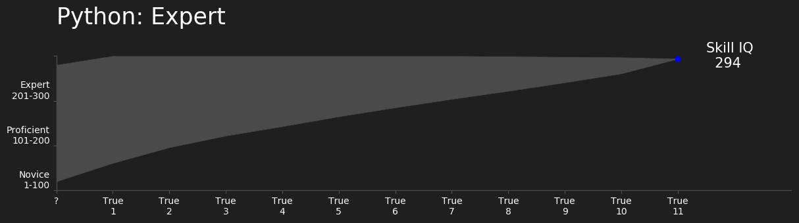
  
  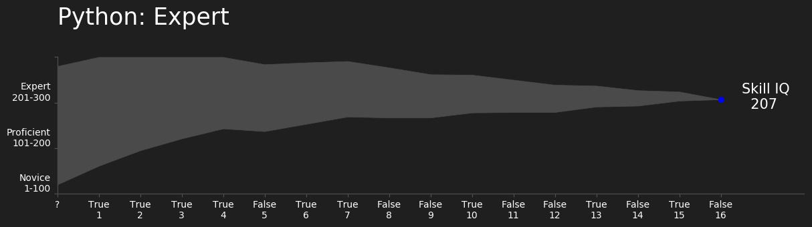
  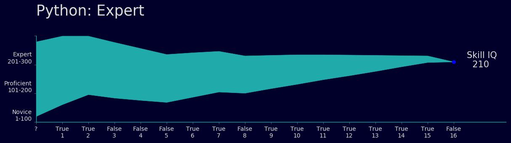
## 保存用户信息数据
  - [user_ability_level_test_dict](user_ability_level_test_dict.py)
  - **类初始化**
    ```python
    rm test_data_dict_backup/user_test_progress.pickle
    ls test_data_dict_backup/

    import user_ability_level_test_dict
    reload(user_ability_level_test_dict)
    tt = user_ability_level_test_dict.user_ability_level_test()
    ```
  - **用户初始化**
    ```python
    tt.init_user_in_progress_data(user_id='0000')
    tt.init_user_in_progress_data(user_id='0000', test_scope=['python'])
    tt.init_user_in_progress_data(user_id='0000', test_scope=['python', 'java'])
    tt.init_user_in_progress_data(user_id='0000', test_scope=['java'])

    tt.init_user_in_progress_data(user_id='0001', test_scope=['java'])
    tt.init_user_in_progress_data(user_id='0001', test_scope=['java', 'python'])

    tt.init_user_in_progress_data('0000', ['python', 'hadoop', 'java'])

    tt.user_test_progress_data
    tt.get_current_testing_data()
    ```
  - **设置用户数据**
    ```python
    print(tt.is_user_in_progress_data('0000', ['python', 'hadoop', 'java']))
    print(tt.set_user_in_progress_data('0000', ['python'], 'max_level', 4))
    print(tt.get_user_in_progress_data('0000', ['python']))
    print(tt.set_user_in_progress_data('0000', ['python', 'java'], 'max_level', 5))
    print(tt.get_user_in_progress_data('0000', ['python']))
    print(tt.get_user_in_progress_data('0000', ['python', 'java']))

    tt.del_user_in_progress_data('0000', ['hadoop', 'java', 'python'])
    tt.get_user_test_data_set(['python', 'hadoop'])
    ```
  - **get question / post answer**
    ```python
    tt.start_test('0000', ['python', 'java'], test_input=[False])
    tt.user_level_test_loop('0000', ['hadoop'])
    tt.user_level_test_loop('0000', test_input=[True])

    print(tt.read_finished_user_data('0000', ['python', 'java']))
    print(tt.read_finished_user_data(user_backup_name='./test_data_back_up/0000_None.pickle'))
    print(tt.plot_user_record('0000', ['python']))
    tt.plot_user_record('0000', ['python', 'java'])

    print(tt.get_next_question('0000', ['python', 'java']))
    print(tt.init_user_in_progress_data('0000', ['python', 'java']))
    print(tt.get_next_question('0000', ['python', 'java']))
    print(tt.get_next_question('0000', ['python', 'java']))
    print(tt.get_next_question('0000', ['python', 'java']))
    print(tt.post_answer(False, user_id='0000', test_scope=['java', 'python']))
    print(tt.get_next_question('0000', ['python', 'java']))
    print(tt.get_next_question('0000', ['python', 'java']))
    print(tt.post_answer(False, user_id='0000', test_scope=['java', 'python']))
    print(tt.post_answer(False, user_id='0000', test_scope=['java', 'python']))
    print(tt.post_answer(False, user_id='0000', test_scope=['java']))
    print(tt.get_next_question('0000', ['python']))
    print(tt.post_answer(False, user_id='0000', test_scope=['java']))
    print(tt.post_answer(False, user_id='0000', test_scope=['python']))
    ```
  - **with_finished_check 设置为 False**
    ```python
    tt.init_user_in_progress_data('0000')
    aas = [True, True, False, False, False, True, True, False, True, True, True, True, True, True, True, False, True, True]
    for ii in range(100):
        qq = tt.get_next_question('0000', with_finished_check=False)
        if qq == None:
            break

        tt.post_answer(aas[ii % len(aas)], user_id='0000')
    len(tt.get_user_in_progress_data('0000')['question_code'])
    tt.get_next_question('0000')
    tt.plot_user_record(user_id='0000')
    ```
  - **用户信息保存与重加载**
    ```python
    del tt
    tt = user_ability_level_test_dict.user_ability_level_test()
    tt.user_test_progress_data
    tt.get_current_testing_data()
    ```
  - **课程推荐**
    ```python
    jj = dict(zip(tt.course_database[tt.course_database['depth']==1].index, [118, 102, 86, 43, 17] * 2))
    tt.course_recommendation(user_id='0000', test_scope_score=jj)
    ```
## Flask
  - [user_ability_level_test_flask](user_ability_level_test_flask.py)
  - **Basic test**
    ```shell
    ./user_ability_level_test_flask

    # using wsgi server
    waitress-serve --port 7777 --call 'user_ability_level_test_flask:get_app'
    ```
    ```python
    host_ip = '192.168.136.49:7777'
    host_ip = '127.0.0.1:7777'
    import requests
    import json

    # 用户注册
    rr = {'user_id': '0000', 'test_scope': ['python', 'java'], 'min_score': 20, 'max_score': None, 'detail_rate': 1.0}
    requests.post("http://%s/user_ability_level_test/user/init" % (host_ip), headers={"Content-type": "application/json"}, data=json.dumps(rr)).text
    requests.get("http://%s/user_ability_level_test/user/init" % (host_ip), params={"user_data_json": json.dumps(rr)}).text
    # 'OK'

    # 获取用户信息，用户技能评定范围
    rr = {'user_id': '0000', 'test_scope': ['python', 'java']}
    requests.get("http://%s/user_ability_level_test/user/test_scope" % (host_ip), params={"user_data_json": json.dumps(rr)}).json()
    # {'finished': [], 'in_progress': [['python', 'java']]}

    # 获取用户信息，用户正在测试的技能数据
    requests.get("http://%s/user_ability_level_test/user/in_progress" % (host_ip), params={"user_data_json": json.dumps(rr)}).json()
    # {'answer': [], 'detail_rate': 1.0, 'max_level': 3, 'max_score': [280], 'min_score': [20], 'question_code': []}

    # 获取用户信息，所有用户正在测试的技能数据
    requests.get("http://%s/user_ability_level_test/user/all_in_progress" % (host_ip), params={"user_data_json": json.dumps(rr)}).json()
    # {'0000_java-python': {
    #   'answer': [], 'detail_rate': 1.0, 'max_level': 3.0, 'max_score': [280.0], 'min_score': [20.0], 'question_code': []}
    # }

    # GET 获取用户测试问题
    rr = {'user_id': '0000', 'test_scope': ['python', 'java'], 'with_finished_check': True}
    requests.get("http://%s/user_ability_level_test/question/next" % (host_ip), params={"user_data_json": json.dumps(rr)}).json()
    # {'category': 'module', 'code': 19, 'level': 2, 'scope': 'python', 'score': 5}

    # POST 推送回答结果
    rr = {'user_id': '0000', 'test_scope': ['python', 'java'], 'answer': True}
    requests.post("http://%s/user_ability_level_test/answer/bool" % (host_ip), headers={"Content-type": "application/json"}, data=json.dumps(rr)).text
    requests.get("http://%s/user_ability_level_test/answer/bool" % (host_ip), params={"user_data_json": json.dumps(rr)}).text
    # 'OK'

    # 获取用户信息，用户正在测试的技能数据
    requests.get("http://%s/user_ability_level_test/user/in_progress" % (host_ip), params={"user_data_json": json.dumps(rr)}).json()
    # {'answer': [True], 'detail_rate': 1.0, 'max_level': 3, 'max_score': [280, 300], 'min_score': [20, 61], 'question_code': [19]}
    ```
  - **Test loop**
    ```python
    # Test loop
    requests.post("http://%s/user_ability_level_test/user/init" % (host_ip), headers={"Content-type": "application/json"}, data=json.dumps(rr)).text
    rr['with_finished_check'] = True
    aas = [True, True, False, False, False, True, True, False, True, True, True, True, True, True, True, False, True, True]
    for ii in range(100):
        resp = requests.get("http://%s/user_ability_level_test/question/next" % (host_ip), params={"user_data_json": json.dumps(rr)}).json()
        if resp == None:
            break

        print("%d: question: %s" % (ii, resp))
        # answer = False if input("Input your answer (0/1): ")  == '0' else True
        answer = aas[ii % len(aas)]
        rr['answer'] = answer
        requests.post("http://%s/user_ability_level_test/answer/bool" % (host_ip), headers={"Content-type": "application/json"}, data=json.dumps(rr))

        print("%d: answer: %s" % (ii, rr['answer']))
        print('')

    # 获取用户信息，测试完成结果
    requests.get("http://%s/user_ability_level_test/user/finished" % (host_ip), params={"user_data_json": json.dumps(rr)}).json()
    # {'answer': [True, True, False, False, False, True, True, False, True, True, True, True, True, True, True, True, False, False, False],
    #  'bad_at': [{'code': '00009', 'score': 5}, {'code': '00003', 'score': 1}, {'code': '00011', 'score': 1}],
    #  'detail_rate': 1.0,
    #  'good_at': [{'code': '00009', 'score': 5}, {'code': '00003', 'score': 2}, {'code': '00010', 'score': 2}],
    #  'max_level': 3,
    #  'max_score': [280, 290, 300, 278, 255, 232, 234, 236, 223, 223, 223, 224, 225, 225, 224, 223, 220, 210, 200, 187],
    #  'min_score': [20, 42, 64, 54, 44, 33, 45, 58, 57, 71, 86, 101, 117, 135, 149, 164, 182, 184, 185, 187],
    #  'question_code': ['00000014', '00000021', '00000012', '00000022', '00000023', '00000026', '00000015', '00000024', '00000013',
    #   '00000025', '00000011', '00000019', '00000001', '00000020', '0000014', '0000013', '0000015', '0000022', '0000024'],
    #  'score': 187}

    # 获取问题，不检查测试完成标志
    rr['with_finished_check'] = False
    for ii in range(100):
        ...
    ```
  - **delete**
    ```python
    requests.delete("http://%s/user_ability_level_test/user/delete" % (host_ip), headers={"Content-type": "application/json"}, data=json.dumps(rr))
    ```
  - **plot**
    ```python
    rr = {'user_id': '0000', 'test_scope': ['python', 'java']}
    resp = requests.get("http://%s/user_ability_level_test/user/plot_record" % (host_ip), params={"user_data_json": json.dumps(rr)}).json()

    plt.imshow(plt.imread(resp['image_path']))
    plt.grid(False)
    plt.axis('off')
    ```
  - **course recommendation**
    ```python
    # 课程推荐
    rr = {'user_id': '0000', 'test_scope_score': {'00001': 118, '00004': 102, '00007': 86, '00036': 43, '00063': 17}}
    requests.get("http://%s/user_ability_level_test/course/recomm" % (host_ip), params={"user_data_json": json.dumps(rr)}).json()
    # {u'00001': [{u'00003': 3}],
    #  u'00004': [{u'00006': 3, u'00028': 2}, {}],
    #  u'00007': [{u'00009': 2, u'00010': 2, u'00011': 2}],
    #  u'00036': [{u'00038': 2, u'00060': 3}, {}],
    #  u'00063': [{u'00065': 2}]}

    # 更新数据库
    requests.post("http://%s/user_ability_level_test/course/update_database" % (host_ip), headers={"Content-type": "application/json"}, ).text
    ```
## 结果分析
  ```python
  tt.data_base.loc[tt.question_record[tt.answer_record == False]]
  Out[500]:
      id category  level  score   scope
  62  71   object      3      5  python
  60  69   object      3      5  python
  61  70   object      3      5  python
  28  29   object      3      5  python
  63  72   object      4      5  python

  tt.data_base.loc[tt.question_record[tt.answer_record == True]]
  Out[501]:
      id category  level  score   scope
  59  68   object      3      5  python
  37  46   string      3      5  python
  5    6   string      3      5  python
  19  20   module      3      5  python
  14  15       io      3      5  python
  30  31   object      3      5  python
  51  60   module      3      5  python
  29  30   object      3      5  python
  38  47   string      3      5  python
  27  28   object      3      5  python
  31  32   object      4      5  python
  52  61   object      1      5  python
  10  11       io      1      5  python
  47  56   module      1      5  python
  ```
  ```python
  aa = tt.get_user_in_progress_data('0000', ['python', 'java'])
  bb = tt.question_databae_org.set_index('code')
  cc = bb.loc[aa['question_code'][aa['answer'] == False], 'category']
  dd = json.loads(cc.value_counts().head(3).to_json())
  ee = {kk: {'score': vv, 'name': tt.course_database.at[kk, 'name']} for kk, vv in dd.items()}
  ```
## MySQL 数据库
  - 数据表
    - t_draw 用户画像
    - t_course_user_rela 课程与职业方向关系
    - t_level_rela  课程各个层级表
    - t_question_level 测评试题
  - **sql 命令**
    ```sql
    mysql -h 192.168.136.49 -P 3306 -D recommend -u root -phyjy666

    show tables;
    select * from t_question_level;
    select * from t_level_rela where level=1;
    ```
  - **python**
    ```python
    import pandas.io.sql as sql
    import mysql.connector

    conn = mysql.connector.connect(host='192.168.136.49',port=3306,user='root',passwd='hyjy666',db='recommend',charset='utf8', connect_timeout=5)

    t_question_level = sql.read_sql('select * from t_question_level', conn)
    t_level_rela = sql.read_sql('select * from t_level_rela', conn)

    conn.close()
    ```
## 技能评分增长
  - 能力 = 技能总分 * 比重 + 项目经验 * 比重
  - 技能总分 = 各个技能 * 比重
  - 单个技能 = 各个模块分数 * 比重 * (技能总分-初始测试技能值) + 初始测试技能值  // 即 技能总分 - 初始测试技能值  是剩余要学习的模块总分数
  - 模块百分比 = 视频进度 * 比重 + 做题 * 比重
***

# Neo4j 规划课程路径
## 职业路径知识图谱
  - **人工标注** 对于熟悉的职业目标路径，可以采用人工标注的方法，划定职业所需要的技能与学习路径
  - **基于字符的 LSTM + CRF 中文实体抽取** 对于更一般化的职业目标，可以使用神经网络模型做 **命名实体识别 (Named Entity Recognition)**，抽取实体与关系
  - **图书据库 Neo4j** 提供 **实体** 与 **关系** 的存储，与多种图搜索算法，用于创建知识图谱
## 创建
  ```js
  // AI course route
  CREATE (python_basic_1:COURSE:PYTHON {name: 'python_basic', level: 1, detail: "string, io, basic usage"}),
    (python_basic_2:COURSE:PYTHON {name: 'python_basic', level: 2, detail: "list, set, dict, lambda"}),
    (python_basic_3:COURSE:PYTHON {name: 'python_basic', level: 3, detail: "function, object, module"}),
    (python_basic_1)-[:NEXT {scope: "same"}]->(python_basic_2),
    (python_basic_2)-[:NEXT {scope: "same"}]->(python_basic_3)
  CREATE (linux_basic_1:COURSE:LINUX {name: 'linux_basic', level: 1, detail: "file, package, vim, network"}),
    (linux_basic_2:COURSE:LINUX {name: 'linux_basic', level: 2, detail: "grep, find, wc, sed"}),
    (linux_basic_3:COURSE:LINUX {name: 'linux_basic', level: 3, detail: "shell, user, group"}),
    (linux_basic_4:COURSE:LINUX {name: 'linux_basic', level: 4, detail: "process, IPC, network"}),
    (linux_basic_1)-[:NEXT {scope: "same"}]->(linux_basic_2),
    (linux_basic_2)-[:NEXT {scope: "same"}]->(linux_basic_3),
    (linux_basic_3)-[:NEXT {scope: "same"}]->(linux_basic_4)
  CREATE (math_basic_1:COURSE:MATH {name: 'math_basic', level: 1, detail: "calculus"}),
    (math_basic_2:COURSE:MATH {name: 'math_basic', level: 2, detail: "linear algebra"}),
    (math_basic_3:COURSE:MATH {name: 'math_basic', level: 3, detail: "probability theory"}),
    (math_basic_1)-[:NEXT {scope: "same"}]->(math_basic_2),
    (math_basic_2)-[:NEXT {scope: "same"}]->(math_basic_3)
  CREATE (html_basic_1:COURSE:WEB {name: 'html_basic', level: 1, detail: "html basic"}),
    (html_basic_2:COURSE:WEB {name: 'html_basic', level: 2, detail: "html basic"}),
    (web_basic_1:COURSE:WEB {name: 'web_basic', level: 1, detail: "web basic"}),
    (web_basic_2:COURSE:WEB {name: 'web_basic', level: 2, detail: "web basic"}),
    (html_basic_1)-[:NEXT {scope: "same"}]->(html_basic_2),
    (html_basic_2)-[:NEXT {scope: "same"}]->(web_basic_1),
    (web_basic_1)-[:NEXT {scope: "same"}]->(web_basic_2)
  CREATE (data_dig_1:COURSE:DATA {name: 'data_dig', level: 1, detail: "sql, csv, requests"}),
    (data_arrange_1:COURSE:DATA {name: 'data_arrange', level: 1, detail: "numpy, pandas"}),
    (data_analysis_1:COURSE:DATA {name: 'data_analysis', level: 1, detail: "numpy, pandas"}),
    (data_analysis_2:COURSE:DATA {name: 'data_analysis', level: 2, detail: "numpy, pandas"}),
    (data_analysis_3:COURSE:DATA {name: 'data_analysis', level: 3, detail: "numpy, pandas"}),
    (data_visualization_1:COURSE:DATA {name: 'data_visualization', level: 1, detail: "matplotlib"}),
    (data_visualization_2:COURSE:DATA {name: 'data_visualization', level: 2, detail: "seaborn, pyecharts"}),
    (data_visualization_3:COURSE:DATA {name: 'data_visualization', level: 3, detail: "d3"}),
    (data_dig_1)-[:NEXT {scope: "same"}]->(data_arrange_1),
    (data_arrange_1)-[:NEXT {scope: "same"}]->(data_analysis_1),
    (data_analysis_1)-[:NEXT {scope: "same"}]->(data_analysis_2),
    (data_analysis_2)-[:NEXT {scope: "same"}]->(data_analysis_3),
    (data_analysis_2)-[:NEXT {scope: "same"}]->(data_visualization_1),
    (data_visualization_1)-[:NEXT {scope: "same"}]->(data_visualization_2),
    (data_visualization_2)-[:NEXT {scope: "same"}]->(data_visualization_3)
  CREATE (traditional_ml_1: COURSE:ML_TRADITION {name: 'traditional_ml', level: 1, detail: "KNN, Decision trees, Naive Bayes, Logistic"}),
    (traditional_ml_2: COURSE:ML_TRADITION {name: 'traditional_ml', level: 2, detail: "SVM, bagging, boosting"}),
    (traditional_ml_3: COURSE:ML_TRADITION {name: 'traditional_ml', level: 3, detail: "regression, CART, Ｋ-means"}),
    (traditional_ml_4: COURSE:ML_TRADITION {name: 'traditional_ml', level: 4, detail: "Apriori, FP-growth"}),
    (traditional_ml_5: COURSE:ML_TRADITION {name: 'traditional_ml', level: 5, detail: "PCA, SVD"}),
    (traditional_ml_1)-[:NEXT {scope: "same"}]->(traditional_ml_2),
    (traditional_ml_2)-[:NEXT {scope: "same"}]->(traditional_ml_3),
    (traditional_ml_3)-[:NEXT {scope: "same"}]->(traditional_ml_4),
    (traditional_ml_4)-[:NEXT {scope: "same"}]->(traditional_ml_5)
  CREATE (sklearn_1: COURSE:SKLEARN {name: 'sklearn', level: 1, detail: "model, algorithm"}),
    (sklearn_2: COURSE:SKLEARN {name: 'sklearn', level: 2, detail: "model, algorithm"}),
    (sklearn_3: COURSE:SKLEARN {name: 'sklearn', level: 3, detail: "cv, grid_search, pipeline"}),
    (sklearn_4: COURSE:SKLEARN {name: 'sklearn', level: 4, detail: "cv, grid_search, pipeline"}),
    (sklearn_1)-[:NEXT {scope: "same"}]->(sklearn_2),
    (sklearn_2)-[:NEXT {scope: "same"}]->(sklearn_3),
    (sklearn_3)-[:NEXT {scope: "same"}]->(sklearn_4)
  CREATE (tensorflow_basic_1: COURSE:TENSORFLOW {name: 'tensorflow_basic', level: 1, detail: "tensor, graph, session"}),
    (tensorflow_basic_2: COURSE:TENSORFLOW {name: 'tensorflow_basic', level: 2, detail: "variable, placeholder, epoch"}),
    (tensorflow_basic_3: COURSE:TENSORFLOW {name: 'tensorflow_basic', level: 3, detail: "full connection"}),
    (tensorflow_basic_4: COURSE:TENSORFLOW {name: 'tensorflow_basic', level: 4, detail: "loss function, Back propagation"}),
    (tensorflow_basic_5: COURSE:TENSORFLOW {name: 'tensorflow_basic', level: 5, detail: "activation function, regulation, deep learning"}),
    (tensorflow_basic_6: COURSE:TENSORFLOW {name: 'tensorflow_basic', level: 6, detail: "CNN"}),
    (tensorflow_basic_7: COURSE:TENSORFLOW {name: 'tensorflow_basic', level: 7, detail: "RNN"}),
    (tensorflow_basic_1)-[:NEXT {scope: "same"}]->(tensorflow_basic_2),
    (tensorflow_basic_2)-[:NEXT {scope: "same"}]->(tensorflow_basic_3),
    (tensorflow_basic_3)-[:NEXT {scope: "same"}]->(tensorflow_basic_4),
    (tensorflow_basic_4)-[:NEXT {scope: "same"}]->(tensorflow_basic_5),
    (tensorflow_basic_5)-[:NEXT {scope: "same"}]->(tensorflow_basic_6),
    (tensorflow_basic_6)-[:NEXT {scope: "same"}]->(tensorflow_basic_7)
  CREATE (keras_1: COURSE:KERAS {name: 'keras', level: 1, detail: "keras"}),
    (keras_2: COURSE:KERAS {name: 'keras', level: 2, detail: "keras"}),
    (keras_3: COURSE:KERAS {name: 'keras', level: 3, detail: "keras"}),
    (keras_1)-[:NEXT {scope: "same"}]->(keras_2),
    (keras_2)-[:NEXT {scope: "same"}]->(keras_3)
  CREATE (graph_model_1: COURSE:GRAPH_MODEL {name: 'graph_model', level: 1, detail: "graph_model"}),
    (graph_model_2: COURSE:GRAPH_MODEL {name: 'graph_model', level: 2, detail: "graph_model"}),
    (graph_model_3: COURSE:GRAPH_MODEL {name: 'graph_model', level: 3, detail: "graph_model"}),
    (graph_model_1)-[:NEXT {scope: "same"}]->(graph_model_2),
    (graph_model_2)-[:NEXT {scope: "same"}]->(graph_model_3)
  CREATE (text_model_1: COURSE:TEXT_MODEL {name: 'text_model', level: 1, detail: "text_model"}),
    (text_model_2: COURSE:TEXT_MODEL {name: 'text_model', level: 2, detail: "text_model"}),
    (text_model_3: COURSE:TEXT_MODEL {name: 'text_model', level: 3, detail: "text_model"}),
    (text_model_1)-[:NEXT {scope: "same"}]->(text_model_2),
    (text_model_2)-[:NEXT {scope: "same"}]->(text_model_3)
  CREATE (python_basic_3)-[:NEXT {scope: "upgrade"}]->(html_basic_1),
    (python_basic_3)-[:NEXT {scope: "upgrade"}]->(data_dig_1),
    (linux_basic_2)-[:NEXT {scope: "upgrade"}]->(data_dig_1),
    (math_basic_3)-[:NEXT {scope: "upgrade"}]->(traditional_ml_1),
    (data_analysis_2)-[:NEXT {scope: "upgrade"}]->(traditional_ml_1),
    (traditional_ml_5)-[:NEXT {scope: "upgrade"}]->(sklearn_1),
    (traditional_ml_3)-[:NEXT {scope: "upgrade"}]->(tensorflow_basic_1),
    (tensorflow_basic_7)-[:NEXT {scope: "upgrade"}]->(keras_1),
    (keras_3)-[:NEXT {scope: "upgrade"}]->(graph_model_1),
    (keras_3)-[:NEXT {scope: "upgrade"}]->(text_model_1)

  // big data course route
  CREATE (scala_basic_1:COURSE:SCALA {name: 'scala_basic', level: 1, detail: "basic, data type"}),
    (scala_basic_2:COURSE:SCALA {name: 'scala_basic', level: 2, detail: "array, loop"}),
    (scala_basic_3:COURSE:SCALA {name: 'scala_basic', level: 3, detail: "constructor"}),
    (scala_basic_1)-[:NEXT {scope: "same"}]->(scala_basic_2),
    (scala_basic_2)-[:NEXT {scope: "same"}]->(scala_basic_3)
  CREATE (hadoop_basic_1:COURSE:HADOOP {name: 'hadoop_basic', level: 1, detail: "hadoop basic"}),
    (hdfs_1:COURSE:HADOOP {name: 'hdfs', level: 1, detail: "hdfs basic"}),
    (hdfs_2:COURSE:HADOOP {name: 'hdfs', level: 2, detail: "read, write"}),
    (hdfs_3:COURSE:HADOOP {name: 'hdfs', level: 3, detail: "hdfs federation"}),
    (mapreduce_1:COURSE:HADOOP {name: 'mapreduce', level: 1, detail: "mapreduce basic, mapper"}),
    (mapreduce_2:COURSE:HADOOP {name: 'mapreduce', level: 2, detail: "mapreduce reduce"}),
    (hadoop_basic_1)-[:NEXT {scope: "same"}]->(hdfs_1),
    (hdfs_1)-[:NEXT {scope: "same"}]->(hdfs_2),
    (hdfs_2)-[:NEXT {scope: "same"}]->(hdfs_3),
    (hdfs_3)-[:NEXT {scope: "same"}]->(mapreduce_1),
    (mapreduce_1)-[:NEXT {scope: "same"}]->(mapreduce_2)
  CREATE (hbase_1:COURSE:DISTRIBUTED_DB {name: 'hbase', level: 1, detail: "hbas basic"}),
    (hive_1:COURSE:DISTRIBUTED_DB {name: 'hive', level: 1, detail: "hive basic"}),
    (hive_2:COURSE:DISTRIBUTED_DB {name: 'hive', level: 2, detail: "hive QL, basket"}),
    (redis_1:COURSE:DISTRIBUTED_DB {name: 'redis', level: 1, detail: "redis basic"}),
    (redis_2:COURSE:DISTRIBUTED_DB {name: 'redis', level: 2, detail: "redis shell"}),
    (hbase_1)-[:NEXT {scope: "same"}]->(hive_1),
    (hive_1)-[:NEXT {scope: "same"}]->(hive_2),
    (hive_2)-[:NEXT {scope: "same"}]->(redis_1),
    (redis_1)-[:NEXT {scope: "same"}]->(redis_2)
  CREATE (sqoop_1:COURSE:DATA_MERGE {name: 'sqoop', level: 1, detail: "sqoop basic"}),
    (flume_1:COURSE:DATA_MERGE {name: 'flume', level: 1, detail: "flume basic"}),
    (sqoop_1)-[:NEXT {scope: "same"}]->(flume_1)
  CREATE (spark_basic_1:COURSE:SPARK {name: 'spark_basic', level: 1, detail: "basic, RDD"}),
    (spark_basic_2:COURSE:SPARK {name: 'spark_basic', level: 2, detail: "RDD"}),
    (spark_basic_3:COURSE:SPARK {name: 'spark_basic', level: 3, detail: "map filter"}),
    (spark_basic_4:COURSE:SPARK {name: 'spark_basic', level: 4, detail: "groupby, reduceby"}),
    (spark_basic_5:COURSE:SPARK {name: 'spark_basic', level: 5, detail: "count, collect"}),
    (spark_basic_6:COURSE:SPARK {name: 'spark_basic', level: 6, detail: "cache"}),
    (spark_basic_1)-[:NEXT {scope: "same"}]->(spark_basic_2),
    (spark_basic_2)-[:NEXT {scope: "same"}]->(spark_basic_3),
    (spark_basic_3)-[:NEXT {scope: "same"}]->(spark_basic_4),
    (spark_basic_4)-[:NEXT {scope: "same"}]->(spark_basic_5),
    (spark_basic_5)-[:NEXT {scope: "same"}]->(spark_basic_6)
  CREATE (linux_basic_2)-[:NEXT {scope: "upgrade"}]->(hadoop_basic_1),
    (scala_basic_3)-[:NEXT {scope: "upgrade"}]->(hadoop_basic_1),
    (hdfs_3)-[:NEXT {scope: "upgrade"}]->(hbase_1),
    (redis_2)-[:NEXT {scope: "upgrade"}]->(sqoop_1),
    (mapreduce_2)-[:NEXT {scope: "upgrade"}]->(spark_basic_1),
    (flume_1)-[:NEXT {scope: "upgrade"}]->(spark_basic_1)

  // career route
  CREATE (AI_developer_1: CAREER {name:'AI_developer', level: 1, detail: "AI developer level 1"}),
    (AI_developer_2: CAREER {name:'AI_developer', level: 2, detail: "AI developer level 2"}),
    (AI_developer_3: CAREER {name:'AI_developer', level: 3, detail: "AI developer level 3"}),
    (traditional_ml_3)-[:NEXT {scope: "career_as"}]->(AI_developer_1),
    (traditional_ml_5)-[:NEXT {scope: "career_as"}]->(AI_developer_2),
    (tensorflow_basic_7)-[:NEXT {scope: "career_as"}]->(AI_developer_2),
    (sklearn_4)-[:NEXT {scope: "career_as"}]->(AI_developer_3),
    (graph_model_3)-[:NEXT {scope: "career_as"}]->(AI_developer_3),
    (text_model_3)-[:NEXT {scope: "career_as"}]->(AI_developer_3),
    (mapreduce_2)-[:NEXT {scope: "career_as"}]->(AI_developer_3)
  CREATE (BD_developer_1: CAREER {name:'BD_developer', level: 1, detail: "BD developer level 1"}),
    (BD_developer_2: CAREER {name:'BD_developer', level: 2, detail: "BD developer level 2"}),
    (BD_developer_3: CAREER {name:'BD_developer', level: 3, detail: "BD developer level 3"}),
    (redis_2)-[:NEXT {scope: "career_as"}]->(BD_developer_1),
    (mapreduce_2)-[:NEXT {scope: "career_as"}]->(BD_developer_2),
    (flume_1)-[:NEXT {scope: "career_as"}]->(BD_developer_2),
    (spark_basic_6)-[:NEXT {scope: "career_as"}]->(BD_developer_3)
  ```
  ```js
  MATCH (n) RETURN n
  MATCH (n) DETACH DELETE n
  ```
  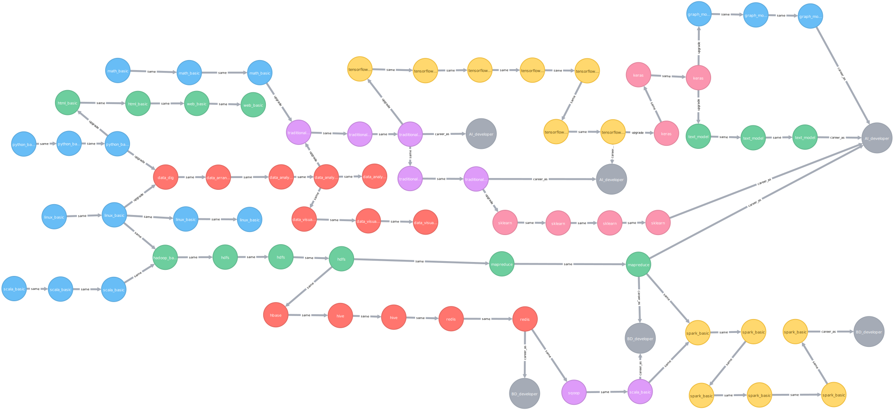
## 过滤
  ```js
  // 职业路径
  MATCH (aa)-[*]->(AI_developer: CAREER) WHERE AI_developer.name='AI_developer' AND AI_developer.level=3 RETURN aa, AI_developer
  MATCH (aa)-[*]->(BD_developer: CAREER {name: 'BD_developer', level: 3}) RETURN aa, BD_developer
  ```
  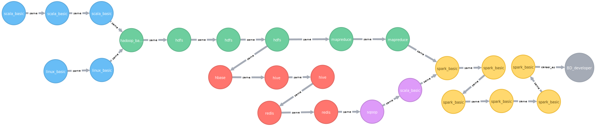
  ```js
  // 职业的起始节点
  MATCH (aa: COURSE)-[*]->(cc: CAREER {name: 'AI_developer', level: 3})
    WHERE NOT (aa)<--()
    RETURN aa
  ```
  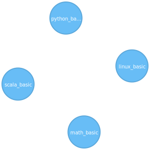
  ```js
  // 课程路径推荐，基础类别
  MATCH pp=(aa: COURSE)-[*]->(tt: CAREER {name: 'AI_developer', level: 3})
    WHERE
    (aa.name='python_basic' AND aa.level=3) OR
    (aa.name='linux_basic' AND aa.level=2) OR
    (aa.name='math_basic' AND aa.level=3) OR
    (aa.name='scala_basic' AND aa.level=3)
    RETURN pp
  ```
  ```js
  // 课程路径推荐，高级类别
  MATCH pa=(aa: COURSE)-[*]->(tt: CAREER {name: 'AI_developer', level: 3})
    WHERE [aa.name, aa.level] IN [['hadoop_basic', 1], ['traditional_ml', 3]]
    RETURN pa

  MATCH (aa: COURSE),
    (tt: CAREER {name: "AI_developer", level: 3}),
    pa=(aa)-[*]->(tt)
    WHERE
    (aa.name='traditional_ml' AND aa.level=3) OR (aa.name='hadoop_basic' AND aa.level=1)
    RETURN pa
  ```
  ```js
  // 课程路径推荐，基础类别与高级类别混合
  WITH [['python_basic', 3], ['traditional_ml', 3]] AS ss
    MATCH
      pc=(bb: COURSE)-[*]->(tt: CAREER {name: 'AI_developer', level: 3})
    WHERE [bb.name, bb.level] IN ss AND SINGLE(var in nodes(pc) WHERE [var.name, var.level] IN ss)
    RETURN pc

  WITH [['python_basic', 3], ['linux_basic', 2], ['math_basic', 3], ['scala_basic', 3], ['traditional_ml', 2], ['hadoop_basic', 1]] AS ss
    MATCH
      pc=(bb: COURSE)-[*]->(tt: CAREER {name: 'AI_developer', level: 3})
    WHERE [bb.name, bb.level] IN ss AND SINGLE(var in nodes(pc) WHERE [var.name, var.level] IN ss)
    RETURN pc
  ```
  
  ```js
  // 职业目标推荐
  WITH [['python_basic', 3], ['linux_basic', 2], ['scala_basic', 3], ['hadoop_basic', 1]] AS ss
    MATCH
      pc=(bb: COURSE)-[*]->(tt: CAREER {level: 1})
    WHERE [bb.name, bb.level] IN ss AND SINGLE(var in nodes(pc) WHERE [var.name, var.level] IN ss)
    WITH pc, tt, ss
    MATCH pd=(cc: COURSE)-[*]->(tt)
    WHERE NONE(var in nodes(pd) WHERE [var.name, var.level] IN ss)
    RETURN pc, pd
  ```
  
  ```js
  // 职业升级路径
  MATCH (aa: COURSE)-[*]->(cc: CAREER {name: 'BD_developer', level: 1})
      WITH COLLECT([aa.name, aa.level]) as ss
      MATCH pc=(bb: COURSE)-[*]->(dd: CAREER {name: 'BD_developer', level:3})
      WHERE NONE(var in nodes(pc) WHERE [var.name, var.level] IN ss)
      RETURN pc
  ```
  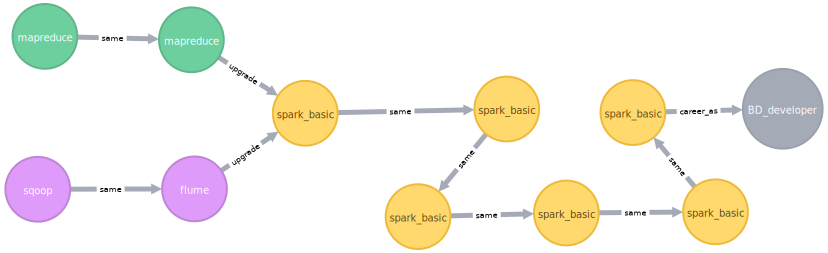
***

# Docker
  ```sh
  ssh root@140.143.94.186 / qdhpe1234
  ssh root@192.168.136.53 / 0000
  ```
  ```sh
  docker pull python:latest
  docker run  -itd --name pythonAI python /bin/bash

  docker ps # c60d63624870 pythonAI
  docker exec -it c60d63624870 /bin/bash

  docker commit -m 'Update python env' c60d63624870 python_course_recomm:1.0
  docker images
  docker run  -itd --name pythonTest python_course_recomm:1.0 /bin/bash

  docker ps # 6f99e4bdd605 pythonTest
  docker exec -it 6f99e4bdd605 /bin/bash

  pip install numpy pandas flask waitress mysql-connector

  docker container ls # 96549c589ff4 pythonTest
  docker container stop 96549c589ff4
  docker container rm 96549c589ff4
  ```
***

# 今日头条算法原理
## 系统概览
  - **推荐系统输入** 推荐系统是拟合一个用户对内容满意度的函数，模型根据输入特征，预估用户 / 环境 / 内容的匹配程度 `y = F(Xi, Xu, Xc)`
    - **内容特征**
      - 包括图文 / 视频 / UGC 小视频 / 问答 / 微头条等，每种内容有很多自己的特征，需要分别提取
      - 主要目的是对文章进行画像，可以通过对 **文本语义识别**，识别出文章 / 视频标题的关键字
    - **用户特征**
      - 包括兴趣标签 / 职业 / 年龄 / 性别 / 机型等，以及很多模型刻画出的用户 **隐藏兴趣**，最终形成用户画像
      - 可以使用经常浏览的文字类型 / 经常搜索的关键字 / 注册时登记信息的内容 / 使用的手机型号 / 用户的评论进行关键字提取等
      - 用户特征的提取对推荐的准确度 / 有效度会起到相当大的作用
    - **环境特征**
      - 不同的时间 / 地点 / 场景，用户对信息的偏好有所不同，如工作 / 通勤 / 旅游等
      - 比如通过获取用户实时位置判断是否在旅游区，与之前经常出现的所在地进行对比，确认当前是在家还是在旅游

    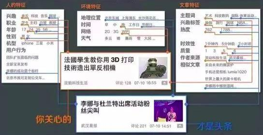
  - **量化指标**
    - 点击率 / 阅读时间 / 点赞 / 评论 / 转发等，是可以 **量化的指标**，能够用模型直接拟合做预估，看线上提升情况可以知道推荐效果
    - 但是完全使用量化指标并不全面，比如刷评论 / 转发等情况，可能会迷惑后台的数据分析
    - **大体量的推荐系统**，服务用户众多，还需要内容干预，引入数据以外的要素，比如社会热点 / 国家政策形势 / 标题党 / 低质内容的打压等，算法无法自动完成，需要人工维护设置数据内容，以完善推荐机制
  - **算法组合**
    - **经典的监督学习问题** 可实现的方法有很多，比如传统的协同过滤模型 / 监督学习算法 Logistic Regression 模型 / 基于深度学习的模型 / Factorization Machine / GBDT 等
    - 不同推荐场景需要不同的模型架构，需要不断尝试优化，比如小视频推荐，关键的推荐机制可能不是用户画像特征，可以根据视频的点击率进行推荐，而文章推荐精准投送要求会比较高
    - **算法实验平台** 灵活地尝试多种算法组合，最终选取推荐效果比较好的算法，比如目前流行的将 LR 和 DNN 结合，Facebook 的 LR 和 GBDT 算法结合

    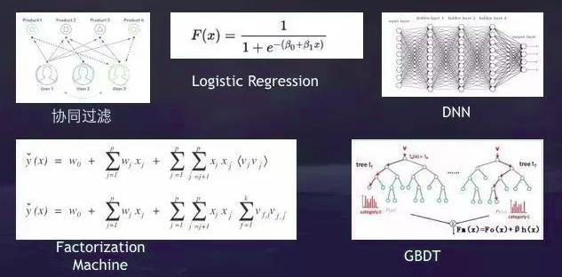
  - **典型推荐特征** 要达到不错的效果，需要综合考虑多种应用场景
    - **相关性特征** 解决内容和用户的匹配，即文章画像与用户画像一致性比较高，则进行相应推荐，**显性匹配** 包括关键词匹配 / 分类匹配 / 来源匹配 / 主题匹配等，**隐性匹配** 如 FM 模型从用户向量与内容向量的距离得出匹配度
    - **环境特征** 解决基础特征匹配，如地理位置 / 时间
    - **热度特征** 解决用户冷启动推荐，包括全局热度 / 分类热度 / 主题热度 / 关键词热度等，**冷启动** 是在用户画像还没有建立时的推荐
    - **协同特征** 解决算法越推越窄的问题，即基于用户的推荐，通过用户行为分析不同用户间相似性，如点击相似 / 兴趣分类相似 / 主题相似 / 兴趣词相似 / 甚至向量相似，从而扩展模型的探索能力

    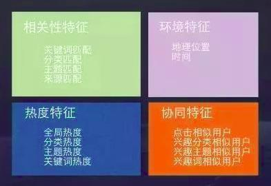
  - **召回策略**
    - 每次推荐时不使用全部的内容库，而是从海量内容中筛选出千级别的内容库
    - 召回策略最重要的要求是性能要极致，一般超时不能超过 50 毫秒
    - **召回策略的倒排思路** 离线维护一个倒排，倒排的 key 可以是分类 / topic / 实体 / 来源等，排序考虑热度 / 新鲜度 / 动作等，线上召回可以迅速从倒排中根据用户兴趣标签对内容做截断，高效的从很大的内容库中筛选出一小部分内容

    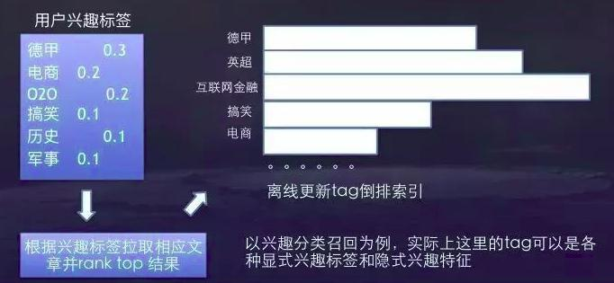
## 内容分析
  - **内容分析** 包括文本分析 / 图片分析 / 视频分析
  - **文本分析**
    - 通过内容及文本标签，可以直接帮助推荐特征，也可以获得用户的兴趣标签等
    - 推荐系统也可以不使用文本特征直接 **协同过滤推荐**，但协同类特征无法解决文章冷启动问题
  - **文本特征**
    - **显式语义特征** 显式为文章打上语义标签，标签体系是预定义的，每个标签有明确的意义
    - **隐式语义特征** 主要是 **topic 特征** 和 **关键词特征**，topic 特征是对于词概率分布的描述，无明确意义，关键词特征会基于一些统一特征描述，无明确集合
    - **文本相似度特征** 需要根据判断相似文章的主题 / 行文 / 主体等内容，做线上策略处理重复内容
    - **时空特征** 分析内容的发生地点以及时效性，避免推荐地域性内容
    - **质量相关特征** 判断内容是否低俗 / 软文 / 鸡汤
  - **隐式语义特征与显式语义特征**
    - 目前隐式语义特征已经可以很好的帮助推荐，而语义标签需要持续标注，新名词新概念不断出现，标注也要不断迭代
    - 显式语义特征可以方便内容理解，明确定义频道的分类内容
  - **层次化文本分类算法** 相比单独的分类器，利用层次化文本分类算法能更好地解决数据倾斜的问题
    - 第一层是 Root
    - 下一层的分类是科技 / 体育 / 财经 / 娱乐 / 体育等大类
    - 体育再细分足球 / 篮球 / 乒乓球 / 网球 / 田径 / 游泳等
    - 足球再细分国际足球 / 中国足球等
    - 中国足球再细分中甲 / 中超 / 国家队等
    - 根据不同的问题难度，每个元分类器可以异构，像有些分类 SVM 效果很好，有些要结合 CNN，有些要结合 RNN 再处理

    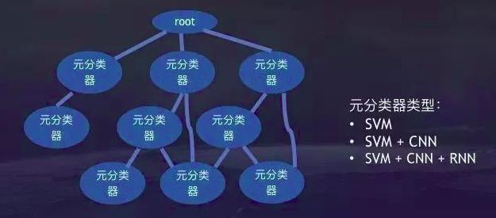
  - **实体词识别算法**
    - 基于分词结果和词性标注选取候选，期间可能需要根据知识库做一些拼接
    - 有些实体是几个词的组合，需要确定哪几个词结合在一起能映射实体的描述
    - 如果结果映射多个实体还要通过词向量 / topic 分布甚至词频本身等去歧
    - 最后计算一个相关性模型

    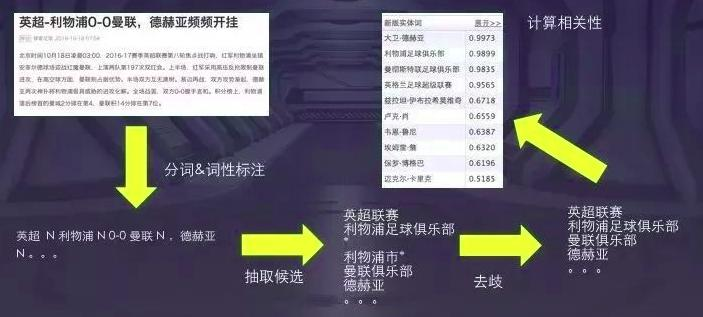
  - **内容安全**
    - 分享内容识别技术主要鉴黄模型 / 谩骂模型 / 低俗模型，模型更注重召回率，准确率甚至可以牺牲一些
    - 泛低质识别涉及的情况非常多，像假新闻 / 黑稿 / 题文不符 / 标题党 / 内容质量低等，这部分内容由机器理解是非常难的，需要大量反馈信息，包括其他样本信息比对，还需要结合人工复审，将阈值提高
## 用户标签
  - 内容分析和用户标签是推荐系统的两大基石，内容分析更多涉及到机器学习的内容，用户标签更多涉及到特征工程
  - **常用的用户标签**
    - 包括用户感兴趣的类别和主题 / 关键词 / 来源 / 基于兴趣的用户聚类 / 各种垂直兴趣特征如体育球队 / 性别 / 年龄 / 地点等信息
    - 性别信息可以通过用户第三方社交账号登录得到
    - 年龄信息通常由模型预测，通过机型 / 阅读时间分布等预估
    - 常驻地点来自用户授权访问位置信息，在位置信息的基础上通过传统聚类的方法得到常驻点
    - 常驻点结合其他信息，可以推测用户的工作地点 / 出差地点 / 旅游地点
  - **数据处理策略** 对于用户浏览过的内容标签，需要一些数据处理策略。
    - **过滤噪声** 通过停留时间短的点击，过滤标题党
    - **热点惩罚** 对用户在一些热门文章上的动作做降权处理，理论上，传播范围较大的内容，置信度会下降
    - **时间衰减** 用户兴趣会发生偏移，因此策略更偏向新的用户行为，随着用户动作的增加，老的特征权重会随时间衰减，新动作贡献的特征权重会更大
    - **惩罚展现** 如果一篇推荐给用户的文章没有被点击，相关特征权重会被惩罚，同时也要考虑全局背景，是不是相关内容推送比较多，以及相关的关闭和 dislike 信号等
  - **Storm 集群流式计算系统**
    - 对于用户兴趣标签，只要有用户动作更新就更新标签，大大降低了计算资源开销，其他用户标签如性别 / 年龄 / 常驻地点这些信息，不需要实时重复计算，采用 Batch 计算
    - **实时训练** 省资源并且反馈快，对信息流产品非常重要，用户行为信息可以被模型快速捕捉并反馈至下一次的推荐效果，线上目前基于 **storm 集群** 实时处理样本数据，包括点击 / 展现 / 收藏 / 分享等动作类型
    - **训练过程** 线上服务器记录实时特征，导入到 Kafka 文件队列中，然后进一步导入 Storm 集群处理 Kafka 数据，客户端回传推荐的 label 构造训练样本，随后根据最新样本进行在线训练更新模型参数，最终线上模型得到更新

    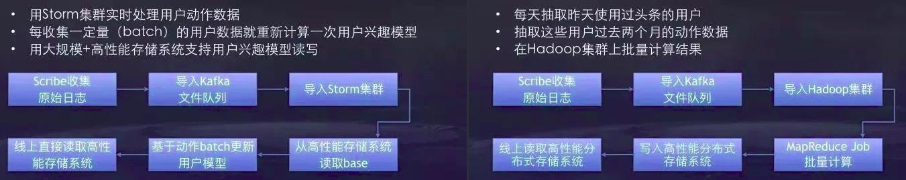
## 评估分析
  - **评估** 的意义在于，很多优化最终可能是负向效果，很多因素都会影响推荐效果，如侯选集合变化 / 召回模块的改进或增加 / 推荐特征的增加 / 模型架构的改进 / 算法参数的优化等
  - **全面的推荐系统** 需要完备的评估体系 / 强大的实验平台 / 易用的经验分析工具
  - **良好的评估体系** 完备的评估体系需要综合评估，不能只看单一指标衡量
    - 兼顾短期指标与长期指标
    - 兼顾用户指标和生态指标
    - 注意协同效应的影响
    - 注意外部效应，实验中严格的流量隔离很难做到
  - **强大的实验平台** 当同时在线的实验比较多时，可以由平台自动分配流量，无需人工沟通，并且实验结束流量立即回收，提高管理效率，加快算法迭代效应，使整个系统的算法优化工作能够快速往前推进
    - **A/B Test实验系统** 首先在离线状态下做好用户分桶，然后线上分配实验流量，将桶里用户打上标签，分给实验组，如开一个 10% 流量的实验，两个实验组各 5%，一个 5% 是基线
    - **实验过程** 准实时收集用户数据，动作搜集后进行日志处理 / 分布式统计 / 写入数据库等
    - **工程师** 只需要设置流量需求 / 实验时间 / 定义特殊过滤条件 / 自定义实验组ID
    - **系统** 自动生成实验数据对比 / 实验数据置信度 / 实验结论总结 / 实验优化建议
    - 线上实验平台只能通过数据指标变化推测用户体验的变化，但数据指标和用户体验存在差异，很多指标不能完全量化，很多改进仍然要通过人工分析，重大改进需要 **人工评估二次确认**

    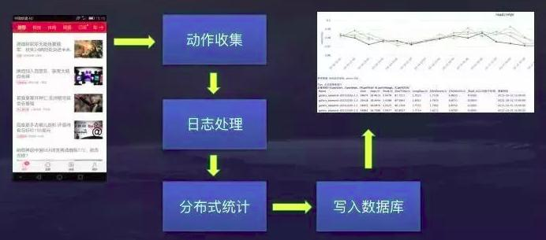
***

# 简历解析及推荐算法
## 简历解析模式
  - **有固定模板的简历** 如来自招聘网站的简历，一般有固定格式，只需要通过正则 + 规则的方式进行处理，就能达到很高的准确率
  - **无固定模板，但对准确率和召回率要求不高** 60% - 70% 左右的准确率要求，基于规则的方式也可以实现
  - **无固定模板，且准确率要求很高** 需要机器学习的介入，特别是对一些实体的识别，比如公司名、学校名等
  - 简历解析的准确率，前 60% - 70% 的效果能够快速达到，但是后 30% 的效果则需要投入比前者多得多的工作，还需要有大量的简历库和词典数据去做支撑
## 简历文本分块
  - 中文简历通常包含多个 **层次化结构**，使用 **文本分类算法** 划分类别，然后分别进行信息提取

    | 通用类别    | 详细信息                         |
    | ----------- | -------------------------------- |
    | 基本信息 C1 | 姓名 / 性别 / 年龄 / 电话 / 邮箱 |
    | 求职意向 C2 | 工作性质 / 期望地点 / 期望薪资   |
    | 自我评价 C3 | 专业技能 / 自我评价              |
    | 教育经历 C4 | 时间 / 学校 / 专业 / 学历        |
    | 工作经历 C5 | 时间 / 公司 / 职位 / 工作内容    |
    | 其他信息 C6 | 其他详细信息                     |

  - **基于关键字匹配的简历文本分块**
    - 大部分简历文本块内容固定，并且具有类别关键字
    - 收集类别关键字及相关词语，将这些关键字作为分块标记，匹配正则表达式
    - 首先将简历转化为纯文本格式
    - 匹配预先设置的关键字正则表达式标签，分别记录起始位置
    - 获取完所有标签位置，将简历划分成多个区块
    - 关键字匹配分块的效果取决于关键字是否全面，以及简历的格式是否标准
  - **基于 SVM 的简历文本分块**
    - 首先将简历文本经过分词 / 词性标注 / 去停用词等文本预处理方法，转化为文本特征向量
    - 文本特征向量经过 TF-IDF 词频转化进行降维处理
    - 人工标注特征类别，生成训练数据
    - 构造 SVM 分类器，训练模型，并检测模型分类效果
## 简历信息抽取
  - **基于匹配规则的信息抽取方法**
    - 对于 **基本信息** / **求职意向**，可以根据中文简历的词法和语法特征，通过手动构建抽取规则来实现关键信息抽取
    - 如 **姓名项** 可以通过利用简历文本中姓名命名实体标注和中文姓氏表来制定规则进行抽取
  - **基于 HMM 算法抽取详细信息**
    - 将信息抽取任务看作统计机器学习中的序列标注问题来处理
    - **HMM** 是常见的解决序列标注问题的机器学习算法，假定状态值不仅取决于其对应的观察值，更取决于序列中其他观察值
    - 首先对文本进行分词处理
    - 通过手工标注数据，采用最大似然估计训练 HMM 模型
## 简历推荐算法
  - 目前常用的基于用户 / 物品的协同过滤算法，通常只需要考虑物品对用户的匹配程度
  - 在简历推荐中，需要考虑应聘者满足企业需求，也需要考虑企业适合应聘者，因此需要同时考虑应聘者与企业的偏好
  - **基于内容的互惠推荐算法 Content Based Reciprocal Recommendation algorithm, CBRR** 同时考虑双方偏好，提高企业与应聘者的相互匹配程度
  - **特征选取** 选取描述职位匹配成的的特征，并对偏好程度做加权处理

    | 企业需求     | 应聘者偏好   |
    | ------------ | ------------ |
    | 职位名称     | 期望职位方向 |
    | 职位薪资待遇 | 期望薪资     |
    | 工作地点     | 期望地点     |
    | 工作性质     | 期望工作性质 |
    | 学历要求     | 最高学历     |
    | 专业要求     | 专业         |
    | 工作经验     | 工作经验     |

  - 分别计算 **应聘者满足企业的程度** 与 **企业待遇满足应聘者的程度**，计算其加权调和平均数
  - 按照互惠得分排序，选取 top-K，可以为应聘者推荐企业，或者向企业推荐应聘者简历

  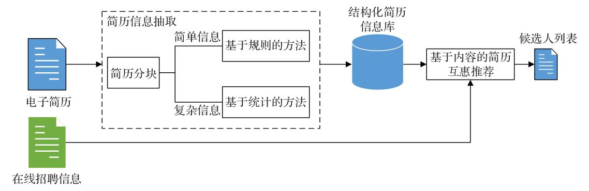
***
