# ___2018 - 07 - 09 Neo4j___
***

# 目录
  <!-- TOC depthFrom:1 depthTo:6 withLinks:1 updateOnSave:1 orderedList:0 -->

  - [___2018 - 07 - 09 Neo4j___](#2018-07-09-neo4j)
  - [目录](#目录)
  - [Q / A](#q-a)
  - [Neo4j](#neo4j)
  	- [安装](#安装)
  	- [Basic concept](#basic-concept)
  	- [Cypher Basic](#cypher-basic)
  	- [MATCH 查询](#match-查询)
  	- [WITH](#with)
  	- [INDEX 索引](#index-索引)
  	- [最短路径 Shortest path](#最短路径-shortest-path)
  - [Movie Graph](#movie-graph)
  	- [Create 创建](#create-创建)
  	- [Find 查找](#find-查找)
  	- [Query 查询](#query-查询)
  	- [Solve 最短路径 Bacon Path](#solve-最短路径-bacon-path)
  	- [Recommend 推荐](#recommend-推荐)
  	- [Clean up 删除电影数据](#clean-up-删除电影数据)
  	- [LOAD CSV 加载 Persons Movies 数据](#load-csv-加载-persons-movies-数据)
  - [Northwind Graph](#northwind-graph)
  	- [Northwind 数据表结构](#northwind-数据表结构)
  	- [加载 Product Catalog CSV 文件](#加载-product-catalog-csv-文件)
  	- [创建 Product Catalog 关系图](#创建-product-catalog-关系图)
  	- [加载 Customer Orders CSV 文件](#加载-customer-orders-csv-文件)
  	- [创建 Customer Orders 关系图](#创建-customer-orders-关系图)
  	- [Order Detail CSV 文件](#order-detail-csv-文件)
  - [Neo4j CQL 命令格式](#neo4j-cql-命令格式)
  	- [Neo4j CQL 简介](#neo4j-cql-简介)
  	- [CREATE](#create)
  	- [MATCH](#match)
  	- [RETURN](#return)
  	- [WHERE](#where)
  	- [DELETE](#delete)
  	- [REMOVE](#remove)
  	- [SET](#set)
  	- [ORDER BY](#order-by)
  	- [UNION](#union)
  	- [AS](#as)
  	- [LIMIT](#limit)
  	- [SKIP](#skip)
  	- [MERGE](#merge)
  	- [NULL 值](#null-值)
  	- [IN](#in)
  	- [ID 属性](#id-属性)
  	- [INDEX 索引](#index-索引)
  	- [UNIQUE 约束](#unique-约束)
  	- [DISTINCT](#distinct)
  - [Neo4J CQL 函数](#neo4j-cql-函数)
  	- [String 字符串函数](#string-字符串函数)
  	- [Aggregation 聚合函数](#aggregation-聚合函数)
  	- [Relationship 关系函数](#relationship-关系函数)
  - [Neo4j 图形算法](#neo4j-图形算法)
  	- [链接](#链接)
  	- [遍历和寻路算法](#遍历和寻路算法)
  	- [Centrality Algorithms](#centrality-algorithms)
  	- [社区发现算法](#社区发现算法)
  - [APOC 存储过程库](#apoc-存储过程库)
  	- [介绍](#介绍)
  	- [算法介绍](#算法介绍)
  - [py2neo](#py2neo)
  	- [链接](#链接)
  	- [Node Relation Property](#node-relation-property)
  	- [Node Relationship 的其他方法](#node-relationship-的其他方法)
  	- [Subgraph 子图](#subgraph-子图)
  	- [Walkable](#walkable)
  	- [Graph](#graph)
  	- [Transaction](#transaction)
  	- [Errors and Warnings](#errors-and-warnings)
  	- [Matching](#matching)
  	- [OGM](#ogm)
  	- [Cypher](#cypher)

  <!-- /TOC -->
***

# Q / A
  - **Q: AuthError: The client is unauthorized due to authentication failure**
    ```python
    from py2neo import Graph
    g = Graph()

    AuthError: The client is unauthorized due to authentication failure.
    ```
    A: 默认使用的用户名 / 密码是 `neo4j / password`，需要匹配自己的用户名密码
    ```shell
    neo4j-client -u neo4j -p 123456 bolt://localhost:7687
    ```
    ```python
    g = Graph(auth=("neo4j", "123456"))
    ```
    或通过 `:server user add` 添加新用户
  - **Q: TypeError: Parameters of type map are not supported**
    ```python
    from py2neo import Graph, Node
    g = Graph("http://localhost:7474")
    a = Node('Person', name='Alice')
    g.create(a)

    TypeError: Parameters of type map are not supported
    ```
    A: http 初始化的 graph 不能 create，必须用 bolt graph create 过 [ ??? ]
    ```python
    g2 = Graph("bolt://...", auth=(...))
    g2.create(a)
    g.create(a)
    ```
***

# Neo4j
## 安装
  - [neo4j github](https://github.com/neo4j/neo4j)
  - [Neo4j Graphs for Everyone](https://neo4j.com)
  - [Neo4j Desktop Debian Installation](https://neo4j.com/docs/operations-manual/current/installation/linux/debian/)
  - [Neo4j Debian Packages](https://debian.neo4j.org)
  - [The Neo4j Developer Manual](https://neo4j.com/docs/developer-manual/current/)
  - [Neo4j 中文社区](http://neo4j.com.cn/)
  - [Neo4j 中文手册](http://neo4j.com.cn/public/docs/index.html)
  - [Cypher 中文文档](http://neo4j.com.cn/public/cypher/default.html)
  - [O’Reilly’s Graph Databases](https://neo4j.com/graph-databases-book/?ref=home)
  - [Neo4j and Apache Spark](https://neo4j.com/developer/apache-spark/)
  - **安装 Neo4j**
    ```shell
    ''' Neo4j 要求 JAVA 1.8 '''
    apt install maven openjdk-8-jdk
    apt install debhelper devscripts dos2unix dpkg make xmlstarlet
    export JAVA_HOME=/usr/lib/jvm/java-1.8.0-openjdk-amd64

    ''' 方法1，Github 中的安装方法，启动一个安装程序，需要更多配置 '''
    # You will need a license for install4j, which is only needed for Neo4j Desktop
    curl -O http://download-keycdn.ej-technologies.com/install4j/install4j_linux_6_1_4.deb
    dpkg -i install4j_linux_6_1_4.deb

    ''' 方法2，debian source list，E: The repository 'https://debian.neo4j.org/repo stable/ Release' does not have a Release file. '''
    wget -O - https://debian.neo4j.org/neotechnology.gpg.key | sudo apt-key add -
    echo 'deb https://debian.neo4j.org/repo stable/' | sudo tee -a /etc/apt/sources.list.d/neo4j.list
    sudo apt-get update

    ''' 方法3，tar 文件 '''
    # https://neo4j.com/download/other-releases/#releases
    wget https://go.neo4j.com/download-thanks.html?edition=community&release=3.4.1&flavour=unix
    tar xvf neo4j-community-3.4.1-unix.tar.gz
    cd neo4j-community-3.4.1
    cd bin
    ./neo4j console
    # INFO  Remote interface available at http://localhost:7474/

    # Add bin to envirenment PATH
    ```
  - **启动**
    ```shell
    neo4j start
    # Browse at http://localhost:7474/
    Default username / password: neo4j / neo4j
    ```
    初次登录会要求修改密码
  - **添加新用户**
    ```python
    :server user add
    ```
    Add a new user, and test with neo4j-client
    ```shell
    # Username: neo4j-user-1, password: 123456
    neo4j-client -u neo4j-user-1 -p 123456 bolt://localhost:7687
    ```
  - **Hello world**
    ```python
    CREATE (matrix:Movie { title:"The Matrix", released:1997 })
    CREATE (cloudAtlas:Movie { title:"Cloud Atlas", released:2012 })
    CREATE (forrestGump:Movie { title:"Forrest Gump", released:1994 })
    CREATE (keanu:Person { name:"Keanu Reeves", born:1964 })
    CREATE (robert:Person { name:"Robert Zemeckis", born:1951 })
    CREATE (tom:Person { name:"Tom Hanks", born:1956 })
    CREATE (tom)-[:ACTED_IN { roles: ["Forrest"]}]->(forrestGump)
    CREATE (tom)-[:ACTED_IN { roles: ['Zachry']}]->(cloudAtlas)
    CREATE (robert)-[:DIRECTED]->(forrestGump)
    RETURN matrix,cloudAtlas,forrestGump,keanu,robert,tom
    ```
    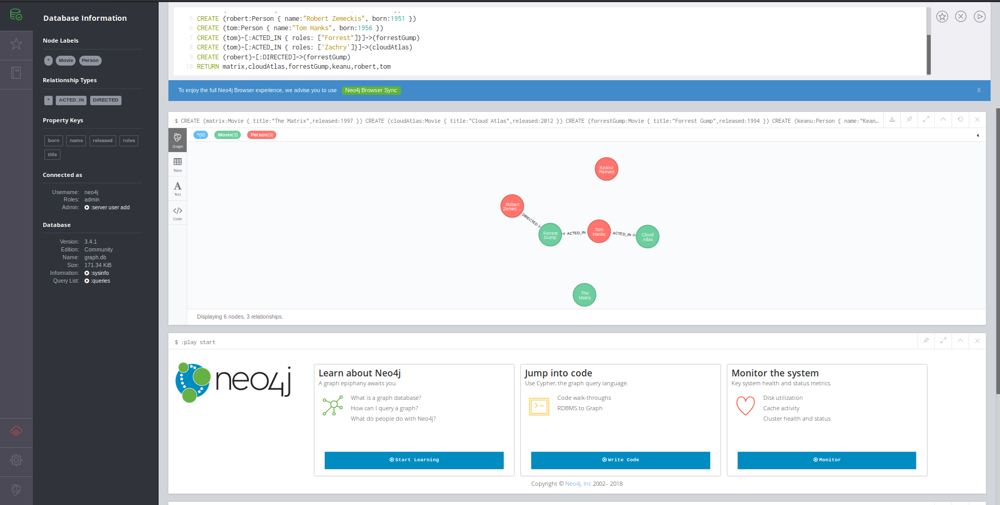
## Basic concept
  - **Graph 图** 是表示对象与对象之间关系的方法
    - **对象** 又称 节点 Node / 顶点 Vertex / 实体 Entity，描述具体的一件事物
    - **关系** 又称 边 edge，描述对象之间的关系
    - **G=(V, E)** 表示一张图，V 表示节点的集合，E 表示边集合

    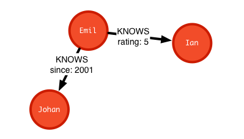     
  - **图的学习任务分类**
    - 社交网络 / 搜索排名 / 评分系统 / 推荐系统 / 知识图谱 / 风险控制
    - 节点上的任务：利用图中节点的关系可以做包括分类（比如风险识别、价值排名等任务）、聚类（社群检测、用户画像等任务）
    - 边上的任务：通过图中节点之间是否有边可以做比如推荐、知识推理等任务
    - 图上的任务：图可以做像高分子分类、3D视觉分类等任务
  - **Graph 图** 基本组成
    - **Nodes 节点** 数据的名称
      ```js
      (a) // actors
      (m) // movies
      ( ) // some anonymous node
      ```
    - **Relationships 关系** 节点之间的连接
      ```js
      -[r]-> //a relationship referred to as "r"
      (a)-[r]->(m) //actors having a relationship referred to as "r" to movies
      -[:ACTED_IN]-> //the relationship type is ACTED_IN
      (a)-[:ACTED_IN]->(m) //actors that ACTED_IN some movie
      (d)-[:DIRECTED]->(m) //directors that DIRECTED some movie
      ```
      - 关系有特定的方向与类型
      - 关系可以包含属性
    - **Properties 属性** 键值队的形式存储数据值
      ```js
      (m {title:"The Matrix"}) //Movie with a title property
      (a {name:"Keanu Reeves",born:1964}) //Actor with name and born property
      (a)-[:ACTED_IN {roles:["Neo"]}]->(m) //Relationship ACTED_IN with roles property
      ```
    - **Label 标签** 节点可以通过标签组合在一起
      ```js
      (a:Person) //a Person
      (a:Person {name:"Keanu Reeves"}) //a Person with properties
      (a:Person)-[:ACTED_IN]->(m:Movie) //a Person that ACTED_IN some movie
      ```
      - 一个节点可以有 0 个或多个标签
      - 标签没有属性
  - **Editor**
    - **:help** 查看命令的帮助信息
    - **:clear** 清空
    - **:play** 运行
      ```js
      // Guides
      :play intro
      :play concepts
      :play cypher

      // Examples
      :play movie graph
      :play northwind graph
      ```
    - **shift-enter** Switch to multi-line editing
    - **ctrl-enter** 运行
  - 其他命令
    ```python
    :sysinfo
    :server
    :schema
    ```
  - **节点和关系** 建立之前最好先查找一下是否已经存在这个节点，如果已经存在，建立关系时使用查找到的节点，而不要新建，否则会出现一个新的节点
  - **批量导入** 一条条建立关系和节点速度并不快，条件合适应使用 Neo4j 的批量导入功能
  - **数据内容**
    - 图数据库的本质是为了 **方便查找节点之间关系的**，而不是为了存储数据
    - 因此向一个节点或者关系里面插入很多其余无关的数据是完全没有必要的，会很大程度浪费硬盘资源，在检索的时候也会消耗更多的时间
## Cypher Basic
  - **Cypher** Neo4j 图查询 / 创建语言，描述 **找什么**，而不是 **怎么找**
  - **CREATE** 创建节点
    ```js
    // 语法规则
    CREATE (节点名: 标签 {节点属性})
    ```
    ```js
    CREATE (ee:Person { name: "Emil", from: "Sweden", klout: 99 })
    ```
  - **DELETE** 删除当前所有节点 / 关系
    ```js
    MATCH(n:Person) DETACH
    DELETE n
    ```
  - **MATCH** 查找节点或关系
    ```js
    // 语法规则
    MATCH (匹配出的变量名 : 匹配的标签) WHERE 过滤结果 RETURN 返回特定结果
    ```
    ```js
    MATCH (pp:Person) WHERE pp.name = "Emil" RETURN pp;
    ```
    CREATE 后面直接用 MATCH 时，需要 WITH
    ```js
    create (ee:Person {name: "Emil", from: "Sweden", klout: 99})
    with ee
    match (pp:Person) where pp.name="Emil" return pp
    ```
    
  - **CREATE relationships** 创建关系
    ```js
    // 语法规则
    CREATE (节点名 1)-[:关系名 {关系属性}]->(节点名 2)
    ```
    ```js
    create (ee:Person {name: "Emil", from: "Sweden", klout: 99})
    create (et:Person {name: "et"})
    create (et)-[:KNOWS {by: "swimming"}]->(ee)
    return ee, et
    ```
    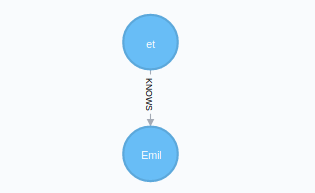
  - 创建多个节点以及关系
    ```js
    create (ee:Person {name: "Emil", from: "Sweden", klout: 99})
    WITH ee
    MATCH (pp:Person) WHERE pp.name="Emil"
    CREATE (js:Person {name: "Johan", from: "Sweden", learn: "surfing"}),
           (ir: Person {name: "Ian", from: "Belgium", title: "author"}),
           (rvb: Person {name: "Rik", from: "England", pet: "Orval"}),
           (ally: Person {name: "Allison", from: "California", hobby: "surfing"}),
           (ee)-[:KNOWS {since: 2001}]->(js), (ee)-[:KNOWS {rating: 5}]->(ir),
           (js)-[:KNOWS]->(ir), (js)-[:KNOWS]->(rvb),
           (ir)-[:KNOWS]->(js), (ir)-[:KNOWS]->(ally),
           (rvb)-[:KNOWS]->(ally)
    RETURN ee, js, ir, rvb, ally
    ```
    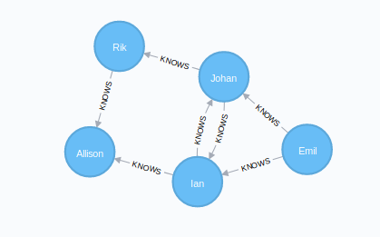
  - **MATCH relationships** 匹配关系
    ```js
    // 语法规则
    MATCH (匹配出的变量名 : 匹配的标签) -[:关系]-(匹配到的关系名)
    WHERE 过滤结果 RETURN 返回特定结果
    ```
    ```js
    // pattern can be used to find Emil's friends
    MATCH (ee:Person)-[:KNOWS]-(friends)
    WHERE ee.name = "Emil" RETURN ee, friends
    ```
    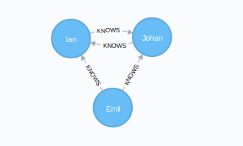
  - **Recommendations** 匹配关系进行推荐
    ```js
    // Recommd frind by "surfing"
    MATCH (js:Person)-[:KNOWS]-()-[:KNOWS]-(surfer)
    WHERE js.name = "Johan" AND surfer.hobby = "surfing"
    RETURN DISTINCT surfer
    ```
    
    - **() empty** 表示忽略这些匹配到的节点
    - **DISTINCT** because more than one path will match the pattern
  - **EXPLAIN / PROFILE** 显示匹配过程
    ```js
    PROFILE MATCH (js:Person)-[:KNOWS]-()-[:KNOWS]-(surfer)
    WHERE js.name = "Johan" AND surfer.hobby = "surfing"
    RETURN DISTINCT surfer
    ```
    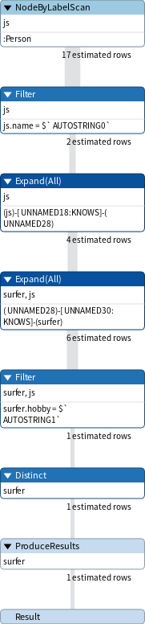
## MATCH 查询
  - **匹配 Node**
    ```js
    ()
    (pp)
    (:Person)
    (pp:Person)
    (pp:Person {name: "Emil"})
    ```
  - **匹配 Relationship**
    ```js
    -->
    -[role]->
    -[:KNOWS]->
    -[role:KNOWS]->
    -[role:KNOWS {since: 2001}]->
    -[:KNOWS*2]-> // Length 2 relationship
    -[:KWONS*1..3]-> // Variable length relationships
    -[role:ACTED|:DIRECTED]-> // deprecated, use UNION instead
    ```
  - **基本查询**
    ```js
    // 查询所有节点
    MATCH (n) RETURN n
    // 查询所有有连接的节点
    MATCH (n)-->(m) RETURN n, m
    // 查询所有有外向连接的节点
    MATCH (n)-->( ) RETURN n

    // 查询所有关系类型
    MATCH ()-[rel]->() RETURN type(rel)
    // 查询所有用户名与所有的关系
    MATCH (aa)-[rr]->(bb) RETURN aa.name AS From, type(rr) AS Related, bb.name AS To
    ```
  - **条件查询**
    ```js
    // 查询指定用户的关系
    MATCH (aa:Person {name:"Emil"})-->(bb) RETURN aa, bb
    // 使用 WHERE 指定条件
    MATCH (aa:Person)-->(bb) WHERE aa.name="Emil" RETURN aa, bb

    // 名字中含有 "a"
    MATCH (aa:Person) WHERE aa.name =~ ".*a.*" RETURN aa
    // 查询关系长度 1 到 3 的节点
    MATCH (aa)-[:KNOWS*1..3]->(bb) WHERE aa.name="Emil" RETURN aa, bb

    // 查询 同时认识一个人，互相之间又不认识的人
    MATCH (aa)-[:KNOWS]->(bb)<-[:KNOWS]-(cc) WHERE NOT (aa)--(cc) RETURN aa, bb, cc
    // 等价写法
    MATCH (aa)-[:KNOWS]->(bb), (cc)-[:KNOWS]->(bb) WHERE NOT (aa)--(cc) RETURN aa, bb, cc   

    // 删除没有 name 属性的节点
    MATCH (aa:Person) WHERE exists(aa.name) DETACH DELETE aa
    ```
  - **定义 path** [ ??? ]
    ```js
    MATCH p=(a)-[:KNOWS]->(m)<-[:KNOWS]-(d) RETURN p
    MATCH p=(a)-[:KNOWS]->(m)<-[:KNOWS]-(d) RETURN NODES(p)
    MATCH p=(a)-[:KNOWS]->(m)<-[:KNOWS]-(d) RETURN RELS(p)
    MATCH p1=(a)-[:KNOWS]->(m), p2=(d)-[:KNOWS]->(m) RETURN p1, p2
    ```
  - **可变长度关系查询**
    ```js
    // 长度为 2 的关系
    MATCH p = (aa)-[:KNOWS*2]->(bb) RETURN aa.name, bb.name
    // 长度 1 到 3 的关系
    MATCH p = (aa)-[:KNOWS*1..3]->(bb) RETURN aa.name, bb.name

    // 不推荐将可变长度关系绑定到一个变量，使用 path
    MATCH p = (aa)-[:KNOWS*1..3]->(bb) WITH *, relationships(p) AS rr RETURN rr
    MATCH p = (aa)-[:KNOWS*1..3]->(bb) WITH *, relationships(p) AS rr RETURN aa.name, size(rr), bb.name
    MATCH p = (aa)-[:KNOWS*1..3]->(bb) WITH *, relationships(p) AS rr RETURN aa.name, length(rr), bb.name

    // 长度为 0 的关系，关系的起止是同一个节点
    MATCH (aa)-[:KNOWS*0..1]-(bb) RETURN aa
    ```
  - **MATCH - CREATE - RETURN**
    ```js
    MATCH (ir:Person {name: "Ian"}), (em: Person {name: "Emil"})
    CREATE (ir)-[:KNOWS]->(em)
    RETURN ir, em
    ```
## WITH
  - **WITH** 将 **上一个命令的输出** 与 **下一个命令的输入** 结合起来，工作原理类似 **RETURN**，只是不返回结果
  - **CREATE - WITH - MATCH**
    ```js
    CREATE (al:Person {name: "Alice", age: 21})
    CREATE (bb:Person {name: "Bob", age: 23})
    CREATE (al)-[:KNOWS]->(bb)

    WITH al, bb
    MATCH (n: Person {name: "Alice"}) RETURN n
    ```
  - Actor - Movie 数据库中的应用
    ```js
    MATCH (person:Person)-[:ACTED_IN]->(m:Movie)
    WITH person, count(*) AS appearances, collect(m.title) AS movies
    WHERE appearances > 1
    RETURN person.name, appearances, movies

    // Output
    +------------------------------------------------------------+
    | person.name | appearances | movies                         |
    +------------------------------------------------------------+
    | "Tom Hanks" | 2           | ["Cloud Atlas","Forrest Gump"] |
    +------------------------------------------------------------+
    1 row
    ```
## INDEX 索引
  - Neo4j 2.0 版本在标签的基础上引入了索引，可以对标签进行限制和索引
    - 尽量使用 **schema index**，而不要使用旧版本的索引
    - 索引可以很大程度上降低大规模数据的查询速度
    - 最好在插入数据之前就建立好索引，否则索引的建立会很消耗时间
  - **索引** 和其他 RDBMS 的定义相类似，主要用于提升节点查询的性能，即有助于数据完整性检查，也有利于优化 Cypher
  - **创建索引** 索引建立后，随后的查询中出现具有索引的属性时，将自动使用索引
    ```js
    CREATE INDEX ON :<Label>(<Property>)
    ```
    ```js
    // 初始化数据，不使用索引查询
    CREATE (al:Person {name: "Alice", age: 21})
    CREATE (bb:Person {name: "Bob", age: 23})
    CREATE (al)-[:KNOWS {period_year: 6}]->(bb)
    PROFILE MATCH (n:Person) WHERE n.name="Alice" RETURN n
    ```
    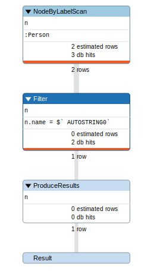
    ```js
    // 创建索引查询
    CREATE INDEX ON :Person(name)
    PROFILE MATCH (n:Person) WHERE n.name="Alice" RETURN n
    ```
    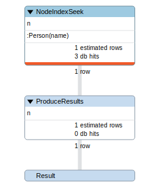
  - **:schema** 显示当前的索引
    ```js
    :schema
    CALL db.indexes

    // 显示图数据库中的元模型
    CALL db.schema
    ```
  - **删除索引**
    ```js
    DROP INDEX ON :<Label>(<Property>)
    ```
    ```js
    DROP INDEX ON :Person(name)
    ```
  - **USING INDEX 显式指定索引** 必须首先创建索引才能显式指定
    ```js
    USING INDEX <name>:<Label>(Property)
    USING SCAN <name>:<Label>
    ```
    ```js
    MATCH (n:Person) USING INDEX n:Person(name) WHERE n.name="Alice" RETURN(n)
    MATCH (n:Person) USING SCAN n:Person WHERE n.name="Alice" RETURN(n)
    ```
## 最短路径 Shortest path
  - **Single shortest path** 函数 shortestPath 查找两个节点间的一条最短路径
    ```js
    // 查找两个节点间的最短路径
    MATCH (aa:Person {name: "Ian"}), (bb:Person {name: "Rik"}), p=shortestpath((aa)-[*..5]-(bb)) RETURN p
    ```
    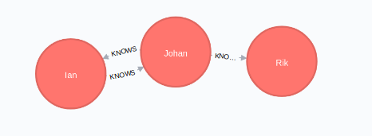
  - **All shortest paths** 函数 allShortestPaths 查找两个节点间的所有最短路径
    ```js
    // 查找两个节点间的所有最短路径
    MATCH (aa:Person {name: "Ian"}), (bb:Person {name: "Rik"}), p=allShortestPaths((aa)-[*..5]-(bb)) RETURN p
    ```
    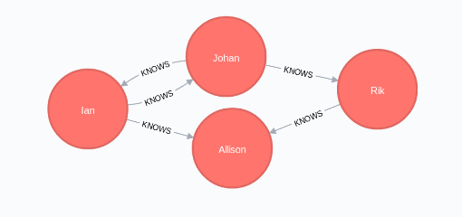
    ```js
    // 过滤 ANY
    MATCH (aa:Person {name: "Ian"}), (bb:Person {name: "Rik"}), p=allShortestPaths((aa)-[*..5]-(bb))
    WHERE ANY (r IN relationships(p) WHERE type(r)="KNOWS")
    RETURN p

    // 过滤 NONE
    MATCH (aa:Person {name: "Ian"}), (bb:Person {name: "Rik"}), p=allShortestPaths((aa)-[*..5]-(bb))
    WHERE NONE (r IN relationships(p) WHERE type(r)="KNOWS")
    RETURN p
    ```
***

# Movie Graph
## Create 创建
  - **Movie Graph** 演员-电影 图数据库，演员参演电影的关系图
    ```js
    :play movie-graph
    ```
  - [neo4j_movie_graph.cypher](neo4j_movie_graph.cypher)
    ```js
    // 示例
    CREATE (YouveGotMail:Movie {title:"You've Got Mail", released:1998, tagline:'At odds in life... in love on-line.'})
    CREATE (ParkerP:Person {name:'Parker Posey', born:1968})
    CREATE (DaveC:Person {name:'Dave Chappelle', born:1973})
    CREATE (SteveZ:Person {name:'Steve Zahn', born:1967})
    CREATE (TomH:Person {name:'Tom Hanks', born:1956})
    CREATE (NoraE:Person {name:'Nora Ephron', born:1941})
    CREATE
      (TomH)-[:ACTED_IN {roles:['Joe Fox']}]->(YouveGotMail),
      (MegR)-[:ACTED_IN {roles:['Kathleen Kelly']}]->(YouveGotMail),
      (GregK)-[:ACTED_IN {roles:['Frank Navasky']}]->(YouveGotMail),
      (ParkerP)-[:ACTED_IN {roles:['Patricia Eden']}]->(YouveGotMail),
      (DaveC)-[:ACTED_IN {roles:['Kevin Jackson']}]->(YouveGotMail),
      (SteveZ)-[:ACTED_IN {roles:['George Pappas']}]->(YouveGotMail),
      (NoraE)-[:DIRECTED]->(YouveGotMail)
    ```
  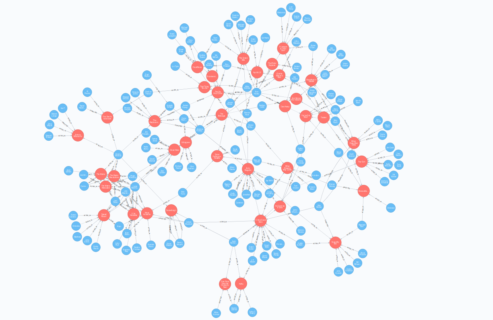
## Find 查找
  - 查找演员名 "Tom Hanks"
    ```js
    MATCH (tom {name: "Tom Hanks"}) RETURN tom
    ```
  - 查找电影名 "Cloud Atlas"
    ```js
    MATCH (cloudAtlas {title: "Cloud Atlas"}) RETURN cloudAtlas
    ```
  - 查找 10 个人
    ```js
    MATCH (people:Person) RETURN people.name LIMIT 10
    ```
  - 查找 90 年代的电影 `1990 <= released < 2000`
    ```js
    MATCH (nineties:Movie) WHERE nineties.released >= 1990 AND nineties.released < 2000 RETURN nineties.title
    ```
## Query 查询
  - 列出 "Tom Hanks" 的所有电影
    ```js
    MATCH (tom:Person {name: "Tom Hanks"})-[:ACTED_IN]->(tomHanksMovies) RETURN tom, tomHanksMovies
    ```
    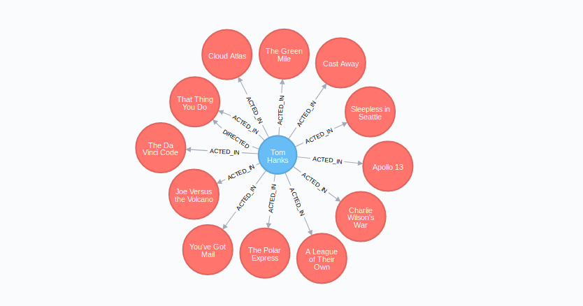
  - "Cloud Atlas" 的导演
    ```js
    MATCH (cloudAtlas {title: "Cloud Atlas"})<-[:DIRECTED]-(directors) RETURN directors.name
    MATCH (cloudAtlas:Movie {title: "Cloud Atlas"})<-[:DIRECTED]-(director) RETURN director, cloudAtlas
    ```
    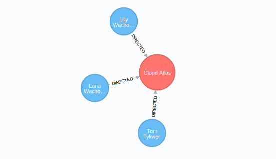
  - "Tom Hanks" 共同参演的演员
    ```js
    MATCH (tom:Person {name:"Tom Hanks"})-[:ACTED_IN]->(m)<-[:ACTED_IN]-(coActors) RETURN coActors.name
    MATCH (tom:Person {name: "Tom Hanks"})-[:ACTED_IN]->(m)<-[:ACTED_IN]-(coActors) RETURN tom, m, coActors
    ```
    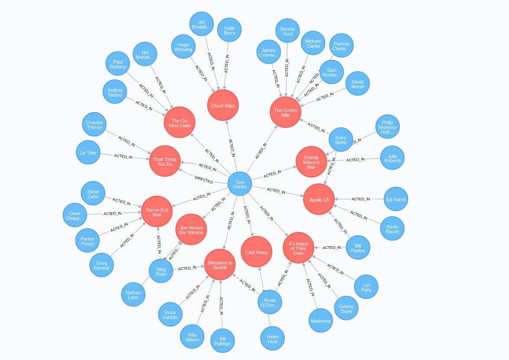
  - 电影 "Cloud Atlas" 的人员关系
    ```js
    MATCH (people:Person)-[relatedTo]-(:Movie {title: "Cloud Atlas"}) RETURN people.name, Type(relatedTo), relatedTo
    MATCH (people:Person)-[relatedTo]-(ca:Movie {title: "Cloud Atlas"}) RETURN people, relatedTo, ca
    ```
    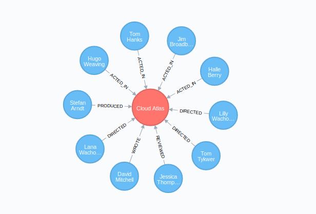
## Solve 最短路径 Bacon Path
  - 与 "Kevin Bacon" 4 层关系以内的演员和电影
    ```js
    MATCH (bacon:Person {name:"Kevin Bacon"})-[*1..4]-(hollywood)
    RETURN DISTINCT hollywood

    MATCH (bacon:Person {name:"Kevin Bacon"})-[*1..2]-(hollywood)
    RETURN DISTINCT hollywood, bacon
    ```
    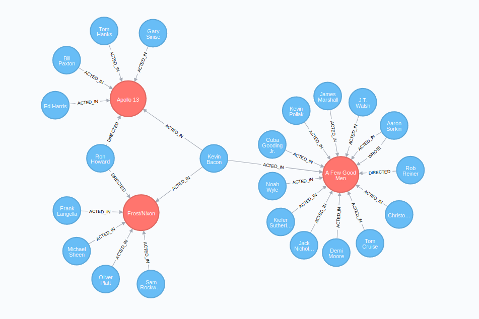
  - **Bacon path** "Kevin Bacon" 与 "Meg Ryan" 之间的最短路径
    ```js
    MATCH p=shortestPath(
      (bacon:Person {name:"Kevin Bacon"})-[*]-(meg:Person {name:"Meg Ryan"})
    )
    RETURN p
    ```
    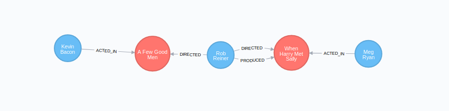
## Recommend 推荐
  - 为 "Tom Hanks" 推荐新的合作演员
    - 查找 Tom Hanks 合作过的演员，新的合作演员与这些演员合作过
    - Tom Hanks 没有与推荐的演员合作过
    ```js
    MATCH (tom:Person {name:"Tom Hanks"})-[:ACTED_IN]->(m)<-[:ACTED_IN]-(coActors),
          (coActors)-[:ACTED_IN]->(m2)<-[:ACTED_IN]-(cocoActors)
    WHERE NOT (tom)-[:ACTED_IN]->()<-[:ACTED_IN]-(cocoActors) AND tom <> cocoActors
    RETURN cocoActors.name AS Recommended, count(*) AS Strength ORDER BY Strength DESC
    ```
    | Recommended        | Strength |
    | ------------------ | -------- |
    | "Tom Cruise"       | 5        |
    | "Zach Grenier"     | 5        |
    | "Cuba Gooding Jr." | 4        |
    | "Carrie Fisher"    | 3        |
    | "Frank Langella"   | 2        |
    | "Ben Miles"        | 1        |
    | "Natalie Portman"  | 1        |
  - 查找能将 Tom Hanks 介绍给 Tom Cruise 的关系
    ```js
    MATCH (tom:Person {name:"Tom Hanks"})-[:ACTED_IN]->(m)<-[:ACTED_IN]-(coActors),
          (coActors)-[:ACTED_IN]->(m2)<-[:ACTED_IN]-(cruise:Person {name:"Tom Cruise"})
    RETURN tom, m, coActors, m2, cruise
    ```
    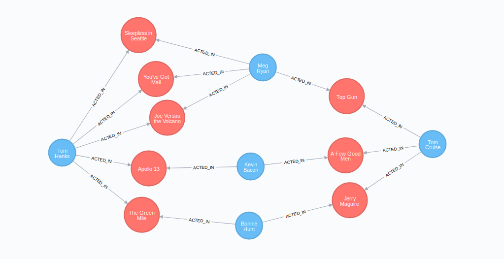
## Clean up 删除电影数据
  - 关系存在的时候不能删除节点，必须同时删除节点与关系
  ```js
  // Delete all Movie and Person nodes, and their relationships
  MATCH (n) DETACH DELETE n
  // Prove that the Movie Graph is gone
  MATCH (n) RETURN n
  ```
## LOAD CSV 加载 Persons Movies 数据
  - **导入 persons.csv**
    ```js
    LOAD CSV WITH HEADERS FROM "http://neo4j.com/docs/developer-manual/3.4/csv/import/persons.csv" AS csvLine
    CREATE (p:Person { id: toInteger(csvLine.id), name: csvLine.name })
    ```
    | id  | name            |
    | --- | --------------- |
    | 1   | Charlie Sheen   |
    | 2   | Oliver Stone    |
    | 3   | Michael Douglas |
    | 4   | Martin Sheen    |
    | 5   | Morgan Freeman  |
  - **导入 movies.csv** 使用 **MERGE** 避免创建重复数据
    ```js
    // 在使用 MERGE / MATCH 时，应首先创建索引
    CREATE INDEX ON :Country(name)
    ```
    ```js
    LOAD CSV WITH HEADERS FROM "http://neo4j.com/docs/developer-manual/3.4/csv/import/movies.csv" AS csvLine
    MERGE (country:Country { name: csvLine.country })
    CREATE (movie:Movie { id: toInteger(csvLine.id), title: csvLine.title, year:toInteger(csvLine.year)})
    CREATE (movie)-[:MADE_IN]->(country)
    ```
    | id  | title                    | country | year |
    | --- | ------------------------ | ------- | ---- |
    | 1   | Wall Street              | USA     | 1987 |
    | 2   | The American President   | USA     | 1995 |
    | 3   | The Shawshank Redemption | USA     | 1994 |
  - **创建索引** 使用 id 作为索引，只在关联关系时使用，使用 `CREATE CONSTRAINT ON ... ASSERT ... IS UNIQUE` 创建 **唯一性约束**，同时会创建 **唯一性索引**
    ```js
    CREATE CONSTRAINT ON (person:Person) ASSERT person.id IS UNIQUE
    ```
    ```js
    CREATE CONSTRAINT ON (movie:Movie) ASSERT movie.id IS UNIQUE
    ```
  - **导入 roles.csv** 创建关系，`USING PERIODIC COMMIT` 在加载大型 csv 文件时，通知 Neo4j 会创建大量的数据
    ```js
    USING PERIODIC COMMIT 500
    LOAD CSV WITH HEADERS FROM "https://neo4j.com/docs/developer-manual/3.4/csv/import/roles.csv" AS csvLine
    MATCH (person:Person { id: toInteger(csvLine.personId)}),
      (movie:Movie { id: toInteger(csvLine.movieId)})
    CREATE (person)-[:PLAYED { role: csvLine.role }]->(movie)
    ```
    | personId | movieId | role                      |
    | -------- | ------- | ------------------------- |
    | 1        | 1       | Bud Fox                   |
    | 4        | 1       | Carl Fox                  |
    | 3        | 1       | Gordon Gekko              |
    | 4        | 2       | A.J. MacInerney           |
    | 3        | 2       | President Andrew Shepherd |
    | 5        | 3       | Ellis Boyd 'Red' Redding  |
  - **删除临时索引** movie / person 的索引在创建完关系后不再需要
    ```js
    DROP CONSTRAINT ON (person:Person) ASSERT person.id IS UNIQUE
    ```
    ```js
    DROP CONSTRAINT ON (movie:Movie) ASSERT movie.id IS UNIQUE
    ```
    ```js
    MATCH (n)
    WHERE n:Person OR n:Movie
    REMOVE n.id
    ```
***

# Northwind Graph
## Northwind 数据表结构
  - **RDBMS** 关系数据库管理系统 Relational Database Management System
  - **Northwind Graph** 将一个传统的关系型数据库转化为图数据库
    ```js
    :play northwind-graph
    ```
  - **Product Catalog** 产品类别，包含了 `产品 product - 类别 categories - 供应商 suppliers` 的数据

    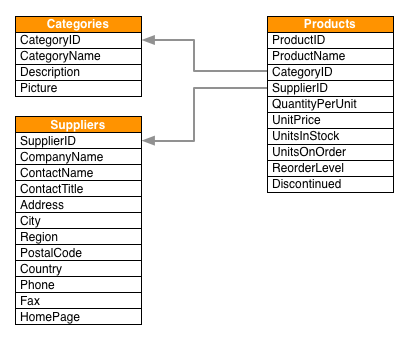
    - **products.csv**

      | productID | productName   | supplierID | categoryID | quantityPerUnit     | unitPrice | unitsInStock | unitsOnOrder | reorderLevel | discontinued |
      | --------- | ------------- | ---------- | ---------- | ------------------- | --------- | ------------ | ------------ | ------------ | ------------ |
      | 1         | Chai          | 1          | 1          | 10 boxes x 20 bags  | 18        | 39           | 0            | 10           | 0            |
      | 2         | Chang         | 1          | 1          | 24 - 12 oz bottles  | 19        | 17           | 40           | 25           | 0            |
      | 3         | Aniseed Syrup | 1          | 2          | 12 - 550 ml bottles | 10        | 13           | 70           | 25           | 0            |
    - **categories.csv**

      | categoryID | categoryName | description                                                | picture  |
      | ---------- | ------------ | ---------------------------------------------------------- | -------- |
      | 1          | Beverages    | Soft drinks, coffees, teas, beers, and ales                | 0x151... |
      | 2          | Condiments   | Sweet and savory sauces, relishes, spreads, and seasonings | 0x151... |
      | 3          | Confections  | Desserts, candies, and sweet breads                        | 0x151... |
    - **suppliers.csv**

      | supplierID | companyName                | contactName      | contactTitle         | address        | city        | region | postalCode | country | phone          | fax            | homePage    |
      | ---------- | -------------------------- | ---------------- | -------------------- | -------------- | ----------- | ------ | ---------- | ------- | -------------- | -------------- | ----------- |
      | 1          | Exotic Liquids             | Charlotte Cooper | Purchasing Manager   | 49 Gilbert St. | London      | NULL   | EC1 4SD    | UK      | (171) 555-2222 | NULL           | NULL        |
      | 2          | New Orleans Cajun Delights | Shelley Burke    | Order Administrator  | P.O. Box 78934 | New Orleans | LA     | 70117      | USA     | (100) 555-4822 | NULL           | #CAJUN.HTM# |
      | 3          | Grandma Kelly's Homestead  | Regina Murphy    | Sales Representative | 707 Oxford Rd. | Ann Arbor   | MI     | 48104      | USA     | (313) 555-5735 | (313) 555-3349 | NULL        |

  - **Customer Orders** 客户订单，包含了 `Custom - Order` 对应关系

    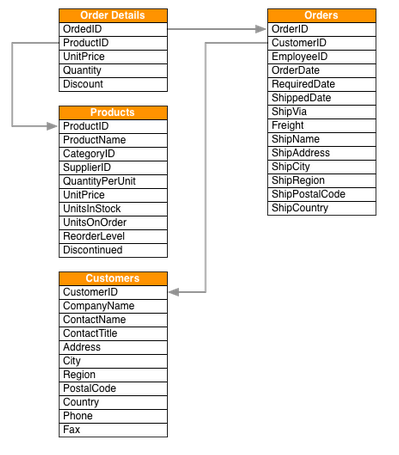
    - **customers.csv**

      | customerID | companyName                        | contactName    | ... |
      | ---------- | ---------------------------------- | -------------- | --- |
      | ALFKI      | Alfreds Futterkiste                | Maria Anders   | ... |
      | ANATR      | Ana Trujillo Emparedados y helados | Ana Trujillo   | ... |
      | ANTON      | Antonio Moreno Taquería            | Antonio Moreno | ... |
    - **orders.csv**

      | orderID | customerID | employeeID | orderDate               | ... |
      | ------- | ---------- | ---------- | ----------------------- | --- |
      | 10248   | VINET      | 5          | 1996-07-04 00:00:00.000 | ... |
      | 10249   | TOMSP      | 6          | 1996-07-05 00:00:00.000 | ... |
      | 10250   | HANAR      | 4          | 1996-07-08 00:00:00.000 | ... |
  - **OrderDetail** 包含了 `Order - Product` 的对应关系

    | orderID | productID | unitPrice | quantity | discount |
    | ------- | --------- | --------- | -------- | -------- |
    | 10248   | 11        | 14        | 12       | 0        |
    | 10248   | 42        | 9.8       | 10       | 0        |
    | 10248   | 72        | 34.8      | 5        | 0        |
## 加载 Product Catalog CSV 文件
  - **LOAD CSV**
    ```js
    :help cypher LOAD CSV
    ```
  - **加载 products.csv / categories.csv / suppliers.csv 文件**
    ```js
    // products.csv
    LOAD CSV WITH HEADERS FROM "http://data.neo4j.com/northwind/products.csv" AS row
    CREATE (n:Product)
    SET n = row,
      n.unitPrice = toFloat(row.unitPrice),
      n.unitsInStock = toInteger(row.unitsInStock), n.unitsOnOrder = toInteger(row.unitsOnOrder),
      n.reorderLevel = toInteger(row.reorderLevel), n.discontinued = (row.discontinued <> "0")
    ```
    ```js
    // categories.csv
    LOAD CSV WITH HEADERS FROM "http://data.neo4j.com/northwind/categories.csv" AS row
    CREATE (n:Category)
    SET n = row
    ```
    ```js
    // suppliers.csv
    LOAD CSV WITH HEADERS FROM "http://data.neo4j.com/northwind/suppliers.csv" AS row
    CREATE (n:Supplier)
    SET n = row
    ```
  - **Create indexes** 创建索引
    ```js
    CREATE INDEX ON :Product(productID)
    ```
    ```js
    CREATE INDEX ON :Category(categoryID)
    ```
    ```js
    CREATE INDEX ON :Supplier(supplierID)
    ```
## 创建 Product Catalog 关系图
  - products / categories / suppliers 通过 **ID 键值** 联系起来

    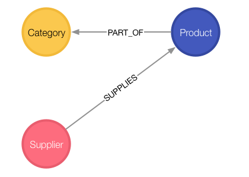
  - **创建关系 relationships**
    ```js
    :help cypher MATCH
    ```
    ```js
    MATCH (p:Product),(c:Category)
    WHERE p.categoryID = c.categoryID
    CREATE (p)-[:PART_OF]->(c)
    ```
    ```js
    MATCH (p:Product),(s:Supplier)
    WHERE p.supplierID = s.supplierID
    CREATE (s)-[:SUPPLIES]->(p)
    ```
  - 查找每个供应商 supplier 提供的产品类别 categories
    ```js
    MATCH (s:Supplier)-->(:Product)-->(c:Category)
    RETURN s.companyName as Company, collect(distinct c.categoryName) as Categories
    ```
    | Company         | Categories                                    |
    | --------------- | --------------------------------------------- |
    | "Lyngbysild"    | ["Seafood"]                                   |
    | "G'day"         | ["Grains/Cereals", "Meat/Poultry", "Produce"] |
    | "Tokyo Traders" | ["Meat/Poultry", "Produce", "Seafood"]        |

  - 查找 "Produce" 类别的供应商
    ```js
    MATCH (c:Category {categoryName:"Produce"})<--(p:Product)<--(s:Supplier)
    RETURN DISTINCT s.companyName as ProduceSuppliers
    RETURN s, p, c
    ```
    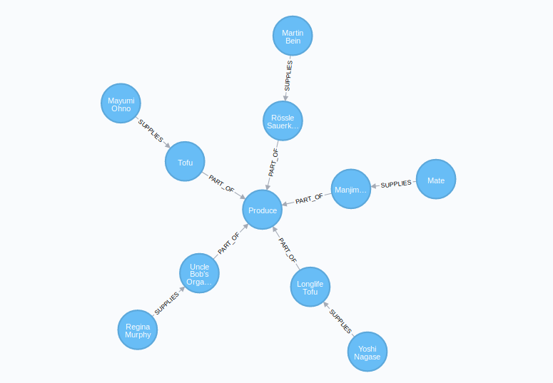
## 加载 Customer Orders CSV 文件
  - 加载 **customers.csv** / **orders.csv** 文件
    ```js
    LOAD CSV WITH HEADERS FROM "http://data.neo4j.com/northwind/customers.csv" AS row
    CREATE (n:Customer)
    SET n = row
    ```
    ```js
    LOAD CSV WITH HEADERS FROM "http://data.neo4j.com/northwind/orders.csv" AS row
    CREATE (n:Order)
    SET n = row
    ```
  - **Create indexes** 创建索引
    ```js
    CREATE INDEX ON :Customer(customerID)

    CREATE INDEX ON :Order(orderID)
    ```
## 创建 Customer Orders 关系图
  
  ```js
  MATCH (c:Customer),(o:Order)
  WHERE c.customerID = o.customerID
  CREATE (c)-[:PURCHASED]->(o)
  ```
## Order Detail CSV 文件
  - 加载 **order-details.csv** 文件，并将 **Product** 与 **Order** 关联起来
    ```js
    LOAD CSV WITH HEADERS FROM "http://data.neo4j.com/northwind/order-details.csv" AS row
    MATCH (p:Product), (o:Order)
    WHERE p.productID = row.productID AND o.orderID = row.orderID
    CREATE (o)-[details:ORDERS]->(p)
    SET details = row,
      details.quantity = toInteger(row.quantity)
    ```
  - 综合查询
    ```js
    MATCH (cust:Customer)-[:PURCHASED]->(:Order)-[o:ORDERS]->(p:Product),
          (p)-[:PART_OF]->(c:Category {categoryName:"Produce"})
    RETURN DISTINCT cust.contactName as CustomerName, SUM(o.quantity) AS TotalProductsPurchased
    ```
***

# Neo4j CQL 命令格式
## Neo4j CQL 简介
  - CQL代表Cypher查询语言，遵循SQL语法
  - **常用的 Neo4j CQL 命令**

    | CQL 命令    | 用法                         |
    | ----------- | ---------------------------- |
    | CREATE 创建 | 创建节点，关系和属性         |
    | MATCH 匹配  | 检索有关节点，关系和属性数据 |
    | RETURN 返回 | 返回查询结果                 |
    | WHERE 过滤  | 提供条件过滤检索数据         |
    | DELETE 删除 | 删除节点和关系               |
    | REMOVE 移除 | 删除节点和关系的属性         |
    | ORDER BY    | 以…排序 排序检索数据         |
    | SET 设置    | 添加或更新标签               |

  - **常用的 Neo4j CQL 函数**

    | 定制列表功能      | 用法                                           |
    | ----------------- | ---------------------------------------------- |
    | String 字符串     | 用于使用 String 字面量                       |
    | Aggregation 聚合  | 用于对 CQL 查询结果执行一些聚合操作          |
    | Relationship 关系 | 用于获取关系的细节，如 startnode，endnode 等 |

  - **Neo4j CQL 数据类型**

    | CQL数据类型 | 用法                  |
    | ----------- | --------------------- |
    | boolean     | 布尔文字：true，false |
    | byte        | 8位整数               |
    | short       | 16位整数              |
    | int         | 32位整数              |
    | long        | 64位整数              |
    | float       | 32位浮点数            |
    | double      | 64位浮点数            |
    | char        | 16位字符              |
    | String      | 字符串                |
## CREATE
  - 创建 节点 / 关系 / 标签
    ```js
    // 创建没有属性的节点
    CREATE (<node-name>:<label-name>)

    // 创建多个标签的节点
    CREATE (<node-name>:<label-name1>:<label-name2>.....:<label-namen>)

    // 创建具有属性的节点
    CREATE (
       <node-name>:<label-name>
       { 	
          <Property1-name>:<Property1-Value>
          ........
          <Propertyn-name>:<Propertyn-Value>
       }
    )

    // 创建节点间的关系
    CREATE (<node1-name>:<label1-name>)-
    	[(<relationship-name>:<relationship-label-name>)]
    	->(<node2-name>:<label2-name>)
    ```
  - **node-name** 节点名，不能用来访问节点详细信息
  - **label-name** 标签名，可以用来访问节点详细信息
## MATCH
  - 从数据库获取有关节点，关系和属性的数据
    ```js
    MATCH (<node-name>:<label-name>)
    MATCH (<node-name>:<label-name> {<property1-name>: <value>})

    // MATCH WHERE RETURN / DELETE / CREATE / ...
    MATCH (<node-name>:<label-name>) WHERE <condition> RETURN <node-name>.<property1-name>

    // Variable length relationships
    MATCH (<nade_1>)-[:TYPE*minHops..maxHops]->(<node_2>) RETURN <nade_1>, (<node_2>)
    ```
  - 不能单独使用 MATCH 从数据库检索数据，配合使用 RETURN / DELETE / CREATE 等
## RETURN
  - 返回 节点 / 关系的 某些 / 全部 属性
    ```js
    RETURN <node-name>.<property1-name>, <node-name>.<propertyn-name>

    RETURN <node-name>.<property1-name> AS <name1>, <node-name>.<propertyn-name> AS <name2>
    ```
  - 配合 MATCH 使用
  - 可以配合使用 ORDER BY / AS / LIMIT / SKIP 等子句
## WHERE
  - WHERE子句来过滤MATCH查询的结果
    ```js
    // 单一条件
    WHERE <property-name> <comparison-operator> <value>

    // 布尔运算符
    WHERE <condition> <boolean-operator> <condition>

    // MATCH WHERE CREATE，创建两个现有节点之间的关系
    MATCH (<node1-label-name>:<node1-name>),(<node2-label-name>:<node2-name>)
    WHERE <condition>
    CREATE (<node1-label-name>)-[<relationship-label-name>:<relationship-name>
           {<relationship-properties>}]->(<node2-label-name>)
    ```
  - **正则表达式匹配**
    ```js
    // 含有字母 a
    WHERE <property-name> =~ ".*a.*"
    ```
  - **boolean-operator 布尔运算符**

    | 布尔运算符 | 描述 |
    | ---------- | ---- |
    | AND        | 与   |
    | OR         | 或   |
    | NOT        | 非   |
    | XOR        | 异或 |

  - **comparison-operator 比较运算符**

    | 布尔运算符 | 描述           |
    | ---------- | -------------- |
    | =          | 等于           |
    | <>         | 不等于         |
    | <          | 小于           |
    | >          | 大于           |
    | <=         | 小于或等于     |
    | >=         | 大于或等于     |
    | =~         | 正则表达式匹配 |

  - **Predicate functions 判定函数** 通常用于过滤一组结果

    | 判定函数 | 描述            | 语法                                     |
    | -------- | --------------- | ---------------------------------------- |
    | All      | 所有都为 True   | all(variable IN list WHERE predicate)    |
    | ANY      | 有一个为 True   | any(variable IN list WHERE predicate)    |
    | EXISTS   | 存在            | exists(pattern-or-property)              |
    | NONE     | 所有都为 False  | none(variable IN list WHERE predicate)   |
    | SINGLE   | 只有一个为 True | single(variable IN list WHERE predicate) |

    ```js
    MATCH p =(a)-[*1..3]->(b)
    WHERE a.name = 'Alice' AND b.name = 'Daniel' AND ALL (x IN nodes(p) WHERE x.age > 30)
    RETURN p

    MATCH (a)
    WHERE a.name = 'Eskil' AND ANY (x IN a.array WHERE x = 'one')
    RETURN a.name, a.array

    MATCH (n)
    WHERE exists(n.name)
    RETURN n.name AS name, exists((n)-[:MARRIED]->()) AS is_married

    MATCH p =(n)-[*1..3]->(b)
    WHERE n.name = 'Alice' AND NONE (x IN nodes(p) WHERE x.age = 25)
    RETURN p

    MATCH p =(n)-->(b)
    WHERE n.name = 'Alice' AND SINGLE (var IN nodes(p) WHERE var.eyes = 'blue')
    RETURN p
    ```
## DELETE
  - 用于删除节点和关联关系
    ```js
    DELETE <node-name-list>
    DELETE <node1-name>,<node2-name>,<relationship-name>
    ```
  - **DETACH** 删除节点同时删除相关关系
    ```js
    MATCH (<node-name>:<label-name> {<property1-name>: <value>})
    DETACH DELETE <node-name>
    ```
## REMOVE
  - 用于删除标签和属性
    ```js
    // 删除节点/关系的属性
    REMOVE <node-name>.<property1-name>, <node-name>.<property2-name>

    // 删除节点/关系的标签
    REMOVE <node-name>:<label1-name>, <node-name>:<label2-name>
    ```
## SET
  - 向现有 节点 / 关系 添加 / 更新 属性值
    ```js
    SET  <node-label-name>.<property1-name>, <node-label-name>.<property2-name>
    ```
## ORDER BY
  - 对 MATC H查询返回的结果进行排序
    ```js
    // 默认按升序对行进行排序，DESC 指定降序排列
    ORDER BY  <node-label-name>.<property1-name>, <node-label-name>.<property2-name> [DESC]
    ```
## UNION
  - **UNION** 将两组结果中的公共行组合并返回到一组结果中，不返回重复行
    ```js
    <MATCH Command1>
      UNION
    <MATCH Command2>
    ```
  - **UNION ALL** 将两组结果中的公共行组合并返回到一组结果中，返回重复行
    ```js
    <MATCH Command1>
      UNION ALL
    <MATCH Command2>
    ```
  - **限制** 组合的两个结果集的名字必须匹配，**列名称** 与 **列的数据类型** 应该是相同的
  - 可使用 **AS** 统一返回的列名称
## AS
  - 用于给一些列起别名，如 RETURN 的返回结果，或用于 UNION 时统一列名
    ```js
    MATCH (<node1-name>:<label1-name>)
    RETURN <node1-name>.<property1-name> AS <name1>,
        <node1-name>.<propertyn-name> AS <name2>
    UNION
    MATCH (<node2-name>:<label2-name>)
    RETURN <node2-name>.<property2-name> AS <name1>,
        <node2-name>.<propertyn-name> AS <name2>
    ```
## LIMIT
  - 过滤或限制查询返回的行数，取 **顶部** 的 number 行
    ```js
    LIMIT <number>
    ```
## SKIP
  - 过滤或限制查询返回的行数，取 **底部** 的 number 行
    ```js
    SKIP <number>
    ```
## MERGE
  - **MERGE** 命令是 CREATE 命令和 MATCH 命令的组合
    - 搜索给定模式，如果存在，则返回结果
    - 如果不存在，则创建新的节点 / 关系并返回结果
    ```js
    MERGE (<node-name>:<label-name>
    {
       <Property1-name>:<Pro<rty1-Value>
       .....
       <Propertyn-name>:<Propertyn-Value>
    })
    ```
## NULL 值
  - **NULL** 空值，节点 / 关系的属性的 **缺失值** 或 **未定义值**
    ```js
    // 过滤 NULL 行
    WHERE IS NULL
    WHERE IS NOT NULL
    ```
## IN
  - 用于提供一组值的集合
    ```js
    IN [<Collection-of-values>]

    // MATCH WHERE IN RETURN
    MATCH (<node-name>:<label-name>)
    WHERE <node-name>.<property-name> IN [<value1>, <value2>, <value3>]
    RETURN <node-name>.<property1-name>, <node-name>.<property2-name>
    ```
## ID 属性
  - **Id** 是节点和关系的默认内部属性，当创建一个新的节点或关系时，Neo4j 数据库服务器将为内部使用分配一个数字，自动递增
## INDEX 索引
  - 为具有 **相同标签名称** 的所有 节点 / 关系 的属性创建索引，以提高应用程序的性能
  - **创建索引 CREATE INDEX ON**
    ```js
    // 在节点或关系的 <label_name> 的 <property_name> 上创建一个新索引
    CREATE INDEX ON :<label_name> (<property_name>)
    ```
  - **删除索引 DROP INDEX ON**
    ```js
    // 删除在节点或关系的 <label_name> 的 <property_name> 上创建的现有索引
    DROP INDEX ON :<label_name> (<property_name>)
    ```
## UNIQUE 约束
  - CREATE 命令始终创建新的节点或关系，即使使用相同的值，也会插入一个新行
  - **UNIQUE 约束** 避免重复记录，强制执行数据完整性规则
  - **创建 UNIQUE 约束 CREATE CONSTRAINT ON**
    ```js
    CREATE CONSTRAINT ON (<label_name>)
    ASSERT <property_name> IS UNIQUE
    ```
  - 使用 `CREATE CONSTRAINT ON ... ASSERT ... IS UNIQUE` 创建 **唯一性约束**，同时会创建 **唯一性索引**
  - **删除 UNIQUE 约束 DROP CONSTRAINT ON**
    ```js
    DROP CONSTRAINT ON (<label_name>)
    ASSERT <property_name> IS UNIQUE
    ```
## DISTINCT
  - **DISTINCT** 用于移除重复值
    ```js
    RETURN DISTINCT <node-name>.<property1-name>
    ```
***

# Neo4J CQL 函数
## String 字符串函数
  - **字符串函数列表**

    | 功能      | 描述                     | 语法                                               |
    | --------- | ------------------------ | -------------------------------------------------- |
    | UPPER     | 所有字母更改为大写字母   | UPPER(<input-string>)                             |
    | LOWER     | 所有字母改为小写字母     | LOWER(<input-string>)                             |
    | SUBSTRING | 获取给定String的子字符串 | SUBSTRING(<input-string>,<startIndex> ,<endIndex>) |
    | REPLACE   | 替换一个字符串的子字符串 |                                                    |
## Aggregation 聚合函数
  - **聚合函数列表**，类似于SQL中的GROUP BY子句

    | 聚集功能 | 描述                              | 语法                 |
    | -------- | --------------------------------- | -------------------- |
    | COUNT    | 统计由 MATCH 命令返回的行数       | COUNT(<value>)       |
    | MAX      | 返回一组属性中的最大值            | MAX(<property-name>) |
    | MIN      | 返回一组属性中的最大值            | MIN(<property-name>) |
    | SUM      | 返回 MATCH 结果中某一属性的和     | AVG(<property-name>) |
    | AVG      | 返回 MATCH 结果中某一属性的平均值 | SUM(<property-name>) |
## Relationship 关系函数
  - **关系函数列表**，获取 开始节点 / 结束节点等关系的细节

    | 功能      | 描述           | 语法                                 |
    | --------- | -------------- | ------------------------------------ |
    | STARTNODE | 关系的开始节点 | STARTNODE(<relationship-label-name>) |
    | ENDNODE   | 关系的结束节点 | ENDNODE(<relationship-label-name>)   |
    | ID        | 关系的 ID      | ID(<relationship-label-name>)        |
    | TYPE      | 关系的 TYPE    | TYPE(<relationship-label-name>)      |
***

# Neo4j 图形算法
## 链接
  - [Github Efficient Graph Algorithms for Neo4j](https://github.com/neo4j-contrib/neo4j-graph-algorithms)
  - [The Neo4j Graph Algorithms User Guide](https://neo4j.com/docs/graph-algorithms/current/)
  - [《Graph Learning》| 图传播算法（上）](https://mp.weixin.qq.com/s/IPcwjaIYCBIynfg6a7Ml9w)
  - [《Graph learning》| 图传播算法（下）](https://mp.weixin.qq.com/s/d5_ciA3MmcZDf5CqWvB3ZA)
  - [浅析图卷积神经网络](https://mp.weixin.qq.com/s/356WvVn1Tz0axsKd8LJW4Q)
## 遍历和寻路算法
  - **广度优先算法 BFS**
    - 遍历树数据结构，探索最近的邻居和他们的次级邻居
    - 用于定位连接，是许多其他图算法的前身
    - 当树较不平衡或目标更接近起点时，BFS是首选
    - 也可用于查找节点之间的最短路径或避免深度优先搜索的递归过程
    - 广度优先搜索可用于定位像 BitTorrent 等对等网络中的邻居节点，GPS 系统可精确定位附近的位置，社交网络服务可在特定距离内查找人员
  - **深度优先算法 DFS**
    - 遍历树数据结构，通过在回溯之前尽可能探索每个分支
    - 用于深层次的数据，是许多其他图算法的前身
    - 当树较平衡或目标更接近端点时，深度优先搜索是首选
    - 深度优先算法通常用于游戏模拟，其中每个选择或动作引发另一个操作，从而扩展成可能性的树形图，它将遍历选择树，直到找到最佳解决方案路径(即胜利)
  - **单源最短路径**
    - 计算节点与所有其他节点之间的路径，以及其与所有其他节点的总和值(成本，距离，时间或容量等关系的权重)并得出总和最小
    - 单源最短路径通常用于自动获取物理位置之间的路线，例如通过 Google 地图获取驾车路线
    - 在逻辑路由中也很重要，例如电话呼叫路由(最低成本路由)
  - **全源最短路径**
    - 计算包含图中节点之间所有最短路径的最短路径森林(组)
    - 当最短路径被阻塞或变得次优时，切换到新的最短路径，通常用于备用路由
    - 用于评估备用路由，例如高速公路备份或网络容量
    - 也是为逻辑路由提供多路径的关键，比如呼叫路由选择
  - **最小生成树 MWST**
    - 计算与访问树中所有节点相关的最小值(如成本，时间或容量等关系的权重)的路径
    - 用于逼近一些 NP 难题，如旅行商问题和随机或迭代舍入
    - 最小生成树广泛用于网络设计：成本最低的逻辑或物理路由，如铺设电缆，最快的垃圾收集路线，供水系统容量，高效电路设计等等
    - 还可用于滚动优化的实时应用程序，如化学炼油厂的过程或行驶路线修正
## Centrality Algorithms
  - **PageRank**
    - 估计当前节点对其相邻节点的重要性，然后再从其邻居那里获得节点的重要性
    - 一个节点的排名来源于其传递链接的数量和质量
    - PageRank 虽然被谷歌抛弃了，但它还是被广泛认为是检测任何网络中有影响力的节点的常用方式
    - PageRank 用于评估重要性和影响力，经常的用法是推荐推特账户以及一般的情绪分析
    - PageRank也用于机器学习，以确定最有影响的提取特征
    - 在生物学中，它被用来识别食物网中哪些物种的灭绝会导致物种死亡的最大连锁反应
  - **Degree Centrality**
    - 测量节点(或整个图表)所具有的关系数量，被分为流入和流出两个方向，关系具有指向性
    - Degree Centrality 着眼于用途的直接连通性，例如评估患者接近病毒或听取信息的近期风险
    - 在社会研究中，可以用来预估人气或者其它情感
  - **Closeness Centrality**
    - 衡量一个节点对其集群内所有邻居的集中程度
    - 假定到所有其他节点的路径都是最短的，那么该节点就能够以最快的速度到达整个组
    - Closeness Centrality 适用于多种资源、交流和行为分析，尤其是当交互速度显着时
    - 在新公共服务中，被用于确定最大可访问性的位置
    - 在社交网络分析中，用于找到具有理想社交网络位置的人，以便更快地传播信息
  - **Betweenness Centrality**
    - 测量通过节点的最短路径的数量(首先通过广度优先算法找到)
    - 出现在最短路径上次数最多的节点具有较高的介数中心性，并且是不同集群之间的桥梁
    - 通常与控制资源和信息的流动有关
    - Betweenness Centrality 适用于网络科学中的各种问题，用于查明通信和交通网络中的瓶颈或可能的攻击目标
    - 在基因组学中，被用于了解控制某些基因在蛋白质网络中的改进，例如更好的药物 / 疾病靶向
    - Betweenness Centrality 也被用来评估多人在线游戏玩家和共享医师专业知识的信息流
## 社区发现算法
  - 也被称为 **聚类算法** 或 **分区算法**
  - **Label Propagation**
    - 基于邻域多数的标签作为推断集群的手段
    - 这种极其快速的图形分割需要很少的先验信息，并且被广泛地应用于大规模的社区检测网络中
    - 是理解图组织的一个关键方法，通常是其他分析的主要步骤
    - Label Propagation 具有不同的应用，例如了解社会团体中的共识形成、识别在生物网络的过程(功能模块)中所涉及的蛋白质集合等等
    - 还可以用于半监督和无监督的机器学习作为初始的预处理步骤
  - **Strongly Connected**
    - 定位节点组，其中每个节点可从同一组中的所有其他节点按照关系的方向到达，常被应用于深度优先算法
    - Strongly Connected 通常用于在识别的集群上独立运行其他算法
    - 作为有向图的预处理步骤，它有助于快速识别不连通的集群
    - 在零售推荐中，它有助于识别具有强亲和性的组，然后将向那些尚未购买商品的群体推荐首选商品
  - **Union-Find / Connected Components / Weakly Connected**
    - 查找节点组，其中每个节点可从同一组中的任何其他节点到达，而不考虑关系的方向
    - 提供几乎恒定的时间操作(独立于输入大小)来添加新的组，合并现有的组，并确定两个节点是否在同一组中
    - Union-find / connected 经常与其他算法结合使用，特别是对于高性能分组
    - 作为无向图的预处理步骤，它有助于快速识别断开的组
  - **Louvain Modularity**
    - 通过比较它的关系密度与适当定义的随机网络来测量社团分组的质量(即假定的准确性)
    - 通常用于评估复杂网络的组织和社区层次结构，这对于无监督机器学习中的初始数据预处理也是有用的
    - Louvain 用于评估 Twitter / LinkedIn / YouTube 上的社交结构
    - 用于欺诈分析，以评估一个组织是只存在一些不良行为，还是背后一个连环欺诈
    - Louvain 在比利时电信网络中揭示了一个六级客户层级
  - **Local Clustering Coefficient / Node Clustering Coefficient**
    - 对于一个特定的节点，量化了其到邻居节点的距离 (每个节点都直接连接到其他节点)
    - 例如，如果您的所有朋友都直接了解对方，那么您的本地集群系数将是 1
    - 集群的小值表明尽管存在一个分组，但节点之间并没有紧密连接
    - Local cluster coefficient 通过理解群体相关性或碎片化的可能性，对估计弹性具有重要意义
    - 用这种方法对欧洲电网的分析发现，与稀疏连接的节点相比，集群更能抵御普遍的故障
  - **Triangle-Count and Average Clustering Coefficient**
    - 测量有多少节点具有三角形以及节点倾向于聚集在一起的程度
    - 平均聚类系数为 1 时表明有一个分组，0 时没有连接
    - 为使聚类系数有意义，它应该明显高于网络中所有关系随机的版本
    - 平均聚类系数通常用于估计网络是否可能展现基于紧密集群的“小世界”行为
    - 也是集群稳定性和弹性的一个因素
    - 流行病学家使用平均聚类系数来帮助预测不同社区的各种感染率
***

# APOC 存储过程库
## 介绍
  - [APOC User Guide](https://neo4j-contrib.github.io/neo4j-apoc-procedures/)
  - [APOC 用户指南 3.4.0.1](http://we-yun.com/apoc/3.4.0.1/index.html)
  - **APOC** Awesome Procedures On Cypher
  - **APOC** Java 存储过程库，可以方便地在 Cypher 中调用，实现复杂和高性能的图遍历
## 算法介绍
  - **文本和查找索引**
    ```js
    CALL apoc.index.*
    ```
    - Neo4j使用 Apache的Lucene库来进行文本处理
    - 文本索引过程用来对属性的文本内容进行自然语言处理并创建索引
    - 支持快速的对节点和关系属性值的全文 本查询
    - 手工索引方式,需要随数据更新而定期更新
    - 如果加载中文分词库,也能够实现中文文本的索引
  - **功能函数**
    ```js
    CALL apoc.text.* / date.* / number.*
    ```
    - 字符串处理
    - 时间戳
    - 数字类型及其格式
    - 日期
    - 大数/科学计数法
  - **图论算法 algo.community** 社区检测 / 社团划分 Community Detection
    ```js
    CALL apoc.algo.community()
    ```
    - 标签传播 Label Propagation
    - 可自定义的迭代层数和权重
    - 对网络实施分区 Partition
    ```js
    CALL apoc.algo.community(25,null,'partition','X', 'OUTGOING','weight',10000)
    ```
  - **图论算法 path** 路径扩展 / 图的遍历
    ```js
    CALL apoc.path.*
    ```
    - 宽度优先 vs 无重复的关系路径
    - 可自定义遍历规则: 起始节点 / 层级 / 包含关系及方向等等
    - 按照节点类型进行过滤: 排除 blacklist / 终止 termination / 结束 end / 包含 whitelist
    - 最大节点 / 关系数限制
    - 子图遍历
    - 生成树 spanning tree 遍历
  - **图论算法 algo.closeness / betweenness** 中心性 Centrality algorithm
    ```js
    CALL apoc.algo.closeness() / betweenness()
    ```
    - 紧密中心性 Closeness Centrality
    - 间接中心性 Betweenness Centrality
    - 计算节点在网络中处于核心地位的程度
    - 发现社交网络中的重要人物
    - 发现欺诈团伙中的核心 / 老大
  - **图论算法 algo.pageRank** 页面排行 Page Rank
    ```js
    CALL apoc.algo.pageRank()
    ```
    - 用来计算节点在整个网络中的重要性
    - 可以指定参与计算的节点
    - 目前计算是基于全网中的所有指定节点
    ```js
    CALL apoc.algo.pageRank(nodes) YIELD node,score
    ```
  - **地理空间函数**
    ```js
    CALL apoc.spatial.*
    ```
    - 根据地址返回地球坐标
    - 计算直线距离
    - 按照距离远近排序节点
    ```js
    CALL apoc.spatial.feocodeOnce(node.address) YIELD location
    ```
  - **数据集成**
    ```js
    CALL apoc.load.*
    ```
    - 加载JSON数据: 调用 RESTful API
    - 加载关系数据库数据: 通过 JDBC
    - 流式化数据到 Gephi
    - 集成 Elastic Search
    - 加载 XML 文档
  - **Cypher 查询**
    ```js
    CALL apoc.cypher.*
    ```
    - 可以动态构造查询语句
    - 控制查询的执行时间
    - 条件化查询分支: when, case
    - 更灵活的查询执行任务控制: 批次大小, 并行执行, 重试等等
  - **虚拟图**
    ```js
    CALL apoc.create.*
    ```
    - apoc 支持创建虚拟 Virtual 的节点和关系,从而构成虚拟路径和子图
    - 虚拟图类似关系数据库中视图 View 的概念: 它们可以被查询并返回数据,但是并不物理地存储在数据库中
    - 虚拟图使某些查询更加灵活和高效: 创建数据库中并不存在的节点和关系缩小查询的相关子图规模控制遍历的路径
    - 虚拟节点和关系的 ID 都是负数
    - 内存管理
  - **重构 / 优化图** 对已有的图进行转换操作以实现重构 Refactoring
    ```js
    CALL apoc.refactoring.*
    ```
    - 复制节点及其属性,包括 / 不包括关系
    - 合并节点
    - 重建关系到新的节点
    - 改变关系类型
    - 将关系转换成节点
    - 将节点转换成关系
    - 将属性转换成分类节点,并与相关的节点建立关系
  - **并行节点查询**
    ```js
    CALL apoc.search.*
    ```
    - 在可能的情况下并行查找结点
    - 结果可以是全部匹配节点,或者去除重复后的节点
    - 可以使用JSON格式定义要查询节点的属性集
    - 支持多种匹配类型:"<", ">", "=", "<>", "⇐", ">=", "=~"
  - **其他数据库特性**
    - 触发器 Trigger
    - 写入锁 Write lock
    - 显示数据库元模型 metadata
    - 数据轮廓 Data profiling
    - 管理索引和限制
    - 对节点和关系并发操作的支持:原子性
***

# py2neo
## 链接
  - [The Py2neo Handbook](https://py2neo.org/)
  - [py2neo github](https://github.com/technige/py2neo)
## Node Relation Property
  - Neo4j 里面最重要的两个数据结构就是 **节点 Node** 和 **关系 Relationship**，可以通过 Node 或 Relationship 对象创建
    ```python
    class Node(Entity)
    __init__(self, *labels, **properties)

    class Relationship(Entity)
    __init__(self, *nodes, **properties)
    ```
  - **Relationship 类** 创建关系
    ```python
    from py2neo import Node, Relationship

    a = Node('Person', name='Alice')
    b = Node('Person', name='Bob')
    r = Relationship(a, 'KNOWS', b)
    print(a, b, r)
    # (:Person {name: 'Alice'}) (:Person {name: 'Bob'}) (Alice)-[:KNOWS {}]->(Bob)
    ```
    **指定 type**
    ```python
    WORKS_WITH = Relationship.type('WORKS_WITH')
    ab = WORKS_WITH(a, b)
    ab
    # Out[12]: (Alice)-[:WORKS_WITH {}]->(Bob)
    ```
    **类继承**
    ```python
    c = Node("Person", name="Carol")
    class WorkWith(Relationship): pass
    ac = WorkWith(a, c)
    ac
    # Out[8]: (Alice)-[:WorkWith {}]->(Carol)

    type(ac)
    # Out[9]: __main__.WorkWith
    ```
  - Node 和 Relationship 都继承了 **PropertyDict** 类，它可以赋值很多属性，类似于字典的形式
    ```python
    a['age'] = 20
    b['age'] = 21
    r['time'] = '2017/08/31'
    print(a, b, r)
    # (:Person {age: 20, name: 'Alice'}) (:Person {age: 21, name: 'Bob'}) (Alice)-[:KNOWS {time: '2017/08/31'}]->(Bob)

    len(a)
    # Out[32]: 2
    len(r)
    # Out[33]: 1
    dict(a)
    # Out[35]: {'name': 'Alice', 'age': 20}
    dict(r)
    # Out[36]: {'time': '2017/08/31'}
    ```
## Node Relationship 的其他方法
  - Node 标签操作 **labels** / **add_label** / **remove_label** / **clear_labels** / **update_labels** / **has_label**
    ```python
    a.labels
    # Out[37]: :Person

    a.add_label('MAN')
    a.labels
    # Out[51]: :MAN:Person

    a.clear_labels()
    a.update_labels(['WOMAN', 'PERSON'])
    a.labels
    # Out[61]: :PERSON:WOMAN
    ```
  - **setdefault** 方法赋值默认属性
    ```python
    a.setdefault('location', 'Bei Jing')
    print(a)
    # (:Person {age: 20, location: 'Bei Jing', name: 'Alice'})
    ```
    赋值 location 属性，覆盖默认属性
    ```python
    a['location'] = 'Shang Hai'
    a.setdefault('location', 'Bei Jing')
    print(a)
    # (:Person {age: 20, location: 'Shang Hai', name: 'Alice'})
    ```
  - **update** 方法对属性批量更新
    ```python
    data = {
        'name': 'Amy',
        'age': 21
    }
    a.update(data)
    print(a)
    # (:Person {age: 21, location: 'Shang Hai', name: 'Amy'})
    ```
## Subgraph 子图
  - **Subgraph 子图** 是 Node 和 Relationship 的集合，最简单的构造子图的方式是通过关系运算符
    ```python
    from py2neo import Node, Relationship

    s = ab | ac
    print(list(s.nodes))
    # [(:PERSON:WOMAN {age: 21, location: 'Bei Jing', name: 'Amy'}), (:Person {name: 'Carol'}), (:Person {age: 21, name: 'Bob'})]
    print(list(s.relationships))
    # [(Amy)-[:WorkWith {}]->(Carol), (Amy)-[:WORKS_WITH {}]->(Bob)]
    ```
  - **| / & / - / ^** 取 Subgraph 的并集 / 交集 / 差集 / 异或
    ```python
    ss = ab & ac

    print(list(ss.nodes))
    # [(:PERSON:WOMAN {age: 21, location: 'Bei Jing', name: 'Amy'})]
    print(list(ss.relationships))
    # []
    ```
  - **labels / nodes / relationships / keys() / types()** 分别获取 Subgraph 的属性值
    ```python
    s = a | b | r
    print(s.keys())
    # frozenset({'name', 'age', 'location'})
    print(list(s.labels))
    # ['PERSON', 'Person', 'WOMAN']
    print(list(s.nodes))
    # [(:PERSON:WOMAN {age: 21, location: 'Bei Jing', name: 'Amy'}), (:Person {name: 'Carol'}), (:Person {age: 21, name: 'Bob'})]
    print(list(s.relationships))
    # [(Amy)-[:WorkWith {}]->(Carol), (Amy)-[:WORKS_WITH {}]->(Bob)]
    print(s.types())
    # frozenset({'WorkWith', 'WORKS_WITH'})
    ```
## Walkable
  - **Walkable** 增加了遍历信息的 Subgraph，通过 **+** 构建一个 Walkable 对象
    ```python
    from py2neo import Node, Relationship

    a = Node('Person', name='Alice')
    b = Node('Person', name='Bob')
    c = Node('Person', name='Mike')
    ab = Relationship(a, "KNOWS", b)
    ac = Relationship(a, "KNOWS", c)
    w = ab + Relationship(b, "LIKES", c) + ac

    print(type(w))
    # <class 'py2neo.data.Walkable'>
    print(w.nodes)
    # ((:Person {name: 'Alice'}), (:Person {name: 'Bob'}), (:Person {name: 'Mike'}), (:Person {name: 'Alice'}))
    print(w.relationships)
    # ((Alice)-[:KNOWS {}]->(Bob), (Bob)-[:LIKES {}]->(Mike), (Alice)-[:KNOWS {}]->(Mike))
    ```
  - **walk** 方法实现遍历
    ```python
    from py2neo import walk

    for item in walk(w):
        print(item)

    # (:Person {name: 'Alice'})
    # (Alice)-[:KNOWS {}]->(Bob)
    # (:Person {name: 'Bob'})
    # (Bob)-[:LIKES {}]->(Mike)
    # (:Person {name: 'Mike'})
    # (Alice)-[:KNOWS {}]->(Mike)
    # (:Person {name: 'Alice'})
    ```
  - **start_node / end_node / nodes / relationships** 获取 Walkable 的属性值
    ```python
    print(w.start_node)
    # (:Person {name: 'Alice'})
    print(w.end_node)
    # (:Person {name: 'Alice'})
    print(w.nodes)
    # ((:Person {name: 'Alice'}), (:Person {name: 'Bob'}), (:Person {name: 'Mike'}), (:Person {name: 'Alice'}))
    print(w.relationships)
    # ((Alice)-[:KNOWS {}]->(Bob), (Bob)-[:LIKES {}]->(Mike), (Alice)-[:KNOWS {}]->(Mike))
    ```
    - start_node 与 end_node 是同一个
## Graph
  - **Graph** 代表了 Neo4j 的图数据库，提供了许多方法来操作 Neo4j 数据库
  - **默认连接参数** `bolt://localhost：7687` `neo4j / password`

    | Keyword    | Description                            | Type  | Default                 |
    | ---------- | -------------------------------------- | ----- | ----------------------- |
    | auth       | A 2-tuple of (user, password)          | tuple | ('neo4j', 'password')   |
    | host       | Database server host name              | str   | 'localhost'             |
    | password   | Password to use for authentication     | str   | 'password'              |
    | port       | Database server port                   | int   | 7687                    |
    | scheme     | Use a specific URI scheme              | str   | 'bolt'                  |
    | secure     | Use a secure connection (TLS)          | bool  | False                   |
    | user       | User to authenticate as                | str   | 'neo4j'                 |
    | user_agent | User agent to send for all connections | str   | (depends on URI scheme) |
  - **初始化** 使用默认的连接，匹配自己的用户名密码
    ```python
    neo4j-client -u neo4j -p 123456 bolt://localhost:7687
    ```
    用户名 `neo4j` 密码 `123456`
    ```python
    from py2neo import Graph
    # Bolt
    graph_1 = Graph(auth=('neo4j', '123456'))
    graph_2 = Graph("bolt://localhost:7687", auth=('neo4j', '123456'))
    graph_3 = Graph(scheme='bolt', host='localhost', port=7687, user='neo4j', password='123456')

    graph_1.database
    # Out[121]: <Database uri='bolt://localhost:7687' secure=False user_agent='py2neo/4.1.0 neo4j-python/1.6.1 Python/3.6.6-final-0 (linux)'>
    ```
    ```python
    # http 初始化的 graph 不能 create，必须用 bold graph create 过
    graph_4 = Graph("http://localhost:7474")
    graph_5 = Graph(scheme='http', host="localhost", port=7474)
    ```
  - **begin** 创建一个新的 **Transaction**，Graph 很多方法实际执行的是 Transaction 方法
    ```python
    from py2neo import Node, Relationship, Graph

    a = Node('Person', name='Alice')
    b = Node('Person', name='Bob')
    c = Node('Person', name='Carol')
    ab = Relationship(a, 'KNOWS', b)
    ac = Relationship(a, 'KNOWS', c)
    bc = Relationship(b, 'KNOWS', c)
    s = ab | ac | bc

    # 使用 Transaction.create
    tx = graph.begin()
    tx.create(s)
    tx.commit()
    ```
  - **create** 方法传入 Subgraph 对象来将关系图添加到数据库中
    ```python
    # 使用 Graph.create
    graph = Graph(auth=('neo4j', '123456'))
    graph.create(s)
    ```
  - **delete / delete_all** 删除子图，实际执行 `Transaction.delete`
    - 删除 **节点** 同时会删除所有对应的 **关系**
    - 删除 **关系** 同时会删除所有对应的 **节点**
    ```python
    aa = graph.nodes.match("Person", name="Alice").first()
    ar = graph.relationships.match(nodes=[aa], r_type="KNOWS").first()

    graph.delete(ar)
    graph.delete(aa)

    graph.delete_all()
    ```
    **清除** 清除后如果要重新创建，需要重新初始化 Node / Relationship
    ```python
    graph.run('MATCH (p:Person) DETACH DELETE p')
    ```
  - **exists** 检验存在一个节点，实际执行 `Transaction.exists`
    ```python
    graph.exists(ab)
    # Out[8]: True
    graph.match_one(r_type='KNOWS')
    # Out[9]: (Alice)-[:KNOWS {}]->(Bob)

    [tt.data() for tt in graph.run('MATCH (p:Person) return p')]
    # Out[43]: [{'p': (_4299:Person {name: 'Alice'})},
    # {'p': (_4300:Person {name: 'Carol'})},
    # {'p': (_4301:Person {name: 'Bob'})}]
    ```
  - **match / match_one** 匹配并返回所有 / 一个 Relationship
    ```python
    match(nodes=None, r_type=None, limit=None)
    match_one(nodes=None, r_type=None)
    # Nodes must be supplied as a Sequence or a Set
    ```
    ```python
    alice = graph.nodes.match('Person', name='Alice').first()
    for rel in graph.match((alice, ), r_type="KNOWS"):
        print(rel.end_node["name"])
    # Bob
    # Carol

    graph.match_one(r_type='KNOWS')
    # Out[89]: (Alice)-[:KNOWS {}]->(Bob)
    ```
  - **nodes.match** 查找 Node
    ```python
    # py2neo.matching.NodeMatcher 的实例
    match(*labels, **properties)
    ```
    ```python
    graph.nodes.match("Person", name="Alice").first()
    # Out[152]: (_4299:Person {name: 'Alice'})
    ```
    **nodes.get** 根据 ID 获取节点
    ```python
    graph.nodes[4299]
    # Out[153]: (_4299:Person {name: 'Alice'})

    graph.nodes.get(4299)
    # Out[154]: (_4299:Person {name: 'Alice'})
    ```
  - **relationships.match** 查找 Relationship
    ```python
    # py2neo.matching.RelationshipMatcher 的实例
    match(nodes=None, r_type=None, **properties)
    ```
    ```python
    list(graph.relationships.match(r_type="KNOWS"))
    # Out[97]: [(Alice)-[:KNOWS {}]->(Bob),
    # (Alice)-[:KNOWS {}]->(Carol),
    # (Bob)-[:KNOWS {}]->(Carol)]

    # nodes is a list
    alice = graph.nodes.match('Person', name='Alice').first()
    graph.relationships.match(nodes=[alice], r_type="KNOWS").first()
    # Out[108]: (Alice)-[:KNOWS {}]->(Bob)
    ```
  - **pull / push** 获取 / 更新 Node 属性
    ```python
    aa = graph.nodes.match("Person", name="Alice").first()
    aa["age"] = 21
    graph.push(aa)
    graph.nodes.match("Person", name="Alice").first()
    # Out[123]: (_4299:Person {age: 21, name: 'Alice'})
    ```
  - **run** 直接执行 CQL 命令
    ```python
    [tt.data() for tt in graph.run('MATCH (p:Person) return p')]
    # Out[43]: [{'p': (_77:Person {name: 'Alice'})}, {'p': (_102:Person {name: 'Bob'})}]

    from py2neo import Graph
    graph_1 = Graph(auth=('neo4j', '123456'))
    graph_1.run("UNWIND range(1, 3) as n RETURN n, n * n as n_sq").to_table()
    # Out[109]:
    #  n | n_sq
    # ---|------
    #  1 |    1
    #  2 |    4
    #  3 |    9
    ```
  - **separate** 删除关系，实际执行 `Transaction.separate`
    ```python
    aa = graph.nodes.match("Person", name="Alice").first()
    ar = graph.relationships.match(nodes=[aa], r_type="KNOWS").first()

    graph.separate(ar)
    ```
## Transaction
  - **transaction** 是多条 cypher 命令的包装组合，graph 的许多方法需要调用到 transaction
    ```python
    from py2neo import Graph, Node, Relationship
    g = Graph()
    tx = g.begin()
    a = Node("Person", name="Alice")
    tx.create(a)
    b = Node("Person", name="Bob")
    ab = Relationship(a, "KNOWS", b)
    tx.create(ab)
    tx.commit()
    g.exists(ab)
    # Out[181]: True
    ```
  - **finished** 返回该 transaction 是否已执行完成
    ```python
    tx.finished()
    # Out[182]: True
    ```
  - **rollback** 回滚上次 transaction 的操作
## Errors and Warnings
  ```python
  class py2neo.database.GraphError(*args, **kwargs)[source]

  class py2neo.database.ClientError(*args, **kwargs)[source]

      The Client sent a bad request - changing the request might yield a successful outcome.

  class py2neo.database.DatabaseError(*args, **kwargs)[source]

      The database failed to service the request.

  class py2neo.database.TransientError(*args, **kwargs)[source]

      The database cannot service the request right now, retrying later might yield a successful outcome.

  class py2neo.database.TransactionFinished(*args, **kwargs)[source]

      Raised when actions are attempted against a Transaction that is no longer available for use.
  ```
## Matching
  - **NodeMatcher** 匹配节点，支持 **WHERE 子句** 支持的条件
    ```python
    from py2neo import NodeMatcher
    matcher = NodeMatcher(graph)
    matcher.match('Person', name='Alice').first()
    # Out[194]: (_4299:Person {age: 21, name: 'Alice'})
    ```
  - **后缀操作符**

    | Description              | Suffix         | Operator    | Example                                                                                                            |
    | ------------------------ | -------------- | ----------- | ------------------------------------------------------------------------------------------------------------------ |
    | Explicit Equal           | `__exact`      | =           | `matcher.match(“Person”, name__exact=”Kevin Bacon”)` - `MATCH (_:Person) WHERE name = “Kevin Bacon” RETURN _`      |
    | Not Equal                | `__not`        | <>          | `matcher.match(“Person”, name__not=”Rick Astley”)` - `MATCH (_:Person) WHERE _.name <> “Rick Astley” RETURN _`     |
    | Greater than             | `__gt`         | >           | `matcher.match(“Person”, born__gt=1985)` - `MATCH (_:Person) WHERE _.born > 1985 RETURN _`                         |
    | Greater than or equal to | `__gte`        | >=          | `matcher.match(“Person”, born__gte=1965)` - `MATCH (_:Person) WHERE _.born >= 1965 RETURN _`                       |
    | Less than                | `__lt`         | <           | `matcher.match(“Person”, born__lt=1965)` - `MATCH (_:Person) WHERE _.born < 1965 RETURN _`                         |
    | Less than or equal to    | `__lte`        | <=          | `matcher.match(“Person”, born__lte=1965)` - `MATCH (_:Person) WHERE _.born <= 1965 RETURN _`                       |
    | Starts with              | `__startswith` | STARTS WITH | `matcher.match(“Person”, name__startswith=”Kevin”)` - `MATCH (_:Person) WHERE _.name STARTS WITH “Kevin” RETURN _` |
    | Ends with                | `__endswith`   | ENDS WITH   | `matcher.match(“Person”, name__endswith=”Smith”)` - `MATCH (_:Person) WHERE _.name ENDS WITH “Smith” RETURN _`     |
    | Contains                 | `__contains`   | CONTAINS    | `matcher.match(“Person”, name__contains=”James”)` - `MATCH (_:Person) HWERE _.name CONTAINS “James” RETURN _`      |
  - **NodeMatch.where** 过滤结果
    ```python
    list(matcher.match('Person').where('_.name=~"A.*"'))
    # Out[197]: [(_4299:Person {age: 21, name: 'Alice'}), (_4324:Person {name: 'Alice'})]

    list(matcher.match('Person').where('_.name=~"A.*"').order_by('_.name').limit(1))
    # Out[201]: [(_4299:Person {age: 21, name: 'Alice'})]

    len(matcher.match('Person').where('_.name=~"A.*"'))
    # Out[204]: 2
    ```
  - **NodeMatcher** 的其他方法
    - **first** 返回匹配的第一个结果
    - **limit** 限制匹配到的数量，选取匹配的前 n 个
    - **order_by** 排序
    - **skip** 限制匹配到的数量，选取匹配的后 n 个
  - **RelationshipMatcher** 匹配关系，支持与 `NodeMatcher` 类似的方法
    ```python
    from py2neo import RelationshipMatcher
    matcher = RelationshipMatcher(graph)
    matcher.match(r_type='KNOWS').first()
    # Out[209]: (Alice)-[:KNOWS {}]->(Bob)

    list(matcher.match(r_type='KNOWS').order_by('startnode(_).name'))
    # Out[216]:
    # [(Alice)-[:KNOWS {}]->(Bob),
    #  (Alice)-[:KNOWS {}]->(Carol),
    #  (Alice)-[:KNOWS {}]->(Bob),
    #  (Bob)-[:KNOWS {}]->(Carol)]
    ```
## OGM
  - **OGM** Object Graph Mapping，类似于 ORM，可以实现一个对象和 Node 的关联，类继承 `GraphObject`，并指定 `Property` / `Label` 属性，以及关系 `RelatedTo` / `RelatedFrom`
    ```python
    from py2neo.ogm import GraphObject, Property, Label, RelatedTo, RelatedFrom

    class Movie(GraphObject):
        __primarykey__ = 'title'

        title = Property()
        tag_line = Property("tagline")
        released = Property()

        actors = RelatedFrom('Person', 'ACTED_IN')
        directors = RelatedFrom('Person', 'DIRECTED')
        producers = RelatedFrom('Person', 'PRODUCED')

    class Person(GraphObject):
        __primarykey__ = 'name'

        name = Property()
        born = Property()
        acted_in = RelatedTo('Movie')
        directed = RelatedTo('Movie')
        produced = RelatedTo('Movie')
    ```
  - **Properties** 定义一个与节点映射的属性
    ```python
    class Person(GraphObject):
        name = Property()
    alice = Person()
    alice.name = 'Alice Smith'
    alice.name
    # Out[262]: 'Alice Smith'
    ```
  - **Labels** 定义一个与节点映射的标签，调用结果为 `bool` 型，表示是否存在该标签
    ```python
    class Food(GraphObject):
        hot = Label()
    pizza = Food()
    pizza.hot
    # Out[265]: False
    pizza.hot = True
    pizza.hot
    # Out[268]: True
    ```
  - **match / where** 结合 Graph 查询
    ```python
    # GraphObject.match
    match(graph, primary_value=None)
    where(*conditions, **properties)
    ```
    ```python
    ''' 初始化数据 '''
    from py2neo import Graph, Node, Relationship
    from py2neo.ogm import GraphObject, Property

    a = Node("Person", name="Alice")
    b = Node("Person", name="Bob")
    c = Node('Person', name='Carol')
    ab = Relationship(a, "KNOWS", b)
    ac = Relationship(a, 'KNOWS', c)
    s = ab | ac

    graph = Graph(auth=('neo4j', "123456"))
    graph.create(s)

    aa = graph.nodes.match("Person").first()
    aa['age'] = 21
    graph.push(aa)

    ''' Object 与 Node 映射 '''
    class Person(GraphObject):
      __primarykey__ = 'name'

      name = Property()
      age = Property()
      location = Property()

    pp = Person.match(graph).where(age=21).first()
    print("pp = %s, pp.name = %s, pp.age = %d" % (pp, pp.name, pp.age))
    # pp = <Person name='Carol'>, pp.name = Carol, pp.age = 21

    ''' 使用 Object 更新数据 '''
    pp.__ogm__.node
    # Out[5]: (_114:Person {age: 21, name: 'Carol'})

    pp.age = 22
    pp.location="Qing Dao"
    pp.__ogm__.node
    # Out[7]: (_114:Person {age: 22, location: 'Qing Dao', name: 'Carol'})

    graph.push(pp)
    graph.nodes.match("Person").first()
    # Out[9]: (_114:Person {age: 22, location: 'Qing Dao', name: 'Carol'})
    ```
  - **RelatedTo** / **RelatedFrom** / **Related** 查看 / 设置 outgoing / incoming / no-direction 关系
    ```python
    from py2neo.ogm import RelatedTo

    class Person(GraphObject):
        __primarykey__ = 'name'

        name = Property()
        age = Property()
        location = Property()
        knows = RelatedTo('Person', 'KNOWS')

    pp = Person.match(graph).where(age=22).first()
    list(pp.knows)
    # Out[26]: [<Person name='Bob'>]

    ''' add 创建新的 RelatedTo '''
    new_person = Person()
    new_person.name = "James"
    new_person.age = 28
    new_person.location = "Qing Dao"
    new_person.knows.add(pp)

    pp.knows.add(new_person)
    list(pp.knows)
    # Out[28]: [<Person name='Bob'>, <Person name='James'>]

    ''' 此时只是 Object 更新了，需要同步到数据库 '''
    # 更新关系会同时更新新加的节点
    graph.push(pp)
    graph.nodes.match("Person").first()
    # Out[32]: (_78:Person {age: 28, location: 'Qing Dao', name: 'James'})

    graph.push(new_person)

    ''' remove 删除 RelatedTo '''
    pp.knows.remove(new_person)
    list(pp.knows)
    # Out[36]: [<Person name='Bob'>]
    ```
    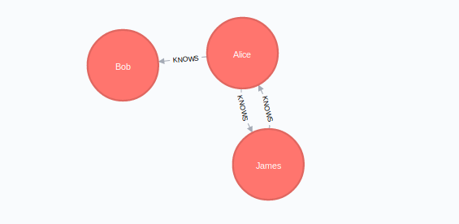
  - **GraphObject 其他操作方法**
    - pull 根据数据库中的数据更新 GraphObject 中的数据
    - push 更新数据库中的数据
    - delete 删除数据库中的节点
## Cypher
  - **cypher_escape** cypher 转义，将字符串中的特殊字符转义成 cypher 需要的格式
    ```python
    from py2neo.cypher import cypher_escape
    cypher_escape("simple_identifier")
    # Out[270]: 'simple_identifier'

    cypher_escape("identifier with spaces")
    # Out[271]: "'identifier with spaces'"

    cypher_escape("identifier with `backticks`")
    # Out[272]: "'identifier with `backticks`'"

    "MATCH (a:{label}) RETURN id(a)".format(label=cypher_escape("Employee of the Month"))
    # Out[273]: "MATCH (a:'Employee of the Month') RETURN id(a)"
    ```
  - **CypherLexer** 用于解析 cypher 命令，基于 `Pygments lexer framework`
    ```python
    from py2neo.cypher.lexer import CypherLexer
    list(lexer.get_tokens("MATCH (a:Person)-[:KNOWS]->(b) RETURN a"))
    # Out[290]:
    # [(Token.Keyword, 'MATCH'),
    #  (Token.Text.Whitespace, ' '),
    #  (Token.Punctuation, '('),
    #  (Token.Name.Variable, 'a'),
    #  (Token.Punctuation, ':'),
    #  (Token.Name.Label, 'Person'),
    #  (Token.Punctuation, ')-['),
    #  (Token.Punctuation, ':'),
    #  (Token.Name.Label, 'KNOWS'),
    #  (Token.Punctuation, ']->('),
    #  (Token.Name.Variable, 'b'),
    #  (Token.Punctuation, ')'),
    #  (Token.Text.Whitespace, ' '),
    #  (Token.Keyword, 'RETURN'),
    #  (Token.Text.Whitespace, ' '),
    #  (Token.Name.Variable, 'a'),
    #  (Token.Text.Whitespace, '\n')]

    list(lexer.get_statements("CREATE (:Person {name:'Alice'}); MATCH (a:Person {name:'Alice'}) RETURN id(a)"))
    # Out[291]:
    # ["CREATE (:Person {name:'Alice'})",
    #  "MATCH (a:Person {name:'Alice'}) RETURN id(a)"]
    ```
***
