# ___2018 - 08 - 27 Tensorflow Programmer's Guide___
***

# 目录
  <!-- TOC depthFrom:1 depthTo:6 withLinks:1 updateOnSave:1 orderedList:0 -->

  - [___2018 - 08 - 27 Tensorflow Programmer's Guide___](#2018-08-27-tensorflow-programmers-guide)
  - [目录](#目录)
  - [介绍](#介绍)
  	- [链接](#链接)
  	- [High-level Tensorflow APIs](#high-level-tensorflow-apis)
  	- [Checkin code for tensorflow](#checkin-code-for-tensorflow)
  	- [Q / A](#q-a)
  - [Keras](#keras)
  	- [Keras 简介](#keras-简介)
  	- [建立模型](#建立模型)
  	- [训练](#训练)
  	- [评估与预测](#评估与预测)
  	- [建立复杂模型](#建立复杂模型)
  	- [Model 与 Layer 自定义继承类](#model-与-layer-自定义继承类)
  	- [回调 Callbacks](#回调-callbacks)
  	- [模型存储与加载](#模型存储与加载)
  	- [Keras 模型转化为 Estimators](#keras-模型转化为-estimators)
  	- [多 GPU 运行](#多-gpu-运行)
  - [Eager Execution](#eager-execution)
  	- [基本使用](#基本使用)
  	- [计算梯度 GradientTape](#计算梯度-gradienttape)
  	- [模型训练 MNIST](#模型训练-mnist)
  	- [保存加载模型 Checkpoint](#保存加载模型-checkpoint)
  	- [度量方式与汇总 metrics and summary](#度量方式与汇总-metrics-and-summary)
  	- [自动梯度计算 automatic differentiation](#自动梯度计算-automatic-differentiation)
  	- [自定义梯度计算 Custom gradients](#自定义梯度计算-custom-gradients)
  	- [性能 Performance](#性能-performance)
  	- [Graph 运行环境中使用 eager execution](#graph-运行环境中使用-eager-execution)
  - [Datasets Importing Data](#datasets-importing-data)
  	- [data API](#data-api)
  	- [Dataset 结构](#dataset-结构)
  	- [创建迭代器 Iterator](#创建迭代器-iterator)
  	- [从迭代器中读取数据](#从迭代器中读取数据)
  	- [保存迭代器状态](#保存迭代器状态)
  	- [读取输入数据 NumPy arrays](#读取输入数据-numpy-arrays)
  	- [读取输入数据 TFRecord data](#读取输入数据-tfrecord-data)
  	- [读取输入数据 text data](#读取输入数据-text-data)
  	- [读取输入数据 CSV data](#读取输入数据-csv-data)
  	- [map 转化数据](#map-转化数据)
  	- [打包 Batching](#打包-batching)
  	- [Dataset 多次迭代](#dataset-多次迭代)
  	- [随机打乱数据 Randomly shuffling input data](#随机打乱数据-randomly-shuffling-input-data)
  	- [在其他高级 APIs 中的使用](#在其他高级-apis-中的使用)
  - [Estimators](#estimators)
  	- [Advantages of Estimators](#advantages-of-estimators)
  	- [Estimator LinearRegressor](#estimator-linearregressor)
  	- [Estimator pre-made DNN model](#estimator-pre-made-dnn-model)
  	- [Estimator 的输入功能 Input Function](#estimator-的输入功能-input-function)
  	- [模型使用 input_fn 的数据 ???](#模型使用-inputfn-的数据-)
  - [Estimator Checkpoints](#estimator-checkpoints)
  	- [Estimator 保存模型](#estimator-保存模型)
  	- [模型保存频率 Checkpointing Frequency](#模型保存频率-checkpointing-frequency)
  	- [模型恢复 Restore](#模型恢复-restore)
  	- [Avoiding a bad restoration](#avoiding-a-bad-restoration)
  - [Feature Columns](#feature-columns)
  	- [tf.feature_column 模块](#tffeaturecolumn-模块)
  	- [Numeric column 数值列](#numeric-column-数值列)
  	- [Bucketized column 分桶列](#bucketized-column-分桶列)
  	- [Categorical identity column 分类识别列](#categorical-identity-column-分类识别列)
  	- [Categorical vocabulary column 分类词汇列](#categorical-vocabulary-column-分类词汇列)
  	- [Hashed column 哈希列](#hashed-column-哈希列)
  	- [Crossed column 交叉列](#crossed-column-交叉列)
  	- [Indicator columns 指示列](#indicator-columns-指示列)
  	- [embedding columns 嵌入列](#embedding-columns-嵌入列)
  	- [Weighted categorical column 权重分类列](#weighted-categorical-column-权重分类列)
  	- [Passing feature columns to Estimators](#passing-feature-columns-to-estimators)
  	- [Linear model 线性模型](#linear-model-线性模型)
  	- [tf.make_parse_example_spec 输入转化为字典](#tfmakeparseexamplespec-输入转化为字典)
  - [Datasets for Estimators](#datasets-for-estimators)
  	- [Basic input](#basic-input)
  	- [Reading a CSV File](#reading-a-csv-file)
  - [自定义模型](#自定义模型)
  	- [Custom estimators 与 model function](#custom-estimators-与-model-function)
  	- [定义模型的前向传播](#定义模型的前向传播)
  	- [Implement training, evaluation, and prediction](#implement-training-evaluation-and-prediction)
  	- [使用自定义模型实例化 Estimator](#使用自定义模型实例化-estimator)
  	- [python 完整实现](#python-完整实现)
  	- [Estimator TensorBoard](#estimator-tensorboard)
  - [计算设备 CPU GPU TPU](#计算设备-cpu-gpu-tpu)
  	- [支持的设备类型](#支持的设备类型)
  	- [手动分配设备](#手动分配设备)
  	- [TPU 使用简介](#tpu-使用简介)
  - [Embeddings](#embeddings)
  	- [Embeddings in TensorFlow](#embeddings-in-tensorflow)
  	- [TensorBoard Embedding Projector](#tensorboard-embedding-projector)
  	- [Metadata](#metadata)
  - [TensorBoard](#tensorboard)
  	- [TensorBoard Visualizing Learning](#tensorboard-visualizing-learning)

  <!-- /TOC -->
***

# 介绍
## 链接
  - [Programmer's Guide](https://www.tensorflow.org/guide/)
  - [Save and Restore](https://github.com/tensorflow/docs/blob/master/site/en/guide/saved_model.md)
  - [TensorFlow Debugger](https://github.com/tensorflow/docs/blob/master/site/en/guide/debugger.md)
  - [TensorBoard](https://github.com/tensorflow/docs/blob/master/site/en/guide/index.md#tensorboard)

  - [ResNet50](https://github.com/tensorflow/tensorflow/tree/master/tensorflow/contrib/eager/python/examples/resnet50)
  - [mnist_eager.py](https://github.com/tensorflow/models/blob/master/official/mnist/mnist_eager.py)
  - [tensorflow/contrib/eager/python/examples](https://github.com/tensorflow/tensorflow/tree/master/tensorflow/contrib/eager/python/examples)
  - [Vector Representations of Words](https://github.com/tensorflow/docs/blob/master/site/en/tutorials/representation/word2vec.md)
  - [Machine Learning Fairness](https://developers.google.com/machine-learning/fairness-overview/)
## High-level Tensorflow APIs
  - TensorFlow 程序结构
    - Import and parse the data sets
    - Create feature columns to describe the data
    - Select the type of model
    - Train the model
    - Evaluate the model's effectiveness
    - Use the trained model to make predictions
  - **TensorFlow Core / High-level API**
    - **TensorFlow Core** 最底层API，提供对程序运行的完全控制，其他上层接口基于 TensorFlow Core
    - 上层接口更易用且调用一致，如 **tf.estimator** 用于管理数据集 / 模型 / 训练以及评估

    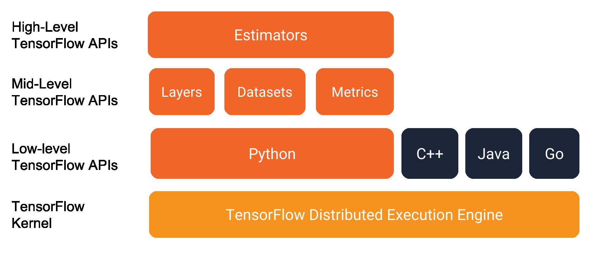
  - **high-level TensorFlow concepts**
    - **Eager** 执行环境，直接返回操作结果 [Eager Execution](https://www.tensorflow.org/programmers_guide/eager)
    - **Datasets API** 导入数据 input pipelines [datasets Importing Data](https://www.tensorflow.org/programmers_guide/datasets)
    - **Keras API** 构建模型与层级结构 [Estimators](https://www.tensorflow.org/programmers_guide/estimators)
    - **Estimators** 模型训练 / 评估 / 预测 / 导入导出 的高层封装 [Getting started with the Keras Sequential model](https://keras.io/getting-started/sequential-model-guide/)
  - **Eager execution** 直接返回操作结果，而不用构建计算图 computational graph
    - 更直观地交互式接口，方便模型调试
    - 使用 Python control flow 代替 graph control flow，简化动态模型的使用
    - Eager 环境下不能使用 Estimator
  - **Dataset tf.data API** 构建导入数据的 input pipelines，更方便地处理大量数据 / 多种数据格式 / 复杂的数据转化
    - **tf.data.Dataset** 表示一个输入元素的序列，包含数据集合与一系列转化操作
      - **Dataset.from_tensor_slices** 创建一个包含一个或多个 tf.Tensor 类的 dataset
      - **Dataset.batch** 将一个或多个 dataset 转化为一个 dataset
    - **tf.data.Iterator** 从 dataset 提取数据，**Iterator.get_next** 用于获得 dataset 的下一个元素
  - **Estimators tf.estimator.Estimator** 简化机器学习的架构，提供模型训练 / 评估 / 预测 / 导入导出 的高层封装
    - 可以使用封装好的模型 pre-made Estimators 或者自定义模型 custom Estimators
    - Eager 环境下不能使用 Estimator
    - tf.contrib.learn.Estimator is deprecated
    - Estimators 提供更安全的模型训练过程，包括构建计算图 / 变量初始化 / 启动队列 / 异常处理 / 创建 checkpoint / TensorBoard 报告
## Check-in code for tensorflow
  - [Forking Projects](https://guides.github.com/activities/forking/)
  - Fork repository on github
  - git clone
    ```shell
    git clone git@github.com:leondgarse/tensorflow.git
    cd tensorflow
    ```
  - Add upstream
    ```shell
    git remote add upstream https://github.com/tensorflow/tensorflow.git
    git remote -v
    # origin	git@github.com:leondgarse/tensorflow.git (fetch)
    # origin	git@github.com:leondgarse/tensorflow.git (push)
    # upstream	https://github.com/tensorflow/tensorflow.git (fetch)
    # upstream	https://github.com/tensorflow/tensorflow.git (push)
    ```
  - Sync with upstream
    ```shell
    git fetch upstream
    git merge upstream/master
    git push
    ```
  - commit code to forked repository
    ```shell
    git commit -m 'commit' file
    git push
    ```
  - Making a Pull Request on github `New pull request` -> `Create pull request` -> `Add comments` -> `Complete`
## Q / A
  - Q: Eager 执行环境中提示 `InternalError: Could not find valid device for node name: "xxx"`
    ```py
    tf.enable_eager_execution()
    tf.sqrt(4)
    # InternalError: Could not find valid device for node name: "Sqrt"
    ```
    A: 错误原因可能是参数类型不匹配，尝试转化为 float / int / 其他类型，同样的错误也发生在其他操作上，如 `SparseSoftmaxCrossEntropyWithLogits`
    ```py
    tf.sqrt(4.).numpy()
    # Out[5]: 2.0
    ```
***

# Keras
## Keras 简介
  - **Keras** high-level API，用于创建与训练深度学习模型
  - **tf.keras** 是 Keras 的 TensorFlow 实现，支持 TensorFlow 的功能，如 eager execution / tf.data pipelines / Estimators
    ```python
    import tensorflow as tf
    from tensorflow import keras
    ```
  - **Eager execution** tf.keras 创建模型的 API 都支持 eager execution，也可以用于自定义模型 / 层 的序列化保存
## 建立模型
  - **tf.keras.Sequential** 顺序模型 Sequential model，将各个 layer 叠加到一起
    ```python
    ''' To build a simple, fully-connected network (i.e. multi-layer perceptron) '''
    model = keras.Sequential()
    # Adds a densely-connected layer with 64 units to the model:
    model.add(keras.layers.Dense(64, activation='relu'))
    # Add another:
    model.add(keras.layers.Dense(64, activation='relu'))
    # Add a softmax layer with 10 output units:
    model.add(keras.layers.Dense(10, activation='softmax'))
    ```
  - **神经网络层配置** 通用参数
    - **activation** 设置激活函数，使用字符串指定内置的激活函数，默认不使用激活函数
    - **kernel_initializer** / **bias_initializer** 权重 weights 的初始化方式，字符串指定内置的初始化函数，默认使用 `Glorot uniform`
    - **kernel_regularizer** / **bias_regularizer** 权重 weights 的正则化方式，默认不使用正则化
    ```python
    # Create a sigmoid layer:
    layers.Dense(64, activation='sigmoid')
    # Or:
    layers.Dense(64, activation=tf.sigmoid)

    # A linear layer with L1 regularization of factor 0.01 applied to the kernel matrix:
    layers.Dense(64, kernel_regularizer=keras.regularizers.l1(0.01))
    # A linear layer with L2 regularization of factor 0.01 applied to the bias vector:
    layers.Dense(64, bias_regularizer=keras.regularizers.l2(0.01))

    # A linear layer with a kernel initialized to a random orthogonal matrix:
    layers.Dense(64, kernel_initializer='orthogonal')
    # A linear layer with a bias vector initialized to 2.0s:
    layers.Dense(64, bias_initializer=keras.initializers.constant(2.0))
    ```
## 训练
  - **model.compile** 创建好模型结构以后，设置模型训练过程
    ```python
    model.compile(optimizer=tf.train.AdamOptimizer(0.001),
             loss='categorical_crossentropy',
             metrics=['accuracy'])
    ```
  - **model.compile 参数**
    - **optimizer** 优化器，指定 `tf.train module` 中的方法，如 `AdamOptimizer` / `RMSPropOptimizer` / `GradientDescentOptimizer`
    - **loss** 损失函数，使用字符串或 `tf.keras.losses` 中的方法，通常使用 `mean square error (mse)` / `categorical_crossentropy` / `binary_crossentropy`
    - **metrics** 训练过程度量监控，使用字符串或 `tf.keras.metrics` 中的方法
    ```python
    # Configure a model for mean-squared error regression.
    model.compile(optimizer=tf.train.AdamOptimizer(0.01),
                 loss='mse',       # mean squared error
                 metrics=['mae'])  # mean absolute error

    # Configure a model for categorical classification.
    model.compile(optimizer=tf.train.RMSPropOptimizer(0.01),
                 loss=keras.losses.categorical_crossentropy,
                 metrics=[keras.metrics.categorical_accuracy])
    ```
  - **model.fit 输入 Numpy 数据** 小的数据集可以直接使用 NumPy arrays 作为训练 / 评估的输入
    ```python
    import numpy as np

    data = np.random.random((1000, 32))
    labels = np.random.random((1000, 10))

    model.fit(data, labels, epochs=10, batch_size=32)
    ```
  - **model.fit 参数**
    - **epochs** 迭代 epoch 次数，每次 epoch 代表遍历整个数据集一次
    - **batch_size** 每次训练使用的 batch 大小
    - **validation_data** 验证数据用于监控模型训练过程中的表现
    ```python
    import numpy as np

    data = np.random.random((1000, 32))
    labels = np.random.random((1000, 10))

    val_data = np.random.random((100, 32))
    val_labels = np.random.random((100, 10))

    model.fit(data, labels, epochs=10, batch_size=32,
             validation_data=(val_data, val_labels))
    ```
  - **model.fit 输入 tf.data.datasets 数据** 用于输入大型数据集
    ```python
    # Instantiates a toy dataset instance:
    dataset = tf.data.Dataset.from_tensor_slices((data, labels))
    dataset = dataset.batch(32)
    dataset = dataset.repeat()

    # Don't forget to specify `steps_per_epoch` when calling `fit` on a dataset.
    model.fit(dataset, epochs=10, steps_per_epoch=30)
    ```
    - **steps_per_epoch 参数** 指定模型每次 epoch 训练的次数，**batch_size** 不需要再指定
    ```python
    # 指定 validation_data 验证数据集
    val_dataset = tf.data.Dataset.from_tensor_slices((val_data, val_labels))
    val_dataset = val_dataset.batch(32).repeat()

    model.fit(dataset, epochs=10, steps_per_epoch=30,
             validation_data=val_dataset,
             validation_steps=3)
    ```
## 评估与预测
  - **tf.keras.Model.evaluate** / **tf.keras.Model.predict** 可以使用 NumPy 数据 / `tf.data.Dataset` 用于 评估 / 预测
  - **model.evaluate** 评估模型效果
    ```python
    model.evaluate(x, y, batch_size=32)

    model.evaluate(dataset, steps=30)
    ```
  - **model.predict** 预测，输出模型最后一层的结果
    ```python
    model.predict(x, batch_size=32)

    model.predict(dataset, steps=30)
    ```
## 建立复杂模型
  - **Keras functional API** 建立任意组合的模型 [Getting started with the Keras functional API](https://keras.io/getting-started/functional-api-guide/)
    - **Multi-input models** 多个输入层的模型
    - **Multi-output models** 多个输出层的模型
    - **Models with shared layers** 同一层重复调用多次的模型
    - **Models with non-sequential data flows (e.g. residual connections)** 非顺序数据流模型，如残差网络连接 residual connections
    ```py
    # `Model` groups layers into an object with training and inference features.
    class MModel(tensorflow.python.keras.engine.training.Model)
    ```
  - **建立过程**
    - keras 的 layer 可以调用，并返回一个 tensor
    - 输入 / 输出 tensor 用于定义 `tf.keras.Model`
    - 训练过程类似顺序模型 Sequential model
    ```python
    ''' The following example uses the functional API to build a simple, fully-connected network '''

    inputs = keras.Input(shape=(32,))  # Returns a placeholder tensor

    # A layer instance is callable on a tensor, and returns a tensor.
    x = keras.layers.Dense(64, activation='relu')(inputs)
    x = keras.layers.Dense(64, activation='relu')(x)
    predictions = keras.layers.Dense(10, activation='softmax')(x)

    # Instantiate the model given inputs and outputs.
    model = keras.Model(inputs=inputs, outputs=predictions)

    # The compile step specifies the training configuration.
    model.compile(optimizer=tf.train.RMSPropOptimizer(0.001),
                 loss='categorical_crossentropy',
                 metrics=['accuracy'])

    # Trains for 5 epochs
    model.fit(data, labels, batch_size=32, epochs=5)
    ```
## Model 与 Layer 自定义继承类
  - **tf.keras.Model** 自定义继承类，建立完全自定义的模型
    - **__init__ 方法** 中建立层级结构，并定义成类属性
    - **call 方法** 中定义前向传播过程
    ```python
    class MyModel(keras.Model):
       def __init__(self, num_classes=10):
           super(MyModel, self).__init__(name='my_model')
           self.num_classes = num_classes
           # Define your layers here.
           self.dense_1 = keras.layers.Dense(32, activation='relu')
           self.dense_2 = keras.layers.Dense(num_classes, activation='sigmoid')

       def call(self, inputs):
           # Define your forward pass here,
           # using layers you previously defined (in `__init__`).
           x = self.dense_1(inputs)
           return self.dense_2(x)

       def compute_output_shape(self, input_shape):
           # You need to override this function if you want to use the subclassed model
           # as part of a functional-style model.
           # Otherwise, this method is optional.
           shape = tf.TensorShape(input_shape).as_list()
           shape[-1] = self.num_classes
           return tf.TensorShape(shape)


    # Instantiates the subclassed model.
    model = MyModel(num_classes=10)

    # The compile step specifies the training configuration.
    model.compile(optimizer=tf.train.RMSPropOptimizer(0.001),
                 loss='categorical_crossentropy',
                 metrics=['accuracy'])

    # Trains for 5 epochs.
    model.fit(data, labels, batch_size=32, epochs=5)
    ```
  - **tf.keras.layers.Layer** 自定义继承类，建立自定义的层，实现以下方法
    - **build** 创建该层的权重 weights，使用 `add_weight` 方法添加权重
    - **call** 定义前向传播过程
    - **compute_output_shape** 指定如何根据输入的维度计算输出的维度
    - **get_config** / **from_config**，可选的方法，实现这两个方法可以用于 serialized
    ```python
    class MyLayer(keras.layers.Layer):
        def __init__(self, output_dim, **kwargs):
            self.output_dim = output_dim
            super(MyLayer, self).__init__(**kwargs)

        def build(self, input_shape):
            shape = tf.TensorShape((input_shape[1], self.output_dim))
            # Create a trainable weight variable for this layer.
            self.kernel = self.add_weight(name='kernel',
                                       shape=shape,
                                       initializer='uniform',
                                       trainable=True)
            # Be sure to call this at the end
            super(MyLayer, self).build(input_shape)

        def call(self, inputs):
            return tf.matmul(inputs, self.kernel)

        def compute_output_shape(self, input_shape):
            shape = tf.TensorShape(input_shape).as_list()
            shape[-1] = self.output_dim
            return tf.TensorShape(shape)

        def get_config(self):
            base_config = super(MyLayer, self).get_config()
            base_config['output_dim'] = self.output_dim

        @classmethod
        def from_config(cls, config):
            return cls(**config)


    # Create a model using the custom layer
    model = keras.Sequential([MyLayer(10), keras.layers.Activation('softmax')])

    # The compile step specifies the training configuration
    model.compile(optimizer=tf.train.RMSPropOptimizer(0.001),
                 loss='categorical_crossentropy',
                 metrics=['accuracy'])

    # Trains for 5 epochs.
    model.fit(data, targets, batch_size=32, epochs=5)
    ```
## 回调 Callbacks
  - **callback** 传递给模型的参数，用于扩展训练过程中的行为
  - **tf.keras.callbacks** 中预定义的方法
    - **tf.keras.callbacks.ModelCheckpoint** 在指定的时间间隔保存模型数据 checkpoints
    - **tf.keras.callbacks.LearningRateScheduler** 动态调整学习率
    - **tf.keras.callbacks.EarlyStopping** 评估没有改变时终止训练过程
    - **tf.keras.callbacks.TensorBoard** 使用 TensorBoard 监控模型行为
    ```python
    callbacks = [
     # Interrupt training if `val_loss` stops improving for over 2 epochs
     keras.callbacks.EarlyStopping(patience=2, monitor='val_loss'),
     # Write TensorBoard logs to `./logs` directory
     keras.callbacks.TensorBoard(log_dir='./logs')
    ]
    model.fit(data, labels, batch_size=32, epochs=5, callbacks=callbacks,
             validation_data=(val_data, val_targets))
    ```
## 模型存储与加载
  - **save_weights / load_weights** 只保存权重 Weights only
    ```python
    # Save weights to a TensorFlow Checkpoint file
    model.save_weights('./my_model')

    # Restore the model's state,
    # this requires a model with the same architecture.
    model.load_weights('my_model')
    ```
    默认使用 TensorFlow checkpoint 格式保存，也可以使用 keras HDF5 格式保存
    ```python
    # Save weights to a HDF5 file
    model.save_weights('my_model.h5', save_format='h5')

    # Restore the model's state
    model.load_weights('my_model.h5')
    ```
  - **to_json / from_json** / **to_yaml / from_yaml** 只保存模型配置方式
    ```python
    # Serialize a model to JSON format
    json_string = model.to_json()

    # Recreate the model (freshly initialized)
    fresh_model = keras.models.from_json(json_string)

    # Serializes a model to YAML format
    yaml_string = model.to_yaml()

    # Recreate the model
    fresh_model = keras.models.from_yaml(yaml_string)
    ```
    - 继承类的模型不会被序列化保存
  - **save / load_model** 保存整个模型，包含权重 / 模型配置 / 优化器配置等
    ```python
    # Create a trivial model
    model = keras.Sequential([
     keras.layers.Dense(10, activation='softmax', input_shape=(32,)),
     keras.layers.Dense(10, activation='softmax')
    ])
    model.compile(optimizer='rmsprop',
                 loss='categorical_crossentropy',
                 metrics=['accuracy'])
    model.fit(data, targets, batch_size=32, epochs=5)


    # Save entire model to a HDF5 file
    model.save('my_model.h5')

    # Recreate the exact same model, including weights and optimizer.
    model = keras.models.load_model('my_model.h5')
    ```
## Keras 模型转化为 Estimators
  - **tf.keras.estimator.model_to_estimator** 将 keras 模型转化为 `tf.estimator.Estimator`，之后可以使用 `tf.estimator` API
    ```python
    model = keras.Sequential([layers.Dense(10,activation='softmax'),
                             layers.Dense(10,activation='softmax')])

    model.compile(optimizer=tf.train.RMSPropOptimizer(0.001),
                 loss='categorical_crossentropy',
                 metrics=['accuracy'])

    estimator = keras.estimator.model_to_estimator(model)
    ```
## 多 GPU 运行
  - **tf.contrib.distribute.DistributionStrategy** 指定使用多个 GPU 策略
  - **tf.contrib.distribute.MirroredStrategy** 是目前唯一支持的分配策略，MirroredStrategy does in-graph replication with synchronous training using all-reduce on a single machine
  - **定义 keras 模型**
    ```python
    model = keras.Sequential()
    model.add(keras.layers.Dense(16, activation='relu', input_shape=(10,)))
    model.add(keras.layers.Dense(1, activation='sigmoid'))

    optimizer = tf.train.GradientDescentOptimizer(0.2)

    model.compile(loss='binary_crossentropy', optimizer=optimizer)
    model.summary()
    ```
  - **定义输入 pipeline** 使用 `tf.data.Dataset` 分发输入数据
    ```python
    def input_fn():
        x = np.random.random((1024, 10))
        y = np.random.randint(2, size=(1024, 1))
        x = tf.cast(x, tf.float32)
        dataset = tf.data.Dataset.from_tensor_slices((x, y))
        dataset = dataset.repeat(10)
        dataset = dataset.batch(32)
        return dataset
    ```
  - **定义 tf.estimator.RunConfig** 指定使用 `tf.contrib.distribute.MirroredStrategy`，可以指定使用的 GPU 数量等，默认使用全部
    ```python
    strategy = tf.contrib.distribute.MirroredStrategy()
    config = tf.estimator.RunConfig(train_distribute=strategy)
    ```
  - **转为 keras 模型为 tf.estimator.Estimator** 指定使用创建好的 `RunConfig`
    ```python
    keras_estimator = keras.estimator.model_to_estimator(
        keras_model=model,
        config=config,
        model_dir='/tmp/model_dir')
    ```
  - **训练模型**
    ```python
    keras_estimator.train(input_fn=input_fn, steps=10)
    ```
***

# Eager Execution
## 基本使用
  - **Eager** tensorflow 的动态图机制，直接返回执行结果，不同于传统的 tensorflow 构建静态图方法，构建类似 pytorch 的动态图
  - **tf.enable_eager_execution** 初始化 **Eager** 执行环境
    ```python
    tf.enable_eager_execution()
    tf.executing_eagerly()
    # Out[12]: True

    x = [[2.]]
    m = tf.matmul(x, x)
    m.numpy()
    # Out[13]: array([[4.]], dtype=float32)
    ```
  - **numpy** Eager 执行环境可以很好地配合 Numpy 使用，`tf.Tensor.numpy` 返回 `ndarray` 值
    ```py
    a = tf.constant([[1, 2], [3, 4]])
    b = tf.add(a, 1)
    (a * b).numpy()
    # Out[219]: array([[ 2,  6], [12, 20]], dtype=int32)

    np.matmul(a, b)
    # Out[221]: array([[10, 13], [22, 29]], dtype=int32)
    ```
  - **tf.convert_to_tensor** 转化为 tensor
    ```python
    aa = tf.convert_to_tensor([1, 2, 3])
    aa.numpy()
    # Out[234]: array([1, 2, 3], dtype=int32)
    ```
  - **tf.contrib.eager** 包含一些同时支持 eager / graph 的操作，如 `Variable`
    ```py
    tfe = tf.contrib.eager
    # Or
    import tensorflow.contrib.eager as tfe

    # Eager 环境下使用 tf.Variable 将报错
    w = tf.Variable(10) # RuntimeError: tf.Variable not supported when eager execution is enabled

    # 使用 tfe.Variable
    w = tfe.Variable(10)
    ```
## 计算梯度 GradientTape
  - **tf.GradientTape** 可以提高计算性能，将前向传播的计算记录到 `tape` 上，并在训练结束后可以回放梯度计算过程，只可回放一次
    ```py
    w = tf.Variable([[1.0]])
    with tf.GradientTape() as tape:
      loss = w * w

    tape.gradient(loss, w).numpy()
    # Out[11]: array([[2.]], dtype=float32)

    # 再次调用将出错 RuntimeError
    grad = tape.gradient(loss, w)
    # RuntimeError: GradientTape.gradient can only be called once on non-persistent tapes.
    ```
    ```py
    dataset = tf.data.Dataset.from_tensor_slices((data.train.images,
                                                  data.train.labels))
    ...
    for (batch, (images, labels)) in enumerate(dataset):
      ...
      with tf.GradientTape() as tape:
        logits = model(images, training=True)
        loss_value = loss(logits, labels)
      ...
      grads = tape.gradient(loss_value, model.variables)
      optimizer.apply_gradients(zip(grads, model.variables),
                                global_step=tf.train.get_or_create_global_step())
    ```
  - **tf.GradientTape** 用于模型训练示例
    ```py
    # A toy dataset of points around 3 * x + 2
    NUM_EXAMPLES = 1000
    training_inputs = tf.random_normal([NUM_EXAMPLES])
    noise = tf.random_normal([NUM_EXAMPLES])
    training_outputs = training_inputs * 3 + 2 + noise

    def prediction(input, weight, bias):
      return input * weight + bias

    # A loss function using mean-squared error
    def loss(weights, biases):
      error = prediction(training_inputs, weights, biases) - training_outputs
      return tf.reduce_mean(tf.square(error))

    # Return the derivative of loss with respect to weight and bias
    def grad(weights, biases):
      with tf.GradientTape() as tape:
        loss_value = loss(weights, biases)
      return tape.gradient(loss_value, [weights, biases])

    train_steps = 200
    learning_rate = 0.01
    # Start with arbitrary values for W and B on the same batch of data
    W = tfe.Variable(5.)
    B = tfe.Variable(10.)

    print("Initial loss: {:.3f}".format(loss(W, B)))
    # Initial loss: 70.372

    for i in range(train_steps):
      dW, dB = grad(W, B)
      W.assign_sub(dW * learning_rate)
      B.assign_sub(dB * learning_rate)
      if i % 20 == 0:
        print("Loss at step {:03d}: {:.3f}".format(i, loss(W, B)))

    print("Finale loss: {:.3f}".format(loss(W, B)))
    print("W = {}, B = {}".format(W.numpy(), B.numpy()))
    ```
    **运行结果**
    ```py
    Initial loss: 70.372
    Loss at step 000: 67.532
    Loss at step 020: 29.866
    Loss at step 040: 13.536
    Loss at step 060: 6.436
    Loss at step 080: 3.339
    Loss at step 100: 1.986
    Loss at step 120: 1.392
    Loss at step 140: 1.131
    Loss at step 160: 1.016
    Loss at step 180: 0.965
    Finale loss: 0.944
    W = 3.035646915435791, B = 2.159491539001465
    ```
  - 定义模型继承 `tf.keras.Model`，并使用 `tf.GradientTape` 封装 `tf.Variable`
    ```py
    class Model(tf.keras.Model):
      def __init__(self):
        super(Model, self).__init__()
        self.W = tfe.Variable(5., name="weight")
        self.B = tfe.Variable(5., name="bias")

      def call(self, inputs):
        return inputs * self.W + self.B

    # The loss function to be optimized
    def loss(model, inputs, targets):
      error = model(inputs) - targets
      return tf.reduce_mean(tf.square(error))

    def grad(model, inputs, targets):
      with tf.GradientTape() as tape:
        loss_value = loss(model, inputs, targets)
      return tape.gradient(loss_value, [model.W, model.B])

    # Define:
    # 1. A model.
    # 2. Derivatives of a loss function with respect to model parameters.
    # 3. A strategy for updating the variables based on the derivatives.
    model = Model()
    optimizer = tf.train.GradientDescentOptimizer(learning_rate=0.01)

    print("Initial loss: {:.3f}".format(loss(model, training_inputs, training_outputs)))

    for i in range(300):
      grads = grad(model, training_inputs, training_outputs)
      optimizer.apply_gradients(zip(grads, [model.W, model.B]),
              global_step=tf.train.get_or_create_global_step())
      if i % 20 == 0:
        print("Loss at step {:03d}: {:.3f}".format(i, loss(model, training_inputs, training_outputs)))

    print("Final loss: {:.3f}".format(loss(model, training_inputs, training_outputs)))
    print("W = {}, B = {}".format(model.W.numpy(), model.B.numpy()))
    ```
## 模型训练 MNIST
  - **建立模型** 使用 `tf.keras.Sequential`
    ```py
    tf.enable_eager_execution()

    # Conv2D 只支持 NHWC 格式数据，即 'channels_last'，对应的是 'channels_first'
    data_format = 'channels_last'
    input_shape = [1, 28, 28]
    model = tf.keras.Sequential( [
        tf.keras.layers.Reshape(target_shape=input_shape, input_shape=(28 * 28,)),
        tf.keras.layers.Conv2D(32, 5, padding='same', data_format=data_format, activation=tf.nn.relu),
        tf.keras.layers.MaxPooling2D((2, 2), (2, 2), padding='same', data_format=data_format),
        tf.keras.layers.Conv2D(64, 5, padding='same', data_format=data_format, activation=tf.nn.relu),
        tf.keras.layers.MaxPooling2D((2, 2), (2, 2), padding='same', data_format=data_format),
        tf.keras.layers.Flatten(),
        tf.keras.layers.Dense(1024, activation=tf.nn.relu),
        tf.keras.layers.Dropout(0.4),
        tf.keras.layers.Dense(10)
    ])

    batch = tf.zeros([1, 1, 784])
    model(batch).numpy()
    # Out[145]: array([[0., 0., 0., 0., 0., 0., 0., 0., 0., 0.]], dtype=float32)
    ```
  - **加载数据** 使用 `keras.datasets.mnist`
    ```python
    (train_x, train_y), (test_x, test_y) = tf.keras.datasets.mnist.load_data()
    train_x = train_x.astype(np.float32)
    train_y = train_y.astype(np.int64)
    dataset_train = tf.data.Dataset.from_tensor_slices((train_x, train_y))
    dataset_train = dataset_train.shuffle(60000).repeat(4).batch(32)

    x, y = iter(dataset_train).next()
    x.numpy().shape
    # Out[150]: (32, 28, 28)

    y.numpy().shape
    # Out[151]: (32,)

    model(x).numpy().shape
    # Out[156]: (32, 10)
    ```
  - **损失函数与梯度** 使用 `GradientTape`
    ```py
    def loss(model, x, y):
      prediction = model(x)
      return tf.losses.sparse_softmax_cross_entropy(labels=y, logits=prediction)

    def grad(model, inputs, targets):
      with tf.GradientTape() as tape:
        loss_value = loss(model, inputs, targets)
      return tape.gradient(loss_value, model.variables)

    optimizer = tf.train.GradientDescentOptimizer(learning_rate=0.001)

    x, y = iter(dataset_train).next()
    print("Initial loss: {:.3f}".format(loss(model, x, y)))
    # Initial loss: 17.040
    ```
  - **模型训练**
    ```py
    for (i, (x, y)) in enumerate(dataset_train):
      # Calculate derivatives of the input function with respect to its parameters.
      grads = grad(model, x, y)
      # Apply the gradient to the model
      optimizer.apply_gradients(zip(grads, model.variables),
                                global_step=tf.train.get_or_create_global_step())
      if i % 200 == 0:
        print("Loss at step {:04d}: {:.3f}".format(i, loss(model, x, y)))

    print("Final loss: {:.3f}".format(loss(model, x, y)))
    ```
  - **运行结果**
    ```py
    Loss at step 0000: 7.151
    Loss at step 0200: 0.248
    Loss at step 0400: 0.235
    Loss at step 0600: 0.081
    ...
    Loss at step 7200: 0.003
    Loss at step 7400: 0.025
    Final loss: 0.005
    ```
  - **指定 GPU 训练**
    ```py
    with tf.device("/gpu:0"):
      for (i, (x, y)) in enumerate(dataset_train):
        # minimize() is equivalent to the grad() and apply_gradients() calls.
        optimizer.minimize(lambda: loss(model, x, y), global_step=tf.train.get_or_create_global_step())
    ```
## 保存加载模型 Checkpoint
  - **tf.train.Checkpoint** 用于保存变量到 checkpoints，可以保存的变量类型包括 `tf.train.Optimizer` 实例  / `tf.Variable` / `tf.keras.Layer` 实例 / `tf.keras.Model` 实例
    ```py
    x = tfe.Variable(10.)
    checkpoint = tf.train.Checkpoint(x=x)  # save as "x"

    x.assign(2.)   # Assign a new value to the variables and save.
    save_path = checkpoint.save('./ckpt/')

    x.assign(11.)  # Change the variable after saving.

    # Restore values from the checkpoint
    checkpoint.restore(save_path)
    print(x.numpy())
    # 2.0
    ```
  - 在同一个会话中如果重新定义了 `x`，需要同时重新定义 `checkpoint`，否则 保存 / 加载的还是原来的 `x` 变量
    ```py
    x = tfe.Variable(10.)
    checkpoint = tf.train.Checkpoint(x=x)  # save as "x"
    save_path = checkpoint.save('./ckpt/')

    x = tfe.Variable(11.)  # Redefine a new x

    # Restore values from the checkpoint
    checkpoint.restore(save_path)
    print(x.numpy())
    # 11.0

    # Need to redefine the checkpoint too
    checkpoint = tf.train.Checkpoint(x=x)
    checkpoint.restore(save_path)
    print(x.numpy())
    # 10.0
    ```
  - 在不同会话中重新加载变量时，需要保证新变量维度与原来的相同
    ```py
    x = tfe.Variable([1, 2, 3])
    checkpoint = tf.train.Checkpoint(x=x)  # save as "x"
    save_path = checkpoint.save('./ckpt/')
    print(save_path)
    # ./ckpt/-1

    # Restart a new python session
    tf.enable_eager_execution()
    import tensorflow.contrib.eager as tfe

    x = tfe.Variable([4, 5, 6])
    save_path = './ckpt/-1'
    checkpoint = tf.train.Checkpoint(x=x)
    checkpoint.restore(save_path)
    print(x.numpy())
    # [1 2 3]
    ```
  - **tf.train.Checkpoint** 保存 / 加载模型
    ```py
    model = Model()
    optimizer = tf.train.AdamOptimizer(learning_rate=0.001)
    checkpoint_dir = './ckpt/'
    checkpoint_prefix = os.path.join(checkpoint_dir, "ckpt")
    root = tf.train.Checkpoint(optimizer=optimizer,
                               model=model,
                               optimizer_step=tf.train.get_or_create_global_step())

    root.save(file_prefix=checkpoint_prefix)
    # or
    root.restore(tf.train.latest_checkpoint(checkpoint_dir))
    ```
## 度量方式与汇总 metrics and summary
  - **tfe.metrics** 直接调用传递新值可以更新 metrics，查看结果使用 `tfe.metrics.result`
    ```py
    m = tfe.metrics.Mean("loss")
    m(0)
    m(5)
    m.result().numpy()
    # Out[58]: 2.5

    m([8, 9])
    m.result().numpy()
    # Out[60]: 5.5
    ```
  - **tf.contrib.summary** 可以记录数据用于 TensorBoard
    ```py
    global_step = tf.train.get_or_create_global_step()
    writer = tf.contrib.summary.create_file_writer(logdir)
    writer.set_as_default()

    for _ in range(iterations):
      global_step.assign_add(1)
      # Must include a record_summaries method
      with tf.contrib.summary.record_summaries_every_n_global_steps(100):
        # your model code goes here
        tf.contrib.summary.scalar('loss', loss)
         ...
    ```
## 自动梯度计算 automatic differentiation
  - **Dynamic models** `tf.GradientTape` 可以用在动态模式中，示例算法 [backtracking line search](https://wikipedia.org/wiki/Backtracking_line_search)
    ```py
    def line_search_step(fn, init_x, rate=1.0):
      with tf.GradientTape() as tape:
        # Variables are automatically recorded, but manually watch a tensor
        tape.watch(init_x)
        value = fn(init_x)
      grad = tape.gradient(value, init_x)
      grad_norm = tf.reduce_sum(grad * grad)
      init_value = value
      while value > init_value - rate * grad_norm:
        x = init_x - rate * grad
        value = fn(x)
        rate /= 2.0
      return x, value
    ```
  - **tfe.gradients_function** 返回一个函数，根据输入函数的功能，计算相应的导数，**参数值一定要用浮点数**
    ```py
    def square(x):
      return tf.multiply(x, x)

    # df / dx = 2 * x
    grad = tfe.gradients_function(square)

    square(3.)  # => 9.0
    # 参数值一定要用浮点数
    grad(3.)    # => [6.0]

    # The second-order derivative of square
    # df / dx = 2
    gradgrad = tfe.gradients_function(lambda x: grad(x)[0])
    gradgrad(3.)  # => [2.0]

    # The third-order derivative is None
    # df / dx = 0
    gradgradgrad = tfe.gradients_function(lambda x: gradgrad(x)[0])
    gradgradgrad(3.)  # => [None]
    ```
    ```py
    # With flow control:
    def abs(x):
      return x if x > 0. else -x

    grad = tfe.gradients_function(abs)

    grad(3.)   # => [1.0]
    grad(-3.)  # => [-1.0]
    ```
  - **tfe.value_and_gradients_function** 类似 `tfe.gradients_function`, 同时返回函数值与导数值，**参数值一定要用浮点数**
    ```py
    gg = tfe.value_and_gradients_function(square)
    aa, bb = gg(3.)
    aa.numpy()
    # Out[131]: 9.0

    bb[0].numpy()
    # Out[133]: 6.0
    ```
    ```python
    # f(x, y) = (x ^ 3) * y - x * (y ^ 2)
    # df / dx = 3 * (x ^ 2) * y - y ^ 2
    # df / dy = x ^ 3 - 2 * x * y
    def f(x, y):
      return x * x * x * y - x * y * y

    # Obtain a function that returns the function value and the 1st order gradients.
    val_grads_fn = tfe.value_and_gradients_function(f)
    # Invoke the value-and-gradients function.
    f_val, (x_grad, y_grad) = val_grads_fn(2.0, 3.0)
    assert f_val.numpy() == (2 ** 3) * 3 - 2 * (3 ** 2)
    assert x_grad.numpy() == 3 * (2 ** 2) * 3 - 3 ** 2
    assert y_grad.numpy() == (2 ** 3) - 2 * 2 * 3
    ```
## 自定义梯度计算 Custom gradients
  - **自定义梯度计算** 根据 输入 / 输出 / 中间结果 重新定义梯度计算方式，如使用 `clip_by_norm` 限定梯度范围
    ```py
    @tf.custom_gradient
    def clip_gradient_by_norm(x, norm):
      y = tf.identity(x)
      def grad_fn(dresult):
        return [tf.clip_by_norm(dresult, norm), None]
      return y, grad_fn
    ```
  - **自定义梯度计算** 通常用于为算法提供更稳定的梯度结果
    ```py
    def log1pexp(x):
      return tf.log(1 + tf.exp(x))
    grad_log1pexp = tfe.gradients_function(log1pexp)

    # The gradient computation works fine at x = 0.
    grad_log1pexp(0.)  # => [0.5]

    # However, x = 100 fails because of numerical instability.
    grad_log1pexp(100.)  # => [nan]
    ```
## 性能 Performance
  - 计算过程会自动使用 GPU，也可以用过 `tf.device('/gpu:0')` 指定使用的设备
    ```py
    import time

    def measure(x, steps):
      # TensorFlow initializes a GPU the first time it's used, exclude from timing.
      tf.matmul(x, x)
      start = time.time()
      for i in range(steps):
        x = tf.matmul(x, x)
      # tf.matmul can return before completing the matrix multiplication
      # (e.g., can return after enqueing the operation on a CUDA stream).
      # The x.numpy() call below will ensure that all enqueued operations
      # have completed (and will also copy the result to host memory,
      # so we're including a little more than just the matmul operation
      # time).
      _ = x.numpy()
      end = time.time()
      return end - start

    shape = (1000, 1000)
    steps = 200
    print("Time to multiply a {} matrix by itself {} times:".format(shape, steps))

    # Run on CPU:
    with tf.device("/cpu:0"):
      print("CPU: {} secs".format(measure(tf.random_normal(shape), steps)))

    # Run on GPU, if available:
    if tfe.num_gpus() > 0:
      with tf.device("/gpu:0"):
        print("GPU: {} secs".format(measure(tf.random_normal(shape), steps)))
    else:
      print("GPU: not found")
    ```
    **运行结果**
    ```py
    Time to multiply a (1000, 1000) matrix by itself 200 times:
    CPU: 2.79622220993042 secs
    GPU: 0.39931392669677734 secs
    ```
  - **gpu / cpu** 指定 `tf.Tensor` 使用不同的设备
    ```py
    x = tf.random_normal([10, 10])

    x_gpu0 = x.gpu()
    x_cpu = x.cpu()

    _ = tf.matmul(x_cpu, x_cpu)    # Runs on CPU
    _ = tf.matmul(x_gpu0, x_gpu0)  # Runs on GPU:0

    if tfe.num_gpus() > 1:
      x_gpu1 = x.gpu(1)
      _ = tf.matmul(x_gpu1, x_gpu1)  # Runs on GPU:1
    ```
## Graph 运行环境中使用 eager execution
  - **tfe.py_func** 用于在 graph 运行环境中使用 eager execution 调用
    ```py
    tfe = tf.contrib.eager

    def my_py_func(x):
        x = tf.matmul(x, x)  # You can use tf ops
        print(x)  # but it's eager!
        return x

    with tf.Session() as sess:
        x = tf.placeholder(dtype=tf.float32)
        # Call eager function in graph!
        pf = tfe.py_func(my_py_func, [x], tf.float32)
        sess.run(pf, feed_dict={x: [[2.0]]})  # [[4.0]]
    ```
***

# Datasets Importing Data
## data API
  - **tf.data** 创建输入 pipelines，引入了两个重要的概念 `tf.data.Dataset` / `tf.data.Iterator`
  - **tf.data.Dataset** 代表元素序列，每个元素可能包含多个 `tf.Tensor`
    - **数据源 source** 从一个或多个 `tf.Tensor` 创建出一个 dataset，如使用 `Dataset.from_tensor_slices`
    - **转化 transformation** 从一个或多个 `tf.data.Dataset` 组合出一个 dataset，如使用 `Dataset.batch`
  - **tf.data.Iterator** 从 dataset 中提取数据，如 `Dataset.make_one_shot_iterator`
    - **Iterator.get_next** 用于获取下一个数据
    - **Iterator.initializer** 重新初始化迭代器，并且可以指向其他数据源
  - **基本过程**
    - 首先定义一个数据源，可以使用 `tf.data.Dataset.from_tensors()` / `tf.data.Dataset.from_tensor_slices()` 从内存中数据初始化，或使用 `tf.data.TFRecordDataset` 从硬盘上存储的 `TFRecord` 格式文件中初始化
    - 然后可以转化为一个新的 `Dataset`，如 `Dataset.map()` 将转化应用到每个元素上，`Dataset.batch()` 将元素组合成一个 `batch`
    - 之后可以使用迭代器 `tf.data.Iterator` 遍历数据，如调用 `Dataset.make_one_shot_iterator()` 创建 one-shot 迭代器
## Dataset 结构
  - **Dataset.output_types** / **Dataset.output_shapes** 表示内部元素的数据类型 / 数据维度
    ```python
    dataset1 = tf.data.Dataset.from_tensor_slices(tf.random_uniform([4, 10]))
    print(dataset1.output_types)  # ==> "tf.float32"
    print(dataset1.output_shapes)  # ==> "(10,)"

    dataset2 = tf.data.Dataset.from_tensor_slices(
       (tf.random_uniform([4]),
        tf.random_uniform([4, 100], maxval=100, dtype=tf.int32)))
    print(dataset2.output_types)  # ==> "(tf.float32, tf.int32)"
    print(dataset2.output_shapes)  # ==> "((), (100,))"

    dataset3 = tf.data.Dataset.zip((dataset1, dataset2))
    print(dataset3.output_types)  # ==> (tf.float32, (tf.float32, tf.int32))
    print(dataset3.output_shapes)  # ==> "(10, ((), (100,)))"
    ```
  - **字典命名** 可以给 Dataset 中不同的部分指定名称
    ```python
    dataset = tf.data.Dataset.from_tensor_slices(
       {"a": tf.random_uniform([4]),
        "b": tf.random_uniform([4, 100], maxval=100, dtype=tf.int32)})
    print(dataset.output_types)  # ==> "{'a': tf.float32, 'b': tf.int32}"
    print(dataset.output_shapes)  # ==> "{'a': (), 'b': (100,)}"
    ```
  - **Dataset.map()** / **Dataset.flat_map()** / **Dataset.filter()** 将一个转化函数应用到每一个元素上
    ```python
    dataset1 = dataset1.map(lambda x: ...)

    dataset2 = dataset2.flat_map(lambda x, y: ...)

    # Note: Argument destructuring is not available in Python 3.
    dataset3 = dataset3.filter(lambda x, (y, z): ...)
    ```
## 创建迭代器 Iterator
  - **Dataset.make_one_shot_iterator** one-shot 迭代器，只遍历一遍 dataset，目前是唯一可以很方便用到 `Estimator` 上的
    ```python
    dataset = tf.data.Dataset.range(100)
    iterator = dataset.make_one_shot_iterator()
    next_element = iterator.get_next()

    with tf.Session() as sess:
      for i in range(100):
        value = sess.run(next_element)
        assert i == value
    ```
  - **Dataset.make_initializable_iterator** initializable 迭代器，要求每次调用前使用 `iterator.initializer` 进行初始化，可以每次通过配合使用 `tf.placeholder` 指定不同的数据源
    ```python
    max_value = tf.placeholder(tf.int64, shape=[])
    dataset = tf.data.Dataset.range(max_value)
    iterator = dataset.make_initializable_iterator()
    next_element = iterator.get_next()

    # Initialize an iterator over a dataset with 10 elements.
    with tf.Session() as sess:
      sess.run(iterator.initializer, feed_dict={max_value: 10})
      for i in range(10):
        value = sess.run(next_element)
        assert i == value

    # Initialize the same iterator over a dataset with 100 elements.
    with tf.Session() as sess:
      sess.run(iterator.initializer, feed_dict={max_value: 100})
      for i in range(100):
        value = sess.run(next_element)
        assert i == value
    ```
  - **Iterator.from_structure** / **Iterator.make_initializer** reinitializable 迭代器，可以初始化成指向多个数据源，如使用一个迭代器指向 训练 / 验证数据集
    ```python
    # Define training and validation datasets with the same structure.
    training_dataset = tf.data.Dataset.range(100).map(
        lambda x: x + tf.random_uniform([], -10, 10, tf.int64))
    validation_dataset = tf.data.Dataset.range(50)

    # A reinitializable iterator is defined by its structure. We could use the
    # `output_types` and `output_shapes` properties of either `training_dataset`
    # or `validation_dataset` here, because they are compatible.
    iterator = tf.data.Iterator.from_structure(training_dataset.output_types,
                                               training_dataset.output_shapes)
    next_element = iterator.get_next()

    training_init_op = iterator.make_initializer(training_dataset)
    validation_init_op = iterator.make_initializer(validation_dataset)

    # Run 20 epochs in which the training dataset is traversed, followed by the
    # validation dataset.
    with tf.Session() as sess:
      for _ in range(20):
        # Initialize an iterator over the training dataset.
        sess.run(training_init_op)
        for _ in range(100):
          sess.run(next_element)

        # Initialize an iterator over the validation dataset.
        sess.run(validation_init_op)
        for _ in range(50):
          sess.run(next_element)
    ```
  - **Iterator.from_string_handle** feedable 迭代器，功能类似 `reinitializable` 迭代器，但在不同数据源切换时，不需要从数据开始重新初始化迭代器
    ```python
    # Define training and validation datasets with the same structure.
    training_dataset = tf.data.Dataset.range(100).map(
        lambda x: x + tf.random_uniform([], -10, 10, tf.int64)).repeat()
    validation_dataset = tf.data.Dataset.range(50)

    # A feedable iterator is defined by a handle placeholder and its structure. We
    # could use the `output_types` and `output_shapes` properties of either
    # `training_dataset` or `validation_dataset` here, because they have
    # identical structure.
    handle = tf.placeholder(tf.string, shape=[])
    iterator = tf.data.Iterator.from_string_handle(
        handle, training_dataset.output_types, training_dataset.output_shapes)
    next_element = iterator.get_next()

    # You can use feedable iterators with a variety of different kinds of iterator
    # (such as one-shot and initializable iterators).
    training_iterator = training_dataset.make_one_shot_iterator()
    validation_iterator = validation_dataset.make_initializable_iterator()

    # The `Iterator.string_handle()` method returns a tensor that can be evaluated
    # and used to feed the `handle` placeholder.
    with tf.Session() as sess:
      training_handle = sess.run(training_iterator.string_handle())
      validation_handle = sess.run(validation_iterator.string_handle())

      # Loop forever, alternating between training and validation.
      while True:
        # Run 200 steps using the training dataset. Note that the training dataset is
        # infinite, and we resume from where we left off in the previous `while` loop
        # iteration.
        for _ in range(200):
          sess.run(next_element, feed_dict={handle: training_handle})

        # Run one pass over the validation dataset.
        sess.run(validation_iterator.initializer)
        for _ in range(50):
          sess.run(next_element, feed_dict={handle: validation_handle})
    ```
## 从迭代器中读取数据
  - **Iterator.get_next** 从迭代器中获取一个数据元素，到达结尾时抛出 `tf.errors.OutOfRangeError` 异常，如果要继续使用，需要重新初始化
    ```python
    dataset = tf.data.Dataset.range(5)
    iterator = dataset.make_initializable_iterator()
    next_element = iterator.get_next()

    # Typically `result` will be the output of a model, or an optimizer's
    # training operation.
    result = tf.add(next_element, next_element)
    sess = tf.InteractiveSession()

    sess.run(iterator.initializer)
    print(sess.run(result))  # ==> "0"
    print(sess.run(result))  # ==> "2"
    print(sess.run(result))  # ==> "4"
    print(sess.run(result))  # ==> "6"
    print(sess.run(result))  # ==> "8"

    try:
      sess.run(result)
    except tf.errors.OutOfRangeError:
      print("End of dataset")  # ==> "End of dataset"
    ```
  - **嵌套结构的数据元素 nested structure dataset**
    ```python
    dataset1 = tf.data.Dataset.from_tensor_slices(tf.random_uniform([4, 10]))
    dataset2 = tf.data.Dataset.from_tensor_slices((tf.random_uniform([4]), tf.random_uniform([4, 100])))
    dataset3 = tf.data.Dataset.zip((dataset1, dataset2))

    iterator = dataset3.make_initializable_iterator()

    sess.run(iterator.initializer)
    next1, (next2, next3) = iterator.get_next()

    print(next1.eval())
    print(next2.eval())
    print(next3.eval())
    ```
## 保存迭代器状态
  - **tf.contrib.data.make_saveable_from_iterator**
    - 从迭代器创建一个 `SaveableObject`，用于保存 / 加载迭代器的当前状态，或者是保存整个输入 pipeline
    - 创建出的 `SaveableObject` 可以加到 `tf.train.Saver` 的变量列表中，或 `tf.GraphKeys.SAVEABLE_OBJECTS` 集合中，用于类似 `tf.Variable` 的保存 / 加载方式
    ```python
    # Create saveable object from iterator.
    saveable = tf.contrib.data.make_saveable_from_iterator(iterator)

    # Save the iterator state by adding it to the saveable objects collection.
    tf.add_to_collection(tf.GraphKeys.SAVEABLE_OBJECTS, saveable)
    saver = tf.train.Saver()

    with tf.Session() as sess:

      if should_checkpoint:
        saver.save(path_to_checkpoint)

    # Restore the iterator state.
    with tf.Session() as sess:
      saver.restore(sess, path_to_checkpoint)
    ```
## 读取输入数据 NumPy arrays
  - **Dataset.from_tensor_slices** 从内存数据中创建 dataset
    ```python
    # Load the training data into two NumPy arrays, for example using `np.load()`.
    with np.load("~/.keras/datasets/mnist.npz") as data:
      features = data["x_train"]
      labels = data["y_train"]

    # Assume that each row of `features` corresponds to the same row as `labels`.
    assert features.shape[0] == labels.shape[0]

    dataset = tf.data.Dataset.from_tensor_slices((features, labels))
    ```
  - **tf.placeholder**
    - 直接使用 features / labels 数据创建 dataset，将会使用 `tf.constant()` 创建数据，并消耗大量内存
    - 可以使用 `tf.placeholder()` 定义 datset，并在初始化迭代器的时候指定 Numpy 数据
    ```python
    # Load the training data into two NumPy arrays, for example using `np.load()`.
    with np.load("~/.keras/datasets/mnist.npz") as data:
      features = data["x_train"]
      labels = data["y_train"]

    # Assume that each row of `features` corresponds to the same row as `labels`.
    assert features.shape[0] == labels.shape[0]

    features_placeholder = tf.placeholder(features.dtype, features.shape)
    labels_placeholder = tf.placeholder(labels.dtype, labels.shape)

    dataset = tf.data.Dataset.from_tensor_slices((features_placeholder, labels_placeholder))
    # [Other transformations on `dataset`...]
    dataset = ...
    iterator = dataset.make_initializable_iterator()

    sess.run(iterator.initializer, feed_dict={features_placeholder: features,
                                              labels_placeholder: labels})
    ```
## 读取输入数据 TFRecord data
  - **tf.data.TFRecordDataset** 可以将一个或多个 TFRecord 文件组合成输入 pipeline
    ```python
    # Creates a dataset that reads all of the examples from two files.
    filenames = ["/var/data/file1.tfrecord", "/var/data/file2.tfrecord"]
    dataset = tf.data.TFRecordDataset(filenames)
    ```
    其中 `filenames` 参数可以是 一个字符串 / 字符串列表 / `tf.Tensor` 形式的字符串
    ```python
    filenames = tf.placeholder(tf.string, shape=[None])
    dataset = tf.data.TFRecordDataset(filenames)
    dataset = dataset.map(...)  # Parse the record into tensors.
    dataset = dataset.repeat()  # Repeat the input indefinitely.
    dataset = dataset.batch(32)
    iterator = dataset.make_initializable_iterator()

    # You can feed the initializer with the appropriate filenames for the current
    # phase of execution, e.g. training vs. validation.

    # Initialize `iterator` with training data.
    training_filenames = ["/var/data/file1.tfrecord", "/var/data/file2.tfrecord"]
    sess.run(iterator.initializer, feed_dict={filenames: training_filenames})

    # Initialize `iterator` with validation data.
    validation_filenames = ["/var/data/validation1.tfrecord", ...]
    sess.run(iterator.initializer, feed_dict={filenames: validation_filenames})
    ```
## 读取输入数据 text data
  - **tf.data.TextLineDataset** 从一个或多个文本文件中解析文本行，类似 `TFRecordDataset`，同样支持使用 `tf.placeholder(tf.string)` 参数化文件名
    ```python
    filenames = ["/var/data/file1.txt", "/var/data/file2.txt"]
    dataset = tf.data.TextLineDataset(filenames)
    ```
  - **Dataset.flat_map** 在每个文件上应用一个转化函数，然后重新组合成一个 dataset，`Dataset.skip()` 用于跳过文件开头几行，`Dataset.filter()` 过滤行
    ```python
    filenames = ["/var/data/file1.txt", "/var/data/file2.txt"]

    dataset = tf.data.Dataset.from_tensor_slices(filenames)

    # Use `Dataset.flat_map()` to transform each file as a separate nested dataset,
    # and then concatenate their contents sequentially into a single "flat" dataset.
    # * Skip the first line (header row).
    # * Filter out lines beginning with "#" (comments).
    dataset = dataset.flat_map(
        lambda filename: (
            tf.data.TextLineDataset(filename)
            .skip(1)
            .filter(lambda line: tf.not_equal(tf.substr(line, 0, 1), "#"))))
    ```
## 读取输入数据 CSV data
  - **tf.contrib.data.CsvDataset** 从一个或多个 csv 文件中解析数据，支持使用 `tf.placeholder(tf.string)` 参数化文件名
    ```py
    # Creates a dataset that reads all of the records from two CSV files, each with
    # eight float columns
    filenames = ["/var/data/file1.csv", "/var/data/file2.csv"]
    record_defaults = [tf.float32] * 8   # Eight required float columns
    dataset = tf.contrib.data.CsvDataset(filenames, record_defaults)
    ```
    对于有空列存在的数据，也可以提供默认值
    ```py
    # Creates a dataset that reads all of the records from two CSV files, each with
    # four float columns which may have missing values
    record_defaults = [[0.0]] * 8
    dataset = tf.contrib.data.CsvDataset(filenames, record_defaults)
    ```
    **header** / **select_cols** 参数指定过滤条件
    ```py
    # Creates a dataset that reads all of the records from two CSV files with
    # headers, extracting float data from columns 2 and 4.
    record_defaults = [[0.0]] * 2  # Only provide defaults for the selected columns
    dataset = tf.contrib.data.CsvDataset(filenames, record_defaults, header=True, select_cols=[2,4])
    ```
## map 转化数据
  - **Dataset.map(f)** 在一个 dataset 上应用转化函数 `f`，并返回新的 dataset
  - **转化 tf.train.Example Protocol Buffer 数据**，TFRecord 使用的数据格式，每条记录包含一个或多个 features
    ```python
    # Transforms a scalar string `example_proto` into a pair of a scalar string and
    # a scalar integer, representing an image and its label, respectively.
    def _parse_function(example_proto):
        features = {"image": tf.FixedLenFeature((), tf.string, default_value=""),
                    "label": tf.FixedLenFeature((), tf.int32, default_value=0)}
        parsed_features = tf.parse_single_example(example_proto, features)
        return parsed_features["image"], parsed_features["label"]

    # Creates a dataset that reads all of the examples from two files, and extracts
    # the image and label features.
    filenames = ["/var/data/file1.tfrecord", "/var/data/file2.tfrecord"]
    dataset = tf.data.TFRecordDataset(filenames)
    dataset = dataset.map(_parse_function)
    ```
  - **转化图片数据**，读取并转化为同样大小
    ```python
    # Reads an image from a file, decodes it into a dense tensor, and resizes it
    # to a fixed shape.
    def _parse_function(filename, label):
        image_string = tf.read_file(filename)
        image_decoded = tf.image.decode_jpeg(image_string)
        image_resized = tf.image.resize_images(image_decoded, [28, 28])
        return image_resized, label

    # A vector of filenames.
    filenames = tf.constant(["/var/data/image1.jpg", "/var/data/image2.jpg", ...])

    # `labels[i]` is the label for the image in `filenames[i].
    labels = tf.constant([0, 37, ...])

    dataset = tf.data.Dataset.from_tensor_slices((filenames, labels))
    dataset = dataset.map(_parse_function)
    ```
  - **tf.py_func** 调用任意的 python 函数转化数据
    ```py
    py_func(func, inp, Tout, stateful=True, name=None)
    ```
    - `map` 调用的函数，参数是 `tf.Tensor`，其中使用的方法必须是支持直接使用 `tf.Tensor` 的，如 `tf.read_file`
    - 但是在 `map` 函数中要使用其他方法如 `tf.gfile.Exists` / `np.exp`等，必须使用 `tf.py_func` 将 `tf.Tensor` 参数转化
    ```py
    aa = [1, 2, 3, 4, 5]
    dd = tf.data.Dataset.from_tensor_slices(aa)

    # AttributeError: 'Tensor' object has no attribute 'exp'
    dd.map(lambda a: np.exp(a))

    # TypeError: cannot create weak reference to 'numpy.ufunc' object
    dd.map(lambda ii: tf.py_func(np.exp, [ii], [tf.double]))

    # Right one
    tt = dd.map(lambda ii: tf.py_func(lambda a: np.exp(a), [ii], tf.double))
    print(tt.make_one_shot_iterator().next().numpy())
    # 2.718281828459045

    # TypeError: must be real number, not Tensor
    dd.map(np.arange)
    # Right one
    tt = dd.map(lambda ii: tf.py_func(np.arange, [ii], [tf.int64]))
    ```
    ```python
    import cv2

    # Use a custom OpenCV function to read the image, instead of the standard
    # TensorFlow `tf.read_file()` operation.
    def _read_py_function(filename, label):
        image_decoded = cv2.imread(filename.decode(), cv2.IMREAD_GRAYSCALE)
        return image_decoded, label

    # Use standard TensorFlow operations to resize the image to a fixed shape.
    def _resize_function(image_decoded, label):
        image_decoded.set_shape([None, None, None])
        image_resized = tf.image.resize_images(image_decoded, [28, 28])
        return image_resized, label

    filenames = ["/var/data/image1.jpg", "/var/data/image2.jpg", ...]
    labels = [0, 37, 29, 1, ...]

    dataset = tf.data.Dataset.from_tensor_slices((filenames, labels))
    dataset = dataset.map(
        lambda filename, label: tuple(tf.py_func(
            _read_py_function, [filename, label], [tf.uint8, label.dtype])))
    dataset = dataset.map(_resize_function)
    ```
## 打包 Batching
  - **Dataset.batch** 类似 `tf.stack()` 的操作，将 `n` 个连续的元素组合成一个元素，要求所有元素有相同的维度
    ```python
    inc_dataset = tf.data.Dataset.range(100)
    dec_dataset = tf.data.Dataset.range(0, -100, -1)
    dataset = tf.data.Dataset.zip((inc_dataset, dec_dataset))
    batched_dataset = dataset.batch(4)

    iterator = batched_dataset.make_one_shot_iterator()
    next_element = iterator.get_next()

    sess = tf.InteractiveSession()
    print(sess.run(next_element))  # ==> ([0, 1, 2,   3],   [ 0, -1,  -2,  -3])
    print(sess.run(next_element))  # ==> ([4, 5, 6,   7],   [-4, -5,  -6,  -7])
    print(sess.run(next_element))  # ==> ([8, 9, 10, 11],   [-8, -9, -10, -11])
    ```
  - **Dataset.padded_batch** 支持组合维度不同的元素，如单词向量等，可以指定一个或多个用于组合的维度
    ```python
    dataset = tf.data.Dataset.range(100)

    # 创建矩阵 tf.fill([2, 3], 3).eval() --> array([[3, 3, 3], [3, 3, 3]], dtype=int32)
    dataset = dataset.map(lambda x: tf.fill([tf.cast(x, tf.int32)], x))
    dataset = dataset.padded_batch(4, padded_shapes=[None])

    iterator = dataset.make_one_shot_iterator()
    next_element = iterator.get_next()

    print(sess.run(next_element))  # ==> [[0, 0, 0], [1, 0, 0], [2, 2, 0], [3, 3, 3]]
    print(sess.run(next_element))  # ==> [[4, 4, 4, 4, 0, 0, 0],
                                   #      [5, 5, 5, 5, 5, 0, 0],
                                   #      [6, 6, 6, 6, 6, 6, 0],
                                   #      [7, 7, 7, 7, 7, 7, 7]]
    ```
## Dataset 多次迭代
  - **Dataset.repeat** 可以指定数据集迭代次数，如果不指定参数，将无限重复输入数据
    ```python
    filenames = ["/var/data/file1.tfrecord", "/var/data/file2.tfrecord"]
    dataset = tf.data.TFRecordDataset(filenames)
    dataset = dataset.map(...)
    dataset = dataset.repeat(10)
    dataset = dataset.batch(32)
    ```
  - **tf.errors.OutOfRangeError** 数据结束时抛出的异常，可以用于在每次输入数据遍历一遍时，做一些处理，再开始下一迭代，如可以检查验证数据集
    ```python
    filenames = ["/var/data/file1.tfrecord", "/var/data/file2.tfrecord"]
    dataset = tf.data.TFRecordDataset(filenames)
    dataset = dataset.map(...)
    dataset = dataset.batch(32)
    iterator = dataset.make_initializable_iterator()
    next_element = iterator.get_next()

    # Compute for 100 epochs.
    for _ in range(100):
      sess.run(iterator.initializer)
      while True:
        try:
          sess.run(next_element)
        except tf.errors.OutOfRangeError:
          break

      # [Perform end-of-epoch calculations here.]
    ```
## 随机打乱数据 Randomly shuffling input data
  - **Dataset.shuffle** 使用类似 `tf.RandomShuffleQueue` 的算法随机打乱输入数据
    ```python
    filenames = ["/var/data/file1.tfrecord", "/var/data/file2.tfrecord"]
    dataset = tf.data.TFRecordDataset(filenames)
    dataset = dataset.map(...)
    dataset = dataset.shuffle(buffer_size=10000)
    dataset = dataset.batch(32)
    dataset = dataset.repeat()
    ```
## 在其他高级 APIs 中的使用
  - **tf.train.MonitoredTrainingSession** 可以简化 TensorFlow 在分布式环境中运行的很多方面，使用 `tf.errors.OutOfRangeError` 异常作为训练结束的标志
    ```python
    filenames = ["/var/data/file1.tfrecord", "/var/data/file2.tfrecord"]
    dataset = tf.data.TFRecordDataset(filenames)
    dataset = dataset.map(...)
    dataset = dataset.shuffle(buffer_size=10000)
    dataset = dataset.batch(32)
    dataset = dataset.repeat(num_epochs)
    iterator = dataset.make_one_shot_iterator()

    next_example, next_label = iterator.get_next()
    loss = model_function(next_example, next_label)

    training_op = tf.train.AdagradOptimizer(...).minimize(loss)

    with tf.train.MonitoredTrainingSession(...) as sess:
      while not sess.should_stop():
        sess.run(training_op)
    ```
  - 在 `tf.estimator.Estimator` 的 `input_fn` 使用 `Dataset`，只需要在定义的输入函数中返回 dataset，框架自动创建迭代器并初始化
    ```python
    def dataset_input_fn():
      filenames = ["/var/data/file1.tfrecord", "/var/data/file2.tfrecord"]
      dataset = tf.data.TFRecordDataset(filenames)

      # Use `tf.parse_single_example()` to extract data from a `tf.Example`
      # protocol buffer, and perform any additional per-record preprocessing.
      def parser(record):
        keys_to_features = {
            "image_data": tf.FixedLenFeature((), tf.string, default_value=""),
            "date_time": tf.FixedLenFeature((), tf.int64, default_value=""),
            "label": tf.FixedLenFeature((), tf.int64,
                                        default_value=tf.zeros([], dtype=tf.int64)),
        }
        parsed = tf.parse_single_example(record, keys_to_features)

        # Perform additional preprocessing on the parsed data.
        image = tf.image.decode_jpeg(parsed["image_data"])
        image = tf.reshape(image, [299, 299, 1])
        label = tf.cast(parsed["label"], tf.int32)

        return {"image_data": image, "date_time": parsed["date_time"]}, label

      # Use `Dataset.map()` to build a pair of a feature dictionary and a label
      # tensor for each example.
      dataset = dataset.map(parser)
      dataset = dataset.shuffle(buffer_size=10000)
      dataset = dataset.batch(32)
      dataset = dataset.repeat(num_epochs)

      # Each element of `dataset` is tuple containing a dictionary of features
      # (in which each value is a batch of values for that feature), and a batch of
      # labels.
      return dataset
    ```
***

# Estimators
## Advantages of Estimators
  - **Estimators tf.estimator.Estimator** 简化机器学习的架构，提供模型训练 / 评估 / 预测 / 导入导出 的高层封装
    - 不需要重构就可以在 local / 分布式环境中使用 `Estimator-based` 模型
    - Estimators 使用 `tf.keras.layers` 构建，可以很方便用于自定义模型
    - Estimators 自动管理 graph / session
    - 在分布式环境中，Estimators 自动管理 graph / 变量初始化 / 加载数据 / 异常 / checkpoints / TensorBoard
    - Estimators 的应用需要分离输入 pipeline 和模型
  - **预定义的模型 Pre-made Estimators** 可以方便尝试不同架构的模型，可以选择合适的模型架构用于自定义模型，如 `tf.estimator.DNNClassifier`
  - **自定义模型 Custom Estimators** 最重要的部分是实现模型的 **model function**，包括前向传播过程 / 损失函数 / 预测 / 参数优化器
  - **使用预定义模型代码结构**
    - **定义输入数据函数 input function** 需要返回一个 feature 数据的字典值 `{feature_name: feature_value}`，一个 label 数据的 Tensor
      ```py
      def input_fn(dataset):
         ...  # manipulate dataset, extracting the feature dict and the label
         return feature_dict, label
      ```
    - **定义特征列 feature columns** 每一个 `tf.feature_column` 代表一个特征
      ```py
      # Define three numeric feature columns.
      population = tf.feature_column.numeric_column('population')
      crime_rate = tf.feature_column.numeric_column('crime_rate')
      median_education = tf.feature_column.numeric_column('median_education',
                          normalizer_fn=lambda x: x - global_education_mean)
      ```
    - **初始化对应的预定义模型** 如初始化一个 `LinearClassifier`
      ```py
      # Instantiate an estimator, passing the feature columns.
      estimator = tf.estimator.LinearClassifier(
          feature_columns=[population, crime_rate, median_education],
          )
      ```
    - **调用 训练 / 验证 / 预测**
      ```py
      # my_training_set is the function created in Step 1
      estimator.train(input_fn=my_training_set, steps=2000)
      ```
  - **建议的 Estimator 开发流程**
    - 使用一个预定义的 Estimator 创建第一个模型，作为基准 baseline
    - 实现基本流程，基于模型检查数据的完整性与合理性
    - 进一步选择其他预定义的 Estimator 检测效果
    - 如果没有达到预期，可以创建自定义模型
  - **tf.keras.estimator.model_to_estimator** 将 keras 定义的模型转化为 Estimator
    ```python
    # Instantiate a Keras inception v3 model.
    keras_inception_v3 = tf.keras.applications.inception_v3.InceptionV3(weights=None)
    # Compile model with the optimizer, loss, and metrics you'd like to train with.
    keras_inception_v3.compile(optimizer=tf.keras.optimizers.SGD(lr=0.0001, momentum=0.9),
                              loss='categorical_crossentropy',
                              metric='accuracy')
    # Create an Estimator from the compiled Keras model. Note the initial model
    # state of the keras model is preserved in the created Estimator.
    est_inception_v3 = tf.keras.estimator.model_to_estimator(keras_model=keras_inception_v3)

    # Treat the derived Estimator as you would with any other Estimator.
    # First, recover the input name(s) of Keras model, so we can use them as the
    # feature column name(s) of the Estimator input function:
    keras_inception_v3.input_names  # print out: ['input_1']
    # Once we have the input name(s), we can create the input function, for example,
    # for input(s) in the format of numpy ndarray:
    train_input_fn = tf.estimator.inputs.numpy_input_fn(
        x={"input_1": train_data},
        y=train_labels,
        num_epochs=1,
        shuffle=False)
    # To train, we call Estimator's train function:
    est_inception_v3.train(input_fn=train_input_fn, steps=2000)
    ```
## Estimator LinearRegressor
  ```python
  # tf.estimator 实现线性模型
  # 声明特征列表，只包含一列数值型特征
  feature_columns = [tf.feature_column.numeric_column("x", shape=[1])]

  # tf.estimator 方法提供训练 / 评估模型，包含很多预定义的模型
  # LinearRegressor 用于线性回归
  estimator = tf.estimator.LinearRegressor(feature_columns=feature_columns)

  # TensorFlow 提供一些用于读取 / 设置数据集的方法，分别定义训练集与测试集
  x_train = np.array([1., 2., 3., 4.])
  y_train = np.array([0., -1., -2., -3.])
  x_eval = np.array([2., 5., 8., 1.])
  y_eval = np.array([-1.01, -4.1, -7, 0.])
  # num_epochs 指定 batches 数量，batch_size 指定每个 batch 大小
  input_fn = tf.estimator.inputs.numpy_input_fn({'x':x_train}, y_train, batch_size=4, num_epochs=None, shuffle=True)
  train_input_fn = tf.estimator.inputs.numpy_input_fn({'x':x_train}, y_train, batch_size=4, num_epochs=1000, shuffle=True)
  eval_input_fn = tf.estimator.inputs.numpy_input_fn({'x':x_eval}, y_eval, batch_size=4, num_epochs=1000, shuffle=True)

  # 模型训练，指定训练数据集，并指定迭代1000次
  estimator.train(input_fn=input_fn, steps=1000)
  # 分别在训练集与测试集上评估模型
  estimator.evaluate(input_fn=train_input_fn)
  # Out[19]: {'average_loss': 1.3505429e-08, 'global_step': 1000, 'loss': 5.4021715e-08}

  estimator.evaluate(input_fn=eval_input_fn)
  # Out[20]: {'average_loss': 0.0025362344, 'global_step': 1000, 'loss': 0.010144938}
  ```
## Estimator 的输入功能 Input Function
  - **input_fn** 用于向 Estimator 中训练 train / 评估 evaluate / 预测 predict 方法传递特征 / 目标数据，包括数据预处理，如清除异常值
  - Input functions 的返回值中必须包含最终的特征 / 目标值
    - **feature_cols** 键值对的字典值，特征列名对应包含特征数据的 Tensors / SparseTensors
    - **labels** 用于预测的目标值 Tensor
  - **特征数据转化为 Tensors** 如果输入数据类型是 pandas dataframes / numpy arrays，可以使用 `pandas_input_fn` / `numpy_input_fn` 构造 input_fn
    ```py
    numpy_input_fn(x, y=None, batch_size=128, num_epochs=1, shuffle=None, queue_capacity=1000, num_threads=1)
    pandas_input_fn(x, y=None, batch_size=128, num_epochs=1, shuffle=None, queue_capacity=1000, num_threads=1, target_column='target')
    ```
    ```python
    age = np.arange(4) * 1.0
    height = np.arange(32, 36)
    y_labels = np.arange(-32, -28)

    my_input_fn = tf.estimator.inputs.numpy_input_fn(
        x={'age': age, 'height': height},
        y=y_labels,
        batch_size=2, shuffle=False, num_epochs=1
    )
    ```

    ```python
    import pandas as pd
    # pandas input_fn.
    my_input_fn = tf.estimator.inputs.pandas_input_fn(
        x=pd.DataFrame({"x": x_data}),
        y=pd.Series(y_data),
        ...)
    ```
  - 对于稀疏数据集 sparse data，大多数数据值为0，可以使用 **SparseTensor**
    - **dense_shape** Tensor 的形状，如 dense_shape=[3,6]
    - **indices** 非0值的位置，如 indices=[[1,3], [2,4]]
    - **values** 非0值的值，如 values=[18, 3.6]
    ```python
    sparse_tensor = tf.SparseTensor(indices=[[0,1], [2,4]],
                                    values=[6, 0.5],
                                    dense_shape=[3, 5])
    # 定义的 tensor 数据
    sess = tf.Session()
    sess.run(tf.sparse_tensor_to_dense(sparse_tensor))
    Out[30]:
    array([[ 0. ,  6. ,  0. ,  0. ,  0. ],
           [ 0. ,  0. ,  0. ,  0. ,  0. ],
           [ 0. ,  0. ,  0. ,  0. ,  0.5]], dtype=float32)
    ```
## Estimator pre-made DNN model
  - **tf.keras.utils.get_file** / **pd.read_csv** 加载数据集
    ```python
    TRAIN_URL = "http://download.tensorflow.org/data/iris_training.csv"
    TEST_URL = "http://download.tensorflow.org/data/iris_test.csv"

    CSV_COLUMN_NAMES = ['SepalLength', 'SepalWidth',
                        'PetalLength', 'PetalWidth', 'Species']

    def load_data(label_name='Species'):
        """Parses the csv file in TRAIN_URL and TEST_URL."""
        # Create a local copy of the training set.
        train_path = tf.keras.utils.get_file(fname=TRAIN_URL.split('/')[-1], origin=TRAIN_URL)
        # Parse the local CSV file.
        train = pd.read_csv(filepath_or_buffer=train_path,
                            names=CSV_COLUMN_NAMES,  # list of column names
                            header=0  # ignore the first row of the CSV file.
                           )

        # 1. Assign the DataFrame's labels (the right-most column) to train_label.
        # 2. Delete (pop) the labels from the DataFrame.
        # 3. Assign the remainder of the DataFrame to train_features
        train_features, train_label = train, train.pop(label_name)

        # Apply the preceding logic to the test set.
        test_path = tf.keras.utils.get_file(TEST_URL.split('/')[-1], TEST_URL)
        test = pd.read_csv(test_path, names=CSV_COLUMN_NAMES, header=0)
        test_features, test_label = test, test.pop(label_name)

        # Return four DataFrames.
        return (train_features, train_label), (test_features, test_label)

    (train_x, train_y), (test_x, test_y) = load_data()

    train_x.columns
    # Out[17]: Index(['SepalLength', 'SepalWidth', 'PetalLength', 'PetalWidth'], dtype='object')
    train_y.name
    # Out[19]: 'Species'
    ```
  - **tf.feature_column.numeric_column** 创建数字类型特征列表，模型的输入功能，每一项数据有 4 个特征
    ```python
    # Feature columns describe how to use the input.
    my_feature_columns = []
    for key in train_x.keys():
        my_feature_columns.append(tf.feature_column.numeric_column(key=key))
    ```
  - **tf.estimator.DNNClassifier** 预定义的 DNN 神经网络模型
    - 增加隐藏层与神经元数量通常可以提高模型效果，同时需要更多的训练数据
    - tf.Estimator.DNNClassifier 可以指定可选参数 optimizer，控制模型训练过程
    ```python
    # Build 2 hidden layer DNN with 10, 10 units respectively.
    classifier = tf.estimator.DNNClassifier(
        feature_columns=my_feature_columns,
        # Two hidden layers of 10 nodes each.
        hidden_units=[10, 10],
        # The model must choose between 3 classes.
        n_classes=3)
    ```
  - **Estimator.train** 模型训练
    ```python
    def train_input_fn(features, labels, batch_size):
        """An input function for training"""
        # Convert the inputs to a Dataset.
        dataset = tf.data.Dataset.from_tensor_slices((dict(features), labels))

        # Shuffle, repeat, and batch the examples.
        dataset = dataset.shuffle(1000).repeat().batch(batch_size)

        # Return the dataset.
        return dataset

    classifier.train(
        input_fn=lambda:train_input_fn(train_x, train_y, 100),
        steps=1000)
    # [Out]
    # INFO:tensorflow:Saving checkpoints for 1 into /tmp/tmpqfn_6jut/model.ckpt.
    # INFO:tensorflow:loss = 225.84201, step = 0
    # INFO:tensorflow:loss = 13.055806, step = 100 (0.272 sec)
    # INFO:tensorflow:global_step/sec: 363.078
    # ...
    # INFO:tensorflow:loss = 5.2205944, step = 900 (0.260 sec)
    # INFO:tensorflow:Saving checkpoints for 1000 into /tmp/tmpqfn_6jut/model.ckpt.
    # INFO:tensorflow:Loss for final step: 7.6925917.
    ```
    也可以使用 `tf.estimator.inputs.numpy_input_fn` / `pandas_input_fn` 定义
    ```py
    # Define the training inputs
    train_input_fn = tf.estimator.inputs.numpy_input_fn(
        x=train_x.to_dict(orient='series'),
        y=train_y.values,
        batch_size=128,
        num_epochs=None,
        shuffle=True)

    train_input_fn = tf.estimator.inputs.pandas_input_fn(
        x=train_x,
        y=train_y,
        batch_size=128,
        num_epochs=None,
        shuffle=True
    )
    classifier.train(input_fn=train_input_fn, steps=1000)
    ```
  - **Estimator.evaluate** 模型评估
    ```python
    def eval_input_fn(features, labels, batch_size):
        """An input function for evaluation or prediction"""
        features=dict(features)
        if labels is None:
            # No labels, use only features.
            inputs = features
        else:
            inputs = (features, labels)

        # Convert the inputs to a Dataset.
        dataset = tf.data.Dataset.from_tensor_slices(inputs)

        # Batch the examples
        assert batch_size is not None, "batch_size must not be None"
        dataset = dataset.batch(batch_size)

        # Return the dataset.
        return dataset

    # Evaluate the model.
    eval_result = classifier.evaluate(
        input_fn=lambda:eval_input_fn(test_x, test_y, 100))
    # [Out]
    # INFO:tensorflow:Restoring parameters from /tmp/tmpqfn_6jut/model.ckpt-1000
    # INFO:tensorflow:Saving dict for global step 1000: accuracy = 0.96666664, average_loss = 0.059205256, global_step = 1000, loss = 1.7761577

    print('\nTest set accuracy: {accuracy:0.3f}\n'.format(**eval_result))
    # Test set accuracy: 0.967
    ```
    使用  `tf.estimator.inputs.numpy_input_fn` 定义
    ```py
    eval_input_fn = tf.estimator.inputs.numpy_input_fn(
        x=test_x.to_dict(orient='series'),
        y=test_y.values,
        batch_size=128,
        num_epochs=1,
        shuffle=False
    )
    eval_result = classifier.evaluate(input_fn=eval_input_fn)
    ```
  - **Estimator.predict** 模型预测
    ```python
    predict_x = {
            'SepalLength': [5.1, 5.9, 6.9],
            'SepalWidth': [3.3, 3.0, 3.1],
            'PetalLength': [1.7, 4.2, 5.4],
            'PetalWidth': [0.5, 1.5, 2.1],
        }

    # When doing predictions, we're not passing labels to eval_input_fn
    predictions = classifier.predict(
        input_fn=lambda:eval_input_fn(predict_x,
                                      labels=None,
                                      batch_size=100))

    # pandas_input_fn 定义
    predictions = classifier.predict(input_fn=tf.estimator.inputs.pandas_input_fn(x=pd.DataFrame(predict_x), shuffle=False, num_epochs=1))

    SPECIES = ['Setosa', 'Versicolor', 'Virginica']
    expected = ['Setosa', 'Versicolor', 'Virginica']
    template = ('\nPrediction is "{}" ({:.1f}%), expected "{}"')

    for pred_dict, expec in zip(predictions, expected):
        class_id = pred_dict['class_ids'][0]
        probability = pred_dict['probabilities'][class_id]

        print(template.format(SPECIES[class_id], 100 * probability, expec))
    ```
    Out
    ```python
    Prediction is "Setosa" (99.8%), expected "Setosa"
    Prediction is "Versicolor" (99.8%), expected "Versicolor"
    Prediction is "Virginica" (96.0%), expected "Virginica"
    ```
## 模型使用 input_fn 的数据
  - 模型 train / evaluate / predict 方法的 input_fn 参数用于传递用户自定义的 input function
    ```python
    classifier.train(input_fn=my_input_fn, steps=2000)
    ```
  - 通过创建接受一个 dataset 参数的 input_fn，train / evaluate / predict 数据可以使用统一的接口
    ```python
    # 分别定义的输入功能函数
    classifier.train(input_fn=input_fn_train, steps=2000)
    classifier.evaluate(input_fn=input_fn_test, steps=2000)
    classifier.predict(input_fn=input_fn_predict, steps=2000)
    ```
    input_fn 参数的值必须是一个函数，而不能是函数的返回值，如果需要向定义的 input_fn 中传递参数，直接在参数中传递将产生类型错误 TypeError
    ```python
    def my_input_fn(data_set):
        ...

    # 将产生类型错误 TypeError    
    classifier.train(input_fn=my_input_fn(training_set), steps=2000)
    ```
  - **方法一** 定义一个包装函数 wrapper function
    ```python
    def my_input_fn(data_set):
        ...

    def my_input_fn_training_set():
        return my_input_fn(training_set)

    classifier.train(input_fn=my_input_fn_training_set, steps=2000)
    ```
  - **方法二** 使用 python 的 functools.partial 方法，构造一个所有参数固定的新函数
    ```python
    import functools
    classifier.train(
        input_fn=functools.partial(my_input_fn, data_set=training_set),
        steps=2000)
    ```
  - **方法三** 使用 lambda 包装函数
    ```python
    classifier.train(input_fn=lambda: my_input_fn(training_set), steps=2000)
    ```
  - 使用 pandas dataframes / numpy arrays 数据的 input_fn 示例
    ```python
    # num_epochs and shuffle control how the input_fn iterates over the data
    import pandas as pd

    def get_input_fn_from_pandas(data_set, num_epochs=None, shuffle=True):
      return tf.estimator.inputs.pandas_input_fn(
          x=pdDataFrame(...),
          y=pd.Series(...),
          num_epochs=num_epochs,
          shuffle=shuffle)

    import numpy as np

    def get_input_fn_from_numpy(data_set, num_epochs=None, shuffle=True):
      return tf.estimator.inputs.numpy_input_fn(
          x={...},
          y=np.array(...),
          num_epochs=num_epochs,
          shuffle=shuffle)
    ```
## DNNRegressor 预测 Boston 房价
  - **特征**

    | Feature | Description                                                     |
    | ------- | --------------------------------------------------------------- |
    | CRIM    | Crime rate per capita                                           |
    | ZN      | Fraction of residential land zoned to permit 25,000+ sq ft lots |
    | INDUS   | Fraction of land that is non-retail business                    |
    | NOX     | Concentration of nitric oxides in parts per 10 million          |
    | RM      | Average Rooms per dwelling                                      |
    | AGE     | Fraction of owner-occupied residences built before 1940         |
    | DIS     | Distance to Boston-area employment centers                      |
    | TAX     | Property tax rate per $10,000                                   |
    | PTRATIO | Student-teacher ratio                                           |

  - **预测的目标值** median value MEDV
  - **加载数据集**，并将 log 等级设置为 INFO
    ```python
    tf.logging.set_verbosity(tf.logging.INFO)

    COLUMNS = ["crim", "zn", "indus", "nox", "rm", "age",
               "dis", "tax", "ptratio", "medv"]
    FEATURES = ["crim", "zn", "indus", "nox", "rm",
                "age", "dis", "tax", "ptratio"]
    LABEL = "medv"

    training_set = pd.read_csv("boston_train.csv", skipinitialspace=True,
                               skiprows=1, names=COLUMNS)
    test_set = pd.read_csv("boston_test.csv", skipinitialspace=True,
                           skiprows=1, names=COLUMNS)
    prediction_set = pd.read_csv("boston_predict.csv", skipinitialspace=True,
                                 skiprows=1, names=COLUMNS)
    ```
  - **定义 FeatureColumns，创建回归模型 Regressor**
    ```python
    feature_cols = [tf.feature_column.numeric_column(k) for k in FEATURES]
    regressor = tf.estimator.DNNRegressor(feature_columns=feature_cols,
                                        hidden_units=[10, 10],
                                        model_dir="/tmp/boston_model")
    ```
  - **定义输入功能 input_fn**
    - 参数 data_set，可以用于training_set / test_set / prediction_set
    - 参数 num_epochs，控制数据集迭代的次数，用于训练时置为 None，表示不限迭代次数，评估与预测时，置为1
    - 参数 shuffle，是否进行数据混洗，用于训练时置为 True，评估与预测时置为 False
    ```python
    def get_input_fn(data_set, num_epochs=None, shuffle=True):
      tf.estimator.inputs.pandas_input_fn(
        x=pd.DataFrame({k: data_set[k].values for k in FEATURES}),
        y = pd.Series(data_set[LABEL].values),
        num_epochs=num_epochs,
        shuffle=shuffle)
    ```
  - **模型训练**
    ```python
    regressor.train(input_fn=get_input_fn(training_set), steps=5000)
    ```
  - **模型评估**
    ```python
    ev = regressor.evaluate(
      input_fn=get_input_fn(test_set, num_epochs=1, shuffle=False))
    loss_score = ev["loss"]
    print("Loss: {0:f}".format(loss_score))
    # Loss: 1608.965698
    ```
  - **预测**
    ```python
    import itertools

    y = regressor.predict(
        input_fn=get_input_fn(prediction_set, num_epochs=1, shuffle=False))
    # .predict() returns an iterator of dicts; convert to a list and print
    # predictions
    predictions = list(p["predictions"][0] for p in itertools.islice(y, 6))
    print("Predictions: {}".format(str(predictions)))
    ```
    运行结果
    ```python
    Predictions: [35.306267, 18.697575, 24.233162, 35.991249, 16.141064, 20.229273]
    ```
***

# Estimator Checkpoints
## Estimator 保存模型
  - TensorFlow 支持两种模型格式
    - **checkpoints** 依赖于创建模型的代码
    - **SavedModel** 不依赖创建模型的代码
  - **model_dir 参数** 指定 Estimator 存储模型数据的地址
    ```python
    classifier = tf.estimator.DNNClassifier(
        feature_columns=my_feature_columns,
        hidden_units=[10, 10],
        n_classes=3,
        model_dir='models/iris')

    classifier.train(
        input_fn=lambda:train_input_fn(train_x, train_y, 100),
        steps=200)
    ```
  - 初次调用 **train** 时，保存 checkpoints 与其他文件
    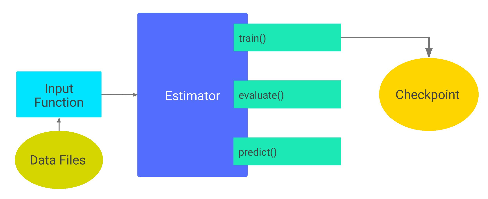
    ```python
    print(classifier.model_dir)
    # models/iris

    ls models/iris/ -1
    # checkpoint
    # graph.pbtxt
    # model.ckpt-1.data-00000-of-00001
    # model.ckpt-1.index
    # model.ckpt-1.meta
    # model.ckpt-200.data-00000-of-00001
    # model.ckpt-200.index
    # model.ckpt-200.meta
    ```
    Estimator 创建了 **训练开始 step 1** 与 **训练结束 step 200** 的 checkpoints 文件
## 模型保存频率 Checkpointing Frequency
  - **模型存储的默认规则**
    - train 方法 **开始** 和 **结束** 时各保存一次
    - 每 **10** 分钟保存一次 checkpoint
    - model_dir 中保留最近的 **5** 个 checkpoints 文件
  - **自定义存储规则**
    - 创建 RunConfig 类定义需要的规则
    - Estimator 的 **config 参数** 指定成自定义的规则
    ```python
    my_checkpointing_config = tf.estimator.RunConfig(
        save_checkpoints_secs = 20*60,  # Save checkpoints every 20 minutes.
        keep_checkpoint_max = 10,       # Retain the 10 most recent checkpoints.
    )

    classifier = tf.estimator.DNNClassifier(
        feature_columns=my_feature_columns,
        hidden_units=[10, 10],
        n_classes=3,
        model_dir='models/iris',
        config=my_checkpointing_config)
    ```
## 模型恢复 Restore
  - 初次调用模型的 train 方法创建 checkpoints 后，再调用模型的 train / evaluate / predict 方法将
    - Estimator 首先调用模型的 model_fn() 创建 graph
    - 使用最新的 checkpoint 中存储的数据初始化模型参数
    - 即如果 checkpoints 存在，调用 train / evaluate / predict 时，将首先重建模型
  
## Avoiding a bad restoration
  - 从 checkpoint 重建模型状态，只适用于模型结构不变的情况，模型参数改变时将报错
    ```python
    '''  trained a DNNClassifier Estimator containing two hidden layers, each having 10 nodes '''
    classifier = tf.estimator.DNNClassifier(
        feature_columns=my_feature_columns,
        hidden_units=[10, 10],
        n_classes=3,
        model_dir='models/iris')

    classifier.train(
        input_fn=lambda:train_input_fn(train_x, train_y, batch_size=100),
            steps=200)

    ''' change the number of neurons in each hidden layer from 10 to 20 and then attempted to retrain the model '''
    classifier2 = tf.estimator.DNNClassifier(
        feature_columns=my_feature_columns,
        hidden_units=[20, 20],  # Change the number of neurons in the model.
        n_classes=3,
        model_dir='models/iris')

    classifier2.train(
        input_fn=lambda:train_input_fn(train_x, train_y, batch_size=100),
            steps=200)
    ```
    **error**
    ```python
    ...
    InvalidArgumentError (see above for traceback): tensor_name = dnn/hiddenlayer_0/bias;
    shape in shape_and_slice spec [20]
    does not match the shape stored in checkpoint: [10]
    ```
***

# Feature Columns
## tf.feature_column 模块
  - **tf.feature_column** 创建特征列 feature columns，用于模型的输入功能
    ```python
    price = numeric_column('price')
    columns = [price, ...]
    features = tf.parse_example(..., features=make_parse_example_spec(columns))
    dense_tensor = input_layer(features, columns)

    # or
    bucketized_price = bucketized_column(price, boundaries=[...])
    columns = [bucketized_price, ...]
    features = tf.parse_example(..., features=make_parse_example_spec(columns))
    linear_prediction = linear_model(features, columns)
    ```
  - 多数方法返回 **Categorical-Column 分类列** 或 **Dense-Column 密集列**，除了 **bucketized_column** 继承自这两个类
  - 输入给 `tf.feature_column.input_layer` 时，需要将 categorical column 转化为 dense column，可以使用 **embedding_column** / **indicator_column** 转化
## Numeric column 数值列
  - **tf.feature_column.numeric_column** 创建 Numeric column，默认输入参数类型是 tf.float32，维度为 1
    ```python
    numeric_column(key, shape=(1,), default_value=None, dtype=tf.float32, normalizer_fn=None)
    ```
    ```python
    # Defaults to a tf.float32 scalar.
    numeric_feature_column = tf.feature_column.numeric_column(key="SepalLength")
    ```
  - **dtype 参数** 指定其他数据类型
    ```python
    # Represent a tf.float64 scalar.
    numeric_feature_column = tf.feature_column.numeric_column(key="SepalLength", dtype=tf.float64)
    ```
  - **shape 参数** 指定其他数据维度
    ```python
    # Represent a 10-element vector in which each cell contains a tf.float32.
    vector_feature_column = tf.feature_column.numeric_column(key="Bowling", shape=10)

    # Represent a 10x5 matrix in which each cell contains a tf.float32.
    matrix_feature_column = tf.feature_column.numeric_column(key="MyMatrix", shape=[10,5])
    ```
  - **normalizer_fn 参数** 指定数据转换，如数据 normalization
    ```python
    price = {'price': np.array([4, dtype=np.float32]).reshape(-1, 1)}
    column = [tf.feature_column.numeric_column('price', normalizer_fn=lambda x: (x - 3.0) / 4.2)]
    tensor = tf.feature_column.input_layer(price, column)
    sess = tf.InteractiveSession()
    tensor.eval()
    # Out[36]: array([[-0.71428573], [-0.4761905 ], [-0.23809525], [ 0.        ]], dtype=float32)
    ```
## Bucketized column 分桶列
  - **Bucketized** 将数值范围划分成不同的类别，每一个作为一个 bucket
    ```python
    bucketized_column(source_column, boundaries)
    ```
  - 按照年代划分成 4 个 bucket

    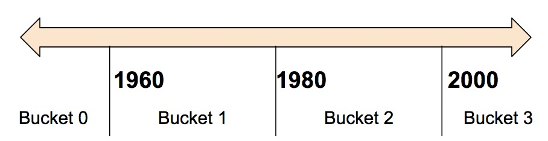

    **bucket 数据**

    | Date Range         | Represented as |
    | ------------------ | -------------- |
    | < 1960             | [1, 0, 0, 0]   |
    | >= 1960 but < 1980 | [0, 1, 0, 0]   |
    | >= 1980 but < 2000 | [0, 0, 1, 0]   |
    | > 2000             | [0, 0, 0, 1]   |

    **python 示例**
    ```python
    years = {'years': [1999,2013,1987,2005]}
    years_fc = tf.feature_column.numeric_column('years')
    column = tf.feature_column.bucketized_column(
          source_column = years_fc,
          boundaries = [1990, 2000, 2010])
    column.name
    # Out[8]: 'years_bucketized'

    tensor = tf.feature_column.input_layer(years, [column])
    sess = tf.InteractiveSession()
    tensor.eval()
    # Out[9]:
    # array([[0., 1., 0., 0.],
    #        [0., 0., 0., 1.],
    #        [1., 0., 0., 0.],
    #        [0., 0., 1., 0.]], dtype=float32)
    ```
## Categorical identity column 分类识别列
  - Categorical identity columns 可以作为 bucketized columns 的特殊形式，每一个桶只代表一个单独的数据
    ```python
    # The values of 'key' feature must be >= 0 and < num_buckets
    categorical_column_with_identity(key, num_buckets, default_value=None)
    ```
  - 对于整数列表 [0, 4)，即需要表示 0, 1, 2, 3，Categorical identity columns 的表示形式

    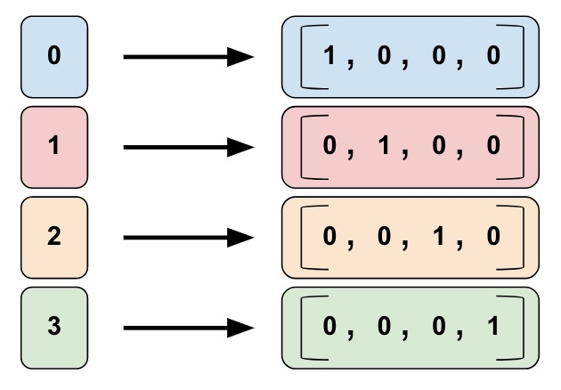

    **python 示例**
    ```python
    pets = {'pets': [2, 3, 0, 1]}  # cat 0，dog 1，rabbit 2，pig 3

    column = tf.feature_column.categorical_column_with_identity(
        key='pets',
        num_buckets=4) # Values [0, 4)

    indicator = tf.feature_column.indicator_column(column)
    tensor = tf.feature_column.input_layer(pets, [indicator])
    sess = tf.InteractiveSession()
    tensor.eval()
    # Out[13]:
    # array([[0., 0., 1., 0.],
    #        [0., 0., 0., 1.],
    #        [1., 0., 0., 0.],
    #        [0., 1., 0., 0.]], dtype=float32)
    ```
## Categorical vocabulary column 分类词汇列
  - Categorical vocabulary columns 将字符串转化为 one-hot 向量，类似于 enum 形式的 categorical identity columns

    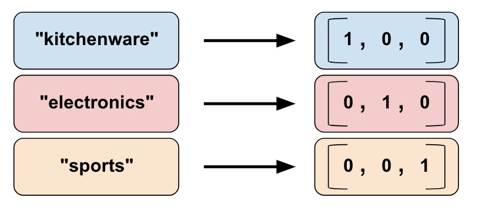
  - **tf.feature_column.categorical_column_with_vocabulary_list** 将一个单词列表转为为 column
    ```python
    # output will have shape [n, len(vocabulary_list)+num_oov_buckets]
    categorical_column_with_vocabulary_list(key, vocabulary_list, dtype=None, default_value=-1, num_oov_buckets=0)
    ```
    - **default_value 参数** 不在单词列表中单词的返回值，默认 -1，不能同时指定正数的 num_oov_buckets
    - **num_oov_buckets 参数** 不在单词列表中值的个数，返回 `[len(vocabulary_list), len(vocabulary_list)+num_oov_buckets)` 中的一个值
    ```python
    vocabulary_a = {'vocabulary_a': ["kitchenware", "electronics", "sports", "keyboards"]}

    column = tf.feature_column.categorical_column_with_vocabulary_list(
        key='vocabulary_a',
        vocabulary_list=["kitchenware", "electronics", "sports"],
        dtype=tf.string,
        default_value=-1,
        num_oov_buckets=3)

    indicator = tf.feature_column.indicator_column(column)
    tensor = tf.feature_column.input_layer(vocabulary_a, [indicator])
    sess = tf.InteractiveSession()
    # FailedPreconditionError: Table not initialized.
    tf.tables_initializer().run()
    tensor.shape.as_list()
    # Out[15]: [4, 6]
    tensor.eval()
    # Out[16]:
    # array([[1., 0., 0., 0., 0., 0.],
    #        [0., 1., 0., 0., 0., 0.],
    #        [0., 0., 1., 0., 0., 0.],
    #        [0., 0., 0., 0., 1., 0.]], dtype=float32)  # keyboards
    ```
  - **tf.feature_column.categorical_column_with_vocabulary_file** 将一个文件中的单词转化为 column
    ```python
    categorical_column_with_vocabulary_file(key, vocabulary_file, vocabulary_size=None, num_oov_buckets=0, default_value=None, dtype=tf.string)
    ```
    - **vocabulary_size 参数** 获取文件中单词列表的数量，不大于单词列表中的单词数量
    ```python
    vocabulary_a = {'vocabulary_a': ["kitchenware", "electronics", "sports", "keyboards"]}

    fc_path = 'product_class.txt'
    ff = open(fc_path, 'w')
    for ii in vocabulary_a['vocabulary_a']:
        ff.write(ii + '\n')
    ff.close()

    # out-of-vocabulary buckets will be all zero
    column=tf.feature_column.categorical_column_with_vocabulary_file(
            key="vocabulary_a",
            vocabulary_file=fc_path,
            vocabulary_size=3,
            num_oov_buckets=0)

    indicator = tf.feature_column.indicator_column(column)
    tensor = tf.feature_column.input_layer(pets, [indicator])
    sess = tf.InteractiveSession()
    # FailedPreconditionError: Table not initialized.
    tf.tables_initializer().run()
    tensor.shape.as_list()
    # Out[44]: [4, 3]
    tensor.eval()
    # Out[45]:
    # array([[1., 0., 0.],
    #        [0., 1., 0.],
    #        [0., 0., 1.],
    #        [0., 0., 0.]], dtype=float32)  # all zero
    ```
## Hashed column 哈希列
  - Hashed Column 在类别很多时，将输入转化为哈希值作为类别，限定输入的类别数量，减少内存消耗
    ```python
    categorical_column_with_hash_bucket(key, hash_bucket_size, dtype=tf.string)
    ```
    **计算哈希值**
    ```python
    # pseudocode
    feature_id = hash(raw_feature) % hash_buckets_size
    ```
    **python 示例**
    ```python
    colors = {'colors': ['green','red','blue','yellow','pink','blue','red','indigo']}  

    column = tf.feature_column.categorical_column_with_hash_bucket(
            key='colors',
            hash_bucket_size=5, # The number of categories
        )

    indicator = tf.feature_column.indicator_column(column)
    tensor = tf.feature_column.input_layer(colors, [indicator])
    sess = tf.InteractiveSession()
    tensor.eval()
    # Out[3]:
    # array([[0., 0., 0., 0., 1.],
    #        [1., 0., 0., 0., 0.],
    #        [1., 0., 0., 0., 0.],
    #        [0., 1., 0., 0., 0.],
    #        [0., 1., 0., 0., 0.],
    #        [1., 0., 0., 0., 0.],
    #        [1., 0., 0., 0., 0.],
    #        [0., 1., 0., 0., 0.]], dtype=float32)
    ```
  - Hashed Column 可能将不相关的输入划分到同一类别，不过很多时候 tensorflow 还是能够利用其他的特征列把它们区分开

    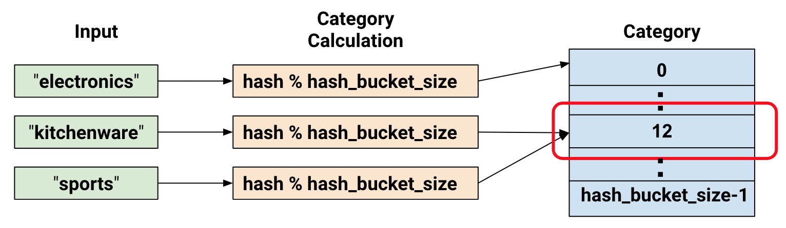
## Crossed column 交叉列
  - feature crosses 把多个特征合并成为一个特征，通常称为 **feature crosses**，比如把 经度 longitude / 维度 latitude 两个特征合并为 地理位置特征 location
    ```python
    crossed_column(keys, hash_bucket_size, hash_key=None)
    ```
    **python 示例**
    ```python
    featrues = {
            'longtitude': [19,61,30,9,45],
            'latitude': [45,40,72,81,24]
        }

    longtitude = tf.feature_column.numeric_column('longtitude')
    latitude = tf.feature_column.numeric_column('latitude')

    latitude_bucket_fc = tf.feature_column.bucketized_column(latitude, [33,66])
    longitude_bucket_fc  = tf.feature_column.bucketized_column(longtitude,[33,66])

    crossed_lat_lon_fc = tf.feature_column.crossed_column([latitude_bucket_fc, longitude_bucket_fc], 12)

    indicator = tf.feature_column.indicator_column(crossed_lat_lon_fc)
    tensor = tf.feature_column.input_layer(featrues, [indicator])
    sess = tf.InteractiveSession()
    tensor.eval()
    # Out[6]:
    # array([[0., 0., 0., 0., 0., 0., 0., 0., 0., 0., 0., 1.],
    #        [0., 0., 0., 0., 0., 0., 0., 0., 0., 1., 0., 0.],
    #        [0., 0., 1., 0., 0., 0., 0., 0., 0., 0., 0., 0.],
    #        [0., 0., 1., 0., 0., 0., 0., 0., 0., 0., 0., 0.],
    #        [0., 0., 0., 0., 0., 1., 0., 0., 0., 0., 0., 0.]], dtype=float32)

    tf.feature_column.input_layer(featrues, latitude_bucket_fc).eval()
    # Out[14]:
    # array([[0., 1., 0.],
    #        [0., 1., 0.],
    #        [0., 0., 1.],
    #        [0., 0., 1.],
    #        [1., 0., 0.]], dtype=float32)

    tf.feature_column.input_layer(featrues, longitude_bucket_fc).eval()
    # Out[15]:
    # array([[1., 0., 0.],
    #        [0., 1., 0.],
    #        [1., 0., 0.],
    #        [1., 0., 0.],
    #        [0., 1., 0.]], dtype=float32)
    ```
  - 在创建 feature crosses 时，通常还会保留原始 uncrossed 特征
## Indicator columns 指示列
  - Indicator columns 不直接操作数据，使用 categorical columns 作为输入，转化为 input_layer 方法接受的 one-hot 特征列
    ```python
    indicator_column(categorical_column)
    ```
    - Used to wrap any `categorical_column_*` (e.g., to feed to DNN)
    - Use `embedding_column` if the inputs are sparse
    ```python
    name_c = tf.feature_column.categorical_column_with_vocabulary_list('name', ['bob', 'george', 'wanda'])
    name = tf.feature_column.indicator_column(name_c)
    columns = [name]
    dense_tensor_1 = tf.feature_column.input_layer({'name': ['bob']}, columns)
    dense_tensor_2 = tf.feature_column.input_layer({'name': ['bob', 'bob']}, columns)
    dense_tensor_3 = tf.feature_column.input_layer({'name': ['bob', 'wanda']}, columns)
    dense_tensor_4 = tf.feature_column.input_layer({'name': ['bob', 'aaa']}, columns)

    sess = tf.InteractiveSession()
    tf.tables_initializer().run()
    print(dense_tensor_1.eval())
    # Out[5]: array([[1., 0., 0.]], dtype=float32)

    print(dense_tensor_2.eval())
    # Out[6]: array([[1., 0., 0.], [1., 0., 0.]], dtype=float32)

    print(dense_tensor_3.eval())
    # Out[7]: array([[1., 0., 0.], [0., 0., 1.]], dtype=float32)

    print(dense_tensor_4.eval())
    # Out[8]: array([[1., 0., 0.], [0., 0., 0.]], dtype=float32)
    ```
## embedding columns 嵌入列
  - 在类别数量变多，或者处理稀疏矩阵时，indicator columns 会变得很大
  - embedding column 不再限定每个元素必须是 0 或 1，而可以是任何数字，从而使用更少的元素数表现数据
    ```python
    # Inputs must be a `_CategoricalColumn` created by any of the `categorical_column_*` function
    embedding_column(categorical_column, dimension,
                    combiner='mean', initializer=None,
                    ckpt_to_load_from=None, tensor_name_in_ckpt=None,
                    max_norm=None, trainable=True)
    ```
  - **embedding columns** 与 **indicator columns** 的映射过程，embedding column 可以使用更低维度的向量表示数据，假设输入包含 81 个单词向量，对于 4 个单词的输入
    ```python
    "dog"
    "spoon"
    "scissors"
    "guitar"
    ```
    **embedding columns** 与 **indicator columns** 的映射过程

    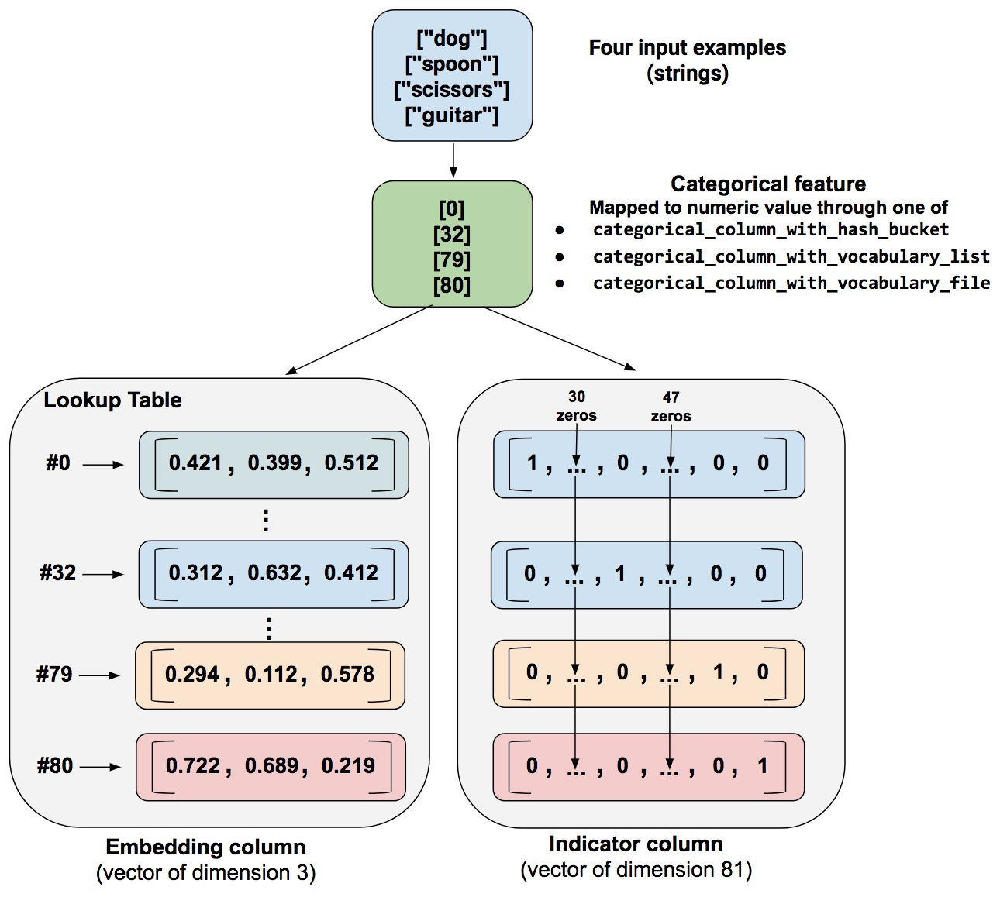
    - 处理数据时，首先通过 `categorical_column_with...` 方法将 string 映射成为数字，`["dog", "spoon", "scissors", "guitar"] --> [0, 32, 79, 80]`
    - indicator column 将每个数字转化为 81 个元素的向量，只在对应的数字处为1
    - embedding column 将数字映射为 3 个元素的向量
  - embeddings vectors 的数值是在 **训练时分配** 的，以更有利于解决问题
  - **embedding 维度** 通常 embedding 向量的维度数量是根据类别数量分配的，如 81 个类别对应 `81 ** 0.25 = 3`
    ```python
    embedding_dimensions =  number_of_categories**0.25
    ```
  - **python 示例**
    ```python
    features = {'items': ["dog", "spoon", "scissors", "guitar", "screen"]}

    pets_f_c = tf.feature_column.categorical_column_with_vocabulary_list(
        'items',
        ["dog", "spoon", "scissors", "guitar"],
        dtype=tf.string,
        default_value=-1)

    column = tf.feature_column.embedding_column(
        categorical_column=pets_f_c,
        dimension=3)
    tensor = tf.feature_column.input_layer(features, [column])

    sess = tf.InteractiveSession()
    tf.global_variables_initializer().run()
    tf.tables_initializer().run()
    tensor.eval()
    # Out[17]:
    # array([[-0.1428304 , -0.6151378 ,  0.87506115],
    #        [ 0.4937725 ,  1.0007112 , -0.1445001 ],
    #        [ 0.0717921 ,  0.6795558 ,  0.32704228],
    #        [ 0.16342635, -0.60739034,  0.01697639],
    #        [ 0.        ,  0.        ,  0.        ]], dtype=float32)
    ```
  - **using `embedding_column` with `DNNClassifier`**
    ```python
    video_id = categorical_column_with_identity(
        key='video_id', num_buckets=1000000, default_value=0)
    columns = [embedding_column(video_id, 9),...]

    estimator = tf.estimator.DNNClassifier(feature_columns=columns, ...)

    label_column = ...
    def input_fn():
      features = tf.parse_example(
          ..., features=make_parse_example_spec(columns + [label_column]))
      labels = features.pop(label_column.name)
      return features, labels

    estimator.train(input_fn=input_fn, steps=100)
    ```
  - **using `embedding_column` with model_fn**
    ```python
    def model_fn(features, ...):
      video_id = categorical_column_with_identity(
          key='video_id', num_buckets=1000000, default_value=0)
      columns = [embedding_column(video_id, 9),...]
      dense_tensor = input_layer(features, columns)
      # Form DNN layers, calculate loss, and return EstimatorSpec.
      ...
    ```
## Weighted categorical column 权重分类列
  - Weighted categorical column 可以为每个分类设置权重
    ```python
    weighted_categorical_column(categorical_column, weight_feature_key, dtype=tf.float32)
    ```
  - **python 示例**
    ```python
    features = {'color': [['R'], ['A'], ['G'], ['B'],['R']],
                'weight': [[1.0], [5.0], [4.0], [8.0],[3.0]]}

    color_f_c = tf.feature_column.categorical_column_with_vocabulary_list(
        'color', ['R', 'G', 'B','A'], dtype=tf.string, default_value=-1
    )

    column = tf.feature_column.weighted_categorical_column(color_f_c, 'weight')

    indicator = tf.feature_column.indicator_column(column)
    tensor = tf.feature_column.input_layer(features, [indicator])
    sess = tf.InteractiveSession()
    tf.tables_initializer().run()
    tensor.eval()
    # Out[24]:
    # array([[1., 0., 0., 0.],
    #        [0., 0., 0., 5.],
    #        [0., 4., 0., 0.],
    #        [0., 0., 8., 0.],
    #        [3., 0., 0., 0.]], dtype=float32)
    ```
## Passing feature columns to Estimators
  - Tensorflow 提供了多个 Estimators，但不是每种 Estimators 都能够接收所有类型的特征列 feature column
    - **线性分类器 linearClassifier** 和 **线性回归器 linearRegressor**，接收 **所有类型特征列**
    - **深度神经网络分类器 DNNClassifier** 和 **深度神经网络回归器 DNNRegressor**，仅接收 **密集特征列 dense column**，其他类型特征列必须用 **指示列 indicatorColumn** 或 **嵌入列 embedingColumn** 进行包裹
    - **线性神经网络合成分类器 linearDNNCombinedClassifier** 和 **线性神经网络合成回归器 linearDNNCombinedRegressor**
      - **linear_feature_columns** 参数接收 **所有类型特征列**
      - **dnn_feature_columns** 只接收 **密度特征列 dense column**
## Linear model 线性模型
  - 对所有特征进行线性加权操作
    ```python
    linear_model(features, feature_columns, units=1, sparse_combiner='sum', weight_collections=None, trainable=True, cols_to_vars=None)
    ```
  - **python 示例**
    ```python
    def get_linear_model_bias():
        with tf.variable_scope('linear_model', reuse=True):
            return tf.get_variable('bias_weights')

    def get_linear_model_column_var(column):
        return tf.get_collection(tf.GraphKeys.GLOBAL_VARIABLES,
                                 'linear_model/' + column.name)[0]

    featrues = {
            'price': [[1.0], [5.0], [10.0]],
            'color': [['R'], ['G'], ['B']]
        }

    price_column = tf.feature_column.numeric_column('price')
    color_column = tf.feature_column.categorical_column_with_vocabulary_list('color', ['R', 'G', 'B'])
    prediction = tf.feature_column.linear_model(featrues, [price_column, color_column])

    bias = get_linear_model_bias()
    price_var = get_linear_model_column_var(price_column)
    color_var = get_linear_model_column_var(color_column)

    with tf.Session() as sess:
        sess.run(tf.global_variables_initializer())
        sess.run(tf.tables_initializer())

        sess.run(bias.assign([7.0]))
        sess.run(price_var.assign([[10.0]]))
        sess.run(color_var.assign([[2.0], [2.0], [2.0]]))

        predication_result = sess.run([prediction])

        print(prediction)
        print(predication_result)
    # [Out]
    # Tensor("linear_model/weighted_sum:0", shape=(3, 1), dtype=float32)
    # [array([[ 19.], [ 59.], [109.]], dtype=float32)]
    ```
## tf.make_parse_example_spec 输入转化为字典
  - **make_parse_example_spec** 将输入 feature_columns 转化为字典 dictionary
    ```python
    make_parse_example_spec(feature_columns)
    ```
    The returned dictionary can be used as arg 'features' in `tf.parse_example`
    ```python
    # Define features and transformations
    feature_a = categorical_column_with_vocabulary_file(...)
    feature_b = numeric_column(...)
    feature_c_bucketized = bucketized_column(numeric_column("feature_c"), ...)
    feature_a_x_feature_c = crossed_column(
        columns=["feature_a", feature_c_bucketized], ...)

    feature_columns = set(
        [feature_b, feature_c_bucketized, feature_a_x_feature_c])
    features = tf.parse_example(
        serialized=serialized_examples,
        features=make_parse_example_spec(feature_columns))
    ```
    For the above example, make_parse_example_spec would return the dict:
    ```python
    {
        "feature_a": parsing_ops.VarLenFeature(tf.string),
        "feature_b": parsing_ops.FixedLenFeature([1], dtype=tf.float32),
        "feature_c": parsing_ops.FixedLenFeature([1], dtype=tf.float32)
    }
    ```
***

# Datasets for Estimators
## Basic input
  - **tf.data.Dataset.from_tensor_slices** 创建给定数据的切片 Slices，根据数据集的第一维度切片，代表了输入数据的一个样例
    ```python
    train, test = tf.keras.datasets.mnist.load_data()
    mnist_x, mnist_y = train
    mnist_x.shape
    # Out[14]: (60000, 28, 28)

    mnist_ds = tf.data.Dataset.from_tensor_slices((mnist_x, mnist_y))
    print(mnist_ds)
    # [Out] <TensorSliceDataset shapes: ((28, 28), ()), types: (tf.uint8, tf.uint8)>
    ```
  - **shuffle** / **repeat** / **batch** 操作 Manipulation
    - **shuffle(buffer_size, seed=None, reshuffle_each_iteration=None)** buffer_size 通常大于 Dataset 中样列数量，保证充分打乱顺序
    - **repeat(count=None)** count 指定数据及重复次数，None / -1 表示不限制
    - **batch(batch_size)** 创建一个输入样例的 batch
    ```python
    # Shuffle, repeat, and batch the examples.
    dataset = mnist_ds.shuffle(1000).repeat().batch(200)
    dataset.output_shapes
    # Out[22]:
    # (TensorShape([Dimension(None), Dimension(28), Dimension(28)]),
    #  TensorShape([Dimension(None)]))
    ```
    输出的第一维度是未知的，因为最后一个 batch 可能包含更少的元素
  - **dataset.make_one_shot_iterator** 遍历 dataset
    ```python
    sess = tf.InteractiveSession()
    train_xs, train_ys = sess.run(dataset.make_one_shot_iterator().get_next())
    train_xs.shape
    # Out[55]: (200, 28, 28)
    train_ys.shape
    # Out[56]: (200,)
    train_ys[:5]
    # Out[57]: array([8, 6, 5, 8, 3], dtype=uint8)
    ```
## Reading a CSV File
  - **tf.data.TextLineDataset 类** 读取文本文件，**skip** 方法指定跳过文件的几行
    ```python
    TRAIN_URL = "http://download.tensorflow.org/data/iris_training.csv"
    train_path = tf.keras.utils.get_file(fname=TRAIN_URL.split('/')[-1], origin=TRAIN_URL)

    ds = tf.data.TextLineDataset(train_path).skip(1)
    ```
  - **tf.decode_csv** 解析单行 csv 格式字符串
    ```python
    decode_csv(records, record_defaults, field_delim=',', use_quote_delim=True, name=None, na_value='')
    ```
    ```python
    elem = tf.decode_csv('1, 2, 3, 4, 5', [[0.0], [0.0], [0.0], [0.0], [0]])
    with tf.Session() as sess:
        print(sess.run(elem))
    # [1.0, 2.0, 3.0, 4.0, 5]
    ```
  - **dataset.map** 在 dataset 的每一个元素上应用一个转化函数

    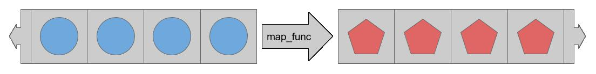
    ```python
    # Metadata describing the text columns
    COLUMNS = ['SepalLength', 'SepalWidth',
               'PetalLength', 'PetalWidth',
               'label']
    FIELD_DEFAULTS = [[0.0], [0.0], [0.0], [0.0], [0]]
    def _parse_line(line):
        # Decode the line into its fields
        fields = tf.decode_csv(line, FIELD_DEFAULTS)

        # Pack the result into a dictionary
        features = dict(zip(COLUMNS,fields))

        # Separate the label from the features
        label = features.pop('label')

        return features, label

    ds = ds.map(_parse_line)
    print(ds)
    # <MapDataset
    # shapes: (
    #     {SepalLength: (), PetalWidth: (), ...},
    #     ()),
    # types: (
    #     {SepalLength: tf.float32, PetalWidth: tf.float32, ...},
    #     tf.int32)>
    ```
  - **feed an estimator** estimator 的 input_fn 要求函数的参数为空
    ```python
    def csv_input_fn(csv_path, batch_size):
        # Create a dataset containing the text lines.
        dataset = tf.data.TextLineDataset(csv_path).skip(1)

        # Parse each line.
        dataset = dataset.map(_parse_line)

        # Shuffle, repeat, and batch the examples.
        return dataset.shuffle(1000).repeat().batch(batch_size)

    # All the inputs are numeric
    feature_columns = [tf.feature_column.numeric_column(name) for name in COLUMNS[:-1]]

    # Build the estimator
    est = tf.estimator.LinearClassifier(feature_columns, n_classes=3)
    # Train the estimator
    batch_size = 100
    est.train( steps=1000, input_fn=lambda : csv_input_fn(train_path, batch_size))
    # INFO:tensorflow:Saving checkpoints for 1 into /tmp/tmpphrfnjdp/model.ckpt.
    # INFO:tensorflow:loss = 109.86123, step = 0
    # INFO:tensorflow:global_step/sec: 127.682
    # ...
    # INFO:tensorflow:Saving checkpoints for 1000 into /tmp/tmpphrfnjdp/model.ckpt.
    # INFO:tensorflow:Loss for final step: 8.794706.
    ```
***

# 自定义模型
## Custom estimators 与 model function
  - 预定义的模型 pre-made Estimators 是 `tf.estimator.Estimator` 的子类，自定义的模型 custom Estimators 是 `tf.estimator.Estimator` 类的实例化

    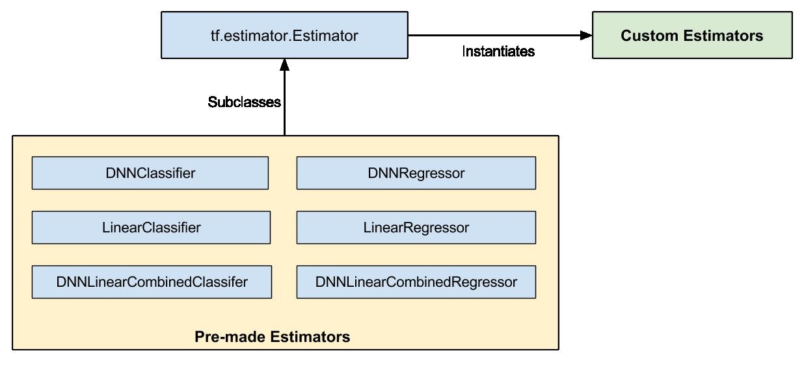
  - **model_fn** 具体实现自定义模型的算法，包括隐藏层，符合 Estimator 标准的输入输出

    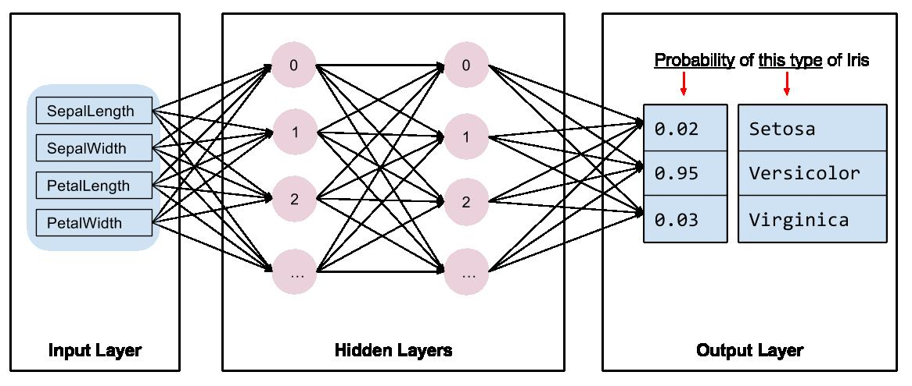
  - **model_fn 参数结构**
    ```python
    def my_model_fn(
       features, # This is batch_features from input_fn
       labels,   # This is batch_labels from input_fn
       mode,     # An instance of tf.estimator.ModeKeys
       params):  # Additional configuration
    ```
    - **features** / **labels** input function 的返回值
    - **mode** tf.estimator.ModeKeys 的实例，指定 training / predicting / evaluation
    - **params** 模型需要的其他参数
  - 实现一个标准的 model function
    - 定义模型结构
    - 实现模型的功能 **Train** / **Evaluate** / **Predict**
## 定义模型的前向传播
  - 模型的基本功能
    - 一个输入层 input layer
    - 一个或多个隐藏层 hidden layers
    - 一个输出层 output layer
  - **定义输入层**
    ```python
    # Use `input_layer` to apply the feature columns.
    net = tf.feature_column.input_layer(features, params['feature_columns'])
    ```
    - **tf.feature_column.input_layer** 将 feature_columns 转化为输入数据

    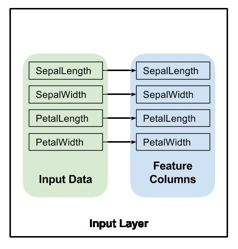
  - **定义隐藏层**
    ```python
    # Build the hidden layers, sized according to the 'hidden_units' param.
    for units in params['hidden_units']:
        net = tf.layers.dense(net, units=units, activation=tf.nn.relu)
    ```
    - **tf.layers.dense** 添加一个全连接层，**units 参数** 指定该层中节点数量，**activation 参数** 指定激活函数

    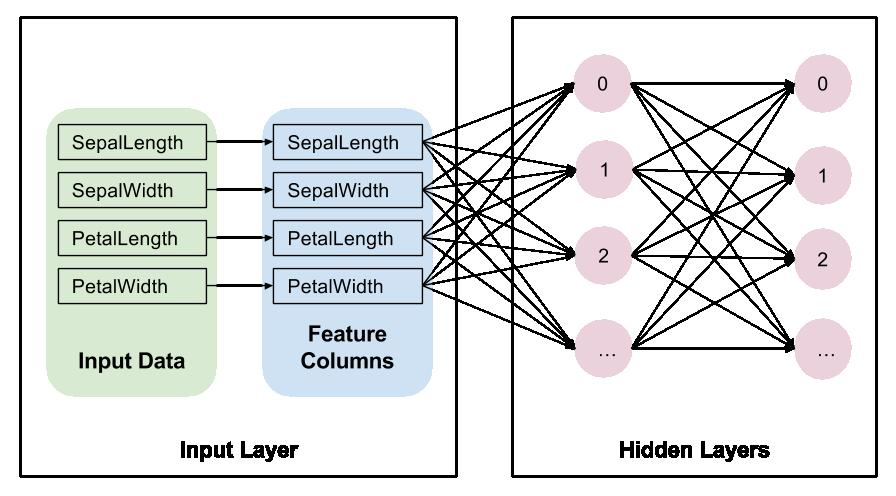
  - **定义输出层**
    ```python
    # Compute logits (1 per class).
    logits = tf.layers.dense(net, params['n_classes'], activation=None)
    ```
    - 输出层使用一个全连接层，不使用激活函数，输出为类别数 `n_classes`

    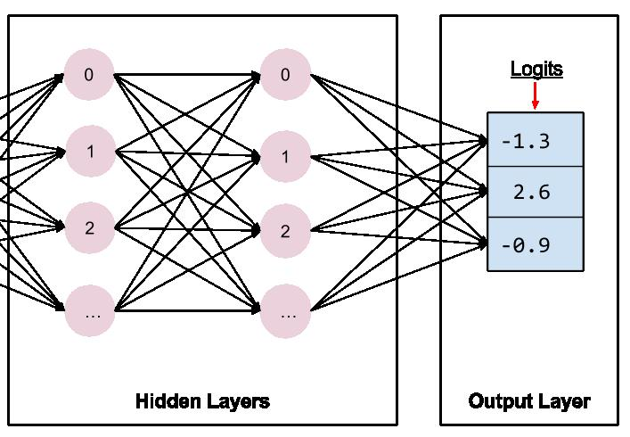
## Implement training, evaluation, and prediction
  - 调用 train / evaluate / predict 时的 Estimator mode 参数

    | Estimator method | Estimator Mode   |
    | ---------------- | ---------------- |
    | train()          | ModeKeys.TRAIN   |
    | evaluate()       | ModeKeys.EVAL    |
    | predict()        | ModeKeys.PREDICT |

  - 自定义的模型需要实现三种模式下的功能，并返回一个 `tf.estimator.EstimatorSpec` 的实例
  - **预测 predict** 当调用模型的 predict 方法时，`mode = ModeKeys.PREDICT`，此时应返回 **预测结果**
    ```python
    # Compute predictions.
    predicted_classes = tf.argmax(logits, 1)
    if mode == tf.estimator.ModeKeys.PREDICT:
        predictions = {
            'class_ids': predicted_classes[:, tf.newaxis],
            'probabilities': tf.nn.softmax(logits),
            'logits': logits,
        }
        return tf.estimator.EstimatorSpec(mode, predictions=predictions)
    ```
    - **EstimatorSpec 的 predictions 参数** 返回自定义的预测结果，predict 方法将该字典 yield 返回出去

    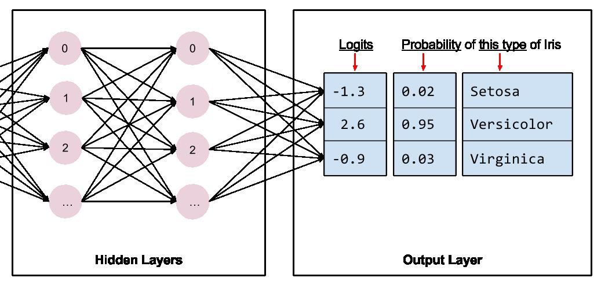

  - **损失函数 loss** training / evaluation 需要计算模型的损失
    ```python
    # Compute loss.
    loss = tf.losses.sparse_softmax_cross_entropy(labels=labels, logits=logits)
    ```
    - **tf.losses.sparse_softmax_cross_entropy** 计算模型损失
  - **评估 Evaluate** 当调用模型的 evaluate 方法时，`mode = ModeKeys.EVAL`，此时应返回模型的 **损失**，通常还会返回一个或多个 **指标矩阵 metric**
    ```python
    # Compute evaluation metrics.
    accuracy = tf.metrics.accuracy(labels=labels,
                                   predictions=predicted_classes,
                                   name='acc_op')

    metrics = {'accuracy': accuracy}
    tf.summary.scalar('accuracy', accuracy[1])

    if mode == tf.estimator.ModeKeys.EVAL:
        return tf.estimator.EstimatorSpec(
            mode, loss=loss, eval_metric_ops=metrics)
    ```
    - **tf.metrics.accuracy** 计算模型的正确率
    - **tf.summary.scalar** 使正确率 accuracy 可以用于 TensorBoard
    - **EstimatorSpec 的 eval_metric_ops 参数** 指定返回的 metric 字典，可选
  - **训练 Train** 当调用模型的 train 方法时，`mode = ModeKeys.TRAIN`，此时返回模型的 **损失 loss** 与 **训练方法 training operation**
    ```python
    optimizer = tf.train.AdagradOptimizer(learning_rate=0.1)
    train_op = optimizer.minimize(loss, global_step=tf.train.get_global_step())

    return tf.estimator.EstimatorSpec(mode, loss=loss, train_op=train_op)
    ```
    - **tf.train.AdagradOptimizer** Adagrad 优化器
    - **minimize 的 global_step 参数** 对于 TensorBoard 是必须的
    - **EstimatorSpec 的 train_op 参数** 具体执行训练步骤
## 使用自定义模型实例化 Estimator
  - **model_fn 参数** 指定自定义模型
    ```python
    # Build 2 hidden layer DNN with 10, 10 units respectively.
    classifier = tf.estimator.Estimator(
        model_fn=my_model,
        params={
            'feature_columns': my_feature_columns,
            # Two hidden layers of 10 nodes each.
            'hidden_units': [10, 10],
            # The model must choose between 3 classes.
            'n_classes': 3,
        })
    ```
## python 完整实现
  ```python
  def my_model(features, labels, mode, params):
      """DNN with three hidden layers, and dropout of 0.1 probability."""
      # Create three fully connected layers each layer having a dropout
      # probability of 0.1.
      net = tf.feature_column.input_layer(features, params['feature_columns'])
      for units in params['hidden_units']:
          net = tf.layers.dense(net, units=units, activation=tf.nn.relu)

      # Compute logits (1 per class).
      logits = tf.layers.dense(net, params['n_classes'], activation=None)

      # Compute predictions.
      predicted_classes = tf.argmax(logits, 1)
      if mode == tf.estimator.ModeKeys.PREDICT:
          predictions = {
              'class_ids': predicted_classes[:, tf.newaxis],
              'probabilities': tf.nn.softmax(logits),
              'logits': logits,
          }
          return tf.estimator.EstimatorSpec(mode, predictions=predictions)

      # Compute loss.
      loss = tf.losses.sparse_softmax_cross_entropy(labels=labels, logits=logits)

      # Compute evaluation metrics.
      accuracy = tf.metrics.accuracy(labels=labels,
                                     predictions=predicted_classes,
                                     name='acc_op')
      metrics = {'accuracy': accuracy}
      tf.summary.scalar('accuracy', accuracy[1])

      if mode == tf.estimator.ModeKeys.EVAL:
          return tf.estimator.EstimatorSpec(
              mode, loss=loss, eval_metric_ops=metrics)

      # Create training op.
      assert mode == tf.estimator.ModeKeys.TRAIN

      optimizer = tf.train.AdagradOptimizer(learning_rate=params['learning_rate'])
      train_op = optimizer.minimize(loss, global_step=tf.train.get_global_step())
      return tf.estimator.EstimatorSpec(mode, loss=loss, train_op=train_op)

  # Define feature_columns
  my_feature_columns = [tf.feature_column.numeric_column("x", shape=[28, 28])]

  # Build 2 hidden layer DNN respectively.
  classifier = tf.estimator.Estimator(
      model_fn=my_model,
      params={
          'feature_columns': my_feature_columns,
          # Two hidden layers of 10 nodes each.
          'hidden_units': [512, 256],
          # The model must choose between 3 classes.
          'n_classes': 10,
          'learning_rate': 0.001
      })

  # Load data
  (train_x, train_y), (test_x, test_y) = tf.keras.datasets.mnist.load_data()
  train_y = train_y.astype(np.int32)
  test_y = test_y.astype(np.int32)

  # Train
  train_input_fn = tf.estimator.inputs.numpy_input_fn({'x':train_x}, train_y, batch_size=1000, num_epochs=50, shuffle=True)
  classifier.train(input_fn=train_input_fn)

  # Evaluate
  eval_input_fn = tf.estimator.inputs.numpy_input_fn({'x':test_x}, test_y, batch_size=1000, num_epochs=10, shuffle=True)
  classifier.evaluate(input_fn=eval_input_fn)

  # Predict
  predict_input_fn = tf.estimator.inputs.numpy_input_fn({'x':test_x}, num_epochs=1, shuffle=False)
  pp = classifier.predict(input_fn=predict_input_fn)
  ll = [ii['class_ids'][0] for ii in pp]
  ```
  **运行结果**
  ```python
  # Train
  INFO:tensorflow:Saving checkpoints for 1 into /tmp/tmpnl63y5i9/model.ckpt.
  INFO:tensorflow:loss = 103.680214, step = 0
  INFO:tensorflow:global_step/sec: 114.393
  INFO:tensorflow:loss = 3.4204082, step = 100 (0.864 sec)
  INFO:tensorflow:global_step/sec: 122.563
  ...
  INFO:tensorflow:loss = 0.04464946, step = 2900 (0.821 sec)
  INFO:tensorflow:Saving checkpoints for 3000 into /tmp/tmpnl63y5i9/model.ckpt.
  INFO:tensorflow:Loss for final step: 0.06240763.

  # Evaluate
  INFO:tensorflow:Restoring parameters from /tmp/tmpnl63y5i9/model.ckpt-3000
  ...
  INFO:tensorflow:Saving dict for global step 3000: accuracy = 0.9359, global_step = 3000, loss = 0.98651063
  Out[37]: {'accuracy': 0.9359, 'loss': 0.98651063, 'global_step': 3000}

  # Predict
  ll[:10]
  Out[42]: [7, 2, 1, 0, 4, 1, 4, 9, 5, 9]

  test_y[:10]
  Out[43]: array([7, 2, 1, 0, 4, 1, 4, 9, 5, 9], dtype=int32)
  ```
## Estimator TensorBoard
  - View training results for your custom Estimator in TensorBoard
    ```python
    classifier.model_dir
    # Out[3]: '/tmp/tmpqxh_cbia'
    ```
    start TensorBoard from command line
    ```shell
    tensorboard --logdir=/tmp/tmpnl63y5i9
    ```
    Open TensorBoard by browsing to: http://localhost:6006

    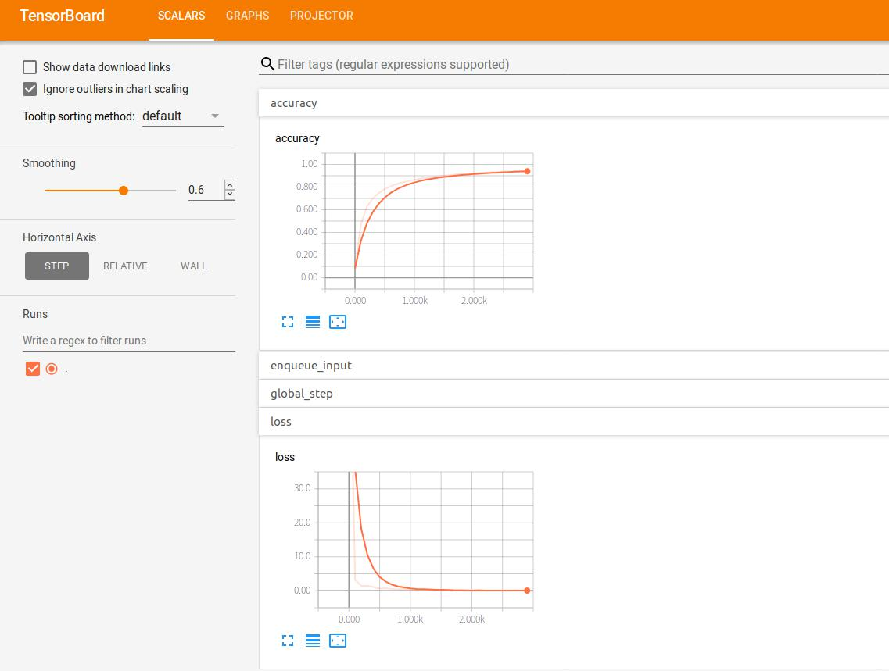
***

# 计算设备 CPU GPU TPU
## 支持的设备类型
  - **CPU** / **GPU** 使用字符串表示设备类型
    - `"/cpu:0"`: 设备上的 CPU
    - `"/device:GPU:0"`: 设备上的 GPU
    - `"/device:GPU:1"`: 设备上的第二个 GPU
  - 如果操作同时支持 CPU / GPU，会优先选择 GPU 操作
  - **Session 的 log_device_placement 参数** 设置为 `True` 显示计算过程中的设备分配
    ```python
    # Creates a graph.
    a = tf.constant([1.0, 2.0, 3.0, 4.0, 5.0, 6.0], shape=[2, 3], name='a')
    b = tf.constant([1.0, 2.0, 3.0, 4.0, 5.0, 6.0], shape=[3, 2], name='b')
    c = tf.matmul(a, b)
    # Creates a session with log_device_placement set to True.
    sess = tf.Session(config=tf.ConfigProto(log_device_placement=True))
    # Runs the op.
    print(sess.run(c))
    ```
    **运行结果**
    ```py
    Device mapping:
    ...
    MatMul: (MatMul): /job:localhost/replica:0/task:0/device:GPU:0
    a: (Const): /job:localhost/replica:0/task:0/device:GPU:0
    b: (Const): /job:localhost/replica:0/task:0/device:GPU:0
    [[22. 28.]
     [49. 64.]]
    ```
## 手动分配设备
  - **with tf.device** 创建使用设备的上下文环境
    ```python
    # Creates a graph.
    with tf.device('/cpu:0'):
      a = tf.constant([1.0, 2.0, 3.0, 4.0, 5.0, 6.0], shape=[2, 3], name='a')
      b = tf.constant([1.0, 2.0, 3.0, 4.0, 5.0, 6.0], shape=[3, 2], name='b')
    # Device was not explicitly specified for the `MatMul` operation
    c = tf.matmul(a, b)
    # Creates a session with log_device_placement set to True.
    sess = tf.Session(config=tf.ConfigProto(log_device_placement=True))
    # Runs the op.
    print(sess.run(c))
    ```
    如果指定的设备不存在，抛出 `InvalidArgumentError` 异常
    ```python
    with tf.device('/device:GPU:2'):
        a = tf.constant([1.0, 2.0, 3.0, 4.0, 5.0, 6.0], shape=[2, 3], name='a')
    sess = tf.Session()
    sess.run(a)
    ```
  - **allow_growth 配置参数** 指定 GPU 内存分配方式，设置为 `True` 指定成根据运行中的使用分配 GPU 内存
    ```python
    config = tf.ConfigProto()
    config.gpu_options.allow_growth = True
    session = tf.Session(config=config, ...)
    ```
  - **per_process_gpu_memory_fraction 配置参数** 指定 GPU 内存分配方式，设置每个 GPU 上使用多少内存
    ```python
    config = tf.ConfigProto()
    # Only allocate 40% of the total memory of each GPU
    config.gpu_options.per_process_gpu_memory_fraction = 0.4
    session = tf.Session(config=config, ...)
    ```
  - **Session 的 allow_soft_placement 参数** 设置为 `True` 指定自动选择合适的设备
    ```py
    with tf.device('/device:GPU:2'):
      a = tf.constant([1.0, 2.0, 3.0, 4.0, 5.0, 6.0], shape=[2, 3], name='a')
      b = tf.constant([1.0, 2.0, 3.0, 4.0, 5.0, 6.0], shape=[3, 2], name='b')
      c = tf.matmul(a, b)
    # Creates a session with allow_soft_placement and log_device_placement set
    # to True.
    sess = tf.Session(config=tf.ConfigProto(
          allow_soft_placement=True, log_device_placement=True))
    # Runs the op.
    print(sess.run(c))
    ```
  - **使用多个 GPU** 将运算分配到不同的设备
    ``` python
    # Creates a graph.
    c = []
    for d in ['/device:GPU:2', '/device:GPU:3']:
      with tf.device(d):
        a = tf.constant([1.0, 2.0, 3.0, 4.0, 5.0, 6.0], shape=[2, 3])
        b = tf.constant([1.0, 2.0, 3.0, 4.0, 5.0, 6.0], shape=[3, 2])
        c.append(tf.matmul(a, b))
    with tf.device('/cpu:0'):
      sum = tf.add_n(c)
    # Creates a session with log_device_placement set to True.
    sess = tf.Session(config=tf.ConfigProto(log_device_placement=True))
    # Runs the op.
    print(sess.run(sum))
    ```
## TPU 使用简介
  - **TPU** 是 Google 专门用于深度学习的芯片 [Cloud TPU](https://cloud.google.com/tpu/)
  - **tf.contrib.tpu.TPUEstimator** 定义用于 TPU 的模型，[tensorflow/models/mnist_tpu](https://github.com/tensorflow/models/blob/master/official/mnist/mnist_tpu.py)
  - **本地使用 `TPUEstimator` 定义的模型**，指定 `use_tpu` 参数为 `False`，并传递一个 `tf.contrib.tpu.RunConfig` 到 `config` 参数
    ``` python
    my_tpu_estimator = tf.contrib.tpu.TPUEstimator(
        model_fn=my_model_fn,
        config=tf.contrib.tpu.RunConfig()
        use_tpu=False)
    ```
  - **创建自定义的 `tpu.RunConfig`**，默认的 `RunConfig` 可以满足本地训练，使用 TPU 时需要指定新的 `RunConfig`
      ``` python
      import tempfile
      import subprocess

      class FLAGS(object):
        use_tpu=False
        tpu_name=None
        # Use a local temporary path for the `model_dir`
        model_dir = tempfile.mkdtemp()
        # Number of training steps to run on the Cloud TPU before returning control.
        iterations = 50
        # A single Cloud TPU has 8 shards.
        num_shards = 8

      if FLAGS.use_tpu:
          my_project_name = subprocess.check_output([
              'gcloud','config','get-value','project'])
          my_zone = subprocess.check_output([
              'gcloud','config','get-value','compute/zone'])
          cluster_resolver = tf.contrib.cluster_resolver.TPUClusterResolver(
                  tpu_names=[FLAGS.tpu_name],
                  zone=my_zone,
                  project=my_project)
          master = tpu_cluster_resolver.get_master()
      else:
          master = ''

      my_tpu_run_config = tf.contrib.tpu.RunConfig(
          master=master,
          evaluation_master=master,
          model_dir=FLAGS.model_dir,
          session_config=tf.ConfigProto(
              allow_soft_placement=True, log_device_placement=True),
          tpu_config=tf.contrib.tpu.TPUConfig(FLAGS.iterations,
                                              FLAGS.num_shards),
      )
      ```
      将 `tf.contrib.tpu.RunConfig` 传递给 `config` 参数
      ``` python
      my_tpu_estimator = tf.contrib.tpu.TPUEstimator(
          model_fn=my_model_fn,
          config = my_tpu_run_config,
          use_tpu=FLAGS.use_tpu)
      ```
***

# Embeddings
## Embeddings in TensorFlow
  - **Embedding** 是对于离散对象的映射，如将单词映射成连续的数字向量
    ```py
    blue:  (0.01359, 0.00075997, 0.24608, ..., -0.2524, 1.0048, 0.06259)
    blues:  (0.01396, 0.11887, -0.48963, ..., 0.033483, -0.10007, 0.1158)
    orange:  (-0.24776, -0.12359, 0.20986, ..., 0.079717, 0.23865, -0.014213)
    oranges:  (-0.35609, 0.21854, 0.080944, ..., -0.35413, 0.38511, -0.070976)
    ```
    对于机器学习的输出，也可以方便计算向量之间的相似度等
    ```py
    blue:  (red, 47.6°), (yellow, 51.9°), (purple, 52.4°)
    blues:  (jazz, 53.3°), (folk, 59.1°), (bluegrass, 60.6°)
    orange:  (yellow, 53.5°), (colored, 58.0°), (bright, 59.9°)
    oranges:  (apples, 45.3°), (lemons, 48.3°), (mangoes, 50.4°)
    ```
  - **Embedding** 既可以指映射的行为，也可以指映射后的结果 embeddings，同时神经网络中还有嵌入层 `embedding layer`
  - **TensorFlow 中的 Embeddings**
    - 对于创建单词向量，首先将文本分解为单词，并为每个单词分配一个单词表中的数字，生成文本对应的 `word_ids`
      ```py
      "I have a cat." -> ["I", "have", "a", "cat", "."] -> word_ids of shape [5]
      ```
    - **tf.nn.embedding_lookup** 将单词 id 映射成向量，`embedded_word_ids` 的维度 `[5, embedding_size]`
      ```py
      word_embeddings = tf.get_variable(“word_embeddings”,
          [vocabulary_size, embedding_size])
      embedded_word_ids = tf.nn.embedding_lookup(word_embeddings, word_ids)
      ```
    - 训练结束后，`word_embeddings` 将包含单词表中所有单词的 embeddings
    - 之后 embeddings 可以用于机器学习训练，如使用循环神经网络 recurrent neural network 预测一行文本的下一个单词，使用两个神经网络进行多语言翻译
## TensorBoard Embedding Projector
  - **TensorBoard Embedding Projector** 图形化显示 Embeddings，从模型中读取 embeddings 并映射到二维 / 三维 空间，[live example](http://projector.tensorflow.org)
    - **Data panel** 左上部分选择显示的数据集 / 数据列 / 颜色 / 标签
    - **Projections panel** 左下部分选择投射方式 T-SNE / PCA / Custom
    - **Inspector panel** 右侧用于搜索特定的单词 / 点，以及最近邻列表，`Show All Data` 显示所有数据，`Isolate *nnn* points` 只显示过滤出的最近邻数据，`Clear selection` 清除过滤条件
    - **Bookmark panel** 右下角用于保存 / 分享
    
  - **映射方式 Projections** 多维向量映射到三维空间时，降低向量维度
    - **[t-SNE](https://en.wikipedia.org/wiki/T-distributed_stochastic_neighbor_embedding)** T-distributed stochastic neighbor embedding 非线性，非确定性算法，尝试保留数据中本地的最近邻数据，通常是以扭曲全局结构为代价
    - **[PCA](https://en.wikipedia.org/wiki/Principal_component_analysis)** principal component analysis 线性，确定性算法，尝试在尽量少的维度中使用尽量多的数据参数，PCA 倾向于显示数据中大范围的结构，会扭曲本地最近邻数据
    - **Custom** 自定义用于映射的数据标签
## Metadata
  - **metadata file** 定义数据点对应的图片 / 标签，可以通过 `Embedding Projector` 中的 `Load data` 加载
  - **标签数据** 应使用 `TSV` 文件，metadata 文件中每行的顺序应对应向量的顺序，`(i+1)-th` 行对应第 `i-th` 个 embedding 向量
  - **图片数据** 应使用一个 [sprite image](https://www.google.com/webhp#q=what+is+a+sprite+image) 文件，其中包含每个向量对应的图片，按照逐行排列的顺序与向量对应

    | 0   | 1   | 2   |
    | --- | --- | --- |
    | 3   | 4   | 5   |
    | 6   | 7   |     |

  - [images/embedding-mnist](https://www.tensorflow.org/images/embedding-mnist.mp4)
***

# TensorBoard
## TensorBoard Visualizing Learning
  - **序列化记录数据 Serializing the data**
    - 创建计算图，并选择需要记录的节点，如使用 `tf.summary.scalar` 记录学习率变化，`tf.summary.histogram` 记录权重变化
    - 在训练过程中 / 训练结束，重新运行记录的 summaries 操作，可以使用 `tf.summary.merge_all` 将所有的记录合并成一个
    - 运行合并后的 summary 操作，生成 protobuf 记录数据
    - 将记录数据写到硬盘，使用 `tf.summary.FileWriter`
    - 在训练过程中指定 `n` 步运行一次 summary
  - [mnist_with_summaries](https://github.com/tensorflow/tensorflow/blob/master/tensorflow/examples/tutorials/mnist/mnist_with_summaries.py)
    ```python
    def variable_summaries(var):
      """Attach a lot of summaries to a Tensor (for TensorBoard visualization)."""
      with tf.name_scope('summaries'):
        mean = tf.reduce_mean(var)
        tf.summary.scalar('mean', mean)
        with tf.name_scope('stddev'):
          stddev = tf.sqrt(tf.reduce_mean(tf.square(var - mean)))
        tf.summary.scalar('stddev', stddev)
        tf.summary.scalar('max', tf.reduce_max(var))
        tf.summary.scalar('min', tf.reduce_min(var))
        tf.summary.histogram('histogram', var)

    def nn_layer(input_tensor, input_dim, output_dim, layer_name, act=tf.nn.relu):
      """Reusable code for making a simple neural net layer.

      It does a matrix multiply, bias add, and then uses relu to nonlinearize.
      It also sets up name scoping so that the resultant graph is easy to read,
      and adds a number of summary ops.
      """
      # Adding a name scope ensures logical grouping of the layers in the graph.
      with tf.name_scope(layer_name):
        # This Variable will hold the state of the weights for the layer
        with tf.name_scope('weights'):
          weights = weight_variable([input_dim, output_dim])
          variable_summaries(weights)
        with tf.name_scope('biases'):
          biases = bias_variable([output_dim])
          variable_summaries(biases)
        with tf.name_scope('Wx_plus_b'):
          preactivate = tf.matmul(input_tensor, weights) + biases
          tf.summary.histogram('pre_activations', preactivate)
        activations = act(preactivate, name='activation')
        tf.summary.histogram('activations', activations)
        return activations

    hidden1 = nn_layer(x, 784, 500, 'layer1')

    with tf.name_scope('dropout'):
      keep_prob = tf.placeholder(tf.float32)
      tf.summary.scalar('dropout_keep_probability', keep_prob)
      dropped = tf.nn.dropout(hidden1, keep_prob)

    # Do not apply softmax activation yet, see below.
    y = nn_layer(dropped, 500, 10, 'layer2', act=tf.identity)

    with tf.name_scope('cross_entropy'):
      # The raw formulation of cross-entropy,
      #
      # tf.reduce_mean(-tf.reduce_sum(y_ * tf.log(tf.softmax(y)),
      #                               reduction_indices=[1]))
      #
      # can be numerically unstable.
      #
      # So here we use tf.losses.sparse_softmax_cross_entropy on the
      # raw logit outputs of the nn_layer above.
      with tf.name_scope('total'):
        cross_entropy = tf.losses.sparse_softmax_cross_entropy(labels=y_, logits=y)
    tf.summary.scalar('cross_entropy', cross_entropy)

    with tf.name_scope('train'):
      train_step = tf.train.AdamOptimizer(FLAGS.learning_rate).minimize(
          cross_entropy)

    with tf.name_scope('accuracy'):
      with tf.name_scope('correct_prediction'):
        correct_prediction = tf.equal(tf.argmax(y, 1), tf.argmax(y_, 1))
      with tf.name_scope('accuracy'):
        accuracy = tf.reduce_mean(tf.cast(correct_prediction, tf.float32))
    tf.summary.scalar('accuracy', accuracy)

    # Merge all the summaries and write them out to /tmp/mnist_logs (by default)
    merged = tf.summary.merge_all()
    train_writer = tf.summary.FileWriter(FLAGS.summaries_dir + '/train',
                                          sess.graph)
    test_writer = tf.summary.FileWriter(FLAGS.summaries_dir + '/test')
    tf.global_variables_initializer().run()
    ```
    训练 / 测试过程中使用 `FileWriters` 保存记录数据
    ```python
    # Train the model, and also write summaries.
    # Every 10th step, measure test-set accuracy, and write test summaries
    # All other steps, run train_step on training data, & add training summaries

    def feed_dict(train):
      """Make a TensorFlow feed_dict: maps data onto Tensor placeholders."""
      if train or FLAGS.fake_data:
        xs, ys = mnist.train.next_batch(100, fake_data=FLAGS.fake_data)
        k = FLAGS.dropout
      else:
        xs, ys = mnist.test.images, mnist.test.labels
        k = 1.0
      return {x: xs, y_: ys, keep_prob: k}

    for i in range(FLAGS.max_steps):
      if i % 10 == 0:  # Record summaries and test-set accuracy
        summary, acc = sess.run([merged, accuracy], feed_dict=feed_dict(False))
        test_writer.add_summary(summary, i)
        print('Accuracy at step %s: %s' % (i, acc))
      else:  # Record train set summaries, and train
        summary, _ = sess.run([merged, train_step], feed_dict=feed_dict(True))
        train_writer.add_summary(summary, i)
    ```
  - **打开 TensorBoard** 查看记录的数据
    ```py
    tensorboard --logdir=path/to/log-directory
    tensorboard --logdir=/tmp/tensorflow/mnist/logs/mnist_with_summaries/
    # TensorBoard 1.10.0 at http://HP-Pavilion-Laptop-15:6006 (Press CTRL+C to quit)
    ```
    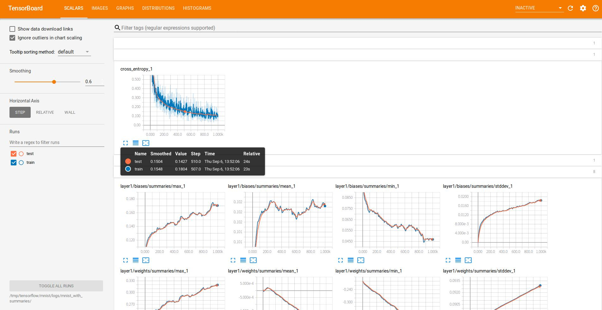
    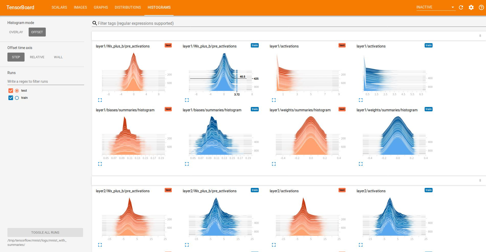
***
