# ___2018 - 09 - 06 Tensorflow Tutorials___
***

# 目录
  <!-- TOC depthFrom:1 depthTo:6 withLinks:1 updateOnSave:1 orderedList:0 -->

  - [___2018 - 09 - 06 Tensorflow Tutorials___](#2018-09-06-tensorflow-tutorials)
  - [目录](#目录)
  - [Basic](#basic)
  	- [链接](#链接)
  	- [TensorFlow Official Models](#tensorflow-official-models)
  	- [Import](#import)
  	- [Google colab](#google-colab)
  	- [Tensorflow 脚本文件典型结构](#tensorflow-脚本文件典型结构)
  - [学习与使用机器学习 Learn and use ML](#学习与使用机器学习-learn-and-use-ml)
  	- [Keras MNIST](#keras-mnist)
  	- [Keras 基本分类模型 Fasion MNIST 数据集](#keras-基本分类模型-fasion-mnist-数据集)
  	- [Keras 文本分类 IMDB 电影评论数据集](#keras-文本分类-imdb-电影评论数据集)
  	- [Keras 回归预测 Boston 房价数据集](#keras-回归预测-boston-房价数据集)
  	- [过拟合与欠拟合](#过拟合与欠拟合)
  	- [Keras 模型保存与加载](#keras-模型保存与加载)
  - [生产环境中的机器学习 ML at production scale](#生产环境中的机器学习-ml-at-production-scale)
  	- [Estimators 使用 LinearClassifier 线性模型用于 Census 数据集](#estimators-使用-linearclassifier-线性模型用于-census-数据集)
  	- [Estimators 使用 Boosted trees 分类 Higgs 数据集](#estimators-使用-boosted-trees-分类-higgs-数据集)
  	- [Estimators DNNClassifier 与 TF Hub module embedding 进行文本分类](#estimators-dnnclassifier-与-tf-hub-module-embedding-进行文本分类)
  	- [Estimators DNNClassifier 下载 Kaggle 的数据集进行文本分类](#estimators-dnnclassifier-下载-kaggle-的数据集进行文本分类)
  	- [Estimators 自定义 CNN 多层卷积神经网络用于 MNIST 数据集](#estimators-自定义-cnn-多层卷积神经网络用于-mnist-数据集)
  - [通用模型 Generative models](#通用模型-generative-models)
  	- [Eager 执行环境与 Keras 定义 DNN 模型分类 Iris 数据集](#eager-执行环境与-keras-定义-dnn-模型分类-iris-数据集)
  	- [Eager 执行环境与 Keras 定义 RNN 模型自动生成文本](#eager-执行环境与-keras-定义-rnn-模型自动生成文本)
  	- [Eager 执行环境与 Keras 定义 RNN seq2seq 模型使用注意力机制进行文本翻译](#eager-执行环境与-keras-定义-rnn-seq2seq-模型使用注意力机制进行文本翻译)
  	- [Eager 执行环境与 Keras 定义 RNN 模型使用注意力机制为图片命名标题](#eager-执行环境与-keras-定义-rnn-模型使用注意力机制为图片命名标题)
  	- [Eager 执行环境与 Keras 定义 DCGAN 模型生成手写数字图片](#eager-执行环境与-keras-定义-dcgan-模型生成手写数字图片)
  	- [Eager 执行环境与 Keras 定义 VAE 模型生成手写数字图片](#eager-执行环境与-keras-定义-vae-模型生成手写数字图片)
  - [图像处理应用](#图像处理应用)
  	- [Pix2Pix 建筑物表面图片上色](#pix2pix-建筑物表面图片上色)
  	- [Neural Style Transfer 转化图片内容与风格](#neural-style-transfer-转化图片内容与风格)
  	- [Image Segmentation 图片分割目标像素与背景像素](#image-segmentation-图片分割目标像素与背景像素)
  	- [GraphDef 加载 InceptionV3 模型用于图片识别 Image Recognition](#graphdef-加载-inceptionv3-模型用于图片识别-image-recognition)

  <!-- /TOC -->
***

# Basic
## 链接
  - [Tensorflow Tutorials](https://www.tensorflow.org/tutorials/)
## TensorFlow Official Models
  - [TensorFlow Official Models](https://github.com/tensorflow/models/tree/master/official#tensorflow-official-models)
  - **依赖 Requirements**
    ```shell
    git clone https://github.com/tensorflow/models.git

    # 添加到 python 环境变量
    export PYTHONPATH="$PYTHONPATH:/path/to/models"
    export PYTHONPATH="$PYTHONPATH:$HOME/workspace/tensorflow_models"

    # 安装依赖
    pip install --user -r official/requirements.txt
    ```
  - **提供的可用模型 Available models**
    - [boosted_trees](boosted_trees): A Gradient Boosted Trees model to classify higgs boson process from HIGGS Data Set.
    - [mnist](mnist): A basic model to classify digits from the MNIST dataset.
    - [resnet](resnet): A deep residual network that can be used to classify both CIFAR-10 and ImageNet's dataset of 1000 classes.
    - [transformer](transformer): A transformer model to translate the WMT English to German dataset.
    - [wide_deep](wide_deep): A model that combines a wide model and deep network to classify census income data.
    - More models to come!
## Import
  ```py
  import tensorflow as tf
  from tensorflow import keras
  import numpy as np
  import pandas as pd
  import matplotlib.pyplot as plt
  import os

  print(tf.__version__) # 1.10.1
  tf.test.is_gpu_available()
  ```
## Google colab
  - [Google Colaboratory](https://colab.research.google.com/notebook#create=true&language=python3)
  - [Cloud driver](https://drive.google.com/drive/my-drive)
  - **分配 GPU**
    - `Edit` -> `Notebook settings` -> `Hardware accelerator` -> `GPU`
    - `Runtime` -> `Change runtime type` -> `Hardware accelerator` -> `GPU`
    ```py
    import tensorflow as tf
    tf.test.is_built_with_cuda()
    tf.test.is_gpu_available()

    from tensorflow.python.client import device_lib
    print(device_lib.list_local_devices())
    ```
  - **管理 Session** 创建 colab 后 -> `Runtime` -> `Manage sessions`
  - **下载训练过程中保存的文件** `打开侧边栏` -> `Files` -> `选择文件下载`
  - **上传本地文件到 colab** 通过 `Browse` 打开本地文件并上传到 colba，`files.upload` 返回一个上传过文件的字典，`key` 是文件名，`value` 是文件内容
    ```py
    from google.colab import files

    uploaded = files.upload()
    for fn in uploaded.keys():
        print('User uploaded file "{name}" with length {length} bytes'.format(name=fn, length=len(uploaded[fn])))
    ```
  - **下载 colab 文件到本地** `files.download` 使用浏览器的下载程序将文件下载到本地
    ```py
    from google.colab import files

    with open('example.txt', 'w') as f:
        f.write('some content')

    files.download('example.txt')
    ```
  - **挂载 Google Drive 到 colab**
    ```py
    from google.colab import drive
    drive.mount('/gdrive')
    # Enter your authorization code:
    # ··········
    # Mounted at /gdrive

    ! ls -lha /gdrive
    # total 4.0K
    # drwx------ 3 root root 4.0K Sep 26 08:53 My Driv

    with open('/gdrive/My Drive/foo.txt', 'w') as f:
        f.write('Hello Google Drive!')
    ```
  - **上传 Kaggle API Token 到 colab** 上传本地的 `~/.kaggle/kaggle.json` 到 colab 的 `~/.kaggle/kaggle.json`
    ```py
    import os

    # Upload the API token.
    def get_kaggle_credentials():
        token_dir = os.path.join(os.path.expanduser("~"),".kaggle")
        token_file = os.path.join(token_dir, "kaggle.json")
        if not os.path.isdir(token_dir):
            os.mkdir(token_dir)
        try:
            with open(token_file,'r') as f:
                pass
        except IOError as no_file:
            try:
                from google.colab import files
            except ImportError:
                raise no_file

            uploaded = files.upload()

            if "kaggle.json" not in uploaded:
                raise ValueError("You need an API key! see: "
                               "https://github.com/Kaggle/kaggle-api#api-credentials")
            with open(token_file, "wb") as f:
                f.write(uploaded["kaggle.json"])
            os.chmod(token_file, 600)

    get_kaggle_credentials()
    # Browse file...
    # kaggle.json(application/json) - 66 bytes, last modified: n/a - 100% done
    # Saving kaggle.json to kaggle.json

    !ls -l ~/.kaggle
    # ---x-wx--T 1 root root 66 Sep 28 05:23 kaggle.json
    ```
## Tensorflow 脚本文件典型结构
  ```py
  def main(_):
      run_inference_on_image(FLAGS....)

  if __name__ == '__main__':
      parser = argparse.ArgumentParser()
      parser.add_argument( ... )
      FLAGS, unparsed = parser.parse_known_args()
      tf.app.run(main=main, argv=[sys.argv[0]] + unparsed)
  ```
***

# 学习与使用机器学习 Learn and use ML
## Keras MNIST
  ```py
  import tensorflow as tf
  mnist = tf.keras.datasets.mnist

  (x_train, y_train), (x_test, y_test) = mnist.load_data()
  x_train, x_test = x_train / 255.0, x_test / 255.0

  model = tf.keras.models.Sequential([
    tf.keras.layers.Flatten(),
    tf.keras.layers.Dense(512, activation=tf.nn.relu),
    tf.keras.layers.Dropout(0.2),
    tf.keras.layers.Dense(10, activation=tf.nn.softmax)
  ])
  model.compile(optimizer='adam',
                loss='sparse_categorical_crossentropy',
                metrics=['accuracy'])

  model.fit(x_train, y_train, epochs=5)
  model.evaluate(x_test, y_test)
  # [0.0712303157694405, 0.9791]

  np.argmax(model.predict(x_test[:1])) # 7
  ```
## Keras 基本分类模型 Fasion MNIST 数据集
  - **Fashion MNIST dataset** 类似 MNIST 的数据集，包含 10 中类别的流行物品图片，每个样本包含一个 `28 * 28` 的图片
    ```py
    fashion_mnist = keras.datasets.fashion_mnist
    (train_images, train_labels), (test_images, test_labels) = fashion_mnist.load_data()
    class_names = ['T-shirt/top', 'Trouser', 'Pullover', 'Dress', 'Coat',
                 'Sandal', 'Shirt', 'Sneaker', 'Bag', 'Ankle boot']

    train_images.shape
    # Out[20]: (60000, 28, 28)

    train_labels.shape
    # Out[21]: (60000,)

    train_images = train_images / 255.0
    test_images = test_images / 255.0

    plt.figure(figsize=(10,10))
    for i in range(25):
        plt.subplot(5,5,i+1)
        plt.xticks([])
        plt.yticks([])
        plt.grid(False)
        plt.imshow(train_images[i], cmap=plt.cm.binary)
        plt.xlabel(class_names[train_labels[i]])
    ```
    
  - **keras 模型训练 / 验证**
    ```py
    model = keras.Sequential([
        keras.layers.Flatten(input_shape=(28, 28)),
        keras.layers.Dense(128, activation=tf.nn.relu),
        keras.layers.Dense(10, activation=tf.nn.softmax)
    ])

    model.compile(optimizer=tf.train.AdamOptimizer(), loss='sparse_categorical_crossentropy', metrics=['accuracy'])
    model.fit(train_images, train_labels, epochs=5)
    # Epoch 1/5
    # 60000/60000 [==============================] - 17s 280us/step - loss: 0.4958 - acc: 0.8248
    # Epoch 2/5
    # 60000/60000 [==============================] - 16s 269us/step - loss: 0.3766 - acc: 0.8640
    # Epoch 3/5
    # 60000/60000 [==============================] - 16s 275us/step - loss: 0.3366 - acc: 0.8748
    # Epoch 4/5
    # 60000/60000 [==============================] - 16s 275us/step - loss: 0.3129 - acc: 0.8851
    # Epoch 5/5
    # 60000/60000 [==============================] - 18s 303us/step - loss: 0.2952 - acc: 0.8914

    test_loss, test_acc = model.evaluate(test_images, test_labels)
    print("Test loss = {}, Test accuracy = {}".format(test_loss, test_acc))
    # Test loss = 0.3613173280715942, Test accuracy = 0.868
    ```
  - **模型预测**
    ```py
    predictions = model.predict(test_images)
    predictions.shape
    # Out[39]: (10000, 10)
    assert np.argmax(predictions[0]) == test_labels[0]
    ```
    ```py
    def plot_image(i, predictions_array, true_label, img):
      predictions_array, true_label, img = predictions_array[i], true_label[i], img[i]
      plt.grid(False)
      plt.xticks([])
      plt.yticks([])

      plt.imshow(img, cmap=plt.cm.binary)

      predicted_label = np.argmax(predictions_array)
      if predicted_label == true_label:
        color = 'blue'
      else:
        color = 'red'

      plt.xlabel("{} {:2.0f}% ({})".format(class_names[predicted_label],
                                    100*np.max(predictions_array),
                                    class_names[true_label]),
                                    color=color)

    def plot_value_array(i, predictions_array, true_label):
      predictions_array, true_label = predictions_array[i], true_label[i]
      plt.grid(False)
      plt.xticks([])
      plt.yticks([])
      thisplot = plt.bar(range(10), predictions_array, color="#777777")
      plt.ylim([0, 1])
      predicted_label = np.argmax(predictions_array)

      thisplot[predicted_label].set_color('red')
      thisplot[true_label].set_color('blue')

    # Plot the first X test images, their predicted label, and the true label
    # Color correct predictions in blue, incorrect predictions in red
    num_rows = 5
    num_cols = 3
    num_images = num_rows*num_cols
    plt.figure(figsize=(2*2*num_cols, 2*num_rows))
    for i in range(num_images):
      plt.subplot(num_rows, 2*num_cols, 2*i+1)
      plot_image(i, predictions, test_labels, test_images)
      plt.subplot(num_rows, 2*num_cols, 2*i+2)
      plot_value_array(i, predictions, test_labels)
    ```
    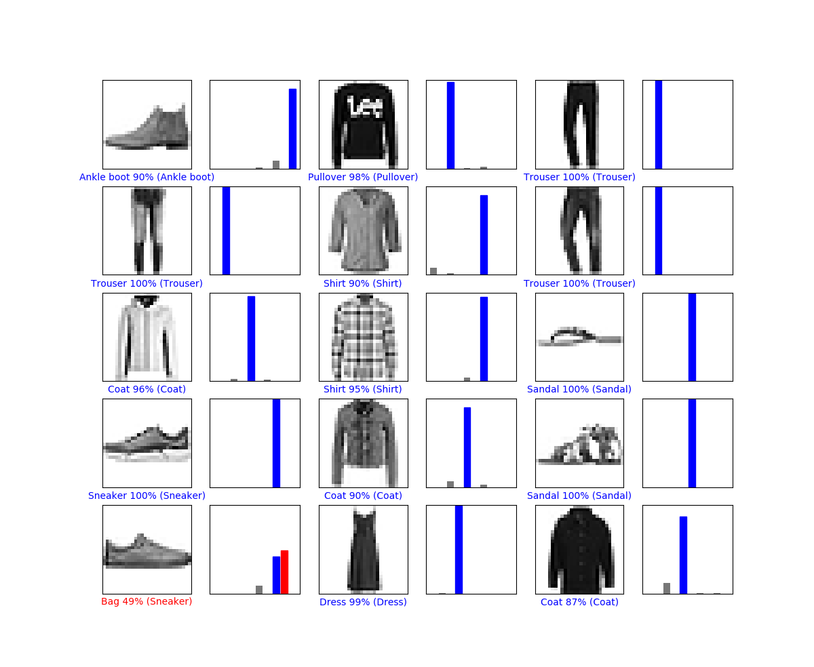
## Keras 文本分类 IMDB 电影评论数据集
  - **pad_sequences** 将序列中的元素长度整理成相同长度
    ```py
    pad_sequences(sequences, maxlen=None, dtype='int32', padding='pre', truncating='pre', value=0.0)
    ```
    - 元素长度 **小于** 指定长度 `maxlen`，使用 `value` 填充
    - 元素长度 **大于** 最大长度 `maxlen`，按照 `padding` 与 `truncating` 指定的方式截取
    - **maxlen 参数** 指定整理后的最大长度，`None` 表示取序列中的最大长度
    - **dtype 参数** 输出元素类型
    - **padding 参数** 填充方式，字符串 `pre` / `post`，指定在结尾还是开头填充
    - **truncating 参数** 截取方式，字符串 `pre` / `post`，指定在结尾还是开头截取
    - **value 参数** Float，填充值
  - **加载 IMDB 电影评论数据集** 包含 50,000 条电影评论，以及是正面评论 positive / 负面评论 negative 的标签，划分成 25,000 条训练数据，25,000 条测试数据
    ```py
    from tensorflow import keras

    imdb = keras.datasets.imdb
    (train_data, train_labels), (test_data, test_labels) = imdb.load_data(num_words=10000)

    print(train_data.shape) # (25000,)
    print(len(train_data[0])) # 218
    train_data_len = np.array([len(ii) for ii in train_data])
    print(train_data_len.max()) # 2494
    print(train_data_len.min()) # 11
    print(train_data_len.argmin())  # 6719
    print(train_data[6719]) # [1, 13, 586, 851, 14, 31, 60, 23, 2863, 2364, 314]
    print(train_labels[:10])  # [1 0 0 1 0 0 1 0 1 0]

    # A dictionary mapping words to an integer index
    word_index = imdb.get_word_index()

    # The first indices are reserved
    word_index = {k:(v+3) for k,v in word_index.items()}
    word_index["<PAD>"] = 0
    word_index["<START>"] = 1
    word_index["<UNK>"] = 2  # unknown
    word_index["<UNUSED>"] = 3

    reverse_word_index = dict([(value, key) for (key, value) in word_index.items()])
    decode_review = lambda text: ' '.join([reverse_word_index.get(ii, '?') for ii in text])

    print(decode_review(train_data[6719]))
    # <START> i wouldn't rent this one even on dollar rental night

    print(np.max([np.max(ii) for ii in train_data])) # 9999

    # use the pad_sequences function to standardize the lengths
    train_data = keras.preprocessing.sequence.pad_sequences(train_data, value=word_index['<PAD>'], padding='post', maxlen=256)
    test_data = keras.preprocessing.sequence.pad_sequences(test_data, value=word_index['<PAD>'], padding='post', maxlen=256)
    print(train_data.shape, test_data.shape)  # (25000, 256) (25000, 256)
    ```
  - **keras 模型训练 / 验证 / 预测**
    - **Embedding layer** 将每个整数编码的单词转化成 embedding vector，输出维度 (batch, sequence, embedding)
    - **GlobalAveragePooling1D layer** 输出一个固定长度的向量，使模型可以处理可变长度的输入
    - **Dense layer 1** 全连接层，包含 16 个隐藏节点
    - **Dense layer 2** 输出层，输出 0-1 的概率值
    ```py
    # input shape is the vocabulary count used for the movie reviews (10,000 words)
    vocab_size = 10000

    model = keras.Sequential()
    model.add(keras.layers.Embedding(vocab_size, 16))
    model.add(keras.layers.GlobalAvgPool1D())
    model.add(keras.layers.Dense(16, activation=tf.nn.relu))
    model.add(keras.layers.Dense(1, activation='sigmoid'))

    model.summary()
    # Layer (type)                 Output Shape              Param #   
    # =================================================================
    # embedding (Embedding)        (None, None, 16)          160000    
    # _________________________________________________________________
    # global_average_pooling1d (Gl (None, 16)                0         
    # _________________________________________________________________
    # dense (Dense)                (None, 16)                272       
    # _________________________________________________________________
    # dense_1 (Dense)              (None, 1)                 17        
    # =================================================================
    # Total params: 160,289
    # Trainable params: 160,289
    # Non-trainable params: 0
    # _________________________________________________________________

    # binary_crossentropy is better for dealing with probabilities
    model.compile(optimizer=tf.train.AdamOptimizer(),
        loss=tf.keras.losses.binary_crossentropy,
        metrics=['accuracy'])

    # Create a validation set
    x_val = train_data[:10000]
    partial_x_train = train_data[10000:]
    y_val = train_labels[:10000]
    partial_y_train = train_labels[10000:]

    # Train the model
    history = model.fit(partial_x_train, partial_y_train,
        epochs=40, batch_size=512,
        validation_data=(x_val, y_val), verbose=1)

    # Evaluate the model
    result = model.evaluate(test_data, test_labels)
    print(result) # [0.3106797323703766, 0.87256]
    ```
  - **准确率与损失的可视化图形** `model.fit` 的返回值包含训练过程中的准确率 / 损失等
    ```py
    print(history.history.keys()) # dict_keys(['val_loss', 'val_acc', 'loss', 'acc'])

    fig = plt.figure()
    fig.add_subplot(2, 1, 1)
    plt.plot(history.history['loss'], label='Training loss')
    plt.plot(history.history['val_loss'], label='Validation loss')
    plt.title('Training and validation loss')
    plt.xlabel('Epochs')
    plt.ylabel('Loss')
    plt.legend()

    fig.add_subplot(2, 1, 2)
    plt.plot(history.history['acc'], label='Training acc')
    plt.plot(history.history['val_acc'], label='Validation acc')
    plt.title('Training and validation accuracy')
    plt.xlabel('Epochs')
    plt.ylabel('Accuracy')
    plt.legend()

    fig.tight_layout()
    ```
    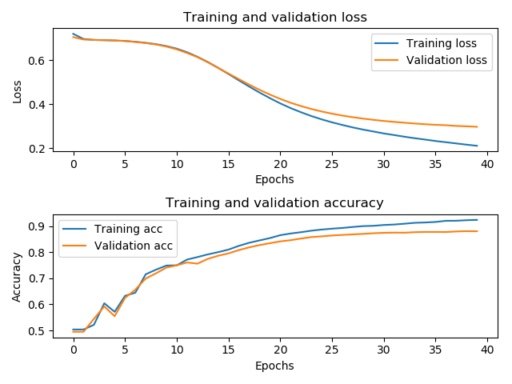
## Keras 回归预测 Boston 房价数据集
  - **EarlyStopping** 在指定的监控数据停止提高时，停止训练，可以防止过拟合
    ```py
    class EarlyStopping(Callback)
      __init__(self, monitor='val_loss', min_delta=0, patience=0, verbose=0, mode='auto', baseline=None)
    ```
    - **monitor 参数** 监控的数据
    - **min_delta 参数** 最小改变的数值
    - **patience 参数** 没有提高的迭代次数
    - **verbose 参数** 冗余模式 verbosity mode
    - **mode 参数** `min` 指标不再下降 / `max` 指标不再上升 / `auto` 自动检测
    - **baseline 参数** 基准值 baseline value
  - **回归问题 regression**
    - 回归问题的预测结果是连续的
    - **MSE** Mean Squared Error 通常用于回归问题的损失函数
    - **MAE** Mean Absolute Error 通常用于回归问题的评估方法 metrics
    - 训练数据量过少时，尽量使用小的神经网络，防止过拟合
  - **加载 Boston 房价数据集** 包含 Boston 1970s 中期 的房价，以及房价可能相关的特征量
    ```py
    boston_housing = keras.datasets.boston_housing
    (train_data, train_labels), (test_data, test_labels) = boston_housing.load_data()

    # Shuffle the training set
    order = np.argsort(np.random.random(train_labels.shape))
    train_data = train_data[order]
    train_labels = train_labels[order]

    print(train_data.shape, test_data.shape)  # (404, 13) (102, 13)
    print(train_data[0])  # [1.23247, 0., 8.14, 0., 0.538, 6.142, 91.7, 3.9769, 4., 307., 21., 396.9, 18.72]
    # The labels are the house prices in thousands of dollars
    print(train_labels[:10])  # [15.2 42.3 50.  21.1 17.7 18.5 11.3 15.6 15.6 14.4]

    column_names = ['CRIM', 'ZN', 'INDUS', 'CHAS', 'NOX', 'RM', 'AGE', 'DIS', 'RAD',
                    'TAX', 'PTRATIO', 'B', 'LSTAT']
    df = DataFrame(train_data, columns=column_names)
    print(df.head())
    #       CRIM    ZN  INDUS  CHAS    NOX     RM    AGE     DIS   RAD    TAX  PTRATIO       B  LSTAT
    # 0  1.23247   0.0   8.14   0.0  0.538  6.142   91.7  3.9769   4.0  307.0     21.0  396.90  18.72
    # 1  0.02177  82.5   2.03   0.0  0.415  7.610   15.7  6.2700   2.0  348.0     14.7  395.38   3.11
    # 2  4.89822   0.0  18.10   0.0  0.631  4.970  100.0  1.3325  24.0  666.0     20.2  375.52   3.26
    # 3  0.03961   0.0   5.19   0.0  0.515  6.037   34.5  5.9853   5.0  224.0     20.2  396.90   8.01
    # 4  3.69311   0.0  18.10   0.0  0.713  6.376   88.4  2.5671  24.0  666.0     20.2  391.43  14.65

    # Normalize features
    mean = train_data.mean(axis=0)
    std = train_data.std(axis=0)
    train_data = (train_data - mean) / std
    test_data = (test_data - mean) / std
    print(train_data[0])
    # [-0.27224633 -0.48361547 -0.43576161 -0.25683275 -0.1652266  -0.1764426
    #   0.81306188  0.1166983  -0.62624905 -0.59517003  1.14850044  0.44807713  0.8252202]
    ```
  - **keras 模型训练 / 验证 / 预测**
    ```py
    def build_model():
        model = keras.Sequential([
            keras.layers.Dense(64, activation='relu', input_shape=(train_data.shape[1], )),
            keras.layers.Dense(64, activation=tf.nn.relu),
            keras.layers.Dense(1)
        ])

        optimizer = tf.train.RMSPropOptimizer(0.001)
        model.compile(loss='mse', optimizer=optimizer, metrics=['mae'])

        return model

    model = build_model()
    model.summary()
    # Layer (type)                 Output Shape              Param #   
    # =================================================================
    # dense_2 (Dense)              (None, 64)                896       
    # _________________________________________________________________
    # dense_3 (Dense)              (None, 64)                4160      
    # _________________________________________________________________
    # dense_4 (Dense)              (None, 1)                 65        
    # =================================================================
    # Total params: 5,121
    # Trainable params: 5,121
    # Non-trainable params: 0
    # _________________________________________________________________

    # Display training progress by printing a single dot for each completed epoch
    class PrintDot(keras.callbacks.Callback):
        def on_epoch_end(self, epoch, logs):
            if epoch % 100 == 0: print('')
            print('.', end='')

    # Automatically stop training when the validation score doesn't improve
    early_stop = keras.callbacks.EarlyStopping(monitor='val_loss', patience=20)

    # Store training stats
    history = model.fit(train_data, train_labels, epochs=500, validation_split=0.2, verbose=0, callbacks=[early_stop, PrintDot()])
    print(history.epoch[-1])  # 148

    [loss, mae] = model.evaluate(test_data, test_labels, verbose=0)
    print("Testing set Mean Abs Error: ${:7.2f}".format(mae * 1000))  # Testing set Mean Abs Error: $2641.25
    ```
  - **准确率与损失的可视化图形**
    ```py
    ''' MAE 损失 '''
    fig = plt.figure()
    plt.plot(history.history['mean_absolute_error'], label='Train loss')
    plt.plot(history.history['val_mean_absolute_error'], label='Val loss')
    plt.legend()
    plt.ylim([0, 5])
    plt.xlabel('Epoch')
    plt.ylabel('Mean Abs Error [1000$]')
    fig.tight_layout()
    ```
    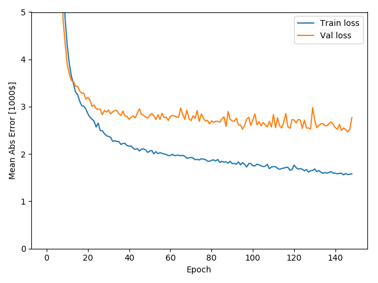
    ```py
    ''' 预测值偏差 '''
    fig = plt.figure()
    fig.add_subplot(2, 1, 1)
    plt.scatter(test_labels, test_predictions)
    plt.xlabel('True Values [1000$]')
    plt.ylabel('Predictions [1000$]')
    plt.xlim(plt.xlim())
    plt.ylim(plt.ylim())
    plt.plot([-100, 100], [-100, 100])

    error = test_predictions - test_labels
    fig.add_subplot(2, 1, 2)
    plt.hist(error, bins=50)
    plt.hist(error, bins=50)
    plt.xlabel("Prediction Error [1000$]")
    plt.ylabel("Count")

    fig.tight_layout()
    ```
    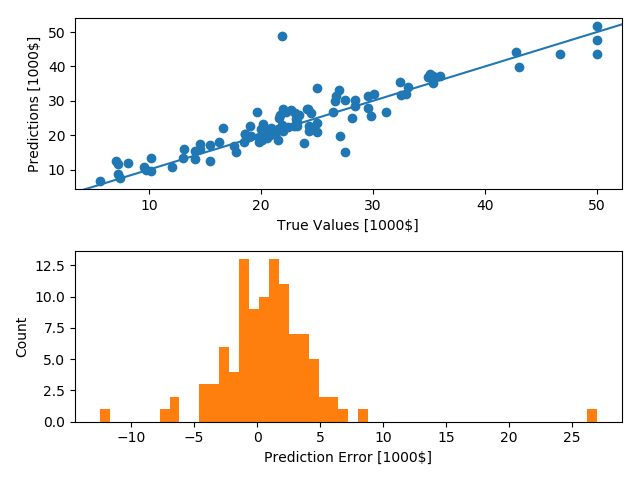
## 过拟合与欠拟合
  - **欠拟合 Underfitting** 模型没有充分学习训练数据集上的数据相关性，在测试数据集上仍有提升空间，通常由于模型太简单 / 过度正则化 / 训练时间不够
  - **过拟合 Overfitting** 模型在训练数据集上获得很高的正确率，但学习的数据相关性不适用于测试数据集，使测试数据集上的正确率降低
  - **防止过拟合**
    - 最好的方法是使用更多的训练数据，模型可以获得更普遍的数据相关性
    - 使用参数正则化 regularization，模型可以学习更主要的数据特征
    - 使用 dropout，随机将某些特征替换为 0
    - 减小模型复杂度，缩减模型层数 / 单层参数的数量，复杂模型通常可以学习训练数据集中更多的数据相关性，但不一定适用于测试数据集
  - **加载 IMDB 电影评论数据集** 将数据转换为 one-hot 向量
    ```py
    NUM_WORDS = 10000

    (train_data, train_labels), (test_data, test_labels) = keras.datasets.imdb.load_data(num_words=NUM_WORDS)
    def multi_hot_sequence(sequence, dimension):
        results = np.zeros((len(sequence), dimension))
        for ii, ww in enumerate(sequence):
            results[ii, ww] = 1.0
        return results

    train_data = multi_hot_sequence(train_data, dimension=NUM_WORDS)
    test_data = multi_hot_sequence(test_data, dimension=NUM_WORDS)

    plt.plot(train_data[0])
    ```
    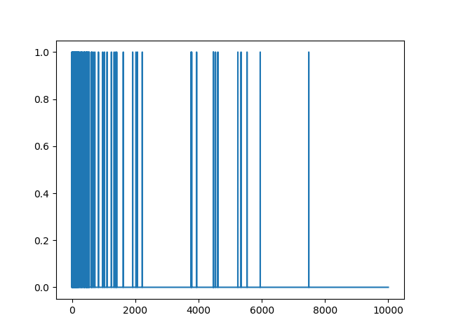
  - **定义 keras 模型** 定义多个模型，复杂模型更容易过拟合
    ```py
    def define_simple_model(hidden_units):
        model = keras.Sequential([
            # `input_shape` is only required here so that `.summary` works.
            keras.layers.Dense(hidden_units, activation=tf.nn.relu, input_shape=(NUM_WORDS, )),
            keras.layers.Dense(hidden_units, activation=tf.nn.relu),
            keras.layers.Dense(1, activation=tf.nn.sigmoid)
        ])

        return model

    def train_model(model):
        model.compile(
                optimizer='adam',
                loss='binary_crossentropy',
                metrics=['accuracy', 'binary_crossentropy'])

        history = model.fit(
                train_data, train_labels,
                epochs=20, batch_size=512,
                validation_data=(test_data, test_labels),
                verbose=2)

        return history

    # Train on a baseline model
    baseline_model = define_simple_model(16)
    baseline_history = train_model(baseline_model)

    # Train on a smaller model
    smaller_history = train_model(define_simple_model(4))

    # Train on a bigger model
    bigger_history = train_model(define_simple_model(512))

    ''' Plot the training and validation loss '''
    def plot_histories(histories, key='binary_crossentropy'):
        fig = plt.figure()
        for name, history in histories:
            val = plt.plot(history.history['val_' + key], '--', label=name.title() + ' Val')
            plt.plot(history.history[key], color=val[0].get_color(), label=name.title() + ' Train')

        plt.xlabel('Epochs')
        plt.ylabel(key.replace('_', ' ').title())
        plt.xlim([0, np.max(history.epoch)])
        plt.legend()
        fig.tight_layout()

    plot_histories([
        ('baseline', baseline_history),
        ('smaller', smaller_history),
        ('bigger', bigger_history)])
    ```
    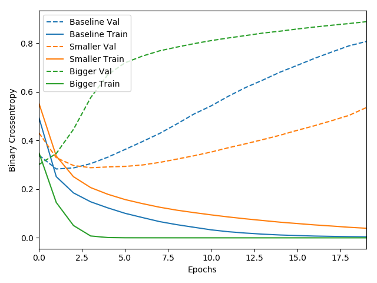

    最大的模型可以更好地拟合训练数据集，但是会有更大的过拟合
  - **添加权重正则化 weight regularization** 在损失函数中添加权重的相关项，使模型选择更小的权重
    - **L1 正则化** 添加的损失与权重的绝对值相关，使用 keras 模型层的 `kernel_regularizer=keras.regularizers.l1()` 参数添加
    - **L2 正则化** 添加的损失与权重的平方值相关，使用 keras 模型层的 `kernel_regularizer=keras.regularizers.l2()` 参数添加
      ```py
      # 添加 l2 损失 0.001 * weight_coefficient_value ** 2
      l2(0.001)
      ```
    ```py
    l2_model = keras.Sequential([
        # `input_shape` is only required here so that `.summary` works.
        keras.layers.Dense(16, kernel_regularizer=keras.regularizers.l2(0.001),
            activation=tf.nn.relu, input_shape=(NUM_WORDS, )),
        keras.layers.Dense(16, kernel_regularizer=keras.regularizers.l2(0.001),
            activation=tf.nn.relu),
        keras.layers.Dense(1, activation=tf.nn.sigmoid)
    ])

    l2_history = train_model(l2_model)

    plot_histories([
        ('baseline', baseline_history),
        ('l2', l2_history)])
    ```
    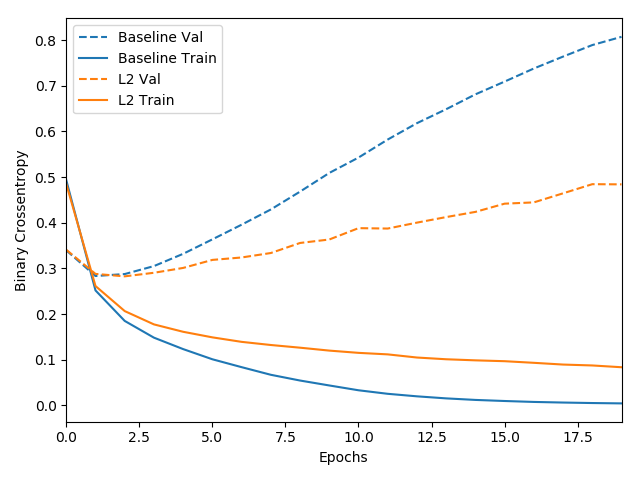
  - **添加 dropout 层** 训练过程中随机丢弃上一层输出中的某些特征，如将 `[0.2, 0.5, 1.3, 0.8, 1.1]` 转化为 `[0, 0.5, 1.3, 0, 1.1]`，通常 `dropout rate` 设置为 **0.2 - 0.5**
    ```py
    dpt_model = keras.Sequential([
        keras.layers.Dense(16, activation='relu', input_shape=(NUM_WORDS, )),
        keras.layers.Dropout(0.5),
        keras.layers.Dense(16, activation='relu'),
        keras.layers.Dropout(0.5),
        keras.layers.Dense(1, activation='sigmoid')
    ])

    dpt_history = train_model(dpt_model)

    dpt_with_l2_model = keras.Sequential([
        # `input_shape` is only required here so that `.summary` works.
        keras.layers.Dense(16, kernel_regularizer=keras.regularizers.l2(0.001),
            activation=tf.nn.relu, input_shape=(NUM_WORDS, )),
        keras.layers.Dropout(0.5),
        keras.layers.Dense(16, kernel_regularizer=keras.regularizers.l2(0.001),
            activation=tf.nn.relu),
        keras.layers.Dropout(0.5),
        keras.layers.Dense(1, activation=tf.nn.sigmoid)
    ])

    dpt_with_l2_history = train_model(dpt_with_l2_model)
    plot_histories([
        ('baseline', baseline_history),
        ('dropout', dpt_history),
        ('dropout with l2', dpt_with_l2_history)])
    ```
    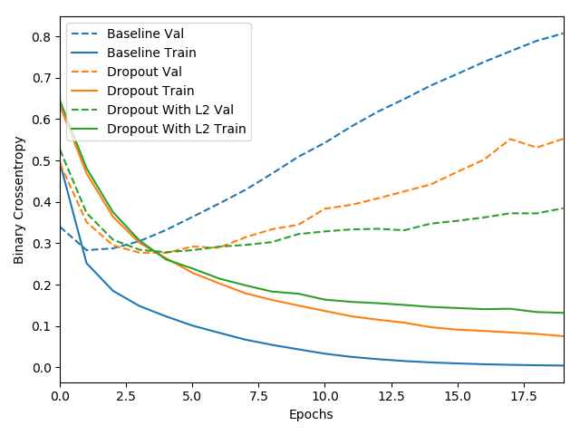
## Keras 模型保存与加载
  - 依赖 `h5py` `pyyaml`
    ```shell
    pip install h5py pyyaml
    ```
  - **keras 定义模型**，使用 MNIST 数据集
    ```py
    (train_images, train_labels), (test_images, test_labels) = keras.datasets.mnist.load_data()
    train_images = train_images[:1000].reshape(-1, 28 * 28) / 255.0
    test_images = test_images[:1000].reshape(-1, 28 * 28) / 255.0
    train_labels = train_labels[:1000]
    test_labels = test_labels[:1000]

    def create_model():
        model = keras.Sequential([
            keras.layers.Dense(512, activation='relu', input_shape=(28 * 28, )),
            keras.layers.Dropout(0.2),
            keras.layers.Dense(10, activation='sigmoid')
        ])

        model.compile(optimizer=keras.optimizers.Adam(),
            loss=keras.losses.sparse_categorical_crossentropy,
            metrics=['accuracy'])

        return model
    ```
  - **Model.save_weights** / **Model.load_weights** 保存 / 加载模型权重
    ```py
    ''' save_weights 保存 '''
    checkpoint_path = './model_checkpoint/cp.ckpt'

    model = create_model()
    model.fit(train_images, train_labels, epochs=10, validation_data=(test_images,test_labels))
    model.save_weights(checkpoint_path)

    ''' load_weights 加载 '''
    model = create_model()
    loss, acc = model.evaluate(test_images, test_labels)
    print("Restored model, accuracy: {:5.2f}%".format(100*acc))
    # Restored model, accuracy: 11.60%

    model.load_weights(checkpoit_path)
    loss, acc = model.evaluate(test_images, test_labels)
    print("Restored model, accuracy: {:5.2f}%".format(100*acc))
    # Restored model, accuracy: 87.00%
    ```
  - **Model.save** / **keras.models.load_model** 保存 / 加载整个模型
    ```py
    # Save entire model to a HDF5 file
    model.save('my_model.h5')

    new_model = keras.models.load_model('my_model.h5')
    loss, acc = new_model.evaluate(test_images, test_labels)
    print("Restored model, accuracy: {:5.2f}%".format(100*acc))
    # Restored model, accuracy: 87.00%
    ```
  - **tf.keras.callbacks.ModelCheckpoint** 回调函数，训练过程中与训练结束后自动保存模型
    ```py
    class ModelCheckpoint(Callback)
    __init__(self, filepath, monitor='val_loss', verbose=0, save_best_only=False, save_weights_only=False, mode='auto', period=1)
    ```
    - **period 参数** 指定每几次迭代保存一次
    ```py
    checkpoint_path = './model_checkpoint/cp.ckpt'
    cp_callback = keras.callbacks.ModelCheckpoint(checkpoint_path, save_weights_only=True, verbose=1)

    model = create_model()
    model.fit(train_images, train_labels, epochs=10,
            validation_data=(test_images,test_labels),
            callbacks=[cp_callback])

    !ls {checkpoint_dir}
    # checkpoint  cp.ckpt.data-00000-of-00001  cp.ckpt.index
    ```
    ```py
    # include the epoch in the file name. (uses `str.format`)
    checkpoint_path = "model_checkpoint_2/cp-{epoch:04d}.ckpt"
    cp_callback = tf.keras.callbacks.ModelCheckpoint(
        checkpoint_path, verbose=1, save_weights_only=True,
        # Save weights, every 5-epochs.
        period=5)

    model = create_model()
    model.fit(train_images, train_labels,
              epochs = 50, callbacks = [cp_callback],
              validation_data = (test_images,test_labels),
              verbose=0)

    ls model_checkpoint_2/ -1t
    # checkpoint
    # cp-0050.ckpt.data-00000-of-00001
    # cp-0050.ckpt.index
    # cp-0045.ckpt.index
    # cp-0045.ckpt.data-00000-of-00001
    # cp-0040.ckpt.data-00000-of-00001
    # cp-0040.ckpt.index
    # cp-0035.ckpt.data-00000-of-00001
    # cp-0035.ckpt.index
    # cp-0030.ckpt.data-00000-of-00001
    # cp-0030.ckpt.index

    import pathlib

    # 查找目录下 .index 结尾的文件
    checkpoints = pathlib.Path(os.path.dirname(checkpoint_path)).glob('*.index')
    # 按照修改时间排序
    checkpoints = sorted(checkpoints, key=lambda cp: cp.stat().st_mtime)
    # 去掉后缀 .index
    checkpoints = [cp.with_suffix('') for cp in checkpoints]
    print([str(ii) for ii in checkpoints])
    # ['model_checkpoint_2/cp-0030.ckpt', 'model_checkpoint_2/cp-0035.ckpt',
    # 'model_checkpoint_2/cp-0040.ckpt', 'model_checkpoint_2/cp-0045.ckpt',
    # 'model_checkpoint_2/cp-0050.ckpt']

    # 取最新的
    latest = str(checkpoints[-1])
    model = create_model()
    model.load_weights(latest)
    loss, acc = model.evaluate(test_images, test_labels)
    print("Restored model, accuracy: {:5.2f}%".format(100*acc))
    Restored model, accuracy: 86.40%
    ```
***

# 生产环境中的机器学习 ML at production scale
## Estimators 使用 LinearClassifier 线性模型用于 Census 数据集
  - **Census 收入数据集** 包含了 1994 - 1995 个人的年龄 / 教育水平 / 婚姻状况 / 职业等信息，预测年收入是否达到 50,000 美元
  - [Predicting Income with the Census Income Dataset](https://github.com/tensorflow/models/tree/master/official/wide_deep)
    ```py
    tf.enable_eager_execution()

    ! git clone --depth 1 https://github.com/tensorflow/models
    ! mv models tensorflow_models

    models_path = os.path.join(os.getcwd(), 'tensorflow_models')
    sys.path.append(models_path)
    from official.wide_deep import census_dataset
    from official.wide_deep import census_main

    census_dataset.download('datasets/census_data')

    cd tensorflow_models/
    ! python -m official.wide_deep.census_main --model_type=wide --train_epochs=2 --dd '../datasets/census_data/'
    cd -
    ```
  - **读取 Census 数据集** 数据中包含 离散的类别列 categorical column / 连续数字列 continuous numeric column 等
    ```py
    tf.enable_eager_execution()

    train_file = "datasets/census_data/adult.data"
    test_file = "datasets/census_data/adult.test"

    column_names = ['age', 'workclass', 'fnlwgt', 'education', 'education_num',
            'marital_status', 'occupation','relationship', 'race', 'gender',
            'capital_gain', 'capital_loss', 'hours_per_week', 'native_country',
            'income_bracket']

    train_df = pd.read_csv(train_file, header = None, names = column_names)
    test_df = pd.read_csv(test_file, header = None, names = column_names)

    train_df.head()
    # Out[18]:
    #    age         workclass  education         occupation  ...   race  gender native_country income_bracket
    # 0   39         State-gov  Bachelors       Adm-clerical  ...  White    Male  United-States          <=50K
    # 1   50  Self-emp-not-inc  Bachelors    Exec-managerial  ...  White    Male  United-States          <=50K
    # 2   38           Private    HS-grad  Handlers-cleaners  ...  White    Male  United-States          <=50K
    # 3   53           Private       11th  Handlers-cleaners  ...  Black    Male  United-States          <=50K
    # 4   28           Private  Bachelors     Prof-specialty  ...  Black  Female           Cuba          <=50K

    # [5 rows x 15 columns]
    ```
  - **使用自定义函数定义 input function** 数据转化为 Tensor，输入功能 `input_fn`，用于向 Estimators 输入数据，函数要求没有参数，返回值中包含最终的特征 / 目标值
    ```py
    ''' 使用自定义函数 '''
    print(train_df['income_bracket'].unique())
    # ['<=50K' '>50K']

    def easy_input_function(df, num_epochs, shuffle, batch_size):
        label = df['income_bracket']
        label = np.equal(label, '>50K')
        ds = tf.data.Dataset.from_tensor_slices((df.to_dict('series'), label))
        if shuffle: ds = ds.shuffle(10000)
        ds = ds.batch(batch_size).repeat(num_epochs)

        return ds

    ds = easy_input_function(train_df, num_epochs=5, shuffle=True, batch_size=10)
    feature_batch, label_batch = list(ds.take(1))[0]

    import functools

    # 不能使用 train_inpf = lambda : ds
    train_inpf = lambda: easy_input_function(train_df, num_epochs=5, shuffle=True, batch_size=64)
    test_inpf = functools.partial(easy_input_function, test_df, num_epochs=1, shuffle=False, batch_size=64)
    ```
  - **使用 pandas_input_fn / numpy_input_fn 定义 input function**
    ```py
    ''' 使用 pandas_input_fn / numpy_input_fn '''
    def get_input_fn(df, num_epochs, shuffle, batch_size):
        xx, yy = df, df.pop('income_bracket')
        yy = np.equal(yy, '>50K')
        return tf.estimator.inputs.pandas_input_fn(x=xx, y=yy, batch_size=batch_size, shuffle=shuffle, num_epochs=num_epochs)

    train_inpf = get_input_fn(train_df, num_epochs=5, shuffle=True, batch_size=64)
    test_inpf = get_input_fn(test_df, num_epochs=1, shuffle=False, batch_size=64)

    # 定义单独使用 'age' 列的 input function
    train_features, train_labels = train_df, train_df.pop('income_bracket')
    train_labels = train_labels == '>50K'
    train_inpf = tf.estimator.inputs.numpy_input_fn(x={'age': train_features['age'].values}, y=train_labels.values, batch_size=64, shuffle=True, num_epochs=5)
    train_inpf = tf.estimator.inputs.pandas_input_fn(x=train_features[['age']], y=train_labels, batch_size=64, shuffle=True, num_epochs=5)
    ```
  - **tf.feature_column.numeric_column** 定义数字特征列，`feature columns` 用于定义 Estimators 模型结构，描述模型如何读取每一个特征列
    ```py
    import tensorflow.feature_column as fc

    ''' 数字列 Numeric Column '''
    age = fc.numeric_column('age')
    print(fc.input_layer(feature_batch, [age]).numpy())
    # [[25.], [61.], [51.], [24.], [42.], [30.], [63.], [34.], [34.], [25.]]

    classifier = tf.estimator.LinearClassifier(feature_columns=[age])
    classifier.train(train_inpf)
    result = classifier.evaluate(test_inpf)
    print({ii: result[ii] for ii in ['accuracy', 'loss', 'precision', 'global_step']})
    # {'accuracy': 0.7486641, 'loss': 33.442234, 'precision': 0.16935484, 'global_step': 2544}
    ```
  - **定义其他的数字特征列**
    ```py
    print(train_df.dtypes[train_df.dtypes == np.int64].index.tolist())
    # ['age', 'fnlwgt', 'education_num', 'capital_gain', 'capital_loss', 'hours_per_week']

    education_num = fc.numeric_column('education_num')
    capital_gain = fc.numeric_column('capital_gain')
    capital_loss = fc.numeric_column('capital_loss')
    hours_per_week = fc.numeric_column('hours_per_week')

    my_numeric_columns = [age, education_num, capital_gain, capital_loss, hours_per_week]
    print(fc.input_layer(feature_batch, my_numeric_columns).numpy()[0])
    # [53.  0.  0.  9. 40.]

    classifier = tf.estimator.LinearClassifier(feature_columns=my_numeric_columns)
    classifier.train(train_inpf)
    result = classifier.evaluate(test_inpf)
    print({ii: result[ii] for ii in ['accuracy', 'loss', 'precision', 'global_step']})
    # {'accuracy': 0.78250724, 'loss': 133.76312, 'precision': 0.61509436, 'global_step': 2544}
    ```
  - **tf.feature_column.categorical_column_with_vocabulary_list** 定义离散类别特征列，使用单词列表
    ```py
    ''' 离散类别列 Categorical Column '''
    print(train_df['relationship'].unique())
    # ['Not-in-family' 'Husband' 'Wife' 'Own-child' 'Unmarried' 'Other-relative']

    relationship = fc.categorical_column_with_vocabulary_list(
            key='relationship',
            vocabulary_list=train_df['relationship'].unique())
    # fc.input_layer 需要使用 fc.indicator_column 将离散特征列转化为 one-hot 特征列，在用于 input_fn 时不需要转化
    print(fc.input_layer(feature_batch, [age, fc.indicator_column(relationship)]).numpy()[0])
    # [53.  0.  1.  0.  0.  0.  0.]
    ```
  - **tf.feature_column.categorical_column_with_hash_bucket** 定义离散类别特征列，使用类别哈希值，哈希值的重复是不可避免的，在类别不可知时使用
    ```py
    print(train_df['occupation'].unique().shape[0])
    # 15

    occupation = fc.categorical_column_with_hash_bucket('occupation', hash_bucket_size=40)
    occupation_result = fc.input_layer(feature_batch, [fc.indicator_column(occupation)])
    print(occupation_result.numpy().shape)
    # (10, 40)
    print(tf.argmax(occupation_result, axis=1).numpy())
    # [26 31  7 31 16 31 16 20 19 16]
    print([ii.decode() for ii in feature_batch['occupation'].numpy()])
    # ['Craft-repair', 'Sales', 'Other-service', 'Sales', 'Adm-clerical', 'Sales',
    #  'Farming-fishing', 'Transport-moving', 'Prof-specialty', 'Adm-clerical']
    ```
  - **定义其他的离散类别特征列**
    ```py
    def get_categorical_columns(df, cate_column_names):
        feature_columns = []
        for cc in cate_column_names:
            tt = fc.categorical_column_with_vocabulary_list(key=cc, vocabulary_list=df[cc].unique())
            feature_columns.append(tt)
        return feature_columns

    cate_column_names = ['workclass', 'education', 'marital_status', 'relationship']
    my_categorical_columns = get_categorical_columns(train_df, cate_column_names)
    print(fc.input_layer(feature_batch, [fc.indicator_column(cc) for cc in my_categorical_columns]).numpy()[0])
    # [0. 1. 0. 0. 0. 0. 0. 0. 0. 0. 0. 0. 0. 0. 0. 0. 0. 1. 0. 0. 0. 0. 0. 0.
    #  0. 0. 0. 0. 0. 1. 0. 0. 0. 0. 0. 0. 0. 0. 0. 1. 0. 0. 0. 0. 0. 0. 1. 0.
    #  0. 0. 0. 0. 0.]

    classifier = tf.estimator.LinearClassifier(feature_columns=my_numeric_columns + my_categorical_columns)
    classifier.train(train_inpf)
    result = classifier.evaluate(test_inpf)
    print({ii: result[ii] for ii in ['accuracy', 'loss', 'precision', 'global_step']})
    # {'accuracy': 0.8286346, 'loss': 32.47456, 'precision': 0.6233069, 'global_step': 2544}
    ```
  - **tf.feature_column.bucketized_column** 定义分桶列，将数值范围划分成不同的类别，每一个作为一个 bucket
    - 对于年龄数据，与收入的关系是非线性的，如在某个年龄段收入增长较快，在退休以后收入开始减少，可以将年龄数据分装成不同的 bucket
    ```py
    # source_column 使用的是其他的 feature_column 数据
    age_buckets = fc.bucketized_column(source_column=age, boundaries=[18, 25, 30, 35, 40, 45, 50, 55, 60, 65])
    print(fc.input_layer(feature_batch, [age, age_buckets]).numpy()[:5])
    # [[53.  0.  0.  0.  0.  0.  0.  0.  1.  0.  0.  0.]
    #  [45.  0.  0.  0.  0.  0.  0.  1.  0.  0.  0.  0.]
    #  [50.  0.  0.  0.  0.  0.  0.  0.  1.  0.  0.  0.]
    #  [25.  0.  0.  1.  0.  0.  0.  0.  0.  0.  0.  0.]
    #  [28.  0.  0.  1.  0.  0.  0.  0.  0.  0.  0.  0.]]
    ```
  - **tf.feature_column.crossed_column** 把多个特征合并成为一个特征，通常称为 **feature crosses**
    - 对于 education 与 occupation 数据，教育水平对收入的影响，在不同职业下是不同的，因此可以将这两个特征组合成一个特征，使模型学习不同组合下对收入的影响
    ```py
    print(train_df.education.unique().shape[0] * train_df.occupation.unique().shape[0])
    # 240
    education_x_occupation = fc.crossed_column(keys=['education', 'occupation'], hash_bucket_size=500)

    # Create another crossed feature combining 'age' 'education' 'occupation'
    age_buckets_x_education_x_occupation = tf.feature_column.crossed_column([age_buckets, 'education', 'occupation'], hash_bucket_size=1000)
    ```
  - **定义线性模型 LinearClassifier 训练评估预测 train / evaluate / predict**
    ```py
    ''' 训练 '''
    import tempfile
    print(tempfile.mkdtemp())
    # /tmp/tmpzwj_y6bg

    wide_feature_columns = my_categorical_columns + [occupation, age_buckets, education_x_occupation, age_buckets_x_education_x_occupation]
    model = tf.estimator.LinearClassifier(
            model_dir=tempfile.mkdtemp(),
            feature_columns=wide_feature_columns,
            optimizer=tf.train.FtrlOptimizer(learning_rate=0.1)
    )

    train_inpf = tf.estimator.inputs.pandas_input_fn(x=train_features, y=train_labels, batch_size=64, shuffle=True, num_epochs=40)
    train_inpf = lambda: easy_input_function(train_df, num_epochs=40, shuffle=True, batch_size=64)

    model.train(train_inpf)
    # INFO:tensorflow:Loss for final step: 14.044264.

    ''' 评估 '''
    result = model.evaluate(test_inpf)

    for key,value in sorted(result.items()):
        print('%s: %0.2f' % (key, value))
    # accuracy: 0.84
    # accuracy_baseline: 0.76
    # auc: 0.88
    # auc_precision_recall: 0.69
    # average_loss: 0.35
    # global_step: 20351.00
    # label/mean: 0.24
    # loss: 22.64
    # precision: 0.69
    # prediction/mean: 0.24
    # recall: 0.56

    ''' 预测 '''
    test_df = pd.read_csv(test_file, header = None, names = column_names)
    sample_size = 40
    predict_inpf = tf.estimator.inputs.pandas_input_fn(test_df[:sample_size], num_epochs=1, shuffle=False, batch_size=10)
    pred_iter = model.predict(input_fn=predict_inpf)
    pred_result = np.array([ ii['class_ids'][0] for ii in pred_iter ])
    true_result = (test_df.income_bracket[:sample_size] == '>50K').values.astype(np.int64)
    print((true_result == pred_result).sum())
    # 33
    print((true_result == pred_result).sum() / sample_size)
    # 0.825
    ```
  - **添加正则化损失防止过拟合**
    ```py
    model_l1 = tf.estimator.LinearClassifier(
            feature_columns=wide_feature_columns,
            optimizer=tf.train.FtrlOptimizer(
              learning_rate=0.1,
              l1_regularization_strength=10.0,
              l2_regularization_strength=0.0))

    model_l1.train(train_inpf)
    result = model_l1.evaluate(test_inpf)
    print({ii: result[ii] for ii in ['accuracy', 'loss', 'precision', 'global_step']})
    # {'accuracy': 0.83594376, 'loss': 22.464794, 'precision': 0.685624, 'global_step': 20351}

    model_l2 = tf.estimator.LinearClassifier(
            feature_columns=wide_feature_columns,
            optimizer=tf.train.FtrlOptimizer(
              learning_rate=0.1,
              l1_regularization_strength=0.0,
              l2_regularization_strength=10.0))

    model_l2.train(train_inpf)
    result = model_l2.evaluate(test_inpf)
    print({ii: result[ii] for ii in ['accuracy', 'loss', 'precision', 'global_step']})
    # {'accuracy': 0.8363123, 'loss': 22.469425, 'precision': 0.69253343, 'global_step': 20351}
    ```
    添加正则化对结果提升不大，可以通过 `model.get_variable_names` 与 `model.get_variable_value` 查看模型参数
    ```py
    def get_flat_weights(model):
        weight_names = [nn for nn in model.get_variable_names() if "linear_model" in nn and "Ftrl" not in nn]
        weight_values = [model.get_variable_value(name) for name in weight_names]
        weights_flat = np.concatenate([item.flatten() for item in weight_values], axis=0)

        return weights_flat

    weights_flat = get_flat_weights(model)
    weights_flat_l1 = get_flat_weights(model_l1)
    weights_flat_l2 = get_flat_weights(model_l2)

    # There are many more hash bins than categories in some columns, mask zero values
    print(weights_flat.shape)
    # (1590,)
    weight_mask = weights_flat != 0
    weights_base = weights_flat[weight_mask]
    print(weights_base.shape)
    # (1037,)

    weights_l1 = weights_flat_l1[weight_mask]
    weights_l2 = weights_flat_l2[weight_mask]

    # Now plot the distributions
    fig = plt.figure()
    weights = zip(['Base Model', 'L1 Regularization', 'L2 Regularization'], [weights_base, weights_l1, weights_l2])
    for ii, (nn, ww) in enumerate(weights):
        fig.add_subplot(3, 1, ii + 1)
        plt.hist(ww, bins=np.linspace(-3, 3, 30))
        plt.title(nn)
        plt.ylim([0, 500])
    fig.tight_layout()
    ```
    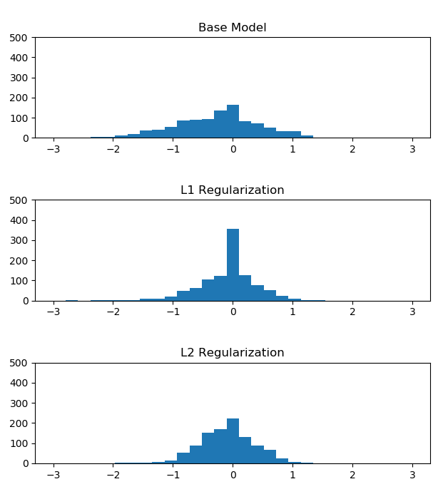

    两种正则化方式都将参数的分布向 0 压缩了，L2 正则化更好地限制了偏离很大的分布，L1 正则化产生了更多的 0 值
  - **tf.estimator.DNNClassifier 定义 DNN 模型**
    ```py
    deep_feature_columns = my_numeric_columns + [fc.indicator_column(cc) for cc in my_categorical_columns] + [fc.embedding_column(occupation, dimension=8)]
    hidden_units = [100, 75, 50, 25]
    model = tf.estimator.DNNClassifier(
            model_dir=tempfile.mkdtemp(),
            feature_columns=deep_feature_columns,
            hidden_units=hidden_units)

    model.train(train_inpf)
    result = model.evaluate(test_inpf)
    print({ii: result[ii] for ii in ['accuracy', 'loss', 'precision', 'global_step']})
    # {'accuracy': 0.850562, 'loss': 20.83845, 'precision': 0.728863, 'global_step': 20351}
    ```
  - **tf.estimator.DNNLinearCombinedClassifier 定义 Linear 与 DNN 结合的模型**
    ```py
    model = tf.estimator.DNNLinearCombinedClassifier(
            model_dir=tempfile.mkdtemp(),
            linear_feature_columns=wide_feature_columns,
            dnn_feature_columns=deep_feature_columns,
            dnn_hidden_units=hidden_units)

    model.train(train_inpf)
    result = model.evaluate(test_inpf)
    print({ii: result[ii] for ii in ['accuracy', 'loss', 'precision', 'global_step']})
    # {'accuracy': 0.8543087, 'loss': 20.270975, 'precision': 0.738203, 'global_step': 20351}
    ```
## Estimators 使用 Boosted trees 分类 Higgs 数据集
  - [Classifying Higgs boson processes in the HIGGS Data Set](https://github.com/tensorflow/models/tree/master/official/boosted_trees)
  - [train_higgs_test.py using tf.test.TestCase](https://github.com/tensorflow/models/blob/master/official/boosted_trees/train_higgs_test.py)
  - **Boosted Tree 算法**
    - 通过不断添加一棵新的树作为 **弱分类器**，拟合上次预测的残差
    - 每次添加树的节点，挑选一个最佳的特征分裂点，进行特征分裂
    - 训练后得到的模型是多棵树，每棵树有若干叶子节点，每个叶子节点对一个分数
    - 预测新样本时，根据这个样本的特征，在每棵树上会落到对应一个叶子节点，将得到的分数加起来作为预测值
  - Higgs boson processes 希格斯玻色子过程
  - **tf.contrib.estimator.boosted_trees_classifier_train_in_memory** Estimator 封装的 boosted tree 分类器，使用类似 `np.array` 的完全可以加载到内存的数据集
    ```py
    boosted_trees_classifier_train_in_memory(
        train_input_fn, feature_columns, model_dir=None, n_classes=<object object at 0x7fbf2a72c260>,
        weight_column=None, label_vocabulary=None, n_trees=100, max_depth=6, learning_rate=0.1,
        l1_regularization=0.0, l2_regularization=0.0, tree_complexity=0.0,
        min_node_weight=0.0, config=None, train_hooks=None, center_bias=False)
    ```
    ```python
    bucketized_feature_1 = bucketized_column(numeric_column('feature_1'), BUCKET_BOUNDARIES_1)
    bucketized_feature_2 = bucketized_column(numeric_column('feature_2'), BUCKET_BOUNDARIES_2)

    def train_input_fn():
        dataset = create-dataset-from-training-data
        # This is tf.data.Dataset of a tuple of feature dict and label.
        #   e.g. Dataset.zip((Dataset.from_tensors({'f1': f1_array, ...}),
        #                     Dataset.from_tensors(label_array)))
        # The returned Dataset shouldn't be batched.
        # If Dataset repeats, only the first repetition would be used for training.
        return dataset

    classifier = boosted_trees_classifier_train_in_memory(
        train_input_fn,
        feature_columns=[bucketized_feature_1, bucketized_feature_2],
        n_trees=100,
        ... <some other params>
    )

    def input_fn_eval():
        ...
        return dataset

    metrics = classifier.evaluate(input_fn=input_fn_eval, steps=10)
    ```
  - **下载希格斯玻色子 HIGGS 数据集**
    - [UCI Machine Learning Repository: HIGGS Data Set](https://archive.ics.uci.edu/ml/datasets/HIGGS)
    - 包含 11,000,000 个样本，每个样本 28 个特征，训练模型区分 **产生希格斯玻色子的信号过程** 与 **不产生希格斯玻色子的背景过程**
    - 训练使用 **Gradient Boosted Trees** 算法作为分类器
    ```py
    import gzip

    URL_ROOT = "https://archive.ics.uci.edu/ml/machine-learning-databases/00280"
    INPUT_FILE = "HIGGS.csv.gz"
    NPZ_FILE = "HIGGS.csv.gz.npz"  # numpy compressed file to contain "data" array.

    def download_higgs_data_and_save_npz(data_dir):
        """Download higgs data and store as a numpy compressed file."""
        input_url = os.path.join(URL_ROOT, INPUT_FILE)
        np_filename = os.path.join(data_dir, NPZ_FILE)
        if tf.gfile.Exists(np_filename):
            print('Data already downloaded: {}'.format(np_filename))
            return

        tf.gfile.MkDir(data_dir)
        try:
            # 2.8 GB to download.
            temp_filename, _ = urllib.request.urlretrieve(input_url)
            # Reading and parsing 11 million csv lines takes 2~3 minutes.
            with gzip.open(temp_filename, 'rb') as csv_file:
                data = pd.read_csv(
                    csv_file, dtype=np.fload32,
                    name=['c%02d' % ii for ii in range(29)] # label + 28 features.
                ).as_matrix()
        finally:
            tf.gfile.Remove(temp_filename)

        # Writing to temporary location then copy to the data_dir (0.8 GB).
        f = tempfile.NamedTemporaryFile()
        np.savez_compressed(f, data=data)
        tf.gfile.Copy(f.name, np_filename)
        print('Data saved to: {}'.format(np_filename))

    data_dir = os.path.expanduser('~/.keras/datasets')
    download_higgs_data_and_save_npz(data_dir)
    ```
  - **定义训练 / 验证数据集**
    - 训练使用数据集的前 1,000,000 个样本
    - 验证使用数据集的后 1,000,000 个样本
    ```py
    train_start = 0
    train_count = 1000000
    eval_start = 10000000
    eval_count = 1000000

    def read_higgs_data(data_dir, train_start, train_count, eval_start, eval_count):
        npz_filename = os.path.join(data_dir, NPZ_FILE)
        # gfile allows numpy to read data from network data sources as well.
        with tf.gfile.Open(npz_filename, "rb") as npz_file:
            with np.load(npz_file) as npz:
                data = npz["data"]
        return (data[train_start:train_start+train_count], data[eval_start:eval_start+eval_count])

    train_data, eval_data = read_higgs_data(data_dir, train_start, train_count, eval_start, eval_count)
    ```
  - **定义训练 input function 与 feature columns**
    - `boosted_trees_classifier_train_in_memory` 使用整个数据集作为一个 batch
    - `Dataset.from_tensors` 将 numpy arrays 转化为结构化的 tensors
    - `Dataset.zip` 组合特征与标签
    - 函数输入特征 `features_np` 维度为 `[batch_size, num_features]`，标签 `label_np` 维度为 `batch_size, 1]`
    - 返回的 `input_fn` 包含字典格式的特征以及标签组成的 `tf.data.Dataset`
    - 返回的 `feature_columns` 是 `tf.feature_column.BucketizedColumn` 的列表
    ```py
    # This showcases how to make input_fn when the input data is available in the form of numpy arrays.
    def make_inputs_from_np_arrays(features_np, label_np):
        num_features = features_np.shape[1]
        features_np_list = np.split(features_np, num_features, axis=1)
        # 1-based feature names.
        feature_names = ["feature_%02d" % (i + 1) for i in range(num_features)]

        # Create source feature_columns and bucketized_columns.
        def get_bucket_boundaries(feature):
            """Returns bucket boundaries for feature by percentiles."""
            return np.unique(np.percentile(feature, range(0, 100))).tolist()

        source_columns = [
            tf.feature_column.numeric_column(
                feature_name, dtype=tf.float32,
                # Although higgs data have no missing values, in general, default
                # could be set as 0 or some reasonable value for missing values.
                default_value=0.0)
            for feature_name in feature_names
        ]
        bucketized_columns = [
            tf.feature_column.bucketized_column(source_columns[i], boundaries=get_bucket_boundaries(features_np_list[i]))
            for i in range(num_features)
        ]

        # Make an input_fn that extracts source features.
        def input_fn():
            """Returns features as a dictionary of numpy arrays, and a label."""
            features = {feature_name: tf.constant(features_np_list[i]) for i, feature_name in enumerate(feature_names)}
            return tf.data.Dataset.zip((tf.data.Dataset.from_tensors(features), tf.data.Dataset.from_tensors(label_np)))

        return input_fn, feature_names, bucketized_columns

    # Data consists of one label column followed by 28 feature columns.
    train_input_fn, feature_names, feature_columns = make_inputs_from_np_arrays(
            features_np=train_data[:, 1:], label_np=train_data[:, 0:1])
    ```
  - **定义验证 input function**
    ```py
    def make_eval_inputs_from_np_arrays(features_np, label_np):
        """Makes eval input as streaming batches."""
        num_features = features_np.shape[1]
        features_np_list = np.split(features_np, num_features, axis=1)
        # 1-based feature names.
        feature_names = ["feature_%02d" % (i + 1) for i in range(num_features)]

        def input_fn():
            features = {feature_name: tf.constant(features_np_list[i]) for i, feature_name in enumerate(feature_names)}
            return tf.data.Dataset.zip((
                        tf.data.Dataset.from_tensor_slices(features),
                        tf.data.Dataset.from_tensor_slices(label_np),)).batch(1000)

        return input_fn

    eval_input_fn = make_eval_inputs_from_np_arrays(
            features_np=eval_data[:, 1:], label_np=eval_data[:, 0:1])
    ```
  - **模型定义与训练验证**
    ```py
    n_trees = 100
    max_depth = 6
    learning_rate = 0.1

    # Though BoostedTreesClassifier is under tf.estimator, faster in-memory
    # training is yet provided as a contrib library.
    classifier = tf.contrib.estimator.boosted_trees_classifier_train_in_memory(
        train_input_fn,
        feature_columns,
        model_dir='/tmp/higgs_model',
        n_trees=n_trees,
        max_depth=max_depth,
        learning_rate=learning_rate)
    ```
  - **模型导出**
    ```py
    def make_csv_serving_input_receiver_fn(column_names, column_defaults):
        """Returns serving_input_receiver_fn for csv.
        The input arguments are relevant to `tf.decode_csv()`.
        Args:
          column_names: a list of column names in the order within input csv.
          column_defaults: a list of default values with the same size of
              column_names. Each entity must be either a list of one scalar, or an
              empty list to denote the corresponding column is required.
              e.g. [[""], [2.5], []] indicates the third column is required while
                  the first column must be string and the second must be float/double.
        Returns:
          a serving_input_receiver_fn that handles csv for serving.
        """
        def serving_input_receiver_fn():
            csv = tf.placeholder(dtype=tf.string, shape=[None], name="csv")
            features = dict(zip(column_names, tf.decode_csv(csv, column_defaults)))
            receiver_tensors = {"inputs": csv}
            return tf.estimator.export.ServingInputReceiver(features, receiver_tensors)

        return serving_input_receiver_fn

    # Evaluation.
    eval_results = classifier.evaluate(eval_input_fn)

    # Exporting the savedmodel with csv parsing.
    classifier.export_savedmodel(
          '/tmp/higgs_boosted_trees_saved_model',
          make_csv_serving_input_receiver_fn(
              column_names=feature_names,
              # columns are all floats.
              column_defaults=[[0.0]] * len(feature_names)))
    ```
## Estimators DNNClassifier 与 TF Hub module embedding 进行文本分类
  - **[TensorFlow Hub](https://www.tensorflow.org/hub/)**
    - Google 提供的机器学习分享平台，将 TensorFlow 的训练模型发布成模组
    - 方便再次使用或是共享机器学习中可重用的部分，包括 TensorFlow_Graph / 权重 / 外部档案等
    - 模型第一次下载需要较长时间，下载完成后再次使用不需要重复下载
    - 默认保存位置 `/tmp/tfhub_modules/`，可以通过环境变量 `TFHUB_CACHE_DIR` 指定自定义位置
    ```sh
    pip install tensorflow-hub

    # nnlm-en-dim128 module, about 484M
    python -c 'import tensorflow_hub as hub; hub.Module("https://tfhub.dev/google/nnlm-en-dim128/1")'
    # random-nnlm-en-dim128, about 484M
    python -c 'import tensorflow_hub as hub; hub.Module("https://tfhub.dev/google/random-nnlm-en-dim128/1")'
    # universal-sentence-encoder-large module, about 811M
    python -c 'import tensorflow_hub as hub; hub.Module("https://tfhub.dev/google/universal-sentence-encoder-large/3")'

    # Default saving path
    du -hd1 /tmp/tfhub_modules/

    # Change modules saving path by environment argument
    export TFHUB_CACHE_DIR="$HOME/workspace/module_cache/"
    ```
    **模块测试**
    ```py
    # Try with nnlm-en-dim128
    import tensorflow_hub as hub

    embed_nnlm = hub.Module("https://tfhub.dev/google/nnlm-en-dim128/1")
    embed_usel = hub.Module("https://tfhub.dev/google/universal-sentence-encoder-large/3")

    sess = tf.InteractiveSession()
    tf.tables_initializer().run()
    tf.global_variables_initializer().run()

    embeddings_nnlm = embed_nnlm(["cat is on the mat", "dog is in the fog"]).eval()
    print(embeddings.shape)
    # (2, 128)

    embeddings_usel = embed_usel(["cat is on the mat", "dog is in the fog"]).eval()
    print(embeddings_usel.shape)
    # (2, 512)
    ```
  - **加载 IMDB 电影评论数据集** [Large Movie Review Dataset v1.0](http://ai.stanford.edu/%7Eamaas/data/sentiment/)
    - 解压后的文件包含 train / test 文件夹
    - train 文件夹中包含 neg / pos / unsup 文件夹
    - neg / pos 文件夹中分别包含 12500 调评论数据
    - 每条评论数据的命名格式 `ID_情绪等级 sentiment`，其中情绪等级取值 1-10
    ```py
    import os
    import re

    # Download the dataset files.
    dataset = tf.keras.utils.get_file(
        fname="aclImdb.tar.gz",
        origin="http://ai.stanford.edu/~amaas/data/sentiment/aclImdb_v1.tar.gz",
        extract=True)

    ! ls ~/.keras/datasets/aclImdb/train/
    # labeledBow.feat  neg  pos  unsup  unsupBow.feat  urls_neg.txt  urls_pos.txt  urls_unsup.txt
    ! ls ~/.keras/datasets/aclImdb/test
    # labeledBow.feat  neg  pos  urls_neg.txt  urls_pos.txt
    ! ls ~/.keras/datasets/aclImdb/train/pos | wc -l
    # 12500
    print(len(os.listdir('/home/leondgarse/.keras/datasets/aclImdb/test/neg')))
    # 12500
    print(os.listdir('/home/leondgarse/.keras/datasets/aclImdb/train/pos')[:5])
    # ['0_9.txt', '10000_8.txt', '10001_10.txt', '10002_7.txt', '10003_8.txt']
    ```
    ```py
    # Load all files from a directory in a DataFrame.
    def load_directory_data(directory):
        data_sentence = []
        data_sentiment = []
        for fn in os.listdir(directory):
            with tf.gfile.GFile(os.path.join(directory, fn), 'r') as ff:
                data_sentence.append(ff.read())
                data_sentiment.append(re.match("\d+_(\d+)\.txt", fn).group(1))
        return pd.DataFrame({"sentence": data_sentence, "sentiment": data_sentiment})

    # Merge positive and negative examples, add a polarity column and shuffle.
    def load_dataset(directory):
        pos_df = load_directory_data(os.path.join(directory, 'pos'))
        neg_df = load_directory_data(os.path.join(directory, 'neg'))
        pos_df['polarity'] = 1
        neg_df['polarity'] = 0
        # Merge then shuffle
        return pd.concat([pos_df, neg_df]).sample(frac=1).reset_index(drop=True)

    pos_df = load_directory_data('/home/leondgarse/.keras/datasets/aclImdb/train/pos')
    print(pos_df.shape)
    # (12500, 2)
    print(pos_df.head())
    #                                             sentence sentiment
    # 0  Bromwell High is a cartoon comedy. It ran at t...         9
    # 1  Homelessness (or Houselessness as George Carli...         8
    # 2  Brilliant over-acting by Lesley Ann Warren. Be...        10
    # 3  This is easily the most underrated film inn th...         7
    # 4  This is not the typical Mel Brooks film. It wa...         8
    ```
    ```py
    def download_or_load_datasets(save_path=os.path.join(os.environ['HOME'], 'workspace/datasets/aclImdb')):
        train_save_path = os.path.join(save_path, 'train.csv')
        test_save_path = os.path.join(save_path, 'test.csv')
        if tf.gfile.Exists(train_save_path) and tf.gfile.Exists(test_save_path):
            print('Loading from local saved datasets...')
            train_df = pd.read_csv(train_save_path)
            test_df = pd.read_csv(test_save_path)
        else:
            print('Downloading from web...')
            dataset = tf.keras.utils.get_file(
                fname="aclImdb.tar.gz",
                origin="http://ai.stanford.edu/~amaas/data/sentiment/aclImdb_v1.tar.gz",
                extract=True)

            train_df = load_dataset(os.path.join(os.path.dirname(dataset), 'aclImdb', 'train'))
            test_df = load_dataset(os.path.join(os.path.dirname(dataset), 'aclImdb', 'test'))

            train_df.to_csv(train_save_path, index=False)
            test_df.to_csv(test_save_path, index=False)

        return train_df, test_df

    train_df, test_df = download_or_load_datasets()
    print(train_df.shape)
    # (25000, 3)
    print(train_df.head())
    #                                             sentence sentiment  polarity
    # 0  Having not seen the films before (and not bein...         8         1
    # 1  The first few minutes of "The Bodyguard" do ha...         2         0
    # 2  I can't believe this movie managed to get such...         1         0
    # 3  This movie is unbelievably ridiculous. I love ...         1         0
    # 4  I was watching this movie on Friday,Apr 7th. I...         7         1
    print(train_df.sentiment.unique())
    # ['8' '2' '1' '7' '3' '4' '9' '10']
    ```
  - **tf.estimator.inputs.pandas_input_fn 定义模型的输入功能**
    ```py
    # Training input on the whole training set with no limit on training epochs.
    train_input_fn = tf.estimator.inputs.pandas_input_fn(train_df, train_df['polarity'], num_epochs=None, shuffle=True)

    # Prediction on the whole training set.
    predict_train_input_fn = tf.estimator.inputs.pandas_input_fn(train_df, train_df['polarity'], shuffle=False)
    # Prediction on the test set.
    predict_test_input_fn = tf.estimator.inputs.pandas_input_fn(test_df, test_df['polarity'], shuffle=False)
    ```
  - **tensorflow_hub.text_embedding_column 定义模型的 Feature columns**
    - **[nnlm-en-dim128 模块](https://www.tensorflow.org/hub/modules/google/nnlm-en-dim128/1)** TF-Hub 提供的一个用于将指定的文本特征列转化为 feature column 的模块
    - 该模块使用一组一维张量字符串作为输入
    - 该模块对输入的字符串做预处理，如移除标点 / 按照空格划分单词
    - 该模块可以处理任何输入，如将单词表中没有的单词散列到大约 20,000 个桶中
    ```py
    import tensorflow_hub as hub

    # Define feature columns.
    embedded_text_feature_column = hub.text_embedding_column(
        key="sentence",
        module_spec="https://tfhub.dev/google/nnlm-en-dim128/1")
    ```
  - **tf.estimator.DNNClassifier 创建 DNN 模型训练评估预测 train / evaluate / predict**
    ```py
    estimator = tf.estimator.DNNClassifier(
        hidden_units=[500, 100],
        feature_columns=[embedded_text_feature_column],
        n_classes=2,
        optimizer=tf.train.AdagradOptimizer(learning_rate=0.003))

    # Training for 1,000 steps means 128,000 training examples with the default
    # batch size. This is roughly equivalent to 5 epochs since the training dataset
    # contains 25,000 examples.
    estimator.train(input_fn=train_input_fn, steps=1000)
    # INFO:tensorflow:Loss for final step: 60.31695

    # Run predictions for both training and test set.
    train_eval_result = estimator.evaluate(input_fn=predict_train_input_fn)
    test_eval_result = estimator.evaluate(input_fn=predict_test_input_fn)

    print("Training set accuracy: {accuracy}".format(**train_eval_result))
    # Training set accuracy: 0.8023999929428101
    print("Test set accuracy: {accuracy}".format(**test_eval_result))
    # Test set accuracy: 0.7928400039672852
    ```
  - **创建混淆矩阵 Confusion matrix** 使用混淆矩阵图形化显示错误分类的分布情况
    ```py
    import seaborn as sns
    import matplotlib.pyplot as plt

    def get_predictions(estimator, input_fn):
        return [x["class_ids"][0] for x in estimator.predict(input_fn=input_fn)]

    LABELS = [ "negative", "positive" ]

    # Create a confusion matrix on training data.
    with tf.Graph().as_default():
        cm = tf.confusion_matrix(train_df["polarity"], get_predictions(estimator, predict_train_input_fn))
        with tf.Session() as session:
            cm_out = session.run(cm)

    # Normalize the confusion matrix so that each row sums to 1.
    cm_out = cm_out.astype(float) / cm_out.sum(axis=1)[:, np.newaxis]

    sns.heatmap(cm_out, annot=True, xticklabels=LABELS, yticklabels=LABELS)
    plt.xlabel("Predicted")
    plt.ylabel("True")
    ```
    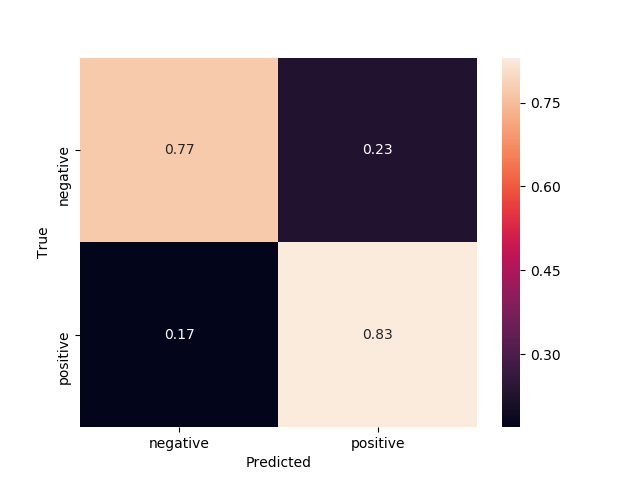
  - **进一步提高模型效果**
    - **使用情绪数据 sentiment 做回归预测** 不使用简单的 pos / neg 划分进行分类预测，而是将情绪数据 sentiment 作为连续值做回归预测，使用 `DNN Regressor` 替换 `DNN Classifier`
    - **定义更大的模型** 示例中使用较小的模型以节省内存占用，对于更大的单词向量空间，可以定义更大的模型，提高准确率
    - **参数调整** 可以通过调整模型的学习率 / 训练步骤等提高预测准确率，并且应定义验证数据集，以检查训练过程中的模型效果
    - **使用更复杂的模块** 可以通过使用更复杂的模块，如 Universal Sentence Encoder module 替换 nnlm-en-dim128 模块，或混合使用多个 TF-Hub 模块
    - **正则化** 可以使用其他优化器 optimizer 添加正则化防止过拟合，如 Proximal Adagrad Optimizer
  - **迁移学习 Transfer learning** 可以节省计算并实现良好的模型泛化，即使在小数据集也可以达到很好的效果
    - 示例使用两个不同的 TF-Hub 模块进行训练
      - `nnlm-en-dim128` 预训练好的文本嵌入模块
      - `random-nnlm-en-dim128` 类似 nnlm-en-dim128 的网络结构，但参数只是随机初始化，没有在真实数据上训练
    - 通过两种模式进行训练
      - 只训练分类器
      - 同时训练分类器与模块
    ```py
    def train_and_evaluate_with_module(hub_module, train_module=False):
        embedded_text_feature_column = hub.text_embedding_column(
            key="sentence", module_spec=hub_module, trainable=train_module)

        estimator = tf.estimator.DNNClassifier(
            hidden_units=[500, 100],
            feature_columns=[embedded_text_feature_column],
            n_classes=2,
            optimizer=tf.train.AdagradOptimizer(learning_rate=0.003))

        estimator.train(input_fn=train_input_fn, steps=1000)

        train_eval_result = estimator.evaluate(input_fn=predict_train_input_fn)
        test_eval_result = estimator.evaluate(input_fn=predict_test_input_fn)

        training_set_accuracy = train_eval_result["accuracy"]
        test_set_accuracy = test_eval_result["accuracy"]

        return {
            "Training accuracy": training_set_accuracy,
            "Test accuracy": test_set_accuracy
        }


    results = {}
    results["nnlm-en-dim128"] = train_and_evaluate_with_module(
        "https://tfhub.dev/google/nnlm-en-dim128/1")
    results["nnlm-en-dim128-with-module-training"] = train_and_evaluate_with_module(
        "https://tfhub.dev/google/nnlm-en-dim128/1", True)
    results["random-nnlm-en-dim128"] = train_and_evaluate_with_module(
        "https://tfhub.dev/google/random-nnlm-en-dim128/1")
    results["random-nnlm-en-dim128-with-module-training"] = train_and_evaluate_with_module(
        "https://tfhub.dev/google/random-nnlm-en-dim128/1", True)

    # Let's look at the results.
    pd.DataFrame.from_dict(results, orient="index")
    #                                             Training accuracy  Test accuracy
    # nnlm-en-dim128                                        0.80048        0.79264
    # nnlm-en-dim128-with-module-training                   0.95108        0.87120
    # random-nnlm-en-dim128                                 0.72168        0.68004
    # random-nnlm-en-dim128-with-module-training            0.76460        0.72132

    # The baseline accuracy of the test set
    print(estimator.evaluate(input_fn=predict_test_input_fn)["accuracy_baseline"])
    # 0.5
    ```
    - 即使使用固定的随机分配的 embeddings，模型依然可以通过全连接层将不同类别区分开，达到一定的分类效果
    - 允许在预训练好的 / 随机分配的 embeddings 模块上继续训练，将可以提高训练 / 测试数据集上的正确率
    - 在预训练好的模型上集训训练很可能导致模型在训练数据集上过拟合
    ```py
    # Try with universal-sentence-encoder-large module
    results_usnl = train_and_evaluate_with_module('https://tfhub.dev/google/universal-sentence-encoder-large/3')
    print(results_usnl)
    # {'Training accuracy': 0.84496, 'Test accuracy': 0.84316}

    # This cannot be done...
    results_usnl_training = train_and_evaluate_with_module('https://tfhub.dev/google/universal-sentence-encoder-large/3', True)
    ```
## Estimators DNNClassifier 下载 Kaggle 的数据集进行文本分类
  - [Kaggle](https://www.kaggle.com)
    - **python 包**
      ```py
      pip install kaggle
      ```
    - **添加 API Token**
      - `My account` -> `API` -> `Create New API Token`
      - `Download kaggle.json` -> `Move to ~/.kaggle` -> `chmod 600 ~/.kaggle/kaggle.json`
    - **测试**
      ```sh
      # 列出属于Health这一类的所有比赛
      kaggle competitions list -s health

      # 下载 <competition_name> 下的Data中所有文件，指定下载路径<path>
      kaggle competitions download -c <competition_name> -p <path>

      # 下载 <competition_name>下的Data中某个文件 <filename>，指定下载路径<path>
      kaggle competitions download -c <competition_name> -f <filename> -p <path>

      # 提交结果
      kaggle competitions submit [-h] [-c COMPETITION] -f FILE -m MESSAGE [-q]
      ```
  - **从 kaggle 加载 Rotten Tomatoes 电影评论数据集** Kaggle Sentiment Analysis on Movie Reviews Task，标准电影评论的积极程度 1-5，下载前必须接受 competition rules
      ```py
      # Error message before accept the competition rules
      HTTP response body: b'{"code":403,"message":"You must accept this competition\\u0027s rules before you can continue"}'
      ```
      ```py
      import zipfile
      from sklearn import model_selection

      SENTIMENT_LABELS = ["negative", "somewhat negative", "neutral", "somewhat positive", "positive"]

      # Add a column with readable values representing the sentiment.
      def add_readable_labels_column(df, sentiment_value_column):
        df["SentimentLabel"] = df[sentiment_value_column].replace(
            range(5), SENTIMENT_LABELS)


      # Download data from Kaggle and create a DataFrame.
      def load_data_from_zip(competition, file):
        with zipfile.ZipFile(os.path.join(competition, file), "r") as zip_ref:
          unzipped_file = zip_ref.namelist()[0]
          zip_ref.extractall(competition)
          return pd.read_csv(
              os.path.join(competition, unzipped_file), sep="\t", index_col=0)


      # The data does not come with a validation set so we'll create one from the
      # training set.
      def get_data(competition, train_file, test_file, validation_set_ratio=0.1):
        kaggle.api.competition_download_files(competition, competition)
        train_df = load_data_from_zip(competition, train_file)
        test_df = load_data_from_zip(competition, test_file)

        # Add a human readable label.
        add_readable_labels_column(train_df, "Sentiment")

        # We split by sentence ids, because we don't want to have phrases belonging
        # to the same sentence in both training and validation set.
        train_indices, validation_indices = model_selection.train_test_split(
            np.unique(train_df["SentenceId"]),
            test_size=validation_set_ratio,
            random_state=0)

        validation_df = train_df[train_df["SentenceId"].isin(validation_indices)]
        train_df = train_df[train_df["SentenceId"].isin(train_indices)]
        print("Split the training data into %d training and %d validation examples." %
              (len(train_df), len(validation_df)))

        return train_df, validation_df, test_df


      train_df, validation_df, test_df = get_data("sentiment-analysis-on-movie-reviews", "train.tsv.zip", "test.tsv.zip")
      train_df.head()
      ```
  - **DNN 模型训练评估与 TF-Hub module embedding**
    ```py
    import tensorflow_hub as hub

    # Training input on the whole training set with no limit on training epochs.
    train_input_fn = tf.estimator.inputs.pandas_input_fn(train_df, train_df["Sentiment"], num_epochs=None, shuffle=True)

    # Prediction on the whole training set.
    predict_train_input_fn = tf.estimator.inputs.pandas_input_fn(train_df, train_df["Sentiment"], shuffle=False)
    # Prediction on the validation set.
    predict_validation_input_fn = tf.estimator.inputs.pandas_input_fn(validation_df, validation_df["Sentiment"], shuffle=False)
    # Prediction on the test set.
    predict_test_input_fn = tf.estimator.inputs.pandas_input_fn(test_df, shuffle=False)

    embedded_text_feature_column = hub.text_embedding_column(key="Phrase", module_spec="https://tfhub.dev/google/nnlm-en-dim128/1")

    estimator = tf.estimator.DNNClassifier(
        hidden_units=[500, 100],
        feature_columns=[embedded_text_feature_column],
        n_classes=5,
        optimizer=tf.train.AdagradOptimizer(learning_rate=0.003))

    estimator.train(input_fn=train_input_fn, steps=10000);

    # Run predictions for the validation set and training set.
    train_eval_result = estimator.evaluate(input_fn=predict_train_input_fn)
    validation_eval_result = estimator.evaluate(input_fn=predict_validation_input_fn)

    print("Training set accuracy: {accuracy}".format(**train_eval_result))
    print("Validation set accuracy: {accuracy}".format(**validation_eval_result))
    ```
  - **混淆矩阵 Confusion matrix**
    ```py
    import seaborn as sns

    def get_predictions(estimator, input_fn):
      return [x["class_ids"][0] for x in estimator.predict(input_fn=input_fn)]

    # Create a confusion matrix on training data.
    with tf.Graph().as_default():
      cm = tf.confusion_matrix(train_df["Sentiment"],
                               get_predictions(estimator, predict_train_input_fn))
      with tf.Session() as session:
        cm_out = session.run(cm)

    # Normalize the confusion matrix so that each row sums to 1.
    cm_out = cm_out.astype(float) / cm_out.sum(axis=1)[:, np.newaxis]

    sns.heatmap(
        cm_out,
        annot=True,
        xticklabels=SENTIMENT_LABELS,
        yticklabels=SENTIMENT_LABELS)
    plt.xlabel("Predicted")
    plt.ylabel("True")
    ```
  - **将结果提交到 Kaggle**
    ```py
    test_df["Predictions"] = get_predictions(estimator, predict_test_input_fn)
    test_df.to_csv(tf.gfile.GFile("predictions.csv", "w"), columns=["Predictions"], header=["Sentiment"])
    kaggle.api.competition_submit("predictions.csv", "Submitted from Colab", "sentiment-analysis-on-movie-reviews")
    ```
## Estimators 自定义 CNN 多层卷积神经网络用于 MNIST 数据集
  - **加载 MNIST 手写数字数据集** 包含 60,000 个训练样本，10,000 个测试样本，每个样本是一个 28x28 像素的单色图片，代表手写的 0-9 数字
    ```py
    mnist = tf.keras.datasets.mnist
    (train_data, train_labels), (test_data, test_labels) = mnist.load_data()

    print(train_data.shape, test_data.shape)
    # (60000, 28, 28) (10000, 28, 28)
    print(train_labels[:10])
    # [5 0 4 1 9 2 1 3 1 4]
    ```
  - **CNNs** 多层卷积神经网络 Multilayer Convolutional Neural Networks，主要用于图片识别
    - CNNs 在图片的原始像素上应用多个过滤器，将其转化成更高层的特征，模型可以使用转化后的特征进行分类训练等
    - **卷积层 Convolutional layers** 将输入的一块指定大小数据区域，转化为一个数值作为输出，通常还会应用一个 `ReLU` 激活函数去线性化
    - **池化层 Pooling layers** 进一步采样降低卷积层输出结果的数据大小，最常使用的是 `max pooling`，返回一个数据区域上的最大值
    - **全连接层 Dense layers** 对卷积层与池化层转化后的特征进行分类
    - CNN 通常包含多个 **卷积-池化** 层进行特征提取，最后一个卷积层通常跟随一个或多个 **全连接层** 进行分类
    - 最后一个全连接层的输出维度通常是分类目标的数量，通过一个 `softmax` 激活函数，指示一个给定图片所属的类别
  - **CNN MNIST 分类器结构**
    - **卷积层 1** 输出深度 filters = 32 / 过滤器大小 kernel_size = [5, 5] / ReLU 激活函数
    - **池化层 1** max pooling / 过滤器大小 pool_size = [2, 2] / 步长 stride = 2
    - **卷积层 2** 输出深度 filters = 64 / 过滤器大小 kernel_size = [5, 5] / ReLU 激活函数
    - **池化层 2** max pooling / 过滤器大小 pool_size = [2, 2] / 步长 stride = 2
    - **全连接层 1** 隐藏层神经元数量 = 1,024
    - **dropout 层** dropout rate = 0.4
    - **全连接层 2** 输出层 Logits Layer / 隐藏层神经元数量 = 10
  - **tf.layers 模块**
    - **conv2d()** 创建二维的卷积层
      ```py
      conv2d(inputs, filters, kernel_size, strides=(1, 1), padding='valid', data_format='channels_last', activation=None, ...)
      ```
    - **max_pooling2d()** 创建二维的最大池化层
      ```py
      max_pooling2d(inputs, pool_size, strides, padding='valid', data_format='channels_last', name=None)
      ```
    - **dense()** 创建全连接层
      ```py
      dense(inputs, units, activation=None, use_bias=True, activity_regularizer=None, ...)
      ```
  - **输入层 Input Layer**
    - 卷积层与池化层的数据输入格式
      - 默认为 `[batch_size, image_height, image_width, channels]`，即 `NHWC` 数据格式，通过参数 `data_format='channels_last'` 指定
      - 对应的是 `NCHW` 数据格式，通过参数 `data_format='channels_first'` 指定
    - MNIST 每个样本是 28x28 像素的图片，因此输入层的维度为 `[batch_size, 28, 28, 1]`
      ```py
      input_layer_temp = np.reshape(train_data, [-1, 28, 28, 1])
      print(input_layer_temp.shape)
      # (60000, 28, 28, 1)
      ```
  - **CNN 模型前向传播过程**
    ```py
    ''' Define the CNN inference process '''
    def cnn_model_inference(input_layer, training, dropout_rate=0.4):
        # Input: [batch_size, 28, 28, 1], output: [batch_size, 28, 28, 32]
        conv1 = tf.layers.conv2d(
            inputs=input_layer,
            filters=32,
            kernel_size=[5, 5],
            padding='same',
            activation=tf.nn.relu)

        # Output: [batch_size, 14, 14, 32]
        pool1 = tf.layers.max_pooling2d(inputs=conv1, pool_size=[2, 2], strides=2)

        # Output: [batch_size, 14, 14, 64]
        conv2 = tf.layers.conv2d(
            inputs=pool1,
            filters=64,
            kernel_size=[5, 5],
            padding="same",
            activation=tf.nn.relu)

        # Output: [batch_size, 7, 7, 64]
        pool2 = tf.layers.max_pooling2d(inputs=conv2, pool_size=[2, 2], strides=2)

        # Flatten to two dimensions, output: [batch_size, 7 * 7 * 64]
        pool2_flat = tf.layers.flatten(pool2)
        # Output: [batch_size, 1024]
        dense = tf.layers.dense(inputs=pool2_flat, units=1024, activation=tf.nn.relu)
        # Dropout regularization layer, output: [batch_size, 1024]
        # Dropout will only be performed if training is True
        dropout = tf.layers.dropout(inputs=dense, rate=dropout_rate, training=training)

        # Logits Layer, output: [batch_size, 10]
        logits = tf.layers.dense(inputs=dropout, units=10)

        return logits, [conv1, pool1, conv2, pool2, pool2_flat, dense, dropout, logits]

    ''' Test inference with session '''
    BATCH_SIZE = 100
    input_layer = tf.placeholder(tf.float32, [BATCH_SIZE, 28, 28, 1])
    training = True
    dropout_rate = 0.4

    tt, hh = cnn_model_inference(input_layer, training, dropout_rate)
    print({ll.name: ll.shape.as_list() for ll in hh})
    # {'conv2d/Relu:0': [100, 28, 28, 32],
    #  'max_pooling2d/MaxPool:0': [100, 14, 14, 32],
    #  'conv2d_1/Relu:0': [100, 14, 14, 64],
    #  'max_pooling2d_1/MaxPool:0': [100, 7, 7, 64],
    #  'flatten/Reshape:0': [100, 3136],
    #  'dense/Relu:0': [100, 1024],
    #  'dropout/dropout/mul:0': [100, 1024],
    #  'dense_1/BiasAdd:0': [100, 10]}

    sess = tf.InteractiveSession()
    tf.global_variables_initializer().run()
    aa = sess.run(tt, feed_dict={input_layer: input_layer_temp[:BATCH_SIZE]})
    print(aa[:3])
    # [[ -3.2941093   3.7527535 -30.847082  -22.214169   -2.7270699  18.16967
    #     6.5825205  -3.5771027   3.0754633 -10.337991 ]
    #  [-23.97932   -18.125025   -0.9602623 -10.381845  -11.011532   16.995234
    #    -9.359307  -51.07291    21.290535  -38.749466 ]
    #  [ 13.618255   -1.1365948  16.149418   -9.945418  -15.528702   21.677935
    #   -16.846024  -20.45825    -0.2609415 -39.40958  ]]
    print(tf.argmax(aa[:10], axis=1).eval())
    # [5 8 5 6 6 8 6 6 6 1]

    ''' Test inference with Eager execution '''
    # Rerun python
    tf.enable_eager_execution()
    # Rerun previous code
    aa = tf.convert_to_tensor(input_layer_temp[:3].astype(np.float32))
    print(cnn_model_inference(aa, True)[0].numpy())
    # [[-58.099987  -27.92639    42.71275    23.317656   -2.2976465  37.94627
    #    35.879013   11.523968    5.1203656   2.5368996]
    #  [-39.770252  -32.36274    61.28269    21.879997    9.790689   19.838257
    #   -16.680183    5.0793905  15.984894  -31.47673  ]
    #  [ -6.301746  -11.510033   10.256875   -8.47909     5.424719   15.285409
    #   -18.704355  -33.391552    9.175503   -8.884123 ]]
    ```
  - **定义 Estimator 的 model function**
    ```py
    def cnn_model_fn(features, labels, mode):
        """Model function for CNN."""
        # Input Layer
        input_layer = tf.reshape(features["x"], [-1, 28, 28, 1])

        # Model inference to logits
        training = mode == tf.estimator.ModeKeys.TRAIN
        logits, _ = cnn_model_inference(input_layer, training=training, dropout_rate=0.4)

        predictions = {
            # Generate predictions (for PREDICT and EVAL mode)
            "classes": tf.argmax(input=logits, axis=1),
            # Add `softmax_tensor` to the graph. It is used for PREDICT and by the `logging_hook`.
            "probabilities": tf.nn.softmax(logits, name="softmax_tensor")
        }

        if mode == tf.estimator.ModeKeys.PREDICT:
            return tf.estimator.EstimatorSpec(mode=mode, predictions=predictions)

        # Calculate Loss (for both TRAIN and EVAL modes)
        loss = tf.losses.sparse_softmax_cross_entropy(labels=labels, logits=logits)

        # Configure the Training Op (for TRAIN mode)
        if mode == tf.estimator.ModeKeys.TRAIN:
            optimizer = tf.train.GradientDescentOptimizer(learning_rate=0.001)
            train_op = optimizer.minimize(loss=loss, global_step=tf.train.get_global_step())
            return tf.estimator.EstimatorSpec(mode=mode, loss=loss, train_op=train_op)

        # Add evaluation metrics (for EVAL mode)
        eval_metric_ops = {
            "accuracy": tf.metrics.accuracy(labels=labels, predictions=predictions["classes"])}
        return tf.estimator.EstimatorSpec(mode=mode, loss=loss, eval_metric_ops=eval_metric_ops)
    ```
  - **CNN Estimator MNIST 分类器训练与评估**
    ```py
    # Create the Estimator
    mnist_classifier = tf.estimator.Estimator(model_fn=cnn_model_fn, model_dir="/tmp/mnist_convnet_model")

    # Set up logging for predictions
    tensors_to_log = {"probabilities": "softmax_tensor"}
    logging_hook = tf.train.LoggingTensorHook(tensors=tensors_to_log, every_n_iter=50)

    ''' Train the Model'''
    # Input functions
    train_input_fn = tf.estimator.inputs.numpy_input_fn(
        x={'x': train_data.astype(np.float32)},
        y=train_labels.astype(np.int32),
        batch_size=100,
        num_epochs=None,
        shuffle=True)

    # mnist_classifier.train(input_fn=train_input_fn, steps=20000)
    mnist_classifier.train(input_fn=train_input_fn, steps=20000, hooks=[logging_hook])
    # INFO:tensorflow:Loss for final step: 0.0027697133

    ''' Evaluate the Model '''
    eval_input_fn = tf.estimator.inputs.numpy_input_fn(
        x={"x": test_data.astype(np.float32)},
        y=test_labels.astype(np.int32),
        num_epochs=1,
        shuffle=False)

    eval_results = mnist_classifier.evaluate(input_fn=eval_input_fn)
    print(eval_results)
    # {'accuracy': 0.9895, 'loss': 0.031874545, 'global_step': 20000}
    ```
***

# 通用模型 Generative models
## Eager 执行环境与 Keras 定义 DNN 模型分类 Iris 数据集
  - **tf.enable_eager_execution** 初始化 **Eager** 执行环境
    ```python
    import os
    import matplotlib.pyplot as plt
    import tensorflow as tf
    import tensorflow.contrib.eager as tfe

    tf.enable_eager_execution()

    print("TensorFlow version: {}".format(tf.VERSION))
    # TensorFlow version: 1.8.0
    print("Eager execution: {}".format(tf.executing_eagerly()))
    # Eager execution: True
    ```
  - **tf.keras.utils.get_file** 下载数据集，返回下载到本地的文件路径
    ```python
    # Iris dataset
    train_dataset_url = "http://download.tensorflow.org/data/iris_training.csv"
    train_dataset_fp = tf.keras.utils.get_file(fname=os.path.basename(train_dataset_url), origin=train_dataset_url)

    print("Local copy of the dataset file: {}".format(train_dataset_fp))
    # Local copy of the dataset file: /home/leondgarse/.keras/datasets/iris_training.csv
    ```
  - **tf.decode_csv** 解析 csv 文件，获取特征与标签 feature and label
    ```python
    def parse_csv(line):
        example_defaults = [[0.], [0.], [0.], [0.], [0]]  # sets field types
        parsed_line = tf.decode_csv(line, example_defaults)
        # First 4 fields are features, combine into single tensor
        features = tf.reshape(parsed_line[:-1], shape=(4,))
        # Last field is the label
        label = tf.reshape(parsed_line[-1], shape=())
        return features, label
    ```
  - **tf.data.TextLineDataset** 加载 CSV 格式文件，创建 tf.data.Dataset
    ```python
    train_dataset = tf.data.TextLineDataset(train_dataset_fp)
    train_dataset = train_dataset.skip(1)             # skip the first header row
    train_dataset = train_dataset.map(parse_csv)      # parse each row
    train_dataset = train_dataset.shuffle(buffer_size=1000)  # randomize
    train_dataset = train_dataset.batch(32)

    # View a single example entry from a batch
    features, label = iter(train_dataset).next()
    print("example features:", features[0])
    # example features: tf.Tensor([4.8 3.  1.4 0.3], shape=(4,), dtype=float32)
    print("example label:", label[0])
    # example label: tf.Tensor(0, shape=(), dtype=int32)
    ```
  - **tf.contrib.data.make_csv_dataset** 加载 csv 文件为 dataset，可以替换 `TextLineDataset` 与 `decode_csv`，默认 `shuffle=True` `num_epochs=None`
    ```py
    # column order in CSV file
    column_names = ['sepal_length', 'sepal_width', 'petal_length', 'petal_width', 'species']
    feature_names = column_names[:-1]
    label_name = column_names[-1]

    batch_size = 32
    train_dataset = tf.contrib.data.make_csv_dataset(
        train_dataset_fp,
        batch_size,
        column_names=column_names,
        label_name=label_name,
        num_epochs=1)
    features, labels = next(iter(train_dataset))
    print({kk: vv.numpy()[0] for kk, vv in features.items()})
    # {'sepal_length': 5.1, 'sepal_width': 3.8, 'petal_length': 1.6, 'petal_width': 0.2}
    print(labels.numpy()[0])
    # 0
    ```
    ```py
    # Repackage the features dictionary into a single array
    def pack_features_vector(features, labels):
        """Pack the features into a single array."""
        features = tf.stack(list(features.values()), axis=1)
        return features, labels
    train_dataset = train_dataset.map(pack_features_vector)
    features, labels = next(iter(train_dataset))
    print(features.numpy()[0])
    # [6. , 2.2, 5. , 1.5]
    ```
  - **tf.keras API** 创建模型以及层级结构
    - **tf.keras.layers.Dense** 添加一个全连接层
    - **tf.keras.Sequential** 线性叠加各个层
    ```python
    # 输入 4 个节点，包含两个隐藏层，输出 3 个节点
    model = tf.keras.Sequential([
        tf.keras.layers.Dense(10, activation="relu", input_shape=(4,)),  # input shape required
        tf.keras.layers.Dense(10, activation="relu"),
        tf.keras.layers.Dense(3)
        ])

    # 测试
    predictions = model(features)
    print(predictions.numpy()[0])
    # [ 0.9281509   0.39843088 -1.3780175 ]
    print(tf.argmax(tf.nn.softmax(predictions), axis=1).numpy()[:5])
    # [0 0 0 0 0]
    ```
  - **损失函数 loss function** 与 **优化程序 optimizer**
    - **tf.losses.sparse_softmax_cross_entropy** 计算模型预测与目标值的损失
    - **tf.GradientTape** 记录模型优化过程中的梯度运算
    - **tf.train.GradientDescentOptimizer** 实现 stochastic gradient descent (SGD) 算法
    ```python
    def loss(model, x, y):
        y_ = model(x)
        return tf.losses.sparse_softmax_cross_entropy(labels=y, logits=y_)

    def grad(model, inputs, targets):
        with tf.GradientTape() as tape:
            loss_value = loss(model, inputs, targets)
        return tape.gradient(loss_value, model.variables)

    optimizer = tf.train.GradientDescentOptimizer(learning_rate=0.01)
    ```
  - **模型训练 Training loop**
    ```python
    ## Note: Rerunning this cell uses the same model variables

    # keep results for plotting
    train_loss_results = []
    train_accuracy_results = []

    num_epochs = 201

    for epoch in range(num_epochs):
        epoch_loss_avg = tfe.metrics.Mean()
        epoch_accuracy = tfe.metrics.Accuracy()

        # Training loop - using batches of 32
        for x, y in train_dataset:
            # Optimize the model
            grads = grad(model, x, y)
            optimizer.apply_gradients(zip(grads, model.variables),
                                      global_step=tf.train.get_or_create_global_step())

            # Track progress
            epoch_loss_avg(loss(model, x, y))  # add current batch loss
            # compare predicted label to actual label
            epoch_accuracy(tf.argmax(model(x), axis=1, output_type=tf.int32), y)

        # end epoch
        train_loss_results.append(epoch_loss_avg.result())
        train_accuracy_results.append(epoch_accuracy.result())

        if epoch % 50 == 0:
            print("Epoch {:03d}: Loss: {:.3f}, Accuracy: {:.3%}".format(
                epoch,
                epoch_loss_avg.result(),
                epoch_accuracy.result()))

    # [Out]
    # Epoch 000: Loss: 1.833, Accuracy: 30.000%
    # Epoch 050: Loss: 0.394, Accuracy: 90.833%
    # Epoch 100: Loss: 0.239, Accuracy: 97.500%
    # Epoch 150: Loss: 0.161, Accuracy: 96.667%
    # Epoch 200: Loss: 0.121, Accuracy: 98.333%
    ```
  - **图形化显示模型损失变化 Visualize the loss function over time**
    ```python
    fig, axes = plt.subplots(2, sharex=True, figsize=(12, 8))
    fig.suptitle('Training Metrics')

    axes[0].set_ylabel("Loss", fontsize=14)
    axes[0].plot(train_loss_results)

    axes[1].set_ylabel("Accuracy", fontsize=14)
    axes[1].set_xlabel("Epoch", fontsize=14)
    axes[1].plot(train_accuracy_results)

    plt.show()
    ```
    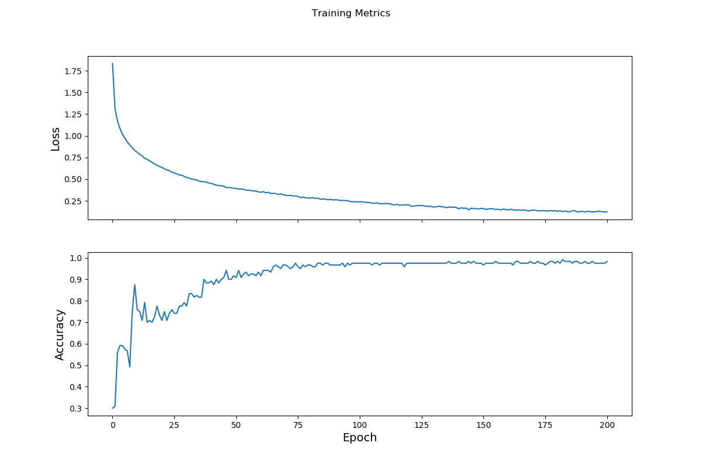
  - **模型评估 Evaluate the model on the test dataset**
    - **tf.keras.utils.get_file** / **tf.data.TextLineDataset** 加载测试数据集
    - **tfe.metrics.Accuracy** 计算正确率
    ```python
    test_url = "http://download.tensorflow.org/data/iris_test.csv"
    test_fp = tf.keras.utils.get_file(fname=os.path.basename(test_url), origin=test_url)

    test_dataset = tf.contrib.data.make_csv_dataset(
        train_dataset_fp,
        batch_size,
        column_names=column_names,
        label_name='species',
        num_epochs=1,
        shuffle=False)

    test_dataset = test_dataset.map(pack_features_vector)

    test_accuracy = tfe.metrics.Accuracy()

    for (x, y) in test_dataset:
        prediction = tf.argmax(model(x), axis=1, output_type=tf.int32)
        test_accuracy(prediction, y)

    print("Test set accuracy: {:.3%}".format(test_accuracy.result()))
    # Test set accuracy: 96.667%
    ```
  - **模型预测 Use the trained model to make predictions**
    ```python
    predict_dataset = tf.convert_to_tensor([
        [5.1, 3.3, 1.7, 0.5,],
        [5.9, 3.0, 4.2, 1.5,],
        [6.9, 3.1, 5.4, 2.1]
    ])

    predictions = model(predict_dataset)

    for i, logits in enumerate(predictions):
        class_idx = tf.argmax(logits).numpy()
        p = tf.nn.softmax(logits)[class_idx]
        name = class_names[class_idx]
        print("Example {} prediction: {} ({:4.1f}%)".format(i, name, 100*p))
    ```
    Out
    ```python
    Example 0 prediction: Iris setosa (62.7%)
    Example 1 prediction: Iris virginica (54.7%)
    Example 2 prediction: Iris virginica (62.8%)
    ```
## Eager 执行环境与 Keras 定义 RNN 模型自动生成文本
  - [Text Generation using a RNN](https://github.com/tensorflow/tensorflow/blob/master/tensorflow/contrib/eager/python/examples/generative_examples/text_generation.ipynb)
  - **加载数据集** [Shakespeare's writing 文本数据](https://raw.githubusercontent.com/karpathy/char-rnn/master/data/tinyshakespeare/input.txt)
    ```py
    # Note: Once you enable eager execution, it cannot be disabled.
    tf.enable_eager_execution()

    path_to_file = tf.keras.utils.get_file('shakespeare.txt', 'https://raw.githubusercontent.com/karpathy/char-rnn/master/data/tinyshakespeare/input.txt')
    ```
  - **Unicode 编码转化为 ASCII**
    ```py
    ! pip install unidecode

    import unidecode
    print(unidecode.unidecode('Unicode 编码转化为 ASCII'))
    # Unicode Bian Ma Zhuan Hua Wei  ASCII

    text = unidecode.unidecode(open(path_to_file, 'r').read())
    print(len(text))
    # 1115394

    print(text[:100])
    # First Citizen:
    # Before we proceed any further, hear me speak.

    # All:
    # Speak, speak.

    # First Citizen:
    # You
    ```
  - **将字符转化为数字 ID** 用于将输入文本转化为向量
    ```py
    # unique_c contains all the unique characters in the file
    unique_c = sorted(set(text))
    print(len(unique_c))
    # 65 --> 13 + 26 + 26
    print(unique_c[:20])
    # ['\n', ' ', '!', '$', '&', "'", ',', '-', '.', '3', ':', ';', '?', 'A', 'B', 'C', 'D', 'E', 'F', 'G']

    # creating a mapping from unique characters to indices
    char2idx = {u: i for i, u in enumerate(unique_c)}
    idx2char = {i: u for i, u in enumerate(unique_c)}
    ```
  - **创建输入与输出 tensors**
    - 将输入字符串文本转化为数字向量
    - 整个文本划分成多个块 `chunks`，每个块的长度为 `max_length`
    - **输入向量 feature** 为整个块 `chunks[0: max_length]`
    - **输出向量 target** 为整个块的下一个字符 `chunks[1: max_length + 1]`
    - 对于字符串 `'tensorflow eager'` / `max_length = 10`，输入输出向量为 `'tensorflow'` / `'ensorflow '`，`' eager'` / `'eager'`
    ```py
    # setting the maximum length sentence we want for a single input in characters
    max_length = 100
    input_text = []
    target_text = []

    for ss in arange(0, len(text) - max_length, max_length):
        inps = text[ss: ss + max_length]
        targ = text[ss + 1: ss + max_length + 1]

        input_text.append([char2idx[ii] for ii in inps])
        target_text.append([char2idx[ii] for ii in targ])

    print(np.shape(input_text), np.shape(target_text))
    # (11153, 100) (11153, 100)

    # buffer size to shuffle our dataset
    BUFFER_SIZE = 10000
    # batch size
    BATCH_SIZE = 64
    dataset = tf.data.Dataset.from_tensor_slices((input_text, target_text)).shuffle(BUFFER_SIZE)
    # Batch and omits the final small batch (if present)
    dataset = dataset.batch(batch_size=BATCH_SIZE, drop_remainder=True)

    itrt = dataset.make_one_shot_iterator()
    ii, tt = itrt.next()
    print(ii.shape.as_list(), tt.shape.as_list())
    # [64, 100] [64, 100]

    print(''.join(idx2char[aa] for aa in ii[0].numpy()))
    # ed me.
    #
    # KING RICHARD III:
    # Well, but what's o'clock?
    #
    # BUCKINGHAM:
    # Upon the stroke of ten.
    #
    # KING RICHA
    ```
  - **keras 定义使用 GRU 结构的 RNN 神经网络模型** GRU 即 Gated Recurrent Unit，是 LSTM 的一个变体，只有两个门结构 **更新门** / **重置门**，在保持 LSTM 效果的同时使结构更加简单
    ```py
    class GRU(RNN)
    __init__(self, units, activation='tanh', recurrent_activation='hard_sigmoid', dropout=0.0, recurrent_dropout=0.0, implementation=1, ...)

    # Fast GRU implementation backed by cuDNN
    class CuDNNGRU(_CuDNNRNN)
    __init__(self, units, kernel_initializer='glorot_uniform', recurrent_initializer='orthogonal', return_sequences=False, return_state=False, ...)
    ```
    模型包括 **三层结构** `嵌入层 Embedding layer` / `GRU 层，也可以使用 LSTM 层` / `全链接层 Fully connected layer`
    ```py
    class MModel(tf.keras.Model):
        def __init__(self, vocab_size, embedding_dim, units, batch_size):
            super(MModel, self).__init__()
            self.units = units
            self.batch_size = batch_size

            self.embedding = tf.keras.layers.Embedding(input_dim=vocab_size, output_dim=embedding_dim)
            if tf.test.is_gpu_available():
                self.gru = tf.keras.layers.CuDNNGRU(self.units,
                              return_sequences=True,
                              return_state=True,
                              recurrent_initializer='glorot_uniform')
            else:
                self.gru = tf.keras.layers.GRU(self.units,
                              return_sequences=True,
                              return_state=True,
                              recurrent_activation='sigmoid',
                              recurrent_initializer='glorot_uniform')
            self.fc = tf.keras.layers.Dense(vocab_size)

        def call(self, x, hidden):
            x = self.embedding(x)

            # output shape == (batch_size, max_length, hidden_size)
            # states shape == (batch_size, hidden_size)

            # states variable to preserve the state of the model
            # this will be used to pass at every step to the model while training
            output, states = self.gru(x, initial_state=hidden)

            # reshaping the output so that we can pass it to the Dense layer
            # after reshaping the shape is (batch_size * max_length, hidden_size)
            output = tf.reshape(output, (-1, output.shape[2]))

            # The dense layer will output predictions for every time_steps(max_length)
            # output shape after the dense layer == (max_length * batch_size, vocab_size)
            x = self.fc(output)

            return x, states
    ```
  - **模型训练，训练过程中保存模型 Checkpoints**
    - **隐藏状态 hidden state** 初始值是 0
    - **模型的输入** 是 `上一个 batch 的隐藏状态 H0` 与 `当前 batch 的输入 I1`
    - **模型的输出** 是 `预测值 P1` 与 `隐藏状态 H1`
    - 每次迭代模型通过文本学习到的上下文关系保存在 `hidden state` 中，每个 epoch 结束重新初始化 `hidden state`
    ```py
    import time
    tfe = tf.contrib.eager

    # length of the vocabulary in chars
    vocab_size = len(unique_c)
    # the embedding dimension
    embedding_dim = 256
    # number of RNN (here GRU) units
    units = 1024

    model = MModel(vocab_size, embedding_dim, units, BATCH_SIZE)

    optimizer = tf.train.AdamOptimizer()
    # using sparse_softmax_cross_entropy so that we don't have to create one-hot vectors
    loss_function = lambda real, preds: tf.losses.sparse_softmax_cross_entropy(labels=real, logits=preds)

    # Checkpoints (Object-based saving)
    checkpoint_dir = './training_checkpoints'
    checkpoint_prefix = os.path.join(checkpoint_dir, "ckpt")
    checkpoint = tf.train.Checkpoint(optimizer=optimizer, model=model, unique_c=tfe.Variable(unique_c))

    # Training step
    EPOCHS = 30
    for epoch in range(EPOCHS):
        start = time.time()
        # hidden = None, initializing the hidden state at the start of every epoch
        hidden = model.reset_states()
        for (batch, (inp, target)) in enumerate(dataset):
            with tf.GradientTape() as tape:
                # feeding the hidden state back into the model
                # This is the interesting step
                prediction, hidden = model(inp, hidden)
                # reshaping the target because that's how the loss function expects it
                # target shape [BATCH_SIZE, max_length] -> [BATCH_SIZE * max_length]
                target = tf.reshape(target, (-1, ))
                loss = loss_function(target, prediction)

            grads = tape.gradient(loss, model.variables)
            optimizer.apply_gradients(zip(grads, model.variables), global_step=tf.train.get_or_create_global_step())

            if batch % 100 == 0:
                print('Epoch {} Batch {} Loss {:.4f}'.format(epoch + 1, batch, loss))

        # saving (checkpoint) the model every 5 epochs
        if (epoch + 1) % 5 == 0:
            checkpoint.save(file_prefix=checkpoint_prefix)  

        print('Epoch {} Loss {:.4f}'.format(epoch + 1, loss))
        print('Time taken for 1 epoch {} sec'.format(time.time() - start))

    # Epoch 30 Batch 0 Loss 0.6842
    # Epoch 30 Batch 100 Loss 0.7961
    # Epoch 30 Loss 0.8500
    # Time taken for 1 epoch 48.24203586578369 sec

    model.summary()
    # _________________________________________________________________
    # Layer (type)                 Output Shape              Param #   
    # =================================================================
    # embedding_2 (Embedding)      multiple                  16640     
    # _________________________________________________________________
    # cu_dnngru_2 (CuDNNGRU)       multiple                  3938304   
    # _________________________________________________________________
    # dense_4 (Dense)              multiple                  66625     
    # =================================================================
    # Total params: 4,021,569
    # Trainable params: 4,021,569
    # Non-trainable params: 0
    # _________________________________________________________________
    ```
  - **重新加载训练过的模型 Restore the latest checkpoint**
    ```py
    tf.enable_eager_execution()
    tfe = tf.contrib.eager
    # --> Redefine MModel

    units = 1024
    vocab_size = 65
    optimizer = tf.train.AdamOptimizer()
    model = MModel(vocab_size, 256, units, 64)
    unique_c = tfe.Variable([''] * vocab_size)

    # Redefine checkpoint
    checkpoint_dir = './training_checkpoints'
    checkpoint = tf.train.Checkpoint(optimizer=optimizer, model=model, unique_c=unique_c)
    checkpoint.restore(tf.train.latest_checkpoint(checkpoint_dir))

    # Redefine char2idx, idx2char
    unique_c = [ii.decode() for ii in unique_c.numpy()]
    char2idx = {u: i for i, u in enumerate(unique_c)}
    idx2char = {i: u for i, u in enumerate(unique_c)}
    ```
  - **模型预测** 使用模型生成文本
    - 定义初始字符串，并初始化隐藏状态，不同的初始字符串生成的文本不同
    - 将模型预测的下一个字符作为模型的下一次输入，输出的隐藏状态作为下一次的隐藏状态，隐藏状态中包含了文本的上下文关系
    - **tf.multinomial** 多项式随机采样，根据 `logits` 指定的各个分类的概率分布，随机生成 `num_samples` 个采样数据
      ```py
      # Draws samples from a multinomial distribution.
      tf.multinomial(logits, num_samples, seed=None, name=None, output_dtype=None)


      # Example
      print(tf.log([[10., 10.]]).numpy())
      # [[2.3025851 2.3025851]]
      # samples has shape [1, 5], where each value is either 0 or 1 with equal probability.
      print(tf.multinomial(tf.log([[10., 10.]]), 5).numpy())
      # [[1 1 0 0 0]]
      print(tf.multinomial(tf.log([[10., 10.]]), 5).numpy())
      # [[0 1 1 0 0]]
      ```
      - **logits 参数** 二维向量 `[batch_size, num_classes]`，指定每个分类的概率分布
      - **num_samples 参数** 对于每一个 batch 生成的采样数量，返回值维度 `[batch_size, num_samples]`
    ```py
    # You can change the start string to experiment
    ss = 'QUEEN'
    ss_id = [char2idx[ii] for ii in ss]

    # Use hidden = [[0...]] to initialize model prediction state, here batch size == 1
    pp, hh = model(tf.convert_to_tensor([ss_id]), tf.zeros([1, units]))
    # Output pp is the probability of all words in vocab list
    print(pp.shape.as_list())
    # [5, 65]
    ppid = np.argmax(pp, axis=1)
    print(''.join(idx2char[ii] for ii in ppid))
    # UEEN:

    def generate_text(start_string, num_generate, temperature=1.0):
        input_eval = tf.convert_to_tensor([[char2idx[ii] for ii in start_string]])
        hh = tf.zeros([1, units])
        text_generated = start_string

        for ii in range(num_generate):
            pp, hh = model(input_eval, hh)

            # higher temperatures will lower all probabilities, results in more randomized text
            pp = pp / temperature
            # using a multinomial distribution to predict the word returned by the model, use only the last word
            ppid = tf.multinomial(tf.exp(pp), num_samples=1)[-1, 0].numpy()
            # Next input is the predicted character, not the whole predicted string.
            input_eval = tf.convert_to_tensor([[ppid]])
            text_generated += idx2char[ppid]

        return text_generated

    print(generate_text('QUEEN:', 146))
    # QUEEN:
    # My lord, I have seen thee in his true heart's love,
    # That starts and men of sacrifice,
    # Even when the sun under the gods, have at thee, for my dear
    ```
## Eager 执行环境与 Keras 定义 RNN seq2seq 模型使用注意力机制进行文本翻译
  - [Neural Machine Translation with Attention](https://github.com/tensorflow/tensorflow/blob/master/tensorflow/contrib/eager/python/examples/nmt_with_attention/nmt_with_attention.ipynb)
  - **基本概念**
    - [Tensorflow nmt](https://github.com/tensorflow/nmt)
    - [Thang Luong's Thesis on Neural Machine Translation](https://github.com/lmthang/thesis)
    - **seq2seq 模型** 是一个 `Encoder–Decoder` 结构的网络，Encoder 将一个输入的可变长度的信号序列变为固定长度的向量表达，Decoder 将这个固定长度的向量变成可变长度的目标的信号序列
    - **Teacher Forcing** 是一种训练技术，训练早期的 RNN 非常弱，几乎不能给出好的生成结果，以至于产生垃圾的 output 影响后面的 state，因此直接使用 ground truth 的对应上一项，而不是上一个 state 的输出，作为下一个 state 的输入
    - **Attention mechanism 注意力机制** 模仿人处理信息时的注意力，在处理信息时，每次都根据前一个学习状态得到当前要关注的部分，只处理关注的这部分信息，通过可视化可以显示模型在翻译时主要关注输入的哪一部分
  - **加载 spa-eng 西班牙语-英语数据集** [Tab-delimited Bilingual Sentence Pairs](http://www.manythings.org/anki/) 提供其他语种与英语的文本数据集，两种语言使用 `Tab` 分隔
    - 下载数据集
    - 数据集中的每个句子添加 `<start>` / `<end>` 标签
    - 移除句子中的特殊字符
    - 创建单词与数字的映射字典
    - 通过将每个句子填充到最大长度，使数据集中每个样本有相同的维度
    ```py
    # Import TensorFlow >= 1.10 and enable eager execution
    import tensorflow as tf

    tf.enable_eager_execution()
    print(tf.__version__)
    # 1.10.1

    # Download the file
    # Handle Downloading 403 error: Name or service not known here
    import urllib.request

    opener = urllib.request.build_opener()
    opener.addheaders = [('User-agent', 'Firefox/61.0')]
    urllib.request.install_opener(opener)

    path_to_zip = tf.keras.utils.get_file('spa-eng.zip', origin='http://www.manythings.org/anki/spa-eng.zip', extract=True)
    path_to_file = os.path.dirname(path_to_zip) + "/spa.txt"
    # path_to_zip = tf.keras.utils.get_file('cmn-eng.zip', origin='http://www.manythings.org/anki/cmn-eng.zip', extract=True)
    # path_to_file = os.path.dirname(path_to_zip) + "/cmn.txt"


    ''' Test the file '''
    lines = open(path_to_file, encoding='UTF-8').read().strip().split('\n')
    print(len(lines))
    # 118964
    print(lines[1150])
    # I'm coming.	Ahí voy.

    w = lines[1150].split('\t')
    s = w[0].lower().strip()
    print(''.join(c for c in unicodedata.normalize('NFD', s) if unicodedata.category(c) != 'Mn'))
    # i'm coming.
    ```
  - **将文件解析成单词对，每个句子添加 `<start>` `<end>` 标签**
    ```py
    import unicodedata
    import re

    # Converts the unicode string to ascii
    def unicode_to_ascii(ss):
        return ''.join(cc for cc in unicodedata.normalize('NFD', ss) if unicodedata.category(cc) != 'Mn')

    def preprocess_sentence(ww):
        ww = unicode_to_ascii(ww.lower().strip())

        # creating a space between a word and the punctuation following it
        # eg: "he is a boy." => "he is a boy ."
        # Reference:- https://stackoverflow.com/questions/3645931/python-padding-punctuation-with-white-spaces-keeping-punctuation
        ww = re.sub(r"([?.!,¿])", r" \1 ", ww)
        ww = re.sub(r'[" "]+', " ", ww)

        # replacing everything with space except (a-z, A-Z, ".", "?", "!", ",")
        ww = re.sub(r"[^a-zA-Z?.!,¿]+", " ", ww)

        ww = ww.rstrip().strip()

        # adding a start and an end token to the sentence
        # so that the model know when to start and stop predicting.
        ww = '<start> ' + ww + ' <end>'
        return ww

    # 1. Remove the accents
    # 2. Clean the sentences
    # 3. Return word pairs in the format: [ENGLISH, SPANISH]
    def create_dataset(path, num_examples):
        lines = open(path, encoding='UTF-8').read().strip().split('\n')

        word_pairs = [[preprocess_sentence(ww) for ww in ll.split('\t')]  for ll in lines[:num_examples]]

        return word_pairs

    num_examples = 30000
    dd = create_dataset(path_to_file, num_examples)
    print(dd[500:505])
    # [['<start> have some . <end>', '<start> tome alguno . <end>'],
    #  ['<start> he is old . <end>', '<start> el es viejo . <end>'],
    #  ['<start> he is old . <end>', '<start> el es anciano . <end>'],
    #  ['<start> he shaved . <end>', '<start> el se afeito . <end>'],
    #  ['<start> he smiled . <end>', '<start> sonrio . <end>']]
    ```
  - **将单词对解析成单词表，以及对应的数字转化字典**
    ```py
    # Convert a language sentences to vocab, and the converting maps between word and index
    class LanguageIndex():
        def __init__(self, lang):
            self.lang = lang
            self.create_index()

        def create_index(self):
            vocab = set()
            for ss in self.lang:
                vocab.update(ss.split(' '))
            self.vocab = sorted(vocab)

            self.word2idx = {ww: ii + 1 for ii, ww in enumerate(self.vocab)}
            self.word2idx['<pad>'] = 0
            self.idx2word = {ii: ww for ww, ii in self.word2idx.items()}

    dd = LanguageIndex('hello world'.split(' '))
    print(dd.vocab) # ['hello', 'world']
    print(dd.word2idx)  # {'hello': 1, 'world': 2, '<pad>': 0}
    print(dd.idx2word)  # {1: 'hello', 2: 'world', 0: '<pad>'}
    ```
  - **tf.keras.preprocessing.sequence.pad_sequences** 转化为 tensor，将每个句子填充到最大长度
    ```py
    pad_sequences(sequences, maxlen=None, dtype='int32', padding='pre', truncating='pre', value=0.0)
    ```
    ```py
    def load_dataset(path_to_file, num_examples):
        # creating cleaned input, output pairs
        pairs = create_dataset(path_to_file, num_examples)

        # index language using the class defined above
        input_lang = LanguageIndex(sp for en, sp in pairs)
        target_lang = LanguageIndex(en for en, sp in pairs)

        # Vectorize the input and target languages sentences
        input_tensor = [[input_lang.word2idx[ss] for ss in sp.split(' ')] for en, sp in pairs]
        target_tensor = [[target_lang.word2idx[ss] for ss in en.split(' ')] for en, sp in pairs]

        # Calculate max_length of input and output tensor
        # Here, we'll set those to the longest sentence in the dataset
        max_length_inp = np.max([len(tt) for tt in input_tensor])
        max_length_tar = np.max([len(tt) for tt in target_tensor])

        # Padding the input and output tensor to the maximum length
        input_tensor = tf.keras.preprocessing.sequence.pad_sequences(input_tensor,
                                         maxlen=max_length_inp, padding='post')

        target_tensor = tf.keras.preprocessing.sequence.pad_sequences(target_tensor,
                                         maxlen=max_length_tar, padding='post')

        return input_tensor, target_tensor, input_lang, target_lang, max_length_inp, max_length_tar

    # Try experimenting with the size of that dataset
    num_examples = 30000
    input_tensor, target_tensor, inp_lang, targ_lang, max_length_inp, max_length_targ = load_dataset(path_to_file, num_examples)

    print(input_tensor.shape, target_tensor.shape, len(inp_lang.vocab), len(targ_lang.vocab), max_length_inp, max_length_targ)
    # (30000, 16) (30000, 11) 9413 4934 16 11
    ```
  - **sklearn.model_selection.train_test_split** 将数据集划分成训练测试数据集
    ```py
    from sklearn.model_selection import train_test_split

    # Creating training and validation sets using an 80-20 split
    input_tensor_train, input_tensor_val, target_tensor_train, target_tensor_val = train_test_split(input_tensor, target_tensor, test_size=0.2)

    # Show length
    print(len(input_tensor_train), len(target_tensor_train), len(input_tensor_val), len(target_tensor_val))
    # 24000 24000 6000 6000
    ```
  - **tf.data.Dataset.from_tensor_slices** 创建 tf.data dataset
    ```py
    BATCH_SIZE = 64
    BUFFER_SIZE = len(input_tensor_train)
    N_BATCH = BUFFER_SIZE // BATCH_SIZE

    dataset = tf.data.Dataset.from_tensor_slices((input_tensor_train, target_tensor_train)).shuffle(BUFFER_SIZE)
    dataset = dataset.batch(BATCH_SIZE, drop_remainder=True)

    ii, tt = dataset.make_one_shot_iterator().next()
    print(ii.shape.as_list(), tt.shape.as_list())
    # [64, 16] [64, 11]
    ```
  - **Encoder and decoder 模型结构**

    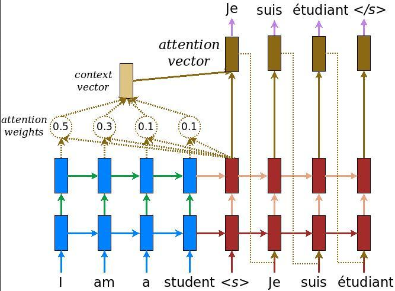
    - **Encoder** 每个输入应用注意力机制分配一个权重向量，转化为一个输出 `[batch_size, max_length, hidden_size]`，以及一个隐藏状态 `(batch_size, hidden_size)`，用于 `Decoder` 预测句子的下一个单词
    - **Decoder 伪代码 pseudo-code:** 使用 `Bahdanau attention` 注意力机制
      - **Input** = x_input_to_decoder, encoder_output, hidden_state
      - **score** = tanh(FC(encoder_output) + FC(hidden_state)), **score_shape** = (batch_size, max_length, hidden_size)
      - **attention_weights** = softmax(FC(score), axis = 1)
      - **context_vector** = sum(attention_weights * encoder_output, axis = 1)
      - **embedding_output** = emdedding(x_input_to_decoder)
      - **merged_vector** = concat(embedding_output, context_vector)
      - **output**, **state** = gru(merged_vector)

      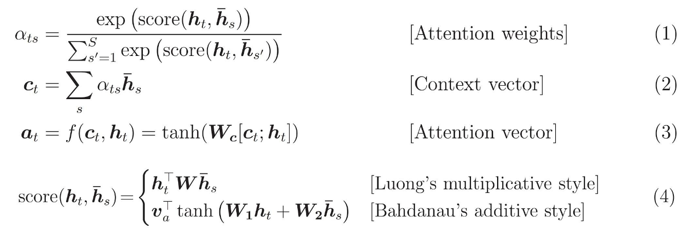
  - **Encoder 模型定义**
    ```py
    def gru(units):
      # If you have a GPU, we recommend using CuDNNGRU(provides a 3x speedup than GRU)
      # the code automatically does that.
      if tf.test.is_gpu_available():
          return tf.keras.layers.CuDNNGRU(units,
                                          return_sequences=True,
                                          return_state=True,
                                          recurrent_initializer='glorot_uniform')
      else:
          return tf.keras.layers.GRU(units,
                                     return_sequences=True,
                                     return_state=True,
                                     recurrent_activation='sigmoid',
                                     recurrent_initializer='glorot_uniform')

    class Encoder(tf.keras.Model):
        def __init__(self, vocab_size, embedding_dim, enc_units, batch_sz):
            super(Encoder, self).__init__()
            self.batch_sz = batch_sz
            self.enc_units = enc_units
            self.embedding = tf.keras.layers.Embedding(vocab_size, embedding_dim)
            self.gru = gru(self.enc_units)

        def call(self, x, hidden):
            x = self.embedding(x)
            output, state = self.gru(x, initial_state = hidden)        
            return output, state

        def initialize_hidden_state(self):
            return tf.zeros((self.batch_sz, self.enc_units))

    embedding_dim = 256
    units = 1024
    vocab_inp_size = len(inp_lang.word2idx)

    encoder = Encoder(vocab_inp_size, embedding_dim, units, BATCH_SIZE)
    ```
  - **Decoder 模型定义**
    ```py
    class Decoder(tf.keras.Model):
        def __init__(self, vocab_size, embedding_dim, dec_units, batch_sz):
            super(Decoder, self).__init__()
            self.batch_sz = batch_sz
            self.dec_units = dec_units
            self.embedding = tf.keras.layers.Embedding(vocab_size, embedding_dim)
            self.gru = gru(self.dec_units)
            self.fc = tf.keras.layers.Dense(vocab_size)

            # used for attention
            self.W1 = tf.keras.layers.Dense(self.dec_units)
            self.W2 = tf.keras.layers.Dense(self.dec_units)
            self.V = tf.keras.layers.Dense(1)

        def call(self, x, hidden, enc_output):
            # enc_output shape == (batch_size, max_length, hidden_size)

            # hidden shape == (batch_size, hidden size)
            # hidden_with_time_axis shape == (batch_size, 1, hidden size)
            # we are doing this to perform addition to calculate the score
            hidden_with_time_axis = tf.expand_dims(hidden, 1)
            # score shape == (batch_size, max_length, hidden_size)
            score = tf.nn.tanh(self.W1(enc_output) + self.W2(hidden_with_time_axis))
            # attention_weights shape == (batch_size, max_length, 1)
            # we get 1 at the last axis because we are applying score to self.V
            attention_weights = tf.nn.softmax(self.V(score), axis=1)
            # context_vector shape after sum == (batch_size, hidden_size)
            context_vector = attention_weights * enc_output
            context_vector = tf.reduce_sum(context_vector, axis=1)

            # x shape after passing through embedding == (batch_size, 1, embedding_dim)
            x = self.embedding(x)
            # x shape after concatenation == (batch_size, 1, embedding_dim + hidden_size)
            x = tf.concat([tf.expand_dims(context_vector, 1), x], axis=-1)
            # passing the concatenated vector to the GRU
            output, state = self.gru(x)

            # output shape == (batch_size * 1, hidden_size)
            output = tf.reshape(output, (-1, output.shape[2]))
            # output shape == (batch_size * 1, vocab)
            x = self.fc(output)

            return x, state, attention_weights

        def initialize_hidden_state(self):
            return tf.zeros((self.batch_sz, self.dec_units))

    vocab_tar_size = len(targ_lang.word2idx)
    decoder = Decoder(vocab_tar_size, embedding_dim, units, BATCH_SIZE)
    ```
  - **模型训练，训练过程中保存模型 Checkpoints**
    - Encoder 将输入字符串转化为 `encoder output` 与 `encoder hidden state`，输入字符串为翻译的源语言
    - Decoder 输入 `encoder output` / `encoder hidden state` / `decoder input`，其中 `decoder input` 为翻译的目标语言，初始为 `<start>`
    - Decoder 返回 `预测值 predictions` 与 `decoder hidden state`，其中预测值用作计算模型损失
    - Decoer 的下一次输入使用 `encoder output` / `decoder hidden state`，以及使用 `Teacher forcing` 机制决定的下一个 `decoder input`
    ```py
    ''' Define the optimizer and the loss function '''
    optimizer = tf.train.AdamOptimizer()

    def loss_function(real, pred):
        mask = 1 - np.equal(real, 0)
        loss_ = tf.nn.sparse_softmax_cross_entropy_with_logits(labels=real, logits=pred) * mask
        return tf.reduce_mean(loss_)

    ''' Checkpoints (Object-based saving) '''
    checkpoint_dir = './training_checkpoints'
    checkpoint_prefix = os.path.join(checkpoint_dir, "ckpt")
    checkpoint = tf.train.Checkpoint(optimizer=optimizer, encoder=encoder, decoder=decoder)

    ''' Training '''
    EPOCHS = 10
    for epoch in range(EPOCHS):
        start = time.time()
        hidden = encoder.initialize_hidden_state()
        total_loss = 0

        for (batch, (inp, targ)) in enumerate(dataset):
            loss = 0
            with tf.GradientTape() as tape:
                enc_output, enc_hidden = encoder(inp, hidden)
                dec_hidden = enc_hidden
                dec_input = tf.expand_dims([targ_lang.word2idx['<start>']] * BATCH_SIZE, 1)       

                # Teacher forcing - feeding the target as the next input
                for t in range(1, targ.shape[1]):
                    # passing enc_output to the decoder
                    predictions, dec_hidden, _ = decoder(dec_input, dec_hidden, enc_output)
                    loss += loss_function(targ[:, t], predictions)
                    # using teacher forcing
                    dec_input = tf.expand_dims(targ[:, t], 1)

            batch_loss = (loss / int(targ.shape[1]))
            total_loss += batch_loss
            variables = encoder.variables + decoder.variables
            gradients = tape.gradient(loss, variables)
            optimizer.apply_gradients(zip(gradients, variables))

            if batch % 100 == 0:
                print('Epoch {} Batch {} Loss {:.4f}'.format(epoch + 1, batch, batch_loss.numpy()))

        # saving (checkpoint) the model every 2 epochs
        if (epoch + 1) % 2 == 0:
            checkpoint.save(file_prefix = checkpoint_prefix)

        print('Epoch {} Loss {:.4f}'.format(epoch + 1, total_loss / N_BATCH))
        print('Time taken for 1 epoch {} sec\n'.format(time.time() - start))

    # Epoch 10 Batch 0 Loss 0.1351
    # Epoch 10 Batch 100 Loss 0.1293
    # Epoch 10 Batch 200 Loss 0.1141
    # Epoch 10 Batch 300 Loss 0.1249
    # Epoch 10 Loss 0.1397
    # Time taken for 1 epoch 180.9981062412262 sec
    ```
  - **模型预测，将西班牙语翻译成英语**
    - 在模型预测时，Decoder 的输入使用上一次的预测结果，而不是 teacher forcing 产生的输入
    ```py
    def evaluate(sentence, encoder, decoder, inp_lang, targ_lang, max_length_inp, max_length_targ):
        attention_plot = np.zeros((max_length_targ, max_length_inp))

        sentence = preprocess_sentence(sentence)

        inputs = [inp_lang.word2idx[i] for i in sentence.split(' ')]
        inputs = tf.keras.preprocessing.sequence.pad_sequences([inputs], maxlen=max_length_inp, padding='post')
        inputs = tf.convert_to_tensor(inputs)

        result = ''

        hidden = [tf.zeros((1, units))]
        enc_out, enc_hidden = encoder(inputs, hidden)

        dec_hidden = enc_hidden
        dec_input = tf.expand_dims([targ_lang.word2idx['<start>']], 0)

        for t in range(max_length_targ):
            predictions, dec_hidden, attention_weights = decoder(dec_input, dec_hidden, enc_out)

            # storing the attention weigths to plot later on
            attention_weights = tf.reshape(attention_weights, (-1, ))
            attention_plot[t] = attention_weights.numpy()

            predicted_id = tf.argmax(predictions[0]).numpy()

            result += targ_lang.idx2word[predicted_id] + ' '

            if targ_lang.idx2word[predicted_id] == '<end>':
                return result, sentence, attention_plot

            # the predicted ID is fed back into the model
            dec_input = tf.expand_dims([predicted_id], 0)

        return result, sentence, attention_plot

    # function for plotting the attention weights
    def plot_attention(attention, sentence, predicted_sentence):
        fig = plt.figure(figsize=(10,10))
        ax = fig.add_subplot(1, 1, 1)
        ax.matshow(attention, cmap='viridis')

        fontdict = {'fontsize': 14}

        ax.set_xticklabels([''] + sentence, fontdict=fontdict, rotation=90)
        ax.set_yticklabels([''] + predicted_sentence, fontdict=fontdict)
        fig.tight_layout()

        plt.show()

    def translate(sentence, encoder, decoder, inp_lang, targ_lang, max_length_inp, max_length_targ):
        result, sentence, attention_plot = evaluate(sentence, encoder, decoder, inp_lang, targ_lang, max_length_inp, max_length_targ)

        print('Input: {}'.format(sentence))
        print('Predicted translation: {}'.format(result))

        attention_plot = attention_plot[:len(result.split(' ')), :len(sentence.split(' '))]
        plot_attention(attention_plot, sentence.split(' '), result.split(' '))
    ```
    **测试**
    ```py
    translate('hace mucho frio aqui.', encoder, decoder, inp_lang, targ_lang, max_length_inp, max_length_targ)
    # Input: <start> hace mucho frio aqui . <end>
    # Predicted translation: it s too cold here . <end>
    ```
    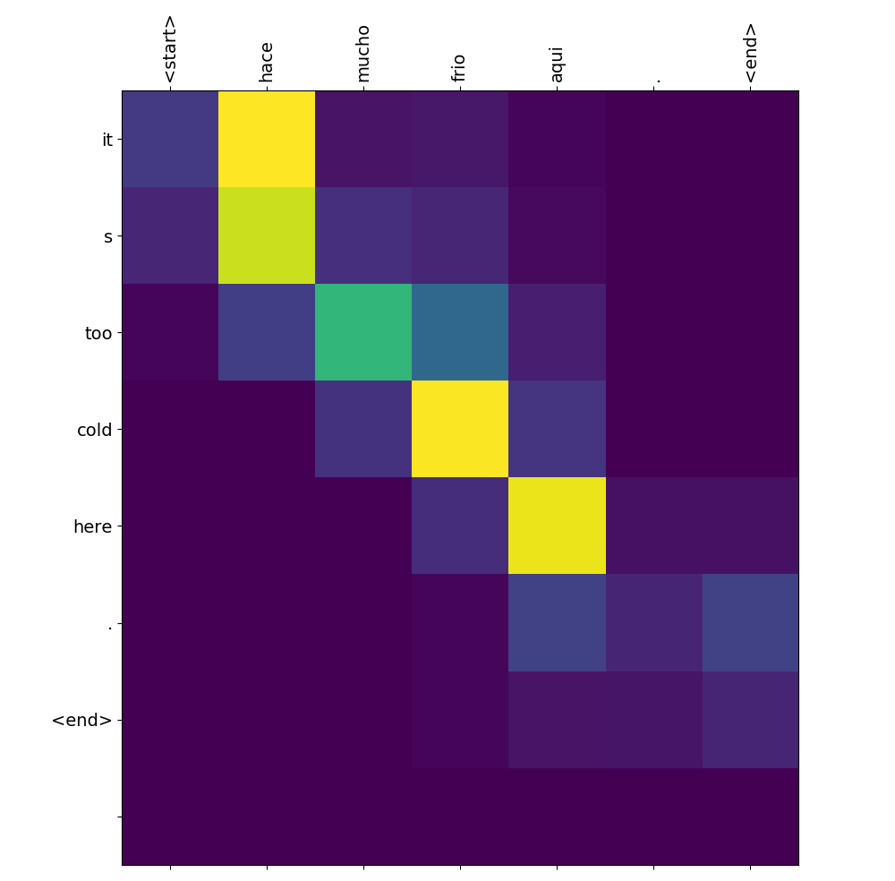
    ```py
    translate('esta es mi vida.', encoder, decoder, inp_lang, targ_lang, max_length_inp, max_length_targ)
    # Input: <start> esta es mi vida . <end>
    # Predicted translation: this is my life . <end>
    ```
    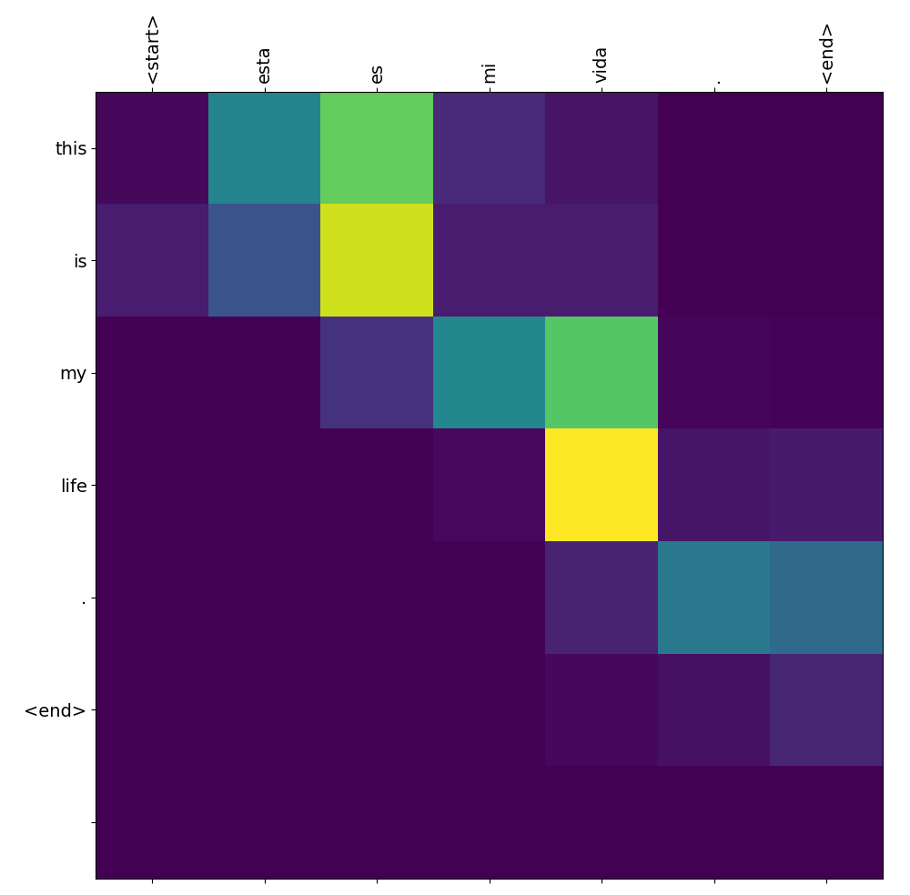
    ```py
    translate('¿todavia estan en casa?', encoder, decoder, inp_lang, targ_lang, max_length_inp, max_length_targ)
    # Input: <start> ¿ todavia estan en casa ? <end>
    # Predicted translation: are you still at home ? <end>
    ```
    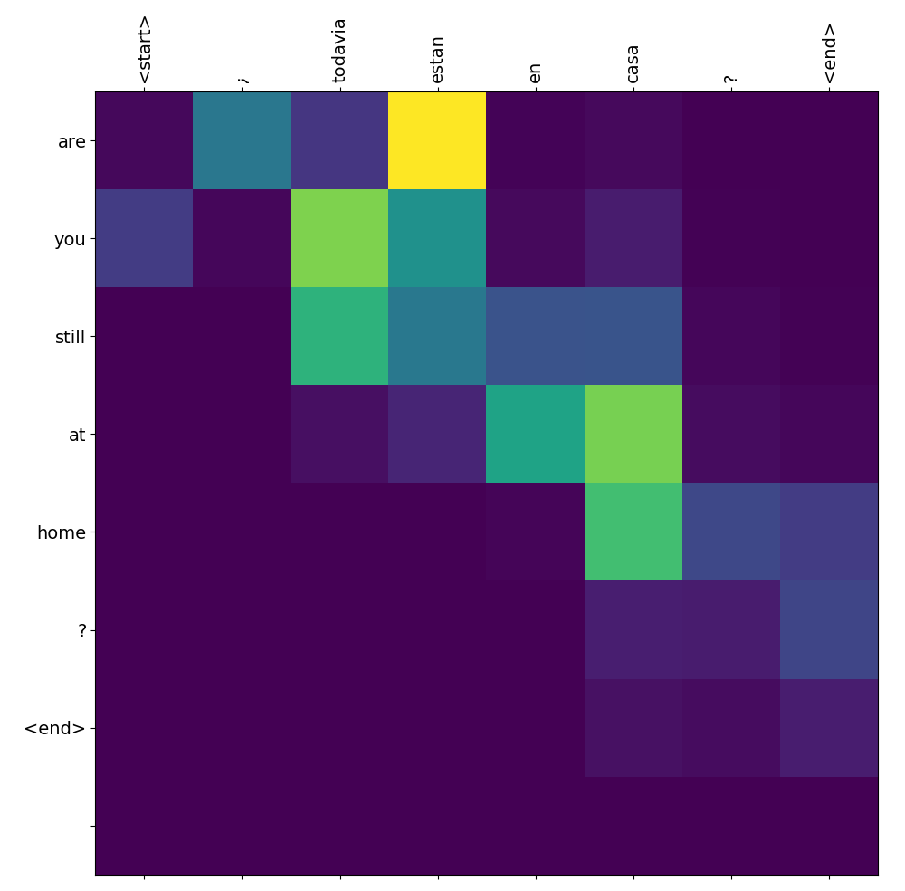
    ```py
    # wrong translation
    translate('trata de averiguarlo.', encoder, decoder, inp_lang, targ_lang, max_length_inp, max_length_targ)
    # Input: <start> trata de averiguarlo . <end>
    # Predicted translation: try to figure it out . <end>
    ```
    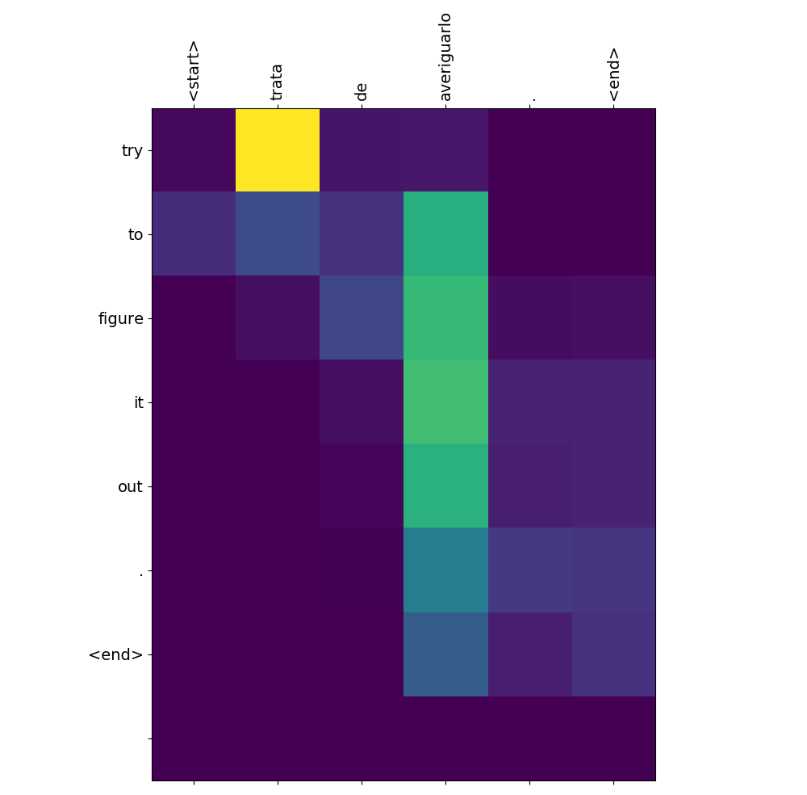
  - **重新加载模型测试**
    ```py
    # restoring the latest checkpoint in checkpoint_dir
    checkpoint.restore(tf.train.latest_checkpoint(checkpoint_dir))
    ```
## Eager 执行环境与 Keras 定义 RNN 模型使用注意力机制为图片命名标题
  - [Image Captioning with Attention](https://github.com/tensorflow/tensorflow/blob/master/tensorflow/contrib/eager/python/examples/generative_examples/image_captioning_with_attention.ipynb)
  - **加载 MS-COCO 数据集** 包含了 `>82,000` 张图片，每一张图片有 `5` 个不同的标题
    ```py
    annotation_zip = tf.keras.utils.get_file('captions.zip',
                                          origin = 'http://images.cocodataset.org/annotations/annotations_trainval2014.zip',
                                          extract = True)
    annotation_file = os.path.dirname(annotation_zip)+'/annotations/captions_train2014.json'
    annotation_file = os.path.expanduser('~/.keras/datasets/annotations/captions_train2014.json')

    # 12.58 G, skip this
    image_zip = tf.keras.utils.get_file('train2014.zip',
                                        origin = 'http://images.cocodataset.org/zips/train2014.zip',
                                        extract = True)
    PATH = os.path.dirname(image_zip)+'/train2014/'

    ''' Test annotations data '''
    import json
    annotations = json.load(open(annotation_file, 'r'))

    print(annotations.keys())
    # dict_keys(['info', 'images', 'licenses', 'annotations'])

    print(len(annotations['images']), len(annotations['annotations']))
    # 82783 414113

    print(annotations['images'][0])
    # {'license': 5,
    #  'file_name': 'COCO_train2014_000000057870.jpg',
    #  'coco_url': 'http://images.cocodataset.org/train2014/COCO_train2014_000000057870.jpg',
    #  'height': 480,
    #  'width': 640,
    #  'date_captured': '2013-11-14 16:28:13',
    #  'flickr_url': 'http://farm4.staticflickr.com/3153/2970773875_164f0c0b83_z.jpg',
    #  'id': 57870}

    print(annotations['annotations'][0])
    # {'image_id': 318556, 'id': 48, 'caption': 'A very clean and well decorated empty bathroom'}
    ```
  - **下载训练用 COCO 图片**
    ```py
    tf.enable_eager_execution()
    from urllib.request import urlretrieve

    def image_downloader(aa):
        return urlretrieve(aa[1], aa[0])

    def multi_download(download_dict, thread_num=50):
        import time
        from multiprocessing import Pool

        dd = list(download_dict.items())
        pp = Pool(thread_num)
        print("Images need to download: {}".format(len(dd)))
        for ii in range(0, len(dd), thread_num):
            start = time.time()
            print('Downloading images {} - {}'.format(ii, ii + thread_num), end=', ')
            tt = dd[ii: ii + thread_num]
            pp.map(image_downloader, tt)
            print ('Time taken for downloading {} images: {:.2f} sec'.format(thread_num, time.time() - start))

    # storing the captions and the image name in vectors
    def reload_or_download_coco_images(annotation_file, num_examples=1000, image_path=None, is_shuffle=True, is_redownload=False, download_thread=100):
        from sklearn.utils import shuffle
        import time
        import pickle
        import json

        if image_path == None:
            image_path = os.path.expanduser('~/.keras/datasets/train2014/')
        if not os.path.exists(image_path):
            os.mkdir(image_path)

        annotation_file = os.path.expanduser(annotation_file)
        backup_file_path = os.path.join(os.path.dirname(annotation_file), 'taining_data_{}.pkl'.format(num_examples))
        if not is_redownload and os.path.exists(backup_file_path):
            print("Load from previous data")
            dd = pickle.load(open(backup_file_path, 'rb'))
            return list(dd.keys()), list(dd.values())

        start = time.time()
        with open(annotation_file, 'r') as ff:
            annotations = json.load(ff)

        if is_shuffle:
            annot = shuffle(annotations['annotations'], random_state=1)[:num_examples]
        else:
            annot = annotations['annotations'][:num_examples]

        annot_images = pd.DataFrame(annotations['images']).set_index('id')

        # storing the captions and the image name in vectors
        all_captions = []
        all_img_name_vector = []
        all_img_url = {}
        for aa in annot:
            caption = '<start> ' + aa['caption'] + ' <end>'
            all_captions.append(caption)

            aa_image = annot_images.loc[aa['image_id']]
            aa_image_path = os.path.join(image_path, aa_image['file_name'])
            if not os.path.exists(aa_image_path):
                all_img_url[aa_image_path] = aa_image['coco_url']

            all_img_name_vector.append(aa_image_path)

        multi_download(all_img_url, download_thread)

        dd = dict(zip(all_captions, all_img_name_vector))
        pickle.dump(dd, open(backup_file_path, 'wb'))
        print ('Time taken: {:.2f} sec, images downloaded size: {}\n'.format(time.time() - start, len(all_img_url)))

        return all_captions, all_img_name_vector

    annotation_file = os.path.expanduser('~/.keras/datasets/annotations/captions_train2014.json')
    train_captions, img_name_vector = reload_or_download_coco_images(annotation_file, num_examples=1000, is_shuffle=True, is_redownload=True)
    # Images need to download: 996
    # Downloading images 0 - 100, Time taken for downloading 100 images: 9.31 sec
    # Time taken: 115.69 sec, images downloaded size: 996
    # Rerun --> Time taken: 7.30 sec, images downloaded size: 0

    train_captions, img_name_vector = reload_or_download_coco_images(annotation_file, num_examples=6000, is_shuffle=True, is_redownload=True, download_thread=100))

    print(len(train_captions), len(img_name_vector))
    # 1000 1000
    print(train_captions[:3])
    # ['<start> A skateboarder performing a trick on a skateboard ramp. <end>',
    #  '<start> a person soaring through the air on skis <end>',
    #  '<start> a wood door with some boards laid against it <end>']

    print(img_name_vector[:3])
    # ['/home/leondgarse/.keras/datasets/train2014/COCO_train2014_000000324909.jpg',
    #  '/home/leondgarse/.keras/datasets/train2014/COCO_train2014_000000511972.jpg',
    #  '/home/leondgarse/.keras/datasets/train2014/COCO_train2014_000000508809.jpg']
    ```
  - **InceptionV3 模型处理图片** 保存过一次后不需要再执行，使用在 `Imagenet` 上预训练过的 `InceptionV3` 模型处理图片，使用模型的最后一个卷积层的输出作为图片特征
    - 定义函数将图片大小转化为 `InceptionV3` 需要的大小 (299, 299)，`preprocess_input` 将图片的像素处理成 (-1, 1) 的值，返回处理后的图片与图片路径
    - 初始化 `InceptionV3` 模型，加载在 `Imagenet` 上预训练过的参数
    - `tf.keras model` 创建模型提取图片特征，模型使用 `InceptionV3` 的层级结构，最后一层卷积层作为输出，输出层维度为 `8 x 8 x 2048`
    - 将每张图片经过定义的图片特征提取模型处理，并将处理后的结果保存在硬盘中, `np.save` 保存 `.npy` 文件，每个文件大小为 `'{:.1f}K'.format(8 * 8 * 2048 * size(tf.float32) / 1024) == '512.0K'`
    ```py
    def load_image(image_path):
        img = tf.read_file(image_path)
        img = tf.image.decode_jpeg(img, channels=3)
        img = tf.image.resize_images(img, (299, 299))
        img = tf.keras.applications.inception_v3.preprocess_input(img)
        return img, image_path

    image_model = tf.keras.applications.InceptionV3(include_top=False, weights='imagenet')
    print(len(image_model.layers))  # 311
    new_input = image_model.input
    hidden_layer = image_model.layers[-1].output
    print(hidden_layer.shape.as_list()) # [None, None, None, 2048]

    image_features_extract_model = tf.keras.Model(new_input, hidden_layer)
    print(len(image_features_extract_model.layers)) # 311

    # If you'd like to see a progress bar, you could: install tqdm (!pip install tqdm), then change this line:
    # for img, path in image_dataset:
    # to:
    # for img, path in tqdm(image_dataset):

    # getting the unique images
    encode_train = sorted(set(img_name_vector))

    # feel free to change the batch_size according to your system configuration
    image_dataset = tf.data.Dataset.from_tensor_slices(encode_train).map(load_image).batch(8)

    # Test
    img, path = image_dataset.make_one_shot_iterator().next()
    print(np.min(img), np.max(img))
    # -1.0 1.0
    print(path.numpy()[0])
    # b'/home/leondgarse/.keras/datasets/train2014/COCO_train2014_000000001204.jpg'
    batch_features = image_features_extract_model(img)
    print(batch_features.shape.as_list())
    # [8, 8, 8, 2048]

    for img, path in image_dataset:
        batch_features = image_features_extract_model(img)
        batch_features = tf.reshape(batch_features, (batch_features.shape[0], -1, batch_features.shape[3]))

        for bf, p in zip(batch_features, path):
            path_of_feature = p.numpy().decode("utf-8")
            np.save(path_of_feature, bf.numpy())
    ```
  - **图片标题 captions 预处理**
    - 首先将图片标题按照空格或特殊字符分割为单词，并使用 `tf.keras.preprocessing.text.Tokenizer` 创建单词表
    - 限制使用 `5000` 个单词，超过数量的单词替换为 `UNK`
    - 创建 `单词 -> 数字索引` 的字典
    - `tf.keras.preprocessing.sequence.pad_sequences` 将图片标题数据的长度统一为最大长度
    ```py
    # choosing the top 5000 words from the vocabulary
    top_k = 5000
    tokenizer = tf.keras.preprocessing.text.Tokenizer(num_words=top_k, oov_token="<unk>", filters='!"#$%&()*+.,-/:;=?@[\]^_`{|}~ ')
    tokenizer.fit_on_texts(['hello world'])
    print(tokenizer.texts_to_sequences(['hello world']))
    # [[8, 9]]

    tokenizer.fit_on_texts(train_captions)
    train_seqs = tokenizer.texts_to_sequences(train_captions)
    print(len(tokenizer.word_index))
    # 1597
    print(train_seqs[:2])
    # [[2, 1, 397, 500, 1, 215, 5, 1, 86, 252, 3], [2, 1, 28, 733, 78, 6, 182, 5, 110, 3]]

    # Keep the top_k word_dict
    tokenizer.word_index = {key:value for key, value in tokenizer.word_index.items() if value <= top_k}
    # putting <unk> token in the word2idx dictionary
    tokenizer.word_index[tokenizer.oov_token] = top_k + 1
    tokenizer.word_index['<pad>'] = 0

    # creating the tokenized vectors
    train_seqs = tokenizer.texts_to_sequences(train_captions)

    # creating a reverse mapping (index -> word)
    index_word = {value:key for key, value in tokenizer.word_index.items()}

    # padding each vector to the max_length of the captions
    # if the max_length parameter is not provided, pad_sequences calculates that automatically
    cap_vector = tf.keras.preprocessing.sequence.pad_sequences(train_seqs, padding='post')
    print(cap_vector.shape)
    # (1000, 29)

    # calculating the max_length, used to store the attention weights
    max_length = max([len(tt) for tt in train_seqs])
    print(max_length) # 29
    ```
  - **分割训练 / 测试数据集，并创建 dataset**
    ```py
    from sklearn.model_selection import train_test_split

    # Create training and validation sets using 80-20 split
    img_name_train, img_name_val, cap_train, cap_val = train_test_split(img_name_vector, cap_vector, test_size=0.2, random_state=0)

    print(len(img_name_train), len(cap_train), len(img_name_val), len(cap_val))
    # 800 800 200 200

    # feel free to change these parameters according to your system's configuration
    BATCH_SIZE = 64
    BUFFER_SIZE = 1000
    embedding_dim = 256
    units = 512
    vocab_size = len(tokenizer.word_index)
    # shape of the vector extracted from InceptionV3 is (64, 2048)
    # these two variables represent that
    features_shape = 2048
    attention_features_shape = 64

    # loading the numpy files
    def map_func(img_name, cap):
        img_tensor = np.load(img_name.decode('utf-8')+'.npy')
        return img_tensor, cap

    dataset = tf.data.Dataset.from_tensor_slices((img_name_train, cap_train))

    # using map to load the numpy files in parallel
    # NOTE: Be sure to set num_parallel_calls to the number of CPU cores you have
    # https://www.tensorflow.org/api_docs/python/tf/py_func
    dataset = dataset.map(lambda item1, item2: tf.py_func(map_func, [item1, item2], [tf.float32, tf.int32]), num_parallel_calls=8)

    # shuffling and batching
    dataset = dataset.shuffle(BUFFER_SIZE)
    # https://www.tensorflow.org/api_docs/python/tf/contrib/data/batch_and_drop_remainder
    dataset = dataset.batch(BATCH_SIZE, drop_remainder=True)
    dataset = dataset.prefetch(1)

    aa, bb = dataset.make_one_shot_iterator().next()
    print(aa.shape.as_list(), bb.shape.as_list())
    # [64, 64, 2048] [64, 29]
    ```
  - **创建模型**
    - [Show, Attend and Tell paper](https://arxiv.org/pdf/1502.03044.pdf)
    - 模型结构类似 **文本翻译** 的 **Encoder-Decoder** 模型，其中 `Encoder` 只有一个全连接层，`BahdanauAttention` 与 `RNN_Decoder` 组合成 `Decoder`
    - `Encoder` 的输入使用 `InceptionV3` 提取的图片特征数据，维度为 `(64, 2048)`
    - `Decoder` 使用一个 `gru` 层解析图片，预测下一个单词
    ```py
    def gru(units):
        # If you have a GPU, we recommend using the CuDNNGRU layer (it provides a
        # significant speedup).
        if tf.test.is_gpu_available():
            return tf.keras.layers.CuDNNGRU(units,
                                      return_sequences=True,
                                      return_state=True,
                                      recurrent_initializer='glorot_uniform')
        else:
            return tf.keras.layers.GRU(units,
                                     return_sequences=True,
                                     return_state=True,
                                     recurrent_activation='sigmoid',
                                     recurrent_initializer='glorot_uniform')

    class BahdanauAttention(tf.keras.Model):
        def __init__(self, units):
            super(BahdanauAttention, self).__init__()
            self.W1 = tf.keras.layers.Dense(units)
            self.W2 = tf.keras.layers.Dense(units)
            self.V = tf.keras.layers.Dense(1)

        def call(self, features, hidden):
            # features(CNN_encoder output) shape == (batch_size, 64, embedding_dim)

            # hidden shape == (batch_size, hidden_size)
            # hidden_with_time_axis shape == (batch_size, 1, hidden_size)
            hidden_with_time_axis = tf.expand_dims(hidden, 1)

            # score shape == (batch_size, 64, hidden_size)
            score = tf.nn.tanh(self.W1(features) + self.W2(hidden_with_time_axis))

            # attention_weights shape == (batch_size, 64, 1)
            # we get 1 at the last axis because we are applying score to self.V
            attention_weights = tf.nn.softmax(self.V(score), axis=1)

            # context_vector shape after sum == (batch_size, hidden_size)
            context_vector = attention_weights * features
            context_vector = tf.reduce_sum(context_vector, axis=1)

            return context_vector, attention_weights

    class CNN_Encoder(tf.keras.Model):
        # Since we have already extracted the features and dumped it using pickle
        # This encoder passes those features through a Fully connected layer
        def __init__(self, embedding_dim):
            super(CNN_Encoder, self).__init__()
            # shape after fc == (batch_size, 64, embedding_dim)
            self.fc = tf.keras.layers.Dense(embedding_dim)

        def call(self, x):
            x = self.fc(x)
            x = tf.nn.relu(x)
            return x

    class RNN_Decoder(tf.keras.Model):
        def __init__(self, embedding_dim, units, vocab_size):
            super(RNN_Decoder, self).__init__()
            self.units = units

            self.embedding = tf.keras.layers.Embedding(vocab_size, embedding_dim)
            self.gru = gru(self.units)
            self.fc1 = tf.keras.layers.Dense(self.units)
            self.fc2 = tf.keras.layers.Dense(vocab_size)

            self.attention = BahdanauAttention(self.units)

        def call(self, x, features, hidden):
            # defining attention as a separate model
            context_vector, attention_weights = self.attention(features, hidden)
            # x shape after passing through embedding == (batch_size, 1, embedding_dim)
            x = self.embedding(x)
            # x shape after concatenation == (batch_size, 1, embedding_dim + hidden_size)
            x = tf.concat([tf.expand_dims(context_vector, 1), x], axis=-1)
            # passing the concatenated vector to the GRU
            output, state = self.gru(x)
            # shape == (batch_size, max_length, hidden_size)
            x = self.fc1(output)
            # x shape == (batch_size * max_length, hidden_size)
            x = tf.reshape(x, (-1, x.shape[2]))
            # output shape == (batch_size * max_length, vocab)
            x = self.fc2(x)

            return x, state, attention_weights

        def reset_state(self, batch_size):
            return tf.zeros((batch_size, self.units))

    encoder = CNN_Encoder(embedding_dim)
    decoder = RNN_Decoder(embedding_dim, units, vocab_size)

    optimizer = tf.train.AdamOptimizer()

    # We are masking the loss calculated for padding
    def loss_function(real, pred):
        mask = 1 - np.equal(real, 0)
        loss_ = tf.nn.sparse_softmax_cross_entropy_with_logits(labels=real, logits=pred) * mask
        return tf.reduce_mean(loss_)
    ```
  - **模型训练**
    - 从 `.npy` 文件中读取数据，作为 `encoder` 的输入
    - 使用 `decoder input` / `encoder` 的输出 / `hidden state` 作为 `decoder` 输入，其中 `decoder input` 为图片标题的目标，初始为 `<start>`，`hidden state` 初始为 0
    - `decoder` 返回 `预测值 predictions` 与 `decoder hidden state`，其中预测值用作计算模型损失，`decoder hidden state` 作为模型下一次输入的 `hidden state`
    - `decoder` 下一次输入的 `decoder input` 使用 `Teacher forcing` 机制从目标值中获取
    - 最后计算模型参数的梯度值，并通过 optimizer 应用到模型参数上
    ```py
    # adding this in a separate cell because if you run the training cell
    # many times, the loss_plot array will be reset
    loss_plot = []

    EPOCHS = 20
    for epoch in range(EPOCHS):
        start = time.time()
        total_loss = 0

        for (batch, (img_tensor, target)) in enumerate(dataset):
            loss = 0

            # initializing the hidden state for each batch
            # because the captions are not related from image to image
            hidden = decoder.reset_state(batch_size=target.shape[0])
            dec_input = tf.expand_dims([tokenizer.word_index['<start>']] * BATCH_SIZE, 1)

            with tf.GradientTape() as tape:
                features = encoder(img_tensor)

                for i in range(1, target.shape[1]):
                    # passing the features through the decoder
                    predictions, hidden, _ = decoder(dec_input, features, hidden)
                    loss += loss_function(target[:, i], predictions)
                    # using teacher forcing
                    dec_input = tf.expand_dims(target[:, i], 1)

            total_loss += (loss / int(target.shape[1]))
            variables = encoder.variables + decoder.variables
            gradients = tape.gradient(loss, variables)
            optimizer.apply_gradients(zip(gradients, variables), tf.train.get_or_create_global_step())

            if batch % 100 == 0:
                print ('Epoch {} Batch {} Loss {:.4f}'.format(epoch + 1, batch, loss.numpy() / int(target.shape[1])))
        # storing the epoch end loss value to plot later
        loss_plot.append(total_loss / len(cap_vector))

        print ('Epoch {} Loss {:.6f}'.format(epoch + 1, total_loss/len(cap_vector)))
        print ('Time taken for 1 epoch {} sec\n'.format(time.time() - start))

    # Epoch 20 Batch 0 Loss 0.4477
    # Epoch 20 Loss 0.005589
    # Time taken for 1 epoch 9.095211744308472 sec

    plt.plot(loss_plot)
    plt.xlabel('Epochs')
    plt.ylabel('Loss')
    plt.title('Loss Plot')
    plt.show()
    ```
    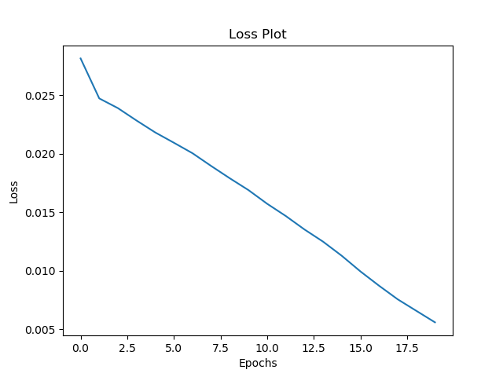
  - **模型预测，生成图片标题**
    -  在模型预测时，Decoder 的输入使用上一次的预测结果，而不是 teacher forcing 产生的输入
    ```py
    def evaluate(image):
        attention_plot = np.zeros((max_length, attention_features_shape))

        hidden = decoder.reset_state(batch_size=1)

        temp_input = tf.expand_dims(load_image(image)[0], 0)
        img_tensor_val = image_features_extract_model(temp_input)
        img_tensor_val = tf.reshape(img_tensor_val, (img_tensor_val.shape[0], -1, img_tensor_val.shape[3]))

        features = encoder(img_tensor_val)

        dec_input = tf.expand_dims([tokenizer.word_index['<start>']], 0)
        result = []

        for i in range(max_length):
            predictions, hidden, attention_weights = decoder(dec_input, features, hidden)

            attention_plot[i] = tf.reshape(attention_weights, (-1, )).numpy()

            predicted_id = tf.argmax(predictions[0]).numpy()
            result.append(index_word[predicted_id])

            if index_word[predicted_id] == '<end>':
                return result, attention_plot

            dec_input = tf.expand_dims([predicted_id], 0)

        attention_plot = attention_plot[:len(result), :]
        return result, attention_plot

    def plot_attention(image, result, attention_plot):
        temp_image = plt.imread(image)
        fig = plt.figure(figsize=(10, 10))

        len_result = len(result)
        for l in range(len_result):
            temp_att = np.resize(attention_plot[l], (8, 8))
            ax = fig.add_subplot(len_result//2, len_result//2, l+1)
            ax.set_title(result[l])
            img = ax.imshow(temp_image)
            ax.imshow(temp_att, cmap='gray', alpha=0.6, extent=img.get_extent())

        plt.tight_layout()
        plt.show()

    # captions on the validation set
    rid = np.random.randint(0, len(img_name_val))
    image = img_name_val[rid]
    real_caption = ' '.join([index_word[i] for i in cap_val[rid] if i not in [0]])

    result, attention_plot = evaluate(image)

    print ('Real Caption:', real_caption)
    # Real Caption: <start> a woman guides a horse towards a fence at a public event <end>
    print ('Prediction Caption:', ' '.join(result))
    # Prediction Caption: an and sheep in uniform playing frisbee <end>

    plot_attention(image, result, attention_plot)
    ```
    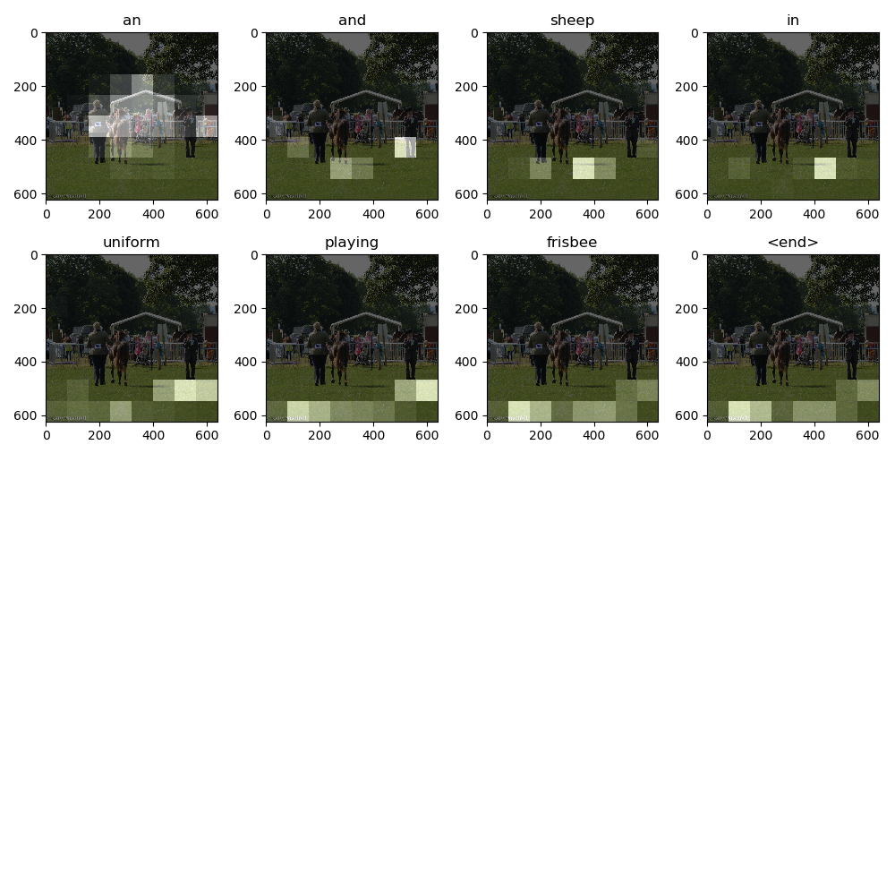
## Eager 执行环境与 Keras 定义 DCGAN 模型生成手写数字图片
  - [DCGAN: An example with tf.keras and eager](https://github.com/tensorflow/tensorflow/blob/master/tensorflow/contrib/eager/python/examples/generative_examples/dcgan.ipynb)
  - **深度卷积对抗生成网络 DCGAN** Deep Convolutional Generative Adverserial Networks https://arxiv.org/pdf/1511.06434.pdf
  - **加载 MNIST 数据集**
    ```py
    tf.enable_eager_execution()

    (train_images, train_labels), (_, _) = tf.keras.datasets.mnist.load_data()
    train_images = train_images.reshape(-1, 28, 28, 1).astype(np.float32)
    # We are normalizing the images to the range of [-1, 1]
    train_images = (train_images - 127.5) / 127.5

    BUFFER_SIZE = 60000
    BATCH_SIZE = 256

    train_dataset = tf.data.Dataset.from_tensor_slices(train_images).shuffle(BUFFER_SIZE).batch(BATCH_SIZE)

    print(train_dataset.make_one_shot_iterator().next().shape.as_list())
    # [256, 28, 28, 1]
    ```
  - **Generator 模型定义** 用于生成手写数字图片，输入是一组随机噪声，最终生成一组 (28, 28, 1) 的图片
    ```py
    class Generator(tf.keras.Model):
        def __init__(self):
            super(Generator, self).__init__()
            self.fc1 = tf.keras.layers.Dense(7*7*64, use_bias=False)
            self.batchnorm1 = tf.keras.layers.BatchNormalization()

            self.conv1 = tf.keras.layers.Conv2DTranspose(64, (5, 5), strides=(1, 1), padding='same', use_bias=False)
            self.batchnorm2 = tf.keras.layers.BatchNormalization()

            self.conv2 = tf.keras.layers.Conv2DTranspose(32, (5, 5), strides=(2, 2), padding='same', use_bias=False)
            self.batchnorm3 = tf.keras.layers.BatchNormalization()

            self.conv3 = tf.keras.layers.Conv2DTranspose(1, (5, 5), strides=(2, 2), padding='same', use_bias=False)

        def call(self, x, training=True):
            x = self.fc1(x)
            x = self.batchnorm1(x, training=training)
            x = tf.nn.relu(x)

            x = tf.reshape(x, shape=(-1, 7, 7, 64))

            x = self.conv1(x)
            x = self.batchnorm2(x, training=training)
            x = tf.nn.relu(x)

            x = self.conv2(x)
            x = self.batchnorm3(x, training=training)
            x = tf.nn.relu(x)

            x = tf.nn.tanh(self.conv3(x))  
            return x
    ```
    **测试**
    ```py
    gg = Generator()
    noise = tf.random_normal([16, 100])
    print(gg(noise, training=False).shape.as_list())
    # [256, 28, 28, 1]

    aa = gg(noise, training=False).numpy()
    fig = plt.figure(figsize=(4, 4))
    for ii, pp in enumerate(aa):
        fig.add_subplot(4, 4, ii + 1)
        plt.imshow(pp.reshape(28, 28), cmap='gray')
        plt.axis('off')
    ```
    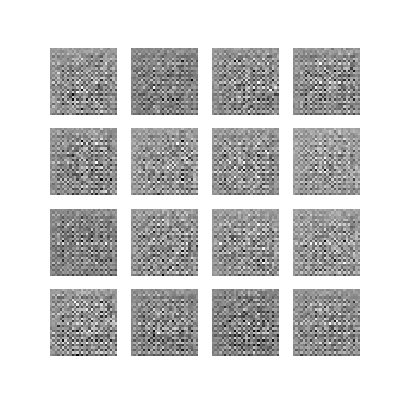
  - **Discriminator 模型定义** 用于区分是真实的手写数字图片，还是 Generator 产生的图片
    ```py
    class Discriminator(tf.keras.Model):
        def __init__(self):
            super(Discriminator, self).__init__()
            self.conv1 = tf.keras.layers.Conv2D(64, (5, 5), strides=(2, 2), padding='same')
            self.conv2 = tf.keras.layers.Conv2D(128, (5, 5), strides=(2, 2), padding='same')
            self.dropout = tf.keras.layers.Dropout(0.3)
            self.flatten = tf.keras.layers.Flatten()
            self.fc1 = tf.keras.layers.Dense(1)

        def call(self, x, training=True):
            x = tf.nn.leaky_relu(self.conv1(x))
            x = self.dropout(x, training=training)
            x = tf.nn.leaky_relu(self.conv2(x))
            x = self.dropout(x, training=training)
            x = self.flatten(x)
            x = self.fc1(x)

            return x
    ```
    **测试**
    ```py
    dd = Discriminator()
    print(dd(tf.convert_to_tensor(train_images[:4])).numpy())
    # [[0.23520969] [0.10257578] [0.21434645] [0.24467401]]

    print(dd(tf.convert_to_tensor(aa[:4])).numpy())
    # [[ 0.0029692 ] [ 0.00318923] [ 0.00415598] [-0.00305315]]
    ```
  - **定义损失函数 / 优化器**
    - **分类器损失 Discriminator loss** 计算真实图片与生成图片的损失，`real_loss` 是真实图片与 **1** 之间的损失，`generated_loss` 是生成图片与 **0** 之间的损失
    - **图片生成器损失 Generator loss** 定义为生成图片与 **1** 之间的损失
    - discriminator 与 generator 要分开训练，因此需要分别定义优化器 optimizer
    ```py
    # Loss functions
    def discriminator_loss(real_output, generated_output):
        # [1,1,...,1] with real output since it is true and we want
        # our generated examples to look like it
        real_loss = tf.losses.sigmoid_cross_entropy(multi_class_labels=tf.ones_like(real_output), logits=real_output)

        # [0,0,...,0] with generated images since they are fake
        generated_loss = tf.losses.sigmoid_cross_entropy(multi_class_labels=tf.zeros_like(generated_output), logits=generated_output)

        total_loss = real_loss + generated_loss

        return total_loss

    def generator_loss(generated_output):
        return tf.losses.sigmoid_cross_entropy(tf.ones_like(generated_output), generated_output)

    # Optimzers
    discriminator_optimizer = tf.train.AdamOptimizer(1e-4)
    generator_optimizer = tf.train.AdamOptimizer(1e-4)
    ```
  - **模型训练与生成图片**
    - 遍历 dataset，每次使用一个 batch
    - generator 使用一个随机生成的 noise 作为输入，产生一组图片，模仿手写数字
    - discriminator 分别使用真实图片与生成图片，生成图片真实性的分数
    - 分别计算 generator 与 discriminator 的损失
    - 根据损失，优化器在 generator 与 discriminator 的参数上应用梯度计算
    - 在训练过程中保存 generator 生成的图片
    ```py
    # keeping the random vector constant for generation (prediction) so
    # it will be easier to see the improvement of the gan.
    num_examples_to_generate = 16
    noise_dim = 100
    random_vector_for_generation = tf.random_normal([num_examples_to_generate, noise_dim])

    IMAGE_SAVE_PATH = './images_gen_epoch_DCGAN'
    if not os.path.exists(IMAGE_SAVE_PATH): os.mkdir(IMAGE_SAVE_PATH)

    def generate_and_save_images(model, epoch, test_input):
        # make sure the training parameter is set to False because we
        # don't want to train the batchnorm layer when doing inference.
        predictions = model(test_input, training=False)

        fig = plt.figure(figsize=(4,4))

        for i in range(predictions.shape[0]):
            plt.subplot(4, 4, i+1)
            plt.imshow(predictions[i, :, :, 0] * 127.5 + 127.5, cmap='gray')
            plt.axis('off')

        plt.savefig(os.path.join(IMAGE_SAVE_PATH, 'image_at_epoch_{:04d}.png'.format(epoch)))
        plt.close()
        # plt.show()

    def train(dataset, epochs, noise_dim):
        for epoch in range(epochs):
            start = time.time()

            # One batch each time
            for images in dataset:
                # generating noise from a uniform distribution
                noise = tf.random_normal([BATCH_SIZE, noise_dim])

                with tf.GradientTape() as gen_tape, tf.GradientTape() as disc_tape:
                    generated_images = generator(noise, training=True)

                    real_output = discriminator(images, training=True)
                    generated_output = discriminator(generated_images, training=True)

                    gen_loss = generator_loss(generated_output)
                    disc_loss = discriminator_loss(real_output, generated_output)

                gradients_of_generator = gen_tape.gradient(gen_loss, generator.variables)
                gradients_of_discriminator = disc_tape.gradient(disc_loss, discriminator.variables)

                generator_optimizer.apply_gradients(zip(gradients_of_generator, generator.variables))
                discriminator_optimizer.apply_gradients(zip(gradients_of_discriminator, discriminator.variables))

            if epoch % 1 == 0:
                generate_and_save_images(generator, epoch + 1, random_vector_for_generation)

            # saving (checkpoint) the model every 15 epochs
            if (epoch + 1) % 15 == 0:
                checkpoint.save(file_prefix = checkpoint_prefix)

            print ('Time taken for epoch {} is {} sec'.format(epoch + 1, time.time()-start))

        # generating after the final epoch
        generate_and_save_images(generator, epochs, random_vector_for_generation)

    generator = Generator()
    discriminator = Discriminator()

    # Defun gives 10 secs/epoch performance boost
    generator.call = tf.contrib.eager.defun(generator.call)
    discriminator.call = tf.contrib.eager.defun(discriminator.call)

    # Checkpoint
    checkpoint_dir = './training_checkpoints'
    checkpoint_prefix = os.path.join(checkpoint_dir, "ckpt")
    checkpoint = tf.train.Checkpoint(generator_optimizer=generator_optimizer,
                                     discriminator_optimizer=discriminator_optimizer,
                                     generator=generator,
                                     discriminator=discriminator)

    EPOCHS = 150
    train(train_dataset, EPOCHS, noise_dim)
    # Time taken for epoch 148 is 60.98359799385071 sec
    # Time taken for epoch 149 is 60.96733999252319 sec
    # Time taken for epoch 150 is 61.09264779090881 sec
    ```
    **运行结果**
    ```py
    aa = generator(random_vector_for_generation, training=False)
    fig = plt.figure(figsize=(4, 4))
    for ii, pp in enumerate(aa.numpy()):
        fig.add_subplot(4, 4, ii + 1)
        plt.imshow(pp.reshape(28, 28), cmap='gray')
        plt.axis('off')

    ggo = discriminator(aa).numpy()
    rro = discriminator(tf.convert_to_tensor(train_images[:16])).numpy()
    print(generator_loss(ggo).numpy())
    # 0.77987427

    print(discriminator_loss(ggo, rro).numpy())
    # 1.682136

    ''' 使用 train_images, train_labels 训练分类器 '''
    dataset_train = tf.data.Dataset.from_tensor_slices((train_images, train_labels.astype(np.int64)))
    dataset_train = dataset_train.shuffle(60000).repeat(4).batch(32)

    ... MNIST train progress ...

    print(tf.argmax(model(aa), axis=1).numpy())
    # [9 5 9 4 0 1 6 4 8 6 7 9 2 6 9 7]
    ```
    
  - **重新加载模型**
    ```py
    # restoring the latest checkpoint in checkpoint_dir
    checkpoint.restore(tf.train.latest_checkpoint(checkpoint_dir))
    ```
  - **GIF 图片显示生成结果**
    ```py
    ''' Display an image using the epoch number '''
    IMAGE_SAVE_PATH = './images_gen_epoch_DCGAN'
    def display_image(epoch_no):
        return plt.imread(os.path.join(IMAGE_SAVE_PATH, 'image_at_epoch_{:04d}.png'.format(epoch_no)))

    plt.imshow(display_image(3))

    ''' matplotlib.animation '''
    from matplotlib import animation
    import glob

    fig = plt.figure()
    data = display_image(1)
    im = plt.imshow(data)
    plt.axis('off')

    # animation function.  This is called sequentially
    IMAGES_NUM = len(glob.glob(os.path.join(IMAGE_SAVE_PATH, 'image*.png')))
    SAMPLE_RATE = 5
    def animate(i):
        im_num = (i * SAMPLE_RATE % IMAGES_NUM) + 1
        data = display_image(im_num)
        im.set_array(data)
        return [im]

    anim = animation.FuncAnimation(fig, animate, frames=int(IMAGES_NUM / SAMPLE_RATE), interval=60, blit=True)
    plt.show()
    anim.save(os.path.join(IMAGE_SAVE_PATH, 'dcgan.gif'), writer='imagemagick', dpi=100)
    ```
    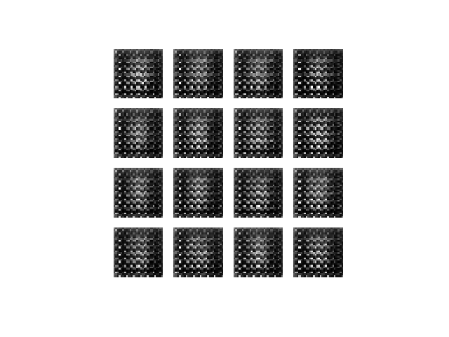

    **使用 imageio 保存 GIF**
    ```py
    ''' imageio '''
    import imageio

    IMAGE_SAVE_PATH = './images_gen_epoch_DCGAN'
    IMAGES_NUM = len(glob.glob(os.path.join(IMAGE_SAVE_PATH, 'image*.png')))
    with imageio.get_writer('dcgan.gif', mode='I') as writer:
        filenames = glob.glob(os.path.join(IMAGE_SAVE_PATH, 'image*.png'))
        filenames = sorted(filenames)
        last = -1
        for i,filename in enumerate(filenames):
            frame = 2*(i**0.5)
            if round(frame) > round(last):
                last = frame
            else:
                continue
            image = imageio.imread(filename)
            writer.append_data(image)
        image = imageio.imread(filename)
        writer.append_data(image)
    ```
## Eager 执行环境与 Keras 定义 VAE 模型生成手写数字图片
  - [Convolutional VAE: An example with tf.keras and eager](https://github.com/tensorflow/tensorflow/blob/master/tensorflow/contrib/eager/python/examples/generative_examples/cvae.ipynb)
  - **变分自编码器 VAE** Variational Autoencoder，不关注隐含向量所服从的分布，只需要告诉网络想让这个分布转换为什么样子，VAE 对隐层的输出增加了长约束，而在对隐层的采样过程也能起到和一般 dropout 效果类似的正则化作用
  - **潜变量 Latent variables** ，与可观察变量相对，不能直接观察但可以通过观察到的其他变量推断，一个潜变量往往对应着多个显变量，可以看做其对应显变量的抽象和概括，显变量则可视为特定潜变量的反应指标
  - **加载 MNIST 数据集** 将每个像素点转化为 0 / 1
    ```py
    tf.enable_eager_execution()

    (train_images, train_labels), (test_images, test_labels) = tf.keras.datasets.mnist.load_data()

    # Binarization
    train_images = (train_images >= 0.5 * 255).astype(np.float32).reshape(-1, 28, 28, 1)
    test_images = (test_images >= 0.5 * 255).astype(np.float32).reshape(-1, 28, 28, 1)

    TRAIN_BUF = 60000
    BATCH_SIZE = 100
    TEST_BUF = 10000

    train_dataset = tf.data.Dataset.from_tensor_slices(train_images).shuffle(TRAIN_BUF).batch(BATCH_SIZE)
    test_dataset = tf.data.Dataset.from_tensor_slices(test_images).shuffle(TEST_BUF).batch(BATCH_SIZE)
    ```
  - **tf.keras.Sequential 组合 generative 与 inference 网络**
    - 使用两个卷积网络模型作为 generative 与 inference，分别使用 `tf.keras.Sequential` 创建，模型的输入包括 **潜变量 latent variable** `z` 与 **显变量 observation variable** `x`
    - **Generative 网络** 使用一组潜变量 `z` 作为输入，输出显变量 `x` 的条件分布 `p(x|z)` 的参数，其中潜变量分布 `p(z)` 采用 **单位高斯先验 unit Gaussian prior**
    - **Inference 网络** 定义一个 **近似后验分布 approximate posterior distribution**，输入一组显变量 `x`，输出一组潜变量 `z` 条件分布 `q(z|x)` 的参数
    - 可以使用 **对角高斯分布 diagonal Gaussian** 简化 Inference 网络，输出一组 **因式分解高斯 factorized Gaussian** 参数的 **平均值 mean** 与 **log 值 log-variance**，输出 log 值可以提高数据值的稳定
    - **重新参数化 Reparameterization** 在参数优化时，首先按照一个 **单位高斯分布** 从 `q(z|x)` 中采样，然后将采样值乘以 **标准差 standard deviation**，再加上 **平均值 mean**，保证在经过采样后梯度可以传递到 Inference 的参数
    - **网络结构 Network architecture** Inference 网络使用两个卷积层与一个全连接层，Generative 网络映射该结构，使用一个全连接层与三个 **卷积转置层 convolution transpose layers**
    - 在训练 VAE 网络时，应避免使用 **批归一化 batch normalization**，因为附加的随机性会使随机采样的稳定性下降
    ```py
    class CVAE(tf.keras.Model):
        def __init__(self, latent_dim):
            super(CVAE, self).__init__()
            self.latent_dim = latent_dim
            self.inference_net = tf.keras.Sequential([
                  tf.keras.layers.InputLayer(input_shape=(28, 28, 1)),
                  tf.keras.layers.Conv2D(filters=32, kernel_size=3, strides=(2, 2), activation=tf.nn.relu),
                  tf.keras.layers.Conv2D(filters=64, kernel_size=3, strides=(2, 2), activation=tf.nn.relu),
                  tf.keras.layers.Flatten(),
                  # No activation
                  tf.keras.layers.Dense(latent_dim + latent_dim)])

            self.generative_net = tf.keras.Sequential([
                  tf.keras.layers.InputLayer(input_shape=(latent_dim,)),
                  tf.keras.layers.Dense(units=7*7*32, activation=tf.nn.relu),
                  tf.keras.layers.Reshape(target_shape=(7, 7, 32)),
                  tf.keras.layers.Conv2DTranspose(filters=64, kernel_size=3, strides=(2, 2), padding="SAME", activation=tf.nn.relu),
                  tf.keras.layers.Conv2DTranspose(filters=32, kernel_size=3, strides=(2, 2), padding="SAME", activation=tf.nn.relu),
                  # No activation
                  tf.keras.layers.Conv2DTranspose(filters=1, kernel_size=3, strides=(1, 1), padding="SAME")])

        def sample(self, eps=None):
            if eps is None:
                eps = tf.random_normal(shape=(100, self.latent_dim))
            return self.decode(eps, apply_sigmoid=True)

        def encode(self, x):
            mean, logvar = tf.split(self.inference_net(x), num_or_size_splits=2, axis=1)
            return mean, logvar

        def reparameterize(self, mean, logvar):
            eps = tf.random_normal(shape=mean.shape)
            return eps * tf.exp(logvar * .5) + mean

        def decode(self, z, apply_sigmoid=False):
            logits = self.generative_net(z)
            if apply_sigmoid:
                probs = tf.sigmoid(logits)
                return probs

            return logits
    ```
    **测试**
    ```py
    zz = tf.random_normal(shape=[16, 50])
    model = CVAE(50)

    aa = model.sample(zz).numpy()
    print(aa.shape)
    # (16, 28, 28, 1)

    fig = plt.figure(figsize=(4, 4))
    for ii, pp in enumerate(aa):
        fig.add_subplot(4, 4, ii + 1)
        plt.imshow(pp.reshape(28, 28), cmap='gray')
        plt.axis('off')
    ```
    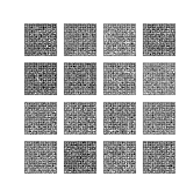
  - **定义损失函数与优化器**
    - VAE 网络的训练过程，将 **ELBO 边际似然函数下界 evidence lower bound** 最大化

      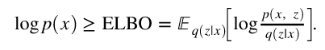
    - 在实际使用时，优化期望值的单样本 **蒙特卡洛估计 Monte Carlo estimate**

      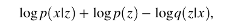

      其中 `z` 使用的是按照 **重新参数化 Reparameterization** 从 `q(z|x)` 中的采样值
    ```py
    def log_normal_pdf(sample, mean, logvar, raxis=1):
        log2pi = tf.log(2. * np.pi)
        return tf.reduce_sum(
            -.5 * ((sample - mean) ** 2. * tf.exp(-logvar) + logvar + log2pi),
            axis=raxis)

    def compute_loss(model, x):
        mean, logvar = model.encode(x)
        z = model.reparameterize(mean, logvar)
        x_logit = model.decode(z)

        cross_ent = tf.nn.sigmoid_cross_entropy_with_logits(logits=x_logit, labels=x)
        logpx_z = -tf.reduce_sum(cross_ent, axis=[1, 2, 3])
        logpz = log_normal_pdf(z, 0., 0.)
        logqz_x = log_normal_pdf(z, mean, logvar)
        return -tf.reduce_mean(logpx_z + logpz - logqz_x)

    def compute_gradients(model, x):
        with tf.GradientTape() as tape:
            loss = compute_loss(model, x)
        return tape.gradient(loss, model.trainable_variables), loss

    optimizer = tf.train.AdamOptimizer(1e-4)
    def apply_gradients(optimizer, gradients, variables, global_step=None):
        optimizer.apply_gradients(zip(gradients, variables), global_step=global_step)
    ```
  - **模型训练与生成图片**
    - 遍历 dataset，每次使用一个 batch
    - 每次遍历过程中，`compute_loss` 函数首先使用 `encode` 调用模型的 `Inference` 将输入图片转化成一组 `q(z|x)` 的平均值与 log 参数值
    - 使用 `reparameterize` 从 `q(z|x)` 生成 `显变量 z`
    - 最后使用 `decode` 调用模型的 `Generative` 模型的预测值分布 `p(x|z)`
    - 在模型训练完成生成图片时，首先使用一组 **单位高斯分布 unit Gaussian prior** 采样的潜变量作为输入，`Generative` 将其转化为模型预测值，即生成图片
    ```py
    import tensorflow.contrib.eager as tfe

    epochs = 100
    latent_dim = 50
    num_examples_to_generate = 16

    # keeping the random vector constant for generation (prediction) so
    # it will be easier to see the improvement.
    random_vector_for_generation = tf.random_normal(shape=[num_examples_to_generate, latent_dim])
    vae_model = CVAE(latent_dim)

    IMAGE_SAVE_PATH = './images_gen_epoch_VAE'
    if not os.path.exists(IMAGE_SAVE_PATH): os.mkdir(IMAGE_SAVE_PATH)

    def generate_and_save_images(model, epoch, test_input):
        predictions = model.sample(test_input)
        fig = plt.figure(figsize=(4,4))

        for i in range(predictions.shape[0]):
            plt.subplot(4, 4, i+1)
            plt.imshow(predictions[i, :, :, 0], cmap='gray')
            plt.axis('off')

        # tight_layout minimizes the overlap between 2 sub-plots
        plt.savefig(os.path.join(IMAGE_SAVE_PATH, 'image_at_epoch_{:04d}.png'.format(epoch)))
        plt.close()
        # plt.show()

    generate_and_save_images(vae_model, 0, random_vector_for_generation)

    for epoch in range(1, epochs + 1):
        start_time = time.time()
        for train_x in train_dataset:
            gradients, loss = compute_gradients(vae_model, train_x)
            apply_gradients(optimizer, gradients, vae_model.trainable_variables)
        end_time = time.time()

        if epoch % 1 == 0:
            loss = tfe.metrics.Mean()
            for test_x in test_dataset.make_one_shot_iterator():
                loss(compute_loss(vae_model, test_x))
            elbo = -loss.result()
            print('Epoch: {}, Test set ELBO: {}, ' 'time elapse for current epoch {}'.format(epoch, elbo, end_time - start_time))
            generate_and_save_images(vae_model, epoch, random_vector_for_generation)

    # Epoch: 100, Test set ELBO: -78.0380078125, time elapse for current epoch 26.878722190856934
    ```
    **运行结果**
    ```py
    aa = vae_model.sample(random_vector_for_generation)
    fig = plt.figure(figsize=(4, 4))
    for ii, pp in enumerate(aa.numpy()):
        fig.add_subplot(4, 4, ii + 1)
        plt.imshow(pp.reshape(28, 28), cmap='gray')
        plt.axis('off')

    loss = tfe.metrics.Mean()
    for test_x in test_dataset.make_one_shot_iterator():
        loss(compute_loss(vae_model, test_x))
    elbo = -loss.result()
    print('Test set ELBO: {}'.format(elbo))
    # Test set ELBO: -78.02953224182129

    ''' 使用 train_images, train_labels 训练分类器 '''
    dataset_train = tf.data.Dataset.from_tensor_slices((train_images, train_labels.astype(np.int64)))
    dataset_train = dataset_train.shuffle(60000).repeat(4).batch(32)

    ... MNIST train progress ...

    print(tf.argmax(model(aa), axis=1).numpy())
    # [3 0 0 6 4 4 6 8 6 4 1 2 8 1 8 0]
    ```
    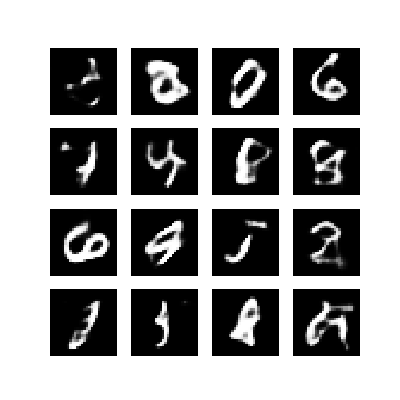
  - **GIF 图片显示生成结果**
    ```py
    ''' Display an image using the epoch number '''
    IMAGE_SAVE_PATH = './images_gen_epoch_VAE'
    def display_image(epoch_no):
        return plt.imread(os.path.join(IMAGE_SAVE_PATH, 'image_at_epoch_{:04d}.png'.format(epoch_no)))

    plt.imshow(display_image(3))

    ''' matplotlib.animation '''
    from matplotlib import animation
    import glob

    fig = plt.figure()
    data = display_image(1)
    im = plt.imshow(data)
    plt.axis('off')

    # animation function.  This is called sequentially
    IMAGES_NUM = len(glob.glob(os.path.join(IMAGE_SAVE_PATH, 'image*.png')))
    SAMPLE_RATE = 2
    def animate(i):
        im_num = (i * SAMPLE_RATE % IMAGES_NUM) + 1
        data = display_image(im_num)
        im.set_array(data)
        return [im]

    anim = animation.FuncAnimation(fig, animate, frames=int(IMAGES_NUM / SAMPLE_RATE), interval=60, blit=True)
    plt.show()
    anim.save(os.path.join(IMAGE_SAVE_PATH, 'vae.gif'), writer='imagemagick', dpi=100)
    ```
    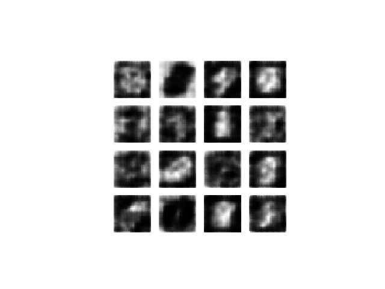
***

# 图像处理应用
## Pix2Pix 建筑物表面图片上色
  - [Pix2Pix: An example with tf.keras and eager](https://github.com/tensorflow/tensorflow/blob/master/tensorflow/contrib/eager/python/examples/pix2pix/pix2pix_eager.ipynb)
  - [Image-to-Image Translation with Conditional Adversarial Networks](https://arxiv.org/pdf/1611.07004)
  - [Colab pix2pix_eager.ipynb](https://colab.research.google.com/drive/1VzhyuRq287z34YBKxZwyyK3WkCcVLXa5)
  - **跳跃式传递 skip connections**
    - 在目标检测算法中，为了兼顾大目标和小目标，目前主流方法是用 **skip connections** 综合利用更多的卷积特征图信息
    - **极深网络 ResNet / DenseNet** 通过引入 **residual network 残差网络结构** 到 `CNN` 网络结构中，从输入源直接向输出源多连接了一条传递线，用来进行残差计算，是一种 **恒等映射 identity mapping**，这就是 **shortcut connection**，也叫 **skip connection**
    - 其效果是为了防止网络层数增加而导致的梯度弥散问题与退化问题，并且对于 CNN 的性能有明显的提升

    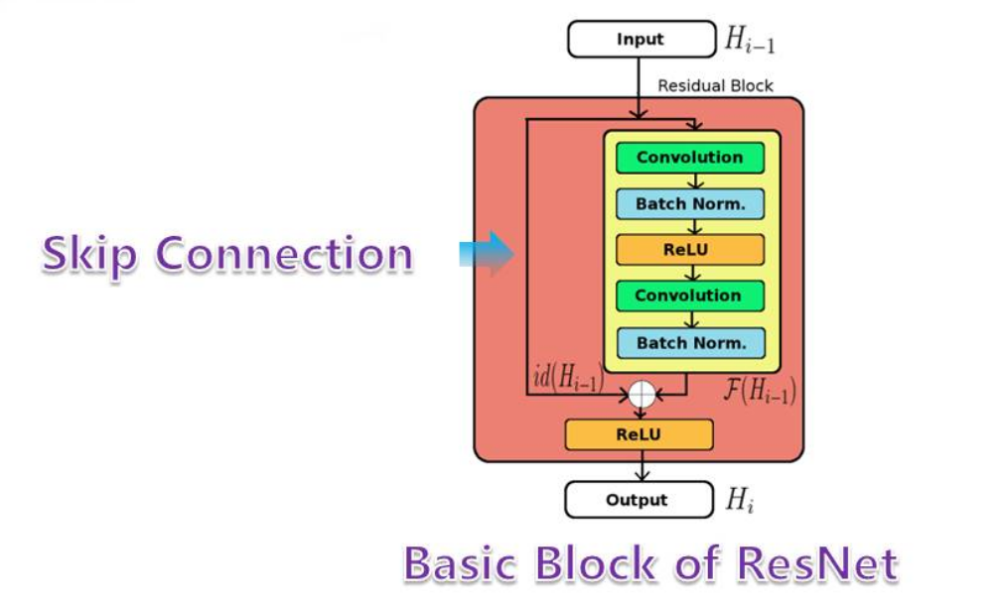
  - **加载 CMP Facade 数据集** 每张图片左边是建筑物的真实图片，右边是表面轮廓图片，训练 `conditional GAN` 模型为图片上色，将表面轮廓图片转化为真实建筑物图片
    - [Index of /~tinghuiz/projects/pix2pix/datasets](https://people.eecs.berkeley.edu/~tinghuiz/projects/pix2pix/datasets/)
    ```py
    tf.enable_eager_execution()
    path_to_zip = tf.keras.utils.get_file('facades.tar.gz',
                      origin='https://people.eecs.berkeley.edu/~tinghuiz/projects/pix2pix/datasets/facades.tar.gz',
                      extract=True)
    PATH = os.path.join(os.path.dirname(path_to_zip), 'facades/')
    PATH = os.path.expanduser('~/.keras/datasets/facades/')
    ```
    **图片文件测试**
    ```py
    image_file = os.path.expanduser('~/.keras/datasets/facades/train/212.jpg')
    imm = plt.imread(image_file)
    print(imm.shape)
    # (256, 512, 3)

    real_image = imm[:, :imm.shape[1] // 2, :]
    input_image = imm[:, imm.shape[1] // 2:, :]

    def show_cmp_image(real_image, input_image):
        fig = plt.figure(figsize=[8, 4])
        fig.add_subplot(1, 2, 1)
        plt.imshow(real_image)
        plt.axis('off')
        fig.add_subplot(1, 2, 2)
        plt.imshow(input_image)
        plt.axis('off')
        fig.tight_layout()

    show_cmp_image(real_image, input_image)
    ```
    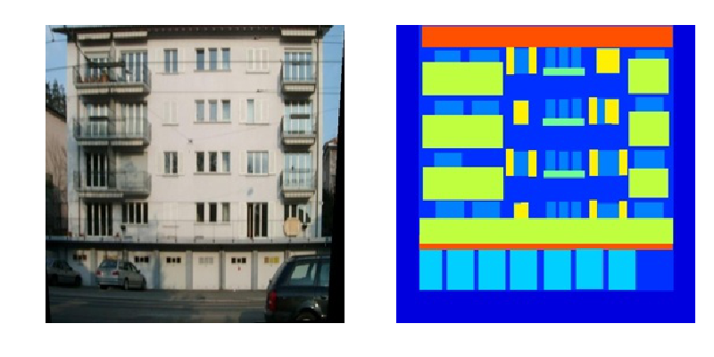
  - **创建 dataset**
    - **Random jittering** 将图片大小处理成 `286 x 286`，然后随机裁剪成 `256 x 256` 大小
    - **Random mirroring** 随机将图片水平翻转
    - **Normalizing** 将图片像素值正则化成 `[-1, 1]`
    ```py
    BUFFER_SIZE = 400
    BATCH_SIZE = 1
    IMG_WIDTH = 256
    IMG_HEIGHT = 256

    def load_image(image_file, is_train):
        image = tf.read_file(image_file)
        image = tf.image.decode_jpeg(image)

        w = tf.shape(image)[1]

        w = w // 2
        real_image = image[:, :w, :]
        input_image = image[:, w:, :]

        input_image = tf.cast(input_image, tf.float32)
        real_image = tf.cast(real_image, tf.float32)

        if is_train:
            # random jittering
            # resizing to 286 x 286 x 3
            input_image = tf.image.resize_images(input_image, [286, 286],
                                align_corners=True, method=tf.image.ResizeMethod.NEAREST_NEIGHBOR)
            real_image = tf.image.resize_images(real_image, [286, 286],
                                align_corners=True, method=tf.image.ResizeMethod.NEAREST_NEIGHBOR)

            # randomly cropping to 256 x 256 x 3
            stacked_image = tf.stack([input_image, real_image], axis=0)
            cropped_image = tf.random_crop(stacked_image, size=[2, IMG_HEIGHT, IMG_WIDTH, 3])
            input_image, real_image = cropped_image[0], cropped_image[1]

            if np.random.random() > 0.5:
                # random mirroring
                input_image = tf.image.flip_left_right(input_image)
                real_image = tf.image.flip_left_right(real_image)
        else:
            input_image = tf.image.resize_images(input_image, size=[IMG_HEIGHT, IMG_WIDTH],
                                                align_corners=True, method=2)
            real_image = tf.image.resize_images(real_image, size=[IMG_HEIGHT, IMG_WIDTH],
                                                align_corners=True, method=2)

        # normalizing the images to [-1, 1]
        input_image = (input_image / 127.5) - 1
        real_image = (real_image / 127.5) - 1

        return input_image, real_image

    # Use tf.data to create batches, map(do preprocessing) and shuffle the dataset
    train_dataset = tf.data.Dataset.list_files(PATH+'train/*.jpg')
    image_file = train_dataset.make_one_shot_iterator().next().numpy().decode()
    print(image_file)
    # /home/leondgarse/.keras/datasets/facades/train/212.jpg

    train_dataset = train_dataset.shuffle(BUFFER_SIZE)
    train_dataset = train_dataset.map(lambda x: load_image(x, True))
    train_dataset = train_dataset.batch(1)

    test_dataset = tf.data.Dataset.list_files(PATH+'test/*.jpg')
    test_dataset = test_dataset.map(lambda x: load_image(x, False))
    test_dataset = test_dataset.batch(1)
    ```
    **测试**
    ```py
    aa, bb = train_dataset.make_one_shot_iterator().next()
    print(aa.shape.as_list(), bb.shape.as_list())
    # [1, 256, 256, 3] [1, 256, 256, 3]
    print(np.min(aa), np.max(aa))
    # -1.0 1.0

    show_cmp_image(bb[0] * 0.5 + 0.5, aa[0] * 0.5 + 0.5)
    ```
    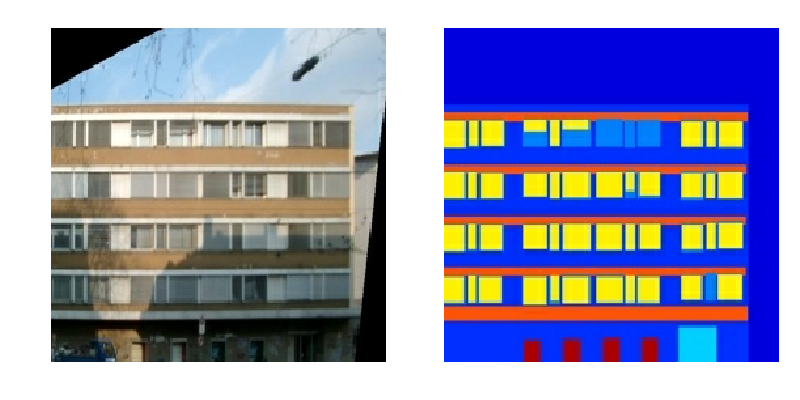
  - **Generator 模型定义**
    - **Generator 结构** 是一个修改的 `U-Net`
    - 每个 **Encoder** 即 `Downsample` 的结构是 `Conv -> Batchnorm -> Leaky ReLU`
    - 每个 **Decoder** 即 `Upsample` 的结构是 `Transposed Conv -> Batchnorm -> Dropout(applied to the first 3 blocks) -> ReLU`
    - 类似 `U-Net`，在 encoder 与 decoder 之间存在 **跳跃式传递 skip connections**
    ```py
    OUTPUT_CHANNELS = 3

    class Downsample(tf.keras.Model):
        def __init__(self, filters, size, apply_batchnorm=True):
            super(Downsample, self).__init__()
            self.apply_batchnorm = apply_batchnorm
            initializer = tf.random_normal_initializer(0., 0.02)

            self.conv1 = tf.keras.layers.Conv2D(filters,
                                                (size, size),
                                                strides=2,
                                                padding='same',
                                                kernel_initializer=initializer,
                                                use_bias=False)
            if self.apply_batchnorm:
                self.batchnorm = tf.keras.layers.BatchNormalization()

        def call(self, x, training):
            x = self.conv1(x)
            if self.apply_batchnorm:
                x = self.batchnorm(x, training=training)
            x = tf.nn.leaky_relu(x)
            return x

    class Upsample(tf.keras.Model):
        def __init__(self, filters, size, apply_dropout=False):
            super(Upsample, self).__init__()
            self.apply_dropout = apply_dropout
            initializer = tf.random_normal_initializer(0., 0.02)

            self.up_conv = tf.keras.layers.Conv2DTranspose(filters,
                                                           (size, size),
                                                           strides=2,
                                                           padding='same',
                                                           kernel_initializer=initializer,
                                                           use_bias=False)
            self.batchnorm = tf.keras.layers.BatchNormalization()
            if self.apply_dropout:
                self.dropout = tf.keras.layers.Dropout(0.5)

        def call(self, x1, x2, training):
            x = self.up_conv(x1)
            x = self.batchnorm(x, training=training)
            if self.apply_dropout:
                x = self.dropout(x, training=training)
            x = tf.nn.relu(x)
            x = tf.concat([x, x2], axis=-1)
            return x

    class Generator(tf.keras.Model):
        def __init__(self):
            super(Generator, self).__init__()
            initializer = tf.random_normal_initializer(0., 0.02)

            self.down1 = Downsample(64, 4, apply_batchnorm=False)
            self.down2 = Downsample(128, 4)
            self.down3 = Downsample(256, 4)
            self.down4 = Downsample(512, 4)
            self.down5 = Downsample(512, 4)
            self.down6 = Downsample(512, 4)
            self.down7 = Downsample(512, 4)
            self.down8 = Downsample(512, 4)

            self.up1 = Upsample(512, 4, apply_dropout=True)
            self.up2 = Upsample(512, 4, apply_dropout=True)
            self.up3 = Upsample(512, 4, apply_dropout=True)
            self.up4 = Upsample(512, 4)
            self.up5 = Upsample(256, 4)
            self.up6 = Upsample(128, 4)
            self.up7 = Upsample(64, 4)

            self.last = tf.keras.layers.Conv2DTranspose(OUTPUT_CHANNELS,
                                                        (4, 4),
                                                        strides=2,
                                                        padding='same',
                                                        kernel_initializer=initializer)

        @tf.contrib.eager.defun
        def call(self, x, training):
            # x shape == (bs, 256, 256, 3)    
            x1 = self.down1(x, training=training) # (bs, 128, 128, 64)
            x2 = self.down2(x1, training=training) # (bs, 64, 64, 128)
            x3 = self.down3(x2, training=training) # (bs, 32, 32, 256)
            x4 = self.down4(x3, training=training) # (bs, 16, 16, 512)
            x5 = self.down5(x4, training=training) # (bs, 8, 8, 512)
            x6 = self.down6(x5, training=training) # (bs, 4, 4, 512)
            x7 = self.down7(x6, training=training) # (bs, 2, 2, 512)
            x8 = self.down8(x7, training=training) # (bs, 1, 1, 512)

            x9 = self.up1(x8, x7, training=training) # (bs, 2, 2, 1024)
            x10 = self.up2(x9, x6, training=training) # (bs, 4, 4, 1024)
            x11 = self.up3(x10, x5, training=training) # (bs, 8, 8, 1024)
            x12 = self.up4(x11, x4, training=training) # (bs, 16, 16, 1024)
            x13 = self.up5(x12, x3, training=training) # (bs, 32, 32, 512)
            x14 = self.up6(x13, x2, training=training) # (bs, 64, 64, 256)
            x15 = self.up7(x14, x1, training=training) # (bs, 128, 128, 128)

            x16 = self.last(x15) # (bs, 256, 256, 3)
            x16 = tf.nn.tanh(x16)

            return x16
    ```
    **测试**
    ```py
    gg = Generator()
    print(gg(aa, False).shape.as_list())
    # [1, 256, 256, 3]
    ```
  - **Discriminator 模型定义**
    - **Discriminator 结构** 是一个 `PatchGAN`
    - 每个 `DiscDownsample` 的结构是 `Conv -> BatchNorm -> Leaky ReLU`
    - 输出维度 `(batch_size, 30, 30, 1)`
    - 输出的每 `30 x 30` 个数据，对输入图像的 `70 x 70` 部分进行分类，这种架构称为 `PatchGAN`
    - 输入为 `输入图像 Input image` 与 `真实图像 target image` 时，分类结果应为真
    - 输入为 `输入图像 Input image` 与 `生成图像 generated image` 时，分类结果应为假
    ```py
    class DiscDownsample(tf.keras.Model):
        def __init__(self, filters, size, apply_batchnorm=True):
            super(DiscDownsample, self).__init__()
            self.apply_batchnorm = apply_batchnorm
            initializer = tf.random_normal_initializer(0., 0.02)

            self.conv1 = tf.keras.layers.Conv2D(filters,
                                                (size, size),
                                                strides=2,
                                                padding='same',
                                                kernel_initializer=initializer,
                                                use_bias=False)
            if self.apply_batchnorm:
                self.batchnorm = tf.keras.layers.BatchNormalization()

        def call(self, x, training):
            x = self.conv1(x)
            if self.apply_batchnorm:
                x = self.batchnorm(x, training=training)
            x = tf.nn.leaky_relu(x)
            return x

    class Discriminator(tf.keras.Model):
        def __init__(self):
            super(Discriminator, self).__init__()
            initializer = tf.random_normal_initializer(0., 0.02)

            self.down1 = DiscDownsample(64, 4, False)
            self.down2 = DiscDownsample(128, 4)
            self.down3 = DiscDownsample(256, 4)

            # we are zero padding here with 1 because we need our shape to
            # go from (batch_size, 32, 32, 256) to (batch_size, 31, 31, 512)
            self.zero_pad1 = tf.keras.layers.ZeroPadding2D()
            self.conv = tf.keras.layers.Conv2D(512,
                                               (4, 4),
                                               strides=1,
                                               kernel_initializer=initializer,
                                               use_bias=False)
            self.batchnorm1 = tf.keras.layers.BatchNormalization()

            # shape change from (batch_size, 31, 31, 512) to (batch_size, 30, 30, 1)
            self.zero_pad2 = tf.keras.layers.ZeroPadding2D()
            self.last = tf.keras.layers.Conv2D(1,
                                               (4, 4),
                                               strides=1,
                                               kernel_initializer=initializer)

        @tf.contrib.eager.defun
        def call(self, inp, tar, training):
            # concatenating the input and the target
            x = tf.concat([inp, tar], axis=-1) # (bs, 256, 256, channels*2)
            x = self.down1(x, training=training) # (bs, 128, 128, 64)
            x = self.down2(x, training=training) # (bs, 64, 64, 128)
            x = self.down3(x, training=training) # (bs, 32, 32, 256)

            x = self.zero_pad1(x) # (bs, 34, 34, 256)
            x = self.conv(x)      # (bs, 31, 31, 512)
            x = self.batchnorm1(x, training=training)
            x = tf.nn.leaky_relu(x)

            x = self.zero_pad2(x) # (bs, 33, 33, 512)
            # don't add a sigmoid activation here since
            # the loss function expects raw logits.
            x = self.last(x)      # (bs, 30, 30, 1)

            return x
    ```
    **测试**
    ```py
    dd = Discriminator()
    print(dd(aa, gg(aa, False), False).shape.as_list())
    # [1, 30, 30, 1]
    print(dd(aa, bb, False).shape.as_list())
    # [1, 30, 30, 1]
    ```
  - **定义损失函数 / 优化器**
    - **分类器损失 Discriminator loss** 计算真实图片与生成图片的损失，`real_loss` 是真实图片与 **1** 之间的损失，`generated_loss` 是生成图片与 **0** 之间的损失
    - **图片生成器损失 Generator loss** 定义为生成图片与 **1** 之间的损失，并添加生成图片与真实图片的 `L1` 损失，定义为两个图片之间的 `MAE`，使生成图片可以有类似真实图片的结构
    ```py
    LAMBDA = 100

    def discriminator_loss(disc_real_output, disc_generated_output):
        real_loss = tf.losses.sigmoid_cross_entropy(multi_class_labels = tf.ones_like(disc_real_output),
                                                   logits = disc_real_output)
        generated_loss = tf.losses.sigmoid_cross_entropy(multi_class_labels = tf.zeros_like(disc_generated_output),
                                                   logits = disc_generated_output)

        total_disc_loss = real_loss + generated_loss
        return total_disc_loss

    def generator_loss(disc_generated_output, gen_output, target):
        gan_loss = tf.losses.sigmoid_cross_entropy(multi_class_labels = tf.ones_like(disc_generated_output),
                                                   logits = disc_generated_output)
        # mean absolute error
        l1_loss = tf.reduce_mean(tf.abs(target - gen_output))
        total_gen_loss = gan_loss + (LAMBDA * l1_loss)

        return total_gen_loss

    generator_optimizer = tf.train.AdamOptimizer(2e-4, beta1=0.5)
    discriminator_optimizer = tf.train.AdamOptimizer(2e-4, beta1=0.5)
    ```
    **测试**
    ```py
    print(generator_loss(dd(aa, gg(aa, False), False), gg(aa, False), bb).numpy())
    # 48.197796

    print(discriminator_loss(dd(aa, bb, False), dd(aa, gg(aa, False), False)).numpy())
    # 1.388318
    ```
  - **模型训练与生成图片**
    - 遍历数据集 train_dataset
    - generator 使用 **输入图片** 生成一组图片
    - discriminator 使用 **输入图片** 与 **目标图片** 生成一组特性向量，然后使用 **输入图片** 与 **生成图片** 生成另一组特征向量
    - 分别计算 generator 与 discriminator 上的模型损失
    - 根据损失，优化器在 generator 与 discriminator 的参数上应用梯度计算
    - 在每个 epoch 结束后，使用一张测试图片生成图像，检测模型效果，voila！
    ```py
    import time
    from IPython.display import clear_output
    # The call function of Generator and Discriminator have been decorated
    # with tf.contrib.eager.defun()
    # We get a performance speedup if defun is used (~25 seconds per epoch)
    generator = Generator()
    discriminator = Discriminator()

    # Checkpoints (Object-based saving)
    checkpoint_dir = './training_checkpoints'
    checkpoint_prefix = os.path.join(checkpoint_dir, "ckpt")
    checkpoint = tf.train.Checkpoint(generator_optimizer=generator_optimizer,
                                     discriminator_optimizer=discriminator_optimizer,
                                     generator=generator,
                                     discriminator=discriminator)

    IMAGE_SAVE_PATH = './images_gen_epoch_cmp'
    if not os.path.exists(IMAGE_SAVE_PATH): os.mkdir(IMAGE_SAVE_PATH)

    def generate_images(model, epoch, test_input, tar):
        # the training=True is intentional here since
        # we want the batch statistics while running the model
        # on the test dataset. If we use training=False, we will get
        # the accumulated statistics learned from the training dataset
        # (which we don't want)
        prediction = model(test_input, training=True)
        plt.figure(figsize=(15, 5))

        display_list = [test_input[0], tar[0], prediction[0]]
        title = ['Input Image', 'Ground Truth', 'Predicted Image']

        for i in range(3):
            plt.subplot(1, 3, i+1)
            plt.title(title[i])
            # getting the pixel values between [0, 1] to plot it.
            plt.imshow(display_list[i] * 0.5 + 0.5)
            plt.axis('off')
        plt.savefig(os.path.join(IMAGE_SAVE_PATH, 'image_at_epoch_{:04d}.png'.format(epoch)), dpi=150, bbox_inches='tight')
        # plt.close()
        # plt.show()

    def train(dataset, epochs, test_input, test_target):  
        for epoch in range(epochs):
            start = time.time()

            for input_image, target in dataset:
                with tf.GradientTape() as gen_tape, tf.GradientTape() as disc_tape:
                    gen_output = generator(input_image, training=True)

                    disc_real_output = discriminator(input_image, target, training=True)
                    disc_generated_output = discriminator(input_image, gen_output, training=True)

                    gen_loss = generator_loss(disc_generated_output, gen_output, target)
                    disc_loss = discriminator_loss(disc_real_output, disc_generated_output)

                generator_gradients = gen_tape.gradient(gen_loss, generator.variables)
                discriminator_gradients = disc_tape.gradient(disc_loss, discriminator.variables)

                generator_optimizer.apply_gradients(zip(generator_gradients, generator.variables))
                discriminator_optimizer.apply_gradients(zip(discriminator_gradients, discriminator.variables))

            if epoch % 1 == 0:
                # clear_output(wait=True)
                generate_images(generator, epoch, test_input, test_target)

            # saving (checkpoint) the model every 20 epochs
            if (epoch + 1) % 20 == 0:
                checkpoint.save(file_prefix = checkpoint_prefix)

            print ('Time taken for epoch {} is {} sec\n'.format(epoch + 1, time.time()-start))

    # Pick one for visualization while training
    test_input, test_target = test_dataset.make_one_shot_iterator().next()
    aa = np.concatenate([test_input, test_target], axis=-1)
    plt.imshow(aa[0] * 0.5 + 0.5)

    EPOCHS = 200
    train(train_dataset, EPOCHS, test_input, test_target)
    # Time taken for epoch 1 is 126.98980689048767 sec
    ```
    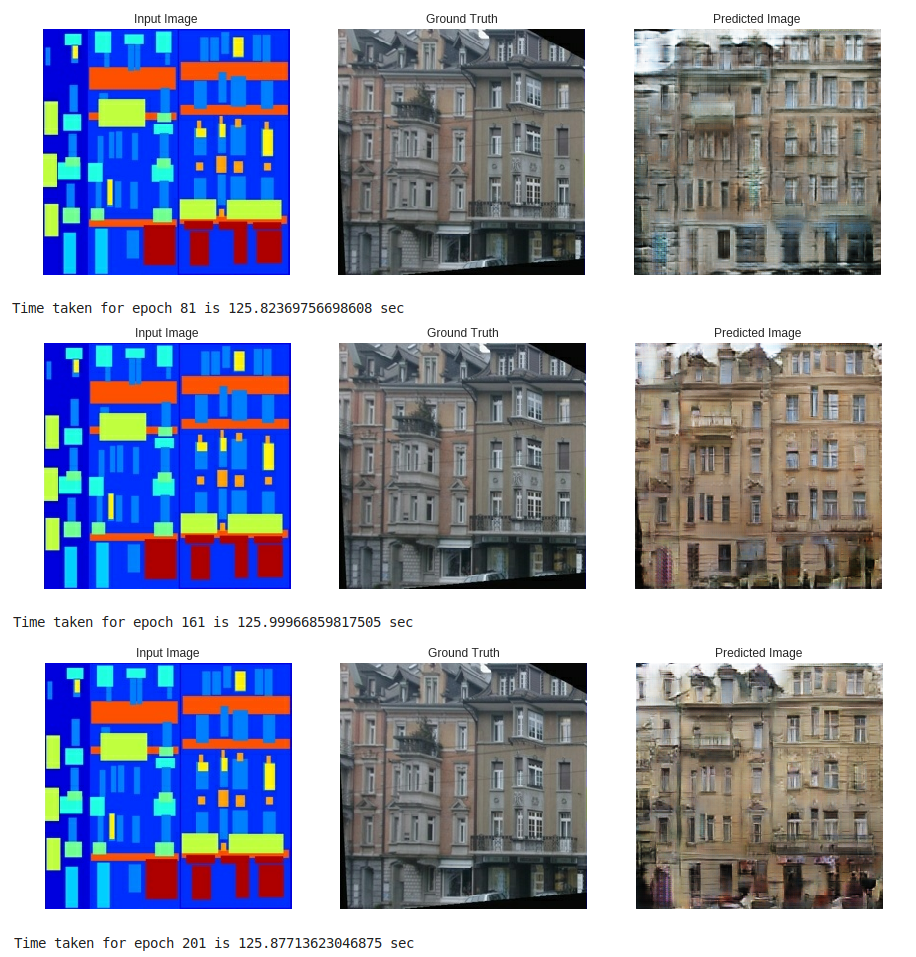
  - **重新加载模型测试**
    ```py
    # restoring the latest checkpoint in checkpoint_dir
    checkpoint.restore(tf.train.latest_checkpoint(checkpoint_dir))

    # Run the trained model on the entire test dataset
    for ii, (inp, tar) in enumerate(test_sample):
        # clear_output(wait=True)
        generate_images(generator, ii, inp, tar)

    # Display a sample
    import glob
    SAMPE_NUM = 3
    aa = glob.glob(os.path.join(IMAGE_SAVE_PATH, '*.png'))
    ss = np.random.choice(aa, SAMPE_NUM)
    fig = plt.figure()
    for ii, tt in enumerate(ss):
        fig.add_subplot(SAMPE_NUM, 1, ii + 1)
        plt.imshow(plt.imread(tt))
        plt.axis('off')

    rr = [plt.imread(tt) for tt in ss]
    rr = np.concatenate(rr, axis=0)
    plt.imsave(fname='./tt.png', arr=rr, format='png', dpi=100)
    ```
    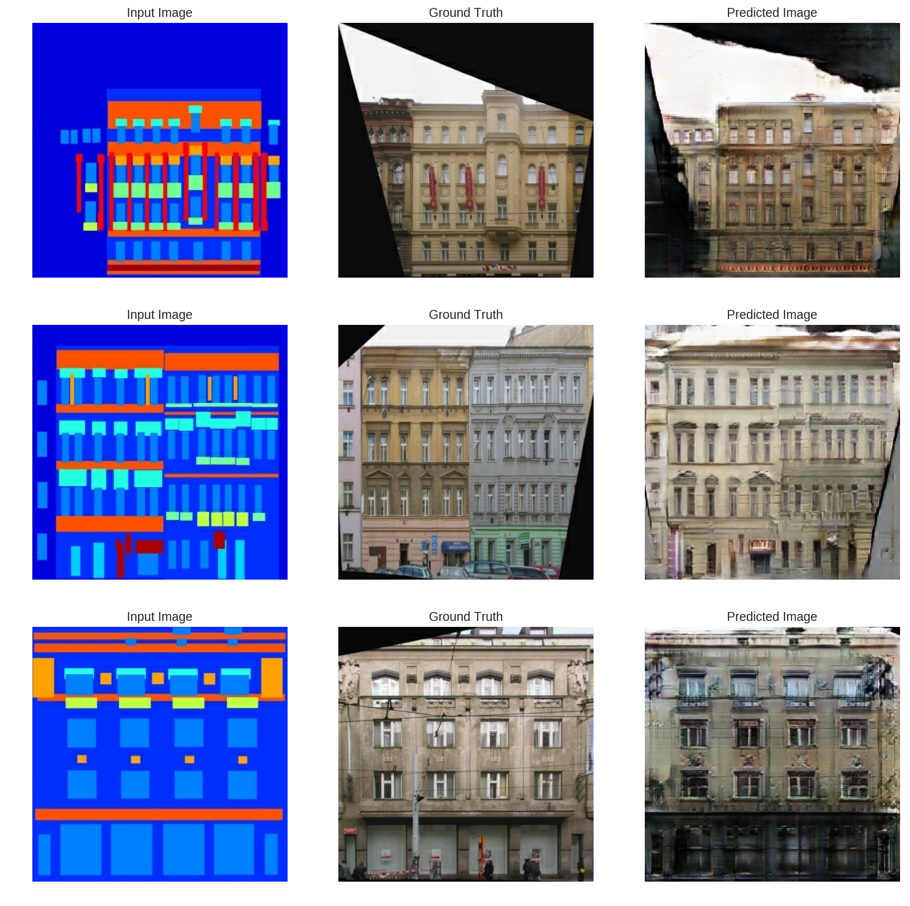
## Neural Style Transfer 转化图片内容与风格
  - [Neural Style Transfer with tf.keras](https://github.com/tensorflow/models/blob/master/research/nst_blogpost/4_Neural_Style_Transfer_with_Eager_Execution.ipynb)
  - [A Neural Algorithm of Artistic Style](https://arxiv.org/pdf/1508.06576)
  - [Colab Neural_Style_Transfer_with_Eager_Execution.ipynb](https://colab.research.google.com/drive/1ha5EmbF1E7ULsR5v3-aXMakNK4bOSyX4)
  - **Neural style transfer**
    - **Neural style transfer** 通过输入的两张图片，**内容图片 content image** 与 **风格图片 style image**，模仿风格图片的画风，将内容图片转化成一张新的图片
    - **Neural style transfer 的转化过程** 初始定义生成图片为 **内容图片**，通过优化器迭代，使生成图片的内容向量与 **内容图片** 接近，风格向量与 **风格图片** 接近
  - **格拉姆矩阵 gram matrix** 在表示图像的风格时，通常采用的是 `Gram Matrix`
    - **Gram matrix** 计算每个 **通道 i** 与每个 **通道 j** 的像素点的内积，是内积的对称矩阵，其元素由 `G<i, j> = Σ<k>(F<i, k>| F<j, k>)` 给出
    - **Gram matrix** 度量的是各个维度自己的特性，以及各个维度之间的关系，一个维度上的值越大，计算内积后的值也越大
    - **计算过程**，输入图像经过卷积后，得到的 feature map 为 `[b, ch, h, w]`，经过矩阵转置操作变形为 `[b, ch, h*w]` 与 `[b, h*w, ch]`，计算两个矩阵内积得到 Gram matrix `[b, ch, ch]`
  - **L-BFGS 算法**
    - 机器学习中经常利用梯度下降法求最优解问题，通过大量的迭代来得到最优解，但是对于维度较多的数据，除了占用大量的内存还会很耗时
    - **L-BFGS 算法** 是一种在 **牛顿法** 基础上提出的一种求解函数根的算法，比较适合在大规模的数值计算中
    - **L-BFGS 算法** 具备 **牛顿法** 收敛速度快的特点，但不需要牛顿法那样存储Hesse矩阵，因此节省了大量的空间以及计算资源
  - **下载图片 get_url_images**
    ```py
    tf.enable_eager_execution()

    def get_url_images(url_list, target_folder):
        import os
        from urllib.request import urlretrieve

        if not os.path.exists(img_dir):
            os.makedirs(img_dir)

        for uu in url_list:
            target_fn = os.path.join(target_folder, uu.split('/')[-1])
            if not os.path.exists(target_fn):
                urlretrieve(url=uu, filename=target_fn)
                print('Saved: {}'.format(target_fn))

    img_dir = os.path.expanduser('~/.keras/datasets/nst')
    url_list = [
        "https://upload.wikimedia.org/wikipedia/commons/d/d7/Green_Sea_Turtle_grazing_seagrass.jpg",
        "https://upload.wikimedia.org/wikipedia/commons/0/0a/The_Great_Wave_off_Kanagawa.jpg",
        "https://upload.wikimedia.org/wikipedia/commons/b/b4/Vassily_Kandinsky%2C_1913_-_Composition_7.jpg",
        "https://upload.wikimedia.org/wikipedia/commons/0/00/Tuebingen_Neckarfront.jpg",
        "https://upload.wikimedia.org/wikipedia/commons/6/68/Pillars_of_creation_2014_HST_WFC3-UVIS_full-res_denoised.jpg",
        "https://upload.wikimedia.org/wikipedia/commons/thumb/e/ea/Van_Gogh_-_Starry_Night_-_Google_Art_Project.jpg/1024px-Van_Gogh_-_Starry_Night_-_Google_Art_Project.jpg",
    ]

    get_url_images(url_list, img_dir)

    # Set up some global values here
    content_path = os.path.join(img_dir, 'Green_Sea_Turtle_grazing_seagrass.jpg')
    style_path = os.path.join(img_dir, 'The_Great_Wave_off_Kanagawa.jpg')
    ```
  - **加载图片 load_img / imshow**
    ```py
    # Load image, and limit the max pixel to 512
    def load_img(path_to_img):
        img = tf.read_file(path_to_img)
        img = tf.image.decode_jpeg(img)
        ss = tf.shape(img).numpy()
        scale = 512 / ss.max()
        scaled_shape = np.round(ss[:2] * scale)
        img = tf.image.resize_images(img, scaled_shape, method=tf.image.ResizeMethod.AREA)

        # We need to broadcast the image array such that it has a batch dimension
        img = np.expand_dims(img, axis=0)
        return img

    # Imgae display with title
    def imshow(img, title=None):
        # squeeze remove single-dimensional entries from the shape of an array.
        out = np.squeeze(img)
        # Normalize for display
        out = out.astype('uint8')
        plt.imshow(out)
        if title is not None:
            plt.title(title)

        plt.axis('off')
    ```
    **测试**
    ```py
    content = load_img(content_path).astype('uint8')
    style = load_img(style_path).astype('uint8')

    fig = plt.figure(figsize=(10, 5))
    plt.subplot(1, 2, 1)
    imshow(content, 'Content Image')

    plt.subplot(1, 2, 2)
    imshow(style, 'Style Image')

    fig.tight_layout()
    ```
    
  - **图片预处理 load_and_process_img / deprocess_img**
    - **load_and_process_img** 函数加载图片，并应用 `vgg19.preprocess_input` 的输入预处理过程，输出图片的每个通道按照 ImageNet 数据集的平均值 `[103.939, 116.779, 123.68]` 进行正则化，图片格式为 `BGR`
    - **deprocess_img** 是 `vgg19.preprocess_input` 的反向处理过程，并将图片的像素值限定在 `[0, 255]`
    ```py
    def load_and_process_img(path_to_img):
        img = load_img(path_to_img)
        img = tf.keras.applications.vgg19.preprocess_input(img)
        return img

    def deprocess_img(processed_img):
        x = processed_img.copy()
        if len(x.shape) == 4:
            x = np.squeeze(x, 0)
        assert len(x.shape) == 3, ("Input to deprocess image must be an image of "
                                   "dimension [1, height, width, channel] or [height, width, channel]")

        # perform the inverse of the preprocessiing step
        x[:, :, 0] += 103.939
        x[:, :, 1] += 116.779
        x[:, :, 2] += 123.68
        x = x[:, :, ::-1]

        x = np.clip(x, 0, 255).astype('uint8')
        return x
    ```
    **测试**
    ```py
    imm = tf.keras.applications.vgg19.preprocess_input(np.zeros([1, 512, 512, 3]))
    print(imm.reshape(-1, 3).mean(0))
    # [-103.939 -116.779 -123.68 ]

    imm = load_and_process_img(content_path)
    iaa = imm.reshape(-1, 3)
    print(iaa.min(0), iaa.max(0))
    # [-104.526215 -101.33134  -136.52118 ] [158.83185 140.65979 134.13931]
    print(iaa.mean(0))
    # [ 22.766304   9.88415  -47.40632 ]

    imshow(deprocess_img(imm))
    ```
  - **模型定义，提取图片的内容与风格特征**
    - 定义 **内容 content** 与 **风格 style** 的向量表示，使用 `VGG19` 模型的中间层输出分别表示图片的内容与风格向量，模型中间层的输出通常代表图像的高层特征提取，并且避免背景噪声以及其他细节影响
    - 定义模型，使用定义的内容与风格向量作为输出结果，`VGG19` 模型结构相对简单，可以更好地实现对于图片风格的提取
    - 使用定义的模型提取目标的内容与风格特征向量
    ```py
    # Content layer where will pull our feature maps
    content_layers = ['block5_conv2']

    # Style layer we are interested in
    style_layers = ['block1_conv1',
                    'block2_conv1',
                    'block3_conv1',
                    'block4_conv1',
                    'block5_conv1']

    num_content_layers = len(content_layers)
    num_style_layers = len(style_layers)

    # Build the Model
    def get_model():
        """ Creates our model with access to intermediate layers.

        This function will load the VGG19 model and access the intermediate layers.
        These layers will then be used to create a new model that will take input image
        and return the outputs from these intermediate layers from the VGG model.

        Returns:
          returns a keras model that takes image inputs and outputs the style and
            content intermediate layers.
        """
        # Load our model. We load pretrained VGG, trained on imagenet data
        vgg = tf.keras.applications.vgg19.VGG19(include_top=False, weights='imagenet')
        vgg.trainable = False
        # Get output layers corresponding to style and content layers
        style_outputs = [vgg.get_layer(name).output for name in style_layers]
        content_outputs = [vgg.get_layer(name).output for name in content_layers]
        model_outputs = style_outputs + content_outputs

        # Build model
        return tf.keras.models.Model(vgg.input, model_outputs)

    # Load images and output the content and style feature representations
    def get_feature_representations(model, content_path, style_path):
        """ Helper function to compute our content and style feature representations. """
        # Load our images in
        content_image = load_and_process_img(content_path)
        style_image = load_and_process_img(style_path)

        # batch compute content and style features
        style_outputs = model(style_image)
        content_outputs = model(content_image)

        # Get the style and content feature representations from our model  
        style_features = [style_layer[0] for style_layer in style_outputs[:num_style_layers]]
        content_features = [content_layer[0] for content_layer in content_outputs[num_style_layers:]]
        return style_features, content_features
    ```
    **测试**
    ```py
    model = get_model()
    model.summary()

    imm = load_and_process_img(content_path)
    aa = model(imm)
    print([ii.shape.as_list() for ii in aa])
    # [[1, 384, 512, 64], [1, 192, 256, 128], [1, 96, 128, 256], [1, 48, 64, 512], [1, 24, 32, 512], [1, 24, 32, 512]]

    ss, cc = get_feature_representations(model, content_path, style_path)
    print([ii.shape.as_list() for ii in ss])
    # [[353, 512, 64], [176, 256, 128], [88, 128, 256], [44, 64, 512], [22, 32, 512]]
    print([ii.shape.as_list() for ii in cc])
    # [[24, 32, 512]]
    ```
  - **定义模型损失 Content Loss 与 Style Loss**
    - **内容损失 Content Loss** 计算转化图片与目标图片内容向量的欧氏距离

      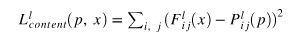
    - **风格损失 Style Loss** 首先将风格向量转化为 **格拉姆矩阵 gram matrix**，然后计算转化图片与目标图片这两个向量的欧氏距离，最后取每一层输出的加权和

      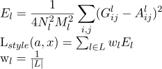

    ```py
    # Content Loss
    def get_content_loss(base_content, target_content):
        return tf.reduce_mean(tf.square(base_content - target_content))

    # gram matrix for style loss
    def gram_matrix(input_tensor):
        # We make the image channels first
        channels = int(input_tensor.shape[-1])
        a = tf.reshape(input_tensor, [-1, channels])
        n = tf.shape(a)[0]
        gram = tf.matmul(a, a, transpose_a=True)
        return gram / tf.cast(n, tf.float32)

    # Style Loss
    def get_style_loss(base_style, gram_target):
        """Expects two images of dimension h, w, c"""
        # height, width, num filters of each layer
        # We scale the loss at a given layer by the size of the feature map and the number of filters
        height, width, channels = base_style.get_shape().as_list()
        gram_style = gram_matrix(base_style)

        return tf.reduce_mean(tf.square(gram_style - gram_target))# / (4. * (channels ** 2) * (width * height) ** 2)
    ```
    **测试**
    ```py
    print(get_content_loss(aa[-1], cc).numpy())
    # 0.0

    ss_gg = [gram_matrix(ii) for ii in ss]
    print(ss[0].shape, ss_gg[0].shape)
    # (353, 512, 64) (64, 64)
    print(get_style_loss(aa[0][0], ss_gg).numpy())
    # 6031890.0
    ```
  - **计算模型综合损失，综合 Content Loss 与 Style Loss**
    ```py
    def compute_loss(model, loss_weights, init_image, gram_style_features, content_features):
        """This function will compute the loss total loss.

        Arguments:
          model: The model that will give us access to the intermediate layers
          loss_weights: The weights of each contribution of each loss function.
            (style weight, content weight, and total variation weight)
          init_image: Our initial base image. This image is what we are updating with
            our optimization process. We apply the gradients wrt the loss we are
            calculating to this image.
          gram_style_features: Precomputed gram matrices corresponding to the
            defined style layers of interest.
          content_features: Precomputed outputs from defined content layers of
            interest.

        Returns:
          returns the total loss, style loss, content loss, and total variational loss
        """
        style_weight, content_weight = loss_weights
        style_score = 0
        content_score = 0

        # Feed our init image through our model. This will give us the content and
        # style representations at our desired layers. Since we're using eager
        # our model is callable just like any other function!
        model_outputs = model(init_image)
        style_output_features = model_outputs[:num_style_layers]
        content_output_features = model_outputs[num_style_layers:]

        # Accumulate style losses from all layers
        # Here, we equally weight each contribution of each loss layer
        weight_per_style_layer = 1.0 / float(num_style_layers)
        for target_style, comb_style in zip(gram_style_features, style_output_features):
          style_score += weight_per_style_layer * get_style_loss(comb_style[0], target_style)

        # Accumulate content losses from all layers
        weight_per_content_layer = 1.0 / float(num_content_layers)
        for target_content, comb_content in zip(content_features, content_output_features):
          content_score += weight_per_content_layer* get_content_loss(comb_content[0], target_content)

        style_score *= style_weight
        content_score *= content_weight

        # Get total loss
        loss = style_score + content_score

        return loss, style_score, content_score
    ```
    **测试**
    ```py
    loss, style_score, content_score = compute_loss(model, (1e3, 1e-2), imm, ss_gg, cc)
    print(loss.numpy(), style_score.numpy(), content_score.numpy())
    # 83557650000000.0 83557650000000.0 0.0
    ```
  - **定义梯度计算 GradientTape**
    - **tf.GradientTape** 记录模型前向传播的计算过程，在反向传播中根据损失函数计算梯度
    - 在 **反向转播 backpropagation** 中最小化模型损失，但不是更新模型参数，而是每次更新输入图像
    ```py
    def compute_grads(cfg):
        with tf.GradientTape() as tape:
            all_loss = compute_loss(**cfg)
        # Compute gradients wrt input image
        total_loss = all_loss[0]
        return tape.gradient(total_loss, cfg['init_image']), all_loss
    ```
  - **模型训练过程，迭代更新输入图片**
    ```py
    import tensorflow.contrib.eager as tfe
    import time

    def prepare_model_data(content_path, style_path, content_weight=1e3, style_weight=1e-2):
        # We don't need to (or want to) train any layers of our model, so we set their
        # trainable to false.
        model = get_model()
        for layer in model.layers:
            layer.trainable = False

        # Get the style and content feature representations (from our specified intermediate layers)
        style_features, content_features = get_feature_representations(model, content_path, style_path)
        gram_style_features = [gram_matrix(style_feature) for style_feature in style_features]

        # Set initial image
        init_image = load_and_process_img(content_path)
        init_image = tfe.Variable(init_image, dtype=tf.float32)

        model_data = {
                'model': model,
                'loss_weights': (style_weight, content_weight),
                'init_image': init_image,
                'gram_style_features': gram_style_features,
                'content_features': content_features}

        return model_data

    def run_style_transfer(content_path, style_path, num_iterations=1000, content_weight=1e3, style_weight=1e-2):
        model_data = prepare_model_data(content_path, style_path, content_weight, style_weight)
        init_image = model_data['init_image']
        # Create our optimizer
        opt = tf.train.AdamOptimizer(learning_rate=5, beta1=0.99, epsilon=1e-1)

        # Store our best result
        best_loss, best_img = float('inf'), None
        # clip generated image data
        norm_means = np.array([103.939, 116.779, 123.68])
        min_vals, max_vals = 0 - norm_means, 255 - norm_means
        # Recording inter values
        imgs = []

        start_time = time.time()
        global_start = time.time()
        for i in range(num_iterations):
            grads, (loss, style_score, content_score) = compute_grads(model_data)
            opt.apply_gradients([(grads, init_image)])
            clipped = tf.clip_by_value(init_image, min_vals, max_vals)
            init_image.assign(clipped)

            if loss < best_loss:
                # Update best loss and best image for output.
                best_loss = loss
                best_img = deprocess_img(init_image.numpy())

            if i % 100 == 0:
                # Use the .numpy() method to get the concrete numpy array
                img = deprocess_img(init_image.numpy())
                imgs.append(img)
                print('Iteration: {}, Total loss: {:.4e}, style loss: {:.4e}, content loss: {:.4e}, time: {:.4f}s'.format(
                      i, loss, style_score, content_score, time.time() - start_time))
                start_time = time.time()

        print('Total time: {:.4f}s, best_loss: {:.4e}'.format(time.time() - global_start, best_loss))
        return best_img, best_loss, imgs

    best_img, best_loss, imgs = run_style_transfer(content_path, style_path, num_iterations=1000)
    # Iteration: 0, Total loss: 4.5534e+08, style loss: 4.5534e+08, content loss: 0.0000e+00, time: 0.3494s
    # ...
    # Iteration: 900, Total loss: 1.2265e+06, style loss: 6.4995e+05, content loss: 5.7650e+05, time: 31.9725s
    # Total time: 319.9278s, best_loss: 1.1516e+06
    ```
  - **显示输出结果 Visualize outputs**
    ```py
    def show_inter_results(imgs, num_rows=2, num_cols=None, save_name=None):
        if num_cols == None:
            num_cols = np.ceil(len(imgs) / num_rows)

        fig = plt.figure(figsize=(14, 4))
        for ii, img in enumerate(imgs):
            fig.add_subplot(num_rows, num_cols, ii + 1)
            imshow(img)
        if save_name != None:
            fig.savefig(save_name, format='jpg', dpi=150, bbox_inches='tight')

    def show_best_results(best_img, content_path, style_path, save_name=None):
        fig = plt.figure(figsize=(9, 4))
        fig.add_subplot(2, 3, 1)
        imshow(load_img(content_path), 'Content Image')

        fig.add_subplot(2, 3, 4)
        imshow(load_img(style_path), 'Style Image')

        fig.add_subplot(1, 2, 2)
        imshow(best_img, 'Output Image')

        if save_name != None:
            fig.savefig(save_name, format='jpg', dpi=150, bbox_inches='tight')

    show_inter_results(imgs, save_name='./out_inter.jpg')
    show_best_results(best_img, content_path, style_path, save_name='./out_best.jpg')
    ```
    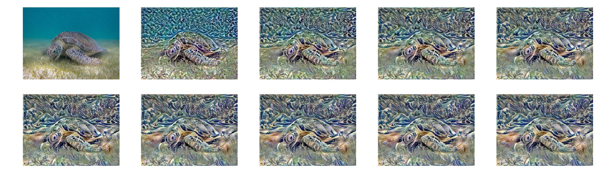
    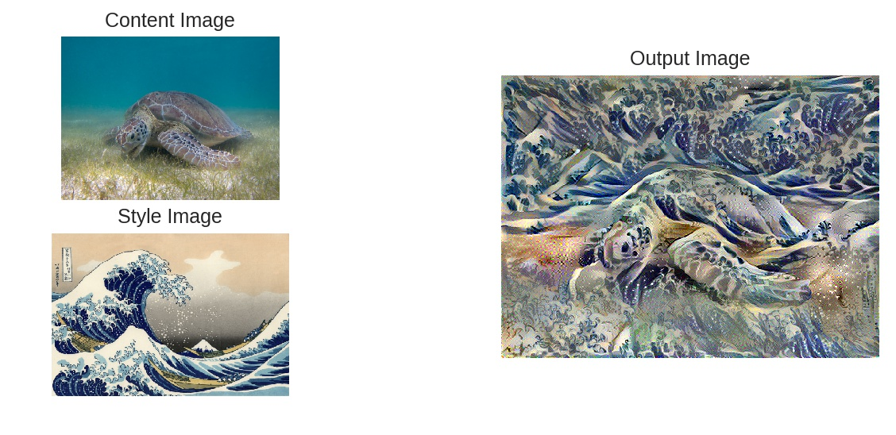
  - **使用其他的 content / style 图片测试**
    ```py
    # Kandinsky Composition 7 + Tuebingen
    content_path_2 = os.path.join(img_dir, 'Tuebingen_Neckarfront.jpg')
    style_path_2 = os.path.join(img_dir, 'Vassily_Kandinsky%2C_1913_-_Composition_7.jpg')
    best_kandinsky_tubingen, best_loss, imgs_2 = run_style_transfer(content_path_2, style_path_2)
    show_best_results(best_kandinsky_tubingen, content_path_2, style_path_2)
    ```
    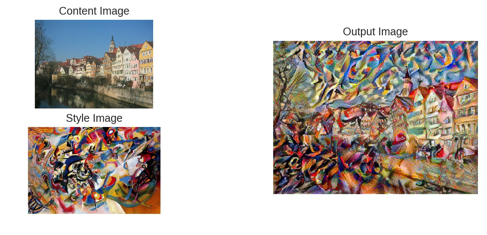
## Image Segmentation 图片分割目标像素与背景像素
  - [Image Segmentation with tf.keras](https://github.com/tensorflow/models/blob/master/samples/outreach/blogs/segmentation_blogpost/image_segmentation.ipynb)
  - [U-Net: Convolutional Networks for Biomedical Image Segmentation](https://arxiv.org/pdf/1505.04597)
  - [Colab image_segmentation.ipynb](https://colab.research.google.com/drive/10o748t9O9u4NFfJfMLROaQB9MQ6unNTD)
  - **图像分割 image segmentation** 将图片分割成一组要识别的 **目标像素** 与 **背景像素**
  - **Dice 相似系数 Dice Coefficient**
    - [V-Net: Fully Convolutional Neural Networks for Volumetric Medical Image Segmentation](http://campar.in.tum.de/pub/milletari2016Vnet/milletari2016Vnet.pdf)
    - 度量两个集合 / 向量 / 字符串 / 图片的相似程度 overlap

    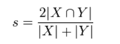
  - **Kaggle Carvana Image Masking Challenge**
    - [Accept Kaggle Carvana Image Masking Challenge Competition Rules](https://www.kaggle.com/c/carvana-image-masking-challenge/rules)
    - 该数据集 **训练样本 train** 包含大量 **jpg 格式** 的汽车图片，维度 `(1280, 1918, 3)`，每辆车都有 **16** 张不同角度的图片，图片命名每辆车有单独的 ID，命名从 **01-16** 编号
    - **metadata.csv** 包含每辆车的多个详细信息字段，包括年代 / 生产商 / 型号等
    - **训练样本的目标特征 train_masks** 是 **gif 格式** 的图片，维度 `(1280, 1918, 4)`，是人工将训练样本中的汽车部分裁剪出来的蒙板
    - **训练任务** 是将 **测试样本 test** 中的汽车图片自动裁剪出来，`train_masks.csv` 包含了图形蒙板的编码格式 encoded version of the training set masks
  - **下载 Kaggle Carvana Image Masking Challenge Competition 数据集**
    - 需要在本地 / colab 上有 Kaggle API Token `~/.kaggle/kaggle.json`
    ```py
    !ls -l ~/.kaggle
    # ---x-wx--T 1 root root 66 Sep 28 05:23 kaggle.json

    import kaggle
    competition_name = 'carvana-image-masking-challenge'

    # Download data from Kaggle and unzip the files of interest.
    def load_data_from_zip(competition, file):
        with zipfile.ZipFile(os.path.join(competition, file), "r") as zip_ref:
            unzipped_file = zip_ref.namelist()[0]
            zip_ref.extractall(competition)

    def get_data(competition):
        kaggle.api.competition_download_files(competition, competition)
        load_data_from_zip(competition, 'train.zip')
        load_data_from_zip(competition, 'train_masks.zip')
        load_data_from_zip(competition, 'train_masks.csv.zip')

    get_data(competition_name)
    ```
    **测试**
    ```py
    !du -hd0 {competition_name}
    # 26G	carvana-image-masking-challenge

    ppath = os.path.expanduser('~/.keras/datasets/carvana-image-masking-challenge/')
    dtt = pd.read_csv(os.path.join(ppath, 'train_masks.csv'))
    dtt.head(3)
    #                    img                                           rle_mask
    # 0  00087a6bd4dc_01.jpg  879386 40 881253 141 883140 205 885009 17 8850...
    # 1  00087a6bd4dc_02.jpg  873779 4 875695 7 877612 9 879528 12 881267 15...
    # 2  00087a6bd4dc_03.jpg  864300 9 866217 13 868134 15 870051 16 871969 ...
    print(dtt['img'].map(lambda ss: ss.split('.')[0]).head(3).values)
    # ['00087a6bd4dc_01' '00087a6bd4dc_02' '00087a6bd4dc_03']

    dmm = pd.read_csv(os.path.join(ppath, 'metadata.csv'))
    dmm.head(3)
    #              id    year   make   model   trim1    trim2
    # 0  0004d4463b50  2014.0  Acura      TL      TL     w/SE
    # 1  00087a6bd4dc  2014.0  Acura     RLX     RLX   w/Tech
    # 2  000aa097d423  2012.0  Mazda  MAZDA6  MAZDA6  i Sport

    dmm[dmm.model.fillna('').str.startswith('Golf')]
    dmm[dmm.model.fillna('').str.find('Golf') != -1]

    # Let's take a look at some of the examples of different images in our dataset.
    xx_train = tf.gfile.Glob(os.path.join(ppath, 'train/*.jpg'))
    mask_file_name = lambda xx: os.path.join(ppath, 'train_masks/' + xx.split('/')[-1].split('.')[0] + '_mask.gif')
    yy_train = [mask_file_name(xx) for xx in xx_train]
    print(plt.imread(xx_tain[0]).shape, plt.imread(yy_train[0]).shape)
    # (1280, 1918, 3) (1280, 1918, 4)

    display_num = 5
    r_choices = np.random.choice(len(xx_train), display_num)

    fig = plt.figure(figsize=(8, 15))
    for ii, cc in enumerate(r_choices):
        plt.subplot(display_num, 2, ii * 2 + 1)
        plt.imshow(plt.imread(xx_train[cc]))
        plt.title("Original Image")
        plt.axis('off')

        plt.subplot(display_num, 2, ii * 2 + 2)
        plt.imshow(plt.imread(yy_train[cc]))
        plt.title("Masked Image")
        plt.axis('off')

    plt.suptitle("Examples of Images and their Masks")
    plt.show()
    ```
    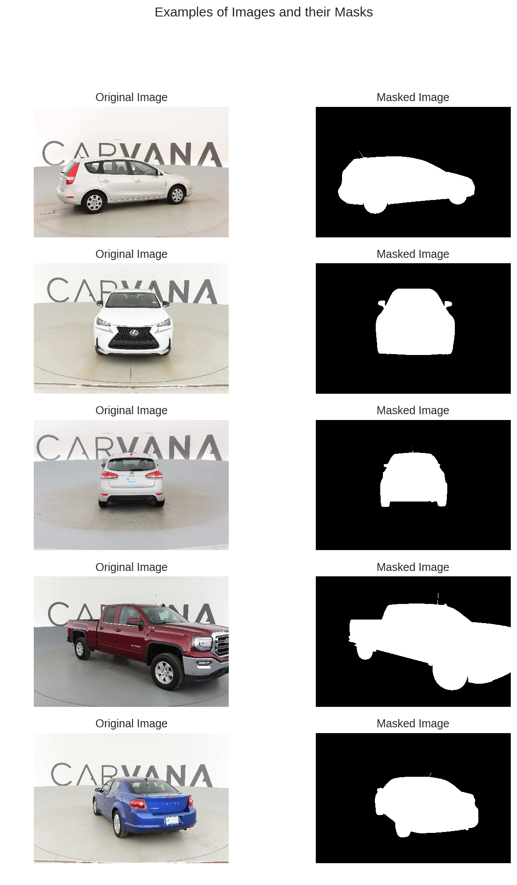
  - **分割训练验证数据集 train_test_split**
    ```py
    from sklearn.model_selection import train_test_split

    df_train = pd.read_csv(os.path.join(competition_name, 'train_masks.csv'))
    img_dir = os.path.join(competition_name, "train")
    label_dir = os.path.join(competition_name, "train_masks")
    x_train_filenames = df_train['img'].map(lambda iid: os.path.join(img_dir, iid)).values
    y_train_filenames = df_train['img'].map(lambda iid: os.path.join(label_dir, iid.split('.')[0] + "_mask.gif")).values

    x_train_filenames, x_val_filenames, y_train_filenames, y_val_filenames = \
                train_test_split(x_train_filenames, y_train_filenames, test_size=0.2, random_state=42)

    num_train_examples = x_train_filenames.shape[0]
    num_val_examples = x_val_filenames.shape[0]

    print("training examples: {}, validation examples: {}".format(num_train_examples, num_val_examples))
    # training examples: 4070, validation examples: 1018
    print(x_train_filenames[:3], y_train_filenames[:3])
    # ['/home/leondgarse/.keras/datasets/carvana-image-masking-challenge/train/69915dab0755_16.jpg'
    #  '/home/leondgarse/.keras/datasets/carvana-image-masking-challenge/train/695f39dfac16_04.jpg'
    #  '/home/leondgarse/.keras/datasets/carvana-image-masking-challenge/train/2267f4aa0d2c_13.jpg']
    # ['/home/leondgarse/.keras/datasets/carvana-image-masking-challenge/train_masks/69915dab0755_16_mask.gif'
    #  '/home/leondgarse/.keras/datasets/carvana-image-masking-challenge/train_masks/695f39dfac16_04_mask.gif'
    #  '/home/leondgarse/.keras/datasets/carvana-image-masking-challenge/train_masks/2267f4aa0d2c_13_mask.gif']
    ```
  - **数据增强 data augmentation，图片预处理**
    - **数据增强 data augmentation** 随机调整训练数据，使训练中不会使用完全相同的数据，增加训练数据量，降低过拟合
    - 在 `UNet` 模型中，因为要使用 `MaxPooling2Dlayer` 采样，图片的宽高维度需要是 `32` 的整数倍
    - 根据文件名读取图片文件，加载训练数据集与目标蒙板图片，其中蒙板图片维度为 `(1280, 1918, 4)`，像素值只有两个，将其转化为黑白图片
    - **Resize** 统一图片大小，`UNet` 是完全使用卷积的神经网络，不包含全连接层，因此对输入维度大小没有要求，但因为要使用 `MaxPooling2Dlayer` 采样，图片的宽高维度需要是 `32` 的整数倍
    - **hue_delta** 随机调整 RGB 图片色相，只处理训练图片，hue_delta 取值 `[0, 0.5]`
    - **horizontal_flip** 随机水平翻转图片，同时处理训练图片与蒙板图片
    - **width_shift_range** / **height_shift_range** 随机在水平 / 垂直方向平移图片，同时处理训练图片与蒙板图片
    - **rescale** 调整图片像素值大小，如乘以 `1 / 255`
    ```py
    img_shape = (256, 256, 3)

    # Processing each pathname
    def _process_pathnames(fname, label_path):
        # We map this function onto each pathname pair  
        img_str = tf.read_file(fname)
        img = tf.image.decode_jpeg(img_str, channels=3)

        label_img_str = tf.read_file(label_path)
        # These are gif images so they return as (num_frames, h, w, c)
        label_img = tf.image.decode_gif(label_img_str)[0]
        # The label image should only have values of 1 or 0, indicating pixel wise
        # object (car) or not (background). We take the first channel only.
        label_img = label_img[:, :, 0]
        label_img = tf.expand_dims(label_img, axis=-1)
        return img, label_img

    # Shifting the image
    def shift_img(output_img, label_img, width_shift_range, height_shift_range):
        """This fn will perform the horizontal or vertical shift"""
        if width_shift_range or height_shift_range:
            if width_shift_range:
                width_shift_range = tf.random_uniform([], -width_shift_range * img_shape[1], width_shift_range * img_shape[1])
            if height_shift_range:
                height_shift_range = tf.random_uniform([], -height_shift_range * img_shape[0], height_shift_range * img_shape[0])
            # Translate both
            output_img = tf.contrib.image.translate(output_img, [width_shift_range, height_shift_range])
            label_img = tf.contrib.image.translate(label_img, [width_shift_range, height_shift_range])
        return output_img, label_img

    # Flipping the image randomly
    def flip_img(horizontal_flip, tr_img, label_img):
        if horizontal_flip:
            flip_prob = tf.random_uniform([], 0.0, 1.0)
            tr_img, label_img = tf.cond(tf.less(flip_prob, 0.5),
                          lambda: (tf.image.flip_left_right(tr_img), tf.image.flip_left_right(label_img)),
                          lambda: (tr_img, label_img))
        return tr_img, label_img

    # Assembling our transformations into our augment function
    def _augment(img, label_img,
                 resize=None,  # Resize the image to some size e.g. [256, 256]
                 scale=1,  # Scale image e.g. 1 / 255.
                 hue_delta=0,  # Adjust the hue of an RGB image by random factor
                 horizontal_flip=False,  # Random left right flip,
                 width_shift_range=0,  # Randomly translate the image horizontally
                 height_shift_range=0):  # Randomly translate the image vertically
        if resize is not None:
            # Resize both images
            label_img = tf.image.resize_images(label_img, resize)
            img = tf.image.resize_images(img, resize)

        if hue_delta:
            img = tf.image.random_hue(img, hue_delta)

        img, label_img = flip_img(horizontal_flip, img, label_img)
        img, label_img = shift_img(img, label_img, width_shift_range, height_shift_range)
        label_img = tf.to_float(label_img) * scale
        img = tf.to_float(img) * scale

        return img, label_img
    ```
  - **tf.data 创建输入 pipeline** 随机打乱训练数据 `shuffle`，设置 `repeat` 与 `batch`
    ```py
    import functools
    batch_size = 3

    def get_baseline_dataset(filenames,
                             labels,
                             preproc_fn=functools.partial(_augment),
                             threads=5,
                             batch_size=batch_size,
                             shuffle=True):           
        num_x = len(filenames)
        # Create a dataset from the filenames and labels
        dataset = tf.data.Dataset.from_tensor_slices((filenames, labels))
        # Map our preprocessing function to every element in our dataset, taking
        # advantage of multithreading
        dataset = dataset.map(_process_pathnames, num_parallel_calls=threads)
        if preproc_fn.keywords is not None and 'resize' not in preproc_fn.keywords:
            assert batch_size == 1, "Batching images must be of the same size"

        dataset = dataset.map(preproc_fn, num_parallel_calls=threads)

        if shuffle:
          dataset = dataset.shuffle(num_x)

        # It's necessary to repeat our data for all epochs
        dataset = dataset.repeat().batch(batch_size)
        return dataset

    # Set up train and validation datasets
    # Note that we apply image augmentation to our training dataset but not our validation dataset.
    tr_cfg = {
        'resize': [img_shape[0], img_shape[1]],
        'scale': 1 / 255.,
        'hue_delta': 0.1,
        'horizontal_flip': True,
        'width_shift_range': 0.1,
        'height_shift_range': 0.1
    }
    tr_preprocessing_fn = functools.partial(_augment, **tr_cfg)

    val_cfg = {
        'resize': [img_shape[0], img_shape[1]],
        'scale': 1 / 255.,
    }
    val_preprocessing_fn = functools.partial(_augment, **val_cfg)

    train_ds = get_baseline_dataset(x_train_filenames, y_train_filenames, preproc_fn=tr_preprocessing_fn, batch_size=batch_size)
    val_ds = get_baseline_dataset(x_val_filenames, y_val_filenames, preproc_fn=val_preprocessing_fn, batch_size=batch_size)
    ```
    **测试**
    ```py
    # Let's see if our image augmentor data pipeline is producing expected results
    temp_ds = get_baseline_dataset(xx_train, yy_train, preproc_fn=tr_preprocessing_fn, batch_size=1, shuffle=False)
    # Let's examine some of these augmented images
    next_element = temp_ds.make_one_shot_iterator().get_next()
    with tf.Session() as sess:
        batch_of_imgs, label = sess.run(next_element)

        # Running next element in our graph will produce a batch of images
        plt.figure(figsize=(10, 5))
        img = batch_of_imgs[0]

        plt.subplot(1, 2, 1)
        plt.imshow(img)
        plt.axis('off')

        plt.subplot(1, 2, 2)
        plt.imshow(label[0, :, :, 0])
        plt.axis('off')
        plt.show()
    ```
    
  - **tf.keras 定义 U-Net 模型**
    - **U-Net 模型** 在图片分割任务上有很好的效果，同时在小数据集上可以很好地避免过拟合，因为图片像素块的数量可以远大于图片数量
    - 在原始的 U-Net 模型基础上，每个模块添加 **批归一化 batch normalization**
    - **Unet encoder 模块** 包含一系列 `Conv -> BatchNorm -> Relu` 的线性组合，最后使用一个 `MaxPooling2D`，多个 `encoder` 组合后，每个 `MaxPooling2D` 将输入的空降维度降低 `2`
    - **Unet decoder 模块** 包含一系列 `UpSampling2D -> Conv -> BatchNorm -> Relu` 的组合，其中 `UpSampling2D` 使用 `Conv2DTranspose` 的输出与 `encoder` 池化层之前的向量组合作为下一层的输入
    - **Conv 输出层** 在每个单独像素的所有通道上做卷积运算，输出最终的灰度图像结果
    - **Keras functional API** 将多个输入 / 输出组合成一个模型，同时使层和模型都可以通过张量调用
    ```py
    from tensorflow.python.keras import layers

    def conv_block(input_tensor, num_filters):
        encoder = layers.Conv2D(num_filters, (3, 3), padding='same')(input_tensor)
        encoder = layers.BatchNormalization()(encoder)
        encoder = layers.Activation('relu')(encoder)
        encoder = layers.Conv2D(num_filters, (3, 3), padding='same')(encoder)
        encoder = layers.BatchNormalization()(encoder)
        encoder = layers.Activation('relu')(encoder)
        return encoder

    def encoder_block(input_tensor, num_filters):
        encoder = conv_block(input_tensor, num_filters)
        encoder_pool = layers.MaxPooling2D((2, 2), strides=(2, 2))(encoder)

        return encoder_pool, encoder

    def decoder_block(input_tensor, concat_tensor, num_filters):
        decoder = layers.Conv2DTranspose(num_filters, (2, 2), strides=(2, 2), padding='same')(input_tensor)
        decoder = layers.concatenate([concat_tensor, decoder], axis=-1)
        decoder = layers.BatchNormalization()(decoder)
        decoder = layers.Activation('relu')(decoder)
        decoder = layers.Conv2D(num_filters, (3, 3), padding='same')(decoder)
        decoder = layers.BatchNormalization()(decoder)
        decoder = layers.Activation('relu')(decoder)
        decoder = layers.Conv2D(num_filters, (3, 3), padding='same')(decoder)
        decoder = layers.BatchNormalization()(decoder)
        decoder = layers.Activation('relu')(decoder)
        return decoder

    inputs = layers.Input(shape=img_shape) # 256
    encoder0_pool, encoder0 = encoder_block(inputs, 32) # 128
    encoder1_pool, encoder1 = encoder_block(encoder0_pool, 64) # 64
    encoder2_pool, encoder2 = encoder_block(encoder1_pool, 128) # 32
    encoder3_pool, encoder3 = encoder_block(encoder2_pool, 256) # 16
    encoder4_pool, encoder4 = encoder_block(encoder3_pool, 512) # 8
    center = conv_block(encoder4_pool, 1024) # center
    decoder4 = decoder_block(center, encoder4, 512) # 16
    decoder3 = decoder_block(decoder4, encoder3, 256) # 32
    decoder2 = decoder_block(decoder3, encoder2, 128) # 64
    decoder1 = decoder_block(decoder2, encoder1, 64) # 128
    decoder0 = decoder_block(decoder1, encoder0, 32) # 256
    outputs = layers.Conv2D(1, (1, 1), activation='sigmoid')(decoder0)

    # Define your model
    model = tf.keras.models.Model(inputs=[inputs], outputs=[outputs])
    ```
  - **定义模型损失函数** `binary cross entropy` + `dice loss`
    - **Dice loss** 使用 **Dice 相似系数 Dice Coefficient** 度量图标与预测值的相似程度，同时在不平衡分类问题 class imbalanced problems 中有比较好的效果
    - 模型训练的目标是最大化 **Dice 相似系数**，竞赛中比较好的模型使用的是 `binary cross entropy` + `dice loss`
    - 也可以尝试其他损失函数组合，如 `bce + log(dice_loss)` / `only bce`
    ```py
    def dice_coeff(y_true, y_pred):
        smooth = 1.
        # Flatten
        y_true_f = tf.reshape(y_true, [-1])
        y_pred_f = tf.reshape(y_pred, [-1])
        intersection = tf.reduce_sum(y_true_f * y_pred_f)
        score = (2. * intersection + smooth) / (tf.reduce_sum(y_true_f) + tf.reduce_sum(y_pred_f) + smooth)
        return score

    def dice_loss(y_true, y_pred):
        loss = 1 - dice_coeff(y_true, y_pred)
        return loss

    def bce_dice_loss(y_true, y_pred):
        loss = tf.keras.losses.binary_crossentropy(y_true, y_pred) + dice_loss(y_true, y_pred)
        return loss
    ```
  - **模型训练**
    - **metrics** 定义使用 **dice_loss** 作为输出，衡量训练过程中的模型表现
    - **fit** 指定训练数据集与验证数据集
    - **callbacks** 指定模型每个 epoch 保存 checkpoints，只保存效果最好的模型
    ```py
    epochs = 5
    # Compile your model
    model.compile(optimizer='adam', loss=bce_dice_loss, metrics=[dice_loss])
    print(len(model.layers)) # 93
    model.summary()

    SAVE_PATH = './training_checkpoints'
    if not tf.gfile.Exists(SAVE_PATH): tf.gfile.MakeDirs(SAVE_PATH)
    save_model_path = os.path.join(SAVE_PATH, 'weights.hdf5')
    checkpoints = tf.keras.callbacks.ModelCheckpoint(filepath=save_model_path, monitor='val_dice_loss', save_best_only=True, verbose=1)

    history = model.fit(train_ds,
                       steps_per_epoch=int(np.ceil(num_train_examples / float(batch_size))),
                       epochs=epochs,
                       validation_data=val_ds,
                       validation_steps=int(np.ceil(num_val_examples / float(batch_size))),
                       callbacks=[checkpoints])

    # Epoch 1/5
    # 1356/1357 [============================>.] - ETA: 0s - loss: 0.2447 - dice_loss: 0.0443
    # ...
    # Epoch 5/5
    # 1356/1357 [============================>.] - ETA: 0s - loss: 0.0815 - dice_loss: 0.0133
    # Epoch 00005: val_dice_loss improved from 0.02311 to 0.00955, saving model to ./training_checkpoints/weights.hdf5
    # 1357/1357 [==============================] - 773s 570ms/step - loss: 0.0815 - dice_loss: 0.0133 - val_loss: 0.0558 - val_dice_loss: 0.0095
    ```
  - **使用 history 数据图形化显示训练过程**
    ```py
    dice = history.history['dice_loss']
    val_dice = history.history['val_dice_loss']

    loss = history.history['loss']
    val_loss = history.history['val_loss']

    epochs_range = range(epochs)

    fig = plt.figure(figsize=(16, 8))
    plt.subplot(1, 2, 1)
    plt.plot(epochs_range, dice, label='Training Dice Loss')
    plt.plot(epochs_range, val_dice, label='Validation Dice Loss')
    plt.legend(loc='upper right')
    plt.title('Training and Validation Dice Loss')

    plt.subplot(1, 2, 2)
    plt.plot(epochs_range, loss, label='Training Loss')
    plt.plot(epochs_range, val_loss, label='Validation Loss')
    plt.legend(loc='upper right')
    plt.title('Training and Validation Loss')

    plt.show()
    ```
    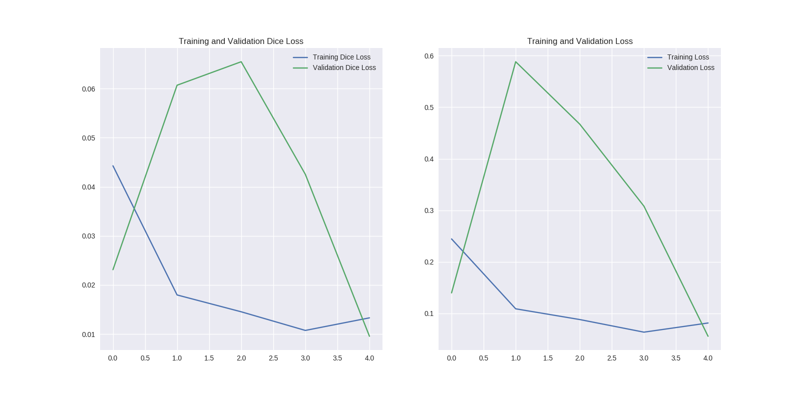
  - **模型加载，图形化显示模型在验证数据集上的效果**
    - 在竞赛 / 部署中会在测试数据集上使用图片的全部像素验证模型效果
    - 如果已经定义了完整的模型架构，在加载模型可以使用 `load_weights` 只加载模型权重
      ```py
      load_weights(save_model_path)
      ```
    - 如果没有定义模型架构，可以使用 `keras.models.load_model` 加载模型，同时定义必要的损失函数等
      ```py
      model = tf.keras.models.load_model(save_model_path, custom_objects={'bce_dice_loss': bce_dice_loss, 'dice_loss': dice_loss})
      ```
    ```py
    # Alternatively, load the weights directly: model.load_weights(save_model_path)
    model = tf.keras.models.load_model(save_model_path, custom_objects={'bce_dice_loss': bce_dice_loss, 'dice_loss': dice_loss})

    # Let's visualize some of the outputs
    data_aug_iter = val_ds.make_one_shot_iterator()
    next_element = data_aug_iter.get_next()

    # Running next element in our graph will produce a batch of images
    fig = plt.figure(figsize=(10, 20))
    for i in range(5):
        batch_of_imgs, label = tf.keras.backend.get_session().run(next_element)
        img = batch_of_imgs[0]
        predicted_label = model.predict(batch_of_imgs)[0]

        plt.subplot(5, 3, 3 * i + 1)
        plt.imshow(img)
        plt.title("Input image")

        plt.subplot(5, 3, 3 * i + 2)
        plt.imshow(label[0, :, :, 0])
        plt.title("Actual Mask")
        plt.subplot(5, 3, 3 * i + 3)
        plt.imshow(predicted_label[:, :, 0])
        plt.title("Predicted Mask")
    plt.suptitle("Examples of Input Image, Label, and Prediction")
    plt.show()
    ```
    
## GraphDef 加载 InceptionV3 模型用于图片识别 Image Recognition
  - [Rethinking the Inception Architecture for Computer Vision](https://arxiv.org/pdf/1512.00567)
  - **Inception-v3** 是在 `ImageNet Large Visual Recognition Challenge` 数据集上训练用来进行图片分类的模型，按照 `ImageNet` 数据集将图片分为 1000 个类别，`top-5 错误率` 能达到 3.46%
  - **Bottlenecks** 模型最后一层输出层的前一层通常成为 `Bottlenecks`，在图片分类任务中，通常是图片特征向量 `image feature vector`
  - **迁移学习 Transfer learning** 一种使用 `Inception-v3` 模型的方法是在迁移学习中，移除模型的最后一层输出层，使用模型最后一层 CNN 的输出结果作为特征用于其他图片识别任务，该层输出维度为 `2048`
  - **下载 `inceptionv3` 模型**
    ```py
    def maybe_download_and_extract_tar(url, dest_path='~/.keras/models'):
        """ Download and extract model tar file """
        from urllib.request import urlretrieve
        import tarfile

        dest_path = os.path.expanduser(dest_path)
        if not os.path.exists(dest_path):
            os.makedirs(dest_path)

        file_name = url.split('/')[-1]
        file_path = os.path.join(dest_path, file_name)
        if not os.path.exists(file_path):
            def _progress(count, block_size, total_size):
                sys.stdout.write('\r>>>> Downloading %s %1.f%%' % (
                    file_name, count * block_size / total_size * 100.0
                ))
                sys.stdout.flush()
            file_path, _ = urlretrieve(url, file_path, _progress)
            stat_info = os.stat(file_path)
            print('\nSuccessfully downloaded', file_path, stat_info.st_size, 'bytes.')

        tarfile.open(file_path, 'r:gz').extractall(dest_path)

    data_url = 'http://download.tensorflow.org/models/image/imagenet/inception-2015-12-05.tgz'
    dest_path = os.path.expanduser('~/.keras/models/imagenet')
    maybe_download_and_extract_tar(data_url, dest_path)
    ```
  - **加载模型 GraphDef pb 文件，创建 graph**
    ```py
    def create_graph(pb_file_path):
        ''' Creates a graph from saved GraphDef pb file '''
        with tf.gfile.FastGFile(pb_file_path, 'rb') as ff:
            graph_def = tf.GraphDef()
            graph_def.ParseFromString(ff.read())
            _ = tf.import_graph_def(graph_def, name='')

    create_graph(os.path.join(dest_path, 'classify_image_graph_def.pb'))
    summary_write = tf.summary.FileWriter("/tmp/logdir", tf.get_default_graph())
    # tensorboard --logdir /tmp/logdir/
    ```
  - **模型输入图片，输出预测值**
    ```py
    def get_top_k_prediction_on_image(image_data, kk=5):
        # Some useful tensors:
        # 'softmax:0': A tensor containing the normalized prediction across 1000 labels.
        # 'pool_3:0': A tensor containing the next-to-last layer containing 2048 float description of the image.
        # 'DecodeJpeg/contents:0': A tensor containing a string providing JPEG encoding of the image.
        # Runs the softmax tensor by feeding the image_data as input to the graph.
        # cc, ss = tf.import_graph_def(graph_def, return_elements=['DecodeJpeg/contents:0', 'softmax:0'])
        with tf.Session() as sess:
            softmax_tensor = sess.graph.get_tensor_by_name('softmax:0')
            predictions = sess.run(softmax_tensor, {'DecodeJpeg/contents:0': image_data})

        print(predictions.shape)  # (1, 1008)
        predictions = np.squeeze(predictions)
        top_k = predictions.argsort()[-kk:][::-1]

        return top_k, predictions

    image_file = os.path.join(dest_path, 'cropped_panda.jpg')
    image_data = tf.gfile.FastGFile(image_file, 'rb').read()
    top_5, predictions = get_top_k_prediction_on_image(image_data, 5)
    print(top_5, predictions[top_5])
    # [169  75   7 325 878] [0.8910729  0.00779061 0.00295913 0.00146577 0.00117424]
    ```
  - **将模型输出的 node id 转化为字符串**
    ```py
    def NodeLookup(dest_path):
        # imagenet_2012_challenge_label_map_proto.pbtxt, node id to uid file
        # entry {
        #   target_class: 449
        #   target_class_string: "n01440764"
        # }
        label_lookup_path = os.path.join(dest_path, 'imagenet_2012_challenge_label_map_proto.pbtxt')
        tt = tf.gfile.GFile(label_lookup_path, 'r').read().split('entry ')
        pp = lambda ll, ii: ll.split('\n')[ii].split(': ')[1]
        node_id_to_uid = {int(pp(ll, 1)): pp(ll, 2)[1:-1] for ll in tt[1:]}

        # imagenet_synset_to_human_label_map.txt, uid to string file
        uid_lookup_path = os.path.join(dest_path, 'imagenet_synset_to_human_label_map.txt')
        uid_to_human = pd.read_csv(uid_lookup_path, sep='\t', header=None).set_index(0)
        uid_to_human = uid_to_human[1]

        # Combine a node id to string dict
        node_id_to_name = pd.Series({kk: uid_to_human.get(vv) for kk, vv in node_id_to_uid.items()})

        return node_id_to_name

    node_id_to_name = NodeLookup(dest_path)
    print('\n'.join(['{} (score = {:.5f})'.format(node_id_to_name[ii], predictions[ii]) for ii in top_5]))
    # giant panda, panda, panda bear, coon bear, Ailuropoda melanoleuca (score = 0.89107)
    # indri, indris, Indri indri, Indri brevicaudatus (score = 0.00779)
    # lesser panda, red panda, panda, bear cat, cat bear, Ailurus fulgens (score = 0.00296)
    # custard apple (score = 0.00147)
    # earthstar (score = 0.00117)
    ```
  - **组合**
    ```py
    def classify_image(image_file, kk=5, SHOW=True):
        image_data = tf.gfile.FastGFile(image_file, 'rb').read()
        top_k, predictions = get_top_k_prediction_on_image(image_data, kk)
        rr = ['{} (score = {:.5f})'.format(node_id_to_name[ii], predictions[ii]) for ii in top_k]
        if SHOW:
            fig = plt.figure()
            plt.imshow(plt.imread(image_file))
            plt.title('\n'.join(rr), loc='left')
            plt.axis('off')
            fig.tight_layout()
        else:
            print('\n'.join(rr))
        return rr

    classify_image(os.path.join(dest_path, 'cropped_panda.jpg'))
    ```
    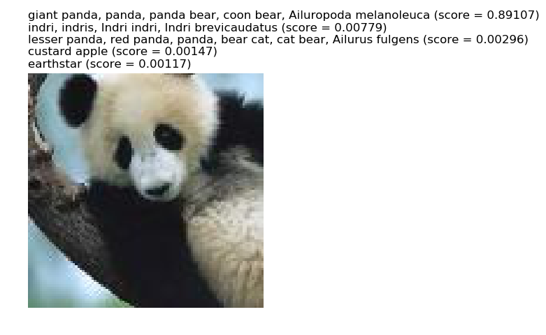
***
