# ___2018 - 10 - 11 Image Processing___
***

# 目录
  <!-- TOC depthFrom:1 depthTo:6 withLinks:1 updateOnSave:1 orderedList:0 -->

  - [___2018 - 10 - 11 Image Processing___](#2018-10-11-image-processing)
  - [目录](#目录)
  - [图片处理常用库](#图片处理常用库)
  - [图片像素序列处理](#图片像素序列处理)
  	- [测试图片](#测试图片)
  	- [将长方形图片转化为圆形](#将长方形图片转化为圆形)
  	- [裁剪图片四周的空白像素](#裁剪图片四周的空白像素)
  	- [分割手写数字图片为单独数字并转化为 MNIST 格式](#分割手写数字图片为单独数字并转化为-mnist-格式)
  	- [图片数据类型转化](#图片数据类型转化)
  - [图像处理算法](#图像处理算法)
  	- [Otsu 最佳阈值分割法](#otsu-最佳阈值分割法)
  	- [Sobel 边缘检测算子](#sobel-边缘检测算子)
  	- [Canny 边缘检测算子](#canny-边缘检测算子)
  	- [Watershed 水线阈值分割算法](#watershed-水线阈值分割算法)
  	- [Anisotropic diffusion 各项异性扩散算法](#anisotropic-diffusion-各项异性扩散算法)
  	- [Fourier 傅里叶变换](#fourier-傅里叶变换)
  	- [Gabor 变换](#gabor-变换)
  - [skimage](#skimage)
  	- [简介](#简介)
  	- [子模块](#子模块)
  	- [data 测试图片与样本数据](#data-测试图片与样本数据)
  	- [io 图像的读取显示与保存](#io-图像的读取显示与保存)
  	- [transform 图像形变与缩放](#transform-图像形变与缩放)
  	- [color 图像颜色转换](#color-图像颜色转换)
  	- [exposure 与像素分布直方图 histogram](#exposure-与像素分布直方图-histogram)
  	- [exposure 调整对比度与亮度](#exposure-调整对比度与亮度)
  	- [Image Viewer](#image-viewer)
  	- [draw 图形绘制](#draw-图形绘制)
  	- [filters 图像自动阈值分割](#filters-图像自动阈值分割)
  	- [filters 图像过滤](#filters-图像过滤)
  	- [图像分割 Image Segmentation](#图像分割-image-segmentation)
  	- [morphology 形态学滤波](#morphology-形态学滤波)
  	- [filters.rank 高级滤波](#filtersrank-高级滤波)
  - [处理视频文件](#处理视频文件)

  <!-- /TOC -->
***

# 图片处理常用库
  - [scikit-image](https://scikit-image.org)
  - [pillow](https://pillow.readthedocs.io/)
  - [opencv](https://opencv.org)
  - [imageio](https://imageio.readthedocs.io/en/stable/)
  - [tensorflow image](https://www.tensorflow.org/api_guides/python/image)
***

# 图片像素序列处理
## 测试图片
  ```py
  import matplotlib.pyplot as plt
  import numpy as np
  import tensorflow as tf
  import pandas as pd
  import os

  from skimage import data
  plt.imsave('./coffee.jpg', data.coffee())
  plt.imshow(plt.imread('./coffee.jpg'))
  ```
  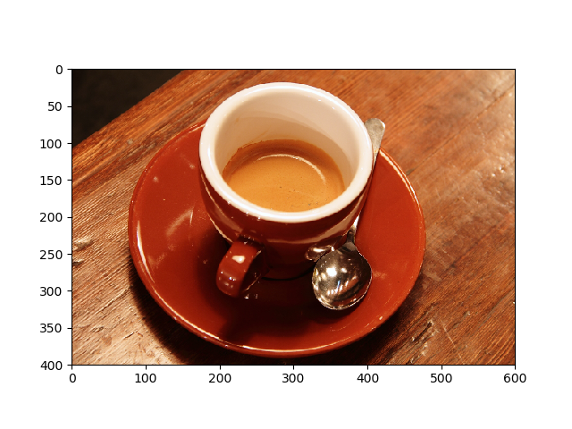
## 将长方形图片转化为圆形
  ```python
  ''' 将长方形图片转化为圆形 '''
  def image_rec_2_circle(im):
      # 计算圆心与半径
      xc = int(im.shape[1] / 2)
      yc = int(im.shape[0] / 2)
      rad = int(np.min([xc, yc]))

      # 将图片转化为正方形
      imm = im[yc - rad: yc + rad, xc - rad: xc + rad, :]

      # 添加 alpha 通道，默认值 0，即全透明
      alpha_array = np.ones((imm.shape[0], imm.shape[1], 1)) * 0
      alpha_array = alpha_array.astype(np.uint8)
      imm = np.concatenate([imm, alpha_array], axis=-1)

      # 逐行遍历图片，计算该行的圆形区域，透明度改为 255
      for ii in range(imm.shape[0]):
          jj = int(np.sqrt(rad **2 - (ii - rad) ** 2))
          imm[ii, (rad - jj):(rad + jj), 3] = 255

      return imm

  im = plt.imread('./coffee.jpg')
  imm = image_rec_2_circle(im)

  plt.imsave('./image_processing_coffee_circle.png', imm)
  ```
  
## 裁剪图片四周的空白像素
  ```py
  ''' 裁剪图片四周的空白像素 '''
  def image_cut_blank(imm, BLANK_VALUE_THREAD=1, MARGIN=[0, 0]):
      none_blank_lines = lambda itt: [ii for ii, ll in enumerate(itt) if not np.alltrue(ll >= BLANK_VALUE_THREAD)]
      hmm = none_blank_lines(imm)
      wmm = none_blank_lines(imm.transpose(1, 0, 2))

      hss = np.max([0, hmm[0] - MARGIN[0]])
      wss = np.max([0, wmm[0] - MARGIN[1]])

      return imm[hss: hmm[-1] + MARGIN[0], wss: wmm[-1] + MARGIN[1]]

  imm = plt.imread('an_image_path.png')
  plt.imshow(image_cut_blank(imm, BLANK_VALUE_THREAD=255))
  ```
## 分割手写数字图片为单独数字并转化为 MNIST 格式
  ```py
  def separate_image_nums(image_path, pix_thread=0.6, margin=5, RELOAD=False):
      from skimage.transform import resize

      back_up_name = image_path.split('/')[-1].split('.')[0]
      back_up_name = os.path.join(os.path.dirname(image_path), back_up_name) + '.npy'
      if not RELOAD and os.path.exists(back_up_name):
          rr = np.load(back_up_name)
          return rr

      imm = plt.imread(image_path)
      imm = (imm - imm.min()) / (imm.max() - imm.min())

      iaa = imm.transpose(1, 0, 2)
      tt = []
      start = True
      for ii, ll in enumerate(iaa):
          if (start == True and np.alltrue(ll > pix_thread)) or (start == False and not np.alltrue(ll > pix_thread)):
              continue
          start = not start
          tt.append(ii)

      tt = np.array(tt).reshape(-1, 2)

      rr  = []
      for ii in tt:
          ibb = imm[:, ii[0]:ii[1], :]
          cc = [ii for ii, ll in enumerate(ibb) if not np.alltrue(ll > pix_thread)]
          icc = 1 - ibb[cc[0]:cc[-1], :, 0]
          margin_icc = int(icc.shape[1] / (28 - 2 * margin) * margin)
          icc = np.concatenate([np.zeros([margin_icc, icc.shape[1]]), icc, np.zeros([margin_icc, icc.shape[1]])], 0)

          left_w = int((icc.shape[0] - icc.shape[1]) / 2)
          right_w = int(np.ceil((icc.shape[0] - icc.shape[1]) / 2))
          idd = np.concatenate([np.zeros([icc.shape[0], left_w]), icc, np.zeros([icc.shape[0], right_w])], 1)

          rr.append(resize(idd, [28, 28], mode='reflect'))

      rr = np.stack(rr)
      np.save(back_up_name, rr)
      return rr

  def imshow_nums(tt, line=2):
      row = int(np.ceil(tt.shape[0] / line))
      fig = plt.figure(figsize=(row * 2, line * 2))
      for ii, imm in enumerate(tt):
          fig.add_subplot(line, row, ii + 1)
          plt.imshow(imm)
          plt.axis('off')

      return fig

  im_path = os.path.expanduser('~/workspace/datasets/MNIST_all_true_hand.jpg')
  tt = separate_image_nums(im_path, pix_thread=0.6, margin=5, RELOAD=True)
  imshow_nums(tt)
  ```
  

  **不同模型测试**
  ```py
  # keras
  np.argmax(model.predict(tt * 255), 1)

  # estimator
  tt_input = tf.estimator.inputs.numpy_input_fn(x={'x': (tt * 255).astype(np.float32)}, num_epochs=1, shuffle=False)
  list(mnist_classifier.predict(tt_input))

  # MNIST 中的特定数字图片
  aa = np.stack([test_x[ii] for ii, nn in enumerate(test_y) if nn == 9])
  imshow_nums(aa[15: 25])
  ```
## 图片数据类型转化
  - **将二进制图片转化为 array**
    ```py
    ''' 将二进制图片转化为 array '''
    import io

    imm = open('./coffee.jpg', 'rb').read()
    im = plt.imread(io.BytesIO(imm), format='jpg')
    ```
  - **PIL Image 与 array**
    ```py
    from PIL import Image
    ''' pil image 转化为 array '''
    img = Image.open('./coffee.jpg')
    imm = np.array(img)
    print(imm.shape) # (400, 600, 3)
    ```
    ```py
    ''' array 转化为 PIL Image '''
    img = Image.fromarray(imm)
    img.show()
    ```
  - **array 编码成 jpg / png**
    ```py
    cv2.imencode('.jpg', rgb_face_frame)
    ```
***

# 图像处理算法
## Otsu 最佳阈值分割法
  - **OTSU 算法** 又称为大津法或最大类间方差法，是由日本学者 OTSU 于 1979 年提出的一种对图像进行二值化的高效算法
  - OTSU 利用阈值将原图像分成前景，背景两个图象
  - 完全以在一幅图像的直方图上执行计算为基础，而直方图是很容易得到的一维阵列
  - 类间方差法对噪音和目标大小十分敏感，它仅对类间方差为单峰的图像产生较好的分割效果
  - 当目标与背景的大小比例悬殊时，类间方差准则函数可能呈现双峰或多峰，此时效果不好，但是类间方差法是用时最少的
  - **计算步骤**
    - 计算输入图像的直方图，并归一化
    - 计算累积均值 mu，以及全局灰度均值
    - 计算被分到类 1 的概率 q1，和被分到类 2 的概率 q2
    - 用公式计算类间方差，`sigma = q1*q2*(mu1 - mu2)*(mu1 - mu2)`
    - 循环寻找类间方差最大值，并记下此时的阈值，即为最佳阈值
    - 利用最佳阈值进行图像阈值化
  - **skimage.filters.threshold_otsu**
    ```py
    ''' 计算 OTSU 阈值 '''
    from skimage import filters, data
    camera = data.camera()
    threshold_value = filters.threshold_otsu(camera)
    print(threshold_value)  # 87

    plt.imshow(camera >= threshold_value)
    plt.axis('off')
    plt.tight_layout()
    ```
    
## Sobel 边缘检测算子
  - **Sobel 算子** 是一个离散微分算子 discrete differentiation operator，是典型的基于一阶导数的边缘检测算子，主要用于边缘检测
  - **图像边缘** 相素值会发生显著的变化了，表示这一改变的一个方法是使用导数，梯度值的大变预示着图像中内容的显著变化
  - **Sobel 算子** 结合了高斯平滑和微分求导，用来计算图像灰度函数的近似梯度，对噪声具有平滑作用，能很好的消除噪声的影响
  - **Sobel 算子** 对于象素的位置的影响做了加权，与 Prewitt 算子 / Roberts 算子相比因此效果更好，但边缘定位精度不够高
  - **扩展 Sobel 算子** Sobel 原始模型为标准 **3x3 模板**，但可以扩展成 **5x5** 或任意奇数大小，其模板系数可由帕斯卡三角来计算
  - Sobel 算子又延伸出了 **Scharr 算子**，效果较好
  - **skimage.filters.sobel**
    ```py
    ''' sobel 检测图像边缘 '''
    from skimage import filters, img_as_float, data, io
    camera = data.camera()
    edges = filters.sobel(camera)
    io.imshow(np.concatenate([img_as_float(camera), edges], 1))
    plt.axis('off')
    ```
    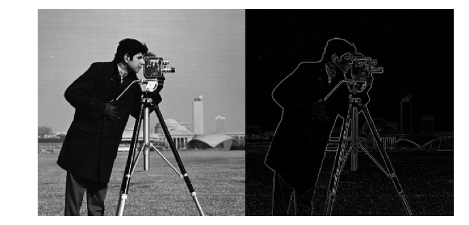
## Canny 边缘检测算子
  - **Canny 边缘检测算法** 是 John F. Canny 于 1986 年开发出来的一个多级边缘检测算法
  - **Canny 边缘检测** 是从不同视觉对象中提取有用的结构信息，并大大减少要处理的数据量的一种技术，目前已广泛应用于各种计算机视觉系统
  - **变分法 calculus of variations**，Canny 使用的一种寻找优化特定功能的函数的方法，最优检测使用四个指数函数项表示，但是它非常近似于高斯函数的一阶导数
  - **Canny 边缘检测算法步骤**
    - 应用高斯滤波来平滑图像，目的是去除噪声
    - 在横向和纵向应用 Sobel 检测方法，计算图像中每个像素点的梯度强度和方向 intensity gradients
    - 应用非最大抑制 non-maximum suppression 技术，以消除边缘检测带来的杂散响应
    - 应用双阈值 Double-Threshold 检测来确定真实的和潜在的边缘
    - 通过抑制孤立的弱边缘最终完成边缘检测
  - **skimage.feature.canny**
    ```py
    canny(image, sigma=1.0, low_threshold=None, high_threshold=None, mask=None, use_quantiles=False)
    ```
    ```py
    from skimage.feature import canny

    # Generate noisy image of a square
    im = np.zeros((256, 256))
    im[64:-64, 64:-64] = 1
    im += 0.2 * np.random.rand(*im.shape)

    # First trial with the Canny filter, with the default smoothing
    edges1 = feature.canny(im)

    # Increase the smoothing for better results
    edges2 = feature.canny(im, sigma=3)

    # Fill holes
    from scipy import ndimage as ndi
    filled = ndi.binary_fill_holes(edges2)

    # Display
    fig, ax = plt.subplots(ncols=4, nrows=1, figsize=(8, 2))
    images = [im, edges1, edges2, filled]
    titles = ['Noise Square', 'Edge Default', 'Edge sigma=3', 'filled']
    for aa, im, tt in zip(ax, images, titles):
        aa.imshow(im)
        aa.set_axis_off()
        aa.set_title(tt)
    ```
    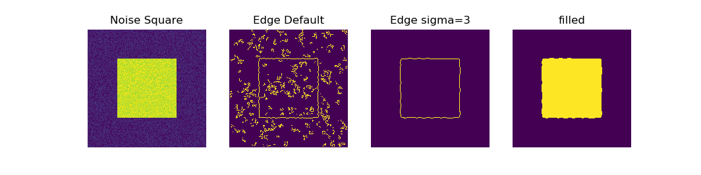
## Watershed 水线阈值分割算法
  - **watershed** 水线阈值分割算法，也称分水岭或流域阈值算法，用于分割图像中重叠的目标物体，可以看成是一种特殊的自适应迭代阈值方法
  - **水线阈值分割算法**
    - 将图像看作一幅地形图，其中亮度比较强的区域像素值较大，而比较暗的区域像素值较小
    - 通过寻找 **汇水盆地** 与 **分水岭界限**，对图像进行分割
    - 直接应用分水岭分割算法的效果往往并不好，如果在图像中对前景对象和背景对象进行标注区别，再应用分水岭算法会取得比较好的效果
    - 容易过度分割，即在图像的局部最小像素位置多读分割图像
    - 对噪声敏感，局部的一些改变会引起分割结果的明显改变
    - 难以准确检测出低对比度的边界
  - **计算过程**
    - 初始时，使用一个较大的阈值将两个目标分开，但目标间的间隙很大
    - 在减小阈值的过程中，两个目标的边界会相向扩张
    - 它们接触前所保留的最后像素集合就给出了目标间的最终边界，此时也就得到了阈值
  - **skimage.morphology.watershed**
    ```py
    watershed(image, markers, connectivity=1, offset=None, mask=None, compactness=0, watershed_line=False)
    ```
    - **参数 markers** int 值或与 image 相同维度的数组，指定返回的 label 中该位置的对应值，可以使用梯度的最小值，与背景像素的最大值等
    ```py
    # We first generate an initial image with two overlapping circles
    x, y = np.indices((80, 80))
    x1, y1, x2, y2 = 28, 28, 44, 52
    r1, r2 = 16, 20
    mask_circle1 = (x - x1)**2 + (y - y1)**2 < r1**2
    mask_circle2 = (x - x2)**2 + (y - y2)**2 < r2**2
    image = np.logical_or(mask_circle1, mask_circle2)

    # Next, we want to separate the two circles. We generate markers at the
    # maxima of the distance to the background:
    from scipy import ndimage as ndi
    distance = ndi.distance_transform_edt(image)
    from skimage.feature import peak_local_max
    local_maxi = peak_local_max(distance, labels=image, footprint=np.ones((3, 3)), indices=False)
    markers = ndi.label(local_maxi)[0]

    # Finally, we run the watershed on the image and markers:
    from skimage.morphology import watershed
    labels = watershed(-distance, markers, mask=image)

    # plot
    fig, ax = plt.subplots(ncols=4, figsize=(8, 2))
    ax[0].imshow(image)
    ax[1].imshow(np.where(labels==0, image, 0))
    ax[2].imshow(np.where(labels==1, image, 0))
    ax[3].imshow(np.where(labels==2, image, 0))
    for aa in ax: aa.axis('off')
    plt.tight_layout()
    ```
    
## Anisotropic diffusion 各项异性扩散算法
  ```py
  skimage.segmentation.random_walker: random walker segmentation
      A segmentation algorithm based on anisotropic diffusion, usually
      slower than the watershed but with good results on noisy data and
      boundaries with holes.
  ```
## Fourier 傅里叶变换
  - **数字图像处理** 方法主要分成两大部分，**空域分析法** 和 **频域分析法**
    - **空域分析法** 是对图像矩阵进行处理
    - **频域分析法** 是通过图像变换将图像从空域变换到频域，从另外一个角度来分析图像的特征并进行处理
    - **频域分析法** 在图像增强 / 图像复原 / 图像编码压缩 / 特征编码压缩方面有着广泛应用
  - **傅里叶变换** 是线性系统分析的有力工具，提供了一种把 **时域信号** 转换到 **频域** 进行分析的途径，时域和频域之间是一对一的映射关系
  - **傅里叶变换** 本质是将任意一个函数转化为若干不同频率正弦波的组合，从物理效果看，是将图像的灰度分布函数变换为图像的频率分布函数
  - **不足之处**
    - 傅里叶变换只能反映信号的整体特性，对傅里叶谱中的某一频率，无法知道这个频率是在什么时候产生的
    - 傅里叶变换是信号在整个时域内的积分，因此反映的是信号频率的统计特性，没有局部化分析信号的功能
    - 傅里叶变换时域和频域是完全分割开来的
  - 为解决傅里叶变换的局限性，产生了 **Gabor 变换** 和 **小波变换**
## Gabor 变换
  - **Gabor 变换** 是 D.Gabor 在 1946 年提出的，为了由信号的傅里叶变换提取局部信息，引入了 **时间局部化的窗函数**，得到了窗口傅里叶变换，由于窗口傅里叶变换只依赖于部分时间的信号，因此又称为 **短时傅里叶变换** 或 **Gabor 变换**
  - **Gabor 变换** 可以达到时频局部化的目的，同时提供时域和频域局部化的信息，即能够 **在整体上提供信号的全部信息** 而又能提供 **在任一局部时间内信号变化剧烈程度的信息**
  - **Gabor 变换的基本思想** 把信号划分成许多小的时间间隔，用 **傅里叶变换** 分析每一个时间间隔，以便确定信号在该时间间隔存在的频率，其处理方法是对 f(t) 加一个 **滑动窗 g(t)**，再作傅里叶变换
  - **滑动窗 g(t)** 使用高斯函数，高斯函数的傅里叶变换仍为高斯函数，这使得傅里叶逆变换也是用窗函数局部化，同时体现了频域的局部化
  - **图像处理** 中，Gabor 函数是一个用于 **边缘提取的线性滤波器**，可以抽取空间局部频度特征，是一种有效的纹理检测工具
  - **Gabor 滤波器** 的频率和方向表达同人类视觉系统类似，可以很好地近似单细胞的感受野函数，即光强刺激下的传递函数
  - **Gabor 滤波器的脉冲响应** 可以定义为 **一个正弦波乘以高斯函数**，对于二维 Gabor 滤波器是正弦平面波
  - **Gabor 滤波器的脉冲响应的傅立叶变换** 由于乘法卷积性质，其傅立叶变换是其 **调和函数的傅立叶变换** 和 **高斯函数傅立叶变换** 的 **卷积**
  - **Gabor 滤波器的结果**
    - 分为 **实部** 和 **虚部**，二者相互正交
    - **实部** 可以对图像进行平滑滤波
    - **虚部** 可以用来边缘检测
  - **Gabor 核作为图像特征**
    - 一个 Gabor 核能获取到图像某个频率邻域的响应情况，这个响应结果可以看做是图像的一个特征
    - 如果用多个不同频率的 Gabor 核去获取图像在不同频率邻域的响应情况，最后就能形成图像在各个频率段的特征，可以描述图像的频率信息
    - 用这些核与图像卷积，就能得到图像上每个点和其附近区域的频率分布情况
  - 由于纹理特征通常和频率相关，因此 Gabor 核经常用来作为 **纹理特征**，字符识别问题通常都是识别纹理的过程，所以 Gabor 核在光学字符识别 OCR 系统中也有广泛应用
  - **skimage.filters.gabor**
    ```py
    from skimage import filters, data, io
    image = data.coins()
    filt_real, filt_imag = gabor(image, frequency=0.6)
    print(image.shape, filt_real.shape, filt_imag.shape)
    # (303, 384) (303, 384) (303, 384)

    io.imshow(np.concatenate([image, filt_real, filt_imag], 1))
    plt.axis('off')
    ```
    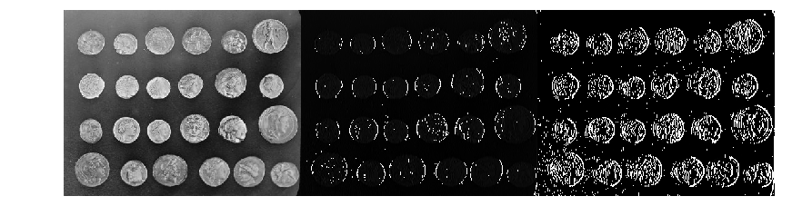
***

# skimage
## 简介
  - [API Reference for skimage](http://scikit-image.org/docs/stable/api/api.html)
  - [General examples](scikit-image.org/docs/stable/auto_examples/index.html#examples-gallery)
  - **scikit-image** 是使用 numpy arrays 格式处理图片数据的 python 工具包
    ```py
    import skimage
    ```
  - **numpy arrays 格式的图片数据**
    - **RGB 图片** 维度为 `[width, height, channel]`
    - **灰度图片** 为 `[width, height]`
    - **PNG 格式图片** `channel` 可以带透明度通道
    - **3D 图片** 有一个 `plane` 维度，`[plane, width, height, channel]`
    - `[0, 0]` 点位于图片的左上角
    - 使用 `rows` / `columns` 分别指代 `width` / `height`
    - **float 类型** 的图片数据，取值范围应是 `[-1, 1]`
    - 尽量不要使用 `astype` 转化数据类型，而是使用 skimage 提供的 `skimage.img_as_float` / `skimage.img_as_uint` / `img_as_int` 等方法
      ```py
      image = np.arange(0, 50, 10, dtype=np.uint8)
      print(image.astype(np.float))
      # [ 0. 10. 20. 30. 40.]
      print(skimage.img_as_float(image))
      # [0.         0.03921569 0.07843137 0.11764706 0.15686275]
      ```
  - **preserve_range 参数** 有些函数提供 `preserve_range 参数`，在 `int` 转化为 `float` 时保留图片数据的取值范围
    ```py
    from skimage import data
    from skimage.transform import rescale

    image = data.coins()
    print(image.dtype, image.min(), image.max(), image.shape)
    # (dtype('uint8'), 1, 252, (303, 384))

    rescaled = rescale(image, 0.5, mode='reflect', multichannel=False, anti_aliasing=True)
    print(rescaled.dtype, np.round(rescaled.min(), 4), np.round(rescaled.max(), 4), rescaled.shape)
    # float64 0.0157 0.9114 (152, 192)

    rescaled = rescale(image, 0.5, mode='reflect', preserve_range=True, multichannel=False, anti_aliasing=True)
    print(rescaled.dtype, np.round(rescaled.min()), np.round(rescaled.max()), rescaled.shape)
    # float64 4.0 232.0 (152, 192)
    ```
  - **应用示例**
    ```py
    ''' 圆形裁剪 '''
    # 生成网格
    row, col = np.ogrid[:nrows, :ncols]
    cnt_row, cnt_col = nrows / 2, ncols / 2

    # 圆形蒙板
    outer_disk_mask = ((row - cnt_row)**2 + (col - cnt_col)**2 > (nrows / 2)**2)

    # 只裁剪上半部分
    top_half = row < cnt_row
    top_half_disk = np.logical_and(top_half, outer_disk_mask)

    camera[top_half_disk] = 255
    io.imshow(camera)
    plt.axis('off')
    ```
    
## 子模块
  - 大部分的功能位于子模块中，需要单独导入
    ```py
    from skimage import color
    from skimage import data
    from skimage import transform
    from skimage import io

    camera = data.camera()
    print(type(camera), camera.shape)
    # <class 'numpy.ndarray'> (512, 512)
    ```
  | 子模块名称   | 主要实现功能                                                |
  | ------------ | ----------------------------------------------------------- |
  | io           | 读取、保存和显示图片或视频                                  |
  | data         | 提供一些测试图片和样本数据                                  |
  | color        | 颜色空间变换                                                |
  | filters      | 图像增强、边缘检测、排序滤波器、自动阈值等                  |
  | draw         | 操作于numpy数组上的基本图形绘制，包括线条、矩形、圆和文本等 |
  | transform    | 几何变换或其它变换，如旋转、拉伸和拉东变换等                |
  | morphology   | 形态学操作，如开闭运算、骨架提取等                          |
  | exposure     | 图片强度调整，如亮度调整、直方图均衡等                      |
  | feature      | 特征检测与提取等                                            |
  | measure      | 图像属性的测量，如相似性或等高线等                          |
  | segmentation | 图像分割                                                    |
  | restoration  | 图像恢复                                                    |
  | util         | 通用函数                                                    |
## data 测试图片与样本数据
  - **skimage.data** 包含一些测试图片和样本数据，如 RGB 格式的 coffee，灰度图片 coins / camera 等
    ```py
    from skimage import data
    plt.imshow(data.coffee())
    plt.imsave('./coffee.jpg', data.coffee())
    ```
  - **skimage.data_dir** 显示 data 图片的路径
    ```py
    from skimage import data_dir
    print(data_dir)
    # /opt/anaconda3/lib/python3.6/site-packages/skimage/data
    ```
## io 图像的读取显示与保存
  - **imread / imshow / imsave**
    ```py
    from skimage import io
    imm = io.imread('./coffee.jpg')
    io.imshow(imm)
    io.imsave('./coffee.jpg', imm)
    ```
  - **io.imread**
    ```py
    imread(fname, as_gray=False, plugin=None, flatten=None, **plugin_args)
    ```
    **as_gray 参数** 指定读取为灰度模式
    ```py
    img=io.imread('./coffee.jpg',as_gray=True)
    print(img.shape)  # (400, 600)
    ```
  - **io.imread_collection** 批量读取图片，可以指定一个字符串或列表
    ```py
    path = skimage.data_dir
    imm = io.imread_collection(path + '/*.png')
    print(len(imm)) # 28

    # Load png or jpg
    imm = io.imread_collection(path + '/*.png:' + path + '/*.jpg')
    print(len(imm)) # 30

    for ii in imm:
        print(ii.shape)
    ```
  - **io.ImageCollection** 图片批量处理类
    ```py
    # Load and manage a collection of image files.
    class ImageCollection(builtins.object)
    ```
    - **load_pattern 参数** 字符串或列表，指定加载的文件名路径，多个路径时需要用 `os.pathsep` 分隔开，如 `:`
    - **conserve_memory 参数** 设定为 True 时，在内存中值保留一张图片
    - **load_func 参数** 图片处理程序，默认为 `imread`
    ```py
    ''' 批量读取 png 图片 '''
    path = skimage.data_dir
    imm = io.ImageCollection(path + '/*.png')
    print(len(imm.files), len(imm)) # 28 28

    ''' 批量读取 png 与 jpg 图片 '''
    print(os.pathsep) # :
    imm = io.ImageCollection(path + '/*.png' + os.pathsep + path + '/*.jpg')
    print(len(imm.files), len(imm)) # 31 30 [ ??? ]

    ''' 批量读取并转化为灰度图片 '''
    convert_gray = lambda ff: color.rgb2gray(io.imread(ff))
    imm = io.ImageCollection(path + '/*.png', load_func=convert_gray)
    iss = [ii.shape for ii in imm]
    print(np.shape(iss))  # (28, 2)
    ```
  - **io.concatenate_images** 用于将相同维度的图片组合到一起
    ```py
    ''' 选取一组维度相同的图片 '''
    tt = [imm.files[ii] for ii, ss in enumerate(iss) if ss == (512, 512)]
    itt = io.ImageCollection(tt, load_func=convert_gray)

    ''' 组合 '''
    icc = io.concatenate_images(itt)
    print(icc.shape)  # (7, 512, 512)
    ```
  - **图像读取与显示的 plugin**
    ```py
    # 当前系统中可用的 plugin
    io.find_available_plugins()
    # {'imageio': ['imread', 'imsave', 'imread_collection'],
    #  'pil': ['imread', 'imsave', 'imread_collection'],
    #  'gdal': ['imread', 'imread_collection'],
    #  'qt': ['imshow', 'imsave', 'imread', 'imread_collection'],
    #  'tifffile': ['imread', 'imsave', 'imread_collection'],
    #  'gtk': ['imshow'],
    #  'imread': ['imread', 'imsave', 'imread_collection'],
    #  'simpleitk': ['imread', 'imsave', 'imread_collection'],
    #  'fits': ['imread', 'imread_collection'],
    #  'matplotlib': ['imshow', 'imread', 'imshow_collection', 'imread_collection']}

    # 已加载的 plugin，显示多个时使用的是最后一个
    io.find_available_plugins(loaded=True)
    # {'pil': ['imread', 'imsave', 'imread_collection'],
    #   'matplotlib': ['imshow', 'imread', 'imshow_collection', 'imread_collection']}

    # 指定使用其他 plugin
    io.use_plugin('pil')

    # plugin 信息
    io.plugin_info('pil')
    # {'description': 'Image reading via the Python Imaging Library',
    #   'provides': 'imread, imsave'}
    ```
## transform 图像形变与缩放
  - **transform.resize** 改变图片尺寸
    ```py
    resize(image, output_shape, mode=None, clip=True, preserve_range=False, anti_aliasing=None, ...)
    ```
    - **mode 参数** 取值 `{'constant', 'edge', 'symmetric', 'reflect', 'wrap'}`
    - **anti_aliasing** 指定是否应用高斯过滤器以平滑图像，在向下采样时应设置为 `True`，以避免混叠伪影 aliasing artifacts
    ```py
    from skimage.transform import resize
    image = data.camera()
    resize(image, (100, 100), mode='reflect', anti_aliasing=True).shape
    # Out[22]: (100, 100)
    ```
  - **transform.rescale** 按比例缩小 / 放大图像
    ```py
    rescale(image, scale, mode=None, clip=True, preserve_range=False, multichannel=None, anti_aliasing=None, ...)
    ```
    - **multichannel 参数** 指定图像的最后一个维度是颜色通道还是空间维度，对于 RGB 等三维图像应设置为 `True`，其他应设置为 `False`
    ```py
    from skimage.transform import rescale
    image = data.camera()
    print(image.shape)
    # (512, 512)
    print(rescale(image, 0.1, mode='reflect', anti_aliasing=True, multichannel=False).shape)
    # (51, 51)
    print(rescale(image, 0.5, mode='reflect', anti_aliasing=True, multichannel=False).shape)
    # (256, 256)
    ```
  - **transform.downscale_local_mean** 使用像素间的平均值缩放图像。适用与多维图像
    ```py
    downscale_local_mean(image, factors, cval=0, clip=True)
    ```
    - **factors 参数** 指定调整后的各个维度大小
    ```py
    from skimage.transform import downscale_local_mean
    a = np.arange(15).reshape(3, 5)
    print(downscale_local_mean(a, (2, 3)))
    # [[3.5 4. ] [5.5 4.5]]
    ```
  - **transform.rotate** 旋转图像
    ```py
    rotate(image, angle, resize=False, center=None, order=1, mode='constant', cval=0, clip=True, preserve_range=False)
    ```
    - **angle 参数** float 类型，表示旋转的度数
    - **resize 参数** 用于控制在旋转时，是否调整大小，默认为 `False`
    ```python
    from skimage.transform import rotate
    image = data.camera()
    print(rotate(image, 2).shape)
    # (512, 512)
    print(rotate(image, 2, resize=True).shape)
    # (530, 530)
    print(rotate(image, 90, resize=True).shape)
    # (512, 512)
    ```
  - **transform.pyramid_gaussian / transform.pyramid_gaussian** 生成图像金字塔，每一张图像的大小递减
    ```py
    pyramid_gaussian(image, max_layer=-1, downscale=2, sigma=None, order=1, mode='reflect', cval=0, multichannel=None)
    ```
    ```py
    image = data.astronaut()

    # Display
    ipp = transform.pyramid_gaussian(image, downscale=2, multichannel=True)
    rows, cols, _ = image.shape
    composite_image = np.ones((rows, cols + cols // 2, 3), dtype=np.float32)
    composite_image[:rows, :cols] = next(ipp)

    i_row = 0
    for imm in ipp:
        print(imm.shape)
        n_rows, n_cols = imm.shape[:2]
        composite_image[i_row:i_row + n_rows, cols:cols + n_cols] = imm
        i_row += n_rows

    # (256, 256, 3) (128, 128, 3) (64, 64, 3)
    # (32, 32, 3) (16, 16, 3) (8, 8, 3)
    # (4, 4, 3) (2, 2, 3) (1, 1, 3)

    plt.imshow(composite_image)
    plt.axis('off')
    plt.tight_layout()
    ```
    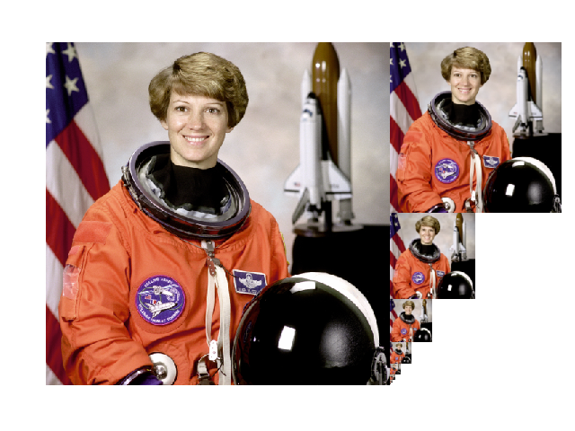
## color 图像颜色转换
  - skimage 中的 HSV 颜色取值范围是 `0-1` 的 float 值
    ```py
    hue_gradient = np.linspace(0, 1)
    hsv = np.ones(shape=(1, len(hue_gradient), 3), dtype=float)
    hsv[:, :, 0] = hue_gradient

    all_hues = color.hsv2rgb(hsv)

    fig, ax = plt.subplots(figsize=(5, 2))
    # Set image extent so hues go from 0 to 1 and the image is a nice aspect ratio.
    ax.imshow(all_hues, extent=(0, 1, 0, 0.2))
    ax.set_axis_off()
    ```
    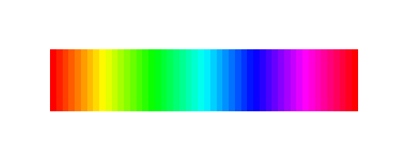
  - **转化色彩模式** 转化 RGB HSV CMYK YUV 等，使用 `color` 子模块中的方法
    - **RGB** 三个通道分别代表 红 / 绿/ 蓝
    - **HSV** 三个通道分别代表 色调 hue / 饱和度 saturation / 明度 value
    - **常用方法** rgb2gray / rgb2hsv / rgb2lab / gray2rgb / hsv2rgb / lab2rgb 等
    ```py
    # bright saturated red
    red_pixel_rgb = np.array([[[255, 0, 0]]], dtype=np.uint8)
    print(color.rgb2hsv(red_pixel_rgb)) # [[[0. 1. 1.]]]

    # darker saturated blue
    dark_blue_pixel_rgb = np.array([[[0, 0, 100]]], dtype=np.uint8)
    print(color.rgb2hsv(dark_blue_pixel_rgb)) # [[[0.66666667 1.         0.39215686]]]

    # less saturated pink
    pink_pixel_rgb = np.array([[[255, 100, 255]]], dtype=np.uint8)
    print(color.rgb2hsv(pink_pixel_rgb))  # [[[0.83333333 0.60784314 1.        ]]]
    ```
    **转化 RGB 为 cv2 的 BGR 格式只需要将通道维度逆序**
    ```py
    coffee = data.coffee()
    coffee_bgr = coffee[:, :, ::-1]]
    ```
  - **skimage.color.convert_colorspace** 转化色彩模式的同意接口
    - 支持的色彩模式 'RGB', 'HSV', 'RGB CIE', 'XYZ', 'YUV', 'YIQ', 'YPbPr', 'YCbCr', 'YDbDr'
    ```py
    from skimage import data
    img = data.astronaut()
    img_hsv = convert_colorspace(img, 'RGB', 'HSV')
    ```
  - **转化 RGBA 为 RGB** 将图片的透明度通道应用到图片上
    ```py
    from skimage.color import rgba2rgb
    img_rgba = data.logo()
    img_rgb = rgba2rgb(img_rgba)

    print(img_rgba.shape, img_rgb.shape)
    # (500, 500, 4) (500, 500, 3)
    ```
  - **彩色图片与灰度图片转化**
    - **rgb2gray** 在转化彩色图片时，由于人眼对不同颜色敏感度不同，各个通道上应用的权重也不同
    - **gray2rgb** 将灰度图像的通道复制成三个
    ```py
    from skimage.color import rgb2gray
    red = np.array([[[255, 0, 0]]], dtype=np.uint8)
    green = np.array([[[0, 255, 0]]], dtype=np.uint8)
    blue = np.array([[[0, 0, 255]]], dtype=np.uint8)

    print(rgb2gray(red)[0, 0], rgb2gray(green)[0, 0], rgb2gray(blue)[0, 0])
    # 0.2125 0.7154 0.0721
    ```
    ```py
    coins = data.coins()
    print(coins.shape, color.gray2rgb(coins).shape)
    # (303, 384) (303, 384, 3)
    ```
  - **skimage.color.label2rgb** 根据标签值对图片进行着色
    ```py
    # Return an RGB image where color-coded labels are painted over the image.
    label2rgb(label, image=None, colors=None, alpha=0.3, bg_label=-1, bg_color=(0, 0, 0), image_alpha=1, kind='overlay')
    ```
    - **label 参数** 与 image 维度相同
    - **image 参数** 指定 label 上色的底色，如果是 rgb 颜色，则先转化为灰度图
    ```py
    imm = data.coffee()
    img = color.rgb2gray(imm)

    labels = np.ones_like(img)
    labels[img < 0.4] = 0
    labels[img > 0.75] = 2

    idd = color.label2rgb(labels)
    iid = color.label2rgb(labels, img)

    io.imshow(np.concatenate([idd, iid], 1))
    plt.axis('off')
    ```
    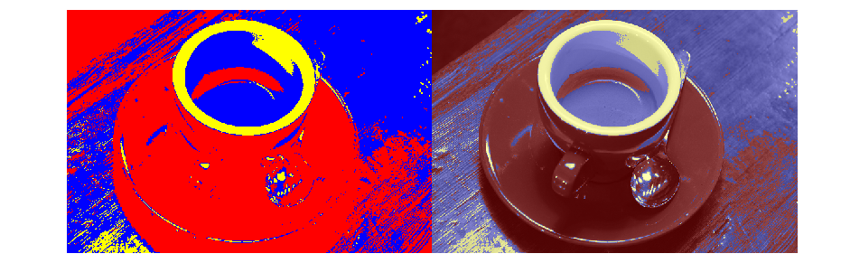
  - **合并相临颜色 与 label2rgb 上色**
    ```py
    ''' constructs a Region Adjacency Graph (RAG) and merges regions which are similar in color'''
    from skimage import data, io, segmentation, color
    from skimage.future import graph

    img = data.coffee()

    labels1 = segmentation.slic(img, compactness=30, n_segments=400)
    out1 = color.label2rgb(labels1, img, kind='avg')

    g = graph.rag_mean_color(img, labels1)
    labels2 = graph.cut_threshold(labels1, g, 29)
    out2 = color.label2rgb(labels2, img, kind='avg')

    fig, ax = plt.subplots(ncols=2, sharex=True, sharey=True, figsize=(8, 4))

    ax[0].imshow(out1)
    ax[1].imshow(out2)

    for a in ax:
        a.axis('off')

    plt.tight_layout()
    ```
    
  - **颜色反色** inverted image / complementary image
    ```py
    from skimage import util
    img = data.camera()
    inverted_img = util.invert(img)

    io.imshow(np.concatenate([img, inverted_img], 1))
    ```
    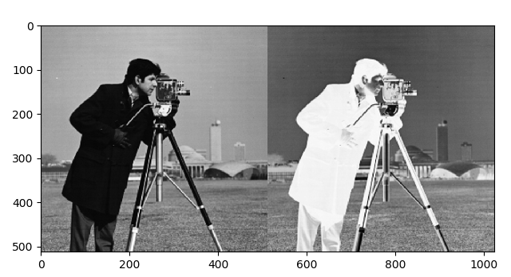
## exposure 与像素分布直方图 histogram
  - **plt.hist** 可以直接绘制图像的像素分布直方图
    ```py
    hist(x, bins=None, cumulative=False, histtype='bar', color=None, stacked=False, ...)
    ```
    ```py
    from skimage import data
    img = data.chelsea()
    plt.hist(img[:, :, 0].flatten(), bins=256, facecolor='r', edgecolor='r', alpha=0.5)
    plt.hist(img[:, :, 1].flatten(), bins=256, facecolor='g', edgecolor='g', alpha=0.5)
    plt.hist(img[:, :, 2].flatten(), bins=256, facecolor='b', edgecolor='b', alpha=0.5)
    plt.tight_layout()
    ```
    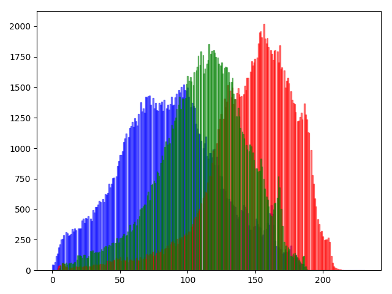
  - **exposure.histogram** 返回图像的像素分布，直方图一般是针对灰度图的
    - 第一个值是像素值在每个区间的数量
    - 第二个值是每个区间的中点，不同于 `np.histogram` 返回区间的边界
    ```py
    image = np.array([[1, 3], [1, 1]])
    exposure.histogram(image)
    # Out[210]: (array([3, 0, 1]), array([1, 2, 3]))

    np.histogram(image, bins=3)
    # Out[209]: (array([3, 0, 1]), array([1., 1.66666667, 2.33333333, 3.]))
    ```
  - **exposure.cumulative_distribution** 返回图像像素累积分布 cumulative distribution function (cdf)
    ```py
    from skimage import data, exposure, img_as_float
    image = img_as_float(data.camera())
    hi, _ = exposure.histogram(image)
    cdf, _ = exposure.cumulative_distribution(image)
    np.alltrue(cdf == np.cumsum(hi) / image.size)  # True
    ```
    ```py
    from skimage import exposure, data, color
    cc_red = data.coffee()[:, :, 0]

    bin_nums, bin_centers = exposure.histogram(cc_red)
    fig, ax = plt.subplots(nrows=2, sharex=True, sharey=False, figsize=(8, 4))
    ax[0].hist(cc_red.flatten(), bins=255)
    ax[1].bar(bin_centers, height=bin_nums)

    img_cdf, bin_centers = exposure.cumulative_distribution(cc_red, 256)
    ax_cdf = ax[1].twinx()
    ax_cdf.plot(bin_centers, img_cdf, 'r')

    plt.tight_layout()
    ```
    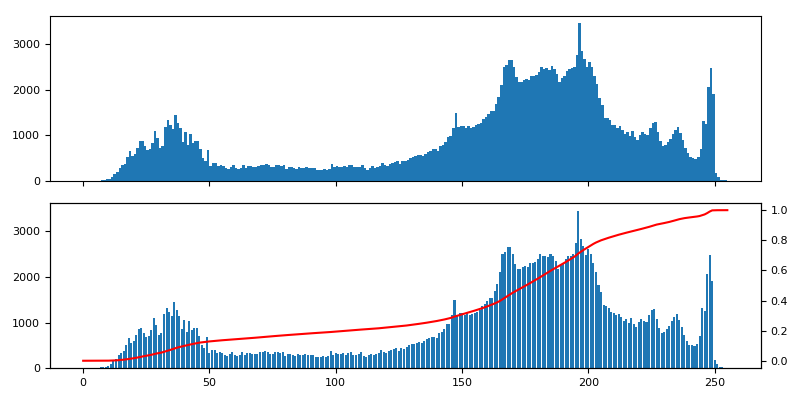
  - **图像显示辅助函数** 绘制图片直方图以及累积分布
    ```py
    from skimage import img_as_float, exposure, data

    def plot_img_and_hist(image, ax_img=None, ax_hist=None, bins=256, img_title=None):
        if ax_img == None:
            fig, (ax_img, ax_hist) = plt.subplots(ncols=2, figsize=(8, 4))

        # Display image
        image = img_as_float(image)
        ax_img.imshow(image, cmap=plt.cm.gray)
        ax_img.set_axis_off()
        if img_title:
            ax_img.set_title(img_title)

        # Display histogram
        ax_hist.hist(image.flatten(), bins=bins, histtype='step', color='black')
        ax_hist.ticklabel_format(axis='y', style='scientific', scilimits=(0, 0))
        ax_hist.set_xlabel('Pixel intensity')
        ax_hist.set_xlim(0, 1)
        ax_hist.set_yticks([])

        # Display cumulative distribution
        img_cdf, bins = exposure.cumulative_distribution(image, bins)
        ax_cdf = ax_hist.twinx()
        ax_cdf.plot(bins, img_cdf, 'r')
        ax_cdf.set_yticks([])

        return ax_img, ax_hist, ax_cdf

    plot_img_and_hist(data.moon())
    ```
  - **equalize_hist** / **equalize_adapthist** 调整图像直方图分布
    - **equalize_hist 均衡化直方图** 将图像的像素值分布 cdf 映射到一个线性 cdf 上，结果是使在对比度较差的大区域中增强图片细节
    - **equalize_adapthist** 可以在图像的子区域中执行直方图均衡，以校正图像上的曝光梯度
    ```py
    # Return image after histogram equalization.
    equalize_hist(image, nbins=256, mask=None)

    # Contrast Limited Adaptive Histogram Equalization (CLAHE).
    equalize_adapthist(image, kernel_size=None, clip_limit=0.01, nbins=256)
    ```
    ```py
    imm = data.moon()

    # Contrast stretching
    p2, p98 = np.percentile(imm, q=(2, 98))
    img_rescale = exposure.rescale_intensity(imm, in_range=(p2, p98))

    # Equalization
    img_eq = exposure.equalize_hist(imm)

    # Adaptive Equalization
    img_adapteq = exposure.equalize_adapthist(imm, clip_limit=0.03)

    # Display results
    fig, ax = plt.subplots(nrows=2, ncols=4, figsize=(8, 4))
    a_1 = plot_img_and_hist(imm, ax[0, 0], ax[1, 0], img_title='Low contrast image')
    a_2 = plot_img_and_hist(img_rescale, ax[0, 1], ax[1, 1], img_title='Contrast stretching')
    a_3 = plot_img_and_hist(img_eq, ax[0, 2], ax[1, 2], img_title='Histogram equalization')
    a_4 = plot_img_and_hist(img_adapteq, ax[0, 3], ax[1, 3], img_title='Adaptive equalization')

    hist_first, hist_last = a_1[1], a_4[2]
    y_min, y_max = hist_first.get_ylim()
    hist_first.set_ylabel('Number of pixels')
    hist_first.set_yticks(np.linspace(0, y_max, 5))
    hist_last.set_ylabel('Fraction of total intensity')
    hist_last.set_yticks(np.linspace(0, 1, 5))

    fig.tight_layout()
    ```
    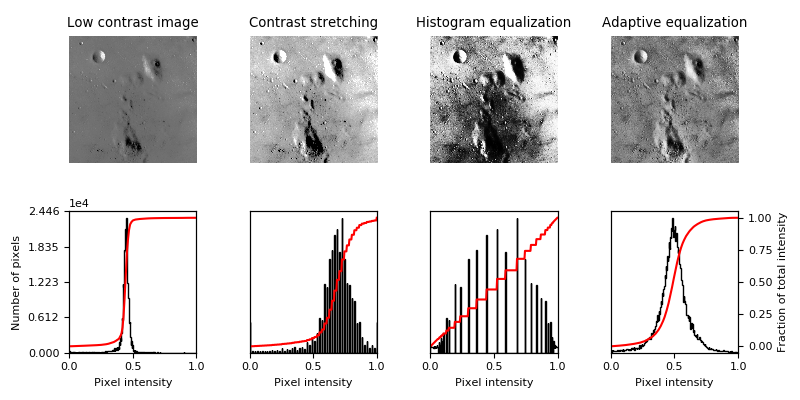
## exposure 调整对比度与亮度
  - **exposure.adjust_gamma** gamma 调整，`输出 O = gain * (输入 I ** gamma)`
    ```py
    adjust_gamma(image, gamma=1, gain=1)
    ```
    - **gamma 参数** gamma 值大于 1 时，输出图像变暗，gamma 值小于 1 时，输出图像变亮
    ```py
    from skimage import data, exposure, img_as_float
    image = img_as_float(data.moon())
    gam1 = exposure.adjust_gamma(image, 2)
    gam2 = exposure.adjust_gamma(image, 0.5)
    # Output is darker for gamma > 1
    print('%.4f, %.4f, %.4f' % (image.mean(), gam1.mean(), gam2.mean()))
    # 0.4399, 0.1962, 0.6615

    # Display
    images = [image, gam1, gam2]
    titles = ['Original', 'gamma=2', 'gamma=0.5']
    fig, axes = plt.subplots(nrows=2, ncols=3, figsize=(6, 4))
    for ax, im, tt in zip(axes.T, images, titles):
        plot_img_and_hist(im, ax[0], ax[1], img_title=tt)
    fig.tight_layout()
    ```
    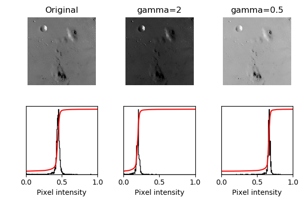
  - **exposure.adjust_log** 对数调整，`输出 O = gain * log(1 + 输入 I)`
    ```py
    adjust_log(image, gain=1, inv=False)
    ```
    ```py
    igg = exposure.adjust_log(image)
    plot_img_and_hist(igg)
    ```
    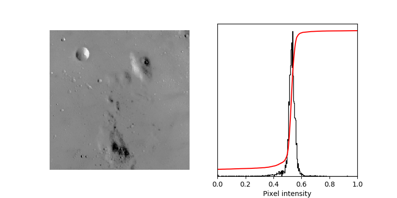
    - **inv 参数** 为 `True` 时执行 **反对数校正 inverse logarithmic correction**，`O = gain*(2**I - 1)`
  - **exposure.adjust_sigmoid** sigmoid 调整，`输出 O = 1/(1 + exp*(gain*(cutoff - 输入 I)))`
    ```py
    adjust_sigmoid(image, cutoff=0.5, gain=10, inv=False)
    ```
    ```py
    iss = exposure.adjust_sigmoid(image)
    plot_img_and_hist(iss)
    ```
    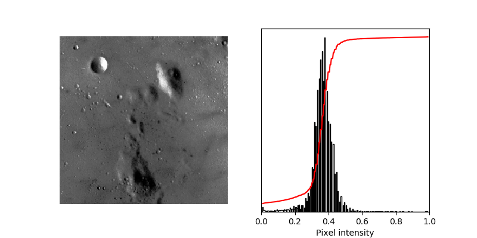
  - **exposure.is_low_contrast** 判断图像对比度是否偏低
    ```py
    is_low_contrast(image, fraction_threshold=0.05, lower_percentile=1, upper_percentile=99, method='linear')
    ```
    - **fraction_threshold 参数** 最低对比度阈值系数，如果图像的亮度范围小于该值，则认为对比度偏低
    - **lower_percentile / upper_percentile 参数** 在计算对比度时，忽略小于 / 大于该百分位数的值
    ```py
    image = np.linspace(0, 0.04, 100)
    print(exposure.is_low_contrast(image))
    # True
    image[-1] = 1
    print(exposure.is_low_contrast(image))
    # True
    print(np.percentile(image, 100))
    # 1.0
    print(exposure.is_low_contrast(image, upper_percentile=100))
    # False
    ```
  - **exposure.rescale_intensity** 调整强度，根据图像数据的 dtype，将像素值调整到 `0-255` / `0-1`，应避免使用其他方法调整
    ```py
    # Return image after stretching or shrinking its intensity levels.
    rescale_intensity(image, in_range='image', out_range='dtype')
    ```
    ```py
    from skimage import exposure

    image = np.arange(0, 50, 10, dtype=np.uint8)
    print(image) # [ 0 10 20 30 40]

    imm = exposure.rescale_intensity(image)
    print(imm) # [  0  63 127 191 255]

    iff = 1.0 * image
    print(exposure.rescale_intensity(iff)) # [0.   0.25 0.5  0.75 1.  ]

    idd = np.array([-10, 0, 10], dtype=np.int8)
    print(exposure.rescale_intensity(idd, out_range=(0, 127)))  # [  0  63 127]
    ```
    **参数 in_range** 可以使用范围值，或者字符串指定取值类型
    ```py
    itt = exposure.rescale_intensity(image, in_range=(0, 2**10 - 1))
    itt = exposure.rescale_intensity(image, in_range='uint10')
    ```
    **参数 in_range** 配合使用 `np.percentile` 选取指定百分位的像素值
    ```py
    moon = data.moon()
    v_min, v_max = np.percentile(moon, (0.2, 99.8))
    print(v_min, v_max) # 10.0, 186.0
    better_contrast = exposure.rescale_intensity(moon, in_range=(v_min, v_max))
    ```
## Image Viewer
  - **skimage.viewer.ImageViewer**
    ```py
    from skimage import data
    from skimage.viewer import ImageViewer

    image = data.coins()
    viewer = ImageViewer(image)
    viewer.show()
    ```
  - ImageViewer 可以添加 plugins 用于操作图片
    ```py
    from skimage.viewer.plugins.lineprofile import LineProfile

    viewer = ImageViewer(image)
    viewer += LineProfile(viewer)
    overlay, data = viewer.show()[0]
    ```
    ```py
    from skimage.filters import denoise_tv_bregman
    from skimage.viewer.plugins.base import Plugin

    denoise_plugin = Plugin(image_filter=denoise_tv_bregman)

    from skimage.viewer.widgets import Slider
    from skimage.viewer.widgets.history import SaveButtons

    denoise_plugin += Slider('weight', 0.01, 0.5, update_on='release')
    denoise_plugin += SaveButtons()

    viewer = ImageViewer(image)
    viewer += denoise_plugin
    denoised = viewer.show()[0][0]
    ```
## draw 图形绘制
  - **图像显示辅助函数**
    ```py
    def image_show_shape(image):
        plt.imshow(image)
        plt.xlim(0, image.shape[1]-1)
        plt.ylim(0, image.shape[0]-1)
        plt.tight_layout()
    ```
  - **line / line_aa** 画线条
    ```py
    line(r0, c0, r1, c1)
    ```
    - **r0 / c0** / **r1 / c1** 起始 / 结束点的行 / 列坐标
    - 返回绘制直线上所有的点坐标
    ```py
    from skimage.draw import line
    img = np.zeros((5, 5), dtype=np.uint8)
    rr, cc = line(1, 1, 3, 3)
    img[rr, cc] = 1
    print(img)
    # [[0 0 0 0 0]
    #  [0 1 0 0 0]
    #  [0 0 1 0 0]
    #  [0 0 0 1 0]
    #  [0 0 0 0 0]]
    ```
  - **line_aa** 画线条，anti-aliased 版本，返回直线坐标与 float 型像素值
    ```py
    line_aa(r0, c0, r1, c1)
    ```
    ```py
    from skimage.draw import line_aa, line
    img = np.zeros((200, 200), dtype=np.uint8)
    rr, cc, val = line_aa(40, 40, 120, 120)
    img[rr, cc] = val * 255

    rr, cc = line(80, 40, 160, 120)
    img[rr, cc] = 255

    image_show_shape(img)
    ```
    
  - **set_color** 设置颜色
    ```py
    set_color(image, coords, color, alpha=1)
    ```
    ```py
    from skimage.draw import line, set_color
    img = np.zeros((5, 5), dtype=np.uint8)
    rr, cc = line(1, 1, 10, 10)
    set_color(img, (rr, cc), 1)
    print(img)
    # [[0 0 0 0 0]
    #  [0 1 0 0 0]
    #  [0 0 1 0 0]
    #  [0 0 0 1 0]
    #  [0 0 0 0 1]]
    ```
  - **circle** 画圆
    ```py
    circle(r, c, radius, shape=None)
    ```
    **r, c, radius 参数** 圆心坐标与半径，double 类型，如果结果坐标中有负值，则会按照类似 `[-1, -1]` 点的位置，出现在图像的另一侧
    ```py
    from skimage.draw import circle
    img = np.zeros((200, 200), dtype=np.uint8)
    rr, cc = circle(40, 40, 50)
    img[rr, cc] = 1
    image_show_shape(img)
    ```
    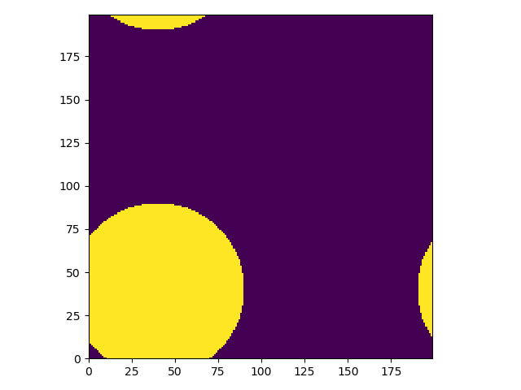
  - **rectangle** 长方形
    ```py
    rectangle(start, end=None, extent=None, shape=None)
    ```
    - **start 参数** 起始坐标，`([plane,] row, column)`
    - **end 参数** 终止坐标，`([plane,] row, column)`，可以指定 end 或 extent
    - **extent 参数** 长方形大小，`([num_planes,] num_rows, num_cols)`，可以指定 end 或 extent
    ```py
    from skimage.draw import rectangle
    img = np.zeros((10, 20), dtype=np.uint8)
    start = (4, 2)
    end = (2, 6)
    rr, cc = rectangle(start, end=end, shape=img.shape)
    print(rr[-1], cc[-1]) # [2 3 4] [6 6 6]
    img[rr, cc] = 1

    start = (4, 12)
    extent = (2, 6)
    rr, cc = rectangle(start, extent=extent, shape=img.shape)
    print(rr[-1], cc[-1]) # [4 5] [17 17]
    img[rr, cc] = 1

    image_show_shape(img)
    plt.xticks(range(0, 20, 2))
    plt.grid()
    ```
    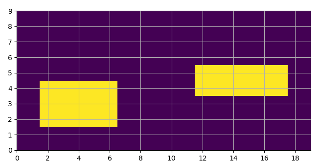
  - **polygon / polygon_perimeter** 多边形 / 多边形画线
    ```py
    polygon(r, c, shape=None)
    polygon_perimeter(r, c, shape=None, clip=False)
    ```
    - **r, c 参数** 各个点的坐标，不要求一定闭合
    ```py
    from skimage.draw import polygon, polygon_perimeter
    img = np.ones((200, 200, 3), dtype=np.float32)
    rr, cc = polygon([60, 140, 140, 60], [40, 40, 160, 160])
    img[rr, cc] = (1, 0, 0)

    def polygon_star(xc, yc, radius=1, rotate=0, points=5):
        angles = np.arange(points) * 2 * np.pi / points * 2 + rotate
        xx = np.sin(angles) * radius + xc
        yy = np.cos(angles) * radius + yc
        return polygon_perimeter(xx, yy)

    rr, cc = polygon_star(100, 100, 20, np.pi / 2, 5)
    img[rr, cc] = (1, 1, 0)
    image_show_shape(img)
    ```
    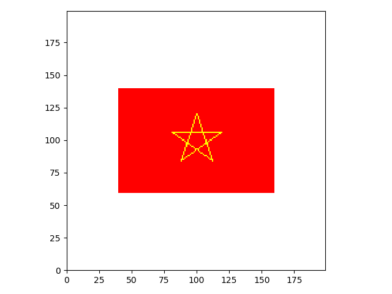
  - **ellipse** 椭圆
    ```py
    ellipse(r, c, r_radius, c_radius, shape=None, rotation=0.0)
    ```
    - **r, c, r_radius, c_radius** 分别指定椭圆的中心点 / 长轴半径 / 短轴半径，对应椭圆形状 ``(r/r_radius)**2 + (c/c_radius)**2 = 1``
    - **rotation 参数** 逆时针旋转角度，``(-PI, PI)``
    ```py
    from skimage.draw import ellipse
    img = np.zeros((100, 200), dtype=np.uint8)
    rr, cc = ellipse(50, 100, 40, 20, rotation=np.pi / 6)
    img[rr, cc] = 1
    image_show_shape(img)
    ```
    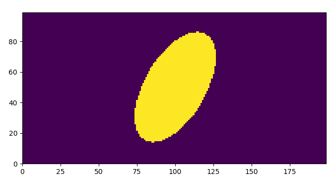
  - **bezier_curve** 贝塞尔曲线，类似矢量曲线，使用三个点绘制的二次方贝塞尔曲线
    ```py
    bezier_curve(r0, c0, r1, c1, r2, c2, weight, shape=None)
    ```
    - **r0, c0, r1, c1, r2, c2** 分布指定起始 / 中间 / 终止的控制节点坐标
    - **weight 参数** 中间控制节点的权重，控制曲线的弯曲度，权重越大曲线越向中间节点偏移
    ```py
    from skimage.draw import bezier_curve
    img = np.zeros((100, 200), dtype=np.uint8)
    rr, cc = bezier_curve(50, 40, 20, 70, 80, 130, 1)
    img[rr, cc] = 1

    rr, cc = bezier_curve(50, 40, 20, 70, 80, 130, 5)
    img[rr, cc] = 1
    img[20, 70] = 1
    image_show_shape(img)
    ```
    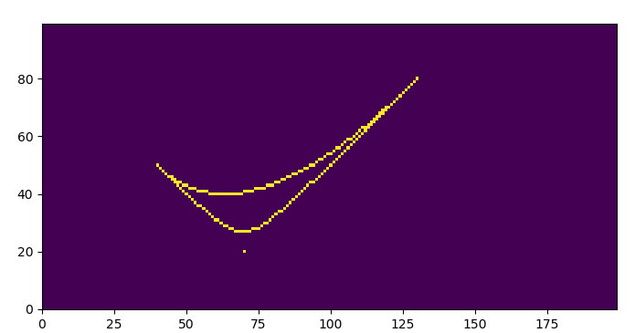
  - **circle_perimeter / circle_perimeter_aa** 圆周曲线，即空心圆，`circle_perimeter_aa` 为 anti-aliased 版本
    ```py
    circle_perimeter(r, c, radius, method='bresenham', shape=None)
    circle_perimeter_aa(r, c, radius, shape=None)
    ```
    - **method 参数** 取值 ``{'bresenham', 'andres'}``，对应不同方法，`andres` 产生的圆环面更大，当圆圈旋转时失真较小
    ```py
    from skimage.draw import circle_perimeter
    img = np.zeros((10, 20), dtype=np.uint8)
    rr, cc = circle_perimeter(4, 4, 3)
    img[rr, cc] = 1

    rr, cc = circle_perimeter(4, 14, 3, method='andres')
    img[rr, cc] = 1
    image_show_shape(img)
    ```
    
  - **ellipse_perimeter** 空心椭圆
    ```py
    ellipse_perimeter(r, c, r_radius, c_radius, orientation=0, shape=None)
    ```
    - **orientation 参数** 椭圆逆时针旋转的角度
    ```py
    from skimage.draw import ellipse_perimeter
    img = np.zeros((100, 100), dtype=np.uint8)
    rr, cc = ellipse_perimeter(50, 50, 30, 40, np.pi / 6)
    img[rr, cc] = 1
    image_show_shape(img)
    ```
    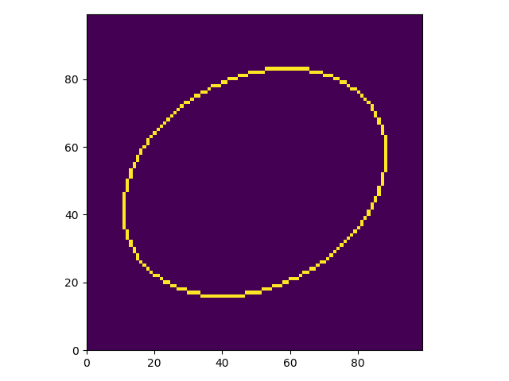
## filters 图像自动阈值分割
  - **图像阈值分割** 利用图像中 **目标区域** 与 **背景** 在灰度特性上的差异，选取一个比较合理的阈值，将图像分为两部分
  - **threshold_otsu** 计算 Otsu 算法的分割阈值
    ```py
    threshold_otsu(image, nbins=256)
    ```
    ```py
    from skimage import data, filters
    print(filters.threshold_otsu(data.camera()))
    # 87
    ```
  - **threshold_yen** 计算 Yen 算法的分割阈值
    ```py
    threshold_yen(image, nbins=256)
    ```
    ```py
    from skimage import data, filters
    print(filters.threshold_yen(data.camera()))
    # 198
    ```
  - **threshold_li** 计算 迭代最小交叉熵 Li's iterative Minimum Cross Entropy 算法的分割阈值
    ```py
    threshold_li(image)
    ```
    ```py
    from skimage import data, filters
    print(filters.threshold_li(data.camera()))
    # 62.97248355395971
    ```
  - **threshold_isodata** 计算 ISODATA 算法的分割阈值，基于直方图，阈值 threshold = `(image[image <= threshold].mean() + image[image > threshold].mean()) / 2.0`
    ```py
    threshold_isodata(image, nbins=256, return_all=False)
    ```
    ```py
    from skimage import data, filters
    print(filters.threshold_isodata(data.camera()))
    # 87
    ```
  - **threshold_local** 计算基于 局部像素邻域 local pixel neighborhood 的分割阈值
    ```py
    threshold_local(image, block_size, method='gaussian', offset=0, mode='reflect', param=None, cval=0)
    ```
    - **block_size 参数** 奇数值，指定邻域的大小
    - **method 参数** 取值 `{'generic', 'gaussian', 'mean', 'median'}`
    - **param 参数** 整数值指定高斯函数的 sigma，或指定一个函数，计算邻域内的阈值
    ```py
    from skimage import data, filters
    image = data.camera()[:50, :50]
    print(filters.threshold_local(image, 15, 'mean').shape) # (512, 512)

    ibb_1 = image > filters.threshold_local(image, 15, 'mean')
    ibb_2 = image > filters.threshold_local(image, 31, 'median')

    func = lambda arr: arr.mean()
    ibb_3 = image > filters.threshold_local(image, 15, 'generic',  param=func)

    images_show([image, ibb_1, ibb_2, ibb_3], ['Origin', 'mean 15', 'median 31', 'generic with param'])
    ```
    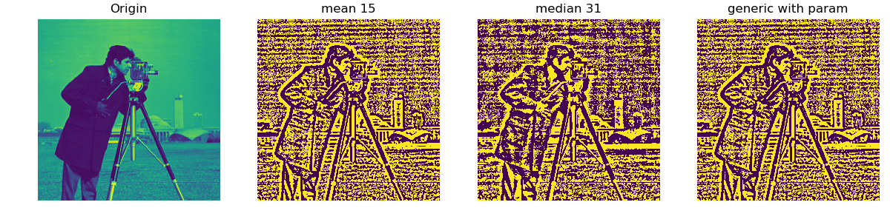
## filters 图像过滤
  - **图像滤波** 可以有两种效果
    - 平滑滤波，用来抑制噪声
    - 微分算子，可以用来检测边缘和特征提取
  - **图片显示辅助函数**
    ```py
    def images_show(images, titles, single_width=3, nrows=1):
        ncols = int(np.ceil(len(images) / nrows))
        fig, axes = plt.subplots(nrows=nrows, ncols=ncols, figsize=(single_width * ncols, single_width * nrows))
        for ax, im, tt in zip(axes.flatten(), images, titles):
            ax.imshow(im)
            ax.set_title(tt)
            ax.set_axis_off()
        fig.tight_layout()

        return fig
    ```
  - **边缘检测** 用于灰度图像
    - `skimage.filters.edges` 中的 `sobel` / `roberts` / `scharr` / `prewitt` 算子，可以通过 `skimage.filters` 直接调用
    - `skimage.feature.canny` 算子，通过参数 `sigma` 调整平滑度
    ```py
    from skimage import data, filters, feature
    imm = data.camera()

    edges_sobel = filters.sobel(imm)
    edges_roberts = filters.roberts(imm)
    edges_scharr = filters.scharr(imm)
    edges_prewitt = filters.prewitt(imm)
    edges_canny = feature.canny(imm, sigma=3)

    images = [imm, edges_sobel, edges_roberts, edges_scharr, edges_prewitt, edges_canny]
    titles = ['origin', 'sobel', 'roberts', 'scharr', 'prewitt', 'canny']
    images_show(images, titles, nrows=2)
    ```
    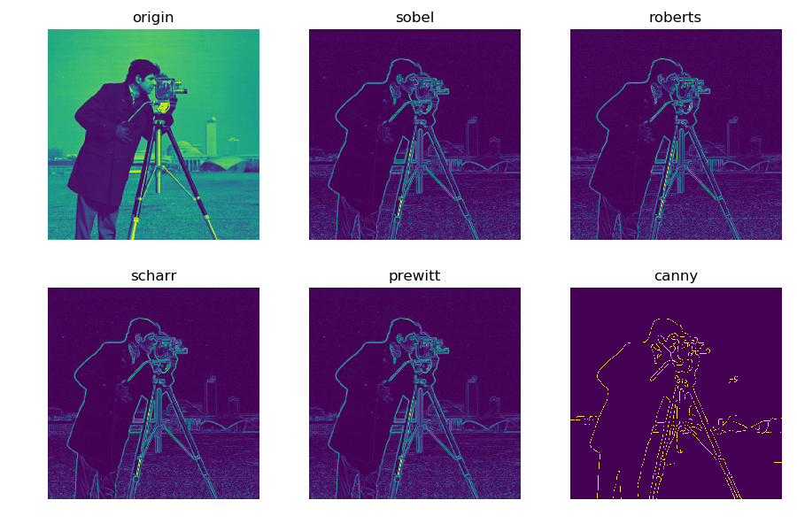
  - **水平 / 垂直边缘检测** `sobel_h / prewitt_h / scharr_h` / `sobel_v / prewitt_v / scharr_v`
    - 分别应用不用的梯度过滤函数 kernel，选取部分边缘
    - `sobel_h`  kernel 为 `[[3, 10, 3], [0, 0, 0], [-3, -10, -3]]`
    - `sobel_h`  kernel 为 `[[3, 0, -3], [10, 0, -10], [3, 0, -3]]`
    ```py
    from skimage import data, filters
    imm = data.camera()
    edges_h = filters.sobel_h(imm)
    edges_v = filters.sobel_v(imm)

    images_show([edges_h, edges_v], ['sobel_h', 'sobel_v'])
    ```
    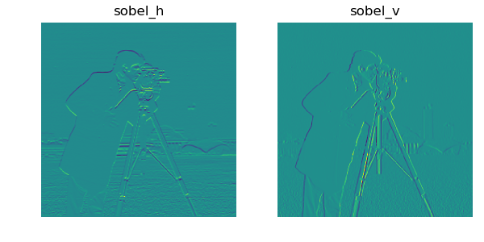
  - **交叉边缘检测** `roberts_neg_diag` / `roberts_pos_diag`
    - 分别应用不用的梯度过滤函数 kernel，选取部分边缘
    - `roberts_neg_diag` kernel 为 `[[0, 1], [-1, 0]]`
    - `roberts_pos_diag` kernel 为 `[[1, 0], [0, -1]]`
    ```py
    from skimage import data, filters
    imm = data.camera()
    edges_neg = filters.roberts_neg_diag(imm)
    edges_pos = filters.roberts_pos_diag(imm)

    images_show([edges_neg, edges_pos], ['roberts_neg_diag', 'roberts_pos_diag'])
    ```
    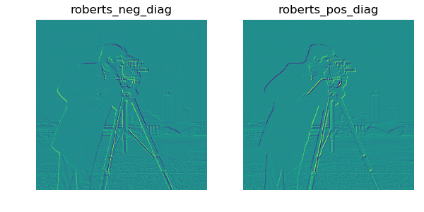
  - **gabor 滤波** 可用来进行边缘检测和纹理特征提取
    ```py
    # Return real and imaginary responses to Gabor filter.
    gabor(image, frequency, theta=0, bandwidth=1, sigma_x=None, sigma_y=None, n_stds=3, offset=0, mode='reflect', cval=0)
    ```
    - **frequency 参数** 谐波函数的空间频率，可以调整滤波效果
    - 返回值包括 **实部** 与 **虚部**，实部可以用于平滑图像，虚部可以用于边缘检测
    ```py
    from skimage import data, filters

    image = data.camera()
    filt_real_1, filt_imag_1 = filters.gabor(image, frequency=0.6)
    filt_real_2, filt_imag_2 = filters.gabor(image, frequency=0.4)

    images = [image, filt_real_1, filt_imag_1, image, filt_real_2, filt_imag_2]
    titles = ['Original', 'Real freq=0.6', 'Imag freq=0.6', 'Original', 'Real freq=0.4', 'Imag freq=0.4']
    images_show(images, titles, nrows=2)
    ```
    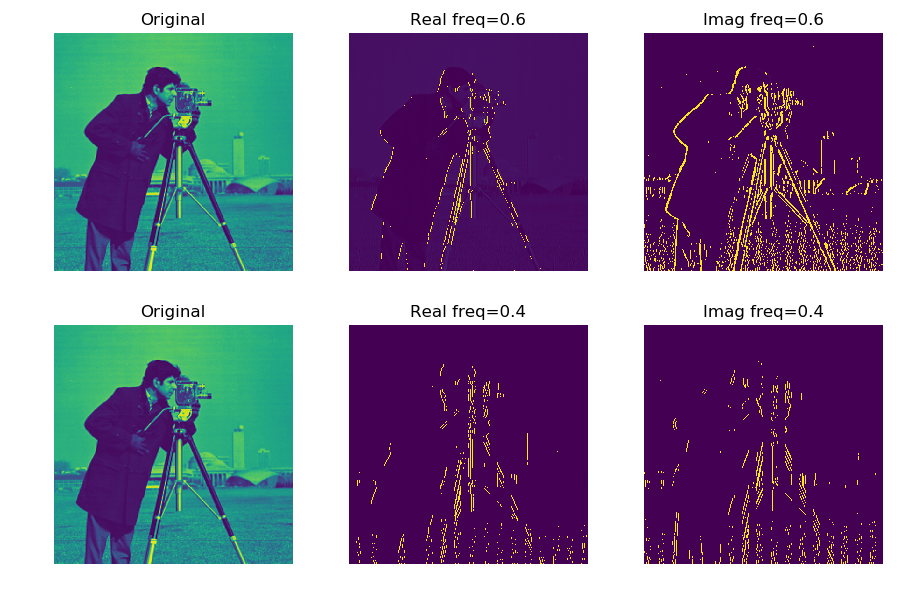
  - **gaussian 滤波** 多维的滤波器，是一种平滑滤波，可以消除高斯噪声
    ```py
    gaussian(image, sigma=1, output=None, mode='nearest', cval=0, multichannel=None, preserve_range=False, truncate=4.0)
    ```
    - **sigma 参数** 指定高斯核函数的标准差，可以调整滤波效果
    ```py
    from skimage import data, filters
    a = np.array([[ 0.,  0.,  0.], [ 0.,  1.,  0.], [ 0.,  0.,  0.]])
    print(filters.gaussian(a, sigma=0.4))  # mild smoothing
    # [[0.00163116 0.03712502 0.00163116]
    #  [0.03712502 0.84496158 0.03712502]
    #  [0.00163116 0.03712502 0.00163116]]

    print(filters.gaussian(a, sigma=1)) # more smoothing
    # [[0.05855018 0.09653293 0.05855018]
    #  [0.09653293 0.15915589 0.09653293]
    #  [0.05855018 0.09653293 0.05855018]]

    # Several modes are possible for handling boundaries
    filters.gaussian(a, sigma=1, mode='reflect')

    # For RGB images, each is filtered separately
    imm = data.chelsea()
    igg1 = filters.gaussian(imm, sigma=0.4, multichannel=True)
    igg2 = filters.gaussian(imm, sigma=1, multichannel=True)
    igg3 = filters.gaussian(imm, sigma=5, multichannel=True)
    images_show([imm, igg1, igg2, igg3], ['Origin', 'sigma=0.4', 'sigma=1', 'sigma=5'])
    ```
    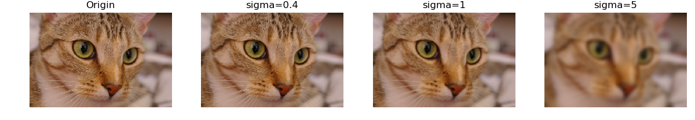
  - **median 中值滤波** 一种非线性平滑滤波，将每一像素点的灰度值设置为 **该点某邻域窗口** 内的所有像素点灰度值的 **中值**，从而消除孤立的噪声点，位于 `skimage.filters.rank`，可以通过 `skimage.filters` 直接调用
    ```py
    median(image, selem=None, out=None, mask=None, shift_x=False, shift_y=False)
    ```
    - **selem 参数** 设置滤波器的形状，由 0 / 1 组成的二维矩阵，通常是 `3x3 / 5x5`，默认值是 3x3 的 1 值
    ```py
    from skimage import data, filters
    from skimage.morphology import disk

    img = data.camera()
    med1 = filters.median(img, disk(5))
    med2 = filters.median(img, disk(9))
    images_show([img, med1, med2], ['Origin', 'selem=5', 'selem=9'])
    ```
    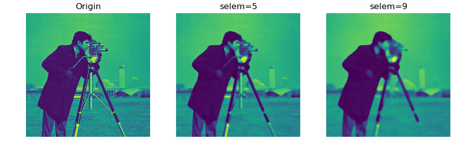
## 图像分割 Image Segmentation
  - **图像分割 Image segmentation** 在一幅图像中标记出感兴趣的部分
  - **使用 skimage 的硬币图像 coins**
    ```py
    def img_show(img, title=None, ax=None):
        if ax == None:
            fig, ax = plt.subplots(figsize=(4, 3))

        ax.imshow(img, cmap=plt.cm.gray, interpolation='nearest')
        ax.axis('off')
        if title:
            ax.set_title(title)

        return ax
    ```
    ```py
    from skimage import data

    coins = data.coins()
    hist = np.histogram(coins, bins=np.arange(0, 256))

    fig, axes = plt.subplots(1, 2, figsize=(8, 3))
    img_show(coins, title='histogram of gray values', ax=axes[0])

    axes[1].plot(hist[1][:-1], hist[0], lw=2)
    axes[1].set_title('histogram of gray values')
    ```
    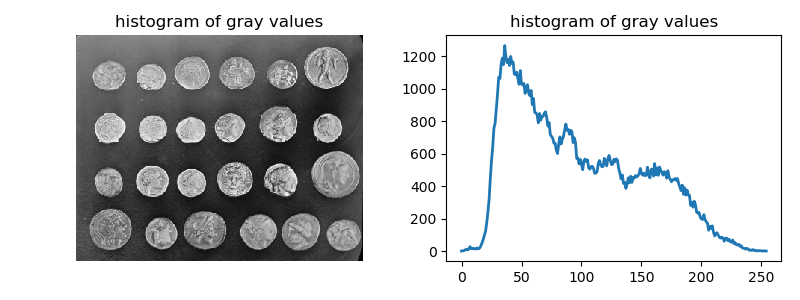
  - **阈值 Thresholding 过滤** 根据阈值过滤灰度值，分割物体与背景
    ```py
    fig, axes = plt.subplots(1, 2, figsize=(8, 3), sharey=True)

    img_show(coins > 100, title='coins > 100', ax=axes[0])
    img_show(coins > 150, title='coins > 150', ax=axes[1])
    plt.tight_layout()
    ```
    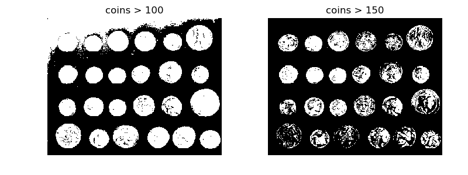
  - **检测图像边缘分割物体与背景 Edge-based segmentation** 使用 Canny 边缘检测算法
    ```py
    ''' Canny 检测图像边缘 '''
    from skimage.feature import canny
    edges = canny(coins)

    ''' binary_fill_holes 填充物体部分 '''
    from scipy import ndimage as ndi
    fill_coins = ndi.binary_fill_holes(edges)

    ''' remove_small_objects 设置最小物体大小，移除噪声 '''
    from skimage import morphology
    coins_cleaned = morphology.remove_small_objects(fill_coins, 21)

    ''' Display '''
    fig, axes = plt.subplots(ncols=3, figsize=(12, 3))
    img_show(edges, title='Canny detector', ax=axes[0])
    img_show(fill_coins, title='filling the holes', ax=axes[1])
    img_show(coins_cleaned, title='removing small objects', ax=axes[2])
    plt.tight_layout()
    ```
    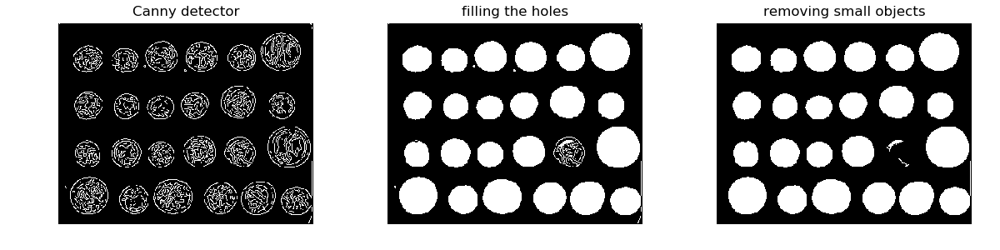

    由于其中一个硬币的图像边缘轮廓未闭合，填充时没有正确标记出
  - **根据区域检测分割物体与背景 Region-based segmentation** 使用 watershed
    ```py
    ''' 使用 Sobel 算法检测边缘，绘制等高线图 elevation map'''
    from skimage.filters import sobel
    elevation_map = sobel(coins)

    ''' 根据灰度值标注图像的前景与背景 '''
    markers = np.zeros_like(coins)
    markers[coins < 30] = 1
    markers[coins > 150] = 2

    fig, ax = plt.subplots(figsize=(4, 3))

    ''' 使用 Watershed 根据 markers 填充等高线图 '''
    segmentation = morphology.watershed(elevation_map, markers)

    ''' Display '''
    fig, axes = plt.subplots(ncols=3, figsize=(12, 3))
    img_show(elevation_map, title='elevation map', ax=axes[0])
    img_show(markers, title='markers', ax=axes[1])
    img_show(segmentation, title='segmentation', ax=axes[2])
    plt.tight_layout()
    ```
    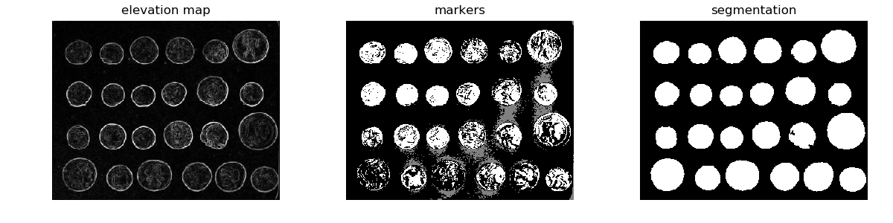
  - **label2rgb** 为图片上色
    ```py
    from skimage.color import label2rgb

    segmentation = ndi.binary_fill_holes(segmentation - 1)
    labeled_coins, _ = ndi.label(segmentation)
    image_label_overlay = label2rgb(labeled_coins, image=coins)

    fig, axes = plt.subplots(1, 2, figsize=(8, 3), sharey=True)
    img_show(coins, title='Coins', ax=axes[0])
    axes[0].contour(segmentation, [0.5], linewidths=1.2, colors='y')
    img_show(image_label_overlay, title='Labeled image', ax=axes[1])
    ```
    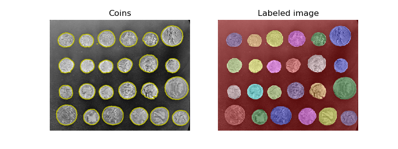
## morphology 形态学滤波
  - 对图像进行形态学变换。变换对象一般为灰度图或二值图
  - **selem** 结构化元素 structuring element，模块 `morphology.selem`，包括圆形 ball / 矩形 rectangle / 方形 square / 八角星形 star / 圆盘形 disk 等
  - **grey** 灰度图像形态学算法 Grayscale morphological operations，模块 `morphology.grey`，包括 dilation / erosion / opening / closing / white_tophat / black_tophat 等
  - **binary** 二值图像形态学算法 Binary morphological operations，模块 `morphology.binary`，包括与灰度图算法对应的一些算法，在处理二值图像时速度更快
  - **图片显示辅助函数**
    ```py
    def images_show(images, titles, single_width=3, nrows=1):
        ncols = int(np.ceil(len(images) / nrows))
        fig, axes = plt.subplots(nrows=nrows, ncols=ncols, figsize=(single_width * ncols, single_width * nrows), sharex=True, sharey=True)
        for ax, im, tt in zip(axes.flatten(), images, titles):
            ax.imshow(im)
            ax.set_title(tt)
        plt.xlim(left=0)
        plt.ylim(top=0)
        fig.tight_layout()

        return fig
    ```
  - **dilation / binary_dilation** 膨胀，将点 `(i,j)` 设置为以该点为中心周围像素的 **最大值**，效果扩大亮色区域，缩小暗色区域，可以用来扩充边缘或填充小的孔洞
    ```py
    dilation(image, selem=None, out=None, shift_x=False, shift_y=False)
    binary_dilation(image, selem=None, out=None)
    ```
    - **selem 参数** 二维的 `0 / 1` 矩阵，指定邻近区域的形状，默认为十字形
    ```py
    # Dilation enlarges bright regions
    from skimage.morphology import square, dilation
    imm = np.array(
        [[0., 0.,   0., 0.,   0.],
         [0., 0.,   0., 0.25, 0.],
         [0., 0.,   1., 0.,   0.],
         [0., 0.75, 0., 0.5,  0.],
         [0., 0.,   0., 0.,   0.]])

    idd1 = dilation(imm)
    idd2 = dilation(imm, square(1))
    idd3 = dilation(imm, square(3))
    images_show([imm, idd1, idd2, idd3], ['Original', 'Default', 'Square=1', 'Square=3'])
    ```
    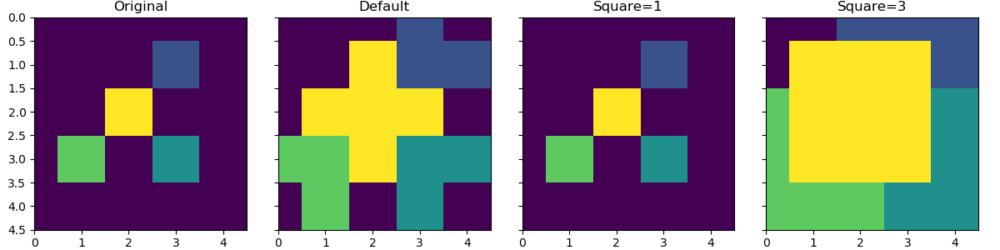
  - **erosion / binary_erosion** 形态腐蚀，与膨胀相反的操作，将点 `(i,j)` 设置为以该点为中心周围像素的 **最小值**，可用来提取骨干信息 / 去掉毛刺 / 去掉孤立的像素
    ```py
    erosion(image, selem=None, out=None, shift_x=False, shift_y=False)
    binary_erosion(image, selem=None, out=None)
    ```
    ```py
    # Erosion shrinks bright regions
    imm = data.checkerboard()
    iee1 = erosion(imm)
    iee2 = erosion(imm, square(10))
    iee3 = erosion(imm, square(25))
    images_show([imm, iee1, iee2, iee3], ['Original', 'Default', 'Square=10', 'Square=25'])
    ```
    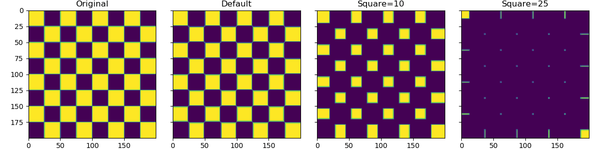
  - **opening / binary_opening** 形态学开算法，先腐蚀再膨胀，可以消除白色噪点，并连接小的暗色区块，类似在亮色之间扩大暗色的分割
    The morphological opening on an image is defined as an erosion followed by a dilation. Opening can remove small bright spots (i.e. "salt") and connect small dark cracks. This tends to "open" up (dark) gaps between (bright) features.
    ```py
    opening(image, selem=None, out=None)
    ```
    ```py
    # Open up gap between two bright regions (but also shrink regions)
    from skimage.morphology import square, opening
    bad_connection = np.array(
        [[1, 0, 0, 0, 1],
         [1, 1, 0, 1, 1],
         [1, 1, 1, 1, 1],
         [1, 1, 0, 1, 1],
         [1, 0, 0, 0, 1]])

    ioo = opening(bad_connection, square(3))
    images_show([bad_connection, ioo], ['Original', 'Square=3'])
    ```
    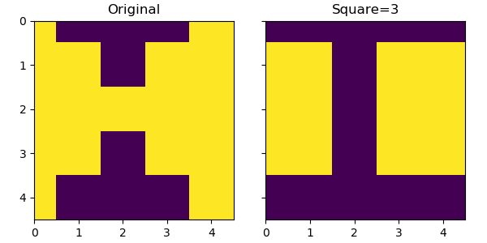
  - **closing / binary_closing** 形态学闭运算，先膨胀再腐蚀，可一消除黑色噪点，并链接小的两色区块，可用来填充孔洞
    ```py
    closing(image, selem=None, out=None)
    ```
    ```py
    from skimage.morphology import square, closing
    broken_line = np.array([[0, 0, 1, 0, 0],
                            [0, 0, 0, 0, 0],
                            [1, 1, 0, 1, 1],
                            [0, 0, 0, 0, 0],
                            [0, 0, 1, 0, 0]], dtype=np.uint8)
    icc = closing(broken_line, square(3))
    images_show([broken_line, icc], ['Original', 'Square=3'])
    ```
    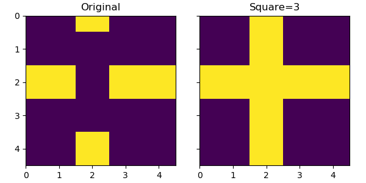
  - **white_tophat** 白帽，将原图像减去它的开运算值，返回比结构化元素 selem 小的白点
    ```py
    white_tophat(image, selem=None, out=None)
    ```
    ```py
    # Subtract grey background from bright peak
    from skimage.morphology import square, disk, white_tophat
    bright_on_grey = np.array([[2, 3, 3, 3, 2],
                               [3, 4, 5, 4, 3],
                               [3, 5, 9, 5, 3],
                               [3, 4, 5, 4, 3],
                               [2, 3, 3, 3, 2]], dtype=np.uint8)
    iww1 = white_tophat(bright_on_grey, square(3))
    iww2 = white_tophat(bright_on_grey, square(1))
    iww3 = white_tophat(bright_on_grey, disk(1))
    images_show([bright_on_grey, iww1, iww2, iww3], ['Original', 'Square=3', 'Square=1', 'Disk=1'])
    ```
    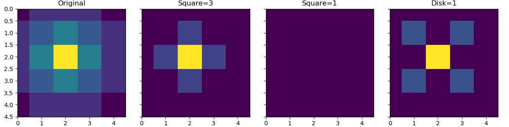
  - **black_tophat** 黑帽，将图像的闭运算值减去原图像，返回比结构化元素 selem 小的黑点，且将这些黑点反色
    ```py
    black_tophat(image, selem=None, out=None)
    ```
    ```py
    # Change dark peak to bright peak and subtract background
    from skimage.morphology import square, disk, black_tophat
    dark_on_grey = np.array([[7, 6, 6, 6, 7],
                             [6, 5, 4, 5, 6],
                             [6, 4, 0, 4, 6],
                             [6, 5, 4, 5, 6],
                             [7, 6, 6, 6, 7]], dtype=np.uint8)
    ibb1 = black_tophat(dark_on_grey, square(3))
    ibb2 = black_tophat(dark_on_grey, square(5))
    ibb3 = black_tophat(dark_on_grey, disk(1))
    images_show([dark_on_grey, ibb1, ibb2, ibb3], ['Original', 'Square=3', 'Square=5', 'Disk=1'])
    ```
    
## filters.rank 高级滤波
  - **函数形式** 调用形式基本类似
    ```py
    help(skimage.filters.rank)
    autolevel(image, selem, out=None, mask=None, shift_x=False, shift_y=False)
    ```
  - **autolevel** 自动色阶，该滤波器局部地拉伸灰度像素值的直方图，以覆盖整个像素值范围
  - **bottomhat** 此滤波器先计算图像的形态学闭运算，然后用原图像减去运算的结果值，有点像黑帽操作
  - **tophat** 此滤波器先计算图像的形态学开运算，然后用原图像减去运算的结果值，有点像白帽操作
  - **enhance_contrast** 对比度增强，求出局部区域的最大值和最小值，然后看当前点像素值最接近最大值还是最小值，然后替换为最大值或最小值
  - **entropy** 求局部熵，熵是使用基为 2 的对数运算出来的，该函数将局部区域的灰度值分布进行二进制编码，返回编码的最小值
  - **equalize** 均衡化滤波，利用局部直方图对图像进行均衡化滤波
  - **gradient** 返回图像的局部梯度值，用此梯度值代替区域内所有像素值
  - **maximum** 最大值滤波器，返回图像局部区域的最大值，用此最大值代替该区域内所有像素值
  - **minimum** 最小值滤波器，返回图像局部区域内的最小值，用此最小值取代该区域内所有像素值
  - **mean** 均值滤波器，返回图像局部区域内的均值，用此均值取代该区域内所有像素值
  - **median** 中值滤波器，返回图像局部区域内的中值，用此中值取代该区域内所有像素值
  - **modal** 莫代尔滤波器，返回图像局部区域内的 modal 值，用此值取代该区域内所有像素值
  - **otsu** otsu阈值滤波，返回图像局部区域内的 otsu 阈值，用此值取代该区域内所有像素值
  - **threshold** 阈值滤波，将图像局部区域中的每个像素值与均值比较，大于则赋值为 1，小于赋值为 0，得到一个二值图像
  - **subtract_mean** 减均值滤波，将局部区域中的每一个像素，减去该区域中的均值
  - **sum** 求和滤波，求局部区域的像素总和，用此值取代该区域内所有像素值
  - **使用示例**
    ```py
    from skimage import data
    from skimage.morphology import disk
    from skimage.filters.rank import autolevel, enhance_contrast, gradient, maximum, otsu, sum, threshold
    img = data.camera()

    iaa = autolevel(img, disk(5))
    iee = enhance_contrast(img, disk(5))
    igg = gradient(img, disk(5))
    imm = maximum(img, disk(5))
    ioo = otsu(img, disk(5))
    iss = sum(img, disk(5))
    itt = threshold(img, disk(5))

    images = [img, iaa, iee, igg, imm, ioo, iss, itt]
    titles = ['Original', 'autolevel', 'enhance_contrast', 'gradient', 'maximum', 'otsu', 'sum', 'threshold']
    images_show(images, titles, nrows=2)
    ```
    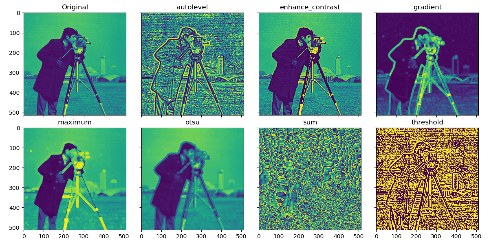
***

# 处理视频文件
  - 视频文件通常不支持随机位置读取，不能并行化处理，因此应尽量避免直接处理视频文件
  - **ffmpeg** 将视频的每一阵数据转化为图片
    ```py
    vv = os.path.expanduser('~/Videos/NARWHAL_838701_alternate_19014.720p.mp4')

    ! mkdir foo
    ! ffmpeg -i {vv} -f image2 "foo/video-frame%05d.png"
    ```
  - **imageio** 可以使用 `ffmpeg` 读取视频文件，需要加载整个视频文件到内存
    ```py
    import imageio

    vid = imageio.get_reader(vv,  'ffmpeg')
    print(vid.get_length()) # 877
    print(vid.get_next_data().shape) # (720, 1280, 3)
    print(vid.get_meta_data())
    # {'plugin': 'ffmpeg',
    #  'nframes': 877,
    #  'ffmpeg_version': '3.4.4-0ubuntu0.18.04.1 built with gcc 7 (Ubuntu 7.3.0-16ubuntu3)',
    #  'fps': 24.0,
    #  'source_size': (1280, 720),
    #  'size': (1280, 720),
    #  'duration': 36.53}

    tt = [image.mean() for image in vid]
    print(np.mean(tt))  # 82.77556096851615
    ```
  - **MoviePy** 类似 `imageio`，使用  `ffmpeg` 读取视频文件，需要加载整个视频文件到内存
    ```py
    ! pip install moviepy

    from moviepy.editor import VideoFileClip
    myclip = VideoFileClip("some_video.avi")
    ```
  - **PyAV** 使用 `FFmpeg` 的库读取视频文件，并且使用 `Cython` 编写，处理速度快
    ```py
    ! pip install -f http://wheels.scipy.org av
    ! conda install -c danielballan pyav

    import av
    v = av.open('path/to/video.mov')

    # PyAV’s API reflects the way frames are stored in a video file.
    for packet in container.demux():
        for frame in packet.decode():
            if frame.type == 'video':
                img = frame.to_image()  # PIL/Pillow image
                arr = np.asarray(img)  # numpy array
                # Do something!
    ```
  - **pims** 使用 `PyAV`，并添加对视频文件的随机位置读取支持
    ```py
    ! pip install pims
    ! conda install pims -c conda-forge

    v = pims.Video(vv)
    print(v[100].shape) # (720, 1280, 3)
    print(v.frame_shape)  # (720, 1280, 3)

    # 读取最后一帧数据会报错 [ ??? ]
    v[-1]
    ```
  - **OpenCV**
    ```python
    ! pip install opencv

    import cv2
    video_source = 0
    video_capture = cv2.VideoCapture(video_source)

    process_this_frame = 0
    FRAME_PER_DISPLAY = 2
    while True:
        ret, frame = video_capture.read()
        if not ret: break
        if process_this_frame == 0:
            # Do something handling frame

        process_this_frame = (process_this_frame + 1) % FRAME_PER_DISPLAY

    # Release handle to the webcam
    video_capture.release()
    cv2.destroyAllWindows()
    ```
***
