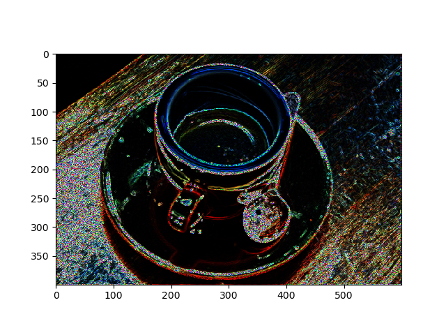

# ___2019 - 08 - 20 Face Anti Spoofing___
***

# 目录
  <!-- TOC depthFrom:1 depthTo:6 withLinks:1 updateOnSave:1 orderedList:0 -->

  - [___2019 - 08 - 20 Face Anti Spoofing___](#2019-08-20-face-anti-spoofing)
  - [目录](#目录)
  - [链接](#链接)
  - [活体检测方法](#活体检测方法)
  - [LBP](#lbp)
  	- [LBP 算子](#lbp-算子)
  	- [可见光近红外双目摄像头活体检测步骤](#可见光近红外双目摄像头活体检测步骤)
  	- [NUAA 数据集加载](#nuaa-数据集加载)
  	- [skimage 提取 LBP 特征](#skimage-提取-lbp-特征)
  	- [图像分割](#图像分割)
  	- [bob pad](#bob-pad)
  	- [HSV 与 YCbCr 颜色空间下的 LBP](#hsv-与-ycbcr-颜色空间下的-lbp)
  	- [特征组合与模型选择](#特征组合与模型选择)
  - [Report](#report)
  	- [train_test_hsv_uniform](#traintesthsvuniform)
  	- [train_test_rgb_uniform](#traintestrgbuniform)
  	- [train_test_ycbcr_uniform](#traintestycbcruniform)
  	- [train_test_hsv_nri_uniform](#traintesthsvnriuniform)
  	- [train_test_rgb_nri_uniform](#traintestrgbnriuniform)
  	- [train_test_ycbcr_nri_uniform](#traintestycbcrnriuniform)
  	- [Testing](#testing)
  - [Keras](#keras)
  	- [awesome face antispoofing](#awesome-face-antispoofing)
  	- [keras Xception](#keras-xception)
  	- [Keras 使用 LBP 特征训练 CNN 模型](#keras-使用-lbp-特征训练-cnn-模型)
  	- [Keras 使用 Sobel 转换后的图像训练模型](#keras-使用-sobel-转换后的图像训练模型)
  - [其他特征](#其他特征)
  	- [Face_Liveness_Detection - DoG](#facelivenessdetection-dog)
  	- [灰度共生矩阵(GLCM)](#灰度共生矩阵glcm)
  	- [Gaussian](#gaussian)
  - [数据收集与整理](#数据收集与整理)

  <!-- /TOC -->
***

# 链接
  - [图像特征提取三大法宝：HOG特征，LBP特征，Haar特征](https://www.cnblogs.com/zhehan54/p/6723956.html)
  - [活体检测Face Anti-spoofing综述](https://zhuanlan.zhihu.com/p/43480539)
  - [纹理特征提取方法：LBP, 灰度共生矩阵](https://blog.csdn.net/ajianyingxiaoqinghan/article/details/71552744)
  - [JinghuiZhou/awesome_face_antispoofing](https://github.com/JinghuiZhou/awesome_face_antispoofing)
  - [基于LBP纹理特征计算GLCM的纹理特征统计量+SVM/RF识别纹理图片](https://blog.csdn.net/lovebyz/article/details/84032927)
  - [使用深度图像的单目可见光静默活体 Binary or Auxiliary Supervision(1)](https://zhuanlan.zhihu.com/p/60155768)
  - [Code for 3rd Place Solution in Face Anti-spoofing Attack Detection Challenge](https://github.com/SoftwareGift/FeatherNets_Face-Anti-spoofing-Attack-Detection-Challenge-CVPR2019)
  - [Code for 2nd Place Solution in Face Anti-spoofing Attack Detection Challenge](https://github.com/SeuTao/CVPR19-Face-Anti-spoofing)
  - [Aurora Guard 预测深度图 + 光验证码](https://zhuanlan.zhihu.com/p/61100492)
  - [基于双目摄像头的传统图像处理方法实现活体检测](https://blog.csdn.net/u011808673/article/details/83029198)
  - [AdaptivePooling与Max/AvgPooling相互转换](https://blog.csdn.net/xiaosongshine/article/details/89453037)
***

# 活体检测方法
  - **静态方法** 不考虑图像之间的时序关联关系
    - 可以利用纹理信息，如傅里叶频谱分析，利用人脸照片在频域中的高频分量比真人脸要少来区分
    - 利用图像多尺度和多区域的 LBP 特征进行二元 SVM 分类来区分真伪
    - **纹理分析** Texture analysis，包括计算面部区域上的局部二进制模式 **LBP** 并使用 **SVM** 将面部分类为真脸或假脸
    - **频率分析** Frequency analysis，例如检查面部的 **傅里叶域**
    - **3D脸部形状**，类似于 Apple 的 iPhone 脸部识别系统所使用的脸部形状，使脸部识别系统能够区分真人脸部和其他人的打印输出的照片图像
  - **动态方法**
    - 利用人脸的动态信息来帮助区分，例如眨眼睛的动作、嘴部的动作或者人脸多个部件的时序运动信息
    - 或者使用背景和前景的光流信息来区分
    - **可变聚焦分析** ariable focusing analysis，例如检查两个连续帧之间的像素值的变化
    - **基于启发式的算法** Heuristic-based algorithms，包括眼球运动 / 嘴唇运动 / 眨眼检测
    - **光流算法** Optical Flow algorithms，即检查从 3D 对象和 2D 平面生成的光流的差异和属性
  - **局部特征检测方法**
    - 斑点Blob检测，LoG 检测，DoG，DoH 检测，SIFT 算法，SUFT 算法
    - 边缘检测： 梯度边缘检测算子，拉普拉斯算子，LoG 检测 ，Canny边缘检测算子，Roberts，Sobel，Prewitt
    - 角点检测： Kitchen-Rosenfeld，Harris 角点，多尺度 Harris 角点，KLT，SUSAN 检测算子，Shi-Tomasi
    - 将基于主分量分析和 Fisher 线性鉴别分析所获得的特征抽取方法，统称为线性投影分析
  - **神经网络**  
    - 2014 年 Yang et al 使用 AlexNet 用作特征提取器，最后加上 SVM 做分类器，在 CASIA 和 IDIAP Replay-Attack 两个数据集上的 HTER 均小于 5%
    - 2017 年 Lucena et al 使用迁移学习的思想将 CNN 应用在人脸反欺诈上，首先选择 VGG-16 预训练模型作为基础结构，然后在人脸欺诈数据集上进行微调网络权重，除了移除最后的全连接层和将另两个全连接层的尺寸修改为 256 和 1 将其转换为一个二分类器外，FASNet 和 VGG-16 完全一致，FASNet 在 3DMAD 和 REPLAY-ATTACK 数据集上分别能达到 0.0% 和 1.2% HTER，几乎能达到最好的水平，FASNet 的思路简单，可以很容易的扩展至其他网络结构或结合其他动态特征进行检测等
    - 2016 年发表的 Multi-cues intergration NN方法，在 3DMAD 和 REPLAY-ATTACK 数据集上的 HTER 为 0.0% 和 0.0%，只用了神经网络，还没用到 CNN 和 LSTM 等结构，Mutli-cues 主要包含三个方面的活体特征：shearlet 图像质量特征（SBIQF），脸部运动光流特征以及场景运动光流特征，然后使用神经网络做二分类问题
***

# LBP
## LBP 算子
  - **LBP 局部二进制模式** local binary pattern，是一种用来描述图像 **局部纹理特征** 的算子，原始的 LBP 于 1994 年提出，它反映内容是每个像素与周围像素的关系，后被不断的改进和优化，分别提出了 **LBP 旋转不变模式** / **LBP 均匀模式** 等
  - **原始 LBP 算子**
    - 在 `3 * 3` 的窗口内，以窗口中心像素为阈值，将相邻的 `8` 个像素的灰度值与其进行比较
    - 若周围像素值大于中心像素值，则该像素点的位置被标记为 1，否则为 0
    - `3 * 3` 邻域内的 `8` 个点经比较可产生 `8` 位二进制数，通常转换为十进制数即 LBP 码，共 256 种
    - 得到该窗口中心像素点的 LBP 值，并用这个值来反映该区域的纹理信息
    - LBP 算子是灰度不变的，但却不是旋转不变的。图像的旋转就会得到不同的 LBP 值
  - **圆形 LBP 算子**
    - 基本的 LBP 算子的最大缺陷在于它只覆盖了一个固定半径范围内的小区域，这显然不能满足不同尺寸和频率纹理的需要
    - 为了适应不同尺度的纹理特征，并达到灰度和旋转不变性的要求，Ojala 等对 LBP 算子进行了改进，将 3×3 邻域扩展到任意邻域，并用圆形邻域代替了正方形邻域
    - 改进后的 LBP 算子允许在半径为 R 的圆形邻域内有任意多个像素点，从而得到了诸如 **半径为 R 的圆形区域内含有 P 个采样点的 LBP 算子**
  - **LBP 旋转不变模式**
    - Maenpaa 等人又将 LBP 算子进行了扩展，提出了具有旋转不变性的 LBP 算子
    - 即不断旋转圆形邻域得到一系列初始定义的 LBP 值，取其最小值作为该邻域的 LBP 值
  - **LBP 等价模式**
    - 一个LBP算子可以产生不同的二进制模式，对于 **半径为 R 的圆形区域内含有 P 个采样点的 LBP 算子** 将会产生 `P^2` 种模式
    - 如此多的二值模式无论对于纹理的提取还是对于纹理的识别、分类及信息的存取都是不利的
    - 将 LBP 算子用于纹理分类或人脸识别时，常采用 **LBP 模式的统计直方图** 来表达图像的信息
    - 为了解决二进制模式过多的问题，提高统计性，Ojala 提出了采用一种 **等价模式 Uniform Pattern** 来对 LBP 算子的模式种类进行降维
    - **等价模式** 在实际图像中，绝大多数 LBP 模式最多只包含两次从 1 到 0 或从 0 到 1 的跳变，当某个 LBP 所对应的循环二进制数从 0 到 1 或从 1 到 0 最多有两次跳变时，该 LBP 所对应的二进制就称为一个 **等价模式类**
    - 00000000（0次跳变），00000111（一次跳变），10001111（两次跳变）都是等价模式类，除等价模式类以外的模式都归为另一类，称为 **混合模式类**
    - 二进制 **等价模式的种类** 由原来的 `P ^ 2` 种减少为 `P * ( P - 1 ) + 2` 种，对于 3×3 邻域内 8 个采样点，一共 `58 + 1` 种模式，这使得特征向量的维数更少，并且可以减少高频噪声带来的影响
## 可见光近红外双目摄像头活体检测步骤
  - **NIR** 近红外 Near Infrared
  - 由于 NIR 的光谱波段与可见光 VIS 不同，故真实人脸及非活体载体对于近红外波段的吸收和反射强度也不同，近红外图像对屏幕攻击的区分度较大，对高清彩色纸张打印的区分度较小
  - 首先在可见光图像上检测人脸，当检测到有人脸时，用 RGB 人脸的位置到红外画面的位置去检测人脸，如果没有检测到，说明是非活体目标
  - **纹理特征向量 SVM 分类器**
    - 将 **近红外真实人脸** 作为正样本，对应的 **近红外伪造人脸** 与 **可见光伪造人脸** 作为负样本
    - 分别提取 **8 位** 和 **16 位** 二值编码模式下的 **Uniform LBP 特征**，并分别进行直方图统计，得到两类 **初始纹理特征向量**
    - 分别将图像分成 **9** 个图像子块，并提取各图像子块的 **8 位** 二值编码模式下的 **Uniform LBP 特征**， 并进行直方图统计，得到 **图像子块的纹理特征向量**
    - 拼接各个纹理特征向量，作为训练数据，使用 **SVM 分类器** 进行训练
    - 预测时，使用 **近红外摄像头人脸图像** 处理后的特征进行分类
  - **颜色特征向量 SVM 分类器**
    - 将 **可见光真实人脸** 作为正样本，对应的 **近红外伪造人脸** 作为负样本
    - 分别将样本图片转换到 **Lab 颜色空间**，直方图统计 Lab 颜色空间的 **a 通道** 和 **b 通道**，得到统计结果 **Sa** 与 **Sb**
    - 将 Sa 和 Sb 拼接成一个向量，作为样本的 **颜色特征向量**，使用 **SVM 分类器** 进行训练
    - 预测时，使用 **可见光摄像头人脸图像** 处理后的特征进行分类
## NUAA 数据集加载
  ```py
  import sys
  # sys.path.append('/home/leondgarse/workspace/samba/tdFace-flask')
  sys.path.append('/home/tdtest/workspace/tdFace-flask')
  from face_model.face_model import FaceModel
  from mtcnn_tf.mtcnn import MTCNN
  fm = FaceModel(model_path=None, min_face_size=40, mtcnn_confidence=0.9)

  os.chdir("/home/leondgarse/workspace/datasets/NUAA")
  import skimage
  from shutil import copy
  import os
  import numpy as np

  image_size = (112, 112)
  def extract_face_location(ff):
      img = skimage.io.imread(ff)
      bb, cc, pp = fm.get_face_location(img)
      if bb.shape[0] == 0:
          print(">>>> No face in this picture! ff = %s, shape = %s<<<<" % (ff, bb.shape))
          copy(ff, "Detect_flaw/")
      elif bb.shape[0] > 1:
          print(">>>> NOT a single face in this picture! ff = %s, shape = %s<<<<" % (ff, bb.shape))

      nn = fm.face_align_landmarks(img, pp, image_size=image_size)
      return nn[0] if nn.shape[0] != 0 else np.zeros([image_size[0], image_size[1], 3], dtype='uint8')


  def image_collection_by_file(file_name, file_path, limit=None, to_array=True, save_local=True, save_base_path="./Cropped", load_func=extract_face_location):
      with open(file_name, 'r') as ff:
          aa = ff.readlines()
      if limit:
          aa = aa[:limit]
      image_list = [os.path.join(file_path, ii.strip().replace('\\', '/')) for ii in aa]
      image_collection = skimage.io.ImageCollection(image_list, load_func=load_func)
      file_names = np.array(image_collection.files)

      if to_array:
          image_collection = image_collection.concatenate()
          pick = np.any(image_collection != np.zeros([image_size[0], image_size[1], 3], dtype=np.uint8), axis=(1, 2, 3))
          image_collection = image_collection[pick]
          file_names = file_names[pick]

      if save_local:
          for tt, ff in zip(image_collection, file_names):
              save_path = os.path.dirname(os.path.join(save_base_path, ff))
              save_file = os.path.basename(ff)
              if not os.path.exists(save_path):
                  os.makedirs(save_path)
              imsave(os.path.join(save_path, save_file), tt)

      return image_collection, file_names


  def load_train_test_data(raw_path="./", limit=None, save_name="./train_test_dataset.npz"):
      cur_dir = os.getcwd()
      os.chdir(os.path.expanduser(raw_path))
      if not os.path.exists(save_name):
          imposter_train, imposter_train_f = image_collection_by_file("imposter_train_raw.txt", "ImposterRaw", limit=limit, save_base_path="./Cropped/imposter_train")
          client_train, client_train_f = image_collection_by_file("client_train_raw.txt", "ClientRaw", limit=limit, save_base_path="./Cropped/client_train")
          imposter_test, imposter_test_f = image_collection_by_file("imposter_test_raw.txt", "ImposterRaw", limit=limit, save_base_path="./Cropped/imposter_test")
          client_test, client_test_f = image_collection_by_file("client_test_raw.txt", "ClientRaw", limit=limit, save_base_path="./Cropped/client_test")

          train_x = np.concatenate([imposter_train, client_train])
          train_y = np.array([0] * imposter_train.shape[0] + [1] * client_train.shape[0])
          test_x = np.concatenate([imposter_test, client_test])
          test_y = np.array([0] * imposter_test.shape[0] + [1] * client_test.shape[0])

          np.savez('.'.join(save_name.split('.')[:-1]), train_x=train_x, train_y=train_y, test_x=test_x, test_y=test_y)
      else:
          tt = np.load(save_name)
          train_x, train_y, test_x, test_y = tt["train_x"], tt["train_y"], tt["test_x"], tt["test_y"]

      os.chdir(cur_dir)
      return train_x, train_y, test_x, test_y

  train_x, train_y, test_x, test_y = load_train_test_data('./NUAA')
  print(train_x.shape, train_y.shape, test_x.shape, test_y.shape)
  # (3486, 112, 112, 3) (3486,) (9119, 112, 112, 3) (9119,)
  ```
  ```py
  import os
  import numpy as np

  tt = np.load('./NUAA/train_test_dataset.npz')
  train_x, train_y, test_x, test_y = tt["train_x"], tt["train_y"], tt["test_x"], tt["test_y"]
  ```
## skimage 提取 LBP 特征
  - **skimage.feature.local_binary_pattern**
    ```py
    from skimage.feature import local_binary_pattern
    local_binary_pattern(image, P, R, method='default')
    ```
    - **image** 灰度图
    - **P** 相邻的 P 个点
    - **R** 半径
    - **method** {'default', 'ror', 'uniform', 'var'}
  - **var LBP 特征**
    ```py
    import skimage
    import skimage.feature
    from skimage.data import coffee

    img = coffee()

    for cc in [0, 1, 2]:
        img[:, :, cc] = skimage.feature.local_binary_pattern(img[:, :, cc], P=8, R=1.0, method='var')

    plt.imshow(img)
    ```
    
  - **uniform LBP 特征**
    ```py
    def img_2_hist_lbp_multi_channel(img, neighbors=8, method='uniform'):
        nbins = neighbors + 2 if method == 'uniform' else neighbors * (neighbors - 1) + 3
        img_lbp = [skimage.feature.local_binary_pattern(ii, neighbors, 1.0, method=method) for ii in img.transpose(2, 0, 1)]
        img_lbp_hist = np.hstack([skimage.exposure.histogram(ii, nbins=nbins)[0] for ii in img_lbp])

        return img_lbp, img_lbp_hist

    ''' 8-bit uniform LBP '''
    img = coffee()
    aa, bb = img_2_hist_lbp_multi_channel(img, 8, "uniform")
    print(np.unique(aa), bb.shape)
    # [0. 1. 2. 3. 4. 5. 6. 7. 8. 9.] (30,)

    ''' 16-bit uniform LBP '''
    aa, bb = img_2_hist_lbp_multi_channel(img, 16, "uniform")
    print(np.unique(aa), bb.shape)
    # [ 0.  1.  2.  3.  4.  5.  6.  7.  8.  9. 10. 11. 12. 13. 14. 15. 16. 17.] (54,)
    ```
  - **nri_uniform LBP 特征** LBP 等价模式
    ```py
    ''' 8-bit nri_uniform LBP '''
    img = coffee()
    aa, bb = img_2_hist_lbp_multi_channel(img, 8, "nri_uniform")
    print(np.unique(aa).shape, bb.shape)
    # (59,) (177,)

    ''' 16-bit nri_uniform LBP '''
    aa, bb = img_2_hist_lbp_multi_channel(img, 16, "nri_uniform")
    print(np.unique(aa).shape, bb.shape)
    # (243,) (729,)
    ```
## 图像分割
  ```py
  def split_image(image, n_hor=3, n_vert=3, exclude_row=[], exclude_col=[]):
      rr, cc = image.shape[:2]
      for irr in range(n_hor):
          if irr in exclude_row:
              continue
          rr_start = int(rr * irr / n_hor)
          rr_end = int(rr * (irr + 1) / n_hor)

          for icc in range(n_vert):
              if icc in exclude_col:
                  continue
              cc_start = int(cc * icc / n_vert)
              cc_end = int(cc * (icc + 1) / n_vert)
              yield image[rr_start: rr_end, cc_start: cc_end]

  def plot_image_parts(image, n_hor=3, n_vert=3, exclude_row=[], exclude_col=[]):
      aa = split_image(image, n_hor, n_vert, exclude_row, exclude_col)
      rows = n_hor - len(exclude_row)
      cols = n_vert - len(exclude_col)
      for id, ii in enumerate(aa):
          plt.subplot(rows, cols, id + 1)
          plt.imshow(ii)
          plt.axis('off')
      plt.tight_layout()

  from skimage.data import coffee
  plot_image_parts(coffee(), 5, 5, [0, 4], [1, 3])
  ```
  
## bob pad
  - [bob.pad.face](https://gitlab.idiap.ch/bob/bob.pad.face)
  - **bob.pad.face/bob/pad/face/extractor/LBPHistogram.py**
    ```py
    import skimage
    import skimage.feature

    def comp_block_histogram(data, neighbors=8):
        # calculating the lbp image
        nbins = neighbors * (neighbors - 1) + 3
        lbpimage = skimage.feature.local_binary_pattern(data, neighbors, 1.0, method='nri_uniform').astype(np.int8)
        hist = np.histogram(lbpimage, nbins)[0]
        return hist / hist.sum()

    def image_2_block_LBP_hist(image, n_vert=3, n_hor=3):
        data = skimage.color.rgb2gray(image)

        # Make sure the data can be split into equal blocks:
        row_max = int(data.shape[0] / n_vert) * n_vert
        col_max = int(data.shape[1] / n_hor) * n_hor
        data = data[:row_max, :col_max]

        blocks = [sub_block for block in np.hsplit(data, n_hor) for sub_block in np.vsplit(block, n_vert)]
        hists = [comp_block_histogram(block) for block in blocks]
        hist = np.hstack(hists)
        hist = hist / len(blocks)  # histogram normalization

        return hist
    ```
  - **bob.pad.face/bob/pad/face/config/lbp_svm.py**
    ```py
    from sklearn.model_selection import GridSearchCV
    from sklearn.svm import SVC
    param_grid = {'C': [2**P for P in range(-3, 14, 2)],
    'gamma': [2**P for P in range(-15, 0, 2)], }
    clf = GridSearchCV(SVC(kernel='rbf', class_weight='balanced'), param_grid, n_jobs=-1)
    ```
    ```py
    train_x_hist = np.array([image_2_block_LBP_hist(ii) for ii in train_x])
    test_x_hist = np.array([image_2_block_LBP_hist(ii) for ii in test_x])
    print(train_x_hist.shape, test_x_hist.shape)
    # (3486, 531) (9119,531)

    clf = clf.fit(train_x_hist, train_y)
    clf.best_estimator_
    # Out[108]:
    # SVC(C=2048, cache_size=200, class_weight='balanced', coef0=0.0,
    #     decision_function_shape='ovr', degree=3, gamma=0.5, kernel='rbf',
    #     max_iter=-1, probability=False, random_state=None, shrinking=True,
    #     tol=0.001, verbose=False)


    print((clf.predict(test_x_hist) == test_y).sum() / test_y.shape[0])
    # 0.7403224037723435
    print((clf.predict(train_x_hist) == train_y).sum() / train_y.shape[0])
    # 0.9971313826735514
    ```
## HSV 与 YCbCr 颜色空间下的 LBP
  - **HSV 与 RGB 图像**
    ```py
    def plot_rgb_and_hsv(first_row, second_row, func=skimage.color.rgb2hsv):
        cc = np.min([len(first_row), len(second_row)])
        fig, axes = plt.subplots(4, cc)
        for id, ii in enumerate(first_row):
            pp = func(ii)
            axes[0, id].imshow(ii)
            axes[0, id].set_axis_off()
            axes[1, id].imshow(pp)
            axes[1, id].set_axis_off()
        for id, ii in enumerate(second_row):
            pp = func(ii)
            axes[2, id].imshow(ii)
            axes[2, id].set_axis_off()
            axes[3, id].imshow(pp)
            axes[3, id].set_axis_off()
        fig.tight_layout()

    plot_rgb_and_hsv(train_x[:10], train_x[1743:1753])
    ```
  - **提取 LBP 特征**
    ```py
    import skimage
    import skimage.feature

    def split_image(image, n_hor=3, n_vert=3, exclude_row=[], exclude_col=[]):
        rr, cc = image.shape[:2]
        for irr in range(n_hor):
            if irr in exclude_row:
                continue
            rr_start = int(rr * irr / n_hor)
            rr_end = int(rr * (irr + 1) / n_hor)

            for icc in range(n_vert):
                if icc in exclude_col:
                    continue
                cc_start = int(cc * icc / n_vert)
                cc_end = int(cc * (icc + 1) / n_vert)
                yield image[rr_start: rr_end, cc_start: cc_end]

    def stack_block_lbp_histogram(data, neighbors=8, method='nri_uniform'):
        # calculating the lbp image
        hists = []
        bins = (neighbors * neighbors - neighbors + 3) if method == "nri_uniform" else (neighbors + 2)
        for data_channel in data.transpose(2, 0, 1):
            lbpimage = skimage.feature.local_binary_pattern(data_channel, neighbors, 1.0, method=method).astype(np.int8)
            hist = np.histogram(lbpimage, bins=bins)[0]
            hists.append(hist / hist.sum())

        return np.hstack(hists)

    def image_2_block_LBP_hist(data, n_vert=3, n_hor=3, exclude_row=[], mode="YCbCr", neighbors=8, lbp_method='nri_uniform'):
        if mode.lower() == "hsv":
            data = skimage.color.rgb2hsv(data)
        elif mode.lower() == "ycbcr":
            data = skimage.color.rgb2ycbcr(data)

        blocks = split_image(data, n_hor, n_vert, exclude_row=exclude_row)
        hists = [stack_block_lbp_histogram(block, neighbors=neighbors, method=lbp_method) for block in blocks]
        hists_stack = np.hstack(hists)
        hist_norm = hists_stack / len(hists)  # histogram normalization

        return hist_norm

    aa = image_2_block_LBP_hist(np.ones([112, 112, 3]))
    print(aa.shape) # (1593,) --> 3 * 9 * 59
    ```
  - **SVM 分类器**
    ```py
    from sklearn.model_selection import GridSearchCV
    from sklearn import metrics
    from sklearn.svm import SVC

    param_grid = {'C': [2**P for P in range(-3, 14, 2)],
                  'gamma': [2**P for P in range(-15, 0, 2)], }
    param_grid = {'C': [2**P for P in range(-3, 3, 1)],
                  'gamma': [2**P for P in range(0, 10, 1)], }
    param_grid = {'C': [2**P for P in range(-5, -1, 1)],
                  'gamma': [2**P for P in range(-3, 3, 2)], }
    clf = GridSearchCV(SVC(kernel='rbf', class_weight='balanced'), param_grid, n_jobs=-1, cv=3)

    train_x_hist = np.array([image_2_block_LBP_hist(ii) for ii in train_x])
    clf = clf.fit(train_x_hist, train_y)
    clf.best_estimator_
    # SVC(C=0.5, cache_size=200, class_weight='balanced', coef0=0.0,
    #     decision_function_shape='ovr', degree=3, gamma=128, kernel='rbf',
    #     max_iter=-1, probability=False, random_state=None, shrinking=True,
    #     tol=0.001, verbose=False)


    test_x_hist = np.array([image_2_block_LBP_hist(ii) for ii in test_x])
    pred = clf.predict(test_x_hist)

    def print_metrics(pred, logic):
        accuracy = (pred == logic).sum() / logic.shape[0]
        precision = np.logical_and(pred, logic).sum() / pred.sum()
        recall = np.logical_and(pred, logic).sum() / logic.sum()
        print("accuracy = %f, precision = %f, recall = %f" % (accuracy, precision, recall))
        print("Classification Report:")
        print(metrics.classification_report(logic, pred))
        print("Confusion Matrix:")
        print(metrics.confusion_matrix(logic, pred))

    print_metrics(pred, test_y)
    # accuracy = 0.831780, precision = 0.694753, recall = 0.969345
    # Classification Report:
    #               precision    recall  f1-score   support
    #
    #            0       0.98      0.75      0.85      5759
    #            1       0.69      0.97      0.81      3360
    #
    #     accuracy                           0.83      9119
    #    macro avg       0.84      0.86      0.83      9119
    # weighted avg       0.87      0.83      0.83      9119
    #
    # Confusion Matrix:
    # [[4328 1431]
    #  [ 103 3257]]

    import joblib
    joblib.dump(clf, 'foo.pkl')
    clf2 = joblib.load('foo.pkl')
    ```
## 特征组合与模型选择
  ```py
  train_x_hist = np.array([image_2_block_LBP_hist(ii) for ii in train_x])
  train_x_hist_16 = np.array([image_2_block_LBP_hist(ii, neighbors=16) for ii in train_x])
  train_x_hist_single_8 = np.array([image_2_block_LBP_hist(ii, 1, 1) for ii in train_x])
  train_x_hist_single_16 = np.array([image_2_block_LBP_hist(ii, 1, 1, 16) for ii in train_x])

  # clf = GridSearchCV(SVC(kernel='rbf', class_weight='balanced'), param_grid, n_jobs=-1)
  clf = GridSearchCV(SVC(kernel='rbf', class_weight={0: 0.4, 1: 0.6}), param_grid, n_jobs=-1, cv=3)
  clf = clf.fit(np.hstack([train_x_hist, train_x_hist_single_8, train_x_hist_single_16]), train_y)
  clf.best_estimator_
  # SVC(C=4, cache_size=200, class_weight='balanced', coef0=0.0,
  #     decision_function_shape='ovr', degree=3, gamma=16, kernel='rbf',
  #     max_iter=-1, probability=False, random_state=None, shrinking=True,
  #     tol=0.001, verbose=False)

  test_x_hist = np.array([image_2_block_LBP_hist(ii) for ii in test_x])
  test_x_hist_16 = np.array([image_2_block_LBP_hist(ii, neighbors=16) for ii in test_x])
  test_x_hist_single_8 = np.array([image_2_block_LBP_hist(ii, 1, 1) for ii in test_x])
  test_x_hist_single_16 = np.array([image_2_block_LBP_hist(ii, 1, 1, 16) for ii in test_x])

  pred = clf.predict(np.hstack([test_x_hist, test_x_hist_single_8, test_x_hist_single_16]))
  print_metrics(pred, test_y)
  # accuracy = 0.602149, precision = 0.476663, recall = 0.814583
  # Classification Report:
  #               precision    recall  f1-score   support
  #
  #            0       0.82      0.48      0.60      5759
  #            1       0.48      0.81      0.60      3360
  #
  #     accuracy                           0.60      9119
  #    macro avg       0.65      0.65      0.60      9119
  # weighted avg       0.69      0.60      0.60      9119
  #
  # Confusion Matrix:
  # [[2754 3005]
  #  [ 623 2737]]

  cc = SVC(C=1, gamma=16)
  cc = cc.fit(np.hstack([train_x_hist, train_x_hist_single_8, train_x_hist_single_16]), train_y)
  pred = cc.predict(np.hstack([test_x_hist, test_x_hist_single_8, test_x_hist_single_16]))
  print_metrics(pred, test_y)

  cc = SVC(C=1, gamma=64)
  cc = cc.fit(train_x_hist, train_y)
  pred = cc.predict(test_x_hist)
  print_metrics(pred, test_y)

  np.savez("train_test_hist_nri_uniform",
            train_x_hist=train_x_hist,
            train_x_hist_16=train_x_hist_16,
            train_x_hist_single_8=train_x_hist_single_8,
            train_x_hist_single_16=train_x_hist_single_16,
            test_x_hist=test_x_hist,
            test_x_hist_16=test_x_hist_16,
            test_x_hist_single_8=test_x_hist_single_8,
            test_x_hist_single_16=test_x_hist_single_16,
  )
  ```
  ```py
  from tqdm import tqdm
  def mode_selection_test(color_mode="hsv", lbp_method="uniform", save_name="foo.npz"):
      ''' Load train test data '''
      if not os.path.exists(save_name):
          train_x_hist = np.array([image_2_block_LBP_hist(ii, n_vert=5, n_hor=5, exclude_row=[2], mode=color_mode, lbp_method=lbp_method) for ii in tqdm(train_x)])
          train_x_hist_16 = np.array([image_2_block_LBP_hist(ii, n_vert=5, n_hor=5, exclude_row=[2], neighbors=16, mode=color_mode, lbp_method=lbp_method) for ii in tqdm(train_x)])
          train_x_hist_single_8 = np.array([image_2_block_LBP_hist(ii, n_vert=1, n_hor=1, exclude_row=None, mode=color_mode, lbp_method=lbp_method) for ii in tqdm(train_x)])
          train_x_hist_single_16 = np.array([image_2_block_LBP_hist(ii, n_vert=1, n_hor=1, exclude_row=None, neighbors=16, mode=color_mode, lbp_method=lbp_method) for ii in tqdm(train_x)])

          test_x_hist = np.array([image_2_block_LBP_hist(ii, n_vert=5, n_hor=5, exclude_row=[2], mode=color_mode, lbp_method=lbp_method) for ii in tqdm(test_x)])
          test_x_hist_16 = np.array([image_2_block_LBP_hist(ii, n_vert=5, n_hor=5, exclude_row=[2], neighbors=16, mode=color_mode, lbp_method=lbp_method) for ii in tqdm(test_x)])
          test_x_hist_single_8 = np.array([image_2_block_LBP_hist(ii, n_vert=1, n_hor=1, exclude_row=None, mode=color_mode, lbp_method=lbp_method) for ii in tqdm(test_x)])
          test_x_hist_single_16 = np.array([image_2_block_LBP_hist(ii, n_vert=1, n_hor=1, exclude_row=None, neighbors=16, mode=color_mode, lbp_method=lbp_method) for ii in tqdm(test_x)])

          np.savez(save_name[:-4],
                    train_x_hist=train_x_hist,
                    train_x_hist_16=train_x_hist_16,
                    train_x_hist_single_8=train_x_hist_single_8,
                    train_x_hist_single_16=train_x_hist_single_16,
                    test_x_hist=test_x_hist,
                    test_x_hist_16=test_x_hist_16,
                    test_x_hist_single_8=test_x_hist_single_8,
                    test_x_hist_single_16=test_x_hist_single_16,
          )
      else:
          tt = np.load(save_name)
          train_x_hist = tt["train_x_hist"]
          train_x_hist_16 = tt["train_x_hist_16"]
          train_x_hist_single_8 = tt["train_x_hist_single_8"]
          train_x_hist_single_16 = tt["train_x_hist_single_16"]
          test_x_hist = tt["test_x_hist"]
          test_x_hist_16 = tt["test_x_hist_16"]
          test_x_hist_single_8 = tt["test_x_hist_single_8"]
          test_x_hist_single_16 = tt["test_x_hist_single_16"]

      print("Training: %s, %s, %s, %s" % (train_x_hist.shape, train_x_hist_16.shape, train_x_hist_single_8.shape, train_x_hist_single_16.shape))
      print("Testing: %s, %s, %s, %s" % (test_x_hist.shape, test_x_hist_16.shape, test_x_hist_single_8.shape, test_x_hist_single_16.shape))

      ''' Select model '''
      trainings = [
          train_x_hist,
          train_x_hist_16,
          np.hstack([train_x_hist, train_x_hist_single_8]),
          np.hstack([train_x_hist, train_x_hist_single_16]),
          np.hstack([train_x_hist, train_x_hist_single_8, train_x_hist_single_16])
      ]
      testings = [
          test_x_hist,
          test_x_hist_16,
          np.hstack([test_x_hist, test_x_hist_single_8]),
          np.hstack([test_x_hist, test_x_hist_single_16]),
          np.hstack([test_x_hist, test_x_hist_single_8, test_x_hist_single_16])
      ]

      for training, testing in zip(trainings, testings):
          param_grid = {'C': [2**P for P in range(-3, 12, 2)],
                        'gamma': [2**P for P in range(-4, 10, 2)]
                        }
          clf = GridSearchCV(SVC(kernel='rbf', class_weight='balanced'), param_grid, n_jobs=-1, cv=3)
          clf = clf.fit(training, train_y)
          print("best_estimator_:")
          print(clf.best_estimator_)

          pred = clf.predict(testing)
          print_metrics(pred, test_y)
  ```
***

# Report
## train_test_hsv_uniform
  ```py
  In [38]: mode_selection_test(save_name="./train_test_hsv_uniform")
  Training: (3486, 243), (3486, 459), (3486, 27), (3486, 51)
  Testing: (9119, 243), (9119, 459), (9119, 27), (9119, 51)
  /usr/local/lib/python3.7/dist-packages/sklearn/model_selection/_split.py:1978: FutureWarning: The default value of cv will change from 3 to 5 in version 0.22. Specify it explicitly to silence this warning.
    warnings.warn(CV_WARNING, FutureWarning)
  best_estimator_:
  SVC(C=2048, cache_size=200, class_weight='balanced', coef0=0.0,
      decision_function_shape='ovr', degree=3, gamma=1, kernel='rbf', max_iter=-1,
      probability=False, random_state=None, shrinking=True, tol=0.001,
      verbose=False)
  accuracy = 0.780568, precision = 0.626796, recall = 0.999702
  Classification Report:
                precision    recall  f1-score   support

             0       1.00      0.65      0.79      5759
             1       0.63      1.00      0.77      3360

      accuracy                           0.78      9119
     macro avg       0.81      0.83      0.78      9119
  weighted avg       0.86      0.78      0.78      9119

  Confusion Matrix:
  [[3759 2000]
   [   1 3359]]
  /usr/local/lib/python3.7/dist-packages/sklearn/model_selection/_split.py:1978: FutureWarning: The default value of cv will change from 3 to 5 in version 0.22. Specify it explicitly to silence this warning.
    warnings.warn(CV_WARNING, FutureWarning)
  best_estimator_:
  SVC(C=2, cache_size=200, class_weight='balanced', coef0=0.0,
      decision_function_shape='ovr', degree=3, gamma=64, kernel='rbf',
      max_iter=-1, probability=False, random_state=None, shrinking=True,
      tol=0.001, verbose=False)
  accuracy = 0.785832, precision = 0.632711, recall = 0.998214
  Classification Report:
                precision    recall  f1-score   support

             0       1.00      0.66      0.80      5759
             1       0.63      1.00      0.77      3360

      accuracy                           0.79      9119
     macro avg       0.82      0.83      0.79      9119
  weighted avg       0.86      0.79      0.79      9119

  Confusion Matrix:
  [[3812 1947]
   [   6 3354]]
  /usr/local/lib/python3.7/dist-packages/sklearn/model_selection/_split.py:1978: FutureWarning: The default value of cv will change from 3 to 5 in version 0.22. Specify it explicitly to silence this warning.
    warnings.warn(CV_WARNING, FutureWarning)
  best_estimator_:
  SVC(C=128, cache_size=200, class_weight='balanced', coef0=0.0,
      decision_function_shape='ovr', degree=3, gamma=1, kernel='rbf', max_iter=-1,
      probability=False, random_state=None, shrinking=True, tol=0.001,
      verbose=False)
  accuracy = 0.725299, precision = 0.572990, recall = 0.998810
  Classification Report:
                precision    recall  f1-score   support

             0       1.00      0.57      0.72      5759
             1       0.57      1.00      0.73      3360

      accuracy                           0.73      9119
     macro avg       0.79      0.78      0.73      9119
  weighted avg       0.84      0.73      0.72      9119

  Confusion Matrix:
  [[3258 2501]
   [   4 3356]]
  /usr/local/lib/python3.7/dist-packages/sklearn/model_selection/_split.py:1978: FutureWarning: The default value of cv will change from 3 to 5 in version 0.22. Specify it explicitly to silence this warning.
    warnings.warn(CV_WARNING, FutureWarning)
  best_estimator_:
  SVC(C=32, cache_size=200, class_weight='balanced', coef0=0.0,
      decision_function_shape='ovr', degree=3, gamma=4, kernel='rbf', max_iter=-1,
      probability=False, random_state=None, shrinking=True, tol=0.001,
      verbose=False)
  accuracy = 0.736594, precision = 0.583420, recall = 0.997024
  Classification Report:
                precision    recall  f1-score   support

             0       1.00      0.58      0.74      5759
             1       0.58      1.00      0.74      3360

      accuracy                           0.74      9119
     macro avg       0.79      0.79      0.74      9119
  weighted avg       0.84      0.74      0.74      9119

  Confusion Matrix:
  [[3367 2392]
   [  10 3350]]
  /usr/local/lib/python3.7/dist-packages/sklearn/model_selection/_split.py:1978: FutureWarning: The default value of cv will change from 3 to 5 in version 0.22. Specify it explicitly to silence this warning.
    warnings.warn(CV_WARNING, FutureWarning)
  best_estimator_:
  SVC(C=512, cache_size=200, class_weight='balanced', coef0=0.0,
      decision_function_shape='ovr', degree=3, gamma=0.25, kernel='rbf',
      max_iter=-1, probability=False, random_state=None, shrinking=True,
      tol=0.001, verbose=False)
  accuracy = 0.706985, precision = 0.557067, recall = 0.999405
  Classification Report:
                precision    recall  f1-score   support

             0       1.00      0.54      0.70      5759
             1       0.56      1.00      0.72      3360

      accuracy                           0.71      9119
     macro avg       0.78      0.77      0.71      9119
  weighted avg       0.84      0.71      0.70      9119

  Confusion Matrix:
  [[3089 2670]
   [   2 3358]]
  ```
## train_test_rgb_uniform
  ```py
  In [39]: mode_selection_test(save_name="./train_test_rgb_uniform")
  Training: (3486, 270), (3486, 486), (3486, 30), (3486, 54)
  Testing: (9119, 270), (9119, 486), (9119, 30), (9119, 54)
  /usr/local/lib/python3.7/dist-packages/sklearn/model_selection/_split.py:1978: FutureWarning: The default value of cv will change from 3 to 5 in version 0.22. Specify it explicitly to silence this warning.      
    warnings.warn(CV_WARNING, FutureWarning)
  best_estimator_:
  SVC(C=128, cache_size=200, class_weight='balanced', coef0=0.0,
      decision_function_shape='ovr', degree=3, gamma=16, kernel='rbf',
      max_iter=-1, probability=False, random_state=None, shrinking=True,
      tol=0.001, verbose=False)

  accuracy = 0.727821, precision = 0.603343, recall = 0.762798
  Classification Report:
                precision    recall  f1-score   support
             0       0.84      0.71      0.77      5759
             1       0.60      0.76      0.67      3360

      accuracy                           0.73      9119
      macro avg       0.72      0.74      0.72      9119
      weighted avg       0.75      0.73      0.73      9119

  Confusion Matrix:
  [[4074 1685]                           
   [ 797 2563]]

  /usr/local/lib/python3.7/dist-packages/sklearn/model_selection/_split.py:1978: FutureWarning: The default value of cv will change from 3 to 5 in version 0.22. Specify it explicitly to silence this warning.      
    warnings.warn(CV_WARNING, FutureWarning)

  best_estimator_:
  SVC(C=2048, cache_size=200, class_weight='balanced', coef0=0.0,
      decision_function_shape='ovr', degree=3, gamma=1, kernel='rbf', max_iter=-1,
      probability=False, random_state=None, shrinking=True, tol=0.001,
      verbose=False)
  accuracy = 0.768505, precision = 0.649010, recall = 0.809524
  Classification Report:
                precision    recall  f1-score   support

             0       0.87      0.74      0.80      5759
             1       0.65      0.81      0.72      3360

      accuracy                           0.77      9119
     macro avg       0.76      0.78      0.76      9119
  weighted avg       0.79      0.77      0.77      9119

  Confusion Matrix:
  [[4288 1471]
   [ 640 2720]]
  /usr/local/lib/python3.7/dist-packages/sklearn/model_selection/_split.py:1978: FutureWarning: The default value of cv will change from 3 to 5 in version 0.22. Specify it explicitly to silence this warning.
    warnings.warn(CV_WARNING, FutureWarning)
  best_estimator_:
  SVC(C=2048, cache_size=200, class_weight='balanced', coef0=0.0,
      decision_function_shape='ovr', degree=3, gamma=1, kernel='rbf', max_iter=-1,
      probability=False, random_state=None, shrinking=True, tol=0.001,
      verbose=False)
  accuracy = 0.638009, precision = 0.506563, recall = 0.677679
  Classification Report:
                precision    recall  f1-score   support

             0       0.77      0.61      0.68      5759
             1       0.51      0.68      0.58      3360

      accuracy                           0.64      9119
     macro avg       0.64      0.65      0.63      9119
  weighted avg       0.67      0.64      0.64      9119

  Confusion Matrix:
  [[3541 2218]
   [1083 2277]]
  /usr/local/lib/python3.7/dist-packages/sklearn/model_selection/_split.py:1978: FutureWarning: The default value of cv will change from 3 to 5 in version 0.22. Specify it explicitly to silence this warning.
    warnings.warn(CV_WARNING, FutureWarning)
  best_estimator_:
  SVC(C=2048, cache_size=200, class_weight='balanced', coef0=0.0,
      decision_function_shape='ovr', degree=3, gamma=1, kernel='rbf', max_iter=-1,
      probability=False, random_state=None, shrinking=True, tol=0.001,
      verbose=False)
  accuracy = 0.702380, precision = 0.569612, recall = 0.786607
  Classification Report:
                precision    recall  f1-score   support

             0       0.84      0.65      0.73      5759
             1       0.57      0.79      0.66      3360

      accuracy                           0.70      9119
     macro avg       0.70      0.72      0.70      9119
  weighted avg       0.74      0.70      0.71      9119

  Confusion Matrix:
  [[3762 1997]
   [ 717 2643]]
  /usr/local/lib/python3.7/dist-packages/sklearn/model_selection/_split.py:1978: FutureWarning: The default value of cv will change from 3 to 5 in version 0.22. Specify it explicitly to silence this warning.     
    warnings.warn(CV_WARNING, FutureWarning)
  best_estimator_:
  SVC(C=2048, cache_size=200, class_weight='balanced', coef0=0.0,
      decision_function_shape='ovr', degree=3, gamma=0.25, kernel='rbf',
      max_iter=-1, probability=False, random_state=None, shrinking=True,
      tol=0.001, verbose=False)
  accuracy = 0.666959, precision = 0.534590, recall = 0.742857
  Classification Report:
                precision    recall  f1-score   support

             0       0.81      0.62      0.70      5759
             1       0.53      0.74      0.62      3360

      accuracy                           0.67      9119
     macro avg       0.67      0.68      0.66      9119
  weighted avg       0.71      0.67      0.67      9119

  Confusion Matrix:
  [[3586 2173]
   [ 864 2496]]
  ```
## train_test_ycbcr_uniform
  ```py
  In [40]: mode_selection_test(save_name="./train_test_ycbcr_uniform")
  Training: (3486, 270), (3486, 486), (3486, 30), (3486, 54)
  Testing: (9119, 270), (9119, 486), (9119, 30), (9119, 54)
  /usr/local/lib/python3.7/dist-packages/sklearn/model_selection/_split.py:1978: FutureWarning: The default value of cv will change from 3 to 5 in version 0.22. Specify it explicitly to silence this warning.
    warnings.warn(CV_WARNING, FutureWarning)
  best_estimator_:
  SVC(C=2, cache_size=200, class_weight='balanced', coef0=0.0,
      decision_function_shape='ovr', degree=3, gamma=64, kernel='rbf',
      max_iter=-1, probability=False, random_state=None, shrinking=True,
      tol=0.001, verbose=False)
  accuracy = 0.721461, precision = 0.569515, recall = 0.999702
  Classification Report:
                precision    recall  f1-score   support

             0       1.00      0.56      0.72      5759
             1       0.57      1.00      0.73      3360

      accuracy                           0.72      9119
     macro avg       0.78      0.78      0.72      9119
  weighted avg       0.84      0.72      0.72      9119

  Confusion Matrix:
  [[3220 2539]
   [   1 3359]]

  /usr/local/lib/python3.7/dist-packages/sklearn/model_selection/_split.py:1978: FutureWarning: The default value of cv will change from 3 to 5 in version 0.22. Specify it explicitly to silence this warning.
    warnings.warn(CV_WARNING, FutureWarning)
  best_estimator_:                                                                                                                                                                                                   
  SVC(C=32, cache_size=200, class_weight='balanced', coef0=0.0,
      decision_function_shape='ovr', degree=3, gamma=64, kernel='rbf',
      max_iter=-1, probability=False, random_state=None, shrinking=True,
      tol=0.001, verbose=False)
  accuracy = 0.737471, precision = 0.583942, recall = 1.000000
  Classification Report:
                precision    recall  f1-score   support

             0       1.00      0.58      0.74      5759
             1       0.58      1.00      0.74      3360

      accuracy                           0.74      9119
     macro avg       0.79      0.79      0.74      9119
  weighted avg       0.85      0.74      0.74      9119

  Confusion Matrix:
  [[2711 3048]
   [  49 3311]]
  /usr/local/lib/python3.7/dist-packages/sklearn/model_selection/_split.py:1978: FutureWarning: The default value of cv will change from 3 to 5 in version 0.22. Specify it explicitly to silence this warning.     
    warnings.warn(CV_WARNING, FutureWarning)
  best_estimator_:
  SVC(C=2048, cache_size=200, class_weight='balanced', coef0=0.0,
      decision_function_shape='ovr', degree=3, gamma=1, kernel='rbf', max_iter=-1,
      probability=False, random_state=None, shrinking=True, tol=0.001,
      verbose=False)
  accuracy = 0.695800, precision = 0.547782, recall = 0.999702
  Classification Report:
                precision    recall  f1-score   support

             0       1.00      0.52      0.68      5759
             1       0.55      1.00      0.71      3360

      accuracy                           0.70      9119
     macro avg       0.77      0.76      0.70      9119
  weighted avg       0.83      0.70      0.69      9119

  Confusion Matrix:
  [[2986 2773]
   [   1 3359]]
  /usr/local/lib/python3.7/dist-packages/sklearn/model_selection/_split.py:1978: FutureWarning: The default value of cv will change from 3 to 5 in version 0.22. Specify it explicitly to silence this warning.     
    warnings.warn(CV_WARNING, FutureWarning)
  best_estimator_:
  SVC(C=512, cache_size=200, class_weight='balanced', coef0=0.0,
      decision_function_shape='ovr', degree=3, gamma=1, kernel='rbf', max_iter=-1,
      probability=False, random_state=None, shrinking=True, tol=0.001,
      verbose=False)
  accuracy = 0.653361, precision = 0.515282, recall = 0.998512
  Classification Report:
                precision    recall  f1-score   support

             0       1.00      0.45      0.62      5759
             1       0.52      1.00      0.68      3360

      accuracy                           0.65      9119
     macro avg       0.76      0.73      0.65      9119
  weighted avg       0.82      0.65      0.64      9119

  Confusion Matrix:
  [[2603 3156]
   [   5 3355]]
  ```
## train_test_hsv_nri_uniform
  ```py
  In [41]: mode_selection_test(save_name="./train_test_hsv_nri_uniform")                                                                                                                                             
  Training: (3486, 1593), (3486, 6561), (3486, 177), (3486, 768)
  Testing: (9119, 1593), (9119, 6561), (9119, 177), (9119, 768)
  /usr/local/lib/python3.7/dist-packages/sklearn/model_selection/_split.py:1978: FutureWarning: The default value of cv will change from 3 to 5 in version 0.22. Specify it explicitly to silence this warning.
    warnings.warn(CV_WARNING, FutureWarning)
  best_estimator_:                                                                                                                                                                                                   
  SVC(C=128, cache_size=200, class_weight='balanced', coef0=0.0,
        decision_function_shape='ovr', degree=3, gamma=4, kernel='rbf', max_iter=-1,
        probability=False, random_state=None, shrinking=True, tol=0.001,
        verbose=False)                                                                                                                                                                                                 
  accuracy = 0.744490, precision = 0.637701, recall = 0.709821
  Classification Report:

                precision    recall  f1-score   support

             0       0.82      0.76      0.79      5759
             1       0.64      0.71      0.67      3360

      accuracy                           0.74      9119
     macro avg       0.73      0.74      0.73      9119
  weighted avg       0.75      0.74      0.75      9119

  Confusion Matrix:
  [[4404 1355]
   [ 975 2385]]

  /usr/local/lib/python3.7/dist-packages/sklearn/model_selection/_split.py:1978: FutureWarning: The default value of cv will change from 3 to 5 in version 0.22. Specify it explicitly to silence this warning.      
    warnings.warn(CV_WARNING, FutureWarning)                                                                                                                                                                         
  best_estimator_:                                                                                                                                                                                                   
  SVC(C=512, cache_size=200, class_weight='balanced', coef0=0.0,
      decision_function_shape='ovr', degree=3, gamma=0.25, kernel='rbf',
      max_iter=-1, probability=False, random_state=None, shrinking=True,
      tol=0.001, verbose=False)

  accuracy = 0.831560, precision = 0.706148, recall = 0.929762
  Classification Report:

                precision    recall  f1-score   support

             0       0.95      0.77      0.85      5759
             1       0.71      0.93      0.80      3360

      accuracy                           0.83      9119
     macro avg       0.83      0.85      0.83      9119
  weighted avg       0.86      0.83      0.83      9119

  Confusion Matrix:
  [[4459 1300]
     [ 236 3124]]
  /usr/local/lib/python3.7/dist-packages/sklearn/model_selection/_split.py:1978: FutureWarning: The default value of cv will change from 3 to 5 in version 0.22. Specify it explicitly to silence this warning.
    warnings.warn(CV_WARNING, FutureWarning)
  best_estimator_:
  SVC(C=2048, cache_size=200, class_weight='balanced', coef0=0.0,
      decision_function_shape='ovr', degree=3, gamma=0.25, kernel='rbf',
      max_iter=-1, probability=False, random_state=None, shrinking=True,
      tol=0.001, verbose=False)
  accuracy = 0.818072, precision = 0.680382, recall = 0.954762
  Classification Report:
                precision    recall  f1-score   support

             0       0.97      0.74      0.84      5759
             1       0.68      0.95      0.79      3360

      accuracy                           0.82      9119
     macro avg       0.82      0.85      0.82      9119
  weighted avg       0.86      0.82      0.82      9119

  Confusion Matrix:
  [[4252 1507]
   [ 152 3208]]
  /usr/local/lib/python3.7/dist-packages/sklearn/model_selection/_split.py:1978: FutureWarning: The default value of cv will change from 3 to 5 in version 0.22. Specify it explicitly to silence this warning.
    warnings.warn(CV_WARNING, FutureWarning)
  best_estimator_:
  SVC(C=2048, cache_size=200, class_weight='balanced', coef0=0.0,
      decision_function_shape='ovr', degree=3, gamma=0.25, kernel='rbf',
      max_iter=-1, probability=False, random_state=None, shrinking=True,
      tol=0.001, verbose=False)
  accuracy = 0.833644, precision = 0.702305, recall = 0.952083
  Classification Report:
                precision    recall  f1-score   support

             0       0.96      0.76      0.85      5759
             1       0.70      0.95      0.81      3360

      accuracy                           0.83      9119
     macro avg       0.83      0.86      0.83      9119
  weighted avg       0.87      0.83      0.84      9119

  Confusion Matrix:
  [[4403 1356]
   [ 161 3199]]
  /usr/local/lib/python3.7/dist-packages/sklearn/model_selection/_split.py:1978: FutureWarning: The default value of cv will change from 3 to 5 in version 0.22. Specify it explicitly to silence this warning.     
    warnings.warn(CV_WARNING, FutureWarning)
  best_estimator_:
  SVC(C=32, cache_size=200, class_weight='balanced', coef0=0.0,
      decision_function_shape='ovr', degree=3, gamma=0.0625, kernel='rbf',
      max_iter=-1, probability=False, random_state=None, shrinking=True,
      tol=0.001, verbose=False)
  accuracy = 0.654458, precision = 0.516065, recall = 0.999107
  Classification Report:
                precision    recall  f1-score   support

             0       1.00      0.45      0.62      5759
             1       0.52      1.00      0.68      3360

      accuracy                           0.65      9119
     macro avg       0.76      0.73      0.65      9119
  weighted avg       0.82      0.65      0.64      9119

  Confusion Matrix:
  [[2611 3148]
   [   3 3357]]
  ```
## train_test_rgb_nri_uniform
  ```py
  In [42]: mode_selection_test(save_name="./train_test_rgb_nri_uniform")
  Training: (3486, 1593), (3486, 6561), (3486, 177), (3486, 729)
  Testing: (9119, 1593), (9119, 6561), (9119, 177), (9119, 729)
  /usr/local/lib/python3.7/dist-packages/sklearn/model_selection/_split.py:1978: FutureWarning: The default value of cv will change from 3 to 5 in version 0.22. Specify it explicitly to silence this warning.      
    warnings.warn(CV_WARNING, FutureWarning)
  best_estimator_:
  SVC(C=2048, cache_size=200, class_weight='balanced', coef0=0.0,
      decision_function_shape='ovr', degree=3, gamma=0.25, kernel='rbf',
      max_iter=-1, probability=False, random_state=None, shrinking=True,
      tol=0.001, verbose=False)

  accuracy = 0.788464, precision = 0.686863, recall = 0.782738
  Classification Report:
                precision    recall  f1-score   support

             0       0.86      0.79      0.83      5759
             1       0.69      0.78      0.73      3360

      accuracy                           0.79      9119
     macro avg       0.77      0.79      0.78      9119
  weighted avg       0.80      0.79      0.79      9119

  Confusion Matrix:
  [[4560 1199]
   [ 730 2630]]
  /usr/local/lib/python3.7/dist-packages/sklearn/model_selection/_split.py:1978: FutureWarning: The default value of cv will change from 3 to 5 in version 0.22. Specify it explicitly to silence this warning.
    warnings.warn(CV_WARNING, FutureWarning)
  best_estimator_:
  SVC(C=32, cache_size=200, class_weight='balanced', coef0=0.0,
      decision_function_shape='ovr', degree=3, gamma=16, kernel='rbf',
      max_iter=-1, probability=False, random_state=None, shrinking=True,
      tol=0.001, verbose=False)
  accuracy = 0.791863, precision = 0.691461, recall = 0.785714
  Classification Report:
                precision    recall  f1-score   support

             0       0.86      0.80      0.83      5759
             1       0.69      0.79      0.74      3360

      accuracy                           0.79      9119
     macro avg       0.78      0.79      0.78      9119
  weighted avg       0.80      0.79      0.79      9119

  Confusion Matrix:
  [[4581 1178]
   [ 720 2640]]
  /usr/local/lib/python3.7/dist-packages/sklearn/model_selection/_split.py:1978: FutureWarning: The default value of cv will change from 3 to 5 in version 0.22. Specify it explicitly to silence this warning.
    warnings.warn(CV_WARNING, FutureWarning)
  best_estimator_:
  SVC(C=128, cache_size=200, class_weight='balanced', coef0=0.0,
      decision_function_shape='ovr', degree=3, gamma=1, kernel='rbf', max_iter=-1,
      probability=False, random_state=None, shrinking=True, tol=0.001,
      verbose=False)
  accuracy = 0.773111, precision = 0.668582, recall = 0.761905
  Classification Report:
                precision    recall  f1-score   support

             0       0.85      0.78      0.81      5759
             1       0.67      0.76      0.71      3360

      accuracy                           0.77      9119
     macro avg       0.76      0.77      0.76      9119
  weighted avg       0.78      0.77      0.78      9119

  Confusion Matrix:
  [[4490 1269]
   [ 800 2560]]
  /usr/local/lib/python3.7/dist-packages/sklearn/model_selection/_split.py:1978: FutureWarning: The default value of cv will change from 3 to 5 in version 0.22. Specify it explicitly to silence this warning.
    warnings.warn(CV_WARNING, FutureWarning)
  best_estimator_:
  SVC(C=2048, cache_size=200, class_weight='balanced', coef0=0.0,
      decision_function_shape='ovr', degree=3, gamma=0.0625, kernel='rbf',
      max_iter=-1, probability=False, random_state=None, shrinking=True,
      tol=0.001, verbose=False)
  accuracy = 0.764777, precision = 0.671950, recall = 0.706548
  Classification Report:
                precision    recall  f1-score   support

             0       0.82      0.80      0.81      5759
             1       0.67      0.71      0.69      3360

      accuracy                           0.76      9119
     macro avg       0.75      0.75      0.75      9119
  weighted avg       0.77      0.76      0.77      9119

  Confusion Matrix:
  [[4600 1159]
   [ 986 2374]]
  /usr/local/lib/python3.7/dist-packages/sklearn/model_selection/_split.py:1978: FutureWarning: The default value of cv will change from 3 to 5 in version 0.22. Specify it explicitly to silence this warning.
    warnings.warn(CV_WARNING, FutureWarning)
  best_estimator_:
  SVC(C=2048, cache_size=200, class_weight='balanced', coef0=0.0,
      decision_function_shape='ovr', degree=3, gamma=0.0625, kernel='rbf',
      max_iter=-1, probability=False, random_state=None, shrinking=True,
      tol=0.001, verbose=False)
  accuracy = 0.731878, precision = 0.628403, recall = 0.666369
  Classification Report:
                precision    recall  f1-score   support

             0       0.80      0.77      0.78      5759
             1       0.63      0.67      0.65      3360

      accuracy                           0.73      9119
     macro avg       0.71      0.72      0.72      9119
  weighted avg       0.74      0.73      0.73      9119

  Confusion Matrix:
  [[4435 1324]
   [1121 2239]]
  ```
## train_test_ycbcr_nri_uniform
  ```py
  In [43]: mode_selection_test(save_name="./train_test_ycbcr_nri_uniform")
  Training: (3486, 1593), (3486, 6561), (3486, 177), (3486, 729)
  Testing: (9119, 1593), (9119, 6561), (9119, 177), (9119, 729)
  /usr/local/lib/python3.7/dist-packages/sklearn/model_selection/_split.py:1978: FutureWarning: The default value of cv will change from 3 to 5 in version 0.22. Specify it explicitly to silence this warning.     
    warnings.warn(CV_WARNING, FutureWarning)
  best_estimator_:
  SVC(C=512, cache_size=200, class_weight='balanced', coef0=0.0,
      decision_function_shape='ovr', degree=3, gamma=4, kernel='rbf', max_iter=-1,
      probability=False, random_state=None, shrinking=True, tol=0.001,
      verbose=False)
  accuracy = 0.916438, precision = 0.818851, recall = 0.992857
  Classification Report:
                precision    recall  f1-score   support

             0       1.00      0.87      0.93      5759
             1       0.82      0.99      0.90      3360

      accuracy                           0.92      9119
     macro avg       0.91      0.93      0.91      9119
  weighted avg       0.93      0.92      0.92      9119

  Confusion Matrix:
  [[5021  738]
   [  24 3336]]
  /usr/local/lib/python3.7/dist-packages/sklearn/model_selection/_split.py:1978: FutureWarning: The default value of cv will change from 3 to 5 in version 0.22. Specify it explicitly to silence this warning.     
    warnings.warn(CV_WARNING, FutureWarning)
  best_estimator_:
  SVC(C=128, cache_size=200, class_weight='balanced', coef0=0.0,
      decision_function_shape='ovr', degree=3, gamma=16, kernel='rbf',
      max_iter=-1, probability=False, random_state=None, shrinking=True,
      tol=0.001, verbose=False)
  accuracy = 0.885952, precision = 0.766177, recall = 0.993750
  Classification Report:
                precision    recall  f1-score   support

             0       1.00      0.82      0.90      5759
             1       0.77      0.99      0.87      3360

      accuracy                           0.89      9119
     macro avg       0.88      0.91      0.88      9119
  weighted avg       0.91      0.89      0.89      9119

  Confusion Matrix:
  [[4740 1019]
   [  21 3339]]
  /usr/local/lib/python3.7/dist-packages/sklearn/model_selection/_split.py:1978: FutureWarning: The default value of cv will change from 3 to 5 in version 0.22. Specify it explicitly to silence this warning.     
    warnings.warn(CV_WARNING, FutureWarning)
  best_estimator_:                                                                                                                                                                                          [15/6362]
  SVC(C=8, cache_size=200, class_weight='balanced', coef0=0.0,
      decision_function_shape='ovr', degree=3, gamma=1, kernel='rbf', max_iter=-1,
      probability=False, random_state=None, shrinking=True, tol=0.001,
      verbose=False)
  accuracy = 0.759074, precision = 0.604643, recall = 1.000000
  Classification Report:
                precision    recall  f1-score   support

             0       1.00      0.62      0.76      5759
             1       0.60      1.00      0.75      3360

      accuracy                           0.76      9119
     macro avg       0.80      0.81      0.76      9119
  weighted avg       0.85      0.76      0.76      9119

  Confusion Matrix:
  [[3562 2197]
   [   0 3360]]
  /usr/local/lib/python3.7/dist-packages/sklearn/model_selection/_split.py:1978: FutureWarning: The default value of cv will change from 3 to 5 in version 0.22. Specify it explicitly to silence this warning.
    warnings.warn(CV_WARNING, FutureWarning)
  best_estimator_:
  SVC(C=8, cache_size=200, class_weight='balanced', coef0=0.0,
      decision_function_shape='ovr', degree=3, gamma=1, kernel='rbf', max_iter=-1,
      probability=False, random_state=None, shrinking=True, tol=0.001,
      verbose=False)
  accuracy = 0.765764, precision = 0.611354, recall = 1.000000
  Classification Report:
                precision    recall  f1-score   support

             0       1.00      0.63      0.77      5759
             1       0.61      1.00      0.76      3360

      accuracy                           0.77      9119
     macro avg       0.81      0.81      0.77      9119
  weighted avg       0.86      0.77      0.77      9119
  Confusion Matrix:
  [[3623 2136]
   [   0 3360]]
  /usr/local/lib/python3.7/dist-packages/sklearn/model_selection/_split.py:1978: FutureWarning: The default value of cv will change from 3 to 5 in version 0.22. Specify it explicitly to silence this warning.     
    warnings.warn(CV_WARNING, FutureWarning)
  best_estimator_:
  SVC(C=32, cache_size=200, class_weight='balanced', coef0=0.0,
      decision_function_shape='ovr', degree=3, gamma=0.0625, kernel='rbf',
      max_iter=-1, probability=False, random_state=None, shrinking=True,
      tol=0.001, verbose=False)
  accuracy = 0.680557, precision = 0.535629, recall = 1.000000
  Classification Report:
                precision    recall  f1-score   support

             0       1.00      0.49      0.66      5759
             1       0.54      1.00      0.70      3360

      accuracy                           0.68      9119
     macro avg       0.77      0.75      0.68      9119
  weighted avg       0.83      0.68      0.67      9119

  Confusion Matrix:
  [[2846 2913]
   [   0 3360]]
  ```
## Testing
  ```py
  C = 8.000000, gamma = 32.000000
  accuracy = 0.913697, precision = 0.815551, recall = 0.989583
  Classification Report:
                precision    recall  f1-score   support

             0       0.99      0.87      0.93      5759
             1       0.82      0.99      0.89      3360

      accuracy                           0.91      9119
     macro avg       0.90      0.93      0.91      9119
  weighted avg       0.93      0.91      0.91      9119

  Confusion Matrix:
  [[5007  752]
   [  35 3325]]

   C = 16.000000, gamma = 32.000000
   accuracy = 0.913477, precision = 0.815151, recall = 0.989583
   Classification Report:
                 precision    recall  f1-score   support

              0       0.99      0.87      0.93      5759
              1       0.82      0.99      0.89      3360

       accuracy                           0.91      9119
      macro avg       0.90      0.93      0.91      9119
   weighted avg       0.93      0.91      0.91      9119

   Confusion Matrix:
   [[5005  754]
    [  35 3325]]

   C = 128.000000, gamma = 32.000000
   accuracy = 0.913477, precision = 0.815151, recall = 0.989583
   Classification Report:
                 precision    recall  f1-score   support

              0       0.99      0.87      0.93      5759
              1       0.82      0.99      0.89      3360

       accuracy                           0.91      9119
      macro avg       0.90      0.93      0.91      9119
   weighted avg       0.93      0.91      0.91      9119

   Confusion Matrix:
   [[5005  754]
    [  35 3325]]

  C = 512.000000, gamma = 32.000000
  accuracy = 0.913477, precision = 0.815151, recall = 0.989583
  Classification Report:
                precision    recall  f1-score   support

             0       0.99      0.87      0.93      5759
             1       0.82      0.99      0.89      3360

      accuracy                           0.91      9119
     macro avg       0.90      0.93      0.91      9119
  weighted avg       0.93      0.91      0.91      9119

  Confusion Matrix:
  [[5005  754]
   [  35 3325]]

  C = 8.000000, gamma = 32.000000
  accuracy = 0.913697, precision = 0.815551, recall = 0.989583
  Classification Report:
                precision    recall  f1-score   support

             0       0.99      0.87      0.93      5759
             1       0.82      0.99      0.89      3360

      accuracy                           0.91      9119
     macro avg       0.90      0.93      0.91      9119
  weighted avg       0.93      0.91      0.91      9119

  Confusion Matrix:
  [[5007  752]
   [  35 3325]]
  ```
***

# Keras
## awesome face antispoofing
  - [JinghuiZhou/awesome_face_antispoofing](https://github.com/JinghuiZhou/awesome_face_antispoofing)
  - **awesome_face_antispoofing Myxception**
    ```py
    class Myxception(BasicModule):
        def __init__(self):
            super(Myxception, self).__init__()
            from models.xception import xception
            model = net=xception(pretrained = True)
            self.resnet_lay=nn.Sequential(*list(model.children())[:-1])
            self.conv1_lay = nn.Conv2d(2048, 512, kernel_size = (1,1),stride=(1,1))
            self.relu1_lay = nn.ReLU(inplace = True)
            self.drop_lay = nn.Dropout2d(0.5)
            self.global_average = nn.AdaptiveAvgPool2d((1,1))
            self.fc_Linear_lay2 = nn.Linear(512,2)


        def forward(self, x):
            x= self.resnet_lay(x)
            x = self.conv1_lay(x)
            x = self.relu1_lay(x)
            x = self.drop_lay(x)
            x= self.global_average(x)
            x = x.view(x.size(0),-1)
            x = self.fc_Linear_lay2 (x)

            return x
    ```
    ```py
    from loss import FocalLoss
    criterion = FocalLoss(2)
    optimizer = torch.optim.SGD(model.parameters() ,
                lr =opt.lr ,
                momentum = 0.9,
                weight_decay= 1e-5)
    exp_lr_scheduler = lr_scheduler.StepLR(optimizer ,
            step_size = opt.lr_stepsize , gamma = 0.5)
    ```
    ```py
    ''' Resnet50 CrossEntropyLoss + AdamOptimizer '''
    Train MyresNet50 On Anti-spoofing: 100%|| 219/219 [01:39<00:00,  2.21batch/s]
    Train Loss: 0.01150982 Acc: 0.9977
    Val MyresNet50 On Anti-spoofing: 100%|| 1141/1141 [03:20<00:00,  5.68batch/s]
    Val Loss: 3.05790262 Acc: 0.5990
    Best val Epoch: 2,Best val TPR: 0.909151

    ''' Resnet50 CrossEntropyLoss + SGD '''
    Train MyresNet50 On Anti-spoofing: 100%|| 219/219 [00:43<00:00,  5.07batch/s]
    Train Loss: 0.00066142 Acc: 0.9997
    Val MyresNet50 On Anti-spoofing: 100%|| 1141/1141 [01:17<00:00, 14.63batch/s]
    Val Loss: 0.21663609 Acc: 0.8887
    Best val Epoch: 2,Best val TPR: 0.998379

    ''' Resnet50 FocalLoss + AdamOptimizer '''
    Train MyresNet50 On Anti-spoofing: 100%|| 219/219 [00:39<00:00,  5.49batch/s]
    Train Loss: 0.00420479 Acc: 0.9954
    Val MyresNet50 On Anti-spoofing: 100%|| 1141/1141 [01:04<00:00, 17.65batch/s]
    Val Loss: 0.67913505 Acc: 0.5637
    Best val Epoch: 4,Best val TPR: 0.856101

    ''' Resnet50 FocalLoss + SGD '''
    Train MyresNet50 On Anti-spoofing: 100%|| 219/219 [00:30<00:00,  7.08batch/s]
    Train Loss: 0.00006967 Acc: 1.0000
    Val MyresNet50 On Anti-spoofing: 100%|| 1141/1141 [00:58<00:00, 19.54batch/s]
    Val Loss: 0.04344309 Acc: 0.9406
    Best val Epoch: 2,Best val TPR: 0.997743

    ''' Resnet50 CrossEntropyLoss + Adadelta '''
    Train MyresNet50 On Anti-spoofing: 100%|| 219/219 [00:31<00:00,  6.96batch/s]
    Train Loss: 0.00217301 Acc: 1.0000
    Val MyresNet50 On Anti-spoofing: 100%|| 1141/1141 [00:55<00:00, 20.50batch/s]
    Val Loss: 0.01960563 Acc: 0.9724
    Best val Epoch: 4,Best val TPR: 0.999306
    ```
    ```py
    resnet50(pretrained=False, progress=True, **kwargs)
    ResNet-50 model from
    `"Deep Residual Learning for Image Recognition" <https://arxiv.org/pdf/1512.03385.pdf>`_

    Args:
        pretrained (bool): If True, returns a model pre-trained on ImageNet
    ```
    ```py
    class FtrlOptimizer(tensorflow.python.training.optimizer.Optimizer)
     |  FtrlOptimizer(learning_rate, learning_rate_power=-0.5, initial_accumulator_value=0.1, l1_regularization_strength=0.0, l2_regularization_strength=0.0, use_locking=False, name='Ftrl', accum_name=None, linear_name=None, l2_shrinkage_regularization_strength=0.0)
    ```
## keras Xception
    ```py
    tf.enable_eager_execution()

    os.environ["CUDA_VISIBLE_DEVICES"] = "-1"

    from tensorflow import keras

    config = tf.ConfigProto(gpu_options=tf.GPUOptions(per_process_gpu_memory_fraction=0.5, allow_growth=True))
    sess = tf.Session(config=config)
    keras.backend.set_session(sess)

    aa = tf.keras.applications.xception.Xception(include_top=False, weights='imagenet')
    aa.trainable = False
    from skimage.io import imread, imsave
    bb = imread('../test_images/1.jpg')
    cc = bb.reshape([1, 976, 1920, 3]).astype(np.float32)
    dd = aa(cc).numpy()
    print(dd.shape)
    # (1, 31, 60, 2048)
    ```
    ```py
    model = keras.Sequential()
    model.add(aa)

    import tensorflow as tf
    tf.enable_eager_execution()

    from tensorflow import keras
    config = tf.ConfigProto(gpu_options=tf.GPUOptions(allow_growth=True))                                                                                                                                             
    sess = tf.Session(config=config)
    keras.backend.set_session(sess)
    aa = tf.keras.applications.xception.Xception(include_top=False, weights='imagenet')
    aa.trainable = False

    import numpy as np
    import os
    tt = np.load(os.environ['HOME'] + '/workspace/datasets/NUAA/train_test_dataset.npz')
    train_x, train_y, test_x, test_y = tt["train_x"], tt["train_y"], tt["test_x"], tt["test_y"]

    from skimage import img_as_float32
    tt = np.array([img_as_float32(ii) for ii in train_x])
    tt = np.array([img_as_float32(ii) for ii in test_x])

    cc = []
    for ii in range(0, tt.shape[0], 50):
        print(ii, ii + 50)
        cc.append(aa(tt[ii: ii + 50]).numpy())

    dd = np.vstack(cc)
    ee = np.array([ii.flatten() for ii in dd])
    ```
    ```py
    help(layers.GlobalAveragePooling2D)

    import tensorflow as tf
    from tensorflow import keras
    # config = tf.ConfigProto(gpu_options=tf.GPUOptions(per_process_gpu_memory_fraction=0.5, allow_growth=True))
    config = tf.ConfigProto(gpu_options=tf.GPUOptions(allow_growth=True))
    sess = tf.Session(config=config)
    keras.backend.set_session(sess)

    from tensorflow.python.keras import layers
    img_shape = (512, 512, 3)
    inputs = layers.Input(shape=img_shape)

    xception = tf.keras.applications.xception.Xception(include_top=False, weights='imagenet')
    xception.trainable = True
    xx = xception(inputs)

    resnet50 = tf.keras.applications.resnet50.ResNet50(include_top=False, weights='imagenet')
    resnet50.trainable = True
    xx = resnet50(inputs)

    vgg19 = keras.applications.vgg19.VGG19(include_top=False, weights='imagenet')
    vgg19.trainable = True
    xx = vgg19(inputs)

    conv1 = layers.Conv2D(512, 1, strides=1, padding='same', activation='relu', kernel_regularizer=keras.regularizers.l2(0.00001))(xx)
    drop1 = layers.Dropout(0.5)(conv1)
    # pool1 = layers.AveragePooling2D(pool_size=512, strides=512, padding='same')(drop1)
    pool1 = layers.GlobalAveragePooling2D()(drop1)
    flatten1 = layers.Flatten()(pool1)
    output = layers.Dense(4, activation="softmax", kernel_regularizer=keras.regularizers.l2(0.00001))(flatten1)
    model = tf.keras.models.Model(inputs=[inputs], outputs=[output])
    model = tf.keras.Sequential([
        layers.Input(shape=img_shape),
        resnet50,
        layers.Conv2D(512, 1, strides=1, padding='same', activation='relu', kernel_regularizer=keras.regularizers.l2(0.00001)),
        layers.Dropout(0.5),
        # layers.AveragePooling2D(pool_size=512, strides=512, padding='same'),
        layers.GlobalAveragePooling2D(),
        layers.Flatten(),
        layers.Dense(4, activation="softmax", kernel_regularizer=keras.regularizers.l2(0.00001)),        
    ])
    model.summary()

    loss = focal_loss()
    model.compile(optimizer=tf.train.AdamOptimizer(0.01), loss=tf.nn.softmax_cross_entropy_with_logits_v2, metrics=['accuracy'])
    model.compile(optimizer=tf.train.MomentumOptimizer(0.001, momentum=0.9), loss=loss, metrics=['accuracy'])
    model.compile(optimizer=tf.train.RMSPropOptimizer(0.01, momentum=0.9), loss='categorical_crossentropy', metrics=['accuracy'])
    model.compile(optimizer=keras.optimizers.Adadelta(0.01), loss=keras.losses.categorical_crossentropy, metrics=['accuracy'])
    model.compile(optimizer=keras.optimizers.SGD(lr=0.01, decay=1e-5, momentum=0.9), loss=keras.losses.categorical_crossentropy, metrics=['accuracy'])

    import os
    import numpy as np
    tt = np.load(os.environ['HOME'] + '/workspace/datasets/NUAA/train_test_dataset.npz')
    train_x, train_y, test_x, test_y = tt["train_x"], tt["train_y"], tt["test_x"], tt["test_y"]
    train_y_oh = np.array([[0, 1] if ii == 0 else [1, 0] for ii in train_y])
    test_y_oh = np.array([[0, 1] if ii == 0 else [1, 0] for ii in test_y])

    callbacks = [
            keras.callbacks.TensorBoard(log_dir='./logs'),
            keras.callbacks.ModelCheckpoint("./keras_checkpoints", monitor='val_loss', save_best_only=True),
            keras.callbacks.EarlyStopping(monitor='val_loss', patience=10)
    ]
    model.fit(train_x, train_y_oh, batch_size=16, epochs=50, callbacks=callbacks, validation_data=(test_x, test_y_oh))
    model.fit(train_x, train_y_oh, batch_size=32, epochs=50, callbacks=callbacks, validation_data=(test_x, test_y_oh))

    from keras.preprocessing.image import ImageDataGenerator
    # construct the training image generator for data augmentation
    # class ImageDataGenerator(keras_preprocessing.image.image_data_generator.ImageDataGenerator)
    # ImageDataGenerator(featurewise_center=False, samplewise_center=False, featurewise_std_normalization=False,
    #       samplewise_std_normalization=False, zca_whitening=False, zca_epsilon=1e-06,
    #       rotation_range=0, width_shift_range=0.0, height_shift_range=0.0, brightness_range=None,
    #       shear_range=0.0, zoom_range=0.0, channel_shift_range=0.0, fill_mode='nearest', cval=0.0,
    #       horizontal_flip=False, vertical_flip=False, rescale=None, preprocessing_function=None,
    #       data_format=None, validation_split=0.0, dtype=None)
    aug = ImageDataGenerator(rotation_range=20, zoom_range=0.15,
        width_shift_range=0.2, height_shift_range=0.2, brightness_range=(0.1, 2),
        shear_range=0.15, horizontal_flip=True, fill_mode="nearest")

    BS = 32
    model.fit_generator(aug.flow(train_x, train_y_oh, batch_size=BS), validation_data=(test_x, test_y_oh), steps_per_epoch=train_x.shape[0] // BS, epochs=50, callbacks=callbacks)
    ```
## Keras 使用 LBP 特征训练 CNN 模型
  - **训练数据**
    ```py
    import skimage
    import skimage.feature
    import numpy as np
    tt = np.load('./train_test_dataset.npz')
    train_x, train_y, test_x, test_y = tt["train_x"], tt["train_y"], tt["test_x"], tt["test_y"]

    def split_image(image, n_hor=3, n_vert=3, exclude_row=None):
        rr, cc = image.shape[:2]
        for irr in range(n_hor):
            if irr == exclude_row:
                continue
            rr_start = int(rr * irr / n_hor)
            rr_end = int(rr * (irr + 1) / n_hor)

            for icc in range(n_vert):
                cc_start = int(cc * icc / n_vert)
                cc_end = int(cc * (icc + 1) / n_vert)
                yield image[rr_start: rr_end, cc_start: cc_end]

    def stack_block_lbp_histogram(data, neighbors=8, method='uniform'):
        # calculating the lbp image
        hists = []
        bins = (neighbors * neighbors - neighbors + 3) if method == "nri_uniform" else (neighbors + 2)
        for data_channel in data.transpose(2, 0, 1):
            lbpimage = skimage.feature.local_binary_pattern(data_channel, neighbors, 1.0, method=method).astype(np.int8)
            hist = np.histogram(lbpimage, bins=bins)[0]
            hists.append(hist / hist.sum())

        return hists

    def image_2_block_LBP_hist(data, n_vert=5, n_hor=5, exclude_row=2, mode="YCbCr", neighbors=8, lbp_method='nri_uniform'):
        if mode.lower() == "hsv":
            data = skimage.color.rgb2hsv(data)
        elif mode.lower() == "ycbcr":
            data = skimage.color.rgb2ycbcr(data)

        blocks = split_image(data, n_hor, n_vert, exclude_row=exclude_row)
        hists = [stack_block_lbp_histogram(block, neighbors=neighbors, method=lbp_method) for block in blocks]
        hists_size = len(hists)
        hist = np.array(hists)
        hist = hist / hists_size  # histogram normalization

        return hist

    train_x_hist = np.array([image_2_block_LBP_hist(ii).transpose(0, 2, 1) for ii in train_x])
    test_x_hist = np.array([image_2_block_LBP_hist(ii).transpose(0, 2, 1) for ii in test_x])
    train_y_oh = np.array([[0, 1] if ii == 0 else [1, 0] for ii in train_y])
    test_y_oh = np.array([[0, 1] if ii == 0 else [1, 0] for ii in test_y])

    np.savez("train_test_ycbcr_nri_uniform_v5_h5_exclude_2",
              train_x_hist=train_x_hist,
              test_x_hist=test_x_hist,
              train_y_oh=train_y_oh,
              test_y_oh=test_y_oh,
    )
    tt = np.load("train_test_ycbcr_nri_uniform_v5_h5_exclude_2.npz")
    train_x_hist, test_x_hist, train_y_oh, test_y_oh = tt["train_x_hist"], tt["test_x_hist"], tt["train_y_oh"], tt["test_y_oh"]
    ```
  - **Keras CNN 分类器**
    ```py
    from tensorflow import keras
    config = tf.ConfigProto(gpu_options=tf.GPUOptions(per_process_gpu_memory_fraction=0.5, allow_growth=True))
    sess = tf.Session(config=config)
    keras.backend.set_session(sess)

    from tensorflow.keras import layers
    model = keras.Sequential([
        layers.Conv2D(512, 1, strides=1, activation='relu'),
        layers.AveragePooling2D(pool_size=1),
        layers.Conv2D(128, 1, strides=1, activation='relu'),
        layers.AveragePooling2D(pool_size=1),
        layers.Conv2D(32, 1, strides=1, activation='relu'),
        layers.Dropout(0.5),
        layers.AveragePooling2D(pool_size=1),
        layers.Flatten(),
        layers.Dense(2, activation=tf.nn.softmax)
    ])

    model(train_x_hist[:10]).numpy()

    ''' 模型训练 '''
    model.compile(optimizer=tf.train.AdamOptimizer(0.001), loss='categorical_crossentropy', metrics=['accuracy'])
    # model.compile(optimizer=tf.train.MomentumOptimizer(0.001, momentum=0.9), loss='categorical_crossentropy', metrics=['accuracy'])

    callbacks = [keras.callbacks.TensorBoard(log_dir='./logs')]
    model.fit(train_x_hist, train_y_oh, batch_size=32, epochs=50, callbacks=callbacks, validation_data=(test_x_hist, test_y_oh))

    ''' 模型测试 '''
    aa = np.load('../test_PAD.npy')
    tests = np.array([image_2_block_LBP_hist(ii).transpose(0, 2, 1) for ii in aa])
    pp = model.predict(tests)
    (aa.shape[0] - np.argmax(pp, 1).sum()) / aa.shape[0]

    ''' 模型保存 '''
    tf.saved_model.simple_save(keras.backend.get_session(), './', inputs={'input_image': model.inputs[0]}, outputs={t.name:t for t in model.outputs})
    ```
  - **Keras 滑动平均学习率**
    ```py
    ''' tf exponential_decay '''
    BATCH_SIZE = 16
    DECAY_STEPS = train_x_hist.shape[0] / BATCH_SIZE
    DECAY_RATE = 0.99
    LEARNING_RATE_BASE = 0.001
    global_step = tf.train.get_global_step()
    learning_rate = tf.train.exponential_decay(LEARNING_RATE_BASE, global_step, decay_steps=DECAY_STEPS, decay_rate=DECAY_RATE)

    global_step = tf.Variable(0, trainable=False)
    starter_learning_rate = 0.001
    learning_rate = tf.compat.v1.train.exponential_decay(starter_learning_rate, global_step, DECAY_STEPS, DECAY_RATE, staircase=True)
    # Passing global_step to minimize() will increment it at each step.
    learning_step = (
        tf.compat.v1.train.GradientDescentOptimizer(learning_rate)
        .minimize(...my loss..., global_step=global_step)
    )

    ''' callbacks scheduler '''
    def scheduler(epoch):
        return 0.001 if epoch < 10 else 0.001 * tf.math.exp(0.1 * (10 - epoch))

    callbacks = [keras.callbacks.TensorBoard(log_dir='./logs'), tf.keras.callbacks.LearningRateScheduler(scheduler)]
    model.fit(train_x_hist, train_y_oh, batch_size=32, epochs=50, callbacks=callbacks, validation_data=(test_x_hist, test_y_oh))

    ''' callbacks ReduceLROnPlateau '''
    reduce_lr = keras.callbacks.ReduceLROnPlateau(monitor='val_loss', factor=0.2, patience=5, min_lr=0.001)
    |  model.fit(X_train, Y_train, callbacks=[reduce_lr])
    callbacks = [keras.callbacks.TensorBoard(log_dir='./logs'), reduce_lr]

    ''' Keras optimizers '''
    learning_rate = tf.Variable(0.001)
    tf_opt = tf.train.AdadeltaOptimizer(learning_rate)
    opt = keras.optimizers.TFOptimizer(tf_opt)
    opt.lr = learning_rate
    ```
## Keras 使用 Sobel 转换后的图像训练模型
  ```py
  import os
  import skimage
  import numpy as np
  img_shape = (224, 224)
  def read_sobel(ff, img_shape=img_shape):
      img = skimage.io.imread(ff)
      img_gray = skimage.color.rgb2gray(img)
      img_edge = skimage.filters.sobel(img_gray)

      return skimage.transform.resize(img_edge, img_shape)

  def image_collection_by_file(file_name, file_path, limit=None, to_array=True, save_local=True, save_base_path="./Cropped", load_func=read_sobel):
      with open(file_name, 'r') as ff:
          aa = ff.readlines()
      if limit:
          aa = aa[:limit]
      image_list = [os.path.join(file_path, ii.strip().replace('\\', '/')) for ii in aa]
      image_collection = skimage.io.ImageCollection(image_list, load_func=load_func)
      file_names = np.array(image_collection.files)
      image_collection = image_collection.concatenate()
      return image_collection, file_names

  limit = None
  imposter_train, imposter_train_f = image_collection_by_file("imposter_train_raw.txt", "ImposterRaw", limit=limit, save_base_path="./Cropped/imposter_train")
  client_train, client_train_f = image_collection_by_file("client_train_raw.txt", "ClientRaw", limit=limit, save_base_path="./Cropped/client_train")
  imposter_test, imposter_test_f = image_collection_by_file("imposter_test_raw.txt", "ImposterRaw", limit=limit, save_base_path="./Cropped/imposter_test")
  client_test, client_test_f = image_collection_by_file("client_test_raw.txt", "ClientRaw", limit=limit, save_base_path="./Cropped/client_test")

  train_x = np.concatenate([imposter_train, client_train])
  train_y = np.array([[0, 1]] * imposter_train.shape[0] + [[1, 0]] * client_train.shape[0])
  test_x = np.concatenate([imposter_test, client_test])
  test_y = np.array([[0, 1]] * imposter_test.shape[0] + [[1, 0]] * client_test.shape[0])
  train_x = np.expand_dims(train_x, -1)
  test_x = np.expand_dims(test_x, -1)
  print(train_x.shape, train_y.shape, test_x.shape, test_y.shape)

  np.savez("train_test_sobel_dataset", train_x=train_x, train_y=train_y, test_x=test_x, test_y=test_y)
  tt = np.load('train_test_sobel_dataset.npz')
  train_x, train_y, test_x, test_y = tt["train_x"], tt["train_y"], tt["test_x"], tt["test_y"]

  from tensorflow import keras
  config = tf.ConfigProto(gpu_options=tf.GPUOptions(allow_growth=True))
  sess = tf.Session(config=config)
  keras.backend.set_session(sess)

  from tensorflow.keras import layers
  model = keras.Sequential([
      layers.Input(shape=(img_shape[0], img_shape[1], 1)),
      layers.Conv2D(512, 1, strides=1, padding='same', activation='relu'),
      layers.AveragePooling2D(pool_size=1),
      layers.Conv2D(64, 1, strides=1, activation='relu'),
      layers.AveragePooling2D(pool_size=1),
      layers.Dropout(0.5),
      layers.GlobalAveragePooling2D(),
      layers.Flatten(),
      layers.Dense(2, activation=tf.nn.softmax)
  ])

  resnet50 = tf.keras.applications.resnet50.ResNet50(include_top=False, weights='imagenet')
  resnet50.trainable = True

  model = tf.keras.Sequential([
      layers.Input(shape=(img_shape[0], img_shape[1], 1)),
      resnet50,
      layers.Conv2D(512, 1, strides=1, padding='same', activation='relu', kernel_regularizer=keras.regularizers.l2(0.00001)),
      layers.Dropout(0.5),
      # layers.AveragePooling2D(pool_size=512, strides=512, padding='same'),
      layers.GlobalAveragePooling2D(),
      layers.Flatten(),
      layers.Dense(2, activation="softmax", kernel_regularizer=keras.regularizers.l2(0.00001)),        
  ])

  model.compile(optimizer=keras.optimizers.Adadelta(0.01), loss=keras.losses.categorical_crossentropy, metrics=['accuracy'])
  callbacks = [
      keras.callbacks.TensorBoard(log_dir='./logs'),
      keras.callbacks.ModelCheckpoint("./keras_checkpoints", monitor='val_loss', save_best_only=True),
      keras.callbacks.EarlyStopping(monitor='val_loss', patience=10)
  ]

  from keras.preprocessing.image import ImageDataGenerator
  aug = ImageDataGenerator(rotation_range=20, zoom_range=0.15,
      width_shift_range=0.2, height_shift_range=0.2, brightness_range=(0.1, 2),
      shear_range=0.15, horizontal_flip=True, fill_mode="nearest")

  model.fit_generator(aug.flow(train_x, train_y, batch_size=8), validation_data=(test_x, test_y), epochs=50, callbacks=callbacks)

  model.fit(train_x, train_y, batch_size=4, epochs=50, callbacks=callbacks, validation_data=(test_x, test_y))
  ```
## 数据增强
  ```py
  from skimage.transform import resize
  sys.path.append('/home/leondgarse/workspace/samba/Keras_insightface')
  import train
  import myCallbacks
  from autoaugment import ImageNetPolicy
  policy = ImageNetPolicy()
  policy_func = lambda img: np.array(policy(tf.keras.preprocessing.image.array_to_img(img)), dtype=np.float32)

  tt = np.load('./train_test_dataset.npz')
  train_x, train_y, test_x, test_y = tt["train_x"], tt["train_y"], tt["test_x"], tt["test_y"]

  train_y_oh = np.array([[0, 1] if ii == 0 else [1, 0] for ii in train_y])
  test_y_oh = np.array([[0, 1] if ii == 0 else [1, 0] for ii in test_y])

  def random_crop(img, target):
      hh, ww, _ = img.shape
      hht, wwt = target[:2]
      if hh < hht or ww < wwt:
          return resize(img, target)
      hhs = np.random.choice(hh - hht)
      wws = np.random.choice(ww - wwt)
      return img[hhs: hhs+hht, wws: wws+wwt]

  def image_data_gen(xx, yy):
      total = xx.shape[0]
      while True:
          tf.print("Shuffle image data...")
          idxes = np.random.permutation(total)
          for ii in idxes:
              # img = policy_func(xx[ii]).astype('float32')
              # img = random_crop(img, (48, 48)) / 255.0
              # img = image_2_block_LBP_hist(img, n_vert=3, n_hor=3, exclude_row=None, mode="YCbCr", neighbors=8, lbp_method='nri_uniform')
              img = xx[ii] / 255.0

              yield (img, yy[ii])

  AUTOTUNE = tf.data.experimental.AUTOTUNE
  train_dataset = tf.data.Dataset.from_generator(lambda: image_data_gen(train_x, train_y_oh), output_types=(tf.float32, tf.int64), output_shapes=((48, 48, 3), (2,)))
  train_dataset = train_dataset.batch(160)
  train_dataset = train_dataset.prefetch(buffer_size=AUTOTUNE)
  steps_per_epoch = int(np.ceil(train_x.shape[0]/160))

  aa, bb = train_dataset.as_numpy_iterator().next()
  plt.imshow(np.vstack([np.hstack(aa[ii * 20 : (ii + 1) * 20]) for ii in range(int(np.ceil(aa.shape[0] / 20)))]))

  mm = train.buildin_models('mobilenetv2', 0.4, 256, (48, 48, 3))
  model = keras.models.Model(mm.inputs[0], keras.layers.Dense(2, name='softmax', activation="softmax")(mm.outputs[0]))
  model.compile(optimizer="adam", loss='categorical_crossentropy', metrics=["accuracy"])
  callbacks = [
      # keras.callbacks.ReduceLROnPlateau(monitor='val_loss', factor=0.1, patience=5),
      # keras.callbacks.EarlyStopping(monitor='val_loss', patience=10),
      keras.callbacks.ModelCheckpoint("./keras.h5", monitor='val_loss', save_best_only=True),
      # keras.callbacks.TensorBoard(log_dir='keras_logs'),
      # myCallbacks.Gently_stop_callback(),
  ]
  model.fit(train_dataset, epochs=50, callbacks=callbacks, steps_per_epoch=steps_per_epoch)

  [(ii, model.predict(np.expand_dims(train_x[ii][:48, :48] / 255.0, 0)), model.predict(np.expand_dims(train_x[ii][48:96, 48:96] / 255.0, 0)), train_y_oh[ii]) for ii in np.random.permutation(train_x.shape[0])[:10]]
  [(ii, model.predict(np.expand_dims(test_x[ii][:48, :48] / 255.0, 0)), model.predict(np.expand_dims(test_x[ii][48:96, 48:96] / 255.0, 0)), test_y_oh[ii]) for ii in np.random.permutation(test_x.shape[0])[:10]]


  gg = [image_data_gen() for ii in range(10)]
  ```
***

# 其他特征
## Face_Liveness_Detection - DoG
  Face_Liveness_Detection/liveness.cpp
  ```py
  import skimage.feature
  import numpy as np

  ff = [skimage.feature.blob_dog(ii, min_sigma=0.5, max_sigma=50) for ii in train_x]
  gg = [ii.shape[0] for ii in ff]
  print(np.unique(gg))
  # [0 1 2 3 4]

  ff_test = [skimage.feature.blob_dog(ii, min_sigma=0.5, max_sigma=50) for ii in test_x]
  gg_test = [ii.shape[0] for ii in ff_test]

  def pad_or_trunc_array_constant(aa, max_row=4, max_col=4, constant_values=0):
      if aa.shape[0] > max_row or aa.shape[1] > max_col:
          aa = aa[:max_row, :max_col]
      if aa.shape != (max_row, max_col):
          pad_row = max_row - aa.shape[0]
          pad_col = max_col - aa.shape[1]
          aa = np.pad(aa, pad_width=((0, pad_row), (0, pad_col)), mode='constant', constant_values=constant_values)

      return aa

  tt = [pad_or_trunc_array_constant(ii).flatten() for ii in ff]
  tt_test = [pad_or_trunc_array_constant(ii).flatten() for ii in ff_test]

  dd = np.vstack(tt)
  dd_test = np.vstack(tt_test)

  from sklearn.svm import SVC
  clf = SVC()
  clf = clf.fit(dd, train_y)
  pred = clf.predict(dd_test)
  print_metrics(pred, test_y)

  from sklearn.linear_model import LogisticRegression
  model = LogisticRegression()
  model = model.fit(dd, train_y)
  pred = model.predict(dd_test)
  print_metrics(pred, test_y)
  ```
## 灰度共生矩阵(GLCM)
  - **灰度共生矩阵法 GLCM** Gray-level co-occurrence matrix，通过计算灰度图像得到 **共生矩阵**，然后计算该共生矩阵的 **部分特征值**，分别代表图像的某些 **纹理特征**
  - **灰度共生矩阵** 能反映图像灰度关于方向 / 相邻间隔 / 变化幅度等综合信息，是分析图像的局部模式和排列规则的基础
  - **灰度共生矩阵的几个概念**
    - **方向** 一般计算过程会分别选在几个不同的方向来进行，常规的是水平方向0°，垂直90°，以及45°和135°
    - **步距d** 中心像元
    - **灰度共生矩阵的阶数** 与灰度图像灰度值的阶数相同，即当灰度图像灰度值阶数为 N 时，灰度共生矩阵为 `N × N` 的矩阵
  - **计算过程**
    - GLCM 将拍摄的图像，定义 **角度** `["0"，"45"，"90"，"135"]` 和 **整数距离d** `[1, 2, 8, 16]`，其中 1 最优
    - GLCM 的 **轴** 由图像中存在的 **灰度级** 定义，扫描图像的每个像素并将其存储为 **参考像素**，然后将 `参考像素` 与 `距离 d 的像素` 进行比较
    - 以该 **距离** 为 **角度θ** 远离参考像素，称为 **相邻像素**，每次找到参考值和邻居值对时，GLCM 的相应行和列 **递增1**
  - **skimage.feature.greycomatrix**
    ```py
    greycomatrix(image, distances, angles, levels=None, symmetric=False, normed=False)
        Calculate the grey-level co-occurrence matrix.

        A grey level co-occurrence matrix is a histogram of co-occurring
        greyscale values at a given offset over an image.
    ```
  - **图像的峰度与偏度特征值**
    - **峰度 Kurtosis** 表征 **概率密度分布曲线** 在平均值处峰值高低的特征数，是对 Sample 构成的 **分布的峰值** 突兀或是平坦的描述，反映了峰部的尖度
    - 样本的峰度是和 **正态分布** 相比较而言的统计量，峰度用于度量序列 x偏离某分布的情况，如果峰度大于正态分布的峰度，峰的形状比较尖，比正态分布峰要陡峭，反之亦然
    - 在统计学中，峰度衡量实数随机变量概率分布的峰态，峰度高就意味着 **方差增大** 是由低频度的大于或小于平均值的 **极端差值** 引起的
    - **偏度 Skewness** 是对 Sample 构成的分布的 **对称性状况** 的描述
    - 若偏度为负，则 x **均值左侧的离散度比右侧强**，若偏度为正，则 x **均值左侧的离散度比右侧弱**，若偏度等于O，则 x 为正态分布等 **严格对称分布**
  - **Python 计算数据均值 / 标准差 / 偏度 / 峰度**
    ```py
    import numpy as np
    R = np.array([1, 2, 3, 4, 5, 6]) #初始化一组数据
    R_mean = np.mean(R) #计算均值
    R_var = np.var(R)  #计算方差
    R_sc = np.mean((R - R_mean) ** 3)  #计算偏斜度
    R_ku = np.mean((R - R_mean) ** 4) / pow(R_var, 2) #计算峰度
    print([R_mean, R_var, R_sc, R_ku])


    import numpy as np
    from scipy import stats
    x = np.random.randn(10000)
    mu = np.mean(x, axis=0)
    sigma = np.std(x, axis=0)
    skew = stats.skew(x)
    kurtosis = stats.kurtosis(x)
    print(mu, sigma, skew, kurtosis)
    ```
  - 通过提取灰度直方图的均值 / 标准差 / 峰度等统计特性和灰度共生矩阵的能量 / 相关性 / 对比度 / 熵值等如上所属纹理特性，作为 SVM 训练特征，得到 SVM 分类器，即可用于纹理图像的处理
## Gaussian
  ```py
  tt = np.load("~/workspace/datasets/NUAA/train_test_dataset.npz")
  train_x, train_y, test_x, test_y = tt["train_x"], tt["train_y"], tt["test_x"], tt["test_y"]

  from skimage import filters, img_as_float
  from skimage.color import rgb2grey

  aa = train_x[0]
  plt.imshow(np.hstack([img_as_float(aa), filters.gaussian(aa, sigma=1), img_as_float(aa)-filters.gaussian(aa, sigma=1)]))
  aa = train_x[1743]
  plt.imshow(np.hstack([img_as_float(aa), filters.gaussian(aa, sigma=1), img_as_float(aa)-filters.gaussian(aa, sigma=1)]))

  def gaussian_noise_single(img, sigma=1):
      img = rgb2grey(img)
      gaussian_noise = img - filters.gaussian(img, sigma=sigma, multichannel=False)
      # return gaussian_noise.flatten()
      return gaussian_noise

  train_x_gau_img = np.array([gaussian_noise_single(ii) for ii in train_x])
  test_x_gau_img = np.array([gaussian_noise_single(ii) for ii in test_x])

  train_x_gau = np.array([1 - ii.flatten() for ii in train_x_gau_img])
  test_x_gau = np.array([1 - ii.flatten() for ii in test_x_gau_img])

  def plot_multi(num_start=0, step=10, split_num=1743, source=train_x_gau_img):
      aa = np.hstack(source[num_start: num_start + step])
      bb = np.hstack(source[split_num + num_start: split_num + num_start + step])
      plt.imshow(np.vstack([aa, bb]))
  ```
  ```py
  plt.imshow(np.hstack([train_x_gau_img[0], train_x_gau_img[1743]]))

  plt.imshow(np.hstack([filters.sobel(rgb2grey(train_x[0])), filters.sobel(rgb2grey(train_x[1743]))]))


  plt.imshow(np.hstack([filters.gabor(rgb2grey(train_x[0]), 0.6)[0], filters.gabor(rgb2grey(train_x[1743]), 0.6)[0]]))
  plt.imshow(np.hstack([filters.gabor(rgb2grey(train_x[0]), 0.6)[1], filters.gabor(rgb2grey(train_x[1743]), 0.6)[1]]))
  plt.imshow(np.hstack([filters.gabor(rgb2grey(train_x[500]), 0.6)[1], filters.gabor(rgb2grey(train_x[1743 + 500]), 0.6)[1]]))

  plt.imshow(np.hstack([filters.sobel_h(rgb2grey(train_x[0])), filters.sobel_h(rgb2grey(train_x[1743]))]))
  plt.imshow(np.hstack([filters.sobel_v(rgb2grey(train_x[0])), filters.sobel_v(rgb2grey(train_x[1743]))]))
  ```
***

# 数据收集与整理
  ```py
  from skimage.io import imread
  import glob2

  read_pngs = lambda pp: np.array([imread(ii)[:, :, :3] for ii in glob2.glob('{}/*/*.png'.format(pp))])
  train_real_x = read_pngs('./REAL')
  train_fake_1_x = read_pngs('./FAKE_1')
  train_fake_2_x = read_pngs('./FAKE_2')
  train_fake_3_x = read_pngs('./FAKE_3')
  print(train_real_x.shape, train_fake_1_x.shape, train_fake_2_x.shape, train_fake_3_x.shape)
  # (1463, 112, 112, 3) (829, 112, 112, 3) (1795, 112, 112, 3) (1463, 112, 112, 3)

  yy = np.array([0] * train_real_x.shape[0] + [1] * train_fake_1_x.shape[0] + [2] * train_fake_2_x.shape[0] + [3] * train_fake_3_x.shape[0])
  xx = np.vstack([train_real_x, train_fake_1_x, train_fake_2_x, train_fake_3_x])
  print(xx.shape, yy.shape)
  # (5550, 112, 112, 3) (5550,)

  from sklearn.model_selection import train_test_split
  train_x, test_x, train_y, test_y = train_test_split(xx, yy, test_size=0.5, random_state=42)
  print(train_x.shape, test_x.shape, train_y.shape, test_y.shape)
  # (2775, 112, 112, 3) (2775,) (2775, 112, 112, 3) (2775,)

  np.savez('train_test', train_x=train_x, train_y=train_y, test_x=test_x, test_y=test_y)

  tt = np.load("/media/uftp/images/PAD/train_test.npz")
  train_x, train_y, test_x, test_y = tt["train_x"], tt["train_y"], tt["test_x"], tt["test_y"]
  to_dummy = lambda a: np.array([ np.where(np.unique(a)==t, 1, 0) for t in a ])
  train_y_oh = to_dummy(train_y)
  test_y_oh = to_dummy(test_y)
  print(train_y_oh.shape, test_y_oh.shape)
  # (2775, 4) (2775, 4)
  ```
***
