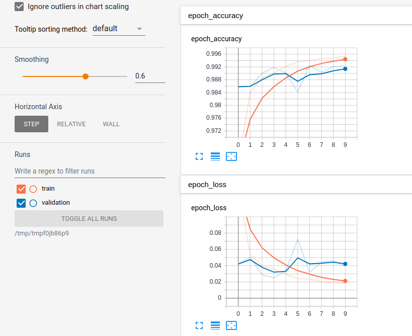
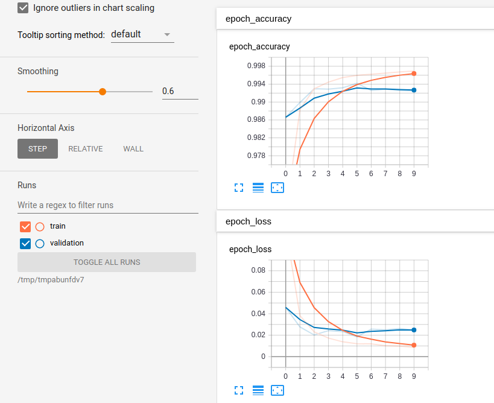
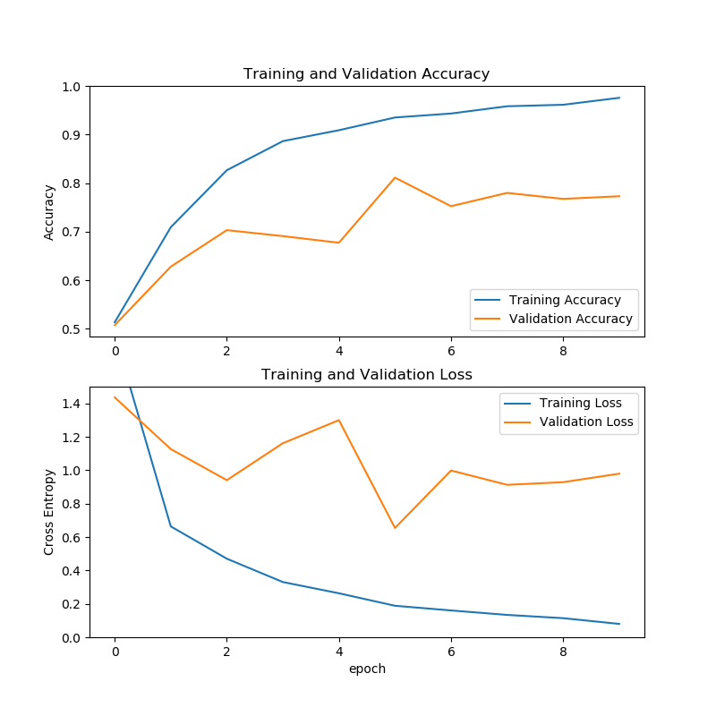
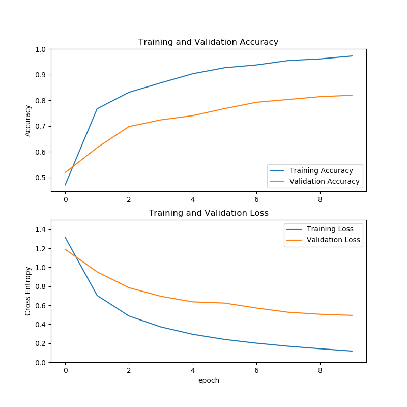

# ___2019 - 09 - 19 Model Optimization___
***

# 目录
  <!-- TOC depthFrom:1 depthTo:6 withLinks:1 updateOnSave:1 orderedList:0 -->

  - [___2019 - 09 - 19 Model Optimization___](#2019-09-19-model-optimization)
  - [目录](#目录)
  - [链接](#链接)
  - [模型量化 Post-training quantization](#模型量化-post-training-quantization)
  	- [量化 Optimization techniques](#量化-optimization-techniques)
  	- [模型量化方法](#模型量化方法)
  	- [MNIST 权重量化](#mnist-权重量化)
  	- [MNIST 权重与激活全量化](#mnist-权重与激活全量化)
  	- [量化为 float16](#量化为-float16)
  	- [Frozen Resnet 量化](#frozen-resnet-量化)
  - [Magnitude-based weight pruning with Keras](#magnitude-based-weight-pruning-with-keras)
  	- [模型剪枝](#模型剪枝)
  	- [训练未剪枝的 MNIST 模型](#训练未剪枝的-mnist-模型)
  	- [训练剪枝的 MNIST 模型](#训练剪枝的-mnist-模型)
  	- [剪枝整个模型](#剪枝整个模型)
  	- [转化为 TensorFlow Lite](#转化为-tensorflow-lite)
  - [Examples](#examples)
  	- [Flowers 使用 MobileNet fine tune 与 模型量化](#flowers-使用-mobilenet-fine-tune-与-模型量化)
  	- [IMDB LSTM 模型剪枝](#imdb-lstm-模型剪枝)

  <!-- /TOC -->
***

# 链接
  - [TensorFlow model optimization](https://www.tensorflow.org/model_optimization/guide?hl=zh_cn)
  - [TensorFlow Lite guide](https://www.tensorflow.org/lite/guide)
  - [Github tensorflow/model-optimization](https://github.com/tensorflow/model-optimization)
  - [Optimized models for common mobile and edge use cases](https://www.tensorflow.org/lite/models?hl=zh_cn)
  - [Hosted models](https://github.com/tensorflow/tensorflow/blob/master/tensorflow/lite/g3doc/guide/hosted_models.md)
  - [Github Network Slimming (Pytorch)](https://github.com/Eric-mingjie/network-slimming)
***

# 模型量化 Post-training quantization
## 量化 Optimization techniques
  - [Model optimization](https://www.tensorflow.org/lite/performance/model_optimization)
  - 模型优化常用方法
    - **剪枝 pruning** 减少模型参数数量，简化模型
    - **量化 quantization** 降低表示精度
    - 将原始模型拓扑更新为参数更少 / 执行更快的结构，如张量分解与净化 tensor decomposition methods and distillation
  - **量化 Quantization**
    - 将模型参数替换为低精度的表示，如使用 8-bit 整数替换 32-bit 浮点数，对于提升特定硬件的执行效率，低精度是必须的
    - 在训练好的模型上经过 **权重量化 Quantizing weights**，可以减少 CPU 以及硬件的传输 / 计算 / 资源占用以及模型大小，但会略微牺牲准确度，量化可以应用在 float 类型的模型上，在 tflite 转化期间，将参数类型转化为 int
    - 一般可以再 GPU 运算时使用 16-bit float，CPU 计算时使用 8-bit int
  - **稀疏与剪枝 Sparsity and pruning** 将某些张量置零，即将层间的连接剪枝，使模型更稀疏化
## 模型量化方法
  - **TFLite 量化方法**

    | 方式                | 数据要求         | 模型大小减少 | 准确度           | 支持的硬件                                  |
    | ------------------- | ---------------- | ------------ | ---------------- | ------------------------------------------- |
    | 训练后 float16 量化 | 无               | 最大 50%     | 无损失           | CPU / GPU                                   |
    | 训练后动态范围量化  | 无               | 最大 75%     | 有准确度降低     | CPU / GPU (Android)                         |
    | 训练后整型量化      | 无标签的表示数据 | 最大 75%     | 较小的准确度降低 | CPU / GPU (Android) / EdgeTPU / Hexagon DSP |
    | 训练中量化          | 有标签的训练数据 | 最大 75%     | 最小的准确度降低 | CPU / GPU (Android) / EdgeTPU / Hexagon DSP |

  - **动态范围量化 Dynamic range quantization** 将模型权重的 float 类型转化为 int，在前向调用中，首先将 int 值转化为 float，并使用浮点运算计算
    ```py
    import tensorflow as tf
    converter = tf.lite.TFLiteConverter.from_saved_model(saved_model_dir)
    converter.optimizations = [tf.lite.Optimize.DEFAULT]
    tflite_quant_model = converter.convert()
    ```
  - **整型量化** 需要提供一个小的表示数据集 representative data set，以确定激活 / 输入的动态范围
    ```py
    ''' 使用浮点型的输入 / 输出 '''
    import tensorflow as tf
    converter = tf.lite.TFLiteConverter.from_saved_model(saved_model_dir)
    converter.optimizations = [tf.lite.Optimize.DEFAULT]
    def representative_dataset_gen():
      for _ in range(num_calibration_steps):
        # Get sample input data as a numpy array in a method of your choosing.
        yield [input]
    converter.representative_dataset = representative_dataset_gen
    tflite_quant_model = converter.convert()
    ```
    使用浮点型的输入 / 输出可以使转化更加平滑，但不支持全整型的加速设备
    ```py
    ''' 全整型量化 '''
    import tensorflow as tf
    converter = tf.lite.TFLiteConverter.from_saved_model(saved_model_dir)
    converter.optimizations = [tf.lite.Optimize.DEFAULT]
    def representative_dataset_gen():
      for _ in range(num_calibration_steps):
        # Get sample input data as a numpy array in a method of your choosing.
        yield [input]
    converter.representative_dataset = representative_dataset_gen
    converter.target_spec.supported_ops = [tf.lite.OpsSet.TFLITE_BUILTINS_INT8]
    converter.inference_input_type = tf.int8  # or tf.uint8
    converter.inference_output_type = tf.int8  # or tf.uint8
    tflite_quant_model = converter.convert()
    ```
  - **Float16 量化** 可以减小模型体积，在 GPU 等设备上有加速效果
    ```py
    import tensorflow as tf
    converter = tf.lite.TFLiteConverter.from_saved_model(saved_model_dir)
    converter.optimizations = [tf.lite.Optimize.DEFAULT]
    converter.target_spec.supported_types = [tf.float16]
    tflite_quant_model = converter.convert()
    ```
## MNIST 动态范围量化
  - **训练 keras MNIST 模型**
    ```py
    # Load MNIST dataset
    mnist = keras.datasets.mnist
    (train_images, train_labels), (test_images, test_labels) = mnist.load_data()

    # Normalize the input image so that each pixel value is between 0 to 1.
    train_images = train_images / 255.0
    test_images = test_images / 255.0

    # Define the model architecture
    model = keras.Sequential([
        keras.layers.InputLayer(input_shape=(28, 28)),
        keras.layers.Reshape(target_shape=(28, 28, 1)),
        keras.layers.Conv2D(filters=12, kernel_size=(3, 3), activation=tf.nn.relu),
        keras.layers.MaxPooling2D(pool_size=(2, 2)),
        keras.layers.Flatten(),
        keras.layers.Dense(10)
    ])

    # Train the digit classification model
    model.compile(optimizer='adam',
                  loss=keras.losses.SparseCategoricalCrossentropy(from_logits=True),
                  metrics=['accuracy'])
    model.fit(train_images, train_labels, epochs=1, validation_data=(test_images, test_labels))
    ```
  - **转化为 TFLite 模型** 参数保持 `float32` 类型
    ```py
    converter = tf.lite.TFLiteConverter.from_keras_model(model)
    tflite_model = converter.convert()

    # Write it out to a tflite file
    open("mnist_model.tflite", "wb").write(tflite_model)
    # 84452
    ```
  - **动态范围量化** 权重量化为 `int` 类型，其他参数如输入 / 输出保持 `float` 类型
    ```py
    converter.optimizations = [tf.lite.Optimize.DEFAULT]
    tflite_quant_model = converter.convert()
    open("mnist_model_quant.tflite", "wb").write(tflite_quant_model)
    # 23840
    ```
  - **模型加载运行** 使用的数据 batch 必须是 1
    ```py
    ''' Load the model into an interpreter '''
    interpreter_quant = tf.lite.Interpreter(model_content=tflite_quant_model)
    # interpreter_quant = tf.lite.Interpreter(model_path="mnist_model_quant.tflite")
    interpreter_quant.allocate_tensors()
    input_index = interpreter_quant.get_input_details()[0]["index"]
    output_index = interpreter_quant.get_output_details()[0]["index"]

    ''' Test the model on one image '''
    test_image = np.expand_dims(test_images[0], axis=0).astype(np.float32)
    interpreter_quant.set_tensor(input_index, test_image)
    interpreter_quant.invoke()
    predictions = interpreter_quant.get_tensor(output_index)
    print(np.argmax(predictions[0]), test_labels[0])
    # 7 7

    ''' Evaluate the models '''
    # A helper function to evaluate the TF Lite model using "test" dataset.
    def evaluate_model(interpreter):
        interpreter.allocate_tensors()
        input_index = interpreter.get_input_details()[0]["index"]
        output_index = interpreter.get_output_details()[0]["index"]

        prediction_digits = []
        for test_image in test_images:
            test_image = np.expand_dims(test_image, axis=0).astype(np.float32)
            interpreter.set_tensor(input_index, test_image)
            interpreter.invoke()
            output = interpreter.tensor(output_index)
            prediction_digits.append(np.argmax(output()[0]))

        prediction_digits = np.array(prediction_digits)
        return (prediction_digits == test_labels).sum() / test_labels.shape[0], prediction_digits

    print(evaluate_model(interpreter_quant)[0])
    # 0.963
    print(evaluate_model(tf.lite.Interpreter(model_path="mnist_model.tflite"))[0])
    # 0.9628
    ```
## MNIST 全整型量化
  - **权重与激活全量化 quantizes all weights and activations** 可以将模型大小压缩 4 倍，CPU 上的前向传播速度提升 3-4倍，需要提供一个表示数据集 representative dataset
  - **定义表示数据集**
    - 表示数据集需要足够大，覆盖模型输入的取值范围，用来估计在转化为整型时，输入数据的动态范围
    - 表示数据集是一个 `generator`，每一个值是一个 `list`，其中的元素输入模型的数据
    ```py
    import tensorflow as tf
    mnist = keras.datasets.mnist
    (train_images, train_labels), (test_images, test_labels) = mnist.load_data()
    train_images, test_images = train_images.astype(np.float32) / 255.0, test_images.astype(np.float32) / 255.0
    def representative_data_gen():
        for input_value in tf.data.Dataset.from_tensor_slices(train_images).batch(1).take(100):
            # Model has only one input so each data point has one element.
            yield [input_value]
    ```
  - **模型转化**
    ```py
    converter = tf.lite.TFLiteConverter.from_keras_model(model)
    converter.optimizations = [tf.lite.Optimize.DEFAULT]
    converter.representative_dataset = representative_data_gen

    tflite_model_quant = converter.convert()
    open("mnist_model_rp.tflite", "wb").write(tflite_model_quant)
    # 24640
    ```
    模型的权重与其他参数全部转化为 `int`，但输入 / 输出保持 `float32`
    ```py
    interpreter = tf.lite.Interpreter(model_content=tflite_model_quant)
    input_type = interpreter.get_input_details()[0]['dtype']
    print('input: ', input_type)
    output_type = interpreter.get_output_details()[0]['dtype']
    print('output: ', output_type)
    # input:  <class 'numpy.float32'>
    # output:  <class 'numpy.float32'>
    ```
  - **全整型量化** 将输入 / 输出转为为 `int` 类型
    ```py
    converter = tf.lite.TFLiteConverter.from_keras_model(model)
    converter.optimizations = [tf.lite.Optimize.DEFAULT]
    converter.representative_dataset = representative_data_gen
    # Ensure that if any ops can't be quantized, the converter throws an error
    converter.target_spec.supported_ops = [tf.lite.OpsSet.TFLITE_BUILTINS_INT8]
    # Set the input and output tensors to uint8 (APIs added in r2.3)
    converter.inference_input_type = tf.uint8
    converter.inference_output_type = tf.uint8

    tflite_model_quant = converter.convert()

    interpreter = tf.lite.Interpreter(model_content=tflite_model_quant)
    input_type = interpreter.get_input_details()[0]['dtype']
    print('input: ', input_type)
    output_type = interpreter.get_output_details()[0]['dtype']
    print('output: ', output_type)
    # input:  <class 'numpy.uint8'>
    # output:  <class 'numpy.uint8'>

    open("mnist_model_quant_rp.tflite", "wb").write(tflite_model_quant)
    # 24720
    ```
    输入 / 输出量化为整型后，需要根据 `get_input_details` / `get_output_details` 中的 `quantization` 指定的方式转化
    ```py
    print(interpreter.get_input_details())
    # [{..., 'dtype': numpy.uint8, 'quantization': (0.003921568859368563, 0),}]
    print(interpreter.get_output_details())
    # [{..., 'dtype': numpy.uint8, 'quantization': (0.12114132940769196, 176),}]

    input_details = interpreter.get_input_details()[0]
    if input_details['dtype'] == np.uint8:
        input_scale, input_zero_point = input_details["quantization"]
        test_image = test_image / input_scale + input_zero_point

    output_details = interpreter.get_output_details()[0]
    if output_details['dtype'] == np.uint8:
        output_scale, output_zero_point = output_details["quantization"]
        output = (output.astype(np.float32) - output_zero_point) * output_scale
    ```
  - **输入 / 输出测试**
    ```py
    ''' float 输入 / 输出 '''
    interpreter_float = tf.lite.Interpreter(model_path="mnist_model_rp.tflite")
    interpreter_float.allocate_tensors()
    input_index = interpreter_float.get_input_details()[0]["index"]
    output_index = interpreter_float.get_output_details()[0]["index"]
    test_image = np.expand_dims(test_images[0], axis=0).astype(np.float32)
    interpreter_float.set_tensor(input_index, test_image)
    interpreter_float.invoke()
    print(interpreter_float.get_tensor(output_index))
    # [[-3.270816, -9.449024, -1.6959786, 1.8171196, -6.4204907, -5.45136, -12.356416, 8.358751, -4.361088, -1.6959786]]

    ''' int 输入 / 输出 '''
    interpreter_int = tf.lite.Interpreter(model_path="mnist_model_quant_rp.tflite")
    interpreter_int.allocate_tensors()
    input_details = interpreter_int.get_input_details()[0]
    input_scale, input_zero_point = input_details["quantization"]
    test_image = test_images[0] / input_scale + input_zero_point
    test_image = np.expand_dims(test_image, axis=0).astype(input_details["dtype"])
    interpreter_int.set_tensor(input_details["index"], test_image)

    output_details = interpreter_int.get_output_details()[0]
    output_scale, output_zero_point = output_details["quantization"]
    interpreter_int.invoke()
    pp = interpreter_int.get_tensor(output_details["index"])
    print(pp)
    # [[149, 99, 162, 191, 123, 132, 75, 245, 140, 162]]
    print((pp.astype(np.float32) - output_zero_point) * output_scale)
    # [[-3.2708158, -9.327883, -1.6959786, 1.81712, -6.4204903, -5.3302183, -12.235274, 8.358751, -4.361088, -1.6959786]]
    ```
  - **模型测试**
    ```py
    # Helper function to run inference on a TFLite model
    def run_tflite_model(tflite_file, test_images):
        interpreter = tf.lite.Interpreter(model_path=tflite_file)
        interpreter.allocate_tensors()
        input_details = interpreter.get_input_details()[0]
        output_details = interpreter.get_output_details()[0]

        predictions = []
        for test_image in test_images:
            # Check if the input type is quantized, then rescale input data to uint8
            if input_details['dtype'] == np.uint8:
                input_scale, input_zero_point = input_details["quantization"]
                test_image = test_image / input_scale + input_zero_point

            test_image = np.expand_dims(test_image, axis=0).astype(input_details["dtype"])
            interpreter.set_tensor(input_details["index"], test_image)
            interpreter.invoke()
            output = interpreter.get_tensor(output_details["index"])[0]

            # Check if the output type is quantized, then rescale output data to float
            if output_details['dtype'] == np.uint8:
                output_scale, output_zero_point = output_details["quantization"]
                output = (output.astype(np.float32) - output_zero_point) * output_scale
            predictions.append(output.argmax())
        return np.array(predictions)

    run_tflite_model('mnist_model_quant_rp.tflite', test_images[:10])
    # array([7, 2, 1, 0, 4, 1, 4, 9, 6, 9])
    test_labels[:10]
    # array([7, 2, 1, 0, 4, 1, 4, 9, 5, 9], dtype=uint8)

    pps = run_tflite_model('mnist_model_quant_rp.tflite', test_images)
    print('Accuracy:', (pps == test_labels).sum() / pps.shape[0])
    # Accuracy: 0.9627
    ```
## MNIST float16 量化
  - **量化为 16 位浮点型** 将模型大小压缩为原来的 1/2，在使用 **GPU** 计算时，可以加速前向过程
  - **模型转化** 默认输入输出仍使用 float32
    ```py
    converter = tf.lite.TFLiteConverter.from_keras_model(model)
    converter.optimizations = [tf.lite.Optimize.DEFAULT]
    converter.target_spec.supported_types = [tf.float16]

    tflite_fp16_model = converter.convert()
    open("mnist_model_quant_f16.tflite", "wb").write(tflite_fp16_model)
    # 44272
    ```
  - **模型测试**
    ```py
    (train_images, train_labels), (test_images, test_labels) = keras.datasets.mnist.load_data()
    test_images = test_images / 255.0
    test_image = np.expand_dims(test_images[0], axis=0).astype(np.float32)

    interpreter_fp16 = tf.lite.Interpreter(model_path="mnist_model_quant_f16.tflite")
    interpreter_fp16.allocate_tensors()
    input_index = interpreter_fp16.get_input_details()[0]["index"]
    output_index = interpreter_fp16.get_output_details()[0]["index"]

    interpreter_fp16.set_tensor(input_index, test_image)
    interpreter_fp16.invoke()
    predictions = interpreter_fp16.get_tensor(output_index)
    print(predictions.argmax(), test_labels[0])
    # 7 7
    ```
## Frozen Resnet 量化
  - resnet-v2 是带有预激活层 pre-activation layers 的 resnet，可以将训练好的 frozen graph resnet-v2-101 量化为 tflite 的 flatbuffer 格式
    ```py
    archive_path = tf.keras.utils.get_file("resnet_v2_101.tgz", "https://storage.googleapis.com/download.tensorflow.org/models/tflite_11_05_08/resnet_v2_101.tgz", extract=True)
    archive_path = pathlib.Path(archive_path)
    archive_dir = str(archive_path.parent)
    print(archive_path, archive_dir)                                                                
    # /home/leondgarse/.keras/datasets/resnet_v2_101.tgz /home/leondgarse/.keras/datasets

    !ls -lh {archive_dir}/resnet_*                                                                  
    # -rwxrwxrwx 1 root root 512M 四月 15  2017 /home/leondgarse/.keras/datasets/resnet_v2_101_299.ckpt
    # -rwxrwxrwx 1 root root 2.0M 九月  6  2018 /home/leondgarse/.keras/datasets/resnet_v2_101_299_eval.pbtxt
    # -rwxrwxrwx 1 root root 171M 九月  6  2018 /home/leondgarse/.keras/datasets/resnet_v2_101_299_frozen.pb
    # -rwxrwxrwx 1 root root   49 九月  6  2018 /home/leondgarse/.keras/datasets/resnet_v2_101_299_info.txt
    # -rwxrwxrwx 1 root root 171M 九月  6  2018 /home/leondgarse/.keras/datasets/resnet_v2_101_299.tflite
    # -rwxrwxrwx 1 root root 794M 十月 14 14:45 /home/leondgarse/.keras/datasets/resnet_v2_101.tgz
    ```
    `info.txt` 文件包含输入输出的名称，也可以使用 TensorBoard 可视化查看
    ```py
    ! cat {archive_dir}/resnet_v2_101_299_info.txt
    # Model: resnet_v2_101
    # Input: input
    # Output: output
    ```
  - **模型转化** 使用 `tf.compat.v1.lite.TFLiteConverter.from_frozen_graph` [ ??? ]
    ```py
    graph_def_file = pathlib.Path(archive_path).parent/"resnet_v2_101_299_frozen.pb"
    input_arrays = ["input"]
    output_arrays = ["output"]
    converter = tf.compat.v1.lite.TFLiteConverter.from_frozen_graph(
    str(graph_def_file), input_arrays, output_arrays, input_shapes={"input":[1,299,299,3]})
    converter.optimizations = [tf.lite.Optimize.OPTIMIZE_FOR_SIZE]
    resnet_tflite_file = graph_def_file.parent/"resnet_v2_101_quantized.tflite"
    resnet_tflite_file.write_bytes(converter.convert())

    !ls -lh {str(resnet_tflite_file)}                                                               
    # -rwxrwxrwx 1 root root 43M 十月 28 17:52 /home/leondgarse/.keras/datasets/resnet_v2_101_quantized.tflite
    ```
## TFLite Model Benchmark Tool
  - [TFLite Model Benchmark Tool](https://github.com/tensorflow/tensorflow/tree/master/tensorflow/lite/tools/benchmark)
    ```sh
    cd ~/workspace/tensorflow.arm32
    ./configure
    bazel build -c opt --config=android_arm tensorflow/lite/tools/benchmark:benchmark_model
    # bazel build --config opt --config monolithic --define tflite_with_xnnpack=false tensorflow/lite/tools/benchmark:benchmark_model

    adb push bazel-bin/tensorflow/lite/tools/benchmark/benchmark_model /data/local/tmp
    adb shell chmod +x /data/local/tmp/benchmark_model

    cd ~/workspace/examples/lite/examples/image_classification/android/app/src/main/assets
    adb push mobilenet_v1_1.0_224_quant.tflite /data/local/tmp
    adb push mobilenet_v1_1.0_224.tflite /data/local/tmp
    adb push efficientnet-lite0-int8.tflite /data/local/tmp
    adb push efficientnet-lite0-fp32.tflite /data/local/tmp
    ```
  - **参数**
    - **--graph** 字符串，TFLite 模型路径
    - **--enable_op_profiling** true / false，是否测试每个步骤的执行时间: bool (default=false) Whether to enable per-operator profiling measurement.
    - **--nnum_threads** 整数值，线程数量
    - **--use_gpu** true / false，是否使用 GPU
    - **--use_nnapi** true / false，是否使用 nnapi
    - **--use_xnnpack** true / false，是否使用 xnnpack
    - **--use_coreml** true / false，是否使用 coreml
  - **Int8 模型 nnapi 测试**
    ```cpp
    $ adb shell /data/local/tmp/benchmark_model --graph=/data/local/tmp/mobilenet_v1_1.0_224_quant.tflite --num_threads=1
    $ adb shell /data/local/tmp/benchmark_model --graph=/data/local/tmp/mobilenet_v1_1.0_224_quant.tflite --num_threads=4
    $ adb shell /data/local/tmp/benchmark_model --graph=/data/local/tmp/mobilenet_v1_1.0_224_quant.tflite --num_threads=1 --use_nnapi=true
    $ adb shell /data/local/tmp/benchmark_model --graph=/data/local/tmp/mobilenet_v1_1.0_224_quant.tflite --num_threads=4 --use_nnapi=true
    ```
  - **Float32 / float16 模型 xnnpack 测试** 不经过量化的浮点型模型可以使用 `xnnpack` 加速
    ```cpp
    $ adb shell /data/local/tmp/benchmark_model --graph=/data/local/tmp/mobilenet_v1_1.0_224.tflite --num_threads=1
    $ adb shell /data/local/tmp/benchmark_model --graph=/data/local/tmp/mobilenet_v1_1.0_224.tflite --num_threads=4
    $ adb shell /data/local/tmp/benchmark_model --graph=/data/local/tmp/mobilenet_v1_1.0_224.tflite --num_threads=1 --use_xnnpack=true
    $ adb shell /data/local/tmp/benchmark_model --graph=/data/local/tmp/mobilenet_v1_1.0_224.tflite --num_threads=4 --use_xnnpack=true
    ```
***

# Quantization aware training in Keras example
## QAT environment
  - [Quantization aware training in Keras example](https://www.tensorflow.org/model_optimization/guide/quantization/training_example)
  - **Conda install `tf-nightly` and `tensorflow-model-optimization`**
    ```sh
    conda create -n tf-nightly
    conda activate tf-nightly
    pip install tf-nightly glob2 pandas tqdm scikit-image scikit-learn ipython
    pip install -q tensorflow-model-optimization

    # Install matching cuda for tensorflow if not installed
    conda install cudnn=7.6.5=cuda10.1_0

    source activate tf-nightly
    ```
## Traditional post training quantization
  - **Train a MNIST model**
    ```py
    import os
    import tensorflow as tf
    from tensorflow import keras

    # Load MNIST dataset
    mnist = keras.datasets.mnist
    (train_images, train_labels), (test_images, test_labels) = mnist.load_data()

    # Normalize the input image so that each pixel value is between 0 to 1.
    train_images = train_images / 255.0
    test_images = test_images / 255.0

    # Define the model architecture.
    model = keras.Sequential([
        keras.layers.InputLayer(input_shape=(28, 28)),
        keras.layers.Reshape(target_shape=(28, 28, 1)),
        keras.layers.Conv2D(filters=12, kernel_size=(3, 3), activation='relu'),
        keras.layers.MaxPooling2D(pool_size=(2, 2)),
        keras.layers.Flatten(),
        keras.layers.Dense(10)
    ])

    # Train the digit classification model
    model.compile(optimizer='adam', loss=tf.keras.losses.SparseCategoricalCrossentropy(from_logits=True), metrics=['accuracy'])

    model.fit(train_images, train_labels, epochs=1, validation_data=(test_images, test_labels))
    # 1875/1875 [==============================] - 4s 1ms/step - loss: 0.5236 - accuracy: 0.8526 - val_loss: 0.1493 - val_accuracy: 0.9587
    ```
  - **Clone and fine-tune pre-trained model with quantization aware training**
    - 将 `quantization aware` 应用到整个模型，模型额的每一层将以 `quant` 开头
    - 训练后的模型是 `quantization aware` 的，但还没有被量化
    ```py
    import tensorflow_model_optimization as tfmot
    quantize_model = tfmot.quantization.keras.quantize_model

    # q_aware stands for for quantization aware.
    q_aware_model = quantize_model(model)
    # `quantize_model` requires a recompile.
    q_aware_model.compile(optimizer='adam', loss=tf.keras.losses.SparseCategoricalCrossentropy(from_logits=True), metrics=['accuracy'])

    q_aware_model.summary()
    print([ii.name for ii in q_aware_model.layers])
    # ['quantize_layer', 'quant_reshape', 'quant_conv2d', 'quant_max_pooling2d', 'quant_flatten', 'quant_dense']
    ```
  - **Train and evaluate the model against baseline** 作为对比，在一个小的数据集上做 fine tune
    ```py
    train_images_subset = train_images[0:1000] # out of 60000
    train_labels_subset = train_labels[0:1000]
    q_aware_model.fit(train_images_subset, train_labels_subset, batch_size=500, epochs=1, validation_data=(test_images, test_labels))
    # 2/2 [==============================] - 1s 276ms/step - loss: 0.1692 - accuracy: 0.9560 - val_loss: 0.1475 - val_accuracy: 0.9596
    ```
    **Evaluate**
    ```py
    _, baseline_model_accuracy = model.evaluate(test_images, test_labels, verbose=0)
    print('Baseline test accuracy:', baseline_model_accuracy)
    # Baseline test accuracy: 0.9587000012397766

    _, q_aware_model_accuracy = q_aware_model.evaluate(test_images, test_labels, verbose=0)
    print('Quant test accuracy:', q_aware_model_accuracy)
    # Quant test accuracy: 0.9595999717712402
    ```
  - **More training**
    ```py
    model.fit(train_images, train_labels, epochs=5, validation_data=(test_images, test_labels))
    # Epoch 1/5 1875/1875 - 3s 1ms/step - loss: 0.1215 - accuracy: 0.9654 - val_loss: 0.0906 - val_accuracy: 0.9731
    # Epoch 2/5 1875/1875 - 3s 1ms/step - loss: 0.0836 - accuracy: 0.9761 - val_loss: 0.0718 - val_accuracy: 0.9780
    # Epoch 3/5 1875/1875 - 3s 1ms/step - loss: 0.0679 - accuracy: 0.9796 - val_loss: 0.0655 - val_accuracy: 0.9785
    # Epoch 4/5 1875/1875 - 3s 1ms/step - loss: 0.0587 - accuracy: 0.9828 - val_loss: 0.0710 - val_accuracy: 0.9770
    # Epoch 5/5 1875/1875 - 3s 1ms/step - loss: 0.0521 - accuracy: 0.9840 - val_loss: 0.0598 - val_accuracy: 0.9815

    q_aware_model.fit(train_images, train_labels, epochs=5, validation_data=(test_images, test_labels))
    # Epoch 1/5 1875/1875 - 5s 2ms/step - loss: 0.1210 - accuracy: 0.9658 - val_loss: 0.0879 - val_accuracy: 0.9724
    # Epoch 2/5 1875/1875 - 4s 2ms/step - loss: 0.0819 - accuracy: 0.9762 - val_loss: 0.0756 - val_accuracy: 0.9755
    # Epoch 3/5 1875/1875 - 4s 4ms/step - loss: 0.0656 - accuracy: 0.9811 - val_loss: 0.0630 - val_accuracy: 0.9804
    # Epoch 4/5 1875/1875 - 4s 2ms/step - loss: 0.0576 - accuracy: 0.9824 - val_loss: 0.0632 - val_accuracy: 0.9798
    # Epoch 5/5 1875/1875 - 4s 2ms/step - loss: 0.0507 - accuracy: 0.9848 - val_loss: 0.0590 - val_accuracy: 0.9807
    ```
  - **Create quantized model for TFLite backend** 创建量化模型
    ```py
    converter = tf.lite.TFLiteConverter.from_keras_model(q_aware_model)
    converter.optimizations = [tf.lite.Optimize.DEFAULT]
    converter.inference_input_type = tf.uint8
    converter.inference_output_type = tf.uint8
    quantized_tflite_model = converter.convert()

    interpreter = tf.lite.Interpreter(model_content=quantized_tflite_model)
    input_type = interpreter.get_input_details()[0]['dtype']
    print('input: ', input_type)  # input:  <class 'numpy.uint8'>
    output_type = interpreter.get_output_details()[0]['dtype']
    print('output: ', output_type)  # output:  <class 'numpy.uint8'>
    ```
    ```py
    mnist = keras.datasets.mnist
    (train_images, train_labels), (test_images, test_labels) = mnist.load_data()
    train_images, test_images = train_images.astype(np.float32) / 255.0, test_images.astype(np.float32) / 255.0
    def representative_data_gen():
        for input_value in tf.data.Dataset.from_tensor_slices(train_images).batch(1).take(100):
            # Model has only one input so each data point has one element.
            yield [input_value]

    converter = tf.lite.TFLiteConverter.from_keras_model(model)
    converter.optimizations = [tf.lite.Optimize.DEFAULT]
    converter.representative_dataset = representative_data_gen
    converter.target_spec.supported_ops = [tf.lite.OpsSet.TFLITE_BUILTINS_INT8]
    converter.inference_input_type = tf.uint8
    converter.inference_output_type = tf.uint8
    tflite_model_quant = converter.convert()

    interpreter = tf.lite.Interpreter(model_content=tflite_model_quant)
    input_type = interpreter.get_input_details()[0]['dtype']
    print('input: ', input_type)  # input:  <class 'numpy.uint8'>
    output_type = interpreter.get_output_details()[0]['dtype']
    print('output: ', output_type)  # output:  <class 'numpy.uint8'>
    ```
    **Evaluate**
    ```py
    import numpy as np

    def evaluate_model(interpreter):
        input_details = interpreter.get_input_details()[0]
        input_index = input_details["index"]

        output_index = interpreter.get_output_details()[0]["index"]
        prediction_digits = []
        for i, test_image in enumerate(test_images):
            if input_details['dtype'] == np.uint8:
                input_scale, input_zero_point = input_details["quantization"]
                test_image = test_image / input_scale + input_zero_point
                test_image = np.expand_dims(test_image, axis=0).astype("uint8")
            else:
                test_image = np.expand_dims(test_image, axis=0).astype(np.float32)
            interpreter.set_tensor(input_index, test_image)
            interpreter.invoke()
            output = interpreter.tensor(output_index)
            digit = np.argmax(output()[0])
            prediction_digits.append(digit)
        prediction_digits = np.array(prediction_digits)
        accuracy = (prediction_digits == test_labels).mean()
        return accuracy

    interpreter = tf.lite.Interpreter(model_content=quantized_tflite_model)
    interpreter.allocate_tensors()
    print('Quant TFLite test accuracy:', evaluate_model(interpreter))
    # Quant TFLite test accuracy: 0.9807

    _, q_aware_model_accuracy = q_aware_model.evaluate(test_images, test_labels, verbose=0)
    print('Quant TF test accuracy:', q_aware_model_accuracy)
    # Quant TF test accuracy: 0.9807000160217285

    interpreter = tf.lite.Interpreter(model_content=tflite_model_quant)
    interpreter.allocate_tensors()
    print('Quant TFLite test accuracy:', evaluate_model(interpreter))
    # Quant TFLite test accuracy: 0.9811

    _, accuracy = model.evaluate(test_images, test_labels, verbose=0)
    print('Model TF test accuracy:', accuracy)
    # Model TF test accuracy: 0.9815000295639038
    ```
***

# Magnitude-based weight pruning with Keras
## 模型剪枝
  - **过度参数化 over-parameterization** 是深度神经网络的一个普遍属性，导致高计算成本和高内存占用
  - **网络剪枝 network pruning** 作为一种补救措施，已被证实是一种有效的改进技术，可以在计算预算有限的情况下提高深度网络的效率
  - 网络剪枝的过程一般包括三个阶段
    - 训练一个大型，过度参数化的模型
    - 根据特定标准修剪训练好的大模型
    - 微调 fine-tune 剪枝后的模型以重新获得丢失的性能
  - **权重剪枝 weight pruning** 将非必要的权重置零，从而减少层间的连接，将原来的 dense model 转变为 sparse model，达到压缩的目的
  - 稀疏化的模型目前在压缩后可以减小体积，但在前向过程中的速度，需要后端支持
  - **Keras 的模型剪枝 API** 使用了一种简单但广泛适用的基于重要性的 magnitude-based 剪枝算法，可以在训练期间根据重要程度，迭代删除连接
## 训练未剪枝的 MNIST 模型
  ```py
  %load_ext tensorboard
  import tensorboard
  import tensorflow as tf
  import tempfile
  import zipfile
  import os
  gpus = tf.config.experimental.list_physical_devices('GPU')
  tf.config.experimental.set_memory_growth(gpus[0], True)

  (x_train, y_train), (x_test, y_test) = tf.keras.datasets.mnist.load_data()
  x_train = np.expand_dims(x_train, -1).astype('float32') / 255
  x_test = np.expand_dims(x_test, -1).astype('float32') / 255
  y_train = tf.keras.utils.to_categorical(y_train, 10)
  y_test = tf.keras.utils.to_categorical(y_test, 10)
  print(x_train.shape, y_train.shape, x_test.shape, y_test.shape)
  # (60000, 28, 28, 1) (60000, 10) (10000, 28, 28, 1) (10000, 10)

  l = tf.keras.layers
  model = tf.keras.Sequential([
      l.Conv2D(32, 5, padding='same', activation='relu', input_shape=(28, 28, 1)),
      l.MaxPooling2D((2, 2), (2, 2), padding='same'),
      l.BatchNormalization(),
      l.Conv2D(64, 5, padding='same', activation='relu'),
      l.MaxPooling2D((2, 2), (2, 2), padding='same'),
      l.Flatten(),
      l.Dense(1024, activation='relu'),
      l.Dropout(0.4),
      l.Dense(10, activation='softmax')
  ])
  model.summary()
  # Model: "sequential"
  # _________________________________________________________________
  # Layer (type)                 Output Shape              Param #   
  # =================================================================
  # conv2d (Conv2D)              (None, 28, 28, 32)        832       
  # _________________________________________________________________
  # max_pooling2d (MaxPooling2D) (None, 14, 14, 32)        0         
  # _________________________________________________________________
  # batch_normalization (BatchNo (None, 14, 14, 32)        128       
  # _________________________________________________________________
  # conv2d_1 (Conv2D)            (None, 14, 14, 64)        51264     
  # _________________________________________________________________
  # max_pooling2d_1 (MaxPooling2 (None, 7, 7, 64)          0         
  # _________________________________________________________________
  # flatten (Flatten)            (None, 3136)              0         
  # _________________________________________________________________
  # dense (Dense)                (None, 1024)              3212288   
  # _________________________________________________________________
  # dropout (Dropout)            (None, 1024)              0         
  # _________________________________________________________________
  # dense_1 (Dense)              (None, 10)                10250     
  # =================================================================
  # Total params: 3,274,762
  # Trainable params: 3,274,698
  # Non-trainable params: 64
  # _________________________________________________________________

  logdir = tempfile.mkdtemp()
  print('Writing training logs to ' + logdir)
  # Writing training logs to /tmp/tmp03ewcd_c
  %tensorboard --logdir={logdir}

  batch_size = 32
  callbacks = [tf.keras.callbacks.TensorBoard(log_dir=logdir, profile_batch=0)]
  model.compile(loss=tf.keras.losses.categorical_crossentropy, optimizer='adam', metrics=['accuracy'])
  model.fit(x_train, y_train, batch_size=batch_size, epochs=10, verbose=1, callbacks=callbacks, validation_data=(x_test, y_test))

  score = model.evaluate(x_test, y_test, verbose=0)
  print('Test loss: %f, Test accuracy: %f' % (score[0], score[1]))
  # Test loss: 0.058006, Test accuracy: 0.990000

  tempfile.mkstemp('.h5')
  _, keras_file = tempfile.mkstemp('.h5')
  print('Saving model to: ', keras_file)
  # Saving model to:  /tmp/tmpw_728hos.h5
  tf.keras.models.save_model(model, keras_file, include_optimizer=False)
  !ls -lh {keras_file}
  # -rw------- 1 leondgarse leondgarse 13M 十月 15 10:59 /tmp/tmpw_728hos.h5
  ```
  
## 训练剪枝的 MNIST 模型
  - **prune_low_magnitude** 用于训练剪枝的模型，可以应用在单独的层上或整个模型上，通过指定稀疏的程度，迭代的移除模型层间的连接
  - **pruning_schedule** 训练时的剪枝算法参数配置，典型的应用可以指定稀疏程度 75%，每 100 个训练步骤剪枝一次
    ```py
    pruning_params = {
          'pruning_schedule': sparsity.PolynomialDecay(
              initial_sparsity=0.50, final_sparsity=0.90,
              begin_step=2000, end_step=end_step, frequency=100)
    }
    ```
    - **Sparsity 稀疏程度** 在整个训练过程中应用 **多项式衰减 PolynomialDecay**，训练模型的稀疏程度从 50% 到最终的 90%
    - **Schedule 流程** 剪枝从模型训练的 2000 步开始，每 100 个训练步骤剪枝一次，在剪枝之间训练模型的准确度
    - **end_step** 一般根据训练数据集的大小 / batch size / epochs 计算出来
  - **剪枝模型定义**
    ```py
    from tensorflow_model_optimization.sparsity import keras as sparsity

    epochs = 12
    batch_size = 32
    num_train_samples = x_train.shape[0]
    end_step = np.ceil(num_train_samples / batch_size).astype(np.int32) * epochs
    pruning_params = {
        "pruning_schedule": sparsity.PolynomialDecay(
            initial_sparsity=0.5, final_sparsity=0.9,
            begin_step=2000, end_step=end_step, frequency=100)
    }

    l = tf.keras.layers
    pruned_model = tf.keras.Sequential([
        sparsity.prune_low_magnitude(l.Conv2D(32, 5, padding='same', activation='relu'), input_shape=(28, 28, 1), **pruning_params),
        l.MaxPooling2D((2, 2), (2, 2), padding='same'),
        l.BatchNormalization(),
        sparsity.prune_low_magnitude(l.Conv2D(64, 5, padding='same', activation='relu'), **pruning_params),
        l.MaxPooling2D((2, 2), (2, 2), padding='same'),
        l.Flatten(),
        sparsity.prune_low_magnitude(l.Dense(1024, activation='relu'), **pruning_params),
        l.Dropout(0.4),
        sparsity.prune_low_magnitude(l.Dense(10, activation='softmax'), **pruning_params)
    ])
    pruned_model.summary()
    # Model: "sequential"
    # _________________________________________________________________
    # Layer (type)                 Output Shape              Param #   
    # =================================================================
    # prune_low_magnitude_conv2d ( (None, 28, 28, 32)        1634      
    # _________________________________________________________________
    # max_pooling2d (MaxPooling2D) (None, 14, 14, 32)        0         
    # _________________________________________________________________
    # batch_normalization (BatchNo (None, 14, 14, 32)        128       
    # _________________________________________________________________
    # prune_low_magnitude_conv2d_1 (None, 14, 14, 64)        102466    
    # _________________________________________________________________
    # max_pooling2d_1 (MaxPooling2 (None, 7, 7, 64)          0         
    # _________________________________________________________________
    # flatten (Flatten)            (None, 3136)              0         
    # _________________________________________________________________
    # prune_low_magnitude_dense (P (None, 1024)              6423554   
    # _________________________________________________________________
    # dropout (Dropout)            (None, 1024)              0         
    # _________________________________________________________________
    # prune_low_magnitude_dense_1  (None, 10)                20492     
    # =================================================================
    # Total params: 6,548,274
    # Trainable params: 3,274,698
    # Non-trainable params: 3,273,576
    # _________________________________________________________________
    ```
  - **模型训练**
    ```py
    logdir = tempfile.mkdtemp()
    print('Writing training logs to ' + logdir)
    %tensorboard --logdir={logdir}
    pruned_model.compile(loss=tf.keras.losses.categorical_crossentropy, optimizer='adam', metrics=['accuracy'])
    callbacks = [
        # Update the pruning step
        sparsity.UpdatePruningStep(),
        # Add summaries to keep track of the sparsity in different layers during training
        sparsity.PruningSummaries(log_dir=logdir, profile_batch=0)
    ]
    pruned_model.fit(x_train, y_train, batch_size=32, epochs=10, verbose=1, callbacks=callbacks, validation_data=(x_test, y_test))

    score = pruned_model.evaluate(x_test, y_test, verbose=0)
    print('Test loss: %s, Test accuracy: %s' % (score[0], score[1]))
    # Test loss: 0.024720210566235013, Test accuracy: 0.9925
    ```
    
  - **模型保存与加载** 增加两轮训练
    - 模型保存时需要指定 `include_optimizer=True`，加载后的模型才能正常用于训练
    - 加载剪枝模型时，需要指定 `prune_scope` 用于并行化处理 deseriazliation
    ```py
    _, checkpoint_file = tempfile.mkstemp('.h5')
    print('Saving pruned model to: ', checkpoint_file)
    tf.keras.models.save_model(pruned_model, checkpoint_file, include_optimizer=True)
    !ls -lh {checkpoint_file}
    # -rw------- 1 leondgarse leondgarse 51M 十月 30 11:31 /tmp/tmp7v3pgmbn.h5

    with sparsity.prune_scope():
        restored_model = tf.keras.models.load_model(checkpoint_file)
    restored_model.fit(x_train, y_train, batch_size=32, epochs=2, verbose=1, callbacks=callbacks, validation_data=(x_test, y_test))
    score = restored_model.evaluate(x_test, y_test, verbose=0)
    print('Test loss: %s, Test accuracy: %s' % (score[0], score[1]))
    # Test loss: 0.030049306556587278, Test accuracy: 0.993
    ```
  - **移除剪枝参数用于部署**
    ```py
    final_model = sparsity.strip_pruning(pruned_model)
    final_model.summary()
    # Model: "sequential"
    # _________________________________________________________________
    # Layer (type)                 Output Shape              Param #   
    # =================================================================
    # conv2d (Conv2D)              (None, 28, 28, 32)        832       
    # _________________________________________________________________
    # max_pooling2d (MaxPooling2D) (None, 14, 14, 32)        0         
    # _________________________________________________________________
    # batch_normalization (BatchNo (None, 14, 14, 32)        128       
    # _________________________________________________________________
    # conv2d_1 (Conv2D)            (None, 14, 14, 64)        51264     
    # _________________________________________________________________
    # max_pooling2d_1 (MaxPooling2 (None, 7, 7, 64)          0         
    # _________________________________________________________________
    # flatten (Flatten)            (None, 3136)              0         
    # _________________________________________________________________
    # dense (Dense)                (None, 1024)              3212288   
    # _________________________________________________________________
    # dropout (Dropout)            (None, 1024)              0         
    # _________________________________________________________________
    # dense_1 (Dense)              (None, 10)                10250     
    # =================================================================
    # Total params: 3,274,762
    # Trainable params: 3,274,698
    # Non-trainable params: 64
    # _________________________________________________________________

    _, pruned_keras_file = tempfile.mkstemp('.h5')
    print('Saving pruned model to: ', pruned_keras_file)

    # No need to save the optimizer with the graph for serving.
    tf.keras.models.save_model(final_model, pruned_keras_file, include_optimizer=False)
    !ls -lh {pruned_keras_file}
    # -rw------- 1 leondgarse leondgarse 13M 十月 30 11:39 /tmp/tmp77c9pbzl.h5
    ```
  - **压缩后模型大小对比**
    ```py
    _, zip1 = tempfile.mkstemp('.zip')
    with zipfile.ZipFile(zip1, 'w', compression=zipfile.ZIP_DEFLATED) as f:
        f.write(keras_file)
    print("Unpruned model before compression: %.2f Mb" % (os.path.getsize(keras_file) / float(2**20)))
    print("Unpruned model after compression: %.2f Mb" % (os.path.getsize(zip1) / float(2**20)))

    _, zip2 = tempfile.mkstemp('.zip')
    with zipfile.ZipFile(zip2, 'w', compression=zipfile.ZIP_DEFLATED) as f:
        f.write(pruned_keras_file)
    print("Pruned model before compression: %.2f Mb" % (os.path.getsize(pruned_keras_file) / float(2**20)))
    print("Pruned model after compression: %.2f Mb" % (os.path.getsize(zip2) / float(2**20)))
    ```
    ```py
    Unpruned model before compression: 12.52 Mb
    Unpruned model after compression: 11.63 Mb
    Pruned model before compression: 12.52 Mb
    Pruned model after compression: 2.44 Mb
    ```
## 剪枝整个模型
  - **prune_low_magnitude** 可以应用在整个模型上，如果模型中有不支持的层，将会报错
  - **模型加载与定义**
    ```py
    loaded_model = tf.keras.models.load_model(keras_file)
    batch_size = 32
    epochs = 4
    end_step = np.ceil(x_train.shape[0] / batch_size).astype(np.int32) * epochs
    new_pruning_params = {
        "pruning_schedule": sparsity.PolynomialDecay(
            initial_sparsity=0.5,
            final_sparsity=0.9,
            begin_step=0,
            end_step=end_step,
            frequency=100
        )
    }
    new_pruned_model = sparsity.prune_low_magnitude(loaded_model, **new_pruning_params)
    new_pruned_model.summary()

    new_pruned_model.compile(loss=tf.keras.losses.categorical_crossentropy, optimizer='adam', metrics=['accuracy'])

    logdir = tempfile.mkdtemp()
    print('Writing training logs to ' + logdir)
    %tensorboard --logdir={logdir}
    ```
  - **模型训练与导出**
    ```py
    # Add a pruning step callback to peg the pruning step to the optimizer's
    # step. Also add a callback to add pruning summaries to tensorboard
    callbacks = [
        sparsity.UpdatePruningStep(),
        sparsity.PruningSummaries(log_dir=logdir, profile_batch=0)
    ]
    new_pruned_model.fit(x_train, y_train,
              batch_size=batch_size,
              epochs=4,
              verbose=1,
              callbacks=callbacks,
              validation_data=(x_test, y_test))
    score = new_pruned_model.evaluate(x_test, y_test, verbose=0)
    print('Test loss: %f, Test accuracy: %f' % (score[0], score[1]))
    # Test loss: 0.021735, Test accuracy: 0.993600

    # Export the pruned model for serving
    final_model = sparsity.strip_pruning(pruned_model)
    final_model.summary()

    _, new_pruned_keras_file = tempfile.mkstemp('.h5')
    print('Saving pruned model to: ', new_pruned_keras_file)
    tf.keras.models.save_model(final_model, new_pruned_keras_file, include_optimizer=False)
    ```
  - **模型压缩**
    ```py
    _, zip3 = tempfile.mkstemp('.zip')
    with zipfile.ZipFile(zip3, 'w', compression=zipfile.ZIP_DEFLATED) as f:
        f.write(new_pruned_keras_file)
    print("Pruned model before compression: %.2f Mb" % (os.path.getsize(new_pruned_keras_file) / float(2**20)))
    # Pruned model before compression: 12.52 Mb
    print("Pruned model after compression: %.2f Mb" % (os.path.getsize(zip3) / float(2**20)))
    # Pruned model after compression: 2.44 Mb
    ```
## 转化为 TensorFlow Lite
  - **模型转化**
    ```py
    converter = tf.lite.TFLiteConverter.from_keras_model(final_model)
    # converter = tf.lite.TFLiteConverter.from_keras_model_file('./mm.h5')
    tflite_model = converter.convert()
    tflite_model_file = '/tmp/sparse_mnist.tflite'
    open(tflite_model_file, 'wb').write(tflite_model)
    ```
  - **模型压缩对比**
    ```py
    _, zip_tflite = tempfile.mkstemp('.zip')
    with zipfile.ZipFile(zip_tflite, 'w', compression=zipfile.ZIP_DEFLATED) as f:
        f.write(tflite_model_file)
    print("Tflite model before compression: %.2f Mb" % (os.path.getsize(tflite_model_file) / float(2**20)))
    # Tflite model before compression: 12.49 Mb
    print("Tflite model after compression: %.2f Mb" % (os.path.getsize(zip_tflite) / float(2**20)))
    # Tflite model after compression: 2.34 Mb
    ```
  - **模型验证**
    ```py
    interpreter = tf.lite.Interpreter(model_path=str(tflite_model_file))
    interpreter.allocate_tensors()
    interpreter.get_input_details()[0]
    input_index = interpreter.get_input_details()[0]['index']
    output_index = interpreter.get_output_details()[0]['index']

    def eval_model(interpreter, x_test, y_test):
        total_seen = 0
        num_correct = 0

        for img, label in zip(x_test, y_test):
            inp = img.reshape((1, 28, 28, 1))
            total_seen += 1
            interpreter.set_tensor(input_index, inp)
            interpreter.invoke()
            predictions = interpreter.get_tensor(output_index)
            if np.argmax(predictions) == np.argmax(label):
              num_correct += 1

            if total_seen % 1000 == 0:
                print("Accuracy after %i images: %f" % (total_seen, float(num_correct) / float(total_seen)))
        return float(num_correct) / float(total_seen)

    print(eval_model(interpreter, x_test, y_test))
    # 0.9925
    ```
  - **模型量化** 使用量化后的模型重新运行
    ```py
    converter = tf.lite.TFLiteConverter.from_keras_model(final_model)
    converter.optimizations = [tf.lite.Optimize.OPTIMIZE_FOR_SIZE]
    tflite_quant_model = converter.convert()
    tflite_quant_model_file = '/tmp/sparse_mnist_quant.tflite'
    open(tflite_quant_model_file, 'wb').write(tflite_model)

    _, zip_tflite = tempfile.mkstemp('.zip')
    with zipfile.ZipFile(zip_tflite, 'w', compression=zipfile.ZIP_DEFLATED) as f:
        f.write(tflite_quant_model_file)
    print("Tflite model before compression: %.2f Mb" % (os.path.getsize(tflite_quant_model_file) / float(2**20)))
    # Tflite model before compression: 3.13 Mb
    print("Tflite model after compression: %.2f Mb" % (os.path.getsize(zip_tflite) / float(2**20)))
    # Tflite model after compression: 0.60 Mb

    interpreter = tf.lite.Interpreter(model_path=str(tflite_quant_model_file))
    interpreter.allocate_tensors()
    input_index = interpreter.get_input_details()[0]["index"]
    output_index = interpreter.get_output_details()[0]["index"]

    print(eval_model(interpreter, x_test, y_test))
    # 0.9925
    ```
***

# Examples
## Flowers 使用 MobileNet fine tune 与 模型量化
  - [colab flowers_tf_lite](https://colab.research.google.com/github/tensorflow/examples/blob/master/community/en/flowers_tf_lite.ipynb)
  - [Recognize Flowers with TensorFlow on Android](https://codelabs.developers.google.com/codelabs/recognize-flowers-with-tensorflow-on-android/#0)
  - **加载数据集**
    ```py
    import tensorflow as tf
    import os
    import numpy as np
    import matplotlib.pyplot as plt

    tf.__version__  # '2.0.0'
    gpus = tf.config.experimental.list_physical_devices('GPU')
    tf.config.experimental.set_visible_devices(gpus[0], 'GPU')
    tf.config.experimental.set_memory_growth(gpus[0], True)

    _URL = "https://storage.googleapis.com/download.tensorflow.org/example_images/flower_photos.tgz"
    zip_file = tf.keras.utils.get_file(origin=_URL, fname=os.path.basename(_URL), extract=True)
    base_dir = os.path.join(os.path.dirname(zip_file), os.path.basename(zip_file).split('.')[0])

    IMG_SHAPE = (224, 224, 3)
    datagen = tf.keras.preprocessing.image.ImageDataGenerator( rescale=1./255, validation_split=0.2)
    train_generator = datagen.flow_from_directory(base_dir, target_size=IMG_SHAPE[:2], batch_size=64, subset='training')
    val_generator = datagen.flow_from_directory(base_dir, target_size=IMG_SHAPE[:2], batch_size=64, subset='validation')

    print (train_generator.class_indices, train_generator.classes.shape, val_generator.classes.shape)
    # {'daisy': 0, 'dandelion': 1, 'roses': 2, 'sunflowers': 3, 'tulips': 4} (2939,) (731,)
    image_batch, label_batch = train_generator.next()
    print(image_batch.shape, label_batch.shape)
    # (64, 224, 224, 3) (64, 5)

    """Save the labels in a file"""
    labels = '\n'.join(sorted(train_generator.class_indices.keys()))
    open('labels.txt', 'w').write(labels)
    ```
  - **模型定义** 使用预训练的 `MobileNet V2`，只使用瓶颈层 bottleneck layer 提取特征，指定 MobileNet 的 `trainable = False`
    ```py
    base_model = tf.keras.applications.MobileNetV2(input_shape=IMG_SHAPE, include_top=False, weights='imagenet')

    """Freeze the convolutional base created from the previous step and use that as a feature extractor"""
    base_model.trainable = False

    """Add a classification head"""
    model = tf.keras.Sequential([
        base_model,
        tf.keras.layers.Conv2D(32, 3, activation='relu'),
        tf.keras.layers.Dropout(0.2),
        tf.keras.layers.GlobalAveragePooling2D(),
        tf.keras.layers.Dense(5, activation='softmax')
    ])

    model.compile(optimizer=tf.keras.optimizers.Adam(), loss='categorical_crossentropy', metrics=['accuracy'])
    model.summary()

    print('Number of trainable variables = {}'.format(len(model.trainable_variables)))
    # Number of trainable variables = 4
    ```
  - **模型训练**
    ```py
    epochs = 10
    history = model.fit_generator(train_generator, epochs=epochs, validation_data=val_generator)

    """Learning curves"""
    def plot_history(history):
        hh = history.history
        plt.figure(figsize=(8, 8))
        plt.subplot(2, 1, 1)
        plt.plot(hh['accuracy'], label='Training Accuracy')
        plt.plot(hh['val_accuracy'], label='Validation Accuracy')
        plt.legend(loc='lower right')
        plt.ylabel('Accuracy')
        plt.ylim([min(plt.ylim()), 1])
        plt.title('Training and Validation Accuracy')

        plt.subplot(2, 1, 2)
        plt.plot(hh['loss'], label='Training Loss')
        plt.plot(hh['val_loss'], label='Validation Loss')
        plt.legend(loc='upper right')
        plt.ylabel('Cross Entropy')
        plt.ylim([0, 1.5])
        plt.title('Training and Validation Loss')
        plt.xlabel('epoch')
    plot_history(history)
    ```
    
  - **模型微调 fine-tune** unfreeze `base_model`，只将模型的底层设置为 `un-trainable.`
    ```py
    base_model.trainable = True
    print("Number of layers in the base model: ", len(base_model.layers))
    # Number of layers in the base model:  155

    # Fine tune from this layer onwards
    fine_tune_at = 100

    # Freeze all the layers before the `fine_tune_at` layer
    for layer in base_model.layers[:fine_tune_at]:
        layer.trainable =  False

    """Define a new model"""
    model = tf.keras.Sequential([
        base_model,
        tf.keras.layers.Conv2D(32, 3, activation='relu'),
        tf.keras.layers.Dropout(0.2),
        tf.keras.layers.GlobalAveragePooling2D(),
        tf.keras.layers.Dense(5, activation='softmax')
    ])
    print('Number of trainable variables = {}'.format(len(model.trainable_variables)))
    # Number of trainable variables = 60

    model.compile(loss='categorical_crossentropy', optimizer = tf.keras.optimizers.Adam(1e-5), metrics=['accuracy'])
    model.summary()
    history_fine = model.fit_generator(train_generator, epochs=10, validation_data=val_generator)
    plot_history(history_fine)
    ```
    
  - **模型转化** 转化为 TFLite 模型
    ```py
    saved_model_dir = 'save/fine_tuning'
    tf.saved_model.save(model, saved_model_dir)

    converter = tf.lite.TFLiteConverter.from_saved_model(saved_model_dir)
    tflite_model = converter.convert()

    with open('model.tflite', 'wb') as f:
        f.write(tflite_model)
    ```
## IMDB LSTM 模型剪枝
  - **数据加载**
    ```py
    from tensorflow import keras
    from tensorflow.python import keras
    from tensorflow.python.keras import backend as K
    import tensorflow_model_optimization.sparsity.keras as sparsity

    max_features = 20000
    maxlen = 100  # cut texts after this number of words
    batch_size = 32
    (x_train, y_train), (x_test, y_test) = keras.datasets.imdb.load_data(num_words=max_features)
    aa = np.array([len(ii) for ii in x_train])
    bb = np.array([len(ii) for ii in x_test])
    print(aa.max(), aa.min(), bb.max(), bb.min())
    # 2494 11 2315 7

    x_train = keras.preprocessing.sequence.pad_sequences(x_train, maxlen=100)
    x_test = keras.preprocessing.sequence.pad_sequences(x_test, maxlen=100)
    print(x_train.shape, y_train.shape, x_test.shape, y_test.shape)
    # (25000, 100) (25000,) (25000, 100) (25000,)
    ```
  - **模型定义**
    ```py
    model = keras.models.Sequential()
    model.add(keras.layers.Embedding(max_features, 128, input_length=100))
    model.add(keras.layers.GRU(128))
    model.add(keras.layers.Dropout(0.5))
    model.add(keras.layers.Dense(1))
    model.add(keras.layers.Activation('sigmoid'))

    # end_step = np.ceil(25000 / 32).astype(np.int32) * 3
    # end_step is 2346
    model = sparsity.prune_low_magnitude(model, sparsity.PolynomialDecay(initial_sparsity=0.3, final_sparsity=0.7, begin_step=1000, end_step=3000))
    # from tensorflow_model_optimization.python.core.sparsity.keras import prune
    # from tensorflow_model_optimization.python.core.sparsity.keras import pruning_schedule
    # model = prune.prune_low_magnitude(model, pruning_schedule.PolynomialDecay(initial_sparsity=0.3, final_sparsity=0.7, begin_step=1000, end_step=3000))
    ```
  - **打印当前的稀疏程度**
    ```py
    def print_model_sparsity(pruned_model):
        def _get_sparsity(weights):
            return 1.0 - np.count_nonzero(weights) / float(weights.size)

        print("Model Sparsity Summary ({})".format(pruned_model.name))
        print("--")
        for layer in pruned_model.layers:
            if isinstance(layer, sparsity.pruning_wrapper.PruneLowMagnitude):
                prunable_weights = layer.layer.get_prunable_weights()
                if prunable_weights:
                    vv = [", ".join([ww.name, str(_get_sparsity(K.get_value(ww)))]) for ww in prunable_weights]
                    print("{}: {}".format(layer.name, "; ".join(vv)))
        print("\n")

    print_model_sparsity(model)
    # Model Sparsity Summary (sequential)
    # --
    # prune_low_magnitude_embedding: embedding/embeddings:0, 0.0
    # prune_low_magnitude_gru: gru/kernel:0, 0.0; gru/recurrent_kernel:0, 0.0
    # prune_low_magnitude_dense: dense/kernel:0, 0.0
    ```
  - **模型训练与测试**
    ```py
    model.compile(loss='binary_crossentropy', optimizer='adam', metrics=['accuracy'])
    model.fit(x_train, y_train, batch_size=batch_size, epochs=3, callbacks=[sparsity.UpdatePruningStep()], validation_data=(x_test, y_test))
    score, acc = model.evaluate(x_test, y_test, batch_size=batch_size)
    print("Test score: %s, Test accuracy: %s" % (score, acc))
    # Test score: 0.420061532831192, Test accuracy: 0.84476

    print_model_sparsity(model)
    # Model Sparsity Summary (sequential)
    # --
    # prune_low_magnitude_embedding: embedding/embeddings:0,0.68285
    # prune_low_magnitude_gru: gru/kernel:0,0.6828409830729167, gru/recurrent_kernel:0,0.6828409830729167
    # prune_low_magnitude_dense: dense/kernel:0,0.6796875
    ```
## TFlite 测试 MTCNN
  - 当前 TFlite 针对 ARM 处理器作了优化
    ```
    Yes, the current TensorFlow Lite op kernels are optimized for ARM processor (using NEON instruction set). If SSE is available, it will try to use NEON_2_SSE to adapt NEON calls to SSE, so it should be still running with some sort of SIMD. However we didn't put much effort to optimize this code path.

    Regarding number of threads. There is a SetNumThreads function in C++ API, but it's not exposed in Python API (yet). When it's not set, the underlying implementation may try to probe number of available cores. If you build the code by yourself, you can try to change the value and see if it affects the result.

    Hope these helps.
    ```
  - toco 转化模型
    ```sh
    toco
    --input_file=mobilenet_v1_1.0_224/teste/sfrozen_inference_graph.pb
    --input_format=TENSORFLOW_GRAPHDEF
    --output_file=/tmp/mobilenet_v1_1.0_224.tflite
    --input_shape=-1,-1,-1,3
    --input_array=image_tensor
    --output_array=detection_boxes,detection_scores,detection_classes,detection_nums \

    bazel run -c opt tensorflow/contrib/lite/toco:toco --
    --input_file=$OUTPUT_DIR/tflite_graph.pb
    --output_file=$OUTPUT_DIR/detect.tflite
    --input_shapes=1,300,300,3
    --input_arrays=normalized_input_image_tensor
    --output_arrays='TFLite_Detection_PostProcess','TFLite_Detection_PostProcess:1','TFLite_Detection_PostProcess:2','TFLite_Detection_PostProcess:3'
    --inference_type=QUANTIZED_UINT8
    --mean_values=128
    --std_values=128
    --change_concat_input_ranges=false
    --allow_custom_ops
    ```
    ```sh
    toco --graph_def_file=mtcnn.pb --output_file=mtcnn.tflite --input_shape=-1,-1,3:None:3:None --input_array=input,min_size,thresholds,factor --output_array=prob,landmarks,box
    toco --graph_def_file=mtcnn.pb --output_file=mtcnn.tflite --input_shape=1,240,240,3 --input_array=input --output_array=prob,landmarks,box
    ```
***
