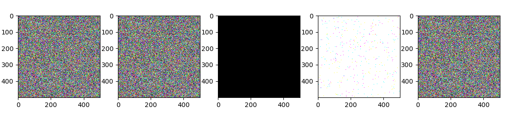
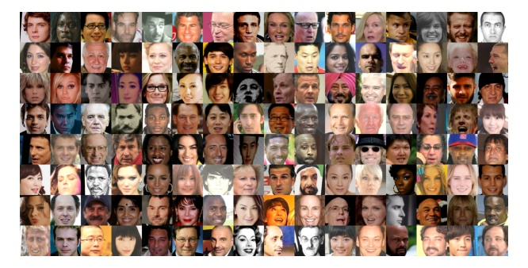
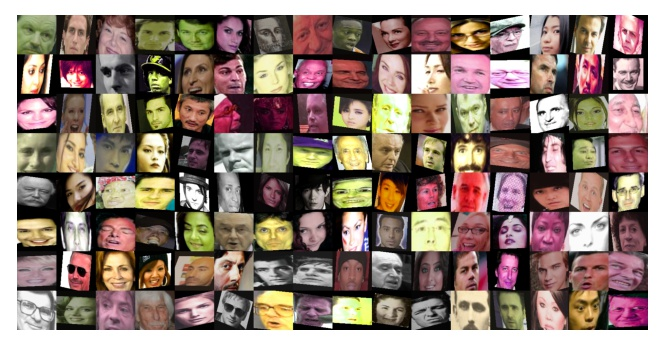
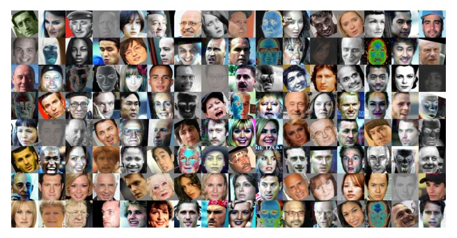
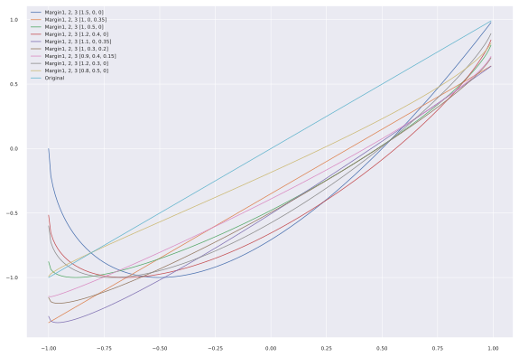
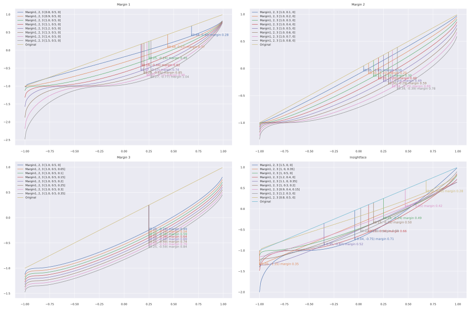
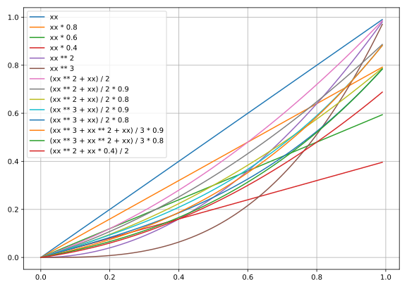
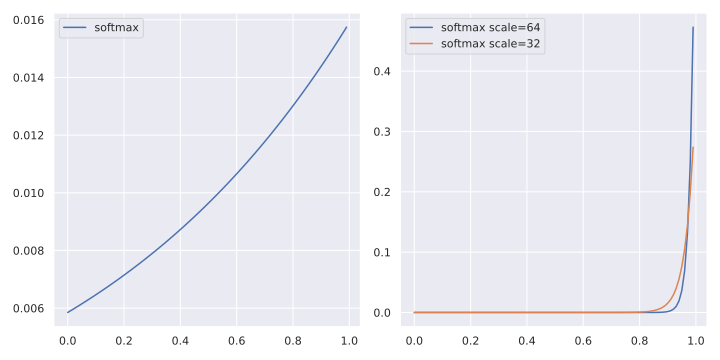

# ___2019 - 11 - 18 Keras Insightface___
***

# 目录
  <!-- TOC depthFrom:1 depthTo:6 withLinks:1 updateOnSave:1 orderedList:0 -->

  - [___2019 - 11 - 18 Keras Insightface___](#2019-11-18-keras-insightface)
  - [目录](#目录)
  - [Insightface MXNet 模型使用](#insightface-mxnet-模型使用)
  	- [Insightface](#insightface)
  	- [模型加载与特征提取](#模型加载与特征提取)
  	- [模型训练](#模型训练)
  	- [代码分析](#代码分析)
  	- [Fine tune](#fine-tune)
  - [Highest Accuracy](#highest-accuracy)
  	- [Deepinsight Accuracy](#deepinsight-accuracy)
  	- [Mobilenet 256 Embeddings](#mobilenet-256-embeddings)
  	- [Mobilenet 512 embeddings](#mobilenet-512-embeddings)
  	- [Vargface](#vargface)
  - [人脸识别损失函数](#人脸识别损失函数)
  - [ImageDataGenerator](#imagedatagenerator)
  - [训练模型拟合 embeddings](#训练模型拟合-embeddings)
  	- [First try](#first-try)
  	- [数据处理](#数据处理)
  	- [模型训练](#模型训练)
  	- [模型测试](#模型测试)
  - [Keras Insightface](#keras-insightface)
  	- [Project](#project)
  	- [Data](#data)
  	- [Arcface loss](#arcface-loss)
  	- [Softmax](#softmax)
  	- [Offline Triplet loss train SUB](#offline-triplet-loss-train-sub)
  	- [Basic training](#basic-training)
  	- [TF 通用函数](#tf-通用函数)
  - [nmslib dot svm dist calculation comparing](#nmslib-dot-svm-dist-calculation-comparing)
  - [Docker 封装](#docker-封装)

  <!-- /TOC -->
***

# Insightface MXNet 模型使用
## Insightface
  - [deepinsight/insightface](https://github.com/deepinsight/insightface)
  - **MXNet**
    ```sh
    # 安装 cuda-10-0 对应的 mxnet 版本
    pip install mxnet-cu100
    ```
## 模型加载与特征提取
  ```py
  # cd ~/workspace/face_recognition_collection/insightface/deploy
  import face_model
  import argparse
  import cv2
  import os

  home_path = os.environ.get("HOME")
  args = argparse.ArgumentParser().parse_args([])
  args.image_size = '112,112'
  args.model = os.path.join(home_path, 'workspace/models/insightface_mxnet_model/model-r100-ii/model,0')
  args.ga_model = os.path.join(home_path, "workspace/models/insightface_mxnet_model/gamodel-r50/model,0")
  args.gpu = 0
  args.det = 0
  args.flip = 0
  args.threshold = 1.05
  model = face_model.FaceModel(args)

  img = cv2.imread('./Tom_Hanks_54745.png')
  bbox, points = model.detector.detect_face(img, det_type = model.args.det)

  import matplotlib.pyplot as plt
  aa = bbox[0, :4].astype(np.int)
  bb = points[0].astype(np.int).reshape(2, 5).T

  # landmarks
  plt.imshow(img)
  plt.scatter(ii[:, 0], ii[:, 1])

  # cropped image
  plt.imshow(img[aa[1]:aa[3], aa[0]:aa[2], :])

  # By face_preprocess.preprocess
  cd ../src/common
  import face_preprocess
  cc = face_preprocess.preprocess(img, aa, bb, image_size='112,112')
  plt.imshow(cc)

  # export image feature, OUT OF MEMORY
  emb = model.get_feature(model.get_input(img))
  ```
## 模型训练
  - **Insightface Mobilenet**
    ```sh
    # My 2-stage pipeline:
    # Train softmax with lr=0.1 for 120K iterations.
    # LRSTEPS='240000,360000,440000'
    CUDA_VISIBLE_DEVICES='0,1,2,3' python -u train_softmax.py --data-dir $DATA_DIR --network "$NETWORK" --loss-type 0 --prefix "$PREFIX" --per-batch-size 128 --lr-steps "$LRSTEPS" --margin-s 32.0 --margin-m 0.1 --ckpt 2 --emb-size 128 --fc7-wd-mult 10.0 --wd 0.00004 --max-steps 140002

    # Switch to ArcFace loss to do normal training with '100K,140K,160K' iterations.
    # LRSTEPS='100000,140000,160000'
    CUDA_VISIBLE_DEVICES='0,1,2,3' python -u train_softmax.py --data-dir $DATA_DIR --network "$NETWORK" --loss-type 4 --prefix "$PREFIX" --per-batch-size 128 --lr-steps "$LRSTEPS" --margin-s 64.0 --margin-m 0.5 --ckpt 1 --emb-size 128 --fc7-wd-mult 10.0 --wd 0.00004 --pretrained '../models2/model-y1-test/model,70'

    # training dataset: ms1m
    # LFW: 99.50, CFP_FP: 88.94, AgeDB30: 95.91
    ```
  - **Resnet34 Casia**
    ```sh
    CUDA_VISIBLE_DEVICES='0' python -u train_softmax.py --data-dir /datasets/faces_casia --network "r50" --loss-type 0 --prefix "./model/mxnet_r50_casia" --per-batch-size 512 --lr-steps "20000,28000" --margin-s 32.0 --margin-m 0.1 --ckpt 2 --emb-size 512 --fc7-wd-mult 10.0 --wd 0.0005 --max-steps 12000

    CUDA_VISIBLE_DEVICES='0' python -u train_softmax.py --data-dir /datasets/faces_casia --network "r50" --loss-type 4 --prefix "./model/mxnet_r50_casia" --per-batch-size 512 --lr-steps "20000,28000" --margin-s 64.0 --margin-m 0.5 --ckpt 1 --emb-size 512 --fc7-wd-mult 10.0 --wd 0.0005 --pretrained './model/mxnet_r50_casia'

    # training dataset: ms1m
    # LFW: 99.50, CFP_FP: 88.94, AgeDB30: 95.91
    ```
  - **Mobilenet Casia**
    ```sh
    # 5822653 // 512 + 1 = 11373
    # 120000 / 11373 = 10.55
    CUDA_VISIBLE_DEVICES='0' python -u train_softmax.py --data-dir /datasets/faces_casia --network "m1" \
        --loss-type 0 --prefix "./model/mxnet_mobilenet_casia" --per-batch-size 512 --lr-steps "240000,360000,440000" \
        --margin-s 32.0 --margin-m 0.1 --ckpt 1 --emb-size 256 --fc7-wd-mult 10.0 --wd 0.00005 \
        --verbose 11373 --end-epoch 11 --ce-loss

    CUDA_VISIBLE_DEVICES='0' python -u train_softmax.py --data-dir /datasets/faces_casia --network "r50" --loss-type 4 --prefix "./model/mxnet_r50_casia" --per-batch-size 512 --lr-steps "20000,28000" --margin-s 64.0 --margin-m 0.5 --ckpt 1 --emb-size 512 --fc7-wd-mult 10.0 --wd 0.0005 --pretrained './model/mxnet_r50_casia'

    # training dataset: ms1m
    # LFW: 99.50, CFP_FP: 88.94, AgeDB30: 95.91
    ```
  - **Mobilenet emore**
    ```sh
    # 5822653 // 512 + 1 = 11373
    # 120000 / 11373 = 10.55
    CUDA_VISIBLE_DEVICES='0' python -u train_softmax.py --data-dir /datasets/faces_casia --network "m1" \
        --loss-type 0 --prefix "./model/mxnet_mobilenet_casia" --per-batch-size 512 --lr-steps "240000,360000,440000" \
        --margin-s 32.0 --margin-m 0.1 --ckpt 1 --emb-size 256 --fc7-wd-mult 10.0 --wd 0.00005 \
        --verbose 11373 --end-epoch 11 --ce-loss

    CUDA_VISIBLE_DEVICES='0' python -u train_softmax.py --data-dir /datasets/faces_casia --network "r50" --loss-type 4 --prefix "./model/mxnet_r50_casia" --per-batch-size 512 --lr-steps "20000,28000" --margin-s 64.0 --margin-m 0.5 --ckpt 1 --emb-size 512 --fc7-wd-mult 10.0 --wd 0.0005 --pretrained './model/mxnet_r50_casia'

    # training dataset: ms1m
    # LFW: 99.50, CFP_FP: 88.94, AgeDB30: 95.91
    ```
  **config.py 配置文件**
  ```py
  # config.py +78
  network.m1.emb_size = 512

  # config.py +117
  dataset.emore.dataset_path = '/datasets/faces_emore'
  dataset.emore.num_classes = 85742
  ...
  dataset.glint.dataset_path = '/datasets/faces_glint'
  dataset.glint.num_classes = 180855

  # config.py +147
  loss.arcface = edict()
  loss.arcface.loss_name = 'margin_softmax'
  loss.arcface.loss_s = 64.0
  loss.arcface.loss_m1 = 1.0
  loss.arcface.loss_m2 = 0.5
  loss.arcface.loss_m3 = 0.0

  # default settings
  default.lr = 0.1
  default.wd = 0.0005
  default.mom = 0.9
  ```
  **mobilenet 模型训练**
  ```sh
  export MXNET_ENABLE_GPU_P2P=0

  # arcface train
  CUDA_VISIBLE_DEVICES='0,1' python -u train_parall.py --network m1 --loss arcface --dataset emore --per-batch-size 96

  # triplet fine-tune
  CUDA_VISIBLE_DEVICES='0,1' python -u train.py --network m1 --loss arcface --dataset emore --per-batch-size 96 --pretrained ./models/m1-arcface-emore/model --lr 0.0001
  CUDA_VISIBLE_DEVICES='1' python -u train.py --network m1 --loss triplet --dataset emore --per-batch-size 150 --pretrained ./models/m1-triplet-emore_97083/model --lr 0.0001 --lr-steps '1000,100000,160000,220000,280000,340000'
  CUDA_VISIBLE_DEVICES='0' python -u train.py --network m1 --loss triplet --dataset glint --per-batch-size 150 --pretrained ./models/m1-triplet-emore_290445/model --pretrained-epoch 602 --lr 0.0001 --lr-steps '1000,100000,160000,220000,280000,340000'
  ```
  **Vargfacenet 模型训练**
  ```sh
  # Vargfacenet
  CUDA_VISIBLE_DEVICES='0,1' python3 -u train_parall.py --network vargfacenet --loss softmax --dataset emore --per-batch-size 96
  CUDA_VISIBLE_DEVICES='1' python3 -u train.py --network vargfacenet --loss arcface --dataset glint --per-batch-size 150 --pretrained ./models/vargfacenet-softmax-emore/model --pretrained-epoch 166 --lr 0.0001 --lr-steps '100000,160000,220000,280000,340000'
  ```
## 代码分析
  - **config**
    ```py
    # config.py
    config.bn_mom = 0.9
    config.net_output = 'E'
    config.ce_loss = True
    config.fc7_lr_mult = 1.0
    config.fc7_wd_mult = 1.0
    config.fc7_no_bias = False

    network.m1.net_name = 'fmobilenet'
    network.m1.emb_size = 256
    network.m1.net_output = 'GDC'
    network.m1.net_multiplier = 1.0

    network.vargfacenet.net_name = 'vargfacenet'
    network.vargfacenet.net_multiplier = 1.25
    network.vargfacenet.emb_size = 512
    network.vargfacenet.net_output='J'

    loss.arcface.loss_name = 'margin_softmax'
    loss.arcface.loss_s = 64.0
    loss.arcface.loss_m1 = 1.0
    loss.arcface.loss_m2 = 0.5
    loss.arcface.loss_m3 = 0.0

    loss.triplet.loss_name = 'triplet'
    loss.triplet.images_per_identity = 5
    loss.triplet.triplet_alpha = 0.3
    loss.triplet.triplet_bag_size = 7200
    loss.triplet.triplet_max_ap = 0.0
    loss.triplet.per_batch_size = 60
    loss.triplet.lr = 0.05
    ```
  - **symbol**
    ```py
    # symbol_utils.py
    def Linear(data, num_filter=1, kernel=(1, 1), stride=(1, 1), pad=(0, 0), num_group=1, name=None, suffix=''):
        conv = mx.sym.Convolution(data=data, num_filter=num_filter, kernel=kernel, num_group=num_group, stride=stride, pad=pad, no_bias=True, name='%s%s_conv2d' %(name, suffix))
        bn = mx.sym.BatchNorm(data=conv, name='%s%s_batchnorm' %(name, suffix), fix_gamma=False,momentum=bn_mom)    
        return bn

    def get_fc1(last_conv, num_classes, fc_type, input_channel=512):
      elif fc_type=='E':
        body = mx.sym.BatchNorm(data=body, fix_gamma=False, eps=2e-5, momentum=bn_mom, name='bn1')
        body = mx.symbol.Dropout(data=body, p=0.4)
        fc1 = mx.sym.FullyConnected(data=body, num_hidden=num_classes, name='pre_fc1')
        fc1 = mx.sym.BatchNorm(data=fc1, fix_gamma=True, eps=2e-5, momentum=bn_mom, name='fc1')
      elif fc_type=='FC':
        body = mx.sym.BatchNorm(data=body, fix_gamma=False, eps=2e-5, momentum=bn_mom, name='bn1')
        fc1 = mx.sym.FullyConnected(data=body, num_hidden=num_classes, name='pre_fc1')
        fc1 = mx.sym.BatchNorm(data=fc1, fix_gamma=True, eps=2e-5, momentum=bn_mom, name='fc1')
      elif fc_type=="GDC": #mobilefacenet_v1
        conv_6_dw = Linear(last_conv, num_filter=input_channel, num_group=input_channel, kernel=(7,7), pad=(0, 0), stride=(1, 1), name="conv_6dw7_7")  
        conv_6_f = mx.sym.FullyConnected(data=conv_6_dw, num_hidden=num_classes, name='pre_fc1')
        fc1 = mx.sym.BatchNorm(data=conv_6_f, fix_gamma=True, eps=2e-5, momentum=bn_mom, name='fc1')
      elif fc_type=='J':
        fc1 = mx.sym.FullyConnected(data=body, num_hidden=num_classes, name='pre_fc1')
        fc1 = mx.sym.BatchNorm(data=fc1, fix_gamma=True, eps=2e-5, momentum=bn_mom, name='fc1')
    ```
  - **fmobilenet**
    ```py
    # fmobilenet.py
    def get_symbol():
      conv_14 = Conv(conv_14_dw, num_filter=bf*32, kernel=(1, 1), pad=(0, 0), stride=(1, 1), name="conv_14") # 7/7
      body = conv_14
      fc1 = symbol_utils.get_fc1(body, num_classes, fc_type)
      return fc1
    ```
  - **train_parall**
    ```py
    # train_parall.py
    def get_symbol_embedding():
      embedding = eval(config.net_name).get_symbol()
      all_label = mx.symbol.Variable('softmax_label')
      #embedding = mx.symbol.BlockGrad(embedding)
      all_label = mx.symbol.BlockGrad(all_label)
      out_list = [embedding, all_label]
      out = mx.symbol.Group(out_list)
      return out

    def get_symbol_arcface(args):
      embedding = mx.symbol.Variable('data')
      all_label = mx.symbol.Variable('softmax_label')
      gt_label = all_label
      is_softmax = True
      #print('call get_sym_arcface with', args, config)
      _weight = mx.symbol.Variable("fc7_%d_weight"%args._ctxid, shape=(args.ctx_num_classes, config.emb_size),
          lr_mult=config.fc7_lr_mult, wd_mult=config.fc7_wd_mult)
      if config.loss_name=='softmax': #softmax
        fc7 = mx.sym.FullyConnected(data=embedding, weight = _weight, no_bias = True, num_hidden=args.ctx_num_classes, name='fc7_%d'%args._ctxid)
      elif config.loss_name=='margin_softmax':
        _weight = mx.symbol.L2Normalization(_weight, mode='instance')
        nembedding = mx.symbol.L2Normalization(embedding, mode='instance', name='fc1n_%d'%args._ctxid)
        fc7 = mx.sym.FullyConnected(data=nembedding, weight = _weight, no_bias = True, num_hidden=args.ctx_num_classes, name='fc7_%d'%args._ctxid)
        if config.loss_m1!=1.0 or config.loss_m2!=0.0 or config.loss_m3!=0.0:
          gt_one_hot = mx.sym.one_hot(gt_label, depth = args.ctx_num_classes, on_value = 1.0, off_value = 0.0)
          if config.loss_m1==1.0 and config.loss_m2==0.0:
            _one_hot = gt_one_hot*args.margin_b
            fc7 = fc7-_one_hot
          else:
            fc7_onehot = fc7 * gt_one_hot
            cos_t = fc7_onehot
            t = mx.sym.arccos(cos_t)
            if config.loss_m1!=1.0:
              t = t*config.loss_m1
            if config.loss_m2!=0.0:
              t = t+config.loss_m2
            margin_cos = mx.sym.cos(t)
            if config.loss_m3!=0.0:
              margin_cos = margin_cos - config.loss_m3
            margin_fc7 = margin_cos
            margin_fc7_onehot = margin_fc7 * gt_one_hot
            diff = margin_fc7_onehot - fc7_onehot
            fc7 = fc7+diff
        fc7 = fc7*config.loss_s

      out_list = []
      out_list.append(fc7)
      if config.loss_name=='softmax': #softmax
        out_list.append(gt_label)
      out = mx.symbol.Group(out_list)
      return out

    def train_net(args):
      esym = get_symbol_embedding()
      asym = get_symbol_arcface

      opt = optimizer.SGD(learning_rate=base_lr, momentum=base_mom, wd=base_wd, rescale_grad=_rescale)
    ```
## Fine tune
  - **fine-tuning** 在实践中，由于数据集不够大，很少会从头开始训练网络，常见的做法是使用预训练的网络来重新 **微调 fine-tuning**，或当做特征提取器
    - 卷积网络当做 **特征提取器**，使用在 ImageNet 上预训练的网络，去掉最后的全连接层，剩余部分当做特征提取器，得到特征后可以使用线性分类器 Liner SVM / Softmax 等来分类图像
    - **Fine-tuning 卷积网络** 替换掉网络的输入层，使用新的数据继续训练，可以选择 fine-tune 全部层或部分层，通常前面的层提取的是图像的 **通用特征 generic features**，如边缘 / 色彩特征，后面的层提取的是与特定类别有关的特征，因此常常只需要 fine-tuning 后面的层
    - 一般如果新数据集比较小且和原数据集相似，可以使用预训练网络当做特征提取器，用提取的特征训练线性分类器，如果新数据集足够大，可以 fine-tune 整个网络
    - 与重新训练相比，fine-tune 要使用 **更小的学习率**，因为训练好的网络模型权重已经平滑，不希望太快扭曲 distort 它们
***

# Highest Accuracy
## Deepinsight Accuracy

  | Method        | LFW(%) | CFP-FP(%) | AgeDB-30(%) | MegaFace(%)          |
  | ------------- | ------ | --------- | ----------- | -------------------- |
  | LResNet100E   | 99.77  | 98.27     | 98.28       | 98.47                |
  | LResNet50E    | 99.80  | 92.74     | 97.76       | 97.64                |
  | LResNet34E    | 99.65  | 92.12     | 97.70       | 96.70                |
  | MobileFaceNet | 99.50  | 88.94     | 95.91       | -----                |
  | VarGfaceNet   | 99.783 | 98.400    | 98.067      | 88.334 **DeepGlint** |
## Mobilenet 256 Embeddings

  | Step      | fc7_acc  | lfw     | cfp_fp  | agedb_30 | SUM     |
  | --------- | -------- | ------- | ------- | -------- | ------- |
  | **Loss**  | arcface  | **DS**  | glint   |          |         |
  | 1660K     | 0.25     | 0.99567 | 0.89529 | 0.96683  | 2.85779 |
  | **Loss**  | triplet  | **DS**  | emore   |          |         |
  | 840       | 0.062472 | 0.99633 | 0.93429 | 0.97083  | 2.90145 |
  | **Loss**  | triplet  | **DS**  | glint   |          |         |
  | 960[40]   | 0.064614 | 0.99617 | 0.93686 | 0.97017  | 2.90319 |
  | 2575[107] | 0.064761 | 0.99667 | 0.93829 | 0.96950  | 2.90445 |
## Mobilenet 512 embeddings
  | Step      | fc7_acc  | lfw     | cfp_fp  | agedb_30 | SUM     |
  | --------- | -------- | ------- | ------- | -------- | ------- |
  | **Loss**  | arcface  | **DS**  | emore   |          |         |
  | 1204K     | 0.015625 | 0.99533 | 0.93671 | 0.96367  | 2.89571 |
  | **Loss**  | triplet  | **DS**  | glint   |          |         |
  | 25[1]     | 0.146767 | 0.99567 | 0.93971 | 0.96500  | 2.90038 |
  | 532[20]   | 0.149680 | 0.99650 | 0.94614 | 0.96600  | 2.90864 |
  | 613[23]   | 0.146067 | 0.99683 | 0.94957 | 0.96300  | 2.90940 |
  | 668[25]   | 0.147614 | 0.99633 | 0.94757 | 0.96617  | 2.91007 |
  | 914[34]   | 0.148697 | 0.99650 | 0.94886 | 0.96517  | 2.91052 |
  | 996[37]   | 0.138909 | 0.99667 | 0.95014 | 0.96467  | 2.91148 |
  | 2809[102] | 0.146283 | 0.99600 | 0.95071 | 0.96783  | 2.91455 |
  | **Loss**  | triplet  | **DS**  | emore   |          |         |
  | 1697[65]  | 0.155924 | 0.99667 | 0.95129 | 0.96817  | 2.91612 |
## Vargface

  | Step     | fc7_acc    | lfw     | cfp_fp  | agedb_30 | SUM     |
  | -------- | ---------- | ------- | ------- | -------- | ------- |
  | **Loss** | softmax    | **DS**  | emore   |          |         |
  | 9.68K    | 0.265625   | 0.98383 | 0.82914 | 0.85117  |         |
  | 25.66K   | 0.28645834 | 0.98333 | 0.83729 | 0.85717  |         |
  | 62K      | 0.25520834 | 0.98067 | 0.83429 | 0.86517  |         |
  | 72K      | 0.3125     | 0.97683 | 0.81329 | 0.87217  |         |
  | 270K     | 0.7395833  | 0.99517 | 0.95086 | 0.93267  |         |
  | 332K     | 0.703125   | 0.99583 | 0.94857 | 0.93350  |         |
  | **Loss** | triplet    | **DS**  | glint   |          |         |
  | 175[10]  | 0.070560   | 0.99567 | 0.94314 | 0.95033  | 2.88914 |
  | 361[20]  | 0.056305   | 0.99683 | 0.94414 | 0.94867  | 2.88964 |
  | 648[35]  | 0.064737   | 0.99567 | 0.94700 | 0.95250  | 2.89517 |
  | **Loss** | triplet    | **DS**  | emore   |          |         |
***

# 人脸识别损失函数
  - 人脸识别模型训练的损失函数主要分为 **基于分类 softmax 的损失函数** 和 **基于 triplet loss 的损失函数** 两大类
    - **基于分类 softmax 的损失函数** 因为是否对 embedding 或分类权重 W 做归一化以及是否增加额外的间隔 margin 等产生了多种变体
    - **基于 triplet loss 的损失函数** 则分为基于欧氏距离和基于角度距离两种
  - **基于分类 softmax 的损失函数**
    - **基本的 softmax 分类** 通过将 embedding 输入一层全连接层以及 softmax 函数得到分类概率，由于 softmax 的分母对 embedding 在各个类别上的结果进行了求和，因此最小化这一损失一定程度上能够使类间距离变大，类内距离变小
      - N 表示样本数量
      - n 表示类别总数
      - yi 表示样本 xi 的真实类别
    - **Sphereface Loss** 在 softmax 的基础上进一步引入了显式的角度间隔 angular margin，从而训练时能够进一步缩小类内距离，扩大类间距离
    - **CosineFace Loss** 进一步对人脸表示 embedding 进行了归一化，从而使分类结果仅取决于夹角余弦，并进一步引入了余弦间隔 m，用于扩大类间距离，缩小类内距离。由于余弦的取值范围较小，为了使类别间差别更显著，进一步引入一个超参数 s 用于放大余弦值
    - **Arcface Loss** 为了使人脸表示 embedding 的学习更符合超球体流形假设，Arcface 进一步将 Cosineface 中的余弦间隔修改为角度间隔，得到如下损失

    | 损失函数   | 分类边界                      |
    | ---------- | ----------------------------- |
    | Softmax    | (W1 - W2) * x + b1 - b2 = 0   |
    | SphereFace | ∥x∥ * (cosmθ1 - cosθ2) = 0    |
    | CosineFace | s * (cosθ1 - m - cosθ2) = 0   |
    | ArcFace    | s * (cos(θ1 + m) - cosθ2) = 0 |

  - **基于 triplet loss 的损失函数** 与通过 softmax 优化使类内距离缩小，类间距离扩大不同，Triplet Loss 直接对样本间的距离进行优化，使不同类样本间的距离比同类样本间的距离大出一个间隔，因此计算 Triplet Loss 每次需要采样三个样本 anchor / positive / negative，其中，anchor 与 positive 样本属于同一类别，与 negative 样本属于不同类别

    - x代表人脸表示 embedding
    - 上标 a,p,n 分别表示 anchor，positive 和 negative
    - dist(x,y) 表示 x,y 的距离函数
    - m 则表示不同类样本间距离比同类样本间距离大出的间隔，这里的距离函数和间隔既可以是欧氏距离也可以是角度距离等形式
  - **softmax 损失与 Triplet Loss 结合**
    - Triplet Loss 直接对样本表示间的距离进行优化，在训练数据足够多，模型表示能力足够强的情况下，能够学得很好的结果
    - 其缺点是，一方面训练时模型收敛速度较慢，另一方面在构造triplet时需要选择合适的正样本对和负样本对，因此需要设计 triplet 的构造选择机制，这一过程通常比较复杂
    - 较好的训练方式是先用分类损失训练模型，然后再用 Triplet Loss 对模型进行 finetune 以进一步提升模型性能
***

# ImageDataGenerator
  - **基本使用**
    ```py
    import numpy as np
    import matplotlib.pyplot as plt
    from keras.preprocessing.image import ImageDataGenerator

    img = np.random.rand(1, 500, 500, 3)

    fig, ax = plt.subplots(1, 5, figsize=(20, 10))
    ax = ax.ravel()
    ax[0].imshow(img[0])
    ax[1].imshow(next(ImageDataGenerator().flow(img))[0])
    ax[2].imshow(next(ImageDataGenerator(brightness_range=(0., 0.)).flow(img))[0])
    ax[3].imshow(next(ImageDataGenerator(brightness_range=(1., 1.)).flow(img))[0])
    ax[4].imshow(next(ImageDataGenerator(brightness_range=(1., 1.)).flow(img))[0] / 255)
    ```
    
  - **flow_from_directory**
    ```py
    seed = 1
    from tensorflow.python.keras.preprocessing.image import ImageDataGenerator

    data_gen = ImageDataGenerator(rescale=1./255, validation_split=0.1)


    img_gen = data_gen.flow_from_directory('segmentation_dataset/tumorImage/', target_size=(512, 512), batch_size=4,
                                           class_mode=None, seed=seed, color_mode='grayscale')
    mask_gen = data_gen.flow_from_directory('segmentation_dataset/maskImage/', target_size=(512, 512), batch_size=4,
                                           class_mode=None, seed=seed, color_mode='grayscale')

    train_gen = zip(img_gen, mask_gen)
    ```
  - **模型训练 fit_generator**
    ```py
    from keras.preprocessing.image import ImageDataGenerator
    # construct the training image generator for data augmentation
    aug = ImageDataGenerator(rotation_range=20, zoom_range=0.15,
        width_shift_range=0.2, height_shift_range=0.2, shear_range=0.15,
        horizontal_flip=True, fill_mode="nearest")

    model.fit_generator(aug.flow(trainX, trainY, batch_size=BS),
      	validation_data=(testX, testY), steps_per_epoch=len(trainX) // BS,
      	epochs=EPOCHS)
    ```
  - **ImageDataGenerator 生成图像数据与对应 mask**
    - TF 1.14 与 TF 2.0 中的 `ImageDataGenerator` 实现不能将 `zip` 对象识别为 `generators` / `sequences`，需要转化为 **内联的生成器 inline generator**
      ```py
      train_gen = (pair for pair in zip(img_gen, mask_gen))
      ```
      ```py
      data_gen_args = dict(rotation_range=0.2,
                          width_shift_range=0.05,
                          height_shift_range=0.05,
                          shear_range=0.05,
                          zoom_range=0.05,
                          horizontal_flip=True,
                          fill_mode='nearest',
                          rescale=1./255)

      image_generator = tf.keras.preprocessing.image.ImageDataGenerator(data_gen_args)
      mask_generator = tf.keras.preprocessing.image.ImageDataGenerator(data_gen_args)

      imageGenerator = image_generator.flow_from_directory('membrane/train', color_mode="grayscale", classes=['image'], class_mode=None, batch_size=5)
      maskGenerator = mask_generator.flow_from_directory('membrane/train', color_mode="grayscale", classes=['label'], class_mode=None, batch_size=5)

      train_generator = (pair for pair in zip(imageGenerator, maskGenerator))


      history = model.fit_generator(train_generator, steps_per_epoch=100, epochs=3)
      ```
    - **ImageDataGenerator 转化为 `tf.data.Dataset`** 提升读取效率
      ```py
      def my_input_fn(total_items, epochs):
          dataset = tf.data.Dataset.from_generator(lambda: my_generator(total_items),
                                                   output_types=(tf.float64, tf.int64))

          dataset = dataset.repeat(epochs)
          dataset = dataset.batch(32)
          return dataset

      if __name__ == "__main__":
          tf.enable_eager_execution()

          model = tf.keras.Sequential([tf.keras.layers.Flatten(input_shape=(4, 20, 1)),
                                       tf.keras.layers.Dense(64, activation=tf.nn.relu),
                                       tf.keras.layers.Dense(12, activation=tf.nn.softmax)])

          model.compile(optimizer='adam',
                        loss='categorical_crossentropy',
                        metrics=['accuracy'])

          total_items = 100
          batch_size = 32
          epochs = 10
          num_batches = int(total_items/batch_size)
          dataset = my_input_fn(total_items, epochs)
          model.fit_generator(dataset, epochs=epochs, steps_per_epoch=num_batches)
      ```
***

# 训练模型拟合 embeddings
## First try
  ```py
  import glob2
  from skimage.io import imread

  loaded = tf.saved_model.load('model_resnet')
  interf = loaded.signatures['serving_default']
  teacher_model_interf = lambda images: interf(tf.convert_to_tensor(images, dtype=tf.float32))['output'].numpy()

  def data_gen(path, teacher_model_interf, batch_size=64, base_path_replace=[]):
      image_path_files = glob2.glob(os.path.join(path, '*/*'))
      total = len(image_path_files)
      while True:
          image_path_files = np.random.permutation(image_path_files)
          print("This should be the epoch start, total files = %d" % (image_path_files.shape[0]))
          for id in range(0, total, batch_size):
              image_batch_data = image_path_files[id: id + batch_size]
              if len(base_path_replace) != 0:
                  image_batch_data = [ii.replace(base_path_replace[0], base_path_replace[1]) for ii in image_batch_data]
              images = (np.array([imread(ii) for ii in image_batch_data]) / 255).astype('float32')
              embs = teacher_model_interf(images)
              yield (images, embs)
              print("Processed Id: %d - %d" % (id, id + batch_size))

  gpus = tf.config.experimental.list_physical_devices('GPU')
  tf.config.experimental.set_visible_devices(gpus[0], 'GPU')
  tf.config.experimental.set_memory_growth(gpus[0], True)

  BATCH_SIZE = 100
  DATA_PATH = './'
  # train_gen = data_gen(DATA_PATH, batch_size=BATCH_SIZE, base_path_replace=['/media/uftp/images', '/home/leondgarse/workspace/images'])
  train_gen = data_gen(DATA_PATH, teacher_model_interf, batch_size=BATCH_SIZE)
  steps_per_epoch = int(np.ceil(5822653 / BATCH_SIZE))
  ixx, iyy = next(train_gen)
  print(ixx.shape, iyy.shape)
  # (100, 112, 112, 3) (100, 512)

  xx = tf.keras.applications.MobileNetV2(input_shape=[112, 112, 3], include_top=False, weights=None)
  # xx = tf.keras.applications.NASNetMobile(input_shape=[112, 112, 3], include_top=False, weights=None)
  xx.trainable = True
  model = tf.keras.models.Sequential([
      xx,
      tf.keras.layers.GlobalAveragePooling2D(),
      tf.keras.layers.BatchNormalization(),
      tf.keras.layers.Dropout(0.1),
      tf.keras.layers.Dense(512)
  ])
  model.compile(optimizer='adam', loss='mse', metrics=["mae",'accuracy'])
  model.summary()

  hist = model.fit_generator(train_gen, epochs=50, steps_per_epoch=steps_per_epoch, verbose=1)
  ```
## 数据处理
  - 生成图像数据集对应的 embedding 数据
  ```py
  from skimage.io import imread
  gpus = tf.config.experimental.list_physical_devices('GPU')
  tf.config.experimental.set_visible_devices(gpus[0], 'GPU')
  tf.config.experimental.set_memory_growth(gpus[0], True)

  ''' 图片路径列表 '''
  pp = '/datasets/faces_emore_112x112_folders/'
  with open('faces_emore_img.foo', 'w') as ff:
      for dd in os.listdir(pp):
          dd = os.path.join(pp, dd)
          for ii in os.listdir(dd):
              ff.write(os.path.join(dd, ii) + '\n')
  # 5822653

  ''' 分割图片路径列表，每 100000 张图片作为一个文件 '''
  with open('faces_emore_img.foo', 'r') as ff:
      tt = [ii.strip() for ii in ff.readlines()]

  for ii in range(59):
      print(ii * 100000, (ii+1) * 100000)
      with open('./{}_img.foo'.format(ii), 'w') as ff:
          ff.write('\n'.join(tt[ii * 100000: (ii+1) * 100000]))

  ''' 加载目标模型 '''
  loaded = tf.saved_model.load('./model_resnet')
  _interp = loaded.signatures["serving_default"]
  interp = lambda ii: _interp(tf.convert_to_tensor(ii, dtype="float32"))["output"].numpy()

  ''' 转化特征向量 embedding 值 '''
  import glob2
  for fn in glob2.glob('./*_img.foo'):
      with open(fn, 'r') as ff:
          tt = [ii.strip() for ii in ff.readlines()]
      target_file = fn.replace('_img.foo', '_emb')
      print(fn, len(tt), target_file)

      ees = []
      for id, ii in enumerate(tt):
          # ii = ii.replace('/media/uftp', '/home/leondgarse/workspace')
          imm = imread(ii)
          ees.append(interp([imm])[0])
          if id % 100 == 0:
              print("Processing %d..." % id)
      ees = np.array(ees)
      print(ees.shape)
      np.save(target_file, ees)

  ''' 合并处理完的数据 '''
  import glob2

  path = '/home/tdtest/workspace/insightface-master/faces_emore_img/emb_done'
  image_path_files = glob2.glob(os.path.join(path, '*_img.foo'))
  emb_files = [ii.replace('_img.foo', '_emb.npy') for ii in image_path_files]
  image_names = []
  image_embs = []
  for ii, ee in zip(image_path_files, emb_files):
      with open(ii, 'r') as ff:
          image_names.extend([ii.strip() for ii in ff.readlines()])
      image_embs.append(np.load(ee))
  image_embs = np.concatenate(image_embs)
  image_classes = np.array([int(os.path.basename(os.path.dirname(ii))) for ii in image_names])
  image_names=np.array(image_names)
  classes = np.max(image_classes) + 1

  np.savez('faces_emore_class_emb', image_names=image_names, image_classes=image_classes, image_embs=image_embs)
  print(image_names.shape, image_classes.shape, image_embs.shape, classes)
  # (5822653,) (5822653,) (5822653, 512) 85742
  ```
## 模型训练
  ```py
  from keras.preprocessing.image import ImageDataGenerator
  from tensorflow.keras import layers
  from tensorflow.keras.callbacks import ModelCheckpoint, EarlyStopping, ReduceLROnPlateau

  aa = np.load('faces_emore_class_emb.npz')
  image_names, image_classes, image_embs = aa['image_names'], aa['image_classes'], aa['image_embs']
  classes = np.max(image_classes) + 1
  print(image_names.shape, image_classes.shape, image_embs.shape, classes)
  # (5822653,) (5822653,) (5822653, 512) 85742

  data_df = pd.DataFrame({"image_names": image_names, "image_classes": image_classes, "image_embs": list(image_embs)})
  image_gen = ImageDataGenerator(rescale=1./255, validation_split=0.1)
  train_data_gen = image_gen.flow_from_dataframe(data_df, directory=None, x_col='image_names', y_col=["image_classes", "image_embs"], class_mode='multi_output', target_size=(112, 112), batch_size=128, seed=1, subset='training', validate_filenames=False)
  # Found 5240388 non-validated image filenames.
  val_data_gen = image_gen.flow_from_dataframe(data_df, directory=None, x_col='image_names', y_col=["image_classes", "image_embs"], class_mode='multi_output', target_size=(112, 112), batch_size=128, seed=1, subset='validation', validate_filenames=False)
  # Found 582265 non-validated image filenames.

  xx = tf.keras.applications.MobileNetV2(include_top=False, weights=None)
  xx.trainable = True
  inputs = layers.Input(shape=(112, 112, 3))
  nn = xx(inputs)
  nn = layers.GlobalAveragePooling2D()(nn)
  nn = layers.BatchNormalization()(nn)
  nn = layers.Dropout(0.1)(nn)
  embedding = layers.Dense(512, name="embeddings")(nn)
  logits = layers.Dense(classes, activation='softmax', name="logits")(embedding)

  model = keras.models.Model(inputs, [logits, embedding])
  model.compile(optimizer='adam', loss=[keras.losses.sparse_categorical_crossentropy, keras.losses.mse])
  # model.compile(optimizer='adam', loss=[keras.losses.sparse_categorical_crossentropy, keras.losses.mse], metrics=['accuracy', 'mae'])
  model.summary()

  reduce_lr = ReduceLROnPlateau('val_loss', factor=0.1, patience=5, verbose=1)
  model_checkpoint = ModelCheckpoint("./keras_checkpoints", 'val_loss', verbose=1, save_best_only=True)
  callbacks = [model_checkpoint, reduce_lr]
  hist = model.fit_generator(train_data_gen, validation_data=val_data_gen, epochs=200, verbose=1, callbacks=callbacks)
  ```
## 模型测试
  ```py
  from skimage.io import imread
  from sklearn.preprocessing import normalize

  def model_test(image_paths, model_path, scale=1.0, output_key="output"):
      loaded = tf.saved_model.load(model_path)
      interf = loaded.signatures['serving_default']
      images = [imread(ipp) * scale for ipp in image_paths]

      preds = interf(tf.convert_to_tensor(images, dtype='float32'))[output_key].numpy()
      return np.dot(normalize(preds), normalize(preds).T), preds

  images = ['/home/leondgarse/workspace/samba/1770064353.jpg', '/home/leondgarse/workspace/samba/541812715.jpg']
  model_test(images, 'keras_checkpoints/', output_key='embeddings')
  ```
***

# Keras Insightface
## Project
  - [Github Keras_insightface](https://github.com/leondgarse/Keras_insightface)
## Data
  - Download from [Insightface Dataset Zoo](https://github.com/deepinsight/insightface/wiki/Dataset-Zoo)
  - **Data preprocess**
    ```py
    CUDA_VISIBLE_DEVICES='-1' ./prepare_data.py -D /datasets/faces_emore -T lfw.bin cfp_fp.bin agedb_30.bin
    ```
  - **Loading data by Dataset**
    ```py
    import data
    train_ds, steps_per_epoch, classes = data.prepare_dataset('/datasets/faces_emore_112x112_folders/')
    # 5822653 5822653 85742

    image_batch, label_batch = next(iter(train_ds))
    print(image_batch.shape, label_batch.shape, np.min(image_batch), np.max(image_batch))
    # (128, 112, 112, 3) (128, 85742) -1.0 1.0

    cc = (image_batch + 1) / 2
    plt.imshow(np.vstack([np.hstack(cc[ii * 16:(ii+1)*16]) for ii in range(int(np.ceil(cc.shape[0] / 16)))]))
    ```
    
  - **ImageDataGenerator 加载数据集** 可以应用 **数据增强 / autoaugment**，分割 **训练/验证数据集**，但速度慢
    ```py
    import data_gen

    train_ds, steps_per_epoch, classes = data_gen.prepare_dataset('/datasets/faces_emore_112x112_folders/', random_status=3)
    image_batch, label_batch = next(iter(train_ds))
    print(image_batch.shape, label_batch.shape, np.min(image_batch), np.max(image_batch))
    # (128, 112, 112, 3) (128, 85742) -1.0 1.0
    ```
    
    ```py
    # AutoAugment
    train_ds, steps_per_epoch, classes = data_gen.prepare_dataset('/datasets/faces_emore_112x112_folders/', random_status=-1)
    ```
    
## Arcface loss
  - Results by using `MS1M-IBUG(MS1M-V1)`

    | Method           | m1   | m2   | m3   | LFW   | CFP-FP | AgeDB-30 |
    | ---------------- | ---- | ---- | ---- | ----- | ------ | -------- |
    | W&F Norm Softmax | 1    | 0    | 0    | 99.28 | 88.50  | 95.13    |
    | SphereFace       | 1.5  | 0    | 0    | 99.76 | 94.17  | 97.30    |
    | CosineFace       | 1    | 0    | 0.35 | 99.80 | 94.4   | 97.91    |
    | ArcFace          | 1    | 0.5  | 0    | 99.83 | 94.04  | 98.08    |
    | Combined Margin  | 1.2  | 0.4  | 0    | 99.80 | 94.08  | 98.05    |
    | Combined Margin  | 1.1  | 0    | 0.35 | 99.81 | 94.50  | 98.08    |
    | Combined Margin  | 1    | 0.3  | 0.2  | 99.83 | 94.51  | 98.13    |
    | Combined Margin  | 0.9  | 0.4  | 0.15 | 99.83 | 94.20  | 98.16    |
  - **Mxnet Insigntface Arcface loss**
    ```py
    def plot_arc_trans(margin_list, new_fig=True):
        xx = np.arange(-1, 1, 0.01)
        y_true = tf.ones_like(xx)
        if new_fig:
            fig = plt.figure()
        for margin1, margin2, margin3 in margin_list:
            y_pred_vals = xx[tf.cast(y_true, dtype=tf.bool)]
            theta = tf.cos(tf.acos(y_pred_vals) * margin1 + margin2) - margin3
            theta_one_hot = (theta - y_pred_vals) * y_true
            arcface_logits = (theta_one_hot + xx).numpy()
            plt.plot(xx, arcface_logits, label="Margin1, 2, 3 [{}, {}, {}]".format(margin1, margin2, margin3))
        plt.plot(xx, xx, label="Original")
        plt.legend()
        plt.grid()
        plt.tight_layout()

    insightface_results = {
        "W&F Norm Softmax": [1, 0, 0],
        "SphereFace": [1.5, 0, 0],
        "CosineFace": [1, 0, 0.35],
        "ArcFace": [1, 0.5, 0],
        "Combined Margin_1": [1.2, 0.4, 0],
        "Combined Margin_2": [1.1, 0, 0.35],
        "Combined Margin_3": [1, 0.3, 0.2],
        "Combined Margin_4": [0.9, 0.4, 0.15],
        "Combined Margin_5": [1.2, 0.3, 0],
        "Combined Margin_6": [0.8, 0.5, 0],
    }
    plot_arc_trans(list(insightface_results.values()))
    ```
    
  - **Modified Arcface loss** 限制转化后的值不能大于原值
    ```py
    def plot_arc_trans(margin_list, new_fig=True):
        xx = np.arange(-1, 1, 0.01)
        y_true = tf.ones_like(xx)
        if new_fig:
            fig = plt.figure()
        for margin1, margin2, margin3 in margin_list:
            threshold = np.cos((np.pi - margin2) / margin1)
            y_pred_vals = xx[tf.cast(y_true, dtype=tf.bool)]
            theta = tf.cos(tf.acos(y_pred_vals) * margin1 + margin2) - margin3
            # theta_valid = tf.where(y_pred_vals > threshold, theta, y_pred_vals - threshold - 1)
            theta_valid = tf.where(y_pred_vals > threshold, theta, (-1 - margin3) * 2 - theta)
            theta_one_hot = (theta_valid - y_pred_vals) * y_true
            arcface_logits = (theta_one_hot + xx).numpy()
            plt.plot(xx, arcface_logits, label="Margin1, 2, 3 [{}, {}, {}]".format(margin1, margin2, margin3))
        plt.plot(xx, xx, label="Original")
        plt.legend()
        plt.grid()
        plt.tight_layout()

    fig = plt.figure()
    ax = plt.subplot(2, 2, 1)
    plot_arc_trans([[ii, 0.5, 0] for ii in [0.8, 0.9, 1.0, 1.1, 1.2, 1.3, 1.4, 1.5]], new_fig=False)
    plt.title('Margin 1')
    ax = plt.subplot(2, 2, 2)
    plot_arc_trans([[1.0, ii, 0] for ii in [0, 0.1, 0.2, 0.3, 0.4, 0.5, 0.6]], new_fig=False)
    plt.title('Margin 2')
    ax = plt.subplot(2, 2, 3)
    plot_arc_trans([[1.0, 0.5, ii] for ii in [0, 0.05, 0.1, 0.15, 0.2, 0.25, 0.3, 0.35]], new_fig=False)
    plt.title('Margin 3')
    ax = plt.subplot(2, 2, 4)
    plot_arc_trans(list(insightface_results.values()), new_fig=False)
    plt.title('Insightface')
    fig.tight_layout()
    ```
    
## Softmax
  - **Margin Softmax loss** 直接调整 softmax 值
    ```py
    xx = np.arange(0, 1, 0.01)
    plt.plot(xx, xx, label="xx")
    plt.plot(xx, xx * 0.8, label="xx * 0.8")
    plt.plot(xx, xx * 0.6, label="xx * 0.6")
    plt.plot(xx, xx * 0.4, label="xx * 0.4")
    plt.plot(xx, xx ** 2, label="xx ** 2")
    plt.plot(xx, xx ** 3, label="xx ** 3")
    plt.plot(xx, (xx ** 2 + xx) / 2, label="(xx ** 2 + xx) / 2")
    plt.plot(xx, (xx ** 2 + xx) / 2 * 0.9, label="(xx ** 2 + xx) / 2 * 0.9")
    plt.plot(xx, (xx ** 2 + xx) / 2 * 0.8, label="(xx ** 2 + xx) / 2 * 0.8")
    plt.plot(xx, (xx ** 3 + xx) / 2 * 0.9, label="(xx ** 3 + xx) / 2 * 0.9")
    plt.plot(xx, (xx ** 3 + xx) / 2 * 0.8, label="(xx ** 3 + xx) / 2 * 0.8")
    plt.plot(xx, (xx ** 3 + xx ** 2 + xx) / 3 * 0.9, label="(xx ** 3 + xx ** 2 + xx) / 3 * 0.9")
    plt.plot(xx, (xx ** 3 + xx ** 2 + xx) / 3 * 0.8, label="(xx ** 3 + xx ** 2 + xx) / 3 * 0.8")
    plt.plot(xx, (xx ** 2 + xx * 0.4) / 2, label="(xx ** 2 + xx * 0.4) / 2")
    plt.legend()
    plt.grid()
    plt.tight_layout()
    ```
    
  - **scale softmax loss**
    ```py
    fig, axes = plt.subplots(1, 2, figsize=(10, 5))
    axes[0].plot(xx, tf.nn.softmax(xx), label="softmax")
    axes[1].plot(xx, tf.nn.softmax(xx * 64), label="softmax scale=64")
    axes[1].plot(xx, tf.nn.softmax(xx * 32), label="softmax scale=32")
    axes[0].legend()
    axes[1].legend()
    fig.tight_layout()
    ```
    
## Offline Triplet loss train SUB
  ```py
  import pickle
  with open('faces_emore_img_class_shuffle.pkl', 'rb') as ff:
      aa = pickle.load(ff)
  image_names, image_classes = aa['image_names'], aa['image_classes']
  classes = np.max(image_classes) + 1
  print(len(image_names), len(image_classes), classes)
  # 5822653 5822653 85742

  from sklearn.preprocessing import normalize
  from tqdm import tqdm
  import pandas as pd

  class Triplet_datasets:
      def __init__(self, image_names, image_classes, batch_size_t=64, alpha=0.2, image_per_class=4, max_class=10000):
          self.AUTOTUNE = tf.data.experimental.AUTOTUNE
          image_dataframe = pd.DataFrame({'image_names': image_names, "image_classes" : image_classes})
          self.image_dataframe = image_dataframe.groupby("image_classes").apply(lambda xx: xx.image_names.values)
          self.image_per_class = image_per_class
          self.max_class = max_class
          self.alpha = alpha
          self.batch_size_trip = batch_size_t
          self.batch_size_emb = batch_size_t * 3
          self.sub_total = np.ceil(max_class * image_per_class / self.batch_size_emb)

      def update_triplet_datasets(self):
          list_ds = self.prepare_sub_list_dataset()
          anchors, poses, negs = self.mine_triplet_data_pairs(list_ds)
          return self.gen_triplet_train_dataset(anchors, poses, negs)

      def process_path(self, img_name, img_shape=(112, 112)):
          parts = tf.strings.split(img_name, os.path.sep)[-2]
          label = tf.cast(tf.strings.to_number(parts), tf.int32)
          img = tf.io.read_file(img_name)
          img = tf.image.decode_jpeg(img, channels=3)
          img = tf.image.convert_image_dtype(img, tf.float32)
          img = tf.image.resize(img, img_shape)
          img = tf.image.random_flip_left_right(img)
          return img, label, img_name

      def prepare_sub_list_dataset(self):
          cc = np.random.choice(self.image_dataframe.shape[0], self.max_class)
          tt = self.image_dataframe[cc].map(lambda xx: np.random.permutation(xx)[:self.image_per_class])
          ss = np.concatenate(tt.values)
          list_ds = tf.data.Dataset.from_tensor_slices(ss)
          list_ds = list_ds.map(self.process_path, num_parallel_calls=self.AUTOTUNE)
          list_ds = list_ds.batch(self.batch_size_emb)
          list_ds = list_ds.prefetch(buffer_size=self.AUTOTUNE)
          return list_ds

      def batch_triplet_image_process(self, anchors, poses, negs):
          anchor_labels = tf.zeros_like(anchors, dtype=tf.float32)
          labels = tf.concat([anchor_labels, anchor_labels + 1, anchor_labels + 2], 0)
          image_names = tf.concat([anchors, poses, negs], 0)
          images = tf.map_fn(lambda xx: self.process_path(xx)[0], image_names, dtype=tf.float32)
          return images, labels

      def mine_triplet_data_pairs(self, list_ds):
          embs, labels, img_names = [], [], []
          for imgs, label, img_name in tqdm(list_ds, "Embedding", total=self.sub_total):
              emb = basic_model.predict(imgs)
              embs.extend(emb)
              labels.extend(label.numpy())
              img_names.extend(img_name.numpy())
          embs = np.array(embs)
          not_nan_choice = np.isnan(embs).sum(1) == 0
          embs = embs[not_nan_choice]
          # embs = normalize(embs)
          labels = np.array(labels)[not_nan_choice]
          img_names = np.array(img_names)[not_nan_choice]

          '''
          where we have same label: pos_idx --> [10, 11, 12, 13]
          image names: pose_imgs --> ['a', 'b', 'c', 'd']
          anchor <--> pos: {10: [11, 12, 13], 11: [12, 13], 12: [13]}
          distance of anchor and pos: stack_pos_dists -->
              [[10, 11], [10, 12], [10, 13], [11, 12], [11, 13], [12, 13]]
          anchors image names: stack_anchor_name --> ['a', 'a', 'a', 'b', 'b', 'c']
          pos image names: stack_pos_name --> ['b', 'c', 'd', 'c', 'd', 'd']
          distance between anchor and all others: stack_dists -->
              [d(10), d(10), d(10), d(11), d(11), d(12)]
          distance between pos and neg for all anchor: neg_pos_dists -->
              [d([10, 11]) - d(10), d([10, 12]) - d(10), d([10, 13]) - d(10),
               d([11, 12]) - d(11), d([11, 13]) - d(11),
               d([12, 13]) - d(12)]
          valid pos indexes: neg_valid_x --> [0, 0, 0, 1, 1, 1, 2, 5, 5, 5]
          valid neg indexss: neg_valid_y --> [1022, 312, 3452, 6184, 294, 18562, 82175, 9945, 755, 8546]
          unique valid pos indexes: valid_pos --> [0, 1, 2, 5]
          random valid neg indexs in each pos: valid_neg --> [1022, 294, 82175, 8546]
          anchor names: stack_anchor_name[valid_pos] --> ['a', 'a', 'a', 'c']
          pos names: stack_pos_name[valid_pos] --> ['b', 'c', 'd', 'd']
          '''
          anchors, poses, negs = [], [], []
          for label in tqdm(np.unique(labels), "Mining triplet pairs"):
          # for label in np.unique(labels):
              pos_idx = np.where(labels == label)[0]
              pos_imgs = img_names[pos_idx]
              total = pos_idx.shape[0]
              pos_embs = embs[pos_idx[:-1]]
              dists = np.dot(pos_embs, embs.T)
              pos_dists = [dists[id, pos_idx[id + 1:]] for id in range(total - 1)]
              stack_pos_dists = np.expand_dims(np.hstack(pos_dists), -1)

              elem_repeats = np.arange(1, total)[::-1]
              stack_anchor_name = pos_imgs[:-1].repeat(elem_repeats, 0)
              stack_pos_name = np.hstack([pos_imgs[ii:] for ii in range(1, total)])
              stack_dists = dists.repeat(elem_repeats, 0)

              neg_pos_dists = stack_pos_dists - stack_dists - self.alpha
              neg_pos_dists[:, pos_idx] = 1
              neg_valid_x, neg_valid_y = np.where(neg_pos_dists < 0)

              if len(neg_valid_x) > 0:
                  valid_pos = np.unique(neg_valid_x)
                  valid_neg = [np.random.choice(neg_valid_y[neg_valid_x == ii]) for ii in valid_pos]
                  anchors.extend(stack_anchor_name[valid_pos])
                  poses.extend(stack_pos_name[valid_pos])
                  negs.extend(img_names[valid_neg])
                  # self.minning_print_func(pos_imgs, valid_pos, valid_neg, stack_anchor_name, stack_pos_name, labels, stack_dists)
          print(">>>> %d triplets found." % (len(anchors)))
          return anchors, poses, negs

      def gen_triplet_train_dataset(self, anchors, poses, negs):
          num_triplets = len(anchors)
          train_dataset = tf.data.Dataset.from_tensor_slices((anchors, poses, negs))
          train_dataset = train_dataset.shuffle(num_triplets + 1)
          train_dataset = train_dataset.batch(self.batch_size_trip)
          train_dataset = train_dataset.map(self.batch_triplet_image_process, num_parallel_calls=self.AUTOTUNE)
          train_dataset = train_dataset.repeat()
          train_dataset = train_dataset.prefetch(buffer_size=self.AUTOTUNE)

          steps_per_epoch = np.ceil(num_triplets / self.batch_size_trip)
          return train_dataset, steps_per_epoch

      def minning_print_func(self, pose_imgs, valid_pos, valid_neg, stack_anchor_name, stack_pos_name, labels, stack_dists):
          img2idx = dict(zip(pose_imgs, range(len(pose_imgs))))
          valid_anchor_idx = [img2idx[stack_anchor_name[ii]] for ii in valid_pos]
          valid_pos_idx = [img2idx[stack_pos_name[ii]] for ii in valid_pos]
          print("anchor: %s" % (list(zip(valid_anchor_idx, labels[pos_idx[valid_anchor_idx]]))))
          print("pos: %s" % (list(zip(valid_pos_idx, labels[pos_idx[valid_pos_idx]]))))
          print("neg: %s" % (labels[valid_neg]))
          print("pos dists: %s" % ([stack_dists[ii, pos_idx[jj]] for ii, jj in zip(valid_pos, valid_pos_idx)]))
          print("neg dists: %s" % ([stack_dists[ii, jj] for ii, jj in zip(valid_pos, valid_neg)]))
          print()

  def triplet_loss(labels, embeddings, alpha=0.2):
      labels = tf.squeeze(labels)
      labels.set_shape([None])
      anchor_emb = embeddings[labels == 0]
      pos_emb = embeddings[labels == 1]
      neg_emb = embeddings[labels == 2]
      pos_dist = tf.reduce_sum(tf.multiply(anchor_emb, pos_emb), -1)
      neg_dist = tf.reduce_sum(tf.multiply(anchor_emb, neg_emb), -1)
      basic_loss = neg_dist - pos_dist + alpha
      return tf.reduce_mean(tf.maximum(basic_loss, 0.0), axis=0)

  basic_model.compile(optimizer='adamax', loss=triplet_loss)
  triplet_datasets = Triplet_datasets(image_names, image_classes, image_per_class=5, max_class=10000)
  train_per_dataset = 1
  for epoch in range(0, 100, train_per_dataset):
      train_dataset, steps_per_epoch = triplet_datasets.update_triplet_datasets()
      basic_model.fit(train_dataset, epochs=epoch+train_per_dataset, verbose=1, callbacks=callbacks, steps_per_epoch=steps_per_epoch, initial_epoch=epoch, use_multiprocessing=True, workers=4)
  ```
  ```py
  def mine_triplet_data_pairs(embs, labels, img_names, alpha=0.2):
      anchors, poses, negs = [], [], []
      for idx, (emb, label) in enumerate(zip(embs, labels)):
          dist = np.dot(emb, embs.T)
          pos_indexes = np.where(labels == label)[0]
          pos_indexes = pos_indexes[pos_indexes > idx]
          neg_indxes = np.where(labels != label)[0]
          for pos in pos_indexes:
              if pos == idx:
                  continue
              pos_dist = dist[pos]
              neg_valid = neg_indxes[pos_dist - dist[neg_indxes] < alpha]
              if neg_valid.shape[0] == 0:
                  continue
              neg_random = np.random.choice(neg_valid)
              anchors.append(img_names[idx])
              poses.append(img_names[pos])
              negs.append(img_names[neg_random])
              print("label: %d, pos: %d, %f, neg: %d, %f" % (label, labels[pos], dist[pos], labels[neg_random], dist[neg_random]))
      return anchors, poses, negs
  ```
## Basic training
  ```py
  from tensorflow import keras
  import losses, data, evals, myCallbacks
  from backbones import mobile_facenet
  # Dataset
  data_path = '/datasets/faces_emore_112x112_folders'
  train_ds = data.prepare_dataset(data_path, batch_size=512, random_status=3, random_crop=(100, 100, 3))
  classes = train_ds.element_spec[-1].shape[-1]
  # Model
  basic_model = mobile_facenet.mobile_facenet(256, dropout=0, name="mobile_facenet_256")
  model_output = keras.layers.Dense(classes, activation="softmax")(basic_model.outputs[0])
  model = keras.models.Model(basic_model.inputs[0], model_output)
  # Evals and basic callbacks
  eval_paths = ['/datasets/faces_emore/lfw.bin', '/datasets/faces_emore/cfp_fp.bin', '/datasets/faces_emore/agedb_30.bin']
  my_evals = [evals.eval_callback(basic_model, ii, batch_size=512, eval_freq=1) for ii in eval_paths]
  my_evals[-1].save_model = 'keras_mobilefacenet'
  basic_callbacks = myCallbacks.basic_callbacks(checkpoint='keras_mobilefacenet.h5', evals=my_evals, lr=0.001)
  callbacks = my_evals + basic_callbacks
  # Compile and fit
  model.compile(optimizer='nadam', loss=keras.losses.CategoricalCrossentropy(label_smoothing=0.1), metrics=["accuracy"])
  model.fit(train_ds, epochs=15, callbacks=callbacks, verbose=1)
  ```
## TF 通用函数
  - **tf.compat.v1.scatter_sub** 将 `ref` 中 `indices` 指定位置的值减去 `updates`，会同步更新 `ref`
    ```py
    scatter_sub(ref, indices, updates, use_locking=False, name=None)
    ```
    ```py
    ref = tf.Variable([1, 2, 3, 4, 5, 6, 7, 8],dtype = tf.int32)
    indices = tf.constant([4, 3, 1, 7],dtype = tf.int32)
    updates = tf.constant([9, 10, 11, 12],dtype = tf.int32)
    print(tf.compat.v1.scatter_sub(ref, indices, updates).numpy())
    # [ 1 -9  3 -6 -4  6  7 -4]
    print(ref.numpy())
    [ 1 -9  3 -6 -4  6  7 -4]
    ```
  - **tf.tensor_scatter_nd_sub** 多维数据的 `tf.compat.v1.scatter_sub`
    ```py
    tensor = tf.ones([8], dtype=tf.int32)
    indices = tf.constant([[4], [3], [1] ,[7]])
    updates = tf.constant([9, 10, 11, 12])
    print(tf.tensor_scatter_nd_sub(tensor, indices, updates).numpy())
    # [ 1 -9  3 -6 -4  6  7 -4]
    ```
  - **tf.gather** 根据 `indices` 切片选取 `params` 中的值
    ```py
    gather_v2(params, indices, validate_indices=None, axis=None, batch_dims=0, name=None)
    ```
    ```py
    print(tf.gather([[1, 2, 3], [4, 5, 6], [7, 8, 9]], [0, 1, 0]).numpy())
    # [[1 2 3] [4 5 6] [1 2 3]]
    ```
  - **l2 normalize**
    ```py
    aa = [x1, x2]
    bb = [[y1, y2], [y3, y4]]

    ''' tf.nn.l2_normalize(tf.matmul(aa, bb)) '''
    tf.matmul(aa, bb) = [x1 * y1 + x2 * y3, x1 * y2 + x2 * y4]
    tf.nn.l2_normalize(tf.matmul(aa, bb)) = [
        (x1 * y1 + x2 * y3) / sqrt((x1 * y1 + x2 * y3) ** 2 + (x1 * y2 + x2 * y4) ** 2)
        (x1 * y2 + x2 * y4) / sqrt((x1 * y1 + x2 * y3) ** 2 + (x1 * y2 + x2 * y4) ** 2)
    ]

    ''' tf.matmul(tf.nn.l2_normalize(aa), tf.nn.l2_normalize(bb)) '''
    tf.nn.l2_normalize(aa) = [x1 / sqrt(x1 ** 2 + x2 ** 2), x2 / sqrt(x1 ** 2 + x2 ** 2)]
    tf.nn.l2_normalize(bb) = [[y1 / sqrt(y1 ** 2 + y3 ** 2), y2 / sqrt(y2 ** 2 + y4 ** 2)],
                              [y3 / sqrt(y1 ** 2 + y3 ** 2), y4 / sqrt(y2 ** 2 + y4 ** 2)]]
    tf.matmul(tf.nn.l2_normalize(aa), tf.nn.l2_normalize(bb)) = [
        (x1 * y1 + x2 * y3) / sqrt((x1 ** 2 + x2 ** 2) * (y1 ** 2 + y3 ** 2)),
        (x1 * y2 + x2 * y4) / sqrt((x1 ** 2 + x2 ** 2) * (y2 ** 2 + y4 ** 2))
    ]
    ```
    ```py
    aa = tf.convert_to_tensor([[1, 2]], dtype='float32')
    bb = tf.convert_to_tensor(np.arange(4).reshape(2, 2), dtype='float32')
    print(aa.numpy())
    # [[1. 2.]]
    print(bb.numpy())
    # [[0. 1.] [2. 3.]]

    print(tf.matmul(aa, bb).numpy())
    # [[4. 7.]]
    print(tf.nn.l2_normalize(tf.matmul(aa, bb), axis=1).numpy())
    # [[0.49613893 0.8682431 ]]

    print(tf.nn.l2_normalize(aa, 1).numpy())
    # [[0.4472136 0.8944272]]
    print(tf.nn.l2_normalize(bb, 0).numpy())
    # [[0.         0.31622776] [1.         0.94868326]]
    print(tf.matmul(tf.nn.l2_normalize(aa, 1), tf.nn.l2_normalize(bb, 0)).numpy())
    # [[0.8944272  0.98994946]]
    ```
  - **模型输出添加 l2_normalize 层**
    ```py
    from tensorflow.keras import layers
    basic_model = keras.models.load_model('./keras_checkpoints_mobilenet_hard_63.h5', compile=False)
    inputs = basic_model.inputs[0]
    embedding = basic_model.outputs[0]
    norm_emb = layers.Lambda(tf.nn.l2_normalize, name='norm_embedding', arguments={'axis': 1})(embedding)
    norm_basic_model = keras.models.Model(inputs, norm_emb)
    norm_basic_model.summary()
    tf.saved_model.save(norm_basic_model, './model_mobilenet_norm_hard_63')
    ```
***

# nmslib dot svm dist calculation comparing
  ```py
  !pip install nmslib
  import nmslib
  data = np.random.randn(1000, 512).astype(np.float32)
  index = nmslib.init(method='hnsw', space='cosinesimil')
  index.addDataPointBatch(data)
  %time index.createIndex({'post': 2}, print_progress=True)
  # CPU times: user 520 ms, sys: 27.8 ms, total: 548 ms
  # Wall time: 70.3 ms

  neighbours = index.knnQueryBatch(data[:10], k=1, num_threads=4)

  from sklearn import metrics
  from sklearn.svm import SVC
  model = SVC()
  %time model.fit(data, np.arange(data.shape[0]))
  # CPU times: user 2.44 s, sys: 15.1 ms, total: 2.46 s
  # Wall time: 2.46 s

  ''' nmslib '''
  %timeit index.knnQueryBatch(data[:10], k=1, num_threads=4)
  # 306 µs ± 2.71 µs per loop (mean ± std. dev. of 7 runs, 1000 loops each)

  ''' dot '''
  %timeit np.argmax(np.dot(data, data[:10].T), 0)
  # 46.5 µs ± 179 ns per loop (mean ± std. dev. of 7 runs, 10000 loops each)

  ''' svm '''
  %timeit model.predict(data[:10])
  # 36.1 ms ± 422 µs per loop (mean ± std. dev. of 7 runs, 10 loops each)
  ```
  ```py
  import nmslib
  data = np.random.randn(100000, 512).astype(np.float32)
  index = nmslib.init(method='hnsw', space='cosinesimil')
  index.addDataPointBatch(data)

  %time index.createIndex({'post': 2}, print_progress=True)
  # CPU times: user 20min 7s, sys: 667 ms, total: 20min 7s
  # Wall time: 1min 42s

  neighbours = index.knnQueryBatch(data[:10], k=1, num_threads=4)

  ''' nmslib '''
  %timeit index.knnQueryBatch(data[:10], k=1, num_threads=4)
  # 1.17 ms ± 2.06 µs per loop (mean ± std. dev. of 7 runs, 1000 loops each)

  ''' dot '''
  %timeit np.argmax(np.dot(data, data[:10].T), 0)
  # 10.9 ms ± 14.1 µs per loop (mean ± std. dev. of 7 runs, 100 loops each)
  ```
***

# Docker 封装
  ```sh
  sudo apt-get install -y nvidia-docker2
  docker run --runtime=nvidia -v /home/tdtest/workspace/:/home/tdtest/workspace -it tensorflow/tensorflow:latest-gpu-py3 bash

  pip install --upgrade pip
  pip install -i https://pypi.tuna.tsinghua.edu.cn/simple sklearn scikit-image waitress python-crontab opencv-python mtcnn requests

  apt update && apt install python3-opencv

  nohup ./server_flask.py -l 0 > app.log 2>&1 &

  docker ps -a | grep tensorflow | cut -d ' ' -f 1
  docker exec  -p 8082:9082 -it `docker ps -a | grep tensorflow | cut -d ' ' -f 1` bash

  docker commit `docker ps -a | grep tensorflow | cut -d ' ' -f 1` insightface
  docker run -e CUDA_VISIBLE_DEVICES='1' -v /home/tdtest/workspace/:/workspace -it -p 9082:8082 -w /workspace/insightface-master insightface:latest ./server_flask.py
  ```
***
