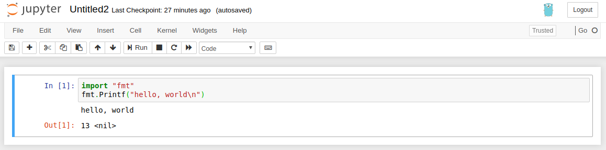

# ___2019 - 12 - 24 Go Basic___
***

# 目录
  <!-- TOC depthFrom:1 depthTo:6 withLinks:1 updateOnSave:1 orderedList:0 -->

  - [___2019 - 12 - 24 Go Basic___](#2019-12-24-go-basic)
  - [目录](#目录)
  - [Install](#install)
  	- [Install go](#install-go)
  	- [Install gophernotes](#install-gophernotes)
  	- [Install lgo](#install-lgo)
  	- [gofmt 格式化代码](#gofmt-格式化代码)
  	- [go doc 帮助文档](#go-doc-帮助文档)
  	- [go 运行时 runtime](#go-运行时-runtime)
  	- [GPROXY 代理](#gproxy-代理)
  	- [GO111MODULE 与 GOPATH](#go111module-与-gopath)
  - [Go 项目一般结构](#go-项目一般结构)
  	- [约定规则](#约定规则)
  	- [GOPATH 下 Go 项目一般结构](#gopath-下-go-项目一般结构)
  	- [Go Module 项目一般结构](#go-module-项目一般结构)
  	- [Go 使用多个本地 module](#go-使用多个本地-module)
  - [基础语法](#基础语法)
  	- [import](#import)
  	- [Go 数据类型](#go-数据类型)
  	- [for 循环语句](#for-循环语句)
  	- [if 条件语句](#if-条件语句)
  	- [switch 语句](#switch-语句)
  	- [func 函数](#func-函数)
  	- [defer 延迟调用](#defer-延迟调用)
  	- [init 函数](#init-函数)
  	- [fmt 打印输出](#fmt-打印输出)
  	- [os 与 runtime 获取运行环境](#os-与-runtime-获取运行环境)
  - [数据结构](#数据结构)
  	- [指针](#指针)
  	- [struct 结构体](#struct-结构体)
  	- [数组](#数组)
  	- [slice 切片](#slice-切片)
  	- [string](#string)
  	- [range 迭代遍历](#range-迭代遍历)
  	- [map 字典](#map-字典)
  	- [make 与 new](#make-与-new)
  - [方法和接口](#方法和接口)
  	- [方法](#方法)
  	- [接口](#接口)
  	- [Stringers 接口](#stringers-接口)
  	- [Error 接口](#error-接口)
  	- [Readers 接口](#readers-接口)
  	- [write 接口](#write-接口)
  	- [sort 接口](#sort-接口)
  	- [Web 服务器](#web-服务器)
  	- [Image 图片接口](#image-图片接口)
  - [并发](#并发)
  	- [Goroutine](#goroutine)
  	- [channel](#channel)
  	- [select](#select)
  	- [线程锁](#线程锁)
  	- [以通信实现共享](#以通信实现共享)
  	- [并行](#并行)
  	- [Leaky Buffer 示例](#leaky-buffer-示例)
  - [Panic 与 Recover](#panic-与-recover)

  <!-- /TOC -->
***

# Install
## Install go
  - [Go 指南](http://go-tour-zh.appspot.com/flowcontrol/4)
  - [Getting Started install go](https://golang.org/doc/install)
  - [The Go Playground](https://play.golang.org/)
  - [Effective Go](https://golang.org/doc/effective_go.html)
  - [Effective Go中文版](https://go-zh.org/doc/effective_go.html)
  - [Effective Go中文版](https://www.kancloud.cn/kancloud/effective/72199)
  - **apt**
    ```sh
    sudo apt install golang-go
    ```
  - **hello world**
    ```go
    package main

    func main() {
        println("Hello", "world")
    }
    ```
    ```sh
    go run hello.go
    # Or
    go build hello.go
    ./hello
    # Hello world
    ```
  - **buildmode**
    ```sh
    $ go help buildmode
    # -buildmode=archive
    # -buildmode=c-archive
    # -buildmode=c-shared
    # -buildmode=default
    # -buildmode=shared
    # -buildmode=exe
    # -buildmode=pie
    # -buildmode=plugin
    ```
  - **dist list**
    ```sh
    $ go tool dist list
    ```
## Install gophernotes
  - [Jupyter kernels](https://github.com/jupyter/jupyter/wiki/Jupyter-kernels)
  - [gophernotes - Use Go in Jupyter notebooks and interact](https://github.com/gopherdata/gophernotes)
    ```sh
    cd "$(go env GOPATH)"/src/github.com/gopherdata/gophernotes
    env GO111MODULE=on go install
    mkdir -p ~/.local/share/jupyter/kernels/gophernotes
    rm ~/.local/share/jupyter/kernels/gophernotes/* -f
    cp kernel/* ~/.local/share/jupyter/kernels/gophernotes
    cd ~/.local/share/jupyter/kernels/gophernotes
    sed "s|gophernotes|$(go env GOPATH)/bin/gophernotes|" < kernel.json.in > kernel.json

    jupyter-notebook --> New --> Go
    ```
  - **Q / A**
    ```sh
    ''' Q
    Package libzmq was not found in the pkg-config search path
    '''
    ''' A 1
    Install libzmq3-dev
    '''
    sudo apt install libzmq3-dev

    ''' A 2
    Or add libzmq.pc path to PKG_CONFIG_PATH env
    '''
    locate libzmq
    # /opt/anaconda3/lib/libzmq.so.5.2.1
    # /opt/anaconda3/lib/pkgconfig/libzmq.pc
    # ...
    # /usr/lib/x86_64-linux-gnu/libzmq.so.5
    # /usr/lib/x86_64-linux-gnu/libzmq.so.5.1.5

    export PKG_CONFIG_PATH=$PKG_CONFIG_PATH:/opt/anaconda3/lib/pkgconfig
    ```
    ```sh
    ''' Q
    zmq4 was installed with ZeroMQ version 4.3.1, but the application links with version 4.2.5
    '''
    ''' A
    libzmq.so version in /usr/lib/x86_64-linux-gnu/ is not compatible with libzmq.pc
    '''
    ls -l /opt/anaconda3/lib/libzmq.so.5*
    # lrwxrwxrwx 1 leondgarse leondgarse      15 十月 12 10:07 /opt/anaconda3/lib/libzmq.so.5 -> libzmq.so.5.2.1
    # -rwxrwxr-x 2 leondgarse leondgarse  731928 二月  1  2019 /opt/anaconda3/lib/libzmq.so.5.2.1

    ls -l /usr/lib/x86_64-linux-gnu/libzmq.so.5*
    # lrwxrwxrwx 1 root root     15 七月  3 22:30 /usr/lib/x86_64-linux-gnu/libzmq.so.5 -> libzmq.so.5.1.5
    # -rw-r--r-- 1 root root 630464 七月  3 22:30 /usr/lib/x86_64-linux-gnu/libzmq.so.5.1.5

    sudo rm /usr/lib/x86_64-linux-gnu/libzmq.so.5
    sudo ln -s /opt/anaconda3/lib/libzmq.so.5.2.1 /usr/lib/x86_64-linux-gnu/libzmq.so.5
    ls -l /usr/lib/x86_64-linux-gnu/libzmq.so.5*
    # lrwxrwxrwx 1 root root     34 十二 25 09:29 /usr/lib/x86_64-linux-gnu/libzmq.so.5 -> /opt/anaconda3/lib/libzmq.so.5.2.1
    # -rw-r--r-- 1 root root 630464 七月  3 22:30 /usr/lib/x86_64-linux-gnu/libzmq.so.5.1.5
    ```
    ```sh
    ''' Q
    go Get https://proxy.golang.org/xxx proxyconnect tcp: net/http: TLS handshake timeout
    '''
    ''' A
    配置 https 代理为 http://xxx

    http_proxy='http://127.0.0.1:8118' https_proxy='http://127.0.0.1:8118' jupyter-notebook --notebook-dir=$HOME/practice_code/jupyter_notebook/
    '''
    ```
  - **hello world**
    ```go
    import "fmt"
    fmt.Printf("hello, world\n")
    ```
    
## Install lgo
  - [yunabe/lgo Go (golang) Jupyter Notebook kernel and an interactive REPL](https://github.com/yunabe/lgo)
    ```sh
    jupyter-notebook --> New --> Go(lgo)
    ```
  - **Jupyter Console**
    ```sh
    alias igo='jupyter console --kernel lgo'
    igo
    ```
    ```go
    In [1]: import "fmt"

    In [2]: fmt.Printf("Hello world\n")
    Hello world
    12
    <nil>
    ```
## gofmt 格式化代码
  - **参数** 可以指定文件或目录
    - **-s** 开启简化代码，如去除不必要的类型声明，去除迭代时非必要的变量赋值等
    - **-d** 显示 diff，而不是转化后的结果
    - **-w** 覆盖源文件
    - **-l ./*.go** 列出需要格式化的文件
    - **-r 'a[b:len(a)] -> a[b:]'** 指定替换规则
  - **示例**
    ```sh
    gofmt -s -d test.go
    gofmt -s -w test.go

    gofmt -s -l ./*.go
    gofmt -s -d ./*.go
    gofmt -s -w ./*.go
    ```
## go doc 帮助文档
  ```sh
  go doc -all fmt | grep -i printf

  go doc -all fmt.Println
  go doc -src fmt.Println
  ```
## go 运行时 runtime
  - **runtime**
    - 尽管 Go 编译器产生的是本地可执行代码，这些代码仍旧运行在 Go 的 **runtime** 当中，类似 Java 和 .NET 语言所用到的虚拟机
    - **runtime** 是每个 Go 包的最顶级包，负责管理包括内存分配 / 垃圾回收 / 栈处理 / goroutine / channel / 切片 slice / map / 反射 reflection 等等
    - Go 的 runtime 嵌入到了每一个可执行文件当中，因此 Go 的可执行文件都比相对应的源代码文件要大很多
    - Go 程序在部署时，不需要依赖任何其它文件，只需要一个单独的静态文件
  - **垃圾回收器** Go 拥有简单却高效的 **标记-清除** 回收器
    - 主要思想来源于 IBM 的可复用垃圾回收器，旨在打造一个高效、低延迟的并发回收器，目前 gccgo 还没有回收器，同时适用 gc 和 gccgo 的新回收器正在研发中
    - 使用一门具有垃圾回收功能的编程语言不代表可以避免内存分配所带来的问题，分配和回收内容都是消耗 CPU 资源的一种行为
## GPROXY 代理
  - [Github goproxy/goproxy.cn](https://github.com/goproxy/goproxy.cn)
  - [Goproxy China](https://goproxy.cn/)
  ```sh
  go env GOPROXY
  # https://proxy.golang.org,direct

  go env -w GOPROXY=https://goproxy.cn,direct
  go env GOPROXY
  # https://goproxy.cn,direct
  ```
## GO111MODULE 与 GOPATH
  - `Go 1.16` 以上默认 `GO111MODULE=on`
  - `go env -w GO111MODULE=auto` 在有 `go.mod` 时才使用 `go module`
  - `GO111MODULE=off go run xxx` 使用 `GOPATH` 模式
***

# Go 项目一般结构
## 约定规则
  - **命名规则**
    - 一个名字在程序包之外的可见性是由它的首字符 **是否为大写** 来确定的
    - 按照约定，程序包使用小写，尽量是一个单词的名字，不需要使用下划线或者混合大小写，不用担心会与先前的有冲突，程序包名只是导入的缺省名字
    - 按照约定，程序包名为其源目录的基础名
    - 按照约定，单个方法的接口使用方法名加上“er”后缀来命名，如果类型实现的是一个和众所周知的类型具有相同含义的方法，那么就使用相同的名字和签名
    - Go 约定使用 `MixedCaps` 或者 `mixedCaps` 的形式，而不是下划线来书写多个单词的名字
  - **注释规则**
    - 每个程序包都应该有一个 **包注释**，位于 package 子句之前的块注释，对于有多个文件的程序包，包注释只需要出现在一个文件中，任何一个文件都可以
    - **包注释** 应该用来介绍该程序包，并且提供与整个程序包相关的信息，它将会首先出现在 `godoc` 页面上，并会建立后续的详细文档
    - 在程序包里面，任何直接位于顶层声明之前的注释，都会作为该 **声明的文档注释**，程序中每一个被导出的名字，都应该有一个文档注释
    - **文档注释** 作为完整的语句可以工作的最好，可以允许各种自动化的展现，第一条语句应该为一条概括语句，并且 **使用被声明的名字作为开头**
  - **分号**
    - Go 的规范语法是使用 **分号** 来终结语句的，但这些分号并不在源码中出现，词法分析器会在扫描时，使用简单的规则自动插入分号
    - 分号插入规则所导致的一个结果是，不能将控制结构 `if` / `for` / `switch` / `select` 的左大括号放在下一行，如果这样做，则会在大括号之前插入一个分号
  - **空白标识符 _**
    - **多赋值语句** 需要多个左值，但如果其中某个左值在程序中并没有被使用到，那么就需要用 **空白标识符** 来占位，以避免引入一个新的无用变量
    - **未使用的导入和变量** 如果在程序中导入了一个包或声明了一个变量，却没有使用的话，会引起编译错误，可以将包 / 变量赋值给 `_` 禁止编译错误
    - **只调用导入包的 init 函数** 有时需要导入一些包，但不实际使用，只是调用其中的 `init` 函数
## GOPATH 下 Go 项目一般结构
  - **Go 程序文件夹结构**
    - 从指定文件夹下导入时，会导入所有的 go 文件
    - 要求该文件夹下的所有 go 文件有统一的包名，包名最好跟文件名相同，避免歧义
    - 包外调用方法名首字母必须为大写
    ```sh
    $ tree testFoo
    # testFoo
    # ├── foo
    # │   ├── add.go
    # │   └── sub.go
    # └── test.go
    ```
  - **文件内容**
    ```go
    // $ cat test.go
    package main
    import "fmt"
    import "./foo"

    func main() {
        fmt.Println("Hello World!", goo.Add(1, 1), goo.Sub(1, 1))
    }

    // $ cat foo/add.go
    package goo
    func Add(x, y int) int {
        return x + y
    }

    // $ cat foo/sub.go
    package goo
    func Sub(x,y int) int {
        return x - y
    }
    ```
  - **运行**
    ```sh
    GO111MODULE=off go run test.go
    # Hello World! 2 0
    ```
  - **项目目录** 一般包含三个文件夹，分别为 `src` / `pkg` / `bin`
    - **src** 存放 golang 源码
    - **pkg** 存放编译后的文件
    - **bin** 存放编译后可执行的文件
## Go Module 项目一般结构
  - [Tutorial: Create a Go module](https://golang.org/doc/tutorial/create-module)
  - [Using Go Modules](https://blog.golang.org/using-go-modules)
  - [Github eliben/modlib](https://github.com/eliben/modlib)
  - [Github goproxy/goproxy.cn](https://github.com/goproxy/goproxy.cn)
  - [Goproxy China](https://goproxy.cn/)
  - [Go Modules Wiki](https://github.com/golang/go/wiki/Modules)
  - [When should I use the replace directive?](https://github.com/golang/go/wiki/Modules#when-should-i-use-the-replace-directive)
  - **go.mod**
    ```sh
    module example.com/hello

    go 1.16

    replace example.com/greetings => ../greetings

    require example.com/greetings v0.0.0-00010101000000-000000000000
    ```
    - 包含包名 / 版本 / 依赖 / 本地路径等
    - 如果使用 `replace` 指定了本地路径，目标路径下 **需要有 `go.mod` 文件**
    - 引用同一个 `go module` 下其他路径的包时，**不需要使用 `replace`，但需要使用完整的包名**
  - **文件内容**
    ```sh
    tree testModule/
    # testModule/
    # ├── greetings
    # │   ├── go.mod
    # │   ├── greetings.go
    # │   └── greetings_test.go
    # └── hello
    #     ├── go.mod
    #     └── hello.go
    ```
    **greetings/greetings.go**
    ```go
    // $ cat greetings/greetings.go
    package greetings

    import (
    	"errors"
    	"fmt"
    	"math/rand"
    	"time"
    )

    // Hello returns a greeting for the named person.
    func Hello(name string) (string, error) {
    	if name == "" {
    		return "", errors.New("empty name")
    	}
    	// Return a greeting that embeds the name in a message.
    	message := fmt.Sprintf(randomFormat(), name)
    	return message, nil
    }

    func Hellos(names []string) (map[string]string, error) {
    	messages := make(map[string]string, len(names))
    	for _, name := range names {
    		message, err := Hello(name)
    		if err != nil {
    			return nil, err
    		}
    		messages[name] = message
    	}
    	return messages, nil

    }

    func init() {
    	rand.Seed(time.Now().UnixNano())
    }

    func randomFormat() string {
    	formats := []string{
    		"Hi, %v. Welcome!",
    		"Great to see you, %v!",
    		"Hail, %v! Well met!",
    	}
    	return formats[rand.Intn(len(formats))]
    }
    ```
    **hello/hello.go**
    ```go
    // $ cat
    package main

    import (
    	"fmt"
    	"log"
    	"testModule/greetings"
    )

    func main() {
    	log.SetPrefix("greetins: ")
    	log.SetFlags(0)

    	// Get a greeting message and print it.
    	// message, err := greetings.Hello("")
    	// message, err := greetings.Hello("Gladys")
    	message, err := greetings.Hellos([]string{"Gladys", "Samantha", "Darrin"})
    	if err != nil {
    		// fmt.Println(err)
    		log.Fatal(err)
    	} else {
    		fmt.Println(message)
    	}
    }
    ```
  - **运行**
    ```sh
    cd greetings
    go mod init testModule/greetings
    go mod tidy

    cd ../hello
    go mod init testModule/hello
    go mod edit -replace=testModule/greetings=../greetings
    # replace example.com/greetings => ../greetings
    go mod tidy # Clean and get dependencies
    # go: found example.com/greetings in example.com/greetings v0.0.0-00010101000000-000000000000

    GO111MODULE=on go run .
    # map[Darrin:Great to see you, Darrin! Gladys:Hail, Gladys! Well met! Samantha:Great to see you, Samantha!]
    ```
  - **测试用例 greetings/greetings_test.go**
    - `go test` 命令自动执行 `xxx_test.go` 中的 `TestYYY` 函数，`-v` 参数指定列出所有测试项目与结果
    ```go
    // $ cat greetings/greetings_test.go
    package greetings

    import (
    	"regexp"
    	"testing"
    )

    func TestHelloName(t *testing.T) {
    	name := "Gladys"
    	want := regexp.MustCompile(`\b` + name + `\b`)
    	msg, err := Hello(name)
    	if err != nil || !want.MatchString(msg) {
    		t.Fatalf(`Hello("Gladys") = %q, %v, want match for %#q, nil`, msg, err, want)
    	}
    }

    func TestHelloEmpty(t *testing.T) {
    	msg, err := Hello("")
    	if err == nil || msg != "" {
    		t.Fatalf(`Hello("") = %q, %v, want "", error`, msg, err)
    	}
    }
    ```
    ```sh
    cd greetings
    go test -v
    # === RUN   TestHelloName
    # --- PASS: TestHelloName (0.00s)
    # === RUN   TestHelloEmpty
    # --- PASS: TestHelloEmpty (0.00s)
    # PASS
    # ok  	example.com/greetings	0.001s
    ```
  - **编译与安装**
    ```sh
    cd hello
    go build

    # Go install path
    go list -f '{{.Target}}'  # ~/go/bin/hello
    go install
    ```
  - **其他命令**
    ```sh
    go mod vendor # 将所有依赖存放到当前文件夹下的 `vendor`
    go list -m all  # 打印当前包的依赖
    go mod graph  # 查看当前包的依赖关系
    go mod why -m rsc.io/quote  # 查看依赖关系
    go clean -modcache
    ```
## Go 使用多个本地 module
  - **目录结构**
    ```sh
    cd testModule
    rm greetings/go.mod hello/go.mod
    go mod init testModule
    go mod tidy

    cd ../testFoo
    go mid init testFoo
    go mod tidy

    cd ../
    mkdir testMultiModule
    cd testMultiModule
    go mod init testMultiModule
    touch testMultiModule.go

    cd ../
    tree testModule testFoo testMultiModule
    # testModule
    # ├── go.mod
    # ├── greetings
    # │   ├── greetings.go
    # │   └── greetings_test.go
    # └── hello
    #     └── hello.go
    # testFoo
    # ├── foo
    # │   ├── add.go
    # │   └── sub.go
    # ├── go.mod
    # └── test.go
    # testMultiModule
    # ├── go.mod
    # └── testMultiModule.go
    ```
  - **testMultiModule.go**
    ```go
    package main

    import (
    	"fmt"
    	"testModule/greetings"
    	"testFoo/foo"
    )

    func main() {
    	fmt.Println("Hello World!", goo.Add(1, 1), goo.Sub(1, 1))
    	message, _ := greetings.Hellos([]string{"Gladys", "Samantha", "Darrin"})
    	fmt.Println(message)
    }
    ```
  - **Run testMultiModule**
    ```sh
    cd testMultiModule
    go mod tidy
    # go: found testFoo/foo in testFoo v0.0.0-00010101000000-000000000000
    # go: found testModule/greetings in testModule v0.0.0-00010101000000-000000000000
    go run testMultiModule.go
    # Hello World! 2 0
    # map[Darrin:Hail, Darrin! Well met! Gladys:Hail, Gladys! Well met! Samantha:Hail, Samantha! Well met!]
    ```
  - **Run testModule** 引用同一个 `go module` 下其他路径的包时，不需要使用 `replace`，但需要使用完整的包名
    ```sh
    cd ../testModule
    go run hello/hello.go
    # map[Darrin:Great to see you, Darrin! Gladys:Hail, Gladys! Well met! Samantha:Great to see you, Samantha!]
    ```
***

# 基础语法
## import
  - **包 package / import** Go 程序是通过 package 来组织的
    - 只有 **package** 名称为 **main** 的包可以包含 main 函数，一个可执行程序有且仅有一个 main 包
    - 通过 **import** 关键字来导入其他非 main 包，使用 `<PackageName>.<FunctionName>` 调用
    - 文件名 / 文件夹名与包名没有直接关系，不需要一致，但按照惯例，最好一致，同一个文件夹下的文件只能有一个包名，否则编译报错
    - 可以使用 **()** 打包导入多个
    - `Go 1.16` 起默认不支持相对路径的导入，应按照 `go module` 的方式管理项目
    ```go
    package main  // 当前程序的包名
    import "fmt"  // 导入其他包
    import (  // 同时导入多个
        "fmt"
        "math/rand"
    )
    import fmt2 "fmt" // package 别名
    import . "fmt"  // 表示省略调用，调用该模块里面的函数可以不写模块名
    ```
  - **相对导入** 导入当前文件夹下的某个 module 的文件夹 **[Deprecated]**
    ```go
    import (
        "./test1"
        "../test2"
    )
    ```
  - **绝对导入** 将目标项目添加到 `$GOPATH` 环境变量中 **[Deprecated]**
    ```sh
    export GOPATH=$GOPATH:$HOME/practice_code/go
    ```
    ```go
    import (
        "project/module1"
        "project/module2/t"
    )
    ```
  - **别名** 重命名导入的包
    ```go
    import f "fmt"
    f.Println("test")
    ```
  - **.** 导入包后，调用时省略包名
    ```go
    import . "fmt"
    Println("test")
    ```
  - **_** 导入包，但不直接使用包中的函数，而是调用包中的 `init` 函数
    ```go
    // module/module1.go
    package module1
    import "fmt"

    func init() {
       fmt.Println("this is module1")
    }
    ```
    ```go
    // main.go
    package main
    import (
        "fmt"
        _ "module"
    )

    func main() {
        fmt.Println("this is a test")
    }
    ```
    **Run**
    ```sh
    $ go run main.go
    this is module1
    this is a test
    ```
## Go 数据类型
  - Go语言中，使用 **大小写** 来决定该常量、变量、类型、接口、结构或函数是否可以被外部包所调用，即 private / public
  - **数据定义 const / var / type**
    - Go 语言的 **类型** 在 **变量名之后**
    - `var` 语句可以定义在包或函数级别，即在函数外或函数内
    - 变量在没有初始化时默认为 **零值**，数值类型为 `0`，布尔类型为 `false`，字符串为 `""` 空字符串
    - **const** 关键字定义常量，常量是在 **编译时** 被创建，即使是函数内部的局部常量，常量的表达式必须为能被编译器求值的常量表达式
    - **var** 关键字定义变量，在函数体外部使用则定义的是 **全局变量**，初始值可以为 **运行时** 计算的通用表达式
    - **type** 关键字定义一般类型，如结构 struct / 接口 interface
    ```go
    const PI = 3.14 // 常量
    var name = "gopher" // 变量的声明和赋值
    var c, python, java bool
    var c, python, java = true, false, "no!"

    type newType int  // 一般类型声明
    type gopher struct{}  // 结构
    type golang interface{} // 接口
    ```
  - **短声明变量 `:=`** 可以用于替代 `var` 定义，只能用于函数内，变量的类型由右值推导得出，常量不能使用该语法定义
    ```go
    k := 3
    c, python, java := true, false, "no!"
    ```
  - 在 `:=` 声明中，变量 `v` 即使已经被声明过，也可以出现，前提是
    - 该声明和 v 已有的声明在相同的作用域中，如果 v 已经在外面的作用域里被声明了，则该声明将会创建一个新的变量
    - 初始化中相应的值是可以被赋给 v 的
    - 并且，声明中 **至少有其它一个变量** 将被声明为一个新的变量
  - **基本类型**
    ```go
    bool
    string
    int  int8  int16  int32  int64
    uint uint8 uint16 uint32 uint64 uintptr
    byte // uint8 的别名
    rune // int32 的别名，代表一个Unicode码
    float32 float64
    complex64 complex128
    ```
    其中 `rune` 是 Go 的术语，用于指定一个 **单独的 Unicode 编码点**
    ```go
    import (
        "fmt"
        "math/cmplx"
    )

    var (
        ToBe   bool       = false
        MaxInt uint64     = 1<<64 - 1
        z      complex128 = cmplx.Sqrt(-5 + 12i)
    )

    fmt.Printf("z is of type %T\n", z)
    // z is of type complex128
    ```
    ```go
    const (
        Middle = 1.0
        Big   = Middle << 100
        Small = Middle >> 99
    )
    fmt.Printf("Middle: %T, Small: %T\n", Middle, Small)
    // Middle: float64, Small: int
    fmt.Printf("Big: %T\n", Big)
    // 1:25: Big (untyped int constant 1267650600228229401496703205376) overflows int
    fmt.Printf("Big: %e, %T\n", Big * 1.0, Big * 1.0)
    // Big: 1.267651e+30, float64
    ```
  - **常量组** 在定义常量组时，如果不提供初始值，则使用上一行的表达式
    ```go
    const (
        a = 1
        b
        c = 2
        d
    )
    fmt.Println(a, b, c, d)
    // 1 1 2 2
    ```
  - **枚举常量** 使用 `iota` 枚举器来创建
    - `iota` 可以认为是一个可以被编译器修改的常量
    - 由于 `iota` 可以为表达式的一部分，并且表达式可以被隐式的重复，所以很容易创建复杂的值集
    - 在 `const` 常量数组定义中，每增加一个常量，`iota` 自增 `1`，在新的 `const` 关键字出现时被重置为 `0`
    ```go
    type ByteSize float64

    const (
        _           = iota // ignore first value by assigning to blank identifier
        KB ByteSize = 1 << (10 * iota)
        MB  // 1 << (10 * 2)
        GB  // 1 << (10 * 3)
        TB
        PB
        EB
    )
    fmt.Println(KB, MB, GB, TB, PB, EB)
    // 1024 1.048576e+06 1.073741824e+09 1.099511627776e+12 1.125899906842624e+15 1.152921504606847e+18
    ```
    ```go
    import "fmt"    
    const (
        a = iota   //0
        b          //1
        c          //2
        d = "ha"   //独立值，iota += 1
        e          //"ha"   iota += 1
        f = 100    //iota +=1
        g          //100  iota +=1
        h = iota   //7,恢复计数
        i          //8
    )
    const j, k = iota, iota
    fmt.Println(a, b, c, d, e, f, g, h, i, j, k)
    // 0 1 2 ha ha 100 100 7 8 0 0
    ```
  - **字符串** Go 中的字符串只能使用 **双引号**
    ```go
    aa := "aa"
    fmt.Printf("%T", aa)
    // string6
    ```
    **字符串连接** 可以通过 + 实现
    ```go
    import "fmt"
    fmt.Println("Hello " + "world")
    ```
  - **类型转换** Go 在不同类型之间的项目赋值时，需要 **显式转换**
    ```go
    var i int = 42
    var f float64 = float64(i)
    var u uint = uint(f)
    ```
    ```go
    i := 42
    f := float64(i)
    u := uint(f)
    ```
  - **type 定义的类型转化** 对于 type 定义的类型，如果忽略类型名，两个类型是相同的，则类型转换是合法的，该转换并不创建新值，只是暂时使现有的值具有一个新的类型
    ```go
    type Sequence []int
    aa := Sequence{1, 3, 5, 2, 4}
    bb := []int(aa)
    fmt.Printf("%T, %T", aa, bb)
    // []int, []int
    ```
  - **interface {} 类型** 在函数定义与签名中，`interface {}` 类型可以用于接受 / 返回任意类型
    ```go
    func interfier(ii interface{}) interface{} {
        return ii
    }

    bb := interfier([]int{1, 2, 3})
    fmt.Printf("%T", bb) // []int
    ```
    类型转化使用 `(interface {}).(type)`，如果实际类型与 `type` 相同，则返回 `value, true`，否则返回 `zero_velue, false`
    ```go
    []int(bb) // cannot convert interface{} to []int: bb

    bb.([]int)  // [1 2 3] true
    bb.([4]int) // [0 0 0 0] false

    str, ok := bb.(string)
    if ok {
        fmt.Printf("string value is: %q\n", str)
    } else {
        fmt.Printf("value is not a string\n")
    }
    // value is not a string
    ```
## for 循环语句
  - **for 循环** Go 只有一种循环结构
    - 基本的 for 循环体使用 `{}`，循环条件 **不使用** `()`
    - 循环条件之间使用 **;** 分割，分别为 `前置语句，初始值` / `结束条件` / `后置语句，值调整`
    - 前置语句 / 后置语句可以为空，此时可以省略 `;`，类似于 **while**
    - **死循环** 如果省略了循环条件，循环就不会结束，`for { ... }`
    ```go
    sum := 0
    for i := 0; i < 10; i++ {
        sum += i
    }
    fmt.Println(sum)
    ```
    ```go
    for ; sum < 1000; {
        sum += sum
    }
    ```
    ```go
    for sum < 1000 {
        sum += sum
    }
    ```
  - Go 没有逗号操作符，因此如果需要在 for 中运行多个变量，需要使用并行赋值，并且不能使用 `++` / `--` 操作
    ```go
    // Reverse a
    a := []int{1, 2, 3, 4, 5}

    // NOT: for i, j := 0, len(a)-1; i < j; j++, i-- {
    for i, j := 0, len(a)-1; i < j; i, j = i+1, j-1 {
        a[i], a[j] = a[j], a[i]
    }
    fmt.Println(a)
    // [5 4 3 2 1]
    ```
  - 在嵌套的 `for` 循环中，可以使用 `break` / `continue` 加一个 **标号** 来指定跳出的是 **哪一个循环**
    ```go
    sum := 0
    Loop1:
    for {
        for i := 0; i < 5; i++ {
            fmt.Printf("%d ", i)
            sum += i
            if sum > 5 {
                break Loop1
            }   
        }   
    }   
    fmt.Println(sum)
    // 0 1 2 3 6
    ```
## if 条件语句
  - **if 条件** 判断条件 **不使用** `()`，执行语句使用 `{}`
    ```go
    import "math"
    x := -2.0
    result := ""
    if x < 0 {
        result = fmt.Sprint(math.Sqrt(-x)) + "i"
    }
    ```
  - `if` 语句可以在条件之前执行一个简单的语句，由这个语句定义的变量的作用域仅在 **if 以及 if 对应的 else 范围** 之内
    ```go
    x := 4.0
    lim := 10.0
    if v := math.Pow(x, 2); v < lim {
        fmt.Println(v)
    } else {
        fmt.Printf("%g >= %g\n", v, lim)
    }
    // 16 >= 10
    ```
  - **逻辑表达式** 使用 `||` / `&&` / `!`
  - 当 `if` 语句不会流向下一条语句时，如控制结构体结束于 `break` / `continue` / `goto` / `return`，则通常是省略掉 `else`
## switch 语句
  - **switch** 从上到下判断条件，当匹配成功时停止，`fallthrough` 使分支 `case` 继续向下执行，否则终止
    ```go
    import "runtime"
    fmt.Print("Go runs on ")

    switch os := runtime.GOOS; os {
    case "darwin":
        fmt.Println("OS X.")
    case "linux":
        fmt.Println("Linux.")
    default:
        // freebsd, openbsd,
        // plan9, windows...
        fmt.Printf("%s.", os)
    }
    ```
  - **没有条件的 switch** 则对为 `true` 的条件进行匹配，可以用更清晰的形式编写长的 `if-else` 链
    ```go
    import "time"
    t := time.Now()
    switch {
        case t.Hour() < 12:
            fmt.Println("Good morning!")
        case t.Hour() < 17:
            fmt.Println("Good afternoon.")
        default:
            fmt.Println("Good evening.")
    }
    ```
  - **case** 可以使用 **逗号分隔的列表**
    ```go
    func shouldEscape(c byte) bool {
        switch c {
        case ' ', '?', '&', '=', '#', '+', '%':
            return true
        }
        return false
    }
    ```
  - **switch 动态类型判断** 可以用于获得一个 **接口变量** 的动态类型，在括号中使用关键字 **type**
    ```go
    func interfier(ii interface{}) interface{} {
        return ii
    }

    var t interface{}
    t = interfier(true)

    switch t := t.(type) {
    default:
        fmt.Printf("unexpected type %T", t)       // %T prints whatever type t has
    case bool:
        fmt.Printf("boolean %t\n", t)             // t has type bool
    case int:
        fmt.Printf("integer %d\n", t)             // t has type int
    case *bool:
        fmt.Printf("pointer to boolean %t\n", *t) // t has type *bool
    case *int:
        fmt.Printf("pointer to integer %d\n", *t) // t has type *int
    }
    // boolean true
    ```
## func 函数
  - **函数声明 func**，函数可以没有参数或接受多个参数，类似于变量定义，返回值类型在函数名之后
    ```go
    func main(argc int, argv []string) int { ... }

    // 由 main 函数作为程序入口点启动
    func main() { // { 不能单独一行
        Println("Hello World!")
    }

    // 函数名首字母大写为 public
    func Add(x int, y int) int {
        return x + y
    }

    // 函数名首字母小写为 private
    func swap(x, y string) (string, string) {
        return y, x
    }
    ```
  - **函数值** 函数也可以作为一个值
    ```go
    import "math"
    hypot := func(x, y float64) float64 {
        return math.Sqrt(x * x + y * y)
    }

    fmt.Println(hypot(3, 4))
    // 5
    ```
    ```go
    type callback func(int) int

    func foo(aa int) int {
        return aa + 1
    }
    callback(foo)(3)  // 4
    ```
  - **函数的闭包** 函数的返回值是另一个函数
    ```go
    func adder() func(int) int {
        sum := 0
        return func(x int) int {
            sum += x
            return sum
        }
    }

    pos, neg := adder(), adder()
    for i := 0; i < 5; i++ {
        fmt.Println(pos(i), neg(-2*i))
    }
    // 0 0
    // 1 -2
    // 3 -6
    // 6 -12
    // 10 -20
    ```
  - **命名的结果参数** 函数的返回参数可以给定一个名字，并在函数内作为一个普通变量来使用
    - 当被命名时，它们在函数起始处被初始化为对应类型的零值
    - 如果函数执行了没有参数的 `return` 语句，则返回 **函数内对应参数的当前值**
    - 直接返回语句仅应当用在函数中，在长的函数中会影响代码的可读性
    ```go
    func split(sum int) (x, y int) {
        x = sum * 4 / 9
        y = sum - x
        return
    }

    fmt.Println(split(17))
    ```
    ```go
    // io.ReadFull
    func ReadFull(r Reader, buf []byte) (n int, err error) {
        for len(buf) > 0 && err == nil {
            var nr int
            nr, err = r.Read(buf)
            n += nr
            buf = buf[nr:]
        }
        return
    }
    ```
  - **... 参数** 指定为任意数量的参数
    ```go
    func Min(a ...int) int {
        min := int(^uint(0) >> 1)  // largest int
        for _, i := range a {
            if i < min {
                min = i
            }
        }
        return min
    }
    ```
## defer 延迟调用
  - **defer 语句** 延期执行，使其在执行 defer 的函数即将返回之前才被运行，延迟调用的 **参数会立刻生成**，可以用于释放资源等，如释放互斥锁或关闭文件
    ```go
    i := 0
    defer fmt.Println(i)
    i++
    // 0
    ```
  - **defer 栈 LIFO** 延迟的函数调用被压入一个栈中，当函数返回时，会按照后进先出的顺序调用被延迟的函数调用
    ```go
    fmt.Println("counting")

    for i := 0; i < 10; i++ {
        defer fmt.Print(i)
    }

    fmt.Println("done")

    // counting
    // done
    // 9876543210
    ```
## init 函数
  - **init 初始化函数** 每个源文件可以定义一个或多个不带参数的 `(niladic)init` 函数
    - **init** 是在程序包以及导入的程序包中，所有变量声明都被初始化后才被调用
    - 除了用于无法通过声明来表示的初始化以外，init 函数的一个常用法是在真正执行之前进行验证或者修复程序状态的正确性
    ```go
    func init() {
        if user == "" {
            log.Fatal("$USER not set")
        }
        if home == "" {
            home = "/home/" + user
        }
        if gopath == "" {
            gopath = home + "/go"
        }
        // gopath may be overridden by --gopath flag on command line.
        flag.StringVar(&gopath, "gopath", gopath, "override default GOPATH")
    }
    ```
## fmt 打印输出
  - **fmt.Printf / fmt.Fprintf / fmt.Sprintf**
    - 对每个 Printf / Fprintf / Sprintf，都有另外一对相应的函数，如 **Print / Println**，这些函数不接受格式串，而是为每个参数生成一个缺省的格式
    - **Println** 会在参数之间插入一个空格，并添加一个换行，而 **Print** 只有当两边的操作数都不是字符串的时候才增加一个空格
    - 字符串函数 **Sprintf 等** 返回一个字符串，而不是填充到提供的缓冲里
    - **io.Writer 接口对象** 格式化打印函数接受的第一个参数为任何一个实现了 `io.Writer 接口` 的对象，变量 `os.Stdout` / `os.Stderr` 是常见的实例
    ```go
    // 每一行都会产生相同的输出
    fmt.Printf("Hello %d\n", 23)
    fmt.Fprint(os.Stdout, "Hello ", 23, "\n")
    fmt.Println("Hello", 23)
    fmt.Println(fmt.Sprint("Hello ", 23))
    ```
  - **数字格式 %d** 打印程序使用参数的类型来决定打印的属性，不接受正负号和大小的标记
    ```go
    var x uint64 = 1<<64 - 1
    fmt.Printf("%d %x; %d %x\n", x, x, int64(x), int64(x))
    // 18446744073709551615 ffffffffffffffff; -1 -1
    ```
  - **通用格式 %v** 缺省的转换，这个格式可以打印任意的的值，包括数组 / 切片 / 结构体 / map，这也是 `Print` / `Println` 所产生的结果
    ```go
    fmt.Printf("%v\n", timeZone)  // or just fmt.Println(timeZone)
    // map[CST:-21600 PST:-28800 EST:-18000 UTC:0 MST:-25200]
    ```
    - **%+v** 会将结构体的域使用它们的名字进行注解
    - **%#v** 会按照完整的 Go 语法打印出该值
    ```go
    type T struct {
        a int
        b float64
        c string
    }
    t := &T{ 7, -2.35, "abc\tdef" }
    fmt.Printf("%v\n", t) // &{7 -2.35 abc   def}
    fmt.Printf("%+v\n", t)  // &{a:7 b:-2.35 c:abc     def}
    fmt.Printf("%#v\n", t)  // &main.T{a:7, b:-2.35, c:"abc\tdef"}
    fmt.Printf("%#v\n", timeZone) // map[string] int{"CST":-21600, "PST":-28800, "EST":-18000, "UTC":0, "MST":-25200}
    ```
  - **%q** 用于类型为 string / []byte 的值，实现带引号的字符串格式
    - **%#q** 将尽可能的使用反引号
    - **%q** 还用于整数 / 符文 rune，产生一个带单引号的符文常量
  - **%x** 用于字符串 / 字节数组 / 字节切片 / 整数，生成一个长的 **十六进制字符串**，如果在格式中有一个空格 `% x`，其将会在字节中插入空格
  - **%T** 打印出值的类型
    ```go
    fmt.Printf("%T\n", timeZone)
    // map[string] int
    ```
    如果需要控制自定义类型的缺省格式，可以对该类型定义一个签名为 `String() string` 的方法
    ```go
    func (t *T) String() string {
        return fmt.Sprintf("%d/%g/%q", t.a, t.b, t.c)
    }
    fmt.Printf("%v\n", t)
    // 7/-2.35/"abc\tdef"
    ```
    对于 `string` 类型的值，应避免无穷递归
    ```go
    type MyString string

    func (m MyString) String() string {
        return fmt.Sprintf("MyString=%s", m) // Error: will recur forever.
    }
    ```
    ```go
    type MyString string
    func (m MyString) String() string {
        return fmt.Sprintf("MyString=%s", string(m)) // OK: note conversion.
    }
    ```
  - **Printf 的签名** `...interface{}` 指定可以出现 **任意数目** 的 **任意类型** 的参数
    ```go
    func Printf(format string, v ...interface{}) (n int, err error) { ... }
    ```
    在作为参数传递给另一个函数时，可以使用 `v...` 指定为一个参数列表，直接使用 `v` 将作为一个切片 `[]interface{}` 来传递
    ```go
    // Println prints to the standard logger in the manner of fmt.Println.
    func Println(v ...interface{}) {
        std.Output(2, fmt.Sprintln(v...))  // Output takes parameters (int, string)
    }  
    ```
## os 与 runtime 获取运行环境
  ```go
  import (
    "os"
    "runtime"
    "fmt"
  )
  os.Getenv("HOME")
  // /home/leondgarse
  fmt.Println(runtime.GOOS, runtime.GOARCH, runtime.GOROOT(), runtime.Version())
  // linux amd64 /usr/local/go go1.13.7
  ```
***

# 数据结构
## 指针
  - Go 具有指针，保存了变量的内存地址，与 C 不同的是，Go **没有指针运算**
    - **\*T** 表示指向类型 T 的值的指针，零值是 `nil`
    - **&** 生成一个指向其作用对象的指针
    - **\*** 表示指针指向的值
    ```go
    var p *int
    i, j := 42, 2701
    p = &i
    fmt.Println(*p, *p+1)
    // 42, 43

    q := &j
    fmt.Println(*q / 37)
    // 73, 3
    ```
  - Go 语言中返回一个 **局部变量的地址** 是绝对没有问题的，变量关联的存储在函数返回之后依然存在
## struct 结构体
  - **struct 结构体** 表示一个字段的集合，结构体字段使用 **点号** 来访问，也可以将结构体赋值给指针
    ```go
    type Vertex struct {
        X int
        Y int
    }

    v := Vertex{1, 2}
    v.X = 4
    fmt.Println(v)
    // {4 2}

    p := &v
    p.X = 1e9
    fmt.Println(v)
    // {1000000000 2}
    ```
  - **`name`: `value` 结构体初始化文法** 初始化一个结构体的部分字段
    ```go
    type Vertex struct {
        X, Y int
    }

    var (
        v1 = Vertex{1, 2}
        v2 = Vertex{X: 1} // Y: 0
        v3 = Vertex{} // X: 0, Y: 0
        p  = &Vertex{1, 2}
    )
    fmt.Println(v1, p, v2, v3)
    // {1 2} &{1 2} {1 0} {0 0}
    ```
## 数组
  - Go 语言中的数组是 **值**，而不是指针
  - **`var / const` 变量名 [长度] 类型** 定义一个数组
    - 数组的长度是其类型的一部分，因此不能改变大小，`[10]int` 和 `[20]int` 是不同的
    - 同类型数组间的 `=` 操作会拷贝所有的元素，在函数中作为参数传递时，也是 **值传递**
    - 对于数组的操作，通常使用 **切片 slice**
    ```go
    var a [2]string
    a[0] = "Hello"
    a[1] = "World"
    fmt.Println(a[0], a[1])
    // Hello World
    fmt.Println(a)
    // [Hello World]

    b := []string {"a", "b", "c"}
    fmt.Printf("%T, %T", a, b)
    // [2]string, []string
    ```
  - **`index`: `value` 初始化文法** 初始化指定位置的值
    ```go
    a := [3]int {1:3}
    b := []int {1:3}
    fmt.Printf("%T, %v, %T, %v", a, a, b, b)
    // [3]int, [0 3 0], []int, [0 3]
    ```
  - **二维数组** 多维数组可通过大括号来初始值
    ```go
    a = [3][4]int{  
        {0, 1, 2, 3} ,   /*  第一行索引为 0 */
        {4, 5, 6, 7} ,   /*  第二行索引为 1 */
        {8, 9, 10, 11}}   /* 第三行索引为 2 */
    ```
## slice 切片
  - **slice 切片**
    - **切片** 对数组进行封装，提供了一个针对串行数据，更加通用，强大和方便的接口，除了像转换矩阵这样具有显式维度的项，Go 中大多数的数组编程都是通过切片完成
    - **切片** 包含 **len 长度** / **cap 容量** 信息，以及一个 **底层数组的引用**
    ```go
    p := []int{2, 3, 5, 7, 11, 13}
    fmt.Println(p, p[0])
    // [2 3 5 7 11 13] 2

    for i := 0; i < len(p); i++ {
        fmt.Printf("p[%d] == %d\n", i, p[i])
    }
    ```
  - **切片间的赋值**
    - 同类型的两个切片间赋值，将指向同一个底层数组，作为函数参数时，对切片元素的修改，对于调用者是可见的，类似于 **指针传递**
    - 切片本身是按照 **值传递** 的，即传递切片的 **底层数组指针** / **长度** / **容量** 运行时数据结构
    ```go
    p := []int{2, 3, 5, 7, 11, 13}
    func foo(tt []int) {
        tt[0], tt[len(tt)-1] = tt[len(tt)-1], tt[0]
    }
    foo(p)
    p  // [13 3 5 7 11 2]
    ```
  - **[low:high] 切片** 选取一个切片中的子切片，包含 `low`，不包含 `high`
    ```go
    fmt.Println(p[1:len(p)-1])
    // [3 5 7 11]
    ```
  - **零值** slice 的零值是 `nil`，但 `len` / `cap` 调用是合法的，并且返回 `0`
    ```go
    var z []int
    fmt.Println(z == nil, len(z), cap(z))
    // true 0 0
    ```
  - **make 构造 slice**，可以指定 `长度 len` 与 `容量 cap`，`make(type, len, cap)`
    - **len** 是切片中可用元素的数量，在 **索引** 时会判断长度
    - **cap** 是切片最大可以包含的元素数量，为了让 slice 提供可变长度，方便扩容，在 **[low:high] 切片** 时会判断容量
    - 如果不指定 `cap`，则 `cap == len`
    ```go
    a := make([]int, 5)
    fmt.Printf("%s len=%d cap=%d %v\n", "a", len(a), cap(a), a)
    // a len=5 cap=5 [0 0 0 0 0]

    b := make([]int, 0, 5)
    b[3]  // panic: runtime error: index out of range [3] with length 0
    b[:6] // panic: runtime error: slice bounds out of range [:6] with capacity 5

    c = b[:3]
    fmt.Printf("%s len=%d cap=%d %v\n", "c", len(c), cap(c), c)
    // c len=3 cap=5 [0 0 0]
    d = c[2:]
    fmt.Printf("%s len=%d cap=%d %v\n", "d", len(d), cap(d), d)
    // d len=1 cap=3 [0]
    ```
  - **append** 向 slice 添加元素，`func append(s []T, vs ...T) []T`
    - 如果原切片 s 的 **容量 cap** 足够，则在 s 上添加元素，并返回 s
    - 如果超出了原切片 s 的 **容量 cap**，则切片会被重新分配，然后返回新产生的切片
    ```go
    func append(slice []T, elements ...T) []T
    ```
    其中 `T` 为任意给定类型的占位符，在 Go 中是无法写出一个类型 T 由调用者来确定的函数的，因此 append 是内建函数，它需要编译器的支持
    ```go
    var z []int
    zz := append(z, 1)
    fmt.Printf("%d, %d, %v", len(zz), cap(zz), zz)
    // 1, 1, [1]
    zz = append(z, 1, 2)
    fmt.Printf("%d, %d, %v", len(zz), cap(zz), zz)
    // 2, 2, [1 2]
    zz := append(z, 1, 2, 3)
    fmt.Printf("%d, %d, %v", len(zz), cap(zz), zz)
    // 3, 4, [1 2 3]
    zz := append(z, 1, 2, 3, 4)
    fmt.Printf("%d, %d, %v", len(zz), cap(zz), zz)
    // 4, 4, [1 2 3 4]
    ```
    `append(a, b...)` 表示向 a 中添加 b 的所有元素
    ```go
    a := []string{"John", "Paul"}
    b := []string{"George", "Ringo", "Pete"}
    c := append(a, b...)
    fmt.Println(len(c), cap(c), c)
    // 5 5 [John Paul George Ringo Pete]
    ```
  - **copy** 复制切片，`func copy(dst, src []T) int`，返回复制的元素数量，可以用于类型转化，将非固定长度的 **slice** 转化为固定长度的 **array**
    ```go
    s := [3]string{"a", "b", "c"}
    t := make([]string, len(s), (cap(s)+1)*2) // +1 in case cap(s) == 0
    fmt.Printf("%T, %T", s, t)
    // [3]string, []string

    // Error: incompatible types in assignment: []string = [3]string
    t = s

    // Error: second argument to copy should be slice or string; have s <[3]string>
    copy(t, s)

    copy(t, s[:]) // 3
    fmt.Println(len(s), cap(s), s)
    // 3 3 [a b c]
    fmt.Println(len(t), cap(t), t)
    // 3 8 [a b c]
    ```
  - **二维切片** 可以每次单独分配每一行，或者分配一个一维切片，然后切分成多行
    ```go
    import (
      "fmt"
      "time"
    )

    // 每次单独分配每一行
    xx, yy := 800, 1200
    ss = time.Now()
    pp_1 := make([][]uint8, yy)
    for ii := range pp_1 {
        pp_1[ii] = make([]uint8, xx)
    }   
    fmt.Println(len(pp_1), len(pp_1[0]), time.Since(ss))
    // 1200 800 303.788µs

    // 分配一次，切分成多行
    ss = time.Now()
    pp_2 := make([][]uint8, yy)
    pixels := make([]uint8, xx * yy)
    for ii := range pp_2 {
        pp_2[ii], pixels = pixels[:xx], pixels[xx:]
    }   
    fmt.Println(len(pp_2), len(pp_2[0]), time.Since(ss))
    // 1200 800 87.393µs
    ```
  - **数组类型转化**
    ```go
    a := []int{1, 2, 3, 4, 5}
    int2float32 := func(aa []int) []float32 {
        bb := make([]float32, len(aa))
        for ii, vv := range(aa) {
            bb[ii] = float32(vv)
        }
        return bb
    }
    int2float32(a)
    // [1 2 3 4 5]
    ```
## string
  - `string` 类型定义 `/usr/share/go-xxx/src/builtin/builtin.go`
    ```go
    // string is the set of all strings of 8-bit bytes, conventionally but not
    // necessarily representing UTF-8-encoded text. A string may be empty, but
    // not nil. Values of string type are immutable.
    type string string
    ```
    - `string` 是 8 比特字节的集合，通常但并不一定是 UTF-8 编码的文本
    - `string` 可以为空，但不会是 `nil`
    - `string` 对象 **不可以修改**
    - `string` 的数据结构包含 `首地址指针` 以及 `长度`
    ```go
    import "fmt"
    aa := "hello world"
    fmt.Println(aa[3], string(aa[3]))
    // 108 l
    ```
  - `string` 方法定义 `/usr/share/go-xxx/src/runtime/string.go`
  - **字符串拼接**
    ```go
    fmt.Println(aa + ", " + aa)
    // hello world, hello world
    ```
    - 新字符串的内存空间是一次分配完成的，性能消耗主要在拷贝数据上
    - 拼接过程需要遍历两次切片，第一次遍历获取总的字符串长度，据此申请内存，第二次遍历将字符串逐个拷贝过去
  - **[]byte 与 string** 如果需要修改字符串内容，需要转化为 `[]byte`
    ```go
    bb := []byte(aa)
    fmt.Println(bb)
    // [104 101 108 108 111 32 119 111 114 108 100]

    bb[1] = byte("a"[0])
    fmt.Println(string(bb))
    // hallo world
    ```
    在只是 **临时需要字符串** 的场景下，byte 切片转换成 string 时并不会拷贝内存，而是直接返回一个 string，这个 string 的指针指向切片的内存
    ```go
    m[string(bb)] // map 使用 string 作为 key
    "<" + string(bb) + ">" // 字符串拼接
    string(b) == "foo"  // 字符串比较
    ```
## range 迭代遍历
  - **range** 在 for 循环中对 `slice` 或者 `map` 进行迭代遍历
    - `range` 给出的是 **元素序号, 元素值**，`for key, value := range array`
    - 如果只需要 `range` 中的第一项，则可以丢弃第二个，`for key := range m`
    - 如果只需要 `range` 中的第二项，则可以使用空白标识符 **_** ，来丢弃第一个，`for _, value := range array`
    ```go
    var pow = []int{1, 2, 4}

    for i, v := range pow {
        fmt.Printf("2**%d = %d\n", i, v)
    }
    // 2**0 = 1
    // 2**1 = 2
    // 2**2 = 4

    for i := range pow {  // for i, _ := range pow {
        fmt.Println(i, pow[i])
    }
    // 0 1
    // 1 2
    // 2 4

    for _, v := range pow {
        fmt.Println(v)
    }
    // 1
    // 2
    // 4
    ```
  - **字符串的 range 操作**，会通过解析 `UTF-8` 来拆分出 **单个的 Unicode 编码点**，错误的编码会消耗一个字节，产生一个替代的 **符文 rune `U+FFFD`**
    ```go
    import "fmt"
    for pos, char := range "日本\x80語" { // \x80 is an illegal UTF-8 encoding
        fmt.Printf("character %#U starts at byte position %d\n", char, pos)
    }
    // character U+65E5 '日' starts at byte position 0
    // character U+672C '本' starts at byte position 3
    // character U+FFFD '�' starts at byte position 6
    // character U+8A9E '語' starts at byte position 7
    ```
## map 字典
  - **map** 键值对映射
    - map 必须用 **make** 来创建，使用 `new` 创建的 map 值为 **nil**，不能赋值
    - map 的 key 可以为任何定义了 **等于操作符** 的类型，如整数 / 浮点 / 复数 / 字符串 / 指针 / 接口/ 结构体 / 数组，切片不能作为 key，因为没有定义等于操作
    - 和切片类似，map 持有对底层数据结构的引用，传递给函数时，对 map 内容的改变，对调用者是可见的
    ```go
    type Vertex struct {
        Lat, Long float64
    }

    var m map[string]Vertex
    fmt.Println(m == nil)
    // true
    m["aa"] = Vertex{1.0, 2.0}
    // panic: assignment to entry in nil map

    m := make(map[string] Vertex)
    fmt.Println(m == nil)
    // false
    m["aa"] = Vertex{1.0, 2.0}
    fmt.Println(m, m["aa"], m["aa"].Lat)
    // map[aa:{1 2}] {1 2} 1
    ```
    ```go
    var mm = map[string] Vertex {
        "aa": Vertex {1.0, 2.0},
        "bb": Vertex {2.0, 3.0},
    }

    var nn = map[string] Vertex {
        "aa": {1.0, 2.0},
        "bb": {2.0, 3.0},
    }
    ```
  - **map 元素操作**
    - **增加 / 修改元素** `m[key] = elem`
    - **delete 删除元素** `delete(m, key)`
    - 取不存在的键值 key 对应的值时，值为 value 类型对应的零值，`m[not_a_key] == 0`
    ```go
    m := make(map[string]int)
    m["Answer"] = 42
    fmt.Println("The value:", m["Answer"])
    // The value: 42
    fmt.Println("The value:", m["Question"])
    // The value: 0

    delete(m, "Answer")
    fmt.Println("The value:", m["Answer"])
    // The value: 0
    ```
  - **comma ok 双赋值检测某个键是否存在** `elem, ok = m[key]`
    - 如果 `key` 在 `m` 中，`ok` 为 true
    - 如果 `key` 不在 `m` 中，`ok` 为 `false`，且 `elem` 为 **map 元素类型的零值**
    ```go
    v, ok := m["Answer"]
    fmt.Println("The value:", v, "Present?", ok)
    // The value: 0 Present? false
    ```
    ```go
    func offset(tz string) int {
        if seconds, ok := timeZone[tz]; ok {
            return seconds
        }
        log.Println("unknown time zone:", tz)
        return 0
    }
    ```
## make 与 new
  - Go 有两个分配原语，内建函数 `new` 和 `make`，它们所做的事情有所不同，并且用于不同的类型
  - **new** 不初始化内存，只是将其 **置零**，并返回它的地址，`new(T)` 会为 `T` 类型的新项目分配被置零的存储，并返回 **`*T` 的指针**
    ```go
    aa := new([3]int)
    fmt.Println(aa) // &[0 0 0]

    (*aa)[1] = 2
    fmt.Println(aa) // &[0 2 0]
    ```
    对于 `map` / `slice` 类型，对应的零值为 `nil`
    ```go
    cc := new([]int)
    *cc == nil  // true

    dd := new(map[int]int)
    *dd == nil  // true
    ```
  - **make** 只用来创建 `slice` / `map` / `channel`，并且返回一个 **初始化** 的，类型为 **`T` 的值**
    - 之所以有所不同，是因为这三个类型的背后是象征着，对使用前必须初始化的数据结构的引用
    - 如，`slice` 是一个三项描述符，包含一个指向数据的指针，长度，以及容量，在这些项被初始化之前，`slice` 都是 `nil` 的
    - 对于 `slice` / `map` / `channel`，`make` 初始化内部数据结构，并准备好可用的值
    ```go
    ee := make([]int, 3)
    fmt.Println(ee) // [0 0 0]

    ee[2] = 2
    fmt.Println(ee) // [0 0 2]
    ```
***

# 方法和接口
## 方法
  - Go 没有类，可以通过在结构体类型上定义方法，实现类似 **类** 的调用，`func (方法接收者) 方法名(参数列表) 返回值 { ... }`
    - 方法接收者不要求是结构体，可以针对 **任意类型** 定义方法，但不能对来自其他包的类型或基础类型定义方法
    - 方法接收者定义为指针，可以避免在每个方法调用中拷贝值，可以在方法中修改接收者的值
    ```go
    import "math"
    type Vertex struct {
        X, Y float64
    }
    func (v * Vertex) Abs() float64 {
        return math.Sqrt(v.X * v.X + v.Y * v.Y)
    }

    vv := &Vertex{3, 4}
    fmt.Println(vv.Abs)
    // 0x7f3520669e80
    ```
    ```go
    type MyFloat float64

    func (f MyFloat) Abs() float64 {
        if f < 0 {
            return float64(-f)
        }
        return float64(f)
    }

    ff := MyFloat(-math.Sqrt2)
    fmt.Println(ff.Abs())
    // 1.4142135623730951
    ff.Scalev()
    fmt.Println(ff)
    ```
  - **方法接收者定义为指针** 此时方法接收到的是 **接收者的原值**，否则接收到的是 **接收者的副本**
    ```go
    type Vertex struct {
        X, Y float64
    }

    func (v Vertex) Scale_v(f float64) {
        v.X = v.X * f
        v.Y = v.Y * f
    }
    func (v * Vertex) Scale_p(f float64) {
        v.X = v.X * f
        v.Y = v.Y * f
    }

    vv := Vertex{3, 4}
    vv.Scale_v(5.)
    fmt.Println(vv)
    // {3 4}
    vv.Scale_p(5.)
    fmt.Println(vv)
    // {15 20}
    (&vv).Scale_p(5.)
    fmt.Println(vv)
    // {75 100}
    pp := &vv
    pp.Scale_p(5.)
    fmt.Println(vv)
    // {375 500}

    vv := &Vertex{3, 4}
    vv.Scale_p(5.)
    fmt.Println(vv)
    // &{15 20}
    vv.Scale_v(5.)  // This could result in problem [ ??? ]
    fmt.Println(vv)
    // &{15 20}

    vv.Scale_v(5.)
    fmt.Println(vv)
    // &{15 20}

    vv.Scale_v(5.)
    fmt.Println(vv)
    // &{5e-324 5e-324} // [ ??? ]
    ```
## 接口
  - **接口** 是由一组方法定义的集合，`接口类型的值` 可以存放实现这些方法的任何值
    - Go 的接口为 **隐式接口**，类型通过实现指定的方法来实现接口，没有显式声明的必要
    - 隐式接口解藕了实现接口的包和定义接口的包，两者互不依赖
    - 接口为指定对象的行为提供了一种方式，**如果事情可以这样做，那么它就可以在这里使用**
    ```go
    // 定义接口类型 Abser
    type Abser interface {
        Abs() float64
    }

    // 实现接口的方法 MyFloat.Abs
    type MyFloat float64

    func (f MyFloat) Abs() float64 {
        if f < 0 {
            return float64(-f)
        }
        return float64(f)
    }

    // 实现接口的方法 *Vertex.Abs
    type Vertex struct {
        X, Y float64
    }

    func (v *Vertex) Abs() float64 {
        return math.Sqrt(v.X*v.X + v.Y*v.Y)
    }

    // 接口类型
    var a Abser
    f := MyFloat(-math.Sqrt2)
    v := Vertex{3, 4}
    a = f
    a = &v
    a = v // Vertex 没有实现 Abser，cannot use v (variable of type exec281.Vertex) as exec279.Abser value in assignment: missing method Abs

    fmt.Println(a.Abs())
    // 5
    ```
    ```go
    type Reader interface {
        Read(b []byte) (n int, err error)
    }

    type Writer interface {
        Write(b []byte) (n int, err error)
    }

    type ReadWriter interface {
        Reader
        Writer
    }
    ```
## Stringers 接口
  - **Stringers 接口** 一个普遍存在的接口是 `fmt` 包中定义的 `Stringer`，可以定义一个 **描述字符串**，`fmt` 等包用来进行输出
    ```go
    type Stringer interface {
        String() string
    }
    ```
    ```go
    package main
    import "fmt"
    type Person struct {
        Name string
        Age  int
    }

    func (p Person) String() string {
        return fmt.Sprintf("%v (%v years)", p.Name, p.Age)
    }

    func main() {
        a := Person{"Arthur Dent", 42}
        z := Person{"Zaphod Beeblebrox", 9001}
        fmt.Println(a, z)
    }
    // Arthur Dent (42 years) Zaphod Beeblebrox (9001 years)
    ```
  - **String 方法** 通常用在自定义的结构体上，但也可用于标量类型，比如 `ByteSize` 这样的浮点类型
    ```go
    package main
    import "fmt"

    type ByteSize float64

    const (
        _           = iota // ignore first value by assigning to blank identifier
        KB ByteSize = 1 << (10 * iota)
        MB
        GB
        TB
        PB
        EB
        ZB
        YB
    )

    func (b ByteSize) String() string {
        switch {
        case b >= YB:
            return fmt.Sprintf("%.2fYB", b/YB)
        case b >= ZB:
            return fmt.Sprintf("%.2fZB", b/ZB)
        case b >= EB:
            return fmt.Sprintf("%.2fEB", b/EB)
        case b >= PB:
            return fmt.Sprintf("%.2fPB", b/PB)
        case b >= TB:
            return fmt.Sprintf("%.2fTB", b/TB)
        case b >= GB:
            return fmt.Sprintf("%.2fGB", b/GB)
        case b >= MB:
            return fmt.Sprintf("%.2fMB", b/MB)
        case b >= KB:
            return fmt.Sprintf("%.2fKB", b/KB)
        }
        return fmt.Sprintf("%.2fB", b)
    }
    func main() {
        fmt.Println(TB)
        fmt.Println(ByteSize(1e13))
    }
    // 1.00TB
    // 9.09TB
    ```
## Error 接口
  - **错误信息** 向调用者返回的错误信息通常用内置接口 `error` 类型表示
    ```go
    type error interface {
        Error() string
    }
    ```
    一般 error 为 `nil` 时表示成功，否则表示出错
    ```go
    import "strconv"
    i, err := strconv.Atoi("42")
    if err != nil {
        fmt.Printf("couldn't convert number: %v\n", err)
    }
    fmt.Println("Converted integer:", i)
    ```
  - **自定义 error** 通过实现 `Error` 可以自定义输出错误信息，描述错误的字符串应包括足够的信息，如文件名 / 包名 / 操作类型 / 以及系统错误信息等
    ```go
    package main

    import (
        "os"
        "fmt"
        "time"
    )

    // PathError records an error and the operation and file path that caused it.
    type PathError struct {
        when time.Time
        Op string    // "open", "unlink", etc.
        Path string  // The associated file.
        Err error // Returned by the system call.
    }

    func (e *PathError) Error() string {
        return e.when.String() + e.Op + " " + e.Path + ": " + e.Err.Error()
    }

    func test_run() error {
        return &PathError{time.Now(), "Open", "/etc/passwx", os.ErrNotExist}
    }

    func main() {
        if err := test_run(); err != nil {
            fmt.Println(err)
        }   
    }
    // 2020-01-21 14:02:39.306986699 +0800 CST m=+0.000429514Open /etc/passwx: file does not exist
    ```
    通过 **类型断言** 的方式可以精确分析错误的类型，对于 `PathErrors` 类型，`Err` 字段还包含了其他的细节信息
    ```go
    for try := 0; try < 2; try++ {
        file, err = os.Create(filename)
        if err == nil {
            return
        }
        if e, ok := err.(*os.PathError); ok && e.Err == syscall.ENOSPC {
            deleteTempFiles()  // Recover some space.
            continue
        }
        return
    }
    ```
## Readers 接口
  - [io 包](https://golang.org/pkg/io/)中定义了 **io.Reader 接口**，表示 **从数据流结尾读取数据**
    ```go
    func (T) Read(b []byte) (n int, err error)
    ```
    Read 用数据填充指定的序列 slice，并且返回 **填充的字节数** 和 **错误信息**，在遇到数据流结尾时，返回 **io.EOF 错误**
    ```go
    import (
        "fmt"
        "io"
        "strings"
    )

    r := strings.NewReader("Hello, Reader!")
    b := make([]byte, 8)
    for {
        n, err := r.Read(b)
        fmt.Printf("n = %v err = %v b = %v\n", n, err, b)
        fmt.Printf("b[:n] = %q\n", b[:n])
        if err == io.EOF {
            break
        }
    }
    // n = 8 err = <nil> b = [72 101 108 108 111 44 32 82]
    // b[:n] = "Hello, R"
    // n = 6 err = <nil> b = [101 97 100 101 114 33 32 82]
    // b[:n] = "eader!"
    // n = 0 err = EOF b = [101 97 100 101 114 33 32 82]
    // b[:n] = ""
    ```
  - Go 标准库包含了这个接口的许多 [实现](https://golang.org/search?q=Read#Global)，包括文件 / 网络连接 / 压缩 / 加密等
  - 一个常见模式是 `io.Reader` 包裹另一个 `io.Reader`，然后通过某种形式修改数据流，如 `gzip.NewReader` 函数接受压缩的数据流 `io.Reader`，并且返回同样实现了 `io.Reader` 的解压缩后的数据流 `*gzip.Reader`
## write 接口
  - 一个实现了 `Write` 接口的类型，可以用于 `Fprintf` 的输出
  ```go
  package main

  import "fmt"

  type ByteSlice []byte
  func (p *ByteSlice) Write(data []byte) (n int, err error) {
      slice := *p
      // Again as above.
      slice = append(slice, data...)
      *p = slice
      return len(data), nil
  }

  func (p ByteSlice) String() string {
      return string(p)
  }

  func main() {
      var b ByteSlice
      fmt.Fprintf(&b, "Hello, ")
      fmt.Println(b)
      fmt.Fprintf(&b, "This hour has %d days", 7)
      fmt.Println(b)
  }
  // Hello,
  // Hello, This hour has 7 days
  ```
## sort 接口
  - **sort.IntSlice** 直接用于 `[]int` 类型排序
    ```go
    import "sort"
    aa := []int{1, 3, 2, 5, 4}
    sort.IntSlice(aa).Sort()
    fmt.Println(aa)
    ```
  - **sort.Interface** 需要实现 `Len()` / `Less(i, j int) bool` / `Swap(i, j int)` 三个接口
    ```go
    package main
    import (
        "fmt"
        "sort"
    )

    type Sequence []int

    // Methods required by sort.Interface.
    func (s Sequence) Len() int {
        return len(s)
    }
    func (s Sequence) Less(i, j int) bool {
        return s[i] < s[j]
    }
    func (s Sequence) Swap(i, j int) {
        s[i], s[j] = s[j], s[i]
    }

    // Method for printing - sorts the elements before printing.
    func (s Sequence) String() string {
        sort.Sort(s)
        str := "["
        for i, elem := range s {
            if i > 0 {
                str += " "
            }   
            str += fmt.Sprint(elem)
        }   
        return str + "]"
    }

    func main() {
        aa := Sequence{1, 3, 2, 5, 4}
        fmt.Println(aa)
    }
    // [1 2 3 4 5]
    ```
## Web 服务器
  - [包 http](https://golang.org/pkg/net/http/) 通过任何实现了 **`http.Handler` 接口** 的值来响应 HTTP 请求
    ```go
    package http

    type Handler interface {
        ServeHTTP(w ResponseWriter, r *Request)
    }
    ```
    类型 `Hello` 实现了 `http.Handler`，访问 [http://localhost:4000/](http://localhost:4000/) 打开页面
    ```go
    import (
        "fmt"
        "log"
        "net/http"
    )

    type Hello struct{}

    func (h Hello) ServeHTTP(w http.ResponseWriter, r *http.Request) {
        fmt.Fprint(w, "Hello!")
    }

    var h Hello
    err := http.ListenAndServe("localhost:4000", h)
    if err != nil {
        log.Fatal(err)
    }
    ```
  - **http.Handle** 在 web 服务器中注册指定路径的处理方法，注册两个路径
    - [http://localhost:4000/string](http://localhost:4000/string)
    - [http://localhost:4000/struct](http://localhost:4000/struct)
    ```go
    import (
        "log"
        "net/http"
        "fmt"
    )
    type String string

    func (ss String) ServeHTTP(w http.ResponseWriter, r *http.Request) {
        fmt.Fprint(w, ss)
    }

    type Struct struct {
        Greeting string
        Punct    string
        Who      string
    }

    func (ss * Struct) String() string {
        return fmt.Sprintf("%v %v %v", ss.Greeting, ss.Punct, ss.Who)
    }

    func (ss * Struct) ServeHTTP(w http.ResponseWriter, r *http.Request) {
        fmt.Fprint(w, ss)
    }

    http.Handle("/string", String("I'm a frayed knot."))
    http.Handle("/struct", &Struct{"Hello", ":", "Gophers!"})
    log.Fatal(http.ListenAndServe("localhost:4000", nil))
    ```
## Image 图片接口
  - [包 image](https://golang.org/pkg/image/#Image) 定义了 **Image 接口**
    - `Bounds` 方法的 `Rectangle` 返回值实际上是一个 `image.Rectangle`， 其定义在 `image` 包中
    - `color.Color` 和 `color.Model` 也是接口，但是通常因为直接使用预定义的实现 `image.RGBA` 和 `image.RGBAModel` 而被忽视了
    - [image/color 包](https://golang.org/pkg/image/color/)
    ```go
    package image

    type Image interface {
        ColorModel() color.Model
        Bounds() Rectangle
        At(x, y int) color.Color
    }
    ```
    ```go
    import (
        "fmt"
        "image"
    )

    m := image.NewRGBA(image.Rect(0, 0, 100, 100))
    fmt.Println(m.Bounds())
    // (0,0)-(100,100)
    fmt.Println(m.At(0, 0).RGBA())
    // 0 0 0 0
    ```
  - **自定义的 Image 类型** 需要实现必要的方法，并且调用 `pic.ShowImage`
    - **Bounds** 应当返回一个 `image.Rectangle`，如 `image.Rect(0, 0, w, h)`
    - **ColorModel** 应当返回 `color.RGBAModel`
    - **At** 应当返回一个颜色，如 `color.RGBA{v, v, 255, 255}`
***

# 并发
## Goroutine
  - **Goroutine** 是由 Go 运行时环境管理的轻量级线程
    - Goroutine 不是一般意义的线程 / 协程，而是一个并发的函数执行线索，在多个并发的 Goroutine 间，资源是共享的
    - Goroutine 非常轻量，创建的开销不会比栈空间分配的开销大多少，其初始栈空间很小，在后续执行中，会根据需要在堆空间分配 / 释放额外的栈空间
    - Goroutine 在相同的地址空间中运行，因此访问共享内存必须进行同步，`sync` 提供了这种可能，不过在 Go 中并不经常用到，因为有其他的办法
    - Goroutine 与操作系统线程间采用 **多到多** 的映射方式，因此如果一个 Goroutine 因某种原因阻塞，其他 Goroutine 可以继续执行
  - **go 关键字** 用于创建一个 Goroutine 并调用该函数或方法，当该函数执行结束，Goroutine 也随之隐式退出
    ```go
    // 开启一个新的 goroutine 执行，f / x / y / z 是当前 goroutine 中定义的，但是在新的 goroutine 中运行 f
    go f(x, y, z)
    ```
    ```go
    import "time"

    func say(s string) {
        for i := 0; i < 5; i++ {
            time.Sleep(100 * time.Millisecond)
            fmt.Println(s)
        }
    }

    go say("world")
    say("hello")
    // world
    // hello
    // world
    // hello
    // hello
    // world
    // world
    // hello
    // world
    // hello
    ```
    ```go
    func Announce(message string, delay time.Duration) {
        go func() {
            time.Sleep(delay)
            fmt.Println(message)
        }()  // Note the parentheses - must call the function.
    }
    ```
## channel
  - **channel** 是有类型的管道
    - 可以用 channel 操作符 `<-` 对其发送或者接收值
    - 与 map 类似，channel 也是通过 **make** 进行分配的，其返回值实际上是一个指向底层相关数据结构的引用
    - 默认情况下，在另一端准备好之前，发送和接收都会阻塞，这使得 goroutine 可以在没有明确的锁或竞态变量的情况下进行同步
    ```go
    ch := make(chan int)
    ch <- v    // 将 v 送入 channel ch
    v := <-ch  // 从 ch 接收，并且赋值给 v
    ```
    ```go
    func sum(a []int, c chan int) {
        sum := 0
        for _, v := range a {
            sum += v
        }
        c <- sum // 将和送入 c
    }

    a := []int{7, 2, 8, -9, 4, 0}
    c := make(chan int)
    go sum(a[:len(a)/2], c)
    go sum(a[len(a)/2:], c)
    x, y := <-c, <-c // 从 c 中获取
    fmt.Println(x, y, x+y)
    // -5 17 12
    ```
  - **缓冲 channel** `ch := make(chan int, 100)`，指定 **缓冲长度** 来初始化一个缓冲 channel
    - 发送数据时，在缓冲区满的时候会阻塞
    - 接受数据时，在缓冲区清空的时候阻塞
    ```go
    c := make(chan int, 2)
    c <- 1
    c <- 2
    fmt.Println(<-c)
    fmt.Println(<-c)
    // 1
    // 2
    // 2
    ```
  - **close 关闭 channel**
    - **发送者** 可以调用 close 关闭一个 channel，表示没有值会再被发送
    - **接收者** 可以通过赋值语句的第二个参数来测试 channel 是否被关闭，`v, ok := <-ch`，channel 关闭时 `ok == false`
    - 向一个已经关闭的 channel 发送数据会引起 panic
    - 通常情况下无需关闭 channel，只有在需要告诉接收者没有更多的数据的时候才有必要进行关闭，如中断一个 `range`
  - **range 循环接收** `for i := range c` 会不断从 channel 接收值，直到被 `close` 关闭
    ```go
    func fibonacci(n int, c chan int) {
        x, y := 0, 1
        for i := 0; i < n; i++ {
            c <- x
            x, y = y, x+y
        }
        close(c)
    }

    c := make(chan int, 10)
    go fibonacci(cap(c), c)
    for i := range c {
        fmt.Printf("%v ", i)
    }
    // 0 1 1 2 3 5 8 13 21 34
    ```
## select
  - **select** 使一个 `goroutine` 在多个通讯操作上等待
    - `select` 会阻塞，直到条件分支中的某个可以继续执行，这时就会执行那个条件分支
    - 当多个都准备好时，会 **随机选择** 一个
    ```go
    func fibonacci(c, quit chan int) {
        x, y := 0, 1
        for {
            select {
            case c <- x:
                x, y = y, x+y
            case <-quit:
                fmt.Println("quit")
                return
            }
        }
    }

    c := make(chan int)
    quit := make(chan int)
    go func() {
        for i := 0; i < 10; i++ {
            fmt.Printf("%v ", <-c)
        }
        quit <- 0
    }()
    fibonacci(c, quit)
    // 0 1 1 2 3 5 8 13 21 34 quit
    ```
  - **默认选择** 为了 **非阻塞** 的发送或者接收，可使用 `default` 分支，当 select 中的其他条件分支都没有准备好的时候，`default` 分支会被执行
    ```go
    select {
    case i := <-c:
        // 使用 i
    default:
        // 从 c 读取会阻塞
    }
    ```
    ```go
    import "time"

    tick := time.Tick(100 * time.Millisecond)
    boom := time.After(500 * time.Millisecond)
    for {
        select {
        case <-tick:
            fmt.Printf("tick")
        case <-boom:
            fmt.Println(" BOOM!")
            return
        default:
            fmt.Printf(".")
            time.Sleep(50 * time.Millisecond)
        }
    }
    // ..tick..tick..tick..tick..tick BOOM!
    ```
  - **判断质数**
    ```go
    import (
      "fmt"
      "math"
    )
    func isPrime(xx int) bool {
        if xx < 3 {
            return true
        }
        tt := int(math.Sqrt(float64(xx))) + 1
        for ii := 2; ii < tt; ii++ {
            if xx % ii == 0 {
                return false
            }
        }
        return true
    }

    rr := make(chan int)
    for ii := 0; ii < 100000; ii++ {
        go func(xx int) {
            if isPrime(xx) {
                rr <- xx
            }
        }(ii)
    }

    LOOP:
    for {
        select {
            case ii := <-rr:
                fmt.Println(ii)
            default:
                break LOOP
        }
    }
    ```
## 线程锁
  - 不加锁时 `goroutine` 是线程不安全的
    ```go
    import (
        "fmt"
        "time"
    )

    var count int

    func test1() {
        aa := time.Now()
        for i := 0; i < 1000000; i++ {
            count++
        }
        bb := time.Now()
        fmt.Println("test1: ", float64(bb.Nanosecond() - aa.Nanosecond()) / 1e9)
    }

    func test2() {
        aa := time.Now()
        for i := 0; i < 1000000; i++ {
            count++
        }
        bb := time.Now()
        fmt.Println("test2: ", float64(bb.Nanosecond() - aa.Nanosecond()) / 1e9)
    }

    count = 0
    go test1()
    go test2()

    fmt.Printf("count=%d\n", count)
    // count=1046347
    // test1:  0.037959184
    // test2:  0.038162785
    ```
  - **sync.Mutex 互斥锁** 只能有一个线程获取到资源，其他线程等待，`sync.Mutex` 的零值被定义为一个未加锁的互斥
    ```go
    import "sync"
    var mm sync.Mutex
    func test1() {
        aa := time.Now()
        for i := 0; i < 1000000; i++ {
            mm.Lock()
            count ++
            mm.Unlock()
        }
        bb := time.Now()
        fmt.Println("test1: ", float64(bb.Nanosecond() - aa.Nanosecond()) / 1e9)
    }
    func test2() {
        aa := time.Now()
        for i := 0; i < 1000000; i++ {
            mm.Lock()
            count ++
            mm.Unlock()
        }
        bb := time.Now()
        fmt.Println("test2: ", float64(bb.Nanosecond() - aa.Nanosecond()) / 1e9)
    }

    count := 0
    go test1()
    go test2()

    fmt.Println(count)
    // 2000000
    // test2:  0.298956036
    // test1:  0.322732425
    ```
  - **sync.RWMutex 读写锁**
    - 当一个线程获取到 **写锁 Lock** 后，其他线程读写都会等待
    - 当一个线程获取到 **读锁 RLock** 后，其他线程获取写锁会等待，读锁可以继续获得
    ```go
    var ww sync.RWMutex
    func test1() {
        aa := time.Now()
        for i := 0; i < 1000000; i++ {
            ww.Lock()
            count ++
            ww.Unlock()
        }
        bb := time.Now()
        fmt.Println("test1: ", float64(bb.Nanosecond() - aa.Nanosecond()) / 1e9)
    }
    func test2() {
        aa := time.Now()
        for i := 0; i < 1000000; i++ {
            ww.Lock()
            count ++
            ww.Unlock()
        }
        bb := time.Now()
        fmt.Println("test2: ", float64(bb.Nanosecond() - aa.Nanosecond()) / 1e9)
    }
    count := 0
    go test1()
    go test2()
    fmt.Println(count)
    // 2000000
    // test1:  0.349657722
    // test2:  0.382042907
    ```
## 以通信实现共享
  - Go 语言鼓励的共享方式是，将共享变量通过 Channel 相互传递，使得在任意时刻，仅有一个 Goroutine 可以访问某个变量，从而在设计上规避数据竞争问题
  - **CSP 模型 Communicating Sequential Processes** Go 语言的并发模型源自 Hoare 的 CSP 模型，也可以被看成是一种类型安全的，一般化的 Unix 管道
  - **无缓冲的 channel 用于同步** 通过使用 channel，让发起操作的 Gorouine 等待操作的完成
    ```go
    c := make(chan int)  // Allocate a channel.
    // Start the sort in a goroutine; when it completes, signal on the channel.
    go func() {
        list.Sort()
        c <- 1  // Send a signal; value does not matter.
    }()
    doSomethingForAWhile()
    <-c   // Wait for sort to finish; discard sent value.
    ```
  - **带缓冲区的 channel 模拟信号量** 完成如限制吞吐率等功能，使用 channel 的缓冲区容量限制并发调用的上限，获取信号量的操作必须实现在 channel 的接收阶段，而不是发送阶段
    ```go
    var sem = make(chan int, MaxOutstanding)

    func handle(r *Request) {
        <-sem          // Wait for active queue to drain.
        process(r)     // May take a long time.
        sem <- 1       // Done; enable next request to run.
    }

    func init() {
        for i := 0; i < MaxOutstanding; i++ {
            sem <- 1
        }
    }

    func Serve(queue chan *Request) {
        for {
            req := <-queue
            go handle(req)  // Don't wait for handle to finish.
        }
    }
    ```
    这种实现在请求到来速度过快时，会分配过多的 Goroutine，并处于阻塞状态，可以通过修改 `Serve` 来对 `Goroutine` 的创建进行限制
    ```go
    func Serve(queue chan *Request) {
        for req := range queue {
            <-sem
            go func() {
                process(req) // Buggy; see explanation below.
                sem <- 1
            }()
        }
    }
    ```
    此时其中的 `req` 变量在所有 `Goroutine` 间是共享的，可以以函数参数形式，创建新的私有变量
    ```go
    func Serve(queue chan *Request) {
        for req := range queue {
            <-sem
            go func(req *Request) {
                process(req)
                sem <- 1
            }(req)
        }
    }
    ```
    另一种解决方案是创建一个新的同名变量
    ```go
    func Serve(queue chan *Request) {
        for req := range queue {
            <-sem
            req := req // Create new instance of req for the goroutine.
            go func() {
                process(req)
                sem <- 1
            }()
        }
    }
    ```
  - **带缓冲区的 channel 启动固定数量的 handle Goroutine** 每个 Goroutine 都直接从 channel 中读取请求，`Serve` 函数还需要一个额外的 `channel` 参数，用来实现退出通知
    ```go
    func handle(queue chan *Request) {
        for r := range queue {
            process(r)
        }
    }

    func Serve(clientRequests chan *Request, quit chan bool) {
        // Start handlers
        for i := 0; i < MaxOutstanding; i++ {
            go handle(clientRequests)
        }
        <-quit  // Wait to be told to exit.
    }
    ```
  - **Channel 类型的 Channel** 添加一个用来响应的 channel，返回 Goroutine 处理结果，不使用任何显式的互斥语法，完成并行的调用
    ```go
    // 客户端提供了一个函数及其参数，以及一个内部的 channel 变量用来接收回答消息
    type Request struct {
        args        []int
        f           func([]int) int
        resultChan  chan int
    }

    func sum(a []int) (s int) {
        for _, v := range a {
            s += v
        }
        return
    }

    request := &Request{[]int{3, 4, 5}, sum, make(chan int)}
    // Send request
    clientRequests <- request
    // Wait for response.
    fmt.Printf("answer: %d\n", <-request.resultChan)
    ```
    服务器端处理函数
    ```go
    func handle(queue chan *Request) {
        for req := range queue {
            req.resultChan <- req.f(req.args)
        }
    }
    ```
## 并行
  - **并行化处理** 将计算划分为不同的可独立执行的部分，任务可能以任意次序完成，并通过一个 channel 发送结束信号
    ```go
    type Vector []float64

    // Apply the operation to v[i], v[i+1] ... up to v[n-1].
    func (v Vector) DoSome(i, n int, u Vector, c chan int) {
        for ; i < n; i++ {
            v[i] += u.Op(v[i])
        }
        c <- 1    // signal that this piece is done
    }

    const NCPU = 4  // number of CPU cores

    func (v Vector) DoAll(u Vector) {
        c := make(chan int, NCPU)  // Buffering optional but sensible.
        for i := 0; i < NCPU; i++ {
            go v.DoSome(i*len(v)/NCPU, (i+1)*len(v)/NCPU, u, c)
        }
        // Drain the channel.
        for i := 0; i < NCPU; i++ {
            <-c    // wait for one task to complete
        }
        // All done.
    }
    ```
  - **GOMAXPROCS 环境变量**
    - 目前的 Go runtime 实现中，对于用户态任务，默认仅提供 **一个物理 CPU** 进行处理，未来可能会将其设计的更加智能
    - 目前必须通过设置 `GOMAXPROCS` 环境变量，或者导入 `runtime` 包并调用 `runtime.GOMAXPROCS(NCPU)` 来设置运行时系统最大并行执行的 Goroutine 数目
    - 通过 `runtime.NumCPU()` 可以获得当前运行系统的逻辑核数
## Leaky Buffer 示例
  - 并发编程的工具甚至可以更简单的表达一些非并发的想法，示例是从 `RPC` 的一个包里抽象而来的
    - **客户端** 从某些源循环接收数据，为了避免频繁的分配 / 释放内存缓冲，程序在内部实现了一个空闲链表，并用一个 Buffer 指针型 channel 将其封装
    - 客户端会尝试从空闲链表 `freeList` 中获取 `Buffer` 对象，如果没有可用对象，则分配一个新的，一旦消息缓冲就绪，它就会被经由 `serverChan` 发送到服务器端
    - **服务器端** 循环从客户端接收并处理每个消息，并将用完的 `Buffer` 对象 `b` 加入到空闲链表 `freeList` 中，如果链表已满，则将 `b` 丢弃
    - **select** 语句中的 `default` 分支会在没有其他 `case` 分支满足条件时执行，这意味着 `select` 语句块不会阻塞
    ```go
    var freeList = make(chan *Buffer, 100)
    var serverChan = make(chan *Buffer)

    func client() {
        for {
            var b *Buffer
            // Grab a buffer if available; allocate if not.
            select {
            case b = <-freeList:
                // Got one; nothing more to do.
            default:
                // None free, so allocate a new one.
                b = new(Buffer)
            }
            load(b)              // Read next message from the net.
            serverChan <- b      // Send to server.
        }
    }

    func server() {
        for {
            b := <-serverChan    // Wait for work.
            process(b)
            // Reuse buffer if there's room.
            select {
            case freeList <- b:
                // Buffer on free list; nothing more to do.
            default:
                // Free list full, just carry on.
            }
        }
    }
    ```
***

# Panic 与 Recover
  - **panic** 在发生不可恢复的错误时，创建一个运行时错误并结束当前程序，在实际的库设计中，应尽量从错误中恢复，避免使用 `panic`
    ```go
    var user = os.Getenv("USER")

    func init() {
        if user == "" {
            panic("no value for $USER")
        }
    }
    ```
    `panic` 触发时，将立刻中断当前函数的执行，并展开当前 `Goroutine` 的调用栈，依次执行之前注册的 `defer` 函数，当栈展开操作达到该 `Goroutine` 栈顶端时，程序将终止
  - **Recover 恢复** 从 `panic` 中恢复正常执行状态
    - `recover` 会 **终止栈展开操作** 并返回之前传递给 `panic` 方法的参数
    - `panic` 在栈展开过程中，只有 `defer` 型函数会被执行，因此 `recover` 的调用 **必须置于 defer 函数内** 才有效
    ```go
    func server(workChan <-chan *Work) {
        for work := range workChan {
            go safelyDo(work)
        }
    }

    func safelyDo(work *Work) {
        defer func() {
            if err := recover(); err != nil {
                log.Println("work failed:", err)
            }
        }()
        do(work)
    }
    ```
    如果 `do(work)` 调用发生了 `panic`，则会调用 `defer` 中的 `recover` 函数，其结果将被记录且发生错误的那个 Goroutine 将干净的退出，不会干扰其他 Goroutine
  - **regexp 包中的错误恢复函数**
    - 如果 `doParse` 方法触发 `panic`，错误恢复代码会将返回值置为 `nil`
    - 错误恢复代码会对返回的错误类型进行 **类型断言**，如果类型断言失败，则会引发运行时错误，并继续进行栈展开，最后终止程序
    ```go
    // Error is the type of a parse error; it satisfies the error interface.
    type Error string
    func (e Error) Error() string {
        return string(e)
    }

    // error is a method of *Regexp that reports parsing errors by
    // panicking with an Error.
    func (regexp *Regexp) error(err string) {
        panic(Error(err))
    }

    // Compile returns a parsed representation of the regular expression.
    func Compile(str string) (regexp *Regexp, err error) {
        regexp = new(Regexp)
        // doParse will panic if there is a parse error.
        defer func() {
            if e := recover(); e != nil {
                regexp = nil    // Clear return value.
                err = e.(Error) // Will re-panic if not a parse error.
            }
        }()
        return regexp.doParse(str), nil
    }
    ```
    在使用时，可以直接调用 `error` 方法触发 `panic`，无需费心去考虑手工处理栈展开过程的复杂问题
    ```go
    if pos == 0 {
        re.error("'*' illegal at start of expression")
    }
    ```
  - **panic - recover 模式** 可以完全被封装在模块的内部，对 `panic` 的调用可以隐藏在 `error` 之中，而不会将 `panics` 信息暴露给外部使用者，这是一个设计良好的编程技巧
***
