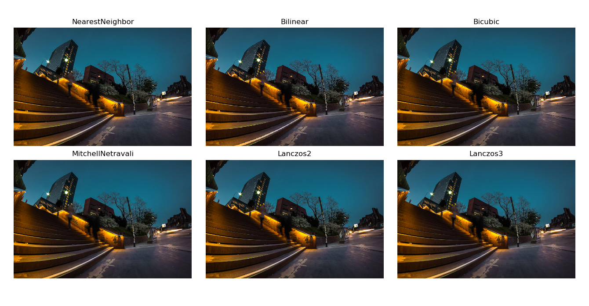

# ___2020 - 01 - 06 Go Modules___
***
# 目录
  <!-- TOC depthFrom:1 depthTo:6 withLinks:1 updateOnSave:1 orderedList:0 -->

  - [___2020 - 01 - 06 Go Modules___](#2020-01-06-go-modules)
  - [目录](#目录)
  - [链接](#链接)
  - [Go Log](#go-log)
  	- [Log](#log)
  	- [Zap](#zap)
  	- [Logrus](#logrus)
  - [Tensorflow](#tensorflow)
  	- [Install TensorFlow for C](#install-tensorflow-for-c)
  	- [Install TensorFlow for Go](#install-tensorflow-for-go)
  	- [Install tfgo](#install-tfgo)
  	- [Model load and predict](#model-load-and-predict)
  	- [SessionOptions](#sessionoptions)
  - [Sync data from mysql and calculate dot values](#sync-data-from-mysql-and-calculate-dot-values)
  	- [mysql](#mysql)
  	- [struct](#struct)
  	- [strings and strconv](#strings-and-strconv)
  	- [time](#time)
  	- [gonum mat](#gonum-mat)
  	- [gonum blas netlib](#gonum-blas-netlib)
  	- [flag](#flag)
  	- [dataframe](#dataframe)
  - [Images](#images)
  	- [Decode](#decode)
  	- [Draw](#draw)
  	- [仿射变换 WarpAffine](#仿射变换-warpaffine)
  	- [Python skimage umeyama](#python-skimage-umeyama)
  	- [Go 自定义 Umeyama](#go-自定义-umeyama)
  - [Tensorflow images](#tensorflow-images)
  	- [Tensorflow images](#tensorflow-images)
  	- [tfgo images](#tfgo-images)
  - [onnx-go](#onnx-go)
  - [go-tflite](#go-tflite)

  <!-- /TOC -->
***

# 链接
  - [Codewalk: First-Class Functions in Go](https://golang.org/doc/codewalk/functions/)
  - [《The Way to Go》中文译本，中文正式名《Go 入门指南》](https://github.com/Unknwon/the-way-to-go_ZH_CN)
  - [Github jdeng/goface](https://github.com/jdeng/goface)
  - [Data Science In Go: A Cheat Sheet by chewxy](https://www.cheatography.com/chewxy/cheat-sheets/data-science-in-go-a/)
  - [golang/go/Mobile](https://github.com/golang/go/wiki/Mobile)
  - [Go语言标准库](https://books.studygolang.com/The-Golang-Standard-Library-by-Example/)
  - [Go语言圣经（中文版）](https://books.studygolang.com/gopl-zh/)
  - [Go入门指南](https://books.studygolang.com/the-way-to-go_ZH_CN/)
  - [Sharing Golang packages to C and Go](http://blog.ralch.com/tutorial/golang-sharing-libraries/)
  - [GoFrame 开发框架](https://goframe.org/index)
***

# Go Log
## Log
  ```go
  // test_log.go
  package main

  import (
      "log"
  )

  func init() {
      log.SetPrefix("TRACE: ")
      log.SetFlags(log.Ldate | log.Lmicroseconds | log.Llongfile)
  }

  func main() {
      // Println writes to the standard logger.
      log.Println("message")

      // Fatalln is Println() followed by a call to os.Exit(1).
      log.Fatalln("fatal message")

      // Panicln is Println() followed by a call to panic().
      log.Panicln("panic message")
  }
  ```
  **Run**
  ```go
  TRACE: 2020/01/13 19:30:34.493595 /home/leondgarse/practice_code/go/test_log.go:14: message
  TRACE: 2020/01/13 19:30:34.493656 /home/leondgarse/practice_code/go/test_log.go:17: fatal message
  exit status 1
  ```
## Zap
  - [Github Zap](https://github.com/uber-go/zap)
  ```go
  logger, _ := zap.NewProduction()
  defer logger.Sync() // flushes buffer, if any
  sugar := logger.Sugar()
  sugar.Infow("failed to fetch URL",
      // Structured context as loosely typed key-value pairs.
      "url", url,
      "attempt", 3,
      "backoff", time.Second,
  )
  sugar.Infof("Failed to fetch URL: %s", url)
  ```
  ```go
  logger, _ := zap.NewProduction()
  defer logger.Sync()
  logger.Info("failed to fetch URL",
      // Structured context as strongly typed Field values.
      zap.String("url", url),
      zap.Int("attempt", 3),
      zap.Duration("backoff", time.Second),
  )
  ```
## Logrus
  - [Github sirupsen/logrus](https://github.com/sirupsen/logrus)
  ```go
  package main
  import (
      "os"
      "github.com/sirupsen/logrus"
  )

  func init() {
      // 以JSON格式为输出，代替默认的ASCII格式
      logrus.SetFormatter(&logrus.JSONFormatter{})
      // 以Stdout为输出，代替默认的stderr
      logrus.SetOutput(os.Stdout)
      // 设置日志等级
      logrus.SetLevel(logrus.WarnLevel)
  }
  func main() {
      logrus.WithFields(logrus.Fields{
          "animal": "walrus",
          "size":   10,
      }).Info("A group of walrus emerges from the ocean")

      logrus.WithFields(logrus.Fields{
          "omg":    true,
          "number": 122,
      }).Warn("The group's number increased tremendously!")

      logrus.WithFields(logrus.Fields{
          "omg":    true,
          "number": 100,
      }).Fatal("The ice breaks!")
  }
  ```
***

# Flag
  ```go
  package main

  import (
      "fmt"
      "flag"
  )

  func main() {
      ss := flag.String("string", "hello", "String value")
      ii := flag.Int("int", 1234, "Int value")
      bb := flag.Bool("bool", false, "Bool value")
      ee := flag.String("ee", "", "Essential string value")
      flag.Parse()
      if *ee == "" {
          flag.Usage()
          return
      }   

      fmt.Println(*ss, *ii, *bb, *ee)
  }
  ```
  ```sh
  $ go run test_flag.go
  # Usage of /tmp/go-build853351541/b001/exe/test_flag:
  #   -bool
  #     	Bool value
  #   -ee string
  #     	Essential string value
  #   -int int
  #     	Int value (default 1234)
  #   -string string
  #     	String value (default "hello")

  $ go run test_flag.go -ee aa -bool -int 42 -string world
  # world 42 true aa
  ```
***

# Binary 二进制文件读写
## Test structs
  ```go
  import (
      "math/rand"
      "encoding/binary"
      "fmt"
      "os"
      "bytes"
  )

  fmt.Println("Source basic struct:")
  type elem struct {
      AA float32
      BB float64
      CC uint32
  }

  nums := 3
  rr := rand.New(rand.NewSource(rand.Int63()))

  ss := make([]elem, nums)

  for ii := 0; ii < nums; ii++ {
      ss[ii] = elem{rr.Float32(), rr.Float64(), rr.Uint32()}
      fmt.Println(ss[ii])
  }

  fmt.Println("Source slice struct:")
  type selem struct {
      AA float32
      BB float64
      CC []uint32
  }
  elemSliceNum := 4

  sss := make([]selem, nums)
  for ii := 0; ii < nums; ii++ {
      sss[ii].CC = make([]uint32, elemSliceNum)
      sss[ii].AA = rr.Float32()
      sss[ii].BB = rr.Float64()
      for jj := 0; jj < elemSliceNum; jj++ {
          sss[ii].CC[jj] = rr.Uint32()
      }

      fmt.Println(sss[ii])
  }
  ```
  ```go
  Source basic struct:
  {0.9406326 0.3607466532834925 4263448410}
  {0.39402485 0.6147623204876898 1909146124}
  {0.73707014 0.8170595655807201 140346952}
  Source slice struct:
  {0.9325033 0.5209825014348924 [1712744152 174326113 2946345882 2566003851]}
  {0.2906545 0.7224597815694159 [2997456150 970260067 1548335504 3556833531]}
  {0.24183238 0.8934221956199041 [2299076535 905588253 1245822197 746649276]}
  ```
## Bytes buffer
  - **Write**
    ```go
    fmt.Println("Write basic struct to bytes buffer")
    var binBuf bytes.Buffer
    binary.Write(&binBuf, binary.BigEndian, ss)

    file, err := os.Create("test_basic.bin")
    // defer file.Close()
    file.Write(binBuf.Bytes())
    file.Close()

    fmt.Println("Write slice struct to bytes buffer")
    sbinBuf := bytes.Buffer()
    for ii := 0; ii < nums; ii++ {
        binary.Write(&sbinBuf, binary.BigEndian, sss[ii].AA)
        binary.Write(&sbinBuf, binary.BigEndian, sss[ii].BB)
        for jj := 0; jj < elemSliceNum; jj++ {
            binary.Write(&sbinBuf, binary.BigEndian, sss[ii].CC[jj])
        }
    }

    file2, err := os.Create("test_slice.bin")
    // defer file2.Close()
    file2.Write(sbinBuf.Bytes())
    file2.Close()
    ```
    ```go
    $ls -lh test_basic.bin test_slice.bin
    -rw-rw-r-- 1 leondgarse leondgarse 48 5月  18 15:48 test_basic.bin
    -rw-r--r-- 1 leondgarse leondgarse 84 5月  18 15:48 test_slice.bin
    ```
  - **Read**
    ```go
    fmt.Println("Read basic struct:")
    elemSize := binary.Size(elem{})
    binsT := make([]byte, elemSize * nums)

    tfile, err := os.Open("test_basic.bin")
    // defer tfile.Close()
    tfile.Read(binsT)
    tfile.Close()

    tt := make([]elem, nums)
    binary.Read(bytes.NewBuffer(binsT), binary.BigEndian, &tt)
    fmt.Println(tt)

    fmt.Println("Read slice struct:")
    ee := selem{}
    ee.CC = make([]uint32, elemSliceNum)
    selemSize := binary.Size(ee.AA) + binary.Size(ee.BB) + binary.Size(ee.CC)
    sbinsT := make([]byte, selemSize * nums)

    tfile2, err := os.Open("test_slice.bin")
    // defer tfile2.Close()
    tfile2.Read(sbinsT)
    tfile2.Close()

    stt := make([]selem, nums)
    sbinBufT := bytes.NewBuffer(sbinsT)
    for ii := 0; ii < nums; ii++ {
        stt[ii].CC = make([]uint32, elemSliceNum)
        binary.Read(sbinBufT, binary.BigEndian, &stt[ii].AA)
        binary.Read(sbinBufT, binary.BigEndian, &stt[ii].BB)
        for jj := 0; jj < elemSliceNum; jj++ {
            binary.Read(sbinBufT, binary.BigEndian, &stt[ii].CC[jj])
        }
        fmt.Println(stt[ii])
    }
    ```
    ```go
    Read basic struct:
    [{0.9406326 0.3607466532834925 4263448410} {0.39402485 0.6147623204876898 1909146124} {0.73707014 0.8170595655807201 140346952}]
    Read slice struct:
    {0.9325033 0.5209825014348924 [1712744152 174326113 2946345882 2566003851]}
    {0.2906545 0.7224597815694159 [2997456150 970260067 1548335504 3556833531]}
    {0.24183238 0.8934221956199041 [2299076535 905588253 1245822197 746649276]}
    ```
## ioutil
  ```go
  import "io/ioutil"
  fmt.Println("ioutil write + read basic struct:")

  // Write bytes slice to file
  err := ioutil.WriteFile("test_slice.bin", binBuf.Bytes(), 0644)

  // Read bytes slice from file
  binsT2, err := ioutil.ReadFile("test_slice.bin")

  // Decode
  tt := make([]elem, nums)
  binary.Read(bytes.NewBuffer(binsT2), binary.BigEndian, &tt)
  fmt.Println(tt)
  ```
  ```go
  ioutil write + read basic struct:
  [{0.9406326 0.3607466532834925 4263448410} {0.39402485 0.6147623204876898 1909146124} {0.73707014 0.8170595655807201 140346952}]
  ```
## gob
  - struct elements output **MUST** be **public**
  - **encoding/gob**
    ```go
    import "encoding/gob"

    fmt.Println("gob encode + decode basic struct:")
    gfile, err := os.Create("./test_basic.gob")
    encoder := gob.NewEncoder(gfile)
    encoder.Encode(ss)
    gfile.Close()

    gfile2, err := os.Open("./test_basic.gob")
    decoder := gob.NewDecoder(gfile2)
    tt := make([]elem, nums)
    decoder.Decode(&tt)
    gfile2.Close()
    fmt.Println(tt)

    fmt.Println("gob encode + decode slice struct:")
    gfile, err := os.Create("./test_slice.gob")
    encoder := gob.NewEncoder(gfile)
    encoder.Encode(sss)
    gfile.Close()

    gfile2, err := os.Open("./test_slice.gob")
    decoder := gob.NewDecoder(gfile2)
    stt := make([]selem, nums)
    decoder.Decode(&stt)
    gfile2.Close()
    fmt.Println(stt)
    ```
    ```go
    gob encode + decode basic struct:
    [{0.9406326 0.3607466532834925 4263448410} {0.39402485 0.6147623204876898 1909146124} {0.73707014 0.8170595655807201 140346952}]
    gob encode + decode slice struct:
    [{0.9325033 0.5209825014348924 [1712744152 174326113 2946345882 2566003851]} {0.2906545 0.7224597815694159 [2997456150 970260067 1548335504 3556833531]} {0.24183238 0.8934221956199041 [2299076535 905588253 1245822197 746649276]}]
    ```
## Encode and Decode by bytes array
  ```go
  $ls -l test_slice.gob
  // -rw-rw-r-- 1 leondgarse leondgarse 196 5月  18 16:07 test_slice.gob

  import (
    "encoding/gob"
    "os"
    "fmt"
    "bytes"
  )

  type selem struct {
    AA float32
    BB float64
    CC []uint32
  }
  nums := 3

  tfile2, err := os.Open("test_slice.gob")
  gbin := make([]byte, 196)
  tfile2.Read(gbin)
  tfile2.Close()

  // Decode
  dec := gob.NewDecoder(bytes.NewReader(gbin))
  stt2 := make([]selem, nums)
  dec.Decode(&stt2)

  // Encode
  bbb := bytes.NewBuffer(nil)
  encoder := gob.NewEncoder(bbb)
  bbb.Bytes()
  encoder.Encode(stt2)
  ```
***

# Tensorflow
## Install TensorFlow for C
  - [Install TensorFlow for C](https://www.tensorflow.org/install/lang_c)
    ```sh
    sudo tar -C /usr/local -xzf libtensorflow-*.tar.gz
    ```
  - **hello world**
    ```c
    #include <stdio.h>
    #include <tensorflow/c/c_api.h>

    int main() {
        printf("Hello from TensorFlow C library version %s\n", TF_Version());
        return 0;
    }
    ```
    ```sh
    gcc hello_tf.c -ltensorflow -o hello_tf
    ./hello_tf
    # Hello from TensorFlow C library version 1.15.0
    ```
## Install TensorFlow for Go
  - [Github tensorflow/tensorflow/go](https://github.com/tensorflow/tensorflow/tree/master/tensorflow/go)
  - [Install TensorFlow for Go](https://www.tensorflow.org/install/lang_go)
    ```sh
    go get github.com/tensorflow/tensorflow/tensorflow/go
    ```
  - **Q / A**
    ```sh
    ''' Q
    package github.com/tensorflow/tensorflow/tensorflow/go/genop/internal/proto/github.com/tensorflow/tensorflow/tensorflow/go/core: cannot find package "github.com/tensorflow/tensorflow/tensorflow/go/genop/internal/proto/github.com/tensorflow/tensorflow/tensorflow/go/core" in any of:
    '''
    ''' A
    Version of libtensorflow is r1.15
    '''
    cd ~/go/src/github.com/tensorflow/tensorflow/tensorflow/go
    git checkout r1.15
    go test github.com/tensorflow/tensorflow/tensorflow/go
    ```
  - **hello world**
    ```go
    package main

    import (
        tf "github.com/tensorflow/tensorflow/tensorflow/go"
        "github.com/tensorflow/tensorflow/tensorflow/go/op"
        "fmt"
    )

    func main() {
        // Construct a graph with an operation that produces a string constant.
        s := op.NewScope()
        c := op.Const(s, "Hello from TensorFlow version " + tf.Version())
        graph, err := s.Finalize()
        if err != nil {
            panic(err)
        }

        // Execute the graph in a session.
        sess, err := tf.NewSession(graph, nil)
        if err != nil {
            panic(err)
        }
        output, err := sess.Run(nil, []tf.Output{c}, nil)
        if err != nil {
            panic(err)
        }
        fmt.Println(output[0].Value())
    }
    ```
    ```sh
    go run hello_tf.go
    # Hello from TensorFlow version 1.15.0

    # 生成静态库
    go build -buildmode=c-archive hello_tf.go
    ```
## Install tfgo
  - [Github galeone/tfgo](https://github.com/galeone/tfgo)
    ```sh
    go get github.com/gogo/protobuf/proto
    go get github.com/galeone/tfgo
    ```
  - **Test**
    ```go
    package main

    import (
        "fmt"
        tg "github.com/galeone/tfgo"
        tf "github.com/tensorflow/tensorflow/tensorflow/go"
    )

    func main() {
        root := tg.NewRoot()
        A := tg.NewTensor(root, tg.Const(root, [2][2]int32{{1, 2}, {-1, -2}}))
        w := tg.NewTensor(root, tg.Const(root, [2][1]int64{{10}, {100}}))
        b := tg.NewTensor(root, tg.Const(root, [2][1]int32{{-10}, {10}}))
        Y := A.MatMul(w.Output).Add(b.Output)
        // Please note that Y is just a pointer to A!

        // If we want to create a different node in the graph, we have to clone Y
        // or equivalently A
        Z := A.Clone()
        results := tg.Exec(root, []tf.Output{Y.Output, Z.Output}, nil, &tf.SessionOptions{})
        fmt.Println("Y: ", results[0].Value(), "Z: ", results[1].Value())
        fmt.Println("Y == A", Y == A) // ==> true
        fmt.Println("Z == A", Z == A) // ==> false
    }
    ```
    ```sh
    $ go run test_tfgo.go
    # Y:  [[200] [-200]] Z:  [[200] [-200]]
    # Y == A true
    # Z == A false
  ```
## Model load and predict
  ```go
  package main

  import (
          "fmt"
          tg "github.com/galeone/tfgo"
          tf "github.com/tensorflow/tensorflow/tensorflow/go"
  )

  func main() {
          model := tg.LoadModel("/home/leondgarse/workspace/samba/insightface-master/model_tf_res50", []string{"serve"}, nil)

          fakeInput, _ := tf.NewTensor([1][112][112][3]float32{})
          results := model.Exec([]tf.Output{model.Op("StatefulPartitionedCall", 0)},
                        map[tf.Output]*tf.Tensor{model.Op("serving_default_input_5", 0): fakeInput})

          predictions := results[0].Value().([][]float32)
          fmt.Println(predictions)
  }
  ```
## SessionOptions
  - **tf.SessionOptions** 包含 `session` 的配置信息，如运行环境，`tensorflow.ConfigProto` 配置信息等
    ```go
    func LoadSavedModel(exportDir string, tags []string, options *SessionOptions) (*SavedModel, error)
    type SessionOptions struct {
      Target string
      Config []byte
    }
    ```
  - Python 转化 `tf.ConfigProto` 配置字段
    ```py
    list(map(hex, tf.ConfigProto(gpu_options=tf.GPUOptions(allow_growth=True, visible_device_list='1'), allow_soft_placement=True, intra_op_parallelism_threads=4, inter_op_parallelism_threads=4).SerializeToString()))                          
    # Out[16]: ['0x10', '0x4', '0x28', '0x4', '0x32', '0x5', '0x20', '0x1', '0x2a', '0x1', '0x31', '0x38', '0x1']

    list(map(hex, tf.ConfigProto(gpu_options=tf.GPUOptions(allow_growth=True, visible_device_list='1'), allow_soft_placement=True, intra_op_parallelism_threads=4, inter_op_parallelism_threads=0).SerializeToString()))
    # Out[17]: ['0x10', '0x4', '0x32', '0x5', '0x20', '0x1', '0x2a', '0x1', '0x31', '0x38', '0x1']

    list(map(hex, tf.ConfigProto(gpu_options=tf.GPUOptions(allow_growth=True, visible_device_list='1'), allow_soft_placement=True, intra_op_parallelism_threads=0, inter_op_parallelism_threads=4).SerializeToString()))
    # Out[20]: ['0x28', '0x4', '0x32', '0x5', '0x20', '0x1', '0x2a', '0x1', '0x31', '0x38', '0x1']

    list(map(hex, tf.ConfigProto(gpu_options=tf.GPUOptions(allow_growth=True, visible_device_list='1'), allow_soft_placement=True, intra_op_parallelism_threads=0, inter_op_parallelism_threads=0).SerializeToString()))
    # Out[18]: ['0x32', '0x5', '0x20', '0x1', '0x2a', '0x1', '0x31', '0x38', '0x1']

    list(map(hex, tf.ConfigProto(gpu_options=tf.GPUOptions(allow_growth=True, visible_device_list='0'), allow_soft_placement=True, intra_op_parallelism_threads=0, inter_op_parallelism_threads=0).SerializeToString()))
    # Out[19]: ['0x32', '0x5', '0x20', '0x1', '0x2a', '0x1', '0x30', '0x38', '0x1']

    list(map(hex, tf.ConfigProto(gpu_options=tf.GPUOptions(allow_growth=True, visible_device_list='0,1'), allow_soft_placement=True, intra_op_parallelism_threads=0, inter_op_parallelism_threads=0).SerializeToString()))
    # Out[47]: [0x32, 0x7, 0x20, 0x1, 0x2a, 0x3, 0x30, 0x2c, 0x31, 0x38, 0x1]

    list(map(hex, tf.ConfigProto(gpu_options=tf.GPUOptions(allow_growth=True), allow_soft_placement=True, intra_op_parallelism_threads=0, inter_op_parallelism_threads=0).SerializeToString()))
    # Out[29]: [0x32, 0x2, 0x20, 0x1, 0x38, 0x1]

    list(map(hex, tf.ConfigProto(device_count={'GPU': 0}, allow_soft_placement=True, intra_op_parallelism_threads=0, inter_op_parallelism_threads=0).SerializeToString()))
    # Out[39]: ['0xa', '0x7', '0xa', '0x3', '0x47', '0x50', '0x55', '0x10', '0x0', '0x38', '0x1']
    ```
  - Go 生成 `tf.SessionOptions`
    ```go
    type Ctx struct {
    	Unit string
    	Idx int
    	Intra_op_parallelism_threads int
    	Inter_op_parallelism_threads int
    }
    func initSesionConfig(cc Ctx) *tf.SessionOptions {
    	ss := tf.SessionOptions{}
    	if cc.Unit == "GPU" && cc.Idx != -1 {
    		ss.Config = []byte{0x32, 0x5, 0x20, 0x1, 0x2a, 0x1, 0x30, 0x38, 0x1}
    		ss.Config[6] += byte(cc.Idx)
    	} else {
    		ss.Config = []byte{0x32, 0x2, 0x20, 0x1, 0x38, 0x1}
    	}
      if cc.Inter_op_parallelism_threads != 0 {
        ss.Config = append([]byte{0x28, 0x0}, ss.Config...)
        ss.Config[1] += byte(cc.Inter_op_parallelism_threads)
      }
      if cc.Intra_op_parallelism_threads != 0 {
        ss.Config = append([]byte{0x10, 0x0}, ss.Config...)
        ss.Config[1] += byte(cc.Intra_op_parallelism_threads)
      }
    	return &ss
    }

    fmt.Println(initSesionConfig(Ctx{"GPU", 1, 4, 4}))  // &{ [16 4 40 4 50 5 32 1 42 1 49 56 1]}
    fmt.Println(initSesionConfig(Ctx{"GPU", 1, 4, 0}))  // &{ [16 4 50 5 32 1 42 1 49 56 1]}
    fmt.Println(initSesionConfig(Ctx{"GPU", 1, 0, 4}))  // &{ [40 4 50 5 32 1 42 1 49 56 1]}
    fmt.Println(initSesionConfig(Ctx{"GPU", 1, 0, 0}))  // &{ [50 5 32 1 42 1 49 56 1]}
    fmt.Println(initSesionConfig(Ctx{"GPU", 0, 0, 0}))  // &{ [50 5 32 1 42 1 48 56 1]}
    fmt.Println(initSesionConfig(Ctx{"GPU", -1, 0, 0}))  // &{ [50 2 32 1 56 1]}
    fmt.Println(initSesionConfig(Ctx{"CPU", -1, 4, 0}))  // &{ [16 4 50 2 32 1 56 1]}
    ```
***

# Sync data from mysql and calculate dot values
## mysql
  - [Github go-sql-driver/mysql](https://github.com/go-sql-driver/mysql)
  - [Github go-sql-driver/mysql Examples](https://github.com/go-sql-driver/mysql/wiki/Examples)
  ```sh
  go get -u github.com/go-sql-driver/mysql
  ```
  ```go
  // jupyter gophernotes kernel 运行环境
  import (
      "fmt"
      "database/sql"
      _ "github.com/go-sql-driver/mysql"
  )
  db, err := sql.Open("mysql", "root:123456@(192.168.11.83:3306)/face?charset=utf8")
  fmt.Println(err)

  rows, err := db.Query("select person.person_id, person.base_id, face.face_id, face.feature from person inner join face on person.person_id=face.person_id where person.status=1 and face.status=1")
  fmt.Println(err)
  fmt.Println(rows.Columns())


  columns, err := rows.Columns()
  values := make([]sql.RawBytes, len(columns))
  scanArgs := make([]interface{}, len(values))
  for i := range values {
      scanArgs[i] = &values[i]
  }

  for rows.Next() {
      // get RawBytes from data
      err = rows.Scan(scanArgs...)
      if err != nil {
          panic(err.Error()) // proper error handling instead of panic in your app
      }

      // Now do something with the data.
      // Here we just print each column as a string.
      var value string
      for i, col := range values {
          // Here we can check if the value is nil (NULL value)
          if col == nil {
              value = "NULL"
          } else {
              value = string(col)
          }
          fmt.Println(columns[i], ": ", value)
      }
      fmt.Println("-----------------------------------")
  }
  if err = rows.Err(); err != nil {
      panic(err.Error()) // proper error handling instead of panic in your app
  }
  ```
  **Run**
  ```go
  <nil>
  <nil>
  [person_id base_id face_id feature] <nil>

  person_id :  101186
  base_id :  100020
  face_id :  101202
  feature :  [...]
  ```
## struct
  ```go
  import "fmt"
  type vv struct {
      Person_id, Face_id []string
      Feature [][]float64
  }

  aa := vv{Person_id: []string{"111"}, Face_id: []string{"222"}, Feature: [][]float64{[]float64{1.0, 2.0}}}
  fmt.Println(aa)
  // {[111] [222] [[1 2]]}

  bb := vv{}
  fmt.Println(bb)
  // {[] [] []}

  bb.Person_id = append(bb.Person_id, "111")
  bb.Feature = append(bb.Feature, []float64{1.0, 2.0})
  bb.Feature = append(bb.Feature, []float64{1.0, 2.0})
  fmt.Println(bb)
  // {[111] [] [[1 2] [1 2]]}

  mm := make(map[string] vv)
  mm["01"] = bb
  fmt.Println(mm)
  // map[01:{[111] [] [[1 2] [1 2]]}]
  ```
## strings and strconv
  ```go
  import (
      "fmt"
      "strings"
      "strconv"
  )

  ss := string(" [111, 222, 333] ")
  ss = strings.TrimSpace(ss)

  tt := make([]float64, 0, 5)
  for _, v := range strings.Split(ss[1:len(ss)-1], ",") {
      fmt.Println(v)
      ii, _ := strconv.ParseFloat(strings.TrimSpace(v), 64)
      tt = append(tt, ii)
  }
  fmt.Println(tt)
  // 111
  //  222
  //  333
  // [111 222 333]
  ```
## time
  ```go
  import (
      "fmt"
      "time"
  )
  aa := time.Now()
  bb := time.Now()
  cc := float64((bb.UnixNano() - aa.UnixNano())) / 1e9
  fmt.Println(cc)
  // 1.404e-06

  fmt.Println(time.Since(aa))
  // 19.548µs

  rr := 100
  ss := time.Now()
  for ii := 0; ii < rr; ii++ {
      // Do nothing
  }
  tt := time.Since(ss).Seconds()
  fmt.Println("Repeat: ", rr, ", Total: ", tt * 1e6, "µs, Mean: ", tt * 1e6 / float64(rr), "µs")
  // Repeat:  100 , Total:  6.022 µs, Mean:  0.06022 µs
  ```
## gonum mat
  - [Gonum](https://www.gonum.org/)
  - [Github gonum/gonum](https://github.com/gonum/gonum)
  - [GoDoc package mat](https://godoc.org/gonum.org/v1/gonum/mat)
  - [GoDoc package stat](https://godoc.org/gonum.org/v1/gonum/stat)
  ```sh
  go get -u gonum.org/v1/gonum/...
  ```
  ```go
  import (
      "fmt"
      "gonum.org/v1/gonum/mat"
      "math/rand"
  )

  // Allocate a zeroed real matrix of size 3×5
  zero := mat.NewDense(3, 5, nil)
  fz := mat.Formatted(zero, mat.Prefix(""), mat.Squeeze())
  fmt.Printf("%v\n", fz)

  // Generate a 6×6 matrix of random values.
  data := make([]float64, 12)
  for i := range data {
      data[i] = rand.NormFloat64()
  }
  a := mat.NewDense(3, 4, data)
  b := mat.NewDense(3, 3, nil)
  b.Mul(a, a.T())

  fb := mat.Formatted(b, mat.Prefix(""), mat.Squeeze())
  fmt.Printf("%v\n", fb)
  ```
  **Run**
  ```go
  ⎡0  0  0  0  0⎤
  ⎢0  0  0  0  0⎥
  ⎣0  0  0  0  0⎦

  ⎡ 1.8652130047132958   -1.5456218518362732   -0.9164891788739576⎤
  ⎢-1.5456218518362732    2.2661732973346704  -0.25525252793470465⎥
  ⎣-0.9164891788739576  -0.25525252793470465    2.9563935672642185⎦
  ```
## gonum blas netlib
  - [mat: performance of calculating eigenvalues in gonum is slower than numpy](https://github.com/gonum/gonum/issues/511#issuecomment-571551123)
  - In `python`, it takes ~ **600 ms** to calculate the dot value of two `10000 x 512` matrix:
    ```py
    In [8]: aa = np.zeros((10000, 512), dtype=np.float64)
    In [9]: aa.shape
    Out[9]: (10000, 512)

    In [10]: %timeit np.dot(aa, aa.T)
    580 ms ± 5.5 ms per loop (mean ± std. dev. of 7 runs, 1 loop each)
    ```
  - In `gonum`, it's ~ **3s** if do nothing, but improved to ~ **0.6s** after using `OpenBLAS`:
    ```sh
    # Install blas + lapack + netlib
    go get -d gonum.org/v1/gonum/blas/...
    go get -d gonum.org/v1/gonum/lapack/...
    go get -d gonum.org/v1/netlib/...

    # Install OpenBLAS
    git clone https://github.com/xianyi/OpenBLAS
    cd OpenBLAS
    make
    make install # This will install OpenBLAS lib to /opt/OpenBLAS/lib
    export LD_LIBRARY_PATH=/opt/OpenBLAS/lib/:$LD_LIBRARY_PATH

    CGO_LDFLAGS="-L/opt/OpenBLAS/lib -lopenblas" go install gonum.org/v1/netlib/blas/netlib
    CGO_LDFLAGS="-L/opt/OpenBLAS/lib -lopenblas" go install gonum.org/v1/netlib/lapack/netlib
    ```
    **go script**
    ```go
    // test_mul.go
    package main

    import (
        "fmt"
        "time"
        "gonum.org/v1/gonum/mat"
        // "gonum.org/v1/gonum/lapack/lapack64"
        // lapack_netlib "gonum.org/v1/netlib/lapack/netlib"
        "gonum.org/v1/gonum/blas/blas64"
        blas_netlib "gonum.org/v1/netlib/blas/netlib"
    )

    func main() {
        // lapack64.Use(lapack_netlib.Implementation{})
        blas64.Use(blas_netlib.Implementation{}) // This improves Mul time from ~3s to ~0.6s
        zero := mat.NewDense(10000, 512, nil)
        var cc mat.Dense

        // First run takes a longer time ~1.0s
        bb := time.Now()
        cc.Mul(zero, zero.T())
        dd := time.Now()
        tt := float64((dd.UnixNano() - bb.UnixNano())) / 1e9
        fmt.Printf("First Mul time: %vs\n", tt)

        // Second run is better ~0.6s
        bb = time.Now()
        cc.Mul(zero, zero.T())
        dd = time.Now()
        tt = float64((dd.UnixNano() - bb.UnixNano())) / 1e9
        fmt.Printf("Second Mul time: %vs\n", tt)
    }
    ```
    **Run**
    ```sh
    $ time CGO_LDFLAGS="-L/opt/OpenBLAS/lib -lopenblas" go run test_mul.go
    First Mul time: 1.107493044s
    Second Mul time: 0.625305053s

    real	0m2.082s
    user	0m14.385s
    sys	0m6.471s
    ```
## dataframe
  - [Github go-gota/gota](https://github.com/go-gota/gota)
    ```sh
    go get github.com/kniren/gota/dataframe
    ```
***

# Images
## Decode
  - [Godoc Package image](https://golang.org/pkg/image/)
  - **Read jpeg image --> decode --> convert to float32 matrix**
    ```go
    import (
        "os"
        "fmt"
        "image"
        _ "image/jpeg"
    )
    reader, err := os.Open("/home/leondgarse/workspace/samba/541812715.jpg")
    m, _, err := image.Decode(reader)
    bounds := m.Bounds()
    fmt.Println(bounds.Min.Y, bounds.Max.Y, bounds.Min.X, bounds.Max.X)
    // 0 112 0 112

    imm := [112][112][3]uint32{}
    aa := m.At(0, 0)
    r, g, b, a := aa.RGBA()
    imm[0][0] = [3]uint32{r>>8, g>>8, b>>8}
    fmt.Println(aa, r, g, b, a, imm[0][0])
    // {242 128 120} 59323 63657 62194 65535 [231 248 242]

    imm := [112][112][3]float32{}
    for y := bounds.Min.Y; y < bounds.Max.Y; y++ {
       for x := bounds.Min.X; x < bounds.Max.X; x++ {
            r, g, b, _ := m.At(x, y).RGBA()
            // A color's RGBA method returns values in the range [0, 65535].
            // Shifting by 8 reduces this to the range [0, 255].
            imm[x][y] = [3]float32{float32(r>>8) / 255, float32(g>>8) / 255, float32(b>>8) / 255}
        }
    }
    fmt.Println(imm)
    ```
## Draw
  - [Golang Package draw](https://golang.org/pkg/image/draw/)
  - [Godoc golang.org/x/image](https://godoc.org/golang.org/x/image)
  - [Github golang/image](https://github.com/golang/image)
  ```sh
  go get -u golang.org/x/image/...
  ```
  ```go
  import (
      "fmt"
      "os"
      "image"
      "image/color"
      "image/draw"
      "image/jpeg"
  )

  m := image.NewNRGBA(image.Rect(0, 0, 256, 256))
  fmt.Println(len(m.Pix), m.Stride, m.Rect)

  white := color.RGBA{255, 255, 255, 255}
  draw.Draw(m, image.Rect(30, 30, 80, 80), &image.Uniform{white}, image.ZP, draw.Src)
  ff, err := os.Create("cc.jpg")
  jpeg.Encode(ff, m, &jpeg.Options{90})
  ```
## 仿射变换 WarpAffine
  - **Python skimage.transform.SimilarityTransform** 计算一个点集 `src` 到另一个点集 `dst` 的变换矩阵
    ```py
    src = [x, y]
    dst[X] = a0 * x - b0 * y + a1 =
             s * x * cos(rotation) - s * y * sin(rotation) + a1
    dst[Y] = b0 * x + a0 * y + b1 =
             s * x * sin(rotation) + s * y * cos(rotation) + b1

    where ``s`` is a scale factor and the homogeneous transformation matrix is::
        [[a0  b0  a1]
         [b0  a0  b1]
         [0   0    1]]
    ```
    其中 `s` 是 **缩放系数 scale factor**，`rotation` 为旋转角度，对应的转换矩阵为
    ```py
    M = [[a0  b0  a1]
         [b0  a0  b1]
         [0   0    1]]
    a0 ** 2 + b0 ** 2 == 1
    ```
    **SimilarityTransform** 使用 **_umeyama** 算法计算转换矩阵，并指定 `estimate_scale` 为 `True`，对矩阵缩放
    ```py
    dst = np.array([[38.2946, 51.6963], [73.5318, 51.5014], [56.0252, 71.7366],
           [41.5493, 92.3655], [70.729904, 92.2041]], dtype=float32)

    src = np.array([[440.2207, 370.8417], [495.93146, 379.2145], [468.10645, 408.5712],
           [428.82767, 423.77728], [476.17242, 430.34576]], dtype=float32)
    tform = SimilarityTransform()
    tform.estimate(src, dst)
    # True

    tform.params
    # array([[ 6.55270955e-01,  1.55777124e-01, -3.09319952e+02],
    #        [-1.55777124e-01,  6.55270955e-01, -1.19932683e+02],
    #        [ 0.00000000e+00,  0.00000000e+00,  1.00000000e+00]])
    tform.rotation
    # -0.233396873371601
    tform.scale
    # 0.6735328777042037
    tform.translation
    # array([-309.3199519 , -119.93268325])

    cc = tform.params
    scale = np.sqrt(cc[0, 0] ** 2 + cc[0, 1] ** 2)
    scale
    # 0.6735328777042037
    (cc[0, 0] / scale) ** 2 + (cc[0, 1] / scale) ** 2
    # 1.0

    rotation = np.math.acos(cc[0, 0] / scale)
    rotation
    # 0.23339687337160087
    ```
    **计算三个点的仿射变换矩阵**
    ```py
    ss = np.array([[440.2207, 370.8417], [495.93146, 379.2145], [468.10645, 408.5712]])
    dd = np.array([[38.2946, 51.6963], [73.5318, 51.5014], [56.0252, 71.7366]])

    from numpy import linalg as LA
    tt = np.dot(dd.T, LA.inv(np.vstack([ss.T, [1, 1, 1]])))
    # array([[ 6.32086782e-01,  2.76669492e-03, -2.40989092e+02],
    #        [-9.37387771e-02,  6.00439341e-01, -1.29705896e+02]])
    ```
  - **Go "golang.org/x/image/draw" Transform** 根据转换矩阵 `m` **仿射变换 affine transform** `src`，并将结果保存在 `dst`，`sr` 可以指定 `src` 中的转换区域
    ```go
    // For example, if m is the matrix
    //
    // 	m00 m01 m02
    // 	m10 m11 m12
    //
    // then the src-space point (sx, sy) maps to the dst-space point
    // (m00*sx + m01*sy + m02, m10*sx + m11*sy + m12).
    type Transformer interface {
        Transform(dst Image, m f64.Aff3, src image.Image, sr image.Rectangle, op Op, opts *Options)
    }
    ```
    ```go
    import (
        "os"
        "image"
        "image/color"
        "image/jpeg"
        "golang.org/x/image/draw"
        "golang.org/x/image/math/f64"
    )

    src := image.NewNRGBA(image.Rect(0, 0, 400, 300))
    white := color.RGBA{255, 255, 255, 255}
    draw.Draw(src, image.Rect(30, 30, 80, 80), &image.Uniform{white}, image.ZP, draw.Src)

    const cos60, sin60 = 0.5, 0.866025404
    t := f64.Aff3{
        +2 * cos60, -2 * sin60, 100,
        +2 * sin60, +2 * cos60, 100,
    }

    dst := image.NewRGBA(image.Rect(0, 0, 400, 300))
    draw.NearestNeighbor.Transform(dst, t, src, src.Bounds(), draw.Over, nil)

    ff, err := os.Create("aa.jpg")
    jpeg.Encode(ff, src, &jpeg.Options{90})

    ff, err := os.Create("bb.jpg")
    jpeg.Encode(ff, dst, &jpeg.Options{90})
    ```
    
  - **Go 图片裁剪** 变换后裁剪需要的图片部分
    ```go
    idd := image.NewRGBA(image.Rect(0, 0, 150, 150))
    draw.Copy(idd, image.Point{}, dst, image.Rect(0, 150, 150, 300), draw.Src, nil)
    ff, err := os.Create("cc.jpg")
    jpeg.Encode(ff, idd, &jpeg.Options{90})
    ```
    
## Python skimage umeyama
  ```py
  def _umeyama(src, dst, estimate_scale):
      """Estimate N-D similarity transformation with or without scaling.

      Parameters
      ----------
      src : (M, N) array
          Source coordinates.
      dst : (M, N) array
          Destination coordinates.
      estimate_scale : bool
          Whether to estimate scaling factor.

      Returns
      -------
      T : (N + 1, N + 1)
          The homogeneous similarity transformation matrix. The matrix contains
          NaN values only if the problem is not well-conditioned.

      References
      ----------
      .. [1] "Least-squares estimation of transformation parameters between two
              point patterns", Shinji Umeyama, PAMI 1991, :DOI:`10.1109/34.88573`

      """

      num = src.shape[0]
      dim = src.shape[1]

      # Compute mean of src and dst.
      src_mean = src.mean(axis=0)
      dst_mean = dst.mean(axis=0)

      # Subtract mean from src and dst.
      src_demean = src - src_mean
      dst_demean = dst - dst_mean

      # Eq. (38).
      A = dst_demean.T @ src_demean / num

      # Eq. (39).
      d = np.ones((dim,), dtype=np.double)
      if np.linalg.det(A) < 0:
          d[dim - 1] = -1

      T = np.eye(dim + 1, dtype=np.double)

      U, S, V = np.linalg.svd(A)

      # Eq. (40) and (43).
      rank = np.linalg.matrix_rank(A)
      if rank == 0:
          return np.nan * T
      elif rank == dim - 1:
          if np.linalg.det(U) * np.linalg.det(V) > 0:
              T[:dim, :dim] = U @ V
          else:
              s = d[dim - 1]
              d[dim - 1] = -1
              T[:dim, :dim] = U @ np.diag(d) @ V
              d[dim - 1] = s
      else:
          T[:dim, :dim] = U @ np.diag(d) @ V

      if estimate_scale:
          # Eq. (41) and (42).
          scale = 1.0 / src_demean.var(axis=0).sum() * (S @ d)
      else:
          scale = 1.0

      T[:dim, dim] = dst_mean - scale * (T[:dim, :dim] @ src_mean.T)
      T[:dim, :dim] *= scale

      return T
  ```
  **matrix_rank** 返回 **SVD** 方法计算的矩阵的秩，即 `SVD` 分解后，`S` 中大于 `tol` 的值的数量
  ```py
  matrix_rank(M, tol=None, hermitian=False)
  ```
  其中 `tol == S.max() * max(M.shape) * eps`，`eps` 为 `S` 数据类型的 `epsilon` 值
  ```py
  np.finfo(np.float64).eps
  # 2.220446049250313e-16
  ```
## Go 自定义 Umeyama
  ```go
  import (
      "math"
      "gonum.org/v1/gonum/mat"
      "gonum.org/v1/gonum/stat"
  )

  func dense_col_mean_var(ss mat.Matrix) ([]float64, []float64) {
      num, dim := ss.Dims()
      means := make([]float64, dim)
      varians := make([]float64, dim)
      col := make([]float64, num)
      for j := 0; j < dim; j++ {
          mat.Col(col, j, ss)
          mean, varian := stat.MeanVariance(col, nil)
          varian = varian * float64(num - 1) / float64(num)
          means[j] = mean
          varians[j] = varian
      }
      return means, varians
  }

  func dense_sub_col_mean(dd *mat.Dense, ss mat.Matrix, means []float64) {
      _dense_sub_col_mean := func(i int, j int, v float64) float64 {
          return v - means[j]
      }
      dd.Apply(_dense_sub_col_mean, ss)
  }

  func dense_set_values(sv float64) func(int, int, float64) float64 {
      return func(i int, j int, v float64) float64 {
          return sv
      }
  }

  func dense_rank_tol(m *mat.Dense, s []float64) float64 {
      num, dim = m.Dims()
      dmm := num
      if num < dim {
          dmm = dim
      }

      smm := s[0]
      for _, v := range(s[1:]) {
          if v > smm {
              smm = v
          }
      }

      // max(s) * max(m.shape) * np.finfo(np.float64).eps
      return smm * float64(dmm) * 2.220446049250313e-16
  }

  func dense_rank(m *mat.Dense, s []float64) int {
      tol := dense_rank_tol(m, s)
      num, dim = m.Dims()
      rank := len(s)
      for _, v := range(s) {
          if v < tol {
              rank -= 1
          }
      }
      return rank
  }

  func Umeyama(src_list []float64, dst_list []float64, dim int, estimate_scale bool) *mat.Dense {
      // dim = 2
      num = len(src_list) / dim
      src := mat.NewDense(num, dim, src_list)
      dst := mat.NewDense(num, dim, dst_list)

      src_mean, src_var := dense_col_mean_var(src)
      dst_mean, _ := dense_col_mean_var(dst)

      src_demean := mat.NewDense(num, dim, nil)
      dense_sub_col_mean(src_demean, src, src_mean)
      dst_demean := mat.NewDense(num, dim, nil)
      dense_sub_col_mean(dst_demean, dst, dst_mean)

      dots := mat.NewDense(dim, dim, nil)
      dots.Mul(dst_demean.T(), src_demean)
      A := mat.NewDense(dim, dim, nil)
      A.Apply(dense_set_values(float64(num)), A)
      A.DivElem(dots, A)

      d := mat.NewDense(1, dim, nil)
      d.Apply(dense_set_values(1.0), d)
      if mat.Det(A) < 0 {
          d.Set(0, dim - 1 , -1)
      }

      T := mat.NewDense(dim + 1, dim + 1, nil)
      T.Set(dim, dim, 1.0)

      var svd mat.SVD
      svd.Factorize(A, mat.SVDFull)

      U := mat.NewDense(dim, dim, nil)
      V := mat.NewDense(dim, dim, nil)
      svd.UTo(U)
      svd.VTo(V)
      S := svd.Values(nil)

      tt := mat.NewDense(dim, dim, nil)
      rank := dense_rank(A, S)
      if rank == 0 {
          return T
      } else if rank == dim - 1 {
          if mat.Det(U) * mat.Det(V) > 0 {
              tt.Mul(U, V)
          } else {
              s := d.At(0, dim - 1)
              d.Set(0, dim - 1 , -1)
              tt.Mul(U, mat.NewDiagDense(dim, mat.Row(nil, 0, d)))
              tt.Mul(tt, V)
              d.Set(0, dim - 1 , s)
          }
      } else {
          tt.Mul(U, mat.NewDiagDense(dim, mat.Row(nil, 0, d)))
          tt.Mul(tt, V)
      }

      scale := 1.0
      if estimate_scale == true {
          src_var_sum = mat.Sum(mat.NewVecDense(len(src_var), src_var))
          ss := mat.NewVecDense(len(S), S)
          dv := mat.NewVecDense(dim, mat.Row(nil, 0, d))
          scale = 1.0 / src_var_sum * mat.Dot(ss, dv)
      }

      ts := mat.NewDense(dim, 1, nil)
      ts.Mul(tt, mat.NewDense(dim, 1, src_mean))

      for i := 0; i < dim; i++ {
          T.Set(i, dim, dst_mean[i] - ts.At(i, 0) * scale)
      }

      tt_scale := mat.NewDense(dim, dim, nil)
      tt_scale.Apply(dense_set_values(float64(scale)), tt_scale)
      tt.MulElem(tt, tt_scale)
      T.Copy(tt)

      return T
  }
  ```
  **Run**
  ```go
  src_list := []float64{440.2207, 370.8417, 495.93146, 379.2145, 468.10645, 408.5712,
      428.82767, 423.77728, 476.17242, 430.34576}
  dst_list := []float64{38.2946, 51.6963, 73.5318, 51.5014, 56.0252, 71.7366,
      41.5493, 92.3655, 70.729904, 92.2041}

  import "time"
  aa := time.Now()
  T := Umeyama(src_list, dst_list, 2, true)
  bb := time.Now()

  fmt.Println(float64(bb.Nanosecond() - aa.Nanosecond()) / 1e9)
  fb := mat.Formatted(T, mat.Prefix(""), mat.Squeeze())
  fmt.Printf("%v\n", fb)
  // 0.000181248
  // ⎡  0.6552709829768382  0.15577712952035314  -309.31998005616856⎤
  // ⎢-0.15577712952035325   0.6552709829768378  -119.93267353999204⎥
  // ⎣                   0                    0                    1⎦

  T := Umeyama(src_list, dst_list, 2, false)
  fmt.Println(math.Pow(T.At(0, 0), 2) + math.Pow(T.At(0, 1), 2))
  // 1.000000000000001
  ```
## Resize
  - [Github nfnt/resize](https://github.com/nfnt/resize)
    ```sh
    go get /github.com/nfnt/resize
    go build /github.com/nfnt/resize
    go install /github.com/nfnt/resize
    ```
  - **Test**
    ```go
    // testResize/testResize.go
    package main

    import (
    	"fmt"
    	"github.com/disintegration/imaging"
    	"github.com/nfnt/resize"
    	"image/jpeg"
    	"os"
    	"runtime"
    	"time"
    )

    func main() {
    	file, _ := os.Open("go_resize_test_2.jpeg")
    	defer file.Close()
    	img, _ := jpeg.Decode(file)
    	runtime.GOMAXPROCS(4)

    	methods := []resize.InterpolationFunction{resize.NearestNeighbor, resize.Bilinear, resize.Bicubic, resize.MitchellNetravali, resize.Lanczos2, resize.Lanczos3}
    	saveNames := []string{"NearestNeighbor", "Bilinear", "Bicubic", "MitchellNetravali", "Lanczos2", "Lanczos3"}

    	iter := 20
    	target_scale := 2000
    	fmt.Println(">>>> github.com/nfnt/resize")
    	for id, mm := range methods {
    		ss := time.Now()
    		for i := 0; i < iter; i++ {
    			resize.Resize(uint(target_scale), 0, img, mm)
    		}
    		dd := time.Since(ss)
    		fmt.Println(saveNames[id], ": Iter:", iter, "Total:", dd, "Mean:", dd/time.Duration(iter))

    		iss := resize.Resize(uint(target_scale), 0, img, mm)
    		out, _ := os.Create("test_resized_" + saveNames[id] + ".jpg")
    		defer out.Close()
    		jpeg.Encode(out, iss, nil)
    	}

    	methods2 := []imaging.ResampleFilter{imaging.Box, imaging.CatmullRom, imaging.Linear, imaging.MitchellNetravali, imaging.NearestNeighbor, imaging.Lanczos}
    	saveNames2 := []string{"Box", "CatmullRom", "Linear", "MitchellNetravali", "NearestNeighbor", "Lanczos"}
    	fmt.Println(">>>> github.com/disintegration/imaging")
    	for id, mm := range methods2 {
    		ss := time.Now()
    		for i := 0; i < iter; i++ {
    			imaging.Resize(img, target_scale, 0, mm)
    		}
    		dd := time.Since(ss)
    		fmt.Println(saveNames2[id], ": Iter:", iter, "Total:", dd, "Mean:", dd/time.Duration(iter))
    	}
    }
    ```
    **Run**
    ```go
    go mod init testResize
    go mod tidy
    go run testResize.go
    // >>>> github.com/nfnt/resize
    // NearestNeighbor : Iter: 20 Total: 317.834034ms Mean: 15.891701ms
    // Bilinear : Iter: 20 Total: 401.037935ms Mean: 20.051896ms
    // Bicubic : Iter: 20 Total: 493.334781ms Mean: 24.666739ms
    // MitchellNetravali : Iter: 20 Total: 497.312038ms Mean: 24.865601ms
    // Lanczos2 : Iter: 20 Total: 499.966012ms Mean: 24.9983ms
    // Lanczos3 : Iter: 20 Total: 758.183492ms Mean: 37.909174ms
    // >>>> github.com/disintegration/imaging
    // Box : Iter: 20 Total: 236.476505ms Mean: 11.823825ms
    // CatmullRom : Iter: 20 Total: 374.478657ms Mean: 18.723932ms
    // Linear : Iter: 20 Total: 266.608065ms Mean: 13.330403ms
    // MitchellNetravali : Iter: 20 Total: 376.092672ms Mean: 18.804633ms
    // NearestNeighbor : Iter: 20 Total: 63.533029ms Mean: 3.176651ms
    // Lanczos : Iter: 20 Total: 491.078708ms Mean: 24.553935ms
    ```
    ```py
    import glob2
    imms = [imread(ii) for ii in glob2.glob('test_resized_*.jpg')]
    fig, axes = plt.subplots(ncols=3, nrows=2)
    axes = axes.flatten()
    titles = "NearestNeighbor", "Bilinear", "Bicubic", "MitchellNetravali", "Lanczos2", "Lanczos3"
    for ax, imm, title in zip(axes, imms, titles):
        ax.imshow(imm)
        ax.set_title(title)
        ax.set_axis_off()
    fig.tight_layout()
    ```
    
***

# Tensorflow images
## Tensorflow images
  ```go
  // test_tf_images.go
  package main

  import (
      "fmt"
      "io/ioutil"
      tf "github.com/tensorflow/tensorflow/tensorflow/go"
      "github.com/tensorflow/tensorflow/tensorflow/go/op"
  )
  func runScope(s *op.Scope, inputs map[tf.Output]*tf.Tensor, outputs []tf.Output) ([]*tf.Tensor, error) {
      graph, err := s.Finalize()
      if err != nil {
          return nil, err
      }

      session, err := tf.NewSession(graph, nil)
      if err != nil {
          return nil, err
      }
      defer session.Close()
      return session.Run(inputs, outputs, nil)
  }
  func main() {
      bytes, _ := ioutil.ReadFile("/home/leondgarse/workspace/samba/541812715.jpg")
      tensor, _ := tf.NewTensor(string(bytes))
      s := op.NewScope()
      input := op.Placeholder(s, tf.String)
      out := op.ExpandDims(s,
          op.Cast(s, op.DecodeJpeg(s, input, op.DecodeJpegChannels(3)), tf.Float),
          op.Const(s.SubScope("make_batch"), int32(0)))

      outs, _ := runScope(s, map[tf.Output]*tf.Tensor{input: tensor}, []tf.Output{out})
      fmt.Println(outs[0])
  }
  ```
  **Run**
  ```sh
  $ go run test_tf_images.go
  # &{0x39b5ce0 [1 112 112 3]}
  ```
## tfgo images
  ```go
  package main

  import (
          tg "github.com/galeone/tfgo"
          "github.com/galeone/tfgo/image"
          "github.com/galeone/tfgo/image/filter"
          "github.com/galeone/tfgo/image/padding"
          tf "github.com/tensorflow/tensorflow/tensorflow/go"
          "os"
  )

  func main() {
          root := tg.NewRoot()
          grayImg := image.Read(root, "/home/leondgarse/workspace/samba/541812715.jpg", 1)
          grayImg = grayImg.Scale(0, 255)

          // Edge detection using sobel filter: convolution
          Gx := grayImg.Clone().Convolve(filter.SobelX(root), image.Stride{X: 1, Y: 1}, padding.SAME)
          Gy := grayImg.Clone().Convolve(filter.SobelY(root), image.Stride{X: 1, Y: 1}, padding.SAME)
          convoluteEdges := image.NewImage(root.SubScope("edge"), Gx.Square().Add(Gy.Square().Value()).Sqrt().Value()).EncodeJPEG()

          Gx = grayImg.Clone().Correlate(filter.SobelX(root), image.Stride{X: 1, Y: 1}, padding.SAME)
          Gy = grayImg.Clone().Correlate(filter.SobelY(root), image.Stride{X: 1, Y: 1}, padding.SAME)
          correlateEdges := image.NewImage(root.SubScope("edge"), Gx.Square().Add(Gy.Square().Value()).Sqrt().Value()).EncodeJPEG()

          results := tg.Exec(root, []tf.Output{convoluteEdges, correlateEdges}, nil, &tf.SessionOptions{})

          file, _ := os.Create("convolved.png")
          file.WriteString(results[0].Value().(string))
          file.Close()

          file, _ = os.Create("correlated.png")
          file.WriteString(results[1].Value().(string))
          file.Close()
  }
  ```
***

# onnx-go
  - [Github onnx/tensorflow-onnx](https://github.com/onnx/tensorflow-onnx)
    ```py
    mm = tf.keras.models.load_model('keras_checkpoints_mobilenet_hard_83.h5', compile=False)
    keras.experimental.export_saved_model(mm, './5')
    ```
    ```sh
    pip install -U tf2onnx
    python -m tf2onnx.convert --saved-model /home/leondgarse/workspace/samba/insightface-master/faces_emore_img/5 --output model.onnx
    ```
    - Supporting for tf2.0 is in progress: [Issue with "StatefulPartitionedCall" layers #755](https://github.com/onnx/tensorflow-onnx/issues/755)
  - [Github onnx/keras-onnx](https://github.com/onnx/keras-onnx)
    ```sh
    pip install keras2onnx
    pip install onnxruntime
    ```
    ```py
    import keras2onnx, onnxruntime
    mm = keras.models.load_model('keras_checkpoints_mobilenet_hard_83.h5', compile=False)
    onnx_model = keras2onnx.convert_keras(mm, mm.name)
    content = onnx_model.SerializeToString()
    open('./test.onnx', 'wb').write(content)

    sess = onnxruntime.InferenceSession('./test.onnx')
    sess.run(None, {sess.get_inputs()[0].name: np.ones([1, 3, 112, 112], dtype='float32')})
    ```
  - [Github owulveryck/onnx-go](https://github.com/owulveryck/onnx-go)
    ```go
    %go111module off

    // Read image
    import (
        "fmt"
        "os"
        "golang.org/x/image/draw"
        "image"
        _ "image/jpeg"
        "io/ioutil"
        "github.com/owulveryck/onnx-go/backend/x/gorgonnx"
        "gorgonia.org/tensor"
    )

    imm := "/home/leondgarse/workspace/insightface-master/test_images/112_1.jpg"
    reader, _ := os.Open(imm)
    src, _, _ := image.Decode(reader)

    bounds := src.Bounds()
    width, height := bounds.Max.X, bounds.Max.Y
    iaa := make([]float32, height * width * 3)
    src_rgba := image.NewRGBA(src.Bounds())
    draw.Copy(src_rgba, image.Point{}, src, src.Bounds(), draw.Src, nil)

    for y := 0; y < height * width; y++ {
        iaa[y * 3] = float32(src_rgba.Pix[y * 4])
        iaa[y * 3 + 1] = float32(src_rgba.Pix[y * 4 + 1])
        iaa[y * 3 + 2] = float32(src_rgba.Pix[y * 4 + 2])
    }

    // Load onnx model
    T := tensor.New(tensor.WithShape(1, 112, 112, 3), tensor.WithBacking(iaa))
    backend := gorgonnx.NewGraph()
    model := onnx.NewModel(backend)
    b, _ := ioutil.ReadFile("/home/leondgarse/workspace/insightface-master/model.onnx")
    err := model.UnmarshalBinary(b)

    model.SetInput(0, T)
    backend.Run() // onnx: operator Clip not implemented ()
    ```
    - Issue: operator Clip not implemented [Implement operator Clip for backend Gorgonia/Gorgonnx #173](https://github.com/owulveryck/onnx-go/issues/173)
***

# go-tflite
## Native x86 64
  - [Github mattn/go-tflite](https://github.com/mattn/go-tflite)
  - [Install bazel](https://docs.bazel.build/versions/master/install-ubuntu.html)
    ```sh
    curl https://bazel.build/bazel-release.pub.gpg | sudo apt-key add -
    echo "deb [arch=amd64] https://storage.googleapis.com/bazel-apt stable jdk1.8" | sudo tee /etc/apt/sources.list.d/bazel.list
    sudo apt update && sudo apt install bazel
    sudo apt install openjdk-11-jdk
    ```
  - Build tensorflowlite c lib from source
    ```sh
    cd ~/workspace
    git clone https://github.com/tensorflow/tensorflow.git && cd tensorflow
    ./configure
    bazel build --config opt --config monolithic --define tflite_with_xnnpack=false //tensorflow/lite:libtensorflowlite.so
    bazel build --config opt --config monolithic --define tflite_with_xnnpack=false //tensorflow/lite/c:libtensorflowlite_c.so

    file bazel-bin/tensorflow/lite/c/libtensorflowlite_c.so
    ```
  - **Build go-tflite**
    ```sh
    export CGO_LDFLAGS=-L$HOME/workspace/tensorflow/bazel-bin/tensorflow/lite/c
    export CGO_CFLAGS=-I$HOME/workspace/tensorflow/
    go get github.com/mattn/go-tflite
    go build github.com/mattn/go-tflite
    go install github.com/mattn/go-tflite

    # Start gophernotes
    export LD_LIBRARY_PATH=$LD_LIBRARY_PATH:$HOME/workspace/tensorflow/bazel-bin/tensorflow/lite/c
    jupyter-notebook
    ```
  - **Run test**
    ```go
    %go111module off
    import (
        "github.com/mattn/go-tflite"
    )
    model := tflite.NewModelFromFile("mobilefacenet_tf2.tflite")
    options := tflite.NewInterpreterOptions()

    interp := tflite.NewInterpreter(model, options)
    status := interp.AllocateTensors()

    input := interp.GetInputTensor(0)
    in := input.Float32s()
    len(in) // 37632

    status = interp.Invoke()
    output := interp.GetOutputTensor(0).Float32s()

    imm := make([]byte, 37632 * 4)
    input.CopyFromBuffer(imm)

    imm := make([]float32, 37632)
    input.SetFloat32s(imm)
    ```
## Android ARM
  - [Build TensorFlow Lite for ARM boards](https://www.tensorflow.org/lite/guide/build_arm64)
    ```sh
    /home/leondgarse/Android/Sdk/ndk/21.0.6113669/

    ./configure
    # Please specify the home path of the Android NDK to use. [Default is /home/leondgarse/Android/Sdk/ndk-bundle]: /home/leondgarse/Android/Sdk/ndk/20.0.5594570/
    # Please specify the (min) Android NDK API level to use: 18
    bazel build --config android_arm --config monolithic --define tflite_with_xnnpack=false //tensorflow/lite:libtensorflowlite.so --verbose_failures
    bazel build --config android_arm --config monolithic --define tflite_with_xnnpack=false //tensorflow/lite/c:libtensorflowlite_c.so --verbose_failures

    ./configure
    bazel build --config android_arm64 --config monolithic --define tflite_with_xnnpack=false //tensorflow/lite:libtensorflowlite.so --verbose_failures
    bazel build --config android_arm64 --config monolithic --define tflite_with_xnnpack=false //tensorflow/lite/c:libtensorflowlite_c.so --verbose_failures
    ```
    Or build a `.a` lib using tensorflow tools
    ```sh
    sudo apt-get install crossbuild-essential-arm64
    ./tensorflow/lite/tools/make/download_dependencies.sh
    ./tensorflow/lite/tools/make/build_aarch64_lib.sh
    ls tensorflow/lite/tools/make/gen/linux_aarch64/lib/libtensorflow-lite.a
    ```
  - `gomobile bind`
    ```sh
    export CGO_LDFLAGS=-L$HOME/workspace/tensorflow.arm64/bazel-bin/tensorflow/lite/c
    export CGO_CFLAGS=-I$HOME/workspace/tensorflow.arm64/
    export LD_LIBRARY_PATH=$LD_LIBRARY_PATH:$HOME/workspace/tensorflow.arm64/bazel-bin/tensorflow/lite/c

    gomobile bind -v -o hello.aar -target=android/arm github.com/mattn/go-tflite
    gomobile bind -v -o hello.aar -target=android/arm64 github.com/mattn/go-tflite
    ```
  - `go build` for Android ARM [Error cross-compile for ARM binary file](https://github.com/mattn/go-tflite/issues/28)
    ```sh
    git diff tflite.go
    # -#cgo linux LDFLAGS: -ldl -lrt
    # +#cgo linux LDFLAGS: -ldl

    CGO_ENABLED=1 GOOS=android GOARCH=arm CC="$HOME/Android/Sdk/ndk/20.0.5594570/toolchains/llvm/prebuilt/linux-x86_64/bin/armv7a-linux-androideabi29-clang" go build github.com/mattn/go-tflite
    CGO_ENABLED=1 GOOS=android GOARCH=arm64 CC="$HOME/Android/Sdk/ndk/20.0.5594570/toolchains/llvm/prebuilt/linux-x86_64/bin/aarch64-linux-android29-clang -Wl,-rpath-link,$HOME/Android/Sdk/ndk/20.0.5594570/toolchains/llvm/prebuilt/linux-x86_64/sysroot/usr/lib/aarch64-linux-android/29" go build github.com/mattn/go-tflite
    ```
    **test_tflite.go**
    ```go
    package main

    import (
            "github.com/mattn/go-tflite"
    )

    func main() {
            _ = tflite.NewModelFromFile("model.tflite")
    }
    ```
    **Compile and run**
    ```sh
    CGO_ENABLED=1 GOOS=android GOARCH=arm CC="$HOME/Android/Sdk/ndk/20.0.5594570/toolchains/llvm/prebuilt/linux-x86_64/bin/armv7a-linux-androideabi29-clang " go build test_tflite.go
    CGO_ENABLED=1 GOOS=android GOARCH=arm64 CC="$HOME/Android/Sdk/ndk/20.0.5594570/toolchains/llvm/prebuilt/linux-x86_64/bin/aarch64-linux-android29-clang -Wl,-rpath-link,$HOME/Android/Sdk/ndk/20.0.5594570/toolchains/llvm/prebuilt/linux-x86_64/sysroot/usr/lib/aarch64-linux-android/29" go build test_tflite.go

    adb push test_tflite model.tflite $HOME/workspace/tensorflow.arm/bazel-bin/tensorflow/lite/c/libtensorflowlite_c.so /data/local/tmp

    adb shell 'cd /data/local/tmp; chmod a+x test_tflite; LD_LIBRARY_PATH=/data/local/tmp ./test_tflite'
    ```
## Linux ARM
  ```sh
  CGO_ENABLED=1 GOOS=linux GOARCH=arm64 CC=./aarch64-unknown-linux-gnueabi-5.4.0-2.23-4.4.6/bin/aarch64-unknown-linux-gnueabi-gcc go build xxx.go
  CGO_ENABLED=1 GOOS=linux GOARCH=arm64 CC=./aarch64-unknown-linux-gnueabi-5.4.0-2.23-4.4.6/bin/aarch64-unknown-linux-gnueabi-gcc -Wall -std=c++11 -Llib -isystem/aarch64/usr/include -L/aarch64/lib -ldl -lpthread -Wl,-rpath-link,/aarch64/lib -L/aarch64/lib/aarch64-linux-gnu -L/aarch64/usr/lib -I/aarch64/usr/include -L/aarch64/usr/lib/aarch64-linux-gnu -ldl -lpthread -Wl,-rpath-link,/aarch64/usr/lib/aarch64-linux-gnu -lphonon -lcurl -lprotobuf go build xxx.go

  -L/home/leondgarse/Android/Sdk/ndk/20.0.5594570/platforms/android-29/arch-arm64/usr/lib

  CGO_ENABLED=1 GOOS=linux GOARCH=arm64 CC="$HOME/Android/Sdk/ndk/20.0.5594570/toolchains/llvm/prebuilt/linux-x86_64/bin/aarch64-linux-android29-clang -lstdc++ -L/usr/aarch64-linux-gnu/lib -lstdc++ -lc -lpthread -ldl -Wl,-rpath-link,$HOME/Android/Sdk/ndk/20.0.5594570/toolchains/llvm/prebuilt/linux-x86_64/sysroot/usr/lib/aarch64-linux-android/29 -lc -landroid -lstdc++" go build github.com/mattn/go-tflite

  CGO_ENABLED=1 GOARCH=arm64 CC="$HOME/Android/Sdk/ndk/20.0.5594570/toolchains/llvm/prebuilt/linux-x86_64/bin/aarch64-linux-android29-clang -lstdc++ -L/usr/aarch64-linux-gnu/lib -lstdc++ -lc -lpthread -ldl -Wl,-rpath-link,$HOME/Android/Sdk/ndk/20.0.5594570/toolchains/llvm/prebuilt/linux-x86_64/sysroot/usr/lib/aarch64-linux-android/29 -lc -lstdc++" go build github.com/mattn/go-tflite

  CGO_ENABLED=1 GOOS=linux GOARCH=arm64 CC="/usr/bin/aarch64-linux-gnu-gcc -Wl,-rpath-link,$HOME/Android/Sdk/ndk/20.0.5594570/toolchains/llvm/prebuilt/linux-x86_64/sysroot/usr/lib/aarch64-linux-android/29" go build github.com/mattn/go-tflite

  CGO_ENABLED=1 GOARCH=arm64 CC="/usr/bin/aarch64-linux-gnu-gcc -L/usr/aarch64-linux-gnu/lib -lstdc++ -lc -lpthread -ldl -Wl,-rpath-link,$HOME/Android/Sdk/ndk/20.0.5594570/toolchains/llvm/prebuilt/linux-x86_64/sysroot/usr/lib/aarch64-linux-android/29" go build github.com/mattn/go-tflite

  CGO_ENABLED=1 GOOS=linux GOARCH=arm64 CC="/usr/bin/aarch64-linux-gnu-gcc -Wl,-rpath-link,$HOME/Android/Sdk/ndk/20.0.5594570/toolchains/llvm/prebuilt/linux-x86_64/sysroot/usr/lib/aarch64-linux-android/29" go build github.com/mattn/go-tflite
  ```
## XNNpack
  - Bazel build tflite library with `--define tflite_with_xnnpack=true`
  - Change in `$HOME/go/src/github.com/mattn/go-tflite`
    ```sh
    git diff delegates/xnnpack/xnnpack.go
    # -#cgo LDFLAGS: -ltensorflowlite-delegate_xnnpack -lXNNPACK
    # +#cgo LDFLAGS: -ltensorflowlite_c -lm -llog
    ```
## go-tflite with Go Module
  - **目录结构**
    ```sh
    $ tree
    # ├── main.go
    # ├── model.tflite
    # └── runTest
    #     └── runTest.go
    ```
    **main.go**
    ```go
    package main

    import "testTflite/runTest"

    func main() {
    	runTest.Run("model.tflite")
    }
    ```
    **runTest.go**SDK_HOME="$HOME/Android/Sdk/ndk/21.0.6113669/toolchains/llvm/prebuilt/linux-x86_64"
    ```go
    package runTest

    import (
    	"github.com/leondgarse/go-tflite"
    )

    func Run(model_path string) {
    	tflite.NewModelFromFile(model_path)
    }
    ```
  - **amd64 测试运行**
    ```sh
    go mod init testTflite
    go mod tidy

    export CGO_LDFLAGS=-L$HOME/workspace/tensorflow/bazel-bin/tensorflow/lite/c
    export CGO_CFLAGS=-I$HOME/workspace/tensorflow/
    export LD_LIBRARY_PATH=$LD_LIBRARY_PATH:$HOME/workspace/tensorflow/bazel-bin/tensorflow/lite/c
    go run main.go
    ```
  - **arm64 测试运行**
    ```sh
    export CGO_LDFLAGS="-L$HOME/workspace/tensorflow.arm64/bazel-bin/tensorflow/lite/c -L$HOME/workspace/tensorflow.arm32/bazel-bin/tensorflow/lite/c"
    export CGO_CFLAGS="-I$HOME/workspace/tensorflow.arm64/ -I$HOME/workspace/tensorflow.arm32/"
    export LD_LIBRARY_PATH=$LD_LIBRARY_PATH:$HOME/workspace/tensorflow.arm64/bazel-bin/tensorflow/lite/c:$HOME/workspace/tensorflow.arm32/bazel-bin/tensorflow/lite/c

    SDK_HOME="$HOME/Android/Sdk/ndk/21.0.6113669/toolchains/llvm/prebuilt/linux-x86_64"
    ANDROID_CC="$SDK_HOME/bin/aarch64-linux-android29-clang -Wl,-rpath-link,$SDK_HOME/sysroot/usr/lib/aarch64-linux-android/29"
    ANDROID_CXX="$SDK_HOME/bin/aarch64-linux-android29-clang++ -Wl,-rpath-link,$SDK_HOME/sysroot/usr/lib/aarch64-linux-android/29"
    ANDROID_ARCH="arm64"
    CGO_ENABLED=1 GOOS=android GOARCH=$ANDROID_ARCH GOARM=7 CC=$ANDROID_CC CXX=$ANDROID_CXX go build main.go
    ```
  - **gomobile bind**
    ```sh
    go get golang.org/x/mobile/bind
    gomobile bind -v -o export.aar -target="android/$ANDROID_ARCH" testTflite/runTest
    ```
***

# Set
  - [Github deckarep/golang-set](https://github.com/deckarep/golang-set)
  ```go
  import (
      "github.com/deckarep/golang-set"
      "fmt"
  )

  type YourType struct {
  	Name string
  }

  set := mapset.NewSetFromSlice([]interface{}{
      &YourType{Name: "Alise"},
      &YourType{Name: "Bob"},
      &YourType{Name: "John"},
      &YourType{Name: "Nick"},
  })

  var found *YourType
  it := set.Iterator()

  for elem := range it.C {
      if elem.(*YourType).Name == "John" {
          found = elem.(*YourType)
          it.Stop()
      }
  }

  fmt.Printf("Found %+v\n", found)
  // Found &{Name:John}
  ```
***
