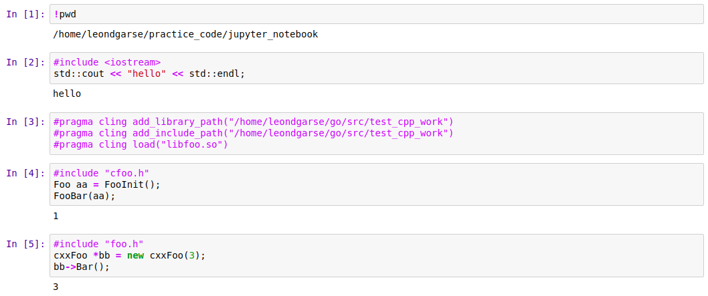
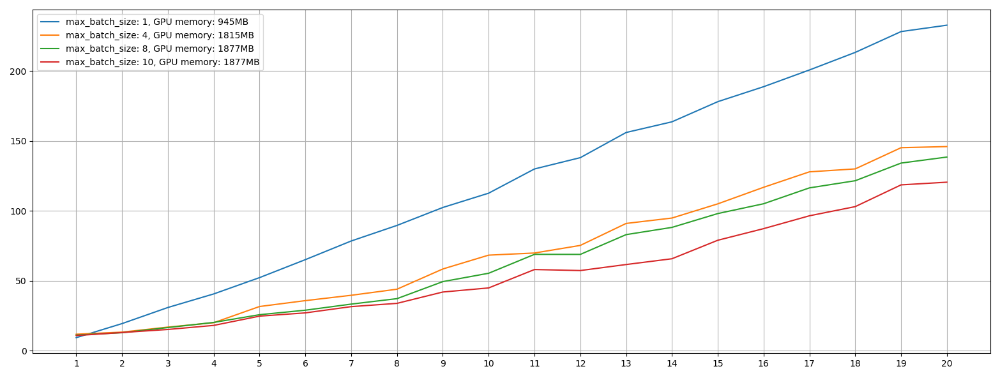

# ___2020 - 02 - 11 cgo___
***
# 目录
  <!-- TOC depthFrom:1 depthTo:6 withLinks:1 updateOnSave:1 orderedList:0 -->

  - [___2020 - 02 - 11 cgo___](#2020-02-11-cgo)
  - [目录](#目录)
  - [链接](#链接)
  - [Jupyter Xeus Cling Kernel](#jupyter-xeus-cling-kernel)
  - [cgo](#cgo)
    - [QA](#qa)
    - [Go 中调用 C 代码](#go-中调用-c-代码)
    - [字符串](#字符串)
    - [数组](#数组)
    - [结构体](#结构体)
    - [函数 Export](#函数-export)
  - [gomobile](#gomobile)
  - [cpp](#cpp)
    - [目录结构](#目录结构)
    - [gophernotes 测试](#gophernotes-测试)
    - [gomobile 封装](#gomobile-封装)
  - [Inference Projects](#inference-projects)
    - [MNN](#mnn)
    - [Opencv](#opencv)
    - [vulkan](#vulkan)
    - [ncnn](#ncnn)
  - [TdFace](#tdface)
    - [Tensorflow project](#tensorflow-project)
    - [ncnn x86 project](#ncnn-x86-project)
    - [ncnn arm project](#ncnn-arm-project)
  - [Face detection test](#face-detection-test)

  <!-- /TOC -->
***

# 链接
  - [NumCpp](https://dpilger26.github.io/NumCpp/doxygen/html/index.html)
  - [Command cgo](https://golang.org/cmd/cgo/)
  - [SWIG and Go](http://www.swig.org/Doc4.0/Go.html)
  - [Github MirrorYuChen/ncnn_example](https://github.com/MirrorYuChen/ncnn_example)
  - [NDK cpp-support](https://developer.android.com/ndk/guides/cpp-support)
***

# Jupyter Xeus Cling Kernel
  - [Xeus Cling](https://xeus-cling.readthedocs.io/en/latest/)
  ```sh
  conda create -n cling
  source activate cling
  conda install -c conda-forge xeus-cling jupyter
  which jupyter
  # /opt/anaconda3/envs/cling/bin/jupyter

  jupyter-notebook --> New --> C++17
  ```
  ```cpp
  #include <iostream>
  using namespace std;
  std::cout << "Hello world" << std::endl;
  ```
  ```sh
  alias icpp="jupyter console --kernel xcpp17"
  icpp
  ```
  ```cpp
  In [1]: #include <iostream>
  In [2]: using namespace std;
  In [3]: std::cout << "hello world" << std::endl;
  // hello world
  ```
  ```cpp
  // 添加库路径
  #pragma cling add_library_path("/path/to/library")

  // 添加头文件路径
  #pragma cling add_include_path("/path/to/include")

  // 加载 so 动态库
  #pragma cling load("library.so")
  ```
  
***

# cgo
## QA
  - [cgo](https://github.com/golang/go/wiki/cgo)
  - Q / A
    ```go
    /* Q:
     * panic: runtime error: cgo result has Go pointer
     */
    /* A:
     * go 代码用于 C 库时，返回值不能包含 go 的指针，包括 slice / map 等
     * 可以统一返回一个字符串，并封装成 C.char 类型的指针
     */
    import "C"

    func Detect(img_path string, group string) *C.char {
        // Do something
        rr := ""
        for ii := range personIds {
            rr += fmt.Sprintf("{\"peron_id\": \"%s\", \"face_id\": \"%s\", \"dist\": %f}",
                personIds[ii], faceIds[ii], dists[ii])
            rr += ", "
        }
        rr = "[" + rr[:len(rr)-2] + "]"

        return C.CString(rr)
    }
    ```
## Go 中调用 C 代码
  - 封装的 `.c` / `.h` / `.go` 文件需要放在 **同一个文件夹下**
  - **import "C"** 引入 C 代码，C 代码使用注释的方式，写在 `import "C"` 前面
    ```go
    // test_cgo.go
    package main

    // int add(int a, int b) {
    //     return a + b;
    // }
    import "C"

    import "fmt"

    func main() {
        a := C.int(1)
        b := C.int(2)
        value := C.add(a, b)
        fmt.Printf("%v\n", value)
    }
    ```
    ```sh
    go run test_cgo.go
    # 3
    ```
  - **头文件与链接库**
    ```go
    #cgo LDFLAGS: -L./lib -lsomelib
    #cgo CFLAGS: -I./inc
    #include "somehead.h"
    ```
    **cpp**
    ```go
    #cgo CPPFLAGS: -I./inc
    ```
## 字符串
  ```go
  str2 := C.GoString(cstr1) // C string --> Go string
  cs := C.CString(str2) // Go string --> C string
  defer C.free(unsafe.Pointer(cs))
  ```
  通过 `C.CString` 转化出的字符串需要 **显式地释放**，在作为返回值返回给 C 时，需要在 C 语言中释放
  ```go
  package main
  /*
  #include <stdlib.h>
  #include <stdio.h>
  #include <string.h>
  void copy_data(char * src) {
      char dst[20];
      memcpy(dst, src, strlen(src));
      printf("Go string --> C : %s\n", dst);
  }

  char *ss = "hello";
  */
  import "C"
  import (
      "fmt"
      "unsafe"
  )

  func main()  {
      // C string --> Go
      str1 := C.GoString(C.ss)
      fmt.Println(" C string --> Go:", str1)

      // Go string --> C
      str2 := "world"
      cs := C.CString(str2)
      defer C.free(unsafe.Pointer(cs))
      C.copy_data(cs)
  }
  ```
  **运行**
  ```sh
  $ go run test_c_str.go
  #  C string --> Go: hello
  # Go string --> C : world
  ```
## 数组
  ```go
  in := []C.int{1, 2, 3, 4}
  inC := (*C.int)(unsafe.Pointer(&in[0])) // Go slice --> C array
  sh := reflect.SliceHeader{uintptr(unsafe.Pointer(outC)), n, n}
  out := *(*[]C.int)(unsafe.Pointer(&sh))
  ```
  浮点值 float32 --> float, float64 --> double
  ```go
  package main
  /*
  #include <stdlib.h>
  #include <stdio.h>
  #include <string.h>
  void sum_data(double *src, int length) {
      double ss = 0;
      for (int ii = 0; ii < length; ii++) {
          ss += src[ii];
      }
      printf("Go array --> C, sum: %f\n", ss);
  }

  float aa[] = {5., 6, 7, 8};
  float *bb = aa;
  */
  import "C"
  import (
      "fmt"
      "unsafe"
      "reflect"
  )

  func main()  {
      // Go array --> C, float32 --> float, float64 --> double
      in := []float64{1, 2, 3, 4}
      inC := (*C.double)(unsafe.Pointer(&in[0]))
      C.sum_data(inC, C.int(len(in)))
      // defer C.free(unsafe.Pointer(inC))

      // C array --> Go (reflect)
      sh := reflect.SliceHeader{uintptr(unsafe.Pointer(C.bb)), 4, 4}
      out := *(*[]C.float)(unsafe.Pointer(&sh))
      fmt.Println("C array --> Go (reflect):", out)

      // C array --> Go (for)
      p := uintptr(unsafe.Pointer(&C.aa[0]))
      gaa := make([]float32, 4)
      for ii := 0; ii < cap(gaa); ii++ {
          jj := *(*float32)(unsafe.Pointer(p))
          gaa[ii] = jj
          p += unsafe.Sizeof(jj)
      }   
      fmt.Println("C array --> Go (for):", gaa)
  }
  ```
  **运行**
  ```sh
  $ go run test_c_array.go
  # Go array --> C, sum: 10.000000
  # C array --> Go (reflect): [5 6 7 8]
  # C array --> Go (for): [5 6 7 8]
  ```
## 结构体
  ```go
  struct XXX { ... }
  C.struct_XXX  // Read C struct
  ```
  ```go
  package main
  /*
  #include <stdio.h>
  struct Point {
      float x;
      float y;
  };
  */
  import "C"
  import (
      "fmt"
  )

  func main()  {
      // 1.利用C的结构体类型创建结构体
      var cp C.struct_Point = C.struct_Point{6.6, 8.8}
      fmt.Println(cp)
      fmt.Printf("%T\n", cp)

      // 2.将C语言结构体转换为Go语言结构体
      type GoPoint struct {
          x float32
          y float32
      }
      var gp GoPoint
      gp.x = float32(cp.x)
      gp.y = float32(cp.y)
      fmt.Println(gp)
  }
  ```
  **运行**
  ```sh
  $ go run test_c_struct.go
  # Read C struct: {6.6 8.8}
  # Type: main._Ctype_struct_Point
  # Convert to Go struct: {6.6 8.8}
  ```
## 函数 Export
  - Go 中的函数通过使用注释的 **`export 函数名`** 导出，以在 C 中使用
  - **Go 函数**
    ```go
    // package name: exportFunc
    package main

    import (
        "C"
        "fmt"
    )

    type Test struct {
        intVal int
        stringVal string
    }

    var fr *Test

    //export NewTest
    func NewTest(intVal int, stringVal string) {
        aa := Test{}
        aa.intVal = intVal
        aa.stringVal = stringVal
        fr = &aa
    }

    //export Sum
    func Sum(vv int) int {
        return vv + fr.intVal
    }

    //export GetString
    func GetString() *C.char {
        return C.CString(fr.stringVal)
    }

    //export SayHello
    func SayHello() *C.char {
        return C.CString("Hello")
    }

    //export Reset
    func Reset(intVal int, stringVal string) {
        fr.intVal = intVal
        fr.stringVal = stringVal
    }

    func main() {
        // We need the main function to make possible
        // CGO compiler to compile the package as C shared library
        fmt.Println(C.GoString(SayHello()))
        NewTest(1, "hello")
        fmt.Println(Sum(2))
        fmt.Println(C.GoString(GetString()))
        Reset(2, "world")
        fmt.Println(Sum(2))
        fmt.Println(C.GoString(GetString()))
    }
    ```
  - **go build** 编译 C 库
    ```sh
    # 动态库
    $ go build -buildmode=c-shared -o libexport_func.so test_export_func.go
    # 静态库
    $ go build -buildmode=c-archive  -o libexport_func.a test_export_func.go
    ```
    编译后生成 `.h` + `.so` / `.a` 文件
    ```sh
    $ tree
    .
    ├── libexport_func.h
    ├── libexport_func.so
    ├── test_export_func.cpp
    └── test_export_func.go
    ```
  - **C 调用**
    ```cpp
    #include "libexport_func.h"
    #include <stdio.h>
    #include <iostream>

    using namespace std;

    int main() {
        cout << "SayHello: " << SayHello() << endl;

        GoString str_1 = {"hello C", 7};
        NewTest(1, str_1);
        cout << "GetString: " << GetString() << endl;
        cout << "Sum: " << Sum(2) << endl;

        GoString str_2 = {"world C", 7};
        Reset(3, str_2);
        cout << "Reset, GetString: " << GetString() << endl;
        cout << "Reset, Sum: " << Sum(2) << endl;
    }
    ```
    **编译**
    ```sh
    $ g++ test_export_func.cpp -L. -lexport_func  # .so 动态库
    $ g++ test_export_func.cpp -L. -lexport_func  -lpthread  # .a 静态库
    $ ./a.out
    # SayHello: Hello
    # GetString: hello C
    # Sum: 3
    # Reset, GetString: world C
    # Reset, Sum: 5
    ```
## 二级指针
  ```go
  package main
  /*
  #include <stdlib.h>
  #include <stdio.h>
  #include <string.h>

  int create_array(float **src) {
      int length = 10;
      *src = (float *)malloc(sizeof(float) * length);
      float *ssrc = *src;
      for (int ii = 0; ii < length; ii++) {
          ssrc[ii] = ii + ii;
      }
      return length;
  }
  */
  import "C"
  import (
      "fmt"
      "unsafe"
  )

  func main()  {
      var res *C.float
      resLen := int(C.create_array(&res))
      resG_p := uintptr(unsafe.Pointer(res))
      resG := make([]float32, resLen)
      for ii := 0; ii < resLen; ii++ {
          jj := *(*float32)(unsafe.Pointer(resG_p))
          resG[ii] = jj
          resG_p += unsafe.Sizeof(jj)
      }
      C.free(unsafe.Pointer(res))
      fmt.Println("C create array --> Go (reflect):", resG)
  }
  ```
  **运行**
  ```sh
  $ go run test_c_array_secondary.go
  # C create array --> Go (reflect): [0 2 4 6 8 10 12 14 16 18]
  ```
***

# 汇编
## CPP 汇编命令
  ```sh
  $HOME/Android/Sdk/ndk/21.0.6113669/toolchains/llvm/prebuilt/linux-x86_64/bin/aarch64-linux-android29-clang -S test_cpp_pkg.cpp && cat test_cpp_pkg.s
  ```
## Go 汇编命令
  ```sh
  go tool compile -S test_cpp_pkg.go
  go tool objdump test_cpp_pkg > foo.s
  go build -gcflags -S test_cpp_pkg.go > test_asm/test_cpp_pkg.s 2>&1

  go tool asm test_cpp.s
  ```
## Go 使用汇编代码
  - 目录结构
    ```sh
    ls test_asm_add
    # add_amd64.s  add.go
    ```
  - **add.go**
    ```go
    package main

    import "fmt"

    func add(xx, yy int64) int64

    func main() {
        fmt.Println(add(2, 3))
    }
    ```
  - **add_amd64.s**
    ```cpp
    // #include "textflag.h"
    #define NOSPLIT 4 // From /usr/local/go/src/runtime/textflag.h

    TEXT ·add(SB), NOSPLIT, $0
        MOVQ x+0(FP), BX
        MOVQ y+8(FP), BP
        ADDQ BP, BX
        MOVQ BX, ret+16(FP)
        RET
    ```
  - **Build**
    ```sh
    go build .
    ./test_asm_add
    # 5
    ```
***

# gomobile
  - [Wiki golang/go/Mobile](https://github.com/golang/go/wiki/Mobile)
  ```sh
  export ANDROID_HOME=$HOME/Android/Sdk
  ```
***

# cpp
## 目录结构
  - **test_cpp_work 目录**
    ```sh
    $ tree ~/go/src/test_cpp_work/
    # /home/leondgarse/go/src/test_cpp_work/
    # ├── cfoo.cpp
    # ├── cfoo.h
    # ├── foo.cpp
    # ├── foo.h
    # ├── Makefile
    # └── test_cpp.go
    ```
  - **foo.h** c++ 类头文件
    ```java
    #ifndef _MY_PACKAGE_FOO_H_
    #define _MY_PACKAGE_FOO_H_

    class cxxFoo {
    public:
        int a;
        cxxFoo(int _a): a(_a){};
        ~cxxFoo(){};
        void Bar();
    };

    #endif
    ```
  - **foo.cpp** c++ 类实现文件
    ```java
    #include <iostream>
    #include "foo.h"

    void cxxFoo::Bar(void) {
        std::cout << this->a << std::endl;
    }
    ```
  - **cfoo.hpp** 封装 cpp 为 C 调用
    ```java
    #ifndef _MY_PACKAGE_CFOO_H_
    #define _MY_PACKAGE_CFOO_H_

    #ifdef __cplusplus
    extern "C" {
    #endif
        typedef void* Foo;
        Foo FooInit(void);
        void FooFree(Foo);
        void FooBar(Foo);
    #ifdef __cplusplus
    }
    #endif

    #endif
    ```
  - **cfoo.cpp** C 调用实现文件
    ```java
    #include "foo.h"
    #include "cfoo.h"

    Foo FooInit() {
        cxxFoo * ret = new cxxFoo(1);
        return (void*)ret;
    }

    void FooFree(Foo f) {
        cxxFoo * foo = (cxxFoo*) f;
        delete foo;
    }

    void FooBar(Foo f) {
        cxxFoo * foo = (cxxFoo*)f;
        foo->Bar();
    }
    ```
  - **Makefile** 将 c++ 文件编译为库文件，缩进应替换为 `Tab`
    ```sh
    .PHONY: clean

    TARGET=test_cpp_work

    $(TARGET): libfoo.so
      go build .

    libfoo.a: foo.o cfoo.o
      ar r $@ $^
    libfoo.so: foo.o cfoo.o
      g++ -shared $^ -fPIC -lstdc++ -o $@

    %.o: %.cpp
      g++ -O2 -fPIC -o $@ -c $^

    clean:
      rm -f *.o *.so *.a $(TARGET)
    ```
  - **test_cpp.go** Go 调用 C 的 lib 库
    ```go
    package test_cpp_work
    // package main

    // #cgo LDFLAGS: -L. -lfoo -lstdc++
    // #include "cfoo.h"
    import "C"

    type GoFoo struct {
        foo C.Foo
    }

    func New() GoFoo {
        var ret GoFoo
        ret.foo = C.FooInit()
        return ret
    }

    func (f GoFoo) Free() {
        C.FooFree(f.foo)
    }

    func (f GoFoo) Bar() {
        C.FooBar(f.foo)
    }

    /*
    func main() {
        foo := New()
        foo.Bar()
        foo.Free()
    }
    */
    ```
## gophernotes 测试
  ```sh
  # 安装
  go build test_cpp_work
  go install test_cpp_work
  ```
  ```go
  // gophernotes 测试
  import "test_cpp_work"
  foo := test_cpp_work.New()
  foo.Bar()
  // 1
  ```
## gomobile 封装
  - 编译命令
  ```sh
  /home/leondgarse/Android/Sdk/ndk/*/toolchains/llvm/prebuilt/linux-x86_64/bin/aarch64-linux-android29-clang++ -O2 -fPIC -o foo.o -c foo.cpp
  /home/leondgarse/Android/Sdk/ndk/*/toolchains/llvm/prebuilt/linux-x86_64/bin/aarch64-linux-android29-clang++ -O2 -fPIC -o cfoo.o -c cfoo.cpp
  /home/leondgarse/Android/Sdk/ndk/*/toolchains/llvm/prebuilt/linux-x86_64/bin/aarch64-linux-android-ar r libfoo.a *.o
  gomobile bind -o hello.aar -target=android/arm64 test_cpp_work
  ```
  - **Makefile.app** 缩进应替换为 `Tab`
    ```sh
    .PHONY: clean

    TARGET=hello.aar
    CXX=/home/leondgarse/Android/Sdk/ndk/*/toolchains/llvm/prebuilt/linux-x86_64/bin/aarch64-linux-android29-clang++
    AR=/home/leondgarse/Android/Sdk/ndk/*/toolchains/llvm/prebuilt/linux-x86_64/bin/aarch64-linux-android-ar

    $(TARGET): libfoo.a
      gomobile bind -o hello.aar -target=android/arm64 test_cpp_work

    libfoo.a: foo.o cfoo.o
      $(AR) r $@ $^

    %.o: %.cpp
      $(CXX) -O2 -fPIC -o $@ -c $^

    clean:
      rm -f *.o *.so *.a $(TARGET)
    ```
    **执行**
    ```sh
    # Run `gomobile init` first if needed
    make -f Makefile.app
    ```
## 计时
  ```cpp
  #include <iostream>
  #include <sys/time.h>

  static inline unsigned long get_cur_time_nano(void) {
      struct timespec tm;
      clock_gettime(CLOCK_MONOTONIC, &tm);
      return (tm.tv_sec * 1e9 + tm.tv_nsec);
  }

  // This one also works on android
  static inline uint64_t getTimeInUs() {
      uint64_t time;
      struct timeval tv;
      gettimeofday(&tv, nullptr);
      time = static_cast<uint64_t>(tv.tv_sec) * 1e6 + tv.tv_usec;
      return time;
  }

  int main() {
      int repeat_count = 10000;
      unsigned long start_time_1 = get_cur_time_nano();
      unsigned long start_time_2 = getTimeInUs();
      for (int j = 0; j < repeat_count; j++) {
          // Do nothing
      }
      unsigned long end_time_1 = get_cur_time_nano();
      unsigned long end_time_2 = getTimeInUs();
      double off_time_1 = (end_time_1 - start_time_1) / 1e3;
      double off_time_2 = (end_time_2 - start_time_2);
      std::printf("Repeat: [%d], Total: %fµs, Mean: %fµs\n", repeat_count, off_time_1, off_time_1 / repeat_count);
      std::printf("Repeat: [%d], Total: %fµs, Mean: %fµs\n", repeat_count, off_time_2, off_time_2 / repeat_count);
  }
  ```
  **运行**
  ```sh
  g++ timeit.cpp
  ./a.out
  # Repeat: [10000], Total: 94.702000µs, Mean: 0.009470µs
  # Repeat: [10000], Total: 89.000000µs, Mean: 0.008900µs
  ```
***

# Inference Projects
## MNN
  - [Github alibaba/MNN](https://github.com/alibaba/MNN)
  - [MNN Android lib](https://github.com/alibaba/MNN/releases)
  - [MNN 中文文档](https://www.yuque.com/mnn/cn)
  - **Build**
    ```sh
    git clone https://github.com/alibaba/MNN.git
    cd MNN/
    ./schema/generate.sh
    mkdir build && cd build
    # cmake .. && make -j4
    cmake -DMNN_BUILD_DEMO=ON -DMNN_BUILD_CONVERTER=true -DMNN_BUILD_BENCHMARK=true -DMNN_BUILD_QUANTOOLS=on .. && make -j4
    ```
    **ARM**
    ```sh
    export ANDROID_NDK=$HOME/Android/Sdk/ndk/20.0.5594570/
    cd project/android/build_32
    ../build_32.sh
    ```
    **OpenCL**
    ```sh
    cd project/android/ && mkdir build_32 && cd build_32
    vi ../../../CMakeLists.txt
    # 144 -option(MNN_OPENCL "Enable OpenCL" OFF)
    # 144 +option(MNN_OPENCL "Enable OpenCL" ON)

    rm ./* -r
    ../build_32.sh
    ls lib*.so
    libMNN_Express.so  libMNN_CL.so  libMNN.so
    ```
  - **Convert model** 对于 `tflite` 需要是未经过优化的模型
    ```sh
    ./MNNConvert -f TFLITE --modelFile /home/tdtest/workspace/insightface-master/models/converted_model.tflite  --MNNModel XXX.mnn --bizCode biz
    ./MNNConvert -f ONNX --modelFile /home/tdtest/workspace/insightface-master/faces_emore_img/model.onnx --MNNModel XXX.mnn --bizCode biz

    ./MNNConvert -f TFLITE --modelFile ../../samba/models/expression/model_tf2.tflite  --MNNModel XXX.mnn --bizCode biz

    # Converting pb is better
    ./MNNConvert -f TF --modelFile XXX.pb --MNNModel XXX.mnn --bizCode biz
    ```
  - **Benchmark**
    ```sh
    mkdir models && mv XXX.mnn models
    # Usage: ./benchmark.out models_folder [loop_count] [warmup] [forwardtype] [numberThread] [precision]
    # forwardtype: 0->CPU，1->Metal，3->OpenCL，6->OpenGL，7->Vulkan
    ./benchmark.out ./models/ 10 2 0 4
    ```
    ```sh
    adb push benchmark.out /data/local/tmp
    adb push *.so /data/local/tmp
    adb push ../../../build/models /data/local/tmp
    adb shell 'cd /data/local/tmp; LD_LIBRARY_PATH=. ./benchmark.out ./models/ 10 2 0 4'
    ```
  - **Python test**
    ```py
    import MNN
    interpreter = MNN.Interpreter("XXX.mnn")
    session = interpreter.createSession()
    input_tensor = interpreter.getSessionInput(session)
    image = np.ones(input_tensor.getShape()[1:]).astype('float32')  # should be channel first, or will throw "Error for 299"
    tmp_input = MNN.Tensor(input_tensor.getShape(), MNN.Halide_Type_Float, image, MNN.Tensor_DimensionType_Caffe)
    input_tensor.copyFrom(tmp_input)
    interpreter.runSession(session)
    output_tensor = interpreter.getSessionOutput(session)
    tmp_output = MNN.Tensor(output_tensor.getShape(), MNN.Halide_Type_Float, np.ones(output_tensor.getShape()).astype(np.float32), MNN.Tensor_DimensionType_Caffe)
    output_tensor.copyToHostTensor(tmp_output)
    tmp_output.getData()
    ```
    ```py
    def goo(imm):
        tmp_input = MNN.Tensor((1, 3, 112, 112), MNN.Halide_Type_Float, imm, MNN.Tensor_DimensionType_Caffe)
        input_tensor.copyFrom(tmp_input)
        interpreter.runSession(session)
        output_tensor = interpreter.getSessionOutput(session)
        tmp_output = MNN.Tensor((1, 256), MNN.Halide_Type_Float, np.ones([1, 256]).astype(np.float32), MNN.Tensor_DimensionType_Caffe)
        output_tensor.copyToHostTensor(tmp_output)
        return tmp_output.getData()
    ```
  - **CPP test**
    ```sh
    cd ~/workspace/MNN/build
    ./pictureRecognition.out XXX.mnn 11.jpg
    # >>>> Repeat test:
    # Repeat: [100], Total: 6125.831170ms, Mean: 61.258312ms

    MNN_HOME=$HOME/workspace/MNN
    g++ $MNN_HOME/demo/exec/pictureRecognition.cpp -I$MNN_HOME/include/ -I$MNN_HOME/3rd_party/imageHelper -L$MNN_HOME/build -lMNN

    g++ mnn.cpp -I$MNN_HOME/include/ -I$MNN_HOME/3rd_party/imageHelper -L$MNN_HOME/build -lMNN
    LD_LIBRARY_PATH=$MNN_HOME/build ./a.out XXX.mnn 11.jpg
    ```
    **ARM**
    ```sh
    alias AG="$HOME/Android/Sdk/ndk/20.0.5594570/toolchains/llvm/prebuilt/linux-x86_64/bin/armv7a-linux-androideabi29-clang++"
    AG mnn.cpp -I$MNN_HOME/include/ -I$MNN_HOME/3rd_party/imageHelper -L$MNN_HOME/project/android/build_32 -lMNN
    adb push a.out /data/local/tmp
    adb push XXX.mnn 11.jpg $MNN_HOME/project/android/build_32/libMNN.so /data/local/tmp
    adb push $ANDROID_NDK/toolchains/llvm/prebuilt/linux-x86_64/sysroot/usr/lib/arm-linux-androideabi/libc++_shared.so /data/local/tmp
    ```
  - **MNN-APPLICATIONS** [Github xindongzhang/MNN-APPLICATIONS](https://github.com/xindongzhang/MNN-APPLICATIONS)
    ```sh
    cd applications/blazeface/tensorflow/jni

    MNN_HOME=$HOME/workspace/MNN
    g++ tf_blazeface.cpp $MNN_HOME/tools/cpp/revertMNNModel.cpp -I$MNN_HOME/include/ -I$MNN_HOME/3rd_party/imageHelper -I$MNN_HOME/source/core -I$MNN_HOME/include/MNN -I$MNN_HOME/tools/cpp -I$MNN_HOME/schema/current -L$MNN_HOME/build -lMNN -lopencv_core -lopencv_imgproc -lopencv_imgcodecs
    LD_LIBRARY_PATH=$MNN_HOME/build ./a.out && eog output.jpg
    ```
## Opencv
  ```sh
  git clone https://github.com/opencv/opencv.git
  cd opencv
  mkdir build && cd build && cmake ..
  make && sudo make install # /usr/local/lib /usr/local/include

  cd /usr/local/include
  sudo ln -s opencv4/opencv2/ opencv2
  ```
## vulkan
  - [Getting Started with the Vulkan SDK](https://vulkan.lunarg.com/doc/sdk/latest/linux/getting_started_ubuntu.html)
  ```sh
  # Install
  wget -qO - http://packages.lunarg.com/lunarg-signing-key-pub.asc | sudo apt-key add -
  sudo wget -qO /etc/apt/sources.list.d/lunarg-vulkan-bionic.list http://packages.lunarg.com/vulkan/lunarg-vulkan-bionic.list
  sudo apt update
  sudo apt install vulkan-sdk

  # Verify
  vkvia
  vulkaninfo

  which vkcube
  vkcube

  vkconfig
  ```
  ```sh
  cd local_bin/
  wget https://sdk.lunarg.com/sdk/download/1.1.126.0/linux/vulkansdk-linux-x86_64-1.1.126.0.tar.gz?Human=true -O vulkansdk-linux-x86_64-1.1.126.0.tar.gz
  tar xvf vulkansdk-linux-x86_64-1.1.126.0.tar.gz
  export VULKAN_SDK=`pwd`/1.1.126.0/x86_64
  ```
## ncnn
  - [Github Tencent/ncnn](https://github.com/Tencent/ncnn)
    ```sh
    sudo apt install libprotobuf-dev
    cd ~/workspace/ncnn

    # Build for Linux X86_64
    mkdir build && cd build
    cmake ..

    mkdir build-vulkan && cd build-vulkan
    cmake -DNCNN_VULKAN=ON ..

    # Build for armv7
    mkdir build-armv7 && cd build-armv7
    cmake -DCMAKE_TOOLCHAIN_FILE=/home/leondgarse/Android/Sdk/ndk/20.0.5594570/build/cmake/android.toolchain.cmake -DANDROID_ABI="armeabi-v7a" -DANDROID_ARM_NEON=ON -DANDROID_PLATFORM=android-14 ..

    mkdir build-armv7-vulkan && cd build-armv7-vulkan
    cmake -DCMAKE_TOOLCHAIN_FILE=/home/leondgarse/Android/Sdk/ndk/20.0.5594570/build/cmake/android.toolchain.cmake -DANDROID_ABI="armeabi-v7a" -DANDROID_ARM_NEON=ON -DANDROID_PLATFORM=android-24 -DNCNN_VULKAN=ON ..

    # Build for arm64
    mkdir build-aarch64 && cd build-aarch64
    cmake -DCMAKE_TOOLCHAIN_FILE=/home/leondgarse/Android/Sdk/ndk/20.0.5594570/build/cmake/android.toolchain.cmake -DANDROID_ABI="arm64-v8a" -DANDROID_PLATFORM=android-21 ..

    mkdir build-aarch64-vulkan && cd build-aarch64-vulkan
    cmake -DCMAKE_TOOLCHAIN_FILE=/home/leondgarse/Android/Sdk/ndk/20.0.5594570/build/cmake/android.toolchain.cmake -DANDROID_ABI="arm64-v8a" -DANDROID_PLATFORM=android-24 -DNCNN_VULKAN=ON ..

    # Make
    make -j4 && make install
    ```
  - **Q / A**
    ```py
    ''' Q: //usr/lib/x86_64-linux-gnu/libblas.so.3: undefined reference to `gotoblas'
    '''
    ''' A:
    export LD_LIBRARY_PATH=/opt/OpenBLAS/lib/:$LD_LIBRARY_PATH
    sudo apt remove libopenblas-base
    '''
    ```
    ```py
    ''' Q: fatal error: google/protobuf/port_def.inc: No such file or directory
        Or: Protobuf not found, onnx model convert tool won't be built
    '''
    ''' A: libprotobuf.so not found or version < 3.7
    - cmake information:
        Found Protobuf: /usr/lib/x86_64-linux-gnu/libprotobuf.so;-lpthread (found version "3.6.1")
        Protobuf compiler version 3.11.4 doesn't match library version 3.6.1

    - Download matched protobuf release `protobuf-cpp-xxx.tar.gz` from [protobuf releases](https://github.com/protocolbuffers/protobuf/releases)
    - Extract and compile:
        ./autogen.sh
        ./configure
        make
        make check
        sudo make install
        sudo ldconfig
        pkg-config --cflags --libs protobuf
    - Run cmake again
    '''
    ```
  - **mxnet -> ncnn**
    ```sh
    cd build/tools/mxnet
    ./mxnet2ncnn model-symbol.json model-0001.params
    ```
  - **onnx -> ncnn**
    ```sh
    ./onnx2ncnn mbv3_large_1.onnx

    # 最后一个参数是 flag，0 表示 fp32，1 表示 fp16，实际 fp16 应使用 65536
    ./ncnnoptimize ncnn.param ncnn.bin ncnn-opt.param ncnn-opt.bin 65536
    ```
  - **量化**
    ```sh
    ./quantize/ncnn2table --param=nn.param --bin=nn.bin --images=/home/leondgarse/workspace/datasets/presentation_data --output=nn.table --mean=127.0,127.0,127.0 --norm=1/127.5,1/127.5,1/127.5 --size=112,112
    ./quantize/ncnn2int8 nn.param nn.bin nnn.param nnn.bin nn.table
    ```
## Tengine
  - [Github Tengine](https://github.com/OAID/Tengine)
  - [Wiki](https://github.com/OAID/Tengine/wiki)
  - Download conversion tool `convert_model_to_tm` from [releases](https://github.com/OAID/Tengine/releases)
    ```sh
    [Usage]: ./convert_model_to_tm [-h] [-f file_format] [-p proto_file] [-m model_file] [-o output_tmfile]

    -f: framworks such as caffe / caffe_single / onnx / mxnet / tensorflow / darknet / tflite. Here set tensorflow.
    -m: source model path
    -o: output Tengine model path
    // There is no need to set "-p" option, only set "-m" option when only one model input.

    // Convert Caffe model
    $ ./convert_model_to_tm -f caffe -p models/sqz.prototxt -m models/squeezenet_v1.1.caffemodel -o models/squeezenet.tmfile

    // Convert TensorFlow model
    $ ./convert_model_to_tm -f tensorflow -m models/squeezenet.pb -o models/squeezenet_tf.tmfile
    ```
***

# TdFace
## Tensorflow project
  - **Dependencies**
    ```sh
    go version  # go version go1.13.8 linux/amd64
    go get github.com/tensorflow/tensorflow/tensorflow/go
    cd ~/go/src/github.com/tensorflow/tensorflow/tensorflow/go
    git checkout r1.15
    go test github.com/tensorflow/tensorflow/tensorflow/go

    go get github.com/gogo/protobuf/proto
    go get github.com/galeone/tfgo
    HP go get golang.org/x/image/...
    HP go get -u gonum.org/v1/gonum/...
    go get -u github.com/go-sql-driver/mysql
    ```
  - **Build fastmtcnn**
    ```sh
    g++ -O2 -fPIC -o dest/fastmtcnn.o -c fastmtcnn/fastmtcnn.cpp -L/usr/local/lib -lopencv_core -lopencv_imgproc -lopencv_dnn
    g++ -shared dest/fastmtcnn.o -fPIC -o dest/libfastmtcnn.so
    # ar r dest/libfastmtcnn.a dest/fastmtcnn_c.o dest/fastmtcnn.o
    go build tdFace/fastmtcnn
    go run test/test_fastmtcnn.go

    g++ test/test_fastmtcnn.cpp fastmtcnn/fastmtcnn.cpp -L/usr/local/lib -lopencv_core -lopencv_imgproc -lopencv_dnn -lopencv_imgcodecs
    ```
  - **Build and run export**
    ```sh
    go build tdFace/mtcnn
    go install tdFace/mtcnn
    go build tdFace/fastmtcnn
    go install tdFace/fastmtcnn
    go build tdFace/faceModel
    go install tdFace/faceModel
    go build tdFace/myImage
    go install tdFace/myImage
    go build tdFace/userData
    go install tdFace/userData
    # go build tdFace/faceRecognition
    # go install tdFace/faceRecognition
    go build tdFace/faceRecognitionMulti
    go install tdFace/faceRecognitionMulti

    go run export/export.go

    go build -buildmode=c-archive  -o dest/libtdface.a export/export.go
    g++ test/test_tdFace.c dest/libtdface.a  -I./dest -ltensorflow -lpthread  -o dest/test
    CUDA_VISIBLE_DEVICES='-1' dest/test

    go build -buildmode=c-shared -o dest/libtdface.so export/export.go
    g++ test/test_tdFace.c -I./dest -L./dest -ltdface -ltensorflow -lpthread  -o dest/test
    CUDA_VISIBLE_DEVICES='-1' LD_LIBRARY_PATH=./dest:/usr/local/cuda-10.0/lib64 ./dest/test
    ```
  - **Build using openblas**
    ```sh
    CGO_LDFLAGS="-L/opt/OpenBLAS/lib -lopenblas"  go build tdFace/userData
    CGO_LDFLAGS="-L/opt/OpenBLAS/lib -lopenblas"  go install tdFace/userData
    CGO_LDFLAGS="-L/opt/OpenBLAS/lib -lopenblas"  go build tdFace/faceRecognitionMulti
    CGO_LDFLAGS="-L/opt/OpenBLAS/lib -lopenblas"  go install tdFace/faceRecognitionMulti

    CGO_LDFLAGS="-L/opt/OpenBLAS/lib -lopenblas" go build -buildmode=c-shared -o dest/libtdface.so export/export.go
    g++ test/test_tdFace.c -I./dest -L./dest -ltdface -ltensorflow -lpthread -L/opt/OpenBLAS/lib -lopenblas -o dest/test
    CUDA_VISIBLE_DEVICES='-1' LD_LIBRARY_PATH=./dest:/usr/local/cuda-10.0/lib64:/opt/OpenBLAS/lib ./dest/test

    export LD_LIBRARY_PATH=./dest:/usr/local/cuda-10.0/lib64:/opt/OpenBLAS/lib
    ```
  - **Threads tests**
    | MTCNN + Facemodel | Load    | Time    |
    | ----------------- | ------- | ------- |
    | **CPU**           |         |         |
    | 1 CPU + 1 CPU     | 20 x 20 | 1m31.2s |
    | 2 CPU + 2 CPU     | 20 x 20 | 47.3s   |
    | 4 CPU + 2 CPU     | 20 x 20 | 47.4s   |
    | 4 CPU + 4 CPU     | 20 x 20 | 37.0s   |
    | 8 CPU + 8 CPU     | 20 x 20 | 34.1s   |
    | **GPU**           |         |         |
    | 1 GPU + 1 GPU     | 20 x 20 | 27.2s   |
    | 2 GPU + 2 GPU     | 20 x 20 | 27.6s   |
    | 4 GPU + 2 GPU     | 20 x 20 | 19.5s   |
    | 4 GPU + 4 GPU     | 20 x 20 | 23.1s   |
    | **CPU + GPU**     |         |         |
    | 1 CPU + 1 GPU     | 20 x 20 | 26.6s   |
    | 4 CPU + 2 GPU     | 20 x 20 | 12.12s  |
    | 8 GPU + 8 GPU     | 20 x 20 | 24.4s   |
    | **60 x 60**       |         |         |
    | 1 GPU + 1 GPU     | 60 x 60 | 3m43.9s |
    | 4 GPU + 4 GPU     | 60 x 60 | 3m31.0s |
    | 1 CPU + 1 GPU     | 60 x 60 | 3m54.6s |
    | 4 CPU + 2 GPU     | 60 x 60 | 1m49.4s |
    | 4 CPU + 1 GPU     | 60 x 60 | 2m28.5s |
    | 6 CPU + 2 GPU     | 60 x 60 | 1m49.4s |
    | 6 CPU + 3 GPU     | 60 x 60 | 1m53.7s |
    | **NEW**           |         |         |
    | 4 CPU + 4 CPU     | 30 x 30 | 2m17.0s |
    | 4 CPU + 4 CPU     | 20 x 20 | 1m1.65s |
    | 4 CPU + 2 GPU     | 7 x 20  | 27.79s  |
    | **FastMTCNN**     |         |         |
    | 4 CPU + 2 GPU     | 7 x 20  | 7.57s   |
    | 6 CPU + 2 GPU     | 7 x 20  | 9.21s   |
    | 6 CPU + 3 GPU     | 7 x 20  | 9.55s   |
## ncnn x86 project
  - **C flags in `.go` files**
    ```go
    #cgo LDFLAGS: -L../dest -lfacemodel -L../ncnn/lib -lncnn -lgomp -L/usr/lib/x86_64-linux-gnu -lvulkan
    ```
  - **Build**
    ```sh
    # model
    ~/workspace/ncnn/build-vulkan/tools/onnx/onnx2ncnn ~/workspace/samba/tdFace-flask/face_model/model.onnx

    rm ncnn -f && ln -s $HOME/workspace/ncnn/build-vulkan/install ncnn
    rm ncnn -f && ln -s $HOME/workspace/ncnn/build/install ncnn

    g++ test/test_retinaface.cpp retinaface/retinaface.cpp ncnn/lib/libncnn.a -I retinaface/ -lgomp

    CFLAGS="-lgomp -L/usr/lib/x86_64-linux-gnu -lvulkan"

    # lib facemodel
    g++ -O2 -fPIC -o dest/faceModel.o -c faceModel/faceModel.cpp
    # ar r dest/libfacemodel.a dest/faceModel.o
    g++ -shared dest/faceModel.o -fPIC -o dest/libfacemodel.so
    go build tdFace.mobile/faceModel
    g++ test/test_faceModel.cpp faceModel/faceModel.cpp ncnn/lib/libncnn.a -IfaceModel $CFLAGS
    go run test/test_faceModel.go
    # ~43.24ms

    # lib mtcnn
    g++ -O2 -fPIC -o dest/mtcnn.o -c mtcnn/mtcnn.cpp
    # ar r dest/libmtcnn.a dest/mtcnn.o
    g++ -shared dest/mtcnn.o -fPIC -o dest/libmtcnn.so
    go build tdFace.mobile/mtcnn
    g++ test/test_mtcnn.cpp mtcnn/mtcnn.cpp ncnn/lib/libncnn.a -Imtcnn $CFLAGS
    go run test/test_mtcnn.go

    # lib retinaface
    g++ -O2 -fPIC -o dest/retinaface.o -c retinaface/retinaface.cpp
    # ar r dest/libretinaface.a dest/retinaface.o
    g++ -shared dest/retinaface.o -fPIC -o dest/libretinaface.so
    go build tdFace.mobile/retinaface
    g++ test/test_retinaface.cpp retinaface/retinaface.cpp ncnn/lib/libncnn.a -lgomp -Iretinaface $CFLAGS
    go run test/test_retinaface.go

    # install go module
    go install tdFace.mobile/mtcnn
    go install tdFace.mobile/faceModel
    go install tdFace.mobile/retinaface
    ```
  - **Complete test**
    ```sh
    go build tdFace.mobile/faceRecognitionMulti
    go run test/test_faceRecognitionMulti.go
    go run export/export.go
    ```
## ncnn arm project
  - **C flags in `.go` files**
    ```go
    #cgo LDFLAGS: -L../dest -lfacemodel -L../ncnn/lib -lncnn -lomp -landroid -lc++_shared
    ```
  - **Build**
    ```sh
    SDK_HOME="$HOME/Android/Sdk/ndk/21.0.6113669/toolchains/llvm/prebuilt/linux-x86_64"
    # alias AG="$SDK_HOME/bin/armv7a-linux-androideabi29-clang++"
    # alias AR="$SDK_HOME/bin/arm-linux-androideabi-ar"
    alias AG="$SDK_HOME/bin/aarch64-linux-android29-clang++"
    alias AR="$SDK_HOME/bin/aarch64-linux-android-ar"

    rm ncnn -f && ln -s $HOME/workspace/ncnn/build-armv7-vulkan/install ncnn
    rm ncnn -f && ln -s $HOME/workspace/ncnn/build-armv7/install ncnn
    rm ncnn -f && ln -s $HOME/workspace/ncnn/build-aarch64-vulkan/install ncnn
    rm ncnn -f && ln -s $HOME/workspace/ncnn/build-aarch64/install ncnn

    AG test/test_retinaface.cpp retinaface/retinaface.cpp ncnn/lib/libncnn.a -I retinaface/ -lomp -landroid -llog

    # lib facemodel
    AG -O2 -fPIC -o dest/faceModel.o -c faceModel/faceModel.cpp
    AR r dest/libfacemodel.a dest/faceModel.o
    # AG -shared dest/faceModel.o -fPIC -o dest/libfacemodel.so -landroid
    # gomobile bind -v -o dest/faceModel.aar -target=android/arm tdFace.mobile/faceModel
    gomobile bind -v -o dest/faceModel.aar -target=android/arm64 tdFace.mobile/faceModel

    # lib mtcnn
    AG -O2 -fPIC -o dest/mtcnn.o -c mtcnn/mtcnn.cpp
    AR r dest/libmtcnn.a dest/mtcnn.o
    # gomobile bind -v -o dest/mtcnn.aar -target=android/arm tdFace.mobile/mtcnn
    gomobile bind -v -o dest/mtcnn.aar -target=android/arm64 tdFace.mobile/mtcnn

    # faceRecognition
    # gomobile bind -v -o dest/faceRecognition.aar -target=android/arm tdFace.mobile/faceRecognition
    # gomobile bind -v -o dest/faceRecognitionMulti.aar -target=android/arm tdFace.mobile/faceRecognitionMulti
    gomobile bind -v -o hello.aar -target=android/arm64 tdFace.mobile/faceRecognition
    gomobile bind -v -o dest/faceRecognitionMulti.aar -target=android/arm64 tdFace.mobile/faceRecognitionMulti

    # gomobile bind -v -o dest/export.aar -target=android/arm tdFace.mobile/export
    mkdir -p export/assets/faceModel export/assets/mtcnn export/assets/expression export/assets/retinaface
    cp faceModel/ncnn.* export/assets/faceModel
    cp mtcnn/det* export/assets/mtcnn
    cp expression/ncnn.* export/assets/expression
    cp retinaface
    cp test/config.yaml export/assets
    gomobile bind -v -o dest/export.aar -target=android/arm64 tdFace.mobile/export
    ```
    **Android run**
    ```sh
    AG test/test_faceModel.cpp faceModel/faceModel.cpp ./ncnn/lib/libncnn.a -IfaceModel -Incnn/include -lomp -landroid -llog
    AG test/test_mtcnn.cpp mtcnn/mtcnn.cpp ./ncnn/lib/libncnn.a -Imtcnn -Incnn/include -lomp -landroid -llog

    LIB_OMP_ARM32=$SDK_HOME/lib64/clang/9.0.8/lib/linux/arm/libomp.so
    LIB_OMP_ARM64=$SDK_HOME/lib64/clang/9.0.8/lib/linux/aarch64/libomp.so
    LIB_CPP_SHARED_ARM32=$SDK_HOME/sysroot/usr/lib/arm-linux-androideabi/libc++_shared.so
    LIB_CPP_SHARED_ARM64=$SDK_HOME/sysroot/usr/lib/aarch64-linux-android/libc++_shared.so

    adb shell 'mkdir -p /data/mobile_test; cd /data/mobile_test; mkdir -p test; mkdir -p export/assets/mtcnn; mkdir -p export/assets/faceModel'
    adb push $LIB_OMP_ARM32 $LIB_CPP_SHARED_ARM32 /data/mobile_test
    adb push a.out /data/mobile_test

    adb push assets/mtcnn/* /data/mobile_test/export/assets/mtcnn
    adb push assets/faceModel/* /data/mobile_test/export/assets/faceModel

    adb push test/1.jpg /data/mobile_test/test

    adb shell 'cd /data/mobile_test; LD_LIBRARY_PATH=./ ./a.out'
    ```
  - **Q / A**
    ```py
    ''' Q: ncnn error: undefined reference to `stderr`
    '''
    ''' A:
    # edit $ANDROID_NDK/build/cmake/android.toolchain.cmake
    # remove "-g" line
    436 list(APPEND ANDROID_COMPILER_FLAGS
    437   -g
    438   -DANDROID
    '''
    ```
    ```py
    ''' Q:
    undefined reference to `__kmpc_global_thread_num`
    undefined reference to `__kmpc_fork_call`
    '''
    ''' A:
    -lomp
    '''
    ```
    ```py
    ''' Q:
    undefined reference to `AAsset_seek`
    undefined reference to `AAsset_read`
    '''
    ''' A:
    -landroid
    '''
    ```
## TFlite project
  - **x86_64**
    ```sh
    export CGO_LDFLAGS=-L$HOME/workspace/tensorflow/bazel-bin/tensorflow/lite/c
    export CGO_CFLAGS=-I$HOME/workspace/tensorflow/
    export LD_LIBRARY_PATH=$LD_LIBRARY_PATH:$HOME/workspace/tensorflow/bazel-bin/tensorflow/lite/c
    export LD_LIBRARY_PATH=$LD_LIBRARY_PATH:$HOME/workspace/tensorflow/bazel-bin/tensorflow/lite/delegates/xnnpack:$HOME/workspace/tensorflow/bazel-bin/tensorflow/lite
    ```
  - **ARM64 env**
    ```sh
    export CGO_LDFLAGS=-L$HOME/workspace/tensorflow.arm64/bazel-bin/tensorflow/lite/c
    export CGO_CFLAGS=-I$HOME/workspace/tensorflow.arm64/
    export LD_LIBRARY_PATH=$LD_LIBRARY_PATH:$HOME/workspace/tensorflow.arm64/bazel-bin/tensorflow/lite/c

    SDK_HOME="$HOME/Android/Sdk/ndk/21.0.6113669/toolchains/llvm/prebuilt/linux-x86_64"
    ANDROID_CC="$SDK_HOME/bin/aarch64-linux-android29-clang -Wl,-rpath-link,$SDK_HOME/sysroot/usr/lib/aarch64-linux-android/29"
    ANDROID_CXX="$SDK_HOME/bin/aarch64-linux-android29-clang++ -Wl,-rpath-link,$SDK_HOME/sysroot/usr/lib/aarch64-linux-android/29"
    ANDROID_ARCH="arm64"
    ```
  - **ARM32 env**
    ```sh
    export CGO_LDFLAGS=-L$HOME/workspace/tensorflow.arm32/bazel-bin/tensorflow/lite/c
    export CGO_CFLAGS=-I$HOME/workspace/tensorflow.arm32/
    export LD_LIBRARY_PATH=$LD_LIBRARY_PATH:$HOME/workspace/tensorflow.arm32/bazel-bin/tensorflow/lite/c

    SDK_HOME="$HOME/Android/Sdk/ndk/21.0.6113669/toolchains/llvm/prebuilt/linux-x86_64"
    ANDROID_CC="$SDK_HOME/bin/armv7a-linux-androideabi29-clang -Wl,-rpath-link,$SDK_HOME/sysroot/usr/lib/arm-linux-androideabi/29"
    ANDROID_CXX="$SDK_HOME/bin/armv7a-linux-androideabi29-clang++ -Wl,-rpath-link,$SDK_HOME/sysroot/usr/lib/arm-linux-androideabi/29"
    ANDROID_ARCH="arm"
    ```
  - **ARM gomobile bind**
    ```sh
    cd ~/go/src/github.com/mattn/go-tflite
    git diff tflite.go
    # -#cgo LDFLAGS: -ltensorflowlite_c
    # -#cgo linux LDFLAGS: -ldl -lrt
    # +#cgo LDFLAGS: -ltensorflowlite_c -lm -llog
    # +#cgo linux LDFLAGS: -ldl
    ```
    ```sh
    gomobile bind -v -o dest/faceModelTflite.aar -target="android/$ANDROID_ARCH" tdFace.mobile/faceModelTflite

    mkdir -p export/assets/faceModelTflite
    cp faceModelTflite/mobilefacenet_tf2.tflite export/assets/faceModelTflite/model.tflite
    gomobile bind -v -o dest/export.aar -target="android/$ANDROID_ARCH" tdFace.mobile/export
    ```
  - **ARM binary**
    ```sh
    CGO_ENABLED=1 GOOS=android GOARCH=$ANDROID_ARCH GOARM=7 CC=$ANDROID_CC CXX=$ANDROID_CXX go build tdFace.mobile/faceModelTflite
    CGO_ENABLED=1 GOOS=android GOARCH=$ANDROID_ARCH GOARM=7 CC=$ANDROID_CC CXX=$ANDROID_CXX go build test/test_faceModelTflite.go
    ```
    **Run test**
    ```sh
    adb push test_faceModelTflite assets/faceModelTflite/model.tflite $HOME/workspace/tensorflow.arm32/bazel-bin/tensorflow/lite/c/libtensorflowlite_c.so /data/local/tmp

    adb shell 'cd /data/local/tmp; mkdir -p assets/faceModelTflite; mv model.tflite assets/faceModelTflite/'
    adb shell 'cd /data/local/tmp; chmod a+x ./test_faceModelTflite; LD_LIBRARY_PATH=./ ./test_faceModelTflite'
    # >>>> Threads: -1
    # INFO: Initialized TensorFlow Lite runtime.
    # Repeat:  100 , Total:  12935.678423000001 ms, Mean:  129.35678423000002 ms
    # >>>> Threads: 1
    # Repeat:  100 , Total:  12825.475631 ms, Mean:  128.25475631 ms
    # >>>> Threads: 2
    # Repeat:  100 , Total:  8801.377796 ms, Mean:  88.01377796000001 ms
    # >>>> Threads: 4
    # Repeat:  100 , Total:  6893.805961 ms, Mean:  68.93805961 ms
    # >>>> Threads: 8
    # Repeat:  100 , Total:  17312.685716 ms, Mean:  173.12685716 ms
    # >>>> Threads: 12
    # Repeat:  100 , Total:  25075.652887 ms, Mean:  250.75652887 ms
    # >>>> Test nnapi:
    # >>>> Threads: -1
    # INFO: Created TensorFlow Lite delegate for NNAPI.
    # Repeat:  100 , Total:  15040.817589999999 ms, Mean:  150.40817589999997 ms
    # >>>> Threads: 1
    # Repeat:  100 , Total:  15630.361216000001 ms, Mean:  156.30361216 ms
    # >>>> Threads: 2
    # Repeat:  100 , Total:  16033.319591000001 ms, Mean:  160.33319591 ms
    # >>>> Threads: 4
    # Repeat:  100 , Total:  15432.677882 ms, Mean:  154.32677882 ms
    ```
    **XNNPACK** `bazel` rebuild lib with `--define tflite_with_xnnpack=true`
    ```sh
    # >>>> Threads: -1
    # INFO: Initialized TensorFlow Lite runtime.
    # INFO: Created TensorFlow Lite XNNPACK delegate for CPU.
    # Repeat:  100 , Total:  8414.818171 ms, Mean:  84.14818171 ms
    # >>>> Threads: 1
    # Repeat:  100 , Total:  8375.568670999999 ms, Mean:  83.75568670999999 ms
    # >>>> Threads: 2
    # Repeat:  100 , Total:  8327.871837 ms, Mean:  83.27871837 ms
    # >>>> Threads: 4
    # Repeat:  100 , Total:  8340.902879 ms, Mean:  83.40902879 ms
    # >>>> Threads: 8
    # Repeat:  100 , Total:  8291.997421 ms, Mean:  82.91997421 ms
    # >>>> Threads: 12
    # Repeat:  100 , Total:  8364.19017 ms, Mean:  83.6419017 ms
    ```
## Yoloface
  - [Github ouyanghuiyu/yolo-face-with-landmark](https://github.com/ouyanghuiyu/yolo-face-with-landmark)
  - **CPP**
    ```sh
    git clone https://github.com/ouyanghuiyu/yolo-face-with-landmark.git
    cd yolo-face-with-landmark/ncnn_project
    g++ src/main.cpp src/yolov3_with_landmark.cpp ~/workspace/ncnn/build/install/lib/libncnn.a -Iinclude -I$HOME/workspace/ncnn/build/install/include/ncnn -lgomp -lopencv_core -lopencv_imgproc -lopencv_imgcodecs

    ./a.out sample.jpg 480
    ```
  - **Go**
    ```sh
    cd ~/go/src/tdFace.mobile
    g++ yoloface/yoloface.cpp test/test_yoloface.cpp ncnn/lib/libncnn.a -Iyoloface -lgomp -lopencv_core -lopencv_imgproc -lopencv_imgcodecs

    go run test/test_yoloface.go
    ```
  - **ARM binary**
    ```sh
    SDK_HOME="$HOME/Android/Sdk/ndk/21.0.6113669/toolchains/llvm/prebuilt/linux-x86_64"
    ANDROID_CC="$SDK_HOME/bin/armv7a-linux-androideabi29-clang -Wl,-rpath-link,$SDK_HOME/sysroot/usr/lib/arm-linux-androideabi/29"
    ANDROID_CXX="$SDK_HOME/bin/armv7a-linux-androideabi29-clang++ -Wl,-rpath-link,$SDK_HOME/sysroot/usr/lib/arm-linux-androideabi/29"
    ANDROID_ARCH="arm"

    CGO_ENABLED=1 GOOS=android GOARCH=$ANDROID_ARCH GOARM=7 CXX=$ANDROID_CXX CC=$ANDROID_CC go build test/test_yoloface.go

    adb shell 'cd /data/local/tmp; mkdir -p test; mkdir -p assets/yoloface'
    adb push $SDK_HOME/lib64/clang/9.0.8/lib/linux/arm/libomp.so $SDK_HOME/sysroot/usr/lib/arm-linux-androideabi/libc++_shared.so /data/local/tmp
    adb push test_yoloface /data/local/tmp
    adb push assets/yoloface/ncnn.* /data/local/tmp/assets/yoloface
    adb push test/1.jpg /data/local/tmp/test

    adb shell 'cd /data/local/tmp; LD_LIBRARY_PATH=./ ./test_yoloface'
    ```
## MNN Yoloface
  - **Convert ONNX model to MNN**
    ```sh
    cd MNN/build
    ./MNNConvert -f ONNX --modelFile $HOME/workspace/face_recognition_collection/yolo-face-with-landmark/mbv3_small_1.onnx --MNNModel YYY.mnn --bizCode biz
    ```
  - **MNN inference**
    ```py
    import MNN
    INPUT_SHAPE = (1, 3, 224, 224)
    interpreter = MNN.Interpreter("YYY.mnn")
    session = interpreter.createSession()
    input_tensor = interpreter.getSessionInput(session)
    print(input_tensor.getShape())

    interpreter.resizeTensor(input_tensor, INPUT_SHAPE)
    interpreter.resizeSession(session)

    image = np.ones(INPUT_SHAPE[1:]).astype('float32')  # should be channel first, or will throw "Error for 299"
    tmp_input = MNN.Tensor(INPUT_SHAPE, MNN.Halide_Type_Float, image, MNN.Tensor_DimensionType_Caffe)
    input_tensor.copyFrom(tmp_input)
    interpreter.runSession(session)

    output_tensors = interpreter.getSessionOutputAll(session)

    mnn_preds = []
    for kk, vv in output_tensors.items():
        vv_shape = vv.getShape()
        print(kk, vv_shape)
        tmp_output = MNN.Tensor(vv_shape, MNN.Halide_Type_Float, np.ones(vv_shape).astype(np.float32), MNN.Tensor_DimensionType_Caffe)
        vv.copyToHostTensor(tmp_output)
        mnn_preds.append(np.reshape(tmp_output.getData(), vv_shape))
    ```
## export
  ```sh
  CGO_ENABLED=1 GOOS=android GOARCH=$ANDROID_ARCH GOARM=7 CXX=$ANDROID_CXX CC=$ANDROID_CC go build test/test_export.go
  adb shell 'mkdir -p /data/mobile_test; cd /data/mobile_test; mkdir -p test; mkdir -p export/assets/yoloface; mkdir -p export/assets/faceModelTflite'
  adb push $HOME/Android/Sdk/ndk/21.0.6113669/toolchains/llvm/prebuilt/linux-x86_64/lib64/clang/9.0.8/lib/linux/arm/libomp.so \
      $HOME/Android/Sdk/ndk/21.0.6113669/toolchains/llvm/prebuilt/linux-x86_64/sysroot/usr/lib/arm-linux-androideabi/libc++_shared.so \
  adb push $HOME/workspace/tensorflow.arm32/bazel-bin/tensorflow/lite/c/libtensorflowlite_c.so /data/mobile_test

  adb push test_export /data/mobile_test
  adb push test/bitmap.bin /data/mobile_test/test
  adb push export/assets/yoloface/ncnn.* /data/mobile_test/export/assets/yoloface
  adb push export/assets/faceModelTflite/model.tflite /data/mobile_test/export/assets/faceModelTflite
  adb shell 'cd /data/mobile_test; LD_LIBRARY_PATH=./ ./test_export'

  gomobile bind -v -o dest/export.aar -target="android/$ANDROID_ARCH" tdFace.mobile/export
  ```
***

# TensorRT
## Retinaface Resnet50 tensorrt
  - [Github wang-xinyu/tensorrtx/retinaface](https://github.com/wang-xinyu/tensorrtx/tree/master/retinaface)
    ```sh
    mkdir build_FP32 && cd build_FP32
    cmake .. && make
    ./retina_50 -s && cp ../worlds-largest-selfie.jpg ./ && ./retina_50 -d
    ```
  - **g++ Compile**
    ```sh
    cd ..
    cp retina_r50.cpp decode.h logging.h build_FP32/libdecodeplugin.so build_FP32/retina_r50.engine worlds-largest-selfie.jpg ~/go/src/tdFaceRT/retinafaceRT

    cd ~/go/src/tdFaceRT/retinafaceRT
    C_FLAGS="-I/usr/local/cuda-10.2/targets/x86_64-linux/include -L/usr/local/cuda/lib64 -lcudart -lnvinfer -lopencv_core -lopencv_imgproc -lopencv_imgcodecs"
    g++ retina_r50.cpp -L. -ldecodeplugin $C_FLAGS
    CUDA_VISIBLE_DEVICES='1' LD_LIBRARY_PATH=$LD_LIBRARY_PATH:. ./a.out -d

    cd ..
    g++ test/test_retinafaceRT.cpp retinafaceRT/retinafaceRT.cpp -IretinafaceRT -L./retinafaceRT -ldecodeplugin $C_FLAGS
    CUDA_VISIBLE_DEVICES='1' LD_LIBRARY_PATH=$LD_LIBRARY_PATH:./retinafaceRT ./a.out
    # Repeat: [20], Total: 1687.685662ms, Mean: 84.384283ms
    ```
  - **Go build**
    ```go
    /*
    #cgo LDFLAGS: -L../dest -lretinafaceRT -L/usr/local/cuda/lib64 -lcudart -lnvinfer -L. -ldecodeplugin
    #cgo CPPFLAGS: -I/usr/local/cuda-10.2/targets/x86_64-linux/include
    #include "retinafaceRT.h"
    */
    import "C"
    ```
    ```sh
    rm retinafaceRT/retina_r50.cpp

    GC_FLAGS="-I/usr/local/cuda-10.2/targets/x86_64-linux/include -L/usr/local/cuda/lib64 -lcudart -lnvinfer"
    g++ -O2 -fPIC -o dest/retinafaceRT.o -c retinafaceRT/retinafaceRT.cpp -IretinafaceRT -L./retinafaceRT -ldecodeplugin $GC_FLAGS
    g++ -shared dest/retinafaceRT.o -fPIC -o dest/libretinafaceRT.so

    go build tdFaceRT/retinafaceRT
    LD_LIBRARY_PATH=$LD_LIBRARY_PATH:$PWD/retinafaceRT go run test/test_retinafaceRT.go
    # Repeat: [20], Total: 1.782572331s, Mean: 89.099998ms
    ```
## FaceModel Resnet50 tensorrt
  - [Github wang-xinyu/tensorrtx/arcface](https://github.com/wang-xinyu/tensorrtx/tree/master/arcface)
    ```sh
    mkdir build_FP32 && cd build_FP32
    cmake .. && make
    ./arcface-r50 -s
    # ./retina_50 -d
    ```
  - **g++ Compile**
    ```sh
    cd ..
    cp logging.h prelu.h build_FP32/libmyplugins.so build_FP32/arcface-r50.engine ~/go/src/tdFaceRT/faceModelRT

    cd ~/go/src/tdFaceRT
    C_FLAGS="-I/usr/local/cuda-10.2/targets/x86_64-linux/include -L/usr/local/cuda/lib64 -lcudart -lnvinfer -lopencv_core -lopencv_imgproc -lopencv_imgcodecs"
    g++ test/test_faceModelRT.cpp faceModelRT/faceModelRT.cpp -LfaceModelRT -lmyplugins -IfaceModelRT $C_FLAGS
    CUDA_VISIBLE_DEVICES='1' LD_LIBRARY_PATH=$LD_LIBRARY_PATH:./faceModelRT ./a.out
    # Repeat: [20], Total: 179.767381ms, Mean: 8.988369ms
    ```
  - **Go build**
    ```go
    /*
    #cgo LDFLAGS: -L../dest -lfaceModelRT -L/usr/local/cuda/lib64 -lcudart -lnvinfer -L. -lmyplugins
    #cgo CPPFLAGS: -I/usr/local/cuda-10.2/targets/x86_64-linux/include
    #include <stdlib.h>
    #include "faceModelRT.h"
    */
    import "C"
    ```
    ```sh
    GC_FLAGS="-I/usr/local/cuda-10.2/targets/x86_64-linux/include -L/usr/local/cuda/lib64 -lcudart -lnvinfer"
    g++ -O2 -fPIC -o dest/faceModelRT.o -c faceModelRT/faceModelRT.cpp -IfaceModelRT -L./faceModelRT -lmyplugins $GC_FLAGS
    g++ -shared dest/faceModelRT.o -fPIC -o dest/libfaceModelRT.so

    go build tdFaceRT/faceModelRT
    CUDA_VISIBLE_DEVICES='1' LD_LIBRARY_PATH=$LD_LIBRARY_PATH:$PWD/faceModelRT go run test/test_faceModelRT.go
    # Repeat: [100], Total: 866.822705ms, Mean: 8.660000ms
    ```
## FaceModel Resnet101 tensorrt
  ```sh
  C_FLAGS="-I/usr/local/cuda-10.2/targets/x86_64-linux/include -L/usr/local/cuda/lib64 -lcudart -lnvinfer -lopencv_core -lopencv_imgproc -lopencv_imgcodecs"
  g++ test/test_faceModelRT.cpp faceModelRT/faceModelRT.cpp -IfaceModelRT $C_FLAGS
  CUDA_VISIBLE_DEVICES='2' LD_LIBRARY_PATH=$LD_LIBRARY_PATH:./faceModelRT ./a.out

  GC_FLAGS="-I/usr/local/cuda-10.2/targets/x86_64-linux/include -L/usr/local/cuda/lib64 -lcudart -lnvinfer"
  g++ -O2 -fPIC -o dest/faceModelRT.o -c faceModelRT/faceModelRT.cpp -IfaceModelRT $GC_FLAGS
  g++ -shared dest/faceModelRT.o -fPIC -o dest/libfaceModelRT.so

  go build tdFaceRT/faceModelRT
  CUDA_VISIBLE_DEVICES='2' go run test/test_faceModelRT.go
  ```
  **max_batch_size test**
  ```py
  # max_batch_size: 1, GPU memory: 945MB
  aa = [9.410000, 19.469999, 30.980000, 40.680000, 52.349998, 65.209999, 78.540001, 89.690002, 102.510002, 112.750000, 130.070007, 138.149994, 156.149994, 163.779999, 178.190002, 188.899994, 200.860001, 213.440002, 228.330002, 232.889999]
  plt.plot(np.arange(1, len(aa) + 1), aa, label='max_batch_size: 1, GPU memory: 945MB')
  # max_batch_size: 4, GPU memory: 1815MB
  aa = [11.860000, 13.360000, 16.959999, 20.090000, 31.680000, 35.889999, 39.709999, 44.070000, 58.529999, 68.430000, 69.949997, 75.379997, 91.099998, 94.959999, 105.110001, 116.949997, 128.009995, 130.110001, 145.279999, 146.080002]
  plt.plot(np.arange(1, len(aa) + 1), aa, label='max_batch_size: 4, GPU memory: 1815MB')
  # max_batch_size: 8, GPU memory: 1877MB
  aa = [11.290000, 12.950000, 16.620001, 20.299999, 25.830000, 29.049999, 33.400002, 37.310001, 49.490002, 55.470001, 68.989998, 68.949997, 83.099998, 88.269997, 98.160004, 105.180000, 116.529999, 121.650002, 134.270004, 138.580002]
  plt.plot(np.arange(1, len(aa) + 1), aa, label='max_batch_size: 8, GPU memory: 1877MB')
  # max_batch_size: 10, GPU memory: 1877MB
  aa = [10.920000, 13.080000, 15.270000, 18.170000, 24.799999, 27.129999, 31.600000, 33.939999, 42.049999, 44.970001, 58.139999, 57.410000, 61.709999, 65.849998, 79.070000, 87.379997, 96.570000, 103.129997, 118.690002, 120.599998]
  plt.plot(np.arange(1, len(aa) + 1), aa, label='max_batch_size: 10, GPU memory: 1877MB')

  plt.legend()
  plt.xticks(np.arange(1, len(aa)))
  plt.grid()
  plt.tight_layout()
  ```
  
## TensorRT project
  ```sh
  CUDA_VISIBLE_DEVICES='1' LD_LIBRARY_PATH=$LD_LIBRARY_PATH:./retinafaceRT go run test/test_faceRecognitionRT.go
  CUDA_VISIBLE_DEVICES='1' LD_LIBRARY_PATH=$LD_LIBRARY_PATH:./retinafaceRT go run export/export.go

  go build -buildmode=c-shared -o dest/libtdface.so export/export.go
  g++ test/test_export.c -I./dest -L./dest -ltdface -L./retinafaceRT -ldecodeplugin -o dest/test
  CUDA_VISIBLE_DEVICES='1' LD_LIBRARY_PATH=$LD_LIBRARY_PATH:./dest:./retinafaceRT ./dest/test
  ```
***

# 人脸跟踪
  - [zeusees/HyperFT](https://github.com/zeusees/HyperFT)
  - [Ncnn_FaceTrack](https://github.com/qaz734913414/Ncnn_FaceTrack)
  - HyperFT 项目多人脸跟踪算法
    - 第一部分是初始化，通过mtcnn的人脸检测找出第一帧的人脸位置然后将其结果对人脸跟踪进行初始化
    - 第二部分是更新，利用模板匹配进行人脸目标位置的初步预判，再结合mtcnn中的onet来对人脸位置进行更加精细的定位，最后通过mtcnn中的rnet的置信度来判断跟踪是否为人脸，防止当有手从面前慢慢挥过去的话，框会跟着手走而无法跟踪到真正的人脸
    - 第三部分是定时检测，通过在更新的部分中加入一个定时器来做定时人脸检测，从而判断中途是否有新人脸的加入，本项目在定时人脸检测中使用了一个trick就是将已跟踪的人脸所在位置利用蒙版遮蔽起来，避免了人脸检测的重复检测，减少其计算量，从而提高了检测速度
  ```sh
  git clone https://github.com/opencv/opencv.git
  cd opencv
  mkdir build && cd build && cmake ..
  make && make install # /usr/local/lib /usr/local/include

  git clone https://github.com/qaz734913414/Ncnn_FaceTrack.git
  cd Ncnn_FaceTrack
  g++ main.cpp mtcnn.cpp -I../../ncnn/build/install/include/ncnn/ -I/usr/local/include/opencv4/ -L../../ncnn/build/install/lib/ -lncnn -lopencv_core -lgomp -lopencv_highgui -lopencv_imgproc -lopencv_videoio
  ```
  ```sh
  CFLAGS="-lgomp -L/usr/lib/x86_64-linux-gnu -lvulkan -I/usr/local/include/opencv4/ -lopencv_core -lopencv_highgui -lopencv_imgproc -lopencv_videoio -lopencv_imgcodecs"
  g++ test/test_faceTrack.cpp faceTrack/faceTrack.cpp faceTrack/mtcnn.cpp ncnn/lib/libncnn.a -IfaceTrack $CFLAGS
  ./a.out

  g++ -O2 -fPIC -o dest/faceTrack.o -c faceTrack/faceTrack.cpp
  g++ -O2 -fPIC -o dest/mtcnn.o -c faceTrack/mtcnn.cpp
  # ar r dest/libfacetrack.a dest/faceTrack.o dest/mtcnn.o
  g++ -shared dest/faceTrack.o dest/mtcnn.o -fPIC -o dest/libfacetrack.so

  go build tdFace.mobile/faceTrack
  go run test/test_faceTrack.go
  ```
***

# NCNN image
## Use ncnn with opencv
  - [use ncnn with opencv](https://github.com/Tencent/ncnn/wiki/use-ncnn-with-opencv)
## Rotate
  - [low level operation api](https://github.com/Tencent/ncnn/wiki/low-level-operation-api)
    ```cpp
    void transpose(const ncnn::Mat& in, ncnn::Mat& out) {
        ncnn::Option opt;
        opt.num_threads = 2;
        ncnn::Layer* op = ncnn::create_layer("Permute");

        // set param
        ncnn::ParamDict pd;
        pd.set(0, 1);// order_type
        op->load_param(pd);
        op->create_pipeline(opt);

        // forward
        op->forward(in, out, opt);

        op->destroy_pipeline(opt);
        delete op;
    }
    ```
    **order_type**
    ```cpp
    0 = w h c
    1 = h w c
    2 = w c h
    3 = c w h
    4 = h c w
    5 = c h w
    ```
  - [efficient-roi-resize-rotate](https://github.com/Tencent/ncnn/blob/master/docs/how-to-use-and-FAQ/efficient-roi-resize-rotate.md)
    ```cpp
    void rotate(const ncnn::Mat& src, ncnn::Mat& dst, int type) {
        ncnn::Mat indata(src.w, src.h, 3u, 3);
        src.to_pixels(indata, ncnn::Mat::PIXEL_RGB);
        if (type <= 4) {
            ncnn::Mat outdata(src.w, src.h, 3u, 3);
            ncnn::kanna_rotate_c3(indata, src.w, src.h, outdata, src.w, src.h, type);
            dst = ncnn::Mat::from_pixels(outdata, ncnn::Mat::PIXEL_RGB, src.w, src.h);
        } else {
            ncnn::Mat outdata(src.h, src.w, 3u, 3);
            ncnn::kanna_rotate_c3(indata, src.w, src.h, outdata, src.h, src.w, type);
            dst = ncnn::Mat::from_pixels(outdata, ncnn::Mat::PIXEL_RGB, src.h, src.w);
        }   
    }
    ```
    **type**
    ```cpp
    1 --> 0︒
    2 --> 0︒ + 左右翻转
    3 --> 180︒
    4 --> 180︒ + 左右翻转
    5 --> 90︒ + 左右翻转
    6 --> 90︒
    7 --> 270︒ + 左右翻转
    8 --> 270︒
    ```
  - [ncnn/src/mat_pixel_rotate.cpp](https://github.com/Tencent/ncnn/blob/master/src/mat_pixel_rotate.cpp)
    ```cpp
    void kanna_rotate_c3(const unsigned char* src, int srcw, int srch, int srcstride, unsigned char* dst, int w, int h, int stride, int type);
    static void kanna_rotate_1_c3(const unsigned char* src, int srcw, int srch, int srcstride, unsigned char* dst, int w, int /*h*/, int stride);
    ...
    static void kanna_rotate_8_c3(const unsigned char* src, int srcw, int srch, int srcstride, unsigned char* dst, int /*w*/, int h, int stride);
    ```
    `src` / `dst` 为图片的 `uint8` 像素值
    ```sh
    g++ test_ncnn_image.cpp -I. -I$HOME/workspace/ncnn/build/install/include -L$HOME/workspace/ncnn/build/install/lib -lncnn -lgomp -lopencv_core -lopencv_imgproc -lopencv_imgcodecs
    ```
    ```sh
    SDK_HOME="$HOME/Android/Sdk/ndk/21.0.6113669/toolchains/llvm/prebuilt/linux-x86_64"
    alias AG="$SDK_HOME/bin/armv7a-linux-androideabi29-clang++"
    # alias AG="$SDK_HOME/bin/aarch64-linux-android29-clang++"

    NCNN_HOME=$HOME/workspace/ncnn/build-armv7/install
    AG test_ncnn_yuv.cpp -Icpp -I$NCNN_HOME/include -L$NCNN_HOME/lib -lncnn -lomp -llog -landroid

    adb push $SDK_HOME/lib64/clang/9.0.8/lib/linux/arm/libomp.so /data/local/tmp
    adb push ../models/ncnn ~/workspace/test_images/1.jpg /data/local/tmp
    adb push a.out /data/local/tmp
    adb shell 'cd /data/local/tmp; LD_LIBRARY_PATH=. ./a.out ncnn 1.jpg'
    ```
## opt
  ```cpp
  opt.lightmode = true;
  opt.num_threads = num_threads;

  opt.use_packing_layout = true;
  opt.use_bf16_storage = true;

  opt.use_winograd_convolution = true;
  opt.use_sgemm_convolution = true;

  opt.use_fp16_storage = true;
  opt.use_fp16_packed = true;
  opt.use_fp16_arithmetic = true;

  ncnn::set_cpu_powersave(powersave);
  ncnn::set_omp_dynamic(0);
  ncnn::set_omp_num_threads(num_threads);

  arm cpu 只有 A55 / A75 / A76 / A77 架构支持 fp16_arithmetic，ncnn 的 fp16a 加速代码目前正在实现中....
  ```
## Benchmark
  ```sh
  cd ~/workspace/ncnn/build-armv7

  SDK_HOME="$HOME/Android/Sdk/ndk/21.0.6113669/toolchains/llvm/prebuilt/linux-x86_64"
  alias AG="$SDK_HOME/bin/armv7a-linux-androideabi29-clang++"
  # alias AG="$SDK_HOME/bin/aarch64-linux-android29-clang++"


  AG benchncnn.cpp ../src/datareader.cpp install/lib/libncnn.a -I../src -Iinstall/include/ncnn/ -lomp -llog -landroid -o benchncnn
  adb push benchncnn /data/local/tmp
  adb shell 'cd /data/local/tmp; LD_LIBRARY_PATH=. ./benchncnn'
  ```
  ```sh
  NCNN_HOME=$HOME/workspace/ncnn/build-armv7/install

  AG demo.cpp cpp/ncnn_centerface.cpp -Icpp -I$NCNN_HOME/include/ncnn -L$NCNN_HOME/lib -lncnn -lomp -I$HOME/go/src/tdFace.mobile/test -llog -landroid

  adb push $SDK_HOME/lib64/clang/9.0.8/lib/linux/arm/libomp.so /data/local/tmp
  adb push ../models/ncnn ~/workspace/test_images/1.jpg /data/local/tmp
  adb push a.out /data/local/tmp
  adb shell 'cd /data/local/tmp; LD_LIBRARY_PATH=. ./a.out ncnn 1.jpg'
  ````
***
