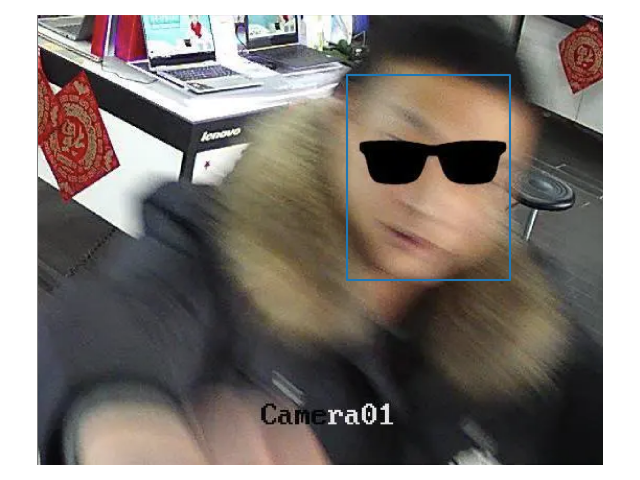
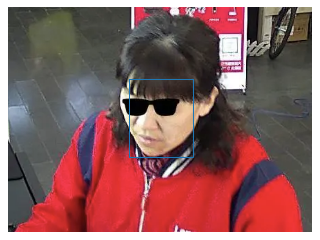

# ___2020 - 04 - 10 SiW PAD___
***

# 数据整理
## 预处理
  ```sh
  ffmpeg -i 006-2-3-4-1.mov -f image2 "foo/video-frame%05d.png"

  # Find .face files which has lines with only 3 elements.
  find ./Train -name *.face -exec grep -l '  ' {} \;

  find ./Train -name *.mov | wc -l
  # 2417
  find ./Test -name *.mov | wc -l
  # 2061

  # In most case it's missing a `48`
  find ./Train -name *.face -exec sed -i 's/  / 48 /' {} \;
  ```
  ```sh
  # find 'mov' file ends with '.m.mov'
  find Test/ -name '*.m.mov' | wc -l
  # 16

  # Rename
  find Test/ -name '*.m.mov' -exec rename 's/.m.mov/.mov/' {} \;
  ```
## 提取图片
  ```py
  #!/usr/bin/env python3

  import os
  import sys
  import argparse
  import glob2
  import cv2
  import numpy as np
  from skimage.io import imread, imsave
  from skimage.transform import SimilarityTransform, resize
  from tqdm import tqdm
  import imageio


  def face_align_landmarks(img, landmarks, image_size=(112, 112)):
      ret = []
      for landmark in landmarks:
          src = np.array(
              [[38.2946, 51.6963], [73.5318, 51.5014], [56.0252, 71.7366], [41.5493, 92.3655], [70.729904, 92.2041]],
              dtype=np.float32,
          )

          if image_size[0] != 112:
              src *= image_size[0] / 112
              src[:, 0] += 8.0

          dst = landmark.astype(np.float32)
          tform = SimilarityTransform()
          tform.estimate(dst, src)
          M = tform.params[0:2, :]
          ret.append(cv2.warpAffine(img, M, (image_size[1], image_size[0]), borderValue=0.0))

      return np.array(ret)


  def get_video_faces(mov_path, detector):
      frame_path = os.path.relpath(mov_path)[:-4]
      # save_orign = os.path.join(data_path, "orign")
      save_orign = os.path.join("orign_frame", frame_path)
      save_mtcnn = os.path.join("detect_frame", frame_path)
      if os.path.exists(save_mtcnn):
          print(">>>> Already processed, skip :", frame_path)
          return
      os.makedirs(save_mtcnn, exist_ok=True)
      if os.path.exists(save_orign):
          print(">>>> Already processed, skip :", frame_path)
          return
      os.makedirs(save_orign, exist_ok=True)
      # save_resize = os.path.join(data_path, "resize")
      # os.makedirs(save_resize, exist_ok=True)
      # save_mtcnn = os.path.join(data_path, "detect")

      face_file = mov_path[:-4] + ".face"
      with open(face_file, "r") as ff:
          aa = ff.readlines()
      face_locs = [[int(jj) for jj in ii.strip().split(" ")] for ii in aa]

      vid = imageio.get_reader(mov_path, "ffmpeg")
      for id, (imm, loc) in tqdm(enumerate(zip(vid, face_locs)), "Processing " + mov_path, total=len(face_locs)):
          imm_orign = imm[loc[1] : loc[3], loc[0] : loc[2]]
          img_name = str(id) + ".png"
          if imm_orign.shape[0] != 0 and imm_orign.shape[1] != 0:
              imsave(os.path.join(save_orign, img_name), imm_orign)
              # imm_resize = resize(imm_orign, (112, 112))
              # imm_resize = (imm_resize * 255).astype(np.uint8)
              # imsave(os.path.join(save_resize, os.path.basename(img)), imm_resize)

              # ret = detector.detect_faces(imm)
              _, ccs, points = detector.detect_faces(imm)
              if points is None or len(points) == 0 or ccs[0] < 0.8:
                  print("No face found, image:", img_name)
              else:
                  # points = np.array([list(ii["keypoints"].values()) for ii in ret])
                  points = np.array([ii.reshape(2, 5)[::-1].T for ii in points])
                  nimgs = face_align_landmarks(imm, points)
                  # imsave(os.path.join(save_mtcnn, str(id) + str(ccs[0]) + '.png'), nimgs[0])
                  imsave(os.path.join(save_mtcnn, img_name), nimgs[0])


  if __name__ == "__main__":
      parser = argparse.ArgumentParser(formatter_class=argparse.ArgumentDefaultsHelpFormatter)
      parser.add_argument("-R", "--reg", type=str, default="./*/*/*/*.mov", help="Regular string points to mov files.")
      parser.add_argument("-S", "--start", type=int, default=0, help="Begining mov index to handle with [Include].")
      parser.add_argument("-E", "--end", type=int, default=-1, help="End mov index to handle with [Exclude].")
      args = parser.parse_known_args(sys.argv[1:])[0]

      # from mtcnn import MTCNN
      # detector = MTCNN(steps_threshold=[0.6, 0.7, 0.7], min_face_size=40)
      sys.path.append("/home/leondgarse/workspace/samba/tdFace-flask")
      from mtcnn_tf.mtcnn import MTCNN

      detector = MTCNN(thresholds=[0.6, 0.7, 0.7], min_size=40)
      movs = glob2.glob(args.reg)
      movs.sort()
      if args.end != -1:
          movs = movs[args.start : args.end]
      else:
          movs = movs[args.start :]

      total = len(movs)
      for id, mov in enumerate(movs):
          print(">>>> %d/%d:" % (id + 1, total))
          get_video_faces(mov, detector)
  ```
  ```sh
  CUDA_VISIBLE_DEVICES='-1' ./extract_faces.py -R 'Train/*/*/*.mov'
  CUDA_VISIBLE_DEVICES='0' ./extract_faces.py -R 'Train/*/*/*.mov'
  CUDA_VISIBLE_DEVICES='1' ./extract_faces.py -R 'Train/*/*/*.mov'

  CUDA_VISIBLE_DEVICES='-1' ./extract_faces.py -R 'Test/*/*/*.mov'
  CUDA_VISIBLE_DEVICES='0' ./extract_faces.py -R 'Test/*/*/*.mov'
  CUDA_VISIBLE_DEVICES='1' ./extract_faces.py -R 'Test/*/*/*.mov'
  ```
## 图片数据分析
  ```py
  # ls detect_frame/Train/live/003/003-1-1-1-1
  import glob2
  image_counts = lambda rr: {os.path.sep.join(os.path.relpath(ii).split(os.path.sep)[1:]): len(os.listdir(ii)) for ii in glob2.glob(rr)}

  ddr = "detect_frame/Test/*/*/*"
  oor = "orign_frame/Test/*/*/*"
  # ddr = "detect_frame/Train/*/*/*"
  # oor = "orign_frame/Train/*/*/*"
  dss = pd.Series(image_counts(ddr), name='detect')
  oss = pd.Series(image_counts(oor), name='original')

  ''' Remove empty directories '''
  tt = pd.concat([dss, oss], axis=1, sort=False).fillna(0)
  tt.sort_values('detect').head(10)
  #                              detect  original  sub
  # Train/spoof/121/121-2-3-2-1       0         0    0
  # Train/spoof/081/081-2-3-2-1       0         0    0
  # Train/spoof/101/101-2-3-2-1       0         0    0
  # Train/spoof/101/101-2-3-3-1       0         0    0
  # Train/spoof/041/041-2-3-2-1       0         0    0
  # Train/spoof/077/077-1-3-3-2       0         0    0
  # Train/spoof/041/041-2-3-3-1       0         0    0
  # Train/spoof/121/121-2-3-3-1       0         0    0
  # Train/spoof/006/006-2-3-4-1     202       202    0
  # Train/spoof/060/060-2-3-1-2     202       209    7

  for ii in tt[tt.detect == 0].index:
      print(os.path.join('./detect_frame/', ii))
      os.rmdir(os.path.join('./detect_frame/', ii))
      os.rmdir(os.path.join('./orign_frame/', ii))

  tt = tt[tt.detect != 0].copy()

  ''' Check face detection results, see how many is missing '''
  tt['sub'] = tt['original'] - tt['detect']
  tt['sub'].describe()
  # count    2409.000000
  # mean        4.427978
  # std        13.497904
  # min         0.000000
  # 25%         0.000000
  # 50%         0.000000
  # 75%         2.000000
  # max       210.000000
  # Name: sub, dtype: float64
  tt.sort_values('sub')[-5:]
  # detect  original  sub
  # Train/spoof/156/156-2-3-2-2     274       394  120
  # Train/spoof/055/055-2-3-4-2     293       430  137
  # Train/spoof/104/104-2-3-4-2     279       426  147
  # Train/spoof/032/032-2-3-4-1     266       437  171
  # Train/spoof/159/159-2-3-2-1     204       414  210
  ```
  ```py
  ''' Folder size estimate '''
  files_size = lambda dd: [os.stat(os.path.join(dd, ii)).st_size for ii in  os.listdir(dd)]
  samples = tt.index[np.random.choice(tt.shape[0], 120, replace=False)]
  aa = [files_size(os.path.join("detect_frame", ii)) for ii in samples]
  mm = np.mean([np.mean(ii) for ii in aa])
  print("~%.2fGB" % (tt['detect'].sum() * mm / 1024 / 1024 / 1024))
  # ~28.99GB
  !du -hd1 detect_frame/Train
  # 15G     detect_frame/Train/live
  # 18G     detect_frame/Train/spoof
  # 33G     detect_frame/Train
  !du -hd1 detect_frame/Test
  # 13G     detect_frame/Test/live
  # 16G     detect_frame/Test/spoof
  # 29G     detect_frame/Test

  aa = [files_size(os.path.join("orign_frame", ii)) for ii in samples]
  mm = np.mean([np.mean(ii) for ii in aa])
  print("~%.2fGB" % (tt['original'].sum() * mm / 1024 / 1024 / 1024))
  # ~180.40GB
  !du -hd1 orign_frame/Train
  # 83G     orign_frame/Train/live
  # 105G    orign_frame/Train/spoof
  # 188G    orign_frame/Train
  !du -hd1 orign_frame/Test
  # 73G     orign_frame/Test/live
  # 92G     orign_frame/Test/spoof
  # 164G    orign_frame/Test
  ```
***

# Basic Training
  ```py
  # data_path = 'detect_frame/Train'
  # ls detect_frame/Train/live/003/003-1-1-1-1/0.png
  import sys
  # sys.path.append('/home/leondgarse/workspace/samba/Keras_insightface')
  sys.path.append('/home/tdtest/workspace/Keras_insightface')
  import data
  import myCallbacks
  image_names_reg = "*/*/*/*.png"
  image_classes_rule = lambda path: 0 if "live" in path else 1
  # image_names, image_classes, classes = data.pre_process_folder('detect_frame/Train', image_names_reg=image_names_reg, image_classes_rule=image_classes_rule)
  train_ds, steps_per_epoch, classes = data.prepare_dataset('detect_frame/Train', image_names_reg=image_names_reg, image_classes_rule=image_classes_rule, batch_size=160, img_shape=(48, 48), random_status=2, random_crop=(48, 48, 3))
  test_ds, validation_steps, _ = data.prepare_dataset('detect_frame/Test', image_names_reg=image_names_reg, image_classes_rule=image_classes_rule, batch_size=160, img_shape=(48, 48), random_status=0, random_crop=(48, 48, 3), is_train=False)

  aa, bb = train_ds.as_numpy_iterator().next()
  aa = (aa + 1) / 2
  plt.imshow(np.vstack([np.hstack(aa[ii * 20 : (ii + 1) * 20]) for ii in range(int(np.ceil(aa.shape[0] / 20)))]))
  plt.axis('off')
  plt.tight_layout()

  with tf.distribute.MirroredStrategy().scope():
      from tensorflow.keras import layers
      model = keras.Sequential([
          layers.Conv2D(512, 1, strides=1, activation='relu'),
          layers.AveragePooling2D(pool_size=1),
          layers.Conv2D(128, 1, strides=1, activation='relu'),
          layers.AveragePooling2D(pool_size=1),
          layers.Conv2D(32, 1, strides=1, activation='relu'),
          layers.Dropout(0.5),
          layers.AveragePooling2D(pool_size=1),
          layers.Flatten(),
          layers.Dense(2, activation=tf.nn.softmax)
      ])

      import train
      bb = train.buildin_models("MobileNet", dropout=1, emb_shape=128, input_shape=(48, 48, 3))
      output = keras.layers.Dense(2, activation=tf.nn.softmax)(bb.outputs[0])
      model = keras.models.Model(bb.inputs[0], output)

      callbacks = [
          keras.callbacks.ReduceLROnPlateau(monitor='val_loss', factor=0.1, patience=5),
          keras.callbacks.EarlyStopping(monitor='val_loss', patience=10),
          keras.callbacks.ModelCheckpoint("./keras.h5", monitor='val_loss', save_best_only=True),
          keras.callbacks.TensorBoard(log_dir='keras_logs'),
          myCallbacks.Gently_stop_callback(),
      ]
      model.compile(optimizer="adam", loss='categorical_crossentropy', metrics=["accuracy"])
      model.fit(
          train_ds,
          epochs=50,
          callbacks=callbacks,
          steps_per_epoch=steps_per_epoch,
          validation_data=test_ds,
          validation_steps=validation_steps,
          use_multiprocessing=True,
          workers=4,
      )
  ```
***

# Android TFlite
  - [Github syaringan357/Android-MobileFaceNet-MTCNN-FaceAntiSpoofing](https://github.com/syaringan357/Android-MobileFaceNet-MTCNN-FaceAntiSpoofing)
  - [Github Leezhen2014/BlurDetection](https://github.com/Leezhen2014/python--/blob/master/BlurDetection.py)
## Java
  ```java
  /**
   * 活体检测
   */
  private void antiSpoofing() {
      if (bitmapCrop1 == null || bitmapCrop2 == null) {
          Toast.makeText(this, "请先检测人脸", Toast.LENGTH_LONG).show();
          return;
      }

      // 活体检测前先判断图片清晰度
      int laplace1 = fas.laplacian(bitmapCrop1);

      String text = "清晰度检测结果left：" + laplace1;
      if (laplace1 < FaceAntiSpoofing.LAPLACIAN_THRESHOLD) {
          text = text + "，" + "False";
          resultTextView.setTextColor(getResources().getColor(android.R.color.holo_red_light));
      } else {
          long start = System.currentTimeMillis();

          // 活体检测
          float score1 = fas.antiSpoofing(bitmapCrop1);

          long end = System.currentTimeMillis();

          text = "活体检测结果left：" + score1;
          if (score1 < FaceAntiSpoofing.THRESHOLD) {
              text = text + "，" + "True";
              resultTextView.setTextColor(getResources().getColor(android.R.color.holo_green_light));
          } else {
              text = text + "，" + "False";
              resultTextView.setTextColor(getResources().getColor(android.R.color.holo_red_light));
          }
          text = text + "。耗时" + (end - start);
      }
      resultTextView.setText(text);

      // 第二张图片活体检测前先判断图片清晰度
      int laplace2 = fas.laplacian(bitmapCrop2);

      String text2 = "清晰度检测结果left：" + laplace2;
      if (laplace2 < FaceAntiSpoofing.LAPLACIAN_THRESHOLD) {
          text2 = text2 + "，" + "False";
          resultTextView2.setTextColor(getResources().getColor(android.R.color.holo_red_light));
      } else {
          // 活体检测
          float score2 = fas.antiSpoofing(bitmapCrop2);
          text2 = "活体检测结果right：" + score2;
          if (score2 < FaceAntiSpoofing.THRESHOLD) {
              text2 = text2 + "，" + "True";
              resultTextView2.setTextColor(getResources().getColor(android.R.color.holo_green_light));
          } else {
              text2 = text2 + "，" + "False";
              resultTextView2.setTextColor(getResources().getColor(android.R.color.holo_red_light));
          }
      }
      resultTextView2.setText(text2);
  }
  ```
  ```java
  public class FaceAntiSpoofing {
      private static final String MODEL_FILE = "FaceAntiSpoofing.tflite";

      public static final int INPUT_IMAGE_SIZE = 256; // 需要feed数据的placeholder的图片宽高
      public static final float THRESHOLD = 0.2f; // 设置一个阙值，大于这个值认为是攻击

      public static final int ROUTE_INDEX = 6; // 训练时观察到的路由索引

      public static final int LAPLACE_THRESHOLD = 50; // 拉普拉斯采样阙值
      public static final int LAPLACIAN_THRESHOLD = 1000; // 图片清晰度判断阙值

      private Interpreter interpreter;

      public FaceAntiSpoofing(AssetManager assetManager) throws IOException {
          Interpreter.Options options = new Interpreter.Options();
          options.setNumThreads(4);
          interpreter = new Interpreter(MyUtil.loadModelFile(assetManager, MODEL_FILE), options);
      }

      /**
       * 活体检测
       * @param bitmap
       * @return 评分
       */
      public float antiSpoofing(Bitmap bitmap) {
          // 将人脸resize为256X256大小的，因为下面需要feed数据的placeholder的形状是(1, 256, 256, 3)
          Bitmap bitmapScale = Bitmap.createScaledBitmap(bitmap, INPUT_IMAGE_SIZE, INPUT_IMAGE_SIZE, true);

          float[][][] img = normalizeImage(bitmapScale);
          float[][][][] input = new float[1][][][];
          input[0] = img;
          float[][] clss_pred = new float[1][8];
          float[][] leaf_node_mask = new float[1][8];
          Map<Integer, Object> outputs = new HashMap<>();
          outputs.put(interpreter.getOutputIndex("Identity"), clss_pred);
          outputs.put(interpreter.getOutputIndex("Identity_1"), leaf_node_mask);
          interpreter.runForMultipleInputsOutputs(new Object[]{input}, outputs);

          Log.i("FaceAntiSpoofing", "[" + clss_pred[0][0] + ", " + clss_pred[0][1] + ", "
                  + clss_pred[0][2] + ", " + clss_pred[0][3] + ", " + clss_pred[0][4] + ", "
                  + clss_pred[0][5] + ", " + clss_pred[0][6] + ", " + clss_pred[0][7] + "]");
          Log.i("FaceAntiSpoofing", "[" + leaf_node_mask[0][0] + ", " + leaf_node_mask[0][1] + ", "
                  + leaf_node_mask[0][2] + ", " + leaf_node_mask[0][3] + ", " + leaf_node_mask[0][4] + ", "
                  + leaf_node_mask[0][5] + ", " + leaf_node_mask[0][6] + ", " + leaf_node_mask[0][7] + "]");

          return leaf_score1(clss_pred, leaf_node_mask);
      }

      private float leaf_score1(float[][] clss_pred, float[][] leaf_node_mask) {
          float score = 0;
          for (int i = 0; i < 8; i++) {
              score += Math.abs(clss_pred[0][i]) * leaf_node_mask[0][i];
          }
          return score;
      }

      private float leaf_score2(float[][] clss_pred) {
          return clss_pred[0][ROUTE_INDEX];
      }

      /**
       * 归一化图片到[0, 1]
       * @param bitmap
       * @return
       */
      public static float[][][] normalizeImage(Bitmap bitmap) {
          int h = bitmap.getHeight();
          int w = bitmap.getWidth();
          float[][][] floatValues = new float[h][w][3];

          float imageStd = 255;
          int[] pixels = new int[h * w];
          bitmap.getPixels(pixels, 0, bitmap.getWidth(), 0, 0, w, h);
          for (int i = 0; i < h; i++) { // 注意是先高后宽
              for (int j = 0; j < w; j++) {
                  final int val = pixels[i * w + j];
                  float r = ((val >> 16) & 0xFF) / imageStd;
                  float g = ((val >> 8) & 0xFF) / imageStd;
                  float b = (val & 0xFF) / imageStd;

                  float[] arr = {r, g, b};
                  floatValues[i][j] = arr;
              }
          }
          return floatValues;
      }

      /**
       * 拉普拉斯算法计算清晰度
       * @param bitmap
       * @return 分数
       */
      public int laplacian(Bitmap bitmap) {
          // 将人脸resize为256X256大小的，因为下面需要feed数据的placeholder的形状是(1, 256, 256, 3)
          Bitmap bitmapScale = Bitmap.createScaledBitmap(bitmap, INPUT_IMAGE_SIZE, INPUT_IMAGE_SIZE, true);

          double[][] laplace = {{0, 1, 0}, {1, -4, 1}, {0, 1, 0}};
          int size = laplace.length;
          int[][] img = MyUtil.convertGreyImg(bitmapScale);
          int height = img.length;
          int width = img[0].length;

          int score = 0;
          for (int x = 0; x < height - size + 1; x++){
              for (int y = 0; y < width - size + 1; y++){
                  int result = 0;
                  // 对size*size区域进行卷积操作
                  for (int i = 0; i < size; i++){
                      for (int j = 0; j < size; j++){
                          result += (img[x + i][y + j] & 0xFF) * laplace[i][j];
                      }
                  }
                  if (result > LAPLACE_THRESHOLD) {
                      score++;
                  }
              }
          }
          return score;
      }
  }
  ```
  ```java
  /**
   * 图片转为灰度图
   * @param bitmap
   * @return 灰度图数据
   */
  public static int[][] convertGreyImg(Bitmap bitmap) {
      int w = bitmap.getWidth();
      int h = bitmap.getHeight();

      int[] pixels = new int[h * w];
      bitmap.getPixels(pixels, 0, w, 0, 0, w, h);

      int[][] result = new int[h][w];
      int alpha = 0xFF << 24;
      for(int i = 0; i < h; i++)	{
          for(int j = 0; j < w; j++) {
              int val = pixels[w * i + j];

              int red = ((val >> 16) & 0xFF);
              int green = ((val >> 8) & 0xFF);
              int blue = (val & 0xFF);

              int grey = (int)((float) red * 0.3 + (float)green * 0.59 + (float)blue * 0.11);
              grey = alpha | (grey << 16) | (grey << 8) | grey;
              result[i][j] = grey;
          }
      }
      return result;
  }
  ```
## Python BlurDetection
  ```py
  # -*-coding=UTF-8-*-
  """
  在无参考图下，检测图片质量的方法
  """
  import os
  import cv2

  import numpy as np
  from skimage import filters

  class BlurDetection:
      def __init__(self, strDir):
          print("图片检测对象已经创建...")
          self.strDir = strDir

      def _getAllImg(self, strType='jpg'):
          """
          根据目录读取所有的图片
          :param strType: 图片的类型
          :return:  图片列表
          """
          names = []
          for root, dirs, files in os.walk(self.strDir):  # 此处有bug  如果调试的数据还放在这里，将会递归的遍历所有文件
              for file in files:
                  # if os.path.splitext(file)[1]=='jpg':
                  names.append(str(file))
          return names

      def _imageToMatrix(self, image):
          """
          根据名称读取图片对象转化矩阵
          :param strName:
          :return: 返回矩阵
          """
          imgMat = np.matrix(image)
          return imgMat

      def _blurDetection(self, imgName):

          # step 1 图像的预处理
          img2gray, reImg = self.preImgOps(imgName)
          imgMat=self._imageToMatrix(img2gray)/255.0
          x, y = imgMat.shape
          score = 0
          for i in range(x - 2):
              for j in range(y - 2):
                  score += (imgMat[i + 2, j] - imgMat[i, j]) ** 2
          # step3: 绘制图片并保存  不应该写在这里  抽象出来   这是共有的部分
          score=score/10
          newImg = self._drawImgFonts(reImg, str(score))
          newDir = self.strDir + "/_blurDetection_/"
          if not os.path.exists(newDir):
              os.makedirs(newDir)
          newPath = newDir + imgName
          cv2.imwrite(newPath, newImg)  # 保存图片
          cv2.imshow(imgName, newImg)
          cv2.waitKey(0)
          return score

      def _SMDDetection(self, imgName):

          # step 1 图像的预处理
          img2gray, reImg = self.preImgOps(imgName)
          f=self._imageToMatrix(img2gray)/255.0
          x, y = f.shape
          score = 0
          for i in range(x - 1):
              for j in range(y - 1):
                  score += np.abs(f[i+1,j]-f[i,j])+np.abs(f[i,j]-f[i+1,j])
          # strp3: 绘制图片并保存  不应该写在这里  抽象出来   这是共有的部分
          score=score/100
          newImg = self._drawImgFonts(reImg, str(score))
          newDir = self.strDir + "/_SMDDetection_/"
          if not os.path.exists(newDir):
              os.makedirs(newDir)
          newPath = newDir + imgName
          cv2.imwrite(newPath, newImg)  # 保存图片
          cv2.imshow(imgName, newImg)
          cv2.waitKey(0)
          return score

      def _SMD2Detection(self, imgName):
          """
          灰度方差乘积
          :param imgName:
          :return:
          """
          # step 1 图像的预处理
          img2gray, reImg = self.preImgOps(imgName)
          f=self._imageToMatrix(img2gray)/255.0
          x, y = f.shape
          score = 0
          for i in range(x - 1):
              for j in range(y - 1):
                  score += np.abs(f[i+1,j]-f[i,j])*np.abs(f[i,j]-f[i,j+1])
          # strp3: 绘制图片并保存  不应该写在这里  抽象出来   这是共有的部分
          score=score
          newImg = self._drawImgFonts(reImg, str(score))
          newDir = self.strDir + "/_SMD2Detection_/"
          if not os.path.exists(newDir):
              os.makedirs(newDir)
          newPath = newDir + imgName
          cv2.imwrite(newPath, newImg)  # 保存图片
          cv2.imshow(imgName, newImg)
          cv2.waitKey(0)
          return score
      def _Variance(self, imgName):
          """
                 灰度方差乘积
                 :param imgName:
                 :return:
                 """
          # step 1 图像的预处理
          img2gray, reImg = self.preImgOps(imgName)
          f = self._imageToMatrix(img2gray)

          # strp3: 绘制图片并保存  不应该写在这里  抽象出来   这是共有的部分
          score = np.var(f)
          newImg = self._drawImgFonts(reImg, str(score))
          newDir = self.strDir + "/_Variance_/"
          if not os.path.exists(newDir):
              os.makedirs(newDir)
          newPath = newDir + imgName
          cv2.imwrite(newPath, newImg)  # 保存图片
          cv2.imshow(imgName, newImg)
          cv2.waitKey(0)
          return score
      def _Vollath(self,imgName):
          """
                         灰度方差乘积
                         :param imgName:
                         :return:
                         """
          # step 1 图像的预处理
          img2gray, reImg = self.preImgOps(imgName)
          f = self._imageToMatrix(img2gray)
          source=0
          x,y=f.shape
          for i in range(x-1):
              for j in range(y):
                  source+=f[i,j]*f[i+1,j]
          source=source-x*y*np.mean(f)
          # strp3: 绘制图片并保存  不应该写在这里  抽象出来   这是共有的部分

          newImg = self._drawImgFonts(reImg, str(source))
          newDir = self.strDir + "/_Vollath_/"
          if not os.path.exists(newDir):
              os.makedirs(newDir)
          newPath = newDir + imgName
          cv2.imwrite(newPath, newImg)  # 保存图片
          cv2.imshow(imgName, newImg)
          cv2.waitKey(0)
          return source
      def _Tenengrad(self,imgName):
          """
                         灰度方差乘积
                         :param imgName:
                         :return:
                         """
          # step 1 图像的预处理
          img2gray, reImg = self.preImgOps(imgName)
          f = self._imageToMatrix(img2gray)

          tmp = filters.sobel(f)
          source=np.sum(tmp**2)
          source=np.sqrt(source)
          # strp3: 绘制图片并保存  不应该写在这里  抽象出来   这是共有的部分

          newImg = self._drawImgFonts(reImg, str(source))
          newDir = self.strDir + "/_Tenengrad_/"
          if not os.path.exists(newDir):
              os.makedirs(newDir)
          newPath = newDir + imgName
          cv2.imwrite(newPath, newImg)  # 保存图片
          cv2.imshow(imgName, newImg)
          cv2.waitKey(0)
          return source

      def Test_Tenengrad(self):
          imgList = self._getAllImg(self.strDir)
          for i in range(len(imgList)):
              score = self._Tenengrad(imgList[i])
              print(str(imgList[i]) + " is " + str(score))

      def Test_Vollath(self):
          imgList = self._getAllImg(self.strDir)
          for i in range(len(imgList)):
              score = self._Variance(imgList[i])
              print(str(imgList[i]) + " is " + str(score))


      def TestVariance(self):
          imgList = self._getAllImg(self.strDir)
          for i in range(len(imgList)):
              score = self._Variance(imgList[i])
              print(str(imgList[i]) + " is " + str(score))

      def TestSMD2(self):
          imgList = self._getAllImg(self.strDir)

          for i in range(len(imgList)):
              score = self._SMD2Detection(imgList[i])
              print(str(imgList[i]) + " is " + str(score))
          return
      def TestSMD(self):
          imgList = self._getAllImg(self.strDir)

          for i in range(len(imgList)):
              score = self._SMDDetection(imgList[i])
              print(str(imgList[i]) + " is " + str(score))
          return

      def TestBrener(self):
          imgList = self._getAllImg(self.strDir)

          for i in range(len(imgList)):
              score = self._blurDetection(imgList[i])
              print(str(imgList[i]) + " is " + str(score))
          return

      def preImgOps(self, imgName):
          """
          图像的预处理操作
          :param imgName: 图像的而明朝
          :return: 灰度化和resize之后的图片对象
          """
          strPath = self.strDir + imgName

          img = cv2.imread(strPath)  # 读取图片
          cv2.moveWindow("", 1000, 100)
          # cv2.imshow("原始图", img)
          # 预处理操作
          reImg = cv2.resize(img, (800, 900), interpolation=cv2.INTER_CUBIC)  #
          img2gray = cv2.cvtColor(reImg, cv2.COLOR_BGR2GRAY)  # 将图片压缩为单通道的灰度图
          return img2gray, reImg

      def _drawImgFonts(self, img, strContent):
          """
          绘制图像
          :param img: cv下的图片对象
          :param strContent: 书写的图片内容
          :return:
          """
          font = cv2.FONT_HERSHEY_SIMPLEX
          fontSize = 5
          # 照片 添加的文字    /左上角坐标   字体   字体大小   颜色        字体粗细
          cv2.putText(img, strContent, (0, 200), font, fontSize, (0, 255, 0), 6)

          return img

      def _lapulaseDetection(self, imgName):
          """
          :param strdir: 文件所在的目录
          :param name: 文件名称
          :return: 检测模糊后的分数
          """
          # step1: 预处理
          img2gray, reImg = self.preImgOps(imgName)
          # step2: laplacian算子 获取评分
          resLap = cv2.Laplacian(img2gray, cv2.CV_64F)
          score = resLap.var()
          print("Laplacian %s score of given image is %s", str(score))
          # strp3: 绘制图片并保存  不应该写在这里  抽象出来   这是共有的部分
          newImg = self._drawImgFonts(reImg, str(score))
          newDir = self.strDir + "/_lapulaseDetection_/"
          if not os.path.exists(newDir):
            os.makedirs(newDir)
        newPath = newDir + imgName
        # 显示
        cv2.imwrite(newPath, newImg)  # 保存图片
        cv2.imshow(imgName, newImg)
        cv2.waitKey(0)

        # step3: 返回分数
        return score

    def TestDect(self):
        names = self._getAllImg()
        for i in range(len(names)):
            score = self._lapulaseDetection(names[i])
            print(str(names[i]) + " is " + str(score))
        return


  if __name__ == "__main__":
      BlurDetection = BlurDetection(strDir="D:/document/ZKBH/bug/face/")
      BlurDetection.Test_Tenengrad () # TestSMD
  ```
## Test
  - **Blur test**
    ```py
    from scipy import signal
    from skimage.color import rgb2gray
    import cv2

    LAPLACE_THRESHOLD = 50 # 拉普拉斯采样阙值
    LAPLACIAN_THRESHOLD = 1000 # 图片清晰度判断阙值

    Laplace = lambda imm: np.array([[sum([mm * nn for mm, nn in zip(imm[ii: ii + 3, jj: jj + 3].flatten(), [0, 1, 0, 1, -4, 1, 0, 1, 0])]) for jj in range(imm.shape[1] - 3 + 1)] for ii in range(imm.shape[0] - 3 + 1)])
    Laplace_2 = lambda imm: signal.convolve2d(imm, [[0, 1, 0], [1, -4, 1], [0, 1, 0]], mode='valid')
    Laplace_3 = lambda imm: cv2.Laplacian(imm.astype('uint8'), cv2.CV_32F)

    def laplacian_blur(img, laplace):
        lap_img = laplace(rgb2gray(img) * 255)
        score_sum = (lap_img > LAPLACE_THRESHOLD).sum()
        score_var = lap_img.var()
        return score_sum, score_var
    ```
    ```py
    def image_test(imm, det=None):
        if isinstance(imm, str):
            imm = imread(imm)
        print("Original image:")
        print("    Laplace_2 conv score:", laplacian_blur(imm, Laplace_2))
        print("    Laplace_3 cv2 score:", laplacian_blur(imm, Laplace_3))
        plt.imshow(imm)

        if det:
            bb, cc, pp = det.detect_faces(imm)
            bb = bb[0].astype('int')
            iim = imm[bb[0]: bb[2], bb[1]: bb[3]]
            print("Face area:")
            print("    Laplace_2 conv score:", laplacian_blur(iim, Laplace_2))
            print("    Laplace_3 cv2 score:", laplacian_blur(iim, Laplace_3))
            plt.plot([bb[1], bb[3], bb[3], bb[1], bb[1]], [bb[0], bb[0], bb[2], bb[2], bb[0]])
        plt.axis('off')
        plt.tight_layout()

    sys.path.append('/home/leondgarse/workspace/samba/tdFace-flask/')
    from mtcnn_tf.mtcnn import MTCNN
    det = MTCNN()

    image_test('./face_recognition_collection/test_img/blur_1.png', det)                                                                     
    # Original image:
    #     Laplace_2 conv score: (2988, 28.522123750476517)
    #     Laplace_3 cv2 score: (3626, 45.7521)
    # Face area:
    #     Laplace_2 conv score: (1, 6.572161511502175)
    #     Laplace_3 cv2 score: (1, 7.178362)
    image_test('./face_recognition_collection/test_img/blur_2.png', det)                                                                     
    # Original image:
    #     Laplace_2 conv score: (104, 6.858723524141351)
    #     Laplace_3 cv2 score: (110, 7.6073356)
    # Face area:
    #     Laplace_2 conv score: (31, 12.997524875546874)
    #     Laplace_3 cv2 score: (31, 13.875649)
    ```
    
    
  - **Tflite detect**
    ```py
    # /home/leondgarse/workspace/facial_presentation_attack_detection/Android-MobileFaceNet-MTCNN-FaceAntiSpoofing/app/src/main/assets

    from skimage.transform import resize

    def tflite_detect(imm, interp, det=None):
        if isinstance(imm, str):
            imm = imread(imm)
        if det:
            bb, cc, pp = det.detect_faces(imm)
            bb = bb[0].astype('int')
            imm = imm[bb[0]: bb[2], bb[1]: bb[3]]
        imm = resize(imm, (256, 256))

        input_index = interp.get_input_details()[0]["index"]
        class_pred_node = interp.get_output_details()[0]["index"]
        leaf_node_mask_node = interp.get_output_details()[1]["index"]

        interp.set_tensor(input_index, tf.cast(tf.expand_dims(imm, 0), dtype=tf.float32))
        interp.invoke()
        class_pred = interp.get_tensor(class_pred_node)
        leaf_node_mask = interp.get_tensor(leaf_node_mask_node)
        return class_pred, leaf_node_mask, np.dot(np.abs(class_pred[0]), leaf_node_mask[0])

    interp = tf.lite.Interpreter('/home/leondgarse/workspace/facial_presentation_attack_detection/Android-MobileFaceNet-MTCNN-FaceAntiSpoofing/app/src/main/assets/FaceAntiSpoofing.tflite')
    interp.allocate_tensors()

    tflite_detect('./face_recognition_collection/test_img/blur_1.png', interp, det)
    # (array([[ 1.016278  ,  0.00424137,  1.0010722 , -0.00470004,  0.909961  ,
    #           0.29483515,  0.31600803,  0.00585337]], dtype=float32),
    #  array([[0., 0., 0., 0., 1., 0., 0., 0.]], dtype=float32),
    #  0.909961)

    tflite_detect('./face_recognition_collection/test_img/blur_2.png', interp, det)
    # (array([[1.0193512 , 0.879801  , 1.0011172 , 0.04316462, 0.99281096,
    #          0.9843273 , 0.946206  , 0.07745843]], dtype=float32),
    #  array([[0., 0., 0., 0., 0., 0., 0., 1.]], dtype=float32),
    #  0.07745843)
    ```
***
