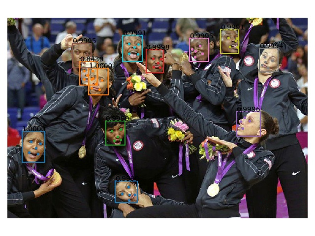
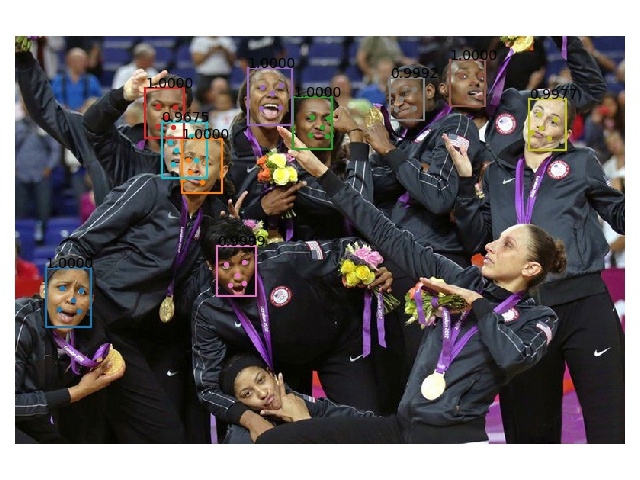
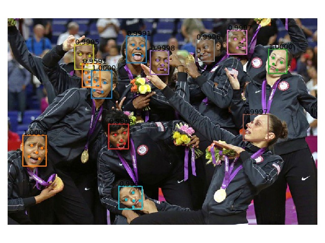
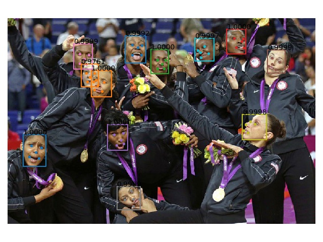
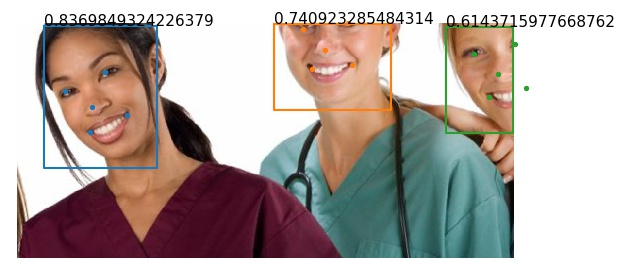
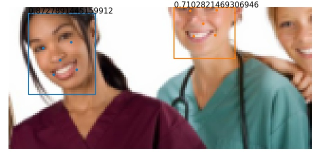

# ___2020 - 08 - 21 Face Detect___
***

# 目录
  <!-- TOC depthFrom:1 depthTo:6 withLinks:1 updateOnSave:1 orderedList:0 -->

  - [___2020 - 08 - 21 Face Detect___](#2020-08-21-face-detect)
  - [目录](#目录)
  - [Basic](#basic)
  	- [Image show function](#image-show-function)
  	- [Face align landmarks](#face-align-landmarks)
  	- [人脸旋转角度与侧脸](#人脸旋转角度与侧脸)
  	- [图像质量](#图像质量)
  	- [Video test function](#video-test-function)
  - [MTCNN](#mtcnn)
  	- [facenet mtcnn](#facenet-mtcnn)
  	- [insightface mtcnn](#insightface-mtcnn)
  	- [MTCNN-Tensorflow](#mtcnn-tensorflow)
  	- [mtcnn.MTCNN](#mtcnnmtcnn)
  	- [MTCNN Tensorflow single pb](#mtcnn-tensorflow-single-pb)
  - [Yoloface](#yoloface)
  	- [Pytorch Inference](#pytorch-inference)
  	- [Convert ONNX](#convert-onnx)
  	- [Yolo decode](#yolo-decode)
  	- [CPP yolo decode](#cpp-yolo-decode)
  	- [Convert Tensorflow](#convert-tensorflow)
  	- [TF yolodecode layer](#tf-yolodecode-layer)
  	- [TFLite inference](#tflite-inference)
  	- [Clone model convert reshape layer](#clone-model-convert-reshape-layer)
  	- [NCNN](#ncnn)
  - [Centerface](#centerface)
  	- [ONNX inference](#onnx-inference)
  	- [Convert Tensorflow](#convert-tensorflow)
  	- [CPP](#cpp)
  - [Retinaface](#retinaface)
  	- [MXNet](#mxnet)
  	- [Pytorch](#pytorch)
  	- [Keras](#keras)
  	- [TensorRT](#tensorrt)
  - [口罩检测](#口罩检测)
  	- [FaceMaskDetection 模型转化](#facemaskdetection-模型转化)
  	- [FaceMaskDetection Keras](#facemaskdetection-keras)
  	- [neuralet face mask detection](#neuralet-face-mask-detection)
  	- [Blazeface](#blazeface)
  - [Ultraface](#ultraface)
  	- [ONNX to tflite](#onnx-to-tflite)
  	- [Benchmark](#benchmark)
  	- [tflite python](#tflite-python)
  	- [Face detection video tests](#face-detection-video-tests)

  <!-- /TOC -->
***

# Basic
## Image show function
  ```py
  def show_result(image, bbs, ccs=[], pps=[]):
      plt.figure()
      plt.imshow(image)
      for id, bb in enumerate(bbs):
          plt.plot([bb[0], bb[2], bb[2], bb[0], bb[0]], [bb[1], bb[1], bb[3], bb[3], bb[1]])
          if len(ccs) != 0:
              plt.text(bb[0], bb[1], '{:.4f}'.format(ccs[id]))
          if len(pps) != 0:
              pp = pps[id]
              if len(pp.shape) == 2:
                  plt.scatter(pp[:, 0], pp[:, 1], s=8)
              else:
                  plt.scatter(pp[::2], pp[1::2], s=8)
      plt.axis('off')
      plt.tight_layout()
  ```
  ```py
  def axes_show_info(nimgs, info_func=None, base_size=2, text_color='r', text_pos=(10, 50), pic_in_line=10):
      img_num = len(nimgs)
      lines = img_num // 10 + (0 if img_num % 10 == 0 else 1)
      rows = pic_in_line if img_num > pic_in_line else img_num

      fig, axes = plt.subplots(lines, rows, figsize=(base_size * rows, base_size * lines))
      axes = axes.flatten()
      for imm, ax in zip(nimgs, axes):
          ax.imshow(imm)
          ax.set_axis_off()
          if info_func is not None:
              ax.text(text_pos[0], text_pos[1], info_func(imm), color=text_color)
      plt.tight_layout()
      return fig, axes
  ```
## Face align landmarks
  ```py
  from skimage import transform
  def face_align_landmarks_sk(img, landmarks, image_size=(112, 112), method='similar'):
      tform = transform.AffineTransform() if method == 'affine' else transform.SimilarityTransform()
      src = np.array([[38.2946, 51.6963], [73.5318, 51.5014], [56.0252, 71.7366], [41.5493, 92.3655], [70.729904, 92.2041]], dtype=np.float32)
      ret = []
      for landmark in landmarks:
          # landmark = np.array(landmark).reshape(2, 5)[::-1].T
          tform.estimate(landmark, src)
          ret.append(transform.warp(img, tform.inverse, output_shape=image_size))
      return (np.array(ret) * 255).astype(np.uint8)
  ```
## 人脸旋转角度与侧脸
  ```py
  from skimage.transform import SimilarityTransform
  import insightface
  dd = insightface.model_zoo.face_detection.retinaface_mnet025_v1()
  dd.prepare(-1)

  def rotation_detect(dd, image_path, image_show=True):
      dst = np.array([[38.2946, 51.6963], [73.5318, 51.5014], [56.0252, 71.7366], [41.5493, 92.3655], [70.729904, 92.2041]])
      aa = imread(image_path)
      if image_show:
          fig = plt.figure()
          plt.imshow(aa)

      bbox, points = dd.detect(aa)
      rrs = []
      for src in points:
          src = src.astype(np.float32)
          tform = SimilarityTransform()
          tform.estimate(src, dst)

          cc = tform.params[:2]
          ne = np.dot(cc, np.vstack([src.T, np.ones(src.shape[0])])).T
          nose, left_eye, right_eye = ne[2, 0], ne[0, 0], ne[1, 0]
          lean = (nose - (left_eye + right_eye) / 2) / ((right_eye - left_eye) / 2)
          rrs.append({'rotation' : tform.rotation, 'lean': lean})

          if image_show:
              plt.scatter(src[:, 0], src[:, 1])
              plt.scatter(ne[:, 0], ne[:, 1])
              template = "Rotation: %(rotation).4f, Lean: %(lean).4f"
              plt.text(src[:, 0].min(), src[:, 1].max() + 30, template %(rrs[-1]), color='r')
      return points, rrs

  points, ne = rotation_detect(dd, 'test_images/rotate.png')
  points, ne = rotation_detect(dd, 'test_images/side.png')
  points, ne = rotation_detect(dd, 'test_images/side_rotate.png')
  ```
## 图像质量
  ```py
  from scipy import signal
  from skimage.color import rgb2gray
  from skimage.transform import resize
  import cv2
  import insightface
  from glob2 import glob

  det = insightface.model_zoo.face_detection.retinaface_mnet025_v1()
  det.prepare(-1)

  Laplace_conv = lambda imm: signal.convolve2d(imm, [[0, 1, 0], [1, -4, 1], [0, 1, 0]], mode='valid')
  Laplace_cv2 = lambda imm: cv2.Laplacian(imm.astype('uint8'), cv2.CV_32F)

  def laplacian_blur(img, laplace, LAPLACE_THRESHOLD = 50):
      lap_img = laplace(rgb2gray(img) * 255)

      score_sum = (lap_img > LAPLACE_THRESHOLD).sum()
      score_var = lap_img.var()
      return score_sum, score_var

  aa = glob('./low/*.jpg') + np.random.permutation(glob('./high/*.jpg'))[:28].tolist()

  nimgs, ccs = [], []
  for ii in aa:
      imm = imread(ii)
      imm = (resize(imm, (imm.shape[0] // 2, imm.shape[1] // 2)) * 255).astype('uint8')
      bbs, pps = det.detect(imm[:, :, ::-1])
      if bbs.shape[0] == 1:
          # print(ii, bbs)
          bb = np.clip(bbs[0][:4], 0, np.inf).astype('int')
          ww, hh = bb[2] - bb[0], bb[3] - bb[1]
          bb[0], bb[1] = bb[0] + ww // 10, bb[1] + hh // 10
          bb[2], bb[3] = bb[2] - ww // 10, bb[3] - hh // 10
          nimgs.append((resize(imm[bb[1]:bb[3], bb[0]:bb[2]], (256, 256)) * 255).astype('uint8'))
          ccs.append(bbs[0][4])
      else:
          print(ii, bbs.shape)

  info_func = lambda img: 'Mean: %.4f\nVar: %.4f\nBlur: %.4f' %(np.mean((img.astype('float32') - 127) / 127.5), np.var((img.astype('float32') - 127) / 127.5), laplacian_blur(img, Laplace_conv)[1])

  fig, axes = axes_show_info(nimgs[:-1], info_func=info_func)
  ```
## Video test function
  ```py
  import cv2

  def video_test(func=None, src=0, title="Opencv"):
      cap = cv2.VideoCapture(src)
      while True:
          grabbed, frame = cap.read()
          if grabbed != True:
              break
          if func != None:
              frame = func(frame)
          cv2.imshow(title, frame)
          key = cv2.waitKey(1) & 0xFF
          if key == ord("q"):
              break
      cap.release()
      cv2.destroyAllWindows()

  video_test(func=lambda frame: cv2.Canny(frame, 50, 200))
  ```
***

# MTCNN
## facenet mtcnn
  - Q: ValueError: Object arrays cannot be loaded when allow_pickle=False
    ```py
    # vi /home/leondgarse/workspace/face_recognition_collection/facenet/src/align/detect_face.py +85
    data_dict = np.load(data_path, allow_pickle=True, encoding='latin1').item() #pylint: disable=no-member
    ```
  ```py
  # cd ~/workspace/face_recognition_collection/facenet/src

  import tensorflow as tf
  tf.__version__
  # 1.15.0

  import align.detect_face
  from skimage.io import imread

  with tf.Graph().as_default():
      gpu_options = tf.GPUOptions(per_process_gpu_memory_fraction=1.0, allow_growth = True)
      config = tf.ConfigProto(gpu_options=gpu_options, log_device_placement=False)
      sess = tf.Session(config=config)
      with sess.as_default():
          pnet, rnet, onet = align.detect_face.create_mtcnn(sess, None)
  # For test
  minsize = 40  # minimum size of face
  threshold = [0.9, 0.6, 0.7]  # three steps's threshold
  factor = 0.709  # scale factor

  def face_detection_align(img):
      return align.detect_face.detect_face(img, minsize, pnet, rnet, onet, threshold, factor)

  img = imread('/home/leondgarse/workspace/test_images/Anthony_Hopkins_0002.jpg')
  print(face_detection_align(img))
  # array([[ 72.88286112,  62.74520046, 173.87759207, 188.97606539, 0.99998605]])
  # array([[102.59091 ], [147.37492 ], [125.6481  ], [106.344215], [146.40628 ], [113.58914 ], [113.859146], [137.90286 ], [159.99037 ], [159.17723 ]])
  %timeit face_detection_align(img)
  # 13.5 ms ± 660 µs per loop (mean ± std. dev. of 7 runs, 100 loops each)

  imm = imread('/home/leondgarse/workspace/test_images/Fotos_anuales_del_deporte_de_2012.jpg')
  bbs, pps = face_detection_align(imm)
  show_result(imm, bbs[:, :4], bbs[:, 4], pps=pps.T.reshape(-1, 2, 5).transpose(0, 2, 1))
  ```
  
## insightface mtcnn
  ```py
  # cd ~/workspace/face_recognition_collection/insightface/deploy

  from mtcnn_detector import MtcnnDetector
  import cv2

  det_threshold = [0.6,0.7,0.8]
  mtcnn_path = './mtcnn-model'
  detector = MtcnnDetector(model_folder=mtcnn_path, num_worker=2, accurate_landmark = False, threshold=det_threshold, minsize=40)

  img = cv2.imread('/home/leondgarse/workspace/test_images/Anthony_Hopkins_0002.jpg')
  print(detector.detect_face(img, det_type=0))
  # array([[ 71.97946675,  64.52986962, 170.51717885, 187.63137624, 0.99999261]]),
  # array([[102.174866, 147.42386 , 124.979   , 104.82917 , 145.53633 , 113.806526,
  #     113.922585, 137.24968 , 160.5097  , 160.15164 ]], dtype=float32))
  %timeit detector.detect_face(img, det_type=0)
  # 23.5 ms ± 691 µs per loop (mean ± std. dev. of 7 runs, 10 loops each)

  imm = cv2.imread('/home/leondgarse/workspace/test_images/Fotos_anuales_del_deporte_de_2012.jpg')
  bbs, pps = detector.detect_face(imm)
  show_result(imm[:, :, ::-1], bbs[:, :4], bbs[:, 4], pps=pps.reshape(-1, 2, 5).transpose(0, 2, 1))
  ```
  
## MTCNN-Tensorflow
  - [AITTSMD/MTCNN-Tensorflow](https://github.com/AITTSMD/MTCNN-Tensorflow)
  ```py
  # cd ~/workspace/face_recognition_collection/MTCNN-Tensorflow/

  from Detection.MtcnnDetector import MtcnnDetector
  from Detection.detector import Detector
  from Detection.fcn_detector import FcnDetector
  from train_models.mtcnn_model import P_Net, R_Net, O_Net
  import cv2

  # thresh = [0.9, 0.6, 0.7]
  thresh = [0.6, 0.7, 0.8]
  # min_face_size = 24
  min_face_size = 40
  stride = 2
  slide_window = False
  shuffle = False

  #vis = True
  detectors = [None, None, None]
  prefix = ['data/MTCNN_model/PNet_landmark/PNet', 'data/MTCNN_model/RNet_landmark/RNet', 'data/MTCNN_model/ONet_landmark/ONet']
  epoch = [18, 14, 16]

  model_path = ['%s-%s' % (x, y) for x, y in zip(prefix, epoch)]
  PNet = FcnDetector(P_Net, model_path[0])
  detectors[0] = PNet
  RNet = Detector(R_Net, 24, 1, model_path[1])
  detectors[1] = RNet
  ONet = Detector(O_Net, 48, 1, model_path[2])
  detectors[2] = ONet
  mtcnn_detector = MtcnnDetector(detectors=detectors, min_face_size=min_face_size,
                                 stride=stride, threshold=thresh, slide_window=slide_window)

  img = cv2.imread('/home/leondgarse/workspace/test_images/Anthony_Hopkins_0002.jpg')
  mtcnn_detector.detect(img)
  %timeit mtcnn_detector.detect(img)
  # 37.5 ms ± 901 µs per loop (mean ± std. dev. of 7 runs, 10 loops each)

  imm = cv2.imread('/home/leondgarse/workspace/test_images/Fotos_anuales_del_deporte_de_2012.jpg')
  bbs, pps = mtcnn_detector.detect(imm)
  show_result(imm[:, :, ::-1], bbs[:, :4], bbs[:, 4], pps=pps.reshape(-1, 5, 2))
  ```
  
## mtcnn.MTCNN
  - [ipazc/mtcnn](https://github.com/ipazc/mtcnn)
  ```py
  !pip install mtcnn

  from mtcnn.mtcnn import MTCNN
  from skimage.io import imread

  detector = MTCNN(steps_threshold=[0.6, 0.7, 0.7], min_face_size=40)
  img = imread('/home/leondgarse/workspace/test_images/Anthony_Hopkins_0002.jpg')
  print(detector.detect_faces(img))
  # [{'box': [71, 60, 100, 127], 'confidence': 0.9999961853027344,
  #  'keypoints': {'left_eye': (102, 114), 'right_eye': (148, 114), 'nose': (125, 137),
  #                'mouth_left': (105, 160), 'mouth_right': (146, 160)}}]
  %timeit detector.detect_faces(img)
  # 14.5 ms ± 421 µs per loop (mean ± std. dev. of 7 runs, 100 loops each)

  imm = imread('/home/leondgarse/workspace/test_images/Fotos_anuales_del_deporte_de_2012.jpg')
  aa = detector.detect_faces(imm)
  bbs = [ii['box'] for ii in aa]
  bbs = np.array([[ii[0], ii[1], ii[0] + ii[2], ii[1] + ii[3]] for ii in bbs])
  ccs = np.array([ii['confidence'] for ii in aa])
  pps = np.array([[ii['keypoints'][kk] for kk in ['left_eye', 'right_eye', 'nose', 'mouth_left', 'mouth_right']] for ii in aa])
  show_result(imm, bbs, ccs, pps)
  ```
  
## MTCNN Tensorflow single pb
  - [Github imistyrain/MTCNN](https://github.com/imistyrain/MTCNN.git)
  ```py
  import cv2
  from mtcnn import MTCNN
  det = MTCNN('./mtcnn.pb')
  img = cv2.imread('/home/leondgarse/workspace/test_images/Anthony_Hopkins_0002.jpg')
  print(det.detect(img))
  # array([[ 65.7126 ,  74.45414, 187.65076, 172.71928]], dtype=float32)
  # array([0.99999845], dtype=float32)
  # array([[113.473816, 113.504036, 138.02597, 159.50003, 158.71805, 102.39795, 147.4054, 125.01477, 105.92464, 145.57736]], dtype=float32)

  imm = cv2.imread('/home/leondgarse/workspace/test_images/Fotos_anuales_del_deporte_de_2012.jpg')
  bbs, ccs, pps = det.detect(imm)
  show_result(imm[:, :, ::-1], bbs[:, [1, 0, 3, 2]], ccs, pps=pps.reshape(-1, 2, 5).transpose(0, 2, 1)[:, :, ::-1])
  ```
  
***

# Yoloface
## Pytorch Inference
  - [Github DayBreak-u/yolo-face-with-landmark](https://github.com/DayBreak-u/yolo-face-with-landmark)
  - **Torch model inference**
    ```py
    ! cd yolo-face-with-landmark

    import torch
    from nn.models import DarknetWithShh
    from nn.backbone.mobilenetv3 import mobilenetv3_small, mobilenetv3_large, mobilenetv3_large_full
    from hyp import hyp

    device = torch.device('cpu')
    backone = mobilenetv3_small()
    weights = "./weights/mbv3_small_1_final.pt"

    net = DarknetWithShh(backone, hyp, onnx_export=False).to(device)
    net.load_state_dict(torch.load(weights, map_location=device)['model'])
    net.eval()

    image = plt.imread('src/test.jpg')
    imm = np.expand_dims(np.transpose(image[:480, :, :] / 255, (2, 0, 1)), axis=0)
    tim = torch.from_numpy(imm).to(device).float()

    net_preds = net(tim)
    print(net_preds[0].shape, [ii.shape for ii in net_preds[1]])
    # torch.Size([1, 30240, 16]) [torch.Size([1, 3, 60, 128, 16]), torch.Size([1, 3, 30, 64, 16]), torch.Size([1, 3, 15, 32, 16])]

    pred = non_max_suppression(net_preds[0], 0.25, 0.35, multi_label=False, classes=0, agnostic=False,land=True ,point_num=5)
    det = pred[0].cpu().detach().numpy()
    print(det.shape)
    # (3, 16)
    ```
    **Single test function**
    ```py
    from utils.utils import non_max_suppression

    def det_test(net, image, device=torch.device('cpu')):
        imm = np.expand_dims(np.transpose(image / 255, (2, 0, 1)), axis=0)
        tim = torch.from_numpy(imm).to(device).float()
        net_preds = net(tim)
        pred = non_max_suppression(net_preds[0], 0.25, 0.35, multi_label=False, classes=0, agnostic=False,land=True ,point_num=5)
        ret = pred[0].cpu().detach().numpy()
        bbs, ccs, pps = ret[:, :4], ret[:, 4], ret[:, 5:-1]
        return bbs, ccs, pps

    bbs, ccs, pps = det_test(net, image[:480, :, :])
    show_result(image, bbs, ccs, pps)
    ```
    
## Convert ONNX
  - **Convert torch model to ONNX**
    ```py
    ! pip install torchstat onnx-simplifier

    import torch
    from nn.models import DarknetWithShh
    from nn.backbone.mobilenetv3 import mobilenetv3_small, mobilenetv3_large, mobilenetv3_large_full
    from hyp import hyp

    def yolo_convert_to_onnx(weight, input_shape=(256, 160)):
        width_mult = 0.75 if '75' in weight else 1
        model = mobilenetv3_small if "small" in weight else mobilenetv3_large
        light_head = True if "light" in weight else False
        model_name = os.path.splitext(os.path.basename(weight))[0]

        device = torch.device('cpu')
        net = DarknetWithShh(model(width_mult=width_mult), hyp, light_head=light_head, onnx_export=True).to(device)
        net.load_state_dict(torch.load(weight, map_location=device)['model'])
        # net.eval()

        # image = torch.from_numpy(np.ones((1, 3, 224, 224))).to(device).float()
        # net_preds = net(tim)

        output_onnx = 'onnx/{}.onnx'.format(model_name)
        input_names = ["input0"]
        output_names = ["s8", "s16" , "s32"]
        # inputs = torch.randn(1, 3, 256, 160).to(device) # (1280, 800) / 5
        inputs = torch.randn(1, 3, *input_shape).to(device)
        # torch.onnx.export(net, inputs, output_onnx, verbose=False, input_names=input_names, output_names=output_names, keep_initializers_as_inputs=False)
        # torch.onnx.export(net, inputs, output_onnx, verbose=False, input_names=input_names, output_names=output_names, do_constant_folding=False)
        torch.onnx.export(net, inputs, output_onnx, verbose=False, input_names=input_names, output_names=output_names)
        # os.system("python -m onnxsim {} {} --input-shape 1,3,256,160".format(output_onnx, output_onnx))
        return output_onnx

    yolo_convert_to_onnx("./weights/mbv3_small_1_final.pt")

    import glob2
    [yolo_convert_to_onnx(ii) for ii in glob2.glob('./weights/*.pt')]
    ```
    **Export dynamic_axes**
    ```py
    # torch.onnx.export(net, inputs, output_onnx, verbose=False, input_names=input_names, output_names=output_names, dynamic_axes={input_names[0]: {2: "h", 3: "w"}})
    torch.onnx.export(net, inputs, 'mbv3_small_1_D.onnx', verbose=False, input_names=input_names, output_names=output_names, dynamic_axes={ii: {2: "h", 3: "w"} for ii in input_names + output_names})
    ```
  - **ONNX inference**
    ```py
    import onnxruntime
    sess = onnxruntime.InferenceSession('mbv3_small_1_final.onnx')
    print(sess.get_inputs()[0].shape, [(ii.name, ii.shape) for ii in sess.get_outputs()])
    # [1, 3, 480, 1024] [('s8', [1, 48, 60, 128]), ('s16', [1, 48, 30, 64]), ('s32', [1, 48, 15, 32])]
    onnx_preds = sess.run(None, {sess.get_inputs()[0].name: np.ones([1, 3, 256, 160]).astype('float32')})
    ```
    **Using dynamic_axes**
    ```py
    import onnxruntime
    sess = onnxruntime.InferenceSession('mbv3_small_1_D.onnx')
    print(sess.get_inputs()[0].shape, [(ii.name, ii.shape) for ii in sess.get_outputs()])
    # [1, 3, 'h', 'w'] [('s8', [1, 48, 'h', 'w']), ('s16', [1, 48, 'h', 'w']), ('s32', [1, 48, 'h', 'w'])]
    print([ii.shape for ii in sess.run(None, {sess.get_inputs()[0].name: np.ones([1, 3, 256, 160]).astype('float32')})])
    # [(1, 48, 32, 20), (1, 48, 16, 10), (1, 48, 8, 5)]
    print([ii.shape for ii in sess.run(None, {sess.get_inputs()[0].name: np.ones([1, 3, 512, 160]).astype('float32')})])
    # [(1, 48, 64, 20), (1, 48, 32, 10), (1, 48, 16, 5)]
    print([ii.shape for ii in sess.run(None, {sess.get_inputs()[0].name: np.ones([1, 3, 512, 320]).astype('float32')})])
    # [(1, 48, 64, 40), (1, 48, 32, 20), (1, 48, 16, 10)]
    ```
## Yolo decode
  - **Numpy decode ONNX output**
    ```py
    pred_anchors = [
        [[12, 12], [20, 20], [32, 32]],
        [[48, 48], [72, 72], [128, 128]],
        [[192, 192], [320, 320], [480, 480]],
    ]
    strides = [8, 16, 32]

    def sigmoid(xx):
        return 1 / (1 + np.exp(-1 * xx))

    def np_create_grids(ng=(13, 13)):
        nx, ny = ng  # x and y grid size

        # build xy offsets
        yv, xv = np.meshgrid(np.arange(ny), np.arange(nx), indexing='ij')
        grid = np.stack((xv, yv), 2).reshape((1, 1, ny, nx, 2)).astype("float32")
        return grid

    def np_yolodecode(pred, pred_anchor, stride, pred_format="NCHW"):
        na = 3 # number of anchors (3)
        nc = 1 # number of classes (1)
        point_num = 5 # number of landmark points (5)
        no = nc + 5 + point_num * 2 # number of outputs (16)
        anchors = np.array(pred_anchor)
        anchor_vec = anchors / stride
        anchor_wh = anchor_vec.reshape(1, na, 1, 1, 2)

        if pred_format == "NCHW":
            # (1, 48, y, x) --> (1, 3, 16, y, x) --> (1, 3, y, x, 16)
            bs, _, ny, nx = pred.shape
            pred = np.transpose(pred.reshape(bs, na, no, ny, nx), (0, 1, 3, 4, 2))
        else:
            # (1, y, x, 48) --> (1, y, x, 3, 16) --> (1, 3, y, x, 16)
            bs, ny, nx, _ = pred.shape
            pred = np.transpose(pred.reshape(bs, ny, nx, na, no), (0, 3, 1, 2, 4))
        grid = np_create_grids((nx, ny))

        xy = (sigmoid(pred[..., :2]) + grid) * stride
        wh = (np.exp(pred[..., 2:4]) * anchor_wh) * stride
        lds = [((pred[..., 4 + ii*2 : 4 + (ii + 1)*2] * anchor_wh) + grid) * stride for ii in range(point_num)]
        conf = sigmoid(pred[..., 4 + point_num * 2:])
        yolo_out = np.concatenate([xy, wh, *lds, conf], -1)
        return yolo_out.reshape(bs, -1, no)
    ```
  - **Add yolodecode with tensorflow NMS function**
    ```py
    def decode_model_output_tf(preds, pred_format="NHWC"):
        if not isinstance(preds[0], np.ndarray):
            preds = [pp.numpy() for pp in preds]

        ''' Yolo decode '''
        yolo_out = [np_yolodecode(pp, aa, ss, pred_format=pred_format) for pp, aa, ss in zip(preds, pred_anchors, strides)]
        yolo_out = np.concatenate(yolo_out, 1)

        ''' NMS filter '''
        bbt = yolo_out[0, :, :4]  # bbt is [x_center, y_center, w, h]
        bbt[:, :2] = bbt[:, :2] - bbt[:, 2:] / 2
        bbt[:, 2:] = bbt[:, :2] + bbt[:, 2:]
        cct = yolo_out[0, :, 14]
        ppt = yolo_out[0, :, 4:14]

        # Input bbox should be [y1, x1, y2, x2], but [x1, y1, x2, y2] also works
        rr = tf.image.non_max_suppression(bbt, cct, max_output_size=15, iou_threshold=0.35, score_threshold=0.25).numpy()
        bbs, pps, ccs = bbt[rr], ppt[rr], cct[rr]
        return bbs, pps, ccs
    ```
  - **Inference using dynamic_axes model**
    ```py
    import onnxruntime
    sess = onnxruntime.InferenceSession('mbv3_small_1_D.onnx')

    image = plt.imread('src/test.jpg')
    imm = np.expand_dims(np.transpose(image[:480, :, :] / 255, (2, 0, 1)), axis=0)
    onnx_preds = sess.run(None, {sess.get_inputs()[0].name: imm.astype('float32')})
    print([ii.shape for ii in onnx_preds])
    # [(1, 48, 60, 128), (1, 48, 30, 64), (1, 48, 15, 32)]

    bbs, pps, ccs = decode_model_output_tf(onnx_preds, pred_format="NCHW")
    show_result(image, bbs, ccs, pps)
    ```
    
## CPP yolo decode
  ```cpp
  float score_threh = 0.15;
  std::vector<int> minsize0 = {12  , 20 , 32 };
  std::vector<int> minsize1 = {48  , 72 , 128};
  std::vector<int> minsize2 = {196 , 320, 480};

  ex.extract("s32", pred3);
  ex.extract("s16", pred2);
  ex.extract("s8", pred1);

  yolodecode(pred1, minsize0, prebox, score_threh, in.w, in.h);
  yolodecode(pred2, minsize1, prebox, score_threh, in.w, in.h);
  yolodecode(pred3, minsize2, prebox, score_threh, in.w, in.h);

  void yolodecode(ncnn::Mat pre,std::vector<int> anchor, std::vector<Bbox> & prebox, float confidence_threshold, int net_w, int net_h) {
      int w = pre.w;
      int h = pre.h;

      for (int c = 0 ; c < anchor.size() ; c++) {
           float bias = float(anchor[c]);
           int channel_cur = c * 16;
           float stridew = net_w / w;
           float strideh = net_h / h;

           // i / j 表示横 / 竖排的第 n 个框，bias 表示当前框的大小
           // 计算的结果为缩放后图像上的坐标位置
           for (int i = 0 ; i < h ; i++) {
               for (int j = 0 ; j < w ; j++) {
                   int idx = i * w + j;
                   float confidence = sigmoid(pre.channel(channel_cur + 14)[idx]);
                   // float* ptr_class_score  = pre.channel(channel_cur + 15)[idx];
                   if (confidence >= confidence_threshold) {
                          // region box
                          Bbox temp_box;
                          temp_box.s = confidence;
                          float bbox_cx = (float(j) + sigmoid(pre.channel(channel_cur + 0)[idx])) * stridew;
                          float bbox_cy = (float(i) + sigmoid(pre.channel(channel_cur + 1)[idx])) * strideh;
                          float bbox_w = static_cast<float>(exp(pre.channel(channel_cur + 2)[idx]) * bias);
                          float bbox_h = static_cast<float>(exp(pre.channel(channel_cur + 3)[idx]) * bias);

                          temp_box.x1 = bbox_cx - bbox_w * 0.5f;
                          temp_box.y1 = bbox_cy - bbox_h * 0.5f;
                          temp_box.x2 = bbox_cx + bbox_w * 0.5f;
                          temp_box.y2 = bbox_cy + bbox_h * 0.5f;

                          for (int k = 0 ; k < 5 ; k++) {
                              temp_box.point[k]._x = float(j) * stridew + pre.channel(channel_cur + 4 + k * 2)[idx] * bias;
                              temp_box.point[k]._y = float(i) * strideh + pre.channel(channel_cur + 4 + k * 2 + 1)[idx] * bias;
                          }
                          prebox.push_back(temp_box);
                   }
               }
           }
      }
  }
  ```
## Convert Tensorflow
  - **Converter source**: `/opt/anaconda3/lib/python3.7/site-packages/onnx2keras/converter.py`
  - **Q / A**
    ```py
    ''' Q:
      DEBUG:onnx2keras:mul:Convert inputs to Keras/TF layers if needed.
      ...
      ValueError: dim 1 not in the interval [-1, 0]
    '''
    ''' A:
      vi /opt/anaconda3/lib/python3.7/site-packages/onnx2keras/elementwise_layers.py
      +106     if len(input_0.shape) == 0:
      +107         input_0 = keras.backend.expand_dims(input_0, 0)
      +108     if len(input_1.shape) == 0:
      +109         input_1 = keras.backend.expand_dims(input_1, 0)
    '''
    ```
    ```py
    ''' Q:
      WARNING:onnx2keras:upsample:!!! EXPERIMENTAL SUPPORT (upsample) !!!
      ...
      AttributeError: Unsupported number of inputs
    '''
    ''' A:
      vi /opt/anaconda3/lib/python3.7/site-packages/onnx2keras/upsampling_layers.py
      21     if len(node.input) != 1:
      -22         raise AttributeError('Unsupported number of inputs')
      +22         if node.input[-1] in layers and isinstance(layers[node.input[-1]], np.ndarray):
      +23             params['scales'] = layers[node.input[-1]]
      +24         else:
      +25             raise AttributeError('Unsupported number of inputs')
    '''
    ```
  - Replace `F.interpolate size` with fixed `scale_factor` or a `torch.nn.UpsamplingNearest2d` layer
    ```py
    vi nn/models.py
    -96         up3 = F.interpolate(output3_, size=[output2_.size(2), output2_.size(3)], mode="nearest")
    +96         up3 = F.interpolate(output3_, scale_factor=2, mode="nearest")
    -100         up2 = F.interpolate(output2, size=[output1_.size(2), output1_.size(3)], mode="nearest")
    +100         up2 = F.interpolate(output2_, scale_factor=2, mode="nearest")
    ```
  - **TF 2 onnx2keras**
    ```py
    tf.__version__
    # 2.3.0
    from onnx2keras import onnx_to_keras
    import onnx
    onnx_model = onnx.load('mbv3_small_1_final.onnx')
    # k_model = onnx_to_keras(onnx_model, [onnx_model.graph.input[0].name], change_ordering=False)"renumerate"
    # name_policy: [None, "short" or "renumerate"], change_ordering: change ordering to HWC
    k_model = onnx_to_keras(onnx_model, [onnx_model.graph.input[0].name], name_policy="renumerate", change_ordering=True)
    print(k_model.input_shape, k_model.output_shape)
    # (None, 480, 1024, 3) [(None, 60, 128, 48), (None, 30, 64, 48), (None, 15, 32, 48)]

    k_model.save('yolo_{}.h5'.format(k_model.input_shape[1]))
    ```
  - **TF 1 onnx_tf**
    ```py
    tf.__version__
    # 1.15.0
    import onnx
    from onnx_tf.backend import prepare
    onnx_model = onnx.load('mbv3_small_1.onnx')
    tf_rep = prepare(onnx_model)
    print(tf_rep.inputs, tf_rep.outputs)
    # ['input0'] ['s8', 's16', 's32', '985']
    print(tf_rep.graph.get_operation_by_name(tf_rep.inputs[0]).outputs[0])
    # Tensor("input0:0", shape=(1, 3, 256, 160), dtype=float32)

    tf_rep.run(np.ones([1, 3, 256, 160]))
    tf_rep.export_graph("yolo.pb")
    ```
  - **Inference 480x1024 image**
    ```py
    mm = keras.models.load_model('yolo_480.h5')
    image = plt.imread('src/test.jpg')
    print(image.shape)
    # (484, 1024, 3)

    preds = mm(tf.expand_dims(image[:480, :, :] / 255.0, 0))
    print([ii.shape.as_list() for ii in preds])
    # [[1, 60, 128, 48], [1, 30, 64, 48], [1, 15, 32, 48]]

    bbs, pps, ccs = decode_model_output_tf(preds)
    print(bbs.shape, pps.shape, ccs.shape)
    # (3, 4) (3, 10) (3,)
    show_result(image, bbs, ccs, pps)
    ```
    
  - **Inference 256x160 image**
    ```py
    mm = keras.models.load_model('yolo_256.h5')

    # Resize to (256, 160)
    from skimage.transform import resize
    image = plt.imread('src/test.jpg')
    iaa = resize(image, (int(image.shape[0] / image.shape[1] * 160), 160))  # Also convert pixel value to (0, 1)
    ibb = np.vstack([iaa, np.zeros([256 - iaa.shape[0], 160, 3])])
    preds = mm(tf.expand_dims(ibb, 0))
    print([ii.shape.as_list() for ii in preds])
    # [[1, 32, 20, 48], [1, 16, 10, 48], [1, 8, 5, 48]]

    bbs, pps, ccs = decode_model_output_tf(preds)
    print(bbs.shape, pps.shape, ccs.shape)
    # (2, 4) (2, 10) (2,)

    show_result(iaa, bbs, ccs, pps)
    ```
    
## TF yolodecode layer
  ```py
  pred_anchors = np.array([[[12, 12], [20, 20], [32, 32]],
      [[48, 48], [72, 72], [128, 128]],
      [[192, 192], [320, 320], [480, 480]]])
  strides = [8, 16, 32]
  ny_256 = [32, 16, 8]
  nx_256 = [20, 10, 5]

  class YoloDecode(keras.layers.Layer):
      def __init__(self, pred_anchor, stride, orgin_input_shape, anchor_num=3, class_num=1, point_num=5, **kwargs):
          super(YoloDecode, self).__init__(**kwargs)
          self.pred_anchor, self.stride, self.orgin_input_shape = pred_anchor, stride, orgin_input_shape
          self.anchor_num, self.class_num, self.point_num = anchor_num, class_num, point_num
          self.outputs_num = class_num + 5 + point_num * 2
          self.anchor_vec = np.array(pred_anchor) / stride
          self.anchor_wh = self.anchor_vec.reshape(1, anchor_num, 1, 1, 2)
          # for orgin_input_shape = (256, 160), nx_256 = [20, 10, 5], ny_256 = [32, 16, 8]
          self.nx, self.ny = orgin_input_shape[1] // stride, orgin_input_shape[0] // stride
          self.grid = self.create_grids(self.nx, self.ny)

      def create_grids(self, nx, ny):
          # build xy offsets
          yv, xv = tf.meshgrid(tf.range(ny), tf.range(nx), indexing='ij')
          grid = tf.cast(tf.reshape(tf.stack((xv, yv), 2), (1, 1, ny, nx, 2)), "float32")
          return grid

      def call(self, inputs):
          nn = tf.reshape(inputs, (1, self.ny, self.nx, self.anchor_num, self.outputs_num))
          preds = tf.transpose(nn, (0, 3, 1, 2, 4))

          xy = (tf.nn.sigmoid(tf.gather(preds, [0, 1], axis=-1)) + self.grid) * self.stride # Center (x, y)
          wh = (tf.exp(tf.gather(preds, [2, 3], axis=-1)) * self.anchor_wh) * self.stride
          lds = [((tf.gather(preds, [4 + ii * 2, 4 + ii * 2 + 1], axis=-1) * self.anchor_wh) + self.grid) * self.stride for ii in range(self.point_num)]
          conf = tf.sigmoid(tf.gather(preds, [14, 15], axis=-1))
          yolo_out = tf.concat([xy, wh, *lds, conf], axis=-1)
          yolo_out = tf.reshape(yolo_out, (1, self.anchor_num * self.nx * self.ny, self.outputs_num))
          return yolo_out

      def compute_output_shape(self, input_shape):
          return (input_shape[0], self.anchor_num * self.nx * self.ny, self.outputs_num)
      def get_config(self):
          config = super(YoloDecode, self).get_config()
          config.update({
              "pred_anchor": self.pred_anchor,
              "stride": self.stride,
              "orgin_input_shape": self.orgin_input_shape,
              "anchor_num": self.anchor_num,
              "class_num": self.class_num,
              "point_num": self.point_num,
          })
          return config
      @classmethod
      def from_config(cls, config):
          return cls(**config)

  nns = [YoloDecode(np.array(pred_anchors[ii]), strides[ii], (256, 160)) for ii in range(3)]
  tt = keras.models.Model(mm.inputs[0], tf.concat([nns[ii](mm.outputs[ii]) for ii in range(3)], axis=1))
  print(tt(np.ones([1, 256, 160, 3])).shape)
  # (1, 2520, 16)
  ```
  ```py
  class YoloNMS(keras.layers.Layer):
      def __init__(self, max_output_size=15, iou_threshold=0.35, score_threshold=0.25, **kwargs):
          super(YoloNMS, self).__init__(**kwargs)
          self.max_output_size, self.iou_threshold, self.score_threshold = max_output_size, iou_threshold, score_threshold
          self.points_idx = np.arange(4, 14)

      def call(self, inputs):
          xyC = tf.gather(inputs, [0, 1], axis=-1)[0]
          wh = tf.gather(inputs, [2, 3], axis=-1)[0]
          xyS = xyC - wh / 2
          xyE = xyS + wh
          bbt = tf.concat([xyS, xyE], axis=-1)
          ppt = tf.gather(inputs, self.points_idx, axis=-1)[0]
          cct = tf.squeeze(tf.gather(inputs, [14], axis=-1)[0])
          rr = tf.image.non_max_suppression(bbt, cct, max_output_size=self.max_output_size, iou_threshold=self.iou_threshold, score_threshold=self.score_threshold)
          bbs, pps, ccs = tf.gather(bbt, rr, axis=0), tf.gather(ppt, rr, axis=0), tf.gather(cct, rr, axis=0)
          return bbs, pps, ccs

      # def compute_output_shape(self, input_shape):
      #     return (None, 4), (None, 10), ()

      def get_config(self):
          config = super(YoloNMS, self).get_config()
          config.update({
              "max_output_size": self.max_output_size,
              "iou_threshold": self.iou_threshold,
              "score_threshold": self.score_threshold,
          })
          return config

      @classmethod
      def from_config(cls, config):
          return cls(**config)

  nns = [YoloDecode(np.array(pred_anchors[ii]), strides[ii], (256, 160)) for ii in range(3)]
  nn = tf.concat([nns[ii](mm.outputs[ii]) for ii in range(3)], axis=1)
  nn = YoloNMS()(nn)
  tt = keras.models.Model(mm.inputs[0], nn)
  ```
  ```py
  def yolo_nms(inputs, max_output_size=15, iou_threshold=0.35, score_threshold=0.25):
      xy_center, wh, ppt, cct = inputs[..., :2], inputs[..., 2:4], inputs[..., 4:14], inputs[..., 14]
      xy_start = xy_center - wh / 2
      xy_end = xy_start + wh
      bbt = tf.concat([xy_start, xy_end], axis=-1)
      bbt, ppt, cct = bbt[0], ppt[0], cct[0]
      rr = tf.image.non_max_suppression(bbt, cct, max_output_size=max_output_size, iou_threshold=iou_threshold, score_threshold=score_threshold)
      return tf.gather(bbt, rr, axis=0), tf.gather(ppt, rr, axis=0), tf.gather(cct, rr, axis=0)

  nns = [YoloDecode(np.array(pred_anchors[ii]), strides[ii], (256, 160)) for ii in range(3)]
  nn = tf.concat([nns[ii](mm.outputs[ii]) for ii in range(3)], axis=1)
  nn = yolo_nms(nn)
  tt = keras.models.Model(mm.inputs[0], nn)
  ```
## TFLite inference
  - **Convert TF 2 model to TF 1**
    ```py
    tf.__version__
    # 2.3.0
    model_name = 'yolo_256'

    mm = keras.models.load_model(model_name + '.h5')
    mm.save_weights("weights_only.h5")
    json_config = mm.to_json()
    with open('model_config.json', 'w') as json_file:
        json_file.write(json_config)

    !sed -i 's/"ragged": false, //' model_config.json
    !sed -i 's/"class_name": "Functional"/"class_name": "Model"/g' model_config.json
    !sed -i 's/"groups": 1, //g' model_config.json
    ```
  - **TFLite with xnnpack** Convert to `TF 1.15` keras model, and then `tflite model`, for `xnnpack` can only be used on this version of `tflite`
    ```py
    tf.__version__
    # 1.15.0

    ''' Save TF 1.15 keras model'''
    model_name = 'yolo_256_tf15'

    with open('model_config.json') as json_file:
        json_config = json_file.read()
    new_model = keras.models.model_from_json(json_config)
    new_model.load_weights('weights_only.h5')
    # inputs = keras.layers.Input([256, 160, 3])
    # bb = keras.models.Model(inputs, new_model(inputs))
    # new_model = bb
    new_model.save(model_name + '.h5')

    ''' Convert to TFLite float16 model '''
    converter = tf.lite.TFLiteConverter.from_keras_model_file(model_name + '.h5')
    converter.optimizations = [tf.lite.Optimize.DEFAULT]
    converter.target_spec.supported_types = [tf.float16]
    open(model_name + '.tflite', 'wb').write(converter.convert())

    !adb push {model_name}.tflite /data/local/tmp
    !adb shell /data/local/tmp/benchmark_model --graph=/data/local/tmp/{model_name}.tflite --num_threads=1 --use_xnnpack=true
    # The input model file size (MB): 1.01603
    # Inference timings in us: Init: 32973, First inference: 74176, Warmup (avg): 59476.1, Inference (avg): 57819.2
    !adb shell /data/local/tmp/benchmark_model --graph=/data/local/tmp/{model_name}.tflite --num_threads=4 --use_xnnpack=true
    # Inference timings in us: Init: 24946, First inference: 33790, Warmup (avg): 34094.2, Inference (avg): 37156.2
    ```
## Clone model convert reshape layer
  ```py
  def convert_reshape(layer):
      # print(layer.name)
      if isinstance(layer, keras.layers.Reshape):
          if len(layer.input_shape) == 4 and layer.input_shape[2:] == (1, 1) and len(layer.output_shape) == 2 and layer.output_shape[-1] == layer.input_shape[1]:
              print(">>>> Convert Reshape to Flatten <<<<")
              return keras.layers.Flatten()
          elif len(layer.output_shape) == 4 and layer.output_shape[1:3] == (1, 1) and len(layer.input_shape) == 2 and layer.input_shape[-1] == layer.output_shape[-1]:
              print(">>>> Convert Reshape to expand_dims <<<<")
              return keras.layers.Lambda(lambda xx: tf.expand_dims(tf.expand_dims(xx, 1), 1))
          else:
              print(">>>> Something else... <<<<")
              return layer
      return layer

  mm = keras.models.load_model('aa.h5', compile=False)
  mmn = keras.models.clone_model(mm, clone_function=convert_reshape)
  ```
## NCNN
  ```sh
  cd ncnn_project/
  # MODEL_NAME="small"
  MODEL_NAME="large"

  python -m onnxsim ../mbv3_${MODEL_NAME}_1.onnx $mbv3_${MODEL_NAME}_1.onnx --input-shape 1,3,256,160
  ~/workspace/ncnn/build/tools/onnx/onnx2ncnn $mbv3_${MODEL_NAME}_1.onnx

  mkdir -p ~/go/src/tdFace.mobile/assets/yoloface_${MODEL_NAME}
  cp ncnn.bin ~/go/src/tdFace.mobile/assets/yoloface_${MODEL_NAME}/ncnn.bin
  cp ncnn.param ~/go/src/tdFace.mobile/assets/yoloface_${MODEL_NAME}/ncnn.param

  ~/workspace/ncnn/build/tools/ncnnoptimize ncnn.param ncnn.bin ncnn_opt.param ncnn_opt.bin 65536
  mkdir -p ~/go/src/tdFace.mobile/assets/yoloface_${MODEL_NAME}_fp16
  cp ncnn_opt.bin ~/go/src/tdFace.mobile/assets/yoloface_${MODEL_NAME}_fp16/ncnn.bin
  cp ncnn_opt.param ~/go/src/tdFace.mobile/assets/yoloface_${MODEL_NAME}_fp16/ncnn.param
  ```
  **ARM ncnn inference**
  ```sh
  adb shell 'cd /data/mobile_test; LD_LIBRARY_PATH=./ ./test_yoloface'
  # Repeat: [20], Total: 930.81401ms, Mean: 46.500000ms

  adb shell 'cd /data/local/tmp; LD_LIBRARY_PATH=./ ./test_yoloface -model_folder assets/yoloface_mbv3_small_1_final -num_threads 1 -max_border_size 256'
  adb shell 'cd /data/local/tmp; LD_LIBRARY_PATH=./ ./test_yoloface -model_folder assets/yoloface_mbv3_small_1_final -num_threads 4 -max_border_size 256'
  adb shell 'cd /data/local/tmp; LD_LIBRARY_PATH=./ ./test_yoloface -model_folder assets/yoloface_mbv3_small_1_final_fp16 -num_threads 1 -max_border_size 256'
  adb shell 'cd /data/local/tmp; LD_LIBRARY_PATH=./ ./test_yoloface -model_folder assets/yoloface_mbv3_small_1_final_fp16 -num_threads 4 -max_border_size 256'

  adb shell 'cd /data/local/tmp; LD_LIBRARY_PATH=./ ./test_yoloface -model_folder assets/yoloface_mbv3_large_1_final -num_threads 1 -max_border_size 256'
  adb shell 'cd /data/local/tmp; LD_LIBRARY_PATH=./ ./test_yoloface -model_folder assets/yoloface_mbv3_large_1_final -num_threads 4 -max_border_size 256'
  adb shell 'cd /data/local/tmp; LD_LIBRARY_PATH=./ ./test_yoloface -model_folder assets/yoloface_mbv3_large_1_final_fp16 -num_threads 1 -max_border_size 256'
  adb shell 'cd /data/local/tmp; LD_LIBRARY_PATH=./ ./test_yoloface -model_folder assets/yoloface_mbv3_large_1_final_fp16 -num_threads 4 -max_border_size 256'
  ```
  **rk3399**
  | model               | num_threads | max_border_size | Time mean   | max_border_size | Time mean   |
  | ------------------- | ----------- | --------------- | ----------- | --------------- | ----------- |
  | yoloface_small      | 4           | 256             | 25.700001ms | 320             | 40.349998ms |
  | yoloface_small_fp16 | 4           | 256             | 21.950001ms | 320             | 63.700001ms |
  | yoloface_large      | 4           | 256             | 46.700001ms | 320             | 73.349998ms |
  | yoloface_large_fp16 | 4           | 256             | 36.650002ms | 320             | 57.299999ms |

  **rk3399 10 person**
  | model               | num_threads | max_border_size | Time mean   | max_border_size | Time mean   |
  | ------------------- | ----------- | --------------- | ----------- | --------------- | ----------- |
  | yoloface_small      | 4           | 256             | 42.650002ms | 320             | 66.150002ms |
  | yoloface_small_fp16 | 4           | 256             | 27.900000ms | 320             | 55.250000ms |
  | yoloface_large      | 4           | 256             | 67.150002ms | 320             | 89.150002ms |
  | yoloface_large_fp16 | 4           | 256             | 48.599998ms | 320             | 70.800003ms |

  **3288**
  | model               | num_threads | max_border_size | Time mean   | max_border_size | Time mean    |
  | ------------------- | ----------- | --------------- | ----------- | --------------- | ------------ |
  | yoloface_small      | 1           | 256             | 43.450001ms | 320             | 55.950001ms  |
  | yoloface_small      | 4           | 256             | 25.500000ms | 320             | 30.299999ms  |
  | yoloface_small_fp16 | 1           | 256             | 41.150002ms | 320             | 51.950001ms  |
  | yoloface_small_fp16 | 4           | 256             | 24.000000ms | 320             | 28.799999ms  |
  | yoloface_large      | 1           | 256             | 98.650002ms | 320             | 140.000000ms |
  | yoloface_large      | 4           | 256             | 48.049999ms | 320             | 66.500000ms  |
  | yoloface_large_fp16 | 1           | 256             | 93.949997ms | 320             | 129.050003ms |
  | yoloface_large_fp16 | 4           | 256             | 45.549999ms | 320             | 61.299999ms  |

  | max_border_size | Time mean   |
  | --------------- | ----------- |
  | 320             | 28.100000ms |
  | 352             | 32.450001ms |
  | 384             | 40.750000ms |
  | 416             | 44.950001ms |
  | 480             | 57.450001ms |

  | model         | large, threads 1 | large, threads 4 | small, threads 1 | small, threads 4 |
  | ------------- | ---------------- | ---------------- | ---------------- | ---------------- |
  | 1             | 136.899994ms     | 64.199997ms      | 54.150002ms      | 29.250000ms      |
  | 1_light       | 125.500000ms     | 55.900002ms      | 44.650002ms      | 21.850000ms      |
  | 75            | 114.349998ms     | 55.400002ms      | 50.549999ms      | 29.299999ms      |
  | 75_light      | 102.050003ms     | 47.700001ms      | 38.750000ms      | 21.600000ms      |
  | 1_fp16        | 128.550003ms     | 60.250000ms      | 51.650002ms      | 28.549999ms      |
  | 1_light_fp16  | 117.550003ms     | 51.700001ms      | 39.349998ms      | 21.250000ms      |
  | 75_fp16       | 106.400002ms     | 52.650002ms      | 47.450001ms      | 27.000000ms      |
  | 75_light_fp16 | 94.949997ms      | 43.750000ms      | 35.799999ms      | 19.500000ms      |
***

# Centerface
## ONNX inference
  - [Github CenterFace](https://github.com/Star-Clouds/CenterFace.git)
  ```py
  !cd prj-python

  import cv2
  import scipy.io as sio
  import os
  from centerface import CenterFace
  cf = CenterFace(landmarks=True)
  imm = cv2.imread('000388.jpg')
  h, w, _ = imm.shape
  # h, w = 480, 640
  dets, lms = cf(imm, h, w, threshold=0.35)
  print(dets.shape, lms.shape)
  # (146, 5) (146, 10)
  ```
  ```py
  !cd prj-python

  import cv2
  frame = cv2.imread('000388.jpg')
  print(frame.shape)
  # (672, 1024, 3)

  frame = frame[:672, :, :]
  blob = cv2.dnn.blobFromImage(frame, scalefactor=1.0, size=frame.shape[:2], mean=(0, 0, 0), swapRB=True, crop=False)
  print(blob.shape)
  # (1, 3, 1024, 672)

  net = cv2.dnn.readNetFromONNX('../onnx/centerface.onnx')
  net.setInput(blob)
  heatmap, scale, offset, lms = net.forward(["537", "538", "539", '540'])
  print(heatmap.shape, scale.shape, offset.shape, lms.shape)
  # (1, 1, 256, 168) (1, 2, 256, 168) (1, 2, 256, 168) (1, 10, 256, 168)
  ```
## Convert Tensorflow
  - **Convert ONNX model to keras**
    ```py
    !cd models/keras

    from onnx2keras import onnx_to_keras
    import onnx
    onnx_model = onnx.load('../onnx/centerface.onnx')
    # mm = onnx_to_keras(onnx_model, [onnx_model.graph.input[0].name], change_ordering=False)"renumerate"
    # name_policy: [None, "short" or "renumerate"], change_ordering: change ordering to HWC
    mm = onnx_to_keras(onnx_model, [onnx_model.graph.input[0].name], name_policy="renumerate", change_ordering=True)
    print(mm.input_shape, mm.output_shape)
    # (None, 32, 32, 3) [(None, 8, 8, 1), (None, 8, 8, 2), (None, 8, 8, 2), (None, 8, 8, 10)]

    mm.save('centerface.h5')

    ''' Change input shape '''
    inputs = keras.layers.Input([256, 160, 3])
    output = mm(inputs)
    mm = keras.models.Model(inputs, output)
    ```
  - **TFLite with xnnpack** same with `Yoloface` [TFLite inference](#tflite-inference)
    ```py
    ''' Test basic input 32x32 '''
    model_name = 'centerface_tf15'

    !adb shell /data/local/tmp/benchmark_model --graph=/data/local/tmp/{model_name}.tflite --num_threads=4 --use_xnnpack=true
    # The input model file size (MB): 3.68274
    # Inference timings in us: Init: 65956, First inference: 9017, Warmup (avg): 5473.92, Inference (avg): 5393.91
    !adb shell /data/local/tmp/benchmark_model --graph=/data/local/tmp/{model_name}.tflite --num_threads=1 --use_xnnpack=true
    # Inference timings in us: Init: 56500, First inference: 4736, Warmup (avg): 4483.37, Inference (avg): 4462.15

    ''' Test input 256x160 '''
    model_name = 'centerface_256_tf15'

    !adb shell /data/local/tmp/benchmark_model --graph=/data/local/tmp/{model_name}.tflite --num_threads=1 --use_xnnpack=true
    # The input model file size (MB): 3.68608
    # Inference timings in us: Init: 64183, First inference: 132582, Warmup (avg): 126273, Inference (avg): 125876
    !adb shell /data/local/tmp/benchmark_model --graph=/data/local/tmp/{model_name}.tflite --num_threads=4 --use_xnnpack=true
    # Inference timings in us: Init: 59274, First inference: 71562, Warmup (avg): 64821.5, Inference (avg): 62149.7
    ```
## CPP
  - **MNN**
    ```sh
    cd prj-mnn/
    MNN_HOME=$HOME/workspace/MNN
    g++ demo.cpp cpp/centerface.cpp -Icpp -I$MNN_HOME/include -L$MNN_HOME/build -lMNN -L/usr/local/lib -lopencv_core -lopencv_imgproc -lopencv_imgcodecs -lopencv_highgui
    ./a.out ../models/mnn/ ~/workspace/test_images/1.jpg
    ```
  - **NCNN**
    ```sh
    cd prj-ncnn
    NCNN_HOME=$HOME/workspace/ncnn/build/install
    g++ demo.cpp cpp/ncnn_centerface.cpp -Icpp -I$NCNN_HOME/include/ncnn -L$NCNN_HOME/lib -lncnn -lgomp -lopencv_core -lopencv_imgproc -lopencv_imgcodecs -lopencv_highgui -I$HOME/go/src/tdFace.mobile/test -DOPENCV
    ./a.out ../models/ncnn/ ~/workspace/test_images/1.jpg
    ```
    ```sh
    python -m onnxsim ../onnx/centerface_bnmerged.onnx centerface_bnmerged.onnx

    ~/workspace/ncnn/build/tools/onnx/onnx2ncnn ../onnx/centerface_bnmerged.onnx
    ~/workspace/ncnn/build/tools/ncnnoptimize ncnn.param ncnn.bin ncnn_opt.param ncnn_opt.bin 65536
    cp ncnn.* ~/go/src/tdFace.mobile/assets/centerface
    cp ncnn_opt.bin ~/go/src/tdFace.mobile/assets/centerface_fp16/ncnn.bin
    cp ncnn_opt.param ~/go/src/tdFace.mobile/assets/centerface_fp16/ncnn.param

    adb push ~/go/src/tdFace.mobile/assets/centerface* /data/local/tmp/assets
    adb shell 'cd /data/local/tmp; LD_LIBRARY_PATH=. ./benchncnn'
    # assets/yoloface_small/ncnn  min =   19.45  max =   37.71  avg =   26.06
    # assets/yoloface_small_fp16/ncnn  min =   18.26  max =   23.39  avg =   19.57
    # assets/yoloface_large/ncnn  min =   46.97  max =   74.83  avg =   53.94
    # assets/yoloface_large_fp16/ncnn  min =   42.72  max =   71.46  avg =   56.13
    # assets/centerface/ncnn  min =   58.27  max =   86.82  avg =   68.09
    # assets/centerface_fp16/ncnn  min =   58.51  max =   82.09  avg =   65.98
    ```
  - **ARM32 ncnn inference time test**
    ```sh
    SDK_HOME="$HOME/Android/Sdk/ndk/21.0.6113669/toolchains/llvm/prebuilt/linux-x86_64"
    alias AG="$SDK_HOME/bin/armv7a-linux-androideabi29-clang++"
    # alias AG="$SDK_HOME/bin/aarch64-linux-android29-clang++"

    NCNN_HOME=$HOME/workspace/ncnn/build-armv7/install
    AG demo.cpp cpp/ncnn_centerface.cpp -Icpp -I$NCNN_HOME/include/ncnn -L$NCNN_HOME/lib -lncnn -lomp -I$HOME/go/src/tdFace.mobile/test -llog -landroid

    adb push $SDK_HOME/lib64/clang/9.0.8/lib/linux/arm/libomp.so /data/local/tmp
    adb push ../models/ncnn ~/workspace/test_images/1.jpg /data/local/tmp
    adb push a.out /data/local/tmp
    adb shell 'cd /data/local/tmp; LD_LIBRARY_PATH=. ./a.out ncnn 1.jpg'
    # [480, 256] Repeat: [20], Total: 3159.758000ms, Mean: 157.987900ms
    # [320, 256] Repeat: [20], Total: 2153.169000ms, Mean: 107.658450ms
    # [320, 224] Repeat: [20], Total: 1891.514000ms, Mean: 94.575700ms
    # [320, 160] Repeat: [20], Total: 1288.198000ms, Mean: 64.409900ms
    # [256, 160] Repeat: [20], Total: 1015.478000ms, Mean: 50.773900ms
    # [256, 128] Repeat: [20], Total: 873.331000ms, Mean: 43.666550ms
    # [64, 64] Repeat: [20], Total: 152.362000ms, Mean: 7.618100ms
    # [32, 32] Repeat: [20], Total: 72.518000ms, Mean: 3.625900ms
    ```
***

# Retinaface
## MXNet
  ```py
  ! pip install insightface

  import insightface
  import cv2
  det = insightface.model_zoo.face_detection.retinaface_r50_v1()
  det.prepare(-1)

  imm = cv2.imread('/home/leondgarse/workspace/test_images/Fotos_anuales_del_deporte_de_2012.jpg')
  bbs, pps = det.detect(imm)
  show_result(imm[:, :, ::-1], bbs[:, :4], bbs[:, 4], pps=pps)
  ```
## Pytorch
  - [Github biubug6/Pytorch_Retinaface](https://github.com/biubug6/Pytorch_Retinaface)
  ```py
  !cd ~/workspace/retinaface_collection/Pytorch_Retinaface

  import torch
  from models.retinaface import RetinaFace
  cfg_re50 = {
   'name': 'Resnet50',
   'min_sizes': [[16, 32], [64, 128], [256, 512]],
   'steps': [8, 16, 32],
   'variance': [0.1, 0.2],
   'clip': False,
   'loc_weight': 2.0,
   'gpu_train': True,
   'batch_size': 24,
   'ngpu': 4,
   'epoch': 100,
   'decay1': 70,
   'decay2': 90,
   'image_size': 840,
   'pretrain': True,
   'return_layers': {'layer2': 1, 'layer3': 2, 'layer4': 3},
   'in_channel': 256,
   'out_channel': 256
  }

  device = torch.device("cpu")
  pretrained_path = './weights/Resnet50_Final.pth'
  pretrained_dict = torch.load(pretrained_path, map_location=lambda storage, loc: storage)
  def remove_prefix(state_dict, prefix):
      print('remove prefix \'{}\''.format(prefix))
      f = lambda x: x.split(prefix, 1)[-1] if x.startswith(prefix) else x
      return {f(key): value for key, value in state_dict.items()}
  pretrained_dict = remove_prefix(pretrained_dict, 'module.')

  net = RetinaFace(cfg=cfg_re50, phase='test')
  net.load_state_dict(pretrained_dict, strict=False)
  net.eval()
  inputs = torch.randn(1, 3, 1024, 768).to(device)
  print([ii.shape for ii in net(inputs)])
  # [torch.Size([1, 32256, 4]), torch.Size([1, 32256, 2]), torch.Size([1, 32256, 10])]
  torch.onnx.export(net, inputs, 'retinaface.onnx', verbose=False)

  import onnxruntime
  sess = onnxruntime.InferenceSession('retinaface.onnx')
  print([(ii.name, ii.shape) for ii in sess.get_outputs()])
  # [('758', [1, 32256, 4]), ('833', [1, 32256, 2]), ('832', [1, 32256, 10])]
  print([(ii.name, ii.shape) for ii in sess.get_inputs()])
  # [('input.1', [1, 3, 1024, 768])]
  onnx_preds = sess.run(None, {sess.get_inputs()[0].name: np.ones([1, 3, 1024, 768], dtype=np.float32)})
  ```
## Keras
  - [Github bubbliiiing/retinaface-keras](https://github.com/bubbliiiing/retinaface-keras)
  ```py
  from nets.retinaface import RetinaFace
  from utils.config import cfg_mnet, cfg_re50
  # rr = RetinaFace(cfg_mnet, backbone="mobilenet", input_shape=(256, 160, 3))
  # rr.load_weights('model_data/retinaface_mobilenet025.h5', by_name=True)
  rr = RetinaFace(cfg_re50, backbone="resnet50", input_shape=(256, 160, 3), use_unsampling2d=True)
  rr.load_weights('./model_data/resnet50_fixed_2.h5')
  rr.save('model_data/retinaface_resnet50_unsampling_256.h5')
  ```
  ```py
  from tensorflow.keras.applications.imagenet_utils import preprocess_input
  from skimage.transform import resize

  mm = keras.models.load_model('model_data/retinaface_resnet50_unsampling_256.h5', custom_objects={'relu6': tf.nn.relu6})
  # image = resize(image[:, :, :3], (256, 160))
  image = imread('./img/street.jpg')

  # 图片预处理，归一化
  ipp = image.copy()
  photo = np.expand_dims(preprocess_input(ipp), 0)
  preds = mm.predict(photo)

  # 将预测结果进行解码和非极大抑制
  im_height, im_width = image.shape[:2]
  bbox_scale = np.repeat([(ipp.shape[1], ipp.shape[0])], 2, axis=0).flatten()
  landmark_scale = np.repeat([(ipp.shape[1], ipp.shape[0])], 5, axis=0).flatten()
  anchors = Anchors(image_size=(im_height, im_width)).get_anchors()
  results = np.array(detection_out(preds, anchors, confidence_threshold=0.5, nms_threshhold=0.45))
  results[:,:4] = results[:,:4] * bbox_scale
  results[:,5:] = results[:,5:] * landmark_scale

  bbs, ccs, pps = results[:, :4], results[:, 4], results[:, 5:]

  plt.imshow(image.astype('uint8'))
  for bb, cc, pp in zip(bbs, ccs, pps):
      plt.plot([bb[0], bb[2], bb[2], bb[0], bb[0]], [bb[1], bb[1], bb[3], bb[3], bb[1]])
      plt.text(bb[0], bb[1], '{:.4f}'.format(cc), color='r')
      plt.scatter(pp[::2], pp[1::2], s=4, c='g')
  ```
  ```py
  import itertools
  class Anchors(object):
      def __init__(self, image_size=None):
          super(Anchors, self).__init__()
          self.min_sizes = [[16, 32], [64, 128], [256, 512]]
          self.steps = [8, 16, 32]
          self.clip = False
          self.image_size = image_size
          self.feature_maps = [[int(np.ceil(self.image_size[0]/step)), int(np.ceil(self.image_size[1]/step))] for step in self.steps]

      def get_anchors(self):
          anchors = []
          for k, f in enumerate(self.feature_maps):
              min_sizes = self.min_sizes[k]
              # 每个网格点2个先验框，都是正方形
              for i, j in itertools.product(range(f[0]), range(f[1])):
                  for min_size in min_sizes:
                      s_kx = min_size / self.image_size[1]
                      s_ky = min_size / self.image_size[0]
                      dense_cx = [x * self.steps[k] / self.image_size[1] for x in [j + 0.5]]
                      dense_cy = [y * self.steps[k] / self.image_size[0] for y in [i + 0.5]]
                      for cy, cx in itertools.product(dense_cy, dense_cx):
                          anchors += [cx, cy, s_kx, s_ky]

          anchors = np.reshape(anchors,[-1,4])

          output = np.zeros_like(anchors[:,:4])
          output[:,0] = anchors[:,0] - anchors[:,2]/2
          output[:,1] = anchors[:,1] - anchors[:,3]/2
          output[:,2] = anchors[:,0] + anchors[:,2]/2
          output[:,3] = anchors[:,1] + anchors[:,3]/2

          if self.clip:
              output = np.clip(output, 0, 1)
          return output

  def detection_out(predictions, mbox_priorbox, confidence_threshold=0.4, nms_threshhold=0.45):  
      # 网络预测的结果
      mbox_loc = predictions[0][0]
      # 置信度
      mbox_conf = predictions[1][0][:,1:2]
      # ldm的调整情况
      mbox_ldm = predictions[2][0]

      decode_bbox = decode_boxes(mbox_loc, mbox_ldm, mbox_priorbox)
      conf_mask = (mbox_conf >= confidence_threshold)[:,0]
      detection = np.concatenate((decode_bbox[conf_mask][:,:4], mbox_conf[conf_mask], decode_bbox[conf_mask][:,4:]), -1)

      best_box = []
      scores = detection[:,4]
      # 根据得分对该种类进行从大到小排序。
      arg_sort = np.argsort(scores)[::-1]
      detection = detection[arg_sort]
      while np.shape(detection)[0]>0:
          # 每次取出得分最大的框，计算其与其它所有预测框的重合程度，重合程度过大的则剔除。
          best_box.append(detection[0])
          if len(detection) == 1:
              break
          ious = iou(best_box[-1],detection[1:])
          detection = detection[1:][ious < nms_threshhold]
      return best_box

  def decode_boxes(mbox_loc, mbox_ldm, mbox_priorbox):
      # 获得先验框的宽与高
      prior_width = mbox_priorbox[:, 2] - mbox_priorbox[:, 0]
      prior_height = mbox_priorbox[:, 3] - mbox_priorbox[:, 1]
      # 获得先验框的中心点
      prior_center_x = 0.5 * (mbox_priorbox[:, 2] + mbox_priorbox[:, 0])
      prior_center_y = 0.5 * (mbox_priorbox[:, 3] + mbox_priorbox[:, 1])

      # 真实框距离先验框中心的xy轴偏移情况
      decode_bbox_center_x = mbox_loc[:, 0] * prior_width * 0.1
      decode_bbox_center_x += prior_center_x
      decode_bbox_center_y = mbox_loc[:, 1] * prior_height * 0.1
      decode_bbox_center_y += prior_center_y

      # 真实框的宽与高的求取
      decode_bbox_width = np.exp(mbox_loc[:, 2] * 0.2)
      decode_bbox_width *= prior_width
      decode_bbox_height = np.exp(mbox_loc[:, 3] * 0.2)
      decode_bbox_height *= prior_height

      # 获取真实框的左上角与右下角
      decode_bbox_xmin = decode_bbox_center_x - 0.5 * decode_bbox_width
      decode_bbox_ymin = decode_bbox_center_y - 0.5 * decode_bbox_height
      decode_bbox_xmax = decode_bbox_center_x + 0.5 * decode_bbox_width
      decode_bbox_ymax = decode_bbox_center_y + 0.5 * decode_bbox_height

      prior_width = np.expand_dims(prior_width,-1)
      prior_height = np.expand_dims(prior_height,-1)
      prior_center_x = np.expand_dims(prior_center_x,-1)
      prior_center_y = np.expand_dims(prior_center_y,-1)

      mbox_ldm = mbox_ldm.reshape([-1,5,2])
      decode_ldm = np.zeros_like(mbox_ldm)
      decode_ldm[:,:,0] = np.repeat(prior_width,5,axis=-1)*mbox_ldm[:,:,0]*0.1 + np.repeat(prior_center_x,5,axis=-1)
      decode_ldm[:,:,1] = np.repeat(prior_height,5,axis=-1)*mbox_ldm[:,:,1]*0.1 + np.repeat(prior_center_y,5,axis=-1)


      # 真实框的左上角与右下角进行堆叠
      decode_bbox = np.concatenate((decode_bbox_xmin[:, None],
                                      decode_bbox_ymin[:, None],
                                      decode_bbox_xmax[:, None],
                                      decode_bbox_ymax[:, None],
                                      np.reshape(decode_ldm,[-1,10])), axis=-1)
      # 防止超出0与1
      decode_bbox = np.minimum(np.maximum(decode_bbox, 0.0), 1.0)
      return decode_bbox

  def iou(b1,b2):
      b1_x1, b1_y1, b1_x2, b1_y2 = b1[0], b1[1], b1[2], b1[3]
      b2_x1, b2_y1, b2_x2, b2_y2 = b2[:, 0], b2[:, 1], b2[:, 2], b2[:, 3]

      inter_rect_x1 = np.maximum(b1_x1, b2_x1)
      inter_rect_y1 = np.maximum(b1_y1, b2_y1)
      inter_rect_x2 = np.minimum(b1_x2, b2_x2)
      inter_rect_y2 = np.minimum(b1_y2, b2_y2)

      inter_area = np.maximum(inter_rect_x2 - inter_rect_x1, 0) * \
                   np.maximum(inter_rect_y2 - inter_rect_y1, 0)

      area_b1 = (b1_x2-b1_x1)*(b1_y2-b1_y1)
      area_b2 = (b2_x2-b2_x1)*(b2_y2-b2_y1)

      iou = inter_area/np.maximum((area_b1+area_b2-inter_area),1e-6)
      return iou
  ```
## TensorRT
  - [TensorRT RetinaFace in cpp with decode](https://github.com/wang-xinyu/tensorrtx/tree/master/retinaface)
  - [python EngineInference](https://github.com/leondgarse/Atom_notebook/blob/master/public/2019/08-19_tensorrt.md#onnx-engine)
  - **From pytorch saved onnx**
    ```sh
    # Required for converting TernsorRT, or will throw error: [8] Assertion failed: scales_input.is_weights()
    python -m onnxsim retinaface.onnx retinaface.onnx --input-shape 1,3,1024,768
    onnx2trt retinaface.onnx -o retinaface.engine
    ```
    ```py
    import tensorrt as trt
    import pycuda.driver as cuda
    # Or will throw LogicError: explicit_context_dependent failed: invalid device context - no currently active context?
    import pycuda.autoinit
    import os
    TRT_LOGGER = trt.Logger(trt.Logger.INFO)

    with open("retinaface.engine", 'rb') as f, trt.Runtime(TRT_LOGGER) as runtime:
        engine = runtime.deserialize_cuda_engine(f.read())

    aa = EngineInference(engine)
    dd, pp, cc = aa(np.ones([3, 1024, 768], dtype='float32'))
    print(dd.shape, pp.shape, cc.shape)
    # (1, 32256, 4) (1, 32256, 10) (1, 32256, 2)
    ```
  - **From Keras h5** `[ERROR] Network has dynamic or shape inputs, but no optimization profile has been defined.`
    ```sh
    CUDA_VISIBLE_DEVICES='-1' python -m tf2onnx.convert --keras retinaface_resnet50_unsampling_256.h5 --output retinaface.onnx --opset 9
    python -m onnxsim retinaface.onnx retinaface.onnx --input-shape 1,256,160,3
    ```
***

# 口罩检测
## FaceMaskDetection 模型转化
  - [Github AIZOOTech/FaceMaskDetection](https://github.com/AIZOOTech/FaceMaskDetection.git)
  ```py
  with open('models/face_mask_detection.json', 'r') as ff:
      model = keras.models.model_from_json(ff.read())
  model.load_weights('models/face_mask_detection.hdf5')
  model.save('face_mask_detection.h5')

  converter = tf.lite.TFLiteConverter.from_keras_model_file("face_mask_detection.h5")
  converter.optimizations = [tf.lite.Optimize.DEFAULT]
  converter.target_spec.supported_types = [tf.float16]
  open('face_mask_detection.tflite', 'wb').write(converter.convert())

  ! adb push face_mask_detection.tflite /data/local/tmp
  ! adb shell /data/local/tmp/benchmark_model --graph=/data/local/tmp/face_mask_detection.tflite --num_threads=4 --use_xnnpack=true
  ```
  ```py
  import torch
  from load_model.pytorch_loader import load_pytorch_model, pytorch_inference
  model = load_pytorch_model('models/face_mask_detection.pth')
  dummy_input = torch.randn(1, 3, 260, 260, device='cpu')

  # ModuleAttributeError: 'BatchNorm2d' object has no attribute '_non_persistent_buffers_set'
  for k, m in model.named_modules():
      if isinstance(m, torch.nn.modules.batchnorm.BatchNorm2d):
          m._non_persistent_buffers_set = set()
  torch.onnx.export(model, dummy_input, "face_mask_detection.onnx", verbose=False, keep_initializers_as_inputs=True)

  from mxnet.contrib import onnx as onnx_mxnet
  sym, arg, aux = onnx_mxnet.import_model('face_mask_detection.onnx')
  # KeyError: 'Concat_48'
  ```
  ```py
  from mxnet import gluon, nd
  from load_model.mxnet_loader import load_mxnet_model, mxnet_inference, SSD
  ssd = SSD()
  ssd.load_parameters('models/face_mask_detection.params')

  aa = nd.ones([1, 3, 260, 260])
  ssd.hybridize()
  ssd(aa)
  ssd.export('aa')

  from gluoncv.utils import export_block
  export_block('face_mask_detection', ssd, preprocess=True, layout='HWC')
  # net = gcv.model_zoo.get_model('resnet18_v1', pretrained=True)
  print('Done.')
  ```
## FaceMaskDetection Keras
  ```py
  def generate_anchors(feature_map_sizes, anchor_sizes, anchor_ratios, offset=0.5):
      '''
      generate anchors.
      :param feature_map_sizes: list of list, for example: [[40,40], [20,20]]
      :param anchor_sizes: list of list, for example: [[0.05, 0.075], [0.1, 0.15]]
      :param anchor_ratios: list of list, for example: [[1, 0.5], [1, 0.5]]
      :param offset: default to 0.5
      :return:
      '''
      anchor_bboxes = []
      for idx, feature_size in enumerate(feature_map_sizes):
          cx = (np.linspace(0, feature_size[0] - 1, feature_size[0]) + 0.5) / feature_size[0]
          cy = (np.linspace(0, feature_size[1] - 1, feature_size[1]) + 0.5) / feature_size[1]
          cx_grid, cy_grid = np.meshgrid(cx, cy)
          cx_grid_expend = np.expand_dims(cx_grid, axis=-1)
          cy_grid_expend = np.expand_dims(cy_grid, axis=-1)
          center = np.concatenate((cx_grid_expend, cy_grid_expend), axis=-1)

          num_anchors = len(anchor_sizes[idx]) +  len(anchor_ratios[idx]) - 1
          center_tiled = np.tile(center, (1, 1, 2* num_anchors))
          anchor_width_heights = []

          # different scales with the first aspect ratio
          for scale in anchor_sizes[idx]:
              ratio = anchor_ratios[idx][0] # select the first ratio
              width = scale * np.sqrt(ratio)
              height = scale / np.sqrt(ratio)
              anchor_width_heights.extend([-width / 2.0, -height / 2.0, width / 2.0, height / 2.0])

          # the first scale, with different aspect ratios (except the first one)
          for ratio in anchor_ratios[idx][1:]:
              s1 = anchor_sizes[idx][0] # select the first scale
              width = s1 * np.sqrt(ratio)
              height = s1 / np.sqrt(ratio)
              anchor_width_heights.extend([-width / 2.0, -height / 2.0, width / 2.0, height / 2.0])

          bbox_coords = center_tiled + np.array(anchor_width_heights)
          bbox_coords_reshape = bbox_coords.reshape((-1, 4))
          anchor_bboxes.append(bbox_coords_reshape)
      anchor_bboxes = np.concatenate(anchor_bboxes, axis=0)
      return anchor_bboxes

  def single_class_non_max_suppression(bboxes, confidences, conf_thresh=0.2, iou_thresh=0.5, keep_top_k=-1):
      '''
      do nms on single class.
      Hint: for the specific class, given the bbox and its confidence,
      1) sort the bbox according to the confidence from top to down, we call this a set
      2) select the bbox with the highest confidence, remove it from set, and do IOU calculate with the rest bbox
      3) remove the bbox whose IOU is higher than the iou_thresh from the set,
      4) loop step 2 and 3, util the set is empty.
      :param bboxes: numpy array of 2D, [num_bboxes, 4]
      :param confidences: numpy array of 1D. [num_bboxes]
      :param conf_thresh:
      :param iou_thresh:
      :param keep_top_k:
      :return:
      '''
      if len(bboxes) == 0: return []

      conf_keep_idx = np.where(confidences > conf_thresh)[0]

      bboxes = bboxes[conf_keep_idx]
      confidences = confidences[conf_keep_idx]

      pick = []
      xmin = bboxes[:, 0]
      ymin = bboxes[:, 1]
      xmax = bboxes[:, 2]
      ymax = bboxes[:, 3]

      area = (xmax - xmin + 1e-3) * (ymax - ymin + 1e-3)
      idxs = np.argsort(confidences)

      while len(idxs) > 0:
          last = len(idxs) - 1
          i = idxs[last]
          pick.append(i)

          # keep top k
          if keep_top_k != -1:
              if len(pick) >= keep_top_k:
                  break

          overlap_xmin = np.maximum(xmin[i], xmin[idxs[:last]])
          overlap_ymin = np.maximum(ymin[i], ymin[idxs[:last]])
          overlap_xmax = np.minimum(xmax[i], xmax[idxs[:last]])
          overlap_ymax = np.minimum(ymax[i], ymax[idxs[:last]])
          overlap_w = np.maximum(0, overlap_xmax - overlap_xmin)
          overlap_h = np.maximum(0, overlap_ymax - overlap_ymin)
          overlap_area = overlap_w * overlap_h
          overlap_ratio = overlap_area / (area[idxs[:last]] + area[i] - overlap_area)

          need_to_be_deleted_idx = np.concatenate(([last], np.where(overlap_ratio > iou_thresh)[0]))
          idxs = np.delete(idxs, need_to_be_deleted_idx)

      # if the number of final bboxes is less than keep_top_k, we need to pad it.
      # TODO
      return conf_keep_idx[pick]

  def decode_bbox(anchors, raw_outputs, variances=[0.1, 0.1, 0.2, 0.2]):
      '''
      Decode the actual bbox according to the anchors.
      the anchor value order is:[xmin,ymin, xmax, ymax]
      :param anchors: numpy array with shape [batch, num_anchors, 4]
      :param raw_outputs: numpy array with the same shape with anchors
      :param variances: list of float, default=[0.1, 0.1, 0.2, 0.2]
      :return:
      '''
      anchor_centers_x = (anchors[:, :, 0:1] + anchors[:, :, 2:3]) / 2
      anchor_centers_y = (anchors[:, :, 1:2] + anchors[:, :, 3:]) / 2
      anchors_w = anchors[:, :, 2:3] - anchors[:, :, 0:1]
      anchors_h = anchors[:, :, 3:] - anchors[:, :, 1:2]
      raw_outputs_rescale = raw_outputs * np.array(variances)
      predict_center_x = raw_outputs_rescale[:, :, 0:1] * anchors_w + anchor_centers_x
      predict_center_y = raw_outputs_rescale[:, :, 1:2] * anchors_h + anchor_centers_y
      predict_w = np.exp(raw_outputs_rescale[:, :, 2:3]) * anchors_w
      predict_h = np.exp(raw_outputs_rescale[:, :, 3:]) * anchors_h
      predict_xmin = predict_center_x - predict_w / 2
      predict_ymin = predict_center_y - predict_h / 2
      predict_xmax = predict_center_x + predict_w / 2
      predict_ymax = predict_center_y + predict_h / 2
      predict_bbox = np.concatenate([predict_xmin, predict_ymin, predict_xmax, predict_ymax], axis=-1)
      return predict_bbox


  feature_map_sizes = [[33, 33], [17, 17], [9, 9], [5, 5], [3, 3]]
  anchor_sizes = [[0.04, 0.056], [0.08, 0.11], [0.16, 0.22], [0.32, 0.45], [0.64, 0.72]]
  anchor_ratios = [[1, 0.62, 0.42]] * 5
  anchors = generate_anchors(feature_map_sizes, anchor_sizes, anchor_ratios)
  anchors_exp = np.expand_dims(anchors, axis=0)
  id2class = {0: 'Mask', 1: 'NoMask'}
  conf_thresh=0.5
  iou_thresh=0.4
  target_shape=(260, 260)

  mm = keras.models.load_model('./my_models/face_mask_detection.h5')
  from skimage.transform import resize
  idd = resize(frame, target_shape)
  y_bboxes_output, y_cls_output = mm(np.expand_dims(idd, 0))

  y_bboxes = decode_bbox(anchors_exp, y_bboxes_output)[0]
  y_cls = y_cls_output[0]
  # To speed up, do single class NMS, not multiple classes NMS.
  bbox_max_scores = np.max(y_cls, axis=1)
  bbox_max_score_classes = np.argmax(y_cls, axis=1)

  # keep_idx is the alive bounding box after nms.
  keep_idxs = single_class_non_max_suppression(y_bboxes, bbox_max_scores, conf_thresh=conf_thresh, iou_thresh=iou_thresh)

  for idx in keep_idxs:
      conf = float(bbox_max_scores[idx])
      class_id = bbox_max_score_classes[idx]
      bbox = y_bboxes[idx]
      # clip the coordinate, avoid the value exceed the image boundary.
      xmin = max(0, int(bbox[0] * width))
      ymin = max(0, int(bbox[1] * height))
      xmax = min(int(bbox[2] * width), width)
      ymax = min(int(bbox[3] * height), height)

      if draw_result:
          if class_id == 0:
              color = (0, 255, 0)
          else:
              color = (255, 0, 0)
          cv2.rectangle(image, (xmin, ymin), (xmax, ymax), color, 2)
          cv2.putText(image, "%s: %.2f" % (id2class[class_id], conf), (xmin + 2, ymin - 2),
                      cv2.FONT_HERSHEY_SIMPLEX, 0.8, color)
      output_info.append([class_id, conf, xmin, ymin, xmax, ymax])

  if show_result:
      Image.fromarray(image).show()
  return output_info
  ```
## neuralet face mask detection
  - [Github neuralet/neuralet-models OFMClassifier.h5](https://github.com/neuralet/neuralet-models/blob/master/amd64/OFMClassifier/OFMClassifier.h5)
  - [Github neuralet/neuralet-models model.h5](https://github.com/neuralet/neuralet-models/blob/master/amd64/face_mask_classifier/model.h5)
  - [A practical solution to real-world face mask detection – Part 1](https://neuralet.com/article/real-time-face-mask-detection-part-one)
  ```py
  from skimage.transform import resize

  mm = keras.models.load_model('OFMClassifier.h5')
  mm.summary()
  image_name = 'mask_test/aa.png'

  def mask_classifier(model, image_name, image_shape=(45, 45, 3)):
      iaa = imread(image_name)
      bbs, ccs, pps = detect_faces(iaa)
      left, top, right, bottom = bbs[0].astype('int')
      # plt.imshow(iaa[top:bottom, left:right, :])

      idd = resize(iaa[top:bottom, left:right, :], image_shape)
      # return mm(np.expand_dims((idd * 255).astype('uint8'), 0))
      return mm(np.expand_dims(idd, 0))

  mm = keras.models.load_model('OFMClassifier.h5')
  mm.summary()
  mask_classifier(mm, "mask_test/aa.png")

  mm = keras.models.load_model('model.h5')
  mm.summary()
  mask_classifier(mm, "mask_test/aa.png", image_shape=(224, 224, 3))
  ```
  ```py
  from icecream import ic
  from skimage import transform

  def face_align_landmark_sk_224(img, landmark, image_size=(224, 224), method='similar'):
      tform = transform.AffineTransform() if method == 'affine' else transform.SimilarityTransform()
      # src = np.array([[38.2946, 51.6963], [73.5318, 51.5014], [56.0252, 71.7366], [41.5493, 92.3655], [70.729904, 92.2041]], dtype=np.float32)
      src = np.array([[76.5892, 103.3926], [147.0636, 103.0028], [112.0504, 143.4732], [83.0986, 184.7310], [141.4598, 184.4082]], dtype=np.float32)
      # landmark = np.array(landmark).reshape(2, 5)[::-1].T
      tform.estimate(landmark, src)
      return transform.warp(img, tform.inverse, output_shape=image_size)

  class FaceMaskDetect:
      def __init__(self, det=None, mask_model='model.h5', mask_image_shape=(224, 224, 3), mask_thresh=0.9):
          if det is None:
              import insightface
              self.det = insightface.model_zoo.face_detection.retinaface_mnet025_v1()
              self.det.prepare(-1)
              def foo(det, frame): bbs, pps = det.detect(frame); return bbs[:, :4], bbs[:, -1], pps
              self.det.detect_faces = lambda frame: foo(self.det, frame)
          else:
              self.det = det
          self.mask_model = keras.models.load_model(mask_model)
          self.mask_image_shape, self.mask_thresh = mask_image_shape, mask_thresh

      def __call__(self, frame):
          # return frame
          # print(frame.shape)  # (480, 640, 3)
          frame_rgb = frame[:, :, ::-1]
          bbs, ccs, pps = self.det.detect_faces(frame)
          bbs = bbs.astype('int')
          for bb, pp in zip(bbs, pps):
              left, top, right, bottom = bb
              left, top = max(0, left), max(0, top)
              ic(left, top, right, bottom)
              imm = transform.resize(frame_rgb[top:bottom, left:right, :], self.mask_image_shape)
              # imm = face_align_landmark_sk_224(frame_rgb, pp)
              score = self.mask_model(np.expand_dims(imm, 0)).numpy()[0]
              ic(score)
              mask_score = score[1]
              if mask_score > self.mask_thresh:
                  rr, color, score = "mask", (0, 255, 0), score[1]
              else:
                  rr, color, score = "no mask", (0, 0, 255), score[1]
              cv2.putText(frame, "{}: {:.4f}".format(rr, score), (bb[0] - 10, bb[1] - 10), cv2.FONT_HERSHEY_SIMPLEX, 0.75, color, 2)
              self.draw_polyboxes(frame, [bb], color) # Green
          return frame

      def draw_polyboxes(self, frame, bbs, color=(0, 0, 255)):
          for idx, bb in enumerate(bbs):
              left, top, right, bottom = bb
              cv2.line(frame, (left, top), (right, top), color, 3, cv2.LINE_AA)
              cv2.line(frame, (right, top), (right, bottom), color, 3, cv2.LINE_AA)
              cv2.line(frame, (right, bottom), (left, bottom), color, 3, cv2.LINE_AA)
              cv2.line(frame, (left, bottom), (left, top), color, 3, cv2.LINE_AA)

  video_test(func=FaceMaskDetect())
  ```
  ```py
  tf.__version__
  # 2.2.0

  mm = keras.models.load_model('model.h5', compile=False)
  inputs = keras.layers.Input((224, 224, 3), dtype=tf.uint8)
  nn = tf.cast(inputs, 'float32') / 255
  mm = keras.models.Model(inputs, mm(nn))

  converter = tf.lite.TFLiteConverter.from_keras_model(mm)
  converter.optimizations = [tf.lite.Optimize.DEFAULT]  # dynamic
  converter.target_spec.supported_types = [tf.float16]  # float16
  tflite_model = converter.convert()
  open('model_int_norm_inputs_tf22.tflite', 'wb').write(tflite_model)

  !adb push model_int_norm_inputs_tf22.tflite /data/local/tmp
  !adb shell /data/local/tmp/benchmark_model --graph=/data/local/tmp/model_int_norm_inputs_tf22.tflite --num_threads=4 --use_xnnpack=true --input_layer_shape=1,224,224,3 --input_layer=input1
  # Inference timings in us: Init: 20911, First inference: 16168, Warmup (avg): 1859.1, Inference (avg): 1790.37
  ```
## Blazeface
  - [Github ibaiGorordo/BlazeFace-TFLite-Inference](https://github.com/ibaiGorordo/BlazeFace-TFLite-Inference)
  ```py
  from BlazeFaceDetection.blazeFaceDetector import blazeFaceDetector

  class BlazeFaceDetect:
      def __init__(self, modelType="front", scoreThreshold=0.7, iouThreshold=0.3):
          self.faceDetector = blazeFaceDetector(modelType, scoreThreshold, iouThreshold)

      def __call__(self, frame):
          # return frame
          # print(frame.shape)  # (480, 640, 3)
          # frame_rgb = frame[:, :, ::-1]
          height, width = frame.shape[0], frame.shape[1]
          detectionResults = self.faceDetector.detectFaces(frame)  # `detectFaces` will convert BGR to RGB
          bbs = detectionResults.boxes * [width, height, width, height]
          bbs = bbs.astype('int')
          color = (0, 255, 0)
          for bb, score in zip(bbs, detectionResults.scores):
              # Enlarge bbox height by decrease top
              left, top, right, bottom = bb
              margin = ((right - left) - (bottom - top)) / 2
              bb[1] -= margin
              bb[3] += margin
              cv2.putText(frame, "score: {:.4f}".format(score), (bb[0] - 10, bb[1] - 10), cv2.FONT_HERSHEY_SIMPLEX, 0.75, color, 2)
          self.draw_polyboxes(frame, bbs, color) # Green

          return frame

      def draw_polyboxes(self, frame, bbs, color=(0, 0, 255)):
          for idx, bb in enumerate(bbs):
              left, top, right, bottom = bb
              cv2.line(frame, (left, top), (right, top), color, 3, cv2.LINE_AA)
              cv2.line(frame, (right, top), (right, bottom), color, 3, cv2.LINE_AA)
              cv2.line(frame, (right, bottom), (left, bottom), color, 3, cv2.LINE_AA)
              cv2.line(frame, (left, bottom), (left, top), color, 3, cv2.LINE_AA)

  video_test(func=BlazeFaceDetect(modelType='back'))
  ```
  ```py
  from BlazeFaceDetection.blazeFaceDetector import blazeFaceDetector

  class BlazeFace(blazeFaceDetector):
      def __init__(self, modelType="front", scoreThreshold=0.7, iouThreshold=0.3):
          super(BlazeFace, self).__init__(modelType, scoreThreshold, iouThreshold)

      def detect_faces(self, frame, format="BGR", show_result=False):
          frame = frame if format == "BGR" else frame[:, :, ::-1]
          height, width = frame.shape[0], frame.shape[1]
          detectionResults = self.detectFaces(frame)
          bbs = detectionResults.boxes * [width, height, width, height]
          pps = detectionResults.keypoints * [width, height]
          ccs = detectionResults.scores
          for bb in bbs:
              # Enlarge bbox height by decrease top
              left, top, right, bottom = bb
              margin = ((right - left) - (bottom - top)) / 2
              bb[1] -= margin
              bb[3] += margin
          bbs = bbs.astype('int')
          if show_result:
              self.show_result(frame, bbs, ccs, pps, format="BGR")
          return bbs, ccs, pps

      def show_result(self, frame, bbs, ccs, pps, format="BGR"):
          frame_rgb = frame[:, :, ::-1] if format == "BGR" else frame
          plt.imshow(frame_rgb)
          for bb, cc, pp in zip(bbs, ccs, pps):
              left, top, right, bottom = bb
              plt.plot([left, right, right, left, left], [top, top, bottom, bottom, top])
              plt.text(left, top, cc)
              plt.scatter(pp[:, 0], pp[:, 1], s=2)
          plt.axis('off')
          plt.tight_layout()

  ic.disable()
  video_test(func=FaceMaskDetect(det=BlazeFace(), mask_model='../face_mask/model.h5'))
  ```
  ```sh
  adb push models/* /data/local/tmp
  adb shell /data/local/tmp/benchmark_model --graph=/data/local/tmp/face_detection_front.tflite --num_threads=4 --use_xnnpack=true --input_layer_shape=1,128,128,3 --input_layer=input1
  # Inference timings in us: Init: 10672, First inference: 10191, Warmup (avg): 4685.62, Inference (avg): 4615.41
  adb shell /data/local/tmp/benchmark_model --graph=/data/local/tmp/face_detection_back.tflite --num_threads=4 --use_xnnpack=true --input_layer_shape=1,256,256,3 --input_layer=input1
  # Inference timings in us: Init: 14030, First inference: 64989, Warmup (avg): 43455.6, Inference (avg): 41520.6
  ```
***

# Ultraface
## ONNX to tflite
  - [github Linzaer/Ultra-Light-Fast-Generic-Face-Detector-1MB](https://github.com/Linzaer/Ultra-Light-Fast-Generic-Face-Detector-1MB)
  - [Fix an axis issue for Concatenate layer #111](https://github.com/nerox8664/onnx2keras/pull/111)
    - First is the `Reshape` layer, that the `target_shape` is like `(-1, 2)`:
      ```py
      {'class_name': 'Reshape',
       'config': {'name': 'LAYER_83', 'trainable': True, 'dtype': 'float32', 'target_shape': (-1, 2)},
       'name': 'LAYER_83',
       'inbound_nodes': [[['LAYER_83_CHW', 0, 0, {}]]]
      }
      ```
      I have to edit in `converter.py`, line 226, to keep the `target_shape` unchanged:
      ```py
      - 226                 if len(list(layer['config']['target_shape'][1:][:])) > 0:
      + 226                 if len(list(layer['config']['target_shape'][1:][:])) > 1:
      ```
    - Then it's the `Concatenate` layer, that the `inbound_nodes` has a `target_shape`  like `(-1, 2)`:
      ```py
      {'class_name': 'Concatenate',
       'config': {'name': 'LAYER_214', 'trainable': True, 'dtype': 'float32', 'axis': 3},
       'name': 'LAYER_214',
       'inbound_nodes': [[['LAYER_83', 0, 0, {}], ['LAYER_129', 0, 0, {}], ['LAYER_169', 0, 0, {}], ['LAYER_201', 0, 0, {}]]]
      }
      ```
      The actual input shape into it is `[[None, 3600, 2], [None, 600, 2], [None, 160, 2], [None, 60, 2]]`. Fixing this, I have to edit in `tensorflow/python/keras/layers/merge.py`, line 499, to keep the `axis` as `1`.
      ```py
      497     reduced_inputs_shapes = [list(shape) for shape in input_shape]
      498     shape_set = set()
      + 499     if self.axis >= len(reduced_inputs_shapes[0]):
      + 500         self.axis = 1
      501     for i in range(len(reduced_inputs_shapes)):
      502       del reduced_inputs_shapes[i][self.axis]
      ```
    - Then the model can be converted successfully with right output values.
  - **Convert slim onnx model to tflite**
    - Tensorflow version should be '<=2.2.0', since in `tensorflow >= 2 .3.0`, dynamic shapes of tensors is enabled, which NOT working well with `XNNpack`
    - It should be `tensorflow-addons==0.11.2` matching `tensorflow==2.2.0`, [tensorflow/addons#python-op-compatility](https://github.com/tensorflow/addons#python-op-compatility)
    - `slim` models can be converted in `tensorflow==2.2.0`.
    - `RFB-320_without_postprocessing` can be converted in `tensorflow==1.5.0`, and NOT supporting changing `input_shape`.
    - `RFB-320_simplified` can be converted in `tensorflow>=2.3.0`, and NOT supporting `XNNpack`.
    ```py
    tf.__version__
    # '2.2.0'

    !pip install tensorflow-addons==0.11.2
    !pip install -U git+https://github.com.cnpmjs.org/nerox8664/onnx2keras.git

    import onnx
    from onnx2keras import onnx_to_keras
    # model_name = "version-slim-320_without_postprocessing"
    # model_name = "version-slim-320_simplified"
    model_name = "version-RFB-320_without_postprocessing"
    # model_name = "version-RFB-320_simplified"
    onnx_model = onnx.load(os.path.join('models/onnx/', model_name + '.onnx'))

    # We can change input_shapes here
    mm = onnx_to_keras(onnx_model, [onnx_model.graph.input[0].name], input_shapes=[(3, 240, 320)], name_policy="renumerate", change_ordering=True)

    # Add preprocess and may change input_shape here
    # inputs = keras.layers.Input((240, 320, 3), dtype=tf.uint8)
    nn = (tf.cast(inputs, 'float32') - 127) * 0.0078125
    mm = keras.models.Model(inputs, mm(nn))
    new_model_name = model_name + '_tf22_int_norm_inputs'
    mm.save(new_model_name + '.h5')

    converter = tf.lite.TFLiteConverter.from_keras_model(mm)
    converter.optimizations = [tf.lite.Optimize.DEFAULT]  # dynamic
    converter.target_spec.supported_types = [tf.float16]  # float16
    open(new_model_name + '.tflite', 'wb').write(converter.convert())

    os.system('adb push {} /data/local/tmp'.format(new_model_name + '.tflite'))

    !adb shell /data/local/tmp/benchmark_model --graph=/data/local/tmp/{new_model_name}.tflite --num_threads=4 --use_xnnpack=true
    # version-slim-320_without_postprocessing
    # Inference timings in us: Init: 19093, First inference: 21451, Warmup (avg): 14214.4, Inference (avg): 13376.9
    # version-slim-320_simplified
    # Inference timings in us: Init: 16329, First inference: 38314, Warmup (avg): 12419.2, Inference (avg): 11707.3
    ```
  - **Convert RFB onnx model to tflite**
    ```py
    tf.__version__
    # '2.2.0'

    model_name = "version-RFB-320_without_postprocessing_tf22_norm_inputs"
    # model_name = "version-RFB-320_simplified_tf22_norm_inputs"
    mm = keras.models.load_model(model_name + ".h5", compile=False)
    mm.save_weights("weights_only.h5")
    json_config = mm.to_json()
    model_config = 'model_config.json'
    with open(model_config, 'w') as json_file:
        json_file.write(json_config)

    """ Modify `model_config.json`, delete `"ragged": false` """
    # For tf15 / tf20 saved json file, delete '"ragged": false,'
    os.system('sed -i \'s/"ragged": false, //\' %s' % model_config)
    # For tf-nightly saved json file, also replace '"class_name": "Functional"' by '"class_name": "Model"'
    os.system('sed -i \'s/"class_name": "Functional"/"class_name": "Model"/g\' %s' % model_config)
    # For tf23 saved json file, delete '"groups": 1, '
    os.system('sed -i \'s/"groups": 1, //g\' %s' % model_config)
    ```
    **Reload in TF15 and convert to tflite**
    ```py
    tf.__version__
    # '1.15.0'

    from tensorflow import keras
    from keras.initializers import glorot_normal, glorot_uniform
    from keras.utils import CustomObjectScope

    with open('model_config.json') as json_file:
        json_config = json_file.read()
    with CustomObjectScope({'GlorotNormal': glorot_normal(), "GlorotUniform": glorot_uniform()}):
        new_model = keras.models.model_from_json(json_config)
    new_model.load_weights('weights_only.h5')

    # model_name = 'version-RFB-320_simplified_tf15_norm_inputs'
    model_name = 'version-RFB-320_without_postprocessing_tf15_norm_inputs'
    new_model.save(model_name + '.h5')

    converter = tf.lite.TFLiteConverter.from_keras_model_file(model_name + '.h5')
    converter.optimizations = [tf.lite.Optimize.DEFAULT]  # dynamic
    converter.target_spec.supported_types = [tf.float16]  # float16
    open(model_name + '.tflite', 'wb').write(converter.convert())

    os.system('adb push {} /data/local/tmp'.format(model_name + '.tflite'))

    !adb shell /data/local/tmp/benchmark_model --graph=/data/local/tmp/{model_name}.tflite --num_threads=4 --use_xnnpack=true
    # Inference timings in us: Init: 22483, First inference: 29129, Warmup (avg): 14069, Inference (avg): 13604.3
    ```
## Benchmark
  - **MNN**
    ```sh
    adb shell 'cd /data/local/tmp; LD_LIBRARY_PATH=. ./benchmark.out ./models/ 10 2 0 4 1'
    # Forward type: **CPU** thread=4** precision=1
    # --------> Benchmarking... loop = 10, warmup = 2
    # [ - ] slim-320.mnn                max =   14.762ms  min =   14.539ms  avg =   14.697ms
    # [ - ] slim-320-quant-ADMM-50.mnn    max =   12.559ms  min =   12.463ms  avg =   12.488ms
    # [ - ] RFB-320.mnn                 max =   18.352ms  min =   17.444ms  avg =   17.606ms
    # [ - ] RFB-320-quant-ADMM-32.mnn    max =   15.049ms  min =   14.986ms  avg =   15.009ms
    # [ - ] RFB-320-quant-KL-5792.mnn    max =   15.122ms  min =   15.027ms  avg =   15.063ms
    ```
  - **ncnn**
    ```sh
    adb shell 'cd /data/local/tmp; LD_LIBRARY_PATH=. ./benchncnn 4 4'
    # loop_count = 4
    # num_threads = 4
    # version-RFB/RFB-320  min =   27.04  max =   28.57  avg =   27.69
    # version-slim/slim_320  min =   25.31  max =   25.58  avg =   25.46
    ```
  - **tflite**
    ```sh
    adb shell /data/local/tmp/benchmark_model --graph=/data/local/tmp/version-RFB-320_without_postprocessing_tf15.tflite --num_threads=4 --use_xnnpack=true --input_layer_shape=1,240,320,3 --input_layer=input1
    # Inference timings in us: Init: 17951, First inference: 24314, Warmup (avg): 11696.8, Inference (avg): 11241.2
    adb shell /data/local/tmp/benchmark_model --graph=/data/local/tmp/version-slim-320_without_postprocessing_tf15.tflite --num_threads=4 --use_xnnpack=true --input_layer_shape=1,240,320,3 --input_layer=input1
    # Inference timings in us: Init: 15889, First inference: 27709, Warmup (avg): 10178.2, Inference (avg): 9165.01
    adb shell /data/local/tmp/benchmark_model --graph=/data/local/tmp/version-slim-320_simplified_tf15.tflite --num_threads=4 --use_xnnpack=true --input_layer_shape=1,240,320,3 --input_layer=input1
    # Inference timings in us: Init: 11754, First inference: 19698, Warmup (avg): 9389.6, Inference (avg): 9069.94
    ```
## tflite python
  - Changing `input_size` for other values is ONLY supported if `tflite` model is converted in `TF >= 2.3.0`, where dynamic shapes of tensors is enabled.
  ```py
  import tensorflow as tf
  import numpy as np
  # from skimage.transform import resize
  from cv2 import resize

  class UltraLightFaceDetecion():
      def __init__(self, model_path, input_size=(240, 320), conf_threshold=0.6, center_variance=0.1, size_variance=0.2, nms_max_output_size=50, nms_iou_threshold=0.3) -> None:
          self.input_size, self.nms_max_output_size, self.nms_iou_threshold = input_size, nms_max_output_size, nms_iou_threshold

          # tflite model init
          self.interpreter = tf.lite.Interpreter(model_path=model_path)
          # model details
          input_details = self.interpreter.get_input_details()
          output_details = self.interpreter.get_output_details()
          self.input_index = input_details[0]["index"]
          if output_details[0]['shape'][-1] == 4:
              # self.boxes_index, self.scores_index = output_details[0]["index"], output_details[2]["index"]
              self.boxes_index, self.scores_index = output_details[0]["index"], output_details[1]["index"]
          else:
              self.boxes_index, self.scores_index = output_details[1]["index"], output_details[0]["index"]

          if input_size != (240, 320):
              self.interpreter.resize_tensor_input(self.input_index, (1, *input_size, 3))
              feature_maps_320 = np.array([40, 20, 10, 5])
              feature_maps_h = np.ceil((feature_maps_320 * input_size[0] / 320)).astype('int')
              feature_maps_w = np.ceil((feature_maps_320 * input_size[1] / 320)).astype('int')
              self.feature_maps = np.vstack([feature_maps_w, feature_maps_h]).T
          else:
              self.feature_maps = np.array([[40, 30], [20, 15], [10, 8], [5, 4]])
          self.interpreter.allocate_tensors()

          self.min_boxes = [[10, 16, 24], [32, 48], [64, 96], [128, 192, 256]]

          self.anchors_xy, self.anchors_wh = self.generate_anchors()
          self.conf_threshold = conf_threshold
          self.center_variance = center_variance
          self.size_variance = size_variance
          self.nms = lambda boxes, scores: tf.image.non_max_suppression(boxes=boxes, scores=scores, max_output_size=nms_max_output_size, iou_threshold=nms_iou_threshold)

      def generate_anchors(self):
          anchors = []
          input_size = np.expand_dims(self.input_size[::-1], 1)
          for feature_map_w_h, min_box in zip(self.feature_maps, self.min_boxes):
              min_box = np.array(min_box)
              wh_grid = min_box / input_size
              wh_grid = np.tile(wh_grid.T, (np.prod(feature_map_w_h), 1))

              xy_grid = np.meshgrid(range(feature_map_w_h[0]), range(feature_map_w_h[1]))
              xy_grid = np.add(xy_grid, 0.5)

              xy_grid /= feature_map_w_h[..., None, None]

              xy_grid = np.stack(xy_grid, axis=-1)
              xy_grid = np.tile(xy_grid, [1, 1, len(min_box)])
              xy_grid = xy_grid.reshape(-1, 2)

              prior = np.concatenate((xy_grid, wh_grid), axis=-1)
              anchors.append(prior)

          anchors = np.concatenate(anchors, axis=0)
          anchors = np.clip(anchors, 0.0, 1.0)

          return anchors[:, :2], anchors[:, 2:]

      def detect_faces(self, img, image_format="BGR", show=False):
          # BGR image to tensor
          # input_tensor = self.pre_processing(img)
          img_rgb = img[:, :, ::-1].astype("float32") if image_format == "BGR" else img.astype("float32")
          # img_rgb = resize(img_rgb, self.input_size, preserve_range=True)
          img_rgb = resize(img_rgb, self.input_size[::-1])
          # img_rgb = np.expand_dims((img_rgb - 0.5) * 2, 0)
          # img_rgb = np.expand_dims((img_rgb - 128) / 127, 0)
          img_rgb = np.expand_dims(img_rgb, 0)

          # set tensor and invoke
          self.interpreter.set_tensor(self.input_index, img_rgb)
          self.interpreter.invoke()
          # scores = tf.nn.softmax(self.interpreter.get_tensor(self.scores_index)[0])
          scores = self.interpreter.get_tensor(self.scores_index)[0]
          boxes = self.interpreter.get_tensor(self.boxes_index)[0]

          # decode boxes to corner format
          boxes, scores = self.post_processing(boxes, scores, img.shape)
          if show:
              self.show_result(boxes, scores, img, image_format)

          return boxes, scores

      def post_processing(self, boxes, scores, image_shape):
          # bounding box regression
          center_xy = boxes[:, :2] * self.center_variance * self.anchors_wh + self.anchors_xy
          center_wh = np.exp(boxes[:, 2:] * self.size_variance) * self.anchors_wh / 2

          # center to corner
          start_xy = center_xy - center_wh
          end_xy = center_xy + center_wh

          boxes = np.concatenate((start_xy, end_xy), axis=-1)
          boxes = np.clip(boxes, 0.0, 1.0)

          scores = scores[:, 1]

          # confidence threshold filter
          conf_mask = self.conf_threshold < scores
          boxes, scores = boxes[conf_mask], scores[conf_mask]

          # non-maximum suppression

          nms_mask = self.nms(boxes=boxes, scores=scores)
          scores = np.take(scores, nms_mask, axis=0)
          boxes = np.take(boxes, nms_mask, axis=0)
          boxes *= np.tile(image_shape[:2][::-1], 2)

          return boxes, scores

      def show_result(self, boxes, scores, img, image_format="BGR"):
          img_rgb = img[:, :, ::-1] if image_format == "BGR" else img
          fig = plt.figure()
          plt.imshow(img_rgb)
          for bb in boxes:
              left, top, right, bottom = bb
              plt.plot([left, right, right, left, left], [top, top, bottom, bottom, top], c='r')
          plt.axis('off')
          plt.tight_layout()
          return fig
  ```
  ```py
  img = imread('imgs/1.jpg')
  det = UltraLightFaceDetecion('tflite/version-RFB-320_without_postprocessing_tf2.tflite', conf_threshold=0.6, input_size=(320, 320))
  bbs, ccs, _ = det.detect_faces(img, image_format="RGB", show=True)
  ```
## Face detection video tests
  ```py
  class UltraFaceDetect(UltraLightFaceDetecion):
      def __init__(self, model_path, input_size=(240, 320), conf_threshold=0.6, nms_iou_threshold=0.3):
          super(UltraFaceDetect, self).__init__(model_path, input_size=input_size, conf_threshold=conf_threshold, nms_iou_threshold=nms_iou_threshold)

      def detect_faces(self, img, image_format="BGR"):
          boxes, scores = super(UltraFaceDetect, self).detect_faces(img, image_format=image_format, show=False)
          landmarks = np.zeros(len(boxes)) # Fake one
          for bb in boxes:
              # Enlarge bbox width by decrease height
              left, top, right, bottom = bb
              ic(boxes)
              margin = ((bottom - top) - (right - left)) / 4
              # margin = 0
              bb[0] -= margin
              bb[2] += margin
              bb[1] += margin
              bb[3] -= margin
              ic(boxes)
          return boxes, scores, landmarks

      def __call__(self, frame):
          print(frame.shape)  # (480, 640, 3)
          bbs, ccs, _ = self.detect_faces(frame, image_format="BGR")
          bbs = bbs.astype('int')
          color = (0, 255, 0)
          for bb, score in zip(bbs, ccs):
              cv2.putText(frame, "score: {:.4f}".format(score), (bb[0] - 10, bb[1] - 10), cv2.FONT_HERSHEY_SIMPLEX, 0.75, color, 2)
          self.draw_polyboxes(frame, bbs, color) # Green

          return frame

      def draw_polyboxes(self, frame, bbs, color=(0, 0, 255)):
          for idx, bb in enumerate(bbs):
              left, top, right, bottom = bb
              cv2.line(frame, (left, top), (right, top), color, 3, cv2.LINE_AA)
              cv2.line(frame, (right, top), (right, bottom), color, 3, cv2.LINE_AA)
              cv2.line(frame, (right, bottom), (left, bottom), color, 3, cv2.LINE_AA)
              cv2.line(frame, (left, bottom), (left, top), color, 3, cv2.LINE_AA)

  video_test(func=UltraFaceDetect(model_path='tflite/version-RFB-320_without_postprocessing_tf2.tflite', input_size=(240, 320), nms_iou_threshold=0.2))
  ```
  ```py
  ic.disable()
  video_test(func=FaceMaskDetect(det=UltraFaceDetect(model_path='tflite/version-RFB-320_without_postprocessing_tf2.tflite', input_size=(240, 320), nms_iou_threshold=0.2), mask_model='../../face_mask/model.h5'))
  ```
***
