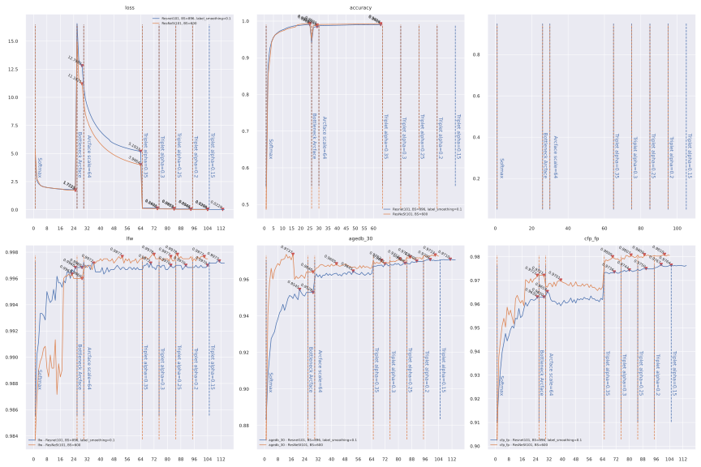

# ___2020 - 12 - 01 Keras Insightface Training___
***

# 目录
  <!-- TOC depthFrom:1 depthTo:6 withLinks:1 updateOnSave:1 orderedList:0 -->

  - [___2020 - 12 - 01 Keras Insightface___](#2020-12-01-keras-insightface)
  - [目录](#目录)
  - [Test functions](#test-functions)
  	- [Decode mxnet log](#decode-mxnet-log)
  	- [Decode TF log](#decode-tf-log)
  	- [Choose accuracy](#choose-accuracy)
  	- [Remove regular loss from total loss](#remove-regular-loss-from-total-loss)
  	- [Multi GPU losses test](#multi-gpu-losses-test)
  	- [Temp test](#temp-test)
  	- [Face recognition test](#face-recognition-test)
  	- [Replace ReLU with PReLU in mobilenet](#replace-relu-with-prelu-in-mobilenet)
  	- [Convolution test](#convolution-test)
  	- [Cosine and Euclidean Distance](#cosine-and-euclidean-distance)
  	- [Summary print function](#summary-print-function)
  	- [Ali Datasets](#ali-datasets)
  - [人脸识别常用评价指标](#人脸识别常用评价指标)
  	- [链接](#链接)
  	- [基本概念](#基本概念)
  	- [Python 示例](#python-示例)
  	- [Bob](#bob)
  - [Emore training backbones](#emore-training-backbones)
  	- [ResNet101V2](#resnet101v2)
  	- [ResNeSt101](#resnest101)
  	- [EfficientNetB4](#efficientnetb4)
  	- [ResNet34 CASIA](#resnet34-casia)
  	- [Mobilefacenet](#mobilefacenet)
  	- [Mobilefacenet SE](#mobilefacenet-se)
  	- [MXNet record](#mxnet-record)
  - [Mobilenet on Emore](#mobilenet-on-emore)
  	- [Mobilenet batch size 256 on Emore](#mobilenet-batch-size-256-on-emore)
  	- [Mobilenet batch size 1024 on Emore](#mobilenet-batch-size-1024-on-emore)
  	- [Mobilenet batch size 1024 on Emore testing cosine learning rate](#mobilenet-batch-size-1024-on-emore-testing-cosine-learning-rate)
  	- [Mobilenet batch size 1024 on Emore testing soft center triplet combination](#mobilenet-batch-size-1024-on-emore-testing-soft-center-triplet-combination)
  	- [Mobilenet testing centerloss](#mobilenet-testing-centerloss)
  	- [Mobilenet testing after 80 epochs softmax](#mobilenet-testing-after-80-epochs-softmax)
  	- [Mobilenet testing pointwise and PReLU](#mobilenet-testing-pointwise-and-prelu)
  	- [Mobilenet testing SGDW](#mobilenet-testing-sgdw)
  - [Mobilenet on CASIA](#mobilenet-on-casia)
  	- [Combination of adamw and label smoothing and dropout on cifar10](#combination-of-adamw-and-label-smoothing-and-dropout-on-cifar10)
  	- [Combination of adamw and dropout and centerloss and triplet on CASIA](#combination-of-adamw-and-dropout-and-centerloss-and-triplet-on-casia)
  	- [Combination of nesterov and label smoothing and dropout on CASIA](#combination-of-nesterov-and-label-smoothing-and-dropout-on-casia)
  	- [Sub center Result](#sub-center-result)
  - [Distillation](#distillation)
  	- [Basic distillation](#basic-distillation)
  	- [Distillation with arcface on CASIA](#distillation-with-arcface-on-casia)
  	- [Distillation with softmax or triplet on CASIA](#distillation-with-softmax-or-triplet-on-casia)
  	- [Distillation with arcface on Emore or Glint360k](#distillation-with-arcface-on-emore-or-glint360k)
  	- [Match model layers](#match-model-layers)
  - [TFlite](#tflite)
  	- [TFlite float model](#tflite-float-model)
  	- [TFLite interpreter test](#tflite-interpreter-test)
  	- [TFLite uint8 quantization](#tflite-uint8-quantization)
  	- [Wapper trained model with Rescale or normalize](#wapper-trained-model-with-rescale-or-normalize)
  	- [Dynamic input shape](#dynamic-input-shape)
  	- [TFLite ARM64 python runtime](#tflite-arm64-python-runtime)
  	- [TFLite bench test function](#tflite-bench-test-function)
  	- [Test mobilenetv2 conversion type](#test-mobilenetv2-conversion-type)
  	- [Testing backbones with different headers](#testing-backbones-with-different-headers)
  	- [Testing xnnpack in TF15](#testing-xnnpack-in-tf15)
  	- [Others](#others)

  <!-- /TOC -->
***

# Test functions
## Decode mxnet log
  ```py
  import json

  def decode_mxnet_log(src_file, dest_file=None):
      with open(src_file, 'r') as ff:
          aa = ff.readlines()

      losses = [ii.strip() for ii in aa if 'Train-lossvalue=' in ii]
      losses = [float(ii.split('=')[-1]) for ii in losses]

      accs = [ii.strip() for ii in aa if 'Train-acc=' in ii]
      accs = [float(ii.split('=')[-1]) for ii in accs]

      lfws = [ii.strip() for ii in aa if 'Accuracy-Flip:' in ii and 'lfw' in ii]
      lfws = [float(ii.split(': ')[-1].split('+-')[0]) for ii in lfws]

      cfp_fps = [ii.strip() for ii in aa if 'Accuracy-Flip:' in ii and 'cfp_fp' in ii]
      cfp_fps = [float(ii.split(': ')[-1].split('+-')[0]) for ii in cfp_fps]

      agedb_30s = [ii.strip() for ii in aa if 'Accuracy-Flip:' in ii and 'agedb_30' in ii]
      agedb_30s = [float(ii.split(': ')[-1].split('+-')[0]) for ii in agedb_30s]

      lrs = [0.1] * 20 + [0.01] * 10 + [0.001] * (len(losses) - 20 - 10)

      bb = {
          "loss": losses,
          "accuracy": accs,
          "lr": lrs,
          "lfw": lfws,
          "cfp_fp": cfp_fps,
          "agedb_30": agedb_30s,
      }

      print({kk:len(bb[kk]) for kk in bb})

      if dest_file == None:
          dest_file = os.path.splitext(src_file)[0] + '.json'
      with open(dest_file, 'w') as ff:
          json.dump(bb, ff)
      return dest_file

  decode_mxnet_log('r34_wdm1_lazy_false.log')
  ```
## Decode TF log
  ```py
  import json

  def evals_split_func(aa, eval_name):
      evals = [ii.strip() for ii in aa if eval_name + ' evaluation' in ii]
      accs = [float(ii.split(', thresh:')[0].split(':')[-1].strip()) for ii in evals]
      threshs = [float(ii.split(', thresh:')[1].split(',')[0].strip()) for ii in evals]
      return accs, threshs

  def decode_TF_log(src_file, dest_file=None):
      with open(src_file, 'r') as ff:
          aa = ff.readlines()

      loss_accs = [ii.strip() for ii in aa if 's/step' in ii and 'loss' in ii]
      losses = [float(ii.split('loss:')[1].split('-')[0]) for ii in loss_accs]
      accs = [float(ii.split('accuracy:')[1].split('-')[0]) for ii in loss_accs]
      lrs = [float(ii.strip().split('is')[-1].strip()) for ii in aa if 'Learning rate' in ii]

      lfw_accs, lfw_threshs = evals_split_func(aa, "lfw")
      cfp_fp_accs, cfp_fp_threshs = evals_split_func(aa, "cfp_fp")
      agedb_30_accs, agedb_30_threshs = evals_split_func(aa, "agedb_30")

      bb = {
          "loss": losses,
          "accuracy": accs,
          "lr": lrs,
          "lfw": lfw_accs,
          "cfp_fp": cfp_fp_accs,
          "agedb_30": agedb_30_accs,
          "lfw_thresh": lfw_threshs,
          "cfp_fp_thresh": cfp_fp_threshs,
          "agedb_30_thresh": agedb_30_threshs,
      }

      print({kk:len(bb[kk]) for kk in bb})

      if dest_file == None:
          dest_file = os.path.splitext(src_file)[0] + '.json'
      with open(dest_file, 'w') as ff:
          json.dump(bb, ff)
      return dest_file

  decode_TF_log('TT_mobilenet_MSEDense_margin_softmax_sgdw_5e4_emb256_dr0_bs400_hist.foo')
  ```
## Choose accuracy
  ```py
  import json

  def choose_accuracy(aa, skip_name_len=0, sort_agedb=False):
      evals = ['lfw', 'cfp_fp', 'agedb_30']
      dd_agedb_max, dd_all_max, dd_sum_max = {}, {}, {}
      for pp in aa:
          with open(pp, 'r') as ff:
              hh = json.load(ff)
          nn = os.path.splitext(os.path.basename(pp))[0][skip_name_len:]
          agedb_arg_max = np.argmax(hh['agedb_30'])
          dd_agedb_max[nn] = {kk: hh[kk][agedb_arg_max] for kk in evals}
          dd_agedb_max[nn]["epoch"] = int(agedb_arg_max)

          dd_all_max[nn] = {kk: "%.4f, %2d" % (max(hh[kk]), np.argmax(hh[kk])) for kk in evals}
          # dd_all_max[nn] = {kk: max(hh[kk]) for kk in evals}
          # dd_all_max[nn].update({kk + "_epoch": np.argmax(hh[kk]) for kk in evals})

          sum_arg_max = np.argmax(np.sum([hh[kk] for kk in evals], axis=0))
          dd_sum_max[nn] = {kk: hh[kk][sum_arg_max] for kk in evals}
          dd_sum_max[nn]["epoch"] = int(sum_arg_max)

      names = ["agedb max", "all max", "sum max"]
      for nn, dd in zip(names, [dd_agedb_max, dd_all_max, dd_sum_max]):
          print()
          print(">>>>", nn, ":")
          # print(pd.DataFrame(dd).T.to_markdown())
          rr = pd.DataFrame(dd).T
          rr = rr.sort_values('agedb_30') if sort_agedb else rr
          print(rr.to_markdown())
      return dd_agedb_max, dd_all_max, dd_sum_max
  ```
## Remove regular loss from total loss
  ```py
  import json

  def remove_reg_loss_from_hist(src_hist, dest_hist=None):
      with open(src_hist, 'r') as ff:
          aa = json.load(ff)
      aa['loss'] = [ii - jj for ii, jj in zip(aa['loss'], aa['regular_loss'])]
      if dest_hist == None:
          dest_hist = os.path.splitext(src_hist)[0] + "_no_reg.json"
      with open(dest_hist, 'w') as ff:
          json.dump(aa, ff)
      return dest_hist

  def add_reg_loss_from_hist(src_hist, dest_hist=None):
      with open(src_hist, 'r') as ff:
          aa = json.load(ff)
      aa['loss'] = [ii + jj for ii, jj in zip(aa['loss'], aa['regular_loss'])]
      if dest_hist == None:
          dest_hist = src_hist
      with open(dest_hist, 'w') as ff:
          json.dump(aa, ff)
      return dest_hist

  remove_reg_loss_from_hist('checkpoints/NNNN_resnet34_MXNET_E_REG_BN_SGD_1e3_lr1e1_random0_arcT4_S32_E1_BS512_casia_3_hist.json')
  ```
## Multi GPU losses test
  ```py
  sys.path.append('..')
  import losses, train, models
  with tf.distribute.MirroredStrategy().scope():
      basic_model = models.buildin_models("MobileNet", dropout=0.4, emb_shape=256)
      tt = train.Train('faces_emore_test', save_path='temp_test.h5', eval_paths=['lfw.bin'], basic_model=basic_model, lr_base=0.001, batch_size=16, random_status=3)
      sch = [
          {"loss": losses.MarginSoftmax(), "epoch": 2},
          {"loss": losses.ArcfaceLoss(), "triplet": 10, "epoch": 2},
          {"loss": losses.MarginSoftmax(), "centerloss": 20, "epoch": 2},
          {"loss": losses.ArcfaceLoss(), "centerloss": 10, "triplet": 20, "epoch": 2},
          {"loss": losses.BatchAllTripletLoss(0.3), "alpha": 0.1, "epoch": 2},
          {"loss": losses.BatchHardTripletLoss(0.25), "centerloss": 10, "triplet": 20, "epoch": 2},
          {"loss": losses.CenterLoss(num_classes=5, emb_shape=256), "epoch": 2},
          {"loss": losses.CenterLoss(num_classes=5, emb_shape=256), "triplet": 10, "epoch": 2}
      ]
      tt.train(sch)
  ```
## Temp test
  ```py
  sys.path.append('..')
  from tensorflow.keras import mixed_precision
  policy = mixed_precision.Policy('mixed_float16')
  mixed_precision.set_global_policy(policy)
  print('>>>> Compute dtype: %s, Variable dtype: %s' % (policy.compute_dtype, policy.variable_dtype))

  import losses, train, models
  import tensorflow_addons as tfa
  basic_model = models.buildin_models("MobileNet", dropout=0, emb_shape=256)
  tt = train.Train('faces_emore_test', save_path='temp_test.h5', eval_paths=['lfw.bin'], basic_model=basic_model, batch_size=16)
  for ii in tt.my_evals: ii.PCA_acc = False
  optimizer = tfa.optimizers.AdamW(learning_rate=0.001, weight_decay=5e-5)
  tt.train_single_scheduler(loss=losses.MarginSoftmax(), epoch=2, optimizer=optimizer)

  sch = [
      {"loss": losses.MarginSoftmax(), "epoch": 2},
      {"loss": losses.ArcfaceLoss(), "triplet": 10, "epoch": 2},
      {"loss": losses.MarginSoftmax(), "centerloss": 20, "epoch": 2},
      {"loss": losses.ArcfaceLoss(), "centerloss": 10, "triplet": 20, "epoch": 2},
      {"loss": losses.BatchAllTripletLoss(0.3), "alpha": 0.1, "epoch": 2},
      {"loss": losses.BatchHardTripletLoss(0.25), "centerloss": 10, "triplet": 20, "epoch": 2},
      {"loss": losses.CenterLoss(num_classes=5, emb_shape=256), "epoch": 2},
      {"loss": losses.CenterLoss(num_classes=5, emb_shape=256), "triplet": 10, "epoch": 2}
  ]
  tt.my_evals[-1].save_model = None
  tt.train(sch)

  sch = [
      {"loss": losses.ArcfaceLoss(), "embLossTypes": "triplet", "embLossWeights": 10, "epoch": 2},
      {"loss": losses.MarginSoftmax(), "embLossTypes": "centerloss", "embLossWeights": 20, "epoch": 2},
      {"loss": losses.ArcfaceLoss(), "embLossTypes": ["centerloss", "triplet"], "embLossWeights": [10, 20], "epoch": 2},
      {"loss": losses.BatchHardTripletLoss(0.25), "embLossTypes": ["centerloss", "triplet"], "embLossWeights": [10, 20], "epoch": 2},
      {"loss": losses.CenterLoss(num_classes=5, emb_shape=256), "embLossTypes": "triplet", "embLossWeights": 10, "epoch": 2}
  ]
  tt.train(sch)

  tt.reset_dataset('faces_emore_test_shuffle_label_embs_normed_256.npz')

  sch = [
    {"loss": losses.MarginSoftmax(), "epoch": 2, "distill": 10},
    {"loss": losses.ArcfaceLoss(), "epoch": 2, "distill": 10, "centerloss": 10},
    {"loss": losses.CenterLoss(num_classes=5, emb_shape=256), "epoch": 2, "distill": 10},
    {"loss": losses.BatchAllTripletLoss(), "epoch": 2, "distill": 10},
    {"loss": losses.distiller_loss_cosine, "epoch": 2},
    {"loss": losses.distiller_loss_cosine, "centerloss": 20, "epoch": 2},
    {"loss": losses.distiller_loss_cosine, "triplet": 20, "epoch": 2},
  ]
  tt.train(sch)

  tt.reset_dataset('faces_emore_test_shuffle_label_embs_512_fp16.tfrecord')
  tt.train(sch[:3])

  mm = keras.models.load_model('../checkpoints/keras_mobilenet_emore_adamw_5e5_soft_baseline_before_arc_E80_BTO_E2_arc_MSEtrip_auto_alpha_basic_agedb_30_epoch_112_0.958167.h5')
  mm.trainable = False
  tt = train.Train('faces_emore_test', save_path='temp_test.h5', eval_paths=['lfw.bin'], basic_model=basic_model, batch_size=16, teacher_model_interf=mm)
  ```
## Face recognition test
  ```py
  import glob2
  import insightface
  from sklearn.preprocessing import normalize
  from skimage import transform

  def face_align_landmarks_sk(img, landmarks, image_size=(112, 112), method='similar'):
      tform = transform.AffineTransform() if method == 'affine' else transform.SimilarityTransform()
      src = np.array([[38.2946, 51.6963], [73.5318, 51.5014], [56.0252, 71.7366], [41.5493, 92.3655], [70.729904, 92.2041]], dtype=np.float32)
      ret = []
      for landmark in landmarks:
          # landmark = np.array(landmark).reshape(2, 5)[::-1].T
          tform.estimate(landmark, src)
          ret.append(transform.warp(img, tform.inverse, output_shape=image_size))
      return (np.array(ret) * 255).astype(np.uint8)

  imms = glob2.glob('./*.jpg')
  imgs = [imread(ii)[:, :, :3] for ii in imms]
  det = insightface.model_zoo.face_detection.retinaface_r50_v1()
  det.prepare(-1)
  idds = {nn: ii for nn, ii in zip(imms, imgs)}
  dds = {nn: det.detect(ii[:, :, ::-1]) for nn, ii in zip(imms, imgs)}

  nimgs = np.array([face_align_landmarks_sk(idds[kk], vv[1])[0] for kk, vv in dds.items() if len(vv[1]) != 0])
  plt.imshow(np.hstack(nimgs))
  plt.tight_layout()
  nimgs_norm = (nimgs[:, :, :, :3] - 127.5) / 127

  ''' Keras model '''
  mm = keras.models.load_model("../Keras_insightface/checkpoints/mobilenet_emore_tests/mobilenet_adamw_BS256_E80_arc_tripD_basic_agedb_30_epoch_123_0.955333.h5")
  mm = keras.models.load_model("../Keras_insightface/checkpoints/resnet101/TF_resnet101v2_E_sgdw_5e5_dr4_lr1e1_random0_arc32_E5_arc_BS512_emore_basic_agedb_30_epoch_20_batch_2000_0.973000.h5")
  mm = keras.models.load_model("../Keras_insightface/checkpoints/resnest101/keras_ResNest101_emore_II_basic_agedb_30_epoch_64_0.968500.h5")

  ees = normalize(mm(nimgs_norm))
  np.dot(ees, ees.T)

  ''' MXNet model '''
  sys.path.append('../Keras_insightface/')
  from data_distiller import Mxnet_model_interf
  mm = Mxnet_model_interf('../tdFace-flask.mxnet/subcenter-arcface-logs/r100-arcface-msfdrop75/model,0')
  ees = normalize(mm(nimgs))
  np.dot(ees, ees.T)

  [kk for kk, vv in dds.items() if len(vv[1]) != 0]

  mm = face_model.FaceModel()
  ees = normalize(mm.interp(nimgs_norm))
  ```
  ```py
  mmns = [
      "T_mobilenetv3L_adamw_5e5_arc_trip64_BS1024_basic_agedb_30_epoch_125_batch_2000_0.953833.h5",
      "T_mobilenet_adamw_5e5_arc_trip64_BS1024_basic_agedb_30_epoch_114_batch_4000_0.952000.h5",
      "mobilenet_adamw_BS256_E80_arc_tripD_basic_agedb_30_epoch_123_0.955333.h5",
      "keras_se_mobile_facenet_emore_triplet_basic_agedb_30_epoch_100_0.958333.h5",
      "keras_se_mobile_facenet_emore_IV_basic_agedb_30_epoch_48_0.957833.h5",
  ]
  for mmn in mmns:
      mm = keras.models.load_model("../Keras_insightface/checkpoints/" + mmn)
      ees = normalize(mm(nimgs_norm))
      np.dot(ees, ees.T)
      print(">>>>", mmn)
      print(np.dot(ees, ees.T))
  ```
## Replace ReLU with PReLU in mobilenet
  ```py
  def convert_ReLU(layer):
      # print(layer.name)
      if isinstance(layer, keras.layers.ReLU):
          print(">>>> Convert ReLU:", layer.name)
          return keras.layers.PReLU(shared_axes=[1, 2], name=layer.name)
      return layer

  mm = keras.applications.MobileNet(include_top=False, input_shape=(112, 112, 3), weights=None)
  mmn = keras.models.clone_model(mm, clone_function=convert_ReLU)
  ```
## Convolution test
  ```py
  inputs = tf.ones([1, 3, 3, 1])
  conv_valid = tf.keras.layers.Conv2D(1, 2, strides=2, padding='valid', use_bias=False, kernel_initializer='ones')
  conv_same = tf.keras.layers.Conv2D(1, 2, strides=2, padding='same', use_bias=False, kernel_initializer='ones')
  pad = keras.layers.ZeroPadding2D(padding=1)
  print(conv_valid(inputs).shape, conv_same(inputs).shape, conv_valid(pad(inputs)).shape)
  # (1, 1, 1, 1) (1, 2, 2, 1) (1, 2, 2, 1)

  print(inputs.numpy()[0, :, :, 0].tolist())
  # [[1.0, 1.0, 1.0],
  #  [1.0, 1.0, 1.0],
  #  [1.0, 1.0, 1.0]]
  print(conv_same(inputs).numpy()[0, :, :, 0].tolist())
  # [[4.0, 2.0],
  #  [2.0, 1.0]]
  print(conv_valid(pad(inputs)).numpy()[0, :, :, 0].tolist())
  # [[1.0, 2.0],
  #  [2.0, 4.0]]
  print(pad(inputs).numpy()[0, :, :, 0].tolist())
  # [[0.0, 0.0, 0.0, 0.0, 0.0],
  #  [0.0, 1.0, 1.0, 1.0, 0.0],
  #  [0.0, 1.0, 1.0, 1.0, 0.0],
  #  [0.0, 1.0, 1.0, 1.0, 0.0],
  #  [0.0, 0.0, 0.0, 0.0, 0.0]]
  ```
  ```py
  data = mx.symbol.Variable("data", shape=(1, 1, 3, 3))
  ww = mx.symbol.Variable("ww", shape=(1, 1, 2, 2))
  cc = mx.sym.Convolution(data=data, weight=ww, no_bias=True, kernel=(2, 2), stride=(2, 2), num_filter=1, pad=(1, 1))

  aa = mx.nd.ones([1, 1, 3, 3])
  bb = mx.nd.ones([1, 1, 2, 2])
  ee = cc.bind(mx.cpu(), {'data': aa, 'ww': bb})
  print(ee.forward()[0].asnumpy()[0, 0].tolist())
  # [[1.0, 2.0],
  #  [2.0, 4.0]]
  ```
## Cosine and Euclidean Distance
  ```py
  xx = np.arange(8).reshape(2, 4).astype('float')
  yy = np.arange(1, 17).reshape(4, 4).astype('float')

  # Normalize
  from sklearn.preprocessing import normalize
  aa = normalize(xx)
  bb = xx / np.expand_dims(np.sqrt((xx ** 2).sum(1)), 1)
  print(np.allclose(aa, bb))
  # True

  # Cosine Distance
  aa = np.dot(normalize(xx), normalize(yy).T)
  bb = np.dot(xx, yy.T) / (np.sqrt((xx ** 2).sum(1)).reshape(-1, 1) * np.sqrt((yy ** 2).sum(1)))
  print(np.allclose(aa, bb))
  # True

  # Euclidean Distance
  aa = np.stack([np.sqrt(((yy - ii) ** 2).sum(1)) for ii in xx])
  bb = np.sqrt((xx ** 2).sum(1).reshape(-1, 1) + (yy ** 2).sum(1) - np.dot(xx, yy.T) * 2)
  print(np.allclose(aa, bb))
  # True

  # TF
  x2 = tf.reduce_sum(tf.square(xx), axis=-1, keepdims=True)
  y2 = tf.reduce_sum(tf.square(yy), axis=-1)
  xy = tf.matmul(xx, tf.transpose(yy))
  cc = tf.sqrt(x2 + y2 - 2 * xy).numpy()
  print(np.allclose(aa, bb, cc))
  # True
  ```
  ```py
  cos_dd = np.dot(normalize(xx), normalize(yy).T)
  euc_dd = np.stack([np.sqrt(((yy - ii) ** 2).sum(1)) for ii in xx])
  sum_xx = (xx ** 2).sum(1).reshape(-1, 1)
  sum_yy = (yy ** 2).sum(1)

  print(np.allclose(euc_dd, np.sqrt(sum_xx + sum_yy - 2 * cos_dd * np.sqrt(sum_xx * sum_yy))))
  print(np.allclose(euc_dd ** 2 / 2 * -1, cos_dd * np.sqrt(sum_xx * sum_yy) - (sum_xx + sum_yy) / 2))
  # True
  print(np.allclose(cos_dd, (sum_xx + sum_yy - euc_dd ** 2) / (2 * np.sqrt(sum_xx * sum_yy))))
  # True
  ```
  ```py
  xx * yy - sqrt(xx ** 2 * yy ** 2) --> xx * yy / xx * yy
  xx * yy - (xx ** 2 + yy ** 2) / 2
    ==> set yy == xx, scale xx == xx * aa
    ==> aa * xx * xx - (aa ** 2 * xx ** 2 + xx ** 2) / 2
    ==> (aa - (aa ** 2 + 1) / 2) * xx ** 2
  ```
## Summary print function
  ```py
  def print_total_params_only(model):
      aa = []
      model.summary(print_fn=lambda xx: aa.append(xx) if 'params:' in xx else None)
      # print(aa)
      return aa
  ```
## Ali Datasets
  ```py
  import cv2
  import shutil
  import glob2
  from tqdm import tqdm
  from skimage.transform import SimilarityTransform
  from sklearn.preprocessing import normalize

  def face_align_landmarks(img, landmarks, image_size=(112, 112)):
      ret = []
      for landmark in landmarks:
          src = np.array(
              [[38.2946, 51.6963], [73.5318, 51.5014], [56.0252, 71.7366], [41.5493, 92.3655], [70.729904, 92.2041]],
              dtype=np.float32,
          )

          if image_size[0] != 112:
              src *= image_size[0] / 112
              src[:, 0] += 8.0

          dst = landmark.astype(np.float32)
          tform = SimilarityTransform()
          tform.estimate(dst, src)
          M = tform.params[0:2, :]
          ret.append(cv2.warpAffine(img, M, (image_size[1], image_size[0]), borderValue=0.0))

      return np.array(ret)

  def extract_face_images(source_reg, dest_path, detector, limit=-1):
      aa = glob2.glob(source_reg)
      dest_single = dest_path
      dest_multi = dest_single + '_multi'
      dest_none = dest_single + '_none'
      os.makedirs(dest_none, exist_ok=True)
      if limit != -1:
          aa = aa[:limit]
      for ii in tqdm(aa):
          imm = imread(ii)
          bbs, pps = detector(imm)
          if len(bbs) == 0:
              shutil.copy(ii, os.path.join(dest_none, '_'.join(ii.split('/')[-2:])))
              continue
          user_name, image_name = ii.split('/')[-2], ii.split('/')[-1]
          if len(bbs) == 1:
              dest_path = os.path.join(dest_single, user_name)
          else:
              dest_path = os.path.join(dest_multi, user_name)

          if not os.path.exists(dest_path):
              os.makedirs(dest_path)
          # if len(bbs) != 1:
          #     shutil.copy(ii, dest_path)

          nns = face_align_landmarks(imm, pps)
          image_name_form = '%s_{}.%s' % tuple(image_name.split('.'))
          for id, nn in enumerate(nns):
              dest_name = os.path.join(dest_path, image_name_form.format(id))
              imsave(dest_name, nn)

  import insightface
  os.environ['MXNET_CUDNN_AUTOTUNE_DEFAULT'] = '0'
  # retina = insightface.model_zoo.face_detection.retinaface_mnet025_v1()
  retina = insightface.model_zoo.face_detection.retinaface_r50_v1()
  retina.prepare(0)
  detector = lambda imm: retina.detect(imm)

  sys.path.append('/home/leondgarse/workspace/samba/tdFace-flask')
  from face_model.face_model import FaceModel
  det = FaceModel(None)

  def detector(imm):
      bbox, confid, points  = det.get_face_location(imm)
      return bbox, points
  extract_face_images("./face_image/*/*.jpg", 'tdevals', detector)
  extract_face_images("./tdface_Register/*/*.jpg", 'tdface_Register_cropped', detector)
  extract_face_images("./tdface_Register/*/*.jpg", 'tdface_Register_mtcnn', detector)

  ''' Review _multi and _none folder by hand, then do detection again on _none folder using another detector '''
  inn = glob2.glob('tdface_Register_mtcnn_none/*.jpg')
  for ii in tqdm(inn):
      imm = imread(ii)
      bbs, pps = detector(imm)
      if len(bbs) != 0:
          image_name = os.path.basename(ii)
          user_name = image_name.split('_')[0]
          dest_path = os.path.join(os.path.dirname(ii), user_name)
          os.makedirs(dest_path, exist_ok=True)
          nns = face_align_landmarks(imm, pps)
          image_name_form = '%s_{}.%s' % tuple(image_name.split('.'))
          for id, nn in enumerate(nns):
              dest_name = os.path.join(dest_path, image_name_form.format(id))
              imsave(dest_name, nn)
              os.rename(ii, os.path.join(dest_path, image_name))

  print(">>>> 提取特征值")
  model_path = "/home/tdtest/workspace/Keras_insightface/checkpoints/keras_resnet101_emore_II_triplet_basic_agedb_30_epoch_107_0.971000.h5"
  model = tf.keras.models.load_model(model_path, compile=False)
  interp = lambda ii: normalize(model.predict((np.array(ii) - 127.5) / 127))
  register_path = 'tdface_Register_mtcnn'

  backup_file = 'tdface_Register_mtcnn.npy'
  if os.path.exists(backup_file):
      imms = np.load('tdface_Register_mtcnn.npy')
  else:
      imms = glob2.glob(os.path.join(register_path, "*/*.jpg"))
      np.save('tdface_Register_mtcnn.npy', imms)

  batch_size = 64
  steps = int(np.ceil(len(imms) / batch_size))
  embs = []
  for ii in tqdm(range(steps), total=steps):
      ibb = imms[ii * batch_size : (ii + 1) * batch_size]
      embs.append(interp([imread(jj) for jj in ibb]))

  embs = np.concatenate(embs)
  dd, pp = {}, {}
  for ii, ee in zip(imms, embs):
      user = os.path.basename(os.path.dirname(ii))
      dd[user] = np.vstack([dd.get(user, np.array([]).reshape(0, embs.shape[-1])), [ee]])
      pp[user] = np.hstack([pp.get(user, []), ii])
  # dd_bak = dd.copy()
  # pp_bak = pp.copy()
  print("Total: %d" % (len(dd)))

  print(">>>> 合并组间距离过小的成员")
  OUT_THREASH = 0.7
  tt = dd.copy()
  while len(tt) > 0:
      kk, vv = tt.popitem()
      # oo = np.vstack(list(tt.values()))
      for ikk, ivv in tt.items():
          imax = np.dot(vv, ivv.T).max()
          if imax > OUT_THREASH:
              print("First: %s, Second: %s, Max dist: %.4f" % (kk, ikk, imax))
              if kk in dd and ikk in dd:
                  dd[kk] = np.vstack([dd[kk], dd[ikk]])
                  dd.pop(ikk)
                  pp[kk] = np.hstack([pp[kk], pp[ikk]])
                  pp.pop(ikk)
  # print([kk for kk, vv in pp.items() if vv.shape[0] != dd[kk].shape[0]])
  print("Total left: %d" % (len(dd)))

  ''' Similar images between users '''
  src = 'tdface_Register_mtcnn'
  dst = 'tdface_Register_mtcnn_simi'
  with open('tdface_Register_mtcnn.foo', 'r') as ff:
      aa = ff.readlines()
  for id, ii in tqdm(enumerate(aa), total=len(aa)):
      first, second, simi = [jj.split(': ')[1] for jj in ii.strip().split(', ')]
      dest_path = os.path.join(dst, '_'.join([str(id), first, second, simi]))
      os.makedirs(dest_path, exist_ok=True)
      for pp in os.listdir(os.path.join(src, first)):
          src_path = os.path.join(src, first, pp)
          shutil.copy(src_path, os.path.join(dest_path, first + '_' + pp))
      for pp in os.listdir(os.path.join(src, second)):
          src_path = os.path.join(src, second, pp)
          shutil.copy(src_path, os.path.join(dest_path, second + '_' + pp))

  ''' Pos & Neg dists '''
  batch_size = 128
  gg = ImageDataGenerator(rescale=1./255, preprocessing_function=lambda img: (img - 0.5) * 2)
  tt = gg.flow_from_directory('./tdevals', target_size=(112, 112), batch_size=batch_size)
  steps = int(np.ceil(tt.classes.shape[0] / batch_size))
  embs = []
  classes = []
  for _ in tqdm(range(steps), total=steps):
      aa, bb = tt.next()
      emb = interp(aa)
      embs.extend(emb)
      classes.extend(np.argmax(bb, 1))
  embs = np.array(embs)
  classes = np.array(classes)
  class_matrix = np.equal(np.expand_dims(classes, 0), np.expand_dims(classes, 1))
  dists = np.dot(embs, embs.T)
  pos_dists = np.where(class_matrix, dists, np.ones_like(dists))
  neg_dists = np.where(np.logical_not(class_matrix), dists, np.zeros_like(dists))
  (neg_dists.max(1) <= pos_dists.min(1)).sum()
  ```
  ```py
  import glob2
  def dest_test(aa, bb, model, reg_path="./tdface_Register_mtcnn"):
      ees = []
      for ii in [aa, bb]:
          iee = glob2.glob(os.path.join(reg_path, ii, "*.jpg"))
          iee = [imread(jj) for jj in iee]
          ees.append(normalize(model.predict((np.array(iee) / 255. - 0.5) * 2)))
      return np.dot(ees[0], ees[1].T)

  with open('tdface_Register_mtcnn_0.7.foo', 'r') as ff:
      aa = ff.readlines()
  for id, ii in enumerate(aa):
      first, second, simi = [jj.split(': ')[1] for jj in ii.strip().split(', ')]
      dist = dest_test(first, second, model)
      if dist < OUT_THREASH:
          print(("first = %s, second = %s, simi = %s, model_simi = %f" % (first, second, simi, dist)))
  ```
***

# 人脸识别常用评价指标
## 链接
  - [QMUL-SurvFace: Surveillance Face Recognition Challenge](https://qmul-survface.github.io/protocols.html)
  - [QMUL Surveillance Face Recognition Challenge @ ICCV2019 workshop RLQ](https://eval.ai/web/challenges/challenge-page/392/evaluation)
  - [Surveillance Face Recognition Challenge](https://arxiv.org/pdf/1804.09691.pdf)
## 基本概念
  - **混淆矩阵的性能度量**
    - **真正例 TP** True Positive, 预测值和真实值都为 1
    - **真负例 TN** True Negative, 预测值与真实值都为 0
    - **假正例 FP** False positive, 预测值为 1，真实值为 0
    - **假负例 FN** False Negative, 预测值为 0，真实值为 1
    - **真正例率 TPR = TP / (TP + FN)** True Positive Rate, 也称为召回率和灵敏性，正确识别的正例数据在实际正例数据中的百分比
    - **假正例率 FPR = FP / (TN + FP)** False Positive Rate, 实际值是负例数据，预测错误的百分比
    - **假负例率 FNR = FN / (TP + FN) = 1 - TPR** False Negative Rate
    - **真负例率 TNR = TN / (TN + FP) = 1 - FPR** True Negative Rate
    - **准确率 Accuracy = (TP + TN) / (TP + FN + FP + TN)**
    - **精确度 Precision = TP / (TP + FP)**
  - **人脸验证 Face Verification 性能度量**
    - **NFA (FP)** 错误接受次数
    - **NIRA (FP + TN)** 类间测试次数
    - **NFR (FN)** 错误拒绝次数
    - **NGRA (TP + FN)** 类内测试次数
    - **错误接受率 FAR / FMR** False Acceptance / Match Rate, `不同人之间的相似度 > 给定阈值 T 的数量 / 实际所有不同人的数量 == NFA / NIRA == FP / (FP + TN) == FPR`
      ```sh
      FAR(t) = |{s >= t, where s ∈ U}| / |U|, where U denotes the set of unmatched face image pairs.
      ```
    - **错误拒绝率 FRR / FNMR** False Rejection / Non-Match Rate, `相同人之间的相似度 < 给定阈值 T 的数量 / 实际所有相同人的数量 == NFR / NGRA == FN / (TP + FN) == FNR`
      ```sh
      FRR(t) = |{s < t, where s ∈ M}| / |M|, where M is the set of matched face image pairs.
      ```
    - **正确接受率 TAR / GAR** True / Genuine Acceptance Rate, `相同人之间的相似度 > 给定阈值 T 的数量 / 实际所有相同人的数量 == 1 - FRR == TPR​`
    - **等错误率 EER** Equal Error Rate, 取阈值 `T` 时，使得 `FAR=FRR` 的 FAR 值
  - **人脸认证 Face Indentification 1：N 识别**，数据集中包含 `注册库 gallery set` 与 `查询库 probe set`，其中查询库包含 `库中人脸 in-gallery probe items` 与  `库外人脸 out-of-gallery probe items`
    - **FPIR / FAR** False Positive Identification Rate, 将库外的人脸错误识别为库中人脸的比例
      ```sh
      FPIR(t) = 错误次数 false alarm / 库外人脸总数 total number of un-mated retrieved probe
      其中 r 为阈值
      ```
    - **FNIR** False Negative Identification Rate, 将库中的人脸识别错误，或识别为库外人脸的比例
      ```sh
      FNIR(t,r) = 错误次数 number of mated probe with lower matching score than thresold / 库中人脸总数 total number of mated retrieved probe
      其中 r 为阈值，t 为 top / rank / searching attempts
      ```
    - **TPIR / DIR** True Positive Identification Rate / Detection and Identification Rate, 将库中的人脸识别正确的比例
      ```sh
      TPIR(t,r) = 1 - FNIR(t,r)
      ```
    - **TAR@FAR=0.01 / TPIR@FPIR=0.01** 表示在 `FAR/FPIR = 0.001` 时的 `TAR / TPIR` 值
## Python 示例
  - **python 计算 EER 示例** 使用 `bob.measure` 作为对比结果
    ```py
    from icecream import ic
    pos_sims, neg_sims = np.random.normal(1, 1, 100), np.random.normal(0, 1, 2000)
    pos_sorted, neg_sorted = np.sort(pos_sims), np.sort(neg_sims)
    pos_num, neg_num = pos_sorted.shape[0], neg_sorted.shape[0]
    for ii in range(pos_sorted.shape[0]):
        thresh = pos_sorted[ii]
        tpr = (pos_num - ii) / pos_num
        frr = 1 - tpr
        far = (neg_sorted > thresh).sum() / neg_num
        if far < frr:
            break
        else:
            err, err_thresh = far, thresh
    ic(err, err_thresh)
    # ic| err: 0.2935, err_thresh: 0.5190348191618015

    import bob.measure
    err_thresh = bob.measure.eer_threshold(neg_sims, pos_sims)
    far, frr = bob.measure.farfrr(neg_sims, pos_sims, err_thresh)
    ic(far, err_thresh)
    # ic| far: 0.2935, err_thresh: 0.5189544119811565

    from sklearn.metrics import roc_curve, auc
    from scipy.optimize import brentq
    from scipy.interpolate import interp1d
    label = [1] * pos_sims.shape[0] + [0] * neg_sims.shape[0]
    score = np.hstack([pos_sims, neg_sims])
    fpr, tpr, _ = roc_curve(label, score)
    roc_auc = auc(fpr,tpr)
    eer = brentq(lambda x : 1. - x - interp1d(fpr, tpr)(x), 0., 1)
    ic(eer)
    # ic| eer: 0.293500000000161
    ```
  - **python 计算 tpir fpir 示例** 使用 `bob.measure` 作为对比结果
    ```py
    import bob.measure

    in_gallery_num, out_gallery_num, gallery_id_num = 3000, 2000, 150
    pos_sims = np.random.normal(1, 1, in_gallery_num) + 0.5
    neg_sims = np.random.normal(0, 1, gallery_id_num * in_gallery_num).reshape(in_gallery_num, -1) - 0.5
    non_gallery_sims = np.random.normal(-2, 1, gallery_id_num * out_gallery_num).reshape(out_gallery_num, -1)
    print(pos_sims.shape, neg_sims.shape, non_gallery_sims.shape)
    # (3000,) (3000, 150) (2000, 150)

    correct_pos_cond = pos_sims > neg_sims.max(1)
    non_gallery_sims_sorted = np.sort(non_gallery_sims.max(1))[::-1]
    cmc_scores = list(zip(neg_sims, pos_sims.reshape(-1, 1))) + list(zip(non_gallery_sims, [None] * non_gallery_sims.shape[0]))
    for far in [0.001, 0.01, 0.1]:
        thresh = non_gallery_sims_sorted[max(int((non_gallery_sims_sorted.shape[0]) * far) - 1, 0)]
        tpir = np.logical_and(correct_pos_cond, pos_sims > thresh).sum() / pos_sims.shape[0]
        bob_thresh = bob.measure.far_threshold(non_gallery_sims_sorted, [], far_value=far, is_sorted=True)
        bob_tpir = bob.measure.detection_identification_rate(cmc_scores, threshold=bob_thresh, rank=1)
        bob_far = bob.measure.false_alarm_rate(cmc_scores, threshold=bob_thresh)
        print("far=%f, pr=%f, th=%f, bob_far=%f, bob_tpir=%f, bob_th=%f" %(far, tpir, thresh, bob_far, bob_tpir, bob_thresh))
    # far=0.001000, pr=0.183000, th=2.342741, bob_far=0.001000, bob_tpir=0.183000, bob_th=2.342741
    # far=0.010000, pr=0.257333, th=1.847653, bob_far=0.010000, bob_tpir=0.257333, bob_th=1.847653
    # far=0.100000, pr=0.276000, th=1.178892, bob_far=0.100000, bob_tpir=0.276000, bob_th=1.178892

    bob.measure.plot.detection_identification_curve(cmc_scores)
    ```
  - **Plot EERs**
    ```py
    from sklearn.metrics import roc_curve, auc
    from scipy.optimize import brentq
    from scipy.interpolate import interp1d

    def create_fpr_tpr_eer():
        pos_sims, neg_sims = np.random.normal(1, 1, 100), np.random.normal(0, 1, 2000)

        label = [1] * pos_sims.shape[0] + [0] * neg_sims.shape[0]
        score = np.hstack([pos_sims, neg_sims])
        fpr, tpr, _ = roc_curve(label, score)
        roc_auc = auc(fpr, tpr)
        eer = brentq(lambda xx : 1. - xx - interp1d(fpr, tpr)(xx), 0., 1)
        return fpr, tpr, roc_auc, eer

    def plot_eers(eer_items, names):
        fig, axes = plt.subplots(1, 2, figsize=(8, 4))

        for ax, [fpr, tpr, roc_auc, eer], name in zip(axes, eer_items, names):
            ax.plot(fpr, tpr, lw=1, label="ROC")
            ax.plot([0, 1], [1, 0])
            ax.fill_between(fpr, tpr, alpha=0.3, color=ax.lines[0].get_color(), label="AUC=%0.2f" % (roc_auc))
            ax.plot([eer, eer], [0, 1 - eer], linestyle='--', color=ax.lines[1].get_color(), label='EER=%0.4f' % (eer))
            ax.legend(loc='upper right')

            ax.set_xlim([0, 1])
            ax.set_xlabel("False Positive Rate")
            ax.set_ylim([0, 1])
            ax.set_ylabel("True Positive Rate")
            ax.set_title(name)

        fig.tight_layout()
        return fig

    plot_eers([create_fpr_tpr_eer(), create_fpr_tpr_eer()], ["Method a", "Method b"])
    ```
    
## Bob
  - [bob.measure 4.1.0](https://www.cnpython.com/pypi/bobmeasure)
  - [Docs » Bob’s Metric Routines » User Guide](https://pythonhosted.org/bob/temp/bob.measure/doc/guide.html#overview)
  - [Gitlab bob](https://gitlab.idiap.ch/bob)
  ```sh
  sudo apt-get install libblitz0-dev
  pip install bob.blitz bob.core bob.io.base bob.math bob.measure

  sudo apt install libgif-dev
  pip install bob.db.ijbc

  # bob_dbmanage.py ijbc download
  mwget -n 20 https://www.idiap.ch/software/bob/databases/latest/ijbc.tar.bz2
  tar xvf ijbc.tar.bz2 -C /opt/anaconda3/lib/python3.7/site-packages/bob/db/ijbc

  sudo apt install libmatio-dev
  pip install bob.io.matlab bob.learn.linear bob.sp bob.learn.activation bob.bio.base
  ```
  ```py
  import bob.db.ijbc
  db = bob.db.ijbc.Database()
  ```
  ```py
  sys.path.append('workspace/samba/Keras_insightface/')
  import IJB_evals
  tt = IJB_evals.IJB_test(None, '/datasets/IJB_release/', 'IJBC', restore_embs='workspace/samba/Keras_insightface/IJB_result/MS1MV2-ResNet100-Arcface_IJBC.npz')
  fars, tpirs, g1_cmc_scores, g2_cmc_scores = tt.run_model_test_1N()
  IJB_evals.plot_dir_far_cmc_scores([(fars, tpirs)], names=["aa"])

  ''' Gallery 1 '''
  g1_neg_sims = np.array([ii[0] for ii in g1_cmc_scores[:9670]])
  g1_pos_sims = np.array([ii[1][0] for ii in g1_cmc_scores[:9670]])
  g1_non_gallery_sims = np.array([ii[0] for ii in g1_cmc_scores[9670:]])
  print(g1_neg_sims.shape, g1_pos_sims.shape, g1_non_gallery_sims.shape)
  # (9670, 1771) (9670,) (9923, 1772)

  g1_correct_pos_cond = g1_pos_sims > g1_neg_sims.max(1)
  g1_non_gallery_sims_sorted = np.sort(g1_non_gallery_sims.max(1))[::-1]
  g1_threshes, g1_recalls = [], []
  for far in fars:
      # thresh = g1_non_gallery_sims_sorted[int(np.ceil(g1_non_gallery_sims_sorted.shape[0] * far))]
      thresh = g1_non_gallery_sims_sorted[max(int((g1_non_gallery_sims_sorted.shape[0]) * far)-1, 0)]
      recall = np.logical_and(g1_correct_pos_cond, g1_pos_sims > thresh).sum() / g1_pos_sims.shape[0]
      g1_threshes.append(thresh)
      g1_recalls.append(recall)
      # print("FAR = {:.10f} TPIR = {:.10f} th = {:.10f}".format(far, recall, thresh))

  ''' Gallery 2 '''
  g2_neg_sims = np.array([ii[0] for ii in g2_cmc_scores[:9923]])
  g2_pos_sims = np.array([ii[1][0] for ii in g2_cmc_scores[:9923]])
  g2_non_gallery_sims = np.array([ii[0] for ii in g2_cmc_scores[9923:]])
  print(g2_neg_sims.shape, g2_pos_sims.shape, g2_non_gallery_sims.shape)
  # (9923, 1758) (9923,) (9670, 1759)

  g2_correct_pos_cond = g2_pos_sims > g2_neg_sims.max(1)
  g2_non_gallery_sims_sorted = np.sort(g2_non_gallery_sims.max(1))[::-1]
  g2_threshes, g2_recalls = [], []
  for far in fars:
      # thresh = g2_non_gallery_sims_sorted[int(np.ceil(g2_non_gallery_sims_sorted.shape[0] * far)) - 1]
      thresh = g2_non_gallery_sims_sorted[max(int((g2_non_gallery_sims_sorted.shape[0]) * far) - 1, 0)]
      recall = np.logical_and(g2_correct_pos_cond, g2_pos_sims > thresh).sum() / g2_pos_sims.shape[0]
      g2_threshes.append(thresh)
      g2_recalls.append(recall)

  ''' Bob FAR thresh and DIR '''
  for far in [10 ** (-ii) for ii in range(4, -1, -1)]:
      thresh = g1_non_gallery_sims_sorted[max(int((g1_non_gallery_sims_sorted.shape[0]) * far)-1, 0)]
      recall = np.logical_and(g1_correct_pos_cond, g1_pos_sims > thresh).sum() / g1_pos_sims.shape[0]
      bob_thresh = bob.measure.far_threshold(g1_non_gallery_sims_sorted, [], far_value=far, is_sorted=True)
        dir = bob.measure.detection_identification_rate(g1_cmc_scores, threshold=bob_thresh, rank=1)
      bob_far = bob.measure.false_alarm_rate(g1_cmc_scores, threshold=bob_thresh)
      print("far=%f, pr=%f, th=%f, bob_th=%f, bob_far=%f, dir=%f" %(far, recall, thresh, bob_thresh, bob_far, dir))
  # far=0.000100, pr=0.359359, th=0.841509, bob_th=0.841509, bob_far=0.000000, dir=0.359359
  # far=0.001000, pr=0.824405, th=0.639982, bob_th=0.639982, bob_far=0.000907, dir=0.824405
  # far=0.010000, pr=0.954188, th=0.412905, bob_th=0.412905, bob_far=0.009977, dir=0.954188
  # far=0.100000, pr=0.969183, th=0.338687, bob_th=0.338687, bob_far=0.099970, dir=0.969183
  # far=1.000000, pr=0.975698, th=0.185379, bob_th=0.185379, bob_far=1.000000, dir=0.975698

  ''' Bob rank '''
  for ii in [1, 5, 10]:
      g1_top_k = bob.measure.detection_identification_rate(g1_cmc_scores, threshold=0, rank=ii)
      g2_top_k = bob.measure.detection_identification_rate(g2_cmc_scores, threshold=0, rank=ii)
      mean_top_k = bob.measure.detection_identification_rate(g1_cmc_scores + g2_cmc_scores, threshold=0, rank=ii)
      print("[top%2d] g1=%f, g2=%f, mean=%f" % (ii, g1_top_k, g2_top_k, mean_top_k))
  # [top 1] g1=0.975698, g2=0.958581, mean=0.967029
  # [top 5] g1=0.983351, g2=0.972186, mean=0.977696
  # [top10] g1=0.985212, g2=0.976418, mean=0.980758

  ''' Plot comparing bob '''
  import bob.measure
  axes = bob.measure.plot.detection_identification_curve(g1_cmc_scores, far_values=fars, rank=1, logx=True)
  axes[0].set_label("bob gallery 1")
  aa = axes[0].get_ydata().copy()
  axes = bob.measure.plot.detection_identification_curve(g2_cmc_scores, far_values=fars, rank=1, logx=True)
  axes[0].set_label("bob gallery 2")
  bb = axes[0].get_ydata().copy()
  plt.plot(axes[0].get_xdata(), (aa + bb) / 2, label="bob mean")

  plt.plot(fars, g1_recalls, lw=1, linestyle="--", label="gallery 1")
  plt.plot(fars, g2_recalls, lw=1, linestyle="--", label="gallery 2")
  plt.plot(fars, tpirs, lw=1, linestyle="--", label="mean")

  plt.xlabel("False Alarm Rate")
  plt.xlim([0.0001, 1])
  plt.xscale("log")
  plt.ylabel("Detection & Identification Rate (%)")
  plt.ylim([0, 1])

  plt.grid(linestyle="--", linewidth=1)
  plt.legend()
  plt.tight_layout()
  ```
***

# Emore training backbones
## ResNet101V2
  - **Nadam + softmax E25 -> bottleneckOnly E4 -> Arcface -> Triplet**
    ```py
    hist_path = "checkpoints/resnet101/"
    customs = ["lfw", "agedb_30", "cfp_fp", "lr"]
    epochs = [25, 4, 35, 10, 10, 10, 10, 100]
    names = ["Softmax", "Bottleneck Arcface", "Arcface scale=64", "Triplet alpha=0.35", "Triplet alpha=0.3", "Triplet alpha=0.25", "Triplet alpha=0.2", "Triplet alpha=0.15"]
    axes, _ = plot.hist_plot_split([hist_path + 'keras_resnet101_emore_II_hist.json', hist_path + 'keras_resnet101_emore_II_triplet_hist.json'], epochs, names=names, customs=customs, fig_label='ResNet101V2, BS=896, label_smoothing=0.1')

    epochs = [15, 10, 4, 65, 15, 5, 5, 15]
    names = ["", "Margin Softmax", "", "", "Triplet alpha=0.35", "Triplet alpha=0.3", "Triplet alpha=0.25", "Triplet alpha=0.2"]
    axes, _ = plot.hist_plot_split([hist_path + 'keras_resnet101_emore_hist.json', hist_path + 'keras_resnet101_emore_basic_hist.json'], epochs, names=names, customs=customs, axes=axes, fig_label="ResNet101V2, BS=1024", save="ResNet101V2.svg")
    ```
    
  - **SGDW 5e-5 + Arcface scale=32 E5 -> Arcface scale=64 lr decay** / **AdamW 5e-5 + Softmax + Center**
    ```py
    hist_path = "checkpoints/resnet101/"
    pp = {}
    pp["customs"] = ["cfp_fp", "agedb_30", "lfw", "lr", "center_embedding_loss"]
    pp["epochs"] = [5, 4, 5, 5, 20]
    names = ["Arcface scale=32", "Arcface scale=64, lr 0.1", "Arcface scale=64, lr 0.01", "Arcface scale=64, lr 1e-3", "Arcface scale=64, lr 1e-4"]
    axes, _ = plot.hist_plot_split(hist_path + "TF_resnet101v2_E_sgdw_5e5_dr4_lr1e1_random0_arc32_E5_arc_BS512_emore_hist.json", names=names, **pp)
    pp["axes"] = axes

    pp["epochs"] = [20, 20]
    names = ["Softmax + Center", "Softmax + Center"]
    axes, _ = plot.hist_plot_split(hist_path + "keras_resnet101v2_emore_adamw_5e5_soft_center_1e2D_arc_tripD_hist.json", fig_label="resnet101v2 [center 0.01, E20], [center 0.1, E20]", names=names, **pp)
    axes, _ = plot.hist_plot_split(hist_path + "keras_resnet101_emore_adamw_5e5_soft_center_1e2D_arc_tripD_hist.json", fig_label="resnet101, [center 0.01, E20], [center 0.1, E20]", **pp)
    axes, _ = plot.hist_plot_split(hist_path + "keras_resnet101v2_prelu_emore_adamw_5e5_soft_center_1e2D_arc_tripD_hist.json", fig_label="resnet101v2+PReLU, [center 0.01, E20], [center 0.1, E20]", **pp)
    axes, _ = plot.hist_plot_split(hist_path + "keras_resnet101v2_emore_adamw_5e5_soft_center_1e1D_arc_tripD_hist.json", fig_label="resnet101v2 [center 0.1, E20], [center 1, E20]", **pp)
    axes, _ = plot.hist_plot_split(hist_path + "keras_resnet101v2_emore_adamw_5e5_soft_center_1e2D1_arc_tripD_hist.json", fig_label="[softmax, E20], [center 0.01, E20]", **pp, save="ResNet101V2_center.svg")
    ```
    
## ResNeSt101
  - **Nadam + softmax E25 -> bottleneckOnly E4 -> Arcface -> Triplet**
    ```py
    hist_path = "checkpoints/resnet101/"
    customs = ["lfw", "agedb_30", "cfp_fp"]
    epochs = [25, 4, 35, 10, 10, 10, 10, 10]
    names = ["Softmax", "Bottleneck Arcface", "Arcface scale=64", "Triplet alpha=0.35", "Triplet alpha=0.3", "Triplet alpha=0.25", "Triplet alpha=0.2", "Triplet alpha=0.15"]
    axes, _ = plot.hist_plot_split([hist_path + 'keras_resnet101_emore_II_hist.json', hist_path + 'keras_resnet101_emore_II_triplet_hist.json'], epochs, customs=customs, names=names, fig_label='Resnet101, BS=896, label_smoothing=0.1')

    hist_path = "checkpoints/resnest101/"
    axes, _ = plot.hist_plot_split([hist_path + 'keras_ResNest101_emore_arcface_60_hist.json', hist_path + 'keras_ResNest101_emore_triplet_hist.json'], epochs, customs=customs, axes=axes, fig_label='ResNeSt101, BS=600', save="ResNest101.svg")
    ```
    
## EfficientNetB4
  - **Nadam + softmax E25 -> bottleneckOnly E4 -> Arcface -> Triplet**
    ```py
    customs = ["lfw", "agedb_30", "cfp_fp"]
    epochs = [15, 10, 4, 30]
    names = ["Softmax", "Margin Softmax", "Bottleneck Arcface", "Arcface scale=64", "Triplet"]
    axes, _ = plot.hist_plot_split("checkpoints/resnet101/keras_resnet101_emore_II_hist.json", epochs, names=names, customs=customs, fig_label='Resnet101, BS=1024, label_smoothing=0.1')
    axes, _ = plot.hist_plot_split("checkpoints/efficientnet/keras_EB4_emore_hist.json", epochs, customs=customs, axes=axes, fig_label='EB4, BS=840, label_smoothing=0.1', save="eb4.svg")
    ```
    
## ResNet34 CASIA
  ```py
  hist_path = "checkpoints/resnet34/"
  pp = {}
  pp["customs"] = ["cfp_fp", "agedb_30", "lfw", "lr", "regular_loss"]
  pp["epochs"] = [1, 19, 10, 50]
  names = ["Warmup", "Arcfacelose learning rate 0.1", "Arcfacelose learning rate 0.01", "Arcfacelose learning rate 0.001"]
  axes, pre = plot.hist_plot_split(hist_path + "mxnet_r34_wdm1_new.json", fig_label="Original MXNet", names=names, **pp)
  pp["axes"] = axes
  # axes, pre = plot.hist_plot_split(hist_path + "TF_resnet50_MXNET_E_sgdw_5e4_dr0.4_wdm10_soft_E10_arc_casia_hist.json", **pp)

  axes, pre = plot.hist_plot_split(hist_path + "NNNN_resnet34_MXNET_E_baseline_SGD_lr1e1_random0_arcT4_32_E5_BS512_casia_hist.json", fig_label="TF SGD baseline", **pp)
  axes, pre = plot.hist_plot_split(hist_path + "NNNN_resnet34_MXNET_E_sgdw_5e4_dr4_lr1e1_wdm1_random0_arcT4_32_E5_BS512_casia_hist.json", fig_label="TF SGDW 5e-4", **pp)
  axes, pre = plot.hist_plot_split(hist_path + "NNNN_resnet34_MXNET_E_SGDW_1e3_lr1e1_random0_arc_S32_E1_BS512_casia_4_hist.json", fig_label="TF SGDW 1e-3", **pp)

  axes, pre = plot.hist_plot_split(hist_path + "NNNN_resnet34_MXNET_E_REG_BN_SGD_5e4_lr1e1_random0_arcT4_S32_E1_BS512_casia_3_hist_no_reg.json", fig_label="TF SGD, l2 5e-4", **pp)
  axes, pre = plot.hist_plot_split(hist_path + "resnet34_MXNET_E_SGD_REG_1e3_on_batch_lr1e1_random0_arc_S32_E1_BS512_casia_hist.json", fig_label="TF SGD, l2 1e-3", **pp, save="resnet34_casia.svg")

  axes, pre = plot.hist_plot_split(hist_path + "resnet34_MXNET_E_SGD_REG_1e3_out_10_lr1e1_random0_arc_S32_E1_BS512_casia_hist.json", fig_label="TF SGD, l2 1e-3, output 10", **pp)
  axes, pre = plot.hist_plot_split(hist_path + "resnet34_MXNET_E_SGD_REG_1e3_on_batch_false_lr1e1_random0_arc_S32_E1_BS512_casia_hist.json", fig_label="TF SGD, l2 1e-3, on_batch False", **pp)

  axes, pre = plot.hist_plot_split(hist_path + "resnet34_MXNET_E_SGD_REG_5e4_on_batch_false_lr1e1_random0_arc_S32_E1_BS512_casia_hist.json", fig_label="TF SGD, l2 5e-4, on_batch False", **pp)

  hist_path = "checkpoints/"
  axes, pre = plot.hist_plot_split(hist_path + "resnet34_MXNET_E_SGD_REG_1e3_lr1e1_random0_arc_S32_E1_BS512_casia_hist.json", fig_label="zero padding, l2 1e-3", **pp)
  axes, pre = plot.hist_plot_split(hist_path + "resnet34_pad_same_MXNET_E_SGD_REG_1e3_lr1e1_random0_arc_S32_E1_BS512_casia_hist.json", fig_label="pad_same, l2 1e-3", **pp)
  axes, pre = plot.hist_plot_split(hist_path + "resnet34_MXNET_E_SGD_REG_5e4_lr1e1_random0_arc_S32_E1_BS512_casia_hist.json", fig_label="zero padding, l2 5e-4", **pp)
  axes, pre = plot.hist_plot_split(hist_path + "resnet34_pad_same_MXNET_E_SGD_REG_5e4_lr1e1_random0_arc_S32_E1_BS512_casia_hist.json", fig_label="pad_same, l2 5e-4", **pp)


  hist_path = "checkpoints/resnet34/"
  aa = [
      hist_path + "mxnet_r34_wdm1_new.json",
      hist_path + "NNNN_resnet34_MXNET_E_baseline_SGD_lr1e1_random0_arcT4_32_E5_BS512_casia_hist.json",
      hist_path + "NNNN_resnet34_MXNET_E_sgdw_5e4_dr4_lr1e1_wdm1_random0_arcT4_32_E5_BS512_casia_hist.json",
      hist_path + "NNNN_resnet34_MXNET_E_SGDW_1e3_lr1e1_random0_arc_S32_E1_BS512_casia_4_hist.json",
      hist_path + "NNNN_resnet34_MXNET_E_REG_BN_SGD_5e4_lr1e1_random0_arcT4_S32_E1_BS512_casia_3_hist_no_reg.json",
      hist_path + "resnet34_MXNET_E_SGD_REG_1e3_on_batch_lr1e1_random0_arc_S32_E1_BS512_casia_hist.json",
      hist_path + "resnet34_MXNET_E_SGD_REG_1e3_out_10_lr1e1_random0_arc_S32_E1_BS512_casia_hist.json",
      hist_path + "resnet34_MXNET_E_SGD_REG_1e3_on_batch_false_lr1e1_random0_arc_S32_E1_BS512_casia_hist.json",
      hist_path + "resnet34_MXNET_E_SGD_REG_5e4_on_batch_false_lr1e1_random0_arc_S32_E1_BS512_casia_hist.json",
  ]
  _ = choose_accuracy(aa)
  ```
  

  |                                                                                           |      lfw |   cfp_fp |   agedb_30 |   epoch |
  |:------------------------------------------------------------------------------------------|---------:|---------:|-----------:|--------:|
  | mxnet_r34_wdm1_new                                                                        | 0.99433  | 0.94271  |   0.94483  |      27 |
  | NNNN_resnet34_MXNET_E_baseline_SGD_lr1e1_random0_arcT4_32_E5_BS512_casia_hist             | 0.991333 | 0.907714 |   0.923667 |      14 |
  | NNNN_resnet34_MXNET_E_sgdw_5e4_dr4_lr1e1_wdm1_random0_arcT4_32_E5_BS512_casia_hist        | 0.993167 | 0.943286 |   0.940333 |      23 |
  | NNNN_resnet34_MXNET_E_SGDW_1e3_lr1e1_random0_arc_S32_E1_BS512_casia_4_hist                | 0.993333 | 0.950857 |   0.947    |      34 |
  | NNNN_resnet34_MXNET_E_REG_BN_SGD_5e4_lr1e1_random0_arcT4_S32_E1_BS512_casia_3_hist_no_reg | 0.9945   | 0.941857 |   0.941667 |      22 |
  | resnet34_MXNET_E_SGD_REG_1e3_on_batch_lr1e1_random0_arc_S32_E1_BS512_casia_hist           | 0.993833 | 0.949    |   0.9475   |      34 |
  | resnet34_MXNET_E_SGD_REG_1e3_out_10_lr1e1_random0_arc_S32_E1_BS512_casia_hist             | 0.993333 | 0.947429 |   0.941667 |      35 |
  | resnet34_MXNET_E_SGD_REG_1e3_on_batch_false_lr1e1_random0_arc_S32_E1_BS512_casia_hist     | 0.993833 | 0.945286 |   0.943833 |      31 |
  | resnet34_MXNET_E_SGD_REG_5e4_on_batch_false_lr1e1_random0_arc_S32_E1_BS512_casia_hist     | 0.994833 | 0.943143 |   0.9415   |      24 |

  | Backbone    | Optimizer | wd   | l2_reg | lfw,cfp_fp,agedb_30,epoch              |
  | ----------- | --------- | ---- | ------ | -------------------------------------- |
  | MXNet r34   | SGD       | 5e-4 | None   | 0.9933, 0.9514, 0.9448, E31            |
  | TF resnet34 | SGD       | None | None   | 0.9897, 0.9269, 0.9228, E20            |
  | TF resnet34 | SGDW      | 5e-4 | None   | 0.9927, 0.9476, 0.9388, E32            |
  | TF resnet34 | SGDW      | 1e-3 | None   | 0.9935, **0.9549**, 0.9458, E35        |
  | TF resnet34 | SGD       | None | 5e-4   | 0.9940, 0.9466, 0.9415, E31            |
  | TF resnet34 | SGD       | None | 1e-3   | **0.99417**, 0.95086, **0.94733**, E31 |
## Mobilefacenet
  ```py
  hist_path = "checkpoints/mobilefacenet/"
  pp = {}
  pp["customs"] = ["cfp_fp", "agedb_30", "lfw", "lr", "triplet_embedding_loss", "center_embedding_loss"]
  pp["epochs"] = [15, 10, 4, 35]
  names = ["Softmax", "Margin Softmax", "Bottleneck Arcface", "Arcface scale=64"]
  axes, _ = plot.hist_plot_split(hist_path + "keras_mobile_facenet_emore_hist.json", fig_label="Mobilefacenet, BS=768, lr_decay0.05", names=names, **pp)
  pp["axes"] = axes

  axes, _ = plot.hist_plot_split(hist_path + "keras_mobilefacenet_256_hist_all.json", fig_label="Mobilefacenet, BS=160, lr_decay0.1", **pp)

  pp["epochs"] = [10]
  pre_item = {kk: vv[43] for kk, vv in json.load(open(hist_path + "keras_mobilefacenet_256_hist_all.json", 'r')).items() if len(vv) > 43}
  pre = {"pre_item": pre_item, "init_epoch": 44}
  names = ["Arcface scale = 64 or 32"]
  axes, _ = plot.hist_plot_split(hist_path + "keras_mobilefacenet_256_II_hist.json", names=names, fig_label="scale=32, lr=5e-5", **pre, **pp)
  axes, _ = plot.hist_plot_split(hist_path + "keras_mobilefacenet_256_III_hist.json", fig_label="scale=32, lr decay", **pre, **pp)
  axes, _ = plot.hist_plot_split(hist_path + "keras_mobilefacenet_256_IV_hist.json", fig_label="sclae=64, lr defcay, SGD", **pre, **pp)

  pp["epochs"] = [50]
  pre_item = {kk: vv[53] for kk, vv in json.load(open(hist_path + "keras_mobilefacenet_256_hist_all.json", 'r')).items() if len(vv) > 53}
  pre = {"pre_item": pre_item, "init_epoch": 54}
  names = ["Arcface nadam or adam"]
  axes, _ = plot.hist_plot_split(hist_path + "keras_mobilefacenet_256_VIII_hist.json", names=names, fig_label="adam, lr decay", **pre, **pp)

  pp["epochs"] = [4, 15, 4]
  names = ["Bottleneck Softmax", "Softmax", "Bottleneck Arcface"]
  axes, _ = plot.hist_plot_split(hist_path + "keras_mobilefacenet_256_X_hist.json", names=names, **pre, **pp, save="mobile_facenet_emore.svg")
  ```
  
## Mobilefacenet SE
  ```py
  hist_path = "checkpoints/mobilefacenet/"
  pp = {}
  pp["customs"] = ["cfp_fp", "agedb_30", "lfw", "lr", "triplet_embedding_loss", "center_embedding_loss"]
  pp["epochs"] = [15, 10, 4, 30, 10, 10, 10, 20]
  names = ["Softmax", "Margin Softmax", "Bottleneck Arcface", "Arcface scale=64"] + ["Triplet alpha=%g" % ii for ii in [0.35, 0.3, 0.25, 0.2]]
  axes, _ = plot.hist_plot_split(hist_path + "keras_se_mobile_facenet_emore_soft_arc_trip_hist.json", fig_label="se, [softmax + cos, E25], [arc + exp, E30], [triplet, E50]", names=names, **pp)
  pp["axes"] = axes

  pp["epochs"] = [4, 35]
  pre_item = {kk: vv[24] for kk, vv in json.load(open(hist_path + "keras_se_mobile_facenet_emore_soft_arc_trip_hist.json", 'r')).items() if len(vv) > 24}
  pre = {"pre_item": pre_item, "init_epoch": 25}
  axes, _ = plot.hist_plot_split(hist_path + "keras_se_mobile_facenet_emore_soft_arc_cos_hist.json", fig_label="se, [softmax + cos, E25], [arc + cos, E12]", **pre, **pp)
  axes, _ = plot.hist_plot_split(hist_path + "keras_se_mobile_facenet_emore_II_hist.json", fig_label="se, [softmax + cos, E25], [arc + exp + LS0.1, E12]", **pre, **pp, save="se_mobile_facenet_emore.svg")
  ```
  
## MXNet record
  ```sh
  $ CUDA_VISIBLE_DEVICES="1" python -u train_softmax.py --data-dir /datasets/faces_casia --network "r34" --loss-type 4 --prefix "./model/mxnet_r34_wdm1_casia" --per-batch-size 512 --lr-steps "19180,28770" --margin-s 64.0 --margin-m 0.5 --ckpt 1 --emb-size 512 --fc7-wd-mult 1.0 --wd 0.0005 --verbose 959 --end-epoch 38400 --ce-loss

  Called with argument: Namespace(batch_size=512, beta=1000.0, beta_freeze=0, beta_min=5.0, bn_mom=0.9, ce_loss=True, ckpt=1, color=0, ctx_num=1, cutoff=0, data_dir='/datasets/faces_casia', easy_margin=0, emb_size=512, end_epoch=38400, fc7_lr_mult=1.0, fc7_no_bias=False, fc7_wd_mult=1.0, gamma=0.12, image_channel=3, image_h=112, image_size='112,112', image_w=112, images_filter=0, loss_type=4, lr=0.1, lr_steps='19180,28770', margin=4, margin_a=1.0, margin_b=0.0, margin_m=0.5, margin_s=64.0, max_steps=0, mom=0.9, network='r34', num_classes=10572, num_layers=34, per_batch_size=512, power=1.0, prefix='./model/mxnet_r34_wdm1_casia', pretrained='', rand_mirror=1, rescale_threshold=0, scale=0.9993, target='lfw,cfp_fp,agedb_30', use_deformable=0, verbose=959, version_act='prelu', version_input=1, version_multiplier=1.0, version_output='E', version_se=0, version_unit=3, wd=0.0005)
  ```
  ```py
  Called with argument: Namespace(batch_size=512, beta=1000.0, beta_freeze=0, beta_min=5.0, bn_mom=0.9, ce_loss=True,
  ckpt=1, color=0, ctx_num=1, cutoff=0, data_dir='/datasets/faces_casia', easy_margin=0, emb_size=512, end_epoch=38400,
  fc7_lr_mult=1.0, fc7_no_bias=False, fc7_wd_mult=1.0, gamma=0.12, image_channel=3, image_h=112, image_size='112,112',
  image_w=112, images_filter=0, loss_type=4, lr=0.1, lr_steps='19180,28770', margin=4, margin_a=1.0, margin_b=0.0,
  margin_m=0.5, margin_s=64.0, max_steps=0, mom=0.9, network='r34', num_classes=10572, num_layers=34, per_batch_size=512,
  power=1.0, prefix='./model/mxnet_r34_wdm1_lazy_false_casia', pretrained='', rand_mirror=1, rescale_threshold=0, scale=0.9993,
  target='lfw,cfp_fp,agedb_30', use_deformable=0, verbose=959, version_act='prelu', version_input=1, version_multiplier=1.0,
  version_output='E', version_se=0, version_unit=3, wd=0.0005)
  ```
  ```py
  from train_softmax import *
  sys.argv.extend('--data-dir /datasets/faces_casia --network "r34" --loss-type 4 --prefix "./model/mxnet_r34_wdm1_lazy_false_wd0_casia" --per-batch-size 512 --lr-steps "19180,28770" --margin-s 64.0 --margin-m 0.5 --ckpt 1 --emb-size 512 --fc7-wd-mult 1.0 --wd 5e-4 --verbose 959 --end-epoch 38400 --ce-loss'.replace('"', '').split(' '))
  args = parse_args()
  ```
  ```py
  CUDA_VISIBLE_DEVICES='0' python train.py --network r34 --dataset casia --loss 'arcface' --per-batch-size 512 --lr-steps '19180,28770' --verbose 959
  ```
  ```sh
  # Sub-center
  CUDA_VISIBLE_DEVICES='1' python train_parall.py --network r50 --per-batch-size 512
  INFO:root:Iter[20] Batch [8540] Speed: 301.72 samples/sec
  {fc7_acc} 236000 0.80078125
  CELOSS,236000,1.311261
  [lfw][236000]Accuracy-Flip: 0.99817+-0.00273
  [cfp_fp][236000]Accuracy-Flip: 0.97557+-0.00525
  [agedb_30][236000]Accuracy-Flip: 0.98167+-0.00707

  CUDA_VISIBLE_DEVICES='1' python drop.py --data /datasets/faces_emore --model models/r50-arcface-emore/model,1 --threshold 75 --k 3 --output /datasets/faces_emore_topk3_1
  ```
***

# Mobilenet on Emore
## Mobilenet batch size 256 on Emore
  ```py
  hist_path = "checkpoints/mobilenet_emore_tests/"
  pp = {}
  pp["customs"] = ["cfp_fp", "agedb_30", "lfw", "lr", "center_embedding_loss", "triplet_embedding_loss"]
  pp["epochs"] = [10, 10, 10, 10, 10, 10, 10, 10]
  names = ["Softmax + Center = %d" % ii for ii in [1, 10, 20, 30, 40, 50, 60, 70]]
  axes, pre = plot.hist_plot_split(hist_path + "mobilenet_adamw_BS256_E80_hist.json", fig_label='exp, mobilenet, [soft ls=0.1 + center, adamw 5e-5, dr 0, E10]', names=names, **pp)
  pp["axes"] = axes
  pp.update({"pre_item": pre, "init_epoch": 80})

  pp["epochs"] = [2, 10, 10, 10, 10, 50]
  names = ["Arcloss Bottleneck Only"] + ["Arcface scale 64 + Triplet 64 alpha %.2f" % ii for ii in [0.35, 0.3, 0.25, 0.2, 0.15]]
  axes, _ = plot.hist_plot_split(hist_path + "mobilenet_adamw_BS256_E80_arc_c64_hist.json", fig_label='exp, mobilenet, [soft, E80] [arc, E40]', names=names, **pp)
  axes, _ = plot.hist_plot_split(hist_path + "mobilenet_adamw_BS256_E80_arc_trip_hist.json", fig_label='exp,mobilenet,[soft, E80] [arc+trip 32,E20] [arc+trip 64,alpha0.3,E40]', **pp)
  axes, _ = plot.hist_plot_split(hist_path + "mobilenet_adamw_BS256_E80_arc_trip128_hist.json", fig_label='exp,mobilenet,[soft, E80] [arc+trip 128,alpha0.3,E40]', **pp)

  axes, _ = plot.hist_plot_split(hist_path + "mobilenet_adamw_BS256_E80_arc_trip64_hist.json", fig_label='exp,mobilenet,[soft, E80] [arc+trip 64,alpha0.3,E40]', **pp)
  axes, _ = plot.hist_plot_split(hist_path + "mobilenet_adamw_BS256_E80_arc_tripD_hist.json", fig_label='exp,mobilenet,[soft, E80] [arc+trip 64,alpha decay,E40]', **pp, save="mobilenet_emore_bs256.svg")
  ```
  
## Mobilenet batch size 1024 on Emore
  ```py
  T_keras_mobilenet_basic_adamw_2_emore_hist [S+C1, adamw 1e-5, E24]
      --> T_keras_mobilenet_basic_adamw_E25_arcloss_emore_hist [B, E2] -> [arc, adamw 5e-5, E35]

  T_keras_mobilenet_basic_adamw_2_emore_hist --> T_keras_mobilenet_basic_adamw_2_emore_hist_E70 [S+C1, adamw 1e-5, E25] -> [S+C10, adamw 5e-5,E25] [S+C32,E20]
    --> T_keras_mobilenet_basic_adamw_2_E70_arc_emore_hist [B, E2] -> [Arcface scale=64, E35] # 86_cuda_0.ipynb
    --> T_keras_mobilenet_basic_adamw_2_emore_hist_E105 [S+C64, E35]
      --> T_keras_mobilenet_basic_adamw_2_emore_hist [T10, A0.3, E5]
      --> T_keras_mobilenet_basic_adamw_2_E105_trip20_0.3_hist [C64, T20, A0.3, E5] # 86_cuda_1.ipynb
      --> T_keras_mobilenet_basic_adamw_2_E105_trip32_0.3_hist [C64, T32, A0.3, E25] # 86_cuda_1.ipynb
      --> T_keras_mobilenet_basic_adamw_2_E105_trip64_0.2_hist [C64, T32, A0.2, E5] # 86_cuda_1.ipynb

  # 86_cuda_0.ipynb
  T_mobilenet_adamw_5e5_BS1024_hist [S+C[1,32,64], E20x3]
    --> T_mobilenet_adamw_5e5_arc_trip64_BS1024_hist [B, E2] -> [T64, A[0.35->0.2], E20x4]
    --> T_mobilenet_adamw_5e5_arc_trip32_BS1024_hist [B, E2] -> [T32, A[0.35->0.2], E20x4]
  ```
  ```py
  hist_path = "checkpoints/mobilenet_emore_tests/"
  pp = {}
  pp["customs"] = ["cfp_fp", "agedb_30", "lfw", "lr", "center_embedding_loss", "triplet_embedding_loss"]
  pp["epochs"] = [25, 25, 20, 35, 5]
  names = ["Softmax + Center = %d" % ii for ii in [1, 10, 32, 64]] + ["Triplet 10, alpha 0.3"]
  axes, _ = plot.hist_plot_split(hist_path + "T_keras_mobilenet_basic_adamw_2_emore_hist.json", fig_label='exp, [soft,adamw 1e-5,E25] [C->10,A->5e-5,E25] [C->32,E20] [C->64,E35] [triplet 10,a0.3,E5]', names=names, **pp)
  pp["axes"] = axes

  pp["epochs"] = [4, 35]
  names = ["Bottleneck Arcface", "Arcface scale=64"]
  pre_item = {kk: vv[24] for kk, vv in json.load(open(hist_path + "T_keras_mobilenet_basic_adamw_2_emore_hist.json", 'r')).items() if len(vv) > 25}
  pre = {"pre_item": pre_item, "init_epoch": 25}
  axes, _ = plot.hist_plot_split(hist_path + "T_keras_mobilenet_basic_adamw_E25_arcloss_emore_hist.json", fig_label=' exp, [soft ls=0.1 + center, adamw 1e-5, E25] [arc, adamw 5e-5, E35]', names=names, **pre, **pp)

  pp["epochs"] = [2, 35]
  names = ["Bottleneck Arcface", "Arcface scale=64"]
  pre_item = {kk: vv[69] for kk, vv in json.load(open(hist_path + "T_keras_mobilenet_basic_adamw_2_emore_hist.json", 'r')).items() if len(vv) > 70}
  pre = {"pre_item": pre_item, "init_epoch": 70}
  axes, _ = plot.hist_plot_split(hist_path + "T_keras_mobilenet_basic_adamw_2_E70_arc_emore_hist.json", fig_label='exp,mobilenet, [soft ls=0.1 + center, adamw 5e-5, E70] [arc, E35]', names=names, **pre, **pp)

  pp["epochs"] = [25]
  names = ["Triplet"]
  pre_item = {kk: vv[104] for kk, vv in json.load(open(hist_path + "T_keras_mobilenet_basic_adamw_2_emore_hist.json", 'r')).items() if len(vv) > 105}
  pre = {"pre_item": pre_item, "init_epoch": 105}
  axes, _ = plot.hist_plot_split(hist_path + "T_keras_mobilenet_basic_adamw_2_E105_trip32_0.3_hist.json", fig_label='exp, [soft ls=0.1 + center, adamw 5e-5, E105] [triplet 32,a0.3,E25]', names=names, **pre, **pp)
  axes, _ = plot.hist_plot_split(hist_path + "T_keras_mobilenet_basic_adamw_2_E105_trip20_0.3_hist.json", fig_label='exp, [soft,adamw 5e-5, E105] [triplet 20,a0.3,E5]', **pre, **pp)
  axes, _ = plot.hist_plot_split(hist_path + "T_keras_mobilenet_basic_adamw_2_E105_trip64_0.2_hist.json", fig_label='exp, [soft ls=0.1 + center, adamw 5e-5, E105] [triplet 64,a0.2,E5]', **pre, **pp)

  pp["epochs"] = [20, 20, 20, 2, 20, 20, 20, 20]
  names = ["Softmax + Center = %d" % ii for ii in [1, 32, 64]] + ["Bottleneck Arcface"] + ["Arcface scale 64 + Triplet 64 alpha %.2f" % ii for ii in [0.35, 0.3, 0.25, 0.2]]
  axes, _ = plot.hist_plot_split([hist_path + "T_mobilenet_adamw_5e5_BS1024_hist.json", hist_path + "T_mobilenet_adamw_5e5_arc_trip64_BS1024_hist.json"], fig_label='exp,mobilenet,BS1024,[soft,adamw 5e-5,dr 0 E60] [arc+trip 64,alpha decay,E40]', names=names, **pp)
  pp["epochs"] = [20, 20, 20, 2, 10, 10, 10, 10]
  names = [""] * 5 + ["Arcface scale 64 + Triplet 32 alpha %.2f" % ii for ii in [0.3, 0.25, 0.2]]
  axes, _ = plot.hist_plot_split([hist_path + "T_mobilenet_adamw_5e5_BS1024_hist.json", hist_path + "T_mobilenet_adamw_5e5_arc_trip32_BS1024_hist.json"], fig_label='exp,mobilenet,BS1024,[soft,adamw 5e-5,dr 0 E60] [arc+trip 32,alpha decay,E40]', names=names, **pp)

  # Plot the best of batch_size=256
  pp["epochs"] = [10, 10, 10, 10, 10, 10, 10, 10, 2, 10, 10, 10, 10, 50]
  names = ["Softmax + Center = %d" % ii for ii in [1, 10, 20, 30, 40, 50, 60, 70]] + ["Arcloss Bottleneck Only"] + ["Arcloss + Triplet 64 alpha %.2f" % ii for ii in [0.35, 0.3, 0.25, 0.2, 0.15]]
  axes, _ = plot.hist_plot_split([hist_path + "mobilenet_adamw_BS256_E80_hist.json", hist_path + "mobilenet_adamw_BS256_E80_arc_tripD_hist.json"], fig_label='exp,mobilenet,BS256,[soft,adamw 5e-5,dr 0 E80] [arc+trip 64,alpha decay,E40]', names=names, **pp, save="mobilenet_emore_bs1024.svg")
  ```
  
## Mobilenet batch size 1024 on Emore testing cosine learning rate
  ```py
  hist_path = "checkpoints/mobilenet_emore_tests/"
  pp = {}
  pp["customs"] = ["cfp_fp", "agedb_30", "lfw", "lr", "center_embedding_loss", "triplet_embedding_loss", "arcface_loss"]
  pp["epochs"] = [25, 4, 35]
  names = ["Softmax", "Bottleneck Arcface", "Arcface scale=64"]
  axes, _ = plot.hist_plot_split(hist_path + "T_keras_mobilenet_basic_n_center_cos_emore_hist.json", fig_label='exp, [soft + center, adam, E25] [arc + center, E35]', names=names, **pp)
  pp["axes"] = axes

  axes, _ = plot.hist_plot_split(hist_path + "T_keras_mobilenet_basic_emore_hist.json", fig_label='exp, [soft, nadam, E25] [arc, nadam, E35]', **pp)
  axes, _ = plot.hist_plot_split(hist_path + "T_keras_mobilenet_basic_n_emore_hist.json", fig_label='exp, [soft, adam, E25] [arc, E35]', **pp)
  axes, _ = plot.hist_plot_split(hist_path + "T_keras_mobilenet_cos_emore_hist.json", fig_label='cos, restarts=5, [soft, nadam, E25] [arc, nadam, E35]', **pp)
  axes, _ = plot.hist_plot_split(hist_path + "T_keras_mobilenet_cos_4_emore_hist.json", fig_label='cos, restarts=4, [soft, adam, E25] [arc, E35]', **pp, save="mobilenet_emore_bs1024_cos.svg")
  ```
  
## Mobilenet batch size 1024 on Emore testing soft center triplet combination
  ```py
  hist_path = "checkpoints/mobilenet_emore_tests/"
  pp = {}
  pp["customs"] = ["cfp_fp", "agedb_30", "lfw", "lr", "center_embedding_loss", "triplet_embedding_loss", "arcface_loss"]
  pp["epochs"] = [25, 4, 35]
  names = ["Softmax", "Bottleneck Arcface", "Arcface scale=64"]
  axes, _ = plot.hist_plot_split(hist_path + "T_keras_mobilenet_basic_n_center_cos_emore_hist.json", fig_label='exp, [soft + center, adam, E25] [arc + center, E35]', names=names, **pp)
  pp["axes"] = axes

  pp["epochs"] = [60, 4, 40, 20]
  names=["", "Bottleneck Arcface", "Arcface scale=64", "Triplet"]
  axes, _ = plot.hist_plot_split(hist_path + "T_keras_mobilenet_basic_n_center_emore_hist.json", fig_label='exp, [soft + center, adam, E60] [arc + center, E35]', names=names, **pp)
  axes, _ = plot.hist_plot_split(hist_path + "T_keras_mobilenet_basic_n_center_ls_emore_hist.json", fig_label='exp, [soft + center, adam, E60] [arc ls=0.1 + center 64, E35]', **pp)

  axes, _ = plot.hist_plot_split(hist_path + "T_keras_mobilenet_basic_n_center_triplet_emore_hist.json", fig_label='exp, [soft + center, adam, E60] [soft + triplet, E12]', **pp)
  axes, _ = plot.hist_plot_split(hist_path + "T_keras_mobilenet_basic_n_center_triplet_ls_emore_hist.json", fig_label='exp, [soft + center, adam, E60] [soft ls=0.1 + triplet, E12]', **pp)
  axes, _ = plot.hist_plot_split(hist_path + "T_keras_mobilenet_basic_n_center_triplet_center_emore_hist.json", fig_label='exp, [soft + center, adam, E60] [soft + triplet + center, E30]', **pp)
  axes, _ = plot.hist_plot_split(hist_path + "T_keras_mobilenet_basic_n_center_triplet_center_ls_emore_hist.json", fig_label='exp, [soft + center, adam, E60] [soft ls=0.1 + triplet + center, E30]', **pp)

  # Plot the best of batch_size=1024
  pp["epochs"] = [20, 20, 20, 2, 10, 10, 10, 10]
  names = ["Softmax + Center = %d" % ii for ii in [1, 32, 64]] + ["Bottleneck Arcface"] + ["Arcface scale 64 + Triplet 64 alpha %.2f" % ii for ii in [0.35, 0.3, 0.25, 0.2]]
  axes, _ = plot.hist_plot_split([hist_path + "T_mobilenet_adamw_5e5_BS1024_hist.json", hist_path + "T_mobilenet_adamw_5e5_arc_trip32_BS1024_hist.json"], fig_label='exp,mobilenet,BS1024,[soft,adamw 5e-5,dr 0 E60] [arc+trip 32,alpha decay,E40]', names=names, **pp, save="mobilenet_emore_bs1024_triplet.svg")
  ```
  
## Mobilenet testing centerloss
  ```py
  import losses, train, models
  import tensorflow_addons as tfa

  data_path = '/datasets/faces_emore_112x112_folders'
  eval_paths = ['/datasets/faces_emore/lfw.bin', '/datasets/faces_emore/cfp_fp.bin', '/datasets/faces_emore/agedb_30.bin']

  basic_model = models.buildin_models("mobilenet", dropout=0, emb_shape=256, output_layer='GDC')
  tt = train.Train(data_path, save_path='keras_mobilenet_emore_adamw_5e5_soft_centerD_type_norm_arc_tripD.h5', eval_paths=eval_paths,
      basic_model=basic_model, lr_base=0.001, batch_size=256, random_status=3)
  optimizer = tfa.optimizers.AdamW(learning_rate=0.001, weight_decay=5e-5)
  sch = [{"loss": keras.losses.CategoricalCrossentropy(label_smoothing=0.1), "centerloss": ii, "centerlossType": losses.CenterLossNorm, "epoch": 10} for ii in [1, 10, 20, 30, 40, 50, 60, 70]]
  sch[0]["optimizer"] = optimizer

  tt.train(sch, 0)
  ```
  ```py
  # Plot the previous best of batch_size=256
  import json
  hist_path = "checkpoints/mobilenet_emore_tests/"
  pp = {}
  # pp["customs"] = ["cfp_fp", "agedb_30", "lfw", "center_embedding_loss", "triplet_embedding_loss", "lr"]
  pp["customs"] = ["cfp_fp", "agedb_30", "lfw", "triplet_embedding_loss", "lr", "arcface_loss", "regular_loss"]
  # pp["customs"] = plot.EVALS_NAME + [ii+"_thresh" for ii in plot.EVALS_NAME]
  # pp["customs"] = plot.EVALS_NAME + ['lr']
  pp["epochs"] = [10] * 8 + [2] + [10] * 4 + [50]
  # pp["epochs"] = [10] * 8 + [2] + [10] * 1
  pp["names"] = ["Softmax + Center = %d" % ii for ii in [1, 10, 20, 30, 40, 50, 60, 70]] + ["Arcloss Bottleneck Only"] + ["Arcloss + Triplet 64 alpha %.2f" % ii for ii in [0.35, 0.3, 0.25, 0.2, 0.15]]
  axes, _ = plot.hist_plot_split([hist_path + "mobilenet_adamw_BS256_E80_hist.json", hist_path + "mobilenet_adamw_BS256_E80_arc_tripD_hist.json"], **pp)
  pp["axes"] = axes

  pp["epochs"] = [15, 30] + [10] * 4
  pp["names"] = ["", "Arcloss"] + ["Arcloss + Triplet 64 alpha %.2f" % ii for ii in [0.35, 0.3, 0.25, 0.2]]
  axes, _ = plot.hist_plot_split(hist_path + "keras_mobilenet_emore_nadam_soft_arc_tripD_hist.json", **pp)
  pp["names"] = None

  pp["epochs"] = [10] * 8 + [10] * 4 + [50]
  axes, _ = plot.hist_plot_split(hist_path + "keras_mobilenet_emore_adamw_5e5_soft_baseline_hist.json", **pp)

  axes, _ = plot.hist_plot_split(hist_path + "keras_mobilenet_emore_adamw_5e5_soft_centerD_arc_tripD_hist.json", fig_label="SUM/2, diff/count, C0.01, 0.1->0.7, E10x8", **pp)

  axes, _ = plot.hist_plot_split(hist_path + "keras_mobilenet_emore_adamw_5e5_soft_centerD_type_norm_arc_tripD_hist.json", fig_label="Norm, C1, 10->70, E10x8", **pp)
  axes, _ = plot.hist_plot_split(hist_path + "keras_mobilenet_emore_adamw_5e5_soft_centerD_type_cosine_arc_tripD_hist.json", fig_label="Cosine, C1, 10->70, E10x8", **pp)
  axes, _ = plot.hist_plot_split(hist_path + "keras_mobilenet_emore_adamw_5e5_soft_centerD_type_mean_arc_tripD_hist.json", fig_label="Mean, C1, 10->70, E10x8", **pp)

  pp["names"] = [""] * 8 + ["Arcloss + Triplet 64 alpha %.2f" % ii for ii in [0.35, 0.3, 0.25, 0.2]]
  if "center_embedding_loss" in pp["customs"]: pp["customs"].pop(pp["customs"].index('center_embedding_loss'))
  axes, _ = plot.hist_plot_split(hist_path + "keras_mobilenet_emore_adamw_5e5_soft_centerD_type_sum_arc_tripD_hist.json", fig_label="SUM/2, diff/(count+1), C0.01, 0.1->0.7, E10x8", **pp)

  pre_item = {kk: vv[79] for kk, vv in json.load(open(hist_path + "keras_mobilenet_emore_adamw_5e5_soft_centerD_type_sum_arc_tripD_hist.json", 'r')).items() if len(vv) > 80}
  axes, _ = plot.hist_plot_split(hist_path + "keras_mobilenet_emore_adamw_5e5_soft_centerD_type_sum_E80_BTO_E2_arc_hist.json", pre_item=pre_item, init_epoch=80, **pp)
  axes, _ = plot.hist_plot_split(hist_path + "keras_mobilenet_emore_adamw_5e5_soft_centerD_type_sum_E80_arc_MSEtripD_hist.json", pre_item=pre_item, init_epoch=80, **pp, save="mobilenet_emore_bs400_sgdw_centers.svg")
  ```
  
## Mobilenet testing after 80 epochs softmax
  ```py
  # Plot the previous best of batch_size=256
  import json
  hist_path = "checkpoints/mobilenet_emore_tests/"
  pp = {}
  # pp["customs"] = ["cfp_fp", "agedb_30", "lfw", "center_embedding_loss", "triplet_embedding_loss", "lr"]
  pp["customs"] = ["cfp_fp", "agedb_30", "lfw", "triplet_embedding_loss", "lr", "arcface_loss", "regular_loss"]
  # pp["customs"] = plot.EVALS_NAME + [ii+"_thresh" for ii in plot.EVALS_NAME]
  # pp["customs"] = plot.EVALS_NAME + ['lr']
  pp["epochs"] = [10] * 8 + [10] * 4 + [50]
  # pp["epochs"] = [10] * 8 + [2] + [10] * 1
  names = ["Softmax + Center = %d" % ii for ii in [1, 10, 20, 30, 40, 50, 60, 70]] + ["Arcloss + Triplet 64 alpha %.2f" % ii for ii in [0.35, 0.3, 0.25, 0.2, 0.15]]
  # axes, _ = plot.hist_plot_split([hist_path + "mobilenet_adamw_BS256_E80_hist.json", hist_path + "mobilenet_adamw_BS256_E80_arc_tripD_hist.json"], names=names, **pp)
  axes, _ = plot.hist_plot_split(hist_path + "keras_mobilenet_emore_adamw_5e5_soft_baseline_hist.json", names=names, **pp)
  pp["axes"] = axes

  pre_item_E80 = {kk: vv[79] for kk, vv in json.load(open(hist_path + "keras_mobilenet_emore_adamw_5e5_soft_baseline_hist.json", 'r')).items() if len(vv) > 80}
  axes, _ = plot.hist_plot_split(hist_path + "keras_mobilenet_emore_adamw_5e5_soft_baseline_before_arc_E80_arc_MSEtripD_hist.json", pre_item=pre_item_E80, init_epoch=80, **pp)
  axes, _ = plot.hist_plot_split(hist_path + "keras_mobilenet_emore_adamw_5e5_soft_baseline_before_arc_E80_MSEtriplet_hist.json", pre_item=pre_item_E80, init_epoch=80, **pp)
  axes, _ = plot.hist_plot_split(hist_path + "keras_mobilenet_emore_adamw_5e5_soft_baseline_before_arc_E80_soft_hist.json", pre_item=pre_item_E80, init_epoch=80, **pp)

  pp["epochs"] = [10] * 8 + [2] + [10] * 4 + [50]
  names = [""] * 8 + ["Arcloss Bottleneck Only"] + ["Arcloss + Triplet 64 alpha %.2f" % ii for ii in [0.35, 0.3, 0.25, 0.2, 0.15]]
  pre_item_E80_BTO = {kk: vv[1] for kk, vv in json.load(open(hist_path + "keras_mobilenet_emore_adamw_5e5_soft_baseline_before_arc_E80_BTO_E2_arc_hist.json", 'r')).items()}

  axes, pre_item = plot.hist_plot_split(hist_path + "keras_mobilenet_emore_adamw_5e5_soft_baseline_before_arc_E80_BTO_E2_arc_hist.json", pre_item=pre_item_E80, init_epoch=80, names=names, **pp)
  # lr_base=0.0001, lr_decay=0.1, lr_decay_steps=[110, 120]
  # optimizer = tfa.optimizers.SGDW(learning_rate=0.0001, weight_decay=5e-6, momentum=0.9)
  # tt.train_single_scheduler(loss=losses.ArcfaceLoss(scale=64), epoch=30, optimizer=optimizer, initial_epoch=100)
  axes, _ = plot.hist_plot_split(hist_path + "keras_mobilenet_emore_adamw_5e5_soft_baseline_before_arc_E80_BTO_E2_arc_E42_sgdw_hist.json", pre_item=pre_item, init_epoch=122, **pp)
  axes, _ = plot.hist_plot_split(hist_path + "keras_mobilenet_emore_adamw_5e5_soft_baseline_before_arc_E80_BTO_E2_arc_sgdw_hist.json", pre_item=pre_item_E80_BTO, init_epoch=82, **pp)

  axes, _ = plot.hist_plot_split(hist_path + "keras_mobilenet_emore_adamw_5e5_soft_baseline_before_arc_E80_BTO_E2_arc_MSEtripD_hist.json", pre_item=pre_item_E80_BTO, init_epoch=82, **pp)
  axes, pre_item = plot.hist_plot_split(hist_path + "keras_mobilenet_emore_adamw_5e5_soft_baseline_before_arc_E80_BTO_E2_arc_MSEtrip_auto_alpha_hist.json", pre_item=pre_item_E80_BTO, init_epoch=82, **pp)
  axes, _ = plot.hist_plot_split(hist_path + "keras_mobilenet_emore_adamw_5e5_soft_baseline_before_arc_E80_BTO_E2_arc_MSEtrip_auto_alpha_E120_arc_hist.json", pre_item=pre_item, init_epoch=125, **pp)
  axes, _ = plot.hist_plot_split(hist_path + "keras_mobilenet_emore_adamw_5e5_soft_baseline_before_arc_E80_BTO_E2_arc_MSEtrip_auto_alpha_E120_MSEtrip_hist.json", pre_item=pre_item, init_epoch=125, **pp)
  axes, _ = plot.hist_plot_split(hist_path + "keras_mobilenet_emore_adamw_5e5_soft_baseline_before_arc_E80_BTO_E2_arc_MSEtrip_auto_alpha_E120_MSEtrip_alpha30_hist.json", pre_item=pre_item, init_epoch=125, **pp)
  ```
  ```py
  hist_path = "checkpoints/mobilenet_emore_tests/"
  aa = [
      hist_path + "keras_mobilenet_emore_adamw_5e5_soft_baseline_before_arc_E80_BTO_E2_arc_MSEtrip_auto_alpha_E120_MSEtrip_alpha30_hist.json",
      hist_path + "keras_mobilenet_emore_adamw_5e5_soft_baseline_before_arc_E80_BTO_E2_arc_MSEtrip_auto_alpha_E120_MSEtrip_hist.json",
      hist_path + "keras_mobilenet_emore_adamw_5e5_soft_baseline_before_arc_E80_soft_hist.json",
      hist_path + "keras_mobilenet_emore_adamw_5e5_soft_baseline_before_arc_E80_MSEtriplet_hist.json",
      hist_path + "keras_mobilenet_emore_adamw_5e5_soft_baseline_before_arc_E80_BTO_E2_arc_MSEtrip_auto_alpha_E120_arc_hist.json",
      hist_path + "keras_mobilenet_emore_adamw_5e5_soft_baseline_before_arc_E80_BTO_E2_arc_MSEtrip_auto_alpha_hist.json",
      hist_path + "keras_mobilenet_emore_adamw_5e5_soft_baseline_before_arc_E80_BTO_E2_arc_E42_sgdw_hist.json",
      hist_path + "keras_mobilenet_emore_adamw_5e5_soft_baseline_before_arc_E80_BTO_E2_arc_MSEtripD_hist.json",
      hist_path + "keras_mobilenet_emore_adamw_5e5_soft_baseline_before_arc_E80_arc_MSEtripD_hist.json",
      hist_path + "keras_mobilenet_emore_adamw_5e5_soft_baseline_before_arc_E80_BTO_E2_arc_sgdw_hist.json",
      hist_path + "keras_mobilenet_emore_adamw_5e5_soft_baseline_before_arc_E80_BTO_E2_arc_hist.json",
  ]
  _ = choose_accuracy(aa, skip_name_len=len('keras_mobilenet_emore_adamw_5e5_soft_baseline_before_arc_'))
  # >>>> agedb max :
  #                                                          lfw    cfp_fp  agedb_30  epoch
  # E80_BTO_E2_arc_MSEtrip_auto_alpha_E120_arc_hist     0.996000  0.945286  0.952000    2.0
  # E80_soft_hist                                       0.996333  0.953714  0.952167   11.0
  # E80_BTO_E2_arc_hist                                 0.995500  0.943429  0.955000   17.0
  # E80_arc_MSEtripD_hist                               0.996333  0.952429  0.956500   29.0
  # E80_MSEtriplet_hist                                 0.996333  0.963143  0.956667   36.0
  # E80_BTO_E2_arc_MSEtripD_hist                        0.995667  0.952286  0.956667   16.0
  # E80_BTO_E2_arc_MSEtrip_auto_alpha_hist              0.996167  0.955714  0.958167   34.0
  # E80_BTO_E2_arc_E42_sgdw_hist                        0.995833  0.952286  0.958333   26.0
  # E80_BTO_E2_arc_MSEtrip_auto_alpha_E120_MSEtrip_...  0.996500  0.961143  0.959000    9.0
  # E80_BTO_E2_arc_MSEtrip_auto_alpha_E120_MSEtrip_...  0.996833  0.961000  0.959167   13.0
  # E80_BTO_E2_arc_sgdw_hist                            0.996000  0.951714  0.959333   18.0
  ```
## Mobilenet testing pointwise and PReLU
  ```py
  import json
  hist_path = "checkpoints/mobilenet_emore_tests/"
  pp = {}
  # pp["customs"] = ["cfp_fp", "agedb_30", "lfw", "center_embedding_loss", "triplet_embedding_loss", "lr"]
  pp["customs"] = ["cfp_fp", "agedb_30", "lfw", "triplet_embedding_loss", "lr", "arcface_loss", "regular_loss"]
  # pp["customs"] = plot.EVALS_NAME + [ii+"_thresh" for ii in plot.EVALS_NAME]
  # pp["customs"] = plot.EVALS_NAME + ['lr']
  pp["epochs"] = [10] * 8 + [2] + [10] * 4 + [50]
  names = ["Softmax + Center = %d" % ii for ii in [1, 10, 20, 30, 40, 50, 60, 70]] + ["Arcloss Bottleneck Only"] + ["Arcloss + Triplet 64 alpha %.2f" % ii for ii in [0.35, 0.3, 0.25, 0.2, 0.15]]
  axes, _ = plot.hist_plot_split([hist_path + "mobilenet_adamw_BS256_E80_hist.json", hist_path + "mobilenet_adamw_BS256_E80_arc_tripD_hist.json"], **pp)
  pp["axes"] = axes

  axes, _ = plot.hist_plot_split(hist_path + "keras_mobilenet_pointwise_E_emore_adamw_5e5_soft_hist.json", **pp)
  axes, _ = plot.hist_plot_split(hist_path + "keras_mobilenet_pointwise_emore_adamw_5e5_soft_hist.json", **pp)

  axes, _ = plot.hist_plot_split([hist_path + "keras_mobilenet_PRELU_emore_adamw_5e5_soft_hist.json", hist_path + "keras_mobilenet_PRELU_emore_adamw_5e5_soft_E80_arc_MSE_trip_hist.json"], **pp)
  axes, _ = plot.hist_plot_split(hist_path + "keras_mobilenet_pointwise_emore_adamw_5e5_soft_2_hist.json", **pp)
  axes, _ = plot.hist_plot_split(hist_path + "keras_mobilenet_pointwise_emore_adamw_5e5_soft_2_emb256_dr04_hist.json", **pp)
  pre_item = {kk: vv[79] for kk, vv in json.load(open(hist_path + "keras_mobilenet_pointwise_emore_adamw_5e5_soft_2_emb256_dr04_hist.json", 'r')).items() if len(vv) > 80}
  axes, _ = plot.hist_plot_split([hist_path + "keras_mobilenet_pointwise_emore_adamw_5e5_soft_2_emb256_dr04_E80_before_arc_BTO_E2_hist.json", hist_path + "keras_mobilenet_pointwise_emore_adamw_5e5_soft_2_emb256_dr04_E80_before_arc_BTO_E2_arc_sgdw_hist.json"], pre_item=pre_item, init_epoch=80, **pp)
  axes, _ = plot.hist_plot_split([hist_path + "keras_mobilenet_pointwise_emore_adamw_5e5_soft_2_emb256_dr04_E80_before_arc_BTO_E2_nadam_hist.json", hist_path + "keras_mobilenet_pointwise_emore_adamw_5e5_soft_2_emb256_dr04_E80_before_arc_BTO_E2_nadam_arc_sgdw_hist.json"], pre_item=pre_item, init_epoch=80, **pp)

  axes, _ = plot.hist_plot_split(hist_path + "keras_mobilenet_emore_adamw_5e5_soft_baseline_hist.json", **pp)
  pre_item = {kk: vv[79] for kk, vv in json.load(open(hist_path + "keras_mobilenet_emore_adamw_5e5_soft_baseline_hist.json", 'r')).items() if len(vv) > 80}
  axes, _ = plot.hist_plot_split([hist_path + "keras_mobilenet_emore_adamw_5e5_soft_baseline_before_arc_E80_BTO_E2_arc_sgdw_hist.json"], pre_item=pre_item, init_epoch=80, **pp)
  ```
  ```py
  hist_path = "checkpoints/mobilenet_emore_tests/"
  aa = [
      hist_path + "keras_mobilenet_PRELU_emore_adamw_5e5_soft_E80_arc_MSE_trip_hist.json",
      hist_path + "keras_mobilenet_PRELU_emore_adamw_5e5_soft_hist.json",
      hist_path + "keras_mobilenet_pointwise_emore_adamw_5e5_soft_2_emb256_dr04_E80_before_arc_BTO_E2_arc_sgdw_hist.json",
      hist_path + "keras_mobilenet_pointwise_emore_adamw_5e5_soft_2_emb256_dr04_E80_before_arc_BTO_E2_nadam_arc_sgdw_hist.json",
      hist_path + "keras_mobilenet_pointwise_emore_adamw_5e5_soft_2_emb256_dr04_hist.json",
      hist_path + "keras_mobilenet_pointwise_emore_adamw_5e5_soft_hist.json",
      hist_path + "keras_mobilenet_pointwise_emore_adamw_5e5_soft_2_hist.json",
      hist_path + "keras_mobilenet_pointwise_E_emore_adamw_5e5_soft_hist.json",
      hist_path + "keras_mobilenet_emore_adamw_5e5_soft_baseline_before_arc_E80_BTO_E2_arc_sgdw_hist.json",
  ]
  ```
## Mobilenet testing SGDW
  ```py
  hist_path = "checkpoints/mobilenet_emore_tests/"
  pp = {}
  pp["epochs"] = [5, 5, 10, 10, 40]
  pp["customs"] = ["cfp_fp", "agedb_30", "lfw", "lr", "triplet_embedding_loss"]
  names = ["ArcFace Scale %d, learning rate %g" %(ss, lr) for ss, lr in zip([16, 32, 64, 64, 64], [0.1, 0.1, 0.1, 0.01, 0.001])]
  axes, pre = plot.hist_plot_split(hist_path + "TT_mobilenet_mobilenet_T4_GDC_bs400_hist.json", fig_label="emb 256, GDC, emore, SGDW 5e-4, momentum 0.9, wdm 1, random 0, bs 400", names=names, **pp)
  pp["axes"] = axes

  pp["epochs"] = [2, 10, 10, 40]
  axes, pre = plot.hist_plot_split(hist_path + "TT_mobilenet_mobilenet_T4_GDC_arc_trip_bs400_hist.json", init_epoch=8, fig_label="[Arc16 E5, Arc32 E5, Arc64+trip64 alpha 0.35 E20, Arc64+trip64 alpha 0.25 E20]", **pp, save="mobilenet_emore_bs400_sgdw.svg")
  ```
  
***

# Mobilenet on CASIA
## Combination of adamw and label smoothing and dropout on cifar10
  - [AdamW_Label_smoothing_Dropout_tests.ipynb](AdamW_Label_smoothing_Dropout_tests.ipynb)
## Combination of adamw and dropout and centerloss and triplet on CASIA
  - [Mobilenet_casia_tests.ipynb](Mobilenet_casia_tests.ipynb)
## Combination of nesterov and label smoothing and dropout on CASIA
  ```py
  # Plot baselines
  hist_path = "checkpoints/mobilenet_casia_tests/"
  pp = {}
  pp["epochs"] = [5, 5, 10, 10, 40]
  pp["customs"] = ["cfp_fp", "agedb_30", "lfw", "lr"]
  names = ["ArcFace Scale %d, learning rate %g" %(ss, lr) for ss, lr in zip([16, 32, 64, 64, 64], [0.1, 0.1, 0.1, 0.01, 0.001])]
  axes, _ = plot.hist_plot_split(hist_path + "TT_mobilenet_base_bs400_hist.json", fig_label='Mobilnet, CASIA, emb256, dr0, bs400, base', names=names, **pp)
  pp["axes"] = axes

  axes, _ = plot.hist_plot_split(hist_path + "TT_mobilenet_base_emb512_dr0_bs400_hist.json", fig_label="Mobilenet, emb512, dr0, bs400, base", **pp)
  axes, _ = plot.hist_plot_split(hist_path + "TT_mobilenet_base_emb512_dr4_bs400_hist.json", fig_label="Mobilenet, emb512, dr0.4, bs400, base", **pp)

  # Plot testing nesterov
  axes, _ = plot.hist_plot_split(hist_path + "TT_mobilenet_base_nesterov_emb256_bs400_hist.json", fig_label="Mobilenet, emb256, dr0, bs400, nesterov True", **pp)
  axes, _ = plot.hist_plot_split(hist_path + "TT_mobilenet_base_nesterov_emb512_dr4_bs400_hist.json", fig_label="Mobilenet, emb512, dr0.4, bs400, nesterov True", **pp)

  axes, _ = plot.hist_plot_split(hist_path + "TT_mobilenet_base_ls1_emb256_bs400_hist.json", fig_label="Mobilenet, emb256, dr0, bs400, ls 0.1", **pp)
  axes, _ = plot.hist_plot_split(hist_path + "TT_mobilenet_base_nesterov_ls1_emb256_bs400_hist.json", fig_label="Mobilenet, emb256, dr0, bs400, nesterov True, ls 0.1", **pp, save="mobilenet_casia_bs400_sgdw.svg")

  aa = [
      hist_path + "TT_mobilenet_base_bs400_hist.json",
      hist_path + "TT_mobilenet_base_emb512_dr0_bs400_hist.json",
      hist_path + "TT_mobilenet_base_emb512_dr4_bs400_hist.json",
      hist_path + "TT_mobilenet_base_nesterov_emb256_bs400_hist.json",
      hist_path + "TT_mobilenet_base_nesterov_emb512_dr4_bs400_hist.json",
      hist_path + "TT_mobilenet_base_ls1_emb256_bs400_hist.json",
      hist_path + "TT_mobilenet_base_nesterov_ls1_emb256_bs400_hist.json",
  ]

  choose_accuracy(aa)
  ```
  

  | emb | Dropout | nesterov | ls  | Max lfw       | Max cfp_fp    | Max agedb_30  |
  | --- | ------- | -------- | --- | ------------- | ------------- | ------------- |
  | 256 | 0       | False    | 0   | 0.9822,38     | 0.8694,44     | 0.8695,36     |
  | 512 | 0       | False    | 0   | **0.9838**,44 | 0.8730,40     | 0.8697,36     |
  | 512 | 0.4     | False    | 0   | 0.9837,43     | 0.8491,47     | 0.8745,40     |
  | 256 | 0       | True     | 0   | 0.9830,30     | **0.8739**,40 | 0.8772,34     |
  | 512 | 0.4     | True     | 0   | 0.9828,40     | 0.8673,42     | **0.8810**,31 |
  | 256 | 0       | False    | 0.1 | 0.9793,35     | 0.8503,39     | 0.8553,30     |
  | 256 | 0       | True     | 0.1 | 0.9788,30     | 0.8511,39     | 0.8560,31     |
## Sub center Result
  ```py
  hist_path = "checkpoints/mobilenet_casia_tests/"
  pp = {}
  pp["epochs"] = [5, 5, 10, 10, 40]
  pp["customs"] = ["cfp_fp", "agedb_30", "lfw", "lr"]
  names = ["ArcFace Scale %d, learning rate %g" %(ss, lr) for ss, lr in zip([16, 32, 64, 64, 64], [0.1, 0.1, 0.1, 0.01, 0.001])]
  axes, _ = plot.hist_plot_split(hist_path + "TT_mobilenet_base_bs400_hist.json", fig_label='Mobilnet, CASIA, baseline, topk1, wdm1', names=names, **pp)
  pp["axes"] = axes

  axes, pre = plot.hist_plot_split(hist_path + "TT_mobilenet_topk_bs400_hist.json", fig_label='topk3, wdm1', **pp)
  axes, _ = plot.hist_plot_split(hist_path + "TT_mobilenet_topk1_bs400_hist.json", fig_label='topk3->1, wdm1', **pp)

  axes, _ = plot.hist_plot_split(hist_path + "TT_mobilenet_topk1_BTNO_bs400_hist.json", fig_label='topk3->1, wdm1, bottleneckOnly', pre_item=pre, **pp)
  axes, _ = plot.hist_plot_split(hist_path + "TT_mobilenet_topk1_BTNO_init_E40_bs400_hist.json", fig_label='topk3->1, wdm1, bottleneckOnly, init_epoch40', pre_item=pre, **pp, save="mobilenet_casia_bs400_subcenter_sgdw.svg")

  import json
  aa = [hist_path + "TT_mobilenet_base_bs400_hist.json",
      hist_path + "TT_mobilenet_topk_bs400_hist.json",
      hist_path + "TT_mobilenet_topk1_bs400_hist.json",
      hist_path + "TT_mobilenet_topk1_BTNO_bs400_hist.json",
      hist_path + "TT_mobilenet_topk1_BTNO_init_E40_bs400_hist.json",
  ]

  choose_accuracy(aa)
  ```
  

  | Scenario                                    | Max lfw    | Max cfp_fp | Max agedb_30 |
  | ------------------------------------------- | ---------- | ---------- | ------------ |
  | Baseline, topk 1                            | 0.9822     | 0.8694     | 0.8695       |
  | TopK 3                                      | 0.9838     | **0.9044** | 0.8743       |
  | TopK 3->1                                   | 0.9838     | 0.8960     | 0.8768       |
  | TopK 3->1, bottleneckOnly, initial_epoch=0  | **0.9878** | 0.8920     | **0.8857**   |
  | TopK 3->1, bottleneckOnly, initial_epoch=40 | 0.9835     | **0.9030** | 0.8763       |
***

# Distillation
## MNIST example
  - [Github keras-team/keras-io knowledge_distillation.py](https://github.com/keras-team/keras-io/blob/master/examples/vision/knowledge_distillation.py)
  ```py
  import tensorflow as tf
  from tensorflow import keras
  from tensorflow.keras import layers
  import numpy as np

  # Create the teacher
  teacher = keras.Sequential(
      [
          layers.Conv2D(256, (3, 3), strides=(2, 2), padding="same"),
          layers.LeakyReLU(alpha=0.2),
          layers.MaxPooling2D(pool_size=(2, 2), strides=(1, 1), padding="same"),
          layers.Conv2D(512, (3, 3), strides=(2, 2), padding="same"),
          layers.Flatten(),
          layers.Dense(10),
      ],
      name="teacher",
  )

  # Create the student
  student = keras.Sequential(
      [
          layers.Conv2D(16, (3, 3), strides=(2, 2), padding="same"),
          layers.LeakyReLU(alpha=0.2),
          layers.MaxPooling2D(pool_size=(2, 2), strides=(1, 1), padding="same"),
          layers.Conv2D(32, (3, 3), strides=(2, 2), padding="same"),
          layers.Flatten(),
          layers.Dense(10),
      ],
      name="student",
  )

  # Prepare the train and test dataset.
  batch_size = 64
  # (x_train, y_train), (x_test, y_test) = keras.datasets.mnist.load_data()
  # x_train, x_test = np.reshape(x_train, (-1, 28, 28, 1)), np.reshape(x_test, (-1, 28, 28, 1))
  (x_train, y_train), (x_test, y_test) = keras.datasets.cifar10.load_data()

  # Normalize data
  x_train = x_train.astype("float32") / 255.0
  x_test = x_test.astype("float32") / 255.0

  # Train teacher as usual
  teacher.compile(
      optimizer=keras.optimizers.Adam(),
      loss=keras.losses.SparseCategoricalCrossentropy(from_logits=True),
      metrics=[keras.metrics.SparseCategoricalAccuracy()],
  )

  # Train and evaluate teacher on data.
  teacher.fit(x_train, y_train, epochs=15, validation_data=(x_test, y_test))
  teacher.evaluate(x_test, y_test)

  def create_distiller_model(teacher, student, clone=True):
      if clone:
          teacher_copy = keras.models.clone_model(teacher)
          student_copy = keras.models.clone_model(student)
      else:
          teacher_copy, student_copy = teacher, student

      teacher_copy.trainable = False
      student_copy.trainable = True
      inputs = teacher_copy.inputs[0]
      student_output = student_copy(inputs)
      teacher_output = teacher_copy(inputs)
      mm = keras.models.Model(inputs, keras.layers.Concatenate()([student_output, teacher_output]))
      return student_copy, mm

  class DistillerLoss(keras.losses.Loss):
      def __init__(self, student_loss_fn, distillation_loss_fn, alpha=0.1, temperature=10, **kwargs):
          super(DistillerLoss, self).__init__(**kwargs)
          self.student_loss_fn, self.distillation_loss_fn = student_loss_fn, distillation_loss_fn
          self.alpha, self.temperature = alpha, temperature

      def call(self, y_true, y_pred):
          student_output, teacher_output = tf.split(y_pred, 2, axis=-1)
          student_loss = self.student_loss_fn(y_true, student_output)
          distillation_loss = self.distillation_loss_fn(
              tf.nn.softmax(teacher_output / self.temperature, axis=1),
              tf.nn.softmax(student_output / self.temperature, axis=1),
          )
          loss = self.alpha * student_loss + (1 - self.alpha) * distillation_loss
          return loss

  def distiller_accuracy(y_true, y_pred):
      student_output, _ = tf.split(y_pred, 2, axis=-1)
      return keras.metrics.sparse_categorical_accuracy(y_true, student_output)

  distiller_loss = DistillerLoss(
      student_loss_fn=keras.losses.SparseCategoricalCrossentropy(from_logits=True),
      distillation_loss_fn=keras.losses.KLDivergence(),
      alpha=0.1,
      # temperature=100,
      temperature=10,
  )

  student_copy, mm = create_distiller_model(teacher, student)
  mm.compile(optimizer=keras.optimizers.Adam(), loss=distiller_loss, metrics=[distiller_accuracy])
  mm.summary()
  mm.fit(x_train, y_train, epochs=15, validation_data=(x_test, y_test))

  mm.evaluate(x_test, y_test)
  student_copy.compile(metrics=["accuracy"])
  student_copy.evaluate(x_test, y_test)

  # Train student scratch
  student_scratch = keras.models.clone_model(student)
  student_scratch.compile(
      optimizer=keras.optimizers.Adam(),
      loss=keras.losses.SparseCategoricalCrossentropy(from_logits=True),
      metrics=[keras.metrics.SparseCategoricalAccuracy()],
  )

  student_scratch.fit(x_train, y_train, epochs=15, validation_data=(x_test, y_test))
  student_scratch.evaluate(x_test, y_test)
  ```
## Distillation using teacher embedding value
  ```py
  def tf_imread(file_path):
      img = tf.io.read_file(file_path)
      img = tf.image.decode_jpeg(img, channels=3) # [0, 255]
      img = tf.image.convert_image_dtype(img, tf.float32) # [0, 1]
      return img

  data_path = "faces_casia_112x112_folders_shuffle_label_embs.pkl"
  batch_size = 64
  aa = np.load(data_path, allow_pickle=True)
  image_names, image_classes, embeddings = aa['image_names'], aa['image_classes'], aa['embeddings']
  classes = np.max(image_classes) + 1
  print(">>>> Image length: %d, Image class length: %d, embeddings: %s" % (len(image_names), len(image_classes), np.shape(embeddings)))
  # >>>> Image length: 490623, Image class length: 490623, embeddings: (490623, 256)

  AUTOTUNE = tf.data.experimental.AUTOTUNE
  dss = tf.data.Dataset.from_tensor_slices((image_names, image_classes, embeddings))
  ds = dss.map(lambda imm, label, emb: (tf_imread(imm), (tf.one_hot(label, depth=classes, dtype=tf.int32), emb)), num_parallel_calls=AUTOTUNE)

  ds = ds.batch(batch_size)  # Use batch --> map has slightly effect on dataset reading time, but harm the randomness
  ds = ds.map(lambda xx, yy: ((xx * 2) - 1, yy))
  ds = ds.prefetch(buffer_size=AUTOTUNE)

  xx = tf.keras.applications.MobileNetV2(include_top=False, weights=None)
  xx.trainable = True
  inputs = keras.layers.Input(shape=(112, 112, 3))
  nn = xx(inputs)
  nn = keras.layers.GlobalAveragePooling2D()(nn)
  nn = keras.layers.BatchNormalization()(nn)
  # nn = layers.Dropout(0)(nn)
  embedding = keras.layers.Dense(256, name="embeddings")(nn)
  logits = keras.layers.Dense(classes, activation='softmax', name="logits")(embedding)

  model = keras.models.Model(inputs, [logits, embedding])

  def distiller_loss(true_emb_normed, pred_emb):
      pred_emb_normed = tf.nn.l2_normalize(pred_emb, axis=-1)
      # loss = tf.reduce_sum(tf.square(true_emb_normed - pred_emb_normed), axis=-1)
      loss = 1 - tf.reduce_sum(pred_emb_normed * true_emb_normed, axis=-1)
      return loss

  model.compile(optimizer='adam', loss=[keras.losses.categorical_crossentropy, distiller_loss], loss_weights=[1, 7])
  # model.compile(optimizer='adam', loss=[keras.losses.sparse_categorical_crossentropy, keras.losses.mse], metrics=['accuracy', 'mae'])
  model.summary()
  model.fit(ds)
  ```
## Basic distillation
  ```py
  hist_path = "checkpoints/mobilenet_distillation/"
  pp = {}
  pp["epochs"] = [5, 5, 10, 10, 40]
  pp["customs"] = ["cfp_fp", "agedb_30", "lfw", "lr"]
  names = ["ArcFace Scale %d, learning rate %g" %(ss, lr) for ss, lr in zip([16, 32, 64, 64, 64], [0.1, 0.1, 0.1, 0.01, 0.001])]
  axes, _ = plot.hist_plot_split("checkpoints/mobilenet_casia_tests/TT_mobilenet_base_emb512_dr0_bs400_hist.json", fig_label="Mobilenet, emb512, dr0, bs400, base", names=names, **pp)
  pp["axes"] = axes

  axes, _ = plot.hist_plot_split("checkpoints/mobilenet_casia_tests/TT_mobilenet_base_emb512_dr4_bs400_hist.json", fig_label="Mobilenet, emb512, dr0.4, bs400, base", **pp)

  axes, _ = plot.hist_plot_split(hist_path + "TT_mobilenet_distill_emb512_dr0_bs400_hist.json", fig_label="Mobilenet, emb512, dr0, bs400, Teacher r34", **pp)

  axes, _ = plot.hist_plot_split(hist_path + "TT_mobilenet_distill_emb512_dr0_bs400_r100_hist.json", fig_label="Mobilenet, emb512, dr0, bs400, Teacher r100", **pp)
  axes, _ = plot.hist_plot_split(hist_path + "TT_mobilenet_distill_emb512_dr4_bs400_2_hist.json", fig_label="Mobilenet, emb512, dr0.4, bs400, Teacher r100", **pp)

  axes, _ = plot.hist_plot_split(hist_path + "TT_mobilenet_distill_64_emb512_dr4_adamw_lr1e3_arcT4_bs400_r100_hist.json", fig_label="Mobilenet, emb512, dr0.4, distill 64, bs400, arcT4, adamw, Teacher r100", **pp)
  axes, _ = plot.hist_plot_split(hist_path + "TT_mobilenet_distill_64_emb512_dr4_arcT4_bs400_r100_hist.json", fig_label="Mobilenet, emb512, dr0.4, distill 64, bs400, arcT4, Teacher r100", **pp, save="mobilenet_casia_bs400_subcenter_distill.svg")

  aa = [
      hist_path + "TT_mobilenet_base_emb512_dr0_bs400_hist.json",
      hist_path + "TT_mobilenet_base_emb512_dr4_bs400_hist.json",
      hist_path + "TT_mobilenet_distill_emb512_dr0_bs400_hist.json",
      hist_path + "TT_mobilenet_distill_emb512_dr0_bs400_r100_hist.json",
      hist_path + "TT_mobilenet_distill_emb512_dr4_bs400_2_hist.json",
      hist_path + "TT_mobilenet_distill_64_emb512_dr4_adamw_lr1e3_arcT4_bs400_r100_hist.json",
      hist_path + "TT_mobilenet_distill_64_emb512_dr4_arcT4_bs400_r100_hist.json",
      hist_path + "TT_mobilenet_distill_128_emb256_dr0_arc_bs400_r100_hist.json",
      hist_path + "TT_mobilenet_distill_128_emb256_dr04_arc_bs400_r100_hist.json",
  ]

  choose_accuracy(aa)
  ```
  

  | Teacher | Dropout | Optimizer | distill | Max lfw    | Max cfp_fp | Max agedb_30 |
  | ------- | ------- | --------- | ------- | ---------- | ---------- | ------------ |
  | None    | 0       | SGDW      | 0       | 0.9838     | 0.8730     | 0.8697       |
  | None    | 0.4     | SGDW      | 0       | 0.9837     | 0.8491     | 0.8745       |
  | r34     | 0       | SGDW      | 7       | 0.9890     | 0.9099     | 0.9058       |
  | r100    | 0       | SGDW      | 7       | 0.9900     | 0.9111     | 0.9068       |
  | r100    | 0.4     | SGDW      | 7       | 0.9905     | 0.9170     | 0.9112       |
  | r100    | 0.4     | SGDW      | 64      | **0.9938** | 0.9333     | **0.9435**   |
  | r100    | 0.4     | AdamW     | 64      | 0.9920     | **0.9346** | 0.9387       |
## Distillation with arcface on CASIA
  ```py
  hist_path = "checkpoints/mobilenet_distillation/"
  pp = {}
  pp["epochs"] = [5, 5, 10, 10, 40]
  # pp["customs"] = ["cfp_fp", "agedb_30", "lfw", "lr", "distill_embedding_loss", "arcface_loss"]
  pp["customs"] = ["cfp_fp", "agedb_30", "lfw", "lr", "distill_embedding_loss"]
  names = ["ArcFace Scale %d, learning rate %g" %(ss, lr) for ss, lr in zip([16, 32, 64, 64, 64], [0.1, 0.1, 0.1, 0.01, 0.001])]
  axes, _ = plot.hist_plot_split(hist_path + "TT_mobilenet_distill_emb512_dr0_bs400_r100_subcenter_hist.json", names=names, **pp, fig_label="mobilenet CASIA, SGDW, emb512, distill 128 + arc")
  pp["axes"] = axes

  # axes, _ = plot.hist_plot_split(hist_path + "TT_mobilenet_distill_128_emb512_dr04_arc_bs400_r100_random3_hist.json", **pp)
  axes, _ = plot.hist_plot_split(hist_path + "TT_mobilenet_distill_128_arc_emb512_dr04_wd1e3_bs400_r100_casia_fp16_hist.json", **pp)

  axes, _ = plot.hist_plot_split(hist_path + "TT_mobilenet_distill_1_sgdw_emb512_dr04_arc_bs400_r100_casia_hist.json", **pp)
  axes, _ = plot.hist_plot_split(hist_path + "TT_mobilenet_distill_cos_only_emb512_dr4_bs400_r100_adamw_hist.json", **pp, fig_label="mobilenet CASIA, AdamW, emb512, distill_loss_cosine only")
  # axes, _ = plot.hist_plot_split(hist_path + "TT_mobilenet_distill_cos_only_emb512_dr4_bs400_r100_adamw_random3_hist.json", **pp)

  axes, _ = plot.hist_plot_split(hist_path + "TT_mobilenet_distill_eucd_only_emb512_dr4_bs400_r100_hist.json", **pp, fig_label="mobilenet CASIA, SGDW, emb512, distill_loss_euclidean only")
  axes, _ = plot.hist_plot_split(hist_path + "TT_mobilenet_distill_eucd_only_emb512_dr4_bs400_r100_adamw_hist.json", **pp, fig_label="mobilenet CASIA, AdamW, emb512, distill_loss_euclidean only")
  # axes, _ = plot.hist_plot_split(hist_path + "TT_mobilenet_distill_eucd_only_emb512_dr4_bs400_r100_adamw_lr1e1_hist.json", **pp)

  axes, _ = plot.hist_plot_split(hist_path + "TT_mobilenet_distill_128_emb256_dr0_arc_bs400_r100_hist.json", **pp, fig_label="mobilenet CASIA, SGDW, emb256, dr0, distill 128 + arc")
  axes, _ = plot.hist_plot_split(hist_path + "TT_mobilenet_distill_128_emb256_dr04_arc_bs400_r100_hist.json", **pp, fig_label="mobilenet CASIA, SGDW, emb256, dr0.4, distill 128 + arc")

  axes, _ = plot.hist_plot_split(hist_path + "TT_mobilenet_distill_emb512_dr0_bs400_r100_subcenter_exp02_hist.json", **pp, save="mobilenet_casia_distillation_arc_sgdw.svg")
  # axes, _ = plot.hist_plot_split(hist_path + "TT_mobilenet_distill_emb512_dr0_bs400_r100_subcenter_pick_3_hist.json", **pp, fig_label="mobilenet CASIA, SGDW, emb512, distill 128 + arc, pick min_dist 0.3")

  aa = [
      hist_path + "TT_mobilenet_distill_emb512_dr0_bs400_hist.json",
      hist_path + "TT_mobilenet_distill_emb512_dr0_bs400_r100_hist.json",
      hist_path + "TT_mobilenet_distill_emb512_dr4_bs400_2_hist.json",
      hist_path + "TT_mobilenet_distill_64_emb512_dr4_adamw_lr1e3_arcT4_bs400_r100_hist.json",
      hist_path + "TT_mobilenet_distill_64_emb512_dr4_arcT4_bs400_r100_hist.json",
      hist_path + "TT_mobilenet_distill_128_emb256_dr0_arc_bs400_r100_hist.json",
      hist_path + "TT_mobilenet_distill_128_emb256_dr04_arc_bs400_r100_hist.json",
      hist_path + "TT_mobilenet_distill_emb512_dr0_bs400_r100_subcenter_hist.json",
  ]

  choose_accuracy(aa)
  ```
  
## Distillation with softmax or triplet on CASIA
  ```py
  hist_path = "checkpoints/mobilenet_distillation/"
  pp = {}
  pp["epochs"] = [5, 5, 10, 10, 40]
  # pp["customs"] = ["cfp_fp", "agedb_30", "lfw", "lr", "distill_embedding_loss", "arcface_loss"]
  pp["customs"] = ["cfp_fp", "agedb_30", "lfw", "lr", "distill_embedding_loss"]
  names = ["ArcFace Scale %d, learning rate %g" %(ss, lr) for ss, lr in zip([16, 32, 64, 64, 64], [0.1, 0.1, 0.1, 0.01, 0.001])]
  axes, _ = plot.hist_plot_split(hist_path + "TT_mobilenet_distill_emb512_dr0_bs400_r100_subcenter_hist.json", names=names, **pp, fig_label="mobilenet CASIA, SGDW, emb512, distill 128 + arc")
  pp["axes"] = axes

  axes, _ = plot.hist_plot_split(hist_path + "TT_mobilenet_distill_128_softmax_emb512_dr04_arc_bs400_r100_casia_hist.json", **pp)
  axes, _ = plot.hist_plot_split(hist_path + "TT_mobilenet_distill_128to16_softmax_emb512_dr04_bs400_r100_casia_hist.json", **pp)
  axes, _ = plot.hist_plot_split(hist_path + "TT_mobilenet_distill_64_softmax_emb512_dr04_bs400_r100_casia_hist.json", **pp)
  axes, _ = plot.hist_plot_split(hist_path + "TT_mobilenet_distill_128_softmax_5_emb512_dr04_bs400_r100_casia_hist.json", **pp)
  axes, _ = plot.hist_plot_split(hist_path + "TT_mobilenet_distill_128_softmax_2_emb512_dr04_arc_bs400_r100_casia_hist.json", **pp)

  axes, _ = plot.hist_plot_split(hist_path + "TT_mobilenet_distill_128_sgdw_emb512_dr04_arc_bs400_r100_casia_hist.json", **pp)

  axes, _ = plot.hist_plot_split(hist_path + "TT_mobilenet_distill_trip_emb512_dr04_bs400_r100_subcenter_hist.json", **pp)
  axes, _ = plot.hist_plot_split(hist_path + "TT_mobilenet_distill_10_tripcos_emb512_dr04_admw_bs400_r100_subcenter_hist.json", **pp)
  axes, _ = plot.hist_plot_split(hist_path + "TT_mobilenet_distill_128_triplet_64_emb512_dr04_arc_bs400_r100_casia_fp16_hist.json", **pp, save="mobilenet_casia_distillation_soft_sgdw.svg")

  # pp["customs"].pop(pp["customs"].index('distill_embedding_loss'))
  # axes, _ = plot.hist_plot_split(hist_path + "TT_mobilenet_distill_euc_tripEuc_emb512_dr04_admw_bs400_r100_subcenter_hist.json", **pp)
  ```
  
## Distillation with arcface on Emore or Glint360k
  ```py
  hist_path = "checkpoints/mobilenet_distillation/"
  pp = {}
  pp["epochs"] = [5, 5, 10, 10, 60]
  # pp["customs"] = ["cfp_fp", "agedb_30", "lfw", "lr", "distill_embedding_loss", "arcface_loss"]
  pp["customs"] = ["cfp_fp", "agedb_30", "lfw", "lr", "distill_embedding_loss"]
  names = ["ArcFace Scale %d, learning rate %g" %(ss, lr) for ss, lr in zip([16, 32, 64, 64, 64], [0.1, 0.1, 0.1, 0.01, 0.001])]
  axes, _ = plot.hist_plot_split(hist_path + "TT_mobilenet_distill_emb512_dr0_bs400_r100_subcenter_hist.json", names=names, **pp, fig_label="mobilenet CASIA, SGDW, emb512, distill 128 + arc")
  pp["axes"] = axes

  axes, _ = plot.hist_plot_split(hist_path + "TT_mobilenet_distill_128_emb512_dr04_arc_bs400_r100_emore_fp16_hist.json", **pp)
  axes, _ = plot.hist_plot_split(hist_path + "TT_mobilenet_distill_128_arc_emb512_dr04_wd1e3_bs400_r100_emore_fp16_hist.json", **pp)
  axes, _ = plot.hist_plot_split(hist_path + "TT_mobilenet_pointwise_distill_128_emb512_dr04_arc_bs400_r100_emore_fp16_hist.json", **pp)

  axes, _ = plot.hist_plot_split(hist_path + "TT_mobilenet_pointwise_distill_cos_only_sgdw_emb512_dr04_arc_bs400_r100_emore_hist.json", **pp)
  axes, _ = plot.hist_plot_split(hist_path + "TT_mobilenet_pointwise_distill_cos_only_128_sgdw_emb512_dr04_arc_bs400_r100_emore_hist.json", **pp)

  axes, _ = plot.hist_plot_split(hist_path + "TT_mobilenet_pointwise_distill_128_arc_emb512_dr04_wd5e4_bs400_r100_ms1m_fp16_hist.json", **pp)
  axes, _ = plot.hist_plot_split(hist_path + "TT_mobilenet_pointwise_distill_128_arc_emb512_dr04_wd1e3_bs400_r100_ms1m_fp16_hist.json", **pp)
  axes, _ = plot.hist_plot_split(hist_path + "TT_mobilenet_pointwise_distill_128_emb512_dr04_arc_bs400_r100_glint_fp16_hist.json", **pp, save="mobilenet_emore_glint_distillation_arc_sgdw.svg")

  TT_mobilenet_distill_128_emb512_dr04_arc_bs400_r100_emore_fp16_hist
  TT_mobilenet_pointwise_distill_128_emb512_dr04_arc_bs400_r100_emore_fp16_hist
  ```
  
## Match model layers
  ```py
  # tt = keras.models.load_model('checkpoints/resnet101/TF_resnet101v2_E_sgdw_5e5_dr4_lr1e1_random0_arc32_E5_arc_BS512_emore_basic_agedb_30_epoch_20_batch_2000_0.973000.h5')
  tt = train.buildin_models('r100')
  ss = train.buildin_models('mobilenet')

  aa = [ii.output_shape[1:] for ii in tt.layers[1:]]
  bb = [ii.output_shape[1:] for ii in ss.layers[1:]]
  cc = set(aa).intersection(set(bb))

  ppt = {id: (id / len(tt.layers), ii.name, ii.output_shape[1:]) for id, ii in enumerate(tt.layers[1:]) if ii.output_shape[1:] in cc}
  ddt = {ii: [jj[0] for jj in ppt.values() if ii in jj] for ii in cc}
  {kk: (min(vv), max(vv)) for kk, vv in ddt.items()}

  # resnet101 blocks output
  {kk: vv for kk, vv in ppt.items() if 'out' in vv[1] or 'add' in vv[1]}
  # resnet101v2 blocks output
  {kk: vv for kk, vv in ppt.items() if 'out' in vv[1] or 'preact' in vv[1]}
  # resnest101 blocks output
  ppt = {id: (id / len(tt.layers), ii.name, ii.output_shape[1:]) for id, ii in enumerate(tt.layers[1:]) if not isinstance(ii.output_shape, list) and ii.output_shape[1:] in cc}
  nn = [ii.name for ii in tt.layers if 'activation' in ii.name and 'add' in ii.input.name]
  {kk: vv for kk, vv in ppt.items() if 'add' in vv[1] or vv[1] in nn}

  pps = {id: (id / len(ss.layers), ii.name, ii.output_shape[1:]) for id, ii in enumerate(ss.layers[1:]) if ii.output_shape[1:] in cc}
  dds = {ii: [jj[0] for jj in pps.values() if ii in jj] for ii in cc}
  {kk: (min(vv), max(vv)) for kk, vv in dds.items()}
  ```
  ```py
  {
    14: (0.030501089324618737, 'conv2_block1_add', (56, 56, 64)),
    23: (0.05010893246187364, 'conv2_block2_add', (56, 56, 64)),
    32: (0.06971677559912855, 'conv2_block3_add', (56, 56, 64)),

    43: (0.09368191721132897, 'conv3_block1_add', (28, 28, 128)),
    52: (0.11328976034858387, 'conv3_block2_add', (28, 28, 128)),
    61: (0.1328976034858388, 'conv3_block3_add', (28, 28, 128)),
    70: (0.15250544662309368, 'conv3_block4_add', (28, 28, 128)),
    79: (0.1721132897603486, 'conv3_block5_add', (28, 28, 128)),
    88: (0.19172113289760348, 'conv3_block6_add', (28, 28, 128)),
    97: (0.2113289760348584, 'conv3_block7_add', (28, 28, 128)),
    106: (0.23093681917211328, 'conv3_block8_add', (28, 28, 128)),
    115: (0.25054466230936817, 'conv3_block9_add', (28, 28, 128)),
    124: (0.2701525054466231, 'conv3_block10_add', (28, 28, 128)),
    133: (0.289760348583878, 'conv3_block11_add', (28, 28, 128)),
    142: (0.3093681917211329, 'conv3_block12_add', (28, 28, 128)),
    151: (0.3289760348583878, 'conv3_block13_add', (28, 28, 128)),

    162: (0.35294117647058826, 'conv4_block1_add', (14, 14, 256)),
    171: (0.37254901960784315, 'conv4_block2_add', (14, 14, 256)),
    180: (0.39215686274509803, 'conv4_block3_add', (14, 14, 256)),
    189: (0.4117647058823529, 'conv4_block4_add', (14, 14, 256)),
    198: (0.43137254901960786, 'conv4_block5_add', (14, 14, 256)),
    207: (0.45098039215686275, 'conv4_block6_add', (14, 14, 256))
  }
  {
    32: (0.06971677559912855, 'conv2_block3_add', (56, 56, 64))

    15: (0.16483516483516483, 'conv_pw_2_relu', (28, 28, 128))
    18: (0.1978021978021978, 'conv_dw_3_relu', (28, 28, 128))
    21: (0.23076923076923078, 'conv_pw_3_relu', (28, 28, 128))

    28: (0.3076923076923077, 'conv_pw_4_relu', (14, 14, 256))
    31: (0.34065934065934067, 'conv_dw_5_relu', (14, 14, 256))
    34: (0.37362637362637363, 'conv_pw_5_relu', (14, 14, 256))
  }
  ```
***

# TFlite
## TFlite float model
  ```py
  tf.__version__
  # '2.1.0'

  import glob2
  mm = tf.keras.models.load_model(glob2.glob('./keras_mobilefacenet_256_basic_*.h5')[0], compile=False)
  converter = tf.lite.TFLiteConverter.from_keras_model(mm)
  converter.optimizations = [tf.lite.Optimize.DEFAULT]  # dynamic
  converter.target_spec.supported_types = [tf.float16]  # float16
  open('./model_tf2.tflite', 'wb').write(converter.convert())
  ```
  ```py
  tf.__version__
  # '1.15.0'

  import glob2
  converter = tf.lite.TFLiteConverter.from_keras_model_file("checkpoints/keras_se_mobile_facenet_emore_triplet_basic_agedb_30_epoch_100_0.958333.h5")
  converter.optimizations = [tf.lite.Optimize.DEFAULT]  # dynamic
  converter.target_spec.supported_types = [tf.float16]  # float16
  open('./model.tflite', 'wb').write(converter.convert())
  ```
  ```py
  tf.__version__
  # '1.11.0'

  converter = tf.contrib.lite.TocoConverter.from_keras_model_file('mobilenet_prelu_tf11.h5')
  open('mobilenet_prelu_tf11.tflite', 'wb').write(converter.convert())
  ```
## TFLite interpreter test
  ```py
  tf.__version__
  # '2.1.0'

  import glob2
  interpreter = tf.lite.Interpreter('./model.tflite')
  interpreter.allocate_tensors()
  input_index = interpreter.get_input_details()[0]["index"]
  output_index = interpreter.get_output_details()[0]["index"]

  def tf_imread(file_path):
      img = tf.io.read_file(file_path)
      img = tf.image.decode_jpeg(img, channels=3)
      img = tf.image.convert_image_dtype(img, tf.float32)
      img = (img - 0.5) * 2
      return tf.expand_dims(img, 0)

  imm = tf_imread('/datasets/faces_emore_112x112_folders/0/1.jpg')
  # imm = tf_imread('./temp_test/faces_emore_test/0/1.jpg')
  interpreter.set_tensor(input_index, imm)
  interpreter.invoke()
  aa = interpreter.get_tensor(output_index)[0]

  def foo(imm):
      interpreter.set_tensor(input_index, imm)
      interpreter.invoke()
      return interpreter.get_tensor(output_index)[0]
  %timeit -n 100 foo(imm)
  # 36.7 ms ± 471 µs per loop (mean ± std. dev. of 7 runs, 100 loops each)

  mm = tf.keras.models.load_model(glob2.glob('./keras_mobilefacenet_256_basic_*.h5')[0], compile=False)
  bb = mm(imm).numpy()
  assert np.allclose(aa, bb, rtol=1e-3)
  %timeit mm(imm).numpy()
  # 71.6 ms ± 213 µs per loop (mean ± std. dev. of 7 runs, 10 loops each)
  ```
## TFLite uint8 quantization
  ```py
  def tf_imread(file_path):
      img = tf.io.read_file(file_path)
      img = tf.image.decode_jpeg(img, channels=3)
      img = tf.image.convert_image_dtype(img, tf.float32)
      img = (img - 0.5) * 2
      return tf.expand_dims(img, 0)

  def representative_data_gen():
      for input_value in tf.data.Dataset.from_tensor_slices(image_names).batch(1).take(100):
          yield [tf_imread(input_value[0])]

  aa = np.load('faces_emore_112x112_folders_shuffle.npz', allow_pickle=True)
  image_names, image_classes = aa["image_names"], aa["image_classes"]

  mm = tf.keras.models.load_model("checkpoints/keras_se_mobile_facenet_emore_triplet_basic_agedb_30_epoch_100_0.958333.h5", compile=False)
  converter = tf.lite.TFLiteConverter.from_keras_model(mm)
  converter.optimizations = [tf.lite.Optimize.DEFAULT]
  converter.representative_dataset = representative_data_gen
  # Ensure that if any ops can't be quantized, the converter throws an error
  converter.target_spec.supported_ops = [tf.lite.OpsSet.TFLITE_BUILTINS_INT8]
  # Set the input and output tensors to uint8 (APIs added in r2.3)
  converter.inference_input_type = tf.uint8
  converter.inference_output_type = tf.uint8

  tflite_model_quant = converter.convert()
  interpreter = tf.lite.Interpreter(model_content=tflite_model_quant)
  input_type = interpreter.get_input_details()[0]['dtype']
  print('input: ', input_type)
  output_type = interpreter.get_output_details()[0]['dtype']
  print('output: ', output_type)

  interpreter.allocate_tensors()
  input_index = interpreter.get_input_details()[0]["index"]
  output_index = interpreter.get_output_details()[0]["index"]
  interpreter.set_tensor(input_index, tf.ones([1, 112, 112, 3], dtype=input_type))
  interpreter.invoke()
  interpreter.get_tensor(output_index)[0]
  ```
## Wapper trained model with Rescale or normalize
  ```py
  mm2 = keras.Sequential([
      keras.layers.Input((112, 112, 3)),
      keras.layers.experimental.preprocessing.Rescaling(1./127.5, offset=-1),
      mm,
      keras.layers.Lambda(tf.nn.l2_normalize, name='norm_embedding', arguments={'axis': 1})
  ])
  ```
  ```py
  mm2 = keras.Sequential([
      keras.layers.Input((112, 112, 3), dtype='uint8'),
      keras.layers.Lambda(lambda xx: (xx / 127) - 1),
      # keras.layers.experimental.preprocessing.Rescaling(1./127.5, offset=-1),
      mm,
      # keras.layers.Lambda(tf.nn.l2_normalize, name='norm_embedding', arguments={'axis': 1}),
      keras.layers.Lambda(lambda xx: tf.cast(xx / tf.sqrt(tf.reduce_sum(xx ** 2)) * 255, 'uint8')),
      # keras.layers.Lambda(lambda xx: tf.cast(xx * 255, 'uint8')),
  ])
  ```
  ```py
  inputs = keras.layers.Input([112, 112, 3])
  nn = (inputs - 127.5) / 128
  nn = mm(nn)
  nn = tf.divide(nn, tf.expand_dims(tf.sqrt(tf.reduce_sum(tf.pow(nn, 2), -1)), -1))
  bb = keras.models.Model(inputs, nn)
  ```
## Dynamic input shape
  ```py
  mm3 = keras.Sequential([
      keras.layers.Input((None, None, 3)),
      keras.layers.experimental.preprocessing.Resizing(112 ,112),
      keras.layers.experimental.preprocessing.Rescaling(1./127.5, offset=-1),
      mm,
      keras.layers.Lambda(tf.nn.l2_normalize, name='norm_embedding', arguments={'axis': 1})
  ])

  converter = tf.lite.TFLiteConverter.from_keras_model(mm)
  tflite_model = converter.convert()
  open('./norm_model_tf2.tflite', 'wb').write(tflite_model)

  interpreter = tf.lite.Interpreter('./norm_model_tf2.tflite')
  input_index = interpreter.get_input_details()[0]["index"]
  output_index = interpreter.get_output_details()[0]["index"]

  interpreter.resize_tensor_input(input_index, (1, 512, 512, 3))
  interpreter.allocate_tensors()
  interpreter.set_tensor(input_index, tf.ones([1, 512, 112, 3], dtype='float32'))
  interpreter.invoke()
  out = interpreter.get_tensor(output_index)[0]
  ```
## TFLite ARM64 python runtime
  ```sh
  lscpu
  # Architecture:        aarch64

  python --version
  # Python 3.6.9

  sudo apt install python3-pip ipython cython3
  pip install ipython

  git clone https://github.com/noahzhy/tf-aarch64.git
  cd tf-aarch64/
  pip install tensorflow-1.9.0rc0-cp36-cp36m-linux_aarch64.whl
  pip install https://dl.google.com/coral/python/tflite_runtime-2.1.0.post1-cp36-cp36m-linux_aarch64.whl
  ```
  ```py
  import tensorflow as tf
  tf.enable_eager_execution()
  tf.__version__
  # 1.9.0-rc0

  import tflite_runtime
  tflite_runtime.__version__
  # 2.1.0.post1

  import tflite_runtime.interpreter as tflite
  interpreter = tflite.Interpreter('./mobilefacenet_tf2.tflite')
  interpreter.allocate_tensors()
  input_index = interpreter.get_input_details()[0]["index"]
  output_index = interpreter.get_output_details()[0]["index"]

  imm = tf.convert_to_tensor(np.ones([1, 112, 112, 3]), dtype=tf.float32)
  interpreter.set_tensor(input_index, imm)
  interpreter.invoke()
  out = interpreter.get_tensor(output_index)[0]

  def foo(imm):
      interpreter.set_tensor(input_index, imm)
      interpreter.invoke()
      return interpreter.get_tensor(output_index)[0]
  %timeit -n 100 foo(imm)
  # 42.4 ms ± 43.1 µs per loop (mean ± std. dev. of 7 runs, 100 loops each)

  %timeit -n 100 foo(imm) # EfficientNetB0
  # 71.2 ms ± 52.5 µs per loop (mean ± std. dev. of 7 runs, 100 loops each)
  ```
## TFLite bench test function
  ```py
  import models
  import subprocess
  from itertools import product

  def adb_bench_test(model_name, model_fp16_name=None, print_log=True, use_fp16s=[True, False], num_threadses=[1, 4], use_xnnpacks=[True, False]):
      result = []
      for use_fp16, num_threads, use_xnnpack in product(use_fp16s, num_threadses, use_xnnpacks):
          test_name = model_fp16_name if use_fp16 else model_name
          os.system('adb push {} /data/local/tmp'.format(test_name))
          print("\n>>>> [{}] use_fp16={}, num_threads={}, use_xnnpack={}".format(test_name, use_fp16, num_threads, use_xnnpack))
          error, rr = subprocess.getstatusoutput('adb shell /data/local/tmp/benchmark_model --graph=/data/local/tmp/{} --num_threads={} --use_xnnpack={}'.format(test_name, num_threads, str(use_xnnpack).lower()))
          if print_log:
              print(rr)

          if error == 0:
              ss = [float(ii.split(' ')[-1]) for ii in rr.split('\n') if 'The input model file size' in ii][0]
              tt = [float(ii.split(' ')[-1]) for ii in rr.split('\n') if 'Inference (avg):' in ii][0]
          else:
              ss, tt = None, None
          result.append([use_fp16, num_threads, use_xnnpack, ss, tt])
      result = pd.DataFrame(result, columns=['use_fp16', 'num_threads', 'use_xnnpack', 'model_size(MB)', 'inference_time(μs)'])
      result = result.sort_values('inference_time(μs)')
      return result
  ```
## Test mobilenetv2 conversion type
  ```py
  tf.__version__
  # 2.3.0

  def tf_imread(file_path):
      img = tf.io.read_file(file_path)
      img = tf.image.decode_jpeg(img, channels=3)
      img = tf.image.convert_image_dtype(img, tf.float32)
      img = (img - 0.5) * 2
      return tf.expand_dims(img, 0)

  class representative_data_gen:
      def __init__(self, npz_data_path):
          aa = np.load(npz_data_path, allow_pickle=True)
          self.image_names, self.image_classes = aa["image_names"], aa["image_classes"]
      def __call__(self):
          for input_value in tf.data.Dataset.from_tensor_slices(self.image_names).batch(1).take(100):
              yield [tf_imread(input_value[0])]

  model_name = 'mobilenetv2'
  model_orignal = model_name + '_orignal.tflite'
  model_dynamic = model_name + '_dynamic.tflite'
  model_float16 = model_name + '_float16.tflite'
  model_uint8 = model_name + '_uint8.tflite'

  mm = models.buildin_models(model_name, output_layer='GDC', emb_shape=512, add_pointwise_conv=False)
  converter = tf.lite.TFLiteConverter.from_keras_model(mm)
  open(model_orignal, 'wb').write(converter.convert())
  converter.optimizations = [tf.lite.Optimize.DEFAULT]  # dynamic
  open(model_dynamic, 'wb').write(converter.convert())
  converter.target_spec.supported_types = [tf.float16]  # float16
  open(model_float16, 'wb').write(converter.convert())

  """ Uint8 quantization """
  converter.representative_dataset = representative_data_gen('../../Keras_insightface/faces_emore_112x112_folders_shuffle.npz')
  converter.target_spec.supported_types = []
  converter.target_spec.supported_ops = [tf.lite.OpsSet.TFLITE_BUILTINS_INT8]
  converter.inference_input_type = tf.uint8
  converter.inference_output_type = tf.uint8
  open(model_uint8, 'wb').write(converter.convert())

  """ PReLU model, float16 """
  model_prelu_name = 'mobilenetv2_prelu'
  model_prelu_float16 = model_prelu_name + '_float16.tflite'
  mm = models.replace_ReLU_with_PReLU(mm)
  converter = tf.lite.TFLiteConverter.from_keras_model(mm)
  converter.optimizations = [tf.lite.Optimize.DEFAULT]  # dynamic
  converter.target_spec.supported_types = [tf.float16]  # float16
  open(model_prelu_float16, 'wb').write(converter.convert())

  for model in [model_orignal, model_dynamic, model_float16, model_uint8, model_prelu_float16]:
      rr = adb_bench_test(model, None, use_fp16s=[False], num_threadses=[1, 4], use_xnnpacks=[True, False], print_log=False)
      print("\n>>>>", model)
      print(rr.to_markdown())
  ```

  | mobilenetv2_orignal | use_fp16 | num_threads | use_xnnpack | model_size(MB) | inference_time(μs) |
  | -------------------:|:-------- | -----------:|:----------- | --------------:| ------------------:|
  |                   2 | False    |           4 | True        |         11.576 |             8744.9 |
  |                   3 | False    |           4 | False       |         11.576 |            18102.9 |
  |                   0 | False    |           1 | True        |         11.576 |              29116 |
  |                   1 | False    |           1 | False       |         11.576 |            52224.2 |

  | mobilenetv2_dynamic | use_fp16 | num_threads | use_xnnpack | model_size(MB) | inference_time(μs) |
  | -------------------:|:-------- | -----------:|:----------- | --------------:| ------------------:|
  |                   2 | False    |           4 | True        |        3.36376 |            19234.9 |
  |                   3 | False    |           4 | False       |        3.36376 |            20008.4 |
  |                   0 | False    |           1 | True        |        3.36376 |            37433.5 |
  |                   1 | False    |           1 | False       |        3.36376 |            38497.1 |

  | mobilenetv2_float16 | use_fp16 | num_threads | use_xnnpack | model_size(MB) | inference_time(μs) |
  | -------------------:|:-------- | -----------:|:----------- | --------------:| ------------------:|
  |                   2 | False    |           4 | True        |         5.8267 |            8661.27 |
  |                   3 | False    |           4 | False       |         5.8267 |            19191.9 |
  |                   0 | False    |           1 | True        |         5.8267 |            29862.3 |
  |                   1 | False    |           1 | False       |         5.8267 |              53986 |

  | mobilenetv2_uint8 | use_fp16 | num_threads | use_xnnpack | model_size(MB) | inference_time(μs) |
  | -----------------:|:-------- | -----------:|:----------- | --------------:| ------------------:|
  |                 2 | False    |           4 | True        |        3.59032 |            10617.3 |
  |                 3 | False    |           4 | False       |        3.59032 |            10783.9 |
  |                 0 | False    |           1 | True        |        3.59032 |            27233.7 |
  |                 1 | False    |           1 | False       |        3.59032 |            27247.5 |

  | mobilenetv2_prelu_float16 | use_fp16 | num_threads | use_xnnpack | model_size(MB) | inference_time(μs) |
  | -------------------------:|:-------- | -----------:|:----------- | --------------:| ------------------:|
  |                         2 | False    |           4 | True        |        5.85275 |            10481.8 |
  |                         3 | False    |           4 | False       |        5.85275 |            21427.4 |
  |                         0 | False    |           1 | True        |        5.85275 |            33159.2 |
  |                         1 | False    |           1 | False       |        5.85275 |            55705.4 |
## Testing backbones with different headers
  ```py
  def model_convert_and_adb_bench_test(model_name, print_log=True, emb_shapes=[256, 512], output_layers=['E', 'GDC'], add_pointwise_convs=[True, False], use_fp16s=[True, False], num_threadses=[1, 4], use_xnnpacks=[True, False]):
      tt_name = model_name + '_emb{}_{}_pointwise_{}.tflite'
      tt_fp16_name = model_name + '_emb{}_{}_pointwise_{}_tf16.tflite'
      result = []
      total_test = len(use_fp16s) * len(num_threadses) * len(use_xnnpacks)
      for id, (emb_shape, output_layer, add_pointwise_conv) in enumerate(product(emb_shapes, output_layers, add_pointwise_convs)):
          mm = models.buildin_models(model_name, emb_shape=emb_shape, output_layer=output_layer, add_pointwise_conv=add_pointwise_conv)
          if tf.__version__.startswith('1.1'):
              save_model_name = model_name + '_tf15.h5'
              mm.save(save_model_name)
              converter = tf.compat.v1.lite.TFLiteConverter.from_keras_model_file(save_model_name, custom_objects={"swish": lambda xx: tf.sigmoid(xx) * xx})
          else:
              converter = tf.lite.TFLiteConverter.from_keras_model(mm)
          converter.optimizations = [tf.lite.Optimize.DEFAULT]
          mm_name = tt_name.format(emb_shape, output_layer, add_pointwise_conv)
          open(mm_name, 'wb').write(converter.convert())
          mm_fp16_name = tt_fp16_name.format(emb_shape, output_layer, add_pointwise_conv)
          if True in use_fp16s:
              converter.target_spec.supported_types = [tf.float16]
              open(mm_fp16_name, 'wb').write(converter.convert())

          rr = adb_bench_test(mm_name, mm_fp16_name, print_log, use_fp16s, num_threadses, use_xnnpacks)
          rr.index = rr.index + total_test * id

          dd = pd.DataFrame([[emb_shape, output_layer, add_pointwise_conv]], columns=['emb_shape', 'output_layer', 'add_pointwise_conv'])
          dd = pd.concat([dd] * rr.shape[0])
          dd.index = rr.index
          dd = dd.join(rr)
          result.append(dd)
      result = pd.concat(result)
      result = result.sort_values('inference_time(μs)')
      print("\n>>>>", model_name)
      print(result.to_markdown())
      return result

  tf.__version__
  # 2.3.0
  results = {}
  for name in ['mobilenet', 'mobilenetv2', 'mobilenet_m1', 'mobilefacenet']:
      results[name] = model_convert_and_adb_bench_test(name, use_fp16s=[True], num_threadses=[4], use_xnnpacks=[True])

  tf.__version__
  # 1.15.0
  results = {}
  for model_name in ['mobilenetv3_small', 'mobilenetv3_large']:
      results[name] = model_convert_and_adb_bench_test(name, use_fp16s=[True], num_threadses=[4], use_xnnpacks=[True])
  ```
  | mobilenet | emb_shape | output_layer | add_pointwise_conv | use_fp16 | num_threads | use_xnnpack | model_size(MB) | inference_time(μs) |
  | ---------:| ---------:|:------------ |:------------------ |:-------- | -----------:|:----------- | --------------:| ------------------:|
  |         7 |       512 | GDC          | False              | True     |           4 | True        |         7.4905 |            11836.8 |
  |         3 |       256 | GDC          | False              | True     |           4 | True        |        6.96568 |            11837.9 |
  |         2 |       256 | GDC          | True               | True     |           4 | True        |         7.7447 |              12328 |
  |         6 |       512 | GDC          | True               | True     |           4 | True        |         8.0068 |            12733.5 |
  |         0 |       256 | E            | True               | True     |           4 | True        |        9.83318 |            12925.8 |
  |         1 |       256 | E            | False              | True     |           4 | True        |        11.1435 |              13072 |
  |         4 |       512 | E            | True               | True     |           4 | True        |        12.1913 |            13710.2 |
  |         5 |       512 | E            | False              | True     |           4 | True        |        15.8624 |            14649.5 |

  | mobilenetv2 | emb_shape | output_layer | add_pointwise_conv | use_fp16 | num_threads | use_xnnpack | model_size(MB) | inference_time(μs) |
  | -----------:| ---------:|:------------ |:------------------ |:-------- | -----------:|:----------- | --------------:| ------------------:|
  |           3 |       256 | GDC          | False              | True     |           4 | True        |        5.17011 |            8214.65 |
  |           7 |       512 | GDC          | False              | True     |           4 | True        |        5.82598 |            8436.42 |
  |           2 |       256 | GDC          | True               | True     |           4 | True        |        6.06384 |             9129.9 |
  |           6 |       512 | GDC          | True               | True     |           4 | True        |        6.32542 |               9357 |
  |           0 |       256 | E            | True               | True     |           4 | True        |        9.98053 |            10669.4 |
  |           1 |       256 | E            | False              | True     |           4 | True        |        14.9618 |            11502.5 |
  |           4 |       512 | E            | True               | True     |           4 | True        |         14.174 |              11958 |
  |           5 |       512 | E            | False              | True     |           4 | True        |        25.4481 |            15063.1 |

  | mobilenet_m1 | emb_shape | output_layer | add_pointwise_conv | use_fp16 | num_threads | use_xnnpack | model_size(MB) | inference_time(μs) |
  | ------------:| ---------:|:------------ |:------------------ |:-------- | -----------:|:----------- | --------------:| ------------------:|
  |            3 |       256 | GDC          | False              | True     |           4 | True        |        7.02651 |              50270 |
  |            7 |       512 | GDC          | False              | True     |           4 | True        |        7.55074 |              52648 |
  |            2 |       256 | GDC          | True               | True     |           4 | True        |         7.7657 |            53925.1 |
  |            6 |       512 | GDC          | True               | True     |           4 | True        |        8.02778 |            54340.9 |
  |            0 |       256 | E            | True               | True     |           4 | True        |        20.2983 |            58086.8 |
  |            1 |       256 | E            | False              | True     |           4 | True        |        32.0935 |              61229 |
  |            4 |       512 | E            | True               | True     |           4 | True        |        33.1431 |            62566.2 |
  |            5 |       512 | E            | False              | True     |           4 | True        |        57.7832 |            69999.5 |

  | mobilefacenet | emb_shape | output_layer | add_pointwise_conv | use_fp16 | num_threads | use_xnnpack | model_size(MB) | inference_time(μs) |
  | -------------:| ---------:|:------------ |:------------------ |:-------- | -----------:|:----------- | --------------:| ------------------:|
  |             7 |       512 | GDC          | False              | True     |           4 | True        |        1.84267 |            20443.2 |
  |             3 |       256 | GDC          | False              | True     |           4 | True        |        1.77661 |            20612.8 |
  |             2 |       256 | GDC          | True               | True     |           4 | True        |        2.14242 |            21147.6 |
  |             6 |       512 | GDC          | True               | True     |           4 | True        |        2.40522 |            21303.7 |
  |             1 |       256 | E            | False              | True     |           4 | True        |        4.90949 |            21599.9 |
  |             5 |       512 | E            | False              | True     |           4 | True        |        8.12101 |              22619 |
  |             0 |       256 | E            | True               | True     |           4 | True        |        14.6758 |            25264.3 |
  |             4 |       512 | E            | True               | True     |           4 | True        |         27.521 |            29819.7 |

  | mobilenetv3_small | emb_shape | output_layer | add_pointwise_conv | use_fp16 | num_threads | use_xnnpack | model_size(MB) | inference_time(μs) |
  | -----------------:| ---------:|:------------ |:------------------ |:-------- | -----------:|:----------- | --------------:| ------------------:|
  |                 3 |       256 | GDC          | False              | True     |           4 | True        |        2.50516 |            4063.06 |
  |                 7 |       512 | GDC          | False              | True     |           4 | True        |        2.80058 |            4211.49 |
  |                 2 |       256 | GDC          | True               | True     |           4 | True        |        3.06171 |            4540.34 |
  |                 6 |       512 | GDC          | True               | True     |           4 | True        |        3.32314 |            4619.39 |
  |                 1 |       256 | E            | False              | True     |           4 | True        |        6.91161 |            5698.54 |
  |                 0 |       256 | E            | True               | True     |           4 | True        |        6.97823 |             5759.2 |
  |                 5 |       512 | E            | False              | True     |           4 | True        |        11.6307 |            7159.78 |
  |                 4 |       512 | E            | True               | True     |           4 | True        |        11.1718 |            7192.85 |
## Testing xnnpack in TF15
  ```py
  tf.__version__
  # 2.3.0
  model_names = ['efficientnetb0', 'efficientnetb1', 'ghostnet', 'se_mobilefacenet']
  for model_name in model_names:
      print(">>>>", model_name)
      model_config = model_name + "_model_config.json"
      model_weight = model_name + "_weights_only.h5"

      mm = models.buildin_models(model_name, emb_shape=512, output_layer="GDC", add_pointwise_conv=False)
      mm.save_weights(model_weight)
      json_config = mm.to_json()
      with open(model_config, 'w') as json_file:
          json_file.write(json_config)

      os.system('sed -i \'s/"ragged": false, //\' %s' % model_config)
      os.system('sed -i \'s/"class_name": "Functional"/"class_name": "Model"/g\' %s' % model_config)
      os.system('sed -i \'s/"groups": 1, //g\' %s' % model_config)
  ```
  ```py
  tf.__version__
  # 1.15.0

  from tensorflow.keras import backend as K
  def swish(inputs):
      return (K.sigmoid(inputs) * inputs)

  ''' Save TF 1.15 keras model'''
  model_names = ['efficientnetb0', 'efficientnetb1', 'ghostnet', 'se_mobilefacenet']
  for model_name in model_names:
      model_config = model_name + "_model_config.json"
      model_weight = model_name + "_weights_only.h5"
      new_model_name = model_name + "_tf15.h5"

      with open(model_config) as json_file:
          json_config = json_file.read()
      new_model = keras.models.model_from_json(json_config, custom_objects={"swish": swish})
      new_model.load_weights(model_weight)
      # inputs = keras.layers.Input([256, 160, 3])
      # bb = keras.models.Model(inputs, new_model(inputs))
      # new_model = bb
      new_model.save(new_model_name)

      ''' Convert to TFLite float16 model '''
      new_model_name = model_name + "_tf15.h5"
      model_name, model_fp16_name = model_name + '_tf15.tflite', model_name + '_tf15_fp16.tflite'
      converter = tf.compat.v1.lite.TFLiteConverter.from_keras_model_file(new_model_name, custom_objects={"swish": swish})
      converter.optimizations = [tf.compat.v1.lite.Optimize.DEFAULT]
      open(model_name, 'wb').write(converter.convert())
      converter.target_spec.supported_types = [tf.compat.v1.float16]
      open(model_fp16_name, 'wb').write(converter.convert())

      rr = adb_bench_test(model_name, model_fp16_name, use_fp16s=[True, False], num_threadses=[1, 4], use_xnnpacks=[True, False])
      print("\n>>>>", model_name)
      print(rr.to_markdown())
  ```

  | efficientnetb0_tf15 | use_fp16 | num_threads | use_xnnpack | model_size(MB) | inference_time(μs) |
  | -------------------:|:-------- | -----------:|:----------- | --------------:| ------------------:|
  |                   2 | True     |           4 | True        |        9.40449 |            22054.3 |
  |                   6 | False    |           4 | True        |         4.8435 |            37508.6 |
  |                   0 | True     |           1 | True        |        9.40449 |              61719 |
  |                   4 | False    |           1 | True        |         4.8435 |            70255.8 |
  |                   7 | False    |           4 | False       |         4.8435 |            89158.3 |
  |                   3 | True     |           4 | False       |        9.40449 |            91659.2 |
  |                   5 | False    |           1 | False       |         4.8435 |             113140 |
  |                   1 | True     |           1 | False       |        9.40449 |             131299 |

  | efficientnetb1_tf15 | use_fp16 | num_threads | use_xnnpack | model_size(MB) | inference_time(μs) |
  | -------------------:|:-------- | -----------:|:----------- | --------------:| ------------------:|
  |                   2 | True     |           4 | True        |        14.4268 |            31881.2 |
  |                   6 | False    |           4 | True        |        7.41522 |            50213.1 |
  |                   0 | True     |           1 | True        |        14.4268 |              90029 |
  |                   4 | False    |           1 | True        |        7.41522 |             104653 |
  |                   7 | False    |           4 | False       |        7.41522 |             127617 |
  |                   3 | True     |           4 | False       |        14.4268 |             130962 |
  |                   5 | False    |           1 | False       |        7.41522 |             164143 |
  |                   1 | True     |           1 | False       |        14.4268 |             192448 |

  | ghostnet_tf15 | use_fp16 | num_threads | use_xnnpack | model_size(MB) | inference_time(μs) |
  | -------------:|:-------- | -----------:|:----------- | --------------:| ------------------:|
  |             2 | True     |           4 | True        |        8.06546 |            11125.7 |
  |             6 | False    |           4 | True        |        4.12497 |            19709.9 |
  |             0 | True     |           1 | True        |        8.06546 |            30511.9 |
  |             7 | False    |           4 | False       |        4.12497 |            30903.7 |
  |             4 | False    |           1 | True        |        4.12497 |            34656.8 |
  |             3 | True     |           4 | False       |        8.06546 |            35990.2 |
  |             5 | False    |           1 | False       |        4.12497 |            48887.2 |
  |             1 | True     |           1 | False       |        8.06546 |            64461.5 |

  | ghostnet_tf15 strides 1 | use_fp16 | num_threads | use_xnnpack | model_size(MB) | inference_time(μs) |
  | ----------------------- | -------- | ----------- | ----------- | -------------- | ------------------ |
  | 2                       | True     | 4           | True        | 8.16576        | 46142.1            |
  | 6                       | False    | 4           | True        | 4.19136        | 85322.3            |
  | 3                       | True     | 4           | False       | 8.16576        | 110180.0           |
  | 0                       | True     | 1           | True        | 8.16576        | 115203.0           |
  | 7                       | False    | 4           | False       | 4.19136        | 126710.0           |
  | 4                       | False    | 1           | True        | 4.19136        | 138926.0           |
  | 5                       | False    | 1           | False       | 4.19136        | 192994.0           |
  | 1                       | True     | 1           | False       | 8.16576        | 206180.0           |

  | se_mobilefacenet_tf15 | use_fp16 | num_threads | use_xnnpack | model_size(MB) | inference_time(μs) |
  | ---------------------:|:-------- | -----------:|:----------- | --------------:| ------------------:|
  |                     2 | True     |           4 | True        |        1.88518 |            18713.2 |
  |                     6 | False    |           4 | True        |       0.971264 |            48540.7 |
  |                     3 | True     |           4 | False       |        1.88518 |            58363.9 |
  |                     0 | True     |           1 | True        |        1.88518 |            61308.1 |
  |                     7 | False    |           4 | False       |       0.971264 |            75776.4 |
  |                     4 | False    |           1 | True        |       0.971264 |            94486.8 |
  |                     5 | False    |           1 | False       |       0.971264 |             120372 |
  |                     1 | True     |           1 | False       |        1.88518 |             122325 |
## Others
  | mobilenetv3_small_tf15 | use_fp16 | num_threads | use_xnnpack | model_size(MB) | inference_time(μs) |
  | ----------------------:|:-------- | -----------:|:----------- | --------------:| ------------------:|
  |                      2 | True     |           4 | True        |        2.80058 |            4357.41 |
  |                      6 | False    |           4 | True        |        1.42936 |            6188.48 |
  |                      0 | True     |           1 | True        |        2.80058 |            10342.6 |
  |                      4 | False    |           1 | True        |        1.42936 |            10912.7 |
  |                      7 | False    |           4 | False       |        1.42936 |            12317.2 |
  |                      3 | True     |           4 | False       |        2.80058 |            14039.3 |
  |                      5 | False    |           1 | False       |        1.42936 |            17141.4 |
  |                      1 | True     |           1 | False       |        2.80058 |            20899.2 |

  | mobilenetv3_large_tf15 | use_fp16 | num_threads | use_xnnpack | model_size(MB) | inference_time(μs) |
  | ----------------------:|:-------- | -----------:|:----------- | --------------:| ------------------:|
  |                      2 | True     |           4 | True        |        6.95015 |            10025.9 |
  |                      6 | False    |           4 | True        |         3.5097 |            18505.7 |
  |                      0 | True     |           1 | True        |        6.95015 |            27024.9 |
  |                      7 | False    |           4 | False       |         3.5097 |              29743 |
  |                      3 | True     |           4 | False       |        6.95015 |            32289.6 |
  |                      4 | False    |           1 | True        |         3.5097 |            33306.3 |
  |                      5 | False    |           1 | False       |         3.5097 |            44703.5 |
  |                      1 | True     |           1 | False       |        6.95015 |              58223 |

  | mobilenet_prelu_tf15 | use_fp16 | num_threads | use_xnnpack | model_size(MB) | inference_time(μs) |
  | --------------------:|:-------- | -----------:|:----------- | --------------:| ------------------:|
  |                    2 | True     |           4 | True        |        7.47974 |            11701.4 |
  |                    6 | False    |           4 | True        |        3.78725 |            19655.1 |
  |                    7 | False    |           4 | False       |        3.78725 |            19906.8 |
  |                    3 | True     |           4 | False       |        7.47974 |            24177.4 |
  |                    0 | True     |           1 | True        |        7.47974 |              43139 |
  |                    4 | False    |           1 | True        |        3.78725 |            45493.5 |
  |                    5 | False    |           1 | False       |        3.78725 |            46815.1 |
  |                    1 | True     |           1 | False       |        7.47974 |            74502.3 |

  | mobilenetv2_prelu_tf15 | use_fp16 | num_threads | use_xnnpack | model_size(MB) | inference_time(μs) |
  | ----------------------:|:-------- | -----------:|:----------- | --------------:| ------------------:|
  |                      2 | True     |           4 | True        |        5.80292 |            8489.76 |
  |                      3 | True     |           4 | False       |        5.80292 |            19238.3 |
  |                      7 | False    |           4 | False       |        2.97391 |            22333.9 |
  |                      6 | False    |           4 | True        |        2.97391 |            23413.9 |
  |                      0 | True     |           1 | True        |        5.80292 |            29650.6 |
  |                      4 | False    |           1 | True        |        2.97391 |            41924.6 |
  |                      5 | False    |           1 | False       |        2.97391 |            43547.7 |
  |                      1 | True     |           1 | False       |        5.80292 |            53345.1 |
***
