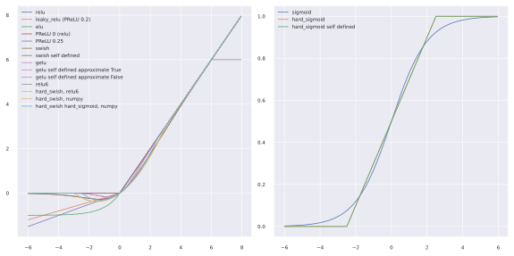
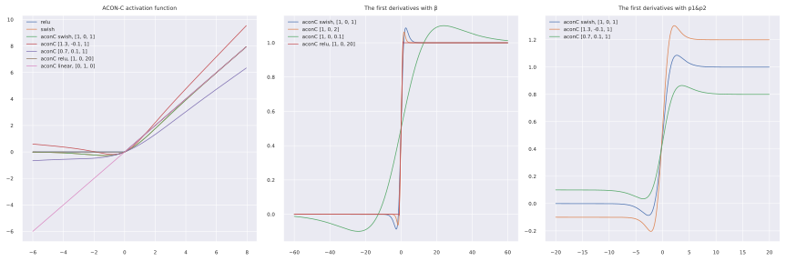

# ___2021 - 01 - 25 Tensorflow 2.4.0___
***

# 目录
  <!-- TOC depthFrom:1 depthTo:6 withLinks:1 updateOnSave:1 orderedList:0 -->

  - [___2021 - 01 - 25 Tensorflow 2.4.0___](#2021-01-25-tensorflow-240)
  - [目录](#目录)
  - [Activations](#activations)
    - [Tensorflow activations](#tensorflow-activations)
    - [Plot activations](#plot-activations)
    - [Acon](#acon)
    - [Replace PReLU with DepthwiseConv2D](#replace-prelu-with-depthwiseconv2d)
  - [Weight decay](#weight-decay)
    - [MXNet SGD and tfa SGDW](#mxnet-sgd-and-tfa-sgdw)
    - [L2 Regularization and Weight Decay](#l2-regularization-and-weight-decay)
    - [SGD with momentum](#sgd-with-momentum)
    - [Keras Model test](#keras-model-test)
    - [MXNet model test](#mxnet-model-test)
    - [Modify model with L2 regularizer](#modify-model-with-l2-regularizer)
    - [Optimizers with weight decay test](#optimizers-with-weight-decay-test)
  - [Float16 mixed precision](#float16-mixed-precision)
    - [Basic test](#basic-test)
    - [Convert float32 model to mixed float16](#convert-float32-model-to-mixed-float16)
    - [Pytorch float16](#pytorch-float16)
  - [XLA Accelerated Linear Algebra](#xla-accelerated-linear-algebra)
  - [Auto Tuner](#auto-tuner)
    - [Keras Tuner](#keras-tuner)
    - [TensorBoard HParams](#tensorboard-hparams)
    - [Parallel Coordinates Plot Using TensorBoard](#parallel-coordinates-plot-using-tensorBoard)
  - [Tensorflow Horovod and Distribute](#tensorflow-horovod-and-distribute)
    - [Multi GPU](#multi-gpu)
    - [Install horovod](#install-horovod)
    - [Tensorflow horovod](#tensorflow-horovod)
    - [Tensorflow distribute](#tensorflow-distribute)
    - [Test results](#test-results)
  - [Datasets](#datasets)
    - [Data Augmentation](#data-augmentation)
    - [dataset cache](#dataset-cache)
    - [datasets interleave](#datasets-interleave)
  - [SAM](#sam)
  - [Stochastic Depth](#stochastic-depth)
  - [Tape](#tape)
  - [Data augment](#data-augment)
    - [Tensorflow image random](#tensorflow-image-random)
    - [RandAugment](#randaugment)
    - [AutoAugment](#autoaugment)
    - [mixup](#mixup)
    - [Cutout](#cutout)
  - [Fuse Conv2D and BatchNorm](#fuse-conv2d-and-batchnorm)
    - [Basic fuse layer test](#basic-fuse-layer-test)
    - [Fuse layers in model](#fuse-layers-in-model)

  <!-- /TOC -->
***

# Activations
## Tensorflow activations
  - **ReLU** `keras.layers.ReLU` / `keras.activations.relu` / `tf.nn.relu`
    ```py
    max(x, 0)
    ```
  - **ReLU6** `tf.nn.relu6`
    ```py
    min(max(x, 0), 6)
    ```
  - **ELU** `keras.layers.ELU` / `keras.activations.elu` / `tf.nn.elu`
    ```py
    f(x) = alpha * (exp(x) - 1.) for x < 0
    f(x) = x for x >= 0
    ```
    其中 `keras.layers.ELU` 初始化 `alpha=1.0`
  - **LeakyReLU** `keras.layers.LeakyReLU` / `tf.nn.leaky_relu`
    ```py
    f(x) = alpha * x if x < 0
    f(x) = x if x >= 0
    ```
    其中 `keras.layers.LeakyReLU` 初始化 `alpha=0.3`，`tf.nn.leaky_relu` 默认值 `alpha=0.2`
  - **PReLU** `keras.layers.PReLU`
    ```py
    f(x) = alpha * x for x < 0
    f(x) = x for x >= 0
    where `alpha` is a learned array with the same shape as x
    ```
    `keras.layers.PReLU` 初始化 `alpha=0`，MXNet / PyTorch 中初始化 `alpha=0.25`
  - **swish / SiLU** `keras.activations.swish` / `tf.nn.swish`
    ```py
    x * sigmoid(x)
    ```
  - **hard_sigmoid** `keras.activations.hard_sigmoid` 模拟 `sigmoid` 计算，简化计算过程
    ```py
    sigmoid(x) = 1 / (1 + exp(-x))
    ```
    ```py
    if x < -2.5: return 0
    if x > 2.5: return 1
    if -2.5 <= x <= 2.5: return 0.2 * x + 0.5
    ```
    ```py
    clip_by_value(x * 0.2 + 0.5, 0, 1)
    ```
  - **hard_swish** 模拟 `swish` 计算，简化 `sigmoid` 计算过程
    ```py
    x * relu6(x + 3) / 6
    ```
    ```py
    x * hard_sigmoid(x)
    x * clip_by_value(x * 0.2 + 0.5, 0, 1)
    ```
  - **gelu** The gaussian error linear activation
    ```py
    x * P(X <= x), where P(X) ~ N(0, 1)

    `0.5 * x * (1 + tanh(sqrt(2 / pi) * (x + 0.044715 * x ** 3)))` if `approximate` is `True`
    `x * P(X <= x) = 0.5 * x * (1 + tf.math.erf(x / sqrt(2)))` where `P(X) ~ N(0, 1)` if `approximate` is `False`
    ```
## Plot activations
  ```py
  fig, axes = plt.subplots(1, 2, figsize=(8, 4))

  xx = np.arange(-6, 8, 0.05)
  axes[0].plot(xx, tf.nn.relu(xx), label='relu')
  axes[0].plot(xx, tf.nn.leaky_relu(xx), label='leaky_relu (PReLU 0.2)')
  axes[0].plot(xx, tf.nn.elu(xx), label='elu')
  axes[0].plot(xx, keras.layers.PReLU()(xx), label='PReLU 0 (relu)')
  axes[0].plot(xx, keras.layers.PReLU(alpha_initializer=tf.initializers.Constant(0.25))(xx), label='PReLU 0.25')

  axes[0].plot(xx, tf.nn.swish(xx), label='swish')
  axes[0].plot(xx, tf.nn.sigmoid(xx) * xx, label='swish self defined', color=axes[0].lines[-1].get_color())
  axes[0].plot(xx, tf.nn.gelu(xx), label='gelu')
  color = axes[0].lines[-1].get_color()
  axes[0].plot(xx, 0.5 * xx * (1 + np.tanh(np.sqrt(2 / np.pi) * (xx + 0.044715 * xx ** 3))), color=color, label='gelu self defined approximate True')
  axes[0].plot(xx, 0.5 * xx * (1 + tf.math.erf(xx / sqrt(2))), color=color, label='gelu self defined approximate False')

  axes[0].plot(xx, tf.nn.relu6(xx), label='relu6')
  axes[0].plot(xx, xx * tf.nn.relu6(xx + 3) / 6, label='hard_swish, relu6')
  axes[0].plot(xx, xx * np.clip(xx / 6 + 0.5, 0, 1), label='hard_swish, numpy', color=axes[0].lines[-1].get_color())
  axes[0].plot(xx, xx * np.clip(xx * 0.2 + 0.5, 0, 1), label='hard_swish hard_sigmoid, numpy')

  xx = np.arange(-6, 6, 0.05)
  axes[1].plot(xx, tf.nn.sigmoid(xx), label='sigmoid')
  axes[1].plot(xx, keras.activations.hard_sigmoid(tf.convert_to_tensor(xx)).numpy(), label='hard_sigmoid')
  axes[1].plot(xx, np.clip(xx * 0.2 + 0.5, 0, 1), label='hard_sigmoid self defined')

  for ax in axes:
      ax.legend(loc='upper left')
      # ax.grid()
  fig.tight_layout()
  ```
  
## Acon
  - [Github nmaac/acon](https://github.com/nmaac/acon/blob/main/acon.py)
  - [Activate or Not: Learning Customized Activation, CVPR 2021](https://arxiv.org/pdf/2009.04759.pdf)
  ```py
  def aconC(inputs, p1=1, p2=0, beta=1):
      p1 = keras.layers.DepthwiseConv2D(1, use_bias=False, depthwise_initializer=tf.initializers.Constant(p1))(inputs)
      p2 = keras.layers.DepthwiseConv2D(1, use_bias=False, depthwise_initializer=tf.initializers.Constant(p2))(inputs)
      beta = keras.layers.DepthwiseConv2D(1, use_bias=False, depthwise_initializer=tf.initializers.Constant(beta))(p1)

      return p1 * tf.nn.sigmoid(beta) + p2

  def meta_aconC(inputs, radio=16):
      nn = keras.layers.GlobalAveragePooling2D()(inputs)
      nn = keras.layers.Dense(max(radio, inputs.shape[-1] // radio), use_bias=False)(nn)
      nn = keras.layers.BatchNormalization()(nn)
      nn = keras.layers.Dense(inputs.shape[-1], use_bias=False)(nn)
      beta = keras.layers.BatchNormalization()(nn)

      p1 = keras.layers.DepthwiseConv2D(1, use_bias=False)(inputs)
      p2 = keras.layers.DepthwiseConv2D(1, use_bias=False)(inputs)
      return p1 * tf.nn.sigmoid(beta) + p2
  ```
  ```py
  fig, axes = plt.subplots(1, 3, figsize=(12, 4))

  xx = np.arange(-6, 8, 0.05)
  axes[0].plot(xx, tf.nn.relu(xx), label='relu')
  axes[0].plot(xx, tf.nn.swish(xx), label='swish')

  xxx = xx.reshape([1, 1, 1, -1])
  axes[0].plot(xx, np.ravel(aconC(xxx)), label='aconC swish, [1, 0, 1]')
  axes[0].plot(xx, np.ravel(aconC(xxx, 1.3, -0.1, 1)), label='aconC [1.3, -0.1, 1]')
  axes[0].plot(xx, np.ravel(aconC(xxx, 0.7, 0.1, 1)), label='aconC [0.7, 0.1, 1]')
  axes[0].plot(xx, np.ravel(aconC(xxx, 1, 0, 20)), label='aconC relu, [1, 0, 20]')
  axes[0].set_title("ACON-C activation function")

  from scipy.misc import derivative
  depriv = lambda xxx, p1, p2, beta: np.ravel(derivative(lambda xx: aconC(xx, p1, p2, beta), xxx))

  xx = np.arange(-60, 60, 0.05)
  xxx = xx.reshape([1, 1, 1, -1])
  axes[1].plot(xx, depriv(xxx, 1, 0, 1), label='aconC swish, [1, 0, 1]')
  axes[1].plot(xx, depriv(xxx, 1, 0, 2), label='aconC [1, 0, 2]')
  axes[1].plot(xx, depriv(xxx, 1, 0, 0.1), label='aconC [1, 0, 0.1]')
  axes[1].plot(xx, depriv(xxx, 1, 0, 20), label='aconC relu, [1, 0, 20]')
  axes[0].plot(xx, np.ravel(aconC(xxx, 0, 1, 0)), label='aconC linear, [0, 1, 0]')
  axes[1].set_title("The first derivatives with β")

  xx = np.arange(-20, 20, 0.05)
  xxx = xx.reshape([1, 1, 1, -1])
  axes[2].plot(xx, depriv(xxx, 1, 0, 1), label='aconC swish, [1, 0, 1]')
  axes[2].plot(xx, depriv(xxx, 1.3, -0.1, 1), label='aconC [1.3, -0.1, 1]')
  axes[2].plot(xx, depriv(xxx, 0.7, 0.1, 1), label='aconC [0.7, 0.1, 1]')
  axes[2].set_title("The first derivatives with p1&p2")

  for ax in axes:
      ax.legend(loc='upper left')
      # ax.grid()
  fig.tight_layout()
  ```
  
## Replace PReLU with DepthwiseConv2D
  ```py
  '''
  mm = keras.models.load_model('./checkpoints/keras_se_mobile_facenet_emore_VIII_basic_agedb_30_epoch_12_0.931000.h5')
  aa = mm.layers[-7]
  ii = np.arange(-1, 1, 2 / (7 * 7 * 512), dtype=np.float32)[:7 * 7 * 512].reshape([1, 7, 7, 512])
  ee = my_activate_test(ii, weights=aa.get_weights())
  np.alltrue(aa(ii) == ee)
  '''
  def my_activate_test(inputs, weights=None):
      channel_axis = 1 if K.image_data_format() == "channels_first" else -1
      pos = K.relu(inputs)
      nn = DepthwiseConv2D((1, 1), depth_multiplier=1, use_bias=False)
      if weights is not None:
          nn.build(inputs.shape)
          nn.set_weights([tf.reshape(weights[id], nn.weights[id].shape) for id, ii in enumerate(weights)])
      neg = -1 * nn(K.relu(-1 * inputs))
      return pos + neg
  ```
  ```py
  from backbones import mobile_facenet_mnn
  bb = mobile_facenet_mnn.mobile_facenet(256, (112, 112, 3), 0.4, use_se=True)
  bb.build((112, 112, 3))

  bb_id = 0
  for id, ii in enumerate(mm.layers):
      print(id, ii.name)
      if isinstance(ii, keras.layers.PReLU):
          print("PReLU")
          nn = bb.layers[bb_id + 2]
          print(bb_id, nn.name)
          nn.set_weights([tf.reshape(wii, nn.weights[wid].shape) for wid, wii in enumerate(ii.get_weights())])
          bb_id += 6
      else:
          nn = bb.layers[bb_id]
          print(bb_id, nn.name)
          nn.set_weights(ii.get_weights())
          bb_id += 1

  inputs = bb.inputs[0]
  embedding = bb.outputs[0]
  output = keras.layers.Dense(tt.classes, name=tt.softmax, activation="softmax")(embedding)
  model = keras.models.Model(inputs, output)
  model.layers[-1].set_weights(tt.model.layers[-2].get_weights())
  model_c = keras.models.Model(model.inputs[0], keras.layers.concatenate([bb.outputs[0], model.outputs[-1]]))
  model_c.compile(optimizer=tt.model.optimizer, loss=tt.model.loss, metrics=tt.model.metrics)
  model_c.optimizer.set_weights(tt.model.optimizer.get_weights())
  ```
  **keras.models.clone_model**
  ```py
  from tensorflow.keras import backend as K
  from tensorflow.keras.layers import DepthwiseConv2D

  # MUST be a customized layer
  # Using DepthwiseConv2D re-implementing PReLU, as MNN doesnt support it...
  class My_PRELU_act(keras.layers.Layer):
      def __init__(self, **kwargs):
          super(My_PRELU_act, self).__init__(**kwargs)
          # channel_axis = 1 if K.image_data_format() == "channels_first" else -1
      def build(self, input_shape):
          self.dconv = DepthwiseConv2D((1, 1), depth_multiplier=1, use_bias=False)
      def call(self, inputs, **kwargs):
          pos = K.relu(inputs)
          neg = -1 * self.dconv(K.relu(-1 * inputs))
          return pos + neg
      def compute_output_shape(self, input_shape):
          return input_shape
      def get_config(self):
          config = super(My_PRELU_act, self).get_config()
          return config
      @classmethod
      def from_config(cls, config):
          return cls(**config)

  def convert_prelu_layer(layer):
      print(layer.name)
      if isinstance(layer, keras.layers.PReLU):
          print(">>>> Convert PReLu <<<<")
          return My_PRELU_act()
      return layer

  mm = keras.models.load_model('checkpoints/keras_se_mobile_facenet_emore_IV_basic_agedb_30_epoch_48_0.957833.h5', compile=False)
  mmn = keras.models.clone_model(mm, clone_function=convert_prelu_layer)
  ```
***

# Weight decay
## MXNet SGD and tfa SGDW
  - [AdamW and Super-convergence is now the fastest way to train neural nets](https://www.fast.ai/2018/07/02/adam-weight-decay/)
  - The behavior of `weight_decay` in `mx.optimizer.SGD` and `tfa.optimizers.SGDW` is different.
  - **MXNet SGD** multiplies `wd` with `lr`.
    ```py
    import mxnet as mx
    help(mx.optimizer.SGD)
    # weight = weight - lr * (rescale_grad * clip(grad, clip_gradient) + wd * weight)
    #        = (1 - lr * wd) * weight - lr * (rescale_grad * clip(grad, clip_gradient))
    ```
    Test with `learning_rate=0.1, weight_decay=5e-4`, weight is actually modified by `5e-5`.
    ```py
    import mxnet as mx
    mm_loss_grad = mx.nd.array([[1., 1], [1, 1]])

    mm = mx.nd.array([[1., 1], [1, 1]])
    mopt = mx.optimizer.SGD(learning_rate=0.1)
    mopt.update(0, mm, mm_loss_grad, None)
    print(mm.asnumpy())  # Basic value is `mm - lr * mm_loss = 0.9`
    # [[0.9 0.9] [0.9 0.9]]

    mm = mx.nd.array([[1., 1], [1, 1]])
    mopt = mx.optimizer.SGD(learning_rate=0.1, wd=5e-4)
    mopt.update(0, mm, mm_loss_grad, None)
    print(mm.asnumpy())  # 0.9 - 0.89995 = 5e-5
    # [[0.89995 0.89995]  [0.89995 0.89995]]
    ```
  - **tfa SGDW** behaves different, it does NOT multiply `wd` with `lr`. With `learning_rate=0.1, weight_decay=5e-4`, weight is actually modified with `5e-4`.
    ```py
    # /opt/anaconda3/lib/python3.7/site-packages/tensorflow_addons/optimizers/weight_decay_optimizers.py
    # 170     def _decay_weights_op(self, var, apply_state=None):
    # 177             return var.assign_sub(coefficients["wd_t"] * var, self._use_locking)
    ```
    ```py
    import tensorflow_addons as tfa
    ww_loss_grad = tf.convert_to_tensor([[1., 1.], [1., 1.]])
    ww = tf.Variable([[1., 1.], [1., 1.]])
    opt = tfa.optimizers.SGDW(learning_rate=0.1, weight_decay=5e-4)
    opt.apply_gradients(zip([ww_loss_grad], [ww]))
    print(ww.numpy()) # 0.9 - 0.8995 = 5e-4
    # [[0.8995 0.8995] [0.8995 0.8995]]
    ```
    So `learning_rate=0.1, weight_decay=5e-4` in `mx.optimizer.SGD` is equal to `learning_rate=0.1, weight_decay=5e-5` in `tfa.optimizers.SGDW`.
  - **weight decay multiplier** If we set `wd_mult=10` in a MXNet layer, `wd` will mutiply by `10` in this layer. This means it will be `weight_decay == 5e-4` in a keras layer.
    ```py
    # https://github.com/apache/incubator-mxnet/blob/e6cea0d867329131fa6052e5f45dc5f626c00d72/python/mxnet/optimizer/optimizer.py#L482
    # 29  class Optimizer(object):
    # 482                lrs[i] *= self.param_dict[index].lr_mult
    ```
## L2 Regularization and Weight Decay
  - [Weight Decay == L2 Regularization?](https://towardsdatascience.com/weight-decay-l2-regularization-90a9e17713cd)
  - [PDF DECOUPLED WEIGHT DECAY REGULARIZATION](https://arxiv.org/pdf/1711.05101.pdf)
  - **Keras l2 regularization**
    ```py
    ww = tf.convert_to_tensor([[1.0, -2.0], [-3.0, 4.0]])

    # loss = l2 * reduce_sum(square(x))
    aa = keras.regularizers.L2(0.2)
    aa(ww)  # tf.reduce_sum(ww ** 2) * 0.2
    # 6.0

    # output = sum(t ** 2) / 2
    tf.nn.l2_loss(ww)
    # 15.0
    tf.nn.l2_loss(ww) * 0.2
    # 3.0
    ```
    Total loss with l2 regularization will be
    ```py
    total_loss = Loss(w) + λ * R(w)
    ```
  - `Keras.optimizers.SGD`
    ```py
    help(keras.optimizers.SGD)
    # w = w - learning_rate * g
    #   = w - learning_rate * g - learning_rate * Grad(l2_loss)
    ```
    So with `keras.regularizers.L2(λ)`, it should be
    ```py
    wd * weight = Grad(l2_loss)
        --> wd * weight = 2 * λ * weight
        --> λ = wd / 2
    ```
    **Test**
    ```py
    ww_loss_grad = tf.convert_to_tensor([[1., 1.], [1., 1.]])
    ww = tf.Variable([[1., 1.], [1., 1.]])
    opt = keras.optimizers.SGD(0.1)
    with tf.GradientTape() as tape:
        # l2_loss = tf.nn.l2_loss(ww) * 5e-4
        l2_loss = keras.regularizers.L2(5e-4 / 2)(ww)  # `tf.nn.l2_loss` divided the loss by 2, `keras.regularizers.L2` not
    l2_grad = tape.gradient(l2_loss, ww).numpy()
    opt.apply_gradients(zip([ww_loss_grad + l2_grad], [ww]))
    print(ww.numpy()) # 0.9 - 0.89995 = 5e-5
    # [[0.89995 0.89995] [0.89995 0.89995]]
    ```
    That means the `L2_regulalizer` will modify the weights value by `l2 * lr == 5e-4 * 0.1 = 5e-5`.
  - If we want the same result as `mx.optimizer.SGD(learning_rate=0.1, wd=5e-4)` and `wd_mult=10` in a MXNet layer, which actually decay this layer's weights with `wd * wd_mult * learning_rate == 5e-4`, and other layers `wd * learning_rate == 5e-5`.
    - Firstlly, the keras optimizer is `tfa.optimizers.SGDW(learning_rate=0.1, weight_decay=5e-5)`.
    - Then add a `keras.regularizers.L2` with `l2 == weight_decay / learning_rate * (wd_mult - 1) / 2` to this layer.
    ```py
    ww_loss_grad = tf.convert_to_tensor([[1., 1.], [1., 1.]])
    ww = tf.Variable([[1., 1.], [1., 1.]])
    opt = tfa.optimizers.SGDW(learning_rate=0.1, weight_decay=5e-5)
    with tf.GradientTape() as tape:
        l2_loss = keras.regularizers.L2(5e-5 / 0.1 * (10 - 1) / 2)(ww)
    l2_grad = tape.gradient(l2_loss, ww).numpy()
    opt.apply_gradients(zip([ww_loss_grad + l2_grad], [ww]))
    print(ww.numpy()) # 0.9 - 0.8995 = 5e-4
    # [[0.8995 0.8995] [0.8995 0.8995]]
    ```
## SGD with momentum
  - **MXNet**
    ```py
    # incubator-mxnet/python/mxnet/optimizer/sgd.py, incubator-mxnet/src/operator/optimizer_op.cc +109
    grad += wd * weight
    momentum_stat = momentum * momentum_stat - lr * grad
    weight += momentum_stat
    ```
  - **Keras SGDW** Using `wd == lr * wd`, `weight` will be the same with `MXNet SGD` in the first update, but `momentum_stat` will be different. Then in the second update, `weight` will also be different.
    ```py
    momentum_stat = momentum * momentum_stat - lr * grad
    weight += momentum_stat - wd * weight
    ```

  - **Keras SGD with l2 regularizer** can behave same as `MXNet SGD`
    ```py
    grad += regularizer_loss
    momentum_stat = momentum * momentum_stat - lr * grad
    weight += momentum_stat
    ```
## Keras Model test
  ```py
  import tensorflow_addons as tfa

  def test_optimizer_with_model(opt, epochs=3, l2=0):
      kernel_regularizer = None if l2 == 0 else keras.regularizers.L2(l2)
      aa = keras.layers.Dense(1, use_bias=False, kernel_initializer='ones', kernel_regularizer=kernel_regularizer)
      aa.build([1])
      mm = keras.Sequential([aa])
      loss = lambda y_true, y_pred: (y_true - y_pred) ** 2 / 2
      mm.compile(optimizer=opt, loss=loss)
      for ii in range(epochs):
          mm.fit([[1.]], [[0.]], epochs=ii+1, initial_epoch=ii, verbose=0)
          print("Epoch", ii, "- [weight]", aa.weights[0].numpy(), "- [losses]:", mm.history.history['loss'][0], end="")
          if len(opt.weights) > 1:
              print(" - [momentum]:", opt.weights[-1].numpy(), end="")
          print()
      return mm, opt

  test_optimizer_with_model(tf.keras.optimizers.SGD(learning_rate=0.1), epochs=3)
  # Epoch 0 - [weight] [[0.9]] - [losses]: 0.5
  # Epoch 1 - [weight] [[0.81]] - [losses]: 0.4049999713897705
  # Epoch 2 - [weight] [[0.729]] - [losses]: 0.32804998755455017
  test_optimizer_with_model(tf.keras.optimizers.SGD(learning_rate=0.1), l2=0.01, epochs=3)
  # Epoch 0 - [weight] [[0.898]] - [losses]: 0.5099999904632568
  # Epoch 1 - [weight] [[0.806404]] - [losses]: 0.411266028881073
  # Epoch 2 - [weight] [[0.7241508]] - [losses]: 0.33164656162261963
  test_optimizer_with_model(tfa.optimizers.SGDW(learning_rate=0.1, weight_decay=0.002), epochs=3)
  # Epoch 0 - [weight] [[0.898]] - [losses]: 0.5
  # Epoch 1 - [weight] [[0.806404]] - [losses]: 0.40320199728012085
  # Epoch 2 - [weight] [[0.72415084]] - [losses]: 0.3251436948776245
  test_optimizer_with_model(tf.keras.optimizers.SGD(learning_rate=0.1, momentum=0.9), epochs=3)
  # Epoch 0 - [weight] [[0.9]] - [losses]: 0.5 - [momentum]: [[-0.1]]
  # Epoch 1 - [weight] [[0.71999997]] - [losses]: 0.4049999713897705 - [momentum]: [[-0.17999999]]
  # Epoch 2 - [weight] [[0.486]] - [losses]: 0.25919997692108154 - [momentum]: [[-0.23399998]]
  test_optimizer_with_model(tf.keras.optimizers.SGD(learning_rate=0.1, momentum=0.9), l2=0.01, epochs=3)
  # Epoch 0 - [weight] [[0.898]] - [losses]: 0.5099999904632568 - [momentum]: [[-0.102]] ==> 0.102 * 0.1
  # Epoch 1 - [weight] [[0.714604]] - [losses]: 0.411266028881073 - [momentum]: [[-0.183396]] ==> -0.102 * 0.9 - 0.898 * 1.02 * 0.1
  # Epoch 2 - [weight] [[0.47665802]] - [losses]: 0.2604360580444336 - [momentum]: [[-0.237946]]
  # ==> momentum_stat_2 == momentum_stat_1 * momentum - weight_1 * (1 + l2 * 2) * learning_rate
  test_optimizer_with_model(tfa.optimizers.SGDW(learning_rate=0.1, momentum=0.9, weight_decay=0.002), epochs=3)
  # Epoch 0 - [weight] [[0.898]] - [losses]: 0.5 - [momentum]: [[-0.1]]
  # Epoch 1 - [weight] [[0.71640396]] - [losses]: 0.40320199728012085 - [momentum]: [[-0.1798]]
  # Epoch 2 - [weight] [[0.48151073]] - [losses]: 0.25661730766296387 - [momentum]: [[-0.2334604]]

  test_optimizer_with_model(tf.keras.optimizers.SGD(learning_rate=0.1, momentum=0.9), l2=0.1, epochs=3)
  # Epoch 0 - [weight] [[0.88]] - [losses]: 0.6000000238418579 - [momentum]: [[-0.12]]
  # Epoch 1 - [weight] [[0.66639996]] - [losses]: 0.4646399915218353 - [momentum]: [[-0.21360001]]
  # Epoch 2 - [weight] [[0.39419195]] - [losses]: 0.266453355550766 - [momentum]: [[-0.272208]]
  ```
## MXNet model test
  - **wd_mult** NOT working if just added in `mx.symbol.Variable`, has to be added by `opt.set_wd_mult`.
  ```py
  import mxnet as mx
  import logging
  logging.getLogger().setLevel(logging.ERROR)

  def test_optimizer_with_mxnet_model(opt, epochs=3, wd_mult=None):
      xx, yy = np.array([[1.]]), np.array([[0.]])
      xx_input, yy_input = mx.nd.array(xx), mx.nd.array(yy)
      dataiter = mx.io.NDArrayIter(xx, yy)

      data = mx.symbol.Variable("data", shape=(1,))
      label = mx.symbol.Variable("softmax_label", shape=(1,))
      # ww = mx.symbol.Variable("ww", shape=(1, 1), wd_mult=wd_mult, init=mx.init.One())
      ww = mx.symbol.Variable("ww", shape=(1, 1), init=mx.init.One())
      nn = mx.sym.FullyConnected(data=data, weight=ww, no_bias=True, num_hidden=1)

      # loss = mx.symbol.SoftmaxOutput(data=nn, label=label, name='softmax')
      loss = mx.symbol.MakeLoss((label - nn) ** 2 / 2)
      # sss = loss.bind(mx.cpu(), {'data': xx_input, 'softmax_label': yy_input, 'ww': y_pred})
      # print(sss.forward()[0].asnumpy().tolist())
      # [[0.5]]
      if wd_mult is not None:
          opt.set_wd_mult({'ww': wd_mult})
      model = mx.mod.Module(context=mx.cpu(), symbol=loss)
      weight_value = mx.nd.ones([1, 1])
      for ii in range(epochs):
          loss_value = loss.bind(mx.cpu(), {'data': xx_input, 'softmax_label': yy_input, 'ww': weight_value}).forward()[0]
          # model.fit(train_data=dataiter, num_epoch=ii+1, begin_epoch=0, optimizer=opt, force_init=True)
          model.fit(train_data=dataiter, num_epoch=ii+1, begin_epoch=ii, optimizer=opt)
          weight_value = model.get_params()[0]['ww']
          # output = model.get_outputs()[0]
          print("Epoch", ii, "- [weight]", weight_value.asnumpy(), "- [losses]:", loss_value.asnumpy()[0, 0])
          # if len(opt.weights) > 1:
          #     print(" - [momentum]:", opt.weights[-1].numpy(), end="")
          # print()

  test_optimizer_with_mxnet_model(mx.optimizer.SGD(learning_rate=0.1, wd=0.02))
  # Epoch 0 - [weight] [[0.898]] - [losses]: 0.5
  # Epoch 1 - [weight] [[0.806404]] - [losses]: 0.403202
  # Epoch 2 - [weight] [[0.7241508]] - [losses]: 0.3251437
  test_optimizer_with_mxnet_model(mx.optimizer.SGD(learning_rate=0.1, wd=0.002))
  # Epoch 0 - [weight] [[0.8998]] - [losses]: 0.5
  # Epoch 1 - [weight] [[0.80964005]] - [losses]: 0.40482002
  # Epoch 2 - [weight] [[0.72851413]] - [losses]: 0.3277585
  test_optimizer_with_mxnet_model(mx.optimizer.SGD(learning_rate=0.1, momentum=0.9, wd=0.02))
  # Epoch 0 - [weight] [[0.898]] - [losses]: 0.5
  # Epoch 1 - [weight] [[0.714604]] - [losses]: 0.403202
  # Epoch 2 - [weight] [[0.47665802]] - [losses]: 0.25532946
  test_optimizer_with_mxnet_model(mx.optimizer.SGD(learning_rate=0.1, momentum=0.9, wd=0.02), wd_mult=10)
  # Epoch 0 - [weight] [[0.88]] - [losses]: 0.5
  # Epoch 1 - [weight] [[0.66639996]] - [losses]: 0.3872
  # Epoch 2 - [weight] [[0.39419195]] - [losses]: 0.22204445
  # ==> Equals to keras model `l2 == 0.1`
  ```
## Modify model with L2 regularizer
  ```py
  mm = keras.applications.MobileNet()

  regularizers_type = {}
  for layer in mm.layers:
      rrs = [kk for kk in layer.__dict__.keys() if 'regularizer' in kk and not kk.startswith('_')]
      if len(rrs) != 0:
          # print(layer.name, layer.__class__.__name__, rrs)
          if layer.__class__.__name__ not in regularizers_type:
              regularizers_type[layer.__class__.__name__] = rrs
  print(regularizers_type)
  # {'Conv2D': ['kernel_regularizer', 'bias_regularizer'],
  # 'BatchNormalization': ['beta_regularizer', 'gamma_regularizer'],
  # 'PReLU': ['alpha_regularizer'],
  # 'SeparableConv2D': ['kernel_regularizer', 'bias_regularizer', 'depthwise_regularizer', 'pointwise_regularizer'],
  # 'DepthwiseConv2D': ['kernel_regularizer', 'bias_regularizer', 'depthwise_regularizer'],
  # 'Dense': ['kernel_regularizer', 'bias_regularizer']}

  weight_decay = 5e-4
  for layer in mm.layers:
      if isinstance(layer, keras.layers.Dense) or isinstance(layer, keras.layers.Conv2D) or isinstance(layer, keras.layers.DepthwiseConv2D):
          print(">>>> Dense or Conv2D", layer.name, "use_bias:", layer.use_bias)
          layer.kernel_regularizer = keras.regularizers.L2(weight_decay / 2)
          if layer.use_bias:
              layer.bias_regularizer = keras.regularizers.L2(weight_decay / 2)
      if isinstance(layer, keras.layers.SeparableConv2D):
          print(">>>> SeparableConv2D", layer.name, "use_bias:", layer.use_bias)
          layer.pointwise_regularizer = keras.regularizers.L2(weight_decay / 2)
          layer.depthwise_regularizer = keras.regularizers.L2(weight_decay / 2)
          if layer.use_bias:
              layer.bias_regularizer = keras.regularizers.L2(weight_decay / 2)
      if isinstance(layer, keras.layers.BatchNormalization):
          print(">>>> BatchNormalization", layer.name, "scale:", layer.scale, ", center:", layer.center)
          if layer.center:
              layer.beta_regularizer = keras.regularizers.L2(weight_decay / 2)
          if layer.scale:
              layer.gamma_regularizer = keras.regularizers.L2(weight_decay / 2)
      if isinstance(layer, keras.layers.PReLU):
          print(">>>> PReLU", layer.name)
          layer.alpha_regularizer = keras.regularizers.L2(weight_decay / 2)
  ```
## Optimizers with weight decay test
  ```py
  from tensorflow import keras
  import tensorflow_addons as tfa
  import losses, data, evals, myCallbacks, train
  # from tensorflow.keras.callbacks import LearningRateScheduler

  # Dataset
  data_path = '/datasets/faces_emore_112x112_folders'
  train_ds = data.prepare_dataset(data_path, batch_size=256, random_status=3, random_crop=(100, 100, 3))
  classes = train_ds.element_spec[-1].shape[-1]

  # Model
  basic_model = train.buildin_models("MobileNet", dropout=0, emb_shape=256)
  # model_output = keras.layers.Dense(classes, activation="softmax")(basic_model.outputs[0])
  model_output = train.NormDense(classes, name="arcface")(basic_model.outputs[0])
  model = keras.models.Model(basic_model.inputs[0], model_output)

  # Evals and basic callbacks
  save_name = 'keras_mxnet_test_sgdw'
  eval_paths = ['/datasets/faces_emore/lfw.bin', '/datasets/faces_emore/cfp_fp.bin', '/datasets/faces_emore/agedb_30.bin']
  my_evals = [evals.eval_callback(basic_model, ii, batch_size=256, eval_freq=1) for ii in eval_paths]
  my_evals[-1].save_model = save_name
  basic_callbacks = myCallbacks.basic_callbacks(checkpoint=save_name + '.h5', evals=my_evals, lr=0.001)
  basic_callbacks = basic_callbacks[:1] + basic_callbacks[2:]
  callbacks = my_evals + basic_callbacks
  # Compile and fit

  ss = myCallbacks.ConstantDecayScheduler([3, 5, 7], lr_base=0.1)
  optimizer = tfa.optimizers.SGDW(learning_rate=0.1, weight_decay=5e-4, momentum=0.9)

  model.compile(optimizer=optimizer, loss=losses.arcface_loss, metrics=["accuracy"])
  # model.compile(optimizer=optimizer, loss=keras.losses.categorical_crossentropy, metrics=["accuracy"])
  wd_callback = myCallbacks.OptimizerWeightDecay(optimizer.lr.numpy(), optimizer.weight_decay.numpy())
  model.fit(train_ds, epochs=15, callbacks=[ss, wd_callback, *callbacks], verbose=1)

  opt = tfa.optimizers.AdamW(weight_decay=lambda : None)
  opt.weight_decay = lambda : 5e-1 * opt.lr

  mlp.compile(optimizer=opt, loss=tf.keras.losses.BinaryCrossentropy())
  ```
  ```py
  class Foo:
      def __init__(self, wd):
          self.wd = wd
      def __call__(self):
          return self.wd
      def set_wd(self, wd):
          self.wd = wd

  class L2_decay_wdm(keras.regularizers.L2):
      def __init__(self, wd_func=None, **kwargs):
          super(L2_decay_wdm, self).__init__(**kwargs)
          self.wd_func = wd_func

      def __call__(self, x):
          self.l2 = self.wd_func()
          # tf.print(", l2 =", self.l2, end='')
          return super(L2_decay_wdm, self).__call__(x)

      def get_config(self):
          self.l2 = 0  # Just a fake value for saving
          config = super(L2_decay_wdm, self).get_config()
          return config
  ```
***

# Float16 mixed precision
## Basic test
  ```py
  from icecream import ic

  keras.mixed_precision.set_global_policy('mixed_float16')
  policy = keras.mixed_precision.global_policy()
  ic(policy.compute_dtype, policy.variable_dtype)

  inputs = keras.layers.Input([10])
  dd = keras.layers.Dense(10)
  dd.build([10])
  mm = keras.models.Model(inputs, dd(inputs))

  ic(dd(np.ones([1, 10])).dtype)  # ic| dd(np.ones([1, 10])).dtype: tf.float16
  ic(dd.weights[0].dtype) # ic| dd.weights[0].dtype: tf.float32
  ic(inputs.dtype)  # ic| inputs.dtype: tf.float32
  ic(mm.outputs[0].dtype) # ic| mm.outputs[0].dtype: tf.float16
  ```
  ```py
  import json
  json_config = mm.to_json()
  aa = json.loads(json_config)
  with open('model_fp16.json', 'w') as ff:
      json.dump(aa, ff, indent=2)
  ```
  ```py
  keras.mixed_precision.set_global_policy('mixed_float16')
  # tf.config.optimizer.set_experimental_options({"auto_mixed_precision": True})

  def load_cifar10(batch_size=1024, image_shape=(32, 32), classes=10):
      # (x_train, y_train), (x_test, y_test) = keras.datasets.cifar10.load_data()
      # x_train, x_test = x_train.astype('float32') / 255, x_test.astype('float32') / 255
      import tensorflow_datasets as tfds
      AUTOTUNE = tf.data.experimental.AUTOTUNE

      if image_shape[:2] == (32, 32):
          preprocessing = lambda data: (tf.cast(data["image"], tf.float32) / 255.0, tf.one_hot(data["label"], classes))
      else:
          preprocessing = lambda data: (tf.image.resize(data["image"], image_shape[:2]) / 255.0, tf.one_hot(data["label"], classes))
      dataset = tfds.load("cifar10", split="train").map(preprocessing, num_parallel_calls=tf.data.experimental.AUTOTUNE)
      dataset = dataset.cache().batch(batch_size).prefetch(buffer_size=AUTOTUNE)
      return dataset

  def test_dense_model(num_classes=10):
      return keras.Sequential([
          # keras.Input(shape=(784,), name='digits'),
          keras.layers.Flatten(),
          keras.layers.Dense(4096, activation='relu'),
          keras.layers.Dense(4096, activation='relu'),
          keras.layers.Dense(num_classes),
          keras.layers.Activation('softmax', dtype='float32'),
      ])

  def test_conv_model(num_classes=10, input_shape=(32, 32, 3)):
      return keras.models.Sequential([
          keras.layers.Conv2D(8, 3, padding="same", activation="relu", input_shape=input_shape),
          keras.layers.DepthwiseConv2D(3, depth_multiplier=8, padding="same", activation="relu"),
          keras.layers.GlobalAveragePooling2D(),
          keras.layers.Dense(num_classes),
          keras.layers.Activation("softmax", dtype="float32"),
      ])

  # (x_train, y_train), (x_test, y_test) = keras.datasets.mnist.load_data()
  # x_train, x_test = x_train.astype('float32') / 255, x_test.astype('float32') / 255
  # initial_weights = model.get_weights()
  input_shape, classes = (128, 128, 3), 80000
  dataset = load_cifar10(batch_size=512, image_shape=input_shape, classes=classes)

  # model = test_dense_model(classes)
  # model = test_conv_model(classes, input_shape=input_shape)
  # model = keras.applications.MobileNet(include_top=True, classes=classes, input_shape=input_shape, weights=None)
  model = keras.applications.ResNet50(include_top=True, classes=classes, input_shape=input_shape, weights=None)
  model = keras.models.Model(model.inputs[0], keras.layers.Activation("linear", dtype="float32")(model.outputs[0]))

  # optimizer = keras.mixed_precision.LossScaleOptimizer(keras.optimizers.Adam())
  optimizer = keras.optimizers.Adam()
  model.compile(loss='categorical_crossentropy', optimizer=optimizer)
  # history = model.fit(x_train, y_train, batch_size=1024, epochs=5, validation_split=0.2)
  history = model.fit(dataset, epochs=2)
  ```

  | Model      | Dataset      | batchsize | float16 | XLA   | first epoch (ms/step) | min (ms/step) |
  | ---------- | ------------ | --------- | ------- | ----- | --------------------- | ------------- |
  | DenseModel | MNIST        | 8192      | False   | False | 223                   | 113           |
  | DenseModel | MNIST        | 8192      | True    | False | 101                   | 56            |
  | DenseModel | MNIST        | 8192      | False   | True  | 227                   | 111           |
  | DenseModel | MNIST        | 8192      | True    | True  | 144                   | 56            |
  | ConvModel  | cifar10      | 1024      | False   | False | 118                   | 110           |
  | ConvModel  | cifar10      | 1024      | True    | False | 41                    | 38            |
  | MobileNet  | cifar10, 32  | 1024      | Fasle   | False | 89                    | 59            |
  | MobileNet  | cifar10, 32  | 1024      | True    | False | 44                    | 41            |
  | MobileNet  | cifar10, 128 | 128       | False   | False | 142                   | 139           |
  | MobileNet  | cifar10, 128 | 128       | True    | False | 65                    | 62            |
  | Resnet50   | cifar10, 32  | 128       | False   | False | 69                    | 64            |
  | Resnet50   | cifar10, 32  | 128       | True    | False | 74                    | 71            |
  | Resnet50   | cifar10, 128 | 128       | False   | False | 187                   | 184           |
  | Resnet50   | cifar10, 128 | 128       | True    | False | 128                   | 122           |
## Convert float32 model to mixed float16
  ```py
  def convert_to_mixed_float16(model, convert_batch_norm=True):
      policy = keras.mixed_precision.Policy('mixed_float16')
      policy_config = keras.utils.serialize_keras_object(policy)
      from tensorflow.keras.layers import InputLayer, Activation
      from tensorflow.keras.activations import linear

      def do_convert_to_mixed_float16(layer):
          if not convert_batch_norm and isinstance(layer, keras.layers.BatchNormalization):
              return layer
          if not isinstance(layer, InputLayer) and not (isinstance(layer, Activation) and layer.activation == linear):
              aa = layer.get_config()
              aa.update({'dtype': policy_config})
              bb = layer.__class__.from_config(aa)
              bb.build(layer.input_shape)
              bb.set_weights(layer.get_weights())
              return bb
          return layer
      return keras.models.clone_model(model, clone_function=do_convert_to_mixed_float16)
  ```
  ```py
  def convert_mixed_float16_to_float32(model):
      from tensorflow.keras.layers import InputLayer, Activation
      from tensorflow.keras.activations import linear

      def do_convert_to_float32(layer):
          if not isinstance(layer, InputLayer) and not (isinstance(layer, Activation) and layer.activation == linear):
              aa = layer.get_config()
              aa.update({'dtype': "float32"})
              bb = layer.__class__.from_config(aa)
              bb.build(layer.input_shape)
              bb.set_weights(layer.get_weights())
              return bb
          return layer
      return keras.models.clone_model(model, clone_function=do_convert_to_float32)
  ```
  ```py
  def convert_bn_mixed_float16_to_float32(model):
      policy = keras.mixed_precision.Policy('mixed_float16')
      policy_config = keras.utils.serialize_keras_object(policy)
      from tensorflow.keras.layers import InputLayer, Activation
      from tensorflow.keras.activations import linear

      def do_convert_bn_to_float32(layer):
          if isinstance(layer, keras.layers.BatchNormalization):
              aa = layer.get_config()
              aa.update({'dtype': "float32"})
              bb = layer.__class__.from_config(aa)
              bb.build(layer.input_shape)
              bb.set_weights(layer.get_weights())
              return bb
          return layer
      return keras.models.clone_model(model, clone_function=do_convert_bn_to_float32)
  ```
## Pytorch float16
  ```py
  import torch
  import time
  import torch.nn as nn
  import numpy as np
  from torchvision import datasets, transforms
  from tqdm import tqdm


  class TestResNet(nn.Module):
      def __init__(self, input=32, num_classes=10):
          super(TestResNet, self).__init__()
          self.conv1 = nn.Conv2d(3, 64, kernel_size=7, stride=2, padding=0, bias=False)
          self.flatten = nn.Flatten()
          conv_out_shape = int(np.ceil(input / 2)) - 3
          self.linear = nn.Linear(64 * conv_out_shape * conv_out_shape, num_classes)
          self.softmax = nn.Softmax(dim=-1)

      def forward(self, x):
          out = self.conv1(x)
          out = self.flatten(out)
          out = self.linear(out)
          out = self.softmax(out)
          return out


  def load_cifar10(batch_size=512, image_shape=(32, 32)):
      train_transforms = transforms.Compose([transforms.Resize(image_shape), transforms.ToTensor()])
      trainset = datasets.CIFAR10(root="./data", train=True, download=True, transform=train_transforms)
      train_loader = torch.utils.data.DataLoader(trainset, batch_size=batch_size, shuffle=True, num_workers=4)
      total = trainset.data.shape[0]
      steps_per_epoch = int(np.ceil(total / batch_size))
      return train_loader, steps_per_epoch


  def run_test(input_shape=(32, 32), batch_size=512, use_fp16=False, epochs=2):
      train_loader, steps_per_epoch = load_cifar10(batch_size=batch_size, image_shape=input_shape)

      device = torch.device("cuda:0" if torch.cuda.is_available() else "cpu")
      model = TestResNet(input=input_shape[0], num_classes=10).to(device)
      if use_fp16:
          model = model.half()

      optimizer = torch.optim.Adam(model.parameters(), lr=0.001)
      criterion = nn.CrossEntropyLoss()
      for epoch in range(epochs):
          since = time.time()
          for inputs, labels in tqdm(train_loader, "Epoch {}/{}".format(epoch + 1, epochs), total=steps_per_epoch):
              inputs = inputs.to(device).half() if use_fp16 else inputs.to(device)
              labels = labels.to(device)
              optimizer.zero_grad()
              outputs = model(inputs)
              loss = criterion(outputs, labels)
              loss.backward()
              optimizer.step()

          total_time = time.time() - since
          print(">>>> Total time: %.4fs, mean: %.4fms" % (total_time, total_time * 1000 / steps_per_epoch))


  if __name__ == "__main__":
      import sys
      import argparse

      parser = argparse.ArgumentParser(formatter_class=argparse.ArgumentDefaultsHelpFormatter)
      parser.add_argument("-b", "--batch_size", type=int, default=512, help="Batch size")
      parser.add_argument("-i", "--input_shape", type=int, default=32, help="Input shape")
      parser.add_argument("-f", "--use_fp16", action="store_true", help="Use fp16")
      parser.add_argument("-e", "--epochs", type=int, default=2, help="Epochs")

      args = parser.parse_known_args(sys.argv[1:])[0]
      run_test((args.input_shape, args.input_shape), args.batch_size, args.use_fp16, args.epochs)
  ```

  | input_shape | batch_size | use_fp16 | first epoch (ms/step) | second epoch (ms/step) |
  | ----------- | ---------- | -------- | --------------------- | ---------------------- |
  | 112         | 512        | False    | 84.5125               | 78.9935                |
  | 112         | 512        | True     | 75.3213               | 76.9712                |
  | 224         | 512        | False    | 228.2185              | 215.2186               |
  | 224         | 512        | True     | 228.9982              | 254.9154               |
***

# XLA Accelerated Linear Algebra
  - [XLA: Optimizing Compiler for Machine Learning](https://www.tensorflow.org/xla)
  ```py
  tf.config.optimizer.set_jit(True)

  @tf.function(jit_compile=True)
  ```
  ```sh
  $ TF_XLA_FLAGS="--tf_xla_auto_jit=2 --tf_xla_cpu_global_jit"
  ```
***

# Auto Tuner
## Keras Tuner
  - [Keras Tuner 简介](https://www.tensorflow.org/tutorials/keras/keras_tuner)
    ```py
    import tensorflow as tf
    from tensorflow import keras

    !pip install -q -U keras-tuner
    import kerastuner as kt

    (img_train, label_train), (img_test, label_test) = keras.datasets.fashion_mnist.load_data()
    # Normalize pixel values between 0 and 1
    img_train = img_train.astype('float32') / 255.0
    img_test = img_test.astype('float32') / 255.0

    def model_builder(hp):
        model = keras.Sequential()
        model.add(keras.layers.Flatten(input_shape=(28, 28)))

        # Tune the number of units in the first Dense layer
        # Choose an optimal value between 32-512
        hp_units = hp.Int('units', min_value = 32, max_value = 512, step = 32)
        model.add(keras.layers.Dense(units = hp_units, activation = 'relu'))
        model.add(keras.layers.Dense(10))

        # Tune the learning rate for the optimizer
        # Choose an optimal value from 0.01, 0.001, or 0.0001
        hp_learning_rate = hp.Choice('learning_rate', values = [1e-2, 1e-3, 1e-4])

        model.compile(optimizer = keras.optimizers.Adam(learning_rate = hp_learning_rate),
                      loss = keras.losses.SparseCategoricalCrossentropy(from_logits = True),
                      metrics = ['accuracy'])

        return model

    tuner = kt.Hyperband(model_builder,
                         objective = 'val_accuracy',
                         max_epochs = 10,
                         factor = 3,
                         directory = 'my_dir',
                         project_name = 'intro_to_kt')

    tuner.search(img_train, label_train, epochs = 10, validation_data = (img_test, label_test), callbacks = [ClearTrainingOutput()])

    # Get the optimal hyperparameters
    best_hps = tuner.get_best_hyperparameters(num_trials = 1)[0]

    print(f"""
    The hyperparameter search is complete. The optimal number of units in the first densely-connected
    layer is {best_hps.get('units')} and the optimal learning rate for the optimizer
    is {best_hps.get('learning_rate')}.
    """)

    # Build the model with the optimal hyperparameters and train it on the data
    model = tuner.hypermodel.build(best_hps)
    model.fit(img_train, label_train, epochs = 10, validation_data = (img_test, label_test))
    ```
  - **Tune on cifar10**
    ```py
    import tensorflow as tf
    from tensorflow import keras
    import matplotlib.pyplot as plt
    import kerastuner as kt
    import tensorflow_addons as tfa

    (train_images, train_labels), (test_images, test_labels) = keras.datasets.cifar10.load_data()
    train_images, test_images = train_images / 255.0, test_images / 255.0
    train_labels_oh = tf.one_hot(tf.squeeze(train_labels), depth=10, dtype='uint8')
    test_labels_oh = tf.one_hot(tf.squeeze(test_labels), depth=10, dtype='uint8')
    print(train_images.shape, test_images.shape, train_labels_oh.shape, test_labels_oh.shape)

    def create_model(hp):
        hp_wd = hp.Choice("weight_decay", values=[0.0, 1e-5, 5e-5, 1e-4])
        hp_ls = hp.Choice("label_smoothing", values=[0.0, 0.1])
        hp_dropout = hp.Choice("dropout_rate", values=[0.0, 0.4])

        model = keras.Sequential()
        model.add(keras.layers.Conv2D(32, (3, 3), activation='relu', input_shape=(32, 32, 3)))
        model.add(keras.layers.MaxPooling2D((2, 2)))
        model.add(keras.layers.Conv2D(64, (3, 3), activation='relu'))
        model.add(keras.layers.MaxPooling2D((2, 2)))
        model.add(keras.layers.Conv2D(64, (3, 3), activation='relu'))
        model.add(keras.layers.Flatten())
        model.add(keras.layers.Dense(64, activation='relu'))
        model.add(keras.layers.Dropout(rate=hp_dropout))
        model.add(keras.layers.Dense(10))

        model.compile(
            optimizer=tfa.optimizers.AdamW(weight_decay=hp_wd),
            loss=tf.keras.losses.CategoricalCrossentropy(from_logits=True, label_smoothing=hp_ls),
            metrics = ['accuracy'])

        return model

    tuner = kt.Hyperband(create_model,
                         objective='val_accuracy',
                         max_epochs=50,
                         factor=6,
                         directory='my_dir',
                         project_name='intro_to_kt')

    tuner.search(train_images, train_labels_oh, epochs=50, validation_data=(test_images, test_labels_oh))

    # Get the optimal hyperparameters
    best_hps = tuner.get_best_hyperparameters(num_trials=1)[0]
    print("best parameters: weight_decay = {}, label_smoothing = {}, dropout_rate = {}".format(best_hps.get('weight_decay'), best_hps.get('label_smoothing'), best_hps.get('dropout_rate')))

    # Build the model with the optimal hyperparameters and train it on the data
    model = tuner.hypermodel.build(best_hps)
    model.fit(train_images, train_labels_oh, epochs = 50, validation_data = (test_images, test_labels_oh))
    ```
## TensorBoard HParams
  - [Hyperparameter Tuning with the HParams Dashboard](https://www.tensorflow.org/tensorboard/hyperparameter_tuning_with_hparams)
    ```py
    # Load the TensorBoard notebook extension
    %load_ext tensorboard

    import tensorflow as tf
    from tensorboard.plugins.hparams import api as hp

    fashion_mnist = tf.keras.datasets.fashion_mnist

    (x_train, y_train),(x_test, y_test) = fashion_mnist.load_data()
    x_train, x_test = x_train / 255.0, x_test / 255.0

    HP_NUM_UNITS = hp.HParam('num_units', hp.Discrete([16, 32]))
    HP_DROPOUT = hp.HParam('dropout', hp.RealInterval(0.1, 0.2))
    HP_OPTIMIZER = hp.HParam('optimizer', hp.Discrete(['adam', 'sgd']))

    METRIC_ACCURACY = 'accuracy'

    with tf.summary.create_file_writer('logs/hparam_tuning').as_default():
        hp.hparams_config(
            hparams=[HP_NUM_UNITS, HP_DROPOUT, HP_OPTIMIZER],
            metrics=[hp.Metric(METRIC_ACCURACY, display_name='Accuracy')],
        )

    def train_test_model(hparams):
        model = tf.keras.models.Sequential([
            tf.keras.layers.Flatten(),
            tf.keras.layers.Dense(hparams[HP_NUM_UNITS], activation=tf.nn.relu),
            tf.keras.layers.Dropout(hparams[HP_DROPOUT]),
            tf.keras.layers.Dense(10, activation=tf.nn.softmax),
        ])
        model.compile(
            optimizer=hparams[HP_OPTIMIZER],
            loss='sparse_categorical_crossentropy',
            metrics=['accuracy'],
        )

        # model.fit(
        #   ...,
        #   callbacks=[
        #       tf.keras.callbacks.TensorBoard(logdir),  # log metrics
        #       hp.KerasCallback(logdir, hparams),  # log hparams
        #   ],
        # )
        model.fit(x_train, y_train, epochs=1) # Run with 1 epoch to speed things up for demo purposes
        _, accuracy = model.evaluate(x_test, y_test)
        return accuracy

    def run(run_dir, hparams):
        with tf.summary.create_file_writer(run_dir).as_default():
            hp.hparams(hparams)  # record the values used in this trial
            accuracy = train_test_model(hparams)
            tf.summary.scalar(METRIC_ACCURACY, accuracy, step=1)

    session_num = 0

    for num_units in HP_NUM_UNITS.domain.values:
        for dropout_rate in (HP_DROPOUT.domain.min_value, HP_DROPOUT.domain.max_value):
            for optimizer in HP_OPTIMIZER.domain.values:
                hparams = {
                    HP_NUM_UNITS: num_units,
                    HP_DROPOUT: dropout_rate,
                    HP_OPTIMIZER: optimizer,
                }
                run_name = "run-%d" % session_num
                print('--- Starting trial: %s' % run_name)
                print({h.name: hparams[h] for h in hparams})
                run('logs/hparam_tuning/' + run_name, hparams)
                session_num += 1

    %tensorboard --logdir logs/hparam_tuning
    ```
  - **Tune on cifar10**
    ```py
    %load_ext tensorboard

    import tensorflow as tf
    from tensorboard.plugins.hparams import api as hp
    import tensorflow_addons as tfa

    (train_images, train_labels), (test_images, test_labels) = keras.datasets.cifar10.load_data()
    train_images, test_images = train_images / 255.0, test_images / 255.0
    train_labels_oh = tf.one_hot(tf.squeeze(train_labels), depth=10, dtype='uint8')
    test_labels_oh = tf.one_hot(tf.squeeze(test_labels), depth=10, dtype='uint8')
    print(train_images.shape, test_images.shape, train_labels_oh.shape, test_labels_oh.shape)

    HP_WD = hp.HParam("weight_decay", hp.Discrete([0.0, 1e-5, 5e-5, 1e-4]))
    HP_LS = hp.HParam("label_smoothing", hp.Discrete([0.0, 0.1]))
    HP_DR = hp.HParam("dropout_rate", hp.Discrete([0.0, 0.4]))
    METRIC_ACCURACY = 'accuracy'
    METRIC_LOSS = 'loss'

    with tf.summary.create_file_writer('logs/hparam_tuning_cifar10').as_default():
        hp.hparams_config(
            hparams=[HP_WD, HP_LS, HP_DR],
            metrics=[hp.Metric(METRIC_ACCURACY, display_name='Accuracy'), hp.Metric(METRIC_LOSS, display_name='Loss')],
        )

    def create_model(dropout=1):
        model = keras.models.Sequential()
        model.add(keras.layers.Conv2D(32, (3, 3), activation='relu', input_shape=(32, 32, 3)))
        model.add(keras.layers.MaxPooling2D((2, 2)))
        model.add(keras.layers.Conv2D(64, (3, 3), activation='relu'))
        model.add(keras.layers.MaxPooling2D((2, 2)))
        model.add(keras.layers.Conv2D(64, (3, 3), activation='relu'))
        model.add(keras.layers.Flatten())
        model.add(keras.layers.Dense(64, activation='relu'))
        if dropout > 0 and dropout < 1:
            model.add(keras.layers.Dropout(dropout))
        model.add(keras.layers.Dense(10))
        return model

    def train_test_model(hparams, epochs=1):
        model = create_model(hparams[HP_DR])
        model.compile(
            optimizer=tfa.optimizers.AdamW(weight_decay=hparams[HP_WD]),
            loss=tf.keras.losses.CategoricalCrossentropy(label_smoothing=hparams[HP_LS], from_logits=True),
            metrics=['accuracy'],
        )

        # model.fit(
        #   ...,
        #   callbacks=[
        #       tf.keras.callbacks.TensorBoard(logdir),  # log metrics
        #       hp.KerasCallback(logdir, hparams),  # log hparams
        #   ],
        # )
        hist = model.fit(train_images, train_labels_oh, epochs=epochs, validation_data=(test_images, test_labels_oh)) # Run with 1 epoch to speed things up for demo purposes
        return max(hist.history["val_accuracy"]), min(hist.history["val_loss"])

    def run(run_dir, hparams):
        with tf.summary.create_file_writer(run_dir).as_default():
            hp.hparams(hparams)  # record the values used in this trial
            val_accuracy, val_loss = train_test_model(hparams, epochs=20)
            tf.summary.scalar(METRIC_ACCURACY, val_accuracy, step=1)
            tf.summary.scalar(METRIC_LOSS, val_loss, step=1)

    session_num = 0
    for dr in HP_DR.domain.values:
        for label_smoothing in HP_LS.domain.values:
            for wd in HP_WD.domain.values:
                hparams = {
                    HP_WD: wd,
                    HP_LS: label_smoothing,
                    HP_DR: dr,
                }
                run_name = "run-%d" % session_num
                print('--- Starting trial: %s' % run_name)
                print({h.name: hparams[h] for h in hparams})
                run('logs/hparam_tuning_cifar10/' + run_name, hparams)
                session_num += 1

    %tensorboard --logdir logs/hparam_tuning_cifar10
    ```
## Parallel Coordinates Plot Using TensorBoard
  ```py
  import os
  import json
  import pandas as pd
  import numpy as np
  import tensorflow as tf
  from tensorboard.plugins.hparams import api as hp

  def tensorboard_parallel_coordinates_plot(dataframe, metrics_name, metrics_display_name=None, skip_columns=[], log_dir='logs/hparam_tuning'):
      skip_columns = skip_columns + [metrics_name]
      to_hp_discrete = lambda column: hp.HParam(column, hp.Discrete(np.unique(dataframe[column].values).tolist()))
      hp_params_dict = {column: to_hp_discrete(column) for column in dataframe.columns if column not in skip_columns}

      if dataframe[metrics_name].values.dtype == 'object': # Not numeric
          metrics_map = {ii: id for id, ii in enumerate(np.unique(dataframe[metrics_name]))}
          description = json.dumps(metrics_map)
      else:
          metrics_map, description = None, None

      METRICS = metrics_name if metrics_display_name is None else metrics_display_name
      with tf.summary.create_file_writer(log_dir).as_default():
          metrics = [hp.Metric(METRICS, display_name=METRICS, description=description)]
          hp.hparams_config(hparams=list(hp_params_dict.values()), metrics=metrics)

      for id in dataframe.index:
          log = dataframe.iloc[id]
          hparams = {hp_unit: log[column] for column, hp_unit in hp_params_dict.items()}
          print({hp_unit.name: hparams[hp_unit] for hp_unit in hparams})
          run_dir = os.path.join(log_dir, 'run-%d' % id)
          with tf.summary.create_file_writer(run_dir).as_default():
              hp.hparams(hparams)  # record the values used in this trial
              metric_item = log[metrics_name] if metrics_map is None else metrics_map[log[metrics_name]]
              tf.summary.scalar(METRICS, metric_item, step=1)

      print()
      if metrics_map is not None:
          print("metrics_map:", metrics_map)
      print("Start tensorboard by: tensorboard --logdir {}".format(log_dir))
  ```
  **Plotting test**:
  ```py
  aa = pd.read_csv('https://raw.github.com/pandas-dev/pandas/main/pandas/tests/io/data/csv/iris.csv')
  tensorboard_parallel_coordinates_plot(aa, "Name", log_dir="logs/iris")
  # metrics_map: {'Iris-setosa': 0, 'Iris-versicolor': 1, 'Iris-virginica': 2}
  # Start tensorboard by: tensorboard --logdir logs/iris

  !tensorboard --logdir logs/iris
  ```
  - Open tesnorboard link, default `http://localhost:6006/`, go to `HPARAMS` -> `PARALLEL COORDINATES VIEW` will show the result:
  - TensorBoard result is interactive. But this is designed for plotting model hyper parameters tuning results, so I think it's not friendly for plotting large dataset.
  - It seems the final metrics item has to be numeric, while other axes don't have to.
  ```py
  fake_data = {
      "optimizer": ["sgd", "adam", "adam", "lamb", "lamb", "lamb", "lamb"],
      "weight_decay": [0.1, 0.1, 0.2, 0.1, 0.2, 0.2, 0.3],
      "rescale_mode": ["tf", "tf", "tf", "tf", "tf", "torch", "torch"],
      "accuracy": [78.5, 78.2, 78.8, 79.2, 79.3, 79.5, 79.6],
  }

  aa = pd.DataFrame(fake_data)
  tensorboard_parallel_coordinates_plot(aa, 'accuracy', log_dir="logs/fake")
  # Start tensorboard by: tensorboard --logdir logs/fake

  !tensorboard --logdir logs/fake
  # TensorBoard 2.8.0 at http://localhost:6006/ (Press CTRL+C to quit)
  ```
***

# Tensorflow Horovod and Distribute
## Multi GPU
  ```py
  tf.debugging.set_log_device_placement(True)

  strategy = tf.distribute.MirroredStrategy()
  with strategy.scope():
      inputs = tf.keras.layers.Input(shape=(1,))
      predictions = tf.keras.layers.Dense(1)(inputs)
      model = tf.keras.models.Model(inputs=inputs, outputs=predictions)
      model.compile(loss='mse', optimizer=tf.keras.optimizers.SGD(learning_rate=0.2))

  dataset = tf.data.Dataset.from_tensors(([1.], [1.])).repeat(100).batch(10)
  model.fit(dataset, epochs=2)
  model.evaluate(dataset)
  ```
  ```py
  mirrored_strategy = tf.distribute.MirroredStrategy()
  # Compute global batch size using number of replicas.
  BATCH_SIZE_PER_REPLICA = 5
  global_batch_size = (BATCH_SIZE_PER_REPLICA * mirrored_strategy.num_replicas_in_sync)
  dataset = tf.data.Dataset.from_tensors(([1.], [1.])).repeat(100)
  dataset = dataset.batch(global_batch_size)

  LEARNING_RATES_BY_BATCH_SIZE = {5: 0.1, 10: 0.15}
  learning_rate = LEARNING_RATES_BY_BATCH_SIZE[global_batch_size]

  with mirrored_strategy.scope():
      model = tf.keras.Sequential([tf.keras.layers.Dense(1, input_shape=(1,))])
      optimizer = tf.keras.optimizers.SGD()

  dataset = tf.data.Dataset.from_tensors(([1.], [1.])).repeat(1000).batch(global_batch_size)
  dist_dataset = mirrored_strategy.experimental_distribute_dataset(dataset)

  @tf.function
  def train_step(dist_inputs):
      def step_fn(inputs):
          features, labels = inputs

          with tf.GradientTape() as tape:
            # training=True is only needed if there are layers with different behavior during training versus inference (e.g. Dropout).
            logits = model(features, training=True)
            cross_entropy = tf.nn.softmax_cross_entropy_with_logits(logits=logits, labels=labels)
            loss = tf.reduce_sum(cross_entropy) * (1.0 / global_batch_size)

          grads = tape.gradient(loss, model.trainable_variables)
          optimizer.apply_gradients(list(zip(grads, model.trainable_variables)))
          return cross_entropy

      per_example_losses = mirrored_strategy.experimental_run_v2(step_fn, args=(dist_inputs,))
      mean_loss = mirrored_strategy.reduce(tf.distribute.ReduceOp.MEAN, per_example_losses, axis=0)
      return mean_loss

  with mirrored_strategy.scope():
      for inputs in dist_dataset:
          print(train_step(inputs))
  ```
  ```py
  @tf.function
  def step_fn(inputs):
      return ss.experimental_assign_to_logical_device(mm.predict(inputs), 0)

  with ss.scope():
      ss.run(step_fn, args=(np.ones([2, 112, 112, 3]),))
  ```
## Install horovod
  - [NVIDIA Collective Communications Library (NCCL) Download Page](https://developer.nvidia.com/nccl/nccl-download)
  - [Horovod on GPU](https://github.com/horovod/horovod/blob/master/docs/gpus.rst)
  ```sh
  sudo apt install gcc-8 g++-8
  sudo rm /etc/alternatives/c++ && sudo ln -s /usr/bin/x86_64-linux-gnu-g++-8 /etc/alternatives/c++
  sudo apt install openmpi-bin

  sudo dpkg -i nvidia-machine-learning-repo-ubuntu2004_1.0.0-1_amd64.deb
  sudo apt update

  nvidia-smi
  sudo apt install libnccl2=2.8.3-1+cuda11.0 libnccl-dev=2.8.3-1+cuda11.0
  sudo apt-mark hold libnccl-dev libnccl2
  HOROVOD_GPU_OPERATIONS=NCCL pip install horovod
  ```
  ```sh
  git clone https://github.com/horovod/horovod.git
  cd horovod/examples/tensorflow2/

  CUDA_VISIBLE_DEVICES='0,1' horovodrun -np 2 -H localhost:2 python tensorflow2_keras_mnist.py
  ```
  ```sh
  CUDA_VISIBLE_DEVICES='1' horovodrun -np 1 -H localhost:1 python tensorflow2_keras_synthetic_benchmark.py --model MobileNet
  # [1,0]<stdout>:Iter #4: 298.7 img/sec per GPU
  # [1,0]<stdout>:Total img/sec on 1 GPU(s): 291.3 +-12.8
  CUDA_VISIBLE_DEVICES='1' horovodrun -np 1 -H localhost:1 python tensorflow2_keras_synthetic_benchmark.py --model MobileNet --batch-size 64
  # [1,0]<stdout>:Iter #8: 284.7 img/sec per GPU
  # [1,0]<stdout>:Total img/sec on 1 GPU(s): 277.2 +-10.5
  CUDA_VISIBLE_DEVICES='0,1' horovodrun -np 2 -H localhost:2 python tensorflow2_keras_synthetic_benchmark.py --model MobileNet
  # [1,0]<stdout>:Iter #6: 267.9 img/sec per GPU
  # [1,0]<stdout>:Total img/sec on 2 GPU(s): 530.5 +-10.5
  CUDA_VISIBLE_DEVICES='0,1' horovodrun -np 2 -H localhost:2 python tensorflow2_keras_synthetic_benchmark.py --model MobileNet --fp16-allreduce
  # [1,0]<stdout>:Iter #5: 267.7 img/sec per GPU
  # [1,0]<stdout>:Total img/sec on 2 GPU(s): 528.7 +-8.6
  CUDA_VISIBLE_DEVICES='0,1' horovodrun -np 2 -H localhost:2 python tensorflow2_keras_synthetic_benchmark.py --model MobileNet --batch-size 64
  # [1,0]<stdout>:Iter #9: 268.6 img/sec per GPU
  # [1,0]<stdout>:Total img/sec on 2 GPU(s): 526.6 +-9.7
  ```
## Tensorflow horovod
  ```py
  #!/usr/bin/env python3
  import tensorflow as tf
  import horovod.tensorflow.keras as hvd
  import argparse
  import sys
  import numpy as np

  parser = argparse.ArgumentParser(formatter_class=argparse.ArgumentDefaultsHelpFormatter)
  parser.add_argument("-b", "--batch_size", type=int, help="batch_size", default=8)
  parser.add_argument("-e", "--epochs", type=int, help="epochs", default=10)
  parser.add_argument("-m", "--model_name", type=str, help="model name", default="MobileNet")
  parser.add_argument('--fp16_allreduce', action='store_true', default=False, help='fp16 compression allreduce')
  args = parser.parse_known_args(sys.argv[1:])[0]

  # Horovod: initialize Horovod.
  hvd.init()
  print(">>>> hvd.rank:", hvd.rank(), "hvd.size:", hvd.size())

  # Horovod: pin GPU to be used to process local rank (one GPU per process)
  gpus = tf.config.experimental.list_physical_devices('GPU')
  for gpu in gpus:
      tf.config.experimental.set_memory_growth(gpu, True)
  if gpus:
      tf.config.experimental.set_visible_devices(gpus[hvd.local_rank()], 'GPU')

  data = np.random.uniform(size=[1024, 224, 224, 3])
  target = np.random.uniform(size=[1024, 1], low=0, high=999).astype("int64")
  dataset = tf.data.Dataset.from_tensor_slices((data, target)).repeat().batch(args.batch_size)
  steps_per_epoch = int(np.ceil(data.shape[0] / args.batch_size))

  model = getattr(tf.keras.applications, args.model_name)(weights=None)

  opt = tf.optimizers.SGD(0.01)
  compression = hvd.Compression.fp16 if args.fp16_allreduce else hvd.Compression.none
  opt = hvd.DistributedOptimizer(opt, compression=compression)

  model.compile(loss=tf.losses.SparseCategoricalCrossentropy(), optimizer=opt, experimental_run_tf_function=False)
  callbacks = [
      hvd.callbacks.BroadcastGlobalVariablesCallback(0),
      hvd.callbacks.MetricAverageCallback(),
  ]
  verbose = 1 if hvd.rank() == 0 else 0
  model.fit(dataset, steps_per_epoch=steps_per_epoch // hvd.size(), callbacks=callbacks, epochs=args.epochs, verbose=verbose)
  ```
## Tensorflow distribute
  ```py
  #!/usr/bin/env python3
  import tensorflow as tf
  import argparse
  import sys
  import numpy as np

  parser = argparse.ArgumentParser(formatter_class=argparse.ArgumentDefaultsHelpFormatter)
  parser.add_argument("-s", "--strategy", type=int, help="{1: OneDeviceStrategy, 2: MirroredStrategy, 3: MultiWorkerMirroredStrategy}", default=1)
  parser.add_argument("-b", "--batch_size", type=int, help="batch size", default=8)
  parser.add_argument("-e", "--epochs", type=int, help="epochs", default=10)
  parser.add_argument("-m", "--model_name", type=str, help="model name", default="MobileNet")
  args = parser.parse_known_args(sys.argv[1:])[0]

  gpus = tf.config.experimental.list_physical_devices('GPU')
  for gpu in gpus:
      tf.config.experimental.set_memory_growth(gpu, True)

  if args.strategy == 2:
      strategy = tf.distribute.MirroredStrategy()
  elif args.strategy == 3:
      strategy = tf.distribute.experimental.MultiWorkerMirroredStrategy(tf.distribute.experimental.CollectiveCommunication.NCCL)
  else:
      strategy = tf.distribute.OneDeviceStrategy(device="/gpu:0")

  batch_size = args.batch_size * strategy.num_replicas_in_sync
  data = np.random.uniform(size=[1024, 224, 224, 3])
  target = np.random.uniform(size=[1024, 1], low=0, high=999).astype("int64")
  dataset = tf.data.Dataset.from_tensor_slices((data, target)).batch(batch_size)

  with strategy.scope():
      model = getattr(tf.keras.applications, args.model_name)(weights=None)

  # opt = tf.optimizers.Adam(0.001)
  opt = tf.optimizers.SGD(0.01)
  model.compile(optimizer=opt, loss=tf.keras.losses.SparseCategoricalCrossentropy())
  callbacks = []
  model.fit(dataset, callbacks=callbacks, epochs=args.epochs, verbose=1)
  ```
## Test results
  ```sh
  CUDA_VISIBLE_DEVICES='1' python tensorflow_distribute.py -b 32 -s 1 -e 6 -m ResNet101V2
  CUDA_VISIBLE_DEVICES='1' python tensorflow_distribute.py -b 64 -s 1 -e 6 -m ResNet101V2
  CUDA_VISIBLE_DEVICES='0,1' python tensorflow_distribute.py -b 32 -s 2 -e 6 -m ResNet101V2

  CUDA_VISIBLE_DEVICES='1' python tensorflow_distribute.py -b 32 -s 1 -e 6 -m ResNet50V2
  CUDA_VISIBLE_DEVICES='1' python tensorflow_distribute.py -b 64 -s 1 -e 6 -m ResNet50V2
  CUDA_VISIBLE_DEVICES='0,1' python tensorflow_distribute.py -b 32 -s 2 -e 6 -m ResNet50V2

  CUDA_VISIBLE_DEVICES='1' python tensorflow_distribute.py -b 128 -s 1 -e 6 -m ResNet50V2
  CUDA_VISIBLE_DEVICES='0,1' python tensorflow_distribute.py -b 128 -s 2 -e 6 -m ResNet50V2

  CUDA_VISIBLE_DEVICES='1' python tensorflow_distribute.py -b 32 -s 2 -e 6 -m MobileNet
  CUDA_VISIBLE_DEVICES='0,1' python tensorflow_distribute.py -b 32 -s 2 -e 6 -m MobileNet

  CUDA_VISIBLE_DEVICES='1' python tensorflow_distribute.py -b 128 -s 2 -e 6 -m MobileNet
  CUDA_VISIBLE_DEVICES='0,1' python tensorflow_distribute.py -b 128 -s 2 -e 6 -m MobileNet
  ```
  ```sh
  CUDA_VISIBLE_DEVICES='1' horovodrun -np 1 -H localhost:1 python tensorflow_horovod.py -b 32 -e 6 -m ResNet101V2
  CUDA_VISIBLE_DEVICES='0,1' horovodrun -np 2 -H localhost:2 python tensorflow_horovod.py -b 32 -e 6 -m ResNet101V2

  CUDA_VISIBLE_DEVICES='1' horovodrun -np 1 -H localhost:1 python tensorflow_horovod.py -b 32 -e 6 -m ResNet50V2
  CUDA_VISIBLE_DEVICES='0,1' horovodrun -np 2 -H localhost:2 python tensorflow_horovod.py -b 32 -e 6 -m ResNet50V2

  CUDA_VISIBLE_DEVICES='1' horovodrun -np 1 -H localhost:1 python tensorflow_horovod.py -b 128 -e 6 -m ResNet50V2
  CUDA_VISIBLE_DEVICES='0,1' horovodrun -np 2 -H localhost:2 python tensorflow_horovod.py -b 128 -e 6 -m ResNet50V2

  CUDA_VISIBLE_DEVICES='1' horovodrun -np 1 -H localhost:1 python tensorflow_horovod.py -b 32 -e 6 -m MobileNet
  CUDA_VISIBLE_DEVICES='0,1' horovodrun -np 2 -H localhost:2 python tensorflow_horovod.py -b 32 -e 6 -m MobileNet

  CUDA_VISIBLE_DEVICES='1' horovodrun -np 1 -H localhost:1 python tensorflow_horovod.py -b 128 -e 6 -m MobileNet
  CUDA_VISIBLE_DEVICES='0,1' horovodrun -np 2 -H localhost:2 python tensorflow_horovod.py -b 128 -e 6 -m MobileNet
  ```

  | strategy          | batch size | mean time      | GPU memory   |
  | ----------------- | ---------- | -------------- | ------------ |
  | **ResNet101V2**   |            |                |              |
  | OneDeviceStrategy | 32         | 201ms/step     | 8897MiB      |
  | OneDeviceStrategy | 64         | 380ms/step     | 17089MiB     |
  | MirroredStrategy  | 32 * 2     | 246ms/step     | 8909MiB * 2  |
  | horovod, cuda 1   | 32         | 223ms/step     | 8925MiB      |
  | horovod, cuda 0,1 | 32 * 2     | **241ms/step** | 8925MiB * 2  |
  | **ResNet50V2**    |            |                |              |
  | OneDeviceStrategy | 32         | 120ms/step     | 8897MiB      |
  | OneDeviceStrategy | 64         | 224ms/step     | 8897MiB      |
  | MirroredStrategy  | 32 * 2     | **149ms/step** | 8897MiB * 2  |
  | horovod, cuda 1   | 32         | 146ms/step     | 8925MiB      |
  | horovod, cuda 0,1 | 32 * 2     | 154ms/step     | 8925MiB * 2  |
  | OneDeviceStrategy | 128        | 420ms/step     | 17089MiB     |
  | MirroredStrategy  | 128 * 2    | **360ms/step** | 17089MiB * 2 |
  | horovod, cuda 1   | 128        | 474ms/step     | 17117MiB     |
  | horovod, cuda 0,1 | 128 * 2    | 421ms/step     | 17117MiB * 2 |
  | **MobileNet**     |            |                |              |
  | OneDeviceStrategy | 32         | 105ms/step     |              |
  | MirroredStrategy  | 32 * 2     | **116ms/step** |              |
  | horovod, cuda 1   | 32         | 130ms/step     |              |
  | horovod, cuda 0,1 | 32 * 2     | 135ms/step     |              |
  | OneDeviceStrategy | 128        | 413ms/step     |              |
  | MirroredStrategy  | 128 * 2    | **333ms/step** |              |
  | horovod, cuda 1   | 128        | 450ms/step     |              |
  | horovod, cuda 0,1 | 128 * 2    | 397ms/step     |              |
***

# Datasets
## Data Augmentation
  ```py
  data_augmentation = keras.Sequential([
      layers.experimental.preprocessing.RandomFlip("horizontal", input_shape=(img_height, img_width, 3)),
      layers.experimental.preprocessing.RandomRotation(0.1),
      layers.experimental.preprocessing.RandomZoom(0.1),
  ])
  ```
## dataset cache
  - **dataset.cache** **MUST** be placed **before** data random augment and shuffle
  ```py
  dd = np.arange(30).reshape(3, 10)

  ''' Cache before shuffle and random '''
  ds = tf.data.Dataset.from_tensor_slices(dd)
  # ds = ds.cache()
  ds = ds.shuffle(dd.shape[0])
  ds = ds.map(lambda xx: xx + tf.random.uniform((1,), 1, 10, dtype=tf.int64))

  for ii in range(3):
      print(">>>> Epoch:", ii)
      for jj in ds:
          print(jj)
  # >>>> Epoch: 0
  # tf.Tensor([ 9 10 11 12 13 14 15 16 17 18], shape=(10,), dtype=int64)
  # tf.Tensor([13 14 15 16 17 18 19 20 21 22], shape=(10,), dtype=int64)
  # tf.Tensor([23 24 25 26 27 28 29 30 31 32], shape=(10,), dtype=int64)
  # >>>> Epoch: 1
  # tf.Tensor([11 12 13 14 15 16 17 18 19 20], shape=(10,), dtype=int64)
  # tf.Tensor([21 22 23 24 25 26 27 28 29 30], shape=(10,), dtype=int64)
  # tf.Tensor([ 9 10 11 12 13 14 15 16 17 18], shape=(10,), dtype=int64)
  # >>>> Epoch: 2
  # tf.Tensor([23 24 25 26 27 28 29 30 31 32], shape=(10,), dtype=int64)
  # tf.Tensor([12 13 14 15 16 17 18 19 20 21], shape=(10,), dtype=int64)
  # tf.Tensor([ 3  4  5  6  7  8  9 10 11 12], shape=(10,), dtype=int64)

  ''' Cache before random but after shuffle '''
  ds2 = tf.data.Dataset.from_tensor_slices(dd)
  ds2 = ds2.shuffle(dd.shape[0])
  ds2 = ds2.cache()
  ds2 = ds2.map(lambda xx: xx + tf.random.uniform((1,), 1, 10, dtype=tf.int64))

  for ii in range(3):
      print(">>>> Epoch:", ii)
      for jj in ds2:
          print(jj)
  # >>>> Epoch: 0
  # tf.Tensor([26 27 28 29 30 31 32 33 34 35], shape=(10,), dtype=int64)
  # tf.Tensor([17 18 19 20 21 22 23 24 25 26], shape=(10,), dtype=int64)
  # tf.Tensor([ 6  7  8  9 10 11 12 13 14 15], shape=(10,), dtype=int64)
  # >>>> Epoch: 1
  # tf.Tensor([22 23 24 25 26 27 28 29 30 31], shape=(10,), dtype=int64)
  # tf.Tensor([17 18 19 20 21 22 23 24 25 26], shape=(10,), dtype=int64)
  # tf.Tensor([ 3  4  5  6  7  8  9 10 11 12], shape=(10,), dtype=int64)
  # >>>> Epoch: 2
  # tf.Tensor([21 22 23 24 25 26 27 28 29 30], shape=(10,), dtype=int64)
  # tf.Tensor([15 16 17 18 19 20 21 22 23 24], shape=(10,), dtype=int64)
  # tf.Tensor([ 3  4  5  6  7  8  9 10 11 12], shape=(10,), dtype=int64)

  ''' Cache after random and shuffle '''
  ds3 = tf.data.Dataset.from_tensor_slices(dd)
  ds3 = ds3.shuffle(dd.shape[0])
  ds3 = ds3.map(lambda xx: xx + tf.random.uniform((1,), 1, 10, dtype=tf.int64))
  ds3 = ds3.cache()

  for ii in range(3):
      print(">>>> Epoch:", ii)
      for jj in ds3:
          print(jj)
  # >>>> Epoch: 0
  # tf.Tensor([24 25 26 27 28 29 30 31 32 33], shape=(10,), dtype=int64)
  # tf.Tensor([14 15 16 17 18 19 20 21 22 23], shape=(10,), dtype=int64)
  # tf.Tensor([ 4  5  6  7  8  9 10 11 12 13], shape=(10,), dtype=int64)
  # >>>> Epoch: 1
  # tf.Tensor([24 25 26 27 28 29 30 31 32 33], shape=(10,), dtype=int64)
  # tf.Tensor([14 15 16 17 18 19 20 21 22 23], shape=(10,), dtype=int64)
  # tf.Tensor([ 4  5  6  7  8  9 10 11 12 13], shape=(10,), dtype=int64)
  # >>>> Epoch: 2
  # tf.Tensor([24 25 26 27 28 29 30 31 32 33], shape=(10,), dtype=int64)
  # tf.Tensor([14 15 16 17 18 19 20 21 22 23], shape=(10,), dtype=int64)
  # tf.Tensor([ 4  5  6  7  8  9 10 11 12 13], shape=(10,), dtype=int64)
  ```
## datasets interleave
  ```py
  import time
  from tqdm import tqdm
  def benchmark(dataset, num_epochs=2):
      start_time = time.perf_counter()
      for epoch_num in range(num_epochs):
          for sample in tqdm(dataset):
              # Performing a training step
              time.sleep(0.01)
      tf.print("Execution time:", time.perf_counter() - start_time)

  import data
  image_names, image_classes, embeddings, classes, _ = data.pre_process_folder('/datasets/faces_casia_112x112_folders/')
  print(">>>> Image length: %d, Image class length: %d, classes: %d" % (len(image_names), len(image_classes), classes))
  AUTOTUNE = tf.data.experimental.AUTOTUNE

  ds_org = tf.data.Dataset.from_tensor_slices((image_names, image_classes))
  ds_org = ds_org.shuffle(buffer_size=len(image_names))

  process_func = lambda imm, label: (data.tf_imread(imm), tf.one_hot(label, depth=classes, dtype=tf.int32))
  ds = ds_org.map(process_func, num_parallel_calls=AUTOTUNE)
  ds = ds.batch(128)  # Use batch --> map has slightly effect on dataset reading time, but harm the randomness
  ds = ds.prefetch(buffer_size=AUTOTUNE)

  benchmark(ds.batch(128))
  # Execution time: 84.25039149800432
  benchmark(ds.batch(128).prefetch(buffer_size=AUTOTUNE))
  # Execution time: 84.96434965499793

  benchmark(ds_org.interleave(lambda imm, label: tf.data.Dataset.from_tensors((imm, label)).map(process_func), num_parallel_calls=AUTOTUNE).batch(128))
  # Execution time: 215.90566716800095

  benchmark(tf.data.Dataset.range(2).interleave(lambda xx: ds, num_parallel_calls=AUTOTUNE).batch(128))
  Execution time: 430.2685134439962 # 7666it

  aa = ds_org.map(process_func, num_parallel_calls=AUTOTUNE).as_numpy_iterator()
  benchmark(tf.data.Dataset.range(2).interleave(lambda xx: aa.next(), num_parallel_calls=AUTOTUNE).batch(128))
  ```
***

# SAM
  - [Sharpness-Aware Minimization for Efficiently Improving Generalization](https://arxiv.org/pdf/2010.01412.pdf)
  - [Keras SAM (Sharpness-Aware Minimization)](https://qiita.com/T-STAR/items/8c3afe3a116a8fc08429)
  - [Colab SAM_tests.ipynb](https://colab.research.google.com/drive/1AqaRjRY7TirAG4GYGEea13KeI4vhkX-t?usp=sharing)
  ```py
  def train_step(self, data):
      # These are the only transformations `Model.fit` applies to user-input
      # data when a `tf.data.Dataset` is provided.
      data = data_adapter.expand_1d(data)
      x, y, sample_weight = data_adapter.unpack_x_y_sample_weight(data)
      # Run forward pass.
      with backprop.GradientTape() as tape:
        y_pred = self(x, training=True)
        loss = self.compiled_loss(
            y, y_pred, sample_weight, regularization_losses=self.losses)
      # Run backwards pass.
      self.optimizer.minimize(loss, self.trainable_variables, tape=tape)
      self.compiled_metrics.update_state(y, y_pred, sample_weight)
      # Collect metrics to return
      return_metrics = {}
      for metric in self.metrics:
        result = metric.result()
        if isinstance(result, dict):
          return_metrics.update(result)
        else:
          return_metrics[metric.name] = result
      return return_metrics

  class SAMModel(tf.keras.models.Model):
      def __init__(self, *args, rho=0.05, **kwargs):
          super().__init__( *args, **kwargs)
          self.rho = tf.constant(rho, dtype=tf.float32)

      def train_step(self,data):
          x, y = data

          # 1st step
          with tf.GradientTape() as tape:
              y_pred = self(x, training=True)
              loss = self.compiled_loss(y, y_pred, regularization_losses=self.losses)

          trainable_vars = self.trainable_variables
          gradients = tape.gradient(loss, trainable_vars)

          norm = tf.linalg.global_norm(gradients)
          scale = self.rho / (norm + 1e-12)
          e_w_list = []
          for v, grad in zip(trainable_vars, gradients):
              e_w = grad * scale
              v.assign_add(e_w)
              e_w_list.append(e_w)

          # 2nd step
          with tf.GradientTape() as tape:
              y_pred_adv = self(x, training=True)
              loss_adv = self.compiled_loss(y, y_pred_adv, regularization_losses=self.losses)
          gradients_adv = tape.gradient(loss_adv, trainable_vars)
          for v, e_w in zip(trainable_vars, e_w_list):
              v.assign_sub(e_w)

          # optimize
          self.optimizer.apply_gradients(zip(gradients_adv, trainable_vars))

          self.compiled_metrics.update_state(y, y_pred)
          return_metrics = {}
          for metric in self.metrics:
            result = metric.result()
            if isinstance(result, dict):
              return_metrics.update(result)
            else:
              return_metrics[metric.name] = result
          return return_metrics
  ```
  ```py
  keras.mixed_precision.set_global_policy("mixed_float16")

  (train_images, train_labels), (test_images, test_labels) = keras.datasets.cifar10.load_data()

  # Normalize pixel values to be between 0 and 1
  train_images, test_images = train_images / 255.0, test_images / 255.0
  train_labels_oh = tf.one_hot(tf.squeeze(train_labels), depth=10, dtype='uint8')
  test_labels_oh = tf.one_hot(tf.squeeze(test_labels), depth=10, dtype='uint8')
  print(train_images.shape, test_images.shape, train_labels_oh.shape, test_labels_oh.shape)

  num_classes = 10
  model = keras.applications.ResNet50(include_top=False, input_shape=(32, 32, 3))
  inputs = model.inputs[0]
  nn = model.outputs[0]
  nn = keras.layers.GlobalAveragePooling2D()(nn)
  nn = keras.layers.Activation("linear", dtype="float32")(nn)
  nn = keras.layers.Dense(num_classes, kernel_regularizer=keras.regularizers.l2(0.0005), activation="softmax", name="predictions", dtype="float32")(nn)
  # model = keras.models.Model(inputs, nn)
  model = SAMModel(inputs, nn)

  from tensorflow.keras.callbacks import LearningRateScheduler

  def exp_scheduler(epoch, lr_base=0.256, decay_step=2.4, decay_rate=0.97, lr_min=0, warmup=10):
      if epoch < warmup:
          lr = (lr_base - lr_min) * (epoch + 1) / (warmup + 1)
      else:
          lr = lr_base * decay_rate ** ((epoch - warmup) / decay_step)
          lr = lr if lr > lr_min else lr_min
      print("Learning rate for iter {} is {}".format(epoch + 1, lr))
      return lr

  lr_scheduler = LearningRateScheduler(lambda epoch: exp_scheduler(epoch, lr_base=0.01, decay_step=1, decay_rate=0.9, warmup=4))

  # optmizer = keras.optimizers.SGD(momentum=0.9, global_clipnorm=5.0)
  optmizer = keras.optimizers.SGD(momentum=0.9)
  model.compile(loss="categorical_crossentropy", optimizer=optmizer, metrics=["accuracy"])
  history = model.fit(train_images, train_labels_oh, epochs=50, validation_data=(test_images, test_labels_oh), callbacks=[lr_scheduler])

  hhs = {kk: np.array(vv, "float").tolist() for kk, vv in history.history.items()}
  with open("xxx.json", "w") as ff:
      json.dump(hhs, ff)
  ```
  ```py
  def plot_hists(hists, names=None):
      import os
      import json
      import matplotlib.pyplot as plt

      fig, axes = plt.subplots(1, 3, figsize=(12, 4))
      for id, hist in enumerate(hists):
          if isinstance(hist, str):
              with open(hist, "r") as ff:
                  hist = json.load(ff)
          name = names[id] if names != None else os.path.splitext(os.path.basename(hist))[0]

          axes[0].plot(hist["loss"], label=name + " loss")
          color = axes[0].lines[-1].get_color()
          axes[0].plot(hist["val_loss"], label=name + " val_loss", color=color, linestyle="--")
          axes[1].plot(hist["accuracy"], label=name + " accuracy")
          color = axes[1].lines[-1].get_color()
          axes[1].plot(hist["val_accuracy"], label=name + " val_accuracy", color=color, linestyle="--")
          axes[2].plot(hist["lr"], label=name + " lr")
      for ax in axes:
          ax.legend()
          # ax.grid()
      fig.tight_layout()
      return fig

  aa = [
      "resnet50_cifar10_baseline.json",
      "resnet50_cifar10_sam.json",
      "resnet50_cifar10_sd_05.json",
      "resnet50_cifar10_sam_sd_05.json",
      "resnet50_cifar10_sd_08.json",
      "resnet50_cifar10_sam_sd_08.json",
      "resnet50_cifar10_sam_sgd_look_ahead.json",
      "resnet50_cifar10_sam_sd_08_radam.json",
      "resnet50_cifar10_sam_sd_05_radam_exp_lr.json",
  ]
  plot_hists(aa, ['baseline', "SAM", 'SD_05', "SAM_SD_05", 'SD_08', "SAM_SD_08", "SAM_SGD_LA", "SAM_SD_08_RADAM", "SAM_SD_05_RADAM"])
  ```
  
***

# Stochastic Depth
  - [Deep Networks with Stochastic Depth](https://arxiv.org/pdf/1603.09382.pdf)
  - [tfa.layers.StochasticDepth](https://www.tensorflow.org/addons/api_docs/python/tfa/layers/StochasticDepth)
  ```py
  def replace_add_with_stochastic_depth(model, survivals=(1, 0.8)):
      from tensorflow_addons.layers import StochasticDepth

      add_layers = [ii.name for ii in model.layers if isinstance(ii, keras.layers.Add)]
      total_adds = len(add_layers)
      if isinstance(survivals, float):
          survivals = [survivals] * total_adds
      elif isinstance(survivals, (list, tuple)) and len(survivals) == 2:
          start, end = survivals
          survivals = [start + (end - start) * ii / (total_adds - 1) for ii in range(total_adds)]
      survivals_dict = dict(zip(add_layers, survivals))

      def __replace_add_with_stochastic_depth__(layer):
          if isinstance(layer, keras.layers.Add):
              layer_name = layer.name
              new_layer_name = layer_name.replace('_add', '_stochastic_depth')
              survival_probability = survivals_dict[layer_name]
              if survival_probability < 1:
                  print("Converting:", layer_name, "-->", new_layer_name, ", survival_probability:", survival_probability)
                  return StochasticDepth(survival_probability, name=new_layer_name)
              else:
                  return layer
          return layer
      return keras.models.clone_model(model, clone_function=__replace_add_with_stochastic_depth__)

  def replace_stochastic_depth_with_add(model, drop_survival=False):
      from tensorflow_addons.layers import StochasticDepth

      def __replace_stochastic_depth_with_add__(layer):
          if isinstance(layer, StochasticDepth):
              layer_name = layer.name
              new_layer_name = layer_name.replace('_stochastic_depth', '_lambda')
              survival = layer.survival_probability
              print("Converting:", layer_name, "-->", new_layer_name, ", survival_probability:", survival)
              if drop_survival or not survival < 1:
                  return keras.layers.Add(name=new_layer_name)
              else:
                  return keras.layers.Lambda(lambda xx: xx[0] + xx[1] * survival, name=new_layer_name)
          return layer
      return keras.models.clone_model(model, clone_function=__replace_stochastic_depth_with_add__)
  ```
***

# Tape
  ```py
  (x_train, y_train), (x_test, y_test) = keras.datasets.mnist.load_data()
  x_train, x_test = tf.expand_dims(x_train, -1) / 255, tf.expand_dims(x_test, -1) / 255
  train_ds = tf.data.Dataset.from_tensor_slices((x_train, y_train)).shuffle(10000).batch(32)
  test_ds = tf.data.Dataset.from_tensor_slices((x_test, y_test)).batch(32)

  class MyModel(keras.models.Model):
      def __init__(self, **kwargs):
          super(MyModel, self).__init__(**kwargs)
          self.conv = keras.layers.Conv2D(32, 3)
          self.flatten = keras.layers.Flatten()
          self.dense = keras.layers.Dense(10)
      def call(self, xx):
          xx = self.conv(xx)
          xx = self.flatten(xx)
          xx = self.dense(xx)
          return xx

      @tf.function
      def train_step(self, data):
          images, labels = data
          with tf.GradientTape() as tape:
              predictions = self(images, training=True)
              loss = self.compiled_loss(labels, predictions)
          gradients = tape.gradient(loss, self.trainable_variables)
          self.optimizer.apply_gradients(zip(gradients, self.trainable_variables))
          return {"loss": loss, "predictions": predictions}

      @tf.function
      def test_step(self, data):
          images, labels = data
          predictions = self(images, training=False)
          loss = self.compiled_loss(labels, predictions)
          return {"loss": loss, "predictions": predictions}

  model = MyModel()
  loss_object = tf.keras.losses.SparseCategoricalCrossentropy(from_logits=True)
  optimizer = tf.keras.optimizers.Adam()
  model.compile(loss=loss_object, optimizer=optimizer)

  # Metrics
  train_loss = tf.keras.metrics.Mean(name='train_loss')
  train_accuracy = tf.keras.metrics.SparseCategoricalAccuracy(name='train_accuracy')
  test_loss = tf.keras.metrics.Mean(name='test_loss')
  test_accuracy = tf.keras.metrics.SparseCategoricalAccuracy(name='test_accuracy')

  # fit: model.fit(train_ds, validation_data=test_ds, epochs=10)
  EPOCHS = 10
  for epoch in range(EPOCHS):
      start = time.time()
      train_loss.reset_states()
      train_accuracy.reset_states()
      train_loss.reset_states()
      test_accuracy.reset_states()
      for batch_n, (images, labels) in enumerate(train_ds):
          logs = model.train_step([images, labels])
          train_loss.update_state(logs['loss'])
          train_accuracy.update_state(labels, logs['predictions'])
          if batch_n % 100 == 0:
              print(f"Epoch {epoch+1} Batch {batch_n} Loss {logs['loss']:.4f}")

      for test_images, test_labels in test_ds:
          logs = model.test_step([test_images, test_labels])
          test_loss.update_state(logs['loss'])
          test_accuracy.update_state(test_labels, logs['predictions'])

      # if (epoch + 1) % 5 == 0:
      #     model.save_weights(checkpoint_prefix.format(epoch=epoch))

      print(
          f'Epoch {epoch + 1}, '
          f'Loss: {train_loss.result()}, '
          f'Accuracy: {train_accuracy.result() * 100}, '
          f'Test Loss: {test_loss.result()}, '
          f'Test Accuracy: {test_accuracy.result() * 100}'
      )
      print(f'Time taken for 1 epoch {time.time() - start:.2f} sec')
      print("_" * 80)
  ```
***

# Data augment
## Tensorflow image random
  ```py
  import data
  ds, steps_per_epoch = data.prepare_dataset('/datasets/faces_casia_112x112_folders/', random_status=0)
  imms, labels = ds.as_numpy_iterator().next()

  cc = (imms + 1) / 2
  plt.imshow(np.vstack([np.hstack(cc[ii * 16:(ii+1)*16]) for ii in range(int(np.ceil(cc.shape[0] / 16)))]))
  plt.axis('off')
  plt.tight_layout()

  img = cc[4] * 255
  random_status = 3
  total = 10
  aa = np.vstack([
      np.hstack([tf.image.adjust_brightness(img, ii) for ii in arange(-12.75 * random_status, 12.75 * random_status, 12.75 * random_status * 2 / total)]),
      np.hstack([tf.image.adjust_contrast(img, ii) for ii in arange(1 - 0.1 * random_status, 1 + 0.1 * random_status, 0.1 * random_status * 2/ total)]),
      np.hstack([tf.image.adjust_saturation(img, ii) for ii in arange(1 - 0.1 * random_status, 1 + 0.1 * random_status, 0.1 * random_status * 2/ total)]),
      np.hstack([tf.image.adjust_hue(img, ii) for ii in arange(1 - 0.02 * random_status, 1 + 0.02 * random_status, 0.02 * random_status * 2 / total)[:total]]),
      np.hstack([tf.image.adjust_jpeg_quality(img / 255, ii) * 255 for ii in arange(80 - random_status * 5, 80 + random_status * 5, random_status * 5 * 2 / total)]),
  ])
  plt.imshow(aa / 255)
  plt.axis('off')
  plt.tight_layout()
  ```
## RandAugment
  - [Github tensorflow/models augment.py](https://github.com/tensorflow/models/blob/HEAD/official/vision/image_classification/augment.py)
  ```py
  sys.path.append("/home/leondgarse/workspace/tensorflow_models/official/vision/image_classification")
  import augment

  aa = augment.RandAugment(magnitude=5)
  # ['AutoContrast', 'Equalize', 'Invert', 'Rotate', 'Posterize', 'Solarize', 'Color', 'Contrast', 'Brightness', 'Sharpness', 'ShearX', 'ShearY', 'TranslateX', 'TranslateY', 'Cutout', 'SolarizeAdd']
  aa.available_ops = ['AutoContrast', 'Equalize', 'Color', 'Contrast', 'Brightness', 'Sharpness', 'ShearX', 'ShearY']
  dd = np.stack([aa.distort(tf.image.random_flip_left_right(tf.convert_to_tensor(ii * 255))) / 255 for ii in cc])
  fig = plt.figure()
  plt.imshow(np.vstack([np.hstack(dd[ii * 16:(ii+1)*16]) for ii in range(int(np.ceil(dd.shape[0] / 16)))]))
  plt.axis('off')
  plt.tight_layout()

  enlarge = 2
  aa = augment.RandAugment(magnitude=5 * enlarge)
  aa.available_ops = ['AutoContrast', 'Equalize', 'Posterize', 'Color', 'Contrast', 'Brightness', 'Sharpness', 'ShearX', 'ShearY']
  dd = np.stack([aa.distort(tf.convert_to_tensor(ii * 255)) / 255 for ii in cc])
  fig = plt.figure()
  plt.imshow(np.vstack([np.hstack(dd[ii * 16:(ii+1)*16]) for ii in range(int(np.ceil(dd.shape[0] / 16)))]))
  plt.axis('off')
  plt.tight_layout()
  ```
## AutoAugment
  ```py
  policy = [
      [('Equalize', 0.8, 1), ('ShearY', 0.8, 4)],
      [('Color', 0.4, 9), ('Equalize', 0.6, 3)],
      [('Color', 0.2, 0), ('Equalize', 0.8, 8)],
      [('Color', 0.6, 1), ('Equalize', 1.0, 2)],
      [('Equalize', 1.0, 9), ('ShearY', 0.6, 3)],
      [('Color', 0.4, 7), ('Equalize', 0.6, 0)],
      [('Posterize', 0.4, 6), ('AutoContrast', 0.4, 7)],
      [('ShearY', 0.8, 0), ('Color', 0.6, 4)],
      [('Equalize', 0.8, 4), ('Equalize', 0.0, 8)],
      [('Equalize', 1.0, 4), ('AutoContrast', 0.6, 2)],
  ]
  aa = augment.AutoAugment()
  aa.policies = policy
  dd = np.stack([aa.distort(tf.convert_to_tensor(ii * 255)) / 255 for ii in cc])
  fig = plt.figure()
  plt.imshow(np.vstack([np.hstack(dd[ii * 16:(ii+1)*16]) for ii in range(int(np.ceil(dd.shape[0] / 16)))]))
  plt.axis('off')
  plt.tight_layout()
  ```
  ```py
  import autoaugment
  policy = autoaugment.ImageNetPolicy()
  policy_func = lambda img: np.array(policy(tf.keras.preprocessing.image.array_to_img(img)), dtype=np.float32)

  dd = np.stack([policy_func(tf.convert_to_tensor(ii)) / 255 for ii in cc])
  fig = plt.figure()
  plt.imshow(np.vstack([np.hstack(dd[ii * 16:(ii+1)*16]) for ii in range(int(np.ceil(dd.shape[0] / 16)))]))
  plt.axis('off')
  plt.tight_layout()
  ```
## mixup
  - [mixup: BEYOND EMPIRICAL RISK MINIMIZATION](https://arxiv.org/pdf/1710.09412.pdf)
    - For mixup, we find that α ∈ [0.1, 0.4] leads to improved performance over ERM, whereas for large α, mixup leads to underfitting.
    - We also find that models with higher capacities and/or longer training runs are the ones to benefit the most from mixup.
    - For example, when trained for 90 epochs, the mixup variants of ResNet-101 and ResNeXt-101 obtain a greater improvement (0.5% to 0.6%) over their ERM analogues than the gain of smaller models such as ResNet-50 (0.2%).
    - When trained for 200 epochs, the top-1 error of the mixup variant of ResNet-50 is further reduced by 1.2% compared to the 90 epoch run, whereas its ERM analogue stays the same.
  ```py
  DEFAULT_ALPHA = 0.4
  def sample_beta_distribution(size, concentration_0=DEFAULT_ALPHA, concentration_1=DEFAULT_ALPHA):
      gamma_1_sample = tf.random.gamma(shape=[size], alpha=concentration_1)
      gamma_2_sample = tf.random.gamma(shape=[size], alpha=concentration_0)
      return gamma_1_sample / (gamma_1_sample + gamma_2_sample)

  def mixup(image, label, alpha=DEFAULT_ALPHA):
      """Applies Mixup regularization to a batch of images and labels.

      [1] Hongyi Zhang, Moustapha Cisse, Yann N. Dauphin, David Lopez-Paz
        Mixup: Beyond Empirical Risk Minimization.
        ICLR'18, https://arxiv.org/abs/1710.09412

      Arguments:
        batch_size: The input batch size for images and labels.
        alpha: Float that controls the strength of Mixup regularization.
        image: a Tensor of batched images.
        label: a Tensor of batch labels.

      Returns:
        A new dict of features with updated images and labels with the same
        dimensions as the input with Mixup regularization applied.
      """
      # mix_weight = tfp.distributions.Beta(alpha, alpha).sample([batch_size, 1])
      batch_size = tf.shape(image)[0]
      mix_weight = sample_beta_distribution(batch_size, alpha, alpha)
      mix_weight = tf.maximum(mix_weight, 1. - mix_weight)

      # Regard values with `> 0.9` as no mixup, this probability is near `1 - alpha`
      # alpha: no_mixup --> {0.2: 0.6714, 0.4: 0.47885, 0.6: 0.35132, 0.8: 0.26354, 1.0: 0.19931}
      mix_weight = tf.where(mix_weight > 0.9, tf.ones_like(mix_weight), mix_weight)

      label_mix_weight = tf.cast(tf.expand_dims(mix_weight, -1), "float32")
      img_mix_weight = tf.cast(tf.reshape(mix_weight, [batch_size, 1, 1, 1]), image.dtype)

      shuffle_index = tf.random.shuffle(tf.range(batch_size))
      image = image * img_mix_weight + tf.gather(image, shuffle_index) * (1. - img_mix_weight)
      label = tf.cast(label, "float32")
      label = label * label_mix_weight + tf.gather(label, shuffle_index) * (1 - label_mix_weight)
      return image, label

  import tensorflow_datasets as tfds
  preprocessing = lambda data: (tf.cast(data["image"], tf.float32) / 255.0, tf.one_hot(data["label"], depth=10))
  dataset = tfds.load("cifar10", split="train").map(preprocessing).batch(64)
  image, label = dataset.as_numpy_iterator().next()
  aa, bb = mixup(image, label)
  plt.imshow(np.vstack([np.hstack(aa[ii * 8: (ii + 1) * 8]) for ii in range(8)]))

  cc = []
  for alpha in np.arange(0, 1.2, 0.2):
      aa = sample_beta_distribution(10000, alpha, alpha)
      bb = tf.maximum(aa, 1 - aa).numpy()
      name = "alpha {:.1f}".format(alpha)
      print(name, dict(zip(*np.histogram(bb, bins=5)[::-1])))
      cc.append((bb > 0.9).sum() / bb.shape[0])
      # plt.plot(np.histogram(bb, bins=50)[0], label=name)
      plt.hist(bb, bins=50, alpha=0.5, label=name)
  plt.legend()
  plt.xlim(0.5, 1)
  plt.tight_layout()
  # alpha 0.0 {0.0: 0, 0.2: 0, 0.4: 10000, 0.6: 0, 0.8: 0}
  # alpha 0.2 {0.5001278: 663, 0.60010225: 710, 0.7000767: 814, 0.8000511: 1130, 0.90002555: 6683}
  # alpha 0.4 {0.50006217: 1051, 0.60004973: 1166, 0.7000373: 1317, 0.80002487: 1647, 0.90001243: 4819}
  # alpha 0.6 {0.5001339: 1521, 0.60010684: 1522, 0.70007986: 1613, 0.8000528: 1905, 0.90002584: 3439}
  # alpha 0.8 {0.5001678: 1736, 0.6001339: 1779, 0.7001: 1848, 0.8000661: 2043, 0.9000322: 2594}
  # alpha 1.0 {0.500016: 1959, 0.5999865: 2043, 0.699957: 2079, 0.7999276: 1973, 0.8998981: 1946}

  print(dict(zip(np.arange(0, 1.2, 0.2), cc)))
  # {0.0: 0.0, 0.2: 0.6714, 0.4: 0.47885, 0.6000000000000001: 0.35132, 0.8: 0.26354, 1.0: 0.19931}
  ```
## Cutout
  ```py
  def cutout(image: tf.Tensor, pad_size: int, replace: int = 0) -> tf.Tensor:
      """Apply cutout (https://arxiv.org/abs/1708.04552) to image.

      This operation applies a (2*pad_size x 2*pad_size) mask of zeros to
      a random location within `img`. The pixel values filled in will be of the
      value `replace`. The located where the mask will be applied is randomly
      chosen uniformly over the whole image.

      Args:
        image: An image Tensor of type uint8.
        pad_size: Specifies how big the zero mask that will be generated is that is
          applied to the image. The mask will be of size (2*pad_size x 2*pad_size).
        replace: What pixel value to fill in the image in the area that has the
          cutout mask applied to it.

      Returns:
        An image Tensor that is of type uint8.
      """
      image_height = tf.shape(image)[0]
      image_width = tf.shape(image)[1]

      # Sample the center location in the image where the zero mask will be applied.
      cutout_center_height = tf.random.uniform(shape=[], minval=0, maxval=image_height, dtype=tf.int32)

      cutout_center_width = tf.random.uniform(shape=[], minval=0, maxval=image_width, dtype=tf.int32)

      lower_pad = tf.maximum(0, cutout_center_height - pad_size)
      upper_pad = tf.maximum(0, image_height - cutout_center_height - pad_size)
      left_pad = tf.maximum(0, cutout_center_width - pad_size)
      right_pad = tf.maximum(0, image_width - cutout_center_width - pad_size)

      cutout_shape = [image_height - (lower_pad + upper_pad), image_width - (left_pad + right_pad)]
      padding_dims = [[lower_pad, upper_pad], [left_pad, right_pad]]
      mask = tf.pad(tf.zeros(cutout_shape, dtype=image.dtype), padding_dims, constant_values=1)
      mask = tf.expand_dims(mask, -1)
      mask = tf.tile(mask, [1, 1, 3])
      image = tf.where(tf.equal(mask, 0), tf.ones_like(image, dtype=image.dtype) * replace, image)
      return image

  import skimage.data
  imm = tf.convert_to_tensor(skimage.data.chelsea())
  cutout_const = 80
  cutout_cond = lambda img: cutout(img, cutout_const, 128) if np.random.uniform() > 0.5 else img
  plt.imshow(np.hstack([cutout_cond(imm) / 255 for _ in range(5)]))
  plt.axis("off")
  plt.tight_layout()
  ```
  
***

# Fuse Conv2D and BatchNorm
## Basic fuse layer test
  ```py
  def fuse_conv_bn(conv_layer, bn_layer):
      # BatchNormalization returns: gamma * (batch - self.moving_mean) / sqrt(self.moving_var + epsilon) + beta
      # --> conv_w_new = gamma * conv_w / np.sqrt(var + epsilon)
      # --> conv_b_new = gamma * (conv_b - mean) / sqrt(var + epsilon) + beta
      batch_std = tf.sqrt(bn_layer.moving_variance + bn_layer.epsilon)
      if isinstance(conv_layer, keras.layers.DepthwiseConv2D):
          ww = tf.transpose(conv_layer.depthwise_kernel, [0, 1, 3, 2]) * bn_layer.gamma / batch_std
          ww = tf.transpose(ww, [0, 1, 3, 2])
      else:
          ww = conv_layer.kernel * bn_layer.gamma / batch_std

      if conv_layer.use_bias:
          bias = bn_layer.gamma * (conv_layer.bias - bn_layer.moving_mean) / batch_std + bn_layer.beta
      else:
          bias = bn_layer.gamma * (-1 * bn_layer.moving_mean) / batch_std + bn_layer.beta

      cc = conv_layer.get_config()
      cc['use_bias'] = True
      fused_conv_bn = conv_layer.__class__.from_config(cc)
      fused_conv_bn.build(conv_layer.input_shape)
      fused_conv_bn.set_weights([ww, bias])
      return fused_conv_bn

  input_shape = (224, 224, 3)
  mm = keras.models.Sequential([
      keras.layers.InputLayer(input_shape),
      keras.layers.Conv2D(64, 7, use_bias=False),
      keras.layers.BatchNormalization(axis=-1),
  ])
  # Random set BatchNormalization weights
  mm.layers[1].set_weights([tf.random.uniform(ii.shape) for ii in mm.layers[1].get_weights()])

  inputs = tf.ones([1, * input_shape])
  orign_out = mm(inputs)

  conv_layer, bn_layer = mm.layers[0], mm.layers[1]
  fused_conv_bn = fuse_conv_bn(conv_layer, bn_layer)
  fused_out = fused_conv_bn(inputs)
  print("allclose:", np.allclose(orign_out.numpy(), fused_out.numpy(), atol=1e-7))
  # allclose: True
  ```
  ```py
  input_shape = (56, 56, 64)
  mm = keras.models.Sequential([
      keras.layers.InputLayer(input_shape),
      keras.layers.DepthwiseConv2D((7, 7), use_bias=False),
      keras.layers.BatchNormalization(axis=-1),
  ])
  # Random set BatchNormalization weights
  mm.layers[1].set_weights([tf.random.uniform(ii.shape) for ii in mm.layers[1].get_weights()])

  inputs = tf.ones([1, * input_shape])
  orign_out = mm(inputs)

  conv_layer, bn_layer = mm.layers[0], mm.layers[1]
  fused_conv_bn = fuse_conv_bn(conv_layer, bn_layer)
  fused_out = fused_conv_bn(inputs)
  print("allclose:", np.allclose(orign_out.numpy(), fused_out.numpy(), atol=1e-7))
  # allclose: True
  ```
## Fuse layers in model
  ```py
  import json

  def convert_to_fused_conv_bn_model(model):
      """ Check bn layers with conv layer input """
      model_config = json.loads(model.to_json())
      ee = {layer['name']: layer for layer in model_config['config']['layers']}
      fuse_convs, fuse_bns = [], []
      conv_names = ["Conv2D", "DepthwiseConv2D"]
      for layer in model_config['config']['layers']:
          if layer['class_name'] == "BatchNormalization" and len(layer["inbound_nodes"]) == 1:
              input_node = layer["inbound_nodes"][0][0]
              if isinstance(input_node, list) and ee.get(input_node[0], {"class_name": None})['class_name'] in conv_names:
                  fuse_convs.append(input_node[0])
                  fuse_bns.append(layer['name'])
      print(f">>>> {len(fuse_convs) = }, {len(fuse_bns) = }")
      # len(fuse_convs) = 53, len(fuse_bns) = 53

      """ Create new model config """
      layers = []
      fused_bn_dict = dict(zip(fuse_bns, fuse_convs))
      fused_conv_dict = dict(zip(fuse_convs, fuse_bns))
      for layer in model_config['config']['layers']:
          if layer["name"] in fuse_convs:
              print(">>>> Fuse conv bn:", layer["name"])
              layer["config"]["use_bias"] = True
          elif layer["name"] in fuse_bns:
              continue

          if len(layer["inbound_nodes"]) != 0:
              for ii in layer["inbound_nodes"][0]:
                  if isinstance(ii, list) and ii[0] in fused_bn_dict:
                      print(">>>> Replace inbound_nodes: {}, {} --> {}".format(layer["name"], ii[0], fused_bn_dict[ii[0]]))
                      ii[0] = fused_bn_dict[ii[0]]
          layers.append(layer)
      model_config['config']['layers'] = layers
      new_model = keras.models.model_from_json(json.dumps(model_config))

      """ New model set layer weights by layer names """
      for layer in new_model.layers:
          if layer.name in fuse_bns:  # This should not happen
              continue

          orign_layer = model.get_layer(layer.name)
          if layer.name in fused_conv_dict:
              orign_bn_layer = model.get_layer(fused_conv_dict[layer.name])
              print(">>>> Fuse conv bn", layer.name, orign_bn_layer.name)
              conv_bn = fuse_conv_bn(orign_layer, orign_bn_layer)
              layer.set_weights(conv_bn.get_weights())
          else:
              layer.set_weights(orign_layer.get_weights())
      return new_model

  """ Verification """
  model = keras.applications.ResNet50(input_shape=(224, 224, 3))
  new_model = convert_to_fused_conv_bn_model(model)

  inputs = tf.ones((1, *model.input_shape[1:]))
  orign_out = model(inputs).numpy()
  fused_out = new_model(inputs).numpy()
  print(f'{np.allclose(orign_out, fused_out, atol=1e-9) = }')
  # np.allclose(orign_out, fused_out, atol=1e-9) = True

  %timeit model(inputs)
  # 69.6 ms ± 209 µs per loop (mean ± std. dev. of 7 runs, 10 loops each) # CPU
  # 29.7 ms ± 172 µs per loop (mean ± std. dev. of 7 runs, 10 loops each) # GPU
  %timeit new_model(inputs)
  # 49.7 ms ± 185 µs per loop (mean ± std. dev. of 7 runs, 10 loops each) # CPU
  # 16.8 ms ± 126 µs per loop (mean ± std. dev. of 7 runs, 100 loops each) # GPU
  ```
  ```py
  import models
  model = keras.models.load_model('./checkpoints/TT_efv2_b0_swish_GDC_arc_emb512_dr0_sgd_l2_5e4_bs512_ms1m_cleaned_bnm09_bne1e4_cos16_batch_float16_basic_agedb_30_epoch_50_0.976333.h5')
  model = models.convert_mixed_float16_to_float32(model)  # Don't use float16 when converting
  new_model = convert_to_fused_conv_bn_model(model)

  inputs = tf.ones((1, *model.input_shape[1:]))
  orign_out = model(inputs).numpy()
  fused_out = new_model(inputs).numpy()
  print(f'{np.allclose(orign_out, fused_out, atol=1e-5) = }')
  # np.allclose(orign_out, fused_out, atol=1e-5) = True

  %timeit model(inputs)
  # 47.6 ms ± 240 µs per loop (mean ± std. dev. of 7 runs, 10 loops each) # GPU
  %timeit new_model(inputs)
  # 35.8 ms ± 278 µs per loop (mean ± std. dev. of 7 runs, 10 loops each) # GPU
  ```
***
