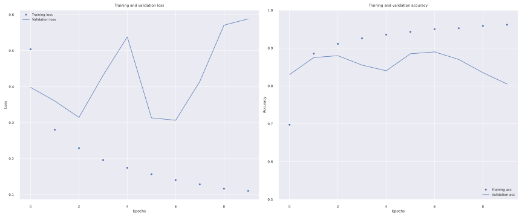
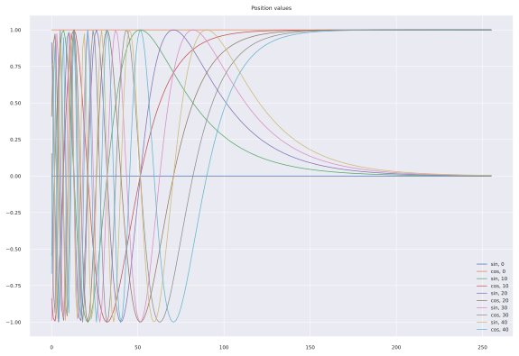
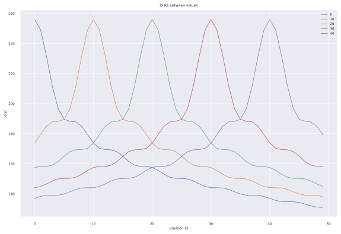

# ___2021 - 02 - 25 Machine Learning Projects___
***

# 图像超分
  - [Github idealo/image-super-resolution](https://github.com/idealo/image-super-resolution)
    ```py
    !cd image-super-resolution && pip install -q . && cd -

    import os
    import matplotlib.pyplot as plt
    from skimage.io import imread, imsave
    from ISR.models import RDN, RRDN

    # model = RRDN(weights='gans')        # 17462488
    # model = RDN(weights='noise-cancel') # 66071288
    # model = RDN(weights='psnr-small')   # 10694096
    model = RDN(weights='psnr-large')     # 66071288

    image_name = "307622911.jpg"
    imm = imread(image_name)
    sr_img = model.predict(imm, by_patch_of_size=100)
    print("Source:", imm.shape, "Target:", sr_img.shape)

    plt.imshow(sr_img)
    plt.axis("off")
    plt.tight_layout()

    output = os.path.splitext(os.path.basename(image_name))[0] + "_x2_psnr-large.png"
    print("Saving to:", output)
    imsave(output, sr_img)
    ```
  - [Github yinboc/liif](https://github.com/yinboc/liif)
    ```py
    import os
    import torch
    import numpy as np
    import matplotlib.pyplot as plt
    from skimage.io import imread, imsave
    from tqdm import tqdm

    # import sys
    # sys.path.append("/content/liif")
    # os.environ["CUDA_VISIBLE_DEVICES"] = "0"
    import models

    class ImageSuperResolution:
        def __init__(self, model_path):
            cvd = os.environ.get("CUDA_VISIBLE_DEVICES", "").strip()
            device_name = "cuda:0" if len(cvd) > 0 and int(cvd) != -1 else "cpu"
            self.device = torch.device(device_name)
            self.model = models.make(torch.load(model_path, map_location=self.device)['model'], load_sd=True).to(self.device)

        def make_coord(self, shape, ranges=None, flatten=True):
            """ Make coordinates at grid centers.0000
            """
            coord_seqs = []
            for i, n in enumerate(shape):
                if ranges is None:
                    v0, v1 = -1, 1
                else:
                    v0, v1 = ranges[i]
                r = (v1 - v0) / (2 * n)
                seq = v0 + r + (2 * r) * torch.arange(n).float()
                coord_seqs.append(seq)
            ret = torch.stack(torch.meshgrid(*coord_seqs), dim=-1)
            if flatten:
                ret = ret.view(-1, ret.shape[-1])
            return ret

        def batched_predict(self, inp, coord, cell, bsize):
            with torch.no_grad():
                self.model.gen_feat(inp)
                total = coord.shape[1]
                steps = int(np.ceil(total / bsize))
                preds = [self.model.query_rgb(coord[:, ii: ii + bsize, :], cell[:, ii: ii + bsize, :]) for ii in tqdm(range(0, total, bsize))]
                preds = torch.cat(preds, dim=1)
            return preds

        def image_super_resolution(self, image, resolution, bsize=30000):
            if isinstance(image, str):
                image = imread(image) / 255
            inputs = torch.from_numpy(image.transpose(2, 0, 1).astype("float32"))
            inputs = ((inputs - 0.5) / 0.5).to(self.device)

            if isinstance(resolution, str) and ',' in resolution:
                hh, ww = [int(ii.strip()) for ii in resolution.split(',')]
            else:
                img_h, img_w = inputs.shape[1:]
                hh, ww = img_h * int(resolution), img_w * int(resolution)
            coord = self.make_coord((hh, ww)).to(self.device)
            cell = torch.ones_like(coord)
            cell[:, 0] *= 2 / hh
            cell[:, 1] *= 2 / ww
            pred = self.batched_predict(inputs.unsqueeze(0), coord.unsqueeze(0), cell.unsqueeze(0), bsize=bsize)[0]
            pred = (pred * 0.5 + 0.5).clamp(0, 1).view(hh, ww, 3)

            return pred.cpu().numpy()

        def to_4k_resolution_2160_3840(self, src_hh, src_ww, target_hh=2160, target_ww=3840):
            hh_enlarge, ww_enlarge = target_hh / src_hh, target_ww / src_ww
            if hh_enlarge > ww_enlarge:
                target_ww = src_ww * hh_enlarge
            else:
                target_hh = src_hh * ww_enlarge
            return int(target_hh), int(target_ww)

        def to_4k_image(self, image_name, output=None, bsize=30000):
            image = imread(image_name) / 255
            src_hh, src_ww = image.shape[:2]
            hh, ww = self.to_4k_resolution_2160_3840(src_hh, src_ww)
            print(">>>> Source shape: [%d, %d], Target shape: [%d, %d]" % (src_hh, src_ww, hh, ww))
            if output is None:
                output = os.path.splitext(os.path.basename(image_name))[0] + "_4k.png"
            idd = self.image_super_resolution(image, resolution="{},{}".format(hh, ww), bsize=bsize)

            print(">>>> Saving to %s ..." % (output))
            imsave(output, (idd * 255).astype("uint8"))
            return idd
    ```
    ```py
    aa = ImageSuperResolution("pre_trained/edsr-baseline-liif.pth")
    idd = aa.image_super_resolution('demo/0829x4-crop.png', 4, 300)

    aa = ImageSuperResolution("pre_trained/rdn-liif.pth")
    idd = aa.to_4k_image("602.jpg")
    ```
  - [Github krasserm/super-resolution](https://github.com/krasserm/super-resolution)
    ```py
    from model import resolve_single
    from utils import load_image, plot_sample
    from model.srgan import generator
    model = generator()
    model.load_weights('weights/srgan/gan_generator.h5')

    image_name = "../liif/307622911/307622911.jpg"
    lr = load_image(image_name)
    sr = resolve_single(model, lr)
    output = os.path.splitext(os.path.basename(image_name))[0] + "_x4_srgan.png"
    imsave(output, sr.numpy())

    plot_sample(lr, sr)

    ''' edsr '''
    from model.edsr import edsr
    model = edsr(scale=4, num_res_blocks=16)
    model.load_weights('weights/edsr-16-x4/weights.h5')
    sr = resolve_single(model, lr)
    output = os.path.splitext(os.path.basename(image_name))[0] + "_x4_edsr.png"
    imsave(output, sr.numpy())

    ''' wdsr '''
    from model.wdsr import wdsr_b
    model = wdsr_b(scale=4, num_res_blocks=32)
    model.load_weights('weights/wdsr-b-32-x4/weights.h5')
    sr = resolve_single(model, lr)
    output = os.path.splitext(os.path.basename(image_name))[0] + "_x4_wdsr.png"
    imsave(output, sr.numpy())
    ```
  - **Comparing**
    ```py
    def plot_results_sub(image_folder, sub_left, sub_right, sub_top, sub_bottom, plot_cols):
        iaa = sort(glob(os.path.join(image_folder, '*')))
        imms = [imread(ii) for ii in iaa]
        base_height = imms[0].shape[0]
        ees = [ii.shape[0] // base_height for ii in imms]
        subs = [ii[sub_top * ee:sub_bottom * ee, sub_left * ee:sub_right * ee, :] for ii, ee in zip(imms, ees)]

        cols = plot_cols
        rows = int(np.ceil(len(iaa) / cols))
        fig, axes = plt.subplots(rows, cols, figsize=(3 * cols, 3 * rows))
        axes = axes.flatten()
        name_skip_len = len(os.path.splitext(os.path.basename(iaa[0]))[0])
        for ax, name, sub in zip(axes, iaa, subs):
            ax.imshow(sub)
            title = os.path.splitext(os.path.basename(name))[0][name_skip_len:]
            title = "Orignal" if len(title) == 0 else title
            ax.set_title(title)
            ax.set_axis_off()
        plt.tight_layout()
        return fig

    fig = plot_results_sub("Blueprint_Wallpaper", 400, 600, 600, 900, 3)
    fig = plot_results_sub("307622911", 150, 300, 100, 250, 4)
    ```
  ```py
  from to_4k_image import ImageSuperResolution

  isr = ImageSuperResolution("pre_trained/edsr-baseline-liif.pth")

  image_name = '307622911/307622911.jpg'
  imm = imread(image_name)
  fig = plt.figure()
  plt.imshow(imm)
  plt.tight_layout()

  imms = [imm / 255]
  resulution = 4
  while True:
      print("Waiting for input...")
      aa = plt.ginput(2)
      aa = np.array(aa)

      left, right = int(aa[:, 0].min()), int(aa[:, 0].max())
      top, bottom = int(aa[:, 1].min()), int(aa[:, 1].max())

      if right - left < 1 or bottom - top < 1:
          if len(imms) > 1:
              imms.pop(-1)
          else:
              break
              # pass
      else:
          sub_image = imms[-1][top:bottom, left:right, :]
          idd = isr.image_super_resolution(sub_image, resulution)
          imms.append(idd)
      plt.imshow(imms[-1])
      plt.draw()
      print("Sub image displayed")
  ```
***

# OCR
  ```sh
  docker run -it -p 8866:8866 paddleocr:cpu bash
  git clone https://gitee.com/PaddlePaddle/PaddleOCR
  sed -i 's/ch_det_mv3_db/ch_det_r50_vd_db/' deploy/hubserving/ocr_system/params.py
  sed -i 's/ch_rec_mv3_crnn/ch_rec_r34_vd_crnn_enhance/' deploy/hubserving/ocr_system/params.py
  export PYTHONPATH=. && hub uninstall ocr_system; hub install deploy/hubserving/ocr_system/ && hub serving start -m ocr_system

  OCR_DID=`docker ps -a | sed -n '2,2p' | cut -d ' ' -f 1`
  docker cp ch_det_r50_vd_db_infer/* $OCR_DID:/PaddleOCR/inference/
  docker cp ch_rec_r34_vd_crnn_enhance_infer/* $OCR_DID:/PaddleOCR/inference/

  ```
  ```sh
  IMG_STR=`base64 -w 0 $TEST_PIC`
  echo "{\"images\": [\"`base64 -w 0 Selection_261.png`\"]}" > foo
  curl -H "Content-Type:application/json" -X POST --data "{\"images\": [\"填入图片Base64编码(需要删除'data:image/jpg;base64,'）\"]}" http://localhost:8866/predict/ocr_system
  curl -H "Content-Type:application/json" -X POST --data "{\"images\": [\"`base64 -w 0 Selection_101.png`\"]}" http://localhost:8866/predict/ocr_system
  curl -H "Content-Type:application/json" -X POST --data foo http://localhost:8866/predict/ocr_system
  echo "{\"images\": [\"`base64 -w 0 Selection_261.png`\"]}" | curl -v -X PUT -H 'Content-Type:application/json' -d @- http://localhost:8866/predict/ocr_system
  ```
  ```py
  import requests
  import base64
  import json
  from matplotlib.font_manager import FontProperties

  class PaddleOCR:
      def __init__(self, url, font='/usr/share/fonts/opentype/noto/NotoSerifCJK-Light.ttc'):
          self.url = url
          self.font = FontProperties(fname=font)
      def __call__(self, img_path, thresh=0.9, show=2):
          with open(img_path, 'rb') as ff:
              aa = ff.read()
          bb = base64.b64encode(aa).decode()
          rr = requests.post(self.url, headers={"Content-type": "application/json"}, data='{"images": ["%s"]}' % bb)
          dd = json.loads(rr.text)

          imm = imread(img_path)
          if show == 0:
              return dd
          if show == 1:
              fig, axes = plt.subplots(1, 1, sharex=True, sharey=True)
              axes = [axes, axes]
          elif show == 2:
              fig, axes = plt.subplots(1, 2, sharex=True, sharey=True)
              axes[1].invert_yaxis()
          axes[0].imshow(imm)
          for ii in dd['results'][0]:
              jj = np.array(ii['text_region'])
              kk = np.vstack([jj, jj[0]])
              axes[0].plot([ii[0] for ii in kk], [ii[1] for ii in kk], 'r')
              axes[1].text(jj[-1, 0], jj[-1, 1], ii['text'], fontproperties=font, fontsize=(jj[-1, 1]-jj[0, 1])/2)
          # plt.tight_layout()
          return dd

  pp = PaddleOCR("http://localhost:8866/predict/ocr_system")
  pp("./Selection_261.png")
  ```
  ```sh
  python3 tools/infer/predict_system.py --image_dir="./doc/imgs/2.jpg" --det_model_dir="./inference/det_db/"  --rec_model_dir="./inference/rec_crnn/"
  ```
  ```py
  # /opt/anaconda3/lib/python3.7/site-packages/onnx2keras/elementwise_layers.py
  def convert_reciprocal(node, params, layers, lambda_func, node_name, keras_name):
      """
      Convert element-wise division
      :param node: current operation node
      :param params: operation attributes
      :param layers: available keras layers
      :param lambda_func: function for keras Lambda layer
      :param node_name: internal converter name
      :param keras_name: resulting layer name
      :return: None
      """     
      logger = logging.getLogger('onnx2keras:reciprocal')
      print(layers[node.input[0]])

      if len(node.input) != 1:
          assert AttributeError('Not 1 input for reciprocal layer.')

      layers[node_name] = 1 / layers[node.input[0]]
  ```
  ```py
  # /opt/anaconda3/lib/python3.7/site-packages/onnx2keras/upsampling_layers.py
  def convert_resize(node, params, layers, lambda_func, node_name, keras_name):
      """
      Convert upsample.
      :param node: current operation node
      :param params: operation attributes
      :param layers: available keras layers
      :param lambda_func: function for keras Lambda layer
      :param node_name: internal converter name
      :param keras_name: resulting layer name
      :return: None
      """
      logger = logging.getLogger('onnx2keras:resize')
      logger.warning('!!! EXPERIMENTAL SUPPORT (resize) !!!')
      print([layers[ii] for ii in node.input])

      if len(node.input) != 1:
          if node.input[-1] in layers and isinstance(layers[node.input[-1]], np.ndarray):
              params['scales'] = layers[node.input[-1]]
          else:
              raise AttributeError('Unsupported number of inputs')

      if params['mode'].decode('utf-8') != 'nearest':
          logger.error('Cannot convert non-nearest upsampling.')
          raise AssertionError('Cannot convert non-nearest upsampling')

      scale = np.uint8(params['scales'][-2:])

      upsampling = keras.layers.UpSampling2D(
          size=scale, name=keras_name
      )   

      layers[node_name] = upsampling(layers[node.input[0]])
  ```
  ```py
  # /opt/anaconda3/lib/python3.7/site-packages/onnx2keras/operation_layers.py
  def convert_clip(node, params, layers, lambda_func, node_name, keras_name):
      """
      Convert clip layer
      :param node: current operation node
      :param params: operation attributes
      :param layers: available keras layers
      :param lambda_func: function for keras Lambda layer
      :param node_name: internal converter name
      :param keras_name: resulting layer name
      :return: None
      """
      logger = logging.getLogger('onnx2keras:clip')
      if len(node.input) != 1:
          assert AttributeError('More than 1 input for clip layer.')

      input_0 = ensure_tf_type(layers[node.input[0]], name="%s_const" % keras_name)
      print(node.input, [layers[ii] for ii in node.input], node_name, params)
      if len(node.input == 3):
          params['min'] = layers[node.input[1]]
          params['max'] = layers[node.input[2]]

      if params['min'] == 0:
          logger.debug("Using ReLU({0}) instead of clip".format(params['max']))
          layer = keras.layers.ReLU(max_value=params['max'], name=keras_name)
      else:
          def target_layer(x, vmin=params['min'], vmax=params['max']):
              import tensorflow as tf
              return tf.clip_by_value(x, vmin, vmax)
          layer = keras.layers.Lambda(target_layer, name=keras_name)
          lambda_func[keras_name] = target_layer

      layers[node_name] = layer(input_0)
  ```
  ```py
  # /opt/anaconda3/lib/python3.7/site-packages/onnx2keras/activation_layers.py
  def convert_hard_sigmoid(node, params, layers, lambda_func, node_name, keras_name):
      """
      Convert Sigmoid activation layer
      :param node: current operation node
      :param params: operation attributes
      :param layers: available keras layers
      :param lambda_func: function for keras Lambda layer
      :param node_name: internal converter name
      :param keras_name: resulting layer name
      :return: None
      """
      if len(node.input) != 1:
          assert AttributeError('More than 1 input for an activation layer.')

      input_0 = ensure_tf_type(layers[node.input[0]], name="%s_const" % keras_name)
      hard_sigmoid = keras.layers.Activation(keras.activations.hard_sigmoid, name=keras_name)
      layers[node_name] = hard_sigmoid(input_0)
  ```
  ```py
  from .activation_layers import convert_hard_sigmoid
  from .elementwise_layers import convert_reciprocal
  from .upsampling_layers import convert_resize
  ```
***

## 图神经网络
  - [Github /dmlc/dgl](https://github.com/dmlc/dgl)
***

# Attention
  - [遍地开花的 Attention ，你真的懂吗？](https://developer.aliyun.com/article/713354)
  - [综述---图像处理中的注意力机制](https://blog.csdn.net/xys430381_1/article/details/89323444)
  - [全连接的图卷积网络(GCN)和self-attention这些机制有什么区别联系](https://www.zhihu.com/question/366088445/answer/1023290162)
  - [Attention Is All You Need](https://arxiv.org/pdf/1706.03762.pdf)
  - [《Attention is All You Need》浅读（简介+代码）](https://spaces.ac.cn/archives/4765)
  - [3W字长文带你轻松入门视觉transformer](https://zhuanlan.zhihu.com/p/308301901)
  - `keras.layers.Attention` a.k.a. Luong-style attention.
  - `keras.layers.AdditiveAttention` a.k.a. Bahdanau-style attention. [Eager 执行环境与 Keras 定义 RNN 模型使用注意力机制为图片命名标题](https://github.com/leondgarse/Atom_notebook/blob/master/public/2018/09-06_tensorflow_tutotials.md#eager-%E6%89%A7%E8%A1%8C%E7%8E%AF%E5%A2%83%E4%B8%8E-keras-%E5%AE%9A%E4%B9%89-rnn-%E6%A8%A1%E5%9E%8B%E4%BD%BF%E7%94%A8%E6%B3%A8%E6%84%8F%E5%8A%9B%E6%9C%BA%E5%88%B6%E4%B8%BA%E5%9B%BE%E7%89%87%E5%91%BD%E5%90%8D%E6%A0%87%E9%A2%98)
  - `keras.layers.MultiHeadAttention` multi-headed scaled dot-product attention based on "Attention is all you Need"
  - [Github Keras Attention Augmented Convolutions](https://github.com/titu1994/keras-attention-augmented-convs)
***

# BERT
## 单词嵌入向量 Word embeddings
  - **keras.layers.Embedding** 将输入中的单个正整数转化为指定长度的编码，其中 `input_dim` 表示单词表长度，`output_dim` 便是输出向量维度，即使用 `output_dim` 长度的向量表示 `input_dim` 个单词
    ```py
    # Turns positive integers (indexes) into dense vectors of fixed size.
    __init__(self, input_dim, output_dim, embeddings_initializer='uniform', ..., input_length=None, **kwargs)
    ```
    ```py
    embedding_layer = keras.layers.Embedding(1000, 5)
    result = embedding_layer(tf.constant([1, 2, 3, 2]))
    print(result.numpy())
    # [[ 0.03924643  0.02580811 -0.04168688  0.03953223 -0.03951649]
    #  [-0.02290255 -0.03661262 -0.01429547  0.00083493  0.01542655]
    #  [-0.00508757  0.00465842  0.00856078 -0.02349824 -0.00282664]]
    #  [-0.02290255 -0.03661262 -0.01429547  0.00083493  0.01542655]
    print(embedding_layer(tf.constant([[1, 2, 3], [2, 3, 5]])).shape)
    # (2, 3, 5)
    ```
  - **IMDB 电影评论情感分类**
    ```py
    import tensorflow_datasets as tfds
    (train_data, test_data), info = tfds.load('imdb_reviews/subwords8k', split=(tfds.Split.TRAIN, tfds.Split.TEST), with_info=True, as_supervised=True)
    train_batches = train_data.shuffle(1000).padded_batch(10) # Pad to max length
    test_batches = test_data.shuffle(1000).padded_batch(10) # Pad to max length
    encoder = info.features['text'].encoder

    embedding_dim = 16
    model = keras.Sequential([
        keras.layers.Embedding(encoder.vocab_size, embedding_dim),
        keras.layers.GlobalAveragePooling1D(),
        keras.layers.Dense(16, activation='relu'),
        keras.layers.Dense(1)
    ])

    model.summary()
    model.compile(optimizer='adam', loss=tf.keras.losses.BinaryCrossentropy(from_logits=True), metrics=['accuracy'])
    history = model.fit(train_batches, epochs=10, validation_data=test_batches, validation_steps=20)
    ```
    **plot history**
    ```py
    history_dict = history.history

    fig, axes = plt.subplots(1, 2, figsize=(12, 5))
    axes[0].plot(history_dict['loss'], 'bo', label='Training loss')
    axes[0].plot(history_dict['val_loss'], 'b', label='Validation loss')
    axes[0].set_title('Training and validation loss')
    axes[0].set_xlabel('Epochs')
    axes[0].set_ylabel('Loss')
    axes[0].legend()

    axes[1].plot(history_dict['accuracy'], 'bo', label='Training acc')
    axes[1].plot(history_dict['val_accuracy'], 'b', label='Validation acc')
    axes[1].set_title('Training and validation accuracy')
    axes[1].set_xlabel('Epochs')
    axes[1].set_ylabel('Accuracy')
    axes[1].set_ylim((0.5, 1))
    axes[1].legend(loc='lower right')
    ```
    
  - **Embedding Projector 可视化嵌入向量**
    ```py
    from tensorboard.plugins import projector

    weights = model.layers[0].get_weights()[0]
    print(weights.shape) # (8185, 16)

    log_dir = '/tmp/embedding-example/'
    if not os.path.exists(log_dir):
        os.makedirs(log_dir)
    tensor_path = os.path.join(log_dir, 'vecs.tsv')
    metadata_path = os.path.join(log_dir, 'meta.tsv')

    print(encoder.subwords[:20])
    with open(tensor_path, "w") as out_v, open(metadata_path, "w") as out_m:
        for num, word in enumerate(encoder.subwords):
            vec = weights[num + 1] # skip 0, it's padding.
            out_m.write(word + "\n")
            out_v.write('\t'.join([str(x) for x in vec]) + "\n")

    config = projector.ProjectorConfig()
    embedding = config.embeddings.add()
    embedding.tensor_path = tensor_path
    embedding.metadata_path = metadata_path
    projector.visualize_embeddings(log_dir, config)

    !tensorboard --logdir {log_dir}
    # http://localhost:6006/#projector
    ```
## Word2Vec
  These papers proposed two methods for learning representations of words:

  Continuous Bag-of-Words Model which predicts the middle word based on surrounding context words. The context consists of a few words before and after the current (middle) word. This architecture is called a bag-of-words model as the order of words in the context is not important.
  Continuous Skip-gram Model which predict words within a certain range before and after the current word in the same sentence. A worked example of this is given below.

  - Vectorize an example sentence
  ```py
  sentence = "The wide road shimmered in the hot sun"
  tokens = list(sentence.lower().split())
  print(len(tokens))

  vocab, index = {}, 1  # start indexing from 1
  vocab['<pad>'] = 0  # add a padding token
  for token in tokens:
      if token not in vocab:
          vocab[token] = index
          index += 1
  vocab_size = len(vocab)
  print(vocab)

  inverse_vocab = {index: token for token, index in vocab.items()}
  print(inverse_vocab)

  example_sequence = [vocab[word] for word in tokens]
  print(example_sequence)
  ```
  - Generate skip-grams from one sentence
  ```py
  window_size = 2
  positive_skip_grams, _ = tf.keras.preprocessing.sequence.skipgrams(
        example_sequence,
        vocabulary_size=vocab_size,
        window_size=window_size,
        negative_samples=0)
  print(len(positive_skip_grams))

  for target, context in positive_skip_grams[:5]:
      print(f"({target}, {context}): ({inverse_vocab[target]}, {inverse_vocab[context]})")
  ```
  - Negative sampling for one skip-gram
  ```py
  # Get target and context words for one positive skip-gram.
  target_word, context_word = positive_skip_grams[0]

  # Set the number of negative samples per positive context.
  num_ns = 4

  context_class = tf.reshape(tf.constant(context_word, dtype="int64"), (1, 1))
  negative_sampling_candidates, _, _ = tf.random.log_uniform_candidate_sampler(
      true_classes=context_class,  # class that should be sampled as 'positive'
      num_true=1,  # each positive skip-gram has 1 positive context class
      num_sampled=num_ns,  # number of negative context words to sample
      unique=True,  # all the negative samples should be unique
      range_max=vocab_size,  # pick index of the samples from [0, vocab_size]
      seed=SEED,  # seed for reproducibility
      name="negative_sampling"  # name of this operation
  )
  print(negative_sampling_candidates)
  print([inverse_vocab[index.numpy()] for index in negative_sampling_candidates])
  ```
  - Construct one training example
  ```py
  # Add a dimension so you can use concatenation (on the next step).
  negative_sampling_candidates = tf.expand_dims(negative_sampling_candidates, 1)

  # Concat positive context word with negative sampled words.
  context = tf.concat([context_class, negative_sampling_candidates], 0)

  # Label first context word as 1 (positive) followed by num_ns 0s (negative).
  label = tf.constant([1] + [0]*num_ns, dtype="int64")

  # Reshape target to shape (1,) and context and label to (num_ns+1,).
  target = tf.squeeze(target_word)
  context = tf.squeeze(context)
  label = tf.squeeze(label)

  print(f"target_index    : {target}")
  print(f"target_word     : {inverse_vocab[target_word]}")
  print(f"context_indices : {context}")
  print(f"context_words   : {[inverse_vocab[c.numpy()] for c in context]}")
  print(f"label           : {label}")

  print("target  :", target)
  print("context :", context)
  print("label   :", label)
  ```
  ```py
  dd = {ii : np.stack([tf.random.log_uniform_candidate_sampler(true_classes=[[ii]], num_true=1, num_sampled=4, unique=True, range_max=8, seed=42)[0].numpy() for jj in range(1000)]) for ii in range(8)}
  cc = {ii: pd.value_counts(dd[ii].flatten()).to_dict() for ii in dd}
  print(cc[0])
  # {0: 864, 1: 715, 2: 569, 3: 481, 4: 389, 5: 371, 6: 314, 7: 297}
  print({ii : np.mean([tf.random.log_uniform_candidate_sampler(true_classes=[[ii]], num_true=1, num_sampled=4, unique=True, range_max=8, seed=42)[1].numpy()[0][0] for jj in range(1000)]) for ii in range(8)})
  # {0: 0.99967235, 1: 0.7245632, 2: 0.5737029, 3: 0.47004792, 4: 0.3987442, 5: 0.34728608, 6: 0.3084587, 7: 0.27554017}
  print({ii : np.mean([tf.random.log_uniform_candidate_sampler(true_classes=[[ii]], num_true=1, num_sampled=4, unique=True, range_max=8, seed=42)[2].numpy() for jj in range(1000)]) for ii in range(8)})
  # {0: 0.59829926, 1: 0.59250146, 2: 0.59380203, 3: 0.59515625, 4: 0.5941352, 5: 0.60234785, 6: 0.5936593, 7: 0.5999326}

  pairs, labels = tf.keras.preprocessing.sequence.skipgrams([1, 2, 3, 4, 5, 1, 6, 7], vocabulary_size=8, window_size=2, negative_samples=4)
  # list(zip(pairs, labels))
  pairs, labels = np.array(pairs), np.array(labels)
  negs, poses = pairs[labels == 0], pairs[labels == 1]
  poses = [tuple(ii) for ii in poses]
  neg_in_pos = np.sum([tuple(ii) in poses for ii in negs])
  print(neg_in_pos, neg_in_pos / negs.shape[0])
  # 62 0.5961538461538461

  rr_contexts = np.array(contexts)[:, :, 0]
  rr = [rr_contexts[ii][0] in rr_contexts[ii][1:] for ii in range(rr_contexts.shape[0])]
  print("Total negatives containing positive:", np.sum(rr), "ratio:", np.sum(rr) / rr_contexts.shape[0])
  # Total negatives containing positive: 2226 ratio: 0.03430843685459758
  print("Sample:", rr_contexts[np.array(rr)][:5].tolist())
  # Sample: [[1, 3, 0, 73, 1], [1, 1, 2, 47, 625], [4, 9, 717, 11, 4], [8, 15, 37, 26, 8], [1, 97, 1, 4, 120]]

  ff = np.logical_not(rr)
  dataset = tf.data.Dataset.from_tensor_slices(((targets[ff], contexts[ff]), labels[ff]))

  targets, contexts, labels = np.array(targets), np.array(contexts), np.array(labels)
  dd = pd.DataFrame({"targets": targets.tolist(), "pos": contexts[:, 0, 0].tolist(), "neg": contexts[:, 1:, 0].tolist()})
  cc = dd.groupby('targets').apply(lambda ii: np.sum([jj in ii['pos'].values for jj in np.concatenate(ii['neg'].values)]))
  print("Total negatives pairs containing positive pairs:", cc.sum(), "ratio:", cc.sum() / dd.shape[0])
  # Total negatives pairs containing positive pairs: 38660 ratio: 0.5953095887035925

  checkpoint = tf.train.Checkpoint(embedding=tf.Variable(word2vec.get_layer('w2v_embedding').get_weights()[0]))
  checkpoint.save(os.path.join(log_dir, "embedding.ckpt"))
  ```
  ```py
  unigrams = [0.99967235, 0.7245632, 0.5737029, 0.47004792, 0.3987442, 0.34728608, 0.3084587, 0.27554017]
  sample_func = lambda ii: tf.nn.fixed_unigram_candidate_sampler(true_classes=[[ii]], num_true=1, num_sampled=4, unique=True, range_max=8, unigrams=unigrams)
  dd = {ii : np.stack([sample_func(ii)[0].numpy() for jj in range(1000)]) for ii in range(8)}
  ```
***

# BiT
  - [Colabs big_transfer_tf2.ipynb](https://colab.research.google.com/github/google-research/big_transfer/blob/master/colabs/big_transfer_tf2.ipynb)
  - [tfhub bit/m-r50x1](https://tfhub.dev/google/bit/m-r50x1/imagenet21k_classification/1)
  ```py
  def add_name_prefix(name, prefix=None):
    return prefix + "/" + name if prefix else name

  class StandardizedConv2D(tf.keras.layers.Conv2D):
    """Implements the abs/1903.10520 technique (see go/dune-gn).
    You can simply replace any Conv2D with this one to use re-parametrized
    convolution operation in which the kernels are standardized before conv.
    Note that it does not come with extra learnable scale/bias parameters,
    as those used in "Weight normalization" (abs/1602.07868). This does not
    matter if combined with BN/GN/..., but it would matter if the convolution
    was used standalone.
    Author: Lucas Beyer
    """

    def build(self, input_shape):
      super(StandardizedConv2D, self).build(input_shape)
      # Wrap a standardization around the conv OP.
      default_conv_op = self._convolution_op

      def standardized_conv_op(inputs, kernel):
        # Kernel has shape HWIO, normalize over HWI
        mean, var = tf.nn.moments(kernel, axes=[0, 1, 2], keepdims=True)
        # Author code uses std + 1e-5
        return default_conv_op(inputs, (kernel - mean) / tf.sqrt(var + 1e-10))

      self._convolution_op = standardized_conv_op
      self.built = True

  class PaddingFromKernelSize(tf.keras.layers.Layer):
    """Layer that adds padding to an image taking into a given kernel size."""

    def __init__(self, kernel_size, **kwargs):
      super(PaddingFromKernelSize, self).__init__(**kwargs)
      self.kernel_size = kernel_size
      pad_total = kernel_size - 1
      self._pad_beg = pad_total // 2
      self._pad_end = pad_total - self._pad_beg

    def compute_output_shape(self, input_shape):
      batch_size, height, width, channels = tf.TensorShape(input_shape).as_list()
      if height is not None:
        height = height + self._pad_beg + self._pad_end
      if width is not None:
        width = width + self._pad_beg + self._pad_end
      return tf.TensorShape((batch_size, height, width, channels))

    def call(self, x):
      padding = [
          [0, 0],
          [self._pad_beg, self._pad_end],
          [self._pad_beg, self._pad_end],
          [0, 0]]
      return tf.pad(x, padding)

    def get_config(self):
      config = super(PaddingFromKernelSize, self).get_config()
      config.update({"kernel_size": self.kernel_size})
      return config

    @classmethod
    def from_config(cls, config):
      return cls(**config)

  class BottleneckV2Unit(tf.keras.layers.Layer):
    """Implements a standard ResNet's unit (version 2).
    """

    def __init__(self, num_filters, stride=1, **kwargs):
      """Initializer.
      Args:
        num_filters: number of filters in the bottleneck.
        stride: specifies block's stride.
        **kwargs: other tf.keras.layers.Layer keyword arguments.
      """
      super(BottleneckV2Unit, self).__init__(**kwargs)
      self._num_filters = num_filters
      self._stride = stride

      self._proj = None
      self._unit_a = tf.keras.Sequential([
          normalization.GroupNormalization(),
          ReLU(),
      ])
      self._unit_a_conv = StandardizedConv2D(
          filters=num_filters,
          kernel_size=1,
          use_bias=False,
          padding="VALID",
          trainable=self.trainable,)

      self._unit_b = tf.keras.Sequential([
          normalization.GroupNormalization(),
          ReLU(),
          PaddingFromKernelSize(kernel_size=3),
          StandardizedConv2D(
              filters=num_filters,
              kernel_size=3,
              strides=stride,
              use_bias=False,
              padding="VALID",
              trainable=self.trainable,)
      ])

      self._unit_c = tf.keras.Sequential([
          normalization.GroupNormalization(),
          ReLU(),
          StandardizedConv2D(
              filters=4 * num_filters,
              kernel_size=1,
              use_bias=False,
              padding="VALID",
              trainable=self.trainable)
      ])

    def build(self, input_shape):
      input_shape = tf.TensorShape(input_shape).as_list()

      # Add projection layer if necessary.
      if (self._stride > 1) or (4 * self._num_filters != input_shape[-1]):
        self._proj = StandardizedConv2D(
            filters=4 * self._num_filters,
            kernel_size=1,
            strides=self._stride,
            use_bias=False,
            padding="VALID",
            trainable=self.trainable)
      self.built = True

    def compute_output_shape(self, input_shape):
      current_shape = self._unit_a.compute_output_shape(input_shape)
      current_shape = self._unit_a_conv.compute_output_shape(current_shape)
      current_shape = self._unit_b.compute_output_shape(current_shape)
      current_shape = self._unit_c.compute_output_shape(current_shape)
      return current_shape

    def call(self, x):
      x_shortcut = x
      # Unit "a".
      x = self._unit_a(x)
      if self._proj is not None:
        x_shortcut = self._proj(x)
      x = self._unit_a_conv(x)
      # Unit "b".
      x = self._unit_b(x)
      # Unit "c".
      x = self._unit_c(x)

      return x + x_shortcut

    def get_config(self):
      config = super(BottleneckV2Unit, self).get_config()
      config.update({"num_filters": self._num_filters, "stride": self._stride})
      return config

    @classmethod
    def from_config(cls, config):
      return cls(**config)
  ```
  ```py
  from tensorflow.keras.layers import ReLU
  import tensorflow_addons.layers.normalizations as normalization

  num_units = (3, 4, 6, 3)
  num_outputs = 1000
  filters_factor = 4
  strides = (1, 2, 2, 2)
  trainable = False

  num_blocks = len(num_units)
  num_filters = tuple(16 * filters_factor * 2**b for b in range(num_blocks))

  def create_root_block(num_filters, conv_size=7, conv_stride=2, pool_size=3, pool_stride=2):
      layers = [
          PaddingFromKernelSize(conv_size),
          StandardizedConv2D(filters=num_filters, kernel_size=conv_size, strides=conv_stride, trainable=trainable, use_bias=False, name="standardized_conv2d"),
          PaddingFromKernelSize(pool_size),
          tf.keras.layers.MaxPool2D(pool_size=pool_size, strides=pool_stride, padding="valid")
      ]
      return tf.keras.Sequential(layers, name="root_block")

  def create_block(num_units, num_filters, stride, name):
      layers = []
      for i in range(1, num_units + 1):
          layers.append(BottleneckV2Unit(num_filters=num_filters, stride=(stride if i == 1 else 1), name=name + "_unit%02d" % i))
      return tf.keras.Sequential(layers, name=name)

  root = create_root_block(num_filters=num_filters[0])
  blocks = []
  for b, (f, u, s) in enumerate(zip(num_filters, num_units, strides), 1):
      n = "block{}".format(b)
      blocks.append(create_block(num_units=u, num_filters=f, stride=s, name=n))

  pre_head = [
      normalization.GroupNormalization(name="group_norm"),
      ReLU(),
      tf.keras.layers.GlobalAveragePooling2D()
  ]

  xx = keras.Input([None, None, 3])
  nn = root(xx)
  for block in blocks:
      nn = block(nn)
  for layer in pre_head:
      nn = layer(nn)
  dd = keras.models.Model(xx, nn)

  mm = keras.models.load_model('../module_cache/4ff8fefe176c863be939e3880dfa769989df4e32')
  mm.save_weights('aa.h5')

  dd.load_weights('aa.h5')
  dd.save('dd.h5', include_optimizer=False)
  ```
  ```py
  from tensorflow.keras.layers import ReLU
  import tensorflow_addons.layers.normalizations as normalization

  num_units = (3, 4, 6, 3)
  num_outputs = 1000
  filters_factor = 4
  strides = (1, 2, 2, 2)
  trainable = False

  num_blocks = len(num_units)
  num_filters = tuple(16 * filters_factor * 2**b for b in range(num_blocks))

  xx = keras.Input([None, None, 3])
  nn = PaddingFromKernelSize(7)(xx)
  nn = StandardizedConv2D(filters=num_filters[0], kernel_size=7, strides=2, trainable=trainable, use_bias=False, name="standardized_conv2d")(nn)
  nn = PaddingFromKernelSize(3)(nn)
  nn = tf.keras.layers.MaxPool2D(pool_size=3, strides=2, padding="valid")(nn)

  for bb, (ff, uu, ss) in enumerate(zip(num_filters, num_units, strides), 1):
      name = "block{}".format(bb)
      # create_block(num_units=u, num_filters=f, stride=s, name=n)
      for ii in range(1, uu + 1):
          nn = BottleneckV2Unit(num_filters=ff, stride=(ss if ii == 1 else 1), name=name + "_unit%02d" % ii)(nn)

  nn = normalization.GroupNormalization(name="group_norm")(nn)
  nn = ReLU()(nn)
  nn = tf.keras.layers.GlobalAveragePooling2D()(nn)

  dd = keras.models.Model(xx, nn)

  mm = keras.models.load_model('../module_cache/4ff8fefe176c863be939e3880dfa769989df4e32')
  mm.save_weights('aa.h5')

  dd.load_weights('aa.h5')
  dd.save('dd.h5', include_optimizer=False)
  ```
***

# Transformer
## 位置编码 Positional encoding
  ```sh
  PE(pos, 2i) = sin(pos / 10000 ** (2i / d_model))
  PE(pos, 2i + 1) = cos(pos / 10000 ** (2i / d_model))
  ```
  ```py
  def positional_encoding(position, d_model):
      """
      position, d_model = 50, 512
      d_model_range = np.expand_dims(np.arange(d_model), 0) --> [0, 1, 2, 3,..., 509, 510, 511]
      (2 * (d_model_range // 2)) / np.float32(d_model) --> [0, 0, 2, 2,..., 508, 510, 510] / 512
      np.power(1e4, (2 * (d_model_range // 2)) / np.float32(d_model)) --> ~ [1, 1, ..., 1e4, 1e4]
      angle_rads --> ~ [1, 1, ..., 1e-4, 1e-4]
      angle_rads --> [angle_rads * 0, angle_rads * 1, angle_rads * 2, ..., angle_rads * 49]
      [sin] angle_rads[0] --> [0]
      [sin] angle_rads[1] --> ~[sin(1), sin(1), ..., 0, 0]
      [cos] angle_rads[0] --> [1]
      [cos] angle_rads[1] --> ~[cos(1), cos(1), ..., 1, 1]
      """
      d_model_range = np.expand_dims(np.arange(d_model), 0)
      angle_rads = 1 / np.power(1e4, (2 * (d_model_range // 2)) / np.float32(d_model))
      angle_rads = np.expand_dims(np.arange(position), 1) * angle_rads

      # 将 sin 应用于数组中的偶数索引（indices）；2i
      angle_rads[:, 0::2] = np.sin(angle_rads[:, 0::2])
      # 将 cos 应用于数组中的奇数索引；2i+1
      angle_rads[:, 1::2] = np.cos(angle_rads[:, 1::2])

      pos_encoding = np.expand_dims(angle_rads, 0)
      return tf.cast(pos_encoding, dtype=tf.float32)

  pos_encoding = positional_encoding(50, 512)
  print(f'{pos_encoding.shape = }') # pos_encoding.shape = TensorShape([1, 50, 512])
  plt.pcolormesh(pos_encoding[0], cmap='RdBu')
  plt.xlabel('Depth')
  plt.xlim((0, 512))
  plt.ylabel('Position')
  plt.colorbar()
  ```
  
  ```py
  for ii in range(0, 50, 10):
      plt.plot(pos_encoding[0, ii, ::2], label="sin, {}".format(ii))
      plt.plot(pos_encoding[0, ii, 1::2], label="cos, {}".format(ii))
  plt.legend()
  plt.title("Position values")
  ```
  
  ```py
  print((pos_encoding.numpy()[0] ** 2).sum(1))
  # [256] * 50

  print(np.dot(pos_encoding.numpy()[0], pos_encoding.numpy()[0, 0]))
  # [256.      249.10211 231.73363 211.74947 196.68826 189.59668 188.2482 187.86502 184.96516 179.45654 173.78973 170.35315 169.44649 169.34525
  #  168.0597  165.0636  161.53304 159.08392 158.2816  158.24513 157.57397 155.64383 153.08748 151.10722 150.33557 150.30371 149.94781 148.61731
  #  146.63585 144.93758 144.17035 144.1174  143.94557 143.00458 141.41406 139.9111  139.13742 139.0499  138.99149 138.32632 137.02701 135.67337
  #  134.88887 134.7587  134.77036 134.31155 133.24333 132.01273 131.21637 131.03839]

  for ii in range(0, 50, 10):
      plt.plot(np.dot(pos_encoding.numpy()[0], pos_encoding.numpy()[0, ii]), label=str(ii))
  plt.legend()
  plt.title("Dists between values")
  plt.xlabel('position id')
  plt.ylabel('dist')
  ```
  
## Scaled dot product attention
  - 点积注意力被缩小了深度的平方根倍。这样做是因为对于较大的深度值，点积的大小会增大，从而推动 softmax 函数往仅有很小的梯度的方向靠拢，导致了一种很硬的（hard）softmax。
  ```py
  def scaled_dot_product_attention(q, k, v, mask):
      """计算注意力权重。
      q, k, v 必须具有匹配的前置维度。
      k, v 必须有匹配的倒数第二个维度，例如：seq_len_k = seq_len_v。
      虽然 mask 根据其类型（填充或前瞻）有不同的形状，
      但是 mask 必须能进行广播转换以便求和。

      参数:
        q: 请求的形状 == (..., seq_len_q, depth)
        k: 主键的形状 == (..., seq_len_k, depth)
        v: 数值的形状 == (..., seq_len_v, depth_v)
        mask: Float 张量，其形状能转换成
              (..., seq_len_q, seq_len_k)。默认为None。

      返回值:
        输出，注意力权重
      """
      matmul_qk = tf.matmul(q, k, transpose_b=True)  # (..., seq_len_q, seq_len_k)

      # 缩放 matmul_qk
      dk = tf.cast(tf.shape(k)[-1], tf.float32)
      scaled_attention_logits = matmul_qk / tf.math.sqrt(dk)

      # 将 mask 加入到缩放的张量上。
      if mask is not None:
          scaled_attention_logits += (mask * -1e9)  

      # softmax 在最后一个轴（seq_len_k）上归一化，因此分数相加等于1。
      attention_weights = tf.nn.softmax(scaled_attention_logits, axis=-1)  # (..., seq_len_q, seq_len_k)
      output = tf.matmul(attention_weights, v)  # (..., seq_len_q, depth_v)
      return output, attention_weights
  ```
  ```py
  temp_k = tf.expand_dims([1., 2, 3, 4], 1)
  temp_v = tf.expand_dims([1., 2, 3, 4], 1)
  print("Output: {}, Attention: {}".format(*scaled_dot_product_attention(tf.constant([[5.]]), temp_k, temp_v, None)))
  # Output: [[3.9932165]], Attention: [[0.0000003  0.00004509 0.00669255 0.9932621 ]]
  print("Output: {}, Attention: {}".format(*scaled_dot_product_attention(tf.constant([[50.]]), temp_k, temp_v, None)))
  # Output: [[4.]], Attention: [[0. 0. 0. 1.]]

  temp_k = tf.constant([[10, 0, 0], [0, 10, 0], [0, 0, 10], [0, 0, 10]], dtype=tf.float32)  # (4, 3)
  temp_v = tf.constant([[1, 0], [10, 0], [100, 5], [1000, 6]], dtype=tf.float32)  # (4, 2)

  # 这条 `请求（query）符合第二个`主键（key）`，因此返回了第二个`数值（value）`。
  temp_q = tf.constant([[0, 10, 0]], dtype=tf.float32)  # (1, 3)
  print("Output: {}, Attention: {}".format(*scaled_dot_product_attention(temp_q, temp_k, temp_v, None)))
  # Output: [[10.  0.]], Attention: [[0. 1. 0. 0.]]

  # 这条请求符合重复出现的主键（第三第四个），因此，对所有的相关数值取了平均。
  temp_q = tf.constant([[0, 0, 10]], dtype=tf.float32)  # (1, 3)
  print("Output: {}, Attention: {}".format(*scaled_dot_product_attention(temp_q, temp_k, temp_v, None)))
  # Output: [[550.    5.5]], Attention: [[0.  0.  0.5 0.5]]

  # 这条请求符合第一和第二条主键，因此，对它们的数值去了平均。
  temp_q = tf.constant([[10, 10, 0]], dtype=tf.float32)  # (1, 3)
  print("Output: {}, Attention: {}".format(*scaled_dot_product_attention(temp_q, temp_k, temp_v, None)))
  # Output: [[5.5 0. ]], Attention: [[0.5 0.5 0.  0. ]]

  temp_q = tf.constant([[0, 0, 10], [0, 10, 0], [10, 10, 0]], dtype=tf.float32)  # (3, 3)
  print("Output: {}, Attention: {}".format(*scaled_dot_product_attention(temp_q, temp_k, temp_v, None)))
  # Output: [[550.    5.5] [ 10.    0. ] [  5.5   0. ]], Attention: [[0.  0.  0.5 0.5] [0.  1.  0.  0. ] [0.5 0.5 0.  0. ]]
  ```
## 多头注意力 Multi-head attention
  多头注意力由四部分组成：

  线性层并分拆成多头。
  按比缩放的点积注意力。
  多头及联。
  最后一层线性层。
  每个多头注意力块有三个输入：Q（请求）、K（主键）、V（数值）。这些输入经过线性（Dense）层，并分拆成多头。

  将上面定义的 scaled_dot_product_attention 函数应用于每个头（进行了广播（broadcasted）以提高效率）。注意力这步必须使用一个恰当的 mask。然后将每个头的注意力输出连接起来（用tf.transpose 和 tf.reshape），并放入最后的 Dense 层。

  Q、K、和 V 被拆分到了多个头，而非单个的注意力头，因为多头允许模型共同注意来自不同表示空间的不同位置的信息。在分拆后，每个头部的维度减少，因此总的计算成本与有着全部维度的单个注意力头相同。
  ```py
  query: Query `Tensor` of shape `[B, T, dim]`
  value: Value `Tensor` of shape `[B, S, dim]`
  key: Optional key `Tensor` of shape `[B, S, dim]`
  attention_mask: a boolean mask of shape `[B, T, S]`
  attention_output: The result of the computation, of shape [B, T, E] where `T` is for target sequence shapes and `E` is the query input last dimension

  N = `num_attention_heads`
  H = `size_per_head`
  `query` = [B, T, N ,H]
  `key` = [B, S, N, H]
  `value` = [B, S, N, H]
  ```
  ```py
  from tensorflow.python.ops import math_ops
  from tensorflow.python.ops import special_math_ops
  from icecream import ic
  inputs = keras.layers.Input([14, 16, 1024])

  nn = keras.layers.MultiHeadAttention(num_heads=4, key_dim=128)
  ic(nn(inputs, inputs).shape.as_list())
  # ic| nn(inputs, inputs).shape.as_list(): [None, 14, 16, 1024]

  query = nn._query_dense(inputs)
  key = nn._key_dense(inputs)
  value = nn._value_dense(inputs)
  ic(query.shape.as_list(), key.shape.as_list(), value.shape.as_list())
  # ic| query.shape.as_list(): [None, 14, 16, 4, 128]

  # attention_output, attention_scores = nn._compute_attention(query, key, value)
  query = math_ops.multiply(query, 1.0 / math.sqrt(float(nn._key_dim)))
  # 'afgde,abcde->adbcfg', 'bhHWd,bhPQd->bhHWPQ' == 'afgde,adbce->afgdbc'
  attention_scores = special_math_ops.einsum(nn._dot_product_equation, key, query)
  ic(attention_scores.shape.as_list())
  # ic| attention_scores.shape.as_list(): [None, 4, 14, 16, 14, 16]

  attention_scores = nn._masked_softmax(attention_scores, None)
  attention_scores_dropout = nn._dropout_layer(attention_scores, training=False)
  attention_output = special_math_ops.einsum(nn._combine_equation, attention_scores_dropout, value)
  ic(attention_output.shape.as_list())
  # ic| attention_output.shape.as_list(): [None, 14, 16, 4, 128]

  attention_output = nn._output_dense(attention_output)
  ic(attention_output.shape.as_list())
  # ic| attention_output.shape.as_list(): [None, 14, 16, 1024]
  ```
***

# Visualizing
## VIT visualize
  ```py
  import cv2
  from vit_keras import vit, visualize, layers

  # Load a model
  image_size = 384
  model = vit.vit_b16(image_size=image_size, activation='sigmoid', pretrained=True, include_top=True, pretrained_top=True)
  # classes = utils.get_imagenet_classes()

  # Get an image and compute the attention map
  url = 'https://upload.wikimedia.org/wikipedia/commons/b/bc/Free%21_%283987584939%29.jpg'
  imm = plt.imread(keras.utils.get_file('aa.jpg', url))

  """ attention_map """
  size = model.input_shape[1]
  grid_size = int(np.sqrt(model.layers[5].output_shape[0][-2] - 1))

  # Prepare the input
  X = vit.preprocess_inputs(cv2.resize(imm, (size, size)))[np.newaxis, :]  # type: ignore

  # Get the attention weights from each transformer.
  outputs = [l.output[1] for l in model.layers if isinstance(l, layers.TransformerBlock)]
  weights = np.array(tf.keras.models.Model(inputs=model.inputs, outputs=outputs).predict(X))
  num_layers = weights.shape[0]
  num_heads = weights.shape[2]
  reshaped = weights.reshape((num_layers, num_heads, grid_size ** 2 + 1, grid_size ** 2 + 1))

  # From Appendix D.6 in the paper ...
  # Average the attention weights across all heads.
  reshaped = reshaped.mean(axis=1)

  # From Section 3 in https://arxiv.org/pdf/2005.00928.pdf ...
  # To account for residual connections, we add an identity matrix to the
  # attention matrix and re-normalize the weights.
  reshaped = reshaped + np.eye(reshaped.shape[1])
  reshaped = reshaped / reshaped.sum(axis=(1, 2))[:, np.newaxis, np.newaxis]

  # Recursively multiply the weight matrices
  v = reshaped[-1]
  for ii in reshaped[::-1][1:]:
      v = np.matmul(v, ii)
      # v *= ii

  # Attention from the output token to the input space.
  mask = v[0, 1:].reshape(grid_size, grid_size)
  mask = cv2.resize(mask / mask.max(), (imm.shape[1], imm.shape[0]))[..., np.newaxis]
  # return (mask * imm).astype("uint8")
  attention_map = (mask * imm).astype("uint8")

  # print('Prediction:', classes[model.predict(vit.preprocess_inputs(cv2.resize(imm, (size, size)))[np.newaxis])[0].argmax()])
  # Prediction: Eskimo dog, husky

  # Plot results
  fig, (ax1, ax2) = plt.subplots(ncols=2)
  ax1.axis('off')
  ax2.axis('off')
  ax1.set_title('Original')
  ax2.set_title('Attention Map')
  _ = ax1.imshow(imm)
  _ = ax2.imshow(attention_map)
  ```
  ```py
  from skimage.data import chelsea
  imm = chelsea()

  url = 'https://upload.wikimedia.org/wikipedia/commons/b/bc/Free%21_%283987584939%29.jpg'
  imm = plt.imread(keras.utils.get_file('aa.jpg', url))

  fig, axes = plt.subplots(1, 3, figsize=(3 * 4, 4))
  axes[0].imshow(imm)

  from keras_cv_attention_models.visualizing import visualizing
  from keras_cv_attention_models.beit import beit
  mm = beit.BeitBasePatch16(input_shape=(384, 384, 3), pretrained="imagenet")

  imm_inputs = keras.applications.imagenet_utils.preprocess_input(imm, mode='tf')
  imm_inputs = tf.expand_dims(tf.image.resize(imm_inputs, mm.input_shape[1:3]), 0)
  bb = keras.models.Model(mm.inputs[0], [ii.output for ii in mm.layers if ii.name.endswith('attention_scores')])
  attn_scores = bb(imm_inputs)

  """ BotNet """
  mask = [ii.numpy()[0].mean((0)) for ii in attn_scores][::-1]
  # aa = tf.nn.avg_pool(mask[1].reshape(1, 16, 16, -1), 2, 2, 'VALID').numpy().reshape(64, -1)
  down_sample = lambda xx, ss, tt: tf.nn.avg_pool(xx.reshape(1, ss, ss, -1), ss // tt, ss // tt, 'VALID').numpy().reshape(tt * tt, -1) if ss != tt else xx
  cum_mask = [mask[0]] + [down_sample(mask[ii], int(sqrt(mask[ii].shape[0])), int(sqrt(mask[ii - 1].shape[1]))) for ii in range(1, len(mask))]
  cum_mask = [matmul_prod(cum_mask[:ii+1]).mean(0) for ii in range(len(cum_mask))]
  mask = [ii.mean(0) for ii in mask]

  down_sample = lambda xx, rr: tf.nn.max_pool(xx[tf.newaxis, :, :, tf.newaxis], rr, rr, "VALID")[0, :, :, 0].numpy()
  cum_mask = [matmul_prod(cum_mask[: ii + 1]).mean(0) for ii in range(len(cum_mask))]

  ss = [int(np.sqrt(ii.shape[0])) for ii in mask]
  mmask = [tf.image.resize(tf.reshape(ii, [jj, jj, 1]), imm.shape[:2])[:, :, 0] for ii, jj in zip(mask, ss)]
  plt.imshow(np.hstack([apply_mask_2_image(imm, tf.reduce_prod(mmask[:ii+1], axis=0).numpy()) for ii in range(len(mmask))]))

  ss = 8
  idx = 0
  tt = [mask[idx][ii].reshape(ss, ss) for ii in range(mask[idx].shape[0])]
  tt = [ii / ii.max() for ii in tt]
  _ = visualizing.stack_and_plot_images(tt, margin=1)

  """ LeViT """
  mask = [ii.numpy()[0].mean(0) for ii in attn_scores][::-1]
  cum_mask = [matmul_prod(mask[:ii+1]).mean(0) for ii in range(len(mask))]
  mask = [ii.mean(0) for ii in mask]

  """ HaloNet """
  mask = [ii.numpy()[0].mean((0, 1, 2)) for ii in attn_scores]
  plt.imshow(np.hstack([apply_mask_2_image(imm, mask[-ii-1], False) for ii in range(len(mask))]))
  plt.imshow(np.hstack([apply_mask_2_image(imm, tf.reduce_prod(mask[-ii-1:], axis=0).numpy(), False) for ii in range(len(mask))]))

  mask = [ii.numpy()[0].mean(0) for ii in attn_scores][::-1]
  cum_mask = [ii.reshape(*ii.shape[:3], 14, 14)[..., :8, :8].reshape(*ii.shape[:3], 64) for ii in mask]
  cum_mask = [tf.reduce_max(ii, axis=(0, 1)).numpy() for ii in cum_mask]
  cum_mask = [matmul_prod(cum_mask[:ii+1]).mean(0) for ii in range(len(cum_mask))]
  mask = [ii.mean((0, 1, 2)) for ii in mask]

  qqs = [int(np.sqrt(ii.shape[2])) for ii in mask]
  vvs = [int(np.sqrt(ii.shape[3])) for ii in mask]
  hhs = [(jj - ii) // 2 for ii, jj in zip(qqs, vvs)]
  tt = [rearrange(ii, "hh ww (hb wb) cc -> (hh hb) (ww wb) cc", hb=qq, wb=qq) for ii, qq in zip(mask, qqs)]
  tt = [tf.expand_dims(tf.pad(ii, [[hh, hh], [hh, hh], [0, 0]]), 0) for ii, hh in zip(tt, hhs)]
  tt = [tpu_compatible_extract_patches(ii, vv, qq, padding='VALID', compressed=False).numpy()[0] for ii, vv, qq in zip(tt, vvs, qqs)]
  # tt = [rearrange(ii, "hh ww hb wb cc -> hh ww (hb wb) cc").mean((0, 1)) for ii in tt]
  tt = [tf.reduce_max(rearrange(ii, "hh ww hb wb cc -> hh ww (hb wb) cc"), axis=(0, 1)).numpy() for ii in tt]
  cum_mask = [matmul_prod(tt[:ii+1]).mean(0) for ii in range(len(tt))]

  """ Coat """
  mask = [ii.numpy()[0].mean((0, 2)) for ii in attn_scores]
  plt.imshow(np.hstack([apply_mask_2_image(imm, mask[-ii-1][1:], False) for ii in range(len(mask))]))

  ss = [int(np.sqrt(ii.shape[0] - 1)) for ii in mask]
  mmask = [tf.image.resize(tf.reshape(ii[1:], [jj, jj, 1]), imm.shape[:2])[:, :, 0] for ii, jj in zip(mask, ss)]
  plt.imshow(np.hstack([apply_mask_2_image(imm, tf.reduce_prod(mmask[-ii-1:], axis=0).numpy(), False) for ii in range(len(mmask))]))

  """ VOLO """
  aa = attention_layers.fold_by_conv2d_transpose(tf.reduce_mean(tf.concat(attn_scores, axis=0), axis=(3, 5)), (48, 48))[:, :, :, 0] + tf.eye(48)
  attn_scores = (aa / tf.reduce_sum(aa, axis=(1, 2), keepdims=True)).numpy()

  """ BEIT """
  mask = [ii.numpy()[0].mean(0) + np.eye(ii.shape[-1]) for ii in attn_scores]
  mask = [(ii / ii.sum()) for ii in mask]
  cum_mask = [matmul_prod(mask[-ii-1:])[0][1:] for ii in range(len(mask))]
  mask = [ii[0][1:]for ii in mask]

  mask_imm = np.hstack([apply_mask_2_image(imm, ii) for ii in mask])
  cum_mask_imm = np.hstack([apply_mask_2_image(imm, ii) for ii in cum_mask])
  plt.imshow(mask_imm)
  plt.imshow(cum_mask_imm)
  plt.imshow(np.vstack([mask_imm, cum_mask_imm]))

  def matmul_prod(aa):
      vv = np.ones_like(aa[0], dtype='float64')
      for ii in aa[::-1]:
          vv = np.matmul(vv, ii)
      return vv

  def apply_mask_2_image(image, mask, has_cls_token=True):
      # mask = vv[0]
      if has_cls_token:
          width = height = int(np.sqrt(mask.shape[0] - 1))
          mask = mask[1:]
      elif len(mask.shape) == 1:
          width = height = int(np.sqrt(mask.shape[0]))
      else:
          height, width = mask.shape[:2]
      mask = mask.reshape(width, height, 1)
      mask = tf.image.resize(mask / mask.max(), image.shape[:2]).numpy()
      return (mask * image).astype("uint8")

  plt.imshow(apply_mask_2_image(imm, matmul_prod(attn_scores)[0], ww, hh))
  plt.imsave('aa.png', np.hstack([apply_mask_2_image(imm, matmul_prod(attn_scores[-ii-1:])[0], ww, hh) for ii in range(len(attn_scores))]))
  plt.imsave('bb.png', np.hstack([apply_mask_2_image(imm, matmul_prod([attn_scores[-ii-1]])[0], ww, hh) for ii in range(len(attn_scores))]))

  axes[1].imshow(attention_map)
  ```
  ```py
  from vit_keras import vit, layers
  image_size = 384
  model = vit.vit_b16(image_size=image_size, activation='sigmoid', pretrained=True, include_top=True, pretrained_top=True)
  X = vit.preprocess_inputs(tf.image.resize(imm, (image_size, image_size)))[np.newaxis, :]
  outputs = [l.output[1] for l in model.layers if isinstance(l, layers.TransformerBlock)]
  attn_scores = np.array(tf.keras.models.Model(inputs=model.inputs, outputs=outputs).predict(X))

  fig = visualizing.plot_attention_score_maps(attn_scores, imm, attn_type='beit')
  ```
  ```py
  import tensorflow_addons as tfa
  xx = tf.random.uniform((1000, 32, 32, 3))
  yy = tf.one_hot(tf.cast(tf.random.uniform((1000,)) * 10, 'int32'), depth=32)
  mm = keras.models.Sequential([keras.layers.Input([32, 32, 3]), keras.layers.Flatten(), keras.layers.BatchNormalization(), keras.layers.Dense(32)])
  mm.compile(optimizer=tfa.optimizers.AdamW(weight_decay=0.01, exclude_from_weight_decay=['/gamma', '/beta']), loss="categorical_crossentropy")
  mm.fit(xx, yy)
  mm.save('aa.h5')
  bb = keras.models.load_model('aa.h5')
  print(bb.optimizer.exclude_from_weight_decay)
  ```
  ```py
  values * clip_norm / math_ops.maximum(l2norm, clip_norm)

  max_norm = 5.0
  total_norm = torch.norm(torch.stack([torch.norm(p.grad.detach(), norm_type).to(device) for p in parameters]), norm_type)
  clip_coef = max_norm / (total_norm + 1e-6)
  clip_coef_clamped = torch.clamp(clip_coef, max=1.0)
  p.grad.detach().mul_(clip_coef_clamped.to(p.grad.device))

  grad * clip(max_norm / l2norm, 1)
  ```
  ```py
  from tqdm import tqdm

  aa = np.load('faces_casia_112x112_folders_shuffle.npz')
  casia_image_classes = aa['image_classes']
  print(">>>> Total images:", casia_image_classes.shape[0], "Total classes:", casia_image_classes.max())
  # >>>> Total images: 490623 Total classes: 10571

  bb = np.load('ms1m-retinaface-t1_112x112_folders_shuffle.npz')
  image_classes, image_names = bb['image_classes'], bb['image_names']
  ccs = np.random.permutation(np.arange(image_classes.max()))[:10000]
  pick = [ii in ccs for ii in tqdm(image_classes)]
  print(">>>> Total images:", np.sum(pick))
  # >>>> Total images: 550625

  class_map = {ii: id for id, ii in (enumerate(ccs))}
  picked_image_names, picked_image_classes = image_names[pick], image_classes[pick]
  picked_image_classes = [class_map[ii] for ii in picked_image_classes]
  np.savez_compressed('ms1m_casia_scale_test.npz', image_names=picked_image_names, image_classes=picked_image_classes)

  fig, axes = plt.subplots(1, 2)
  _ = axes[0].hist(pd.value_counts(casia_image_classes).values, bins=256, label="CASIA distribution")
  _ = axes[1].hist(pd.value_counts(image_classes).values, bins=256, label="Sub MS1MV3 distribution")
  for ax in axes:
      ax.legend()
      ax.set_xlabel("Count of images in each class")
  ```
## tf keras vis
  ```py
  def get_seed_inputs(model, seed_inputs=None, input_ranges=((0, 255),)):
      # Prepare seed_inputs
      seed_inputs = []
      if len(seed_inputs) == 0:
          # Replace None to 0.0-1.0 or any properly value
          input_ranges = ((0., 1.) if low is None and high is None else (low, high)
                          for low, high in input_ranges)
          input_ranges = ((high - np.abs(high / 2.0), high) if low is None else (low, high)
                          for low, high in input_ranges)
          input_ranges = ((low, low + np.abs(low * 2.0)) if high is None else (low, high)
                          for low, high in input_ranges)
          # Prepare input_shape
          input_shapes = (input_tensor.shape[1:] for input_tensor in model.inputs)
          # Generae seed-inputs
          seed_inputs = (tf.random.uniform(shape, low, high)
                         for (low, high), shape in zip(input_ranges, input_shapes))
      # Convert numpy to tf-tensor
      seed_inputs = (tf.cast(tf.constant(X), dtype=input_tensor.dtype)
                     for X, input_tensor in zip(seed_inputs, model.inputs))
      # Do expand_dims when an seed_input doesn't have the dim for samples
      seed_inputs = (tf.expand_dims(X, axis=0) if len(X.shape) < len(input_tensor.shape) else X
                     for X, input_tensor in zip(seed_inputs, model.inputs))
      seed_inputs = list(seed_inputs)
      if len(seed_inputs) != len(model.inputs):
          raise ValueError(
              "The lengths of seed_inputs and model's inputs don't match."
              f" seed_inputs: {len(seed_inputs)}, model's inputs: {len(model.inputs)}")
      return seed_inputs
  ```
  ```py
  from tf_keras_vis.utils.scores import CategoricalScore
  from tf_keras_vis.activation_maximization import ActivationMaximization
  from tf_keras_vis.activation_maximization.callbacks import Progress
  from tf_keras_vis.utils.model_modifiers import ExtractIntermediateLayer, ReplaceToLinear

  model = keras.applications.VGG16(weights='imagenet', include_top=True)
  layer_name = 'block5_conv3' # The target layer that is the last layer of VGG16.

  filter_number = 3
  score = CategoricalScore(filter_number)

  model_modifier=[ExtractIntermediateLayer(index_or_name=layer_name), ReplaceToLinear()]
  activation_maximization = ActivationMaximization(model, model_modifier=model_modifier, clone=True)
  activations = activation_maximization(score, input_modifiers=None, regularizers=None, steps=30, callbacks=[Progress()])

  f, ax = plt.subplots(figsize=(4, 4))
  ax.imshow(activations[0])
  ax.set_title('filter[{:03d}]'.format(filter_number), fontsize=16)
  ax.axis('off')
  plt.tight_layout()
  plt.show()
  ```
## Visualizing Data using the Embedding Projector in TensorBoard
  ```py
  import os
  import tensorflow_datasets as tfds
  import tensorflow as tf
  from tensorboard.plugins import projector
  import models

  log_dir='/tmp/embedding-example/'
  model_path = "checkpoints/TT_ghostnet_swish_GDC_arc_emb512_dr0_sgd_l2_5e4_bs1024_ms1m_bnm09_bne1e5_cos16_batch_fixed_float16.h5"
  if not os.path.exists(log_dir):
      os.makedirs(log_dir)

  mm = tf.keras.models.load_model(model_path, custom_objects={"NormDense": models.NormDense}, compile=False)
  checkpoint = tf.train.Checkpoint(embedding=tf.Variable(tf.transpose(mm.layers[-1].weights[0])))
  checkpoint.save(os.path.join(log_dir, "embedding.ckpt"))

  with open(os.path.join(log_dir, 'metadata.tsv'), "w") as ff:
      for ii in range(mm.layers[-1].output.shape[-1]):
          ff.write("{}\n".format(ii))
  config = projector.ProjectorConfig()
  embedding = config.embeddings.add()
  embedding.tensor_name = "embedding/.ATTRIBUTES/VARIABLE_VALUE"
  embedding.metadata_path = 'metadata.tsv'
  projector.visualize_embeddings(log_dir, config)

  !tensorboard --logdir /tmp/embedding-example/
  ```
***

# Image segmentation
  - [Tensorflow tutorials image segmentation](https://www.tensorflow.org/tutorials/images/segmentation)
  ```sh
  pip install pydot graphviz
  sudo apt install python3-graphviz python3-pydot
  ```
  ```py
  import tensorflow_datasets as tfds
  dataset, info = tfds.load("oxford_iiit_pet:3.*.*", with_info=True)

  def load_image_data(datapoint, randomness=False):
      input_image = tf.image.resize(datapoint['image'], (128, 128))
      input_mask = tf.image.resize(datapoint['segmentation_mask'], (128, 128))

      if randomness and tf.random.uniform(()) > 0.5:
          input_image = tf.image.flip_left_right(input_image)
          input_mask = tf.image.flip_left_right(input_mask)

      input_image = tf.cast(input_image, tf.float32) / 255.0
      input_mask -= 1

      return input_image, input_mask

  TRAIN_LENGTH = info.splits['train'].num_examples
  BATCH_SIZE = 64
  BUFFER_SIZE = 1000

  train = dataset['train'].map(lambda xx: load_image_data(xx, randomness=True), num_parallel_calls=tf.data.AUTOTUNE)
  test = dataset['test'].map(load_image_data)

  train_dataset = train.shuffle(BUFFER_SIZE).batch(BATCH_SIZE)
  train_dataset = train_dataset.prefetch(buffer_size=tf.data.AUTOTUNE)
  test_dataset = test.batch(BATCH_SIZE)
  ```
  ```py
  def show_images_masks(images, masks, predicts=None):
      if predicts is None:
          predicts = [None] * len(images)
          columns = 2
      else:
          columns = 3
      fig, axes = plt.subplots(len(images), columns, figsize=(columns * 3, len(images) * 3))
      axes = axes if len(images) > 1 else [axes]

      titles = ['Input Image', 'True Mask', 'Predicted Mask']
      for image, mask, predict, row_axes in zip(images, masks, predicts, axes):
          row_axes[0].imshow(image)
          row_axes[1].imshow(mask)
          if predict is not None:
              row_axes[2].imshow(predict)
          for ax, tt in zip(row_axes, titles):
              ax.set_title(tt)
              ax.set_axis_off()

      fig.tight_layout()
      return fig, axes

  image, mask = train.as_numpy_iterator().next()
  fig, axes = show_images_masks([image], [mask])
  ```
  ```py
  def upsample(inputs, filters, kernel_size, norm_type='batchnorm', apply_dropout=False):
      initializer = tf.random_normal_initializer(0., 0.02)

      nn = tf.keras.layers.Conv2DTranspose(filters, kernel_size, strides=2, padding='same', kernel_initializer=initializer, use_bias=False)(inputs)
      if norm_type.lower() == 'batchnorm':
          nn = tf.keras.layers.BatchNormalization()(nn)
      if apply_dropout:
          nn = tf.keras.layers.Dropout(0.5)(nn)
      nn = tf.keras.layers.ReLU()(nn)
      return nn

  def unet_model(input_shape=(128, 128, 3), output_channels=3):
      base_model = tf.keras.applications.MobileNetV2(input_shape=input_shape, include_top=False)
      base_model.trainable = False

      # Down sampling, Use the activations of these layers
      layer_names = [
          'block_1_expand_relu',   # 64x64
          'block_3_expand_relu',   # 32x32
          'block_6_expand_relu',   # 16x16
          'block_13_expand_relu',  # 8x8
          'block_16_project',      # 4x4
      ]
      skip_conns = [base_model.get_layer(name).output for name in layer_names]

      # Up sampling and establishing the skip connections
      nn = skip_conns[-1]
      up_filters = [512, 256, 128, 64]
      up_kernels = [3, 3, 3, 3]
      for up_filter, up_kernel, skip_conn in zip(up_filters, up_kernels, reversed(skip_conns[:-1])):
          nn = upsample(nn, up_filter, up_kernel)
          nn = tf.keras.layers.Concatenate()([nn, skip_conn])

      # This is the last layer of the model, 64x64 -> 128x128
      nn = tf.keras.layers.Conv2DTranspose(output_channels, 3, strides=2, padding='same')(nn)
      return tf.keras.Model(inputs=base_model.inputs[0], outputs=nn)

  model = unet_model(output_channels=3)
  model.compile(optimizer='adam', loss=tf.keras.losses.SparseCategoricalCrossentropy(from_logits=True), metrics=['accuracy'])

  tf.keras.utils.plot_model(model, show_shapes=True)
  pred = model(np.expand_dims(image, 0)).numpy()[0]
  pred = np.argmax(pred, axis=-1)
  fig, axes = show_images_masks([image], [mask], [pred])

  image, mask = train.as_numpy_iterator().next()
  image, mask = np.expand_dims(image, 0), np.expand_dims(mask, 0)
  show_result = keras.callbacks.LambdaCallback(on_epoch_end=lambda epoch, logs=None: show_images_masks(image, mask, np.argmax(model(image), axis=-1))[0].savefig('pred_epoch_{}.png'.format(epoch)))
  history = model.fit(train_dataset, epochs=20, validation_data=test_dataset, callbacks=[show_result])
  ```
  ```py
  plt.figure()
  plt.plot(history.history['loss'], 'r', label='Training loss')
  plt.plot(history.history['val_loss'], 'bo', label='Validation loss')
  plt.title('Training and Validation Loss')
  plt.xlabel('Epoch')
  plt.ylabel('Loss Value')
  plt.ylim([0, 1])
  plt.legend()
  plt.show()

  images, masks = train_dataset.as_numpy_iterator().next()
  preds = model(images).numpy()
  preds = np.argmax(preds, axis=-1)
  fig, axes = show_images_masks(images[:5], masks[:5], preds[:5])
  ```
***
