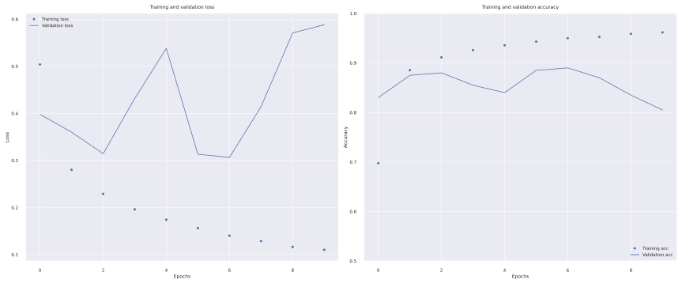
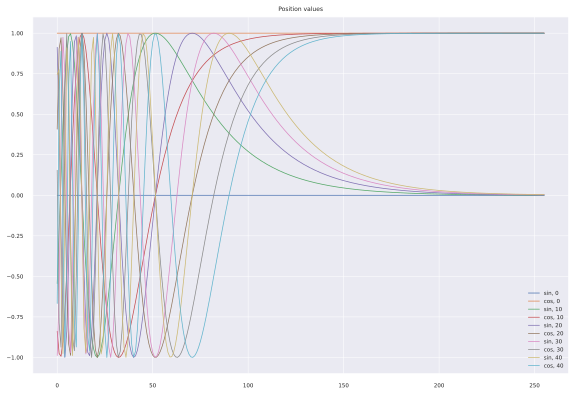
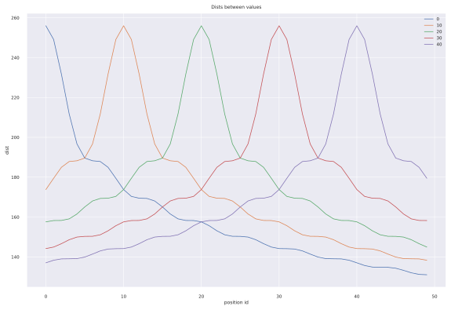

# ___2021 - 07 - 06 Transformer___
***

# Attention
  - [遍地开花的 Attention ，你真的懂吗？](https://developer.aliyun.com/article/713354)
  - [综述---图像处理中的注意力机制](https://blog.csdn.net/xys430381_1/article/details/89323444)
  - [全连接的图卷积网络(GCN)和self-attention这些机制有什么区别联系](https://www.zhihu.com/question/366088445/answer/1023290162)
  - [Attention Is All You Need](https://arxiv.org/pdf/1706.03762.pdf)
  - [《Attention is All You Need》浅读（简介+代码）](https://spaces.ac.cn/archives/4765)
  - [3W字长文带你轻松入门视觉transformer](https://zhuanlan.zhihu.com/p/308301901)
  - `keras.layers.Attention` a.k.a. Luong-style attention.
  - `keras.layers.AdditiveAttention` a.k.a. Bahdanau-style attention. [Eager 执行环境与 Keras 定义 RNN 模型使用注意力机制为图片命名标题](https://github.com/leondgarse/Atom_notebook/blob/master/public/2018/09-06_tensorflow_tutotials.md#eager-%E6%89%A7%E8%A1%8C%E7%8E%AF%E5%A2%83%E4%B8%8E-keras-%E5%AE%9A%E4%B9%89-rnn-%E6%A8%A1%E5%9E%8B%E4%BD%BF%E7%94%A8%E6%B3%A8%E6%84%8F%E5%8A%9B%E6%9C%BA%E5%88%B6%E4%B8%BA%E5%9B%BE%E7%89%87%E5%91%BD%E5%90%8D%E6%A0%87%E9%A2%98)
  - `keras.layers.MultiHeadAttention` multi-headed scaled dot-product attention based on "Attention is all you Need"
  - [Github Keras Attention Augmented Convolutions](https://github.com/titu1994/keras-attention-augmented-convs)
***

# BERT
## 单词嵌入向量 Word embeddings
  - **keras.layers.Embedding** 将输入中的单个正整数转化为指定长度的编码，其中 `input_dim` 表示单词表长度，`output_dim` 便是输出向量维度，即使用 `output_dim` 长度的向量表示 `input_dim` 个单词
    ```py
    # Turns positive integers (indexes) into dense vectors of fixed size.
    __init__(self, input_dim, output_dim, embeddings_initializer='uniform', ..., input_length=None, **kwargs)
    ```
    ```py
    embedding_layer = keras.layers.Embedding(1000, 5)
    result = embedding_layer(tf.constant([1, 2, 3, 2]))
    print(result.numpy())
    # [[ 0.03924643  0.02580811 -0.04168688  0.03953223 -0.03951649]
    #  [-0.02290255 -0.03661262 -0.01429547  0.00083493  0.01542655]
    #  [-0.00508757  0.00465842  0.00856078 -0.02349824 -0.00282664]]
    #  [-0.02290255 -0.03661262 -0.01429547  0.00083493  0.01542655]
    print(embedding_layer(tf.constant([[1, 2, 3], [2, 3, 5]])).shape)
    # (2, 3, 5)
    ```
  - **IMDB 电影评论情感分类**
    ```py
    import tensorflow_datasets as tfds
    (train_data, test_data), info = tfds.load('imdb_reviews/subwords8k', split=(tfds.Split.TRAIN, tfds.Split.TEST), with_info=True, as_supervised=True)
    train_batches = train_data.shuffle(1000).padded_batch(10) # Pad to max length
    test_batches = test_data.shuffle(1000).padded_batch(10) # Pad to max length
    encoder = info.features['text'].encoder

    embedding_dim = 16
    model = keras.Sequential([
        keras.layers.Embedding(encoder.vocab_size, embedding_dim),
        keras.layers.GlobalAveragePooling1D(),
        keras.layers.Dense(16, activation='relu'),
        keras.layers.Dense(1)
    ])

    model.summary()
    model.compile(optimizer='adam', loss=tf.keras.losses.BinaryCrossentropy(from_logits=True), metrics=['accuracy'])
    history = model.fit(train_batches, epochs=10, validation_data=test_batches, validation_steps=20)
    ```
    **plot history**
    ```py
    history_dict = history.history

    fig, axes = plt.subplots(1, 2, figsize=(12, 5))
    axes[0].plot(history_dict['loss'], 'bo', label='Training loss')
    axes[0].plot(history_dict['val_loss'], 'b', label='Validation loss')
    axes[0].set_title('Training and validation loss')
    axes[0].set_xlabel('Epochs')
    axes[0].set_ylabel('Loss')
    axes[0].legend()

    axes[1].plot(history_dict['accuracy'], 'bo', label='Training acc')
    axes[1].plot(history_dict['val_accuracy'], 'b', label='Validation acc')
    axes[1].set_title('Training and validation accuracy')
    axes[1].set_xlabel('Epochs')
    axes[1].set_ylabel('Accuracy')
    axes[1].set_ylim((0.5, 1))
    axes[1].legend(loc='lower right')
    ```
    
  - **Embedding Projector 可视化嵌入向量**
    ```py
    from tensorboard.plugins import projector

    weights = model.layers[0].get_weights()[0]
    print(weights.shape) # (8185, 16)

    log_dir = '/tmp/embedding-example/'
    if not os.path.exists(log_dir):
        os.makedirs(log_dir)
    tensor_path = os.path.join(log_dir, 'vecs.tsv')
    metadata_path = os.path.join(log_dir, 'meta.tsv')

    print(encoder.subwords[:20])
    with open(tensor_path, "w") as out_v, open(metadata_path, "w") as out_m:
        for num, word in enumerate(encoder.subwords):
            vec = weights[num + 1] # skip 0, it's padding.
            out_m.write(word + "\n")
            out_v.write('\t'.join([str(x) for x in vec]) + "\n")

    config = projector.ProjectorConfig()
    embedding = config.embeddings.add()
    embedding.tensor_path = tensor_path
    embedding.metadata_path = metadata_path
    projector.visualize_embeddings(log_dir, config)

    !tensorboard --logdir {log_dir}
    # http://localhost:6006/#projector
    ```
## Word2Vec
  These papers proposed two methods for learning representations of words:

  Continuous Bag-of-Words Model which predicts the middle word based on surrounding context words. The context consists of a few words before and after the current (middle) word. This architecture is called a bag-of-words model as the order of words in the context is not important.
  Continuous Skip-gram Model which predict words within a certain range before and after the current word in the same sentence. A worked example of this is given below.

  - Vectorize an example sentence
  ```py
  sentence = "The wide road shimmered in the hot sun"
  tokens = list(sentence.lower().split())
  print(len(tokens))

  vocab, index = {}, 1  # start indexing from 1
  vocab['<pad>'] = 0  # add a padding token
  for token in tokens:
      if token not in vocab:
          vocab[token] = index
          index += 1
  vocab_size = len(vocab)
  print(vocab)

  inverse_vocab = {index: token for token, index in vocab.items()}
  print(inverse_vocab)

  example_sequence = [vocab[word] for word in tokens]
  print(example_sequence)
  ```
  - Generate skip-grams from one sentence
  ```py
  window_size = 2
  positive_skip_grams, _ = tf.keras.preprocessing.sequence.skipgrams(
        example_sequence,
        vocabulary_size=vocab_size,
        window_size=window_size,
        negative_samples=0)
  print(len(positive_skip_grams))

  for target, context in positive_skip_grams[:5]:
      print(f"({target}, {context}): ({inverse_vocab[target]}, {inverse_vocab[context]})")
  ```
  - Negative sampling for one skip-gram
  ```py
  # Get target and context words for one positive skip-gram.
  target_word, context_word = positive_skip_grams[0]

  # Set the number of negative samples per positive context.
  num_ns = 4

  context_class = tf.reshape(tf.constant(context_word, dtype="int64"), (1, 1))
  negative_sampling_candidates, _, _ = tf.random.log_uniform_candidate_sampler(
      true_classes=context_class,  # class that should be sampled as 'positive'
      num_true=1,  # each positive skip-gram has 1 positive context class
      num_sampled=num_ns,  # number of negative context words to sample
      unique=True,  # all the negative samples should be unique
      range_max=vocab_size,  # pick index of the samples from [0, vocab_size]
      seed=SEED,  # seed for reproducibility
      name="negative_sampling"  # name of this operation
  )
  print(negative_sampling_candidates)
  print([inverse_vocab[index.numpy()] for index in negative_sampling_candidates])
  ```
  - Construct one training example
  ```py
  # Add a dimension so you can use concatenation (on the next step).
  negative_sampling_candidates = tf.expand_dims(negative_sampling_candidates, 1)

  # Concat positive context word with negative sampled words.
  context = tf.concat([context_class, negative_sampling_candidates], 0)

  # Label first context word as 1 (positive) followed by num_ns 0s (negative).
  label = tf.constant([1] + [0]*num_ns, dtype="int64")

  # Reshape target to shape (1,) and context and label to (num_ns+1,).
  target = tf.squeeze(target_word)
  context = tf.squeeze(context)
  label = tf.squeeze(label)

  print(f"target_index    : {target}")
  print(f"target_word     : {inverse_vocab[target_word]}")
  print(f"context_indices : {context}")
  print(f"context_words   : {[inverse_vocab[c.numpy()] for c in context]}")
  print(f"label           : {label}")

  print("target  :", target)
  print("context :", context)
  print("label   :", label)
  ```
  ```py
  dd = {ii : np.stack([tf.random.log_uniform_candidate_sampler(true_classes=[[ii]], num_true=1, num_sampled=4, unique=True, range_max=8, seed=42)[0].numpy() for jj in range(1000)]) for ii in range(8)}
  cc = {ii: pd.value_counts(dd[ii].flatten()).to_dict() for ii in dd}
  print(cc[0])
  # {0: 864, 1: 715, 2: 569, 3: 481, 4: 389, 5: 371, 6: 314, 7: 297}
  print({ii : np.mean([tf.random.log_uniform_candidate_sampler(true_classes=[[ii]], num_true=1, num_sampled=4, unique=True, range_max=8, seed=42)[1].numpy()[0][0] for jj in range(1000)]) for ii in range(8)})
  # {0: 0.99967235, 1: 0.7245632, 2: 0.5737029, 3: 0.47004792, 4: 0.3987442, 5: 0.34728608, 6: 0.3084587, 7: 0.27554017}
  print({ii : np.mean([tf.random.log_uniform_candidate_sampler(true_classes=[[ii]], num_true=1, num_sampled=4, unique=True, range_max=8, seed=42)[2].numpy() for jj in range(1000)]) for ii in range(8)})
  # {0: 0.59829926, 1: 0.59250146, 2: 0.59380203, 3: 0.59515625, 4: 0.5941352, 5: 0.60234785, 6: 0.5936593, 7: 0.5999326}

  pairs, labels = tf.keras.preprocessing.sequence.skipgrams([1, 2, 3, 4, 5, 1, 6, 7], vocabulary_size=8, window_size=2, negative_samples=4)
  # list(zip(pairs, labels))
  pairs, labels = np.array(pairs), np.array(labels)
  negs, poses = pairs[labels == 0], pairs[labels == 1]
  poses = [tuple(ii) for ii in poses]
  neg_in_pos = np.sum([tuple(ii) in poses for ii in negs])
  print(neg_in_pos, neg_in_pos / negs.shape[0])
  # 62 0.5961538461538461

  rr_contexts = np.array(contexts)[:, :, 0]
  rr = [rr_contexts[ii][0] in rr_contexts[ii][1:] for ii in range(rr_contexts.shape[0])]
  print("Total negatives containing positive:", np.sum(rr), "ratio:", np.sum(rr) / rr_contexts.shape[0])
  # Total negatives containing positive: 2226 ratio: 0.03430843685459758
  print("Sample:", rr_contexts[np.array(rr)][:5].tolist())
  # Sample: [[1, 3, 0, 73, 1], [1, 1, 2, 47, 625], [4, 9, 717, 11, 4], [8, 15, 37, 26, 8], [1, 97, 1, 4, 120]]

  ff = np.logical_not(rr)
  dataset = tf.data.Dataset.from_tensor_slices(((targets[ff], contexts[ff]), labels[ff]))

  targets, contexts, labels = np.array(targets), np.array(contexts), np.array(labels)
  dd = pd.DataFrame({"targets": targets.tolist(), "pos": contexts[:, 0, 0].tolist(), "neg": contexts[:, 1:, 0].tolist()})
  cc = dd.groupby('targets').apply(lambda ii: np.sum([jj in ii['pos'].values for jj in np.concatenate(ii['neg'].values)]))
  print("Total negatives pairs containing positive pairs:", cc.sum(), "ratio:", cc.sum() / dd.shape[0])
  # Total negatives pairs containing positive pairs: 38660 ratio: 0.5953095887035925

  checkpoint = tf.train.Checkpoint(embedding=tf.Variable(word2vec.get_layer('w2v_embedding').get_weights()[0]))
  checkpoint.save(os.path.join(log_dir, "embedding.ckpt"))
  ```
  ```py
  unigrams = [0.99967235, 0.7245632, 0.5737029, 0.47004792, 0.3987442, 0.34728608, 0.3084587, 0.27554017]
  sample_func = lambda ii: tf.nn.fixed_unigram_candidate_sampler(true_classes=[[ii]], num_true=1, num_sampled=4, unique=True, range_max=8, unigrams=unigrams)
  dd = {ii : np.stack([sample_func(ii)[0].numpy() for jj in range(1000)]) for ii in range(8)}
  ```
***

# BiT
  - [Colabs big_transfer_tf2.ipynb](https://colab.research.google.com/github/google-research/big_transfer/blob/master/colabs/big_transfer_tf2.ipynb)
  - [tfhub bit/m-r50x1](https://tfhub.dev/google/bit/m-r50x1/imagenet21k_classification/1)
  ```py
  def add_name_prefix(name, prefix=None):
    return prefix + "/" + name if prefix else name

  class StandardizedConv2D(tf.keras.layers.Conv2D):
    """Implements the abs/1903.10520 technique (see go/dune-gn).
    You can simply replace any Conv2D with this one to use re-parametrized
    convolution operation in which the kernels are standardized before conv.
    Note that it does not come with extra learnable scale/bias parameters,
    as those used in "Weight normalization" (abs/1602.07868). This does not
    matter if combined with BN/GN/..., but it would matter if the convolution
    was used standalone.
    Author: Lucas Beyer
    """

    def build(self, input_shape):
      super(StandardizedConv2D, self).build(input_shape)
      # Wrap a standardization around the conv OP.
      default_conv_op = self._convolution_op

      def standardized_conv_op(inputs, kernel):
        # Kernel has shape HWIO, normalize over HWI
        mean, var = tf.nn.moments(kernel, axes=[0, 1, 2], keepdims=True)
        # Author code uses std + 1e-5
        return default_conv_op(inputs, (kernel - mean) / tf.sqrt(var + 1e-10))

      self._convolution_op = standardized_conv_op
      self.built = True

  class PaddingFromKernelSize(tf.keras.layers.Layer):
    """Layer that adds padding to an image taking into a given kernel size."""

    def __init__(self, kernel_size, **kwargs):
      super(PaddingFromKernelSize, self).__init__(**kwargs)
      self.kernel_size = kernel_size
      pad_total = kernel_size - 1
      self._pad_beg = pad_total // 2
      self._pad_end = pad_total - self._pad_beg

    def compute_output_shape(self, input_shape):
      batch_size, height, width, channels = tf.TensorShape(input_shape).as_list()
      if height is not None:
        height = height + self._pad_beg + self._pad_end
      if width is not None:
        width = width + self._pad_beg + self._pad_end
      return tf.TensorShape((batch_size, height, width, channels))

    def call(self, x):
      padding = [
          [0, 0],
          [self._pad_beg, self._pad_end],
          [self._pad_beg, self._pad_end],
          [0, 0]]
      return tf.pad(x, padding)

    def get_config(self):
      config = super(PaddingFromKernelSize, self).get_config()
      config.update({"kernel_size": self.kernel_size})
      return config

    @classmethod
    def from_config(cls, config):
      return cls(**config)

  class BottleneckV2Unit(tf.keras.layers.Layer):
    """Implements a standard ResNet's unit (version 2).
    """

    def __init__(self, num_filters, stride=1, **kwargs):
      """Initializer.
      Args:
        num_filters: number of filters in the bottleneck.
        stride: specifies block's stride.
        **kwargs: other tf.keras.layers.Layer keyword arguments.
      """
      super(BottleneckV2Unit, self).__init__(**kwargs)
      self._num_filters = num_filters
      self._stride = stride

      self._proj = None
      self._unit_a = tf.keras.Sequential([
          normalization.GroupNormalization(),
          ReLU(),
      ])
      self._unit_a_conv = StandardizedConv2D(
          filters=num_filters,
          kernel_size=1,
          use_bias=False,
          padding="VALID",
          trainable=self.trainable,)

      self._unit_b = tf.keras.Sequential([
          normalization.GroupNormalization(),
          ReLU(),
          PaddingFromKernelSize(kernel_size=3),
          StandardizedConv2D(
              filters=num_filters,
              kernel_size=3,
              strides=stride,
              use_bias=False,
              padding="VALID",
              trainable=self.trainable,)
      ])

      self._unit_c = tf.keras.Sequential([
          normalization.GroupNormalization(),
          ReLU(),
          StandardizedConv2D(
              filters=4 * num_filters,
              kernel_size=1,
              use_bias=False,
              padding="VALID",
              trainable=self.trainable)
      ])

    def build(self, input_shape):
      input_shape = tf.TensorShape(input_shape).as_list()

      # Add projection layer if necessary.
      if (self._stride > 1) or (4 * self._num_filters != input_shape[-1]):
        self._proj = StandardizedConv2D(
            filters=4 * self._num_filters,
            kernel_size=1,
            strides=self._stride,
            use_bias=False,
            padding="VALID",
            trainable=self.trainable)
      self.built = True

    def compute_output_shape(self, input_shape):
      current_shape = self._unit_a.compute_output_shape(input_shape)
      current_shape = self._unit_a_conv.compute_output_shape(current_shape)
      current_shape = self._unit_b.compute_output_shape(current_shape)
      current_shape = self._unit_c.compute_output_shape(current_shape)
      return current_shape

    def call(self, x):
      x_shortcut = x
      # Unit "a".
      x = self._unit_a(x)
      if self._proj is not None:
        x_shortcut = self._proj(x)
      x = self._unit_a_conv(x)
      # Unit "b".
      x = self._unit_b(x)
      # Unit "c".
      x = self._unit_c(x)

      return x + x_shortcut

    def get_config(self):
      config = super(BottleneckV2Unit, self).get_config()
      config.update({"num_filters": self._num_filters, "stride": self._stride})
      return config

    @classmethod
    def from_config(cls, config):
      return cls(**config)
  ```
  ```py
  from tensorflow.keras.layers import ReLU
  import tensorflow_addons.layers.normalizations as normalization

  num_units = (3, 4, 6, 3)
  num_outputs = 1000
  filters_factor = 4
  strides = (1, 2, 2, 2)
  trainable = False

  num_blocks = len(num_units)
  num_filters = tuple(16 * filters_factor * 2**b for b in range(num_blocks))

  def create_root_block(num_filters, conv_size=7, conv_stride=2, pool_size=3, pool_stride=2):
      layers = [
          PaddingFromKernelSize(conv_size),
          StandardizedConv2D(filters=num_filters, kernel_size=conv_size, strides=conv_stride, trainable=trainable, use_bias=False, name="standardized_conv2d"),
          PaddingFromKernelSize(pool_size),
          tf.keras.layers.MaxPool2D(pool_size=pool_size, strides=pool_stride, padding="valid")
      ]
      return tf.keras.Sequential(layers, name="root_block")

  def create_block(num_units, num_filters, stride, name):
      layers = []
      for i in range(1, num_units + 1):
          layers.append(BottleneckV2Unit(num_filters=num_filters, stride=(stride if i == 1 else 1), name=name + "_unit%02d" % i))
      return tf.keras.Sequential(layers, name=name)

  root = create_root_block(num_filters=num_filters[0])
  blocks = []
  for b, (f, u, s) in enumerate(zip(num_filters, num_units, strides), 1):
      n = "block{}".format(b)
      blocks.append(create_block(num_units=u, num_filters=f, stride=s, name=n))

  pre_head = [
      normalization.GroupNormalization(name="group_norm"),
      ReLU(),
      tf.keras.layers.GlobalAveragePooling2D()
  ]

  xx = keras.Input([None, None, 3])
  nn = root(xx)
  for block in blocks:
      nn = block(nn)
  for layer in pre_head:
      nn = layer(nn)
  dd = keras.models.Model(xx, nn)

  mm = keras.models.load_model('../module_cache/4ff8fefe176c863be939e3880dfa769989df4e32')
  mm.save_weights('aa.h5')

  dd.load_weights('aa.h5')
  dd.save('dd.h5', include_optimizer=False)
  ```
  ```py
  from tensorflow.keras.layers import ReLU
  import tensorflow_addons.layers.normalizations as normalization

  num_units = (3, 4, 6, 3)
  num_outputs = 1000
  filters_factor = 4
  strides = (1, 2, 2, 2)
  trainable = False

  num_blocks = len(num_units)
  num_filters = tuple(16 * filters_factor * 2**b for b in range(num_blocks))

  xx = keras.Input([None, None, 3])
  nn = PaddingFromKernelSize(7)(xx)
  nn = StandardizedConv2D(filters=num_filters[0], kernel_size=7, strides=2, trainable=trainable, use_bias=False, name="standardized_conv2d")(nn)
  nn = PaddingFromKernelSize(3)(nn)
  nn = tf.keras.layers.MaxPool2D(pool_size=3, strides=2, padding="valid")(nn)

  for bb, (ff, uu, ss) in enumerate(zip(num_filters, num_units, strides), 1):
      name = "block{}".format(bb)
      # create_block(num_units=u, num_filters=f, stride=s, name=n)
      for ii in range(1, uu + 1):
          nn = BottleneckV2Unit(num_filters=ff, stride=(ss if ii == 1 else 1), name=name + "_unit%02d" % ii)(nn)

  nn = normalization.GroupNormalization(name="group_norm")(nn)
  nn = ReLU()(nn)
  nn = tf.keras.layers.GlobalAveragePooling2D()(nn)

  dd = keras.models.Model(xx, nn)

  mm = keras.models.load_model('../module_cache/4ff8fefe176c863be939e3880dfa769989df4e32')
  mm.save_weights('aa.h5')

  dd.load_weights('aa.h5')
  dd.save('dd.h5', include_optimizer=False)
  ```
***
# Tape
  ```py
  (x_train, y_train), (x_test, y_test) = keras.datasets.mnist.load_data()
  x_train, x_test = tf.expand_dims(x_train, -1) / 255, tf.expand_dims(x_test, -1) / 255
  train_ds = tf.data.Dataset.from_tensor_slices((x_train, y_train)).shuffle(10000).batch(32)
  test_ds = tf.data.Dataset.from_tensor_slices((x_test, y_test)).batch(32)

  class MyModel(keras.models.Model):
      def __init__(self, **kwargs):
          super(MyModel, self).__init__(**kwargs)
          self.conv = keras.layers.Conv2D(32, 3)
          self.flatten = keras.layers.Flatten()
          self.dense = keras.layers.Dense(10)
      def call(self, xx):
          xx = self.conv(xx)
          xx = self.flatten(xx)
          xx = self.dense(xx)
          return xx

      @tf.function
      def train_step(self, data):
          images, labels = data
          with tf.GradientTape() as tape:
              predictions = self(images, training=True)
              loss = self.compiled_loss(labels, predictions)
          gradients = tape.gradient(loss, self.trainable_variables)
          self.optimizer.apply_gradients(zip(gradients, self.trainable_variables))
          return {"loss": loss, "predictions": predictions}

      @tf.function
      def test_step(self, data):
          images, labels = data
          predictions = self(images, training=False)
          loss = self.compiled_loss(labels, predictions)
          return {"loss": loss, "predictions": predictions}

  model = MyModel()
  loss_object = tf.keras.losses.SparseCategoricalCrossentropy(from_logits=True)
  optimizer = tf.keras.optimizers.Adam()
  model.compile(loss=loss_object, optimizer=optimizer)

  # Metrics
  train_loss = tf.keras.metrics.Mean(name='train_loss')
  train_accuracy = tf.keras.metrics.SparseCategoricalAccuracy(name='train_accuracy')
  test_loss = tf.keras.metrics.Mean(name='test_loss')
  test_accuracy = tf.keras.metrics.SparseCategoricalAccuracy(name='test_accuracy')

  # fit: model.fit(train_ds, validation_data=test_ds, epochs=10)
  EPOCHS = 10
  for epoch in range(EPOCHS):
      start = time.time()
      train_loss.reset_states()
      train_accuracy.reset_states()
      train_loss.reset_states()
      test_accuracy.reset_states()
      for batch_n, (images, labels) in enumerate(train_ds):
          logs = model.train_step([images, labels])
          train_loss.update_state(logs['loss'])
          train_accuracy.update_state(labels, logs['predictions'])
          if batch_n % 100 == 0:
              print(f"Epoch {epoch+1} Batch {batch_n} Loss {logs['loss']:.4f}")

      for test_images, test_labels in test_ds:
          logs = model.test_step([test_images, test_labels])
          test_loss.update_state(logs['loss'])
          test_accuracy.update_state(test_labels, logs['predictions'])

      # if (epoch + 1) % 5 == 0:
      #     model.save_weights(checkpoint_prefix.format(epoch=epoch))

      print(
          f'Epoch {epoch + 1}, '
          f'Loss: {train_loss.result()}, '
          f'Accuracy: {train_accuracy.result() * 100}, '
          f'Test Loss: {test_loss.result()}, '
          f'Test Accuracy: {test_accuracy.result() * 100}'
      )
      print(f'Time taken for 1 epoch {time.time() - start:.2f} sec')
      print("_" * 80)
  ```
***
# Transformer
## 位置编码 Positional encoding
  ```sh
  PE(pos, 2i) = sin(pos / 10000 ** (2i / d_model))
  PE(pos, 2i + 1) = cos(pos / 10000 ** (2i / d_model))
  ```
  ```py
  def positional_encoding(position, d_model):
      """
      position, d_model = 50, 512
      d_model_range = np.expand_dims(np.arange(d_model), 0) --> [0, 1, 2, 3,..., 509, 510, 511]
      (2 * (d_model_range // 2)) / np.float32(d_model) --> [0, 0, 2, 2,..., 508, 510, 510] / 512
      np.power(1e4, (2 * (d_model_range // 2)) / np.float32(d_model)) --> ~ [1, 1, ..., 1e4, 1e4]
      angle_rads --> ~ [1, 1, ..., 1e-4, 1e-4]
      angle_rads --> [angle_rads * 0, angle_rads * 1, angle_rads * 2, ..., angle_rads * 49]
      [sin] angle_rads[0] --> [0]
      [sin] angle_rads[1] --> ~[sin(1), sin(1), ..., 0, 0]
      [cos] angle_rads[0] --> [1]
      [cos] angle_rads[1] --> ~[cos(1), cos(1), ..., 1, 1]
      """
      d_model_range = np.expand_dims(np.arange(d_model), 0)
      angle_rads = 1 / np.power(1e4, (2 * (d_model_range // 2)) / np.float32(d_model))
      angle_rads = np.expand_dims(np.arange(position), 1) * angle_rads

      # 将 sin 应用于数组中的偶数索引（indices）；2i
      angle_rads[:, 0::2] = np.sin(angle_rads[:, 0::2])
      # 将 cos 应用于数组中的奇数索引；2i+1
      angle_rads[:, 1::2] = np.cos(angle_rads[:, 1::2])

      pos_encoding = np.expand_dims(angle_rads, 0)
      return tf.cast(pos_encoding, dtype=tf.float32)

  pos_encoding = positional_encoding(50, 512)
  print(f'{pos_encoding.shape = }') # pos_encoding.shape = TensorShape([1, 50, 512])
  plt.pcolormesh(pos_encoding[0], cmap='RdBu')
  plt.xlabel('Depth')
  plt.xlim((0, 512))
  plt.ylabel('Position')
  plt.colorbar()
  ```
  
  ```py
  for ii in range(0, 50, 10):
      plt.plot(pos_encoding[0, ii, ::2], label="sin, {}".format(ii))
      plt.plot(pos_encoding[0, ii, 1::2], label="cos, {}".format(ii))
  plt.legend()
  plt.title("Position values")
  ```
  
  ```py
  print((pos_encoding.numpy()[0] ** 2).sum(1))
  # [256] * 50

  print(np.dot(pos_encoding.numpy()[0], pos_encoding.numpy()[0, 0]))
  # [256.      249.10211 231.73363 211.74947 196.68826 189.59668 188.2482 187.86502 184.96516 179.45654 173.78973 170.35315 169.44649 169.34525
  #  168.0597  165.0636  161.53304 159.08392 158.2816  158.24513 157.57397 155.64383 153.08748 151.10722 150.33557 150.30371 149.94781 148.61731
  #  146.63585 144.93758 144.17035 144.1174  143.94557 143.00458 141.41406 139.9111  139.13742 139.0499  138.99149 138.32632 137.02701 135.67337
  #  134.88887 134.7587  134.77036 134.31155 133.24333 132.01273 131.21637 131.03839]

  for ii in range(0, 50, 10):
      plt.plot(np.dot(pos_encoding.numpy()[0], pos_encoding.numpy()[0, ii]), label=str(ii))
  plt.legend()
  plt.title("Dists between values")
  plt.xlabel('position id')
  plt.ylabel('dist')
  ```
  
## Scaled dot product attention
  - 点积注意力被缩小了深度的平方根倍。这样做是因为对于较大的深度值，点积的大小会增大，从而推动 softmax 函数往仅有很小的梯度的方向靠拢，导致了一种很硬的（hard）softmax。
  ```py
  def scaled_dot_product_attention(q, k, v, mask):
      """计算注意力权重。
      q, k, v 必须具有匹配的前置维度。
      k, v 必须有匹配的倒数第二个维度，例如：seq_len_k = seq_len_v。
      虽然 mask 根据其类型（填充或前瞻）有不同的形状，
      但是 mask 必须能进行广播转换以便求和。

      参数:
        q: 请求的形状 == (..., seq_len_q, depth)
        k: 主键的形状 == (..., seq_len_k, depth)
        v: 数值的形状 == (..., seq_len_v, depth_v)
        mask: Float 张量，其形状能转换成
              (..., seq_len_q, seq_len_k)。默认为None。

      返回值:
        输出，注意力权重
      """
      matmul_qk = tf.matmul(q, k, transpose_b=True)  # (..., seq_len_q, seq_len_k)

      # 缩放 matmul_qk
      dk = tf.cast(tf.shape(k)[-1], tf.float32)
      scaled_attention_logits = matmul_qk / tf.math.sqrt(dk)

      # 将 mask 加入到缩放的张量上。
      if mask is not None:
          scaled_attention_logits += (mask * -1e9)  

      # softmax 在最后一个轴（seq_len_k）上归一化，因此分数相加等于1。
      attention_weights = tf.nn.softmax(scaled_attention_logits, axis=-1)  # (..., seq_len_q, seq_len_k)
      output = tf.matmul(attention_weights, v)  # (..., seq_len_q, depth_v)
      return output, attention_weights
  ```
  ```py
  temp_k = tf.expand_dims([1., 2, 3, 4], 1)
  temp_v = tf.expand_dims([1., 2, 3, 4], 1)
  print("Output: {}, Attention: {}".format(*scaled_dot_product_attention(tf.constant([[5.]]), temp_k, temp_v, None)))
  # Output: [[3.9932165]], Attention: [[0.0000003  0.00004509 0.00669255 0.9932621 ]]
  print("Output: {}, Attention: {}".format(*scaled_dot_product_attention(tf.constant([[50.]]), temp_k, temp_v, None)))
  # Output: [[4.]], Attention: [[0. 0. 0. 1.]]

  temp_k = tf.constant([[10, 0, 0], [0, 10, 0], [0, 0, 10], [0, 0, 10]], dtype=tf.float32)  # (4, 3)
  temp_v = tf.constant([[1, 0], [10, 0], [100, 5], [1000, 6]], dtype=tf.float32)  # (4, 2)

  # 这条 `请求（query）符合第二个`主键（key）`，因此返回了第二个`数值（value）`。
  temp_q = tf.constant([[0, 10, 0]], dtype=tf.float32)  # (1, 3)
  print("Output: {}, Attention: {}".format(*scaled_dot_product_attention(temp_q, temp_k, temp_v, None)))
  # Output: [[10.  0.]], Attention: [[0. 1. 0. 0.]]

  # 这条请求符合重复出现的主键（第三第四个），因此，对所有的相关数值取了平均。
  temp_q = tf.constant([[0, 0, 10]], dtype=tf.float32)  # (1, 3)
  print("Output: {}, Attention: {}".format(*scaled_dot_product_attention(temp_q, temp_k, temp_v, None)))
  # Output: [[550.    5.5]], Attention: [[0.  0.  0.5 0.5]]

  # 这条请求符合第一和第二条主键，因此，对它们的数值去了平均。
  temp_q = tf.constant([[10, 10, 0]], dtype=tf.float32)  # (1, 3)
  print("Output: {}, Attention: {}".format(*scaled_dot_product_attention(temp_q, temp_k, temp_v, None)))
  # Output: [[5.5 0. ]], Attention: [[0.5 0.5 0.  0. ]]

  temp_q = tf.constant([[0, 0, 10], [0, 10, 0], [10, 10, 0]], dtype=tf.float32)  # (3, 3)
  print("Output: {}, Attention: {}".format(*scaled_dot_product_attention(temp_q, temp_k, temp_v, None)))
  # Output: [[550.    5.5] [ 10.    0. ] [  5.5   0. ]], Attention: [[0.  0.  0.5 0.5] [0.  1.  0.  0. ] [0.5 0.5 0.  0. ]]
  ```
## 多头注意力 Multi-head attention
  多头注意力由四部分组成：

  线性层并分拆成多头。
  按比缩放的点积注意力。
  多头及联。
  最后一层线性层。
  每个多头注意力块有三个输入：Q（请求）、K（主键）、V（数值）。这些输入经过线性（Dense）层，并分拆成多头。

  将上面定义的 scaled_dot_product_attention 函数应用于每个头（进行了广播（broadcasted）以提高效率）。注意力这步必须使用一个恰当的 mask。然后将每个头的注意力输出连接起来（用tf.transpose 和 tf.reshape），并放入最后的 Dense 层。

  Q、K、和 V 被拆分到了多个头，而非单个的注意力头，因为多头允许模型共同注意来自不同表示空间的不同位置的信息。在分拆后，每个头部的维度减少，因此总的计算成本与有着全部维度的单个注意力头相同。
  ```py
  query: Query `Tensor` of shape `[B, T, dim]`
  value: Value `Tensor` of shape `[B, S, dim]`
  key: Optional key `Tensor` of shape `[B, S, dim]`
  attention_mask: a boolean mask of shape `[B, T, S]`
  attention_output: The result of the computation, of shape [B, T, E] where `T` is for target sequence shapes and `E` is the query input last dimension

  N = `num_attention_heads`
  H = `size_per_head`
  `query` = [B, T, N ,H]
  `key` = [B, S, N, H]
  `value` = [B, S, N, H]
  ```
  ```py
  from tensorflow.python.ops import math_ops
  from tensorflow.python.ops import special_math_ops
  from icecream import ic
  inputs = keras.layers.Input([14, 16, 1024])

  nn = keras.layers.MultiHeadAttention(num_heads=4, key_dim=128)
  ic(nn(inputs, inputs).shape.as_list())
  # ic| nn(inputs, inputs).shape.as_list(): [None, 14, 16, 1024]

  query = nn._query_dense(inputs)
  key = nn._key_dense(inputs)
  value = nn._value_dense(inputs)
  ic(query.shape.as_list(), key.shape.as_list(), value.shape.as_list())
  # ic| query.shape.as_list(): [None, 14, 16, 4, 128]

  # attention_output, attention_scores = nn._compute_attention(query, key, value)
  query = math_ops.multiply(query, 1.0 / math.sqrt(float(nn._key_dim)))
  # 'afgde,abcde->adbcfg', 'bhHWd,bhPQd->bhHWPQ' == 'afgde,adbce->afgdbc'
  attention_scores = special_math_ops.einsum(nn._dot_product_equation, key, query)
  ic(attention_scores.shape.as_list())
  # ic| attention_scores.shape.as_list(): [None, 4, 14, 16, 14, 16]

  attention_scores = nn._masked_softmax(attention_scores, None)
  attention_scores_dropout = nn._dropout_layer(attention_scores, training=False)
  attention_output = special_math_ops.einsum(nn._combine_equation, attention_scores_dropout, value)
  ic(attention_output.shape.as_list())
  # ic| attention_output.shape.as_list(): [None, 14, 16, 4, 128]

  attention_output = nn._output_dense(attention_output)
  ic(attention_output.shape.as_list())
  # ic| attention_output.shape.as_list(): [None, 14, 16, 1024]
  ```
***
