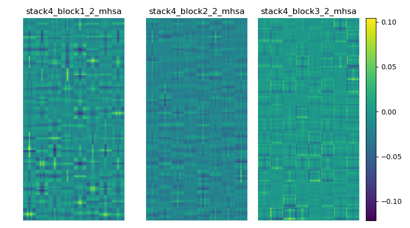
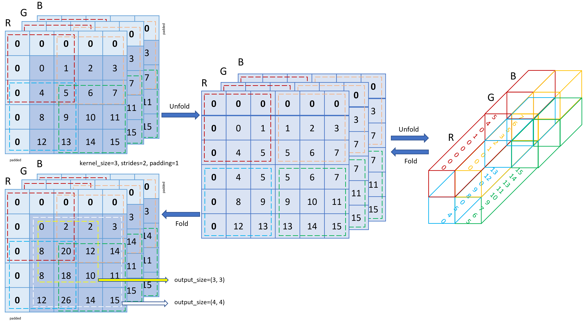
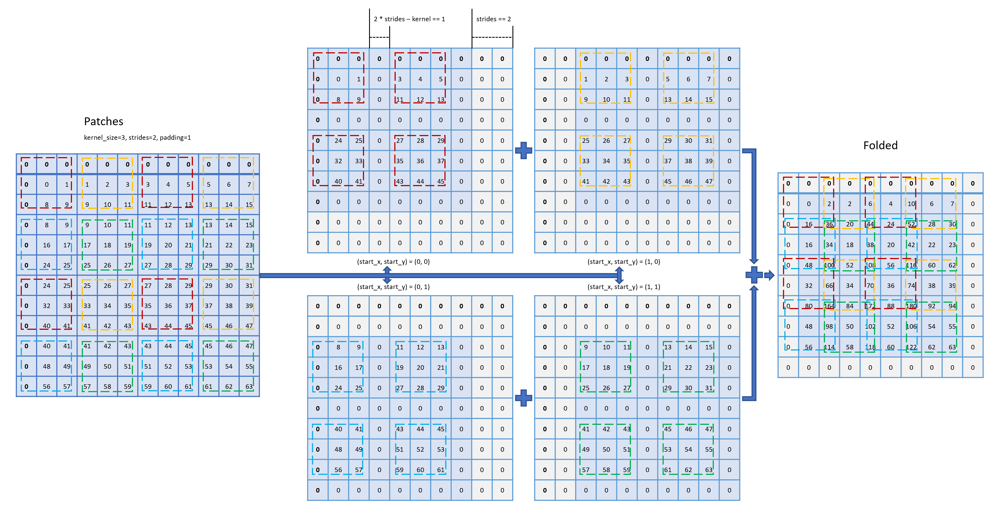
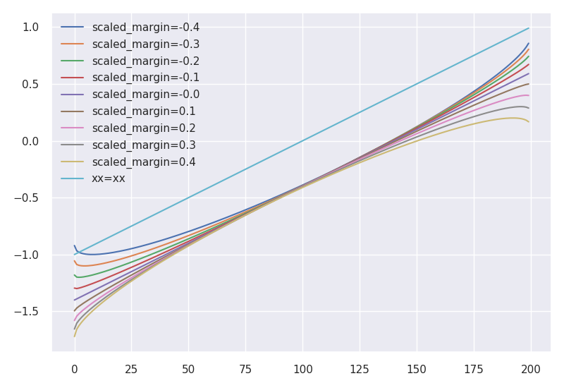

# ___2021 - 08 - 20 PyTorch to Keras___
***

# TOC
  <!-- TOC depthFrom:1 depthTo:6 withLinks:1 updateOnSave:1 orderedList:0 -->

  - [___2021 - 08 - 20 PyTorch to Keras___](#2021-08-20-pytorch-to-keras)
  - [TOC](#toc)
  - [Timm](#timm)
    - [Timm results](#timm-results)
    - [Basic RegNetZ load Timm weights](#basic-regnetz-load-timm-weights)
    - [botnet](#botnet)
    - [beit](#beit)
    - [resnet regnety](#resnet-regnety)
    - [efficientnet](#efficientnet)
    - [HaloNet](#halonet)
  - [Resnest](#resnest)
    - [Convert Resnest model weights from Torch](#convert-resnest-model-weights-from-torch)
  - [BotNet](#botnet)
    - [Relative and absolute positional embedding](#relative-and-absolute-positional-embedding)
    - [Convert botnet model weights from Torch](#convert-botnet-model-weights-from-torch)
    - [BotNet positional embedding](#botnet-positional-embedding)
    - [Relative positional embedding by gathering](#relative-positional-embedding-by-gathering)
    - [Bias Relative positional embedding](#bias-relative-positional-embedding)
    - [Show PositionalEmbedding](#show-positionalembedding)
  - [VOLO](#volo)
    - [PyTorch fold and unfold and conv2d](#pytorch-fold-and-unfold-and-conv2d)
    - [TF extract patches and Torch unfold](#tf-extract-patches-and-torch-unfold)
    - [TF reverse extracted patches without overlap](#tf-reverse-extracted-patches-without-overlap)
    - [TF reverse extracted patches with overlap](#tf-reverse-extracted-patches-with-overlap)
    - [TF reverse extracted patches with overlap NOT cumulative sum on overlapped areas](#tf-reverse-extracted-patches-with-overlap-not-cumulative-sum-on-overlapped-areas)
    - [Timm unfold and fold using conv2d and conv2d transpose](#timm-unfold-and-fold-using-conv2d-and-conv2d-transpose)
    - [Volo outlook attention without overlap](#volo-outlook-attention-without-overlap)
    - [Volo outlook attention](#volo-outlook-attention)
    - [Volo load torch weights](#volo-load-torch-weights)
    - [Volo positional embedding](#volo-positional-embedding)
    - [MHSA](#mhsa)
  - [CotNet](#cotnet)
    - [PyTorch CotNet](#pytorch-cotnet)
    - [Convert CotNet model weights from Torch](#convert-cotnet-model-weights-from-torch)
    - [Test CotNet](#test-cotnet)
    - [Anti alias downsample](#anti-alias-downsample)
  - [Attetion models](#attetion-models)
    - [SimAM](#simam)
    - [HaloNet](#halonet)
    - [TF ResNext](#tf-resnext)
    - [PyTorch ResNext](#pytorch-resnext)
    - [ResMLP](#resmlp)
    - [GMLP](#gmlp)
    - [Coat](#coat)
    - [ResNetQ](#resnetq)
    - [ResNetD](#resnetd)
    - [LeVit](#levit)
  - [Noisy Student EfficientNet](#noisy-student-efficientnet)
  - [CMT](#cmt)
  - [NFNets](#nfnets)
  - [Halonet timm](#halonet-timm)
  - [RegNetZ](#regnetz)
  - [MagFace model](#magface-model)

  <!-- /TOC -->
***

# Timm
## Timm results
  - [Github rwightman/pytorch-image-models](https://github.com/rwightman/pytorch-image-models)
  ```py
  #  Semi-Weakly Supervised ResNe*t models from https://github.com/facebookresearch/semi-supervised-ImageNet1K-models
  #  Please note the CC-BY-NC 4.0 license on theses weights, non-commercial use only.
  dd = pd.read_csv('/home/leondgarse/workspace/samba/pytorch-image-models/results/results-imagenet.csv')
  dd[['swsl_resnext' in ii for ii in dd.model.values]]
  dd[['resnext101' in ii for ii in dd.model.values]]
  ```
## Basic RegNetZ load Timm weights
  ```py
  import timm
  import torch
  from torchsummary import summary
  from keras_cv_attention_models.download_and_load import state_dict_stack_by_layer, keras_reload_stacked_state_dict, match_layer_names_with_torch

  torch_model = timm.models.regnetz_b(pretrained=True)
  _ = torch_model.eval()
  summary(torch_model, (3, 224, 224))

  """ Run predict """
  from skimage.data import chelsea
  from skimage.transform import resize
  img = chelsea()
  img = keras.applications.imagenet_utils.preprocess_input(tf.image.resize(img, (224, 224)), mode='torch').numpy()
  out = torch_model(torch.from_numpy(np.expand_dims(img.transpose(2, 0, 1), 0).astype('float32')))
  out = out.detach().cpu().numpy()
  out = tf.nn.softmax(out).numpy()  # If classifier activation is not softmax
  print(keras.applications.imagenet_utils.decode_predictions(out))

  """ Save jit model or onnx """
  # traced_cell = torch.jit.trace(torch_model, (torch.randn(10, 3, 224, 224)))
  # torch.jit.save(traced_cell, 'aa.pth')
  #
  # xx = torch.randn(10, 3, 224, 224)
  # torch.onnx.export(torch_model, xx, "aa.onnx", verbose=False, keep_initializers_as_inputs=True, training=torch.onnx.TrainingMode.PRESERVE, opset_version=11)

  """ Convert weights """
  torch_params = {kk: (np.cumproduct(vv.shape)[-1] if len(vv.shape) != 0 else 1) for kk, vv in torch_model.state_dict().items() if ".num_batches_tracked" not in kk}
  print("torch_model total_parameters :", np.sum(list(torch_params.values())))

  stacked_state_dict = state_dict_stack_by_layer(torch_model.state_dict())
  {kk: [1 if isinstance(jj, float) else jj.shape for jj in vv] for kk, vv in stacked_state_dict.items()}

  from keras_cv_attention_models.resnet_family import regnet
  mm = regnet.RegNetZB(classifier_activation=None, pretrained=None)

  target_names = [ii.name for ii in mm.layers if len(ii.weights) != 0]
  {mm.get_layer(ii).name: [jj.shape.as_list() for jj in mm.get_layer(ii).weights] for ii in target_names}

  """ Load weights and save h5 """
  additional_transfer = {}
  layer_names_matched_torch = target_names
  keras_reload_stacked_state_dict(mm, stacked_state_dict, layer_names_matched_torch, additional_transfer, save_name=mm.name + "_imagenet.h5")

  """ Keras run predict """
  from skimage.data import chelsea
  img = chelsea() # Chelsea the cat
  imm = keras.applications.imagenet_utils.preprocess_input(img, mode='torch')
  pred = mm(tf.expand_dims(tf.image.resize(imm, mm.input_shape[1:3]), 0)).numpy()
  # pred = tf.nn.softmax(pred).numpy()  # If classifier activation is not softmax
  print(keras.applications.imagenet_utils.decode_predictions(pred)[0])
  ```
  **Re-save**
  ```py
  from keras_cv_attention_models.resnet_family import regnet
  resolution = 224
  mm = regnet.RegNetZB(input_shape=(resolution, resolution, 3), pretrained=None)
  pp = mm.name + "_imagenet.h5"
  # pp = mm.name + "_{}.h5".format(resolution)
  mm.load_weights(pp)

  from skimage.data import chelsea
  img = chelsea() # Chelsea the cat
  imm = keras.applications.imagenet_utils.preprocess_input(img, mode='torch')
  pred = mm(tf.expand_dims(tf.image.resize(imm, mm.input_shape[1:3]), 0)).numpy()
  # pred = tf.nn.softmax(pred).numpy()  # If classifier activation is not softmax
  print(keras.applications.imagenet_utils.decode_predictions(pred)[0])

  print(">>>> Saving to:", pp)
  mm.save(pp)
  ```
## botnet
  ```py
  additional_transfer = {botnet.RelativePositionalEmbedding: lambda ww: [ww[0].T, ww[1].T]}
  layer_names_matched_torch = [""] * len(target_names)
  for id, ii in enumerate(target_names):
      tail_name = "_" + "_".join(ii.split('_')[2:])
      print(id, ii, tail_name)
      if tail_name in ["_shortcut_conv"]:
          layer_names_matched_torch.insert(id - 5, ii)
          layer_names_matched_torch.pop(-1)
      elif tail_name in ["_shortcut_bn"]:
          layer_names_matched_torch.insert(id - 6, ii)
          layer_names_matched_torch.pop(-1)
      else:
          layer_names_matched_torch[id] = ii
  keras_reload_stacked_state_dict(mm, stacked_state_dict, layer_names_matched_torch, additional_transfer, save_name=mm.name + "_imagenet.h5")
  ```
  - **sebotnet33ts_256**
  ```py
  import timm
  from keras_cv_attention_models.botnet import botnet
  from keras_cv_attention_models.download_and_load import keras_reload_from_torch_model

  tail_align_dict={"shortcut_conv": -6, "shortcut_bn": -7,
      "stack4": {"shortcut_conv": -5, "shortcut_bn": -6},
  }
  additional_transfer = {botnet.RelativePositionalEmbedding: lambda ww: [ww[0].T, ww[1].T]}

  torch_mdoel = timm.models.sebotnet33ts_256(pretrained=True)
  mm = botnet.BotNetSE33T(classifier_activation=None)
  keras_reload_from_torch_model(torch_mdoel, mm, input_shape=(256, 256), tail_align_dict=tail_align_dict, additional_transfer=additional_transfer, do_convert=True)
  ```
## beit
  ```py
  unstack_weights = ["cls_token", "gamma_1", "gamma_2", "relative_position_bias_table", "q_bias", "v_bias"]
  stacked_state_dict = state_dict_stack_by_layer(torch_model.state_dict(), skip_weights=["relative_position_index"], unstack_weights=unstack_weights)

  tail_align_dict = {"attn_gamma": -6, "mlp_gamma": -9, "attn_query_bias": -1, "attn_value_bias": -1, "attn_pos_emb": -1}
  full_name_align_dict = {"cls_token": -1}
  layer_names_matched_torch = match_layer_names_with_torch(target_names, tail_align_dict, full_name_align_dict, tail_split_position=1)

  additional_transfer = {}
  keras_reload_stacked_state_dict(mm, stacked_state_dict, layer_names_matched_torch, additional_transfer, save_name=mm.name + "_imagenet.h5")
  ```
  ```py
  from keras_cv_attention_models.download_and_load import keras_reload_from_torch

  skip_weights = ["relative_position_index"]
  unstack_weights = ["cls_token", "gamma_1", "gamma_2", "relative_position_bias_table", "q_bias", "v_bias"]
  tail_align_dict = {"attn_gamma": -6, "mlp_gamma": -9, "attn_query_bias": -1, "attn_value_bias": -1, "attn_pos_emb": -1}
  full_name_align_dict = {"cls_token": -1}

  import timm
  from keras_cv_attention_models.beit import beit

  resolution = 224
  mm = beit.BeitLargePatch16(input_shape=(resolution, resolution, 3), classifier_activation=None)
  keras_reload_from_torch(
      torch_model=timm.models.beit_large_patch16_224(pretrained=True),
      keras_model=mm,
      input_shape=(resolution, resolution),
      skip_weights=skip_weights,
      unstack_weights=unstack_weights,
      tail_align_dict=tail_align_dict,
      full_name_align_dict=full_name_align_dict,
      tail_split_position=1,
      additional_transfer={},
      save_name=mm.name + "_{}.h5".format(resolution),
      do_convert=True,
  )
  ```
## resnet regnety regnetz
  ```py
  sys.path.append('../pytorch-image-models/')
  import timm
  from keras_cv_attention_models import aotnet, regnet
  from keras_cv_attention_models.download_and_load import keras_reload_from_torch_model

  torch_model = timm.models.resnet50(pretrained=True)
  mm = aotnet.AotNet50(classifier_activation=None)
  keras_reload_from_torch_model(torch_model, mm, tail_align_dict={"block1_deep_3_conv": -1, "block1_3_bn": -2}, tail_split_position=1, do_convert=True)
  ```
  ```py
  from keras_cv_attention_models import aotnet, download_and_load
  mm = aotnet.AotNet50(input_shape=(160, 160, 3), model_name='aotnet50_160')
  download_and_load.keras_reload_from_torch_model('resnet50_a3_0-59cae1ef.pth', mm, tail_align_dict={"block1_deep_3_conv": -1, "block1_3_bn": -2}, tail_split_position=1, do_convert=True)
  ```
## efficientnet
  ```py
  sys.path.append('../pytorch-image-models/')
  import timm
  from keras_cv_attention_models.efficientnet import efficientnet_v2
  from keras_cv_attention_models.download_and_load import keras_reload_from_torch_model

  torch_model = timm.models.efficientnetv2_rw_t(pretrained=True)
  mm = efficientnet_v2.EfficientNetV2T(classifier_activation=None)
  keras_reload_from_torch_model(torch_model, mm, do_convert=True)
  ```
## HaloNet
  - **halonet50ts / halo2botnet50ts_256**
  ```py
  import timm
  from keras_cv_attention_models.halonet import halonet
  from keras_cv_attention_models.download_and_load import keras_reload_from_torch_model

  tail_align_dict={"shortcut_conv": -4, "shortcut_bn": -5, "deep_2_haloquery_conv": -1}
  additional_transfer = {halonet.RelativePositionalEmbedding: lambda ww: [ww[0].T, ww[1].T]}

  torch_mdoel = timm.models.halonet50ts(pretrained=True)
  mm = halonet.HaloNet50T(classifier_activation=None)
  keras_reload_from_torch_model(torch_mdoel, mm, input_shape=(256, 256), tail_align_dict=tail_align_dict, additional_transfer=additional_transfer, do_convert=True)
  ```
  - **eca_halonext26ts**
  ```py
  import timm
  from keras_cv_attention_models.halonet import halonet
  from keras_cv_attention_models.download_and_load import keras_reload_from_torch_model

  tail_align_dict={"shortcut_conv": -5, "shortcut_bn": -6, "deep_2_haloquery_conv": -1,
      "stack4": {"shortcut_conv": -6, "shortcut_bn": -7, "deep_2_haloquery_conv": -1},
  }
  additional_transfer = {halonet.RelativePositionalEmbedding: lambda ww: [ww[0].T, ww[1].T]}

  torch_mdoel = timm.models.eca_halonext26ts(pretrained=True)
  mm = halonet.HaloNextECA26T(classifier_activation=None)
  keras_reload_from_torch_model(torch_mdoel, mm, input_shape=(256, 256), tail_align_dict=tail_align_dict, additional_transfer=additional_transfer, do_convert=True)
  ```
## ConvNeXt
  ```py
  sys.path.append('../ConvNeXt/')
  from models import convnext as torch_convnext
  torch_model = torch_convnext.convnext_tiny(pretrained=True, in_22k=False)

  from keras_cv_attention_models import download_and_load, convnext
  mm = convnext.ConvNeXtTiny(classifier_activation=None, pretrained=None)
  full_name_align_dict = {
      "stack2_downsample_ln": 2,
      "stack2_downsample_conv": 3,
      "stack3_downsample_ln": 4,
      "stack3_downsample_conv": 5,
      "stack4_downsample_ln": 6,
      "stack4_downsample_conv": 7,
  }
  tail_align_dict = {"gamma": -4}

  download_and_load.keras_reload_from_torch_model(torch_model, mm, tail_align_dict=tail_align_dict, full_name_align_dict=full_name_align_dict, do_convert=True)
  ```
## Uniformer
  ```py
  from token_labeling.tlt.models import uniformer as torch_uniformer
  torch_model = torch_uniformer.uniformer_small()
  _ = torch_model.eval()
  import torch
  weights = torch.load('../../keras_cv_attention_models/uniformer_small_tl_224.pth')
  torch_model.load_state_dict(weights['model'] if "model" in weights else weights)
  _ = torch_model.eval()
  aa = torch_model.forward_features(torch.ones([1, 3, 224, 224]))
  ```
  ```py
  import torch
  import torch.nn.functional as F
  import torchvision.transforms as T
  # from models import uniformer as torch_uniformer
  from token_labeling.tlt.models import uniformer as torch_uniformer

  def inference(model, image):
      image_transform = T.Compose([T.Resize(224), T.CenterCrop(224), T.ToTensor(), T.Normalize(mean=[0.485, 0.456, 0.406], std=[0.229, 0.224, 0.225])])
      image = image_transform(image)
      image = image.unsqueeze(0)
      prediction = model(image)
      prediction = F.softmax(prediction, dim=1).flatten()
      return prediction

  model = torch_uniformer.uniformer_small()
  weights = torch.load('../../keras_cv_attention_models/uniformer_small_tl_224.pth')
  model.load_state_dict(weights['model'] if "model" in weights else weights)
  model = model.eval()

  from skimage.data import chelsea
  from PIL import Image
  imm = Image.fromarray(chelsea()) # Chelsea the cat
  out = inference(model, imm)
  print(out.argsort()[-5:])
  # tensor([224, 196, 223, 410, 599])

  keras.applications.imagenet_utils.decode_predictions(out.detach().numpy()[None])
  ```
  ```py
  import tlt.models
  from timm.models import create_model, load_checkpoint
  model = create_model('uniformer_small', num_classes=1000, global_pool=None, img_size=224)
  load_checkpoint(model, '../../keras_cv_attention_models/uniformer_small_tl_224.pth', use_ema=False, strict=False)
  ```
  ```py
  # tensor([284, 287, 281, 282, 285])
  ```
  ```py
  from keras_cv_attention_models import download_and_load
  from keras_cv_attention_models.uniformer import uniformer

  full_name_align_dict = {
      "stem_ln": 0,
      "stack2_downsample_conv": 2,
      "stack2_downsample_ln": 2, # ln is ahead of conv for pytorch weights
      "stack3_downsample_conv": 4,
      "stack3_downsample_ln": 4,
      "stack4_downsample_conv": 6,
      "stack4_downsample_ln": 6,
      "predictions": -1, # for token_label models
  }
  tail_align_dict = {"attn_2_conv": -1}

  mm = uniformer.UniformerSmall32(mix_token=False, token_label_top=True, classifier_activation=None)
  download_and_load.keras_reload_from_torch_model('uniformer_small_in1k.pth', mm, full_name_align_dict=full_name_align_dict, tail_align_dict=tail_align_dict, do_convert=True, save_name=mm.name + "_224_imagenet.h5")
  ```
  ```py
  from keras_cv_attention_models import download_and_load
  from keras_cv_attention_models.uniformer import uniformer

  full_name_align_dict = {
      "stem_ln": 0,
      "stack2_downsample_conv": 4,
      "stack2_downsample_bn": 5,
      "stack3_downsample_conv": 6,
      "stack3_downsample_bn": 7,
      "stack4_downsample_conv": 8,
      "stack4_downsample_bn": 9,
      "predictions": -1, # for token_label models
  }
  tail_align_dict = {"attn_2_conv": -1}

  mm = uniformer.UniformerSmallPlus32(mix_token=False, token_label_top=True, classifier_activation=None)
  download_and_load.keras_reload_from_torch_model('uniformer_small_plus_in1k.pth', mm, full_name_align_dict=full_name_align_dict, tail_align_dict=tail_align_dict, do_convert=True, save_name=mm.name + "_224_imagenet.h5")
  ```
  ```py
  from keras_cv_attention_models import download_and_load
  from keras_cv_attention_models.uniformer import uniformer

  full_name_align_dict = {
      "stem_ln": 0,
      "stack2_downsample_conv": 2,
      "stack2_downsample_ln": 2, # ln is ahead of conv for pytorch weights
      "stack3_downsample_conv": 4,
      "stack3_downsample_ln": 4,
      "stack4_downsample_conv": 6,
      "stack4_downsample_ln": 6,
      "predictions": -1, # for token_label models
  }
  tail_align_dict = {
      "stack1": {"attn_2_conv": -1, "1_gamma": -5, "2_gamma": -8}, # gamma for layer_scale models conv_blocks
      "stack2": {"attn_2_conv": -1, "1_gamma": -5, "2_gamma": -8}, # gamma for layer_scale models conv_blocks
      "stack3": {"attn_2_conv": -1, "1_gamma": -4, "2_gamma": -7}, # gamma for layer_scale models attention_blocks
      "stack4": {"attn_2_conv": -1, "1_gamma": -4, "2_gamma": -7}, # gamma for layer_scale models attention_blocks
  }

  unstack_weights = ["gamma_1", "gamma_2"]
  additional_transfer = {uniformer.ChannelAffine: lambda ww: [np.squeeze(ww[0])]}

  mm = uniformer.UniformerLarge64(input_shape=(384, 384, 3), mix_token=False, token_label_top=True, classifier_activation=None)
  download_and_load.keras_reload_from_torch_model(
      'uniformer_large_ls_tl_384.pth',
      mm,
      full_name_align_dict=full_name_align_dict,
      tail_align_dict=tail_align_dict,
      unstack_weights=unstack_weights,
      additional_transfer=additional_transfer,
      do_convert=True,
      save_name=mm.name + "_384_imagenet.h5"
  )
  ```
## WaveMLP
  ```py
  from keras_cv_attention_models.mlp_family import wave_mlp
  from keras_cv_attention_models import download_and_load
  mm = wave_mlp.WaveMLP_S(pretrained=None, classifier_activation=None)

  skip_weights = ['num_batches_tracked', 'total_ops', 'total_params']

  tail_align_dict = {
    "attn_theta_h_bn": -1, "attn_height_conv": -4, "attn_width_conv": -4, "attn_height_down_conv": -4, "attn_width_down_conv": -4,
    "attn_channel_conv": -6, "attn_reweight_Conv_0": -4, "attn_reweight_Conv_1": -4, "attn_out_conv": -4
  }
  download_and_load.keras_reload_from_torch_model('./WaveMLP_S.pth.tar', mm, skip_weights=skip_weights, tail_align_dict=tail_align_dict, do_convert=False)
  ```
## MobileViT
  ```py
  sys.path.append('../pytorch-image-models/')
  import timm
  torch_model = timm.models.mobilevit_s(pretrained=True)
  _ = torch_model.eval()

  from keras_cv_attention_models.mobilevit import mobilevit
  from keras_cv_attention_models import download_and_load
  mm = mobilevit.MobileViT_S(pretrained=None, classifier_activation=None)
  download_and_load.keras_reload_from_torch_model(torch_model, mm, [256, 256], do_convert=True)
  ```
## EvoNorm models
  ```py
  sys.path.append('../pytorch-image-models/')
  import timm
  torch_model = timm.models.regnetz_c16_evos(pretrained=True)
  _ = torch_model.eval()

  from keras_cv_attention_models import download_and_load, regnet, attention_layers
  mm = regnet.RegNetZC16_EVO(pretrained=None, classifier_activation=None)

  additional_transfer = {attention_layers.EvoNormalization: lambda ww: [ii[None, None, None] for ii in ww]}
  download_and_load.keras_reload_from_torch_model(torch_model, mm, input_shape=(256, 256), additional_transfer=additional_transfer, do_convert=True)
  ```
## SwinV2
  ```py
  sys.path.append('../pytorch-image-models/')
  import timm
  torch_model = timm.models.swin_v2_cr_small_224(pretrained=True)
  _ = torch_model.eval()

  from keras_cv_attention_models.swin_transformer_v2 import swin_transformer_v2
  from keras_cv_attention_models import download_and_load
  mm = swin_transformer_v2.SwinTransformerV2Small224(pretrained=None, classifier_activation=None)

  tail_align_dict = {"attn_scale": -3, "attn_output": -2}
  additional_transfer = {swin_transformer_v2.DivideScale: lambda ww: [ww[0][None, :, None, None]]}
  download_and_load.keras_reload_from_torch_model(torch_model, mm, input_shape=(224, 224), tail_align_dict=tail_align_dict, additional_transfer=additional_transfer, do_convert=True)
  ```
  ```py
  sys.path.append('../pytorch-image-models/')
  import timm
  torch_model = timm.models.swinv2_tiny_window8_256(pretrained=True)
  _ = torch_model.eval()

  from keras_cv_attention_models.swin_transformer_v2 import swin_transformer_v2
  from keras_cv_attention_models import download_and_load
  mm = swin_transformer_v2.SwinTransformerV2Tiny_window8(pretrained=None, classifier_activation=None)
  # mm = swin_transformer_v2.SwinTransformerV2Large_window16(pretrained=None, pos_scale=[12, 12, 12, 6], classifier_activation=None)

  unstack_weights = ['logit_scale', 'q_bias', 'v_bias']
  skip_weights = ["num_batches_tracked", "attn_mask"]
  tail_align_dict = {"attn_meta_dense_1": -1, "attn_meta_dense_2": -1, "attn_scale": -4, "attn_query_bias": -2, "attn_value_bias": -3}
  additional_transfer = {swin_transformer_v2.ExpLogitScale: lambda ww: [ww[0][None]]}

  download_and_load.keras_reload_from_torch_model(
      torch_model,
      mm,
      input_shape=mm.input_shape[1:-1],
      tail_align_dict=tail_align_dict,
      additional_transfer=additional_transfer,
      unstack_weights=unstack_weights,
      skip_weights=skip_weights,
      do_convert=True,
      save_name=mm.name + "_{}_imagenet.h5".format(mm.input_shape[1])
  )
  ```
## MobilenetV3
  - mobilenetv3_small_075, mobilenetv3_small_100, mobilenetv3_large_100, mobilenetv3_large_100_miil
  ```py
  sys.path.append('../pytorch-image-models/')
  import timm
  torch_model = timm.models.mobilenetv3_large_100(pretrained=True)
  _ = torch_model.eval()

  from keras_cv_attention_models.mobilenetv3 import mobilenetv3
  from keras_cv_attention_models import download_and_load
  mm = mobilenetv3.MobilenetV3Large100(pretrained=None, classifier_activation=None)
  download_and_load.keras_reload_from_torch_model(torch_model, mm, do_convert=True)
  ```
  - LCNet reload from PaddlePaddle
  ```py
  aa = np.load('PPLCNet_x1_5_pretrained.pdparams', allow_pickle=True)
  aa = {kk: aa[kk] for kk in aa.keys() if kk != "StructuredToParameterName@@"}

  from keras_cv_attention_models.mobilenetv3_family import lcnet
  from keras_cv_attention_models import download_and_load
  mm = lcnet.LCNet150()

  additional_transfer = {"predictions": lambda ww: [ww[0].T, ww[1]]} # prediction dense layer don't need to transpose
  download_and_load.keras_reload_from_torch_model(aa, mm, do_convert=True, additional_transfer=additional_transfer)
  ```
## RexNeXt
  ```py
  sys.path.append('../pytorch-image-models/')
  import timm
  torch_model = timm.models.resnext101_64x4d(pretrained=True)
  _ = torch_model.eval()

  from keras_cv_attention_models.resnet_family import resnext
  from keras_cv_attention_models import download_and_load
  mm = resnext.ResNeXt101W_64(pretrained=None, classifier_activation=None)

  tail_align_dict = {"block1_deep_3_conv": -1, "block1_3_bn": -2}
  download_and_load.keras_reload_from_torch_model(torch_model, mm, tail_align_dict=tail_align_dict, tail_split_position=1, do_convert=True)
  ```
## DaViT
  ```py
  from keras_cv_attention_models import download_and_load
  from keras_cv_attention_models.davit import davit

  full_name_align_dict = {
      "stack2_downsample_ln": 2,
      "stack2_downsample_conv": 2,
      "stack3_downsample_ln": 4,
      "stack3_downsample_conv": 4,
      "stack4_downsample_ln": 6,
      "stack4_downsample_conv": 6,
  }
  tail_align_dict = {"pre_ffn_cpe_dw_conv": -3}

  mm = davit.DaViT_T(classifier_activation=None, pretrained=None)
  download_and_load.keras_reload_from_torch_model('davit_t_model_best.pth.tar', mm, full_name_align_dict=full_name_align_dict, tail_align_dict=tail_align_dict, do_convert=False)
  ```
## NAT
  - **MultiHeadRelativePositionalBias**
  ```py
  """ Torch """
  import torch
  num_heads, kernel_size, height, width = 4, 7, 21, 21
  rpb_size = 2 * kernel_size - 1
  rpb = torch.nn.Parameter(torch.zeros(num_heads, rpb_size, rpb_size))
  # trunc_normal_(rpb, std=.02)

  idx_h = torch.arange(0, kernel_size)
  idx_w = torch.arange(0, kernel_size)
  idx_k = ((idx_h.unsqueeze(-1) * rpb_size) + idx_w).view(-1)

  num_repeat_h = torch.ones(kernel_size, dtype=torch.long)
  num_repeat_w = torch.ones(kernel_size, dtype=torch.long)
  num_repeat_h[kernel_size//2] = height - (kernel_size-1)
  num_repeat_w[kernel_size//2] = width - (kernel_size-1)
  bias_hw = (idx_h.repeat_interleave(num_repeat_h).unsqueeze(-1) * (2*kernel_size-1)) + idx_w.repeat_interleave(num_repeat_w)
  bias_idx = bias_hw.unsqueeze(-1) + idx_k
  # Index flip
  # Our RPB indexing in the kernel is in a different order, so we flip these indices to ensure weights match.
  bias_idx = torch.flip(bias_idx.reshape(-1, kernel_size**2), [0])
  pp = rpb.flatten(1, 2)[:, bias_idx].reshape(num_heads, height * width, 1, kernel_size ** 2).transpose(0, 1)

  """ TF """
  num_heads, size, height, width = 4, 7, 21, 21
  pos_size = 2 * size - 1
  idx_hh, idx_ww = tf.range(0, size), tf.range(0, size)
  coords = tf.reshape(tf.expand_dims(idx_hh, -1) * pos_size + idx_ww, [-1])
  bias_hh = tf.concat([idx_hh[:size // 2], tf.repeat(idx_hh[size // 2], height - size + 1), idx_hh[size // 2 + 1:]], axis=-1)
  bias_ww = tf.concat([idx_ww[:size // 2], tf.repeat(idx_ww[size // 2], width - size + 1), idx_ww[size // 2 + 1:]], axis=-1)
  bias_hw = tf.expand_dims(bias_hh, -1) * pos_size + bias_ww
  bias_coords = tf.expand_dims(bias_hw, -1) + coords
  bias_coords = tf.reshape(bias_coords, [-1, size ** 2])[::-1]  # torch.flip(bias_coords, [0])
  print(f"{np.allclose(bias_coords, bias_idx.numpy()) = }")
  # np.allclose(bias_coords, bias_idx.numpy()) = True
  ```
  **Convert**
  ```py
  from keras_cv_attention_models import download_and_load
  from keras_cv_attention_models.nat import nat

  mm = nat.NAT_Mini(classifier_activation=None, pretrained=None)
  tail_align_dict = {"attn_pos": -1, "1_gamma": -4, "2_gamma": -7}
  unstack_weights = ["gamma1", "gamma2"]

  additional_transfer = {nat.MultiHeadRelativePositionalKernelBias: lambda ww: [np.reshape(ww[0], [ww[0].shape[0], -1])]}
  download_and_load.keras_reload_from_torch_model('nat_mini.pth', mm, tail_align_dict=tail_align_dict, additional_transfer=additional_transfer, unstack_weights=unstack_weights, do_convert=True)
  ```
## CMT
  ```py
  sys.path.append('../pytorch-image-models/')
  sys.path.append('../Efficient-AI-Backbones/')
  resolution = 160

  from cmt_pytorch import cmt as cmt_pytorch
  import torch
  tt = cmt_pytorch.cmt_ti(img_size=resolution, pretrained=True)
  _ = tt.eval()
  weight = torch.load('cmt_tiny.pth', map_location=torch.device('cpu'))  # Modify code, makes `proj` first in each block
  tt.load_state_dict(weight['model'])

  from keras_cv_attention_models import download_and_load
  from keras_cv_attention_models.cmt import cmt
  mm = cmt.CMTTiny_torch(input_shape=(resolution, resolution, 3), pretrained=None, classifier_activation=None)

  unstack_weights = ['relative_pos_a', 'relative_pos_b', 'relative_pos_c', 'relative_pos_d']
  # tail_align_dict = {
  #     "light_mhsa_key": -2, "light_mhsa_value": -2, "light_mhsa_query": -4, "light_mhsa_output": -2,
  #     "stack4": {"light_mhsa_query": -2}
  # }
  tail_align_dict = {
      "light_mhsa_key": -2, "light_mhsa_value": -2, "light_mhsa_query": -1, "light_mhsa_output": -2,
      "stack4": {}
  }
  full_name_align_dict = {
      "stack1_pos_emb": 0, "stack2_pos_emb": 1, "stack3_pos_emb": 2, "stack4_pos_emb": 3,
      "stack2_down_sampleconv": 9, "stack2_ln": 10, "stack3_down_sampleconv": 12, "stack3_ln": 13, "stack4_down_sampleconv": 15, "stack4_ln": 16,
  }

  download_and_load.keras_reload_from_torch_model(
      torch_model=tt,
      keras_model=mm,
      input_shape=(resolution, resolution),
      unstack_weights=unstack_weights,
      tail_align_dict=tail_align_dict,
      full_name_align_dict=full_name_align_dict,
      save_name=mm.name + "_{}_0.h5".format(resolution),
      do_convert=True,
  )
  ```
  ```py
  from keras_cv_attention_models.cmt import cmt
  mm = cmt.CMTTiny_torch(pretrained=None, classifier_activation=None)
  weight_name = mm.name + "_{}".format(mm.input_shape[1])

  mm.load_weights(weight_name + '_0.h5', by_name=True)
  ss = keras.models.load_model(weight_name + '_0.h5')

  num_heads = [1, 2, 4, 8]
  for ii in mm.layers:
      target_name = ii.name
      if target_name.endswith('_light_mhsa_key_value'):
          key_name = target_name.replace("_value", "")
          value_name = target_name.replace("_key", "")
          num_head = num_heads[int(target_name.split("stack")[1][0]) - 1]
          print(f"{target_name = }, {key_name = }, {value_name= }, {num_head = }")

          key_weights = ss.get_layer(key_name).get_weights()
          value_weights = ss.get_layer(value_name).get_weights()

          # [kv_hh * kv_ww, 2, num_heads, key_dim] -> [kv_hh * kv_ww, key_dim, num_heads, 2]
          ww = np.concatenate([key_weights[0], value_weights[0]], axis=-1)
          ww = ww.reshape([ww.shape[0], 2, num_head, -1]).transpose([0, 3, 2, 1]).reshape(ww.shape[0], -1)
          bb = np.concatenate([key_weights[1], value_weights[1]], axis=-1)
          bb = bb.reshape([2, num_head, -1]).transpose([2, 1, 0]).reshape(-1)
          ii.set_weights([ww, bb])

  import tensorflow as tf
  from skimage.data import chelsea
  imm = tf.keras.applications.imagenet_utils.preprocess_input(chelsea(), mode='torch') # Chelsea the cat
  imm = tf.expand_dims(tf.image.resize(imm, mm.input_shape[1:3]), 0)
  pred_mm = tf.keras.applications.imagenet_utils.decode_predictions(mm(imm).numpy())[0]
  pred_ss = tf.keras.applications.imagenet_utils.decode_predictions(ss(imm).numpy())[0]
  print(f"{pred_mm = }, {pred_ss = }")

  mm.save(weight_name + ".h5")
  ```
## EdgeNeXt
- **PositionalEncodingFourier**
  ```py
  """ Tensorflow """
  input_shape, scale, filters, temperature = (2, 4, 5, 3), 2 * np.pi, 32, 1e4
  _, height, width, channels = input_shape
  # hh, ww = tf.meshgrid(range(height), range(width))  # tf.meshgrid is same with np.meshgrid 'xy' mode, while torch.meshgrid 'ij' mode
  hh, ww = tf.range(height, dtype='float32'), tf.range(width, dtype='float32')
  hh = (hh + 1) / (tf.cast(height, "float32") + 1e-6)* scale
  ww = (ww + 1) / (tf.cast(width, "float32") + 1e-6) * scale

  dim_t = temperature ** (2 * (tf.range(filters, dtype='float32') // 2) / filters)
  pos_hh, pos_ww = tf.expand_dims(hh, -1) / dim_t, tf.expand_dims(ww, -1) / dim_t
  pos_hh = tf.stack([tf.sin(pos_hh[:, 0::2]), tf.cos(pos_hh[:, 1::2])], axis=-1)
  pos_ww = tf.stack([tf.sin(pos_ww[:, 0::2]), tf.cos(pos_ww[:, 1::2])], axis=-1)
  pos_hh = tf.repeat(tf.reshape(pos_hh, [height, 1, -1]), width, axis=1)
  pos_ww = tf.repeat(tf.reshape(pos_ww, [1, width, -1]), height, axis=0)
  positional_embedding = tf.concat([pos_hh, pos_ww], axis=-1)

  """ PyTorch """
  input_shape, scale, filters, temperature = (2, 4, 5, 3), 2 * np.pi, 32, 1e4
  B, H, W, channels = input_shape
  mask = torch.zeros(B, H, W).bool()
  not_mask = ~mask
  y_embed = not_mask.cumsum(1, dtype=torch.float32)
  x_embed = not_mask.cumsum(2, dtype=torch.float32)
  eps = 1e-6
  y_embed = y_embed / (y_embed[:, -1:, :] + eps) * scale
  x_embed = x_embed / (x_embed[:, :, -1:] + eps) * scale

  dim_t = torch.arange(filters, dtype=torch.float32, device=mask.device)
  dim_t = temperature ** (2 * (dim_t // 2) / filters)

  pos_x = x_embed[:, :, :, None] / dim_t
  pos_y = y_embed[:, :, :, None] / dim_t
  pos_x = torch.stack((pos_x[:, :, :, 0::2].sin(), pos_x[:, :, :, 1::2].cos()), dim=4).flatten(3)
  pos_y = torch.stack((pos_y[:, :, :, 0::2].sin(), pos_y[:, :, :, 1::2].cos()), dim=4).flatten(3)
  pos = torch.cat((pos_y, pos_x), dim=3)

  print(f"{np.allclose(positional_embedding, pos[0]) = }")
  # np.allclose(positional_embedding, pos[0]) = True
  ```
  **timm models**
  ```py
  import pathlib
  pathlib.PosixPath = pathlib.WindowsPath  # Window error NotImplementedError: cannot instantiate 'PosixPath' on your system

  sys.path.append('../pytorch-image-models/')
  resolution = 256

  import timm
  tt = timm.models.edgenext_xx_small(pretrained=True)
  _ = tt.eval()

  from keras_cv_attention_models import download_and_load
  from keras_cv_attention_models.edgenext import edgenext
  mm = edgenext.EdgeNeXt_XX_Small(input_shape=(resolution, resolution, 3), pretrained=None, classifier_activation=None)

  unstack_weights = ['gamma', 'gamma_xca']
  tail_align_dict = [
    {"conv_gamma": -4, "stda_xca_gamma": "stda_spx_1_dw_conv", "stda_ir_gamma": "stda_spx_1_dw_conv", "stda_xca_temperature/no_weight_decay": -1},
    {"stda_xca_gamma": -1},  # Move stda_xca_gamma beyond stda_ir_gamma
  ]
  tail_split_position = [2, 2]
  additional_transfer = {edgenext.PositionalEncodingFourier: lambda ww: [ww[0][:, :, 0, 0].T, ww[1]]}

  download_and_load.keras_reload_from_torch_model(
      torch_model=tt,
      keras_model=mm,
      input_shape=(resolution, resolution),
      unstack_weights=unstack_weights,
      tail_align_dict=tail_align_dict,
      tail_split_position=tail_split_position,
      additional_transfer=additional_transfer,
      save_name=mm.name + "_{}_0.h5".format(resolution),
      do_convert=True,
  )
  ```
  **Orignal EdgeNeXt models**
  ```py
  import pathlib
  pathlib.PosixPath = pathlib.WindowsPath  # Window error NotImplementedError: cannot instantiate 'PosixPath' on your system

  sys.path.append('../EdgeNeXt/')
  sys.path.append('../pytorch-image-models/')
  import torch
  from models import model
  tt = model.edgenext_small(classifier_dropout=0)
  _ = tt.eval()
  ss = torch.load('edgenext_small_usi.pth', map_location=torch.device('cpu'))
  tt.load_state_dict(ss['state_dict'])

  from keras_cv_attention_models import download_and_load
  from keras_cv_attention_models.edgenext import edgenext
  resolution = 256
  mm = edgenext.EdgeNeXt_Small(input_shape=(resolution, resolution, 3), pretrained=None, classifier_activation=None)

  unstack_weights = ['gamma', 'gamma_xca']
  tail_align_dict = [
    {"conv_gamma": -4, "stda_xca_gamma": "stda_spx_1_dw_conv", "stda_ir_gamma": "stda_spx_1_dw_conv", "stda_xca_temperature/no_weight_decay": -1},
    {"stda_xca_gamma": -1},  # Move stda_xca_gamma beyond stda_ir_gamma
  ]
  tail_split_position = [2, 2]
  full_name_align_dict = {"stack2_downsample_ln": 2, "stack2_downsample_conv": 3, "stack3_downsample_ln": 4, "stack3_downsample_conv": 5, "stack4_downsample_ln": 6, "stack4_downsample_conv": 7}

  additional_transfer = {edgenext.PositionalEncodingFourier: lambda ww: [ww[0][:, :, 0, 0].T, ww[1]]}

  download_and_load.keras_reload_from_torch_model(
      torch_model=tt,
      keras_model=mm,
      input_shape=(resolution, resolution),
      unstack_weights=unstack_weights,
      tail_align_dict=tail_align_dict,
      tail_split_position=tail_split_position,
      full_name_align_dict=full_name_align_dict,
      additional_transfer=additional_transfer,
      save_name=mm.name + "_{}_usi.h5".format(resolution),
      do_convert=True,
  )
  ```
***

# Resnest
  - [Github zhanghang1989/ResNeSt](https://github.com/zhanghang1989/ResNeSt)
  - [Github n2cholas/jax-resnet](https://github.com/n2cholas/jax-resnet/)
  ```py
  from torchsummary import summary
  import torch

  from resnest.torch import resnest50
  net = resnest50(pretrained=True)
  summary(net, (3, 224, 224))

  xx = torch.randn(10, 3, 224, 224)
  torch.onnx.export(net, xx, "resnest50.onnx", verbose=False, keep_initializers_as_inputs=True, training=torch.onnx.TrainingMode.PRESERVE)

  traced_cell = torch.jit.trace(net, (torch.randn(10, 3, 224, 224)))
  torch.jit.save(traced_cell, 'resnest50.pth')
  ```
## Convert Resnest model weights from Torch
  ```py
  from torchsummary import summary
  import torch

  sys.path.append("../..")
  from ResNeSt.resnest.torch import resnest as torch_resnest

  model_name = "ResNest50"
  torch_model = getattr(torch_resnest, model_name.lower())(pretrained=True)
  torch_model.eval()
  summary(torch_model, (3, 224, 224))

  torch_params = {kk: np.cumproduct(vv.shape)[-1] for kk, vv in torch_model.state_dict().items() if ".num_batches_tracked" not in kk}
  print("torch_model total_parameters :", np.sum(list(torch_params.values())))

  import resnest
  mm = getattr(resnest, model_name)(input_shape=(224, 224, 3), classifier_activation=None)
  keras_params = {ii.name: int(sum([np.cumproduct(jj.shape)[-1] for jj in ii.weights])) for ii in mm.layers}
  keras_params = {kk: vv for kk, vv in keras_params.items() if vv != 0}
  print("keras_model total_parameters :", np.sum(list(keras_params.values())))

  input_output_rr = {
      "conv1.0" : "stem_1_conv",
      'conv1.1': 'stem_1_bn',
      'conv1.3': 'stem_2_conv',
      'conv1.4': 'stem_2_bn',
      'conv1.6': 'stem_3_conv',
      'bn1': 'stem_3_bn',
      'fc': 'predictions',
  }
  network_stack_rr = {'layer1': 'stack1_', 'layer2': 'stack2_', 'layer3': 'stack3_', 'layer4': 'stack4_'}
  network_block_rr = {"{}".format(ii): "block{}_".format(ii + 1) for ii in range(48)}
  layer_rr = {
      "conv1": "1_conv",
      "bn1": "1_bn",
      "conv2.conv": "sa_1_conv",
      "conv2.bn0": "sa_1_bn",
      "conv2.fc1": "sa_2_conv",
      "conv2.bn1": "sa_2_bn",
      "conv2.fc2": "sa_3_conv",
      "downsample.1": "shortcut_conv",
      "downsample.2": "shortcut_bn",
      "conv3": "2_conv",
      "bn3": "2_bn",
  }

  def match_layer_name(torch_layer_name):
      splitted_name = torch_layer_name.split('.')
      layer_name = ".".join(splitted_name[:-1] if len(splitted_name) > 1 else splitted_name)
      if layer_name in input_output_rr:
           return input_output_rr[layer_name]
      elif splitted_name[0].startswith("layer"):
          stack_nn, block_nn = splitted_name[0], splitted_name[1]
          layer_nn = ".".join(splitted_name[2:-1])
          return "".join([network_stack_rr[stack_nn], network_block_rr[block_nn], layer_rr[layer_nn]])
      else:
          return None

  aa = torch_model.state_dict()
  bb = {ii: match_layer_name(ii) for ii in aa.keys()}
  cc = set(bb.values())
  # print("TF layers not contained in torch:", [ii.name for ii in mm.layers if ii.name not in cc])
  print("TF layers with weights not contained in torch:", [ii.name for ii in mm.layers if ii.name not in cc and len(ii.weights) != 0])
  # TF layers with weights not contained in torch: []
  print("torch layers not contained in TF:", [ii for ii in cc if ii not in keras_params])
  # torch layers not contained in TF: []

  dd = {kk: (aa[kk].shape, mm.get_layer(vv).weights[0 if "weight" in kk else -1].shape) for kk, vv in bb.items() if "num_batches_tracked" not in kk}
  # 'patch_embed.conv.0.weight': (torch.Size([64, 3, 7, 7]), TensorShape([7, 7, 3, 64])),
  # 'network.0.0.attn.attn.weight': (torch.Size([486, 192]), TensorShape([192, 486])),
  # 'network.0.0.attn.proj.weight': (torch.Size([192, 192]), TensorShape([192, 192])),

  tf_weights_dict = {"weight": 0, "bias": 1, "running_mean": 2, "running_var": 3}
  for kk, vv in bb.items():
      torch_weight = aa[kk].detach().numpy()
      torch_weight_type = kk.split(".")[-1]
      if torch_weight_type == "num_batches_tracked":
          continue

      tf_layer = mm.get_layer(vv)
      tf_weights = tf_layer.get_weights()
      tf_weight_pos = tf_weights_dict[torch_weight_type]

      print("[{}] torch: {}, tf: {}".format(kk, torch_weight.shape, tf_weights[tf_weight_pos].shape))

      if tf_weight_pos == 0:
          if isinstance(tf_layer, keras.layers.Conv2D):
              torch_weight = np.transpose(torch_weight, (2, 3, 1, 0))
          elif isinstance(tf_layer, keras.layers.BatchNormalization):
              torch_weight = torch_weight
          elif isinstance(tf_layer, keras.layers.PReLU):
              torch_weight = np.expand_dims(np.expand_dims(torch_weight, 0), 0)
          elif isinstance(tf_layer, keras.layers.Dense):
              # fc layer after flatten, weights need to reshape according to NCHW --> NHWC
              torch_weight = torch_weight.T

      tf_weights[tf_weight_pos] = torch_weight
      tf_layer.set_weights(tf_weights)

  save_path = model_name.lower() + ".h5"
  mm.save(save_path)
  print("Saved model:", save_path)

  input_shape = 224
  inputs = np.random.uniform(size=(1, input_shape, input_shape, 3)).astype("float32")
  torch_out = torch_model(torch.from_numpy(inputs.transpose(0, 3, 1, 2))).detach().numpy()
  keras_out = mm(inputs)
  print(f"{np.allclose(torch_out, keras_out, atol=1e-4) = }")
  ```
***

# BotNet
## Relative and absolute positional embedding
  - [aravindsrinivas/botnet.py](https://gist.github.com/aravindsrinivas/56359b79f0ce4449bcb04ab4b56a57a2)
  - [leondgarse/botnet.py](https://gist.github.com/leondgarse/351dba9457c5a36516aea3ce1950ac74)
  - `Attn = softmax((Q * K + Q * P) / sqrt(dim))`
  - **botnet MHSAWithPositionEmbedding forward**
    ```py
    import botnet
    inputs = np.ones([1, 14, 16, 1024])
    aa = botnet.MHSAWithPositionEmbedding()
    print(f"{aa(inputs).shape = }")
    # aa(inputs).shape = TensorShape([1, 14, 16, 512])

    query = aa._query_dense(inputs)
    key = aa._key_dense(inputs)
    value = aa._value_dense(inputs)
    print(f"{query.shape = }, {key.shape = }, {value.shape = }")
    # query.shape = TensorShape([1, 14, 16, 4, 128]), key.shape = TensorShape([1, 14, 16, 4, 128]), value.shape = TensorShape([1, 14, 16, 4, 128])

    query = query / tf.sqrt(float(aa._key_dim))
    attention_scores = tf.einsum(aa._dot_product_equation, key, query)
    print(f"{aa._dot_product_equation = }, {attention_scores.shape = }")
    # aa._dot_product_equation = 'afgde,abcde->adbcfg', attention_scores.shape = TensorShape([1, 4, 14, 16, 14, 16])

    if aa.relative:
        # Add relative positional embedding
        attention_scores += aa.relative_logits(query)
    else:
        # Add absolute positional embedding
        attention_scores += aa.absolute_logits(query)

    attention_mask = None
    attention_scores = aa._masked_softmax(attention_scores, attention_mask)
    attention_scores_dropout = aa._dropout_layer(attention_scores, training=False)
    attention_output = special_math_ops.einsum(aa._combine_equation, attention_scores_dropout, value)
    print(f"{aa._combine_equation = }, {attention_output.shape = }")
    # aa._combine_equation = 'adbcfg,afgde->abcde', attention_output.shape = TensorShape([1, 14, 16, 4, 128])

    # attention_output = aa._output_dense(attention_output)
    hh, ww = inputs.shape[1], inputs.shape[2]
    attention_output = tf.reshape(attention_output, [-1, hh, ww, aa.num_heads * aa.key_dim])
    print(f"{attention_output.shape = }")
    # attention_output.shape = TensorShape([1, 14, 16, 512])
    ```
  - **Absolute positional embedding**
    ```py
    hh, ww, num_heads, key_dim = 14, 16, 4, 128
    query = tf.random.uniform([1, hh, ww, num_heads, key_dim])
    pos_emb_h = tf.random.uniform([hh, key_dim])
    pos_emb_w = tf.random.uniform([ww, key_dim])

    pos_emb = tf.expand_dims(pos_emb_h, 1) + tf.expand_dims(pos_emb_w, 0)
    print(f"{pos_emb.shape = }")
    # pos_emb.shape = TensorShape([14, 16, 128])
    abs_logits = tf.einsum('bxyhd,pqd->bhxypq', query, pos_emb)
    print(f"{abs_logits.shape = }")
    # abs_logits.shape = TensorShape([1, 4, 14, 16, 14, 16])

    """ einsum process """
    tt = tf.matmul(query, tf.reshape(pos_emb, [-1, pos_emb.shape[-1]]), transpose_b=True)
    print(f"{tt.shape = }")
    # tt.shape = TensorShape([1, 14, 16, 4, 224])
    tt = tf.reshape(tt, query.shape[:-1] + pos_emb.shape[:2])
    print(f"{tt.shape = }")
    # tt.shape = TensorShape([1, 14, 16, 4, 14, 16])
    tt = tf.transpose(tt, [0, 3, 1, 2, 4, 5])
    print(f"{tt.shape = }")
    # tt.shape = TensorShape([1, 4, 14, 16, 14, 16])
    ```
  - **Converts relative indexing to absolute** Input `[bs, heads, height, width, 2*width - 1]`, Output `[bs, heads, height, width, width]`
    ```py
    rel_pos = np.arange(28).reshape(1, 1, 1, 4, 7) # [bs, heads, height, width, 2 * width - 1]
    print(rel_pos[0, 0, 0])
    # [[ 0,  1,  2,  3,  4,  5,  6],
    #  [ 7,  8,  9, 10, 11, 12, 13],
    #  [14, 15, 16, 17, 18, 19, 20],
    #  [21, 22, 23, 24, 25, 26, 27]]
    _, heads, hh, ww, dim = rel_pos.shape

    # (ww, 2 * ww - 1) --> (ww, 2 * (ww - 1)) ==> removed: ww * (2 * ww - 1) - ww * 2 * (ww - 1) == ww
    flat_x = rel_pos.reshape([-1, heads, hh, ww * (ww * 2 - 1)])
    print(flat_x[0, 0])
    # [[ 0,  1,  2,  3,  4,  5,  6,  7,  8,  9, 10, 11, 12, 13, 14, 15, 16, 17, 18, 19, 20, 21, 22, 23, 24, 25, 26, 27]]
    flat_x = flat_x[:, :, :, ww - 1:-1]
    print(flat_x[0, 0])
    # [[ 3,  4,  5,  6,  7,  8,  9, 10, 11, 12, 13, 14, 15, 16, 17, 18, 19, 20, 21, 22, 23, 24, 25, 26]]
    final_x = flat_x.reshape([-1, heads, hh, ww, 2 * (ww - 1)])
    print(final_x[0, 0])
    # [[[ 3,  4,  5,  6,  7,  8],
    #   [ 9, 10, 11, 12, 13, 14],
    #   [15, 16, 17, 18, 19, 20],
    #   [21, 22, 23, 24, 25, 26]]]
    final_x = final_x[:, :, :, :, :ww]
    print(final_x[0, 0])
    # [[[ 3,  4,  5,  6],
    #   [ 9, 10, 11, 12],
    #   [15, 16, 17, 18],
    #   [21, 22, 23, 24]]]
    ```
  - **Relative positional embedding**
    ```py
    def rel_to_abs(rel_pos):
        _, heads, hh, ww, dim = rel_pos.shape # [bs, heads, height, width, 2 * width - 1]
        # [bs, heads, height, width * (2 * width - 1)] --> [bs, heads, height, width * (2 * width - 1) - width]
        flat_x = tf.reshape(rel_pos, [-1, heads, hh, ww * (ww * 2 - 1)])[:, :, :, ww - 1:-1]
        # [bs, heads, height, width, 2 * (width - 1)] --> [bs, heads, height, width, width]
        return tf.reshape(flat_x, [-1, heads, hh, ww, 2 * (ww - 1)])[:, :, :, :, :ww]


    hh, ww, num_heads, key_dim = 14, 16, 4, 128
    query = tf.random.uniform([1, hh, ww, num_heads, key_dim])
    pos_emb_h = tf.random.uniform([key_dim, 2 * hh - 1])
    pos_emb_w = tf.random.uniform([key_dim, 2 * ww - 1])

    """ rel_logits_w """
    query_w = tf.transpose(query, [0, 3, 1, 2, 4])  # [1, 4, 14, 16, 128]
    rel_logits_w = tf.matmul(query_w, pos_emb_w)  # [1, 4, 14, 16, 31]
    rel_logits_w = rel_to_abs(rel_logits_w) # [1, 4, 14, 16, 16]

    """ rel_logits_h """
    query_h = tf.transpose(query, [0, 3, 2, 1, 4])  # [1, 4, 16, 14, 128]
    rel_logits_h = tf.matmul(query_h, pos_emb_h)  # [1, 4, 16, 14, 27]
    rel_logits_h = rel_to_abs(rel_logits_h) # [1, 4, 16, 14, 14]
    rel_logits_h = tf.transpose(rel_logits_h, [0, 1, 3, 2, 4]) # [1, 4, 14, 16, 14]

    """ Output """
    rel_logits_h = tf.expand_dims(rel_logits_h, axis=-1) # [1, 4, 14, 16, 14, 1]
    rel_logits_w = tf.expand_dims(rel_logits_w, axis=4) # [1, 4, 14, 16, 1, 16]
    output = rel_logits_h + rel_logits_w  # [1, 4, 14, 16, 14, 16]
    ```
## Convert botnet model weights from Torch
  ```py
  import torch
  from distribuuuu.models import botnet
  net = botnet.botnet50()
  net.eval()
  weight = torch.load('../models/botnet50.pth.tar', map_location=torch.device('cpu'))
  net.load_state_dict(weight)

  from torchsummary import summary
  summary(net, (3, 224, 224))

  traced_cell = torch.jit.trace(net, (torch.randn(10, 3, 224, 224)))
  torch.jit.save(traced_cell, 'botnet50.pth')
  ```
  ```py
  import torch
  from torchsummary import summary

  sys.path.append('../../distribuuuu')
  import distribuuuu.models.botnet as torch_botnet

  torch_model = torch_botnet.botnet50()
  torch_model.eval()
  weight = torch.load('../../models/botnet50.pth.tar', map_location=torch.device('cpu'))
  torch_model.load_state_dict(weight)

  summary(torch_model, (3, 224, 224))

  torch_params = {kk: np.cumproduct(vv.shape)[-1] for kk, vv in torch_model.state_dict().items() if ".num_batches_tracked" not in kk}
  print("torch_model total_parameters :", np.sum(list(torch_params.values())))

  import botnet_2
  mm = botnet_2.BotNet50(input_shape=(224, 224, 3), strides=1, classifier_activation=None)
  keras_params = {ii.name: int(sum([np.cumproduct(jj.shape)[-1] for jj in ii.weights])) for ii in mm.layers}
  keras_params = {kk: vv for kk, vv in keras_params.items() if vv != 0}
  print("keras_model total_parameters :", np.sum(list(keras_params.values())))

  input_output_rr = {
      "0" : "conv1_conv",
      '1': 'conv1_bn',
      '10': 'predictions',
  }
  network_stack_rr = {'4': 'stack1_', '5': 'stack2_', '6': 'stack3_', '7': 'stack4_'}
  network_block_rr = {"{}".format(ii): "block{}_".format(ii + 1) for ii in range(6)}
  layer_rr = {
      "conv1": "1_conv",
      "bn1": "1_bn",
      "conv2": "2_conv",
      "bn2": "2_bn",
      "conv3": "3_conv",
      "bn3": "3_bn",
      "downsample.0": "shorcut_conv",
      "downsample.1": "shorcut_bn",
  }
  mhsa_layer_rr = {
      "shortcut.0": "shorcut_conv",
      "shortcut.1": "shorcut_bn",
      "net.0": "1_conv",
      "net.1": "1_bn",
      "net.5": "2_bn",
      "net.7": "3_conv",
      "net.8": "3_bn",
      "net.3.to_qk": "2_mhsa",
      "net.3.to_v": "2_mhsa",
      "net.3.pos_emb": "2_mhsa",
  }

  def match_layer_name(torch_layer_name):
      splitted_name = torch_layer_name.split('.')
      layer_name = ".".join(splitted_name[:-1] if len(splitted_name) > 1 else splitted_name)
      if layer_name in input_output_rr:
           return input_output_rr[layer_name]
      elif splitted_name[1] == "net":
          stack_nn, block_nn, layer_nn = splitted_name[0], splitted_name[2], ".".join(splitted_name[3:-1])
          return "".join([network_stack_rr[stack_nn], network_block_rr[block_nn], mhsa_layer_rr[layer_nn]])
      else:
          stack_nn, block_nn, layer_nn = splitted_name[0], splitted_name[1], ".".join(splitted_name[2:-1])
          return "".join([network_stack_rr[stack_nn], network_block_rr[block_nn], layer_rr[layer_nn]])

  aa = torch_model.state_dict()
  bb = {ii: match_layer_name(ii) for ii in aa.keys()}
  cc = set(bb.values())
  # print("TF layers not contained in torch:", [ii.name for ii in mm.layers if ii.name not in cc])
  print("TF layers with weights not contained in torch:", [ii.name for ii in mm.layers if ii.name not in cc and len(ii.weights) != 0])
  # TF layers with weights not contained in torch: []
  print("torch layers not contained in TF:", [ii for ii in cc if ii not in keras_params])
  # torch layers not contained in TF: []

  dd = {kk: (aa[kk].shape, mm.get_layer(vv).weights[0 if "weight" in kk else -1].shape) for kk, vv in bb.items() if "num_batches_tracked" not in kk}
  # 'patch_embed.conv.0.weight': (torch.Size([64, 3, 7, 7]), TensorShape([7, 7, 3, 64])),
  # 'network.0.0.attn.attn.weight': (torch.Size([486, 192]), TensorShape([192, 486])),
  # 'network.0.0.attn.proj.weight': (torch.Size([192, 192]), TensorShape([192, 192])),

  tf_weights_dict = {"weight": 0, "bias": 1, "running_mean": 2, "running_var": 3}
  for kk, vv in bb.items():
      torch_weight = aa[kk].detach().numpy()
      torch_weight_type = kk.split(".")[-1]
      if torch_weight_type == "num_batches_tracked":
          continue
      if vv.endswith("_mhsa"):
          continue

      tf_layer = mm.get_layer(vv)
      tf_weights = tf_layer.get_weights()
      tf_weight_pos = tf_weights_dict[torch_weight_type]

      print("[{}] torch: {}, tf: {}".format(kk, torch_weight.shape, tf_weights[tf_weight_pos].shape))

      if tf_weight_pos == 0:
          if isinstance(tf_layer, keras.layers.Conv2D):
              torch_weight = np.transpose(torch_weight, (2, 3, 1, 0))
          elif isinstance(tf_layer, keras.layers.BatchNormalization):
              torch_weight = torch_weight
          elif isinstance(tf_layer, keras.layers.PReLU):
              torch_weight = np.expand_dims(np.expand_dims(torch_weight, 0), 0)
          elif isinstance(tf_layer, keras.layers.Dense):
              # fc layer after flatten, weights need to reshape according to NCHW --> NHWC
              torch_weight = torch_weight.T

      tf_weights[tf_weight_pos] = torch_weight
      tf_layer.set_weights(tf_weights)

  """ MHSA weights """
  inputs = np.random.uniform(size=(1, 14, 14, 512)).astype("float32")
  torch_inputs = torch.from_numpy(inputs).permute(0, 3, 1, 2)

  for index in range(3):
      ee = torch_model[-4].net[index].net[3]
      ww = {kk: vv.detach().numpy() for kk, vv in ee.state_dict().items()}
      print({kk: ww[kk].shape for kk in ww})
      # {'to_qk.weight': (1024, 512, 1, 1), 'to_v.weight': (512, 512, 1, 1), 'pos_emb.rel_height': (27, 128), 'pos_emb.rel_width': (27, 128)}
      torch_out = ee(torch_inputs).permute(0, 2, 3, 1).detach().numpy()

      ff = mm.get_layer('stack4_block{}_2_mhsa'.format(index + 1))
      print({ii.name: ii.shape for ii in ff.weights})

      vv = ww['to_v.weight'][:, :, 0, 0].reshape(4, -1, 512).transpose(2, 0, 1)
      qq, kk = ww['to_qk.weight'][:, :, 0, 0].reshape(2, 4, -1, 512).transpose(0, 3, 1, 2)

      wws = [
          ww['pos_emb.rel_width'].T,
          ww['pos_emb.rel_height'].T,
          qq, kk, vv
      ]
      ff.set_weights(wws)

      keras_out = ff(inputs)
      print(f"{np.allclose(torch_out, keras_out, atol=1e-6) = }")

  save_path = "botnet50.h5"
  mm.save(save_path)
  print("Saved model:", save_path)

  input_shape = 224
  torch_out = torch_model(torch.from_numpy(np.ones([1, 3, input_shape, input_shape], dtype='float32'))).detach().numpy()
  keras_out = mm(np.ones([1, input_shape, input_shape, 3], dtype='float32'))
  print(f"{np.allclose(torch_out, keras_out, atol=1e-4) = }")
  ```
  ```py
  torch_inputs = torch.ones([1, 3, 224, 224])
  stem_out = torch_model[3](torch_model[2](torch_model[1](torch_model[0](torch_inputs))))
  stack_1_out = torch_model[4](stem_out)
  stack_2_out = torch_model[5](stack_1_out)
  stack_3_out = torch_model[6](stack_2_out)
  stack_4_out = torch_model[7](stack_3_out)
  avg_out = torch_model[8](stack_4_out)

  print(f"{np.allclose(keras.models.Model(mm.inputs[0], mm.get_layer('stack1_block3_out').output)(np.ones([1, 224, 224, 3])), stack_1_out.permute(0, 2, 3, 1).detach(), atol=1e-5) = }")
  print(f"{np.allclose(keras.models.Model(mm.inputs[0], mm.get_layer('stack2_block4_out').output)(np.ones([1, 224, 224, 3])), stack_2_out.permute(0, 2, 3, 1).detach(), atol=1e-5) = }")
  print(f"{np.allclose(keras.models.Model(mm.inputs[0], mm.get_layer('stack3_block6_out').output)(np.ones([1, 224, 224, 3])), stack_3_out.permute(0, 2, 3, 1).detach(), atol=1e-4) = }")
  print(f"{np.allclose(keras.models.Model(mm.inputs[0], mm.get_layer('stack4_block3_out').output)(np.ones([1, 224, 224, 3])), stack_4_out.permute(0, 2, 3, 1).detach(), atol=1e-4) = }")
  print(f"{np.allclose(keras.models.Model(mm.inputs[0], mm.get_layer('avg_pool').output)(np.ones([1, 224, 224, 3])), avg_out[:, :, 0, 0].detach(), atol=1e-4) = }")
  ```
  ```py
  sys.path.append('../Keras_botnet')
  import botnet as botnet_0
  bb = botnet_0.BotNet50(input_shape=(224, 224, 3), strides=1, classifier_activation=None)
  bb.load_weights('../models/botnet50.h5')

  from backbones import botnet
  mm = botnet.BotNet50(input_shape=(224, 224, 3), strides=1, classifier_activation=None)
  mm.load_weights('../models/botnet50.h5', by_name=True, skip_mismatch=True)

  cc = {ii.name: ii.get_weights()for ii in bb.layers if "_mhsa" in ii.name}
  for kk, vv in cc.items():
      target = mm.get_layer(kk)
      ss = [vv[2].shape[0], target.num_heads * target.key_dim]
      print(kk, ss, [ii.shape for ii in vv])
      ww = [vv[2].reshape(ss), vv[3].reshape(ss), vv[4].reshape(ss), vv[0], vv[1]]
      target.set_weights(ww)

  fake_inputs = tf.random.uniform([2, 224, 224, 3])
  out_1 = mm(fake_inputs)
  out_2 = bb(fake_inputs)
  np.allclose(out_1, out_2, atol=1e-4)
  ```
## BotNet positional embedding
  ```py
  import botnet
  mm  = keras.models.load_model('../models/botnet50.h5')
  fig, axes = plt.subplots(1, 3)
  for ax, nn in zip(axes, ['stack4_block1_2_mhsa', 'stack4_block2_2_mhsa', 'stack4_block3_2_mhsa']):
      pos_emb_h = mm.get_layer(nn).pos_emb_h.numpy().T
      pos_emb_w = mm.get_layer(nn).pos_emb_w.numpy().T
      pos_emb = np.expand_dims(pos_emb_h, 1) + np.expand_dims(pos_emb_w, 0)

      ax.imshow(np.vstack([np.hstack(pos_emb[:, :, ii * 8: (ii + 1) * 8].transpose(2, 0, 1)) for ii in range(16)]))
      ax.set_axis_off()
      ax.set_title(nn)
  fig.colorbar(ax.images[0])
  fig.tight_layout()
  ```
  
## Relative positional embedding by gathering
  ```py
  aa = np.arange(1 * 4 * 7).reshape(1, 1, 1, 4, 7)[0, 0, 0]
  xx = np.repeat(np.arange(7-4, 7).reshape(1, -1), 4, axis=0) - np.arange(4).reshape([-1, 1])
  yy = np.repeat(np.zeros([1, 4], dtype='uint8'), 4, axis=0) + np.arange(4).reshape([-1, 1])
  bb = np.stack([yy, xx], axis=-1)
  cc = tf.gather_nd(aa, bb).numpy()

  print(f"{aa = }")
  # aa = array([[ 0,  1,  2,  3,  4,  5,  6],
  #        [ 7,  8,  9, 10, 11, 12, 13],
  #        [14, 15, 16, 17, 18, 19, 20],
  #        [21, 22, 23, 24, 25, 26, 27]])
  print(f"{bb[:, :, 0] = }")
  # bb[:, :, 0] = array([[0, 0, 0, 0],
  #        [1, 1, 1, 1],
  #        [2, 2, 2, 2],
  #        [3, 3, 3, 3]])
  print(f"{bb[:, :, 1] = }")
  # bb[:, :, 1] = array([[3, 4, 5, 6],
  #        [2, 3, 4, 5],
  #        [1, 2, 3, 4],
  #        [0, 1, 2, 3]])
  print(f"{cc = }")
  # cc = array([[ 3,  4,  5,  6],
  #        [ 9, 10, 11, 12],
  #        [15, 16, 17, 18],
  #        [21, 22, 23, 24]])
  ```
## Bias Relative positional embedding
  ```py
  query_width, key_width = 3, 5
  query_pos_dim, key_pos_dim = query_width * 2 - 1, key_width * 2 - 1
  aa = np.arange(query_pos_dim * key_pos_dim).reshape(query_pos_dim, key_pos_dim)
  xx, yy = np.meshgrid(np.arange(key_width), np.arange(query_width))
  bb = np.stack([yy, xx], -1)
  cc = (bb[np.newaxis, np.newaxis] + bb[:, :, np.newaxis, np.newaxis, :])[::-1, ::-1]
  dd = tf.gather_nd(aa, cc).numpy()

  print(f"{aa.shape = }, {cc.shape = }, , {dd.shape = }")
  # aa.shape = (5, 9), cc.shape = (3, 5, 3, 5, 2), , dd.shape = (3, 5, 3, 5)
  print(f"{aa = }")
  # aa = array([[ 0,  1,  2,  3,  4,  5,  6,  7,  8],
  #        [ 9, 10, 11, 12, 13, 14, 15, 16, 17],
  #        [18, 19, 20, 21, 22, 23, 24, 25, 26],
  #        [27, 28, 29, 30, 31, 32, 33, 34, 35],
  #        [36, 37, 38, 39, 40, 41, 42, 43, 44]])
  print(f"{dd[0, 0] = }")
  # dd[0, 0] = array([[22, 23, 24, 25, 26],
  #        [31, 32, 33, 34, 35],
  #        [40, 41, 42, 43, 44]])
  print(f"{dd[2, 2] = }")
  # dd[2, 2] = array([[ 2,  3,  4,  5,  6],
  #        [11, 12, 13, 14, 15],
  #        [20, 21, 22, 23, 24]])
  print(f"{dd[:, :, 0, 0] = }")
  # dd[:, :, 0, 0] = array([[22, 21, 20, 19, 18],
  #        [13, 12, 11, 10,  9],
  #        [ 4,  3,  2,  1,  0]])
  print(f"{dd[:, :, 2, 2] = }")
  # dd[:, :, 2, 2] = array([[42, 41, 40, 39, 38],
  #        [33, 32, 31, 30, 29],
  #        [24, 23, 22, 21, 20]])
  ```
## Show PositionalEmbedding
  ```py
  def show_pos_emb_1(layer, base_size=4):
      import matplotlib.pyplot as plt

      fig, axes = plt.subplots(3, 2, figsize=(base_size * 2, base_size * 3))
      axes[0][0].imshow(layer.pos_emb_h)
      axes[0][1].imshow(layer.pos_emb_w)
      hh_sum = tf.ones([1, 1, layer.input_height, layer.pos_emb_h.shape[0]]) @ layer.pos_emb_h
      ww_sum = tf.ones([1, 1, layer.input_width, layer.pos_emb_w.shape[0]]) @ layer.pos_emb_w
      axes[1][0].imshow(hh_sum[0, 0])
      axes[1][1].imshow(ww_sum[0, 0])
      axes[2][0].imshow(layer.rel_to_abs(hh_sum)[0, 0])
      axes[2][1].imshow(layer.rel_to_abs(ww_sum)[0, 0])
      titles = ["pos_emb_h", "pos_emb_w", "sum pos_emb_h", "sum pos_emb_w", "rel_to_abs pos_emb_h", "rel_to_abs pos_emb_w"]
      for ax, title in zip(axes.flatten(), titles):
          ax.set_title(title)
          ax.set_axis_off()
      fig.tight_layout()
      return fig
  ```
  ```py
  def show_pos_emb_2(layer, base_size=4):
      import matplotlib.pyplot as plt

      if layer.pos_emb_h.shape[0] > layer.pos_emb_h.shape[1] * 2:
          fig, axes = plt.subplots(1, 4, figsize=(base_size * 4, base_size * 1))
      else:
          fig, axes = plt.subplots(2, 2, figsize=(base_size * 2, base_size * 2))
      axes = axes.flatten()
      axes[0].imshow(layer.pos_emb_h)
      axes[1].imshow(layer.pos_emb_w)

      hh_sub_total = int(tf.math.ceil(layer.pos_emb_h.shape[0] / layer.input_height))
      hh_sep = [layer.pos_emb_h[ii * layer.input_height : (ii + 1) * layer.input_height] for ii in range(hh_sub_total)]
      hh_sep = tf.concat([layer.rel_to_abs(ii[tf.newaxis, tf.newaxis])[0, 0] for ii in hh_sep], axis=0)
      axes[2].imshow(hh_sep)

      ww_sub_total = int(tf.math.ceil(layer.pos_emb_w.shape[0] / layer.input_width))
      ww_sep = [layer.pos_emb_w[ii * layer.input_width : (ii + 1) * layer.input_width] for ii in range(ww_sub_total)]
      ww_sep = tf.concat([layer.rel_to_abs(ii[tf.newaxis, tf.newaxis])[0, 0] for ii in ww_sep], axis=0)
      axes[3].imshow(ww_sep)

      titles = ["pos_emb_h", "pos_emb_w", "rel_to_abs pos_emb_h", "rel_to_abs pos_emb_w"]
      for ax, title in zip(axes.flatten(), titles):
          ax.set_title(title)
          ax.set_axis_off()
      fig.tight_layout()
      return fig
  ```
  ```py
  def show_pos_emb(layer, base_size=4):
      import matplotlib.pyplot as plt

      fig, axes = plt.subplots(1, 3, figsize=(base_size * 3, base_size * 1))
      axes[0].imshow(layer.pos_emb_h)
      axes[1].imshow(layer.pos_emb_w)
      hh_sum = tf.ones([1, layer.pos_emb_h.shape[0]]) @ layer.pos_emb_h
      ww_sum = tf.ones([1, layer.pos_emb_w.shape[0]]) @ layer.pos_emb_w
      axes[2].imshow(tf.transpose(hh_sum) + ww_sum)
      titles = ["pos_emb_h", "pos_emb_w", "sum"]
      for ax, title in zip(axes.flatten(), titles):
          ax.set_title(title)
          ax.set_axis_off()
      fig.tight_layout()
      return fig
  ```
***

# VOLO
## PyTorch fold and unfold and conv2d
  - [torch.nn.Unfold](https://pytorch.org/docs/stable/generated/torch.nn.Unfold.html)
  - Torch `unfold --> fold` will cumulative sum values on overlapped areas.
    ```py
    import torch
    import torch.nn.functional as F
    aa = torch.arange(16, dtype=torch.float32).reshape(1, 1, 4, 4)  # NCHW
    bb = F.unfold(aa, 3, padding=1, stride=2)
    print(f"{bb.shape = }")
    # bb.shape = torch.Size([1, 9, 4])
    print(bb[0].reshape(3, 3, 2, 2).permute(2, 0, 3, 1).reshape(6, 6).numpy())
    # [[ 0.  0.  0.  0.  0.  0.]
    #  [ 0.  0.  1.  1.  2.  3.]
    #  [ 0.  4.  5.  5.  6.  7.]
    #  [ 0.  4.  5.  5.  6.  7.]
    #  [ 0.  8.  9.  9. 10. 11.]
    #  [ 0. 12. 13. 13. 14. 15.]]
    print(F.fold(bb, (4, 4), 3, padding=1, stride=2)[0, 0].numpy())
    # [[ 0.  2.  2.  3.]
    #  [ 8. 20. 12. 14.]
    #  [ 8. 18. 10. 11.]
    #  [12. 26. 14. 15.]]
    print(F.fold(bb, (3, 3), 3, padding=1, stride=2)[0, 0].numpy())
    # [[ 0.  2.  2.]
    #  [ 8. 20. 12.]
    #  [ 8. 18. 10.]]

    from torch import nn
    inputs = torch.arange(128, dtype=torch.float32).reshape(1, 8, 4, 4)  # NCHW
    fold_params = dict(kernel_size=3, dilation=1, padding=1, stride=2)
    fold = nn.Fold(output_size=inputs.shape[2:4], **fold_params)
    unfold = nn.Unfold(**fold_params)

    divisor = fold(unfold(torch.ones_like(inputs)))  # Overlapped area will be > 1
    print(f"{np.allclose(fold(unfold(inputs)), divisor * inputs) = }")
    # np.allclose(fold(unfold(inputs)), divisor * inputs) = True
    ```
    
  - Result by `tf.image.extract_patches`
    ```py
    aa = np.arange(16, dtype="float32").reshape(1, 4, 4, 1)
    bb = tf.pad(aa, [[0, 0], [1, 1], [1, 1], [0, 0]])
    cc = tf.image.extract_patches(bb, [1, 3, 3, 1], strides=[1, 2, 2, 1], rates=[1, 1, 1, 1], padding="VALID").numpy()
    print(f"{cc.shape = }")
    # cc.shape = (1, 2, 2, 9)
    print(cc[0].reshape(2, 2, 3, 3).transpose(0, 2, 1, 3).reshape(6, 6))
    # [[ 0.  0.  0.  0.  0.  0.]
    #  [ 0.  0.  1.  1.  2.  3.]
    #  [ 0.  4.  5.  5.  6.  7.]
    #  [ 0.  4.  5.  5.  6.  7.]
    #  [ 0.  8.  9.  9. 10. 11.]
    #  [ 0. 12. 13. 13. 14. 15.]]
    ```
  - Torch `unfold --> matmul --> fold` is equal to `conv2d` if no overlap. [ ??? ]
    ```py
    inp = torch.randn(1, 3, 10, 12)
    w = torch.randn(2, 3, 4, 5) # [output_channel, input_channel, kernel_size_1, kernel_size_2]

    inp_unf = torch.nn.functional.unfold(inp, (4, 5)) # [1, 60, 56]
    inp_unf = inp_unf.transpose(1, 2) # [1, 56, 60]
    ww = w.view(w.size(0), -1).t()  # [60, 2]
    out_unf = inp_unf.matmul(ww)  # [1, 56, 2]
    out_unf = out_unf.transpose(1, 2) # ([1, 2, 56]
    out = torch.nn.functional.fold(out_unf, (7, 8), (1, 1)) # [1, 2, 7, 8]

    print(f"{np.allclose(torch.nn.functional.conv2d(inp, w), out, atol=1e-6) = }")
    # np.allclose(torch.nn.functional.conv2d(inp, w), out, atol=1e-6) = True
    ```
    ```py
    inp = torch.randn(1, 3, 10, 12)
    w = torch.randn(2, 3, 4, 5) # [output_channel, input_channel, kernel_size_1, kernel_size_2]

    inp_unf = torch.nn.functional.unfold(inp, (4, 5), stride=2, padding=1) # [1, 60, 25]
    inp_unf = inp_unf.transpose(1, 2) # [1, 25, 60]
    ww = w.view(w.size(0), -1).t()  # [60, 2]
    out_unf = inp_unf.matmul(ww)  # [1, 25, 2]
    out_unf = out_unf.transpose(1, 2) # ([1, 2, 25]
    out = torch.nn.functional.fold(out_unf, (7, 8), (1, 1), stride=2, padding=1) # [1, 2, 7, 8]

    conv_out = torch.nn.functional.conv2d(inp, w, stride=2, padding=1)
    print(f"{out.shape = }, {conv_out.shape = }")
    # out.shape = torch.Size([1, 2, 7, 8]), conv_out.shape = torch.Size([1, 2, 5, 5])
    ```
## TF extract patches and Torch unfold
  - **extract_patches output shape**
    ```py
    tf.pad(tf.ones([1, 28, 28, 72]), [[0, 0], [1, 1], [1, 1], [0, 0]]).shape
    # TensorShape([1, 30, 30, 72])
    ```
    ```py
    img = np.random.uniform(size=[1, 28, 28, 192])
    kernel_size, strides = 4, 4
    patches = tf.image.extract_patches(img, [1, kernel_size, kernel_size, 1], [1, strides, strides, 1], [1, 1, 1, 1], padding='VALID')
    print(f"{patches.shape = }")
    # patches.shape = TensorShape([1, 7, 7, 3072]) --> 4 * 7 == 28

    img2 = tf.pad(img, [[0, 0], [1, 1], [1, 1], [0, 0]])
    print(f"{img2.shape = }")
    # img2.shape = TensorShape([1, 30, 30, 192])
    kernel_size, strides = 3, 3

    patches = tf.image.extract_patches(img2, [1, kernel_size, kernel_size, 1], [1, strides, strides, 1], [1, 1, 1, 1], padding='VALID')
    print(f"{patches.shape = }")
    # patches.shape = TensorShape([1, 10, 10, 1728])  --> 3 * 10 == 30

    kernel_size = [1, 3, 3, 1]
    strides = [1, 2, 2, 1]
    print(f"{tf.image.extract_patches(tf.ones([1, 27, 27, 3]), kernel_size, strides, [1, 1, 1, 1], padding='VALID').shape = }")
    # [1, 13, 13, 27] --> np.ceil(27 / 2) - 1 == 13
    print(f"{tf.image.extract_patches(tf.ones([1, 28, 28, 3]), kernel_size, strides, [1, 1, 1, 1], padding='VALID').shape = }")
    # [1, 13, 13, 27] --> np.ceil(28 / 2) - 1 == 13
    print(f"{tf.image.extract_patches(tf.ones([1, 29, 29, 3]), kernel_size, strides, [1, 1, 1, 1], padding='VALID').shape = }")
    # [1, 14, 14, 27] --> np.ceil(29 / 2) - 1 == 14
    print(f"{tf.image.extract_patches(tf.ones([1, 30, 30, 3]), kernel_size, strides, [1, 1, 1, 1], padding='VALID').shape = }")
    # [1, 14, 14, 27] --> np.ceil(30 / 2) - 1 == 14
    ```
  - **Comparing Torch unfold** `extract_patches` output channels like `RGBRGB...`, while `toch.nn.Unfold` like `RRR...GGG...BBB...`.
    ```py
    import torch
    from torch import nn

    image = np.zeros([256, 256, 3])
    image[:, :, 1] += 128 # G
    image[:, :, 2] += 256 # B

    aa = np.expand_dims(image.astype("float32"), 0)
    cc = nn.Unfold(kernel_size=3, padding=1, stride=2)(torch.from_numpy(aa).permute(0, 3, 1, 2)).permute(0, 2, 1)

    # bb = keras.layers.ZeroPadding2D(1)(aa)
    bb = tf.pad(aa, [[0, 0], [1, 1], [1, 1], [0, 0]])
    bb = tf.image.extract_patches(bb, sizes=[1, 3, 3, 1], strides=[1, 2, 2, 1], rates=[1, 1, 1, 1], padding='VALID')

    torch_stack = cc.numpy().reshape(1, 128, 128, 27).transpose(0, 3, 1, 2) / 255 # RRR...GGG...BBB...
    tf_stack = bb.numpy().transpose(0, 3, 1, 2) / 255  # RGBRGB...

    print(f"{np.allclose(torch_stack[0, 0], tf_stack[0, 0], atol=1e-7) = }")
    # np.allclose(torch_stack[0], tf_stack[0], atol=1e-7) = True
    channel = image.shape[-1]
    tf_transpose_channel = tf_stack.reshape(-1, 9, channel, 128, 128).transpose(0, 2, 1, 3, 4).reshape(-1, 27, 128, 128)
    print(f"{np.allclose(tf_transpose_channel, torch_stack, atol=1e-7) = }")
    # np.allclose(tf_picked_stack, torch_stack, atol=1e-7) = True

    fig, axes = plt.subplots(2, 1, figsize=(12, 2))
    axes[0].imshow(np.hstack(torch_stack[0]))
    axes[0].axis('off')
    axes[0].set_title("Torch image stack", fontsize='small')
    axes[1].imshow(np.hstack(tf_stack[0]))
    axes[1].axis('off')
    axes[1].set_title("TF image stack", fontsize='small')
    fig.tight_layout()
    ```
    
  - **TF extract patches by reshape and concatenate**
    ```py
    kernel_size, strides = 3, 2
    inputs = np.random.uniform(size=[1, 64, 28, 192])
    pad = kernel_size // 2
    pad_inputs = tf.pad(inputs, [[0, 0], [pad, pad], [pad, pad], [0, 0]])

    _, hh, ww, cc = pad_inputs.shape
    num_patches_hh, num_patches_ww = int(tf.math.ceil(hh / strides) - 1), int(tf.math.ceil(ww / strides) - 1)
    valid_hh, valid_ww = num_patches_hh * strides, num_patches_ww * strides
    overlap_s = kernel_size - strides
    temp_shape = (-1, num_patches_hh, strides, num_patches_ww, strides, cc)
    print(f"{ww = }, {hh = }, {cc = }, {num_patches_hh = }, {num_patches_ww = }, {valid_hh = }, {valid_ww = }, {overlap_s = }")
    # ww = 30, hh = 66, cc = 192, num_patches_hh = 32, num_patches_ww = 14, valid_hh = 64, valid_ww = 28, overlap_s = 1

    center = tf.reshape(pad_inputs[:, :valid_hh, :valid_ww, :], temp_shape) # (1, 32, 2, 14, 2, 192)
    ww_overlap = tf.reshape(pad_inputs[:, :valid_hh, overlap_s:valid_ww + overlap_s, :], temp_shape)  # (1, 32, 2, 14, 2, 192)
    hh_overlap = tf.reshape(pad_inputs[:, overlap_s:valid_hh + overlap_s, :valid_ww, :], temp_shape)  # (1, 32, 2, 14, 2, 192)
    corner_overlap = tf.reshape(pad_inputs[:, overlap_s:valid_hh + overlap_s, overlap_s:valid_ww + overlap_s, :], temp_shape) # (1, 32, 2, 14, 2, 192)
    print(f"{center.shape = }, {corner_overlap.shape = }")
    # center.shape = TensorShape([1, 32, 2, 14, 2, 192]), corner_overlap.shape = TensorShape([1, 32, 2, 14, 2, 192])
    print(f"{ww_overlap.shape = }, {hh_overlap.shape = }")
    # ww_overlap.shape = TensorShape([1, 32, 2, 14, 2, 192]), hh_overlap.shape = TensorShape([1, 32, 2, 14, 2, 192])

    center_ww = tf.concat([center, ww_overlap[:, :, :, :, -overlap_s:, :]], axis=4)    # (1, 32, 2, 14, 3, 192)
    hh_corner = tf.concat([hh_overlap[:, :, -overlap_s:, :, :, :], corner_overlap[:, :, -overlap_s:, :, -overlap_s:, :]], axis=4)    # (1, 32, 1, 14, 3, 192)
    out = tf.concat([center_ww, hh_corner], axis=2)  # (1, 32, 3, 14, 3, 192)
    print(f"{center_ww.shape = }, {hh_corner.shape = }, {out.shape = }")
    # aa.shape = TensorShape([1, 32, 2, 14, 3, 192]), hh_corner.shape = TensorShape([1, 32, 1, 14, 3, 192]), out.shape = TensorShape([1, 32, 3, 14, 3, 192])

    out = tf.transpose(out, [0, 1, 3, 2, 4, 5]) # [1, 32, 14, 3, 3, 192]
    print(f"{out.shape = }")
    # out.shape = TensorShape([1, 32, 14, 3, 3, 192])

    patches = tf.image.extract_patches(pad_inputs, [1, kernel_size, kernel_size, 1], [1, strides, strides, 1], [1, 1, 1, 1], padding='VALID')
    print(f"{np.allclose(patches, tf.reshape(out, [-1, num_patches_hh, num_patches_ww, kernel_size * kernel_size * cc])) = }")
    # np.allclose(patches, tf.reshape(out, [-1, num_patches_hh, num_patches_ww, kernel_size * kernel_size * cc])) = True
    ```
## TF reverse extracted patches without overlap
  - Without overlap means `kernel_size == strides`, not considering `kernel_size < strides`.
  - `tf.nn.space_to_depth` works same with `extract_patches` if no overlap.
    ```py
    img = np.random.uniform(size=[2, 28, 28, 192])
    img_padded = tf.pad(img, [[0, 0], [1, 1], [1, 1], [0, 0]])
    block_size = 3
    print(f"{tf.nn.space_to_depth(img_padded, block_size).shape = }")
    # [2, 10, 10, 1728]

    patches = tf.image.extract_patches(img_padded, [1, block_size, block_size, 1], [1, block_size, block_size, 1], [1, 1, 1, 1], padding='VALID')
    print(f"{np.allclose(tf.nn.space_to_depth(img_padded, block_size), patches) = }")
    # np.allclose(tf.nn.space_to_depth(img_padded, block_size), patches) = True
    ```
  - `tf.nn.depth_to_space` is the reverse of `space_to_depth`
    ```py
    img = np.random.uniform(size=[2, 28, 28, 192])
    img_padded = tf.pad(img, [[0, 0], [1, 1], [1, 1], [0, 0]])
    block_size = 3
    img_to_depth = tf.nn.space_to_depth(img_padded, block_size)
    print(f"{img_to_depth.shape = }")
    # img_to_depth.shape = TensorShape([2, 10, 10, 1728])
    depth_to_img = tf.nn.depth_to_space(img_to_depth, block_size)
    print(f"{depth_to_img.shape = }")
    # depth_to_img.shape = TensorShape([2, 30, 30, 192])
    print(f"{np.allclose(depth_to_img[:, 1:-1, 1:-1, :], img) = }")
    # np.allclose(depth_to_img[:, 1:-1, 1:-1, :], img) = True
    ```
  - This also can be done just using `transpose` and `reshape`
    ```py
    ww, hh = img_padded.shape[1] // block_size, img_padded.shape[2] // block_size
    bb = img_padded.numpy().reshape(-1, ww, block_size, hh, block_size, img_padded.shape[-1])
    cc = bb.transpose(0, 1, 3, 2, 4, 5).reshape(-1, ww, hh, block_size * block_size * img_padded.shape[-1])
    print(f"{cc.shape = }")
    # cc.shape = (2, 10, 10, 1728)
    print(f"{np.allclose(cc, patches) = }")
    # np.allclose(cc, patches) = True

    """ Reverse of `extract_patches` using `transpose` and `reshape` """
    dd = patches.numpy().reshape(-1, patches.shape[1], patches.shape[2], block_size, block_size, img_padded.shape[-1])
    print(f"{dd.shape = }")
    # dd.shape = (2, 10, 10, 3, 3, 192)
    ee = dd.transpose(0, 1, 3, 2, 4, 5).reshape(-1, *img_padded.shape[1:])
    print(f"{ee.shape = }")
    # ee.shape = (2, 30, 30, 192)
    print(f"{np.allclose(img, ee[:, 1:-1, 1:-1, :]) = }")
    # np.allclose(img, ee[:, 1:-1, 1:-1, :]) = True
    ```
  - Using `einpos.rearange`
    ```py
    from einops import rearrange

    rr_patches = rearrange(img_padded, 'D (h bh) (w bw) C -> D h w (bh bw C)', bh=block_size, bw=block_size)
    print(f"{np.allclose(rr_patches, patches) = }")
    # np.allclose(rr_patches, patches) = True

    rr_reverse = rearrange(rr_patches, 'D h w (bh bw C) -> D (h bh) (w bw) C', bh=block_size, bw=block_size)
    print(f"{np.allclose(rr_reverse[:, 1:-1, 1:-1, :], img) = }")
    # np.allclose(rr_reverse[:, 1:-1, 1:-1, :], img) = True
    ```
  - `tf.space_to_batch` is same with `tf.space_to_batch_nd`
    ```py
    # /opt/anaconda3/lib/python3.8/site-packages/tensorflow/python/ops/array_ops.py
    def space_to_batch_v2(input, block_shape, paddings, name=None):
        return space_to_batch_nd(input, block_shape, paddings, name)
    ```
  - `tf.space_to_batch_nd` works similar to `tf.nn.space_to_depth`, just stacked `kernels` on `batch` dimension.
    ```py
    aa = np.arange(32, dtype="float32").reshape(2, 4, 4, 1)
    aa_padded = tf.pad(aa, [[0, 0], [1, 1], [1, 1], [0, 0]])
    aa_to_batch = tf.space_to_batch_nd(aa_padded, [3, 3], [[0, 0], [0, 0]])
    print(f"{aa_to_batch.shape = }")
    # aa_to_batch.shape = TensorShape([18, 2, 2, 1])

    aa_to_depth = tf.nn.space_to_depth(aa_padded, 3)
    print(f"{aa_to_depth.shape = }")
    # aa_to_depth.shape = TensorShape([2, 2, 2, 9])
    print(f"{np.allclose(tf.reshape(aa_to_depth, [-1, 4, 9]), tf.transpose(tf.reshape(aa_to_batch, [9, -1, 4]), [1, 2, 0])) = }")
    # np.allclose(tf.reshape(aa_to_depth, [-1, 4, 9]), tf.transpose(tf.reshape(aa_to_batch, [9, -1, 4]), [1, 2, 0])) = True
    ```
    ```py
    img = np.random.uniform(size=[2, 28, 28, 192])
    kernel_size = 3
    img_to_batch = tf.space_to_batch_nd(img, [kernel_size, kernel_size], [[1, 1], [1, 1]])
    print(f"{img_to_batch.shape = }")
    # img_to_batch.shape = TensorShape([18, 10, 10, 192])

    img_to_depth = tf.nn.space_to_depth(tf.pad(img, [[0, 0], [1, 1], [1, 1], [0, 0]]), kernel_size)
    print(f"{img_to_depth.shape = }")
    # img_to_depth.shape = TensorShape([2, 10, 10, 1728])

    bb = tf.transpose(tf.reshape(img_to_batch, [kernel_size * kernel_size, -1, *img_to_batch.shape[1:]]), [1, 2, 3, 0, 4])
    img_to_batch_reshaped = tf.reshape(bb, [-1, bb.shape[1], bb.shape[2], bb.shape[3] * bb.shape[4]])
    print(f"{img_to_batch_reshaped.shape = }")
    # img_to_batch_reshaped.shape = TensorShape([2, 10, 10, 1728])
    print(f"{np.allclose(img_to_depth, img_to_batch_reshaped) = }")
    # np.allclose(img_to_depth, img_to_batch_reshaped) = True
    ```
  - `tf.batch_to_space` is the reverse of `tf.space_to_batch_nd`
    ```py
    img = np.random.uniform(size=[2, 28, 28, 192])
    img_to_batch = tf.space_to_batch_nd(img, [3, 3], [[1, 1], [1, 1]])
    print(f"{img_to_batch.shape = }")
    # img_to_batch.shape = TensorShape([18, 10, 10, 192])

    batch_to_img = tf.batch_to_space(img_to_batch, [3, 3], [[1, 1], [1, 1]])
    print(f"{batch_to_img.shape = }")
    # batch_to_img.shape = TensorShape([2, 28, 28, 192])
    print(f"{np.allclose(img, batch_to_img) = }")
    # np.allclose(img, batch_to_img) = True
    ```
## TF reverse extracted patches with overlap
  - For case of overlap happens once, like `kernel_size=3, strides=2`, split `patches` into `4` groups, and sum them up to handle overlapped areas. Others scenarios like `kernel_size=3, strides=1`, overlap happens twice, will need split into `9` groups.
    ```py
    img = np.random.uniform(size=[1, 28, 28, 192])
    kernel_size, strides = 3, 2
    channel = img.shape[-1]
    img_pad = tf.pad(img, [[0, 0], [1, 1], [1, 1], [0, 0]])
    patches = tf.image.extract_patches(img_pad, [1, kernel_size, kernel_size, 1], [1, strides, strides, 1], [1, 1, 1, 1], padding='VALID')
    print(f"{patches.shape = }")
    # patches.shape = TensorShape([1, 14, 14, 1728])

    patches = tf.reshape(patches, (-1, patches.shape[1], patches.shape[2], kernel_size, kernel_size, channel))
    print(f"{patches.shape = }")
    # patches.shape = TensorShape([1, 14, 14, 3, 3, 192])

    overlap_pad = 2 * strides - kernel_size
    aa = tf.pad(patches, [[0, 0], [0, 0], [0, 0], [0, overlap_pad], [0, overlap_pad], [0, 0]])
    print(f"{aa.shape = }")
    # aa.shape = TensorShape([1, 14, 14, 4, 4, 192])

    bb = tf.transpose(aa, [0, 1, 3, 2, 4, 5])
    print(f"{bb.shape = }")
    # bb.shape = TensorShape([1, 14, 4, 14, 4, 192])
    ww, hh = bb.shape[1] // 2, bb.shape[3] // 2
    output_shape = [-1, ww * bb.shape[2], hh * bb.shape[4], bb.shape[5]]
    tf_fold = tf.pad(tf.reshape(bb[:, ::2, :, ::2, :, :], output_shape), [[0, 0], [0, strides], [0, strides], [0, 0]])
    print(f"{tf_fold.shape = }")
    # tf_fold.shape = TensorShape([1, 30, 30, 192])
    tf_fold += tf.pad(tf.reshape(bb[:, ::2, :, 1::2, :, :], output_shape), [[0, 0], [0, strides], [strides, 0], [0, 0]])
    tf_fold += tf.pad(tf.reshape(bb[:, 1::2, :, ::2, :, :], output_shape), [[0, 0], [strides, 0], [0, strides], [0, 0]])
    tf_fold += tf.pad(tf.reshape(bb[:, 1::2, :, 1::2, :, :], output_shape), [[0, 0], [strides, 0], [strides, 0], [0, 0]])

    print(f"{tf_fold.shape = }")
    # tf_fold.shape = TensorShape([1, 30, 30, 192])

    """ Torch unfold --> fold """
    import torch
    torch_inputs = torch.from_numpy(img).permute(0, 3, 1, 2)  # NCHW
    unfold = torch.nn.Unfold(kernel_size=kernel_size, dilation=1, padding=1, stride=strides)
    fold = torch.nn.Fold(output_size=torch_inputs.shape[2:4], kernel_size=kernel_size, dilation=1, padding=1, stride=strides)
    torch_fold = fold(unfold(torch_inputs))
    print(f"{torch_fold.shape = }")
    # torch_fold.shape = torch.Size([1, 192, 28, 28])

    print(f"{np.allclose(torch_fold.permute(0, 2, 3, 1), tf_fold[:, 1:-1, 1:-1, :]) = }")
    # np.allclose(torch_fold.permute(0, 2, 3, 1), tf_fold[:, 1:-1, 1:-1, :]) = True
    ```
    
  - **Collect into functions**
    ```py
    def pad_overlap_1(patches, start_x, start_y, strides):
        bb = patches[:, start_x::2, :, start_y::2, :, :]  # [1, 7, 4, 7, 4, 192]
        bb = tf.reshape(bb, [-1, bb.shape[1] * bb.shape[2], bb.shape[3] * bb.shape[4], bb.shape[-1]])  # [1, 28, 28, 192]
        pad_x = [0, strides] if start_x == 0 else [strides, 0]
        pad_y = [0, strides] if start_y == 0 else [strides, 0]
        padding = [[0, 0], pad_x, pad_y, [0, 0]]
        bb = tf.pad(bb, padding)
        return bb

    def fold_overlap_1(patches, output_size, kernel_size, strides, head_padding=[0, 0]):
        channel = patches.shape[-1] // (kernel_size * kernel_size)
        patches = tf.reshape(patches, (-1, patches.shape[1], patches.shape[2], kernel_size, kernel_size, channel)) # [1, 14, 14, 3, 3, 192]
        stride_pad = 2 * strides - kernel_size
        aa = tf.pad(patches, [[0, 0], [0, 0], [0, 0], [0, stride_pad], [0, stride_pad], [0, 0]]) # [1, 14, 14, 4, 4, 192], 14 // 2 * 4 == 28
        aa = tf.transpose(aa, [0, 1, 3, 2, 4, 5])   # [1, 14, 4, 14, 4, 192]
        bb = pad_overlap_1(aa, 0, 0, strides) + pad_overlap_1(aa, 0, 1, strides) + pad_overlap_1(aa, 1, 0, strides) + pad_overlap_1(aa, 1, 1, strides)
        out_sx, out_sy = head_padding
        out_ex, out_ey = out_sx + output_size[0], out_sy + output_size[1]
        return bb[:, out_sx:out_ex, out_sy:out_ey, :]

    img = np.random.uniform(size=(1, 28, 28, 192)).astype('float32')
    kernel_size, strides = 3, 2

    img_pad = tf.pad(img, [[0, 0], [1, 1], [1, 1], [0, 0]])
    patches = tf.image.extract_patches(img_pad, [1, kernel_size, kernel_size, 1], [1, strides, strides, 1], [1, 1, 1, 1], padding='VALID')
    tf_fold = fold_overlap_1(patches, img.shape[1:], kernel_size, strides, head_padding=[1, 1])
    print(f"{tf_fold.shape = }")
    # tf_fold.shape = TensorShape([1, 28, 28, 192])

    """ Torch unfold --> fold """
    import torch
    torch_inputs = torch.from_numpy(img).permute(0, 3, 1, 2)  # NCHW
    unfold = torch.nn.Unfold(kernel_size=kernel_size, dilation=1, padding=1, stride=strides)
    fold = torch.nn.Fold(output_size=torch_inputs.shape[2:4], kernel_size=kernel_size, dilation=1, padding=1, stride=strides)
    torch_fold = fold(unfold(torch_inputs))
    print(f"{torch_fold.shape = }")
    # torch_fold.shape = torch.Size([1, 192, 28, 28])

    print(f"{np.allclose(torch_fold.permute(0, 2, 3, 1), tf_fold) = }")
    # np.allclose(torch_fold.permute(0, 2, 3, 1), tf_fold) = True
    ```
## TF reverse extracted patches with overlap NOT cumulative sum on overlapped areas
  - If use a bigger padding to `extract_patches`, we can drop the overlappped areas, and use `new_kernel_size = strides` to reverse.
    ```py
    img = np.random.uniform(size=[1, 28, 28, 192])
    kernel_size, strides = 5, 3
    channel = img.shape[-1]
    img_pad = tf.pad(img, [[0, 0], [1, 1 + strides], [1, 1 + strides], [0, 0]])
    patches = tf.image.extract_patches(img_pad, [1, kernel_size, kernel_size, 1], [1, strides, strides, 1], [1, 1, 1, 1], padding='VALID')
    print(f"{patches.shape = }")
    # patches.shape = TensorShape([1, 15, 15, 4800])

    patches = tf.reshape(patches, (-1, patches.shape[1], patches.shape[2], kernel_size, kernel_size, channel))
    print(f"{patches.shape = }")
    # patches.shape = TensorShape([1, 10, 10, 5, 5, 192])
    non_overlap_patches = tf.transpose(patches[:, :, :, :strides, :strides, :], [0, 1, 3, 2, 4, 5])
    print(f"{non_overlap_patches.shape = }")
    # non_overlap_patches.shape = TensorShape([1, 10, 3, 10, 3, 192])
    _, ww, kww, hh, khh, cc = non_overlap_patches.shape
    reconstructed = tf.reshape(non_overlap_patches, [-1, ww * kww, hh * khh, cc])
    print(f"{reconstructed.shape = }")
    # reconstructed.shape = TensorShape([1, 30, 30, 192])
    print(f"{np.allclose(reconstructed[:, 1: 1 + img.shape[1], 1: 1 + img.shape[2], :], img) = }")
    # np.allclose(reconstructed[:, 1: 1 + img.shape[1], 1: 1 + img.shape[2], :], img) = True
    ```
  - Else we need to create the last patch. If bigger gap between `kernel_size` and `strides`, like `kernel_size=10, strides=2`, need to create more patches.
    ```py
    img = np.random.uniform(size=[1, 28, 28, 192])
    kernel_size, strides = 7, 3
    channel = img.shape[-1]
    padded = kernel_size // 2
    img_pad = tf.pad(img, [[0, 0], [padded, padded], [padded, padded], [0, 0]])
    patches = tf.image.extract_patches(img_pad, [1, kernel_size, kernel_size, 1], [1, strides, strides, 1], [1, 1, 1, 1], padding='VALID')
    print(f"{patches.shape = }")
    # patches.shape = TensorShape([1, 9, 9, 4800])

    patches = tf.reshape(patches, (-1, patches.shape[1], patches.shape[2], kernel_size, kernel_size, channel))
    patches = tf.transpose(patches, [0, 1, 3, 2, 4, 5])
    print(f"{patches.shape = }")
    # patches.shape = TensorShape([1, 9, 5, 9, 5, 192])

    """ Create the last patch """
    patches = tf.concat([patches, tf.pad(patches[:, -1:, strides:], [[0, 0], [0, 0], [0, strides]] + [[0, 0]] * 3)], axis=1)
    print(f"{patches.shape = }")
    # patches.shape = TensorShape([1, 10, 5, 9, 5, 192])
    patches = tf.concat([patches, tf.pad(patches[:, :, :, -1:, strides:], [[0, 0]] * 3 + [[0, 0], [0, strides], [0, 0]])], axis=3)
    print(f"{patches.shape = }")
    # patches.shape = TensorShape([1, 10, 5, 10, 5, 192])

    non_overlap_patches = patches[:, :, :strides, :, :strides, :]
    print(f"{non_overlap_patches.shape = }")
    # non_overlap_patches.shape = TensorShape([1, 10, 3, 10, 3, 192])
    _, ww, kww, hh, khh, cc = non_overlap_patches.shape
    reconstructed = tf.reshape(non_overlap_patches, [-1, ww * kww, hh * khh, cc])
    print(f"{reconstructed.shape = }")
    # reconstructed.shape = TensorShape([1, 30, 30, 192])

    print(f"{np.allclose(reconstructed[:, padded: padded + img.shape[1], padded: padded + img.shape[2], :], img) = }")
    # np.allclose(reconstructed[:, padded: padded + img.shape[1], padded: padded + img.shape[2], :], img) = True
    ```
  - Or concatenate the cut values in the last patch to the result.
    ```py
    img = np.random.uniform(size=[1, 28, 28, 192])
    kernel_size, strides = 10, 2
    channel = img.shape[-1]
    padded = kernel_size // 2
    img_pad = tf.pad(img, [[0, 0], [padded, padded], [padded, padded], [0, 0]])
    patches = tf.image.extract_patches(img_pad, [1, kernel_size, kernel_size, 1], [1, strides, strides, 1], [1, 1, 1, 1], padding='VALID')
    print(f"{patches.shape = }")
    # patches.shape = TensorShape([1, 15, 15, 19200])

    patches = tf.reshape(patches, (-1, patches.shape[1], patches.shape[2], kernel_size, kernel_size, channel))
    patches = tf.transpose(patches, [0, 1, 3, 2, 4, 5])
    print(f"{patches.shape = }")
    # patches.shape = TensorShape([1, 15, 10, 15, 10, 192])
    non_overlap_patches = patches[:, :, :strides, :, :strides, :]
    print(f"{non_overlap_patches.shape = }")
    # non_overlap_patches.shape = TensorShape([1, 15, 2, 15, 2, 192])
    _, ww, kww, hh, khh, cc = non_overlap_patches.shape
    reconstructed = tf.reshape(non_overlap_patches, [-1, ww * kww, hh * khh, cc])
    print(f"{reconstructed.shape = }")
    # reconstructed.shape = TensorShape([1, 30, 30, 192])

    """ Handle the cut values in the last patch """
    ww_cut = patches[:, -1:, strides:, :, :strides, :]
    hh_cut = patches[:, :, :strides, -1:, strides:, :]
    corner_cut = patches[:, -1:, strides:, -1:, strides:, :]
    print(f"{ww_cut.shape = }, {hh_cut.shape = }, {corner_cut.shape = }")
    # ww_cut.shape = TensorShape([1, 1, 8, 15, 2, 192]), hh_cut.shape = TensorShape([1, 15, 2, 1, 8, 192]), corner_cut.shape = TensorShape([1, 1, 8, 1, 8, 192])

    ww_cut = tf.reshape(ww_cut, [-1, kernel_size - strides, ww * kww, cc])
    hh_cut = tf.reshape(hh_cut, [-1, ww * kww, kernel_size - strides, cc])
    corner_cut = tf.reshape(corner_cut, [-1, kernel_size - strides, kernel_size - strides, cc])
    print(f"{ww_cut.shape = }, {hh_cut.shape = }, {corner_cut.shape = }")
    # ww_cut.shape = TensorShape([1, 8, 30, 192]), hh_cut.shape = TensorShape([1, 30, 8, 192]), corner_cut.shape = TensorShape([1, 8, 8, 192])

    """ Attach them to the reconstructed """
    reconstructed = tf.concat([reconstructed, ww_cut], axis=1)
    new_hh = tf.concat([hh_cut, corner_cut], axis=1)
    reconstructed = tf.concat([reconstructed, new_hh], axis=2)
    print(f"{reconstructed.shape = }")
    # reconstructed.shape = TensorShape([1, 38, 38, 192])

    print(f"{np.allclose(reconstructed[:, padded: padded + img.shape[1], padded: padded + img.shape[2], :], img) = }")
    # np.allclose(reconstructed[:, padded: padded + img.shape[1], padded: padded + img.shape[2], :], img) = True
    ```
## Timm unfold and fold using conv2d and conv2d transpose
  ```py
  kernel_size, strides = 3, 2
  inputs = np.random.uniform(size=[1, 64, 28, 192]).astype("float32")
  pad = kernel_size // 2
  pad_inputs = tf.pad(inputs, [[0, 0], [pad, pad], [pad, pad], [0, 0]])

  """ UnFold """
  kernel_out = kernel_size * kernel_size
  aa = tf.reshape(tf.eye(kernel_out), [kernel_size, kernel_size, 1, kernel_out])
  bb = tf.transpose(pad_inputs, [0, 3, 1, 2])
  cc = tf.reshape(bb, [-1, pad_inputs.shape[1], pad_inputs.shape[2], 1])
  conv_rr = tf.nn.conv2d(cc, aa, strides=strides, padding='VALID')
  out = tf.reshape(conv_rr, [-1, pad_inputs.shape[-1], conv_rr.shape[1], conv_rr.shape[2], kernel_size, kernel_size])
  out = tf.transpose(out, [0, 2, 3, 4, 5, 1])
  out = tf.reshape(out, [-1, out.shape[1], out.shape[2], kernel_size * kernel_size * pad_inputs.shape[-1]])

  patches = tf.image.extract_patches(pad_inputs, [1, kernel_size, kernel_size, 1], [1, strides, strides, 1], [1, 1, 1, 1], padding='VALID')
  print(f"{np.allclose(patches, out) = }")
  # np.allclose(patches, out) = True

  """ Fold """
  dd = tf.nn.conv2d_transpose(conv_rr, aa, cc.shape, strides, padding="VALID")
  ee = tf.transpose(tf.reshape(dd[..., 0], bb.shape), [0, 2, 3, 1])[:, paded:-paded, paded:-paded, :]

  """ Torch unfold --> fold """
  import torch
  torch_inputs = torch.from_numpy(inputs).permute(0, 3, 1, 2)  # NCHW
  unfold = torch.nn.Unfold(kernel_size=kernel_size, dilation=1, padding=1, stride=strides)
  fold = torch.nn.Fold(output_size=torch_inputs.shape[2:4], kernel_size=kernel_size, dilation=1, padding=1, stride=strides)
  torch_fold = fold(unfold(torch_inputs))
  print(f"{torch_fold.shape = }")
  # torch_fold.shape = torch.Size([1, 192, 64, 28])

  print(f"{np.allclose(torch_fold.permute(0, 2, 3, 1), ee) = }")
  # np.allclose(torch_fold.permute(0, 2, 3, 1), ee) = True
  ```
  **By Conv3D and Conv3DTranspose**
  ```py
  from keras_cv_attention_models.common_layers import __unfold_filters_initializer__

  def unfold_by_conv3d(inputs, kernel_size=3, strides=2, dilation_rate=1, padding="SAME", compressed=True, name=None):
      if padding.upper() == "SAME":
          pad = kernel_size // 2
          pad_inputs = tf.pad(inputs, [[0, 0], [pad, pad], [pad, pad], [0, 0]])
      else:
          pad_inputs = inputs

      _, hh, ww, cc = pad_inputs.shape
      to3d = tf.expand_dims(pad_inputs, -1)
      conv_rr = keras.layers.Conv3D(
          filters=kernel_size * kernel_size,
          kernel_size=[kernel_size, kernel_size, 1],
          strides=[strides, strides, 1],
          dilation_rate=[dilation_rate, dilation_rate, 1],
          padding="VALID",
          use_bias=False,
          trainable=False,
          kernel_initializer=__unfold_filters_initializer__,
          name=name and name + "unfold_conv",
      )(to3d)
      # [batch, hh, ww, channel, kernel * kernel] -> [batch, hh, ww, kernel * kernel, channel]
      out = tf.transpose(conv_rr, [0, 1, 2, 4, 3])  # [batch, hh, ww, kernel, kernel, channnel]
      if compressed:
          out = tf.reshape(out, [-1, out.shape[1], out.shape[2], kernel_size * kernel_size * cc])
      else:
          out = tf.reshape(out, [-1, out.shape[1], out.shape[2], kernel_size, kernel_size, cc])
      return out

  def fold_by_conv3d_transpose(patches, output_shape=None, kernel_size=3, strides=2, dilation_rate=1, padding="SAME", compressed=True, name=None):
      paded = kernel_size // 2 if padding else 0

      if compressed:
          _, hh, ww, cc = patches.shape
          channel = cc // kernel_size // kernel_size
          conv_rr = tf.reshape(patches, [-1, hh, ww, kernel_size, kernel_size, channel])
      else:
          _, hh, ww, _, _, channel = patches.shape
          conv_rr = patches

      conv_rr = tf.transpose(conv_rr, [0, 1, 2, 5, 3, 4])  # [batch, channnel, hh, ww, kernel, kernel]
      conv_rr = tf.reshape(conv_rr, [-1, hh, ww, channel, kernel_size * kernel_size])

      convtrans_rr = keras.layers.Conv3DTranspose(
          filters=1,
          kernel_size=[kernel_size, kernel_size, 1],
          strides=[strides, strides, 1],
          dilation_rate=[dilation_rate, dilation_rate, 1],
          padding="VALID",
          output_padding=[paded, paded, 0],
          use_bias=False,
          trainable=False,
          kernel_initializer=__unfold_filters_initializer__,
          name=name and name + "fold_convtrans",
      )(conv_rr)
      out = convtrans_rr[..., 0]
      if output_shape is None:
          output_shape = [-paded, -paded]
      else:
          output_shape = [output_shape[0] + paded, output_shape[1] + paded]
      out = out[:, paded : output_shape[0], paded : output_shape[1]]
      return out
  ```
## Volo outlook attention without overlap
  ```py
  kernel_size, num_heads, embed_dim = 2, 6, 192
  inputs = np.ones([1, 28, 28, embed_dim], dtype="float32")
  attn_dense = keras.layers.Dense(kernel_size ** 4 * num_heads, use_bias=False)
  vv_dense = keras.layers.Dense(embed_dim, use_bias=False)

  qk_scale = np.sqrt(embed_dim // num_heads)
  hh, ww = int(np.ceil(inputs.shape[1] / kernel_size)), int(np.ceil(inputs.shape[2] / kernel_size)) # 14, 14
  vv = vv_dense(inputs)
  vv = tf.reshape(vv, (-1, hh, kernel_size, ww, kernel_size, num_heads, embed_dim // num_heads))  # [1, 14, 2, 14, 2, 6, 32]
  vv = tf.reshape(tf.transpose(vv, [0, 1, 3, 5, 2, 4, 6]), [-1, hh, ww, num_heads, kernel_size * kernel_size, embed_dim // num_heads])  # [1, 14, 14, 6, 4, 32]

  attn = keras.layers.AveragePooling2D(pool_size=strides, strides=strides)(inputs)
  attn = attn_dense(attn) / qk_scale
  attn = tf.reshape(attn , [-1, hh, ww, num_heads, kernel_size * kernel_size, kernel_size * kernel_size]) # [1, 14, 14, 6, 4, 4]
  attn = tf.nn.softmax(attn, axis=-1)

  out = tf.matmul(attn, vv) # [1, 14, 14, 6, 4, 32]
  out = tf.reshape(out, [-1, hh, ww, num_heads, kernel_size, kernel_size, embed_dim // num_heads])  # [1, 14, 14, 6, 2, 2, 32]
  out = tf.transpose(out, [0, 1, 4, 2, 5, 3, 6])  # [1, 14, 2, 14, 2, 6, 32]
  out = tf.reshape(out, [-1, inputs.shape[1], inputs.shape[2], embed_dim])  # [1, 28, 28, 192]

  # einops method
  from einops import rearrange
  out = tf.matmul(attn, vv)
  out = rearrange(out, "D h w H (hs ws) p -> D (h hs) (w ws) (H p)", hs=kernel_size, ws=kernel_size)  # [1, 28, 28, 192]
  ```
  ```py
  def outlook_attention_simple(inputs, embed_dim, kernel_size=3, num_head=6, attn_dropout=0, name=""):
      key_dim = embed_dim // num_head
      FLOAT_DTYPE = tf.keras.mixed_precision.global_policy().compute_dtype
      qk_scale = tf.math.sqrt(tf.cast(key_dim, FLOAT_DTYPE))

      height, width = inputs.shape[1], inputs.shape[2]
      hh, ww = int(tf.math.ceil(height / kernel_size)), int(tf.math.ceil(width / kernel_size)) # 14, 14
      padded = hh * kernel_size - height
      if padded != 0:
          inputs = keras.layers.ZeroPadding2D(((0, padded), (0, padded)))(inputs)

      vv = keras.layers.Dense(embed_dim, use_bias=False, name=name + "v")(inputs)
      # vv = einops.rearrange(vv, "D (h hk) (w wk) (H p) -> D h w H (hk wk) p", hk=kernel_size, wk=kernel_size, H=num_head, p=key_dim)
      vv = tf.reshape(vv, (-1, hh, kernel_size, ww, kernel_size, num_head, key_dim))  # [1, 14, 2, 14, 2, 6, 32]
      vv = tf.transpose(vv, [0, 1, 3, 5, 2, 4, 6])
      vv = tf.reshape(vv, [-1, hh, ww, num_head, kernel_size * kernel_size, key_dim])  # [1, 14, 14, 6, 4, 32]

      attn = keras.layers.AveragePooling2D(pool_size=kernel_size, strides=kernel_size)(inputs)
      attn = keras.layers.Dense(kernel_size ** 4 * num_head, use_bias=True, name=name + "attn")(attn) / qk_scale
      attn = tf.reshape(attn , [-1, hh, ww, num_head, kernel_size * kernel_size, kernel_size * kernel_size]) # [1, 14, 14, 6, 4, 4]
      attn = tf.nn.softmax(attn, axis=-1)
      if attn_dropout > 0:
          attn = keras.layers.Dropout(attn_dropout)(attn)

      out = tf.matmul(attn, vv) # [1, 14, 14, 6, 4, 32]
      # out = einops.rearrange(out, "D h w H (hk wk) p -> D (h hk) (w wk) (H p)", hk=kernel_size, wk=kernel_size)  # [1, 28, 28, 192]
      out = tf.reshape(out, [-1, hh, ww, num_head, kernel_size, kernel_size, key_dim])  # [1, 14, 14, 6, 2, 2, 32]
      out = tf.transpose(out, [0, 1, 4, 2, 5, 3, 6])  # [1, 14, 2, 14, 2, 6, 32]
      out = tf.reshape(out, [-1, inputs.shape[1], inputs.shape[2], embed_dim])  # [1, 28, 28, 192]
      if padded != 0:
          out = out[:, :-padded, :-padded, :]
      out = keras.layers.Dense(embed_dim, use_bias=True, name=name + "out")(out)

      return out

  inputs = keras.layers.Input([28, 28, 192])
  keras.models.Model(inputs, outlook_attention_simple(inputs, 192)).summary(line_length=128)
  ```
## Volo outlook attention
  ```py
  kernel_size, padding, stride, num_heads, embed_dim = 3, 1, 2, 6, 192
  aa = np.ones([1, 28, 28, 192], dtype="float32")
  ww, hh = int(np.ceil(aa.shape[1] / stride)), int(np.ceil(aa.shape[2] / stride)) # 14, 14
  attn = np.random.uniform(size=[1, ww, hh, kernel_size ** 4 * num_heads]).astype("float32")
  qk_scale = np.sqrt(embed_dim // num_heads)
  num_head, strides = num_heads, stride

  """ PyTorch unfold """
  import torch

  torch_inputs = torch.from_numpy(aa).permute(0, 3, 1, 2) # B, C, H, W
  unfold = torch.nn.Unfold(kernel_size=kernel_size, padding=padding, stride=stride)
  fold = torch.nn.Fold(output_size=torch_inputs.shape[2:4], kernel_size=kernel_size, padding=padding, stride=stride)

  torch_unfold = unfold(torch_inputs) # [1, 1728, 196]
  torch_vv = torch_unfold.reshape(1, num_heads, embed_dim // num_heads, kernel_size * kernel_size, ww * hh) # [1, 6, 32, 9, 196]
  torch_vv = torch_vv.permute(0, 1, 4, 3, 2)  # B,H,N,kxk,C/H [1, 6, 196, 9, 32]

  """ PyTorch attention """
  # attn = nn.AvgPool2d(kernel_size=stride, stride=stride, ceil_mode=True)(inputs.permute(0, 3, 1, 2)).permute(0, 2, 3, 1)  # [1, 14, 14, 192]
  torch_attn = torch.from_numpy(attn)
  torch_attn = torch_attn.reshape(1, ww * hh, num_heads, kernel_size * kernel_size, kernel_size * kernel_size).permute(0, 2, 1, 3, 4)  #
  torch_attn = torch_attn / qk_scale
  torch_attn = torch_attn.softmax(dim=-1) # [1, 6, 196, 9, 9]

  """ PyTorch fold """
  torch_before_fold_1 = (torch_attn @ torch_vv)  # [1, 6, 196, 9, 32]
  torch_before_fold_1 = torch_before_fold_1.permute(0, 1, 4, 3, 2)  # [1, 6, 32, 9, 196]
  torch_before_fold = torch_before_fold_1.reshape(1, embed_dim * kernel_size * kernel_size, hh * ww) # [1, 1728, 196]
  # 196 == ceil(aa.shape[1] / stride) * ceil(aa.shape[2] / stride), 1728 == 192 * kernel_size * kernel_size
  xx = fold(torch_before_fold)  # [1, 192, 28, 28]
  xx = xx.permute(0, 2, 3, 1) # [1, 28, 28, 192]
  torch_out = xx.numpy()

  """ TF unfold """
  img_padded = keras.layers.ZeroPadding2D(1)(aa)
  tf_unfold = tf.image.extract_patches(img_padded, sizes=[1, 3, 3, 1], strides=[1, 2, 2, 1], rates=[1, 1, 1, 1], padding='VALID') # [1, 14, 14, 1728]

  print(f"{np.allclose(torch_unfold.permute(0, 2, 1).reshape(*tf_unfold.shape)[0, :, :, 0], tf_unfold[0, :, :, 0]) = }")
  # np.allclose(torch_unfold.permute(0, 2, 1).reshape(*tf_unfold.shape)[0, :, :, 0], tf_unfold[0, :, :, 0]) = True

  tf_vv = tf.reshape(tf_unfold, [-1, ww, hh, kernel_size * kernel_size, num_head, embed_dim // num_head]) # [1, 14, 14, 9, 6, 32], the last dimension is channel
  print(f"{np.allclose(torch_vv.permute(0, 2, 3, 1, 4).reshape(*tf_vv.shape), tf_vv) = }")
  # np.allclose(torch_vv.permute(0, 2, 3, 1, 4).reshape(*tf_vv.shape), tf_vv) = True

  """ TF attention """
  tf_attn = tf.reshape(attn, (-1, ww, hh, num_head, kernel_size * kernel_size, kernel_size * kernel_size)) / qk_scale # [1, 14, 14, 6, 9, 9]
  attention_weights = tf.nn.softmax(tf_attn, axis=-1)  # [1, 14, 14, 6, 9, 9]
  print(f"{np.allclose(torch_attn.permute(0, 2, 1, 3, 4).reshape(*attention_weights.shape), attention_weights) = }")
  # np.allclose(torch_attn.permute(0, 2, 1, 3, 4).reshape(*attention_weights.shape), attention_weights) = True

  """ TF fold """
  tf_before_fold_1 = tf.matmul(attention_weights, tf.transpose(tf_vv, [0, 1, 2, 4, 3, 5]))  # [1, 14, 14, 6, 9, 32],  The last two dimensions [9, 9] @ [9, 32] --> [9, 32]
  tf_before_fold_1 = tf.transpose(tf_before_fold_1, [0, 1, 2, 4, 3, 5]) # [1, 14, 14, 9, 6, 32]
  print(f"{np.allclose(torch_before_fold_1.permute(0, 4, 3, 1, 2).reshape(*tf_before_fold_1.shape), tf_before_fold_1, atol=1e-5) = }")
  # np.allclose(torch_before_fold_1.permute(0, 4, 3, 1, 2).reshape(*tf_before_fold_1.shape), tf_before_fold_1, atol=1e-5) = True

  tf_before_fold = tf.reshape(tf_before_fold_1, [-1, ww, hh, kernel_size * kernel_size * embed_dim]) # [1, 14, 14, 1728]
  tf_out = fold_overlap_1(tf_before_fold, aa.shape[1:3], kernel_size, strides, head_padding=[1, 1]) # [1, 28, 28, 192]
  print(f"{np.allclose(torch_out, tf_out) = }")
  # np.allclose(torch_out, tf_out) = True
  ```
  ```py
  patches = tf.ones([1, 14, 14, 1728])
  attn = tf.ones([1, 14, 14, 6, 9, 9])
  mm = rearrange(patches, 'D H W (k h p) -> D H W h k p', h=6, k=9)
  mm = tf.einsum("DHWhkp,DHWhkc->DHWkhp", mm, attn)

  # [1, 14, 14, 1728]
  patches = tf.image.extract_patches(pad_vv, self.patch_kernel, self.patch_strides, [1, 1, 1, 1], padding="VALID")

  """ matmul """
  # [1, 14, 14, 9, 6, 32], the last 2 dimenions are channel 6 * 32 == 192
  mm = tf.reshape(patches, [-1, hh, ww, self.kernel_size * self.kernel_size, num_head, self.out_channel // num_head])
  # [1, 14, 14, 6, 9, 32], meet the dimenion of attn for matmul
  mm = tf.transpose(mm, [0, 1, 2, 4, 3, 5])
  # [1, 14, 14, 6, 9, 32],  The last two dimensions [9, 9] @ [9, 32] --> [9, 32]
  mm = tf.matmul(attn, mm)
  # [1, 14, 14, 9, 6, 32], transpose back
  mm = tf.transpose(mm, [0, 1, 2, 4, 3, 5])

  """ fold """
  # [1, 14, 14, 3, 3, 192], split kernel_dimension: 9 --> [3, 3], merge channel_dimmension: [6, 32] --> 192
  output = tf.reshape(mm, [-1, hh, ww, self.kernel_size, self.kernel_size, self.out_channel])
  # [1, 28, 28, 192]
  ```
## Volo load torch weights
  - [Github sail-sg/volo](https://github.com/sail-sg/volo)
  ```py
  import torch
  from torchsummary import summary
  from models import volo

  net = volo.volo_d1()
  net.eval()

  summary(net, (3, 224, 224))
  traced_cell = torch.jit.trace(net, (torch.randn(10, 3, 224, 224)))
  torch.jit.save(traced_cell, 'd1.pth')

  # RuntimeError: Exporting the operator col2im to ONNX opset version 13 is not supported.
  # torch.onnx.export(net, torch.randn(10, 3, 224, 224), "d1.onnx", verbose=False, keep_initializers_as_inputs=True, training=torch.onnx.TrainingMode.PRESERVE, do_constant_folding=True, opset_version=13)
  ```
  ```py
  import torch
  from torchsummary import summary

  sys.path.append('../volo')
  import models.volo as torch_volo

  model_path = "../models/volo/d1_224_84.2.pth.tar"
  model_type = "volo_" + os.path.basename(model_path).split("_")[0]
  input_shape = int(os.path.basename(model_path).split("_")[1])
  print(f">>>> {model_path = }, {model_type = }, {input_shape = }")

  torch_model = getattr(torch_volo, model_type)(img_size=input_shape)
  torch_model.eval()

  summary(torch_model, (3, input_shape, input_shape))

  from utils import load_pretrained_weights
  load_pretrained_weights(torch_model, model_path, use_ema=False, strict=True, num_classes=1000)

  torch_params = {kk: np.cumproduct(vv.shape)[-1] for kk, vv in torch_model.state_dict().items() if ".num_batches_tracked" not in kk}
  print("torch_model total_parameters :", np.sum(list(torch_params.values())))

  import volo
  mm = getattr(volo, model_type)(input_shape=(input_shape, input_shape, 3), classfiers=2, num_classes=1000)
  keras_params = {ii.name: int(sum([np.cumproduct(jj.shape)[-1] for jj in ii.weights])) for ii in mm.layers}
  keras_params = {kk: vv for kk, vv in keras_params.items() if vv != 0}
  print("keras_model total_parameters :", np.sum(list(keras_params.values())))

  input_output_rr = {
      "patch_embed.conv.0" : "stem_1_conv",
      'patch_embed.conv.1': 'stem_1_bn',
      'patch_embed.conv.3': 'stem_2_conv',
      "patch_embed.conv.4": "stem_2_bn",
      "patch_embed.conv.6": "stem_3_conv",
      "patch_embed.conv.7": "stem_3_bn",
      "patch_embed.proj": "stem_patch_conv",
      "norm": "pre_out_LN",
      "head": "token_head",
      "aux_head": "aux_head",
      "cls_token": "class_token",
      "pos_embed": "stack_0_positional",
      "network.1.proj": "stack_0_downsample",
  }
  network_stack_rr = {'0': 'stack0_', '2': 'stack1_', '3': 'stack2_', '4': 'stack3_'}
  network_block_rr = {"{}".format(ii): "block{}_".format(ii) for ii in range(30)}
  layer_rr = {
      "norm1": "LN",
      "attn.v": "attn_v",
      "attn.q": "attn_q",
      "attn.kv": "attn_kv",
      "attn.qkv": "attn_qkv",
      "attn.attn": "attn_attn",
      "attn.proj": "attn_out",
      "norm2": "mlp_LN",
      "mlp.fc1": "mlp_dense_1",
      "mlp.fc2": "mlp_dense_2",
  }
  post_network_block_rr = {"0": "classfiers0_", "1": "classfiers1_"}

  def match_layer_name(torch_layer_name):
      splitted_name = torch_layer_name.split('.')
      layer_name = ".".join(splitted_name[:-1] if len(splitted_name) > 1 else splitted_name)
      if layer_name in input_output_rr:
           return input_output_rr[layer_name]
      elif splitted_name[0] == "network":
          stack_nn, block_nn = splitted_name[1], splitted_name[2]
          layer_nn = ".".join(splitted_name[3:-1])
          return "".join([network_stack_rr[stack_nn], network_block_rr[block_nn], layer_rr[layer_nn]])
      elif splitted_name[0] == "post_network":
          block_nn = splitted_name[1]
          layer_nn = ".".join(splitted_name[2:-1])
          return "".join([post_network_block_rr[block_nn], layer_rr[layer_nn]])
      else:
          return None

  aa = torch_model.state_dict()
  bb = {ii: match_layer_name(ii) for ii in aa.keys()}
  cc = set(bb.values())
  print("TF layers not contained in torch:", [ii.name for ii in mm.layers if ii.name not in cc])
  print("torch layers not contained in TF:", [ii for ii in cc if ii not in keras_params])
  # torch layers not contained in TF: []

  dd = {kk: (aa[kk].shape, mm.get_layer(vv).weights[0 if "weight" in kk else -1].shape) for kk, vv in bb.items() if "num_batches_tracked" not in kk}
  # 'patch_embed.conv.0.weight': (torch.Size([64, 3, 7, 7]), TensorShape([7, 7, 3, 64])),
  # 'network.0.0.attn.attn.weight': (torch.Size([486, 192]), TensorShape([192, 486])),
  # 'network.0.0.attn.proj.weight': (torch.Size([192, 192]), TensorShape([192, 192])),

  tf_weights_dict = {"weight": 0, "bias": 1, "running_mean": 2, "running_var": 3, "pos_embed": 0, "cls_token": 0}
  for kk, vv in bb.items():
      torch_weight = aa[kk].detach().numpy()
      torch_weight_type = kk.split(".")[-1]
      if torch_weight_type == "num_batches_tracked":
          continue

      tf_layer = mm.get_layer(vv)
      tf_weights = tf_layer.get_weights()
      tf_weight_pos = tf_weights_dict[torch_weight_type]

      print("[{}] torch: {}, tf: {}".format(kk, torch_weight.shape, tf_weights[tf_weight_pos].shape))

      if tf_weight_pos == 0:
          if isinstance(tf_layer, keras.layers.Conv2D):
              torch_weight = np.transpose(torch_weight, (2, 3, 1, 0))
          elif isinstance(tf_layer, keras.layers.BatchNormalization):
              torch_weight = torch_weight
          elif isinstance(tf_layer, keras.layers.PReLU):
              torch_weight = np.expand_dims(np.expand_dims(torch_weight, 0), 0)
          elif isinstance(tf_layer, keras.layers.Dense):
              # fc layer after flatten, weights need to reshape according to NCHW --> NHWC
              torch_weight = torch_weight.T

      tf_weights[tf_weight_pos] = torch_weight
      tf_layer.set_weights(tf_weights)

  save_path = os.path.basename(model_path).replace(".pth.tar", ".h5")
  mm.save(save_path)
  print("Saved model:", save_path)

  torch_out = torch_model(torch.from_numpy(np.ones([1, 3, input_shape, input_shape], dtype='float32'))).detach().numpy()
  keras_out = mm(np.ones([1, input_shape, input_shape, 3], dtype='float32'))
  print(f"{np.allclose(torch_out, keras_out, atol=5e-3) = }")
  ```
  **Load and save again**
  ```py
  import volo
  import os
  from tensorflow import keras
  import tensorflow as tf
  import sys

  index = 0 if len(sys.argv) == 1 else int(sys.argv[1])

  model_paths = [
      "../models/volo/d1_224_84.2.h5",
      "../models/volo/d1_384_85.2.h5",
      "../models/volo/d2_224_85.2.h5",
      "../models/volo/d2_384_86.0.h5",
      "../models/volo/d3_224_85.4.h5",
      "../models/volo/d3_448_86.3.h5",
      "../models/volo/d4_224_85.7.h5",
      "../models/volo/d4_448_86.79.h5",
      "../models/volo/d5_224_86.10.h5",
      "../models/volo/d5_448_87.0.h5",
      "../models/volo/d5_512_87.07.h5",
  ]
  model_path = model_paths[index]
  model_type = "volo_" + os.path.basename(model_path).split("_")[0]
  input_shape = int(os.path.basename(model_path).split("_")[1])
  print(f">>>> {model_path = }, {model_type = }, {input_shape = }")

  mm = getattr(volo, model_type)(input_shape=(input_shape, input_shape, 3), classfiers=2, num_classes=1000)
  mm.load_weights(model_path)

  from skimage.data import chelsea
  imm = chelsea()  # Chelsea the cat
  pred = mm(tf.expand_dims(tf.image.resize(imm, (input_shape, input_shape)) / 255, 0)).numpy()
  print(keras.applications.imagenet_utils.decode_predictions(pred)[0])

  mm.save(model_path)
  print(">>>> saved:", model_path)
  ```
  **Resave on changing**
  ```py
  from keras_cv_attention_models.volo import volo

  import tensorflow as tf
  from tensorflow import keras
  from skimage.data import chelsea
  img = chelsea() # Chelsea the cat
  imm = keras.applications.imagenet_utils.preprocess_input(img, mode='torch')

  for ii in range(1, 6):
      name = "volo_d{}".format(ii)
      for rr in volo.PRETRAINED_DICT[name].keys():
          input_shape = int(rr)
          mm = getattr(volo, "VOLO_d{}".format(ii))(input_shape=(input_shape, input_shape, 3), pretrained="imagenet")
          print(f">>>> {input_shape = }, {mm.name = }, {mm.input_names = }")

          """ Run predict """
          pred = mm(tf.expand_dims(tf.image.resize(imm, mm.input_shape[1:3]), 0)).numpy()
          # pred = tf.nn.softmax(pred).numpy()  # If classifier activation is not softmax
          print(keras.applications.imagenet_utils.decode_predictions(pred)[0])

          pp = mm.name + "_{}.h5".format(input_shape)
          print(">>>> Saving to:", pp)
          mm.save(pp)
          keras.backend.clear_session()
  ```
  **Comparing Pytorch models**
  ```py
  index = 0
  model_paths = [
      "../models/volo/d1_224_84.2.pth.tar",
      "../models/volo/d1_384_85.2.pth.tar",
      "../models/volo/d2_224_85.2.pth.tar",
      "../models/volo/d2_384_86.0.pth.tar",
      "../models/volo/d3_224_85.4.pth.tar",
      "../models/volo/d3_448_86.3.pth.tar",
      "../models/volo/d4_224_85.7.pth.tar",
      "../models/volo/d4_448_86.79.pth.tar",
      "../models/volo/d5_224_86.10.pth.tar",
      "../models/volo/d5_448_87.0.pth.tar",
      "../models/volo/d5_512_87.07.pth.tar",
  ]

  model_path = model_paths[index]
  model_type = "volo_" + os.path.basename(model_path).split("_")[0]
  input_shape = int(os.path.basename(model_path).split("_")[1])
  keras_model_path = model_path.replace(".pth.tar", ".h5")
  print(f">>>> {model_path = }, {keras_model_path = }, {model_type = }, {input_shape = }")

  import torch
  sys.path.append('../volo')
  import models.volo as torch_volo
  from utils import load_pretrained_weights
  torch_model = getattr(torch_volo, model_type)(img_size=input_shape)
  torch_model.eval()
  load_pretrained_weights(torch_model, model_path, use_ema=False, strict=True, num_classes=1000)

  import volo
  mm = getattr(volo, model_type)(input_shape=(input_shape, input_shape, 3), classfiers=2, num_classes=1000)
  mm.load_weights(keras_model_path)
  mm.save(keras_model_path)
  # mm = keras.models.load_model(keras_model_path)

  inputs = np.random.uniform(size=(1, input_shape, input_shape, 3)).astype("float32")
  torch_out = torch_model(torch.from_numpy(inputs).permute(0, 3, 1, 2)).detach().numpy()
  keras_out = mm(inputs).numpy()
  print(f"{(np.abs(torch_out - keras_out) < 1e-5).sum() / keras_out.shape[-1] = }")
  print(f"{(np.abs(torch_out - keras_out) < 1e-4).sum() / keras_out.shape[-1] = }")
  print(f"{(np.abs(torch_out - keras_out) < 1e-3).sum() / keras_out.shape[-1] = }")
  ```
  **Check by layers**
  ```py
  """ PyTorch """
  torch_aa = torch.from_numpy(np.ones([1, 3, 224, 224], dtype='float32'))
  outlooker = torch_model.network[0][0]
  oa = outlooker.attn
  torch_before_attn = outlooker.norm1(torch_model.forward_embeddings(torch_aa))
  torch_attn = (oa.attn(oa.pool(torch_before_attn.permute(0, 3, 1, 2)).permute(0, 2, 3, 1)).reshape([1, 196, 6, 9, 9]).permute(0, 2, 1, 3, 4) * oa.scale).softmax(-1)

  torch_vv = oa.unfold(oa.v(torch_before_attn).permute(0, 3, 1, 2)).reshape([1, 6, 32, 9, 196]).permute(0, 1, 4, 3, 2)

  torch_before_fold = (torch_attn @ torch_vv).permute(0, 1, 4, 3, 2).reshape(1, 1728, 196)
  torch_fold = torch.nn.functional.fold(torch_before_fold, output_size=(28, 28), kernel_size=3, padding=1, stride=2)

  """ TF """
  tf_aa = tf.ones((1, 224, 224, 3))
  tf_vv = keras.models.Model(mm.inputs[0], mm.get_layer('tf.reshape').output)(tf_aa)
  tf_attn = keras.models.Model(mm.inputs[0], mm.get_layer('tf.nn.softmax').output)(tf_aa)
  tf_before_fold = tf.reshape(tf.matmul(tf_vv, tf_attn, transpose_b=True), [-1, 196, 1728])
  tf_fold = mm.get_layer('torch_fold')(tf_before_fold)

  print(f"{np.allclose(tf_vv, torch_vv.permute(0, 2, 1, 4, 3).detach(), atol=1e-2) = }")
  print(f"{np.allclose(tf_attn, torch_attn.permute(0, 2, 1, 3, 4).detach(), atol=1e-3) = }")
  print(f"{np.allclose(tf_before_fold, torch_before_fold.permute(0, 2, 1).detach(), atol=1e-2) = }")
  print(f"{np.allclose(tf_fold, torch_fold.permute(0, 2, 3, 1).detach(), atol=1e-2) = }")
  ```
  ```py
  torch_outlooker_out = torch_model.network[0][0](torch_model.forward_embeddings(torch_aa)).detach()
  tf_block_0_out = keras.models.Model(mm.inputs[0], mm.get_layer('add_1').output)(tf_aa)
  print(f"{np.allclose(torch_outlooker_out, tf_block_0_out, atol=5e-2) = }")

  torch_network_out = torch_model.forward_tokens(torch_model.forward_embeddings(torch_aa)).detach().numpy()
  tf_stack_out = keras.models.Model(mm.inputs[0], mm.get_layer('tf.reshape_40').output)(tf_aa).numpy()
  print(f"{np.allclose(torch_network_out, tf_stack_out, atol=4e-1) = }, {(np.abs(torch_network_out - tf_stack_out) > 5e-2).sum() = }")
  # np.allclose(torch_network_out, tf_stack_out, atol=4e-1) = True, (np.abs(torch_network_out - tf_stack_out) > 5e-2).sum() = 686

  torch_xx = torch_model.norm(torch_model.forward_cls(torch_model.forward_tokens(torch_model.forward_embeddings(torch_aa))))
  tf_xx = keras.models.Model(mm.inputs[0], mm.get_layer('pre_out_LN').output)(tf_aa).numpy()
  print(f"{np.allclose(torch_xx.detach().numpy(), tf_xx, atol=1e-2) = }")
  ```
## Volo positional embedding
  ```py
  import volo
  mm  = keras.models.load_model('../models/volo/d1_224_84.2.h5')
  pp = mm.get_layer('stack_0_positional').pp[0].numpy()
  plt.imshow(np.vstack([np.hstack(pp[:, :, ii * 24: (ii + 1) * 24].transpose(2, 0, 1)) for ii in range(16)]))
  ```
## MHSA
  ```py
  def scaled_dot_product_attention(q, k, v, qk_scale, output_shape, attn_dropout=0, output_dropout=0, name=""):
      # scaled_attention_logits = layers.Lambda(lambda aa: tf.matmul(aa[0], aa[1], transpose_b=True))([q, k]) / qk_scale
      scaled_attention_logits = tf.matmul(q, k, transpose_b=True) / qk_scale
      attention_weights = tf.nn.softmax(scaled_attention_logits, axis=-1)
      if attn_dropout > 0:
          attention_weights = layers.Dropout(attn_dropout)(attention_weights)

      # output = layers.Lambda(lambda bb: tf.matmul(bb[0], bb[1]))([attention_weights, v])
      output = tf.matmul(attention_weights, v)
      output = tf.transpose(output, perm=[0, 2, 1, 3])

      output = tf.reshape(output, output_shape)
      output = layers.Dense(output_shape[-1], use_bias=True, name=name + "out")(output)
      if output_dropout > 0:
          output = layers.Dropout(output_dropout)(output)
      return output

  def class_attention(inputs, embed_dim, num_head, attn_dropout=0, output_dropout=0, name=""):
      _, width, channel = inputs.shape
      depth = embed_dim // num_head
      FLOAT_DTYPE = tf.keras.mixed_precision.global_policy().compute_dtype
      qk_scale = tf.math.sqrt(tf.cast(depth, FLOAT_DTYPE))

      q = layers.Dense(embed_dim, use_bias=False, name=name + "q")(inputs[:, :1, :])
      q = tf.reshape(q, (-1, num_head, 1, depth))

      kv = layers.Dense(embed_dim * 2, use_bias=False, name=name + "kv")(inputs)
      kv = tf.reshape(kv, (-1, width, 2, num_head, depth))
      kv = tf.transpose(kv, perm=[2, 0, 3, 1, 4])
      k, v = kv[0], kv[1]

      output_shape = (-1, 1, embed_dim)
      return scaled_dot_product_attention(q, k, v, qk_scale, output_shape, attn_dropout, output_dropout, name=name)

  def multi_head_self_attention(inputs, embed_dim, num_head, attn_dropout=0, output_dropout=0, name=""):
      _, height, width, channel = inputs.shape
      depth = embed_dim // num_head
      FLOAT_DTYPE = tf.keras.mixed_precision.global_policy().compute_dtype
      qk_scale = tf.math.sqrt(tf.cast(depth, FLOAT_DTYPE))

      qkv = layers.Dense(embed_dim * 3, use_bias=False, name=name + "qkv")(inputs)
      qkv = tf.reshape(qkv, (-1, height * width, 3, num_head, embed_dim // num_head))
      qkv = tf.transpose(qkv, perm=[2, 0, 3, 1, 4])
      q, k, v = qkv[0], qkv[1], qkv[2]

      output_shape = (-1, height, width, embed_dim)
      return scaled_dot_product_attention(q, k, v, qk_scale, output_shape, attn_dropout, output_dropout, name=name)
  ```
  ```py
  import volo

  model_path = '../models/volo/d1_224_84.2.h5'
  model_type = "volo_" + os.path.basename(model_path).split('_')[0]
  input_shape = int(os.path.basename(model_path).split('_')[1])
  save_path = os.path.join('../models/volo_mhsa', os.path.basename(model_path))
  print(f">>>> {model_path = }, {input_shape = }, {model_type = }, {save_path = }")

  mm = getattr(volo, model_type)(input_shape=(input_shape, input_shape, 3), classfiers=2)
  mm.load_weights(model_path, by_name=True, skip_mismatch=True)
  dd = keras.models.load_model(model_path)

  bb = [ii.name for ii in mm.layers if '_mhsa' in ii.name]
  for target_mhsa_name in bb:
      basic_name = target_mhsa_name.replace('_mhsa', "")
      target_mhsa = mm.get_layer(target_mhsa_name)
      target_bias = mm.get_layer(target_mhsa_name.replace('_mhsa', "_bias"))
      # source_qkv = dd.get_layer(target_mhsa_name.replace('_mhsa', "_qkv"))
      # source_out = dd.get_layer(target_mhsa_name.replace('_mhsa', "_out"))
      source_layers = [jj for jj in dd.layers if basic_name in jj.name]
      print(">>>>", target_mhsa.name, target_bias.name, [jj.name for jj in source_layers])
      if len(source_layers) == 2:
          print(">>>> self_attention")
          qkv_ww = source_layers[0].get_weights()[0]
          out_ww = source_layers[1].get_weights()[0]
          out_bb = source_layers[1].get_weights()[1]
          qkv = qkv_ww.reshape(qkv_ww.shape[0], 3, target_mhsa._num_heads, target_mhsa._key_dim).transpose(1, 0, 2, 3)
          out = out_ww.reshape(target_mhsa._num_heads, target_mhsa._key_dim, target_mhsa.output_shape[-1])
          target_mhsa.set_weights([*qkv, out])
          target_bias.set_weights([out_bb])
      else:
          print(">>>> class_attention")
          kv_ww = source_layers[0].get_weights()[0]
          q_ww = source_layers[1].get_weights()[0]
          out_ww = source_layers[2].get_weights()[0]
          out_bb = source_layers[2].get_weights()[1]
          qq = q_ww.reshape(q_ww.shape[0], target_mhsa._num_heads, target_mhsa._key_dim)
          kv = kv_ww.reshape(kv_ww.shape[0], 2, target_mhsa._num_heads, target_mhsa._key_dim).transpose(1, 0, 2, 3)
          out = out_ww.reshape(target_mhsa._num_heads, target_mhsa._key_dim, target_mhsa.output_shape[-1])
          target_mhsa.set_weights([qq, *kv, out])
          target_bias.set_weights([out_bb])

  inputs = tf.random.uniform([2, input_shape, input_shape, 3])
  out_1 = dd(inputs)
  out_2 = mm(inputs)
  print(f">>>> {np.allclose(out_1, out_2, atol=1e-6) = }")

  mm.save(save_path)
  ```
***

# CotNet
## PyTorch CotNet
  ```py
  from train import setup_env, setup_model
  import torch
  from torchsummary import summary
  import argparse

  parser = argparse.ArgumentParser()
  parser.add_argument('--folder', dest='folder', type=str, default=None)
  args = parser.parse_args("--folder cot_experiments/CoTNet-50-350epoch/".split(' '))
  class ARGS: pass
  args = ARGS()
  args.folder = "cot_experiments/CoTNet-50-350epoch/"
  setup_env(args)
  model, data_config = setup_model()
  model.eval()

  weight = torch.load('../models/cotnet50.pth.tar', map_location=torch.device('cpu'))
  model.load_state_dict(weight)5
  summary(model, (3, 224, 224))

  from skimage.data import chelsea
  from skimage.transform import resize
  img = chelsea()
  out = model(torch.from_numpy(np.expand_dims(resize(img, (224, 224)).transpose(2, 0, 1), 0).astype('float32')))
  out = out.detach().cpu().numpy()
  print(keras.applications.imagenet_utils.decode_predictions(out))
  # [[('n02124075', 'Egyptian_cat', 8.519487),
  #   ('n02123159', 'tiger_cat', 5.5469213),
  #   ('n02123045', 'tabby', 4.8884244),
  #   ('n03720891', 'maraca', 3.1694484),
  #   ('n02127052', 'lynx', 2.738756)]]

  traced_cell = torch.jit.trace(model, (torch.randn(2, 3, 224, 224)))
  torch.jit.save(traced_cell, 'cotnet50.pth')

  xx = torch.randn(2, 3, 224, 224).cuda()
  torch.onnx.export(model, xx, "cotnet50.onnx", verbose=False, keep_initializers_as_inputs=True, training=torch.onnx.TrainingMode.PRESERVE)
  ```
  ```py
  torch_model = model
  torch_params = {kk: np.cumproduct(vv.shape)[-1] for kk, vv in torch_model.state_dict().items() if ".num_batches_tracked" not in kk}
  print("torch_model total_parameters :", np.sum(list(torch_params.values())))
  ```
  ```py
  """ torch LocalConvolution or AggregationZeropad """
  import torch
  from cupy_layers.aggregation_zeropad import AggregationZeropad, LocalConvolution

  reduction, kernel_size, height, width, filters = 8, 3, 56, 56, 64
  bb = torch.randn(1, filters, height, width).cuda()
  ww = torch.randn(1, 1, filters // reduction, kernel_size * kernel_size, height, width).cuda()

  aa = LocalConvolution(filters, filters, kernel_size=kernel_size, stride=1, padding=1, dilation=1)
  cc = aa(bb, ww)
  y1 = AggregationZeropad.apply(bb, ww, kernel_size, 1, 1, 1)
  print(f"{np.allclose(y1.cpu(), cc.cpu(), atol=1e-5) = }")

  unfold_j = torch.nn.Unfold(kernel_size=kernel_size, dilation=1, padding=1, stride=1)
  x2 = unfold_j(bb).view(-1, reduction, filters // reduction, kernel_size * kernel_size, height, width)
  y2 = (ww.unsqueeze(2) * x2.unsqueeze(1)).sum(-3).view(-1, filters, height, width)
  print(f"{np.allclose(y1.cpu(), y2.cpu(), atol=1e-5) = }")

  """ TF """
  embed = bb.cpu().permute(0, 2, 3, 1).numpy()
  embed_ww = ww.cpu().permute(0, 4, 5, 3, 1, 2).numpy()
  print(f"{embed.shape = }, {embed_ww.shape = }")
  # embed.shape = TensorShape([1, 14, 14, 9, 8, 4]), embed_ww.shape = (1, 14, 14, 9, 1, 4)

  sizes, patch_strides = [1, kernel_size, kernel_size, 1], [1, 1, 1, 1]
  embed = keras.layers.ZeroPadding2D(padding=kernel_size // 2)(embed)
  embed = tf.image.extract_patches(embed, sizes=sizes, strides=patch_strides, rates=(1, 1, 1, 1), padding="VALID")
  embed = tf.reshape(embed, [-1, height, width, kernel_size * kernel_size, reduction, filters // reduction])

  print(f"{np.allclose(x2.permute(0, 4, 5, 3, 1, 2).cpu().detach(), embed, atol=1e-6) = }")
  print(f"{np.allclose((embed * embed_ww), (ww.unsqueeze(2) * x2.unsqueeze(1)).squeeze(1).permute(0, 4, 5, 3, 1, 2).cpu().detach()) = }")

  embed_out = tf.reshape(tf.reduce_sum((embed * embed_ww), axis=-3), [-1, height, width, filters])
  print(f"{np.allclose(embed_out, y2.permute(0, 2, 3, 1).cpu().numpy(), atol=1e-5) = }")
  print(f"{np.allclose(embed_out, y1.permute(0, 2, 3, 1).cpu().numpy(), atol=1e-5) = }")
  ```
  ```py
  sizes, patch_strides = [1, kernel_size, kernel_size, 1], [1, 1, 1, 1]
  embed = keras.layers.ZeroPadding2D(padding=kernel_size // 2)(embed)
  embed = tf.image.extract_patches(embed, sizes=sizes, strides=patch_strides, rates=(1, 1, 1, 1), padding="VALID")
  embed = tf.reshape(embed, [-1, height, width, kernel_size * kernel_size, reduction, filters // reduction])
  embed_out = keras.layers.Multiply()([embed, embed_ww])
  embed_out = tf.reduce_sum(embed_out, axis=-3)    # reduce on `kernel_size * kernel_size` axis
  embed_out = tf.reshape(embed_out, [-1, height, width, filters])
  ```
  ```py
  bottom, weight = np.ones([1, 32, 14, 14]), np.ones([1, 1, 4, 9, 14, 14])
  kernel, strides, pad, dilation = (3, 3), (1, 1), (1, 1), (1, 1)
  def aggregation_zeropad(bottom, weight, kernel=(3, 3), strides=(1, 1), pad=(1, 1), dilation=(1, 1)):
      top = np.zeros_like(bottom)
      weight_heads = weight.shape[1]
      weight_channels = weight.shape[2]
      _, input_channels, bottom_height, bottom_width = bottom.shape
      _, _, top_height, top_width = top.shape
      stride_h, stride_w = strides
      dilation_h, dilation_w = dilation
      kernel_h, kernel_w = kernel
      pad_h, pad_w = pad

      bottom_data, weight_data, top_data = bottom.flatten(), weight.flatten(), top.flatten()
      for index in range(np.prod(bottom.shape)):
          n = int(index / weight_heads / input_channels / top_height / top_width)
          head = int((index / top_width / top_height / input_channels) % weight_heads)
          c = int((index / top_width / top_height) % input_channels)
          h = int((index / top_width) % top_height)
          w = int(index % top_width)

          value = 0
          for kh in range(kernel_h):
              for kw in range(kernel_w):
                  h_in = -pad_h + h * stride_h + kh * dilation_h
                  w_in = -pad_w + w * stride_w + kw * dilation_w
                  if ((h_in >= 0) and (h_in < bottom_height) and (w_in >= 0) and (w_in < bottom_width)):
                      offset_bottom = ((n * input_channels + c) * bottom_height + h_in) * bottom_width + w_in
                      offset_weight = (((n * weight_heads + head) * weight_channels + c % weight_channels) * kernel_h * kernel_w + (kh * kernel_w + kw)) * top_height * top_width + h * top_width + w
                      value += weight_data[offset_weight] * bottom_data[offset_bottom]
          top_data[index] = value
      return top_data.reshape(top.shape)
  ```
## Convert CotNet model weights from Torch
  ```py
  import torch
  from torchsummary import summary
  import argparse

  sys.path.append("../CoTNet")
  from train import setup_env, setup_model

  parser = argparse.ArgumentParser()
  parser.add_argument('--folder', dest='folder', type=str, default=None)
  args = parser.parse_args("--folder ../CoTNet/cot_experiments/CoTNet-50-350epoch/".split(' '))
  setup_env(args)
  torch_model, data_config = setup_model()
  torch_model.eval()

  weight = torch.load('../models/cotnet50.pth.tar', map_location=torch.device('cpu'))
  torch_model.load_state_dict(weight)
  summary(torch_model, (3, 224, 224))

  torch_params = {kk: np.cumproduct(vv.shape)[-1] for kk, vv in torch_model.state_dict().items() if ".num_batches_tracked" not in kk}
  print("torch_model total_parameters :", np.sum(list(torch_params.values())))

  from keras_cv_attention_models.cotnet import cotnet
  mm = cotnet.CotNet50(classifier_activation=None)
  keras_params = {ii.name: int(sum([np.cumproduct(jj.shape)[-1] for jj in ii.weights])) for ii in mm.layers}
  keras_params = {kk: vv for kk, vv in keras_params.items() if vv != 0}
  print("keras_model total_parameters :", np.sum(list(keras_params.values())))

  input_output_rr = {
      "conv1.0": "stem_1_conv",
      "conv1.1": "stem_1_bn",
      "conv1.3": "stem_2_conv",
      "conv1.4": "stem_2_bn",
      "conv1.6": "stem_3_conv",
      'bn1': 'stem_bn',
      'fc': 'predictions',
  }
  network_stack_rr = {'layer1': 'stack1_', 'layer2': 'stack2_', 'layer3': 'stack3_', 'layer4': 'stack4_'}
  network_block_rr = {"{}".format(ii): "block{}_".format(ii + 1) for ii in range(48)}

  layer_rr = {
      "conv1": "1_conv",
      "bn1": "1_bn",

      "conv2.conv": "sa_1_conv",
      "conv2.bn0": "sa_1_bn",
      "conv2.fc1": "sa_2_conv",
      "conv2.bn1": "sa_2_bn",
      "conv2.fc2": "sa_3_conv",

      "conv2.key_embed.0": "cot_key_conv",
      "conv2.key_embed.1": "cot_key_bn",
      "conv2.embed.0": "cot_embed_ww_1_conv",
      "conv2.embed.1": "cot_embed_ww_1_bn",
      "conv2.embed.3": "cot_embed_ww_2_conv",
      "conv2.embed.4": "cot_embed_ww_group_norm",
      "conv2.conv1x1.0": "cot_embed_1_conv",
      "conv2.conv1x1.1": "cot_embed_1_bn",
      "conv2.bn": "cot_embed_2_bn",
      "conv2.se.0": "cot_attn_se_1_conv",
      "conv2.se.1": "cot_attn_se_bn",
      "conv2.se.3": "cot_attn_se_2_conv",

      "conv3": "2_conv",
      "bn3": "2_bn",
      "downsample.1": "shorcut_conv",
      "downsample.2": "shorcut_bn",
  }

  def match_layer_name(torch_layer_name):
      splitted_name = torch_layer_name.split('.')
      layer_name = ".".join(splitted_name[:-1] if len(splitted_name) > 1 else splitted_name)
      if layer_name in input_output_rr:
           return input_output_rr[layer_name]
      elif splitted_name[0].startswith("layer"):
          stack_nn, block_nn = splitted_name[0], splitted_name[1]
          layer_nn = ".".join(splitted_name[2:-1])
          return "".join([network_stack_rr[stack_nn], network_block_rr[block_nn], layer_rr[layer_nn]])
      else:
          return None

  aa = torch_model.state_dict()
  bb = {ii: match_layer_name(ii) for ii in aa.keys()}
  cc = set(bb.values())
  # print("TF layers not contained in torch:", [ii.name for ii in mm.layers if ii.name not in cc])
  print("TF layers with weights not contained in torch:", [ii.name for ii in mm.layers if ii.name not in cc and len(ii.weights) != 0])
  # TF layers with weights not contained in torch: []
  print("torch layers not contained in TF:", [ii for ii in cc if ii not in keras_params])
  # torch layers not contained in TF: []

  dd = {kk: (aa[kk].shape, mm.get_layer(vv).weights[0 if "weight" in kk else -1].shape) for kk, vv in bb.items() if "num_batches_tracked" not in kk}
  # 'conv1.weight': (torch.Size([64, 3, 7, 7]), TensorShape([7, 7, 3, 64]))
  # 'fc.weight': (torch.Size([1000, 2048]), TensorShape([2048, 1000])),

  tf_weights_dict = {"weight": 0, "bias": 1, "running_mean": 2, "running_var": 3}
  for kk, vv in bb.items():
      torch_weight = aa[kk].detach().numpy()
      torch_weight_type = kk.split(".")[-1]
      if torch_weight_type == "num_batches_tracked":
          continue

      tf_layer = mm.get_layer(vv)
      tf_weights = tf_layer.get_weights()
      tf_weight_pos = tf_weights_dict[torch_weight_type]

      print("[{}] torch: {}, tf: {}".format(kk, torch_weight.shape, tf_weights[tf_weight_pos].shape))

      if tf_weight_pos == 0:
          if isinstance(tf_layer, keras.layers.Conv2D):
              torch_weight = np.transpose(torch_weight, (2, 3, 1, 0))
          elif isinstance(tf_layer, keras.layers.BatchNormalization):
              torch_weight = torch_weight
          elif isinstance(tf_layer, keras.layers.PReLU):
              torch_weight = np.expand_dims(np.expand_dims(torch_weight, 0), 0)
          elif isinstance(tf_layer, keras.layers.Dense):
              # fc layer after flatten, weights need to reshape according to NCHW --> NHWC
              torch_weight = torch_weight.T

      tf_weights[tf_weight_pos] = torch_weight
      tf_layer.set_weights(tf_weights)

  save_path = model_name.lower() + ".h5"
  mm.save(save_path)
  print("Saved model:", save_path)

  input_shape = 224
  torch_out = torch_model(torch.ones([1, 3, input_shape, input_shape])).detach().numpy()
  keras_out = mm(tf.ones([1, input_shape, input_shape, 3]))
  print(f"{np.allclose(torch_out, keras_out, atol=1e-4) = }")
  ```
  **Convert Conv2D with groups to spitted**
  ```py
  bb = cotnet.CotNet50(classifier_activation=None)  # New spitted model

  cc = [ii for ii in mm.layers if "_key_conv" in ii.name]
  for source_layer in cc:
      source_name = source_layer.name
      groups = source_layer.groups
      target_name = source_name.replace("key_conv", "key_g")
      target_layers = [ii for ii in bb.layers if target_name in ii.name]
      print(source_name, target_name, [ii.name for ii in target_layers])
      source_split = tf.split(source_layer.get_weights()[0], groups, axis=-1)
      for id in range(groups):
          target_layers[id].set_weights([source_split[id]])

  np.allclose(mm(tf.ones([1, 224, 224, 3])), bb(tf.ones([1, 224, 224 ,3])))
  bb.save('cotnet50_224_2.h5')
  ```
## Test CotNet
  ```py
  """ Model """
  stem_out = torch_model.maxpool(torch_model.act1(torch_model.bn1(torch_model.conv1(torch.ones([1, 3, 224, 224])))))
  aa = torch_model.layer1[0]
  before_cot = aa.act1(aa.bn1(aa.conv1((stem_out))))

  print(f"{np.allclose(keras.models.Model(mm.inputs[0], mm.get_layer('stack1_block1_1_relu').output)(tf.ones([1, 224, 224, 3])), before_cot.cpu().detach().numpy().transpose([0, 2, 3, 1]), atol=1e-5) = }")

  bb = aa.conv2
  kk = bb.key_embed(before_cot)
  qk = torch.cat([before_cot, kk], dim=1)
  b, c, qk_hh, qk_ww = qk.size()
  ww = bb.embed(qk)
  torch_embed_ww = ww.view(b, 1, -1, bb.kernel_size*bb.kernel_size, qk_hh, qk_ww)
  torch_embed = bb.conv1x1(before_cot)

  bb.local_conv(torch_embed, torch_embed_ww)

  """ Torch layer """
  from cupy_layers.aggregation_zeropad import AggregationZeropad, LocalConvolution
  filters, kernel_size = torch_embed.shape[1], 3
  cc = LocalConvolution(filters, filters, kernel_size=kernel_size, stride=1, padding=1, dilation=1)
  dd = cc(torch_embed, torch_embed_ww)

  """ TF """
  embed = torch_embed.detach().numpy().transpose([0, 2, 3, 1])
  embed_ww = torch_embed_ww.detach().numpy().transpose(0, 4, 5, 3, 1, 2)
  reduction, kernel_size, height, width, filters = 8, 3, 56, 56, 64
  sizes, patch_strides = [1, kernel_size, kernel_size, 1], [1, 1, 1, 1]
  embed = keras.layers.ZeroPadding2D(padding=kernel_size // 2)(embed)
  embed = tf.image.extract_patches(embed, sizes=sizes, strides=patch_strides, rates=(1, 1, 1, 1), padding="VALID")
  embed = tf.reshape(embed, [-1, height, width, kernel_size * kernel_size, reduction, filters // reduction])
  embed_out = keras.layers.Multiply()([embed, embed_ww])
  embed_out = tf.reduce_sum(embed_out, axis=-3)    # reduce on `kernel_size * kernel_size` axis
  embed_out = tf.reshape(embed_out, [-1, height, width, filters])

  tf_embded = keras.models.Model(mm.inputs[0], mm.get_layer('stack1_block1_cot_embed_1_bn').output)(tf.ones([1, 224, 224, 3]))
  tf_embded_ww = keras.models.Model(mm.inputs[0], mm.get_layer('stack1_block1_cot_embed_ww_group_norm').output)(tf.ones([1, 224, 224, 3]))
  print(f"{np.allclose(tf_embded, torch_embed.detach().numpy().transpose([0, 2, 3, 1]), atol=1e-5) = }")
  print(f"{np.allclose(tf_embded_ww, ww.detach().numpy().transpose([0, 2, 3, 1]), atol=1e-3) = }")
  ```
  ```py
  xx = bb.unfold_j(torch_embed)
  # print(">>>>", x.shape, self.dim, self.kernel_size*self.kernel_size, qk_hh, qk_ww)
  xx = xx.view(-1, 8, bb.dim // 8, bb.kernel_size*bb.kernel_size, torch_embed.shape[2], torch_embed.shape[3])
  yy = (torch_embed_ww.unsqueeze(2) * xx.unsqueeze(1)).sum(-3).view(-1, bb.dim, torch_embed.shape[2], torch_embed.shape[3])

  reduction, kernel_size, height, width, filters = 8, 3, 56, 56, 64
  sizes, patch_strides = [1, kernel_size, kernel_size, 1], [1, 1, 1, 1]
  embed_ww = tf.reshape(tf_embded_ww, (-1, height, width, filters // reduction, kernel_size * kernel_size))
  embed_ww = tf.expand_dims(tf.transpose(embed_ww, [0, 1, 2, 4, 3]), axis=-2) # expand dim on `reduction` axis
  embed = keras.layers.ZeroPadding2D(padding=kernel_size // 2)(tf_embded)
  embed = tf.image.extract_patches(embed, sizes=sizes, strides=patch_strides, rates=(1, 1, 1, 1), padding="VALID")
  embed = tf.reshape(embed, [-1, height, width, kernel_size * kernel_size, reduction, filters // reduction])
  embed_out = keras.layers.Multiply()([embed, embed_ww])
  embed_out = tf.reduce_sum(embed_out, axis=-3)    # reduce on `kernel_size * kernel_size` axis
  embed_out = tf.reshape(embed_out, [-1, height, width, filters])
  ```
## Anti alias downsample
  - [PDF 1904.11486 Making Convolutional Networks Shift-Invariant Again](https://arxiv.org/pdf/1904.11486.pdf)
  - [Github TResNet anti_aliasing.py](https://github.com/Alibaba-MIIL/TResNet/blob/master/src/models/tresnet_v2/layers/anti_aliasing.py)
  ```py
  ww = tf.constant([1., 2., 1.])
  ww = tf.expand_dims(ww, 0) * tf.expand_dims(ww, 1)
  ww /= tf.reduce_sum(ww)
  ww = tf.repeat(tf.expand_dims(tf.expand_dims(ww, -1), -1), 192, axis=-2)
  print(tf.nn.depthwise_conv2d(tf.ones([1, 28, 28, 192]), ww, strides=[1, 2, 2, 1], padding='SAME').shape)
  # (1, 14, 14, 192)
  aa = keras.layers.DepthwiseConv2D(kernel_size=3, strides=2, padding='SAME', use_bias=False, trainable=False)
  aa.build([None, 28, 28, 192])
  aa.set_weights([ww])
  print(aa(tf.ones([1, 28, 28, 192])).shape)
  # (1, 14, 14, 192)
  ```
  ```py
  def anti_alias_downsample(inputs, strides=2, padding='SAME'):
      channel = inputs.shape[-1]
      ww = tf.constant([1., 2., 1.])
      ww = tf.expand_dims(ww, 0) * tf.expand_dims(ww, 1)
      ww /= tf.reduce_sum(ww)
      ww = tf.repeat(tf.expand_dims(tf.expand_dims(ww, -1), -1), channel, axis=-2)

      aa = keras.layers.DepthwiseConv2D(kernel_size=3, strides=strides, padding=padding, use_bias=False, trainable=False)
      aa.build(inputs.shape)
      aa.set_weights([ww])
      return aa(inputs)

  inputs = keras.layers.Input([28, 28, 192])
  nn = anti_alias_downsample(inputs)
  keras.models.Model(inputs, nn).summary()
  ```
  ```py
  def anti_alias_downsample(inputs, kernel_size=3, strides=2, padding='SAME', trainable=False):
      def anti_alias_downsample_initializer(weight_shape, dtype="float32"):
          kernel_size, channel = weight_shape[0], weight_shape[2]

          # ww = tf.constant([1., 2., 1.], dtype=dtype)
          rr = tf.math.ceil(kernel_size / 2)
          ww = tf.range(1, rr + 1, dtype=dtype)
          ww = tf.concat([ww, ww[:kernel_size - int(rr)][::-1]], axis=0)

          ww = tf.expand_dims(ww, 0) * tf.expand_dims(ww, 1)
          ww /= tf.reduce_sum(ww)
          ww = tf.repeat(tf.expand_dims(tf.expand_dims(ww, -1), -1), channel, axis=-2)
          return tf.cast(ww, dtype)

      aa = keras.layers.DepthwiseConv2D(kernel_size=kernel_size, strides=strides, padding='SAME', use_bias=False, trainable=trainable, depthwise_initializer=anti_alias_downsample_initializer)
      return aa(inputs)
  from skimage.data import chelsea
  out = anti_alias_downsample(tf.expand_dims(chelsea() / 255, 0))
  plt.imshow(out[0])
  ```
  ```py
  def anti_alias_downsample(inputs, kernel_size=3, strides=2, padding='SAME', trainable=False):
      def anti_alias_downsample_initializer(weight_shape, dtype="float32"):
          kernel_size, channel = weight_shape[0], weight_shape[2]
          ww = tf.cast(np.poly1d((0.5, 0.5)) ** (kernel_size - 1), dtype)
          ww = tf.expand_dims(ww, 0) * tf.expand_dims(ww, 1)
          ww = tf.repeat(tf.expand_dims(tf.expand_dims(ww, -1), -1), channel, axis=-2)
          return tf.cast(ww, dtype)

      aa = keras.layers.DepthwiseConv2D(kernel_size=kernel_size, strides=strides, padding='SAME', use_bias=False, trainable=trainable, depthwise_initializer=anti_alias_downsample_initializer)
      return aa(inputs)
  from skimage.data import chelsea
  out = anti_alias_downsample(tf.expand_dims(chelsea() / 255, 0))
  plt.imshow(out[0])
  ```
***

# Attetion models
## SimAM
  - [Github ZjjConan/SimAM](https://github.com/ZjjConan/SimAM)
  ```py
  class simam_module(torch.nn.Module):
      def __init__(self, channels = None, e_lambda = 1e-4):
          super(simam_module, self).__init__()

          self.activaton = nn.Sigmoid()
          self.e_lambda = e_lambda

      def forward(self, x):
          b, c, h, w = x.size()
          n = w * h - 1
          x_minus_mu_square = (x - x.mean(dim=[2,3], keepdim=True)).pow(2)
          y = x_minus_mu_square / (4 * (x_minus_mu_square.sum(dim=[2,3], keepdim=True) / n + self.e_lambda)) + 0.5
          return x * self.activaton(y)
  ```
  ```py
  def simam_act(feature, lam=1e-4):
      reduce_axis = list(range(1, len(feature.shape) - 1))
      nn = tf.reduce_prod(feature.shape[1:len(feature.shape) - 1]) - 1
      dd = tf.math.pow(feature - tf.reduce_mean(feature, axis=reduce_axis, keepdims=True), 2)
      vv = tf.reduce_sum(dd, axis=reduce_axis, keepdims=True) / tf.cast(nn, dd.dtype)
      E_inv = dd / (4 * (vv + lam)) + 0.5
      return feature * tf.nn.sigmoid(E_inv)

  xx = np.arange(28 * 192).reshape(1, 28, 192) / (28 * 192 // 2) - 1
  plt.plot(xx.ravel(), simam_act(xx).numpy().ravel())
  plt.plot(xx.ravel(), xx.ravel())
  ```
## HaloNet
  - [Scaling Local Self-Attention for Parameter Efficient Visual Backbones](https://arxiv.org/pdf/2103.12731.pdf)
  - [Github lucidrains/halonet-pytorch](https://github.com/lucidrains/halonet-pytorch)
  - [Github timm/models/byoanet.py#L121](https://github.com/rwightman/pytorch-image-models/blob/54a6cca27a9a3e092a07457f5d56709da56e3cf5/timm/models/byoanet.py#L121)
  ```py
  from torchsummary import summary
  import torch
  import timm
  torch_model = timm.models.halonet_h1(pretrained=True)
  torch_model.eval()
  summary(torch_model, (3, 256, 256))

  traced_cell = torch.jit.trace(torch_model, (torch.randn(10, 3, 256, 256)))
  torch.jit.save(traced_cell, 'halonet_h1.pth')
  ```
  ```py
  class RelativePositionEmbedding(keras.layers.Layer):
      def __init__(self, pos_dim_h, pos_dim_w, **kwargs):
          super(RelativePositionEmbedding, self).__init__(**kwargs)
          self.pos_dim_h, self.pos_dim_w = pos_dim_h, pos_dim_w

      def build(self, input_shape):
          key_dim = input_shape[-1]
          stddev = key_dim ** -0.5
          self.pos_emb_h = self.add_weight(
              name="r_height",
              shape=(key_dim, 2 * self.pos_dim_h - 1),
              initializer=tf.random_normal_initializer(stddev=stddev),
              trainable=True,
          )    
          self.pos_emb_w = self.add_weight(
              name="r_width",
              shape=(key_dim, 2 * self.pos_dim_w - 1),
              initializer=tf.random_normal_initializer(stddev=stddev),
              trainable=True,
          )

      def get_config(self):
          base_config = super(RelativePositionEmbedding, self).get_config()
          base_config.update({"pos_dim_h": self.pos_dim_h, "pos_dim_w": self.pos_dim_w})
          return base_config

      def rel_to_abs(self, rel_pos):
          """
          Converts relative indexing to absolute.
          Input: [bs, heads, height, width, 2 * pos_dim - 1]
          Output: [bs, heads, height, width, pos_dim]
          """
          _, heads, hh, ww, dim = rel_pos.shape  # [bs, heads, height, width, 2 * width - 1]
          pos_dim = (dim + 1) // 2
          full_rank_gap = pos_dim - ww
          # [bs, heads, height, width * (2 * width - 1)] --> [bs, heads, height, width * (2 * width - 1) - width]
          flat_x = tf.reshape(rel_pos, [-1, heads, hh, ww * (pos_dim * 2 - 1)])[:, :, :, ww - 1 : -1]
          # [bs, heads, height, width, 2 * (width - 1)] --> [bs, heads, height, width, width]
          return tf.reshape(flat_x, [-1, heads, hh, ww, 2 * (pos_dim - 1)])[:, :, :, :, full_rank_gap : pos_dim + full_rank_gap]

      def call(self, inputs):
          query_w = inputs  # e.g.: [1, 4, 14, 16, 128], [bs, heads, hh, ww, dims]
          rel_logits_w = tf.matmul(query_w, self.pos_emb_w)   # [1, 4, 14, 16, 31], 2 * 16 - 1 == 31
          rel_logits_w = self.rel_to_abs(rel_logits_w)    # [1, 4, 14, 16, 16]

          query_h = tf.transpose(inputs, [0, 1, 3, 2, 4]) # [1, 4, 16, 14, 128], [bs, heads, ww, hh, dims], Exchange `ww` and `hh`
          rel_logits_h = tf.matmul(query_h, self.pos_emb_h)  # [1, 4, 16, 14, 27], 2 * 14 - 1 == 27
          rel_logits_h = self.rel_to_abs(rel_logits_h)  # [1, 4, 16, 14, 14]
          rel_logits_h = tf.transpose(rel_logits_h, [0, 1, 3, 2, 4]) # [1, 4, 14, 16, 14], transpose back

          return tf.expand_dims(rel_logits_w, axis=-2) + tf.expand_dims(rel_logits_h, axis=-1) # [1, 4, 14, 16, 14, 16]

  rel_pos = np.arange(21).reshape(1, 1, 1, 3, -1)
  print(rel_pos)
  # [[ 0,  1,  2,  3,  4,  5,  6],
  #  [ 7,  8,  9, 10, 11, 12, 13],
  #  [14, 15, 16, 17, 18, 19, 20]]
  _, heads, hh, ww, dim = rel_pos.shape
  pos_dim = (dim + 1) // 2
  full_rank_gap = pos_dim - ww
  flat_x = tf.reshape(rel_pos, [-1, heads, hh, ww * (pos_dim * 2 - 1)])[:, :, :, ww - 1 : -1]
  print(flat_x)
  # [ 2,  3,  4,  5,  6,  7,  8,  9, 10, 11, 12, 13, 14, 15, 16, 17, 18, 19]
  out = tf.reshape(flat_x, [-1, heads, hh, ww, 2 * (pos_dim - 1)])[:, :, :, :, full_rank_gap : pos_dim + full_rank_gap]
  print(out)
  # [[ 3,  4,  5,  6],
  #  [ 9, 10, 11, 12],
  #  [15, 16, 17, 18]]
  ```
  ```py
  from einops import rearrange
  block, halo, num_head = 2, 1, 4
  aa = tf.ones([1, 14, 16, 256])

  kernel_size = block + halo * 2
  key_dim = aa.shape[-1] // num_head
  q_inp = rearrange(aa, 'B (h hb) (w wb) (head c) -> B head h w (hb wb) c', hb=block, wb=block, head=num_head)
  kv_inp = tf.image.extract_patches(aa, sizes=[1, kernel_size, kernel_size, 1], strides=[1, block, block, 1], rates=[1, 1, 1, 1], padding='SAME')
  kv_inp = rearrange(kv_inp, "B h w (hb wb head c) -> B head h w (hb wb) c", hb=kernel_size, wb=kernel_size, head=num_head)
  print(f"{q_inp.shape = }, {kv_inp.shape = }")
  # q_inp.shape = TensorShape([1, 4, 7, 8, 4, 64]), kv_inp.shape = TensorShape([1, 4, 7, 8, 16, 64])

  qq, kk, vv = q_inp, kv_inp, kv_inp
  sim = tf.matmul(qq, kk, transpose_b=True)
  print(f"{sim.shape = }")
  # sim.shape = TensorShape([1, 4, 7, 8, 4, 16])

  # Relative positional
  hh, ww = qq.shape[2], qq.shape[3]
  qq_pos = rearrange(qq, "B head h w (hb wb) c -> B (head h w) hb wb c", hb=block, wb=block)
  print(f"{qq_pos.shape = }")
  # qq_pos.shape = TensorShape([1, 224, 2, 2, 64])
  pos = RelativePositionEmbedding(pos_dim_h=4, pos_dim_w=4)(qq_pos)
  print(f"{pos.shape = }")
  # pos.shape = TensorShape([1, 224, 2, 2, 4, 4])
  pos = rearrange(pos, "B (head h w) hb wb hp wp -> B head h w (hb wb) (hp wp)", h=hh, w=ww, head=num_head)
  print(f"{pos.shape = }")
  # pos.shape = TensorShape([1, 4, 7, 8, 4, 16])

  attn = tf.nn.softmax(sim + pos, axis=-1)
  out = tf.matmul(attn, vv)
  print(f"{out.shape = }")
  # out.shape = TensorShape([1, 4, 7, 8, 4, 64])

  out = rearrange(out, "B n h w (hb wb) c -> B (h hb) (w wb) (n c)", hb=block, wb=block)
  print(f"{out.shape = }")
  # out.shape = TensorShape([1, 14, 16, 256])
  ```
## TF ResNext
  - `groups_depthwise` using `tf.reduce_sum(nn, axis=-1)` is equal with `Conv2D` with `groups`
  ```py
  def groups_depthwise(inputs, groups=32, kernel_size=3, strides=1, padding="SAME", name=None):
      input_filter = inputs.shape[-1]
      cc = input_filter // groups
      nn = inputs
      if padding.upper() == "SAME":
          nn = keras.layers.ZeroPadding2D(padding=kernel_size // 2, name=name and name + "pad")(nn)
      nn = keras.layers.DepthwiseConv2D(kernel_size, strides=strides, depth_multiplier=cc, use_bias=False, name=name and name + "DC")(nn)
      nn = keras.layers.Reshape((*nn.shape[1:-1], groups, cc, cc))(nn)
      nn = tf.reduce_sum(nn, axis=-2)
      nn = keras.layers.Reshape((*nn.shape[1:-2], input_filter))(nn)
      return nn

  inputs = keras.layers.Input([24, 24, 192])
  mm = keras.models.Model(inputs, groups_depthwise(inputs, name="test_"))

  aa = keras.layers.Conv2D(192, 3, use_bias=False, groups=32, padding='VALID')
  aa.build([None, 26, 26, 192])

  ww = mm.get_layer('test_DC').get_weights()[0]
  aa.set_weights([ww.reshape([3, 3, 32, 6, 6]).transpose([0, 1, 3, 2, 4]).reshape([3, 3, 6, 192])])

  bb = mm(tf.ones([1, 24, 24, 192]))
  cc = aa(tf.pad(tf.ones([1, 24, 24, 192]), [[0, 0], [1, 1], [1, 1], [0, 0]]))
  print(np.allclose(bb, cc, atol=1e-5))
  ```
  ```py
  from tensorflow.python.keras.applications import resnet
  def stack_fn(x):
      x = resnet.stack3(x, 64 * 2, 3, stride1=1, name='conv2')
      x = resnet.stack3(x, 128 * 2, 4, name='conv3')
      x = resnet.stack3(x, 256 * 2, 6, name='conv4')
      return resnet.stack3(x, 512 * 2, 3, name='conv5')

  mm = resnet.ResNet(stack_fn, False, False, 'resnext50', weights='imagenet', input_shape=(224, 224, 3))

  from tensorflow.python.keras.applications import resnet
  def stack_fn(x):
      x = resnet.stack3(x, 64 * 2, 3, stride1=1, name='conv2')
      x = resnet.stack3(x, 128 * 2, 4, name='conv3')
      x = resnet.stack3(x, 256 * 2, 23, name='conv4')
      return resnet.stack3(x, 512 * 2, 3, name='conv5')

  mm = resnet.ResNet(stack_fn, False, False, 'resnext101', weights='imagenet', input_shape=(224, 224, 3))
  ```
  ```py
  mm = aotnet.AotNet101(attn_types='gd', strides=2, expansion=2, out_channels=[64 * 2, 128 * 2, 256 * 2, 512 * 2])
  ```
  ```py
  from keras_cv_attention_models.resnet_family import resnext
  mm = resnext.ResNeXt101(pretrained=None, classifier_activation=None)
  bb = keras.models.load_model('/home/leondgarse/.keras/models/resnext101.h5')
  mm.load_weights('/home/leondgarse/.keras/models/resnext101.h5', by_name=True)
  for tt_layer in mm.layers:
      if not tt_layer.name.endswith('GC_conv'):
          continue
      ss_name = tt_layer.name.replace('GC_conv', 'GD_DC')
      ss_layer = bb.get_layer(ss_name)
      print(f"{tt_layer.weights[0].shape = }, {ss_layer.weights[0].shape = }")
      ss_ww = ss_layer.get_weights()[0]
      groups, group_filter = 32, ss_ww.shape[-1]
      tt_ww = ss_ww.reshape([3, 3, groups, group_filter, group_filter]).transpose([0, 1, 3, 2, 4]).reshape([3, 3, group_filter, group_filter * groups])
      print(f"{groups = }, {group_filter = }, {tt_ww.shape = }")
      tt_layer.set_weights([tt_ww])
  ```
## PyTorch ResNext
  ```py
  import torch
  from torchsummary import summary

  import timm
  torch_model = timm.models.swsl_resnext101_32x8d(pretrained=True)
  torch_model.eval()
  summary(torch_model, (3, 224, 224))

  traced_cell = torch.jit.trace(torch_model, (torch.randn(10, 3, 224, 224)))
  torch.jit.save(traced_cell, 'swsl_resnext101_32x8d.pth')

  xx = torch.randn(10, 3, 224, 224)
  torch.onnx.export(torch_model, xx, "swsl_resnext101_32x8d.onnx", verbose=False, keep_initializers_as_inputs=True, training=torch.onnx.TrainingMode.PRESERVE)
  ```
  ```py
  from onnx2keras import onnx_to_keras
  import onnx
  onnx_model = onnx.load('swsl_resnext101_32x8d.onnx')
  # k_model = onnx_to_keras(onnx_model, [onnx_model.graph.input[0].name], change_ordering=False)"renumerate"
  # name_policy: [None, "short" or "renumerate"], change_ordering: change ordering to HWC
  k_model = onnx_to_keras(onnx_model, [onnx_model.graph.input[0].name], name_policy="renumerate", change_ordering=True)
  print(k_model.input_shape, k_model.output_shape)
  # (None, 224, 224, 3) (None, 1000)

  k_model.save('swsl_resnext101_32x8d.onnx.h5')

  from keras_cv_attention_models.resnet_family import resnext
  mm = resnext.ResNeXt50(pretrained=None, classifier_activation=None)
  bb = keras.models.load_model('swsl_resnext101_32x8d.onnx.h5')

  source_wws = [ii.get_weights() for ii in bb.layers if len(ii.weights) != 0]
  target_names = [ii.name for ii in mm.layers if len(ii.weights) != 0]
  for source_ww, target_name in zip(source_wws, target_names):
      print(f"{target_name = }, {source_ww[0].shape = }, {mm.get_layer(target_name).get_weights()[0].shape}")
      if "_shortcut_conv" in target_name:
          target_name = target_name.replace('_shortcut_conv', '_deep_3_conv')
      elif '_deep_3_conv' in target_name:
          kk = target_name.replace('_deep_3_conv', '_shortcut_conv')
          target_name = kk if kk in target_names else target_name
      if "_shortcut_bn" in target_name:
          target_name = target_name.replace('_shortcut_bn', '_3_bn')
      elif '_3_bn' in target_name:
          kk = target_name.replace('_3_bn', '_shortcut_bn')
          target_name = kk if kk in target_names else target_name
      print([pp.shape for pp in source_ww], [qq.shape for qq in mm.get_layer(target_name).get_weights()])
      mm.get_layer(target_name).set_weights(source_ww)

  mm.save('swsl_resnext101_32x8d.h5')

  input_shape = 224
  torch_out = torch_model(torch.from_numpy(np.ones([1, 3, input_shape, input_shape], dtype='float32'))).detach().numpy()
  keras_out = mm(np.ones([1, input_shape, input_shape, 3], dtype='float32'))
  print(f"{np.allclose(torch_out, keras_out, atol=1e-2) = }")
  ```
## ResMLP
  ```py
  import torch
  from torchsummary import summary

  sys.path.append('../deit/')
  import resmlp_models
  torch_model = resmlp_models.resmlp_12(pretrained=True, dist=True)
  torch_model.eval()
  summary(torch_model, (3, 224, 224))

  from skimage.data import chelsea
  from skimage.transform import resize
  img = chelsea()
  out = torch_model(torch.from_numpy(np.expand_dims(resize(img, (224, 224)).transpose(2, 0, 1), 0).astype('float32')))
  out = out.detach().cpu().numpy()
  print(keras.applications.imagenet_utils.decode_predictions(out))

  # traced_cell = torch.jit.trace(torch_model, (torch.randn(10, 3, 224, 224)))
  # torch.jit.save(traced_cell, 'resmlp12.pth')
  #
  # xx = torch.randn(2, 3, 224, 224)
  # torch.onnx.export(torch_model, xx, "resmlp12.onnx", verbose=False, keep_initializers_as_inputs=True, training=torch.onnx.TrainingMode.PRESERVE)

  torch_params = {kk: np.cumproduct(vv.shape)[-1] for kk, vv in torch_model.state_dict().items() if ".num_batches_tracked" not in kk}
  print("torch_model total_parameters :", np.sum(list(torch_params.values())))

  from keras_mlp import res_mlp
  mm = res_mlp.ResMLP12(num_classes=1000, classifier_activation=None, pretrained=None)
  keras_params = {ii.name: int(sum([np.cumproduct(jj.shape)[-1] for jj in ii.weights])) for ii in mm.layers}
  keras_params = {kk: vv for kk, vv in keras_params.items() if vv != 0}
  print("keras_model total_parameters :", np.sum(list(keras_params.values())))

  input_output_rr = {
      "patch_embed.proj": "stem",
      "norm" : "pre_head_norm",
      'head': 'predictions',
  }
  network_block_rr = {"{}".format(ii): "ResMlpBlock_{}_".format(ii + 1) for ii in range(36)}
  layer_rr = {
      "norm1": "norm_1",
      "attn": "token_mixing",
      "norm2": "norm_2",
      "mlp.fc1": "channel_mixing_1",
      "mlp.fc2": "channel_mixing_2",
      "gamma_1": "gamma_1",
      "gamma_2": "gamma_2",
  }

  def match_layer_name(torch_layer_name):
      splitted_name = torch_layer_name.split('.')
      layer_name = ".".join(splitted_name[:-1] if len(splitted_name) > 1 else splitted_name)
      if layer_name in input_output_rr:
           return input_output_rr[layer_name]
      elif splitted_name[0] == "blocks":
          block_nn = splitted_name[1]
          layer_nn = ".".join(splitted_name[2:-1]) if len(splitted_name) > 3 else ".".join(splitted_name[2:])
          return "".join([network_block_rr[block_nn], layer_rr[layer_nn]])

  aa = torch_model.state_dict()
  bb = {ii: match_layer_name(ii) for ii in aa.keys()}
  cc = set(bb.values())
  # print("TF layers not contained in torch:", [ii.name for ii in mm.layers if ii.name not in cc])
  print("TF layers with weights not contained in torch:", [ii.name for ii in mm.layers if ii.name not in cc and len(ii.weights) != 0])
  # TF layers with weights not contained in torch: []
  print("torch layers not contained in TF:", [ii for ii in cc if ii not in keras_params])

  tf_weights_dict = {"weight": 0, "bias": 1, "running_mean": 2, "running_var": 3, "gamma_1": 0, "gamma_2": 0, "alpha": 0, "beta": 1}
  for kk, vv in bb.items():
      torch_weight = aa[kk].detach().numpy()
      torch_weight_type = kk.split(".")[-1]
      if torch_weight_type == "num_batches_tracked":
          continue

      tf_layer = mm.get_layer(vv)
      tf_weights = tf_layer.get_weights()
      tf_weight_pos = tf_weights_dict[torch_weight_type]

      print("[{}] torch: {}, tf: {}".format(kk, torch_weight.shape, tf_weights[tf_weight_pos].shape))

      if tf_weight_pos == 0:
          if isinstance(tf_layer, keras.layers.Conv2D):
              torch_weight = np.transpose(torch_weight, (2, 3, 1, 0))
          elif isinstance(tf_layer, keras.layers.BatchNormalization):
              torch_weight = torch_weight
          elif isinstance(tf_layer, keras.layers.PReLU):
              torch_weight = np.expand_dims(np.expand_dims(torch_weight, 0), 0)
          elif isinstance(tf_layer, keras.layers.Dense):
              # fc layer after flatten, weights need to reshape according to NCHW --> NHWC
              torch_weight = torch_weight.T

      tf_weights[tf_weight_pos] = torch_weight
      tf_layer.set_weights(tf_weights)

  input_shape = 224
  torch_out = torch_model(torch.from_numpy(np.ones([1, 3, input_shape, input_shape], dtype='float32'))).detach().numpy()
  keras_out = mm(np.ones([1, input_shape, input_shape, 3], dtype='float32'))
  print(f"{np.allclose(torch_out, keras_out, atol=5e-3) = }")

  mm.save(mm.name + '.h5')
  ```
## GMLP
  ```py
  import torch
  from torchsummary import summary

  import timm
  torch_model = timm.models.gmlp_s16_224(pretrained=True)
  torch_model.eval()
  summary(torch_model, (3, 224, 224))

  from skimage.data import chelsea
  from skimage.transform import resize
  img = chelsea()
  out = torch_model(torch.from_numpy(np.expand_dims(resize(img, (224, 224)).transpose(2, 0, 1), 0).astype('float32')))
  out = out.detach().cpu().numpy()
  print(keras.applications.imagenet_utils.decode_predictions(out))

  torch_params = {kk: np.cumproduct(vv.shape)[-1] for kk, vv in torch_model.state_dict().items() if ".num_batches_tracked" not in kk}
  print("torch_model total_parameters :", np.sum(list(torch_params.values())))

  from keras_mlp import gated_mlp
  mm = gated_mlp.GMLPS16(num_classes=1000, classifier_activation=None, pretrained=None)
  keras_params = {ii.name: int(sum([np.cumproduct(jj.shape)[-1] for jj in ii.weights])) for ii in mm.layers}
  keras_params = {kk: vv for kk, vv in keras_params.items() if vv != 0}
  print("keras_model total_parameters :", np.sum(list(keras_params.values())))

  input_output_rr = {
      "stem.proj": "stem",
      "norm" : "pre_head_norm",
      'head': 'predictions',
  }
  network_block_rr = {"{}".format(ii): "gmlp_{}_".format(ii + 1) for ii in range(36)}
  layer_rr = {
      "norm": "pre_ln",
      "mlp_channels.fc1": "pre_dense",
      "mlp_channels.gate.norm": "vv_ln",
      "mlp_channels.gate.proj": "vv_dense",
      "mlp_channels.fc2": "gated_dense",
  }

  def match_layer_name(torch_layer_name):
      splitted_name = torch_layer_name.split('.')
      layer_name = ".".join(splitted_name[:-1] if len(splitted_name) > 1 else splitted_name)
      if layer_name in input_output_rr:
           return input_output_rr[layer_name]
      elif splitted_name[0] == "blocks":
          block_nn = splitted_name[1]
          layer_nn = ".".join(splitted_name[2:-1]) if len(splitted_name) > 3 else ".".join(splitted_name[2:])
          return "".join([network_block_rr[block_nn], layer_rr[layer_nn]])

  aa = torch_model.state_dict()
  bb = {ii: match_layer_name(ii) for ii in aa.keys()}
  cc = set(bb.values())
  # print("TF layers not contained in torch:", [ii.name for ii in mm.layers if ii.name not in cc])
  print("TF layers with weights not contained in torch:", [ii.name for ii in mm.layers if ii.name not in cc and len(ii.weights) != 0])
  # TF layers with weights not contained in torch: []
  print("torch layers not contained in TF:", [ii for ii in cc if ii not in keras_params])

  tf_weights_dict = {"weight": 0, "bias": 1, "running_mean": 2, "running_var": 3, "gamma_1": 0, "gamma_2": 0, "alpha": 0, "beta": 1}
  for kk, vv in bb.items():
      torch_weight = aa[kk].detach().numpy()
      torch_weight_type = kk.split(".")[-1]
      if torch_weight_type == "num_batches_tracked":
          continue

      tf_layer = mm.get_layer(vv)
      tf_weights = tf_layer.get_weights()
      tf_weight_pos = tf_weights_dict[torch_weight_type]

      print("[{}] torch: {}, tf: {}".format(kk, torch_weight.shape, tf_weights[tf_weight_pos].shape))

      if tf_weight_pos == 0:
          if isinstance(tf_layer, keras.layers.Conv2D):
              torch_weight = np.transpose(torch_weight, (2, 3, 1, 0))
          elif isinstance(tf_layer, keras.layers.BatchNormalization):
              torch_weight = torch_weight
          elif isinstance(tf_layer, keras.layers.PReLU):
              torch_weight = np.expand_dims(np.expand_dims(torch_weight, 0), 0)
          elif isinstance(tf_layer, keras.layers.Dense):
              # fc layer after flatten, weights need to reshape according to NCHW --> NHWC
              torch_weight = torch_weight.T

      tf_weights[tf_weight_pos] = torch_weight
      tf_layer.set_weights(tf_weights)

  input_shape = 224
  torch_out = torch_model(torch.from_numpy(np.ones([1, 3, input_shape, input_shape], dtype='float32'))).detach().numpy()
  keras_out = mm(np.ones([1, input_shape, input_shape, 3], dtype='float32'))
  print(f"{np.allclose(torch_out, keras_out, atol=5e-3) = }")

  mm.save(mm.name + '.h5')
  ```
## Coat
  ```py
  import torch
  from torchsummary import summary

  sys.path.append("../CoaT/src/models")
  import coat
  # torch_model = coat.coat_tiny()
  # weight = torch.load('../models/coat_tiny_c6efc33c.pth', map_location=torch.device('cpu'))

  torch_model = coat.coat_lite_tiny()
  weight = torch.load('../models/coat_lite_tiny_e88e96b0.pth', map_location=torch.device('cpu'))

  torch_model.load_state_dict(weight['model'])
  torch_model(torch.ones([1, 3, 224, 224])).shape
  summary(torch_model, (3, 224, 224))

  traced_cell = torch.jit.trace(torch_model, (torch.randn(10, 3, 224, 224)))
  torch.jit.save(traced_cell, 'coat_lite_tiny.pth')

  torch_params = {kk: np.cumproduct(vv.shape)[-1] for kk, vv in torch_model.state_dict().items() if ".num_batches_tracked" not in kk}
  print("torch_model total_parameters :", np.sum(list(torch_params.values())))

  from keras_cv_attention_models.coat import coat
  mm = coat.CoaTLiteTiny(use_share_cpe=True, use_share_crpe=True, classifier_activation=None)
  keras_params = {ii.name: int(sum([np.cumproduct(jj.shape)[-1] for jj in ii.weights])) for ii in mm.layers}
  keras_params = {kk: vv for kk, vv in keras_params.items() if vv != 0}
  print("keras_model total_parameters :", np.sum(list(keras_params.values())))

  def match_layer_name(torch_layer_name):
      splitted_name = torch_layer_name.split('.')
      layer_name = ".".join(splitted_name[:-1] if len(splitted_name) > 1 else splitted_name)
      if layer_name.startswith("crpe"):
          return splitted_name[0]
      elif ".crpe." in layer_name:
          return "crpe" + splitted_name[0][-1]
      elif ".cpe." in layer_name:
          return "cpe" + splitted_name[0][-1] + ".proj"
      elif splitted_name[0] == "parallel_blocks":
          return ".".join(splitted_name[:2] + [splitted_name[2][-1], splitted_name[2][:-1]] + splitted_name[3:-1])
      else:
          return layer_name

  aa = torch_model.state_dict()
  # skip_list = ['norm3.weight', 'norm2.weight', 'norm1.weight', 'norm3.bias', 'norm2.bias', 'norm1.bias']  # Lite model
  skip_list = ['norm1.weight', 'norm1.bias']
  bb = {ii: match_layer_name(ii) for ii in aa.keys() if ii not in skip_list}
  cc = set(bb.values())
  # print("TF layers not contained in torch:", [ii.name for ii in mm.layers if ii.name not in cc])
  print("TF layers with weights not contained in torch:", [ii.name for ii in mm.layers if ii.name not in cc and len(ii.weights) != 0])
  # TF layers with weights not contained in torch: []
  print("torch layers not contained in TF:", [ii for ii in cc if ii not in keras_params])
  # torch layers not contained in TF: []

  dd = {kk: (aa[kk].shape, mm.get_layer(vv).weights[0 if "weight" in kk else -1].shape) for kk, vv in bb.items() if "num_batches_tracked" not in kk}
  # 'patch_embed1.proj.weight': (torch.Size([64, 3, 4, 4]), TensorShape([4, 4, 3, 64])),
  # 'cpe1.proj.weight': (torch.Size([64, 1, 3, 3]), TensorShape([3, 3, 64, 1])),
  # 'serial_blocks1.0.factoratt_crpe.qkv.weight': (torch.Size([192, 64]), TensorShape([64, 192])),

  tf_weights_dict = {"weight": 0, "bias": 1, "running_mean": 2, "running_var": 3}
  for kk, vv in bb.items():
      torch_weight_type = kk.split(".")[-1]
      if torch_weight_type == "num_batches_tracked":
          continue
      if kk.startswith("crpe") or ".crpe." in kk or ".cpe." in kk:
          continue
      torch_weight = aa[kk].detach().numpy()

      tf_layer = mm.get_layer(vv)
      tf_weights = tf_layer.get_weights()
      tf_weight_pos = tf_weights_dict.get(torch_weight_type, 0)

      print("[{}] torch: {}, tf: {}".format(kk, torch_weight.shape, tf_weights[tf_weight_pos].shape))

      if tf_weight_pos == 0:
          if isinstance(tf_layer, keras.layers.Conv2D):
              torch_weight = np.transpose(torch_weight, (2, 3, 1, 0))
          if isinstance(tf_layer, keras.layers.DepthwiseConv2D):
              torch_weight = np.transpose(torch_weight, (2, 3, 0, 1))
          if isinstance(tf_layer, coat.ConvPositionalEncoding):
              torch_weight = np.transpose(torch_weight, (2, 3, 0, 1))
          elif isinstance(tf_layer, keras.layers.BatchNormalization):
              torch_weight = torch_weight
          elif isinstance(tf_layer, keras.layers.PReLU):
              torch_weight = np.expand_dims(np.expand_dims(torch_weight, 0), 0)
          elif isinstance(tf_layer, keras.layers.Dense):
              # fc layer after flatten, weights need to reshape according to NCHW --> NHWC
              torch_weight = torch_weight.T

      tf_weights[tf_weight_pos] = torch_weight
      tf_layer.set_weights(tf_weights)

  """ crpe weights """
  # crpe1.conv_list.0.weight
  for ii in range(4):
      tf_layer_name = "crpe" + str(ii + 1)
      tf_layer = mm.get_layer(tf_layer_name)
      torch_ww = []
      for jj in range(3):
          dconv_ww = aa[tf_layer_name + ".conv_list.{}.weight".format(jj)]
          torch_ww.append(np.transpose(dconv_ww, (2, 3, 0, 1)))
          torch_ww.append(aa[tf_layer_name + ".conv_list.{}.bias".format(jj)])
      tf_layer.set_weights(torch_ww)

  save_path = mm.name + ".h5"
  mm.save(save_path)
  print("Saved model:", save_path)

  input_shape = 224
  torch_out = torch_model(torch.from_numpy(np.ones([1, 3, input_shape, input_shape], dtype='float32'))).detach().numpy()
  keras_out = mm(np.ones([1, input_shape, input_shape, 3], dtype='float32'))
  print(f"{np.allclose(torch_out, keras_out, atol=1e-3) = }")
  ```
  ```py
  mm = coat.CoaTTiny(use_share_cpe=True, use_share_crpe=True, classifier_activation=None)
  mm.load_weights('coat_tiny.h5', by_name=True, skip_mismatch=True)

  bb = keras.models.load_model('coat_tiny.h5', custom_objects={'ClassToken': coat.ClassToken, 'ConvPositionalEncoding': coat.ConvPositionalEncoding, 'ConvRelativePositionalEncoding': coat.ConvRelativePositionalEncoding})
  aa = bb.get_layer('aggregate').get_weights()
  mm.get_layer('aggregate').set_weights([aa[0][0], aa[1]])
  np.allclose(bb(tf.ones([1, 224, 224, 3])), mm(tf.ones([1, 224, 224, 3])))
  ```
## ResNetQ
  ```py
  import torch
  from torchsummary import summary

  import timm
  torch_model = timm.models.resnet51q(pretrained=True)
  torch_model.eval()
  summary(torch_model, (3, 224, 224))

  from skimage.data import chelsea
  from skimage.transform import resize
  img = chelsea()
  img = keras.applications.imagenet_utils.preprocess_input(tf.image.resize(img, (224, 224)), mode='tf').numpy()
  out = torch_model(torch.from_numpy(np.expand_dims(img.transpose(2, 0, 1), 0).astype('float32')))
  out = out.detach().cpu().numpy()
  print(keras.applications.imagenet_utils.decode_predictions(out))

  traced_cell = torch.jit.trace(torch_model, (torch.randn(10, 3, 224, 224)))
  torch.jit.save(traced_cell, 'resnet51q.pth')

  torch_params = {kk: np.cumproduct(vv.shape)[-1] for kk, vv in torch_model.state_dict().items() if ".num_batches_tracked" not in kk}
  print("torch_model total_parameters :", np.sum(list(torch_params.values())))

  from keras_cv_attention_models.resnet_quad import resnet_quad
  mm = resnet_quad.ResNetQ51(pretrained=None)

  keras_params = {ii.name: int(sum([np.cumproduct(jj.shape)[-1] for jj in ii.weights])) for ii in mm.layers}
  keras_params = {kk: vv for kk, vv in keras_params.items() if vv != 0}
  print("keras_model total_parameters :", np.sum(list(keras_params.values())))

  input_output_rr = {
      "stem.conv1" : "stem_1_conv",
      "stem.conv2" : "stem_2_conv",
      "stem.conv3.conv" : "stem_3_conv",
      "stem.conv3.bn" : "stem_3_bn",
      "stem.conv4.conv" : "stem_4_conv",
      "stem.conv4.bn" : "stem_bn",
      'bn1': 'stem_bn',
      'final_conv.conv': 'features_conv',
      'final_conv.bn': 'features_bn',
      'head.fc': 'predictions',
  }
  network_stack_rr = {'0': 'stack1_', '1': 'stack2_', '2': 'stack3_', '3': 'stack4_'}
  network_block_rr = {"{}".format(ii): "block{}_".format(ii + 1) for ii in range(14)}
  stack_layer_rr = {
      "shortcut.conv": "shortcut_conv",
      "shortcut.bn": "shortcut_bn",
      "conv1_1x1.conv": "1_conv",
      "conv1_1x1.bn": "1_bn",
      "conv2_kxk.conv": "groups_conv",
      "conv2_kxk.bn": "2_bn",
      "conv3_1x1.conv": "3_conv",
      "conv3_1x1.bn": "3_bn",
  }

  def match_layer_name(torch_layer_name):
      splitted_name = torch_layer_name.split('.')
      layer_name = ".".join(splitted_name[:-1] if len(splitted_name) > 1 else splitted_name)
      if layer_name in input_output_rr:
           return input_output_rr[layer_name]

      stack_nn, block_nn, layer_nn = splitted_name[1], splitted_name[2], ".".join(splitted_name[3:-1])
      # print(f">>>> {stack_nn = }, {block_nn = }, {layer_nn = }")
      return "".join([network_stack_rr[stack_nn], network_block_rr[block_nn], stack_layer_rr[layer_nn]])

  aa = torch_model.state_dict()
  bb = {ii: match_layer_name(ii) for ii in aa.keys()}
  cc = set(bb.values())
  # print("TF layers not contained in torch:", [ii.name for ii in mm.layers if ii.name not in cc])
  print("TF layers with weights not contained in torch:", [ii.name for ii in mm.layers if ii.name not in cc and len(ii.weights) != 0])
  # TF layers with weights not contained in torch: []
  print("torch layers not contained in TF:", [ii for ii in cc if ii not in keras_params])
  # torch layers not contained in TF: []

  dd = {kk: (aa[kk].shape, mm.get_layer(vv).weights[0 if "weight" in kk else -1].shape) for kk, vv in bb.items() if "num_batches_tracked" not in kk}
  # 'patch_embed.conv.0.weight': (torch.Size([64, 3, 7, 7]), TensorShape([7, 7, 3, 64])),
  # 'network.0.0.attn.attn.weight': (torch.Size([486, 192]), TensorShape([192, 486])),
  # 'network.0.0.attn.proj.weight': (torch.Size([192, 192]), TensorShape([192, 192])),
  # 'blocks.3.2.conv_dw.weight': (torch.Size([416, 1, 3, 3]), TensorShape([3, 3, 416, 1])),

  tf_weights_dict = {"weight": 0, "bias": 1, "running_mean": 2, "running_var": 3}
  for kk, vv in bb.items():
      torch_weight = aa[kk].detach().numpy()
      torch_weight_type = kk.split(".")[-1]
      if torch_weight_type == "num_batches_tracked":
          continue
      if vv.endswith("_mhsa"):
          continue

      tf_layer = mm.get_layer(vv)
      tf_weights = tf_layer.get_weights()
      tf_weight_pos = tf_weights_dict[torch_weight_type]

      print("[{}] torch: {}, tf: {}".format(kk, torch_weight.shape, tf_weights[tf_weight_pos].shape))

      if tf_weight_pos == 0:
          if isinstance(tf_layer, keras.layers.DepthwiseConv2D):  # DepthwiseConv2D is instance of Conv2D
              torch_weight = np.transpose(torch_weight, (2, 3, 0, 1))
          elif isinstance(tf_layer, keras.layers.Conv2D):
              torch_weight = np.transpose(torch_weight, (2, 3, 1, 0))
          elif isinstance(tf_layer, keras.layers.BatchNormalization):
              torch_weight = torch_weight
          elif isinstance(tf_layer, keras.layers.PReLU):
              torch_weight = np.expand_dims(np.expand_dims(torch_weight, 0), 0)
          elif isinstance(tf_layer, keras.layers.Dense):
              # fc layer after flatten, weights need to reshape according to NCHW --> NHWC
              torch_weight = torch_weight.T

      tf_weights[tf_weight_pos] = torch_weight
      tf_layer.set_weights(tf_weights)

  save_path = "resnetq51.h5"
  mm.save(save_path)
  print("Saved model:", save_path)

  input_shape = 224
  torch_out = torch_model(torch.from_numpy(np.ones([1, 3, input_shape, input_shape], dtype='float32'))).detach().numpy()
  keras_out = mm(np.ones([1, input_shape, input_shape, 3], dtype='float32'))
  print(f"{np.allclose(torch_out, keras_out, atol=1e-4) = }")
  ```
  ```py
  from onnx2keras import onnx_to_keras
  import onnx
  onnx_model = onnx.load('resnet51q.onnx')
  # k_model = onnx_to_keras(onnx_model, [onnx_model.graph.input[0].name], change_ordering=False)"renumerate"
  # name_policy: [None, "short" or "renumerate"], change_ordering: change ordering to HWC
  k_model = onnx_to_keras(onnx_model, [onnx_model.graph.input[0].name], name_policy="renumerate", change_ordering=True)
  print(k_model.input_shape, k_model.output_shape)
  # (None, 224, 224, 3) (None, 1000)

  k_model.save('resnet51q.h5')

  mm = keras.models.load_model('resnet51q.h5')
  ```
## ResNetD
  ```py
  import torch
  from torchsummary import summary

  import timm
  torch_model = timm.models.resnet50d(pretrained=True)
  torch_model.eval()
  summary(torch_model, (3, 224, 224))

  from skimage.data import chelsea
  from skimage.transform import resize
  img = chelsea()
  img = keras.applications.imagenet_utils.preprocess_input(tf.image.resize(img, (224, 224)), mode='tf').numpy()
  out = torch_model(torch.from_numpy(np.expand_dims(img.transpose(2, 0, 1), 0).astype('float32')))
  out = out.detach().cpu().numpy()
  print(keras.applications.imagenet_utils.decode_predictions(out))

  # traced_cell = torch.jit.trace(torch_model, (torch.randn(10, 3, 224, 224)))
  # torch.jit.save(traced_cell, 'resnet50d.pth')
  #
  # xx = torch.randn(10, 3, 224, 224)
  # torch.onnx.export(torch_model, xx, "resnet50d.onnx", verbose=False, keep_initializers_as_inputs=True, training=torch.onnx.TrainingMode.PRESERVE)

  torch_params = {kk: np.cumproduct(vv.shape)[-1] for kk, vv in torch_model.state_dict().items() if ".num_batches_tracked" not in kk}
  print("torch_model total_parameters :", np.sum(list(torch_params.values())))

  from keras_cv_attention_models.aotnet import aotnet
  mm = aotnet.AotNet50(deep_stem=True, strides=2, stem_width=32, classifier_activation=None)

  keras_params = {ii.name: int(sum([np.cumproduct(jj.shape)[-1] for jj in ii.weights])) for ii in mm.layers}
  keras_params = {kk: vv for kk, vv in keras_params.items() if vv != 0}
  print("keras_model total_parameters :", np.sum(list(keras_params.values())))

  input_output_rr = {
      "conv1.0" : "stem_1_conv",
      "conv1.1" : "stem_1_bn",
      "conv1.3" : "stem_2_conv",
      "conv1.4" : "stem_2_bn",
      "conv1.6" : "stem_3_conv",
      "bn1" : "stem_bn",
      'fc': 'predictions',
  }
  network_stack_rr = {'layer1': 'stack1_', 'layer2': 'stack2_', 'layer3': 'stack3_', 'layer4': 'stack4_'}
  network_block_rr = {"{}".format(ii): "block{}_".format(ii + 1) for ii in range(50)}
  stack_layer_rr = {
      "conv1": "deep_1_conv",
      "bn1": "deep_1_bn",
      "conv2": "deep_2_conv_conv",
      "bn2": "deep_2_bn",
      "conv3": "deep_3_conv",
      "bn3": "3_bn",
      "downsample.1": "shortcut_conv",
      "downsample.2": "shortcut_bn",
  }

  def match_layer_name(torch_layer_name):
      splitted_name = torch_layer_name.split('.')
      layer_name = ".".join(splitted_name[:-1] if len(splitted_name) > 1 else splitted_name)
      if layer_name in input_output_rr:
           return input_output_rr[layer_name]

      stack_nn, block_nn, layer_nn = splitted_name[0], splitted_name[1], ".".join(splitted_name[2:-1])
      # print(f">>>> {stack_nn = }, {block_nn = }, {layer_nn = }")
      return "".join([network_stack_rr[stack_nn], network_block_rr[block_nn], stack_layer_rr[layer_nn]])

  aa = torch_model.state_dict()
  bb = {ii: match_layer_name(ii) for ii in aa.keys()}
  cc = set(bb.values())
  # print("TF layers not contained in torch:", [ii.name for ii in mm.layers if ii.name not in cc])
  print("TF layers with weights not contained in torch:", [ii.name for ii in mm.layers if ii.name not in cc and len(ii.weights) != 0])
  # TF layers with weights not contained in torch: []
  print("torch layers not contained in TF:", [ii for ii in cc if ii not in keras_params])
  # torch layers not contained in TF: []

  dd = {kk: (aa[kk].shape, mm.get_layer(vv).weights[0 if "weight" in kk else -1].shape) for kk, vv in bb.items() if "num_batches_tracked" not in kk}
  # 'patch_embed.conv.0.weight': (torch.Size([64, 3, 7, 7]), TensorShape([7, 7, 3, 64])),
  # 'network.0.0.attn.attn.weight': (torch.Size([486, 192]), TensorShape([192, 486])),
  # 'network.0.0.attn.proj.weight': (torch.Size([192, 192]), TensorShape([192, 192])),
  # 'blocks.3.2.conv_dw.weight': (torch.Size([416, 1, 3, 3]), TensorShape([3, 3, 416, 1])),

  tf_weights_dict = {"weight": 0, "bias": 1, "running_mean": 2, "running_var": 3}
  for kk, vv in bb.items():
      torch_weight = aa[kk].detach().numpy()
      torch_weight_type = kk.split(".")[-1]
      if torch_weight_type == "num_batches_tracked":
          continue

      tf_layer = mm.get_layer(vv)
      tf_weights = tf_layer.get_weights()
      tf_weight_pos = tf_weights_dict[torch_weight_type]

      print("[{}] torch: {}, tf: {}".format(kk, torch_weight.shape, tf_weights[tf_weight_pos].shape))

      if tf_weight_pos == 0:
          if isinstance(tf_layer, keras.layers.DepthwiseConv2D):  # DepthwiseConv2D is instance of Conv2D
              torch_weight = np.transpose(torch_weight, (2, 3, 0, 1))
          elif isinstance(tf_layer, keras.layers.Conv2D):
              torch_weight = np.transpose(torch_weight, (2, 3, 1, 0))
          elif isinstance(tf_layer, keras.layers.BatchNormalization):
              torch_weight = torch_weight
          elif isinstance(tf_layer, keras.layers.PReLU):
              torch_weight = np.expand_dims(np.expand_dims(torch_weight, 0), 0)
          elif isinstance(tf_layer, keras.layers.Dense):
              # fc layer after flatten, weights need to reshape according to NCHW --> NHWC
              torch_weight = torch_weight.T

      tf_weights[tf_weight_pos] = torch_weight
      tf_layer.set_weights(tf_weights)

  save_path = "resnet50d.h5"
  mm.save(save_path)
  print("Saved model:", save_path)

  input_shape = 224
  torch_out = torch_model(torch.from_numpy(np.ones([1, 3, input_shape, input_shape], dtype='float32'))).detach().numpy()
  keras_out = mm(np.ones([1, input_shape, input_shape, 3], dtype='float32'))
  print(f"{np.allclose(torch_out, keras_out, atol=1e-4) = }")
  ```
  ```py
  from onnx2keras import onnx_to_keras
  import onnx
  onnx_model = onnx.load('resnet51q.onnx')
  # k_model = onnx_to_keras(onnx_model, [onnx_model.graph.input[0].name], change_ordering=False)"renumerate"
  # name_policy: [None, "short" or "renumerate"], change_ordering: change ordering to HWC
  k_model = onnx_to_keras(onnx_model, [onnx_model.graph.input[0].name], name_policy="renumerate", change_ordering=True)
  print(k_model.input_shape, k_model.output_shape)
  # (None, 224, 224, 3) (None, 1000)

  k_model.save('resnet51q.h5')

  mm = keras.models.load_model('resnet51q.h5')
  ```
  ```py
  from onnx2keras import onnx_to_keras
  import onnx
  onnx_model = onnx.load('resnet50d.onnx')
  # k_model = onnx_to_keras(onnx_model, [onnx_model.graph.input[0].name], change_ordering=False)"renumerate"
  # name_policy: [None, "short" or "renumerate"], change_ordering: change ordering to HWC
  k_model = onnx_to_keras(onnx_model, [onnx_model.graph.input[0].name], name_policy="renumerate", change_ordering=True)
  print(k_model.input_shape, k_model.output_shape)
  # (None, 224, 224, 3) (None, 1000)

  k_model.save('resnet50d.h5')

  from keras_cv_attention_models.aotnet import aotnet
  mm = aotnet.AotNet50(deep_stem=True, strides=2, stem_width=32, classifier_activation=None)
  bb = keras.models.load_model('resnet50d.h5')

  source_wws = [ii.get_weights() for ii in bb.layers if len(ii.weights) != 0]
  target_names = [ii.name for ii in mm.layers if len(ii.weights) != 0]
  for source_ww, target_name in zip(source_wws, target_names):
      if "_shortcut_conv" in target_name:
          target_name = target_name.replace('_shortcut_conv', '_deep_3_conv')
      elif '_deep_3_conv' in target_name:
          kk = target_name.replace('_deep_3_conv', '_shortcut_conv')
          target_name = kk if kk in target_names else target_name
      if "_shortcut_bn" in target_name:
          target_name = target_name.replace('_shortcut_bn', '_3_bn')
      elif '_3_bn' in target_name:
          kk = target_name.replace('_3_bn', '_shortcut_bn')
          target_name = kk if kk in target_names else target_name
      print([pp.shape for pp in source_ww], [qq.shape for qq in mm.get_layer(target_name).get_weights()])
      mm.get_layer(target_name).set_weights(source_ww)
  ```
## LeVit
  - [Github facebookresearch/LeViT](https://github.com/facebookresearch/LeViT)
  ```py
  q_blocks_h, k_blocks_h, strides = 4, 7, 2
  x1, y1 = np.meshgrid(range(q_blocks_h), range(q_blocks_h))
  x2, y2 = np.meshgrid(range(k_blocks_h), range(k_blocks_h))
  aa = np.hstack([x1.reshape(-1, 1), y1.reshape(-1, 1)])
  bb = np.hstack([x2.reshape(-1, 1), y2.reshape(-1, 1)])
  print(f"{aa.shape = }, {bb.shape = }")
  # aa.shape = (16, 2), bb.shape = (49, 2)
  cc = [np.abs(bb - ii * strides) for ii in aa]
  dd = np.stack([ii[:, 0] + ii[:, 1] * k_blocks_h for ii in cc])
  print(f"{dd.shape = }")
  # dd.shape = (16, 49)

  sys.path.append('../LeViT')
  import levit
  torch_model = levit.LeViT_128S(pretrained=True)
  torch_model.eval()
  print(f"{np.allclose(torch_model.blocks[12].attention_bias_idxs.numpy(), dd) = }")
  # np.allclose(torch_model.blocks[12].attention_bias_idxs.numpy(), dd) = True
  ```
  ```py
  q_blocks_h, k_blocks_h, strides = 4, 7, 2
  x1, y1 = tf.meshgrid(range(q_blocks_h), range(q_blocks_h))
  x2, y2 = tf.meshgrid(range(k_blocks_h), range(k_blocks_h))
  aa = tf.concat([tf.reshape(x1, (-1, 1)), tf.reshape(y1, (-1, 1))], axis=-1)
  bb = tf.concat([tf.reshape(x2, (-1, 1)), tf.reshape(y2, (-1, 1))], axis=-1)
  print(f"{aa.shape = }, {bb.shape = }")
  # aa.shape = (16, 2), bb.shape = (49, 2)
  cc = [tf.math.abs(bb - ii * strides) for ii in aa]
  dd = tf.stack([ii[:, 0] + ii[:, 1] * k_blocks_h for ii in cc])
  print(f"{dd.shape = }")
  # dd.shape = (16, 49)
  ```
  ```py
  import torch
  from torchsummary import summary

  sys.path.append('../LeViT')
  import levit as torch_levit
  torch_model = torch_levit.LeViT_128S(pretrained=True)
  torch_model.eval()
  summary(torch_model, (3, 224, 224))

  from skimage.data import chelsea
  from skimage.transform import resize
  img = chelsea()
  img = keras.applications.imagenet_utils.preprocess_input(tf.image.resize(img, (224, 224)), mode='tf').numpy()
  out = torch_model(torch.from_numpy(np.expand_dims(img.transpose(2, 0, 1), 0).astype('float32')))
  out = out.detach().cpu().numpy()
  print(keras.applications.imagenet_utils.decode_predictions(out))

  # traced_cell = torch.jit.trace(torch_model, (torch.randn(10, 3, 224, 224)))
  # torch.jit.save(traced_cell, 'levit128.pth')
  #
  # xx = torch.randn(10, 3, 224, 224)
  # torch.onnx.export(torch_model, xx, "levit128.onnx", verbose=False, keep_initializers_as_inputs=True, training=torch.onnx.TrainingMode.PRESERVE)

  from keras_cv_attention_models.levit import levit
  mm = levit.LeViT128S()

  aa = torch_model.state_dict()
  ss = {}
  for kk, vv in aa.items():
      split_kk = kk.split(".")
      vv = vv.numpy()
      if split_kk[-1] in ["num_batches_tracked", "attention_bias_idxs", "attention_biases"]:
          continue
      if split_kk[-1] in ["weight", "bias", "running_mean", "running_var"]:
          layer_name = ".".join(split_kk[:-1])
          ss.setdefault(layer_name, []).append(vv)
      else:
          ss[kk] = vv

  target_names = [ii.name for ii in mm.layers if len(ii.weights) != 0 and not isinstance(ii, levit.MultiHeadPositionalEmbedding)]
  target_names = target_names[:-3] + [target_names[-2], target_names[-3], target_names[-1]]
  print(f"{len(ss) = }, {len(target_names) = }")

  for kk, tf_layer_name in zip(ss.keys(), target_names):
      if tf_layer_name.endswith("_downsample_q"):
          tf_layer_name = tf_layer_name.replace("_downsample_q", "_downsample_kv_bn")
      elif tf_layer_name.endswith("_downsample_kv_bn"):
          tf_layer_name = tf_layer_name.replace("_downsample_kv_bn", "_downsample_q")
      print(f"{kk = }, {tf_layer_name = }")
      tf_layer = mm.get_layer(tf_layer_name)
      tf_weights = tf_layer.get_weights()
      torch_weight = ss[kk]
      # print("[{}] torch: {}, tf: {}".format(kk, [ii.shape for ii in torch_weight], [ii.shape for ii in tf_weights]))

      if isinstance(tf_layer, keras.layers.Conv2D):
          torch_weight[0] = np.transpose(torch_weight[0], (2, 3, 1, 0))
      elif isinstance(tf_layer, keras.layers.PReLU):
          torch_weight[0] = np.expand_dims(np.expand_dims(torch_weight[0], 0), 0)
      elif isinstance(tf_layer, keras.layers.Dense):
          # fc layer after flatten, weights need to reshape according to NCHW --> NHWC
          torch_weight[0] = torch_weight[0].T
      print("[{}] torch: {}, tf: {}".format(kk, [ii.shape for ii in torch_weight], [ii.shape for ii in tf_weights]))

      tf_layer.set_weights(torch_weight)

  target_names_2 = [ii.name for ii in mm.layers if isinstance(ii, levit.MultiHeadPositionalEmbedding)]
  ss_2 = {kk: [vv.numpy()] for kk, vv in aa.items() if kk.split(".")[-1] in ["attention_biases"]}
  for kk, tf_layer_name in zip(ss_2.keys(), target_names_2):
      print(f"{kk = }, {tf_layer_name = }")
      tf_layer = mm.get_layer(tf_layer_name)
      tf_weights = tf_layer.get_weights()
      torch_weight = ss_2[kk]
      print("[{}] torch: {}, tf: {}".format(kk, [ii.shape for ii in torch_weight], [ii.shape for ii in tf_weights]))
      tf_layer.set_weights([torch_weight[0].T])
  ```
***

# Noisy Student EfficientNet
  - **Reload imagenet model from keras applications**
    ```py
    from keras_efficientnet_v2 import efficientnet_v2
    for ii in range(8):
        print(f">>>> {ii = }")
        mm = getattr(efficientnet_v2, "EfficientNetV1B{}".format(ii))(include_preprocessing=True)
        mm.load_weights('/home/leondgarse/.keras/models/efficientnetb{}.h5'.format(ii))
        imm = tf.image.resize(chelsea(), mm.input_shape[1:3]) # Chelsea the cat
        pred = mm(tf.expand_dims(imm, 0)).numpy()
        print(keras.applications.imagenet_utils.decode_predictions(pred)[0])
        mm.save('efficientnetv1_b{}_imagenet.h5'.format(ii))
    ```
  - **Convert noisy_student ckpt models to h5**
    ```py
    sys.path.append("/home/leondgarse/workspace/samba/tensorflow/tensorflow/python/keras/applications")
    from efficientnet_weight_update_util import write_ckpt_to_h5

    for ii in range(8):
        path_h5 = 'efficientnetv1-b{}-noisy_student.h5'.format(ii)
        path_ckpt = '/home/leondgarse/workspace/samba/models/noisy_student_efficientnet-b{}'.format(ii)
        keras_model = getattr(keras.applications, "EfficientNetB{}".format(ii))()
        write_ckpt_to_h5('./aa.h5', path_ckpt, keras_model)
        keras_model.load_weights('aa.h5')

        import tensorflow as tf
        from tensorflow import keras
        from skimage.data import chelsea
        imm = tf.image.resize(chelsea(), keras_model.input_shape[1:3]) # Chelsea the cat
        pred = keras_model(tf.expand_dims(imm, 0)).numpy()
        print(keras.applications.imagenet_utils.decode_predictions(pred)[0])
        print(">>>> Saved to:", path_h5)
        keras_model.save(path_h5)
    ```
    | Model | Params  | Top1 Acc |
    | ----- | ------- | -------- |
    | B0    | 5.3M    | 78.8     |
    | B1    | 7.8M    | 81.5     |
    | B2    | 9.1M    | 82.4     |
    | B3    | 12.2M   | 84.1     |
    | B4    | 19.3M   | 85.3     |
    | B5    | 30.4M   | 86.1     |
    | B6    | 43.0M   | 86.4     |
    | B7    | 66.3M   | 86.9     |
    | L2    | 480.3M  | 88.4     |
***

# CMT
  - CMT article: [PDF 2107.06263 CMT: Convolutional Neural Networks Meet Vision Transformers](https://arxiv.org/pdf/2107.06263.pdf)
  ```py
  hist_path = "checkpoints/cmt_tiny/"
  hists = {
      # "lr on batch, lr1e-2, wd0, randaug 5": hist_path + "cmt_tiny-cifar10-batch_size_128_randaug_5_mixup_0-lr0.01_wd0_hist.json",
      # "lr on batch, lr1e-2, wd0, randaug 5, use_bias": hist_path + "cmt_tiny-cifar10-use_bias-batch_size_128_randaug_5_mixup_0-lr0.01_wd0_hist.json",
      # "lr on batch, lr1e-2, wd0, randaug 5, use_bias, dw_key": hist_path + "cmt_tiny-cifar10-use_bias-dw_key-batch_size_128_randaug_5_mixup_0-lr0.01_wd0_hist.json",
      # "lr on batch, lr1e-2, wd0, randaug 5, use_bias, dw_key, wo_first_ln": hist_path + "cmt_tiny-cifar10-use_bias-dw_key-wo_first_ln-batch_size_128_randaug_5_mixup_0-lr0.01_wd0_hist.json",
      # "lr on epoch, lr1e-2, wd0, randaug 5, use_bias, wo_first_ln": hist_path + "cmt_tiny-cifar10-use_bias-wo_first_ln-batch_size_128_randaug_5_mixup_0-lr0.01_epoch_wd0_hist.json",
      "lr on batch, lr1e-2, wd1e-1": hist_path + "cmt_tiny-cifar10-use_bias-dw_key-batch_size_128_randaug_5_mixup_0-lr0.01_wd0.1_hist.json",
      # "lr on batch, lr1e-2, wd1e-2": hist_path + "cmt_tiny-cifar10-use_bias-dw_key-batch_size_128_randaug_5_mixup_0-lr0.01_wd0.01_hist.json",
      # "lr on batch, lr1e-2, wd1e-1, dw_act_add": hist_path + "cmt_tiny-cifar10-dw_act_add-batch_size_128_randaug_5_mixup_0-lr0.01_wd0.1_hist.json",
      # "lr on batch, lr1e-2, wd1e-1, conv_key, dw_act_add": hist_path + "cmt_tiny-cifar10-conv_key-dw_act_add-batch_size_128_randaug_5_mixup_0-lr0.01_wd0.1_hist.json",
      # "all_use_bias, dw_key": hist_path + "cmt_tiny-cifar10-all_use_bias-dw_key-batch_size_128_randaug_5_mixup_0-lr0.01_wd0.1_hist.json",
      "all_no_bias, dw_key, randaug_10": hist_path + "cmt_tiny-cifar10-all_no_bias-dw_key-batch_size_128_randaug_10_mixup_0-lr0.01_wd0.1_hist.json",
      "stem_act_first_false, dw_key, randaug_10": hist_path + "cmt_tiny-cifar10-stem_act_first_false-dw_key-batch_size_128_randaug_10_cut_mixup_0-lr0.01_wd0.1_hist.json",
      "all_act_first_false, dw_key, randaug_10": hist_path + "cmt_tiny-cifar10-all_act_first_false-dw_key-batch_size_128_randaug_10_cut_mixup_0-lr0.01_wd0.1_hist.json",
      "dw_key, randaug_10, mixup_0.5": hist_path + "cmt_tiny-cifar10-dw_key-batch_size_128_randaug_10_mixup_0.5-lr0.01_wd0.1_hist.json",
      "dw_key, randaug_10": hist_path + "cmt_tiny-cifar10-dw_key-batch_size_128_randaug_10_mixup_0-lr0.01_wd0.1_hist.json",
      # "all_no_bias, dw_key, randaug_5_cut_mixup_04": hist_path + "cmt_tiny-cifar10-all_no_bias-dw_key-batch_size_128_randaug_5_cut_mixup_04-lr0.01_wd0.1_hist.json",
      "all_no_bias, dw_key, randaug_5": hist_path + "cmt_tiny-cifar10-all_not_use_bias-dw_key-batch_size_128_randaug_5_mixup_0-lr0.01_wd0.1_hist.json",
      "lr on epoch, lr1e-2, wd1e-1, conv_key, dw_act_add": hist_path + "cmt_tiny-cifar10-use_bias-conv_key-batch_size_128_randaug_5_mixup_0-lr0.01_on_epoch_wd0.1_hist.json",
      "lr on batch, lr1e-3, wd1e-1, conv_key, dw_act_add": hist_path + "cmt_tiny-cifar10-use_bias-conv_key-batch_size_128_randaug_5_mixup_0-lr0.001_wd0.1_hist.json",
      # "lr on batch, SGD, lr1e-1, wd5e-4, randaug 5": hist_path + "cmt_tiny-cifar10-SGD-batch_size_128_randaug_5_mixup_0-lr0.1_wd5e-4_hist.json",
      # "lr on batch, SGD, lr1e-1, wd5e-5, randaug 5": hist_path + "cmt_tiny-cifar10-SGD-batch_size_128_randaug_5_mixup_0-lr0.1_wd5e-05_hist.json",
  }
  from keras_cv_attention_models import imagenet
  fig = imagenet.plot_hists(hists.values(), names=list(hists.keys()))
  ```
  ```py
  #!/bin/bash
  OMP_NUM_THREADS=1
  MKL_NUM_THREADS=1
  export OMP_NUM_THREADS
  export MKL_NUM_THREADS
  cd CMT-pytorch;
  CUDA_VISIBLE_DEVICES=0,1,2,3,4,5,6,7 python -W ignore -m torch.distributed.launch --nproc_per_node 8 train.py \
  --batch_size 512 --num_workers 48 --lr 6e-3 --optimizer_name "adamw" --tf_optimizer 1 --cosine 1 --model_name cmtti --max_epochs 300 \
  --warmup_epochs 5 --num-classes 1000 --input_size 184 \
  --crop_size 160 --weight_decay 1e-1 --grad_clip 0 --repeated-aug 0 --max_grad_norm 5.0 \
  --drop_path_rate 0.1 --FP16 0 --qkv_bias 1 \
  --ape 0 --rpe 1 --pe_nd 0 --mode O2 --amp 1 --apex 0 \
  --train_file $file_folder$/train.txt \
  --val_file $file_folder$/val.txt \
  --log-dir $save_folder$/log_dir \
  --checkpoints-path $save_folder$/checkpoints
  ```
***

# NFNets
  ```py
  import timm
  import torch
  from torchsummary import summary
  from keras_cv_attention_models.download_and_load import state_dict_stack_by_layer, keras_reload_stacked_state_dict

  torch_model = timm.models.dm_nfnet_f0(pretrained=True)
  torch_model.eval()
  summary(torch_model, (3, 256, 256))

  from skimage.data import chelsea
  from skimage.transform import resize
  img = chelsea()
  img = keras.applications.imagenet_utils.preprocess_input(tf.image.resize(img, (256, 256)), mode='tf').numpy()
  out = torch_model(torch.from_numpy(np.expand_dims(img.transpose(2, 0, 1), 0).astype('float32')))
  out = out.detach().cpu().numpy()
  print(keras.applications.imagenet_utils.decode_predictions(out))

  # traced_cell = torch.jit.trace(torch_model, (torch.randn(10, 3, 256, 256)))
  # torch.jit.save(traced_cell, 'dm_nfnet_f0.pth')
  #
  # xx = torch.randn(10, 3, 256, 256)
  # torch.onnx.export(torch_model, xx, "dm_nfnet_f0.onnx", verbose=False, keep_initializers_as_inputs=True, training=torch.onnx.TrainingMode.PRESERVE, opset_version=11)

  torch_params = {kk: (np.cumproduct(vv.shape)[-1] if len(vv.shape) != 0 else 1) for kk, vv in torch_model.state_dict().items() if ".num_batches_tracked" not in kk}
  print("torch_model total_parameters :", np.sum(list(torch_params.values())))

  stacked_state_dict = state_dict_stack_by_layer(torch_model.state_dict())
  {kk: [1 if isinstance(jj, float) else jj.shape for jj in vv] for kk, vv in stacked_state_dict.items()}

  from keras_cv_attention_models.nfnets import nfnets
  mm = nfnets.NFNetF0(classifier_activation=None, pretrained=None)

  target_names = [ii.name for ii in mm.layers if len(ii.weights) != 0]
  {ii.name: [jj.shape.as_list() for jj in ii.weights] for ii in mm.layers if len(ii.weights) != 0}

  """ deep-mind original """
  layer_names_matched_torch = [""] * len(target_names)
  for id, ii in enumerate(target_names):
      tail_name = "_" + "_".join(ii.split('_')[2:])
      if tail_name in ['_deep_gain', '_shortcut_conv']:
          id = id - 6
      elif tail_name in ["_deep_1_conv", "_deep_2_conv", "_deep_3_conv", "_deep_4_conv", "_se_1_conv", "_se_2_conv"]:
          id = id + (2 if "_block1_" in ii else 1)
      layer_names_matched_torch[id] = ii

  """ ECA NFNets light """
  layer_names_matched_torch = [""] * len(target_names)
  for id, ii in enumerate(target_names):
      tail_name = "_" + "_".join(ii.split('_')[2:])
      if tail_name in ['_deep_gain', '_shortcut_conv']:
          id = id - 5
      elif tail_name in ["_deep_1_conv", "_deep_2_conv", "_deep_3_conv", "_deep_4_conv", "_eca_conv1d"]:
          id = id + (1 if "_block1_" in ii else 0)
      layer_names_matched_torch[id] = ii

  print(f"{len(stacked_state_dict) = }, {len(layer_names_matched_torch) = }")
  {ii: [jj.shape.as_list() for jj in mm.get_layer(ii).weights] for ii in layer_names_matched_torch}

  keras_reload_stacked_state_dict(mm, stacked_state_dict, layer_names_matched_torch, save_name=mm.name + "_imagenet.h5")

  from skimage.data import chelsea
  img = chelsea() # Chelsea the cat
  imm = keras.applications.imagenet_utils.preprocess_input(img, mode='torch')
  pred = mm(tf.expand_dims(tf.image.resize(imm, mm.input_shape[1:3]), 0)).numpy()
  pred = tf.nn.softmax(pred).numpy()  # If classifier activation is not softmax
  print(keras.applications.imagenet_utils.decode_predictions(pred)[0])
  ```
***

# Halonet timm
  ```py
  import timm
  import torch
  from torchsummary import summary
  from keras_cv_attention_models.download_and_load import state_dict_stack_by_layer, keras_reload_stacked_state_dict

  torch_model = timm.models.halonet26t(pretrained=True)
  torch_model.eval()
  summary(torch_model, (3, 256, 256))

  torch_params = {kk: (np.cumproduct(vv.shape)[-1] if len(vv.shape) != 0 else 1) for kk, vv in torch_model.state_dict().items() if ".num_batches_tracked" not in kk}
  print("torch_model total_parameters :", np.sum(list(torch_params.values())))

  stacked_state_dict = state_dict_stack_by_layer(torch_model.state_dict())
  {kk: [1 if isinstance(jj, float) else jj.shape for jj in vv] for kk, vv in stacked_state_dict.items()}

  from keras_cv_attention_models.halonet import halonet
  mm = halonet.HaloNet(num_blocks=[2, 2, 2, 2], attn_type=[None, None, [None, 'halo'], 'halo'], expansion=4, halo_block_size=8, halo_halo_size=2, num_heads=8, key_dim=16, tiered_stem=True, classifier_activation=None, pretrained=None)

  target_names = [ii.name for ii in mm.layers if len(ii.weights) != 0]
  {ii.name: [jj.shape.as_list() for jj in ii.weights] for ii in mm.layers if len(ii.weights) != 0}
  ```
  - **BotNet26T**
  ```py
  target_part_1_idx = target_names.index('stack3_block2_3_bn')
  # target_part_1_idx = len(target_names) # HaloNet50T, all layers
  target_part_1 = target_names[:target_part_1_idx + 1]
  layer_names_matched_torch_1 = [""] * len(target_part_1)
  for id, ii in enumerate(target_part_1):
      tail_name = "_" + "_".join(ii.split('_')[2:])
      print(f">>>> {id = }, {tail_name = }")
      if tail_name in ['_shortcut_conv']:
          id = id - 4 # 6 for ECA model
      elif tail_name in ['_shortcut_bn']:
          id = id - 5 # 7 for ECA model
      elif tail_name in ["_deep_1_conv", "_deep_1_bn", "_deep_2_conv", "_deep_2_bn", "_eca_conv1d"]:
          id = id + (2 if "_block1_" in ii else 0)
      elif tail_name in ['_deep_3_conv']:
          id = id + (1 if "_block1_" in ii else 0)
      layer_names_matched_torch_1[id] = ii

  target_part_2 = target_names[target_part_1_idx + 1:]
  layer_names_matched_torch_2 = [""] * len(target_part_2)
  for id, ii in enumerate(target_part_2):
      tail_name = "_" + "_".join(ii.split('_')[2:])
      print(f">>>> {id = }, {tail_name = }")
      if tail_name in ['_shortcut_conv']:
          id = id - 5
      elif tail_name in ['_shortcut_bn']:
          id = id - 6
      elif tail_name in ["_deep_1_conv", "_deep_1_bn", "_deep_2_conv", "_deep_2_mhsa_qkv_conv", "_deep_2_mhsa_pos_emb", "_deep_2_bn"]:
          id = id + (2 if "_block1_" in ii else 0)
      elif tail_name in ['_deep_3_conv']:
          id = id + (1 if "_block1_" in ii else 0)
      layer_names_matched_torch_2[id] = ii

  layer_names_matched_torch = layer_names_matched_torch_1 + layer_names_matched_torch_2
  print(f"{len(stacked_state_dict) = }, {len(layer_names_matched_torch) = }")
  {ii: [jj.shape.as_list() for jj in mm.get_layer(ii).weights] for ii in layer_names_matched_torch}

  additional_transfer = {botnet.RelativePositionalEmbedding: lambda ww: [ww[0].T, ww[1].T]}
  keras_reload_stacked_state_dict(mm, stacked_state_dict, layer_names_matched_torch, additional_transfer, save_name=mm.name + "_imagenet.h5")
  ```
  - **HaloNet26T**
  ```py
  target_part_1_idx = target_names.index('stack3_block2_deep_3_bn')
  # target_part_1_idx = len(target_names) # HaloNet50T, all layers
  target_part_1 = target_names[:target_part_1_idx + 1]
  layer_names_matched_torch_1 = [""] * len(target_part_1)
  for id, ii in enumerate(target_part_1):
      tail_name = "_" + "_".join(ii.split('_')[2:])
      print(f">>>> {id = }, {tail_name = }")
      if tail_name in ['_shortcut_conv']:
          id = id - 4 # 6 for ECA model
      elif tail_name in ['_shortcut_bn']:
          id = id - 5 # 7 for ECA model
      elif tail_name in ["_deep_1_conv", "_deep_1_bn", "_deep_2_conv", "_deep_2_bn", "_eca_conv1d"]:
          id = id + (2 if "_block1_" in ii else 0)
      elif tail_name in ['_deep_3_conv']:
          id = id + (1 if "_block1_" in ii else 0)
      elif tail_name == "_halo_query_conv":
          id = id - 1
      elif tail_name == "_halo_key_value_conv":
          id = id + 1
      layer_names_matched_torch_1[id] = ii

  target_part_2 = target_names[target_part_1_idx + 1:]
  layer_names_matched_torch_2 = [""] * len(target_part_2)
  for id, ii in enumerate(target_part_2):
      tail_name = "_" + "_".join(ii.split('_')[2:])
      print(f">>>> {id = }, {tail_name = }")
      if tail_name in ['_shortcut_conv']:
          id = id - 6
      elif tail_name in ['_shortcut_bn']:
          id = id - 7
      elif tail_name in ["_deep_1_conv", "_deep_1_bn", "_deep_2_conv", "_deep_2_bn"]:
          id = id + (2 if "_block1_" in ii else 0)
      elif tail_name in ['_deep_3_conv']:
          id = id + (1 if "_block1_" in ii else 0)
      elif tail_name == "_halo_query_conv":
          id = (id + 1) if "_block1_" in ii else (id - 1)
      elif tail_name == "_halo_key_value_conv":
          id = (id + 3) if "_block1_" in ii else (id + 1)
      elif tail_name == "_halo_pos_emb":
          id = id + (2 if "_block1_" in ii else 0)
      layer_names_matched_torch_2[id] = ii

  layer_names_matched_torch = layer_names_matched_torch_1 + layer_names_matched_torch_2
  print(f"{len(stacked_state_dict) = }, {len(layer_names_matched_torch) = }")
  {ii: [jj.shape.as_list() for jj in mm.get_layer(ii).weights] for ii in layer_names_matched_torch}
  ```
  - **HaloNetSE33T**
  ```py
  target_part_1_idx = target_names.index('stack3_block3_deep_3_bn')
  target_part_1 = target_names[:target_part_1_idx + 1]
  layer_names_matched_torch_1 = [""] * len(target_part_1)
  for id, ii in enumerate(target_part_1):
      tail_name = "_" + "_".join(ii.split('_')[2:])
      print(f">>>> {id = }, {tail_name = }")
      if tail_name in ['_shortcut_conv']:
          id = id - 6
      elif tail_name in ['_shortcut_bn']:
          id = id - 7
      elif tail_name in ["_deep_1_conv", "_deep_1_bn", "_deep_2_conv", "_deep_2_bn", "_se_1_conv", "_se_2_conv"]:
          id = id + (2 if "_block1_" in ii else 0)
      elif tail_name in ['_deep_3_conv']:
          id = id + (1 if "_block1_" in ii else 0)
      elif tail_name == "_halo_query_conv":
          id = id - 1
      elif tail_name == "_halo_key_value_conv":
          id = id + 1
      layer_names_matched_torch_1[id] = ii

  target_part_2 = target_names[target_part_1_idx + 1:]
  layer_names_matched_torch_2 = [""] * len(target_part_2)
  for id, ii in enumerate(target_part_2):
      tail_name = "_" + "_".join(ii.split('_')[2:])
      print(f">>>> {id = }, {tail_name = }")
      if tail_name in ['_shortcut_conv']:
          id = id - 6
      elif tail_name in ['_shortcut_bn']:
          id = id - 7
      elif tail_name in ["_deep_1_conv", "_deep_1_bn", "_deep_2_conv", "_deep_2_bn"]:
          id = id + (2 if "_block1_" in ii else 0)
      elif tail_name in ['_deep_3_conv']:
          id = id + (1 if "_block1_" in ii else 0)
      elif tail_name == "_halo_query_conv":
          id = (id + 1) if "_block1_" in ii else (id - 1)
      elif tail_name == "_halo_key_value_conv":
          id = (id + 3) if "_block1_" in ii else (id + 1)
      elif tail_name == "_halo_pos_emb":
          id = id + (2 if "_block1_" in ii else 0)
      layer_names_matched_torch_2[id] = ii

  layer_names_matched_torch = layer_names_matched_torch_1 + layer_names_matched_torch_2
  print(f"{len(stacked_state_dict) = }, {len(layer_names_matched_torch) = }")
  {ii: [jj.shape.as_list() for jj in mm.get_layer(ii).weights] for ii in layer_names_matched_torch}
  ```
  ```py
  additional_transfer = {halonet.RelativePositionalEmbedding: lambda ww: [ww[0].T, ww[1].T]}
  keras_reload_stacked_state_dict(mm, stacked_state_dict, layer_names_matched_torch, additional_transfer, save_name=mm.name + "_imagenet.h5")

  from skimage.data import chelsea
  img = chelsea() # Chelsea the cat
  imm = keras.applications.imagenet_utils.preprocess_input(img, mode='torch')
  pred = mm(tf.expand_dims(tf.image.resize(imm, mm.input_shape[1:3]), 0)).numpy()
  pred = tf.nn.softmax(pred).numpy()  # If classifier activation is not softmax
  print(keras.applications.imagenet_utils.decode_predictions(pred)[0])
  ```
  ```py
  from keras_cv_attention_models.halonet import halonet
  mm = halonet.HaloNetSE33T(pretrained=None)
  pp = mm.name + "_imagenet.h5"
  mm.load_weights(pp)

  from skimage.data import chelsea
  img = chelsea() # Chelsea the cat
  imm = keras.applications.imagenet_utils.preprocess_input(img, mode='torch')
  pred = mm(tf.expand_dims(tf.image.resize(imm, mm.input_shape[1:3]), 0)).numpy()
  # pred = tf.nn.softmax(pred).numpy()  # If classifier activation is not softmax
  print(keras.applications.imagenet_utils.decode_predictions(pred)[0])

  print(">>>> Saving to:", pp)
  mm.save(pp)
  ```
  ```py
  from keras_cv_attention_models import imagenet
  from keras_cv_attention_models.halonet import halonet

  mm = halonet.HaloNet26T(pretrained="imagenet")
  imagenet.eval(mm, central_fraction=0.98, mode='torch')
  ```
  ```py
  from keras_cv_attention_models import imagenet
  from tqdm import tqdm

  batch_size = 16
  train_dataset, test_dataset, total_images, num_classes, steps_per_epoch = imagenet.data.init_dataset(input_shape=(256, 256), batch_size=batch_size, mode='torch')
  test_steps = int(np.ceil(len(test_dataset) / batch_size))

  mm = keras.applications.MobileNet(input_shape=(224, 224, 3))

  y_true, y_pred = [], []
  for img_batch, true_labels in tqdm(test_dataset, "Evaluating", total=len(test_dataset)):
      predicts = mm(img_batch).numpy()
      y_pred.extend(predicts.argmax(-1))
      y_true.extend(true_labels.argmax(-1))
  y_true, y_pred = np.array(y_true), np.array(y_pred)
  ```
  | Model           | Params | Image resolution | central_fraction | Top1 Acc | Top5 Acc |
  | --------------- | ------ | ---------------- | ---------------- | -------- | -------- |
  | halonet26t      | 11.6M  | 256              | 0.98             | 0.77676  | 0.93672  |
  |                 |        |                  | 0.95             | 0.77998  | 0.93898  |
  | -bicubic        |        |                  | 0.95             | 0.77624  | 0.9371   |
  |                 |        |                  | 0.94             | 0.78136  | 0.93968  |
  | halonet50t      | 11.6M  | 256              | 0.98             | 0.8081   | 0.95034  |
  |                 |        |                  | 0.95             | 0.80932  | 0.95164  |
  |                 |        |                  | 0.94             | 0.81054  | 0.95162  |
  | halonet_se33t   | 13.7M  | 256              | 0.98             | 0.79808  | 0.94918  |
  |                 |        |                  | 0.94             | 0.80074  | 0.9504   |
  | -bicubic        |        |                  | 0.94             | 0.79904  | 0.9494   |
  | halonext_eca26t | 10.7M  | 256              | 0.98             | 0.77818  | 0.93992  |
  |                 |        |                  | 0.9              | 0.78416  | 0.94348  |

  | Model           | Params | Image resolution | central_fraction | Top1 Acc | Top5 Acc |
  | --------------- | ------ | ---------------- | ---------------- | -------- | -------- |
  | halonet26t      | 11.6M  | 256              | 0.95             | 79.13    | 94.314   |
  | halonet50t      | 11.6M  | 256              | 0.98             | 0.8081   | 0.95034  |
  | halonet_se33t   | 13.7M  | 256              | 0.94             | 80.986   | 95.272   |
  | halonext_eca26t | 10.7M  | 256              | 0.9              | 78.842   | 94.188   |
***

# RegNetZ
  ```py
  stack 1
  32 --> 96 --> 48
  48 --> 144 --> 48
  stack 2
  48 --> 144 --> 96
  96 --> 96 * 3 --> 96
  x 5
  stack 3
  96 --> 96 * 3 --> 192
  192 --> 192 * 3 --> 192
  x 11
  stack 4
  192 --> 192 * 3 --> 288
  288 --> 288 * 3 --> 288

  hidden_channel_ratio
  [[2, 3], [1.5] + [3] * 5, [1.5] + [3] * 11, [2, 3]]
  ```
  ```py
  import timm
  import torch
  from torchsummary import summary
  from keras_cv_attention_models.download_and_load import state_dict_stack_by_layer, keras_reload_stacked_state_dict

  torch_model = timm.models.regnetz_b(pretrained=True)
  torch_model.eval()
  summary(torch_model, (3, 256, 256))

  torch_params = {kk: (np.cumproduct(vv.shape)[-1] if len(vv.shape) != 0 else 1) for kk, vv in torch_model.state_dict().items() if ".num_batches_tracked" not in kk}
  print("torch_model total_parameters :", np.sum(list(torch_params.values())))

  stacked_state_dict = state_dict_stack_by_layer(torch_model.state_dict())
  {kk: [1 if isinstance(jj, float) else jj.shape for jj in vv] for kk, vv in stacked_state_dict.items()}

  from keras_cv_attention_models.halonet import halonet
  mm = halonet.HaloNet(num_blocks=[2, 2, 2, 2], attn_type=[None, None, [None, 'halo'], 'halo'], expansion=4, halo_block_size=8, halo_halo_size=2, num_heads=8, key_dim=16, tiered_stem=True, classifier_activation=None, pretrained=None)

  target_names = [ii.name for ii in mm.layers if len(ii.weights) != 0]
  {ii.name: [jj.shape.as_list() for jj in ii.weights] for ii in mm.layers if len(ii.weights) != 0}

  additional_transfer = {botnet.RelativePositionalEmbedding: lambda ww: [ww[0].T, ww[1].T]}
  keras_reload_stacked_state_dict(mm, stacked_state_dict, target_names, save_name=mm.name + "_imagenet.h5")
  ```
***

# Face model
## MagFace model
  ```py
  from keras_cv_attention_models import download_and_load
  import models
  mm = models.buildin_models('r50', output_layer='E', activation="PReLU", bn_momentum=0.9, bn_epsilon=2e-5, use_bias=True, scale=True)

  tail_align_dict={"block1_2_conv": -1, "block1_3_bn": -2}
  # [25088, 512] -> CHW + out [512, 7, 7, 512] -> HWC + out [7, 7, 512, 512] -> [25088, 512]
  additional_transfer={"E_dense": lambda ww: [ww[0].reshape(512, 7, 7, 512).transpose([1, 2, 0, 3]).reshape([-1, 512]), ww[1]]}
  download_and_load.keras_reload_from_torch_model('magface_iresnet50_MS1MV2_ddp_fp32.pth', keras_model=mm, tail_align_dict=tail_align_dict, tail_split_position=1, do_convert=True, input_shape=(112, 112), additional_transfer=additional_transfer, save_name="magface_iresnet50_MS1MV2_ddp_fp32.h5")
  ```
  Input is `BGR` image in `[0, 1]`
  ```py
  import evals
  bb = keras.models.load_model('magface_iresnet50_MS1MV2_ddp_fp32.h5')
  ee = evals.eval_callback(lambda imms: bb(imms[:, :, :, ::-1] / 2 + 0.5), '/datasets/faces_casia/lfw.bin', batch_size=16)
  ee.on_epoch_end()
  # magface_iresnet50_MS1MV2_ddp_fp32, lfw: 0.997500, cfp_fp: 0.981143, agedb_30: 0.978833, IJBB 0.930185
  # mag-cosface_iresnet50_MS1MV2_ddp_fp32, lfw: 0.998333, cfp_fp: 0.982714, agedb_30: 0.978667, IJBB 0.93408
  # magface_iresnet50_MS1MV2_dp, lfw: 0.998167, cfp_fp: 0.981143, agedb_30: 0.980500, IJBB 0.943622
  # magface_epoch_00025, lfw: 0.998333, cfp_fp: 0.987429, agedb_30: 0.983333, IJBB 0.949562
  ```
  ```py
  import IJB_evals
  mm = keras.models.load_model('magface_iresnet50_MS1MV2_dp.h5')
  tt = IJB_evals.IJB_test(lambda imms: mm(imms[:, :, :, ::-1] / 255.0), data_path='/datasets/IJB_release/', subset='IJBB', batch_size=16)
  score = tt.run_model_test_single()
  IJB_evals.plot_roc_and_calculate_tpr([score], names=[mm.name + "_IJBB"], label=tt.label)
  ```
  | Model name in IrvingMeng/MagFace      | lfw      | cfp_fp   | agedb_30 | IJBB     |
  | ------------------------------------- | -------- | -------- | -------- | -------- |
  | magface_iresnet50_MS1MV2_ddp_fp32     | 0.997500 | 0.981143 | 0.978833 | 0.930185 |
  | mag-cosface_iresnet50_MS1MV2_ddp_fp32 | 0.998333 | 0.982714 | 0.978667 | 0.93408  |
  | magface_iresnet50_MS1MV2_dp           | 0.998167 | 0.981143 | 0.980500 | 0.943622 |
  | magface_epoch_00025                   | 0.998333 | 0.987429 | 0.983333 | 0.949562 |
## AdaFace model
  ```py
  sys.path.append('../keras_cv_attention_models/')
  from keras_cv_attention_models import download_and_load
  import models
  mm = models.buildin_models('r100', output_layer='E', activation="PReLU", bn_momentum=0.9, bn_epsilon=1e-5, use_bias=True, scale=False, use_max_pool=True)

  tail_align_dict = {"shortcut_conv": -4, "shortcut_bn": -5}
  full_name_align_dict = {"E_batchnorm": 3, "E_dense": 4, "pre_embedding": 5}
  # [25088, 512] -> CHW + out [512, 7, 7, 512] -> HWC + out [7, 7, 512, 512] -> [25088, 512]
  additional_transfer={
      "E_dense": lambda ww: [ww[0].reshape(512, 7, 7, 512).transpose([1, 2, 0, 3]).reshape([-1, 512]), ww[1]],
      "pre_embedding": lambda ww: [np.zeros(512), *ww],
  }
  download_and_load.keras_reload_from_torch_model(
      'adaface_ir101_webface4m.ckpt',
      keras_model=mm,
      tail_align_dict=tail_align_dict,
      full_name_align_dict=full_name_align_dict,
      additional_transfer=additional_transfer,
      input_shape=(112, 112),
      do_convert=True,
      save_name="adaface_ir101_webface4m.h5",
  )
  ```
  **PyTorch AdaFace model**
  ```py
  import net
  model = net.build_model('ir_101')
  import torch
  statedict = torch.load('../Keras_insightface/adaface_ir101_webface4m.ckpt', map_location=torch.device('cpu'))['state_dict']
  model_statedict = {key[6:]:val for key, val in statedict.items() if key.startswith('model.')}
  model.load_state_dict(model_statedict)
  _ = model.eval()
  model(torch.ones([1, 3, 112, 112]))[0].shape
  ```
  **AdaFace loss compare**
  ```py
  y_true = tf.one_hot(tf.random.uniform([32], 1, 10, dtype='int32'), 10)
  y_pred = tf.random.uniform([32, 10], -1, 1)
  y_pred_norm = tf.concat([y_pred, tf.norm(y_pred, axis=-1, keepdims=True)], axis=-1)
  import losses
  aa = losses.AdaFaceLoss()
  keras_out = aa(y_true, y_pred_norm).numpy()

  sys.path.append('../AdaFace-master/')
  import torch
  import head
  bb = head.AdaFace(t_alpha=0.01)
  torch_out = bb(torch.from_numpy(y_pred_norm[:, :-1].numpy()), torch.from_numpy(y_pred_norm[:, -1:].numpy()), torch.from_numpy(np.argmax(y_true, axis=-1)))
  torch_out = torch_out.numpy().mean()

  print(f"{keras_out = }, {torch_out = }")
  # keras_out = -2.7808359, torch_out = -2.7838626
  print(f"{keras_out / 64 = }, {torch_out / 64 = }")
  # keras_out / 64 = -0.04345056042075157, torch_out / 64 = -0.043497852981090546
  ```
  **AdaFace loss margin plot**
  ```py
  pp = lambda xx, scaled_margin: tf.cos(tf.acos(xx) - scaled_margin) - (0.4 + scaled_margin)
  xx = np.arange(-1, 1, 0.01)
  for ss in np.arange(-0.4, 0.5, 0.1):
      plt.plot(pp(xx, ss), label="scaled_margin={:.1f}".format(ss))
  plt.plot(xx, label="xx=xx")
  plt.grid(True)
  plt.legend()
  plt.tight_layout()
  ```
  
