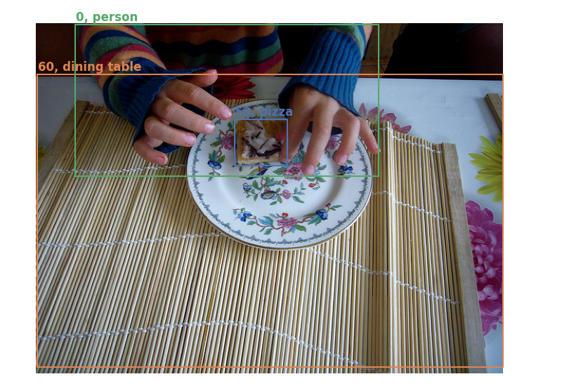
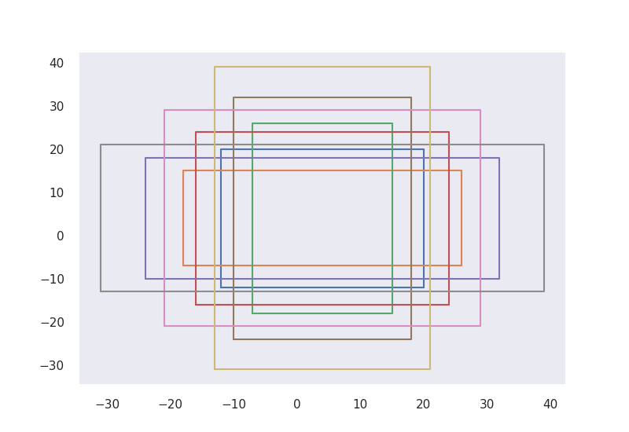
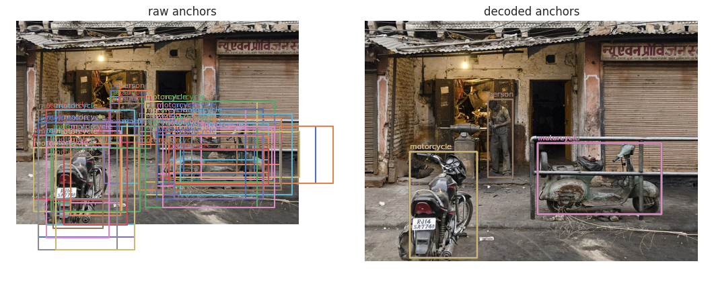

# ___2022 - 01 - 11 EfficientDet___
***

# Links
  - [Unet Plus Plus with EfficientNet Encoder](https://www.kaggle.com/meaninglesslives/unet-plus-plus-with-efficientnet-encoder)
  - [mask-rcnn with augmentation and multiple masks](https://www.kaggle.com/abhishek/mask-rcnn-with-augmentation-and-multiple-masks)
  - [Object detection: Bounding box regression with Keras, TensorFlow, and Deep Learning](https://www.pyimagesearch.com/2020/10/05/object-detection-bounding-box-regression-with-keras-tensorflow-and-deep-learning/)
  - [R-CNN object detection with Keras, TensorFlow, and Deep Learning](https://www.pyimagesearch.com/2020/07/13/r-cnn-object-detection-with-keras-tensorflow-and-deep-learning/)
  - [Paper 1911.09070 EfficientDet: Scalable and Efficient Object Detection](https://arxiv.org/pdf/1911.09070.pdf)
  - [Github google/automl/efficientdet](https://github.com/google/automl/tree/master/efficientdet)
  - [Github zylo117/Yet-Another-EfficientDet-Pytorch](https://github.com/zylo117/Yet-Another-EfficientDet-Pytorch)
***

# COCO dataset
## dataset basic info
  ```py
  COCO_LABELS = """person, bicycle, car, motorcycle, airplane, bus, train, truck, boat, traffic light, fire hydrant, stop sign,
      parking meter, bench, bird, cat, dog, horse, sheep, cow, elephant, bear, zebra, giraffe, backpack, umbrella, handbag, tie,
      suitcase, frisbee, skis, snowboard, sports ball, kite, baseball bat, baseball glove, skateboard, surfboard, tennis racket,
      bottle, wine glass, cup, fork, knife, spoon, bowl, banana, apple, sandwich, orange, broccoli, carrot, hot dog, pizza, donut,
      cake, chair, couch, potted plant, bed, dining table, toilet, tv, laptop, mouse, remote, keyboard, cell phone, microwave, oven,
      toaster, sink, refrigerator, book, clock, vase, scissors, teddy bear, hair drier, toothbrush"""
  COCO_LABEL_DICT = {id: ii.strip() for id, ii in enumerate(COCO_LABELS.split(","))}

  import tensorflow_datasets as tfds
  ds, info = tfds.load('coco/2017', with_info=True)
  aa = ds['train'].as_numpy_iterator().next()
  print(aa.keys())
  # dict_keys(['image', 'image/filename', 'image/id', 'objects'])
  print(aa['image'].shape)
  # (462, 640, 3)
  print(aa['objects'])
  # {'area': array([17821, 16942,  4344]),
  #  'bbox': array([[0.54380953, 0.13464062, 0.98651516, 0.33742186],
  #      [0.50707793, 0.517875  , 0.8044805 , 0.891125  ],
  #      [0.3264935 , 0.36971876, 0.65203464, 0.4431875 ]], dtype=float32),
  #  'id': array([152282, 155195, 185150]),
  #  'is_crowd': array([False, False, False]),
  #  'label': array([3, 3, 0])
  # }

  # id already processed starting from `0`, and `0` presents `person`.
  ee = []
  for ii in ds['train'].take(10000):
      ee.extend(ii['objects']['label'])
  ee = np.array(ee)
  print(f"{ee.min() = }, {ee.max() = }, {np.unique(ee).shape = }")
  # ee.min() = 0, ee.max() = 79, np.unique(ee).shape = (80,)

  from tqdm import tqdm
  bb = [ii['objects']['bbox'].shape[0] for ii in tqdm(dataset["train"])]
  pd.value_counts(bb).sort_index()
  # 0      1021
  # 1     13893
  # 2     21391
  # ...
  # 78        1
  # 80        1
  # 93        1
  pd.value_counts(bb).sort_index().plot()
  ```
## Show example
  ```py
  from keras_cv_attention_models.coco.data import COCO_LABEL_DICT

  def coco_show(sample, ax=None):
      if ax is None:
          fig, ax = plt.subplots()
      imm = sample['image']
      ax.imshow(imm)
      for bb, label, is_crowd in zip(sample['objects']['bbox'], sample['objects']['label'], sample['objects']['is_crowd']):
          if is_crowd:
              continue
          # bbox is [top, left, bottom, right]
          ss = np.array([bb[0] * imm.shape[0], bb[1] * imm.shape[1], bb[2] * imm.shape[0], bb[3] * imm.shape[1]])
          ax.plot(ss[[1, 1, 3, 3, 1]], ss[[0, 2, 2, 0, 0]])

          label = int(label)
          color = ax.lines[-1].get_color()
          ax.text(ss[1], ss[0] - 5, "{}, {}".format(label, COCO_LABEL_DICT[label]), color=color, fontweight="bold")
      ax.set_axis_off()
      plt.tight_layout()
      return sample['objects']

  import tensorflow_datasets as tfds
  ds, info = tfds.load('coco/2017', with_info=True)
  _ = coco_show(ds['train'].shuffle(100).as_numpy_iterator().next())
  ```
  
***

# Init dataset
## Anchors
  ```py
  sys.path.append('../automl/efficientdet/')
  from tf2 import anchors
  aa = anchors.Anchors(min_level=3, max_level=3, num_scales=3, aspect_ratios=[1.0, 2.0, 0.5], anchor_scale=4, image_size=8)
  bb = aa._generate_boxes()

  """ Show basic anchors """
  from keras_cv_attention_models.coco import data
  data.draw_bboxes(bb)

  """ All anchors should match """
  cc = anchors.Anchors(min_level=3, max_level=7, num_scales=3, aspect_ratios=[1.0, 2.0, 0.5], anchor_scale=4, image_size=512)._generate_boxes()
  dd = data.get_anchors()
  print(f"{cc.shape = }, {dd.shape = }, {np.allclose(cc, dd * 512) = }")
  # cc.shape = TensorShape([49104, 4]), dd.shape = TensorShape([49104, 4]), np.allclose(cc, dd * 512) = True
  ```
  
  ```py
  import tensorflow_datasets as tfds
  ds, info = tfds.load('coco/2017', with_info=True)
  aa = ds['train'].as_numpy_iterator().next()
  imm, bboxes, labels = aa['image'], aa['objects']['bbox'], aa['objects']['label']

  from keras_cv_attention_models.coco import data
  anchors = data.get_anchors()
  rr = data.assign_anchor_classes_by_iou_with_bboxes(bboxes, anchors, labels)
  print(f"{rr.shape = }, {rr[rr[:, -1] >= 0].shape = }")
  # rr.shape = TensorShape([49104, 5]), rr[rr[:, -1] >= 0].shape = TensorShape([59, 5])

  def decode_bboxes(preds, anchors):
      bboxes, label = preds[:, :4], preds[:, 4:]
      anchors_wh = anchors[:, 2:] - anchors[:, :2]
      anchors_center = (anchors[:, :2] + anchors[:, 2:]) * 0.5

      bboxes_center = bboxes[:, :2] * anchors_wh + anchors_center
      bboxes_wh = np.exp(bboxes[:, 2:]) * anchors_wh

      preds_left_top = bboxes_center - 0.5 * bboxes_wh
      pred_right_bottom = preds_left_top + bboxes_wh
      return np.concatenate([preds_left_top, pred_right_bottom, label], axis=-1)


  valid_encoded, valid_anchors = rr[rr[:, -1] >= 0], anchors[rr[:, -1] >= 0]
  valid_encoded = decode_bboxes(valid_encoded, valid_anchors)

  fig, axes = plt.subplots(1, 2)
  data.show_image_with_bboxes(imm, valid_anchors[:, :4], valid_encoded[:, -1], ax=axes[0])
  data.show_image_with_bboxes(imm, valid_encoded[:, :4], valid_encoded[:, -1], ax=axes[1])
  axes[0].set_title('raw anchors')
  axes[1].set_title('decoded anchors')
  fig.tight_layout()
  ```
  
## Random
  ```py
  def random_crop(height, width, jitter=0.3):
      new_area = width / height * np.random.uniform(1 - jitter, 1 + jitter) / np.random.uniform(1 - jitter, 1 + jitter)
      scale = np.random.uniform(0.25, 2)
      if new_area < 1:
          new_height = int(scale * height)
          new_width = int(new_height * new_area)
      else:
          new_width = int(scale * width)
          new_height = int(new_width / new_area)
      return new_height, new_width

  aa = np.array([random_crop(100, 100) for _ in range(100000)])
  hhs, wws = aa[:, 0], aa[:, 1]

  # scale: (scale * height) ** 2 * new_area, (scale * width) ** 2 * new_area,
  print("Scale range:", ((hhs * wws).min() / 1e4, (hhs * wws).max() / 1e4))
  # Scale range: (0.035, 3.9402)

  # ratio: new_area, 1 / new_area --> (0.7/1.3, 1.3/0.7) ~= (0.54, 1.85),
  print("Ratio range:", ((wws / hhs).min(), (wws / hhs).max()))
  # Ratio range: (0.5172413793103449, 1.9411764705882353)
  ```
## Dataset tests
  ```py
  import tensorflow_datasets as tfds
  from keras_cv_attention_models.coco import data
  data_name, input_shape, batch_size, buffer_size = "coco/2017", (224, 224), 16, 1000

  dataset, info = tfds.load(data_name, with_info=True)
  num_classes = info.features['objects']["label"].num_classes
  total_images = info.splits["train"].num_examples
  steps_per_epoch = int(tf.math.ceil(total_images / float(batch_size)))

  AUTOTUNE = tf.data.AUTOTUNE
  anchors = data.get_anchors(input_shape[:2]).astype("float32")
  num_anchors = anchors.shape[0]
  empty_label = tf.concat([tf.zeros([num_anchors, 4]), tf.zeros([num_anchors, 1]) - 1], axis=-1)

  magnitude = 0
  train_process = data.RandomProcessImage(target_shape=input_shape, magnitude=magnitude)
  bbox_process = lambda bbox, label: tf.cond(
      tf.shape(bbox)[0] == 0,
      lambda: empty_label,
      lambda: data.assign_anchor_classes_by_iou_with_bboxes(bbox, anchors, label),
  )
  train_dataset = dataset["train"].map(train_process).map(lambda xx, yy: (xx, bbox_process(yy[0], yy[1])))
  train_dataset = train_dataset.batch(batch_size)

  rescale_mode = "tf"
  mean, std = data.init_mean_std_by_rescale_mode(rescale_mode)
  # rescaling = lambda xx: (tf.clip_by_value(xx, 0, 255) - mean) / std
  rescaling = lambda xx: (xx - mean) / std
  train_dataset = train_dataset.map(lambda xx, yy: (rescaling(xx), yy), num_parallel_calls=AUTOTUNE)
  train_dataset = train_dataset.prefetch(buffer_size=AUTOTUNE)
  ```
  ```py
  from keras_cv_attention_models.coco import data
  import tensorflow_datasets as tfds
  data_name, input_shape, batch_size, buffer_size = "coco/2017", (224, 224), 16, 1000
  dataset, info = tfds.load(data_name, with_info=True)

  anchors = data.get_anchors(input_shape[:2]).astype("float32")
  num_anchors = anchors.shape[0]
  empty_label = tf.zeros([num_anchors, 5])
  train_process = data.RandomProcessImage(target_shape=input_shape, magnitude=5)
  bbox_process = lambda bbox, label: tf.cond(
      tf.shape(bbox)[0] == 0,
      lambda: empty_label,
      lambda: data.assign_anchor_classes_by_iou_with_bboxes(bbox, anchors, label),
  )
  for id, ii in enumerate(dataset['train']):
      print(id)
      # imm, bbox, label = ii['image'], ii['objects']['bbox'], ii['objects']['label']
      imm, (bbox, label) = train_process(ii)
      yy = bbox_process(bbox, label)
      if np.isnan(yy).sum() != 0:
          break
  ```
***

# EfficientDet build
## Automl definition
  ```py
  sys.path.append('../automl/efficientdet/')
  from tf2 import efficientdet_keras
  model = efficientdet_keras.EfficientDetNet(model_name="efficientdet-d0")
  inputs = keras.layers.Input([512, 512, 3])
  mm = keras.models.Model(inputs, model.call(inputs, training=False))
  {ii.name: ii.shape for ii in mm.outputs}
  # {'class_net/class-predict/BiasAdd:0': TensorShape([None, 64, 64, 810]),
  #  'class_net/class-predict/BiasAdd_1:0': TensorShape([None, 32, 32, 810]),
  #  'class_net/class-predict/BiasAdd_2:0': TensorShape([None, 16, 16, 810]),
  #  'class_net/class-predict/BiasAdd_3:0': TensorShape([None, 8, 8, 810]),
  #  'class_net/class-predict/BiasAdd_4:0': TensorShape([None, 4, 4, 810]),
  #  'box_net/box-predict/BiasAdd:0': TensorShape([None, 64, 64, 36]),
  #  'box_net/box-predict/BiasAdd_1:0': TensorShape([None, 32, 32, 36]),
  #  'box_net/box-predict/BiasAdd_2:0': TensorShape([None, 16, 16, 36]),
  #  'box_net/box-predict/BiasAdd_3:0': TensorShape([None, 8, 8, 36]),
  #  'box_net/box-predict/BiasAdd_4:0': TensorShape([None, 4, 4, 36])}
  #   cls_out_list, box_out_list = model(inputs, training=False)

  """ Backbone """
  print(f"{model.backbone.name = }")
  # model.backbone.name = 'efficientnet-b0'
  bb = keras.models.Model(inputs, model.backbone.call(inputs, training=False))
  {ii.name: ii.shape for ii in bb.outputs}
  # {'head/dense/BiasAdd:0': TensorShape([None, 1000]),
  #  'blocks_0/Identity_1:0': TensorShape([None, 256, 256, 16]),
  #  'blocks_2/Add:0': TensorShape([None, 128, 128, 24]),
  #  'blocks_4/Add:0': TensorShape([None, 64, 64, 40]),
  #  'blocks_10/Add:0': TensorShape([None, 32, 32, 112]),
  #  'blocks_15/Identity_2:0': TensorShape([None, 16, 16, 320])}

  """ fpn_cell """
  inputs = [keras.layers.Input([ii, ii, cc]) for ii, cc in [[64, 40], [32, 112], [16, 320], [8, 64], [4, 64]]]
  feats = inputs
  fpn_cells = mm.get_layer('fpn_cells')
  cell = fpn_cells.cells[0]
  for fnode in cell.fnodes:
      feats = fnode.call(feats, training=True)
  cell_feats = feats
  min_level = fpn_cells.config.min_level
  max_level = fpn_cells.config.max_level

  feats = []
  for level in range(min_level, max_level + 1):
    for i, fnode in enumerate(reversed(fpn_cells.fpn_config.nodes)):
      if fnode['feat_level'] == level:
        feats.append(cell_feats[-1 - i])
        break
  cc = keras.models.Model(inputs, feats)
  {ii.name: ii.shape for ii in cc.outputs}
  # {'op_after_combine8/bn/FusedBatchNormV3:0': TensorShape([None, 64, 64, 64]),
  #  'op_after_combine9/bn/FusedBatchNormV3:0': TensorShape([None, 32, 32, 64]),
  #  'op_after_combine10/bn/FusedBatchNormV3:0': TensorShape([None, 16, 16, 64]),
  #  'op_after_combine11/bn/FusedBatchNormV3:0': TensorShape([None, 8, 8, 64]),
  #  'op_after_combine12/bn/FusedBatchNormV3:0': TensorShape([None, 4, 4, 64])}
  ```
## EfficientDet build
  ```py
  from keras_cv_attention_models import efficientnet
  mm = efficientnet.EfficientNetV1B0()

  """ Pick all stack output layers """
  dd = {}
  for ii in mm.layers:
      match = re.match("^stack_?(\\d+)_block_?(\\d+)_output$", ii.name)
      if match is not None:
          cur_stack = "stack_" + match[1] + "_output"
          dd.update({cur_stack: ii})

  """ Filter those have same downsample rate """
  ee = {str(vv.output_shape[1]): vv for kk, vv in dd.items()}
  {ii.name: ii.output_shape for ii in ee.values()}
  # {'stack_0_block0_output': (None, 112, 112, 16),
  #  'stack_1_block1_output': (None, 56, 56, 24),
  #  'stack_2_block1_output': (None, 28, 28, 40),
  #  'stack_4_block2_output': (None, 14, 14, 112),
  #  'stack_6_block0_output': (None, 7, 7, 320)}

  """ Selected features """
  features = list(ee.values())[1:]
  ```
  ```py
  def bi_fpn_5(features, output_channel, activation="swish", name=""):
      print(f">>>> bi_fpn: {[ii.shape for ii in features] = }")
      p3, p4, p5, p6, p7 = features
      p6_up = resample_fusion([p6, p7], output_channel, activation=activation, name=name + "p6_up_")
      p5_up = resample_fusion([p5, p6_up], output_channel, activation=activation, name=name + "p5_up_")
      p4_up = resample_fusion([p4, p5_up], output_channel, activation=activation, name=name + "p4_up_")
      p3_out = resample_fusion([p3, p4_up], output_channel, activation=activation, name=name + "p3_up_")

      p4_out = resample_fusion([p4, p4_up, p3_out], output_channel, activation=activation, name=name + "p4_out_")
      p5_out = resample_fusion([p5, p5_up, p4_out], output_channel, activation=activation, name=name + "p5_out_")
      p6_out = resample_fusion([p6, p6_up, p5_out], output_channel, activation=activation, name=name + "p6_out_")
      p7_out = resample_fusion([p7, p6_out], output_channel, activation=activation, name=name + "p7_out_")
      return [p3_out, p4_out, p5_out, p6_out, p7_out]
  ```
## Recompute grad
  - [reducing-memory-usage-when-training-efficientdets-on-gpu](https://github.com/google/automl/tree/master/efficientdet#11-reducing-memory-usage-when-training-efficientdets-on-gpu)
  ```py
  def recompute_grad(recompute=False):
      """Decorator determine whether use gradient checkpoint.
      """

      def _wrapper(f):
          if recompute:
              return tf.recompute_grad(f)
          return f

      return _wrapper
  ```
***

# Convert and predict
## Convert weights
  ```py
  from keras_cv_attention_models.efficientdet import convert_efficientdet as efficientdet
  from keras_cv_attention_models.model_surgery import model_surgery

  # bb = efficientdet.EfficientNetV1B0(input_shape=(512, 512, 3), num_classes=0, output_conv_filter=0)
  # bb = efficientdet.EfficientDet(bb, num_classes=90)
  idx = 1
  bb = getattr(efficientdet, "EfficientDetD{}".format(idx))()

  target_names = [ii.name for ii in bb.layers if len(ii.weights) != 0]
  aa = {bb.get_layer(ii).name: [jj.shape.as_list() for jj in bb.get_layer(ii).weights] for ii in target_names}
  _ = [print("  '{}': {}".format(kk, vv)) for kk, vv in aa.items()]

  """ Load h5 weights, flatten to dict format {layer_name: weights} """
  import h5py
  ff = h5py.File("efficientdet-d{}.h5".format(idx), mode="r")

  def get_weights_recursion(value, pre_name=[]):
      if not isinstance(value, h5py.Group):
          return [("/".join(pre_name), value)]
      else:
          aa = []
          for kk in value.keys():
              aa.extend(get_weights_recursion(value[kk], pre_name+[kk]))
          return aa

  aa = get_weights_recursion(ff["efficientnet-b{}".format(idx)]["efficientnet-b{}".format(idx)])
  aa.extend(get_weights_recursion(ff['resample_p6']['resample_p6']))
  # {'bn': [(64,), (64,), (64,), (64,)], 'conv2d': [(64,), (1, 1, 320, 64)]}
  aa.extend(get_weights_recursion(ff['fpn_cells']['fpn_cells']))
  aa.extend(get_weights_recursion(ff['box_net']['box_net']))
  aa.extend(get_weights_recursion(ff['class_net']['class_net']))

  """ Stack weights by layer name """
  ss = {}
  for ii in aa:
      split_name = ii[0].split("/")
      layer_name, weight_name = "_".join(split_name[:-1]), split_name[-1]
      ss.setdefault(layer_name, {}).update({weight_name: ii[1]})
  {kk : [ss[kk][ii].shape for ii in ss[kk]] for kk in ss}

  """ Reload weights """
  for ii in target_names:
      print(ii)
      ww = ss[ii]
      tt = bb.get_layer(ii)
      if isinstance(tt, efficientdet.ReluWeightedSum):
          tt.set_weights([np.array([tf.convert_to_tensor(ww[ii]) for ii in ww])])
      else:
          tt.set_weights([tf.convert_to_tensor(ww[ii.name.split('/')[-1]]).numpy() for ii in tt.weights])

  bb.save(bb.name.lower() + ".h5")

  """ Run prediction """
  from keras_cv_attention_models.coco import data
  from keras_cv_attention_models import test_images
  imm = test_images.dog()
  bbs, ccs = bb.decode_predictions(bb(bb.preprocess_input(imm))[0])
  data.show_image_with_bboxes(imm, bbs, ccs, num_classes=90)
  ```
  **Tests**
  ```py
  inputs = [keras.layers.Input([ii, ii, cc]) for ii, cc in [[64, 40], [32, 112], [16, 320], [8, 64], [4, 64]]]
  fpn_features = inputs
  for id in range(3):
      fpn_features = efficientdet.bi_fpn(fpn_features, 64, name="cell_{}_".format(id))
  bb = keras.models.Model(inputs, fpn_features)
  target_names = [ii.name for ii in bb.layers if len(ii.weights) != 0]
  aa = {bb.get_layer(ii).name: [jj.shape.as_list() for jj in bb.get_layer(ii).weights] for ii in target_names}
  _ = [print("  '{}': {}".format(kk, vv)) for kk, vv in aa.items()]
  ```
  ```py
  inputs = [keras.layers.Input([ii, ii, cc]) for ii, cc in [[64, 64], [32, 64], [16, 64], [8, 64], [4, 64]]]
  head_depth, num_anchors, activation = 3, 9, "swish"
  bbox_regressor = efficientdet.detector_head(inputs, 64, head_depth, 4, num_anchors, activation, head_activation=None, name="box-")
  bb = keras.models.Model(inputs, bbox_regressor)
  target_names = [ii.name for ii in bb.layers if len(ii.weights) != 0]
  aa = {bb.get_layer(ii).name: [jj.shape.as_list() for jj in bb.get_layer(ii).weights] for ii in target_names}
  _ = [print("  '{}': {}".format(kk, vv)) for kk, vv in aa.items()]
  ```
## Predict
  ```py
  from keras_cv_attention_models.coco import data
  from keras_cv_attention_models import test_images
  imm = test_images.dog()
  rr = bb(tf.expand_dims(keras.applications.imagenet_utils.preprocess_input(imm, mode='torch'), 0))[0].numpy()

  anchors = data.get_anchors()
  dd = data.decode_bboxes(rr, anchors).numpy()
  cc = dd[dd[:, 4:].max(-1) > 0.3]
  rr = tf.image.non_max_suppression(cc[:, :4], cc[:, 4:].max(-1), max_output_size=15, iou_threshold=0.5)
  cc_nms = tf.gather(cc, rr).numpy()
  bboxes, labels = cc_nms[:, :4], cc_nms[:, 4:].argmax(-1)
  data.show_image_with_bboxes(imm, bboxes, labels, num_classes=90)
  ```
  ```py
  from keras_cv_attention_models.coco import data
  from keras_cv_attention_models import test_images
  imm = test_images.dog()
  bbs, ccs = bb.decode_predictions(bb(bb.preprocess_input(imm))[0])
  data.show_image_with_bboxes(imm, bbs, ccs, num_classes=90)
  ```
## Reload
  ```py
  from keras_cv_attention_models.efficientdet import efficientdet
  idx = 1
  mm = getattr(efficientdet, "EfficientDetD{}".format(idx))()
  mm.load_weights(mm.name + '.h5')

  from keras_cv_attention_models.coco import data
  from keras_cv_attention_models import test_images
  imm = test_images.dog_cat()
  bbs, lls, ccs = mm.decode_predictions(mm(mm.preprocess_input(imm)))[0]
  data.show_image_with_bboxes(imm, bbs, ccs, num_classes=90)

  mm.save("{}_{}_coco.h5".format(mm.name, mm.input_shape[1]))
  ```
***
