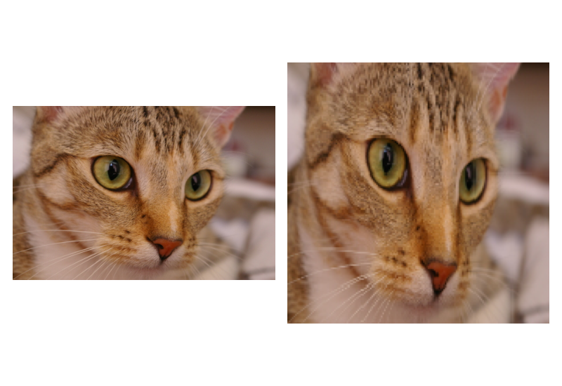

# Token label
## Troch roi align
  - [token labeling](https://www.cnblogs.com/dan-baishucaizi/p/14994269.html)
  ```py
  # RandomResizedCropAndInterpolationWithCoords, https://github.com/zihangJiang/TokenLabeling/blob/aa438eff9b9fc2daa8c8b4cc6bfaa6e3721f995e/tlt/data/label_transforms_factory.py#L41
  i, j, h, w = self.get_params(img, self.scale, self.ratio)
  coords = (i / img.size[1],
            j / img.size[0],
            h / img.size[1],
            w / img.size[0])
  coords_map = torch.zeros_like(label_map[0:1])
  # trick to store coords_map is label_map
  coords_map[0,0,0,0],coords_map[0,0,0,1],coords_map[0,0,0,2],coords_map[0,0,0,3] = coords
  label_map = torch.cat([label_map, coords_map])
  if isinstance(self.interpolation, (tuple, list)):
      interpolation = random.choice(self.interpolation)
  else:
      interpolation = self.interpolation
  return torchvision_F.resized_crop(img, i, j, h, w, self.size, interpolation), label_map
  ```
  ```py
  from torchvision.ops import roi_align
  import torch

  def one_hot(x, num_classes, on_value=1., off_value=0., device='cuda'):
      x = x.long().view(-1, 1)
      return torch.full((x.size()[0], num_classes), off_value, device=device).scatter_(1, x, on_value)

  def get_featuremaps(label_maps_topk, num_classes, device='cuda'):
      label_maps_topk_sizes = label_maps_topk[0].size()
      label_maps = torch.full([label_maps_topk.size(0), num_classes, label_maps_topk_sizes[2],
                                label_maps_topk_sizes[3]], 0, dtype=torch.float32 ,device=device)
      for _label_map, _label_topk in zip(label_maps, label_maps_topk):
          _label_map = _label_map.scatter_(
              0,
              _label_topk[1][:, :, :].long(),
              _label_topk[0][:, :, :].float()
          )
      return label_maps

  def get_label(label_maps, batch_coords,label_size=1,device='cuda'):
      num_batches = label_maps.size(0)
      print(">>>> boxes:", torch.cat([torch.arange(num_batches).view(num_batches, 1).float().to(device), batch_coords.float() * label_maps.size(3) - 0.5], 1))
      target_label = roi_align(
          input=label_maps,
          boxes=torch.cat([torch.arange(num_batches).view(num_batches, 1).float().to(device), batch_coords.float() * label_maps.size(3) - 0.5], 1),
          output_size=(label_size, label_size))
      if label_size>1:
          target_label_cls = roi_align(
              input=label_maps,
              boxes=torch.cat([torch.arange(num_batches).view(num_batches, 1).float().to(device), batch_coords.float() * label_maps.size(3) - 0.5], 1),
              output_size=(1, 1))
          B,C,H,W = target_label.shape
          target_label = target_label.view(B,C,H*W)
          target_label = torch.cat([target_label_cls.view(B,C,1),target_label],dim=2)
      # target_label = torch.nn.functional.softmax(target_label.squeeze(), 1)
      return target_label

  def get_labelmaps_with_coords(label_maps_topk, num_classes, on_value=1., off_value=0.,label_size=1, device='cuda'):
      '''
      Adapted from https://github.com/naver-ai/relabel_imagenet/blob/main/utils/relabel_functions.py
      Generate the target label map for training from the given bbox and raw label map
      '''
      # trick to get coords_map from label_map
      random_crop_coords = label_maps_topk[:,2,0,0,:4].view(-1, 4)
      random_crop_coords[:, 2:] += random_crop_coords[:, :2]
      random_crop_coords = random_crop_coords.to(device)

      # trick to get ground truth from label_map
      ground_truth = label_maps_topk[:,2,0,0,5].view(-1).to(dtype=torch.int64)
      ground_truth = one_hot(ground_truth, num_classes, on_value=on_value, off_value=off_value, device=device)

      # get full label maps from raw topk labels
      label_maps = get_featuremaps(label_maps_topk=label_maps_topk, num_classes=num_classes,device=device)

      # get token-level label and ground truth
      token_label = get_label(label_maps=label_maps, batch_coords=random_crop_coords, label_size=label_size, device=device)
      B,C = token_label.shape[:2]
      token_label = token_label*on_value+off_value
      if label_size==1:
          return torch.cat([ground_truth.view(B,C,1),token_label.view(B,C,1)],dim=2)
      else:
          return torch.cat([ground_truth.view(B,C,1),token_label],dim=2)

  label_map = np.concatenate([np.random.uniform(size=(1, 5, 18, 18)), np.random.choice(10, size=[1, 5, 18, 18])], 0)

  label_map = torch.from_numpy(label_map)
  coords_map = torch.zeros_like(label_map[0:1])
  coords_map[0, 0, 0, :4] = torch.tensor([0, 0, 1, 1])
  label_map = torch.cat([label_map, coords_map])

  label_maps_topk = torch.from_numpy(np.expand_dims(label_map, 0))
  num_classes, on_value, off_value, label_size, device = 20, 1, 0, 14, 'cpu'
  aa = get_labelmaps_with_coords(label_maps_topk, num_classes, label_size=label_size, device=device).numpy()
  ```
## TF crop and resize
  ```py
  batch_size = 1
  num_boxes = 5
  crop_size = (24, 24)

  from skimage.data import chelsea
  image = chelsea()

  target_patches = 7
  xx, yy = np.meshgrid(np.arange(0, target_patches), np.arange(0, target_patches))
  xx, yy = xx.reshape(-1, 1), yy.reshape(-1, 1)
  zz = np.concatenate([xx, yy, xx + 1, yy + 1], axis=-1) / target_patches
  output = tf.image.crop_and_resize(np.expand_dims(image, 0), zz, [0] * (target_patches * target_patches), crop_size)

  out = output.numpy().reshape(target_patches, target_patches, *crop_size, image.shape[-1])

  fig, axes = plt.subplots(1, 2)
  axes[0].imshow(image)
  axes[1].imshow(np.hstack([np.vstack(out[ii]) for ii in range(target_patches)]) / 255)
  ```
  
  ```py
  image = tf.random.uniform([7, 7, 3])
  crop_size = (1, 1)
  target_patches = 14
  xx, yy = np.meshgrid(np.arange(0, target_patches), np.arange(0, target_patches))
  xx, yy = xx.reshape(-1, 1), yy.reshape(-1, 1)
  zz = np.concatenate([xx, yy, xx + 1, yy + 1], axis=-1) / target_patches
  output = tf.image.crop_and_resize(np.expand_dims(image, 0), zz, [0] * (target_patches * target_patches), crop_size)

  out = output.numpy().reshape(target_patches, target_patches, *crop_size, image.shape[-1])

  fig, axes = plt.subplots(1, 3)
  axes[0].imshow(image)
  axes[1].imshow(np.hstack([np.vstack(out[ii]) for ii in range(target_patches)]))

  imm = token_label_preprocess(image, num_classes=image.shape[-1], num_pathes=target_patches).numpy()
  imm = imm.reshape(target_patches, target_patches, image.shape[-1])
  axes[2].imshow(imm)
  ```
  ```py
  def token_label_preprocess(token_label, num_classes=10, num_pathes=14):
      if token_label.shape[-1] != num_classes:
          ibb = np.zeros([*token_label.shape[1:-1], num_classes])
          ipp_ids = tf.cast(tf.reshape(token_label[0], (-1, token_label.shape[-1])), tf.int32)
          ipp_scores = tf.reshape(token_label[1], (-1, token_label.shape[-1]))
          for ii, id, score in zip(ibb.reshape(-1, ibb.shape[-1]), ipp_ids, ipp_scores):
              ii[id] = score
          token_label = ibb

      cur_patches = token_label.shape[0]
      if num_pathes != cur_patches:
          # token_label = tf.image.resize(token_label, (num_pathes, num_pathes))
          # token_label = tf.gather(token_label, pick, axis=0)        
          # token_label = tf.gather(token_label, pick, axis=1)
          pick = np.clip(np.arange(0, cur_patches, cur_patches / num_pathes), 0, cur_patches - 1)
          pick_floor = np.floor(pick).astype('int')
          pick_ceil = np.ceil(pick).astype('int')
          pick_val = tf.reshape(tf.cast(pick - pick_floor, token_label.dtype), [-1, 1, 1])

          token_label = tf.gather(token_label, pick_floor, axis=0) * pick_val + tf.gather(token_label, pick_ceil, axis=0) * (1 - pick_val)
          pick_val = tf.transpose(pick_val, [1, 0, 2])
          token_label = tf.gather(token_label, pick_floor, axis=1) * pick_val + tf.gather(token_label, pick_ceil, axis=1) * (1 - pick_val)
      token_label = tf.reshape(token_label, (num_pathes * num_pathes, token_label.shape[-1]))
      return token_label
  ```

  ```py
  def token_label_preprocess(token_label, num_classes=10, num_pathes=14):
      if token_label.shape[-1] != num_classes:  # To one_hot like
          ipp_ids = tf.cast(tf.reshape(token_label[0], (-1, token_label.shape[-1], 1)), tf.int32)
          ipp_scores = tf.cast(tf.reshape(token_label[1], (-1, token_label.shape[-1])), tf.float32)

          iaa = tf.zeros(num_classes)
          ibb = tf.stack([tf.tensor_scatter_nd_update(iaa, ipp_ids[ii], ipp_scores[ii]) for ii in range(ipp_ids.shape[0])])
          # hhww = token_label.shape[1] * token_label.shape[2]
          # id_indexes = tf.expand_dims(tf.range(hhww), 1) + tf.expand_dims(tf.range(token_label.shape[-1]), 0)
          # indexed_ids = tf.concat([tf.expand_dims(id_indexes, -1), ipp_ids], -1)
          # ibb = tf.zeros([hhww, num_classes])
          # tf.print(ibb.shape, indexed_ids.shape, ipp_scores.shape)
          # ibb = tf.tensor_scatter_nd_update(ibb, indexed_ids, ipp_scores)
          token_label = tf.reshape(ibb, [token_label.shape[1], token_label.shape[2], ibb.shape[-1]])

      cur_patches = token_label.shape[0]
      if num_pathes != cur_patches:
          xx, yy = np.meshgrid(np.arange(0, num_pathes), np.arange(0, num_pathes))
          xx, yy = xx.reshape(-1, 1), yy.reshape(-1, 1)
          boxes = np.concatenate([xx, yy, xx + 1, yy + 1], axis=-1) / num_pathes
          box_indices = [0] * (num_pathes * num_pathes)
          token_label = tf.image.crop_and_resize(tf.expand_dims(token_label, 0), boxes, box_indices, crop_size=(1, 1))
      token_label = tf.reshape(token_label, (num_pathes * num_pathes, token_label.shape[-1]))
      return token_label

  token_label = np.concatenate([np.random.choice(10, size=[1, 7, 7, 5]), np.random.uniform(size=(1, 7, 7, 5))], 0)
  token_label_preprocess(token_label, num_classes=10).shape
  # TensorShape([196, 10])

  def load_cifar10_token_label(label_token_file, num_classes=10, batch_size=1024, image_shape=(32, 32), num_pathes=14):
      import tensorflow_datasets as tfds
      AUTOTUNE = tf.data.experimental.AUTOTUNE

      train_ds = tfds.load("cifar10", split="train")

      token_label_data = np.load(label_token_file)
      token_label_ds = tf.data.Dataset.from_tensor_slices(token_label_data)
      token_label_train_ds = tf.data.Dataset.zip((train_ds, token_label_ds))

      image_preprocess = lambda data: tf.image.resize(data["image"], image_shape[:2]) / 255.0
      label_preprocess = lambda data: tf.one_hot(data["label"], depth=num_classes)

      train_preprocessing = lambda data, token_label: (image_preprocess(data), (label_preprocess(data), token_label_preprocess(token_label, num_classes, num_pathes)))
      token_label_train_ds = token_label_train_ds.shuffle(buffer_size=batch_size * 100).map(train_preprocessing, num_parallel_calls=AUTOTUNE)
      token_label_train_ds = token_label_train_ds.batch(batch_size).prefetch(buffer_size=AUTOTUNE)

      # Load test dataset
      test_preprocessing = lambda data: (image_preprocess(data), label_preprocess(data))
      test_ds = tfds.load("cifar10", split="test").map(test_preprocessing, num_parallel_calls=AUTOTUNE).batch(batch_size)
      return token_label_train_ds, test_ds

  token_label_train_ds, test_ds = load_cifar10_token_label("cifar10_token_label_patch_50000_2_7_7_5.npy", batch_size=32, image_shape=(224, 224))
  dd = token_label_train_ds.as_numpy_iterator().next()
  ```
## Token labeling

  ```py
  from skimage.data import chelsea
  img = chelsea()[:224, :224]
  num_patches = 14
  patch_size = 224 // 14
  iaa = img.reshape(num_patches, patch_size, num_patches, patch_size, 3).transpose(0, 2, 1, 3, 4).reshape(-1, patch_size, patch_size, 3)

  from skimage.transform import resize
  mm = keras.applications.EfficientNetB1(input_shape=(240, 240, 3))
  ibb = np.array([resize(ii, mm.input_shape[1:3]) for ii in iaa])
  ipp = mm(ibb).numpy()
  for id, ii in enumerate(np.argsort(ipp, axis=-1)):
      ipp[id][ii[:-5]] = 0  # Keep the top 5
  print(f"{ipp.shape = }, {(ipp != 0).sum(1) = }")
  # ipp.shape = (196, 1000), (ipp != 0).sum(1) = array([5, 5, 5, 5, ...])
  ```
  ```py
  import numpy as np
  import tensorflow as tf

  def token_label_preprocessing(image, teacher_model, num_patches=14, top_k=5, return_one_hot=True):
      patch_size = image_shape[0] // num_patches
      iaa = image.numpy().reshape(num_patches, patch_size, num_patches, patch_size, 3).transpose(0, 2, 1, 3, 4).reshape(-1, patch_size, patch_size, 3)
      ibb = tf.stack([tf.image.resize(ii, teacher_model.input_shape[1:3]) for ii in iaa]) # (0, 255)
      if teacher_model.layers[-1].activation.__name__ == "softmax":
          ipp = teacher_model(ibb).numpy()
      else:
          ipp = tf.nn.softmax(teacher_model(ibb)).numpy()

      if return_one_hot:
          for id, ii in enumerate(np.argsort(ipp, axis=-1)):
              ipp[id][ii[:-top_k]] = 0  # Keep the top top_k
          return ipp
      else:
          ipp_ids = np.argsort(ipp, axis=-1)[:, -top_k:]
          ipp_scores = np.stack([ii[jj] for ii, jj in zip(ipp, ipp_ids)])
          return ipp_ids, ipp_scores

  import tensorflow_datasets as tfds
  train_ds = tfds.load("cifar10", split="train")
  data = train_ds.as_numpy_iterator().next()
  image_shape = (224, 224)
  image = tf.image.resize(data["image"], image_shape[:2])

  # Return encoded one-hot labels
  model = keras.models.load_model(tf.io.gfile.glob("ef_b0_cifar10_*.h5")[0])
  ipp = token_label_preprocessing(image, model)
  print(f"{ipp.shape = }")
  # ipp.shape = (196, 10)

  # Return ids and their scores if num_classes is large
  num_classes = 10
  ipp_ids, ipp_scores = token_label_preprocessing(image, model, return_one_hot=False)
  print(f"{ipp_ids.shape = }, {ipp_scores.shape = }")
  ibb = np.zeros([ipp_ids.shape[0], num_classes])
  for ii, id, score in zip(ibb, ipp_ids, ipp_scores):
      ii[id] = score

  print(f"{np.allclose(ibb, ipp) = }")
  # np.allclose(ibb, ipp) = True

  from tqdm import tqdm
  aa = [token_label_preprocessing(tf.image.resize(data["image"], image_shape[:2]), model) for data in tqdm(train_ds)]
  np.save('cifar10_label_token_{}.npy'.format(aa[0].shape[0]), np.stack(aa))

  label_token = np.load("cifar10_label_token_patch_196.npy")
  label_token_ds = tf.data.Dataset.from_tensor_slices(label_token)
  label_token_train_ds = tf.data.Dataset.zip((train_ds, label_token_ds))
  bb = label_token_train_ds.as_numpy_iterator().next()
  print(f"{bb[0]['image'].shape = }, {bb[0]['label'] = }, {bb[1].shape = }")
  # bb[0]['image'].shape = (32, 32, 3), bb[0]['label'] = 7, bb[1].shape = (196, 10)

  AUTOTUNE = tf.data.experimental.AUTOTUNE
  image_shape = (224, 224, 3)
  batch_size = 32
  data_preprocessing = lambda data: (tf.image.resize(data["image"], image_shape[:2]), data["label"])
  label_token_preprocessing = lambda data, label_token: (tf.image.resize(data["image"], image_shape[:2]), (data["label"], label_token))
  label_token_train_ds = label_token_train_ds.shuffle(buffer_size=batch_size * 100).map(label_token_preprocessing, num_parallel_calls=AUTOTUNE)
  label_token_train_ds = label_token_train_ds.batch(batch_size).prefetch(buffer_size=AUTOTUNE)
  bb = label_token_train_ds.as_numpy_iterator().next()
  print(f"{bb[0].shape = }, {bb[1][0].shape = }, {bb[1][1].shape = }")
  # bb[0].shape = (32, 224, 224, 3), bb[1][0].shape = (32,), bb[1][1].shape = (32, 196, 10)

  test_ds = tfds.load("cifar10", split="test").map(data_preprocessing, num_parallel_calls=AUTOTUNE).batch(batch_size)
  bb = test_ds.as_numpy_iterator().next()
  print(f"{bb[0].shape = }, {bb[1].shape = }")
  # bb[0].shape = (32, 224, 224, 3), bb[1].shape = (32,)
  ```
## Model
  ```py
  # mm = kecam.efficientnet.EfficientNetV2S()
  mm = keras.models.load_model('checkpoints/freeze_backbone_test_latest.h5', compile=False)
  nn = token_label.convert_to_token_label_model(mm)
  tt = kecam.imagenet.data.init_dataset('cifar10', input_shape=mm.input_shape[1:], batch_size=16, magnitude=-1, use_shuffle=False)[0]
  aa, bb = tt.as_numpy_iterator().next()
  cc = token_label.extract_token_label_batch(aa, nn)
  print(f"{aa.shape = }, {bb.shape = }, {cc.shape = }")
  # aa.shape = (16, 160, 160, 3), bb.shape = (16, 10), cc.shape = TensorShape([16, 2, 5, 5, 5])

  image, label, resize = aa[0], cc[0], (100, 100)
  show_patches(image / 2 + 0.5, label)

  import pickle
  from tqdm import tqdm
  rrs = []
  label_token_file = "aa.pkl"
  for imm, _ in tqdm(tt):
      rrs.append(token_label.extract_token_label_batch(imm, nn).numpy())
  rrs = np.concatenate(rrs, axis=0)
  # np.save(label_token_file, rrs)
  with open(label_token_file, 'wb') as ff:
      pickle.dump(rrs, ff)

  """ Verify """
  token_labels = np.array([np.reshape(rr[0], [-1])[np.argmax(np.reshape(rr[1], [-1]))] for rr in rrs])
  true_labels = np.concatenate([tf.argmax(label, -1).numpy() for _, label in tt])
  total_same = np.sum(token_labels == true_labels)
  print(f"{total_same = }, {total_same / true_labels.shape[0] = }")
  # total_same = 49053, total_same / true_labels.shape[0] = 0.98106

  """ Load and create dataset """
  AUTOTUNE = tf.data.experimental.AUTOTUNE
  batch_size = 16
  image_shape = [160, 160]
  num_classes = 10
  token_label_preprocess = TokenLabelAlign(num_classes=num_classes, target_num_pathes=7)

  train_ds = tfds.load("cifar10", split="train")
  token_label_data = np.load(label_token_file)
  token_label_ds = tf.data.Dataset.from_tensor_slices(token_label_data)
  token_label_train_ds = tf.data.Dataset.zip((train_ds, token_label_ds))

  image_preprocess = lambda data: tf.image.resize(data["image"], image_shape[:2]) / 255.0
  label_preprocess = lambda data: tf.one_hot(data["label"], depth=num_classes)

  train_preprocessing = lambda data, token_label: (
      image_preprocess(data),
      (label_preprocess(data), token_label_preprocess(token_label)),
  )
  token_label_train_ds = token_label_train_ds.shuffle(buffer_size=batch_size * 100).map(train_preprocessing, num_parallel_calls=AUTOTUNE)
  token_label_train_ds = token_label_train_ds.batch(batch_size).prefetch(buffer_size=AUTOTUNE)
  ```
  ```py
  from keras_cv_attention_models.imagenet import data
  tt = data.init_dataset('cifar10', input_shape=[160, 160, 3], batch_size=16, token_label_file='cifar10_5_5_5.pkl')[0]

  from tqdm import tqdm
  true_labels, token_labels = [], []
  for _, label in tqdm(tt):
      true_labels.append(tf.argmax(label[0], -1).numpy())
      # token_labels.extend([np.reshape(rr[0], [-1])[np.argmax(np.reshape(rr[1], [-1]))] for rr in label[1]])
      token_labels.append(tf.argmax(tf.reduce_max(label[1], axis=[1, 2]), -1).numpy())
  true_labels, token_labels = np.concatenate(true_labels), np.concatenate(token_labels)
  total_same = np.sum(token_labels == true_labels)
  print(f"{total_same = }, {total_same / true_labels.shape[0] = }")
  # total_same = 49051, total_same / true_labels.shape[0] = 0.98102
  ```
  ```py
  from keras_cv_attention_models.imagenet import data, token_label
  from keras_cv_attention_models import model_surgery
  tt = data.init_dataset('cifar10', input_shape=[160, 160, 3], batch_size=16, magnitude=0, token_label_file='cifar10_5_5_5.pkl')[0]

  mm = keras.models.load_model('checkpoints/freeze_backbone_test_latest.h5', compile=False)
  nn = model_surgery.convert_to_token_label_model(mm)
  aa, (bb, cc) = tt.as_numpy_iterator().next()
  dd = token_label.extract_token_label_batch(aa, nn)

  np.sum(dd[:, 0].numpy() == tf.math.top_k(cc, 5)[1].numpy())

  from tqdm import tqdm
  true_labels, token_labels = [], []
  for _, label in tqdm(tt):
      true_labels.append(tf.argmax(label[0], -1).numpy())
      # token_labels.extend([np.reshape(rr[0], [-1])[np.argmax(np.reshape(rr[1], [-1]))] for rr in label[1]])
      token_labels.append(tf.argmax(tf.reduce_max(label[1], axis=[1, 2]), -1).numpy())
  true_labels, token_labels = np.concatenate(true_labels), np.concatenate(token_labels)
  total_same = np.sum(token_labels == true_labels)
  print(f"{total_same = }, {total_same / true_labels.shape[0] = }")
  # total_same = 49051, total_same / true_labels.shape[0] = 0.98102
  ```
  ```py
  from keras_cv_attention_models.imagenet import token_label, data

  val_callback = token_label.TokenLabelEval(test_ds)
  aux_loss = keras.losses.CategoricalCrossentropy(from_logits=True)

  optimizer = tfa.optimizers.AdamW(learning_rate=1e-3, weight_decay=5e-5)
  model.compile(
      loss=[token_label.token_label_class_loss, aux_loss],
      loss_weights=[1, 0.5],
      metrics={model.output_names[0]: "acc", model.output_names[1]: None},
      optimizer=optimizer,
  )
  history_2 = model.fit(train_ds, epochs=epochs, callbacks=[val_callback])
  ```
  ```py
  from keras_cv_attention_models.imagenet import token_label, data
  from keras_cv_attention_models import model_surgery
  train_dataset, test_dataset, total_images, num_classes, steps_per_epoch = data.init_dataset('cifar10', input_shape=[160, 160, 3], batch_size=16, token_label_file='aa.npy')

  from keras_cv_attention_models import efficientnet
  mm = efficientnet.EfficientNetV2B0(input_shape=[160, 160, 3], num_classes=10)
  mm = model_surgery.convert_to_token_label_model(mm)
  mm.compile(
      loss=["categorical_crossentropy", "categorical_crossentropy"],
      loss_weights=[1, 0.5],
      metrics={mm.output_names[0]: "acc", mm.output_names[1]: None},
      optimizer="adam",
  )
  mm.fit(train_dataset, validation_data=test_dataset, epochs=2)
  ```
## Training
  ```sh
  CUDA_VISIBLE_DEVICES='1' TF_XLA_FLAGS="--tf_xla_auto_jit=2" ./train_script.py -m efficientnet.EfficientNetV2B0 \
  --data_name cifar10 --lr_decay_steps 20 --lr_cooldown_steps 2 --batch_size 256 --pretrained imagenet \
  --freeze_backbone --summary --seed 0 --token_label_file cifar10_5_5_5.pkl -s freeze_backbone_test_TL

  CUDA_VISIBLE_DEVICES='1' TF_XLA_FLAGS="--tf_xla_auto_jit=2" ./train_script.py -m efficientnet.EfficientNetV2B0 \
  --data_name cifar10 --lr_decay_steps 20 --lr_cooldown_steps 2 --batch_size 256 --epochs 64 \
  --pretrained checkpoints/freeze_backbone_test_TL_latest.h5 --initial_epoch 22 \
  --seed 0 --token_label_file cifar10_5_5_5.pkl -s freeze_backbone_test_TL
  ```
  ```sh
  CUDA_VISIBLE_DEVICES='1' TF_XLA_FLAGS="--tf_xla_auto_jit=2" ./train_script.py -m efficientnet.EfficientNetV2B0 \
  --data_name cifar10 --lr_decay_steps 20 --lr_cooldown_steps 2 --batch_size 256 --pretrained imagenet \
  --freeze_backbone --summary --seed 0 --token_label_file cifar10_5_5_5.pkl -s freeze_backbone_test_TL_bilinear

  CUDA_VISIBLE_DEVICES='1' TF_XLA_FLAGS="--tf_xla_auto_jit=2" ./train_script.py -m efficientnet.EfficientNetV2B0 \
  --data_name cifar10 --lr_decay_steps 20 --lr_cooldown_steps 2 --batch_size 256 --epochs 64 \
  --pretrained checkpoints/freeze_backbone_test_TL_bilinear_latest.h5 --initial_epoch 22 \
  --seed 0 --token_label_file cifar10_5_5_5.pkl -s freeze_backbone_test_TL_bilinear
  ```
  ```sh
  CUDA_VISIBLE_DEVICES='1' TF_XLA_FLAGS="--tf_xla_auto_jit=2" ./train_script.py -m efficientnet.EfficientNetV2B0 \
  --data_name cifar10 --lr_decay_steps 20 --lr_cooldown_steps 2 --batch_size 256 --pretrained imagenet \
  --freeze_backbone --summary --seed 0 --token_label_file cifar10_convnext_tiny_5_5_5.pkl -s freeze_backbone_test_convnext_TL_bilinear && \
  CUDA_VISIBLE_DEVICES='1' TF_XLA_FLAGS="--tf_xla_auto_jit=2" ./train_script.py -m efficientnet.EfficientNetV2B0 \
  --data_name cifar10 --lr_decay_steps 20 --lr_cooldown_steps 2 --batch_size 256 --epochs 64 \
  --pretrained checkpoints/freeze_backbone_test_convnext_TL_bilinear_latest.h5 --initial_epoch 22 \
  --seed 0 --token_label_file cifar10_convnext_tiny_5_5_5.pkl -s freeze_backbone_test_convnext_TL_bilinear
  ```
  ```sh
  CUDA_VISIBLE_DEVICES='1' TF_XLA_FLAGS="--tf_xla_auto_jit=2" ./train_script.py -m efficientnet.EfficientNetV2B0 \
  --data_name cifar10 --lr_decay_steps 20 --lr_cooldown_steps 2 --batch_size 256 --pretrained imagenet \
  --disable_positional_related_ops \
  --freeze_backbone --summary --seed 0 --token_label_file cifar10_5_5_5.pkl -s freeze_backbone_no_positional_test_TL_nearest_2 && \
  CUDA_VISIBLE_DEVICES='1' TF_XLA_FLAGS="--tf_xla_auto_jit=2" ./train_script.py -m efficientnet.EfficientNetV2B0 \
  --data_name cifar10 --lr_decay_steps 20 --lr_cooldown_steps 2 --batch_size 256 --epochs 64 \
  --pretrained checkpoints/freeze_backbone_no_positional_test_TL_nearest_2_latest.h5 --initial_epoch 22 \
  --disable_positional_related_ops \
  --seed 0 --token_label_file cifar10_5_5_5.pkl -s freeze_backbone_no_positional_test_TL_nearest_2
  ```
  ```sh
  CUDA_VISIBLE_DEVICES='1' TF_XLA_FLAGS="--tf_xla_auto_jit=2" ./train_script.py -m efficientnet.EfficientNetV2B0 \
  --data_name cifar10 --lr_decay_steps 20 --lr_cooldown_steps 2 --batch_size 256 --pretrained imagenet \
  --disable_positional_related_ops \
  --freeze_backbone --summary --seed 0 --token_label_file cifar10_5_5_5.pkl -s freeze_backbone_test_TL_no_positional_bilinear

  CUDA_VISIBLE_DEVICES='1' TF_XLA_FLAGS="--tf_xla_auto_jit=2" ./train_script.py -m efficientnet.EfficientNetV2B0 \
  --data_name cifar10 --lr_decay_steps 20 --lr_cooldown_steps 2 --batch_size 256 --epochs 64 \
  --pretrained checkpoints/freeze_backbone_test_TL_no_positional_bilinear_latest.h5 --initial_epoch 22 \
  --disable_positional_related_ops \
  --seed 0 --token_label_file cifar10_5_5_5.pkl -s freeze_backbone_test_TL_no_positional_bilinear
  ```
  ```py
  from keras_cv_attention_models.imagenet import eval_func
  hhs = {
      "effb0 cifar10, freeze backbone": "checkpoints/freeze_backbone_test_hist.json",
      "freeze_backbone_test_TL": "checkpoints/freeze_backbone_test_TL_hist.json",
      "freeze_backbone_test_TL_bilinear": "checkpoints/freeze_backbone_test_TL_bilinear_hist.json",
      "freeze_backbone_test_TL_no_positional": "checkpoints/freeze_backbone_test_TL_no_positional_hist.json",
      "freeze_backbone_no_positional_test_TL_nearest_2": "checkpoints/freeze_backbone_no_positional_test_TL_nearest_2_hist.json",
      "freeze_backbone_test_TL_no_positional_bilinear": "checkpoints/freeze_backbone_test_TL_no_positional_bilinear_hist.json",
      "freeze_backbone_test_convnext_TL_bilinear": "checkpoints/freeze_backbone_test_convnext_TL_bilinear_hist.json",
      "freeze_backbone_test_TL_s": "checkpoints/freeze_backbone_test_TL_s_hist.json",
  }

  fig = eval_func.plot_hists(hhs.values(), list(hhs.keys()), skip_first=3, base_size=8)
  ```
  ```py
  from keras_cv_attention_models.imagenet import eval_func
  mm = keras.models.load_model("checkpoints/freeze_backbone_test_TL_bilinear_latest.h5", compile=False)

  ```
  | token_label_file                     | Train acc, loss | Best val_acc, val_loss    | Epoch 64 val_acc |
  | ------------------------------------ | --------------- | ------------------------- | ---------------- |
  | None                                 | 0.72766, 0.1572 | Epoch 55, 0.9757, 0.01697 | 0.9749           |
  | cifar10_efficientnet_v2-b0_5_5_5.pkl | 0.78688, 0.1396 | Epoch 56, 0.9792, 0.01478 | 0.9776           |
## ConvNeXtTiny Training
  - **Freezing backbone** by set `--freeze_backbone`, will set `layer.trainable=False` till model `GlobalAveragePooling2D`.
  ```sh
  # First stage freezing backbone. total epochs = lr_decay_steps + lr_cooldown_steps = 22
  CUDA_VISIBLE_DEVICES='1' TF_XLA_FLAGS="--tf_xla_auto_jit=2" ./train_script.py -m convnext.ConvNeXtTiny \
  --data_name cifar10 --lr_decay_steps 20 --lr_cooldown_steps 2 --batch_size 256 --pretrained imagenet \
  --freeze_backbone --summary --seed 0 -s ConvNeXtTiny_freeze_backbone_test && \
  CUDA_VISIBLE_DEVICES='1' TF_XLA_FLAGS="--tf_xla_auto_jit=2" ./train_script.py -m convnext.ConvNeXtTiny \
  --data_name cifar10 --lr_decay_steps 20 --lr_cooldown_steps 2 --batch_size 256 --epochs 64 \
  --pretrained checkpoints/ConvNeXtTiny_freeze_backbone_test_latest.h5 --initial_epoch 22 --seed 0 -s ConvNeXtTiny_freeze_backbone_test
  ```
  - **Token Label**
  ```sh
  CUDA_VISIBLE_DEVICES='1' TF_XLA_FLAGS="--tf_xla_auto_jit=2" ./train_script.py -m convnext.ConvNeXtTiny \
  --data_name cifar10 --lr_decay_steps 20 --lr_cooldown_steps 2 --batch_size 256 --pretrained imagenet \
  --freeze_backbone --summary --seed 0 --token_label_file cifar10_convnext_tiny_5_5_5.pkl -s ConvNeXtTiny_freeze_backbone_test_TL_bilinear_torch && \
  CUDA_VISIBLE_DEVICES='1' TF_XLA_FLAGS="--tf_xla_auto_jit=2" ./train_script.py -m convnext.ConvNeXtTiny \
  --data_name cifar10 --lr_decay_steps 20 --lr_cooldown_steps 2 --batch_size 256 --epochs 64 \
  --pretrained checkpoints/ConvNeXtTiny_freeze_backbone_test_TL_bilinear_torch_latest.h5 --initial_epoch 22 \
  --seed 0 --token_label_file cifar10_convnext_tiny_5_5_5.pkl -s ConvNeXtTiny_freeze_backbone_test_TL_bilinear_torch
  ```
  ```sh
  CUDA_VISIBLE_DEVICES='1' TF_XLA_FLAGS="--tf_xla_auto_jit=2" ./train_script.py -m convnext.ConvNeXtTiny \
  --data_name cifar10 --lr_decay_steps 20 --lr_cooldown_steps 2 --batch_size 256 --pretrained imagenet \
  --freeze_backbone --summary --seed 0 --token_label_file cifar10_convnext_tiny_5_5_5.pkl -s ConvNeXtTiny_freeze_backbone_test_TL_nearest && \
  CUDA_VISIBLE_DEVICES='1' TF_XLA_FLAGS="--tf_xla_auto_jit=2" ./train_script.py -m convnext.ConvNeXtTiny \
  --data_name cifar10 --lr_decay_steps 20 --lr_cooldown_steps 2 --batch_size 256 --epochs 64 \
  --pretrained checkpoints/ConvNeXtTiny_freeze_backbone_test_TL_nearest_latest.h5 --initial_epoch 22 \
  --seed 0 --token_label_file cifar10_convnext_tiny_5_5_5.pkl -s ConvNeXtTiny_freeze_backbone_test_TL_nearest
  ```
  ```sh
  CUDA_VISIBLE_DEVICES='1' TF_XLA_FLAGS="--tf_xla_auto_jit=2" ./train_script.py -m efficientnet.EfficientNetV2B0 \
  --data_name cifar10 --lr_decay_steps 20 --lr_cooldown_steps 2 --batch_size 256 --pretrained imagenet \
  --disable_positional_related_ops \
  --freeze_backbone --summary --seed 0 --token_label_file cifar10_convnext_tiny_5_5_5.pkl -s freeze_backbone_test_TL_no_positional_bilinear && \
  CUDA_VISIBLE_DEVICES='1' TF_XLA_FLAGS="--tf_xla_auto_jit=2" ./train_script.py -m efficientnet.EfficientNetV2B0 \
  --data_name cifar10 --lr_decay_steps 20 --lr_cooldown_steps 2 --batch_size 256 --epochs 64 \
  --pretrained checkpoints/freeze_backbone_test_TL_no_positional_bilinear_latest.h5 --initial_epoch 22 \
  --disable_positional_related_ops \
  --seed 0 --token_label_file cifar10_convnext_tiny_5_5_5.pkl -s freeze_backbone_test_TL_no_positional_bilinear
  ```
  ```py
  from keras_cv_attention_models.imagenet import eval_func
  hhs = {
      "effb0 cifar10, freeze backbone": "checkpoints/freeze_backbone_test_hist.json",
      "ConvNeXtTiny cifar10, freeze backbone": "checkpoints/ConvNeXtTiny_freeze_backbone_test_hist.json",
      "ConvNeXtTiny_freeze_backbone_test_TL_bilinear": "checkpoints/ConvNeXtTiny_freeze_backbone_test_TL_bilinear_hist.json",
      "ConvNeXtTiny_freeze_backbone_test_TL_nearest": "checkpoints/ConvNeXtTiny_freeze_backbone_test_TL_nearest_hist.json",
      "ConvNeXtTiny_freeze_backbone_test_TL_bilinear_torch": "checkpoints/ConvNeXtTiny_freeze_backbone_test_TL_bilinear_torch_hist.json",
      # "freeze_backbone_test_TL_no_positional": "checkpoints/freeze_backbone_test_TL_no_positional_hist.json",
  }

  fig = eval_func.plot_hists(hhs.values(), list(hhs.keys()), skip_first=3, base_size=8)
  ```
  ```py
  from keras_cv_attention_models.imagenet import eval_func
  mm = keras.models.load_model("checkpoints/ConvNeXtTiny_freeze_backbone_test_latest.h5", compile=False)

  ```
  ```py
  from keras_cv_attention_models.imagenet import token_label, data
  from keras_cv_attention_models import model_surgery
  # mm = kecam.efficientnet.EfficientNetV2S()
  mm = keras.models.load_model('checkpoints/ConvNeXtTiny_freeze_backbone_test_latest.h5', compile=False)
  nn = model_surgery.convert_to_token_label_model(mm)
  tt = data.init_dataset('cifar10', input_shape=mm.input_shape[1:], batch_size=16, magnitude=-1, use_shuffle=False)[0]
  aa, bb = tt.as_numpy_iterator().next()
  cc = token_label.extract_token_label_batch(aa, nn)
  print(f"{aa.shape = }, {bb.shape = }, {cc.shape = }")
  # aa.shape = (16, 160, 160, 3), bb.shape = (16, 10), cc.shape = TensorShape([16, 2, 5, 5, 5])

  # image, label, resize = aa[0], cc[0], (100, 100)
  # show_patches(image / 2 + 0.5, label)

  import pickle
  from tqdm import tqdm
  rrs = []
  label_token_file = "aa.pkl"
  for imm, _ in tqdm(tt):
      rrs.append(token_label.extract_token_label_batch(imm, nn).numpy())
  rrs = np.concatenate(rrs, axis=0)
  # np.save(label_token_file, rrs)
  with open(label_token_file, 'wb') as ff:
      pickle.dump(rrs, ff)

  """ Verify """
  token_labels = np.array([np.reshape(rr[0], [-1])[np.argmax(np.reshape(rr[1], [-1]))] for rr in rrs])
  true_labels = np.concatenate([tf.argmax(label, -1).numpy() for _, label in tt])
  total_same = np.sum(token_labels == true_labels)
  print(f"{total_same = }, {total_same / true_labels.shape[0] = }")
  ```
  ```py
  from keras_cv_attention_models.imagenet import token_label, data
  from keras_cv_attention_models import model_surgery
  mm = keras.models.load_model('checkpoints/ConvNeXtTiny_freeze_backbone_test_latest.h5', compile=False)
  mm = model_surgery.convert_to_token_label_model(mm)

  dataset_kwargs = {
      "magnitude": 6,
      "mixup_alpha": 0.1,
      "random_crop_min": 0.08,
      "cutmix_alpha": 1.0,
  }
  tt = data.init_dataset('cifar10', input_shape=mm.input_shape[1:], batch_size=16, token_label_file='cifar10_convnext_tiny_5_5_5.pkl', **dataset_kwargs)[0]
  aa, (bb, cc) = tt.as_numpy_iterator().next()
  dd, ee = mm(aa)

  # np.sum(tf.sort(tf.math.top_k(ee, 5)[1])[..., :3] == tf.sort(tf.math.top_k(cc, 5)[1])[..., :3])
  # [np.sum(tf.sort(tf.math.top_k(ee[ii], 5)[1])[..., :3] == tf.sort(tf.math.top_k(cc[ii], 5)[1])[..., :3]) for ii in range(16)]
  np.sum(tf.where(ee > 0.2, 1, 0) == tf.where(cc > 0.2, 1, 0))
  ```
***

# Distill
  ```sh
  CUDA_VISIBLE_DEVICES='1' TF_XLA_FLAGS='--tf_xla_auto_jit=2' ./train_script.py --teacher_model convnext.ConvNeXtSmall -s _distill_ConvNeXtSmall
  ```
  ```sh
  CUDA_VISIBLE_DEVICES='1' ./train_script.py -d cifar10 --teacher_model checkpoints/freeze_backbone_s_test_epoch_63_val_acc_0.9801.h5 -m efficientnet.EfficientNetV2B0
  ```
  ```py
  input_shape, num_classes, batch_size = [32, 32, 3], 10, 64

  teacher_model = keras.models.Sequential([
      keras.layers.Input(input_shape),
      keras.layers.Conv2D(16, 3),
      keras.layers.GlobalAveragePooling2D(),
      keras.layers.Dense(num_classes),
  ])
  teacher_model.trainable = False

  student_model = keras.models.Sequential([
      keras.layers.Input(input_shape),
      keras.layers.Conv2D(16, 3),
      keras.layers.GlobalAveragePooling2D(),
      keras.layers.Dense(num_classes),
  ])

  xx, yy = tf.random.uniform([1200, *input_shape]), tf.random.uniform([1200])
  yy = tf.one_hot(tf.cast(yy * num_classes, "int32"), num_classes)

  xx, yy = tf.data.Dataset.from_tensor_slices(xx), tf.data.Dataset.from_tensor_slices(yy)
  ds = tf.data.Dataset.zip((xx, yy)).batch(batch_size, drop_remainder=True)
  ds = ds.map(lambda xx, yy: (xx, teacher_model(xx)))

  def distill_kl_divergence(teacher_prob, student_prob, temperature=10):
      return tf.losses.kl_divergence(
          tf.nn.softmax(teacher_prob / temperature, axis=-1),
          tf.nn.softmax(student_prob / temperature, axis=-1),
      )  

  student_model.compile(optimizer="adam", loss=distill_kl_divergence)
  student_model.fit(ds)
  ```
***

# Distribution
  ```py
  # tf.debugging.set_log_device_placement(True)

  class ConcatDense(keras.layers.layer):
      def __init__(self, units=1000, **kwargs):
          super().__init__(**kwargs)
          self.units = units

      def build(self, input_shape):
          self.ww = self.add_weight(
              name="norm_dense_w",
              shape=(input_shape[-1], self.units),
              trainable=True,
          )
          super().build(input_shape)

      def call(self, inputs, **kwargs):
          output = K.dot(inputs, self.ww)
          return output

      def compute_output_shape(self, input_shape):
          return (input_shape[0], self.units)

      def get_config(self):
          config = super(NormDense, self).get_config()
          config.update({"units": self.units})
          return config

  strategy = tf.distribute.MirroredStrategy()
  with strategy.scope():
      model = tf.keras.models.Sequential([
          keras.layers.Input(shape=(32, 32, 3)),
          keras.layers.Flatten(),
          keras.layers.Dense(10),
      ])
      model.compile(loss='mse', optimizer=tf.keras.optimizers.SGD(learning_rate=0.2))

  xx, yy = tf.random.uniform([160, 32, 32, 3]), tf.random.uniform([160], 0, 10, dtype='int32')
  yy = tf.one_hot(yy, 10)
  # dataset = tf.data.Dataset.from_tensors((xx, yy)).repeat(100).batch(10)
  model.fit(xx, yy, epochs=2)
  ```
  ```py
  mirrored_strategy = tf.distribute.MirroredStrategy()
  # Compute global batch size using number of replicas.
  BATCH_SIZE_PER_REPLICA = 5
  global_batch_size = (BATCH_SIZE_PER_REPLICA * mirrored_strategy.num_replicas_in_sync)
  dataset = tf.data.Dataset.from_tensors(([1.], [1.])).repeat(100)
  dataset = dataset.batch(global_batch_size)

  LEARNING_RATES_BY_BATCH_SIZE = {5: 0.1, 10: 0.15}
  learning_rate = LEARNING_RATES_BY_BATCH_SIZE[global_batch_size]

  with mirrored_strategy.scope():
      model = tf.keras.Sequential([tf.keras.layers.Dense(1, input_shape=(1,))])
      optimizer = tf.keras.optimizers.SGD()

  dataset = tf.data.Dataset.from_tensors(([1.], [1.])).repeat(1000).batch(global_batch_size)
  dist_dataset = mirrored_strategy.experimental_distribute_dataset(dataset)

  @tf.function
  def train_step(dist_inputs):
      def step_fn(inputs):
          features, labels = inputs

          with tf.GradientTape() as tape:
            # training=True is only needed if there are layers with different behavior during training versus inference (e.g. Dropout).
            logits = model(features, training=True)
            cross_entropy = tf.nn.softmax_cross_entropy_with_logits(logits=logits, labels=labels)
            loss = tf.reduce_sum(cross_entropy) * (1.0 / global_batch_size)

          grads = tape.gradient(loss, model.trainable_variables)
          optimizer.apply_gradients(list(zip(grads, model.trainable_variables)))
          return cross_entropy

      per_example_losses = mirrored_strategy.experimental_run_v2(step_fn, args=(dist_inputs,))
      mean_loss = mirrored_strategy.reduce(tf.distribute.ReduceOp.MEAN, per_example_losses, axis=0)
      return mean_loss

  with mirrored_strategy.scope():
      for inputs in dist_dataset:
          print(train_step(inputs))
  ```
  ```py
  @tf.function
  def step_fn(inputs):
      return ss.experimental_assign_to_logical_device(mm.predict(inputs), 0)

  with ss.scope():
      ss.run(step_fn, args=(np.ones([2, 112, 112, 3]),))
  ```
***

# DTensor
***
