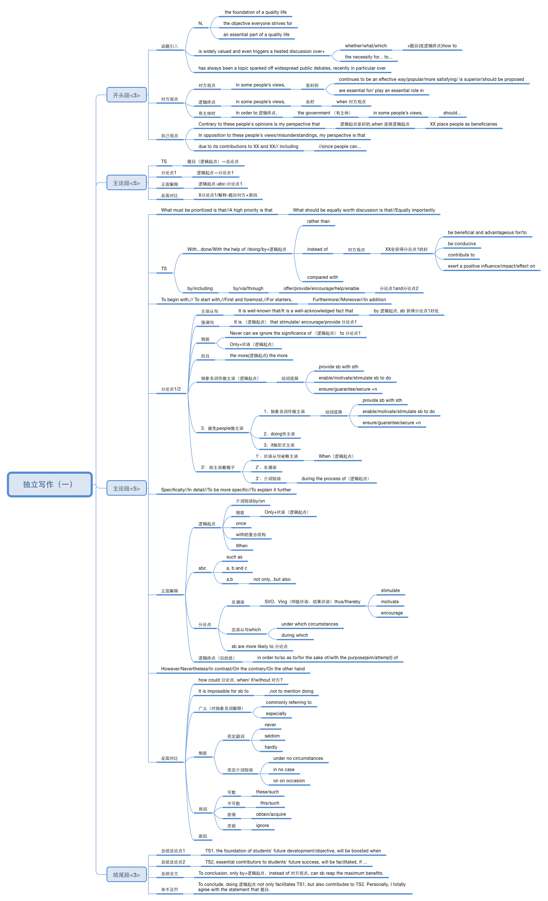
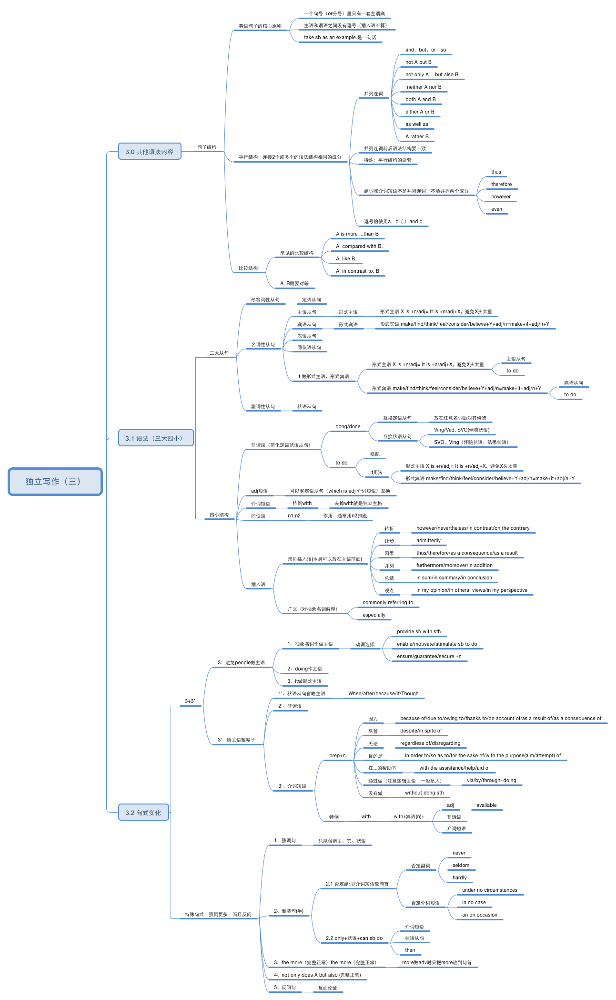
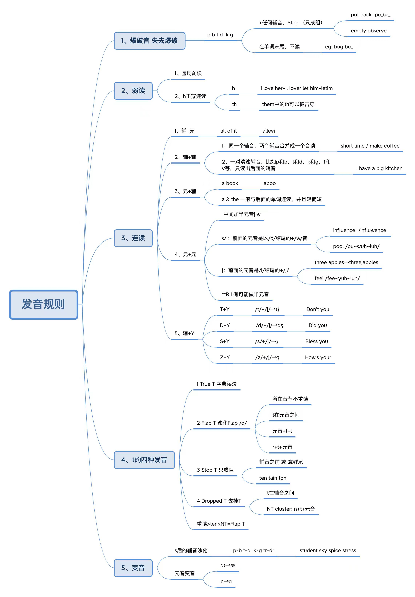

# Advices
## Writing
  1. 整体结构总分总，开篇观点亮得直接明了一些，你结尾那段写的就挺好，放第一段还蛮合适，结尾再呼应一下就好，要有凤头豹尾的感觉；
  2. 每一段观点+论证，观点要鲜明，论证要有逻辑。要是选择举例，例子要具体有力
  3. 语法错误这个问题注意注意，有些明显一点的要是被逮到了很不划算；句式还可以更丰富一点，虚拟语气、强调句式、倒装、独立主格结构这些，可以有意识地逼自己用一用
  4. 还有时态的问题，一般来说通篇一般现在时，除了特殊句式和你举例子可能用到过去时/过去完成时。像文章中突然蹦出来那个understood，阅卷人会觉得很出戏，是个扣分点
  5. 句式变化还有一个思路，就是用否定表肯定。比方说你最后收尾的时候，再强调一下国内的福利也需要被重视，under no circumstances will domestic welfare and human well-beings be neglected
## Writing advices from chatGPT
  - Focus on Grammar: Pay attention to verb tenses, articles, and sentence structure. Consider reviewing basic grammar rules or using language-checking tools during practice.
  - Be Precise: Ensure that the numbers and comparisons you present are accurate and clearly explained.
  - Improve Cohesion: Use more effective linking words to create a smooth flow between points.
  - Practice Paraphrasing: Work on paraphrasing information without changing its meaning, which is important for Task 1.
***

# Writing
## 整理
  

  

  
## 句式
  - **倒装句 (Inversion)** 倒装句用于强调或引起句子的变化。
    - Not only did the government implement new policies, but it also enforced them effectively.
    - Never before have we seen such a rapid development in technology.
  - **强调句 (Cleft Sentences)** 强调句用来突出句子的某一部分，常用 "It is... that..." 结构。
    - It is the lack of funding that hinders the development of public education.
    - It was after the financial crisis that the government started to focus on economic reforms.
  - **虚拟语气 (Subjunctive Mood)** 虚拟语气表达假设、建议或愿望，能展示较高的语言熟练度。
    - If the government had invested more in renewable energy, the environmental impact would have been less severe.
    - I suggest that the proposal be reconsidered.
  - **复杂从句 (Complex Sentences)** 使用定语从句、状语从句和名词性从句能使句子更复杂，展示你的语言能力。
    - The problem, which has been ignored for years, is now causing serious consequences.
    - Since technology continues to evolve at a rapid pace, individuals must adapt to these changes to remain competitive in the job market.
  - **分词结构 (Participial Phrases)** 使用分词结构可以使句子更简洁，并减少重复。
    - Facing a shortage of resources, the company decided to cut down on production.
    - Having completed the task, the team moved on to the next project.
  - **状语前置 (Fronting Adverbials)** 将状语提前放在句子开头，能让句子结构更灵活，并加强某一特定部分的强调。
    - In today’s fast-paced world, technology plays an indispensable role in almost every aspect of life.
    - Only by working together can we overcome the challenges of climate change.
  - **倒装条件句 (Inverted Conditional Sentences)** 在正式写作中，使用倒装的条件句可以提升句子复杂度。
    - Were the government to invest more in education, the literacy rate would increase.
    - Had it not been for the quick response of emergency services, the damage could have been far worse.
  - **比较结构 (Comparative Sentences)** 使用比较句式可以展示逻辑推理的能力。
    - The benefits of implementing renewable energy far outweigh the initial costs.
    - No other factor is as significant as education when it comes to economic development.
  - **让步状语从句 (Concessive Clauses)** 让步从句用于表达尽管某个条件存在，但结果不受其影响。
    - Although the government has made efforts to improve public transportation, traffic congestion remains a problem.
    - Even though technology has advanced significantly, some traditional practices are still valued.
  - **同位语结构 (Appositive Phrases)** 同位语能更好地解释名词，增加细节。
    - The project, a collaborative effort between several universities, has yielded promising results.
    - Pollution, one of the most pressing issues today, affects both urban and rural areas.
## A 导致 B 句式示例
  - 逻辑链 "A 导致 B" 可以通过多种特殊句式来表达，让句子显得更加复杂和有层次感。以下是几种你可以套用的高级句式，适合用于托福或学术写作
  - **倒装句 (Inversion)** 用倒装句强调因果关系，结构为 "Only when..." 或 "Not until..." 等
    - Only when the government prioritizes education will the economy begin to improve.
    - Not until stricter regulations are implemented will the pollution problem start to decrease.
  - **强调句 (Cleft Sentence)** 使用强调句突出原因或结果，结构为 "It is... that..."
    - It is because of the rapid industrialization that urban air quality has significantly worsened.
    - It was the lack of funding that led to the failure of the project.
  - **虚拟语气 (Subjunctive Mood)** 当表示假设或结果时，虚拟语气可以增加复杂性
    - If the company had invested in renewable energy earlier, it would not have faced such a severe financial crisis.
    - Were the government to allocate more resources to healthcare, the overall well-being of the population would improve.
  - **因果状语从句 (Causal Clauses)** 可以用 “since,” “as,” 或 “due to” 等引导因果关系
    - Since climate change affects global weather patterns, natural disasters have become more frequent.
    - As the demand for housing increases, real estate prices continue to rise.
  - **分词结构 (Participial Phrases)** 使用分词短语强调原因或结果，避免句子的重复
    - Faced with increasing unemployment, the government decided to implement new job-creation programs.
    - Having implemented the new policy, the company saw a dramatic increase in productivity.
  - **独立主格结构 (Absolute Construction)** 这个结构常用于补充背景信息，可以与主句形成因果关系
    - The resources being limited, the government was forced to prioritize essential services.
    - The economy in recession, businesses were left with no choice but to lay off workers.
  - **通过否定表达因果关系 (Negative for Emphasis)** 使用否定结构强调结果或原因，增强逻辑的严密性
    - Had it not been for the government's intervention, the crisis would have worsened.
    - Under no circumstances will economic growth occur without substantial investment in infrastructure.
  - **动名词结构 (Gerund Phrases)** 用动名词结构来简洁地表达因果关系
    - Investing in renewable energy will lead to a reduction in greenhouse gas emissions.
    - Improving public transportation contributes to reducing traffic congestion.
***

# Task 2
## Test 1
  IELTS WRITING TASK 2:
  You should spend about 40 minutes on this task.

  Write about the following topic:

  Some people argue that all experimentation on animals is bad and should be outlawed. However, others believe that important scientific discoveries can be made from animal experiments.

  Can experimentation on animals be justified? Are there any alternatives?

  Give reasons for your answer and include any relevant examples from your own knowledge and experience.

  Write at least 250 words.

  Here's my essay. Give a score and some advice:
  For scientific experimentation, there's no doubt that experimental animals play a crucial role. However, there are also voices stand for animal rights, that those were not justified. Personally, I think that some scientific discoveries using animals cannot be avoided, but still, we can limit the harmful methods.

  There are areas where the live creature's reactions under experimental conditions are essential, like space travel, medical, or situations in which scientists are unsure about the danger. In those cases, unless we have any other alternatives, the sacrifices are not avoidable. On the other hand, it's not true all animal experiments should be harmful, some tests in biology like animal behavior learning, would just place them in a normal and peaceful situation.

  Sometimes animals are just there as alternatives for real human beings. Only if animal experiments pass, further experimentation on human beings can take place. On those occasions, the only thing we can do is limit the harmful experiments.

  Nowadays, as technology develops, there could be a way that animal experiments could be limited, especially with the development of robotics, monitoring, artificial intelligence, etc. In areas like space or deep ocean exploration, instead of animals, robots with modern monitoring can be used to record as much information as possible. For other fields like medical tests, the most developed artificial intelligence can be used to predict some results, thus reducing the harmful experiments on animals.

  In conclusion, animal experiments are helpful for human beings and sometimes unavoidable, but we can keep the harmful ones under control.
## Test 2
  IELTS writing task 2:
  It is impossible to help all people around the world in need, so governments should focus on helping people in their own country, To what extent do you agree or disagree.

  Here's my essay. Give a score and some advice:
  It is unrealistic to lend a hand to all people who need help. at the government level, it is often debated whether they should only give attention to internal or international demands. In my opinion, for developed countries, it is essential to help other countries, but it should be after domestic issues handled.

  In modern human society, countries or regions are not equally developed. Those governments with more prosperous economies should take more responsibilities, as we are all sharing the same society, despite different culture and religions, helping each other is the key to creating a better world. Recent years, as China built a deep relationship with Africa, it shows a win-win future for countries collaboration. Another example is that if some enormous disaster happens, in which a large amount of people would need help, countries usually would receive global favor.

  On the other hand, happiness in one's own homeland is also important, it will lead to a stable government. Like personal situation, it’s better focus on our own issues before helping others. Additionally, under circumstances like large religion gap and different governing situation between countries , international assistances may suffer obstructions. Government from other countries may not understand what exactly the civil requirements. For instance, in helping African people, local tradition should be respected.

  In conclusion, it is crucial governments from more developed regions should help others, on behalf of human beings, to achieve a better future. However, this kind of favor should under the condition that their most urgent domestic needs are fulfilled.

  - **Try again**
  Here's my essay. Give a score and some advice:
  It is unrealistic to lend a hand to all people who need help. At the government level, it is often debated whether they should only give attention to internal or international demands. In my opinion, for developed countries, it is essential to help other countries, but it should be after domestic issues handled.

  In modern human society, countries or regions are not equally developed. Those governments with more prosperous economies should take more responsibilities, as we are all sharing the same society, despite different culture and religions, helping each other is the key to creating a better world. Recent years, as China built a deep relationship with Africa, it shows a win-win future for countries collaboration. Another example is that if some enormous disaster happens, in which a large amount of people would need help, countries usually would receive global favor.

  On the other hand, happiness in one's own homeland is also important, it will lead to a stable government. Like personal situation, it’s better focus on our own issues before helping others. Additionally, under circumstances like large religion gap and different governing situation between countries , international assistances may suffer obstructions. Government from other countries may not understand what exactly the civil requirements. For instance, in helping African people, local tradition should be respected.

  In conclusion, it is crucial governments from more developed regions should help others, on behalf of human beings, to achieve a better future. However, this kind of favor should under the condition that their most urgent domestic needs are fulfilled.
***

# Task 1
## Test 1
  IELTS writing task 1:
  The sheet below shows the percentage of students at one adult education center taking various courses offered in 1985 and this year. Summarise the information by selecting and reporting the main features, and make comparisons where relevant.
  | Year      | Fitness and dance | Art | Modern language(French/Spanish) | Local history | Music appreciation | IT  | Cookery |
  | --------- | ----------------- | --- | ------------------------------- | ------------- | ------------------ | --- | ------- |
  | 1985      | 22%               | 17% | 24%                             | 15%           | 8%                 | 0%  | 14%     |
  | This Year | 22%               | 15% | 17%                             | 0%            | 0%                 | 27% | 19%     |

  Here's my essay. Give a score and some advice:
## First attempt
  The sheet illustrates the courses students took in one adult education, and compares the percentage of students taking various courses in 1985 and current year.

  In 1985, learning a modern language including French and Spanish was most popular, at 24%. Meanwhile, fitness and dance course was also at an almost same level of popularity, both reached above 20%. Following that, art, local history, cookery were less taken, all reaching around 15%. Then the third level preferred course was music appreciation, which was taken by only 8% students.

  In contrast, the most significant change in this year is that, IT course reached its peak at 27%, which did not even exist in 1985. At the same time, courses like fitness and dance, cookery, art just kept a same level as previously. However, modern language was the most popular course in 1985 at 24%, it dropped to 17% this year, losing its top position to IT. More significantly, other courses like local history and music appreciation suffered a complete elimination.

  Overall, the most dramatic change in courses popularity is the rise of IT. Practical skills like cookery also keeps a noticeable increasing, whereas traditional classes including local history and music appreciation suffered a dramatic drop. Other courses like art and modern language just fluctuated a bit.
## Second attempt
  IELTS writing task 1:
  The sheet below shows the percentage of students at one adult education center taking various courses offered in 1985 and this year. Summarise the information by selecting and reporting the main features, and make comparisons where relevant.
  | Year      | Fitness and dance | Art | Modern language(French/Spanish) | Local history | Music appreciation | IT  | Cookery |
  | --------- | ----------------- | --- | ------------------------------- | ------------- | ------------------ | --- | ------- |
  | 1985      | 22%               | 17% | 24%                             | 15%           | 8%                 | 0%  | 14%     |
  | This Year | 22%               | 15% | 17%                             | 0%            | 0%                 | 27% | 19%     |

  Here's my essay. Give a score and some advice:
  The table illustrates the percentage of students enrolled in various courses at an adult education center in 1985 and this year.

  In 1985, learning a Modern language including French and Spanish was most popular, at 24%. Meanwhile, Fitness and dance followed closely with 22%. After that, Art, Local history and Cookery had less enrollments ranging from 14% to 17%, while Music appreciation was the least popular, with only 8% of students enrolled.

  In contrast, IT course emerged as the most popular this year, with 27% enrollment. At the same time, Cookery saw a modest increase to 19%, while Fitness and dance remained stable. However, despite being the most popular in 1985, Modern language courses dropped to 17%, and Art also saw a slight decrease (2%) in enrollment percentage.

  Overall, the most notable change is the introduction and rise of IT courses. Practical skills like Cookery also experienced a noticeable growth, whereas Modern languages saw a decline. Traditional classes including Local history and Music appreciation were completely discontinued.
## ChatGPT
  The table compares the percentage of students enrolled in various courses at an adult education center in 1985 and this year.

  In 1985, modern languages (French and Spanish) were the most popular courses, attracting 24% of students. Fitness and dance followed closely with 22%. Art, local history, and cookery courses had enrollments ranging from 14% to 17%, while music appreciation was the least popular, with only 8% of students. IT courses were not available during this period.

  In contrast, this year has seen IT courses emerge as the most popular, with 27% of students enrolled, despite not being offered previously. Fitness and dance maintained its popularity at 22%, while cookery experienced a modest increase to 19%. However, modern language enrollments dropped to 17%, losing its former top position. Art also saw a slight decline in student numbers, and both local history and music appreciation courses were discontinued.

  Overall, the most notable change is the introduction and rise of IT courses, while traditional subjects like local history and music appreciation have disappeared. Practical courses such as cookery have grown in popularity, while modern languages and art experienced minor shifts.
***

# Speaking test 3 topics
## 发音整理
  
## Vocabulary
  - **Art**
    - **Expression**: The act of conveying thoughts or feelings.
    - **Cultural exchange**: Sharing of ideas and customs between different cultures.
    - **Perspective**: A particular attitude or way of considering something.
    - **Empathy**: The ability to understand and share the feelings of others.
    - **Tradition**: Customs or beliefs passed down through generations.
  - **Education**
    - **Curriculum**: The subjects comprising a course of study.
    - **Pedagogy**: The method and practice of teaching.
    - **Lifelong learning**: Continuous, self-motivated pursuit of knowledge.
    - **Assessment**: The evaluation of student performance.
    - **Equity**: Fairness in access to education.
  - **Internet**
    - **Connectivity**: The state of being connected, especially to the internet.
    - **Digital literacy**: The ability to effectively use digital tools and platforms.
    - **Misinformation**: False or misleading information.
    - **Online platforms**: Websites or applications that facilitate interactions or transactions.
    - **Cybersecurity**: The practice of protecting systems from digital attacks.
  - **Health**
    - **Well-being**: The state of being comfortable, healthy, or happy.
    - **Preventive care**: Measures taken to prevent diseases rather than treating them.
    - **Chronic diseases**: Long-lasting health conditions.
    - **Mental health**: A person’s emotional, psychological, and social well-being.
    - **Healthcare access**: The ease with which individuals can obtain necessary medical services.
  - **Technology**
    - **Innovation**: The introduction of new ideas or methods.
    - **Automation**: The use of technology to perform tasks without human intervention.
    - **Artificial intelligence**: The simulation of human intelligence by machines.
    - **Digital divide**: The gap between those who have easy access to the internet and technology and those who do not.
    - **User-friendly**: Easy for most people to use or understand.
  - **Sports**
    - **Teamwork**: Collaborative efforts of a group to achieve a common goal.
    - **Athleticism**: Physical strength, fitness, and agility.
    - **Competition**: A contest between individuals or teams.
    - **Endurance**: The ability to withstand hardship or exertion.
    - **Recreation**: Activities done for enjoyment when one is not working.
  - **Globalization**
    - **Interconnectedness**: The state of being connected with each other.
    - **Cultural homogenization**: The process by which local cultures are transformed or absorbed by a dominant culture.
    - **Trade agreements**: Contracts between countries for the exchange of goods and services.
    - **Economic disparity**: The difference in economic status between individuals or groups.
    - **Sustainability**: The ability to maintain or preserve resources for future generations.
  - **Media and News**
    - **Journalism**: The activity of gathering, assessing, and presenting news.
    - **Credibility**: The quality of being trusted and believed in.
    - **Bias**: A tendency to favor one side over another.
    - **Press freedom**: The right of journalists to report news without censorship.
    - **Public opinion**: The collective attitudes and beliefs of individuals on certain issues.
  - **Future**
    - **Prognosis**: A forecast of the likely outcome of a situation.
    - **Trends**: General directions in which something is developing or changing.
    - **Sustainability**: Meeting current needs without compromising future generations.
    - **Innovation**: The introduction of new ideas or products.
    - **Vision**: A mental image of a future state or goal.
## art
  - **Introduction**: When discussing the significance of art, I believe it plays a crucial role in expressing human experience and fostering cultural understanding.
  - **Reason 1**: Firstly, art serves as a powerful medium for expression and communication. It allows individuals to convey emotions, thoughts, and ideas that may be difficult to articulate through words. For example, paintings, music, and literature can evoke deep feelings and provoke thought, enabling artists to share their unique perspectives with the world.
  - **Reason 2**: Moreover, art fosters cultural exchange and appreciation. Through various art forms, people can explore different cultures, traditions, and histories. For instance, attending a cultural festival or visiting an art exhibition can provide insights into the values and beliefs of other communities, promoting empathy and understanding.
  - **Counterpoint**: However, it’s important to acknowledge that access to art can be limited by socioeconomic factors. Many people may not have the opportunity to engage with art due to financial constraints or lack of resources in their communities, which can hinder cultural enrichment.
  - **Conclusion**: In conclusion, while art is essential for personal expression and cultural appreciation, it is vital to ensure that access to artistic experiences is equitable. By promoting inclusivity in the arts, we can enrich society as a whole and celebrate the diverse human experience.
## internet
  - **Introduction**: When considering the impact of the internet, I believe it has fundamentally transformed how we communicate, access information, and conduct business.
  - **Reason 1**: Firstly, the internet has revolutionized communication, making it faster and more accessible. People can connect instantly through emails, social media, and video calls, regardless of geographical barriers. For example, platforms like Zoom and WhatsApp have made it easy to maintain personal and professional relationships across the globe.
  - **Reason 2**: Moreover, the internet serves as an invaluable resource for information and education. It provides access to vast amounts of knowledge on any topic imaginable. For instance, online courses and educational platforms like Khan Academy and Coursera have made learning accessible to people who may not have traditional educational opportunities.
  - **Counterpoint**: However, it’s important to recognize the challenges associated with the internet, such as the spread of misinformation and privacy concerns. With the vast amount of information available, distinguishing between credible sources and false information can be difficult, leading to confusion and distrust.
  - **Conclusion**: In conclusion, while the internet has transformed communication and education, we must address the challenges it poses to ensure a safe and informed online environment. By promoting digital literacy and privacy awareness, we can harness the internet’s potential while minimizing its risks.
## health
  - **Introduction**: When discussing the significance of health, I believe it is fundamental to overall well-being and quality of life.
  - **Reason 1**: Firstly, good health is essential for physical and mental functioning. It enables individuals to engage fully in daily activities, work, and social interactions. For example, maintaining a balanced diet and regular exercise can prevent chronic diseases and enhance mental clarity.
  - **Reason 2**: Moreover, health directly impacts economic productivity. A healthy workforce is more efficient and effective, leading to higher output and reduced healthcare costs for businesses and governments. For instance, when employees are in good health, they take fewer sick days, which benefits both their employers and the economy.
  - **Counterpoint**: However, it’s important to acknowledge that health disparities exist, often influenced by socioeconomic factors. Access to healthcare and resources can vary widely, leading to unequal health outcomes across different populations.
  - **Conclusion**: In conclusion, while health is crucial for individual well-being and economic productivity, addressing health disparities is essential for creating a fairer society. By improving access to healthcare and promoting healthy lifestyles, we can enhance the quality of life for everyone.
## technology
  - **Introduction**: When considering the impact of technology, I believe it has revolutionized nearly every aspect of our lives, offering both significant benefits and notable challenges.
  - **Reason 1**: Firstly, technology has greatly enhanced communication and access to information. The internet allows us to connect with people across the globe instantly and access a wealth of knowledge at our fingertips. For example, social media platforms enable real-time interaction and information sharing, which can foster global connections.
  - **Reason 2**: Moreover, technology has improved efficiency and productivity in various fields. Automation and advanced software tools streamline processes in industries such as manufacturing, healthcare, and finance, leading to faster results and reduced costs. For instance, telemedicine allows patients to consult with healthcare professionals remotely, improving access to care.
  - **Counterpoint**: However, it’s important to recognize that the rapid advancement of technology also presents challenges, such as privacy concerns and the digital divide. As technology evolves, issues related to data security and unequal access to digital resources can exacerbate existing inequalities.
  - **Conclusion**: In conclusion, while technology has transformed communication and productivity for the better, we must address the associated challenges to ensure it benefits all members of society. By promoting digital literacy and safeguarding privacy, we can harness the full potential of technology while mitigating its risks.
## sports
  - **Introduction**: When discussing the importance of sports, I believe they play a vital role in promoting physical health and social cohesion.
  - **Reason 1**: Firstly, participating in sports is essential for maintaining physical fitness. Regular physical activity helps combat health issues such as obesity, heart disease, and diabetes. For example, engaging in sports like soccer or basketball not only improves cardiovascular health but also enhances overall well-being.
  - **Reason 2**: Moreover, sports foster teamwork and social interaction. They provide an opportunity for individuals to come together, build relationships, and develop important life skills such as cooperation and communication. For instance, being part of a team teaches players how to work towards a common goal and support one another.
  - **Counterpoint**: However, it’s important to recognize that the competitive nature of sports can sometimes lead to negative behaviors, such as aggression or an unhealthy obsession with winning. Ensuring that sports are approached with a focus on enjoyment and personal growth is crucial.
  - **Conclusion**: In conclusion, while sports are essential for promoting physical health and social interaction, it is vital to maintain a balanced perspective that prioritizes enjoyment and teamwork over competition. By doing so, we can ensure that sports positively impact individuals and communities.
## Education
  - **Introduction** When considering the importance of various societal aspects, I believe education is paramount.
  - **Reason 1** Firstly, education is the foundation for personal and professional development. It equips individuals with the skills and knowledge necessary to succeed in their careers. For instance, a well-educated workforce contributes significantly to a country's economy.
  - **Reason 2** Moreover, education promotes critical thinking and informed decision-making. In today’s world, individuals must navigate a vast amount of information, and being educated helps them discern credible sources from unreliable ones.
  - **Counterpoint (if applicable)** While technology is also vital in advancing society, it relies heavily on an educated population to innovate and implement solutions effectively.
  - **Conclusion** In conclusion, while many factors contribute to societal progress, I believe education is the most important as it lays the groundwork for individuals to thrive in a rapidly changing world.
## globalisation
  - **Introduction** When discussing the impact of globalization, I believe it is a double-edged sword that brings both opportunities and challenges.
  - **Reason 1** Firstly, globalization promotes economic growth by enabling countries to access new markets and resources. For instance, developing nations can attract foreign investment, which can lead to job creation and improved infrastructure.
  - **Reason 2** Moreover, globalization fosters cultural exchange and understanding. Through travel, technology, and communication, people can experience diverse cultures, which can promote tolerance and cooperation among nations.
  - **Counterpoint (if applicable)** However, globalization can also lead to negative consequences, such as cultural homogenization and increased inequality. Many local cultures may struggle to survive against the dominant global influences, and economic disparities can widen between countries.
  - **Conclusion** In conclusion, while globalization presents significant opportunities for economic growth and cultural exchange, it is essential to address the challenges it brings. By implementing policies that promote equity and cultural preservation, we can harness the benefits of globalization while mitigating its drawbacks.
  - This structure highlights the complexities of globalization, balancing its advantages and challenges!
## future
  - **Introduction** When contemplating the future, I believe that innovation and sustainability will be the key drivers of progress.
  - **Reason 1** Firstly, innovation is essential for solving the complex challenges we face today, such as climate change and resource depletion. For example, advancements in renewable energy technologies can help reduce our reliance on fossil fuels and create a more sustainable energy system.
  - **Reason 2** Moreover, sustainability is crucial for ensuring that future generations can thrive. By adopting sustainable practices in agriculture, manufacturing, and urban development, we can protect our environment while still meeting the needs of a growing population.
  - **Counterpoint (if applicable)** However, it’s important to recognize that technological advancements also come with ethical dilemmas, such as privacy concerns and job displacement. Balancing innovation with ethical considerations will be vital as we move forward.
  - **Conclusion** In conclusion, while innovation and sustainability are pivotal for a promising future, we must also address the ethical challenges that arise. By fostering a responsible approach to progress, we can create a future that benefits both people and the planet.
  - This format effectively communicates the significance of the future while considering potential challenges!
## media and news
  - **Introduction** When discussing the significance of media and news, I believe they are essential for informing the public and shaping societal discourse.
  - **Reason 1** Firstly, media serves as a crucial source of information, enabling people to stay updated on current events and issues that affect their lives. For example, news outlets provide coverage on political decisions, health advisories, and natural disasters, helping individuals make informed choices.
  - **Reason 2** Moreover, media plays a vital role in fostering public debate and accountability. Investigative journalism can expose corruption and injustices, prompting necessary changes in society. This watchdog function is essential for a healthy democracy, as it keeps authorities in check.
  - **Counterpoint (if applicable** However, it’s important to recognize the challenges posed by misinformation and biased reporting. In the digital age, the rapid spread of false information can lead to confusion and division among the public, making media literacy crucial.
  - **Conclusion** In conclusion, while media and news are fundamental for informing the public and promoting accountability, it is essential to address the challenges of misinformation. By enhancing media literacy, we can empower individuals to navigate the complex information landscape effectively.
  - This format clearly communicates the importance of media and news while addressing potential drawbacks!
## Environment
  - **Introduction** When discussing the significance of various issues, I believe that environmental protection is crucial.
  - **Reason 1** Firstly, a healthy environment is essential for our survival. Clean air, water, and biodiversity directly impact our health and well-being.
  - **Reason 2** Moreover, environmental sustainability is vital for future generations. If we do not take action now, we risk depleting resources that future populations will depend on.
  - **Counterpoint** Although economic growth is also important, it should not come at the expense of the environment. A sustainable approach can actually foster economic opportunities in green industries.
  - **Conclusion** In summary, while various factors influence our quality of life, prioritizing environmental protection is essential for ensuring a livable planet for generations to come.
## Torism
  - **Introduction** When discussing the significance of various sectors, I believe that tourism is incredibly important for both economies and cultural exchange.
  - **Reason 1** Firstly, tourism plays a vital role in boosting local economies. It creates jobs in various sectors, such as hospitality, transportation, and entertainment. For instance, a popular tourist destination can generate substantial revenue that helps support local businesses and infrastructure.
  - **Reason 2** Moreover, tourism fosters cultural exchange and understanding. When people travel, they experience different cultures, traditions, and lifestyles, which can lead to greater tolerance and appreciation for diversity. This cultural interaction enriches both visitors and host communities.
  - **Counterpoint** While tourism can have positive impacts, it can also lead to challenges such as over-tourism, which can strain local resources and negatively affect the environment. Therefore, sustainable tourism practices are essential to balance economic benefits with environmental and cultural preservation.
  - **Conclusion** In conclusion, although tourism presents certain challenges, its economic benefits and potential for cultural exchange make it a crucial sector in today’s globalized world. Promoting sustainable tourism can ensure that we enjoy these advantages while protecting our planet and cultures for future generations.
## money and economy
  - **Introduction** When discussing significant societal factors, I believe that money and the economy are foundational to individual and collective well-being.
  - **Reason 1** Firstly, a stable economy is essential for job creation and financial security. When the economy is strong, businesses thrive, leading to more employment opportunities. For example, during periods of economic growth, unemployment rates typically decrease, allowing more people to achieve financial independence.
  - **Reason 2** Moreover, money facilitates trade and investment, which are critical for innovation and development. Access to capital allows entrepreneurs to start new ventures, contributing to technological advancements and improved living standards.
  - **Counterpoint** However, it’s important to recognize that an excessive focus on money can lead to inequality and social issues. While economic growth is vital, it should be accompanied by measures that ensure equitable distribution of wealth to prevent widening gaps between different social groups.
  - **Conclusion** In conclusion, while the economy and money are crucial for prosperity and innovation, it’s equally important to address the social implications of economic policies. A balanced approach can foster both economic growth and social equity, benefiting society as a whole.
## crime and law
  - **Introduction** When considering important societal elements, I believe that crime and law play a crucial role in maintaining social order and protecting citizens.
  - **Reason 1** Firstly, laws are essential for establishing clear guidelines for acceptable behavior. They help prevent crime by outlining the consequences of unlawful actions. For instance, laws against theft and violence deter individuals from committing these acts due to the fear of punishment.
  - **Reason 2** Moreover, a well-functioning legal system is vital for ensuring justice and fairness. It provides a mechanism for resolving disputes and protecting the rights of individuals. When people trust that the law will protect them, they are more likely to feel secure in their communities.
  - **Counterpoint** However, it’s important to acknowledge that laws must evolve to address changing societal norms and issues. In some cases, outdated laws can perpetuate inequality or injustice. For example, certain laws may disproportionately affect marginalized communities, highlighting the need for reform.
  - **Conclusion** In conclusion, while crime and law are fundamental to maintaining social order, it is essential to continually assess and improve the legal system to ensure it serves justice fairly. Balancing effective law enforcement with social equity can create a safer and more just society.
  - This structure effectively communicates the importance of crime and law while addressing potential challenges!
***

# Speaking
## Tips
  - 我当时准备口语的时候，最粗的划分就是，描述一个现象或者介绍一个地方（有题目是让描述你见过的最美丽的一片天空，这个要是不提前准备的话感觉很难的），描述一个人或者讲述一个故事（难忘的人或者事，这个主题准备一个，很多其他的题目都可以串过来），表达一个观点（这个可以跟写作一块准备，需要心里有提纲，叙述的时候讲逻辑）
  - **speak test 1** 我是分成了喜好类、选择类、频率类、经历类、观点类、方法类，这样的话题库不用一个一个问题，直接类别对应模板，只过这几大类就可以！差不多回答思路都是直接回答+解释原因+例子+感受，这样很节省时间
  - **speak test 2** 的话我是跟着周思奇结合自己的经历整理了6个大故事串整个题库，再每个大故事中定框架，比如我用周杰伦串了16个话题，接下来就可以定关于任务讲述的框架，按照任务本身描述eg基本信息+外貌+性格，我和任务的关系，相识过程+吸引我的点，感受eg他对我的影响，我认为他是一个怎样的人，用这样的逻辑思路准备就清晰很多！我们只需保证大框架不变，里面填充的内容可以根据具体内容随机灵活而变
  - **speak test 3** 我是分成了列举类、原因类、态度类、比较对比较类、优缺点类这集中类型，不管题目本身问的什么，基本都不会跳出这几种类型，实在想不起来说的，可以先用how can i describe it? / what is the word /well, let me think about it / well, it is a tough question. 先用口水话糊弄一下，也为自己正确思考时间。每天背周老师汇总的观点句和连接词，然后和老师对练加强输出，8天时间安排满满当当
  - **For Speaking Test 1**, maintaining the answer + reason + example + feeling pattern across the categories (preferences, choices, frequency, etc.) is a great way to ensure a consistent and well-rounded response.
  - **For Speaking Test 2**, the "story-based" preparation with flexible content based on the situation is clever, especially using someone like Jay Chou to link multiple topics.
  - **For Speaking Test 3**, focusing on response categories like listing, reasoning, and comparisons helps keep the answers focused. The filler phrases also buy time to organize your thoughts without breaking fluency.
  Sure! Here are some materials and example responses for IELTS Speaking Test 1, categorized by your framework:
## 6 catagories for testing 1
  - **Preferences Question: What type of music do you like?** I prefer pop music because it’s upbeat and catchy. I find it energizing, especially when I’m working out or in a good mood. For example, Jay Chou’s songs always lift my spirits, and I love singing along to them.
  - **Choices Question: Do you prefer reading books or watching movies?** I prefer watching movies because they provide a visual and emotional experience that books sometimes can’t. For instance, seeing a book adapted into a film can bring the story to life in a new way, and I enjoy the excitement of cinematic storytelling.
  - **Frequency Question: How often do you exercise?** I try to exercise about four times a week. Regular workouts help me stay fit and relieve stress. For example, I usually go to the gym on Mondays, Wednesdays, Fridays, and sometimes on weekends, which keeps my energy levels up.
  - **Experiences Question: Can you tell me about a memorable holiday?** One of my most memorable holidays was a trip to the beach last summer. I spent time swimming and building sandcastles with my friends. The experience was not only fun but also helped me relax and recharge after a busy year. I felt grateful for the time we had together.
  - **Opinions Question: What do you think about social media?** I believe social media has both positive and negative effects. On one hand, it helps people connect with friends and share ideas. On the other hand, it can lead to misinformation and addiction. Personally, I use social media to stay in touch with family, but I try to limit my screen time to stay focused.
  - **Methods Question: How do you usually study for exams?** I usually study by creating a structured plan. I break down the material into manageable sections and use flashcards for key concepts. For example, when preparing for a big exam, I set aside specific hours each day to review and practice, which helps me retain information better.
  - **Tips for Practicing**
    - **Record yourself** answering these questions to improve your fluency.
    - **Use the same structure** (direct answer + reason + example + feeling) for each question to build consistency.
    - **Practice with a partner** or a teacher to simulate the speaking test environment.
## 3 catagories for testing 2
  - **Topic 1: A Memorable Trip**
    - **Task Description**: Describe a memorable trip you took.
      - **Basic Info**: Last summer, I traveled to Bali with my friends.
      - **Appearance**: The beaches were stunning, with golden sands and crystal-clear waters.
      - **Personality**: Bali’s vibrant culture and friendly locals made the experience even more enjoyable.
    - **Relationship**: I went with three close friends, which made the trip more fun.
    - **How We Met**: We’ve known each other since high school and decided to travel together to celebrate our graduation.
    - **Impressions**: I was amazed by the beautiful temples and traditional dance performances.
    - **Feelings**: The trip was unforgettable, and I felt grateful for the experiences we shared.
  - **Topic 2: A Person Who Influenced You**
    - **Task Description**: Talk about someone who has had a significant impact on your life.
      - **Basic Info**: My high school teacher, Mr. Lee, inspired me to pursue my passion for science.
      - **Appearance**: He was tall, always wore glasses, and had a warm smile.
      - **Personality**: He was patient and passionate about teaching, which made learning enjoyable.
    - **Relationship**: I had him for two years, and he was more than just a teacher; he was a mentor.
    - **How We Met**: I met him in my first year of high school, and his classes were always engaging.
    - **Impressions**: I admired how he encouraged students to ask questions and think critically.
    - **Feelings**: His support boosted my confidence, and I still carry his lessons with me today.
  - **Topic 3: A Hobby You Enjoy**
    - **Task Description**: Describe a hobby that you enjoy.
      - **Basic Info**: I love painting, especially landscapes.
      - **Appearance**: My paintings often feature vibrant colors and detailed scenery.
      - **Personality**: Painting helps me express my creativity and relax after a long day.
    - **Relationship**: I often paint with my sister, which makes it a fun activity we share.
    - **How We Met**: We both discovered our love for art in childhood, inspired by our parents.
    - **Impressions**: I love how painting allows me to capture moments and emotions on canvas.
    - **Feelings**: It brings me joy and a sense of accomplishment when I complete a piece.

  - **Tips for Preparing**
    - **Practice storytelling** with your chosen topics, using the framework to guide your answers.
    - **Focus on details** to make your stories engaging and vivid.
    - **Use varied vocabulary** and expressions to enhance your responses.
    - **Time yourself** to ensure you can deliver your answer within the 1-2 minute timeframe.
## 5 catagories for testing 3
  - **Listing Question: What are some benefits of learning a new language?** Learning a new language offers several benefits, including improved cognitive abilities, better job prospects, and enhanced cultural understanding. For instance, studies show that bilingual individuals often perform better in problem-solving tasks.
  - **Reasoning Question: Why do you think sports are important for children?** Sports are important for children because they promote physical health and teach valuable life skills. Engaging in sports helps kids develop teamwork and discipline, which are crucial for personal growth. For example, playing on a team encourages cooperation and builds friendships.
  - **Attitude Question: What is your attitude toward online learning?** I have a positive attitude toward online learning because it offers flexibility and accessibility. Students can learn at their own pace and from anywhere, which is particularly beneficial for those with busy schedules. However, I also believe it requires self-discipline to stay motivated.
  - **Comparison Question: How does living in a city compare to living in the countryside?** Living in a city and living in the countryside each have their advantages. Cities offer more job opportunities and entertainment options, while the countryside provides a peaceful environment and a closer connection to nature. Personally, I enjoy visiting the countryside for relaxation, but I appreciate the vibrancy of city life.
  - **Pros and Cons Question: What are the pros and cons of globalization?** Globalization has both pros and cons. On the positive side, it facilitates trade and cultural exchange, which can boost economies and foster understanding. On the downside, it can lead to cultural homogenization and economic inequality. Balancing these aspects is crucial for sustainable development.
  - **Tips for Practicing**
    - **Use the categorized types** to structure your responses for clarity.
    - **Practice with a timer** to simulate the pressure of the speaking test.
    - **Incorporate filler phrases** when needed to give yourself time to think, like “Let me think about that” or “That’s an interesting question.”
## test 1 for 3
  Here's my Speaking answer for IELTS test 2, give some advices and polish my answer:
  In my spare time, I would like to go to the gymfor some excersices or work out. It's a good way for break through my daily routine of job and learning, and rechaging of my body energy. In my planing, it's like 6 times per week, but you know, there would always being something occupying our spare time, so usually it's like 4 times per week. So far so good. In my personal experience, the most important thing the being in the gym, even not what we do there. The circumstance or the environment in the gym will help us feel the energy, and find our own way of exercising, you know, we human is easy to follow. Besides the gym, I also like running, swimming or hiking in the outdoor with my friends, but not good at other activities like football basketball or almost any including a ball.

  GPT polished:
  In my spare time, I enjoy going to the gym for workouts. It’s a great way to break the daily routine of work and study while recharging my energy. I aim to go about six times a week, but, realistically, I usually manage four due to other commitments. From my experience, being in the gym is crucial, even more than the specific exercises we do. The environment and atmosphere can energize us and help us discover our own workout styles since people tend to be influenced by others. Besides the gym, I also enjoy running, swimming, and hiking outdoors with friends, but I’m not very skilled at sports involving a ball, like football or basketball.

  Advices:
  - Add Details: Describe your gym routine: Mention specific exercises you enjoy, like weightlifting, cardio, or group classes.
  Talk about how you feel after workouts, such as increased energy or improved mood.
  - Share Experiences: Include a memorable experience from the gym, like a time you achieved a personal goal or made a new friend.
  Mention any challenges you've faced, like staying motivated or overcoming fatigue.
  - Connect to Goals: Discuss your fitness goals, such as building strength, improving endurance, or losing weight, and why they are important to you.
  - Contrast Activities: Elaborate on how gym workouts differ from outdoor activities, such as the sense of freedom you feel when running or hiking.
  - Social Aspect: Mention how exercising with friends makes it more enjoyable and motivates you to stay active.

  Longer one:
  In my spare time, I enjoy going to the gym for workouts. **Firstly**, it’s a great way to break the daily routine of work and study while recharging my energy. **From my experience**, being in the gym is crucial, **not only** for the specific exercises we do, **but also** for the environment and atmosphere, which can energize us and help us discover our own workout styles, **as** people tend to influence each other positively.

  **In terms of frequency**, I aim to go about six times a week; however, realistically, I usually manage four due to other commitments. **At the gym**, I focus on a mix of strength training and cardio, which helps me build muscle and improve my endurance. **Moreover**, after a good workout, I always feel more energized and ready to tackle the rest of my day. **One memorable experience** for me was when I finally managed to lift a weight I had been working towards for months; that sense of accomplishment was incredibly rewarding.

  **In addition to** the gym, I also enjoy running, swimming, and hiking outdoors with friends. I love the freedom and fresh air these activities provide. **On the other hand**, I’m not very skilled at sports involving a ball, like football or basketball, which can be quite challenging for me.
## Pattern
  Sure! Here’s an example using the pattern for the topic “Describe a book you enjoyed reading.”

  1. Introduction:
  “I’d like to talk about a book that I really enjoyed reading, which is ‘The Alchemist’ by Paulo Coelho.”

  2. Details/Examples:
  “This book tells the story of a young shepherd named Santiago who dreams of finding treasure in Egypt. What I loved most about it was the way it blends adventure with deep philosophical insights about following your dreams.”

  3. Personal Experience/Opinion:
  “When I first read it, I was captivated by the characters and their journeys. It resonated with me because I often find myself contemplating my own goals and the paths I take to achieve them. The message that pursuing one’s dreams is essential really inspired me.”

  4. Comparison/Contrast (if applicable):
  “While I enjoy many genres, such as mystery and science fiction, ‘The Alchemist’ stands out because it encourages self-discovery and personal growth, which I think is quite profound.”

  5. Conclusion:
  “Overall, ‘The Alchemist’ not only entertained me but also provided valuable life lessons, making it a book I often recommend to others.”

  This structured response gives a clear, organized answer while allowing for personal reflection and detail. You can practice using this pattern with different topics to build confidence!
## give me an example on pressure topic
  Absolutely! Here’s an example on the topic of “Pressure”:

  1. Introduction:
  “I’d like to discuss the topic of pressure, which is something we all experience in various aspects of life.”

  2. Details/Examples:
  “Pressure can come from different sources, such as school, work, or even personal relationships. For instance, during exam season, students often feel immense pressure to perform well, which can lead to stress and anxiety.”

  3. Personal Experience/Opinion:
  “In my own experience, I’ve felt significant pressure during my IELTS preparation. At times, it was overwhelming, especially when I struggled with certain sections. However, I learned to manage this pressure by creating a study schedule and setting realistic goals.”

  4. Comparison/Contrast (if applicable):
  “While some pressure can be motivating and push us to achieve our goals, excessive pressure can have negative effects on our mental health. For example, athletes often face intense pressure to win, which can lead to burnout if not handled properly.”

  5. Conclusion:
  “Overall, while pressure is a natural part of life, it’s essential to find ways to cope with it effectively to maintain our well-being and performance.”

  This structure helps convey your thoughts clearly while addressing the complexity of the topic. You can adapt this framework for your own experiences!
